Linux in Netherlands - Hardware Trends (Desktops)
-------------------------------------------------

A project to identify most popular hardware characteristics and track their change
over time based on data collected by Linux users at https://Linux-Hardware.org.

Anyone can contribute to this report by the [hw-probe](https://github.com/linuxhw/hw-probe) tool:

    sudo -E hw-probe -all -upload

Contents
--------

* [ System ](#system)
  - [ OS                       ](#os)
  - [ OS Family                ](#os-family)
  - [ Kernel                   ](#kernel)
  - [ Kernel Family            ](#kernel-family)
  - [ Kernel Major Ver.        ](#kernel-major-ver)
  - [ Arch                     ](#arch)
  - [ DE                       ](#de)
  - [ Display Server           ](#display-server)
  - [ Display Manager          ](#display-manager)
  - [ OS Lang                  ](#os-lang)
  - [ Boot Mode                ](#boot-mode)
  - [ Filesystem               ](#filesystem)
  - [ Part. scheme             ](#part-scheme)
  - [ Dual Boot with Linux/BSD ](#dual-boot-with-linuxbsd)
  - [ Dual Boot (Win)          ](#dual-boot-win)

* [ Board ](#board)
  - [ Vendor                   ](#vendor)
  - [ Model                    ](#model)
  - [ Model Family             ](#model-family)
  - [ MFG Year                 ](#mfg-year)
  - [ Form Factor              ](#form-factor)
  - [ Secure Boot              ](#secure-boot)
  - [ Coreboot                 ](#coreboot)
  - [ RAM Size                 ](#ram-size)
  - [ RAM Used                 ](#ram-used)
  - [ Total Drives             ](#total-drives)
  - [ Has CD-ROM               ](#has-cd-rom)
  - [ Has Ethernet             ](#has-ethernet)
  - [ Has WiFi                 ](#has-wifi)
  - [ Has Bluetooth            ](#has-bluetooth)

* [ Location ](#location)
  - [ Country                  ](#country)
  - [ City                     ](#city)

* [ Drives ](#drives)
  - [ Drive Vendor             ](#drive-vendor)
  - [ Drive Model              ](#drive-model)
  - [ HDD Vendor               ](#hdd-vendor)
  - [ SSD Vendor               ](#ssd-vendor)
  - [ Drive Kind               ](#drive-kind)
  - [ Drive Connector          ](#drive-connector)
  - [ Drive Size               ](#drive-size)
  - [ Space Total              ](#space-total)
  - [ Space Used               ](#space-used)
  - [ Malfunc. Drives          ](#malfunc-drives)
  - [ Malfunc. Drive Vendor    ](#malfunc-drive-vendor)
  - [ Malfunc. HDD Vendor      ](#malfunc-hdd-vendor)
  - [ Malfunc. Drive Kind      ](#malfunc-drive-kind)
  - [ Failed Drives            ](#failed-drives)
  - [ Failed Drive Vendor      ](#failed-drive-vendor)
  - [ Drive Status             ](#drive-status)

* [ Storage controller ](#storage-controller)
  - [ Storage Vendor           ](#storage-vendor)
  - [ Storage Model            ](#storage-model)
  - [ Storage Kind             ](#storage-kind)

* [ Processor ](#processor)
  - [ CPU Vendor               ](#cpu-vendor)
  - [ CPU Model                ](#cpu-model)
  - [ CPU Model Family         ](#cpu-model-family)
  - [ CPU Cores                ](#cpu-cores)
  - [ CPU Sockets              ](#cpu-sockets)
  - [ CPU Threads              ](#cpu-threads)
  - [ CPU Op-Modes             ](#cpu-op-modes)
  - [ CPU Microcode            ](#cpu-microcode)
  - [ CPU Microarch            ](#cpu-microarch)

* [ Graphics ](#graphics)
  - [ GPU Vendor               ](#gpu-vendor)
  - [ GPU Model                ](#gpu-model)
  - [ GPU Combo                ](#gpu-combo)
  - [ GPU Driver               ](#gpu-driver)
  - [ GPU Memory               ](#gpu-memory)

* [ Monitor ](#monitor)
  - [ Monitor Vendor           ](#monitor-vendor)
  - [ Monitor Model            ](#monitor-model)
  - [ Monitor Resolution       ](#monitor-resolution)
  - [ Monitor Diagonal         ](#monitor-diagonal)
  - [ Monitor Width            ](#monitor-width)
  - [ Aspect Ratio             ](#aspect-ratio)
  - [ Monitor Area             ](#monitor-area)
  - [ Pixel Density            ](#pixel-density)
  - [ Multiple Monitors        ](#multiple-monitors)

* [ Network ](#network)
  - [ Net Controller Vendor    ](#net-controller-vendor)
  - [ Net Controller Model     ](#net-controller-model)
  - [ Wireless Vendor          ](#wireless-vendor)
  - [ Wireless Model           ](#wireless-model)
  - [ Ethernet Vendor          ](#ethernet-vendor)
  - [ Ethernet Model           ](#ethernet-model)
  - [ Net Controller Kind      ](#net-controller-kind)
  - [ Used Controller          ](#used-controller)
  - [ NICs                     ](#nics)
  - [ IPv6                     ](#ipv6)

* [ Bluetooth ](#bluetooth)
  - [ Bluetooth Vendor         ](#bluetooth-vendor)
  - [ Bluetooth Model          ](#bluetooth-model)

* [ Sound ](#sound)
  - [ Sound Vendor             ](#sound-vendor)
  - [ Sound Model              ](#sound-model)

* [ Memory ](#memory)
  - [ Memory Vendor            ](#memory-vendor)
  - [ Memory Model             ](#memory-model)
  - [ Memory Kind              ](#memory-kind)
  - [ Memory Form Factor       ](#memory-form-factor)
  - [ Memory Size              ](#memory-size)
  - [ Memory Speed             ](#memory-speed)

* [ Printers & scanners ](#printers--scanners)
  - [ Printer Vendor           ](#printer-vendor)
  - [ Printer Model            ](#printer-model)
  - [ Scanner Vendor           ](#scanner-vendor)
  - [ Scanner Model            ](#scanner-model)

* [ Camera ](#camera)
  - [ Camera Vendor            ](#camera-vendor)
  - [ Camera Model             ](#camera-model)

* [ Security ](#security)
  - [ Fingerprint Vendor       ](#fingerprint-vendor)
  - [ Fingerprint Model        ](#fingerprint-model)
  - [ Chipcard Vendor          ](#chipcard-vendor)
  - [ Chipcard Model           ](#chipcard-model)

* [ Unsupported ](#unsupported)
  - [ Unsupported Devices      ](#unsupported-devices)
  - [ Unsupported Device Types ](#unsupported-device-types)

System
------

OS
--

Installed operating systems

| Name               | Desktops | Percent |
|--------------------|----------|---------|
| Ubuntu 20.04       | 5        | 13.16%  |
| Pop!_OS 21.10      | 5        | 13.16%  |
| Zorin 16           | 3        | 7.89%   |
| Linux Mint 20.3    | 3        | 7.89%   |
| Pop!_OS 22.04      | 2        | 5.26%   |
| Manjaro            | 2        | 5.26%   |
| Xubuntu 20.04      | 1        | 2.63%   |
| Ubuntu 21.10       | 1        | 2.63%   |
| Ubuntu 16.04       | 1        | 2.63%   |
| openSUSE Leap-15.3 | 1        | 2.63%   |
| OpenMandriva 4.3   | 1        | 2.63%   |
| MocaccinoOS        | 1        | 2.63%   |
| Manjaro 21.2.5     | 1        | 2.63%   |
| Linux Mint 20.2    | 1        | 2.63%   |
| Linux Mint 19.3    | 1        | 2.63%   |
| Linux Lite 5.4     | 1        | 2.63%   |
| Kubuntu 21.10      | 1        | 2.63%   |
| Kubuntu 20.04      | 1        | 2.63%   |
| KDE neon 20.04     | 1        | 2.63%   |
| Fedora 35          | 1        | 2.63%   |
| Endless 4.0.3      | 1        | 2.63%   |
| Debian 11          | 1        | 2.63%   |
| Arch Rolling       | 1        | 2.63%   |
| Arch               | 1        | 2.63%   |

OS Family
---------

OS without a version

| Name         | Desktops | Percent |
|--------------|----------|---------|
| Ubuntu       | 7        | 18.42%  |
| Pop!_OS      | 7        | 18.42%  |
| Linux Mint   | 5        | 13.16%  |
| Zorin        | 3        | 7.89%   |
| Manjaro      | 3        | 7.89%   |
| Kubuntu      | 2        | 5.26%   |
| Arch         | 2        | 5.26%   |
| Xubuntu      | 1        | 2.63%   |
| openSUSE     | 1        | 2.63%   |
| OpenMandriva | 1        | 2.63%   |
| MocaccinoOS  | 1        | 2.63%   |
| Linux Lite   | 1        | 2.63%   |
| KDE neon     | 1        | 2.63%   |
| Fedora       | 1        | 2.63%   |
| Endless      | 1        | 2.63%   |
| Debian       | 1        | 2.63%   |

Kernel
------

Version of the Linux kernel

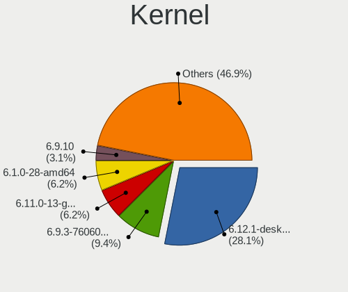

| Version                     | Desktops | Percent |
|-----------------------------|----------|---------|
| 5.13.0-39-generic           | 7        | 18.42%  |
| 5.4.0-107-generic           | 6        | 15.79%  |
| 5.16.19-76051619-generic    | 3        | 7.89%   |
| 5.16.15-76051615-generic    | 2        | 5.26%   |
| 5.16.11-76051611-generic    | 2        | 5.26%   |
| 5.4.0-72-generic            | 1        | 2.63%   |
| 5.4.0-109-generic           | 1        | 2.63%   |
| 5.4.0-1062203222222-generic | 1        | 2.63%   |
| 5.4.0-105-generic           | 1        | 2.63%   |
| 5.3.18-150300.59.60-preempt | 1        | 2.63%   |
| 5.17.1-zen1-1-zen           | 1        | 2.63%   |
| 5.17.1-arch1-1              | 1        | 2.63%   |
| 5.16.7-desktop-1omv4003     | 1        | 2.63%   |
| 5.16.19-1-MANJARO           | 1        | 2.63%   |
| 5.16.18-200.fc35.x86_64     | 1        | 2.63%   |
| 5.16.14-1-MANJARO           | 1        | 2.63%   |
| 5.15.35-mocaccino           | 1        | 2.63%   |
| 5.15.32-1-MANJARO           | 1        | 2.63%   |
| 5.13.0-37-generic           | 1        | 2.63%   |
| 5.13.0-35-generic           | 1        | 2.63%   |
| 5.11.0-35-generic           | 1        | 2.63%   |
| 5.10.0-13-amd64             | 1        | 2.63%   |
| 4.4.0-210-lowlatency        | 1        | 2.63%   |

Kernel Family
-------------

Linux kernel without a distro release

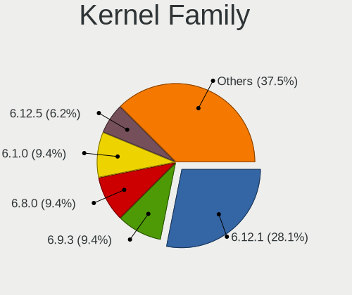

| Version | Desktops | Percent |
|---------|----------|---------|
| 5.4.0   | 10       | 26.32%  |
| 5.13.0  | 9        | 23.68%  |
| 5.16.19 | 4        | 10.53%  |
| 5.17.1  | 2        | 5.26%   |
| 5.16.15 | 2        | 5.26%   |
| 5.16.11 | 2        | 5.26%   |
| 5.3.18  | 1        | 2.63%   |
| 5.16.7  | 1        | 2.63%   |
| 5.16.18 | 1        | 2.63%   |
| 5.16.14 | 1        | 2.63%   |
| 5.15.35 | 1        | 2.63%   |
| 5.15.32 | 1        | 2.63%   |
| 5.11.0  | 1        | 2.63%   |
| 5.10.0  | 1        | 2.63%   |
| 4.4.0   | 1        | 2.63%   |

Kernel Major Ver.
-----------------

Linux kernel major version

| Version | Desktops | Percent |
|---------|----------|---------|
| 5.16    | 11       | 28.95%  |
| 5.4     | 10       | 26.32%  |
| 5.13    | 9        | 23.68%  |
| 5.17    | 2        | 5.26%   |
| 5.15    | 2        | 5.26%   |
| 5.3     | 1        | 2.63%   |
| 5.11    | 1        | 2.63%   |
| 5.10    | 1        | 2.63%   |
| 4.4     | 1        | 2.63%   |

Arch
----

OS architecture (x86_64, i586, etc.)

| Name   | Desktops | Percent |
|--------|----------|---------|
| x86_64 | 36       | 94.74%  |
| i686   | 2        | 5.26%   |

DE
--

Desktop Environment

| Name       | Desktops | Percent |
|------------|----------|---------|
| GNOME      | 21       | 55.26%  |
| KDE5       | 6        | 15.79%  |
| X-Cinnamon | 4        | 10.53%  |
| XFCE       | 3        | 7.89%   |
| Unknown    | 2        | 5.26%   |
| Unity      | 1        | 2.63%   |
| MATE       | 1        | 2.63%   |

Display Server
--------------

X11 or Wayland

| Name    | Desktops | Percent |
|---------|----------|---------|
| X11     | 34       | 89.47%  |
| Wayland | 4        | 10.53%  |

Display Manager
---------------

SDDM, LightDM, etc.

| Name    | Desktops | Percent |
|---------|----------|---------|
| Unknown | 19       | 50%     |
| LightDM | 10       | 26.32%  |
| SDDM    | 3        | 7.89%   |
| GDM3    | 3        | 7.89%   |
| GDM     | 3        | 7.89%   |

OS Lang
-------

Language

| Lang    | Desktops | Percent |
|---------|----------|---------|
| nl_NL   | 16       | 42.11%  |
| en_US   | 15       | 39.47%  |
| en_GB   | 4        | 10.53%  |
| en_CA   | 1        | 2.63%   |
| C.UTF8  | 1        | 2.63%   |
| Unknown | 1        | 2.63%   |

Boot Mode
---------

EFI or BIOS

| Mode | Desktops | Percent |
|------|----------|---------|
| BIOS | 25       | 65.79%  |
| EFI  | 13       | 34.21%  |

Filesystem
----------

Type of filesystem

| Type    | Desktops | Percent |
|---------|----------|---------|
| Ext4    | 33       | 86.84%  |
| Btrfs   | 4        | 10.53%  |
| Overlay | 1        | 2.63%   |

Part. scheme
------------

Scheme of partitioning

| Type    | Desktops | Percent |
|---------|----------|---------|
| Unknown | 26       | 68.42%  |
| GPT     | 9        | 23.68%  |
| MBR     | 3        | 7.89%   |

Dual Boot with Linux/BSD
------------------------

Hosting more than one Linux/BSD

| Dual boot | Desktops | Percent |
|-----------|----------|---------|
| No        | 34       | 89.47%  |
| Yes       | 4        | 10.53%  |

Dual Boot (Win)
---------------

Hosting Linux and Windows

| Dual boot | Desktops | Percent |
|-----------|----------|---------|
| No        | 30       | 78.95%  |
| Yes       | 8        | 21.05%  |

Board
-----

Vendor
------

Motherboard manufacturer

| Name                | Desktops | Percent |
|---------------------|----------|---------|
| Gigabyte Technology | 10       | 26.32%  |
| MSI                 | 6        | 15.79%  |
| ASUSTek Computer    | 5        | 13.16%  |
| Dell                | 4        | 10.53%  |
| ASRock              | 4        | 10.53%  |
| Hewlett-Packard     | 3        | 7.89%   |
| Unknown             | 2        | 5.26%   |
| Minix               | 1        | 2.63%   |
| Biostar             | 1        | 2.63%   |
| BESSTAR Tech        | 1        | 2.63%   |
| Acer                | 1        | 2.63%   |

Model
-----

Motherboard model

| Name                               | Desktops | Percent |
|------------------------------------|----------|---------|
| MSI MS-7B85                        | 2        | 5.26%   |
| Gigabyte B550 AORUS ELITE V2       | 2        | 5.26%   |
| ASUS All Series                    | 2        | 5.26%   |
| Unknown                            | 2        | 5.26%   |
| MSI MS-7B98                        | 1        | 2.63%   |
| MSI MS-7A59                        | 1        | 2.63%   |
| MSI MS-7996                        | 1        | 2.63%   |
| MSI MS-7204                        | 1        | 2.63%   |
| Minix Z83-4                        | 1        | 2.63%   |
| HP Compaq dc7800 Small Form Factor | 1        | 2.63%   |
| HP Compaq dc5800 Small Form Factor | 1        | 2.63%   |
| HP Compaq 8000 Elite SFF PC        | 1        | 2.63%   |
| Gigabyte Z77-DS3H                  | 1        | 2.63%   |
| Gigabyte X570 AORUS PRO            | 1        | 2.63%   |
| Gigabyte X570 AORUS MASTER         | 1        | 2.63%   |
| Gigabyte P55A-UD3                  | 1        | 2.63%   |
| Gigabyte H81M-S2PV                 | 1        | 2.63%   |
| Gigabyte GA-880GM-UD2H             | 1        | 2.63%   |
| Gigabyte B550 AORUS ELITE AX V2    | 1        | 2.63%   |
| Gigabyte A320M-S2H                 | 1        | 2.63%   |
| Dell XPS420                        | 1        | 2.63%   |
| Dell XPS 8950                      | 1        | 2.63%   |
| Dell OptiPlex 7050                 | 1        | 2.63%   |
| Dell OptiPlex 3050                 | 1        | 2.63%   |
| Biostar A55ML2                     | 1        | 2.63%   |
| BESSTAR Tech HM90                  | 1        | 2.63%   |
| ASUS PRIME B550-PLUS               | 1        | 2.63%   |
| ASUS M5A78L-M/USB3                 | 1        | 2.63%   |
| ASUS C51-MCP51                     | 1        | 2.63%   |
| ASRock X470 Master SLI             | 1        | 2.63%   |
| ASRock H310CM-ITX/ac               | 1        | 2.63%   |
| ASRock B550M Pro4                  | 1        | 2.63%   |
| ASRock AB350M Pro4                 | 1        | 2.63%   |
| Acer Aspire M5800/M3800            | 1        | 2.63%   |

Model Family
------------

Motherboard model prefix

| Name                   | Desktops | Percent |
|------------------------|----------|---------|
| HP Compaq              | 3        | 7.89%   |
| Gigabyte B550          | 3        | 7.89%   |
| MSI MS-7B85            | 2        | 5.26%   |
| Gigabyte X570          | 2        | 5.26%   |
| Dell OptiPlex          | 2        | 5.26%   |
| ASUS All               | 2        | 5.26%   |
| Unknown                | 2        | 5.26%   |
| MSI MS-7B98            | 1        | 2.63%   |
| MSI MS-7A59            | 1        | 2.63%   |
| MSI MS-7996            | 1        | 2.63%   |
| MSI MS-7204            | 1        | 2.63%   |
| Minix Z83-4            | 1        | 2.63%   |
| Gigabyte Z77-DS3H      | 1        | 2.63%   |
| Gigabyte P55A-UD3      | 1        | 2.63%   |
| Gigabyte H81M-S2PV     | 1        | 2.63%   |
| Gigabyte GA-880GM-UD2H | 1        | 2.63%   |
| Gigabyte A320M-S2H     | 1        | 2.63%   |
| Dell XPS420            | 1        | 2.63%   |
| Dell XPS               | 1        | 2.63%   |
| Biostar A55ML2         | 1        | 2.63%   |
| BESSTAR Tech HM90      | 1        | 2.63%   |
| ASUS PRIME             | 1        | 2.63%   |
| ASUS M5A78L-M          | 1        | 2.63%   |
| ASUS C51-MCP51         | 1        | 2.63%   |
| ASRock X470            | 1        | 2.63%   |
| ASRock H310CM-ITX      | 1        | 2.63%   |
| ASRock B550M           | 1        | 2.63%   |
| ASRock AB350M          | 1        | 2.63%   |
| Acer Aspire            | 1        | 2.63%   |

MFG Year
--------

Motherboard manufacture year

| Year | Desktops | Percent |
|------|----------|---------|
| 2020 | 7        | 18.42%  |
| 2019 | 4        | 10.53%  |
| 2018 | 4        | 10.53%  |
| 2021 | 3        | 7.89%   |
| 2013 | 3        | 7.89%   |
| 2009 | 3        | 7.89%   |
| 2017 | 2        | 5.26%   |
| 2016 | 2        | 5.26%   |
| 2007 | 2        | 5.26%   |
| 2015 | 1        | 2.63%   |
| 2014 | 1        | 2.63%   |
| 2012 | 1        | 2.63%   |
| 2011 | 1        | 2.63%   |
| 2010 | 1        | 2.63%   |
| 2008 | 1        | 2.63%   |
| 2006 | 1        | 2.63%   |
| 2005 | 1        | 2.63%   |

Form Factor
-----------

Physical design of the computer

| Name    | Desktops | Percent |
|---------|----------|---------|
| Desktop | 38       | 100%    |

Secure Boot
-----------

Enabled or disabled

| State    | Desktops | Percent |
|----------|----------|---------|
| Disabled | 36       | 94.74%  |
| Enabled  | 2        | 5.26%   |

Coreboot
--------

Have coreboot on board

| Used | Desktops | Percent |
|------|----------|---------|
| No   | 38       | 100%    |

RAM Size
--------

Total RAM memory

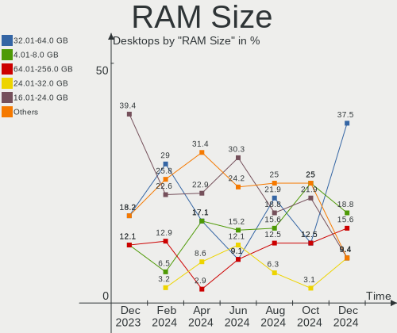

| Size in GB | Desktops | Percent |
|------------|----------|---------|
| 16.01-24.0 | 12       | 31.58%  |
| 32.01-64.0 | 10       | 26.32%  |
| 3.01-4.0   | 6        | 15.79%  |
| 4.01-8.0   | 4        | 10.53%  |
| 8.01-16.0  | 4        | 10.53%  |
| 2.01-3.0   | 1        | 2.63%   |
| 1.01-2.0   | 1        | 2.63%   |

RAM Used
--------

Used RAM memory

| Used GB   | Desktops | Percent |
|-----------|----------|---------|
| 1.01-2.0  | 16       | 42.11%  |
| 4.01-8.0  | 8        | 21.05%  |
| 2.01-3.0  | 7        | 18.42%  |
| 8.01-16.0 | 4        | 10.53%  |
| 3.01-4.0  | 2        | 5.26%   |
| 0.51-1.0  | 1        | 2.63%   |

Total Drives
------------

Number of drives on board

| Drives | Desktops | Percent |
|--------|----------|---------|
| 2      | 13       | 34.21%  |
| 1      | 13       | 34.21%  |
| 3      | 6        | 15.79%  |
| 4      | 3        | 7.89%   |
| 6      | 2        | 5.26%   |
| 8      | 1        | 2.63%   |

Has CD-ROM
----------

Has CD-ROM on board

| Presented | Desktops | Percent |
|-----------|----------|---------|
| No        | 21       | 55.26%  |
| Yes       | 17       | 44.74%  |

Has Ethernet
------------

Has Ethernet on board

| Presented | Desktops | Percent |
|-----------|----------|---------|
| Yes       | 38       | 100%    |

Has WiFi
--------

Has WiFi module

| Presented | Desktops | Percent |
|-----------|----------|---------|
| Yes       | 19       | 50%     |
| No        | 19       | 50%     |

Has Bluetooth
-------------

Has Bluetooth module

| Presented | Desktops | Percent |
|-----------|----------|---------|
| No        | 22       | 57.89%  |
| Yes       | 16       | 42.11%  |

Location
--------

Country
-------

Geographic location (country)

| Country     | Desktops | Percent |
|-------------|----------|---------|
| Netherlands | 38       | 100%    |

City
----

Geographic location (city)

| City                   | Desktops | Percent |
|------------------------|----------|---------|
| The Hague              | 4        | 10.53%  |
| Rotterdam              | 4        | 10.53%  |
| Amsterdam              | 4        | 10.53%  |
| Enschede               | 2        | 5.26%   |
| Zutphen                | 1        | 2.63%   |
| Zaandam                | 1        | 2.63%   |
| Well                   | 1        | 2.63%   |
| Vught                  | 1        | 2.63%   |
| Voorst                 | 1        | 2.63%   |
| Vinkeveen              | 1        | 2.63%   |
| Utrecht                | 1        | 2.63%   |
| Roosendaal             | 1        | 2.63%   |
| Purmerend              | 1        | 2.63%   |
| Oosterhout             | 1        | 2.63%   |
| Nijmegen               | 1        | 2.63%   |
| Nederland              | 1        | 2.63%   |
| Maastricht             | 1        | 2.63%   |
| Lutjegast              | 1        | 2.63%   |
| Leidschendam           | 1        | 2.63%   |
| Katwijk aan Zee        | 1        | 2.63%   |
| Hooghalen              | 1        | 2.63%   |
| Heerlen                | 1        | 2.63%   |
| Heerenveen             | 1        | 2.63%   |
| Dalfsen                | 1        | 2.63%   |
| Capelle aan den IJssel | 1        | 2.63%   |
| Apeldoorn              | 1        | 2.63%   |
| Alphen aan den Rijn    | 1        | 2.63%   |
| Almere Stad            | 1        | 2.63%   |

Drives
------

Drive Vendor
------------

Hard drive vendors

| Vendor              | Desktops | Drives | Percent |
|---------------------|----------|--------|---------|
| Samsung Electronics | 18       | 31     | 26.09%  |
| Seagate             | 15       | 16     | 21.74%  |
| WDC                 | 11       | 14     | 15.94%  |
| SanDisk             | 6        | 7      | 8.7%    |
| Kingston            | 4        | 4      | 5.8%    |
| Transcend           | 2        | 2      | 2.9%    |
| Intel               | 2        | 2      | 2.9%    |
| Hitachi             | 2        | 2      | 2.9%    |
| Crucial             | 2        | 2      | 2.9%    |
| Unknown             | 1        | 1      | 1.45%   |
| Toshiba             | 1        | 1      | 1.45%   |
| Maxtor 6            | 1        | 1      | 1.45%   |
| GOODRAM             | 1        | 1      | 1.45%   |
| Gigabyte Technology | 1        | 1      | 1.45%   |
| Corsair             | 1        | 2      | 1.45%   |
| China               | 1        | 1      | 1.45%   |

Drive Model
-----------

Hard drive models

| Model                                | Desktops | Percent |
|--------------------------------------|----------|---------|
| Samsung NVMe SSD Drive 1TB           | 4        | 4.88%   |
| Samsung SSD 860 EVO 500GB            | 3        | 3.66%   |
| Samsung SSD 850 EVO 250GB            | 3        | 3.66%   |
| Seagate ST500DM002-1BD142 500GB      | 2        | 2.44%   |
| Seagate ST2000DM001-1CH164 2TB       | 2        | 2.44%   |
| Seagate Expansion+ 2TB               | 2        | 2.44%   |
| Sandisk NVMe SSD Drive 1TB           | 2        | 2.44%   |
| Samsung SSD 870 QVO 1TB              | 2        | 2.44%   |
| WDC WDS500G3X0C-00SJG0 500GB         | 1        | 1.22%   |
| WDC WDS500G2B0A-00SM50 500GB SSD     | 1        | 1.22%   |
| WDC WDS480G2G0A-00JH30 480GB SSD     | 1        | 1.22%   |
| WDC WD5002ABYS-02B1B0 500GB          | 1        | 1.22%   |
| WDC WD5000AAKS-75A7B0 500GB          | 1        | 1.22%   |
| WDC WD20EZRZ-00Z5HB0 2TB             | 1        | 1.22%   |
| WDC WD20EFRX-68EUZN0 2TB             | 1        | 1.22%   |
| WDC WD20EARX-00PASB0 2TB             | 1        | 1.22%   |
| WDC WD15EARS-00MVWB0 1TB             | 1        | 1.22%   |
| WDC WD10EZEX-08M2NA0 1TB             | 1        | 1.22%   |
| WDC WD10EZEX-00BN5A0 1TB             | 1        | 1.22%   |
| WDC WD1002FAEX-00Z3A0 1TB            | 1        | 1.22%   |
| Unknown MMC Card  32GB               | 1        | 1.22%   |
| Transcend TS2TMTE220S 2TB            | 1        | 1.22%   |
| Transcend TS128GSSD370 128GB         | 1        | 1.22%   |
| Toshiba DT01ACA100 1TB               | 1        | 1.22%   |
| Seagate ST6000VN001-2BB186 6TB       | 1        | 1.22%   |
| Seagate ST350041 8AS 500GB           | 1        | 1.22%   |
| Seagate ST3320820AS 320GB            | 1        | 1.22%   |
| Seagate ST3250620AS 250GB            | 1        | 1.22%   |
| Seagate ST31000524NS 1TB             | 1        | 1.22%   |
| Seagate ST31000524AS 1TB             | 1        | 1.22%   |
| Seagate ST3000DM007-1WY10G 3TB       | 1        | 1.22%   |
| Seagate ST2000DM008-2FR102 2TB       | 1        | 1.22%   |
| Seagate ST2000DM006-2DM164 2TB       | 1        | 1.22%   |
| Seagate ST1000LM035-1RK172 1TB       | 1        | 1.22%   |
| SanDisk X400 2.5 7MM 256GB SSD       | 1        | 1.22%   |
| SanDisk SSD U100 8GB                 | 1        | 1.22%   |
| SanDisk SSD PLUS 480GB               | 1        | 1.22%   |
| Sandisk NVMe SSD Drive 500GB         | 1        | 1.22%   |
| Sandisk NVMe SSD Drive 256GB         | 1        | 1.22%   |
| Samsung SSD 980 1TB                  | 1        | 1.22%   |
| Samsung SSD 970 EVO Plus 500GB       | 1        | 1.22%   |
| Samsung SSD 970 EVO 1TB              | 1        | 1.22%   |
| Samsung SSD 860 EVO M.2 500GB        | 1        | 1.22%   |
| Samsung SSD 850 EVO 500GB            | 1        | 1.22%   |
| Samsung SSD 840 Series 120GB         | 1        | 1.22%   |
| Samsung SSD 840 EVO 250GB            | 1        | 1.22%   |
| Samsung Portable SSD T5 1TB          | 1        | 1.22%   |
| Samsung NVMe SSD Drive 512GB         | 1        | 1.22%   |
| Samsung NVMe SSD Drive 500GB         | 1        | 1.22%   |
| Samsung NVMe SSD Drive 2TB           | 1        | 1.22%   |
| Samsung NVMe SSD Drive 250GB         | 1        | 1.22%   |
| Samsung MZ7TE128HMGR-000H1 128GB SSD | 1        | 1.22%   |
| Samsung HD642JJ 640GB                | 1        | 1.22%   |
| Samsung HD154UI 1TB                  | 1        | 1.22%   |
| Samsung HD103UJ 1TB                  | 1        | 1.22%   |
| Maxtor 6 L250S0 256GB                | 1        | 1.22%   |
| Kingston SUV400S37240G 240GB SSD     | 1        | 1.22%   |
| Kingston SA400S37480G 480GB SSD      | 1        | 1.22%   |
| Kingston SA2000M8500G 500GB          | 1        | 1.22%   |
| Kingston NVMe SSD Drive 1TB          | 1        | 1.22%   |

HDD Vendor
----------

Hard disk drive vendors

| Vendor              | Desktops | Drives | Percent |
|---------------------|----------|--------|---------|
| Seagate             | 15       | 16     | 50%     |
| WDC                 | 8        | 10     | 26.67%  |
| Samsung Electronics | 3        | 3      | 10%     |
| Hitachi             | 2        | 2      | 6.67%   |
| Toshiba             | 1        | 1      | 3.33%   |
| Maxtor 6            | 1        | 1      | 3.33%   |

SSD Vendor
----------

Solid state drive vendors

| Vendor              | Desktops | Drives | Percent |
|---------------------|----------|--------|---------|
| Samsung Electronics | 12       | 16     | 44.44%  |
| SanDisk             | 3        | 3      | 11.11%  |
| WDC                 | 2        | 2      | 7.41%   |
| Kingston            | 2        | 2      | 7.41%   |
| Intel               | 2        | 2      | 7.41%   |
| Crucial             | 2        | 2      | 7.41%   |
| Transcend           | 1        | 1      | 3.7%    |
| GOODRAM             | 1        | 1      | 3.7%    |
| Gigabyte Technology | 1        | 1      | 3.7%    |
| China               | 1        | 1      | 3.7%    |

Drive Kind
----------

HDD or SSD

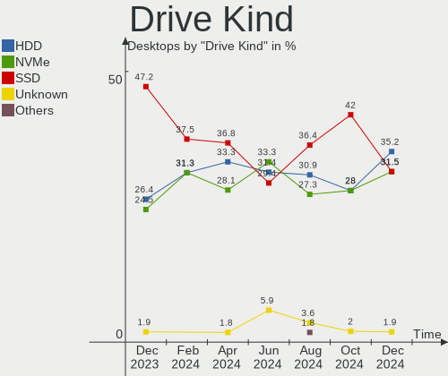

| Kind | Desktops | Drives | Percent |
|------|----------|--------|---------|
| SSD  | 24       | 31     | 38.71%  |
| HDD  | 22       | 33     | 35.48%  |
| NVMe | 15       | 23     | 24.19%  |
| MMC  | 1        | 1      | 1.61%   |

Drive Connector
---------------

SATA, SAS, NVMe, etc.

| Type | Desktops | Drives | Percent |
|------|----------|--------|---------|
| SATA | 33       | 59     | 62.26%  |
| NVMe | 15       | 23     | 28.3%   |
| SAS  | 4        | 5      | 7.55%   |
| MMC  | 1        | 1      | 1.89%   |

Drive Size
----------

Size of hard drive

| Size in TB | Desktops | Drives | Percent |
|------------|----------|--------|---------|
| 0.01-0.5   | 26       | 37     | 50.98%  |
| 0.51-1.0   | 13       | 14     | 25.49%  |
| 1.01-2.0   | 10       | 11     | 19.61%  |
| 2.01-3.0   | 1        | 1      | 1.96%   |
| 4.01-10.0  | 1        | 1      | 1.96%   |

Space Total
-----------

Amount of disk space available on the file system

| Size in GB     | Desktops | Percent |
|----------------|----------|---------|
| More than 3000 | 7        | 18.42%  |
| 251-500        | 7        | 18.42%  |
| 101-250        | 7        | 18.42%  |
| 1001-2000      | 6        | 15.79%  |
| 501-1000       | 4        | 10.53%  |
| 2001-3000      | 3        | 7.89%   |
| 21-50          | 1        | 2.63%   |
| 1-20           | 1        | 2.63%   |
| 51-100         | 1        | 2.63%   |
| Unknown        | 1        | 2.63%   |

Space Used
----------

Amount of used disk space

| Used GB        | Desktops | Percent |
|----------------|----------|---------|
| 1-20           | 9        | 23.68%  |
| 1001-2000      | 6        | 15.79%  |
| 101-250        | 5        | 13.16%  |
| 501-1000       | 5        | 13.16%  |
| 21-50          | 4        | 10.53%  |
| 251-500        | 3        | 7.89%   |
| 2001-3000      | 2        | 5.26%   |
| 51-100         | 2        | 5.26%   |
| More than 3000 | 1        | 2.63%   |
| Unknown        | 1        | 2.63%   |

Malfunc. Drives
---------------

Drive models with a malfunction

| Model                           | Desktops | Drives | Percent |
|---------------------------------|----------|--------|---------|
| WDC WD1002FAEX-00Z3A0 1TB       | 1        | 1      | 20%     |
| Seagate ST500DM002-1BD142 500GB | 1        | 1      | 20%     |
| Seagate ST2000DM001-1CH164 2TB  | 1        | 1      | 20%     |
| Hitachi HDS721050DLE630 500GB   | 1        | 1      | 20%     |
| Crucial M4-CT256M4SSD2 256GB    | 1        | 1      | 20%     |

Malfunc. Drive Vendor
---------------------

Vendors of faulty drives

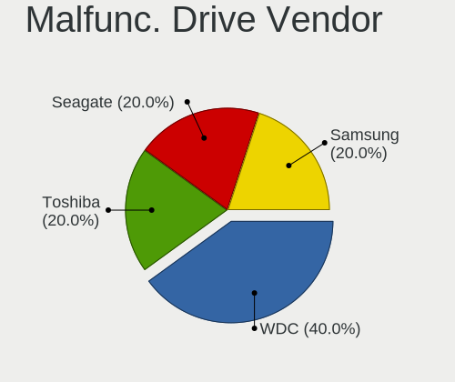

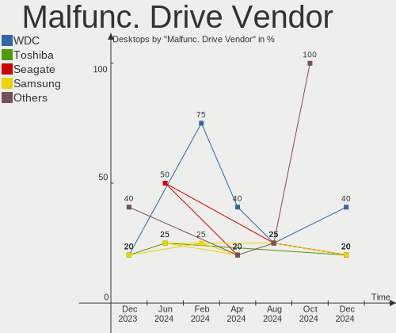

| Vendor  | Desktops | Drives | Percent |
|---------|----------|--------|---------|
| Seagate | 2        | 2      | 40%     |
| WDC     | 1        | 1      | 20%     |
| Hitachi | 1        | 1      | 20%     |
| Crucial | 1        | 1      | 20%     |

Malfunc. HDD Vendor
-------------------

Vendors of faulty HDD drives

| Vendor  | Desktops | Drives | Percent |
|---------|----------|--------|---------|
| Seagate | 2        | 2      | 50%     |
| WDC     | 1        | 1      | 25%     |
| Hitachi | 1        | 1      | 25%     |

Malfunc. Drive Kind
-------------------

Kinds of faulty drives

| Kind | Desktops | Drives | Percent |
|------|----------|--------|---------|
| HDD  | 3        | 4      | 75%     |
| SSD  | 1        | 1      | 25%     |

Failed Drives
-------------

Failed drive models

Zero info for selected period =(

Failed Drive Vendor
-------------------

Failed drive vendors

Zero info for selected period =(

Drive Status
------------

Number of failed and malfunc. drives

| Status   | Desktops | Drives | Percent |
|----------|----------|--------|---------|
| Detected | 26       | 56     | 63.41%  |
| Works    | 11       | 27     | 26.83%  |
| Malfunc  | 4        | 5      | 9.76%   |

Storage controller
------------------

Storage Vendor
--------------

Storage controller vendors

| Vendor                        | Desktops | Percent |
|-------------------------------|----------|---------|
| Intel                         | 20       | 34.48%  |
| AMD                           | 16       | 27.59%  |
| Samsung Electronics           | 10       | 17.24%  |
| Sandisk                       | 4        | 6.9%    |
| Kingston Technology Company   | 2        | 3.45%   |
| Silicon Motion                | 1        | 1.72%   |
| Phison Electronics            | 1        | 1.72%   |
| Nvidia                        | 1        | 1.72%   |
| Marvell Technology Group      | 1        | 1.72%   |
| Integrated Technology Express | 1        | 1.72%   |
| ASMedia Technology            | 1        | 1.72%   |

Storage Model
-------------

Storage controller models

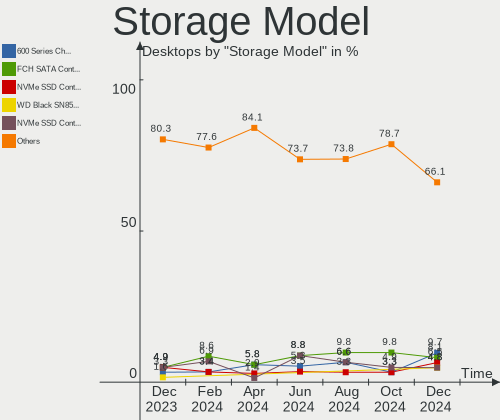

| Model                                                                            | Desktops | Percent |
|----------------------------------------------------------------------------------|----------|---------|
| AMD FCH SATA Controller [AHCI mode]                                              | 7        | 9.33%   |
| Samsung NVMe SSD Controller SM981/PM981/PM983                                    | 5        | 6.67%   |
| AMD 500 Series Chipset SATA Controller                                           | 5        | 6.67%   |
| Samsung NVMe SSD Controller 980                                                  | 4        | 5.33%   |
| Intel 200 Series PCH SATA controller [AHCI mode]                                 | 4        | 5.33%   |
| AMD 400 Series Chipset SATA Controller                                           | 3        | 4%      |
| Samsung NVMe SSD Controller PM9A1/PM9A3/980PRO                                   | 2        | 2.67%   |
| Intel Q170/Q150/B150/H170/H110/Z170/CM236 Chipset SATA Controller [AHCI Mode]    | 2        | 2.67%   |
| Intel 82801I (ICH9 Family) 2 port SATA Controller [IDE mode]                     | 2        | 2.67%   |
| Intel 8 Series/C220 Series Chipset Family 6-port SATA Controller 1 [AHCI mode]   | 2        | 2.67%   |
| AMD SB7x0/SB8x0/SB9x0 IDE Controller                                             | 2        | 2.67%   |
| Silicon Motion SM2262/SM2262EN SSD Controller                                    | 1        | 1.33%   |
| Sandisk WD Blue SN570 NVMe SSD                                                   | 1        | 1.33%   |
| Sandisk WD Blue SN550 NVMe SSD                                                   | 1        | 1.33%   |
| Sandisk WD Blue SN500 / PC SN520 NVMe SSD                                        | 1        | 1.33%   |
| Sandisk WD Black SN750 / PC SN730 NVMe SSD                                       | 1        | 1.33%   |
| Sandisk WD Black 2018/SN750 / PC SN720 NVMe SSD                                  | 1        | 1.33%   |
| Sandisk Non-Volatile memory controller                                           | 1        | 1.33%   |
| Phison E16 PCIe4 NVMe Controller                                                 | 1        | 1.33%   |
| Nvidia MCP51 Serial ATA Controller                                               | 1        | 1.33%   |
| Nvidia MCP51 IDE                                                                 | 1        | 1.33%   |
| Marvell Group 88SE9128 PCIe SATA 6 Gb/s RAID controller                          | 1        | 1.33%   |
| Kingston Company KC2000 NVMe SSD                                                 | 1        | 1.33%   |
| Kingston Company A2000 NVMe SSD                                                  | 1        | 1.33%   |
| Intel SATA Controller [RAID mode]                                                | 1        | 1.33%   |
| Intel NM10/ICH7 Family SATA Controller [IDE mode]                                | 1        | 1.33%   |
| Intel Cannon Lake PCH SATA AHCI Controller                                       | 1        | 1.33%   |
| Intel Atom/Celeron/Pentium Processor x5-E8000/J3xxx/N3xxx Series SATA Controller | 1        | 1.33%   |
| Intel Alder Lake-S PCH SATA Controller [AHCI Mode]                               | 1        | 1.33%   |
| Intel 82Q35 Express PT IDER Controller                                           | 1        | 1.33%   |
| Intel 82801JI (ICH10 Family) SATA AHCI Controller                                | 1        | 1.33%   |
| Intel 82801JD/DO (ICH10 Family) SATA AHCI Controller                             | 1        | 1.33%   |
| Intel 82801IR/IO/IH (ICH9R/DO/DH) 4 port SATA Controller [IDE mode]              | 1        | 1.33%   |
| Intel 82801IB (ICH9) 2 port SATA Controller [IDE mode]                           | 1        | 1.33%   |
| Intel 82801G (ICH7 Family) IDE Controller                                        | 1        | 1.33%   |
| Intel 8 Series/C220 Series Chipset Family 4-port SATA Controller 1 [IDE mode]    | 1        | 1.33%   |
| Intel 8 Series/C220 Series Chipset Family 2-port SATA Controller 2 [IDE mode]    | 1        | 1.33%   |
| Intel 7 Series/C210 Series Chipset Family 4-port SATA Controller [IDE mode]      | 1        | 1.33%   |
| Intel 7 Series/C210 Series Chipset Family 2-port SATA Controller [IDE mode]      | 1        | 1.33%   |
| Intel 5 Series/3400 Series Chipset 4 port SATA IDE Controller                    | 1        | 1.33%   |
| Intel 5 Series/3400 Series Chipset 2 port SATA IDE Controller                    | 1        | 1.33%   |
| Integrated Express IT8213 IDE Controller                                         | 1        | 1.33%   |
| ASMedia ASM1062 Serial ATA Controller                                            | 1        | 1.33%   |
| AMD SB7x0/SB8x0/SB9x0 SATA Controller [IDE mode]                                 | 1        | 1.33%   |
| AMD SB7x0/SB8x0/SB9x0 SATA Controller [AHCI mode]                                | 1        | 1.33%   |
| AMD FCH SATA Controller [IDE mode]                                               | 1        | 1.33%   |
| AMD FCH SATA Controller D                                                        | 1        | 1.33%   |
| AMD 300 Series Chipset SATA Controller                                           | 1        | 1.33%   |

Storage Kind
------------

Kind of storage controller (IDE, SATA, NVMe, SAS, ...)

| Kind | Desktops | Percent |
|------|----------|---------|
| SATA | 30       | 54.55%  |
| NVMe | 15       | 27.27%  |
| IDE  | 9        | 16.36%  |
| RAID | 1        | 1.82%   |

Processor
---------

CPU Vendor
----------

Processor vendors

| Vendor | Desktops | Percent |
|--------|----------|---------|
| Intel  | 21       | 55.26%  |
| AMD    | 17       | 44.74%  |

CPU Model
---------

Processor models

| Model                                       | Desktops | Percent |
|---------------------------------------------|----------|---------|
| AMD Ryzen 7 5800X 8-Core Processor          | 2        | 5.26%   |
| AMD Ryzen 5 3600 6-Core Processor           | 2        | 5.26%   |
| Intel Pentium Gold G5420 CPU @ 3.80GHz      | 1        | 2.63%   |
| Intel Pentium D CPU 3.00GHz                 | 1        | 2.63%   |
| Intel Core i7-8709G CPU @ 3.10GHz           | 1        | 2.63%   |
| Intel Core i7-8700 CPU @ 3.20GHz            | 1        | 2.63%   |
| Intel Core i7-7700K CPU @ 4.20GHz           | 1        | 2.63%   |
| Intel Core i7-7700 CPU @ 3.60GHz            | 1        | 2.63%   |
| Intel Core i7-4771 CPU @ 3.50GHz            | 1        | 2.63%   |
| Intel Core i7-4770 CPU @ 3.40GHz            | 1        | 2.63%   |
| Intel Core i5-6600 CPU @ 3.30GHz            | 1        | 2.63%   |
| Intel Core i5-6500T CPU @ 2.50GHz           | 1        | 2.63%   |
| Intel Core i5-3450 CPU @ 3.10GHz            | 1        | 2.63%   |
| Intel Core i5 CPU 760 @ 2.80GHz             | 1        | 2.63%   |
| Intel Core 2 Quad CPU Q8300 @ 2.50GHz       | 1        | 2.63%   |
| Intel Core 2 Quad CPU Q6600 @ 2.40GHz       | 1        | 2.63%   |
| Intel Core 2 Duo CPU E8400 @ 3.00GHz        | 1        | 2.63%   |
| Intel Core 2 Duo CPU E8300 @ 2.83GHz        | 1        | 2.63%   |
| Intel Core 2 Duo CPU E4500 @ 2.20GHz        | 1        | 2.63%   |
| Intel Celeron CPU N3160 @ 1.60GHz           | 1        | 2.63%   |
| Intel Celeron CPU G1850 @ 2.90GHz           | 1        | 2.63%   |
| Intel Atom x5-Z8350 CPU @ 1.44GHz           | 1        | 2.63%   |
| Intel 12th Gen Core i7-12700K               | 1        | 2.63%   |
| AMD Ryzen 9 4900H with Radeon Graphics      | 1        | 2.63%   |
| AMD Ryzen 7 3700X 8-Core Processor          | 1        | 2.63%   |
| AMD Ryzen 7 2700X Eight-Core Processor      | 1        | 2.63%   |
| AMD Ryzen 7 2700 Eight-Core Processor       | 1        | 2.63%   |
| AMD Ryzen 5 5600X 6-Core Processor          | 1        | 2.63%   |
| AMD Ryzen 5 5600 6-Core Processor           | 1        | 2.63%   |
| AMD Ryzen 5 2600 Six-Core Processor         | 1        | 2.63%   |
| AMD Ryzen 3 2200G with Radeon Vega Graphics | 1        | 2.63%   |
| AMD Ryzen 3 1300X Quad-Core Processor       | 1        | 2.63%   |
| AMD Phenom II X4 840 Processor              | 1        | 2.63%   |
| AMD Athlon II X2 245 Processor              | 1        | 2.63%   |
| AMD Athlon 64 X2 Dual Core Processor 3800+  | 1        | 2.63%   |
| AMD A6-6400K APU with Radeon HD Graphics    | 1        | 2.63%   |

CPU Model Family
----------------

Processor model prefix

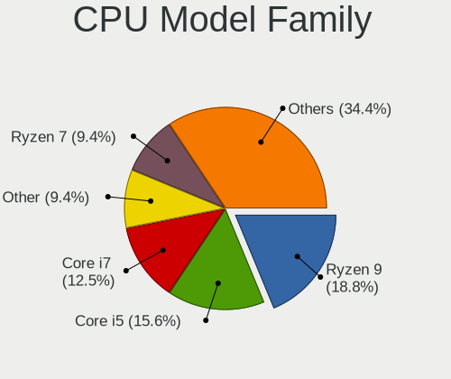

| Model              | Desktops | Percent |
|--------------------|----------|---------|
| Intel Core i7      | 6        | 15.79%  |
| AMD Ryzen 7        | 5        | 13.16%  |
| AMD Ryzen 5        | 5        | 13.16%  |
| Intel Core i5      | 4        | 10.53%  |
| Intel Core 2 Duo   | 3        | 7.89%   |
| Intel Core 2 Quad  | 2        | 5.26%   |
| Intel Celeron      | 2        | 5.26%   |
| AMD Ryzen 3        | 2        | 5.26%   |
| Other              | 1        | 2.63%   |
| Intel Pentium Gold | 1        | 2.63%   |
| Intel Pentium D    | 1        | 2.63%   |
| Intel Atom         | 1        | 2.63%   |
| AMD Ryzen 9        | 1        | 2.63%   |
| AMD Phenom II X4   | 1        | 2.63%   |
| AMD Athlon II X2   | 1        | 2.63%   |
| AMD Athlon 64 X2   | 1        | 2.63%   |
| AMD A6             | 1        | 2.63%   |

CPU Cores
---------

Number of processor cores

| Number | Desktops | Percent |
|--------|----------|---------|
| 4      | 16       | 42.11%  |
| 2      | 8        | 21.05%  |
| 8      | 6        | 15.79%  |
| 6      | 6        | 15.79%  |
| 12     | 1        | 2.63%   |
| 1      | 1        | 2.63%   |

CPU Sockets
-----------

Number of sockets

| Number | Desktops | Percent |
|--------|----------|---------|
| 1      | 38       | 100%    |

CPU Threads
-----------

Threads per core (Hyper-Threading)

| Number | Desktops | Percent |
|--------|----------|---------|
| 2      | 19       | 50%     |
| 1      | 19       | 50%     |

CPU Op-Modes
------------

CPU Operation Modes (32-bit, 64-bit)

| Op mode        | Desktops | Percent |
|----------------|----------|---------|
| 32-bit, 64-bit | 38       | 100%    |

CPU Microcode
-------------

Microcode number

| Number     | Desktops | Percent |
|------------|----------|---------|
| Unknown    | 13       | 34.21%  |
| 0x306c3    | 3        | 7.89%   |
| 0x0800820d | 3        | 7.89%   |
| 0x08701021 | 2        | 5.26%   |
| 0xf47      | 1        | 2.63%   |
| 0x906ea    | 1        | 2.63%   |
| 0x906e9    | 1        | 2.63%   |
| 0x90672    | 1        | 2.63%   |
| 0x6fb      | 1        | 2.63%   |
| 0x506e3    | 1        | 2.63%   |
| 0x406c4    | 1        | 2.63%   |
| 0x106e5    | 1        | 2.63%   |
| 0x1067a    | 1        | 2.63%   |
| 0x10676    | 1        | 2.63%   |
| 0x0a201204 | 1        | 2.63%   |
| 0x08600106 | 1        | 2.63%   |
| 0x08101016 | 1        | 2.63%   |
| 0x06001119 | 1        | 2.63%   |
| 0x010000c8 | 1        | 2.63%   |
| 0x010000c7 | 1        | 2.63%   |
| 0x00000000 | 1        | 2.63%   |

CPU Microarch
-------------

Microarchitecture

| Name       | Desktops | Percent |
|------------|----------|---------|
| KabyLake   | 5        | 13.16%  |
| Zen 3      | 4        | 10.53%  |
| Zen 2      | 4        | 10.53%  |
| Zen+       | 3        | 7.89%   |
| Penryn     | 3        | 7.89%   |
| Haswell    | 3        | 7.89%   |
| Zen        | 2        | 5.26%   |
| Skylake    | 2        | 5.26%   |
| Silvermont | 2        | 5.26%   |
| K10        | 2        | 5.26%   |
| Core       | 2        | 5.26%   |
| Piledriver | 1        | 2.63%   |
| NetBurst   | 1        | 2.63%   |
| Nehalem    | 1        | 2.63%   |
| K8 Hammer  | 1        | 2.63%   |
| IvyBridge  | 1        | 2.63%   |
| Unknown    | 1        | 2.63%   |

Graphics
--------

GPU Vendor
----------

Vendors of graphics cards

| Vendor | Desktops | Percent |
|--------|----------|---------|
| Nvidia | 17       | 42.5%   |
| AMD    | 13       | 32.5%   |
| Intel  | 10       | 25%     |

GPU Model
---------

Graphics card models

| Model                                                                                    | Desktops | Percent |
|------------------------------------------------------------------------------------------|----------|---------|
| AMD Ellesmere [Radeon RX 470/480/570/570X/580/580X/590]                                  | 3        | 7.5%    |
| Nvidia GT218 [GeForce 210]                                                               | 2        | 5%      |
| Nvidia GP106 [GeForce GTX 1060 6GB]                                                      | 2        | 5%      |
| Intel Atom/Celeron/Pentium Processor x5-E8000/J3xxx/N3xxx Integrated Graphics Controller | 2        | 5%      |
| AMD Baffin [Radeon RX 460/560D / Pro 450/455/460/555/555X/560/560X]                      | 2        | 5%      |
| Nvidia TU116 [GeForce GTX 1660 SUPER]                                                    | 1        | 2.5%    |
| Nvidia TU106 [GeForce RTX 2060 Rev. A]                                                   | 1        | 2.5%    |
| Nvidia NV43 [GeForce 6700 XL]                                                            | 1        | 2.5%    |
| Nvidia GT218 [GeForce 310]                                                               | 1        | 2.5%    |
| Nvidia GP106 [GeForce GTX 1060 3GB]                                                      | 1        | 2.5%    |
| Nvidia GP104 [GeForce GTX 1080]                                                          | 1        | 2.5%    |
| Nvidia GK208B [GeForce GT 710]                                                           | 1        | 2.5%    |
| Nvidia GK208 [GeForce GT 630 Rev. 2]                                                     | 1        | 2.5%    |
| Nvidia GK110 [GeForce GTX 780]                                                           | 1        | 2.5%    |
| Nvidia GF108 [GeForce GT 630]                                                            | 1        | 2.5%    |
| Nvidia GF108 [GeForce GT 430]                                                            | 1        | 2.5%    |
| Nvidia GA106 [GeForce RTX 3060]                                                          | 1        | 2.5%    |
| Nvidia GA104 [GeForce RTX 3060 Ti Lite Hash Rate]                                        | 1        | 2.5%    |
| Intel Xeon E3-1200 v3/4th Gen Core Processor Integrated Graphics Controller              | 1        | 2.5%    |
| Intel Xeon E3-1200 v2/3rd Gen Core processor Graphics Controller                         | 1        | 2.5%    |
| Intel HD Graphics 630                                                                    | 1        | 2.5%    |
| Intel HD Graphics 530                                                                    | 1        | 2.5%    |
| Intel CoffeeLake-S GT2 [UHD Graphics 630]                                                | 1        | 2.5%    |
| Intel CoffeeLake-S GT1 [UHD Graphics 610]                                                | 1        | 2.5%    |
| Intel 82Q33 Express Integrated Graphics Controller                                       | 1        | 2.5%    |
| Intel 4 Series Chipset Integrated Graphics Controller                                    | 1        | 2.5%    |
| AMD Tobago PRO [Radeon R7 360 / R9 360 OEM]                                              | 1        | 2.5%    |
| AMD RS780L [Radeon 3000]                                                                 | 1        | 2.5%    |
| AMD Renoir                                                                               | 1        | 2.5%    |
| AMD Raven Ridge [Radeon Vega Series / Radeon Vega Mobile Series]                         | 1        | 2.5%    |
| AMD Polaris 22 XT [Radeon RX Vega M GH]                                                  | 1        | 2.5%    |
| AMD Navi 23 [Radeon RX 6600/6600 XT/6600M]                                               | 1        | 2.5%    |
| AMD Navi 22 [Radeon RX 6700/6700 XT/6750 XT / 6800M]                                     | 1        | 2.5%    |
| AMD Caicos [Radeon HD 6450/7450/8450 / R5 230 OEM]                                       | 1        | 2.5%    |

GPU Combo
---------

Combinations of graphics cards

| Name           | Desktops | Percent |
|----------------|----------|---------|
| 1 x Nvidia     | 16       | 42.11%  |
| 1 x AMD        | 13       | 34.21%  |
| 1 x Intel      | 8        | 21.05%  |
| Intel + Nvidia | 1        | 2.63%   |

GPU Driver
----------

Free vs proprietary

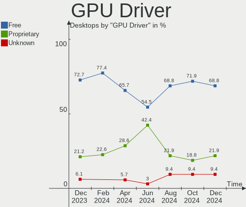

| Driver      | Desktops | Percent |
|-------------|----------|---------|
| Free        | 26       | 68.42%  |
| Proprietary | 11       | 28.95%  |
| Unknown     | 1        | 2.63%   |

GPU Memory
----------

Total video memory

| Size in GB | Desktops | Percent |
|------------|----------|---------|
| Unknown    | 14       | 36.84%  |
| 7.01-8.0   | 5        | 13.16%  |
| 5.01-6.0   | 4        | 10.53%  |
| 1.01-2.0   | 4        | 10.53%  |
| 0.51-1.0   | 3        | 7.89%   |
| 0.01-0.5   | 3        | 7.89%   |
| 2.01-3.0   | 2        | 5.26%   |
| 8.01-16.0  | 2        | 5.26%   |
| 3.01-4.0   | 1        | 2.63%   |

Monitor
-------

Monitor Vendor
--------------

Monitor vendors

| Vendor              | Desktops | Percent |
|---------------------|----------|---------|
| Samsung Electronics | 7        | 15.56%  |
| Iiyama              | 7        | 15.56%  |
| Acer                | 6        | 13.33%  |
| Goldstar            | 5        | 11.11%  |
| Philips             | 4        | 8.89%   |
| BenQ                | 3        | 6.67%   |
| Sony                | 2        | 4.44%   |
| Idek Iiyama         | 2        | 4.44%   |
| Dell                | 2        | 4.44%   |
| TV_                 | 1        | 2.22%   |
| Sanyo               | 1        | 2.22%   |
| Medion              | 1        | 2.22%   |
| Hewlett-Packard     | 1        | 2.22%   |
| CHI                 | 1        | 2.22%   |
| Belinea             | 1        | 2.22%   |
| AOC                 | 1        | 2.22%   |

Monitor Model
-------------

Monitor models

| Model                                                                   | Desktops | Percent |
|-------------------------------------------------------------------------|----------|---------|
| TV_ TV TV_1080 1920x1080 747x420mm 33.7-inch                            | 1        | 2.17%   |
| Sony TV SNYEE01 1920x1080                                               | 1        | 2.17%   |
| Sony TV SNY4803 1920x1080 1107x623mm 50.0-inch                          | 1        | 2.17%   |
| Sanyo LCD MONITOR SAN07BE 1280x1024 350x270mm 17.4-inch                 | 1        | 2.17%   |
| Samsung Electronics SyncMaster SAM030D 1680x1050 474x296mm 22.0-inch    | 1        | 2.17%   |
| Samsung Electronics SyncMaster SAM0288 1680x1050 474x296mm 22.0-inch    | 1        | 2.17%   |
| Samsung Electronics LCD Monitor SAM0F0B 3840x2160 1872x1053mm 84.6-inch | 1        | 2.17%   |
| Samsung Electronics LCD Monitor SAM0D3B 3840x2160 890x500mm 40.2-inch   | 1        | 2.17%   |
| Samsung Electronics LCD Monitor SAM0180 1280x720 885x498mm 40.0-inch    | 1        | 2.17%   |
| Samsung Electronics LCD Monitor LF24T35 1920x1080                       | 1        | 2.17%   |
| Samsung Electronics C24F390 SAM0D2C 1920x1080 521x293mm 23.5-inch       | 1        | 2.17%   |
| Philips PHL 272B8Q PHL0918 2560x1440 597x336mm 27.0-inch                | 1        | 2.17%   |
| Philips PHL 246V5 PHLC0C5 1920x1080 531x299mm 24.0-inch                 | 1        | 2.17%   |
| Philips PHL 240V5 PHLC10A 1920x1080 527x296mm 23.8-inch                 | 1        | 2.17%   |
| Philips PHL 223V5 PHLC0CF 1920x1080 477x268mm 21.5-inch                 | 1        | 2.17%   |
| Philips LCD Monitor PHL 345B1C 3440x1440                                | 1        | 2.17%   |
| Medion MD30999PE MED8928 1440x900 410x256mm 19.0-inch                   | 1        | 2.17%   |
| Iiyama PLX2783H-DP IVM661C 1920x1080 600x340mm 27.2-inch                | 1        | 2.17%   |
| Iiyama PLX2472HD IVM6106 1920x1080 531x299mm 24.0-inch                  | 1        | 2.17%   |
| Iiyama PL3271Q IVM761B 2560x1440 698x393mm 31.5-inch                    | 1        | 2.17%   |
| Iiyama PL2592H IVM6135 1920x1080 544x303mm 24.5-inch                    | 1        | 2.17%   |
| Iiyama PL2561H IVM616C 1920x1080 540x300mm 24.3-inch                    | 1        | 2.17%   |
| Iiyama PL2530H IVM6132 1920x1080 544x303mm 24.5-inch                    | 1        | 2.17%   |
| Iiyama PL2209HD IVM560B 1920x1080 478x269mm 21.6-inch                   | 1        | 2.17%   |
| Idek Iiyama LCD Monitor PL2792Q 2560x1440                               | 1        | 2.17%   |
| Idek Iiyama LCD Monitor PL2730H 1920x1080                               | 1        | 2.17%   |
| Hewlett-Packard 27fw HPN354B 1920x1080 598x336mm 27.0-inch              | 1        | 2.17%   |
| Goldstar ULTRAWIDE GSM76FA 2560x1080 798x334mm 34.1-inch                | 1        | 2.17%   |
| Goldstar Ultra HD GSM5B08 3840x2160 600x340mm 27.2-inch                 | 1        | 2.17%   |
| Goldstar IPS277 GSM5903 1920x1080 600x340mm 27.2-inch                   | 1        | 2.17%   |
| Goldstar HDR 4K GSM7706 3840x2160 600x340mm 27.2-inch                   | 1        | 2.17%   |
| Goldstar 22EA53 GSM59A6 1920x1080 477x268mm 21.5-inch                   | 1        | 2.17%   |
| Dell U2515H DELD06F 2560x1440 553x311mm 25.0-inch                       | 1        | 2.17%   |
| Dell SP2309W DELD01B 2048x1152 510x290mm 23.1-inch                      | 1        | 2.17%   |
| CHI VGA DISPLAY CHIBD1B 1920x1080 880x500mm 39.8-inch                   | 1        | 2.17%   |
| BenQ G700 BNQ7801 1280x1024 338x270mm 17.0-inch                         | 1        | 2.17%   |
| BenQ G2420HDB BNQ7842 1920x1080 477x268mm 21.5-inch                     | 1        | 2.17%   |
| BenQ BL2283 BNQ78EA 1920x1080 476x268mm 21.5-inch                       | 1        | 2.17%   |
| Belinea B101927 MAX0785 1280x1024 376x301mm 19.0-inch                   | 1        | 2.17%   |
| AOC Q3279WG5B AOC3279 2560x1440 725x428mm 33.1-inch                     | 1        | 2.17%   |
| Acer XB240H ACR041B 1920x1080 531x299mm 24.0-inch                       | 1        | 2.17%   |
| Acer X193HQ ACR0069 1366x768 410x230mm 18.5-inch                        | 1        | 2.17%   |
| Acer S235HL ACR02BE 1920x1080 510x286mm 23.0-inch                       | 1        | 2.17%   |
| Acer LCD Monitor AL2216W 1680x1050                                      | 1        | 2.17%   |
| Acer AL1916W ACRAD76 1440x900 410x260mm 19.1-inch                       | 1        | 2.17%   |
| Acer AL1916 ACRAD49 1280x1024 376x301mm 19.0-inch                       | 1        | 2.17%   |

Monitor Resolution
------------------

Monitor screen resolution

| Resolution         | Desktops | Percent |
|--------------------|----------|---------|
| 1920x1080 (FHD)    | 18       | 43.9%   |
| 2560x1440 (QHD)    | 5        | 12.2%   |
| 3840x2160 (4K)     | 4        | 9.76%   |
| 1280x1024 (SXGA)   | 4        | 9.76%   |
| 1680x1050 (WSXGA+) | 3        | 7.32%   |
| 1440x900 (WXGA+)   | 2        | 4.88%   |
| 3440x1440          | 1        | 2.44%   |
| 2560x1080          | 1        | 2.44%   |
| 2048x1152          | 1        | 2.44%   |
| 1366x768 (WXGA)    | 1        | 2.44%   |
| 1360x768           | 1        | 2.44%   |

Monitor Diagonal
----------------

Diagonal size in inches

| Inches  | Desktops | Percent |
|---------|----------|---------|
| 24      | 7        | 15.22%  |
| 27      | 6        | 13.04%  |
| Unknown | 5        | 10.87%  |
| 23      | 4        | 8.7%    |
| 21      | 4        | 8.7%    |
| 19      | 4        | 8.7%    |
| 84      | 2        | 4.35%   |
| 33      | 2        | 4.35%   |
| 22      | 2        | 4.35%   |
| 17      | 2        | 4.35%   |
| 72      | 1        | 2.17%   |
| 55      | 1        | 2.17%   |
| 40      | 1        | 2.17%   |
| 39      | 1        | 2.17%   |
| 34      | 1        | 2.17%   |
| 31      | 1        | 2.17%   |
| 25      | 1        | 2.17%   |
| 18      | 1        | 2.17%   |

Monitor Width
-------------

Physical width

| Width in mm | Desktops | Percent |
|-------------|----------|---------|
| 501-600     | 16       | 36.36%  |
| 401-500     | 9        | 20.45%  |
| Unknown     | 5        | 11.36%  |
| 701-800     | 3        | 6.82%   |
| 1501-2000   | 3        | 6.82%   |
| 801-900     | 2        | 4.55%   |
| 351-400     | 2        | 4.55%   |
| 301-350     | 2        | 4.55%   |
| 601-700     | 1        | 2.27%   |
| 1001-1500   | 1        | 2.27%   |

Aspect Ratio
------------

Proportional relationship between the width and the height

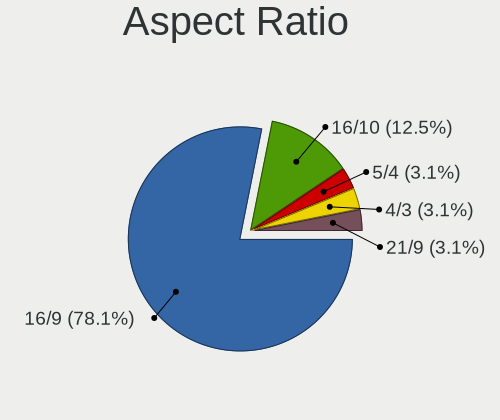

| Ratio   | Desktops | Percent |
|---------|----------|---------|
| 16/9    | 27       | 65.85%  |
| Unknown | 5        | 12.2%   |
| 16/10   | 4        | 9.76%   |
| 5/4     | 3        | 7.32%   |
| 4/3     | 1        | 2.44%   |
| 21/9    | 1        | 2.44%   |

Monitor Area
------------

Area in inch

| Area in inch | Desktops | Percent |
|----------------|----------|---------|
| 201-250        | 10       | 22.73%  |
| 301-350        | 6        | 13.64%  |
| 151-200        | 6        | 13.64%  |
| Unknown        | 5        | 11.36%  |
| More than 1000 | 4        | 9.09%   |
| 351-500        | 4        | 9.09%   |
| 251-300        | 4        | 9.09%   |
| 141-150        | 3        | 6.82%   |
| 501-1000       | 2        | 4.55%   |

Pixel Density
-------------

Pixels per inch

| Density | Desktops | Percent |
|---------|----------|---------|
| 51-100  | 25       | 58.14%  |
| 101-120 | 7        | 16.28%  |
| Unknown | 5        | 11.63%  |
| 1-50    | 4        | 9.3%    |
| 161-240 | 2        | 4.65%   |

Multiple Monitors
-----------------

Total monitors connected

| Total | Desktops | Percent |
|-------|----------|---------|
| 1     | 32       | 84.21%  |
| 2     | 5        | 13.16%  |
| 3     | 1        | 2.63%   |

Network
-------

Net Controller Vendor
---------------------

Controller vendors

| Vendor                                | Desktops | Percent |
|---------------------------------------|----------|---------|
| Realtek Semiconductor                 | 24       | 42.11%  |
| Intel                                 | 20       | 35.09%  |
| Qualcomm Atheros                      | 2        | 3.51%   |
| MEDIATEK                              | 2        | 3.51%   |
| U-Blox                                | 1        | 1.75%   |
| Ralink Technology                     | 1        | 1.75%   |
| Ralink                                | 1        | 1.75%   |
| Nvidia                                | 1        | 1.75%   |
| Microsoft                             | 1        | 1.75%   |
| Gemtek                                | 1        | 1.75%   |
| Edimax Technology                     | 1        | 1.75%   |
| Broadcom Limited                      | 1        | 1.75%   |
| 802.11g Adapter [Linksys WUSB54GC v3] | 1        | 1.75%   |

Net Controller Model
--------------------

Controller models

| Model                                                                                               | Desktops | Percent |
|-----------------------------------------------------------------------------------------------------|----------|---------|
| Realtek RTL8111/8168/8411 PCI Express Gigabit Ethernet Controller                                   | 15       | 23.44%  |
| Intel I211 Gigabit Network Connection                                                               | 5        | 7.81%   |
| Realtek RTL8125 2.5GbE Controller                                                                   | 4        | 6.25%   |
| Intel Ethernet Connection (2) I219-V                                                                | 3        | 4.69%   |
| Realtek RTL8153 Gigabit Ethernet Adapter                                                            | 2        | 3.13%   |
| MEDIATEK MT7921K (RZ608) Wi-Fi 6E 80MHz                                                             | 2        | 3.13%   |
| Intel Wireless-AC 9260                                                                              | 2        | 3.13%   |
| Intel Wireless 3165                                                                                 | 2        | 3.13%   |
| Intel Dual Band Wireless-AC 3168NGW [Stone Peak]                                                    | 2        | 3.13%   |
| Intel 82566DM-2 Gigabit Network Connection                                                          | 2        | 3.13%   |
| U-Blox [u-blox 7]                                                                                   | 1        | 1.56%   |
| Realtek RTL8723BU 802.11b/g/n WLAN Adapter                                                          | 1        | 1.56%   |
| Realtek RTL810xE PCI Express Fast Ethernet controller                                               | 1        | 1.56%   |
| Realtek RTL-8100/8101L/8139 PCI Fast Ethernet Adapter                                               | 1        | 1.56%   |
| Realtek Killer E3000 2.5GbE Controller                                                              | 1        | 1.56%   |
| Ralink MT7601U Wireless Adapter                                                                     | 1        | 1.56%   |
| Ralink RT3062 Wireless 802.11n 2T/2R                                                                | 1        | 1.56%   |
| Qualcomm Atheros AR93xx Wireless Network Adapter                                                    | 1        | 1.56%   |
| Qualcomm Atheros AR8151 v2.0 Gigabit Ethernet                                                       | 1        | 1.56%   |
| Nvidia MCP51 Ethernet Controller                                                                    | 1        | 1.56%   |
| Microsoft XBOX ACC                                                                                  | 1        | 1.56%   |
| Intel Wireless 8265 / 8275                                                                          | 1        | 1.56%   |
| Intel Wi-Fi 6 AX210/AX211/AX411 160MHz                                                              | 1        | 1.56%   |
| Intel Wi-Fi 6 AX200                                                                                 | 1        | 1.56%   |
| Intel Ethernet Controller I225-V                                                                    | 1        | 1.56%   |
| Intel Ethernet Connection I217-V                                                                    | 1        | 1.56%   |
| Intel Ethernet Connection (7) I219-V                                                                | 1        | 1.56%   |
| Intel Ethernet Connection (5) I219-LM                                                               | 1        | 1.56%   |
| Intel 82567V-2 Gigabit Network Connection                                                           | 1        | 1.56%   |
| Intel 82567LM-3 Gigabit Network Connection                                                          | 1        | 1.56%   |
| Intel 82566DC-2 Gigabit Network Connection                                                          | 1        | 1.56%   |
| Gemtek WUBR-177G [Ralink RT2571W]                                                                   | 1        | 1.56%   |
| Edimax EW-7811Un 802.11n Wireless Adapter [Realtek RTL8188CUS]                                      | 1        | 1.56%   |
| Broadcom Limited BCM4321 802.11a/b/g/n                                                              | 1        | 1.56%   |
| 802.11g Adapter [Linksys WUSB54GC v3] WUSB100 v2 RangePlus Wireless Network Adapter [Ralink RT3070] | 1        | 1.56%   |

Wireless Vendor
---------------

Wireless vendors

| Vendor                                | Desktops | Percent |
|---------------------------------------|----------|---------|
| Intel                                 | 9        | 45%     |
| MEDIATEK                              | 2        | 10%     |
| Realtek Semiconductor                 | 1        | 5%      |
| Ralink Technology                     | 1        | 5%      |
| Ralink                                | 1        | 5%      |
| Qualcomm Atheros                      | 1        | 5%      |
| Microsoft                             | 1        | 5%      |
| Gemtek                                | 1        | 5%      |
| Edimax Technology                     | 1        | 5%      |
| Broadcom Limited                      | 1        | 5%      |
| 802.11g Adapter [Linksys WUSB54GC v3] | 1        | 5%      |

Wireless Model
--------------

Wireless models

| Model                                                                                               | Desktops | Percent |
|-----------------------------------------------------------------------------------------------------|----------|---------|
| MEDIATEK MT7921K (RZ608) Wi-Fi 6E 80MHz                                                             | 2        | 10%     |
| Intel Wireless-AC 9260                                                                              | 2        | 10%     |
| Intel Wireless 3165                                                                                 | 2        | 10%     |
| Intel Dual Band Wireless-AC 3168NGW [Stone Peak]                                                    | 2        | 10%     |
| Realtek RTL8723BU 802.11b/g/n WLAN Adapter                                                          | 1        | 5%      |
| Ralink MT7601U Wireless Adapter                                                                     | 1        | 5%      |
| Ralink RT3062 Wireless 802.11n 2T/2R                                                                | 1        | 5%      |
| Qualcomm Atheros AR93xx Wireless Network Adapter                                                    | 1        | 5%      |
| Microsoft XBOX ACC                                                                                  | 1        | 5%      |
| Intel Wireless 8265 / 8275                                                                          | 1        | 5%      |
| Intel Wi-Fi 6 AX210/AX211/AX411 160MHz                                                              | 1        | 5%      |
| Intel Wi-Fi 6 AX200                                                                                 | 1        | 5%      |
| Gemtek WUBR-177G [Ralink RT2571W]                                                                   | 1        | 5%      |
| Edimax EW-7811Un 802.11n Wireless Adapter [Realtek RTL8188CUS]                                      | 1        | 5%      |
| Broadcom Limited BCM4321 802.11a/b/g/n                                                              | 1        | 5%      |
| 802.11g Adapter [Linksys WUSB54GC v3] WUSB100 v2 RangePlus Wireless Network Adapter [Ralink RT3070] | 1        | 5%      |

Ethernet Vendor
---------------

Ethernet vendors

| Vendor                | Desktops | Percent |
|-----------------------|----------|---------|
| Realtek Semiconductor | 24       | 55.81%  |
| Intel                 | 17       | 39.53%  |
| Qualcomm Atheros      | 1        | 2.33%   |
| Nvidia                | 1        | 2.33%   |

Ethernet Model
--------------

Ethernet models

| Model                                                             | Desktops | Percent |
|-------------------------------------------------------------------|----------|---------|
| Realtek RTL8111/8168/8411 PCI Express Gigabit Ethernet Controller | 15       | 34.88%  |
| Intel I211 Gigabit Network Connection                             | 5        | 11.63%  |
| Realtek RTL8125 2.5GbE Controller                                 | 4        | 9.3%    |
| Intel Ethernet Connection (2) I219-V                              | 3        | 6.98%   |
| Realtek RTL8153 Gigabit Ethernet Adapter                          | 2        | 4.65%   |
| Intel 82566DM-2 Gigabit Network Connection                        | 2        | 4.65%   |
| Realtek RTL810xE PCI Express Fast Ethernet controller             | 1        | 2.33%   |
| Realtek RTL-8100/8101L/8139 PCI Fast Ethernet Adapter             | 1        | 2.33%   |
| Realtek Killer E3000 2.5GbE Controller                            | 1        | 2.33%   |
| Qualcomm Atheros AR8151 v2.0 Gigabit Ethernet                     | 1        | 2.33%   |
| Nvidia MCP51 Ethernet Controller                                  | 1        | 2.33%   |
| Intel Ethernet Controller I225-V                                  | 1        | 2.33%   |
| Intel Ethernet Connection I217-V                                  | 1        | 2.33%   |
| Intel Ethernet Connection (7) I219-V                              | 1        | 2.33%   |
| Intel Ethernet Connection (5) I219-LM                             | 1        | 2.33%   |
| Intel 82567V-2 Gigabit Network Connection                         | 1        | 2.33%   |
| Intel 82567LM-3 Gigabit Network Connection                        | 1        | 2.33%   |
| Intel 82566DC-2 Gigabit Network Connection                        | 1        | 2.33%   |

Net Controller Kind
-------------------

Ethernet, WiFi or modem

| Kind     | Desktops | Percent |
|----------|----------|---------|
| Ethernet | 38       | 65.52%  |
| WiFi     | 19       | 32.76%  |
| Modem    | 1        | 1.72%   |

Used Controller
---------------

Currently used network controller

| Kind     | Desktops | Percent |
|----------|----------|---------|
| Ethernet | 35       | 87.5%   |
| WiFi     | 5        | 12.5%   |

NICs
----

Total network controllers on board

| Total | Desktops | Percent |
|-------|----------|---------|
| 1     | 24       | 63.16%  |
| 2     | 11       | 28.95%  |
| 3     | 3        | 7.89%   |

IPv6
----

IPv6 vs IPv4

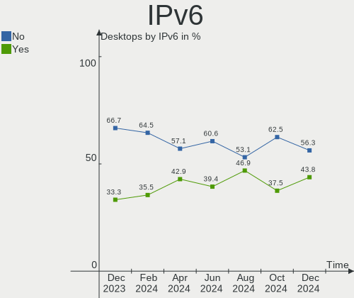

| Used | Desktops | Percent |
|------|----------|---------|
| No   | 28       | 73.68%  |
| Yes  | 10       | 26.32%  |

Bluetooth
---------

Bluetooth Vendor
----------------

Controller vendors

| Vendor                  | Desktops | Percent |
|-------------------------|----------|---------|
| Intel                   | 8        | 50%     |
| Cambridge Silicon Radio | 4        | 25%     |
| TP-Link                 | 1        | 6.25%   |
| MediaTek                | 1        | 6.25%   |
| Dell                    | 1        | 6.25%   |
| ASUSTek Computer        | 1        | 6.25%   |

Bluetooth Model
---------------

Controller models

| Model                                               | Desktops | Percent |
|-----------------------------------------------------|----------|---------|
| Cambridge Silicon Radio Bluetooth Dongle (HCI mode) | 4        | 25%     |
| Intel Wireless-AC 9260 Bluetooth Adapter            | 2        | 12.5%   |
| Intel Wireless-AC 3168 Bluetooth                    | 2        | 12.5%   |
| Intel Bluetooth wireless interface                  | 2        | 12.5%   |
| TP-Link TP-TR- UB500 Adapter                       | 1        | 6.25%   |
| MediaTek Wireless_Device                            | 1        | 6.25%   |
| Intel AX210 Bluetooth                               | 1        | 6.25%   |
| Intel AX200 Bluetooth                               | 1        | 6.25%   |
| Dell BT Mini-Receiver                               | 1        | 6.25%   |
| ASUS ASUS USB-BT500                                 | 1        | 6.25%   |

Sound
-----

Sound Vendor
------------

Sound card vendors

| Vendor                                       | Desktops | Percent |
|----------------------------------------------|----------|---------|
| AMD                                          | 20       | 28.57%  |
| Intel                                        | 19       | 27.14%  |
| Nvidia                                       | 17       | 24.29%  |
| C-Media Electronics                          | 2        | 2.86%   |
| Zoran Co. Personal Media Division (Nogatech) | 1        | 1.43%   |
| Yamaha                                       | 1        | 1.43%   |
| Texas Instruments                            | 1        | 1.43%   |
| Sennheiser Communications                    | 1        | 1.43%   |
| Logitech                                     | 1        | 1.43%   |
| Kingston Technology                          | 1        | 1.43%   |
| GYROCOM C&C                                  | 1        | 1.43%   |
| Focusrite-Novation                           | 1        | 1.43%   |
| FiiO Electronics Technology                  | 1        | 1.43%   |
| Creative Labs                                | 1        | 1.43%   |
| Cooler Master                                | 1        | 1.43%   |
| Audient                                      | 1        | 1.43%   |

Sound Model
-----------

Sound card models

| Model                                                                                             | Desktops | Percent |
|---------------------------------------------------------------------------------------------------|----------|---------|
| AMD Starship/Matisse HD Audio Controller                                                          | 7        | 8.75%   |
| Intel 200 Series PCH HD Audio                                                                     | 4        | 5%      |
| AMD Family 17h (Models 00h-0fh) HD Audio Controller                                               | 4        | 5%      |
| Nvidia High Definition Audio Controller                                                           | 3        | 3.75%   |
| Nvidia GP106 High Definition Audio Controller                                                     | 3        | 3.75%   |
| Intel 82801I (ICH9 Family) HD Audio Controller                                                    | 3        | 3.75%   |
| Intel 8 Series/C220 Series Chipset High Definition Audio Controller                               | 3        | 3.75%   |
| AMD Ellesmere HDMI Audio [Radeon RX 470/480 / 570/580/590]                                        | 3        | 3.75%   |
| Nvidia GK208 HDMI/DP Audio Controller                                                             | 2        | 2.5%    |
| Nvidia GF108 High Definition Audio Controller                                                     | 2        | 2.5%    |
| AMD SBx00 Azalia (Intel HDA)                                                                      | 2        | 2.5%    |
| AMD Navi 21/23 HDMI/DP Audio Controller                                                           | 2        | 2.5%    |
| AMD Family 17h/19h HD Audio Controller                                                            | 2        | 2.5%    |
| AMD Baffin HDMI/DP Audio [Radeon RX 550 640SP / RX 560/560X]                                      | 2        | 2.5%    |
| Zoran Co. Personal Media Division (Nogatech) USB Audio and HID                                    | 1        | 1.25%   |
| Yamaha Steinberg UR22mkII                                                                         | 1        | 1.25%   |
| Texas Instruments PCM2902 Audio Codec                                                             | 1        | 1.25%   |
| Sennheiser Communications Headset [PC 8]                                                          | 1        | 1.25%   |
| Nvidia TU116 High Definition Audio Controller                                                     | 1        | 1.25%   |
| Nvidia TU106 High Definition Audio Controller                                                     | 1        | 1.25%   |
| Nvidia MCP51 High Definition Audio                                                                | 1        | 1.25%   |
| Nvidia GP104 High Definition Audio Controller                                                     | 1        | 1.25%   |
| Nvidia GK110 High Definition Audio Controller                                                     | 1        | 1.25%   |
| Nvidia GA104 High Definition Audio Controller                                                     | 1        | 1.25%   |
| Nvidia Audio device                                                                               | 1        | 1.25%   |
| Logitech Headset H390                                                                             | 1        | 1.25%   |
| Kingston Technology HyperX 7.1 Audio                                                              | 1        | 1.25%   |
| Intel Xeon E3-1200 v3/4th Gen Core Processor HD Audio Controller                                  | 1        | 1.25%   |
| Intel NM10/ICH7 Family High Definition Audio Controller                                           | 1        | 1.25%   |
| Intel Cannon Lake PCH cAVS                                                                        | 1        | 1.25%   |
| Intel Atom/Celeron/Pentium Processor x5-E8000/J3xxx/N3xxx Series High Definition Audio Controller | 1        | 1.25%   |
| Intel Alder Lake-S HD Audio Controller                                                            | 1        | 1.25%   |
| Intel 82801JI (ICH10 Family) HD Audio Controller                                                  | 1        | 1.25%   |
| Intel 82801JD/DO (ICH10 Family) HD Audio Controller                                               | 1        | 1.25%   |
| Intel 7 Series/C216 Chipset Family High Definition Audio Controller                               | 1        | 1.25%   |
| Intel 5 Series/3400 Series Chipset High Definition Audio                                          | 1        | 1.25%   |
| Intel 100 Series/C230 Series Chipset Family HD Audio Controller                                   | 1        | 1.25%   |
| GYROCOM C&C Fiio E10                                                                              | 1        | 1.25%   |
| Focusrite-Novation Scarlett Solo USB                                                              | 1        | 1.25%   |
| FiiO Electronics Technology K3                                                                    | 1        | 1.25%   |
| Creative Labs EMU20k1 [Sound Blaster X-Fi Series]                                                 | 1        | 1.25%   |
| Cooler Master Sirus Headset                                                                       | 1        | 1.25%   |
| C-Media Electronics CM108 Audio Controller                                                        | 1        | 1.25%   |
| C-Media Electronics Audio Adapter (Unitek Y-247A)                                                 | 1        | 1.25%   |
| Audient EVO4                                                                                      | 1        | 1.25%   |
| AMD Tobago HDMI Audio [Radeon R7 360 / R9 360 OEM]                                                | 1        | 1.25%   |
| AMD RS780 HDMI Audio [Radeon 3000/3100 / HD 3200/3300]                                            | 1        | 1.25%   |
| AMD Renoir Radeon High Definition Audio Controller                                                | 1        | 1.25%   |
| AMD Raven/Raven2/Fenghuang HDMI/DP Audio Controller                                               | 1        | 1.25%   |
| AMD Polaris 22 HDMI Audio                                                                         | 1        | 1.25%   |
| AMD FCH Azalia Controller                                                                         | 1        | 1.25%   |
| AMD Caicos HDMI Audio [Radeon HD 6450 / 7450/8450/8490 OEM / R5 230/235/235X OEM]                 | 1        | 1.25%   |

Memory
------

Memory Vendor
-------------

Memory module vendors

| Vendor              | Desktops | Percent |
|---------------------|----------|---------|
| Unknown             | 3        | 21.43%  |
| G.Skill             | 3        | 21.43%  |
| Corsair             | 3        | 21.43%  |
| Transcend           | 1        | 7.14%   |
| Samsung Electronics | 1        | 7.14%   |
| Micron Technology   | 1        | 7.14%   |
| Kingston            | 1        | 7.14%   |
| AMD                 | 1        | 7.14%   |

Memory Model
------------

Memory module models

| Model                                                     | Desktops | Percent |
|-----------------------------------------------------------|----------|---------|
| Unknown RAM Module 8192MB DIMM 1333MT/s                   | 1        | 6.67%   |
| Unknown RAM Module 4096MB DIMM 1333MT/s                   | 1        | 6.67%   |
| Unknown RAM Module 2048MB DIMM 1333MT/s                   | 1        | 6.67%   |
| Transcend RAM JM1333KLH-8G 8192MB DIMM DDR3 1333MT/s      | 1        | 6.67%   |
| Samsung RAM M378B5273DH0-CH9 4GB DIMM DDR3 2133MT/s       | 1        | 6.67%   |
| Micron RAM 8HTF12864AY-800G1 1024MB DIMM DDR2 800MT/s     | 1        | 6.67%   |
| Kingston RAM Module 1024MB DIMM DDR2 800MT/s              | 1        | 6.67%   |
| G.Skill RAM F4-3600C16-16GTZRC 16GB DIMM DDR4 4400MT/s    | 1        | 6.67%   |
| G.Skill RAM F4-3200C16-8GVKB 8192MB DIMM DDR4 3200MT/s    | 1        | 6.67%   |
| G.Skill RAM F4-3200C14-16GVK 16GB DIMM DDR4 3200MT/s      | 1        | 6.67%   |
| Corsair RAM CMV16GX4M1A2133C15 16384MB DIMM DDR4 2134MT/s | 1        | 6.67%   |
| Corsair RAM CMK16GX4M2B3200C16 8GB DIMM DDR4 3600MT/s     | 1        | 6.67%   |
| Corsair RAM CMK16GX4M2A2666C16 8GB DIMM DDR4 3200MT/s     | 1        | 6.67%   |
| Corsair RAM CMK16GX4M2A2400C16 8GB DIMM DDR4 2933MT/s     | 1        | 6.67%   |
| AMD RAM R534G1601U1S 4GB DIMM DDR3 1600MT/s               | 1        | 6.67%   |

Memory Kind
-----------

Memory module kinds

| Kind    | Desktops | Percent |
|---------|----------|---------|
| DDR4    | 6        | 50%     |
| Unknown | 3        | 25%     |
| DDR3    | 2        | 16.67%  |
| DDR2    | 1        | 8.33%   |

Memory Form Factor
------------------

Physical design of the memory module

| Name | Desktops | Percent |
|------|----------|---------|
| DIMM | 12       | 100%    |

Memory Size
-----------

Memory module size

| Size  | Desktops | Percent |
|-------|----------|---------|
| 8192  | 5        | 41.67%  |
| 16384 | 3        | 25%     |
| 4096  | 2        | 16.67%  |
| 2048  | 1        | 8.33%   |
| 1024  | 1        | 8.33%   |

Memory Speed
------------

Memory module speed

| Speed | Desktops | Percent |
|-------|----------|---------|
| 1333  | 4        | 28.57%  |
| 3200  | 2        | 14.29%  |
| 4400  | 1        | 7.14%   |
| 3600  | 1        | 7.14%   |
| 3466  | 1        | 7.14%   |
| 2933  | 1        | 7.14%   |
| 2134  | 1        | 7.14%   |
| 2133  | 1        | 7.14%   |
| 1600  | 1        | 7.14%   |
| 800   | 1        | 7.14%   |

Printers & scanners
-------------------

Printer Vendor
--------------

Printer device vendors

| Vendor             | Desktops | Percent |
|--------------------|----------|---------|
| Seiko Epson        | 1        | 50%     |
| Brother Industries | 1        | 50%     |

Printer Model
-------------

Printer device models

| Model                      | Desktops | Percent |
|----------------------------|----------|---------|
| Seiko Epson ET-2820 Series | 1        | 50%     |
| Brother MFC-J480DW         | 1        | 50%     |

Scanner Vendor
--------------

Scanner device vendors

Zero info for selected period =(

Scanner Model
-------------

Scanner device models

Zero info for selected period =(

Camera
------

Camera Vendor
-------------

Camera device vendors

| Vendor   | Desktops | Percent |
|----------|----------|---------|
| Logitech | 4        | 80%     |
| Microdia | 1        | 20%     |

Camera Model
------------

Camera device models

| Model                                 | Desktops | Percent |
|---------------------------------------|----------|---------|
| Logitech HD Pro Webcam C920           | 2        | 40%     |
| Microdia Laptop_Integrated_Webcam_FHD | 1        | 20%     |
| Logitech Webcam C310                  | 1        | 20%     |
| Logitech Webcam C270                  | 1        | 20%     |

Security
--------

Fingerprint Vendor
------------------

Fingerprint sensor vendors

Zero info for selected period =(

Fingerprint Model
-----------------

Fingerprint sensor models

Zero info for selected period =(

Chipcard Vendor
---------------

Chipcard module vendors

| Vendor     | Desktops | Percent |
|------------|----------|---------|
| Clay Logic | 1        | 100%    |

Chipcard Model
--------------

Chipcard module models

| Model                   | Desktops | Percent |
|-------------------------|----------|---------|
| Clay Logic Nitrokey HSM | 1        | 100%    |

Unsupported
-----------

Unsupported Devices
-------------------

Total unsupported devices on board

| Total | Desktops | Percent |
|-------|----------|---------|
| 0     | 35       | 92.11%  |
| 3     | 1        | 2.63%   |
| 2     | 1        | 2.63%   |
| 1     | 1        | 2.63%   |

Unsupported Device Types
------------------------

Types of unsupported devices

| Type                     | Desktops | Percent |
|--------------------------|----------|---------|
| Net/wireless             | 2        | 33.33%  |
| Communication controller | 2        | 33.33%  |
| Graphics card            | 1        | 16.67%  |
| Card reader              | 1        | 16.67%  |

