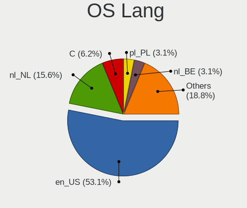
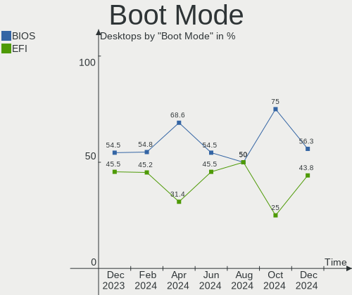
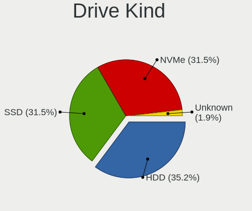
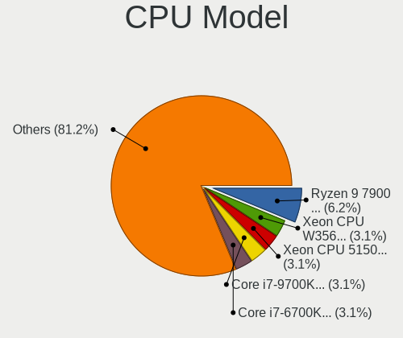
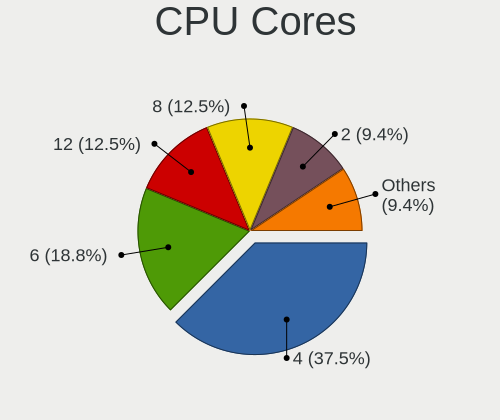
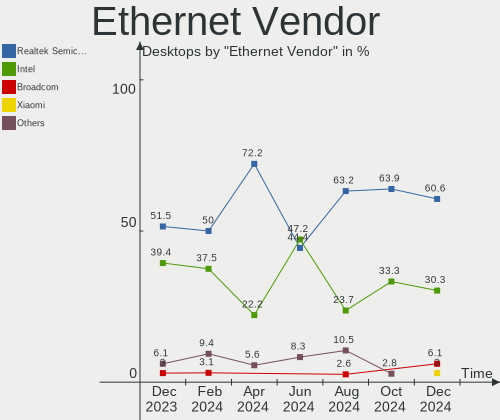
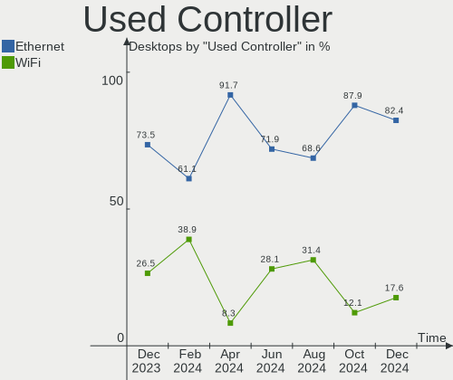
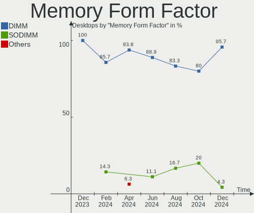

Linux in Netherlands - Hardware Trends (Desktops)
-------------------------------------------------

A project to identify most popular hardware characteristics and track their change
over time based on data collected by Linux users at https://Linux-Hardware.org.

Anyone can contribute to this report by the [hw-probe](https://github.com/linuxhw/hw-probe) tool:

    sudo -E hw-probe -all -upload

Period: Sep, 2023.

Contents
--------

* [ System ](#system)
  - [ OS                       ](#os)
  - [ OS Family                ](#os-family)
  - [ Kernel                   ](#kernel)
  - [ Kernel Family            ](#kernel-family)
  - [ Kernel Major Ver.        ](#kernel-major-ver)
  - [ Arch                     ](#arch)
  - [ DE                       ](#de)
  - [ Display Server           ](#display-server)
  - [ Display Manager          ](#display-manager)
  - [ OS Lang                  ](#os-lang)
  - [ Boot Mode                ](#boot-mode)
  - [ Filesystem               ](#filesystem)
  - [ Part. scheme             ](#part-scheme)
  - [ Dual Boot with Linux/BSD ](#dual-boot-with-linuxbsd)
  - [ Dual Boot (Win)          ](#dual-boot-win)

* [ Board ](#board)
  - [ Vendor                   ](#vendor)
  - [ Model                    ](#model)
  - [ Model Family             ](#model-family)
  - [ MFG Year                 ](#mfg-year)
  - [ Form Factor              ](#form-factor)
  - [ Secure Boot              ](#secure-boot)
  - [ Coreboot                 ](#coreboot)
  - [ RAM Size                 ](#ram-size)
  - [ RAM Used                 ](#ram-used)
  - [ Total Drives             ](#total-drives)
  - [ Has CD-ROM               ](#has-cd-rom)
  - [ Has Ethernet             ](#has-ethernet)
  - [ Has WiFi                 ](#has-wifi)
  - [ Has Bluetooth            ](#has-bluetooth)

* [ Location ](#location)
  - [ Country                  ](#country)
  - [ City                     ](#city)

* [ Drives ](#drives)
  - [ Drive Vendor             ](#drive-vendor)
  - [ Drive Model              ](#drive-model)
  - [ HDD Vendor               ](#hdd-vendor)
  - [ SSD Vendor               ](#ssd-vendor)
  - [ Drive Kind               ](#drive-kind)
  - [ Drive Connector          ](#drive-connector)
  - [ Drive Size               ](#drive-size)
  - [ Space Total              ](#space-total)
  - [ Space Used               ](#space-used)
  - [ Malfunc. Drives          ](#malfunc-drives)
  - [ Malfunc. Drive Vendor    ](#malfunc-drive-vendor)
  - [ Malfunc. HDD Vendor      ](#malfunc-hdd-vendor)
  - [ Malfunc. Drive Kind      ](#malfunc-drive-kind)
  - [ Failed Drives            ](#failed-drives)
  - [ Failed Drive Vendor      ](#failed-drive-vendor)
  - [ Drive Status             ](#drive-status)

* [ Storage controller ](#storage-controller)
  - [ Storage Vendor           ](#storage-vendor)
  - [ Storage Model            ](#storage-model)
  - [ Storage Kind             ](#storage-kind)

* [ Processor ](#processor)
  - [ CPU Vendor               ](#cpu-vendor)
  - [ CPU Model                ](#cpu-model)
  - [ CPU Model Family         ](#cpu-model-family)
  - [ CPU Cores                ](#cpu-cores)
  - [ CPU Sockets              ](#cpu-sockets)
  - [ CPU Threads              ](#cpu-threads)
  - [ CPU Op-Modes             ](#cpu-op-modes)
  - [ CPU Microcode            ](#cpu-microcode)
  - [ CPU Microarch            ](#cpu-microarch)

* [ Graphics ](#graphics)
  - [ GPU Vendor               ](#gpu-vendor)
  - [ GPU Model                ](#gpu-model)
  - [ GPU Combo                ](#gpu-combo)
  - [ GPU Driver               ](#gpu-driver)
  - [ GPU Memory               ](#gpu-memory)

* [ Monitor ](#monitor)
  - [ Monitor Vendor           ](#monitor-vendor)
  - [ Monitor Model            ](#monitor-model)
  - [ Monitor Resolution       ](#monitor-resolution)
  - [ Monitor Diagonal         ](#monitor-diagonal)
  - [ Monitor Width            ](#monitor-width)
  - [ Aspect Ratio             ](#aspect-ratio)
  - [ Monitor Area             ](#monitor-area)
  - [ Pixel Density            ](#pixel-density)
  - [ Multiple Monitors        ](#multiple-monitors)

* [ Network ](#network)
  - [ Net Controller Vendor    ](#net-controller-vendor)
  - [ Net Controller Model     ](#net-controller-model)
  - [ Wireless Vendor          ](#wireless-vendor)
  - [ Wireless Model           ](#wireless-model)
  - [ Ethernet Vendor          ](#ethernet-vendor)
  - [ Ethernet Model           ](#ethernet-model)
  - [ Net Controller Kind      ](#net-controller-kind)
  - [ Used Controller          ](#used-controller)
  - [ NICs                     ](#nics)
  - [ IPv6                     ](#ipv6)

* [ Bluetooth ](#bluetooth)
  - [ Bluetooth Vendor         ](#bluetooth-vendor)
  - [ Bluetooth Model          ](#bluetooth-model)

* [ Sound ](#sound)
  - [ Sound Vendor             ](#sound-vendor)
  - [ Sound Model              ](#sound-model)

* [ Memory ](#memory)
  - [ Memory Vendor            ](#memory-vendor)
  - [ Memory Model             ](#memory-model)
  - [ Memory Kind              ](#memory-kind)
  - [ Memory Form Factor       ](#memory-form-factor)
  - [ Memory Size              ](#memory-size)
  - [ Memory Speed             ](#memory-speed)

* [ Printers & scanners ](#printers--scanners)
  - [ Printer Vendor           ](#printer-vendor)
  - [ Printer Model            ](#printer-model)
  - [ Scanner Vendor           ](#scanner-vendor)
  - [ Scanner Model            ](#scanner-model)

* [ Camera ](#camera)
  - [ Camera Vendor            ](#camera-vendor)
  - [ Camera Model             ](#camera-model)

* [ Security ](#security)
  - [ Fingerprint Vendor       ](#fingerprint-vendor)
  - [ Fingerprint Model        ](#fingerprint-model)
  - [ Chipcard Vendor          ](#chipcard-vendor)
  - [ Chipcard Model           ](#chipcard-model)

* [ Unsupported ](#unsupported)
  - [ Unsupported Devices      ](#unsupported-devices)
  - [ Unsupported Device Types ](#unsupported-device-types)

System
------

OS
--

Installed operating systems

| Name                 | Desktops | Percent |
|----------------------|----------|---------|
| Ubuntu 22.04         | 6        | 13.33%  |
| OpenMandriva 23.08   | 6        | 13.33%  |
| Fedora 38            | 6        | 13.33%  |
| Linux Mint 21.2      | 4        | 8.89%   |
| OpenMandriva 23.09   | 3        | 6.67%   |
| Debian 12            | 3        | 6.67%   |
| Zorin 16             | 2        | 4.44%   |
| Kubuntu 22.04        | 2        | 4.44%   |
| ArcoLinux Rolling    | 2        | 4.44%   |
| Xero Rolling         | 1        | 2.22%   |
| Ubuntu 23.04         | 1        | 2.22%   |
| Ubuntu 20.04         | 1        | 2.22%   |
| OpenMandriva 4.3     | 1        | 2.22%   |
| OpenMandriva 23.90   | 1        | 2.22%   |
| Nobara 38            | 1        | 2.22%   |
| Manjaro              | 1        | 2.22%   |
| LMDE 5               | 1        | 2.22%   |
| Garuda Linux Soaring | 1        | 2.22%   |
| Debian 11            | 1        | 2.22%   |
| Arch Rolling         | 1        | 2.22%   |

OS Family
---------

OS without a version

| Name         | Desktops | Percent |
|--------------|----------|---------|
| OpenMandriva | 11       | 24.44%  |
| Ubuntu       | 8        | 17.78%  |
| Fedora       | 6        | 13.33%  |
| Linux Mint   | 4        | 8.89%   |
| Debian       | 4        | 8.89%   |
| Zorin        | 2        | 4.44%   |
| Kubuntu      | 2        | 4.44%   |
| ArcoLinux    | 2        | 4.44%   |
| Xero         | 1        | 2.22%   |
| Nobara       | 1        | 2.22%   |
| Manjaro      | 1        | 2.22%   |
| LMDE         | 1        | 2.22%   |
| Garuda Linux | 1        | 2.22%   |
| Arch         | 1        | 2.22%   |

Kernel
------

Version of the Linux kernel

| Version                      | Desktops | Percent |
|------------------------------|----------|---------|
| 5.15.0-83-generic            | 7        | 15.56%  |
| 6.4.11-desktop-1omv2390      | 5        | 11.11%  |
| 6.4.15-200.fc38.x86_64       | 3        | 6.67%   |
| 6.4.12-arch1-1               | 3        | 6.67%   |
| 6.2.0-33-generic             | 3        | 6.67%   |
| 6.2.0-32-generic             | 3        | 6.67%   |
| 6.5.3-desktop-1omv2390       | 2        | 4.44%   |
| 6.5.2-zen1-1-zen             | 1        | 2.22%   |
| 6.5.2-desktop-1omv2390       | 1        | 2.22%   |
| 6.5.0-desktop-1omv2390       | 1        | 2.22%   |
| 6.5.0-1-MANJARO              | 1        | 2.22%   |
| 6.4.8-desktop-2omv2390       | 1        | 2.22%   |
| 6.4.12-200.fc38.x86_64       | 1        | 2.22%   |
| 6.4.10-202.fsync.fc38.x86_64 | 1        | 2.22%   |
| 6.2.9-300.fc38.x86_64        | 1        | 2.22%   |
| 6.2.0-26-generic             | 1        | 2.22%   |
| 6.1.55-1-lts                 | 1        | 2.22%   |
| 6.1.0-12-arm64               | 1        | 2.22%   |
| 6.1.0-12-amd64               | 1        | 2.22%   |
| 6.1.0-11-amd64               | 1        | 2.22%   |
| 5.16.13-desktop-1omv4003     | 1        | 2.22%   |
| 5.15.129-200.fc38.x86_64     | 1        | 2.22%   |
| 5.15.0-84-generic            | 1        | 2.22%   |
| 5.11.0-43-generic            | 1        | 2.22%   |
| 5.10.0-25-amd64              | 1        | 2.22%   |
| 5.10.0-23-amd64              | 1        | 2.22%   |

Kernel Family
-------------

Linux kernel without a distro release

| Version  | Desktops | Percent |
|----------|----------|---------|
| 5.15.0   | 8        | 17.78%  |
| 6.2.0    | 7        | 15.56%  |
| 6.4.11   | 5        | 11.11%  |
| 6.4.12   | 4        | 8.89%   |
| 6.4.15   | 3        | 6.67%   |
| 6.1.0    | 3        | 6.67%   |
| 6.5.3    | 2        | 4.44%   |
| 6.5.2    | 2        | 4.44%   |
| 6.5.0    | 2        | 4.44%   |
| 5.10.0   | 2        | 4.44%   |
| 6.4.8    | 1        | 2.22%   |
| 6.4.10   | 1        | 2.22%   |
| 6.2.9    | 1        | 2.22%   |
| 6.1.55   | 1        | 2.22%   |
| 5.16.13  | 1        | 2.22%   |
| 5.15.129 | 1        | 2.22%   |
| 5.11.0   | 1        | 2.22%   |

Kernel Major Ver.
-----------------

Linux kernel major version

| Version | Desktops | Percent |
|---------|----------|---------|
| 6.4     | 14       | 31.11%  |
| 5.15    | 9        | 20%     |
| 6.2     | 8        | 17.78%  |
| 6.5     | 6        | 13.33%  |
| 6.1     | 4        | 8.89%   |
| 5.10    | 2        | 4.44%   |
| 5.16    | 1        | 2.22%   |
| 5.11    | 1        | 2.22%   |

Arch
----

OS architecture (x86_64, i586, etc.)

| Name    | Desktops | Percent |
|---------|----------|---------|
| x86_64  | 44       | 97.78%  |
| aarch64 | 1        | 2.22%   |

DE
--

Desktop Environment

| Name            | Desktops | Percent |
|-----------------|----------|---------|
| GNOME           | 16       | 35.56%  |
| KDE5            | 15       | 33.33%  |
| X-Cinnamon      | 7        | 15.56%  |
| LXQt            | 2        | 4.44%   |
| XFCE            | 1        | 2.22%   |
| MATE            | 1        | 2.22%   |
| GNOME Flashback | 1        | 2.22%   |
| Cinnamon        | 1        | 2.22%   |
| Unknown         | 1        | 2.22%   |

Display Server
--------------

X11 or Wayland

| Name    | Desktops | Percent |
|---------|----------|---------|
| X11     | 24       | 53.33%  |
| Wayland | 20       | 44.44%  |
| Tty     | 1        | 2.22%   |

Display Manager
---------------

SDDM, LightDM, etc.

| Name    | Desktops | Percent |
|---------|----------|---------|
| SDDM    | 16       | 35.56%  |
| Unknown | 14       | 31.11%  |
| GDM3    | 8        | 17.78%  |
| LightDM | 4        | 8.89%   |
| GDM     | 3        | 6.67%   |

OS Lang
-------

Language

| Lang  | Desktops | Percent |
|-------|----------|---------|
| en_US | 22       | 48.89%  |
| nl_NL | 18       | 40%     |
| en_GB | 2        | 4.44%   |
| en_ZA | 1        | 2.22%   |
| en_EN | 1        | 2.22%   |
| de_DE | 1        | 2.22%   |

Boot Mode
---------

EFI or BIOS

| Mode | Desktops | Percent |
|------|----------|---------|
| EFI  | 23       | 51.11%  |
| BIOS | 22       | 48.89%  |

Filesystem
----------

Type of filesystem

| Type    | Desktops | Percent |
|---------|----------|---------|
| Ext4    | 24       | 53.33%  |
| Btrfs   | 10       | 22.22%  |
| Tmpfs   | 9        | 20%     |
| Overlay | 2        | 4.44%   |

Part. scheme
------------

Scheme of partitioning

| Type    | Desktops | Percent |
|---------|----------|---------|
| GPT     | 28       | 62.22%  |
| Unknown | 13       | 28.89%  |
| MBR     | 4        | 8.89%   |

Dual Boot with Linux/BSD
------------------------

Hosting more than one Linux/BSD

| Dual boot | Desktops | Percent |
|-----------|----------|---------|
| No        | 35       | 77.78%  |
| Yes       | 10       | 22.22%  |

Dual Boot (Win)
---------------

Hosting Linux and Windows

| Dual boot | Desktops | Percent |
|-----------|----------|---------|
| No        | 34       | 75.56%  |
| Yes       | 11       | 24.44%  |

Board
-----

Vendor
------

Motherboard manufacturer

| Name                | Desktops | Percent |
|---------------------|----------|---------|
| ASUSTek Computer    | 11       | 24.44%  |
| MSI                 | 7        | 15.56%  |
| Gigabyte Technology | 6        | 13.33%  |
| Hewlett-Packard     | 4        | 8.89%   |
| Dell                | 4        | 8.89%   |
| ASRock              | 3        | 6.67%   |
| Medion              | 2        | 4.44%   |
| Intel               | 2        | 4.44%   |
| SolidRun            | 1        | 2.22%   |
| MP                  | 1        | 2.22%   |
| Lenovo              | 1        | 2.22%   |
| BESSTAR Tech        | 1        | 2.22%   |
| Acer                | 1        | 2.22%   |
| Unknown             | 1        | 2.22%   |

Model
-----

Motherboard model

| Name                                    | Desktops | Percent |
|-----------------------------------------|----------|---------|
| Dell OptiPlex 7010                      | 3        | 6.67%   |
| MSI MS-7740                             | 2        | 4.44%   |
| Gigabyte X570 AORUS MASTER              | 2        | 4.44%   |
| SolidRun CEX7 Platform                  | 1        | 2.22%   |
| MSI MS-7C95                             | 1        | 2.22%   |
| MSI MS-7C02                             | 1        | 2.22%   |
| MSI MS-7B85                             | 1        | 2.22%   |
| MSI MS-7996                             | 1        | 2.22%   |
| MSI Cubi N 8GL (MS-B171)                | 1        | 2.22%   |
| MP MS-7848                              | 1        | 2.22%   |
| Medion MS-7667                          | 1        | 2.22%   |
| Medion ERAZER P46002 MD34021/C576       | 1        | 2.22%   |
| Lenovo IdeaCentre 310S-08IGM 90HX001WMH | 1        | 2.22%   |
| Intel X79                               | 1        | 2.22%   |
| Intel D33217GKE G76540-205              | 1        | 2.22%   |
| HP Z200 Workstation                     | 1        | 2.22%   |
| HP ProDesk 490 G2 MT                    | 1        | 2.22%   |
| HP Compaq Pro 6300 MT                   | 1        | 2.22%   |
| HP Compaq Pro 4300 SFF PC               | 1        | 2.22%   |
| Gigabyte Z270X-Ultra Gaming             | 1        | 2.22%   |
| Gigabyte B550M S2H                      | 1        | 2.22%   |
| Gigabyte AB350N-Gaming WIFI             | 1        | 2.22%   |
| Gigabyte AB350M-Gaming 3                | 1        | 2.22%   |
| Dell Studio XPS 8100                    | 1        | 2.22%   |
| BESSTAR Tech UM350                      | 1        | 2.22%   |
| ASUS TUF Gaming B550M-PLUS              | 1        | 2.22%   |
| ASUS ROG STRIX X670E-F GAMING WIFI      | 1        | 2.22%   |
| ASUS ROG STRIX B650E-F GAMING WIFI      | 1        | 2.22%   |
| ASUS PRIME B550-PLUS                    | 1        | 2.22%   |
| ASUS PRIME B365M-A                      | 1        | 2.22%   |
| ASUS P8H61-I R2.0                       | 1        | 2.22%   |
| ASUS P7P55D                             | 1        | 2.22%   |
| ASUS P7P55 LX                           | 1        | 2.22%   |
| ASUS M2N-MX SE Plus                     | 1        | 2.22%   |
| ASUS B150M-PLUS                         | 1        | 2.22%   |
| ASUS A88X-PLUS                          | 1        | 2.22%   |
| ASRock B450M-HDV                        | 1        | 2.22%   |
| ASRock AB350M Pro4                      | 1        | 2.22%   |
| ASRock A300M-STX                        | 1        | 2.22%   |
| Acer Aspire M7720                       | 1        | 2.22%   |

Model Family
------------

Motherboard model prefix

| Name                   | Desktops | Percent |
|------------------------|----------|---------|
| Dell OptiPlex          | 3        | 6.67%   |
| MSI MS-7740            | 2        | 4.44%   |
| HP Compaq              | 2        | 4.44%   |
| Gigabyte X570          | 2        | 4.44%   |
| ASUS ROG               | 2        | 4.44%   |
| ASUS PRIME             | 2        | 4.44%   |
| SolidRun CEX7          | 1        | 2.22%   |
| MSI MS-7C95            | 1        | 2.22%   |
| MSI MS-7C02            | 1        | 2.22%   |
| MSI MS-7B85            | 1        | 2.22%   |
| MSI MS-7996            | 1        | 2.22%   |
| MSI Cubi               | 1        | 2.22%   |
| MP MS-7848             | 1        | 2.22%   |
| Medion MS-7667         | 1        | 2.22%   |
| Medion ERAZER          | 1        | 2.22%   |
| Lenovo IdeaCentre      | 1        | 2.22%   |
| Intel X79              | 1        | 2.22%   |
| Intel D33217GKE        | 1        | 2.22%   |
| HP Z200                | 1        | 2.22%   |
| HP ProDesk             | 1        | 2.22%   |
| Gigabyte Z270X-Ultra   | 1        | 2.22%   |
| Gigabyte B550M         | 1        | 2.22%   |
| Gigabyte AB350N-Gaming | 1        | 2.22%   |
| Gigabyte AB350M-Gaming | 1        | 2.22%   |
| Dell Studio            | 1        | 2.22%   |
| BESSTAR Tech UM350     | 1        | 2.22%   |
| ASUS TUF               | 1        | 2.22%   |
| ASUS P8H61-I           | 1        | 2.22%   |
| ASUS P7P55D            | 1        | 2.22%   |
| ASUS P7P55             | 1        | 2.22%   |
| ASUS M2N-MX            | 1        | 2.22%   |
| ASUS B150M-PLUS        | 1        | 2.22%   |
| ASUS A88X-PLUS         | 1        | 2.22%   |
| ASRock B450M-HDV       | 1        | 2.22%   |
| ASRock AB350M          | 1        | 2.22%   |
| ASRock A300M-STX       | 1        | 2.22%   |
| Acer Aspire            | 1        | 2.22%   |
| Unknown                | 1        | 2.22%   |

MFG Year
--------

Motherboard manufacture year

| Year | Desktops | Percent |
|------|----------|---------|
| 2013 | 6        | 13.33%  |
| 2020 | 5        | 11.11%  |
| 2018 | 5        | 11.11%  |
| 2019 | 4        | 8.89%   |
| 2017 | 4        | 8.89%   |
| 2022 | 3        | 6.67%   |
| 2012 | 3        | 6.67%   |
| 2011 | 3        | 6.67%   |
| 2009 | 3        | 6.67%   |
| 2016 | 2        | 4.44%   |
| 2015 | 2        | 4.44%   |
| 2021 | 1        | 2.22%   |
| 2014 | 1        | 2.22%   |
| 2010 | 1        | 2.22%   |
| 2008 | 1        | 2.22%   |
| 2006 | 1        | 2.22%   |

Form Factor
-----------

Physical design of the computer

| Name    | Desktops | Percent |
|---------|----------|---------|
| Desktop | 45       | 100%    |

Secure Boot
-----------

Enabled or disabled

| State    | Desktops | Percent |
|----------|----------|---------|
| Disabled | 42       | 93.33%  |
| Enabled  | 3        | 6.67%   |

Coreboot
--------

Have coreboot on board

| Used | Desktops | Percent |
|------|----------|---------|
| No   | 45       | 100%    |

RAM Size
--------

Total RAM memory

| Size in GB  | Desktops | Percent |
|-------------|----------|---------|
| 8.01-16.0   | 14       | 31.11%  |
| 16.01-24.0  | 10       | 22.22%  |
| 32.01-64.0  | 7        | 15.56%  |
| 4.01-8.0    | 4        | 8.89%   |
| 3.01-4.0    | 4        | 8.89%   |
| 24.01-32.0  | 3        | 6.67%   |
| 64.01-256.0 | 2        | 4.44%   |
| 2.01-3.0    | 1        | 2.22%   |

RAM Used
--------

Used RAM memory

| Used GB   | Desktops | Percent |
|-----------|----------|---------|
| 2.01-3.0  | 14       | 31.11%  |
| 1.01-2.0  | 14       | 31.11%  |
| 4.01-8.0  | 6        | 13.33%  |
| 3.01-4.0  | 6        | 13.33%  |
| 0.51-1.0  | 3        | 6.67%   |
| 8.01-16.0 | 2        | 4.44%   |

Total Drives
------------

Number of drives on board

| Drives | Desktops | Percent |
|--------|----------|---------|
| 1      | 17       | 37.78%  |
| 2      | 14       | 31.11%  |
| 3      | 7        | 15.56%  |
| 4      | 4        | 8.89%   |
| 5      | 3        | 6.67%   |

Has CD-ROM
----------

Has CD-ROM on board

| Presented | Desktops | Percent |
|-----------|----------|---------|
| No        | 24       | 53.33%  |
| Yes       | 21       | 46.67%  |

Has Ethernet
------------

Has Ethernet on board

| Presented | Desktops | Percent |
|-----------|----------|---------|
| Yes       | 44       | 97.78%  |
| No        | 1        | 2.22%   |

Has WiFi
--------

Has WiFi module

| Presented | Desktops | Percent |
|-----------|----------|---------|
| No        | 30       | 66.67%  |
| Yes       | 15       | 33.33%  |

Has Bluetooth
-------------

Has Bluetooth module

| Presented | Desktops | Percent |
|-----------|----------|---------|
| No        | 32       | 71.11%  |
| Yes       | 13       | 28.89%  |

Location
--------

Country
-------

Geographic location (country)

| Country     | Desktops | Percent |
|-------------|----------|---------|
| Netherlands | 45       | 100%    |

City
----

Geographic location (city)

| City                   | Desktops | Percent |
|------------------------|----------|---------|
| Amsterdam              | 7        | 15.56%  |
| The Hague              | 4        | 8.89%   |
| Utrecht                | 2        | 4.44%   |
| Rotterdam              | 2        | 4.44%   |
| Nijmegen               | 2        | 4.44%   |
| Eexterveen             | 2        | 4.44%   |
| Arnhem                 | 2        | 4.44%   |
| Amersfoort             | 2        | 4.44%   |
| Zuidwolde              | 1        | 2.22%   |
| Zevenhuizen            | 1        | 2.22%   |
| Zeist                  | 1        | 2.22%   |
| Zaandam                | 1        | 2.22%   |
| Weert                  | 1        | 2.22%   |
| Sprang                 | 1        | 2.22%   |
| Sint Annaland          | 1        | 2.22%   |
| Saasveld               | 1        | 2.22%   |
| Naaldwijk              | 1        | 2.22%   |
| Lisse                  | 1        | 2.22%   |
| Leiden                 | 1        | 2.22%   |
| Hengelo                | 1        | 2.22%   |
| Hendrik-Ido-Ambacht    | 1        | 2.22%   |
| Haarlem                | 1        | 2.22%   |
| Emmen                  | 1        | 2.22%   |
| Capelle aan den IJssel | 1        | 2.22%   |
| Bussum                 | 1        | 2.22%   |
| Bruinisse              | 1        | 2.22%   |
| Bodegraven             | 1        | 2.22%   |
| Bergen op Zoom         | 1        | 2.22%   |
| Alphen aan den Rijn    | 1        | 2.22%   |
| Almere Stad            | 1        | 2.22%   |

Drives
------

Drive Vendor
------------

Hard drive vendors

| Vendor                       | Desktops | Drives | Percent |
|------------------------------|----------|--------|---------|
| Samsung Electronics          | 19       | 26     | 23.17%  |
| WDC                          | 10       | 13     | 12.2%   |
| Seagate                      | 10       | 11     | 12.2%   |
| Kingston                     | 10       | 10     | 12.2%   |
| Crucial                      | 6        | 7      | 7.32%   |
| Sandisk                      | 5        | 5      | 6.1%    |
| Toshiba                      | 3        | 4      | 3.66%   |
| SK hynix                     | 2        | 2      | 2.44%   |
| Micron/Crucial Technology    | 2        | 3      | 2.44%   |
| Intel                        | 2        | 2      | 2.44%   |
| Shenzhen Longsys Electronics | 1        | 1      | 1.22%   |
| PNY                          | 1        | 1      | 1.22%   |
| Maxtor                       | 1        | 1      | 1.22%   |
| LITEONIT                     | 1        | 1      | 1.22%   |
| KingSpec                     | 1        | 1      | 1.22%   |
| KingFast                     | 1        | 1      | 1.22%   |
| JMicron Technology           | 1        | 1      | 1.22%   |
| Intenso                      | 1        | 1      | 1.22%   |
| Hitachi                      | 1        | 1      | 1.22%   |
| Hewlett-Packard              | 1        | 1      | 1.22%   |
| GOODRAM                      | 1        | 1      | 1.22%   |
| Gigabyte Technology          | 1        | 1      | 1.22%   |
| China                        | 1        | 1      | 1.22%   |

Drive Model
-----------

Hard drive models

| Model                                               | Desktops | Percent |
|-----------------------------------------------------|----------|---------|
| Samsung NVMe SSD Controller SM981/PM981/PM983 256GB | 4        | 4.35%   |
| Samsung SSD 970 EVO 1TB                             | 2        | 2.17%   |
| Samsung SSD 860 EVO 1TB                             | 2        | 2.17%   |
| Micron/Crucial P2 NVMe PCIe SSD 1TB                 | 2        | 2.17%   |
| Kingston SV300S37A120G 120GB SSD                    | 2        | 2.17%   |
| Kingston SA400S37960G 960GB SSD                     | 2        | 2.17%   |
| Crucial CT1000MX500SSD1 1TB                         | 2        | 2.17%   |
| WDC WDS250G2B0C-00PXH0 250GB                        | 1        | 1.09%   |
| WDC WD5001ABYS-01YNA0 500GB                         | 1        | 1.09%   |
| WDC WD5000AVDS-63U7B1 500GB                         | 1        | 1.09%   |
| WDC WD5000AAKX-001CA0 500GB                         | 1        | 1.09%   |
| WDC WD3200BEVT-22ZCT0 320GB                         | 1        | 1.09%   |
| WDC WD30EZRZ-00Z5HB0 3TB                            | 1        | 1.09%   |
| WDC WD30EZRX-00SPEB0 3TB                            | 1        | 1.09%   |
| WDC WD20EZRX-00D8PB0 2TB                            | 1        | 1.09%   |
| WDC WD1600AAJS-61M0A0 160GB                         | 1        | 1.09%   |
| WDC WD10PURX-64E5EY0 1TB                            | 1        | 1.09%   |
| WDC WD10EARX-22N0YB0 1TB                            | 1        | 1.09%   |
| WDC WD1003FBYZ-010FB0 1TB                           | 1        | 1.09%   |
| WDC WD1003FBYX-01Y7B1 1TB                           | 1        | 1.09%   |
| Toshiba THNSN5128GPU7 128GB                         | 1        | 1.09%   |
| Toshiba MQ02ABD100H 1TB                             | 1        | 1.09%   |
| Toshiba KXG60ZNV256G 256GB                          | 1        | 1.09%   |
| Toshiba HDWD120 2TB                                 | 1        | 1.09%   |
| SK hynix SHPP41-1000GM 1TB                          | 1        | 1.09%   |
| SK hynix SC311 SATA 256GB SSD                       | 1        | 1.09%   |
| Shenzhen Longsys Lexar 512GB SSD                    | 1        | 1.09%   |
| Seagate ST9500423AS 500GB                           | 1        | 1.09%   |
| Seagate ST6000VN001-2BB186 6TB                      | 1        | 1.09%   |
| Seagate ST500LX003-1AC15G 500GB                     | 1        | 1.09%   |
| Seagate ST4000DM005-2DP166 4TB                      | 1        | 1.09%   |
| Seagate ST4000DM004-2CV104 4TB                      | 1        | 1.09%   |
| Seagate ST3500414CS 500GB                           | 1        | 1.09%   |
| Seagate ST31000340AS 1TB                            | 1        | 1.09%   |
| Seagate ST2000DM008-2UB102 2TB                      | 1        | 1.09%   |
| Seagate ST1000DM003-1SB102 1TB                      | 1        | 1.09%   |
| Seagate ST1000DM003-1ER162 1TB                      | 1        | 1.09%   |
| Sandisk WDC WDS100T2B0C-00PXH0 1TB                  | 1        | 1.09%   |
| Sandisk WD Blue SN550 NVMe SSD 512GB                | 1        | 1.09%   |
| Sandisk WD Black SN850 1TB                          | 1        | 1.09%   |

HDD Vendor
----------

Hard disk drive vendors

| Vendor              | Desktops | Drives | Percent |
|---------------------|----------|--------|---------|
| Seagate             | 10       | 11     | 35.71%  |
| WDC                 | 9        | 12     | 32.14%  |
| Samsung Electronics | 3        | 3      | 10.71%  |
| Toshiba             | 2        | 2      | 7.14%   |
| Maxtor              | 1        | 1      | 3.57%   |
| Intenso             | 1        | 1      | 3.57%   |
| Hitachi             | 1        | 1      | 3.57%   |
| Hewlett-Packard     | 1        | 1      | 3.57%   |

SSD Vendor
----------

Solid state drive vendors

| Vendor              | Desktops | Drives | Percent |
|---------------------|----------|--------|---------|
| Kingston            | 10       | 10     | 28.57%  |
| Samsung Electronics | 8        | 11     | 22.86%  |
| Crucial             | 6        | 7      | 17.14%  |
| SanDisk             | 2        | 2      | 5.71%   |
| Intel               | 2        | 2      | 5.71%   |
| SK hynix            | 1        | 1      | 2.86%   |
| PNY                 | 1        | 1      | 2.86%   |
| LITEONIT            | 1        | 1      | 2.86%   |
| KingSpec            | 1        | 1      | 2.86%   |
| JMicron Technology  | 1        | 1      | 2.86%   |
| GOODRAM             | 1        | 1      | 2.86%   |
| China               | 1        | 1      | 2.86%   |

Drive Kind
----------

HDD or SSD

| Kind    | Desktops | Drives | Percent |
|---------|----------|--------|---------|
| SSD     | 31       | 39     | 43.66%  |
| HDD     | 22       | 32     | 30.99%  |
| NVMe    | 17       | 24     | 23.94%  |
| Unknown | 1        | 1      | 1.41%   |

Drive Connector
---------------

SATA, SAS, NVMe, etc.

| Type | Desktops | Drives | Percent |
|------|----------|--------|---------|
| SATA | 39       | 69     | 66.1%   |
| NVMe | 17       | 24     | 28.81%  |
| SAS  | 3        | 3      | 5.08%   |

Drive Size
----------

Size of hard drive

| Size in TB | Desktops | Drives | Percent |
|------------|----------|--------|---------|
| 0.01-0.5   | 27       | 38     | 49.09%  |
| 0.51-1.0   | 18       | 22     | 32.73%  |
| 1.01-2.0   | 4        | 4      | 7.27%   |
| 3.01-4.0   | 3        | 4      | 5.45%   |
| 2.01-3.0   | 2        | 2      | 3.64%   |
| 4.01-10.0  | 1        | 1      | 1.82%   |

Space Total
-----------

Amount of disk space available on the file system

| Size in GB     | Desktops | Percent |
|----------------|----------|---------|
| 101-250        | 13       | 28.89%  |
| 501-1000       | 11       | 24.44%  |
| 251-500        | 4        | 8.89%   |
| 2001-3000      | 4        | 8.89%   |
| More than 3000 | 3        | 6.67%   |
| 1001-2000      | 3        | 6.67%   |
| 51-100         | 3        | 6.67%   |
| Unknown        | 3        | 6.67%   |
| 1-20           | 1        | 2.22%   |

Space Used
----------

Amount of used disk space

| Used GB        | Desktops | Percent |
|----------------|----------|---------|
| 1-20           | 21       | 46.67%  |
| 51-100         | 6        | 13.33%  |
| 21-50          | 5        | 11.11%  |
| 251-500        | 3        | 6.67%   |
| 101-250        | 3        | 6.67%   |
| Unknown        | 3        | 6.67%   |
| 1001-2000      | 2        | 4.44%   |
| More than 3000 | 1        | 2.22%   |
| 501-1000       | 1        | 2.22%   |

Malfunc. Drives
---------------

Drive models with a malfunction

| Model                            | Desktops | Drives | Percent |
|----------------------------------|----------|--------|---------|
| Seagate ST1000DM003-1ER162 1TB   | 1        | 1      | 16.67%  |
| Samsung Electronics HD103SJ 1TB  | 1        | 1      | 16.67%  |
| PNY SSD2SC120GM1DH16T-T 120GB    | 1        | 1      | 16.67%  |
| Maxtor STM380215AS 80GB          | 1        | 1      | 16.67%  |
| Kingston SV300S37A120G 120GB SSD | 1        | 1      | 16.67%  |
| Intel SSDSA2M080G2GC 80GB        | 1        | 1      | 16.67%  |

Malfunc. Drive Vendor
---------------------

Vendors of faulty drives

| Vendor              | Desktops | Drives | Percent |
|---------------------|----------|--------|---------|
| Seagate             | 1        | 1      | 16.67%  |
| Samsung Electronics | 1        | 1      | 16.67%  |
| PNY                 | 1        | 1      | 16.67%  |
| Maxtor              | 1        | 1      | 16.67%  |
| Kingston            | 1        | 1      | 16.67%  |
| Intel               | 1        | 1      | 16.67%  |

Malfunc. HDD Vendor
-------------------

Vendors of faulty HDD drives

| Vendor              | Desktops | Drives | Percent |
|---------------------|----------|--------|---------|
| Seagate             | 1        | 1      | 33.33%  |
| Samsung Electronics | 1        | 1      | 33.33%  |
| Maxtor              | 1        | 1      | 33.33%  |

Malfunc. Drive Kind
-------------------

Kinds of faulty drives

| Kind | Desktops | Drives | Percent |
|------|----------|--------|---------|
| SSD  | 3        | 3      | 50%     |
| HDD  | 3        | 3      | 50%     |

Failed Drives
-------------

Failed drive models

Zero info for selected period =(

Failed Drive Vendor
-------------------

Failed drive vendors

Zero info for selected period =(

Drive Status
------------

Number of failed and malfunc. drives

| Status   | Desktops | Drives | Percent |
|----------|----------|--------|---------|
| Detected | 23       | 49     | 46%     |
| Works    | 21       | 41     | 42%     |
| Malfunc  | 6        | 6      | 12%     |

Storage controller
------------------

Storage Vendor
--------------

Storage controller vendors

| Vendor                       | Desktops | Percent |
|------------------------------|----------|---------|
| Intel                        | 26       | 36.11%  |
| AMD                          | 17       | 23.61%  |
| Samsung Electronics          | 10       | 13.89%  |
| SanDisk                      | 4        | 5.56%   |
| JMicron Technology           | 3        | 4.17%   |
| Toshiba America Info Systems | 2        | 2.78%   |
| Micron/Crucial Technology    | 2        | 2.78%   |
| ASMedia Technology           | 2        | 2.78%   |
| VIA Technologies             | 1        | 1.39%   |
| SK hynix                     | 1        | 1.39%   |
| Shenzhen Longsys Electronics | 1        | 1.39%   |
| Phison Electronics           | 1        | 1.39%   |
| Nvidia                       | 1        | 1.39%   |
| LSI Logic / Symbios Logic    | 1        | 1.39%   |

Storage Model
-------------

Storage controller models

| Model                                                                                   | Desktops | Percent |
|-----------------------------------------------------------------------------------------|----------|---------|
| AMD FCH SATA Controller [AHCI mode]                                                     | 13       | 14.94%  |
| Samsung NVMe SSD Controller SM981/PM981/PM983                                           | 8        | 9.2%    |
| Intel 7 Series/C210 Series Chipset Family 6-port SATA Controller [AHCI mode]            | 4        | 4.6%    |
| Intel 6 Series/C200 Series Chipset Family 6 port Desktop SATA AHCI Controller           | 4        | 4.6%    |
| AMD 500 Series Chipset SATA Controller                                                  | 4        | 4.6%    |
| Intel Q170/Q150/B150/H170/H110/Z170/CM236 Chipset SATA Controller [AHCI Mode]           | 3        | 3.45%   |
| AMD 400 Series Chipset SATA Controller                                                  | 3        | 3.45%   |
| AMD 300 Series Chipset SATA Controller                                                  | 3        | 3.45%   |
| SanDisk WD Blue SN550 NVMe SSD                                                          | 2        | 2.3%    |
| Samsung NVMe SSD Controller PM9A1/PM9A3/980PRO                                          | 2        | 2.3%    |
| Micron/Crucial P2 [Nick P2] / P3 / P3 Plus NVMe PCIe SSD (DRAM-less)                    | 2        | 2.3%    |
| JMicron JMB363 SATA/IDE Controller                                                      | 2        | 2.3%    |
| Intel Celeron/Pentium Silver Processor SATA Controller                                  | 2        | 2.3%    |
| Intel 6 Series/C200 Series Chipset Family Desktop SATA Controller (IDE mode, ports 4-5) | 2        | 2.3%    |
| Intel 6 Series/C200 Series Chipset Family Desktop SATA Controller (IDE mode, ports 0-3) | 2        | 2.3%    |
| Intel 5 Series/3400 Series Chipset 4 port SATA IDE Controller                           | 2        | 2.3%    |
| Intel 5 Series/3400 Series Chipset 2 port SATA IDE Controller                           | 2        | 2.3%    |
| Intel 200 Series PCH SATA controller [AHCI mode]                                        | 2        | 2.3%    |
| ASMedia ASM1061 SATA IDE Controller                                                     | 2        | 2.3%    |
| VIA VT6415 PATA IDE Host Controller                                                     | 1        | 1.15%   |
| Toshiba America Info Systems XG6 NVMe SSD Controller                                    | 1        | 1.15%   |
| Toshiba America Info Systems XG3 NVMe SSD Controller                                    | 1        | 1.15%   |
| SK hynix Platinum P41/PC801 NVMe Solid State Drive                                      | 1        | 1.15%   |
| Shenzhen Longsys Lexar NM800 PRO NVME SSD                                               | 1        | 1.15%   |
| SanDisk WD PC SN810 / Black SN850 NVMe SSD                                              | 1        | 1.15%   |
| SanDisk WD Green SN350 NVMe SSD 240GB (DRAM-less)                                       | 1        | 1.15%   |
| Samsung NVMe SSD Controller S4LV008[Pascal]                                             | 1        | 1.15%   |
| Samsung NVMe SSD Controller 980                                                         | 1        | 1.15%   |
| Phison E16 PCIe4 NVMe Controller                                                        | 1        | 1.15%   |
| Nvidia MCP61 SATA Controller                                                            | 1        | 1.15%   |
| Nvidia MCP61 IDE                                                                        | 1        | 1.15%   |
| Micron/Crucial P1 NVMe PCIe SSD[Frampton]                                               | 1        | 1.15%   |
| LSI Logic / Symbios Logic SAS2008 PCI-Express Fusion-MPT SAS-2 [Falcon]                 | 1        | 1.15%   |
| JMicron JMB362 SATA Controller                                                          | 1        | 1.15%   |
| Intel SATA Controller [RAID mode]                                                       | 1        | 1.15%   |
| Intel C600/X79 series chipset 6-Port SATA AHCI Controller                               | 1        | 1.15%   |
| Intel 9 Series Chipset Family SATA Controller [AHCI Mode]                               | 1        | 1.15%   |
| Intel 82801JI (ICH10 Family) SATA AHCI Controller                                       | 1        | 1.15%   |
| Intel 8 Series/C220 Series Chipset Family 6-port SATA Controller 1 [AHCI mode]          | 1        | 1.15%   |
| Intel 7 Series Chipset Family 6-port SATA Controller [AHCI mode]                        | 1        | 1.15%   |

Storage Kind
------------

Kind of storage controller (IDE, SATA, NVMe, SAS, ...)

| Kind | Desktops | Percent |
|------|----------|---------|
| SATA | 38       | 58.46%  |
| NVMe | 17       | 26.15%  |
| IDE  | 8        | 12.31%  |
| RAID | 1        | 1.54%   |
| SAS  | 1        | 1.54%   |

Processor
---------

CPU Vendor
----------

Processor vendors

| Vendor | Desktops | Percent |
|--------|----------|---------|
| Intel  | 26       | 57.78%  |
| AMD    | 18       | 40%     |
| ARM    | 1        | 2.22%   |

CPU Model
---------

Processor models

| Model                                         | Desktops | Percent |
|-----------------------------------------------|----------|---------|
| Intel Core i7 CPU 860 @ 2.80GHz               | 2        | 4.44%   |
| Intel Core i5-3470 CPU @ 3.20GHz              | 2        | 4.44%   |
| Intel Core i5-3330 CPU @ 3.00GHz              | 2        | 4.44%   |
| AMD Ryzen 7 3800X 8-Core Processor            | 2        | 4.44%   |
| AMD Ryzen 5 3600 6-Core Processor             | 2        | 4.44%   |
| Intel Xeon CPU E5-1620 v2 @ 3.70GHz           | 1        | 2.22%   |
| Intel Core i7-7700K CPU @ 4.20GHz             | 1        | 2.22%   |
| Intel Core i7-6700K CPU @ 4.00GHz             | 1        | 2.22%   |
| Intel Core i7-2600K CPU @ 3.40GHz             | 1        | 2.22%   |
| Intel Core i7 CPU 920 @ 2.67GHz               | 1        | 2.22%   |
| Intel Core i5-7400 CPU @ 3.00GHz              | 1        | 2.22%   |
| Intel Core i5-6600 CPU @ 3.30GHz              | 1        | 2.22%   |
| Intel Core i5-4590 CPU @ 3.30GHz              | 1        | 2.22%   |
| Intel Core i5-3570 CPU @ 3.40GHz              | 1        | 2.22%   |
| Intel Core i5-2400 CPU @ 3.10GHz              | 1        | 2.22%   |
| Intel Core i5-2300 CPU @ 2.80GHz              | 1        | 2.22%   |
| Intel Core i5 CPU 750 @ 2.67GHz               | 1        | 2.22%   |
| Intel Core i5 CPU 650 @ 3.20GHz               | 1        | 2.22%   |
| Intel Core i3-4160 CPU @ 3.60GHz              | 1        | 2.22%   |
| Intel Core i3-3240 CPU @ 3.40GHz              | 1        | 2.22%   |
| Intel Core i3-3220 CPU @ 3.30GHz              | 1        | 2.22%   |
| Intel Core i3-3217U CPU @ 1.80GHz             | 1        | 2.22%   |
| Intel Celeron N4000 CPU @ 1.10GHz             | 1        | 2.22%   |
| Intel Celeron J4005 CPU @ 2.00GHz             | 1        | 2.22%   |
| Intel Celeron G4900 CPU @ 3.10GHz             | 1        | 2.22%   |
| ARM Processor                                 | 1        | 2.22%   |
| AMD Ryzen 9 7950X3D 16-Core Processor         | 1        | 2.22%   |
| AMD Ryzen 9 3900X 12-Core Processor           | 1        | 2.22%   |
| AMD Ryzen 7 7700X 8-Core Processor            | 1        | 2.22%   |
| AMD Ryzen 7 2700 Eight-Core Processor         | 1        | 2.22%   |
| AMD Ryzen 5 5600X 6-Core Processor            | 1        | 2.22%   |
| AMD Ryzen 5 5600G with Radeon Graphics        | 1        | 2.22%   |
| AMD Ryzen 5 4500 6-Core Processor             | 1        | 2.22%   |
| AMD Ryzen 5 3600XT 6-Core Processor           | 1        | 2.22%   |
| AMD Ryzen 5 3550H with Radeon Vega Mobile Gfx | 1        | 2.22%   |
| AMD Ryzen 5 3400G with Radeon Vega Graphics   | 1        | 2.22%   |
| AMD Ryzen 5 2400G with Radeon Vega Graphics   | 1        | 2.22%   |
| AMD Ryzen 5 1600 Six-Core Processor           | 1        | 2.22%   |
| AMD Athlon 64 X2 Dual Core Processor 5400+    | 1        | 2.22%   |
| AMD A6-6400K APU with Radeon HD Graphics      | 1        | 2.22%   |

CPU Model Family
----------------

Processor model prefix

| Model            | Desktops | Percent |
|------------------|----------|---------|
| Intel Core i5    | 12       | 26.67%  |
| AMD Ryzen 5      | 10       | 22.22%  |
| Intel Core i7    | 6        | 13.33%  |
| Intel Core i3    | 4        | 8.89%   |
| AMD Ryzen 7      | 4        | 8.89%   |
| Intel Celeron    | 3        | 6.67%   |
| AMD Ryzen 9      | 2        | 4.44%   |
| Other            | 1        | 2.22%   |
| Intel Xeon       | 1        | 2.22%   |
| AMD Athlon 64 X2 | 1        | 2.22%   |
| AMD A6           | 1        | 2.22%   |

CPU Cores
---------

Number of processor cores

| Number | Desktops | Percent |
|--------|----------|---------|
| 4      | 21       | 46.67%  |
| 2      | 9        | 20%     |
| 6      | 7        | 15.56%  |
| 8      | 4        | 8.89%   |
| 16     | 2        | 4.44%   |
| 12     | 1        | 2.22%   |
| 1      | 1        | 2.22%   |

CPU Sockets
-----------

Number of sockets

| Number | Desktops | Percent |
|--------|----------|---------|
| 1      | 45       | 100%    |

CPU Threads
-----------

Threads per core (Hyper-Threading)

| Number | Desktops | Percent |
|--------|----------|---------|
| 2      | 29       | 64.44%  |
| 1      | 16       | 35.56%  |

CPU Op-Modes
------------

CPU Operation Modes (32-bit, 64-bit)

| Op mode        | Desktops | Percent |
|----------------|----------|---------|
| 32-bit, 64-bit | 45       | 100%    |

CPU Microcode
-------------

Microcode number

| Number     | Desktops | Percent |
|------------|----------|---------|
| Unknown    | 19       | 42.22%  |
| 0x206a7    | 3        | 6.67%   |
| 0x08701030 | 3        | 6.67%   |
| 0x706a1    | 2        | 4.44%   |
| 0x306c3    | 2        | 4.44%   |
| 0x106e5    | 2        | 4.44%   |
| 0x08701021 | 2        | 4.44%   |
| 0x306e4    | 1        | 2.22%   |
| 0x306a9    | 1        | 2.22%   |
| 0x20652    | 1        | 2.22%   |
| 0x0a50000d | 1        | 2.22%   |
| 0x0a201009 | 1        | 2.22%   |
| 0x08701013 | 1        | 2.22%   |
| 0x08600103 | 1        | 2.22%   |
| 0x08108109 | 1        | 2.22%   |
| 0x08108102 | 1        | 2.22%   |
| 0x08101013 | 1        | 2.22%   |
| 0x0800820d | 1        | 2.22%   |
| 0x08001129 | 1        | 2.22%   |

CPU Microarch
-------------

Microarchitecture

| Name          | Desktops | Percent |
|---------------|----------|---------|
| IvyBridge     | 9        | 20%     |
| Zen 2         | 7        | 15.56%  |
| Nehalem       | 4        | 8.89%   |
| Zen+          | 3        | 6.67%   |
| SandyBridge   | 3        | 6.67%   |
| KabyLake      | 3        | 6.67%   |
| Unknown       | 3        | 6.67%   |
| Zen 3         | 2        | 4.44%   |
| Zen           | 2        | 4.44%   |
| Skylake       | 2        | 4.44%   |
| Haswell       | 2        | 4.44%   |
| Goldmont plus | 2        | 4.44%   |
| Westmere      | 1        | 2.22%   |
| Piledriver    | 1        | 2.22%   |
| K8 Hammer     | 1        | 2.22%   |

Graphics
--------

GPU Vendor
----------

Vendors of graphics cards

| Vendor | Desktops | Percent |
|--------|----------|---------|
| AMD    | 20       | 41.67%  |
| Nvidia | 15       | 31.25%  |
| Intel  | 13       | 27.08%  |

GPU Model
---------

Graphics card models

| Model                                                                             | Desktops | Percent |
|-----------------------------------------------------------------------------------|----------|---------|
| Intel Xeon E3-1200 v2/3rd Gen Core processor Graphics Controller                  | 5        | 10%     |
| Nvidia GP107 [GeForce GTX 1050 Ti]                                                | 3        | 6%      |
| AMD Ellesmere [Radeon RX 470/480/570/570X/580/580X/590]                           | 3        | 6%      |
| Nvidia GP108 [GeForce GT 1030]                                                    | 2        | 4%      |
| Intel GeminiLake [UHD Graphics 600]                                               | 2        | 4%      |
| AMD Raphael                                                                       | 2        | 4%      |
| AMD Picasso/Raven 2 [Radeon Vega Series / Radeon Vega Mobile Series]              | 2        | 4%      |
| Nvidia GP104 [GeForce GTX 1080]                                                   | 1        | 2%      |
| Nvidia GM206 [GeForce GTX 960]                                                    | 1        | 2%      |
| Nvidia GK208B [GeForce GT 730]                                                    | 1        | 2%      |
| Nvidia GK208B [GeForce GT 710]                                                    | 1        | 2%      |
| Nvidia GF119 [GeForce GT 520]                                                     | 1        | 2%      |
| Nvidia GA106 [Geforce RTX 3050]                                                   | 1        | 2%      |
| Nvidia GA104 [GeForce RTX 3070]                                                   | 1        | 2%      |
| Nvidia GA104 [GeForce RTX 3070 Ti]                                                | 1        | 2%      |
| Nvidia GA104 [GeForce RTX 3060 Ti Lite Hash Rate]                                 | 1        | 2%      |
| Nvidia GA102 [GeForce RTX 3090]                                                   | 1        | 2%      |
| Nvidia GA102 [GeForce RTX 3080 Ti]                                                | 1        | 2%      |
| Intel HD Graphics 630                                                             | 1        | 2%      |
| Intel HD Graphics 530                                                             | 1        | 2%      |
| Intel CoffeeLake-S GT1 [UHD Graphics 610]                                         | 1        | 2%      |
| Intel 4th Generation Core Processor Family Integrated Graphics Controller         | 1        | 2%      |
| Intel 3rd Gen Core processor Graphics Controller                                  | 1        | 2%      |
| Intel 2nd Generation Core Processor Family Integrated Graphics Controller         | 1        | 2%      |
| AMD Turks [Radeon HD 7600 Series]                                                 | 1        | 2%      |
| AMD RV730 PRO [Radeon HD 4650]                                                    | 1        | 2%      |
| AMD RV710 [Radeon HD 4550]                                                        | 1        | 2%      |
| AMD RV710 [Radeon HD 4350/4550]                                                   | 1        | 2%      |
| AMD RV530 [Radeon X1600] (Secondary)                                              | 1        | 2%      |
| AMD RV530 [Radeon X1600 XT/X1650 GTO]                                             | 1        | 2%      |
| AMD Richland [Radeon HD 8470D]                                                    | 1        | 2%      |
| AMD Raven Ridge [Radeon Vega Series / Radeon Vega Mobile Series]                  | 1        | 2%      |
| AMD Navi 22 [Radeon RX 6700/6700 XT/6750 XT / 6800M/6850M XT]                     | 1        | 2%      |
| AMD Curacao PRO [Radeon R7 370 / R9 270/370 OEM]                                  | 1        | 2%      |
| AMD Cezanne [Radeon Vega Series / Radeon Vega Mobile Series]                      | 1        | 2%      |
| AMD Cedar [Radeon HD 5000/6000/7350/8350 Series]                                  | 1        | 2%      |
| AMD Cape Verde PRO / Venus LE / Tropo PRO-L [Radeon HD 8830M / R7 250 / R7 M465X] | 1        | 2%      |
| AMD Barts XT [Radeon HD 6870]                                                     | 1        | 2%      |

GPU Combo
---------

Combinations of graphics cards

| Name         | Desktops | Percent |
|--------------|----------|---------|
| 1 x AMD      | 17       | 37.78%  |
| 1 x Nvidia   | 12       | 26.67%  |
| 1 x Intel    | 11       | 24.44%  |
| AMD + Nvidia | 2        | 4.44%   |
| Other        | 1        | 2.22%   |
| 2 x Nvidia   | 1        | 2.22%   |
| 2 x AMD      | 1        | 2.22%   |

GPU Driver
----------

Free vs proprietary

| Driver      | Desktops | Percent |
|-------------|----------|---------|
| Free        | 36       | 80%     |
| Proprietary | 7        | 15.56%  |
| Unknown     | 2        | 4.44%   |

GPU Memory
----------

Total video memory

| Size in GB | Desktops | Percent |
|------------|----------|---------|
| Unknown    | 19       | 42.22%  |
| 1.01-2.0   | 7        | 15.56%  |
| 0.51-1.0   | 5        | 11.11%  |
| 7.01-8.0   | 4        | 8.89%   |
| 3.01-4.0   | 4        | 8.89%   |
| 0.01-0.5   | 4        | 8.89%   |
| 8.01-16.0  | 2        | 4.44%   |

Monitor
-------

Monitor Vendor
--------------

Monitor vendors

| Vendor               | Desktops | Percent |
|----------------------|----------|---------|
| Hewlett-Packard      | 8        | 17.39%  |
| Goldstar             | 8        | 17.39%  |
| Philips              | 6        | 13.04%  |
| Iiyama               | 5        | 10.87%  |
| Samsung Electronics  | 4        | 8.7%    |
| Dell                 | 3        | 6.52%   |
| Ancor Communications | 3        | 6.52%   |
| MSI                  | 2        | 4.35%   |
| AOC                  | 2        | 4.35%   |
| Acer                 | 2        | 4.35%   |
| Medion               | 1        | 2.17%   |
| Eizo                 | 1        | 2.17%   |
| Belinea              | 1        | 2.17%   |

Monitor Model
-------------

Monitor models

| Model                                                                  | Desktops | Percent |
|------------------------------------------------------------------------|----------|---------|
| Goldstar Ultra HD GSM5B09 3840x2160 600x340mm 27.2-inch                | 2        | 4%      |
| Samsung Electronics SyncMaster SAM058B 1920x1080 531x298mm 24.0-inch   | 1        | 2%      |
| Samsung Electronics SMT22A350 SAM07A5 1920x1080 477x268mm 21.5-inch    | 1        | 2%      |
| Samsung Electronics Odyssey G40B SAM727E 1920x1080 597x336mm 27.0-inch | 1        | 2%      |
| Samsung Electronics C32F391 SAM0D34 1920x1080 698x393mm 31.5-inch      | 1        | 2%      |
| Philips PHL 288E2 PHLC231 3840x2160 621x341mm 27.9-inch                | 1        | 2%      |
| Philips PHL 273V7 PHLC156 1920x1080 600x340mm 27.2-inch                | 1        | 2%      |
| Philips PHL 243V7 PHLC155 1920x1080 527x296mm 23.8-inch                | 1        | 2%      |
| Philips PHL 241V8 PHLC212 1920x1080 527x296mm 23.8-inch                | 1        | 2%      |
| Philips PHL 223V5 PHLC0CF 1920x1080 477x268mm 21.5-inch                | 1        | 2%      |
| Philips PHL 221S6L PHL08F9 1920x1080 477x268mm 21.5-inch               | 1        | 2%      |
| MSI MP271C MSI30A8 1920x1080 598x336mm 27.0-inch                       | 1        | 2%      |
| MSI MP242 MSI30A1 1920x1080 527x296mm 23.8-inch                        | 1        | 2%      |
| Medion MD20444 MED3661 1920x1080 521x293mm 23.5-inch                   | 1        | 2%      |
| Iiyama PLX2483H IVM6114 1920x1080 531x299mm 24.0-inch                  | 1        | 2%      |
| Iiyama PLE483 IVM4829 1280x1024 376x301mm 19.0-inch                    | 1        | 2%      |
| Iiyama PL2775HD IVM6604 1920x1080 598x336mm 27.0-inch                  | 1        | 2%      |
| Iiyama PL2730H IVM663B 1920x1080 598x336mm 27.0-inch                   | 1        | 2%      |
| Iiyama PL2730H IVM663A 1920x1080 598x336mm 27.0-inch                   | 1        | 2%      |
| Iiyama PL2710HD(D) IVM6601 1920x1080 598x336mm 27.0-inch               | 1        | 2%      |
| Iiyama PL2530H IVM6132 1920x1080 544x303mm 24.5-inch                   | 1        | 2%      |
| Hewlett-Packard w1907 HWP26A2 1440x900 408x255mm 18.9-inch             | 1        | 2%      |
| Hewlett-Packard M24fw FHD HPN3708 1920x1080 527x296mm 23.8-inch        | 1        | 2%      |
| Hewlett-Packard E24t G4 HPN369A 1920x1080 527x296mm 23.8-inch          | 1        | 2%      |
| Hewlett-Packard E243 HPN3469 1920x1080 527x296mm 23.8-inch             | 1        | 2%      |
| Hewlett-Packard E241i HWP3124 1920x1200 518x324mm 24.1-inch            | 1        | 2%      |
| Hewlett-Packard E232 HWP327B 1920x1080 509x286mm 23.0-inch             | 1        | 2%      |
| Hewlett-Packard 27fw HPN3607 1920x1080 598x336mm 27.0-inch             | 1        | 2%      |
| Hewlett-Packard 23cw HWP3187 1920x1080 509x286mm 23.0-inch             | 1        | 2%      |
| Goldstar W1942 GSM4B6F 1440x900 408x255mm 18.9-inch                    | 1        | 2%      |
| Goldstar ULTRAWIDE GSM59F2 2560x1080 677x290mm 29.0-inch               | 1        | 2%      |
| Goldstar M198WA GSM4B36 1440x900 408x255mm 18.9-inch                   | 1        | 2%      |
| Goldstar IPS237 GSM5901 1920x1080 510x290mm 23.1-inch                  | 1        | 2%      |
| Goldstar HDR WQHD GSM7756 3440x1440 820x346mm 35.0-inch                | 1        | 2%      |
| Goldstar 32inch LG FHD GSM76F5 1920x1080 700x390mm 31.5-inch           | 1        | 2%      |
| Goldstar 32inch FHD GSM76F3 1920x1080 698x392mm 31.5-inch              | 1        | 2%      |
| Eizo S2202W ENC1975 1680x1050 480x300mm 22.3-inch                      | 1        | 2%      |
| Dell U3818DW DELA0F2 3840x1600 880x367mm 37.5-inch                     | 1        | 2%      |
| Dell U2515H DELD06F 2560x1440 550x310mm 24.9-inch                      | 1        | 2%      |
| Dell U2515H DELD06E 2560x1440 553x311mm 25.0-inch                      | 1        | 2%      |

Monitor Resolution
------------------

Monitor screen resolution

| Resolution         | Desktops | Percent |
|--------------------|----------|---------|
| 1920x1080 (FHD)    | 31       | 67.39%  |
| 3840x2160 (4K)     | 5        | 10.87%  |
| 1680x1050 (WSXGA+) | 2        | 4.35%   |
| 1440x900 (WXGA+)   | 2        | 4.35%   |
| 1280x1024 (SXGA)   | 2        | 4.35%   |
| 3840x1600          | 1        | 2.17%   |
| 3440x1440          | 1        | 2.17%   |
| 2560x1440 (QHD)    | 1        | 2.17%   |
| 2560x1080          | 1        | 2.17%   |

Monitor Diagonal
----------------

Diagonal size in inches

| Inches  | Desktops | Percent |
|---------|----------|---------|
| 27      | 14       | 29.79%  |
| 23      | 8        | 17.02%  |
| 24      | 7        | 14.89%  |
| 21      | 5        | 10.64%  |
| 19      | 4        | 8.51%   |
| 31      | 2        | 4.26%   |
| 22      | 2        | 4.26%   |
| 37      | 1        | 2.13%   |
| 35      | 1        | 2.13%   |
| 34      | 1        | 2.13%   |
| 25      | 1        | 2.13%   |
| Unknown | 1        | 2.13%   |

Monitor Width
-------------

Physical width

| Width in mm | Desktops | Percent |
|-------------|----------|---------|
| 501-600     | 27       | 57.45%  |
| 401-500     | 9        | 19.15%  |
| 601-700     | 5        | 10.64%  |
| 801-900     | 2        | 4.26%   |
| 351-400     | 2        | 4.26%   |
| 701-800     | 1        | 2.13%   |
| Unknown     | 1        | 2.13%   |

Aspect Ratio
------------

Proportional relationship between the width and the height

| Ratio   | Desktops | Percent |
|---------|----------|---------|
| 16/9    | 33       | 71.74%  |
| 16/10   | 7        | 15.22%  |
| 21/9    | 3        | 6.52%   |
| 5/4     | 2        | 4.35%   |
| Unknown | 1        | 2.17%   |

Monitor Area
------------

Area in inch

| Area in inch | Desktops | Percent |
|----------------|----------|---------|
| 201-250        | 17       | 36.17%  |
| 301-350        | 14       | 29.79%  |
| 151-200        | 7        | 14.89%  |
| 351-500        | 4        | 8.51%   |
| 251-300        | 3        | 6.38%   |
| 501-1000       | 1        | 2.13%   |
| Unknown        | 1        | 2.13%   |

Pixel Density
-------------

Pixels per inch

| Density | Desktops | Percent |
|---------|----------|---------|
| 51-100  | 32       | 72.73%  |
| 101-120 | 8        | 18.18%  |
| 121-160 | 3        | 6.82%   |
| Unknown | 1        | 2.27%   |

Multiple Monitors
-----------------

Total monitors connected

| Total | Desktops | Percent |
|-------|----------|---------|
| 1     | 36       | 80%     |
| 2     | 6        | 13.33%  |
| 0     | 2        | 4.44%   |
| 3     | 1        | 2.22%   |

Network
-------

Net Controller Vendor
---------------------

Controller vendors

| Vendor                          | Desktops | Percent |
|---------------------------------|----------|---------|
| Realtek Semiconductor           | 30       | 46.88%  |
| Intel                           | 19       | 29.69%  |
| Ralink Technology               | 3        | 4.69%   |
| MediaTek                        | 2        | 3.13%   |
| Qualcomm Atheros Communications | 1        | 1.56%   |
| Qualcomm Atheros                | 1        | 1.56%   |
| QinHeng Electronics             | 1        | 1.56%   |
| Nvidia                          | 1        | 1.56%   |
| NetGear                         | 1        | 1.56%   |
| ICS Advent                      | 1        | 1.56%   |
| Google                          | 1        | 1.56%   |
| Broadcom Limited                | 1        | 1.56%   |
| Broadcom                        | 1        | 1.56%   |
| Aquantia                        | 1        | 1.56%   |

Net Controller Model
--------------------

Controller models

| Model                                                                         | Desktops | Percent |
|-------------------------------------------------------------------------------|----------|---------|
| Realtek RTL8111/8168/8411 PCI Express Gigabit Ethernet Controller             | 24       | 34.29%  |
| Intel 82579LM Gigabit Network Connection (Lewisville)                         | 5        | 7.14%   |
| Realtek RTL8125 2.5GbE Controller                                             | 3        | 4.29%   |
| Intel I211 Gigabit Network Connection                                         | 3        | 4.29%   |
| Intel Ethernet Controller I225-V                                              | 3        | 4.29%   |
| Ralink MT7601U Wireless Adapter                                               | 2        | 2.86%   |
| MediaTek MT7922 802.11ax PCI Express Wireless Network Adapter                 | 2        | 2.86%   |
| Intel Wi-Fi 6 AX200                                                           | 2        | 2.86%   |
| Intel Ethernet Connection (2) I219-V                                          | 2        | 2.86%   |
| Realtek RTL8188FTV 802.11b/g/n 1T1R 2.4G WLAN Adapter                         | 1        | 1.43%   |
| Realtek RTL8169 PCI Gigabit Ethernet Controller                               | 1        | 1.43%   |
| Realtek RTL8153 Gigabit Ethernet Adapter                                      | 1        | 1.43%   |
| Realtek RTL-8100/8101L/8139 PCI Fast Ethernet Adapter                         | 1        | 1.43%   |
| Ralink RT2501/RT2573 Wireless Adapter                                         | 1        | 1.43%   |
| Qualcomm Atheros QCA6174 802.11ac Wireless Network Adapter                    | 1        | 1.43%   |
| Qualcomm Atheros TP-Link TL-WN821N v2 / TL-WN822N v1 802.11n [Atheros AR9170] | 1        | 1.43%   |
| QinHeng SONOFF Zigbee 3.0 USB Dongle Plus V2                                  | 1        | 1.43%   |
| Nvidia MCP61 Ethernet                                                         | 1        | 1.43%   |
| NetGear A6210                                                                 | 1        | 1.43%   |
| Intel Wireless-AC 9260                                                        | 1        | 1.43%   |
| Intel Wireless 7265                                                           | 1        | 1.43%   |
| Intel Wireless 3165                                                           | 1        | 1.43%   |
| Intel Dual Band Wireless-AC 3168NGW [Stone Peak]                              | 1        | 1.43%   |
| Intel Dual Band Wireless-AC 3165 Plus Bluetooth                               | 1        | 1.43%   |
| Intel 82583V Gigabit Network Connection                                       | 1        | 1.43%   |
| Intel 82579V Gigabit Network Connection                                       | 1        | 1.43%   |
| Intel 82578DM Gigabit Network Connection                                      | 1        | 1.43%   |
| Intel 82567LF-2 Gigabit Network Connection                                    | 1        | 1.43%   |
| ICS Advent DM9601 Fast Ethernet Adapter                                       | 1        | 1.43%   |
| Google Pixel 7 Pro                                                            | 1        | 1.43%   |
| Broadcom NetLink BCM57780 Gigabit Ethernet PCIe                               | 1        | 1.43%   |
| Broadcom Limited NetLink BCM57788 Gigabit Ethernet PCIe                       | 1        | 1.43%   |
| Aquantia AQC113CS NBase-T/IEEE 802.3bz Ethernet Controller [AQtion]           | 1        | 1.43%   |

Wireless Vendor
---------------

Wireless vendors

| Vendor                          | Desktops | Percent |
|---------------------------------|----------|---------|
| Intel                           | 7        | 43.75%  |
| Ralink Technology               | 3        | 18.75%  |
| MediaTek                        | 2        | 12.5%   |
| Realtek Semiconductor           | 1        | 6.25%   |
| Qualcomm Atheros Communications | 1        | 6.25%   |
| Qualcomm Atheros                | 1        | 6.25%   |
| NetGear                         | 1        | 6.25%   |

Wireless Model
--------------

Wireless models

| Model                                                                         | Desktops | Percent |
|-------------------------------------------------------------------------------|----------|---------|
| Ralink MT7601U Wireless Adapter                                               | 2        | 12.5%   |
| MediaTek MT7922 802.11ax PCI Express Wireless Network Adapter                 | 2        | 12.5%   |
| Intel Wi-Fi 6 AX200                                                           | 2        | 12.5%   |
| Realtek RTL8188FTV 802.11b/g/n 1T1R 2.4G WLAN Adapter                         | 1        | 6.25%   |
| Ralink RT2501/RT2573 Wireless Adapter                                         | 1        | 6.25%   |
| Qualcomm Atheros QCA6174 802.11ac Wireless Network Adapter                    | 1        | 6.25%   |
| Qualcomm Atheros TP-Link TL-WN821N v2 / TL-WN822N v1 802.11n [Atheros AR9170] | 1        | 6.25%   |
| NetGear A6210                                                                 | 1        | 6.25%   |
| Intel Wireless-AC 9260                                                        | 1        | 6.25%   |
| Intel Wireless 7265                                                           | 1        | 6.25%   |
| Intel Wireless 3165                                                           | 1        | 6.25%   |
| Intel Dual Band Wireless-AC 3168NGW [Stone Peak]                              | 1        | 6.25%   |
| Intel Dual Band Wireless-AC 3165 Plus Bluetooth                               | 1        | 6.25%   |

Ethernet Vendor
---------------

Ethernet vendors

| Vendor                | Desktops | Percent |
|-----------------------|----------|---------|
| Realtek Semiconductor | 30       | 57.69%  |
| Intel                 | 16       | 30.77%  |
| Nvidia                | 1        | 1.92%   |
| ICS Advent            | 1        | 1.92%   |
| Google                | 1        | 1.92%   |
| Broadcom Limited      | 1        | 1.92%   |
| Broadcom              | 1        | 1.92%   |
| Aquantia              | 1        | 1.92%   |

Ethernet Model
--------------

Ethernet models

| Model                                                               | Desktops | Percent |
|---------------------------------------------------------------------|----------|---------|
| Realtek RTL8111/8168/8411 PCI Express Gigabit Ethernet Controller   | 24       | 45.28%  |
| Intel 82579LM Gigabit Network Connection (Lewisville)               | 5        | 9.43%   |
| Realtek RTL8125 2.5GbE Controller                                   | 3        | 5.66%   |
| Intel I211 Gigabit Network Connection                               | 3        | 5.66%   |
| Intel Ethernet Controller I225-V                                    | 3        | 5.66%   |
| Intel Ethernet Connection (2) I219-V                                | 2        | 3.77%   |
| Realtek RTL8169 PCI Gigabit Ethernet Controller                     | 1        | 1.89%   |
| Realtek RTL8153 Gigabit Ethernet Adapter                            | 1        | 1.89%   |
| Realtek RTL-8100/8101L/8139 PCI Fast Ethernet Adapter               | 1        | 1.89%   |
| Nvidia MCP61 Ethernet                                               | 1        | 1.89%   |
| Intel 82583V Gigabit Network Connection                             | 1        | 1.89%   |
| Intel 82579V Gigabit Network Connection                             | 1        | 1.89%   |
| Intel 82578DM Gigabit Network Connection                            | 1        | 1.89%   |
| Intel 82567LF-2 Gigabit Network Connection                          | 1        | 1.89%   |
| ICS Advent DM9601 Fast Ethernet Adapter                             | 1        | 1.89%   |
| Google Pixel 7 Pro                                                  | 1        | 1.89%   |
| Broadcom NetLink BCM57780 Gigabit Ethernet PCIe                     | 1        | 1.89%   |
| Broadcom Limited NetLink BCM57788 Gigabit Ethernet PCIe             | 1        | 1.89%   |
| Aquantia AQC113CS NBase-T/IEEE 802.3bz Ethernet Controller [AQtion] | 1        | 1.89%   |

Net Controller Kind
-------------------

Ethernet, WiFi or modem

| Kind     | Desktops | Percent |
|----------|----------|---------|
| Ethernet | 45       | 73.77%  |
| WiFi     | 15       | 24.59%  |
| Modem    | 1        | 1.64%   |

Used Controller
---------------

Currently used network controller

| Kind     | Desktops | Percent |
|----------|----------|---------|
| Ethernet | 40       | 86.96%  |
| WiFi     | 6        | 13.04%  |

NICs
----

Total network controllers on board

| Total | Desktops | Percent |
|-------|----------|---------|
| 1     | 30       | 66.67%  |
| 2     | 10       | 22.22%  |
| 3     | 4        | 8.89%   |
| 0     | 1        | 2.22%   |

IPv6
----

IPv6 vs IPv4

| Used | Desktops | Percent |
|------|----------|---------|
| No   | 27       | 60%     |
| Yes  | 18       | 40%     |

Bluetooth
---------

Bluetooth Vendor
----------------

Controller vendors

| Vendor                          | Desktops | Percent |
|---------------------------------|----------|---------|
| Intel                           | 7        | 53.85%  |
| Cambridge Silicon Radio         | 3        | 23.08%  |
| Qualcomm Atheros Communications | 1        | 7.69%   |
| Foxconn / Hon Hai               | 1        | 7.69%   |
| ASUSTek Computer                | 1        | 7.69%   |

Bluetooth Model
---------------

Controller models

| Model                                               | Desktops | Percent |
|-----------------------------------------------------|----------|---------|
| Intel Bluetooth wireless interface                  | 3        | 23.08%  |
| Cambridge Silicon Radio Bluetooth Dongle (HCI mode) | 3        | 23.08%  |
| Intel AX200 Bluetooth                               | 2        | 15.38%  |
| Qualcomm Atheros  Bluetooth Device                  | 1        | 7.69%   |
| Intel Wireless-AC 9260 Bluetooth Adapter            | 1        | 7.69%   |
| Intel Wireless-AC 3168 Bluetooth                    | 1        | 7.69%   |
| Foxconn / Hon Hai Wireless_Device                   | 1        | 7.69%   |
| ASUS Broadcom BCM20702A0 Bluetooth                  | 1        | 7.69%   |

Sound
-----

Sound Vendor
------------

Sound card vendors

| Vendor              | Desktops | Percent |
|---------------------|----------|---------|
| Intel               | 26       | 32.91%  |
| AMD                 | 25       | 31.65%  |
| Nvidia              | 16       | 20.25%  |
| C-Media Electronics | 3        | 3.8%    |
| Logitech            | 2        | 2.53%   |
| ASUSTek Computer    | 2        | 2.53%   |
| SteelSeries ApS     | 1        | 1.27%   |
| Razer USA           | 1        | 1.27%   |
| Creative Technology | 1        | 1.27%   |
| Creative Labs       | 1        | 1.27%   |
| Cooler Master       | 1        | 1.27%   |

Sound Model
-----------

Sound card models

| Model                                                                      | Desktops | Percent |
|----------------------------------------------------------------------------|----------|---------|
| AMD Starship/Matisse HD Audio Controller                                   | 7        | 7.69%   |
| Intel 6 Series/C200 Series Chipset Family High Definition Audio Controller | 6        | 6.59%   |
| Intel 7 Series/C216 Chipset Family High Definition Audio Controller        | 5        | 5.49%   |
| AMD Family 17h/19h HD Audio Controller                                     | 5        | 5.49%   |
| Intel 5 Series/3400 Series Chipset High Definition Audio                   | 4        | 4.4%    |
| Nvidia GP107GL High Definition Audio Controller                            | 3        | 3.3%    |
| Nvidia GA104 High Definition Audio Controller                              | 3        | 3.3%    |
| Intel 100 Series/C230 Series Chipset Family HD Audio Controller            | 3        | 3.3%    |
| AMD RV710/730 HDMI Audio [Radeon HD 4000 series]                           | 3        | 3.3%    |
| AMD Raven/Raven2/Fenghuang HDMI/DP Audio Controller                        | 3        | 3.3%    |
| AMD Ellesmere HDMI Audio [Radeon RX 470/480 / 570/580/590]                 | 3        | 3.3%    |
| Nvidia GP108 High Definition Audio Controller                              | 2        | 2.2%    |
| Nvidia GK208 HDMI/DP Audio Controller                                      | 2        | 2.2%    |
| Nvidia GA102 High Definition Audio Controller                              | 2        | 2.2%    |
| Intel Celeron/Pentium Silver Processor High Definition Audio               | 2        | 2.2%    |
| Intel 200 Series PCH HD Audio                                              | 2        | 2.2%    |
| ASUSTek Computer USB Audio                                                 | 2        | 2.2%    |
| AMD Renoir Radeon High Definition Audio Controller                         | 2        | 2.2%    |
| AMD Rembrandt Radeon High Definition Audio Controller                      | 2        | 2.2%    |
| AMD Oland/Hainan/Cape Verde/Pitcairn HDMI Audio [Radeon HD 7000 Series]    | 2        | 2.2%    |
| AMD Family 17h (Models 00h-0fh) HD Audio Controller                        | 2        | 2.2%    |
| SteelSeries ApS SteelSeries Arctis 7                                       | 1        | 1.1%    |
| Razer USA Nari (Wireless)                                                  | 1        | 1.1%    |
| Nvidia MCP61 High Definition Audio                                         | 1        | 1.1%    |
| Nvidia GP104 High Definition Audio Controller                              | 1        | 1.1%    |
| Nvidia GM206 High Definition Audio Controller                              | 1        | 1.1%    |
| Nvidia GF119 HDMI Audio Controller                                         | 1        | 1.1%    |
| Nvidia GA106 High Definition Audio Controller                              | 1        | 1.1%    |
| Logitech Yeti X                                                            | 1        | 1.1%    |
| Logitech G432 Gaming Headset                                               | 1        | 1.1%    |
| Intel Xeon E3-1200 v3/4th Gen Core Processor HD Audio Controller           | 1        | 1.1%    |
| Intel C600/X79 series chipset High Definition Audio Controller             | 1        | 1.1%    |
| Intel 9 Series Chipset Family HD Audio Controller                          | 1        | 1.1%    |
| Intel 82801JI (ICH10 Family) HD Audio Controller                           | 1        | 1.1%    |
| Intel 8 Series/C220 Series Chipset High Definition Audio Controller        | 1        | 1.1%    |
| Creative Technology Sound Blaster Play! 3                                  | 1        | 1.1%    |
| Creative Labs EMU20k2 [Sound Blaster X-Fi Titanium Series]                 | 1        | 1.1%    |
| Cooler Master Sirus Headset                                                | 1        | 1.1%    |
| C-Media Electronics CMI8788 [Oxygen HD Audio]                              | 1        | 1.1%    |
| C-Media Electronics Blue Snowball                                          | 1        | 1.1%    |

Memory
------

Memory Vendor
-------------

Memory module vendors

| Vendor            | Desktops | Percent |
|-------------------|----------|---------|
| Kingston          | 6        | 23.08%  |
| SK hynix          | 5        | 19.23%  |
| Crucial           | 4        | 15.38%  |
| Corsair           | 3        | 11.54%  |
| Unknown           | 2        | 7.69%   |
| Micron Technology | 2        | 7.69%   |
| G.Skill           | 2        | 7.69%   |
| Nanya Technology  | 1        | 3.85%   |
| A-DATA Technology | 1        | 3.85%   |

Memory Model
------------

Memory module models

| Model                                                     | Desktops | Percent |
|-----------------------------------------------------------|----------|---------|
| Micron RAM 8JTF51264AZ-1G6E1 4GB DIMM DDR3 1600MT/s       | 2        | 7.14%   |
| Crucial RAM CT102464BA160B.C16 8GB DIMM DDR3 1600MT/s     | 2        | 7.14%   |
| Unknown RAM Module 4GB DIMM DDR 1333MT/s                  | 1        | 3.57%   |
| Unknown RAM Module 2GB DIMM DDR2 667MT/s                  | 1        | 3.57%   |
| Unknown RAM Module 1GB DIMM DDR2 667MT/s                  | 1        | 3.57%   |
| SK hynix RAM HMT351U6CFR8C-PB 4GB DIMM DDR3 1800MT/s      | 1        | 3.57%   |
| SK hynix RAM HMT125U6BFR8C-G7 2GB DIMM 1066MT/s           | 1        | 3.57%   |
| SK hynix RAM HMT125U6AFP8C-G7 2GB DIMM 1066MT/s           | 1        | 3.57%   |
| SK hynix RAM HMA851S6CJR6N-VK 4096MB SODIMM DDR4 2667MT/s | 1        | 3.57%   |
| SK hynix RAM HMA451U6AFR8N-TF 4GB DIMM DDR4 2133MT/s      | 1        | 3.57%   |
| Nanya RAM M2F4G64CB8HB 4GB DIMM 1333MT/s                  | 1        | 3.57%   |
| Kingston RAM KHX3200C16D4/8GX 8GB DIMM DDR4 3600MT/s      | 1        | 3.57%   |
| Kingston RAM KHX3200C16D4/16GX 16GB DIMM DDR4 3600MT/s    | 1        | 3.57%   |
| Kingston RAM KHX2933C17S4/16G 16GB SODIMM DDR4 2933MT/s   | 1        | 3.57%   |
| Kingston RAM KHX2666C16/8G 8GB DIMM DDR4 3466MT/s         | 1        | 3.57%   |
| Kingston RAM KHX2666C15D4/4G 4GB DIMM DDR4 3200MT/s       | 1        | 3.57%   |
| Kingston RAM 99U5471-002.A01LF 2GB DIMM DDR3 1334MT/s     | 1        | 3.57%   |
| Kingston RAM 99U5428-065.A00LF 8GB SODIMM DDR3 1334MT/s   | 1        | 3.57%   |
| G.Skill RAM F4-3200C16-4GVKB 4GB DIMM DDR4 3200MT/s       | 1        | 3.57%   |
| G.Skill RAM F4-3000C16-8GISB 8192MB DIMM DDR4 3200MT/s    | 1        | 3.57%   |
| Crucial RAM CT8G4SFS8266.M8FD 8GB SODIMM DDR4 2667MT/s    | 1        | 3.57%   |
| Crucial RAM BLT8G4D30AETA.K16FE 8GB DIMM DDR4 3000MT/s    | 1        | 3.57%   |
| Corsair RAM CMW16GX4M2C3200C16 8GB DIMM DDR4 3733MT/s     | 1        | 3.57%   |
| Corsair RAM CMK64GX4M4B3200C16 16GB DIMM DDR4 3200MT/s    | 1        | 3.57%   |
| Corsair RAM CMK16GX4M2B3000C15 8GB DIMM DDR4 3533MT/s     | 1        | 3.57%   |
| A-DATA RAM Module 8GB SODIMM DDR4 2667MT/s                | 1        | 3.57%   |

Memory Kind
-----------

Memory module kinds

| Kind    | Desktops | Percent |
|---------|----------|---------|
| DDR4    | 14       | 58.33%  |
| DDR3    | 6        | 25%     |
| Unknown | 2        | 8.33%   |
| DDR2    | 1        | 4.17%   |
| DDR     | 1        | 4.17%   |

Memory Form Factor
------------------

Physical design of the memory module

| Name   | Desktops | Percent |
|--------|----------|---------|
| DIMM   | 19       | 79.17%  |
| SODIMM | 5        | 20.83%  |

Memory Size
-----------

Memory module size

| Size  | Desktops | Percent |
|-------|----------|---------|
| 8192  | 12       | 42.86%  |
| 4096  | 8        | 28.57%  |
| 2048  | 4        | 14.29%  |
| 16384 | 3        | 10.71%  |
| 1024  | 1        | 3.57%   |

Memory Speed
------------

Memory module speed

| Speed | Desktops | Percent |
|-------|----------|---------|
| 3200  | 4        | 16%     |
| 2667  | 3        | 12%     |
| 3600  | 2        | 8%      |
| 1600  | 2        | 8%      |
| 1334  | 2        | 8%      |
| 1333  | 2        | 8%      |
| 1066  | 2        | 8%      |
| 3733  | 1        | 4%      |
| 3533  | 1        | 4%      |
| 3466  | 1        | 4%      |
| 3000  | 1        | 4%      |
| 2933  | 1        | 4%      |
| 2133  | 1        | 4%      |
| 1800  | 1        | 4%      |
| 667   | 1        | 4%      |

Printers & scanners
-------------------

Printer Vendor
--------------

Printer device vendors

| Vendor          | Desktops | Percent |
|-----------------|----------|---------|
| Hewlett-Packard | 1        | 100%    |

Printer Model
-------------

Printer device models

| Model                    | Desktops | Percent |
|--------------------------|----------|---------|
| HP OfficeJet 8010 series | 1        | 100%    |

Scanner Vendor
--------------

Scanner device vendors

Zero info for selected period =(

Scanner Model
-------------

Scanner device models

Zero info for selected period =(

Camera
------

Camera Vendor
-------------

Camera device vendors

| Vendor    | Desktops | Percent |
|-----------|----------|---------|
| Microsoft | 2        | 40%     |
| Microdia  | 2        | 40%     |
| GEMBIRD   | 1        | 20%     |

Camera Model
------------

Camera device models

| Model                                             | Desktops | Percent |
|---------------------------------------------------|----------|---------|
| Microsoft LifeCam HD-3000                         | 1        | 20%     |
| Microsoft LifeCam Cinema                          | 1        | 20%     |
| Microdia Camera                                   | 1        | 20%     |
| Microdia ACR010 USB Webcam                        | 1        | 20%     |
| GEMBIRD Generic UVC 1.00 camera [AppoTech AX2311] | 1        | 20%     |

Security
--------

Fingerprint Vendor
------------------

Fingerprint sensor vendors

Zero info for selected period =(

Fingerprint Model
-----------------

Fingerprint sensor models

Zero info for selected period =(

Chipcard Vendor
---------------

Chipcard module vendors

Zero info for selected period =(

Chipcard Model
--------------

Chipcard module models

Zero info for selected period =(

Unsupported
-----------

Unsupported Devices
-------------------

Total unsupported devices on board

| Total | Desktops | Percent |
|-------|----------|---------|
| 0     | 42       | 93.33%  |
| 1     | 3        | 6.67%   |

Unsupported Device Types
------------------------

Types of unsupported devices

| Type                     | Desktops | Percent |
|--------------------------|----------|---------|
| Net/wireless             | 1        | 33.33%  |
| Graphics card            | 1        | 33.33%  |
| Communication controller | 1        | 33.33%  |

