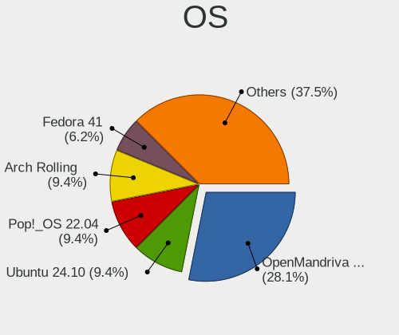
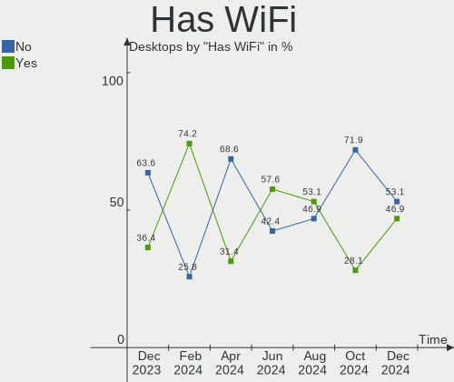
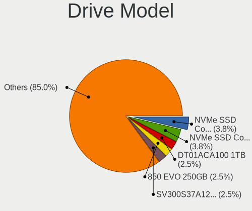
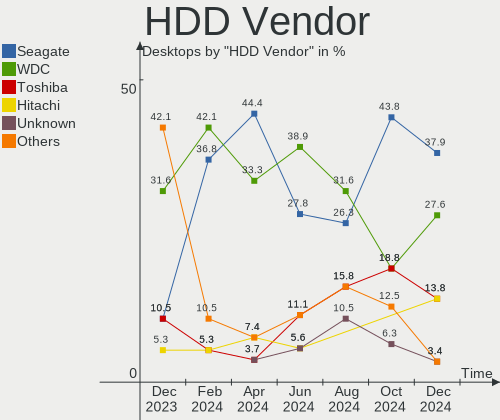
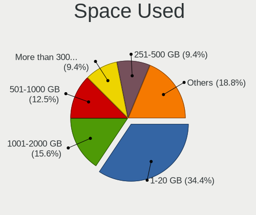
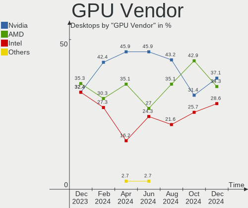
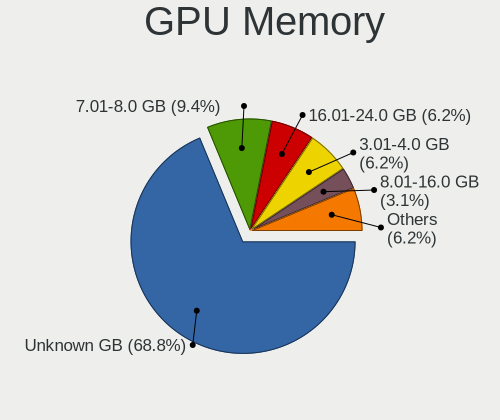

Linux in Netherlands - Hardware Trends (Desktops)
-------------------------------------------------

A project to identify most popular hardware characteristics and track their change
over time based on data collected by Linux users at https://Linux-Hardware.org.

Anyone can contribute to this report by the [hw-probe](https://github.com/linuxhw/hw-probe) tool:

    sudo -E hw-probe -all -upload

Period: May, 2023.

Contents
--------

* [ System ](#system)
  - [ OS                       ](#os)
  - [ OS Family                ](#os-family)
  - [ Kernel                   ](#kernel)
  - [ Kernel Family            ](#kernel-family)
  - [ Kernel Major Ver.        ](#kernel-major-ver)
  - [ Arch                     ](#arch)
  - [ DE                       ](#de)
  - [ Display Server           ](#display-server)
  - [ Display Manager          ](#display-manager)
  - [ OS Lang                  ](#os-lang)
  - [ Boot Mode                ](#boot-mode)
  - [ Filesystem               ](#filesystem)
  - [ Part. scheme             ](#part-scheme)
  - [ Dual Boot with Linux/BSD ](#dual-boot-with-linuxbsd)
  - [ Dual Boot (Win)          ](#dual-boot-win)

* [ Board ](#board)
  - [ Vendor                   ](#vendor)
  - [ Model                    ](#model)
  - [ Model Family             ](#model-family)
  - [ MFG Year                 ](#mfg-year)
  - [ Form Factor              ](#form-factor)
  - [ Secure Boot              ](#secure-boot)
  - [ Coreboot                 ](#coreboot)
  - [ RAM Size                 ](#ram-size)
  - [ RAM Used                 ](#ram-used)
  - [ Total Drives             ](#total-drives)
  - [ Has CD-ROM               ](#has-cd-rom)
  - [ Has Ethernet             ](#has-ethernet)
  - [ Has WiFi                 ](#has-wifi)
  - [ Has Bluetooth            ](#has-bluetooth)

* [ Location ](#location)
  - [ Country                  ](#country)
  - [ City                     ](#city)

* [ Drives ](#drives)
  - [ Drive Vendor             ](#drive-vendor)
  - [ Drive Model              ](#drive-model)
  - [ HDD Vendor               ](#hdd-vendor)
  - [ SSD Vendor               ](#ssd-vendor)
  - [ Drive Kind               ](#drive-kind)
  - [ Drive Connector          ](#drive-connector)
  - [ Drive Size               ](#drive-size)
  - [ Space Total              ](#space-total)
  - [ Space Used               ](#space-used)
  - [ Malfunc. Drives          ](#malfunc-drives)
  - [ Malfunc. Drive Vendor    ](#malfunc-drive-vendor)
  - [ Malfunc. HDD Vendor      ](#malfunc-hdd-vendor)
  - [ Malfunc. Drive Kind      ](#malfunc-drive-kind)
  - [ Failed Drives            ](#failed-drives)
  - [ Failed Drive Vendor      ](#failed-drive-vendor)
  - [ Drive Status             ](#drive-status)

* [ Storage controller ](#storage-controller)
  - [ Storage Vendor           ](#storage-vendor)
  - [ Storage Model            ](#storage-model)
  - [ Storage Kind             ](#storage-kind)

* [ Processor ](#processor)
  - [ CPU Vendor               ](#cpu-vendor)
  - [ CPU Model                ](#cpu-model)
  - [ CPU Model Family         ](#cpu-model-family)
  - [ CPU Cores                ](#cpu-cores)
  - [ CPU Sockets              ](#cpu-sockets)
  - [ CPU Threads              ](#cpu-threads)
  - [ CPU Op-Modes             ](#cpu-op-modes)
  - [ CPU Microcode            ](#cpu-microcode)
  - [ CPU Microarch            ](#cpu-microarch)

* [ Graphics ](#graphics)
  - [ GPU Vendor               ](#gpu-vendor)
  - [ GPU Model                ](#gpu-model)
  - [ GPU Combo                ](#gpu-combo)
  - [ GPU Driver               ](#gpu-driver)
  - [ GPU Memory               ](#gpu-memory)

* [ Monitor ](#monitor)
  - [ Monitor Vendor           ](#monitor-vendor)
  - [ Monitor Model            ](#monitor-model)
  - [ Monitor Resolution       ](#monitor-resolution)
  - [ Monitor Diagonal         ](#monitor-diagonal)
  - [ Monitor Width            ](#monitor-width)
  - [ Aspect Ratio             ](#aspect-ratio)
  - [ Monitor Area             ](#monitor-area)
  - [ Pixel Density            ](#pixel-density)
  - [ Multiple Monitors        ](#multiple-monitors)

* [ Network ](#network)
  - [ Net Controller Vendor    ](#net-controller-vendor)
  - [ Net Controller Model     ](#net-controller-model)
  - [ Wireless Vendor          ](#wireless-vendor)
  - [ Wireless Model           ](#wireless-model)
  - [ Ethernet Vendor          ](#ethernet-vendor)
  - [ Ethernet Model           ](#ethernet-model)
  - [ Net Controller Kind      ](#net-controller-kind)
  - [ Used Controller          ](#used-controller)
  - [ NICs                     ](#nics)
  - [ IPv6                     ](#ipv6)

* [ Bluetooth ](#bluetooth)
  - [ Bluetooth Vendor         ](#bluetooth-vendor)
  - [ Bluetooth Model          ](#bluetooth-model)

* [ Sound ](#sound)
  - [ Sound Vendor             ](#sound-vendor)
  - [ Sound Model              ](#sound-model)

* [ Memory ](#memory)
  - [ Memory Vendor            ](#memory-vendor)
  - [ Memory Model             ](#memory-model)
  - [ Memory Kind              ](#memory-kind)
  - [ Memory Form Factor       ](#memory-form-factor)
  - [ Memory Size              ](#memory-size)
  - [ Memory Speed             ](#memory-speed)

* [ Printers & scanners ](#printers--scanners)
  - [ Printer Vendor           ](#printer-vendor)
  - [ Printer Model            ](#printer-model)
  - [ Scanner Vendor           ](#scanner-vendor)
  - [ Scanner Model            ](#scanner-model)

* [ Camera ](#camera)
  - [ Camera Vendor            ](#camera-vendor)
  - [ Camera Model             ](#camera-model)

* [ Security ](#security)
  - [ Fingerprint Vendor       ](#fingerprint-vendor)
  - [ Fingerprint Model        ](#fingerprint-model)
  - [ Chipcard Vendor          ](#chipcard-vendor)
  - [ Chipcard Model           ](#chipcard-model)

* [ Unsupported ](#unsupported)
  - [ Unsupported Devices      ](#unsupported-devices)
  - [ Unsupported Device Types ](#unsupported-device-types)

System
------

OS
--

Installed operating systems

| Name                | Desktops | Percent |
|---------------------|----------|---------|
| Linux Mint 21.1     | 6        | 18.18%  |
| Ubuntu 22.04        | 5        | 15.15%  |
| Ubuntu 23.04        | 3        | 9.09%   |
| Fedora 38           | 3        | 9.09%   |
| Manjaro 22.1.2      | 2        | 6.06%   |
| EndeavourOS Rolling | 2        | 6.06%   |
| Xubuntu 23.04       | 1        | 3.03%   |
| Xubuntu 22.10       | 1        | 3.03%   |
| TUXEDO OS 22.04     | 1        | 3.03%   |
| OpenMandriva 23.03  | 1        | 3.03%   |
| Manjaro             | 1        | 3.03%   |
| Linux Mint 21       | 1        | 3.03%   |
| Linux Mint 20.3     | 1        | 3.03%   |
| Kubuntu 22.04       | 1        | 3.03%   |
| Gentoo 2.13         | 1        | 3.03%   |
| Elementary 7        | 1        | 3.03%   |
| Debian 11           | 1        | 3.03%   |
| ArcoLinux Rolling   | 1        | 3.03%   |

OS Family
---------

OS without a version

| Name         | Desktops | Percent |
|--------------|----------|---------|
| Ubuntu       | 8        | 24.24%  |
| Linux Mint   | 8        | 24.24%  |
| Manjaro      | 3        | 9.09%   |
| Fedora       | 3        | 9.09%   |
| Xubuntu      | 2        | 6.06%   |
| EndeavourOS  | 2        | 6.06%   |
| TUXEDO OS    | 1        | 3.03%   |
| OpenMandriva | 1        | 3.03%   |
| Kubuntu      | 1        | 3.03%   |
| Gentoo       | 1        | 3.03%   |
| Elementary   | 1        | 3.03%   |
| Debian       | 1        | 3.03%   |
| ArcoLinux    | 1        | 3.03%   |

Kernel
------

Version of the Linux kernel

| Version                     | Desktops | Percent |
|-----------------------------|----------|---------|
| 5.15.0-71-generic           | 5        | 15.15%  |
| 6.2.0-20-generic            | 4        | 12.12%  |
| 5.19.0-41-generic           | 4        | 12.12%  |
| 5.15.0-72-generic           | 2        | 6.06%   |
| 6.3.3-200.fc38.x86_64       | 1        | 3.03%   |
| 6.3.3-1-MANJARO             | 1        | 3.03%   |
| 6.2.6-desktop-1omv2390      | 1        | 3.03%   |
| 6.2.16-1-MANJARO            | 1        | 3.03%   |
| 6.2.15-300.fc38.x86_64      | 1        | 3.03%   |
| 6.2.14-300.fc38.x86_64      | 1        | 3.03%   |
| 6.2.13-arch1-1.1            | 1        | 3.03%   |
| 6.2.13-arch1-1              | 1        | 3.03%   |
| 6.2.0-10007-tuxedo          | 1        | 3.03%   |
| 6.1.30-1-MANJARO            | 1        | 3.03%   |
| 6.1.28-hardened1-1-hardened | 1        | 3.03%   |
| 6.1.27-gentoo-dist          | 1        | 3.03%   |
| 5.4.0-148-generic           | 1        | 3.03%   |
| 5.19.0-42-generic           | 1        | 3.03%   |
| 5.19.0-32-generic           | 1        | 3.03%   |
| 5.19.0-1024-lowlatency      | 1        | 3.03%   |
| 5.15.0-56-generic           | 1        | 3.03%   |
| 5.10.0-22-amd64             | 1        | 3.03%   |

Kernel Family
-------------

Linux kernel without a distro release

| Version | Desktops | Percent |
|---------|----------|---------|
| 5.15.0  | 8        | 24.24%  |
| 5.19.0  | 7        | 21.21%  |
| 6.2.0   | 5        | 15.15%  |
| 6.3.3   | 2        | 6.06%   |
| 6.2.13  | 2        | 6.06%   |
| 6.2.6   | 1        | 3.03%   |
| 6.2.16  | 1        | 3.03%   |
| 6.2.15  | 1        | 3.03%   |
| 6.2.14  | 1        | 3.03%   |
| 6.1.30  | 1        | 3.03%   |
| 6.1.28  | 1        | 3.03%   |
| 6.1.27  | 1        | 3.03%   |
| 5.4.0   | 1        | 3.03%   |
| 5.10.0  | 1        | 3.03%   |

Kernel Major Ver.
-----------------

Linux kernel major version

| Version | Desktops | Percent |
|---------|----------|---------|
| 6.2     | 11       | 33.33%  |
| 5.15    | 8        | 24.24%  |
| 5.19    | 7        | 21.21%  |
| 6.1     | 3        | 9.09%   |
| 6.3     | 2        | 6.06%   |
| 5.4     | 1        | 3.03%   |
| 5.10    | 1        | 3.03%   |

Arch
----

OS architecture (x86_64, i586, etc.)

| Name   | Desktops | Percent |
|--------|----------|---------|
| x86_64 | 33       | 100%    |

DE
--

Desktop Environment

| Name       | Desktops | Percent |
|------------|----------|---------|
| GNOME      | 10       | 30.3%   |
| X-Cinnamon | 8        | 24.24%  |
| KDE5       | 7        | 21.21%  |
| XFCE       | 5        | 15.15%  |
| Pantheon   | 1        | 3.03%   |
| openbox    | 1        | 3.03%   |
| Unknown    | 1        | 3.03%   |

Display Server
--------------

X11 or Wayland

| Name    | Desktops | Percent |
|---------|----------|---------|
| X11     | 25       | 75.76%  |
| Wayland | 7        | 21.21%  |
| Tty     | 1        | 3.03%   |

Display Manager
---------------

SDDM, LightDM, etc.

| Name    | Desktops | Percent |
|---------|----------|---------|
| Unknown | 13       | 39.39%  |
| LightDM | 9        | 27.27%  |
| GDM3    | 6        | 18.18%  |
| SDDM    | 4        | 12.12%  |
| GDM     | 1        | 3.03%   |

OS Lang
-------

Language

| Lang   | Desktops | Percent |
|--------|----------|---------|
| nl_NL  | 14       | 42.42%  |
| en_US  | 13       | 39.39%  |
| en_GB  | 2        | 6.06%   |
| es_ES  | 1        | 3.03%   |
| en_AG  | 1        | 3.03%   |
| C.UTF8 | 1        | 3.03%   |
| C      | 1        | 3.03%   |

Boot Mode
---------

EFI or BIOS

| Mode | Desktops | Percent |
|------|----------|---------|
| BIOS | 18       | 54.55%  |
| EFI  | 15       | 45.45%  |

Filesystem
----------

Type of filesystem

| Type    | Desktops | Percent |
|---------|----------|---------|
| Ext4    | 22       | 66.67%  |
| Tmpfs   | 7        | 21.21%  |
| Btrfs   | 2        | 6.06%   |
| Zfs     | 1        | 3.03%   |
| Overlay | 1        | 3.03%   |

Part. scheme
------------

Scheme of partitioning

| Type    | Desktops | Percent |
|---------|----------|---------|
| GPT     | 14       | 42.42%  |
| Unknown | 11       | 33.33%  |
| MBR     | 8        | 24.24%  |

Dual Boot with Linux/BSD
------------------------

Hosting more than one Linux/BSD

| Dual boot | Desktops | Percent |
|-----------|----------|---------|
| No        | 25       | 75.76%  |
| Yes       | 8        | 24.24%  |

Dual Boot (Win)
---------------

Hosting Linux and Windows

| Dual boot | Desktops | Percent |
|-----------|----------|---------|
| No        | 26       | 78.79%  |
| Yes       | 7        | 21.21%  |

Board
-----

Vendor
------

Motherboard manufacturer

| Name                | Desktops | Percent |
|---------------------|----------|---------|
| Gigabyte Technology | 7        | 21.21%  |
| ASUSTek Computer    | 6        | 18.18%  |
| Hewlett-Packard     | 5        | 15.15%  |
| MSI                 | 2        | 6.06%   |
| Lenovo              | 2        | 6.06%   |
| Intel               | 2        | 6.06%   |
| ASRock              | 2        | 6.06%   |
| Acer                | 2        | 6.06%   |
| Medion              | 1        | 3.03%   |
| Fujitsu Siemens     | 1        | 3.03%   |
| Dell                | 1        | 3.03%   |
| AMI                 | 1        | 3.03%   |
| AAEON               | 1        | 3.03%   |

Model
-----

Motherboard model

| Name                                | Desktops | Percent |
|-------------------------------------|----------|---------|
| MSI MS-7D67                         | 1        | 3.03%   |
| MSI MS-7C37                         | 1        | 3.03%   |
| Medion B360H4-EM V1.0               | 1        | 3.03%   |
| Lenovo ThinkCentre M700 10GSS05X48  | 1        | 3.03%   |
| Lenovo ThinkCentre M58 7373A5G      | 1        | 3.03%   |
| Intel Jasper Lake Client Platform   | 1        | 3.03%   |
| Intel DN2820FYK H24582-204          | 1        | 3.03%   |
| HP xw8400 Workstation               | 1        | 3.03%   |
| HP ProLiant MicroServer             | 1        | 3.03%   |
| HP ProDesk 600 G3 MT                | 1        | 3.03%   |
| HP Compaq Elite 8300 USDT           | 1        | 3.03%   |
| HP Compaq dc7800p Small Form Factor | 1        | 3.03%   |
| Gigabyte X670E AORUS MASTER         | 1        | 3.03%   |
| Gigabyte X570S AORUS ELITE AX       | 1        | 3.03%   |
| Gigabyte P55A-UD3                   | 1        | 3.03%   |
| Gigabyte GB-BRR7H-4700              | 1        | 3.03%   |
| Gigabyte B450M DS3H                 | 1        | 3.03%   |
| Gigabyte B450 I AORUS PRO WIFI      | 1        | 3.03%   |
| Gigabyte B360N WIFI                 | 1        | 3.03%   |
| Fujitsu Siemens D2831-S1            | 1        | 3.03%   |
| Dell Precision 5820 Tower           | 1        | 3.03%   |
| ASUS TUF Gaming B550-PLUS           | 1        | 3.03%   |
| ASUS PRIME B460-PLUS                | 1        | 3.03%   |
| ASUS P8B75-V                        | 1        | 3.03%   |
| ASUS P8B75-M LE                     | 1        | 3.03%   |
| ASUS M4A87TD/USB3                   | 1        | 3.03%   |
| ASUS All Series                     | 1        | 3.03%   |
| ASRock B450M Pro4                   | 1        | 3.03%   |
| ASRock A520M Phantom Gaming 4       | 1        | 3.03%   |
| AMI Intel                           | 1        | 3.03%   |
| Acer Aspire M3920                   | 1        | 3.03%   |
| Acer Aspire M1930                   | 1        | 3.03%   |
| AAEON UP-CHCR1                      | 1        | 3.03%   |

Model Family
------------

Motherboard model prefix

| Name                     | Desktops | Percent |
|--------------------------|----------|---------|
| Lenovo ThinkCentre       | 2        | 6.06%   |
| HP Compaq                | 2        | 6.06%   |
| Acer Aspire              | 2        | 6.06%   |
| MSI MS-7D67              | 1        | 3.03%   |
| MSI MS-7C37              | 1        | 3.03%   |
| Medion B360H4-EM         | 1        | 3.03%   |
| Intel Jasper             | 1        | 3.03%   |
| Intel DN2820FYK          | 1        | 3.03%   |
| HP xw8400                | 1        | 3.03%   |
| HP ProLiant              | 1        | 3.03%   |
| HP ProDesk               | 1        | 3.03%   |
| Gigabyte X670E           | 1        | 3.03%   |
| Gigabyte X570S           | 1        | 3.03%   |
| Gigabyte P55A-UD3        | 1        | 3.03%   |
| Gigabyte GB-BRR7H-4700   | 1        | 3.03%   |
| Gigabyte B450M           | 1        | 3.03%   |
| Gigabyte B450            | 1        | 3.03%   |
| Gigabyte B360N           | 1        | 3.03%   |
| Fujitsu Siemens D2831-S1 | 1        | 3.03%   |
| Dell Precision           | 1        | 3.03%   |
| ASUS TUF                 | 1        | 3.03%   |
| ASUS PRIME               | 1        | 3.03%   |
| ASUS P8B75-V             | 1        | 3.03%   |
| ASUS P8B75-M             | 1        | 3.03%   |
| ASUS M4A87TD             | 1        | 3.03%   |
| ASUS All                 | 1        | 3.03%   |
| ASRock B450M             | 1        | 3.03%   |
| ASRock A520M             | 1        | 3.03%   |
| AMI Intel                | 1        | 3.03%   |
| AAEON UP-CHCR1           | 1        | 3.03%   |

MFG Year
--------

Motherboard manufacture year

| Year | Desktops | Percent |
|------|----------|---------|
| 2018 | 6        | 18.18%  |
| 2012 | 4        | 12.12%  |
| 2023 | 3        | 9.09%   |
| 2022 | 3        | 9.09%   |
| 2021 | 2        | 6.06%   |
| 2020 | 2        | 6.06%   |
| 2019 | 2        | 6.06%   |
| 2014 | 2        | 6.06%   |
| 2011 | 2        | 6.06%   |
| 2010 | 2        | 6.06%   |
| 2007 | 2        | 6.06%   |
| 2017 | 1        | 3.03%   |
| 2009 | 1        | 3.03%   |
| 2008 | 1        | 3.03%   |

Form Factor
-----------

Physical design of the computer

| Name    | Desktops | Percent |
|---------|----------|---------|
| Desktop | 33       | 100%    |

Secure Boot
-----------

Enabled or disabled

| State    | Desktops | Percent |
|----------|----------|---------|
| Disabled | 32       | 96.97%  |
| Enabled  | 1        | 3.03%   |

Coreboot
--------

Have coreboot on board

| Used | Desktops | Percent |
|------|----------|---------|
| No   | 33       | 100%    |

RAM Size
--------

Total RAM memory

| Size in GB  | Desktops | Percent |
|-------------|----------|---------|
| 16.01-24.0  | 7        | 21.21%  |
| 4.01-8.0    | 6        | 18.18%  |
| 32.01-64.0  | 6        | 18.18%  |
| 3.01-4.0    | 5        | 15.15%  |
| 8.01-16.0   | 5        | 15.15%  |
| 64.01-256.0 | 3        | 9.09%   |
| 24.01-32.0  | 1        | 3.03%   |

RAM Used
--------

Used RAM memory

| Used GB    | Desktops | Percent |
|------------|----------|---------|
| 1.01-2.0   | 15       | 45.45%  |
| 2.01-3.0   | 5        | 15.15%  |
| 4.01-8.0   | 4        | 12.12%  |
| 3.01-4.0   | 3        | 9.09%   |
| 8.01-16.0  | 3        | 9.09%   |
| 0.51-1.0   | 2        | 6.06%   |
| 32.01-64.0 | 1        | 3.03%   |

Total Drives
------------

Number of drives on board

| Drives | Desktops | Percent |
|--------|----------|---------|
| 1      | 14       | 42.42%  |
| 2      | 10       | 30.3%   |
| 4      | 4        | 12.12%  |
| 5      | 3        | 9.09%   |
| 3      | 2        | 6.06%   |

Has CD-ROM
----------

Has CD-ROM on board

| Presented | Desktops | Percent |
|-----------|----------|---------|
| No        | 25       | 75.76%  |
| Yes       | 8        | 24.24%  |

Has Ethernet
------------

Has Ethernet on board

| Presented | Desktops | Percent |
|-----------|----------|---------|
| Yes       | 33       | 100%    |

Has WiFi
--------

Has WiFi module

| Presented | Desktops | Percent |
|-----------|----------|---------|
| No        | 19       | 57.58%  |
| Yes       | 14       | 42.42%  |

Has Bluetooth
-------------

Has Bluetooth module

| Presented | Desktops | Percent |
|-----------|----------|---------|
| No        | 20       | 60.61%  |
| Yes       | 13       | 39.39%  |

Location
--------

Country
-------

Geographic location (country)

| Country     | Desktops | Percent |
|-------------|----------|---------|
| Netherlands | 33       | 100%    |

City
----

Geographic location (city)

| City             | Desktops | Percent |
|------------------|----------|---------|
| Amsterdam        | 8        | 24.24%  |
| Rotterdam        | 5        | 15.15%  |
| Almere Stad      | 3        | 9.09%   |
| Ridderkerk       | 2        | 6.06%   |
| Delft            | 2        | 6.06%   |
| Utrecht          | 1        | 3.03%   |
| Purmerend        | 1        | 3.03%   |
| Oudenbosch       | 1        | 3.03%   |
| Malden           | 1        | 3.03%   |
| Hengelo          | 1        | 3.03%   |
| Haarlem          | 1        | 3.03%   |
| Goes             | 1        | 3.03%   |
| Enschede         | 1        | 3.03%   |
| Bilthoven        | 1        | 3.03%   |
| Amersfoort       | 1        | 3.03%   |
| Almelo           | 1        | 3.03%   |
| Aalsmeerderbrug  | 1        | 3.03%   |
| 's-Hertogenbosch | 1        | 3.03%   |

Drives
------

Drive Vendor
------------

Hard drive vendors

| Vendor                      | Desktops | Drives | Percent |
|-----------------------------|----------|--------|---------|
| Samsung Electronics         | 12       | 19     | 21.82%  |
| Seagate                     | 11       | 15     | 20%     |
| Kingston                    | 6        | 7      | 10.91%  |
| Crucial                     | 5        | 7      | 9.09%   |
| WDC                         | 4        | 4      | 7.27%   |
| Toshiba                     | 2        | 2      | 3.64%   |
| SanDisk                     | 2        | 2      | 3.64%   |
| PNY                         | 2        | 2      | 3.64%   |
| WDC WDS1                    | 1        | 1      | 1.82%   |
| Unknown                     | 1        | 1      | 1.82%   |
| Silicon Motion              | 1        | 1      | 1.82%   |
| Patriot                     | 1        | 1      | 1.82%   |
| MAXIO Technology (Hangzhou) | 1        | 1      | 1.82%   |
| LuminouTek                  | 1        | 1      | 1.82%   |
| Intel                       | 1        | 1      | 1.82%   |
| Hitachi                     | 1        | 2      | 1.82%   |
| GOODRAM                     | 1        | 1      | 1.82%   |
| China                       | 1        | 1      | 1.82%   |
| A-DATA Technology           | 1        | 1      | 1.82%   |

Drive Model
-----------

Hard drive models

| Model                                               | Desktops | Percent |
|-----------------------------------------------------|----------|---------|
| Samsung NVMe SSD Controller SM981/PM981/PM983 256GB | 3        | 4.69%   |
| Seagate ST4000DM004-2CV104 4TB                      | 2        | 3.13%   |
| Seagate ST2000DM008-2UB102 2TB                      | 2        | 3.13%   |
| Samsung SSD 870 EVO 500GB                           | 2        | 3.13%   |
| Samsung SSD 840 EVO 120GB                           | 2        | 3.13%   |
| Samsung NVMe SSD Controller PM9A1/PM9A3/980PRO 1TB  | 2        | 3.13%   |
| Samsung HD103SJ 1TB                                 | 2        | 3.13%   |
| Kingston SV300S37A120G 120GB SSD                    | 2        | 3.13%   |
| Crucial CT500MX500SSD1 500GB                        | 2        | 3.13%   |
| Crucial CT256M550SSD1 256GB                         | 2        | 3.13%   |
| WDC WDS250G2B0A-00SM50 250GB SSD                    | 1        | 1.56%   |
| WDC WDS1 20G1G0A-00SS50 120GB SSD                   | 1        | 1.56%   |
| WDC WD5000AAKS-22V1A0 500GB                         | 1        | 1.56%   |
| WDC WD3200AAJS-56M0A0 320GB                         | 1        | 1.56%   |
| WDC WD3200AAJS-08L7A0 320GB                         | 1        | 1.56%   |
| Unknown MMC Card  64GB                              | 1        | 1.56%   |
| Toshiba KSG60ZMV256G M.2 2280 256GB SSD             | 1        | 1.56%   |
| Toshiba DT01ACA100 1TB                              | 1        | 1.56%   |
| Silicon Motion SM2262/SM2262EN SSD Controller 1TB   | 1        | 1.56%   |
| Seagate ST500DM002-1BD142 500GB                     | 1        | 1.56%   |
| Seagate ST3320418AS 320GB                           | 1        | 1.56%   |
| Seagate ST3250310NS 250GB                           | 1        | 1.56%   |
| Seagate ST3160023AS 160GB                           | 1        | 1.56%   |
| Seagate ST31500541AS 1TB                            | 1        | 1.56%   |
| Seagate ST20000NM007D-3DJ103 20TB                   | 1        | 1.56%   |
| Seagate ST1000DM003-1CH162 1TB                      | 1        | 1.56%   |
| Seagate Expansion 1TB                               | 1        | 1.56%   |
| SanDisk SDSSDA480G 480GB                            | 1        | 1.56%   |
| SanDisk Portable SSD 1TB                            | 1        | 1.56%   |
| Samsung SSD PM871b 2.5 7mm 1024GB                   | 1        | 1.56%   |
| Samsung SSD 980 500GB                               | 1        | 1.56%   |
| Samsung SSD 980 1TB                                 | 1        | 1.56%   |
| Samsung SSD 860 EVO 4TB                             | 1        | 1.56%   |
| Samsung SSD 850 PRO 256GB                           | 1        | 1.56%   |
| Samsung SSD 850 EVO 500GB                           | 1        | 1.56%   |
| Samsung SSD 840 EVO 500GB                           | 1        | 1.56%   |
| PNY CS900 480GB SSD                                 | 1        | 1.56%   |
| PNY CS900 120GB SSD                                 | 1        | 1.56%   |
| Patriot P210 256GB SSD                              | 1        | 1.56%   |
| MAXIO (Hangzhou) NVMe SSD Controller MAP1202 2TB    | 1        | 1.56%   |

HDD Vendor
----------

Hard disk drive vendors

| Vendor              | Desktops | Drives | Percent |
|---------------------|----------|--------|---------|
| Seagate             | 11       | 15     | 61.11%  |
| WDC                 | 3        | 3      | 16.67%  |
| Samsung Electronics | 2        | 2      | 11.11%  |
| Toshiba             | 1        | 1      | 5.56%   |
| Hitachi             | 1        | 2      | 5.56%   |

SSD Vendor
----------

Solid state drive vendors

| Vendor              | Desktops | Drives | Percent |
|---------------------|----------|--------|---------|
| Samsung Electronics | 6        | 9      | 22.22%  |
| Kingston            | 5        | 6      | 18.52%  |
| Crucial             | 5        | 7      | 18.52%  |
| SanDisk             | 2        | 2      | 7.41%   |
| PNY                 | 2        | 2      | 7.41%   |
| WDC WDS1            | 1        | 1      | 3.7%    |
| WDC                 | 1        | 1      | 3.7%    |
| Toshiba             | 1        | 1      | 3.7%    |
| Patriot             | 1        | 1      | 3.7%    |
| GOODRAM             | 1        | 1      | 3.7%    |
| China               | 1        | 1      | 3.7%    |
| A-DATA Technology   | 1        | 1      | 3.7%    |

Drive Kind
----------

HDD or SSD

| Kind    | Desktops | Drives | Percent |
|---------|----------|--------|---------|
| SSD     | 22       | 33     | 44%     |
| HDD     | 16       | 23     | 32%     |
| NVMe    | 10       | 12     | 20%     |
| MMC     | 1        | 1      | 2%      |
| Unknown | 1        | 1      | 2%      |

Drive Connector
---------------

SATA, SAS, NVMe, etc.

| Type | Desktops | Drives | Percent |
|------|----------|--------|---------|
| SATA | 28       | 54     | 66.67%  |
| NVMe | 10       | 12     | 23.81%  |
| SAS  | 3        | 3      | 7.14%   |
| MMC  | 1        | 1      | 2.38%   |

Drive Size
----------

Size of hard drive

| Size in TB | Desktops | Drives | Percent |
|------------|----------|--------|---------|
| 0.01-0.5   | 22       | 35     | 57.89%  |
| 0.51-1.0   | 9        | 11     | 23.68%  |
| 3.01-4.0   | 3        | 6      | 7.89%   |
| 1.01-2.0   | 3        | 3      | 7.89%   |
| 10.01-20.0 | 1        | 1      | 2.63%   |

Space Total
-----------

Amount of disk space available on the file system

| Size in GB     | Desktops | Percent |
|----------------|----------|---------|
| 1001-2000      | 7        | 21.21%  |
| 101-250        | 5        | 15.15%  |
| 501-1000       | 5        | 15.15%  |
| 251-500        | 4        | 12.12%  |
| More than 3000 | 3        | 9.09%   |
| 21-50          | 3        | 9.09%   |
| 2001-3000      | 2        | 6.06%   |
| 51-100         | 2        | 6.06%   |
| Unknown        | 2        | 6.06%   |

Space Used
----------

Amount of used disk space

| Used GB        | Desktops | Percent |
|----------------|----------|---------|
| 21-50          | 9        | 27.27%  |
| 1001-2000      | 5        | 15.15%  |
| 1-20           | 5        | 15.15%  |
| 501-1000       | 5        | 15.15%  |
| 101-250        | 2        | 6.06%   |
| 51-100         | 2        | 6.06%   |
| Unknown        | 2        | 6.06%   |
| More than 3000 | 1        | 3.03%   |
| 251-500        | 1        | 3.03%   |
| 2001-3000      | 1        | 3.03%   |

Malfunc. Drives
---------------

Drive models with a malfunction

| Model                                                           | Desktops | Drives | Percent |
|-----------------------------------------------------------------|----------|--------|---------|
| WDC WD3200AAJS-08L7A0 320GB                                     | 1        | 1      | 25%     |
| Seagate ST3320418AS 320GB                                       | 1        | 1      | 25%     |
| Samsung Electronics NVMe SSD Controller SM981/PM981/PM983 256GB | 1        | 1      | 25%     |
| Crucial CT500MX500SSD1 500GB                                    | 1        | 1      | 25%     |

Malfunc. Drive Vendor
---------------------

Vendors of faulty drives

| Vendor              | Desktops | Drives | Percent |
|---------------------|----------|--------|---------|
| WDC                 | 1        | 1      | 25%     |
| Seagate             | 1        | 1      | 25%     |
| Samsung Electronics | 1        | 1      | 25%     |
| Crucial             | 1        | 1      | 25%     |

Malfunc. HDD Vendor
-------------------

Vendors of faulty HDD drives

| Vendor  | Desktops | Drives | Percent |
|---------|----------|--------|---------|
| WDC     | 1        | 1      | 50%     |
| Seagate | 1        | 1      | 50%     |

Malfunc. Drive Kind
-------------------

Kinds of faulty drives

| Kind | Desktops | Drives | Percent |
|------|----------|--------|---------|
| HDD  | 2        | 2      | 50%     |
| NVMe | 1        | 1      | 25%     |
| SSD  | 1        | 1      | 25%     |

Failed Drives
-------------

Failed drive models

Zero info for selected period =(

Failed Drive Vendor
-------------------

Failed drive vendors

Zero info for selected period =(

Drive Status
------------

Number of failed and malfunc. drives

| Status   | Desktops | Drives | Percent |
|----------|----------|--------|---------|
| Detected | 19       | 42     | 52.78%  |
| Works    | 13       | 24     | 36.11%  |
| Malfunc  | 4        | 4      | 11.11%  |

Storage controller
------------------

Storage Vendor
--------------

Storage controller vendors

| Vendor                      | Desktops | Percent |
|-----------------------------|----------|---------|
| Intel                       | 20       | 42.55%  |
| AMD                         | 11       | 23.4%   |
| Samsung Electronics         | 7        | 14.89%  |
| ASMedia Technology          | 4        | 8.51%   |
| Silicon Motion              | 1        | 2.13%   |
| MAXIO Technology (Hangzhou) | 1        | 2.13%   |
| Kingston Technology Company | 1        | 2.13%   |
| JMicron Technology          | 1        | 2.13%   |
| Broadcom / LSI              | 1        | 2.13%   |

Storage Model
-------------

Storage controller models

| Model                                                                          | Desktops | Percent |
|--------------------------------------------------------------------------------|----------|---------|
| AMD FCH SATA Controller [AHCI mode]                                            | 6        | 10%     |
| ASMedia ASM1062 Serial ATA Controller                                          | 4        | 6.67%   |
| Samsung NVMe SSD Controller SM981/PM981/PM983                                  | 3        | 5%      |
| Intel 7 Series/C210 Series Chipset Family 4-port SATA Controller [IDE mode]    | 3        | 5%      |
| Intel 7 Series/C210 Series Chipset Family 2-port SATA Controller [IDE mode]    | 3        | 5%      |
| AMD 400 Series Chipset SATA Controller                                         | 3        | 5%      |
| Samsung NVMe SSD Controller PM9A1/PM9A3/980PRO                                 | 2        | 3.33%   |
| Samsung NVMe SSD Controller 980                                                | 2        | 3.33%   |
| Intel 82801JD/DO (ICH10 Family) SATA AHCI Controller                           | 2        | 3.33%   |
| Intel 6 Series/C200 Series Chipset Family 6 port Desktop SATA AHCI Controller  | 2        | 3.33%   |
| AMD SB7x0/SB8x0/SB9x0 IDE Controller                                           | 2        | 3.33%   |
| AMD 500 Series Chipset SATA Controller                                         | 2        | 3.33%   |
| Silicon Motion SM2262/SM2262EN SSD Controller                                  | 1        | 1.67%   |
| MAXIO (Hangzhou) NVMe SSD Controller MAP1202                                   | 1        | 1.67%   |
| Kingston Company U-SNS8154P3 NVMe SSD                                          | 1        | 1.67%   |
| JMicron JMB368 IDE controller                                                  | 1        | 1.67%   |
| Intel Volume Management Device NVMe RAID Controller                            | 1        | 1.67%   |
| Intel Tiger Lake-LP SATA Controller                                            | 1        | 1.67%   |
| Intel SSD Pro 7600p/760p/E 6100p Series                                        | 1        | 1.67%   |
| Intel SATA Controller [RAID mode]                                              | 1        | 1.67%   |
| Intel Q170/Q150/B150/H170/H110/Z170/CM236 Chipset SATA Controller [AHCI Mode]  | 1        | 1.67%   |
| Intel Jasper Lake SATA AHCI Controller                                         | 1        | 1.67%   |
| Intel Cannon Lake PCH SATA AHCI Controller                                     | 1        | 1.67%   |
| Intel C600/X79 series chipset SATA RAID Controller                             | 1        | 1.67%   |
| Intel Atom Processor E3800 Series SATA AHCI Controller                         | 1        | 1.67%   |
| Intel 82Q35 Express PT IDER Controller                                         | 1        | 1.67%   |
| Intel 82801IR/IO/IH (ICH9R/DO/DH) 4 port SATA Controller [IDE mode]            | 1        | 1.67%   |
| Intel 82801I (ICH9 Family) 2 port SATA Controller [IDE mode]                   | 1        | 1.67%   |
| Intel 8 Series/C220 Series Chipset Family 6-port SATA Controller 1 [AHCI mode] | 1        | 1.67%   |
| Intel 631xESB/632xESB SATA RAID Controller                                     | 1        | 1.67%   |
| Intel 631xESB/632xESB IDE Controller                                           | 1        | 1.67%   |
| Intel 5 Series/3400 Series Chipset 6 port SATA AHCI Controller                 | 1        | 1.67%   |
| Intel 400 Series Chipset Family SATA AHCI Controller                           | 1        | 1.67%   |
| Intel 4 Series Chipset PT IDER Controller                                      | 1        | 1.67%   |
| Intel 200 Series PCH SATA controller [AHCI mode]                               | 1        | 1.67%   |
| Broadcom / LSI SAS1064 PCI-X Fusion-MPT SAS                                    | 1        | 1.67%   |
| AMD SB7x0/SB8x0/SB9x0 SATA Controller [IDE mode]                               | 1        | 1.67%   |
| AMD SB7x0/SB8x0/SB9x0 SATA Controller [AHCI mode]                              | 1        | 1.67%   |

Storage Kind
------------

Kind of storage controller (IDE, SATA, NVMe, SAS, ...)

| Kind | Desktops | Percent |
|------|----------|---------|
| SATA | 24       | 52.17%  |
| NVMe | 10       | 21.74%  |
| IDE  | 8        | 17.39%  |
| RAID | 3        | 6.52%   |
| SCSI | 1        | 2.17%   |

Processor
---------

CPU Vendor
----------

Processor vendors

| Vendor | Desktops | Percent |
|--------|----------|---------|
| Intel  | 21       | 63.64%  |
| AMD    | 12       | 36.36%  |

CPU Model
---------

Processor models

| Model                                       | Desktops | Percent |
|---------------------------------------------|----------|---------|
| Intel Xeon W-2135 CPU @ 3.70GHz             | 1        | 3.03%   |
| Intel Xeon CPU 5150 @ 2.66GHz               | 1        | 3.03%   |
| Intel Pentium CPU G630 @ 2.70GHz            | 1        | 3.03%   |
| Intel Core i7-9700 CPU @ 3.00GHz            | 1        | 3.03%   |
| Intel Core i7-4770K CPU @ 3.50GHz           | 1        | 3.03%   |
| Intel Core i7-3770S CPU @ 3.10GHz           | 1        | 3.03%   |
| Intel Core i7-3770 CPU @ 3.40GHz            | 1        | 3.03%   |
| Intel Core i5-8400 CPU @ 2.80GHz            | 1        | 3.03%   |
| Intel Core i5-6500 CPU @ 3.20GHz            | 1        | 3.03%   |
| Intel Core i5-3470S CPU @ 2.90GHz           | 1        | 3.03%   |
| Intel Core i5-2300 CPU @ 2.80GHz            | 1        | 3.03%   |
| Intel Core i5-10400 CPU @ 2.90GHz           | 1        | 3.03%   |
| Intel Core i5 CPU 750 @ 2.67GHz             | 1        | 3.03%   |
| Intel Core i3-6300 CPU @ 3.80GHz            | 1        | 3.03%   |
| Intel Core 2 Quad CPU Q8400 @ 2.66GHz       | 1        | 3.03%   |
| Intel Core 2 Duo CPU E7300 @ 2.66GHz        | 1        | 3.03%   |
| Intel Core 2 Duo CPU E6550 @ 2.33GHz        | 1        | 3.03%   |
| Intel Celeron N5105 @ 2.00GHz               | 1        | 3.03%   |
| Intel Celeron CPU N2830 @ 2.16GHz           | 1        | 3.03%   |
| Intel Atom x5-Z8350 CPU @ 1.44GHz           | 1        | 3.03%   |
| Intel 11th Gen Core i5-1145G7 @ 2.60GHz     | 1        | 3.03%   |
| AMD Turion II Neo N40L Dual-Core Processor  | 1        | 3.03%   |
| AMD Ryzen 9 7950X 16-Core Processor         | 1        | 3.03%   |
| AMD Ryzen 9 7900X 12-Core Processor         | 1        | 3.03%   |
| AMD Ryzen 7 5800X3D 8-Core Processor        | 1        | 3.03%   |
| AMD Ryzen 7 5700G with Radeon Graphics      | 1        | 3.03%   |
| AMD Ryzen 7 4700U with Radeon Graphics      | 1        | 3.03%   |
| AMD Ryzen 7 2700 Eight-Core Processor       | 1        | 3.03%   |
| AMD Ryzen 5 5600X 6-Core Processor          | 1        | 3.03%   |
| AMD Ryzen 5 5600G with Radeon Graphics      | 1        | 3.03%   |
| AMD Ryzen 5 3600 6-Core Processor           | 1        | 3.03%   |
| AMD Ryzen 3 2200G with Radeon Vega Graphics | 1        | 3.03%   |
| AMD Phenom II X4 955 Processor              | 1        | 3.03%   |

CPU Model Family
----------------

Processor model prefix

| Model             | Desktops | Percent |
|-------------------|----------|---------|
| Intel Core i5     | 6        | 18.18%  |
| Intel Core i7     | 4        | 12.12%  |
| AMD Ryzen 7       | 4        | 12.12%  |
| AMD Ryzen 5       | 3        | 9.09%   |
| Intel Xeon        | 2        | 6.06%   |
| Intel Core 2 Duo  | 2        | 6.06%   |
| Intel Celeron     | 2        | 6.06%   |
| AMD Ryzen 9       | 2        | 6.06%   |
| Other             | 1        | 3.03%   |
| Intel Pentium     | 1        | 3.03%   |
| Intel Core i3     | 1        | 3.03%   |
| Intel Core 2 Quad | 1        | 3.03%   |
| Intel Atom        | 1        | 3.03%   |
| AMD Turion II Neo | 1        | 3.03%   |
| AMD Ryzen 3       | 1        | 3.03%   |
| AMD Phenom II X4  | 1        | 3.03%   |

CPU Cores
---------

Number of processor cores

| Number | Desktops | Percent |
|--------|----------|---------|
| 4      | 14       | 42.42%  |
| 6      | 6        | 18.18%  |
| 2      | 6        | 18.18%  |
| 8      | 4        | 12.12%  |
| 16     | 1        | 3.03%   |
| 12     | 1        | 3.03%   |
| 1      | 1        | 3.03%   |

CPU Sockets
-----------

Number of sockets

| Number | Desktops | Percent |
|--------|----------|---------|
| 1      | 32       | 96.97%  |
| 2      | 1        | 3.03%   |

CPU Threads
-----------

Threads per core (Hyper-Threading)

| Number | Desktops | Percent |
|--------|----------|---------|
| 1      | 18       | 54.55%  |
| 2      | 15       | 45.45%  |

CPU Op-Modes
------------

CPU Operation Modes (32-bit, 64-bit)

| Op mode        | Desktops | Percent |
|----------------|----------|---------|
| 32-bit, 64-bit | 33       | 100%    |

CPU Microcode
-------------

Microcode number

| Number     | Desktops | Percent |
|------------|----------|---------|
| Unknown    | 16       | 48.48%  |
| 0x306a9    | 2        | 6.06%   |
| 0xa0655    | 1        | 3.03%   |
| 0x906ed    | 1        | 3.03%   |
| 0x6fb      | 1        | 3.03%   |
| 0x506e3    | 1        | 3.03%   |
| 0x50654    | 1        | 3.03%   |
| 0x206a7    | 1        | 3.03%   |
| 0x10676    | 1        | 3.03%   |
| 0x0a601203 | 1        | 3.03%   |
| 0x0a50000c | 1        | 3.03%   |
| 0x0a20120a | 1        | 3.03%   |
| 0x0a201016 | 1        | 3.03%   |
| 0x08701013 | 1        | 3.03%   |
| 0x0810100b | 1        | 3.03%   |
| 0x0800820d | 1        | 3.03%   |
| 0x010000c8 | 1        | 3.03%   |

CPU Microarch
-------------

Microarchitecture

| Name        | Desktops | Percent |
|-------------|----------|---------|
| Zen 3       | 4        | 12.12%  |
| Skylake     | 3        | 9.09%   |
| IvyBridge   | 3        | 9.09%   |
| Unknown     | 3        | 9.09%   |
| Zen 2       | 2        | 6.06%   |
| Silvermont  | 2        | 6.06%   |
| SandyBridge | 2        | 6.06%   |
| Penryn      | 2        | 6.06%   |
| KabyLake    | 2        | 6.06%   |
| K10         | 2        | 6.06%   |
| Core        | 2        | 6.06%   |
| Zen+        | 1        | 3.03%   |
| Zen         | 1        | 3.03%   |
| TigerLake   | 1        | 3.03%   |
| Nehalem     | 1        | 3.03%   |
| Haswell     | 1        | 3.03%   |
| CometLake   | 1        | 3.03%   |

Graphics
--------

GPU Vendor
----------

Vendors of graphics cards

| Vendor | Desktops | Percent |
|--------|----------|---------|
| Nvidia | 12       | 35.29%  |
| Intel  | 12       | 35.29%  |
| AMD    | 10       | 29.41%  |

GPU Model
---------

Graphics card models

| Model                                                                                    | Desktops | Percent |
|------------------------------------------------------------------------------------------|----------|---------|
| Nvidia GP108 [GeForce GT 1030]                                                           | 2        | 5.71%   |
| Intel HD Graphics 530                                                                    | 2        | 5.71%   |
| Intel 4 Series Chipset Integrated Graphics Controller                                    | 2        | 5.71%   |
| AMD Raphael                                                                              | 2        | 5.71%   |
| AMD Cezanne [Radeon Vega Series / Radeon Vega Mobile Series]                             | 2        | 5.71%   |
| Nvidia TU116 [GeForce GTX 1660 SUPER]                                                    | 1        | 2.86%   |
| Nvidia TU106 [GeForce RTX 2060 Rev. A]                                                   | 1        | 2.86%   |
| Nvidia GP107GL [Quadro P600]                                                             | 1        | 2.86%   |
| Nvidia GP107 [GeForce GTX 1050 Ti]                                                       | 1        | 2.86%   |
| Nvidia GM107 [GeForce GTX 750 Ti]                                                        | 1        | 2.86%   |
| Nvidia GK208B [GeForce GT 710]                                                           | 1        | 2.86%   |
| Nvidia GK106 [GeForce GTX 660]                                                           | 1        | 2.86%   |
| Nvidia GF100 [GeForce GTX 470]                                                           | 1        | 2.86%   |
| Nvidia GA104 [GeForce RTX 3060 Ti Lite Hash Rate]                                        | 1        | 2.86%   |
| Nvidia AD102 [GeForce RTX 4090]                                                          | 1        | 2.86%   |
| Intel Xeon E3-1200 v3/4th Gen Core Processor Integrated Graphics Controller              | 1        | 2.86%   |
| Intel Xeon E3-1200 v2/3rd Gen Core processor Graphics Controller                         | 1        | 2.86%   |
| Intel TigerLake-LP GT2 [Iris Xe Graphics]                                                | 1        | 2.86%   |
| Intel JasperLake [UHD Graphics]                                                          | 1        | 2.86%   |
| Intel CoffeeLake-S GT2 [UHD Graphics 630]                                                | 1        | 2.86%   |
| Intel Atom/Celeron/Pentium Processor x5-E8000/J3xxx/N3xxx Integrated Graphics Controller | 1        | 2.86%   |
| Intel Atom Processor Z36xxx/Z37xxx Series Graphics & Display                             | 1        | 2.86%   |
| Intel 2nd Generation Core Processor Family Integrated Graphics Controller                | 1        | 2.86%   |
| AMD RV710 [Radeon HD 4350/4550]                                                          | 1        | 2.86%   |
| AMD Renoir                                                                               | 1        | 2.86%   |
| AMD Redwood XT [Radeon HD 5670/5690/5730]                                                | 1        | 2.86%   |
| AMD Park [Mobility Radeon HD 5430]                                                       | 1        | 2.86%   |
| AMD Navi 23 [Radeon RX 6600/6600 XT/6600M]                                               | 1        | 2.86%   |
| AMD Navi 21 [Radeon RX 6800/6800 XT / 6900 XT]                                           | 1        | 2.86%   |
| AMD Juniper PRO [Radeon HD 5750]                                                         | 1        | 2.86%   |

GPU Combo
---------

Combinations of graphics cards

| Name         | Desktops | Percent |
|--------------|----------|---------|
| 1 x Nvidia   | 11       | 33.33%  |
| 1 x Intel    | 11       | 33.33%  |
| 1 x AMD      | 8        | 24.24%  |
| 2 x Intel    | 1        | 3.03%   |
| 2 x AMD      | 1        | 3.03%   |
| AMD + Nvidia | 1        | 3.03%   |

GPU Driver
----------

Free vs proprietary

| Driver      | Desktops | Percent |
|-------------|----------|---------|
| Free        | 25       | 75.76%  |
| Proprietary | 8        | 24.24%  |

GPU Memory
----------

Total video memory

| Size in GB | Desktops | Percent |
|------------|----------|---------|
| Unknown    | 17       | 51.52%  |
| 1.01-2.0   | 6        | 18.18%  |
| 5.01-6.0   | 2        | 6.06%   |
| 8.01-16.0  | 2        | 6.06%   |
| 0.51-1.0   | 2        | 6.06%   |
| 0.01-0.5   | 2        | 6.06%   |
| 7.01-8.0   | 1        | 3.03%   |
| 3.01-4.0   | 1        | 3.03%   |

Monitor
-------

Monitor Vendor
--------------

Monitor vendors

| Vendor              | Desktops | Percent |
|---------------------|----------|---------|
| Dell                | 6        | 18.18%  |
| Samsung Electronics | 5        | 15.15%  |
| Goldstar            | 5        | 15.15%  |
| AOC                 | 4        | 12.12%  |
| Iiyama              | 3        | 9.09%   |
| Hewlett-Packard     | 3        | 9.09%   |
| Philips             | 2        | 6.06%   |
| MSI                 | 1        | 3.03%   |
| Lenovo              | 1        | 3.03%   |
| Gigabyte Technology | 1        | 3.03%   |
| Elo Touch           | 1        | 3.03%   |
| Acer                | 1        | 3.03%   |

Monitor Model
-------------

Monitor models

| Model                                                                 | Desktops | Percent |
|-----------------------------------------------------------------------|----------|---------|
| Samsung Electronics S24R65x SAM1023 1920x1080 527x296mm 23.8-inch     | 2        | 5.88%   |
| Samsung Electronics LCD Monitor SAM0902 1920x1080 890x500mm 40.2-inch | 1        | 2.94%   |
| Samsung Electronics LCD Monitor SAM04FB 1920x1080                     | 1        | 2.94%   |
| Samsung Electronics LCD Monitor S24R65x 1920x1080                     | 1        | 2.94%   |
| Philips FTV PHL04C4 1920x1080 1440x810mm 65.0-inch                    | 1        | 2.94%   |
| Philips 170S4 PHL0818 1280x1024 338x270mm 17.0-inch                   | 1        | 2.94%   |
| MSI MAG241C MSI3EA2 1920x1080 521x293mm 23.5-inch                     | 1        | 2.94%   |
| MSI G27CQ4 MSI3CB0 2560x1440 597x336mm 27.0-inch                      | 1        | 2.94%   |
| Lenovo G27q-20 LEN66C3 2560x1440 597x336mm 27.0-inch                  | 1        | 2.94%   |
| Iiyama PL3271Q IVM761C 2560x1440 698x393mm 31.5-inch                  | 1        | 2.94%   |
| Iiyama PL2730Q IVM6643 2560x1440 597x336mm 27.0-inch                  | 1        | 2.94%   |
| Iiyama PL2492H IVM612F 1920x1080 530x300mm 24.0-inch                  | 1        | 2.94%   |
| Hewlett-Packard ZR30w HWP286C 2560x1600 641x400mm 29.7-inch           | 1        | 2.94%   |
| Hewlett-Packard x2301 HWP2972 1920x1080 509x286mm 23.0-inch           | 1        | 2.94%   |
| Hewlett-Packard L1740 HWP2648 1280x1024 338x270mm 17.0-inch           | 1        | 2.94%   |
| Goldstar LG TV SSCR2 GSMC0C8 3840x2160                                | 1        | 2.94%   |
| Goldstar HDR WQHD+ GSM774D 3840x1600 879x366mm 37.5-inch              | 1        | 2.94%   |
| Goldstar HDR 4K GSM7706 3840x2160 600x340mm 27.2-inch                 | 1        | 2.94%   |
| Goldstar 22MP65 GSM5A3C 1920x1080 477x268mm 21.5-inch                 | 1        | 2.94%   |
| Goldstar 22EN33 GSM597C 1920x1080 480x270mm 21.7-inch                 | 1        | 2.94%   |
| Gigabyte Technology M27Q GBT270D 2560x1440 596x335mm 26.9-inch        | 1        | 2.94%   |
| Elo Touch ET1715L-7CWA ELO1020 1280x1024 330x270mm 16.8-inch          | 1        | 2.94%   |
| Dell U3415W DELA0AA 3440x1440 800x330mm 34.1-inch                     | 1        | 2.94%   |
| Dell U2412M DELA07A 1920x1200 518x324mm 24.1-inch                     | 1        | 2.94%   |
| Dell S3220DGF DELD0F4 2560x1440 697x392mm 31.5-inch                   | 1        | 2.94%   |
| Dell S2721QS DELA196 3840x2160 597x336mm 27.0-inch                    | 1        | 2.94%   |
| Dell E198WFP DELF005 1440x900 408x255mm 18.9-inch                     | 1        | 2.94%   |
| Dell 2405FPW DELA010 1920x1200 519x324mm 24.1-inch                    | 1        | 2.94%   |
| AOC Q3279WG5B AOC3279 2560x1440 725x428mm 33.1-inch                   | 1        | 2.94%   |
| AOC Q27P1B AOC2701 2560x1440 597x336mm 27.0-inch                      | 1        | 2.94%   |
| AOC LCD Monitor Q24V4W1G5 2560x1440                                   | 1        | 2.94%   |
| AOC 24P1W1 AOC2401 1920x1080 530x300mm 24.0-inch                      | 1        | 2.94%   |
| Acer VG220Q ACR0672 1920x1080 476x268mm 21.5-inch                     | 1        | 2.94%   |

Monitor Resolution
------------------

Monitor screen resolution

| Resolution        | Desktops | Percent |
|-------------------|----------|---------|
| 1920x1080 (FHD)   | 12       | 35.29%  |
| 2560x1440 (QHD)   | 8        | 23.53%  |
| 3840x2160 (4K)    | 5        | 14.71%  |
| 1280x1024 (SXGA)  | 3        | 8.82%   |
| 1920x1200 (WUXGA) | 2        | 5.88%   |
| 3840x1600         | 1        | 2.94%   |
| 3440x1440         | 1        | 2.94%   |
| 2560x1600         | 1        | 2.94%   |
| 1440x900 (WXGA+)  | 1        | 2.94%   |

Monitor Diagonal
----------------

Diagonal size in inches

| Inches  | Desktops | Percent |
|---------|----------|---------|
| 27      | 5        | 15.63%  |
| 24      | 5        | 15.63%  |
| 31      | 3        | 9.38%   |
| 21      | 3        | 9.38%   |
| Unknown | 3        | 9.38%   |
| 23      | 2        | 6.25%   |
| 17      | 2        | 6.25%   |
| 72      | 1        | 3.13%   |
| 65      | 1        | 3.13%   |
| 54      | 1        | 3.13%   |
| 37      | 1        | 3.13%   |
| 34      | 1        | 3.13%   |
| 33      | 1        | 3.13%   |
| 29      | 1        | 3.13%   |
| 19      | 1        | 3.13%   |
| 16      | 1        | 3.13%   |

Monitor Width
-------------

Physical width

| Width in mm | Desktops | Percent |
|-------------|----------|---------|
| 501-600     | 11       | 35.48%  |
| 601-700     | 4        | 12.9%   |
| 401-500     | 4        | 12.9%   |
| 301-350     | 3        | 9.68%   |
| Unknown     | 3        | 9.68%   |
| 701-800     | 2        | 6.45%   |
| 1001-1500   | 2        | 6.45%   |
| 801-900     | 1        | 3.23%   |
| 1501-2000   | 1        | 3.23%   |

Aspect Ratio
------------

Proportional relationship between the width and the height

| Ratio   | Desktops | Percent |
|---------|----------|---------|
| 16/9    | 20       | 64.52%  |
| 16/10   | 4        | 12.9%   |
| 5/4     | 2        | 6.45%   |
| 21/9    | 2        | 6.45%   |
| Unknown | 2        | 6.45%   |
| 6/5     | 1        | 3.23%   |

Monitor Area
------------

Area in inch

| Area in inch | Desktops | Percent |
|----------------|----------|---------|
| 201-250        | 9        | 27.27%  |
| 351-500        | 7        | 21.21%  |
| 301-350        | 5        | 15.15%  |
| More than 1000 | 3        | 9.09%   |
| Unknown        | 3        | 9.09%   |
| 251-300        | 2        | 6.06%   |
| 141-150        | 2        | 6.06%   |
| 151-200        | 1        | 3.03%   |
| 131-140        | 1        | 3.03%   |

Pixel Density
-------------

Pixels per inch

| Density | Desktops | Percent |
|---------|----------|---------|
| 51-100  | 17       | 53.13%  |
| 101-120 | 9        | 28.13%  |
| Unknown | 3        | 9.38%   |
| 1-50    | 2        | 6.25%   |
| 161-240 | 1        | 3.13%   |

Multiple Monitors
-----------------

Total monitors connected

| Total | Desktops | Percent |
|-------|----------|---------|
| 1     | 29       | 87.88%  |
| 2     | 3        | 9.09%   |
| 0     | 1        | 3.03%   |

Network
-------

Net Controller Vendor
---------------------

Controller vendors

| Vendor                                | Desktops | Percent |
|---------------------------------------|----------|---------|
| Realtek Semiconductor                 | 24       | 50%     |
| Intel                                 | 13       | 27.08%  |
| Broadcom                              | 3        | 6.25%   |
| MediaTek                              | 2        | 4.17%   |
| TP-Link                               | 1        | 2.08%   |
| Linksys                               | 1        | 2.08%   |
| DisplayLink                           | 1        | 2.08%   |
| CyberTAN Technology                   | 1        | 2.08%   |
| Aquantia                              | 1        | 2.08%   |
| 802.11g Adapter [Linksys WUSB54GC v3] | 1        | 2.08%   |

Net Controller Model
--------------------

Controller models

| Model                                                                                               | Desktops | Percent |
|-----------------------------------------------------------------------------------------------------|----------|---------|
| Realtek RTL8111/8168/8411 PCI Express Gigabit Ethernet Controller                                   | 19       | 34.55%  |
| Realtek RTL8125 2.5GbE Controller                                                                   | 5        | 9.09%   |
| Intel Wi-Fi 6 AX200                                                                                 | 2        | 3.64%   |
| Intel I211 Gigabit Network Connection                                                               | 2        | 3.64%   |
| Intel Ethernet Connection (5) I219-LM                                                               | 2        | 3.64%   |
| TP-Link TL-WN722N v2/v3 [Realtek RTL8188EUS]                                                        | 1        | 1.82%   |
| Realtek RTL8852BE PCIe 802.11ax Wireless Network Controller                                         | 1        | 1.82%   |
| Realtek RTL8821CE 802.11ac PCIe Wireless Network Adapter                                            | 1        | 1.82%   |
| Realtek 802.11ac NIC                                                                                | 1        | 1.82%   |
| MediaTek MT7922 802.11ax PCI Express Wireless Network Adapter                                       | 1        | 1.82%   |
| MediaTek MT7921K (RZ608) Wi-Fi 6E 80MHz                                                             | 1        | 1.82%   |
| Linksys WUSB6100M 802.11a/b/g/n/ac Wireless Adapter                                                 | 1        | 1.82%   |
| Intel Wireless-AC 9260                                                                              | 1        | 1.82%   |
| Intel Wi-Fi 6 AX210/AX211/AX411 160MHz                                                              | 1        | 1.82%   |
| Intel Ethernet Controller I225-V                                                                    | 1        | 1.82%   |
| Intel Ethernet Connection I217-V                                                                    | 1        | 1.82%   |
| Intel Ethernet Connection (7) I219-V                                                                | 1        | 1.82%   |
| Intel Cannon Lake PCH CNVi WiFi                                                                     | 1        | 1.82%   |
| Intel 82579V Gigabit Network Connection                                                             | 1        | 1.82%   |
| Intel 82579LM Gigabit Network Connection (Lewisville)                                               | 1        | 1.82%   |
| Intel 82567LM-3 Gigabit Network Connection                                                          | 1        | 1.82%   |
| Intel 82566DM-2 Gigabit Network Connection                                                          | 1        | 1.82%   |
| Intel 82546GB Gigabit Ethernet Controller (Copper)                                                  | 1        | 1.82%   |
| DisplayLink Dell Universal Dock D6000                                                               | 1        | 1.82%   |
| CyberTAN Siemens S30853-S1031-R351 802.11g Wireless Adapter [Atheros AR5523]                        | 1        | 1.82%   |
| Broadcom NetXtreme BCM5752 Gigabit Ethernet PCI Express                                             | 1        | 1.82%   |
| Broadcom NetXtreme BCM5723 Gigabit Ethernet PCIe                                                    | 1        | 1.82%   |
| Broadcom BCM4352 802.11ac Wireless Network Adapter                                                  | 1        | 1.82%   |
| Aquantia AQC113CS NBase-T/IEEE 802.3bz Ethernet Controller [AQtion]                                 | 1        | 1.82%   |
| 802.11g Adapter [Linksys WUSB54GC v3] WUSB100 v2 RangePlus Wireless Network Adapter [Ralink RT3070] | 1        | 1.82%   |

Wireless Vendor
---------------

Wireless vendors

| Vendor                                | Desktops | Percent |
|---------------------------------------|----------|---------|
| Intel                                 | 5        | 33.33%  |
| Realtek Semiconductor                 | 3        | 20%     |
| MediaTek                              | 2        | 13.33%  |
| TP-Link                               | 1        | 6.67%   |
| Linksys                               | 1        | 6.67%   |
| CyberTAN Technology                   | 1        | 6.67%   |
| Broadcom                              | 1        | 6.67%   |
| 802.11g Adapter [Linksys WUSB54GC v3] | 1        | 6.67%   |

Wireless Model
--------------

Wireless models

| Model                                                                                               | Desktops | Percent |
|-----------------------------------------------------------------------------------------------------|----------|---------|
| Intel Wi-Fi 6 AX200                                                                                 | 2        | 13.33%  |
| TP-Link TL-WN722N v2/v3 [Realtek RTL8188EUS]                                                        | 1        | 6.67%   |
| Realtek RTL8852BE PCIe 802.11ax Wireless Network Controller                                         | 1        | 6.67%   |
| Realtek RTL8821CE 802.11ac PCIe Wireless Network Adapter                                            | 1        | 6.67%   |
| Realtek 802.11ac NIC                                                                                | 1        | 6.67%   |
| MediaTek MT7922 802.11ax PCI Express Wireless Network Adapter                                       | 1        | 6.67%   |
| MediaTek MT7921K (RZ608) Wi-Fi 6E 80MHz                                                             | 1        | 6.67%   |
| Linksys WUSB6100M 802.11a/b/g/n/ac Wireless Adapter                                                 | 1        | 6.67%   |
| Intel Wireless-AC 9260                                                                              | 1        | 6.67%   |
| Intel Wi-Fi 6 AX210/AX211/AX411 160MHz                                                              | 1        | 6.67%   |
| Intel Cannon Lake PCH CNVi WiFi                                                                     | 1        | 6.67%   |
| CyberTAN Siemens S30853-S1031-R351 802.11g Wireless Adapter [Atheros AR5523]                        | 1        | 6.67%   |
| Broadcom BCM4352 802.11ac Wireless Network Adapter                                                  | 1        | 6.67%   |
| 802.11g Adapter [Linksys WUSB54GC v3] WUSB100 v2 RangePlus Wireless Network Adapter [Ralink RT3070] | 1        | 6.67%   |

Ethernet Vendor
---------------

Ethernet vendors

| Vendor                | Desktops | Percent |
|-----------------------|----------|---------|
| Realtek Semiconductor | 23       | 60.53%  |
| Intel                 | 11       | 28.95%  |
| Broadcom              | 2        | 5.26%   |
| DisplayLink           | 1        | 2.63%   |
| Aquantia              | 1        | 2.63%   |

Ethernet Model
--------------

Ethernet models

| Model                                                               | Desktops | Percent |
|---------------------------------------------------------------------|----------|---------|
| Realtek RTL8111/8168/8411 PCI Express Gigabit Ethernet Controller   | 19       | 47.5%   |
| Realtek RTL8125 2.5GbE Controller                                   | 5        | 12.5%   |
| Intel I211 Gigabit Network Connection                               | 2        | 5%      |
| Intel Ethernet Connection (5) I219-LM                               | 2        | 5%      |
| Intel Ethernet Controller I225-V                                    | 1        | 2.5%    |
| Intel Ethernet Connection I217-V                                    | 1        | 2.5%    |
| Intel Ethernet Connection (7) I219-V                                | 1        | 2.5%    |
| Intel 82579V Gigabit Network Connection                             | 1        | 2.5%    |
| Intel 82579LM Gigabit Network Connection (Lewisville)               | 1        | 2.5%    |
| Intel 82567LM-3 Gigabit Network Connection                          | 1        | 2.5%    |
| Intel 82566DM-2 Gigabit Network Connection                          | 1        | 2.5%    |
| Intel 82546GB Gigabit Ethernet Controller (Copper)                  | 1        | 2.5%    |
| DisplayLink Dell Universal Dock D6000                               | 1        | 2.5%    |
| Broadcom NetXtreme BCM5752 Gigabit Ethernet PCI Express             | 1        | 2.5%    |
| Broadcom NetXtreme BCM5723 Gigabit Ethernet PCIe                    | 1        | 2.5%    |
| Aquantia AQC113CS NBase-T/IEEE 802.3bz Ethernet Controller [AQtion] | 1        | 2.5%    |

Net Controller Kind
-------------------

Ethernet, WiFi or modem

| Kind     | Desktops | Percent |
|----------|----------|---------|
| Ethernet | 33       | 70.21%  |
| WiFi     | 14       | 29.79%  |

Used Controller
---------------

Currently used network controller

| Kind     | Desktops | Percent |
|----------|----------|---------|
| Ethernet | 28       | 80%     |
| WiFi     | 7        | 20%     |

NICs
----

Total network controllers on board

| Total | Desktops | Percent |
|-------|----------|---------|
| 1     | 19       | 57.58%  |
| 2     | 9        | 27.27%  |
| 3     | 4        | 12.12%  |
| 5     | 1        | 3.03%   |

IPv6
----

IPv6 vs IPv4

| Used | Desktops | Percent |
|------|----------|---------|
| No   | 19       | 57.58%  |
| Yes  | 14       | 42.42%  |

Bluetooth
---------

Bluetooth Vendor
----------------

Controller vendors

| Vendor                  | Desktops | Percent |
|-------------------------|----------|---------|
| Intel                   | 5        | 38.46%  |
| Realtek Semiconductor   | 3        | 23.08%  |
| MediaTek                | 2        | 15.38%  |
| Cambridge Silicon Radio | 2        | 15.38%  |
| ASUSTek Computer        | 1        | 7.69%   |

Bluetooth Model
---------------

Controller models

| Model                                               | Desktops | Percent |
|-----------------------------------------------------|----------|---------|
| Realtek Bluetooth Radio                             | 3        | 23.08%  |
| MediaTek Wireless_Device                            | 2        | 15.38%  |
| Intel AX200 Bluetooth                               | 2        | 15.38%  |
| Cambridge Silicon Radio Bluetooth Dongle (HCI mode) | 2        | 15.38%  |
| Intel Wireless-AC 9260 Bluetooth Adapter            | 1        | 7.69%   |
| Intel Bluetooth 9460/9560 Jefferson Peak (JfP)      | 1        | 7.69%   |
| Intel AX210 Bluetooth                               | 1        | 7.69%   |
| ASUS BCM20702A0                                     | 1        | 7.69%   |

Sound
-----

Sound Vendor
------------

Sound card vendors

| Vendor                   | Desktops | Percent |
|--------------------------|----------|---------|
| Intel                    | 18       | 32.73%  |
| AMD                      | 14       | 25.45%  |
| Nvidia                   | 12       | 21.82%  |
| MCS                      | 2        | 3.64%   |
| Solid State Logic        | 1        | 1.82%   |
| Microsoft                | 1        | 1.82%   |
| Micronas                 | 1        | 1.82%   |
| Micro Star International | 1        | 1.82%   |
| Logitech                 | 1        | 1.82%   |
| Focusrite-Novation       | 1        | 1.82%   |
| DigiTech                 | 1        | 1.82%   |
| C-Media Electronics      | 1        | 1.82%   |
| AKAI Professional M.I.   | 1        | 1.82%   |

Sound Model
-----------

Sound card models

| Model                                                                      | Desktops | Percent |
|----------------------------------------------------------------------------|----------|---------|
| AMD Family 17h/19h HD Audio Controller                                     | 6        | 9.38%   |
| Intel 7 Series/C216 Chipset Family High Definition Audio Controller        | 3        | 4.69%   |
| AMD Starship/Matisse HD Audio Controller                                   | 3        | 4.69%   |
| AMD Renoir Radeon High Definition Audio Controller                         | 3        | 4.69%   |
| Nvidia GP108 High Definition Audio Controller                              | 2        | 3.13%   |
| Nvidia GP107GL High Definition Audio Controller                            | 2        | 3.13%   |
| MCS Encore mDSD                                                            | 2        | 3.13%   |
| Intel Cannon Lake PCH cAVS                                                 | 2        | 3.13%   |
| Intel 82801JD/DO (ICH10 Family) HD Audio Controller                        | 2        | 3.13%   |
| Intel 6 Series/C200 Series Chipset Family High Definition Audio Controller | 2        | 3.13%   |
| Intel 200 Series PCH HD Audio                                              | 2        | 3.13%   |
| AMD Rembrandt Radeon High Definition Audio Controller                      | 2        | 3.13%   |
| AMD Navi 21/23 HDMI/DP Audio Controller                                    | 2        | 3.13%   |
| Solid State Logic SSL 2+                                                   | 1        | 1.56%   |
| Nvidia TU116 High Definition Audio Controller                              | 1        | 1.56%   |
| Nvidia TU106 High Definition Audio Controller                              | 1        | 1.56%   |
| Nvidia GM107 High Definition Audio Controller [GeForce 940MX]              | 1        | 1.56%   |
| Nvidia GK208 HDMI/DP Audio Controller                                      | 1        | 1.56%   |
| Nvidia GK106 HDMI Audio Controller                                         | 1        | 1.56%   |
| Nvidia GF100 High Definition Audio Controller                              | 1        | 1.56%   |
| Nvidia GA104 High Definition Audio Controller                              | 1        | 1.56%   |
| Nvidia AD102 High Definition Audio Controller                              | 1        | 1.56%   |
| Microsoft LifeChat LX-3000 Headset                                         | 1        | 1.56%   |
| Micronas Composite USB-Device                                              | 1        | 1.56%   |
| Micro Star International USB Audio                                         | 1        | 1.56%   |
| Logitech Z-10 Speakers                                                     | 1        | 1.56%   |
| Intel Xeon E3-1200 v3/4th Gen Core Processor HD Audio Controller           | 1        | 1.56%   |
| Intel Tiger Lake-LP Smart Sound Technology Audio Controller                | 1        | 1.56%   |
| Intel Jasper Lake HD Audio                                                 | 1        | 1.56%   |
| Intel Comet Lake PCH-V cAVS                                                | 1        | 1.56%   |
| Intel Atom Processor Z36xxx/Z37xxx Series High Definition Audio Controller | 1        | 1.56%   |
| Intel 8 Series/C220 Series Chipset High Definition Audio Controller        | 1        | 1.56%   |
| Intel 5 Series/3400 Series Chipset High Definition Audio                   | 1        | 1.56%   |
| Intel 100 Series/C230 Series Chipset Family HD Audio Controller            | 1        | 1.56%   |
| Focusrite-Novation Scarlett Solo (3rd Gen.)                                | 1        | 1.56%   |
| DigiTech Lexicon Omega                                                     | 1        | 1.56%   |
| C-Media Electronics Audio Adapter (Unitek Y-247A)                          | 1        | 1.56%   |
| AMD SBx00 Azalia (Intel HDA)                                               | 1        | 1.56%   |
| AMD RV710/730 HDMI Audio [Radeon HD 4000 series]                           | 1        | 1.56%   |
| AMD Redwood HDMI Audio [Radeon HD 5000 Series]                             | 1        | 1.56%   |

Memory
------

Memory Vendor
-------------

Memory module vendors

| Vendor              | Desktops | Percent |
|---------------------|----------|---------|
| Kingston            | 5        | 23.81%  |
| Corsair             | 5        | 23.81%  |
| Samsung Electronics | 4        | 19.05%  |
| G.Skill             | 2        | 9.52%   |
| Unknown             | 1        | 4.76%   |
| SK hynix            | 1        | 4.76%   |
| Qimonda             | 1        | 4.76%   |
| Micron Technology   | 1        | 4.76%   |
| Unknown             | 1        | 4.76%   |

Memory Model
------------

Memory module models

| Model                                                                  | Desktops | Percent |
|------------------------------------------------------------------------|----------|---------|
| Unknown RAM Module 2048MB DIMM DDR2 1067MT/s                           | 1        | 4.17%   |
| Unknown RAM Module 1024MB DIMM DDR2 1067MT/s                           | 1        | 4.17%   |
| SK hynix RAM HMT451U6BFR8A-PB 4096MB DIMM DDR3 1648MT/s                | 1        | 4.17%   |
| Samsung RAM M395T5160QZ4-CE66 4GB FB-DIMM DDR2 667MT/s                 | 1        | 4.17%   |
| Samsung RAM M393A2K43BB1-CTD 16GB DIMM DDR4 2667MT/s                   | 1        | 4.17%   |
| Samsung RAM M378B5173QH0-CK0 4GB DIMM DDR3 1600MT/s                    | 1        | 4.17%   |
| Samsung RAM M378B5173DB0-CK0 4GB DIMM DDR3 1600MT/s                    | 1        | 4.17%   |
| Samsung RAM M378A1K43CB2-CRC 8GB DIMM DDR4 3500MT/s                    | 1        | 4.17%   |
| Qimonda RAM 72T512920EFA3SC 4GB FB-DIMM DDR2 667MT/s                   | 1        | 4.17%   |
| Micron RAM 8KTF51264AZ-1G9P1 4GB DIMM DDR3 1866MT/s                    | 1        | 4.17%   |
| Kingston RAM Module 4GB FB-DIMM DDR2 667MT/s                           | 1        | 4.17%   |
| Kingston RAM KHX2400C11D3/4GX 4GB DIMM DDR3 2400MT/s                   | 1        | 4.17%   |
| Kingston RAM KF2666C16D4/16G 16GB DIMM DDR4 2666MT/s                   | 1        | 4.17%   |
| Kingston RAM 9905417-082.A00G 4GB DIMM DDR3 1600MT/s                   | 1        | 4.17%   |
| Kingston RAM 2G-UDIMM 2GB DIMM DDR2 800MT/s                            | 1        | 4.17%   |
| G.Skill RAM F5-6000J3636F16G 16GB DIMM DDR5 6400MT/s                   | 1        | 4.17%   |
| G.Skill RAM F4-3200C16-16GIS 16GB DIMM DDR4 3600MT/s                   | 1        | 4.17%   |
| Corsair RAM CMW32GX4M2E3200C16 16GB DIMM DDR4 3200MT/s                 | 1        | 4.17%   |
| Corsair RAM CMK16GX4M2D3000C16 8GB DIMM DDR4 3200MT/s                  | 1        | 4.17%   |
| Corsair RAM CMK16GX4M2B3200C16 8GB DIMM DDR4 3600MT/s                  | 1        | 4.17%   |
| Corsair RAM CMK16GX4M2A2666C16 8GB DIMM DDR4 3400MT/s                  | 1        | 4.17%   |
| Corsair RAM 565331474236363744322020202020202020 1GB DIMM DDR2 667MT/s | 1        | 4.17%   |
| Corsair RAM 434D3258313032342D363430302020202020 1GB DIMM DDR2 667MT/s | 1        | 4.17%   |
| Unknown                                                                | 1        | 4.17%   |

Memory Kind
-----------

Memory module kinds

| Kind    | Desktops | Percent |
|---------|----------|---------|
| DDR4    | 8        | 47.06%  |
| DDR3    | 3        | 17.65%  |
| DDR2    | 3        | 17.65%  |
| SDRAM   | 1        | 5.88%   |
| DDR5    | 1        | 5.88%   |
| Unknown | 1        | 5.88%   |

Memory Form Factor
------------------

Physical design of the memory module

| Name    | Desktops | Percent |
|---------|----------|---------|
| DIMM    | 16       | 94.12%  |
| FB-DIMM | 1        | 5.88%   |

Memory Size
-----------

Memory module size

| Size  | Desktops | Percent |
|-------|----------|---------|
| 16384 | 5        | 26.32%  |
| 4096  | 5        | 26.32%  |
| 8192  | 4        | 21.05%  |
| 2048  | 3        | 15.79%  |
| 1024  | 2        | 10.53%  |

Memory Speed
------------

Memory module speed

| Speed | Desktops | Percent |
|-------|----------|---------|
| 3600  | 2        | 10.53%  |
| 3200  | 2        | 10.53%  |
| 1600  | 2        | 10.53%  |
| 667   | 2        | 10.53%  |
| 6400  | 1        | 5.26%   |
| 3500  | 1        | 5.26%   |
| 3400  | 1        | 5.26%   |
| 2667  | 1        | 5.26%   |
| 2666  | 1        | 5.26%   |
| 2400  | 1        | 5.26%   |
| 1866  | 1        | 5.26%   |
| 1648  | 1        | 5.26%   |
| 1280  | 1        | 5.26%   |
| 1067  | 1        | 5.26%   |
| 800   | 1        | 5.26%   |

Printers & scanners
-------------------

Printer Vendor
--------------

Printer device vendors

| Vendor      | Desktops | Percent |
|-------------|----------|---------|
| Seiko Epson | 1        | 50%     |
| Ricoh       | 1        | 50%     |

Printer Model
-------------

Printer device models

| Model                      | Desktops | Percent |
|----------------------------|----------|---------|
| Seiko Epson XP-4200 Series | 1        | 50%     |
| Ricoh Aficio SP 3510DN     | 1        | 50%     |

Scanner Vendor
--------------

Scanner device vendors

Zero info for selected period =(

Scanner Model
-------------

Scanner device models

Zero info for selected period =(

Camera
------

Camera Vendor
-------------

Camera device vendors

| Vendor   | Desktops | Percent |
|----------|----------|---------|
| Logitech | 3        | 75%     |
| Microdia | 1        | 25%     |

Camera Model
------------

Camera device models

| Model                         | Desktops | Percent |
|-------------------------------|----------|---------|
| Microdia CameraA              | 1        | 25%     |
| Logitech Webcam C310          | 1        | 25%     |
| Logitech HD Webcam C525       | 1        | 25%     |
| Logitech BRIO Ultra HD Webcam | 1        | 25%     |

Security
--------

Fingerprint Vendor
------------------

Fingerprint sensor vendors

Zero info for selected period =(

Fingerprint Model
-----------------

Fingerprint sensor models

Zero info for selected period =(

Chipcard Vendor
---------------

Chipcard module vendors

Zero info for selected period =(

Chipcard Model
--------------

Chipcard module models

Zero info for selected period =(

Unsupported
-----------

Unsupported Devices
-------------------

Total unsupported devices on board

| Total | Desktops | Percent |
|-------|----------|---------|
| 0     | 29       | 87.88%  |
| 1     | 4        | 12.12%  |

Unsupported Device Types
------------------------

Types of unsupported devices

| Type          | Desktops | Percent |
|---------------|----------|---------|
| Net/wireless  | 1        | 33.33%  |
| Graphics card | 1        | 33.33%  |
| Bluetooth     | 1        | 33.33%  |

