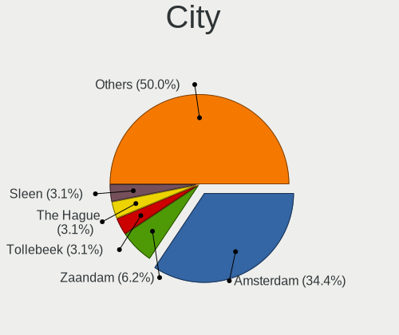
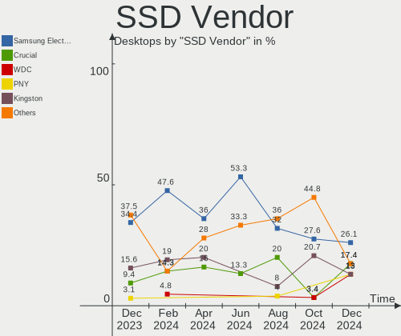
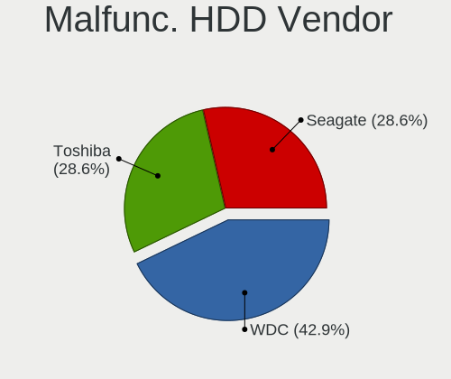
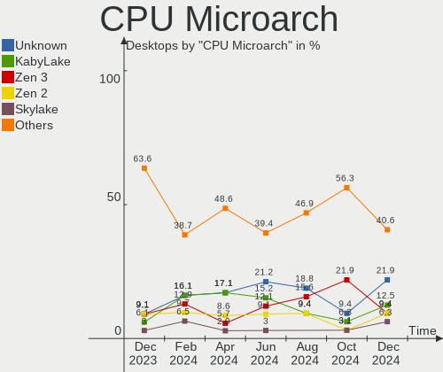
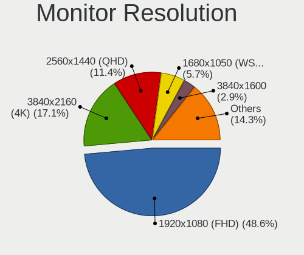
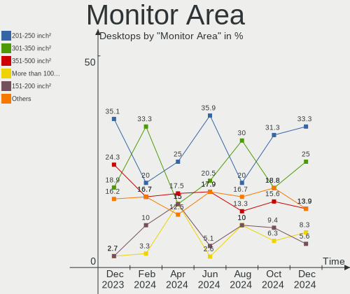

Linux in Netherlands - Hardware Trends (Desktops)
-------------------------------------------------

A project to identify most popular hardware characteristics and track their change
over time based on data collected by Linux users at https://Linux-Hardware.org.

Anyone can contribute to this report by the [hw-probe](https://github.com/linuxhw/hw-probe) tool:

    sudo -E hw-probe -all -upload

Period: Dec, 2024.

Contents
--------

* [ System ](#system)
  - [ OS                       ](#os)
  - [ OS Family                ](#os-family)
  - [ Kernel                   ](#kernel)
  - [ Kernel Family            ](#kernel-family)
  - [ Kernel Major Ver.        ](#kernel-major-ver)
  - [ Arch                     ](#arch)
  - [ DE                       ](#de)
  - [ Display Server           ](#display-server)
  - [ Display Manager          ](#display-manager)
  - [ OS Lang                  ](#os-lang)
  - [ Boot Mode                ](#boot-mode)
  - [ Filesystem               ](#filesystem)
  - [ Part. scheme             ](#part-scheme)
  - [ Dual Boot with Linux/BSD ](#dual-boot-with-linuxbsd)
  - [ Dual Boot (Win)          ](#dual-boot-win)

* [ Board ](#board)
  - [ Vendor                   ](#vendor)
  - [ Model                    ](#model)
  - [ Model Family             ](#model-family)
  - [ MFG Year                 ](#mfg-year)
  - [ Form Factor              ](#form-factor)
  - [ Secure Boot              ](#secure-boot)
  - [ Coreboot                 ](#coreboot)
  - [ RAM Size                 ](#ram-size)
  - [ RAM Used                 ](#ram-used)
  - [ Total Drives             ](#total-drives)
  - [ Has CD-ROM               ](#has-cd-rom)
  - [ Has Ethernet             ](#has-ethernet)
  - [ Has WiFi                 ](#has-wifi)
  - [ Has Bluetooth            ](#has-bluetooth)

* [ Location ](#location)
  - [ Country                  ](#country)
  - [ City                     ](#city)

* [ Drives ](#drives)
  - [ Drive Vendor             ](#drive-vendor)
  - [ Drive Model              ](#drive-model)
  - [ HDD Vendor               ](#hdd-vendor)
  - [ SSD Vendor               ](#ssd-vendor)
  - [ Drive Kind               ](#drive-kind)
  - [ Drive Connector          ](#drive-connector)
  - [ Drive Size               ](#drive-size)
  - [ Space Total              ](#space-total)
  - [ Space Used               ](#space-used)
  - [ Malfunc. Drives          ](#malfunc-drives)
  - [ Malfunc. Drive Vendor    ](#malfunc-drive-vendor)
  - [ Malfunc. HDD Vendor      ](#malfunc-hdd-vendor)
  - [ Malfunc. Drive Kind      ](#malfunc-drive-kind)
  - [ Failed Drives            ](#failed-drives)
  - [ Failed Drive Vendor      ](#failed-drive-vendor)
  - [ Drive Status             ](#drive-status)

* [ Storage controller ](#storage-controller)
  - [ Storage Vendor           ](#storage-vendor)
  - [ Storage Model            ](#storage-model)
  - [ Storage Kind             ](#storage-kind)

* [ Processor ](#processor)
  - [ CPU Vendor               ](#cpu-vendor)
  - [ CPU Model                ](#cpu-model)
  - [ CPU Model Family         ](#cpu-model-family)
  - [ CPU Cores                ](#cpu-cores)
  - [ CPU Sockets              ](#cpu-sockets)
  - [ CPU Threads              ](#cpu-threads)
  - [ CPU Op-Modes             ](#cpu-op-modes)
  - [ CPU Microcode            ](#cpu-microcode)
  - [ CPU Microarch            ](#cpu-microarch)

* [ Graphics ](#graphics)
  - [ GPU Vendor               ](#gpu-vendor)
  - [ GPU Model                ](#gpu-model)
  - [ GPU Combo                ](#gpu-combo)
  - [ GPU Driver               ](#gpu-driver)
  - [ GPU Memory               ](#gpu-memory)

* [ Monitor ](#monitor)
  - [ Monitor Vendor           ](#monitor-vendor)
  - [ Monitor Model            ](#monitor-model)
  - [ Monitor Resolution       ](#monitor-resolution)
  - [ Monitor Diagonal         ](#monitor-diagonal)
  - [ Monitor Width            ](#monitor-width)
  - [ Aspect Ratio             ](#aspect-ratio)
  - [ Monitor Area             ](#monitor-area)
  - [ Pixel Density            ](#pixel-density)
  - [ Multiple Monitors        ](#multiple-monitors)

* [ Network ](#network)
  - [ Net Controller Vendor    ](#net-controller-vendor)
  - [ Net Controller Model     ](#net-controller-model)
  - [ Wireless Vendor          ](#wireless-vendor)
  - [ Wireless Model           ](#wireless-model)
  - [ Ethernet Vendor          ](#ethernet-vendor)
  - [ Ethernet Model           ](#ethernet-model)
  - [ Net Controller Kind      ](#net-controller-kind)
  - [ Used Controller          ](#used-controller)
  - [ NICs                     ](#nics)
  - [ IPv6                     ](#ipv6)

* [ Bluetooth ](#bluetooth)
  - [ Bluetooth Vendor         ](#bluetooth-vendor)
  - [ Bluetooth Model          ](#bluetooth-model)

* [ Sound ](#sound)
  - [ Sound Vendor             ](#sound-vendor)
  - [ Sound Model              ](#sound-model)

* [ Memory ](#memory)
  - [ Memory Vendor            ](#memory-vendor)
  - [ Memory Model             ](#memory-model)
  - [ Memory Kind              ](#memory-kind)
  - [ Memory Form Factor       ](#memory-form-factor)
  - [ Memory Size              ](#memory-size)
  - [ Memory Speed             ](#memory-speed)

* [ Printers & scanners ](#printers--scanners)
  - [ Printer Vendor           ](#printer-vendor)
  - [ Printer Model            ](#printer-model)
  - [ Scanner Vendor           ](#scanner-vendor)
  - [ Scanner Model            ](#scanner-model)

* [ Camera ](#camera)
  - [ Camera Vendor            ](#camera-vendor)
  - [ Camera Model             ](#camera-model)

* [ Security ](#security)
  - [ Fingerprint Vendor       ](#fingerprint-vendor)
  - [ Fingerprint Model        ](#fingerprint-model)
  - [ Chipcard Vendor          ](#chipcard-vendor)
  - [ Chipcard Model           ](#chipcard-model)

* [ Unsupported ](#unsupported)
  - [ Unsupported Devices      ](#unsupported-devices)
  - [ Unsupported Device Types ](#unsupported-device-types)

System
------

OS
--

Installed operating systems

| Name               | Desktops | Percent |
|--------------------|----------|---------|
| OpenMandriva 24.12 | 9        | 28.13%  |
| Ubuntu 24.10       | 3        | 9.38%   |
| Pop!_OS 22.04      | 3        | 9.38%   |
| Arch Rolling       | 3        | 9.38%   |
| Fedora 41          | 2        | 6.25%   |
| Debian 12          | 2        | 6.25%   |
| Ubuntu 24.04       | 1        | 3.13%   |
| Manjaro            | 1        | 3.13%   |
| Mageia 9           | 1        | 3.13%   |
| Linux Mint 22      | 1        | 3.13%   |
| Kubuntu 24.04      | 1        | 3.13%   |
| Fedora 40          | 1        | 3.13%   |
| Fedora 39          | 1        | 3.13%   |
| Drauger OS 7.7     | 1        | 3.13%   |
| Devuan 5           | 1        | 3.13%   |
| Debian             | 1        | 3.13%   |

OS Family
---------

OS without a version

| Name         | Desktops | Percent |
|--------------|----------|---------|
| OpenMandriva | 9        | 28.13%  |
| Ubuntu       | 4        | 12.5%   |
| Fedora       | 4        | 12.5%   |
| Pop!_OS      | 3        | 9.38%   |
| Debian       | 3        | 9.38%   |
| Arch         | 3        | 9.38%   |
| Manjaro      | 1        | 3.13%   |
| Mageia       | 1        | 3.13%   |
| Linux Mint   | 1        | 3.13%   |
| Kubuntu      | 1        | 3.13%   |
| Drauger OS   | 1        | 3.13%   |
| Devuan       | 1        | 3.13%   |

Kernel
------

Version of the Linux kernel

| Version                 | Desktops | Percent |
|-------------------------|----------|---------|
| 6.12.1-desktop-1omv2490 | 9        | 28.13%  |
| 6.9.3-76060903-generic  | 3        | 9.38%   |
| 6.11.0-13-generic       | 2        | 6.25%   |
| 6.1.0-28-amd64          | 2        | 6.25%   |
| 6.9.10                  | 1        | 3.13%   |
| 6.8.0-51-generic        | 1        | 3.13%   |
| 6.8.0-50-generic        | 1        | 3.13%   |
| 6.8.0-49-generic        | 1        | 3.13%   |
| 6.6.65-1-MANJARO        | 1        | 3.13%   |
| 6.6.61-desktop-1.mga9   | 1        | 3.13%   |
| 6.12.5-100.fc40.x86_64  | 1        | 3.13%   |
| 6.12.5-1-cachyos        | 1        | 3.13%   |
| 6.12.4-arch1-1          | 1        | 3.13%   |
| 6.12.3-arch1-1          | 1        | 3.13%   |
| 6.12.3-061203-generic   | 1        | 3.13%   |
| 6.11.9-100.fc39.x86_64  | 1        | 3.13%   |
| 6.11.11-300.fc41.x86_64 | 1        | 3.13%   |
| 6.11.10-amd64           | 1        | 3.13%   |
| 6.11.10-300.fc41.x86_64 | 1        | 3.13%   |
| 6.1.0-28-rt-amd64       | 1        | 3.13%   |

Kernel Family
-------------

Linux kernel without a distro release

| Version | Desktops | Percent |
|---------|----------|---------|
| 6.12.1  | 9        | 28.13%  |
| 6.9.3   | 3        | 9.38%   |
| 6.8.0   | 3        | 9.38%   |
| 6.1.0   | 3        | 9.38%   |
| 6.12.5  | 2        | 6.25%   |
| 6.12.3  | 2        | 6.25%   |
| 6.11.10 | 2        | 6.25%   |
| 6.11.0  | 2        | 6.25%   |
| 6.9.10  | 1        | 3.13%   |
| 6.6.65  | 1        | 3.13%   |
| 6.6.61  | 1        | 3.13%   |
| 6.12.4  | 1        | 3.13%   |
| 6.11.9  | 1        | 3.13%   |
| 6.11.11 | 1        | 3.13%   |

Kernel Major Ver.
-----------------

Linux kernel major version

| Version | Desktops | Percent |
|---------|----------|---------|
| 6.12    | 14       | 43.75%  |
| 6.11    | 6        | 18.75%  |
| 6.9     | 4        | 12.5%   |
| 6.8     | 3        | 9.38%   |
| 6.1     | 3        | 9.38%   |
| 6.6     | 2        | 6.25%   |

Arch
----

OS architecture (x86_64, i586, etc.)

| Name   | Desktops | Percent |
|--------|----------|---------|
| x86_64 | 32       | 100%    |

DE
--

Desktop Environment

| Name       | Desktops | Percent |
|------------|----------|---------|
| GNOME      | 12       | 37.5%   |
| Unknown    | 9        | 28.13%  |
| KDE5       | 4        | 12.5%   |
| X-Cinnamon | 2        | 6.25%   |
| LXQt       | 2        | 6.25%   |
| KDE6       | 2        | 6.25%   |
| XFCE       | 1        | 3.13%   |

Display Server
--------------

X11 or Wayland

| Name    | Desktops | Percent |
|---------|----------|---------|
| X11     | 17       | 53.13%  |
| Wayland | 13       | 40.63%  |
| Tty     | 2        | 6.25%   |

Display Manager
---------------

SDDM, LightDM, etc.

| Name    | Desktops | Percent |
|---------|----------|---------|
| SDDM    | 15       | 46.88%  |
| Unknown | 8        | 25%     |
| GDM3    | 5        | 15.63%  |
| LightDM | 2        | 6.25%   |
| GDM     | 2        | 6.25%   |

OS Lang
-------

Language

| Lang    | Desktops | Percent |
|---------|----------|---------|
| en_US   | 17       | 53.13%  |
| nl_NL   | 5        | 15.63%  |
| C       | 2        | 6.25%   |
| pl_PL   | 1        | 3.13%   |
| nl_BE   | 1        | 3.13%   |
| fr_FR   | 1        | 3.13%   |
| es_ES   | 1        | 3.13%   |
| en_GB   | 1        | 3.13%   |
| de_DE   | 1        | 3.13%   |
| cs_CZ   | 1        | 3.13%   |
| Unknown | 1        | 3.13%   |

Boot Mode
---------

EFI or BIOS

| Mode | Desktops | Percent |
|------|----------|---------|
| BIOS | 18       | 56.25%  |
| EFI  | 14       | 43.75%  |

Filesystem
----------

Type of filesystem

| Type    | Desktops | Percent |
|---------|----------|---------|
| Ext4    | 21       | 65.63%  |
| Tmpfs   | 5        | 15.63%  |
| Overlay | 4        | 12.5%   |
| Btrfs   | 2        | 6.25%   |

Part. scheme
------------

Scheme of partitioning

| Type    | Desktops | Percent |
|---------|----------|---------|
| GPT     | 23       | 71.88%  |
| Unknown | 8        | 25%     |
| MBR     | 1        | 3.13%   |

Dual Boot with Linux/BSD
------------------------

Hosting more than one Linux/BSD

| Dual boot | Desktops | Percent |
|-----------|----------|---------|
| No        | 21       | 65.63%  |
| Yes       | 11       | 34.38%  |

Dual Boot (Win)
---------------

Hosting Linux and Windows

| Dual boot | Desktops | Percent |
|-----------|----------|---------|
| No        | 20       | 62.5%   |
| Yes       | 12       | 37.5%   |

Board
-----

Vendor
------

Motherboard manufacturer

| Name                | Desktops | Percent |
|---------------------|----------|---------|
| ASUSTek Computer    | 9        | 28.13%  |
| Gigabyte Technology | 7        | 21.88%  |
| MSI                 | 4        | 12.5%   |
| Medion              | 3        | 9.38%   |
| Hewlett-Packard     | 3        | 9.38%   |
| ASRock              | 2        | 6.25%   |
| Intel               | 1        | 3.13%   |
| Dell                | 1        | 3.13%   |
| AZW                 | 1        | 3.13%   |
| Acer                | 1        | 3.13%   |

Model
-----

Motherboard model

| Name                               | Desktops | Percent |
|------------------------------------|----------|---------|
| Gigabyte X670 GAMING X AX V2       | 2        | 6.25%   |
| MSI MS-7D73                        | 1        | 3.13%   |
| MSI MS-7D67                        | 1        | 3.13%   |
| MSI MS-7D25                        | 1        | 3.13%   |
| MSI MS-7514                        | 1        | 3.13%   |
| Medion MS-7800                     | 1        | 3.13%   |
| Medion MD34099/C649                | 1        | 3.13%   |
| Medion MD34098/C648                | 1        | 3.13%   |
| Intel DH61ZE AAG43004-200          | 1        | 3.13%   |
| HP xw8400 Workstation              | 1        | 3.13%   |
| HP Compaq Pro 6300 SFF             | 1        | 3.13%   |
| HP Compaq Elite 8300 CMT           | 1        | 3.13%   |
| Gigabyte X570 GAMING X             | 1        | 3.13%   |
| Gigabyte X570 AORUS MASTER         | 1        | 3.13%   |
| Gigabyte B760M GAMING DDR4         | 1        | 3.13%   |
| Gigabyte B550M S2H                 | 1        | 3.13%   |
| Gigabyte B450 AORUS ELITE          | 1        | 3.13%   |
| Dell Precision WorkStation T3500   | 1        | 3.13%   |
| AZW U59                            | 1        | 3.13%   |
| ASUS TUF Gaming B650M-PLUS WIFI    | 1        | 3.13%   |
| ASUS ROG STRIX B650E-F GAMING WIFI | 1        | 3.13%   |
| ASUS ROG Maximus XI GENE           | 1        | 3.13%   |
| ASUS PRIME Z370-A                  | 1        | 3.13%   |
| ASUS PRIME X570-P                  | 1        | 3.13%   |
| ASUS PRIME H510M-A                 | 1        | 3.13%   |
| ASUS PRIME B550M-A                 | 1        | 3.13%   |
| ASUS H170-PRO                      | 1        | 3.13%   |
| ASUS All Series                    | 1        | 3.13%   |
| ASRock H510M-HDV/M.2 SE            | 1        | 3.13%   |
| ASRock B360M Pro4                  | 1        | 3.13%   |
| Acer Aspire X3960                  | 1        | 3.13%   |

Model Family
------------

Motherboard model prefix

| Name             | Desktops | Percent |
|------------------|----------|---------|
| ASUS PRIME       | 4        | 12.5%   |
| HP Compaq        | 2        | 6.25%   |
| Gigabyte X670    | 2        | 6.25%   |
| Gigabyte X570    | 2        | 6.25%   |
| ASUS ROG         | 2        | 6.25%   |
| MSI MS-7D73      | 1        | 3.13%   |
| MSI MS-7D67      | 1        | 3.13%   |
| MSI MS-7D25      | 1        | 3.13%   |
| MSI MS-7514      | 1        | 3.13%   |
| Medion MS-7800   | 1        | 3.13%   |
| Medion MD34099   | 1        | 3.13%   |
| Medion MD34098   | 1        | 3.13%   |
| Intel DH61ZE     | 1        | 3.13%   |
| HP xw8400        | 1        | 3.13%   |
| Gigabyte B760M   | 1        | 3.13%   |
| Gigabyte B550M   | 1        | 3.13%   |
| Gigabyte B450    | 1        | 3.13%   |
| Dell Precision   | 1        | 3.13%   |
| AZW U59          | 1        | 3.13%   |
| ASUS TUF         | 1        | 3.13%   |
| ASUS H170-PRO    | 1        | 3.13%   |
| ASUS All         | 1        | 3.13%   |
| ASRock H510M-HDV | 1        | 3.13%   |
| ASRock B360M     | 1        | 3.13%   |
| Acer Aspire      | 1        | 3.13%   |

MFG Year
--------

Motherboard manufacture year

| Year | Desktops | Percent |
|------|----------|---------|
| 2023 | 4        | 12.5%   |
| 2022 | 4        | 12.5%   |
| 2012 | 4        | 12.5%   |
| 2021 | 3        | 9.38%   |
| 2019 | 3        | 9.38%   |
| 2018 | 3        | 9.38%   |
| 2020 | 2        | 6.25%   |
| 2017 | 2        | 6.25%   |
| 2010 | 2        | 6.25%   |
| 2015 | 1        | 3.13%   |
| 2014 | 1        | 3.13%   |
| 2011 | 1        | 3.13%   |
| 2009 | 1        | 3.13%   |
| 2007 | 1        | 3.13%   |

Form Factor
-----------

Physical design of the computer

| Name    | Desktops | Percent |
|---------|----------|---------|
| Desktop | 32       | 100%    |

Secure Boot
-----------

Enabled or disabled

| State    | Desktops | Percent |
|----------|----------|---------|
| Disabled | 32       | 100%    |

Coreboot
--------

Have coreboot on board

| Used | Desktops | Percent |
|------|----------|---------|
| No   | 32       | 100%    |

RAM Size
--------

Total RAM memory

| Size in GB  | Desktops | Percent |
|-------------|----------|---------|
| 32.01-64.0  | 12       | 37.5%   |
| 4.01-8.0    | 6        | 18.75%  |
| 64.01-256.0 | 5        | 15.63%  |
| 24.01-32.0  | 3        | 9.38%   |
| 16.01-24.0  | 3        | 9.38%   |
| 8.01-16.0   | 2        | 6.25%   |
| 3.01-4.0    | 1        | 3.13%   |

RAM Used
--------

Used RAM memory

| Used GB    | Desktops | Percent |
|------------|----------|---------|
| 4.01-8.0   | 7        | 21.88%  |
| 1.01-2.0   | 7        | 21.88%  |
| 2.01-3.0   | 6        | 18.75%  |
| 3.01-4.0   | 5        | 15.63%  |
| 8.01-16.0  | 5        | 15.63%  |
| 24.01-32.0 | 1        | 3.13%   |
| 0.51-1.0   | 1        | 3.13%   |

Total Drives
------------

Number of drives on board

| Drives | Desktops | Percent |
|--------|----------|---------|
| 2      | 12       | 37.5%   |
| 1      | 7        | 21.88%  |
| 3      | 5        | 15.63%  |
| 5      | 3        | 9.38%   |
| 4      | 3        | 9.38%   |
| 10     | 1        | 3.13%   |
| 7      | 1        | 3.13%   |

Has CD-ROM
----------

Has CD-ROM on board

| Presented | Desktops | Percent |
|-----------|----------|---------|
| Yes       | 17       | 53.13%  |
| No        | 15       | 46.88%  |

Has Ethernet
------------

Has Ethernet on board

| Presented | Desktops | Percent |
|-----------|----------|---------|
| Yes       | 32       | 100%    |

Has WiFi
--------

Has WiFi module

| Presented | Desktops | Percent |
|-----------|----------|---------|
| No        | 17       | 53.13%  |
| Yes       | 15       | 46.88%  |

Has Bluetooth
-------------

Has Bluetooth module

| Presented | Desktops | Percent |
|-----------|----------|---------|
| Yes       | 16       | 50%     |
| No        | 16       | 50%     |

Location
--------

Country
-------

Geographic location (country)

| Country     | Desktops | Percent |
|-------------|----------|---------|
| Netherlands | 32       | 100%    |

City
----

Geographic location (city)

| City             | Desktops | Percent |
|------------------|----------|---------|
| Amsterdam        | 11       | 34.38%  |
| Zaandam          | 2        | 6.25%   |
| Tollebeek        | 1        | 3.13%   |
| The Hague        | 1        | 3.13%   |
| Sleen            | 1        | 3.13%   |
| Rosmalen         | 1        | 3.13%   |
| Purmerend        | 1        | 3.13%   |
| Naaldwijk        | 1        | 3.13%   |
| Maastricht       | 1        | 3.13%   |
| Maasdijk         | 1        | 3.13%   |
| Lutjewinkel      | 1        | 3.13%   |
| Leiden           | 1        | 3.13%   |
| Katwijk          | 1        | 3.13%   |
| Hoensbroek       | 1        | 3.13%   |
| Heemskerk        | 1        | 3.13%   |
| Groningen        | 1        | 3.13%   |
| Etten            | 1        | 3.13%   |
| Enschede         | 1        | 3.13%   |
| Bleskensgraaf    | 1        | 3.13%   |
| Almere Stad      | 1        | 3.13%   |
| 's-Hertogenbosch | 1        | 3.13%   |

Drives
------

Drive Vendor
------------

Hard drive vendors

| Vendor                      | Desktops | Drives | Percent |
|-----------------------------|----------|--------|---------|
| Samsung Electronics         | 14       | 17     | 19.44%  |
| Seagate                     | 11       | 11     | 15.28%  |
| WDC                         | 10       | 13     | 13.89%  |
| Sandisk                     | 6        | 7      | 8.33%   |
| Kingston                    | 5        | 6      | 6.94%   |
| Toshiba                     | 4        | 7      | 5.56%   |
| Hitachi                     | 4        | 9      | 5.56%   |
| Crucial                     | 4        | 4      | 5.56%   |
| PNY                         | 3        | 3      | 4.17%   |
| Unknown                     | 1        | 2      | 1.39%   |
| Silicon Motion              | 1        | 1      | 1.39%   |
| Phison Electronics          | 1        | 1      | 1.39%   |
| Patriot                     | 1        | 1      | 1.39%   |
| Micron Technology           | 1        | 1      | 1.39%   |
| MAXIO Technology (Hangzhou) | 1        | 1      | 1.39%   |
| Kingston Technology Company | 1        | 1      | 1.39%   |
| Intel                       | 1        | 1      | 1.39%   |
| GLOWAY                      | 1        | 1      | 1.39%   |
| Fanxiang                    | 1        | 1      | 1.39%   |
| A-DATA Technology           | 1        | 1      | 1.39%   |

Drive Model
-----------

Hard drive models

| Model                                                 | Desktops | Percent |
|-------------------------------------------------------|----------|---------|
| Samsung NVMe SSD Controller SM981/PM981/PM983 512GB   | 3        | 3.75%   |
| Samsung NVMe SSD Controller PM9A1/PM9A3/980PRO 512GB  | 3        | 3.75%   |
| Toshiba DT01ACA100 1TB                                | 2        | 2.5%    |
| Samsung SSD 850 EVO 250GB                             | 2        | 2.5%    |
| Kingston SV300S37A120G 120GB SSD                      | 2        | 2.5%    |
| Kingston SFYRD2000G 2TB                               | 2        | 2.5%    |
| WDC WDS500G2B0B-00YS70 500GB SSD                      | 1        | 1.25%   |
| WDC WDS200T1R0B-68A4Z0 2TB SSD                        | 1        | 1.25%   |
| WDC WD60EZAZ-00SF3B0 6TB                              | 1        | 1.25%   |
| WDC WD5000AAKX-753CA1 500GB                           | 1        | 1.25%   |
| WDC WD40EZRX-00SPEB0 4TB                              | 1        | 1.25%   |
| WDC WD4005FZBX-00K5WB0 4TB                            | 1        | 1.25%   |
| WDC WD3200AAJS-60M0A1 320GB                           | 1        | 1.25%   |
| WDC WD30EZRZ-00GXCB0 3TB                              | 1        | 1.25%   |
| WDC WD10SPZX-00Z10T0 1TB                              | 1        | 1.25%   |
| WDC WD10JPVT-08A1YT2 1TB                              | 1        | 1.25%   |
| WDC WD10EZEX-08WN4A0 1TB                              | 1        | 1.25%   |
| WDC WD Green 2.5 1000GB SSD                           | 1        | 1.25%   |
| WDC WD Blue SA510 M.2 2280 1000GB SSD                 | 1        | 1.25%   |
| Unknown SD/MMC/MS PRO 128GB                           | 1        | 1.25%   |
| Unknown Compact Flash 977MB                           | 1        | 1.25%   |
| Toshiba HDWG480 8TB                                   | 1        | 1.25%   |
| Toshiba DT01ACA300 3TB                                | 1        | 1.25%   |
| Silicon Motion SM2263EN/SM2263XT SSD Controller 256GB | 1        | 1.25%   |
| Seagate ST8000DM004-2U9188 8TB                        | 1        | 1.25%   |
| Seagate ST8000AS0002-1NA17Z 8TB                       | 1        | 1.25%   |
| Seagate ST500VT000-1DK142 500GB                       | 1        | 1.25%   |
| Seagate ST500LT012-1DG142 500GB                       | 1        | 1.25%   |
| Seagate ST380815AS 80GB                               | 1        | 1.25%   |
| Seagate ST3320820AS 320GB                             | 1        | 1.25%   |
| Seagate ST3000DM007-1WY10G 3TB                        | 1        | 1.25%   |
| Seagate ST2000DM001-9YN164 2TB                        | 1        | 1.25%   |
| Seagate ST1000LM 024 HN-M101MBB 1TB                   | 1        | 1.25%   |
| Seagate Expansion HDD 14TB                            | 1        | 1.25%   |
| Seagate BUP Ultra Touch 2TB                           | 1        | 1.25%   |
| Sandisk WD_BLACK SN850X 4000GB                        | 1        | 1.25%   |
| Sandisk WD_BLACK SN850X 1000GB                        | 1        | 1.25%   |
| Sandisk WD Blue SN570 500GB                           | 1        | 1.25%   |
| Sandisk WD Black SN850 2TB                            | 1        | 1.25%   |
| SanDisk SSD P4 SLC 16GB                               | 1        | 1.25%   |

HDD Vendor
----------

Hard disk drive vendors

| Vendor              | Desktops | Drives | Percent |
|---------------------|----------|--------|---------|
| Seagate             | 11       | 11     | 37.93%  |
| WDC                 | 8        | 9      | 27.59%  |
| Toshiba             | 4        | 7      | 13.79%  |
| Hitachi             | 4        | 9      | 13.79%  |
| Unknown             | 1        | 1      | 3.45%   |
| Samsung Electronics | 1        | 1      | 3.45%   |

SSD Vendor
----------

Solid state drive vendors

| Vendor              | Desktops | Drives | Percent |
|---------------------|----------|--------|---------|
| Samsung Electronics | 6        | 7      | 26.09%  |
| Crucial             | 4        | 4      | 17.39%  |
| WDC                 | 3        | 4      | 13.04%  |
| PNY                 | 3        | 3      | 13.04%  |
| Kingston            | 3        | 4      | 13.04%  |
| SanDisk             | 1        | 1      | 4.35%   |
| Patriot             | 1        | 1      | 4.35%   |
| GLOWAY              | 1        | 1      | 4.35%   |
| A-DATA Technology   | 1        | 1      | 4.35%   |

Drive Kind
----------

HDD or SSD

| Kind    | Desktops | Drives | Percent |
|---------|----------|--------|---------|
| HDD     | 19       | 38     | 35.19%  |
| NVMe    | 17       | 24     | 31.48%  |
| SSD     | 17       | 26     | 31.48%  |
| Unknown | 1        | 1      | 1.85%   |

Drive Connector
---------------

SATA, SAS, NVMe, etc.

| Type | Desktops | Drives | Percent |
|------|----------|--------|---------|
| SATA | 24       | 59     | 52.17%  |
| NVMe | 17       | 24     | 36.96%  |
| SAS  | 5        | 6      | 10.87%  |

Drive Size
----------

Size of hard drive

| Size in TB | Desktops | Drives | Percent |
|------------|----------|--------|---------|
| 0.01-0.5   | 16       | 28     | 40%     |
| 0.51-1.0   | 9        | 13     | 22.5%   |
| 1.01-2.0   | 4        | 5      | 10%     |
| 4.01-10.0  | 4        | 4      | 10%     |
| 3.01-4.0   | 3        | 4      | 7.5%    |
| 2.01-3.0   | 3        | 9      | 7.5%    |
| 10.01-20.0 | 1        | 1      | 2.5%    |

Space Total
-----------

Amount of disk space available on the file system

| Size in GB     | Desktops | Percent |
|----------------|----------|---------|
| More than 3000 | 8        | 25%     |
| 501-1000       | 6        | 18.75%  |
| 101-250        | 5        | 15.63%  |
| 1-20           | 4        | 12.5%   |
| 1001-2000      | 3        | 9.38%   |
| 251-500        | 2        | 6.25%   |
| 2001-3000      | 2        | 6.25%   |
| 51-100         | 1        | 3.13%   |
| Unknown        | 1        | 3.13%   |

Space Used
----------

Amount of used disk space

| Used GB        | Desktops | Percent |
|----------------|----------|---------|
| 1-20           | 11       | 34.38%  |
| 1001-2000      | 5        | 15.63%  |
| 501-1000       | 4        | 12.5%   |
| More than 3000 | 3        | 9.38%   |
| 251-500        | 3        | 9.38%   |
| 101-250        | 2        | 6.25%   |
| 21-50          | 1        | 3.13%   |
| 51-100         | 1        | 3.13%   |
| 0              | 1        | 3.13%   |
| Unknown        | 1        | 3.13%   |

Malfunc. Drives
---------------

Drive models with a malfunction

| Model                                               | Desktops | Drives | Percent |
|-----------------------------------------------------|----------|--------|---------|
| WDC WD5000AAKX-753CA1 500GB                         | 1        | 1      | 10%     |
| WDC WD3200AAJS-60M0A1 320GB                         | 1        | 1      | 10%     |
| WDC WD10JPVT-08A1YT2 1TB                            | 1        | 1      | 10%     |
| WDC WD Green 2.5 1000GB SSD                         | 1        | 1      | 10%     |
| Toshiba DT01ACA300 3TB                              | 1        | 4      | 10%     |
| Toshiba DT01ACA100 1TB                              | 1        | 1      | 10%     |
| Seagate ST380815AS 80GB                             | 1        | 1      | 10%     |
| Seagate ST2000DM001-9YN164 2TB                      | 1        | 1      | 10%     |
| Samsung Electronics SSD 980 PRO 1TB S5GXNF0R522804M | 1        | 1      | 10%     |
| Samsung Electronics SSD 870 EVO 1TB                 | 1        | 1      | 10%     |

Malfunc. Drive Vendor
---------------------

Vendors of faulty drives

| Vendor              | Desktops | Drives | Percent |
|---------------------|----------|--------|---------|
| WDC                 | 4        | 4      | 40%     |
| Toshiba             | 2        | 5      | 20%     |
| Seagate             | 2        | 2      | 20%     |
| Samsung Electronics | 2        | 2      | 20%     |

Malfunc. HDD Vendor
-------------------

Vendors of faulty HDD drives

| Vendor  | Desktops | Drives | Percent |
|---------|----------|--------|---------|
| WDC     | 3        | 3      | 42.86%  |
| Toshiba | 2        | 5      | 28.57%  |
| Seagate | 2        | 2      | 28.57%  |

Malfunc. Drive Kind
-------------------

Kinds of faulty drives

| Kind | Desktops | Drives | Percent |
|------|----------|--------|---------|
| HDD  | 7        | 10     | 77.78%  |
| NVMe | 1        | 1      | 11.11%  |
| SSD  | 1        | 2      | 11.11%  |

Failed Drives
-------------

Failed drive models

Zero info for selected period =(

Failed Drive Vendor
-------------------

Failed drive vendors

Zero info for selected period =(

Drive Status
------------

Number of failed and malfunc. drives

| Status   | Desktops | Drives | Percent |
|----------|----------|--------|---------|
| Works    | 19       | 42     | 47.5%   |
| Detected | 12       | 34     | 30%     |
| Malfunc  | 9        | 13     | 22.5%   |

Storage controller
------------------

Storage Vendor
--------------

Storage controller vendors

| Vendor                      | Desktops | Percent |
|-----------------------------|----------|---------|
| Intel                       | 20       | 34.48%  |
| AMD                         | 13       | 22.41%  |
| Samsung Electronics         | 8        | 13.79%  |
| Sandisk                     | 5        | 8.62%   |
| Kingston Technology Company | 3        | 5.17%   |
| Silicon Motion              | 1        | 1.72%   |
| Phison Electronics          | 1        | 1.72%   |
| Micron Technology           | 1        | 1.72%   |
| MAXIO Technology (Hangzhou) | 1        | 1.72%   |
| Marvell Technology Group    | 1        | 1.72%   |
| JMicron Technology          | 1        | 1.72%   |
| INNOGRIT                    | 1        | 1.72%   |
| Broadcom / LSI              | 1        | 1.72%   |
| ASMedia Technology          | 1        | 1.72%   |

Storage Model
-------------

Storage controller models

| Model                                                                         | Desktops | Percent |
|-------------------------------------------------------------------------------|----------|---------|
| AMD 600 Series Chipset SATA Controller                                        | 6        | 9.68%   |
| AMD FCH SATA Controller [AHCI mode]                                           | 5        | 8.06%   |
| Samsung NVMe SSD Controller PM9A1/PM9A3/980PRO                                | 4        | 6.45%   |
| Sandisk WD Black SN850X NVMe SSD                                              | 3        | 4.84%   |
| Samsung NVMe SSD Controller SM981/PM981/PM983                                 | 3        | 4.84%   |
| Intel Q170/Q150/B150/H170/H110/Z170/CM236 Chipset SATA Controller [AHCI Mode] | 3        | 4.84%   |
| Intel SATA Controller [RAID mode]                                             | 2        | 3.23%   |
| Intel 7 Series/C210 Series Chipset Family 6-port SATA Controller [AHCI mode]  | 2        | 3.23%   |
| Intel 6 Series/C200 Series Chipset Family 6 port Desktop SATA AHCI Controller | 2        | 3.23%   |
| AMD 500 Series Chipset SATA Controller                                        | 2        | 3.23%   |
| Silicon Motion SM2263EN/SM2263XT (DRAM-less) NVMe SSD Controllers             | 1        | 1.61%   |
| SanDisk WD PC SN810 / Black SN850 NVMe SSD                                    | 1        | 1.61%   |
| SanDisk Ultra 3D / WD Blue SN570 NVMe SSD (DRAM-less)                         | 1        | 1.61%   |
| Samsung NVMe SSD Controller SM961/PM961/SM963                                 | 1        | 1.61%   |
| Samsung NVMe SSD Controller S4LV008[Pascal]                                   | 1        | 1.61%   |
| Phison E16 PCIe4 NVMe Controller                                              | 1        | 1.61%   |
| Micron 2550 NVMe SSD (DRAM-less)                                              | 1        | 1.61%   |
| MAXIO (Hangzhou) NVMe SSD Controller MAP1202 (DRAM-less)                      | 1        | 1.61%   |
| Marvell Group 88SE9215 PCIe 2.0 x1 4-port SATA 6 Gb/s Controller              | 1        | 1.61%   |
| Kingston Company KC3000/FURY Renegade NVMe SSD [E18]                          | 1        | 1.61%   |
| Kingston Company FURY Renegade NVMe SSD + Heatsink [E18]                      | 1        | 1.61%   |
| Kingston Company A2000 NVMe SSD [SM2263EN]                                    | 1        | 1.61%   |
| JMicron JMB363 SATA/IDE Controller                                            | 1        | 1.61%   |
| Intel SSD 665p Series [Neptune Harbor Refresh]                                | 1        | 1.61%   |
| Intel Raptor Lake SATA AHCI Controller                                        | 1        | 1.61%   |
| Intel Jasper Lake SATA AHCI Controller                                        | 1        | 1.61%   |
| Intel Comet Lake SATA AHCI Controller                                         | 1        | 1.61%   |
| Intel Cannon Lake PCH SATA AHCI Controller                                    | 1        | 1.61%   |
| Intel Alder Lake-S PCH SATA Controller [AHCI Mode]                            | 1        | 1.61%   |
| Intel 9 Series Chipset Family SATA Controller [AHCI Mode]                     | 1        | 1.61%   |
| Intel 82801JI (ICH10 Family) 4 port SATA IDE Controller #1                    | 1        | 1.61%   |
| Intel 82801JI (ICH10 Family) 2 port SATA IDE Controller #2                    | 1        | 1.61%   |
| Intel 631xESB/632xESB/3100 Chipset SATA IDE Controller                        | 1        | 1.61%   |
| Intel 631xESB/632xESB IDE Controller                                          | 1        | 1.61%   |
| Intel 500 Series Chipset Family SATA AHCI Controller                          | 1        | 1.61%   |
| Intel 200 Series PCH SATA controller [AHCI mode]                              | 1        | 1.61%   |
| INNOGRIT NVMe SSD Controller IG5236                                           | 1        | 1.61%   |
| Broadcom / LSI SAS1064 PCI-X Fusion-MPT SAS                                   | 1        | 1.61%   |
| ASMedia ASM1061/ASM1062 Serial ATA Controller                                 | 1        | 1.61%   |
| AMD 400 Series Chipset SATA Controller                                        | 1        | 1.61%   |

Storage Kind
------------

Kind of storage controller (IDE, SATA, NVMe, SAS, ...)

| Kind | Desktops | Percent |
|------|----------|---------|
| SATA | 29       | 56.86%  |
| NVMe | 17       | 33.33%  |
| RAID | 2        | 3.92%   |
| IDE  | 2        | 3.92%   |
| SCSI | 1        | 1.96%   |

Processor
---------

CPU Vendor
----------

Processor vendors

| Vendor | Desktops | Percent |
|--------|----------|---------|
| Intel  | 19       | 59.38%  |
| AMD    | 13       | 40.63%  |

CPU Model
---------

Processor models

| Model                                    | Desktops | Percent |
|------------------------------------------|----------|---------|
| AMD Ryzen 9 7900 12-Core Processor       | 2        | 6.25%   |
| Intel Xeon CPU W3565 @ 3.20GHz           | 1        | 3.13%   |
| Intel Xeon CPU 5150 @ 2.66GHz            | 1        | 3.13%   |
| Intel Core i7-9700K CPU @ 3.60GHz        | 1        | 3.13%   |
| Intel Core i7-6700K CPU @ 4.00GHz        | 1        | 3.13%   |
| Intel Core i7-6700 CPU @ 3.40GHz         | 1        | 3.13%   |
| Intel Core i7-3770 CPU @ 3.40GHz         | 1        | 3.13%   |
| Intel Core i5-8400 CPU @ 2.80GHz         | 1        | 3.13%   |
| Intel Core i5-7600 CPU @ 3.50GHz         | 1        | 3.13%   |
| Intel Core i5-4690K CPU @ 3.50GHz        | 1        | 3.13%   |
| Intel Core i5-3470 CPU @ 3.20GHz         | 1        | 3.13%   |
| Intel Core i5-2300 CPU @ 2.80GHz         | 1        | 3.13%   |
| Intel Core i3-9100F CPU @ 3.60GHz        | 1        | 3.13%   |
| Intel Core i3-2100 CPU @ 3.10GHz         | 1        | 3.13%   |
| Intel Core 2 Quad CPU Q8200 @ 2.33GHz    | 1        | 3.13%   |
| Intel Celeron N5095A @ 2.00GHz           | 1        | 3.13%   |
| Intel Celeron G5905 CPU @ 3.50GHz        | 1        | 3.13%   |
| Intel 12th Gen Core i5-12600K            | 1        | 3.13%   |
| Intel 12th Gen Core i5-12400F            | 1        | 3.13%   |
| Intel 11th Gen Core i5-11500 @ 2.70GHz   | 1        | 3.13%   |
| AMD Ryzen 9 7950X3D 16-Core Processor    | 1        | 3.13%   |
| AMD Ryzen 9 7950X 16-Core Processor      | 1        | 3.13%   |
| AMD Ryzen 9 7900X 12-Core Processor      | 1        | 3.13%   |
| AMD Ryzen 9 5900X 12-Core Processor      | 1        | 3.13%   |
| AMD Ryzen 7 5800X 8-Core Processor       | 1        | 3.13%   |
| AMD Ryzen 7 3800X 8-Core Processor       | 1        | 3.13%   |
| AMD Ryzen 7 3700X 8-Core Processor       | 1        | 3.13%   |
| AMD Ryzen 5 7600X 6-Core Processor       | 1        | 3.13%   |
| AMD Ryzen 5 5600 6-Core Processor        | 1        | 3.13%   |
| AMD Ryzen 5 3600 6-Core Processor        | 1        | 3.13%   |
| AMD A10-5700 APU with Radeon HD Graphics | 1        | 3.13%   |

CPU Model Family
----------------

Processor model prefix

| Model             | Desktops | Percent |
|-------------------|----------|---------|
| AMD Ryzen 9       | 6        | 18.75%  |
| Intel Core i5     | 5        | 15.63%  |
| Intel Core i7     | 4        | 12.5%   |
| Other             | 3        | 9.38%   |
| AMD Ryzen 7       | 3        | 9.38%   |
| AMD Ryzen 5       | 3        | 9.38%   |
| Intel Xeon        | 2        | 6.25%   |
| Intel Core i3     | 2        | 6.25%   |
| Intel Celeron     | 2        | 6.25%   |
| Intel Core 2 Quad | 1        | 3.13%   |
| AMD A10           | 1        | 3.13%   |

CPU Cores
---------

Number of processor cores

| Number | Desktops | Percent |
|--------|----------|---------|
| 4      | 12       | 37.5%   |
| 6      | 6        | 18.75%  |
| 12     | 4        | 12.5%   |
| 8      | 4        | 12.5%   |
| 2      | 3        | 9.38%   |
| 16     | 2        | 6.25%   |
| 10     | 1        | 3.13%   |

CPU Sockets
-----------

Number of sockets

| Number | Desktops | Percent |
|--------|----------|---------|
| 1      | 31       | 96.88%  |
| 2      | 1        | 3.13%   |

CPU Threads
-----------

Threads per core (Hyper-Threading)

| Number | Desktops | Percent |
|--------|----------|---------|
| 2      | 20       | 62.5%   |
| 1      | 12       | 37.5%   |

CPU Op-Modes
------------

CPU Operation Modes (32-bit, 64-bit)

| Op mode        | Desktops | Percent |
|----------------|----------|---------|
| 32-bit, 64-bit | 32       | 100%    |

CPU Microcode
-------------

Microcode number

| Number     | Desktops | Percent |
|------------|----------|---------|
| Unknown    | 30       | 93.75%  |
| 0x10677    | 1        | 3.13%   |
| 0x0a201025 | 1        | 3.13%   |

CPU Microarch
-------------

Microarchitecture

| Name             | Desktops | Percent |
|------------------|----------|---------|
| Unknown          | 7        | 21.88%  |
| KabyLake         | 4        | 12.5%   |
| Zen 3            | 3        | 9.38%   |
| Zen 2            | 3        | 9.38%   |
| Skylake          | 2        | 6.25%   |
| SandyBridge      | 2        | 6.25%   |
| IvyBridge        | 2        | 6.25%   |
| Alderlake Hybrid | 2        | 6.25%   |
| Piledriver       | 1        | 3.13%   |
| Penryn           | 1        | 3.13%   |
| Nehalem          | 1        | 3.13%   |
| Icelake          | 1        | 3.13%   |
| Haswell          | 1        | 3.13%   |
| Core             | 1        | 3.13%   |
| CometLake        | 1        | 3.13%   |

Graphics
--------

GPU Vendor
----------

Vendors of graphics cards

| Vendor | Desktops | Percent |
|--------|----------|---------|
| Nvidia | 13       | 37.14%  |
| AMD    | 12       | 34.29%  |
| Intel  | 10       | 28.57%  |

GPU Model
---------

Graphics card models

| Model                                                                       | Desktops | Percent |
|-----------------------------------------------------------------------------|----------|---------|
| AMD Raphael                                                                 | 5        | 13.16%  |
| Nvidia TU104 [GeForce RTX 2070 SUPER]                                       | 2        | 5.26%   |
| Intel HD Graphics 530                                                       | 2        | 5.26%   |
| AMD Navi 33 [Radeon RX 7600/7600 XT/7600M XT/7600S/7700S / PRO W7600]       | 2        | 5.26%   |
| AMD Navi 31 [Radeon RX 7900 XT/7900 XTX/7900 GRE/7900M]                     | 2        | 5.26%   |
| Nvidia TU117 [GeForce GTX 1650]                                             | 1        | 2.63%   |
| Nvidia TU116 [GeForce GTX 1660 Ti]                                          | 1        | 2.63%   |
| Nvidia TU106 [GeForce GTX 1650]                                             | 1        | 2.63%   |
| Nvidia GT218 [GeForce 405]                                                  | 1        | 2.63%   |
| Nvidia GP107GL [Quadro P1000]                                               | 1        | 2.63%   |
| Nvidia GP107 [GeForce GTX 1050]                                             | 1        | 2.63%   |
| Nvidia GP102 [GeForce GTX 1080 Ti]                                          | 1        | 2.63%   |
| Nvidia GM204 [GeForce GTX 970]                                              | 1        | 2.63%   |
| Nvidia GF106GL [Quadro 2000]                                                | 1        | 2.63%   |
| Nvidia G84 [GeForce 8600 GTS]                                               | 1        | 2.63%   |
| Nvidia AD104 [GeForce RTX 4070]                                             | 1        | 2.63%   |
| Intel Xeon E3-1200 v3/4th Gen Core Processor Integrated Graphics Controller | 1        | 2.63%   |
| Intel Xeon E3-1200 v2/3rd Gen Core processor Graphics Controller            | 1        | 2.63%   |
| Intel RocketLake-S GT1 [UHD Graphics 750]                                   | 1        | 2.63%   |
| Intel JasperLake [UHD Graphics]                                             | 1        | 2.63%   |
| Intel HD Graphics 630                                                       | 1        | 2.63%   |
| Intel CometLake-S GT1 [UHD Graphics 610]                                    | 1        | 2.63%   |
| Intel CoffeeLake-S GT2 [UHD Graphics 630]                                   | 1        | 2.63%   |
| Intel 2nd Generation Core Processor Family Integrated Graphics Controller   | 1        | 2.63%   |
| AMD Trinity [Radeon HD 7660D]                                               | 1        | 2.63%   |
| AMD Navi 32 [Radeon RX 7700 XT / 7800 XT]                                   | 1        | 2.63%   |
| AMD Navi 24 [Radeon RX 6400/6500 XT/6500M]                                  | 1        | 2.63%   |
| AMD Navi 23 [Radeon RX 6600/6600 XT/6600M]                                  | 1        | 2.63%   |
| AMD Juniper PRO [Radeon HD 5750]                                            | 1        | 2.63%   |
| AMD Ellesmere [Radeon RX 470/480/570/570X/580/580X/590]                     | 1        | 2.63%   |

GPU Combo
---------

Combinations of graphics cards

| Name           | Desktops | Percent |
|----------------|----------|---------|
| 1 x Nvidia     | 10       | 31.25%  |
| 1 x Intel      | 9        | 28.13%  |
| 1 x AMD        | 7        | 21.88%  |
| 2 x AMD        | 3        | 9.38%   |
| AMD + Nvidia   | 2        | 6.25%   |
| Intel + Nvidia | 1        | 3.13%   |

GPU Driver
----------

Free vs proprietary

| Driver      | Desktops | Percent |
|-------------|----------|---------|
| Free        | 22       | 68.75%  |
| Proprietary | 7        | 21.88%  |
| Unknown     | 3        | 9.38%   |

GPU Memory
----------

Total video memory

| Size in GB | Desktops | Percent |
|------------|----------|---------|
| Unknown    | 22       | 68.75%  |
| 7.01-8.0   | 3        | 9.38%   |
| 3.01-4.0   | 2        | 6.25%   |
| 16.01-24.0 | 2        | 6.25%   |
| 5.01-6.0   | 1        | 3.13%   |
| 8.01-16.0  | 1        | 3.13%   |
| 0.01-0.5   | 1        | 3.13%   |

Monitor
-------

Monitor Vendor
--------------

Monitor vendors

| Vendor              | Desktops | Percent |
|---------------------|----------|---------|
| Philips             | 7        | 20.59%  |
| Goldstar            | 6        | 17.65%  |
| Dell                | 6        | 17.65%  |
| Samsung Electronics | 4        | 11.76%  |
| Iiyama              | 3        | 8.82%   |
| AOC                 | 2        | 5.88%   |
| Sony                | 1        | 2.94%   |
| MGW                 | 1        | 2.94%   |
| Hewlett-Packard     | 1        | 2.94%   |
| Gigabyte Technology | 1        | 2.94%   |
| Eizo                | 1        | 2.94%   |
| Acer                | 1        | 2.94%   |

Monitor Model
-------------

Monitor models

| Model                                                                   | Desktops | Percent |
|-------------------------------------------------------------------------|----------|---------|
| Sony CPD-E430 SNY0C90 1920x1440 352x264mm 17.3-inch                     | 1        | 2.56%   |
| Samsung Electronics SyncMaster SAM0589 1920x1080 521x293mm 23.5-inch    | 1        | 2.56%   |
| Samsung Electronics LCD Monitor SAM735A 3840x2160 950x540mm 43.0-inch   | 1        | 2.56%   |
| Samsung Electronics LCD Monitor SAM0900 1366x768 700x390mm 31.5-inch    | 1        | 2.56%   |
| Samsung Electronics LC32G7xT SAM7058 2560x1440 698x393mm 31.5-inch      | 1        | 2.56%   |
| Philips PHL 273V7 PHLC156 1920x1080 598x336mm 27.0-inch                 | 1        | 2.56%   |
| Philips PHL 243V5 PHLC0D1 1920x1080 521x293mm 23.5-inch                 | 1        | 2.56%   |
| Philips PHL 240V5A PHLC10C 1920x1080 530x300mm 24.0-inch                | 1        | 2.56%   |
| Philips FTV PHL04C4 1920x1080 1440x810mm 65.0-inch                      | 1        | 2.56%   |
| Philips FTV PHL01EA 1920x1080 1440x810mm 65.0-inch                      | 1        | 2.56%   |
| Philips 273ELH PHLC07D 1920x1080 598x336mm 27.0-inch                    | 1        | 2.56%   |
| Philips 225B PHL088B 1680x1050 474x296mm 22.0-inch                      | 1        | 2.56%   |
| MGW USB Capture MGW0206 1920x1200 708x398mm 32.0-inch                   | 1        | 2.56%   |
| Iiyama PLX2490C IVM6169 1920x1080 527x296mm 23.8-inch                   | 1        | 2.56%   |
| Iiyama PLX2283HSU IVM564C 1920x1080 479x260mm 21.5-inch                 | 1        | 2.56%   |
| Iiyama PL2792UH IVM664E 3840x2160 596x335mm 26.9-inch                   | 1        | 2.56%   |
| Iiyama PL2760Q IVM663E 2560x1440 597x336mm 27.0-inch                    | 1        | 2.56%   |
| Hewlett-Packard ZR2440w HWP2955 1920x1200 520x320mm 24.0-inch           | 1        | 2.56%   |
| Goldstar W2243 GSM56FF 1920x1080 477x269mm 21.6-inch                    | 1        | 2.56%   |
| Goldstar ULTRAGEAR GSM5C1A 1920x1080 527x296mm 23.8-inch                | 1        | 2.56%   |
| Goldstar Ultra HD GSM5B09 3840x2160 600x340mm 27.2-inch                 | 1        | 2.56%   |
| Goldstar TV SSCR2 GSM82C5 3840x2160                                     | 1        | 2.56%   |
| Goldstar M2362D GSM5757 1920x1080 598x336mm 27.0-inch                   | 1        | 2.56%   |
| Goldstar IPS237 GSM5901 1920x1080 510x290mm 23.1-inch                   | 1        | 2.56%   |
| Goldstar 22EN33 GSM597C 1920x1080 480x270mm 21.7-inch                   | 1        | 2.56%   |
| Gigabyte Technology AORUS FO32U2P GBT3215 3840x2160 699x395mm 31.6-inch | 1        | 2.56%   |
| Eizo S1731 ENC1822 1280x1024 338x270mm 17.0-inch                        | 1        | 2.56%   |
| Dell U3818DW DELA0F2 3840x1600 880x370mm 37.6-inch                      | 1        | 2.56%   |
| Dell U2720Q DEL41B3 3840x2160 600x340mm 27.2-inch                       | 1        | 2.56%   |
| Dell U2715H DELD065 2560x1440 597x336mm 27.0-inch                       | 1        | 2.56%   |
| Dell P2714H DELD05E 1920x1080 598x336mm 27.0-inch                       | 1        | 2.56%   |
| Dell P2417H DELA0DB 1920x1080 527x296mm 23.8-inch                       | 1        | 2.56%   |
| Dell D2020H DELF11F 1600x900 432x243mm 19.5-inch                        | 1        | 2.56%   |
| Dell AW2723DF DELA207 2560x1440 597x336mm 27.0-inch                     | 1        | 2.56%   |
| Dell 2209WA DELF010 1680x1050 474x296mm 22.0-inch                       | 1        | 2.56%   |
| AOC Q3279WG5B AOC3279 2560x1440 725x428mm 33.1-inch                     | 1        | 2.56%   |
| AOC Q27G2WG4 AOC2702 2560x1440 597x336mm 27.0-inch                      | 1        | 2.56%   |
| AOC 27G1G4 AOC2701 1920x1080 598x336mm 27.0-inch                        | 1        | 2.56%   |
| Acer XB241H ACR050E 1920x1080 530x300mm 24.0-inch                       | 1        | 2.56%   |

Monitor Resolution
------------------

Monitor screen resolution

| Resolution         | Desktops | Percent |
|--------------------|----------|---------|
| 1920x1080 (FHD)    | 17       | 48.57%  |
| 3840x2160 (4K)     | 6        | 17.14%  |
| 2560x1440 (QHD)    | 4        | 11.43%  |
| 1680x1050 (WSXGA+) | 2        | 5.71%   |
| 3840x1600          | 1        | 2.86%   |
| 1920x1440          | 1        | 2.86%   |
| 1920x1200 (WUXGA)  | 1        | 2.86%   |
| 1600x900 (HD+)     | 1        | 2.86%   |
| 1366x768 (WXGA)    | 1        | 2.86%   |
| 1280x1024 (SXGA)   | 1        | 2.86%   |

Monitor Diagonal
----------------

Diagonal size in inches

| Inches  | Desktops | Percent |
|---------|----------|---------|
| 27      | 9        | 25.71%  |
| 24      | 5        | 14.29%  |
| 23      | 4        | 11.43%  |
| 31      | 3        | 8.57%   |
| 65      | 2        | 5.71%   |
| 22      | 2        | 5.71%   |
| 21      | 2        | 5.71%   |
| 17      | 2        | 5.71%   |
| 84      | 1        | 2.86%   |
| 37      | 1        | 2.86%   |
| 33      | 1        | 2.86%   |
| 32      | 1        | 2.86%   |
| 19      | 1        | 2.86%   |
| Unknown | 1        | 2.86%   |

Monitor Width
-------------

Physical width

| Width in mm | Desktops | Percent |
|-------------|----------|---------|
| 501-600     | 17       | 50%     |
| 401-500     | 5        | 14.71%  |
| 601-700     | 3        | 8.82%   |
| 701-800     | 2        | 5.88%   |
| 1001-1500   | 2        | 5.88%   |
| 801-900     | 1        | 2.94%   |
| 351-400     | 1        | 2.94%   |
| 301-350     | 1        | 2.94%   |
| 1501-2000   | 1        | 2.94%   |
| Unknown     | 1        | 2.94%   |

Aspect Ratio
------------

Proportional relationship between the width and the height

| Ratio | Desktops | Percent |
|-------|----------|---------|
| 16/9  | 25       | 78.13%  |
| 16/10 | 4        | 12.5%   |
| 5/4   | 1        | 3.13%   |
| 4/3   | 1        | 3.13%   |
| 21/9  | 1        | 3.13%   |

Monitor Area
------------

Area in inch

| Area in inch | Desktops | Percent |
|----------------|----------|---------|
| 201-250        | 12       | 33.33%  |
| 301-350        | 9        | 25%     |
| 351-500        | 5        | 13.89%  |
| More than 1000 | 3        | 8.33%   |
| 151-200        | 2        | 5.56%   |
| 141-150        | 2        | 5.56%   |
| 251-300        | 1        | 2.78%   |
| 501-1000       | 1        | 2.78%   |
| Unknown        | 1        | 2.78%   |

Pixel Density
-------------

Pixels per inch

| Density | Desktops | Percent |
|---------|----------|---------|
| 51-100  | 22       | 61.11%  |
| 101-120 | 6        | 16.67%  |
| 1-50    | 3        | 8.33%   |
| 161-240 | 2        | 5.56%   |
| 121-160 | 2        | 5.56%   |
| Unknown | 1        | 2.78%   |

Multiple Monitors
-----------------

Total monitors connected

| Total | Desktops | Percent |
|-------|----------|---------|
| 1     | 21       | 65.63%  |
| 2     | 8        | 25%     |
| 0     | 2        | 6.25%   |
| 3     | 1        | 3.13%   |

Network
-------

Net Controller Vendor
---------------------

Controller vendors

| Vendor                | Desktops | Percent |
|-----------------------|----------|---------|
| Realtek Semiconductor | 20       | 45.45%  |
| Intel                 | 14       | 31.82%  |
| MediaTek              | 3        | 6.82%   |
| Broadcom              | 3        | 6.82%   |
| Xiaomi                | 1        | 2.27%   |
| TP-Link               | 1        | 2.27%   |
| Qualcomm Atheros      | 1        | 2.27%   |
| ASUSTek Computer      | 1        | 2.27%   |

Net Controller Model
--------------------

Controller models

| Model                                                                  | Desktops | Percent |
|------------------------------------------------------------------------|----------|---------|
| Realtek RTL8111/8168/8211/8411 PCI Express Gigabit Ethernet Controller | 13       | 26.53%  |
| Realtek RTL8125 2.5GbE Controller                                      | 7        | 14.29%  |
| Realtek RTL8852CE PCIe 802.11ax Wireless Network Controller            | 2        | 4.08%   |
| MediaTek MT7922 802.11ax PCI Express Wireless Network Adapter          | 2        | 4.08%   |
| Intel Wireless 7265                                                    | 2        | 4.08%   |
| Intel Ethernet Controller I225-V                                       | 2        | 4.08%   |
| Intel Ethernet Connection (7) I219-V                                   | 2        | 4.08%   |
| Intel 82579V Gigabit Network Connection                                | 2        | 4.08%   |
| Intel 82579LM Gigabit Network Connection (Lewisville)                  | 2        | 4.08%   |
| Xiaomi Mi/Redmi series (RNDIS + ADB)                                   | 1        | 2.04%   |
| TP-Link RTL8812AU Archer T4U 802.11ac                                  | 1        | 2.04%   |
| Realtek RTL8852BE PCIe 802.11ax Wireless Network Controller            | 1        | 2.04%   |
| Realtek RTL8188CUS 802.11n WLAN Adapter                                | 1        | 2.04%   |
| Qualcomm Atheros AR9287 Wireless Network Adapter (PCI-Express)         | 1        | 2.04%   |
| MediaTek MT7921K (RZ608) Wi-Fi 6E 80MHz                                | 1        | 2.04%   |
| Intel Wireless 3165                                                    | 1        | 2.04%   |
| Intel Wi-Fi 6 AX200                                                    | 1        | 2.04%   |
| Intel Ethernet Connection (2) I219-V                                   | 1        | 2.04%   |
| Intel Ethernet Connection (14) I219-V                                  | 1        | 2.04%   |
| Intel Cannon Lake PCH CNVi WiFi                                        | 1        | 2.04%   |
| Broadcom NetXtreme BCM5761 Gigabit Ethernet PCIe                       | 1        | 2.04%   |
| Broadcom NetXtreme BCM5752 Gigabit Ethernet PCI Express                | 1        | 2.04%   |
| Broadcom BCM4360 802.11ac Dual Band Wireless Network Adapter           | 1        | 2.04%   |
| ASUS USB-N13 802.11n Network Adapter (rev. B1) [Realtek RTL8192CU]     | 1        | 2.04%   |

Wireless Vendor
---------------

Wireless vendors

| Vendor                | Desktops | Percent |
|-----------------------|----------|---------|
| Intel                 | 5        | 33.33%  |
| Realtek Semiconductor | 3        | 20%     |
| MediaTek              | 3        | 20%     |
| TP-Link               | 1        | 6.67%   |
| Qualcomm Atheros      | 1        | 6.67%   |
| Broadcom              | 1        | 6.67%   |
| ASUSTek Computer      | 1        | 6.67%   |

Wireless Model
--------------

Wireless models

| Model                                                              | Desktops | Percent |
|--------------------------------------------------------------------|----------|---------|
| Realtek RTL8852CE PCIe 802.11ax Wireless Network Controller        | 2        | 13.33%  |
| MediaTek MT7922 802.11ax PCI Express Wireless Network Adapter      | 2        | 13.33%  |
| Intel Wireless 7265                                                | 2        | 13.33%  |
| TP-Link RTL8812AU Archer T4U 802.11ac                              | 1        | 6.67%   |
| Realtek RTL8188CUS 802.11n WLAN Adapter                            | 1        | 6.67%   |
| Qualcomm Atheros AR9287 Wireless Network Adapter (PCI-Express)     | 1        | 6.67%   |
| MediaTek MT7921K (RZ608) Wi-Fi 6E 80MHz                            | 1        | 6.67%   |
| Intel Wireless 3165                                                | 1        | 6.67%   |
| Intel Wi-Fi 6 AX200                                                | 1        | 6.67%   |
| Intel Cannon Lake PCH CNVi WiFi                                    | 1        | 6.67%   |
| Broadcom BCM4360 802.11ac Dual Band Wireless Network Adapter       | 1        | 6.67%   |
| ASUS USB-N13 802.11n Network Adapter (rev. B1) [Realtek RTL8192CU] | 1        | 6.67%   |

Ethernet Vendor
---------------

Ethernet vendors

| Vendor                | Desktops | Percent |
|-----------------------|----------|---------|
| Realtek Semiconductor | 20       | 60.61%  |
| Intel                 | 10       | 30.3%   |
| Broadcom              | 2        | 6.06%   |
| Xiaomi                | 1        | 3.03%   |

Ethernet Model
--------------

Ethernet models

| Model                                                                  | Desktops | Percent |
|------------------------------------------------------------------------|----------|---------|
| Realtek RTL8111/8168/8211/8411 PCI Express Gigabit Ethernet Controller | 13       | 38.24%  |
| Realtek RTL8125 2.5GbE Controller                                      | 7        | 20.59%  |
| Intel Ethernet Controller I225-V                                       | 2        | 5.88%   |
| Intel Ethernet Connection (7) I219-V                                   | 2        | 5.88%   |
| Intel 82579V Gigabit Network Connection                                | 2        | 5.88%   |
| Intel 82579LM Gigabit Network Connection (Lewisville)                  | 2        | 5.88%   |
| Xiaomi Mi/Redmi series (RNDIS + ADB)                                   | 1        | 2.94%   |
| Realtek RTL8852BE PCIe 802.11ax Wireless Network Controller            | 1        | 2.94%   |
| Intel Ethernet Connection (2) I219-V                                   | 1        | 2.94%   |
| Intel Ethernet Connection (14) I219-V                                  | 1        | 2.94%   |
| Broadcom NetXtreme BCM5761 Gigabit Ethernet PCIe                       | 1        | 2.94%   |
| Broadcom NetXtreme BCM5752 Gigabit Ethernet PCI Express                | 1        | 2.94%   |

Net Controller Kind
-------------------

Ethernet, WiFi or modem

| Kind     | Desktops | Percent |
|----------|----------|---------|
| Ethernet | 32       | 68.09%  |
| WiFi     | 15       | 31.91%  |

Used Controller
---------------

Currently used network controller

| Kind     | Desktops | Percent |
|----------|----------|---------|
| Ethernet | 28       | 82.35%  |
| WiFi     | 6        | 17.65%  |

NICs
----

Total network controllers on board

| Total | Desktops | Percent |
|-------|----------|---------|
| 1     | 19       | 59.38%  |
| 2     | 13       | 40.63%  |

IPv6
----

IPv6 vs IPv4

| Used | Desktops | Percent |
|------|----------|---------|
| No   | 18       | 56.25%  |
| Yes  | 14       | 43.75%  |

Bluetooth
---------

Bluetooth Vendor
----------------

Controller vendors

| Vendor                  | Desktops | Percent |
|-------------------------|----------|---------|
| Intel                   | 6        | 31.58%  |
| Cambridge Silicon Radio | 4        | 21.05%  |
| MediaTek                | 3        | 15.79%  |
| IMC Networks            | 2        | 10.53%  |
| TP-Link                 | 1        | 5.26%   |
| Realtek Semiconductor   | 1        | 5.26%   |
| Dell                    | 1        | 5.26%   |
| ASUSTek Computer        | 1        | 5.26%   |

Bluetooth Model
---------------

Controller models

| Model                                               | Desktops | Percent |
|-----------------------------------------------------|----------|---------|
| Cambridge Silicon Radio Bluetooth Dongle (HCI mode) | 4        | 21.05%  |
| MediaTek Wireless_Device                            | 3        | 15.79%  |
| Intel Bluetooth wireless interface                  | 3        | 15.79%  |
| IMC Networks Bluetooth Radio                        | 2        | 10.53%  |
| TP-Link TP-Link Bluetooth USB Adapter               | 1        | 5.26%   |
| Realtek Bluetooth Radio                             | 1        | 5.26%   |
| Intel Bluetooth 9460/9560 Jefferson Peak (JfP)      | 1        | 5.26%   |
| Intel AX210 Bluetooth                               | 1        | 5.26%   |
| Intel AX200 Bluetooth                               | 1        | 5.26%   |
| Dell BT Mini-Receiver                               | 1        | 5.26%   |
| ASUS ASUS USB-BT500                                 | 1        | 5.26%   |

Sound
-----

Sound Vendor
------------

Sound card vendors

| Vendor                   | Desktops | Percent |
|--------------------------|----------|---------|
| Intel                    | 18       | 30.51%  |
| AMD                      | 14       | 23.73%  |
| Nvidia                   | 12       | 20.34%  |
| Texas Instruments        | 2        | 3.39%   |
| Micro Star International | 2        | 3.39%   |
| C-Media Electronics      | 2        | 3.39%   |
| ASUSTek Computer         | 2        | 3.39%   |
| Logitech                 | 1        | 1.69%   |
| KTMicro                  | 1        | 1.69%   |
| Kingston Technology      | 1        | 1.69%   |
| JMTek                    | 1        | 1.69%   |
| DSEA A/S                 | 1        | 1.69%   |
| DigiTech                 | 1        | 1.69%   |
| Cooler Master            | 1        | 1.69%   |

Sound Model
-----------

Sound card models

| Model                                                                      | Desktops | Percent |
|----------------------------------------------------------------------------|----------|---------|
| AMD Starship/Matisse HD Audio Controller                                   | 6        | 8.22%   |
| AMD Rembrandt Radeon High Definition Audio Controller                      | 5        | 6.85%   |
| AMD Navi 31 HDMI/DP Audio                                                  | 5        | 6.85%   |
| AMD Family 17h/19h/1ah HD Audio Controller                                 | 5        | 6.85%   |
| Intel 100 Series/C230 Series Chipset Family HD Audio Controller            | 3        | 4.11%   |
| Nvidia TU104 HD Audio Controller                                           | 2        | 2.74%   |
| Nvidia GP107GL High Definition Audio Controller                            | 2        | 2.74%   |
| Micro Star International USB Audio                                         | 2        | 2.74%   |
| Intel Cannon Lake PCH cAVS                                                 | 2        | 2.74%   |
| Intel 82801JI (ICH10 Family) HD Audio Controller                           | 2        | 2.74%   |
| Intel 7 Series/C216 Chipset Family High Definition Audio Controller        | 2        | 2.74%   |
| Intel 6 Series/C200 Series Chipset Family High Definition Audio Controller | 2        | 2.74%   |
| AMD Navi 21/23 HDMI/DP Audio Controller                                    | 2        | 2.74%   |
| Texas Instruments PCM2902 Audio Codec                                      | 1        | 1.37%   |
| Texas Instruments PCM2900C Audio CODEC                                     | 1        | 1.37%   |
| Nvidia TU116 High Definition Audio Controller                              | 1        | 1.37%   |
| Nvidia TU107 GeForce GTX 1650 High Definition Audio Controller             | 1        | 1.37%   |
| Nvidia TU106 High Definition Audio Controller                              | 1        | 1.37%   |
| Nvidia High Definition Audio Controller                                    | 1        | 1.37%   |
| Nvidia GP102 HDMI Audio Controller                                         | 1        | 1.37%   |
| Nvidia GM204 High Definition Audio Controller                              | 1        | 1.37%   |
| Nvidia GF106 High Definition Audio Controller                              | 1        | 1.37%   |
| Nvidia AD104 High Definition Audio Controller                              | 1        | 1.37%   |
| Logitech H600 [Wireless Headset]                                           | 1        | 1.37%   |
| KTMicro KT USB Audio                                                       | 1        | 1.37%   |
| Kingston Technology HyperX 7.1 Audio                                       | 1        | 1.37%   |
| JMTek Fosi Audio K5 Pro                                                    | 1        | 1.37%   |
| Intel Xeon E3-1200 v3/4th Gen Core Processor HD Audio Controller           | 1        | 1.37%   |
| Intel Tiger Lake-H HD Audio Controller                                     | 1        | 1.37%   |
| Intel Raptor Lake High Definition Audio Controller                         | 1        | 1.37%   |
| Intel Jasper Lake HD Audio                                                 | 1        | 1.37%   |
| Intel Comet Lake PCH cAVS                                                  | 1        | 1.37%   |
| Intel Alder Lake-S HD Audio Controller                                     | 1        | 1.37%   |
| Intel 9 Series Chipset Family HD Audio Controller                          | 1        | 1.37%   |
| Intel 200 Series PCH HD Audio                                              | 1        | 1.37%   |
| DSEA A/S EPOS PC 8 USB                                                     | 1        | 1.37%   |
| DigiTech Lexicon Omega                                                     | 1        | 1.37%   |
| Cooler Master MH752                                                        | 1        | 1.37%   |
| C-Media Electronics USB Audio Device                                       | 1        | 1.37%   |
| C-Media Electronics CM108 Audio Controller                                 | 1        | 1.37%   |

Memory
------

Memory Vendor
-------------

Memory module vendors

| Vendor              | Desktops | Percent |
|---------------------|----------|---------|
| Kingston            | 10       | 41.67%  |
| Corsair             | 7        | 29.17%  |
| Samsung Electronics | 3        | 12.5%   |
| Unknown             | 1        | 4.17%   |
| Micron Technology   | 1        | 4.17%   |
| G.Skill             | 1        | 4.17%   |
| Crucial             | 1        | 4.17%   |

Memory Model
------------

Memory module models

| Model                                                  | Desktops | Percent |
|--------------------------------------------------------|----------|---------|
| Kingston RAM KHX3200C16D4/16GX 16GB DIMM DDR4 3600MT/s | 2        | 6.9%    |
| Corsair RAM CMK16GX4M2B3200C16 8GB DIMM DDR4 3600MT/s  | 2        | 6.9%    |
| Unknown RAM Module 2GB DIMM SDRAM                      | 1        | 3.45%   |
| Samsung RAM M471A4G43AB1-CWE 32GB SODIMM DDR4 3200MT/s | 1        | 3.45%   |
| Samsung RAM M391B5773CH0-YH9 2GB DIMM DDR3 1333MT/s    | 1        | 3.45%   |
| Samsung RAM M391B5773CH0-CH9 2GB DIMM DDR3 1333MT/s    | 1        | 3.45%   |
| Samsung RAM M391B5673EH1-CH9 2GB DIMM DDR3 1333MT/s    | 1        | 3.45%   |
| Samsung RAM M378B1G73EB0-YK0 8GB DIMM DDR3 1600MT/s    | 1        | 3.45%   |
| Micron RAM 8JTF51264AZ-1G6E1 4GB DIMM 1600MT/s         | 1        | 3.45%   |
| Kingston RAM KHX2666C16/8G 8GB DIMM DDR4 3466MT/s      | 1        | 3.45%   |
| Kingston RAM KHX2133C14D4/8G 8GB DIMM DDR4 3000MT/s    | 1        | 3.45%   |
| Kingston RAM KHX2133C14/16G 16GB DIMM DDR4 2400MT/s    | 1        | 3.45%   |
| Kingston RAM KF3200C16D4/8GX 8GB DIMM DDR4 3600MT/s    | 1        | 3.45%   |
| Kingston RAM KF3200C16D4/16GX 16GB DIMM DDR4 3200MT/s  | 1        | 3.45%   |
| Kingston RAM KF2666C16D4/32GX 32GB DIMM DDR4 2667MT/s  | 1        | 3.45%   |
| Kingston RAM 99U5471-012.A00LF 4GB DIMM DDR3 1333MT/s  | 1        | 3.45%   |
| Kingston RAM 99U5471-001.A01LF 2GB DIMM DDR3 1600MT/s  | 1        | 3.45%   |
| Kingston RAM 9905743-045.A00G 16GB DIMM DDR4 2667MT/s  | 1        | 3.45%   |
| Kingston RAM 9905734-422.A00G 32GB DIMM DDR4 2666MT/s  | 1        | 3.45%   |
| Kingston RAM 9905471-074.A00LF 8GB DIMM DDR3 1600MT/s  | 1        | 3.45%   |
| G.Skill RAM F5-6000J3636F16G 16GB DIMM DDR5 6400MT/s   | 1        | 3.45%   |
| Crucial RAM BLS4G4D26BFSE.8FBD2 4GB DIMM DDR4 2747MT/s | 1        | 3.45%   |
| Corsair RAM CMK64GX5M2B6600C32 32GB DIMM DDR5 6600MT/s | 1        | 3.45%   |
| Corsair RAM CMK64GX4M2E3200C16 32GB DIMM DDR4 3600MT/s | 1        | 3.45%   |
| Corsair RAM CMK32GX5M2B6400C32 16GB DIMM DDR5 6400MT/s | 1        | 3.45%   |
| Corsair RAM CMK32GX4M2A2400C16 16GB DIMM DDR4 2400MT/s | 1        | 3.45%   |
| Corsair RAM CMK16GX4M2E3200C16 8GB DIMM DDR4 3466MT/s  | 1        | 3.45%   |

Memory Kind
-----------

Memory module kinds

| Kind  | Desktops | Percent |
|-------|----------|---------|
| DDR4  | 15       | 65.22%  |
| DDR3  | 4        | 17.39%  |
| DDR5  | 3        | 13.04%  |
| SDRAM | 1        | 4.35%   |

Memory Form Factor
------------------

Physical design of the memory module

| Name   | Desktops | Percent |
|--------|----------|---------|
| DIMM   | 22       | 95.65%  |
| SODIMM | 1        | 4.35%   |

Memory Size
-----------

Memory module size

| Size  | Desktops | Percent |
|-------|----------|---------|
| 16384 | 7        | 28%     |
| 8192  | 7        | 28%     |
| 32768 | 5        | 20%     |
| 4096  | 3        | 12%     |
| 2048  | 3        | 12%     |

Memory Speed
------------

Memory module speed

| Speed   | Desktops | Percent |
|---------|----------|---------|
| 3600    | 6        | 24%     |
| 1600    | 3        | 12%     |
| 6400    | 2        | 8%      |
| 3466    | 2        | 8%      |
| 3200    | 2        | 8%      |
| 2667    | 2        | 8%      |
| 2400    | 2        | 8%      |
| 6600    | 1        | 4%      |
| 3000    | 1        | 4%      |
| 2747    | 1        | 4%      |
| 2666    | 1        | 4%      |
| 1333    | 1        | 4%      |
| Unknown | 1        | 4%      |

Printers & scanners
-------------------

Printer Vendor
--------------

Printer device vendors

Zero info for selected period =(

Printer Model
-------------

Printer device models

Zero info for selected period =(

Scanner Vendor
--------------

Scanner device vendors

| Vendor | Desktops | Percent |
|--------|----------|---------|
| Canon  | 1        | 100%    |

Scanner Model
-------------

Scanner device models

| Model                   | Desktops | Percent |
|-------------------------|----------|---------|
| Canon CanoScan LiDE 210 | 1        | 100%    |

Camera
------

Camera Vendor
-------------

Camera device vendors

| Vendor                 | Desktops | Percent |
|------------------------|----------|---------|
| Logitech               | 2        | 28.57%  |
| Trust                  | 1        | 14.29%  |
| Realtek Semiconductor  | 1        | 14.29%  |
| Microsoft              | 1        | 14.29%  |
| Microdia               | 1        | 14.29%  |
| Generalplus Technology | 1        | 14.29%  |

Camera Model
------------

Camera device models

| Model                        | Desktops | Percent |
|------------------------------|----------|---------|
| Trust Trust Full HD Webcam   | 1        | 14.29%  |
| Realtek FULL HD 1080P Webcam | 1        | 14.29%  |
| Microsoft LifeCam HD-5000    | 1        | 14.29%  |
| Microdia Camera              | 1        | 14.29%  |
| Logitech Webcam C270         | 1        | 14.29%  |
| Logitech Brio 100            | 1        | 14.29%  |
| Generalplus GENERAL WEBCAM   | 1        | 14.29%  |

Security
--------

Fingerprint Vendor
------------------

Fingerprint sensor vendors

Zero info for selected period =(

Fingerprint Model
-----------------

Fingerprint sensor models

Zero info for selected period =(

Chipcard Vendor
---------------

Chipcard module vendors

Zero info for selected period =(

Chipcard Model
--------------

Chipcard module models

Zero info for selected period =(

Unsupported
-----------

Unsupported Devices
-------------------

Total unsupported devices on board

| Total | Desktops | Percent |
|-------|----------|---------|
| 0     | 27       | 84.38%  |
| 1     | 3        | 9.38%   |
| 2     | 2        | 6.25%   |

Unsupported Device Types
------------------------

Types of unsupported devices

| Type          | Desktops | Percent |
|---------------|----------|---------|
| Graphics card | 4        | 57.14%  |
| Net/wireless  | 3        | 42.86%  |

