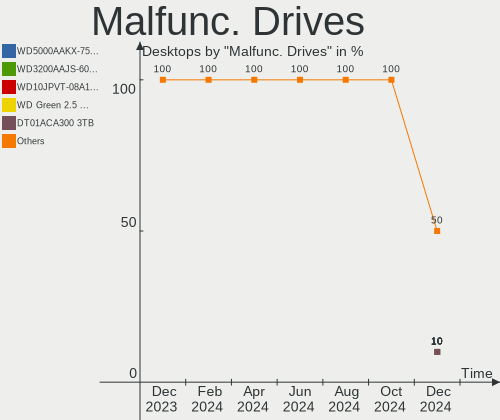
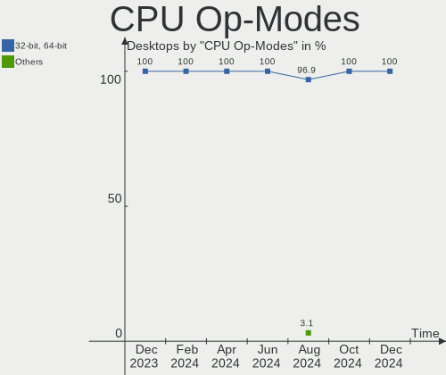
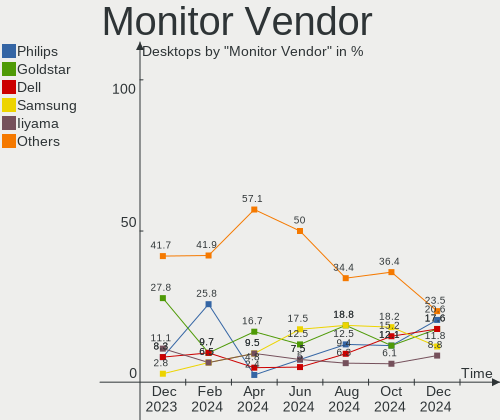
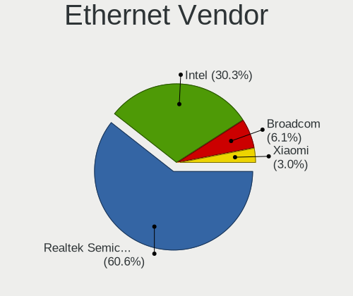
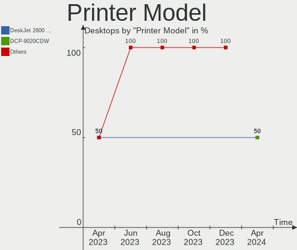

Linux in Netherlands - Hardware Trends (Desktops)
-------------------------------------------------

A project to identify most popular hardware characteristics and track their change
over time based on data collected by Linux users at https://Linux-Hardware.org.

Anyone can contribute to this report by the [hw-probe](https://github.com/linuxhw/hw-probe) tool:

    sudo -E hw-probe -all -upload

Period: Dec, 2023.

Contents
--------

* [ System ](#system)
  - [ OS                       ](#os)
  - [ OS Family                ](#os-family)
  - [ Kernel                   ](#kernel)
  - [ Kernel Family            ](#kernel-family)
  - [ Kernel Major Ver.        ](#kernel-major-ver)
  - [ Arch                     ](#arch)
  - [ DE                       ](#de)
  - [ Display Server           ](#display-server)
  - [ Display Manager          ](#display-manager)
  - [ OS Lang                  ](#os-lang)
  - [ Boot Mode                ](#boot-mode)
  - [ Filesystem               ](#filesystem)
  - [ Part. scheme             ](#part-scheme)
  - [ Dual Boot with Linux/BSD ](#dual-boot-with-linuxbsd)
  - [ Dual Boot (Win)          ](#dual-boot-win)

* [ Board ](#board)
  - [ Vendor                   ](#vendor)
  - [ Model                    ](#model)
  - [ Model Family             ](#model-family)
  - [ MFG Year                 ](#mfg-year)
  - [ Form Factor              ](#form-factor)
  - [ Secure Boot              ](#secure-boot)
  - [ Coreboot                 ](#coreboot)
  - [ RAM Size                 ](#ram-size)
  - [ RAM Used                 ](#ram-used)
  - [ Total Drives             ](#total-drives)
  - [ Has CD-ROM               ](#has-cd-rom)
  - [ Has Ethernet             ](#has-ethernet)
  - [ Has WiFi                 ](#has-wifi)
  - [ Has Bluetooth            ](#has-bluetooth)

* [ Location ](#location)
  - [ Country                  ](#country)
  - [ City                     ](#city)

* [ Drives ](#drives)
  - [ Drive Vendor             ](#drive-vendor)
  - [ Drive Model              ](#drive-model)
  - [ HDD Vendor               ](#hdd-vendor)
  - [ SSD Vendor               ](#ssd-vendor)
  - [ Drive Kind               ](#drive-kind)
  - [ Drive Connector          ](#drive-connector)
  - [ Drive Size               ](#drive-size)
  - [ Space Total              ](#space-total)
  - [ Space Used               ](#space-used)
  - [ Malfunc. Drives          ](#malfunc-drives)
  - [ Malfunc. Drive Vendor    ](#malfunc-drive-vendor)
  - [ Malfunc. HDD Vendor      ](#malfunc-hdd-vendor)
  - [ Malfunc. Drive Kind      ](#malfunc-drive-kind)
  - [ Failed Drives            ](#failed-drives)
  - [ Failed Drive Vendor      ](#failed-drive-vendor)
  - [ Drive Status             ](#drive-status)

* [ Storage controller ](#storage-controller)
  - [ Storage Vendor           ](#storage-vendor)
  - [ Storage Model            ](#storage-model)
  - [ Storage Kind             ](#storage-kind)

* [ Processor ](#processor)
  - [ CPU Vendor               ](#cpu-vendor)
  - [ CPU Model                ](#cpu-model)
  - [ CPU Model Family         ](#cpu-model-family)
  - [ CPU Cores                ](#cpu-cores)
  - [ CPU Sockets              ](#cpu-sockets)
  - [ CPU Threads              ](#cpu-threads)
  - [ CPU Op-Modes             ](#cpu-op-modes)
  - [ CPU Microcode            ](#cpu-microcode)
  - [ CPU Microarch            ](#cpu-microarch)

* [ Graphics ](#graphics)
  - [ GPU Vendor               ](#gpu-vendor)
  - [ GPU Model                ](#gpu-model)
  - [ GPU Combo                ](#gpu-combo)
  - [ GPU Driver               ](#gpu-driver)
  - [ GPU Memory               ](#gpu-memory)

* [ Monitor ](#monitor)
  - [ Monitor Vendor           ](#monitor-vendor)
  - [ Monitor Model            ](#monitor-model)
  - [ Monitor Resolution       ](#monitor-resolution)
  - [ Monitor Diagonal         ](#monitor-diagonal)
  - [ Monitor Width            ](#monitor-width)
  - [ Aspect Ratio             ](#aspect-ratio)
  - [ Monitor Area             ](#monitor-area)
  - [ Pixel Density            ](#pixel-density)
  - [ Multiple Monitors        ](#multiple-monitors)

* [ Network ](#network)
  - [ Net Controller Vendor    ](#net-controller-vendor)
  - [ Net Controller Model     ](#net-controller-model)
  - [ Wireless Vendor          ](#wireless-vendor)
  - [ Wireless Model           ](#wireless-model)
  - [ Ethernet Vendor          ](#ethernet-vendor)
  - [ Ethernet Model           ](#ethernet-model)
  - [ Net Controller Kind      ](#net-controller-kind)
  - [ Used Controller          ](#used-controller)
  - [ NICs                     ](#nics)
  - [ IPv6                     ](#ipv6)

* [ Bluetooth ](#bluetooth)
  - [ Bluetooth Vendor         ](#bluetooth-vendor)
  - [ Bluetooth Model          ](#bluetooth-model)

* [ Sound ](#sound)
  - [ Sound Vendor             ](#sound-vendor)
  - [ Sound Model              ](#sound-model)

* [ Memory ](#memory)
  - [ Memory Vendor            ](#memory-vendor)
  - [ Memory Model             ](#memory-model)
  - [ Memory Kind              ](#memory-kind)
  - [ Memory Form Factor       ](#memory-form-factor)
  - [ Memory Size              ](#memory-size)
  - [ Memory Speed             ](#memory-speed)

* [ Printers & scanners ](#printers--scanners)
  - [ Printer Vendor           ](#printer-vendor)
  - [ Printer Model            ](#printer-model)
  - [ Scanner Vendor           ](#scanner-vendor)
  - [ Scanner Model            ](#scanner-model)

* [ Camera ](#camera)
  - [ Camera Vendor            ](#camera-vendor)
  - [ Camera Model             ](#camera-model)

* [ Security ](#security)
  - [ Fingerprint Vendor       ](#fingerprint-vendor)
  - [ Fingerprint Model        ](#fingerprint-model)
  - [ Chipcard Vendor          ](#chipcard-vendor)
  - [ Chipcard Model           ](#chipcard-model)

* [ Unsupported ](#unsupported)
  - [ Unsupported Devices      ](#unsupported-devices)
  - [ Unsupported Device Types ](#unsupported-device-types)

System
------

OS
--

Installed operating systems

| Name               | Desktops | Percent |
|--------------------|----------|---------|
| Linux Mint 21.2    | 6        | 18.18%  |
| Fedora 39          | 6        | 18.18%  |
| Ubuntu 22.04       | 5        | 15.15%  |
| Zorin 16           | 2        | 6.06%   |
| Ubuntu 23.10       | 2        | 6.06%   |
| Debian             | 2        | 6.06%   |
| Arch Rolling       | 2        | 6.06%   |
| Zorin 17           | 1        | 3.03%   |
| Ubuntu 23.04       | 1        | 3.03%   |
| OpenMandriva 5.0   | 1        | 3.03%   |
| OpenMandriva 23.08 | 1        | 3.03%   |
| NixOS 23.11        | 1        | 3.03%   |
| Linux Mint 21      | 1        | 3.03%   |
| Fedora 38          | 1        | 3.03%   |
| Debian 12          | 1        | 3.03%   |

OS Family
---------

OS without a version

| Name         | Desktops | Percent |
|--------------|----------|---------|
| Ubuntu       | 8        | 24.24%  |
| Linux Mint   | 7        | 21.21%  |
| Fedora       | 7        | 21.21%  |
| Zorin        | 3        | 9.09%   |
| Debian       | 3        | 9.09%   |
| OpenMandriva | 2        | 6.06%   |
| Arch         | 2        | 6.06%   |
| NixOS        | 1        | 3.03%   |

Kernel
------

Version of the Linux kernel

| Version                | Desktops | Percent |
|------------------------|----------|---------|
| 5.15.0-91-generic      | 7        | 21.21%  |
| 6.6.4-200.fc39.x86_64  | 3        | 9.09%   |
| 6.2.0-39-generic       | 3        | 9.09%   |
| 6.2.0-37-generic       | 2        | 6.06%   |
| 5.15.0-89-generic      | 2        | 6.06%   |
| 6.6.8-200.fc39.x86_64  | 1        | 3.03%   |
| 6.6.7-200.fc39.x86_64  | 1        | 3.03%   |
| 6.6.6-arch1-1          | 1        | 3.03%   |
| 6.6.6-200.fc39.x86_64  | 1        | 3.03%   |
| 6.6.5-arch1-1          | 1        | 3.03%   |
| 6.6.4-1-liquorix-amd64 | 1        | 3.03%   |
| 6.6.2-desktop-1omv2390 | 1        | 3.03%   |
| 6.5.7-200.fc38.x86_64  | 1        | 3.03%   |
| 6.5.0-5-amd64          | 1        | 3.03%   |
| 6.5.0-14-generic       | 1        | 3.03%   |
| 6.5.0-13-generic       | 1        | 3.03%   |
| 6.4.8-desktop-2omv2390 | 1        | 3.03%   |
| 6.2.0-26-generic       | 1        | 3.03%   |
| 6.1.68                 | 1        | 3.03%   |
| 6.1.0-16-amd64         | 1        | 3.03%   |
| 5.15.0-76-generic      | 1        | 3.03%   |

Kernel Family
-------------

Linux kernel without a distro release

| Version | Desktops | Percent |
|---------|----------|---------|
| 5.15.0  | 10       | 30.3%   |
| 6.2.0   | 6        | 18.18%  |
| 6.6.4   | 4        | 12.12%  |
| 6.5.0   | 3        | 9.09%   |
| 6.6.6   | 2        | 6.06%   |
| 6.6.8   | 1        | 3.03%   |
| 6.6.7   | 1        | 3.03%   |
| 6.6.5   | 1        | 3.03%   |
| 6.6.2   | 1        | 3.03%   |
| 6.5.7   | 1        | 3.03%   |
| 6.4.8   | 1        | 3.03%   |
| 6.1.68  | 1        | 3.03%   |
| 6.1.0   | 1        | 3.03%   |

Kernel Major Ver.
-----------------

Linux kernel major version

| Version | Desktops | Percent |
|---------|----------|---------|
| 6.6     | 10       | 30.3%   |
| 5.15    | 10       | 30.3%   |
| 6.2     | 6        | 18.18%  |
| 6.5     | 4        | 12.12%  |
| 6.1     | 2        | 6.06%   |
| 6.4     | 1        | 3.03%   |

Arch
----

OS architecture (x86_64, i586, etc.)

| Name   | Desktops | Percent |
|--------|----------|---------|
| x86_64 | 33       | 100%    |

DE
--

Desktop Environment

| Name       | Desktops | Percent |
|------------|----------|---------|
| GNOME      | 20       | 60.61%  |
| X-Cinnamon | 4        | 12.12%  |
| XFCE       | 3        | 9.09%   |
| MATE       | 2        | 6.06%   |
| KDE5       | 2        | 6.06%   |
| none+i3    | 1        | 3.03%   |
| LXQt       | 1        | 3.03%   |

Display Server
--------------

X11 or Wayland

| Name    | Desktops | Percent |
|---------|----------|---------|
| X11     | 16       | 48.48%  |
| Wayland | 14       | 42.42%  |
| Tty     | 2        | 6.06%   |
| Unknown | 1        | 3.03%   |

Display Manager
---------------

SDDM, LightDM, etc.

| Name    | Desktops | Percent |
|---------|----------|---------|
| Unknown | 14       | 42.42%  |
| LightDM | 7        | 21.21%  |
| GDM3    | 7        | 21.21%  |
| GDM     | 3        | 9.09%   |
| SDDM    | 2        | 6.06%   |

OS Lang
-------

Language

| Lang  | Desktops | Percent |
|-------|----------|---------|
| en_US | 19       | 57.58%  |
| nl_NL | 9        | 27.27%  |
| en_GB | 3        | 9.09%   |
| it_IT | 1        | 3.03%   |
| C     | 1        | 3.03%   |

Boot Mode
---------

EFI or BIOS

| Mode | Desktops | Percent |
|------|----------|---------|
| BIOS | 18       | 54.55%  |
| EFI  | 15       | 45.45%  |

Filesystem
----------

Type of filesystem

| Type  | Desktops | Percent |
|-------|----------|---------|
| Ext4  | 20       | 60.61%  |
| Btrfs | 8        | 24.24%  |
| Tmpfs | 5        | 15.15%  |

Part. scheme
------------

Scheme of partitioning

| Type    | Desktops | Percent |
|---------|----------|---------|
| GPT     | 19       | 57.58%  |
| Unknown | 13       | 39.39%  |
| MBR     | 1        | 3.03%   |

Dual Boot with Linux/BSD
------------------------

Hosting more than one Linux/BSD

| Dual boot | Desktops | Percent |
|-----------|----------|---------|
| No        | 27       | 81.82%  |
| Yes       | 6        | 18.18%  |

Dual Boot (Win)
---------------

Hosting Linux and Windows

| Dual boot | Desktops | Percent |
|-----------|----------|---------|
| No        | 26       | 78.79%  |
| Yes       | 7        | 21.21%  |

Board
-----

Vendor
------

Motherboard manufacturer

| Name                | Desktops | Percent |
|---------------------|----------|---------|
| ASUSTek Computer    | 11       | 33.33%  |
| Hewlett-Packard     | 5        | 15.15%  |
| Gigabyte Technology | 5        | 15.15%  |
| MSI                 | 4        | 12.12%  |
| ASRock              | 2        | 6.06%   |
| Shuttle             | 1        | 3.03%   |
| Seeed Studio        | 1        | 3.03%   |
| Pegatron            | 1        | 3.03%   |
| Huanan              | 1        | 3.03%   |
| Google              | 1        | 3.03%   |
| Fujitsu             | 1        | 3.03%   |

Model
-----

Motherboard model

| Name                                 | Desktops | Percent |
|--------------------------------------|----------|---------|
| Gigabyte B550 AORUS ELITE V2         | 2        | 6.06%   |
| Shuttle SH55J                        | 1        | 3.03%   |
| Seeed Studio ODYSSEY-X86J4125        | 1        | 3.03%   |
| Pegatron WL239AA-ABH s5330nl         | 1        | 3.03%   |
| MSI Pro 3130 Small Form Factor PC    | 1        | 3.03%   |
| MSI MS-7B79                          | 1        | 3.03%   |
| MSI MS-7922                          | 1        | 3.03%   |
| MSI MS-7599                          | 1        | 3.03%   |
| Huanan X99-F8                        | 1        | 3.03%   |
| HP Z400 Workstation                  | 1        | 3.03%   |
| HP ProDesk 600 G1 SFF                | 1        | 3.03%   |
| HP Compaq Pro 6300 SFF               | 1        | 3.03%   |
| HP Compaq Pro 4300 SFF PC            | 1        | 3.03%   |
| HP Compaq Elite 8300 USDT            | 1        | 3.03%   |
| Google Guado                         | 1        | 3.03%   |
| Gigabyte X670 GAMING X AX V2         | 1        | 3.03%   |
| Gigabyte B650M AORUS ELITE AX        | 1        | 3.03%   |
| Gigabyte A520M S2H                   | 1        | 3.03%   |
| Fujitsu ESPRIMO E920                 | 1        | 3.03%   |
| ASUS ROG STRIX Z790-F GAMING WIFI II | 1        | 3.03%   |
| ASUS ROG STRIX Z390-F GAMING         | 1        | 3.03%   |
| ASUS ROG STRIX B560-E GAMING WIFI    | 1        | 3.03%   |
| ASUS ROG STRIX B450-F GAMING         | 1        | 3.03%   |
| ASUS PRIME X370-PRO                  | 1        | 3.03%   |
| ASUS PRIME H570M-PLUS                | 1        | 3.03%   |
| ASUS PRIME A320M-C R2.0              | 1        | 3.03%   |
| ASUS Maximus VIII RANGER             | 1        | 3.03%   |
| ASUS Maximus VIII HERO               | 1        | 3.03%   |
| ASUS M4A87TD/USB3                    | 1        | 3.03%   |
| ASUS M4A78T-E                        | 1        | 3.03%   |
| ASRock B85M Pro3                     | 1        | 3.03%   |
| ASRock B450M Pro4 R2.0               | 1        | 3.03%   |

Model Family
------------

Motherboard model prefix

| Name                          | Desktops | Percent |
|-------------------------------|----------|---------|
| ASUS ROG                      | 4        | 12.12%  |
| HP Compaq                     | 3        | 9.09%   |
| ASUS PRIME                    | 3        | 9.09%   |
| Gigabyte B550                 | 2        | 6.06%   |
| ASUS Maximus                  | 2        | 6.06%   |
| Shuttle SH55J                 | 1        | 3.03%   |
| Seeed Studio ODYSSEY-X86J4125 | 1        | 3.03%   |
| Pegatron WL239AA-ABH          | 1        | 3.03%   |
| MSI Pro                       | 1        | 3.03%   |
| MSI MS-7B79                   | 1        | 3.03%   |
| MSI MS-7922                   | 1        | 3.03%   |
| MSI MS-7599                   | 1        | 3.03%   |
| Huanan X99-F8                 | 1        | 3.03%   |
| HP Z400                       | 1        | 3.03%   |
| HP ProDesk                    | 1        | 3.03%   |
| Google Guado                  | 1        | 3.03%   |
| Gigabyte X670                 | 1        | 3.03%   |
| Gigabyte B650M                | 1        | 3.03%   |
| Gigabyte A520M                | 1        | 3.03%   |
| Fujitsu ESPRIMO               | 1        | 3.03%   |
| ASUS M4A87TD                  | 1        | 3.03%   |
| ASUS M4A78T-E                 | 1        | 3.03%   |
| ASRock B85M                   | 1        | 3.03%   |
| ASRock B450M                  | 1        | 3.03%   |

MFG Year
--------

Motherboard manufacture year

| Year | Desktops | Percent |
|------|----------|---------|
| 2010 | 5        | 15.15%  |
| 2020 | 4        | 12.12%  |
| 2023 | 3        | 9.09%   |
| 2018 | 3        | 9.09%   |
| 2017 | 3        | 9.09%   |
| 2012 | 3        | 9.09%   |
| 2022 | 2        | 6.06%   |
| 2021 | 2        | 6.06%   |
| 2019 | 2        | 6.06%   |
| 2014 | 2        | 6.06%   |
| 2013 | 2        | 6.06%   |
| 2011 | 1        | 3.03%   |
| 2009 | 1        | 3.03%   |

Form Factor
-----------

Physical design of the computer

| Name    | Desktops | Percent |
|---------|----------|---------|
| Desktop | 33       | 100%    |

Secure Boot
-----------

Enabled or disabled

| State    | Desktops | Percent |
|----------|----------|---------|
| Disabled | 33       | 100%    |

Coreboot
--------

Have coreboot on board

| Used | Desktops | Percent |
|------|----------|---------|
| No   | 32       | 96.97%  |
| Yes  | 1        | 3.03%   |

RAM Size
--------

Total RAM memory

| Size in GB  | Desktops | Percent |
|-------------|----------|---------|
| 16.01-24.0  | 13       | 39.39%  |
| 32.01-64.0  | 6        | 18.18%  |
| 8.01-16.0   | 5        | 15.15%  |
| 4.01-8.0    | 4        | 12.12%  |
| 64.01-256.0 | 4        | 12.12%  |
| 2.01-3.0    | 1        | 3.03%   |

RAM Used
--------

Used RAM memory

| Used GB   | Desktops | Percent |
|-----------|----------|---------|
| 4.01-8.0  | 11       | 33.33%  |
| 1.01-2.0  | 8        | 24.24%  |
| 2.01-3.0  | 7        | 21.21%  |
| 3.01-4.0  | 5        | 15.15%  |
| 8.01-16.0 | 2        | 6.06%   |

Total Drives
------------

Number of drives on board

| Drives | Desktops | Percent |
|--------|----------|---------|
| 1      | 11       | 33.33%  |
| 2      | 10       | 30.3%   |
| 3      | 5        | 15.15%  |
| 6      | 2        | 6.06%   |
| 4      | 2        | 6.06%   |
| 7      | 1        | 3.03%   |
| 5      | 1        | 3.03%   |
| 0      | 1        | 3.03%   |

Has CD-ROM
----------

Has CD-ROM on board

| Presented | Desktops | Percent |
|-----------|----------|---------|
| No        | 26       | 78.79%  |
| Yes       | 7        | 21.21%  |

Has Ethernet
------------

Has Ethernet on board

| Presented | Desktops | Percent |
|-----------|----------|---------|
| Yes       | 33       | 100%    |

Has WiFi
--------

Has WiFi module

| Presented | Desktops | Percent |
|-----------|----------|---------|
| No        | 20       | 60.61%  |
| Yes       | 13       | 39.39%  |

Has Bluetooth
-------------

Has Bluetooth module

| Presented | Desktops | Percent |
|-----------|----------|---------|
| No        | 17       | 51.52%  |
| Yes       | 16       | 48.48%  |

Location
--------

Country
-------

Geographic location (country)

| Country     | Desktops | Percent |
|-------------|----------|---------|
| Netherlands | 33       | 100%    |

City
----

Geographic location (city)

| City                   | Desktops | Percent |
|------------------------|----------|---------|
| Amsterdam              | 5        | 15.15%  |
| Naaldwijk              | 2        | 6.06%   |
| Capelle aan den IJssel | 2        | 6.06%   |
| Zwartewaal             | 1        | 3.03%   |
| Veldhoven              | 1        | 3.03%   |
| Utrecht                | 1        | 3.03%   |
| Tilburg                | 1        | 3.03%   |
| The Hague              | 1        | 3.03%   |
| Steenbergen            | 1        | 3.03%   |
| Stadskanaal            | 1        | 3.03%   |
| Sassenheim             | 1        | 3.03%   |
| Rotterdam              | 1        | 3.03%   |
| Rosmalen               | 1        | 3.03%   |
| Rijswijk               | 1        | 3.03%   |
| Oisterwijk             | 1        | 3.03%   |
| Oegstgeest             | 1        | 3.03%   |
| Meijel                 | 1        | 3.03%   |
| Loosdrecht             | 1        | 3.03%   |
| Kapelle                | 1        | 3.03%   |
| IJsselmuiden           | 1        | 3.03%   |
| Helmond                | 1        | 3.03%   |
| Haarlem                | 1        | 3.03%   |
| Emmeloord              | 1        | 3.03%   |
| Apeldoorn              | 1        | 3.03%   |
| Alphen aan den Rijn    | 1        | 3.03%   |
| Almere Stad            | 1        | 3.03%   |
| 's-Hertogenbosch       | 1        | 3.03%   |

Drives
------

Drive Vendor
------------

Hard drive vendors

| Vendor                       | Desktops | Drives | Percent |
|------------------------------|----------|--------|---------|
| Samsung Electronics          | 17       | 24     | 26.98%  |
| WDC                          | 6        | 7      | 9.52%   |
| SanDisk                      | 5        | 6      | 7.94%   |
| Kingston                     | 5        | 5      | 7.94%   |
| Crucial                      | 3        | 4      | 4.76%   |
| Toshiba                      | 2        | 2      | 3.17%   |
| Seagate                      | 2        | 2      | 3.17%   |
| Patriot                      | 2        | 2      | 3.17%   |
| Intel                        | 2        | 2      | 3.17%   |
| Fujitsu                      | 2        | 2      | 3.17%   |
| A-DATA Technology            | 2        | 2      | 3.17%   |
| WALRAM                       | 1        | 1      | 1.59%   |
| Unknown                      | 1        | 3      | 1.59%   |
| Shenzhen Longsys Electronics | 1        | 1      | 1.59%   |
| PNY                          | 1        | 1      | 1.59%   |
| Phison                       | 1        | 1      | 1.59%   |
| Micron Technology            | 1        | 1      | 1.59%   |
| Maxtor                       | 1        | 1      | 1.59%   |
| KingDian                     | 1        | 1      | 1.59%   |
| JMicron Technology           | 1        | 1      | 1.59%   |
| Hitachi                      | 1        | 1      | 1.59%   |
| Hewlett-Packard              | 1        | 1      | 1.59%   |
| FORESEE                      | 1        | 1      | 1.59%   |
| Dogfish                      | 1        | 1      | 1.59%   |
| China                        | 1        | 1      | 1.59%   |
| Apple                        | 1        | 1      | 1.59%   |

Drive Model
-----------

Hard drive models

| Model                                               | Desktops | Percent |
|-----------------------------------------------------|----------|---------|
| Samsung SSD 980 1TB                                 | 2        | 2.67%   |
| Samsung NVMe SSD Controller SM981/PM981/PM983 512GB | 2        | 2.67%   |
| Samsung NVMe SSD Controller PM9A1/PM9A3/980PRO 2TB  | 2        | 2.67%   |
| Kingston SV300S37A120G 120GB SSD                    | 2        | 2.67%   |
| Kingston SA400S37480G 480GB SSD                     | 2        | 2.67%   |
| WDC WUH721818ALE6L4 18TB                            | 1        | 1.33%   |
| WDC WD3200BEKT-60V5T1 320GB                         | 1        | 1.33%   |
| WDC WD10JPCX-24UE4T0 1TB                            | 1        | 1.33%   |
| WDC WD10EZEX-75WN4A0 1TB                            | 1        | 1.33%   |
| WDC WD10EZEX-60WN4A0 1TB                            | 1        | 1.33%   |
| WDC WD10EZEX-08WN4A0 1TB                            | 1        | 1.33%   |
| WDC WD10EACS-00D6B0 1TB                             | 1        | 1.33%   |
| WALRAM 1TB                                          | 1        | 1.33%   |
| Unknown SD/MMC/M.S.PRO 32GB                         | 1        | 1.33%   |
| Unknown SD/MMC 2GB                                  | 1        | 1.33%   |
| Unknown M.S./M.S.Pro/HG 16GB                        | 1        | 1.33%   |
| Toshiba MK3259GSXP 320GB                            | 1        | 1.33%   |
| Toshiba DT01ACA300 3TB                              | 1        | 1.33%   |
| Shenzhen Longsys Lexar SSD NM790 2TB                | 1        | 1.33%   |
| Seagate ST500LM012 HN-M500MBB 500GB                 | 1        | 1.33%   |
| Seagate ST2000DM001 4GB                             | 1        | 1.33%   |
| Sandisk WD_BLACK SN850X 1000GB                      | 1        | 1.33%   |
| Sandisk WD_BLACK SN770 500GB                        | 1        | 1.33%   |
| Sandisk WD Black 2018/SN750 / PC SN720 NVMe SSD 1TB | 1        | 1.33%   |
| SanDisk SSD PLUS 240GB                              | 1        | 1.33%   |
| SanDisk SD8SNAT128G1002 128GB SSD                   | 1        | 1.33%   |
| SanDisk Portable SSD 2TB                            | 1        | 1.33%   |
| Samsung SSD PM800 2.5 256GB                         | 1        | 1.33%   |
| Samsung SSD 980 PRO 1TB                             | 1        | 1.33%   |
| Samsung SSD 970 EVO Plus 1TB                        | 1        | 1.33%   |
| Samsung SSD 870 QVO 4TB                             | 1        | 1.33%   |
| Samsung SSD 870 QVO 1TB                             | 1        | 1.33%   |
| Samsung SSD 870 EVO 500GB                           | 1        | 1.33%   |
| Samsung SSD 870 EVO 1TB                             | 1        | 1.33%   |
| Samsung SSD 860 QVO 1TB                             | 1        | 1.33%   |
| Samsung SSD 860 EVO 500GB                           | 1        | 1.33%   |
| Samsung SSD 860 EVO 1TB                             | 1        | 1.33%   |
| Samsung SSD 850 EVO 500GB                           | 1        | 1.33%   |
| Samsung SSD 840 Series 120GB                        | 1        | 1.33%   |
| Samsung SSD 840 PRO Series 256GB                    | 1        | 1.33%   |

HDD Vendor
----------

Hard disk drive vendors

| Vendor              | Desktops | Drives | Percent |
|---------------------|----------|--------|---------|
| WDC                 | 6        | 7      | 33.33%  |
| Toshiba             | 2        | 2      | 11.11%  |
| Seagate             | 2        | 2      | 11.11%  |
| Samsung Electronics | 2        | 2      | 11.11%  |
| Fujitsu             | 2        | 2      | 11.11%  |
| Maxtor              | 1        | 1      | 5.56%   |
| Hitachi             | 1        | 1      | 5.56%   |
| Hewlett-Packard     | 1        | 1      | 5.56%   |
| Apple               | 1        | 1      | 5.56%   |

SSD Vendor
----------

Solid state drive vendors

| Vendor              | Desktops | Drives | Percent |
|---------------------|----------|--------|---------|
| Samsung Electronics | 11       | 14     | 33.33%  |
| Kingston            | 5        | 5      | 15.15%  |
| SanDisk             | 3        | 3      | 9.09%   |
| Crucial             | 3        | 4      | 9.09%   |
| Patriot             | 2        | 2      | 6.06%   |
| Intel               | 2        | 2      | 6.06%   |
| PNY                 | 1        | 1      | 3.03%   |
| KingDian            | 1        | 1      | 3.03%   |
| JMicron Technology  | 1        | 1      | 3.03%   |
| FORESEE             | 1        | 1      | 3.03%   |
| Dogfish             | 1        | 1      | 3.03%   |
| China               | 1        | 1      | 3.03%   |
| A-DATA Technology   | 1        | 1      | 3.03%   |

Drive Kind
----------

HDD or SSD

| Kind    | Desktops | Drives | Percent |
|---------|----------|--------|---------|
| SSD     | 25       | 37     | 47.17%  |
| HDD     | 14       | 19     | 26.42%  |
| NVMe    | 13       | 16     | 24.53%  |
| Unknown | 1        | 3      | 1.89%   |

Drive Connector
---------------

SATA, SAS, NVMe, etc.

| Type | Desktops | Drives | Percent |
|------|----------|--------|---------|
| SATA | 27       | 53     | 61.36%  |
| NVMe | 13       | 16     | 29.55%  |
| SAS  | 4        | 6      | 9.09%   |

Drive Size
----------

Size of hard drive

| Size in TB | Desktops | Drives | Percent |
|------------|----------|--------|---------|
| 0.01-0.5   | 27       | 37     | 62.79%  |
| 0.51-1.0   | 10       | 13     | 23.26%  |
| 3.01-4.0   | 2        | 2      | 4.65%   |
| 1.01-2.0   | 2        | 2      | 4.65%   |
| 2.01-3.0   | 1        | 1      | 2.33%   |
| 10.01-20.0 | 1        | 1      | 2.33%   |

Space Total
-----------

Amount of disk space available on the file system

| Size in GB     | Desktops | Percent |
|----------------|----------|---------|
| 101-250        | 9        | 27.27%  |
| 1001-2000      | 6        | 18.18%  |
| 251-500        | 5        | 15.15%  |
| 501-1000       | 4        | 12.12%  |
| 1-20           | 3        | 9.09%   |
| Unknown        | 2        | 6.06%   |
| More than 3000 | 1        | 3.03%   |
| 21-50          | 1        | 3.03%   |
| 2001-3000      | 1        | 3.03%   |
| 51-100         | 1        | 3.03%   |

Space Used
----------

Amount of used disk space

| Used GB        | Desktops | Percent |
|----------------|----------|---------|
| 1-20           | 8        | 24.24%  |
| 51-100         | 6        | 18.18%  |
| 251-500        | 5        | 15.15%  |
| 101-250        | 4        | 12.12%  |
| 21-50          | 3        | 9.09%   |
| 501-1000       | 2        | 6.06%   |
| Unknown        | 2        | 6.06%   |
| More than 3000 | 1        | 3.03%   |
| 2001-3000      | 1        | 3.03%   |
| 1001-2000      | 1        | 3.03%   |

Malfunc. Drives
---------------

Drive models with a malfunction

| Model                             | Desktops | Drives | Percent |
|-----------------------------------|----------|--------|---------|
| WDC WD10EZEX-08WN4A0 1TB          | 1        | 1      | 20%     |
| Toshiba MK3259GSXP 320GB          | 1        | 1      | 20%     |
| Samsung Electronics SP2504C 250GB | 1        | 1      | 20%     |
| Maxtor 7L250S0 256GB              | 1        | 1      | 20%     |
| China SSD 240GB                   | 1        | 1      | 20%     |

Malfunc. Drive Vendor
---------------------

Vendors of faulty drives

| Vendor              | Desktops | Drives | Percent |
|---------------------|----------|--------|---------|
| WDC                 | 1        | 1      | 20%     |
| Toshiba             | 1        | 1      | 20%     |
| Samsung Electronics | 1        | 1      | 20%     |
| Maxtor              | 1        | 1      | 20%     |
| China               | 1        | 1      | 20%     |

Malfunc. HDD Vendor
-------------------

Vendors of faulty HDD drives

| Vendor              | Desktops | Drives | Percent |
|---------------------|----------|--------|---------|
| WDC                 | 1        | 1      | 25%     |
| Toshiba             | 1        | 1      | 25%     |
| Samsung Electronics | 1        | 1      | 25%     |
| Maxtor              | 1        | 1      | 25%     |

Malfunc. Drive Kind
-------------------

Kinds of faulty drives

| Kind | Desktops | Drives | Percent |
|------|----------|--------|---------|
| HDD  | 3        | 4      | 75%     |
| SSD  | 1        | 1      | 25%     |

Failed Drives
-------------

Failed drive models

Zero info for selected period =(

Failed Drive Vendor
-------------------

Failed drive vendors

Zero info for selected period =(

Drive Status
------------

Number of failed and malfunc. drives

| Status   | Desktops | Drives | Percent |
|----------|----------|--------|---------|
| Detected | 20       | 40     | 52.63%  |
| Works    | 14       | 30     | 36.84%  |
| Malfunc  | 4        | 5      | 10.53%  |

Storage controller
------------------

Storage Vendor
--------------

Storage controller vendors

| Vendor                       | Desktops | Percent |
|------------------------------|----------|---------|
| Intel                        | 20       | 40.82%  |
| AMD                          | 13       | 26.53%  |
| Samsung Electronics          | 6        | 12.24%  |
| SanDisk                      | 2        | 4.08%   |
| JMicron Technology           | 2        | 4.08%   |
| Silicon Motion               | 1        | 2.04%   |
| Shenzhen Longsys Electronics | 1        | 2.04%   |
| Phison Electronics           | 1        | 2.04%   |
| Micron Technology            | 1        | 2.04%   |
| ASMedia Technology           | 1        | 2.04%   |
| ADATA Technology             | 1        | 2.04%   |

Storage Model
-------------

Storage controller models

| Model                                                                          | Desktops | Percent |
|--------------------------------------------------------------------------------|----------|---------|
| AMD FCH SATA Controller [AHCI mode]                                            | 5        | 8.2%    |
| Samsung NVMe SSD Controller SM981/PM981/PM983                                  | 3        | 4.92%   |
| Samsung NVMe SSD Controller PM9A1/PM9A3/980PRO                                 | 3        | 4.92%   |
| Intel 8 Series/C220 Series Chipset Family 6-port SATA Controller 1 [AHCI mode] | 3        | 4.92%   |
| AMD SB7x0/SB8x0/SB9x0 SATA Controller [IDE mode]                               | 3        | 4.92%   |
| AMD SB7x0/SB8x0/SB9x0 IDE Controller                                           | 3        | 4.92%   |
| AMD 500 Series Chipset SATA Controller                                         | 3        | 4.92%   |
| AMD 400 Series Chipset SATA Controller                                         | 3        | 4.92%   |
| Samsung NVMe SSD Controller 980 (DRAM-less)                                    | 2        | 3.28%   |
| JMicron JMB368 IDE controller                                                  | 2        | 3.28%   |
| Intel Q170/Q150/B150/H170/H110/Z170/CM236 Chipset SATA Controller [AHCI Mode]  | 2        | 3.28%   |
| Intel 500 Series Chipset Family SATA AHCI Controller                           | 2        | 3.28%   |
| Intel 5 Series/3400 Series Chipset 6 port SATA AHCI Controller                 | 2        | 3.28%   |
| Silicon Motion SM2263EN/SM2263XT (DRAM-less) NVMe SSD Controllers              | 1        | 1.64%   |
| Shenzhen Longsys Non-Volatile memory controller                                | 1        | 1.64%   |
| Sandisk WD Black SN850X NVMe SSD                                               | 1        | 1.64%   |
| SanDisk WD Black SN770 / PC SN740 256GB / PC SN560 (DRAM-less) NVMe SSD        | 1        | 1.64%   |
| SanDisk Extreme Pro / WD Black 2018/SN750/PC SN720 NVMe SSD                    | 1        | 1.64%   |
| Phison E12 NVMe Controller                                                     | 1        | 1.64%   |
| Micron 2300 NVMe SSD [Santana]                                                 | 1        | 1.64%   |
| Intel Wildcat Point-LP SATA Controller [AHCI Mode]                             | 1        | 1.64%   |
| Intel Volume Management Device NVMe RAID Controller Intel Corporation          | 1        | 1.64%   |
| Intel SATA Controller [RAID mode]                                              | 1        | 1.64%   |
| Intel NM10/ICH7 Family SATA Controller [IDE mode]                              | 1        | 1.64%   |
| Intel Celeron/Pentium Silver Processor SATA Controller                         | 1        | 1.64%   |
| Intel Cannon Lake PCH SATA AHCI Controller                                     | 1        | 1.64%   |
| Intel C610/X99 series chipset sSATA Controller [AHCI mode]                     | 1        | 1.64%   |
| Intel C610/X99 series chipset 6-Port SATA Controller [AHCI mode]               | 1        | 1.64%   |
| Intel 9 Series Chipset Family SATA Controller [AHCI Mode]                      | 1        | 1.64%   |
| Intel 700 Series Chipset Family SATA AHCI Controller                           | 1        | 1.64%   |
| Intel 7 Series/C210 Series Chipset Family 6-port SATA Controller [AHCI mode]   | 1        | 1.64%   |
| Intel 7 Series/C210 Series Chipset Family 4-port SATA Controller [IDE mode]    | 1        | 1.64%   |
| Intel 7 Series/C210 Series Chipset Family 2-port SATA Controller [IDE mode]    | 1        | 1.64%   |
| Intel 6 Series/C200 Series Chipset Family 6 port Desktop SATA AHCI Controller  | 1        | 1.64%   |
| ASMedia ASM1062 Serial ATA Controller                                          | 1        | 1.64%   |
| AMD X370 Series Chipset SATA Controller                                        | 1        | 1.64%   |
| AMD FCH SATA Controller D                                                      | 1        | 1.64%   |
| ADATA ADATA XPG GAMMIXS1 1L Media (256 GB SSD)                                 | 1        | 1.64%   |

Storage Kind
------------

Kind of storage controller (IDE, SATA, NVMe, SAS, ...)

| Kind | Desktops | Percent |
|------|----------|---------|
| SATA | 30       | 60%     |
| NVMe | 13       | 26%     |
| IDE  | 5        | 10%     |
| RAID | 2        | 4%      |

Processor
---------

CPU Vendor
----------

Processor vendors

| Vendor | Desktops | Percent |
|--------|----------|---------|
| Intel  | 20       | 60.61%  |
| AMD    | 13       | 39.39%  |

CPU Model
---------

Processor models

| Model                                       | Desktops | Percent |
|---------------------------------------------|----------|---------|
| AMD Phenom II X4 955 Processor              | 2        | 6.06%   |
| Intel Xeon CPU W3565 @ 3.20GHz              | 1        | 3.03%   |
| Intel Xeon CPU E5-2678 v3 @ 2.50GHz         | 1        | 3.03%   |
| Intel Xeon CPU E3-1231 v3 @ 3.40GHz         | 1        | 3.03%   |
| Intel Pentium Dual-Core CPU E5300 @ 2.60GHz | 1        | 3.03%   |
| Intel Pentium CPU G6950 @ 2.80GHz           | 1        | 3.03%   |
| Intel Core i9-9900K CPU @ 3.60GHz           | 1        | 3.03%   |
| Intel Core i7-7700K CPU @ 4.20GHz           | 1        | 3.03%   |
| Intel Core i7-6700K CPU @ 4.00GHz           | 1        | 3.03%   |
| Intel Core i5-4690K CPU @ 3.50GHz           | 1        | 3.03%   |
| Intel Core i5-4690 CPU @ 3.50GHz            | 1        | 3.03%   |
| Intel Core i5-4570 CPU @ 3.20GHz            | 1        | 3.03%   |
| Intel Core i5-3470S CPU @ 2.90GHz           | 1        | 3.03%   |
| Intel Core i5-3470 CPU @ 3.20GHz            | 1        | 3.03%   |
| Intel Core i5-2400 CPU @ 3.10GHz            | 1        | 3.03%   |
| Intel Core i5 CPU K 655 @ 3.20GHz           | 1        | 3.03%   |
| Intel Core i3-10105 CPU @ 3.70GHz           | 1        | 3.03%   |
| Intel Celeron J4125 CPU @ 2.00GHz           | 1        | 3.03%   |
| Intel Celeron CPU 3215U @ 1.70GHz           | 1        | 3.03%   |
| Intel 13th Gen Core i9-13900KS              | 1        | 3.03%   |
| Intel 11th Gen Core i7-11700K @ 3.60GHz     | 1        | 3.03%   |
| AMD Ryzen 9 7900X 12-Core Processor         | 1        | 3.03%   |
| AMD Ryzen 9 5900X 12-Core Processor         | 1        | 3.03%   |
| AMD Ryzen 9 3900X 12-Core Processor         | 1        | 3.03%   |
| AMD Ryzen 7 5800X 8-Core Processor          | 1        | 3.03%   |
| AMD Ryzen 7 1700X Eight-Core Processor      | 1        | 3.03%   |
| AMD Ryzen 5 7600X 6-Core Processor          | 1        | 3.03%   |
| AMD Ryzen 5 5600G with Radeon Graphics      | 1        | 3.03%   |
| AMD Ryzen 5 4500 6-Core Processor           | 1        | 3.03%   |
| AMD Ryzen 5 3600 6-Core Processor           | 1        | 3.03%   |
| AMD Ryzen 3 3200G with Radeon Vega Graphics | 1        | 3.03%   |
| AMD Phenom II X4 840 Processor              | 1        | 3.03%   |

CPU Model Family
----------------

Processor model prefix

| Model                   | Desktops | Percent |
|-------------------------|----------|---------|
| Intel Core i5           | 7        | 21.21%  |
| AMD Ryzen 5             | 4        | 12.12%  |
| Intel Xeon              | 3        | 9.09%   |
| AMD Ryzen 9             | 3        | 9.09%   |
| AMD Phenom II X4        | 3        | 9.09%   |
| Other                   | 2        | 6.06%   |
| Intel Core i7           | 2        | 6.06%   |
| Intel Celeron           | 2        | 6.06%   |
| AMD Ryzen 7             | 2        | 6.06%   |
| Intel Pentium Dual-Core | 1        | 3.03%   |
| Intel Pentium           | 1        | 3.03%   |
| Intel Core i9           | 1        | 3.03%   |
| Intel Core i3           | 1        | 3.03%   |
| AMD Ryzen 3             | 1        | 3.03%   |

CPU Cores
---------

Number of processor cores

| Number | Desktops | Percent |
|--------|----------|---------|
| 4      | 15       | 45.45%  |
| 12     | 4        | 12.12%  |
| 8      | 4        | 12.12%  |
| 6      | 4        | 12.12%  |
| 2      | 4        | 12.12%  |
| 24     | 1        | 3.03%   |
| 3      | 1        | 3.03%   |

CPU Sockets
-----------

Number of sockets

| Number | Desktops | Percent |
|--------|----------|---------|
| 1      | 33       | 100%    |

CPU Threads
-----------

Threads per core (Hyper-Threading)

| Number | Desktops | Percent |
|--------|----------|---------|
| 2      | 17       | 51.52%  |
| 1      | 16       | 48.48%  |

CPU Op-Modes
------------

CPU Operation Modes (32-bit, 64-bit)

| Op mode        | Desktops | Percent |
|----------------|----------|---------|
| 32-bit, 64-bit | 33       | 100%    |

CPU Microcode
-------------

Microcode number

| Number     | Desktops | Percent |
|------------|----------|---------|
| Unknown    | 15       | 45.45%  |
| 0x306c3    | 3        | 9.09%   |
| 0x20655    | 2        | 6.06%   |
| 0x706a8    | 1        | 3.03%   |
| 0x306a9    | 1        | 3.03%   |
| 0x206a7    | 1        | 3.03%   |
| 0x106a5    | 1        | 3.03%   |
| 0x1067a    | 1        | 3.03%   |
| 0x0a601206 | 1        | 3.03%   |
| 0x0a20120a | 1        | 3.03%   |
| 0x08701030 | 1        | 3.03%   |
| 0x08600106 | 1        | 3.03%   |
| 0x08108109 | 1        | 3.03%   |
| 0x08001138 | 1        | 3.03%   |
| 0x010000c8 | 1        | 3.03%   |
| 0x010000b6 | 1        | 3.03%   |

CPU Microarch
-------------

Microarchitecture

| Name          | Desktops | Percent |
|---------------|----------|---------|
| Haswell       | 5        | 15.15%  |
| Zen 3         | 3        | 9.09%   |
| Zen 2         | 3        | 9.09%   |
| K10           | 3        | 9.09%   |
| Unknown       | 3        | 9.09%   |
| Westmere      | 2        | 6.06%   |
| KabyLake      | 2        | 6.06%   |
| IvyBridge     | 2        | 6.06%   |
| Zen+          | 1        | 3.03%   |
| Zen           | 1        | 3.03%   |
| Skylake       | 1        | 3.03%   |
| SandyBridge   | 1        | 3.03%   |
| Penryn        | 1        | 3.03%   |
| Nehalem       | 1        | 3.03%   |
| Icelake       | 1        | 3.03%   |
| Goldmont plus | 1        | 3.03%   |
| CometLake     | 1        | 3.03%   |
| Broadwell     | 1        | 3.03%   |

Graphics
--------

GPU Vendor
----------

Vendors of graphics cards

| Vendor | Desktops | Percent |
|--------|----------|---------|
| AMD    | 12       | 35.29%  |
| Nvidia | 11       | 32.35%  |
| Intel  | 11       | 32.35%  |

GPU Model
---------

Graphics card models

| Model                                                                       | Desktops | Percent |
|-----------------------------------------------------------------------------|----------|---------|
| AMD Ellesmere [Radeon RX 470/480/570/570X/580/580X/590]                     | 4        | 10.81%  |
| AMD Navi 22 [Radeon RX 6700/6700 XT/6750 XT / 6800M/6850M XT]               | 3        | 8.11%   |
| Intel Xeon E3-1200 v2/3rd Gen Core processor Graphics Controller            | 2        | 5.41%   |
| Intel Core Processor Integrated Graphics Controller                         | 2        | 5.41%   |
| Nvidia TU116 [GeForce GTX 1660 SUPER]                                       | 1        | 2.7%    |
| Nvidia TU106 [GeForce RTX 2060 SUPER]                                       | 1        | 2.7%    |
| Nvidia GT218 [GeForce 210]                                                  | 1        | 2.7%    |
| Nvidia GP107 [GeForce GTX 1050 Ti]                                          | 1        | 2.7%    |
| Nvidia GP104 [GeForce GTX 1080]                                             | 1        | 2.7%    |
| Nvidia GP104 [GeForce GTX 1070 Ti]                                          | 1        | 2.7%    |
| Nvidia GM206 [GeForce GTX 960]                                              | 1        | 2.7%    |
| Nvidia GK208B [GeForce GT 710]                                              | 1        | 2.7%    |
| Nvidia GK106 [GeForce GTX 650 Ti]                                           | 1        | 2.7%    |
| Nvidia GA106 [Geforce RTX 3050]                                             | 1        | 2.7%    |
| Nvidia G96CGL [Quadro FX 580]                                               | 1        | 2.7%    |
| Intel Xeon E3-1200 v3/4th Gen Core Processor Integrated Graphics Controller | 1        | 2.7%    |
| Intel Raptor Lake-S GT1 [UHD Graphics 770]                                  | 1        | 2.7%    |
| Intel HD Graphics 630                                                       | 1        | 2.7%    |
| Intel HD Graphics                                                           | 1        | 2.7%    |
| Intel GeminiLake [UHD Graphics 600]                                         | 1        | 2.7%    |
| Intel CometLake-S GT2 [UHD Graphics 630]                                    | 1        | 2.7%    |
| Intel CoffeeLake-S GT2 [UHD Graphics 630]                                   | 1        | 2.7%    |
| AMD RV730 XT [Radeon HD 4670]                                               | 1        | 2.7%    |
| AMD Redwood XT [Radeon HD 5670/5690/5730]                                   | 1        | 2.7%    |
| AMD Raphael                                                                 | 1        | 2.7%    |
| AMD Picasso/Raven 2 [Radeon Vega Series / Radeon Vega Mobile Series]        | 1        | 2.7%    |
| AMD Oland GL [FirePro W2100]                                                | 1        | 2.7%    |
| AMD Navi 33 [Radeon RX 7700S/7600/7600S/7600M XT/PRO W7600]                 | 1        | 2.7%    |
| AMD Hawaii XT / Grenada XT [Radeon R9 290X/390X]                            | 1        | 2.7%    |
| AMD Cedar [Radeon HD 5000/6000/7350/8350 Series]                            | 1        | 2.7%    |

GPU Combo
---------

Combinations of graphics cards

| Name        | Desktops | Percent |
|-------------|----------|---------|
| 1 x Nvidia  | 11       | 33.33%  |
| 1 x Intel   | 10       | 30.3%   |
| 1 x AMD     | 9        | 27.27%  |
| 2 x AMD     | 2        | 6.06%   |
| Intel + AMD | 1        | 3.03%   |

GPU Driver
----------

Free vs proprietary

| Driver      | Desktops | Percent |
|-------------|----------|---------|
| Free        | 24       | 72.73%  |
| Proprietary | 7        | 21.21%  |
| Unknown     | 2        | 6.06%   |

GPU Memory
----------

Total video memory

| Size in GB | Desktops | Percent |
|------------|----------|---------|
| Unknown    | 18       | 54.55%  |
| 7.01-8.0   | 5        | 15.15%  |
| 1.01-2.0   | 3        | 9.09%   |
| 3.01-4.0   | 2        | 6.06%   |
| 0.51-1.0   | 2        | 6.06%   |
| 5.01-6.0   | 1        | 3.03%   |
| 8.01-16.0  | 1        | 3.03%   |
| 0.01-0.5   | 1        | 3.03%   |

Monitor
-------

Monitor Vendor
--------------

Monitor vendors

| Vendor               | Desktops | Percent |
|----------------------|----------|---------|
| Goldstar             | 10       | 27.78%  |
| Iiyama               | 4        | 11.11%  |
| Philips              | 3        | 8.33%   |
| Hewlett-Packard      | 3        | 8.33%   |
| Dell                 | 3        | 8.33%   |
| Acer                 | 2        | 5.56%   |
| Sony                 | 1        | 2.78%   |
| Sceptre Tech         | 1        | 2.78%   |
| Samsung Electronics  | 1        | 2.78%   |
| Panasonic            | 1        | 2.78%   |
| Marantz              | 1        | 2.78%   |
| Lenovo               | 1        | 2.78%   |
| Insignia             | 1        | 2.78%   |
| Eizo                 | 1        | 2.78%   |
| Denver               | 1        | 2.78%   |
| Ancor Communications | 1        | 2.78%   |
| Unknown              | 1        | 2.78%   |

Monitor Model
-------------

Monitor models

| Model                                                             | Desktops | Percent |
|-------------------------------------------------------------------|----------|---------|
| Iiyama PLE2483H IVM6113 1920x1080 531x299mm 24.0-inch             | 2        | 4.88%   |
| Goldstar ULTRAWIDE GSM7770 2560x1080 798x334mm 34.1-inch          | 2        | 4.88%   |
| Sony TV SNYDB01 1920x1080                                         | 1        | 2.44%   |
| Sceptre Tech X195W-Naga SPT1801 1360x768 410x230mm 18.5-inch      | 1        | 2.44%   |
| Samsung Electronics U28H75x SAM0E00 3840x2160 607x345mm 27.5-inch | 1        | 2.44%   |
| Philips PHL32M1N5800A PHLC277 3840x2160 697x392mm 31.5-inch       | 1        | 2.44%   |
| Philips PHL 328P6V PHL090B 3840x2160 698x398mm 31.6-inch          | 1        | 2.44%   |
| Philips LCD Monitor 273ELH 1920x1080                              | 1        | 2.44%   |
| Panasonic TV MEIA096 1920x1080 698x392mm 31.5-inch                | 1        | 2.44%   |
| Marantz AVR MJI004A 1920x1080 640x360mm 28.9-inch                 | 1        | 2.44%   |
| Lenovo LEN Y27gA LEN65BE 1920x1080 598x336mm 27.0-inch            | 1        | 2.44%   |
| Insignia NS-L32Q-10A BBY3210 1360x768 697x392mm 31.5-inch         | 1        | 2.44%   |
| Iiyama PLX2783H IVM6648 1920x1080 600x340mm 27.2-inch             | 1        | 2.44%   |
| Iiyama PL2792Q IVM6637 2560x1440 600x340mm 27.2-inch              | 1        | 2.44%   |
| Iiyama PL2760H IVM664A 1920x1080 598x336mm 27.0-inch              | 1        | 2.44%   |
| Iiyama PL2288H IVM5633 1920x1080 477x268mm 21.5-inch              | 1        | 2.44%   |
| Hewlett-Packard x2301 HWP2973 1920x1080 509x286mm 23.0-inch       | 1        | 2.44%   |
| Hewlett-Packard x2301 HWP2972 1920x1080 509x286mm 23.0-inch       | 1        | 2.44%   |
| Hewlett-Packard 2509 HWP283B 1920x1080 553x311mm 25.0-inch        | 1        | 2.44%   |
| Hewlett-Packard 24f HPN3545 1920x1080 527x296mm 23.8-inch         | 1        | 2.44%   |
| Goldstar ULTRAGEAR GSM5BD3 2560x1440 697x392mm 31.5-inch          | 1        | 2.44%   |
| Goldstar MP59G GSM5B34 1920x1080 480x270mm 21.7-inch              | 1        | 2.44%   |
| Goldstar M227WDP GSM5776 1920x1080 480x270mm 21.7-inch            | 1        | 2.44%   |
| Goldstar LG IPS FULLHD GSM5AB8 1920x1080 480x270mm 21.7-inch      | 1        | 2.44%   |
| Goldstar LG IPS FULLHD GSM5AB7 1920x1080 480x270mm 21.7-inch      | 1        | 2.44%   |
| Goldstar IPS237 GSM5901 1920x1080 510x290mm 23.1-inch             | 1        | 2.44%   |
| Goldstar HDR WQHD GSM772E 3440x1440 800x335mm 34.1-inch           | 1        | 2.44%   |
| Goldstar HDR 4K GSM7707 3840x2160 600x340mm 27.2-inch             | 1        | 2.44%   |
| Goldstar 22MP65 GSM5A3C 1920x1080 477x268mm 21.5-inch             | 1        | 2.44%   |
| Eizo EV2451 ENC2785 1920x1080 528x297mm 23.9-inch                 | 1        | 2.44%   |
| Denver UXGA-100-C LHC2900 2560x1080 681x287mm 29.1-inch           | 1        | 2.44%   |
| Dell U2415 DELA0B9 1920x1200 518x324mm 24.1-inch                  | 1        | 2.44%   |
| Dell U2412M DELA07A 1920x1200 520x320mm 24.0-inch                 | 1        | 2.44%   |
| Dell P2213 DELF042 1680x1050 473x296mm 22.0-inch                  | 1        | 2.44%   |
| Dell P2213 DELF041 1680x1050 473x296mm 22.0-inch                  | 1        | 2.44%   |
| Ancor Communications VG248 ACI24A4 1920x1080 531x299mm 24.0-inch  | 1        | 2.44%   |
| Acer X233H ACR009C 1920x1080 443x249mm 20.0-inch                  | 1        | 2.44%   |
| Acer LCD Monitor V273HL 2944x1080                                 | 1        | 2.44%   |
| Unknown                                                           | 1        | 2.44%   |

Monitor Resolution
------------------

Monitor screen resolution

| Resolution         | Desktops | Percent |
|--------------------|----------|---------|
| 1920x1080 (FHD)    | 21       | 58.33%  |
| 3840x2160 (4K)     | 5        | 13.89%  |
| 2560x1080          | 3        | 8.33%   |
| 2560x1440 (QHD)    | 2        | 5.56%   |
| 2944x1080          | 1        | 2.78%   |
| 1920x1200 (WUXGA)  | 1        | 2.78%   |
| 1680x1050 (WSXGA+) | 1        | 2.78%   |
| 1360x768           | 1        | 2.78%   |
| Unknown            | 1        | 2.78%   |

Monitor Diagonal
----------------

Diagonal size in inches

| Inches  | Desktops | Percent |
|---------|----------|---------|
| 27      | 6        | 16.22%  |
| 24      | 6        | 16.22%  |
| 31      | 5        | 13.51%  |
| 21      | 5        | 13.51%  |
| 34      | 3        | 8.11%   |
| 23      | 3        | 8.11%   |
| Unknown | 2        | 5.41%   |
| 72      | 1        | 2.7%    |
| 29      | 1        | 2.7%    |
| 28      | 1        | 2.7%    |
| 25      | 1        | 2.7%    |
| 22      | 1        | 2.7%    |
| 20      | 1        | 2.7%    |
| 18      | 1        | 2.7%    |

Monitor Width
-------------

Physical width

| Width in mm | Desktops | Percent |
|-------------|----------|---------|
| 501-600     | 14       | 38.89%  |
| 601-700     | 8        | 22.22%  |
| 401-500     | 8        | 22.22%  |
| 701-800     | 3        | 8.33%   |
| Unknown     | 2        | 5.56%   |
| 1501-2000   | 1        | 2.78%   |

Aspect Ratio
------------

Proportional relationship between the width and the height

| Ratio   | Desktops | Percent |
|---------|----------|---------|
| 16/9    | 24       | 72.73%  |
| 21/9    | 4        | 12.12%  |
| 16/10   | 3        | 9.09%   |
| Unknown | 2        | 6.06%   |

Monitor Area
------------

Area in inch

| Area in inch | Desktops | Percent |
|----------------|----------|---------|
| 201-250        | 13       | 35.14%  |
| 351-500        | 9        | 24.32%  |
| 301-350        | 7        | 18.92%  |
| 251-300        | 3        | 8.11%   |
| Unknown        | 2        | 5.41%   |
| More than 1000 | 1        | 2.7%    |
| 151-200        | 1        | 2.7%    |
| 141-150        | 1        | 2.7%    |

Pixel Density
-------------

Pixels per inch

| Density | Desktops | Percent |
|---------|----------|---------|
| 51-100  | 18       | 52.94%  |
| 101-120 | 8        | 23.53%  |
| 121-160 | 3        | 8.82%   |
| 1-50    | 2        | 5.88%   |
| Unknown | 2        | 5.88%   |
| 161-240 | 1        | 2.94%   |

Multiple Monitors
-----------------

Total monitors connected

| Total | Desktops | Percent |
|-------|----------|---------|
| 1     | 21       | 63.64%  |
| 2     | 8        | 24.24%  |
| 0     | 3        | 9.09%   |
| 3     | 1        | 3.03%   |

Network
-------

Net Controller Vendor
---------------------

Controller vendors

| Vendor                                | Desktops | Percent |
|---------------------------------------|----------|---------|
| Realtek Semiconductor                 | 17       | 38.64%  |
| Intel                                 | 16       | 36.36%  |
| Qualcomm Atheros                      | 2        | 4.55%   |
| NetGear                               | 2        | 4.55%   |
| Seeed Technology                      | 1        | 2.27%   |
| Microsoft                             | 1        | 2.27%   |
| Linksys                               | 1        | 2.27%   |
| Broadcom Limited                      | 1        | 2.27%   |
| Broadcom                              | 1        | 2.27%   |
| Belkin Components                     | 1        | 2.27%   |
| 802.11g Adapter [Linksys WUSB54GC v3] | 1        | 2.27%   |

Net Controller Model
--------------------

Controller models

| Model                                                                                               | Desktops | Percent |
|-----------------------------------------------------------------------------------------------------|----------|---------|
| Realtek RTL8111/8168/8411 PCI Express Gigabit Ethernet Controller                                   | 12       | 25%     |
| Realtek RTL8125 2.5GbE Controller                                                                   | 4        | 8.33%   |
| Intel I211 Gigabit Network Connection                                                               | 3        | 6.25%   |
| Intel Wi-Fi 6 AX210/AX211/AX411 160MHz                                                              | 2        | 4.17%   |
| Intel Ethernet Connection I217-LM                                                                   | 2        | 4.17%   |
| Intel Ethernet Connection (2) I219-V                                                                | 2        | 4.17%   |
| Intel 82579LM Gigabit Network Connection (Lewisville)                                               | 2        | 4.17%   |
| Seeed Seeeduino_Cortex_M0+                                                                          | 1        | 2.08%   |
| Realtek RTL810xE PCI Express Fast Ethernet controller                                               | 1        | 2.08%   |
| Realtek Realtek WLAN controller                                                                     | 1        | 2.08%   |
| Qualcomm Atheros AR922X Wireless Network Adapter                                                    | 1        | 2.08%   |
| Qualcomm Atheros AR8121/AR8113/AR8114 Gigabit or Fast Ethernet                                      | 1        | 2.08%   |
| NetGear WNDA3100v1 802.11abgn [Atheros AR9170+AR9104]                                               | 1        | 2.08%   |
| NetGear A6210                                                                                       | 1        | 2.08%   |
| Microsoft Xbox Wireless Adapter for Windows                                                         | 1        | 2.08%   |
| Linksys WUSB6100M 802.11a/b/g/n/ac Wireless Adapter                                                 | 1        | 2.08%   |
| Intel Wireless-AC                                                                                   | 1        | 2.08%   |
| Intel Wireless 7260                                                                                 | 1        | 2.08%   |
| Intel Wi-Fi 6 AX200                                                                                 | 1        | 2.08%   |
| Intel Gemini Lake PCH CNVi WiFi                                                                     | 1        | 2.08%   |
| Intel Ethernet Controller I226-V                                                                    | 1        | 2.08%   |
| Intel Ethernet Controller I225-V                                                                    | 1        | 2.08%   |
| Intel Ethernet Connection (7) I219-V                                                                | 1        | 2.08%   |
| Intel Ethernet Connection (14) I219-V                                                               | 1        | 2.08%   |
| Broadcom NetXtreme BCM5764M Gigabit Ethernet PCIe                                                   | 1        | 2.08%   |
| Broadcom Limited NetLink BCM57788 Gigabit Ethernet PCIe                                             | 1        | 2.08%   |
| Belkin Components F5D9050 Wireless G+ MIMO Network Adapter v3000 [Ralink RT2573]                    | 1        | 2.08%   |
| 802.11g Adapter [Linksys WUSB54GC v3] WUSB100 v2 RangePlus Wireless Network Adapter [Ralink RT3070] | 1        | 2.08%   |

Wireless Vendor
---------------

Wireless vendors

| Vendor                                | Desktops | Percent |
|---------------------------------------|----------|---------|
| Intel                                 | 6        | 42.86%  |
| NetGear                               | 2        | 14.29%  |
| Realtek Semiconductor                 | 1        | 7.14%   |
| Qualcomm Atheros                      | 1        | 7.14%   |
| Microsoft                             | 1        | 7.14%   |
| Linksys                               | 1        | 7.14%   |
| Belkin Components                     | 1        | 7.14%   |
| 802.11g Adapter [Linksys WUSB54GC v3] | 1        | 7.14%   |

Wireless Model
--------------

Wireless models

| Model                                                                                               | Desktops | Percent |
|-----------------------------------------------------------------------------------------------------|----------|---------|
| Intel Wi-Fi 6 AX210/AX211/AX411 160MHz                                                              | 2        | 14.29%  |
| Realtek Realtek WLAN controller                                                                     | 1        | 7.14%   |
| Qualcomm Atheros AR922X Wireless Network Adapter                                                    | 1        | 7.14%   |
| NetGear WNDA3100v1 802.11abgn [Atheros AR9170+AR9104]                                               | 1        | 7.14%   |
| NetGear A6210                                                                                       | 1        | 7.14%   |
| Microsoft Xbox Wireless Adapter for Windows                                                         | 1        | 7.14%   |
| Linksys WUSB6100M 802.11a/b/g/n/ac Wireless Adapter                                                 | 1        | 7.14%   |
| Intel Wireless-AC                                                                                   | 1        | 7.14%   |
| Intel Wireless 7260                                                                                 | 1        | 7.14%   |
| Intel Wi-Fi 6 AX200                                                                                 | 1        | 7.14%   |
| Intel Gemini Lake PCH CNVi WiFi                                                                     | 1        | 7.14%   |
| Belkin Components F5D9050 Wireless G+ MIMO Network Adapter v3000 [Ralink RT2573]                    | 1        | 7.14%   |
| 802.11g Adapter [Linksys WUSB54GC v3] WUSB100 v2 RangePlus Wireless Network Adapter [Ralink RT3070] | 1        | 7.14%   |

Ethernet Vendor
---------------

Ethernet vendors

| Vendor                | Desktops | Percent |
|-----------------------|----------|---------|
| Realtek Semiconductor | 17       | 51.52%  |
| Intel                 | 13       | 39.39%  |
| Qualcomm Atheros      | 1        | 3.03%   |
| Broadcom Limited      | 1        | 3.03%   |
| Broadcom              | 1        | 3.03%   |

Ethernet Model
--------------

Ethernet models

| Model                                                             | Desktops | Percent |
|-------------------------------------------------------------------|----------|---------|
| Realtek RTL8111/8168/8411 PCI Express Gigabit Ethernet Controller | 12       | 36.36%  |
| Realtek RTL8125 2.5GbE Controller                                 | 4        | 12.12%  |
| Intel I211 Gigabit Network Connection                             | 3        | 9.09%   |
| Intel Ethernet Connection I217-LM                                 | 2        | 6.06%   |
| Intel Ethernet Connection (2) I219-V                              | 2        | 6.06%   |
| Intel 82579LM Gigabit Network Connection (Lewisville)             | 2        | 6.06%   |
| Realtek RTL810xE PCI Express Fast Ethernet controller             | 1        | 3.03%   |
| Qualcomm Atheros AR8121/AR8113/AR8114 Gigabit or Fast Ethernet    | 1        | 3.03%   |
| Intel Ethernet Controller I226-V                                  | 1        | 3.03%   |
| Intel Ethernet Controller I225-V                                  | 1        | 3.03%   |
| Intel Ethernet Connection (7) I219-V                              | 1        | 3.03%   |
| Intel Ethernet Connection (14) I219-V                             | 1        | 3.03%   |
| Broadcom NetXtreme BCM5764M Gigabit Ethernet PCIe                 | 1        | 3.03%   |
| Broadcom Limited NetLink BCM57788 Gigabit Ethernet PCIe           | 1        | 3.03%   |

Net Controller Kind
-------------------

Ethernet, WiFi or modem

| Kind     | Desktops | Percent |
|----------|----------|---------|
| Ethernet | 33       | 70.21%  |
| WiFi     | 13       | 27.66%  |
| Modem    | 1        | 2.13%   |

Used Controller
---------------

Currently used network controller

| Kind     | Desktops | Percent |
|----------|----------|---------|
| Ethernet | 25       | 73.53%  |
| WiFi     | 9        | 26.47%  |

NICs
----

Total network controllers on board

| Total | Desktops | Percent |
|-------|----------|---------|
| 1     | 25       | 75.76%  |
| 2     | 6        | 18.18%  |
| 3     | 2        | 6.06%   |

IPv6
----

IPv6 vs IPv4

| Used | Desktops | Percent |
|------|----------|---------|
| No   | 22       | 66.67%  |
| Yes  | 11       | 33.33%  |

Bluetooth
---------

Bluetooth Vendor
----------------

Controller vendors

| Vendor                  | Desktops | Percent |
|-------------------------|----------|---------|
| Intel                   | 6        | 35.29%  |
| Cambridge Silicon Radio | 5        | 29.41%  |
| Realtek Semiconductor   | 2        | 11.76%  |
| TP-Link                 | 1        | 5.88%   |
| Realtek                 | 1        | 5.88%   |
| Broadcom                | 1        | 5.88%   |
| ASUSTek Computer        | 1        | 5.88%   |

Bluetooth Model
---------------

Controller models

| Model                                               | Desktops | Percent |
|-----------------------------------------------------|----------|---------|
| Cambridge Silicon Radio Bluetooth Dongle (HCI mode) | 5        | 29.41%  |
| Realtek Bluetooth Radio                             | 2        | 11.76%  |
| Intel AX210 Bluetooth                               | 2        | 11.76%  |
| TP-Link UB500 Adapter                               | 1        | 5.88%   |
| Realtek Bluetooth Radio                             | 1        | 5.88%   |
| Intel Bluetooth wireless interface                  | 1        | 5.88%   |
| Intel Bluetooth Device                              | 1        | 5.88%   |
| Intel Bluetooth 9460/9560 Jefferson Peak (JfP)      | 1        | 5.88%   |
| Intel AX200 Bluetooth                               | 1        | 5.88%   |
| Broadcom BCM20702A0 Bluetooth 4.0                   | 1        | 5.88%   |
| ASUS Bluetooth Device                               | 1        | 5.88%   |

Sound
-----

Sound Vendor
------------

Sound card vendors

| Vendor              | Desktops | Percent |
|---------------------|----------|---------|
| Intel               | 20       | 36.36%  |
| AMD                 | 17       | 30.91%  |
| Nvidia              | 10       | 18.18%  |
| RODE Microphones    | 2        | 3.64%   |
| JMTek               | 2        | 3.64%   |
| ASUSTek Computer    | 2        | 3.64%   |
| Focusrite-Novation  | 1        | 1.82%   |
| C-Media Electronics | 1        | 1.82%   |

Sound Model
-----------

Sound card models

| Model                                                                      | Desktops | Percent |
|----------------------------------------------------------------------------|----------|---------|
| AMD Family 17h/19h HD Audio Controller                                     | 5        | 7.14%   |
| AMD Starship/Matisse HD Audio Controller                                   | 4        | 5.71%   |
| AMD Ellesmere HDMI Audio [Radeon RX 470/480 / 570/580/590]                 | 4        | 5.71%   |
| Intel 8 Series/C220 Series Chipset High Definition Audio Controller        | 3        | 4.29%   |
| AMD SBx00 Azalia (Intel HDA)                                               | 3        | 4.29%   |
| AMD Navi 21/23 HDMI/DP Audio Controller                                    | 3        | 4.29%   |
| Nvidia GP104 High Definition Audio Controller                              | 2        | 2.86%   |
| JMTek USB PnP Audio Device                                                 | 2        | 2.86%   |
| Intel 7 Series/C216 Chipset Family High Definition Audio Controller        | 2        | 2.86%   |
| Intel 5 Series/3400 Series Chipset High Definition Audio                   | 2        | 2.86%   |
| Intel 100 Series/C230 Series Chipset Family HD Audio Controller            | 2        | 2.86%   |
| ASUSTek Computer USB Audio                                                 | 2        | 2.86%   |
| AMD Renoir Radeon High Definition Audio Controller                         | 2        | 2.86%   |
| RODE Microphones RODE NT-USB Mini                                          | 1        | 1.43%   |
| RODE Microphones RODE NT-USB                                               | 1        | 1.43%   |
| Nvidia TU116 High Definition Audio Controller                              | 1        | 1.43%   |
| Nvidia TU106 High Definition Audio Controller                              | 1        | 1.43%   |
| Nvidia High Definition Audio Controller                                    | 1        | 1.43%   |
| Nvidia GP107GL High Definition Audio Controller                            | 1        | 1.43%   |
| Nvidia GM206 High Definition Audio Controller                              | 1        | 1.43%   |
| Nvidia GK208 HDMI/DP Audio Controller                                      | 1        | 1.43%   |
| Nvidia GK106 HDMI Audio Controller                                         | 1        | 1.43%   |
| Nvidia GA106 High Definition Audio Controller                              | 1        | 1.43%   |
| Intel Xeon E3-1200 v3/4th Gen Core Processor HD Audio Controller           | 1        | 1.43%   |
| Intel Wildcat Point-LP High Definition Audio Controller                    | 1        | 1.43%   |
| Intel Tiger Lake-H HD Audio Controller                                     | 1        | 1.43%   |
| Intel Smart Sound Technology (SST) Audio Controller                        | 1        | 1.43%   |
| Intel NM10/ICH7 Family High Definition Audio Controller                    | 1        | 1.43%   |
| Intel Celeron/Pentium Silver Processor High Definition Audio               | 1        | 1.43%   |
| Intel Cannon Lake PCH cAVS                                                 | 1        | 1.43%   |
| Intel C610/X99 series chipset HD Audio Controller                          | 1        | 1.43%   |
| Intel Broadwell-U Audio Controller                                         | 1        | 1.43%   |
| Intel 9 Series Chipset Family HD Audio Controller                          | 1        | 1.43%   |
| Intel 82801JI (ICH10 Family) HD Audio Controller                           | 1        | 1.43%   |
| Intel 700 Series Chipset Family Precise Touch and Stylus Port #1           | 1        | 1.43%   |
| Intel 6 Series/C200 Series Chipset Family High Definition Audio Controller | 1        | 1.43%   |
| Focusrite-Novation Scarlett Solo USB                                       | 1        | 1.43%   |
| C-Media Electronics CM106 Like Sound Device                                | 1        | 1.43%   |
| AMD RV710/730 HDMI Audio [Radeon HD 4000 series]                           | 1        | 1.43%   |
| AMD Rembrandt Radeon High Definition Audio Controller                      | 1        | 1.43%   |

Memory
------

Memory Vendor
-------------

Memory module vendors

| Vendor              | Desktops | Percent |
|---------------------|----------|---------|
| Corsair             | 4        | 23.53%  |
| Kingston            | 3        | 17.65%  |
| Unknown             | 2        | 11.76%  |
| SK hynix            | 2        | 11.76%  |
| Unknown (ABCD)      | 1        | 5.88%   |
| Samsung Electronics | 1        | 5.88%   |
| Micron Technology   | 1        | 5.88%   |
| G.Skill             | 1        | 5.88%   |
| Crucial             | 1        | 5.88%   |
| A-DATA Technology   | 1        | 5.88%   |

Memory Model
------------

Memory module models

| Model                                                          | Desktops | Percent |
|----------------------------------------------------------------|----------|---------|
| Unknown RAM Module 4GB DIMM SDRAM                              | 1        | 5.26%   |
| Unknown RAM Module 2GB DIMM DDR 1333MT/s                       | 1        | 5.26%   |
| Unknown (ABCD) RAM 123456789012345678 2GB DIMM LPDDR4 2400MT/s | 1        | 5.26%   |
| SK hynix RAM HMT451U6AFR8C-PB 4GB DIMM DDR3 1600MT/s           | 1        | 5.26%   |
| SK hynix RAM HMT351U6EFR8C-PB 4GB DIMM DDR3 1800MT/s           | 1        | 5.26%   |
| Samsung RAM M391B5773DH0-CK0 2GB DIMM DDR3 1600MT/s            | 1        | 5.26%   |
| Micron RAM 8JTF51264AZ-1G6E1 4GB DIMM DDR3 1600MT/s            | 1        | 5.26%   |
| Kingston RAM KHX1600C10D3/8G 8GB DIMM DDR3 1648MT/s            | 1        | 5.26%   |
| Kingston RAM KHX1600C10D3/4G 4GB DIMM DDR3 1600MT/s            | 1        | 5.26%   |
| Kingston RAM KF3600C16D4/16GX 16GB DIMM DDR4 3800MT/s          | 1        | 5.26%   |
| Kingston RAM 9905402-463.A00G 2GB DIMM DDR3 1333MT/s           | 1        | 5.26%   |
| G.Skill RAM F4-3200C16-16GIS 16GB DIMM DDR4 3600MT/s           | 1        | 5.26%   |
| Crucial RAM CT8G4DFS824A.M8FH3 8GB DIMM DDR4 2400MT/s          | 1        | 5.26%   |
| Corsair RAM CMK64GX4M4A2666C16 16GB DIMM DDR4 2667MT/s         | 1        | 5.26%   |
| Corsair RAM CMK32GX4M2D3600C18 16GB DIMM DDR4 3800MT/s         | 1        | 5.26%   |
| Corsair RAM CMK16GX4M2E3200C16 8GB DIMM DDR4 3200MT/s          | 1        | 5.26%   |
| Corsair RAM CMK16GX4M2B3200C16 8GB DIMM DDR4 3600MT/s          | 1        | 5.26%   |
| Corsair RAM CMK16GX4M2A2133C13 8GB DIMM DDR4 3000MT/s          | 1        | 5.26%   |
| A-DATA RAM Module 8GB DIMM DDR4 3200MT/s                       | 1        | 5.26%   |

Memory Kind
-----------

Memory module kinds

| Kind   | Desktops | Percent |
|--------|----------|---------|
| DDR4   | 8        | 53.33%  |
| DDR3   | 4        | 26.67%  |
| SDRAM  | 1        | 6.67%   |
| LPDDR4 | 1        | 6.67%   |
| DDR    | 1        | 6.67%   |

Memory Form Factor
------------------

Physical design of the memory module

| Name | Desktops | Percent |
|------|----------|---------|
| DIMM | 15       | 100%    |

Memory Size
-----------

Memory module size

| Size  | Desktops | Percent |
|-------|----------|---------|
| 16384 | 5        | 29.41%  |
| 8192  | 5        | 29.41%  |
| 4096  | 4        | 23.53%  |
| 2048  | 3        | 17.65%  |

Memory Speed
------------

Memory module speed

| Speed   | Desktops | Percent |
|---------|----------|---------|
| 1600    | 3        | 15.79%  |
| 3800    | 2        | 10.53%  |
| 3600    | 2        | 10.53%  |
| 3200    | 2        | 10.53%  |
| 2400    | 2        | 10.53%  |
| 1333    | 2        | 10.53%  |
| 3000    | 1        | 5.26%   |
| 2667    | 1        | 5.26%   |
| 1867    | 1        | 5.26%   |
| 1866    | 1        | 5.26%   |
| 1800    | 1        | 5.26%   |
| Unknown | 1        | 5.26%   |

Printers & scanners
-------------------

Printer Vendor
--------------

Printer device vendors

| Vendor | Desktops | Percent |
|--------|----------|---------|
| Ricoh  | 1        | 50%     |
| Canon  | 1        | 50%     |

Printer Model
-------------

Printer device models

| Model                    | Desktops | Percent |
|--------------------------|----------|---------|
| Ricoh Aficio SP 3510DN   | 1        | 50%     |
| Canon PIXMA MX470 Series | 1        | 50%     |

Scanner Vendor
--------------

Scanner device vendors

Zero info for selected period =(

Scanner Model
-------------

Scanner device models

Zero info for selected period =(

Camera
------

Camera Vendor
-------------

Camera device vendors

| Vendor                 | Desktops | Percent |
|------------------------|----------|---------|
| Microdia               | 2        | 50%     |
| Logitech               | 1        | 25%     |
| Generalplus Technology | 1        | 25%     |

Camera Model
------------

Camera device models

| Model                           | Desktops | Percent |
|---------------------------------|----------|---------|
| Microdia USB Camera             | 1        | 25%     |
| Microdia Integrated Camera      | 1        | 25%     |
| Logitech C922 Pro Stream Webcam | 1        | 25%     |
| Generalplus WEB CAM             | 1        | 25%     |

Security
--------

Fingerprint Vendor
------------------

Fingerprint sensor vendors

Zero info for selected period =(

Fingerprint Model
-----------------

Fingerprint sensor models

Zero info for selected period =(

Chipcard Vendor
---------------

Chipcard module vendors

Zero info for selected period =(

Chipcard Model
--------------

Chipcard module models

Zero info for selected period =(

Unsupported
-----------

Unsupported Devices
-------------------

Total unsupported devices on board

| Total | Desktops | Percent |
|-------|----------|---------|
| 0     | 29       | 87.88%  |
| 1     | 4        | 12.12%  |

Unsupported Device Types
------------------------

Types of unsupported devices

| Type             | Desktops | Percent |
|------------------|----------|---------|
| Graphics card    | 2        | 50%     |
| Unassigned class | 1        | 25%     |
| Net/wireless     | 1        | 25%     |

