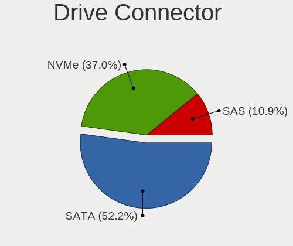
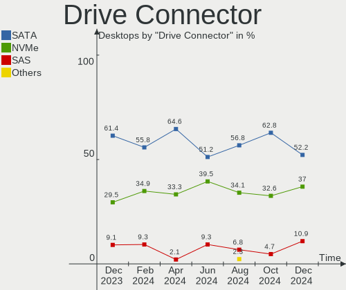
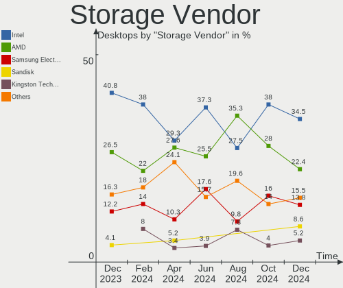
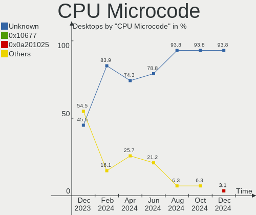
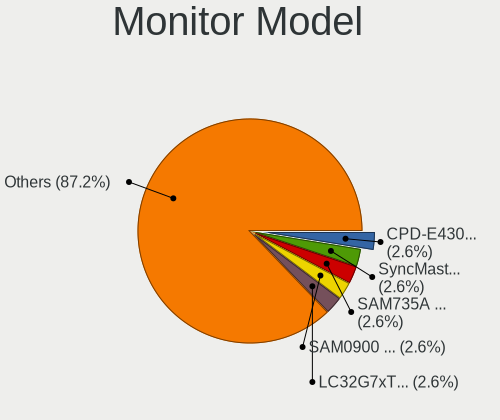
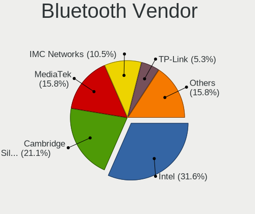
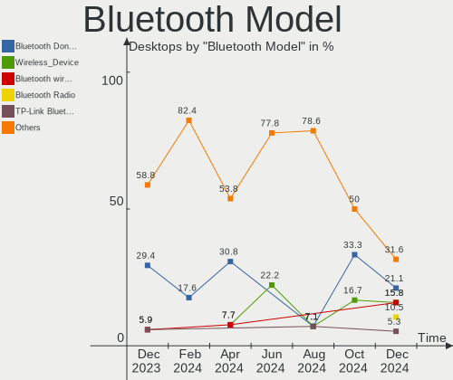
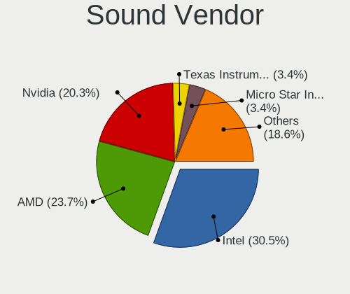

Linux in Netherlands - Hardware Trends (Desktops)
-------------------------------------------------

A project to identify most popular hardware characteristics and track their change
over time based on data collected by Linux users at https://Linux-Hardware.org.

Anyone can contribute to this report by the [hw-probe](https://github.com/linuxhw/hw-probe) tool:

    sudo -E hw-probe -all -upload

Period: Jul, 2023.

Contents
--------

* [ System ](#system)
  - [ OS                       ](#os)
  - [ OS Family                ](#os-family)
  - [ Kernel                   ](#kernel)
  - [ Kernel Family            ](#kernel-family)
  - [ Kernel Major Ver.        ](#kernel-major-ver)
  - [ Arch                     ](#arch)
  - [ DE                       ](#de)
  - [ Display Server           ](#display-server)
  - [ Display Manager          ](#display-manager)
  - [ OS Lang                  ](#os-lang)
  - [ Boot Mode                ](#boot-mode)
  - [ Filesystem               ](#filesystem)
  - [ Part. scheme             ](#part-scheme)
  - [ Dual Boot with Linux/BSD ](#dual-boot-with-linuxbsd)
  - [ Dual Boot (Win)          ](#dual-boot-win)

* [ Board ](#board)
  - [ Vendor                   ](#vendor)
  - [ Model                    ](#model)
  - [ Model Family             ](#model-family)
  - [ MFG Year                 ](#mfg-year)
  - [ Form Factor              ](#form-factor)
  - [ Secure Boot              ](#secure-boot)
  - [ Coreboot                 ](#coreboot)
  - [ RAM Size                 ](#ram-size)
  - [ RAM Used                 ](#ram-used)
  - [ Total Drives             ](#total-drives)
  - [ Has CD-ROM               ](#has-cd-rom)
  - [ Has Ethernet             ](#has-ethernet)
  - [ Has WiFi                 ](#has-wifi)
  - [ Has Bluetooth            ](#has-bluetooth)

* [ Location ](#location)
  - [ Country                  ](#country)
  - [ City                     ](#city)

* [ Drives ](#drives)
  - [ Drive Vendor             ](#drive-vendor)
  - [ Drive Model              ](#drive-model)
  - [ HDD Vendor               ](#hdd-vendor)
  - [ SSD Vendor               ](#ssd-vendor)
  - [ Drive Kind               ](#drive-kind)
  - [ Drive Connector          ](#drive-connector)
  - [ Drive Size               ](#drive-size)
  - [ Space Total              ](#space-total)
  - [ Space Used               ](#space-used)
  - [ Malfunc. Drives          ](#malfunc-drives)
  - [ Malfunc. Drive Vendor    ](#malfunc-drive-vendor)
  - [ Malfunc. HDD Vendor      ](#malfunc-hdd-vendor)
  - [ Malfunc. Drive Kind      ](#malfunc-drive-kind)
  - [ Failed Drives            ](#failed-drives)
  - [ Failed Drive Vendor      ](#failed-drive-vendor)
  - [ Drive Status             ](#drive-status)

* [ Storage controller ](#storage-controller)
  - [ Storage Vendor           ](#storage-vendor)
  - [ Storage Model            ](#storage-model)
  - [ Storage Kind             ](#storage-kind)

* [ Processor ](#processor)
  - [ CPU Vendor               ](#cpu-vendor)
  - [ CPU Model                ](#cpu-model)
  - [ CPU Model Family         ](#cpu-model-family)
  - [ CPU Cores                ](#cpu-cores)
  - [ CPU Sockets              ](#cpu-sockets)
  - [ CPU Threads              ](#cpu-threads)
  - [ CPU Op-Modes             ](#cpu-op-modes)
  - [ CPU Microcode            ](#cpu-microcode)
  - [ CPU Microarch            ](#cpu-microarch)

* [ Graphics ](#graphics)
  - [ GPU Vendor               ](#gpu-vendor)
  - [ GPU Model                ](#gpu-model)
  - [ GPU Combo                ](#gpu-combo)
  - [ GPU Driver               ](#gpu-driver)
  - [ GPU Memory               ](#gpu-memory)

* [ Monitor ](#monitor)
  - [ Monitor Vendor           ](#monitor-vendor)
  - [ Monitor Model            ](#monitor-model)
  - [ Monitor Resolution       ](#monitor-resolution)
  - [ Monitor Diagonal         ](#monitor-diagonal)
  - [ Monitor Width            ](#monitor-width)
  - [ Aspect Ratio             ](#aspect-ratio)
  - [ Monitor Area             ](#monitor-area)
  - [ Pixel Density            ](#pixel-density)
  - [ Multiple Monitors        ](#multiple-monitors)

* [ Network ](#network)
  - [ Net Controller Vendor    ](#net-controller-vendor)
  - [ Net Controller Model     ](#net-controller-model)
  - [ Wireless Vendor          ](#wireless-vendor)
  - [ Wireless Model           ](#wireless-model)
  - [ Ethernet Vendor          ](#ethernet-vendor)
  - [ Ethernet Model           ](#ethernet-model)
  - [ Net Controller Kind      ](#net-controller-kind)
  - [ Used Controller          ](#used-controller)
  - [ NICs                     ](#nics)
  - [ IPv6                     ](#ipv6)

* [ Bluetooth ](#bluetooth)
  - [ Bluetooth Vendor         ](#bluetooth-vendor)
  - [ Bluetooth Model          ](#bluetooth-model)

* [ Sound ](#sound)
  - [ Sound Vendor             ](#sound-vendor)
  - [ Sound Model              ](#sound-model)

* [ Memory ](#memory)
  - [ Memory Vendor            ](#memory-vendor)
  - [ Memory Model             ](#memory-model)
  - [ Memory Kind              ](#memory-kind)
  - [ Memory Form Factor       ](#memory-form-factor)
  - [ Memory Size              ](#memory-size)
  - [ Memory Speed             ](#memory-speed)

* [ Printers & scanners ](#printers--scanners)
  - [ Printer Vendor           ](#printer-vendor)
  - [ Printer Model            ](#printer-model)
  - [ Scanner Vendor           ](#scanner-vendor)
  - [ Scanner Model            ](#scanner-model)

* [ Camera ](#camera)
  - [ Camera Vendor            ](#camera-vendor)
  - [ Camera Model             ](#camera-model)

* [ Security ](#security)
  - [ Fingerprint Vendor       ](#fingerprint-vendor)
  - [ Fingerprint Model        ](#fingerprint-model)
  - [ Chipcard Vendor          ](#chipcard-vendor)
  - [ Chipcard Model           ](#chipcard-model)

* [ Unsupported ](#unsupported)
  - [ Unsupported Devices      ](#unsupported-devices)
  - [ Unsupported Device Types ](#unsupported-device-types)

System
------

OS
--

Installed operating systems

| Name                 | Desktops | Percent |
|----------------------|----------|---------|
| Fedora 38            | 7        | 15.22%  |
| Ubuntu 23.04         | 3        | 6.52%   |
| Ubuntu 22.04         | 3        | 6.52%   |
| Linux Mint 21.1      | 3        | 6.52%   |
| Arch Rolling         | 3        | 6.52%   |
| Nobara 38            | 2        | 4.35%   |
| Manjaro              | 2        | 4.35%   |
| Linux Mint 21.2      | 2        | 4.35%   |
| Kubuntu 22.04        | 2        | 4.35%   |
| KDE neon 22.04       | 2        | 4.35%   |
| Debian 11            | 2        | 4.35%   |
| Zorin 16             | 1        | 2.17%   |
| Void Linux Rolling   | 1        | 2.17%   |
| Ubuntu 18.04         | 1        | 2.17%   |
| Pop!_OS 22.04        | 1        | 2.17%   |
| Parrot 5.3           | 1        | 2.17%   |
| openSUSE Leap-15.5   | 1        | 2.17%   |
| OpenMandriva 23.07   | 1        | 2.17%   |
| OpenMandriva 23.06   | 1        | 2.17%   |
| OpenMandriva 23.03   | 1        | 2.17%   |
| Nobara 37            | 1        | 2.17%   |
| Linux Mint 20.3      | 1        | 2.17%   |
| Kubuntu 23.04        | 1        | 2.17%   |
| Garuda Linux Soaring | 1        | 2.17%   |
| Elementary 7         | 1        | 2.17%   |
| Alpine 3.18.2        | 1        | 2.17%   |

OS Family
---------

OS without a version

| Name         | Desktops | Percent |
|--------------|----------|---------|
| Ubuntu       | 7        | 15.22%  |
| Fedora       | 7        | 15.22%  |
| Linux Mint   | 6        | 13.04%  |
| OpenMandriva | 3        | 6.52%   |
| Nobara       | 3        | 6.52%   |
| Kubuntu      | 3        | 6.52%   |
| Arch         | 3        | 6.52%   |
| Manjaro      | 2        | 4.35%   |
| KDE neon     | 2        | 4.35%   |
| Debian       | 2        | 4.35%   |
| Zorin        | 1        | 2.17%   |
| Void Linux   | 1        | 2.17%   |
| Pop!_OS      | 1        | 2.17%   |
| Parrot       | 1        | 2.17%   |
| openSUSE     | 1        | 2.17%   |
| Garuda Linux | 1        | 2.17%   |
| Elementary   | 1        | 2.17%   |
| Alpine       | 1        | 2.17%   |

Kernel
------

Version of the Linux kernel

| Version                      | Desktops | Percent |
|------------------------------|----------|---------|
| 5.15.0-76-generic            | 5        | 10.87%  |
| 6.2.0-24-generic             | 4        | 8.7%    |
| 5.19.0-46-generic            | 4        | 8.7%    |
| 6.3.11-200.fc38.x86_64       | 3        | 6.52%   |
| 5.19.0-50-generic            | 3        | 6.52%   |
| 6.3.8-200.fc38.x86_64        | 2        | 4.35%   |
| 6.3.12-200.fc38.x86_64       | 2        | 4.35%   |
| 5.15.0-78-generic            | 2        | 4.35%   |
| 5.10.0-23-amd64              | 2        | 4.35%   |
| 6.4.5-x64v3-xanmod1          | 1        | 2.17%   |
| 6.4.4-arch1-1                | 1        | 2.17%   |
| 6.4.3-arch1-1                | 1        | 2.17%   |
| 6.4.3-1-MANJARO              | 1        | 2.17%   |
| 6.3.9-arch1-1                | 1        | 2.17%   |
| 6.3.5-desktop-3omv2390       | 1        | 2.17%   |
| 6.3.12_1                     | 1        | 2.17%   |
| 6.3.12-204.fsync.fc38.x86_64 | 1        | 2.17%   |
| 6.3.12-204.fsync.fc37.x86_64 | 1        | 2.17%   |
| 6.3.12-203.fsync.fc38.x86_64 | 1        | 2.17%   |
| 6.2.6-desktop-1omv2390       | 1        | 2.17%   |
| 6.2.6-76060206-generic       | 1        | 2.17%   |
| 6.1.35-1-lts                 | 1        | 2.17%   |
| 6.1.34-0-lts                 | 1        | 2.17%   |
| 6.1.31-2-MANJARO             | 1        | 2.17%   |
| 6.1.1-desktop-1omv2290       | 1        | 2.17%   |
| 6.1.0-1parrot1-amd64         | 1        | 2.17%   |
| 5.14.21-150500.53-default    | 1        | 2.17%   |
| 4.15.0-213-generic           | 1        | 2.17%   |

Kernel Family
-------------

Linux kernel without a distro release

| Version | Desktops | Percent |
|---------|----------|---------|
| 5.19.0  | 7        | 15.22%  |
| 5.15.0  | 7        | 15.22%  |
| 6.3.12  | 6        | 13.04%  |
| 6.2.0   | 4        | 8.7%    |
| 6.3.11  | 3        | 6.52%   |
| 6.4.3   | 2        | 4.35%   |
| 6.3.8   | 2        | 4.35%   |
| 6.2.6   | 2        | 4.35%   |
| 5.10.0  | 2        | 4.35%   |
| 6.4.5   | 1        | 2.17%   |
| 6.4.4   | 1        | 2.17%   |
| 6.3.9   | 1        | 2.17%   |
| 6.3.5   | 1        | 2.17%   |
| 6.1.35  | 1        | 2.17%   |
| 6.1.34  | 1        | 2.17%   |
| 6.1.31  | 1        | 2.17%   |
| 6.1.1   | 1        | 2.17%   |
| 6.1.0   | 1        | 2.17%   |
| 5.14.21 | 1        | 2.17%   |
| 4.15.0  | 1        | 2.17%   |

Kernel Major Ver.
-----------------

Linux kernel major version

| Version | Desktops | Percent |
|---------|----------|---------|
| 6.3     | 13       | 28.26%  |
| 5.19    | 7        | 15.22%  |
| 5.15    | 7        | 15.22%  |
| 6.2     | 6        | 13.04%  |
| 6.1     | 5        | 10.87%  |
| 6.4     | 4        | 8.7%    |
| 5.10    | 2        | 4.35%   |
| 5.14    | 1        | 2.17%   |
| 4.15    | 1        | 2.17%   |

Arch
----

OS architecture (x86_64, i586, etc.)

| Name   | Desktops | Percent |
|--------|----------|---------|
| x86_64 | 45       | 97.83%  |
| i686   | 1        | 2.17%   |

DE
--

Desktop Environment

| Name       | Desktops | Percent |
|------------|----------|---------|
| GNOME      | 19       | 41.3%   |
| KDE5       | 12       | 26.09%  |
| XFCE       | 3        | 6.52%   |
| X-Cinnamon | 2        | 4.35%   |
| MATE       | 2        | 4.35%   |
| Unknown    | 2        | 4.35%   |
| sway       | 1        | 2.17%   |
| Pantheon   | 1        | 2.17%   |
| LXDE       | 1        | 2.17%   |
| i3         | 1        | 2.17%   |
| Deepin     | 1        | 2.17%   |
| Cinnamon   | 1        | 2.17%   |

Display Server
--------------

X11 or Wayland

| Name    | Desktops | Percent |
|---------|----------|---------|
| X11     | 28       | 60.87%  |
| Wayland | 15       | 32.61%  |
| Tty     | 2        | 4.35%   |
| Unknown | 1        | 2.17%   |

Display Manager
---------------

SDDM, LightDM, etc.

| Name    | Desktops | Percent |
|---------|----------|---------|
| Unknown | 20       | 43.48%  |
| SDDM    | 8        | 17.39%  |
| LightDM | 6        | 13.04%  |
| GDM3    | 6        | 13.04%  |
| GDM     | 6        | 13.04%  |

OS Lang
-------

Language

| Lang  | Desktops | Percent |
|-------|----------|---------|
| en_US | 28       | 60.87%  |
| nl_NL | 12       | 26.09%  |
| C     | 2        | 4.35%   |
| tr_TR | 1        | 2.17%   |
| en_NL | 1        | 2.17%   |
| en_GB | 1        | 2.17%   |
| de_DE | 1        | 2.17%   |

Boot Mode
---------

EFI or BIOS

| Mode | Desktops | Percent |
|------|----------|---------|
| EFI  | 26       | 56.52%  |
| BIOS | 20       | 43.48%  |

Filesystem
----------

Type of filesystem

| Type  | Desktops | Percent |
|-------|----------|---------|
| Ext4  | 26       | 56.52%  |
| Btrfs | 13       | 28.26%  |
| Tmpfs | 7        | 15.22%  |

Part. scheme
------------

Scheme of partitioning

| Type    | Desktops | Percent |
|---------|----------|---------|
| GPT     | 27       | 58.7%   |
| Unknown | 19       | 41.3%   |

Dual Boot with Linux/BSD
------------------------

Hosting more than one Linux/BSD

| Dual boot | Desktops | Percent |
|-----------|----------|---------|
| No        | 35       | 76.09%  |
| Yes       | 11       | 23.91%  |

Dual Boot (Win)
---------------

Hosting Linux and Windows

| Dual boot | Desktops | Percent |
|-----------|----------|---------|
| No        | 35       | 76.09%  |
| Yes       | 11       | 23.91%  |

Board
-----

Vendor
------

Motherboard manufacturer

| Name                | Desktops | Percent |
|---------------------|----------|---------|
| ASRock              | 10       | 21.74%  |
| ASUSTek Computer    | 9        | 19.57%  |
| MSI                 | 7        | 15.22%  |
| Gigabyte Technology | 5        | 10.87%  |
| Hewlett-Packard     | 4        | 8.7%    |
| Lenovo              | 3        | 6.52%   |
| Dell                | 2        | 4.35%   |
| Pegatron            | 1        | 2.17%   |
| MP                  | 1        | 2.17%   |
| ECS                 | 1        | 2.17%   |
| AMI                 | 1        | 2.17%   |
| Acer                | 1        | 2.17%   |
| Unknown             | 1        | 2.17%   |

Model
-----

Motherboard model

| Name                                    | Desktops | Percent |
|-----------------------------------------|----------|---------|
| HP Z440 Workstation                     | 2        | 4.35%   |
| ASRock B450 Gaming-ITX/ac               | 2        | 4.35%   |
| Pegatron 520-1000nl                     | 1        | 2.17%   |
| MSI MS-7E06                             | 1        | 2.17%   |
| MSI MS-7D08                             | 1        | 2.17%   |
| MSI MS-7C94                             | 1        | 2.17%   |
| MSI MS-7C02                             | 1        | 2.17%   |
| MSI MS-7B51                             | 1        | 2.17%   |
| MSI MS-7A74                             | 1        | 2.17%   |
| MSI MS-7982                             | 1        | 2.17%   |
| MP MS-7848                              | 1        | 2.17%   |
| Lenovo Legion T5 26AMR5 90RC01G7MH      | 1        | 2.17%   |
| Lenovo IdeaCentre 510A-15ARR 90J0000WBF | 1        | 2.17%   |
| Lenovo H530s 10132                      | 1        | 2.17%   |
| HP ProDesk 600 G3 MT                    | 1        | 2.17%   |
| HP EliteDesk 800 G1 SFF                 | 1        | 2.17%   |
| Gigabyte X570S UD                       | 1        | 2.17%   |
| Gigabyte X570 AORUS PRO                 | 1        | 2.17%   |
| Gigabyte B760M DS3H DDR4                | 1        | 2.17%   |
| Gigabyte B550 AORUS ELITE V2            | 1        | 2.17%   |
| Gigabyte A320M-S2H                      | 1        | 2.17%   |
| ECS P43T-AD3                            | 1        | 2.17%   |
| Dell OptiPlex 7010                      | 1        | 2.17%   |
| Dell DM051                              | 1        | 2.17%   |
| ASUS TUF Gaming X670E-PLUS WIFI         | 1        | 2.17%   |
| ASUS TUF Gaming X670E-PLUS              | 1        | 2.17%   |
| ASUS ProArt X670E-CREATOR WIFI          | 1        | 2.17%   |
| ASUS PRIME X570-P                       | 1        | 2.17%   |
| ASUS P8P67 LE                           | 1        | 2.17%   |
| ASUS P8B75-M LE                         | 1        | 2.17%   |
| ASUS P7H55-M                            | 1        | 2.17%   |
| ASUS M4A88T-V EVO/USB3                  | 1        | 2.17%   |
| ASUS Crosshair V Formula                | 1        | 2.17%   |
| ASRock X570 Extreme4                    | 1        | 2.17%   |
| ASRock H81 Pro BTC R2.0                 | 1        | 2.17%   |
| ASRock H370 Performance                 | 1        | 2.17%   |
| ASRock B550M PG Riptide                 | 1        | 2.17%   |
| ASRock B450M-HDV R4.0                   | 1        | 2.17%   |
| ASRock B450M Pro4 R2.0                  | 1        | 2.17%   |
| ASRock A300M-STX                        | 1        | 2.17%   |

Model Family
------------

Motherboard model prefix

| Name                | Desktops | Percent |
|---------------------|----------|---------|
| HP Z440             | 2        | 4.35%   |
| ASUS TUF            | 2        | 4.35%   |
| ASRock B450         | 2        | 4.35%   |
| Pegatron 520-1000nl | 1        | 2.17%   |
| MSI MS-7E06         | 1        | 2.17%   |
| MSI MS-7D08         | 1        | 2.17%   |
| MSI MS-7C94         | 1        | 2.17%   |
| MSI MS-7C02         | 1        | 2.17%   |
| MSI MS-7B51         | 1        | 2.17%   |
| MSI MS-7A74         | 1        | 2.17%   |
| MSI MS-7982         | 1        | 2.17%   |
| MP MS-7848          | 1        | 2.17%   |
| Lenovo Legion       | 1        | 2.17%   |
| Lenovo IdeaCentre   | 1        | 2.17%   |
| Lenovo H530s        | 1        | 2.17%   |
| HP ProDesk          | 1        | 2.17%   |
| HP EliteDesk        | 1        | 2.17%   |
| Gigabyte X570S      | 1        | 2.17%   |
| Gigabyte X570       | 1        | 2.17%   |
| Gigabyte B760M      | 1        | 2.17%   |
| Gigabyte B550       | 1        | 2.17%   |
| Gigabyte A320M-S2H  | 1        | 2.17%   |
| ECS P43T-AD3        | 1        | 2.17%   |
| Dell OptiPlex       | 1        | 2.17%   |
| Dell DM051          | 1        | 2.17%   |
| ASUS ProArt         | 1        | 2.17%   |
| ASUS PRIME          | 1        | 2.17%   |
| ASUS P8P67          | 1        | 2.17%   |
| ASUS P8B75-M        | 1        | 2.17%   |
| ASUS P7H55-M        | 1        | 2.17%   |
| ASUS M4A88T-V       | 1        | 2.17%   |
| ASUS Crosshair      | 1        | 2.17%   |
| ASRock X570         | 1        | 2.17%   |
| ASRock H81          | 1        | 2.17%   |
| ASRock H370         | 1        | 2.17%   |
| ASRock B550M        | 1        | 2.17%   |
| ASRock B450M-HDV    | 1        | 2.17%   |
| ASRock B450M        | 1        | 2.17%   |
| ASRock A300M-STX    | 1        | 2.17%   |
| ASRock 970          | 1        | 2.17%   |

MFG Year
--------

Motherboard manufacture year

| Year | Desktops | Percent |
|------|----------|---------|
| 2018 | 9        | 19.57%  |
| 2022 | 7        | 15.22%  |
| 2020 | 3        | 6.52%   |
| 2019 | 3        | 6.52%   |
| 2015 | 3        | 6.52%   |
| 2013 | 3        | 6.52%   |
| 2011 | 3        | 6.52%   |
| 2023 | 2        | 4.35%   |
| 2021 | 2        | 4.35%   |
| 2014 | 2        | 4.35%   |
| 2012 | 2        | 4.35%   |
| 2010 | 2        | 4.35%   |
| 2017 | 1        | 2.17%   |
| 2016 | 1        | 2.17%   |
| 2009 | 1        | 2.17%   |
| 2008 | 1        | 2.17%   |
| 2005 | 1        | 2.17%   |

Form Factor
-----------

Physical design of the computer

| Name    | Desktops | Percent |
|---------|----------|---------|
| Desktop | 46       | 100%    |

Secure Boot
-----------

Enabled or disabled

| State    | Desktops | Percent |
|----------|----------|---------|
| Disabled | 46       | 100%    |

Coreboot
--------

Have coreboot on board

| Used | Desktops | Percent |
|------|----------|---------|
| No   | 46       | 100%    |

RAM Size
--------

Total RAM memory

| Size in GB  | Desktops | Percent |
|-------------|----------|---------|
| 32.01-64.0  | 12       | 26.09%  |
| 16.01-24.0  | 9        | 19.57%  |
| 8.01-16.0   | 8        | 17.39%  |
| 4.01-8.0    | 6        | 13.04%  |
| 3.01-4.0    | 4        | 8.7%    |
| 64.01-256.0 | 4        | 8.7%    |
| 24.01-32.0  | 1        | 2.17%   |
| 2.01-3.0    | 1        | 2.17%   |
| 1.01-2.0    | 1        | 2.17%   |

RAM Used
--------

Used RAM memory

| Used GB   | Desktops | Percent |
|-----------|----------|---------|
| 4.01-8.0  | 11       | 23.91%  |
| 2.01-3.0  | 10       | 21.74%  |
| 3.01-4.0  | 8        | 17.39%  |
| 1.01-2.0  | 7        | 15.22%  |
| 8.01-16.0 | 6        | 13.04%  |
| 0.51-1.0  | 2        | 4.35%   |
| 0.01-0.5  | 2        | 4.35%   |

Total Drives
------------

Number of drives on board

| Drives | Desktops | Percent |
|--------|----------|---------|
| 1      | 17       | 36.96%  |
| 2      | 11       | 23.91%  |
| 3      | 9        | 19.57%  |
| 4      | 4        | 8.7%    |
| 5      | 2        | 4.35%   |
| 7      | 1        | 2.17%   |
| 6      | 1        | 2.17%   |
| 0      | 1        | 2.17%   |

Has CD-ROM
----------

Has CD-ROM on board

| Presented | Desktops | Percent |
|-----------|----------|---------|
| No        | 30       | 65.22%  |
| Yes       | 16       | 34.78%  |

Has Ethernet
------------

Has Ethernet on board

| Presented | Desktops | Percent |
|-----------|----------|---------|
| Yes       | 46       | 100%    |

Has WiFi
--------

Has WiFi module

| Presented | Desktops | Percent |
|-----------|----------|---------|
| No        | 24       | 52.17%  |
| Yes       | 22       | 47.83%  |

Has Bluetooth
-------------

Has Bluetooth module

| Presented | Desktops | Percent |
|-----------|----------|---------|
| No        | 30       | 65.22%  |
| Yes       | 16       | 34.78%  |

Location
--------

Country
-------

Geographic location (country)

| Country     | Desktops | Percent |
|-------------|----------|---------|
| Netherlands | 46       | 100%    |

City
----

Geographic location (city)

| City                | Desktops | Percent |
|---------------------|----------|---------|
| Amsterdam           | 6        | 13.04%  |
| The Hague           | 4        | 8.7%    |
| Rotterdam           | 2        | 4.35%   |
| Arnhem              | 2        | 4.35%   |
| Amersfoort          | 2        | 4.35%   |
| Vriezenveen         | 1        | 2.17%   |
| Voorburg            | 1        | 2.17%   |
| Volkel              | 1        | 2.17%   |
| Vleuten             | 1        | 2.17%   |
| Utrecht             | 1        | 2.17%   |
| Sprundel            | 1        | 2.17%   |
| Schoonhoven         | 1        | 2.17%   |
| Purmerend           | 1        | 2.17%   |
| Nijmegen            | 1        | 2.17%   |
| Nieuwegein          | 1        | 2.17%   |
| Meijel              | 1        | 2.17%   |
| Lelystad            | 1        | 2.17%   |
| Leiderdorp          | 1        | 2.17%   |
| Kortenhoef          | 1        | 2.17%   |
| Hoogeveen           | 1        | 2.17%   |
| Herten              | 1        | 2.17%   |
| Heerlen             | 1        | 2.17%   |
| Gorredijk           | 1        | 2.17%   |
| Ermelo              | 1        | 2.17%   |
| Enschede            | 1        | 2.17%   |
| Eindhoven           | 1        | 2.17%   |
| Doorwerth           | 1        | 2.17%   |
| Diemen              | 1        | 2.17%   |
| Delft               | 1        | 2.17%   |
| Blaricum            | 1        | 2.17%   |
| Apeldoorn           | 1        | 2.17%   |
| Alphen aan den Rijn | 1        | 2.17%   |
| Almere Stad         | 1        | 2.17%   |
| Alkmaar             | 1        | 2.17%   |
| Aarle-Rixtel        | 1        | 2.17%   |

Drives
------

Drive Vendor
------------

Hard drive vendors

| Vendor                      | Desktops | Drives | Percent |
|-----------------------------|----------|--------|---------|
| Samsung Electronics         | 21       | 33     | 23.6%   |
| WDC                         | 16       | 18     | 17.98%  |
| Seagate                     | 9        | 9      | 10.11%  |
| SanDisk                     | 6        | 7      | 6.74%   |
| Kingston                    | 6        | 6      | 6.74%   |
| Toshiba                     | 4        | 6      | 4.49%   |
| Kingston Technology Company | 3        | 3      | 3.37%   |
| Intel                       | 3        | 3      | 3.37%   |
| Crucial                     | 3        | 3      | 3.37%   |
| JMicron Technology          | 2        | 2      | 2.25%   |
| Hitachi                     | 2        | 2      | 2.25%   |
| China                       | 2        | 2      | 2.25%   |
| XPG                         | 1        | 1      | 1.12%   |
| Seagate Technology          | 1        | 1      | 1.12%   |
| PNY                         | 1        | 1      | 1.12%   |
| Phison Electronics          | 1        | 1      | 1.12%   |
| Patriot                     | 1        | 1      | 1.12%   |
| OCZ-VERTEX2                 | 1        | 1      | 1.12%   |
| Micron/Crucial Technology   | 1        | 1      | 1.12%   |
| Micron Technology           | 1        | 1      | 1.12%   |
| LITEONIT                    | 1        | 1      | 1.12%   |
| Intenso                     | 1        | 1      | 1.12%   |
| GOODRAM                     | 1        | 1      | 1.12%   |
| Unknown                     | 1        | 1      | 1.12%   |

Drive Model
-----------

Hard drive models

| Model                                               | Desktops | Percent |
|-----------------------------------------------------|----------|---------|
| Samsung NVMe SSD Controller SM981/PM981/PM983 500GB | 7        | 7%      |
| Samsung SSD 850 EVO 500GB                           | 4        | 4%      |
| Samsung NVMe SSD Controller PM9A1/PM9A3/980PRO 1TB  | 4        | 4%      |
| Samsung SSD 860 QVO 1TB                             | 2        | 2%      |
| Samsung SSD 860 EVO 1TB                             | 2        | 2%      |
| Kingston Company SNV2S2000G 2TB                     | 2        | 2%      |
| Kingston SV300S37A120G 120GB SSD                    | 2        | 2%      |
| JMicron Tech 250GB                                  | 2        | 2%      |
| XPG GAMMIX S11 Pro 1TB                              | 1        | 1%      |
| WDC WDS250G2B0A-00SM50 250GB SSD                    | 1        | 1%      |
| WDC WDS250G1B0A-00H9H0 250GB SSD                    | 1        | 1%      |
| WDC WD60EFRX-68MYMN1 6TB                            | 1        | 1%      |
| WDC WD5000AAVS-00ZTB0 500GB                         | 1        | 1%      |
| WDC WD40EFZX-68AWUN0 4TB                            | 1        | 1%      |
| WDC WD40EFRX-68N32N0 4TB                            | 1        | 1%      |
| WDC WD3200AAJB-00J3A0 320GB                         | 1        | 1%      |
| WDC WD2500BEVT-22A23T0 250GB                        | 1        | 1%      |
| WDC WD2500BEVT-00ZCT0 250GB                         | 1        | 1%      |
| WDC WD20EZRX-00DC0B0 2TB                            | 1        | 1%      |
| WDC WD20EZRX-00D8PB0 2TB                            | 1        | 1%      |
| WDC WD20EARX-00PASB0 2TB                            | 1        | 1%      |
| WDC WD1600AAJS-00WAA0 160GB                         | 1        | 1%      |
| WDC WD10SPZX-60Z10T0 1TB                            | 1        | 1%      |
| WDC WD10EZRZ-00HTKB0 1TB                            | 1        | 1%      |
| WDC WD10EZEX-75WN4A0 1TB                            | 1        | 1%      |
| WDC WD10EZEX-08RKKA0 1TB                            | 1        | 1%      |
| Toshiba MD04ACA400 4TB                              | 1        | 1%      |
| Toshiba KBG30ZMT128G 128GB                          | 1        | 1%      |
| Toshiba HDWD130 3TB                                 | 1        | 1%      |
| Toshiba HDWD110 1TB                                 | 1        | 1%      |
| Seagate FireCuda 520 SSD 1TB                        | 1        | 1%      |
| Seagate ST8000VN004-2M2101 8TB                      | 1        | 1%      |
| Seagate ST4000DM004-2U9104 4TB                      | 1        | 1%      |
| Seagate ST3320613AS 320GB                           | 1        | 1%      |
| Seagate ST2000DM008-2UB102 2TB                      | 1        | 1%      |
| Seagate ST1000DM003-1SB102 1TB                      | 1        | 1%      |
| Seagate FireCuda 530 ZP2000GM30013 2TB              | 1        | 1%      |
| Seagate FireCuda 520 SSD ZP500GM30002 500GB         | 1        | 1%      |
| Seagate FireCuda 520 SSD ZP1000GM30002 1TB          | 1        | 1%      |
| Seagate Expansion SW 4TB                            | 1        | 1%      |

HDD Vendor
----------

Hard disk drive vendors

| Vendor              | Desktops | Drives | Percent |
|---------------------|----------|--------|---------|
| WDC                 | 15       | 16     | 53.57%  |
| Seagate             | 6        | 6      | 21.43%  |
| Toshiba             | 3        | 5      | 10.71%  |
| Samsung Electronics | 2        | 2      | 7.14%   |
| Hitachi             | 2        | 2      | 7.14%   |

SSD Vendor
----------

Solid state drive vendors

| Vendor              | Desktops | Drives | Percent |
|---------------------|----------|--------|---------|
| Samsung Electronics | 12       | 16     | 35.29%  |
| Kingston            | 5        | 5      | 14.71%  |
| Crucial             | 3        | 3      | 8.82%   |
| WDC                 | 2        | 2      | 5.88%   |
| SanDisk             | 2        | 2      | 5.88%   |
| China               | 2        | 2      | 5.88%   |
| PNY                 | 1        | 1      | 2.94%   |
| Patriot             | 1        | 1      | 2.94%   |
| OCZ-VERTEX2         | 1        | 1      | 2.94%   |
| Micron Technology   | 1        | 1      | 2.94%   |
| LITEONIT            | 1        | 1      | 2.94%   |
| Intenso             | 1        | 1      | 2.94%   |
| Intel               | 1        | 1      | 2.94%   |
| GOODRAM             | 1        | 1      | 2.94%   |

Drive Kind
----------

HDD or SSD

| Kind    | Desktops | Drives | Percent |
|---------|----------|--------|---------|
| SSD     | 31       | 38     | 39.24%  |
| HDD     | 23       | 31     | 29.11%  |
| NVMe    | 22       | 34     | 27.85%  |
| Unknown | 2        | 2      | 2.53%   |
| MMC     | 1        | 1      | 1.27%   |

Drive Connector
---------------

SATA, SAS, NVMe, etc.

| Type | Desktops | Drives | Percent |
|------|----------|--------|---------|
| SATA | 39       | 67     | 59.09%  |
| NVMe | 22       | 34     | 33.33%  |
| SAS  | 4        | 4      | 6.06%   |
| MMC  | 1        | 1      | 1.52%   |

Drive Size
----------

Size of hard drive

| Size in TB | Desktops | Drives | Percent |
|------------|----------|--------|---------|
| 0.01-0.5   | 30       | 36     | 52.63%  |
| 0.51-1.0   | 14       | 17     | 24.56%  |
| 3.01-4.0   | 5        | 6      | 8.77%   |
| 1.01-2.0   | 5        | 5      | 8.77%   |
| 4.01-10.0  | 2        | 2      | 3.51%   |
| 2.01-3.0   | 1        | 3      | 1.75%   |

Space Total
-----------

Amount of disk space available on the file system

| Size in GB     | Desktops | Percent |
|----------------|----------|---------|
| More than 3000 | 11       | 23.91%  |
| 101-250        | 9        | 19.57%  |
| 251-500        | 7        | 15.22%  |
| 1001-2000      | 6        | 13.04%  |
| 2001-3000      | 4        | 8.7%    |
| 501-1000       | 4        | 8.7%    |
| 21-50          | 2        | 4.35%   |
| 1-20           | 1        | 2.17%   |
| 51-100         | 1        | 2.17%   |
| Unknown        | 1        | 2.17%   |

Space Used
----------

Amount of used disk space

| Used GB        | Desktops | Percent |
|----------------|----------|---------|
| 1-20           | 10       | 21.74%  |
| 21-50          | 8        | 17.39%  |
| 51-100         | 7        | 15.22%  |
| 101-250        | 6        | 13.04%  |
| 501-1000       | 5        | 10.87%  |
| 1001-2000      | 4        | 8.7%    |
| More than 3000 | 3        | 6.52%   |
| 251-500        | 2        | 4.35%   |
| Unknown        | 1        | 2.17%   |

Malfunc. Drives
---------------

Drive models with a malfunction

| Model                         | Desktops | Drives | Percent |
|-------------------------------|----------|--------|---------|
| Seagate ST3320613AS 320GB     | 1        | 1      | 25%     |
| LITEONIT LMT-256M3M 256GB SSD | 1        | 1      | 25%     |
| Intel SSDSA2M160G2GC 160GB    | 1        | 1      | 25%     |
| Hitachi HUA722010CLA330 1TB   | 1        | 1      | 25%     |

Malfunc. Drive Vendor
---------------------

Vendors of faulty drives

| Vendor   | Desktops | Drives | Percent |
|----------|----------|--------|---------|
| Seagate  | 1        | 1      | 25%     |
| LITEONIT | 1        | 1      | 25%     |
| Intel    | 1        | 1      | 25%     |
| Hitachi  | 1        | 1      | 25%     |

Malfunc. HDD Vendor
-------------------

Vendors of faulty HDD drives

| Vendor  | Desktops | Drives | Percent |
|---------|----------|--------|---------|
| Seagate | 1        | 1      | 50%     |
| Hitachi | 1        | 1      | 50%     |

Malfunc. Drive Kind
-------------------

Kinds of faulty drives

| Kind | Desktops | Drives | Percent |
|------|----------|--------|---------|
| SSD  | 2        | 2      | 50%     |
| HDD  | 2        | 2      | 50%     |

Failed Drives
-------------

Failed drive models

Zero info for selected period =(

Failed Drive Vendor
-------------------

Failed drive vendors

Zero info for selected period =(

Drive Status
------------

Number of failed and malfunc. drives

| Status   | Desktops | Drives | Percent |
|----------|----------|--------|---------|
| Detected | 28       | 55     | 56%     |
| Works    | 19       | 47     | 38%     |
| Malfunc  | 3        | 4      | 6%      |

Storage controller
------------------

Storage Vendor
--------------

Storage controller vendors

| Vendor                       | Desktops | Percent |
|------------------------------|----------|---------|
| Intel                        | 24       | 30.38%  |
| AMD                          | 23       | 29.11%  |
| Samsung Electronics          | 12       | 15.19%  |
| SanDisk                      | 4        | 5.06%   |
| Seagate Technology           | 3        | 3.8%    |
| Kingston Technology Company  | 3        | 3.8%    |
| Marvell Technology Group     | 2        | 2.53%   |
| ASMedia Technology           | 2        | 2.53%   |
| VIA Technologies             | 1        | 1.27%   |
| Toshiba America Info Systems | 1        | 1.27%   |
| Phison Electronics           | 1        | 1.27%   |
| Micron/Crucial Technology    | 1        | 1.27%   |
| JMicron Technology           | 1        | 1.27%   |
| ADATA Technology             | 1        | 1.27%   |

Storage Model
-------------

Storage controller models

| Model                                                                          | Desktops | Percent |
|--------------------------------------------------------------------------------|----------|---------|
| AMD FCH SATA Controller [AHCI mode]                                            | 13       | 13.54%  |
| Samsung NVMe SSD Controller SM981/PM981/PM983                                  | 7        | 7.29%   |
| AMD 400 Series Chipset SATA Controller                                         | 5        | 5.21%   |
| Samsung NVMe SSD Controller PM9A1/PM9A3/980PRO                                 | 4        | 4.17%   |
| Intel 8 Series/C220 Series Chipset Family 6-port SATA Controller 1 [AHCI mode] | 4        | 4.17%   |
| AMD 500 Series Chipset SATA Controller                                         | 4        | 4.17%   |
| Kingston Company Company Non-Volatile memory controller                        | 3        | 3.13%   |
| AMD SB7x0/SB8x0/SB9x0 SATA Controller [AHCI mode]                              | 3        | 3.13%   |
| AMD SB7x0/SB8x0/SB9x0 IDE Controller                                           | 3        | 3.13%   |
| Seagate FireCuda 520 SSD                                                       | 2        | 2.08%   |
| SanDisk WD Black SN770 / PC SN740 256GB / PC SN560 (DRAM-less) NVMe SSD        | 2        | 2.08%   |
| Intel 700 Series Chipset Family SATA AHCI Controller                           | 2        | 2.08%   |
| Intel 6 Series/C200 Series Chipset Family 6 port Desktop SATA AHCI Controller  | 2        | 2.08%   |
| Intel 200 Series PCH SATA controller [AHCI mode]                               | 2        | 2.08%   |
| VIA VT6415 PATA IDE Host Controller                                            | 1        | 1.04%   |
| Toshiba America Info Systems BG3 NVMe SSD Controller                           | 1        | 1.04%   |
| Seagate FireCuda 530 SSD                                                       | 1        | 1.04%   |
| Sandisk Western Digital WD Black SN850X NVMe SSD                               | 1        | 1.04%   |
| SanDisk WD PC SN810 / Black SN850 NVMe SSD                                     | 1        | 1.04%   |
| SanDisk WD Blue SN570 NVMe SSD 1TB                                             | 1        | 1.04%   |
| Samsung NVMe SSD Controller SM961/PM961/SM963                                  | 1        | 1.04%   |
| Samsung NVMe SSD Controller 980                                                | 1        | 1.04%   |
| Phison PS5021-E21 PCIe4 NVMe Controller (DRAM-less)                            | 1        | 1.04%   |
| Micron/Crucial P2 [Nick P2] / P3 / P3 Plus NVMe PCIe SSD (DRAM-less)           | 1        | 1.04%   |
| Marvell Group 88SE9215 PCIe 2.0 x1 4-port SATA 6 Gb/s Controller               | 1        | 1.04%   |
| Marvell Group 88SE912x SATA 6Gb/s Controller [IDE mode]                        | 1        | 1.04%   |
| Marvell Group 88SE912x IDE Controller                                          | 1        | 1.04%   |
| Kingston Company A2000 NVMe SSD                                                | 1        | 1.04%   |
| JMicron JMB368 IDE controller                                                  | 1        | 1.04%   |
| Intel Tiger Lake-LP SATA Controller                                            | 1        | 1.04%   |
| Intel SSD DC P4101/Pro 7600p/760p/E 6100p Series                               | 1        | 1.04%   |
| Intel SSD 665p Series [Neptune Harbor Refresh]                                 | 1        | 1.04%   |
| Intel SATA Controller [RAID mode]                                              | 1        | 1.04%   |
| Intel Q170/Q150/B150/H170/H110/Z170/CM236 Chipset SATA Controller [AHCI Mode]  | 1        | 1.04%   |
| Intel NM10/ICH7 Family SATA Controller [IDE mode]                              | 1        | 1.04%   |
| Intel Celeron/Pentium Silver Processor SATA Controller                         | 1        | 1.04%   |
| Intel Cannon Lake PCH SATA AHCI Controller                                     | 1        | 1.04%   |
| Intel C610/X99 series chipset sSATA Controller [RAID mode]                     | 1        | 1.04%   |
| Intel C610/X99 series chipset sSATA Controller [AHCI mode]                     | 1        | 1.04%   |
| Intel C610/X99 series chipset 6-Port SATA Controller [AHCI mode]               | 1        | 1.04%   |

Storage Kind
------------

Kind of storage controller (IDE, SATA, NVMe, SAS, ...)

| Kind | Desktops | Percent |
|------|----------|---------|
| SATA | 42       | 56.76%  |
| NVMe | 22       | 29.73%  |
| IDE  | 8        | 10.81%  |
| RAID | 2        | 2.7%    |

Processor
---------

CPU Vendor
----------

Processor vendors

| Vendor | Desktops | Percent |
|--------|----------|---------|
| Intel  | 23       | 50%     |
| AMD    | 23       | 50%     |

CPU Model
---------

Processor models

| Model                                       | Desktops | Percent |
|---------------------------------------------|----------|---------|
| AMD Ryzen 3 2200G with Radeon Vega Graphics | 3        | 6.52%   |
| Intel Core i3-4160 CPU @ 3.60GHz            | 2        | 4.35%   |
| AMD Ryzen 9 5900X 12-Core Processor         | 2        | 4.35%   |
| AMD Ryzen 7 5800X 8-Core Processor          | 2        | 4.35%   |
| AMD Ryzen 5 5600G with Radeon Graphics      | 2        | 4.35%   |
| AMD FX-8350 Eight-Core Processor            | 2        | 4.35%   |
| Intel Xeon CPU E5-1650 v4 @ 3.60GHz         | 1        | 2.17%   |
| Intel Xeon CPU E5-1650 v3 @ 3.50GHz         | 1        | 2.17%   |
| Intel Pentium 4 CPU 3.00GHz                 | 1        | 2.17%   |
| Intel Core i9-9900K CPU @ 3.60GHz           | 1        | 2.17%   |
| Intel Core i7-8700 CPU @ 3.20GHz            | 1        | 2.17%   |
| Intel Core i7-4770 CPU @ 3.40GHz            | 1        | 2.17%   |
| Intel Core i7-3770 CPU @ 3.40GHz            | 1        | 2.17%   |
| Intel Core i7-2600K CPU @ 3.40GHz           | 1        | 2.17%   |
| Intel Core i5-7500 CPU @ 3.40GHz            | 1        | 2.17%   |
| Intel Core i5-6500TE CPU @ 2.30GHz          | 1        | 2.17%   |
| Intel Core i5-6500 CPU @ 3.20GHz            | 1        | 2.17%   |
| Intel Core i5-3570 CPU @ 3.40GHz            | 1        | 2.17%   |
| Intel Core i3-2120 CPU @ 3.30GHz            | 1        | 2.17%   |
| Intel Core i3 CPU 540 @ 3.07GHz             | 1        | 2.17%   |
| Intel Core 2 Quad CPU Q8400 @ 2.66GHz       | 1        | 2.17%   |
| Intel Celeron J4125 CPU @ 2.00GHz           | 1        | 2.17%   |
| Intel Celeron CPU G1840 @ 2.80GHz           | 1        | 2.17%   |
| Intel 13th Gen Core i7-13700K               | 1        | 2.17%   |
| Intel 13th Gen Core i5-13400                | 1        | 2.17%   |
| Intel 11th Gen Core i5-11600K @ 3.90GHz     | 1        | 2.17%   |
| Intel 11th Gen Core i5-1145G7 @ 2.60GHz     | 1        | 2.17%   |
| AMD Ryzen 9 7950X 16-Core Processor         | 1        | 2.17%   |
| AMD Ryzen 9 7900X 12-Core Processor         | 1        | 2.17%   |
| AMD Ryzen 9 5950X 16-Core Processor         | 1        | 2.17%   |
| AMD Ryzen 9 3900X 12-Core Processor         | 1        | 2.17%   |
| AMD Ryzen 7 7800X3D 8-Core Processor        | 1        | 2.17%   |
| AMD Ryzen 7 5800 8-Core Processor           | 1        | 2.17%   |
| AMD Ryzen 7 3700X 8-Core Processor          | 1        | 2.17%   |
| AMD Ryzen 5 PRO 4650G with Radeon Graphics  | 1        | 2.17%   |
| AMD Ryzen 5 2600 Six-Core Processor         | 1        | 2.17%   |
| AMD Ryzen 5 1600 Six-Core Processor         | 1        | 2.17%   |
| AMD Phenom II X4 820 Processor              | 1        | 2.17%   |
| AMD Athlon II X3 450 Processor              | 1        | 2.17%   |

CPU Model Family
----------------

Processor model prefix

| Model             | Desktops | Percent |
|-------------------|----------|---------|
| AMD Ryzen 9       | 6        | 13.04%  |
| AMD Ryzen 7       | 5        | 10.87%  |
| Other             | 4        | 8.7%    |
| Intel Core i7     | 4        | 8.7%    |
| Intel Core i5     | 4        | 8.7%    |
| Intel Core i3     | 4        | 8.7%    |
| AMD Ryzen 5       | 4        | 8.7%    |
| AMD Ryzen 3       | 3        | 6.52%   |
| Intel Xeon        | 2        | 4.35%   |
| Intel Celeron     | 2        | 4.35%   |
| AMD FX            | 2        | 4.35%   |
| Intel Pentium 4   | 1        | 2.17%   |
| Intel Core i9     | 1        | 2.17%   |
| Intel Core 2 Quad | 1        | 2.17%   |
| AMD Ryzen 5 PRO   | 1        | 2.17%   |
| AMD Phenom II X4  | 1        | 2.17%   |
| AMD Athlon II X3  | 1        | 2.17%   |

CPU Cores
---------

Number of processor cores

| Number | Desktops | Percent |
|--------|----------|---------|
| 4      | 15       | 32.61%  |
| 6      | 9        | 19.57%  |
| 8      | 7        | 15.22%  |
| 2      | 6        | 13.04%  |
| 12     | 4        | 8.7%    |
| 16     | 3        | 6.52%   |
| 10     | 1        | 2.17%   |
| 1      | 1        | 2.17%   |

CPU Sockets
-----------

Number of sockets

| Number | Desktops | Percent |
|--------|----------|---------|
| 1      | 46       | 100%    |

CPU Threads
-----------

Threads per core (Hyper-Threading)

| Number | Desktops | Percent |
|--------|----------|---------|
| 2      | 32       | 69.57%  |
| 1      | 14       | 30.43%  |

CPU Op-Modes
------------

CPU Operation Modes (32-bit, 64-bit)

| Op mode        | Desktops | Percent |
|----------------|----------|---------|
| 32-bit, 64-bit | 45       | 97.83%  |
| Unknown        | 1        | 2.17%   |

CPU Microcode
-------------

Microcode number

| Number     | Desktops | Percent |
|------------|----------|---------|
| Unknown    | 24       | 52.17%  |
| 0x0a601203 | 3        | 6.52%   |
| 0x506e3    | 2        | 4.35%   |
| 0x0a50000d | 2        | 4.35%   |
| 0xf43      | 1        | 2.17%   |
| 0xb06f2    | 1        | 2.17%   |
| 0xb0671    | 1        | 2.17%   |
| 0x906ed    | 1        | 2.17%   |
| 0x306c3    | 1        | 2.17%   |
| 0x306a9    | 1        | 2.17%   |
| 0x206a7    | 1        | 2.17%   |
| 0x20655    | 1        | 2.17%   |
| 0x0a201204 | 1        | 2.17%   |
| 0x0a201016 | 1        | 2.17%   |
| 0x08701030 | 1        | 2.17%   |
| 0x08101007 | 1        | 2.17%   |
| 0x0800820d | 1        | 2.17%   |
| 0x06000817 | 1        | 2.17%   |
| 0x010000db | 1        | 2.17%   |

CPU Microarch
-------------

Microarchitecture

| Name             | Desktops | Percent |
|------------------|----------|---------|
| Zen 3            | 8        | 17.39%  |
| Haswell          | 5        | 10.87%  |
| Unknown          | 5        | 10.87%  |
| Zen 2            | 3        | 6.52%   |
| Zen              | 3        | 6.52%   |
| KabyLake         | 3        | 6.52%   |
| Zen+             | 2        | 4.35%   |
| Skylake          | 2        | 4.35%   |
| SandyBridge      | 2        | 4.35%   |
| Piledriver       | 2        | 4.35%   |
| K10              | 2        | 4.35%   |
| IvyBridge        | 2        | 4.35%   |
| Westmere         | 1        | 2.17%   |
| TigerLake        | 1        | 2.17%   |
| Penryn           | 1        | 2.17%   |
| NetBurst         | 1        | 2.17%   |
| Goldmont plus    | 1        | 2.17%   |
| Broadwell        | 1        | 2.17%   |
| Alderlake Hybrid | 1        | 2.17%   |

Graphics
--------

GPU Vendor
----------

Vendors of graphics cards

| Vendor | Desktops | Percent |
|--------|----------|---------|
| AMD    | 21       | 42%     |
| Nvidia | 15       | 30%     |
| Intel  | 14       | 28%     |

GPU Model
---------

Graphics card models

| Model                                                                       | Desktops | Percent |
|-----------------------------------------------------------------------------|----------|---------|
| AMD Ellesmere [Radeon RX 470/480/570/570X/580/580X/590]                     | 4        | 7.27%   |
| Nvidia GP108 [GeForce GT 1030]                                              | 3        | 5.45%   |
| AMD Raven Ridge [Radeon Vega Series / Radeon Vega Mobile Series]            | 3        | 5.45%   |
| AMD Raphael                                                                 | 3        | 5.45%   |
| Nvidia GA104 [GeForce RTX 3060 Ti Lite Hash Rate]                           | 2        | 3.64%   |
| Intel Xeon E3-1200 v3/4th Gen Core Processor Integrated Graphics Controller | 2        | 3.64%   |
| Intel 4th Generation Core Processor Family Integrated Graphics Controller   | 2        | 3.64%   |
| AMD Navi 22 [Radeon RX 6700/6700 XT/6750 XT / 6800M/6850M XT]               | 2        | 3.64%   |
| AMD Cezanne [Radeon Vega Series / Radeon Vega Mobile Series]                | 2        | 3.64%   |
| Nvidia TU116 [GeForce GTX 1660 Ti]                                          | 1        | 1.82%   |
| Nvidia TU104 [GeForce RTX 2080 Rev. A]                                      | 1        | 1.82%   |
| Nvidia GP106 [GeForce GTX 1060 6GB]                                         | 1        | 1.82%   |
| Nvidia GP104 [GeForce GTX 1080]                                             | 1        | 1.82%   |
| Nvidia GP104 [GeForce GTX 1060 6GB]                                         | 1        | 1.82%   |
| Nvidia GM107GL [Quadro K1200]                                               | 1        | 1.82%   |
| Nvidia GK208B [GeForce GT 710]                                              | 1        | 1.82%   |
| Nvidia GA102 [GeForce RTX 3080 12GB]                                        | 1        | 1.82%   |
| Nvidia G92 [GeForce 9800 GT]                                                | 1        | 1.82%   |
| Nvidia AD104 [GeForce RTX 4070 Ti]                                          | 1        | 1.82%   |
| Nvidia AD102 [GeForce RTX 4090]                                             | 1        | 1.82%   |
| Intel Xeon E3-1200 v2/3rd Gen Core processor Graphics Controller            | 1        | 1.82%   |
| Intel TigerLake-LP GT2 [Iris Xe Graphics]                                   | 1        | 1.82%   |
| Intel RocketLake-S GT1 [UHD Graphics 750]                                   | 1        | 1.82%   |
| Intel Raptor Lake-S GT1 [UHD Graphics 770]                                  | 1        | 1.82%   |
| Intel HD Graphics 630                                                       | 1        | 1.82%   |
| Intel HD Graphics 530                                                       | 1        | 1.82%   |
| Intel GeminiLake [UHD Graphics 600]                                         | 1        | 1.82%   |
| Intel Core Processor Integrated Graphics Controller                         | 1        | 1.82%   |
| Intel Alder Lake-S GT1 [UHD Graphics 730]                                   | 1        | 1.82%   |
| Intel 2nd Generation Core Processor Family Integrated Graphics Controller   | 1        | 1.82%   |
| AMD RV380 [Radeon X300/X550/X1050 Series] (Secondary)                       | 1        | 1.82%   |
| AMD RV370 [Radeon X600/X600 SE]                                             | 1        | 1.82%   |
| AMD Renoir                                                                  | 1        | 1.82%   |
| AMD Navi 31 [Radeon RX 7900 XT/7900 XTX]                                    | 1        | 1.82%   |
| AMD Navi 24 [Radeon RX 6400/6500 XT/6500M]                                  | 1        | 1.82%   |
| AMD Navi 23 [Radeon RX 6600/6600 XT/6600M]                                  | 1        | 1.82%   |
| AMD Navi 21 [Radeon RX 6950 XT]                                             | 1        | 1.82%   |
| AMD Navi 10 [Radeon RX 5600 OEM/5600 XT / 5700/5700 XT]                     | 1        | 1.82%   |
| AMD Hawaii PRO [Radeon R9 290/390]                                          | 1        | 1.82%   |
| AMD Caicos XTX [Radeon HD 8490 / R5 235X OEM]                               | 1        | 1.82%   |

GPU Combo
---------

Combinations of graphics cards

| Name            | Desktops | Percent |
|-----------------|----------|---------|
| 1 x AMD         | 15       | 32.61%  |
| 1 x Nvidia      | 13       | 28.26%  |
| 1 x Intel       | 11       | 23.91%  |
| 2 x AMD         | 4        | 8.7%    |
| 2 x Nvidia      | 1        | 2.17%   |
| Intel + 2 x AMD | 1        | 2.17%   |
| AMD + Nvidia    | 1        | 2.17%   |

GPU Driver
----------

Free vs proprietary

| Driver      | Desktops | Percent |
|-------------|----------|---------|
| Free        | 37       | 80.43%  |
| Proprietary | 9        | 19.57%  |

GPU Memory
----------

Total video memory

| Size in GB | Desktops | Percent |
|------------|----------|---------|
| Unknown    | 23       | 50%     |
| 7.01-8.0   | 6        | 13.04%  |
| 1.01-2.0   | 4        | 8.7%    |
| 0.51-1.0   | 3        | 6.52%   |
| 0.01-0.5   | 3        | 6.52%   |
| 5.01-6.0   | 2        | 4.35%   |
| 3.01-4.0   | 2        | 4.35%   |
| 8.01-16.0  | 2        | 4.35%   |
| 16.01-24.0 | 1        | 2.17%   |

Monitor
-------

Monitor Vendor
--------------

Monitor vendors

| Vendor               | Desktops | Percent |
|----------------------|----------|---------|
| Samsung Electronics  | 7        | 14.29%  |
| Iiyama               | 7        | 14.29%  |
| Goldstar             | 7        | 14.29%  |
| Philips              | 5        | 10.2%   |
| Dell                 | 4        | 8.16%   |
| AOC                  | 4        | 8.16%   |
| BenQ                 | 3        | 6.12%   |
| ASUSTek Computer     | 3        | 6.12%   |
| Sony                 | 1        | 2.04%   |
| SGT                  | 1        | 2.04%   |
| Lenovo               | 1        | 2.04%   |
| Hewlett-Packard      | 1        | 2.04%   |
| Gigabyte Technology  | 1        | 2.04%   |
| Eizo                 | 1        | 2.04%   |
| Daewoo               | 1        | 2.04%   |
| Ancor Communications | 1        | 2.04%   |
| Acer                 | 1        | 2.04%   |

Monitor Model
-------------

Monitor models

| Model                                                                 | Desktops | Percent |
|-----------------------------------------------------------------------|----------|---------|
| Goldstar Ultra HD GSM5B09 3840x2160 600x340mm 27.2-inch               | 2        | 3.92%   |
| Sony TV SNY0C02 1360x768                                              | 1        | 1.96%   |
| SGT LC156LF1L_03 SGT1560 1920x1080 345x194mm 15.6-inch                | 1        | 1.96%   |
| Samsung Electronics U28E590 SAM0C4D 3840x2160 607x345mm 27.5-inch     | 1        | 1.96%   |
| Samsung Electronics U28E590 SAM0C4C 3840x2160 608x345mm 27.5-inch     | 1        | 1.96%   |
| Samsung Electronics SyncMaster SAM04A2 1440x900 408x255mm 18.9-inch   | 1        | 1.96%   |
| Samsung Electronics SMS24A350H SAM07D6 1920x1080 531x299mm 24.0-inch  | 1        | 1.96%   |
| Samsung Electronics LU28R55 SAM1017 3840x2160 632x360mm 28.6-inch     | 1        | 1.96%   |
| Samsung Electronics LU28R55 SAM1015 3840x2160 632x360mm 28.6-inch     | 1        | 1.96%   |
| Samsung Electronics LS27C36x SAM7315 1920x1080 598x336mm 27.0-inch    | 1        | 1.96%   |
| Samsung Electronics LCD Monitor SAM0D42 3840x2160 950x540mm 43.0-inch | 1        | 1.96%   |
| Samsung Electronics C49J89x SAM0F21 3840x1080 1196x336mm 48.9-inch    | 1        | 1.96%   |
| Philips PHL 322E1 PHLC20F 1920x1080 698x393mm 31.5-inch               | 1        | 1.96%   |
| Philips PHL 275B1 PHL0946 2560x1440 597x336mm 27.0-inch               | 1        | 1.96%   |
| Philips PHL 221S6L PHL08F9 1920x1080 477x268mm 21.5-inch              | 1        | 1.96%   |
| Philips LCD Monitor 226V4 1920x1080                                   | 1        | 1.96%   |
| Philips 27M1C5500V PHLC29B 2560x1440 597x336mm 27.0-inch              | 1        | 1.96%   |
| Lenovo G27q-20 LEN66C3 2560x1440 597x336mm 27.0-inch                  | 1        | 1.96%   |
| Iiyama PLX2783H-DP IVM661C 1920x1080 600x340mm 27.2-inch              | 1        | 1.96%   |
| Iiyama PL4071UH IVM000A 3840x2160 878x485mm 39.5-inch                 | 1        | 1.96%   |
| Iiyama PL3461WQ IVM7615 3440x1440 800x335mm 34.1-inch                 | 1        | 1.96%   |
| Iiyama PL3288UH IVM1176 3840x2160 698x393mm 31.5-inch                 | 1        | 1.96%   |
| Iiyama PL2792H IVM664F 1920x1080 598x336mm 27.0-inch                  | 1        | 1.96%   |
| Iiyama PL2710HD IVM6600 1920x1080 598x336mm 27.0-inch                 | 1        | 1.96%   |
| Iiyama PL2592H IVM6135 1920x1080 544x303mm 24.5-inch                  | 1        | 1.96%   |
| Hewlett-Packard f1723 HWP2609 1280x1024 340x270mm 17.1-inch           | 1        | 1.96%   |
| Goldstar ULTRAWIDE GSM76F9 2560x1080 531x298mm 24.0-inch              | 1        | 1.96%   |
| Goldstar ULTRAGEAR GSM5BD3 2560x1440 697x392mm 31.5-inch              | 1        | 1.96%   |
| Goldstar HDR 5K GSM771F 3440x1440 800x330mm 34.1-inch                 | 1        | 1.96%   |
| Goldstar HDR 4K GSM7707 3840x2160 600x340mm 27.2-inch                 | 1        | 1.96%   |
| Goldstar FULL HD GSM5B55 1920x1080 480x270mm 21.7-inch                | 1        | 1.96%   |
| Gigabyte Technology G27QC GBT270B 2560x1440 597x336mm 27.0-inch       | 1        | 1.96%   |
| Eizo S1921-X ENC2202 1280x1024 377x302mm 19.0-inch                    | 1        | 1.96%   |
| Dell SE2417HG DELD08D 1920x1080 521x293mm 23.5-inch                   | 1        | 1.96%   |
| Dell S3422DWG DELD12C 3440x1440 797x334mm 34.0-inch                   | 1        | 1.96%   |
| Dell P2720D DELD100 2560x1440 597x336mm 27.0-inch                     | 1        | 1.96%   |
| Dell 2208WFP DEL403B 1680x1050 473x296mm 22.0-inch                    | 1        | 1.96%   |
| Daewoo HDMI DWE2100 1280x1024 476x268mm 21.5-inch                     | 1        | 1.96%   |
| BenQ LCD BNQ8024 2560x1440 597x336mm 27.0-inch                        | 1        | 1.96%   |
| BenQ EW3270U BNQ7950 3840x2160 698x393mm 31.5-inch                    | 1        | 1.96%   |

Monitor Resolution
------------------

Monitor screen resolution

| Resolution         | Desktops | Percent |
|--------------------|----------|---------|
| 1920x1080 (FHD)    | 14       | 29.79%  |
| 3840x2160 (4K)     | 11       | 23.4%   |
| 2560x1440 (QHD)    | 10       | 21.28%  |
| 3440x1440          | 5        | 10.64%  |
| 1280x1024 (SXGA)   | 2        | 4.26%   |
| 3840x1080          | 1        | 2.13%   |
| 2560x1080          | 1        | 2.13%   |
| 1680x1050 (WSXGA+) | 1        | 2.13%   |
| 1440x900 (WXGA+)   | 1        | 2.13%   |
| 1360x768           | 1        | 2.13%   |

Monitor Diagonal
----------------

Diagonal size in inches

| Inches  | Desktops | Percent |
|---------|----------|---------|
| 27      | 16       | 34.04%  |
| 34      | 6        | 12.77%  |
| 31      | 4        | 8.51%   |
| 21      | 4        | 8.51%   |
| 24      | 3        | 6.38%   |
| Unknown | 3        | 6.38%   |
| 84      | 1        | 2.13%   |
| 49      | 1        | 2.13%   |
| 39      | 1        | 2.13%   |
| 32      | 1        | 2.13%   |
| 28      | 1        | 2.13%   |
| 23      | 1        | 2.13%   |
| 22      | 1        | 2.13%   |
| 20      | 1        | 2.13%   |
| 19      | 1        | 2.13%   |
| 18      | 1        | 2.13%   |
| 17      | 1        | 2.13%   |

Monitor Width
-------------

Physical width

| Width in mm | Desktops | Percent |
|-------------|----------|---------|
| 501-600     | 19       | 40.43%  |
| 701-800     | 7        | 14.89%  |
| 401-500     | 7        | 14.89%  |
| 601-700     | 6        | 12.77%  |
| Unknown     | 3        | 6.38%   |
| 801-900     | 1        | 2.13%   |
| 351-400     | 1        | 2.13%   |
| 301-350     | 1        | 2.13%   |
| 1501-2000   | 1        | 2.13%   |
| 1001-1500   | 1        | 2.13%   |

Aspect Ratio
------------

Proportional relationship between the width and the height

| Ratio   | Desktops | Percent |
|---------|----------|---------|
| 16/9    | 28       | 65.12%  |
| 21/9    | 6        | 13.95%  |
| 16/10   | 4        | 9.3%    |
| 5/4     | 2        | 4.65%   |
| Unknown | 2        | 4.65%   |
| 32/9    | 1        | 2.33%   |

Monitor Area
------------

Area in inch

| Area in inch | Desktops | Percent |
|----------------|----------|---------|
| 301-350        | 16       | 34.78%  |
| 351-500        | 11       | 23.91%  |
| 151-200        | 6        | 13.04%  |
| 201-250        | 5        | 10.87%  |
| Unknown        | 3        | 6.52%   |
| 501-1000       | 2        | 4.35%   |
| More than 1000 | 1        | 2.17%   |
| 251-300        | 1        | 2.17%   |
| 141-150        | 1        | 2.17%   |

Pixel Density
-------------

Pixels per inch

| Density | Desktops | Percent |
|---------|----------|---------|
| 51-100  | 23       | 50%     |
| 101-120 | 15       | 32.61%  |
| 121-160 | 4        | 8.7%    |
| Unknown | 3        | 6.52%   |
| 161-240 | 1        | 2.17%   |

Multiple Monitors
-----------------

Total monitors connected

| Total | Desktops | Percent |
|-------|----------|---------|
| 1     | 37       | 80.43%  |
| 2     | 7        | 15.22%  |
| 3     | 1        | 2.17%   |
| 0     | 1        | 2.17%   |

Network
-------

Net Controller Vendor
---------------------

Controller vendors

| Vendor                          | Desktops | Percent |
|---------------------------------|----------|---------|
| Realtek Semiconductor           | 29       | 46.77%  |
| Intel                           | 19       | 30.65%  |
| TP-Link                         | 2        | 3.23%   |
| Qualcomm Atheros                | 2        | 3.23%   |
| MediaTek                        | 2        | 3.23%   |
| Samsung Electronics             | 1        | 1.61%   |
| Ralink Technology               | 1        | 1.61%   |
| Ralink                          | 1        | 1.61%   |
| Qualcomm Atheros Communications | 1        | 1.61%   |
| Marvell Technology Group        | 1        | 1.61%   |
| Broadcom                        | 1        | 1.61%   |
| AVM                             | 1        | 1.61%   |
| Aquantia                        | 1        | 1.61%   |

Net Controller Model
--------------------

Controller models

| Model                                                                         | Desktops | Percent |
|-------------------------------------------------------------------------------|----------|---------|
| Realtek RTL8111/8168/8411 PCI Express Gigabit Ethernet Controller             | 20       | 27.4%   |
| Realtek RTL8125 2.5GbE Controller                                             | 7        | 9.59%   |
| Intel I211 Gigabit Network Connection                                         | 4        | 5.48%   |
| Intel Ethernet Controller I225-V                                              | 4        | 5.48%   |
| Intel Wi-Fi 6 AX200                                                           | 3        | 4.11%   |
| Intel Ethernet Connection (7) I219-V                                          | 2        | 2.74%   |
| Intel Ethernet Connection (2) I218-LM                                         | 2        | 2.74%   |
| Intel Dual Band Wireless-AC 3168NGW [Stone Peak]                              | 2        | 2.74%   |
| TP-Link TL-WN823N v2/v3 [Realtek RTL8192EU]                                   | 1        | 1.37%   |
| TP-Link Archer T9UH v1 [Realtek RTL8814AU]                                    | 1        | 1.37%   |
| Samsung Galaxy series, misc. (tethering mode)                                 | 1        | 1.37%   |
| Realtek RTL8852BE PCIe 802.11ax Wireless Network Controller                   | 1        | 1.37%   |
| Realtek RTL8852AE 802.11ax PCIe Wireless Network Adapter                      | 1        | 1.37%   |
| Realtek RTL8821CE 802.11ac PCIe Wireless Network Adapter                      | 1        | 1.37%   |
| Realtek RTL8153 Gigabit Ethernet Adapter                                      | 1        | 1.37%   |
| Realtek RTL-8100/8101L/8139 PCI Fast Ethernet Adapter                         | 1        | 1.37%   |
| Realtek 802.11ac WLAN Adapter                                                 | 1        | 1.37%   |
| Ralink MT7601U Wireless Adapter                                               | 1        | 1.37%   |
| Ralink RT5390 Wireless 802.11n 1T/1R PCIe                                     | 1        | 1.37%   |
| Qualcomm Atheros TP-Link TL-WN821N v2 / TL-WN822N v1 802.11n [Atheros AR9170] | 1        | 1.37%   |
| Qualcomm Atheros AR928X Wireless Network Adapter (PCI-Express)                | 1        | 1.37%   |
| Qualcomm Atheros AR8121/AR8113/AR8114 Gigabit or Fast Ethernet                | 1        | 1.37%   |
| MediaTek MT7922 802.11ax PCI Express Wireless Network Adapter                 | 1        | 1.37%   |
| MediaTek MT7921K (RZ608) Wi-Fi 6E 80MHz                                       | 1        | 1.37%   |
| Marvell Group 88E8071 PCI-E Gigabit Ethernet Controller                       | 1        | 1.37%   |
| Intel Wireless 8260                                                           | 1        | 1.37%   |
| Intel Wireless 7265                                                           | 1        | 1.37%   |
| Intel NM10/ICH7 Family LAN Controller                                         | 1        | 1.37%   |
| Intel Ethernet Connection I217-LM                                             | 1        | 1.37%   |
| Intel Ethernet Connection (5) I219-LM                                         | 1        | 1.37%   |
| Intel Ethernet Connection (10) I219-V                                         | 1        | 1.37%   |
| Intel 82583V Gigabit Network Connection                                       | 1        | 1.37%   |
| Intel 82579LM Gigabit Network Connection (Lewisville)                         | 1        | 1.37%   |
| Intel 700 Series Chipset Family Wi-Fi                                         | 1        | 1.37%   |
| Broadcom Network controller                                                   | 1        | 1.37%   |
| AVM FRITZ!WLAN AC 860                                                         | 1        | 1.37%   |
| Aquantia AQC113CS NBase-T/IEEE 802.3bz Ethernet Controller [AQtion]           | 1        | 1.37%   |

Wireless Vendor
---------------

Wireless vendors

| Vendor                          | Desktops | Percent |
|---------------------------------|----------|---------|
| Intel                           | 8        | 36.36%  |
| Realtek Semiconductor           | 4        | 18.18%  |
| TP-Link                         | 2        | 9.09%   |
| MediaTek                        | 2        | 9.09%   |
| Ralink Technology               | 1        | 4.55%   |
| Ralink                          | 1        | 4.55%   |
| Qualcomm Atheros Communications | 1        | 4.55%   |
| Qualcomm Atheros                | 1        | 4.55%   |
| Broadcom                        | 1        | 4.55%   |
| AVM                             | 1        | 4.55%   |

Wireless Model
--------------

Wireless models

| Model                                                                         | Desktops | Percent |
|-------------------------------------------------------------------------------|----------|---------|
| Intel Wi-Fi 6 AX200                                                           | 3        | 13.64%  |
| Intel Dual Band Wireless-AC 3168NGW [Stone Peak]                              | 2        | 9.09%   |
| TP-Link TL-WN823N v2/v3 [Realtek RTL8192EU]                                   | 1        | 4.55%   |
| TP-Link Archer T9UH v1 [Realtek RTL8814AU]                                    | 1        | 4.55%   |
| Realtek RTL8852BE PCIe 802.11ax Wireless Network Controller                   | 1        | 4.55%   |
| Realtek RTL8852AE 802.11ax PCIe Wireless Network Adapter                      | 1        | 4.55%   |
| Realtek RTL8821CE 802.11ac PCIe Wireless Network Adapter                      | 1        | 4.55%   |
| Realtek 802.11ac WLAN Adapter                                                 | 1        | 4.55%   |
| Ralink MT7601U Wireless Adapter                                               | 1        | 4.55%   |
| Ralink RT5390 Wireless 802.11n 1T/1R PCIe                                     | 1        | 4.55%   |
| Qualcomm Atheros TP-Link TL-WN821N v2 / TL-WN822N v1 802.11n [Atheros AR9170] | 1        | 4.55%   |
| Qualcomm Atheros AR928X Wireless Network Adapter (PCI-Express)                | 1        | 4.55%   |
| MediaTek MT7922 802.11ax PCI Express Wireless Network Adapter                 | 1        | 4.55%   |
| MediaTek MT7921K (RZ608) Wi-Fi 6E 80MHz                                       | 1        | 4.55%   |
| Intel Wireless 8260                                                           | 1        | 4.55%   |
| Intel Wireless 7265                                                           | 1        | 4.55%   |
| Intel 700 Series Chipset Family Wi-Fi                                         | 1        | 4.55%   |
| Broadcom Network controller                                                   | 1        | 4.55%   |
| AVM FRITZ!WLAN AC 860                                                         | 1        | 4.55%   |

Ethernet Vendor
---------------

Ethernet vendors

| Vendor                   | Desktops | Percent |
|--------------------------|----------|---------|
| Realtek Semiconductor    | 29       | 58%     |
| Intel                    | 17       | 34%     |
| Samsung Electronics      | 1        | 2%      |
| Qualcomm Atheros         | 1        | 2%      |
| Marvell Technology Group | 1        | 2%      |
| Aquantia                 | 1        | 2%      |

Ethernet Model
--------------

Ethernet models

| Model                                                               | Desktops | Percent |
|---------------------------------------------------------------------|----------|---------|
| Realtek RTL8111/8168/8411 PCI Express Gigabit Ethernet Controller   | 20       | 39.22%  |
| Realtek RTL8125 2.5GbE Controller                                   | 7        | 13.73%  |
| Intel I211 Gigabit Network Connection                               | 4        | 7.84%   |
| Intel Ethernet Controller I225-V                                    | 4        | 7.84%   |
| Intel Ethernet Connection (7) I219-V                                | 2        | 3.92%   |
| Intel Ethernet Connection (2) I218-LM                               | 2        | 3.92%   |
| Samsung Galaxy series, misc. (tethering mode)                       | 1        | 1.96%   |
| Realtek RTL8153 Gigabit Ethernet Adapter                            | 1        | 1.96%   |
| Realtek RTL-8100/8101L/8139 PCI Fast Ethernet Adapter               | 1        | 1.96%   |
| Qualcomm Atheros AR8121/AR8113/AR8114 Gigabit or Fast Ethernet      | 1        | 1.96%   |
| Marvell Group 88E8071 PCI-E Gigabit Ethernet Controller             | 1        | 1.96%   |
| Intel NM10/ICH7 Family LAN Controller                               | 1        | 1.96%   |
| Intel Ethernet Connection I217-LM                                   | 1        | 1.96%   |
| Intel Ethernet Connection (5) I219-LM                               | 1        | 1.96%   |
| Intel Ethernet Connection (10) I219-V                               | 1        | 1.96%   |
| Intel 82583V Gigabit Network Connection                             | 1        | 1.96%   |
| Intel 82579LM Gigabit Network Connection (Lewisville)               | 1        | 1.96%   |
| Aquantia AQC113CS NBase-T/IEEE 802.3bz Ethernet Controller [AQtion] | 1        | 1.96%   |

Net Controller Kind
-------------------

Ethernet, WiFi or modem

| Kind     | Desktops | Percent |
|----------|----------|---------|
| Ethernet | 46       | 67.65%  |
| WiFi     | 22       | 32.35%  |

Used Controller
---------------

Currently used network controller

| Kind     | Desktops | Percent |
|----------|----------|---------|
| Ethernet | 38       | 80.85%  |
| WiFi     | 9        | 19.15%  |

NICs
----

Total network controllers on board

| Total | Desktops | Percent |
|-------|----------|---------|
| 1     | 27       | 58.7%   |
| 2     | 18       | 39.13%  |
| 3     | 1        | 2.17%   |

IPv6
----

IPv6 vs IPv4

| Used | Desktops | Percent |
|------|----------|---------|
| No   | 29       | 63.04%  |
| Yes  | 17       | 36.96%  |

Bluetooth
---------

Bluetooth Vendor
----------------

Controller vendors

| Vendor                  | Desktops | Percent |
|-------------------------|----------|---------|
| Intel                   | 5        | 29.41%  |
| Cambridge Silicon Radio | 4        | 23.53%  |
| Realtek Semiconductor   | 3        | 17.65%  |
| TP-Link                 | 2        | 11.76%  |
| MediaTek                | 1        | 5.88%   |
| Foxconn / Hon Hai       | 1        | 5.88%   |
| Edimax Technology       | 1        | 5.88%   |

Bluetooth Model
---------------

Controller models

| Model                                               | Desktops | Percent |
|-----------------------------------------------------|----------|---------|
| Cambridge Silicon Radio Bluetooth Dongle (HCI mode) | 4        | 23.53%  |
| Realtek Bluetooth Radio                             | 3        | 17.65%  |
| TP-Link UB500 Adapter                               | 2        | 11.76%  |
| Intel AX200 Bluetooth                               | 2        | 11.76%  |
| MediaTek Wireless_Device                            | 1        | 5.88%   |
| Intel Wireless-AC 3168 Bluetooth                    | 1        | 5.88%   |
| Intel Bluetooth wireless interface                  | 1        | 5.88%   |
| Intel Bluetooth Device                              | 1        | 5.88%   |
| Foxconn / Hon Hai Wireless_Device                   | 1        | 5.88%   |
| Edimax Bluetooth Adapter                            | 1        | 5.88%   |

Sound
-----

Sound Vendor
------------

Sound card vendors

| Vendor                         | Desktops | Percent |
|--------------------------------|----------|---------|
| AMD                            | 25       | 32.89%  |
| Intel                          | 23       | 30.26%  |
| Nvidia                         | 14       | 18.42%  |
| Jieli Technology               | 2        | 2.63%   |
| www.hirestech.com 2012 REV 1.8 | 1        | 1.32%   |
| Sony                           | 1        | 1.32%   |
| Schiit Audio                   | 1        | 1.32%   |
| Native Instruments             | 1        | 1.32%   |
| Micro Star International       | 1        | 1.32%   |
| MCS                            | 1        | 1.32%   |
| GYROCOM C&C                    | 1        | 1.32%   |
| DigiTech                       | 1        | 1.32%   |
| Corsair                        | 1        | 1.32%   |
| C-Media Electronics            | 1        | 1.32%   |
| Blue Microphones               | 1        | 1.32%   |
| BEHRINGER International        | 1        | 1.32%   |

Sound Model
-----------

Sound card models

| Model                                                                      | Desktops | Percent |
|----------------------------------------------------------------------------|----------|---------|
| AMD Family 17h/19h HD Audio Controller                                     | 9        | 8.82%   |
| AMD Starship/Matisse HD Audio Controller                                   | 8        | 7.84%   |
| AMD Navi 21/23 HDMI/DP Audio Controller                                    | 5        | 4.9%    |
| Intel Xeon E3-1200 v3/4th Gen Core Processor HD Audio Controller           | 4        | 3.92%   |
| Intel 8 Series/C220 Series Chipset High Definition Audio Controller        | 4        | 3.92%   |
| AMD SBx00 Azalia (Intel HDA)                                               | 4        | 3.92%   |
| AMD Ellesmere HDMI Audio [Radeon RX 470/480 / 570/580/590]                 | 4        | 3.92%   |
| Nvidia GP108 High Definition Audio Controller                              | 3        | 2.94%   |
| AMD Renoir Radeon High Definition Audio Controller                         | 3        | 2.94%   |
| AMD Rembrandt Radeon High Definition Audio Controller                      | 3        | 2.94%   |
| AMD Raven/Raven2/Fenghuang HDMI/DP Audio Controller                        | 3        | 2.94%   |
| Nvidia GP104 High Definition Audio Controller                              | 2        | 1.96%   |
| Nvidia GA104 High Definition Audio Controller                              | 2        | 1.96%   |
| Jieli Technology MK-01                                                     | 2        | 1.96%   |
| Intel Cannon Lake PCH cAVS                                                 | 2        | 1.96%   |
| Intel C610/X99 series chipset HD Audio Controller                          | 2        | 1.96%   |
| Intel 700 Series Chipset Family Precise Touch and Stylus Port #1           | 2        | 1.96%   |
| Intel 7 Series/C216 Chipset Family High Definition Audio Controller        | 2        | 1.96%   |
| Intel 6 Series/C200 Series Chipset Family High Definition Audio Controller | 2        | 1.96%   |
| Intel 200 Series PCH HD Audio                                              | 2        | 1.96%   |
| AMD Family 17h (Models 00h-0fh) HD Audio Controller                        | 2        | 1.96%   |
| www.hirestech.com 2012 REV 1.8 Music Streamer II                           | 1        | 0.98%   |
| Sony Wireless Headset                                                      | 1        | 0.98%   |
| Schiit Audio Schiit Modi 3+                                                | 1        | 0.98%   |
| Nvidia TU116 High Definition Audio Controller                              | 1        | 0.98%   |
| Nvidia TU104 HD Audio Controller                                           | 1        | 0.98%   |
| Nvidia GP106 High Definition Audio Controller                              | 1        | 0.98%   |
| Nvidia GM107 High Definition Audio Controller [GeForce 940MX]              | 1        | 0.98%   |
| Nvidia GK208 HDMI/DP Audio Controller                                      | 1        | 0.98%   |
| Nvidia GA102 High Definition Audio Controller                              | 1        | 0.98%   |
| Nvidia Audio device                                                        | 1        | 0.98%   |
| Nvidia AD102 High Definition Audio Controller                              | 1        | 0.98%   |
| Native Instruments Komplete Audio 6                                        | 1        | 0.98%   |
| Micro Star International USB Audio                                         | 1        | 0.98%   |
| MCS Encore mDSD                                                            | 1        | 0.98%   |
| Intel Tiger Lake-LP Smart Sound Technology Audio Controller                | 1        | 0.98%   |
| Intel Tiger Lake-H HD Audio Controller                                     | 1        | 0.98%   |
| Intel NM10/ICH7 Family High Definition Audio Controller                    | 1        | 0.98%   |
| Intel Celeron/Pentium Silver Processor High Definition Audio               | 1        | 0.98%   |
| Intel 82801JI (ICH10 Family) HD Audio Controller                           | 1        | 0.98%   |

Memory
------

Memory Vendor
-------------

Memory module vendors

| Vendor              | Desktops | Percent |
|---------------------|----------|---------|
| Corsair             | 7        | 25.93%  |
| Samsung Electronics | 4        | 14.81%  |
| G.Skill             | 4        | 14.81%  |
| SK hynix            | 3        | 11.11%  |
| Kingston            | 2        | 7.41%   |
| Unknown             | 1        | 3.7%    |
| PNY                 | 1        | 3.7%    |
| Micron Technology   | 1        | 3.7%    |
| Infineon            | 1        | 3.7%    |
| Crucial             | 1        | 3.7%    |
| A-DATA Technology   | 1        | 3.7%    |
| A Force             | 1        | 3.7%    |

Memory Model
------------

Memory module models

| Model                                                  | Desktops | Percent |
|--------------------------------------------------------|----------|---------|
| Corsair RAM CMK16GX4M2B3200C16 8GB DIMM DDR4 3600MT/s  | 2        | 6.9%    |
| Unknown RAM Module 1GB DIMM DDR2                       | 1        | 3.45%   |
| SK hynix RAM HMT451U6BFR8A-PB 4GB DIMM DDR3 1648MT/s   | 1        | 3.45%   |
| SK hynix RAM HMT351S6BFR8C-H9 4GB DIMM DDR3 1333MT/s   | 1        | 3.45%   |
| SK hynix RAM HMT325U7CFR8C-PB 2GB DIMM DDR3 1600MT/s   | 1        | 3.45%   |
| SK hynix RAM HMA41GR7AFR4N-TF 8GB DIMM DDR4 2133MT/s   | 1        | 3.45%   |
| Samsung RAM M471B5773DH0-CH9 2GB DIMM DDR3 1333MT/s    | 1        | 3.45%   |
| Samsung RAM M378B5173EB0-CK0 4GB DIMM DDR3 1600MT/s    | 1        | 3.45%   |
| Samsung RAM M378A5244CB0-CTD 4GB DIMM DDR4 3334MT/s    | 1        | 3.45%   |
| Samsung RAM M378A1G43DB0-CPB 8GB DIMM DDR4 2133MT/s    | 1        | 3.45%   |
| PNY RAM 8GBF1X08QFHH36-135-K 8GB DIMM DDR4 3200MT/s    | 1        | 3.45%   |
| Micron RAM 8ATF51264AZ-2G1B1 4GB DIMM DDR4 2133MT/s    | 1        | 3.45%   |
| Kingston RAM KF556C40-16 16GB DIMM DDR5 6800MT/s       | 1        | 3.45%   |
| Kingston RAM KF548C38-32 32GB DIMM DDR5 4800MT/s       | 1        | 3.45%   |
| Infineon RAM 64T64000HU3.7A 512MB DIMM DDR 533MT/s     | 1        | 3.45%   |
| G.Skill RAM F5-5600J3636D32G 32GB DIMM DDR5 5600MT/s   | 1        | 3.45%   |
| G.Skill RAM F4-3600C16-16GVKC 16GB DIMM DDR4 3866MT/s  | 1        | 3.45%   |
| G.Skill RAM F4-3200C16-16GVK 16GB DIMM DDR4 3600MT/s   | 1        | 3.45%   |
| G.Skill RAM F3-1600C9-4GAB 4GB DIMM DDR3 1600MT/s      | 1        | 3.45%   |
| Crucial RAM CT16G4DFRA266.C8FE 16GB DIMM DDR4 2667MT/s | 1        | 3.45%   |
| Corsair RAM CMX4GX3M2A1600C9 2GB DIMM DDR3 1600MT/s    | 1        | 3.45%   |
| Corsair RAM CMX16GX3M2A1600C11 8GB DIMM DDR3 1600MT/s  | 1        | 3.45%   |
| Corsair RAM CMW32GX4M2Z3600C18 16GB DIMM DDR4 3733MT/s | 1        | 3.45%   |
| Corsair RAM CMK32GX4M4Z3200C16 8GB DIMM DDR4 3200MT/s  | 1        | 3.45%   |
| Corsair RAM CMK32GX4M4D3600C16 8GB DIMM DDR4 3600MT/s  | 1        | 3.45%   |
| Corsair RAM CMK16GX4M2D3600C18 8GB DIMM DDR4 3600MT/s  | 1        | 3.45%   |
| A-DATA RAM Module 4GB SODIMM DDR4 2400MT/s             | 1        | 3.45%   |
| A Force RAM 128X64M-67E HY 1GB DIMM DDR 533MT/s        | 1        | 3.45%   |

Memory Kind
-----------

Memory module kinds

| Kind | Desktops | Percent |
|------|----------|---------|
| DDR4 | 14       | 58.33%  |
| DDR3 | 4        | 16.67%  |
| DDR5 | 3        | 12.5%   |
| DDR2 | 2        | 8.33%   |
| DDR  | 1        | 4.17%   |

Memory Form Factor
------------------

Physical design of the memory module

| Name   | Desktops | Percent |
|--------|----------|---------|
| DIMM   | 22       | 95.65%  |
| SODIMM | 1        | 4.35%   |

Memory Size
-----------

Memory module size

| Size  | Desktops | Percent |
|-------|----------|---------|
| 8192  | 8        | 29.63%  |
| 4096  | 6        | 22.22%  |
| 16384 | 5        | 18.52%  |
| 2048  | 3        | 11.11%  |
| 32768 | 2        | 7.41%   |
| 1024  | 2        | 7.41%   |
| 512   | 1        | 3.7%    |

Memory Speed
------------

Memory module speed

| Speed   | Desktops | Percent |
|---------|----------|---------|
| 3600    | 4        | 16%     |
| 2133    | 3        | 12%     |
| 1600    | 3        | 12%     |
| 3200    | 2        | 8%      |
| 6800    | 1        | 4%      |
| 5600    | 1        | 4%      |
| 4800    | 1        | 4%      |
| 3866    | 1        | 4%      |
| 3733    | 1        | 4%      |
| 3666    | 1        | 4%      |
| 3334    | 1        | 4%      |
| 2667    | 1        | 4%      |
| 2400    | 1        | 4%      |
| 1648    | 1        | 4%      |
| 1333    | 1        | 4%      |
| 533     | 1        | 4%      |
| Unknown | 1        | 4%      |

Printers & scanners
-------------------

Printer Vendor
--------------

Printer device vendors

| Vendor                | Desktops | Percent |
|-----------------------|----------|---------|
| Seiko Epson           | 1        | 50%     |
| Lexmark International | 1        | 50%     |

Printer Model
-------------

Printer device models

| Model                            | Desktops | Percent |
|----------------------------------|----------|---------|
| Seiko Epson ET-2820 Series       | 1        | 50%     |
| Lexmark International MC3326adwe | 1        | 50%     |

Scanner Vendor
--------------

Scanner device vendors

Zero info for selected period =(

Scanner Model
-------------

Scanner device models

Zero info for selected period =(

Camera
------

Camera Vendor
-------------

Camera device vendors

| Vendor              | Desktops | Percent |
|---------------------|----------|---------|
| Logitech            | 2        | 33.33%  |
| Microdia            | 1        | 16.67%  |
| MacroSilicon        | 1        | 16.67%  |
| Chicony Electronics | 1        | 16.67%  |
| Asuscom Network     | 1        | 16.67%  |

Camera Model
------------

Camera device models

| Model                                         | Desktops | Percent |
|-----------------------------------------------|----------|---------|
| Microdia USB 2.0 Camera                       | 1        | 16.67%  |
| MacroSilicon MS210x Video Grabber [EasierCAP] | 1        | 16.67%  |
| Logitech HD Pro Webcam C920                   | 1        | 16.67%  |
| Logitech C920 PRO HD Webcam                   | 1        | 16.67%  |
| Chicony HP High Definition 1MP Webcam         | 1        | 16.67%  |
| Asuscom Network HD 1080P PC-Camera            | 1        | 16.67%  |

Security
--------

Fingerprint Vendor
------------------

Fingerprint sensor vendors

Zero info for selected period =(

Fingerprint Model
-----------------

Fingerprint sensor models

Zero info for selected period =(

Chipcard Vendor
---------------

Chipcard module vendors

Zero info for selected period =(

Chipcard Model
--------------

Chipcard module models

Zero info for selected period =(

Unsupported
-----------

Unsupported Devices
-------------------

Total unsupported devices on board

| Total | Desktops | Percent |
|-------|----------|---------|
| 0     | 40       | 86.96%  |
| 1     | 6        | 13.04%  |

Unsupported Device Types
------------------------

Types of unsupported devices

| Type                     | Desktops | Percent |
|--------------------------|----------|---------|
| Unassigned class         | 2        | 33.33%  |
| Net/wireless             | 2        | 33.33%  |
| Graphics card            | 1        | 16.67%  |
| Communication controller | 1        | 16.67%  |

