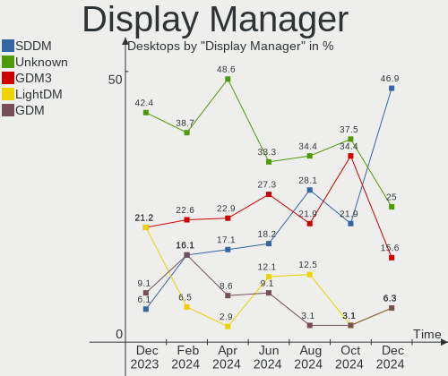
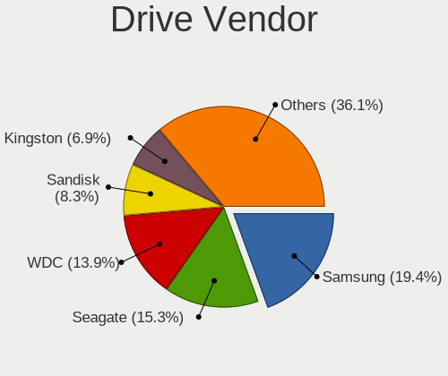
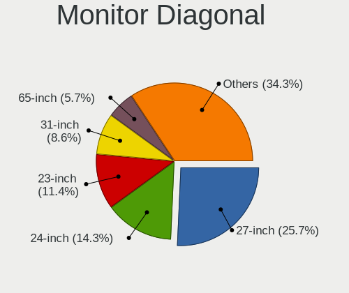
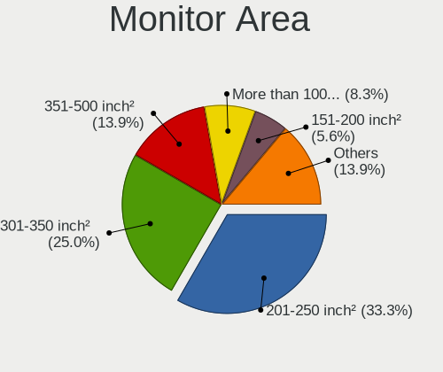
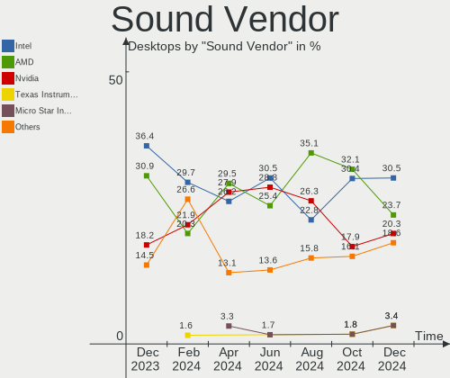
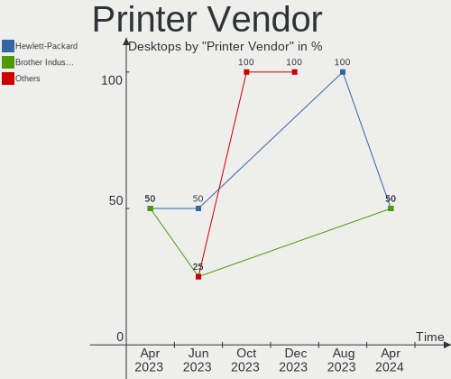

Linux in Netherlands - Hardware Trends (Desktops)
-------------------------------------------------

A project to identify most popular hardware characteristics and track their change
over time based on data collected by Linux users at https://Linux-Hardware.org.

Anyone can contribute to this report by the [hw-probe](https://github.com/linuxhw/hw-probe) tool:

    sudo -E hw-probe -all -upload

Period: Sep, 2022.

Contents
--------

* [ System ](#system)
  - [ OS                       ](#os)
  - [ OS Family                ](#os-family)
  - [ Kernel                   ](#kernel)
  - [ Kernel Family            ](#kernel-family)
  - [ Kernel Major Ver.        ](#kernel-major-ver)
  - [ Arch                     ](#arch)
  - [ DE                       ](#de)
  - [ Display Server           ](#display-server)
  - [ Display Manager          ](#display-manager)
  - [ OS Lang                  ](#os-lang)
  - [ Boot Mode                ](#boot-mode)
  - [ Filesystem               ](#filesystem)
  - [ Part. scheme             ](#part-scheme)
  - [ Dual Boot with Linux/BSD ](#dual-boot-with-linuxbsd)
  - [ Dual Boot (Win)          ](#dual-boot-win)

* [ Board ](#board)
  - [ Vendor                   ](#vendor)
  - [ Model                    ](#model)
  - [ Model Family             ](#model-family)
  - [ MFG Year                 ](#mfg-year)
  - [ Form Factor              ](#form-factor)
  - [ Secure Boot              ](#secure-boot)
  - [ Coreboot                 ](#coreboot)
  - [ RAM Size                 ](#ram-size)
  - [ RAM Used                 ](#ram-used)
  - [ Total Drives             ](#total-drives)
  - [ Has CD-ROM               ](#has-cd-rom)
  - [ Has Ethernet             ](#has-ethernet)
  - [ Has WiFi                 ](#has-wifi)
  - [ Has Bluetooth            ](#has-bluetooth)

* [ Location ](#location)
  - [ Country                  ](#country)
  - [ City                     ](#city)

* [ Drives ](#drives)
  - [ Drive Vendor             ](#drive-vendor)
  - [ Drive Model              ](#drive-model)
  - [ HDD Vendor               ](#hdd-vendor)
  - [ SSD Vendor               ](#ssd-vendor)
  - [ Drive Kind               ](#drive-kind)
  - [ Drive Connector          ](#drive-connector)
  - [ Drive Size               ](#drive-size)
  - [ Space Total              ](#space-total)
  - [ Space Used               ](#space-used)
  - [ Malfunc. Drives          ](#malfunc-drives)
  - [ Malfunc. Drive Vendor    ](#malfunc-drive-vendor)
  - [ Malfunc. HDD Vendor      ](#malfunc-hdd-vendor)
  - [ Malfunc. Drive Kind      ](#malfunc-drive-kind)
  - [ Failed Drives            ](#failed-drives)
  - [ Failed Drive Vendor      ](#failed-drive-vendor)
  - [ Drive Status             ](#drive-status)

* [ Storage controller ](#storage-controller)
  - [ Storage Vendor           ](#storage-vendor)
  - [ Storage Model            ](#storage-model)
  - [ Storage Kind             ](#storage-kind)

* [ Processor ](#processor)
  - [ CPU Vendor               ](#cpu-vendor)
  - [ CPU Model                ](#cpu-model)
  - [ CPU Model Family         ](#cpu-model-family)
  - [ CPU Cores                ](#cpu-cores)
  - [ CPU Sockets              ](#cpu-sockets)
  - [ CPU Threads              ](#cpu-threads)
  - [ CPU Op-Modes             ](#cpu-op-modes)
  - [ CPU Microcode            ](#cpu-microcode)
  - [ CPU Microarch            ](#cpu-microarch)

* [ Graphics ](#graphics)
  - [ GPU Vendor               ](#gpu-vendor)
  - [ GPU Model                ](#gpu-model)
  - [ GPU Combo                ](#gpu-combo)
  - [ GPU Driver               ](#gpu-driver)
  - [ GPU Memory               ](#gpu-memory)

* [ Monitor ](#monitor)
  - [ Monitor Vendor           ](#monitor-vendor)
  - [ Monitor Model            ](#monitor-model)
  - [ Monitor Resolution       ](#monitor-resolution)
  - [ Monitor Diagonal         ](#monitor-diagonal)
  - [ Monitor Width            ](#monitor-width)
  - [ Aspect Ratio             ](#aspect-ratio)
  - [ Monitor Area             ](#monitor-area)
  - [ Pixel Density            ](#pixel-density)
  - [ Multiple Monitors        ](#multiple-monitors)

* [ Network ](#network)
  - [ Net Controller Vendor    ](#net-controller-vendor)
  - [ Net Controller Model     ](#net-controller-model)
  - [ Wireless Vendor          ](#wireless-vendor)
  - [ Wireless Model           ](#wireless-model)
  - [ Ethernet Vendor          ](#ethernet-vendor)
  - [ Ethernet Model           ](#ethernet-model)
  - [ Net Controller Kind      ](#net-controller-kind)
  - [ Used Controller          ](#used-controller)
  - [ NICs                     ](#nics)
  - [ IPv6                     ](#ipv6)

* [ Bluetooth ](#bluetooth)
  - [ Bluetooth Vendor         ](#bluetooth-vendor)
  - [ Bluetooth Model          ](#bluetooth-model)

* [ Sound ](#sound)
  - [ Sound Vendor             ](#sound-vendor)
  - [ Sound Model              ](#sound-model)

* [ Memory ](#memory)
  - [ Memory Vendor            ](#memory-vendor)
  - [ Memory Model             ](#memory-model)
  - [ Memory Kind              ](#memory-kind)
  - [ Memory Form Factor       ](#memory-form-factor)
  - [ Memory Size              ](#memory-size)
  - [ Memory Speed             ](#memory-speed)

* [ Printers & scanners ](#printers--scanners)
  - [ Printer Vendor           ](#printer-vendor)
  - [ Printer Model            ](#printer-model)
  - [ Scanner Vendor           ](#scanner-vendor)
  - [ Scanner Model            ](#scanner-model)

* [ Camera ](#camera)
  - [ Camera Vendor            ](#camera-vendor)
  - [ Camera Model             ](#camera-model)

* [ Security ](#security)
  - [ Fingerprint Vendor       ](#fingerprint-vendor)
  - [ Fingerprint Model        ](#fingerprint-model)
  - [ Chipcard Vendor          ](#chipcard-vendor)
  - [ Chipcard Model           ](#chipcard-model)

* [ Unsupported ](#unsupported)
  - [ Unsupported Devices      ](#unsupported-devices)
  - [ Unsupported Device Types ](#unsupported-device-types)

System
------

OS
--

Installed operating systems

| Name                  | Desktops | Percent |
|-----------------------|----------|---------|
| Ubuntu 22.04          | 4        | 18.18%  |
| Zorin 16              | 2        | 9.09%   |
| Fedora 36             | 2        | 9.09%   |
| EndeavourOS Rolling   | 2        | 9.09%   |
| ArcoLinux Rolling     | 2        | 9.09%   |
| Xubuntu 22.04         | 1        | 4.55%   |
| Ubuntu 20.04          | 1        | 4.55%   |
| openSUSE Leap-15.3    | 1        | 4.55%   |
| OpenMandriva 4.3      | 1        | 4.55%   |
| Manjaro               | 1        | 4.55%   |
| Linux Mint 21         | 1        | 4.55%   |
| Kubuntu 22.04         | 1        | 4.55%   |
| Debian 11             | 1        | 4.55%   |
| BuildRoot 2022.08-git | 1        | 4.55%   |
| Arch Rolling          | 1        | 4.55%   |

OS Family
---------

OS without a version

| Name         | Desktops | Percent |
|--------------|----------|---------|
| Ubuntu       | 5        | 22.73%  |
| Zorin        | 2        | 9.09%   |
| Fedora       | 2        | 9.09%   |
| EndeavourOS  | 2        | 9.09%   |
| ArcoLinux    | 2        | 9.09%   |
| Xubuntu      | 1        | 4.55%   |
| openSUSE     | 1        | 4.55%   |
| OpenMandriva | 1        | 4.55%   |
| Manjaro      | 1        | 4.55%   |
| Linux Mint   | 1        | 4.55%   |
| Kubuntu      | 1        | 4.55%   |
| Debian       | 1        | 4.55%   |
| BuildRoot    | 1        | 4.55%   |
| Arch         | 1        | 4.55%   |

Kernel
------

Version of the Linux kernel

| Version                     | Desktops | Percent |
|-----------------------------|----------|---------|
| 5.15.0-47-generic           | 4        | 18.18%  |
| 5.15.0-46-generic           | 3        | 13.64%  |
| 5.19.11-arch1-1             | 2        | 9.09%   |
| 5.15.0-48-generic           | 2        | 9.09%   |
| 5.3.18-150300.59.90-default | 1        | 4.55%   |
| 5.19.9-AMD-znver2           | 1        | 4.55%   |
| 5.19.9-200.fc36.x86_64      | 1        | 4.55%   |
| 5.19.8-200.fc36.x86_64      | 1        | 4.55%   |
| 5.19.7-arch1-1              | 1        | 4.55%   |
| 5.19.7-1-MANJARO            | 1        | 4.55%   |
| 5.19.5-arch1-1              | 1        | 4.55%   |
| 5.18.19                     | 1        | 4.55%   |
| 5.16.7-desktop-1omv4003     | 1        | 4.55%   |
| 5.15.0-47-lowlatency        | 1        | 4.55%   |
| 5.10.0-17-amd64             | 1        | 4.55%   |

Kernel Family
-------------

Linux kernel without a distro release

| Version | Desktops | Percent |
|---------|----------|---------|
| 5.15.0  | 10       | 45.45%  |
| 5.19.9  | 2        | 9.09%   |
| 5.19.7  | 2        | 9.09%   |
| 5.19.11 | 2        | 9.09%   |
| 5.3.18  | 1        | 4.55%   |
| 5.19.8  | 1        | 4.55%   |
| 5.19.5  | 1        | 4.55%   |
| 5.18.19 | 1        | 4.55%   |
| 5.16.7  | 1        | 4.55%   |
| 5.10.0  | 1        | 4.55%   |

Kernel Major Ver.
-----------------

Linux kernel major version

| Version | Desktops | Percent |
|---------|----------|---------|
| 5.15    | 10       | 45.45%  |
| 5.19    | 8        | 36.36%  |
| 5.3     | 1        | 4.55%   |
| 5.18    | 1        | 4.55%   |
| 5.16    | 1        | 4.55%   |
| 5.10    | 1        | 4.55%   |

Arch
----

OS architecture (x86_64, i586, etc.)

| Name   | Desktops | Percent |
|--------|----------|---------|
| x86_64 | 22       | 100%    |

DE
--

Desktop Environment

| Name       | Desktops | Percent |
|------------|----------|---------|
| GNOME      | 9        | 40.91%  |
| KDE5       | 6        | 27.27%  |
| XFCE       | 5        | 22.73%  |
| X-Cinnamon | 1        | 4.55%   |
| Unknown    | 1        | 4.55%   |

Display Server
--------------

X11 or Wayland

| Name    | Desktops | Percent |
|---------|----------|---------|
| X11     | 17       | 77.27%  |
| Wayland | 5        | 22.73%  |

Display Manager
---------------

SDDM, LightDM, etc.

| Name    | Desktops | Percent |
|---------|----------|---------|
| LightDM | 6        | 27.27%  |
| SDDM    | 5        | 22.73%  |
| GDM     | 4        | 18.18%  |
| Unknown | 4        | 18.18%  |
| GDM3    | 3        | 13.64%  |

OS Lang
-------

Language

| Lang    | Desktops | Percent |
|---------|----------|---------|
| en_US   | 13       | 59.09%  |
| nl_NL   | 7        | 31.82%  |
| it_IT   | 1        | 4.55%   |
| Unknown | 1        | 4.55%   |

Boot Mode
---------

EFI or BIOS

| Mode | Desktops | Percent |
|------|----------|---------|
| BIOS | 12       | 54.55%  |
| EFI  | 10       | 45.45%  |

Filesystem
----------

Type of filesystem

| Type    | Desktops | Percent |
|---------|----------|---------|
| Ext4    | 16       | 72.73%  |
| Btrfs   | 4        | 18.18%  |
| Zfs     | 1        | 4.55%   |
| Overlay | 1        | 4.55%   |

Part. scheme
------------

Scheme of partitioning

| Type    | Desktops | Percent |
|---------|----------|---------|
| Unknown | 10       | 45.45%  |
| GPT     | 7        | 31.82%  |
| MBR     | 5        | 22.73%  |

Dual Boot with Linux/BSD
------------------------

Hosting more than one Linux/BSD

| Dual boot | Desktops | Percent |
|-----------|----------|---------|
| No        | 18       | 81.82%  |
| Yes       | 4        | 18.18%  |

Dual Boot (Win)
---------------

Hosting Linux and Windows

| Dual boot | Desktops | Percent |
|-----------|----------|---------|
| No        | 12       | 54.55%  |
| Yes       | 10       | 45.45%  |

Board
-----

Vendor
------

Motherboard manufacturer

| Name                | Desktops | Percent |
|---------------------|----------|---------|
| Gigabyte Technology | 6        | 27.27%  |
| Hewlett-Packard     | 4        | 18.18%  |
| ASRock              | 4        | 18.18%  |
| ASUSTek Computer    | 3        | 13.64%  |
| MSI                 | 1        | 4.55%   |
| Medion              | 1        | 4.55%   |
| Lenovo              | 1        | 4.55%   |
| Biostar             | 1        | 4.55%   |
| Acer                | 1        | 4.55%   |

Model
-----

Motherboard model

| Name                               | Desktops | Percent |
|------------------------------------|----------|---------|
| MSI MS-7977                        | 1        | 4.55%   |
| Medion Akoya P2140 D MD8327/2487   | 1        | 4.55%   |
| Lenovo H50-50 90B600GPNY           | 1        | 4.55%   |
| HP Z440 Workstation                | 1        | 4.55%   |
| HP ProDesk 600 G3 SFF              | 1        | 4.55%   |
| HP Compaq dc7900 Small Form Factor | 1        | 4.55%   |
| HP Compaq dc7800 Small Form Factor | 1        | 4.55%   |
| Gigabyte Z97P-D3                   | 1        | 4.55%   |
| Gigabyte Z270X-Ultra Gaming        | 1        | 4.55%   |
| Gigabyte X570S AORUS ELITE AX      | 1        | 4.55%   |
| Gigabyte X570S AERO G              | 1        | 4.55%   |
| Gigabyte P55A-UD3                  | 1        | 4.55%   |
| Gigabyte GB-BRR7H-4800             | 1        | 4.55%   |
| Biostar H77MU3                     | 1        | 4.55%   |
| ASUS SABERTOOTH Z77                | 1        | 4.55%   |
| ASUS PRIME A320M-K                 | 1        | 4.55%   |
| ASUS P8H61 PRO                     | 1        | 4.55%   |
| ASRock X570 Steel Legend           | 1        | 4.55%   |
| ASRock X570 Phantom Gaming 4       | 1        | 4.55%   |
| ASRock B450M Pro4-F                | 1        | 4.55%   |
| ASRock B250M-HDV                   | 1        | 4.55%   |
| Acer Aspire G7750                  | 1        | 4.55%   |

Model Family
------------

Motherboard model prefix

| Name                   | Desktops | Percent |
|------------------------|----------|---------|
| HP Compaq              | 2        | 9.09%   |
| Gigabyte X570S         | 2        | 9.09%   |
| ASRock X570            | 2        | 9.09%   |
| MSI MS-7977            | 1        | 4.55%   |
| Medion Akoya           | 1        | 4.55%   |
| Lenovo H50-50          | 1        | 4.55%   |
| HP Z440                | 1        | 4.55%   |
| HP ProDesk             | 1        | 4.55%   |
| Gigabyte Z97P-D3       | 1        | 4.55%   |
| Gigabyte Z270X-Ultra   | 1        | 4.55%   |
| Gigabyte P55A-UD3      | 1        | 4.55%   |
| Gigabyte GB-BRR7H-4800 | 1        | 4.55%   |
| Biostar H77MU3         | 1        | 4.55%   |
| ASUS SABERTOOTH        | 1        | 4.55%   |
| ASUS PRIME             | 1        | 4.55%   |
| ASUS P8H61             | 1        | 4.55%   |
| ASRock B450M           | 1        | 4.55%   |
| ASRock B250M-HDV       | 1        | 4.55%   |
| Acer Aspire            | 1        | 4.55%   |

MFG Year
--------

Motherboard manufacture year

| Year | Desktops | Percent |
|------|----------|---------|
| 2019 | 3        | 13.64%  |
| 2017 | 3        | 13.64%  |
| 2015 | 3        | 13.64%  |
| 2021 | 2        | 9.09%   |
| 2016 | 2        | 9.09%   |
| 2012 | 2        | 9.09%   |
| 2009 | 2        | 9.09%   |
| 2020 | 1        | 4.55%   |
| 2014 | 1        | 4.55%   |
| 2011 | 1        | 4.55%   |
| 2008 | 1        | 4.55%   |
| 2007 | 1        | 4.55%   |

Form Factor
-----------

Physical design of the computer

| Name    | Desktops | Percent |
|---------|----------|---------|
| Desktop | 22       | 100%    |

Secure Boot
-----------

Enabled or disabled

| State    | Desktops | Percent |
|----------|----------|---------|
| Disabled | 22       | 100%    |

Coreboot
--------

Have coreboot on board

| Used | Desktops | Percent |
|------|----------|---------|
| No   | 22       | 100%    |

RAM Size
--------

Total RAM memory

| Size in GB  | Desktops | Percent |
|-------------|----------|---------|
| 8.01-16.0   | 11       | 50%     |
| 16.01-24.0  | 5        | 22.73%  |
| 32.01-64.0  | 2        | 9.09%   |
| 64.01-256.0 | 2        | 9.09%   |
| 4.01-8.0    | 1        | 4.55%   |
| 24.01-32.0  | 1        | 4.55%   |

RAM Used
--------

Used RAM memory

| Used GB   | Desktops | Percent |
|-----------|----------|---------|
| 2.01-3.0  | 7        | 31.82%  |
| 1.01-2.0  | 6        | 27.27%  |
| 4.01-8.0  | 3        | 13.64%  |
| 3.01-4.0  | 2        | 9.09%   |
| 8.01-16.0 | 2        | 9.09%   |
| 0.51-1.0  | 2        | 9.09%   |

Total Drives
------------

Number of drives on board

| Drives | Desktops | Percent |
|--------|----------|---------|
| 1      | 6        | 27.27%  |
| 3      | 5        | 22.73%  |
| 2      | 5        | 22.73%  |
| 4      | 4        | 18.18%  |
| 7      | 1        | 4.55%   |
| 5      | 1        | 4.55%   |

Has CD-ROM
----------

Has CD-ROM on board

| Presented | Desktops | Percent |
|-----------|----------|---------|
| Yes       | 12       | 54.55%  |
| No        | 10       | 45.45%  |

Has Ethernet
------------

Has Ethernet on board

| Presented | Desktops | Percent |
|-----------|----------|---------|
| Yes       | 22       | 100%    |

Has WiFi
--------

Has WiFi module

| Presented | Desktops | Percent |
|-----------|----------|---------|
| No        | 12       | 54.55%  |
| Yes       | 10       | 45.45%  |

Has Bluetooth
-------------

Has Bluetooth module

| Presented | Desktops | Percent |
|-----------|----------|---------|
| No        | 13       | 59.09%  |
| Yes       | 9        | 40.91%  |

Location
--------

Country
-------

Geographic location (country)

| Country     | Desktops | Percent |
|-------------|----------|---------|
| Netherlands | 22       | 100%    |

City
----

Geographic location (city)

| City          | Desktops | Percent |
|---------------|----------|---------|
| Amsterdam     | 9        | 40.91%  |
| The Hague     | 2        | 9.09%   |
| Leidschendam  | 2        | 9.09%   |
| Zaandam       | 1        | 4.55%   |
| Ugchelen      | 1        | 4.55%   |
| Tilburg       | 1        | 4.55%   |
| Overveen      | 1        | 4.55%   |
| Nieuw-Vennep  | 1        | 4.55%   |
| Heerhugowaard | 1        | 4.55%   |
| Duizel        | 1        | 4.55%   |
| Bilthoven     | 1        | 4.55%   |
| Unknown       | 1        | 4.55%   |

Drives
------

Drive Vendor
------------

Hard drive vendors

| Vendor                    | Desktops | Drives | Percent |
|---------------------------|----------|--------|---------|
| Samsung Electronics       | 18       | 24     | 36.73%  |
| WDC                       | 9        | 12     | 18.37%  |
| Seagate                   | 5        | 7      | 10.2%   |
| Kingston                  | 4        | 5      | 8.16%   |
| Crucial                   | 3        | 3      | 6.12%   |
| Phison Electronics        | 2        | 2      | 4.08%   |
| XUM                       | 1        | 1      | 2.04%   |
| Toshiba                   | 1        | 1      | 2.04%   |
| PNY                       | 1        | 1      | 2.04%   |
| Micron/Crucial Technology | 1        | 1      | 2.04%   |
| Intel                     | 1        | 1      | 2.04%   |
| Hitachi                   | 1        | 1      | 2.04%   |
| HGST                      | 1        | 1      | 2.04%   |
| Corsair                   | 1        | 1      | 2.04%   |

Drive Model
-----------

Hard drive models

| Model                                                 | Desktops | Percent |
|-------------------------------------------------------|----------|---------|
| Samsung NVMe SSD Controller SM961/PM961/SM963 256GB   | 2        | 3.39%   |
| Samsung NVMe SSD Controller PM9A1/PM9A3/980PRO 1024GB | 2        | 3.39%   |
| Samsung HD103SJ 1TB                                   | 2        | 3.39%   |
| Kingston SNVS500G 500GB                               | 2        | 3.39%   |
| XUM HX256GSSDSATA3 256GB                              | 1        | 1.69%   |
| WDC WDS480G2G0A-00JH30 480GB SSD                      | 1        | 1.69%   |
| WDC WDS250G1B0A-00H9H0 250GB SSD                      | 1        | 1.69%   |
| WDC WD80EFAX-68KNBN0 8TB                              | 1        | 1.69%   |
| WDC WD5000AACS-00G8B1 500GB                           | 1        | 1.69%   |
| WDC WD40EFRX-68N32N0 4TB                              | 1        | 1.69%   |
| WDC WD3200AAJS-56M0A0 320GB                           | 1        | 1.69%   |
| WDC WD20EARX-008FB0 2TB                               | 1        | 1.69%   |
| WDC WD10EZEX-21WN4A0 1TB                              | 1        | 1.69%   |
| WDC WD10EZEX-08Y20A0 1TB                              | 1        | 1.69%   |
| WDC WD10EZEX-08WN4A0 1TB                              | 1        | 1.69%   |
| WDC WD10EZEX-00RKKA0 1TB                              | 1        | 1.69%   |
| WDC WD10EFRX-68JCSN0 1TB                              | 1        | 1.69%   |
| Toshiba HDWD110 1TB                                   | 1        | 1.69%   |
| Seagate ST8000VN004-2M2101 8TB                        | 1        | 1.69%   |
| Seagate ST8000DM004-2CX188 8TB                        | 1        | 1.69%   |
| Seagate ST2000LM003 HN-M201RAD 2TB                    | 1        | 1.69%   |
| Seagate ST1000DM003-1ER162 1TB                        | 1        | 1.69%   |
| Seagate M3 Portable 2TB                               | 1        | 1.69%   |
| Seagate Expansion 1TB                                 | 1        | 1.69%   |
| Samsung SSD 980 250GB                                 | 1        | 1.69%   |
| Samsung SSD 980 1TB                                   | 1        | 1.69%   |
| Samsung SSD 870 QVO 2TB                               | 1        | 1.69%   |
| Samsung SSD 870 EVO 500GB                             | 1        | 1.69%   |
| Samsung SSD 860 EVO 250GB                             | 1        | 1.69%   |
| Samsung SSD 850 EVO 500GB                             | 1        | 1.69%   |
| Samsung SSD 850 EVO 250GB                             | 1        | 1.69%   |
| Samsung SSD 850 EVO 120GB                             | 1        | 1.69%   |
| Samsung SSD 840 PRO Series 256GB                      | 1        | 1.69%   |
| Samsung SSD 840 EVO 750GB                             | 1        | 1.69%   |
| Samsung NVMe SSD Drive 500GB                          | 1        | 1.69%   |
| Samsung NVMe SSD Drive 256GB                          | 1        | 1.69%   |
| Samsung NVMe SSD Drive 1TB                            | 1        | 1.69%   |
| Samsung MZNLF128HCHP-00000 128GB SSD                  | 1        | 1.69%   |
| Samsung MZ7LN256HMJP-000H1 256GB SSD                  | 1        | 1.69%   |
| Samsung HD642JJ 640GB                                 | 1        | 1.69%   |

HDD Vendor
----------

Hard disk drive vendors

| Vendor              | Desktops | Drives | Percent |
|---------------------|----------|--------|---------|
| WDC                 | 8        | 10     | 42.11%  |
| Seagate             | 4        | 6      | 21.05%  |
| Samsung Electronics | 4        | 4      | 21.05%  |
| Toshiba             | 1        | 1      | 5.26%   |
| Hitachi             | 1        | 1      | 5.26%   |
| HGST                | 1        | 1      | 5.26%   |

SSD Vendor
----------

Solid state drive vendors

| Vendor              | Desktops | Drives | Percent |
|---------------------|----------|--------|---------|
| Samsung Electronics | 9        | 10     | 45%     |
| Crucial             | 3        | 3      | 15%     |
| WDC                 | 2        | 2      | 10%     |
| Kingston            | 2        | 2      | 10%     |
| XUM                 | 1        | 1      | 5%      |
| PNY                 | 1        | 1      | 5%      |
| Intel               | 1        | 1      | 5%      |
| Corsair             | 1        | 1      | 5%      |

Drive Kind
----------

HDD or SSD

| Kind    | Desktops | Drives | Percent |
|---------|----------|--------|---------|
| SSD     | 15       | 21     | 36.59%  |
| HDD     | 15       | 23     | 36.59%  |
| NVMe    | 10       | 16     | 24.39%  |
| Unknown | 1        | 1      | 2.44%   |

Drive Connector
---------------

SATA, SAS, NVMe, etc.

| Type | Desktops | Drives | Percent |
|------|----------|--------|---------|
| SATA | 19       | 43     | 61.29%  |
| NVMe | 10       | 16     | 32.26%  |
| SAS  | 2        | 2      | 6.45%   |

Drive Size
----------

Size of hard drive

| Size in TB | Desktops | Drives | Percent |
|------------|----------|--------|---------|
| 0.01-0.5   | 15       | 22     | 44.12%  |
| 0.51-1.0   | 12       | 13     | 35.29%  |
| 1.01-2.0   | 3        | 3      | 8.82%   |
| 3.01-4.0   | 2        | 2      | 5.88%   |
| 4.01-10.0  | 2        | 4      | 5.88%   |

Space Total
-----------

Amount of disk space available on the file system

| Size in GB     | Desktops | Percent |
|----------------|----------|---------|
| More than 3000 | 6        | 27.27%  |
| 1001-2000      | 6        | 27.27%  |
| 101-250        | 4        | 18.18%  |
| 21-50          | 2        | 9.09%   |
| 501-1000       | 2        | 9.09%   |
| 51-100         | 1        | 4.55%   |
| Unknown        | 1        | 4.55%   |

Space Used
----------

Amount of used disk space

| Used GB        | Desktops | Percent |
|----------------|----------|---------|
| 251-500        | 3        | 13.64%  |
| 1-20           | 3        | 13.64%  |
| 501-1000       | 3        | 13.64%  |
| 51-100         | 3        | 13.64%  |
| More than 3000 | 2        | 9.09%   |
| 2001-3000      | 2        | 9.09%   |
| 101-250        | 2        | 9.09%   |
| 1001-2000      | 2        | 9.09%   |
| 21-50          | 1        | 4.55%   |
| Unknown        | 1        | 4.55%   |

Malfunc. Drives
---------------

Drive models with a malfunction

| Model                                 | Desktops | Drives | Percent |
|---------------------------------------|----------|--------|---------|
| WDC WD5000AACS-00G8B1 500GB           | 1        | 1      | 12.5%   |
| WDC WD10EFRX-68JCSN0 1TB              | 1        | 1      | 12.5%   |
| Samsung Electronics SSD 870 EVO 500GB | 1        | 1      | 12.5%   |
| Samsung Electronics SSD 850 EVO 250GB | 1        | 1      | 12.5%   |
| Intel SSDSC2CW060A3 64GB              | 1        | 1      | 12.5%   |
| Crucial CT500MX500SSD1 500GB          | 1        | 1      | 12.5%   |
| Crucial CT128MX100SSD1 128GB          | 1        | 1      | 12.5%   |
| Corsair CSSD-F60GB2 64GB              | 1        | 1      | 12.5%   |

Malfunc. Drive Vendor
---------------------

Vendors of faulty drives

| Vendor              | Desktops | Drives | Percent |
|---------------------|----------|--------|---------|
| WDC                 | 2        | 2      | 25%     |
| Samsung Electronics | 2        | 2      | 25%     |
| Crucial             | 2        | 2      | 25%     |
| Intel               | 1        | 1      | 12.5%   |
| Corsair             | 1        | 1      | 12.5%   |

Malfunc. HDD Vendor
-------------------

Vendors of faulty HDD drives

| Vendor | Desktops | Drives | Percent |
|--------|----------|--------|---------|
| WDC    | 2        | 2      | 100%    |

Malfunc. Drive Kind
-------------------

Kinds of faulty drives

| Kind | Desktops | Drives | Percent |
|------|----------|--------|---------|
| SSD  | 6        | 6      | 75%     |
| HDD  | 2        | 2      | 25%     |

Failed Drives
-------------

Failed drive models

Zero info for selected period =(

Failed Drive Vendor
-------------------

Failed drive vendors

Zero info for selected period =(

Drive Status
------------

Number of failed and malfunc. drives

| Status   | Desktops | Drives | Percent |
|----------|----------|--------|---------|
| Works    | 12       | 25     | 42.86%  |
| Detected | 10       | 28     | 35.71%  |
| Malfunc  | 6        | 8      | 21.43%  |

Storage controller
------------------

Storage Vendor
--------------

Storage controller vendors

| Vendor                      | Desktops | Percent |
|-----------------------------|----------|---------|
| Intel                       | 15       | 41.67%  |
| Samsung Electronics         | 7        | 19.44%  |
| AMD                         | 6        | 16.67%  |
| Phison Electronics          | 2        | 5.56%   |
| Kingston Technology Company | 2        | 5.56%   |
| ASMedia Technology          | 2        | 5.56%   |
| Micron/Crucial Technology   | 1        | 2.78%   |
| JMicron Technology          | 1        | 2.78%   |

Storage Model
-------------

Storage controller models

| Model                                                                          | Desktops | Percent |
|--------------------------------------------------------------------------------|----------|---------|
| AMD FCH SATA Controller [AHCI mode]                                            | 5        | 11.63%  |
| Samsung NVMe SSD Controller 980                                                | 3        | 6.98%   |
| Intel 200 Series PCH SATA controller [AHCI mode]                               | 3        | 6.98%   |
| Samsung NVMe SSD Controller SM961/PM961/SM963                                  | 2        | 4.65%   |
| Samsung NVMe SSD Controller PM9A1/PM9A3/980PRO                                 | 2        | 4.65%   |
| Intel Q170/Q150/B150/H170/H110/Z170/CM236 Chipset SATA Controller [AHCI Mode]  | 2        | 4.65%   |
| ASMedia ASM1062 Serial ATA Controller                                          | 2        | 4.65%   |
| Samsung NVMe SSD Controller SM981/PM981/PM983                                  | 1        | 2.33%   |
| Phison PS5013 E13 NVMe Controller                                              | 1        | 2.33%   |
| Phison E16 PCIe4 NVMe Controller                                               | 1        | 2.33%   |
| Micron/Crucial Non-Volatile memory controller                                  | 1        | 2.33%   |
| Kingston Company Company Non-Volatile memory controller                        | 1        | 2.33%   |
| Kingston Company SNVS2000G [NV1 NVMe PCIe SSD 2TB]                             | 1        | 2.33%   |
| Kingston Company A2000 NVMe SSD                                                | 1        | 2.33%   |
| JMicron JMB363 SATA/IDE Controller                                             | 1        | 2.33%   |
| Intel C610/X99 series chipset sSATA Controller [AHCI mode]                     | 1        | 2.33%   |
| Intel C600/X79 series chipset SATA RAID Controller                             | 1        | 2.33%   |
| Intel 9 Series Chipset Family SATA Controller [AHCI Mode]                      | 1        | 2.33%   |
| Intel 82Q35 Express PT IDER Controller                                         | 1        | 2.33%   |
| Intel 82801JI (ICH10 Family) SATA AHCI Controller                              | 1        | 2.33%   |
| Intel 82801JD/DO (ICH10 Family) SATA AHCI Controller                           | 1        | 2.33%   |
| Intel 82801IR/IO/IH (ICH9R/DO/DH) 6 port SATA Controller [AHCI mode]           | 1        | 2.33%   |
| Intel 8 Series/C220 Series Chipset Family 6-port SATA Controller 1 [AHCI mode] | 1        | 2.33%   |
| Intel 7 Series/C210 Series Chipset Family 6-port SATA Controller [AHCI mode]   | 1        | 2.33%   |
| Intel 7 Series/C210 Series Chipset Family 4-port SATA Controller [IDE mode]    | 1        | 2.33%   |
| Intel 7 Series/C210 Series Chipset Family 2-port SATA Controller [IDE mode]    | 1        | 2.33%   |
| Intel 6 Series/C200 Series Chipset Family 6 port Desktop SATA AHCI Controller  | 1        | 2.33%   |
| Intel 5 Series/3400 Series Chipset 6 port SATA AHCI Controller                 | 1        | 2.33%   |
| Intel 4 Series Chipset PT IDER Controller                                      | 1        | 2.33%   |
| AMD FCH SATA Controller D                                                      | 1        | 2.33%   |
| AMD 400 Series Chipset SATA Controller                                         | 1        | 2.33%   |

Storage Kind
------------

Kind of storage controller (IDE, SATA, NVMe, SAS, ...)

| Kind | Desktops | Percent |
|------|----------|---------|
| SATA | 20       | 57.14%  |
| NVMe | 10       | 28.57%  |
| IDE  | 4        | 11.43%  |
| RAID | 1        | 2.86%   |

Processor
---------

CPU Vendor
----------

Processor vendors

| Vendor | Desktops | Percent |
|--------|----------|---------|
| Intel  | 15       | 68.18%  |
| AMD    | 7        | 31.82%  |

CPU Model
---------

Processor models

| Model                                  | Desktops | Percent |
|----------------------------------------|----------|---------|
| AMD Ryzen 9 5900X 12-Core Processor    | 2        | 9.09%   |
| Intel Xeon CPU E5-1620 v3 @ 3.50GHz    | 1        | 4.55%   |
| Intel Core i7-7700K CPU @ 4.20GHz      | 1        | 4.55%   |
| Intel Core i7-3770K CPU @ 3.50GHz      | 1        | 4.55%   |
| Intel Core i7 CPU 920 @ 2.67GHz        | 1        | 4.55%   |
| Intel Core i5-7500 CPU @ 3.40GHz       | 1        | 4.55%   |
| Intel Core i5-6600K CPU @ 3.50GHz      | 1        | 4.55%   |
| Intel Core i5-4590 CPU @ 3.30GHz       | 1        | 4.55%   |
| Intel Core i5-2320 CPU @ 3.00GHz       | 1        | 4.55%   |
| Intel Core i5 CPU 750 @ 2.67GHz        | 1        | 4.55%   |
| Intel Core i3-7100 CPU @ 3.90GHz       | 1        | 4.55%   |
| Intel Core i3-6100 CPU @ 3.70GHz       | 1        | 4.55%   |
| Intel Core i3-4170 CPU @ 3.70GHz       | 1        | 4.55%   |
| Intel Core i3-3220 CPU @ 3.30GHz       | 1        | 4.55%   |
| Intel Core 2 Duo CPU E8400 @ 3.00GHz   | 1        | 4.55%   |
| Intel Core 2 Duo CPU E6550 @ 2.33GHz   | 1        | 4.55%   |
| AMD Ryzen 9 5950X 16-Core Processor    | 1        | 4.55%   |
| AMD Ryzen 7 4800U with Radeon Graphics | 1        | 4.55%   |
| AMD Ryzen 7 3700X 8-Core Processor     | 1        | 4.55%   |
| AMD Ryzen 5 5600G with Radeon Graphics | 1        | 4.55%   |
| AMD Ryzen 5 3600 6-Core Processor      | 1        | 4.55%   |

CPU Model Family
----------------

Processor model prefix

| Model            | Desktops | Percent |
|------------------|----------|---------|
| Intel Core i5    | 5        | 22.73%  |
| Intel Core i3    | 4        | 18.18%  |
| Intel Core i7    | 3        | 13.64%  |
| AMD Ryzen 9      | 3        | 13.64%  |
| Intel Core 2 Duo | 2        | 9.09%   |
| AMD Ryzen 7      | 2        | 9.09%   |
| AMD Ryzen 5      | 2        | 9.09%   |
| Intel Xeon       | 1        | 4.55%   |

CPU Cores
---------

Number of processor cores

| Number | Desktops | Percent |
|--------|----------|---------|
| 4      | 9        | 40.91%  |
| 2      | 6        | 27.27%  |
| 12     | 2        | 9.09%   |
| 8      | 2        | 9.09%   |
| 6      | 2        | 9.09%   |
| 16     | 1        | 4.55%   |

CPU Sockets
-----------

Number of sockets

| Number | Desktops | Percent |
|--------|----------|---------|
| 1      | 22       | 100%    |

CPU Threads
-----------

Threads per core (Hyper-Threading)

| Number | Desktops | Percent |
|--------|----------|---------|
| 2      | 15       | 68.18%  |
| 1      | 7        | 31.82%  |

CPU Op-Modes
------------

CPU Operation Modes (32-bit, 64-bit)

| Op mode        | Desktops | Percent |
|----------------|----------|---------|
| 32-bit, 64-bit | 22       | 100%    |

CPU Microcode
-------------

Microcode number

| Number     | Desktops | Percent |
|------------|----------|---------|
| Unknown    | 8        | 36.36%  |
| 0x306a9    | 2        | 9.09%   |
| 0x0a20120a | 2        | 9.09%   |
| 0x906e9    | 1        | 4.55%   |
| 0x6fb      | 1        | 4.55%   |
| 0x506e3    | 1        | 4.55%   |
| 0x306c3    | 1        | 4.55%   |
| 0x206a7    | 1        | 4.55%   |
| 0x106e5    | 1        | 4.55%   |
| 0x1067a    | 1        | 4.55%   |
| 0x0a50000c | 1        | 4.55%   |
| 0x08701021 | 1        | 4.55%   |
| 0x08600103 | 1        | 4.55%   |

CPU Microarch
-------------

Microarchitecture

| Name        | Desktops | Percent |
|-------------|----------|---------|
| Zen 3       | 4        | 18.18%  |
| Zen 2       | 3        | 13.64%  |
| KabyLake    | 3        | 13.64%  |
| Haswell     | 3        | 13.64%  |
| Skylake     | 2        | 9.09%   |
| Nehalem     | 2        | 9.09%   |
| IvyBridge   | 2        | 9.09%   |
| SandyBridge | 1        | 4.55%   |
| Penryn      | 1        | 4.55%   |
| Core        | 1        | 4.55%   |

Graphics
--------

GPU Vendor
----------

Vendors of graphics cards

| Vendor | Desktops | Percent |
|--------|----------|---------|
| Nvidia | 12       | 52.17%  |
| Intel  | 6        | 26.09%  |
| AMD    | 5        | 21.74%  |

GPU Model
---------

Graphics card models

| Model                                                                       | Desktops | Percent |
|-----------------------------------------------------------------------------|----------|---------|
| Nvidia GM107 [GeForce GTX 750 Ti]                                           | 2        | 8.33%   |
| Nvidia GA102 [GeForce RTX 3080 Ti]                                          | 2        | 8.33%   |
| Intel HD Graphics 630                                                       | 2        | 8.33%   |
| Nvidia TU116 [GeForce GTX 1650]                                             | 1        | 4.17%   |
| Nvidia TU104 [GeForce RTX 2070 SUPER]                                       | 1        | 4.17%   |
| Nvidia GT218 [GeForce G210]                                                 | 1        | 4.17%   |
| Nvidia GP104 [GeForce GTX 1080]                                             | 1        | 4.17%   |
| Nvidia GM206 [GeForce GTX 960]                                              | 1        | 4.17%   |
| Nvidia GM204 [GeForce GTX 980]                                              | 1        | 4.17%   |
| Nvidia GK208B [GeForce GT 710]                                              | 1        | 4.17%   |
| Nvidia GF119 [GeForce GT 610]                                               | 1        | 4.17%   |
| Intel Xeon E3-1200 v3/4th Gen Core Processor Integrated Graphics Controller | 1        | 4.17%   |
| Intel HD Graphics 530                                                       | 1        | 4.17%   |
| Intel 4th Generation Core Processor Family Integrated Graphics Controller   | 1        | 4.17%   |
| Intel 2nd Generation Core Processor Family Integrated Graphics Controller   | 1        | 4.17%   |
| AMD Renoir                                                                  | 1        | 4.17%   |
| AMD Navi 23 [Radeon RX 6600/6600 XT/6600M]                                  | 1        | 4.17%   |
| AMD Navi 10 [Radeon RX 5600 OEM/5600 XT / 5700/5700 XT]                     | 1        | 4.17%   |
| AMD Cezanne                                                                 | 1        | 4.17%   |
| AMD Cedar [Radeon HD 5000/6000/7350/8350 Series]                            | 1        | 4.17%   |
| AMD Caicos [Radeon HD 6450/7450/8450 / R5 230 OEM]                          | 1        | 4.17%   |

GPU Combo
---------

Combinations of graphics cards

| Name        | Desktops | Percent |
|-------------|----------|---------|
| 1 x Nvidia  | 12       | 54.55%  |
| 1 x Intel   | 5        | 22.73%  |
| 1 x AMD     | 3        | 13.64%  |
| 2 x AMD     | 1        | 4.55%   |
| Intel + AMD | 1        | 4.55%   |

GPU Driver
----------

Free vs proprietary

| Driver      | Desktops | Percent |
|-------------|----------|---------|
| Free        | 11       | 50%     |
| Proprietary | 9        | 40.91%  |
| Unknown     | 2        | 9.09%   |

GPU Memory
----------

Total video memory

| Size in GB | Desktops | Percent |
|------------|----------|---------|
| Unknown    | 7        | 31.82%  |
| 7.01-8.0   | 4        | 18.18%  |
| 3.01-4.0   | 3        | 13.64%  |
| 1.01-2.0   | 3        | 13.64%  |
| 8.01-16.0  | 2        | 9.09%   |
| 0.01-0.5   | 2        | 9.09%   |
| 0.51-1.0   | 1        | 4.55%   |

Monitor
-------

Monitor Vendor
--------------

Monitor vendors

| Vendor               | Desktops | Percent |
|----------------------|----------|---------|
| Samsung Electronics  | 4        | 17.39%  |
| Iiyama               | 4        | 17.39%  |
| Philips              | 3        | 13.04%  |
| Goldstar             | 3        | 13.04%  |
| Sony                 | 1        | 4.35%   |
| Skyworth             | 1        | 4.35%   |
| LG Electronics       | 1        | 4.35%   |
| Idek Iiyama          | 1        | 4.35%   |
| Hewlett-Packard      | 1        | 4.35%   |
| Eizo                 | 1        | 4.35%   |
| Dell                 | 1        | 4.35%   |
| Ancor Communications | 1        | 4.35%   |
| Acer                 | 1        | 4.35%   |

Monitor Model
-------------

Monitor models

| Model                                                                 | Desktops | Percent |
|-----------------------------------------------------------------------|----------|---------|
| Sony TV *00 SNYAA04 3840x2160 1439x809mm 65.0-inch                    | 1        | 3.85%   |
| Skyworth CP9687 SII9533 1920x1080 820x460mm 37.0-inch                 | 1        | 3.85%   |
| Samsung Electronics SyncMaster SAM0302 1680x1050 459x296mm 21.5-inch  | 1        | 3.85%   |
| Samsung Electronics S27R65x SAM1045 1920x1080 598x336mm 27.0-inch     | 1        | 3.85%   |
| Samsung Electronics LCD Monitor SyncMaster 3600x1200                  | 1        | 3.85%   |
| Samsung Electronics LCD Monitor S22B350                               | 1        | 3.85%   |
| Samsung Electronics LCD Monitor S22B300                               | 1        | 3.85%   |
| Samsung Electronics LCD Monitor S22B150 5760x1080                     | 1        | 3.85%   |
| Philips PHL 223V5 PHLC0CF 1920x1080 477x268mm 21.5-inch               | 1        | 3.85%   |
| Philips 225B PHL088B 1680x1050 474x296mm 22.0-inch                    | 1        | 3.85%   |
| Philips 19S PHL0878 1280x1024 376x301mm 19.0-inch                     | 1        | 3.85%   |
| LG Electronics LCD Monitor LG ULTRAGEAR 2560x1440                     | 1        | 3.85%   |
| Iiyama X2483_2480-DP IVM6129 1920x1080 527x296mm 23.8-inch            | 1        | 3.85%   |
| Iiyama PL2775HD IVM6604 1920x1080 598x336mm 27.0-inch                 | 1        | 3.85%   |
| Iiyama PL2760H IVM664A 1920x1080 598x336mm 27.0-inch                  | 1        | 3.85%   |
| Iiyama PL2492H IVM612F 1920x1080 527x296mm 23.8-inch                  | 1        | 3.85%   |
| Idek Iiyama LCD Monitor PLE2607WS                                     | 1        | 3.85%   |
| Hewlett-Packard LA2306 HWP2949 1920x1080 510x290mm 23.1-inch          | 1        | 3.85%   |
| Hewlett-Packard E233 HPN345F 1920x1080 510x290mm 23.1-inch            | 1        | 3.85%   |
| Goldstar M2380D GSM57BC 1920x1080 598x336mm 27.0-inch                 | 1        | 3.85%   |
| Goldstar LG ULTRAWIDE GSM777D 3840x1600 890x390mm 38.3-inch           | 1        | 3.85%   |
| Goldstar 20M35 GSM4EED 1600x900 433x236mm 19.4-inch                   | 1        | 3.85%   |
| Eizo EV2455 ENC2533 1920x1200 519x324mm 24.1-inch                     | 1        | 3.85%   |
| Dell SE197FP DELF002 1280x1024 380x305mm 19.2-inch                    | 1        | 3.85%   |
| Ancor Communications ROG PG279Q ACI27EC 2560x1440 598x336mm 27.0-inch | 1        | 3.85%   |
| Acer LCD Monitor SA230 1920x1080                                      | 1        | 3.85%   |

Monitor Resolution
------------------

Monitor screen resolution

| Resolution         | Desktops | Percent |
|--------------------|----------|---------|
| 1920x1080 (FHD)    | 10       | 43.48%  |
| 2560x1440 (QHD)    | 2        | 8.7%    |
| 1680x1050 (WSXGA+) | 2        | 8.7%    |
| 1280x1024 (SXGA)   | 2        | 8.7%    |
| Unknown            | 2        | 8.7%    |
| 5760x1080          | 1        | 4.35%   |
| 3840x2160 (4K)     | 1        | 4.35%   |
| 3840x1600          | 1        | 4.35%   |
| 3600x1200          | 1        | 4.35%   |
| 1600x900 (HD+)     | 1        | 4.35%   |

Monitor Diagonal
----------------

Diagonal size in inches

| Inches  | Desktops | Percent |
|---------|----------|---------|
| 27      | 5        | 22.73%  |
| Unknown | 4        | 18.18%  |
| 24      | 3        | 13.64%  |
| 19      | 3        | 13.64%  |
| 21      | 2        | 9.09%   |
| 65      | 1        | 4.55%   |
| 38      | 1        | 4.55%   |
| 37      | 1        | 4.55%   |
| 23      | 1        | 4.55%   |
| 22      | 1        | 4.55%   |

Monitor Width
-------------

Physical width

| Width in mm | Desktops | Percent |
|-------------|----------|---------|
| 501-600     | 9        | 40.91%  |
| 401-500     | 4        | 18.18%  |
| Unknown     | 4        | 18.18%  |
| 801-900     | 2        | 9.09%   |
| 351-400     | 2        | 9.09%   |
| 1001-1500   | 1        | 4.55%   |

Aspect Ratio
------------

Proportional relationship between the width and the height

| Ratio   | Desktops | Percent |
|---------|----------|---------|
| 16/9    | 11       | 52.38%  |
| Unknown | 4        | 19.05%  |
| 5/4     | 2        | 9.52%   |
| 16/10   | 2        | 9.52%   |
| 3/2     | 1        | 4.76%   |
| 21/9    | 1        | 4.76%   |

Monitor Area
------------

Area in inch

| Area in inch | Desktops | Percent |
|----------------|----------|---------|
| 201-250        | 6        | 27.27%  |
| 301-350        | 5        | 22.73%  |
| Unknown        | 4        | 18.18%  |
| 151-200        | 3        | 13.64%  |
| 501-1000       | 2        | 9.09%   |
| More than 1000 | 1        | 4.55%   |
| 251-300        | 1        | 4.55%   |

Pixel Density
-------------

Pixels per inch

| Density | Desktops | Percent |
|---------|----------|---------|
| 51-100  | 14       | 66.67%  |
| Unknown | 4        | 19.05%  |
| 101-120 | 3        | 14.29%  |

Multiple Monitors
-----------------

Total monitors connected

| Total | Desktops | Percent |
|-------|----------|---------|
| 1     | 19       | 86.36%  |
| 3     | 2        | 9.09%   |
| 2     | 1        | 4.55%   |

Network
-------

Net Controller Vendor
---------------------

Controller vendors

| Vendor                | Desktops | Percent |
|-----------------------|----------|---------|
| Realtek Semiconductor | 12       | 34.29%  |
| Intel                 | 12       | 34.29%  |
| Ralink Technology     | 3        | 8.57%   |
| Microsoft             | 2        | 5.71%   |
| MediaTek              | 2        | 5.71%   |
| TP-Link               | 1        | 2.86%   |
| Qualcomm Atheros      | 1        | 2.86%   |
| Microchip Technology  | 1        | 2.86%   |
| ASUSTek Computer      | 1        | 2.86%   |

Net Controller Model
--------------------

Controller models

| Model                                                             | Desktops | Percent |
|-------------------------------------------------------------------|----------|---------|
| Realtek RTL8111/8168/8411 PCI Express Gigabit Ethernet Controller | 9        | 25%     |
| Realtek RTL8125 2.5GbE Controller                                 | 2        | 5.56%   |
| Ralink RT2870/RT3070 Wireless Adapter                             | 2        | 5.56%   |
| MediaTek MT7921K (RZ608) Wi-Fi 6E 80MHz                           | 2        | 5.56%   |
| Intel I211 Gigabit Network Connection                             | 2        | 5.56%   |
| Intel Ethernet Connection (2) I219-V                              | 2        | 5.56%   |
| TP-Link 802.11ac WLAN Adapter                                     | 1        | 2.78%   |
| Realtek RTL8188EUS 802.11n Wireless Network Adapter               | 1        | 2.78%   |
| Realtek B1690189192                                               | 1        | 2.78%   |
| Ralink RT5370 Wireless Adapter                                    | 1        | 2.78%   |
| Qualcomm Atheros Killer E2400 Gigabit Ethernet Controller         | 1        | 2.78%   |
| Microsoft XBOX ACC                                                | 1        | 2.78%   |
| Microsoft Wireless XBox Controller Dongle                         | 1        | 2.78%   |
| Microchip TrueRNG                                                 | 1        | 2.78%   |
| Intel Wi-Fi 6 AX200                                               | 1        | 2.78%   |
| Intel Ethernet Controller I225-V                                  | 1        | 2.78%   |
| Intel Ethernet Connection (5) I219-LM                             | 1        | 2.78%   |
| Intel Ethernet Connection (2) I218-LM                             | 1        | 2.78%   |
| Intel 82579V Gigabit Network Connection                           | 1        | 2.78%   |
| Intel 82572EI Gigabit Ethernet Controller (Copper)                | 1        | 2.78%   |
| Intel 82567LM-3 Gigabit Network Connection                        | 1        | 2.78%   |
| Intel 82566DM-2 Gigabit Network Connection                        | 1        | 2.78%   |
| ASUS AC51 802.11a/b/g/n/ac Wireless Adapter [Mediatek MT7610U]    | 1        | 2.78%   |

Wireless Vendor
---------------

Wireless vendors

| Vendor                | Desktops | Percent |
|-----------------------|----------|---------|
| Ralink Technology     | 3        | 25%     |
| Realtek Semiconductor | 2        | 16.67%  |
| Microsoft             | 2        | 16.67%  |
| MediaTek              | 2        | 16.67%  |
| TP-Link               | 1        | 8.33%   |
| Intel                 | 1        | 8.33%   |
| ASUSTek Computer      | 1        | 8.33%   |

Wireless Model
--------------

Wireless models

| Model                                                          | Desktops | Percent |
|----------------------------------------------------------------|----------|---------|
| Ralink RT2870/RT3070 Wireless Adapter                          | 2        | 16.67%  |
| MediaTek MT7921K (RZ608) Wi-Fi 6E 80MHz                        | 2        | 16.67%  |
| TP-Link 802.11ac WLAN Adapter                                  | 1        | 8.33%   |
| Realtek RTL8188EUS 802.11n Wireless Network Adapter            | 1        | 8.33%   |
| Realtek B1690189192                                            | 1        | 8.33%   |
| Ralink RT5370 Wireless Adapter                                 | 1        | 8.33%   |
| Microsoft XBOX ACC                                             | 1        | 8.33%   |
| Microsoft Wireless XBox Controller Dongle                      | 1        | 8.33%   |
| Intel Wi-Fi 6 AX200                                            | 1        | 8.33%   |
| ASUS AC51 802.11a/b/g/n/ac Wireless Adapter [Mediatek MT7610U] | 1        | 8.33%   |

Ethernet Vendor
---------------

Ethernet vendors

| Vendor                | Desktops | Percent |
|-----------------------|----------|---------|
| Realtek Semiconductor | 11       | 47.83%  |
| Intel                 | 11       | 47.83%  |
| Qualcomm Atheros      | 1        | 4.35%   |

Ethernet Model
--------------

Ethernet models

| Model                                                             | Desktops | Percent |
|-------------------------------------------------------------------|----------|---------|
| Realtek RTL8111/8168/8411 PCI Express Gigabit Ethernet Controller | 9        | 39.13%  |
| Realtek RTL8125 2.5GbE Controller                                 | 2        | 8.7%    |
| Intel I211 Gigabit Network Connection                             | 2        | 8.7%    |
| Intel Ethernet Connection (2) I219-V                              | 2        | 8.7%    |
| Qualcomm Atheros Killer E2400 Gigabit Ethernet Controller         | 1        | 4.35%   |
| Intel Ethernet Controller I225-V                                  | 1        | 4.35%   |
| Intel Ethernet Connection (5) I219-LM                             | 1        | 4.35%   |
| Intel Ethernet Connection (2) I218-LM                             | 1        | 4.35%   |
| Intel 82579V Gigabit Network Connection                           | 1        | 4.35%   |
| Intel 82572EI Gigabit Ethernet Controller (Copper)                | 1        | 4.35%   |
| Intel 82567LM-3 Gigabit Network Connection                        | 1        | 4.35%   |
| Intel 82566DM-2 Gigabit Network Connection                        | 1        | 4.35%   |

Net Controller Kind
-------------------

Ethernet, WiFi or modem

| Kind     | Desktops | Percent |
|----------|----------|---------|
| Ethernet | 22       | 66.67%  |
| WiFi     | 10       | 30.3%   |
| Modem    | 1        | 3.03%   |

Used Controller
---------------

Currently used network controller

| Kind     | Desktops | Percent |
|----------|----------|---------|
| Ethernet | 19       | 82.61%  |
| WiFi     | 4        | 17.39%  |

NICs
----

Total network controllers on board

| Total | Desktops | Percent |
|-------|----------|---------|
| 1     | 17       | 77.27%  |
| 2     | 5        | 22.73%  |

IPv6
----

IPv6 vs IPv4

| Used | Desktops | Percent |
|------|----------|---------|
| No   | 15       | 68.18%  |
| Yes  | 7        | 31.82%  |

Bluetooth
---------

Bluetooth Vendor
----------------

Controller vendors

| Vendor                  | Desktops | Percent |
|-------------------------|----------|---------|
| Cambridge Silicon Radio | 5        | 55.56%  |
| MediaTek                | 2        | 22.22%  |
| TP-Link                 | 1        | 11.11%  |
| Intel                   | 1        | 11.11%  |

Bluetooth Model
---------------

Controller models

| Model                                               | Desktops | Percent |
|-----------------------------------------------------|----------|---------|
| Cambridge Silicon Radio Bluetooth Dongle (HCI mode) | 5        | 55.56%  |
| MediaTek Wireless_Device                            | 2        | 22.22%  |
| TP-Link UB500 Adapter                               | 1        | 11.11%  |
| Intel AX200 Bluetooth                               | 1        | 11.11%  |

Sound
-----

Sound Vendor
------------

Sound card vendors

| Vendor              | Desktops | Percent |
|---------------------|----------|---------|
| Intel               | 14       | 33.33%  |
| Nvidia              | 12       | 28.57%  |
| AMD                 | 10       | 23.81%  |
| Creative Labs       | 2        | 4.76%   |
| Yamaha              | 1        | 2.38%   |
| SAVITECH            | 1        | 2.38%   |
| Logitech            | 1        | 2.38%   |
| C-Media Electronics | 1        | 2.38%   |

Sound Model
-----------

Sound card models

| Model                                                                             | Desktops | Percent |
|-----------------------------------------------------------------------------------|----------|---------|
| AMD Starship/Matisse HD Audio Controller                                          | 5        | 10.64%  |
| Nvidia GM107 High Definition Audio Controller [GeForce 940MX]                     | 2        | 4.26%   |
| Nvidia GA102 High Definition Audio Controller                                     | 2        | 4.26%   |
| Intel Xeon E3-1200 v3/4th Gen Core Processor HD Audio Controller                  | 2        | 4.26%   |
| Intel 7 Series/C216 Chipset Family High Definition Audio Controller               | 2        | 4.26%   |
| Intel 200 Series PCH HD Audio                                                     | 2        | 4.26%   |
| Intel 100 Series/C230 Series Chipset Family HD Audio Controller                   | 2        | 4.26%   |
| AMD Renoir Radeon High Definition Audio Controller                                | 2        | 4.26%   |
| AMD Family 17h/19h HD Audio Controller                                            | 2        | 4.26%   |
| Yamaha Steinberg UR22mkII                                                         | 1        | 2.13%   |
| SAVITECH ODAC-revB                                                                | 1        | 2.13%   |
| Nvidia TU116 High Definition Audio Controller                                     | 1        | 2.13%   |
| Nvidia TU104 HD Audio Controller                                                  | 1        | 2.13%   |
| Nvidia High Definition Audio Controller                                           | 1        | 2.13%   |
| Nvidia GP104 High Definition Audio Controller                                     | 1        | 2.13%   |
| Nvidia GM206 High Definition Audio Controller                                     | 1        | 2.13%   |
| Nvidia GM204 High Definition Audio Controller                                     | 1        | 2.13%   |
| Nvidia GK208 HDMI/DP Audio Controller                                             | 1        | 2.13%   |
| Nvidia GF119 HDMI Audio Controller                                                | 1        | 2.13%   |
| Logitech Yeti X                                                                   | 1        | 2.13%   |
| Intel C610/X99 series chipset HD Audio Controller                                 | 1        | 2.13%   |
| Intel 9 Series Chipset Family HD Audio Controller                                 | 1        | 2.13%   |
| Intel 82801JI (ICH10 Family) HD Audio Controller                                  | 1        | 2.13%   |
| Intel 82801JD/DO (ICH10 Family) HD Audio Controller                               | 1        | 2.13%   |
| Intel 82801I (ICH9 Family) HD Audio Controller                                    | 1        | 2.13%   |
| Intel 8 Series/C220 Series Chipset High Definition Audio Controller               | 1        | 2.13%   |
| Intel 6 Series/C200 Series Chipset Family High Definition Audio Controller        | 1        | 2.13%   |
| Intel 5 Series/3400 Series Chipset High Definition Audio                          | 1        | 2.13%   |
| Creative Labs Sound Core3D [Sound Blaster Recon3D / Z-Series]                     | 1        | 2.13%   |
| Creative Labs EMU20k2 [Sound Blaster X-Fi Titanium Series]                        | 1        | 2.13%   |
| C-Media Electronics CMI8788 [Oxygen HD Audio]                                     | 1        | 2.13%   |
| AMD Navi 21/23 HDMI/DP Audio Controller                                           | 1        | 2.13%   |
| AMD Navi 10 HDMI Audio                                                            | 1        | 2.13%   |
| AMD Cedar HDMI Audio [Radeon HD 5400/6300/7300 Series]                            | 1        | 2.13%   |
| AMD Caicos HDMI Audio [Radeon HD 6450 / 7450/8450/8490 OEM / R5 230/235/235X OEM] | 1        | 2.13%   |

Memory
------

Memory Vendor
-------------

Memory module vendors

| Vendor              | Desktops | Percent |
|---------------------|----------|---------|
| Corsair             | 6        | 40%     |
| Crucial             | 3        | 20%     |
| Kingston            | 2        | 13.33%  |
| Samsung Electronics | 1        | 6.67%   |
| Qimonda             | 1        | 6.67%   |
| G.Skill             | 1        | 6.67%   |
| Unknown             | 1        | 6.67%   |

Memory Model
------------

Memory module models

| Model                                                    | Desktops | Percent |
|----------------------------------------------------------|----------|---------|
| Corsair RAM CML8GX3M2A1600C9 4096MB DIMM DDR3 1867MT/s   | 2        | 13.33%  |
| Samsung RAM M378A1G43DB0-CPB 8GB DIMM DDR4 2133MT/s      | 1        | 6.67%   |
| Qimonda RAM 64T256020EU2.5C2 2048MB DIMM DDR2 800MT/s    | 1        | 6.67%   |
| Kingston RAM Module 2048MB DIMM DDR2 800MT/s             | 1        | 6.67%   |
| Kingston RAM 99U5471-040.A00LF 8GB DIMM DDR3 1333MT/s    | 1        | 6.67%   |
| G.Skill RAM F4-2133C15-4GNT 4096MB DIMM DDR4 2400MT/s    | 1        | 6.67%   |
| Crucial RAM CT25664AA800.M16FM 2048MB DIMM DDR2 800MT/s  | 1        | 6.67%   |
| Crucial RAM BL8G32C16U4R.8FE 8192MB DIMM DDR4 3200MT/s   | 1        | 6.67%   |
| Crucial RAM BL16G36C16U4B.M16FE1 16GB DIMM DDR4 3600MT/s | 1        | 6.67%   |
| Corsair RAM CMZ8GX3M2A1600C9 4096MB DIMM DDR3 1600MT/s   | 1        | 6.67%   |
| Corsair RAM CMW32GX4M2D3600C18 16GB DIMM DDR4 3600MT/s   | 1        | 6.67%   |
| Corsair RAM CMSX8GX4M1A3200C22 8GB SODIMM DDR4 3200MT/s  | 1        | 6.67%   |
| Corsair RAM CMK8GX4M2A2400C16 4GB DIMM DDR4 3020MT/s     | 1        | 6.67%   |
| Unknown                                                  | 1        | 6.67%   |

Memory Kind
-----------

Memory module kinds

| Kind    | Desktops | Percent |
|---------|----------|---------|
| DDR4    | 6        | 42.86%  |
| DDR3    | 4        | 28.57%  |
| DDR2    | 2        | 14.29%  |
| SDRAM   | 1        | 7.14%   |
| Unknown | 1        | 7.14%   |

Memory Form Factor
------------------

Physical design of the memory module

| Name   | Desktops | Percent |
|--------|----------|---------|
| DIMM   | 12       | 92.31%  |
| SODIMM | 1        | 7.69%   |

Memory Size
-----------

Memory module size

| Size  | Desktops | Percent |
|-------|----------|---------|
| 4096  | 6        | 40%     |
| 8192  | 4        | 26.67%  |
| 2048  | 3        | 20%     |
| 16384 | 2        | 13.33%  |

Memory Speed
------------

Memory module speed

| Speed | Desktops | Percent |
|-------|----------|---------|
| 3600  | 2        | 14.29%  |
| 3200  | 2        | 14.29%  |
| 1867  | 2        | 14.29%  |
| 800   | 2        | 14.29%  |
| 3020  | 1        | 7.14%   |
| 2400  | 1        | 7.14%   |
| 2133  | 1        | 7.14%   |
| 1600  | 1        | 7.14%   |
| 1333  | 1        | 7.14%   |
| 1280  | 1        | 7.14%   |

Printers & scanners
-------------------

Printer Vendor
--------------

Printer device vendors

| Vendor | Desktops | Percent |
|--------|----------|---------|
| Canon  | 1        | 100%    |

Printer Model
-------------

Printer device models

| Model              | Desktops | Percent |
|--------------------|----------|---------|
| Canon G3020 series | 1        | 100%    |

Scanner Vendor
--------------

Scanner device vendors

Zero info for selected period =(

Scanner Model
-------------

Scanner device models

Zero info for selected period =(

Camera
------

Camera Vendor
-------------

Camera device vendors

| Vendor                 | Desktops | Percent |
|------------------------|----------|---------|
| Trust                  | 1        | 25%     |
| Samsung Electronics    | 1        | 25%     |
| Logitech               | 1        | 25%     |
| Generalplus Technology | 1        | 25%     |

Camera Model
------------

Camera device models

| Model                                    | Desktops | Percent |
|------------------------------------------|----------|---------|
| Trust WB-6250X Webcam                    | 1        | 25%     |
| Samsung Galaxy A5 (MTP)                  | 1        | 25%     |
| Logitech BRIO Ultra HD Webcam            | 1        | 25%     |
| Generalplus 808 Camera #9 (web-cam mode) | 1        | 25%     |

Security
--------

Fingerprint Vendor
------------------

Fingerprint sensor vendors

Zero info for selected period =(

Fingerprint Model
-----------------

Fingerprint sensor models

Zero info for selected period =(

Chipcard Vendor
---------------

Chipcard module vendors

Zero info for selected period =(

Chipcard Model
--------------

Chipcard module models

Zero info for selected period =(

Unsupported
-----------

Unsupported Devices
-------------------

Total unsupported devices on board

| Total | Desktops | Percent |
|-------|----------|---------|
| 0     | 16       | 72.73%  |
| 1     | 4        | 18.18%  |
| 2     | 2        | 9.09%   |

Unsupported Device Types
------------------------

Types of unsupported devices

| Type                     | Desktops | Percent |
|--------------------------|----------|---------|
| Graphics card            | 3        | 37.5%   |
| Unassigned class         | 1        | 12.5%   |
| Network                  | 1        | 12.5%   |
| Net/wireless             | 1        | 12.5%   |
| Communication controller | 1        | 12.5%   |
| Camera                   | 1        | 12.5%   |

