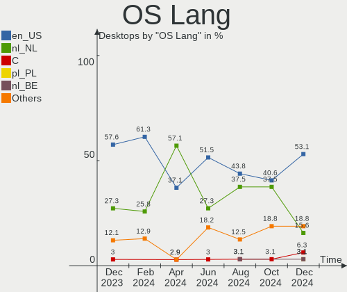
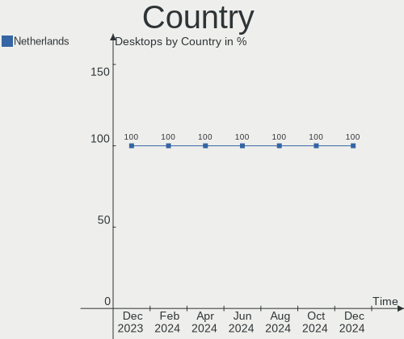
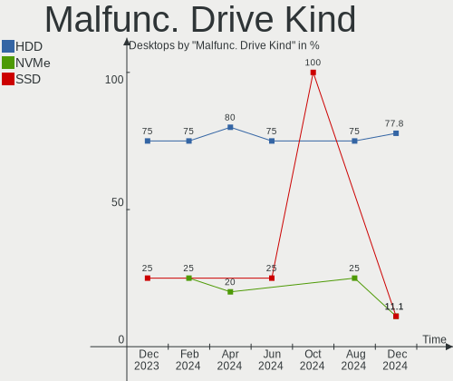
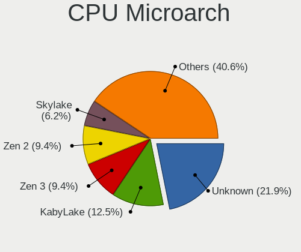
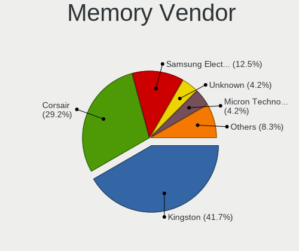

Linux in Netherlands - Hardware Trends (Desktops)
-------------------------------------------------

A project to identify most popular hardware characteristics and track their change
over time based on data collected by Linux users at https://Linux-Hardware.org.

Anyone can contribute to this report by the [hw-probe](https://github.com/linuxhw/hw-probe) tool:

    sudo -E hw-probe -all -upload

Period: Jan, 2023.

Contents
--------

* [ System ](#system)
  - [ OS                       ](#os)
  - [ OS Family                ](#os-family)
  - [ Kernel                   ](#kernel)
  - [ Kernel Family            ](#kernel-family)
  - [ Kernel Major Ver.        ](#kernel-major-ver)
  - [ Arch                     ](#arch)
  - [ DE                       ](#de)
  - [ Display Server           ](#display-server)
  - [ Display Manager          ](#display-manager)
  - [ OS Lang                  ](#os-lang)
  - [ Boot Mode                ](#boot-mode)
  - [ Filesystem               ](#filesystem)
  - [ Part. scheme             ](#part-scheme)
  - [ Dual Boot with Linux/BSD ](#dual-boot-with-linuxbsd)
  - [ Dual Boot (Win)          ](#dual-boot-win)

* [ Board ](#board)
  - [ Vendor                   ](#vendor)
  - [ Model                    ](#model)
  - [ Model Family             ](#model-family)
  - [ MFG Year                 ](#mfg-year)
  - [ Form Factor              ](#form-factor)
  - [ Secure Boot              ](#secure-boot)
  - [ Coreboot                 ](#coreboot)
  - [ RAM Size                 ](#ram-size)
  - [ RAM Used                 ](#ram-used)
  - [ Total Drives             ](#total-drives)
  - [ Has CD-ROM               ](#has-cd-rom)
  - [ Has Ethernet             ](#has-ethernet)
  - [ Has WiFi                 ](#has-wifi)
  - [ Has Bluetooth            ](#has-bluetooth)

* [ Location ](#location)
  - [ Country                  ](#country)
  - [ City                     ](#city)

* [ Drives ](#drives)
  - [ Drive Vendor             ](#drive-vendor)
  - [ Drive Model              ](#drive-model)
  - [ HDD Vendor               ](#hdd-vendor)
  - [ SSD Vendor               ](#ssd-vendor)
  - [ Drive Kind               ](#drive-kind)
  - [ Drive Connector          ](#drive-connector)
  - [ Drive Size               ](#drive-size)
  - [ Space Total              ](#space-total)
  - [ Space Used               ](#space-used)
  - [ Malfunc. Drives          ](#malfunc-drives)
  - [ Malfunc. Drive Vendor    ](#malfunc-drive-vendor)
  - [ Malfunc. HDD Vendor      ](#malfunc-hdd-vendor)
  - [ Malfunc. Drive Kind      ](#malfunc-drive-kind)
  - [ Failed Drives            ](#failed-drives)
  - [ Failed Drive Vendor      ](#failed-drive-vendor)
  - [ Drive Status             ](#drive-status)

* [ Storage controller ](#storage-controller)
  - [ Storage Vendor           ](#storage-vendor)
  - [ Storage Model            ](#storage-model)
  - [ Storage Kind             ](#storage-kind)

* [ Processor ](#processor)
  - [ CPU Vendor               ](#cpu-vendor)
  - [ CPU Model                ](#cpu-model)
  - [ CPU Model Family         ](#cpu-model-family)
  - [ CPU Cores                ](#cpu-cores)
  - [ CPU Sockets              ](#cpu-sockets)
  - [ CPU Threads              ](#cpu-threads)
  - [ CPU Op-Modes             ](#cpu-op-modes)
  - [ CPU Microcode            ](#cpu-microcode)
  - [ CPU Microarch            ](#cpu-microarch)

* [ Graphics ](#graphics)
  - [ GPU Vendor               ](#gpu-vendor)
  - [ GPU Model                ](#gpu-model)
  - [ GPU Combo                ](#gpu-combo)
  - [ GPU Driver               ](#gpu-driver)
  - [ GPU Memory               ](#gpu-memory)

* [ Monitor ](#monitor)
  - [ Monitor Vendor           ](#monitor-vendor)
  - [ Monitor Model            ](#monitor-model)
  - [ Monitor Resolution       ](#monitor-resolution)
  - [ Monitor Diagonal         ](#monitor-diagonal)
  - [ Monitor Width            ](#monitor-width)
  - [ Aspect Ratio             ](#aspect-ratio)
  - [ Monitor Area             ](#monitor-area)
  - [ Pixel Density            ](#pixel-density)
  - [ Multiple Monitors        ](#multiple-monitors)

* [ Network ](#network)
  - [ Net Controller Vendor    ](#net-controller-vendor)
  - [ Net Controller Model     ](#net-controller-model)
  - [ Wireless Vendor          ](#wireless-vendor)
  - [ Wireless Model           ](#wireless-model)
  - [ Ethernet Vendor          ](#ethernet-vendor)
  - [ Ethernet Model           ](#ethernet-model)
  - [ Net Controller Kind      ](#net-controller-kind)
  - [ Used Controller          ](#used-controller)
  - [ NICs                     ](#nics)
  - [ IPv6                     ](#ipv6)

* [ Bluetooth ](#bluetooth)
  - [ Bluetooth Vendor         ](#bluetooth-vendor)
  - [ Bluetooth Model          ](#bluetooth-model)

* [ Sound ](#sound)
  - [ Sound Vendor             ](#sound-vendor)
  - [ Sound Model              ](#sound-model)

* [ Memory ](#memory)
  - [ Memory Vendor            ](#memory-vendor)
  - [ Memory Model             ](#memory-model)
  - [ Memory Kind              ](#memory-kind)
  - [ Memory Form Factor       ](#memory-form-factor)
  - [ Memory Size              ](#memory-size)
  - [ Memory Speed             ](#memory-speed)

* [ Printers & scanners ](#printers--scanners)
  - [ Printer Vendor           ](#printer-vendor)
  - [ Printer Model            ](#printer-model)
  - [ Scanner Vendor           ](#scanner-vendor)
  - [ Scanner Model            ](#scanner-model)

* [ Camera ](#camera)
  - [ Camera Vendor            ](#camera-vendor)
  - [ Camera Model             ](#camera-model)

* [ Security ](#security)
  - [ Fingerprint Vendor       ](#fingerprint-vendor)
  - [ Fingerprint Model        ](#fingerprint-model)
  - [ Chipcard Vendor          ](#chipcard-vendor)
  - [ Chipcard Model           ](#chipcard-model)

* [ Unsupported ](#unsupported)
  - [ Unsupported Devices      ](#unsupported-devices)
  - [ Unsupported Device Types ](#unsupported-device-types)

System
------

OS
--

Installed operating systems

| Name                         | Desktops | Percent |
|------------------------------|----------|---------|
| OpenMandriva 23.01           | 10       | 17.24%  |
| Ubuntu 22.04                 | 8        | 13.79%  |
| Fedora 37                    | 4        | 6.9%    |
| Ubuntu 20.04                 | 3        | 5.17%   |
| Linux Mint 21.1              | 3        | 5.17%   |
| Linux Mint 20.3              | 3        | 5.17%   |
| ArcoLinux Rolling            | 3        | 5.17%   |
| Zorin 16                     | 2        | 3.45%   |
| Xubuntu 22.04                | 2        | 3.45%   |
| Pop!_OS 22.04                | 2        | 3.45%   |
| Kubuntu 22.04                | 2        | 3.45%   |
| KDE neon 22.04               | 2        | 3.45%   |
| Zorin 15                     | 1        | 1.72%   |
| Xubuntu 22.10                | 1        | 1.72%   |
| Ubuntu 18.04                 | 1        | 1.72%   |
| openSUSE Tumbleweed-XXXXXXXX | 1        | 1.72%   |
| Nobara 37                    | 1        | 1.72%   |
| Manjaro                      | 1        | 1.72%   |
| LMDE 5                       | 1        | 1.72%   |
| Lilidog 22                   | 1        | 1.72%   |
| Kubuntu 22.10                | 1        | 1.72%   |
| EndeavourOS Rolling          | 1        | 1.72%   |
| Elementary 7                 | 1        | 1.72%   |
| Debian 11                    | 1        | 1.72%   |
| Clover Rolling               | 1        | 1.72%   |
| Arch Rolling                 | 1        | 1.72%   |

OS Family
---------

OS without a version

| Name         | Desktops | Percent |
|--------------|----------|---------|
| Ubuntu       | 12       | 20.69%  |
| OpenMandriva | 10       | 17.24%  |
| Linux Mint   | 6        | 10.34%  |
| Fedora       | 4        | 6.9%    |
| Zorin        | 3        | 5.17%   |
| Xubuntu      | 3        | 5.17%   |
| Kubuntu      | 3        | 5.17%   |
| ArcoLinux    | 3        | 5.17%   |
| Pop!_OS      | 2        | 3.45%   |
| KDE neon     | 2        | 3.45%   |
| openSUSE     | 1        | 1.72%   |
| Nobara       | 1        | 1.72%   |
| Manjaro      | 1        | 1.72%   |
| LMDE         | 1        | 1.72%   |
| Lilidog      | 1        | 1.72%   |
| EndeavourOS  | 1        | 1.72%   |
| Elementary   | 1        | 1.72%   |
| Debian       | 1        | 1.72%   |
| Clover       | 1        | 1.72%   |
| Arch         | 1        | 1.72%   |

Kernel
------

Version of the Linux kernel

| Version                      | Desktops | Percent |
|------------------------------|----------|---------|
| 6.1.1-desktop-1omv2290       | 10       | 17.24%  |
| 5.15.0-57-generic            | 8        | 13.79%  |
| 5.15.0-58-generic            | 7        | 12.07%  |
| 5.4.0-137-generic            | 4        | 6.9%    |
| 5.15.0-56-generic            | 4        | 6.9%    |
| 6.1.6-200.fc37.x86_64        | 2        | 3.45%   |
| 6.0.12-76060006-generic      | 2        | 3.45%   |
| 5.10.0-20-amd64              | 2        | 3.45%   |
| 6.1.8-200.fc37.x86_64        | 1        | 1.72%   |
| 6.1.6-arch1-3                | 1        | 1.72%   |
| 6.1.6-1-default              | 1        | 1.72%   |
| 6.1.3-x64v1-xanmod1-1        | 1        | 1.72%   |
| 6.1.2-arch1-1                | 1        | 1.72%   |
| 6.1.1-zen1-1-zen             | 1        | 1.72%   |
| 6.1.1-arch1-1                | 1        | 1.72%   |
| 6.0.17-300.fc37.x86_64       | 1        | 1.72%   |
| 6.0.16-301.fsync.fc37.x86_64 | 1        | 1.72%   |
| 6.0.0-0.deb11.6-amd64        | 1        | 1.72%   |
| 5.4.0-136-generic            | 1        | 1.72%   |
| 5.4.0-132-generic            | 1        | 1.72%   |
| 5.4.0-117-generic            | 1        | 1.72%   |
| 5.19.0-28-generic            | 1        | 1.72%   |
| 5.19.0-1015-lowlatency       | 1        | 1.72%   |
| 5.15.89-1-MANJARO            | 1        | 1.72%   |
| 5.15.88-2-lts                | 1        | 1.72%   |
| 5.15.0-57-lowlatency         | 1        | 1.72%   |
| 5.15.0-52-generic            | 1        | 1.72%   |

Kernel Family
-------------

Linux kernel without a distro release

| Version | Desktops | Percent |
|---------|----------|---------|
| 5.15.0  | 21       | 36.21%  |
| 6.1.1   | 12       | 20.69%  |
| 5.4.0   | 7        | 12.07%  |
| 6.1.6   | 4        | 6.9%    |
| 6.0.12  | 2        | 3.45%   |
| 5.19.0  | 2        | 3.45%   |
| 5.10.0  | 2        | 3.45%   |
| 6.1.8   | 1        | 1.72%   |
| 6.1.3   | 1        | 1.72%   |
| 6.1.2   | 1        | 1.72%   |
| 6.0.17  | 1        | 1.72%   |
| 6.0.16  | 1        | 1.72%   |
| 6.0.0   | 1        | 1.72%   |
| 5.15.89 | 1        | 1.72%   |
| 5.15.88 | 1        | 1.72%   |

Kernel Major Ver.
-----------------

Linux kernel major version

| Version | Desktops | Percent |
|---------|----------|---------|
| 5.15    | 23       | 39.66%  |
| 6.1     | 19       | 32.76%  |
| 5.4     | 7        | 12.07%  |
| 6.0     | 5        | 8.62%   |
| 5.19    | 2        | 3.45%   |
| 5.10    | 2        | 3.45%   |

Arch
----

OS architecture (x86_64, i586, etc.)

| Name   | Desktops | Percent |
|--------|----------|---------|
| x86_64 | 57       | 98.28%  |
| i686   | 1        | 1.72%   |

DE
--

Desktop Environment

| Name             | Desktops | Percent |
|------------------|----------|---------|
| GNOME            | 20       | 34.48%  |
| KDE5             | 18       | 31.03%  |
| X-Cinnamon       | 8        | 13.79%  |
| XFCE             | 5        | 8.62%   |
| qtile            | 1        | 1.72%   |
| Pantheon         | 1        | 1.72%   |
| lightdm-xsession | 1        | 1.72%   |
| LeftWM           | 1        | 1.72%   |
| Enlightenment    | 1        | 1.72%   |
| Cinnamon         | 1        | 1.72%   |
| Unknown          | 1        | 1.72%   |

Display Server
--------------

X11 or Wayland

| Name    | Desktops | Percent |
|---------|----------|---------|
| X11     | 45       | 77.59%  |
| Wayland | 11       | 18.97%  |
| Tty     | 2        | 3.45%   |

Display Manager
---------------

SDDM, LightDM, etc.

| Name    | Desktops | Percent |
|---------|----------|---------|
| Unknown | 19       | 32.76%  |
| SDDM    | 15       | 25.86%  |
| LightDM | 10       | 17.24%  |
| GDM3    | 9        | 15.52%  |
| GDM     | 5        | 8.62%   |

OS Lang
-------

Language

| Lang    | Desktops | Percent |
|---------|----------|---------|
| en_US   | 28       | 48.28%  |
| nl_NL   | 22       | 37.93%  |
| en_IE   | 2        | 3.45%   |
| en_GB   | 2        | 3.45%   |
| pl_PL   | 1        | 1.72%   |
| de_DE   | 1        | 1.72%   |
| C       | 1        | 1.72%   |
| Unknown | 1        | 1.72%   |

Boot Mode
---------

EFI or BIOS

| Mode | Desktops | Percent |
|------|----------|---------|
| BIOS | 29       | 50%     |
| EFI  | 29       | 50%     |

Filesystem
----------

Type of filesystem

| Type    | Desktops | Percent |
|---------|----------|---------|
| Ext4    | 42       | 72.41%  |
| Overlay | 10       | 17.24%  |
| Btrfs   | 6        | 10.34%  |

Part. scheme
------------

Scheme of partitioning

| Type    | Desktops | Percent |
|---------|----------|---------|
| GPT     | 27       | 46.55%  |
| Unknown | 19       | 32.76%  |
| MBR     | 12       | 20.69%  |

Dual Boot with Linux/BSD
------------------------

Hosting more than one Linux/BSD

| Dual boot | Desktops | Percent |
|-----------|----------|---------|
| No        | 44       | 75.86%  |
| Yes       | 14       | 24.14%  |

Dual Boot (Win)
---------------

Hosting Linux and Windows

| Dual boot | Desktops | Percent |
|-----------|----------|---------|
| No        | 41       | 70.69%  |
| Yes       | 17       | 29.31%  |

Board
-----

Vendor
------

Motherboard manufacturer

| Name                | Desktops | Percent |
|---------------------|----------|---------|
| ASUSTek Computer    | 17       | 29.31%  |
| MSI                 | 9        | 15.52%  |
| Gigabyte Technology | 8        | 13.79%  |
| ASRock              | 7        | 12.07%  |
| Hewlett-Packard     | 6        | 10.34%  |
| Unknown             | 3        | 5.17%   |
| Lenovo              | 2        | 3.45%   |
| Standard            | 1        | 1.72%   |
| Pegatron            | 1        | 1.72%   |
| Hardkernel          | 1        | 1.72%   |
| Dell                | 1        | 1.72%   |
| BESSTAR Tech        | 1        | 1.72%   |
| Acer                | 1        | 1.72%   |

Model
-----

Motherboard model

| Name                               | Desktops | Percent |
|------------------------------------|----------|---------|
| Unknown                            | 3        | 5.17%   |
| MSI MS-7C51                        | 2        | 3.45%   |
| Standard X50-V2                    | 1        | 1.72%   |
| Pegatron VN303AA-ABH s5220nl       | 1        | 1.72%   |
| MSI MS-7D77                        | 1        | 1.72%   |
| MSI MS-7D36                        | 1        | 1.72%   |
| MSI MS-7D30                        | 1        | 1.72%   |
| MSI MS-7C37                        | 1        | 1.72%   |
| MSI MS-7B86                        | 1        | 1.72%   |
| MSI MS-7918                        | 1        | 1.72%   |
| MSI MS-7721                        | 1        | 1.72%   |
| Lenovo ThinkCentre M58 7373A5G     | 1        | 1.72%   |
| Lenovo Legion T7 34IMZ5 90Q800AJMH | 1        | 1.72%   |
| HP xw8400 Workstation              | 1        | 1.72%   |
| HP Slim Desktop S01-aF1xxx         | 1        | 1.72%   |
| HP Pavilion Desktop 595-p0xxx      | 1        | 1.72%   |
| HP EliteDesk 800 G2 DM 35W         | 1        | 1.72%   |
| HP Compaq Elite 8300 SFF           | 1        | 1.72%   |
| HP Compaq 6000 Pro SFF PC          | 1        | 1.72%   |
| Hardkernel ODROID-H3               | 1        | 1.72%   |
| Gigabyte X670 GAMING X AX          | 1        | 1.72%   |
| Gigabyte X570 GAMING X             | 1        | 1.72%   |
| Gigabyte P55A-UD3                  | 1        | 1.72%   |
| Gigabyte J1900N-D2H                | 1        | 1.72%   |
| Gigabyte H510M H                   | 1        | 1.72%   |
| Gigabyte GA-770TA-UD3              | 1        | 1.72%   |
| Gigabyte B450M DS3H                | 1        | 1.72%   |
| Gigabyte AB350M-Gaming 3           | 1        | 1.72%   |
| Dell DXP061                        | 1        | 1.72%   |
| BESSTAR Tech UM350                 | 1        | 1.72%   |
| ASUS TUF Gaming X570-PRO           | 1        | 1.72%   |
| ASUS ROG STRIX Z490-H GAMING       | 1        | 1.72%   |
| ASUS ROG STRIX Z370-F GAMING       | 1        | 1.72%   |
| ASUS ROG STRIX X570-I GAMING       | 1        | 1.72%   |
| ASUS ROG STRIX B660-I GAMING WIFI  | 1        | 1.72%   |
| ASUS ROG STRIX B550-F GAMING       | 1        | 1.72%   |
| ASUS ROG Maximus X HERO            | 1        | 1.72%   |
| ASUS PRIME Z270-P                  | 1        | 1.72%   |
| ASUS PRIME X399-A                  | 1        | 1.72%   |
| ASUS PRIME B450M-A                 | 1        | 1.72%   |

Model Family
------------

Motherboard model prefix

| Name                   | Desktops | Percent |
|------------------------|----------|---------|
| ASUS ROG               | 6        | 10.34%  |
| ASUS PRIME             | 3        | 5.17%   |
| Unknown                | 3        | 5.17%   |
| MSI MS-7C51            | 2        | 3.45%   |
| HP Compaq              | 2        | 3.45%   |
| ASRock H87             | 2        | 3.45%   |
| Standard X50-V2        | 1        | 1.72%   |
| Pegatron VN303AA-ABH   | 1        | 1.72%   |
| MSI MS-7D77            | 1        | 1.72%   |
| MSI MS-7D36            | 1        | 1.72%   |
| MSI MS-7D30            | 1        | 1.72%   |
| MSI MS-7C37            | 1        | 1.72%   |
| MSI MS-7B86            | 1        | 1.72%   |
| MSI MS-7918            | 1        | 1.72%   |
| MSI MS-7721            | 1        | 1.72%   |
| Lenovo ThinkCentre     | 1        | 1.72%   |
| Lenovo Legion          | 1        | 1.72%   |
| HP xw8400              | 1        | 1.72%   |
| HP Slim                | 1        | 1.72%   |
| HP Pavilion            | 1        | 1.72%   |
| HP EliteDesk           | 1        | 1.72%   |
| Hardkernel ODROID-H3   | 1        | 1.72%   |
| Gigabyte X670          | 1        | 1.72%   |
| Gigabyte X570          | 1        | 1.72%   |
| Gigabyte P55A-UD3      | 1        | 1.72%   |
| Gigabyte J1900N-D2H    | 1        | 1.72%   |
| Gigabyte H510M         | 1        | 1.72%   |
| Gigabyte GA-770TA-UD3  | 1        | 1.72%   |
| Gigabyte B450M         | 1        | 1.72%   |
| Gigabyte AB350M-Gaming | 1        | 1.72%   |
| Dell DXP061            | 1        | 1.72%   |
| BESSTAR Tech UM350     | 1        | 1.72%   |
| ASUS TUF               | 1        | 1.72%   |
| ASUS P8H77-V           | 1        | 1.72%   |
| ASUS P8H67-M           | 1        | 1.72%   |
| ASUS P6T               | 1        | 1.72%   |
| ASUS P5QL              | 1        | 1.72%   |
| ASUS P5K               | 1        | 1.72%   |
| ASUS M4A87TD           | 1        | 1.72%   |
| ASUS F1A55-V           | 1        | 1.72%   |

MFG Year
--------

Motherboard manufacture year

| Year | Desktops | Percent |
|------|----------|---------|
| 2022 | 7        | 12.07%  |
| 2021 | 6        | 10.34%  |
| 2019 | 6        | 10.34%  |
| 2020 | 5        | 8.62%   |
| 2012 | 5        | 8.62%   |
| 2018 | 4        | 6.9%    |
| 2017 | 4        | 6.9%    |
| 2009 | 4        | 6.9%    |
| 2014 | 3        | 5.17%   |
| 2011 | 3        | 5.17%   |
| 2008 | 3        | 5.17%   |
| 2015 | 2        | 3.45%   |
| 2007 | 2        | 3.45%   |
| 2016 | 1        | 1.72%   |
| 2013 | 1        | 1.72%   |
| 2010 | 1        | 1.72%   |
| 2006 | 1        | 1.72%   |

Form Factor
-----------

Physical design of the computer

| Name    | Desktops | Percent |
|---------|----------|---------|
| Desktop | 58       | 100%    |

Secure Boot
-----------

Enabled or disabled

| State    | Desktops | Percent |
|----------|----------|---------|
| Disabled | 56       | 96.55%  |
| Enabled  | 2        | 3.45%   |

Coreboot
--------

Have coreboot on board

| Used | Desktops | Percent |
|------|----------|---------|
| No   | 58       | 100%    |

RAM Size
--------

Total RAM memory

| Size in GB  | Desktops | Percent |
|-------------|----------|---------|
| 16.01-24.0  | 18       | 31.03%  |
| 32.01-64.0  | 14       | 24.14%  |
| 4.01-8.0    | 8        | 13.79%  |
| 8.01-16.0   | 8        | 13.79%  |
| 3.01-4.0    | 6        | 10.34%  |
| 24.01-32.0  | 2        | 3.45%   |
| 64.01-256.0 | 2        | 3.45%   |

RAM Used
--------

Used RAM memory

| Used GB   | Desktops | Percent |
|-----------|----------|---------|
| 1.01-2.0  | 17       | 29.31%  |
| 2.01-3.0  | 15       | 25.86%  |
| 3.01-4.0  | 11       | 18.97%  |
| 4.01-8.0  | 9        | 15.52%  |
| 8.01-16.0 | 3        | 5.17%   |
| 0.51-1.0  | 3        | 5.17%   |

Total Drives
------------

Number of drives on board

| Drives | Desktops | Percent |
|--------|----------|---------|
| 2      | 19       | 32.76%  |
| 1      | 14       | 24.14%  |
| 3      | 13       | 22.41%  |
| 4      | 7        | 12.07%  |
| 5      | 3        | 5.17%   |
| 7      | 1        | 1.72%   |
| 6      | 1        | 1.72%   |

Has CD-ROM
----------

Has CD-ROM on board

| Presented | Desktops | Percent |
|-----------|----------|---------|
| No        | 36       | 62.07%  |
| Yes       | 22       | 37.93%  |

Has Ethernet
------------

Has Ethernet on board

| Presented | Desktops | Percent |
|-----------|----------|---------|
| Yes       | 57       | 98.28%  |
| No        | 1        | 1.72%   |

Has WiFi
--------

Has WiFi module

| Presented | Desktops | Percent |
|-----------|----------|---------|
| No        | 31       | 53.45%  |
| Yes       | 27       | 46.55%  |

Has Bluetooth
-------------

Has Bluetooth module

| Presented | Desktops | Percent |
|-----------|----------|---------|
| No        | 36       | 62.07%  |
| Yes       | 22       | 37.93%  |

Location
--------

Country
-------

Geographic location (country)

| Country     | Desktops | Percent |
|-------------|----------|---------|
| Netherlands | 58       | 100%    |

City
----

Geographic location (city)

| City          | Desktops | Percent |
|---------------|----------|---------|
| Amsterdam     | 10       | 17.24%  |
| The Hague     | 4        | 6.9%    |
| Groningen     | 3        | 5.17%   |
| Almere Stad   | 3        | 5.17%   |
| Waalwijk      | 2        | 3.45%   |
| Rotterdam     | 2        | 3.45%   |
| Naaldwijk     | 2        | 3.45%   |
| Hoofddorp     | 2        | 3.45%   |
| Eindhoven     | 2        | 3.45%   |
| Workum        | 1        | 1.72%   |
| Voorthuizen   | 1        | 1.72%   |
| Utrecht       | 1        | 1.72%   |
| Streefkerk    | 1        | 1.72%   |
| Steenbergen   | 1        | 1.72%   |
| Roermond      | 1        | 1.72%   |
| Ridderkerk    | 1        | 1.72%   |
| Oldenzaal     | 1        | 1.72%   |
| Ochten        | 1        | 1.72%   |
| Nieuwkoop     | 1        | 1.72%   |
| Malden        | 1        | 1.72%   |
| Lelystad      | 1        | 1.72%   |
| Hoogvliet     | 1        | 1.72%   |
| Heerlen       | 1        | 1.72%   |
| Heerhugowaard | 1        | 1.72%   |
| Heemskerk     | 1        | 1.72%   |
| Halle         | 1        | 1.72%   |
| Grijpskerk    | 1        | 1.72%   |
| Everdingen    | 1        | 1.72%   |
| Enkhuizen     | 1        | 1.72%   |
| Emmeloord     | 1        | 1.72%   |
| Deventer      | 1        | 1.72%   |
| Delft         | 1        | 1.72%   |
| Brunssum      | 1        | 1.72%   |
| Arnhem        | 1        | 1.72%   |
| Apeldoorn     | 1        | 1.72%   |
| Amstelveen    | 1        | 1.72%   |
| Alkmaar       | 1        | 1.72%   |

Drives
------

Drive Vendor
------------

Hard drive vendors

| Vendor                      | Desktops | Drives | Percent |
|-----------------------------|----------|--------|---------|
| Samsung Electronics         | 25       | 36     | 20.33%  |
| Seagate                     | 22       | 24     | 17.89%  |
| WDC                         | 13       | 19     | 10.57%  |
| Crucial                     | 11       | 11     | 8.94%   |
| Kingston                    | 7        | 8      | 5.69%   |
| Toshiba                     | 4        | 5      | 3.25%   |
| Sandisk                     | 4        | 5      | 3.25%   |
| Hitachi                     | 4        | 5      | 3.25%   |
| A-DATA Technology           | 4        | 4      | 3.25%   |
| PNY                         | 3        | 3      | 2.44%   |
| Micron/Crucial Technology   | 3        | 4      | 2.44%   |
| Unknown                     | 2        | 2      | 1.63%   |
| Phison Electronics          | 2        | 2      | 1.63%   |
| Maxtor                      | 2        | 3      | 1.63%   |
| Kingston Technology Company | 2        | 2      | 1.63%   |
| Intel                       | 2        | 2      | 1.63%   |
| Corsair                     | 2        | 2      | 1.63%   |
| Verbatim                    | 1        | 1      | 0.81%   |
| SK hynix                    | 1        | 1      | 0.81%   |
| Silicon Motion              | 1        | 1      | 0.81%   |
| Seagate Technology          | 1        | 1      | 0.81%   |
| Intenso                     | 1        | 1      | 0.81%   |
| HGST HTS                    | 1        | 1      | 0.81%   |
| Gigabyte Technology         | 1        | 1      | 0.81%   |
| China                       | 1        | 1      | 0.81%   |
| C-Series                    | 1        | 1      | 0.81%   |
| 2.5"                        | 1        | 1      | 0.81%   |
| Unknown                     | 1        | 1      | 0.81%   |

Drive Model
-----------

Hard drive models

| Model                                                | Desktops | Percent |
|------------------------------------------------------|----------|---------|
| Samsung NVMe SSD Controller SM981/PM981/PM983 500GB  | 4        | 2.78%   |
| Samsung SSD 850 EVO 250GB                            | 3        | 2.08%   |
| A-DATA SU630 240GB SSD                               | 3        | 2.08%   |
| Toshiba DT01ACA100 1TB                               | 2        | 1.39%   |
| Seagate ST1000DM010-2EP102 1TB                       | 2        | 1.39%   |
| Samsung SSD 980 1TB                                  | 2        | 1.39%   |
| Samsung SSD 970 EVO Plus 1TB                         | 2        | 1.39%   |
| Samsung SSD 860 EVO 500GB                            | 2        | 1.39%   |
| Samsung SSD 850 EVO 120GB                            | 2        | 1.39%   |
| Samsung SSD 840 EVO 250GB                            | 2        | 1.39%   |
| Samsung NVMe SSD Controller PM9A1/PM9A3/980PRO 512GB | 2        | 1.39%   |
| Micron/Crucial P2 NVMe PCIe SSD 500GB                | 2        | 1.39%   |
| Kingston Company A2000 NVMe SSD 1TB                  | 2        | 1.39%   |
| Kingston SA2000M81000G 1TB                           | 2        | 1.39%   |
| Crucial M4-CT128M4SSD2 128GB                         | 2        | 1.39%   |
| WDC WDS120G2G0A-00JH30 120GB SSD                     | 1        | 0.69%   |
| WDC WD800JD-00HKA0 80GB                              | 1        | 0.69%   |
| WDC WD5000LPVX-28V0TT0 500GB                         | 1        | 0.69%   |
| WDC WD5000AAKX-60U6AA0 500GB                         | 1        | 0.69%   |
| WDC WD5000AAKS-00V1A0 500GB                          | 1        | 0.69%   |
| WDC WD5000AACS-00G8B1 500GB                          | 1        | 0.69%   |
| WDC WD40EFRX-68N32N0 4TB                             | 1        | 0.69%   |
| WDC WD3200AAKS-22SBA0 320GB                          | 1        | 0.69%   |
| WDC WD3200AAJS-56M0A0 320GB                          | 1        | 0.69%   |
| WDC WD3200AAJS-08L7A0 320GB                          | 1        | 0.69%   |
| WDC WD2500BEVT-22ZCT0 250GB                          | 1        | 0.69%   |
| WDC WD20EZRZ-00Z5HB0 2TB                             | 1        | 0.69%   |
| WDC WD20EFRX-68EUZN0 2TB                             | 1        | 0.69%   |
| WDC WD15EARS-00S8B1 1TB                              | 1        | 0.69%   |
| WDC WD10EZEX-08WN4A0 1TB                             | 1        | 0.69%   |
| WDC WD10EADS-00M2B0 1TB                              | 1        | 0.69%   |
| WDC WD1002FAEX-00Y9A0 1TB                            | 1        | 0.69%   |
| WDC PC SN730 SDBQNTY-1T00-1001 1TB                   | 1        | 0.69%   |
| Verbatim Portable Drive 1TB                          | 1        | 0.69%   |
| Unknown SD/MMC/MS PRO 2GB                            | 1        | 0.69%   |
| Unknown NVMe SSD Drive 1TB                           | 1        | 0.69%   |
| Toshiba MQ02ABD100H 1TB                              | 1        | 0.69%   |
| Toshiba MK8052GSX 80GB                               | 1        | 0.69%   |
| Toshiba KXG60ZNV256G 256GB                           | 1        | 0.69%   |
| SK hynix BC501 NVMe Solid State Drive 512GB          | 1        | 0.69%   |

HDD Vendor
----------

Hard disk drive vendors

| Vendor              | Desktops | Drives | Percent |
|---------------------|----------|--------|---------|
| Seagate             | 22       | 24     | 43.14%  |
| WDC                 | 12       | 16     | 23.53%  |
| Samsung Electronics | 5        | 5      | 9.8%    |
| Toshiba             | 4        | 4      | 7.84%   |
| Hitachi             | 4        | 5      | 7.84%   |
| Maxtor              | 2        | 3      | 3.92%   |
| Unknown             | 1        | 1      | 1.96%   |
| HGST HTS            | 1        | 1      | 1.96%   |

SSD Vendor
----------

Solid state drive vendors

| Vendor              | Desktops | Drives | Percent |
|---------------------|----------|--------|---------|
| Samsung Electronics | 11       | 14     | 27.5%   |
| Crucial             | 10       | 10     | 25%     |
| Kingston            | 4        | 4      | 10%     |
| SanDisk             | 3        | 3      | 7.5%    |
| PNY                 | 3        | 3      | 7.5%    |
| A-DATA Technology   | 3        | 3      | 7.5%    |
| WDC                 | 1        | 1      | 2.5%    |
| Intenso             | 1        | 1      | 2.5%    |
| Corsair             | 1        | 1      | 2.5%    |
| China               | 1        | 1      | 2.5%    |
| C-Series            | 1        | 1      | 2.5%    |
| 2.5"                | 1        | 1      | 2.5%    |

Drive Kind
----------

HDD or SSD

| Kind    | Desktops | Drives | Percent |
|---------|----------|--------|---------|
| HDD     | 37       | 59     | 36.63%  |
| NVMe    | 31       | 44     | 30.69%  |
| SSD     | 31       | 43     | 30.69%  |
| Unknown | 2        | 2      | 1.98%   |

Drive Connector
---------------

SATA, SAS, NVMe, etc.

| Type | Desktops | Drives | Percent |
|------|----------|--------|---------|
| SATA | 46       | 100    | 57.5%   |
| NVMe | 31       | 44     | 38.75%  |
| SAS  | 3        | 4      | 3.75%   |

Drive Size
----------

Size of hard drive

| Size in TB | Desktops | Drives | Percent |
|------------|----------|--------|---------|
| 0.01-0.5   | 36       | 68     | 52.94%  |
| 0.51-1.0   | 20       | 21     | 29.41%  |
| 1.01-2.0   | 7        | 7      | 10.29%  |
| 3.01-4.0   | 3        | 4      | 4.41%   |
| 2.01-3.0   | 1        | 1      | 1.47%   |
| 4.01-10.0  | 1        | 1      | 1.47%   |

Space Total
-----------

Amount of disk space available on the file system

| Size in GB     | Desktops | Percent |
|----------------|----------|---------|
| 251-500        | 12       | 20.69%  |
| 501-1000       | 12       | 20.69%  |
| 1001-2000      | 9        | 15.52%  |
| 1-20           | 9        | 15.52%  |
| 101-250        | 8        | 13.79%  |
| 2001-3000      | 3        | 5.17%   |
| More than 3000 | 2        | 3.45%   |
| 51-100         | 2        | 3.45%   |
| Unknown        | 1        | 1.72%   |

Space Used
----------

Amount of used disk space

| Used GB   | Desktops | Percent |
|-----------|----------|---------|
| 1-20      | 21       | 36.21%  |
| 21-50     | 9        | 15.52%  |
| 501-1000  | 9        | 15.52%  |
| 101-250   | 7        | 12.07%  |
| 51-100    | 6        | 10.34%  |
| 1001-2000 | 4        | 6.9%    |
| 251-500   | 1        | 1.72%   |
| Unknown   | 1        | 1.72%   |

Malfunc. Drives
---------------

Drive models with a malfunction

| Model                            | Desktops | Drives | Percent |
|----------------------------------|----------|--------|---------|
| WDC WD800JD-00HKA0 80GB          | 1        | 1      | 8.33%   |
| WDC WD5000AACS-00G8B1 500GB      | 1        | 1      | 8.33%   |
| WDC WD15EARS-00S8B1 1TB          | 1        | 1      | 8.33%   |
| Seagate ST3400620AS 400GB        | 1        | 1      | 8.33%   |
| Seagate ST2000DM001-1CH164 2TB   | 1        | 1      | 8.33%   |
| Samsung Electronics HD103UJ 1TB  | 1        | 1      | 8.33%   |
| Kingston SUV400S37480G 480GB SSD | 1        | 1      | 8.33%   |
| Intel SSD 600P Series 256GB      | 1        | 1      | 8.33%   |
| Crucial CT500MX500SSD1 500GB     | 1        | 1      | 8.33%   |
| Crucial CT275MX300SSD1 275GB     | 1        | 1      | 8.33%   |
| Corsair CSSD-F60GB2 64GB         | 1        | 1      | 8.33%   |
| C-Series 128G SSD SATA 2         | 1        | 1      | 8.33%   |

Malfunc. Drive Vendor
---------------------

Vendors of faulty drives

| Vendor              | Desktops | Drives | Percent |
|---------------------|----------|--------|---------|
| WDC                 | 3        | 3      | 25%     |
| Seagate             | 2        | 2      | 16.67%  |
| Crucial             | 2        | 2      | 16.67%  |
| Samsung Electronics | 1        | 1      | 8.33%   |
| Kingston            | 1        | 1      | 8.33%   |
| Intel               | 1        | 1      | 8.33%   |
| Corsair             | 1        | 1      | 8.33%   |
| C-Series            | 1        | 1      | 8.33%   |

Malfunc. HDD Vendor
-------------------

Vendors of faulty HDD drives

| Vendor              | Desktops | Drives | Percent |
|---------------------|----------|--------|---------|
| WDC                 | 3        | 3      | 50%     |
| Seagate             | 2        | 2      | 33.33%  |
| Samsung Electronics | 1        | 1      | 16.67%  |

Malfunc. Drive Kind
-------------------

Kinds of faulty drives

| Kind | Desktops | Drives | Percent |
|------|----------|--------|---------|
| SSD  | 5        | 5      | 45.45%  |
| HDD  | 5        | 6      | 45.45%  |
| NVMe | 1        | 1      | 9.09%   |

Failed Drives
-------------

Failed drive models

Zero info for selected period =(

Failed Drive Vendor
-------------------

Failed drive vendors

Zero info for selected period =(

Drive Status
------------

Number of failed and malfunc. drives

| Status   | Desktops | Drives | Percent |
|----------|----------|--------|---------|
| Detected | 31       | 78     | 45.59%  |
| Works    | 27       | 58     | 39.71%  |
| Malfunc  | 10       | 12     | 14.71%  |

Storage controller
------------------

Storage Vendor
--------------

Storage controller vendors

| Vendor                       | Desktops | Percent |
|------------------------------|----------|---------|
| Intel                        | 36       | 33.96%  |
| AMD                          | 22       | 20.75%  |
| Samsung Electronics          | 13       | 12.26%  |
| Kingston Technology Company  | 6        | 5.66%   |
| Phison Electronics           | 4        | 3.77%   |
| Micron/Crucial Technology    | 4        | 3.77%   |
| ASMedia Technology           | 4        | 3.77%   |
| Marvell Technology Group     | 3        | 2.83%   |
| JMicron Technology           | 3        | 2.83%   |
| SanDisk                      | 2        | 1.89%   |
| VIA Technologies             | 1        | 0.94%   |
| Transcend                    | 1        | 0.94%   |
| Toshiba America Info Systems | 1        | 0.94%   |
| SK hynix                     | 1        | 0.94%   |
| Silicon Motion               | 1        | 0.94%   |
| Silicon Image                | 1        | 0.94%   |
| Seagate Technology           | 1        | 0.94%   |
| Realtek Semiconductor        | 1        | 0.94%   |
| Broadcom / LSI               | 1        | 0.94%   |

Storage Model
-------------

Storage controller models

| Model                                                                          | Desktops | Percent |
|--------------------------------------------------------------------------------|----------|---------|
| AMD FCH SATA Controller [AHCI mode]                                            | 12       | 9.38%   |
| Samsung NVMe SSD Controller SM981/PM981/PM983                                  | 7        | 5.47%   |
| Kingston Company A2000 NVMe SSD                                                | 5        | 3.91%   |
| Intel 200 Series PCH SATA controller [AHCI mode]                               | 4        | 3.13%   |
| ASMedia ASM1062 Serial ATA Controller                                          | 4        | 3.13%   |
| AMD 400 Series Chipset SATA Controller                                         | 4        | 3.13%   |
| Samsung NVMe SSD Controller PM9A1/PM9A3/980PRO                                 | 3        | 2.34%   |
| Samsung NVMe SSD Controller 980                                                | 3        | 2.34%   |
| Micron/Crucial P2 NVMe PCIe SSD                                                | 3        | 2.34%   |
| Intel Alder Lake-S PCH SATA Controller [AHCI Mode]                             | 3        | 2.34%   |
| Intel 7 Series/C210 Series Chipset Family 6-port SATA Controller [AHCI mode]   | 3        | 2.34%   |
| Samsung NVMe SSD Controller SM961/PM961/SM963                                  | 2        | 1.56%   |
| JMicron JMB363 SATA/IDE Controller                                             | 2        | 1.56%   |
| Intel Q170/Q150/B150/H170/H110/Z170/CM236 Chipset SATA Controller [AHCI Mode]  | 2        | 1.56%   |
| Intel NM10/ICH7 Family SATA Controller [IDE mode]                              | 2        | 1.56%   |
| Intel Jasper Lake SATA AHCI Controller                                         | 2        | 1.56%   |
| Intel Comet Lake SATA AHCI Controller                                          | 2        | 1.56%   |
| Intel Cannon Lake PCH SATA AHCI Controller                                     | 2        | 1.56%   |
| Intel 8 Series/C220 Series Chipset Family 6-port SATA Controller 1 [AHCI mode] | 2        | 1.56%   |
| Intel 4 Series Chipset PT IDER Controller                                      | 2        | 1.56%   |
| AMD SB7x0/SB8x0/SB9x0 SATA Controller [IDE mode]                               | 2        | 1.56%   |
| AMD SB7x0/SB8x0/SB9x0 IDE Controller                                           | 2        | 1.56%   |
| AMD SATA controller                                                            | 2        | 1.56%   |
| AMD FCH SATA Controller D                                                      | 2        | 1.56%   |
| AMD 500 Series Chipset SATA Controller                                         | 2        | 1.56%   |
| VIA VT6415 PATA IDE Host Controller                                            | 1        | 0.78%   |
| Transcend Non-Volatile memory controller                                       | 1        | 0.78%   |
| Toshiba America Info Systems XG6 NVMe SSD Controller                           | 1        | 0.78%   |
| SK hynix BC501 NVMe Solid State Drive                                          | 1        | 0.78%   |
| Silicon Motion SM2263EN/SM2263XT SSD Controller                                | 1        | 0.78%   |
| Silicon Image SiI 0649 Ultra ATA/100 PCI to ATA Host Controller                | 1        | 0.78%   |
| Seagate FireCuda 520 SSD                                                       | 1        | 0.78%   |
| SanDisk WD Blue SN570 NVMe SSD                                                 | 1        | 0.78%   |
| SanDisk WD Black SN750 / PC SN730 NVMe SSD                                     | 1        | 0.78%   |
| SanDisk Non-Volatile memory controller                                         | 1        | 0.78%   |
| Samsung NVMe SSD Controller SM951/PM951                                        | 1        | 0.78%   |
| Realtek RTS5763DL NVMe SSD Controller                                          | 1        | 0.78%   |
| Phison PS5013 E13 NVMe Controller                                              | 1        | 0.78%   |
| Phison Electronics Non-Volatile memory controller                              | 1        | 0.78%   |
| Phison E18 PCIe4 NVMe Controller                                               | 1        | 0.78%   |

Storage Kind
------------

Kind of storage controller (IDE, SATA, NVMe, SAS, ...)

| Kind | Desktops | Percent |
|------|----------|---------|
| SATA | 48       | 49.48%  |
| NVMe | 31       | 31.96%  |
| IDE  | 12       | 12.37%  |
| RAID | 5        | 5.15%   |
| SCSI | 1        | 1.03%   |

Processor
---------

CPU Vendor
----------

Processor vendors

| Vendor | Desktops | Percent |
|--------|----------|---------|
| Intel  | 36       | 62.07%  |
| AMD    | 22       | 37.93%  |

CPU Model
---------

Processor models

| Model                                          | Desktops | Percent |
|------------------------------------------------|----------|---------|
| AMD Ryzen 5 3600 6-Core Processor              | 5        | 8.62%   |
| Intel Core i7-8700K CPU @ 3.70GHz              | 2        | 3.45%   |
| Intel Core i7-3770 CPU @ 3.40GHz               | 2        | 3.45%   |
| AMD Ryzen 9 5900X 12-Core Processor            | 2        | 3.45%   |
| AMD Ryzen 7 3700X 8-Core Processor             | 2        | 3.45%   |
| Intel Xeon CPU 5150 @ 2.66GHz                  | 1        | 1.72%   |
| Intel Pentium Silver N6000 @ 1.10GHz           | 1        | 1.72%   |
| Intel Pentium Dual-Core CPU E5400 @ 2.70GHz    | 1        | 1.72%   |
| Intel Core i7-9700F CPU @ 3.00GHz              | 1        | 1.72%   |
| Intel Core i7-8700 CPU @ 3.20GHz               | 1        | 1.72%   |
| Intel Core i7-7700K CPU @ 4.20GHz              | 1        | 1.72%   |
| Intel Core i7-7700 CPU @ 3.60GHz               | 1        | 1.72%   |
| Intel Core i7-4790 CPU @ 3.60GHz               | 1        | 1.72%   |
| Intel Core i7-4770 CPU @ 3.40GHz               | 1        | 1.72%   |
| Intel Core i7-10700K CPU @ 3.80GHz             | 1        | 1.72%   |
| Intel Core i7 CPU 920 @ 2.67GHz                | 1        | 1.72%   |
| Intel Core i5-4440 CPU @ 3.10GHz               | 1        | 1.72%   |
| Intel Core i5-3570K CPU @ 3.40GHz              | 1        | 1.72%   |
| Intel Core i5 CPU 750 @ 2.67GHz                | 1        | 1.72%   |
| Intel Core i3-7100 CPU @ 3.90GHz               | 1        | 1.72%   |
| Intel Core i3-6100T CPU @ 3.20GHz              | 1        | 1.72%   |
| Intel Core i3-3220 CPU @ 3.30GHz               | 1        | 1.72%   |
| Intel Core i3-2100 CPU @ 3.10GHz               | 1        | 1.72%   |
| Intel Core i3-10100 CPU @ 3.60GHz              | 1        | 1.72%   |
| Intel Core 2 Quad CPU Q8300 @ 2.50GHz          | 1        | 1.72%   |
| Intel Core 2 Quad CPU Q6600 @ 2.40GHz          | 1        | 1.72%   |
| Intel Core 2 Duo CPU E7300 @ 2.66GHz           | 1        | 1.72%   |
| Intel Core 2 Duo CPU E6850 @ 3.00GHz           | 1        | 1.72%   |
| Intel Core 2 CPU 6700 @ 2.66GHz                | 1        | 1.72%   |
| Intel Celeron N5105 @ 2.00GHz                  | 1        | 1.72%   |
| Intel Celeron J4025 CPU @ 2.00GHz              | 1        | 1.72%   |
| Intel Celeron CPU J1900 @ 1.99GHz              | 1        | 1.72%   |
| Intel Atom CPU D525 @ 1.80GHz                  | 1        | 1.72%   |
| Intel 13th Gen Core i7-13700KF                 | 1        | 1.72%   |
| Intel 12th Gen Core i7-12700F                  | 1        | 1.72%   |
| Intel 12th Gen Core i5-12600KF                 | 1        | 1.72%   |
| Intel 11th Gen Core i9-11900KF @ 3.50GHz       | 1        | 1.72%   |
| AMD Ryzen Threadripper 1950X 16-Core Processor | 1        | 1.72%   |
| AMD Ryzen 9 5900HX with Radeon Graphics        | 1        | 1.72%   |
| AMD Ryzen 7 7700X 8-Core Processor             | 1        | 1.72%   |

CPU Model Family
----------------

Processor model prefix

| Model                   | Desktops | Percent |
|-------------------------|----------|---------|
| Intel Core i7           | 12       | 20.69%  |
| AMD Ryzen 5             | 9        | 15.52%  |
| Intel Core i3           | 5        | 8.62%   |
| AMD Ryzen 7             | 5        | 8.62%   |
| Other                   | 4        | 6.9%    |
| Intel Core i5           | 3        | 5.17%   |
| Intel Celeron           | 3        | 5.17%   |
| AMD Ryzen 9             | 3        | 5.17%   |
| Intel Core 2 Quad       | 2        | 3.45%   |
| Intel Core 2 Duo        | 2        | 3.45%   |
| Intel Xeon              | 1        | 1.72%   |
| Intel Pentium Silver    | 1        | 1.72%   |
| Intel Pentium Dual-Core | 1        | 1.72%   |
| Intel Core 2            | 1        | 1.72%   |
| Intel Atom              | 1        | 1.72%   |
| AMD Ryzen Threadripper  | 1        | 1.72%   |
| AMD Phenom II X6        | 1        | 1.72%   |
| AMD Phenom II X4        | 1        | 1.72%   |
| AMD Athlon II X4        | 1        | 1.72%   |
| AMD A4                  | 1        | 1.72%   |

CPU Cores
---------

Number of processor cores

| Number | Desktops | Percent |
|--------|----------|---------|
| 4      | 21       | 36.21%  |
| 6      | 11       | 18.97%  |
| 2      | 10       | 17.24%  |
| 8      | 9        | 15.52%  |
| 12     | 3        | 5.17%   |
| 16     | 2        | 3.45%   |
| 10     | 1        | 1.72%   |
| 1      | 1        | 1.72%   |

CPU Sockets
-----------

Number of sockets

| Number | Desktops | Percent |
|--------|----------|---------|
| 1      | 57       | 98.28%  |
| 2      | 1        | 1.72%   |

CPU Threads
-----------

Threads per core (Hyper-Threading)

| Number | Desktops | Percent |
|--------|----------|---------|
| 2      | 40       | 68.97%  |
| 1      | 18       | 31.03%  |

CPU Op-Modes
------------

CPU Operation Modes (32-bit, 64-bit)

| Op mode        | Desktops | Percent |
|----------------|----------|---------|
| 32-bit, 64-bit | 58       | 100%    |

CPU Microcode
-------------

Microcode number

| Number     | Desktops | Percent |
|------------|----------|---------|
| Unknown    | 13       | 22.41%  |
| 0x306a9    | 4        | 6.9%    |
| 0x08701021 | 4        | 6.9%    |
| 0x906e9    | 3        | 5.17%   |
| 0x0a201016 | 3        | 5.17%   |
| 0x906ea    | 2        | 3.45%   |
| 0x906c0    | 2        | 3.45%   |
| 0x6fb      | 2        | 3.45%   |
| 0x306c3    | 2        | 3.45%   |
| 0xa0671    | 1        | 1.72%   |
| 0xa0655    | 1        | 1.72%   |
| 0xa0653    | 1        | 1.72%   |
| 0x906ed    | 1        | 1.72%   |
| 0x90672    | 1        | 1.72%   |
| 0x706a8    | 1        | 1.72%   |
| 0x6f6      | 1        | 1.72%   |
| 0x30678    | 1        | 1.72%   |
| 0x106e5    | 1        | 1.72%   |
| 0x106ca    | 1        | 1.72%   |
| 0x106a5    | 1        | 1.72%   |
| 0x1067a    | 1        | 1.72%   |
| 0x10676    | 1        | 1.72%   |
| 0x0a601203 | 1        | 1.72%   |
| 0x0a601201 | 1        | 1.72%   |
| 0x0a50000c | 1        | 1.72%   |
| 0x08701013 | 1        | 1.72%   |
| 0x08108109 | 1        | 1.72%   |
| 0x0810100b | 1        | 1.72%   |
| 0x08001129 | 1        | 1.72%   |
| 0x06001119 | 1        | 1.72%   |
| 0x03000027 | 1        | 1.72%   |
| 0x010000dc | 1        | 1.72%   |

CPU Microarch
-------------

Microarchitecture

| Name             | Desktops | Percent |
|------------------|----------|---------|
| Zen 2            | 7        | 12.07%  |
| KabyLake         | 7        | 12.07%  |
| Zen 3            | 6        | 10.34%  |
| IvyBridge        | 4        | 6.9%    |
| Core             | 4        | 6.9%    |
| Unknown          | 4        | 6.9%    |
| Penryn           | 3        | 5.17%   |
| Haswell          | 3        | 5.17%   |
| Zen              | 2        | 3.45%   |
| Tremont          | 2        | 3.45%   |
| Nehalem          | 2        | 3.45%   |
| K10              | 2        | 3.45%   |
| CometLake        | 2        | 3.45%   |
| Zen+             | 1        | 1.72%   |
| Skylake          | 1        | 1.72%   |
| Silvermont       | 1        | 1.72%   |
| SandyBridge      | 1        | 1.72%   |
| Piledriver       | 1        | 1.72%   |
| K10 Llano        | 1        | 1.72%   |
| Icelake          | 1        | 1.72%   |
| Goldmont plus    | 1        | 1.72%   |
| Bonnell          | 1        | 1.72%   |
| Alderlake Hybrid | 1        | 1.72%   |

Graphics
--------

GPU Vendor
----------

Vendors of graphics cards

| Vendor | Desktops | Percent |
|--------|----------|---------|
| Nvidia | 29       | 47.54%  |
| AMD    | 18       | 29.51%  |
| Intel  | 14       | 22.95%  |

GPU Model
---------

Graphics card models

| Model                                                                       | Desktops | Percent |
|-----------------------------------------------------------------------------|----------|---------|
| Nvidia GT218 [GeForce 210]                                                  | 3        | 4.84%   |
| Nvidia GP104 [GeForce GTX 1080]                                             | 3        | 4.84%   |
| Nvidia GA102 [GeForce RTX 3080]                                             | 3        | 4.84%   |
| Nvidia GM206 [GeForce GTX 960]                                              | 2        | 3.23%   |
| Nvidia GA102 [GeForce RTX 3090]                                             | 2        | 3.23%   |
| Intel JasperLake [UHD Graphics]                                             | 2        | 3.23%   |
| Intel 4 Series Chipset Integrated Graphics Controller                       | 2        | 3.23%   |
| AMD Navi 31 [Radeon RX 7900 XT/7900 XTX]                                    | 2        | 3.23%   |
| AMD Navi 21 [Radeon RX 6800/6800 XT / 6900 XT]                              | 2        | 3.23%   |
| Nvidia TU116 [GeForce GTX 1660 Ti]                                          | 1        | 1.61%   |
| Nvidia TU106 [GeForce RTX 2070 Rev. A]                                      | 1        | 1.61%   |
| Nvidia TU104GL [Tesla T4]                                                   | 1        | 1.61%   |
| Nvidia NV41 [GeForce 6800 XT]                                               | 1        | 1.61%   |
| Nvidia GT218 [GeForce G210]                                                 | 1        | 1.61%   |
| Nvidia GP108 [GeForce GT 1030]                                              | 1        | 1.61%   |
| Nvidia GP107 [GeForce GTX 1050 Ti]                                          | 1        | 1.61%   |
| Nvidia GP107 [GeForce GTX 1050 3GB]                                         | 1        | 1.61%   |
| Nvidia GP104 [GeForce GTX 1070]                                             | 1        | 1.61%   |
| Nvidia GM107 [GeForce GTX 750 Ti]                                           | 1        | 1.61%   |
| Nvidia GK208B [GeForce GT 710]                                              | 1        | 1.61%   |
| Nvidia GK107 [GeForce GTX 650]                                              | 1        | 1.61%   |
| Nvidia GF114 [GeForce GTX 560 Ti]                                           | 1        | 1.61%   |
| Nvidia GF110 [GeForce GTX 570]                                              | 1        | 1.61%   |
| Nvidia GA106 [GeForce RTX 3060 Lite Hash Rate]                              | 1        | 1.61%   |
| Nvidia GA104 [GeForce RTX 3070 Lite Hash Rate]                              | 1        | 1.61%   |
| Intel Xeon E3-1200 v3/4th Gen Core Processor Integrated Graphics Controller | 1        | 1.61%   |
| Intel Xeon E3-1200 v2/3rd Gen Core processor Graphics Controller            | 1        | 1.61%   |
| Intel IvyBridge GT2 [HD Graphics 4000]                                      | 1        | 1.61%   |
| Intel HD Graphics 630                                                       | 1        | 1.61%   |
| Intel HD Graphics 530                                                       | 1        | 1.61%   |
| Intel GeminiLake [UHD Graphics 600]                                         | 1        | 1.61%   |
| Intel CometLake-S GT2 [UHD Graphics 630]                                    | 1        | 1.61%   |
| Intel CoffeeLake-S GT2 [UHD Graphics 630]                                   | 1        | 1.61%   |
| Intel Atom Processor Z36xxx/Z37xxx Series Graphics & Display                | 1        | 1.61%   |
| Intel Atom Processor D4xx/D5xx/N4xx/N5xx Integrated Graphics Controller     | 1        | 1.61%   |
| AMD Tahiti XT [Radeon HD 7970/8970 OEM / R9 280X]                           | 1        | 1.61%   |
| AMD Raven Ridge [Radeon Vega Series / Radeon Vega Mobile Series]            | 1        | 1.61%   |
| AMD Raphael                                                                 | 1        | 1.61%   |
| AMD Picasso/Raven 2 [Radeon Vega Series / Radeon Vega Mobile Series]        | 1        | 1.61%   |
| AMD Navi 23 [Radeon RX 6650 XT]                                             | 1        | 1.61%   |

GPU Combo
---------

Combinations of graphics cards

| Name           | Desktops | Percent |
|----------------|----------|---------|
| 1 x Nvidia     | 28       | 48.28%  |
| 1 x AMD        | 17       | 29.31%  |
| 1 x Intel      | 11       | 18.97%  |
| 2 x AMD        | 1        | 1.72%   |
| Intel + Nvidia | 1        | 1.72%   |

GPU Driver
----------

Free vs proprietary

| Driver      | Desktops | Percent |
|-------------|----------|---------|
| Free        | 41       | 70.69%  |
| Proprietary | 14       | 24.14%  |
| Unknown     | 3        | 5.17%   |

GPU Memory
----------

Total video memory

| Size in GB | Desktops | Percent |
|------------|----------|---------|
| Unknown    | 24       | 41.38%  |
| 7.01-8.0   | 8        | 13.79%  |
| 8.01-16.0  | 7        | 12.07%  |
| 0.51-1.0   | 7        | 12.07%  |
| 1.01-2.0   | 6        | 10.34%  |
| 3.01-4.0   | 2        | 3.45%   |
| 2.01-3.0   | 2        | 3.45%   |
| 5.01-6.0   | 1        | 1.72%   |
| 0.01-0.5   | 1        | 1.72%   |

Monitor
-------

Monitor Vendor
--------------

Monitor vendors

| Vendor               | Desktops | Percent |
|----------------------|----------|---------|
| Goldstar             | 10       | 16.13%  |
| Samsung Electronics  | 8        | 12.9%   |
| Hewlett-Packard      | 4        | 6.45%   |
| AOC                  | 4        | 6.45%   |
| Acer                 | 4        | 6.45%   |
| ViewSonic            | 3        | 4.84%   |
| Sony                 | 3        | 4.84%   |
| Philips              | 3        | 4.84%   |
| Medion               | 3        | 4.84%   |
| BenQ                 | 3        | 4.84%   |
| Iiyama               | 2        | 3.23%   |
| Dell                 | 2        | 3.23%   |
| Ancor Communications | 2        | 3.23%   |
| TV_                  | 1        | 1.61%   |
| Sharp                | 1        | 1.61%   |
| MSI                  | 1        | 1.61%   |
| InfoVision           | 1        | 1.61%   |
| Idek Iiyama          | 1        | 1.61%   |
| HUAWEI               | 1        | 1.61%   |
| HannStar             | 1        | 1.61%   |
| Gigabyte Technology  | 1        | 1.61%   |
| ASUSTek Computer     | 1        | 1.61%   |
| Achieva Shimian      | 1        | 1.61%   |
| Unknown              | 1        | 1.61%   |

Monitor Model
-------------

Monitor models

| Model                                                                   | Desktops | Percent |
|-------------------------------------------------------------------------|----------|---------|
| ViewSonic VA2055 Series VSC3C31 1920x1080 435x239mm 19.5-inch           | 2        | 3.08%   |
| Medion MD 20094 MED3611 1920x1200 550x344mm 25.5-inch                   | 2        | 3.08%   |
| ViewSonic VX2457 VSCB931 1920x1080 521x293mm 23.5-inch                  | 1        | 1.54%   |
| TV_ TV TV_9000 1360x768                                                 | 1        | 1.54%   |
| TV_ LCD Monitor TV_9000 1600x1200                                       | 1        | 1.54%   |
| Sony TV SNY9801 1360x768                                                | 1        | 1.54%   |
| Sony TV *02 SNYC403 1920x1080 1085x610mm 49.0-inch                      | 1        | 1.54%   |
| Sony TV *02 SNY045B 1920x1080 1085x610mm 49.0-inch                      | 1        | 1.54%   |
| Sony TV  *00 SNY8204 3840x2160 1220x680mm 55.0-inch                     | 1        | 1.54%   |
| Sharp LCD SHP4255 1920x1080 640x360mm 28.9-inch                         | 1        | 1.54%   |
| Samsung Electronics T22D390 SAM0B6B 1920x1080 477x268mm 21.5-inch       | 1        | 1.54%   |
| Samsung Electronics SyncMaster SAM0BC4 1920x1080 885x498mm 40.0-inch    | 1        | 1.54%   |
| Samsung Electronics S24R65x SAM1023 1920x1080 527x296mm 23.8-inch       | 1        | 1.54%   |
| Samsung Electronics S22F350 SAM0D1A 1920x1080 477x268mm 21.5-inch       | 1        | 1.54%   |
| Samsung Electronics S22D300 SAM0B3F 1920x1080 477x268mm 21.5-inch       | 1        | 1.54%   |
| Samsung Electronics LCD Monitor SAM713C 3840x2160 1872x1053mm 84.6-inch | 1        | 1.54%   |
| Samsung Electronics LCD Monitor SAM0F0E 3840x2160 1872x1053mm 84.6-inch | 1        | 1.54%   |
| Samsung Electronics LC34G55T SAM711A 3440x1440 798x334mm 34.1-inch      | 1        | 1.54%   |
| Samsung Electronics LC27G5xT SAM7079 2560x1440 597x336mm 27.0-inch      | 1        | 1.54%   |
| Philips PHL 243V7 PHLC155 1920x1080 527x296mm 23.8-inch                 | 1        | 1.54%   |
| Philips 273E3 PHLC077 1920x1080 598x336mm 27.0-inch                     | 1        | 1.54%   |
| Philips 220C PHLC038 1680x1050 474x296mm 22.0-inch                      | 1        | 1.54%   |
| MSI MP271C MSI30A8 1920x1080 598x336mm 27.0-inch                        | 1        | 1.54%   |
| Medion MD 20889 MED3688 1920x1080 509x286mm 23.0-inch                   | 1        | 1.54%   |
| InfoVision LCD Monitor IVO061A 1366x768 344x193mm 15.5-inch             | 1        | 1.54%   |
| Iiyama PL2473HD IVM6107 1920x1080 521x293mm 23.5-inch                   | 1        | 1.54%   |
| Iiyama PL2377H IVM5626 1920x1080 510x287mm 23.0-inch                    | 1        | 1.54%   |
| Idek Iiyama LCD Monitor PL2888UH 3840x2160                              | 1        | 1.54%   |
| HUAWEI ZQE-CBA HWV6A25 3440x1440 797x334mm 34.0-inch                    | 1        | 1.54%   |
| Hewlett-Packard x2301 HWP2972 1920x1080 509x286mm 23.0-inch             | 1        | 1.54%   |
| Hewlett-Packard f1723 HWP2609 1280x1024 340x270mm 17.1-inch             | 1        | 1.54%   |
| Hewlett-Packard E243 HPN3468 1920x1080 527x296mm 23.8-inch              | 1        | 1.54%   |
| Hewlett-Packard 2210 HWP288A 1920x1080 476x268mm 21.5-inch              | 1        | 1.54%   |
| HannStar HF237 HSD1AC3 1920x1080 509x286mm 23.0-inch                    | 1        | 1.54%   |
| Goldstar ULTRAWIDE GSM76FE 2560x1080 798x334mm 34.1-inch                | 1        | 1.54%   |
| Goldstar ULTRAGEAR GSM776F 2560x1440 697x392mm 31.5-inch                | 1        | 1.54%   |
| Goldstar ULTRAGEAR GSM776E 2560x1440 697x392mm 31.5-inch                | 1        | 1.54%   |
| Goldstar ULTRAGEAR GSM5B71 1920x1080 597x336mm 27.0-inch                | 1        | 1.54%   |
| Goldstar M2380D GSM57BC 1920x1080 598x336mm 27.0-inch                   | 1        | 1.54%   |
| Goldstar LG ULTRAWIDE GSM59F1 2560x1080 670x280mm 28.6-inch             | 1        | 1.54%   |

Monitor Resolution
------------------

Monitor screen resolution

| Resolution         | Desktops | Percent |
|--------------------|----------|---------|
| 1920x1080 (FHD)    | 28       | 47.46%  |
| 2560x1440 (QHD)    | 10       | 16.95%  |
| 3840x2160 (4K)     | 5        | 8.47%   |
| 3440x1440          | 3        | 5.08%   |
| 2560x1080          | 2        | 3.39%   |
| 1920x1200 (WUXGA)  | 2        | 3.39%   |
| 1440x900 (WXGA+)   | 2        | 3.39%   |
| 1360x768           | 2        | 3.39%   |
| 1920x540           | 1        | 1.69%   |
| 1680x1050 (WSXGA+) | 1        | 1.69%   |
| 1600x1200          | 1        | 1.69%   |
| 1366x768 (WXGA)    | 1        | 1.69%   |
| 1280x1024 (SXGA)   | 1        | 1.69%   |

Monitor Diagonal
----------------

Diagonal size in inches

| Inches  | Desktops | Percent |
|---------|----------|---------|
| 27      | 11       | 17.46%  |
| 23      | 7        | 11.11%  |
| 21      | 7        | 11.11%  |
| 24      | 6        | 9.52%   |
| 31      | 5        | 7.94%   |
| Unknown | 5        | 7.94%   |
| 34      | 4        | 6.35%   |
| 19      | 4        | 6.35%   |
| 84      | 2        | 3.17%   |
| 65      | 2        | 3.17%   |
| 25      | 2        | 3.17%   |
| 22      | 2        | 3.17%   |
| 55      | 1        | 1.59%   |
| 40      | 1        | 1.59%   |
| 35      | 1        | 1.59%   |
| 28      | 1        | 1.59%   |
| 17      | 1        | 1.59%   |
| 15      | 1        | 1.59%   |

Monitor Width
-------------

Physical width

| Width in mm | Desktops | Percent |
|-------------|----------|---------|
| 501-600     | 24       | 40.68%  |
| 401-500     | 12       | 20.34%  |
| 601-700     | 6        | 10.17%  |
| Unknown     | 5        | 8.47%   |
| 701-800     | 4        | 6.78%   |
| 801-900     | 2        | 3.39%   |
| 301-350     | 2        | 3.39%   |
| 1501-2000   | 2        | 3.39%   |
| 1001-1500   | 2        | 3.39%   |

Aspect Ratio
------------

Proportional relationship between the width and the height

| Ratio   | Desktops | Percent |
|---------|----------|---------|
| 16/9    | 40       | 71.43%  |
| 16/10   | 6        | 10.71%  |
| 21/9    | 5        | 8.93%   |
| Unknown | 3        | 5.36%   |
| 5/4     | 1        | 1.79%   |
| 4/3     | 1        | 1.79%   |

Monitor Area
------------

Area in inch

| Area in inch | Desktops | Percent |
|----------------|----------|---------|
| 201-250        | 18       | 30%     |
| 351-500        | 11       | 18.33%  |
| 301-350        | 11       | 18.33%  |
| 151-200        | 6        | 10%     |
| Unknown        | 5        | 8.33%   |
| More than 1000 | 4        | 6.67%   |
| 251-300        | 2        | 3.33%   |
| 141-150        | 1        | 1.67%   |
| 101-110        | 1        | 1.67%   |
| 501-1000       | 1        | 1.67%   |

Pixel Density
-------------

Pixels per inch

| Density | Desktops | Percent |
|---------|----------|---------|
| 51-100  | 33       | 57.89%  |
| 101-120 | 18       | 31.58%  |
| Unknown | 5        | 8.77%   |
| 1-50    | 1        | 1.75%   |

Multiple Monitors
-----------------

Total monitors connected

| Total | Desktops | Percent |
|-------|----------|---------|
| 1     | 44       | 75.86%  |
| 2     | 7        | 12.07%  |
| 0     | 5        | 8.62%   |
| 3     | 2        | 3.45%   |

Network
-------

Net Controller Vendor
---------------------

Controller vendors

| Vendor                | Desktops | Percent |
|-----------------------|----------|---------|
| Realtek Semiconductor | 32       | 39.51%  |
| Intel                 | 25       | 30.86%  |
| Qualcomm Atheros      | 7        | 8.64%   |
| MediaTek              | 3        | 3.7%    |
| TP-Link               | 2        | 2.47%   |
| NetGear               | 2        | 2.47%   |
| Broadcom              | 2        | 2.47%   |
| Samsung Electronics   | 1        | 1.23%   |
| Ralink Technology     | 1        | 1.23%   |
| Microsoft             | 1        | 1.23%   |
| JMicron Technology    | 1        | 1.23%   |
| Huawei Technologies   | 1        | 1.23%   |
| DisplayLink           | 1        | 1.23%   |
| D-Link                | 1        | 1.23%   |
| Belkin Components     | 1        | 1.23%   |

Net Controller Model
--------------------

Controller models

| Model                                                             | Desktops | Percent |
|-------------------------------------------------------------------|----------|---------|
| Realtek RTL8111/8168/8411 PCI Express Gigabit Ethernet Controller | 25       | 27.47%  |
| Intel Ethernet Controller I225-V                                  | 7        | 7.69%   |
| Realtek RTL8125 2.5GbE Controller                                 | 5        | 5.49%   |
| Intel Wireless 7265                                               | 3        | 3.3%    |
| Intel Ethernet Connection (2) I219-V                              | 3        | 3.3%    |
| Qualcomm Atheros AR9227 Wireless Network Adapter                  | 2        | 2.2%    |
| NetGear A6100 AC600 DB Wireless Adapter [Realtek RTL8811AU]       | 2        | 2.2%    |
| MediaTek MT7922 802.11ax PCI Express Wireless Network Adapter     | 2        | 2.2%    |
| Intel Wi-Fi 6 AX200                                               | 2        | 2.2%    |
| Intel I211 Gigabit Network Connection                             | 2        | 2.2%    |
| Intel Ethernet Connection I217-V                                  | 2        | 2.2%    |
| Intel 82567LM-3 Gigabit Network Connection                        | 2        | 2.2%    |
| TP-Link UE300 10/100/1000 LAN (ethernet mode) [Realtek RTL8153]   | 1        | 1.1%    |
| TP-Link Archer T4U ver.3                                          | 1        | 1.1%    |
| Samsung GT-I9070 (network tethering, USB debugging enabled)       | 1        | 1.1%    |
| Realtek RTL8822BE 802.11a/b/g/n/ac WiFi adapter                   | 1        | 1.1%    |
| Realtek RTL8821CE 802.11ac PCIe Wireless Network Adapter          | 1        | 1.1%    |
| Realtek RTL8188CE 802.11b/g/n WiFi Adapter                        | 1        | 1.1%    |
| Realtek RTL810xE PCI Express Fast Ethernet controller             | 1        | 1.1%    |
| Ralink MT7601U Wireless Adapter                                   | 1        | 1.1%    |
| Qualcomm Atheros Killer E220x Gigabit Ethernet Controller         | 1        | 1.1%    |
| Qualcomm Atheros Attansic L1 Gigabit Ethernet                     | 1        | 1.1%    |
| Qualcomm Atheros AR9287 Wireless Network Adapter (PCI-Express)    | 1        | 1.1%    |
| Qualcomm Atheros AR9285 Wireless Network Adapter (PCI-Express)    | 1        | 1.1%    |
| Qualcomm Atheros AR8121/AR8113/AR8114 Gigabit or Fast Ethernet    | 1        | 1.1%    |
| Microsoft Xbox 360 Wireless Adapter                               | 1        | 1.1%    |
| MediaTek MT7921K (RZ608) Wi-Fi 6E 80MHz                           | 1        | 1.1%    |
| JMicron JMC260 PCI Express Fast Ethernet Controller               | 1        | 1.1%    |
| Intel Wireless-AC 9260                                            | 1        | 1.1%    |
| Intel Wi-Fi 6 AX210/AX211/AX411 160MHz                            | 1        | 1.1%    |
| Intel Wi-Fi 6 AX201 160MHz                                        | 1        | 1.1%    |
| Intel I350 Gigabit Network Connection                             | 1        | 1.1%    |
| Intel I210 Gigabit Network Connection                             | 1        | 1.1%    |
| Intel Ethernet Connection (2) I219-LM                             | 1        | 1.1%    |
| Intel Comet Lake PCH CNVi WiFi                                    | 1        | 1.1%    |
| Intel Alder Lake-S PCH CNVi WiFi                                  | 1        | 1.1%    |
| Intel 82579LM Gigabit Network Connection (Lewisville)             | 1        | 1.1%    |
| Intel 82574L Gigabit Network Connection                           | 1        | 1.1%    |
| Intel 82566DC Gigabit Network Connection                          | 1        | 1.1%    |
| Intel 82546GB Gigabit Ethernet Controller (Copper)                | 1        | 1.1%    |

Wireless Vendor
---------------

Wireless vendors

| Vendor                | Desktops | Percent |
|-----------------------|----------|---------|
| Intel                 | 10       | 37.04%  |
| Qualcomm Atheros      | 4        | 14.81%  |
| Realtek Semiconductor | 3        | 11.11%  |
| MediaTek              | 3        | 11.11%  |
| NetGear               | 2        | 7.41%   |
| TP-Link               | 1        | 3.7%    |
| Ralink Technology     | 1        | 3.7%    |
| Microsoft             | 1        | 3.7%    |
| D-Link                | 1        | 3.7%    |
| Belkin Components     | 1        | 3.7%    |

Wireless Model
--------------

Wireless models

| Model                                                                            | Desktops | Percent |
|----------------------------------------------------------------------------------|----------|---------|
| Intel Wireless 7265                                                              | 3        | 11.11%  |
| Qualcomm Atheros AR9227 Wireless Network Adapter                                 | 2        | 7.41%   |
| NetGear A6100 AC600 DB Wireless Adapter [Realtek RTL8811AU]                      | 2        | 7.41%   |
| MediaTek MT7922 802.11ax PCI Express Wireless Network Adapter                    | 2        | 7.41%   |
| Intel Wi-Fi 6 AX200                                                              | 2        | 7.41%   |
| TP-Link Archer T4U ver.3                                                         | 1        | 3.7%    |
| Realtek RTL8822BE 802.11a/b/g/n/ac WiFi adapter                                  | 1        | 3.7%    |
| Realtek RTL8821CE 802.11ac PCIe Wireless Network Adapter                         | 1        | 3.7%    |
| Realtek RTL8188CE 802.11b/g/n WiFi Adapter                                       | 1        | 3.7%    |
| Ralink MT7601U Wireless Adapter                                                  | 1        | 3.7%    |
| Qualcomm Atheros AR9287 Wireless Network Adapter (PCI-Express)                   | 1        | 3.7%    |
| Qualcomm Atheros AR9285 Wireless Network Adapter (PCI-Express)                   | 1        | 3.7%    |
| Microsoft Xbox 360 Wireless Adapter                                              | 1        | 3.7%    |
| MediaTek MT7921K (RZ608) Wi-Fi 6E 80MHz                                          | 1        | 3.7%    |
| Intel Wireless-AC 9260                                                           | 1        | 3.7%    |
| Intel Wi-Fi 6 AX210/AX211/AX411 160MHz                                           | 1        | 3.7%    |
| Intel Wi-Fi 6 AX201 160MHz                                                       | 1        | 3.7%    |
| Intel Comet Lake PCH CNVi WiFi                                                   | 1        | 3.7%    |
| Intel Alder Lake-S PCH CNVi WiFi                                                 | 1        | 3.7%    |
| D-Link DWA-140 RangeBooster N Adapter(rev.B3) [Ralink RT5372]                    | 1        | 3.7%    |
| Belkin Components F5D9050 Wireless G+ MIMO Network Adapter v4000 [Ralink RT2573] | 1        | 3.7%    |

Ethernet Vendor
---------------

Ethernet vendors

| Vendor                | Desktops | Percent |
|-----------------------|----------|---------|
| Realtek Semiconductor | 31       | 50%     |
| Intel                 | 21       | 33.87%  |
| Qualcomm Atheros      | 3        | 4.84%   |
| Broadcom              | 2        | 3.23%   |
| TP-Link               | 1        | 1.61%   |
| Samsung Electronics   | 1        | 1.61%   |
| JMicron Technology    | 1        | 1.61%   |
| Huawei Technologies   | 1        | 1.61%   |
| DisplayLink           | 1        | 1.61%   |

Ethernet Model
--------------

Ethernet models

| Model                                                             | Desktops | Percent |
|-------------------------------------------------------------------|----------|---------|
| Realtek RTL8111/8168/8411 PCI Express Gigabit Ethernet Controller | 25       | 39.06%  |
| Intel Ethernet Controller I225-V                                  | 7        | 10.94%  |
| Realtek RTL8125 2.5GbE Controller                                 | 5        | 7.81%   |
| Intel Ethernet Connection (2) I219-V                              | 3        | 4.69%   |
| Intel I211 Gigabit Network Connection                             | 2        | 3.13%   |
| Intel Ethernet Connection I217-V                                  | 2        | 3.13%   |
| Intel 82567LM-3 Gigabit Network Connection                        | 2        | 3.13%   |
| TP-Link UE300 10/100/1000 LAN (ethernet mode) [Realtek RTL8153]   | 1        | 1.56%   |
| Samsung GT-I9070 (network tethering, USB debugging enabled)       | 1        | 1.56%   |
| Realtek RTL810xE PCI Express Fast Ethernet controller             | 1        | 1.56%   |
| Qualcomm Atheros Killer E220x Gigabit Ethernet Controller         | 1        | 1.56%   |
| Qualcomm Atheros Attansic L1 Gigabit Ethernet                     | 1        | 1.56%   |
| Qualcomm Atheros AR8121/AR8113/AR8114 Gigabit or Fast Ethernet    | 1        | 1.56%   |
| JMicron JMC260 PCI Express Fast Ethernet Controller               | 1        | 1.56%   |
| Intel I350 Gigabit Network Connection                             | 1        | 1.56%   |
| Intel I210 Gigabit Network Connection                             | 1        | 1.56%   |
| Intel Ethernet Connection (2) I219-LM                             | 1        | 1.56%   |
| Intel 82579LM Gigabit Network Connection (Lewisville)             | 1        | 1.56%   |
| Intel 82574L Gigabit Network Connection                           | 1        | 1.56%   |
| Intel 82566DC Gigabit Network Connection                          | 1        | 1.56%   |
| Intel 82546GB Gigabit Ethernet Controller (Copper)                | 1        | 1.56%   |
| Huawei ELS-NX9                                                    | 1        | 1.56%   |
| DisplayLink LAPDOCK                                               | 1        | 1.56%   |
| Broadcom NetXtreme BCM5752 Gigabit Ethernet PCI Express           | 1        | 1.56%   |
| Broadcom NetLink BCM57781 Gigabit Ethernet PCIe                   | 1        | 1.56%   |

Net Controller Kind
-------------------

Ethernet, WiFi or modem

| Kind     | Desktops | Percent |
|----------|----------|---------|
| Ethernet | 57       | 67.86%  |
| WiFi     | 27       | 32.14%  |

Used Controller
---------------

Currently used network controller

| Kind     | Desktops | Percent |
|----------|----------|---------|
| Ethernet | 47       | 78.33%  |
| WiFi     | 13       | 21.67%  |

NICs
----

Total network controllers on board

| Total | Desktops | Percent |
|-------|----------|---------|
| 1     | 33       | 56.9%   |
| 2     | 20       | 34.48%  |
| 5     | 2        | 3.45%   |
| 6     | 1        | 1.72%   |
| 4     | 1        | 1.72%   |
| 0     | 1        | 1.72%   |

IPv6
----

IPv6 vs IPv4

| Used | Desktops | Percent |
|------|----------|---------|
| No   | 39       | 67.24%  |
| Yes  | 19       | 32.76%  |

Bluetooth
---------

Bluetooth Vendor
----------------

Controller vendors

| Vendor                  | Desktops | Percent |
|-------------------------|----------|---------|
| Intel                   | 9        | 40.91%  |
| Cambridge Silicon Radio | 7        | 31.82%  |
| MediaTek                | 3        | 13.64%  |
| Realtek Semiconductor   | 2        | 9.09%   |
| TP-Link                 | 1        | 4.55%   |

Bluetooth Model
---------------

Controller models

| Model                                               | Desktops | Percent |
|-----------------------------------------------------|----------|---------|
| Cambridge Silicon Radio Bluetooth Dongle (HCI mode) | 7        | 31.82%  |
| MediaTek Wireless_Device                            | 3        | 13.64%  |
| Intel Bluetooth wireless interface                  | 3        | 13.64%  |
| Intel Bluetooth Device                              | 3        | 13.64%  |
| Realtek  Bluetooth 4.2 Adapter                      | 2        | 9.09%   |
| TP-Link TPuLink UB500 Adapter                       | 1        | 4.55%   |
| Intel Wireless-AC 9260 Bluetooth Adapter            | 1        | 4.55%   |
| Intel AX210 Bluetooth                               | 1        | 4.55%   |
| Intel AX200 Bluetooth                               | 1        | 4.55%   |

Sound
-----

Sound Vendor
------------

Sound card vendors

| Vendor                                       | Desktops | Percent |
|----------------------------------------------|----------|---------|
| Intel                                        | 33       | 32.04%  |
| Nvidia                                       | 27       | 26.21%  |
| AMD                                          | 27       | 26.21%  |
| SteelSeries ApS                              | 2        | 1.94%   |
| Razer USA                                    | 2        | 1.94%   |
| C-Media Electronics                          | 2        | 1.94%   |
| Zoran Co. Personal Media Division (Nogatech) | 1        | 0.97%   |
| SlrTek                                       | 1        | 0.97%   |
| RME                                          | 1        | 0.97%   |
| Realtek Semiconductor                        | 1        | 0.97%   |
| Micro Star International                     | 1        | 0.97%   |
| Logitech                                     | 1        | 0.97%   |
| JMTek                                        | 1        | 0.97%   |
| Hewlett-Packard                              | 1        | 0.97%   |
| DigiTech                                     | 1        | 0.97%   |
| Creative Labs                                | 1        | 0.97%   |

Sound Model
-----------

Sound card models

| Model                                                               | Desktops | Percent |
|---------------------------------------------------------------------|----------|---------|
| AMD Starship/Matisse HD Audio Controller                            | 11       | 9.24%   |
| AMD Navi 21/23 HDMI/DP Audio Controller                             | 6        | 5.04%   |
| AMD Family 17h/19h HD Audio Controller                              | 6        | 5.04%   |
| Nvidia GA102 High Definition Audio Controller                       | 5        | 4.2%    |
| Nvidia High Definition Audio Controller                             | 4        | 3.36%   |
| Nvidia GP104 High Definition Audio Controller                       | 4        | 3.36%   |
| Intel 200 Series PCH HD Audio                                       | 4        | 3.36%   |
| Intel 7 Series/C216 Chipset Family High Definition Audio Controller | 3        | 2.52%   |
| Nvidia GP107GL High Definition Audio Controller                     | 2        | 1.68%   |
| Nvidia GM206 High Definition Audio Controller                       | 2        | 1.68%   |
| Intel NM10/ICH7 Family High Definition Audio Controller             | 2        | 1.68%   |
| Intel Jasper Lake HD Audio                                          | 2        | 1.68%   |
| Intel Cannon Lake PCH cAVS                                          | 2        | 1.68%   |
| Intel Audio device                                                  | 2        | 1.68%   |
| Intel Alder Lake-S HD Audio Controller                              | 2        | 1.68%   |
| Intel 82801JI (ICH10 Family) HD Audio Controller                    | 2        | 1.68%   |
| Intel 82801JD/DO (ICH10 Family) HD Audio Controller                 | 2        | 1.68%   |
| Intel 8 Series/C220 Series Chipset High Definition Audio Controller | 2        | 1.68%   |
| Intel 100 Series/C230 Series Chipset Family HD Audio Controller     | 2        | 1.68%   |
| C-Media Electronics Audio Adapter (Unitek Y-247A)                   | 2        | 1.68%   |
| AMD SBx00 Azalia (Intel HDA)                                        | 2        | 1.68%   |
| AMD Renoir Radeon High Definition Audio Controller                  | 2        | 1.68%   |
| AMD Raven/Raven2/Fenghuang HDMI/DP Audio Controller                 | 2        | 1.68%   |
| AMD FCH Azalia Controller                                           | 2        | 1.68%   |
| AMD Audio device                                                    | 2        | 1.68%   |
| Zoran Co. Personal Media Division (Nogatech) USB Audio and HID      | 1        | 0.84%   |
| SteelSeries ApS SteelSeries Arctis Pro                              | 1        | 0.84%   |
| SteelSeries ApS SteelSeries Arctis 7                                | 1        | 0.84%   |
| SlrTek Usb_Audio                                                    | 1        | 0.84%   |
| RME ADI-2 DAC (57750512)                                            | 1        | 0.84%   |
| Realtek Semiconductor TONOR TC40 Audio Device                       | 1        | 0.84%   |
| Razer USA Razer Barracuda X                                         | 1        | 0.84%   |
| Razer USA Kraken 7.1 Chroma                                         | 1        | 0.84%   |
| Nvidia TU116 High Definition Audio Controller                       | 1        | 0.84%   |
| Nvidia TU106 High Definition Audio Controller                       | 1        | 0.84%   |
| Nvidia GP108 High Definition Audio Controller                       | 1        | 0.84%   |
| Nvidia GM107 High Definition Audio Controller [GeForce 940MX]       | 1        | 0.84%   |
| Nvidia GK208 HDMI/DP Audio Controller                               | 1        | 0.84%   |
| Nvidia GK107 HDMI Audio Controller                                  | 1        | 0.84%   |
| Nvidia GF114 HDMI Audio Controller                                  | 1        | 0.84%   |

Memory
------

Memory Vendor
-------------

Memory module vendors

| Vendor            | Desktops | Percent |
|-------------------|----------|---------|
| Corsair           | 8        | 22.86%  |
| Kingston          | 6        | 17.14%  |
| G.Skill           | 4        | 11.43%  |
| Unknown           | 3        | 8.57%   |
| SK hynix          | 2        | 5.71%   |
| Micron Technology | 2        | 5.71%   |
| Unknown           | 2        | 5.71%   |
| Unknown (08C8)    | 1        | 2.86%   |
| Samsung 3         | 1        | 2.86%   |
| Samsung 1         | 1        | 2.86%   |
| Nanya Technology  | 1        | 2.86%   |
| GOODRAM           | 1        | 2.86%   |
| Crucial           | 1        | 2.86%   |
| A-DATA Technology | 1        | 2.86%   |
| A Force           | 1        | 2.86%   |

Memory Model
------------

Memory module models

| Model                                                        | Desktops | Percent |
|--------------------------------------------------------------|----------|---------|
| G.Skill RAM F4-3200C16-8GVKB 8GB DIMM DDR4 3866MT/s          | 2        | 5.56%   |
| Corsair RAM CMK16GX4M2B3200C16 8GB DIMM DDR4 3600MT/s        | 2        | 5.56%   |
| Unknown                                                      | 2        | 5.56%   |
| Unknown RAM Module 2GB DIMM DDR2 1067MT/s                    | 1        | 2.78%   |
| Unknown RAM Module 2GB DIMM DDR 800MT/s                      | 1        | 2.78%   |
| Unknown RAM Module 2GB DIMM 1333MT/s                         | 1        | 2.78%   |
| Unknown RAM Module 1GB DIMM DDR 800MT/s                      | 1        | 2.78%   |
| Unknown (08C8) RAM LMKUFG68AHFHD-32A 16GB DIMM DDR4 3200MT/s | 1        | 2.78%   |
| SK hynix RAM Module 16GB Row Of Chips LPDDR4 2933MT/s        | 1        | 2.78%   |
| SK hynix RAM HMA81GU6AFR8N-UH 8192MB DIMM DDR4 2400MT/s      | 1        | 2.78%   |
| Samsung 3 RAM M378B5173DB0-CK0 4GB DIMM DDR3 1600MT/s        | 1        | 2.78%   |
| Samsung 1 RAM M378B5773EB0-CK0 2GB DIMM DDR3 1600MT/s        | 1        | 2.78%   |
| Nanya RAM M2F4G64CB88C7N-DI 4GB DIMM DDR3 1600MT/s           | 1        | 2.78%   |
| Micron RAM Module 8GB SODIMM DDR4 2400MT/s                   | 1        | 2.78%   |
| Micron RAM 8JTF51264AZ-1G6E1 4GB DIMM DDR3 1600MT/s          | 1        | 2.78%   |
| Kingston RAM KHX2666C16/8G 8GB DIMM DDR4 3466MT/s            | 1        | 2.78%   |
| Kingston RAM KF560C40-16 16GB DIMM DDR5 4800MT/s             | 1        | 2.78%   |
| Kingston RAM KF560C36-16 16GB DIMM DDR5 5600MT/s             | 1        | 2.78%   |
| Kingston RAM KF3600C17D4/8GX 8GB DIMM DDR4 3600MT/s          | 1        | 2.78%   |
| Kingston RAM KC6844-ELG37 1GB DIMM DDR 533MT/s               | 1        | 2.78%   |
| Kingston RAM 9905469-106.A00LF 4GB DIMM DDR3 1333MT/s        | 1        | 2.78%   |
| GOODRAM RAM GR1333D364L9/4G 4GB DIMM DDR3 1600MT/s           | 1        | 2.78%   |
| G.Skill RAM F4-3600C16-16GVKC 16GB DIMM DDR4 3866MT/s        | 1        | 2.78%   |
| G.Skill RAM F4-3000C16-8GISB 8GB DIMM DDR4 3200MT/s          | 1        | 2.78%   |
| Crucial RAM CT8G4SFRA32A.C8FP 8GB SODIMM DDR4 3200MT/s       | 1        | 2.78%   |
| Corsair RAM CMW16GX4M2A2666C16 8GB DIMM DDR4 2667MT/s        | 1        | 2.78%   |
| Corsair RAM CML8GX3M2A1600C9 4GB DIMM DDR3 1867MT/s          | 1        | 2.78%   |
| Corsair RAM CML8GX3M1A1600C9 8192MB DIMM DDR3 1600MT/s       | 1        | 2.78%   |
| Corsair RAM CMK8GX4M2A2400C16 4GB DIMM DDR4 3020MT/s         | 1        | 2.78%   |
| Corsair RAM CMK32GX4M2D3600C18 16GB DIMM DDR4 3600MT/s       | 1        | 2.78%   |
| Corsair RAM CMK16GX4M2E3200C16 8GB DIMM DDR4 3200MT/s        | 1        | 2.78%   |
| A-DATA RAM Module 8GB SODIMM DDR4 2667MT/s                   | 1        | 2.78%   |
| A Force RAM 128X64M-67E HY 1GB DIMM DDR 533MT/s              | 1        | 2.78%   |

Memory Kind
-----------

Memory module kinds

| Kind    | Desktops | Percent |
|---------|----------|---------|
| DDR4    | 17       | 54.84%  |
| DDR3    | 6        | 19.35%  |
| DDR5    | 2        | 6.45%   |
| DDR     | 2        | 6.45%   |
| Unknown | 2        | 6.45%   |
| LPDDR4  | 1        | 3.23%   |
| DDR2    | 1        | 3.23%   |

Memory Form Factor
------------------

Physical design of the memory module

| Name         | Desktops | Percent |
|--------------|----------|---------|
| DIMM         | 27       | 87.1%   |
| SODIMM       | 3        | 9.68%   |
| Row Of Chips | 1        | 3.23%   |

Memory Size
-----------

Memory module size

| Size  | Desktops | Percent |
|-------|----------|---------|
| 8192  | 14       | 40%     |
| 4096  | 7        | 20%     |
| 16384 | 6        | 17.14%  |
| 2048  | 5        | 14.29%  |
| 1024  | 3        | 8.57%   |

Memory Speed
------------

Memory module speed

| Speed | Desktops | Percent |
|-------|----------|---------|
| 3600  | 4        | 12.9%   |
| 3200  | 4        | 12.9%   |
| 1600  | 4        | 12.9%   |
| 3866  | 3        | 9.68%   |
| 2667  | 2        | 6.45%   |
| 2400  | 2        | 6.45%   |
| 1333  | 2        | 6.45%   |
| 5600  | 1        | 3.23%   |
| 4800  | 1        | 3.23%   |
| 3466  | 1        | 3.23%   |
| 3020  | 1        | 3.23%   |
| 2933  | 1        | 3.23%   |
| 1867  | 1        | 3.23%   |
| 1280  | 1        | 3.23%   |
| 1067  | 1        | 3.23%   |
| 800   | 1        | 3.23%   |
| 533   | 1        | 3.23%   |

Printers & scanners
-------------------

Printer Vendor
--------------

Printer device vendors

| Vendor             | Desktops | Percent |
|--------------------|----------|---------|
| Hewlett-Packard    | 1        | 50%     |
| Brother Industries | 1        | 50%     |

Printer Model
-------------

Printer device models

| Model                      | Desktops | Percent |
|----------------------------|----------|---------|
| HP ColorLaserJet M253-M254 | 1        | 50%     |
| Brother DCP-L2510D series  | 1        | 50%     |

Scanner Vendor
--------------

Scanner device vendors

| Vendor         | Desktops | Percent |
|----------------|----------|---------|
| Mustek Systems | 1        | 50%     |
| Canon          | 1        | 50%     |

Scanner Model
-------------

Scanner device models

| Model                              | Desktops | Percent |
|------------------------------------|----------|---------|
| Mustek Systems ScanExpress 1200 UB | 1        | 50%     |
| Canon CanoScan LiDE 220            | 1        | 50%     |

Camera
------

Camera Vendor
-------------

Camera device vendors

| Vendor                        | Desktops | Percent |
|-------------------------------|----------|---------|
| Logitech                      | 5        | 41.67%  |
| Samsung Electronics           | 2        | 16.67%  |
| Sunplus Innovation Technology | 1        | 8.33%   |
| Microdia                      | 1        | 8.33%   |
| LG Electronics                | 1        | 8.33%   |
| Jieli Technology              | 1        | 8.33%   |
| ARC International             | 1        | 8.33%   |

Camera Model
------------

Camera device models

| Model                                                 | Desktops | Percent |
|-------------------------------------------------------|----------|---------|
| Samsung Galaxy A5 (MTP)                               | 2        | 15.38%  |
| Sunplus Aukey-PC-LM1E Camera                          | 1        | 7.69%   |
| Microdia Camera                                       | 1        | 7.69%   |
| Logitech Webcam C310                                  | 1        | 7.69%   |
| Logitech Webcam C270                                  | 1        | 7.69%   |
| Logitech QuickCam Vision Pro                          | 1        | 7.69%   |
| Logitech HD Webcam C510                               | 1        | 7.69%   |
| Logitech C922 Pro Stream Webcam                       | 1        | 7.69%   |
| Logitech C920 PRO HD Webcam                           | 1        | 7.69%   |
| LG LM-X420xxx/G2/G3 Android Phone (MTP/download mode) | 1        | 7.69%   |
| Jieli USB PHY 2.0                                     | 1        | 7.69%   |
| ARC International Camera                              | 1        | 7.69%   |

Security
--------

Fingerprint Vendor
------------------

Fingerprint sensor vendors

Zero info for selected period =(

Fingerprint Model
-----------------

Fingerprint sensor models

Zero info for selected period =(

Chipcard Vendor
---------------

Chipcard module vendors

Zero info for selected period =(

Chipcard Model
--------------

Chipcard module models

Zero info for selected period =(

Unsupported
-----------

Unsupported Devices
-------------------

Total unsupported devices on board

| Total | Desktops | Percent |
|-------|----------|---------|
| 0     | 47       | 81.03%  |
| 1     | 9        | 15.52%  |
| 3     | 1        | 1.72%   |
| 2     | 1        | 1.72%   |

Unsupported Device Types
------------------------

Types of unsupported devices

| Type                  | Desktops | Percent |
|-----------------------|----------|---------|
| Net/wireless          | 3        | 25%     |
| Graphics card         | 3        | 25%     |
| Camera                | 3        | 25%     |
| Sound                 | 1        | 8.33%   |
| Net/ethernet          | 1        | 8.33%   |
| Multimedia controller | 1        | 8.33%   |

