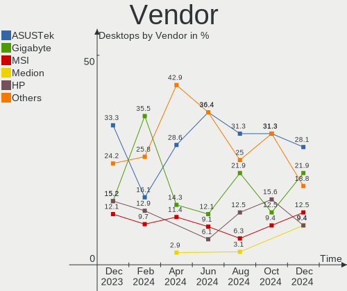
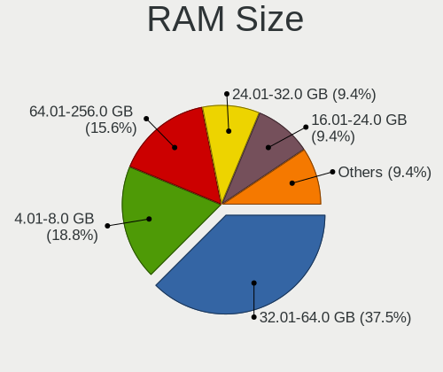
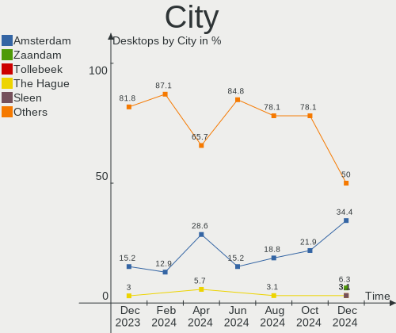

Linux in Netherlands - Hardware Trends (Desktops)
-------------------------------------------------

A project to identify most popular hardware characteristics and track their change
over time based on data collected by Linux users at https://Linux-Hardware.org.

Anyone can contribute to this report by the [hw-probe](https://github.com/linuxhw/hw-probe) tool:

    sudo -E hw-probe -all -upload

Contents
--------

* [ System ](#system)
  - [ OS                       ](#os)
  - [ OS Family                ](#os-family)
  - [ Kernel                   ](#kernel)
  - [ Kernel Family            ](#kernel-family)
  - [ Kernel Major Ver.        ](#kernel-major-ver)
  - [ Arch                     ](#arch)
  - [ DE                       ](#de)
  - [ Display Server           ](#display-server)
  - [ Display Manager          ](#display-manager)
  - [ OS Lang                  ](#os-lang)
  - [ Boot Mode                ](#boot-mode)
  - [ Filesystem               ](#filesystem)
  - [ Part. scheme             ](#part-scheme)
  - [ Dual Boot with Linux/BSD ](#dual-boot-with-linuxbsd)
  - [ Dual Boot (Win)          ](#dual-boot-win)

* [ Board ](#board)
  - [ Vendor                   ](#vendor)
  - [ Model                    ](#model)
  - [ Model Family             ](#model-family)
  - [ MFG Year                 ](#mfg-year)
  - [ Form Factor              ](#form-factor)
  - [ Secure Boot              ](#secure-boot)
  - [ Coreboot                 ](#coreboot)
  - [ RAM Size                 ](#ram-size)
  - [ RAM Used                 ](#ram-used)
  - [ Total Drives             ](#total-drives)
  - [ Has CD-ROM               ](#has-cd-rom)
  - [ Has Ethernet             ](#has-ethernet)
  - [ Has WiFi                 ](#has-wifi)
  - [ Has Bluetooth            ](#has-bluetooth)

* [ Location ](#location)
  - [ Country                  ](#country)
  - [ City                     ](#city)

* [ Drives ](#drives)
  - [ Drive Vendor             ](#drive-vendor)
  - [ Drive Model              ](#drive-model)
  - [ HDD Vendor               ](#hdd-vendor)
  - [ SSD Vendor               ](#ssd-vendor)
  - [ Drive Kind               ](#drive-kind)
  - [ Drive Connector          ](#drive-connector)
  - [ Drive Size               ](#drive-size)
  - [ Space Total              ](#space-total)
  - [ Space Used               ](#space-used)
  - [ Malfunc. Drives          ](#malfunc-drives)
  - [ Malfunc. Drive Vendor    ](#malfunc-drive-vendor)
  - [ Malfunc. HDD Vendor      ](#malfunc-hdd-vendor)
  - [ Malfunc. Drive Kind      ](#malfunc-drive-kind)
  - [ Failed Drives            ](#failed-drives)
  - [ Failed Drive Vendor      ](#failed-drive-vendor)
  - [ Drive Status             ](#drive-status)

* [ Storage controller ](#storage-controller)
  - [ Storage Vendor           ](#storage-vendor)
  - [ Storage Model            ](#storage-model)
  - [ Storage Kind             ](#storage-kind)

* [ Processor ](#processor)
  - [ CPU Vendor               ](#cpu-vendor)
  - [ CPU Model                ](#cpu-model)
  - [ CPU Model Family         ](#cpu-model-family)
  - [ CPU Cores                ](#cpu-cores)
  - [ CPU Sockets              ](#cpu-sockets)
  - [ CPU Threads              ](#cpu-threads)
  - [ CPU Op-Modes             ](#cpu-op-modes)
  - [ CPU Microcode            ](#cpu-microcode)
  - [ CPU Microarch            ](#cpu-microarch)

* [ Graphics ](#graphics)
  - [ GPU Vendor               ](#gpu-vendor)
  - [ GPU Model                ](#gpu-model)
  - [ GPU Combo                ](#gpu-combo)
  - [ GPU Driver               ](#gpu-driver)
  - [ GPU Memory               ](#gpu-memory)

* [ Monitor ](#monitor)
  - [ Monitor Vendor           ](#monitor-vendor)
  - [ Monitor Model            ](#monitor-model)
  - [ Monitor Resolution       ](#monitor-resolution)
  - [ Monitor Diagonal         ](#monitor-diagonal)
  - [ Monitor Width            ](#monitor-width)
  - [ Aspect Ratio             ](#aspect-ratio)
  - [ Monitor Area             ](#monitor-area)
  - [ Pixel Density            ](#pixel-density)
  - [ Multiple Monitors        ](#multiple-monitors)

* [ Network ](#network)
  - [ Net Controller Vendor    ](#net-controller-vendor)
  - [ Net Controller Model     ](#net-controller-model)
  - [ Wireless Vendor          ](#wireless-vendor)
  - [ Wireless Model           ](#wireless-model)
  - [ Ethernet Vendor          ](#ethernet-vendor)
  - [ Ethernet Model           ](#ethernet-model)
  - [ Net Controller Kind      ](#net-controller-kind)
  - [ Used Controller          ](#used-controller)
  - [ NICs                     ](#nics)
  - [ IPv6                     ](#ipv6)

* [ Bluetooth ](#bluetooth)
  - [ Bluetooth Vendor         ](#bluetooth-vendor)
  - [ Bluetooth Model          ](#bluetooth-model)

* [ Sound ](#sound)
  - [ Sound Vendor             ](#sound-vendor)
  - [ Sound Model              ](#sound-model)

* [ Memory ](#memory)
  - [ Memory Vendor            ](#memory-vendor)
  - [ Memory Model             ](#memory-model)
  - [ Memory Kind              ](#memory-kind)
  - [ Memory Form Factor       ](#memory-form-factor)
  - [ Memory Size              ](#memory-size)
  - [ Memory Speed             ](#memory-speed)

* [ Printers & scanners ](#printers--scanners)
  - [ Printer Vendor           ](#printer-vendor)
  - [ Printer Model            ](#printer-model)
  - [ Scanner Vendor           ](#scanner-vendor)
  - [ Scanner Model            ](#scanner-model)

* [ Camera ](#camera)
  - [ Camera Vendor            ](#camera-vendor)
  - [ Camera Model             ](#camera-model)

* [ Security ](#security)
  - [ Fingerprint Vendor       ](#fingerprint-vendor)
  - [ Fingerprint Model        ](#fingerprint-model)
  - [ Chipcard Vendor          ](#chipcard-vendor)
  - [ Chipcard Model           ](#chipcard-model)

* [ Unsupported ](#unsupported)
  - [ Unsupported Devices      ](#unsupported-devices)
  - [ Unsupported Device Types ](#unsupported-device-types)

System
------

OS
--

Installed operating systems

| Name                | Desktops | Percent |
|---------------------|----------|---------|
| Ubuntu 20.04        | 8        | 22.86%  |
| Ubuntu 22.04        | 5        | 14.29%  |
| Zorin 16            | 3        | 8.57%   |
| KDE neon 20.04      | 2        | 5.71%   |
| EndeavourOS Rolling | 2        | 5.71%   |
| Debian 11           | 2        | 5.71%   |
| Xubuntu 20.04       | 1        | 2.86%   |
| Xero Rolling        | 1        | 2.86%   |
| Ubuntu 18.04        | 1        | 2.86%   |
| Pop!_OS 22.04       | 1        | 2.86%   |
| openSUSE Leap-15.4  | 1        | 2.86%   |
| MocaccinoOS         | 1        | 2.86%   |
| Manjaro 21.2.5      | 1        | 2.86%   |
| Lubuntu 21.10       | 1        | 2.86%   |
| Linux Mint 20.3     | 1        | 2.86%   |
| Linux Mint 20.1     | 1        | 2.86%   |
| Fedora 37           | 1        | 2.86%   |
| Fedora 35           | 1        | 2.86%   |
| ArcoLinux Rolling   | 1        | 2.86%   |

OS Family
---------

OS without a version

| Name        | Desktops | Percent |
|-------------|----------|---------|
| Ubuntu      | 14       | 40%     |
| Zorin       | 3        | 8.57%   |
| Linux Mint  | 2        | 5.71%   |
| KDE neon    | 2        | 5.71%   |
| Fedora      | 2        | 5.71%   |
| EndeavourOS | 2        | 5.71%   |
| Debian      | 2        | 5.71%   |
| Xubuntu     | 1        | 2.86%   |
| Xero        | 1        | 2.86%   |
| Pop!_OS     | 1        | 2.86%   |
| openSUSE    | 1        | 2.86%   |
| MocaccinoOS | 1        | 2.86%   |
| Manjaro     | 1        | 2.86%   |
| Lubuntu     | 1        | 2.86%   |
| ArcoLinux   | 1        | 2.86%   |

Kernel
------

Version of the Linux kernel

| Version                                                | Desktops | Percent |
|--------------------------------------------------------|----------|---------|
| 5.13.0-41-generic                                      | 6        | 17.14%  |
| 5.13.0-40-generic                                      | 5        | 14.29%  |
| 5.15.0-27-generic                                      | 4        | 11.43%  |
| 5.4.0-109-generic                                      | 2        | 5.71%   |
| 5.17.5-arch1-1                                         | 2        | 5.71%   |
| 5.8.0-55-generic                                       | 1        | 2.86%   |
| 5.4.0-77-generic                                       | 1        | 2.86%   |
| 5.4.0-113-generic                                      | 1        | 2.86%   |
| 5.18.0-arch1-1                                         | 1        | 2.86%   |
| 5.18.0-0.rc5.20220505gita7391ad3572431a.43.fc37.x86_64 | 1        | 2.86%   |
| 5.17.9-arch1-1                                         | 1        | 2.86%   |
| 5.17.5-76051705-generic                                | 1        | 2.86%   |
| 5.17.5-200.fc35.x86_64                                 | 1        | 2.86%   |
| 5.16.0-0.bpo.4-amd64                                   | 1        | 2.86%   |
| 5.15.38-mocaccino                                      | 1        | 2.86%   |
| 5.15.35-1-pve                                          | 1        | 2.86%   |
| 5.15.0-30-generic                                      | 1        | 2.86%   |
| 5.14.21-150400.22-default                              | 1        | 2.86%   |
| 5.13.0-44-generic                                      | 1        | 2.86%   |
| 5.13.0-41-lowlatency                                   | 1        | 2.86%   |
| 5.10.105-1-MANJARO                                     | 1        | 2.86%   |

Kernel Family
-------------

Linux kernel without a distro release

| Version  | Desktops | Percent |
|----------|----------|---------|
| 5.13.0   | 13       | 37.14%  |
| 5.15.0   | 5        | 14.29%  |
| 5.4.0    | 4        | 11.43%  |
| 5.17.5   | 4        | 11.43%  |
| 5.18.0   | 2        | 5.71%   |
| 5.8.0    | 1        | 2.86%   |
| 5.17.9   | 1        | 2.86%   |
| 5.16.0   | 1        | 2.86%   |
| 5.15.38  | 1        | 2.86%   |
| 5.15.35  | 1        | 2.86%   |
| 5.14.21  | 1        | 2.86%   |
| 5.10.105 | 1        | 2.86%   |

Kernel Major Ver.
-----------------

Linux kernel major version

| Version | Desktops | Percent |
|---------|----------|---------|
| 5.13    | 13       | 37.14%  |
| 5.15    | 7        | 20%     |
| 5.17    | 5        | 14.29%  |
| 5.4     | 4        | 11.43%  |
| 5.18    | 2        | 5.71%   |
| 5.8     | 1        | 2.86%   |
| 5.16    | 1        | 2.86%   |
| 5.14    | 1        | 2.86%   |
| 5.10    | 1        | 2.86%   |

Arch
----

OS architecture (x86_64, i586, etc.)

| Name   | Desktops | Percent |
|--------|----------|---------|
| x86_64 | 34       | 97.14%  |
| i686   | 1        | 2.86%   |

DE
--

Desktop Environment

| Name       | Desktops | Percent |
|------------|----------|---------|
| GNOME      | 18       | 51.43%  |
| KDE5       | 6        | 17.14%  |
| XFCE       | 5        | 14.29%  |
| X-Cinnamon | 3        | 8.57%   |
| Unknown    | 2        | 5.71%   |
| LXQt       | 1        | 2.86%   |

Display Server
--------------

X11 or Wayland

| Name    | Desktops | Percent |
|---------|----------|---------|
| X11     | 27       | 77.14%  |
| Wayland | 5        | 14.29%  |
| Unknown | 2        | 5.71%   |
| Tty     | 1        | 2.86%   |

Display Manager
---------------

SDDM, LightDM, etc.

| Name    | Desktops | Percent |
|---------|----------|---------|
| GDM3    | 13       | 37.14%  |
| Unknown | 12       | 34.29%  |
| LightDM | 5        | 14.29%  |
| SDDM    | 4        | 11.43%  |
| GDM     | 1        | 2.86%   |

OS Lang
-------

Language

| Lang   | Desktops | Percent |
|--------|----------|---------|
| nl_NL  | 17       | 48.57%  |
| en_US  | 15       | 42.86%  |
| ru_RU  | 1        | 2.86%   |
| en_GB  | 1        | 2.86%   |
| C.UTF8 | 1        | 2.86%   |

Boot Mode
---------

EFI or BIOS

| Mode | Desktops | Percent |
|------|----------|---------|
| BIOS | 18       | 51.43%  |
| EFI  | 17       | 48.57%  |

Filesystem
----------

Type of filesystem

| Type  | Desktops | Percent |
|-------|----------|---------|
| Ext4  | 29       | 82.86%  |
| Btrfs | 6        | 17.14%  |

Part. scheme
------------

Scheme of partitioning

| Type    | Desktops | Percent |
|---------|----------|---------|
| Unknown | 25       | 71.43%  |
| GPT     | 8        | 22.86%  |
| MBR     | 2        | 5.71%   |

Dual Boot with Linux/BSD
------------------------

Hosting more than one Linux/BSD

| Dual boot | Desktops | Percent |
|-----------|----------|---------|
| No        | 32       | 91.43%  |
| Yes       | 3        | 8.57%   |

Dual Boot (Win)
---------------

Hosting Linux and Windows

| Dual boot | Desktops | Percent |
|-----------|----------|---------|
| No        | 23       | 65.71%  |
| Yes       | 12       | 34.29%  |

Board
-----

Vendor
------

Motherboard manufacturer

| Name                | Desktops | Percent |
|---------------------|----------|---------|
| ASUSTek Computer    | 10       | 28.57%  |
| MSI                 | 6        | 17.14%  |
| Gigabyte Technology | 5        | 14.29%  |
| Acer                | 4        | 11.43%  |
| Dell                | 3        | 8.57%   |
| ASRock              | 3        | 8.57%   |
| Hewlett-Packard     | 2        | 5.71%   |
| Foxconn             | 1        | 2.86%   |
| BESSTAR Tech        | 1        | 2.86%   |

Model
-----

Motherboard model

| Name                               | Desktops | Percent |
|------------------------------------|----------|---------|
| ASUS ROG STRIX B450-F GAMING       | 2        | 5.71%   |
| MSI MS-7C91                        | 1        | 2.86%   |
| MSI MS-7C02                        | 1        | 2.86%   |
| MSI MS-7B85                        | 1        | 2.86%   |
| MSI MS-7977                        | 1        | 2.86%   |
| MSI MS-7924                        | 1        | 2.86%   |
| MSI MS-7850                        | 1        | 2.86%   |
| HP Z230 SFF Workstation            | 1        | 2.86%   |
| HP Compaq dc7700 Small Form Factor | 1        | 2.86%   |
| Gigabyte P55A-UD3                  | 1        | 2.86%   |
| Gigabyte GB-BRR7H-4700             | 1        | 2.86%   |
| Gigabyte EP45-DS3P                 | 1        | 2.86%   |
| Gigabyte B550 AORUS ELITE V2       | 1        | 2.86%   |
| Gigabyte A320M-S2H                 | 1        | 2.86%   |
| Foxconn Pro 3300 Series SFF        | 1        | 2.86%   |
| Dell Studio Slim 540s              | 1        | 2.86%   |
| Dell OptiPlex 7010                 | 1        | 2.86%   |
| Dell OptiPlex 3020                 | 1        | 2.86%   |
| BESSTAR Tech HM80                  | 1        | 2.86%   |
| ASUS PRIME X570-PRO                | 1        | 2.86%   |
| ASUS P8Z68-V LX                    | 1        | 2.86%   |
| ASUS P8B75-M LE                    | 1        | 2.86%   |
| ASUS P7P55D DELUXE                 | 1        | 2.86%   |
| ASUS P5KPL-SE                      | 1        | 2.86%   |
| ASUS F1A55-M LX                    | 1        | 2.86%   |
| ASUS All Series                    | 1        | 2.86%   |
| ASUS A8R-MX                        | 1        | 2.86%   |
| ASRock Business Nexxt              | 1        | 2.86%   |
| ASRock B85M DASH/OL R2.0           | 1        | 2.86%   |
| ASRock B450M Pro4                  | 1        | 2.86%   |
| Acer Aspire XC100                  | 1        | 2.86%   |
| Acer Aspire XC-886                 | 1        | 2.86%   |
| Acer Aspire X3995                  | 1        | 2.86%   |
| Acer Aspire G7750                  | 1        | 2.86%   |

Model Family
------------

Motherboard model prefix

| Name                   | Desktops | Percent |
|------------------------|----------|---------|
| Acer Aspire            | 4        | 11.43%  |
| Dell OptiPlex          | 2        | 5.71%   |
| ASUS ROG               | 2        | 5.71%   |
| MSI MS-7C91            | 1        | 2.86%   |
| MSI MS-7C02            | 1        | 2.86%   |
| MSI MS-7B85            | 1        | 2.86%   |
| MSI MS-7977            | 1        | 2.86%   |
| MSI MS-7924            | 1        | 2.86%   |
| MSI MS-7850            | 1        | 2.86%   |
| HP Z230                | 1        | 2.86%   |
| HP Compaq              | 1        | 2.86%   |
| Gigabyte P55A-UD3      | 1        | 2.86%   |
| Gigabyte GB-BRR7H-4700 | 1        | 2.86%   |
| Gigabyte EP45-DS3P     | 1        | 2.86%   |
| Gigabyte B550          | 1        | 2.86%   |
| Gigabyte A320M-S2H     | 1        | 2.86%   |
| Foxconn Pro            | 1        | 2.86%   |
| Dell Studio            | 1        | 2.86%   |
| BESSTAR Tech HM80      | 1        | 2.86%   |
| ASUS PRIME             | 1        | 2.86%   |
| ASUS P8Z68-V           | 1        | 2.86%   |
| ASUS P8B75-M           | 1        | 2.86%   |
| ASUS P7P55D            | 1        | 2.86%   |
| ASUS P5KPL-SE          | 1        | 2.86%   |
| ASUS F1A55-M           | 1        | 2.86%   |
| ASUS All               | 1        | 2.86%   |
| ASUS A8R-MX            | 1        | 2.86%   |
| ASRock Business        | 1        | 2.86%   |
| ASRock B85M            | 1        | 2.86%   |
| ASRock B450M           | 1        | 2.86%   |

MFG Year
--------

Motherboard manufacture year

| Year | Desktops | Percent |
|------|----------|---------|
| 2018 | 6        | 17.14%  |
| 2012 | 4        | 11.43%  |
| 2014 | 3        | 8.57%   |
| 2013 | 3        | 8.57%   |
| 2008 | 3        | 8.57%   |
| 2021 | 2        | 5.71%   |
| 2020 | 2        | 5.71%   |
| 2019 | 2        | 5.71%   |
| 2011 | 2        | 5.71%   |
| 2009 | 2        | 5.71%   |
| 2017 | 1        | 2.86%   |
| 2016 | 1        | 2.86%   |
| 2015 | 1        | 2.86%   |
| 2010 | 1        | 2.86%   |
| 2006 | 1        | 2.86%   |
| 2005 | 1        | 2.86%   |

Form Factor
-----------

Physical design of the computer

| Name    | Desktops | Percent |
|---------|----------|---------|
| Desktop | 35       | 100%    |

Secure Boot
-----------

Enabled or disabled

| State    | Desktops | Percent |
|----------|----------|---------|
| Disabled | 33       | 94.29%  |
| Enabled  | 2        | 5.71%   |

Coreboot
--------

Have coreboot on board

| Used | Desktops | Percent |
|------|----------|---------|
| No   | 35       | 100%    |

RAM Size
--------

Total RAM memory

| Size in GB  | Desktops | Percent |
|-------------|----------|---------|
| 8.01-16.0   | 11       | 31.43%  |
| 32.01-64.0  | 7        | 20%     |
| 16.01-24.0  | 7        | 20%     |
| 3.01-4.0    | 5        | 14.29%  |
| 1.01-2.0    | 2        | 5.71%   |
| 4.01-8.0    | 1        | 2.86%   |
| 24.01-32.0  | 1        | 2.86%   |
| 64.01-256.0 | 1        | 2.86%   |

RAM Used
--------

Used RAM memory

| Used GB    | Desktops | Percent |
|------------|----------|---------|
| 1.01-2.0   | 17       | 48.57%  |
| 4.01-8.0   | 5        | 14.29%  |
| 2.01-3.0   | 4        | 11.43%  |
| 3.01-4.0   | 3        | 8.57%   |
| 0.51-1.0   | 3        | 8.57%   |
| 32.01-64.0 | 1        | 2.86%   |
| 8.01-16.0  | 1        | 2.86%   |
| 0.01-0.5   | 1        | 2.86%   |

Total Drives
------------

Number of drives on board

| Drives | Desktops | Percent |
|--------|----------|---------|
| 2      | 13       | 37.14%  |
| 1      | 11       | 31.43%  |
| 3      | 6        | 17.14%  |
| 4      | 3        | 8.57%   |
| 7      | 1        | 2.86%   |
| 5      | 1        | 2.86%   |

Has CD-ROM
----------

Has CD-ROM on board

| Presented | Desktops | Percent |
|-----------|----------|---------|
| Yes       | 19       | 54.29%  |
| No        | 16       | 45.71%  |

Has Ethernet
------------

Has Ethernet on board

| Presented | Desktops | Percent |
|-----------|----------|---------|
| Yes       | 35       | 100%    |

Has WiFi
--------

Has WiFi module

| Presented | Desktops | Percent |
|-----------|----------|---------|
| No        | 26       | 74.29%  |
| Yes       | 9        | 25.71%  |

Has Bluetooth
-------------

Has Bluetooth module

| Presented | Desktops | Percent |
|-----------|----------|---------|
| No        | 27       | 77.14%  |
| Yes       | 8        | 22.86%  |

Location
--------

Country
-------

Geographic location (country)

| Country     | Desktops | Percent |
|-------------|----------|---------|
| Netherlands | 35       | 100%    |

City
----

Geographic location (city)

| City          | Desktops | Percent |
|---------------|----------|---------|
| The Hague     | 2        | 5.71%   |
| Schiedam      | 2        | 5.71%   |
| Putte         | 2        | 5.71%   |
| Leiden        | 2        | 5.71%   |
| Haarlem       | 2        | 5.71%   |
| Amsterdam     | 2        | 5.71%   |
| Almere Stad   | 2        | 5.71%   |
| Zierikzee     | 1        | 2.86%   |
| Wormerveer    | 1        | 2.86%   |
| Voorst        | 1        | 2.86%   |
| Velserbroek   | 1        | 2.86%   |
| Utrecht       | 1        | 2.86%   |
| Tilburg       | 1        | 2.86%   |
| Rotterdam     | 1        | 2.86%   |
| Overveen      | 1        | 2.86%   |
| Oosterhout    | 1        | 2.86%   |
| Noardburgum   | 1        | 2.86%   |
| Naaldwijk     | 1        | 2.86%   |
| Krabbendijke  | 1        | 2.86%   |
| Hengelo       | 1        | 2.86%   |
| Groningen     | 1        | 2.86%   |
| Drunen        | 1        | 2.86%   |
| Den Burg      | 1        | 2.86%   |
| Damwald       | 1        | 2.86%   |
| Breda         | 1        | 2.86%   |
| Baarle-Nassau | 1        | 2.86%   |
| Assen         | 1        | 2.86%   |
| Arnhem        | 1        | 2.86%   |

Drives
------

Drive Vendor
------------

Hard drive vendors

| Vendor              | Desktops | Drives | Percent |
|---------------------|----------|--------|---------|
| Samsung Electronics | 15       | 24     | 26.79%  |
| WDC                 | 10       | 22     | 17.86%  |
| Seagate             | 10       | 11     | 17.86%  |
| Kingston            | 6        | 7      | 10.71%  |
| Crucial             | 3        | 3      | 5.36%   |
| SanDisk             | 2        | 2      | 3.57%   |
| Hitachi             | 2        | 2      | 3.57%   |
| SK Hynix            | 1        | 1      | 1.79%   |
| PNY                 | 1        | 1      | 1.79%   |
| OCZ                 | 1        | 2      | 1.79%   |
| Micron Technology   | 1        | 1      | 1.79%   |
| MAXTOR              | 1        | 1      | 1.79%   |
| Intel               | 1        | 1      | 1.79%   |
| HGST                | 1        | 1      | 1.79%   |
| China               | 1        | 1      | 1.79%   |

Drive Model
-----------

Hard drive models

| Model                              | Desktops | Percent |
|------------------------------------|----------|---------|
| Samsung SSD 870 QVO 1TB            | 2        | 2.86%   |
| Samsung SSD 850 EVO 250GB          | 2        | 2.86%   |
| Samsung NVMe SSD Drive 500GB       | 2        | 2.86%   |
| Samsung NVMe SSD Drive 1TB         | 2        | 2.86%   |
| Samsung HD103SJ 1TB                | 2        | 2.86%   |
| Kingston SV300S37A120G 120GB SSD   | 2        | 2.86%   |
| WDC WDS500G2B0A-00SM50 500GB SSD   | 1        | 1.43%   |
| WDC WDS250G1B0A-00H9H0 250GB SSD   | 1        | 1.43%   |
| WDC WD800JD-60LSA5 80GB            | 1        | 1.43%   |
| WDC WD6400BPVT-16HXZT1 640GB       | 1        | 1.43%   |
| WDC WD6400BEVT-22A0RT0 640GB       | 1        | 1.43%   |
| WDC WD40EZRZ-22GXCB0 4TB           | 1        | 1.43%   |
| WDC WD40EZAZ-00SF3B0 4TB           | 1        | 1.43%   |
| WDC WD40EFZX-68AWUN0 4TB           | 1        | 1.43%   |
| WDC WD20EZRX-00DC0B0 2TB           | 1        | 1.43%   |
| WDC WD20EFRX-68EUZN0 2TB           | 1        | 1.43%   |
| WDC WD20EARS-00MVWB0 2TB           | 1        | 1.43%   |
| WDC WD1600BB-55GUC0 160GB          | 1        | 1.43%   |
| WDC WD10EZEX-08WN4A0 1TB           | 1        | 1.43%   |
| WDC WD10EVDS-63U8B1 1TB            | 1        | 1.43%   |
| WDC WD1003FZEX-00K3CA0 1TB         | 1        | 1.43%   |
| WDC WD1002FBYS-02A6B0 1TB          | 1        | 1.43%   |
| SK Hynix HFM256GDJTNG-8310A 256GB  | 1        | 1.43%   |
| Seagate ST6000VN001-2BB186 6TB     | 1        | 1.43%   |
| Seagate ST500LX003-1AC15G 500GB    | 1        | 1.43%   |
| Seagate ST500LM021-1KJ152 500GB    | 1        | 1.43%   |
| Seagate ST500DM002-1BD142 500GB    | 1        | 1.43%   |
| Seagate ST3320311CS 320GB          | 1        | 1.43%   |
| Seagate ST3250820AS 250GB          | 1        | 1.43%   |
| Seagate ST31000528AS 1TB           | 1        | 1.43%   |
| Seagate ST3000DM007-1WY10G 3TB     | 1        | 1.43%   |
| Seagate ST2000DM001-1ER164 2TB     | 1        | 1.43%   |
| Seagate ST1000DM010-2EP102 1TB     | 1        | 1.43%   |
| Seagate ST1000DM003-1ER162 1TB     | 1        | 1.43%   |
| SanDisk SD7TB3Q- 256GB SSD         | 1        | 1.43%   |
| Sandisk NVMe SSD Drive 1TB         | 1        | 1.43%   |
| Samsung SSD 980 500GB              | 1        | 1.43%   |
| Samsung SSD 970 EVO 1TB            | 1        | 1.43%   |
| Samsung SSD 960 EVO 500GB          | 1        | 1.43%   |
| Samsung SSD 870 QVO 8TB            | 1        | 1.43%   |
| Samsung SSD 870 EVO 500GB          | 1        | 1.43%   |
| Samsung SSD 860 EVO 250GB          | 1        | 1.43%   |
| Samsung SSD 850 PRO 256GB          | 1        | 1.43%   |
| Samsung SSD 850 EVO 1TB            | 1        | 1.43%   |
| Samsung SSD 850 EVO 120GB          | 1        | 1.43%   |
| Samsung SSD 750 EVO 500GB          | 1        | 1.43%   |
| Samsung HD204UI 2TB                | 1        | 1.43%   |
| PNY EU SSD CS1311 120GB            | 1        | 1.43%   |
| OCZ REVODRIVE 64GB SSD             | 1        | 1.43%   |
| Micron MTFDDAK256MAM-1K1 256GB SSD | 1        | 1.43%   |
| MAXTOR 6L250R0 256GB               | 1        | 1.43%   |
| Kingston SV300S37A240G 240GB SSD   | 1        | 1.43%   |
| Kingston SKC600MS256G 256GB SSD    | 1        | 1.43%   |
| Kingston SH103S3120G 120GB SSD     | 1        | 1.43%   |
| Kingston SA400S37240G 240GB SSD    | 1        | 1.43%   |
| Kingston OM8PCP3512F-A02 512GB     | 1        | 1.43%   |
| Intel NVMe SSD Drive 1024GB        | 1        | 1.43%   |
| Hitachi HDS721025CLA682 250GB      | 1        | 1.43%   |
| Hitachi HDS721010CLA332 1TB        | 1        | 1.43%   |
| HGST HUS724020ALA640 2TB           | 1        | 1.43%   |

HDD Vendor
----------

Hard disk drive vendors

| Vendor              | Desktops | Drives | Percent |
|---------------------|----------|--------|---------|
| WDC                 | 10       | 20     | 37.04%  |
| Seagate             | 10       | 11     | 37.04%  |
| Samsung Electronics | 3        | 4      | 11.11%  |
| Hitachi             | 2        | 2      | 7.41%   |
| MAXTOR              | 1        | 1      | 3.7%    |
| HGST                | 1        | 1      | 3.7%    |

SSD Vendor
----------

Solid state drive vendors

| Vendor              | Desktops | Drives | Percent |
|---------------------|----------|--------|---------|
| Samsung Electronics | 10       | 12     | 40%     |
| Kingston            | 5        | 6      | 20%     |
| Crucial             | 3        | 3      | 12%     |
| WDC                 | 2        | 2      | 8%      |
| SanDisk             | 1        | 1      | 4%      |
| PNY                 | 1        | 1      | 4%      |
| OCZ                 | 1        | 2      | 4%      |
| Micron Technology   | 1        | 1      | 4%      |
| China               | 1        | 1      | 4%      |

Drive Kind
----------

HDD or SSD

| Kind | Desktops | Drives | Percent |
|------|----------|--------|---------|
| HDD  | 24       | 39     | 43.64%  |
| SSD  | 21       | 29     | 38.18%  |
| NVMe | 10       | 12     | 18.18%  |

Drive Connector
---------------

SATA, SAS, NVMe, etc.

| Type | Desktops | Drives | Percent |
|------|----------|--------|---------|
| SATA | 33       | 68     | 76.74%  |
| NVMe | 10       | 12     | 23.26%  |

Drive Size
----------

Size of hard drive

| Size in TB | Desktops | Drives | Percent |
|------------|----------|--------|---------|
| 0.01-0.5   | 24       | 32     | 48%     |
| 0.51-1.0   | 15       | 17     | 30%     |
| 1.01-2.0   | 5        | 11     | 10%     |
| 3.01-4.0   | 3        | 5      | 6%      |
| 4.01-10.0  | 2        | 2      | 4%      |
| 2.01-3.0   | 1        | 1      | 2%      |

Space Total
-----------

Amount of disk space available on the file system

| Size in GB     | Desktops | Percent |
|----------------|----------|---------|
| 101-250        | 11       | 31.43%  |
| More than 3000 | 7        | 20%     |
| 251-500        | 6        | 17.14%  |
| 1001-2000      | 4        | 11.43%  |
| 501-1000       | 3        | 8.57%   |
| 2001-3000      | 2        | 5.71%   |
| 51-100         | 2        | 5.71%   |

Space Used
----------

Amount of used disk space

| Used GB        | Desktops | Percent |
|----------------|----------|---------|
| 1-20           | 11       | 31.43%  |
| 501-1000       | 6        | 17.14%  |
| 21-50          | 5        | 14.29%  |
| 101-250        | 4        | 11.43%  |
| 51-100         | 4        | 11.43%  |
| 1001-2000      | 2        | 5.71%   |
| More than 3000 | 1        | 2.86%   |
| 251-500        | 1        | 2.86%   |
| 2001-3000      | 1        | 2.86%   |

Malfunc. Drives
---------------

Drive models with a malfunction

| Model                        | Desktops | Drives | Percent |
|------------------------------|----------|--------|---------|
| Crucial CT500MX500SSD1 500GB | 1        | 1      | 100%    |

Malfunc. Drive Vendor
---------------------

Vendors of faulty drives

| Vendor  | Desktops | Drives | Percent |
|---------|----------|--------|---------|
| Crucial | 1        | 1      | 100%    |

Malfunc. HDD Vendor
-------------------

Vendors of faulty HDD drives

Zero info for selected period =(

Malfunc. Drive Kind
-------------------

Kinds of faulty drives

| Kind | Desktops | Drives | Percent |
|------|----------|--------|---------|
| SSD  | 1        | 1      | 100%    |

Failed Drives
-------------

Failed drive models

Zero info for selected period =(

Failed Drive Vendor
-------------------

Failed drive vendors

Zero info for selected period =(

Drive Status
------------

Number of failed and malfunc. drives

| Status   | Desktops | Drives | Percent |
|----------|----------|--------|---------|
| Detected | 26       | 58     | 72.22%  |
| Works    | 9        | 21     | 25%     |
| Malfunc  | 1        | 1      | 2.78%   |

Storage controller
------------------

Storage Vendor
--------------

Storage controller vendors

| Vendor                        | Desktops | Percent |
|-------------------------------|----------|---------|
| Intel                         | 22       | 42.31%  |
| AMD                           | 12       | 23.08%  |
| Samsung Electronics           | 6        | 11.54%  |
| Marvell Technology Group      | 3        | 5.77%   |
| JMicron Technology            | 2        | 3.85%   |
| VIA Technologies              | 1        | 1.92%   |
| ULi Electronics               | 1        | 1.92%   |
| SK Hynix                      | 1        | 1.92%   |
| Silicon Image                 | 1        | 1.92%   |
| Sandisk                       | 1        | 1.92%   |
| Kingston Technology Company   | 1        | 1.92%   |
| Integrated Technology Express | 1        | 1.92%   |

Storage Model
-------------

Storage controller models

| Model                                                                          | Desktops | Percent |
|--------------------------------------------------------------------------------|----------|---------|
| AMD FCH SATA Controller [AHCI mode]                                            | 6        | 9.52%   |
| Intel 8 Series/C220 Series Chipset Family 6-port SATA Controller 1 [AHCI mode] | 5        | 7.94%   |
| AMD 400 Series Chipset SATA Controller                                         | 5        | 7.94%   |
| Samsung NVMe SSD Controller SM961/PM961/SM963                                  | 2        | 3.17%   |
| Samsung NVMe SSD Controller 980                                                | 2        | 3.17%   |
| JMicron JMB363 SATA/IDE Controller                                             | 2        | 3.17%   |
| Intel 9 Series Chipset Family SATA Controller [AHCI Mode]                      | 2        | 3.17%   |
| Intel 82801JI (ICH10 Family) 4 port SATA IDE Controller #1                     | 2        | 3.17%   |
| Intel 82801JI (ICH10 Family) 2 port SATA IDE Controller #2                     | 2        | 3.17%   |
| Intel 7 Series/C210 Series Chipset Family 6-port SATA Controller [AHCI mode]   | 2        | 3.17%   |
| Intel 6 Series/C200 Series Chipset Family 6 port Desktop SATA AHCI Controller  | 2        | 3.17%   |
| Intel 5 Series/3400 Series Chipset 6 port SATA AHCI Controller                 | 2        | 3.17%   |
| AMD 500 Series Chipset SATA Controller                                         | 2        | 3.17%   |
| VIA VT6421 IDE/SATA Controller                                                 | 1        | 1.59%   |
| ULi ULi 5287 SATA                                                              | 1        | 1.59%   |
| ULi M5229 IDE                                                                  | 1        | 1.59%   |
| SK Hynix BC501 NVMe Solid State Drive                                          | 1        | 1.59%   |
| Silicon Image SiI 3124 PCI-X Serial ATA Controller                             | 1        | 1.59%   |
| Sandisk WD Blue SN550 NVMe SSD                                                 | 1        | 1.59%   |
| Samsung NVMe SSD Controller SM981/PM981/PM983                                  | 1        | 1.59%   |
| Samsung NVMe SSD Controller PM9A1/PM9A3/980PRO                                 | 1        | 1.59%   |
| Marvell Group 88SE9215 PCIe 2.0 x1 4-port SATA 6 Gb/s Controller               | 1        | 1.59%   |
| Marvell Group 88SE9172 SATA 6Gb/s Controller                                   | 1        | 1.59%   |
| Marvell Group 88SE9120 SATA 6Gb/s Controller                                   | 1        | 1.59%   |
| Kingston Company Company Non-Volatile memory controller                        | 1        | 1.59%   |
| Intel SSD 660P Series                                                          | 1        | 1.59%   |
| Intel Q170/Q150/B150/H170/H110/Z170/CM236 Chipset SATA Controller [AHCI Mode]  | 1        | 1.59%   |
| Intel NM10/ICH7 Family SATA Controller [IDE mode]                              | 1        | 1.59%   |
| Intel 82801JI (ICH10 Family) SATA AHCI Controller                              | 1        | 1.59%   |
| Intel 82801H (ICH8 Family) 4 port SATA Controller [IDE mode]                   | 1        | 1.59%   |
| Intel 82801G (ICH7 Family) IDE Controller                                      | 1        | 1.59%   |
| Intel 7 Series/C210 Series Chipset Family 4-port SATA Controller [IDE mode]    | 1        | 1.59%   |
| Intel 7 Series/C210 Series Chipset Family 2-port SATA Controller [IDE mode]    | 1        | 1.59%   |
| Intel 200 Series PCH SATA controller [AHCI mode]                               | 1        | 1.59%   |
| Integrated Express IT8213 IDE Controller                                       | 1        | 1.59%   |
| AMD SB7x0/SB8x0/SB9x0 SATA Controller [AHCI mode]                              | 1        | 1.59%   |
| AMD SB7x0/SB8x0/SB9x0 IDE Controller                                           | 1        | 1.59%   |
| AMD FCH SATA Controller [IDE mode]                                             | 1        | 1.59%   |
| AMD FCH SATA Controller D                                                      | 1        | 1.59%   |
| AMD FCH IDE Controller                                                         | 1        | 1.59%   |

Storage Kind
------------

Kind of storage controller (IDE, SATA, NVMe, SAS, ...)

| Kind | Desktops | Percent |
|------|----------|---------|
| SATA | 28       | 54.9%   |
| NVMe | 10       | 19.61%  |
| IDE  | 10       | 19.61%  |
| RAID | 3        | 5.88%   |

Processor
---------

CPU Vendor
----------

Processor vendors

| Vendor | Desktops | Percent |
|--------|----------|---------|
| Intel  | 21       | 60%     |
| AMD    | 14       | 40%     |

CPU Model
---------

Processor models

| Model                                       | Desktops | Percent |
|---------------------------------------------|----------|---------|
| Intel Core i5-4590 CPU @ 3.30GHz            | 3        | 8.57%   |
| AMD Ryzen 7 2700 Eight-Core Processor       | 2        | 5.71%   |
| Intel Xeon CPU E3-1230 v3 @ 3.30GHz         | 1        | 2.86%   |
| Intel Xeon CPU E3-1225 v3 @ 3.20GHz         | 1        | 2.86%   |
| Intel Core i7-6700K CPU @ 4.00GHz           | 1        | 2.86%   |
| Intel Core i7-4790K CPU @ 4.00GHz           | 1        | 2.86%   |
| Intel Core i7-3770 CPU @ 3.40GHz            | 1        | 2.86%   |
| Intel Core i7-2600K CPU @ 3.40GHz           | 1        | 2.86%   |
| Intel Core i7 CPU 920 @ 2.67GHz             | 1        | 2.86%   |
| Intel Core i7 CPU 870 @ 2.93GHz             | 1        | 2.86%   |
| Intel Core i5-9400 CPU @ 2.90GHz            | 1        | 2.86%   |
| Intel Core i5-3570 CPU @ 3.40GHz            | 1        | 2.86%   |
| Intel Core i5 CPU 750 @ 2.67GHz             | 1        | 2.86%   |
| Intel Core i3-3220 CPU @ 3.30GHz            | 1        | 2.86%   |
| Intel Core i3-2120 CPU @ 3.30GHz            | 1        | 2.86%   |
| Intel Core 2 Quad CPU Q9650 @ 3.00GHz       | 1        | 2.86%   |
| Intel Core 2 Quad CPU Q9400 @ 2.66GHz       | 1        | 2.86%   |
| Intel Core 2 Quad CPU Q8400 @ 2.66GHz       | 1        | 2.86%   |
| Intel Core 2 CPU 6300 @ 1.86GHz             | 1        | 2.86%   |
| Intel Celeron CPU G1840 @ 2.80GHz           | 1        | 2.86%   |
| AMD Ryzen 9 3900X 12-Core Processor         | 1        | 2.86%   |
| AMD Ryzen 7 5800X 8-Core Processor          | 1        | 2.86%   |
| AMD Ryzen 7 4800U with Radeon Graphics      | 1        | 2.86%   |
| AMD Ryzen 7 4700U with Radeon Graphics      | 1        | 2.86%   |
| AMD Ryzen 7 3700X 8-Core Processor          | 1        | 2.86%   |
| AMD Ryzen 5 5600X 6-Core Processor          | 1        | 2.86%   |
| AMD Ryzen 5 5600 6-Core Processor           | 1        | 2.86%   |
| AMD Ryzen 5 2600 Six-Core Processor         | 1        | 2.86%   |
| AMD Ryzen 3 2200G with Radeon Vega Graphics | 1        | 2.86%   |
| AMD E1-1500 APU with Radeon HD Graphics     | 1        | 2.86%   |
| AMD Athlon 64 X2 Dual Core Processor 3800+  | 1        | 2.86%   |
| AMD A4-3400 APU with Radeon HD Graphics     | 1        | 2.86%   |

CPU Model Family
----------------

Processor model prefix

| Model             | Desktops | Percent |
|-------------------|----------|---------|
| Intel Core i7     | 6        | 17.14%  |
| Intel Core i5     | 6        | 17.14%  |
| AMD Ryzen 7       | 6        | 17.14%  |
| Intel Core 2 Quad | 3        | 8.57%   |
| AMD Ryzen 5       | 3        | 8.57%   |
| Intel Xeon        | 2        | 5.71%   |
| Intel Core i3     | 2        | 5.71%   |
| Intel Core 2      | 1        | 2.86%   |
| Intel Celeron     | 1        | 2.86%   |
| AMD Ryzen 9       | 1        | 2.86%   |
| AMD Ryzen 3       | 1        | 2.86%   |
| AMD E1            | 1        | 2.86%   |
| AMD Athlon 64 X2  | 1        | 2.86%   |
| AMD A4            | 1        | 2.86%   |

CPU Cores
---------

Number of processor cores

| Number | Desktops | Percent |
|--------|----------|---------|
| 4      | 17       | 48.57%  |
| 2      | 7        | 20%     |
| 8      | 5        | 14.29%  |
| 6      | 4        | 11.43%  |
| 12     | 1        | 2.86%   |
| 1      | 1        | 2.86%   |

CPU Sockets
-----------

Number of sockets

| Number | Desktops | Percent |
|--------|----------|---------|
| 1      | 35       | 100%    |

CPU Threads
-----------

Threads per core (Hyper-Threading)

| Number | Desktops | Percent |
|--------|----------|---------|
| 2      | 18       | 51.43%  |
| 1      | 17       | 48.57%  |

CPU Op-Modes
------------

CPU Operation Modes (32-bit, 64-bit)

| Op mode        | Desktops | Percent |
|----------------|----------|---------|
| 32-bit, 64-bit | 35       | 100%    |

CPU Microcode
-------------

Microcode number

| Number     | Desktops | Percent |
|------------|----------|---------|
| Unknown    | 9        | 25.71%  |
| 0x306c3    | 5        | 14.29%  |
| 0x306a9    | 3        | 8.57%   |
| 0x206a7    | 2        | 5.71%   |
| 0x106e5    | 2        | 5.71%   |
| 0x0a201016 | 2        | 5.71%   |
| 0x0800820d | 2        | 5.71%   |
| 0x906ea    | 1        | 2.86%   |
| 0x6f2      | 1        | 2.86%   |
| 0x506e3    | 1        | 2.86%   |
| 0x106a5    | 1        | 2.86%   |
| 0x1067a    | 1        | 2.86%   |
| 0x0a201204 | 1        | 2.86%   |
| 0x08701021 | 1        | 2.86%   |
| 0x08600103 | 1        | 2.86%   |
| 0x08101016 | 1        | 2.86%   |
| 0x03000027 | 1        | 2.86%   |

CPU Microarch
-------------

Microarchitecture

| Name        | Desktops | Percent |
|-------------|----------|---------|
| Haswell     | 7        | 20%     |
| Zen 2       | 4        | 11.43%  |
| Zen+        | 3        | 8.57%   |
| Zen 3       | 3        | 8.57%   |
| Penryn      | 3        | 8.57%   |
| Nehalem     | 3        | 8.57%   |
| IvyBridge   | 3        | 8.57%   |
| SandyBridge | 2        | 5.71%   |
| Zen         | 1        | 2.86%   |
| Skylake     | 1        | 2.86%   |
| KabyLake    | 1        | 2.86%   |
| K8 Hammer   | 1        | 2.86%   |
| K10 Llano   | 1        | 2.86%   |
| Core        | 1        | 2.86%   |
| Bobcat      | 1        | 2.86%   |

Graphics
--------

GPU Vendor
----------

Vendors of graphics cards

| Vendor | Desktops | Percent |
|--------|----------|---------|
| Nvidia | 18       | 47.37%  |
| AMD    | 14       | 36.84%  |
| Intel  | 6        | 15.79%  |

GPU Model
---------

Graphics card models

| Model                                                                       | Desktops | Percent |
|-----------------------------------------------------------------------------|----------|---------|
| Nvidia GP108 [GeForce GT 1030]                                              | 3        | 7.69%   |
| Nvidia GP107 [GeForce GTX 1050 Ti]                                          | 2        | 5.13%   |
| Nvidia GM206 [GeForce GTX 960]                                              | 2        | 5.13%   |
| Intel Xeon E3-1200 v3/4th Gen Core Processor Integrated Graphics Controller | 2        | 5.13%   |
| AMD Renoir                                                                  | 2        | 5.13%   |
| Nvidia GT216 [GeForce GT 220]                                               | 1        | 2.56%   |
| Nvidia GT215 [GeForce GT 240]                                               | 1        | 2.56%   |
| Nvidia GP104 [GeForce GTX 1080]                                             | 1        | 2.56%   |
| Nvidia GM107 [GeForce GTX 750 Ti]                                           | 1        | 2.56%   |
| Nvidia GK208B [GeForce GT 710]                                              | 1        | 2.56%   |
| Nvidia GK107GL [Quadro K600]                                                | 1        | 2.56%   |
| Nvidia GF119 [GeForce GT 610]                                               | 1        | 2.56%   |
| Nvidia GF114 [GeForce GTX 560]                                              | 1        | 2.56%   |
| Nvidia GF114 [GeForce GTX 560 Ti]                                           | 1        | 2.56%   |
| Nvidia GF106GL [Quadro 2000]                                                | 1        | 2.56%   |
| Nvidia GA102 [GeForce RTX 3080 Ti]                                          | 1        | 2.56%   |
| Nvidia G96C [GeForce 9500 GT]                                               | 1        | 2.56%   |
| Intel Xeon E3-1200 v3 Processor Integrated Graphics Controller              | 1        | 2.56%   |
| Intel Xeon E3-1200 v2/3rd Gen Core processor Graphics Controller            | 1        | 2.56%   |
| Intel CoffeeLake-S GT2 [UHD Graphics 630]                                   | 1        | 2.56%   |
| Intel 2nd Generation Core Processor Family Integrated Graphics Controller   | 1        | 2.56%   |
| AMD Wrestler [Radeon HD 7310]                                               | 1        | 2.56%   |
| AMD Turks PRO [Radeon HD 7570]                                              | 1        | 2.56%   |
| AMD Tahiti XT [Radeon HD 7970/8970 OEM / R9 280X]                           | 1        | 2.56%   |
| AMD SuperSumo [Radeon HD 6410D]                                             | 1        | 2.56%   |
| AMD RV710 [Radeon HD 4350/4550]                                             | 1        | 2.56%   |
| AMD RS482/RS485 [Radeon Xpress 1100/1150]                                   | 1        | 2.56%   |
| AMD Raven Ridge [Radeon Vega Series / Radeon Vega Mobile Series]            | 1        | 2.56%   |
| AMD Navi 22 [Radeon RX 6700/6700 XT/6750 XT / 6800M]                        | 1        | 2.56%   |
| AMD Navi 21 [Radeon RX 6800/6800 XT / 6900 XT]                              | 1        | 2.56%   |
| AMD Hawaii PRO [Radeon R9 290/390]                                          | 1        | 2.56%   |
| AMD Cedar [Radeon HD 5000/6000/7350/8350 Series]                            | 1        | 2.56%   |
| AMD Baffin [Radeon RX 460/560D / Pro 450/455/460/555/555X/560/560X]         | 1        | 2.56%   |

GPU Combo
---------

Combinations of graphics cards

| Name                     | Desktops | Percent |
|--------------------------|----------|---------|
| 1 x Nvidia               | 17       | 48.57%  |
| 1 x AMD                  | 13       | 37.14%  |
| 1 x Intel                | 4        | 11.43%  |
| Intel + AMD + 1 x Nvidia | 1        | 2.86%   |

GPU Driver
----------

Free vs proprietary

| Driver      | Desktops | Percent |
|-------------|----------|---------|
| Free        | 25       | 71.43%  |
| Proprietary | 9        | 25.71%  |
| Unknown     | 1        | 2.86%   |

GPU Memory
----------

Total video memory

| Size in GB | Desktops | Percent |
|------------|----------|---------|
| Unknown    | 13       | 37.14%  |
| 0.51-1.0   | 7        | 20%     |
| 3.01-4.0   | 4        | 11.43%  |
| 0.01-0.5   | 4        | 11.43%  |
| 1.01-2.0   | 3        | 8.57%   |
| 8.01-16.0  | 3        | 8.57%   |
| 7.01-8.0   | 1        | 2.86%   |

Monitor
-------

Monitor Vendor
--------------

Monitor vendors

| Vendor               | Desktops | Percent |
|----------------------|----------|---------|
| Samsung Electronics  | 7        | 18.42%  |
| Iiyama               | 7        | 18.42%  |
| Hewlett-Packard      | 3        | 7.89%   |
| Ancor Communications | 3        | 7.89%   |
| Acer                 | 3        | 7.89%   |
| Philips              | 2        | 5.26%   |
| Goldstar             | 2        | 5.26%   |
| Dell                 | 2        | 5.26%   |
| Sony                 | 1        | 2.63%   |
| Plain Tree Systems   | 1        | 2.63%   |
| MSI                  | 1        | 2.63%   |
| Medion               | 1        | 2.63%   |
| Idek Iiyama          | 1        | 2.63%   |
| CHR                  | 1        | 2.63%   |
| BenQ                 | 1        | 2.63%   |
| Belinea              | 1        | 2.63%   |
| AOC                  | 1        | 2.63%   |

Monitor Model
-------------

Monitor models

| Model                                                                   | Desktops | Percent |
|-------------------------------------------------------------------------|----------|---------|
| Samsung Electronics S24R65x SAM1023 1920x1080 527x296mm 23.8-inch       | 2        | 5%      |
| Sony LCD Monitor TV 1920x1080                                           | 1        | 2.5%    |
| Samsung Electronics S22B150 SAM08A3 1920x1080 477x268mm 21.5-inch       | 1        | 2.5%    |
| Samsung Electronics LCD Monitor SAM7103 3840x2160 700x390mm 31.5-inch   | 1        | 2.5%    |
| Samsung Electronics LCD Monitor SAM0F13 3840x2160 1872x1053mm 84.6-inch | 1        | 2.5%    |
| Samsung Electronics LCD Monitor SAM07BF 1920x1080 886x498mm 40.0-inch   | 1        | 2.5%    |
| Samsung Electronics LCD Monitor C49RG9x 3840x1080                       | 1        | 2.5%    |
| Plain Tree Systems XA7-17i PTS030C 1280x1024 337x270mm 17.0-inch        | 1        | 2.5%    |
| Philips PHL 243V5 PHLC0D1 1920x1080 521x293mm 23.5-inch                 | 1        | 2.5%    |
| Philips LCD Monitor 19S 1280x1024                                       | 1        | 2.5%    |
| Philips 227ELH PHLC07B 1920x1080 480x268mm 21.6-inch                    | 1        | 2.5%    |
| MSI MAG342CQRV MSI3DB6 3440x1440 797x333mm 34.0-inch                    | 1        | 2.5%    |
| Medion MD 20462 MED36A1 1920x1080 521x293mm 23.5-inch                   | 1        | 2.5%    |
| Iiyama PLX2783H-DP IVM661C 1920x1080 600x340mm 27.2-inch                | 1        | 2.5%    |
| Iiyama PL2783Q IVM661F 2560x1440 597x336mm 27.0-inch                    | 1        | 2.5%    |
| Iiyama PL2592H IVM6135 1920x1080 544x303mm 24.5-inch                    | 1        | 2.5%    |
| Iiyama PL2409HD IVM560C 1920x1080 521x293mm 23.5-inch                   | 1        | 2.5%    |
| Iiyama PL2282H IVM5625 1920x1080 480x270mm 21.7-inch                    | 1        | 2.5%    |
| Iiyama PL2209HD IVM560B 1920x1080 478x269mm 21.6-inch                   | 1        | 2.5%    |
| Iiyama PL2080H IVM539F 1600x900 443x249mm 20.0-inch                     | 1        | 2.5%    |
| Idek Iiyama LCD Monitor PLE2607WS                                       | 1        | 2.5%    |
| Hewlett-Packard L1940T HWP2683 1280x1024 376x301mm 19.0-inch            | 1        | 2.5%    |
| Hewlett-Packard L1740 HWP2649 1280x1024 338x270mm 17.0-inch             | 1        | 2.5%    |
| Hewlett-Packard 24o HPN337B 1920x1080 531x299mm 24.0-inch               | 1        | 2.5%    |
| Hewlett-Packard 23xi HWP3032 1920x1080 509x286mm 23.0-inch              | 1        | 2.5%    |
| Goldstar W2253 GSM56DD 1920x1080 510x290mm 23.1-inch                    | 1        | 2.5%    |
| Goldstar 27GL650F GSM5B71 1920x1080 597x336mm 27.0-inch                 | 1        | 2.5%    |
| Dell U2515H DELD06F 2560x1440 553x311mm 25.0-inch                       | 1        | 2.5%    |
| Dell SE2416H DELD082 1920x1080 527x296mm 23.8-inch                      | 1        | 2.5%    |
| CHR M190PW01 V7 CHR7511 1440x900 518x333mm 24.2-inch                    | 1        | 2.5%    |
| BenQ G2420HDB BNQ7842 1920x1080 477x268mm 21.5-inch                     | 1        | 2.5%    |
| Belinea B101927 MAX0785 1280x1024 376x301mm 19.0-inch                   | 1        | 2.5%    |
| AOC LCD Monitor Q24V4W1G5 2560x1440                                     | 1        | 2.5%    |
| Ancor Communications VS248 ACI2498 1920x1080 531x299mm 24.0-inch        | 1        | 2.5%    |
| Ancor Communications VG248 ACI24A4 1920x1080 531x299mm 24.0-inch        | 1        | 2.5%    |
| Ancor Communications MW201 ACI20B1 1680x1050 433x270mm 20.1-inch        | 1        | 2.5%    |
| Acer XF240H ACR0472 1920x1080 531x299mm 24.0-inch                       | 1        | 2.5%    |
| Acer V193HQV ACR0133 1366x768 410x230mm 18.5-inch                       | 1        | 2.5%    |
| Acer LCD Monitor KA242Y 1920x1080                                       | 1        | 2.5%    |

Monitor Resolution
------------------

Monitor screen resolution

| Resolution         | Desktops | Percent |
|--------------------|----------|---------|
| 1920x1080 (FHD)    | 21       | 58.33%  |
| 1280x1024 (SXGA)   | 4        | 11.11%  |
| 2560x1440 (QHD)    | 3        | 8.33%   |
| 3840x2160 (4K)     | 2        | 5.56%   |
| 3840x1080          | 1        | 2.78%   |
| 3440x1440          | 1        | 2.78%   |
| 1680x1050 (WSXGA+) | 1        | 2.78%   |
| 1600x900 (HD+)     | 1        | 2.78%   |
| 1366x768 (WXGA)    | 1        | 2.78%   |
| Unknown            | 1        | 2.78%   |

Monitor Diagonal
----------------

Diagonal size in inches

| Inches  | Desktops | Percent |
|---------|----------|---------|
| 24      | 8        | 20.51%  |
| 23      | 6        | 15.38%  |
| Unknown | 6        | 15.38%  |
| 21      | 4        | 10.26%  |
| 27      | 3        | 7.69%   |
| 20      | 2        | 5.13%   |
| 19      | 2        | 5.13%   |
| 17      | 2        | 5.13%   |
| 84      | 1        | 2.56%   |
| 43      | 1        | 2.56%   |
| 40      | 1        | 2.56%   |
| 34      | 1        | 2.56%   |
| 25      | 1        | 2.56%   |
| 18      | 1        | 2.56%   |

Monitor Width
-------------

Physical width

| Width in mm | Desktops | Percent |
|-------------|----------|---------|
| 501-600     | 16       | 43.24%  |
| 401-500     | 7        | 18.92%  |
| Unknown     | 6        | 16.22%  |
| 351-400     | 2        | 5.41%   |
| 301-350     | 2        | 5.41%   |
| 801-900     | 1        | 2.7%    |
| 701-800     | 1        | 2.7%    |
| 1501-2000   | 1        | 2.7%    |
| 901-1000    | 1        | 2.7%    |

Aspect Ratio
------------

Proportional relationship between the width and the height

| Ratio   | Desktops | Percent |
|---------|----------|---------|
| 16/9    | 23       | 65.71%  |
| Unknown | 6        | 17.14%  |
| 5/4     | 3        | 8.57%   |
| 16/10   | 2        | 5.71%   |
| 21/9    | 1        | 2.86%   |

Monitor Area
------------

Area in inch

| Area in inch | Desktops | Percent |
|----------------|----------|---------|
| 201-250        | 15       | 39.47%  |
| Unknown        | 6        | 15.79%  |
| 151-200        | 4        | 10.53%  |
| 301-350        | 3        | 7.89%   |
| 251-300        | 3        | 7.89%   |
| 141-150        | 3        | 7.89%   |
| 501-1000       | 2        | 5.26%   |
| More than 1000 | 1        | 2.63%   |
| 351-500        | 1        | 2.63%   |

Pixel Density
-------------

Pixels per inch

| Density | Desktops | Percent |
|---------|----------|---------|
| 51-100  | 22       | 61.11%  |
| 101-120 | 8        | 22.22%  |
| Unknown | 6        | 16.67%  |

Multiple Monitors
-----------------

Total monitors connected

| Total | Desktops | Percent |
|-------|----------|---------|
| 1     | 27       | 77.14%  |
| 2     | 6        | 17.14%  |
| 3     | 1        | 2.86%   |
| 0     | 1        | 2.86%   |

Network
-------

Net Controller Vendor
---------------------

Controller vendors

| Vendor                | Desktops | Percent |
|-----------------------|----------|---------|
| Realtek Semiconductor | 23       | 52.27%  |
| Intel                 | 14       | 31.82%  |
| Ralink                | 2        | 4.55%   |
| ULi Electronics       | 1        | 2.27%   |
| Sitecom Europe        | 1        | 2.27%   |
| Qualcomm Atheros      | 1        | 2.27%   |
| Broadcom Limited      | 1        | 2.27%   |
| ASUSTek Computer      | 1        | 2.27%   |

Net Controller Model
--------------------

Controller models

| Model                                                             | Desktops | Percent |
|-------------------------------------------------------------------|----------|---------|
| Realtek RTL8111/8168/8411 PCI Express Gigabit Ethernet Controller | 21       | 42.86%  |
| Intel I211 Gigabit Network Connection                             | 4        | 8.16%   |
| Realtek RTL8125 2.5GbE Controller                                 | 3        | 6.12%   |
| Intel Wi-Fi 6 AX200                                               | 3        | 6.12%   |
| Ralink RT2500 Wireless 802.11bg                                   | 2        | 4.08%   |
| ULi ULi 1689,1573 integrated ethernet.                            | 1        | 2.04%   |
| Sitecom Europe WL-344 Wireless Adapter 300N X2 [Ralink RT3071]    | 1        | 2.04%   |
| Realtek RTL-8110SC/8169SC Gigabit Ethernet                        | 1        | 2.04%   |
| Qualcomm Atheros Killer E2400 Gigabit Ethernet Controller         | 1        | 2.04%   |
| Intel Wireless-AC 9260                                            | 1        | 2.04%   |
| Intel I210 Gigabit Network Connection                             | 1        | 2.04%   |
| Intel Ethernet Controller I225-V                                  | 1        | 2.04%   |
| Intel Ethernet Connection I217-V                                  | 1        | 2.04%   |
| Intel Ethernet Connection I217-LM                                 | 1        | 2.04%   |
| Intel Ethernet Connection (2) I218-V                              | 1        | 2.04%   |
| Intel Dual Band Wireless-AC 3168NGW [Stone Peak]                  | 1        | 2.04%   |
| Intel 82579V Gigabit Network Connection                           | 1        | 2.04%   |
| Intel 82579LM Gigabit Network Connection (Lewisville)             | 1        | 2.04%   |
| Intel 82566DM Gigabit Network Connection                          | 1        | 2.04%   |
| Broadcom Limited BCM4321 802.11a/b/g/n                            | 1        | 2.04%   |
| ASUS AC51 802.11a/b/g/n/ac Wireless Adapter [Mediatek MT7610U]    | 1        | 2.04%   |

Wireless Vendor
---------------

Wireless vendors

| Vendor           | Desktops | Percent |
|------------------|----------|---------|
| Intel            | 5        | 50%     |
| Ralink           | 2        | 20%     |
| Sitecom Europe   | 1        | 10%     |
| Broadcom Limited | 1        | 10%     |
| ASUSTek Computer | 1        | 10%     |

Wireless Model
--------------

Wireless models

| Model                                                          | Desktops | Percent |
|----------------------------------------------------------------|----------|---------|
| Intel Wi-Fi 6 AX200                                            | 3        | 30%     |
| Ralink RT2500 Wireless 802.11bg                                | 2        | 20%     |
| Sitecom Europe WL-344 Wireless Adapter 300N X2 [Ralink RT3071] | 1        | 10%     |
| Intel Wireless-AC 9260                                         | 1        | 10%     |
| Intel Dual Band Wireless-AC 3168NGW [Stone Peak]               | 1        | 10%     |
| Broadcom Limited BCM4321 802.11a/b/g/n                         | 1        | 10%     |
| ASUS AC51 802.11a/b/g/n/ac Wireless Adapter [Mediatek MT7610U] | 1        | 10%     |

Ethernet Vendor
---------------

Ethernet vendors

| Vendor                | Desktops | Percent |
|-----------------------|----------|---------|
| Realtek Semiconductor | 23       | 63.89%  |
| Intel                 | 11       | 30.56%  |
| ULi Electronics       | 1        | 2.78%   |
| Qualcomm Atheros      | 1        | 2.78%   |

Ethernet Model
--------------

Ethernet models

| Model                                                             | Desktops | Percent |
|-------------------------------------------------------------------|----------|---------|
| Realtek RTL8111/8168/8411 PCI Express Gigabit Ethernet Controller | 21       | 53.85%  |
| Intel I211 Gigabit Network Connection                             | 4        | 10.26%  |
| Realtek RTL8125 2.5GbE Controller                                 | 3        | 7.69%   |
| ULi ULi 1689,1573 integrated ethernet.                            | 1        | 2.56%   |
| Realtek RTL-8110SC/8169SC Gigabit Ethernet                        | 1        | 2.56%   |
| Qualcomm Atheros Killer E2400 Gigabit Ethernet Controller         | 1        | 2.56%   |
| Intel I210 Gigabit Network Connection                             | 1        | 2.56%   |
| Intel Ethernet Controller I225-V                                  | 1        | 2.56%   |
| Intel Ethernet Connection I217-V                                  | 1        | 2.56%   |
| Intel Ethernet Connection I217-LM                                 | 1        | 2.56%   |
| Intel Ethernet Connection (2) I218-V                              | 1        | 2.56%   |
| Intel 82579V Gigabit Network Connection                           | 1        | 2.56%   |
| Intel 82579LM Gigabit Network Connection (Lewisville)             | 1        | 2.56%   |
| Intel 82566DM Gigabit Network Connection                          | 1        | 2.56%   |

Net Controller Kind
-------------------

Ethernet, WiFi or modem

| Kind     | Desktops | Percent |
|----------|----------|---------|
| Ethernet | 35       | 79.55%  |
| WiFi     | 9        | 20.45%  |

Used Controller
---------------

Currently used network controller

| Kind     | Desktops | Percent |
|----------|----------|---------|
| Ethernet | 34       | 97.14%  |
| WiFi     | 1        | 2.86%   |

NICs
----

Total network controllers on board

| Total | Desktops | Percent |
|-------|----------|---------|
| 1     | 23       | 65.71%  |
| 2     | 10       | 28.57%  |
| 3     | 2        | 5.71%   |

IPv6
----

IPv6 vs IPv4

| Used | Desktops | Percent |
|------|----------|---------|
| No   | 21       | 60%     |
| Yes  | 14       | 40%     |

Bluetooth
---------

Bluetooth Vendor
----------------

Controller vendors

| Vendor                  | Desktops | Percent |
|-------------------------|----------|---------|
| Intel                   | 4        | 50%     |
| Cambridge Silicon Radio | 4        | 50%     |

Bluetooth Model
---------------

Controller models

| Model                                               | Desktops | Percent |
|-----------------------------------------------------|----------|---------|
| Cambridge Silicon Radio Bluetooth Dongle (HCI mode) | 4        | 50%     |
| Intel AX200 Bluetooth                               | 2        | 25%     |
| Intel Wireless-AC 9260 Bluetooth Adapter            | 1        | 12.5%   |
| Intel Wireless-AC 3168 Bluetooth                    | 1        | 12.5%   |

Sound
-----

Sound Vendor
------------

Sound card vendors

| Vendor                    | Desktops | Percent |
|---------------------------|----------|---------|
| Intel                     | 21       | 31.34%  |
| AMD                       | 18       | 26.87%  |
| Nvidia                    | 17       | 25.37%  |
| C-Media Electronics       | 4        | 5.97%   |
| Yamaha                    | 1        | 1.49%   |
| ULi Electronics           | 1        | 1.49%   |
| Sennheiser Communications | 1        | 1.49%   |
| Logitech                  | 1        | 1.49%   |
| Creative Technology       | 1        | 1.49%   |
| Creative Labs             | 1        | 1.49%   |
| Cooler Master             | 1        | 1.49%   |

Sound Model
-----------

Sound card models

| Model                                                                      | Desktops | Percent |
|----------------------------------------------------------------------------|----------|---------|
| Intel 8 Series/C220 Series Chipset High Definition Audio Controller        | 5        | 6.49%   |
| AMD Starship/Matisse HD Audio Controller                                   | 5        | 6.49%   |
| Nvidia GP108 High Definition Audio Controller                              | 3        | 3.9%    |
| Intel Xeon E3-1200 v3/4th Gen Core Processor HD Audio Controller           | 3        | 3.9%    |
| Intel 82801JI (ICH10 Family) HD Audio Controller                           | 3        | 3.9%    |
| Intel 7 Series/C216 Chipset Family High Definition Audio Controller        | 3        | 3.9%    |
| AMD Family 17h/19h HD Audio Controller                                     | 3        | 3.9%    |
| AMD Family 17h (Models 00h-0fh) HD Audio Controller                        | 3        | 3.9%    |
| Nvidia GP107GL High Definition Audio Controller                            | 2        | 2.6%    |
| Nvidia GM206 High Definition Audio Controller                              | 2        | 2.6%    |
| Nvidia GF114 HDMI Audio Controller                                         | 2        | 2.6%    |
| Intel 9 Series Chipset Family HD Audio Controller                          | 2        | 2.6%    |
| Intel 6 Series/C200 Series Chipset Family High Definition Audio Controller | 2        | 2.6%    |
| Intel 5 Series/3400 Series Chipset High Definition Audio                   | 2        | 2.6%    |
| C-Media Electronics Blue Snowball                                          | 2        | 2.6%    |
| AMD Renoir Radeon High Definition Audio Controller                         | 2        | 2.6%    |
| AMD Navi 21/23 HDMI/DP Audio Controller                                    | 2        | 2.6%    |
| Yamaha Steinberg UR22mkII                                                  | 1        | 1.3%    |
| ULi Electronics HD Audio Controller                                        | 1        | 1.3%    |
| Sennheiser Communications Headset [PC 8]                                   | 1        | 1.3%    |
| Nvidia High Definition Audio Controller                                    | 1        | 1.3%    |
| Nvidia GT216 HDMI Audio Controller                                         | 1        | 1.3%    |
| Nvidia GP104 High Definition Audio Controller                              | 1        | 1.3%    |
| Nvidia GM107 High Definition Audio Controller [GeForce 940MX]              | 1        | 1.3%    |
| Nvidia GK208 HDMI/DP Audio Controller                                      | 1        | 1.3%    |
| Nvidia GK107 HDMI Audio Controller                                         | 1        | 1.3%    |
| Nvidia GF106 High Definition Audio Controller                              | 1        | 1.3%    |
| Nvidia GA102 High Definition Audio Controller                              | 1        | 1.3%    |
| Logitech G933 Wireless Headset Dongle                                      | 1        | 1.3%    |
| Intel NM10/ICH7 Family High Definition Audio Controller                    | 1        | 1.3%    |
| Intel 82801H (ICH8 Family) HD Audio Controller                             | 1        | 1.3%    |
| Intel 200 Series PCH HD Audio                                              | 1        | 1.3%    |
| Intel 100 Series/C230 Series Chipset Family HD Audio Controller            | 1        | 1.3%    |
| Creative Technology Sound Blaster Premium HD [SBX]                         | 1        | 1.3%    |
| Creative Labs EMU10k2/CA0100/CA0102/CA10200 [Sound Blaster Audigy Series]  | 1        | 1.3%    |
| Cooler Master Sirus Headset                                                | 1        | 1.3%    |
| C-Media Electronics CM106 Like Sound Device                                | 1        | 1.3%    |
| C-Media Electronics Audio Adapter (Unitek Y-247A)                          | 1        | 1.3%    |
| AMD Wrestler HDMI Audio                                                    | 1        | 1.3%    |
| AMD Turks HDMI Audio [Radeon HD 6500/6600 / 6700M Series]                  | 1        | 1.3%    |
| AMD Tahiti HDMI Audio [Radeon HD 7870 XT / 7950/7970]                      | 1        | 1.3%    |
| AMD SBx00 Azalia (Intel HDA)                                               | 1        | 1.3%    |
| AMD RV710/730 HDMI Audio [Radeon HD 4000 series]                           | 1        | 1.3%    |
| AMD Raven/Raven2/Fenghuang HDMI/DP Audio Controller                        | 1        | 1.3%    |
| AMD Hawaii HDMI Audio [Radeon R9 290/290X / 390/390X]                      | 1        | 1.3%    |
| AMD FCH Azalia Controller                                                  | 1        | 1.3%    |
| AMD Cedar HDMI Audio [Radeon HD 5400/6300/7300 Series]                     | 1        | 1.3%    |
| AMD Baffin HDMI/DP Audio [Radeon RX 550 640SP / RX 560/560X]               | 1        | 1.3%    |

Memory
------

Memory Vendor
-------------

Memory module vendors

| Vendor              | Desktops | Percent |
|---------------------|----------|---------|
| Kingston            | 4        | 28.57%  |
| Samsung Electronics | 2        | 14.29%  |
| G.Skill             | 2        | 14.29%  |
| Corsair             | 2        | 14.29%  |
| Unknown             | 1        | 7.14%   |
| SK Hynix            | 1        | 7.14%   |
| GeIL                | 1        | 7.14%   |
| Unknown             | 1        | 7.14%   |

Memory Model
------------

Memory module models

| Model                                                   | Desktops | Percent |
|---------------------------------------------------------|----------|---------|
| Unknown RAM Module 4GB DIMM DDR4 2133MT/s               | 1        | 6.67%   |
| SK Hynix RAM HMT41GU6BFR8C-PB 8GB DIMM DDR3 1600MT/s    | 1        | 6.67%   |
| Samsung RAM Module 8GB DIMM DDR4 2133MT/s               | 1        | 6.67%   |
| Samsung RAM M378B1G73DB0-CK0 8GB DIMM DDR3 2133MT/s     | 1        | 6.67%   |
| Kingston RAM KHX1600C10D3/8G 4096MB DIMM DDR3 1600MT/s  | 1        | 6.67%   |
| Kingston RAM K531R8-HYA 4GB DIMM DDR3 1600MT/s          | 1        | 6.67%   |
| Kingston RAM ACR16D3LS1KFG/8G 8GB SODIMM DDR3 1600MT/s  | 1        | 6.67%   |
| Kingston RAM 9905744-062.A00G 32GB SODIMM DDR4 3200MT/s | 1        | 6.67%   |
| GeIL RAM CL11-11-11 D3-1600 8GB DIMM DDR3 1600MT/s      | 1        | 6.67%   |
| G.Skill RAM F4-3200C16-16GIS 16384MB DIMM DDR4 3600MT/s | 1        | 6.67%   |
| G.Skill RAM F4-3200C16-16GFX 16GB DIMM DDR4 3200MT/s    | 1        | 6.67%   |
| Corsair RAM CMX8GX3M2A1600C9 4GB DIMM DDR3 1800MT/s     | 1        | 6.67%   |
| Corsair RAM CMK16GX4M2B3200C16 8GB DIMM DDR4 3600MT/s   | 1        | 6.67%   |
| Corsair RAM CMK16GX4M2A2400C14 8GB DIMM DDR4 2800MT/s   | 1        | 6.67%   |
| Unknown                                                 | 1        | 6.67%   |

Memory Kind
-----------

Memory module kinds

| Kind    | Desktops | Percent |
|---------|----------|---------|
| DDR4    | 5        | 45.45%  |
| DDR3    | 5        | 45.45%  |
| Unknown | 1        | 9.09%   |

Memory Form Factor
------------------

Physical design of the memory module

| Name   | Desktops | Percent |
|--------|----------|---------|
| DIMM   | 9        | 81.82%  |
| SODIMM | 2        | 18.18%  |

Memory Size
-----------

Memory module size

| Size  | Desktops | Percent |
|-------|----------|---------|
| 8192  | 6        | 42.86%  |
| 4096  | 4        | 28.57%  |
| 16384 | 2        | 14.29%  |
| 32768 | 1        | 7.14%   |
| 2048  | 1        | 7.14%   |

Memory Speed
------------

Memory module speed

| Speed | Desktops | Percent |
|-------|----------|---------|
| 1600  | 3        | 23.08%  |
| 3600  | 2        | 15.38%  |
| 3200  | 2        | 15.38%  |
| 2133  | 2        | 15.38%  |
| 2800  | 1        | 7.69%   |
| 1867  | 1        | 7.69%   |
| 1800  | 1        | 7.69%   |
| 1280  | 1        | 7.69%   |

Printers & scanners
-------------------

Printer Vendor
--------------

Printer device vendors

| Vendor              | Desktops | Percent |
|---------------------|----------|---------|
| Seiko Epson         | 1        | 25%     |
| Samsung Electronics | 1        | 25%     |
| Prolific Technology | 1        | 25%     |
| Hewlett-Packard     | 1        | 25%     |

Printer Model
-------------

Printer device models

| Model                              | Desktops | Percent |
|------------------------------------|----------|---------|
| Seiko Epson Printer                | 1        | 25%     |
| Samsung SCX-4600 Series            | 1        | 25%     |
| Prolific PL2305 Parallel Port      | 1        | 25%     |
| HP DeskJet 2620 All-in-One Printer | 1        | 25%     |

Scanner Vendor
--------------

Scanner device vendors

Zero info for selected period =(

Scanner Model
-------------

Scanner device models

Zero info for selected period =(

Camera
------

Camera Vendor
-------------

Camera device vendors

| Vendor                        | Desktops | Percent |
|-------------------------------|----------|---------|
| Logitech                      | 2        | 66.67%  |
| Sunplus Innovation Technology | 1        | 33.33%  |

Camera Model
------------

Camera device models

| Model                   | Desktops | Percent |
|-------------------------|----------|---------|
| Sunplus HK 1080P K20Pro | 1        | 33.33%  |
| Logitech Webcam C270    | 1        | 33.33%  |
| Logitech B525 HD Webcam | 1        | 33.33%  |

Security
--------

Fingerprint Vendor
------------------

Fingerprint sensor vendors

Zero info for selected period =(

Fingerprint Model
-----------------

Fingerprint sensor models

Zero info for selected period =(

Chipcard Vendor
---------------

Chipcard module vendors

Zero info for selected period =(

Chipcard Model
--------------

Chipcard module models

Zero info for selected period =(

Unsupported
-----------

Unsupported Devices
-------------------

Total unsupported devices on board

| Total | Desktops | Percent |
|-------|----------|---------|
| 0     | 34       | 97.14%  |
| 2     | 1        | 2.86%   |

Unsupported Device Types
------------------------

Types of unsupported devices

| Type          | Desktops | Percent |
|---------------|----------|---------|
| Graphics card | 1        | 100%    |

