Linux in Netherlands - Hardware Trends (Desktops)
-------------------------------------------------

A project to identify most popular hardware characteristics and track their change
over time based on data collected by Linux users at https://Linux-Hardware.org.

Anyone can contribute to this report by the [hw-probe](https://github.com/linuxhw/hw-probe) tool:

    sudo -E hw-probe -all -upload

Period: Apr, 2024.

Contents
--------

* [ System ](#system)
  - [ OS                       ](#os)
  - [ OS Family                ](#os-family)
  - [ Kernel                   ](#kernel)
  - [ Kernel Family            ](#kernel-family)
  - [ Kernel Major Ver.        ](#kernel-major-ver)
  - [ Arch                     ](#arch)
  - [ DE                       ](#de)
  - [ Display Server           ](#display-server)
  - [ Display Manager          ](#display-manager)
  - [ OS Lang                  ](#os-lang)
  - [ Boot Mode                ](#boot-mode)
  - [ Filesystem               ](#filesystem)
  - [ Part. scheme             ](#part-scheme)
  - [ Dual Boot with Linux/BSD ](#dual-boot-with-linuxbsd)
  - [ Dual Boot (Win)          ](#dual-boot-win)

* [ Board ](#board)
  - [ Vendor                   ](#vendor)
  - [ Model                    ](#model)
  - [ Model Family             ](#model-family)
  - [ MFG Year                 ](#mfg-year)
  - [ Form Factor              ](#form-factor)
  - [ Secure Boot              ](#secure-boot)
  - [ Coreboot                 ](#coreboot)
  - [ RAM Size                 ](#ram-size)
  - [ RAM Used                 ](#ram-used)
  - [ Total Drives             ](#total-drives)
  - [ Has CD-ROM               ](#has-cd-rom)
  - [ Has Ethernet             ](#has-ethernet)
  - [ Has WiFi                 ](#has-wifi)
  - [ Has Bluetooth            ](#has-bluetooth)

* [ Location ](#location)
  - [ Country                  ](#country)
  - [ City                     ](#city)

* [ Drives ](#drives)
  - [ Drive Vendor             ](#drive-vendor)
  - [ Drive Model              ](#drive-model)
  - [ HDD Vendor               ](#hdd-vendor)
  - [ SSD Vendor               ](#ssd-vendor)
  - [ Drive Kind               ](#drive-kind)
  - [ Drive Connector          ](#drive-connector)
  - [ Drive Size               ](#drive-size)
  - [ Space Total              ](#space-total)
  - [ Space Used               ](#space-used)
  - [ Malfunc. Drives          ](#malfunc-drives)
  - [ Malfunc. Drive Vendor    ](#malfunc-drive-vendor)
  - [ Malfunc. HDD Vendor      ](#malfunc-hdd-vendor)
  - [ Malfunc. Drive Kind      ](#malfunc-drive-kind)
  - [ Failed Drives            ](#failed-drives)
  - [ Failed Drive Vendor      ](#failed-drive-vendor)
  - [ Drive Status             ](#drive-status)

* [ Storage controller ](#storage-controller)
  - [ Storage Vendor           ](#storage-vendor)
  - [ Storage Model            ](#storage-model)
  - [ Storage Kind             ](#storage-kind)

* [ Processor ](#processor)
  - [ CPU Vendor               ](#cpu-vendor)
  - [ CPU Model                ](#cpu-model)
  - [ CPU Model Family         ](#cpu-model-family)
  - [ CPU Cores                ](#cpu-cores)
  - [ CPU Sockets              ](#cpu-sockets)
  - [ CPU Threads              ](#cpu-threads)
  - [ CPU Op-Modes             ](#cpu-op-modes)
  - [ CPU Microcode            ](#cpu-microcode)
  - [ CPU Microarch            ](#cpu-microarch)

* [ Graphics ](#graphics)
  - [ GPU Vendor               ](#gpu-vendor)
  - [ GPU Model                ](#gpu-model)
  - [ GPU Combo                ](#gpu-combo)
  - [ GPU Driver               ](#gpu-driver)
  - [ GPU Memory               ](#gpu-memory)

* [ Monitor ](#monitor)
  - [ Monitor Vendor           ](#monitor-vendor)
  - [ Monitor Model            ](#monitor-model)
  - [ Monitor Resolution       ](#monitor-resolution)
  - [ Monitor Diagonal         ](#monitor-diagonal)
  - [ Monitor Width            ](#monitor-width)
  - [ Aspect Ratio             ](#aspect-ratio)
  - [ Monitor Area             ](#monitor-area)
  - [ Pixel Density            ](#pixel-density)
  - [ Multiple Monitors        ](#multiple-monitors)

* [ Network ](#network)
  - [ Net Controller Vendor    ](#net-controller-vendor)
  - [ Net Controller Model     ](#net-controller-model)
  - [ Wireless Vendor          ](#wireless-vendor)
  - [ Wireless Model           ](#wireless-model)
  - [ Ethernet Vendor          ](#ethernet-vendor)
  - [ Ethernet Model           ](#ethernet-model)
  - [ Net Controller Kind      ](#net-controller-kind)
  - [ Used Controller          ](#used-controller)
  - [ NICs                     ](#nics)
  - [ IPv6                     ](#ipv6)

* [ Bluetooth ](#bluetooth)
  - [ Bluetooth Vendor         ](#bluetooth-vendor)
  - [ Bluetooth Model          ](#bluetooth-model)

* [ Sound ](#sound)
  - [ Sound Vendor             ](#sound-vendor)
  - [ Sound Model              ](#sound-model)

* [ Memory ](#memory)
  - [ Memory Vendor            ](#memory-vendor)
  - [ Memory Model             ](#memory-model)
  - [ Memory Kind              ](#memory-kind)
  - [ Memory Form Factor       ](#memory-form-factor)
  - [ Memory Size              ](#memory-size)
  - [ Memory Speed             ](#memory-speed)

* [ Printers & scanners ](#printers--scanners)
  - [ Printer Vendor           ](#printer-vendor)
  - [ Printer Model            ](#printer-model)
  - [ Scanner Vendor           ](#scanner-vendor)
  - [ Scanner Model            ](#scanner-model)

* [ Camera ](#camera)
  - [ Camera Vendor            ](#camera-vendor)
  - [ Camera Model             ](#camera-model)

* [ Security ](#security)
  - [ Fingerprint Vendor       ](#fingerprint-vendor)
  - [ Fingerprint Model        ](#fingerprint-model)
  - [ Chipcard Vendor          ](#chipcard-vendor)
  - [ Chipcard Model           ](#chipcard-model)

* [ Unsupported ](#unsupported)
  - [ Unsupported Devices      ](#unsupported-devices)
  - [ Unsupported Device Types ](#unsupported-device-types)

System
------

OS
--

Installed operating systems

| Name                         | Desktops | Percent |
|------------------------------|----------|---------|
| Debian 12                    | 5        | 14.29%  |
| KDE neon 22.04               | 4        | 11.43%  |
| Fedora 39                    | 4        | 11.43%  |
| Ubuntu 22.04                 | 3        | 8.57%   |
| Zorin 17                     | 2        | 5.71%   |
| Ubuntu 23.10                 | 2        | 5.71%   |
| Ubuntu 20.04                 | 2        | 5.71%   |
| Arch Rolling                 | 2        | 5.71%   |
| Vanilla 2.0                  | 1        | 2.86%   |
| Pop!_OS 22.04                | 1        | 2.86%   |
| openSUSE Tumbleweed-XXXXXXXX | 1        | 2.86%   |
| OpenMandriva 4.3             | 1        | 2.86%   |
| NixOS 23.11                  | 1        | 2.86%   |
| Linux Mint 21.3              | 1        | 2.86%   |
| Kubuntu 23.10                | 1        | 2.86%   |
| Kali 2024.1                  | 1        | 2.86%   |
| EndeavourOS Rolling          | 1        | 2.86%   |
| Elementary 7.1               | 1        | 2.86%   |
| Debian 11                    | 1        | 2.86%   |

OS Family
---------

OS without a version

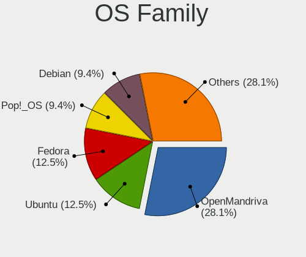

| Name         | Desktops | Percent |
|--------------|----------|---------|
| Ubuntu       | 7        | 20%     |
| Debian       | 6        | 17.14%  |
| KDE neon     | 4        | 11.43%  |
| Fedora       | 4        | 11.43%  |
| Zorin        | 2        | 5.71%   |
| Arch         | 2        | 5.71%   |
| Vanilla      | 1        | 2.86%   |
| Pop!_OS      | 1        | 2.86%   |
| openSUSE     | 1        | 2.86%   |
| OpenMandriva | 1        | 2.86%   |
| NixOS        | 1        | 2.86%   |
| Linux Mint   | 1        | 2.86%   |
| Kubuntu      | 1        | 2.86%   |
| Kali         | 1        | 2.86%   |
| EndeavourOS  | 1        | 2.86%   |
| Elementary   | 1        | 2.86%   |

Kernel
------

Version of the Linux kernel

| Version                             | Desktops | Percent |
|-------------------------------------|----------|---------|
| 6.5.0-27-generic                    | 4        | 11.43%  |
| 6.5.0-26-generic                    | 3        | 8.57%   |
| 6.5.0-28-generic                    | 2        | 5.71%   |
| 6.8.7-arch1-2                       | 1        | 2.86%   |
| 6.8.5-arch1-1                       | 1        | 2.86%   |
| 6.8.3                               | 1        | 2.86%   |
| 6.8.2-zabbly+                       | 1        | 2.86%   |
| 6.8.2-arch2-1                       | 1        | 2.86%   |
| 6.8.1-1-default                     | 1        | 2.86%   |
| 6.8.0-76060800daily20240311-generic | 1        | 2.86%   |
| 6.7.9-200.fc39.x86_64               | 1        | 2.86%   |
| 6.7.11-200.fc39.x86_64              | 1        | 2.86%   |
| 6.6.9-amd64                         | 1        | 2.86%   |
| 6.6.13-amd64                        | 1        | 2.86%   |
| 6.6.11-200.fc39.x86_64              | 1        | 2.86%   |
| 6.5.6-300.fc39.x86_64               | 1        | 2.86%   |
| 6.5.3-desktop-1omv2390              | 1        | 2.86%   |
| 6.5.0-15-generic                    | 1        | 2.86%   |
| 6.1.0-20-amd64                      | 1        | 2.86%   |
| 6.1.0-18-arm64                      | 1        | 2.86%   |
| 6.1.0-18-amd64                      | 1        | 2.86%   |
| 6.1.0-15-amd64                      | 1        | 2.86%   |
| 5.4.0-150-generic                   | 1        | 2.86%   |
| 5.19.0-41-generic                   | 1        | 2.86%   |
| 5.15.0-105-lowlatency               | 1        | 2.86%   |
| 5.15.0-102-generic                  | 1        | 2.86%   |
| 5.15.0-101-generic                  | 1        | 2.86%   |
| 5.11.0-43-generic                   | 1        | 2.86%   |
| 5.10.0-28-amd64                     | 1        | 2.86%   |

Kernel Family
-------------

Linux kernel without a distro release

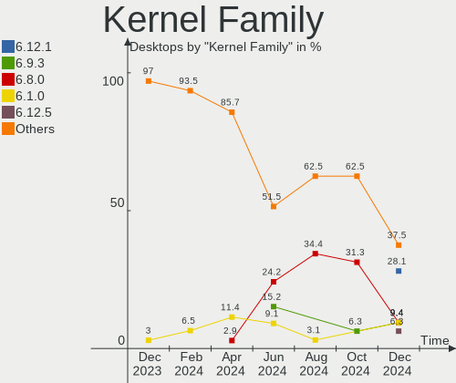

| Version | Desktops | Percent |
|---------|----------|---------|
| 6.5.0   | 10       | 28.57%  |
| 6.1.0   | 4        | 11.43%  |
| 5.15.0  | 3        | 8.57%   |
| 6.8.2   | 2        | 5.71%   |
| 6.8.7   | 1        | 2.86%   |
| 6.8.5   | 1        | 2.86%   |
| 6.8.3   | 1        | 2.86%   |
| 6.8.1   | 1        | 2.86%   |
| 6.8.0   | 1        | 2.86%   |
| 6.7.9   | 1        | 2.86%   |
| 6.7.11  | 1        | 2.86%   |
| 6.6.9   | 1        | 2.86%   |
| 6.6.13  | 1        | 2.86%   |
| 6.6.11  | 1        | 2.86%   |
| 6.5.6   | 1        | 2.86%   |
| 6.5.3   | 1        | 2.86%   |
| 5.4.0   | 1        | 2.86%   |
| 5.19.0  | 1        | 2.86%   |
| 5.11.0  | 1        | 2.86%   |
| 5.10.0  | 1        | 2.86%   |

Kernel Major Ver.
-----------------

Linux kernel major version

| Version | Desktops | Percent |
|---------|----------|---------|
| 6.5     | 12       | 34.29%  |
| 6.8     | 7        | 20%     |
| 6.1     | 4        | 11.43%  |
| 6.6     | 3        | 8.57%   |
| 5.15    | 3        | 8.57%   |
| 6.7     | 2        | 5.71%   |
| 5.4     | 1        | 2.86%   |
| 5.19    | 1        | 2.86%   |
| 5.11    | 1        | 2.86%   |
| 5.10    | 1        | 2.86%   |

Arch
----

OS architecture (x86_64, i586, etc.)

| Name    | Desktops | Percent |
|---------|----------|---------|
| x86_64  | 34       | 97.14%  |
| aarch64 | 1        | 2.86%   |

DE
--

Desktop Environment

| Name       | Desktops | Percent |
|------------|----------|---------|
| GNOME      | 14       | 40%     |
| KDE6       | 8        | 22.86%  |
| KDE5       | 4        | 11.43%  |
| Unknown    | 4        | 11.43%  |
| XFCE       | 1        | 2.86%   |
| X-Cinnamon | 1        | 2.86%   |
| Pantheon   | 1        | 2.86%   |
| MATE       | 1        | 2.86%   |
| LXDE       | 1        | 2.86%   |

Display Server
--------------

X11 or Wayland

| Name    | Desktops | Percent |
|---------|----------|---------|
| Wayland | 17       | 48.57%  |
| X11     | 13       | 37.14%  |
| Tty     | 4        | 11.43%  |
| Unknown | 1        | 2.86%   |

Display Manager
---------------

SDDM, LightDM, etc.

| Name    | Desktops | Percent |
|---------|----------|---------|
| Unknown | 17       | 48.57%  |
| GDM3    | 8        | 22.86%  |
| SDDM    | 6        | 17.14%  |
| GDM     | 3        | 8.57%   |
| LightDM | 1        | 2.86%   |

OS Lang
-------

Language

| Lang  | Desktops | Percent |
|-------|----------|---------|
| nl_NL | 20       | 57.14%  |
| en_US | 13       | 37.14%  |
| de_DE | 1        | 2.86%   |
| C     | 1        | 2.86%   |

Boot Mode
---------

EFI or BIOS

| Mode | Desktops | Percent |
|------|----------|---------|
| BIOS | 24       | 68.57%  |
| EFI  | 11       | 31.43%  |

Filesystem
----------

Type of filesystem

| Type  | Desktops | Percent |
|-------|----------|---------|
| Ext4  | 21       | 60%     |
| Btrfs | 10       | 28.57%  |
| Tmpfs | 4        | 11.43%  |

Part. scheme
------------

Scheme of partitioning

| Type    | Desktops | Percent |
|---------|----------|---------|
| GPT     | 19       | 54.29%  |
| Unknown | 14       | 40%     |
| MBR     | 2        | 5.71%   |

Dual Boot with Linux/BSD
------------------------

Hosting more than one Linux/BSD

| Dual boot | Desktops | Percent |
|-----------|----------|---------|
| No        | 30       | 85.71%  |
| Yes       | 5        | 14.29%  |

Dual Boot (Win)
---------------

Hosting Linux and Windows

| Dual boot | Desktops | Percent |
|-----------|----------|---------|
| No        | 27       | 77.14%  |
| Yes       | 8        | 22.86%  |

Board
-----

Vendor
------

Motherboard manufacturer

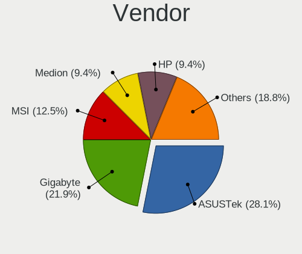

| Name                | Desktops | Percent |
|---------------------|----------|---------|
| ASUSTek Computer    | 10       | 28.57%  |
| Gigabyte Technology | 5        | 14.29%  |
| ASRock              | 5        | 14.29%  |
| MSI                 | 4        | 11.43%  |
| Dell                | 2        | 5.71%   |
| Supermicro          | 1        | 2.86%   |
| SolidRun            | 1        | 2.86%   |
| Pegatron            | 1        | 2.86%   |
| Medion              | 1        | 2.86%   |
| Lenovo              | 1        | 2.86%   |
| Intel               | 1        | 2.86%   |
| Google              | 1        | 2.86%   |
| Fujitsu             | 1        | 2.86%   |
| Foxconn             | 1        | 2.86%   |

Model
-----

Motherboard model

| Name                            | Desktops | Percent |
|---------------------------------|----------|---------|
| Supermicro PIO-519C-MR-PH004    | 1        | 2.86%   |
| SolidRun CEX7 Platform          | 1        | 2.86%   |
| Pegatron Pro 3010 Microtower PC | 1        | 2.86%   |
| MSI MS-7D73                     | 1        | 2.86%   |
| MSI MS-7D32                     | 1        | 2.86%   |
| MSI MS-7C91                     | 1        | 2.86%   |
| MSI MS-7B86                     | 1        | 2.86%   |
| Medion MS-7800                  | 1        | 2.86%   |
| Lenovo Legion T530-28APR        | 1        | 2.86%   |
| Intel DG965RY AAD41691-301      | 1        | 2.86%   |
| Google Fizz                     | 1        | 2.86%   |
| Gigabyte Z390 GAMING SLI        | 1        | 2.86%   |
| Gigabyte Z390 DESIGNARE         | 1        | 2.86%   |
| Gigabyte B650 GAMING X AX V2    | 1        | 2.86%   |
| Gigabyte B550M DS3H             | 1        | 2.86%   |
| Gigabyte B550 GAMING X V2       | 1        | 2.86%   |
| Fujitsu ESPRIMO P720            | 1        | 2.86%   |
| Foxconn H55MX-S Series          | 1        | 2.86%   |
| Dell Vostro 3470                | 1        | 2.86%   |
| Dell OptiPlex 7010              | 1        | 2.86%   |
| ASUS V-P8H67E                   | 1        | 2.86%   |
| ASUS TUF Gaming B650M-PLUS      | 1        | 2.86%   |
| ASUS PRIME X370-PRO             | 1        | 2.86%   |
| ASUS PRIME B250M-A              | 1        | 2.86%   |
| ASUS P8H77-M PRO                | 1        | 2.86%   |
| ASUS P7P55 LX                   | 1        | 2.86%   |
| ASUS M5A97 PLUS                 | 1        | 2.86%   |
| ASUS M2R-FVM                    | 1        | 2.86%   |
| ASUS M2N-MX SE Plus             | 1        | 2.86%   |
| ASUS H110M-A                    | 1        | 2.86%   |
| ASRock H97 Anniversary          | 1        | 2.86%   |
| ASRock B650M Pro RS             | 1        | 2.86%   |
| ASRock AB350M Pro4              | 1        | 2.86%   |
| ASRock A520M-HDV                | 1        | 2.86%   |
| ASRock 970 Pro3 R2.0            | 1        | 2.86%   |

Model Family
------------

Motherboard model prefix

| Name                         | Desktops | Percent |
|------------------------------|----------|---------|
| Gigabyte Z390                | 2        | 5.71%   |
| ASUS PRIME                   | 2        | 5.71%   |
| Supermicro PIO-519C-MR-PH004 | 1        | 2.86%   |
| SolidRun CEX7                | 1        | 2.86%   |
| Pegatron Pro                 | 1        | 2.86%   |
| MSI MS-7D73                  | 1        | 2.86%   |
| MSI MS-7D32                  | 1        | 2.86%   |
| MSI MS-7C91                  | 1        | 2.86%   |
| MSI MS-7B86                  | 1        | 2.86%   |
| Medion MS-7800               | 1        | 2.86%   |
| Lenovo Legion                | 1        | 2.86%   |
| Intel DG965RY                | 1        | 2.86%   |
| Google Fizz                  | 1        | 2.86%   |
| Gigabyte B650                | 1        | 2.86%   |
| Gigabyte B550M               | 1        | 2.86%   |
| Gigabyte B550                | 1        | 2.86%   |
| Fujitsu ESPRIMO              | 1        | 2.86%   |
| Foxconn H55MX-S              | 1        | 2.86%   |
| Dell Vostro                  | 1        | 2.86%   |
| Dell OptiPlex                | 1        | 2.86%   |
| ASUS V-P8H67E                | 1        | 2.86%   |
| ASUS TUF                     | 1        | 2.86%   |
| ASUS P8H77-M                 | 1        | 2.86%   |
| ASUS P7P55                   | 1        | 2.86%   |
| ASUS M5A97                   | 1        | 2.86%   |
| ASUS M2R-FVM                 | 1        | 2.86%   |
| ASUS M2N-MX                  | 1        | 2.86%   |
| ASUS H110M-A                 | 1        | 2.86%   |
| ASRock H97                   | 1        | 2.86%   |
| ASRock B650M                 | 1        | 2.86%   |
| ASRock AB350M                | 1        | 2.86%   |
| ASRock A520M-HDV             | 1        | 2.86%   |
| ASRock 970                   | 1        | 2.86%   |

MFG Year
--------

Motherboard manufacture year

| Year | Desktops | Percent |
|------|----------|---------|
| 2020 | 4        | 11.43%  |
| 2023 | 3        | 8.57%   |
| 2022 | 3        | 8.57%   |
| 2019 | 3        | 8.57%   |
| 2012 | 3        | 8.57%   |
| 2009 | 3        | 8.57%   |
| 2021 | 2        | 5.71%   |
| 2018 | 2        | 5.71%   |
| 2017 | 2        | 5.71%   |
| 2015 | 2        | 5.71%   |
| 2013 | 2        | 5.71%   |
| 2006 | 2        | 5.71%   |
| 2016 | 1        | 2.86%   |
| 2014 | 1        | 2.86%   |
| 2011 | 1        | 2.86%   |
| 2007 | 1        | 2.86%   |

Form Factor
-----------

Physical design of the computer

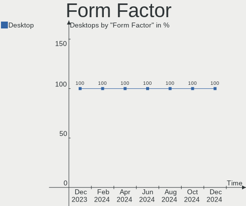

| Name    | Desktops | Percent |
|---------|----------|---------|
| Desktop | 35       | 100%    |

Secure Boot
-----------

Enabled or disabled

| State    | Desktops | Percent |
|----------|----------|---------|
| Disabled | 33       | 94.29%  |
| Enabled  | 2        | 5.71%   |

Coreboot
--------

Have coreboot on board

| Used | Desktops | Percent |
|------|----------|---------|
| No   | 34       | 97.14%  |
| Yes  | 1        | 2.86%   |

RAM Size
--------

Total RAM memory

| Size in GB  | Desktops | Percent |
|-------------|----------|---------|
| 16.01-24.0  | 8        | 22.86%  |
| 8.01-16.0   | 7        | 20%     |
| 4.01-8.0    | 6        | 17.14%  |
| 32.01-64.0  | 6        | 17.14%  |
| 3.01-4.0    | 4        | 11.43%  |
| 24.01-32.0  | 3        | 8.57%   |
| 64.01-256.0 | 1        | 2.86%   |

RAM Used
--------

Used RAM memory

| Used GB   | Desktops | Percent |
|-----------|----------|---------|
| 1.01-2.0  | 9        | 25.71%  |
| 2.01-3.0  | 8        | 22.86%  |
| 4.01-8.0  | 6        | 17.14%  |
| 3.01-4.0  | 6        | 17.14%  |
| 8.01-16.0 | 3        | 8.57%   |
| 0.51-1.0  | 3        | 8.57%   |

Total Drives
------------

Number of drives on board

| Drives | Desktops | Percent |
|--------|----------|---------|
| 1      | 12       | 34.29%  |
| 2      | 9        | 25.71%  |
| 3      | 6        | 17.14%  |
| 4      | 4        | 11.43%  |
| 5      | 3        | 8.57%   |
| 7      | 1        | 2.86%   |

Has CD-ROM
----------

Has CD-ROM on board

| Presented | Desktops | Percent |
|-----------|----------|---------|
| No        | 19       | 54.29%  |
| Yes       | 16       | 45.71%  |

Has Ethernet
------------

Has Ethernet on board

| Presented | Desktops | Percent |
|-----------|----------|---------|
| Yes       | 34       | 97.14%  |
| No        | 1        | 2.86%   |

Has WiFi
--------

Has WiFi module

| Presented | Desktops | Percent |
|-----------|----------|---------|
| No        | 24       | 68.57%  |
| Yes       | 11       | 31.43%  |

Has Bluetooth
-------------

Has Bluetooth module

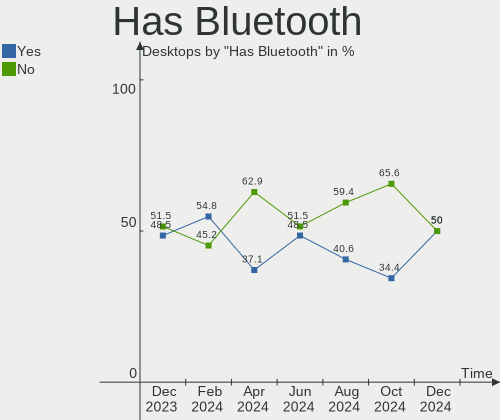

| Presented | Desktops | Percent |
|-----------|----------|---------|
| No        | 22       | 62.86%  |
| Yes       | 13       | 37.14%  |

Location
--------

Country
-------

Geographic location (country)

| Country     | Desktops | Percent |
|-------------|----------|---------|
| Netherlands | 35       | 100%    |

City
----

Geographic location (city)

| City            | Desktops | Percent |
|-----------------|----------|---------|
| Amsterdam       | 10       | 28.57%  |
| The Hague       | 2        | 5.71%   |
| Eindhoven       | 2        | 5.71%   |
| Zwolle          | 1        | 2.86%   |
| Zwijndrecht     | 1        | 2.86%   |
| Zuidwolde       | 1        | 2.86%   |
| Zuid-Scharwoude | 1        | 2.86%   |
| Zierikzee       | 1        | 2.86%   |
| Waalre          | 1        | 2.86%   |
| Vriescheloo     | 1        | 2.86%   |
| Sneek           | 1        | 2.86%   |
| Rotterdam       | 1        | 2.86%   |
| Puttershoek     | 1        | 2.86%   |
| Nuenen          | 1        | 2.86%   |
| Naaldwijk       | 1        | 2.86%   |
| Lekkerkerk      | 1        | 2.86%   |
| Leiderdorp      | 1        | 2.86%   |
| Leeuwarden      | 1        | 2.86%   |
| Enschede        | 1        | 2.86%   |
| Dieren          | 1        | 2.86%   |
| Breda           | 1        | 2.86%   |
| Assendelft      | 1        | 2.86%   |
| Amersfoort      | 1        | 2.86%   |
| Amerongen       | 1        | 2.86%   |

Drives
------

Drive Vendor
------------

Hard drive vendors

| Vendor                       | Desktops | Drives | Percent |
|------------------------------|----------|--------|---------|
| Samsung Electronics          | 13       | 19     | 19.12%  |
| Seagate                      | 12       | 17     | 17.65%  |
| WDC                          | 10       | 10     | 14.71%  |
| Sandisk                      | 5        | 5      | 7.35%   |
| Kingston                     | 5        | 5      | 7.35%   |
| Micron Technology            | 4        | 5      | 5.88%   |
| Crucial                      | 4        | 7      | 5.88%   |
| Toshiba                      | 2        | 2      | 2.94%   |
| MAXIO Technology (Hangzhou)  | 2        | 2      | 2.94%   |
| Kingston Technology Company  | 2        | 3      | 2.94%   |
| Hitachi                      | 2        | 2      | 2.94%   |
| Unknown                      | 1        | 2      | 1.47%   |
| Union Memory                 | 1        | 1      | 1.47%   |
| Shenzhen Longsys Electronics | 1        | 1      | 1.47%   |
| Maxtor                       | 1        | 1      | 1.47%   |
| Lexar                        | 1        | 1      | 1.47%   |
| Intenso                      | 1        | 1      | 1.47%   |
| Corsair                      | 1        | 2      | 1.47%   |

Drive Model
-----------

Hard drive models

| Model                                              | Desktops | Percent |
|----------------------------------------------------|----------|---------|
| Seagate ST3500312CS 500GB                          | 2        | 2.6%    |
| Seagate ST2000DM008-2FR102 2TB                     | 2        | 2.6%    |
| Samsung SSD 980 1TB                                | 2        | 2.6%    |
| Samsung SSD 860 EVO 250GB                          | 2        | 2.6%    |
| Samsung SSD 850 EVO 500GB                          | 2        | 2.6%    |
| Samsung SSD 850 EVO 250GB                          | 2        | 2.6%    |
| MAXIO (Hangzhou) NVMe SSD Controller MAP1202 256GB | 2        | 2.6%    |
| Kingston SA400S37960G 960GB SSD                    | 2        | 2.6%    |
| WDC WDS250G2B0C-00PXH0 250GB                       | 1        | 1.3%    |
| WDC WD5000AAKS-00TMA0 500GB                        | 1        | 1.3%    |
| WDC WD3200AAJS-56M0A0 320GB                        | 1        | 1.3%    |
| WDC WD20EZRZ-00Z5HB0 2TB                           | 1        | 1.3%    |
| WDC WD20EARX-00PASB0 2TB                           | 1        | 1.3%    |
| WDC WD15EARS-00Z5B1 1TB                            | 1        | 1.3%    |
| WDC WD15EADS-00P8B0 1TB                            | 1        | 1.3%    |
| WDC WD10EZEX-08WN4A0 1TB                           | 1        | 1.3%    |
| WDC WD10EARX-22N0YB0 1TB                           | 1        | 1.3%    |
| WDC WD1001FALS-403AA0 1TB                          | 1        | 1.3%    |
| Unknown SD/MMC/MS PRO 128GB                        | 1        | 1.3%    |
| Unknown Compact Flash 977MB                        | 1        | 1.3%    |
| Union Memory UMIS LENSE40512GMSP34MESTB3A 512GB    | 1        | 1.3%    |
| Toshiba NVMe Controller 256GB                      | 1        | 1.3%    |
| Toshiba HDWD120 2TB                                | 1        | 1.3%    |
| Shenzhen Longsys Lexar SSD NM790 4TB               | 1        | 1.3%    |
| Seagate ST9320325AS 320GB                          | 1        | 1.3%    |
| Seagate ST500DM002-1BD142 500GB                    | 1        | 1.3%    |
| Seagate ST4000DM005-2DP166 4TB                     | 1        | 1.3%    |
| Seagate ST4000DM004-2CV104 4TB                     | 1        | 1.3%    |
| Seagate ST3500418AS 500GB                          | 1        | 1.3%    |
| Seagate ST3500414CS 500GB                          | 1        | 1.3%    |
| Seagate ST3250310AS 250GB                          | 1        | 1.3%    |
| Seagate ST3160812AS 160GB                          | 1        | 1.3%    |
| Seagate ST3000DM001-1ER166 3TB                     | 1        | 1.3%    |
| Seagate ST250DM000-1BD141 250GB                    | 1        | 1.3%    |
| Seagate ST1000DM003-1CH162 1TB                     | 1        | 1.3%    |
| Sandisk WD Blue SN580 500GB                        | 1        | 1.3%    |
| Sandisk WD Black SN750 / PC SN730 NVMe SSD 512GB   | 1        | 1.3%    |
| SanDisk SDSSDA-1T00 1TB                            | 1        | 1.3%    |
| SanDisk SD9SN8W-512G-1006 512GB SSD                | 1        | 1.3%    |
| SanDisk SD8SNAT064G1014 64GB SSD                   | 1        | 1.3%    |

HDD Vendor
----------

Hard disk drive vendors

| Vendor              | Desktops | Drives | Percent |
|---------------------|----------|--------|---------|
| Seagate             | 12       | 17     | 44.44%  |
| WDC                 | 9        | 9      | 33.33%  |
| Hitachi             | 2        | 2      | 7.41%   |
| Unknown             | 1        | 1      | 3.7%    |
| Toshiba             | 1        | 1      | 3.7%    |
| Samsung Electronics | 1        | 1      | 3.7%    |
| Maxtor              | 1        | 1      | 3.7%    |

SSD Vendor
----------

Solid state drive vendors

| Vendor              | Desktops | Drives | Percent |
|---------------------|----------|--------|---------|
| Samsung Electronics | 9        | 11     | 36%     |
| Kingston            | 5        | 5      | 20%     |
| Crucial             | 4        | 7      | 16%     |
| SanDisk             | 3        | 3      | 12%     |
| Micron Technology   | 3        | 4      | 12%     |
| Intenso             | 1        | 1      | 4%      |

Drive Kind
----------

HDD or SSD

| Kind    | Desktops | Drives | Percent |
|---------|----------|--------|---------|
| SSD     | 21       | 31     | 36.84%  |
| HDD     | 19       | 32     | 33.33%  |
| NVMe    | 16       | 22     | 28.07%  |
| Unknown | 1        | 1      | 1.75%   |

Drive Connector
---------------

SATA, SAS, NVMe, etc.

| Type | Desktops | Drives | Percent |
|------|----------|--------|---------|
| SATA | 31       | 62     | 64.58%  |
| NVMe | 16       | 22     | 33.33%  |
| SAS  | 1        | 2      | 2.08%   |

Drive Size
----------

Size of hard drive

| Size in TB | Desktops | Drives | Percent |
|------------|----------|--------|---------|
| 0.01-0.5   | 24       | 34     | 53.33%  |
| 0.51-1.0   | 12       | 15     | 26.67%  |
| 1.01-2.0   | 6        | 11     | 13.33%  |
| 3.01-4.0   | 2        | 2      | 4.44%   |
| 2.01-3.0   | 1        | 1      | 2.22%   |

Space Total
-----------

Amount of disk space available on the file system

| Size in GB     | Desktops | Percent |
|----------------|----------|---------|
| 1001-2000      | 8        | 22.86%  |
| 501-1000       | 7        | 20%     |
| 251-500        | 6        | 17.14%  |
| 101-250        | 6        | 17.14%  |
| More than 3000 | 4        | 11.43%  |
| 2001-3000      | 2        | 5.71%   |
| 51-100         | 2        | 5.71%   |

Space Used
----------

Amount of used disk space

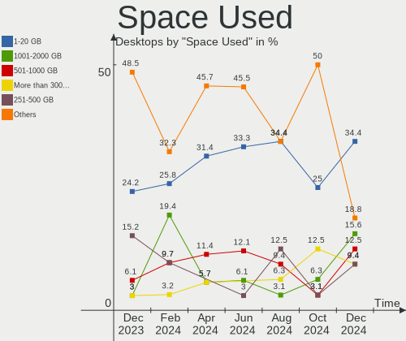

| Used GB        | Desktops | Percent |
|----------------|----------|---------|
| 1-20           | 11       | 31.43%  |
| 101-250        | 6        | 17.14%  |
| 21-50          | 5        | 14.29%  |
| 51-100         | 5        | 14.29%  |
| 501-1000       | 4        | 11.43%  |
| More than 3000 | 2        | 5.71%   |
| 1001-2000      | 2        | 5.71%   |

Malfunc. Drives
---------------

Drive models with a malfunction

| Model                           | Desktops | Drives | Percent |
|---------------------------------|----------|--------|---------|
| WDC WD15EARS-00Z5B1 1TB         | 1        | 1      | 20%     |
| WDC WD1001FALS-403AA0 1TB       | 1        | 1      | 20%     |
| Seagate ST9320325AS 320GB       | 1        | 1      | 20%     |
| Samsung Electronics SSD 980 1TB | 1        | 1      | 20%     |
| Maxtor STM380215AS 80GB         | 1        | 1      | 20%     |

Malfunc. Drive Vendor
---------------------

Vendors of faulty drives

| Vendor              | Desktops | Drives | Percent |
|---------------------|----------|--------|---------|
| WDC                 | 2        | 2      | 40%     |
| Seagate             | 1        | 1      | 20%     |
| Samsung Electronics | 1        | 1      | 20%     |
| Maxtor              | 1        | 1      | 20%     |

Malfunc. HDD Vendor
-------------------

Vendors of faulty HDD drives

| Vendor  | Desktops | Drives | Percent |
|---------|----------|--------|---------|
| WDC     | 2        | 2      | 50%     |
| Seagate | 1        | 1      | 25%     |
| Maxtor  | 1        | 1      | 25%     |

Malfunc. Drive Kind
-------------------

Kinds of faulty drives

| Kind | Desktops | Drives | Percent |
|------|----------|--------|---------|
| HDD  | 4        | 4      | 80%     |
| NVMe | 1        | 1      | 20%     |

Failed Drives
-------------

Failed drive models

Zero info for selected period =(

Failed Drive Vendor
-------------------

Failed drive vendors

Zero info for selected period =(

Drive Status
------------

Number of failed and malfunc. drives

| Status   | Desktops | Drives | Percent |
|----------|----------|--------|---------|
| Detected | 20       | 46     | 50%     |
| Works    | 16       | 35     | 40%     |
| Malfunc  | 4        | 5      | 10%     |

Storage controller
------------------

Storage Vendor
--------------

Storage controller vendors

| Vendor                       | Desktops | Percent |
|------------------------------|----------|---------|
| Intel                        | 17       | 29.31%  |
| AMD                          | 16       | 27.59%  |
| Samsung Electronics          | 6        | 10.34%  |
| SanDisk                      | 3        | 5.17%   |
| Shenzhen Longsys Electronics | 2        | 3.45%   |
| MAXIO Technology (Hangzhou)  | 2        | 3.45%   |
| Marvell Technology Group     | 2        | 3.45%   |
| Kingston Technology Company  | 2        | 3.45%   |
| VIA Technologies             | 1        | 1.72%   |
| Union Memory (Shenzhen)      | 1        | 1.72%   |
| Toshiba America Info Systems | 1        | 1.72%   |
| Promise Technology           | 1        | 1.72%   |
| Phison Electronics           | 1        | 1.72%   |
| Nvidia                       | 1        | 1.72%   |
| Micron Technology            | 1        | 1.72%   |
| Broadcom / LSI               | 1        | 1.72%   |

Storage Model
-------------

Storage controller models

| Model                                                                          | Desktops | Percent |
|--------------------------------------------------------------------------------|----------|---------|
| Intel Cannon Lake PCH SATA AHCI Controller                                     | 4        | 5.8%    |
| AMD FCH SATA Controller [AHCI mode]                                            | 4        | 5.8%    |
| AMD 600 Series Chipset SATA Controller                                         | 4        | 5.8%    |
| AMD 500 Series Chipset SATA Controller                                         | 4        | 5.8%    |
| Shenzhen Longsys Lexar NM790 NVME SSD (DRAM-less)                              | 2        | 2.9%    |
| Samsung NVMe SSD Controller PM9A1/PM9A3/980PRO                                 | 2        | 2.9%    |
| Samsung NVMe SSD Controller 980 (DRAM-less)                                    | 2        | 2.9%    |
| MAXIO (Hangzhou) NVMe SSD Controller MAP1202 (DRAM-less)                       | 2        | 2.9%    |
| Intel 5 Series/3400 Series Chipset 4 port SATA IDE Controller                  | 2        | 2.9%    |
| Intel 5 Series/3400 Series Chipset 2 port SATA IDE Controller                  | 2        | 2.9%    |
| AMD SB7x0/SB8x0/SB9x0 SATA Controller [AHCI mode]                              | 2        | 2.9%    |
| AMD 400 Series Chipset SATA Controller                                         | 2        | 2.9%    |
| VIA VT6415 PATA IDE Host Controller                                            | 1        | 1.45%   |
| Union Memory (Shenzhen) AH631 PCIe 3.0 NVMe SSD 512GB                          | 1        | 1.45%   |
| Toshiba America Info Systems XG3 NVMe SSD Controller                           | 1        | 1.45%   |
| Sandisk WD Blue SN580 NVMe SSD (DRAM-less)                                     | 1        | 1.45%   |
| SanDisk Ultra 3D / WD Blue SN550 NVMe SSD                                      | 1        | 1.45%   |
| SanDisk Extreme Pro / WD Black SN750 / PC SN730 / Red SN700 NVMe SSD           | 1        | 1.45%   |
| Samsung NVMe SSD Controller SM981/PM981/PM983                                  | 1        | 1.45%   |
| Samsung NVMe SSD Controller SM951/PM951                                        | 1        | 1.45%   |
| Samsung NVMe SSD Controller S4LV008[Pascal]                                    | 1        | 1.45%   |
| Promise PDC40719 [FastTrak TX4300/TX4310]                                      | 1        | 1.45%   |
| Phison E16 PCIe4 NVMe Controller                                               | 1        | 1.45%   |
| Nvidia MCP61 SATA Controller                                                   | 1        | 1.45%   |
| Nvidia MCP61 IDE                                                               | 1        | 1.45%   |
| Micron 2210 NVMe SSD [Cobain]                                                  | 1        | 1.45%   |
| Marvell Group 88SE9172 SATA III 6Gb/s RAID Controller                          | 1        | 1.45%   |
| Marvell Group 88SE6101/6102 single-port PATA133 interface                      | 1        | 1.45%   |
| Kingston Company NV2 NVMe SSD SM2267XT (DRAM-less)                             | 1        | 1.45%   |
| Kingston Company A2000 NVMe SSD SM2263EN                                       | 1        | 1.45%   |
| Intel Sunrise Point-LP SATA Controller [AHCI mode]                             | 1        | 1.45%   |
| Intel SATA Controller [RAID mode]                                              | 1        | 1.45%   |
| Intel Q170/Q150/B150/H170/H110/Z170/CM236 Chipset SATA Controller [AHCI Mode]  | 1        | 1.45%   |
| Intel Alder Lake-S PCH SATA Controller [AHCI Mode]                             | 1        | 1.45%   |
| Intel 9 Series Chipset Family SATA Controller [AHCI Mode]                      | 1        | 1.45%   |
| Intel 82801JI (ICH10 Family) SATA AHCI Controller                              | 1        | 1.45%   |
| Intel 82801HB (ICH8) 4 port SATA Controller [AHCI mode]                        | 1        | 1.45%   |
| Intel 8 Series/C220 Series Chipset Family 6-port SATA Controller 1 [AHCI mode] | 1        | 1.45%   |
| Intel 7 Series/C210 Series Chipset Family 6-port SATA Controller [AHCI mode]   | 1        | 1.45%   |
| Intel 7 Series/C210 Series Chipset Family 4-port SATA Controller [IDE mode]    | 1        | 1.45%   |

Storage Kind
------------

Kind of storage controller (IDE, SATA, NVMe, SAS, ...)

| Kind | Desktops | Percent |
|------|----------|---------|
| SATA | 29       | 52.73%  |
| NVMe | 16       | 29.09%  |
| IDE  | 7        | 12.73%  |
| RAID | 2        | 3.64%   |
| SAS  | 1        | 1.82%   |

Processor
---------

CPU Vendor
----------

Processor vendors

| Vendor | Desktops | Percent |
|--------|----------|---------|
| Intel  | 17       | 48.57%  |
| AMD    | 17       | 48.57%  |
| ARM    | 1        | 2.86%   |

CPU Model
---------

Processor models

| Model                                       | Desktops | Percent |
|---------------------------------------------|----------|---------|
| AMD Ryzen 5 7600 6-Core Processor           | 3        | 8.57%   |
| AMD Ryzen 5 5600 6-Core Processor           | 2        | 5.71%   |
| AMD Ryzen 5 1600 Six-Core Processor         | 2        | 5.71%   |
| Intel Xeon E-2278G CPU @ 3.40GHz            | 1        | 2.86%   |
| Intel Pentium Dual-Core CPU E5400 @ 2.70GHz | 1        | 2.86%   |
| Intel Core i9-9900KF CPU @ 3.60GHz          | 1        | 2.86%   |
| Intel Core i9-9900K CPU @ 3.60GHz           | 1        | 2.86%   |
| Intel Core i7-2600 CPU @ 3.40GHz            | 1        | 2.86%   |
| Intel Core i7 CPU 870 @ 2.93GHz             | 1        | 2.86%   |
| Intel Core i5-7500 CPU @ 3.40GHz            | 1        | 2.86%   |
| Intel Core i5-4590 CPU @ 3.30GHz            | 1        | 2.86%   |
| Intel Core i5-4460 CPU @ 3.20GHz            | 1        | 2.86%   |
| Intel Core i5-3570 CPU @ 3.40GHz            | 1        | 2.86%   |
| Intel Core i5-3470 CPU @ 3.20GHz            | 1        | 2.86%   |
| Intel Core i5 CPU 750 @ 2.67GHz             | 1        | 2.86%   |
| Intel Core i3-8130U CPU @ 2.20GHz           | 1        | 2.86%   |
| Intel Core i3-8100 CPU @ 3.60GHz            | 1        | 2.86%   |
| Intel Core i3-6100 CPU @ 3.70GHz            | 1        | 2.86%   |
| Intel Core 2 CPU 6700 @ 2.66GHz             | 1        | 2.86%   |
| Intel 12th Gen Core i5-12600K               | 1        | 2.86%   |
| ARM Processor                               | 1        | 2.86%   |
| AMD Ryzen 9 7900 12-Core Processor          | 1        | 2.86%   |
| AMD Ryzen 9 3900X 12-Core Processor         | 1        | 2.86%   |
| AMD Ryzen 7 1800X Eight-Core Processor      | 1        | 2.86%   |
| AMD Ryzen 5 4600G with Radeon Graphics      | 1        | 2.86%   |
| AMD Ryzen 5 3600 6-Core Processor           | 1        | 2.86%   |
| AMD FX-6300 Six-Core Processor              | 1        | 2.86%   |
| AMD FX-4300 Quad-Core Processor             | 1        | 2.86%   |
| AMD Athlon 64 X2 Dual Core Processor 6000+  | 1        | 2.86%   |
| AMD Athlon 64 X2 Dual Core Processor 4200+  | 1        | 2.86%   |
| AMD A8-5500 APU with Radeon HD Graphics     | 1        | 2.86%   |

CPU Model Family
----------------

Processor model prefix

| Model                   | Desktops | Percent |
|-------------------------|----------|---------|
| AMD Ryzen 5             | 9        | 25.71%  |
| Intel Core i5           | 6        | 17.14%  |
| Intel Core i3           | 3        | 8.57%   |
| Other                   | 2        | 5.71%   |
| Intel Core i9           | 2        | 5.71%   |
| Intel Core i7           | 2        | 5.71%   |
| AMD Ryzen 9             | 2        | 5.71%   |
| AMD FX                  | 2        | 5.71%   |
| AMD Athlon 64 X2        | 2        | 5.71%   |
| Intel Xeon              | 1        | 2.86%   |
| Intel Pentium Dual-Core | 1        | 2.86%   |
| Intel Core 2            | 1        | 2.86%   |
| AMD Ryzen 7             | 1        | 2.86%   |
| AMD A8                  | 1        | 2.86%   |

CPU Cores
---------

Number of processor cores

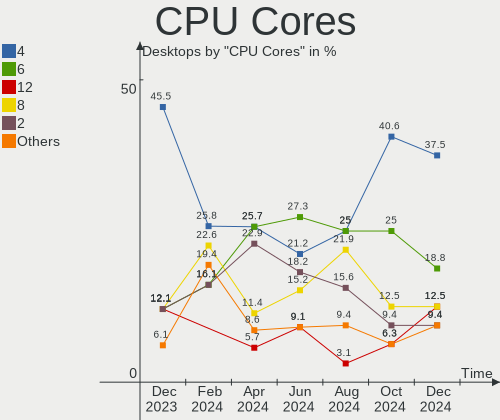

| Number | Desktops | Percent |
|--------|----------|---------|
| 6      | 9        | 25.71%  |
| 4      | 9        | 25.71%  |
| 2      | 8        | 22.86%  |
| 8      | 4        | 11.43%  |
| 12     | 2        | 5.71%   |
| 16     | 1        | 2.86%   |
| 10     | 1        | 2.86%   |
| 3      | 1        | 2.86%   |

CPU Sockets
-----------

Number of sockets

| Number | Desktops | Percent |
|--------|----------|---------|
| 1      | 35       | 100%    |

CPU Threads
-----------

Threads per core (Hyper-Threading)

| Number | Desktops | Percent |
|--------|----------|---------|
| 2      | 23       | 65.71%  |
| 1      | 12       | 34.29%  |

CPU Op-Modes
------------

CPU Operation Modes (32-bit, 64-bit)

| Op mode        | Desktops | Percent |
|----------------|----------|---------|
| 32-bit, 64-bit | 35       | 100%    |

CPU Microcode
-------------

Microcode number

| Number     | Desktops | Percent |
|------------|----------|---------|
| Unknown    | 26       | 74.29%  |
| 0x106e5    | 1        | 2.86%   |
| 0x0a601206 | 1        | 2.86%   |
| 0x0a601203 | 1        | 2.86%   |
| 0x0a20120a | 1        | 2.86%   |
| 0x08701013 | 1        | 2.86%   |
| 0x08001138 | 1        | 2.86%   |
| 0x08001129 | 1        | 2.86%   |
| 0x06001119 | 1        | 2.86%   |
| 0x06000852 | 1        | 2.86%   |

CPU Microarch
-------------

Microarchitecture

| Name        | Desktops | Percent |
|-------------|----------|---------|
| KabyLake    | 6        | 17.14%  |
| Unknown     | 6        | 17.14%  |
| Zen 2       | 3        | 8.57%   |
| Piledriver  | 3        | 8.57%   |
| Zen 3       | 2        | 5.71%   |
| Zen         | 2        | 5.71%   |
| Nehalem     | 2        | 5.71%   |
| K8 Hammer   | 2        | 5.71%   |
| IvyBridge   | 2        | 5.71%   |
| Haswell     | 2        | 5.71%   |
| Zen+        | 1        | 2.86%   |
| Skylake     | 1        | 2.86%   |
| SandyBridge | 1        | 2.86%   |
| Penryn      | 1        | 2.86%   |
| Core        | 1        | 2.86%   |

Graphics
--------

GPU Vendor
----------

Vendors of graphics cards

| Vendor            | Desktops | Percent |
|-------------------|----------|---------|
| Nvidia            | 17       | 45.95%  |
| AMD               | 13       | 35.14%  |
| Intel             | 6        | 16.22%  |
| ASPEED Technology | 1        | 2.7%    |

GPU Model
---------

Graphics card models

| Model                                                                       | Desktops | Percent |
|-----------------------------------------------------------------------------|----------|---------|
| AMD Raphael                                                                 | 4        | 10.26%  |
| AMD Navi 32 [Radeon RX 7700 XT / 7800 XT]                                   | 3        | 7.69%   |
| Nvidia GP107 [GeForce GTX 1050 Ti]                                          | 2        | 5.13%   |
| Nvidia TU106 [GeForce RTX 2060 Rev. A]                                      | 1        | 2.56%   |
| Nvidia TU104 [GeForce RTX 2080 Rev. A]                                      | 1        | 2.56%   |
| Nvidia GP107 [GeForce GTX 1050 3GB]                                         | 1        | 2.56%   |
| Nvidia GP106 [GeForce GTX 1060 3GB]                                         | 1        | 2.56%   |
| Nvidia GP104 [GeForce GTX 1070 Ti]                                          | 1        | 2.56%   |
| Nvidia GK208B [GeForce GT 710]                                              | 1        | 2.56%   |
| Nvidia GK107 [GeForce GTX 650]                                              | 1        | 2.56%   |
| Nvidia GF119 [GeForce GT 610]                                               | 1        | 2.56%   |
| Nvidia GF119 [GeForce GT 520]                                               | 1        | 2.56%   |
| Nvidia GEN3 ESI                                                             | 1        | 2.56%   |
| Nvidia GA106 [Geforce RTX 3050]                                             | 1        | 2.56%   |
| Nvidia GA104 [GeForce RTX 3060 Ti]                                          | 1        | 2.56%   |
| Nvidia GA102 [GeForce RTX 3090]                                             | 1        | 2.56%   |
| Nvidia C61 [GeForce 6150SE nForce 430]                                      | 1        | 2.56%   |
| Nvidia AD104 [GeForce RTX 4070]                                             | 1        | 2.56%   |
| Intel Xeon E3-1200 v3/4th Gen Core Processor Integrated Graphics Controller | 1        | 2.56%   |
| Intel Xeon E3-1200 v2/3rd Gen Core processor Graphics Controller            | 1        | 2.56%   |
| Intel UHD Graphics 620                                                      | 1        | 2.56%   |
| Intel CoffeeLake-S GT2 [UHD Graphics 630]                                   | 1        | 2.56%   |
| Intel Coffee Lake-S GT2 [UHD Graphics P630]                                 | 1        | 2.56%   |
| Intel AlderLake-S GT1                                                       | 1        | 2.56%   |
| ASPEED Technology ASPEED Graphics Family                                    | 1        | 2.56%   |
| AMD Turks PRO [Radeon HD 6570/7570/8550 / R5 230]                           | 1        | 2.56%   |
| AMD Trinity [Radeon HD 7560D]                                               | 1        | 2.56%   |
| AMD RV710 [Radeon HD 4350/4550]                                             | 1        | 2.56%   |
| AMD Renoir [Radeon RX Vega 6 (Ryzen 4000/5000 Mobile Series)]               | 1        | 2.56%   |
| AMD Navi 23 [Radeon RX 6600/6600 XT/6600M]                                  | 1        | 2.56%   |
| AMD Navi 10 [Radeon RX 5600 OEM/5600 XT / 5700/5700 XT]                     | 1        | 2.56%   |
| AMD Ellesmere [Radeon RX 470/480/570/570X/580/580X/590]                     | 1        | 2.56%   |
| AMD Caicos [Radeon HD 6450/7450/8450 / R5 230 OEM]                          | 1        | 2.56%   |

GPU Combo
---------

Combinations of graphics cards

| Name         | Desktops | Percent |
|--------------|----------|---------|
| 1 x Nvidia   | 16       | 45.71%  |
| 1 x AMD      | 10       | 28.57%  |
| 1 x Intel    | 4        | 11.43%  |
| 2 x AMD      | 2        | 5.71%   |
| Other        | 1        | 2.86%   |
| 1 x ASPEED   | 1        | 2.86%   |
| AMD + Nvidia | 1        | 2.86%   |

GPU Driver
----------

Free vs proprietary

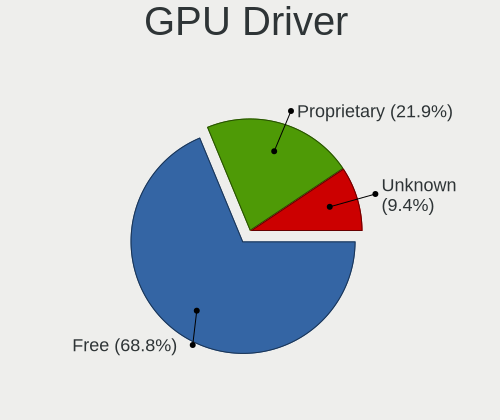

| Driver      | Desktops | Percent |
|-------------|----------|---------|
| Free        | 23       | 65.71%  |
| Proprietary | 10       | 28.57%  |
| Unknown     | 2        | 5.71%   |

GPU Memory
----------

Total video memory

| Size in GB | Desktops | Percent |
|------------|----------|---------|
| Unknown    | 18       | 51.43%  |
| 0.01-0.5   | 5        | 14.29%  |
| 7.01-8.0   | 3        | 8.57%   |
| 8.01-16.0  | 3        | 8.57%   |
| 0.51-1.0   | 2        | 5.71%   |
| 5.01-6.0   | 1        | 2.86%   |
| 3.01-4.0   | 1        | 2.86%   |
| 2.01-3.0   | 1        | 2.86%   |
| 1.01-2.0   | 1        | 2.86%   |

Monitor
-------

Monitor Vendor
--------------

Monitor vendors

| Vendor              | Desktops | Percent |
|---------------------|----------|---------|
| Goldstar            | 7        | 16.67%  |
| Hewlett-Packard     | 5        | 11.9%   |
| AOC                 | 5        | 11.9%   |
| Samsung Electronics | 4        | 9.52%   |
| Iiyama              | 4        | 9.52%   |
| Acer                | 4        | 9.52%   |
| Sony                | 2        | 4.76%   |
| Dell                | 2        | 4.76%   |
| Vestel Elektronik   | 1        | 2.38%   |
| Unknown             | 1        | 2.38%   |
| Toshiba             | 1        | 2.38%   |
| Philips             | 1        | 2.38%   |
| MStar               | 1        | 2.38%   |
| Idek Iiyama         | 1        | 2.38%   |
| Gigabyte Technology | 1        | 2.38%   |
| AVX                 | 1        | 2.38%   |
| ASUSTek Computer    | 1        | 2.38%   |

Monitor Model
-------------

Monitor models

| Model                                                                 | Desktops | Percent |
|-----------------------------------------------------------------------|----------|---------|
| Vestel Elektronik 22W_LCD_TV VES3700 1920x540                         | 1        | 2.27%   |
| Unknown LCD Monitor FFFF 2288x1287 2550x2550mm 142.0-inch             | 1        | 2.27%   |
| Toshiba 49UHD_LCD_TV TSB3700 3840x2160 1872x1053mm 84.6-inch          | 1        | 2.27%   |
| Sony TV SNYE903 1920x1080                                             | 1        | 2.27%   |
| Sony TV SNY0801 1360x768                                              | 1        | 2.27%   |
| Samsung Electronics SyncMaster SAM01AE 1600x1200 408x306mm 20.1-inch  | 1        | 2.27%   |
| Samsung Electronics S24F350 SAM0D20 1920x1080 521x293mm 23.5-inch     | 1        | 2.27%   |
| Samsung Electronics LCD Monitor SAM0F13 3840x2160 950x540mm 43.0-inch | 1        | 2.27%   |
| Samsung Electronics LCD Monitor SAM0B60 1920x1080 887x500mm 40.1-inch | 1        | 2.27%   |
| Samsung Electronics LCD Monitor SAM07D0 1360x768 700x390mm 31.5-inch  | 1        | 2.27%   |
| Philips PHL 243V7 PHLC155 1920x1080 527x296mm 23.8-inch               | 1        | 2.27%   |
| MStar TV MST0030 1920x1080 708x398mm 32.0-inch                        | 1        | 2.27%   |
| Iiyama PLE2472HD IVM6103 1920x1080 531x299mm 24.0-inch                | 1        | 2.27%   |
| Iiyama PL2745H IVM669A 1920x1080 598x336mm 27.0-inch                  | 1        | 2.27%   |
| Iiyama PL2730H IVM663B 1920x1080 598x336mm 27.0-inch                  | 1        | 2.27%   |
| Iiyama PL2288H IVM5633 1920x1080 477x268mm 21.5-inch                  | 1        | 2.27%   |
| Idek Iiyama LCD Monitor PL2473H 1920x1080                             | 1        | 2.27%   |
| Hewlett-Packard LP2475w HWP26F8 1920x1200 546x352mm 25.6-inch         | 1        | 2.27%   |
| Hewlett-Packard LA2205 HWP2849 1680x1050 473x296mm 22.0-inch          | 1        | 2.27%   |
| Hewlett-Packard L1740 HWP2649 1280x1024 337x270mm 17.0-inch           | 1        | 2.27%   |
| Hewlett-Packard E233 HPN3460 1920x1080 510x290mm 23.1-inch            | 1        | 2.27%   |
| Hewlett-Packard E190i HWP3117 1280x1024 374x299mm 18.9-inch           | 1        | 2.27%   |
| Goldstar ULTRAWIDE GSM76E4 3440x1440 800x335mm 34.1-inch              | 1        | 2.27%   |
| Goldstar ULTRAWIDE GSM5AE2 3440x1440 800x335mm 34.1-inch              | 1        | 2.27%   |
| Goldstar ULTRAFINE GSM5BC2 3840x2160 697x392mm 31.5-inch              | 1        | 2.27%   |
| Goldstar QHD GSM772A 2560x1440 697x392mm 31.5-inch                    | 1        | 2.27%   |
| Goldstar L194WT GSM4B06 1440x900 408x255mm 18.9-inch                  | 1        | 2.27%   |
| Goldstar HDR WFHD GSM7714 2560x1080 798x334mm 34.1-inch               | 1        | 2.27%   |
| Goldstar HDR 4K GSM7706 3840x2160 600x340mm 27.2-inch                 | 1        | 2.27%   |
| Gigabyte Technology M34WQ GBT3402 3440x1440 800x335mm 34.1-inch       | 1        | 2.27%   |
| Dell P2422H DELA1C5 1920x1080 527x296mm 23.8-inch                     | 1        | 2.27%   |
| Dell P1917S DELD093 1280x1024 375x300mm 18.9-inch                     | 1        | 2.27%   |
| AVX AVT GC510 AVX0004 1920x1080 530x300mm 24.0-inch                   | 1        | 2.27%   |
| ASUSTek Computer PA279 AUS2768 3840x2160 597x336mm 27.0-inch          | 1        | 2.27%   |
| AOC Q32G2WG3 AOC3202 2560x1440 697x392mm 31.5-inch                    | 1        | 2.27%   |
| AOC Q27P1B AOC2701 2560x1440 597x336mm 27.0-inch                      | 1        | 2.27%   |
| AOC LCD Monitor 24G1WG4 3840x1080                                     | 1        | 2.27%   |
| AOC LCD Monitor 24G1WG4                                               | 1        | 2.27%   |
| AOC 27G2G3 AOC2702 1920x1080 598x336mm 27.0-inch                      | 1        | 2.27%   |
| AOC 2236 AOC2236 1920x1080 477x268mm 21.5-inch                        | 1        | 2.27%   |

Monitor Resolution
------------------

Monitor screen resolution

| Resolution         | Desktops | Percent |
|--------------------|----------|---------|
| 1920x1080 (FHD)    | 15       | 35.71%  |
| 3840x2160 (4K)     | 9        | 21.43%  |
| 1280x1024 (SXGA)   | 4        | 9.52%   |
| 3440x1440          | 3        | 7.14%   |
| 1360x768           | 2        | 4.76%   |
| 3840x1080          | 1        | 2.38%   |
| 2560x1440 (QHD)    | 1        | 2.38%   |
| 2560x1080          | 1        | 2.38%   |
| 2288x1287          | 1        | 2.38%   |
| 1920x1200 (WUXGA)  | 1        | 2.38%   |
| 1680x1050 (WSXGA+) | 1        | 2.38%   |
| 1600x1200          | 1        | 2.38%   |
| 1440x900 (WXGA+)   | 1        | 2.38%   |
| Unknown            | 1        | 2.38%   |

Monitor Diagonal
----------------

Diagonal size in inches

| Inches  | Desktops | Percent |
|---------|----------|---------|
| 27      | 6        | 14.63%  |
| 24      | 5        | 12.2%   |
| 31      | 4        | 9.76%   |
| 84      | 3        | 7.32%   |
| 34      | 3        | 7.32%   |
| 23      | 3        | 7.32%   |
| 19      | 3        | 7.32%   |
| 72      | 2        | 4.88%   |
| 21      | 2        | 4.88%   |
| Unknown | 2        | 4.88%   |
| 142     | 1        | 2.44%   |
| 52      | 1        | 2.44%   |
| 47      | 1        | 2.44%   |
| 25      | 1        | 2.44%   |
| 22      | 1        | 2.44%   |
| 20      | 1        | 2.44%   |
| 18      | 1        | 2.44%   |
| 17      | 1        | 2.44%   |

Monitor Width
-------------

Physical width

| Width in mm    | Desktops | Percent |
|----------------|----------|---------|
| 501-600        | 14       | 35.9%   |
| 401-500        | 5        | 12.82%  |
| 1501-2000      | 5        | 12.82%  |
| 601-700        | 4        | 10.26%  |
| 701-800        | 3        | 7.69%   |
| 351-400        | 3        | 7.69%   |
| Unknown        | 2        | 5.13%   |
| More than 2000 | 1        | 2.56%   |
| 301-350        | 1        | 2.56%   |
| 1001-1500      | 1        | 2.56%   |

Aspect Ratio
------------

Proportional relationship between the width and the height

| Ratio   | Desktops | Percent |
|---------|----------|---------|
| 16/9    | 24       | 63.16%  |
| 5/4     | 4        | 10.53%  |
| 21/9    | 3        | 7.89%   |
| 16/10   | 3        | 7.89%   |
| Unknown | 2        | 5.26%   |
| 4/3     | 1        | 2.63%   |
| 1.00    | 1        | 2.63%   |

Monitor Area
------------

Area in inch

| Area in inch | Desktops | Percent |
|----------------|----------|---------|
| 201-250        | 10       | 25%     |
| 351-500        | 7        | 17.5%   |
| More than 1000 | 6        | 15%     |
| 301-350        | 6        | 15%     |
| 151-200        | 6        | 15%     |
| Unknown        | 2        | 5%      |
| 251-300        | 1        | 2.5%    |
| 141-150        | 1        | 2.5%    |
| 501-1000       | 1        | 2.5%    |

Pixel Density
-------------

Pixels per inch

| Density | Desktops | Percent |
|---------|----------|---------|
| 51-100  | 20       | 57.14%  |
| 1-50    | 5        | 14.29%  |
| 101-120 | 5        | 14.29%  |
| 161-240 | 2        | 5.71%   |
| Unknown | 2        | 5.71%   |
| 121-160 | 1        | 2.86%   |

Multiple Monitors
-----------------

Total monitors connected

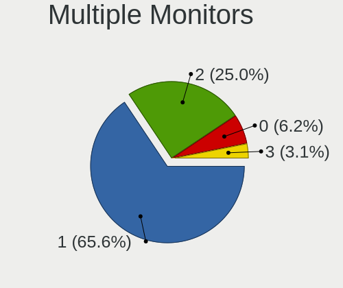

| Total | Desktops | Percent |
|-------|----------|---------|
| 1     | 23       | 65.71%  |
| 2     | 5        | 14.29%  |
| 0     | 4        | 11.43%  |
| 4     | 2        | 5.71%   |
| 3     | 1        | 2.86%   |

Network
-------

Net Controller Vendor
---------------------

Controller vendors

| Vendor                | Desktops | Percent |
|-----------------------|----------|---------|
| Realtek Semiconductor | 26       | 63.41%  |
| Intel                 | 9        | 21.95%  |
| Qualcomm Atheros      | 2        | 4.88%   |
| TP-Link               | 1        | 2.44%   |
| Nvidia                | 1        | 2.44%   |
| Mellanox Technologies | 1        | 2.44%   |
| MediaTek              | 1        | 2.44%   |

Net Controller Model
--------------------

Controller models

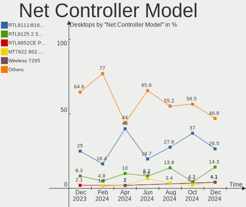

| Model                                                                  | Desktops | Percent |
|------------------------------------------------------------------------|----------|---------|
| Realtek RTL8111/8168/8211/8411 PCI Express Gigabit Ethernet Controller | 20       | 40%     |
| Realtek RTL8125 2.5GbE Controller                                      | 5        | 10%     |
| Realtek RTL-8100/8101L/8139 PCI Fast Ethernet Adapter                  | 2        | 4%      |
| Intel I211 Gigabit Network Connection                                  | 2        | 4%      |
| Intel Ethernet Connection (7) I219-V                                   | 2        | 4%      |
| TP-Link TL-WN823N v2/v3 [Realtek RTL8192EU]                            | 1        | 2%      |
| Realtek RTL88x2bu [AC1200 Techkey]                                     | 1        | 2%      |
| Realtek RTL8852CE PCIe 802.11ax Wireless Network Controller            | 1        | 2%      |
| Realtek RTL8822BE 802.11a/b/g/n/ac WiFi adapter                        | 1        | 2%      |
| Realtek RTL8188CUS 802.11n WLAN Adapter                                | 1        | 2%      |
| Qualcomm Atheros QCA9565 / AR9565 Wireless Network Adapter             | 1        | 2%      |
| Qualcomm Atheros AR9285 Wireless Network Adapter (PCI-Express)         | 1        | 2%      |
| Nvidia MCP61 Ethernet                                                  | 1        | 2%      |
| Mellanox MT27710 Family [ConnectX-4 Lx]                                | 1        | 2%      |
| MediaTek MT7922 802.11ax PCI Express Wireless Network Adapter          | 1        | 2%      |
| Intel Wireless 7265                                                    | 1        | 2%      |
| Intel I210 Gigabit Network Connection                                  | 1        | 2%      |
| Intel Ethernet Controller I225-V                                       | 1        | 2%      |
| Intel Ethernet Connection I217-V                                       | 1        | 2%      |
| Intel Cannon Lake PCH CNVi WiFi                                        | 1        | 2%      |
| Intel Alder Lake-S PCH CNVi WiFi                                       | 1        | 2%      |
| Intel 82599 10 Gigabit Network Connection                              | 1        | 2%      |
| Intel 82579LM Gigabit Network Connection (Lewisville)                  | 1        | 2%      |
| Intel 82566DC Gigabit Network Connection                               | 1        | 2%      |

Wireless Vendor
---------------

Wireless vendors

| Vendor                | Desktops | Percent |
|-----------------------|----------|---------|
| Realtek Semiconductor | 4        | 36.36%  |
| Intel                 | 3        | 27.27%  |
| Qualcomm Atheros      | 2        | 18.18%  |
| TP-Link               | 1        | 9.09%   |
| MediaTek              | 1        | 9.09%   |

Wireless Model
--------------

Wireless models

| Model                                                          | Desktops | Percent |
|----------------------------------------------------------------|----------|---------|
| TP-Link TL-WN823N v2/v3 [Realtek RTL8192EU]                    | 1        | 9.09%   |
| Realtek RTL88x2bu [AC1200 Techkey]                             | 1        | 9.09%   |
| Realtek RTL8852CE PCIe 802.11ax Wireless Network Controller    | 1        | 9.09%   |
| Realtek RTL8822BE 802.11a/b/g/n/ac WiFi adapter                | 1        | 9.09%   |
| Realtek RTL8188CUS 802.11n WLAN Adapter                        | 1        | 9.09%   |
| Qualcomm Atheros QCA9565 / AR9565 Wireless Network Adapter     | 1        | 9.09%   |
| Qualcomm Atheros AR9285 Wireless Network Adapter (PCI-Express) | 1        | 9.09%   |
| MediaTek MT7922 802.11ax PCI Express Wireless Network Adapter  | 1        | 9.09%   |
| Intel Wireless 7265                                            | 1        | 9.09%   |
| Intel Cannon Lake PCH CNVi WiFi                                | 1        | 9.09%   |
| Intel Alder Lake-S PCH CNVi WiFi                               | 1        | 9.09%   |

Ethernet Vendor
---------------

Ethernet vendors

| Vendor                | Desktops | Percent |
|-----------------------|----------|---------|
| Realtek Semiconductor | 26       | 72.22%  |
| Intel                 | 8        | 22.22%  |
| Nvidia                | 1        | 2.78%   |
| Mellanox Technologies | 1        | 2.78%   |

Ethernet Model
--------------

Ethernet models

| Model                                                                  | Desktops | Percent |
|------------------------------------------------------------------------|----------|---------|
| Realtek RTL8111/8168/8211/8411 PCI Express Gigabit Ethernet Controller | 20       | 51.28%  |
| Realtek RTL8125 2.5GbE Controller                                      | 5        | 12.82%  |
| Realtek RTL-8100/8101L/8139 PCI Fast Ethernet Adapter                  | 2        | 5.13%   |
| Intel I211 Gigabit Network Connection                                  | 2        | 5.13%   |
| Intel Ethernet Connection (7) I219-V                                   | 2        | 5.13%   |
| Nvidia MCP61 Ethernet                                                  | 1        | 2.56%   |
| Mellanox MT27710 Family [ConnectX-4 Lx]                                | 1        | 2.56%   |
| Intel I210 Gigabit Network Connection                                  | 1        | 2.56%   |
| Intel Ethernet Controller I225-V                                       | 1        | 2.56%   |
| Intel Ethernet Connection I217-V                                       | 1        | 2.56%   |
| Intel 82599 10 Gigabit Network Connection                              | 1        | 2.56%   |
| Intel 82579LM Gigabit Network Connection (Lewisville)                  | 1        | 2.56%   |
| Intel 82566DC Gigabit Network Connection                               | 1        | 2.56%   |

Net Controller Kind
-------------------

Ethernet, WiFi or modem

| Kind     | Desktops | Percent |
|----------|----------|---------|
| Ethernet | 34       | 75.56%  |
| WiFi     | 11       | 24.44%  |

Used Controller
---------------

Currently used network controller

| Kind     | Desktops | Percent |
|----------|----------|---------|
| Ethernet | 33       | 91.67%  |
| WiFi     | 3        | 8.33%   |

NICs
----

Total network controllers on board

| Total | Desktops | Percent |
|-------|----------|---------|
| 1     | 22       | 62.86%  |
| 2     | 10       | 28.57%  |
| 4     | 1        | 2.86%   |
| 3     | 1        | 2.86%   |
| 0     | 1        | 2.86%   |

IPv6
----

IPv6 vs IPv4

| Used | Desktops | Percent |
|------|----------|---------|
| No   | 20       | 57.14%  |
| Yes  | 15       | 42.86%  |

Bluetooth
---------

Bluetooth Vendor
----------------

Controller vendors

| Vendor                          | Desktops | Percent |
|---------------------------------|----------|---------|
| Cambridge Silicon Radio         | 4        | 30.77%  |
| Intel                           | 3        | 23.08%  |
| Realtek Semiconductor           | 2        | 15.38%  |
| Qualcomm Atheros Communications | 1        | 7.69%   |
| MediaTek                        | 1        | 7.69%   |
| Logitech                        | 1        | 7.69%   |
| ASUSTek Computer                | 1        | 7.69%   |

Bluetooth Model
---------------

Controller models

| Model                                               | Desktops | Percent |
|-----------------------------------------------------|----------|---------|
| Cambridge Silicon Radio Bluetooth Dongle (HCI mode) | 4        | 30.77%  |
| Realtek RTL8822BE Bluetooth 4.2 Adapter             | 1        | 7.69%   |
| Realtek Bluetooth Radio                             | 1        | 7.69%   |
| Qualcomm Atheros  Bluetooth Device                  | 1        | 7.69%   |
| MediaTek Wireless_Device                            | 1        | 7.69%   |
| Logitech BT Mini-Receiver (HCI mode)                | 1        | 7.69%   |
| Intel Bluetooth wireless interface                  | 1        | 7.69%   |
| Intel Bluetooth 9460/9560 Jefferson Peak (JfP)      | 1        | 7.69%   |
| Intel AX201 Bluetooth                               | 1        | 7.69%   |
| ASUS Broadcom BCM20702A0 Bluetooth                  | 1        | 7.69%   |

Sound
-----

Sound Vendor
------------

Sound card vendors

| Vendor                   | Desktops | Percent |
|--------------------------|----------|---------|
| AMD                      | 18       | 29.51%  |
| Nvidia                   | 17       | 27.87%  |
| Intel                    | 16       | 26.23%  |
| Micro Star International | 2        | 3.28%   |
| C-Media Electronics      | 2        | 3.28%   |
| SteelSeries ApS          | 1        | 1.64%   |
| Sony                     | 1        | 1.64%   |
| Samson Technologies      | 1        | 1.64%   |
| Ensoniq                  | 1        | 1.64%   |
| Dell                     | 1        | 1.64%   |
| Creative Labs            | 1        | 1.64%   |

Sound Model
-----------

Sound card models

| Model                                                                      | Desktops | Percent |
|----------------------------------------------------------------------------|----------|---------|
| AMD Family 17h/19h HD Audio Controller                                     | 5        | 6.67%   |
| AMD Starship/Matisse HD Audio Controller                                   | 4        | 5.33%   |
| AMD Rembrandt Radeon High Definition Audio Controller                      | 4        | 5.33%   |
| Intel Cannon Lake PCH cAVS                                                 | 3        | 4%      |
| AMD SBx00 Azalia (Intel HDA)                                               | 3        | 4%      |
| AMD Navi 31 HDMI/DP Audio                                                  | 3        | 4%      |
| AMD Family 17h (Models 00h-0fh) HD Audio Controller                        | 3        | 4%      |
| Nvidia GP107GL High Definition Audio Controller                            | 2        | 2.67%   |
| Nvidia GK107 HDMI Audio Controller                                         | 2        | 2.67%   |
| Nvidia GF119 HDMI Audio Controller                                         | 2        | 2.67%   |
| Micro Star International USB Audio                                         | 2        | 2.67%   |
| Intel 7 Series/C216 Chipset Family High Definition Audio Controller        | 2        | 2.67%   |
| Intel 5 Series/3400 Series Chipset High Definition Audio                   | 2        | 2.67%   |
| SteelSeries ApS Arctis 7P+                                                 | 1        | 1.33%   |
| Sony DualSense wireless controller (PS5)                                   | 1        | 1.33%   |
| Samson Technologies Meteor condenser microphone                            | 1        | 1.33%   |
| Nvidia TU106 High Definition Audio Controller                              | 1        | 1.33%   |
| Nvidia TU104 HD Audio Controller                                           | 1        | 1.33%   |
| Nvidia MCP61 High Definition Audio                                         | 1        | 1.33%   |
| Nvidia GP106 High Definition Audio Controller                              | 1        | 1.33%   |
| Nvidia GP104 High Definition Audio Controller                              | 1        | 1.33%   |
| Nvidia GK208 HDMI/DP Audio Controller                                      | 1        | 1.33%   |
| Nvidia GF106 High Definition Audio Controller                              | 1        | 1.33%   |
| Nvidia GA106 High Definition Audio Controller                              | 1        | 1.33%   |
| Nvidia GA104 High Definition Audio Controller                              | 1        | 1.33%   |
| Nvidia GA102 High Definition Audio Controller                              | 1        | 1.33%   |
| Nvidia Audio device                                                        | 1        | 1.33%   |
| Intel Xeon E3-1200 v3/4th Gen Core Processor HD Audio Controller           | 1        | 1.33%   |
| Intel Sunrise Point-LP HD Audio                                            | 1        | 1.33%   |
| Intel Alder Lake-S HD Audio Controller                                     | 1        | 1.33%   |
| Intel 9 Series Chipset Family HD Audio Controller                          | 1        | 1.33%   |
| Intel 82801JI (ICH10 Family) HD Audio Controller                           | 1        | 1.33%   |
| Intel 82801H (ICH8 Family) HD Audio Controller                             | 1        | 1.33%   |
| Intel 8 Series/C220 Series Chipset High Definition Audio Controller        | 1        | 1.33%   |
| Intel 6 Series/C200 Series Chipset Family High Definition Audio Controller | 1        | 1.33%   |
| Intel 200 Series PCH HD Audio                                              | 1        | 1.33%   |
| Intel 100 Series/C230 Series Chipset Family HD Audio Controller            | 1        | 1.33%   |
| Ensoniq ES1371/ES1373 / Creative Labs CT2518                               | 1        | 1.33%   |
| Dell AC511 Sound Bar                                                       | 1        | 1.33%   |
| Creative Labs CA0106/CA0111 [SB Live!/Audigy/X-Fi Series]                  | 1        | 1.33%   |

Memory
------

Memory Vendor
-------------

Memory module vendors

| Vendor              | Desktops | Percent |
|---------------------|----------|---------|
| Kingston            | 3        | 16.67%  |
| G.Skill             | 3        | 16.67%  |
| Samsung Electronics | 2        | 11.11%  |
| Micron Technology   | 2        | 11.11%  |
| Corsair             | 2        | 11.11%  |
| Unknown             | 1        | 5.56%   |
| TakeMS              | 1        | 5.56%   |
| SK hynix            | 1        | 5.56%   |
| Nanya Technology    | 1        | 5.56%   |
| Crucial             | 1        | 5.56%   |
| A-DATA Technology   | 1        | 5.56%   |

Memory Model
------------

Memory module models

| Model                                                   | Desktops | Percent |
|---------------------------------------------------------|----------|---------|
| G.Skill RAM F5-6000J3636F16G 16GB DIMM DDR5 6400MT/s    | 2        | 10.53%  |
| Unknown RAM Module 4GB DIMM SDRAM                       | 1        | 5.26%   |
| TakeMS RAM Module 2GB DIMM DDR2 800MT/s                 | 1        | 5.26%   |
| SK hynix RAM HMA851S6CJR6N-VK 4GB DDR4 2400MT/s         | 1        | 5.26%   |
| Samsung RAM M378B5173QH0-CK0 4GB DIMM DDR3 1600MT/s     | 1        | 5.26%   |
| Samsung RAM M378A1K43CB2-CTD 8GB DIMM DDR4 3266MT/s     | 1        | 5.26%   |
| Nanya RAM M2F2G64CB88G7N-CG 2GB DIMM DDR3 1333MT/s      | 1        | 5.26%   |
| Micron RAM 8JTF51264AZ-1G6E1 4GB DIMM DDR3 1600MT/s     | 1        | 5.26%   |
| Micron RAM 18ADF2G72AZ-2G6E1 16384MB DIMM DDR4 2667MT/s | 1        | 5.26%   |
| Kingston RAM Module 2GB DIMM DDR2 800MT/s               | 1        | 5.26%   |
| Kingston RAM KHX3466C16D4/8GX 8GB DIMM DDR4 3466MT/s    | 1        | 5.26%   |
| Kingston RAM KF3600C18D4/16GX 16GB DIMM DDR4 3733MT/s   | 1        | 5.26%   |
| G.Skill RAM F5-6000J3238G32G 32GB DIMM DDR5 4800MT/s    | 1        | 5.26%   |
| Crucial RAM BLT8G4D30AETA.K16FE 8GB DIMM DDR4 3000MT/s  | 1        | 5.26%   |
| Corsair RAM CMK32GX4M2B3000C15 16GB DIMM DDR4 3000MT/s  | 1        | 5.26%   |
| Corsair RAM CMK16GX5M2B5200C40 8GB DIMM DDR5 4800MT/s   | 1        | 5.26%   |
| Corsair RAM CMK16GX4M2B3000C15 8GB DIMM DDR4 3600MT/s   | 1        | 5.26%   |
| A-DATA RAM Module 4GB DIMM DDR3 1600MT/s                | 1        | 5.26%   |

Memory Kind
-----------

Memory module kinds

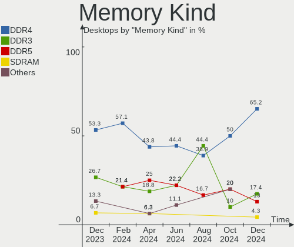

| Kind  | Desktops | Percent |
|-------|----------|---------|
| DDR4  | 7        | 43.75%  |
| DDR5  | 4        | 25%     |
| DDR3  | 3        | 18.75%  |
| SDRAM | 1        | 6.25%   |
| DDR2  | 1        | 6.25%   |

Memory Form Factor
------------------

Physical design of the memory module

| Name    | Desktops | Percent |
|---------|----------|---------|
| DIMM    | 15       | 93.75%  |
| Unknown | 1        | 6.25%   |

Memory Size
-----------

Memory module size

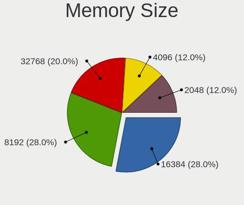

| Size  | Desktops | Percent |
|-------|----------|---------|
| 16384 | 5        | 31.25%  |
| 8192  | 4        | 25%     |
| 4096  | 4        | 25%     |
| 2048  | 2        | 12.5%   |
| 32768 | 1        | 6.25%   |

Memory Speed
------------

Memory module speed

| Speed   | Desktops | Percent |
|---------|----------|---------|
| 6400    | 2        | 11.11%  |
| 4800    | 2        | 11.11%  |
| 3000    | 2        | 11.11%  |
| 1600    | 2        | 11.11%  |
| 3733    | 1        | 5.56%   |
| 3600    | 1        | 5.56%   |
| 3466    | 1        | 5.56%   |
| 3266    | 1        | 5.56%   |
| 2667    | 1        | 5.56%   |
| 2400    | 1        | 5.56%   |
| 1866    | 1        | 5.56%   |
| 1333    | 1        | 5.56%   |
| 800     | 1        | 5.56%   |
| Unknown | 1        | 5.56%   |

Printers & scanners
-------------------

Printer Vendor
--------------

Printer device vendors

| Vendor             | Desktops | Percent |
|--------------------|----------|---------|
| Hewlett-Packard    | 1        | 50%     |
| Brother Industries | 1        | 50%     |

Printer Model
-------------

Printer device models

| Model                  | Desktops | Percent |
|------------------------|----------|---------|
| HP DeskJet 2600 series | 1        | 50%     |
| Brother DCP-9020CDW    | 1        | 50%     |

Scanner Vendor
--------------

Scanner device vendors

| Vendor      | Desktops | Percent |
|-------------|----------|---------|
| Seiko Epson | 1        | 100%    |

Scanner Model
-------------

Scanner device models

| Model                                       | Desktops | Percent |
|---------------------------------------------|----------|---------|
| Seiko Epson GT-X820 [Perfection V600 Photo] | 1        | 100%    |

Camera
------

Camera Vendor
-------------

Camera device vendors

| Vendor              | Desktops | Percent |
|---------------------|----------|---------|
| Samsung Electronics | 1        | 25%     |
| Logitech            | 1        | 25%     |
| GEMBIRD             | 1        | 25%     |
| Cubeternet          | 1        | 25%     |

Camera Model
------------

Camera device models

| Model                                             | Desktops | Percent |
|---------------------------------------------------|----------|---------|
| Samsung Galaxy series, misc. (MTP mode)           | 1        | 25%     |
| Logitech Webcam C270                              | 1        | 25%     |
| GEMBIRD Generic UVC 1.00 camera [AppoTech AX2311] | 1        | 25%     |
| Cubeternet USB2.0 Camera                          | 1        | 25%     |

Security
--------

Fingerprint Vendor
------------------

Fingerprint sensor vendors

Zero info for selected period =(

Fingerprint Model
-----------------

Fingerprint sensor models

Zero info for selected period =(

Chipcard Vendor
---------------

Chipcard module vendors

Zero info for selected period =(

Chipcard Model
--------------

Chipcard module models

Zero info for selected period =(

Unsupported
-----------

Unsupported Devices
-------------------

Total unsupported devices on board

| Total | Desktops | Percent |
|-------|----------|---------|
| 0     | 29       | 82.86%  |
| 1     | 5        | 14.29%  |
| 2     | 1        | 2.86%   |

Unsupported Device Types
------------------------

Types of unsupported devices

| Type                     | Desktops | Percent |
|--------------------------|----------|---------|
| Graphics card            | 5        | 83.33%  |
| Communication controller | 1        | 16.67%  |

