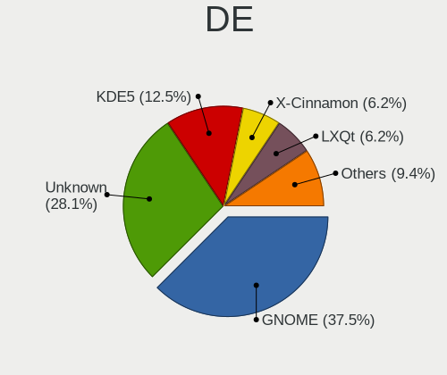
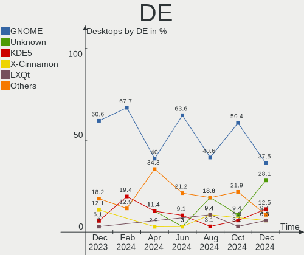
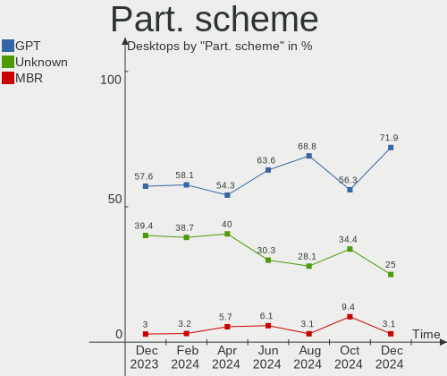
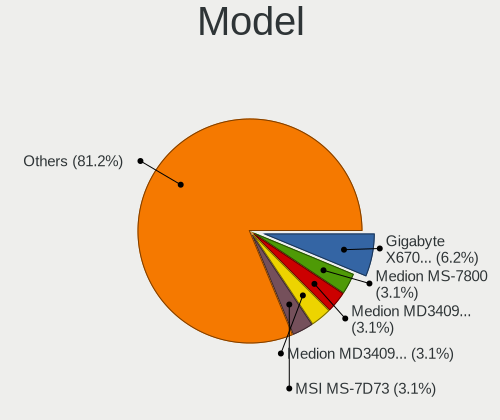
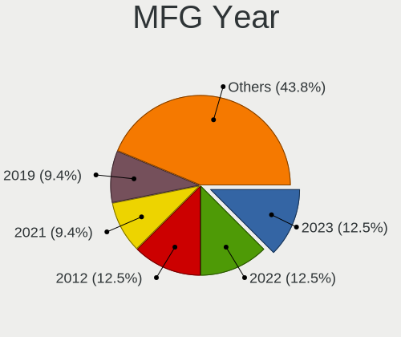
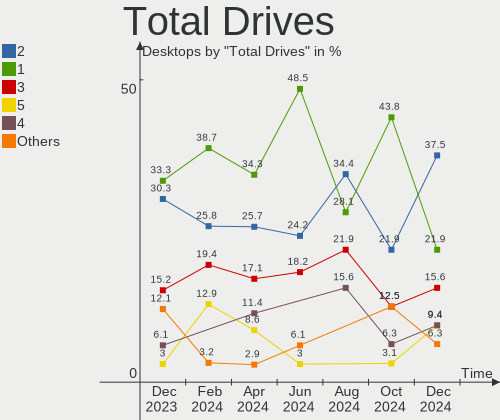
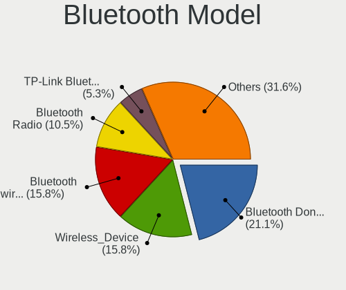
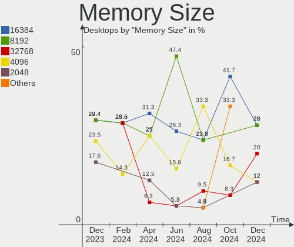

Linux in Netherlands - Hardware Trends (Desktops)
-------------------------------------------------

A project to identify most popular hardware characteristics and track their change
over time based on data collected by Linux users at https://Linux-Hardware.org.

Anyone can contribute to this report by the [hw-probe](https://github.com/linuxhw/hw-probe) tool:

    sudo -E hw-probe -all -upload

Period: Feb, 2023.

Contents
--------

* [ System ](#system)
  - [ OS                       ](#os)
  - [ OS Family                ](#os-family)
  - [ Kernel                   ](#kernel)
  - [ Kernel Family            ](#kernel-family)
  - [ Kernel Major Ver.        ](#kernel-major-ver)
  - [ Arch                     ](#arch)
  - [ DE                       ](#de)
  - [ Display Server           ](#display-server)
  - [ Display Manager          ](#display-manager)
  - [ OS Lang                  ](#os-lang)
  - [ Boot Mode                ](#boot-mode)
  - [ Filesystem               ](#filesystem)
  - [ Part. scheme             ](#part-scheme)
  - [ Dual Boot with Linux/BSD ](#dual-boot-with-linuxbsd)
  - [ Dual Boot (Win)          ](#dual-boot-win)

* [ Board ](#board)
  - [ Vendor                   ](#vendor)
  - [ Model                    ](#model)
  - [ Model Family             ](#model-family)
  - [ MFG Year                 ](#mfg-year)
  - [ Form Factor              ](#form-factor)
  - [ Secure Boot              ](#secure-boot)
  - [ Coreboot                 ](#coreboot)
  - [ RAM Size                 ](#ram-size)
  - [ RAM Used                 ](#ram-used)
  - [ Total Drives             ](#total-drives)
  - [ Has CD-ROM               ](#has-cd-rom)
  - [ Has Ethernet             ](#has-ethernet)
  - [ Has WiFi                 ](#has-wifi)
  - [ Has Bluetooth            ](#has-bluetooth)

* [ Location ](#location)
  - [ Country                  ](#country)
  - [ City                     ](#city)

* [ Drives ](#drives)
  - [ Drive Vendor             ](#drive-vendor)
  - [ Drive Model              ](#drive-model)
  - [ HDD Vendor               ](#hdd-vendor)
  - [ SSD Vendor               ](#ssd-vendor)
  - [ Drive Kind               ](#drive-kind)
  - [ Drive Connector          ](#drive-connector)
  - [ Drive Size               ](#drive-size)
  - [ Space Total              ](#space-total)
  - [ Space Used               ](#space-used)
  - [ Malfunc. Drives          ](#malfunc-drives)
  - [ Malfunc. Drive Vendor    ](#malfunc-drive-vendor)
  - [ Malfunc. HDD Vendor      ](#malfunc-hdd-vendor)
  - [ Malfunc. Drive Kind      ](#malfunc-drive-kind)
  - [ Failed Drives            ](#failed-drives)
  - [ Failed Drive Vendor      ](#failed-drive-vendor)
  - [ Drive Status             ](#drive-status)

* [ Storage controller ](#storage-controller)
  - [ Storage Vendor           ](#storage-vendor)
  - [ Storage Model            ](#storage-model)
  - [ Storage Kind             ](#storage-kind)

* [ Processor ](#processor)
  - [ CPU Vendor               ](#cpu-vendor)
  - [ CPU Model                ](#cpu-model)
  - [ CPU Model Family         ](#cpu-model-family)
  - [ CPU Cores                ](#cpu-cores)
  - [ CPU Sockets              ](#cpu-sockets)
  - [ CPU Threads              ](#cpu-threads)
  - [ CPU Op-Modes             ](#cpu-op-modes)
  - [ CPU Microcode            ](#cpu-microcode)
  - [ CPU Microarch            ](#cpu-microarch)

* [ Graphics ](#graphics)
  - [ GPU Vendor               ](#gpu-vendor)
  - [ GPU Model                ](#gpu-model)
  - [ GPU Combo                ](#gpu-combo)
  - [ GPU Driver               ](#gpu-driver)
  - [ GPU Memory               ](#gpu-memory)

* [ Monitor ](#monitor)
  - [ Monitor Vendor           ](#monitor-vendor)
  - [ Monitor Model            ](#monitor-model)
  - [ Monitor Resolution       ](#monitor-resolution)
  - [ Monitor Diagonal         ](#monitor-diagonal)
  - [ Monitor Width            ](#monitor-width)
  - [ Aspect Ratio             ](#aspect-ratio)
  - [ Monitor Area             ](#monitor-area)
  - [ Pixel Density            ](#pixel-density)
  - [ Multiple Monitors        ](#multiple-monitors)

* [ Network ](#network)
  - [ Net Controller Vendor    ](#net-controller-vendor)
  - [ Net Controller Model     ](#net-controller-model)
  - [ Wireless Vendor          ](#wireless-vendor)
  - [ Wireless Model           ](#wireless-model)
  - [ Ethernet Vendor          ](#ethernet-vendor)
  - [ Ethernet Model           ](#ethernet-model)
  - [ Net Controller Kind      ](#net-controller-kind)
  - [ Used Controller          ](#used-controller)
  - [ NICs                     ](#nics)
  - [ IPv6                     ](#ipv6)

* [ Bluetooth ](#bluetooth)
  - [ Bluetooth Vendor         ](#bluetooth-vendor)
  - [ Bluetooth Model          ](#bluetooth-model)

* [ Sound ](#sound)
  - [ Sound Vendor             ](#sound-vendor)
  - [ Sound Model              ](#sound-model)

* [ Memory ](#memory)
  - [ Memory Vendor            ](#memory-vendor)
  - [ Memory Model             ](#memory-model)
  - [ Memory Kind              ](#memory-kind)
  - [ Memory Form Factor       ](#memory-form-factor)
  - [ Memory Size              ](#memory-size)
  - [ Memory Speed             ](#memory-speed)

* [ Printers & scanners ](#printers--scanners)
  - [ Printer Vendor           ](#printer-vendor)
  - [ Printer Model            ](#printer-model)
  - [ Scanner Vendor           ](#scanner-vendor)
  - [ Scanner Model            ](#scanner-model)

* [ Camera ](#camera)
  - [ Camera Vendor            ](#camera-vendor)
  - [ Camera Model             ](#camera-model)

* [ Security ](#security)
  - [ Fingerprint Vendor       ](#fingerprint-vendor)
  - [ Fingerprint Model        ](#fingerprint-model)
  - [ Chipcard Vendor          ](#chipcard-vendor)
  - [ Chipcard Model           ](#chipcard-model)

* [ Unsupported ](#unsupported)
  - [ Unsupported Devices      ](#unsupported-devices)
  - [ Unsupported Device Types ](#unsupported-device-types)

System
------

OS
--

Installed operating systems

| Name                         | Desktops | Percent |
|------------------------------|----------|---------|
| Ubuntu 22.04                 | 6        | 15%     |
| Linux Mint 21.1              | 5        | 12.5%   |
| Ubuntu 22.10                 | 3        | 7.5%    |
| Ubuntu 20.04                 | 2        | 5%      |
| Pop!_OS 22.04                | 2        | 5%      |
| openSUSE Tumbleweed-XXXXXXXX | 2        | 5%      |
| OpenMandriva 23.01           | 2        | 5%      |
| KDE neon 22.04               | 2        | 5%      |
| Fedora 37                    | 2        | 5%      |
| Arch Rolling                 | 2        | 5%      |
| Zorin 16                     | 1        | 2.5%    |
| Xubuntu 22.04                | 1        | 2.5%    |
| Siduction                    | 1        | 2.5%    |
| OpenMandriva 4.3             | 1        | 2.5%    |
| Manjaro                      | 1        | 2.5%    |
| Linux Mint 21                | 1        | 2.5%    |
| Kubuntu 22.10                | 1        | 2.5%    |
| Kali 2022.4                  | 1        | 2.5%    |
| Endless 5.0.0                | 1        | 2.5%    |
| EndeavourOS Rolling          | 1        | 2.5%    |
| Debian 11                    | 1        | 2.5%    |
| Debian                       | 1        | 2.5%    |

OS Family
---------

OS without a version

| Name         | Desktops | Percent |
|--------------|----------|---------|
| Ubuntu       | 11       | 27.5%   |
| Linux Mint   | 6        | 15%     |
| OpenMandriva | 3        | 7.5%    |
| Pop!_OS      | 2        | 5%      |
| openSUSE     | 2        | 5%      |
| KDE neon     | 2        | 5%      |
| Fedora       | 2        | 5%      |
| Debian       | 2        | 5%      |
| Arch         | 2        | 5%      |
| Zorin        | 1        | 2.5%    |
| Xubuntu      | 1        | 2.5%    |
| Siduction    | 1        | 2.5%    |
| Manjaro      | 1        | 2.5%    |
| Kubuntu      | 1        | 2.5%    |
| Kali         | 1        | 2.5%    |
| Endless      | 1        | 2.5%    |
| EndeavourOS  | 1        | 2.5%    |

Kernel
------

Version of the Linux kernel

| Version                  | Desktops | Percent |
|--------------------------|----------|---------|
| 5.15.0-60-generic        | 7        | 17.5%   |
| 5.19.0-32-generic        | 5        | 12.5%   |
| 6.1.12-arch1-1           | 2        | 5%      |
| 6.1.10-1-default         | 2        | 5%      |
| 6.1.1-desktop-1omv2290   | 2        | 5%      |
| 5.19.0-31-generic        | 2        | 5%      |
| 5.15.0-58-generic        | 2        | 5%      |
| 6.1.9-200.fc37.x86_64    | 1        | 2.5%    |
| 6.1.8-arch1-1            | 1        | 2.5%    |
| 6.1.7-060107-generic     | 1        | 2.5%    |
| 6.1.12-x64v3-xanmod1     | 1        | 2.5%    |
| 6.1.10-200.fc37.x86_64   | 1        | 2.5%    |
| 6.1.10-2-siduction-amd64 | 1        | 2.5%    |
| 6.1.0-4-amd64            | 1        | 2.5%    |
| 6.0.12-76060006-generic  | 1        | 2.5%    |
| 6.0.0-kali6-amd64        | 1        | 2.5%    |
| 5.4.0-139-generic        | 1        | 2.5%    |
| 5.4.0-132-generic        | 1        | 2.5%    |
| 5.16.7-desktop-1omv4003  | 1        | 2.5%    |
| 5.15.93-1-MANJARO        | 1        | 2.5%    |
| 5.15.0-60-lowlatency     | 1        | 2.5%    |
| 5.15.0-56-generic        | 1        | 2.5%    |
| 5.15.0-52-generic        | 1        | 2.5%    |
| 5.15.0-47-generic        | 1        | 2.5%    |
| 5.10.0-21-amd64          | 1        | 2.5%    |

Kernel Family
-------------

Linux kernel without a distro release

| Version | Desktops | Percent |
|---------|----------|---------|
| 5.15.0  | 13       | 32.5%   |
| 5.19.0  | 7        | 17.5%   |
| 6.1.10  | 4        | 10%     |
| 6.1.12  | 3        | 7.5%    |
| 6.1.1   | 2        | 5%      |
| 5.4.0   | 2        | 5%      |
| 6.1.9   | 1        | 2.5%    |
| 6.1.8   | 1        | 2.5%    |
| 6.1.7   | 1        | 2.5%    |
| 6.1.0   | 1        | 2.5%    |
| 6.0.12  | 1        | 2.5%    |
| 6.0.0   | 1        | 2.5%    |
| 5.16.7  | 1        | 2.5%    |
| 5.15.93 | 1        | 2.5%    |
| 5.10.0  | 1        | 2.5%    |

Kernel Major Ver.
-----------------

Linux kernel major version

| Version | Desktops | Percent |
|---------|----------|---------|
| 5.15    | 14       | 35%     |
| 6.1     | 13       | 32.5%   |
| 5.19    | 7        | 17.5%   |
| 6.0     | 2        | 5%      |
| 5.4     | 2        | 5%      |
| 5.16    | 1        | 2.5%    |
| 5.10    | 1        | 2.5%    |

Arch
----

OS architecture (x86_64, i586, etc.)

| Name   | Desktops | Percent |
|--------|----------|---------|
| x86_64 | 40       | 100%    |

DE
--

Desktop Environment

| Name          | Desktops | Percent |
|---------------|----------|---------|
| GNOME         | 15       | 37.5%   |
| KDE5          | 10       | 25%     |
| XFCE          | 6        | 15%     |
| X-Cinnamon    | 6        | 15%     |
| qtile         | 1        | 2.5%    |
| Enlightenment | 1        | 2.5%    |
| Unknown       | 1        | 2.5%    |

Display Server
--------------

X11 or Wayland

| Name    | Desktops | Percent |
|---------|----------|---------|
| X11     | 29       | 72.5%   |
| Wayland | 9        | 22.5%   |
| Tty     | 1        | 2.5%    |
| Unknown | 1        | 2.5%    |

Display Manager
---------------

SDDM, LightDM, etc.

| Name    | Desktops | Percent |
|---------|----------|---------|
| Unknown | 18       | 45%     |
| GDM3    | 9        | 22.5%   |
| SDDM    | 7        | 17.5%   |
| LightDM | 5        | 12.5%   |
| GDM     | 1        | 2.5%    |

OS Lang
-------

Language

| Lang  | Desktops | Percent |
|-------|----------|---------|
| nl_NL | 18       | 45%     |
| en_US | 16       | 40%     |
| en_GB | 2        | 5%      |
| nl_BE | 1        | 2.5%    |
| fr_FR | 1        | 2.5%    |
| en_IE | 1        | 2.5%    |
| de_DE | 1        | 2.5%    |

Boot Mode
---------

EFI or BIOS

| Mode | Desktops | Percent |
|------|----------|---------|
| BIOS | 23       | 57.5%   |
| EFI  | 17       | 42.5%   |

Filesystem
----------

Type of filesystem

| Type    | Desktops | Percent |
|---------|----------|---------|
| Ext4    | 30       | 75%     |
| Btrfs   | 7        | 17.5%   |
| Overlay | 2        | 5%      |
| Xfs     | 1        | 2.5%    |

Part. scheme
------------

Scheme of partitioning

| Type    | Desktops | Percent |
|---------|----------|---------|
| GPT     | 20       | 50%     |
| Unknown | 17       | 42.5%   |
| MBR     | 3        | 7.5%    |

Dual Boot with Linux/BSD
------------------------

Hosting more than one Linux/BSD

| Dual boot | Desktops | Percent |
|-----------|----------|---------|
| No        | 35       | 87.5%   |
| Yes       | 5        | 12.5%   |

Dual Boot (Win)
---------------

Hosting Linux and Windows

| Dual boot | Desktops | Percent |
|-----------|----------|---------|
| No        | 28       | 70%     |
| Yes       | 12       | 30%     |

Board
-----

Vendor
------

Motherboard manufacturer

| Name                                 | Desktops | Percent |
|--------------------------------------|----------|---------|
| ASUSTek Computer                     | 11       | 27.5%   |
| MSI                                  | 7        | 17.5%   |
| Hewlett-Packard                      | 5        | 12.5%   |
| Gigabyte Technology                  | 4        | 10%     |
| ASRock                               | 3        | 7.5%    |
| Medion                               | 2        | 5%      |
| Dell                                 | 2        | 5%      |
| Acer                                 | 2        | 5%      |
| Sun Microsystems                     | 1        | 2.5%    |
| Shenzhen Meigao Electronic Equipment | 1        | 2.5%    |
| Intel                                | 1        | 2.5%    |
| Huanan                               | 1        | 2.5%    |

Model
-----

Motherboard model

| Name                                       | Desktops | Percent |
|--------------------------------------------|----------|---------|
| MSI MS-7B98                                | 2        | 5%      |
| Sun Microsystems Ultra 24                  | 1        | 2.5%    |
| Shenzhen Meigao Electronic Equipment UM690 | 1        | 2.5%    |
| MSI MS-7D77                                | 1        | 2.5%    |
| MSI MS-7D43                                | 1        | 2.5%    |
| MSI MS-7C02                                | 1        | 2.5%    |
| MSI MS-7885                                | 1        | 2.5%    |
| MSI MS-7376                                | 1        | 2.5%    |
| Medion MS-7797                             | 1        | 2.5%    |
| Medion MS-7616                             | 1        | 2.5%    |
| Intel Milestone Husky                      | 1        | 2.5%    |
| Huanan X99-F8D PLUS V1.1                   | 1        | 2.5%    |
| HP ProLiant MicroServer                    | 1        | 2.5%    |
| HP EliteDesk 800 G6 Small Form Factor PC   | 1        | 2.5%    |
| HP Compaq dc7900 Small Form Factor         | 1        | 2.5%    |
| HP Compaq 8000 Elite USDT PC               | 1        | 2.5%    |
| HP 290 G1 SFF Business PC                  | 1        | 2.5%    |
| Gigabyte GA-770TA-UD3                      | 1        | 2.5%    |
| Gigabyte EP45-DS3                          | 1        | 2.5%    |
| Gigabyte B660M GAMING X DDR4               | 1        | 2.5%    |
| Gigabyte B550 GAMING X                     | 1        | 2.5%    |
| Dell Vostro 410                            | 1        | 2.5%    |
| Dell OptiPlex XE2                          | 1        | 2.5%    |
| ASUS TUF Gaming B650-PLUS WIFI             | 1        | 2.5%    |
| ASUS ROG STRIX B550-A GAMING               | 1        | 2.5%    |
| ASUS ROG Maximus X HERO                    | 1        | 2.5%    |
| ASUS PRIME Z270-P                          | 1        | 2.5%    |
| ASUS PRIME X370-A                          | 1        | 2.5%    |
| ASUS PRIME B560M-A                         | 1        | 2.5%    |
| ASUS P8H67                                 | 1        | 2.5%    |
| ASUS P5KC                                  | 1        | 2.5%    |
| ASUS M4A87TD/USB3                          | 1        | 2.5%    |
| ASUS M2N-SLI DELUXE                        | 1        | 2.5%    |
| ASUS All Series                            | 1        | 2.5%    |
| ASRock X300M-STX                           | 1        | 2.5%    |
| ASRock H87 Performance                     | 1        | 2.5%    |
| ASRock B450 Pro4                           | 1        | 2.5%    |
| Acer Aspire XC-780                         | 1        | 2.5%    |
| Acer Aspire M1930                          | 1        | 2.5%    |

Model Family
------------

Motherboard model prefix

| Name                                       | Desktops | Percent |
|--------------------------------------------|----------|---------|
| ASUS PRIME                                 | 3        | 7.5%    |
| MSI MS-7B98                                | 2        | 5%      |
| HP Compaq                                  | 2        | 5%      |
| ASUS ROG                                   | 2        | 5%      |
| Acer Aspire                                | 2        | 5%      |
| Sun Microsystems Ultra                     | 1        | 2.5%    |
| Shenzhen Meigao Electronic Equipment UM690 | 1        | 2.5%    |
| MSI MS-7D77                                | 1        | 2.5%    |
| MSI MS-7D43                                | 1        | 2.5%    |
| MSI MS-7C02                                | 1        | 2.5%    |
| MSI MS-7885                                | 1        | 2.5%    |
| MSI MS-7376                                | 1        | 2.5%    |
| Medion MS-7797                             | 1        | 2.5%    |
| Medion MS-7616                             | 1        | 2.5%    |
| Intel Milestone                            | 1        | 2.5%    |
| Huanan X99-F8D                             | 1        | 2.5%    |
| HP ProLiant                                | 1        | 2.5%    |
| HP EliteDesk                               | 1        | 2.5%    |
| HP 290                                     | 1        | 2.5%    |
| Gigabyte GA-770TA-UD3                      | 1        | 2.5%    |
| Gigabyte EP45-DS3                          | 1        | 2.5%    |
| Gigabyte B660M                             | 1        | 2.5%    |
| Gigabyte B550                              | 1        | 2.5%    |
| Dell Vostro                                | 1        | 2.5%    |
| Dell OptiPlex                              | 1        | 2.5%    |
| ASUS TUF                                   | 1        | 2.5%    |
| ASUS P8H67                                 | 1        | 2.5%    |
| ASUS P5KC                                  | 1        | 2.5%    |
| ASUS M4A87TD                               | 1        | 2.5%    |
| ASUS M2N-SLI                               | 1        | 2.5%    |
| ASUS All                                   | 1        | 2.5%    |
| ASRock X300M-STX                           | 1        | 2.5%    |
| ASRock H87                                 | 1        | 2.5%    |
| ASRock B450                                | 1        | 2.5%    |

MFG Year
--------

Motherboard manufacture year

| Year | Desktops | Percent |
|------|----------|---------|
| 2022 | 4        | 10%     |
| 2021 | 4        | 10%     |
| 2020 | 4        | 10%     |
| 2008 | 4        | 10%     |
| 2018 | 3        | 7.5%    |
| 2009 | 3        | 7.5%    |
| 2019 | 2        | 5%      |
| 2017 | 2        | 5%      |
| 2016 | 2        | 5%      |
| 2014 | 2        | 5%      |
| 2011 | 2        | 5%      |
| 2010 | 2        | 5%      |
| 2007 | 2        | 5%      |
| 2015 | 1        | 2.5%    |
| 2013 | 1        | 2.5%    |
| 2012 | 1        | 2.5%    |
| 2006 | 1        | 2.5%    |

Form Factor
-----------

Physical design of the computer

| Name    | Desktops | Percent |
|---------|----------|---------|
| Desktop | 40       | 100%    |

Secure Boot
-----------

Enabled or disabled

| State    | Desktops | Percent |
|----------|----------|---------|
| Disabled | 38       | 95%     |
| Enabled  | 2        | 5%      |

Coreboot
--------

Have coreboot on board

| Used | Desktops | Percent |
|------|----------|---------|
| No   | 40       | 100%    |

RAM Size
--------

Total RAM memory

| Size in GB  | Desktops | Percent |
|-------------|----------|---------|
| 8.01-16.0   | 11       | 27.5%   |
| 3.01-4.0    | 7        | 17.5%   |
| 32.01-64.0  | 6        | 15%     |
| 16.01-24.0  | 6        | 15%     |
| 64.01-256.0 | 5        | 12.5%   |
| 4.01-8.0    | 2        | 5%      |
| 24.01-32.0  | 2        | 5%      |
| 1.01-2.0    | 1        | 2.5%    |

RAM Used
--------

Used RAM memory

| Used GB   | Desktops | Percent |
|-----------|----------|---------|
| 1.01-2.0  | 19       | 47.5%   |
| 2.01-3.0  | 8        | 20%     |
| 3.01-4.0  | 5        | 12.5%   |
| 4.01-8.0  | 4        | 10%     |
| 8.01-16.0 | 4        | 10%     |

Total Drives
------------

Number of drives on board

| Drives | Desktops | Percent |
|--------|----------|---------|
| 1      | 11       | 27.5%   |
| 2      | 10       | 25%     |
| 4      | 9        | 22.5%   |
| 3      | 6        | 15%     |
| 5      | 3        | 7.5%    |
| 8      | 1        | 2.5%    |

Has CD-ROM
----------

Has CD-ROM on board

| Presented | Desktops | Percent |
|-----------|----------|---------|
| Yes       | 21       | 52.5%   |
| No        | 19       | 47.5%   |

Has Ethernet
------------

Has Ethernet on board

| Presented | Desktops | Percent |
|-----------|----------|---------|
| Yes       | 40       | 100%    |

Has WiFi
--------

Has WiFi module

| Presented | Desktops | Percent |
|-----------|----------|---------|
| No        | 30       | 75%     |
| Yes       | 10       | 25%     |

Has Bluetooth
-------------

Has Bluetooth module

| Presented | Desktops | Percent |
|-----------|----------|---------|
| No        | 31       | 77.5%   |
| Yes       | 9        | 22.5%   |

Location
--------

Country
-------

Geographic location (country)

| Country     | Desktops | Percent |
|-------------|----------|---------|
| Netherlands | 40       | 100%    |

City
----

Geographic location (city)

| City         | Desktops | Percent |
|--------------|----------|---------|
| Amsterdam    | 10       | 25%     |
| Ridderkerk   | 3        | 7.5%    |
| Almere Stad  | 3        | 7.5%    |
| Enschede     | 2        | 5%      |
| Zevenaar     | 1        | 2.5%    |
| Voorthuizen  | 1        | 2.5%    |
| Utrecht      | 1        | 2.5%    |
| The Hague    | 1        | 2.5%    |
| Rotterdam    | 1        | 2.5%    |
| Roermond     | 1        | 2.5%    |
| Oss          | 1        | 2.5%    |
| Oldenzaal    | 1        | 2.5%    |
| Naaldwijk    | 1        | 2.5%    |
| Musselkanaal | 1        | 2.5%    |
| Leeuwarden   | 1        | 2.5%    |
| Kerkdriel    | 1        | 2.5%    |
| Horst        | 1        | 2.5%    |
| Hoogvliet    | 1        | 2.5%    |
| Haarlem      | 1        | 2.5%    |
| Groningen    | 1        | 2.5%    |
| Geldrop      | 1        | 2.5%    |
| Enkhuizen    | 1        | 2.5%    |
| Diever       | 1        | 2.5%    |
| Deurne       | 1        | 2.5%    |
| Brunssum     | 1        | 2.5%    |
| Amstelveen   | 1        | 2.5%    |

Drives
------

Drive Vendor
------------

Hard drive vendors

| Vendor                      | Desktops | Drives | Percent |
|-----------------------------|----------|--------|---------|
| Samsung Electronics         | 18       | 31     | 22.5%   |
| WDC                         | 13       | 18     | 16.25%  |
| Seagate                     | 11       | 17     | 13.75%  |
| Kingston                    | 6        | 7      | 7.5%    |
| SanDisk                     | 5        | 5      | 6.25%   |
| Crucial                     | 3        | 3      | 3.75%   |
| China                       | 3        | 3      | 3.75%   |
| Unknown                     | 2        | 2      | 2.5%    |
| PNY                         | 2        | 2      | 2.5%    |
| Maxtor                      | 2        | 2      | 2.5%    |
| Hitachi                     | 2        | 3      | 2.5%    |
| A-DATA Technology           | 2        | 2      | 2.5%    |
| Transcend                   | 1        | 1      | 1.25%   |
| SK hynix                    | 1        | 1      | 1.25%   |
| Realtek Semiconductor       | 1        | 1      | 1.25%   |
| Phison Electronics          | 1        | 1      | 1.25%   |
| Mushkin                     | 1        | 1      | 1.25%   |
| Kingston Technology Company | 1        | 1      | 1.25%   |
| KESU                        | 1        | 1      | 1.25%   |
| JMicron Technology          | 1        | 1      | 1.25%   |
| HGST                        | 1        | 1      | 1.25%   |
| Gigabyte Technology         | 1        | 1      | 1.25%   |
| Corsair                     | 1        | 1      | 1.25%   |

Drive Model
-----------

Hard drive models

| Model                                                | Desktops | Percent |
|------------------------------------------------------|----------|---------|
| Samsung NVMe SSD Controller SM981/PM981/PM983 250GB  | 4        | 4.04%   |
| WDC WD2500HHTZ-04N21V0 250GB                         | 2        | 2.02%   |
| Seagate ST500DM002-1BD142 500GB                      | 2        | 2.02%   |
| Seagate ST4000DM004-2CV104 4TB                       | 2        | 2.02%   |
| Seagate Expansion 1TB                                | 2        | 2.02%   |
| Samsung SSD 870 EVO 250GB                            | 2        | 2.02%   |
| Samsung SSD 860 EVO 500GB                            | 2        | 2.02%   |
| Samsung NVMe SSD Controller PM9A1/PM9A3/980PRO 960GB | 2        | 2.02%   |
| Kingston SA400S37240G 240GB SSD                      | 2        | 2.02%   |
| WDC WD5000LPVX-28V0TT0 500GB                         | 1        | 1.01%   |
| WDC WD5000HHTZ-04N21V0 500GB                         | 1        | 1.01%   |
| WDC WD40EFRX-68N32N0 4TB                             | 1        | 1.01%   |
| WDC WD3200BEKT-22KA9T0 320GB                         | 1        | 1.01%   |
| WDC WD20PURZ-85GU6Y0 2TB                             | 1        | 1.01%   |
| WDC WD20EFRX-68EUZN0 2TB                             | 1        | 1.01%   |
| WDC WD20EARX-00PASB0 2TB                             | 1        | 1.01%   |
| WDC WD1600AAJS-75B4A0 160GB                          | 1        | 1.01%   |
| WDC WD10EZRX-00L4HB0 1TB                             | 1        | 1.01%   |
| WDC WD10EZRX-00A8LB0 1TB                             | 1        | 1.01%   |
| WDC WD10EZEX-21WN4A0 1TB                             | 1        | 1.01%   |
| WDC WD10EZEX-08WN4A0 1TB                             | 1        | 1.01%   |
| WDC WD10EARS-00Y5B1 1TB                              | 1        | 1.01%   |
| WDC WD Elements SE SSD 2TB                           | 1        | 1.01%   |
| Unknown SD/MMC/MS PRO 16GB                           | 1        | 1.01%   |
| Unknown NVMe SSD Drive 1TB                           | 1        | 1.01%   |
| Transcend TS2TMTE220S 2TB                            | 1        | 1.01%   |
| SK hynix BC501 NVMe Solid State Drive 512GB          | 1        | 1.01%   |
| Seagate ST500VT000-1DK142 500GB                      | 1        | 1.01%   |
| Seagate ST500LM012 HN-M500MBB 500GB                  | 1        | 1.01%   |
| Seagate ST4000VN000-2AH166 4TB                       | 1        | 1.01%   |
| Seagate ST380013AS 80GB                              | 1        | 1.01%   |
| Seagate ST3500418AS 500GB                            | 1        | 1.01%   |
| Seagate ST3160212ACE 160GB                           | 1        | 1.01%   |
| Seagate ST31500541AS 1TB                             | 1        | 1.01%   |
| Seagate ST2000DM008-2UB102 2TB                       | 1        | 1.01%   |
| Sandisk WD Blue SN550 NVMe SSD 1TB                   | 1        | 1.01%   |
| SanDisk SSD U100 8GB                                 | 1        | 1.01%   |
| SanDisk SSD PLUS 120GB                               | 1        | 1.01%   |
| SanDisk SDSSDA120G 120GB                             | 1        | 1.01%   |
| SanDisk SD8SFAT128G 128GB SSD                        | 1        | 1.01%   |

HDD Vendor
----------

Hard disk drive vendors

| Vendor              | Desktops | Drives | Percent |
|---------------------|----------|--------|---------|
| WDC                 | 12       | 17     | 38.71%  |
| Seagate             | 11       | 17     | 35.48%  |
| Maxtor              | 2        | 2      | 6.45%   |
| Hitachi             | 2        | 3      | 6.45%   |
| Unknown             | 1        | 1      | 3.23%   |
| Samsung Electronics | 1        | 2      | 3.23%   |
| KESU                | 1        | 1      | 3.23%   |
| HGST                | 1        | 1      | 3.23%   |

SSD Vendor
----------

Solid state drive vendors

| Vendor              | Desktops | Drives | Percent |
|---------------------|----------|--------|---------|
| Samsung Electronics | 10       | 17     | 32.26%  |
| Kingston            | 5        | 6      | 16.13%  |
| SanDisk             | 4        | 4      | 12.9%   |
| Crucial             | 3        | 3      | 9.68%   |
| China               | 3        | 3      | 9.68%   |
| PNY                 | 2        | 2      | 6.45%   |
| A-DATA Technology   | 2        | 2      | 6.45%   |
| WDC                 | 1        | 1      | 3.23%   |
| Corsair             | 1        | 1      | 3.23%   |

Drive Kind
----------

HDD or SSD

| Kind    | Desktops | Drives | Percent |
|---------|----------|--------|---------|
| SSD     | 25       | 39     | 36.76%  |
| HDD     | 24       | 44     | 35.29%  |
| NVMe    | 18       | 22     | 26.47%  |
| Unknown | 1        | 1      | 1.47%   |

Drive Connector
---------------

SATA, SAS, NVMe, etc.

| Type | Desktops | Drives | Percent |
|------|----------|--------|---------|
| SATA | 32       | 77     | 57.14%  |
| NVMe | 18       | 22     | 32.14%  |
| SAS  | 6        | 7      | 10.71%  |

Drive Size
----------

Size of hard drive

| Size in TB | Desktops | Drives | Percent |
|------------|----------|--------|---------|
| 0.01-0.5   | 25       | 48     | 46.3%   |
| 0.51-1.0   | 15       | 16     | 27.78%  |
| 1.01-2.0   | 8        | 9      | 14.81%  |
| 3.01-4.0   | 5        | 9      | 9.26%   |
| 4.01-10.0  | 1        | 1      | 1.85%   |

Space Total
-----------

Amount of disk space available on the file system

| Size in GB     | Desktops | Percent |
|----------------|----------|---------|
| 1001-2000      | 8        | 20%     |
| 101-250        | 7        | 17.5%   |
| More than 3000 | 5        | 12.5%   |
| 251-500        | 5        | 12.5%   |
| 501-1000       | 5        | 12.5%   |
| 21-50          | 3        | 7.5%    |
| 2001-3000      | 3        | 7.5%    |
| 51-100         | 2        | 5%      |
| 1-20           | 1        | 2.5%    |
| Unknown        | 1        | 2.5%    |

Space Used
----------

Amount of used disk space

| Used GB        | Desktops | Percent |
|----------------|----------|---------|
| 1-20           | 10       | 25%     |
| 21-50          | 8        | 20%     |
| 101-250        | 5        | 12.5%   |
| More than 3000 | 4        | 10%     |
| 501-1000       | 4        | 10%     |
| 51-100         | 4        | 10%     |
| 1001-2000      | 2        | 5%      |
| 251-500        | 1        | 2.5%    |
| 2001-3000      | 1        | 2.5%    |
| Unknown        | 1        | 2.5%    |

Malfunc. Drives
---------------

Drive models with a malfunction

| Model                               | Desktops | Drives | Percent |
|-------------------------------------|----------|--------|---------|
| WDC WD5000HHTZ-04N21V0 500GB        | 1        | 1      | 25%     |
| Samsung Electronics SSD 870 EVO 4TB | 1        | 1      | 25%     |
| Maxtor 6L080M0 80GB                 | 1        | 1      | 25%     |
| Kingston SV300S37A120G 120GB SSD    | 1        | 1      | 25%     |

Malfunc. Drive Vendor
---------------------

Vendors of faulty drives

| Vendor              | Desktops | Drives | Percent |
|---------------------|----------|--------|---------|
| WDC                 | 1        | 1      | 25%     |
| Samsung Electronics | 1        | 1      | 25%     |
| Maxtor              | 1        | 1      | 25%     |
| Kingston            | 1        | 1      | 25%     |

Malfunc. HDD Vendor
-------------------

Vendors of faulty HDD drives

| Vendor | Desktops | Drives | Percent |
|--------|----------|--------|---------|
| WDC    | 1        | 1      | 50%     |
| Maxtor | 1        | 1      | 50%     |

Malfunc. Drive Kind
-------------------

Kinds of faulty drives

| Kind | Desktops | Drives | Percent |
|------|----------|--------|---------|
| SSD  | 2        | 2      | 50%     |
| HDD  | 2        | 2      | 50%     |

Failed Drives
-------------

Failed drive models

Zero info for selected period =(

Failed Drive Vendor
-------------------

Failed drive vendors

Zero info for selected period =(

Drive Status
------------

Number of failed and malfunc. drives

| Status   | Desktops | Drives | Percent |
|----------|----------|--------|---------|
| Detected | 25       | 63     | 56.82%  |
| Works    | 15       | 39     | 34.09%  |
| Malfunc  | 4        | 4      | 9.09%   |

Storage controller
------------------

Storage Vendor
--------------

Storage controller vendors

| Vendor                      | Desktops | Percent |
|-----------------------------|----------|---------|
| Intel                       | 26       | 39.39%  |
| AMD                         | 11       | 16.67%  |
| Samsung Electronics         | 10       | 15.15%  |
| JMicron Technology          | 5        | 7.58%   |
| Silicon Motion              | 2        | 3.03%   |
| Phison Electronics          | 2        | 3.03%   |
| Kingston Technology Company | 2        | 3.03%   |
| VIA Technologies            | 1        | 1.52%   |
| Transcend                   | 1        | 1.52%   |
| SK hynix                    | 1        | 1.52%   |
| SanDisk                     | 1        | 1.52%   |
| Realtek Semiconductor       | 1        | 1.52%   |
| Nvidia                      | 1        | 1.52%   |
| Marvell Technology Group    | 1        | 1.52%   |
| ASMedia Technology          | 1        | 1.52%   |

Storage Model
-------------

Storage controller models

| Model                                                                          | Desktops | Percent |
|--------------------------------------------------------------------------------|----------|---------|
| Samsung NVMe SSD Controller SM981/PM981/PM983                                  | 6        | 7.5%    |
| JMicron JMB363 SATA/IDE Controller                                             | 3        | 3.75%   |
| Intel SATA Controller [RAID mode]                                              | 3        | 3.75%   |
| Intel Cannon Lake PCH SATA AHCI Controller                                     | 3        | 3.75%   |
| AMD SB7x0/SB8x0/SB9x0 IDE Controller                                           | 3        | 3.75%   |
| Silicon Motion SM2262/SM2262EN SSD Controller                                  | 2        | 2.5%    |
| Samsung NVMe SSD Controller PM9A1/PM9A3/980PRO                                 | 2        | 2.5%    |
| Kingston Company Company Non-Volatile memory controller                        | 2        | 2.5%    |
| JMicron JMB368 IDE controller                                                  | 2        | 2.5%    |
| Intel Q170/Q150/B150/H170/H110/Z170/CM236 Chipset SATA Controller [AHCI Mode]  | 2        | 2.5%    |
| Intel Alder Lake-S PCH SATA Controller [AHCI Mode]                             | 2        | 2.5%    |
| Intel 82801I (ICH9 Family) 2 port SATA Controller [IDE mode]                   | 2        | 2.5%    |
| Intel 8 Series/C220 Series Chipset Family 6-port SATA Controller 1 [AHCI mode] | 2        | 2.5%    |
| Intel 4 Series Chipset PT IDER Controller                                      | 2        | 2.5%    |
| AMD SB7x0/SB8x0/SB9x0 SATA Controller [IDE mode]                               | 2        | 2.5%    |
| AMD SATA controller                                                            | 2        | 2.5%    |
| AMD FCH SATA Controller [AHCI mode]                                            | 2        | 2.5%    |
| AMD 500 Series Chipset SATA Controller                                         | 2        | 2.5%    |
| AMD 400 Series Chipset SATA Controller                                         | 2        | 2.5%    |
| VIA VT6415 PATA IDE Host Controller                                            | 1        | 1.25%   |
| Transcend Non-Volatile memory controller                                       | 1        | 1.25%   |
| SK hynix BC501 NVMe Solid State Drive                                          | 1        | 1.25%   |
| SanDisk WD Blue SN550 NVMe SSD                                                 | 1        | 1.25%   |
| Samsung NVMe SSD Controller SM961/PM961/SM963                                  | 1        | 1.25%   |
| Samsung NVMe SSD Controller 980                                                | 1        | 1.25%   |
| Samsung Electronics Non-Volatile memory controller                             | 1        | 1.25%   |
| Realtek Realtek Non-Volatile memory controller                                 | 1        | 1.25%   |
| Phison PS5013 E13 NVMe Controller                                              | 1        | 1.25%   |
| Phison NVMe Storage Controller                                                 | 1        | 1.25%   |
| Nvidia MCP55 SATA Controller                                                   | 1        | 1.25%   |
| Nvidia MCP55 IDE                                                               | 1        | 1.25%   |
| Marvell Group 88SE91A3 SATA-600 Controller                                     | 1        | 1.25%   |
| Intel Comet Lake SATA AHCI Controller                                          | 1        | 1.25%   |
| Intel C610/X99 series chipset sSATA Controller [AHCI mode]                     | 1        | 1.25%   |
| Intel C610/X99 series chipset 6-Port SATA Controller [AHCI mode]               | 1        | 1.25%   |
| Intel 82801JI (ICH10 Family) 4 port SATA IDE Controller #1                     | 1        | 1.25%   |
| Intel 82801JI (ICH10 Family) 2 port SATA IDE Controller #2                     | 1        | 1.25%   |
| Intel 82801JD/DO (ICH10 Family) SATA AHCI Controller                           | 1        | 1.25%   |
| Intel 82801IR/IO/IH (ICH9R/DO/DH) 6 port SATA Controller [AHCI mode]           | 1        | 1.25%   |
| Intel 82801IR/IO/IH (ICH9R/DO/DH) 4 port SATA Controller [IDE mode]            | 1        | 1.25%   |

Storage Kind
------------

Kind of storage controller (IDE, SATA, NVMe, SAS, ...)

| Kind | Desktops | Percent |
|------|----------|---------|
| SATA | 30       | 48.39%  |
| NVMe | 18       | 29.03%  |
| IDE  | 11       | 17.74%  |
| RAID | 3        | 4.84%   |

Processor
---------

CPU Vendor
----------

Processor vendors

| Vendor | Desktops | Percent |
|--------|----------|---------|
| Intel  | 26       | 65%     |
| AMD    | 14       | 35%     |

CPU Model
---------

Processor models

| Model                                      | Desktops | Percent |
|--------------------------------------------|----------|---------|
| Intel Core 2 Quad CPU Q9650 @ 3.00GHz      | 2        | 5%      |
| Intel Core 2 Duo CPU E8400 @ 3.00GHz       | 2        | 5%      |
| AMD Ryzen 5 3600 6-Core Processor          | 2        | 5%      |
| AMD Processor model unknown                | 2        | 5%      |
| Intel Xeon CPU E5-2680 v3 @ 2.50GHz        | 1        | 2.5%    |
| Intel Pentium CPU G630 @ 2.70GHz           | 1        | 2.5%    |
| Intel Core i9-9900K CPU @ 3.60GHz          | 1        | 2.5%    |
| Intel Core i7-9700K CPU @ 3.60GHz          | 1        | 2.5%    |
| Intel Core i7-8700K CPU @ 3.70GHz          | 1        | 2.5%    |
| Intel Core i7-6800K CPU @ 3.40GHz          | 1        | 2.5%    |
| Intel Core i7-4770 CPU @ 3.40GHz           | 1        | 2.5%    |
| Intel Core i7-2600 CPU @ 3.40GHz           | 1        | 2.5%    |
| Intel Core i7-10700 CPU @ 2.90GHz          | 1        | 2.5%    |
| Intel Core i5-6500 CPU @ 3.20GHz           | 1        | 2.5%    |
| Intel Core i5-6400 CPU @ 2.70GHz           | 1        | 2.5%    |
| Intel Core i5-10400F CPU @ 2.90GHz         | 1        | 2.5%    |
| Intel Core i3-8100 CPU @ 3.60GHz           | 1        | 2.5%    |
| Intel Core i3-6100 CPU @ 3.70GHz           | 1        | 2.5%    |
| Intel Core i3-4330 CPU @ 3.50GHz           | 1        | 2.5%    |
| Intel Core i3-4130 CPU @ 3.40GHz           | 1        | 2.5%    |
| Intel Core i3-3220 CPU @ 3.30GHz           | 1        | 2.5%    |
| Intel Core i3 CPU 530 @ 2.93GHz            | 1        | 2.5%    |
| Intel Core 2 Quad CPU Q9400 @ 2.66GHz      | 1        | 2.5%    |
| Intel Core 2 Quad CPU Q6600 @ 2.40GHz      | 1        | 2.5%    |
| Intel 12th Gen Core i9-12900F              | 1        | 2.5%    |
| Intel 12th Gen Core i5-12400               | 1        | 2.5%    |
| AMD Turion II Neo N40L Dual-Core Processor | 1        | 2.5%    |
| AMD Ryzen 9 7900 12-Core Processor         | 1        | 2.5%    |
| AMD Ryzen 9 6900HX with Radeon Graphics    | 1        | 2.5%    |
| AMD Ryzen 9 3900X 12-Core Processor        | 1        | 2.5%    |
| AMD Ryzen 7 PRO 4750G with Radeon Graphics | 1        | 2.5%    |
| AMD Ryzen 7 7700X 8-Core Processor         | 1        | 2.5%    |
| AMD Ryzen 7 5700G with Radeon Graphics     | 1        | 2.5%    |
| AMD Ryzen 3 1300X Quad-Core Processor      | 1        | 2.5%    |
| AMD Phenom II X6 1090T Processor           | 1        | 2.5%    |
| AMD Phenom II X4 955 Processor             | 1        | 2.5%    |

CPU Model Family
----------------

Processor model prefix

| Model             | Desktops | Percent |
|-------------------|----------|---------|
| Intel Core i7     | 6        | 15%     |
| Intel Core i3     | 6        | 15%     |
| Other             | 4        | 10%     |
| Intel Core 2 Quad | 4        | 10%     |
| Intel Core i5     | 3        | 7.5%    |
| AMD Ryzen 9       | 3        | 7.5%    |
| Intel Core 2 Duo  | 2        | 5%      |
| AMD Ryzen 7       | 2        | 5%      |
| AMD Ryzen 5       | 2        | 5%      |
| Intel Xeon        | 1        | 2.5%    |
| Intel Pentium     | 1        | 2.5%    |
| Intel Core i9     | 1        | 2.5%    |
| AMD Turion II Neo | 1        | 2.5%    |
| AMD Ryzen 7 PRO   | 1        | 2.5%    |
| AMD Ryzen 3       | 1        | 2.5%    |
| AMD Phenom II X6  | 1        | 2.5%    |
| AMD Phenom II X4  | 1        | 2.5%    |

CPU Cores
---------

Number of processor cores

| Number | Desktops | Percent |
|--------|----------|---------|
| 4      | 12       | 30%     |
| 2      | 9        | 22.5%   |
| 8      | 7        | 17.5%   |
| 6      | 7        | 17.5%   |
| 12     | 2        | 5%      |
| 24     | 1        | 2.5%    |
| 16     | 1        | 2.5%    |
| 3      | 1        | 2.5%    |

CPU Sockets
-----------

Number of sockets

| Number | Desktops | Percent |
|--------|----------|---------|
| 1      | 39       | 97.5%   |
| 2      | 1        | 2.5%    |

CPU Threads
-----------

Threads per core (Hyper-Threading)

| Number | Desktops | Percent |
|--------|----------|---------|
| 2      | 23       | 57.5%   |
| 1      | 17       | 42.5%   |

CPU Op-Modes
------------

CPU Operation Modes (32-bit, 64-bit)

| Op mode        | Desktops | Percent |
|----------------|----------|---------|
| 32-bit, 64-bit | 40       | 100%    |

CPU Microcode
-------------

Microcode number

| Number     | Desktops | Percent |
|------------|----------|---------|
| Unknown    | 14       | 35%     |
| 0x1067a    | 3        | 7.5%    |
| 0x506e3    | 2        | 5%      |
| 0x306c3    | 2        | 5%      |
| 0x010000c8 | 2        | 5%      |
| 0xa0653    | 1        | 2.5%    |
| 0x906ec    | 1        | 2.5%    |
| 0x906eb    | 1        | 2.5%    |
| 0x90675    | 1        | 2.5%    |
| 0x406f1    | 1        | 2.5%    |
| 0x306f2    | 1        | 2.5%    |
| 0x306a9    | 1        | 2.5%    |
| 0x206a7    | 1        | 2.5%    |
| 0x20652    | 1        | 2.5%    |
| 0x0a601203 | 1        | 2.5%    |
| 0x0a50000d | 1        | 2.5%    |
| 0x0a404102 | 1        | 2.5%    |
| 0x08701021 | 1        | 2.5%    |
| 0x08701013 | 1        | 2.5%    |
| 0x08600106 | 1        | 2.5%    |
| 0x08001129 | 1        | 2.5%    |
| 0x010000dc | 1        | 2.5%    |

CPU Microarch
-------------

Microarchitecture

| Name             | Desktops | Percent |
|------------------|----------|---------|
| Penryn           | 5        | 12.5%   |
| K10              | 5        | 12.5%   |
| Zen 2            | 4        | 10%     |
| KabyLake         | 4        | 10%     |
| Haswell          | 4        | 10%     |
| Unknown          | 4        | 10%     |
| Skylake          | 3        | 7.5%    |
| SandyBridge      | 2        | 5%      |
| CometLake        | 2        | 5%      |
| Zen 3            | 1        | 2.5%    |
| Zen              | 1        | 2.5%    |
| Westmere         | 1        | 2.5%    |
| IvyBridge        | 1        | 2.5%    |
| Core             | 1        | 2.5%    |
| Broadwell        | 1        | 2.5%    |
| Alderlake Hybrid | 1        | 2.5%    |

Graphics
--------

GPU Vendor
----------

Vendors of graphics cards

| Vendor | Desktops | Percent |
|--------|----------|---------|
| Nvidia | 16       | 38.1%   |
| AMD    | 15       | 35.71%  |
| Intel  | 11       | 26.19%  |

GPU Model
---------

Graphics card models

| Model                                                                       | Desktops | Percent |
|-----------------------------------------------------------------------------|----------|---------|
| Intel HD Graphics 530                                                       | 3        | 6.98%   |
| AMD Navi 23 [Radeon RX 6600/6600 XT/6600M]                                  | 3        | 6.98%   |
| Intel CoffeeLake-S GT2 [UHD Graphics 630]                                   | 2        | 4.65%   |
| Nvidia TU117 [GeForce GTX 1650]                                             | 1        | 2.33%   |
| Nvidia TU116 [GeForce GTX 1660]                                             | 1        | 2.33%   |
| Nvidia TU104 [GeForce RTX 2080]                                             | 1        | 2.33%   |
| Nvidia NV41 [GeForce 6800 XT]                                               | 1        | 2.33%   |
| Nvidia GT218 [GeForce 8400 GS Rev. 3]                                       | 1        | 2.33%   |
| Nvidia GT215 [GeForce GT 240]                                               | 1        | 2.33%   |
| Nvidia GP108 [GeForce GT 1030]                                              | 1        | 2.33%   |
| Nvidia GP107 [GeForce GTX 1050]                                             | 1        | 2.33%   |
| Nvidia GP106 [GeForce GTX 1060 6GB]                                         | 1        | 2.33%   |
| Nvidia GP104 [GeForce GTX 1080]                                             | 1        | 2.33%   |
| Nvidia GP104 [GeForce GTX 1070]                                             | 1        | 2.33%   |
| Nvidia GK107 [GeForce GTX 650]                                              | 1        | 2.33%   |
| Nvidia GF110 [GeForce GTX 570]                                              | 1        | 2.33%   |
| Nvidia GF104 [GeForce GTX 460]                                              | 1        | 2.33%   |
| Nvidia GA102 [GeForce RTX 3080 Lite Hash Rate]                              | 1        | 2.33%   |
| Nvidia G92 [GeForce GT 330]                                                 | 1        | 2.33%   |
| Intel Xeon E3-1200 v3/4th Gen Core Processor Integrated Graphics Controller | 1        | 2.33%   |
| Intel CometLake-S GT2 [UHD Graphics 630]                                    | 1        | 2.33%   |
| Intel Alder Lake-S GT1 [UHD Graphics 730]                                   | 1        | 2.33%   |
| Intel 4th Generation Core Processor Family Integrated Graphics Controller   | 1        | 2.33%   |
| Intel 4 Series Chipset Integrated Graphics Controller                       | 1        | 2.33%   |
| Intel 2nd Generation Core Processor Family Integrated Graphics Controller   | 1        | 2.33%   |
| AMD Vega 10 XL/XT [Radeon RX Vega 56/64]                                    | 1        | 2.33%   |
| AMD Turks PRO [Radeon HD 6570/7570/8550 / R5 230]                           | 1        | 2.33%   |
| AMD RV630 XT [Radeon HD 2600 XT]                                            | 1        | 2.33%   |
| AMD RV610 [Radeon HD 2400 PRO]                                              | 1        | 2.33%   |
| AMD Rembrandt [Radeon 680M]                                                 | 1        | 2.33%   |
| AMD Redwood XT [Radeon HD 5670/5690/5730]                                   | 1        | 2.33%   |
| AMD Raphael                                                                 | 1        | 2.33%   |
| AMD Park [Mobility Radeon HD 5430]                                          | 1        | 2.33%   |
| AMD Navi 31 [Radeon RX 7900 XT/7900 XTX]                                    | 1        | 2.33%   |
| AMD Navi 22 [Radeon RX 6700/6700 XT/6750 XT / 6800M/6850M XT]               | 1        | 2.33%   |
| AMD Cypress PRO [Radeon HD 5850]                                            | 1        | 2.33%   |
| AMD Cezanne [Radeon Vega Series / Radeon Vega Mobile Series]                | 1        | 2.33%   |
| AMD Cayman PRO [Radeon HD 6950]                                             | 1        | 2.33%   |

GPU Combo
---------

Combinations of graphics cards

| Name           | Desktops | Percent |
|----------------|----------|---------|
| 1 x Nvidia     | 15       | 37.5%   |
| 1 x AMD        | 14       | 35%     |
| 1 x Intel      | 9        | 22.5%   |
| 2 x AMD        | 1        | 2.5%    |
| Intel + Nvidia | 1        | 2.5%    |

GPU Driver
----------

Free vs proprietary

| Driver      | Desktops | Percent |
|-------------|----------|---------|
| Free        | 31       | 77.5%   |
| Proprietary | 8        | 20%     |
| Unknown     | 1        | 2.5%    |

GPU Memory
----------

Total video memory

| Size in GB | Desktops | Percent |
|------------|----------|---------|
| Unknown    | 19       | 47.5%   |
| 1.01-2.0   | 6        | 15%     |
| 7.01-8.0   | 4        | 10%     |
| 0.51-1.0   | 4        | 10%     |
| 0.01-0.5   | 3        | 7.5%    |
| 5.01-6.0   | 2        | 5%      |
| 3.01-4.0   | 1        | 2.5%    |
| 8.01-16.0  | 1        | 2.5%    |

Monitor
-------

Monitor Vendor
--------------

Monitor vendors

| Vendor              | Desktops | Percent |
|---------------------|----------|---------|
| Iiyama              | 9        | 20.45%  |
| Samsung Electronics | 5        | 11.36%  |
| Philips             | 5        | 11.36%  |
| Hewlett-Packard     | 4        | 9.09%   |
| Idek Iiyama         | 2        | 4.55%   |
| Goldstar            | 2        | 4.55%   |
| Dell                | 2        | 4.55%   |
| BenQ                | 2        | 4.55%   |
| Acer                | 2        | 4.55%   |
| Unknown (BBC)       | 1        | 2.27%   |
| LG Electronics      | 1        | 2.27%   |
| IBM                 | 1        | 2.27%   |
| HUAWEI              | 1        | 2.27%   |
| HannStar Display    | 1        | 2.27%   |
| HannStar            | 1        | 2.27%   |
| GVV                 | 1        | 2.27%   |
| Eizo                | 1        | 2.27%   |
| ASUSTek Computer    | 1        | 2.27%   |
| AOC                 | 1        | 2.27%   |
| Unknown             | 1        | 2.27%   |

Monitor Model
-------------

Monitor models

| Model                                                                 | Desktops | Percent |
|-----------------------------------------------------------------------|----------|---------|
| Unknown (BBC) HDP-V104 BBC0104 3840x2160 344x195mm 15.6-inch          | 1        | 2.27%   |
| Samsung Electronics T22D390 SAM0B6B 1920x1080 477x268mm 21.5-inch     | 1        | 2.27%   |
| Samsung Electronics SyncMaster SAM021C 1400x1050 408x300mm 19.9-inch  | 1        | 2.27%   |
| Samsung Electronics S24B300 SAM08CC 1920x1080 521x293mm 23.5-inch     | 1        | 2.27%   |
| Samsung Electronics QBQ90 SAM71F8 3840x2160 1872x1053mm 84.6-inch     | 1        | 2.27%   |
| Samsung Electronics LCD Monitor SAM0B7C 1920x1080 886x498mm 40.0-inch | 1        | 2.27%   |
| Philips PHL 345E2 PHLC237 3440x1440 800x335mm 34.1-inch               | 1        | 2.27%   |
| Philips PHL 345B1C PHL093D 3440x1440 797x334mm 34.0-inch              | 1        | 2.27%   |
| Philips PHL 273V7 PHLC156 1920x1080 598x336mm 27.0-inch               | 1        | 2.27%   |
| Philips PHL 272B8Q PHL0918 2560x1440 597x336mm 27.0-inch              | 1        | 2.27%   |
| Philips 201E PHLC033 1600x900 443x249mm 20.0-inch                     | 1        | 2.27%   |
| LG Electronics LCD Monitor LG Ultra HD 3840x2160                      | 1        | 2.27%   |
| Iiyama PLT2250MTS IVM5613 1920x1080 477x268mm 21.5-inch               | 1        | 2.27%   |
| Iiyama PLG2488H IVM6117 1920x1080 531x299mm 24.0-inch                 | 1        | 2.27%   |
| Iiyama PLE431 IVM46AC 1280x1024 340x270mm 17.1-inch                   | 1        | 2.27%   |
| Iiyama PL3270Q IVM7606 2560x1440 698x393mm 31.5-inch                  | 1        | 2.27%   |
| Iiyama PL2792QN IVM6658 2560x1440 597x336mm 27.0-inch                 | 1        | 2.27%   |
| Iiyama PL2710HD IVM6600 1920x1080 598x336mm 27.0-inch                 | 1        | 2.27%   |
| Iiyama PL2492H IVM612F 1920x1080 527x296mm 23.8-inch                  | 1        | 2.27%   |
| Iiyama PL2482H IVM610D 1920x1080 521x293mm 23.5-inch                  | 1        | 2.27%   |
| Iiyama PL2288H IVM5634 1920x1080 477x268mm 21.5-inch                  | 1        | 2.27%   |
| Idek Iiyama LCD Monitor PL2888UH 3840x2160                            | 1        | 2.27%   |
| Idek Iiyama LCD Monitor PL2792Q 2560x1440                             | 1        | 2.27%   |
| IBM L150 IBM19EC 1024x768 304x228mm 15.0-inch                         | 1        | 2.27%   |
| HUAWEI ZQE-CBA HWV6A25 3440x1440 797x334mm 34.0-inch                  | 1        | 2.27%   |
| Hewlett-Packard x2301 HWP2972 1920x1080 509x286mm 23.0-inch           | 1        | 2.27%   |
| Hewlett-Packard LCD Monitor x23LED 1920x1080                          | 1        | 2.27%   |
| Hewlett-Packard E22 G4 HPN3683 1920x1080 476x267mm 21.5-inch          | 1        | 2.27%   |
| Hewlett-Packard 2210 HWP288A 1920x1080 476x268mm 21.5-inch            | 1        | 2.27%   |
| HannStar HF237 HSD1AC3 1920x1080 509x286mm 23.0-inch                  | 1        | 2.27%   |
| HannStar Display LCD Monitor Hanns.G HH241                            | 1        | 2.27%   |
| GVV VGA G56x GVV0707 1920x1080 380x210mm 17.1-inch                    | 1        | 2.27%   |
| Goldstar MP59G GSM5B34 1920x1080 480x270mm 21.7-inch                  | 1        | 2.27%   |
| Goldstar 24GM79G GSM5B39 1920x1080 531x298mm 24.0-inch                | 1        | 2.27%   |
| Eizo EV2456 ENC2796 1920x1080 519x324mm 24.1-inch                     | 1        | 2.27%   |
| Dell U2412M DELA079 1920x1200 518x324mm 24.1-inch                     | 1        | 2.27%   |
| Dell E178WFP DELD016 1440x900 370x230mm 17.2-inch                     | 1        | 2.27%   |
| BenQ G2420HDBL BNQ785F 1920x1080 477x268mm 21.5-inch                  | 1        | 2.27%   |
| BenQ EW2480 BNQ7951 1920x1080 527x296mm 23.8-inch                     | 1        | 2.27%   |
| ASUSTek Computer XG49V AUS49A1 3840x1080 1196x336mm 48.9-inch         | 1        | 2.27%   |

Monitor Resolution
------------------

Monitor screen resolution

| Resolution        | Desktops | Percent |
|-------------------|----------|---------|
| 1920x1080 (FHD)   | 20       | 48.78%  |
| 2560x1440 (QHD)   | 5        | 12.2%   |
| 3840x2160 (4K)    | 4        | 9.76%   |
| 3440x1440         | 3        | 7.32%   |
| 4480x1440         | 1        | 2.44%   |
| 3840x1080         | 1        | 2.44%   |
| 1920x1200 (WUXGA) | 1        | 2.44%   |
| 1600x900 (HD+)    | 1        | 2.44%   |
| 1440x900 (WXGA+)  | 1        | 2.44%   |
| 1400x1050         | 1        | 2.44%   |
| 1280x1024 (SXGA)  | 1        | 2.44%   |
| 1024x768 (XGA)    | 1        | 2.44%   |
| Unknown           | 1        | 2.44%   |

Monitor Diagonal
----------------

Diagonal size in inches

| Inches  | Desktops | Percent |
|---------|----------|---------|
| 24      | 7        | 16.28%  |
| 21      | 7        | 16.28%  |
| 27      | 5        | 11.63%  |
| 23      | 5        | 11.63%  |
| Unknown | 5        | 11.63%  |
| 34      | 3        | 6.98%   |
| 20      | 2        | 4.65%   |
| 17      | 2        | 4.65%   |
| 15      | 2        | 4.65%   |
| 84      | 1        | 2.33%   |
| 58      | 1        | 2.33%   |
| 49      | 1        | 2.33%   |
| 31      | 1        | 2.33%   |
| 26      | 1        | 2.33%   |

Monitor Width
-------------

Physical width

| Width in mm | Desktops | Percent |
|-------------|----------|---------|
| 501-600     | 16       | 39.02%  |
| 401-500     | 9        | 21.95%  |
| Unknown     | 5        | 12.2%   |
| 701-800     | 3        | 7.32%   |
| 301-350     | 3        | 7.32%   |
| 1001-1500   | 2        | 4.88%   |
| 601-700     | 1        | 2.44%   |
| 351-400     | 1        | 2.44%   |
| 1501-2000   | 1        | 2.44%   |

Aspect Ratio
------------

Proportional relationship between the width and the height

| Ratio   | Desktops | Percent |
|---------|----------|---------|
| 16/9    | 23       | 57.5%   |
| Unknown | 5        | 12.5%   |
| 16/10   | 4        | 10%     |
| 4/3     | 3        | 7.5%    |
| 21/9    | 3        | 7.5%    |
| 5/4     | 1        | 2.5%    |
| 32/9    | 1        | 2.5%    |

Monitor Area
------------

Area in inch

| Area in inch | Desktops | Percent |
|----------------|----------|---------|
| 201-250        | 12       | 28.57%  |
| 301-350        | 6        | 14.29%  |
| 151-200        | 5        | 11.9%   |
| Unknown        | 5        | 11.9%   |
| 351-500        | 4        | 9.52%   |
| 251-300        | 3        | 7.14%   |
| More than 1000 | 2        | 4.76%   |
| 101-110        | 2        | 4.76%   |
| 141-150        | 1        | 2.38%   |
| 131-140        | 1        | 2.38%   |
| 501-1000       | 1        | 2.38%   |

Pixel Density
-------------

Pixels per inch

| Density       | Desktops | Percent |
|---------------|----------|---------|
| 51-100        | 22       | 52.38%  |
| 101-120       | 13       | 30.95%  |
| Unknown       | 5        | 11.9%   |
| More than 240 | 1        | 2.38%   |
| 1-50          | 1        | 2.38%   |

Multiple Monitors
-----------------

Total monitors connected

| Total | Desktops | Percent |
|-------|----------|---------|
| 1     | 33       | 82.5%   |
| 2     | 6        | 15%     |
| 0     | 1        | 2.5%    |

Network
-------

Net Controller Vendor
---------------------

Controller vendors

| Vendor                | Desktops | Percent |
|-----------------------|----------|---------|
| Realtek Semiconductor | 25       | 49.02%  |
| Intel                 | 15       | 29.41%  |
| MediaTek              | 3        | 5.88%   |
| Qualcomm Atheros      | 2        | 3.92%   |
| Broadcom              | 2        | 3.92%   |
| Ralink Technology     | 1        | 1.96%   |
| Nvidia                | 1        | 1.96%   |
| IMC Networks          | 1        | 1.96%   |
| D-Link                | 1        | 1.96%   |

Net Controller Model
--------------------

Controller models

| Model                                                             | Desktops | Percent |
|-------------------------------------------------------------------|----------|---------|
| Realtek RTL8111/8168/8411 PCI Express Gigabit Ethernet Controller | 20       | 37.74%  |
| Realtek RTL8125 2.5GbE Controller                                 | 5        | 9.43%   |
| Intel Ethernet Controller I225-V                                  | 2        | 3.77%   |
| Intel Ethernet Connection (7) I219-V                              | 2        | 3.77%   |
| Intel 82567LM-3 Gigabit Network Connection                        | 2        | 3.77%   |
| Realtek RTL8188CUS 802.11n WLAN Adapter                           | 1        | 1.89%   |
| Ralink RT2870/RT3070 Wireless Adapter                             | 1        | 1.89%   |
| Qualcomm Atheros Attansic L1 Gigabit Ethernet                     | 1        | 1.89%   |
| Qualcomm Atheros AR9227 Wireless Network Adapter                  | 1        | 1.89%   |
| Nvidia MCP55 Ethernet                                             | 1        | 1.89%   |
| MediaTek MT7922 802.11ax PCI Express Wireless Network Adapter     | 1        | 1.89%   |
| MediaTek MT7921K (RZ608) Wi-Fi 6E 80MHz                           | 1        | 1.89%   |
| MediaTek MT7921 802.11ax PCI Express Wireless Network Adapter     | 1        | 1.89%   |
| Intel Wireless 3165                                               | 1        | 1.89%   |
| Intel Wi-Fi 6 AX210/AX211/AX411 160MHz                            | 1        | 1.89%   |
| Intel I211 Gigabit Network Connection                             | 1        | 1.89%   |
| Intel Ethernet Connection I217-V                                  | 1        | 1.89%   |
| Intel Ethernet Connection I217-LM                                 | 1        | 1.89%   |
| Intel Ethernet Connection (2) I219-V                              | 1        | 1.89%   |
| Intel Ethernet Connection (2) I218-V                              | 1        | 1.89%   |
| Intel Ethernet Connection (14) I219-V                             | 1        | 1.89%   |
| Intel Ethernet Connection (11) I219-LM                            | 1        | 1.89%   |
| Intel 82566DM-2 Gigabit Network Connection                        | 1        | 1.89%   |
| IMC Networks Mediao 802.11n WLAN [Realtek RTL8191SU]              | 1        | 1.89%   |
| D-Link DWA-140 RangeBooster N Adapter(rev.B3) [Ralink RT5372]     | 1        | 1.89%   |
| Broadcom NetXtreme BCM5723 Gigabit Ethernet PCIe                  | 1        | 1.89%   |
| Broadcom NetXtreme BCM5719 Gigabit Ethernet PCIe                  | 1        | 1.89%   |

Wireless Vendor
---------------

Wireless vendors

| Vendor                | Desktops | Percent |
|-----------------------|----------|---------|
| MediaTek              | 3        | 30%     |
| Intel                 | 2        | 20%     |
| Realtek Semiconductor | 1        | 10%     |
| Ralink Technology     | 1        | 10%     |
| Qualcomm Atheros      | 1        | 10%     |
| IMC Networks          | 1        | 10%     |
| D-Link                | 1        | 10%     |

Wireless Model
--------------

Wireless models

| Model                                                         | Desktops | Percent |
|---------------------------------------------------------------|----------|---------|
| Realtek RTL8188CUS 802.11n WLAN Adapter                       | 1        | 10%     |
| Ralink RT2870/RT3070 Wireless Adapter                         | 1        | 10%     |
| Qualcomm Atheros AR9227 Wireless Network Adapter              | 1        | 10%     |
| MediaTek MT7922 802.11ax PCI Express Wireless Network Adapter | 1        | 10%     |
| MediaTek MT7921K (RZ608) Wi-Fi 6E 80MHz                       | 1        | 10%     |
| MediaTek MT7921 802.11ax PCI Express Wireless Network Adapter | 1        | 10%     |
| Intel Wireless 3165                                           | 1        | 10%     |
| Intel Wi-Fi 6 AX210/AX211/AX411 160MHz                        | 1        | 10%     |
| IMC Networks Mediao 802.11n WLAN [Realtek RTL8191SU]          | 1        | 10%     |
| D-Link DWA-140 RangeBooster N Adapter(rev.B3) [Ralink RT5372] | 1        | 10%     |

Ethernet Vendor
---------------

Ethernet vendors

| Vendor                | Desktops | Percent |
|-----------------------|----------|---------|
| Realtek Semiconductor | 25       | 58.14%  |
| Intel                 | 14       | 32.56%  |
| Broadcom              | 2        | 4.65%   |
| Qualcomm Atheros      | 1        | 2.33%   |
| Nvidia                | 1        | 2.33%   |

Ethernet Model
--------------

Ethernet models

| Model                                                             | Desktops | Percent |
|-------------------------------------------------------------------|----------|---------|
| Realtek RTL8111/8168/8411 PCI Express Gigabit Ethernet Controller | 20       | 46.51%  |
| Realtek RTL8125 2.5GbE Controller                                 | 5        | 11.63%  |
| Intel Ethernet Controller I225-V                                  | 2        | 4.65%   |
| Intel Ethernet Connection (7) I219-V                              | 2        | 4.65%   |
| Intel 82567LM-3 Gigabit Network Connection                        | 2        | 4.65%   |
| Qualcomm Atheros Attansic L1 Gigabit Ethernet                     | 1        | 2.33%   |
| Nvidia MCP55 Ethernet                                             | 1        | 2.33%   |
| Intel I211 Gigabit Network Connection                             | 1        | 2.33%   |
| Intel Ethernet Connection I217-V                                  | 1        | 2.33%   |
| Intel Ethernet Connection I217-LM                                 | 1        | 2.33%   |
| Intel Ethernet Connection (2) I219-V                              | 1        | 2.33%   |
| Intel Ethernet Connection (2) I218-V                              | 1        | 2.33%   |
| Intel Ethernet Connection (14) I219-V                             | 1        | 2.33%   |
| Intel Ethernet Connection (11) I219-LM                            | 1        | 2.33%   |
| Intel 82566DM-2 Gigabit Network Connection                        | 1        | 2.33%   |
| Broadcom NetXtreme BCM5723 Gigabit Ethernet PCIe                  | 1        | 2.33%   |
| Broadcom NetXtreme BCM5719 Gigabit Ethernet PCIe                  | 1        | 2.33%   |

Net Controller Kind
-------------------

Ethernet, WiFi or modem

| Kind     | Desktops | Percent |
|----------|----------|---------|
| Ethernet | 40       | 80%     |
| WiFi     | 10       | 20%     |

Used Controller
---------------

Currently used network controller

| Kind     | Desktops | Percent |
|----------|----------|---------|
| Ethernet | 36       | 85.71%  |
| WiFi     | 6        | 14.29%  |

NICs
----

Total network controllers on board

| Total | Desktops | Percent |
|-------|----------|---------|
| 1     | 27       | 67.5%   |
| 2     | 12       | 30%     |
| 5     | 1        | 2.5%    |

IPv6
----

IPv6 vs IPv4

| Used | Desktops | Percent |
|------|----------|---------|
| No   | 25       | 62.5%   |
| Yes  | 15       | 37.5%   |

Bluetooth
---------

Bluetooth Vendor
----------------

Controller vendors

| Vendor                  | Desktops | Percent |
|-------------------------|----------|---------|
| Cambridge Silicon Radio | 4        | 44.44%  |
| MediaTek                | 2        | 22.22%  |
| Intel                   | 2        | 22.22%  |
| IMC Networks            | 1        | 11.11%  |

Bluetooth Model
---------------

Controller models

| Model                                               | Desktops | Percent |
|-----------------------------------------------------|----------|---------|
| Cambridge Silicon Radio Bluetooth Dongle (HCI mode) | 4        | 44.44%  |
| MediaTek Wireless_Device                            | 2        | 22.22%  |
| Intel Bluetooth wireless interface                  | 1        | 11.11%  |
| Intel AX210 Bluetooth                               | 1        | 11.11%  |
| IMC Networks Wireless_Device                        | 1        | 11.11%  |

Sound
-----

Sound Vendor
------------

Sound card vendors

| Vendor                  | Desktops | Percent |
|-------------------------|----------|---------|
| Intel                   | 25       | 36.76%  |
| Nvidia                  | 15       | 22.06%  |
| AMD                     | 15       | 22.06%  |
| Logitech                | 3        | 4.41%   |
| Creative Labs           | 2        | 2.94%   |
| USB MICROPHONE          | 1        | 1.47%   |
| Texas Instruments       | 1        | 1.47%   |
| SteelSeries ApS         | 1        | 1.47%   |
| Razer USA               | 1        | 1.47%   |
| MCS                     | 1        | 1.47%   |
| GYROCOM C&C             | 1        | 1.47%   |
| Cambridge Silicon Radio | 1        | 1.47%   |
| Antlion Audio           | 1        | 1.47%   |

Sound Model
-----------

Sound card models

| Model                                                                      | Desktops | Percent |
|----------------------------------------------------------------------------|----------|---------|
| AMD Family 17h/19h HD Audio Controller                                     | 5        | 6.1%    |
| AMD Navi 21/23 HDMI/DP Audio Controller                                    | 4        | 4.88%   |
| Intel 82801I (ICH9 Family) HD Audio Controller                             | 3        | 3.66%   |
| Intel 8 Series/C220 Series Chipset High Definition Audio Controller        | 3        | 3.66%   |
| AMD Starship/Matisse HD Audio Controller                                   | 3        | 3.66%   |
| AMD SBx00 Azalia (Intel HDA)                                               | 3        | 3.66%   |
| Nvidia High Definition Audio Controller                                    | 2        | 2.44%   |
| Nvidia GP104 High Definition Audio Controller                              | 2        | 2.44%   |
| Intel Xeon E3-1200 v3/4th Gen Core Processor HD Audio Controller           | 2        | 2.44%   |
| Intel Cannon Lake PCH cAVS                                                 | 2        | 2.44%   |
| Intel C610/X99 series chipset HD Audio Controller                          | 2        | 2.44%   |
| Intel Alder Lake-S HD Audio Controller                                     | 2        | 2.44%   |
| Intel 82801JD/DO (ICH10 Family) HD Audio Controller                        | 2        | 2.44%   |
| Intel 6 Series/C200 Series Chipset Family High Definition Audio Controller | 2        | 2.44%   |
| Intel 200 Series PCH HD Audio                                              | 2        | 2.44%   |
| Intel 100 Series/C230 Series Chipset Family HD Audio Controller            | 2        | 2.44%   |
| AMD Renoir Radeon High Definition Audio Controller                         | 2        | 2.44%   |
| AMD Rembrandt Radeon High Definition Audio Controller                      | 2        | 2.44%   |
| USB MICROPHONE USB MICROPHONE                                              | 1        | 1.22%   |
| Texas Instruments PCM2706 stereo audio DAC                                 | 1        | 1.22%   |
| SteelSeries ApS Arctis Pro Wireless                                        | 1        | 1.22%   |
| Razer USA Razer Barracuda X                                                | 1        | 1.22%   |
| Nvidia TU116 High Definition Audio Controller                              | 1        | 1.22%   |
| Nvidia TU107 GeForce GTX 1650 High Definition Audio Controller             | 1        | 1.22%   |
| Nvidia TU104 HD Audio Controller                                           | 1        | 1.22%   |
| Nvidia MCP55 High Definition Audio                                         | 1        | 1.22%   |
| Nvidia GP108 High Definition Audio Controller                              | 1        | 1.22%   |
| Nvidia GP107GL High Definition Audio Controller                            | 1        | 1.22%   |
| Nvidia GP106 High Definition Audio Controller                              | 1        | 1.22%   |
| Nvidia GK107 HDMI Audio Controller                                         | 1        | 1.22%   |
| Nvidia GF110 High Definition Audio Controller                              | 1        | 1.22%   |
| Nvidia GF104 High Definition Audio Controller                              | 1        | 1.22%   |
| Nvidia GA102 High Definition Audio Controller                              | 1        | 1.22%   |
| MCS Encore mDSD                                                            | 1        | 1.22%   |
| Logitech Yeti X                                                            | 1        | 1.22%   |
| Logitech G935 Gaming Headset                                               | 1        | 1.22%   |
| Logitech G633 Gaming Headset                                               | 1        | 1.22%   |
| Intel Comet Lake PCH cAVS                                                  | 1        | 1.22%   |
| Intel Audio device                                                         | 1        | 1.22%   |
| Intel 82801JI (ICH10 Family) HD Audio Controller                           | 1        | 1.22%   |

Memory
------

Memory Vendor
-------------

Memory module vendors

| Vendor              | Desktops | Percent |
|---------------------|----------|---------|
| G.Skill             | 5        | 20%     |
| Corsair             | 4        | 16%     |
| SK hynix            | 3        | 12%     |
| Samsung Electronics | 3        | 12%     |
| Unknown             | 2        | 8%      |
| Kingston            | 2        | 8%      |
| Crucial             | 2        | 8%      |
| Transcend           | 1        | 4%      |
| PNY                 | 1        | 4%      |
| Micron Technology   | 1        | 4%      |
| Atermiter           | 1        | 4%      |

Memory Model
------------

Memory module models

| Model                                                   | Desktops | Percent |
|---------------------------------------------------------|----------|---------|
| Corsair RAM CMK16GX4M2B3200C16 8GB DIMM DDR4 3600MT/s   | 2        | 7.69%   |
| Unknown RAM Module 4GB DIMM 1333MT/s                    | 1        | 3.85%   |
| Unknown RAM Module 1GB DIMM DDR 667MT/s                 | 1        | 3.85%   |
| Transcend RAM TS512MSH64V4H 4096MB SODIMM DDR4 2133MT/s | 1        | 3.85%   |
| SK hynix RAM Module 16GB DIMM DDR4 3200MT/s             | 1        | 3.85%   |
| SK hynix RAM HYMP125U64CP8-S5 2GB DIMM DDR2 800MT/s     | 1        | 3.85%   |
| SK hynix RAM HMA41GU6AFR8N-TF 8GB DIMM DDR4 2465MT/s    | 1        | 3.85%   |
| Samsung RAM Module 16GB DIMM DDR4 3200MT/s              | 1        | 3.85%   |
| Samsung RAM M378B5173DB0-CK0 4096MB DIMM DDR3 1600MT/s  | 1        | 3.85%   |
| Samsung RAM M3 78T5663EH3-CF7 2GB DIMM DDR2 800MT/s     | 1        | 3.85%   |
| PNY RAM 8GBF1X08QFHH38-135-K 8GB DIMM DDR4 3200MT/s     | 1        | 3.85%   |
| Micron RAM 16ATF2G64AZ-2G1A1 16GB DIMM DDR4 2133MT/s    | 1        | 3.85%   |
| Kingston RAM KF548S38-32 32GB SODIMM DDR5 4800MT/s      | 1        | 3.85%   |
| Kingston RAM KF3200C20S4/16G 16GB SODIMM DDR4 3200MT/s  | 1        | 3.85%   |
| G.Skill RAM F4-3600C16-16GTZNC 16GB DIMM DDR4 3600MT/s  | 1        | 3.85%   |
| G.Skill RAM F4-3200C16-8GVKB 8GB DIMM DDR4 3866MT/s     | 1        | 3.85%   |
| G.Skill RAM F4-3200C14-8GFX 8GB DIMM DDR4 3733MT/s      | 1        | 3.85%   |
| G.Skill RAM F4-2666C15-8GVR 8GB DIMM DDR4 2800MT/s      | 1        | 3.85%   |
| G.Skill RAM F4-2400C15-8GNT 8GB DIMM DDR4 2666MT/s      | 1        | 3.85%   |
| Crucial RAM CT32G4DFD832A.C16FF 32GB DIMM DDR4 3200MT/s | 1        | 3.85%   |
| Crucial RAM CT16G4DFD8213.M16FA 16GB DIMM DDR4 2133MT/s | 1        | 3.85%   |
| Corsair RAM CMX4GX3M2A1600C9 2GB DIMM DDR3 1600MT/s     | 1        | 3.85%   |
| Corsair RAM CMK64GX4M2E3200C16 32GB DIMM DDR4 3200MT/s  | 1        | 3.85%   |
| Corsair RAM CMK32GX4M2A2400C16 16GB DIMM DDR4 2400MT/s  | 1        | 3.85%   |
| Atermiter RAM Module 16GB DIMM DDR4 3200MT/s            | 1        | 3.85%   |

Memory Kind
-----------

Memory module kinds

| Kind    | Desktops | Percent |
|---------|----------|---------|
| DDR4    | 14       | 66.67%  |
| DDR3    | 2        | 9.52%   |
| SDRAM   | 1        | 4.76%   |
| DDR5    | 1        | 4.76%   |
| DDR2    | 1        | 4.76%   |
| DDR     | 1        | 4.76%   |
| Unknown | 1        | 4.76%   |

Memory Form Factor
------------------

Physical design of the memory module

| Name   | Desktops | Percent |
|--------|----------|---------|
| DIMM   | 17       | 85%     |
| SODIMM | 3        | 15%     |

Memory Size
-----------

Memory module size

| Size  | Desktops | Percent |
|-------|----------|---------|
| 8192  | 7        | 31.82%  |
| 16384 | 6        | 27.27%  |
| 32768 | 3        | 13.64%  |
| 4096  | 3        | 13.64%  |
| 2048  | 2        | 9.09%   |
| 1024  | 1        | 4.55%   |

Memory Speed
------------

Memory module speed

| Speed | Desktops | Percent |
|-------|----------|---------|
| 3200  | 6        | 25%     |
| 3600  | 3        | 12.5%   |
| 2133  | 2        | 8.33%   |
| 1600  | 2        | 8.33%   |
| 4800  | 1        | 4.17%   |
| 3866  | 1        | 4.17%   |
| 3733  | 1        | 4.17%   |
| 2800  | 1        | 4.17%   |
| 2666  | 1        | 4.17%   |
| 2465  | 1        | 4.17%   |
| 2400  | 1        | 4.17%   |
| 2048  | 1        | 4.17%   |
| 1333  | 1        | 4.17%   |
| 800   | 1        | 4.17%   |
| 667   | 1        | 4.17%   |

Printers & scanners
-------------------

Printer Vendor
--------------

Printer device vendors

| Vendor          | Desktops | Percent |
|-----------------|----------|---------|
| Hewlett-Packard | 1        | 100%    |

Printer Model
-------------

Printer device models

| Model                        | Desktops | Percent |
|------------------------------|----------|---------|
| HP OfficeJet Pro 8020 series | 1        | 100%    |

Scanner Vendor
--------------

Scanner device vendors

| Vendor | Desktops | Percent |
|--------|----------|---------|
| Canon  | 2        | 100%    |

Scanner Model
-------------

Scanner device models

| Model                              | Desktops | Percent |
|------------------------------------|----------|---------|
| Canon CanoScan N670U/N676U/LiDE 20 | 1        | 50%     |
| Canon CanoScan LiDE 210            | 1        | 50%     |

Camera
------

Camera Vendor
-------------

Camera device vendors

| Vendor         | Desktops | Percent |
|----------------|----------|---------|
| Logitech       | 7        | 70%     |
| LG Electronics | 1        | 10%     |
| Kensington     | 1        | 10%     |
| Apple          | 1        | 10%     |

Camera Model
------------

Camera device models

| Model                                                 | Desktops | Percent |
|-------------------------------------------------------|----------|---------|
| Logitech BRIO Ultra HD Webcam                         | 2        | 20%     |
| Logitech Webcam C270                                  | 1        | 10%     |
| Logitech QuickCam Vision Pro                          | 1        | 10%     |
| Logitech HD Webcam C615                               | 1        | 10%     |
| Logitech HD Webcam C525                               | 1        | 10%     |
| Logitech C920 PRO HD Webcam                           | 1        | 10%     |
| LG LM-X420xxx/G2/G3 Android Phone (MTP/download mode) | 1        | 10%     |
| Kensington W2000 Full HD Auto Focus Webcam            | 1        | 10%     |
| Apple iPhone 5/5C/5S/6/SE                             | 1        | 10%     |

Security
--------

Fingerprint Vendor
------------------

Fingerprint sensor vendors

Zero info for selected period =(

Fingerprint Model
-----------------

Fingerprint sensor models

Zero info for selected period =(

Chipcard Vendor
---------------

Chipcard module vendors

Zero info for selected period =(

Chipcard Model
--------------

Chipcard module models

Zero info for selected period =(

Unsupported
-----------

Unsupported Devices
-------------------

Total unsupported devices on board

| Total | Desktops | Percent |
|-------|----------|---------|
| 0     | 36       | 90%     |
| 1     | 3        | 7.5%    |
| 2     | 1        | 2.5%    |

Unsupported Device Types
------------------------

Types of unsupported devices

| Type                     | Desktops | Percent |
|--------------------------|----------|---------|
| Unassigned class         | 2        | 40%     |
| Communication controller | 2        | 40%     |
| Graphics card            | 1        | 20%     |

