Linux in Netherlands - Hardware Trends (Desktops)
-------------------------------------------------

A project to identify most popular hardware characteristics and track their change
over time based on data collected by Linux users at https://Linux-Hardware.org.

Anyone can contribute to this report by the [hw-probe](https://github.com/linuxhw/hw-probe) tool:

    sudo -E hw-probe -all -upload

Period: Dec, 2022.

Contents
--------

* [ System ](#system)
  - [ OS                       ](#os)
  - [ OS Family                ](#os-family)
  - [ Kernel                   ](#kernel)
  - [ Kernel Family            ](#kernel-family)
  - [ Kernel Major Ver.        ](#kernel-major-ver)
  - [ Arch                     ](#arch)
  - [ DE                       ](#de)
  - [ Display Server           ](#display-server)
  - [ Display Manager          ](#display-manager)
  - [ OS Lang                  ](#os-lang)
  - [ Boot Mode                ](#boot-mode)
  - [ Filesystem               ](#filesystem)
  - [ Part. scheme             ](#part-scheme)
  - [ Dual Boot with Linux/BSD ](#dual-boot-with-linuxbsd)
  - [ Dual Boot (Win)          ](#dual-boot-win)

* [ Board ](#board)
  - [ Vendor                   ](#vendor)
  - [ Model                    ](#model)
  - [ Model Family             ](#model-family)
  - [ MFG Year                 ](#mfg-year)
  - [ Form Factor              ](#form-factor)
  - [ Secure Boot              ](#secure-boot)
  - [ Coreboot                 ](#coreboot)
  - [ RAM Size                 ](#ram-size)
  - [ RAM Used                 ](#ram-used)
  - [ Total Drives             ](#total-drives)
  - [ Has CD-ROM               ](#has-cd-rom)
  - [ Has Ethernet             ](#has-ethernet)
  - [ Has WiFi                 ](#has-wifi)
  - [ Has Bluetooth            ](#has-bluetooth)

* [ Location ](#location)
  - [ Country                  ](#country)
  - [ City                     ](#city)

* [ Drives ](#drives)
  - [ Drive Vendor             ](#drive-vendor)
  - [ Drive Model              ](#drive-model)
  - [ HDD Vendor               ](#hdd-vendor)
  - [ SSD Vendor               ](#ssd-vendor)
  - [ Drive Kind               ](#drive-kind)
  - [ Drive Connector          ](#drive-connector)
  - [ Drive Size               ](#drive-size)
  - [ Space Total              ](#space-total)
  - [ Space Used               ](#space-used)
  - [ Malfunc. Drives          ](#malfunc-drives)
  - [ Malfunc. Drive Vendor    ](#malfunc-drive-vendor)
  - [ Malfunc. HDD Vendor      ](#malfunc-hdd-vendor)
  - [ Malfunc. Drive Kind      ](#malfunc-drive-kind)
  - [ Failed Drives            ](#failed-drives)
  - [ Failed Drive Vendor      ](#failed-drive-vendor)
  - [ Drive Status             ](#drive-status)

* [ Storage controller ](#storage-controller)
  - [ Storage Vendor           ](#storage-vendor)
  - [ Storage Model            ](#storage-model)
  - [ Storage Kind             ](#storage-kind)

* [ Processor ](#processor)
  - [ CPU Vendor               ](#cpu-vendor)
  - [ CPU Model                ](#cpu-model)
  - [ CPU Model Family         ](#cpu-model-family)
  - [ CPU Cores                ](#cpu-cores)
  - [ CPU Sockets              ](#cpu-sockets)
  - [ CPU Threads              ](#cpu-threads)
  - [ CPU Op-Modes             ](#cpu-op-modes)
  - [ CPU Microcode            ](#cpu-microcode)
  - [ CPU Microarch            ](#cpu-microarch)

* [ Graphics ](#graphics)
  - [ GPU Vendor               ](#gpu-vendor)
  - [ GPU Model                ](#gpu-model)
  - [ GPU Combo                ](#gpu-combo)
  - [ GPU Driver               ](#gpu-driver)
  - [ GPU Memory               ](#gpu-memory)

* [ Monitor ](#monitor)
  - [ Monitor Vendor           ](#monitor-vendor)
  - [ Monitor Model            ](#monitor-model)
  - [ Monitor Resolution       ](#monitor-resolution)
  - [ Monitor Diagonal         ](#monitor-diagonal)
  - [ Monitor Width            ](#monitor-width)
  - [ Aspect Ratio             ](#aspect-ratio)
  - [ Monitor Area             ](#monitor-area)
  - [ Pixel Density            ](#pixel-density)
  - [ Multiple Monitors        ](#multiple-monitors)

* [ Network ](#network)
  - [ Net Controller Vendor    ](#net-controller-vendor)
  - [ Net Controller Model     ](#net-controller-model)
  - [ Wireless Vendor          ](#wireless-vendor)
  - [ Wireless Model           ](#wireless-model)
  - [ Ethernet Vendor          ](#ethernet-vendor)
  - [ Ethernet Model           ](#ethernet-model)
  - [ Net Controller Kind      ](#net-controller-kind)
  - [ Used Controller          ](#used-controller)
  - [ NICs                     ](#nics)
  - [ IPv6                     ](#ipv6)

* [ Bluetooth ](#bluetooth)
  - [ Bluetooth Vendor         ](#bluetooth-vendor)
  - [ Bluetooth Model          ](#bluetooth-model)

* [ Sound ](#sound)
  - [ Sound Vendor             ](#sound-vendor)
  - [ Sound Model              ](#sound-model)

* [ Memory ](#memory)
  - [ Memory Vendor            ](#memory-vendor)
  - [ Memory Model             ](#memory-model)
  - [ Memory Kind              ](#memory-kind)
  - [ Memory Form Factor       ](#memory-form-factor)
  - [ Memory Size              ](#memory-size)
  - [ Memory Speed             ](#memory-speed)

* [ Printers & scanners ](#printers--scanners)
  - [ Printer Vendor           ](#printer-vendor)
  - [ Printer Model            ](#printer-model)
  - [ Scanner Vendor           ](#scanner-vendor)
  - [ Scanner Model            ](#scanner-model)

* [ Camera ](#camera)
  - [ Camera Vendor            ](#camera-vendor)
  - [ Camera Model             ](#camera-model)

* [ Security ](#security)
  - [ Fingerprint Vendor       ](#fingerprint-vendor)
  - [ Fingerprint Model        ](#fingerprint-model)
  - [ Chipcard Vendor          ](#chipcard-vendor)
  - [ Chipcard Model           ](#chipcard-model)

* [ Unsupported ](#unsupported)
  - [ Unsupported Devices      ](#unsupported-devices)
  - [ Unsupported Device Types ](#unsupported-device-types)

System
------

OS
--

Installed operating systems

| Name             | Desktops | Percent |
|------------------|----------|---------|
| Ubuntu 22.04     | 5        | 13.89%  |
| Debian 11        | 5        | 13.89%  |
| Linux Mint 21    | 3        | 8.33%   |
| Zorin 16         | 2        | 5.56%   |
| Ubuntu 20.04     | 2        | 5.56%   |
| Pop!_OS 22.04    | 2        | 5.56%   |
| Manjaro 22.0.0   | 2        | 5.56%   |
| Fedora 37        | 2        | 5.56%   |
| Arch Rolling     | 2        | 5.56%   |
| Xubuntu 20.04    | 1        | 2.78%   |
| Ubuntu 22.10     | 1        | 2.78%   |
| Ubuntu 18.04     | 1        | 2.78%   |
| Rocky Linux 9.1  | 1        | 2.78%   |
| OpenMandriva 4.2 | 1        | 2.78%   |
| MocaccinoOS      | 1        | 2.78%   |
| Linux Mint 20.3  | 1        | 2.78%   |
| Kubuntu 22.10    | 1        | 2.78%   |
| KDE neon 22.04   | 1        | 2.78%   |
| Endless 4.0.13   | 1        | 2.78%   |
| Elementary 6.1   | 1        | 2.78%   |

OS Family
---------

OS without a version

| Name         | Desktops | Percent |
|--------------|----------|---------|
| Ubuntu       | 9        | 25%     |
| Debian       | 5        | 13.89%  |
| Linux Mint   | 4        | 11.11%  |
| Zorin        | 2        | 5.56%   |
| Pop!_OS      | 2        | 5.56%   |
| Manjaro      | 2        | 5.56%   |
| Fedora       | 2        | 5.56%   |
| Arch         | 2        | 5.56%   |
| Xubuntu      | 1        | 2.78%   |
| Rocky Linux  | 1        | 2.78%   |
| OpenMandriva | 1        | 2.78%   |
| MocaccinoOS  | 1        | 2.78%   |
| Kubuntu      | 1        | 2.78%   |
| KDE neon     | 1        | 2.78%   |
| Endless      | 1        | 2.78%   |
| Elementary   | 1        | 2.78%   |

Kernel
------

Version of the Linux kernel

| Version                         | Desktops | Percent |
|---------------------------------|----------|---------|
| 5.15.0-56-generic               | 9        | 25%     |
| 6.0.12-arch1-1                  | 2        | 5.56%   |
| 5.4.0-135-generic               | 2        | 5.56%   |
| 5.15.0-53-generic               | 2        | 5.56%   |
| 5.10.0-19-amd64                 | 2        | 5.56%   |
| 6.0.8-1-MANJARO                 | 1        | 2.78%   |
| 6.0.6-76060006-generic          | 1        | 2.78%   |
| 6.0.12-76060006-generic         | 1        | 2.78%   |
| 6.0.11-300.fc37.x86_64          | 1        | 2.78%   |
| 6.0.10-300.fc37.x86_64          | 1        | 2.78%   |
| 6.0.1-060001-generic            | 1        | 2.78%   |
| 5.19.0-26-generic               | 1        | 2.78%   |
| 5.19.0-23-generic               | 1        | 2.78%   |
| 5.15.83-mocaccino               | 1        | 2.78%   |
| 5.15.74-1-pve                   | 1        | 2.78%   |
| 5.15.0-1021-intel-iotg          | 1        | 2.78%   |
| 5.14.0-162.6.1.el9_1.0.1.x86_64 | 1        | 2.78%   |
| 5.13.0-28-generic               | 1        | 2.78%   |
| 5.11.12-desktop-1omv4002        | 1        | 2.78%   |
| 5.11.0-35-generic               | 1        | 2.78%   |
| 5.10.157-1-MANJARO              | 1        | 2.78%   |
| 5.10.0-9-amd64                  | 1        | 2.78%   |
| 5.10.0-15-amd64                 | 1        | 2.78%   |
| 4.15.0-197-generic              | 1        | 2.78%   |

Kernel Family
-------------

Linux kernel without a distro release

| Version  | Desktops | Percent |
|----------|----------|---------|
| 5.15.0   | 12       | 33.33%  |
| 5.10.0   | 4        | 11.11%  |
| 6.0.12   | 3        | 8.33%   |
| 5.4.0    | 2        | 5.56%   |
| 5.19.0   | 2        | 5.56%   |
| 6.0.8    | 1        | 2.78%   |
| 6.0.6    | 1        | 2.78%   |
| 6.0.11   | 1        | 2.78%   |
| 6.0.10   | 1        | 2.78%   |
| 6.0.1    | 1        | 2.78%   |
| 5.15.83  | 1        | 2.78%   |
| 5.15.74  | 1        | 2.78%   |
| 5.14.0   | 1        | 2.78%   |
| 5.13.0   | 1        | 2.78%   |
| 5.11.12  | 1        | 2.78%   |
| 5.11.0   | 1        | 2.78%   |
| 5.10.157 | 1        | 2.78%   |
| 4.15.0   | 1        | 2.78%   |

Kernel Major Ver.
-----------------

Linux kernel major version

| Version | Desktops | Percent |
|---------|----------|---------|
| 5.15    | 14       | 38.89%  |
| 6.0     | 8        | 22.22%  |
| 5.10    | 5        | 13.89%  |
| 5.4     | 2        | 5.56%   |
| 5.19    | 2        | 5.56%   |
| 5.11    | 2        | 5.56%   |
| 5.14    | 1        | 2.78%   |
| 5.13    | 1        | 2.78%   |
| 4.15    | 1        | 2.78%   |

Arch
----

OS architecture (x86_64, i586, etc.)

| Name   | Desktops | Percent |
|--------|----------|---------|
| x86_64 | 35       | 97.22%  |
| i686   | 1        | 2.78%   |

DE
--

Desktop Environment

| Name       | Desktops | Percent |
|------------|----------|---------|
| GNOME      | 21       | 58.33%  |
| KDE5       | 6        | 16.67%  |
| XFCE       | 3        | 8.33%   |
| X-Cinnamon | 2        | 5.56%   |
| Unknown    | 2        | 5.56%   |
| Pantheon   | 1        | 2.78%   |
| MATE       | 1        | 2.78%   |

Display Server
--------------

X11 or Wayland

| Name    | Desktops | Percent |
|---------|----------|---------|
| X11     | 26       | 72.22%  |
| Wayland | 8        | 22.22%  |
| Web     | 1        | 2.78%   |
| Tty     | 1        | 2.78%   |

Display Manager
---------------

SDDM, LightDM, etc.

| Name    | Desktops | Percent |
|---------|----------|---------|
| Unknown | 15       | 41.67%  |
| GDM3    | 9        | 25%     |
| LightDM | 6        | 16.67%  |
| SDDM    | 3        | 8.33%   |
| GDM     | 2        | 5.56%   |
| LXDM    | 1        | 2.78%   |

OS Lang
-------

Language

| Lang   | Desktops | Percent |
|--------|----------|---------|
| nl_NL  | 17       | 47.22%  |
| en_US  | 10       | 27.78%  |
| de_DE  | 3        | 8.33%   |
| en_GB  | 2        | 5.56%   |
| en_IE  | 1        | 2.78%   |
| en_CA  | 1        | 2.78%   |
| C.UTF8 | 1        | 2.78%   |
| C      | 1        | 2.78%   |

Boot Mode
---------

EFI or BIOS

| Mode | Desktops | Percent |
|------|----------|---------|
| BIOS | 24       | 66.67%  |
| EFI  | 12       | 33.33%  |

Filesystem
----------

Type of filesystem

| Type  | Desktops | Percent |
|-------|----------|---------|
| Ext4  | 32       | 88.89%  |
| Btrfs | 2        | 5.56%   |
| Zfs   | 1        | 2.78%   |
| Xfs   | 1        | 2.78%   |

Part. scheme
------------

Scheme of partitioning

| Type    | Desktops | Percent |
|---------|----------|---------|
| GPT     | 18       | 50%     |
| Unknown | 14       | 38.89%  |
| MBR     | 4        | 11.11%  |

Dual Boot with Linux/BSD
------------------------

Hosting more than one Linux/BSD

| Dual boot | Desktops | Percent |
|-----------|----------|---------|
| No        | 27       | 75%     |
| Yes       | 9        | 25%     |

Dual Boot (Win)
---------------

Hosting Linux and Windows

| Dual boot | Desktops | Percent |
|-----------|----------|---------|
| No        | 25       | 69.44%  |
| Yes       | 11       | 30.56%  |

Board
-----

Vendor
------

Motherboard manufacturer

| Name                | Desktops | Percent |
|---------------------|----------|---------|
| ASUSTek Computer    | 13       | 36.11%  |
| Gigabyte Technology | 7        | 19.44%  |
| ASRock              | 4        | 11.11%  |
| Hewlett-Packard     | 3        | 8.33%   |
| MSI                 | 2        | 5.56%   |
| Intel               | 2        | 5.56%   |
| Dell                | 2        | 5.56%   |
| Supermicro          | 1        | 2.78%   |
| Fujitsu             | 1        | 2.78%   |
| Acer                | 1        | 2.78%   |

Model
-----

Motherboard model

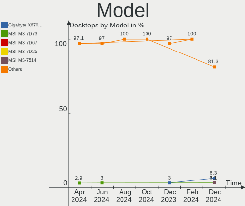

| Name                               | Desktops | Percent |
|------------------------------------|----------|---------|
| Gigabyte B550 AORUS ELITE AX V2    | 2        | 5.56%   |
| ASUS All Series                    | 2        | 5.56%   |
| Supermicro C7SIM-Q                 | 1        | 2.78%   |
| MSI MS-7C35                        | 1        | 2.78%   |
| MSI MS-7B85                        | 1        | 2.78%   |
| Intel X99                          | 1        | 2.78%   |
| HP ProLiant ML350 G6               | 1        | 2.78%   |
| HP Compaq Pro 6300 SFF             | 1        | 2.78%   |
| HP Compaq 6000 Pro SFF PC          | 1        | 2.78%   |
| Gigabyte P35-DS4                   | 1        | 2.78%   |
| Gigabyte GB-BRR7H-4700             | 1        | 2.78%   |
| Gigabyte GB-BRR3H-4300             | 1        | 2.78%   |
| Gigabyte B550M DS3H                | 1        | 2.78%   |
| Gigabyte AB350-Gaming 3            | 1        | 2.78%   |
| Fujitsu ESPRIMO E3521              | 1        | 2.78%   |
| Dell OptiPlex 760                  | 1        | 2.78%   |
| Dell OptiPlex 7010                 | 1        | 2.78%   |
| ASUS UNLOCK INSTALL                | 1        | 2.78%   |
| ASUS TUF Gaming B650-PLUS WIFI     | 1        | 2.78%   |
| ASUS TUF B450M-PLUS GAMING         | 1        | 2.78%   |
| ASUS ROG STRIX X670E-E GAMING WIFI | 1        | 2.78%   |
| ASUS ProArt Z690-CREATOR WIFI      | 1        | 2.78%   |
| ASUS PRIME H370-A                  | 1        | 2.78%   |
| ASUS PRIME B450M-A                 | 1        | 2.78%   |
| ASUS P8H61-M LX3 PLUS R2.0         | 1        | 2.78%   |
| ASUS P7H55-M                       | 1        | 2.78%   |
| ASUS ORION HF330-G3                | 1        | 2.78%   |
| ASUS M5A97 R2.0                    | 1        | 2.78%   |
| ASRock Z87 Extreme4                | 1        | 2.78%   |
| ASRock Z790 PG Riptide             | 1        | 2.78%   |
| ASRock X300-ITX                    | 1        | 2.78%   |
| ASRock A320M-HDV R4.0              | 1        | 2.78%   |
| Acer Aspire XC-1660                | 1        | 2.78%   |
| Unknown                            | 1        | 2.78%   |

Model Family
------------

Motherboard model prefix

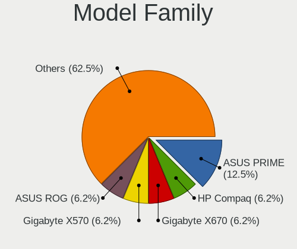

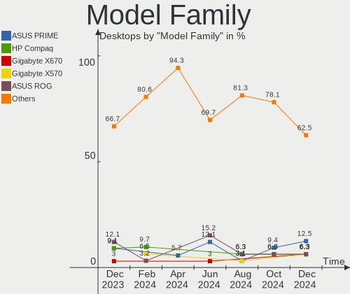

| Name                   | Desktops | Percent |
|------------------------|----------|---------|
| HP Compaq              | 2        | 5.56%   |
| Gigabyte B550          | 2        | 5.56%   |
| Dell OptiPlex          | 2        | 5.56%   |
| ASUS TUF               | 2        | 5.56%   |
| ASUS PRIME             | 2        | 5.56%   |
| ASUS All               | 2        | 5.56%   |
| Supermicro C7SIM-Q     | 1        | 2.78%   |
| MSI MS-7C35            | 1        | 2.78%   |
| MSI MS-7B85            | 1        | 2.78%   |
| Intel X99              | 1        | 2.78%   |
| HP ProLiant            | 1        | 2.78%   |
| Gigabyte P35-DS4       | 1        | 2.78%   |
| Gigabyte GB-BRR7H-4700 | 1        | 2.78%   |
| Gigabyte GB-BRR3H-4300 | 1        | 2.78%   |
| Gigabyte B550M         | 1        | 2.78%   |
| Gigabyte AB350-Gaming  | 1        | 2.78%   |
| Fujitsu ESPRIMO        | 1        | 2.78%   |
| ASUS UNLOCK            | 1        | 2.78%   |
| ASUS ROG               | 1        | 2.78%   |
| ASUS ProArt            | 1        | 2.78%   |
| ASUS P8H61-M           | 1        | 2.78%   |
| ASUS P7H55-M           | 1        | 2.78%   |
| ASUS ORION             | 1        | 2.78%   |
| ASUS M5A97             | 1        | 2.78%   |
| ASRock Z87             | 1        | 2.78%   |
| ASRock Z790            | 1        | 2.78%   |
| ASRock X300-ITX        | 1        | 2.78%   |
| ASRock A320M-HDV       | 1        | 2.78%   |
| Acer Aspire            | 1        | 2.78%   |
| Unknown                | 1        | 2.78%   |

MFG Year
--------

Motherboard manufacture year

| Year | Desktops | Percent |
|------|----------|---------|
| 2021 | 5        | 13.89%  |
| 2020 | 4        | 11.11%  |
| 2018 | 4        | 11.11%  |
| 2022 | 3        | 8.33%   |
| 2019 | 3        | 8.33%   |
| 2013 | 3        | 8.33%   |
| 2012 | 3        | 8.33%   |
| 2009 | 3        | 8.33%   |
| 2017 | 2        | 5.56%   |
| 2014 | 2        | 5.56%   |
| 2010 | 2        | 5.56%   |
| 2016 | 1        | 2.78%   |
| 2007 | 1        | 2.78%   |

Form Factor
-----------

Physical design of the computer

| Name    | Desktops | Percent |
|---------|----------|---------|
| Desktop | 36       | 100%    |

Secure Boot
-----------

Enabled or disabled

| State    | Desktops | Percent |
|----------|----------|---------|
| Disabled | 34       | 94.44%  |
| Enabled  | 2        | 5.56%   |

Coreboot
--------

Have coreboot on board

| Used | Desktops | Percent |
|------|----------|---------|
| No   | 36       | 100%    |

RAM Size
--------

Total RAM memory

| Size in GB  | Desktops | Percent |
|-------------|----------|---------|
| 8.01-16.0   | 9        | 25%     |
| 16.01-24.0  | 8        | 22.22%  |
| 4.01-8.0    | 5        | 13.89%  |
| 32.01-64.0  | 5        | 13.89%  |
| 64.01-256.0 | 4        | 11.11%  |
| 3.01-4.0    | 3        | 8.33%   |
| 24.01-32.0  | 2        | 5.56%   |

RAM Used
--------

Used RAM memory

| Used GB    | Desktops | Percent |
|------------|----------|---------|
| 1.01-2.0   | 10       | 27.78%  |
| 2.01-3.0   | 7        | 19.44%  |
| 4.01-8.0   | 6        | 16.67%  |
| 3.01-4.0   | 6        | 16.67%  |
| 8.01-16.0  | 3        | 8.33%   |
| 16.01-24.0 | 2        | 5.56%   |
| 0.51-1.0   | 2        | 5.56%   |

Total Drives
------------

Number of drives on board

| Drives | Desktops | Percent |
|--------|----------|---------|
| 2      | 12       | 33.33%  |
| 1      | 9        | 25%     |
| 4      | 5        | 13.89%  |
| 3      | 5        | 13.89%  |
| 5      | 2        | 5.56%   |
| 9      | 1        | 2.78%   |
| 7      | 1        | 2.78%   |
| 6      | 1        | 2.78%   |

Has CD-ROM
----------

Has CD-ROM on board

| Presented | Desktops | Percent |
|-----------|----------|---------|
| Yes       | 18       | 50%     |
| No        | 18       | 50%     |

Has Ethernet
------------

Has Ethernet on board

| Presented | Desktops | Percent |
|-----------|----------|---------|
| Yes       | 36       | 100%    |

Has WiFi
--------

Has WiFi module

| Presented | Desktops | Percent |
|-----------|----------|---------|
| No        | 19       | 52.78%  |
| Yes       | 17       | 47.22%  |

Has Bluetooth
-------------

Has Bluetooth module

| Presented | Desktops | Percent |
|-----------|----------|---------|
| No        | 21       | 58.33%  |
| Yes       | 15       | 41.67%  |

Location
--------

Country
-------

Geographic location (country)

| Country     | Desktops | Percent |
|-------------|----------|---------|
| Netherlands | 36       | 100%    |

City
----

Geographic location (city)

| City        | Desktops | Percent |
|-------------|----------|---------|
| Amsterdam   | 9        | 25%     |
| Rotterdam   | 3        | 8.33%   |
| Zoetermeer  | 2        | 5.56%   |
| Maastricht  | 2        | 5.56%   |
| Waalwijk    | 1        | 2.78%   |
| Vught       | 1        | 2.78%   |
| Vlaardingen | 1        | 2.78%   |
| The Hague   | 1        | 2.78%   |
| Stadskanaal | 1        | 2.78%   |
| Piershil    | 1        | 2.78%   |
| Nijmegen    | 1        | 2.78%   |
| Nieuwkoop   | 1        | 2.78%   |
| Landgraaf   | 1        | 2.78%   |
| Horst       | 1        | 2.78%   |
| Ermelo      | 1        | 2.78%   |
| Enschede    | 1        | 2.78%   |
| Dordrecht   | 1        | 2.78%   |
| Dalfsen     | 1        | 2.78%   |
| Borne       | 1        | 2.78%   |
| Beverwijk   | 1        | 2.78%   |
| Arnhem      | 1        | 2.78%   |
| Amstelveen  | 1        | 2.78%   |
| Amersfoort  | 1        | 2.78%   |
| Aalsmeer    | 1        | 2.78%   |

Drives
------

Drive Vendor
------------

Hard drive vendors

| Vendor                      | Desktops | Drives | Percent |
|-----------------------------|----------|--------|---------|
| Samsung Electronics         | 20       | 26     | 27.78%  |
| Seagate                     | 13       | 24     | 18.06%  |
| WDC                         | 8        | 13     | 11.11%  |
| Kingston                    | 7        | 8      | 9.72%   |
| Crucial                     | 4        | 4      | 5.56%   |
| Toshiba                     | 3        | 5      | 4.17%   |
| Intel                       | 3        | 3      | 4.17%   |
| Transcend                   | 1        | 1      | 1.39%   |
| Silicon Motion              | 1        | 1      | 1.39%   |
| Shenzhen                    | 1        | 1      | 1.39%   |
| Seagate Technology          | 1        | 1      | 1.39%   |
| Sandisk                     | 1        | 1      | 1.39%   |
| PNY                         | 1        | 1      | 1.39%   |
| Kingston Technology Company | 1        | 1      | 1.39%   |
| Kingchuxing                 | 1        | 2      | 1.39%   |
| JMicron Technology          | 1        | 1      | 1.39%   |
| Integral                    | 1        | 1      | 1.39%   |
| Hitachi                     | 1        | 1      | 1.39%   |
| Corsair                     | 1        | 1      | 1.39%   |
| China                       | 1        | 1      | 1.39%   |
| ADATA Technology            | 1        | 1      | 1.39%   |

Drive Model
-----------

Hard drive models

| Model                                                  | Desktops | Percent |
|--------------------------------------------------------|----------|---------|
| Samsung NVMe SSD Controller SM981/PM981/PM983 500GB    | 6        | 6.82%   |
| Seagate ST4000DM004-2CV104 4TB                         | 2        | 2.27%   |
| Seagate ST1000DM003-1CH162 1TB                         | 2        | 2.27%   |
| Samsung SSD 850 EVO 500GB                              | 2        | 2.27%   |
| Samsung SSD 840 EVO 250GB                              | 2        | 2.27%   |
| Samsung NVMe SSD Controller PM9A1/PM9A3/980PRO 2TB     | 2        | 2.27%   |
| WDC WD80EFBX-68AZZN0 8TB                               | 1        | 1.14%   |
| WDC WD60EFRX-68MYMN1 6TB                               | 1        | 1.14%   |
| WDC WD20EZRZ-00Z5HB0 2TB                               | 1        | 1.14%   |
| WDC WD20EZRX-00D8PB0 2TB                               | 1        | 1.14%   |
| WDC WD20EZBX-00AYRA0 2TB                               | 1        | 1.14%   |
| WDC WD20EFZX-68AWUN0 2TB                               | 1        | 1.14%   |
| WDC WD20EARS-00MVWB0 2TB                               | 1        | 1.14%   |
| WDC WD1600AAJS-75M0A0 160GB                            | 1        | 1.14%   |
| WDC WD10EZEX-60WN4A2 1TB                               | 1        | 1.14%   |
| WDC WD10EARX-00PASB0 1TB                               | 1        | 1.14%   |
| WDC WD10EADX-22TDHB0 1TB                               | 1        | 1.14%   |
| WDC WD1002FAEX-00Z3A0 1TB                              | 1        | 1.14%   |
| Transcend TS256GSSD370 256GB                           | 1        | 1.14%   |
| Toshiba HDWQ140 4TB                                    | 1        | 1.14%   |
| Toshiba HDWG180 8TB                                    | 1        | 1.14%   |
| Toshiba DT01ACA050 500GB                               | 1        | 1.14%   |
| Silicon Motion SM2263EN/SM2263XT SSD Controller 1024GB | 1        | 1.14%   |
| Shenzhen YongzhenWeiye 120GB                           | 1        | 1.14%   |
| Seagate FireCuda 520 SSD 500GB                         | 1        | 1.14%   |
| Seagate ST9320325AS 320GB                              | 1        | 1.14%   |
| Seagate ST6000VN001-2BB186 6TB                         | 1        | 1.14%   |
| Seagate ST6000DM003-2CY186 6TB                         | 1        | 1.14%   |
| Seagate ST500VT000-1DK142 500GB                        | 1        | 1.14%   |
| Seagate ST500DM002-1BD142 500GB                        | 1        | 1.14%   |
| Seagate ST500DM002-1BC142 500GB                        | 1        | 1.14%   |
| Seagate ST4000VN008-2DR166 4TB                         | 1        | 1.14%   |
| Seagate ST4000DM004-2U9104 4TB                         | 1        | 1.14%   |
| Seagate ST4000DM000-2AE166 4TB                         | 1        | 1.14%   |
| Seagate ST3250318AS 250GB                              | 1        | 1.14%   |
| Seagate ST2000DM006-2DM164 2TB                         | 1        | 1.14%   |
| Seagate ST2000DM001-1ER164 2TB                         | 1        | 1.14%   |
| Seagate ST1000LM048-2E7172 1TB                         | 1        | 1.14%   |
| Seagate ST1000DM010-2EP102 1TB                         | 1        | 1.14%   |
| Seagate Expansion 4TB                                  | 1        | 1.14%   |

HDD Vendor
----------

Hard disk drive vendors

| Vendor              | Desktops | Drives | Percent |
|---------------------|----------|--------|---------|
| Seagate             | 13       | 24     | 48.15%  |
| WDC                 | 8        | 13     | 29.63%  |
| Toshiba             | 3        | 5      | 11.11%  |
| Samsung Electronics | 2        | 2      | 7.41%   |
| Hitachi             | 1        | 1      | 3.7%    |

SSD Vendor
----------

Solid state drive vendors

| Vendor              | Desktops | Drives | Percent |
|---------------------|----------|--------|---------|
| Samsung Electronics | 9        | 12     | 37.5%   |
| Kingston            | 4        | 4      | 16.67%  |
| Crucial             | 4        | 4      | 16.67%  |
| Transcend           | 1        | 1      | 4.17%   |
| PNY                 | 1        | 1      | 4.17%   |
| JMicron Technology  | 1        | 1      | 4.17%   |
| Intel               | 1        | 1      | 4.17%   |
| Integral            | 1        | 1      | 4.17%   |
| Corsair             | 1        | 1      | 4.17%   |
| China               | 1        | 1      | 4.17%   |

Drive Kind
----------

HDD or SSD

| Kind    | Desktops | Drives | Percent |
|---------|----------|--------|---------|
| HDD     | 22       | 45     | 36.67%  |
| NVMe    | 19       | 23     | 31.67%  |
| SSD     | 17       | 27     | 28.33%  |
| Unknown | 2        | 3      | 3.33%   |

Drive Connector
---------------

SATA, SAS, NVMe, etc.

| Type | Desktops | Drives | Percent |
|------|----------|--------|---------|
| SATA | 29       | 71     | 55.77%  |
| NVMe | 19       | 23     | 36.54%  |
| SAS  | 4        | 4      | 7.69%   |

Drive Size
----------

Size of hard drive

| Size in TB | Desktops | Drives | Percent |
|------------|----------|--------|---------|
| 0.01-0.5   | 21       | 34     | 48.84%  |
| 0.51-1.0   | 10       | 14     | 23.26%  |
| 3.01-4.0   | 5        | 11     | 11.63%  |
| 1.01-2.0   | 4        | 8      | 9.3%    |
| 4.01-10.0  | 3        | 5      | 6.98%   |

Space Total
-----------

Amount of disk space available on the file system

| Size in GB     | Desktops | Percent |
|----------------|----------|---------|
| 251-500        | 8        | 22.22%  |
| 101-250        | 8        | 22.22%  |
| 501-1000       | 8        | 22.22%  |
| More than 3000 | 4        | 11.11%  |
| 1001-2000      | 3        | 8.33%   |
| 51-100         | 2        | 5.56%   |
| Unknown        | 2        | 5.56%   |
| 2001-3000      | 1        | 2.78%   |

Space Used
----------

Amount of used disk space

| Used GB        | Desktops | Percent |
|----------------|----------|---------|
| 21-50          | 9        | 25%     |
| 1-20           | 6        | 16.67%  |
| 101-250        | 5        | 13.89%  |
| 51-100         | 4        | 11.11%  |
| More than 3000 | 3        | 8.33%   |
| 1001-2000      | 3        | 8.33%   |
| 251-500        | 2        | 5.56%   |
| 501-1000       | 2        | 5.56%   |
| Unknown        | 2        | 5.56%   |

Malfunc. Drives
---------------

Drive models with a malfunction

| Model                       | Desktops | Drives | Percent |
|-----------------------------|----------|--------|---------|
| WDC WD60EFRX-68MYMN1 6TB    | 1        | 1      | 33.33%  |
| WDC WD1600AAJS-75M0A0 160GB | 1        | 1      | 33.33%  |
| WDC WD1002FAEX-00Z3A0 1TB   | 1        | 1      | 33.33%  |

Malfunc. Drive Vendor
---------------------

Vendors of faulty drives

| Vendor | Desktops | Drives | Percent |
|--------|----------|--------|---------|
| WDC    | 3        | 3      | 100%    |

Malfunc. HDD Vendor
-------------------

Vendors of faulty HDD drives

| Vendor | Desktops | Drives | Percent |
|--------|----------|--------|---------|
| WDC    | 3        | 3      | 100%    |

Malfunc. Drive Kind
-------------------

Kinds of faulty drives

| Kind | Desktops | Drives | Percent |
|------|----------|--------|---------|
| HDD  | 3        | 3      | 100%    |

Failed Drives
-------------

Failed drive models

Zero info for selected period =(

Failed Drive Vendor
-------------------

Failed drive vendors

Zero info for selected period =(

Drive Status
------------

Number of failed and malfunc. drives

| Status   | Desktops | Drives | Percent |
|----------|----------|--------|---------|
| Detected | 26       | 64     | 66.67%  |
| Works    | 10       | 31     | 25.64%  |
| Malfunc  | 3        | 3      | 7.69%   |

Storage controller
------------------

Storage Vendor
--------------

Storage controller vendors

| Vendor                      | Desktops | Percent |
|-----------------------------|----------|---------|
| Intel                       | 21       | 36.21%  |
| AMD                         | 13       | 22.41%  |
| Samsung Electronics         | 12       | 20.69%  |
| Kingston Technology Company | 3        | 5.17%   |
| VIA Technologies            | 1        | 1.72%   |
| Silicon Motion              | 1        | 1.72%   |
| Seagate Technology          | 1        | 1.72%   |
| SanDisk                     | 1        | 1.72%   |
| LSI Logic / Symbios Logic   | 1        | 1.72%   |
| JMicron Technology          | 1        | 1.72%   |
| Hewlett-Packard             | 1        | 1.72%   |
| ASMedia Technology          | 1        | 1.72%   |
| ADATA Technology            | 1        | 1.72%   |

Storage Model
-------------

Storage controller models

| Model                                                                                   | Desktops | Percent |
|-----------------------------------------------------------------------------------------|----------|---------|
| Samsung NVMe SSD Controller SM981/PM981/PM983                                           | 7        | 9.21%   |
| AMD FCH SATA Controller [AHCI mode]                                                     | 7        | 9.21%   |
| Samsung NVMe SSD Controller PM9A1/PM9A3/980PRO                                          | 3        | 3.95%   |
| Kingston Company Company Non-Volatile memory controller                                 | 3        | 3.95%   |
| Intel 8 Series/C220 Series Chipset Family 6-port SATA Controller 1 [AHCI mode]          | 3        | 3.95%   |
| AMD 500 Series Chipset SATA Controller                                                  | 3        | 3.95%   |
| AMD 400 Series Chipset SATA Controller                                                  | 3        | 3.95%   |
| Samsung NVMe SSD Controller 980                                                         | 2        | 2.63%   |
| Intel 7 Series/C210 Series Chipset Family 6-port SATA Controller [AHCI mode]            | 2        | 2.63%   |
| Intel 6 Series/C200 Series Chipset Family Desktop SATA Controller (IDE mode, ports 4-5) | 2        | 2.63%   |
| Intel 6 Series/C200 Series Chipset Family Desktop SATA Controller (IDE mode, ports 0-3) | 2        | 2.63%   |
| Intel 5 Series/3400 Series Chipset 6 port SATA AHCI Controller                          | 2        | 2.63%   |
| Intel 4 Series Chipset PT IDER Controller                                               | 2        | 2.63%   |
| AMD SATA controller                                                                     | 2        | 2.63%   |
| VIA VT6415 PATA IDE Host Controller                                                     | 1        | 1.32%   |
| Silicon Motion SM2263EN/SM2263XT SSD Controller                                         | 1        | 1.32%   |
| Seagate FireCuda 520 SSD                                                                | 1        | 1.32%   |
| SanDisk WD Blue SN550 NVMe SSD                                                          | 1        | 1.32%   |
| LSI Logic / Symbios Logic 53c1030 PCI-X Fusion-MPT Dual Ultra320 SCSI                   | 1        | 1.32%   |
| Kingston Company U-SNS8154P3 NVMe SSD                                                   | 1        | 1.32%   |
| JMicron JMB363 SATA/IDE Controller                                                      | 1        | 1.32%   |
| Intel Volume Management Device NVMe RAID Controller Intel Corporation                   | 1        | 1.32%   |
| Intel SSD 660P Series                                                                   | 1        | 1.32%   |
| Intel SSD 600P Series                                                                   | 1        | 1.32%   |
| Intel SATA Controller [RAID mode]                                                       | 1        | 1.32%   |
| Intel SATA controller                                                                   | 1        | 1.32%   |
| Intel NM10/ICH7 Family SATA Controller [IDE mode]                                       | 1        | 1.32%   |
| Intel Cannon Lake PCH SATA AHCI Controller                                              | 1        | 1.32%   |
| Intel C610/X99 series chipset sSATA Controller [AHCI mode]                              | 1        | 1.32%   |
| Intel Alder Lake-S PCH SATA Controller [AHCI Mode]                                      | 1        | 1.32%   |
| Intel 9 Series Chipset Family SATA Controller [AHCI Mode]                               | 1        | 1.32%   |
| Intel 82801JI (ICH10 Family) 4 port SATA IDE Controller #1                              | 1        | 1.32%   |
| Intel 82801JI (ICH10 Family) 2 port SATA IDE Controller #2                              | 1        | 1.32%   |
| Intel 82801JD/DO (ICH10 Family) SATA AHCI Controller                                    | 1        | 1.32%   |
| Intel 82801JD/DO (ICH10 Family) 4-port SATA IDE Controller                              | 1        | 1.32%   |
| Intel 82801JD/DO (ICH10 Family) 2-port SATA IDE Controller                              | 1        | 1.32%   |
| Intel 82801IR/IO/IH (ICH9R/DO/DH) 6 port SATA Controller [AHCI mode]                    | 1        | 1.32%   |
| Intel 500 Series Chipset Family SATA AHCI Controller                                    | 1        | 1.32%   |
| Intel 5 Series/3400 Series Chipset PT IDER Controller                                   | 1        | 1.32%   |
| Intel 5 Series/3400 Series Chipset 4 port SATA IDE Controller                           | 1        | 1.32%   |

Storage Kind
------------

Kind of storage controller (IDE, SATA, NVMe, SAS, ...)

| Kind | Desktops | Percent |
|------|----------|---------|
| SATA | 28       | 45.9%   |
| NVMe | 19       | 31.15%  |
| IDE  | 10       | 16.39%  |
| RAID | 3        | 4.92%   |
| SCSI | 1        | 1.64%   |

Processor
---------

CPU Vendor
----------

Processor vendors

| Vendor | Desktops | Percent |
|--------|----------|---------|
| Intel  | 21       | 58.33%  |
| AMD    | 15       | 41.67%  |

CPU Model
---------

Processor models

| Model                                          | Desktops | Percent |
|------------------------------------------------|----------|---------|
| Intel Core i5-4460 CPU @ 3.20GHz               | 2        | 5.56%   |
| AMD Ryzen 9 7950X 16-Core Processor            | 2        | 5.56%   |
| AMD Ryzen 5 5600G with Radeon Graphics         | 2        | 5.56%   |
| AMD Ryzen 5 3600 6-Core Processor              | 2        | 5.56%   |
| Intel Xeon CPU L5640 @ 2.27GHz                 | 1        | 2.78%   |
| Intel Xeon CPU E5-2666 v3 @ 2.90GHz            | 1        | 2.78%   |
| Intel Pentium Dual-Core CPU E5700 @ 3.00GHz    | 1        | 2.78%   |
| Intel Pentium Dual-Core CPU E5400 @ 2.70GHz    | 1        | 2.78%   |
| Intel Core i7-6950X CPU @ 3.00GHz              | 1        | 2.78%   |
| Intel Core i7-3770 CPU @ 3.40GHz               | 1        | 2.78%   |
| Intel Core i5-9400 CPU @ 2.90GHz               | 1        | 2.78%   |
| Intel Core i5-4690K CPU @ 3.50GHz              | 1        | 2.78%   |
| Intel Core i5-3350P CPU @ 3.10GHz              | 1        | 2.78%   |
| Intel Core i5 CPU 650 @ 3.20GHz                | 1        | 2.78%   |
| Intel Core i3-3245 CPU @ 3.40GHz               | 1        | 2.78%   |
| Intel Core i3-3220 CPU @ 3.30GHz               | 1        | 2.78%   |
| Intel Core i3 CPU 550 @ 3.20GHz                | 1        | 2.78%   |
| Intel Core i3 CPU 540 @ 3.07GHz                | 1        | 2.78%   |
| Intel Core 2 Duo CPU E8400 @ 3.00GHz           | 1        | 2.78%   |
| Intel Core 2 CPU 6600 @ 2.40GHz                | 1        | 2.78%   |
| Intel 13th Gen Core i9-13900K                  | 1        | 2.78%   |
| Intel 13th Gen Core i7-13700K                  | 1        | 2.78%   |
| Intel 11th Gen Core i5-11400 @ 2.60GHz         | 1        | 2.78%   |
| AMD Ryzen 9 3900X 12-Core Processor            | 1        | 2.78%   |
| AMD Ryzen 7 5800X 8-Core Processor             | 1        | 2.78%   |
| AMD Ryzen 7 4700U with Radeon Graphics         | 1        | 2.78%   |
| AMD Ryzen 7 2700 Eight-Core Processor          | 1        | 2.78%   |
| AMD Ryzen 7 1700 Eight-Core Processor          | 1        | 2.78%   |
| AMD Ryzen 5 3500X 6-Core Processor             | 1        | 2.78%   |
| AMD Ryzen 3 4300U with Radeon Graphics         | 1        | 2.78%   |
| AMD FX-4350 Quad-Core Processor                | 1        | 2.78%   |
| AMD A10-9700 RADEON R7, 10 COMPUTE CORES 4C+6G | 1        | 2.78%   |

CPU Model Family
----------------

Processor model prefix

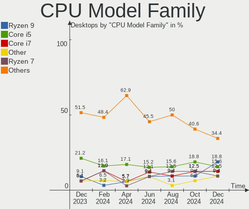

| Model                   | Desktops | Percent |
|-------------------------|----------|---------|
| Intel Core i5           | 6        | 16.67%  |
| AMD Ryzen 5             | 5        | 13.89%  |
| Intel Core i3           | 4        | 11.11%  |
| AMD Ryzen 7             | 4        | 11.11%  |
| Other                   | 3        | 8.33%   |
| AMD Ryzen 9             | 3        | 8.33%   |
| Intel Xeon              | 2        | 5.56%   |
| Intel Pentium Dual-Core | 2        | 5.56%   |
| Intel Core i7           | 2        | 5.56%   |
| Intel Core 2 Duo        | 1        | 2.78%   |
| Intel Core 2            | 1        | 2.78%   |
| AMD Ryzen 3             | 1        | 2.78%   |
| AMD FX                  | 1        | 2.78%   |
| AMD A10                 | 1        | 2.78%   |

CPU Cores
---------

Number of processor cores

| Number | Desktops | Percent |
|--------|----------|---------|
| 2      | 11       | 30.56%  |
| 6      | 7        | 19.44%  |
| 4      | 6        | 16.67%  |
| 16     | 3        | 8.33%   |
| 8      | 3        | 8.33%   |
| 12     | 2        | 5.56%   |
| 10     | 2        | 5.56%   |
| 24     | 1        | 2.78%   |
| 1      | 1        | 2.78%   |

CPU Sockets
-----------

Number of sockets

| Number | Desktops | Percent |
|--------|----------|---------|
| 1      | 35       | 97.22%  |
| 2      | 1        | 2.78%   |

CPU Threads
-----------

Threads per core (Hyper-Threading)

| Number | Desktops | Percent |
|--------|----------|---------|
| 2      | 22       | 61.11%  |
| 1      | 14       | 38.89%  |

CPU Op-Modes
------------

CPU Operation Modes (32-bit, 64-bit)

| Op mode        | Desktops | Percent |
|----------------|----------|---------|
| 32-bit, 64-bit | 36       | 100%    |

CPU Microcode
-------------

Microcode number

| Number     | Desktops | Percent |
|------------|----------|---------|
| Unknown    | 14       | 38.89%  |
| 0x306a9    | 3        | 8.33%   |
| 0x1067a    | 3        | 8.33%   |
| 0x20655    | 2        | 5.56%   |
| 0x0a601203 | 2        | 5.56%   |
| 0xa0671    | 1        | 2.78%   |
| 0x906ea    | 1        | 2.78%   |
| 0x6f6      | 1        | 2.78%   |
| 0x406f1    | 1        | 2.78%   |
| 0x306f2    | 1        | 2.78%   |
| 0x20652    | 1        | 2.78%   |
| 0x0a50000c | 1        | 2.78%   |
| 0x08701021 | 1        | 2.78%   |
| 0x08600103 | 1        | 2.78%   |
| 0x0800820d | 1        | 2.78%   |
| 0x08001126 | 1        | 2.78%   |
| 0x06000852 | 1        | 2.78%   |

CPU Microarch
-------------

Microarchitecture

| Name       | Desktops | Percent |
|------------|----------|---------|
| Zen 2      | 6        | 16.67%  |
| Westmere   | 4        | 11.11%  |
| IvyBridge  | 4        | 11.11%  |
| Haswell    | 4        | 11.11%  |
| Unknown    | 4        | 11.11%  |
| Zen 3      | 3        | 8.33%   |
| Penryn     | 3        | 8.33%   |
| Zen+       | 1        | 2.78%   |
| Zen        | 1        | 2.78%   |
| Piledriver | 1        | 2.78%   |
| KabyLake   | 1        | 2.78%   |
| Icelake    | 1        | 2.78%   |
| Excavator  | 1        | 2.78%   |
| Core       | 1        | 2.78%   |
| Broadwell  | 1        | 2.78%   |

Graphics
--------

GPU Vendor
----------

Vendors of graphics cards

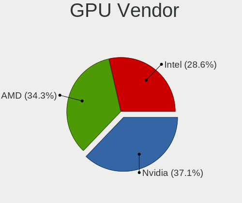

| Vendor            | Desktops | Percent |
|-------------------|----------|---------|
| Nvidia            | 17       | 44.74%  |
| AMD               | 12       | 31.58%  |
| Intel             | 8        | 21.05%  |
| ASPEED Technology | 1        | 2.63%   |

GPU Model
---------

Graphics card models

| Model                                                                       | Desktops | Percent |
|-----------------------------------------------------------------------------|----------|---------|
| Intel 4 Series Chipset Integrated Graphics Controller                       | 3        | 7.69%   |
| Nvidia TU116 [GeForce GTX 1660 Ti]                                          | 2        | 5.13%   |
| Nvidia GP107 [GeForce GTX 1050 Ti]                                          | 2        | 5.13%   |
| Intel IvyBridge GT2 [HD Graphics 4000]                                      | 2        | 5.13%   |
| AMD Renoir                                                                  | 2        | 5.13%   |
| AMD Raphael                                                                 | 2        | 5.13%   |
| AMD Navi 24 [Radeon RX 6400/6500 XT/6500M]                                  | 2        | 5.13%   |
| Nvidia TU104 [GeForce RTX 2080 SUPER]                                       | 1        | 2.56%   |
| Nvidia TU104 [GeForce RTX 2070 SUPER]                                       | 1        | 2.56%   |
| Nvidia GT215 [GeForce GT 240]                                               | 1        | 2.56%   |
| Nvidia GP106 [GeForce GTX 1060 6GB]                                         | 1        | 2.56%   |
| Nvidia GP104 [GeForce GTX 1080]                                             | 1        | 2.56%   |
| Nvidia GP104 [GeForce GTX 1070]                                             | 1        | 2.56%   |
| Nvidia GM107 [GeForce GTX 750 Ti]                                           | 1        | 2.56%   |
| Nvidia GK208B [GeForce GT 710]                                              | 1        | 2.56%   |
| Nvidia GK107 [NVS 510]                                                      | 1        | 2.56%   |
| Nvidia GK106 [GeForce GTX 650 Ti]                                           | 1        | 2.56%   |
| Nvidia GF108 [GeForce GT 620]                                               | 1        | 2.56%   |
| Nvidia GA104 [GeForce RTX 3070 Ti]                                          | 1        | 2.56%   |
| Nvidia AD102 [GeForce RTX 4090]                                             | 1        | 2.56%   |
| Intel Xeon E3-1200 v3/4th Gen Core Processor Integrated Graphics Controller | 1        | 2.56%   |
| Intel RocketLake-S GT1 [UHD Graphics 730]                                   | 1        | 2.56%   |
| Intel Core Processor Integrated Graphics Controller                         | 1        | 2.56%   |
| ASPEED Technology ASPEED Graphics Family                                    | 1        | 2.56%   |
| AMD Wani [Radeon R5/R6/R7 Graphics]                                         | 1        | 2.56%   |
| AMD Turks PRO [Radeon HD 6570/7570/8550 / R5 230]                           | 1        | 2.56%   |
| AMD Tahiti PRO [Radeon HD 7950/8950 OEM / R9 280]                           | 1        | 2.56%   |
| AMD Navi 22 [Radeon RX 6700/6700 XT/6750 XT / 6800M]                        | 1        | 2.56%   |
| AMD Juniper XT [Radeon HD 5770]                                             | 1        | 2.56%   |
| AMD Cezanne [Radeon Vega Series / Radeon Vega Mobile Series]                | 1        | 2.56%   |
| AMD Baffin [Radeon RX 460/560D / Pro 450/455/460/555/555X/560/560X]         | 1        | 2.56%   |

GPU Combo
---------

Combinations of graphics cards

| Name            | Desktops | Percent |
|-----------------|----------|---------|
| 1 x Nvidia      | 15       | 41.67%  |
| 1 x AMD         | 10       | 27.78%  |
| 1 x Intel       | 8        | 22.22%  |
| 2 x AMD         | 1        | 2.78%   |
| Nvidia + ASPEED | 1        | 2.78%   |
| AMD + Nvidia    | 1        | 2.78%   |

GPU Driver
----------

Free vs proprietary

| Driver      | Desktops | Percent |
|-------------|----------|---------|
| Free        | 22       | 61.11%  |
| Proprietary | 11       | 30.56%  |
| Unknown     | 3        | 8.33%   |

GPU Memory
----------

Total video memory

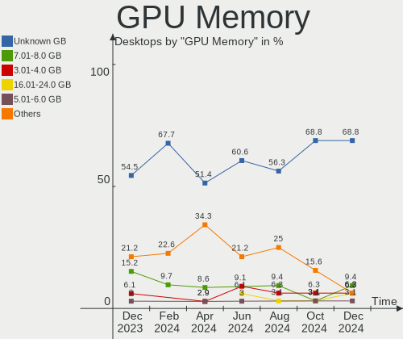

| Size in GB | Desktops | Percent |
|------------|----------|---------|
| Unknown    | 21       | 58.33%  |
| 3.01-4.0   | 4        | 11.11%  |
| 1.01-2.0   | 4        | 11.11%  |
| 7.01-8.0   | 3        | 8.33%   |
| 5.01-6.0   | 1        | 2.78%   |
| 8.01-16.0  | 1        | 2.78%   |
| 0.51-1.0   | 1        | 2.78%   |
| 0.01-0.5   | 1        | 2.78%   |

Monitor
-------

Monitor Vendor
--------------

Monitor vendors

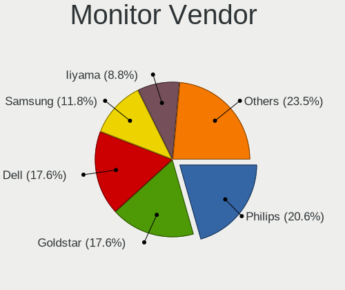

| Vendor               | Desktops | Percent |
|----------------------|----------|---------|
| Samsung Electronics  | 8        | 18.6%   |
| Dell                 | 6        | 13.95%  |
| Iiyama               | 4        | 9.3%    |
| Goldstar             | 4        | 9.3%    |
| Philips              | 3        | 6.98%   |
| Hewlett-Packard      | 3        | 6.98%   |
| AOC                  | 3        | 6.98%   |
| Fujitsu Siemens      | 2        | 4.65%   |
| DENON                | 2        | 4.65%   |
| BenQ                 | 2        | 4.65%   |
| Onkyo                | 1        | 2.33%   |
| Huion                | 1        | 2.33%   |
| Belinea              | 1        | 2.33%   |
| ASUSTek Computer     | 1        | 2.33%   |
| Ancor Communications | 1        | 2.33%   |
| Unknown              | 1        | 2.33%   |

Monitor Model
-------------

Monitor models

| Model                                                                  | Desktops | Percent |
|------------------------------------------------------------------------|----------|---------|
| Samsung Electronics SyncMaster SAM03EB 1680x1050 433x271mm 20.1-inch   | 1        | 2.17%   |
| Samsung Electronics SyncMaster SAM01AE 1600x1200 408x306mm 20.1-inch   | 1        | 2.17%   |
| Samsung Electronics S24R65x SAM1023 1920x1080 527x296mm 23.8-inch      | 1        | 2.17%   |
| Samsung Electronics S24B350 SAM08DA 1920x1080 531x299mm 24.0-inch      | 1        | 2.17%   |
| Samsung Electronics Odyssey G50A SAM7181 2560x1440 597x336mm 27.0-inch | 1        | 2.17%   |
| Samsung Electronics LU28R55 SAM1017 3840x2160 630x360mm 28.6-inch      | 1        | 2.17%   |
| Samsung Electronics LU28R55 SAM1015 3840x2160 632x360mm 28.6-inch      | 1        | 2.17%   |
| Samsung Electronics LCD Monitor SAM0902 1920x1080 410x230mm 18.5-inch  | 1        | 2.17%   |
| Samsung Electronics LCD Monitor C24F390                                | 1        | 2.17%   |
| Philips LCD Monitor PHL 243V5                                          | 1        | 2.17%   |
| Philips FTV PHL04C3 1920x1080 1440x810mm 65.0-inch                     | 1        | 2.17%   |
| Philips 220C PHLC038 1680x1050 474x296mm 22.0-inch                     | 1        | 2.17%   |
| Onkyo LCD Monitor TX-NR636 3840x2160                                   | 1        | 2.17%   |
| Iiyama PLX2472HD IVM6106 1920x1080 531x299mm 24.0-inch                 | 1        | 2.17%   |
| Iiyama PL2783Q IVM661F 2560x1440 597x336mm 27.0-inch                   | 1        | 2.17%   |
| Iiyama PL2492H IVM612F 1920x1080 527x296mm 23.8-inch                   | 1        | 2.17%   |
| Iiyama PL2473H IVM6110 1920x1080 521x293mm 23.5-inch                   | 1        | 2.17%   |
| Huion LCD Monitor HAT2150 1920x1080 470x270mm 21.3-inch                | 1        | 2.17%   |
| Hewlett-Packard E243i HPN3463 1920x1200 518x324mm 24.1-inch            | 1        | 2.17%   |
| Hewlett-Packard E241i HWP3124 1920x1200 518x324mm 24.1-inch            | 1        | 2.17%   |
| Hewlett-Packard E231 HWP3063 1920x1080 509x286mm 23.0-inch             | 1        | 2.17%   |
| Goldstar ULTRAWIDE GSM76FA 2560x1080 798x334mm 34.1-inch               | 1        | 2.17%   |
| Goldstar HDR WQHD GSM772B 3440x1440 800x335mm 34.1-inch                | 1        | 2.17%   |
| Goldstar HDR WFHD GSM7714 2560x1080 798x334mm 34.1-inch                | 1        | 2.17%   |
| Goldstar HDR 4K GSM7706 3840x2160 600x340mm 27.2-inch                  | 1        | 2.17%   |
| Fujitsu Siemens P23T-6 IPS FUS07E9 1920x1080 509x286mm 23.0-inch       | 1        | 2.17%   |
| Fujitsu Siemens P19-2 FUS0552 1280x1024 380x300mm 19.1-inch            | 1        | 2.17%   |
| DENON AVRHD DON0060 1920x1080 1280x720mm 57.8-inch                     | 1        | 2.17%   |
| DENON AVR DON005E 1920x1080 1280x720mm 57.8-inch                       | 1        | 2.17%   |
| Dell U2515H DELD06F 2560x1440 553x311mm 25.0-inch                      | 1        | 2.17%   |
| Dell U2414H DELA0A4 1920x1080 527x296mm 23.8-inch                      | 1        | 2.17%   |
| Dell IN2010N DELA049 1600x900 443x249mm 20.0-inch                      | 1        | 2.17%   |
| Dell 2208WFP DEL403B 1680x1050 473x296mm 22.0-inch                     | 1        | 2.17%   |
| Dell 2001FP DELA008 1600x1200 367x275mm 18.1-inch                      | 1        | 2.17%   |
| Dell 1905FP DEL400D 1280x1024 376x301mm 19.0-inch                      | 1        | 2.17%   |
| BenQ PD2720U BNQ8030 3840x2160 597x336mm 27.0-inch                     | 1        | 2.17%   |
| BenQ LCD BNQ8024 2560x1440 597x336mm 27.0-inch                         | 1        | 2.17%   |
| BenQ GL2480 BNQ78ED 1920x1080 531x298mm 24.0-inch                      | 1        | 2.17%   |
| Belinea B101927 MAX0785 1280x1024 376x301mm 19.0-inch                  | 1        | 2.17%   |
| ASUSTek Computer VA24D AUS2402 1920x1080 527x296mm 23.8-inch           | 1        | 2.17%   |

Monitor Resolution
------------------

Monitor screen resolution

| Resolution         | Desktops | Percent |
|--------------------|----------|---------|
| 1920x1080 (FHD)    | 16       | 38.1%   |
| 3840x2160 (4K)     | 6        | 14.29%  |
| 2560x1440 (QHD)    | 6        | 14.29%  |
| 1680x1050 (WSXGA+) | 3        | 7.14%   |
| 1280x1024 (SXGA)   | 3        | 7.14%   |
| 2560x1080          | 2        | 4.76%   |
| 1600x1200          | 2        | 4.76%   |
| 5760x1080          | 1        | 2.38%   |
| 3440x1440          | 1        | 2.38%   |
| 1600x900 (HD+)     | 1        | 2.38%   |
| Unknown            | 1        | 2.38%   |

Monitor Diagonal
----------------

Diagonal size in inches

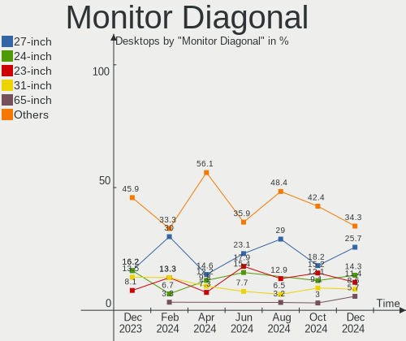

| Inches  | Desktops | Percent |
|---------|----------|---------|
| 24      | 10       | 24.39%  |
| 27      | 4        | 9.76%   |
| 23      | 4        | 9.76%   |
| 20      | 4        | 9.76%   |
| 34      | 3        | 7.32%   |
| 19      | 3        | 7.32%   |
| Unknown | 3        | 7.32%   |
| 22      | 2        | 4.88%   |
| 72      | 1        | 2.44%   |
| 65      | 1        | 2.44%   |
| 57      | 1        | 2.44%   |
| 54      | 1        | 2.44%   |
| 28      | 1        | 2.44%   |
| 26      | 1        | 2.44%   |
| 25      | 1        | 2.44%   |
| 21      | 1        | 2.44%   |

Monitor Width
-------------

Physical width

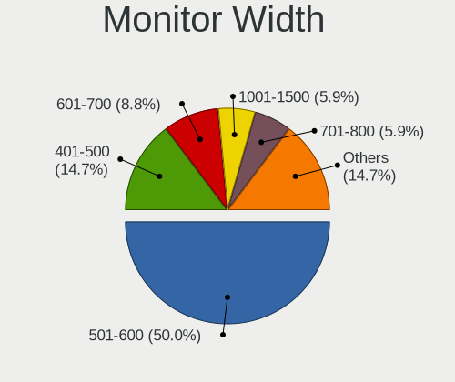

| Width in mm | Desktops | Percent |
|-------------|----------|---------|
| 501-600     | 19       | 47.5%   |
| 401-500     | 7        | 17.5%   |
| 701-800     | 3        | 7.5%    |
| 351-400     | 3        | 7.5%    |
| 1001-1500   | 3        | 7.5%    |
| Unknown     | 3        | 7.5%    |
| 601-700     | 1        | 2.5%    |
| 1501-2000   | 1        | 2.5%    |

Aspect Ratio
------------

Proportional relationship between the width and the height

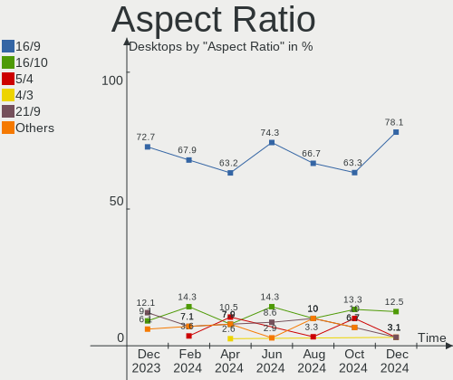

| Ratio   | Desktops | Percent |
|---------|----------|---------|
| 16/9    | 22       | 55%     |
| 16/10   | 6        | 15%     |
| 4/3     | 3        | 7.5%    |
| 21/9    | 3        | 7.5%    |
| Unknown | 3        | 7.5%    |
| 5/4     | 2        | 5%      |
| 6/5     | 1        | 2.5%    |

Monitor Area
------------

Area in inch

| Area in inch | Desktops | Percent |
|----------------|----------|---------|
| 201-250        | 13       | 32.5%   |
| 151-200        | 7        | 17.5%   |
| 301-350        | 5        | 12.5%   |
| More than 1000 | 4        | 10%     |
| 351-500        | 4        | 10%     |
| 251-300        | 4        | 10%     |
| Unknown        | 3        | 7.5%    |

Pixel Density
-------------

Pixels per inch

| Density | Desktops | Percent |
|---------|----------|---------|
| 51-100  | 23       | 60.53%  |
| 101-120 | 6        | 15.79%  |
| 1-50    | 3        | 7.89%   |
| Unknown | 3        | 7.89%   |
| 161-240 | 2        | 5.26%   |
| 121-160 | 1        | 2.63%   |

Multiple Monitors
-----------------

Total monitors connected

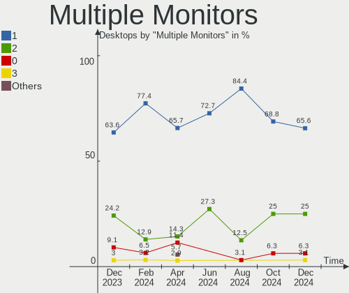

| Total | Desktops | Percent |
|-------|----------|---------|
| 1     | 20       | 55.56%  |
| 2     | 9        | 25%     |
| 0     | 4        | 11.11%  |
| 3     | 3        | 8.33%   |

Network
-------

Net Controller Vendor
---------------------

Controller vendors

| Vendor                | Desktops | Percent |
|-----------------------|----------|---------|
| Realtek Semiconductor | 24       | 47.06%  |
| Intel                 | 17       | 33.33%  |
| Ralink                | 2        | 3.92%   |
| Qualcomm Atheros      | 2        | 3.92%   |
| MediaTek              | 2        | 3.92%   |
| TP-Link               | 1        | 1.96%   |
| Microsoft             | 1        | 1.96%   |
| Broadcom              | 1        | 1.96%   |
| Aquantia              | 1        | 1.96%   |

Net Controller Model
--------------------

Controller models

| Model                                                               | Desktops | Percent |
|---------------------------------------------------------------------|----------|---------|
| Realtek RTL8111/8168/8411 PCI Express Gigabit Ethernet Controller   | 17       | 29.82%  |
| Realtek RTL8125 2.5GbE Controller                                   | 6        | 10.53%  |
| Intel Wi-Fi 6 AX200                                                 | 5        | 8.77%   |
| Intel Wireless-AC 9260                                              | 2        | 3.51%   |
| Intel Wi-Fi 6 AX210/AX211/AX411 160MHz                              | 2        | 3.51%   |
| Intel Ethernet Controller I225-V                                    | 2        | 3.51%   |
| Intel Ethernet Connection I217-V                                    | 2        | 3.51%   |
| Intel 82579LM Gigabit Network Connection (Lewisville)               | 2        | 3.51%   |
| Intel 82567LM-3 Gigabit Network Connection                          | 2        | 3.51%   |
| TP-Link Archer T3U [Realtek RTL8812BU]                              | 1        | 1.75%   |
| Realtek RTL8812AU 802.11a/b/g/n/ac 2T2R DB WLAN Adapter             | 1        | 1.75%   |
| Realtek RTL810xE PCI Express Fast Ethernet controller               | 1        | 1.75%   |
| Realtek Killer E3000 2.5GbE Controller                              | 1        | 1.75%   |
| Ralink RT2800 802.11n PCI                                           | 1        | 1.75%   |
| Ralink RT2561/RT61 802.11g PCI                                      | 1        | 1.75%   |
| Qualcomm Atheros QCA9377 802.11ac Wireless Network Adapter          | 1        | 1.75%   |
| Qualcomm Atheros AR9227 Wireless Network Adapter                    | 1        | 1.75%   |
| Microsoft XBOX ACC                                                  | 1        | 1.75%   |
| MediaTek MT7921K (RZ608) Wi-Fi 6E 80MHz                             | 1        | 1.75%   |
| MediaTek MT7921 802.11ax PCI Express Wireless Network Adapter       | 1        | 1.75%   |
| Intel I211 Gigabit Network Connection                               | 1        | 1.75%   |
| Intel I210 Gigabit Network Connection                               | 1        | 1.75%   |
| Intel 82578DM Gigabit Network Connection                            | 1        | 1.75%   |
| Intel 82574L Gigabit Network Connection                             | 1        | 1.75%   |
| Broadcom NetXtreme BCM5715 Gigabit Ethernet                         | 1        | 1.75%   |
| Aquantia AQC113CS NBase-T/IEEE 802.3bz Ethernet Controller [AQtion] | 1        | 1.75%   |

Wireless Vendor
---------------

Wireless vendors

| Vendor                | Desktops | Percent |
|-----------------------|----------|---------|
| Intel                 | 9        | 50%     |
| Ralink                | 2        | 11.11%  |
| Qualcomm Atheros      | 2        | 11.11%  |
| MediaTek              | 2        | 11.11%  |
| TP-Link               | 1        | 5.56%   |
| Realtek Semiconductor | 1        | 5.56%   |
| Microsoft             | 1        | 5.56%   |

Wireless Model
--------------

Wireless models

| Model                                                         | Desktops | Percent |
|---------------------------------------------------------------|----------|---------|
| Intel Wi-Fi 6 AX200                                           | 5        | 27.78%  |
| Intel Wireless-AC 9260                                        | 2        | 11.11%  |
| Intel Wi-Fi 6 AX210/AX211/AX411 160MHz                        | 2        | 11.11%  |
| TP-Link Archer T3U [Realtek RTL8812BU]                        | 1        | 5.56%   |
| Realtek RTL8812AU 802.11a/b/g/n/ac 2T2R DB WLAN Adapter       | 1        | 5.56%   |
| Ralink RT2800 802.11n PCI                                     | 1        | 5.56%   |
| Ralink RT2561/RT61 802.11g PCI                                | 1        | 5.56%   |
| Qualcomm Atheros QCA9377 802.11ac Wireless Network Adapter    | 1        | 5.56%   |
| Qualcomm Atheros AR9227 Wireless Network Adapter              | 1        | 5.56%   |
| Microsoft XBOX ACC                                            | 1        | 5.56%   |
| MediaTek MT7921K (RZ608) Wi-Fi 6E 80MHz                       | 1        | 5.56%   |
| MediaTek MT7921 802.11ax PCI Express Wireless Network Adapter | 1        | 5.56%   |

Ethernet Vendor
---------------

Ethernet vendors

| Vendor                | Desktops | Percent |
|-----------------------|----------|---------|
| Realtek Semiconductor | 24       | 64.86%  |
| Intel                 | 11       | 29.73%  |
| Broadcom              | 1        | 2.7%    |
| Aquantia              | 1        | 2.7%    |

Ethernet Model
--------------

Ethernet models

| Model                                                               | Desktops | Percent |
|---------------------------------------------------------------------|----------|---------|
| Realtek RTL8111/8168/8411 PCI Express Gigabit Ethernet Controller   | 17       | 43.59%  |
| Realtek RTL8125 2.5GbE Controller                                   | 6        | 15.38%  |
| Intel Ethernet Controller I225-V                                    | 2        | 5.13%   |
| Intel Ethernet Connection I217-V                                    | 2        | 5.13%   |
| Intel 82579LM Gigabit Network Connection (Lewisville)               | 2        | 5.13%   |
| Intel 82567LM-3 Gigabit Network Connection                          | 2        | 5.13%   |
| Realtek RTL810xE PCI Express Fast Ethernet controller               | 1        | 2.56%   |
| Realtek Killer E3000 2.5GbE Controller                              | 1        | 2.56%   |
| Intel I211 Gigabit Network Connection                               | 1        | 2.56%   |
| Intel I210 Gigabit Network Connection                               | 1        | 2.56%   |
| Intel 82578DM Gigabit Network Connection                            | 1        | 2.56%   |
| Intel 82574L Gigabit Network Connection                             | 1        | 2.56%   |
| Broadcom NetXtreme BCM5715 Gigabit Ethernet                         | 1        | 2.56%   |
| Aquantia AQC113CS NBase-T/IEEE 802.3bz Ethernet Controller [AQtion] | 1        | 2.56%   |

Net Controller Kind
-------------------

Ethernet, WiFi or modem

| Kind     | Desktops | Percent |
|----------|----------|---------|
| Ethernet | 36       | 67.92%  |
| WiFi     | 17       | 32.08%  |

Used Controller
---------------

Currently used network controller

| Kind     | Desktops | Percent |
|----------|----------|---------|
| Ethernet | 33       | 89.19%  |
| WiFi     | 4        | 10.81%  |

NICs
----

Total network controllers on board

| Total | Desktops | Percent |
|-------|----------|---------|
| 2     | 18       | 50%     |
| 1     | 17       | 47.22%  |
| 3     | 1        | 2.78%   |

IPv6
----

IPv6 vs IPv4

| Used | Desktops | Percent |
|------|----------|---------|
| No   | 22       | 61.11%  |
| Yes  | 14       | 38.89%  |

Bluetooth
---------

Bluetooth Vendor
----------------

Controller vendors

| Vendor                  | Desktops | Percent |
|-------------------------|----------|---------|
| Intel                   | 9        | 56.25%  |
| Cambridge Silicon Radio | 4        | 25%     |
| MediaTek                | 1        | 6.25%   |
| Lite-On Technology      | 1        | 6.25%   |
| IMC Networks            | 1        | 6.25%   |

Bluetooth Model
---------------

Controller models

| Model                                               | Desktops | Percent |
|-----------------------------------------------------|----------|---------|
| Intel AX200 Bluetooth                               | 5        | 31.25%  |
| Cambridge Silicon Radio Bluetooth Dongle (HCI mode) | 4        | 25%     |
| Intel Wireless-AC 9260 Bluetooth Adapter            | 2        | 12.5%   |
| Intel AX210 Bluetooth                               | 2        | 12.5%   |
| MediaTek Wireless_Device                            | 1        | 6.25%   |
| Lite-On Qualcomm Atheros QCA9377 Bluetooth          | 1        | 6.25%   |
| IMC Networks Wireless_Device                        | 1        | 6.25%   |

Sound
-----

Sound Vendor
------------

Sound card vendors

| Vendor                  | Desktops | Percent |
|-------------------------|----------|---------|
| Intel                   | 20       | 29.85%  |
| Nvidia                  | 17       | 25.37%  |
| AMD                     | 17       | 25.37%  |
| ASUSTek Computer        | 3        | 4.48%   |
| Creative Labs           | 2        | 2.99%   |
| Shure                   | 1        | 1.49%   |
| RODE Microphones        | 1        | 1.49%   |
| Logitech                | 1        | 1.49%   |
| Kingston Technology     | 1        | 1.49%   |
| DSEA A/S                | 1        | 1.49%   |
| Cooler Master           | 1        | 1.49%   |
| BR25                    | 1        | 1.49%   |
| BEHRINGER International | 1        | 1.49%   |

Sound Model
-----------

Sound card models

| Model                                                                      | Desktops | Percent |
|----------------------------------------------------------------------------|----------|---------|
| AMD Starship/Matisse HD Audio Controller                                   | 5        | 6.41%   |
| AMD Family 17h/19h HD Audio Controller                                     | 5        | 6.41%   |
| AMD Renoir Radeon High Definition Audio Controller                         | 4        | 5.13%   |
| Intel 5 Series/3400 Series Chipset High Definition Audio                   | 3        | 3.85%   |
| AMD Navi 21/23 HDMI/DP Audio Controller                                    | 3        | 3.85%   |
| Nvidia TU116 High Definition Audio Controller                              | 2        | 2.56%   |
| Nvidia TU104 HD Audio Controller                                           | 2        | 2.56%   |
| Nvidia GP107GL High Definition Audio Controller                            | 2        | 2.56%   |
| Nvidia GP104 High Definition Audio Controller                              | 2        | 2.56%   |
| Intel 82801JD/DO (ICH10 Family) HD Audio Controller                        | 2        | 2.56%   |
| Intel 8 Series/C220 Series Chipset High Definition Audio Controller        | 2        | 2.56%   |
| Intel 7 Series/C216 Chipset Family High Definition Audio Controller        | 2        | 2.56%   |
| Intel 6 Series/C200 Series Chipset Family High Definition Audio Controller | 2        | 2.56%   |
| ASUSTek Computer Xonar SoundCard                                           | 2        | 2.56%   |
| AMD Rembrandt Radeon High Definition Audio Controller                      | 2        | 2.56%   |
| AMD Family 17h (Models 00h-0fh) HD Audio Controller                        | 2        | 2.56%   |
| Shure MV5                                                                  | 1        | 1.28%   |
| RODE Microphones RODE NT-USB Mini                                          | 1        | 1.28%   |
| Nvidia High Definition Audio Controller                                    | 1        | 1.28%   |
| Nvidia GP106 High Definition Audio Controller                              | 1        | 1.28%   |
| Nvidia GM107 High Definition Audio Controller [GeForce 940MX]              | 1        | 1.28%   |
| Nvidia GK208 HDMI/DP Audio Controller                                      | 1        | 1.28%   |
| Nvidia GK107 HDMI Audio Controller                                         | 1        | 1.28%   |
| Nvidia GK106 HDMI Audio Controller                                         | 1        | 1.28%   |
| Nvidia GF108 High Definition Audio Controller                              | 1        | 1.28%   |
| Nvidia GA104 High Definition Audio Controller                              | 1        | 1.28%   |
| Nvidia Audio device                                                        | 1        | 1.28%   |
| Logitech 960 Headset                                                       | 1        | 1.28%   |
| Kingston Technology HyperX 7.1 Audio                                       | 1        | 1.28%   |
| Intel Xeon E3-1200 v3/4th Gen Core Processor HD Audio Controller           | 1        | 1.28%   |
| Intel Tiger Lake-H HD Audio Controller                                     | 1        | 1.28%   |
| Intel NM10/ICH7 Family High Definition Audio Controller                    | 1        | 1.28%   |
| Intel Cannon Lake PCH cAVS                                                 | 1        | 1.28%   |
| Intel C610/X99 series chipset HD Audio Controller                          | 1        | 1.28%   |
| Intel Audio device                                                         | 1        | 1.28%   |
| Intel Alder Lake-S HD Audio Controller                                     | 1        | 1.28%   |
| Intel 9 Series Chipset Family HD Audio Controller                          | 1        | 1.28%   |
| Intel 82801I (ICH9 Family) HD Audio Controller                             | 1        | 1.28%   |
| DSEA A/S Headset [PC 8]                                                    | 1        | 1.28%   |
| Creative Labs EMU20k2 [Sound Blaster X-Fi Titanium Series]                 | 1        | 1.28%   |

Memory
------

Memory Vendor
-------------

Memory module vendors

| Vendor              | Desktops | Percent |
|---------------------|----------|---------|
| Corsair             | 6        | 28.57%  |
| Samsung Electronics | 4        | 19.05%  |
| Kingston            | 4        | 19.05%  |
| Nanya Technology    | 2        | 9.52%   |
| Unknown             | 1        | 4.76%   |
| OCZ                 | 1        | 4.76%   |
| Micron Technology   | 1        | 4.76%   |
| G.Skill             | 1        | 4.76%   |
| Crucial             | 1        | 4.76%   |

Memory Model
------------

Memory module models

| Model                                                  | Desktops | Percent |
|--------------------------------------------------------|----------|---------|
| Unknown RAM Module 2GB DIMM 800MT/s                    | 1        | 4.35%   |
| Samsung RAM Module 8GB DIMM DDR4 3200MT/s              | 1        | 4.35%   |
| Samsung RAM M378B5773DH0-CK0 2GB DIMM DDR3 1600MT/s    | 1        | 4.35%   |
| Samsung RAM M378B5173DB0-CK0 4GB DIMM DDR3 1600MT/s    | 1        | 4.35%   |
| Samsung RAM M378B2873EH1-CH9 1GB DIMM DDR3 1334MT/s    | 1        | 4.35%   |
| OCZ RAM OCZ3BE1600C8LV2G 2048MB DIMM DDR3 1066MT/s     | 1        | 4.35%   |
| Nanya RAM NT1GT64U8HB0BY-25D 1GB DIMM DDR2 800MT/s     | 1        | 4.35%   |
| Nanya RAM M2F4G64CB8HG4N-DI 4GB DIMM DDR3 1600MT/s     | 1        | 4.35%   |
| Nanya RAM M2F4G64CB88C7N-DI 4GB DIMM DDR3 1600MT/s     | 1        | 4.35%   |
| Micron RAM 16HTF12864AY-667D4 1GB DIMM DDR2 667MT/s    | 1        | 4.35%   |
| Kingston RAM KHX3200C16D4/8GX 8GB DIMM DDR4 3600MT/s   | 1        | 4.35%   |
| Kingston RAM KF556C40-32 32GB DIMM 5600MT/s            | 1        | 4.35%   |
| Kingston RAM 99U5316-001.A02LF 1GB DIMM DDR2 667MT/s   | 1        | 4.35%   |
| Kingston RAM 9905471-001.A00LF 2GB DIMM DDR3 1333MT/s  | 1        | 4.35%   |
| G.Skill RAM F4-3200C16-8GVKB 8GB DIMM DDR4 3866MT/s    | 1        | 4.35%   |
| Crucial RAM CT51264BA1339.M16F 4GB DIMM DDR3 1333MT/s  | 1        | 4.35%   |
| Corsair RAM CMX4GX3M1A1333C9 4GB DIMM DDR3 1333MT/s    | 1        | 4.35%   |
| Corsair RAM CMV4GX3M1B1600C11 4GB DIMM DDR3 1600MT/s   | 1        | 4.35%   |
| Corsair RAM CMK64GX5M2B5200C40 32GB DIMM DDR5 4800MT/s | 1        | 4.35%   |
| Corsair RAM CMK64GX4M4A2666C16 16GB DIMM DDR4 2667MT/s | 1        | 4.35%   |
| Corsair RAM CMK32GX4M2A2666C16 16GB DIMM DDR4 3100MT/s | 1        | 4.35%   |
| Corsair RAM CMK16GX4M2B3200C16 8GB DIMM DDR4 3600MT/s  | 1        | 4.35%   |
| Corsair RAM CMH32GX5M2D6000Z36 16GB DIMM DDR5 4800MT/s | 1        | 4.35%   |

Memory Kind
-----------

Memory module kinds

| Kind    | Desktops | Percent |
|---------|----------|---------|
| DDR3    | 5        | 33.33%  |
| DDR4    | 4        | 26.67%  |
| DDR5    | 3        | 20%     |
| SDRAM   | 1        | 6.67%   |
| DDR2    | 1        | 6.67%   |
| Unknown | 1        | 6.67%   |

Memory Form Factor
------------------

Physical design of the memory module

| Name | Desktops | Percent |
|------|----------|---------|
| DIMM | 14       | 100%    |

Memory Size
-----------

Memory module size

| Size  | Desktops | Percent |
|-------|----------|---------|
| 2048  | 5        | 27.78%  |
| 4096  | 4        | 22.22%  |
| 8192  | 3        | 16.67%  |
| 32768 | 2        | 11.11%  |
| 16384 | 2        | 11.11%  |
| 1024  | 2        | 11.11%  |

Memory Speed
------------

Memory module speed

| Speed | Desktops | Percent |
|-------|----------|---------|
| 1600  | 3        | 16.67%  |
| 4800  | 2        | 11.11%  |
| 1333  | 2        | 11.11%  |
| 800   | 2        | 11.11%  |
| 5600  | 1        | 5.56%   |
| 3866  | 1        | 5.56%   |
| 3600  | 1        | 5.56%   |
| 3200  | 1        | 5.56%   |
| 3100  | 1        | 5.56%   |
| 2667  | 1        | 5.56%   |
| 1334  | 1        | 5.56%   |
| 1066  | 1        | 5.56%   |
| 667   | 1        | 5.56%   |

Printers & scanners
-------------------

Printer Vendor
--------------

Printer device vendors

Zero info for selected period =(

Printer Model
-------------

Printer device models

Zero info for selected period =(

Scanner Vendor
--------------

Scanner device vendors

Zero info for selected period =(

Scanner Model
-------------

Scanner device models

Zero info for selected period =(

Camera
------

Camera Vendor
-------------

Camera device vendors

| Vendor              | Desktops | Percent |
|---------------------|----------|---------|
| Logitech            | 3        | 37.5%   |
| Ruision             | 1        | 12.5%   |
| Razer USA           | 1        | 12.5%   |
| Microdia            | 1        | 12.5%   |
| Jieli Technology    | 1        | 12.5%   |
| Chicony Electronics | 1        | 12.5%   |

Camera Model
------------

Camera device models

| Model                            | Desktops | Percent |
|----------------------------------|----------|---------|
| Ruision UVC Camera               | 1        | 12.5%   |
| Razer USA Gaming Webcam [Kiyo]   | 1        | 12.5%   |
| Microdia USB 2.0 Camera          | 1        | 12.5%   |
| Logitech HD Webcam C510          | 1        | 12.5%   |
| Logitech HD Pro Webcam C920      | 1        | 12.5%   |
| Logitech C922 Pro Stream Webcam  | 1        | 12.5%   |
| Jieli USB PHY 2.0                | 1        | 12.5%   |
| Chicony HP Deluxe Webcam KQ246AA | 1        | 12.5%   |

Security
--------

Fingerprint Vendor
------------------

Fingerprint sensor vendors

Zero info for selected period =(

Fingerprint Model
-----------------

Fingerprint sensor models

Zero info for selected period =(

Chipcard Vendor
---------------

Chipcard module vendors

Zero info for selected period =(

Chipcard Model
--------------

Chipcard module models

Zero info for selected period =(

Unsupported
-----------

Unsupported Devices
-------------------

Total unsupported devices on board

| Total | Desktops | Percent |
|-------|----------|---------|
| 0     | 29       | 80.56%  |
| 1     | 5        | 13.89%  |
| 3     | 1        | 2.78%   |
| 2     | 1        | 2.78%   |

Unsupported Device Types
------------------------

Types of unsupported devices

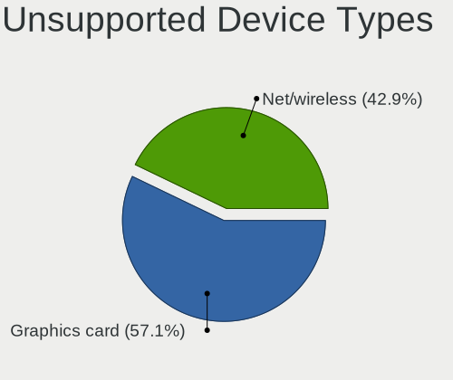

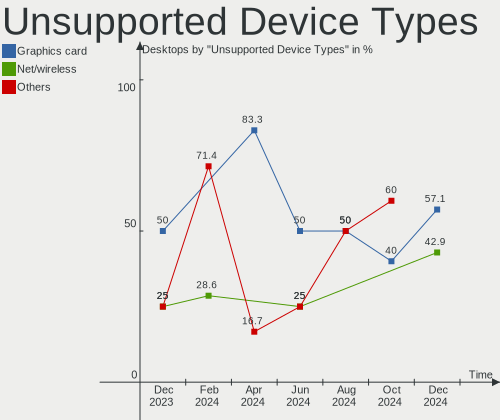

| Type             | Desktops | Percent |
|------------------|----------|---------|
| Graphics card    | 4        | 40%     |
| Net/wireless     | 3        | 30%     |
| Unassigned class | 1        | 10%     |
| Storage/raid     | 1        | 10%     |
| Bluetooth        | 1        | 10%     |

