Linux in Netherlands - Hardware Trends (Notebooks)
--------------------------------------------------

A project to identify most popular hardware characteristics and track their change
over time based on data collected by Linux users at https://Linux-Hardware.org.

Anyone can contribute to this report by the [hw-probe](https://github.com/linuxhw/hw-probe) tool:

    sudo -E hw-probe -all -upload

Period: Dec, 2025.

Contents
--------

* [ System ](#system)
  - [ OS                       ](#os)
  - [ OS Family                ](#os-family)
  - [ Kernel                   ](#kernel)
  - [ Kernel Family            ](#kernel-family)
  - [ Kernel Major Ver.        ](#kernel-major-ver)
  - [ Arch                     ](#arch)
  - [ DE                       ](#de)
  - [ Display Server           ](#display-server)
  - [ Display Manager          ](#display-manager)
  - [ OS Lang                  ](#os-lang)
  - [ Boot Mode                ](#boot-mode)
  - [ Filesystem               ](#filesystem)
  - [ Part. scheme             ](#part-scheme)
  - [ Dual Boot with Linux/BSD ](#dual-boot-with-linuxbsd)
  - [ Dual Boot (Win)          ](#dual-boot-win)

* [ Board ](#board)
  - [ Vendor                   ](#vendor)
  - [ Model                    ](#model)
  - [ Model Family             ](#model-family)
  - [ MFG Year                 ](#mfg-year)
  - [ Form Factor              ](#form-factor)
  - [ Secure Boot              ](#secure-boot)
  - [ Coreboot                 ](#coreboot)
  - [ RAM Size                 ](#ram-size)
  - [ RAM Used                 ](#ram-used)
  - [ Total Drives             ](#total-drives)
  - [ Has CD-ROM               ](#has-cd-rom)
  - [ Has Ethernet             ](#has-ethernet)
  - [ Has WiFi                 ](#has-wifi)
  - [ Has Bluetooth            ](#has-bluetooth)

* [ Location ](#location)
  - [ Country                  ](#country)
  - [ City                     ](#city)

* [ Drives ](#drives)
  - [ Drive Vendor             ](#drive-vendor)
  - [ Drive Model              ](#drive-model)
  - [ HDD Vendor               ](#hdd-vendor)
  - [ SSD Vendor               ](#ssd-vendor)
  - [ Drive Kind               ](#drive-kind)
  - [ Drive Connector          ](#drive-connector)
  - [ Drive Size               ](#drive-size)
  - [ Space Total              ](#space-total)
  - [ Space Used               ](#space-used)
  - [ Malfunc. Drives          ](#malfunc-drives)
  - [ Malfunc. Drive Vendor    ](#malfunc-drive-vendor)
  - [ Malfunc. HDD Vendor      ](#malfunc-hdd-vendor)
  - [ Malfunc. Drive Kind      ](#malfunc-drive-kind)
  - [ Failed Drives            ](#failed-drives)
  - [ Failed Drive Vendor      ](#failed-drive-vendor)
  - [ Drive Status             ](#drive-status)

* [ Storage controller ](#storage-controller)
  - [ Storage Vendor           ](#storage-vendor)
  - [ Storage Model            ](#storage-model)
  - [ Storage Kind             ](#storage-kind)

* [ Processor ](#processor)
  - [ CPU Vendor               ](#cpu-vendor)
  - [ CPU Model                ](#cpu-model)
  - [ CPU Model Family         ](#cpu-model-family)
  - [ CPU Cores                ](#cpu-cores)
  - [ CPU Sockets              ](#cpu-sockets)
  - [ CPU Threads              ](#cpu-threads)
  - [ CPU Op-Modes             ](#cpu-op-modes)
  - [ CPU Microcode            ](#cpu-microcode)
  - [ CPU Microarch            ](#cpu-microarch)

* [ Graphics ](#graphics)
  - [ GPU Vendor               ](#gpu-vendor)
  - [ GPU Model                ](#gpu-model)
  - [ GPU Combo                ](#gpu-combo)
  - [ GPU Driver               ](#gpu-driver)
  - [ GPU Memory               ](#gpu-memory)

* [ Monitor ](#monitor)
  - [ Monitor Vendor           ](#monitor-vendor)
  - [ Monitor Model            ](#monitor-model)
  - [ Monitor Resolution       ](#monitor-resolution)
  - [ Monitor Diagonal         ](#monitor-diagonal)
  - [ Monitor Width            ](#monitor-width)
  - [ Aspect Ratio             ](#aspect-ratio)
  - [ Monitor Area             ](#monitor-area)
  - [ Pixel Density            ](#pixel-density)
  - [ Multiple Monitors        ](#multiple-monitors)

* [ Network ](#network)
  - [ Net Controller Vendor    ](#net-controller-vendor)
  - [ Net Controller Model     ](#net-controller-model)
  - [ Wireless Vendor          ](#wireless-vendor)
  - [ Wireless Model           ](#wireless-model)
  - [ Ethernet Vendor          ](#ethernet-vendor)
  - [ Ethernet Model           ](#ethernet-model)
  - [ Net Controller Kind      ](#net-controller-kind)
  - [ Used Controller          ](#used-controller)
  - [ NICs                     ](#nics)
  - [ IPv6                     ](#ipv6)

* [ Bluetooth ](#bluetooth)
  - [ Bluetooth Vendor         ](#bluetooth-vendor)
  - [ Bluetooth Model          ](#bluetooth-model)

* [ Sound ](#sound)
  - [ Sound Vendor             ](#sound-vendor)
  - [ Sound Model              ](#sound-model)

* [ Memory ](#memory)
  - [ Memory Vendor            ](#memory-vendor)
  - [ Memory Model             ](#memory-model)
  - [ Memory Kind              ](#memory-kind)
  - [ Memory Form Factor       ](#memory-form-factor)
  - [ Memory Size              ](#memory-size)
  - [ Memory Speed             ](#memory-speed)

* [ Printers & scanners ](#printers--scanners)
  - [ Printer Vendor           ](#printer-vendor)
  - [ Printer Model            ](#printer-model)
  - [ Scanner Vendor           ](#scanner-vendor)
  - [ Scanner Model            ](#scanner-model)

* [ Camera ](#camera)
  - [ Camera Vendor            ](#camera-vendor)
  - [ Camera Model             ](#camera-model)

* [ Security ](#security)
  - [ Fingerprint Vendor       ](#fingerprint-vendor)
  - [ Fingerprint Model        ](#fingerprint-model)
  - [ Chipcard Vendor          ](#chipcard-vendor)
  - [ Chipcard Model           ](#chipcard-model)

* [ Unsupported ](#unsupported)
  - [ Unsupported Devices      ](#unsupported-devices)
  - [ Unsupported Device Types ](#unsupported-device-types)

System
------

OS
--

Installed operating systems

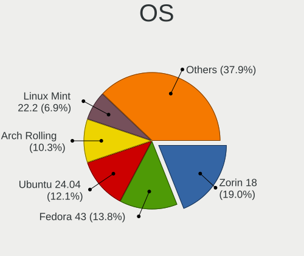

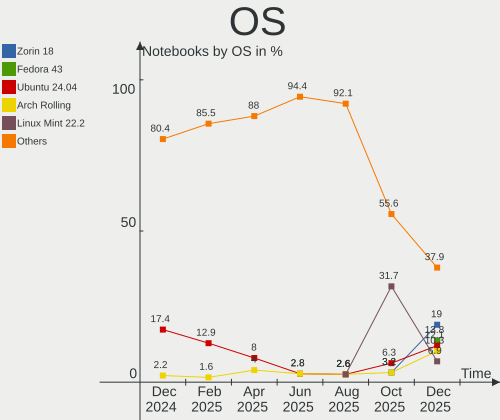

| Name                | Notebooks | Percent |
|---------------------|-----------|---------|
| Zorin 18            | 11        | 18.97%  |
| Fedora 43           | 8         | 13.79%  |
| Ubuntu 24.04        | 7         | 12.07%  |
| Arch Rolling        | 6         | 10.34%  |
| Linux Mint 22.2     | 4         | 6.9%    |
| Linux Mint 22.1     | 3         | 5.17%   |
| Pop!_OS 24.04       | 2         | 3.45%   |
| Bazzite 43          | 2         | 3.45%   |
| Zorin 17            | 1         | 1.72%   |
| Ubuntu Budgie 24.04 | 1         | 1.72%   |
| Ubuntu 25.10        | 1         | 1.72%   |
| Pop!_OS 22.04       | 1         | 1.72%   |
| OpenMandriva 25.90  | 1         | 1.72%   |
| OpenMandriva 25.06  | 1         | 1.72%   |
| Nobara 43           | 1         | 1.72%   |
| NixOS 26.05         | 1         | 1.72%   |
| NixOS 25.11         | 1         | 1.72%   |
| Linux Mint 21.3     | 1         | 1.72%   |
| Linux Mint 21.2     | 1         | 1.72%   |
| Kubuntu 24.04       | 1         | 1.72%   |
| KDE neon 24.04      | 1         | 1.72%   |
| Debian 13           | 1         | 1.72%   |
| CachyOS Rolling     | 1         | 1.72%   |

OS Family
---------

OS without a version

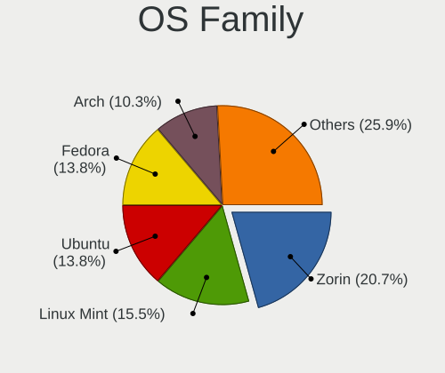

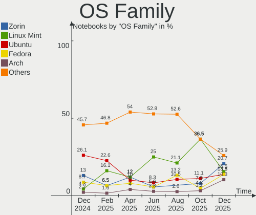

| Name          | Notebooks | Percent |
|---------------|-----------|---------|
| Zorin         | 12        | 20.69%  |
| Linux Mint    | 9         | 15.52%  |
| Ubuntu        | 8         | 13.79%  |
| Fedora        | 8         | 13.79%  |
| Arch          | 6         | 10.34%  |
| Pop!_OS       | 3         | 5.17%   |
| OpenMandriva  | 2         | 3.45%   |
| NixOS         | 2         | 3.45%   |
| Bazzite       | 2         | 3.45%   |
| Ubuntu Budgie | 1         | 1.72%   |
| Nobara        | 1         | 1.72%   |
| Kubuntu       | 1         | 1.72%   |
| KDE neon      | 1         | 1.72%   |
| Debian        | 1         | 1.72%   |
| CachyOS       | 1         | 1.72%   |

Kernel
------

Version of the Linux kernel

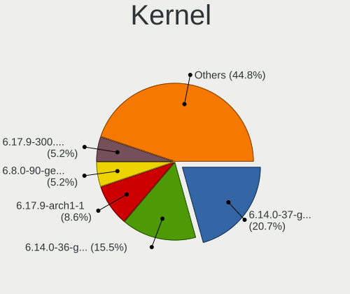

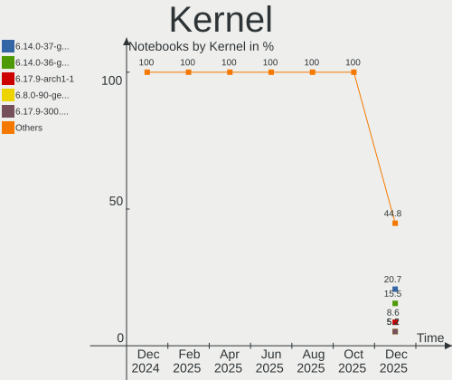

| Version                       | Notebooks | Percent |
|-------------------------------|-----------|---------|
| 6.14.0-37-generic             | 12        | 20.69%  |
| 6.14.0-36-generic             | 9         | 15.52%  |
| 6.17.9-arch1-1                | 5         | 8.62%   |
| 6.8.0-90-generic              | 3         | 5.17%   |
| 6.17.9-300.fc43.x86_64        | 3         | 5.17%   |
| 6.8.0-88-generic              | 2         | 3.45%   |
| 6.17.7-ba20.fc43.x86_64       | 2         | 3.45%   |
| 6.17.4-76061704-generic       | 2         | 3.45%   |
| 6.17.12-300.fc43.x86_64       | 2         | 3.45%   |
| 6.17.10-300.fc43.x86_64       | 2         | 3.45%   |
| 6.14.2-desktop-3omv2590       | 2         | 3.45%   |
| 6.18.2-3-cachyos              | 1         | 1.72%   |
| 6.18.2-1-t2-trixie            | 1         | 1.72%   |
| 6.18.1-arch1-2.1-g14          | 1         | 1.72%   |
| 6.18.0-cachyos                | 1         | 1.72%   |
| 6.17.9-76061709-generic       | 1         | 1.72%   |
| 6.17.7-200.nobara.fc42.x86_64 | 1         | 1.72%   |
| 6.17.4                        | 1         | 1.72%   |
| 6.17.11-300.fc43.x86_64       | 1         | 1.72%   |
| 6.17.0-7-generic              | 1         | 1.72%   |
| 6.14.0-33-generic             | 1         | 1.72%   |
| 6.14.0-1018-oem               | 1         | 1.72%   |
| 6.11.0-26-generic             | 1         | 1.72%   |
| 6.11.0-17-generic             | 1         | 1.72%   |
| 5.15.0-164-generic            | 1         | 1.72%   |

Kernel Family
-------------

Linux kernel without a distro release

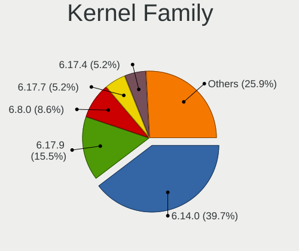

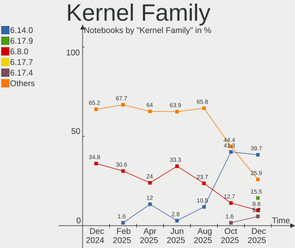

| Version | Notebooks | Percent |
|---------|-----------|---------|
| 6.14.0  | 23        | 39.66%  |
| 6.17.9  | 9         | 15.52%  |
| 6.8.0   | 5         | 8.62%   |
| 6.17.7  | 3         | 5.17%   |
| 6.17.4  | 3         | 5.17%   |
| 6.18.2  | 2         | 3.45%   |
| 6.17.12 | 2         | 3.45%   |
| 6.17.10 | 2         | 3.45%   |
| 6.14.2  | 2         | 3.45%   |
| 6.11.0  | 2         | 3.45%   |
| 6.18.1  | 1         | 1.72%   |
| 6.18.0  | 1         | 1.72%   |
| 6.17.11 | 1         | 1.72%   |
| 6.17.0  | 1         | 1.72%   |
| 5.15.0  | 1         | 1.72%   |

Kernel Major Ver.
-----------------

Linux kernel major version

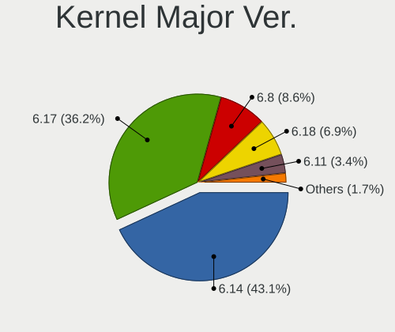

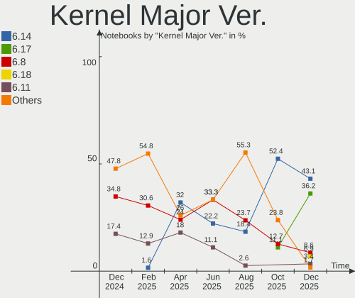

| Version | Notebooks | Percent |
|---------|-----------|---------|
| 6.14    | 25        | 43.1%   |
| 6.17    | 21        | 36.21%  |
| 6.8     | 5         | 8.62%   |
| 6.18    | 4         | 6.9%    |
| 6.11    | 2         | 3.45%   |
| 5.15    | 1         | 1.72%   |

Arch
----

OS architecture (x86_64, i586, etc.)

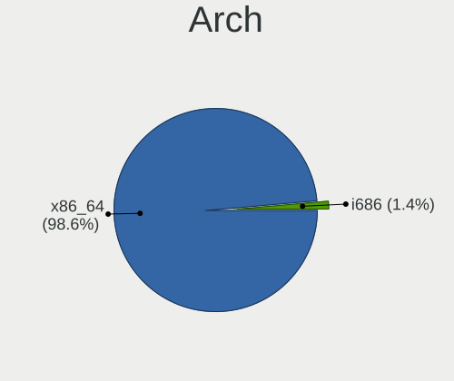

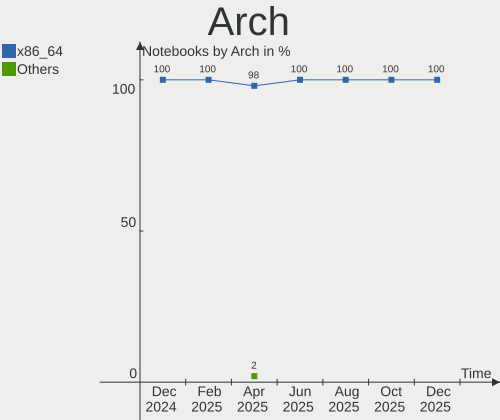

| Name   | Notebooks | Percent |
|--------|-----------|---------|
| x86_64 | 58        | 100%    |

DE
--

Desktop Environment

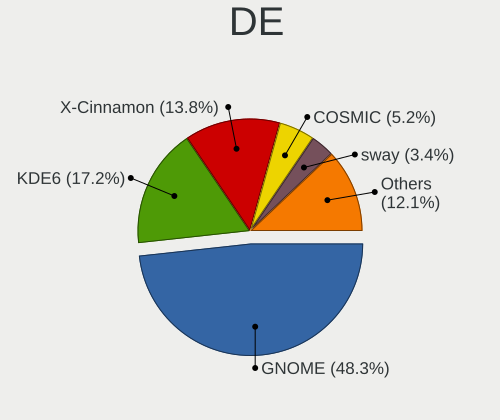

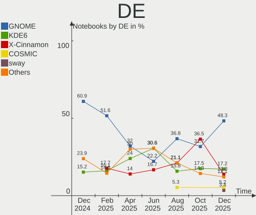

| Name          | Notebooks | Percent |
|---------------|-----------|---------|
| GNOME         | 28        | 48.28%  |
| KDE6          | 10        | 17.24%  |
| X-Cinnamon    | 8         | 13.79%  |
| COSMIC        | 3         | 5.17%   |
| sway          | 2         | 3.45%   |
| niri          | 1         | 1.72%   |
| KDE5          | 1         | 1.72%   |
| KDE           | 1         | 1.72%   |
| Hyprland      | 1         | 1.72%   |
| GNOME Classic | 1         | 1.72%   |
| Budgie        | 1         | 1.72%   |
| Unknown       | 1         | 1.72%   |

Display Server
--------------

X11 or Wayland

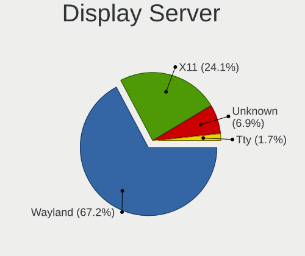

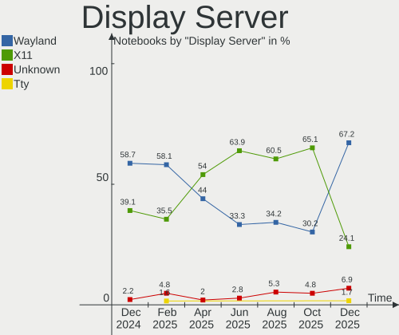

| Name    | Notebooks | Percent |
|---------|-----------|---------|
| Wayland | 39        | 67.24%  |
| X11     | 14        | 24.14%  |
| Unknown | 4         | 6.9%    |
| Tty     | 1         | 1.72%   |

Display Manager
---------------

SDDM, LightDM, etc.

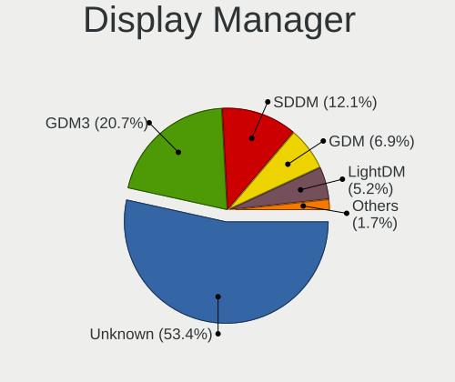

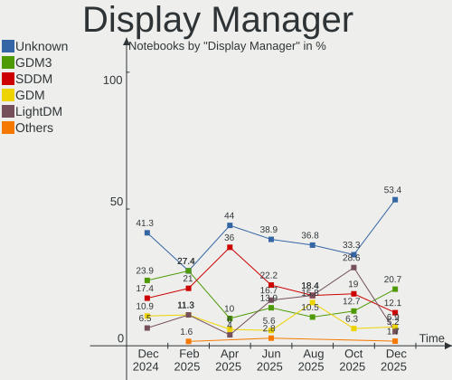

| Name    | Notebooks | Percent |
|---------|-----------|---------|
| Unknown | 31        | 53.45%  |
| GDM3    | 12        | 20.69%  |
| SDDM    | 7         | 12.07%  |
| GDM     | 4         | 6.9%    |
| LightDM | 3         | 5.17%   |
| GREETD  | 1         | 1.72%   |

OS Lang
-------

Language

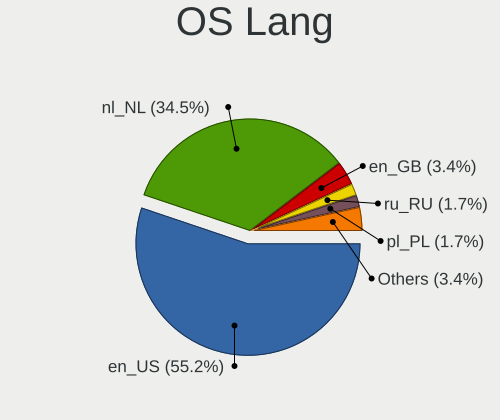

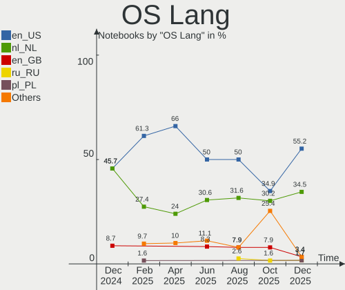

| Lang  | Notebooks | Percent |
|-------|-----------|---------|
| en_US | 32        | 55.17%  |
| nl_NL | 20        | 34.48%  |
| en_GB | 2         | 3.45%   |
| ru_RU | 1         | 1.72%   |
| pl_PL | 1         | 1.72%   |
| de_DE | 1         | 1.72%   |
| C     | 1         | 1.72%   |

Boot Mode
---------

EFI or BIOS

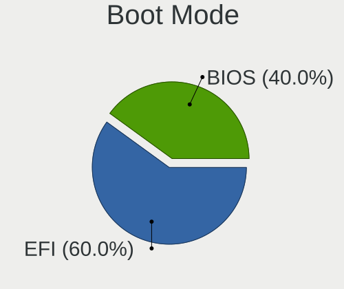

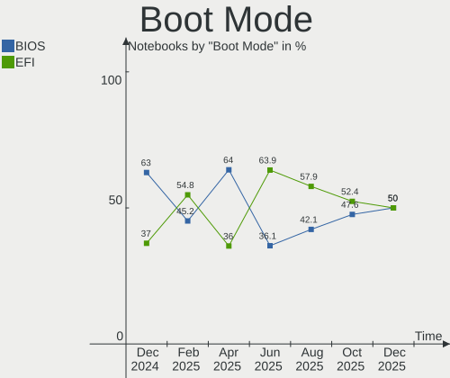

| Mode | Notebooks | Percent |
|------|-----------|---------|
| BIOS | 29        | 50%     |
| EFI  | 29        | 50%     |

Filesystem
----------

Type of filesystem

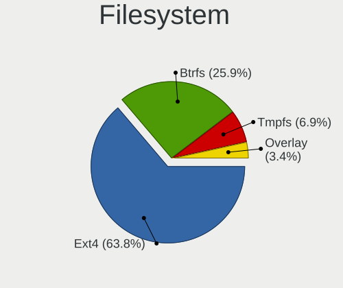

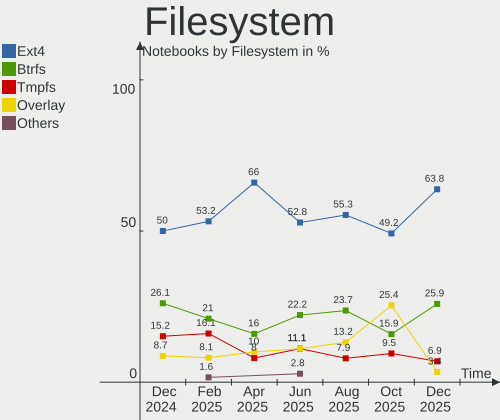

| Type    | Notebooks | Percent |
|---------|-----------|---------|
| Ext4    | 37        | 63.79%  |
| Btrfs   | 15        | 25.86%  |
| Tmpfs   | 4         | 6.9%    |
| Overlay | 2         | 3.45%   |

Part. scheme
------------

Scheme of partitioning

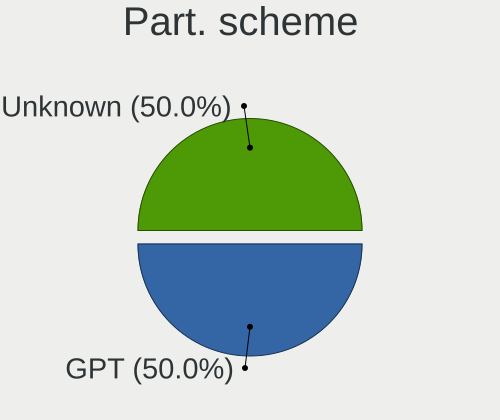

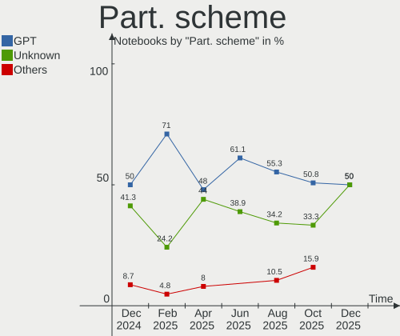

| Type    | Notebooks | Percent |
|---------|-----------|---------|
| GPT     | 29        | 50%     |
| Unknown | 29        | 50%     |

Dual Boot with Linux/BSD
------------------------

Hosting more than one Linux/BSD

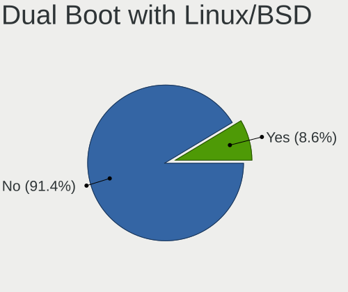

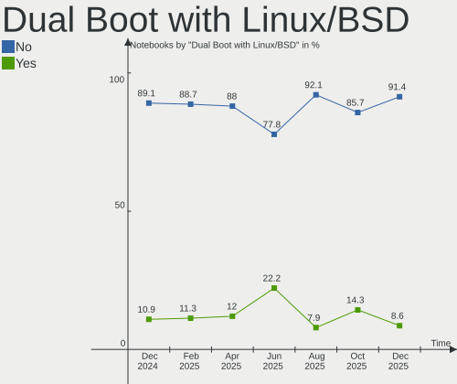

| Dual boot | Notebooks | Percent |
|-----------|-----------|---------|
| No        | 53        | 91.38%  |
| Yes       | 5         | 8.62%   |

Dual Boot (Win)
---------------

Hosting Linux and Windows

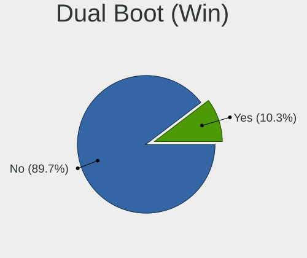

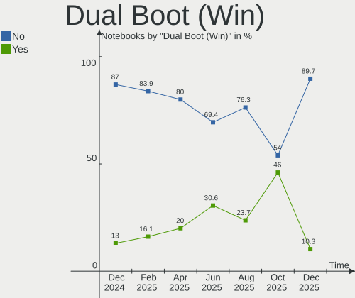

| Dual boot | Notebooks | Percent |
|-----------|-----------|---------|
| No        | 52        | 89.66%  |
| Yes       | 6         | 10.34%  |

Board
-----

Vendor
------

Motherboard manufacturer

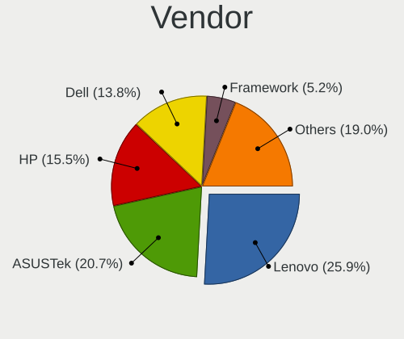

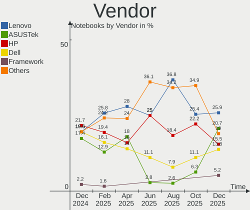

| Name                             | Notebooks | Percent |
|----------------------------------|-----------|---------|
| Lenovo                           | 15        | 25.86%  |
| ASUSTek Computer                 | 12        | 20.69%  |
| Hewlett-Packard                  | 9         | 15.52%  |
| Dell                             | 8         | 13.79%  |
| Framework                        | 3         | 5.17%   |
| Apple                            | 3         | 5.17%   |
| Acer                             | 3         | 5.17%   |
| SKIKK                            | 1         | 1.72%   |
| Samsung Electronics              | 1         | 1.72%   |
| MSI                              | 1         | 1.72%   |
| Micro Computer (HK) Tech Limited | 1         | 1.72%   |
| Acidanthera                      | 1         | 1.72%   |

Model
-----

Motherboard model

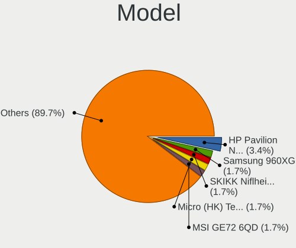

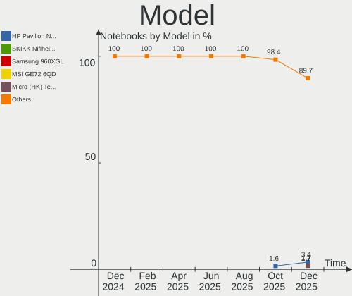

| Name                                        | Notebooks | Percent |
|---------------------------------------------|-----------|---------|
| HP Pavilion Notebook                        | 2         | 3.45%   |
| SKIKK Niflheim 17 II                        | 1         | 1.72%   |
| Samsung 960XGL                              | 1         | 1.72%   |
| MSI GE72 6QD                                | 1         | 1.72%   |
| Micro (HK) Tech Limited Venus series        | 1         | 1.72%   |
| Lenovo ThinkPad X13 Gen 6 21RLS45903        | 1         | 1.72%   |
| Lenovo ThinkPad X1 Carbon 7th 20QDCTO1WW    | 1         | 1.72%   |
| Lenovo ThinkPad T580 20L9CTO1WW             | 1         | 1.72%   |
| Lenovo ThinkPad T530 24295XG                | 1         | 1.72%   |
| Lenovo ThinkPad T470 W10DG 20JNS00U0D       | 1         | 1.72%   |
| Lenovo ThinkPad SL510 28477LG               | 1         | 1.72%   |
| Lenovo ThinkPad S1 Yoga 20CD0038MH          | 1         | 1.72%   |
| Lenovo ThinkPad P15v Gen 3 21D9S0J805       | 1         | 1.72%   |
| Lenovo ThinkPad P1 Gen 2 20QUS00000         | 1         | 1.72%   |
| Lenovo Legion Pro 7 16AFR10H 83RU           | 1         | 1.72%   |
| Lenovo Legion 5 17IMH05H 81Y8               | 1         | 1.72%   |
| Lenovo Legion 5 15IMH05H 81Y6               | 1         | 1.72%   |
| Lenovo IdeaPad Pro 5 16AHP9 83D5            | 1         | 1.72%   |
| Lenovo IdeaPad 5 14ALC05 82LM               | 1         | 1.72%   |
| Lenovo IdeaPad 320-15IKB 80YE               | 1         | 1.72%   |
| HP ProBook 430 G7                           | 1         | 1.72%   |
| HP Presario CQ57                            | 1         | 1.72%   |
| HP Pavilion Gaming Laptop 15-ec1xxx         | 1         | 1.72%   |
| HP OMEN by Laptop 16-b1xxx                  | 1         | 1.72%   |
| HP OMEN by Gaming Laptop 16-n0xxx           | 1         | 1.72%   |
| HP EliteBook 8530w                          | 1         | 1.72%   |
| HP EliteBook 1030 G1                        | 1         | 1.72%   |
| Framework Laptop 16 (AMD Ryzen 7040 Series) | 1         | 1.72%   |
| Framework Laptop 13 (AMD Ryzen 7040Series)  | 1         | 1.72%   |
| Framework Laptop                            | 1         | 1.72%   |
| Dell Pro Max 18 Plus MB18250                | 1         | 1.72%   |
| Dell Precision M2800                        | 1         | 1.72%   |
| Dell Latitude E6520                         | 1         | 1.72%   |
| Dell Latitude 7490                          | 1         | 1.72%   |
| Dell Latitude 7390                          | 1         | 1.72%   |
| Dell Latitude 5540                          | 1         | 1.72%   |
| Dell Latitude 5401                          | 1         | 1.72%   |
| Dell Inspiron 3781                          | 1         | 1.72%   |
| ASUS Zenbook UM3402YA_UM3402YA              | 1         | 1.72%   |
| ASUS X550LD                                 | 1         | 1.72%   |

Model Family
------------

Motherboard model prefix

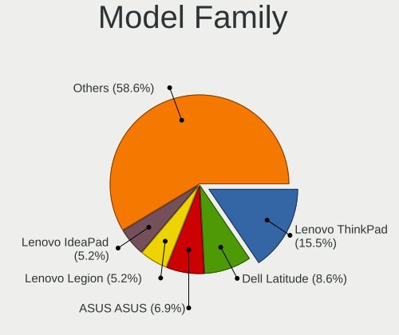

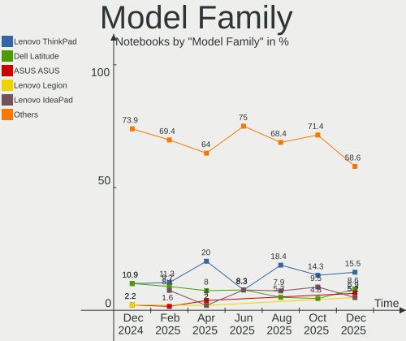

| Name                          | Notebooks | Percent |
|-------------------------------|-----------|---------|
| Lenovo ThinkPad               | 9         | 15.52%  |
| Dell Latitude                 | 5         | 8.62%   |
| ASUS ASUS                     | 4         | 6.9%    |
| Lenovo Legion                 | 3         | 5.17%   |
| Lenovo IdeaPad                | 3         | 5.17%   |
| HP Pavilion                   | 3         | 5.17%   |
| Framework Laptop              | 3         | 5.17%   |
| HP OMEN                       | 2         | 3.45%   |
| HP EliteBook                  | 2         | 3.45%   |
| ASUS VivoBook                 | 2         | 3.45%   |
| Apple MacBookPro11            | 2         | 3.45%   |
| Acer Aspire                   | 2         | 3.45%   |
| SKIKK Niflheim                | 1         | 1.72%   |
| Samsung 960XGL                | 1         | 1.72%   |
| MSI GE72                      | 1         | 1.72%   |
| Micro (HK) Tech Limited Venus | 1         | 1.72%   |
| HP ProBook                    | 1         | 1.72%   |
| HP Presario                   | 1         | 1.72%   |
| Dell Pro                      | 1         | 1.72%   |
| Dell Precision                | 1         | 1.72%   |
| Dell Inspiron                 | 1         | 1.72%   |
| ASUS Zenbook                  | 1         | 1.72%   |
| ASUS X550LD                   | 1         | 1.72%   |
| ASUS X540SA                   | 1         | 1.72%   |
| ASUS ROG                      | 1         | 1.72%   |
| ASUS N71Vg                    | 1         | 1.72%   |
| ASUS N550JK                   | 1         | 1.72%   |
| Apple MacBookPro8             | 1         | 1.72%   |
| Acidanthera MacBookPro16      | 1         | 1.72%   |
| Acer Swift                    | 1         | 1.72%   |

MFG Year
--------

Motherboard manufacture year

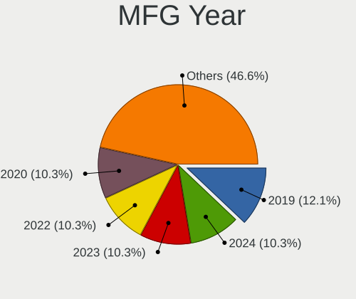

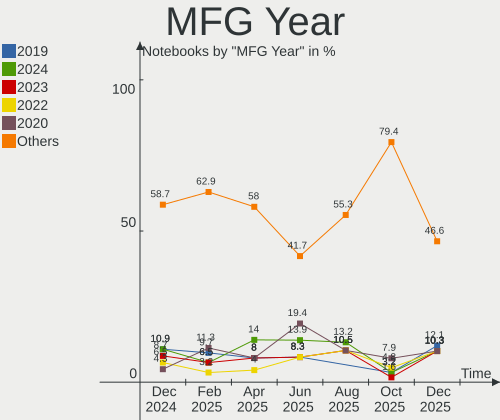

| Year | Notebooks | Percent |
|------|-----------|---------|
| 2019 | 7         | 12.07%  |
| 2024 | 6         | 10.34%  |
| 2023 | 6         | 10.34%  |
| 2022 | 6         | 10.34%  |
| 2020 | 6         | 10.34%  |
| 2025 | 3         | 5.17%   |
| 2021 | 3         | 5.17%   |
| 2018 | 3         | 5.17%   |
| 2014 | 3         | 5.17%   |
| 2013 | 3         | 5.17%   |
| 2012 | 3         | 5.17%   |
| 2015 | 2         | 3.45%   |
| 2011 | 2         | 3.45%   |
| 2009 | 2         | 3.45%   |
| 2017 | 1         | 1.72%   |
| 2016 | 1         | 1.72%   |
| 2008 | 1         | 1.72%   |

Form Factor
-----------

Physical design of the computer

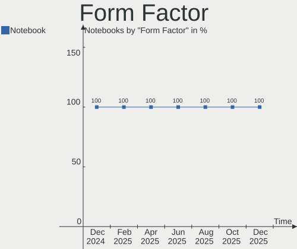

| Name     | Notebooks | Percent |
|----------|-----------|---------|
| Notebook | 58        | 100%    |

Secure Boot
-----------

Enabled or disabled

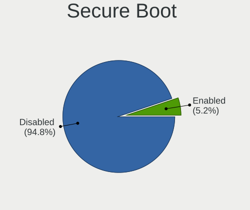

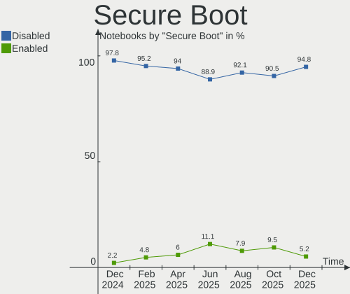

| State    | Notebooks | Percent |
|----------|-----------|---------|
| Disabled | 55        | 94.83%  |
| Enabled  | 3         | 5.17%   |

Coreboot
--------

Have coreboot on board

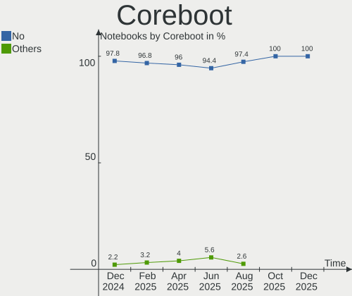

| Used | Notebooks | Percent |
|------|-----------|---------|
| No   | 58        | 100%    |

RAM Size
--------

Total RAM memory

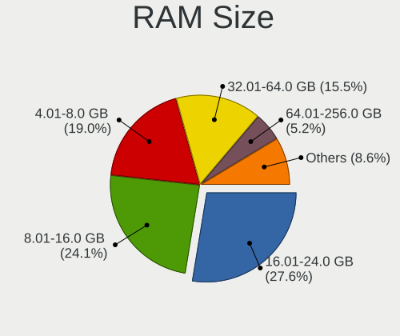

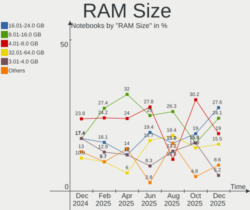

| Size in GB  | Notebooks | Percent |
|-------------|-----------|---------|
| 16.01-24.0  | 16        | 27.59%  |
| 8.01-16.0   | 14        | 24.14%  |
| 4.01-8.0    | 11        | 18.97%  |
| 32.01-64.0  | 9         | 15.52%  |
| 3.01-4.0    | 3         | 5.17%   |
| 64.01-256.0 | 3         | 5.17%   |
| 24.01-32.0  | 2         | 3.45%   |

RAM Used
--------

Used RAM memory

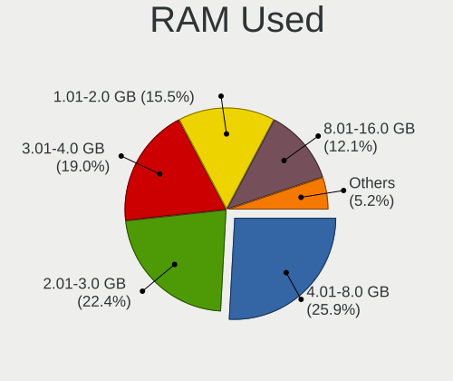

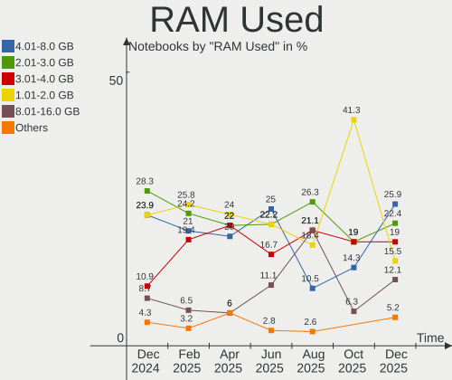

| Used GB    | Notebooks | Percent |
|------------|-----------|---------|
| 4.01-8.0   | 15        | 25.86%  |
| 2.01-3.0   | 13        | 22.41%  |
| 3.01-4.0   | 11        | 18.97%  |
| 1.01-2.0   | 9         | 15.52%  |
| 8.01-16.0  | 7         | 12.07%  |
| 24.01-32.0 | 1         | 1.72%   |
| 16.01-24.0 | 1         | 1.72%   |
| 0.51-1.0   | 1         | 1.72%   |

Total Drives
------------

Number of drives on board

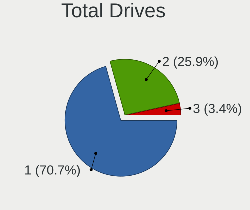

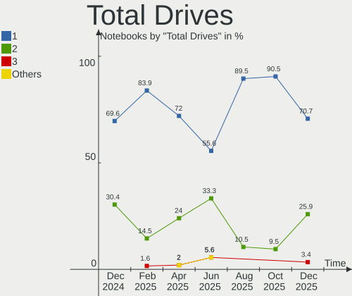

| Drives | Notebooks | Percent |
|--------|-----------|---------|
| 1      | 41        | 70.69%  |
| 2      | 15        | 25.86%  |
| 3      | 2         | 3.45%   |

Has CD-ROM
----------

Has CD-ROM on board

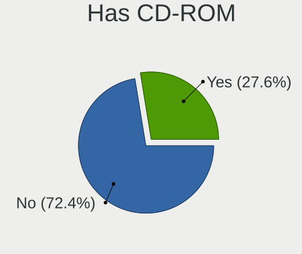

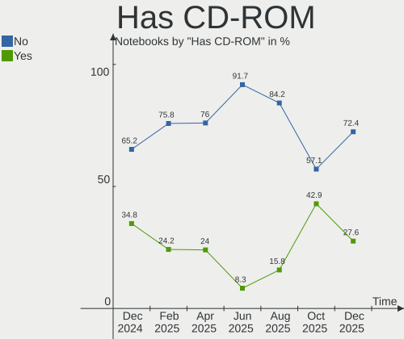

| Presented | Notebooks | Percent |
|-----------|-----------|---------|
| No        | 42        | 72.41%  |
| Yes       | 16        | 27.59%  |

Has Ethernet
------------

Has Ethernet on board

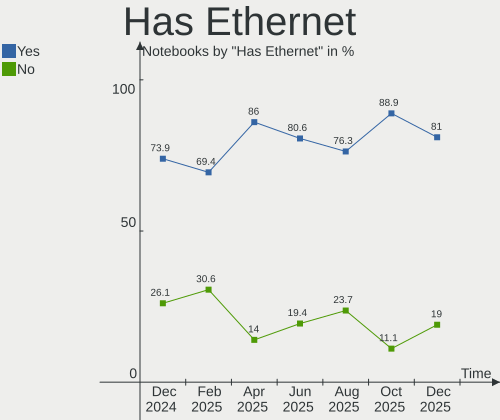

| Presented | Notebooks | Percent |
|-----------|-----------|---------|
| Yes       | 47        | 81.03%  |
| No        | 11        | 18.97%  |

Has WiFi
--------

Has WiFi module

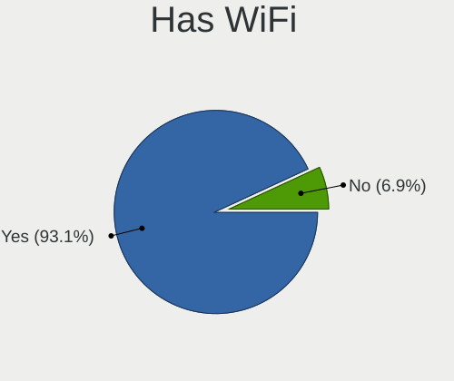

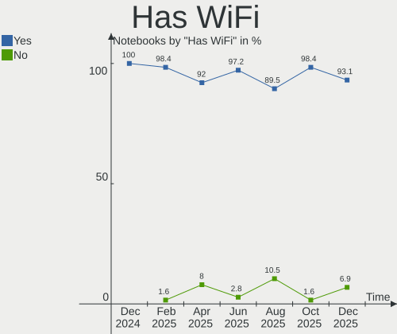

| Presented | Notebooks | Percent |
|-----------|-----------|---------|
| Yes       | 54        | 93.1%   |
| No        | 4         | 6.9%    |

Has Bluetooth
-------------

Has Bluetooth module

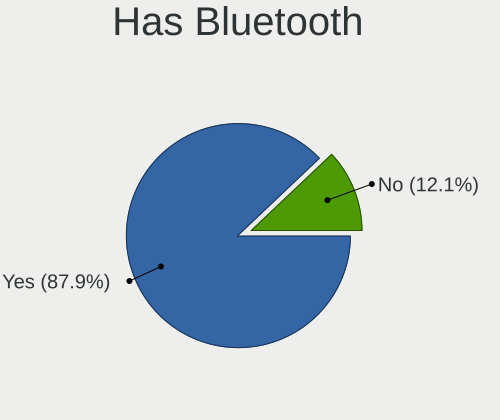

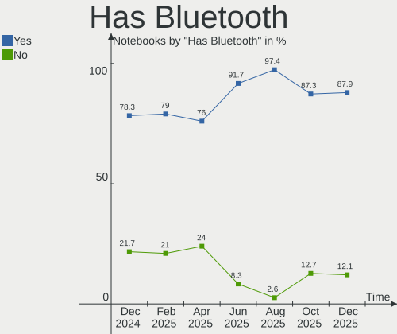

| Presented | Notebooks | Percent |
|-----------|-----------|---------|
| Yes       | 51        | 87.93%  |
| No        | 7         | 12.07%  |

Location
--------

Country
-------

Geographic location (country)

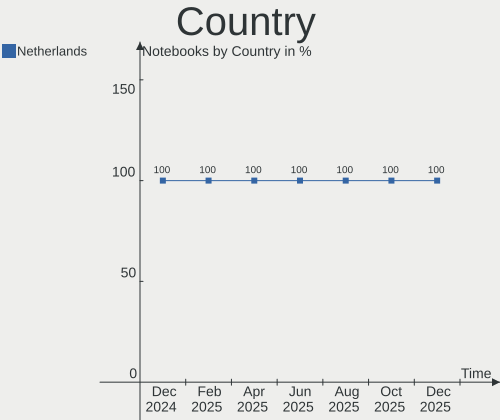

| Country     | Notebooks | Percent |
|-------------|-----------|---------|
| Netherlands | 58        | 100%    |

City
----

Geographic location (city)

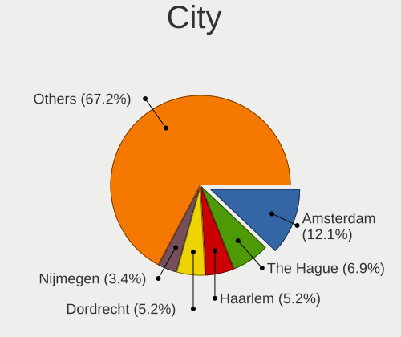

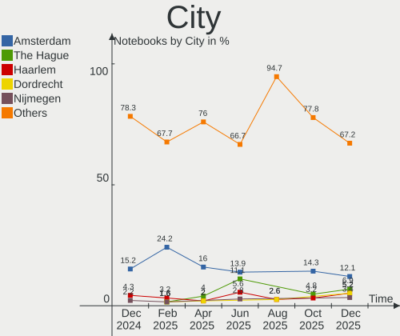

| City          | Notebooks | Percent |
|---------------|-----------|---------|
| Amsterdam     | 7         | 12.07%  |
| The Hague     | 4         | 6.9%    |
| Haarlem       | 3         | 5.17%   |
| Dordrecht     | 3         | 5.17%   |
| Nijmegen      | 2         | 3.45%   |
| Huizen        | 2         | 3.45%   |
| Groenlo       | 2         | 3.45%   |
| Zwolle        | 1         | 1.72%   |
| Zwijndrecht   | 1         | 1.72%   |
| Vianen        | 1         | 1.72%   |
| Valkenswaard  | 1         | 1.72%   |
| Utrecht       | 1         | 1.72%   |
| Twello        | 1         | 1.72%   |
| Tilburg       | 1         | 1.72%   |
| Rotterdam     | 1         | 1.72%   |
| Rosmalen      | 1         | 1.72%   |
| Roosendaal    | 1         | 1.72%   |
| Radewijk      | 1         | 1.72%   |
| Oldenzaal     | 1         | 1.72%   |
| Nunspeet      | 1         | 1.72%   |
| Meppel        | 1         | 1.72%   |
| Lunteren      | 1         | 1.72%   |
| Lelystad      | 1         | 1.72%   |
| Leiden        | 1         | 1.72%   |
| Landgraaf     | 1         | 1.72%   |
| Huisduinen    | 1         | 1.72%   |
| Hoorn         | 1         | 1.72%   |
| Hoofddorp     | 1         | 1.72%   |
| Heerlen       | 1         | 1.72%   |
| Heerhugowaard | 1         | 1.72%   |
| Heemskerk     | 1         | 1.72%   |
| Hasselt       | 1         | 1.72%   |
| Harlingen     | 1         | 1.72%   |
| Groningen     | 1         | 1.72%   |
| Gouda         | 1         | 1.72%   |
| Enschede      | 1         | 1.72%   |
| Eindhoven     | 1         | 1.72%   |
| Deventer      | 1         | 1.72%   |
| Beltrum       | 1         | 1.72%   |
| Apeldoorn     | 1         | 1.72%   |

Drives
------

Drive Vendor
------------

Hard drive vendors

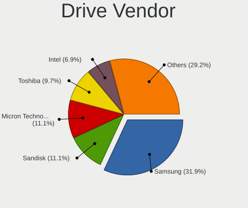

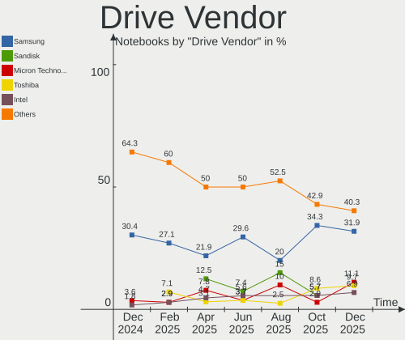

| Vendor                      | Notebooks | Drives | Percent |
|-----------------------------|-----------|--------|---------|
| Samsung Electronics         | 23        | 28     | 31.94%  |
| Sandisk                     | 8         | 8      | 11.11%  |
| Micron Technology           | 8         | 8      | 11.11%  |
| Toshiba                     | 7         | 7      | 9.72%   |
| Intel                       | 5         | 5      | 6.94%   |
| SK hynix                    | 4         | 4      | 5.56%   |
| Unknown                     | 3         | 3      | 4.17%   |
| HGST                        | 2         | 2      | 2.78%   |
| Crucial                     | 2         | 2      | 2.78%   |
| Apple                       | 2         | 2      | 2.78%   |
| VICKTER                     | 1         | 1      | 1.39%   |
| SABRENT                     | 1         | 2      | 1.39%   |
| Patriot                     | 1         | 1      | 1.39%   |
| Netac                       | 1         | 1      | 1.39%   |
| Kingston Technology Company | 1         | 1      | 1.39%   |
| Kingston                    | 1         | 1      | 1.39%   |
| Hitachi                     | 1         | 1      | 1.39%   |
| Fujitsu                     | 1         | 1      | 1.39%   |

Drive Model
-----------

Hard drive models

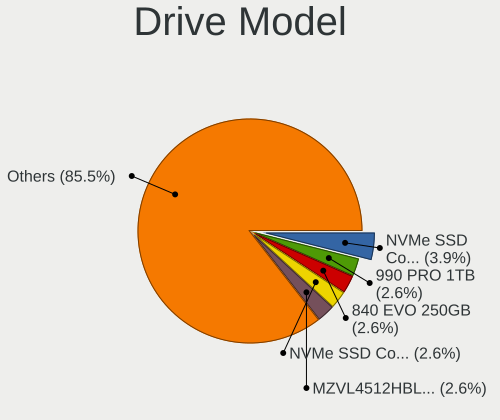

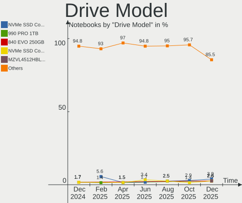

| Model                                                                           | Notebooks | Percent |
|---------------------------------------------------------------------------------|-----------|---------|
| Samsung NVMe SSD Controller SM981/PM981/PM983 1TB                               | 3         | 3.95%   |
| Samsung SSD 990 PRO 1TB                                                         | 2         | 2.63%   |
| Samsung SSD 840 EVO 250GB                                                       | 2         | 2.63%   |
| Samsung NVMe SSD Controller PM9A1/PM9A3/980PRO 1TB                              | 2         | 2.63%   |
| Samsung MZVL4512HBLU-00BL7 512GB                                                | 2         | 2.63%   |
| Micron 2210_MTFDHBA512QFD 512GB                                                 | 2         | 2.63%   |
| Intel SSD 660P Series 512GB                                                     | 2         | 2.63%   |
| Crucial CT1000MX500SSD1 1TB                                                     | 2         | 2.63%   |
| VICKTER SSD 512GB                                                               | 1         | 1.32%   |
| Unknown USB DISK 3.2 1TB                                                        | 1         | 1.32%   |
| Unknown NVMe SSD Drive 1024GB                                                   | 1         | 1.32%   |
| Unknown MMC Card  128GB                                                         | 1         | 1.32%   |
| Toshiba XG6 NVMe SSD Controller 1024GB                                          | 1         | 1.32%   |
| Toshiba THNSNJ128G8NY 128GB SSD                                                 | 1         | 1.32%   |
| Toshiba MQ01ABD100 1TB                                                          | 1         | 1.32%   |
| Toshiba MK6476GSX 640GB                                                         | 1         | 1.32%   |
| Toshiba MK5076GSX 500GB                                                         | 1         | 1.32%   |
| Toshiba MK4055GSX 400GB                                                         | 1         | 1.32%   |
| Toshiba KSG60ZMV256G M.2 2280 256GB SSD                                         | 1         | 1.32%   |
| SK hynix SKHynix_HFS001TFM9X178N 1TB                                            | 1         | 1.32%   |
| SK hynix PC811 SED 512GB                                                        | 1         | 1.32%   |
| SK hynix BC901 NVMe Solid State Drive (DRAM-less) 512GB                         | 1         | 1.32%   |
| SK hynix BC511 512GB                                                            | 1         | 1.32%   |
| Sandisk WD_BLACK SN770 500GB                                                    | 1         | 1.32%   |
| Sandisk WD PC SN740 SDDPMQD-512G-1101 512GB                                     | 1         | 1.32%   |
| Sandisk WD Black SN850 1TB                                                      | 1         | 1.32%   |
| Sandisk WD Black SN770 / PC SN740 256GB / PC SN560 (DRAM-less) NVMe SSD         | 1         | 1.32%   |
| Sandisk Ultra 3D / WD PC SN530, IX SN530, Blue SN550 NVMe SSD (DRAM-less) 256GB | 1         | 1.32%   |
| Sandisk PC SN740 NVMe SSD (DRAM-less) 256GB                                     | 1         | 1.32%   |
| SanDisk NVMe SSD Drive 512GB                                                    | 1         | 1.32%   |
| SanDisk NVMe SSD Drive 2TB                                                      | 1         | 1.32%   |
| Samsung SSD 990 PRO with Heatsink 2TB S7HPNJ0X401828N                           | 1         | 1.32%   |
| Samsung SSD 990 PRO with Heatsink 2TB                                           | 1         | 1.32%   |
| Samsung SSD 990 PRO 2TB                                                         | 1         | 1.32%   |
| Samsung SSD 970 EVO 1TB                                                         | 1         | 1.32%   |
| Samsung SSD 860 QVO 1TB                                                         | 1         | 1.32%   |
| Samsung SSD 860 EVO 500GB                                                       | 1         | 1.32%   |
| Samsung SSD 850 PRO 1TB                                                         | 1         | 1.32%   |
| Samsung SSD 850 EVO 500GB                                                       | 1         | 1.32%   |
| Samsung SSD 850 EVO 250GB                                                       | 1         | 1.32%   |

HDD Vendor
----------

Hard disk drive vendors

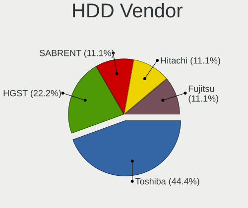

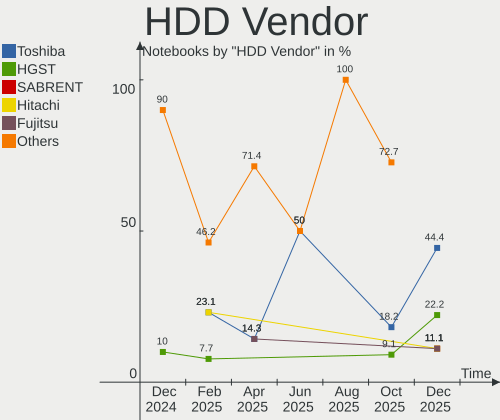

| Vendor  | Notebooks | Drives | Percent |
|---------|-----------|--------|---------|
| Toshiba | 4         | 4      | 44.44%  |
| HGST    | 2         | 2      | 22.22%  |
| SABRENT | 1         | 2      | 11.11%  |
| Hitachi | 1         | 1      | 11.11%  |
| Fujitsu | 1         | 1      | 11.11%  |

SSD Vendor
----------

Solid state drive vendors

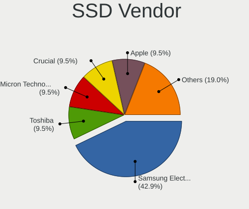

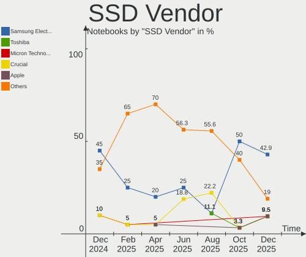

| Vendor              | Notebooks | Drives | Percent |
|---------------------|-----------|--------|---------|
| Samsung Electronics | 9         | 11     | 42.86%  |
| Toshiba             | 2         | 2      | 9.52%   |
| Micron Technology   | 2         | 2      | 9.52%   |
| Crucial             | 2         | 2      | 9.52%   |
| Apple               | 2         | 2      | 9.52%   |
| VICKTER             | 1         | 1      | 4.76%   |
| Patriot             | 1         | 1      | 4.76%   |
| Netac               | 1         | 1      | 4.76%   |
| Kingston            | 1         | 1      | 4.76%   |

Drive Kind
----------

HDD or SSD

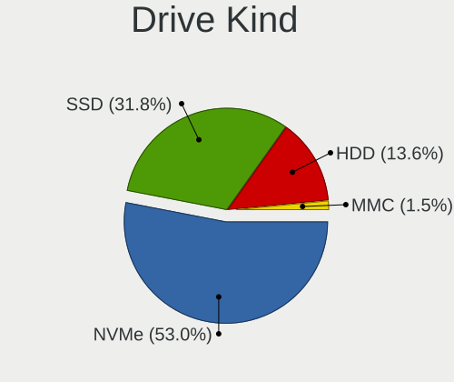

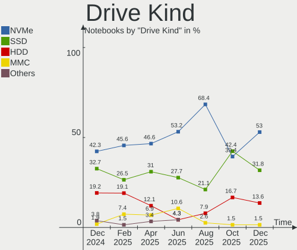

| Kind | Notebooks | Drives | Percent |
|------|-----------|--------|---------|
| NVMe | 35        | 44     | 53.03%  |
| SSD  | 21        | 23     | 31.82%  |
| HDD  | 9         | 10     | 13.64%  |
| MMC  | 1         | 1      | 1.52%   |

Drive Connector
---------------

SATA, SAS, NVMe, etc.

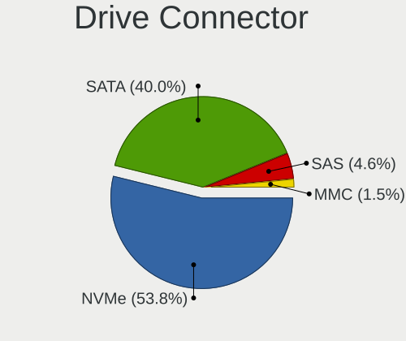

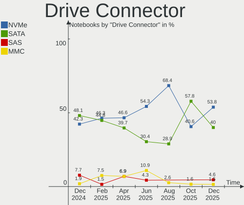

| Type | Notebooks | Drives | Percent |
|------|-----------|--------|---------|
| NVMe | 35        | 43     | 53.85%  |
| SATA | 26        | 30     | 40%     |
| SAS  | 3         | 4      | 4.62%   |
| MMC  | 1         | 1      | 1.54%   |

Drive Size
----------

Size of hard drive

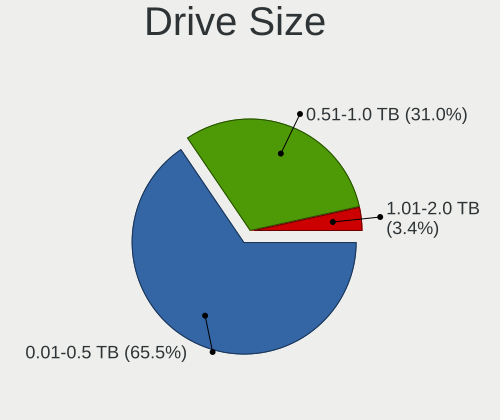

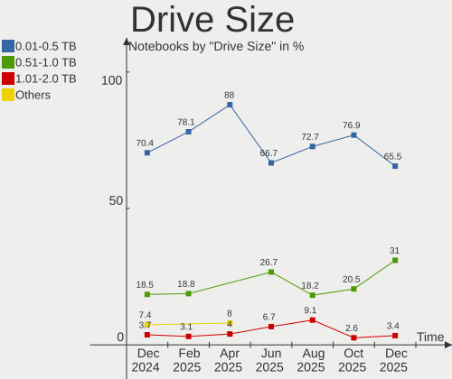

| Size in TB | Notebooks | Drives | Percent |
|------------|-----------|--------|---------|
| 0.01-0.5   | 19        | 22     | 65.52%  |
| 0.51-1.0   | 9         | 10     | 31.03%  |
| 1.01-2.0   | 1         | 1      | 3.45%   |

Space Total
-----------

Amount of disk space available on the file system

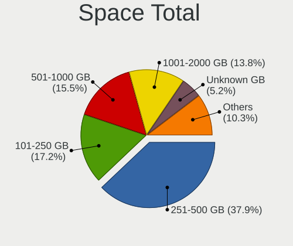

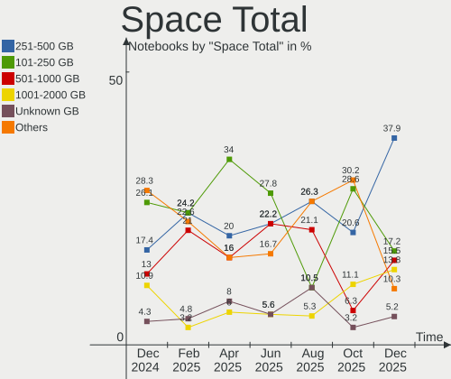

| Size in GB     | Notebooks | Percent |
|----------------|-----------|---------|
| 251-500        | 22        | 37.93%  |
| 101-250        | 10        | 17.24%  |
| 501-1000       | 9         | 15.52%  |
| 1001-2000      | 8         | 13.79%  |
| Unknown        | 3         | 5.17%   |
| More than 3000 | 2         | 3.45%   |
| 2001-3000      | 2         | 3.45%   |
| 51-100         | 2         | 3.45%   |

Space Used
----------

Amount of used disk space

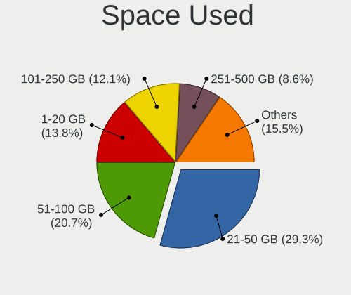

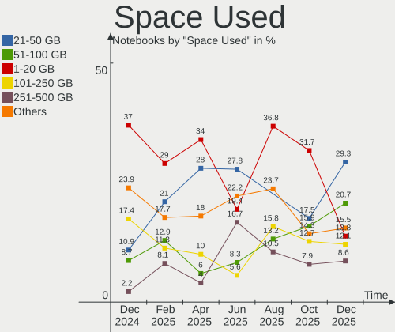

| Used GB        | Notebooks | Percent |
|----------------|-----------|---------|
| 21-50          | 17        | 29.31%  |
| 51-100         | 12        | 20.69%  |
| 1-20           | 8         | 13.79%  |
| 101-250        | 7         | 12.07%  |
| 251-500        | 5         | 8.62%   |
| Unknown        | 3         | 5.17%   |
| 1001-2000      | 2         | 3.45%   |
| 501-1000       | 2         | 3.45%   |
| More than 3000 | 1         | 1.72%   |
| 2001-3000      | 1         | 1.72%   |

Malfunc. Drives
---------------

Drive models with a malfunction

Zero info for selected period =(

Malfunc. Drive Vendor
---------------------

Vendors of faulty drives

Zero info for selected period =(

Malfunc. HDD Vendor
-------------------

Vendors of faulty HDD drives

Zero info for selected period =(

Malfunc. Drive Kind
-------------------

Kinds of faulty drives

Zero info for selected period =(

Failed Drives
-------------

Failed drive models

Zero info for selected period =(

Failed Drive Vendor
-------------------

Failed drive vendors

Zero info for selected period =(

Drive Status
------------

Number of failed and malfunc. drives

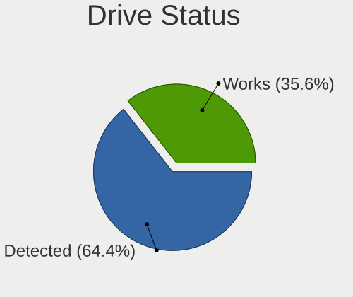

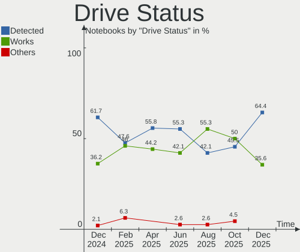

| Status   | Notebooks | Drives | Percent |
|----------|-----------|--------|---------|
| Detected | 38        | 49     | 64.41%  |
| Works    | 21        | 29     | 35.59%  |

Storage controller
------------------

Storage Vendor
--------------

Storage controller vendors

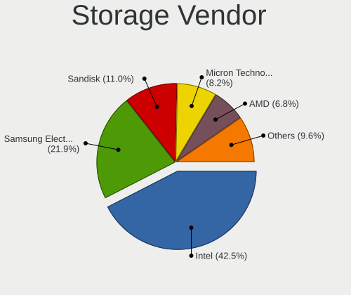

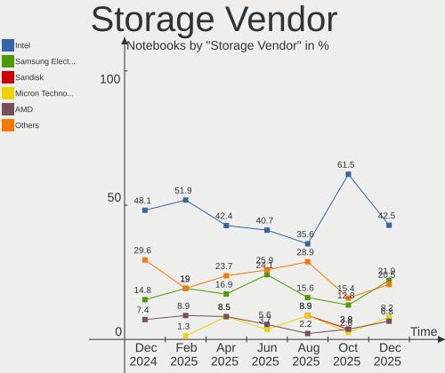

| Vendor                       | Notebooks | Percent |
|------------------------------|-----------|---------|
| Intel                        | 31        | 42.47%  |
| Samsung Electronics          | 16        | 21.92%  |
| Sandisk                      | 8         | 10.96%  |
| Micron Technology            | 6         | 8.22%   |
| AMD                          | 5         | 6.85%   |
| SK hynix                     | 4         | 5.48%   |
| Toshiba America Info Systems | 1         | 1.37%   |
| Kingston Technology Company  | 1         | 1.37%   |
| INNOGRIT                     | 1         | 1.37%   |

Storage Model
-------------

Storage controller models

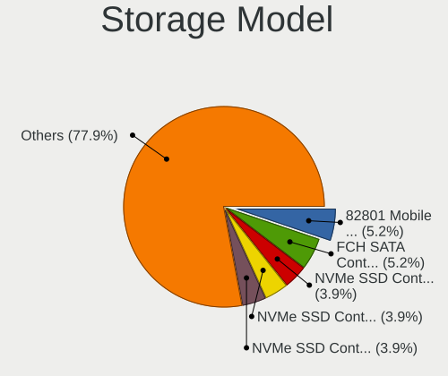

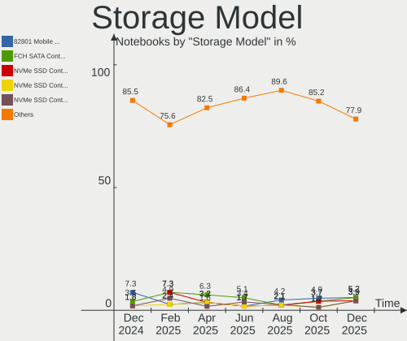

| Model                                                                          | Notebooks | Percent |
|--------------------------------------------------------------------------------|-----------|---------|
| Intel 82801 Mobile SATA Controller [RAID mode]                                 | 4         | 5.19%   |
| AMD FCH SATA Controller [AHCI mode]                                            | 4         | 5.19%   |
| Samsung NVMe SSD Controller SM981/PM981/PM983                                  | 3         | 3.9%    |
| Samsung NVMe SSD Controller S4LV008[Pascal]                                    | 3         | 3.9%    |
| Samsung NVMe SSD Controller PM9B1 (DRAM-less)                                  | 3         | 3.9%    |
| Samsung NVMe SSD Controller PM9A1/PM9A3/980PRO                                 | 3         | 3.9%    |
| Intel 400 Series Chipset Family SATA AHCI Controller                           | 3         | 3.9%    |
| SanDisk WD SN560/SN740/SN770/SN5000 NVMe SSD                                   | 2         | 2.6%    |
| Samsung S4LN053X01 AHCI SSD Controller(Apple slot)                             | 2         | 2.6%    |
| Samsung NVMe SSD Controller 980 (DRAM-less)                                    | 2         | 2.6%    |
| Micron 2450 NVMe SSD [HendrixV] (DRAM-less)                                    | 2         | 2.6%    |
| Micron 2210 NVMe SSD [Cobain]                                                  | 2         | 2.6%    |
| Intel Volume Management Device NVMe RAID Controller                            | 2         | 2.6%    |
| Intel Sunrise Point-LP SATA Controller [AHCI mode]                             | 2         | 2.6%    |
| Intel SSD 660P Series                                                          | 2         | 2.6%    |
| Intel 82801IBM/IEM (ICH9M/ICH9M-E) 4 port SATA Controller [AHCI mode]          | 2         | 2.6%    |
| Intel 8 Series/C220 Series Chipset Family 6-port SATA Controller 1 [AHCI mode] | 2         | 2.6%    |
| Intel 8 Series SATA Controller 1 [AHCI mode]                                   | 2         | 2.6%    |
| Intel 7 Series Chipset Family 6-port SATA Controller [AHCI mode]               | 2         | 2.6%    |
| Toshiba America Info Systems XG6 NVMe SSD Controller                           | 1         | 1.3%    |
| SK hynix PCB01 NVMe Solid State Drive                                          | 1         | 1.3%    |
| SK hynix PC811 NVMe Solid State Drive                                          | 1         | 1.3%    |
| SK hynix BC901 NVMe Solid State Drive (DRAM-less)                              | 1         | 1.3%    |
| SK hynix BC511 NVMe SSD                                                        | 1         | 1.3%    |
| SanDisk WD PC SN810 / Black SN850 NVMe SSD                                     | 1         | 1.3%    |
| Sandisk WD PC SN740 NVMe SSD 512GB (DRAM-less)                                 | 1         | 1.3%    |
| Sandisk WD PC SN5000S M.2 2280 NVMe SSD (DRAM-less)                            | 1         | 1.3%    |
| Sandisk WD Black SN850X NVMe SSD                                               | 1         | 1.3%    |
| SanDisk Ultra 3D / WD PC SN530, IX SN530, Blue SN550 NVMe SSD (DRAM-less)      | 1         | 1.3%    |
| Sandisk PC SN740 NVMe SSD (DRAM-less)                                          | 1         | 1.3%    |
| Samsung NVMe SSD 9100 PRO [PM9E1]                                              | 1         | 1.3%    |
| Micron 3400 NVMe SSD [Hendrix]                                                 | 1         | 1.3%    |
| Micron 2400 NVMe SSD (DRAM-less)                                               | 1         | 1.3%    |
| Kingston Company NV3 NVMe SSD [TC2201] (DRAM-less)                             | 1         | 1.3%    |
| Intel Tiger Lake-LP SATA Controller                                            | 1         | 1.3%    |
| Intel SSD DC P4101/Pro 7600p/760p/E 6100p Series                               | 1         | 1.3%    |
| Intel SSD 670p Series [Keystone Harbor]                                        | 1         | 1.3%    |
| Intel SSD 600P Series                                                          | 1         | 1.3%    |
| Intel RST Volume Management Device Controller                                  | 1         | 1.3%    |
| Intel Mobile 4 Series Chipset PT IDER Controller                               | 1         | 1.3%    |

Storage Kind
------------

Kind of storage controller (IDE, SATA, NVMe, SAS, ...)

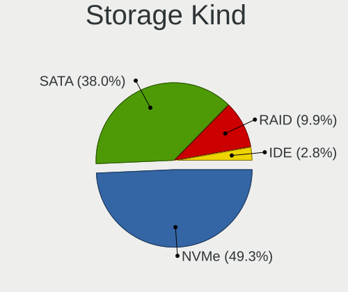

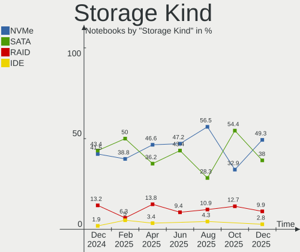

| Kind | Notebooks | Percent |
|------|-----------|---------|
| NVMe | 35        | 49.3%   |
| SATA | 27        | 38.03%  |
| RAID | 7         | 9.86%   |
| IDE  | 2         | 2.82%   |

Processor
---------

CPU Vendor
----------

Processor vendors

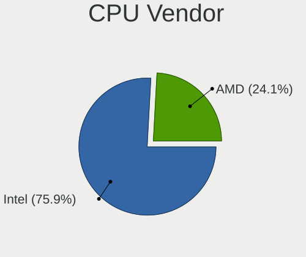

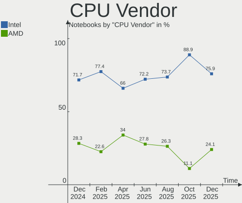

| Vendor | Notebooks | Percent |
|--------|-----------|---------|
| Intel  | 44        | 75.86%  |
| AMD    | 14        | 24.14%  |

CPU Model
---------

Processor models

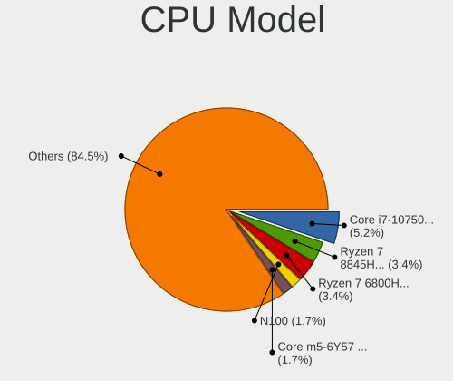

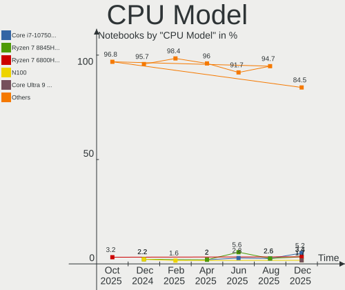

| Model                                      | Notebooks | Percent |
|--------------------------------------------|-----------|---------|
| Intel Core i7-10750H CPU @ 2.60GHz         | 3         | 5.17%   |
| AMD Ryzen 7 8845HS w/ Radeon 780M Graphics | 2         | 3.45%   |
| AMD Ryzen 7 6800H with Radeon Graphics     | 2         | 3.45%   |
| Intel N100                                 | 1         | 1.72%   |
| Intel Core Ultra 9 185H                    | 1         | 1.72%   |
| Intel Core Ultra 7 265HX                   | 1         | 1.72%   |
| Intel Core Ultra 7 155H                    | 1         | 1.72%   |
| Intel Core Ultra 5 235U                    | 1         | 1.72%   |
| Intel Core m5-6Y57 CPU @ 1.10GHz           | 1         | 1.72%   |
| Intel Core i7-9750H CPU @ 2.60GHz          | 1         | 1.72%   |
| Intel Core i7-8650U CPU @ 1.90GHz          | 1         | 1.72%   |
| Intel Core i7-8550U CPU @ 1.80GHz          | 1         | 1.72%   |
| Intel Core i7-6700HQ CPU @ 2.60GHz         | 1         | 1.72%   |
| Intel Core i7-4980HQ CPU @ 2.80GHz         | 1         | 1.72%   |
| Intel Core i7-4810MQ CPU @ 2.80GHz         | 1         | 1.72%   |
| Intel Core i7-4710HQ CPU @ 2.50GHz         | 1         | 1.72%   |
| Intel Core i7-4510U CPU @ 2.00GHz          | 1         | 1.72%   |
| Intel Core i7-4500U CPU @ 1.80GHz          | 1         | 1.72%   |
| Intel Core i7-3632QM CPU @ 2.20GHz         | 1         | 1.72%   |
| Intel Core i7-3520M CPU @ 2.90GHz          | 1         | 1.72%   |
| Intel Core i7-2635QM CPU @ 2.00GHz         | 1         | 1.72%   |
| Intel Core i5-9400H CPU @ 2.50GHz          | 1         | 1.72%   |
| Intel Core i5-8365U CPU @ 1.60GHz          | 1         | 1.72%   |
| Intel Core i5-8350U CPU @ 1.70GHz          | 1         | 1.72%   |
| Intel Core i5-6300U CPU @ 2.40GHz          | 1         | 1.72%   |
| Intel Core i5-6200U CPU @ 2.30GHz          | 1         | 1.72%   |
| Intel Core i5-4258U CPU @ 2.40GHz          | 1         | 1.72%   |
| Intel Core i5-2520M CPU @ 2.50GHz          | 1         | 1.72%   |
| Intel Core i5-10300H CPU @ 2.50GHz         | 1         | 1.72%   |
| Intel Core i3-7100U CPU @ 2.40GHz          | 1         | 1.72%   |
| Intel Core i3-7020U CPU @ 2.30GHz          | 1         | 1.72%   |
| Intel Core i3-10110U CPU @ 2.10GHz         | 1         | 1.72%   |
| Intel Core 2 Duo CPU T9600 @ 2.80GHz       | 1         | 1.72%   |
| Intel Core 2 Duo CPU T6570 @ 2.10GHz       | 1         | 1.72%   |
| Intel Core 2 Duo CPU T5900 @ 2.20GHz       | 1         | 1.72%   |
| Intel Celeron CPU N3050 @ 1.60GHz          | 1         | 1.72%   |
| Intel 13th Gen Core i9-13900HX             | 1         | 1.72%   |
| Intel 13th Gen Core i7-1365U               | 1         | 1.72%   |
| Intel 13th Gen Core i7-13620H              | 1         | 1.72%   |
| Intel 12th Gen Core i7-12800H              | 1         | 1.72%   |

CPU Model Family
----------------

Processor model prefix

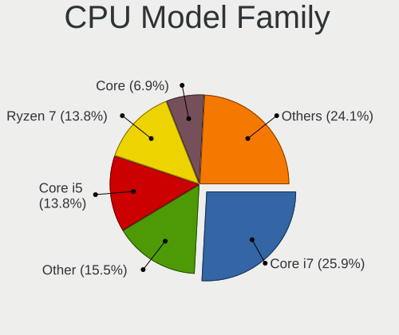

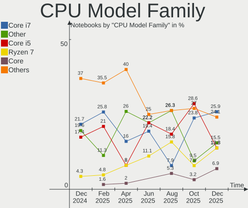

| Model            | Notebooks | Percent |
|------------------|-----------|---------|
| Intel Core i7    | 15        | 25.86%  |
| Other            | 9         | 15.52%  |
| Intel Core i5    | 8         | 13.79%  |
| AMD Ryzen 7      | 8         | 13.79%  |
| Intel Core       | 4         | 6.9%    |
| Intel Core i3    | 3         | 5.17%   |
| Intel Core 2 Duo | 3         | 5.17%   |
| AMD Ryzen 9      | 2         | 3.45%   |
| AMD Ryzen 5      | 2         | 3.45%   |
| Intel Core m5    | 1         | 1.72%   |
| Intel Celeron    | 1         | 1.72%   |
| AMD E            | 1         | 1.72%   |
| AMD A8           | 1         | 1.72%   |

CPU Cores
---------

Number of processor cores

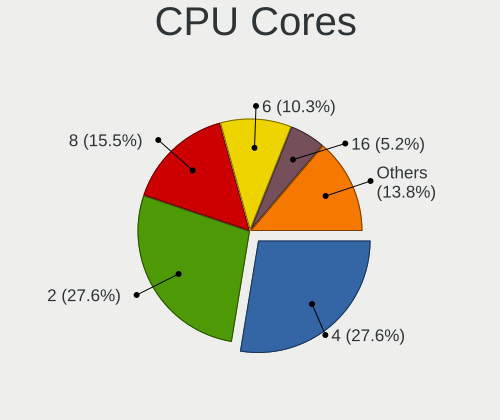

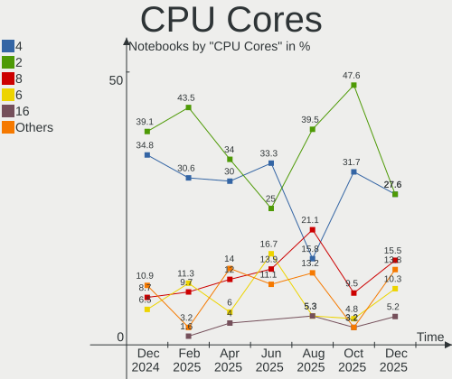

| Number | Notebooks | Percent |
|--------|-----------|---------|
| 4      | 16        | 27.59%  |
| 2      | 16        | 27.59%  |
| 8      | 9         | 15.52%  |
| 6      | 6         | 10.34%  |
| 16     | 3         | 5.17%   |
| 10     | 3         | 5.17%   |
| 14     | 2         | 3.45%   |
| 24     | 1         | 1.72%   |
| 20     | 1         | 1.72%   |
| 12     | 1         | 1.72%   |

CPU Sockets
-----------

Number of sockets

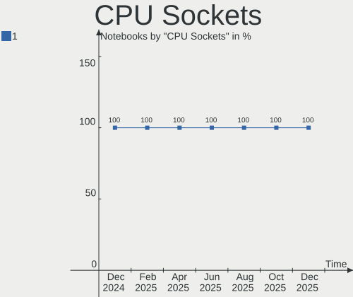

| Number | Notebooks | Percent |
|--------|-----------|---------|
| 1      | 58        | 100%    |

CPU Threads
-----------

Threads per core (Hyper-Threading)

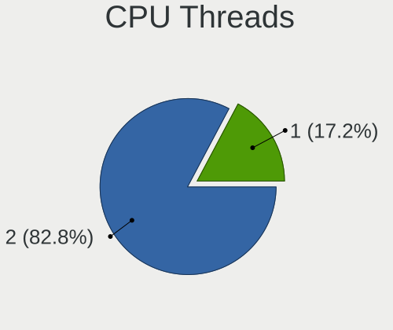

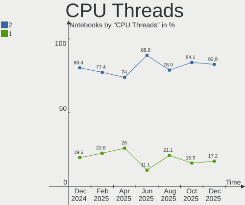

| Number | Notebooks | Percent |
|--------|-----------|---------|
| 2      | 48        | 82.76%  |
| 1      | 10        | 17.24%  |

CPU Op-Modes
------------

CPU Operation Modes (32-bit, 64-bit)

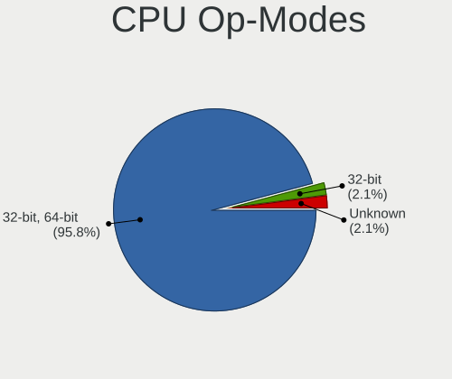

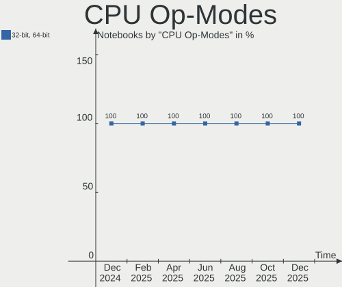

| Op mode        | Notebooks | Percent |
|----------------|-----------|---------|
| 32-bit, 64-bit | 58        | 100%    |

CPU Microcode
-------------

Microcode number

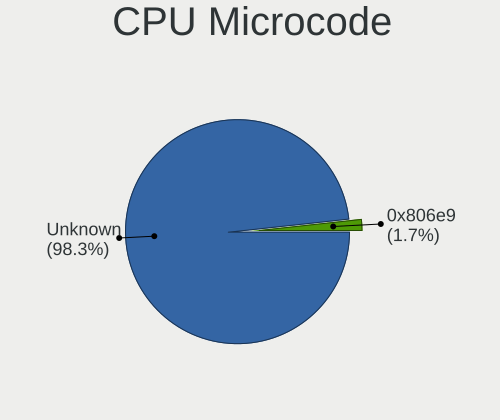

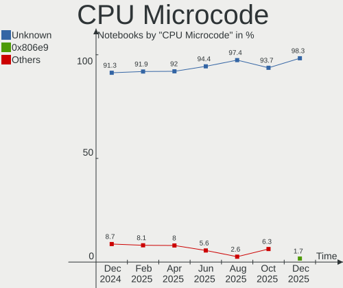

| Number  | Notebooks | Percent |
|---------|-----------|---------|
| Unknown | 57        | 98.28%  |
| 0x806e9 | 1         | 1.72%   |

CPU Microarch
-------------

Microarchitecture

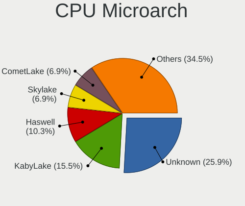

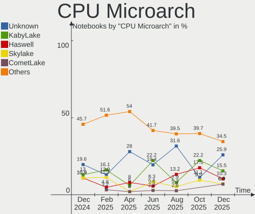

| Name              | Notebooks | Percent |
|-------------------|-----------|---------|
| Unknown           | 15        | 25.86%  |
| KabyLake          | 9         | 15.52%  |
| Haswell           | 6         | 10.34%  |
| Skylake           | 4         | 6.9%    |
| CometLake         | 4         | 6.9%    |
| Alderlake Hybrid  | 3         | 5.17%   |
| TigerLake         | 2         | 3.45%   |
| SandyBridge       | 2         | 3.45%   |
| Penryn            | 2         | 3.45%   |
| IvyBridge         | 2         | 3.45%   |
| Zen 3             | 1         | 1.72%   |
| Zen 2             | 1         | 1.72%   |
| Silvermont        | 1         | 1.72%   |
| Puma              | 1         | 1.72%   |
| Meteorlake Hybrid | 1         | 1.72%   |
| Lunarlake Hybrid  | 1         | 1.72%   |
| Gracemont         | 1         | 1.72%   |
| Core              | 1         | 1.72%   |
| Bobcat            | 1         | 1.72%   |

Graphics
--------

GPU Vendor
----------

Vendors of graphics cards

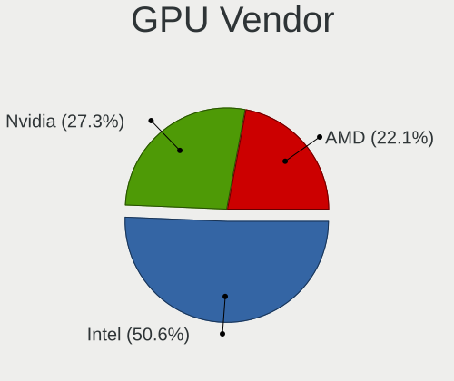

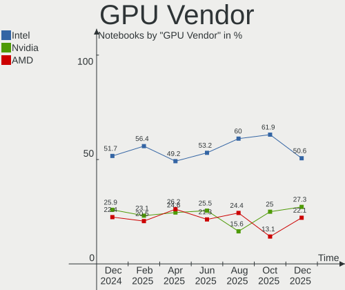

| Vendor | Notebooks | Percent |
|--------|-----------|---------|
| Intel  | 39        | 50.65%  |
| Nvidia | 21        | 27.27%  |
| AMD    | 17        | 22.08%  |

GPU Model
---------

Graphics card models

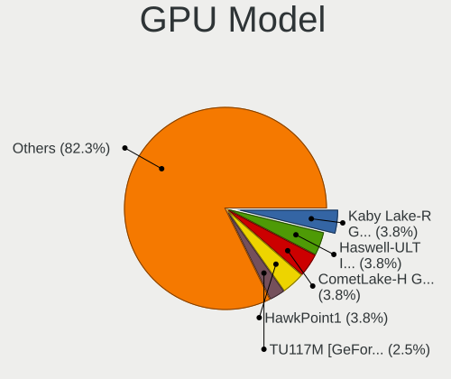

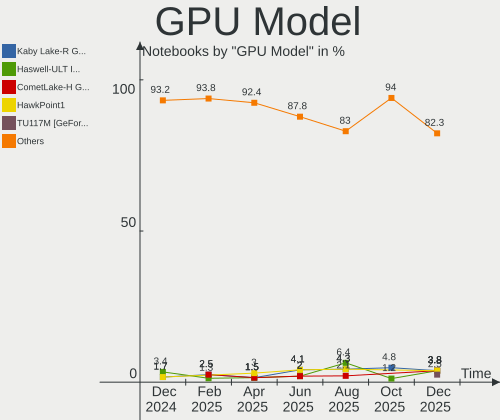

| Model                                                                                 | Notebooks | Percent |
|---------------------------------------------------------------------------------------|-----------|---------|
| Intel Kaby Lake-R GT2 [UHD Graphics 620]                                              | 3         | 3.8%    |
| Intel Haswell-ULT Integrated Graphics Controller                                      | 3         | 3.8%    |
| Intel CometLake-H GT2 [UHD Graphics]                                                  | 3         | 3.8%    |
| AMD HawkPoint1                                                                        | 3         | 3.8%    |
| Nvidia TU117M [GeForce GTX 1650 Ti Mobile]                                            | 2         | 2.53%   |
| Nvidia TU117GLM [Quadro T1000 Mobile]                                                 | 2         | 2.53%   |
| Nvidia GF117M [GeForce 610M/710M/810M/820M / GT 620M/625M/630M/720M]                  | 2         | 2.53%   |
| Nvidia AD106M [GeForce RTX 4070 Max-Q / Mobile]                                       | 2         | 2.53%   |
| Intel TigerLake-LP GT2 [Iris Xe Graphics]                                             | 2         | 2.53%   |
| Intel Skylake-U GT2 [HD Graphics 520]                                                 | 2         | 2.53%   |
| Intel Meteor Lake-P [Intel Arc Graphics]                                              | 2         | 2.53%   |
| Intel CoffeeLake-H GT2 [UHD Graphics 630]                                             | 2         | 2.53%   |
| Intel Alder Lake-P GT2 [Iris Xe Graphics]                                             | 2         | 2.53%   |
| Intel 4th Gen Core Processor Integrated Graphics Controller                           | 2         | 2.53%   |
| Intel 3rd Gen Core processor Graphics Controller                                      | 2         | 2.53%   |
| Intel 2nd Generation Core Processor Family Integrated Graphics Controller             | 2         | 2.53%   |
| AMD Topaz XT [Radeon R7 M260/M265 / M340/M360 / M440/M445 / 530/535 / 620/625 Mobile] | 2         | 2.53%   |
| AMD Rembrandt [Radeon 680M]                                                           | 2         | 2.53%   |
| AMD Phoenix1                                                                          | 2         | 2.53%   |
| AMD Lucienne                                                                          | 2         | 2.53%   |
| Nvidia TU117GLM [T1200 Laptop GPU]                                                    | 1         | 1.27%   |
| Nvidia TU116M [GeForce GTX 1660 Ti Mobile]                                            | 1         | 1.27%   |
| Nvidia TU106M [GeForce RTX 2060 Mobile]                                               | 1         | 1.27%   |
| Nvidia GP108M [GeForce MX150]                                                         | 1         | 1.27%   |
| Nvidia GM108M [GeForce 940M]                                                          | 1         | 1.27%   |
| Nvidia GM107M [GeForce GTX 960M]                                                      | 1         | 1.27%   |
| Nvidia GM107M [GeForce GTX 850M]                                                      | 1         | 1.27%   |
| Nvidia GK107M [GeForce GT 750M Mac Edition]                                           | 1         | 1.27%   |
| Nvidia GB205M [GeForce RTX 5070 Ti Mobile]                                            | 1         | 1.27%   |
| Nvidia GA106M [GeForce RTX 3060 Mobile / Max-Q]                                       | 1         | 1.27%   |
| Nvidia GA104 [Geforce RTX 3070 Ti Laptop GPU]                                         | 1         | 1.27%   |
| Nvidia G96GLM [Quadro FX 770M]                                                        | 1         | 1.27%   |
| Nvidia G96CM [GeForce GT 220M]                                                        | 1         | 1.27%   |
| Intel WhiskeyLake-U GT2 [UHD Graphics 620]                                            | 1         | 1.27%   |
| Intel Skylake-Y GT2 [HD Graphics 515]                                                 | 1         | 1.27%   |
| Intel Skylake-H GT2 [HD Graphics 530]                                                 | 1         | 1.27%   |
| Intel Raptor Lake-P [UHD Graphics]                                                    | 1         | 1.27%   |
| Intel Raptor Lake-P [Iris Xe Graphics]                                                | 1         | 1.27%   |
| Intel Mobile 4 Series Chipset Integrated Graphics Controller                          | 1         | 1.27%   |
| Intel Kaby Lake-U GT2 [HD Graphics 620]                                               | 1         | 1.27%   |

GPU Combo
---------

Combinations of graphics cards

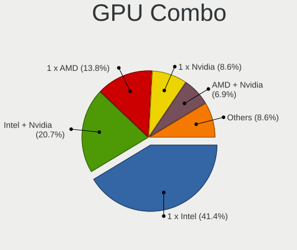

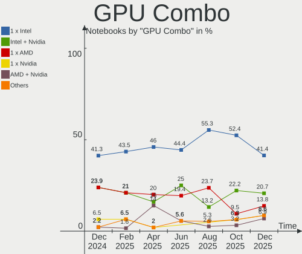

| Name           | Notebooks | Percent |
|----------------|-----------|---------|
| 1 x Intel      | 24        | 41.38%  |
| Intel + Nvidia | 12        | 20.69%  |
| 1 x AMD        | 8         | 13.79%  |
| 1 x Nvidia     | 5         | 8.62%   |
| AMD + Nvidia   | 4         | 6.9%    |
| Intel + AMD    | 3         | 5.17%   |
| 2 x AMD        | 2         | 3.45%   |

GPU Driver
----------

Free vs proprietary

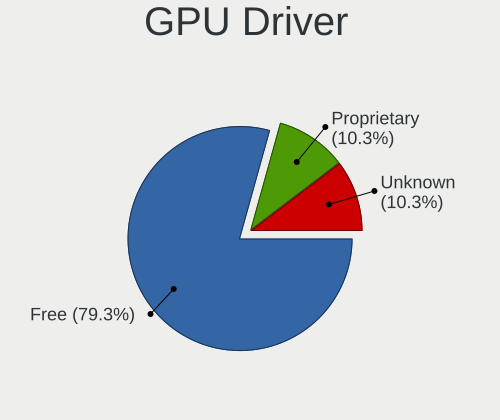

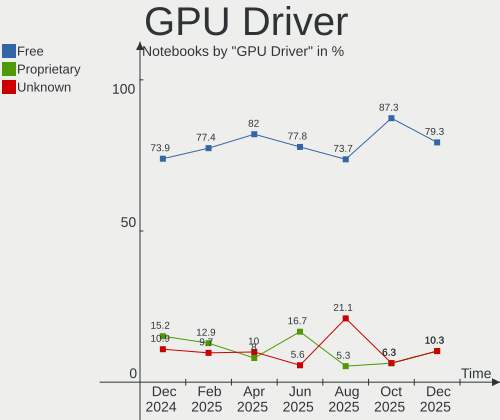

| Driver      | Notebooks | Percent |
|-------------|-----------|---------|
| Free        | 46        | 79.31%  |
| Proprietary | 6         | 10.34%  |
| Unknown     | 6         | 10.34%  |

GPU Memory
----------

Total video memory

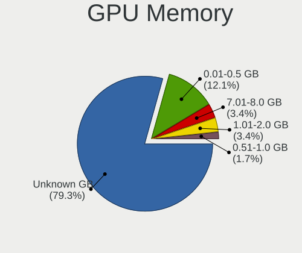

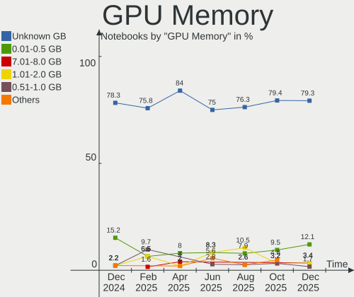

| Size in GB | Notebooks | Percent |
|------------|-----------|---------|
| Unknown    | 46        | 79.31%  |
| 0.01-0.5   | 7         | 12.07%  |
| 7.01-8.0   | 2         | 3.45%   |
| 1.01-2.0   | 2         | 3.45%   |
| 0.51-1.0   | 1         | 1.72%   |

Monitor
-------

Monitor Vendor
--------------

Monitor vendors

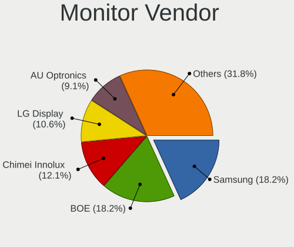

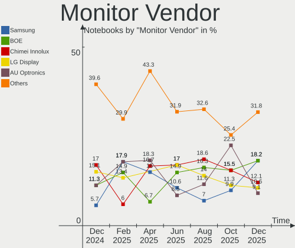

| Vendor                  | Notebooks | Percent |
|-------------------------|-----------|---------|
| Samsung Electronics     | 12        | 18.18%  |
| BOE                     | 12        | 18.18%  |
| Chimei Innolux          | 8         | 12.12%  |
| LG Display              | 7         | 10.61%  |
| AU Optronics            | 6         | 9.09%   |
| Lenovo                  | 4         | 6.06%   |
| Dell                    | 4         | 6.06%   |
| Apple                   | 3         | 4.55%   |
| Philips                 | 2         | 3.03%   |
| CSW                     | 2         | 3.03%   |
| Sharp                   | 1         | 1.52%   |
| PANDA                   | 1         | 1.52%   |
| KDC                     | 1         | 1.52%   |
| Iiyama                  | 1         | 1.52%   |
| CPT                     | 1         | 1.52%   |
| Chi Mei Optoelectronics | 1         | 1.52%   |

Monitor Model
-------------

Monitor models

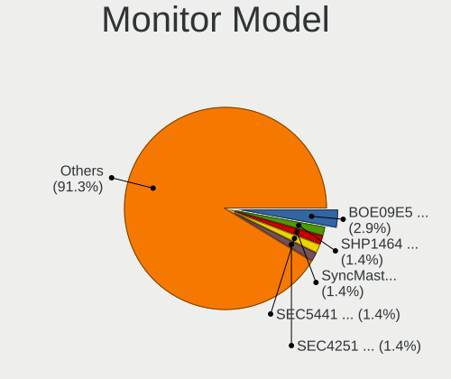

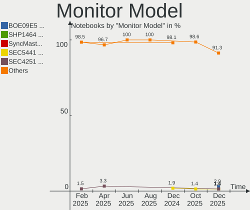

| Model                                                                 | Notebooks | Percent |
|-----------------------------------------------------------------------|-----------|---------|
| BOE LCD Monitor BOE09E5 2560x1440 355x200mm 16.0-inch                 | 2         | 2.9%    |
| Sharp LCD Monitor SHP1464 1920x1080 294x165mm 13.3-inch               | 1         | 1.45%   |
| Samsung Electronics SyncMaster SAM0F4C 3840x2160 1210x680mm 54.6-inch | 1         | 1.45%   |
| Samsung Electronics LCD Monitor SEC5441 1280x800 331x207mm 15.4-inch  | 1         | 1.45%   |
| Samsung Electronics LCD Monitor SEC4251 1366x768 344x194mm 15.5-inch  | 1         | 1.45%   |
| Samsung Electronics LCD Monitor SDC5844 1920x1080 344x194mm 15.5-inch | 1         | 1.45%   |
| Samsung Electronics LCD Monitor SDC4C48 1920x1080 293x165mm 13.2-inch | 1         | 1.45%   |
| Samsung Electronics LCD Monitor SDC41A0 1920x1200 302x189mm 14.0-inch | 1         | 1.45%   |
| Samsung Electronics LCD Monitor SDC419D 2880x1800 302x189mm 14.0-inch | 1         | 1.45%   |
| Samsung Electronics LCD Monitor SDC4188 2880x1800 312x195mm 14.5-inch | 1         | 1.45%   |
| Samsung Electronics LCD Monitor SDC4181 2880x1800 302x189mm 14.0-inch | 1         | 1.45%   |
| Samsung Electronics LCD Monitor SDC4171 2880x1800 302x189mm 14.0-inch | 1         | 1.45%   |
| Samsung Electronics LCD Monitor SDC3854 1920x1080 382x215mm 17.3-inch | 1         | 1.45%   |
| Samsung Electronics ATNA60HU02-0  SDC421B                             | 1         | 1.45%   |
| Philips PHL BDM4037U PHLC142 3840x2160 885x498mm 40.0-inch            | 1         | 1.45%   |
| Philips PHL 346E2C PHLC247 3440x1440 797x334mm 34.0-inch              | 1         | 1.45%   |
| Philips PHL 240B9 PHL0966 1920x1200 518x324mm 24.1-inch               | 1         | 1.45%   |
| PANDA LCD Monitor NCP0063 1920x1080 344x194mm 15.5-inch               | 1         | 1.45%   |
| LG Display LCD Monitor LGD07B1 2560x1600 388x242mm 18.0-inch          | 1         | 1.45%   |
| LG Display LCD Monitor LGD069B 1920x1080 344x194mm 15.5-inch          | 1         | 1.45%   |
| LG Display LCD Monitor LGD05C3 1920x1080 382x215mm 17.3-inch          | 1         | 1.45%   |
| LG Display LCD Monitor LGD0589 1920x1080 294x165mm 13.3-inch          | 1         | 1.45%   |
| LG Display LCD Monitor LGD042C 1920x1080 345x194mm 15.6-inch          | 1         | 1.45%   |
| LG Display LCD Monitor LGD0414 1920x1080 276x156mm 12.5-inch          | 1         | 1.45%   |
| LG Display LCD Monitor LGD01AF 1680x1050 331x207mm 15.4-inch          | 1         | 1.45%   |
| Lenovo T24v-30 LEN63D8 1920x1080 527x296mm 23.8-inch                  | 1         | 1.45%   |
| Lenovo LCD Monitor LEN9022 1920x1080 309x173mm 13.9-inch              | 1         | 1.45%   |
| Lenovo LCD Monitor LEN40B1 1600x900 345x194mm 15.6-inch               | 1         | 1.45%   |
| Lenovo LCD Monitor LEN40B0 1366x768 344x194mm 15.5-inch               | 1         | 1.45%   |
| KDC LCD Monitor KDC0830 1920x1080 344x193mm 15.5-inch                 | 1         | 1.45%   |
| Iiyama PLE2208HDS IVM560A 1920x1080 477x268mm 21.5-inch               | 1         | 1.45%   |
| Dell U2724D DEL42D0 2560x1440 597x336mm 27.0-inch                     | 1         | 1.45%   |
| Dell U2515H DELD070 2560x1440 553x311mm 25.0-inch                     | 1         | 1.45%   |
| Dell U2312HM DEL4072 1920x1080 510x287mm 23.0-inch                    | 1         | 1.45%   |
| Dell P2314H DEL4099 1920x1080 510x290mm 23.1-inch                     | 1         | 1.45%   |
| Dell P2314H DEL4098 1920x1080 510x290mm 23.1-inch                     | 1         | 1.45%   |
| Dell G2724D DELD175 2560x1440 596x335mm 26.9-inch                     | 1         | 1.45%   |
| CSW MNF601BS1-3 CSW1519 1920x1080 344x193mm 15.5-inch                 | 1         | 1.45%   |
| CSW MND307QS3-1 CSW131D 1920x1200 286x179mm 13.3-inch                 | 1         | 1.45%   |
| CPT LCD Monitor CPT1F42 1600x900 382x215mm 17.3-inch                  | 1         | 1.45%   |

Monitor Resolution
------------------

Monitor screen resolution

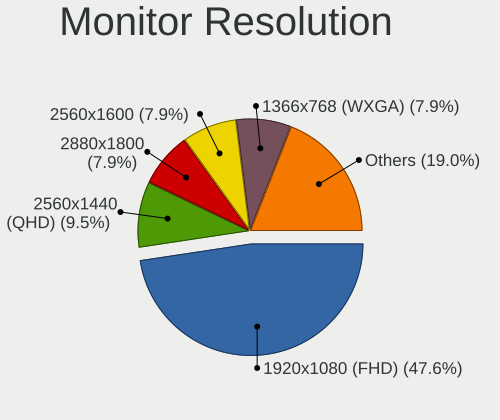

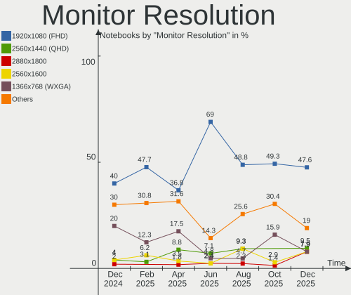

| Resolution         | Notebooks | Percent |
|--------------------|-----------|---------|
| 1920x1080 (FHD)    | 30        | 47.62%  |
| 2560x1440 (QHD)    | 6         | 9.52%   |
| 2880x1800          | 5         | 7.94%   |
| 2560x1600          | 5         | 7.94%   |
| 1366x768 (WXGA)    | 5         | 7.94%   |
| 3840x2160 (4K)     | 2         | 3.17%   |
| 1920x1200 (WUXGA)  | 2         | 3.17%   |
| 1600x900 (HD+)     | 2         | 3.17%   |
| 3440x1440          | 1         | 1.59%   |
| 2880x1920          | 1         | 1.59%   |
| 2256x1504          | 1         | 1.59%   |
| 1680x1050 (WSXGA+) | 1         | 1.59%   |
| 1440x900 (WXGA+)   | 1         | 1.59%   |
| Unknown            | 1         | 1.59%   |

Monitor Diagonal
----------------

Diagonal size in inches

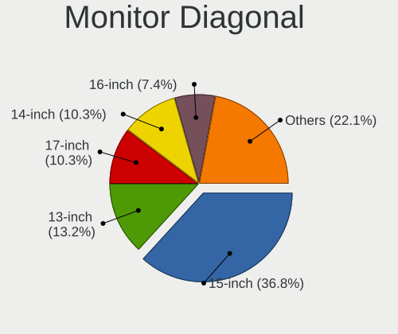

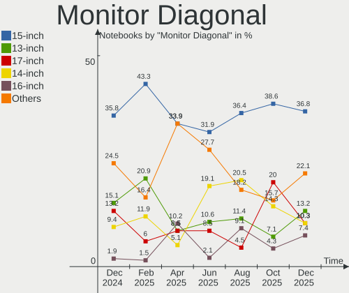

| Inches  | Notebooks | Percent |
|---------|-----------|---------|
| 15      | 25        | 36.76%  |
| 13      | 9         | 13.24%  |
| 17      | 7         | 10.29%  |
| 14      | 7         | 10.29%  |
| 16      | 5         | 7.35%   |
| 23      | 3         | 4.41%   |
| 27      | 2         | 2.94%   |
| 18      | 2         | 2.94%   |
| 64      | 1         | 1.47%   |
| 40      | 1         | 1.47%   |
| 34      | 1         | 1.47%   |
| 25      | 1         | 1.47%   |
| 24      | 1         | 1.47%   |
| 21      | 1         | 1.47%   |
| 12      | 1         | 1.47%   |
| Unknown | 1         | 1.47%   |

Monitor Width
-------------

Physical width

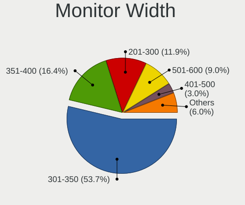

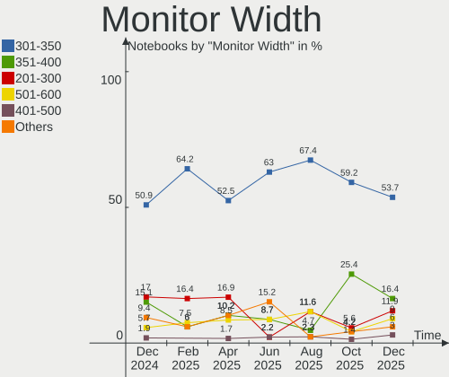

| Width in mm | Notebooks | Percent |
|-------------|-----------|---------|
| 301-350     | 36        | 53.73%  |
| 351-400     | 11        | 16.42%  |
| 201-300     | 8         | 11.94%  |
| 501-600     | 6         | 8.96%   |
| 401-500     | 2         | 2.99%   |
| 801-900     | 1         | 1.49%   |
| 701-800     | 1         | 1.49%   |
| 1001-1500   | 1         | 1.49%   |
| Unknown     | 1         | 1.49%   |

Aspect Ratio
------------

Proportional relationship between the width and the height

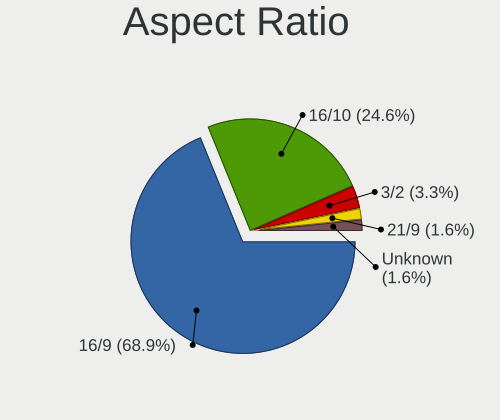

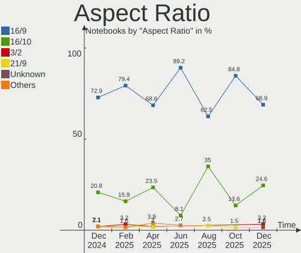

| Ratio   | Notebooks | Percent |
|---------|-----------|---------|
| 16/9    | 42        | 68.85%  |
| 16/10   | 15        | 24.59%  |
| 3/2     | 2         | 3.28%   |
| 21/9    | 1         | 1.64%   |
| Unknown | 1         | 1.64%   |

Monitor Area
------------

Area in inch²

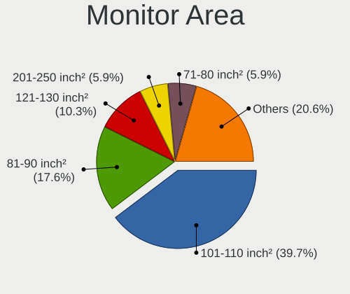

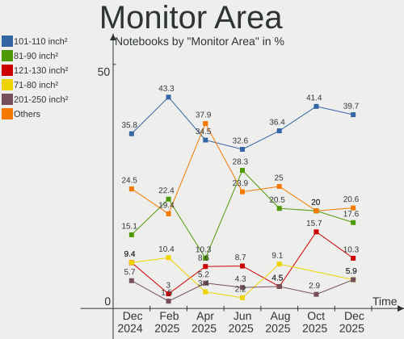

| Area in inch² | Notebooks | Percent |
|----------------|-----------|---------|
| 101-110        | 27        | 39.71%  |
| 81-90          | 12        | 17.65%  |
| 121-130        | 7         | 10.29%  |
| 71-80          | 4         | 5.88%   |
| 201-250        | 4         | 5.88%   |
| 111-120        | 3         | 4.41%   |
| 301-350        | 2         | 2.94%   |
| 251-300        | 2         | 2.94%   |
| 141-150        | 2         | 2.94%   |
| More than 1000 | 1         | 1.47%   |
| 61-70          | 1         | 1.47%   |
| 351-500        | 1         | 1.47%   |
| 501-1000       | 1         | 1.47%   |
| Unknown        | 1         | 1.47%   |

Pixel Density
-------------

Pixels per inch

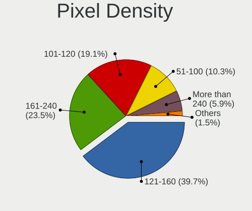

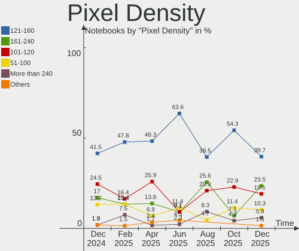

| Density       | Notebooks | Percent |
|---------------|-----------|---------|
| 121-160       | 27        | 39.71%  |
| 161-240       | 16        | 23.53%  |
| 101-120       | 13        | 19.12%  |
| 51-100        | 7         | 10.29%  |
| More than 240 | 4         | 5.88%   |
| Unknown       | 1         | 1.47%   |

Multiple Monitors
-----------------

Total monitors connected

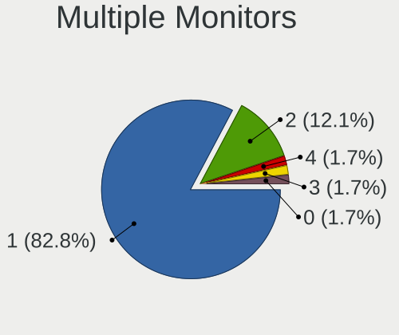

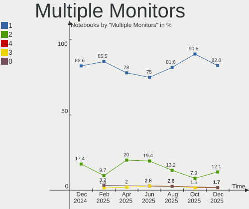

| Total | Notebooks | Percent |
|-------|-----------|---------|
| 1     | 48        | 82.76%  |
| 2     | 7         | 12.07%  |
| 4     | 1         | 1.72%   |
| 3     | 1         | 1.72%   |
| 0     | 1         | 1.72%   |

Network
-------

Net Controller Vendor
---------------------

Controller vendors

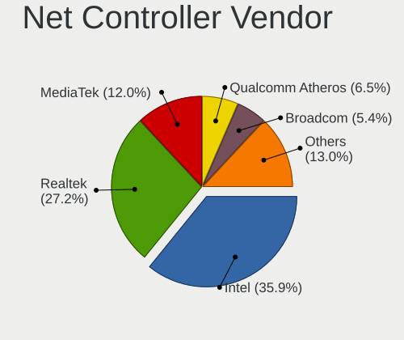

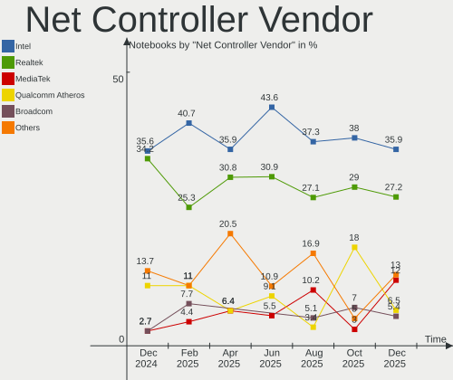

| Vendor                | Notebooks | Percent |
|-----------------------|-----------|---------|
| Intel                 | 33        | 35.87%  |
| Realtek Semiconductor | 25        | 27.17%  |
| MediaTek              | 11        | 11.96%  |
| Qualcomm Atheros      | 6         | 6.52%   |
| Broadcom              | 5         | 5.43%   |
| Samsung Electronics   | 2         | 2.17%   |
| ASIX Electronics      | 2         | 2.17%   |
| TP-Link               | 1         | 1.09%   |
| Sierra Wireless       | 1         | 1.09%   |
| Raspberry Pi          | 1         | 1.09%   |
| Ralink Technology     | 1         | 1.09%   |
| Ralink                | 1         | 1.09%   |
| Lenovo                | 1         | 1.09%   |
| Dell                  | 1         | 1.09%   |
| Broadcom Limited      | 1         | 1.09%   |

Net Controller Model
--------------------

Controller models

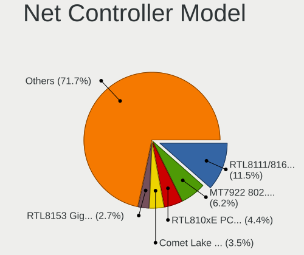

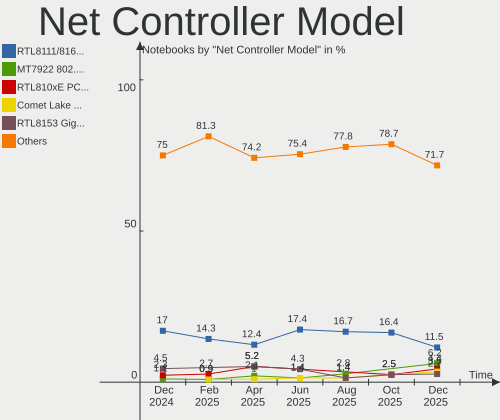

| Model                                                                           | Notebooks | Percent |
|---------------------------------------------------------------------------------|-----------|---------|
| Realtek RTL8111/8168/8211/8411 PCI Express Gigabit Ethernet Controller          | 13        | 11.5%   |
| MediaTek MT7922 802.11ax PCI Express Wireless Network Adapter                   | 7         | 6.19%   |
| Realtek RTL810xE PCI Express Fast Ethernet controller                           | 5         | 4.42%   |
| Intel Comet Lake PCH CNVi WiFi                                                  | 4         | 3.54%   |
| Realtek RTL8153 Gigabit Ethernet Adapter                                        | 3         | 2.65%   |
| Realtek RTL8125 2.5GbE Controller                                               | 3         | 2.65%   |
| Intel Wireless 8265 / 8275                                                      | 3         | 2.65%   |
| Intel Wi-Fi 6 AX200                                                             | 3         | 2.65%   |
| Samsung Galaxy series, misc. (tethering mode)                                   | 2         | 1.77%   |
| Realtek RTL8822CE 802.11ac PCIe Wireless Network Adapter                        | 2         | 1.77%   |
| Qualcomm Atheros QCA9377 802.11ac Wireless Network Adapter                      | 2         | 1.77%   |
| MediaTek MT7921 802.11ax PCIe Wireless Network Adapter [Filogic 330]            | 2         | 1.77%   |
| Intel Wireless 8260                                                             | 2         | 1.77%   |
| Intel Wireless 7260                                                             | 2         | 1.77%   |
| Intel Wi-Fi 7(802.11be) AX1775*/AX1790*/BE20*/BE401/BE1750* 2x2                 | 2         | 1.77%   |
| Intel Meteor Lake PCH CNVi WiFi                                                 | 2         | 1.77%   |
| Intel Ethernet Connection I219-LM                                               | 2         | 1.77%   |
| Intel Ethernet Connection (4) I219-LM                                           | 2         | 1.77%   |
| Intel Alder Lake-P PCH CNVi WiFi                                                | 2         | 1.77%   |
| Intel 82579LM Gigabit Network Connection (Lewisville)                           | 2         | 1.77%   |
| Broadcom BCM43142 802.11b/g/n                                                   | 2         | 1.77%   |
| ASIX AX88179 Gigabit Ethernet                                                   | 2         | 1.77%   |
| TP-Link UE300 10/100/1000 LAN (ethernet mode) [Realtek RTL8153]                 | 1         | 0.88%   |
| Sierra Wireless EM7455                                                          | 1         | 0.88%   |
| Realtek RTL8852BE PCIe 802.11ax Wireless Network Controller                     | 1         | 0.88%   |
| Realtek RTL8723BE PCIe Wireless Network Adapter                                 | 1         | 0.88%   |
| Raspberry Pi Raspberry Pi USB Gadget                                            | 1         | 0.88%   |
| Ralink MT7610U ("Archer T2U" 2.4G+5G WLAN Adapter                               | 1         | 0.88%   |
| Ralink RT5390 Wireless 802.11n 1T/1R PCIe                                       | 1         | 0.88%   |
| Qualcomm Atheros Killer E2400 Gigabit Ethernet Controller                       | 1         | 0.88%   |
| Qualcomm Atheros AR9485 Wireless Network Adapter                                | 1         | 0.88%   |
| Qualcomm Atheros AR9462 Wireless Network Adapter                                | 1         | 0.88%   |
| Qualcomm Atheros AR9285 Wireless Network Adapter (PCI-Express)                  | 1         | 0.88%   |
| Qualcomm Atheros AR8151 v2.0 Gigabit Ethernet                                   | 1         | 0.88%   |
| Qualcomm Atheros AR8131 Gigabit Ethernet                                        | 1         | 0.88%   |
| MediaTek MT7927 802.11be 320MHz 2x2 PCIe Wireless Network Adapter [Filogic 380] | 1         | 0.88%   |
| MediaTek MT7902 802.11ax PCIe Wireless Network Adapter [Filogic 310]            | 1         | 0.88%   |
| Lenovo ThinkPad TBT 3 Dock                                                      | 1         | 0.88%   |
| Intel Wireless 7265                                                             | 1         | 0.88%   |
| Intel Wireless 3165                                                             | 1         | 0.88%   |

Wireless Vendor
---------------

Wireless vendors

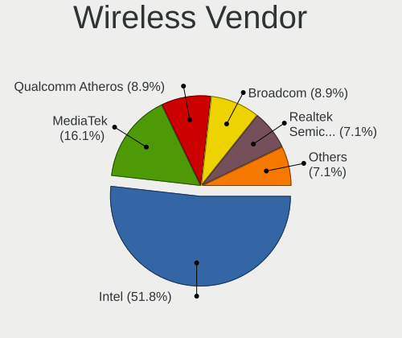

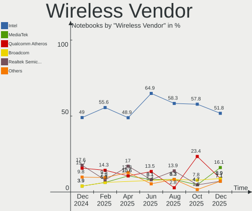

| Vendor                | Notebooks | Percent |
|-----------------------|-----------|---------|
| Intel                 | 29        | 51.79%  |
| MediaTek              | 9         | 16.07%  |
| Qualcomm Atheros      | 5         | 8.93%   |
| Broadcom              | 5         | 8.93%   |
| Realtek Semiconductor | 4         | 7.14%   |
| Sierra Wireless       | 1         | 1.79%   |
| Ralink Technology     | 1         | 1.79%   |
| Ralink                | 1         | 1.79%   |
| Broadcom Limited      | 1         | 1.79%   |

Wireless Model
--------------

Wireless models

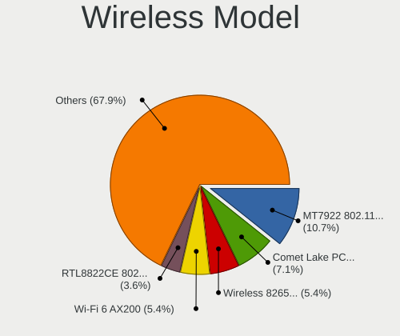

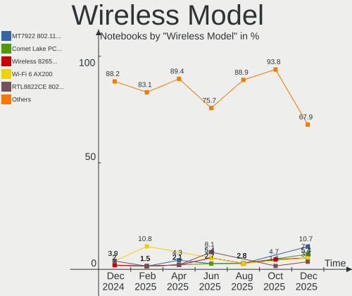

| Model                                                                | Notebooks | Percent |
|----------------------------------------------------------------------|-----------|---------|
| MediaTek MT7922 802.11ax PCI Express Wireless Network Adapter        | 6         | 10.71%  |
| Intel Comet Lake PCH CNVi WiFi                                       | 4         | 7.14%   |
| Intel Wireless 8265 / 8275                                           | 3         | 5.36%   |
| Intel Wi-Fi 6 AX200                                                  | 3         | 5.36%   |
| Realtek RTL8822CE 802.11ac PCIe Wireless Network Adapter             | 2         | 3.57%   |
| Qualcomm Atheros QCA9377 802.11ac Wireless Network Adapter           | 2         | 3.57%   |
| MediaTek MT7921 802.11ax PCIe Wireless Network Adapter [Filogic 330] | 2         | 3.57%   |
| Intel Wireless 8260                                                  | 2         | 3.57%   |
| Intel Wireless 7260                                                  | 2         | 3.57%   |
| Intel Wi-Fi 7(802.11be) AX1775*/AX1790*/BE20*/BE401/BE1750* 2x2      | 2         | 3.57%   |
| Intel Meteor Lake PCH CNVi WiFi                                      | 2         | 3.57%   |
| Broadcom BCM43142 802.11b/g/n                                        | 2         | 3.57%   |
| Sierra Wireless EM7455                                               | 1         | 1.79%   |
| Realtek RTL8852BE PCIe 802.11ax Wireless Network Controller          | 1         | 1.79%   |
| Realtek RTL8723BE PCIe Wireless Network Adapter                      | 1         | 1.79%   |
| Ralink MT7610U ("Archer T2U" 2.4G+5G WLAN Adapter                    | 1         | 1.79%   |
| Ralink RT5390 Wireless 802.11n 1T/1R PCIe                            | 1         | 1.79%   |
| Qualcomm Atheros AR9485 Wireless Network Adapter                     | 1         | 1.79%   |
| Qualcomm Atheros AR9462 Wireless Network Adapter                     | 1         | 1.79%   |
| Qualcomm Atheros AR9285 Wireless Network Adapter (PCI-Express)       | 1         | 1.79%   |
| MediaTek MT7902 802.11ax PCIe Wireless Network Adapter [Filogic 310] | 1         | 1.79%   |
| Intel Wireless 7265                                                  | 1         | 1.79%   |
| Intel Wireless 3165                                                  | 1         | 1.79%   |
| Intel Wi-Fi 6E(802.11ax) AX210/AX1675* 2x2 [Typhoon Peak]            | 1         | 1.79%   |
| Intel Ultimate N WiFi Link 5300                                      | 1         | 1.79%   |
| Intel Raptor Lake PCH CNVi WiFi                                      | 1         | 1.79%   |
| Intel Comet Lake PCH-LP CNVi WiFi                                    | 1         | 1.79%   |
| Intel Centrino Wireless-N 1000 [Condor Peak]                         | 1         | 1.79%   |
| Intel Centrino Advanced-N 6205 [Taylor Peak]                         | 1         | 1.79%   |
| Intel Cannon Point-LP CNVi [Wireless-AC]                             | 1         | 1.79%   |
| Intel Cannon Lake PCH CNVi WiFi                                      | 1         | 1.79%   |
| Intel Alder Lake-P PCH CNVi WiFi                                     | 1         | 1.79%   |
| Broadcom Limited BCM4360 802.11ac Dual Band Wireless Network Adapter | 1         | 1.79%   |
| Broadcom BCM4360 802.11ac Dual Band Wireless Network Adapter         | 1         | 1.79%   |
| Broadcom BCM4331 802.11a/b/g/n                                       | 1         | 1.79%   |
| Broadcom BCM43228 802.11a/b/g/n                                      | 1         | 1.79%   |

Ethernet Vendor
---------------

Ethernet vendors

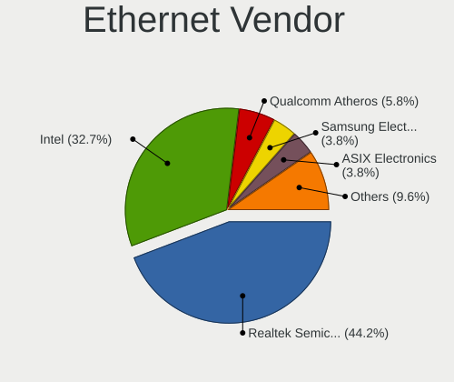

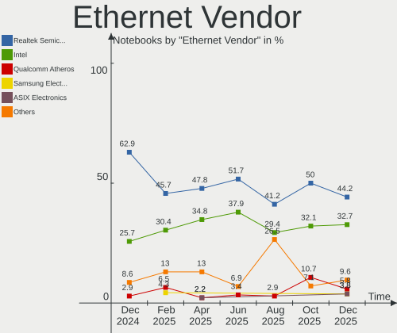

| Vendor                | Notebooks | Percent |
|-----------------------|-----------|---------|
| Realtek Semiconductor | 23        | 44.23%  |
| Intel                 | 17        | 32.69%  |
| Qualcomm Atheros      | 3         | 5.77%   |
| Samsung Electronics   | 2         | 3.85%   |
| ASIX Electronics      | 2         | 3.85%   |
| TP-Link               | 1         | 1.92%   |
| Raspberry Pi          | 1         | 1.92%   |
| MediaTek              | 1         | 1.92%   |
| Lenovo                | 1         | 1.92%   |
| Broadcom              | 1         | 1.92%   |

Ethernet Model
--------------

Ethernet models

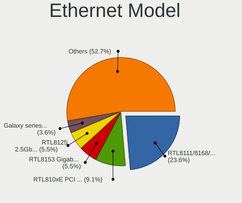

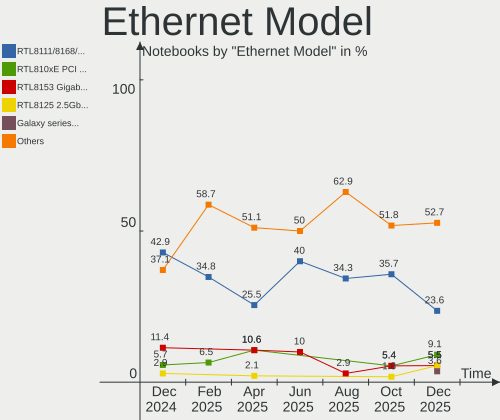

| Model                                                                  | Notebooks | Percent |
|------------------------------------------------------------------------|-----------|---------|
| Realtek RTL8111/8168/8211/8411 PCI Express Gigabit Ethernet Controller | 13        | 23.64%  |
| Realtek RTL810xE PCI Express Fast Ethernet controller                  | 5         | 9.09%   |
| Realtek RTL8153 Gigabit Ethernet Adapter                               | 3         | 5.45%   |
| Realtek RTL8125 2.5GbE Controller                                      | 3         | 5.45%   |
| Samsung Galaxy series, misc. (tethering mode)                          | 2         | 3.64%   |
| Intel Ethernet Connection I219-LM                                      | 2         | 3.64%   |
| Intel Ethernet Connection (4) I219-LM                                  | 2         | 3.64%   |
| Intel 82579LM Gigabit Network Connection (Lewisville)                  | 2         | 3.64%   |
| ASIX AX88179 Gigabit Ethernet                                          | 2         | 3.64%   |
| TP-Link UE300 10/100/1000 LAN (ethernet mode) [Realtek RTL8153]        | 1         | 1.82%   |
| Raspberry Pi Raspberry Pi USB Gadget                                   | 1         | 1.82%   |
| Qualcomm Atheros Killer E2400 Gigabit Ethernet Controller              | 1         | 1.82%   |
| Qualcomm Atheros AR8151 v2.0 Gigabit Ethernet                          | 1         | 1.82%   |
| Qualcomm Atheros AR8131 Gigabit Ethernet                               | 1         | 1.82%   |
| MediaTek MT7922 802.11ax PCI Express Wireless Network Adapter          | 1         | 1.82%   |
| Lenovo ThinkPad TBT 3 Dock                                             | 1         | 1.82%   |
| Intel Ethernet Controller I226-LM                                      | 1         | 1.82%   |
| Intel Ethernet Controller (2) I225-LMvP                                | 1         | 1.82%   |
| Intel Ethernet Connection I217-LM                                      | 1         | 1.82%   |
| Intel Ethernet Connection (7) I219-LM                                  | 1         | 1.82%   |
| Intel Ethernet Connection (6) I219-LM                                  | 1         | 1.82%   |
| Intel Ethernet Connection (4) I219-V                                   | 1         | 1.82%   |
| Intel Ethernet Connection (23) I219-LM                                 | 1         | 1.82%   |
| Intel Ethernet Connection (16) I219-V                                  | 1         | 1.82%   |
| Intel Ethernet Connection (16) I219-LM                                 | 1         | 1.82%   |
| Intel Ethernet Connection (10) I219-LM                                 | 1         | 1.82%   |
| Intel Arrow Lake CNVi WiFi                                             | 1         | 1.82%   |
| Intel Alder Lake-P PCH CNVi WiFi                                       | 1         | 1.82%   |
| Intel 82567LM Gigabit Network Connection                               | 1         | 1.82%   |
| Broadcom NetXtreme BCM57765 Gigabit Ethernet PCIe                      | 1         | 1.82%   |

Net Controller Kind
-------------------

Ethernet, WiFi or modem

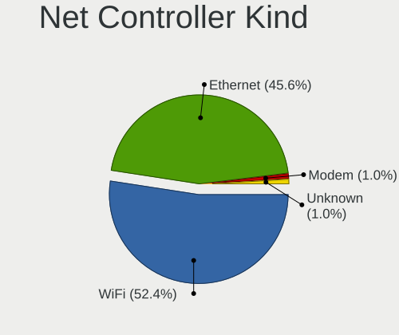

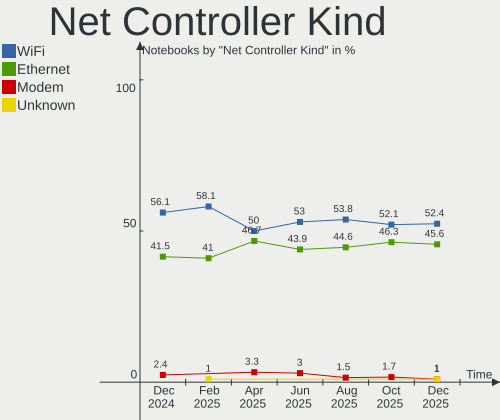

| Kind     | Notebooks | Percent |
|----------|-----------|---------|
| WiFi     | 54        | 52.43%  |
| Ethernet | 47        | 45.63%  |
| Modem    | 1         | 0.97%   |
| Unknown  | 1         | 0.97%   |

Used Controller
---------------

Currently used network controller

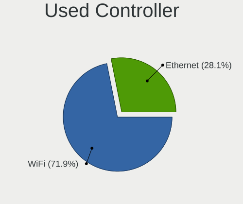

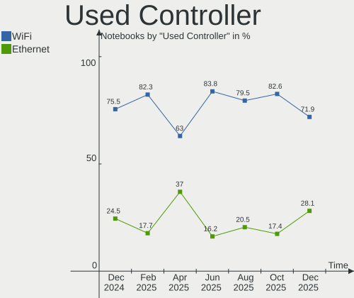

| Kind     | Notebooks | Percent |
|----------|-----------|---------|
| WiFi     | 46        | 71.88%  |
| Ethernet | 18        | 28.13%  |

NICs
----

Total network controllers on board

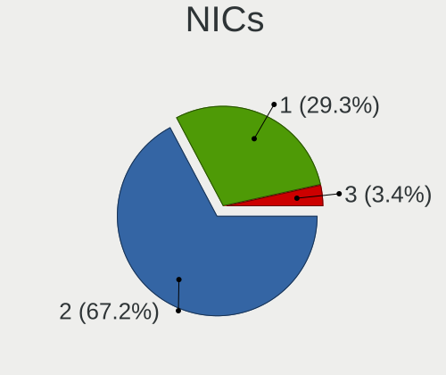

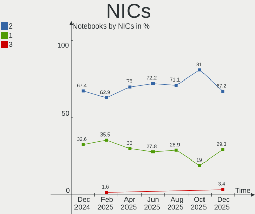

| Total | Notebooks | Percent |
|-------|-----------|---------|
| 2     | 39        | 67.24%  |
| 1     | 17        | 29.31%  |
| 3     | 2         | 3.45%   |

IPv6
----

IPv6 vs IPv4

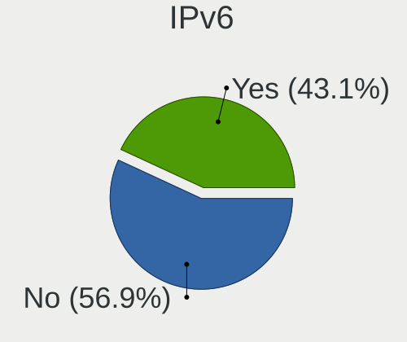

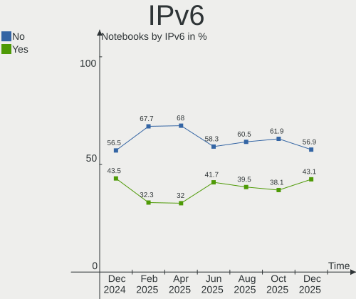

| Used | Notebooks | Percent |
|------|-----------|---------|
| No   | 33        | 56.9%   |
| Yes  | 25        | 43.1%   |

Bluetooth
---------

Bluetooth Vendor
----------------

Controller vendors

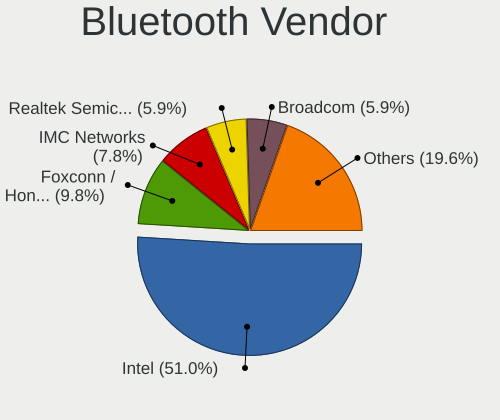

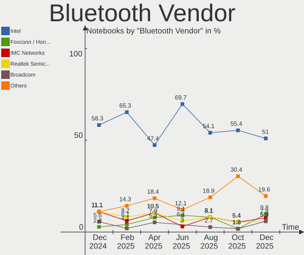

| Vendor                          | Notebooks | Percent |
|---------------------------------|-----------|---------|
| Intel                           | 26        | 50.98%  |
| Foxconn / Hon Hai               | 5         | 9.8%    |
| IMC Networks                    | 4         | 7.84%   |
| Realtek Semiconductor           | 3         | 5.88%   |
| Broadcom                        | 3         | 5.88%   |
| Apple                           | 3         | 5.88%   |
| Qualcomm Atheros Communications | 2         | 3.92%   |
| MediaTek                        | 2         | 3.92%   |
| Lite-On Technology              | 2         | 3.92%   |
| Dell                            | 1         | 1.96%   |

Bluetooth Model
---------------

Controller models

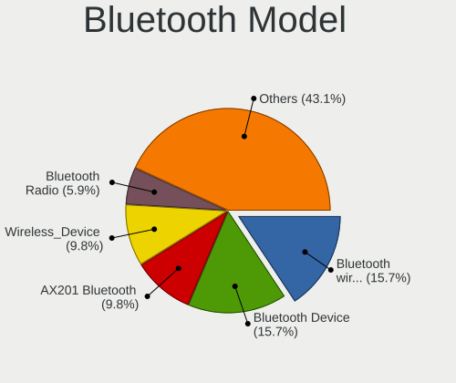

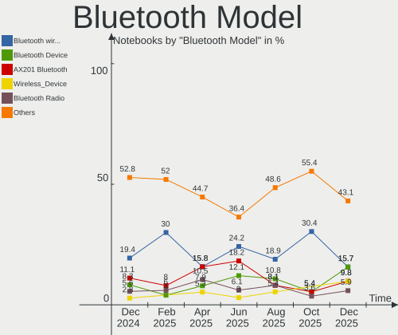

| Model                                          | Notebooks | Percent |
|------------------------------------------------|-----------|---------|
| Intel Bluetooth wireless interface             | 8         | 15.69%  |
| Intel Bluetooth Device                         | 8         | 15.69%  |
| Intel AX201 Bluetooth                          | 5         | 9.8%    |
| Foxconn / Hon Hai Wireless_Device              | 5         | 9.8%    |
| Realtek Bluetooth Radio                        | 3         | 5.88%   |
| IMC Networks Wireless_Device                   | 3         | 5.88%   |
| Apple Bluetooth Host Controller                | 3         | 5.88%   |
| Qualcomm Atheros  Bluetooth Device             | 2         | 3.92%   |
| MediaTek Wireless_Device                       | 2         | 3.92%   |
| Intel Bluetooth 9460/9560 Jefferson Peak (JfP) | 2         | 3.92%   |
| Intel AX200 Bluetooth                          | 2         | 3.92%   |
| Lite-On Broadcom BCM43142A0 Bluetooth Device   | 1         | 1.96%   |
| Lite-On Bluetooth Device                       | 1         | 1.96%   |
| Intel AX210 Bluetooth                          | 1         | 1.96%   |
| IMC Networks Bluetooth Radio                   | 1         | 1.96%   |
| Dell DW375 Bluetooth Module                    | 1         | 1.96%   |
| Broadcom BCM43142A0 Bluetooth 4.0              | 1         | 1.96%   |
| Broadcom BCM20702 Bluetooth 4.0 [ThinkPad]     | 1         | 1.96%   |
| Broadcom BCM2045B (BDC-2.1)                    | 1         | 1.96%   |

Sound
-----

Sound Vendor
------------

Sound card vendors

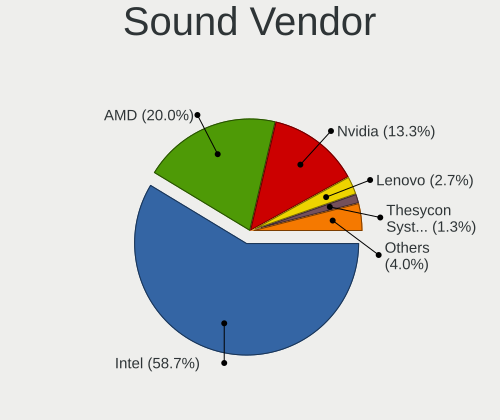

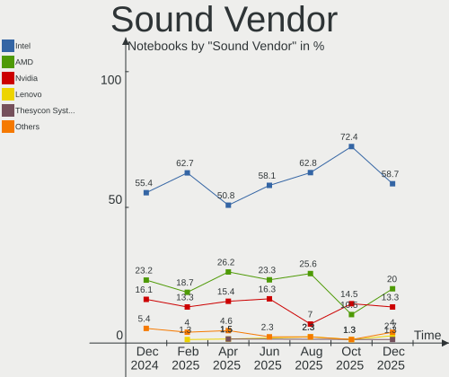

| Vendor                               | Notebooks | Percent |
|--------------------------------------|-----------|---------|
| Intel                                | 44        | 58.67%  |
| AMD                                  | 15        | 20%     |
| Nvidia                               | 10        | 13.33%  |
| Lenovo                               | 2         | 2.67%   |
| Thesycon Systemsoftware & Consulting | 1         | 1.33%   |
| SteelSeries ApS                      | 1         | 1.33%   |
| Realtek Semiconductor                | 1         | 1.33%   |
| C-Media Electronics                  | 1         | 1.33%   |

Sound Model
-----------

Sound card models

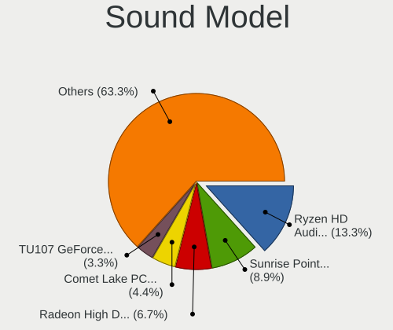

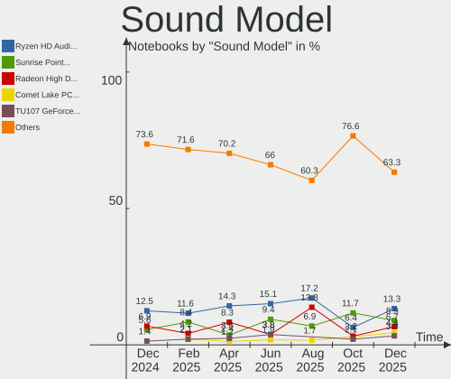

| Model                                                                                             | Notebooks | Percent |
|---------------------------------------------------------------------------------------------------|-----------|---------|
| AMD Ryzen HD Audio Controller                                                                     | 12        | 13.33%  |
| Intel Sunrise Point-LP HD Audio                                                                   | 8         | 8.89%   |
| AMD Radeon High Definition Audio Controller                                                       | 6         | 6.67%   |
| Intel Comet Lake PCH cAVS                                                                         | 4         | 4.44%   |
| Nvidia TU107 GeForce GTX 1650 High Definition Audio Controller                                    | 3         | 3.33%   |
| Intel Haswell-ULT HD Audio Controller                                                             | 3         | 3.33%   |
| Intel Alder Lake PCH-P High Definition Audio Controller                                           | 3         | 3.33%   |
| Intel 82801I (ICH9 Family) HD Audio Controller                                                    | 3         | 3.33%   |
| Intel 8 Series/C220 Series Chipset High Definition Audio Controller                               | 3         | 3.33%   |
| Intel 8 Series HD Audio Controller                                                                | 3         | 3.33%   |
| AMD Renoir/Cezanne HDMI/DP Audio Controller                                                       | 3         | 3.33%   |
| Intel Xeon E3-1200 v3/4th Gen Core Processor HD Audio Controller                                  | 2         | 2.22%   |
| Intel Tiger Lake-LP Smart Sound Technology Audio Controller                                       | 2         | 2.22%   |
| Intel Raptor Lake-P/U/H cAVS                                                                      | 2         | 2.22%   |
| Intel Meteor Lake-P HD Audio Controller                                                           | 2         | 2.22%   |
| Intel Cannon Lake PCH cAVS                                                                        | 2         | 2.22%   |
| Intel 7 Series/C216 Chipset Family High Definition Audio Controller                               | 2         | 2.22%   |
| Intel 6 Series/C200 Series Chipset Family High Definition Audio Controller                        | 2         | 2.22%   |
| Thesycon Systemsoftware & Consulting SMSL USB AUDIO                                               | 1         | 1.11%   |
| SteelSeries ApS Arctis Nova 7                                                                     | 1         | 1.11%   |
| Realtek Semiconductor USB Audio                                                                   | 1         | 1.11%   |
| Nvidia TU116 High Definition Audio Controller                                                     | 1         | 1.11%   |
| Nvidia TU106 High Definition Audio Controller                                                     | 1         | 1.11%   |
| Nvidia GK107 HDMI Audio Controller                                                                | 1         | 1.11%   |
| Nvidia GB205 High Definition Audio Controller                                                     | 1         | 1.11%   |
| Nvidia GA106 High Definition Audio Controller                                                     | 1         | 1.11%   |
| Nvidia GA104 High Definition Audio Controller                                                     | 1         | 1.11%   |
| Nvidia AD106M High Definition Audio Controller                                                    | 1         | 1.11%   |
| Lenovo ThinkPad Thunderbolt 4 Dock USB Audio                                                      | 1         | 1.11%   |
| Lenovo ThinkPad Thunderbolt 3 Dock USB Audio                                                      | 1         | 1.11%   |
| Intel Raptor Lake High Definition Audio Controller                                                | 1         | 1.11%   |
| Intel Comet Lake PCH-LP cAVS                                                                      | 1         | 1.11%   |
| Intel Cannon Point-LP High Definition Audio Controller                                            | 1         | 1.11%   |
| Intel Atom/Celeron/Pentium Processor x5-E8000/J3xxx/N3xxx Series High Definition Audio Controller | 1         | 1.11%   |
| Intel Arrow Lake cAVS                                                                             | 1         | 1.11%   |
| Intel Alder Lake-N PCH High Definition Audio Controller                                           | 1         | 1.11%   |
| Intel 800 Series ACE (Audio Context Engine)                                                       | 1         | 1.11%   |
| Intel 100 Series/C230 Series Chipset Family HD Audio Controller                                   | 1         | 1.11%   |
| C-Media Electronics Blue Snowball                                                                 | 1         | 1.11%   |
| AMD SBx00 Azalia (Intel HDA)                                                                      | 1         | 1.11%   |

Memory
------

Memory Vendor
-------------

Memory module vendors

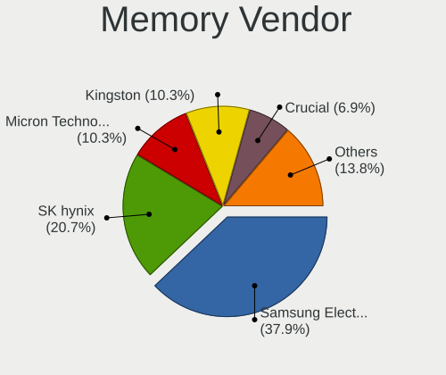

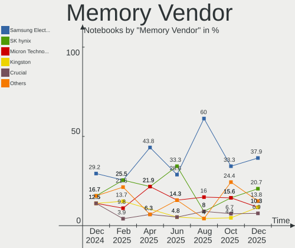

| Vendor              | Notebooks | Percent |
|---------------------|-----------|---------|
| Samsung Electronics | 11        | 37.93%  |
| SK hynix            | 6         | 20.69%  |
| Micron Technology   | 3         | 10.34%  |
| Kingston            | 3         | 10.34%  |
| Crucial             | 2         | 6.9%    |
| A-DATA Technology   | 2         | 6.9%    |
| Lexar Co Limited    | 1         | 3.45%   |
| Unknown             | 1         | 3.45%   |

Memory Model
------------

Memory module models

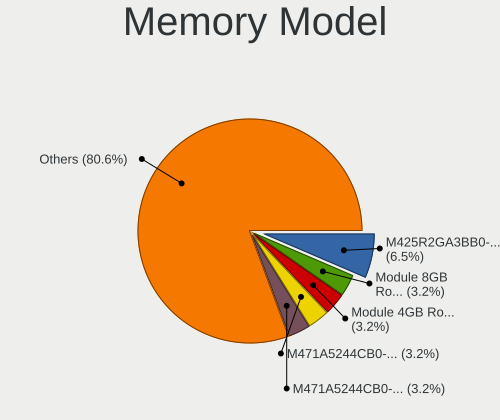

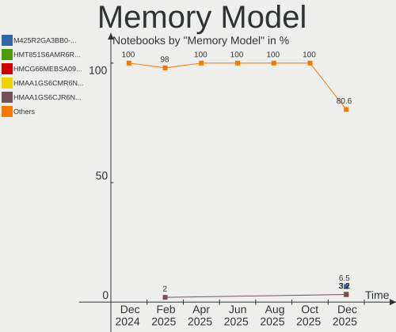

| Model                                                             | Notebooks | Percent |
|-------------------------------------------------------------------|-----------|---------|
| Samsung RAM M425R2GA3BB0-CQKOL 16GB SODIMM DDR5 4800MT/s          | 2         | 6.45%   |
| SK hynix RAM HMT851S6AMR6R-PB 4GB Chip DDR3 1600MT/s              | 1         | 3.23%   |
| SK hynix RAM HMCG66MEBSA095N 8GiB SODIMM DDR5 4800MT/s            | 1         | 3.23%   |
| SK hynix RAM HMAA1GS6CMR6N-XN 8GB SODIMM DDR4 3200MT/s            | 1         | 3.23%   |
| SK hynix RAM HMAA1GS6CJR6N-XN 8GB SODIMM DDR4 3200MT/s            | 1         | 3.23%   |
| SK hynix RAM HMA851S6AFR6N-UH 4GB SODIMM DDR4 2667MT/s            | 1         | 3.23%   |
| SK hynix RAM HMA81GS6DJR8N-XN 8GB SODIMM DDR4 3200MT/s            | 1         | 3.23%   |
| SK hynix RAM HMA81GS6DJR8N-VK 8GB SODIMM DDR4 2667MT/s            | 1         | 3.23%   |
| Samsung RAM Module 8GB Row Of Chips LPDDR3 2133MT/s               | 1         | 3.23%   |
| Samsung RAM Module 4GB Row Of Chips LPDDR5 4000MT/s               | 1         | 3.23%   |
| Samsung RAM M471A5244CB0-CWE 4GB SODIMM DDR4 3200MT/s             | 1         | 3.23%   |
| Samsung RAM M471A5244CB0-CRC 4GB SODIMM DDR4 2667MT/s             | 1         | 3.23%   |
| Samsung RAM M471A2K43CB1-CRC 16GB SODIMM DDR4 2667MT/s            | 1         | 3.23%   |
| Samsung RAM M425R4GA3EB0-CWMOD 32GB SODIMM DDR5 5600MT/s          | 1         | 3.23%   |
| Samsung RAM M425R2GA3PB0-CWMOL 16GB SODIMM DDR5 5600MT/s          | 1         | 3.23%   |
| Samsung RAM M425R2GA3EB0-CWMOD 16GB SODIMM DDR5 5600MT/s          | 1         | 3.23%   |
| Samsung RAM M4 70T5267AZ3-CF7 4GB SODIMM DDR2 800MT/s             | 1         | 3.23%   |
| Samsung RAM K3KL8L80CM-MGCT 4GB SODIMM LPDDR5 7500MT/s            | 1         | 3.23%   |
| Micron RAM MT62F1G32D2DS-026 2GB Row Of Chips LPDDR5 7467MT/s     | 1         | 3.23%   |
| Micron RAM 8ATF2G64HZ-3G2E2 16GB SODIMM DDR4 3200MT/s             | 1         | 3.23%   |
| Micron RAM 8ATF1G64HZ-3G2J1 8GB SODIMM DDR4 3200MT/s              | 1         | 3.23%   |
| Lexar Co Limited RAM LD4AS016G-H3200GST 16GB SODIMM DDR4 3200MT/s | 1         | 3.23%   |
| Kingston RAM KF556S40-32 32GB SODIMM DDR5 5600MT/s                | 1         | 3.23%   |
| Kingston RAM 9905744-112.A00G 16GB SODIMM DDR4 2667MT/s           | 1         | 3.23%   |
| Kingston RAM 9905428-426.A00LF 8GB SODIMM DDR3 1600MT/s           | 1         | 3.23%   |
| Crucial RAM CT8G4SFRA32A.M8FRS 8GB SODIMM DDR4 3200MT/s           | 1         | 3.23%   |
| Crucial RAM CT102464BF160B.M16 8GB SODIMM DDR3 1600MT/s           | 1         | 3.23%   |
| A-DATA RAM AD5S56008G-SFW 8GB SODIMM DDR5 5600MT/s                | 1         | 3.23%   |
| A-DATA RAM AD5S560032G-SFW 32GB SODIMM DDR5 5600MT/s              | 1         | 3.23%   |
| Unknown                                                           | 1         | 3.23%   |

Memory Kind
-----------

Memory module kinds

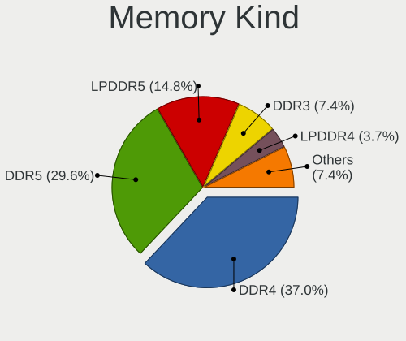

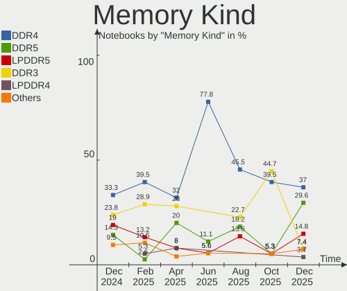

| Kind   | Notebooks | Percent |
|--------|-----------|---------|
| DDR4   | 10        | 37.04%  |
| DDR5   | 8         | 29.63%  |
| LPDDR5 | 4         | 14.81%  |
| DDR3   | 2         | 7.41%   |
| LPDDR4 | 1         | 3.7%    |
| LPDDR3 | 1         | 3.7%    |
| DDR2   | 1         | 3.7%    |

Memory Form Factor
------------------

Physical design of the memory module

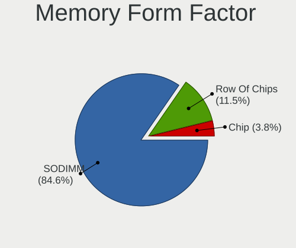

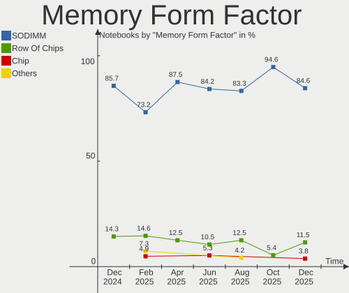

| Name         | Notebooks | Percent |
|--------------|-----------|---------|
| SODIMM       | 22        | 84.62%  |
| Row Of Chips | 3         | 11.54%  |
| Chip         | 1         | 3.85%   |

Memory Size
-----------

Memory module size

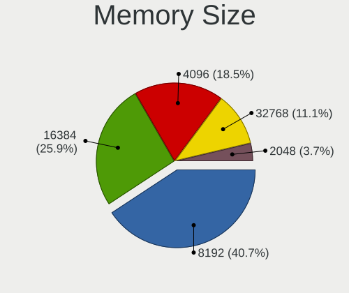

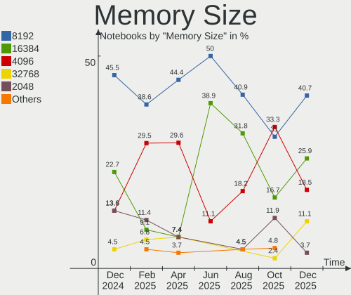

| Size  | Notebooks | Percent |
|-------|-----------|---------|
| 8192  | 11        | 40.74%  |
| 16384 | 7         | 25.93%  |
| 4096  | 5         | 18.52%  |
| 32768 | 3         | 11.11%  |
| 2048  | 1         | 3.7%    |

Memory Speed
------------

Memory module speed

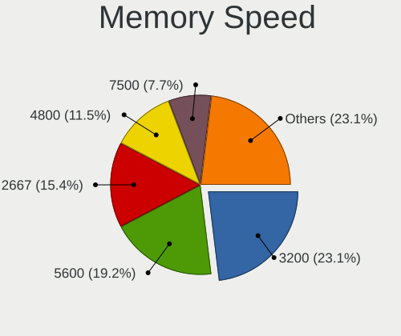

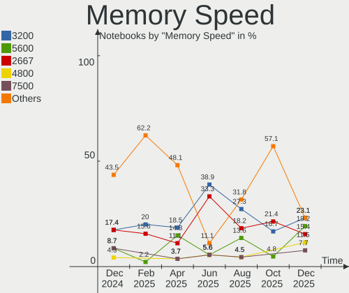

| Speed | Notebooks | Percent |
|-------|-----------|---------|
| 3200  | 6         | 23.08%  |
| 5600  | 5         | 19.23%  |
| 2667  | 4         | 15.38%  |
| 4800  | 3         | 11.54%  |
| 7500  | 2         | 7.69%   |
| 1600  | 2         | 7.69%   |
| 7467  | 1         | 3.85%   |
| 4000  | 1         | 3.85%   |
| 2133  | 1         | 3.85%   |
| 800   | 1         | 3.85%   |

Printers & scanners
-------------------

Printer Vendor
--------------

Printer device vendors

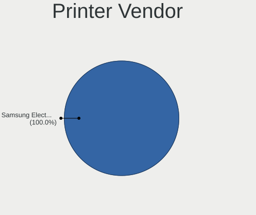

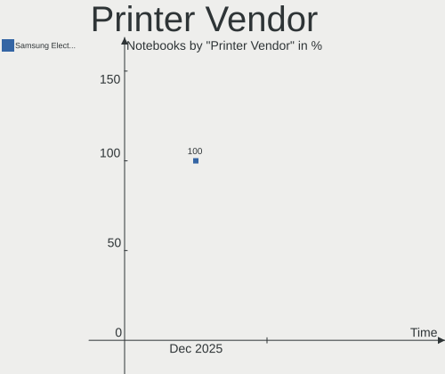

| Vendor              | Notebooks | Percent |
|---------------------|-----------|---------|
| Samsung Electronics | 1         | 100%    |

Printer Model
-------------

Printer device models

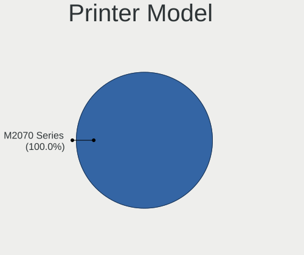

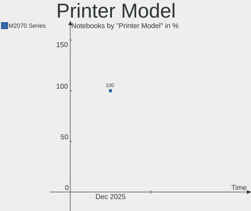

| Model                | Notebooks | Percent |
|----------------------|-----------|---------|
| Samsung M2070 Series | 1         | 100%    |

Scanner Vendor
--------------

Scanner device vendors

Zero info for selected period =(

Scanner Model
-------------

Scanner device models

Zero info for selected period =(

Camera
------

Camera Vendor
-------------

Camera device vendors

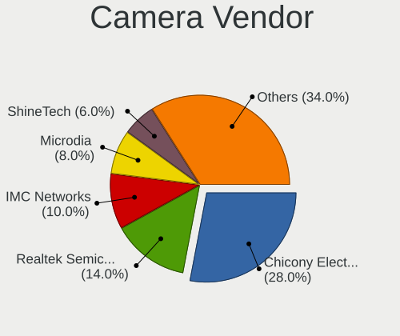

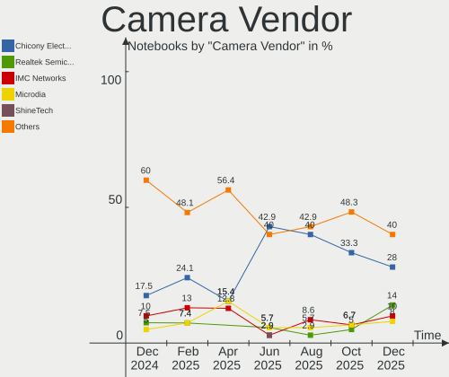

| Vendor                                 | Notebooks | Percent |
|----------------------------------------|-----------|---------|
| Chicony Electronics                    | 14        | 28%     |
| Realtek Semiconductor                  | 7         | 14%     |
| IMC Networks                           | 5         | 10%     |
| Microdia                               | 4         | 8%      |
| ShineTech                              | 3         | 6%      |
| Cheng Uei Precision Industry (Foxlink) | 3         | 6%      |
| Bison Electronics                      | 3         | 6%      |
| Syntek                                 | 2         | 4%      |
| Sunplus Innovation Technology          | 2         | 4%      |
| Sonix Technology                       | 1         | 2%      |
| Quanta                                 | 1         | 2%      |
| Luxvisions Innotech Limited            | 1         | 2%      |
| Lenovo                                 | 1         | 2%      |
| Framework                              | 1         | 2%      |
| Apple                                  | 1         | 2%      |
| Anker PowerConf C200                   | 1         | 2%      |

Camera Model
------------

Camera device models

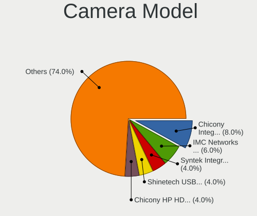

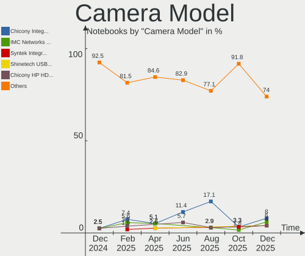

| Model                                                           | Notebooks | Percent |
|-----------------------------------------------------------------|-----------|---------|
| Chicony Integrated Camera                                       | 4         | 8%      |
| IMC Networks USB2.0 HD UVC WebCam                               | 3         | 6%      |
| Syntek Integrated Camera                                        | 2         | 4%      |
| Shinetech USB2.0 FHD UVC WebCam                                 | 2         | 4%      |
| Chicony HP HD Camera                                            | 2         | 4%      |
| Bison Integrated RGB Camera                                     | 2         | 4%      |
| Sunplus Laptop_Integrated_Webcam_FHD                            | 1         | 2%      |
| Sunplus Integrated_Webcam_HD                                    | 1         | 2%      |
| Sonix ASUS HD webcam                                            | 1         | 2%      |
| ShineTech USB2.0 HD UVC WebCam                                  | 1         | 2%      |
| Realtek USB2.0 VGA UVC WebCam                                   | 1         | 2%      |
| Realtek USB Camera                                              | 1         | 2%      |
| Realtek Laptop Camera                                           | 1         | 2%      |
| Realtek Integrated_Webcam_HD                                    | 1         | 2%      |
| Realtek Integrated_Webcam_FHD                                   | 1         | 2%      |
| Realtek Integrated Webcam HD                                    | 1         | 2%      |
| Realtek Integrated Camera                                       | 1         | 2%      |
| Quanta HD User Facing                                           | 1         | 2%      |
| Microdia Integrated_Webcam_HD                                   | 1         | 2%      |
| Microdia Integrated_Webcam_FHD                                  | 1         | 2%      |
| Microdia Integrated Webcam                                      | 1         | 2%      |
| Microdia HP Integrated Webcam                                   | 1         | 2%      |
| Luxvisions Innotech Limited HP Wide Vision HD Camera            | 1         | 2%      |
| Lenovo Integrated Webcam                                        | 1         | 2%      |
| IMC Networks Integrated Camera                                  | 1         | 2%      |
| IMC Networks HP TrueVision HD Camera                            | 1         | 2%      |
| Framework Laptop Webcam Module (2nd Gen)                        | 1         | 2%      |
| Chicony Integrated Camera (1280x720@30)                         | 1         | 2%      |
| Chicony HP Truevision HD                                        | 1         | 2%      |
| Chicony HD WebCam (Asus N-series)                               | 1         | 2%      |
| Chicony HD WebCam                                               | 1         | 2%      |
| Chicony EasyCamera                                              | 1         | 2%      |
| Chicony CKA7216                                                 | 1         | 2%      |
| Chicony ACER QHD User Facing                                    | 1         | 2%      |
| Chicony 2.0M UVC Webcam / CNF7129                               | 1         | 2%      |
| Cheng Uei Precision Industry (Foxlink) HP Wide Vision HD Camera | 1         | 2%      |
| Cheng Uei Precision Industry (Foxlink) HP Truevision HD         | 1         | 2%      |
| Cheng Uei Precision Industry (Foxlink) HP HD Camera             | 1         | 2%      |
| Bison Integrated Camera                                         | 1         | 2%      |
| Apple FaceTime HD Camera                                        | 1         | 2%      |

Security
--------

Fingerprint Vendor
------------------

Fingerprint sensor vendors

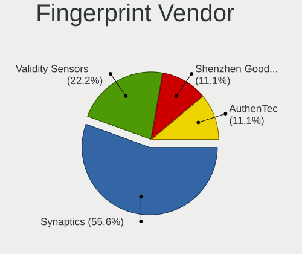

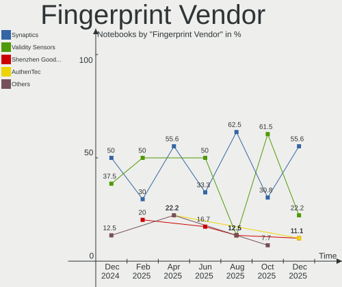

| Vendor                     | Notebooks | Percent |
|----------------------------|-----------|---------|
| Synaptics                  | 5         | 55.56%  |
| Validity Sensors           | 2         | 22.22%  |
| Shenzhen Goodix Technology | 1         | 11.11%  |
| AuthenTec                  | 1         | 11.11%  |

Fingerprint Model
-----------------

Fingerprint sensor models

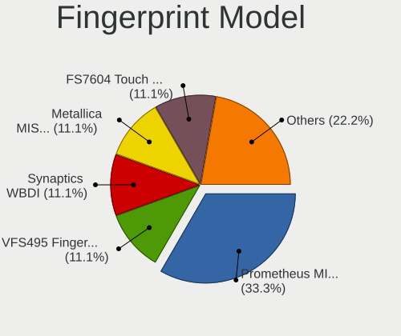

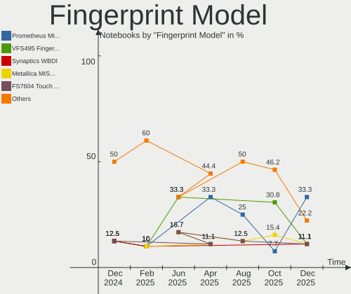

| Model                                                    | Notebooks | Percent |
|----------------------------------------------------------|-----------|---------|
| Synaptics Prometheus MIS Touch Fingerprint Reader        | 3         | 33.33%  |
| Validity Sensors VFS495 Fingerprint Reader               | 1         | 11.11%  |
| Validity Sensors Synaptics WBDI                          | 1         | 11.11%  |
| Synaptics Metallica MIS Touch Fingerprint Reader         | 1         | 11.11%  |
| Synaptics FS7604 Touch Fingerprint Sensor with PurePrint | 1         | 11.11%  |
| Shenzhen Goodix  FingerPrint Device                      | 1         | 11.11%  |
| AuthenTec AES2810                                        | 1         | 11.11%  |

Chipcard Vendor
---------------

Chipcard module vendors

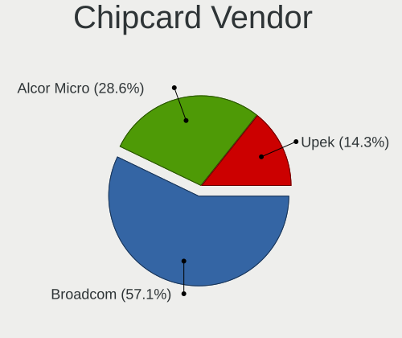

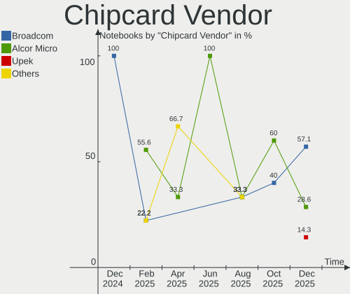

| Vendor      | Notebooks | Percent |
|-------------|-----------|---------|
| Broadcom    | 4         | 57.14%  |
| Alcor Micro | 2         | 28.57%  |
| Upek        | 1         | 14.29%  |

Chipcard Model
--------------

Chipcard module models

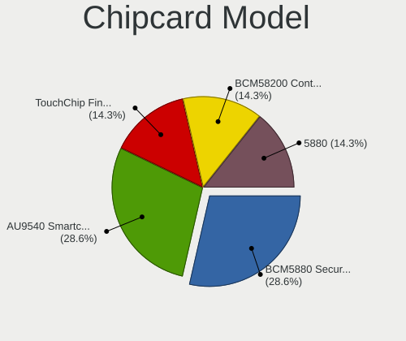

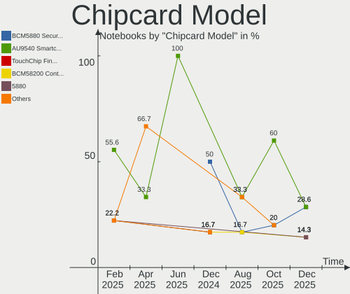

| Model                                                                       | Notebooks | Percent |
|-----------------------------------------------------------------------------|-----------|---------|
| Broadcom BCM5880 Secure Applications Processor                              | 2         | 28.57%  |
| Alcor Micro AU9540 Smartcard Reader                                         | 2         | 28.57%  |
| Upek TouchChip Fingerprint Coprocessor (WBF advanced mode)                  | 1         | 14.29%  |
| Broadcom BCM58200 ControlVault 3 (FingerPrint sensor + Contacted SmartCard) | 1         | 14.29%  |
| Broadcom 5880                                                               | 1         | 14.29%  |

Unsupported
-----------

Unsupported Devices
-------------------

Total unsupported devices on board

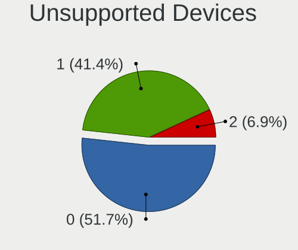

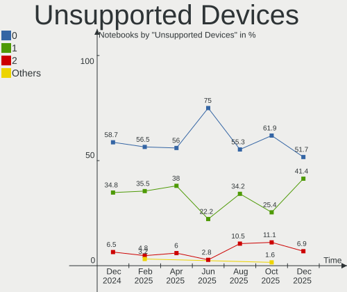

| Total | Notebooks | Percent |
|-------|-----------|---------|
| 0     | 30        | 51.72%  |
| 1     | 24        | 41.38%  |
| 2     | 4         | 6.9%    |

Unsupported Device Types
------------------------

Types of unsupported devices

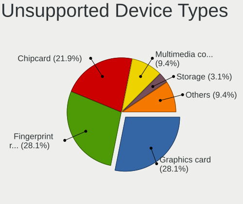

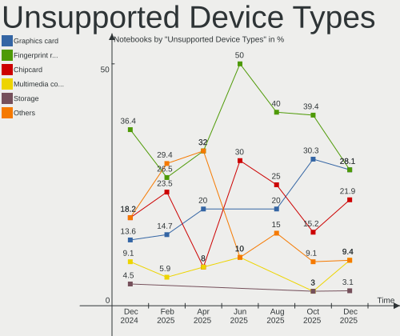

| Type                  | Notebooks | Percent |
|-----------------------|-----------|---------|
| Graphics card         | 9         | 28.13%  |
| Fingerprint reader    | 9         | 28.13%  |
| Chipcard              | 7         | 21.88%  |
| Multimedia controller | 3         | 9.38%   |
| Storage               | 1         | 3.13%   |
| Network               | 1         | 3.13%   |
| Net/wireless          | 1         | 3.13%   |
| Bluetooth             | 1         | 3.13%   |

