Linux in Netherlands - Hardware Trends (Notebooks)
--------------------------------------------------

A project to identify most popular hardware characteristics and track their change
over time based on data collected by Linux users at https://Linux-Hardware.org.

Anyone can contribute to this report by the [hw-probe](https://github.com/linuxhw/hw-probe) tool:

    sudo -E hw-probe -all -upload

Period: Jan, 2024.

Contents
--------

* [ System ](#system)
  - [ OS                       ](#os)
  - [ OS Family                ](#os-family)
  - [ Kernel                   ](#kernel)
  - [ Kernel Family            ](#kernel-family)
  - [ Kernel Major Ver.        ](#kernel-major-ver)
  - [ Arch                     ](#arch)
  - [ DE                       ](#de)
  - [ Display Server           ](#display-server)
  - [ Display Manager          ](#display-manager)
  - [ OS Lang                  ](#os-lang)
  - [ Boot Mode                ](#boot-mode)
  - [ Filesystem               ](#filesystem)
  - [ Part. scheme             ](#part-scheme)
  - [ Dual Boot with Linux/BSD ](#dual-boot-with-linuxbsd)
  - [ Dual Boot (Win)          ](#dual-boot-win)

* [ Board ](#board)
  - [ Vendor                   ](#vendor)
  - [ Model                    ](#model)
  - [ Model Family             ](#model-family)
  - [ MFG Year                 ](#mfg-year)
  - [ Form Factor              ](#form-factor)
  - [ Secure Boot              ](#secure-boot)
  - [ Coreboot                 ](#coreboot)
  - [ RAM Size                 ](#ram-size)
  - [ RAM Used                 ](#ram-used)
  - [ Total Drives             ](#total-drives)
  - [ Has CD-ROM               ](#has-cd-rom)
  - [ Has Ethernet             ](#has-ethernet)
  - [ Has WiFi                 ](#has-wifi)
  - [ Has Bluetooth            ](#has-bluetooth)

* [ Location ](#location)
  - [ Country                  ](#country)
  - [ City                     ](#city)

* [ Drives ](#drives)
  - [ Drive Vendor             ](#drive-vendor)
  - [ Drive Model              ](#drive-model)
  - [ HDD Vendor               ](#hdd-vendor)
  - [ SSD Vendor               ](#ssd-vendor)
  - [ Drive Kind               ](#drive-kind)
  - [ Drive Connector          ](#drive-connector)
  - [ Drive Size               ](#drive-size)
  - [ Space Total              ](#space-total)
  - [ Space Used               ](#space-used)
  - [ Malfunc. Drives          ](#malfunc-drives)
  - [ Malfunc. Drive Vendor    ](#malfunc-drive-vendor)
  - [ Malfunc. HDD Vendor      ](#malfunc-hdd-vendor)
  - [ Malfunc. Drive Kind      ](#malfunc-drive-kind)
  - [ Failed Drives            ](#failed-drives)
  - [ Failed Drive Vendor      ](#failed-drive-vendor)
  - [ Drive Status             ](#drive-status)

* [ Storage controller ](#storage-controller)
  - [ Storage Vendor           ](#storage-vendor)
  - [ Storage Model            ](#storage-model)
  - [ Storage Kind             ](#storage-kind)

* [ Processor ](#processor)
  - [ CPU Vendor               ](#cpu-vendor)
  - [ CPU Model                ](#cpu-model)
  - [ CPU Model Family         ](#cpu-model-family)
  - [ CPU Cores                ](#cpu-cores)
  - [ CPU Sockets              ](#cpu-sockets)
  - [ CPU Threads              ](#cpu-threads)
  - [ CPU Op-Modes             ](#cpu-op-modes)
  - [ CPU Microcode            ](#cpu-microcode)
  - [ CPU Microarch            ](#cpu-microarch)

* [ Graphics ](#graphics)
  - [ GPU Vendor               ](#gpu-vendor)
  - [ GPU Model                ](#gpu-model)
  - [ GPU Combo                ](#gpu-combo)
  - [ GPU Driver               ](#gpu-driver)
  - [ GPU Memory               ](#gpu-memory)

* [ Monitor ](#monitor)
  - [ Monitor Vendor           ](#monitor-vendor)
  - [ Monitor Model            ](#monitor-model)
  - [ Monitor Resolution       ](#monitor-resolution)
  - [ Monitor Diagonal         ](#monitor-diagonal)
  - [ Monitor Width            ](#monitor-width)
  - [ Aspect Ratio             ](#aspect-ratio)
  - [ Monitor Area             ](#monitor-area)
  - [ Pixel Density            ](#pixel-density)
  - [ Multiple Monitors        ](#multiple-monitors)

* [ Network ](#network)
  - [ Net Controller Vendor    ](#net-controller-vendor)
  - [ Net Controller Model     ](#net-controller-model)
  - [ Wireless Vendor          ](#wireless-vendor)
  - [ Wireless Model           ](#wireless-model)
  - [ Ethernet Vendor          ](#ethernet-vendor)
  - [ Ethernet Model           ](#ethernet-model)
  - [ Net Controller Kind      ](#net-controller-kind)
  - [ Used Controller          ](#used-controller)
  - [ NICs                     ](#nics)
  - [ IPv6                     ](#ipv6)

* [ Bluetooth ](#bluetooth)
  - [ Bluetooth Vendor         ](#bluetooth-vendor)
  - [ Bluetooth Model          ](#bluetooth-model)

* [ Sound ](#sound)
  - [ Sound Vendor             ](#sound-vendor)
  - [ Sound Model              ](#sound-model)

* [ Memory ](#memory)
  - [ Memory Vendor            ](#memory-vendor)
  - [ Memory Model             ](#memory-model)
  - [ Memory Kind              ](#memory-kind)
  - [ Memory Form Factor       ](#memory-form-factor)
  - [ Memory Size              ](#memory-size)
  - [ Memory Speed             ](#memory-speed)

* [ Printers & scanners ](#printers--scanners)
  - [ Printer Vendor           ](#printer-vendor)
  - [ Printer Model            ](#printer-model)
  - [ Scanner Vendor           ](#scanner-vendor)
  - [ Scanner Model            ](#scanner-model)

* [ Camera ](#camera)
  - [ Camera Vendor            ](#camera-vendor)
  - [ Camera Model             ](#camera-model)

* [ Security ](#security)
  - [ Fingerprint Vendor       ](#fingerprint-vendor)
  - [ Fingerprint Model        ](#fingerprint-model)
  - [ Chipcard Vendor          ](#chipcard-vendor)
  - [ Chipcard Model           ](#chipcard-model)

* [ Unsupported ](#unsupported)
  - [ Unsupported Devices      ](#unsupported-devices)
  - [ Unsupported Device Types ](#unsupported-device-types)

System
------

OS
--

Installed operating systems

| Name                        | Notebooks | Percent |
|-----------------------------|-----------|---------|
| Fedora 39                   | 9         | 13.64%  |
| Linux Mint 21.3             | 7         | 10.61%  |
| Linux Mint 21.2             | 5         | 7.58%   |
| Zorin 16                    | 4         | 6.06%   |
| Ubuntu 22.04                | 4         | 6.06%   |
| Debian 12                   | 4         | 6.06%   |
| Ubuntu 23.10                | 3         | 4.55%   |
| Arch Rolling                | 3         | 4.55%   |
| SteamOS 3.5.7               | 2         | 3.03%   |
| Pop!_OS 22.04               | 2         | 3.03%   |
| LMDE 6                      | 2         | 3.03%   |
| Linux Mint 20.3             | 2         | 3.03%   |
| EndeavourOS Rolling         | 2         | 3.03%   |
| Zorin 17                    | 1         | 1.52%   |
| Ubuntu 24.04                | 1         | 1.52%   |
| org.kde.Platform 5.15-21.08 | 1         | 1.52%   |
| NixOS 23.11                 | 1         | 1.52%   |
| Manjaro 23.1.2              | 1         | 1.52%   |
| Manjaro                     | 1         | 1.52%   |
| Mageia 9                    | 1         | 1.52%   |
| Mageia 8                    | 1         | 1.52%   |
| Linux Mint 21               | 1         | 1.52%   |
| Linux Mint 19.3             | 1         | 1.52%   |
| Lilidog 23                  | 1         | 1.52%   |
| Kali 2023.4                 | 1         | 1.52%   |
| Gentoo 2.14                 | 1         | 1.52%   |
| Fedora 37                   | 1         | 1.52%   |
| Elementary 7.1              | 1         | 1.52%   |
| BlackPanther 18.1           | 1         | 1.52%   |
| ArcoLinux Rolling           | 1         | 1.52%   |

OS Family
---------

OS without a version

| Name             | Notebooks | Percent |
|------------------|-----------|---------|
| Linux Mint       | 16        | 24.24%  |
| Fedora           | 10        | 15.15%  |
| Ubuntu           | 8         | 12.12%  |
| Zorin            | 5         | 7.58%   |
| Debian           | 4         | 6.06%   |
| Arch             | 3         | 4.55%   |
| SteamOS          | 2         | 3.03%   |
| Pop!_OS          | 2         | 3.03%   |
| Manjaro          | 2         | 3.03%   |
| Mageia           | 2         | 3.03%   |
| LMDE             | 2         | 3.03%   |
| EndeavourOS      | 2         | 3.03%   |
| org.kde.Platform | 1         | 1.52%   |
| NixOS            | 1         | 1.52%   |
| Lilidog          | 1         | 1.52%   |
| Kali             | 1         | 1.52%   |
| Gentoo           | 1         | 1.52%   |
| Elementary       | 1         | 1.52%   |
| BlackPanther     | 1         | 1.52%   |
| ArcoLinux        | 1         | 1.52%   |

Kernel
------

Version of the Linux kernel

| Version                     | Notebooks | Percent |
|-----------------------------|-----------|---------|
| 5.15.0-91-generic           | 10        | 15.15%  |
| 6.5.0-14-generic            | 7         | 10.61%  |
| 6.6.9-200.fc39.x86_64       | 3         | 4.55%   |
| 6.1.0-17-amd64              | 3         | 4.55%   |
| 6.6.8-200.fc39.x86_64       | 2         | 3.03%   |
| 6.6.6-76060606-generic      | 2         | 3.03%   |
| 6.6.11-200.fc39.x86_64      | 2         | 3.03%   |
| 6.5.0-0.deb12.4-amd64       | 2         | 3.03%   |
| 6.1.52-valve9-1-neptune-61  | 2         | 3.03%   |
| 5.15.0-92-generic           | 2         | 3.03%   |
| 6.7.2-zen1-1-zen            | 1         | 1.52%   |
| 6.7.2-arch1-1               | 1         | 1.52%   |
| 6.7.0-zen3-1-zen            | 1         | 1.52%   |
| 6.7.0-gentoox64.efi         | 1         | 1.52%   |
| 6.7.0                       | 1         | 1.52%   |
| 6.6.8-arch1-1               | 1         | 1.52%   |
| 6.6.8-2-MANJARO             | 1         | 1.52%   |
| 6.6.13-200.fc39.x86_64      | 1         | 1.52%   |
| 6.6.12-200.fc39.x86_64      | 1         | 1.52%   |
| 6.6.12-1-lts                | 1         | 1.52%   |
| 6.6.10-arch1-1              | 1         | 1.52%   |
| 6.6.0-14-generic            | 1         | 1.52%   |
| 6.5.13-server-6.mga9        | 1         | 1.52%   |
| 6.5.13-7-MANJARO            | 1         | 1.52%   |
| 6.5.0-kali3-amd64           | 1         | 1.52%   |
| 6.5.0-15-generic            | 1         | 1.52%   |
| 6.2.0-39-generic            | 1         | 1.52%   |
| 6.2.0-26-generic            | 1         | 1.52%   |
| 6.1.69-hard-full-kicksecure | 1         | 1.52%   |
| 6.1.64                      | 1         | 1.52%   |
| 6.1.45-desktop-1.mga8       | 1         | 1.52%   |
| 6.1.0-15-amd64              | 1         | 1.52%   |
| 6.0.7-301.fc37.x86_64       | 1         | 1.52%   |
| 5.4.0-73-generic            | 1         | 1.52%   |
| 5.4.0-169-generic           | 1         | 1.52%   |
| 5.19.0-35-generic           | 1         | 1.52%   |
| 5.15.0-86-generic           | 1         | 1.52%   |
| 5.15.0-78-generic           | 1         | 1.52%   |
| 5.15.0-76-generic           | 1         | 1.52%   |
| 5.0.0-32-generic            | 1         | 1.52%   |

Kernel Family
-------------

Linux kernel without a distro release

| Version | Notebooks | Percent |
|---------|-----------|---------|
| 5.15.0  | 15        | 22.73%  |
| 6.5.0   | 11        | 16.67%  |
| 6.6.8   | 4         | 6.06%   |
| 6.1.0   | 4         | 6.06%   |
| 6.7.0   | 3         | 4.55%   |
| 6.6.9   | 3         | 4.55%   |
| 6.7.2   | 2         | 3.03%   |
| 6.6.6   | 2         | 3.03%   |
| 6.6.12  | 2         | 3.03%   |
| 6.6.11  | 2         | 3.03%   |
| 6.5.13  | 2         | 3.03%   |
| 6.2.0   | 2         | 3.03%   |
| 6.1.52  | 2         | 3.03%   |
| 5.4.0   | 2         | 3.03%   |
| 6.6.13  | 1         | 1.52%   |
| 6.6.10  | 1         | 1.52%   |
| 6.6.0   | 1         | 1.52%   |
| 6.1.69  | 1         | 1.52%   |
| 6.1.64  | 1         | 1.52%   |
| 6.1.45  | 1         | 1.52%   |
| 6.0.7   | 1         | 1.52%   |
| 5.19.0  | 1         | 1.52%   |
| 5.0.0   | 1         | 1.52%   |
| 4.18.16 | 1         | 1.52%   |

Kernel Major Ver.
-----------------

Linux kernel major version

| Version | Notebooks | Percent |
|---------|-----------|---------|
| 6.6     | 16        | 24.24%  |
| 5.15    | 15        | 22.73%  |
| 6.5     | 13        | 19.7%   |
| 6.1     | 9         | 13.64%  |
| 6.7     | 5         | 7.58%   |
| 6.2     | 2         | 3.03%   |
| 5.4     | 2         | 3.03%   |
| 6.0     | 1         | 1.52%   |
| 5.19    | 1         | 1.52%   |
| 5.0     | 1         | 1.52%   |
| 4.18    | 1         | 1.52%   |

Arch
----

OS architecture (x86_64, i586, etc.)

| Name   | Notebooks | Percent |
|--------|-----------|---------|
| x86_64 | 65        | 98.48%  |
| i686   | 1         | 1.52%   |

DE
--

Desktop Environment

| Name       | Notebooks | Percent |
|------------|-----------|---------|
| GNOME      | 29        | 43.94%  |
| X-Cinnamon | 10        | 15.15%  |
| KDE5       | 7         | 10.61%  |
| XFCE       | 6         | 9.09%   |
| MATE       | 6         | 9.09%   |
| Unknown    | 3         | 4.55%   |
| Hyprland   | 2         | 3.03%   |
| Pantheon   | 1         | 1.52%   |
| openbox    | 1         | 1.52%   |
| Cinnamon   | 1         | 1.52%   |

Display Server
--------------

X11 or Wayland

| Name    | Notebooks | Percent |
|---------|-----------|---------|
| X11     | 41        | 62.12%  |
| Wayland | 23        | 34.85%  |
| Tty     | 1         | 1.52%   |
| Unknown | 1         | 1.52%   |

Display Manager
---------------

SDDM, LightDM, etc.

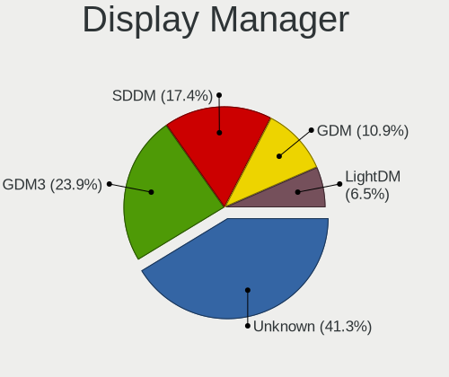

| Name    | Notebooks | Percent |
|---------|-----------|---------|
| Unknown | 28        | 42.42%  |
| LightDM | 17        | 25.76%  |
| GDM3    | 10        | 15.15%  |
| SDDM    | 7         | 10.61%  |
| GDM     | 4         | 6.06%   |

OS Lang
-------

Language

| Lang    | Notebooks | Percent |
|---------|-----------|---------|
| en_US   | 35        | 53.03%  |
| nl_NL   | 16        | 24.24%  |
| en_GB   | 4         | 6.06%   |
| sk_SK   | 2         | 3.03%   |
| C       | 2         | 3.03%   |
| pl_PL   | 1         | 1.52%   |
| it_IT   | 1         | 1.52%   |
| fr_FR   | 1         | 1.52%   |
| en_DK   | 1         | 1.52%   |
| de_DE   | 1         | 1.52%   |
| C.UTF8  | 1         | 1.52%   |
| Unknown | 1         | 1.52%   |

Boot Mode
---------

EFI or BIOS

| Mode | Notebooks | Percent |
|------|-----------|---------|
| EFI  | 42        | 63.64%  |
| BIOS | 24        | 36.36%  |

Filesystem
----------

Type of filesystem

| Type    | Notebooks | Percent |
|---------|-----------|---------|
| Ext4    | 36        | 54.55%  |
| Btrfs   | 18        | 27.27%  |
| Tmpfs   | 9         | 13.64%  |
| Overlay | 2         | 3.03%   |
| Ext3    | 1         | 1.52%   |

Part. scheme
------------

Scheme of partitioning

| Type    | Notebooks | Percent |
|---------|-----------|---------|
| GPT     | 35        | 53.03%  |
| Unknown | 25        | 37.88%  |
| MBR     | 6         | 9.09%   |

Dual Boot with Linux/BSD
------------------------

Hosting more than one Linux/BSD

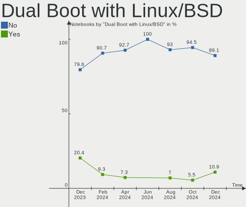

| Dual boot | Notebooks | Percent |
|-----------|-----------|---------|
| No        | 63        | 95.45%  |
| Yes       | 3         | 4.55%   |

Dual Boot (Win)
---------------

Hosting Linux and Windows

| Dual boot | Notebooks | Percent |
|-----------|-----------|---------|
| No        | 52        | 78.79%  |
| Yes       | 14        | 21.21%  |

Board
-----

Vendor
------

Motherboard manufacturer

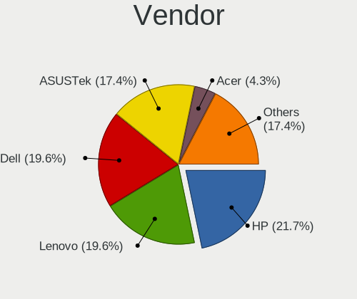

| Name             | Notebooks | Percent |
|------------------|-----------|---------|
| Lenovo           | 13        | 19.7%   |
| Dell             | 12        | 18.18%  |
| Hewlett-Packard  | 11        | 16.67%  |
| ASUSTek Computer | 6         | 9.09%   |
| Apple            | 5         | 7.58%   |
| Acer             | 4         | 6.06%   |
| Valve            | 2         | 3.03%   |
| TUXEDO           | 2         | 3.03%   |
| Notebook         | 2         | 3.03%   |
| Medion           | 2         | 3.03%   |
| UNOWHY           | 1         | 1.52%   |
| Packard Bell     | 1         | 1.52%   |
| OEM              | 1         | 1.52%   |
| Intel            | 1         | 1.52%   |
| HUAWEI           | 1         | 1.52%   |
| Clevo            | 1         | 1.52%   |
| Unknown          | 1         | 1.52%   |

Model
-----

Motherboard model

| Name                                                 | Notebooks | Percent |
|------------------------------------------------------|-----------|---------|
| Unknown                                              | 3         | 4.55%   |
| Valve Jupiter                                        | 2         | 3.03%   |
| HP EliteBook 8560p                                   | 2         | 3.03%   |
| Apple MacBookPro5,5                                  | 2         | 3.03%   |
| UNOWHY Y13G012S4EI                                   | 1         | 1.52%   |
| TUXEDO Pulse 15 Gen1                                 | 1         | 1.52%   |
| TUXEDO Pulse 14 Gen1                                 | 1         | 1.52%   |
| Packard Bell EasyNote LS11SB                         | 1         | 1.52%   |
| Notebook NS5x_NS7xAU                                 | 1         | 1.52%   |
| Notebook NH50_70_55_58_ED,EDQ                        | 1         | 1.52%   |
| Medion E4251 MD61435                                 | 1         | 1.52%   |
| Medion Akoya P7628                                   | 1         | 1.52%   |
| Lenovo ThinkPad X395 20NLCTO1WW                      | 1         | 1.52%   |
| Lenovo ThinkPad X270 20K5S1A524                      | 1         | 1.52%   |
| Lenovo ThinkPad T580 20LAS62M07                      | 1         | 1.52%   |
| Lenovo ThinkPad T430 23491R8                         | 1         | 1.52%   |
| Lenovo ThinkPad T16 Gen 2 21K7CTO1WW                 | 1         | 1.52%   |
| Lenovo ThinkPad T14 Gen 1 20UD0012MH                 | 1         | 1.52%   |
| Lenovo ThinkBook 13s-IWL 20R9                        | 1         | 1.52%   |
| Lenovo Legion Y740-15IRHg 81UH                       | 1         | 1.52%   |
| Lenovo Legion 5 Pro 16IAH7H 82RF                     | 1         | 1.52%   |
| Lenovo IdeaPad Gaming 3 15ACH6 82K2                  | 1         | 1.52%   |
| Lenovo IdeaPad 5 14IIL05 81YH                        | 1         | 1.52%   |
| Lenovo IdeaPad 330-17AST 81D7                        | 1         | 1.52%   |
| Lenovo G710 20252                                    | 1         | 1.52%   |
| HUAWEI WRT-WX9                                       | 1         | 1.52%   |
| HP ZBook Studio G5                                   | 1         | 1.52%   |
| HP ZBook Firefly 14 inch G10 A Mobile Workstation PC | 1         | 1.52%   |
| HP ProBook 4530s                                     | 1         | 1.52%   |
| HP ProBook 450 G1                                    | 1         | 1.52%   |
| HP ProBook 430 G8 Notebook PC                        | 1         | 1.52%   |
| HP Pavilion Notebook                                 | 1         | 1.52%   |
| HP Laptop 17-cp0xxx                                  | 1         | 1.52%   |
| HP Laptop 15-fc0xxx                                  | 1         | 1.52%   |
| HP Compaq 6710b (GB887ET#ABH)                        | 1         | 1.52%   |
| Dell XPS 9315                                        | 1         | 1.52%   |
| Dell XPS 15 9570                                     | 1         | 1.52%   |
| Dell XPS 15 9500                                     | 1         | 1.52%   |
| Dell Latitude E7240                                  | 1         | 1.52%   |
| Dell Latitude E6540                                  | 1         | 1.52%   |

Model Family
------------

Motherboard model prefix

| Name                  | Notebooks | Percent |
|-----------------------|-----------|---------|
| Dell Latitude         | 8         | 12.12%  |
| Lenovo ThinkPad       | 6         | 9.09%   |
| Acer Aspire           | 4         | 6.06%   |
| Lenovo IdeaPad        | 3         | 4.55%   |
| HP ProBook            | 3         | 4.55%   |
| Dell XPS              | 3         | 4.55%   |
| Unknown               | 3         | 4.55%   |
| Valve Jupiter         | 2         | 3.03%   |
| TUXEDO Pulse          | 2         | 3.03%   |
| Lenovo Legion         | 2         | 3.03%   |
| HP ZBook              | 2         | 3.03%   |
| HP Laptop             | 2         | 3.03%   |
| HP EliteBook          | 2         | 3.03%   |
| Apple MacBookPro5     | 2         | 3.03%   |
| UNOWHY Y13G012S4EI    | 1         | 1.52%   |
| Packard Bell EasyNote | 1         | 1.52%   |
| Notebook NS5x         | 1         | 1.52%   |
| Notebook NH50         | 1         | 1.52%   |
| Medion E4251          | 1         | 1.52%   |
| Medion Akoya          | 1         | 1.52%   |
| Lenovo ThinkBook      | 1         | 1.52%   |
| Lenovo G710           | 1         | 1.52%   |
| HUAWEI WRT-WX9        | 1         | 1.52%   |
| HP Pavilion           | 1         | 1.52%   |
| HP Compaq             | 1         | 1.52%   |
| Dell Inspiron         | 1         | 1.52%   |
| Clevo W150ER          | 1         | 1.52%   |
| ASUS Zenbook          | 1         | 1.52%   |
| ASUS X550VQ           | 1         | 1.52%   |
| ASUS X540LA           | 1         | 1.52%   |
| ASUS UX410UAK         | 1         | 1.52%   |
| ASUS ROG              | 1         | 1.52%   |
| ASUS N551JB           | 1         | 1.52%   |
| Apple MacBookPro6     | 1         | 1.52%   |
| Apple MacBookAir7     | 1         | 1.52%   |
| Apple MacBook4        | 1         | 1.52%   |

MFG Year
--------

Motherboard manufacture year

| Year | Notebooks | Percent |
|------|-----------|---------|
| 2022 | 7         | 10.61%  |
| 2020 | 7         | 10.61%  |
| 2018 | 7         | 10.61%  |
| 2013 | 7         | 10.61%  |
| 2023 | 6         | 9.09%   |
| 2019 | 6         | 9.09%   |
| 2015 | 4         | 6.06%   |
| 2012 | 4         | 6.06%   |
| 2021 | 3         | 4.55%   |
| 2016 | 3         | 4.55%   |
| 2011 | 3         | 4.55%   |
| 2017 | 2         | 3.03%   |
| 2010 | 2         | 3.03%   |
| 2009 | 2         | 3.03%   |
| 2008 | 1         | 1.52%   |
| 2007 | 1         | 1.52%   |
| 2006 | 1         | 1.52%   |

Form Factor
-----------

Physical design of the computer

| Name     | Notebooks | Percent |
|----------|-----------|---------|
| Notebook | 66        | 100%    |

Secure Boot
-----------

Enabled or disabled

| State    | Notebooks | Percent |
|----------|-----------|---------|
| Disabled | 61        | 92.42%  |
| Enabled  | 5         | 7.58%   |

Coreboot
--------

Have coreboot on board

| Used | Notebooks | Percent |
|------|-----------|---------|
| No   | 66        | 100%    |

RAM Size
--------

Total RAM memory

| Size in GB  | Notebooks | Percent |
|-------------|-----------|---------|
| 4.01-8.0    | 23        | 34.85%  |
| 16.01-24.0  | 12        | 18.18%  |
| 3.01-4.0    | 10        | 15.15%  |
| 8.01-16.0   | 10        | 15.15%  |
| 32.01-64.0  | 4         | 6.06%   |
| 64.01-256.0 | 4         | 6.06%   |
| 2.01-3.0    | 2         | 3.03%   |
| 24.01-32.0  | 1         | 1.52%   |

RAM Used
--------

Used RAM memory

| Used GB    | Notebooks | Percent |
|------------|-----------|---------|
| 2.01-3.0   | 19        | 28.79%  |
| 4.01-8.0   | 15        | 22.73%  |
| 3.01-4.0   | 12        | 18.18%  |
| 1.01-2.0   | 11        | 16.67%  |
| 16.01-24.0 | 3         | 4.55%   |
| 0.51-1.0   | 3         | 4.55%   |
| 8.01-16.0  | 2         | 3.03%   |
| 0.01-0.5   | 1         | 1.52%   |

Total Drives
------------

Number of drives on board

| Drives | Notebooks | Percent |
|--------|-----------|---------|
| 1      | 46        | 69.7%   |
| 2      | 16        | 24.24%  |
| 3      | 3         | 4.55%   |
| 0      | 1         | 1.52%   |

Has CD-ROM
----------

Has CD-ROM on board

| Presented | Notebooks | Percent |
|-----------|-----------|---------|
| No        | 51        | 77.27%  |
| Yes       | 15        | 22.73%  |

Has Ethernet
------------

Has Ethernet on board

| Presented | Notebooks | Percent |
|-----------|-----------|---------|
| Yes       | 48        | 72.73%  |
| No        | 18        | 27.27%  |

Has WiFi
--------

Has WiFi module

| Presented | Notebooks | Percent |
|-----------|-----------|---------|
| Yes       | 66        | 100%    |

Has Bluetooth
-------------

Has Bluetooth module

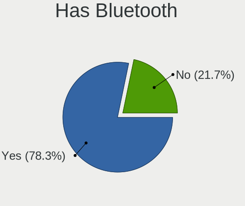

| Presented | Notebooks | Percent |
|-----------|-----------|---------|
| Yes       | 55        | 83.33%  |
| No        | 11        | 16.67%  |

Location
--------

Country
-------

Geographic location (country)

| Country     | Notebooks | Percent |
|-------------|-----------|---------|
| Netherlands | 66        | 100%    |

City
----

Geographic location (city)

| City                   | Notebooks | Percent |
|------------------------|-----------|---------|
| Amsterdam              | 17        | 25.76%  |
| Delft                  | 4         | 6.06%   |
| Naaldwijk              | 3         | 4.55%   |
| Groningen              | 3         | 4.55%   |
| Almere Stad            | 3         | 4.55%   |
| The Hague              | 2         | 3.03%   |
| Haarlem                | 2         | 3.03%   |
| Eindhoven              | 2         | 3.03%   |
| Dordrecht              | 2         | 3.03%   |
| Zuidhorn               | 1         | 1.52%   |
| Woerden                | 1         | 1.52%   |
| Waalwijk               | 1         | 1.52%   |
| Utrecht                | 1         | 1.52%   |
| Stolwijk               | 1         | 1.52%   |
| Rotterdam              | 1         | 1.52%   |
| Roggel                 | 1         | 1.52%   |
| Ravenstein             | 1         | 1.52%   |
| Oosternijkerk          | 1         | 1.52%   |
| Oldenzaal              | 1         | 1.52%   |
| Nieuwegein             | 1         | 1.52%   |
| Moordrecht             | 1         | 1.52%   |
| Loon op Zand           | 1         | 1.52%   |
| Lochem                 | 1         | 1.52%   |
| Kerkrade               | 1         | 1.52%   |
| Hoorn                  | 1         | 1.52%   |
| Hoensbroek             | 1         | 1.52%   |
| Hendrik-Ido-Ambacht    | 1         | 1.52%   |
| Heesch                 | 1         | 1.52%   |
| Heerlen                | 1         | 1.52%   |
| Emst                   | 1         | 1.52%   |
| Ede                    | 1         | 1.52%   |
| Dronten                | 1         | 1.52%   |
| Capelle aan den IJssel | 1         | 1.52%   |
| Blaricum               | 1         | 1.52%   |
| Arnhem                 | 1         | 1.52%   |
| Apeldoorn              | 1         | 1.52%   |
| 's Gravenmoer          | 1         | 1.52%   |

Drives
------

Drive Vendor
------------

Hard drive vendors

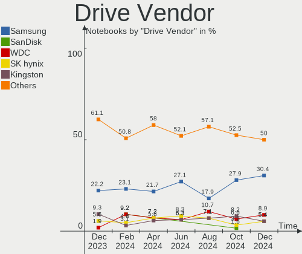

| Vendor              | Notebooks | Drives | Percent |
|---------------------|-----------|--------|---------|
| Samsung Electronics | 21        | 22     | 24.71%  |
| Unknown             | 9         | 9      | 10.59%  |
| WDC                 | 7         | 7      | 8.24%   |
| Kingston            | 7         | 7      | 8.24%   |
| Seagate             | 6         | 6      | 7.06%   |
| SanDisk             | 5         | 5      | 5.88%   |
| Toshiba             | 4         | 4      | 4.71%   |
| Phison Electronics  | 3         | 3      | 3.53%   |
| KIOXIA              | 3         | 3      | 3.53%   |
| HGST                | 3         | 3      | 3.53%   |
| Crucial             | 3         | 3      | 3.53%   |
| SK hynix            | 2         | 2      | 2.35%   |
| Intel               | 2         | 2      | 2.35%   |
| PNY                 | 1         | 1      | 1.18%   |
| Phison              | 1         | 1      | 1.18%   |
| Micron Technology   | 1         | 1      | 1.18%   |
| JMicron Technology  | 1         | 1      | 1.18%   |
| Hitachi             | 1         | 1      | 1.18%   |
| GOODRAM             | 1         | 1      | 1.18%   |
| Gigabyte Technology | 1         | 1      | 1.18%   |
| China               | 1         | 1      | 1.18%   |
| Apple               | 1         | 1      | 1.18%   |
| A-DATA Technology   | 1         | 1      | 1.18%   |

Drive Model
-----------

Hard drive models

| Model                                              | Notebooks | Percent |
|----------------------------------------------------|-----------|---------|
| Samsung NVMe SSD Controller SM981/PM981/PM983 1TB  | 6         | 6.98%   |
| Unknown MMC Card  32GB                             | 3         | 3.49%   |
| Samsung NVMe SSD Controller PM9A1/PM9A3/980PRO 2TB | 2         | 2.33%   |
| Kingston SA400S37480G 480GB SSD                    | 2         | 2.33%   |
| HGST HTS545050A7E680 500GB                         | 2         | 2.33%   |
| WDC WDS500G2B0A-00SM50 500GB SSD                   | 1         | 1.16%   |
| WDC WDS100T3X0C-00SJG0 1TB                         | 1         | 1.16%   |
| WDC WD3200BEVS-26VAT0 320GB                        | 1         | 1.16%   |
| WDC WD3200BEKX-75B7WT0 320GB                       | 1         | 1.16%   |
| WDC WD10SPZX-60Z10T0 1TB                           | 1         | 1.16%   |
| WDC WD10SPZX-21Z10T0 1TB                           | 1         | 1.16%   |
| WDC WD Green 2.5 240GB SSD                         | 1         | 1.16%   |
| Unknown ZA480NM10001 480GB SSD                     | 1         | 1.16%   |
| Unknown SD128  128GB                               | 1         | 1.16%   |
| Unknown MMC Card  64GB                             | 1         | 1.16%   |
| Unknown MMC Card  256GB                            | 1         | 1.16%   |
| Unknown MMC Card  1073GB                           | 1         | 1.16%   |
| Unknown Biwin  64GB                                | 1         | 1.16%   |
| Toshiba XG6 NVMe SSD Controller 256GB              | 1         | 1.16%   |
| Toshiba THNSNH128GMCT 128GB SSD                    | 1         | 1.16%   |
| Toshiba MK3261GSYN 320GB                           | 1         | 1.16%   |
| Toshiba KXG50ZNV1T02 NVMe 1024GB                   | 1         | 1.16%   |
| SK hynix PC711 NVMe 1TB                            | 1         | 1.16%   |
| SK hynix HFS128G32TND-N210A 128GB SSD              | 1         | 1.16%   |
| Seagate ST9500423AS 500GB                          | 1         | 1.16%   |
| Seagate ST1000LM049-2GH172 1TB                     | 1         | 1.16%   |
| Seagate ST1000LM014-1EJ164 1TB                     | 1         | 1.16%   |
| Seagate Expansion SW 4TB                           | 1         | 1.16%   |
| Seagate Expansion HDD 4TB                          | 1         | 1.16%   |
| Seagate Expansion 1TB                              | 1         | 1.16%   |
| SanDisk X400 M.2 2280 256GB SSD                    | 1         | 1.16%   |
| SanDisk X300 2.5 7MM 256GB SSD                     | 1         | 1.16%   |
| Sandisk WDC PC SN530 SDBPMPZ-256G-1101 256GB       | 1         | 1.16%   |
| Sandisk WD PC SN740 SDDPNQD-256G-1006 256GB        | 1         | 1.16%   |
| SanDisk NVMe SSD Drive 512GB                       | 1         | 1.16%   |
| Samsung SSD 990 PRO 2TB                            | 1         | 1.16%   |
| Samsung SSD 990 PRO 1TB                            | 1         | 1.16%   |
| Samsung SSD 980 PRO 2TB                            | 1         | 1.16%   |
| Samsung SSD 860 EVO 500GB                          | 1         | 1.16%   |
| Samsung SSD 860 EVO 1TB                            | 1         | 1.16%   |

HDD Vendor
----------

Hard disk drive vendors

| Vendor             | Notebooks | Drives | Percent |
|--------------------|-----------|--------|---------|
| Seagate            | 6         | 6      | 37.5%   |
| WDC                | 4         | 4      | 25%     |
| HGST               | 3         | 3      | 18.75%  |
| Toshiba            | 1         | 1      | 6.25%   |
| JMicron Technology | 1         | 1      | 6.25%   |
| Hitachi            | 1         | 1      | 6.25%   |

SSD Vendor
----------

Solid state drive vendors

| Vendor              | Notebooks | Drives | Percent |
|---------------------|-----------|--------|---------|
| Samsung Electronics | 8         | 8      | 26.67%  |
| Kingston            | 6         | 6      | 20%     |
| Crucial             | 3         | 3      | 10%     |
| WDC                 | 2         | 2      | 6.67%   |
| SanDisk             | 2         | 2      | 6.67%   |
| Unknown             | 1         | 1      | 3.33%   |
| Toshiba             | 1         | 1      | 3.33%   |
| SK hynix            | 1         | 1      | 3.33%   |
| PNY                 | 1         | 1      | 3.33%   |
| Phison              | 1         | 1      | 3.33%   |
| GOODRAM             | 1         | 1      | 3.33%   |
| Gigabyte Technology | 1         | 1      | 3.33%   |
| China               | 1         | 1      | 3.33%   |
| A-DATA Technology   | 1         | 1      | 3.33%   |

Drive Kind
----------

HDD or SSD

| Kind | Notebooks | Drives | Percent |
|------|-----------|--------|---------|
| NVMe | 31        | 32     | 38.75%  |
| SSD  | 25        | 30     | 31.25%  |
| HDD  | 16        | 16     | 20%     |
| MMC  | 8         | 8      | 10%     |

Drive Connector
---------------

SATA, SAS, NVMe, etc.

| Type | Notebooks | Drives | Percent |
|------|-----------|--------|---------|
| SATA | 34        | 42     | 44.16%  |
| NVMe | 31        | 32     | 40.26%  |
| MMC  | 8         | 8      | 10.39%  |
| SAS  | 4         | 4      | 5.19%   |

Drive Size
----------

Size of hard drive

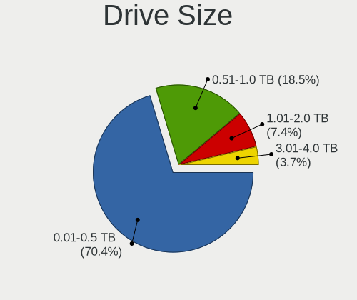

| Size in TB | Notebooks | Drives | Percent |
|------------|-----------|--------|---------|
| 0.01-0.5   | 28        | 32     | 68.29%  |
| 0.51-1.0   | 11        | 12     | 26.83%  |
| 3.01-4.0   | 2         | 2      | 4.88%   |

Space Total
-----------

Amount of disk space available on the file system

| Size in GB     | Notebooks | Percent |
|----------------|-----------|---------|
| 251-500        | 16        | 24.24%  |
| 101-250        | 15        | 22.73%  |
| 501-1000       | 10        | 15.15%  |
| 1001-2000      | 7         | 10.61%  |
| 1-20           | 6         | 9.09%   |
| 51-100         | 4         | 6.06%   |
| Unknown        | 3         | 4.55%   |
| 21-50          | 2         | 3.03%   |
| 2001-3000      | 2         | 3.03%   |
| More than 3000 | 1         | 1.52%   |

Space Used
----------

Amount of used disk space

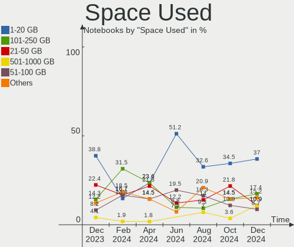

| Used GB   | Notebooks | Percent |
|-----------|-----------|---------|
| 101-250   | 14        | 21.21%  |
| 1-20      | 14        | 21.21%  |
| 21-50     | 13        | 19.7%   |
| 51-100    | 8         | 12.12%  |
| 251-500   | 7         | 10.61%  |
| 501-1000  | 4         | 6.06%   |
| Unknown   | 3         | 4.55%   |
| 1001-2000 | 2         | 3.03%   |
| 0         | 1         | 1.52%   |

Malfunc. Drives
---------------

Drive models with a malfunction

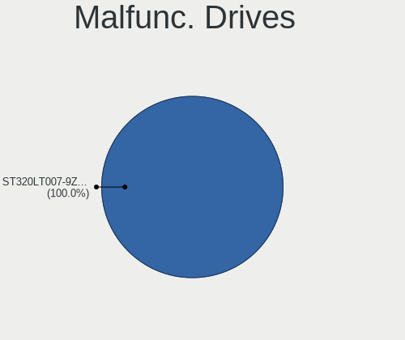

| Model                                 | Notebooks | Drives | Percent |
|---------------------------------------|-----------|--------|---------|
| WDC WD10SPZX-60Z10T0 1TB              | 1         | 1      | 20%     |
| WDC WD Green 2.5 240GB SSD            | 1         | 1      | 20%     |
| SK hynix HFS128G32TND-N210A 128GB SSD | 1         | 1      | 20%     |
| Hitachi HTS542525K9A300 250GB         | 1         | 1      | 20%     |
| HGST HTS541010A9E680 1TB              | 1         | 1      | 20%     |

Malfunc. Drive Vendor
---------------------

Vendors of faulty drives

| Vendor   | Notebooks | Drives | Percent |
|----------|-----------|--------|---------|
| WDC      | 2         | 2      | 40%     |
| SK hynix | 1         | 1      | 20%     |
| Hitachi  | 1         | 1      | 20%     |
| HGST     | 1         | 1      | 20%     |

Malfunc. HDD Vendor
-------------------

Vendors of faulty HDD drives

| Vendor  | Notebooks | Drives | Percent |
|---------|-----------|--------|---------|
| WDC     | 1         | 1      | 33.33%  |
| Hitachi | 1         | 1      | 33.33%  |
| HGST    | 1         | 1      | 33.33%  |

Malfunc. Drive Kind
-------------------

Kinds of faulty drives

| Kind | Notebooks | Drives | Percent |
|------|-----------|--------|---------|
| HDD  | 3         | 3      | 60%     |
| SSD  | 2         | 2      | 40%     |

Failed Drives
-------------

Failed drive models

Zero info for selected period =(

Failed Drive Vendor
-------------------

Failed drive vendors

Zero info for selected period =(

Drive Status
------------

Number of failed and malfunc. drives

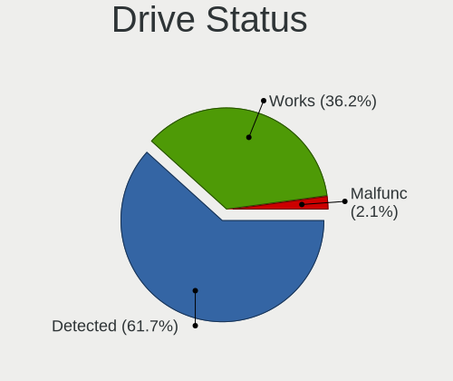

| Status   | Notebooks | Drives | Percent |
|----------|-----------|--------|---------|
| Detected | 41        | 55     | 58.57%  |
| Works    | 24        | 26     | 34.29%  |
| Malfunc  | 5         | 5      | 7.14%   |

Storage controller
------------------

Storage Vendor
--------------

Storage controller vendors

| Vendor                       | Notebooks | Percent |
|------------------------------|-----------|---------|
| Intel                        | 40        | 52.63%  |
| Samsung Electronics          | 13        | 17.11%  |
| AMD                          | 5         | 6.58%   |
| SanDisk                      | 4         | 5.26%   |
| Phison Electronics           | 3         | 3.95%   |
| KIOXIA                       | 3         | 3.95%   |
| Toshiba America Info Systems | 2         | 2.63%   |
| Nvidia                       | 2         | 2.63%   |
| SK hynix                     | 1         | 1.32%   |
| Micron Technology            | 1         | 1.32%   |
| Kingston Technology Company  | 1         | 1.32%   |
| Apple                        | 1         | 1.32%   |

Storage Model
-------------

Storage controller models

| Model                                                                          | Notebooks | Percent |
|--------------------------------------------------------------------------------|-----------|---------|
| Samsung NVMe SSD Controller SM981/PM981/PM983                                  | 7         | 8.86%   |
| Intel 8 Series/C220 Series Chipset Family 6-port SATA Controller 1 [AHCI mode] | 6         | 7.59%   |
| Intel Cannon Lake Mobile PCH SATA AHCI Controller                              | 5         | 6.33%   |
| AMD FCH SATA Controller [AHCI mode]                                            | 5         | 6.33%   |
| Intel Volume Management Device NVMe RAID Controller                            | 4         | 5.06%   |
| Samsung NVMe SSD Controller PM9A1/PM9A3/980PRO                                 | 3         | 3.8%    |
| Intel Wildcat Point-LP SATA Controller [AHCI Mode]                             | 3         | 3.8%    |
| Intel 7 Series Chipset Family 6-port SATA Controller [AHCI mode]               | 3         | 3.8%    |
| Intel 6 Series/C200 Series Chipset Family 6 port Mobile SATA AHCI Controller   | 3         | 3.8%    |
| SanDisk WD Black SN770 / PC SN740 256GB / PC SN560 (DRAM-less) NVMe SSD        | 2         | 2.53%   |
| Samsung NVMe SSD Controller S4LV008[Pascal]                                    | 2         | 2.53%   |
| Samsung NVMe SSD Controller 980 (DRAM-less)                                    | 2         | 2.53%   |
| Nvidia MCP79 AHCI Controller                                                   | 2         | 2.53%   |
| Intel Celeron/Pentium Silver Processor SATA Controller                         | 2         | 2.53%   |
| Intel Celeron N3350/Pentium N4200/Atom E3900 Series SATA AHCI Controller       | 2         | 2.53%   |
| Intel 82801HM/HEM (ICH8M/ICH8M-E) SATA Controller [AHCI mode]                  | 2         | 2.53%   |
| Intel 82801HM/HEM (ICH8M/ICH8M-E) IDE Controller                               | 2         | 2.53%   |
| Intel 82801 Mobile SATA Controller [RAID mode]                                 | 2         | 2.53%   |
| Toshiba America Info Systems XG6 NVMe SSD Controller                           | 1         | 1.27%   |
| Toshiba America Info Systems XG5 NVMe SSD Controller                           | 1         | 1.27%   |
| SK hynix Gold P31/BC711/PC711 NVMe Solid State Drive                           | 1         | 1.27%   |
| SanDisk PC SN530 NVMe SSD (DRAM-less)                                          | 1         | 1.27%   |
| SanDisk Extreme Pro / WD Black SN750 / PC SN730 / Red SN700 NVMe SSD           | 1         | 1.27%   |
| Phison PS5021-E21 PCIe4 NVMe Controller (DRAM-less)                            | 1         | 1.27%   |
| Phison PS5019-E19 PCIe4 NVMe Controller (DRAM-less)                            | 1         | 1.27%   |
| Phison PS5013-E13 PCIe3 NVMe Controller (DRAM-less)                            | 1         | 1.27%   |
| Micron 2400 NVMe SSD (DRAM-less)                                               | 1         | 1.27%   |
| KIOXIA NVMe SSD Controller XG8                                                 | 1         | 1.27%   |
| KIOXIA NVMe SSD Controller BG5 (DRAM-less)                                     | 1         | 1.27%   |
| KIOXIA NVMe SSD Controller BG4 (DRAM-less)                                     | 1         | 1.27%   |
| Kingston Company A1000/U-SNS8154P3 x2 NVMe SSD                                 | 1         | 1.27%   |
| Intel Sunrise Point-LP SATA Controller [AHCI mode]                             | 1         | 1.27%   |
| Intel SSD DC P4101/Pro 7600p/760p/E 6100p Series                               | 1         | 1.27%   |
| Intel SSD 660P Series                                                          | 1         | 1.27%   |
| Intel HM170/QM170 Chipset SATA Controller [AHCI Mode]                          | 1         | 1.27%   |
| Intel 82801GBM/GHM (ICH7-M Family) SATA Controller [IDE mode]                  | 1         | 1.27%   |
| Intel 8 Series SATA Controller 1 [AHCI mode]                                   | 1         | 1.27%   |
| Intel 5 Series/3400 Series Chipset 4 port SATA IDE Controller                  | 1         | 1.27%   |
| Intel 5 Series/3400 Series Chipset 4 port SATA AHCI Controller                 | 1         | 1.27%   |
| Apple S1X NVMe Controller                                                      | 1         | 1.27%   |

Storage Kind
------------

Kind of storage controller (IDE, SATA, NVMe, SAS, ...)

| Kind | Notebooks | Percent |
|------|-----------|---------|
| SATA | 37        | 47.44%  |
| NVMe | 31        | 39.74%  |
| RAID | 6         | 7.69%   |
| IDE  | 4         | 5.13%   |

Processor
---------

CPU Vendor
----------

Processor vendors

| Vendor | Notebooks | Percent |
|--------|-----------|---------|
| Intel  | 50        | 75.76%  |
| AMD    | 16        | 24.24%  |

CPU Model
---------

Processor models

| Model                                  | Notebooks | Percent |
|----------------------------------------|-----------|---------|
| Intel Core i7-9750H CPU @ 2.60GHz      | 3         | 4.55%   |
| Intel Core i7-8750H CPU @ 2.20GHz      | 2         | 3.03%   |
| Intel Core i7-8565U CPU @ 1.80GHz      | 2         | 3.03%   |
| Intel Core i5-4310M CPU @ 2.70GHz      | 2         | 3.03%   |
| Intel Core i5-4200M CPU @ 2.50GHz      | 2         | 3.03%   |
| AMD Ryzen 7 4800H with Radeon Graphics | 2         | 3.03%   |
| AMD Custom APU 0405                    | 2         | 3.03%   |
| Intel Core i9-10885H CPU @ 2.40GHz     | 1         | 1.52%   |
| Intel Core i7-7700HQ CPU @ 2.80GHz     | 1         | 1.52%   |
| Intel Core i7-7500U CPU @ 2.70GHz      | 1         | 1.52%   |
| Intel Core i7-6700HQ CPU @ 2.60GHz     | 1         | 1.52%   |
| Intel Core i7-4720HQ CPU @ 2.60GHz     | 1         | 1.52%   |
| Intel Core i7-4702MQ CPU @ 2.20GHz     | 1         | 1.52%   |
| Intel Core i7-3630QM CPU @ 2.40GHz     | 1         | 1.52%   |
| Intel Core i7-3610QM CPU @ 2.30GHz     | 1         | 1.52%   |
| Intel Core i5-8350U CPU @ 1.70GHz      | 1         | 1.52%   |
| Intel Core i5-7200U CPU @ 2.50GHz      | 1         | 1.52%   |
| Intel Core i5-5250U CPU @ 1.60GHz      | 1         | 1.52%   |
| Intel Core i5-5200U CPU @ 2.20GHz      | 1         | 1.52%   |
| Intel Core i5-3320M CPU @ 2.60GHz      | 1         | 1.52%   |
| Intel Core i5-3230M CPU @ 2.60GHz      | 1         | 1.52%   |
| Intel Core i5-2540M CPU @ 2.60GHz      | 1         | 1.52%   |
| Intel Core i5-2520M CPU @ 2.50GHz      | 1         | 1.52%   |
| Intel Core i5-1035G1 CPU @ 1.00GHz     | 1         | 1.52%   |
| Intel Core i5 CPU M 520 @ 2.40GHz      | 1         | 1.52%   |
| Intel Core i3-5010U CPU @ 2.10GHz      | 1         | 1.52%   |
| Intel Core i3-5005U CPU @ 2.00GHz      | 1         | 1.52%   |
| Intel Core i3-4010U CPU @ 1.70GHz      | 1         | 1.52%   |
| Intel Core i3-2330M CPU @ 2.20GHz      | 1         | 1.52%   |
| Intel Core i3 CPU M 350 @ 2.27GHz      | 1         | 1.52%   |
| Intel Core 2 Duo CPU T8100 @ 2.10GHz   | 1         | 1.52%   |
| Intel Core 2 Duo CPU T7100 @ 1.80GHz   | 1         | 1.52%   |
| Intel Core 2 Duo CPU P8700 @ 2.53GHz   | 1         | 1.52%   |
| Intel Core 2 Duo CPU P7550 @ 2.26GHz   | 1         | 1.52%   |
| Intel Core 2 CPU T7600 @ 2.33GHz       | 1         | 1.52%   |
| Intel Celeron N4120 CPU @ 1.10GHz      | 1         | 1.52%   |
| Intel Celeron N4000 CPU @ 1.10GHz      | 1         | 1.52%   |
| Intel Celeron CPU N3450 @ 1.10GHz      | 1         | 1.52%   |
| Intel Celeron CPU J3455 @ 1.50GHz      | 1         | 1.52%   |
| Intel 13th Gen Core i7-1360P           | 1         | 1.52%   |

CPU Model Family
----------------

Processor model prefix

| Model            | Notebooks | Percent |
|------------------|-----------|---------|
| Intel Core i7    | 14        | 21.21%  |
| Intel Core i5    | 14        | 21.21%  |
| Other            | 9         | 13.64%  |
| Intel Core i3    | 5         | 7.58%   |
| Intel Core 2 Duo | 4         | 6.06%   |
| Intel Celeron    | 4         | 6.06%   |
| AMD Ryzen 7 PRO  | 3         | 4.55%   |
| AMD Ryzen 7      | 3         | 4.55%   |
| AMD Ryzen 5      | 2         | 3.03%   |
| AMD A6           | 2         | 3.03%   |
| Intel Core i9    | 1         | 1.52%   |
| Intel Core 2     | 1         | 1.52%   |
| AMD Ryzen 9      | 1         | 1.52%   |
| AMD Ryzen 5 PRO  | 1         | 1.52%   |
| AMD Ryzen 3      | 1         | 1.52%   |
| AMD A8           | 1         | 1.52%   |

CPU Cores
---------

Number of processor cores

| Number | Notebooks | Percent |
|--------|-----------|---------|
| 2      | 25        | 37.88%  |
| 4      | 21        | 31.82%  |
| 6      | 8         | 12.12%  |
| 8      | 7         | 10.61%  |
| 12     | 2         | 3.03%   |
| 10     | 2         | 3.03%   |
| 14     | 1         | 1.52%   |

CPU Sockets
-----------

Number of sockets

| Number | Notebooks | Percent |
|--------|-----------|---------|
| 1      | 66        | 100%    |

CPU Threads
-----------

Threads per core (Hyper-Threading)

| Number | Notebooks | Percent |
|--------|-----------|---------|
| 2      | 53        | 80.3%   |
| 1      | 13        | 19.7%   |

CPU Op-Modes
------------

CPU Operation Modes (32-bit, 64-bit)

| Op mode        | Notebooks | Percent |
|----------------|-----------|---------|
| 32-bit, 64-bit | 66        | 100%    |

CPU Microcode
-------------

Microcode number

| Number     | Notebooks | Percent |
|------------|-----------|---------|
| Unknown    | 34        | 51.52%  |
| 0x306c3    | 5         | 7.58%   |
| 0x906ea    | 2         | 3.03%   |
| 0x306d4    | 2         | 3.03%   |
| 0x306a9    | 2         | 3.03%   |
| 0x206a7    | 2         | 3.03%   |
| 0x20652    | 2         | 3.03%   |
| 0x08600103 | 2         | 3.03%   |
| 0xb06a3    | 1         | 1.52%   |
| 0x906a4    | 1         | 1.52%   |
| 0x806ec    | 1         | 1.52%   |
| 0x706a1    | 1         | 1.52%   |
| 0x6f6      | 1         | 1.52%   |
| 0x506c9    | 1         | 1.52%   |
| 0x0a704104 | 1         | 1.52%   |
| 0x0a50000d | 1         | 1.52%   |
| 0x0a404102 | 1         | 1.52%   |
| 0x08a00008 | 1         | 1.52%   |
| 0x08608103 | 1         | 1.52%   |
| 0x08600106 | 1         | 1.52%   |
| 0x07030106 | 1         | 1.52%   |
| 0x06006705 | 1         | 1.52%   |
| 0x03000027 | 1         | 1.52%   |

CPU Microarch
-------------

Microarchitecture

| Name             | Notebooks | Percent |
|------------------|-----------|---------|
| KabyLake         | 11        | 16.67%  |
| Unknown          | 8         | 12.12%  |
| Haswell          | 7         | 10.61%  |
| IvyBridge        | 4         | 6.06%   |
| Broadwell        | 4         | 6.06%   |
| Alderlake Hybrid | 4         | 6.06%   |
| Zen 2            | 3         | 4.55%   |
| SandyBridge      | 3         | 4.55%   |
| Penryn           | 3         | 4.55%   |
| Zen 3            | 2         | 3.03%   |
| Westmere         | 2         | 3.03%   |
| TigerLake        | 2         | 3.03%   |
| Goldmont plus    | 2         | 3.03%   |
| Goldmont         | 2         | 3.03%   |
| Core             | 2         | 3.03%   |
| Zen+             | 1         | 1.52%   |
| Skylake          | 1         | 1.52%   |
| Puma             | 1         | 1.52%   |
| K10 Llano        | 1         | 1.52%   |
| IceLake          | 1         | 1.52%   |
| Excavator        | 1         | 1.52%   |
| CometLake        | 1         | 1.52%   |

Graphics
--------

GPU Vendor
----------

Vendors of graphics cards

| Vendor | Notebooks | Percent |
|--------|-----------|---------|
| Intel  | 43        | 52.44%  |
| Nvidia | 20        | 24.39%  |
| AMD    | 19        | 23.17%  |

GPU Model
---------

Graphics card models

| Model                                                                     | Notebooks | Percent |
|---------------------------------------------------------------------------|-----------|---------|
| Intel 4th Gen Core Processor Integrated Graphics Controller               | 6         | 7.06%   |
| Intel CoffeeLake-H GT2 [UHD Graphics 630]                                 | 4         | 4.71%   |
| Intel 3rd Gen Core processor Graphics Controller                          | 4         | 4.71%   |
| Intel HD Graphics 5500                                                    | 3         | 3.53%   |
| AMD Renoir [Radeon RX Vega 6 (Ryzen 4000/5000 Mobile Series)]             | 3         | 3.53%   |
| Nvidia TU117M [GeForce GTX 1650 Mobile / Max-Q]                           | 2         | 2.35%   |
| Nvidia GP107M [GeForce GTX 1050 Ti Mobile]                                | 2         | 2.35%   |
| Nvidia C79 [GeForce 9400M]                                                | 2         | 2.35%   |
| Intel WhiskeyLake-U GT2 [UHD Graphics 620]                                | 2         | 2.35%   |
| Intel TigerLake-LP GT2 [Iris Xe Graphics]                                 | 2         | 2.35%   |
| Intel Raptor Lake-P [Iris Xe Graphics]                                    | 2         | 2.35%   |
| Intel Mobile GM965/GL960 Integrated Graphics Controller (secondary)       | 2         | 2.35%   |
| Intel Mobile GM965/GL960 Integrated Graphics Controller (primary)         | 2         | 2.35%   |
| Intel HD Graphics 620                                                     | 2         | 2.35%   |
| Intel HD Graphics 500                                                     | 2         | 2.35%   |
| Intel GeminiLake [UHD Graphics 600]                                       | 2         | 2.35%   |
| Intel 2nd Generation Core Processor Family Integrated Graphics Controller | 2         | 2.35%   |
| AMD VanGogh [AMD Custom GPU 0405]                                         | 2         | 2.35%   |
| AMD Phoenix1                                                              | 2         | 2.35%   |
| Nvidia TU117M [GeForce GTX 1650 Ti Mobile]                                | 1         | 1.18%   |
| Nvidia TU106M [GeForce RTX 2060 Mobile]                                   | 1         | 1.18%   |
| Nvidia TU106BM [GeForce RTX 2060 Mobile]                                  | 1         | 1.18%   |
| Nvidia GT216M [GeForce GT 330M]                                           | 1         | 1.18%   |
| Nvidia GP107GLM [Quadro P2000 Mobile]                                     | 1         | 1.18%   |
| Nvidia GM107M [GeForce 940M]                                              | 1         | 1.18%   |
| Nvidia GM107 [GeForce 940MX]                                              | 1         | 1.18%   |
| Nvidia GK208M [GeForce GT 740M]                                           | 1         | 1.18%   |
| Nvidia GK107M [GeForce GT 650M]                                           | 1         | 1.18%   |
| Nvidia GK106M [GeForce GTX 760M]                                          | 1         | 1.18%   |
| Nvidia GF108GLM [NVS 5200M]                                               | 1         | 1.18%   |
| Nvidia GA107M [GeForce RTX 3050 Mobile]                                   | 1         | 1.18%   |
| Nvidia GA104M [GeForce RTX 3070 Mobile / Max-Q]                           | 1         | 1.18%   |
| Nvidia G73M [GeForce Go 7600]                                             | 1         | 1.18%   |
| Intel UHD Graphics 620                                                    | 1         | 1.18%   |
| Intel Iris Plus Graphics G1 (Ice Lake)                                    | 1         | 1.18%   |
| Intel HD Graphics 630                                                     | 1         | 1.18%   |
| Intel HD Graphics 6000                                                    | 1         | 1.18%   |
| Intel HD Graphics 530                                                     | 1         | 1.18%   |
| Intel Haswell-ULT Integrated Graphics Controller                          | 1         | 1.18%   |
| Intel Core Processor Integrated Graphics Controller                       | 1         | 1.18%   |

GPU Combo
---------

Combinations of graphics cards

| Name           | Notebooks | Percent |
|----------------|-----------|---------|
| 1 x Intel      | 26        | 39.39%  |
| 1 x AMD        | 15        | 22.73%  |
| Intel + Nvidia | 13        | 19.7%   |
| 1 x Nvidia     | 6         | 9.09%   |
| 2 x Intel      | 2         | 3.03%   |
| Intel + AMD    | 2         | 3.03%   |
| 2 x AMD        | 1         | 1.52%   |
| AMD + Nvidia   | 1         | 1.52%   |

GPU Driver
----------

Free vs proprietary

| Driver      | Notebooks | Percent |
|-------------|-----------|---------|
| Free        | 55        | 83.33%  |
| Proprietary | 9         | 13.64%  |
| Unknown     | 2         | 3.03%   |

GPU Memory
----------

Total video memory

| Size in GB | Notebooks | Percent |
|------------|-----------|---------|
| Unknown    | 41        | 62.12%  |
| 0.01-0.5   | 11        | 16.67%  |
| 0.51-1.0   | 6         | 9.09%   |
| 1.01-2.0   | 3         | 4.55%   |
| 7.01-8.0   | 2         | 3.03%   |
| 3.01-4.0   | 2         | 3.03%   |
| 5.01-6.0   | 1         | 1.52%   |

Monitor
-------

Monitor Vendor
--------------

Monitor vendors

| Vendor                  | Notebooks | Percent |
|-------------------------|-----------|---------|
| AU Optronics            | 15        | 18.52%  |
| BOE                     | 10        | 12.35%  |
| Samsung Electronics     | 8         | 9.88%   |
| Chimei Innolux          | 8         | 9.88%   |
| LG Display              | 7         | 8.64%   |
| Apple                   | 5         | 6.17%   |
| Sharp                   | 4         | 4.94%   |
| Valve                   | 2         | 2.47%   |
| Sony                    | 2         | 2.47%   |
| Lenovo                  | 2         | 2.47%   |
| Hewlett-Packard         | 2         | 2.47%   |
| Goldstar                | 2         | 2.47%   |
| Chi Mei Optoelectronics | 2         | 2.47%   |
| PANDA                   | 1         | 1.23%   |
| MSI                     | 1         | 1.23%   |
| Mi                      | 1         | 1.23%   |
| LG Philips              | 1         | 1.23%   |
| JDZ                     | 1         | 1.23%   |
| Iiyama                  | 1         | 1.23%   |
| Eizo                    | 1         | 1.23%   |
| Dell                    | 1         | 1.23%   |
| BenQ                    | 1         | 1.23%   |
| ASUSTek Computer        | 1         | 1.23%   |
| AOC                     | 1         | 1.23%   |
| Acer                    | 1         | 1.23%   |

Monitor Model
-------------

Monitor models

| Model                                                                 | Notebooks | Percent |
|-----------------------------------------------------------------------|-----------|---------|
| Valve ANX7530 U VLV3001 800x1280 100x150mm 7.1-inch                   | 2         | 2.47%   |
| AU Optronics LCD Monitor AUO38ED 1920x1080 344x193mm 15.5-inch        | 2         | 2.47%   |
| Apple Color LCD APP9C9E 1280x800 286x179mm 13.3-inch                  | 2         | 2.47%   |
| Sony TV SNY1A02 1920x1080                                             | 1         | 1.23%   |
| Sony TV SNY0801 1360x768                                              | 1         | 1.23%   |
| Sharp LQ156M1JW01 SHP14C3 1920x1080 344x194mm 15.5-inch               | 1         | 1.23%   |
| Sharp LCD Monitor SHP1548 1920x1200 288x180mm 13.4-inch               | 1         | 1.23%   |
| Sharp LCD Monitor SHP14D1 1920x1200 336x210mm 15.6-inch               | 1         | 1.23%   |
| Sharp LCD Monitor SHP148D 3840x2160 344x194mm 15.5-inch               | 1         | 1.23%   |
| Samsung Electronics SyncMaster SAM0524 1920x1080 480x270mm 21.7-inch  | 1         | 1.23%   |
| Samsung Electronics S24D590 SAM0B47 1920x1080 521x293mm 23.5-inch     | 1         | 1.23%   |
| Samsung Electronics LCD Monitor SEC544B 1600x900 382x214mm 17.2-inch  | 1         | 1.23%   |
| Samsung Electronics LCD Monitor SEC5441 1366x768 344x194mm 15.5-inch  | 1         | 1.23%   |
| Samsung Electronics LCD Monitor SEC4351 1366x768 344x194mm 15.5-inch  | 1         | 1.23%   |
| Samsung Electronics LCD Monitor SDC4C48 1920x1080 344x194mm 15.5-inch | 1         | 1.23%   |
| Samsung Electronics LCD Monitor SDC324C 1920x1080 344x194mm 15.5-inch | 1         | 1.23%   |
| Samsung Electronics C27F390 SAM0D32 1920x1080 598x336mm 27.0-inch     | 1         | 1.23%   |
| PANDA LCD Monitor NCP0061 2560x1600 302x189mm 14.0-inch               | 1         | 1.23%   |
| MSI MAG274QRF-QD MSI3CA8 2560x1440 597x336mm 27.0-inch                | 1         | 1.23%   |
| Mi Monitor XMI23C3 1920x1080 527x293mm 23.7-inch                      | 1         | 1.23%   |
| LG Philips LCD Monitor LPLCA00 1280x800 331x207mm 15.4-inch           | 1         | 1.23%   |
| LG Display LCD Monitor LGD060A 1920x1080 294x165mm 13.3-inch          | 1         | 1.23%   |
| LG Display LCD Monitor LGD056D 1920x1080 382x215mm 17.3-inch          | 1         | 1.23%   |
| LG Display LCD Monitor LGD04B3 1920x1080 345x194mm 15.6-inch          | 1         | 1.23%   |
| LG Display LCD Monitor LGD03DC 1366x768 277x156mm 12.5-inch           | 1         | 1.23%   |
| LG Display LCD Monitor LGD0396 1600x900 382x215mm 17.3-inch           | 1         | 1.23%   |
| LG Display LCD Monitor LGD0357 1600x900 382x215mm 17.3-inch           | 1         | 1.23%   |
| LG Display LCD Monitor LGD02F1 1366x768 344x194mm 15.5-inch           | 1         | 1.23%   |
| Lenovo X1 (2nd Gen) LEN61C2 3840x2160 597x336mm 27.0-inch             | 1         | 1.23%   |
| Lenovo LCD Monitor LEN40BA 1920x1080 344x194mm 15.5-inch              | 1         | 1.23%   |
| JDZ LCD Monitor JDZ002D 1920x1080 294x165mm 13.3-inch                 | 1         | 1.23%   |
| Iiyama PL2740QS IVM6664 2560x1440 597x336mm 27.0-inch                 | 1         | 1.23%   |
| Hewlett-Packard 24fw HPN3545 1920x1080 527x296mm 23.8-inch            | 1         | 1.23%   |
| Hewlett-Packard 2159 HWP282A 1920x1080 477x268mm 21.5-inch            | 1         | 1.23%   |
| Goldstar W2361 GSM56FB 1920x1080 510x290mm 23.1-inch                  | 1         | 1.23%   |
| Goldstar W2343 GSM5700 1920x1080 510x290mm 23.1-inch                  | 1         | 1.23%   |
| Eizo CS270 ENC2694 1920x1080 597x336mm 27.0-inch                      | 1         | 1.23%   |
| Dell P2419HC DELA11C 1920x1080 527x296mm 23.8-inch                    | 1         | 1.23%   |
| Chimei Innolux LCD Monitor CMN1735 1920x1080 382x215mm 17.3-inch      | 1         | 1.23%   |
| Chimei Innolux LCD Monitor CMN15F6 1920x1080 344x193mm 15.5-inch      | 1         | 1.23%   |

Monitor Resolution
------------------

Monitor screen resolution

| Resolution        | Notebooks | Percent |
|-------------------|-----------|---------|
| 1920x1080 (FHD)   | 36        | 48.65%  |
| 1366x768 (WXGA)   | 10        | 13.51%  |
| 1600x900 (HD+)    | 6         | 8.11%   |
| 1920x1200 (WUXGA) | 5         | 6.76%   |
| 1280x800 (WXGA)   | 5         | 6.76%   |
| 3840x2160 (4K)    | 4         | 5.41%   |
| 2560x1600         | 3         | 4.05%   |
| 800x1280          | 2         | 2.7%    |
| 2560x1440 (QHD)   | 1         | 1.35%   |
| 1440x900 (WXGA+)  | 1         | 1.35%   |
| 1360x768          | 1         | 1.35%   |

Monitor Diagonal
----------------

Diagonal size in inches

| Inches | Notebooks | Percent |
|--------|-----------|---------|
| 15     | 25        | 31.25%  |
| 13     | 11        | 13.75%  |
| 14     | 9         | 11.25%  |
| 17     | 8         | 10%     |
| 27     | 5         | 6.25%   |
| 23     | 5         | 6.25%   |
| 24     | 3         | 3.75%   |
| 72     | 2         | 2.5%    |
| 21     | 2         | 2.5%    |
| 16     | 2         | 2.5%    |
| 12     | 2         | 2.5%    |
| 11     | 2         | 2.5%    |
| 7      | 2         | 2.5%    |
| 40     | 1         | 1.25%   |
| 18     | 1         | 1.25%   |

Monitor Width
-------------

Physical width

| Width in mm | Notebooks | Percent |
|-------------|-----------|---------|
| 301-350     | 37        | 46.25%  |
| 501-600     | 13        | 16.25%  |
| 201-300     | 13        | 16.25%  |
| 351-400     | 9         | 11.25%  |
| 401-500     | 3         | 3.75%   |
| 1501-2000   | 2         | 2.5%    |
| 1-100       | 2         | 2.5%    |
| 801-900     | 1         | 1.25%   |

Aspect Ratio
------------

Proportional relationship between the width and the height

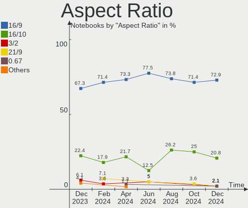

| Ratio | Notebooks | Percent |
|-------|-----------|---------|
| 16/9  | 51        | 76.12%  |
| 16/10 | 14        | 20.9%   |
| 0.67  | 2         | 2.99%   |

Monitor Area
------------

Area in inch

| Area in inch | Notebooks | Percent |
|----------------|-----------|---------|
| 101-110        | 24        | 30%     |
| 81-90          | 12        | 15%     |
| 201-250        | 10        | 12.5%   |
| 71-80          | 8         | 10%     |
| 121-130        | 8         | 10%     |
| 301-350        | 5         | 6.25%   |
| 111-120        | 3         | 3.75%   |
| More than 1000 | 2         | 2.5%    |
| 61-70          | 2         | 2.5%    |
| 51-60          | 2         | 2.5%    |
| 1-40           | 2         | 2.5%    |
| 141-150        | 1         | 1.25%   |
| 501-1000       | 1         | 1.25%   |

Pixel Density
-------------

Pixels per inch

| Density       | Notebooks | Percent |
|---------------|-----------|---------|
| 121-160       | 29        | 36.71%  |
| 101-120       | 18        | 22.78%  |
| 51-100        | 15        | 18.99%  |
| 161-240       | 14        | 17.72%  |
| 1-50          | 2         | 2.53%   |
| More than 240 | 1         | 1.27%   |

Multiple Monitors
-----------------

Total monitors connected

| Total | Notebooks | Percent |
|-------|-----------|---------|
| 1     | 47        | 71.21%  |
| 2     | 16        | 24.24%  |
| 0     | 2         | 3.03%   |
| 3     | 1         | 1.52%   |

Network
-------

Net Controller Vendor
---------------------

Controller vendors

| Vendor                   | Notebooks | Percent |
|--------------------------|-----------|---------|
| Intel                    | 40        | 39.6%   |
| Realtek Semiconductor    | 30        | 29.7%   |
| Broadcom                 | 8         | 7.92%   |
| Qualcomm Atheros         | 5         | 4.95%   |
| MediaTek                 | 5         | 4.95%   |
| Broadcom Limited         | 5         | 4.95%   |
| Qualcomm                 | 2         | 1.98%   |
| Nvidia                   | 2         | 1.98%   |
| TP-Link                  | 1         | 0.99%   |
| Marvell Technology Group | 1         | 0.99%   |
| Fibocom                  | 1         | 0.99%   |
| Dell                     | 1         | 0.99%   |

Net Controller Model
--------------------

Controller models

| Model                                                                  | Notebooks | Percent |
|------------------------------------------------------------------------|-----------|---------|
| Realtek RTL8111/8168/8211/8411 PCI Express Gigabit Ethernet Controller | 20        | 17.09%  |
| Intel Wi-Fi 6 AX200                                                    | 4         | 3.42%   |
| Intel 82579LM Gigabit Network Connection (Lewisville)                  | 4         | 3.42%   |
| Realtek RTL810xE PCI Express Fast Ethernet controller                  | 3         | 2.56%   |
| MediaTek MT7922 802.11ax PCI Express Wireless Network Adapter          | 3         | 2.56%   |
| Intel Wireless 7260                                                    | 3         | 2.56%   |
| Intel Centrino Advanced-N 6205 [Taylor Peak]                           | 3         | 2.56%   |
| Intel Cannon Lake PCH CNVi WiFi                                        | 3         | 2.56%   |
| Realtek RTL8852AE 802.11ax PCIe Wireless Network Adapter               | 2         | 1.71%   |
| Realtek RTL8822CE 802.11ac PCIe Wireless Network Adapter               | 2         | 1.71%   |
| Realtek RTL8153 Gigabit Ethernet Adapter                               | 2         | 1.71%   |
| Nvidia MCP79 Ethernet                                                  | 2         | 1.71%   |
| Intel Wireless 8265 / 8275                                             | 2         | 1.71%   |
| Intel Wireless 3165                                                    | 2         | 1.71%   |
| Intel Wi-Fi 6E(802.11ax) AX210/AX1675* 2x2 [Typhoon Peak]              | 2         | 1.71%   |
| Intel Raptor Lake PCH CNVi WiFi                                        | 2         | 1.71%   |
| Intel Gemini Lake PCH CNVi WiFi                                        | 2         | 1.71%   |
| Intel Ethernet Connection I217-LM                                      | 2         | 1.71%   |
| Intel Centrino Advanced-N 6235                                         | 2         | 1.71%   |
| Intel Cannon Point-LP CNVi [Wireless-AC]                               | 2         | 1.71%   |
| Intel Alder Lake-P PCH CNVi WiFi                                       | 2         | 1.71%   |
| Broadcom Limited NetLink BCM5787M Gigabit Ethernet PCI Express         | 2         | 1.71%   |
| Broadcom BCM4322 802.11a/b/g/n Wireless LAN Controller                 | 2         | 1.71%   |
| Broadcom BCM43142 802.11b/g/n                                          | 2         | 1.71%   |
| TP-Link 802.11ac NIC                                                   | 1         | 0.85%   |
| Realtek RTL8852BE PCIe 802.11ax Wireless Network Controller [1T1R]     | 1         | 0.85%   |
| Realtek RTL8821CE 802.11ac PCIe Wireless Network Adapter               | 1         | 0.85%   |
| Realtek RTL8723BE PCIe Wireless Network Adapter                        | 1         | 0.85%   |
| Realtek RTL8188CE 802.11b/g/n WiFi Adapter                             | 1         | 0.85%   |
| Realtek RTL8152 Fast Ethernet Adapter                                  | 1         | 0.85%   |
| Realtek 802.11n WLAN Adapter                                           | 1         | 0.85%   |
| Qualcomm QCNFA765 Wireless Network Adapter                             | 1         | 0.85%   |
| Qualcomm QCA6390 Wireless Network Adapter                              | 1         | 0.85%   |
| Qualcomm Atheros QCA9565 / AR9565 Wireless Network Adapter             | 1         | 0.85%   |
| Qualcomm Atheros QCA8172 Fast Ethernet                                 | 1         | 0.85%   |
| Qualcomm Atheros QCA6174 802.11ac Wireless Network Adapter             | 1         | 0.85%   |
| Qualcomm Atheros AR9462 Wireless Network Adapter                       | 1         | 0.85%   |
| Qualcomm Atheros AR8151 v2.0 Gigabit Ethernet                          | 1         | 0.85%   |
| MediaTek MT7921 802.11ax PCI Express Wireless Network Adapter          | 1         | 0.85%   |
| MediaTek MT7630e 802.11bgn Wireless Network Adapter                    | 1         | 0.85%   |

Wireless Vendor
---------------

Wireless vendors

| Vendor                | Notebooks | Percent |
|-----------------------|-----------|---------|
| Intel                 | 38        | 55.07%  |
| Realtek Semiconductor | 9         | 13.04%  |
| Broadcom              | 8         | 11.59%  |
| MediaTek              | 5         | 7.25%   |
| Qualcomm Atheros      | 3         | 4.35%   |
| Qualcomm              | 2         | 2.9%    |
| TP-Link               | 1         | 1.45%   |
| Fibocom               | 1         | 1.45%   |
| Dell                  | 1         | 1.45%   |
| Broadcom Limited      | 1         | 1.45%   |

Wireless Model
--------------

Wireless models

| Model                                                              | Notebooks | Percent |
|--------------------------------------------------------------------|-----------|---------|
| Intel Wi-Fi 6 AX200                                                | 4         | 5.8%    |
| MediaTek MT7922 802.11ax PCI Express Wireless Network Adapter      | 3         | 4.35%   |
| Intel Wireless 7260                                                | 3         | 4.35%   |
| Intel Centrino Advanced-N 6205 [Taylor Peak]                       | 3         | 4.35%   |
| Intel Cannon Lake PCH CNVi WiFi                                    | 3         | 4.35%   |
| Realtek RTL8852AE 802.11ax PCIe Wireless Network Adapter           | 2         | 2.9%    |
| Realtek RTL8822CE 802.11ac PCIe Wireless Network Adapter           | 2         | 2.9%    |
| Intel Wireless 8265 / 8275                                         | 2         | 2.9%    |
| Intel Wireless 3165                                                | 2         | 2.9%    |
| Intel Wi-Fi 6E(802.11ax) AX210/AX1675* 2x2 [Typhoon Peak]          | 2         | 2.9%    |
| Intel Raptor Lake PCH CNVi WiFi                                    | 2         | 2.9%    |
| Intel Gemini Lake PCH CNVi WiFi                                    | 2         | 2.9%    |
| Intel Centrino Advanced-N 6235                                     | 2         | 2.9%    |
| Intel Cannon Point-LP CNVi [Wireless-AC]                           | 2         | 2.9%    |
| Intel Alder Lake-P PCH CNVi WiFi                                   | 2         | 2.9%    |
| Broadcom BCM4322 802.11a/b/g/n Wireless LAN Controller             | 2         | 2.9%    |
| Broadcom BCM43142 802.11b/g/n                                      | 2         | 2.9%    |
| TP-Link 802.11ac NIC                                               | 1         | 1.45%   |
| Realtek RTL8852BE PCIe 802.11ax Wireless Network Controller [1T1R] | 1         | 1.45%   |
| Realtek RTL8821CE 802.11ac PCIe Wireless Network Adapter           | 1         | 1.45%   |
| Realtek RTL8723BE PCIe Wireless Network Adapter                    | 1         | 1.45%   |
| Realtek RTL8188CE 802.11b/g/n WiFi Adapter                         | 1         | 1.45%   |
| Realtek 802.11n WLAN Adapter                                       | 1         | 1.45%   |
| Qualcomm QCNFA765 Wireless Network Adapter                         | 1         | 1.45%   |
| Qualcomm QCA6390 Wireless Network Adapter                          | 1         | 1.45%   |
| Qualcomm Atheros QCA9565 / AR9565 Wireless Network Adapter         | 1         | 1.45%   |
| Qualcomm Atheros QCA6174 802.11ac Wireless Network Adapter         | 1         | 1.45%   |
| Qualcomm Atheros AR9462 Wireless Network Adapter                   | 1         | 1.45%   |
| MediaTek MT7921 802.11ax PCI Express Wireless Network Adapter      | 1         | 1.45%   |
| MediaTek MT7630e 802.11bgn Wireless Network Adapter                | 1         | 1.45%   |
| Intel Wireless 8260                                                | 1         | 1.45%   |
| Intel Wireless 7265                                                | 1         | 1.45%   |
| Intel Wi-Fi 6 AX201                                                | 1         | 1.45%   |
| Intel Wi-Fi 5(802.11ac) Wireless-AC 9x6x [Thunder Peak]            | 1         | 1.45%   |
| Intel PRO/Wireless 4965 AG or AGN [Kedron] Network Connection      | 1         | 1.45%   |
| Intel PRO/Wireless 3945ABG [Golan] Network Connection              | 1         | 1.45%   |
| Intel Ice Lake-LP PCH CNVi WiFi                                    | 1         | 1.45%   |
| Intel Centrino Ultimate-N 6300                                     | 1         | 1.45%   |
| Intel Centrino Advanced-N 6200                                     | 1         | 1.45%   |
| Fibocom L831-EAU-00                                                | 1         | 1.45%   |

Ethernet Vendor
---------------

Ethernet vendors

| Vendor                   | Notebooks | Percent |
|--------------------------|-----------|---------|
| Realtek Semiconductor    | 26        | 54.17%  |
| Intel                    | 12        | 25%     |
| Broadcom Limited         | 4         | 8.33%   |
| Qualcomm Atheros         | 2         | 4.17%   |
| Nvidia                   | 2         | 4.17%   |
| Marvell Technology Group | 1         | 2.08%   |
| Broadcom                 | 1         | 2.08%   |

Ethernet Model
--------------

Ethernet models

| Model                                                                  | Notebooks | Percent |
|------------------------------------------------------------------------|-----------|---------|
| Realtek RTL8111/8168/8211/8411 PCI Express Gigabit Ethernet Controller | 20        | 41.67%  |
| Intel 82579LM Gigabit Network Connection (Lewisville)                  | 4         | 8.33%   |
| Realtek RTL810xE PCI Express Fast Ethernet controller                  | 3         | 6.25%   |
| Realtek RTL8153 Gigabit Ethernet Adapter                               | 2         | 4.17%   |
| Nvidia MCP79 Ethernet                                                  | 2         | 4.17%   |
| Intel Ethernet Connection I217-LM                                      | 2         | 4.17%   |
| Broadcom Limited NetLink BCM5787M Gigabit Ethernet PCI Express         | 2         | 4.17%   |
| Realtek RTL8152 Fast Ethernet Adapter                                  | 1         | 2.08%   |
| Qualcomm Atheros QCA8172 Fast Ethernet                                 | 1         | 2.08%   |
| Qualcomm Atheros AR8151 v2.0 Gigabit Ethernet                          | 1         | 2.08%   |
| Marvell Group 88E8058 PCI-E Gigabit Ethernet Controller                | 1         | 2.08%   |
| Intel I210 Gigabit Network Connection                                  | 1         | 2.08%   |
| Intel Ethernet Connection I218-LM                                      | 1         | 2.08%   |
| Intel Ethernet Connection (4) I219-V                                   | 1         | 2.08%   |
| Intel Ethernet Connection (4) I219-LM                                  | 1         | 2.08%   |
| Intel Ethernet Connection (3) I218-LM                                  | 1         | 2.08%   |
| Intel Ethernet Connection (23) I219-LM                                 | 1         | 2.08%   |
| Broadcom NetXtreme BCM5764M Gigabit Ethernet PCIe                      | 1         | 2.08%   |
| Broadcom Limited NetXtreme BCM5761e Gigabit Ethernet PCIe              | 1         | 2.08%   |
| Broadcom Limited NetLink BCM57780 Gigabit Ethernet PCIe                | 1         | 2.08%   |

Net Controller Kind
-------------------

Ethernet, WiFi or modem

| Kind     | Notebooks | Percent |
|----------|-----------|---------|
| WiFi     | 66        | 57.89%  |
| Ethernet | 48        | 42.11%  |

Used Controller
---------------

Currently used network controller

| Kind     | Notebooks | Percent |
|----------|-----------|---------|
| WiFi     | 55        | 78.57%  |
| Ethernet | 15        | 21.43%  |

NICs
----

Total network controllers on board

| Total | Notebooks | Percent |
|-------|-----------|---------|
| 2     | 44        | 66.67%  |
| 1     | 20        | 30.3%   |
| 3     | 1         | 1.52%   |
| 0     | 1         | 1.52%   |

IPv6
----

IPv6 vs IPv4

| Used | Notebooks | Percent |
|------|-----------|---------|
| No   | 41        | 62.12%  |
| Yes  | 25        | 37.88%  |

Bluetooth
---------

Bluetooth Vendor
----------------

Controller vendors

| Vendor                          | Notebooks | Percent |
|---------------------------------|-----------|---------|
| Intel                           | 29        | 52.73%  |
| Realtek Semiconductor           | 6         | 10.91%  |
| IMC Networks                    | 5         | 9.09%   |
| Apple                           | 5         | 9.09%   |
| MediaTek                        | 2         | 3.64%   |
| Broadcom                        | 2         | 3.64%   |
| USI                             | 1         | 1.82%   |
| Qualcomm Atheros Communications | 1         | 1.82%   |
| Lite-On Technology              | 1         | 1.82%   |
| Hewlett-Packard                 | 1         | 1.82%   |
| Foxconn International           | 1         | 1.82%   |
| Foxconn / Hon Hai               | 1         | 1.82%   |

Bluetooth Model
---------------

Controller models

| Model                                             | Notebooks | Percent |
|---------------------------------------------------|-----------|---------|
| Intel Bluetooth wireless interface                | 8         | 14.55%  |
| Intel Bluetooth 9460/9560 Jefferson Peak (JfP)    | 7         | 12.73%  |
| Realtek Bluetooth Radio                           | 5         | 9.09%   |
| Intel AX200 Bluetooth                             | 4         | 7.27%   |
| Intel Bluetooth Device                            | 3         | 5.45%   |
| Intel AX201 Bluetooth                             | 3         | 5.45%   |
| Apple Bluetooth Host Controller                   | 3         | 5.45%   |
| Intel AX210 Bluetooth                             | 2         | 3.64%   |
| IMC Networks Wireless_Device                      | 2         | 3.64%   |
| IMC Networks Bluetooth Radio                      | 2         | 3.64%   |
| USI Bluetooth Device                              | 1         | 1.82%   |
| Realtek CSR BS8510                                | 1         | 1.82%   |
| Qualcomm Atheros  Bluetooth Device                | 1         | 1.82%   |
| MediaTek Wireless_Device                          | 1         | 1.82%   |
| MediaTek MT7630e Bluetooth Adapter                | 1         | 1.82%   |
| Lite-On Wireless_Device                           | 1         | 1.82%   |
| Intel Wireless-AC 9260 Bluetooth Adapter          | 1         | 1.82%   |
| Intel Centrino Bluetooth Wireless Transceiver     | 1         | 1.82%   |
| IMC Networks Bluetooth Device                     | 1         | 1.82%   |
| HP Broadcom 2070 Bluetooth Combo                  | 1         | 1.82%   |
| Foxconn International BCM43142A0 Bluetooth module | 1         | 1.82%   |
| Foxconn / Hon Hai Bluetooth Device                | 1         | 1.82%   |
| Broadcom BCM43142A0 Bluetooth 4.0                 | 1         | 1.82%   |
| Broadcom BCM20702 Bluetooth 4.0 [ThinkPad]        | 1         | 1.82%   |
| Apple Bluetooth USB Host Controller               | 1         | 1.82%   |
| Apple Bluetooth HCI MacBookPro (HID mode)         | 1         | 1.82%   |

Sound
-----

Sound Vendor
------------

Sound card vendors

| Vendor                 | Notebooks | Percent |
|------------------------|-----------|---------|
| Intel                  | 48        | 58.54%  |
| AMD                    | 17        | 20.73%  |
| Nvidia                 | 12        | 14.63%  |
| C-Media Electronics    | 2         | 2.44%   |
| Razer USA              | 1         | 1.22%   |
| Logitech               | 1         | 1.22%   |
| Generalplus Technology | 1         | 1.22%   |

Sound Model
-----------

Sound card models

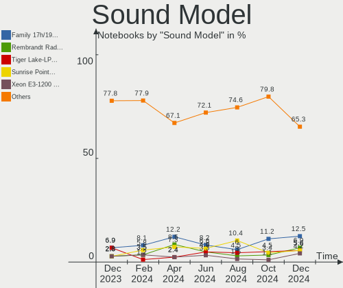

| Model                                                                      | Notebooks | Percent |
|----------------------------------------------------------------------------|-----------|---------|
| AMD Family 17h/19h HD Audio Controller                                     | 11        | 10.19%  |
| Intel Xeon E3-1200 v3/4th Gen Core Processor HD Audio Controller           | 6         | 5.56%   |
| Intel 8 Series/C220 Series Chipset High Definition Audio Controller        | 6         | 5.56%   |
| AMD Renoir Radeon High Definition Audio Controller                         | 6         | 5.56%   |
| AMD Rembrandt Radeon High Definition Audio Controller                      | 6         | 5.56%   |
| Intel Cannon Lake PCH cAVS                                                 | 5         | 4.63%   |
| Intel Wildcat Point-LP High Definition Audio Controller                    | 4         | 3.7%    |
| Intel Broadwell-U Audio Controller                                         | 4         | 3.7%    |
| Intel 7 Series/C216 Chipset Family High Definition Audio Controller        | 4         | 3.7%    |
| Intel Sunrise Point-LP HD Audio                                            | 3         | 2.78%   |
| Intel 6 Series/C200 Series Chipset Family High Definition Audio Controller | 3         | 2.78%   |
| Nvidia TU106 High Definition Audio Controller                              | 2         | 1.85%   |
| Nvidia MCP79 High Definition Audio                                         | 2         | 1.85%   |
| Nvidia GP107GL High Definition Audio Controller                            | 2         | 1.85%   |
| Nvidia GM107 High Definition Audio Controller [GeForce 940MX]              | 2         | 1.85%   |
| Intel Tiger Lake-LP Smart Sound Technology Audio Controller                | 2         | 1.85%   |
| Intel Raptor Lake-P/U/H cAVS                                               | 2         | 1.85%   |
| Intel Celeron/Pentium Silver Processor High Definition Audio               | 2         | 1.85%   |
| Intel Celeron N3350/Pentium N4200/Atom E3900 Series Audio Cluster          | 2         | 1.85%   |
| Intel Cannon Point-LP High Definition Audio Controller                     | 2         | 1.85%   |
| Intel Alder Lake PCH-P High Definition Audio Controller                    | 2         | 1.85%   |
| Intel 82801H (ICH8 Family) HD Audio Controller                             | 2         | 1.85%   |
| Intel 5 Series/3400 Series Chipset High Definition Audio                   | 2         | 1.85%   |
| AMD FCH Azalia Controller                                                  | 2         | 1.85%   |
| Razer USA Razer Seiren Mini                                                | 1         | 0.93%   |
| Nvidia TU107 GeForce GTX 1650 High Definition Audio Controller             | 1         | 0.93%   |
| Nvidia GT216 HDMI Audio Controller                                         | 1         | 0.93%   |
| Nvidia GF108 High Definition Audio Controller                              | 1         | 0.93%   |
| Nvidia GA104 High Definition Audio Controller                              | 1         | 0.93%   |
| Logitech Blue Microphones                                                  | 1         | 0.93%   |
| Intel NM10/ICH7 Family High Definition Audio Controller                    | 1         | 0.93%   |
| Intel Ice Lake-LP Smart Sound Technology Audio Controller                  | 1         | 0.93%   |
| Intel Haswell-ULT HD Audio Controller                                      | 1         | 0.93%   |
| Intel Comet Lake PCH cAVS                                                  | 1         | 0.93%   |
| Intel CM238 HD Audio Controller                                            | 1         | 0.93%   |
| Intel Alder Lake Smart Sound Technology Audio Controller                   | 1         | 0.93%   |
| Intel 8 Series HD Audio Controller                                         | 1         | 0.93%   |
| Intel 100 Series/C230 Series Chipset Family HD Audio Controller            | 1         | 0.93%   |
| Generalplus Technology USB Audio Device                                    | 1         | 0.93%   |
| C-Media Electronics USB Advanced Audio Device                              | 1         | 0.93%   |

Memory
------

Memory Vendor
-------------

Memory module vendors

| Vendor                       | Notebooks | Percent |
|------------------------------|-----------|---------|
| SK hynix                     | 13        | 31.71%  |
| Samsung Electronics          | 12        | 29.27%  |
| Micron Technology            | 5         | 12.2%   |
| Kingston                     | 4         | 9.76%   |
| Unknown (ABCD)               | 2         | 4.88%   |
| Unknown (0xFFFF000000000000) | 1         | 2.44%   |
| Unknown                      | 1         | 2.44%   |
| Team                         | 1         | 2.44%   |
| Elpida                       | 1         | 2.44%   |
| Crucial                      | 1         | 2.44%   |

Memory Model
------------

Memory module models

| Model                                                               | Notebooks | Percent |
|---------------------------------------------------------------------|-----------|---------|
| SK hynix RAM HMT451S6BFR8A-PB 4GB SODIMM DDR3 1600MT/s              | 3         | 6.98%   |
| Unknown (ABCD) RAM 123456789012345678 2048MB SODIMM LPDDR4 2400MT/s | 2         | 4.65%   |
| SK hynix RAM HMT351S6CFR8C-PB 4GB SODIMM DDR3 1600MT/s              | 2         | 4.65%   |
| Unknown RAM Module 2GB SODIMM DDR2 667MT/s                          | 1         | 2.33%   |
| Unknown (0xFFFF000000000000) RAM Module 2GB SODIMM DDR2 667MT/s     | 1         | 2.33%   |
| Team RAM Elite-1600 4GB SODIMM DDR3 1600MT/s                        | 1         | 2.33%   |
| SK hynix RAM Module 4GB SODIMM DDR3 1067MT/s                        | 1         | 2.33%   |
| SK hynix RAM Module 32GB SODIMM DDR5 5600MT/s                       | 1         | 2.33%   |
| SK hynix RAM HYMP512S64CP8-Y5 1GB SODIMM DDR2 1639MT/s              | 1         | 2.33%   |
| SK hynix RAM HMT451S6AFR8A-PB 4GB SODIMM DDR3 1600MT/s              | 1         | 2.33%   |
| SK hynix RAM HMT425S6AFR6A-PB 2GB SODIMM DDR3 3200MT/s              | 1         | 2.33%   |
| SK hynix RAM HMAA1GS6CMR6N-XN 8GB SODIMM DDR4 3200MT/s              | 1         | 2.33%   |
| SK hynix RAM HMA82GS6CJR8N-VK 16GB SODIMM DDR4 2667MT/s             | 1         | 2.33%   |
| SK hynix RAM HCNNNFAMMLXR-NEE 4GB Row Of Chips LPDDR4 4267MT/s      | 1         | 2.33%   |
| SK hynix RAM H9HCNNNCPMMLXR-NEE 8192MB SODIMM LPDDR4 4266MT/s       | 1         | 2.33%   |
| Samsung RAM Module 16384MB SODIMM DDR4 2667MT/s                     | 1         | 2.33%   |
| Samsung RAM M471B5173QH0-YK0 4096MB SODIMM DDR3 1600MT/s            | 1         | 2.33%   |
| Samsung RAM M471B5173DB0-YK0 4GB SODIMM DDR3 1600MT/s               | 1         | 2.33%   |
| Samsung RAM M471B5173BH0-YK0 4096MB SODIMM DDR3 1600MT/s            | 1         | 2.33%   |
| Samsung RAM M471B5173BH0-CK0 4GB SODIMM DDR3 1600MT/s               | 1         | 2.33%   |
| Samsung RAM M471A5244CB0-CWE 4GB Row Of Chips DDR4 3200MT/s         | 1         | 2.33%   |
| Samsung RAM M471A4G43AB1-CWE 32GB SODIMM DDR4 3200MT/s              | 1         | 2.33%   |
| Samsung RAM M471A2K43EB1-CWE 16GB SODIMM DDR4 3200MT/s              | 1         | 2.33%   |
| Samsung RAM M471A2K43DB1-CWE 16GB SODIMM DDR4 3200MT/s              | 1         | 2.33%   |
| Samsung RAM M471A2K43CB1-CRC 16GB SODIMM DDR4 2667MT/s              | 1         | 2.33%   |
| Samsung RAM M471A1K43BB0-CPB 8GB SODIMM DDR4 2133MT/s               | 1         | 2.33%   |
| Samsung RAM M471A1G44BB0-CWE 8GB SODIMM DDR4 3200MT/s               | 1         | 2.33%   |
| Samsung RAM M4 70T5663QZ3-CE6 2GB SODIMM DDR2 667MT/s               | 1         | 2.33%   |
| Micron RAM MT62F2G32D4DS-026 WT 8GB SODIMM LPDDR5 7500MT/s          | 1         | 2.33%   |
| Micron RAM MT62F1G64D8CH-031 2GB Row Of Chips LPDDR5 6400MT/s       | 1         | 2.33%   |
| Micron RAM 8KTF51264HZ-1G6E1 4096MB SODIMM DDR3 1600MT/s            | 1         | 2.33%   |
| Micron RAM 8ATF1G64HZ-3G2J1 8GB SODIMM DDR4 3200MT/s                | 1         | 2.33%   |
| Micron RAM 4ATS1G64HZ-2G6E1 8GB SODIMM DDR4 2667MT/s                | 1         | 2.33%   |
| Kingston RAM KNWMX1-ETB 4GB SODIMM DDR3 1600MT/s                    | 1         | 2.33%   |
| Kingston RAM KF548S38-32 32GB SODIMM DDR5 4800MT/s                  | 1         | 2.33%   |
| Kingston RAM 9905789-057.A00G 32GB SODIMM DDR5 5600MT/s             | 1         | 2.33%   |
| Kingston RAM 9905469-137.A00LF 4GB SODIMM DDR3 1600MT/s             | 1         | 2.33%   |
| Elpida RAM EBJ40UG8EFU0-GN-F 4GB SODIMM DDR3 1600MT/s               | 1         | 2.33%   |
| Crucial RAM CT16G4SFRA32A.C8FB 16GB SODIMM DDR4 3200MT/s            | 1         | 2.33%   |

Memory Kind
-----------

Memory module kinds

| Kind   | Notebooks | Percent |
|--------|-----------|---------|
| DDR3   | 13        | 36.11%  |
| DDR4   | 12        | 33.33%  |
| LPDDR4 | 4         | 11.11%  |
| LPDDR5 | 2         | 5.56%   |
| DDR5   | 2         | 5.56%   |
| DDR2   | 2         | 5.56%   |
| SDRAM  | 1         | 2.78%   |

Memory Form Factor
------------------

Physical design of the memory module

| Name         | Notebooks | Percent |
|--------------|-----------|---------|
| SODIMM       | 32        | 91.43%  |
| Row Of Chips | 3         | 8.57%   |

Memory Size
-----------

Memory module size

| Size  | Notebooks | Percent |
|-------|-----------|---------|
| 4096  | 14        | 36.84%  |
| 8192  | 10        | 26.32%  |
| 16384 | 6         | 15.79%  |
| 2048  | 4         | 10.53%  |
| 32768 | 3         | 7.89%   |
| 1024  | 1         | 2.63%   |

Memory Speed
------------

Memory module speed

| Speed | Notebooks | Percent |
|-------|-----------|---------|
| 1600  | 12        | 32.43%  |
| 3200  | 8         | 21.62%  |
| 2667  | 4         | 10.81%  |
| 2400  | 2         | 5.41%   |
| 667   | 2         | 5.41%   |
| 7500  | 1         | 2.7%    |
| 6400  | 1         | 2.7%    |
| 5600  | 1         | 2.7%    |
| 4800  | 1         | 2.7%    |
| 4267  | 1         | 2.7%    |
| 4266  | 1         | 2.7%    |
| 2133  | 1         | 2.7%    |
| 1639  | 1         | 2.7%    |
| 1067  | 1         | 2.7%    |

Printers & scanners
-------------------

Printer Vendor
--------------

Printer device vendors

Zero info for selected period =(

Printer Model
-------------

Printer device models

Zero info for selected period =(

Scanner Vendor
--------------

Scanner device vendors

Zero info for selected period =(

Scanner Model
-------------

Scanner device models

Zero info for selected period =(

Camera
------

Camera Vendor
-------------

Camera device vendors

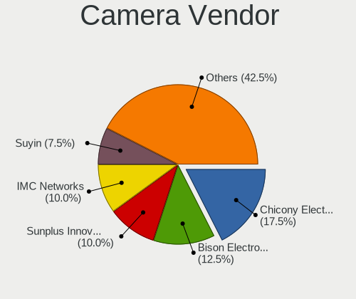

| Vendor                                 | Notebooks | Percent |
|----------------------------------------|-----------|---------|
| Chicony Electronics                    | 12        | 22.22%  |
| Microdia                               | 8         | 14.81%  |
| Realtek Semiconductor                  | 5         | 9.26%   |
| Sunplus Innovation Technology          | 4         | 7.41%   |
| Quanta                                 | 4         | 7.41%   |
| Bison Electronics                      | 4         | 7.41%   |
| Apple                                  | 3         | 5.56%   |
| IMC Networks                           | 2         | 3.7%    |
| Alcor Micro                            | 2         | 3.7%    |
| Acer                                   | 2         | 3.7%    |
| Syntek                                 | 1         | 1.85%   |
| Suyin                                  | 1         | 1.85%   |
| Sonix Technology                       | 1         | 1.85%   |
| Samsung Electronics                    | 1         | 1.85%   |
| Rayprus                                | 1         | 1.85%   |
| Luxvisions Innotech Limited            | 1         | 1.85%   |
| Lite-On Technology                     | 1         | 1.85%   |
| Cheng Uei Precision Industry (Foxlink) | 1         | 1.85%   |

Camera Model
------------

Camera device models

| Model                                                           | Notebooks | Percent |
|-----------------------------------------------------------------|-----------|---------|
| Microdia Integrated Webcam                                      | 4         | 7.41%   |
| Realtek USB Camera                                              | 3         | 5.56%   |
| Microdia Integrated_Webcam_HD                                   | 3         | 5.56%   |
| Chicony HD Webcam                                               | 3         | 5.56%   |
| Apple Built-in iSight                                           | 3         | 5.56%   |
| Sunplus HP HD Webcam [Fixed]                                    | 2         | 3.7%    |
| Quanta HP HD Camera                                             | 2         | 3.7%    |
| IMC Networks Integrated Camera                                  | 2         | 3.7%    |
| Chicony Integrated Camera                                       | 2         | 3.7%    |
| Bison Integrated Camera                                         | 2         | 3.7%    |
| Alcor Micro USB 2.0 Camera                                      | 2         | 3.7%    |
| Syntek Integrated Camera                                        | 1         | 1.85%   |
| Suyin 1.3M HD WebCam                                            | 1         | 1.85%   |
| Sunplus Integrated_Webcam_HD                                    | 1         | 1.85%   |
| Sunplus FHD Camera Microphone                                   | 1         | 1.85%   |
| Sonix USB2.0 FHD UVC WebCam                                     | 1         | 1.85%   |
| Samsung Galaxy series, misc. (MTP mode)                         | 1         | 1.85%   |
| Realtek USB2.0 VGA UVC WebCam                                   | 1         | 1.85%   |
| Realtek HP Truevision HD                                        | 1         | 1.85%   |
| Rayprus HP 5MP Camera                                           | 1         | 1.85%   |
| Quanta USB2.0 HD UVC WebCam                                     | 1         | 1.85%   |
| Quanta ACER HD User Facing                                      | 1         | 1.85%   |
| Microdia Integrated_Webcam_FHD                                  | 1         | 1.85%   |
| Luxvisions Innotech Limited Integrated Camera                   | 1         | 1.85%   |
| Lite-On HP HD Webcam                                            | 1         | 1.85%   |
| Chicony USB2.0 VGA UVC WebCam                                   | 1         | 1.85%   |
| Chicony USB2.0 HD UVC WebCam                                    | 1         | 1.85%   |
| Chicony USB2.0 Camera                                           | 1         | 1.85%   |
| Chicony Integrated Camera (1280x720@30)                         | 1         | 1.85%   |
| Chicony HD WebCam (Asus N-series)                               | 1         | 1.85%   |
| Chicony HD User Facing                                          | 1         | 1.85%   |
| Chicony EasyCamera                                              | 1         | 1.85%   |
| Cheng Uei Precision Industry (Foxlink) HP True Vision HD Camera | 1         | 1.85%   |
| Bison Lenovo Integrated Webcam                                  | 1         | 1.85%   |
| Bison BisonCam,NB Pro                                           | 1         | 1.85%   |
| Acer Integrated Camera                                          | 1         | 1.85%   |
| Acer BisonCam, NB Pro                                           | 1         | 1.85%   |

Security
--------

Fingerprint Vendor
------------------

Fingerprint sensor vendors

| Vendor                     | Notebooks | Percent |
|----------------------------|-----------|---------|
| Synaptics                  | 4         | 36.36%  |
| Validity Sensors           | 3         | 27.27%  |
| Shenzhen Goodix Technology | 2         | 18.18%  |
| LighTuning Technology      | 1         | 9.09%   |
| Elan Microelectronics      | 1         | 9.09%   |

Fingerprint Model
-----------------

Fingerprint sensor models

| Model                                                                      | Notebooks | Percent |
|----------------------------------------------------------------------------|-----------|---------|
| Synaptics Prometheus MIS Touch Fingerprint Reader                          | 2         | 18.18%  |
| Validity Sensors VFS471 Fingerprint Reader                                 | 1         | 9.09%   |
| Validity Sensors Synaptics WBDI                                            | 1         | 9.09%   |
| Validity Sensors Synaptics VFS7552 Touch Fingerprint Sensor with PurePrint | 1         | 9.09%   |
| Synaptics Metallica MIS Touch Fingerprint Reader                           | 1         | 9.09%   |
| Synaptics FS7604 Touch Fingerprint Sensor with PurePrint                   | 1         | 9.09%   |
| Shenzhen Goodix  FingerPrint Device                                        | 1         | 9.09%   |
| Shenzhen Goodix FingerPrint                                                | 1         | 9.09%   |
| LighTuning EgisTec Touch Fingerprint Sensor                                | 1         | 9.09%   |
| Elan ELAN:ARM-M4                                                           | 1         | 9.09%   |

Chipcard Vendor
---------------

Chipcard module vendors

| Vendor           | Notebooks | Percent |
|------------------|-----------|---------|
| Broadcom         | 4         | 44.44%  |
| Alcor Micro      | 3         | 33.33%  |
| SCM Microsystems | 1         | 11.11%  |
| OmniKey          | 1         | 11.11%  |

Chipcard Model
--------------

Chipcard module models

| Model                                                                        | Notebooks | Percent |
|------------------------------------------------------------------------------|-----------|---------|
| Alcor Micro AU9540 Smartcard Reader                                          | 3         | 33.33%  |
| Broadcom BCM5880 Secure Applications Processor with fingerprint swipe sensor | 2         | 22.22%  |
| Broadcom 58200                                                               | 2         | 22.22%  |
| SCM Microsystems SCR3340 - ExpressCard54 Smart Card Reader                   | 1         | 11.11%  |
| OmniKey 3x21 Smart Card Reader                                               | 1         | 11.11%  |

Unsupported
-----------

Unsupported Devices
-------------------

Total unsupported devices on board

| Total | Notebooks | Percent |
|-------|-----------|---------|
| 0     | 35        | 53.03%  |
| 1     | 23        | 34.85%  |
| 2     | 6         | 9.09%   |
| 3     | 2         | 3.03%   |

Unsupported Device Types
------------------------

Types of unsupported devices

| Type                     | Notebooks | Percent |
|--------------------------|-----------|---------|
| Fingerprint reader       | 11        | 28.21%  |
| Graphics card            | 8         | 20.51%  |
| Chipcard                 | 7         | 17.95%  |
| Multimedia controller    | 4         | 10.26%  |
| Net/wireless             | 3         | 7.69%   |
| Bluetooth                | 2         | 5.13%   |
| Modem                    | 1         | 2.56%   |
| Flash memory             | 1         | 2.56%   |
| Communication controller | 1         | 2.56%   |
| Camera                   | 1         | 2.56%   |

