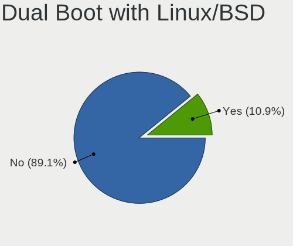
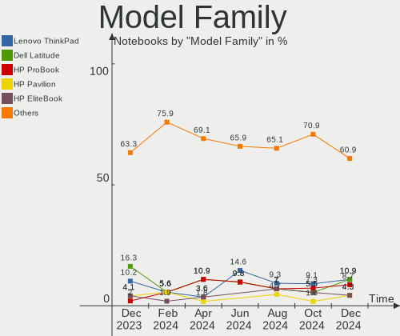
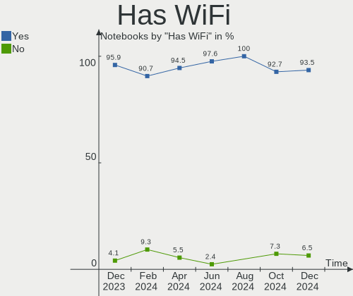
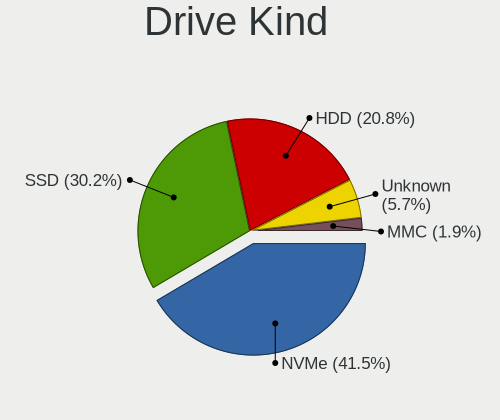
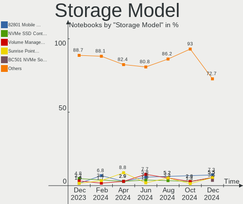
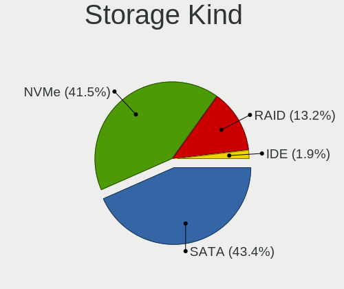
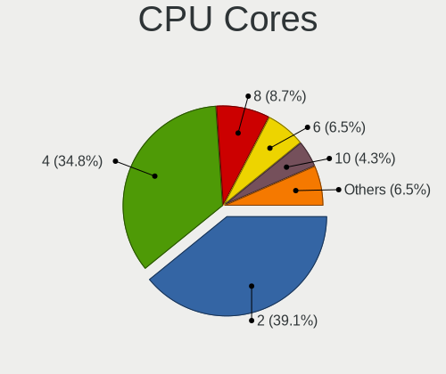
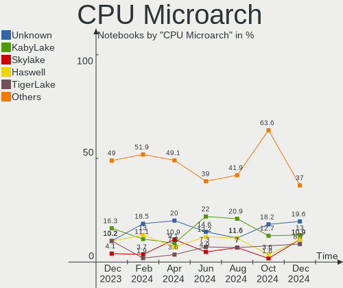
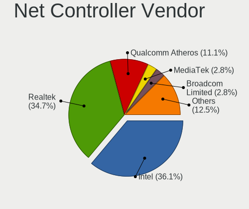
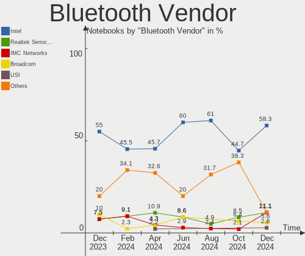

Linux in Netherlands - Hardware Trends (Notebooks)
--------------------------------------------------

A project to identify most popular hardware characteristics and track their change
over time based on data collected by Linux users at https://Linux-Hardware.org.

Anyone can contribute to this report by the [hw-probe](https://github.com/linuxhw/hw-probe) tool:

    sudo -E hw-probe -all -upload

Period: Apr, 2024.

Contents
--------

* [ System ](#system)
  - [ OS                       ](#os)
  - [ OS Family                ](#os-family)
  - [ Kernel                   ](#kernel)
  - [ Kernel Family            ](#kernel-family)
  - [ Kernel Major Ver.        ](#kernel-major-ver)
  - [ Arch                     ](#arch)
  - [ DE                       ](#de)
  - [ Display Server           ](#display-server)
  - [ Display Manager          ](#display-manager)
  - [ OS Lang                  ](#os-lang)
  - [ Boot Mode                ](#boot-mode)
  - [ Filesystem               ](#filesystem)
  - [ Part. scheme             ](#part-scheme)
  - [ Dual Boot with Linux/BSD ](#dual-boot-with-linuxbsd)
  - [ Dual Boot (Win)          ](#dual-boot-win)

* [ Board ](#board)
  - [ Vendor                   ](#vendor)
  - [ Model                    ](#model)
  - [ Model Family             ](#model-family)
  - [ MFG Year                 ](#mfg-year)
  - [ Form Factor              ](#form-factor)
  - [ Secure Boot              ](#secure-boot)
  - [ Coreboot                 ](#coreboot)
  - [ RAM Size                 ](#ram-size)
  - [ RAM Used                 ](#ram-used)
  - [ Total Drives             ](#total-drives)
  - [ Has CD-ROM               ](#has-cd-rom)
  - [ Has Ethernet             ](#has-ethernet)
  - [ Has WiFi                 ](#has-wifi)
  - [ Has Bluetooth            ](#has-bluetooth)

* [ Location ](#location)
  - [ Country                  ](#country)
  - [ City                     ](#city)

* [ Drives ](#drives)
  - [ Drive Vendor             ](#drive-vendor)
  - [ Drive Model              ](#drive-model)
  - [ HDD Vendor               ](#hdd-vendor)
  - [ SSD Vendor               ](#ssd-vendor)
  - [ Drive Kind               ](#drive-kind)
  - [ Drive Connector          ](#drive-connector)
  - [ Drive Size               ](#drive-size)
  - [ Space Total              ](#space-total)
  - [ Space Used               ](#space-used)
  - [ Malfunc. Drives          ](#malfunc-drives)
  - [ Malfunc. Drive Vendor    ](#malfunc-drive-vendor)
  - [ Malfunc. HDD Vendor      ](#malfunc-hdd-vendor)
  - [ Malfunc. Drive Kind      ](#malfunc-drive-kind)
  - [ Failed Drives            ](#failed-drives)
  - [ Failed Drive Vendor      ](#failed-drive-vendor)
  - [ Drive Status             ](#drive-status)

* [ Storage controller ](#storage-controller)
  - [ Storage Vendor           ](#storage-vendor)
  - [ Storage Model            ](#storage-model)
  - [ Storage Kind             ](#storage-kind)

* [ Processor ](#processor)
  - [ CPU Vendor               ](#cpu-vendor)
  - [ CPU Model                ](#cpu-model)
  - [ CPU Model Family         ](#cpu-model-family)
  - [ CPU Cores                ](#cpu-cores)
  - [ CPU Sockets              ](#cpu-sockets)
  - [ CPU Threads              ](#cpu-threads)
  - [ CPU Op-Modes             ](#cpu-op-modes)
  - [ CPU Microcode            ](#cpu-microcode)
  - [ CPU Microarch            ](#cpu-microarch)

* [ Graphics ](#graphics)
  - [ GPU Vendor               ](#gpu-vendor)
  - [ GPU Model                ](#gpu-model)
  - [ GPU Combo                ](#gpu-combo)
  - [ GPU Driver               ](#gpu-driver)
  - [ GPU Memory               ](#gpu-memory)

* [ Monitor ](#monitor)
  - [ Monitor Vendor           ](#monitor-vendor)
  - [ Monitor Model            ](#monitor-model)
  - [ Monitor Resolution       ](#monitor-resolution)
  - [ Monitor Diagonal         ](#monitor-diagonal)
  - [ Monitor Width            ](#monitor-width)
  - [ Aspect Ratio             ](#aspect-ratio)
  - [ Monitor Area             ](#monitor-area)
  - [ Pixel Density            ](#pixel-density)
  - [ Multiple Monitors        ](#multiple-monitors)

* [ Network ](#network)
  - [ Net Controller Vendor    ](#net-controller-vendor)
  - [ Net Controller Model     ](#net-controller-model)
  - [ Wireless Vendor          ](#wireless-vendor)
  - [ Wireless Model           ](#wireless-model)
  - [ Ethernet Vendor          ](#ethernet-vendor)
  - [ Ethernet Model           ](#ethernet-model)
  - [ Net Controller Kind      ](#net-controller-kind)
  - [ Used Controller          ](#used-controller)
  - [ NICs                     ](#nics)
  - [ IPv6                     ](#ipv6)

* [ Bluetooth ](#bluetooth)
  - [ Bluetooth Vendor         ](#bluetooth-vendor)
  - [ Bluetooth Model          ](#bluetooth-model)

* [ Sound ](#sound)
  - [ Sound Vendor             ](#sound-vendor)
  - [ Sound Model              ](#sound-model)

* [ Memory ](#memory)
  - [ Memory Vendor            ](#memory-vendor)
  - [ Memory Model             ](#memory-model)
  - [ Memory Kind              ](#memory-kind)
  - [ Memory Form Factor       ](#memory-form-factor)
  - [ Memory Size              ](#memory-size)
  - [ Memory Speed             ](#memory-speed)

* [ Printers & scanners ](#printers--scanners)
  - [ Printer Vendor           ](#printer-vendor)
  - [ Printer Model            ](#printer-model)
  - [ Scanner Vendor           ](#scanner-vendor)
  - [ Scanner Model            ](#scanner-model)

* [ Camera ](#camera)
  - [ Camera Vendor            ](#camera-vendor)
  - [ Camera Model             ](#camera-model)

* [ Security ](#security)
  - [ Fingerprint Vendor       ](#fingerprint-vendor)
  - [ Fingerprint Model        ](#fingerprint-model)
  - [ Chipcard Vendor          ](#chipcard-vendor)
  - [ Chipcard Model           ](#chipcard-model)

* [ Unsupported ](#unsupported)
  - [ Unsupported Devices      ](#unsupported-devices)
  - [ Unsupported Device Types ](#unsupported-device-types)

System
------

OS
--

Installed operating systems

| Name                        | Notebooks | Percent |
|-----------------------------|-----------|---------|
| Ubuntu 22.04                | 13        | 23.64%  |
| Zorin 17                    | 5         | 9.09%   |
| Debian 12                   | 5         | 9.09%   |
| Fedora 39                   | 4         | 7.27%   |
| Pop!_OS 22.04               | 3         | 5.45%   |
| Linux Mint 21.3             | 3         | 5.45%   |
| Arch Rolling                | 3         | 5.45%   |
| KDE neon 22.04              | 2         | 3.64%   |
| Ubuntu Unity 23.10          | 1         | 1.82%   |
| Ubuntu 24.04                | 1         | 1.82%   |
| Ubuntu 23.10                | 1         | 1.82%   |
| SteamOS 3.6                 | 1         | 1.82%   |
| SteamOS 3.5.19              | 1         | 1.82%   |
| SteamOS 3.5.17              | 1         | 1.82%   |
| Parrot 6.0                  | 1         | 1.82%   |
| org.kde.Platform 5.15-21.08 | 1         | 1.82%   |
| Nobara 39                   | 1         | 1.82%   |
| NixOS 23.11                 | 1         | 1.82%   |
| Manjaro 23.1.4              | 1         | 1.82%   |
| Manjaro                     | 1         | 1.82%   |
| Linux Mint 21               | 1         | 1.82%   |
| Linux Mint 20.3             | 1         | 1.82%   |
| Kali 2023.3                 | 1         | 1.82%   |
| Fedora 40                   | 1         | 1.82%   |
| EndeavourOS Rolling         | 1         | 1.82%   |

OS Family
---------

OS without a version

| Name             | Notebooks | Percent |
|------------------|-----------|---------|
| Ubuntu           | 15        | 27.27%  |
| Zorin            | 5         | 9.09%   |
| Linux Mint       | 5         | 9.09%   |
| Fedora           | 5         | 9.09%   |
| Debian           | 5         | 9.09%   |
| SteamOS          | 3         | 5.45%   |
| Pop!_OS          | 3         | 5.45%   |
| Arch             | 3         | 5.45%   |
| Manjaro          | 2         | 3.64%   |
| KDE neon         | 2         | 3.64%   |
| Ubuntu Unity     | 1         | 1.82%   |
| Parrot           | 1         | 1.82%   |
| org.kde.Platform | 1         | 1.82%   |
| Nobara           | 1         | 1.82%   |
| NixOS            | 1         | 1.82%   |
| Kali             | 1         | 1.82%   |
| EndeavourOS      | 1         | 1.82%   |

Kernel
------

Version of the Linux kernel

| Version                             | Notebooks | Percent |
|-------------------------------------|-----------|---------|
| 6.5.0-26-generic                    | 9         | 16.36%  |
| 6.5.0-27-generic                    | 7         | 12.73%  |
| 6.5.0-28-generic                    | 4         | 7.27%   |
| 6.8.0-76060800daily20240311-generic | 3         | 5.45%   |
| 6.1.0-20-amd64                      | 3         | 5.45%   |
| 6.8.7-arch1-1                       | 2         | 3.64%   |
| 6.8.5-1-MANJARO                     | 2         | 3.64%   |
| 6.1.52-valve16-1-neptune-61         | 2         | 3.64%   |
| 6.1.0-18-amd64                      | 2         | 3.64%   |
| 6.8.7-arch1-2                       | 1         | 1.82%   |
| 6.8.7-200.fc39.x86_64               | 1         | 1.82%   |
| 6.8.6                               | 1         | 1.82%   |
| 6.8.5-201.fsync.fc39.x86_64         | 1         | 1.82%   |
| 6.8.4-200.fc39.x86_64               | 1         | 1.82%   |
| 6.8.2-300.fc40.x86_64               | 1         | 1.82%   |
| 6.8.0-31-generic                    | 1         | 1.82%   |
| 6.7.11-200.fc39.x86_64              | 1         | 1.82%   |
| 6.7.10-200.fc39.x86_64              | 1         | 1.82%   |
| 6.6.23-1-lts                        | 1         | 1.82%   |
| 6.5.0-21-generic                    | 1         | 1.82%   |
| 6.5.0-13parrot1-amd64               | 1         | 1.82%   |
| 6.5.0-1019-oem                      | 1         | 1.82%   |
| 6.3.0-kali1-amd64                   | 1         | 1.82%   |
| 6.1.87                              | 1         | 1.82%   |
| 6.1.52-valve19-1-neptune-61         | 1         | 1.82%   |
| 5.4.0-73-generic                    | 1         | 1.82%   |
| 5.15.0-91-generic                   | 1         | 1.82%   |
| 5.15.0-105-generic                  | 1         | 1.82%   |
| 5.15.0-102-generic                  | 1         | 1.82%   |
| 5.15.0-101-generic                  | 1         | 1.82%   |

Kernel Family
-------------

Linux kernel without a distro release

| Version | Notebooks | Percent |
|---------|-----------|---------|
| 6.5.0   | 23        | 41.82%  |
| 6.1.0   | 5         | 9.09%   |
| 6.8.7   | 4         | 7.27%   |
| 6.8.0   | 4         | 7.27%   |
| 5.15.0  | 4         | 7.27%   |
| 6.8.5   | 3         | 5.45%   |
| 6.1.52  | 3         | 5.45%   |
| 6.8.6   | 1         | 1.82%   |
| 6.8.4   | 1         | 1.82%   |
| 6.8.2   | 1         | 1.82%   |
| 6.7.11  | 1         | 1.82%   |
| 6.7.10  | 1         | 1.82%   |
| 6.6.23  | 1         | 1.82%   |
| 6.3.0   | 1         | 1.82%   |
| 6.1.87  | 1         | 1.82%   |
| 5.4.0   | 1         | 1.82%   |

Kernel Major Ver.
-----------------

Linux kernel major version

| Version | Notebooks | Percent |
|---------|-----------|---------|
| 6.5     | 23        | 41.82%  |
| 6.8     | 14        | 25.45%  |
| 6.1     | 9         | 16.36%  |
| 5.15    | 4         | 7.27%   |
| 6.7     | 2         | 3.64%   |
| 6.6     | 1         | 1.82%   |
| 6.3     | 1         | 1.82%   |
| 5.4     | 1         | 1.82%   |

Arch
----

OS architecture (x86_64, i586, etc.)

| Name   | Notebooks | Percent |
|--------|-----------|---------|
| x86_64 | 55        | 100%    |

DE
--

Desktop Environment

| Name       | Notebooks | Percent |
|------------|-----------|---------|
| GNOME      | 32        | 58.18%  |
| KDE5       | 6         | 10.91%  |
| X-Cinnamon | 5         | 9.09%   |
| XFCE       | 3         | 5.45%   |
| KDE6       | 3         | 5.45%   |
| Unity      | 1         | 1.82%   |
| MATE       | 1         | 1.82%   |
| LXDE       | 1         | 1.82%   |
| Hyprland   | 1         | 1.82%   |
| dusk       | 1         | 1.82%   |
| awesome    | 1         | 1.82%   |

Display Server
--------------

X11 or Wayland

| Name    | Notebooks | Percent |
|---------|-----------|---------|
| Wayland | 30        | 54.55%  |
| X11     | 25        | 45.45%  |

Display Manager
---------------

SDDM, LightDM, etc.

| Name    | Notebooks | Percent |
|---------|-----------|---------|
| Unknown | 21        | 38.18%  |
| GDM3    | 20        | 36.36%  |
| LightDM | 10        | 18.18%  |
| SDDM    | 3         | 5.45%   |
| GDM     | 1         | 1.82%   |

OS Lang
-------

Language

| Lang  | Notebooks | Percent |
|-------|-----------|---------|
| en_US | 34        | 61.82%  |
| nl_NL | 11        | 20%     |
| ru_RU | 2         | 3.64%   |
| en_GB | 2         | 3.64%   |
| pl_PL | 1         | 1.82%   |
| pl    | 1         | 1.82%   |
| it_IT | 1         | 1.82%   |
| en_IE | 1         | 1.82%   |
| de_DE | 1         | 1.82%   |
| C     | 1         | 1.82%   |

Boot Mode
---------

EFI or BIOS

| Mode | Notebooks | Percent |
|------|-----------|---------|
| BIOS | 28        | 50.91%  |
| EFI  | 27        | 49.09%  |

Filesystem
----------

Type of filesystem

| Type    | Notebooks | Percent |
|---------|-----------|---------|
| Ext4    | 34        | 61.82%  |
| Btrfs   | 11        | 20%     |
| Tmpfs   | 8         | 14.55%  |
| Overlay | 2         | 3.64%   |

Part. scheme
------------

Scheme of partitioning

| Type    | Notebooks | Percent |
|---------|-----------|---------|
| GPT     | 34        | 61.82%  |
| Unknown | 19        | 34.55%  |
| MBR     | 2         | 3.64%   |

Dual Boot with Linux/BSD
------------------------

Hosting more than one Linux/BSD

| Dual boot | Notebooks | Percent |
|-----------|-----------|---------|
| No        | 51        | 92.73%  |
| Yes       | 4         | 7.27%   |

Dual Boot (Win)
---------------

Hosting Linux and Windows

| Dual boot | Notebooks | Percent |
|-----------|-----------|---------|
| No        | 40        | 72.73%  |
| Yes       | 15        | 27.27%  |

Board
-----

Vendor
------

Motherboard manufacturer

| Name                | Notebooks | Percent |
|---------------------|-----------|---------|
| Hewlett-Packard     | 13        | 23.64%  |
| Dell                | 12        | 21.82%  |
| Lenovo              | 8         | 14.55%  |
| ASUSTek Computer    | 4         | 7.27%   |
| Valve               | 3         | 5.45%   |
| Packard Bell        | 2         | 3.64%   |
| MSI                 | 2         | 3.64%   |
| Toshiba             | 1         | 1.82%   |
| SKIKK               | 1         | 1.82%   |
| Samsung Electronics | 1         | 1.82%   |
| Razer               | 1         | 1.82%   |
| Notebook            | 1         | 1.82%   |
| Google              | 1         | 1.82%   |
| Gigabyte Technology | 1         | 1.82%   |
| Apple               | 1         | 1.82%   |
| Acidanthera         | 1         | 1.82%   |
| Acer                | 1         | 1.82%   |
| Unknown             | 1         | 1.82%   |

Model
-----

Motherboard model

| Name                                               | Notebooks | Percent |
|----------------------------------------------------|-----------|---------|
| Valve Jupiter                                      | 2         | 3.64%   |
| HP ProBook 6570b                                   | 2         | 3.64%   |
| HP EliteBook 840 G3                                | 2         | 3.64%   |
| Valve Galileo                                      | 1         | 1.82%   |
| Toshiba Satellite C70D-B                           | 1         | 1.82%   |
| SKIKK Freya                                        | 1         | 1.82%   |
| Samsung RV411/RV511/E3511/S3511/RV711/E3411        | 1         | 1.82%   |
| Razer Blade 15 Base Model (Early 2020) - RZ09-0328 | 1         | 1.82%   |
| Packard Bell ENNS45HR                              | 1         | 1.82%   |
| Packard Bell EasyNote LS11HR                       | 1         | 1.82%   |
| Notebook W330SU2                                   | 1         | 1.82%   |
| MSI Modern 15 B12M                                 | 1         | 1.82%   |
| MSI GS60 2QE                                       | 1         | 1.82%   |
| Lenovo Yoga Slim 7 Pro 14ACH5 82MS                 | 1         | 1.82%   |
| Lenovo Yoga Pro 7 14APH8 82Y8                      | 1         | 1.82%   |
| Lenovo ThinkPad P16s Gen 2 21K90003MH              | 1         | 1.82%   |
| Lenovo ThinkPad Edge E145 20BCA01RCD               | 1         | 1.82%   |
| Lenovo ThinkBook 15 G3 ACL 21A4                    | 1         | 1.82%   |
| Lenovo ThinkBook 15 G2 ITL 20VE                    | 1         | 1.82%   |
| Lenovo IdeaPad 710S-13ISK 80SW                     | 1         | 1.82%   |
| Lenovo IdeaPad 5 Pro 16ACH6 82L5                   | 1         | 1.82%   |
| HP ZBook Studio G3                                 | 1         | 1.82%   |
| HP ProBook 650 G2                                  | 1         | 1.82%   |
| HP ProBook 450 G6                                  | 1         | 1.82%   |
| HP ProBook 450 15.6 inch G9 Notebook PC            | 1         | 1.82%   |
| HP ProBook 440 G2                                  | 1         | 1.82%   |
| HP Pavilion dv6                                    | 1         | 1.82%   |
| HP OMEN by Latpop 16-c0100nd                       | 1         | 1.82%   |
| HP ENVY Pro 4-b000 Ultrabook PC                    | 1         | 1.82%   |
| HP Compaq Presario A900                            | 1         | 1.82%   |
| Google Blipper                                     | 1         | 1.82%   |
| Gigabyte AORUS 16X ASG                             | 1         | 1.82%   |
| Dell XPS 15 9570                                   | 1         | 1.82%   |
| Dell XPS 15 9560                                   | 1         | 1.82%   |
| Dell Precision M6500                               | 1         | 1.82%   |
| Dell Precision 7670                                | 1         | 1.82%   |
| Dell Precision 5680                                | 1         | 1.82%   |
| Dell Latitude E6440                                | 1         | 1.82%   |
| Dell Latitude E5570                                | 1         | 1.82%   |
| Dell Latitude E5520                                | 1         | 1.82%   |

Model Family
------------

Motherboard model prefix

| Name                    | Notebooks | Percent |
|-------------------------|-----------|---------|
| HP ProBook              | 6         | 10.91%  |
| Dell Latitude           | 6         | 10.91%  |
| Dell Precision          | 3         | 5.45%   |
| Valve Jupiter           | 2         | 3.64%   |
| Lenovo Yoga             | 2         | 3.64%   |
| Lenovo ThinkPad         | 2         | 3.64%   |
| Lenovo ThinkBook        | 2         | 3.64%   |
| Lenovo IdeaPad          | 2         | 3.64%   |
| HP EliteBook            | 2         | 3.64%   |
| Dell XPS                | 2         | 3.64%   |
| ASUS VivoBook           | 2         | 3.64%   |
| ASUS ROG                | 2         | 3.64%   |
| Valve Galileo           | 1         | 1.82%   |
| Toshiba Satellite       | 1         | 1.82%   |
| SKIKK Freya             | 1         | 1.82%   |
| Samsung RV411           | 1         | 1.82%   |
| Razer Blade             | 1         | 1.82%   |
| Packard Bell ENNS45HR   | 1         | 1.82%   |
| Packard Bell EasyNote   | 1         | 1.82%   |
| Notebook W330SU2        | 1         | 1.82%   |
| MSI Modern              | 1         | 1.82%   |
| MSI GS60                | 1         | 1.82%   |
| HP ZBook                | 1         | 1.82%   |
| HP Pavilion             | 1         | 1.82%   |
| HP OMEN                 | 1         | 1.82%   |
| HP ENVY                 | 1         | 1.82%   |
| HP Compaq               | 1         | 1.82%   |
| Google Blipper          | 1         | 1.82%   |
| Gigabyte AORUS          | 1         | 1.82%   |
| Dell Inspiron           | 1         | 1.82%   |
| Apple MacBookPro9       | 1         | 1.82%   |
| Acidanthera MacBookAir9 | 1         | 1.82%   |
| Acer Aspire             | 1         | 1.82%   |
| Unknown                 | 1         | 1.82%   |

MFG Year
--------

Motherboard manufacture year

| Year | Notebooks | Percent |
|------|-----------|---------|
| 2023 | 10        | 18.18%  |
| 2016 | 6         | 10.91%  |
| 2012 | 6         | 10.91%  |
| 2014 | 5         | 9.09%   |
| 2022 | 4         | 7.27%   |
| 2024 | 3         | 5.45%   |
| 2021 | 3         | 5.45%   |
| 2020 | 3         | 5.45%   |
| 2018 | 3         | 5.45%   |
| 2011 | 3         | 5.45%   |
| 2013 | 2         | 3.64%   |
| 2010 | 2         | 3.64%   |
| 2019 | 1         | 1.82%   |
| 2017 | 1         | 1.82%   |
| 2015 | 1         | 1.82%   |
| 2008 | 1         | 1.82%   |
| 2007 | 1         | 1.82%   |

Form Factor
-----------

Physical design of the computer

| Name     | Notebooks | Percent |
|----------|-----------|---------|
| Notebook | 55        | 100%    |

Secure Boot
-----------

Enabled or disabled

| State    | Notebooks | Percent |
|----------|-----------|---------|
| Disabled | 51        | 92.73%  |
| Enabled  | 4         | 7.27%   |

Coreboot
--------

Have coreboot on board

| Used | Notebooks | Percent |
|------|-----------|---------|
| No   | 54        | 98.18%  |
| Yes  | 1         | 1.82%   |

RAM Size
--------

Total RAM memory

| Size in GB | Notebooks | Percent |
|------------|-----------|---------|
| 4.01-8.0   | 15        | 27.27%  |
| 8.01-16.0  | 12        | 21.82%  |
| 16.01-24.0 | 10        | 18.18%  |
| 32.01-64.0 | 9         | 16.36%  |
| 3.01-4.0   | 5         | 9.09%   |
| 24.01-32.0 | 3         | 5.45%   |
| 1.01-2.0   | 1         | 1.82%   |

RAM Used
--------

Used RAM memory

| Used GB    | Notebooks | Percent |
|------------|-----------|---------|
| 4.01-8.0   | 16        | 29.09%  |
| 2.01-3.0   | 14        | 25.45%  |
| 3.01-4.0   | 10        | 18.18%  |
| 1.01-2.0   | 10        | 18.18%  |
| 8.01-16.0  | 4         | 7.27%   |
| 16.01-24.0 | 1         | 1.82%   |

Total Drives
------------

Number of drives on board

| Drives | Notebooks | Percent |
|--------|-----------|---------|
| 1      | 41        | 74.55%  |
| 2      | 10        | 18.18%  |
| 3      | 3         | 5.45%   |
| 4      | 1         | 1.82%   |

Has CD-ROM
----------

Has CD-ROM on board

| Presented | Notebooks | Percent |
|-----------|-----------|---------|
| No        | 45        | 81.82%  |
| Yes       | 10        | 18.18%  |

Has Ethernet
------------

Has Ethernet on board

| Presented | Notebooks | Percent |
|-----------|-----------|---------|
| Yes       | 43        | 78.18%  |
| No        | 12        | 21.82%  |

Has WiFi
--------

Has WiFi module

| Presented | Notebooks | Percent |
|-----------|-----------|---------|
| Yes       | 55        | 100%    |

Has Bluetooth
-------------

Has Bluetooth module

| Presented | Notebooks | Percent |
|-----------|-----------|---------|
| Yes       | 47        | 85.45%  |
| No        | 8         | 14.55%  |

Location
--------

Country
-------

Geographic location (country)

| Country     | Notebooks | Percent |
|-------------|-----------|---------|
| Netherlands | 55        | 100%    |

City
----

Geographic location (city)

| City          | Notebooks | Percent |
|---------------|-----------|---------|
| Amsterdam     | 13        | 23.64%  |
| The Hague     | 6         | 10.91%  |
| Naaldwijk     | 4         | 7.27%   |
| Zandvoort     | 2         | 3.64%   |
| Rotterdam     | 2         | 3.64%   |
| Delft         | 2         | 3.64%   |
| Zwolle        | 1         | 1.82%   |
| Zeist         | 1         | 1.82%   |
| Wormerveer    | 1         | 1.82%   |
| Winterswijk   | 1         | 1.82%   |
| Wageningen    | 1         | 1.82%   |
| Waalwijk      | 1         | 1.82%   |
| Utrecht       | 1         | 1.82%   |
| Uithuizen     | 1         | 1.82%   |
| Someren       | 1         | 1.82%   |
| Oosternijkerk | 1         | 1.82%   |
| Nieuwkoop     | 1         | 1.82%   |
| Nieuw-Vennep  | 1         | 1.82%   |
| Middelburg    | 1         | 1.82%   |
| Meppel        | 1         | 1.82%   |
| Loon op Zand  | 1         | 1.82%   |
| Leeuwarden    | 1         | 1.82%   |
| Leersum       | 1         | 1.82%   |
| Hengelo       | 1         | 1.82%   |
| Haarlem       | 1         | 1.82%   |
| Enschede      | 1         | 1.82%   |
| Eindhoven     | 1         | 1.82%   |
| Beuningen     | 1         | 1.82%   |
| Arnhem        | 1         | 1.82%   |
| Amstelveen    | 1         | 1.82%   |
| Amersfoort    | 1         | 1.82%   |
| 's Gravenmoer | 1         | 1.82%   |

Drives
------

Drive Vendor
------------

Hard drive vendors

| Vendor                      | Notebooks | Drives | Percent |
|-----------------------------|-----------|--------|---------|
| Samsung Electronics         | 15        | 16     | 21.74%  |
| SanDisk                     | 6         | 6      | 8.7%    |
| WDC                         | 5         | 5      | 7.25%   |
| Unknown                     | 5         | 5      | 7.25%   |
| Toshiba                     | 5         | 7      | 7.25%   |
| SK hynix                    | 5         | 5      | 7.25%   |
| Seagate                     | 4         | 4      | 5.8%    |
| Kingston                    | 4         | 4      | 5.8%    |
| MAXIO Technology (Hangzhou) | 3         | 3      | 4.35%   |
| Crucial                     | 3         | 4      | 4.35%   |
| Micron Technology           | 2         | 2      | 2.9%    |
| Lexar                       | 2         | 2      | 2.9%    |
| TSA                         | 1         | 1      | 1.45%   |
| StoreJet                    | 1         | 1      | 1.45%   |
| O2 Micro                    | 1         | 1      | 1.45%   |
| LITEON                      | 1         | 1      | 1.45%   |
| Kingston Technology Company | 1         | 1      | 1.45%   |
| Kingchuxing                 | 1         | 1      | 1.45%   |
| Hitachi                     | 1         | 1      | 1.45%   |
| HGST                        | 1         | 1      | 1.45%   |
| Gigabyte Technology         | 1         | 1      | 1.45%   |
| External                    | 1         | 1      | 1.45%   |

Drive Model
-----------

Hard drive models

| Model                                              | Notebooks | Percent |
|----------------------------------------------------|-----------|---------|
| Seagate ST1000LM024 HN-M101MBB 1TB                 | 2         | 2.78%   |
| Samsung NVMe SSD Controller SM981/PM981/PM983 1TB  | 2         | 2.78%   |
| MAXIO (Hangzhou) NVMe SSD Controller MAP1202 256GB | 2         | 2.78%   |
| Kingston SA400S37240G 240GB SSD                    | 2         | 2.78%   |
| WDC WDS500G2B0B-00YS70 500GB SSD                   | 1         | 1.39%   |
| WDC WD5000LPVX-08V0TT5 500GB                       | 1         | 1.39%   |
| WDC WD3200BEVT-22ZCT0 320GB                        | 1         | 1.39%   |
| WDC WD10SPZX-60Z10T0 1TB                           | 1         | 1.39%   |
| WDC PC SN520 SDAPNUW-256G-1006 256GB               | 1         | 1.39%   |
| Unknown SS16G  16GB                                | 1         | 1.39%   |
| Unknown SD128  128GB                               | 1         | 1.39%   |
| Unknown MMC Card  997GB                            | 1         | 1.39%   |
| Unknown MMC Card  512GB                            | 1         | 1.39%   |
| Unknown MMC Card  128GB                            | 1         | 1.39%   |
| TSA SSD 240GB                                      | 1         | 1.39%   |
| Toshiba THNSNJ128G8NU 128GB SSD                    | 1         | 1.39%   |
| Toshiba MQ01ABF050 500GB                           | 1         | 1.39%   |
| Toshiba MK5065GSXF 500GB                           | 1         | 1.39%   |
| Toshiba MK5059GSXP 500GB                           | 1         | 1.39%   |
| Toshiba KXG50ZNV512G 512GB                         | 1         | 1.39%   |
| Toshiba KXG50ZNV1T02 NVMe 1024GB                   | 1         | 1.39%   |
| StoreJet Disk 2TB                                  | 1         | 1.39%   |
| SK hynix SKHynix_HFS512GDE9X084N 512GB             | 1         | 1.39%   |
| SK hynix SKHynix_HFS001TEJ9X162N 1TB               | 1         | 1.39%   |
| SK hynix SKHynix_HFM512GD3HX015N 512GB             | 1         | 1.39%   |
| SK hynix SC401 SATA 512GB SSD                      | 1         | 1.39%   |
| SK hynix PC801 NVMe 512GB                          | 1         | 1.39%   |
| Seagate ST500LM000-1EJ162 500GB                    | 1         | 1.39%   |
| Seagate ST1000LM014-1EJ164 1TB                     | 1         | 1.39%   |
| Sandisk WD PC SN740 SDDPMQD-512G-1101 512GB        | 1         | 1.39%   |
| Sandisk WD PC SN560 SDDPNQE-1T00-1102 1024GB       | 1         | 1.39%   |
| Sandisk WD PC SN560 SDDPNQE-1T00-1002 1TB          | 1         | 1.39%   |
| SanDisk SDSSDA240G 240GB                           | 1         | 1.39%   |
| SanDisk SD8SN8U-256G-1006 256GB SSD                | 1         | 1.39%   |
| Sandisk PC SN530 NVMe WDC 256GB                    | 1         | 1.39%   |
| Samsung SSD 870 EVO 500G                           | 1         | 1.39%   |
| Samsung SSD 850 EVO 250GB                          | 1         | 1.39%   |
| Samsung SSD 840 Series 250GB                       | 1         | 1.39%   |
| Samsung SSD 840 PRO Series 512GB                   | 1         | 1.39%   |
| Samsung SSD 840 PRO Series 256GB                   | 1         | 1.39%   |

HDD Vendor
----------

Hard disk drive vendors

| Vendor   | Notebooks | Drives | Percent |
|----------|-----------|--------|---------|
| Seagate  | 4         | 4      | 30.77%  |
| WDC      | 3         | 3      | 23.08%  |
| Toshiba  | 2         | 3      | 15.38%  |
| StoreJet | 1         | 1      | 7.69%   |
| Hitachi  | 1         | 1      | 7.69%   |
| HGST     | 1         | 1      | 7.69%   |
| External | 1         | 1      | 7.69%   |

SSD Vendor
----------

Solid state drive vendors

| Vendor              | Notebooks | Drives | Percent |
|---------------------|-----------|--------|---------|
| Samsung Electronics | 6         | 7      | 26.09%  |
| Kingston            | 4         | 4      | 17.39%  |
| Crucial             | 3         | 4      | 13.04%  |
| SanDisk             | 2         | 2      | 8.7%    |
| Lexar               | 2         | 2      | 8.7%    |
| WDC                 | 1         | 1      | 4.35%   |
| TSA                 | 1         | 1      | 4.35%   |
| Toshiba             | 1         | 2      | 4.35%   |
| SK hynix            | 1         | 1      | 4.35%   |
| Micron Technology   | 1         | 1      | 4.35%   |
| LITEON              | 1         | 1      | 4.35%   |

Drive Kind
----------

HDD or SSD

| Kind    | Notebooks | Drives | Percent |
|---------|-----------|--------|---------|
| NVMe    | 27        | 27     | 40.91%  |
| SSD     | 22        | 26     | 33.33%  |
| HDD     | 11        | 14     | 16.67%  |
| MMC     | 5         | 5      | 7.58%   |
| Unknown | 1         | 1      | 1.52%   |

Drive Connector
---------------

SATA, SAS, NVMe, etc.

| Type | Notebooks | Drives | Percent |
|------|-----------|--------|---------|
| SATA | 28        | 37     | 43.75%  |
| NVMe | 27        | 27     | 42.19%  |
| MMC  | 5         | 5      | 7.81%   |
| SAS  | 4         | 4      | 6.25%   |

Drive Size
----------

Size of hard drive

| Size in TB | Notebooks | Drives | Percent |
|------------|-----------|--------|---------|
| 0.01-0.5   | 24        | 28     | 68.57%  |
| 0.51-1.0   | 9         | 10     | 25.71%  |
| 1.01-2.0   | 2         | 2      | 5.71%   |

Space Total
-----------

Amount of disk space available on the file system

| Size in GB     | Notebooks | Percent |
|----------------|-----------|---------|
| 101-250        | 16        | 29.09%  |
| 251-500        | 14        | 25.45%  |
| 1001-2000      | 7         | 12.73%  |
| 501-1000       | 7         | 12.73%  |
| 51-100         | 4         | 7.27%   |
| More than 3000 | 2         | 3.64%   |
| 1-20           | 2         | 3.64%   |
| 21-50          | 1         | 1.82%   |
| 2001-3000      | 1         | 1.82%   |
| Unknown        | 1         | 1.82%   |

Space Used
----------

Amount of used disk space

| Used GB        | Notebooks | Percent |
|----------------|-----------|---------|
| 101-250        | 13        | 23.64%  |
| 1-20           | 13        | 23.64%  |
| 21-50          | 12        | 21.82%  |
| 51-100         | 8         | 14.55%  |
| 251-500        | 3         | 5.45%   |
| 1001-2000      | 3         | 5.45%   |
| More than 3000 | 1         | 1.82%   |
| 501-1000       | 1         | 1.82%   |
| Unknown        | 1         | 1.82%   |

Malfunc. Drives
---------------

Drive models with a malfunction

| Model                           | Notebooks | Drives | Percent |
|---------------------------------|-----------|--------|---------|
| WDC WD10SPZX-60Z10T0 1TB        | 1         | 1      | 20%     |
| Toshiba MQ01ABF050 500GB        | 1         | 1      | 20%     |
| SK hynix SC401 SATA 512GB SSD   | 1         | 1      | 20%     |
| Seagate ST500LM000-1EJ162 500GB | 1         | 1      | 20%     |
| Hitachi HTS542516K9SA00 160GB   | 1         | 1      | 20%     |

Malfunc. Drive Vendor
---------------------

Vendors of faulty drives

| Vendor   | Notebooks | Drives | Percent |
|----------|-----------|--------|---------|
| WDC      | 1         | 1      | 20%     |
| Toshiba  | 1         | 1      | 20%     |
| SK hynix | 1         | 1      | 20%     |
| Seagate  | 1         | 1      | 20%     |
| Hitachi  | 1         | 1      | 20%     |

Malfunc. HDD Vendor
-------------------

Vendors of faulty HDD drives

| Vendor  | Notebooks | Drives | Percent |
|---------|-----------|--------|---------|
| WDC     | 1         | 1      | 25%     |
| Toshiba | 1         | 1      | 25%     |
| Seagate | 1         | 1      | 25%     |
| Hitachi | 1         | 1      | 25%     |

Malfunc. Drive Kind
-------------------

Kinds of faulty drives

| Kind | Notebooks | Drives | Percent |
|------|-----------|--------|---------|
| HDD  | 4         | 4      | 80%     |
| SSD  | 1         | 1      | 20%     |

Failed Drives
-------------

Failed drive models

Zero info for selected period =(

Failed Drive Vendor
-------------------

Failed drive vendors

Zero info for selected period =(

Drive Status
------------

Number of failed and malfunc. drives

| Status   | Notebooks | Drives | Percent |
|----------|-----------|--------|---------|
| Detected | 29        | 40     | 49.15%  |
| Works    | 25        | 28     | 42.37%  |
| Malfunc  | 5         | 5      | 8.47%   |

Storage controller
------------------

Storage Vendor
--------------

Storage controller vendors

| Vendor                       | Notebooks | Percent |
|------------------------------|-----------|---------|
| Intel                        | 34        | 51.52%  |
| Samsung Electronics          | 9         | 13.64%  |
| SanDisk                      | 5         | 7.58%   |
| AMD                          | 5         | 7.58%   |
| SK hynix                     | 4         | 6.06%   |
| MAXIO Technology (Hangzhou)  | 3         | 4.55%   |
| Toshiba America Info Systems | 2         | 3.03%   |
| Phison Electronics           | 1         | 1.52%   |
| O2 Micro                     | 1         | 1.52%   |
| Micron Technology            | 1         | 1.52%   |
| Kingston Technology Company  | 1         | 1.52%   |

Storage Model
-------------

Storage controller models

| Model                                                                            | Notebooks | Percent |
|----------------------------------------------------------------------------------|-----------|---------|
| Intel Sunrise Point-LP SATA Controller [AHCI mode]                               | 6         | 8.82%   |
| Intel 6 Series/C200 Series Chipset Family 6 port Mobile SATA AHCI Controller     | 4         | 5.88%   |
| AMD FCH SATA Controller [AHCI mode]                                              | 4         | 5.88%   |
| Samsung NVMe SSD Controller SM981/PM981/PM983                                    | 3         | 4.41%   |
| Samsung NVMe SSD Controller SM961/PM961/SM963                                    | 3         | 4.41%   |
| Intel 7 Series Chipset Family 6-port SATA Controller [AHCI mode]                 | 3         | 4.41%   |
| Toshiba America Info Systems XG5 NVMe SSD Controller                             | 2         | 2.94%   |
| SK hynix Platinum P41/PC801 NVMe Solid State Drive                               | 2         | 2.94%   |
| SK hynix Gold P31/BC711/PC711 NVMe Solid State Drive                             | 2         | 2.94%   |
| SanDisk WD Black SN770 / PC SN740 256GB / PC SN560 (DRAM-less) NVMe SSD          | 2         | 2.94%   |
| Samsung NVMe SSD Controller 980 (DRAM-less)                                      | 2         | 2.94%   |
| MAXIO (Hangzhou) NVMe SSD Controller MAP1202 (DRAM-less)                         | 2         | 2.94%   |
| Intel Volume Management Device NVMe RAID Controller Intel Corporation            | 2         | 2.94%   |
| Intel Volume Management Device NVMe RAID Controller                              | 2         | 2.94%   |
| Intel 82801 Mobile SATA Controller [RAID mode]                                   | 2         | 2.94%   |
| Intel 8 Series SATA Controller 1 [AHCI mode]                                     | 2         | 2.94%   |
| Intel 5 Series/3400 Series Chipset 4 port SATA AHCI Controller                   | 2         | 2.94%   |
| Sandisk WD PC SN740 NVMe SSD 512GB (DRAM-less)                                   | 1         | 1.47%   |
| SanDisk WD Blue SN500 / PC SN520 x2 M.2 2280 NVMe SSD                            | 1         | 1.47%   |
| SanDisk IX SN530 NVMe SSD (DRAM-less)                                            | 1         | 1.47%   |
| Samsung NVMe SSD Controller PM9A1/PM9A3/980PRO                                   | 1         | 1.47%   |
| Phison PS5021-E21 PCIe4 NVMe Controller (DRAM-less)                              | 1         | 1.47%   |
| O2 Micro FORESEE E2M2 NVMe SSD                                                   | 1         | 1.47%   |
| Micron 2400 NVMe SSD (DRAM-less)                                                 | 1         | 1.47%   |
| MAXIO (Hangzhou) NVMe SSD Controller MAP1602 (DRAM-less)                         | 1         | 1.47%   |
| Kingston Company OM3PDP3 NVMe SSD                                                | 1         | 1.47%   |
| Intel Wildcat Point-LP SATA Controller [AHCI Mode]                               | 1         | 1.47%   |
| Intel Tiger Lake-LP SATA Controller                                              | 1         | 1.47%   |
| Intel Q170/Q150/B150/H170/H110/Z170/CM236 Chipset SATA Controller [AHCI Mode]    | 1         | 1.47%   |
| Intel HM170/QM170 Chipset SATA Controller [AHCI Mode]                            | 1         | 1.47%   |
| Intel Comet Lake SATA AHCI Controller                                            | 1         | 1.47%   |
| Intel Celeron/Pentium Silver Processor SATA Controller                           | 1         | 1.47%   |
| Intel Cannon Point-LP SATA Controller [AHCI Mode]                                | 1         | 1.47%   |
| Intel Cannon Lake Mobile PCH SATA AHCI Controller                                | 1         | 1.47%   |
| Intel Atom/Celeron/Pentium Processor x5-E8000/J3xxx/N3xxx Series SATA Controller | 1         | 1.47%   |
| Intel 82801HM/HEM (ICH8M/ICH8M-E) SATA Controller [AHCI mode]                    | 1         | 1.47%   |
| Intel 82801HM/HEM (ICH8M/ICH8M-E) IDE Controller                                 | 1         | 1.47%   |
| Intel 8 Series/C220 Series Chipset Family 6-port SATA Controller 1 [AHCI mode]   | 1         | 1.47%   |
| Intel 5 Series/3400 Series Chipset 6 port SATA AHCI Controller                   | 1         | 1.47%   |
| AMD FCH SATA Controller [IDE mode]                                               | 1         | 1.47%   |

Storage Kind
------------

Kind of storage controller (IDE, SATA, NVMe, SAS, ...)

| Kind | Notebooks | Percent |
|------|-----------|---------|
| SATA | 34        | 50%     |
| NVMe | 27        | 39.71%  |
| RAID | 6         | 8.82%   |
| IDE  | 1         | 1.47%   |

Processor
---------

CPU Vendor
----------

Processor vendors

| Vendor | Notebooks | Percent |
|--------|-----------|---------|
| Intel  | 40        | 72.73%  |
| AMD    | 15        | 27.27%  |

CPU Model
---------

Processor models

| Model                                      | Notebooks | Percent |
|--------------------------------------------|-----------|---------|
| Intel Core i5-6300U CPU @ 2.40GHz          | 3         | 5.45%   |
| AMD Ryzen 7 5800H with Radeon Graphics     | 3         | 5.45%   |
| Intel Core i5-6200U CPU @ 2.30GHz          | 2         | 3.64%   |
| Intel Core i5-3210M CPU @ 2.50GHz          | 2         | 3.64%   |
| AMD Custom APU 0405                        | 2         | 3.64%   |
| Intel Pentium Silver N6000 @ 1.10GHz       | 1         | 1.82%   |
| Intel Pentium Dual CPU T2370 @ 1.73GHz     | 1         | 1.82%   |
| Intel Core i7-8750H CPU @ 2.20GHz          | 1         | 1.82%   |
| Intel Core i7-8565U CPU @ 1.80GHz          | 1         | 1.82%   |
| Intel Core i7-7700HQ CPU @ 2.80GHz         | 1         | 1.82%   |
| Intel Core i7-6820HQ CPU @ 2.70GHz         | 1         | 1.82%   |
| Intel Core i7-4710HQ CPU @ 2.50GHz         | 1         | 1.82%   |
| Intel Core i7-2670QM CPU @ 2.20GHz         | 1         | 1.82%   |
| Intel Core i7-14650HX                      | 1         | 1.82%   |
| Intel Core i7-10750H CPU @ 2.60GHz         | 1         | 1.82%   |
| Intel Core i7 CPU Q 740 @ 1.73GHz          | 1         | 1.82%   |
| Intel Core i5-8350U CPU @ 1.70GHz          | 1         | 1.82%   |
| Intel Core i5-5200U CPU @ 2.20GHz          | 1         | 1.82%   |
| Intel Core i5-4210U CPU @ 1.70GHz          | 1         | 1.82%   |
| Intel Core i5-4210M CPU @ 2.60GHz          | 1         | 1.82%   |
| Intel Core i5-4200U CPU @ 1.60GHz          | 1         | 1.82%   |
| Intel Core i5-3320M CPU @ 2.60GHz          | 1         | 1.82%   |
| Intel Core i5-3317U CPU @ 1.70GHz          | 1         | 1.82%   |
| Intel Core i5-2540M CPU @ 2.60GHz          | 1         | 1.82%   |
| Intel Core i5-2430M CPU @ 2.40GHz          | 1         | 1.82%   |
| Intel Core i5-10210U CPU @ 1.60GHz         | 1         | 1.82%   |
| Intel Core i5 CPU M 480 @ 2.67GHz          | 1         | 1.82%   |
| Intel Core i3-2370M CPU @ 2.40GHz          | 1         | 1.82%   |
| Intel Core i3 CPU M 350 @ 2.27GHz          | 1         | 1.82%   |
| Intel Celeron J4105 CPU @ 1.50GHz          | 1         | 1.82%   |
| Intel Celeron CPU N3060 @ 1.60GHz          | 1         | 1.82%   |
| Intel 13th Gen Core i7-13700H              | 1         | 1.82%   |
| Intel 13th Gen Core i7-1360P               | 1         | 1.82%   |
| Intel 12th Gen Core i7-12850HX             | 1         | 1.82%   |
| Intel 12th Gen Core i7-1255U               | 1         | 1.82%   |
| Intel 12th Gen Core i5-1235U               | 1         | 1.82%   |
| Intel 11th Gen Core i5-1145G7 @ 2.60GHz    | 1         | 1.82%   |
| Intel 11th Gen Core i5-1135G7 @ 2.40GHz    | 1         | 1.82%   |
| AMD Ryzen 9 8945HS w/ Radeon 780M Graphics | 1         | 1.82%   |
| AMD Ryzen 9 7845HX with Radeon Graphics    | 1         | 1.82%   |

CPU Model Family
----------------

Processor model prefix

| Model                | Notebooks | Percent |
|----------------------|-----------|---------|
| Intel Core i5        | 18        | 32.73%  |
| Other                | 10        | 18.18%  |
| Intel Core i7        | 9         | 16.36%  |
| AMD Ryzen 7          | 5         | 9.09%   |
| AMD Ryzen 9          | 3         | 5.45%   |
| Intel Core i3        | 2         | 3.64%   |
| Intel Celeron        | 2         | 3.64%   |
| Intel Pentium Silver | 1         | 1.82%   |
| Intel Pentium Dual   | 1         | 1.82%   |
| AMD Ryzen 7 PRO      | 1         | 1.82%   |
| AMD Ryzen 5          | 1         | 1.82%   |
| AMD E1               | 1         | 1.82%   |
| AMD A6               | 1         | 1.82%   |

CPU Cores
---------

Number of processor cores

| Number | Notebooks | Percent |
|--------|-----------|---------|
| 2      | 21        | 38.18%  |
| 4      | 17        | 30.91%  |
| 8      | 8         | 14.55%  |
| 16     | 2         | 3.64%   |
| 12     | 2         | 3.64%   |
| 10     | 2         | 3.64%   |
| 6      | 2         | 3.64%   |
| 14     | 1         | 1.82%   |

CPU Sockets
-----------

Number of sockets

| Number | Notebooks | Percent |
|--------|-----------|---------|
| 1      | 55        | 100%    |

CPU Threads
-----------

Threads per core (Hyper-Threading)

| Number | Notebooks | Percent |
|--------|-----------|---------|
| 2      | 49        | 89.09%  |
| 1      | 6         | 10.91%  |

CPU Op-Modes
------------

CPU Operation Modes (32-bit, 64-bit)

| Op mode        | Notebooks | Percent |
|----------------|-----------|---------|
| 32-bit, 64-bit | 55        | 100%    |

CPU Microcode
-------------

Microcode number

| Number     | Notebooks | Percent |
|------------|-----------|---------|
| Unknown    | 42        | 76.36%  |
| 0x906a4    | 2         | 3.64%   |
| 0x806ec    | 1         | 1.82%   |
| 0x806ea    | 1         | 1.82%   |
| 0x406e3    | 1         | 1.82%   |
| 0x406c4    | 1         | 1.82%   |
| 0x306d4    | 1         | 1.82%   |
| 0x306c3    | 1         | 1.82%   |
| 0x20655    | 1         | 1.82%   |
| 0x20652    | 1         | 1.82%   |
| 0x08608103 | 1         | 1.82%   |
| 0x07030105 | 1         | 1.82%   |
| 0x0700010f | 1         | 1.82%   |

CPU Microarch
-------------

Microarchitecture

| Name             | Notebooks | Percent |
|------------------|-----------|---------|
| Unknown          | 11        | 20%     |
| Skylake          | 6         | 10.91%  |
| KabyLake         | 5         | 9.09%   |
| Alderlake Hybrid | 5         | 9.09%   |
| SandyBridge      | 4         | 7.27%   |
| IvyBridge        | 4         | 7.27%   |
| Haswell          | 4         | 7.27%   |
| Zen 3            | 3         | 5.45%   |
| Westmere         | 2         | 3.64%   |
| TigerLake        | 2         | 3.64%   |
| Zen+             | 1         | 1.82%   |
| Silvermont       | 1         | 1.82%   |
| Puma             | 1         | 1.82%   |
| Nehalem          | 1         | 1.82%   |
| Jaguar           | 1         | 1.82%   |
| Goldmont plus    | 1         | 1.82%   |
| Core             | 1         | 1.82%   |
| CometLake        | 1         | 1.82%   |
| Broadwell        | 1         | 1.82%   |

Graphics
--------

GPU Vendor
----------

Vendors of graphics cards

| Vendor | Notebooks | Percent |
|--------|-----------|---------|
| Intel  | 37        | 55.22%  |
| AMD    | 17        | 25.37%  |
| Nvidia | 13        | 19.4%   |

GPU Model
---------

Graphics card models

| Model                                                                                    | Notebooks | Percent |
|------------------------------------------------------------------------------------------|-----------|---------|
| Intel Skylake GT2 [HD Graphics 520]                                                      | 5         | 7.25%   |
| Intel 3rd Gen Core processor Graphics Controller                                         | 4         | 5.8%    |
| Intel 2nd Generation Core Processor Family Integrated Graphics Controller                | 4         | 5.8%    |
| Nvidia AD106M [GeForce RTX 4070 Max-Q / Mobile]                                          | 3         | 4.35%   |
| AMD Cezanne [Radeon Vega Series / Radeon Vega Mobile Series]                             | 3         | 4.35%   |
| Intel TigerLake-LP GT2 [Iris Xe Graphics]                                                | 2         | 2.9%    |
| Intel Haswell-ULT Integrated Graphics Controller                                         | 2         | 2.9%    |
| Intel 4th Gen Core Processor Integrated Graphics Controller                              | 2         | 2.9%    |
| AMD VanGogh [AMD Custom GPU 0405]                                                        | 2         | 2.9%    |
| AMD Phoenix1                                                                             | 2         | 2.9%    |
| Nvidia GT218M [GeForce 315M]                                                             | 1         | 1.45%   |
| Nvidia GP107M [GeForce GTX 1050 Ti Mobile]                                               | 1         | 1.45%   |
| Nvidia GP107M [GeForce GTX 1050 Mobile]                                                  | 1         | 1.45%   |
| Nvidia GM204M [GeForce GTX 960 OEM / 970M]                                               | 1         | 1.45%   |
| Nvidia GM108M [GeForce MX130]                                                            | 1         | 1.45%   |
| Nvidia GM107GLM [Quadro M1000M]                                                          | 1         | 1.45%   |
| Nvidia GA107GLM [RTX A2000 8GB Laptop GPU]                                               | 1         | 1.45%   |
| Nvidia GA107GLM [RTX A1000 6GB Laptop GPU]                                               | 1         | 1.45%   |
| Nvidia GA106M [GeForce RTX 3060 Mobile / Max-Q]                                          | 1         | 1.45%   |
| Nvidia G92GLM [Quadro FX 2800M]                                                          | 1         | 1.45%   |
| Intel WhiskeyLake-U GT2 [UHD Graphics 620]                                               | 1         | 1.45%   |
| Intel UHD Graphics 620                                                                   | 1         | 1.45%   |
| Intel Raptor Lake-S UHD Graphics                                                         | 1         | 1.45%   |
| Intel Raptor Lake-P [UHD Graphics]                                                       | 1         | 1.45%   |
| Intel Raptor Lake-P [Iris Xe Graphics]                                                   | 1         | 1.45%   |
| Intel Mobile GM965/GL960 Integrated Graphics Controller (secondary)                      | 1         | 1.45%   |
| Intel Mobile GM965/GL960 Integrated Graphics Controller (primary)                        | 1         | 1.45%   |
| Intel JasperLake [UHD Graphics]                                                          | 1         | 1.45%   |
| Intel HD Graphics 630                                                                    | 1         | 1.45%   |
| Intel HD Graphics 5500                                                                   | 1         | 1.45%   |
| Intel HD Graphics 530                                                                    | 1         | 1.45%   |
| Intel GeminiLake [UHD Graphics 600]                                                      | 1         | 1.45%   |
| Intel Core Processor Integrated Graphics Controller                                      | 1         | 1.45%   |
| Intel CometLake-U GT2 [UHD Graphics]                                                     | 1         | 1.45%   |
| Intel CoffeeLake-H GT2 [UHD Graphics 630]                                                | 1         | 1.45%   |
| Intel Atom/Celeron/Pentium Processor x5-E8000/J3xxx/N3xxx Integrated Graphics Controller | 1         | 1.45%   |
| Intel Alder Lake-UP3 GT2 [UHD Graphics]                                                  | 1         | 1.45%   |
| Intel Alder Lake-UP3 GT2 [Iris Xe Graphics]                                              | 1         | 1.45%   |
| Intel Alder Lake-HX GT1 [UHD Graphics 770]                                               | 1         | 1.45%   |
| AMD Whistler [Radeon HD 6730M/6770M/7690M XT]                                            | 1         | 1.45%   |

GPU Combo
---------

Combinations of graphics cards

| Name           | Notebooks | Percent |
|----------------|-----------|---------|
| 1 x Intel      | 26        | 47.27%  |
| 1 x AMD        | 11        | 20%     |
| Intel + Nvidia | 9         | 16.36%  |
| AMD + Nvidia   | 3         | 5.45%   |
| 1 x Nvidia     | 2         | 3.64%   |
| Intel + AMD    | 2         | 3.64%   |
| 2 x Intel      | 1         | 1.82%   |
| 2 x AMD        | 1         | 1.82%   |

GPU Driver
----------

Free vs proprietary

| Driver      | Notebooks | Percent |
|-------------|-----------|---------|
| Free        | 47        | 85.45%  |
| Proprietary | 7         | 12.73%  |
| Unknown     | 1         | 1.82%   |

GPU Memory
----------

Total video memory

| Size in GB | Notebooks | Percent |
|------------|-----------|---------|
| Unknown    | 44        | 80%     |
| 0.01-0.5   | 3         | 5.45%   |
| 7.01-8.0   | 2         | 3.64%   |
| 3.01-4.0   | 2         | 3.64%   |
| 1.01-2.0   | 2         | 3.64%   |
| 0.51-1.0   | 2         | 3.64%   |

Monitor
-------

Monitor Vendor
--------------

Monitor vendors

| Vendor                  | Notebooks | Percent |
|-------------------------|-----------|---------|
| Chimei Innolux          | 10        | 14.93%  |
| AU Optronics            | 10        | 14.93%  |
| BOE                     | 8         | 11.94%  |
| Samsung Electronics     | 7         | 10.45%  |
| LG Display              | 7         | 10.45%  |
| Valve                   | 3         | 4.48%   |
| CSO                     | 3         | 4.48%   |
| Chi Mei Optoelectronics | 3         | 4.48%   |
| Sharp                   | 2         | 2.99%   |
| Dell                    | 2         | 2.99%   |
| Sony                    | 1         | 1.49%   |
| SGT                     | 1         | 1.49%   |
| Philips                 | 1         | 1.49%   |
| Panasonic               | 1         | 1.49%   |
| LG Philips              | 1         | 1.49%   |
| InfoVision              | 1         | 1.49%   |
| Hewlett-Packard         | 1         | 1.49%   |
| GreenWood               | 1         | 1.49%   |
| ASUSTek Computer        | 1         | 1.49%   |
| Apple                   | 1         | 1.49%   |
| AOC                     | 1         | 1.49%   |
| Acer                    | 1         | 1.49%   |

Monitor Model
-------------

Monitor models

| Model                                                                    | Notebooks | Percent |
|--------------------------------------------------------------------------|-----------|---------|
| Valve ANX7530 U VLV3001 800x1280 100x150mm 7.1-inch                      | 2         | 2.9%    |
| Samsung Electronics SA300/SA350 SAM0849 1920x1080 480x270mm 21.7-inch    | 2         | 2.9%    |
| Samsung Electronics LCD Monitor SEC544B 1600x900 310x174mm 14.0-inch     | 2         | 2.9%    |
| Chimei Innolux LCD Monitor CMN14C0 1920x1080 308x173mm 13.9-inch         | 2         | 2.9%    |
| Valve ANX7530 U VLV3003 800x1280 100x160mm 7.4-inch                      | 1         | 1.45%   |
| Sony TV XV SNY5C01 1920x1080                                             | 1         | 1.45%   |
| Sharp LCD Monitor SHP148D 3840x2160 344x194mm 15.5-inch                  | 1         | 1.45%   |
| Sharp LCD Monitor SHP1453 1920x1080 346x194mm 15.6-inch                  | 1         | 1.45%   |
| SGT HX156U SGT1560 3840x2160 345x194mm 15.6-inch                         | 1         | 1.45%   |
| Samsung Electronics LCD Monitor SEC3659 1600x900 344x194mm 15.5-inch     | 1         | 1.45%   |
| Samsung Electronics C27F398 SAM0D44 1920x1080 600x340mm 27.2-inch        | 1         | 1.45%   |
| Samsung Electronics C27F390 SAM0D32 1920x1080 598x336mm 27.0-inch        | 1         | 1.45%   |
| Samsung Electronics ATNA40CU05-0 SDC419C 2880x1800 302x189mm 14.0-inch   | 1         | 1.45%   |
| Philips PHL 276B1 PHL0947 2560x1440 597x336mm 27.0-inch                  | 1         | 1.45%   |
| Panasonic VVX13F009G00 MEI96A2 1920x1080 344x193mm 15.5-inch             | 1         | 1.45%   |
| LG Philips LCD Monitor LPL0A01 1440x900 367x230mm 17.1-inch              | 1         | 1.45%   |
| LG Display LCD Monitor LGD04EF 1920x1080 294x165mm 13.3-inch             | 1         | 1.45%   |
| LG Display LCD Monitor LGD046F 1920x1080 340x190mm 15.3-inch             | 1         | 1.45%   |
| LG Display LCD Monitor LGD03AD 1366x768 309x174mm 14.0-inch              | 1         | 1.45%   |
| LG Display LCD Monitor LGD0395 1366x768 344x194mm 15.5-inch              | 1         | 1.45%   |
| LG Display LCD Monitor LGD02F8 1366x768 309x174mm 14.0-inch              | 1         | 1.45%   |
| LG Display LCD Monitor LGD025A 1920x1200 370x230mm 17.2-inch             | 1         | 1.45%   |
| LG Display LCD Monitor LGD0259 1920x1080 345x194mm 15.6-inch             | 1         | 1.45%   |
| InfoVision LCD Monitor IVO05AB 2560x1600 312x195mm 14.5-inch             | 1         | 1.45%   |
| Hewlett-Packard E243 HPN3468 1920x1080 527x296mm 23.8-inch               | 1         | 1.45%   |
| GreenWood ARZOPA GWD1161 1920x1080 355x200mm 16.0-inch                   | 1         | 1.45%   |
| Dell P2723QE DELF13C 3840x2160 597x336mm 27.0-inch                       | 1         | 1.45%   |
| Dell P2419H DELD0DA 1920x1080 527x296mm 23.8-inch                        | 1         | 1.45%   |
| CSO MNH301CA3-1 CSO1702 2560x1440 381x214mm 17.2-inch                    | 1         | 1.45%   |
| CSO LCD Monitor CSO1602 2560x1600 344x215mm 16.0-inch                    | 1         | 1.45%   |
| CSO LCD Monitor CSO1402 2880x1800 302x188mm 14.0-inch                    | 1         | 1.45%   |
| Chimei Innolux LCD Monitor CMN1736 1600x900 382x214mm 17.2-inch          | 1         | 1.45%   |
| Chimei Innolux LCD Monitor CMN15E7 1920x1080 344x193mm 15.5-inch         | 1         | 1.45%   |
| Chimei Innolux LCD Monitor CMN15C3 1920x1080 344x193mm 15.5-inch         | 1         | 1.45%   |
| Chimei Innolux LCD Monitor CMN1512 1920x1080 344x193mm 15.5-inch         | 1         | 1.45%   |
| Chimei Innolux LCD Monitor CMN14FF 1920x1080 309x173mm 13.9-inch         | 1         | 1.45%   |
| Chimei Innolux LCD Monitor CMN1495 1366x768 309x173mm 13.9-inch          | 1         | 1.45%   |
| Chimei Innolux LCD Monitor CMN1343 1920x1080 282x165mm 12.9-inch         | 1         | 1.45%   |
| Chimei Innolux LCD Monitor CMN1118 1366x768 256x144mm 11.6-inch          | 1         | 1.45%   |
| Chi Mei Optoelectronics LCD Monitor CMO1721 1600x900 382x215mm 17.3-inch | 1         | 1.45%   |

Monitor Resolution
------------------

Monitor screen resolution

| Resolution        | Notebooks | Percent |
|-------------------|-----------|---------|
| 1920x1080 (FHD)   | 26        | 42.62%  |
| 1600x900 (HD+)    | 7         | 11.48%  |
| 1366x768 (WXGA)   | 6         | 9.84%   |
| 3840x2160 (4K)    | 4         | 6.56%   |
| 2560x1600         | 4         | 6.56%   |
| 1920x1200 (WUXGA) | 4         | 6.56%   |
| 800x1280          | 3         | 4.92%   |
| 2880x1800         | 2         | 3.28%   |
| 2560x1440 (QHD)   | 2         | 3.28%   |
| 1440x900 (WXGA+)  | 2         | 3.28%   |
| 1280x800 (WXGA)   | 1         | 1.64%   |

Monitor Diagonal
----------------

Diagonal size in inches

| Inches | Notebooks | Percent |
|--------|-----------|---------|
| 15     | 15        | 22.06%  |
| 17     | 11        | 16.18%  |
| 14     | 9         | 13.24%  |
| 16     | 8         | 11.76%  |
| 13     | 8         | 11.76%  |
| 27     | 4         | 5.88%   |
| 7      | 3         | 4.41%   |
| 24     | 2         | 2.94%   |
| 21     | 2         | 2.94%   |
| 72     | 1         | 1.47%   |
| 40     | 1         | 1.47%   |
| 23     | 1         | 1.47%   |
| 20     | 1         | 1.47%   |
| 18     | 1         | 1.47%   |
| 11     | 1         | 1.47%   |

Monitor Width
-------------

Physical width

| Width in mm | Notebooks | Percent |
|-------------|-----------|---------|
| 301-350     | 34        | 50.75%  |
| 351-400     | 13        | 19.4%   |
| 501-600     | 7         | 10.45%  |
| 401-500     | 4         | 5.97%   |
| 201-300     | 4         | 5.97%   |
| 1-100       | 3         | 4.48%   |
| 801-900     | 1         | 1.49%   |
| 1501-2000   | 1         | 1.49%   |

Aspect Ratio
------------

Proportional relationship between the width and the height

| Ratio | Notebooks | Percent |
|-------|-----------|---------|
| 16/9  | 44        | 73.33%  |
| 16/10 | 13        | 21.67%  |
| 0.67  | 2         | 3.33%   |
| 0.62  | 1         | 1.67%   |

Monitor Area
------------

Area in inch

| Area in inch | Notebooks | Percent |
|----------------|-----------|---------|
| 101-110        | 16        | 23.88%  |
| 81-90          | 13        | 19.4%   |
| 121-130        | 8         | 11.94%  |
| 111-120        | 7         | 10.45%  |
| 201-250        | 5         | 7.46%   |
| 301-350        | 4         | 5.97%   |
| 1-40           | 3         | 4.48%   |
| 131-140        | 3         | 4.48%   |
| 71-80          | 2         | 2.99%   |
| 151-200        | 2         | 2.99%   |
| More than 1000 | 1         | 1.49%   |
| 51-60          | 1         | 1.49%   |
| 501-1000       | 1         | 1.49%   |
| 91-100         | 1         | 1.49%   |

Pixel Density
-------------

Pixels per inch

| Density       | Notebooks | Percent |
|---------------|-----------|---------|
| 121-160       | 26        | 40%     |
| 101-120       | 15        | 23.08%  |
| 161-240       | 11        | 16.92%  |
| 51-100        | 8         | 12.31%  |
| More than 240 | 4         | 6.15%   |
| 1-50          | 1         | 1.54%   |

Multiple Monitors
-----------------

Total monitors connected

| Total | Notebooks | Percent |
|-------|-----------|---------|
| 1     | 41        | 74.55%  |
| 2     | 11        | 20%     |
| 3     | 3         | 5.45%   |

Network
-------

Net Controller Vendor
---------------------

Controller vendors

| Vendor                | Notebooks | Percent |
|-----------------------|-----------|---------|
| Realtek Semiconductor | 30        | 33.71%  |
| Intel                 | 29        | 32.58%  |
| Broadcom              | 8         | 8.99%   |
| Qualcomm Atheros      | 7         | 7.87%   |
| MediaTek              | 5         | 5.62%   |
| Qualcomm              | 2         | 2.25%   |
| Hewlett-Packard       | 2         | 2.25%   |
| DisplayLink           | 2         | 2.25%   |
| TP-Link               | 1         | 1.12%   |
| Samsung Electronics   | 1         | 1.12%   |
| Broadcom Limited      | 1         | 1.12%   |
| ASIX Electronics      | 1         | 1.12%   |

Net Controller Model
--------------------

Controller models

| Model                                                                   | Notebooks | Percent |
|-------------------------------------------------------------------------|-----------|---------|
| Realtek RTL8111/8168/8211/8411 PCI Express Gigabit Ethernet Controller  | 17        | 16.19%  |
| Realtek RTL8153 Gigabit Ethernet Adapter                                | 5         | 4.76%   |
| Intel Wireless 8260                                                     | 5         | 4.76%   |
| MediaTek MT7922 802.11ax PCI Express Wireless Network Adapter           | 4         | 3.81%   |
| Realtek RTL8852AE 802.11ax PCIe Wireless Network Adapter                | 3         | 2.86%   |
| Qualcomm Atheros QCA6174 802.11ac Wireless Network Adapter              | 3         | 2.86%   |
| Intel Ethernet Connection I219-LM                                       | 3         | 2.86%   |
| Realtek RTL8822CE 802.11ac PCIe Wireless Network Adapter                | 2         | 1.9%    |
| Realtek RTL810xE PCI Express Fast Ethernet controller                   | 2         | 1.9%    |
| Qualcomm QCNFA765 Wireless Network Adapter                              | 2         | 1.9%    |
| Qualcomm Atheros AR9287 Wireless Network Adapter (PCI-Express)          | 2         | 1.9%    |
| Intel Wireless 8265 / 8275                                              | 2         | 1.9%    |
| Intel Wi-Fi 6 AX201                                                     | 2         | 1.9%    |
| Intel Raptor Lake PCH CNVi WiFi                                         | 2         | 1.9%    |
| Intel Centrino Ultimate-N 6300                                          | 2         | 1.9%    |
| Intel 82579V Gigabit Network Connection                                 | 2         | 1.9%    |
| HP lt4120 Snapdragon X5 LTE                                             | 2         | 1.9%    |
| Broadcom BCM43142 802.11b/g/n                                           | 2         | 1.9%    |
| TP-Link Archer T3U [Realtek RTL8812BU]                                  | 1         | 0.95%   |
| Samsung GT-I9070 (network tethering, USB debugging enabled)             | 1         | 0.95%   |
| Realtek RTL88x2bu [AC1200 Techkey]                                      | 1         | 0.95%   |
| Realtek RTL8852BE PCIe 802.11ax Wireless Network Controller             | 1         | 0.95%   |
| Realtek RTL8821CE 802.11ac PCIe Wireless Network Adapter                | 1         | 0.95%   |
| Realtek RTL8125 2.5GbE Controller                                       | 1         | 0.95%   |
| Realtek RTL-8100/8101L/8139 PCI Fast Ethernet Adapter                   | 1         | 0.95%   |
| Qualcomm Atheros QCA9565 / AR9565 Wireless Network Adapter              | 1         | 0.95%   |
| Qualcomm Atheros Killer E220x Gigabit Ethernet Controller               | 1         | 0.95%   |
| Qualcomm Atheros AR8151 v2.0 Gigabit Ethernet                           | 1         | 0.95%   |
| Qualcomm Atheros AR242x / AR542x Wireless Network Adapter (PCI-Express) | 1         | 0.95%   |
| MediaTek MT7921 802.11ax PCI Express Wireless Network Adapter           | 1         | 0.95%   |
| Intel Wireless 7265                                                     | 1         | 0.95%   |
| Intel Wireless 3165                                                     | 1         | 0.95%   |
| Intel Wireless 3160                                                     | 1         | 0.95%   |
| Intel Wi-Fi 7(802.11be) AX1775*/AX1790*/BE20*/BE401/BE1750* 2x2         | 1         | 0.95%   |
| Intel Wi-Fi 6 AX201 160MHz                                              | 1         | 0.95%   |
| Intel Ethernet Connection I219-V                                        | 1         | 0.95%   |
| Intel Ethernet Connection I217-LM                                       | 1         | 0.95%   |
| Intel Ethernet Connection (4) I219-LM                                   | 1         | 0.95%   |
| Intel Ethernet Connection (2) I219-LM                                   | 1         | 0.95%   |
| Intel Ethernet Connection (17) I219-LM                                  | 1         | 0.95%   |

Wireless Vendor
---------------

Wireless vendors

| Vendor                | Notebooks | Percent |
|-----------------------|-----------|---------|
| Intel                 | 27        | 49.09%  |
| Realtek Semiconductor | 8         | 14.55%  |
| Qualcomm Atheros      | 7         | 12.73%  |
| MediaTek              | 5         | 9.09%   |
| Broadcom              | 5         | 9.09%   |
| Qualcomm              | 2         | 3.64%   |
| TP-Link               | 1         | 1.82%   |

Wireless Model
--------------

Wireless models

| Model                                                                   | Notebooks | Percent |
|-------------------------------------------------------------------------|-----------|---------|
| Intel Wireless 8260                                                     | 5         | 9.09%   |
| MediaTek MT7922 802.11ax PCI Express Wireless Network Adapter           | 4         | 7.27%   |
| Realtek RTL8852AE 802.11ax PCIe Wireless Network Adapter                | 3         | 5.45%   |
| Qualcomm Atheros QCA6174 802.11ac Wireless Network Adapter              | 3         | 5.45%   |
| Realtek RTL8822CE 802.11ac PCIe Wireless Network Adapter                | 2         | 3.64%   |
| Qualcomm QCNFA765 Wireless Network Adapter                              | 2         | 3.64%   |
| Qualcomm Atheros AR9287 Wireless Network Adapter (PCI-Express)          | 2         | 3.64%   |
| Intel Wireless 8265 / 8275                                              | 2         | 3.64%   |
| Intel Wi-Fi 6 AX201                                                     | 2         | 3.64%   |
| Intel Raptor Lake PCH CNVi WiFi                                         | 2         | 3.64%   |
| Intel Centrino Ultimate-N 6300                                          | 2         | 3.64%   |
| Broadcom BCM43142 802.11b/g/n                                           | 2         | 3.64%   |
| TP-Link Archer T3U [Realtek RTL8812BU]                                  | 1         | 1.82%   |
| Realtek RTL88x2bu [AC1200 Techkey]                                      | 1         | 1.82%   |
| Realtek RTL8852BE PCIe 802.11ax Wireless Network Controller             | 1         | 1.82%   |
| Realtek RTL8821CE 802.11ac PCIe Wireless Network Adapter                | 1         | 1.82%   |
| Qualcomm Atheros QCA9565 / AR9565 Wireless Network Adapter              | 1         | 1.82%   |
| Qualcomm Atheros AR242x / AR542x Wireless Network Adapter (PCI-Express) | 1         | 1.82%   |
| MediaTek MT7921 802.11ax PCI Express Wireless Network Adapter           | 1         | 1.82%   |
| Intel Wireless 7265                                                     | 1         | 1.82%   |
| Intel Wireless 3165                                                     | 1         | 1.82%   |
| Intel Wireless 3160                                                     | 1         | 1.82%   |
| Intel Wi-Fi 7(802.11be) AX1775*/AX1790*/BE20*/BE401/BE1750* 2x2         | 1         | 1.82%   |
| Intel Wi-Fi 6 AX201 160MHz                                              | 1         | 1.82%   |
| Intel Dual Band Wireless-AC 3165 Plus Bluetooth                         | 1         | 1.82%   |
| Intel Comet Lake PCH-LP CNVi WiFi                                       | 1         | 1.82%   |
| Intel Centrino Wireless-N 1030 [Rainbow Peak]                           | 1         | 1.82%   |
| Intel Centrino Advanced-N 6235                                          | 1         | 1.82%   |
| Intel Centrino Advanced-N 6205 [Taylor Peak]                            | 1         | 1.82%   |
| Intel Centrino Advanced-N 6200                                          | 1         | 1.82%   |
| Intel Cannon Point-LP CNVi [Wireless-AC]                                | 1         | 1.82%   |
| Intel Alder Lake-S PCH CNVi WiFi                                        | 1         | 1.82%   |
| Intel Alder Lake-P PCH CNVi WiFi                                        | 1         | 1.82%   |
| Broadcom BCM43228 802.11a/b/g/n                                         | 1         | 1.82%   |
| Broadcom BCM43227 802.11b/g/n                                           | 1         | 1.82%   |
| Broadcom BCM4313 802.11bgn Wireless Network Adapter                     | 1         | 1.82%   |

Ethernet Vendor
---------------

Ethernet vendors

| Vendor                | Notebooks | Percent |
|-----------------------|-----------|---------|
| Realtek Semiconductor | 26        | 52%     |
| Intel                 | 11        | 22%     |
| Broadcom              | 4         | 8%      |
| Qualcomm Atheros      | 2         | 4%      |
| Hewlett-Packard       | 2         | 4%      |
| DisplayLink           | 2         | 4%      |
| Samsung Electronics   | 1         | 2%      |
| Broadcom Limited      | 1         | 2%      |
| ASIX Electronics      | 1         | 2%      |

Ethernet Model
--------------

Ethernet models

| Model                                                                  | Notebooks | Percent |
|------------------------------------------------------------------------|-----------|---------|
| Realtek RTL8111/8168/8211/8411 PCI Express Gigabit Ethernet Controller | 17        | 34%     |
| Realtek RTL8153 Gigabit Ethernet Adapter                               | 5         | 10%     |
| Intel Ethernet Connection I219-LM                                      | 3         | 6%      |
| Realtek RTL810xE PCI Express Fast Ethernet controller                  | 2         | 4%      |
| Intel 82579V Gigabit Network Connection                                | 2         | 4%      |
| HP lt4120 Snapdragon X5 LTE                                            | 2         | 4%      |
| Samsung GT-I9070 (network tethering, USB debugging enabled)            | 1         | 2%      |
| Realtek RTL8125 2.5GbE Controller                                      | 1         | 2%      |
| Realtek RTL-8100/8101L/8139 PCI Fast Ethernet Adapter                  | 1         | 2%      |
| Qualcomm Atheros Killer E220x Gigabit Ethernet Controller              | 1         | 2%      |
| Qualcomm Atheros AR8151 v2.0 Gigabit Ethernet                          | 1         | 2%      |
| Intel Ethernet Connection I219-V                                       | 1         | 2%      |
| Intel Ethernet Connection I217-LM                                      | 1         | 2%      |
| Intel Ethernet Connection (4) I219-LM                                  | 1         | 2%      |
| Intel Ethernet Connection (2) I219-LM                                  | 1         | 2%      |
| Intel Ethernet Connection (17) I219-LM                                 | 1         | 2%      |
| Intel Ethernet Connection (13) I219-LM                                 | 1         | 2%      |
| DisplayLink LAPDOCK                                                    | 1         | 2%      |
| DisplayLink Dell D3100 Docking Station                                 | 1         | 2%      |
| Broadcom NetXtreme BCM57765 Gigabit Ethernet PCIe                      | 1         | 2%      |
| Broadcom NetXtreme BCM5761e Gigabit Ethernet PCIe                      | 1         | 2%      |
| Broadcom NetXtreme BCM5761 Gigabit Ethernet PCIe                       | 1         | 2%      |
| Broadcom NetLink BCM57785 Gigabit Ethernet PCIe                        | 1         | 2%      |
| Broadcom Limited NetXtreme BCM5761e Gigabit Ethernet PCIe              | 1         | 2%      |
| ASIX AX88772A Fast Ethernet                                            | 1         | 2%      |

Net Controller Kind
-------------------

Ethernet, WiFi or modem

| Kind     | Notebooks | Percent |
|----------|-----------|---------|
| WiFi     | 54        | 56.25%  |
| Ethernet | 42        | 43.75%  |

Used Controller
---------------

Currently used network controller

| Kind     | Notebooks | Percent |
|----------|-----------|---------|
| WiFi     | 47        | 78.33%  |
| Ethernet | 13        | 21.67%  |

NICs
----

Total network controllers on board

| Total | Notebooks | Percent |
|-------|-----------|---------|
| 2     | 39        | 70.91%  |
| 1     | 16        | 29.09%  |

IPv6
----

IPv6 vs IPv4

| Used | Notebooks | Percent |
|------|-----------|---------|
| No   | 37        | 67.27%  |
| Yes  | 18        | 32.73%  |

Bluetooth
---------

Bluetooth Vendor
----------------

Controller vendors

| Vendor                          | Notebooks | Percent |
|---------------------------------|-----------|---------|
| Intel                           | 21        | 45.65%  |
| Realtek Semiconductor           | 5         | 10.87%  |
| Foxconn / Hon Hai               | 5         | 10.87%  |
| Qualcomm Atheros Communications | 4         | 8.7%    |
| IMC Networks                    | 2         | 4.35%   |
| Broadcom                        | 2         | 4.35%   |
| USI                             | 1         | 2.17%   |
| TP-Link                         | 1         | 2.17%   |
| Toshiba                         | 1         | 2.17%   |
| Foxconn International           | 1         | 2.17%   |
| Edimax Technology               | 1         | 2.17%   |
| Dell                            | 1         | 2.17%   |
| Actions                         | 1         | 2.17%   |

Bluetooth Model
---------------

Controller models

| Model                                             | Notebooks | Percent |
|---------------------------------------------------|-----------|---------|
| Intel Bluetooth Device                            | 7         | 15.22%  |
| Realtek Bluetooth Radio                           | 5         | 10.87%  |
| Intel AX201 Bluetooth                             | 4         | 8.7%    |
| Foxconn / Hon Hai Wireless_Device                 | 4         | 8.7%    |
| Intel Bluetooth wireless interface                | 3         | 6.52%   |
| Intel AX211 Bluetooth                             | 3         | 6.52%   |
| Intel Bluetooth 9460/9560 Jefferson Peak (JfP)    | 2         | 4.35%   |
| IMC Networks Bluetooth Radio                      | 2         | 4.35%   |
| USI Bluetooth Device                              | 1         | 2.17%   |
| TP-Link UB500 Adapter                             | 1         | 2.17%   |
| Toshiba BCM43142A0                                | 1         | 2.17%   |
| Qualcomm Atheros  Bluetooth Device                | 1         | 2.17%   |
| Qualcomm Atheros QCA61x4 Bluetooth 4.0            | 1         | 2.17%   |
| Qualcomm Atheros AR9462 Bluetooth                 | 1         | 2.17%   |
| Qualcomm Atheros AR3012 Bluetooth 4.0             | 1         | 2.17%   |
| Intel Centrino Bluetooth Wireless Transceiver     | 1         | 2.17%   |
| Intel Centrino Advanced-N 6230 Bluetooth adapter  | 1         | 2.17%   |
| Foxconn International BCM43142A0 Bluetooth module | 1         | 2.17%   |
| Foxconn / Hon Hai MediaTek Bluetooth Adapter      | 1         | 2.17%   |
| Edimax Edimax Bluetooth Adapter                   | 1         | 2.17%   |
| Dell DW375 Bluetooth Module                       | 1         | 2.17%   |
| Broadcom HP Portable SoftSailing                  | 1         | 2.17%   |
| Broadcom BCM2070 Bluetooth Device                 | 1         | 2.17%   |
| Actions general adapter                           | 1         | 2.17%   |

Sound
-----

Sound Vendor
------------

Sound card vendors

| Vendor              | Notebooks | Percent |
|---------------------|-----------|---------|
| Intel               | 39        | 60%     |
| AMD                 | 15        | 23.08%  |
| Nvidia              | 8         | 12.31%  |
| Plantronics         | 1         | 1.54%   |
| Kingston Technology | 1         | 1.54%   |
| Hewlett-Packard     | 1         | 1.54%   |

Sound Model
-----------

Sound card models

| Model                                                                                             | Notebooks | Percent |
|---------------------------------------------------------------------------------------------------|-----------|---------|
| AMD Family 17h/19h HD Audio Controller                                                            | 10        | 12.2%   |
| AMD Rembrandt Radeon High Definition Audio Controller                                             | 7         | 8.54%   |
| Intel Sunrise Point-LP HD Audio                                                                   | 6         | 7.32%   |
| Nvidia Audio device                                                                               | 5         | 6.1%    |
| Intel 7 Series/C216 Chipset Family High Definition Audio Controller                               | 4         | 4.88%   |
| Intel 6 Series/C200 Series Chipset Family High Definition Audio Controller                        | 4         | 4.88%   |
| AMD Renoir Radeon High Definition Audio Controller                                                | 4         | 4.88%   |
| Intel 5 Series/3400 Series Chipset High Definition Audio                                          | 3         | 3.66%   |
| Intel Xeon E3-1200 v3/4th Gen Core Processor HD Audio Controller                                  | 2         | 2.44%   |
| Intel Tiger Lake-LP Smart Sound Technology Audio Controller                                       | 2         | 2.44%   |
| Intel Raptor Lake-P/U/H cAVS                                                                      | 2         | 2.44%   |
| Intel Haswell-ULT HD Audio Controller                                                             | 2         | 2.44%   |
| Intel Alder Lake PCH-P High Definition Audio Controller                                           | 2         | 2.44%   |
| Intel 8 Series/C220 Series Chipset High Definition Audio Controller                               | 2         | 2.44%   |
| Intel 8 Series HD Audio Controller                                                                | 2         | 2.44%   |
| AMD Kabini HDMI/DP Audio                                                                          | 2         | 2.44%   |
| AMD FCH Azalia Controller                                                                         | 2         | 2.44%   |
| Plantronics Blackwire C5220 headset (remote control and 3.5mm audio adapter)                      | 1         | 1.22%   |
| Nvidia High Definition Audio Controller                                                           | 1         | 1.22%   |
| Nvidia GM107 High Definition Audio Controller [GeForce 940MX]                                     | 1         | 1.22%   |
| Nvidia GA106 High Definition Audio Controller                                                     | 1         | 1.22%   |
| Kingston Technology HyperX 7.1 Audio                                                              | 1         | 1.22%   |
| Intel Wildcat Point-LP High Definition Audio Controller                                           | 1         | 1.22%   |
| Intel Raptor Lake High Definition Audio Controller                                                | 1         | 1.22%   |
| Intel Jasper Lake HD Audio                                                                        | 1         | 1.22%   |
| Intel Comet Lake PCH-LP cAVS                                                                      | 1         | 1.22%   |
| Intel CM238 HD Audio Controller                                                                   | 1         | 1.22%   |
| Intel Celeron/Pentium Silver Processor High Definition Audio                                      | 1         | 1.22%   |
| Intel Cannon Point-LP High Definition Audio Controller                                            | 1         | 1.22%   |
| Intel Cannon Lake PCH cAVS                                                                        | 1         | 1.22%   |
| Intel Broadwell-U Audio Controller                                                                | 1         | 1.22%   |
| Intel Atom/Celeron/Pentium Processor x5-E8000/J3xxx/N3xxx Series High Definition Audio Controller | 1         | 1.22%   |
| Intel Alder Lake-S HD Audio Controller                                                            | 1         | 1.22%   |
| Intel 82801H (ICH8 Family) HD Audio Controller                                                    | 1         | 1.22%   |
| Intel 100 Series/C230 Series Chipset Family HD Audio Controller                                   | 1         | 1.22%   |
| Hewlett-Packard USB Audio                                                                         | 1         | 1.22%   |
| AMD Raven/Raven2/Fenghuang HDMI/DP Audio Controller                                               | 1         | 1.22%   |
| AMD Navi 21/23 HDMI/DP Audio Controller                                                           | 1         | 1.22%   |

Memory
------

Memory Vendor
-------------

Memory module vendors

| Vendor              | Notebooks | Percent |
|---------------------|-----------|---------|
| Samsung Electronics | 11        | 31.43%  |
| SK hynix            | 7         | 20%     |
| Micron Technology   | 6         | 17.14%  |
| Kingston            | 3         | 8.57%   |
| G.Skill             | 2         | 5.71%   |
| Unknown (ABCD)      | 1         | 2.86%   |
| Nanya Technology    | 1         | 2.86%   |
| Crucial             | 1         | 2.86%   |
| Corsair             | 1         | 2.86%   |
| 8CFD000080AD        | 1         | 2.86%   |
| Unknown             | 1         | 2.86%   |

Memory Model
------------

Memory module models

| Model                                                             | Notebooks | Percent |
|-------------------------------------------------------------------|-----------|---------|
| Samsung RAM M471A1K43EB1-CWE 8GB SODIMM DDR4 3200MT/s             | 2         | 5.26%   |
| Unknown (ABCD) RAM 123456789012345678 2GB SODIMM LPDDR4 2400MT/s  | 1         | 2.63%   |
| SK hynix RAM HMT451S6DFR8A-PB 4GB SODIMM DDR3 1600MT/s            | 1         | 2.63%   |
| SK hynix RAM HMT451S6BFR8A-PB 4GB SODIMM DDR3 1600MT/s            | 1         | 2.63%   |
| SK hynix RAM HMT41GS6MFR8C-H9 8GB SODIMM DDR3 1333MT/s            | 1         | 2.63%   |
| SK hynix RAM HMT325S6EFR8A-PB 2GB SODIMM DDR3 1600MT/s            | 1         | 2.63%   |
| SK hynix RAM HMCG78MEBSA095N 16GB SODIMM DDR5 4800MT/s            | 1         | 2.63%   |
| SK hynix RAM HMA81GS6CJR8N-VK 8GB SODIMM DDR4 2667MT/s            | 1         | 2.63%   |
| SK hynix RAM HMA41GS6AFR8N-TF 8GB SODIMM DDR4 2667MT/s            | 1         | 2.63%   |
| SK hynix RAM H58G66BK7BX067 8GB SODIMM LPDDR5 6400MT/s            | 1         | 2.63%   |
| Samsung RAM Module 8GB SODIMM DDR4 2667MT/s                       | 1         | 2.63%   |
| Samsung RAM Module 8GB SODIMM DDR4 2133MT/s                       | 1         | 2.63%   |
| Samsung RAM Module 4GB SODIMM LPDDR3 1867MT/s                     | 1         | 2.63%   |
| Samsung RAM Module 1GB SODIMM DDR2 533MT/s                        | 1         | 2.63%   |
| Samsung RAM M471B5173QH0-YK0 4GB SODIMM DDR3 1600MT/s             | 1         | 2.63%   |
| Samsung RAM M471B5173EB0-YK0 4GB SODIMM DDR3 1600MT/s             | 1         | 2.63%   |
| Samsung RAM M471B5173DB0-YK0 4GB SODIMM DDR3 1600MT/s             | 1         | 2.63%   |
| Samsung RAM M471B1G73DB0-YK0 8GB SODIMM DDR3 1600MT/s             | 1         | 2.63%   |
| Samsung RAM M471A5244CB0-CWE 4GB SODIMM DDR4 3200MT/s             | 1         | 2.63%   |
| Samsung RAM M471A2K43BB1-CRC 16GB SODIMM DDR4 2400MT/s            | 1         | 2.63%   |
| Nanya RAM NT4GC64B8HB0NS-CG 4GB SODIMM DDR3 1334MT/s              | 1         | 2.63%   |
| Nanya RAM NT2GC64B88B0NS-CG 2GB SODIMM DDR3 1334MT/s              | 1         | 2.63%   |
| Micron RAM MTC8C1084S1SC48BA1 16GB SODIMM DDR5 4800MT/s           | 1         | 2.63%   |
| Micron RAM MT62F2G32D4DS-026 WT 8GB SODIMM LPDDR5 7500MT/s        | 1         | 2.63%   |
| Micron RAM MT62F2G32D4DS-026 WT 8GB Row Of Chips LPDDR5 6400MT/s  | 1         | 2.63%   |
| Micron RAM 8JSF25664HZ-1G4D1 2GB SODIMM DDR3 1334MT/s             | 1         | 2.63%   |
| Micron RAM 4ATF1G64HZ-3G2E1 8GB Row Of Chips DDR4 3200MT/s        | 1         | 2.63%   |
| Micron RAM 4ATF1G64HZ-3G2B1 8GB Row Of Chips DDR4 3200MT/s        | 1         | 2.63%   |
| Kingston RAM KNWMX1-HYA 4GB SODIMM DDR3 1600MT/s                  | 1         | 2.63%   |
| Kingston RAM 9905700-071.A01G 16GB SODIMM DDR4 2933MT/s           | 1         | 2.63%   |
| Kingston RAM 9905428-042.A00LF 4GB SODIMM DDR3 1066MT/s           | 1         | 2.63%   |
| G.Skill RAM F5-5600S4040A16G 16GB SODIMM DDR5 5600MT/s            | 1         | 2.63%   |
| G.Skill RAM F4-2400C16-8GRS 8GB SODIMM DDR4 2400MT/s              | 1         | 2.63%   |
| Crucial RAM CT8G4SFRA32A.M4FEA 8GB SODIMM DDR4 3200MT/s           | 1         | 2.63%   |
| Corsair RAM CMSA8GX3M1A1600C11 8GB SODIMM DDR3 1600MT/s           | 1         | 2.63%   |
| 8CFD000080AD RAM KV3H4X-HYM-I 32GB Proprietary Card DDR5 4800MT/s | 1         | 2.63%   |
| Unknown                                                           | 1         | 2.63%   |

Memory Kind
-----------

Memory module kinds

| Kind   | Notebooks | Percent |
|--------|-----------|---------|
| DDR4   | 11        | 35.48%  |
| DDR3   | 10        | 32.26%  |
| DDR5   | 4         | 12.9%   |
| LPDDR5 | 3         | 9.68%   |
| LPDDR4 | 1         | 3.23%   |
| LPDDR3 | 1         | 3.23%   |
| DDR2   | 1         | 3.23%   |

Memory Form Factor
------------------

Physical design of the memory module

| Name            | Notebooks | Percent |
|-----------------|-----------|---------|
| SODIMM          | 28        | 87.5%   |
| Row Of Chips    | 3         | 9.38%   |
| Proprietary Car | 1         | 3.13%   |

Memory Size
-----------

Memory module size

| Size  | Notebooks | Percent |
|-------|-----------|---------|
| 8192  | 14        | 42.42%  |
| 4096  | 8         | 24.24%  |
| 16384 | 5         | 15.15%  |
| 2048  | 3         | 9.09%   |
| 32768 | 2         | 6.06%   |
| 1024  | 1         | 3.03%   |

Memory Speed
------------

Memory module speed

| Speed | Notebooks | Percent |
|-------|-----------|---------|
| 1600  | 7         | 21.88%  |
| 3200  | 5         | 15.63%  |
| 4800  | 3         | 9.38%   |
| 2400  | 3         | 9.38%   |
| 6400  | 2         | 6.25%   |
| 2667  | 2         | 6.25%   |
| 1334  | 2         | 6.25%   |
| 7500  | 1         | 3.13%   |
| 5600  | 1         | 3.13%   |
| 2933  | 1         | 3.13%   |
| 2133  | 1         | 3.13%   |
| 1867  | 1         | 3.13%   |
| 1333  | 1         | 3.13%   |
| 1066  | 1         | 3.13%   |
| 533   | 1         | 3.13%   |

Printers & scanners
-------------------

Printer Vendor
--------------

Printer device vendors

Zero info for selected period =(

Printer Model
-------------

Printer device models

Zero info for selected period =(

Scanner Vendor
--------------

Scanner device vendors

| Vendor | Notebooks | Percent |
|--------|-----------|---------|
| Canon  | 1         | 100%    |

Scanner Model
-------------

Scanner device models

| Model                   | Notebooks | Percent |
|-------------------------|-----------|---------|
| Canon CanoScan LiDE 120 | 1         | 100%    |

Camera
------

Camera Vendor
-------------

Camera device vendors

| Vendor                        | Notebooks | Percent |
|-------------------------------|-----------|---------|
| Chicony Electronics           | 15        | 31.25%  |
| IMC Networks                  | 4         | 8.33%   |
| Sunplus Innovation Technology | 3         | 6.25%   |
| Realtek Semiconductor         | 3         | 6.25%   |
| Microdia                      | 3         | 6.25%   |
| Apple                         | 3         | 6.25%   |
| Suyin                         | 2         | 4.17%   |
| Logitech                      | 2         | 4.17%   |
| Bison Electronics             | 2         | 4.17%   |
| Acer                          | 2         | 4.17%   |
| Trust                         | 1         | 2.08%   |
| Syntek                        | 1         | 2.08%   |
| Sonix Technology              | 1         | 2.08%   |
| Silicon Motion                | 1         | 2.08%   |
| Shinetech                     | 1         | 2.08%   |
| Quanta                        | 1         | 2.08%   |
| Luxvisions Innotech Limited   | 1         | 2.08%   |
| Lite-On Technology            | 1         | 2.08%   |
| BRS-ZW-230825                 | 1         | 2.08%   |

Camera Model
------------

Camera device models

| Model                                    | Notebooks | Percent |
|------------------------------------------|-----------|---------|
| Chicony Integrated Camera                | 5         | 10.42%  |
| Chicony HP HD Camera                     | 3         | 6.25%   |
| Suyin 1.3M HD WebCam                     | 2         | 4.17%   |
| Realtek Integrated_Webcam_HD             | 2         | 4.17%   |
| IMC Networks USB2.0 HD UVC WebCam        | 2         | 4.17%   |
| Apple iPhone 5/5C/5S/6/SE/7/8/X          | 2         | 4.17%   |
| Trust Full HD Webcam                     | 1         | 2.08%   |
| Syntek Integrated Camera                 | 1         | 2.08%   |
| Sunplus Laptop_Integrated_Webcam_HD      | 1         | 2.08%   |
| Sunplus Laptop_Integrated_Webcam_FHD     | 1         | 2.08%   |
| Sunplus Integrated_Webcam_HD             | 1         | 2.08%   |
| Sonix USB2.0 FHD UVC WebCam              | 1         | 2.08%   |
| Silicon Motion WebCam SCB-0385N          | 1         | 2.08%   |
| Shinetech USB2.0 FHD UVC WebCam          | 1         | 2.08%   |
| Realtek Integrated Webcam_HD             | 1         | 2.08%   |
| Quanta HP HD Camera                      | 1         | 2.08%   |
| Microdia Laptop_Integrated_Webcam_HD     | 1         | 2.08%   |
| Microdia Integrated_Webcam_HD            | 1         | 2.08%   |
| Microdia Integrated_Webcam_FHD           | 1         | 2.08%   |
| Luxvisions Innotech Limited HP HD Camera | 1         | 2.08%   |
| Logitech Webcam C930e                    | 1         | 2.08%   |
| Logitech C920 PRO HD Webcam              | 1         | 2.08%   |
| Lite-On HP HD Camera                     | 1         | 2.08%   |
| IMC Networks Integrated Camera           | 1         | 2.08%   |
| IMC Networks EasyCamera                  | 1         | 2.08%   |
| Chicony VGA Webcam                       | 1         | 2.08%   |
| Chicony USB2.0 Camera                    | 1         | 2.08%   |
| Chicony TOSHIBA Web Camera - HD          | 1         | 2.08%   |
| Chicony integrated USB webcam            | 1         | 2.08%   |
| Chicony Integrated HP HD Webcam          | 1         | 2.08%   |
| Chicony HP Wide Vision HD Camera         | 1         | 2.08%   |
| Chicony HP HD Webcam                     | 1         | 2.08%   |
| BRS-ZW-230825 BKX-Usb2.0 2MP Camera      | 1         | 2.08%   |
| Bison FHD Webcam                         | 1         | 2.08%   |
| Bison BisonCam, NB Pro                   | 1         | 2.08%   |
| Apple FaceTime HD Camera                 | 1         | 2.08%   |
| Acer Integrated Camera                   | 1         | 2.08%   |
| Acer HP TrueVision HD Webcam             | 1         | 2.08%   |

Security
--------

Fingerprint Vendor
------------------

Fingerprint sensor vendors

| Vendor                             | Notebooks | Percent |
|------------------------------------|-----------|---------|
| Validity Sensors                   | 3         | 42.86%  |
| Shenzhen Goodix Technology         | 2         | 28.57%  |
| Synaptics                          | 1         | 14.29%  |
| Realtek USB2.0 Finger Print Bridge | 1         | 14.29%  |

Fingerprint Model
-----------------

Fingerprint sensor models

| Model                                                           | Notebooks | Percent |
|-----------------------------------------------------------------|-----------|---------|
| Shenzhen Goodix  FingerPrint Device                             | 2         | 28.57%  |
| Validity Sensors VFS495 Fingerprint Reader                      | 1         | 14.29%  |
| Validity Sensors VFS491                                         | 1         | 14.29%  |
| Validity Sensors Fingerprint scanner                            | 1         | 14.29%  |
| Synaptics Fingerprint reader [HP G6]                            | 1         | 14.29%  |
| Realtek USB2.0 Finger Print Bridge FocalTech Fingerprint Device | 1         | 14.29%  |

Chipcard Vendor
---------------

Chipcard module vendors

| Vendor              | Notebooks | Percent |
|---------------------|-----------|---------|
| Broadcom            | 6         | 60%     |
| Alcor Micro         | 2         | 20%     |
| Yubico.com          | 1         | 10%     |
| Chicony Electronics | 1         | 10%     |

Chipcard Model
--------------

Chipcard module models

| Model                                                                        | Notebooks | Percent |
|------------------------------------------------------------------------------|-----------|---------|
| Broadcom 5880                                                                | 2         | 20%     |
| Broadcom 58200                                                               | 2         | 20%     |
| Alcor Micro AU9540 Smartcard Reader                                          | 2         | 20%     |
| Yubico.com Yubikey 4/5 U2F+CCID                                              | 1         | 10%     |
| Chicony Electronics HP Skylab USB Smartcard Keyboard                         | 1         | 10%     |
| Broadcom BCM5880 Secure Applications Processor with fingerprint swipe sensor | 1         | 10%     |
| Broadcom BCM5880 Secure Applications Processor                               | 1         | 10%     |

Unsupported
-----------

Unsupported Devices
-------------------

Total unsupported devices on board

| Total | Notebooks | Percent |
|-------|-----------|---------|
| 0     | 32        | 58.18%  |
| 1     | 20        | 36.36%  |
| 2     | 3         | 5.45%   |

Unsupported Device Types
------------------------

Types of unsupported devices

| Type               | Notebooks | Percent |
|--------------------|-----------|---------|
| Fingerprint reader | 7         | 26.92%  |
| Chipcard           | 7         | 26.92%  |
| Net/wireless       | 4         | 15.38%  |
| Graphics card      | 3         | 11.54%  |
| Storage            | 1         | 3.85%   |
| Net/ethernet       | 1         | 3.85%   |
| Modem              | 1         | 3.85%   |
| Camera             | 1         | 3.85%   |
| Bluetooth          | 1         | 3.85%   |

