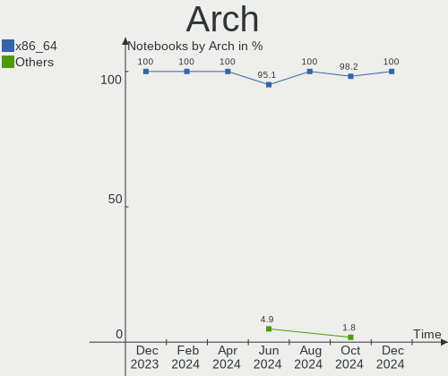
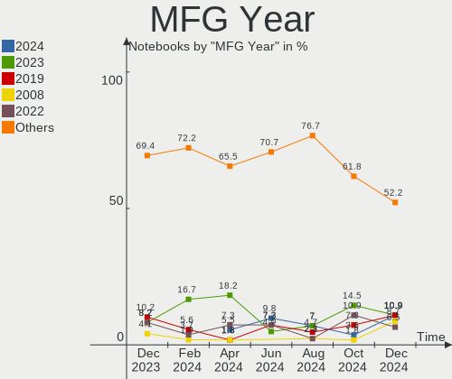
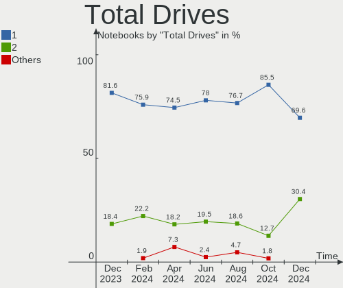
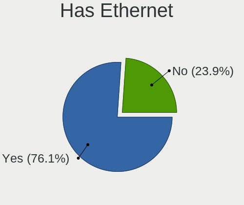
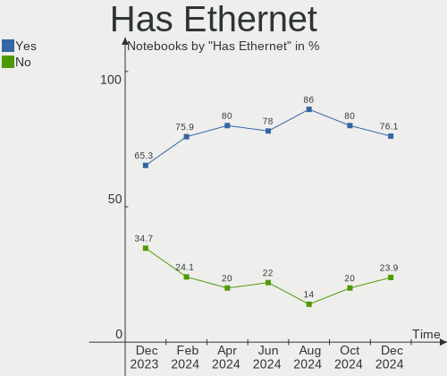
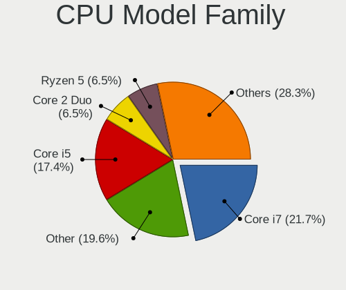
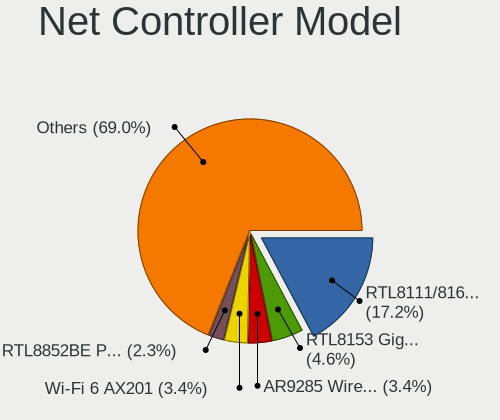
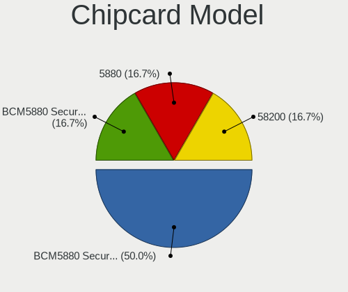
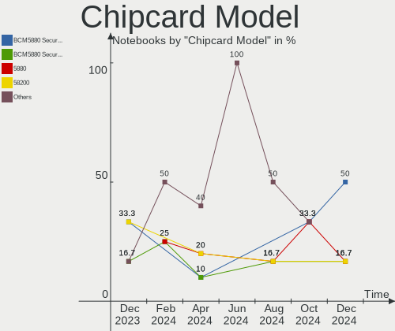

Linux in Netherlands - Hardware Trends (Notebooks)
--------------------------------------------------

A project to identify most popular hardware characteristics and track their change
over time based on data collected by Linux users at https://Linux-Hardware.org.

Anyone can contribute to this report by the [hw-probe](https://github.com/linuxhw/hw-probe) tool:

    sudo -E hw-probe -all -upload

Period: Nov, 2023.

Contents
--------

* [ System ](#system)
  - [ OS                       ](#os)
  - [ OS Family                ](#os-family)
  - [ Kernel                   ](#kernel)
  - [ Kernel Family            ](#kernel-family)
  - [ Kernel Major Ver.        ](#kernel-major-ver)
  - [ Arch                     ](#arch)
  - [ DE                       ](#de)
  - [ Display Server           ](#display-server)
  - [ Display Manager          ](#display-manager)
  - [ OS Lang                  ](#os-lang)
  - [ Boot Mode                ](#boot-mode)
  - [ Filesystem               ](#filesystem)
  - [ Part. scheme             ](#part-scheme)
  - [ Dual Boot with Linux/BSD ](#dual-boot-with-linuxbsd)
  - [ Dual Boot (Win)          ](#dual-boot-win)

* [ Board ](#board)
  - [ Vendor                   ](#vendor)
  - [ Model                    ](#model)
  - [ Model Family             ](#model-family)
  - [ MFG Year                 ](#mfg-year)
  - [ Form Factor              ](#form-factor)
  - [ Secure Boot              ](#secure-boot)
  - [ Coreboot                 ](#coreboot)
  - [ RAM Size                 ](#ram-size)
  - [ RAM Used                 ](#ram-used)
  - [ Total Drives             ](#total-drives)
  - [ Has CD-ROM               ](#has-cd-rom)
  - [ Has Ethernet             ](#has-ethernet)
  - [ Has WiFi                 ](#has-wifi)
  - [ Has Bluetooth            ](#has-bluetooth)

* [ Location ](#location)
  - [ Country                  ](#country)
  - [ City                     ](#city)

* [ Drives ](#drives)
  - [ Drive Vendor             ](#drive-vendor)
  - [ Drive Model              ](#drive-model)
  - [ HDD Vendor               ](#hdd-vendor)
  - [ SSD Vendor               ](#ssd-vendor)
  - [ Drive Kind               ](#drive-kind)
  - [ Drive Connector          ](#drive-connector)
  - [ Drive Size               ](#drive-size)
  - [ Space Total              ](#space-total)
  - [ Space Used               ](#space-used)
  - [ Malfunc. Drives          ](#malfunc-drives)
  - [ Malfunc. Drive Vendor    ](#malfunc-drive-vendor)
  - [ Malfunc. HDD Vendor      ](#malfunc-hdd-vendor)
  - [ Malfunc. Drive Kind      ](#malfunc-drive-kind)
  - [ Failed Drives            ](#failed-drives)
  - [ Failed Drive Vendor      ](#failed-drive-vendor)
  - [ Drive Status             ](#drive-status)

* [ Storage controller ](#storage-controller)
  - [ Storage Vendor           ](#storage-vendor)
  - [ Storage Model            ](#storage-model)
  - [ Storage Kind             ](#storage-kind)

* [ Processor ](#processor)
  - [ CPU Vendor               ](#cpu-vendor)
  - [ CPU Model                ](#cpu-model)
  - [ CPU Model Family         ](#cpu-model-family)
  - [ CPU Cores                ](#cpu-cores)
  - [ CPU Sockets              ](#cpu-sockets)
  - [ CPU Threads              ](#cpu-threads)
  - [ CPU Op-Modes             ](#cpu-op-modes)
  - [ CPU Microcode            ](#cpu-microcode)
  - [ CPU Microarch            ](#cpu-microarch)

* [ Graphics ](#graphics)
  - [ GPU Vendor               ](#gpu-vendor)
  - [ GPU Model                ](#gpu-model)
  - [ GPU Combo                ](#gpu-combo)
  - [ GPU Driver               ](#gpu-driver)
  - [ GPU Memory               ](#gpu-memory)

* [ Monitor ](#monitor)
  - [ Monitor Vendor           ](#monitor-vendor)
  - [ Monitor Model            ](#monitor-model)
  - [ Monitor Resolution       ](#monitor-resolution)
  - [ Monitor Diagonal         ](#monitor-diagonal)
  - [ Monitor Width            ](#monitor-width)
  - [ Aspect Ratio             ](#aspect-ratio)
  - [ Monitor Area             ](#monitor-area)
  - [ Pixel Density            ](#pixel-density)
  - [ Multiple Monitors        ](#multiple-monitors)

* [ Network ](#network)
  - [ Net Controller Vendor    ](#net-controller-vendor)
  - [ Net Controller Model     ](#net-controller-model)
  - [ Wireless Vendor          ](#wireless-vendor)
  - [ Wireless Model           ](#wireless-model)
  - [ Ethernet Vendor          ](#ethernet-vendor)
  - [ Ethernet Model           ](#ethernet-model)
  - [ Net Controller Kind      ](#net-controller-kind)
  - [ Used Controller          ](#used-controller)
  - [ NICs                     ](#nics)
  - [ IPv6                     ](#ipv6)

* [ Bluetooth ](#bluetooth)
  - [ Bluetooth Vendor         ](#bluetooth-vendor)
  - [ Bluetooth Model          ](#bluetooth-model)

* [ Sound ](#sound)
  - [ Sound Vendor             ](#sound-vendor)
  - [ Sound Model              ](#sound-model)

* [ Memory ](#memory)
  - [ Memory Vendor            ](#memory-vendor)
  - [ Memory Model             ](#memory-model)
  - [ Memory Kind              ](#memory-kind)
  - [ Memory Form Factor       ](#memory-form-factor)
  - [ Memory Size              ](#memory-size)
  - [ Memory Speed             ](#memory-speed)

* [ Printers & scanners ](#printers--scanners)
  - [ Printer Vendor           ](#printer-vendor)
  - [ Printer Model            ](#printer-model)
  - [ Scanner Vendor           ](#scanner-vendor)
  - [ Scanner Model            ](#scanner-model)

* [ Camera ](#camera)
  - [ Camera Vendor            ](#camera-vendor)
  - [ Camera Model             ](#camera-model)

* [ Security ](#security)
  - [ Fingerprint Vendor       ](#fingerprint-vendor)
  - [ Fingerprint Model        ](#fingerprint-model)
  - [ Chipcard Vendor          ](#chipcard-vendor)
  - [ Chipcard Model           ](#chipcard-model)

* [ Unsupported ](#unsupported)
  - [ Unsupported Devices      ](#unsupported-devices)
  - [ Unsupported Device Types ](#unsupported-device-types)

System
------

OS
--

Installed operating systems

| Name                         | Notebooks | Percent |
|------------------------------|-----------|---------|
| Ubuntu 22.04                 | 15        | 20.83%  |
| Fedora 38                    | 6         | 8.33%   |
| Ubuntu 23.10                 | 5         | 6.94%   |
| Fedora 39                    | 4         | 5.56%   |
| Arch Rolling                 | 4         | 5.56%   |
| OpenMandriva 5.0             | 3         | 4.17%   |
| Linux Mint 21.2              | 3         | 4.17%   |
| Debian 12                    | 3         | 4.17%   |
| LMDE 6                       | 2         | 2.78%   |
| KDE neon 22.04               | 2         | 2.78%   |
| Zorin 16                     | 1         | 1.39%   |
| Xubuntu 22.04                | 1         | 1.39%   |
| Ubuntu 23.04                 | 1         | 1.39%   |
| SteamOS 3.5.1                | 1         | 1.39%   |
| RHEL 9                       | 1         | 1.39%   |
| Pop!_OS 22.04                | 1         | 1.39%   |
| org.kde.Platform 5.15-21.08  | 1         | 1.39%   |
| openSUSE Tumbleweed-XXXXXXXX | 1         | 1.39%   |
| openSUSE Leap-15.5           | 1         | 1.39%   |
| OpenMandriva 23.11           | 1         | 1.39%   |
| OpenMandriva 23.08           | 1         | 1.39%   |
| OpenMandriva 23.03           | 1         | 1.39%   |
| Nitrux 3.1.0                 | 1         | 1.39%   |
| Manjaro 23.1.0               | 1         | 1.39%   |
| Manjaro                      | 1         | 1.39%   |
| Lubuntu 22.04                | 1         | 1.39%   |
| Linux Mint 20.3              | 1         | 1.39%   |
| Linux Mint 20.2              | 1         | 1.39%   |
| Lilidog 23                   | 1         | 1.39%   |
| Kubuntu 22.04                | 1         | 1.39%   |
| Gentoo 2.14                  | 1         | 1.39%   |
| EndeavourOS Rolling          | 1         | 1.39%   |
| Debian 11                    | 1         | 1.39%   |
| Debian                       | 1         | 1.39%   |
| ChimeraOS 44-1               | 1         | 1.39%   |

OS Family
---------

OS without a version

| Name             | Notebooks | Percent |
|------------------|-----------|---------|
| Ubuntu           | 21        | 29.17%  |
| Fedora           | 10        | 13.89%  |
| OpenMandriva     | 6         | 8.33%   |
| Linux Mint       | 5         | 6.94%   |
| Debian           | 5         | 6.94%   |
| Arch             | 4         | 5.56%   |
| openSUSE         | 2         | 2.78%   |
| Manjaro          | 2         | 2.78%   |
| LMDE             | 2         | 2.78%   |
| KDE neon         | 2         | 2.78%   |
| Zorin            | 1         | 1.39%   |
| Xubuntu          | 1         | 1.39%   |
| SteamOS          | 1         | 1.39%   |
| RHEL             | 1         | 1.39%   |
| Pop!_OS          | 1         | 1.39%   |
| org.kde.Platform | 1         | 1.39%   |
| Nitrux           | 1         | 1.39%   |
| Lubuntu          | 1         | 1.39%   |
| Lilidog          | 1         | 1.39%   |
| Kubuntu          | 1         | 1.39%   |
| Gentoo           | 1         | 1.39%   |
| EndeavourOS      | 1         | 1.39%   |
| ChimeraOS        | 1         | 1.39%   |

Kernel
------

Version of the Linux kernel

| Version                    | Notebooks | Percent |
|----------------------------|-----------|---------|
| 6.2.0-36-generic           | 11        | 15.28%  |
| 6.5.0-10-generic           | 4         | 5.56%   |
| 6.2.0-37-generic           | 4         | 5.56%   |
| 6.6.2-desktop-1omv2390     | 3         | 4.17%   |
| 6.6.1-arch1-1              | 3         | 4.17%   |
| 6.5.8-200.fc38.x86_64      | 3         | 4.17%   |
| 6.1.0-13-amd64             | 3         | 4.17%   |
| 6.5.11-300.fc39.x86_64     | 2         | 2.78%   |
| 5.15.0-89-generic          | 2         | 2.78%   |
| 5.15.0-88-generic          | 2         | 2.78%   |
| 6.6.2-arch1-1              | 1         | 1.39%   |
| 6.6.1-1-default            | 1         | 1.39%   |
| 6.6.0-desktop-1omv2390     | 1         | 1.39%   |
| 6.6.0-1-MANJARO            | 1         | 1.39%   |
| 6.5.6-chos1-chimeraos-1    | 1         | 1.39%   |
| 6.5.6-76060506-generic     | 1         | 1.39%   |
| 6.5.6-300.fc39.x86_64      | 1         | 1.39%   |
| 6.5.6-200.fc38.x86_64      | 1         | 1.39%   |
| 6.5.11-asus-vivobook       | 1         | 1.39%   |
| 6.5.11-1-MANJARO           | 1         | 1.39%   |
| 6.5.10-asus-vivobook       | 1         | 1.39%   |
| 6.5.10-300.fc39.x86_64     | 1         | 1.39%   |
| 6.5.10-200.fc38.x86_64     | 1         | 1.39%   |
| 6.5.0-4-amd64              | 1         | 1.39%   |
| 6.5.0-13-generic           | 1         | 1.39%   |
| 6.5.0-1010-aws             | 1         | 1.39%   |
| 6.5.0-0.deb12.1-amd64      | 1         | 1.39%   |
| 6.4.15-2-liquorix-amd64    | 1         | 1.39%   |
| 6.4.11-desktop-1omv2390    | 1         | 1.39%   |
| 6.2.9-300.fc38.x86_64      | 1         | 1.39%   |
| 6.2.6-desktop-1omv2390     | 1         | 1.39%   |
| 6.2.0-38-generic           | 1         | 1.39%   |
| 6.2.0-33-generic           | 1         | 1.39%   |
| 6.1.62-1-lts               | 1         | 1.39%   |
| 6.1.60-gentoo-dist         | 1         | 1.39%   |
| 6.1.6-200.fc37.x86_64      | 1         | 1.39%   |
| 6.1.52-valve3-1-neptune-61 | 1         | 1.39%   |
| 6.1.0-1025-oem             | 1         | 1.39%   |
| 5.4.0-166-generic          | 1         | 1.39%   |
| 5.4.0-165-generic          | 1         | 1.39%   |

Kernel Family
-------------

Linux kernel without a distro release

| Version | Notebooks | Percent |
|---------|-----------|---------|
| 6.2.0   | 17        | 23.61%  |
| 6.5.0   | 8         | 11.11%  |
| 5.15.0  | 5         | 6.94%   |
| 6.6.2   | 4         | 5.56%   |
| 6.6.1   | 4         | 5.56%   |
| 6.5.6   | 4         | 5.56%   |
| 6.5.11  | 4         | 5.56%   |
| 6.1.0   | 4         | 5.56%   |
| 6.5.8   | 3         | 4.17%   |
| 6.5.10  | 3         | 4.17%   |
| 6.6.0   | 2         | 2.78%   |
| 5.4.0   | 2         | 2.78%   |
| 6.4.15  | 1         | 1.39%   |
| 6.4.11  | 1         | 1.39%   |
| 6.2.9   | 1         | 1.39%   |
| 6.2.6   | 1         | 1.39%   |
| 6.1.62  | 1         | 1.39%   |
| 6.1.60  | 1         | 1.39%   |
| 6.1.6   | 1         | 1.39%   |
| 6.1.52  | 1         | 1.39%   |
| 5.19.0  | 1         | 1.39%   |
| 5.14.21 | 1         | 1.39%   |
| 5.14.0  | 1         | 1.39%   |
| 5.10.0  | 1         | 1.39%   |

Kernel Major Ver.
-----------------

Linux kernel major version

| Version | Notebooks | Percent |
|---------|-----------|---------|
| 6.5     | 22        | 30.56%  |
| 6.2     | 19        | 26.39%  |
| 6.6     | 10        | 13.89%  |
| 6.1     | 8         | 11.11%  |
| 5.15    | 5         | 6.94%   |
| 6.4     | 2         | 2.78%   |
| 5.4     | 2         | 2.78%   |
| 5.14    | 2         | 2.78%   |
| 5.19    | 1         | 1.39%   |
| 5.10    | 1         | 1.39%   |

Arch
----

OS architecture (x86_64, i586, etc.)

| Name   | Notebooks | Percent |
|--------|-----------|---------|
| x86_64 | 72        | 100%    |

DE
--

Desktop Environment

| Name            | Notebooks | Percent |
|-----------------|-----------|---------|
| GNOME           | 39        | 54.17%  |
| KDE5            | 14        | 19.44%  |
| X-Cinnamon      | 8         | 11.11%  |
| XFCE            | 3         | 4.17%   |
| LXQt            | 2         | 2.78%   |
| openbox         | 1         | 1.39%   |
| MATE            | 1         | 1.39%   |
| KDE             | 1         | 1.39%   |
| i3              | 1         | 1.39%   |
| GNOME Flashback | 1         | 1.39%   |
| gamescope       | 1         | 1.39%   |

Display Server
--------------

X11 or Wayland

| Name    | Notebooks | Percent |
|---------|-----------|---------|
| Wayland | 37        | 51.39%  |
| X11     | 34        | 47.22%  |
| Tty     | 1         | 1.39%   |

Display Manager
---------------

SDDM, LightDM, etc.

| Name    | Notebooks | Percent |
|---------|-----------|---------|
| Unknown | 22        | 30.56%  |
| GDM3    | 21        | 29.17%  |
| SDDM    | 12        | 16.67%  |
| LightDM | 11        | 15.28%  |
| GDM     | 6         | 8.33%   |

OS Lang
-------

Language

| Lang  | Notebooks | Percent |
|-------|-----------|---------|
| en_US | 47        | 65.28%  |
| nl_NL | 13        | 18.06%  |
| en_GB | 4         | 5.56%   |
| ru_RU | 2         | 2.78%   |
| pl_PL | 2         | 2.78%   |
| nl_BE | 1         | 1.39%   |
| it_IT | 1         | 1.39%   |
| en_AG | 1         | 1.39%   |
| C     | 1         | 1.39%   |

Boot Mode
---------

EFI or BIOS

| Mode | Notebooks | Percent |
|------|-----------|---------|
| BIOS | 36        | 50%     |
| EFI  | 36        | 50%     |

Filesystem
----------

Type of filesystem

| Type    | Notebooks | Percent |
|---------|-----------|---------|
| Ext4    | 30        | 41.67%  |
| Tmpfs   | 18        | 25%     |
| Btrfs   | 16        | 22.22%  |
| Overlay | 5         | 6.94%   |
| Xfs     | 2         | 2.78%   |
| Zfs     | 1         | 1.39%   |

Part. scheme
------------

Scheme of partitioning

| Type    | Notebooks | Percent |
|---------|-----------|---------|
| GPT     | 42        | 58.33%  |
| Unknown | 21        | 29.17%  |
| MBR     | 9         | 12.5%   |

Dual Boot with Linux/BSD
------------------------

Hosting more than one Linux/BSD

| Dual boot | Notebooks | Percent |
|-----------|-----------|---------|
| No        | 62        | 86.11%  |
| Yes       | 10        | 13.89%  |

Dual Boot (Win)
---------------

Hosting Linux and Windows

| Dual boot | Notebooks | Percent |
|-----------|-----------|---------|
| No        | 55        | 76.39%  |
| Yes       | 17        | 23.61%  |

Board
-----

Vendor
------

Motherboard manufacturer

| Name                | Notebooks | Percent |
|---------------------|-----------|---------|
| Lenovo              | 15        | 20.83%  |
| Dell                | 14        | 19.44%  |
| Hewlett-Packard     | 13        | 18.06%  |
| ASUSTek Computer    | 6         | 8.33%   |
| Apple               | 4         | 5.56%   |
| Toshiba             | 3         | 4.17%   |
| Medion              | 3         | 4.17%   |
| Packard Bell        | 2         | 2.78%   |
| MSI                 | 2         | 2.78%   |
| Valve               | 1         | 1.39%   |
| Sony                | 1         | 1.39%   |
| SLIMBOOK            | 1         | 1.39%   |
| Samsung Electronics | 1         | 1.39%   |
| Notebook            | 1         | 1.39%   |
| Irbis               | 1         | 1.39%   |
| Fujitsu             | 1         | 1.39%   |
| Framework           | 1         | 1.39%   |
| BTO                 | 1         | 1.39%   |
| Acer                | 1         | 1.39%   |

Model
-----

Motherboard model

| Name                                       | Notebooks | Percent |
|--------------------------------------------|-----------|---------|
| ASUS VivoBook_ASUSLaptop X1605VA_X1605VA   | 2         | 2.78%   |
| Valve Jupiter                              | 1         | 1.39%   |
| Toshiba Satellite Pro C70-B                | 1         | 1.39%   |
| Toshiba Satellite L70-A                    | 1         | 1.39%   |
| Toshiba Satellite C870-15J                 | 1         | 1.39%   |
| Sony VPCF23P1E                             | 1         | 1.39%   |
| SLIMBOOK PROX-AMD5                         | 1         | 1.39%   |
| Samsung R520/R522/R620                     | 1         | 1.39%   |
| Packard Bell ENLE11BZ                      | 1         | 1.39%   |
| Packard Bell EasyNote TK87                 | 1         | 1.39%   |
| Notebook NS5x_NS7xAU                       | 1         | 1.39%   |
| MSI Titan GT77HX 13VI                      | 1         | 1.39%   |
| MSI Prestige 14Evo A12M                    | 1         | 1.39%   |
| Medion P6613                               | 1         | 1.39%   |
| Medion ERAZER X7855 MD60892                | 1         | 1.39%   |
| Medion E4251 MD61435                       | 1         | 1.39%   |
| Lenovo Z710 20250                          | 1         | 1.39%   |
| Lenovo ThinkPad X1 Carbon Gen 8 20U90044MH | 1         | 1.39%   |
| Lenovo ThinkPad T420 4236WR1               | 1         | 1.39%   |
| Lenovo ThinkPad T14 Gen 1 20UD0064IX       | 1         | 1.39%   |
| Lenovo ThinkPad P16v Gen 1 21FCA001CD      | 1         | 1.39%   |
| Lenovo ThinkPad P16s Gen 2 21K90003MH      | 1         | 1.39%   |
| Lenovo ThinkBook 15 G2 ITL 20VE            | 1         | 1.39%   |
| Lenovo IdeaPad L340-15IRH Gaming 81LK      | 1         | 1.39%   |
| Lenovo IdeaPad 5 15ALC05 82LN              | 1         | 1.39%   |
| Lenovo IdeaPad 330S-14IKB U 81F4           | 1         | 1.39%   |
| Lenovo IdeaPad 3 14ABA7 82RM               | 1         | 1.39%   |
| Lenovo IdeaPad 1 11IGL05 81VT              | 1         | 1.39%   |
| Lenovo G510 20238                          | 1         | 1.39%   |
| Lenovo G50-70 20351                        | 1         | 1.39%   |
| Lenovo G50-45 80E3                         | 1         | 1.39%   |
| Irbis NB211                                | 1         | 1.39%   |
| HP ZBook 15 G3                             | 1         | 1.39%   |
| HP Spectre x2 Pro                          | 1         | 1.39%   |
| HP ProBook 6560b                           | 1         | 1.39%   |
| HP ProBook 650 G1                          | 1         | 1.39%   |
| HP Pavilion Laptop 14-ce0xxx               | 1         | 1.39%   |
| HP EliteBook Folio 1040 G2                 | 1         | 1.39%   |
| HP EliteBook 850 G8 Notebook PC            | 1         | 1.39%   |
| HP EliteBook 8470w                         | 1         | 1.39%   |

Model Family
------------

Motherboard model prefix

| Name                  | Notebooks | Percent |
|-----------------------|-----------|---------|
| Dell Latitude         | 10        | 13.89%  |
| HP EliteBook          | 7         | 9.72%   |
| Lenovo ThinkPad       | 5         | 6.94%   |
| Lenovo IdeaPad        | 5         | 6.94%   |
| ASUS VivoBook         | 4         | 5.56%   |
| Toshiba Satellite     | 3         | 4.17%   |
| HP ProBook            | 2         | 2.78%   |
| Dell XPS              | 2         | 2.78%   |
| Valve Jupiter         | 1         | 1.39%   |
| Sony VPCF23P1E        | 1         | 1.39%   |
| SLIMBOOK PROX-AMD5    | 1         | 1.39%   |
| Samsung R520          | 1         | 1.39%   |
| Packard Bell ENLE11BZ | 1         | 1.39%   |
| Packard Bell EasyNote | 1         | 1.39%   |
| Notebook NS5x         | 1         | 1.39%   |
| MSI Titan             | 1         | 1.39%   |
| MSI Prestige          | 1         | 1.39%   |
| Medion P6613          | 1         | 1.39%   |
| Medion ERAZER         | 1         | 1.39%   |
| Medion E4251          | 1         | 1.39%   |
| Lenovo Z710           | 1         | 1.39%   |
| Lenovo ThinkBook      | 1         | 1.39%   |
| Lenovo G510           | 1         | 1.39%   |
| Lenovo G50-70         | 1         | 1.39%   |
| Lenovo G50-45         | 1         | 1.39%   |
| Irbis NB211           | 1         | 1.39%   |
| HP ZBook              | 1         | 1.39%   |
| HP Spectre            | 1         | 1.39%   |
| HP Pavilion           | 1         | 1.39%   |
| HP Compaq             | 1         | 1.39%   |
| Fujitsu LIFEBOOK      | 1         | 1.39%   |
| Framework Laptop      | 1         | 1.39%   |
| Dell Precision        | 1         | 1.39%   |
| Dell Inspiron         | 1         | 1.39%   |
| BTO 17X1183           | 1         | 1.39%   |
| ASUS ROG              | 1         | 1.39%   |
| ASUS N71Jq            | 1         | 1.39%   |
| Apple MacBookPro14    | 1         | 1.39%   |
| Apple MacBookPro11    | 1         | 1.39%   |
| Apple MacBookAir7     | 1         | 1.39%   |

MFG Year
--------

Motherboard manufacture year

| Year | Notebooks | Percent |
|------|-----------|---------|
| 2023 | 10        | 13.89%  |
| 2013 | 9         | 12.5%   |
| 2018 | 8         | 11.11%  |
| 2020 | 7         | 9.72%   |
| 2021 | 6         | 8.33%   |
| 2014 | 6         | 8.33%   |
| 2022 | 5         | 6.94%   |
| 2011 | 4         | 5.56%   |
| 2017 | 3         | 4.17%   |
| 2010 | 3         | 4.17%   |
| 2019 | 2         | 2.78%   |
| 2016 | 2         | 2.78%   |
| 2009 | 2         | 2.78%   |
| 2007 | 2         | 2.78%   |
| 2015 | 1         | 1.39%   |
| 2012 | 1         | 1.39%   |
| 2008 | 1         | 1.39%   |

Form Factor
-----------

Physical design of the computer

| Name     | Notebooks | Percent |
|----------|-----------|---------|
| Notebook | 72        | 100%    |

Secure Boot
-----------

Enabled or disabled

| State    | Notebooks | Percent |
|----------|-----------|---------|
| Disabled | 67        | 93.06%  |
| Enabled  | 5         | 6.94%   |

Coreboot
--------

Have coreboot on board

| Used | Notebooks | Percent |
|------|-----------|---------|
| No   | 72        | 100%    |

RAM Size
--------

Total RAM memory

| Size in GB  | Notebooks | Percent |
|-------------|-----------|---------|
| 3.01-4.0    | 20        | 27.78%  |
| 8.01-16.0   | 19        | 26.39%  |
| 4.01-8.0    | 13        | 18.06%  |
| 16.01-24.0  | 11        | 15.28%  |
| 64.01-256.0 | 4         | 5.56%   |
| 32.01-64.0  | 3         | 4.17%   |
| 24.01-32.0  | 1         | 1.39%   |
| 2.01-3.0    | 1         | 1.39%   |

RAM Used
--------

Used RAM memory

| Used GB    | Notebooks | Percent |
|------------|-----------|---------|
| 2.01-3.0   | 20        | 27.78%  |
| 1.01-2.0   | 19        | 26.39%  |
| 4.01-8.0   | 15        | 20.83%  |
| 3.01-4.0   | 11        | 15.28%  |
| 8.01-16.0  | 4         | 5.56%   |
| 0.51-1.0   | 2         | 2.78%   |
| 16.01-24.0 | 1         | 1.39%   |

Total Drives
------------

Number of drives on board

| Drives | Notebooks | Percent |
|--------|-----------|---------|
| 1      | 53        | 73.61%  |
| 2      | 17        | 23.61%  |
| 3      | 2         | 2.78%   |

Has CD-ROM
----------

Has CD-ROM on board

| Presented | Notebooks | Percent |
|-----------|-----------|---------|
| No        | 49        | 68.06%  |
| Yes       | 23        | 31.94%  |

Has Ethernet
------------

Has Ethernet on board

| Presented | Notebooks | Percent |
|-----------|-----------|---------|
| Yes       | 52        | 72.22%  |
| No        | 20        | 27.78%  |

Has WiFi
--------

Has WiFi module

| Presented | Notebooks | Percent |
|-----------|-----------|---------|
| Yes       | 72        | 100%    |

Has Bluetooth
-------------

Has Bluetooth module

| Presented | Notebooks | Percent |
|-----------|-----------|---------|
| Yes       | 61        | 84.72%  |
| No        | 11        | 15.28%  |

Location
--------

Country
-------

Geographic location (country)

| Country     | Notebooks | Percent |
|-------------|-----------|---------|
| Netherlands | 72        | 100%    |

City
----

Geographic location (city)

| City                | Notebooks | Percent |
|---------------------|-----------|---------|
| Amsterdam           | 10        | 13.89%  |
| Naaldwijk           | 4         | 5.56%   |
| Rotterdam           | 3         | 4.17%   |
| Leiden              | 3         | 4.17%   |
| Ravenstein          | 2         | 2.78%   |
| Papendrecht         | 2         | 2.78%   |
| Oldenzaal           | 2         | 2.78%   |
| Haarlem             | 2         | 2.78%   |
| Eindhoven           | 2         | 2.78%   |
| Aalten              | 2         | 2.78%   |
| Zeist               | 1         | 1.39%   |
| Winterswijk         | 1         | 1.39%   |
| Wageningen          | 1         | 1.39%   |
| Venlo               | 1         | 1.39%   |
| Utrecht             | 1         | 1.39%   |
| Tiel                | 1         | 1.39%   |
| Thorn               | 1         | 1.39%   |
| The Hague           | 1         | 1.39%   |
| Strijen             | 1         | 1.39%   |
| Schiedam            | 1         | 1.39%   |
| Roosendaal          | 1         | 1.39%   |
| Roermond            | 1         | 1.39%   |
| Rijswijk            | 1         | 1.39%   |
| Rhenen              | 1         | 1.39%   |
| Odiliapeel          | 1         | 1.39%   |
| Nuenen              | 1         | 1.39%   |
| Nijmegen            | 1         | 1.39%   |
| Meerkerk            | 1         | 1.39%   |
| Maastricht          | 1         | 1.39%   |
| Lelystad            | 1         | 1.39%   |
| Hilversum           | 1         | 1.39%   |
| Hengelo             | 1         | 1.39%   |
| Hendrik-Ido-Ambacht | 1         | 1.39%   |
| Heerenveen          | 1         | 1.39%   |
| Gouda               | 1         | 1.39%   |
| Etten               | 1         | 1.39%   |
| Emmeloord           | 1         | 1.39%   |
| Drachten            | 1         | 1.39%   |
| Didam               | 1         | 1.39%   |
| Deventer            | 1         | 1.39%   |

Drives
------

Drive Vendor
------------

Hard drive vendors

| Vendor                    | Notebooks | Drives | Percent |
|---------------------------|-----------|--------|---------|
| Samsung Electronics       | 24        | 25     | 27.27%  |
| SK hynix                  | 8         | 8      | 9.09%   |
| Kingston                  | 7         | 7      | 7.95%   |
| Seagate                   | 5         | 5      | 5.68%   |
| Sandisk                   | 5         | 5      | 5.68%   |
| Crucial                   | 5         | 5      | 5.68%   |
| WDC                       | 3         | 3      | 3.41%   |
| Toshiba                   | 3         | 3      | 3.41%   |
| Intel                     | 3         | 3      | 3.41%   |
| Unknown                   | 2         | 2      | 2.27%   |
| Micron/Crucial Technology | 2         | 2      | 2.27%   |
| Micron Technology         | 2         | 3      | 2.27%   |
| Apple                     | 2         | 2      | 2.27%   |
| USB3.0                    | 1         | 1      | 1.14%   |
| Union Memory              | 1         | 1      | 1.14%   |
| Phison Electronics        | 1         | 1      | 1.14%   |
| Phison                    | 1         | 1      | 1.14%   |
| Neo Forza                 | 1         | 1      | 1.14%   |
| MASTERO                   | 1         | 1      | 1.14%   |
| LITEON                    | 1         | 1      | 1.14%   |
| KIOXIA                    | 1         | 1      | 1.14%   |
| KingFast                  | 1         | 1      | 1.14%   |
| JMicron Technology        | 1         | 1      | 1.14%   |
| JetFlash                  | 1         | 1      | 1.14%   |
| Hitachi                   | 1         | 1      | 1.14%   |
| GOODRAM                   | 1         | 1      | 1.14%   |
| Gigabyte Technology       | 1         | 1      | 1.14%   |
| Fujitsu                   | 1         | 1      | 1.14%   |
| A-DATA Technology         | 1         | 1      | 1.14%   |
| Unknown                   | 1         | 1      | 1.14%   |

Drive Model
-----------

Hard drive models

| Model                                               | Notebooks | Percent |
|-----------------------------------------------------|-----------|---------|
| Samsung SSD 870 EVO 500GB                           | 3         | 3.37%   |
| Samsung NVMe SSD Controller SM961/PM961/SM963 256GB | 2         | 2.25%   |
| Samsung NVMe SSD Controller PM9A1/PM9A3/980PRO 2TB  | 2         | 2.25%   |
| Samsung MZVLQ1T0HALB-00000 1024GB                   | 2         | 2.25%   |
| Kingston SA400S37240G 240GB SSD                     | 2         | 2.25%   |
| WDC WDS240G2G0A-00JH30 240GB SSD                    | 1         | 1.12%   |
| WDC WD10SPZX-24Z10 1TB                              | 1         | 1.12%   |
| WDC PC SN520 SDAPNUW-512G-1014 512GB                | 1         | 1.12%   |
| USB3.0 Super Speed 500GB                            | 1         | 1.12%   |
| Unknown MMC Card  64GB                              | 1         | 1.12%   |
| Unknown MMC Card  32GB                              | 1         | 1.12%   |
| Union Memory UMIS RPJTJ512MEE1OWX 512GB             | 1         | 1.12%   |
| Toshiba XG6 NVMe SSD Controller 512GB               | 1         | 1.12%   |
| Toshiba MQ01ABD100 1TB                              | 1         | 1.12%   |
| Toshiba KSG60ZMV512G M.2 2280 512GB SSD             | 1         | 1.12%   |
| SK hynix SKHynix_HFS512GDE9X081N 512GB              | 1         | 1.12%   |
| SK hynix SKHynix_HFS001TEJ9X164N 1024GB             | 1         | 1.12%   |
| SK hynix SC311 SATA 256GB SSD                       | 1         | 1.12%   |
| SK hynix SC308 SATA 128GB SSD                       | 1         | 1.12%   |
| SK hynix PC611 NVMe 1TB                             | 1         | 1.12%   |
| SK hynix HFM512GD3JX013N 512GB                      | 1         | 1.12%   |
| SK hynix BC711 HFM512GD3JX013N 512GB                | 1         | 1.12%   |
| SK hynix BC501 NVMe Solid State Drive 512GB         | 1         | 1.12%   |
| Seagate ST9500325AS 500GB                           | 1         | 1.12%   |
| Seagate ST500LM000-SSHD-8GB                         | 1         | 1.12%   |
| Seagate ST1500LM012-1R817G 1TB                      | 1         | 1.12%   |
| Seagate ST1000LM024 HN-M101MBB 1TB                  | 1         | 1.12%   |
| Seagate BUP Slim SL 2TB                             | 1         | 1.12%   |
| Sandisk WD_BLACK SN850X 1000GB                      | 1         | 1.12%   |
| Sandisk WDC PC SN530 SDBPTPZ-1T00-1002 1024GB       | 1         | 1.12%   |
| Sandisk WD Black SN850 1024GB                       | 1         | 1.12%   |
| Sandisk WD Black SN750 / PC SN730 NVMe SSD 500GB    | 1         | 1.12%   |
| SanDisk SSD PLUS 240GB                              | 1         | 1.12%   |
| Samsung SSD 980 1TB S649NX1T208898N                 | 1         | 1.12%   |
| Samsung SSD 980 1TB                                 | 1         | 1.12%   |
| Samsung SSD 840 PRO Series 256GB                    | 1         | 1.12%   |
| Samsung SSD 830 Series 256GB                        | 1         | 1.12%   |
| Samsung SSD 750 EVO 250GB                           | 1         | 1.12%   |
| Samsung SSD 650 120GB                               | 1         | 1.12%   |
| Samsung NVMe SSD Controller SM981/PM981/PM983 250GB | 1         | 1.12%   |

HDD Vendor
----------

Hard disk drive vendors

| Vendor  | Notebooks | Drives | Percent |
|---------|-----------|--------|---------|
| Seagate | 5         | 5      | 50%     |
| WDC     | 1         | 1      | 10%     |
| USB3.0  | 1         | 1      | 10%     |
| Toshiba | 1         | 1      | 10%     |
| Hitachi | 1         | 1      | 10%     |
| Fujitsu | 1         | 1      | 10%     |

SSD Vendor
----------

Solid state drive vendors

| Vendor              | Notebooks | Drives | Percent |
|---------------------|-----------|--------|---------|
| Samsung Electronics | 11        | 11     | 30.56%  |
| Kingston            | 6         | 6      | 16.67%  |
| Crucial             | 3         | 3      | 8.33%   |
| SK hynix            | 2         | 2      | 5.56%   |
| Apple               | 2         | 2      | 5.56%   |
| WDC                 | 1         | 1      | 2.78%   |
| Toshiba             | 1         | 1      | 2.78%   |
| SanDisk             | 1         | 1      | 2.78%   |
| Phison              | 1         | 1      | 2.78%   |
| Neo Forza           | 1         | 1      | 2.78%   |
| MASTERO             | 1         | 1      | 2.78%   |
| LITEON              | 1         | 1      | 2.78%   |
| KingFast            | 1         | 1      | 2.78%   |
| JMicron Technology  | 1         | 1      | 2.78%   |
| Intel               | 1         | 1      | 2.78%   |
| GOODRAM             | 1         | 1      | 2.78%   |
| A-DATA Technology   | 1         | 1      | 2.78%   |

Drive Kind
----------

HDD or SSD

| Kind    | Notebooks | Drives | Percent |
|---------|-----------|--------|---------|
| NVMe    | 37        | 40     | 43.53%  |
| SSD     | 34        | 36     | 40%     |
| HDD     | 10        | 10     | 11.76%  |
| MMC     | 3         | 3      | 3.53%   |
| Unknown | 1         | 1      | 1.18%   |

Drive Connector
---------------

SATA, SAS, NVMe, etc.

| Type | Notebooks | Drives | Percent |
|------|-----------|--------|---------|
| SATA | 38        | 41     | 45.24%  |
| NVMe | 37        | 40     | 44.05%  |
| SAS  | 6         | 6      | 7.14%   |
| MMC  | 3         | 3      | 3.57%   |

Drive Size
----------

Size of hard drive

| Size in TB | Notebooks | Drives | Percent |
|------------|-----------|--------|---------|
| 0.01-0.5   | 34        | 37     | 79.07%  |
| 0.51-1.0   | 8         | 8      | 18.6%   |
| 1.01-2.0   | 1         | 1      | 2.33%   |

Space Total
-----------

Amount of disk space available on the file system

| Size in GB     | Notebooks | Percent |
|----------------|-----------|---------|
| 101-250        | 23        | 31.94%  |
| 251-500        | 13        | 18.06%  |
| 501-1000       | 13        | 18.06%  |
| 1001-2000      | 6         | 8.33%   |
| Unknown        | 6         | 8.33%   |
| 1-20           | 4         | 5.56%   |
| 51-100         | 4         | 5.56%   |
| 2001-3000      | 2         | 2.78%   |
| More than 3000 | 1         | 1.39%   |

Space Used
----------

Amount of used disk space

| Used GB   | Notebooks | Percent |
|-----------|-----------|---------|
| 21-50     | 21        | 29.17%  |
| 1-20      | 14        | 19.44%  |
| 101-250   | 12        | 16.67%  |
| 251-500   | 7         | 9.72%   |
| Unknown   | 6         | 8.33%   |
| 501-1000  | 5         | 6.94%   |
| 51-100    | 5         | 6.94%   |
| 1001-2000 | 2         | 2.78%   |

Malfunc. Drives
---------------

Drive models with a malfunction

| Model                                          | Notebooks | Drives | Percent |
|------------------------------------------------|-----------|--------|---------|
| Toshiba MQ01ABD100 1TB                         | 1         | 1      | 16.67%  |
| Seagate ST500LM000-SSHD-8GB                    | 1         | 1      | 16.67%  |
| Seagate ST1000LM024 HN-M101MBB 1TB             | 1         | 1      | 16.67%  |
| Samsung Electronics SSD 870 EVO 500GB          | 1         | 1      | 16.67%  |
| Micron/Crucial Technology P1 NVMe PCIe SSD 1TB | 1         | 1      | 16.67%  |
| Intel SSDMAEXC024G3H 24GB                      | 1         | 1      | 16.67%  |

Malfunc. Drive Vendor
---------------------

Vendors of faulty drives

| Vendor                    | Notebooks | Drives | Percent |
|---------------------------|-----------|--------|---------|
| Seagate                   | 2         | 2      | 33.33%  |
| Toshiba                   | 1         | 1      | 16.67%  |
| Samsung Electronics       | 1         | 1      | 16.67%  |
| Micron/Crucial Technology | 1         | 1      | 16.67%  |
| Intel                     | 1         | 1      | 16.67%  |

Malfunc. HDD Vendor
-------------------

Vendors of faulty HDD drives

| Vendor  | Notebooks | Drives | Percent |
|---------|-----------|--------|---------|
| Seagate | 2         | 2      | 66.67%  |
| Toshiba | 1         | 1      | 33.33%  |

Malfunc. Drive Kind
-------------------

Kinds of faulty drives

| Kind | Notebooks | Drives | Percent |
|------|-----------|--------|---------|
| HDD  | 3         | 3      | 60%     |
| NVMe | 1         | 1      | 20%     |
| SSD  | 1         | 2      | 20%     |

Failed Drives
-------------

Failed drive models

Zero info for selected period =(

Failed Drive Vendor
-------------------

Failed drive vendors

Zero info for selected period =(

Drive Status
------------

Number of failed and malfunc. drives

| Status   | Notebooks | Drives | Percent |
|----------|-----------|--------|---------|
| Detected | 42        | 49     | 53.85%  |
| Works    | 31        | 35     | 39.74%  |
| Malfunc  | 5         | 6      | 6.41%   |

Storage controller
------------------

Storage Vendor
--------------

Storage controller vendors

| Vendor                       | Notebooks | Percent |
|------------------------------|-----------|---------|
| Intel                        | 47        | 52.22%  |
| Samsung Electronics          | 14        | 15.56%  |
| SK hynix                     | 6         | 6.67%   |
| Sandisk                      | 5         | 5.56%   |
| AMD                          | 5         | 5.56%   |
| Micron/Crucial Technology    | 4         | 4.44%   |
| Toshiba America Info Systems | 2         | 2.22%   |
| Phison Electronics           | 2         | 2.22%   |
| Micron Technology            | 2         | 2.22%   |
| Union Memory (Shenzhen)      | 1         | 1.11%   |
| KIOXIA                       | 1         | 1.11%   |
| Kingston Technology Company  | 1         | 1.11%   |

Storage Model
-------------

Storage controller models

| Model                                                                          | Notebooks | Percent |
|--------------------------------------------------------------------------------|-----------|---------|
| Samsung NVMe SSD Controller 980 (DRAM-less)                                    | 6         | 6.32%   |
| Intel Volume Management Device NVMe RAID Controller                            | 5         | 5.26%   |
| Intel Sunrise Point-LP SATA Controller [AHCI mode]                             | 5         | 5.26%   |
| Intel 82801 Mobile SATA Controller [RAID mode]                                 | 5         | 5.26%   |
| AMD FCH SATA Controller [AHCI mode]                                            | 5         | 5.26%   |
| Intel Volume Management Device NVMe RAID Controller Intel Corporation          | 4         | 4.21%   |
| Intel 8 Series/C220 Series Chipset Family 6-port SATA Controller 1 [AHCI mode] | 4         | 4.21%   |
| Intel 6 Series/C200 Series Chipset Family 6 port Mobile SATA AHCI Controller   | 4         | 4.21%   |
| SK hynix Gold P31/BC711/PC711 NVMe Solid State Drive                           | 3         | 3.16%   |
| Samsung NVMe SSD Controller SM961/PM961/SM963                                  | 3         | 3.16%   |
| Samsung NVMe SSD Controller PM9A1/PM9A3/980PRO                                 | 3         | 3.16%   |
| Micron/Crucial P2 [Nick P2] / P3 / P3 Plus NVMe PCIe SSD (DRAM-less)           | 3         | 3.16%   |
| Intel 82801IBM/IEM (ICH9M/ICH9M-E) 4 port SATA Controller [AHCI mode]          | 3         | 3.16%   |
| Intel 8 Series SATA Controller 1 [AHCI mode]                                   | 3         | 3.16%   |
| Phison PS5013-E13 PCIe3 NVMe Controller (DRAM-less)                            | 2         | 2.11%   |
| Intel Tiger Lake-LP SATA Controller                                            | 2         | 2.11%   |
| Intel Celeron N3350/Pentium N4200/Atom E3900 Series SATA AHCI Controller       | 2         | 2.11%   |
| Intel 7 Series Chipset Family 6-port SATA Controller [AHCI mode]               | 2         | 2.11%   |
| Intel 5 Series/3400 Series Chipset 4 port SATA AHCI Controller                 | 2         | 2.11%   |
| Union Memory (Shenzhen) AM620 PCIe 3.0 NVMe SSD 512GB                          | 1         | 1.05%   |
| Toshiba America Info Systems XG6 NVMe SSD Controller                           | 1         | 1.05%   |
| Toshiba America Info Systems Toshiba America Info SATA controller              | 1         | 1.05%   |
| SK hynix PC611 NVMe Solid State Drive                                          | 1         | 1.05%   |
| SK hynix BC901 NVMe Solid State Drive (DRAM-less)                              | 1         | 1.05%   |
| SK hynix BC501 NVMe Solid State Drive                                          | 1         | 1.05%   |
| SanDisk WD PC SN810 / Black SN850 NVMe SSD                                     | 1         | 1.05%   |
| SanDisk WD Blue SN500 / PC SN520 x2 M.2 2280 NVMe SSD                          | 1         | 1.05%   |
| Sandisk WD Black SN850X NVMe SSD                                               | 1         | 1.05%   |
| SanDisk IX SN530 NVMe SSD (DRAM-less)                                          | 1         | 1.05%   |
| SanDisk Extreme Pro / WD Black SN750 / PC SN730 / Red SN700 NVMe SSD           | 1         | 1.05%   |
| Samsung S4LN053X01 AHCI SSD Controller(Apple slot)                             | 1         | 1.05%   |
| Samsung NVMe SSD Controller SM981/PM981/PM983                                  | 1         | 1.05%   |
| Samsung NVMe SSD Controller PM9B1 (DRAM-less)                                  | 1         | 1.05%   |
| Micron/Crucial P1 NVMe PCIe SSD[Frampton]                                      | 1         | 1.05%   |
| Micron 3400 NVMe SSD [Hendrix]                                                 | 1         | 1.05%   |
| Micron 2450 NVMe SSD [HendrixV] (DRAM-less)                                    | 1         | 1.05%   |
| KIOXIA NVMe SSD Controller XG8                                                 | 1         | 1.05%   |
| Kingston Company NV1 NVMe SSD SM2263XT                                         | 1         | 1.05%   |
| Intel Wildcat Point-LP SATA Controller [AHCI Mode]                             | 1         | 1.05%   |
| Intel Tiger Lake SATA AHCI Controller                                          | 1         | 1.05%   |

Storage Kind
------------

Kind of storage controller (IDE, SATA, NVMe, SAS, ...)

| Kind | Notebooks | Percent |
|------|-----------|---------|
| SATA | 41        | 44.09%  |
| NVMe | 37        | 39.78%  |
| RAID | 14        | 15.05%  |
| IDE  | 1         | 1.08%   |

Processor
---------

CPU Vendor
----------

Processor vendors

| Vendor | Notebooks | Percent |
|--------|-----------|---------|
| Intel  | 60        | 83.33%  |
| AMD    | 12        | 16.67%  |

CPU Model
---------

Processor models

| Model                                       | Notebooks | Percent |
|---------------------------------------------|-----------|---------|
| Intel Core i7-7700HQ CPU @ 2.80GHz          | 2         | 2.78%   |
| Intel Core i7-4700MQ CPU @ 2.40GHz          | 2         | 2.78%   |
| Intel Core i5-8250U CPU @ 1.60GHz           | 2         | 2.78%   |
| Intel Core i5-7300U CPU @ 2.60GHz           | 2         | 2.78%   |
| Intel Core i5-5200U CPU @ 2.20GHz           | 2         | 2.78%   |
| Intel 13th Gen Core i9-13900H               | 2         | 2.78%   |
| Intel 13th Gen Core i7-13700H               | 2         | 2.78%   |
| Intel 11th Gen Core i7-1185G7 @ 3.00GHz     | 2         | 2.78%   |
| Intel 11th Gen Core i5-1135G7 @ 2.40GHz     | 2         | 2.78%   |
| Intel Pentium Dual-Core CPU T4200 @ 2.00GHz | 1         | 1.39%   |
| Intel Pentium CPU N4200 @ 1.10GHz           | 1         | 1.39%   |
| Intel Pentium 3558U @ 1.70GHz               | 1         | 1.39%   |
| Intel Core i9-10885H CPU @ 2.40GHz          | 1         | 1.39%   |
| Intel Core i7-8650U CPU @ 1.90GHz           | 1         | 1.39%   |
| Intel Core i7-6820HQ CPU @ 2.70GHz          | 1         | 1.39%   |
| Intel Core i7-4750HQ CPU @ 2.00GHz          | 1         | 1.39%   |
| Intel Core i7-4702MQ CPU @ 2.20GHz          | 1         | 1.39%   |
| Intel Core i7-3630QM CPU @ 2.40GHz          | 1         | 1.39%   |
| Intel Core i7-2670QM CPU @ 2.20GHz          | 1         | 1.39%   |
| Intel Core i7-10510U CPU @ 1.80GHz          | 1         | 1.39%   |
| Intel Core i7 CPU Q 720 @ 1.60GHz           | 1         | 1.39%   |
| Intel Core i7 CPU M 640 @ 2.80GHz           | 1         | 1.39%   |
| Intel Core i5-9300H CPU @ 2.40GHz           | 1         | 1.39%   |
| Intel Core i5-8350U CPU @ 1.70GHz           | 1         | 1.39%   |
| Intel Core i5-7200U CPU @ 2.50GHz           | 1         | 1.39%   |
| Intel Core i5-5250U CPU @ 1.60GHz           | 1         | 1.39%   |
| Intel Core i5-4260U CPU @ 1.40GHz           | 1         | 1.39%   |
| Intel Core i5-4210U CPU @ 1.70GHz           | 1         | 1.39%   |
| Intel Core i5-4210M CPU @ 2.60GHz           | 1         | 1.39%   |
| Intel Core i5-4202Y CPU @ 1.60GHz           | 1         | 1.39%   |
| Intel Core i5-2540M CPU @ 2.60GHz           | 1         | 1.39%   |
| Intel Core i5-2520M CPU @ 2.50GHz           | 1         | 1.39%   |
| Intel Core i5-2410M CPU @ 2.30GHz           | 1         | 1.39%   |
| Intel Core i5-1035G1 CPU @ 1.00GHz          | 1         | 1.39%   |
| Intel Core i5-10210U CPU @ 1.60GHz          | 1         | 1.39%   |
| Intel Core i3-7100U CPU @ 2.40GHz           | 1         | 1.39%   |
| Intel Core i3-4030U CPU @ 1.90GHz           | 1         | 1.39%   |
| Intel Core i3-2310M CPU @ 2.10GHz           | 1         | 1.39%   |
| Intel Core i3 CPU M 380 @ 2.53GHz           | 1         | 1.39%   |
| Intel Core 2 Solo CPU U3500 @ 1.40GHz       | 1         | 1.39%   |

CPU Model Family
----------------

Processor model prefix

| Model                   | Notebooks | Percent |
|-------------------------|-----------|---------|
| Intel Core i5           | 19        | 26.39%  |
| Other                   | 15        | 20.83%  |
| Intel Core i7           | 13        | 18.06%  |
| Intel Core i3           | 4         | 5.56%   |
| Intel Celeron           | 3         | 4.17%   |
| AMD Ryzen 5             | 3         | 4.17%   |
| Intel Pentium           | 2         | 2.78%   |
| Intel Core 2 Duo        | 2         | 2.78%   |
| AMD Ryzen 7             | 2         | 2.78%   |
| Intel Pentium Dual-Core | 1         | 1.39%   |
| Intel Core i9           | 1         | 1.39%   |
| Intel Core 2 Solo       | 1         | 1.39%   |
| AMD Ryzen 9             | 1         | 1.39%   |
| AMD Ryzen 7 PRO         | 1         | 1.39%   |
| AMD Ryzen 5 PRO         | 1         | 1.39%   |
| AMD E1                  | 1         | 1.39%   |
| AMD A8                  | 1         | 1.39%   |
| AMD A6                  | 1         | 1.39%   |

CPU Cores
---------

Number of processor cores

| Number | Notebooks | Percent |
|--------|-----------|---------|
| 2      | 27        | 37.5%   |
| 4      | 25        | 34.72%  |
| 8      | 6         | 8.33%   |
| 14     | 5         | 6.94%   |
| 6      | 4         | 5.56%   |
| 12     | 2         | 2.78%   |
| 24     | 1         | 1.39%   |
| 10     | 1         | 1.39%   |
| 1      | 1         | 1.39%   |

CPU Sockets
-----------

Number of sockets

| Number | Notebooks | Percent |
|--------|-----------|---------|
| 1      | 72        | 100%    |

CPU Threads
-----------

Threads per core (Hyper-Threading)

| Number | Notebooks | Percent |
|--------|-----------|---------|
| 2      | 60        | 83.33%  |
| 1      | 12        | 16.67%  |

CPU Op-Modes
------------

CPU Operation Modes (32-bit, 64-bit)

| Op mode        | Notebooks | Percent |
|----------------|-----------|---------|
| 32-bit, 64-bit | 72        | 100%    |

CPU Microcode
-------------

Microcode number

| Number     | Notebooks | Percent |
|------------|-----------|---------|
| Unknown    | 54        | 75%     |
| 0x306c3    | 3         | 4.17%   |
| 0x806ea    | 2         | 2.78%   |
| 0x08600106 | 2         | 2.78%   |
| 0xb06a2    | 1         | 1.39%   |
| 0x806e9    | 1         | 1.39%   |
| 0x40651    | 1         | 1.39%   |
| 0x306d4    | 1         | 1.39%   |
| 0x20655    | 1         | 1.39%   |
| 0x0a704103 | 1         | 1.39%   |
| 0x0a50000c | 1         | 1.39%   |
| 0x08608103 | 1         | 1.39%   |
| 0x08608102 | 1         | 1.39%   |
| 0x07030105 | 1         | 1.39%   |
| 0x05000119 | 1         | 1.39%   |

CPU Microarch
-------------

Microarchitecture

| Name             | Notebooks | Percent |
|------------------|-----------|---------|
| KabyLake         | 13        | 18.06%  |
| Haswell          | 10        | 13.89%  |
| Unknown          | 8         | 11.11%  |
| Alderlake Hybrid | 7         | 9.72%   |
| SandyBridge      | 5         | 6.94%   |
| TigerLake        | 4         | 5.56%   |
| Penryn           | 3         | 4.17%   |
| Broadwell        | 3         | 4.17%   |
| Zen 3            | 2         | 2.78%   |
| Zen 2            | 2         | 2.78%   |
| Westmere         | 2         | 2.78%   |
| Goldmont plus    | 2         | 2.78%   |
| Goldmont         | 2         | 2.78%   |
| Steamroller      | 1         | 1.39%   |
| Skylake          | 1         | 1.39%   |
| Puma             | 1         | 1.39%   |
| Nehalem          | 1         | 1.39%   |
| IvyBridge        | 1         | 1.39%   |
| IceLake          | 1         | 1.39%   |
| Core             | 1         | 1.39%   |
| CometLake        | 1         | 1.39%   |
| Bobcat           | 1         | 1.39%   |

Graphics
--------

GPU Vendor
----------

Vendors of graphics cards

| Vendor | Notebooks | Percent |
|--------|-----------|---------|
| Intel  | 50        | 59.52%  |
| AMD    | 18        | 21.43%  |
| Nvidia | 16        | 19.05%  |

GPU Model
---------

Graphics card models

| Model                                                                     | Notebooks | Percent |
|---------------------------------------------------------------------------|-----------|---------|
| Intel Raptor Lake-P [Iris Xe Graphics]                                    | 6         | 7.06%   |
| Intel UHD Graphics 620                                                    | 4         | 4.71%   |
| Intel TigerLake-LP GT2 [Iris Xe Graphics]                                 | 4         | 4.71%   |
| Intel HD Graphics 620                                                     | 4         | 4.71%   |
| Intel Haswell-ULT Integrated Graphics Controller                          | 4         | 4.71%   |
| Intel 4th Gen Core Processor Integrated Graphics Controller               | 4         | 4.71%   |
| Intel 2nd Generation Core Processor Family Integrated Graphics Controller | 3         | 3.53%   |
| Nvidia GK208M [GeForce GT 740M]                                           | 2         | 2.35%   |
| Nvidia GA107GLM [RTX A1000 6GB Laptop GPU]                                | 2         | 2.35%   |
| Intel HD Graphics 5500                                                    | 2         | 2.35%   |
| Intel GeminiLake [UHD Graphics 600]                                       | 2         | 2.35%   |
| Intel CometLake-U GT2 [UHD Graphics]                                      | 2         | 2.35%   |
| Intel Alder Lake-P GT2 [Iris Xe Graphics]                                 | 2         | 2.35%   |
| AMD Renoir [Radeon RX Vega 6 (Ryzen 4000/5000 Mobile Series)]             | 2         | 2.35%   |
| AMD Phoenix1                                                              | 2         | 2.35%   |
| AMD Lucienne                                                              | 2         | 2.35%   |
| Nvidia TU117M [GeForce GTX 1650 Ti Mobile]                                | 1         | 1.18%   |
| Nvidia TU117M [GeForce GTX 1650 Mobile / Max-Q]                           | 1         | 1.18%   |
| Nvidia GT218M [NVS 3100M]                                                 | 1         | 1.18%   |
| Nvidia GP108M [GeForce MX150]                                             | 1         | 1.18%   |
| Nvidia GP106BM [GeForce GTX 1060 Mobile 6GB]                              | 1         | 1.18%   |
| Nvidia GN21-X11 [GeForce RTX 4090 Laptop GPU]                             | 1         | 1.18%   |
| Nvidia GM107GLM [Quadro M2000M]                                           | 1         | 1.18%   |
| Nvidia GF119M [NVS 4200M]                                                 | 1         | 1.18%   |
| Nvidia GF108M [GeForce GT 540M]                                           | 1         | 1.18%   |
| Nvidia GA107M [GeForce RTX 3050 Ti Mobile]                                | 1         | 1.18%   |
| Nvidia GA104M [GeForce RTX 3070 Mobile / Max-Q]                           | 1         | 1.18%   |
| Nvidia G98M [GeForce G 105M]                                              | 1         | 1.18%   |
| Intel Raptor Lake-S UHD Graphics                                          | 1         | 1.18%   |
| Intel Mobile GM965/GL960 Integrated Graphics Controller (secondary)       | 1         | 1.18%   |
| Intel Mobile GM965/GL960 Integrated Graphics Controller (primary)         | 1         | 1.18%   |
| Intel Mobile 4 Series Chipset Integrated Graphics Controller              | 1         | 1.18%   |
| Intel Iris Plus Graphics G1 (Ice Lake)                                    | 1         | 1.18%   |
| Intel HD Graphics 630                                                     | 1         | 1.18%   |
| Intel HD Graphics 6000                                                    | 1         | 1.18%   |
| Intel HD Graphics 500                                                     | 1         | 1.18%   |
| Intel Haswell-ULT Integrated Graphics Controller [HD Graphics]            | 1         | 1.18%   |
| Intel Crystal Well Integrated Graphics Controller                         | 1         | 1.18%   |
| Intel Core Processor Integrated Graphics Controller                       | 1         | 1.18%   |
| Intel CometLake-H GT2 [UHD Graphics]                                      | 1         | 1.18%   |

GPU Combo
---------

Combinations of graphics cards

| Name           | Notebooks | Percent |
|----------------|-----------|---------|
| 1 x Intel      | 37        | 51.39%  |
| 1 x AMD        | 15        | 20.83%  |
| Intel + Nvidia | 9         | 12.5%   |
| 1 x Nvidia     | 6         | 8.33%   |
| 2 x Intel      | 2         | 2.78%   |
| Intel + AMD    | 2         | 2.78%   |
| AMD + Nvidia   | 1         | 1.39%   |

GPU Driver
----------

Free vs proprietary

| Driver      | Notebooks | Percent |
|-------------|-----------|---------|
| Free        | 64        | 88.89%  |
| Proprietary | 6         | 8.33%   |
| Unknown     | 2         | 2.78%   |

GPU Memory
----------

Total video memory

| Size in GB | Notebooks | Percent |
|------------|-----------|---------|
| Unknown    | 57        | 79.17%  |
| 3.01-4.0   | 4         | 5.56%   |
| 1.01-2.0   | 4         | 5.56%   |
| 0.01-0.5   | 4         | 5.56%   |
| 7.01-8.0   | 1         | 1.39%   |
| 5.01-6.0   | 1         | 1.39%   |
| 0.51-1.0   | 1         | 1.39%   |

Monitor
-------

Monitor Vendor
--------------

Monitor vendors

| Vendor                  | Notebooks | Percent |
|-------------------------|-----------|---------|
| AU Optronics            | 17        | 20.24%  |
| BOE                     | 14        | 16.67%  |
| LG Display              | 9         | 10.71%  |
| Chimei Innolux          | 9         | 10.71%  |
| Samsung Electronics     | 6         | 7.14%   |
| Apple                   | 4         | 4.76%   |
| Sharp                   | 3         | 3.57%   |
| Hewlett-Packard         | 3         | 3.57%   |
| Chi Mei Optoelectronics | 3         | 3.57%   |
| BenQ                    | 3         | 3.57%   |
| AOC                     | 3         | 3.57%   |
| Dell                    | 2         | 2.38%   |
| Valve                   | 1         | 1.19%   |
| Philips                 | 1         | 1.19%   |
| LG Philips              | 1         | 1.19%   |
| InfoVision              | 1         | 1.19%   |
| Iiyama                  | 1         | 1.19%   |
| Goldstar                | 1         | 1.19%   |
| ASUSTek Computer        | 1         | 1.19%   |
| Acer                    | 1         | 1.19%   |

Monitor Model
-------------

Monitor models

| Model                                                                 | Notebooks | Percent |
|-----------------------------------------------------------------------|-----------|---------|
| Samsung Electronics LCD Monitor SEC504B 1600x900 382x215mm 17.3-inch  | 2         | 2.33%   |
| Hewlett-Packard 24f HPN3545 1920x1080 527x296mm 23.8-inch             | 2         | 2.33%   |
| Chimei Innolux LCD Monitor CMN1618 1920x1200 344x215mm 16.0-inch      | 2         | 2.33%   |
| BOE LCD Monitor BOE06CB 1920x1080 344x194mm 15.5-inch                 | 2         | 2.33%   |
| AU Optronics LCD Monitor AUO623D 1920x1080 309x174mm 14.0-inch        | 2         | 2.33%   |
| AOC 2490W1 AOC2490 1920x1080 527x296mm 23.8-inch                      | 2         | 2.33%   |
| Valve ANX7530 U VLV3001 800x1280 100x150mm 7.1-inch                   | 1         | 1.16%   |
| Sharp LQ134N1JW52 SHP151E 1920x1200 288x180mm 13.4-inch               | 1         | 1.16%   |
| Sharp LCD Monitor SHP1548 1920x1200 288x180mm 13.4-inch               | 1         | 1.16%   |
| Sharp LCD Monitor SHP14D0 3840x2400 336x210mm 15.6-inch               | 1         | 1.16%   |
| Samsung Electronics LCD Monitor SEC3245 1366x768 344x194mm 15.5-inch  | 1         | 1.16%   |
| Samsung Electronics LCD Monitor SEC304C 1366x768 353x198mm 15.9-inch  | 1         | 1.16%   |
| Samsung Electronics LCD Monitor SDC4852 1366x768 344x194mm 15.5-inch  | 1         | 1.16%   |
| Samsung Electronics LCD Monitor SDC3959 1920x1080 293x165mm 13.2-inch | 1         | 1.16%   |
| Philips PHL 246B1 PHL0972 2560x1440 527x296mm 23.8-inch               | 1         | 1.16%   |
| Philips PHL 245B1 PHL094C 2560x1440 530x300mm 24.0-inch               | 1         | 1.16%   |
| LG Philips LCD Monitor LPLBD00 1280x800 331x207mm 15.4-inch           | 1         | 1.16%   |
| LG Display LCD Monitor LGDD801 1366x768 344x194mm 15.5-inch           | 1         | 1.16%   |
| LG Display LCD Monitor LGD40A0 1366x768 310x174mm 14.0-inch           | 1         | 1.16%   |
| LG Display LCD Monitor LGD0676 1920x1080 309x174mm 14.0-inch          | 1         | 1.16%   |
| LG Display LCD Monitor LGD05F1 1920x1080 309x174mm 14.0-inch          | 1         | 1.16%   |
| LG Display LCD Monitor LGD05EC 1920x1080 309x174mm 14.0-inch          | 1         | 1.16%   |
| LG Display LCD Monitor LGD03DD 1366x768 344x194mm 15.5-inch           | 1         | 1.16%   |
| LG Display LCD Monitor LGD0306 1600x900 310x174mm 14.0-inch           | 1         | 1.16%   |
| LG Display LCD Monitor LGD02DF 1600x900 310x174mm 14.0-inch           | 1         | 1.16%   |
| LG Display LCD Monitor LGD0257 1440x900 304x190mm 14.1-inch           | 1         | 1.16%   |
| InfoVision LCD Monitor IVO3D41 1920x1080 344x194mm 15.5-inch          | 1         | 1.16%   |
| Iiyama PL2496HS IVM6162 1920x1080 527x296mm 23.8-inch                 | 1         | 1.16%   |
| Iiyama PL2492HN IVM6156 1920x1080 527x296mm 23.8-inch                 | 1         | 1.16%   |
| Hewlett-Packard L1950 HWP26E7 1280x1024 380x300mm 19.1-inch           | 1         | 1.16%   |
| Goldstar ULTRAWIDE GSM77A2 3440x1440 800x334mm 34.1-inch              | 1         | 1.16%   |
| Dell P3223DE DEL4295 2560x1440 698x393mm 31.5-inch                    | 1         | 1.16%   |
| Dell E2418HN DELA105 1920x1080 527x296mm 23.8-inch                    | 1         | 1.16%   |
| Chimei Innolux LCD Monitor CMN15E7 1920x1080 344x193mm 15.5-inch      | 1         | 1.16%   |
| Chimei Innolux LCD Monitor CMN15DB 1366x768 344x193mm 15.5-inch       | 1         | 1.16%   |
| Chimei Innolux LCD Monitor CMN15B7 1366x768 344x193mm 15.5-inch       | 1         | 1.16%   |
| Chimei Innolux LCD Monitor CMN152D 1920x1080 344x193mm 15.5-inch      | 1         | 1.16%   |
| Chimei Innolux LCD Monitor CMN14D4 1920x1080 309x173mm 13.9-inch      | 1         | 1.16%   |
| Chimei Innolux LCD Monitor CMN1482 1600x900 309x174mm 14.0-inch       | 1         | 1.16%   |
| Chimei Innolux LCD Monitor CMN1132 1366x768 256x144mm 11.6-inch       | 1         | 1.16%   |

Monitor Resolution
------------------

Monitor screen resolution

| Resolution        | Notebooks | Percent |
|-------------------|-----------|---------|
| 1920x1080 (FHD)   | 30        | 37.97%  |
| 1366x768 (WXGA)   | 13        | 16.46%  |
| 1600x900 (HD+)    | 9         | 11.39%  |
| 1920x1200 (WUXGA) | 8         | 10.13%  |
| 3840x2160 (4K)    | 5         | 6.33%   |
| 2560x1440 (QHD)   | 4         | 5.06%   |
| 2880x1800         | 2         | 2.53%   |
| 1440x900 (WXGA+)  | 2         | 2.53%   |
| 800x1280          | 1         | 1.27%   |
| 3840x2400         | 1         | 1.27%   |
| 3440x1440         | 1         | 1.27%   |
| 2256x1504         | 1         | 1.27%   |
| 1280x800 (WXGA)   | 1         | 1.27%   |
| 1280x1024 (SXGA)  | 1         | 1.27%   |

Monitor Diagonal
----------------

Diagonal size in inches

| Inches | Notebooks | Percent |
|--------|-----------|---------|
| 15     | 25        | 29.07%  |
| 14     | 16        | 18.6%   |
| 13     | 9         | 10.47%  |
| 17     | 8         | 9.3%    |
| 24     | 5         | 5.81%   |
| 16     | 5         | 5.81%   |
| 23     | 4         | 4.65%   |
| 27     | 3         | 3.49%   |
| 11     | 3         | 3.49%   |
| 36     | 1         | 1.16%   |
| 34     | 1         | 1.16%   |
| 31     | 1         | 1.16%   |
| 26     | 1         | 1.16%   |
| 21     | 1         | 1.16%   |
| 19     | 1         | 1.16%   |
| 12     | 1         | 1.16%   |
| 7      | 1         | 1.16%   |

Monitor Width
-------------

Physical width

| Width in mm | Notebooks | Percent |
|-------------|-----------|---------|
| 301-350     | 46        | 55.42%  |
| 201-300     | 11        | 13.25%  |
| 351-400     | 10        | 12.05%  |
| 501-600     | 9         | 10.84%  |
| 601-700     | 3         | 3.61%   |
| 701-800     | 2         | 2.41%   |
| 401-500     | 1         | 1.2%    |
| 1-100       | 1         | 1.2%    |

Aspect Ratio
------------

Proportional relationship between the width and the height

| Ratio | Notebooks | Percent |
|-------|-----------|---------|
| 16/9  | 55        | 74.32%  |
| 16/10 | 14        | 18.92%  |
| 5/4   | 1         | 1.35%   |
| 4/3   | 1         | 1.35%   |
| 3/2   | 1         | 1.35%   |
| 21/9  | 1         | 1.35%   |
| 0.67  | 1         | 1.35%   |

Monitor Area
------------

Area in inch

| Area in inch | Notebooks | Percent |
|----------------|-----------|---------|
| 101-110        | 25        | 29.76%  |
| 81-90          | 20        | 23.81%  |
| 201-250        | 8         | 9.52%   |
| 121-130        | 8         | 9.52%   |
| 71-80          | 5         | 5.95%   |
| 111-120        | 5         | 5.95%   |
| 301-350        | 4         | 4.76%   |
| 51-60          | 3         | 3.57%   |
| 351-500        | 2         | 2.38%   |
| 61-70          | 1         | 1.19%   |
| 1-40           | 1         | 1.19%   |
| 151-200        | 1         | 1.19%   |
| 501-1000       | 1         | 1.19%   |

Pixel Density
-------------

Pixels per inch

| Density       | Notebooks | Percent |
|---------------|-----------|---------|
| 121-160       | 39        | 48.15%  |
| 101-120       | 17        | 20.99%  |
| 51-100        | 12        | 14.81%  |
| 161-240       | 11        | 13.58%  |
| More than 240 | 2         | 2.47%   |

Multiple Monitors
-----------------

Total monitors connected

| Total | Notebooks | Percent |
|-------|-----------|---------|
| 1     | 54        | 75%     |
| 2     | 12        | 16.67%  |
| 3     | 3         | 4.17%   |
| 0     | 3         | 4.17%   |

Network
-------

Net Controller Vendor
---------------------

Controller vendors

| Vendor                   | Notebooks | Percent |
|--------------------------|-----------|---------|
| Intel                    | 42        | 37.84%  |
| Realtek Semiconductor    | 30        | 27.03%  |
| Qualcomm Atheros         | 14        | 12.61%  |
| Broadcom                 | 10        | 9.01%   |
| MediaTek                 | 4         | 3.6%    |
| Broadcom Limited         | 3         | 2.7%    |
| Qualcomm                 | 2         | 1.8%    |
| Marvell Technology Group | 1         | 0.9%    |
| Lenovo                   | 1         | 0.9%    |
| Hewlett-Packard          | 1         | 0.9%    |
| Google                   | 1         | 0.9%    |
| DisplayLink              | 1         | 0.9%    |
| Dell                     | 1         | 0.9%    |

Net Controller Model
--------------------

Controller models

| Model                                                                | Notebooks | Percent |
|----------------------------------------------------------------------|-----------|---------|
| Realtek RTL8111/8168/8411 PCI Express Gigabit Ethernet Controller    | 15        | 11.63%  |
| Realtek RTL8153 Gigabit Ethernet Adapter                             | 6         | 4.65%   |
| Intel Wireless 8265 / 8275                                           | 4         | 3.1%    |
| Intel Raptor Lake PCH CNVi WiFi                                      | 4         | 3.1%    |
| Intel Ethernet Connection (4) I219-LM                                | 4         | 3.1%    |
| Realtek RTL8821CE 802.11ac PCIe Wireless Network Adapter             | 3         | 2.33%   |
| Realtek RTL810xE PCI Express Fast Ethernet controller                | 3         | 2.33%   |
| Qualcomm Atheros AR9485 Wireless Network Adapter                     | 3         | 2.33%   |
| Intel Wireless 7265                                                  | 3         | 2.33%   |
| Intel Wi-Fi 6 AX201                                                  | 3         | 2.33%   |
| Intel Centrino Ultimate-N 6300                                       | 3         | 2.33%   |
| Intel 82579LM Gigabit Network Connection (Lewisville)                | 3         | 2.33%   |
| Qualcomm Atheros QCA6174 802.11ac Wireless Network Adapter           | 2         | 1.55%   |
| MediaTek MT7921 802.11ax PCI Express Wireless Network Adapter        | 2         | 1.55%   |
| Intel Wireless 8260                                                  | 2         | 1.55%   |
| Intel Wi-Fi 6 AX200                                                  | 2         | 1.55%   |
| Intel Gemini Lake PCH CNVi WiFi                                      | 2         | 1.55%   |
| Intel Comet Lake PCH-LP CNVi WiFi                                    | 2         | 1.55%   |
| Intel Centrino Advanced-N 6205 [Taylor Peak]                         | 2         | 1.55%   |
| Intel Alder Lake-P PCH CNVi WiFi                                     | 2         | 1.55%   |
| Broadcom Limited BCM4360 802.11ac Dual Band Wireless Network Adapter | 2         | 1.55%   |
| Broadcom BCM43228 802.11a/b/g/n                                      | 2         | 1.55%   |
| Broadcom BCM43142 802.11b/g/n                                        | 2         | 1.55%   |
| Realtek RTL88x2bu [AC1200 Techkey]                                   | 1         | 0.78%   |
| Realtek RTL8852BE PCIe 802.11ax Wireless Network Controller          | 1         | 0.78%   |
| Realtek RTL8822CE 802.11ac PCIe Wireless Network Adapter             | 1         | 0.78%   |
| Realtek RTL8723BU 802.11b/g/n WLAN Adapter                           | 1         | 0.78%   |
| Realtek RTL8723AE PCIe Wireless Network Adapter                      | 1         | 0.78%   |
| Realtek RTL8125 2.5GbE Controller                                    | 1         | 0.78%   |
| Realtek Killer E3000 2.5GbE Controller                               | 1         | 0.78%   |
| Qualcomm QCNFA765 Wireless Network Adapter                           | 1         | 0.78%   |
| Qualcomm QCA6390 Wireless Network Adapter                            | 1         | 0.78%   |
| Qualcomm Atheros QCA9565 / AR9565 Wireless Network Adapter           | 1         | 0.78%   |
| Qualcomm Atheros QCA9377 802.11ac Wireless Network Adapter           | 1         | 0.78%   |
| Qualcomm Atheros QCA8172 Fast Ethernet                               | 1         | 0.78%   |
| Qualcomm Atheros QCA8171 Gigabit Ethernet                            | 1         | 0.78%   |
| Qualcomm Atheros QCA6164 802.11ac Wireless Network Adapter           | 1         | 0.78%   |
| Qualcomm Atheros AR9287 Wireless Network Adapter (PCI-Express)       | 1         | 0.78%   |
| Qualcomm Atheros AR8161 Gigabit Ethernet                             | 1         | 0.78%   |
| Qualcomm Atheros AR8151 v2.0 Gigabit Ethernet                        | 1         | 0.78%   |

Wireless Vendor
---------------

Wireless vendors

| Vendor                | Notebooks | Percent |
|-----------------------|-----------|---------|
| Intel                 | 39        | 52.7%   |
| Qualcomm Atheros      | 10        | 13.51%  |
| Realtek Semiconductor | 8         | 10.81%  |
| Broadcom              | 8         | 10.81%  |
| MediaTek              | 4         | 5.41%   |
| Qualcomm              | 2         | 2.7%    |
| Broadcom Limited      | 2         | 2.7%    |
| Dell                  | 1         | 1.35%   |

Wireless Model
--------------

Wireless models

| Model                                                                   | Notebooks | Percent |
|-------------------------------------------------------------------------|-----------|---------|
| Intel Wireless 8265 / 8275                                              | 4         | 5.41%   |
| Intel Raptor Lake PCH CNVi WiFi                                         | 4         | 5.41%   |
| Realtek RTL8821CE 802.11ac PCIe Wireless Network Adapter                | 3         | 4.05%   |
| Qualcomm Atheros AR9485 Wireless Network Adapter                        | 3         | 4.05%   |
| Intel Wireless 7265                                                     | 3         | 4.05%   |
| Intel Wi-Fi 6 AX201                                                     | 3         | 4.05%   |
| Intel Centrino Ultimate-N 6300                                          | 3         | 4.05%   |
| Qualcomm Atheros QCA6174 802.11ac Wireless Network Adapter              | 2         | 2.7%    |
| MediaTek MT7921 802.11ax PCI Express Wireless Network Adapter           | 2         | 2.7%    |
| Intel Wireless 8260                                                     | 2         | 2.7%    |
| Intel Wi-Fi 6 AX200                                                     | 2         | 2.7%    |
| Intel Gemini Lake PCH CNVi WiFi                                         | 2         | 2.7%    |
| Intel Comet Lake PCH-LP CNVi WiFi                                       | 2         | 2.7%    |
| Intel Centrino Advanced-N 6205 [Taylor Peak]                            | 2         | 2.7%    |
| Intel Alder Lake-P PCH CNVi WiFi                                        | 2         | 2.7%    |
| Broadcom Limited BCM4360 802.11ac Dual Band Wireless Network Adapter    | 2         | 2.7%    |
| Broadcom BCM43228 802.11a/b/g/n                                         | 2         | 2.7%    |
| Broadcom BCM43142 802.11b/g/n                                           | 2         | 2.7%    |
| Realtek RTL88x2bu [AC1200 Techkey]                                      | 1         | 1.35%   |
| Realtek RTL8852BE PCIe 802.11ax Wireless Network Controller             | 1         | 1.35%   |
| Realtek RTL8822CE 802.11ac PCIe Wireless Network Adapter                | 1         | 1.35%   |
| Realtek RTL8723BU 802.11b/g/n WLAN Adapter                              | 1         | 1.35%   |
| Realtek RTL8723AE PCIe Wireless Network Adapter                         | 1         | 1.35%   |
| Qualcomm QCNFA765 Wireless Network Adapter                              | 1         | 1.35%   |
| Qualcomm QCA6390 Wireless Network Adapter                               | 1         | 1.35%   |
| Qualcomm Atheros QCA9565 / AR9565 Wireless Network Adapter              | 1         | 1.35%   |
| Qualcomm Atheros QCA9377 802.11ac Wireless Network Adapter              | 1         | 1.35%   |
| Qualcomm Atheros QCA6164 802.11ac Wireless Network Adapter              | 1         | 1.35%   |
| Qualcomm Atheros AR9287 Wireless Network Adapter (PCI-Express)          | 1         | 1.35%   |
| Qualcomm Atheros AR242x / AR542x Wireless Network Adapter (PCI-Express) | 1         | 1.35%   |
| MediaTek Wi-Fi 6E MT7902 Wireless Network Adapter                       | 1         | 1.35%   |
| MediaTek MT7922 802.11ax PCI Express Wireless Network Adapter           | 1         | 1.35%   |
| Intel Wireless 7260                                                     | 1         | 1.35%   |
| Intel Wireless 3165                                                     | 1         | 1.35%   |
| Intel Wireless 3160                                                     | 1         | 1.35%   |
| Intel WiFi Link 5100                                                    | 1         | 1.35%   |
| Intel Wi-Fi 6 AX210/AX211/AX411 160MHz                                  | 1         | 1.35%   |
| Intel Tiger Lake PCH CNVi WiFi                                          | 1         | 1.35%   |
| Intel Ice Lake-LP PCH CNVi WiFi                                         | 1         | 1.35%   |
| Intel Centrino Advanced-N 6200                                          | 1         | 1.35%   |

Ethernet Vendor
---------------

Ethernet vendors

| Vendor                   | Notebooks | Percent |
|--------------------------|-----------|---------|
| Realtek Semiconductor    | 25        | 46.3%   |
| Intel                    | 15        | 27.78%  |
| Qualcomm Atheros         | 5         | 9.26%   |
| Broadcom                 | 3         | 5.56%   |
| Marvell Technology Group | 1         | 1.85%   |
| Lenovo                   | 1         | 1.85%   |
| Hewlett-Packard          | 1         | 1.85%   |
| Google                   | 1         | 1.85%   |
| DisplayLink              | 1         | 1.85%   |
| Broadcom Limited         | 1         | 1.85%   |

Ethernet Model
--------------

Ethernet models

| Model                                                             | Notebooks | Percent |
|-------------------------------------------------------------------|-----------|---------|
| Realtek RTL8111/8168/8411 PCI Express Gigabit Ethernet Controller | 15        | 27.27%  |
| Realtek RTL8153 Gigabit Ethernet Adapter                          | 6         | 10.91%  |
| Intel Ethernet Connection (4) I219-LM                             | 4         | 7.27%   |
| Realtek RTL810xE PCI Express Fast Ethernet controller             | 3         | 5.45%   |
| Intel 82579LM Gigabit Network Connection (Lewisville)             | 3         | 5.45%   |
| Realtek RTL8125 2.5GbE Controller                                 | 1         | 1.82%   |
| Realtek Killer E3000 2.5GbE Controller                            | 1         | 1.82%   |
| Qualcomm Atheros QCA8172 Fast Ethernet                            | 1         | 1.82%   |
| Qualcomm Atheros QCA8171 Gigabit Ethernet                         | 1         | 1.82%   |
| Qualcomm Atheros AR8161 Gigabit Ethernet                          | 1         | 1.82%   |
| Qualcomm Atheros AR8151 v2.0 Gigabit Ethernet                     | 1         | 1.82%   |
| Qualcomm Atheros AR8131 Gigabit Ethernet                          | 1         | 1.82%   |
| Marvell Group 88E8057 PCI-E Gigabit Ethernet Controller           | 1         | 1.82%   |
| Lenovo ThinkPad TBT 3 Dock                                        | 1         | 1.82%   |
| Intel Ethernet Connection I218-LM                                 | 1         | 1.82%   |
| Intel Ethernet Connection I217-V                                  | 1         | 1.82%   |
| Intel Ethernet Connection (6) I219-LM                             | 1         | 1.82%   |
| Intel Ethernet Connection (3) I218-LM                             | 1         | 1.82%   |
| Intel Ethernet Connection (2) I219-LM                             | 1         | 1.82%   |
| Intel Ethernet Connection (10) I219-V                             | 1         | 1.82%   |
| Intel 82579V Gigabit Network Connection                           | 1         | 1.82%   |
| Intel 82577LM Gigabit Network Connection                          | 1         | 1.82%   |
| HP lt4120 Snapdragon X5 LTE                                       | 1         | 1.82%   |
| Google Pixel 7 Pro                                                | 1         | 1.82%   |
| DisplayLink USB 3.0 Dual Video Dock                               | 1         | 1.82%   |
| Broadcom NetXtreme BCM57762 Gigabit Ethernet PCIe                 | 1         | 1.82%   |
| Broadcom NetXtreme BCM5761e Gigabit Ethernet PCIe                 | 1         | 1.82%   |
| Broadcom NetLink BCM57780 Gigabit Ethernet PCIe                   | 1         | 1.82%   |
| Broadcom Limited NetLink BCM5787M Gigabit Ethernet PCI Express    | 1         | 1.82%   |

Net Controller Kind
-------------------

Ethernet, WiFi or modem

| Kind     | Notebooks | Percent |
|----------|-----------|---------|
| WiFi     | 72        | 58.06%  |
| Ethernet | 52        | 41.94%  |

Used Controller
---------------

Currently used network controller

| Kind     | Notebooks | Percent |
|----------|-----------|---------|
| WiFi     | 58        | 76.32%  |
| Ethernet | 18        | 23.68%  |

NICs
----

Total network controllers on board

| Total | Notebooks | Percent |
|-------|-----------|---------|
| 2     | 44        | 61.11%  |
| 1     | 26        | 36.11%  |
| 3     | 1         | 1.39%   |
| 0     | 1         | 1.39%   |

IPv6
----

IPv6 vs IPv4

| Used | Notebooks | Percent |
|------|-----------|---------|
| No   | 50        | 69.44%  |
| Yes  | 22        | 30.56%  |

Bluetooth
---------

Bluetooth Vendor
----------------

Controller vendors

| Vendor                          | Notebooks | Percent |
|---------------------------------|-----------|---------|
| Intel                           | 32        | 52.46%  |
| Qualcomm Atheros Communications | 5         | 8.2%    |
| IMC Networks                    | 4         | 6.56%   |
| Realtek Semiconductor           | 3         | 4.92%   |
| Broadcom                        | 3         | 4.92%   |
| Apple                           | 3         | 4.92%   |
| Foxconn International           | 2         | 3.28%   |
| Foxconn / Hon Hai               | 2         | 3.28%   |
| USI                             | 1         | 1.64%   |
| Toshiba                         | 1         | 1.64%   |
| MediaTek                        | 1         | 1.64%   |
| Hewlett-Packard                 | 1         | 1.64%   |
| Dell                            | 1         | 1.64%   |
| Cambridge Silicon Radio         | 1         | 1.64%   |
| ASUSTek Computer                | 1         | 1.64%   |

Bluetooth Model
---------------

Controller models

| Model                                               | Notebooks | Percent |
|-----------------------------------------------------|-----------|---------|
| Intel Bluetooth wireless interface                  | 12        | 19.67%  |
| Intel AX201 Bluetooth                               | 7         | 11.48%  |
| Intel Bluetooth Device                              | 6         | 9.84%   |
| Intel Bluetooth 9460/9560 Jefferson Peak (JfP)      | 4         | 6.56%   |
| IMC Networks Bluetooth Radio                        | 3         | 4.92%   |
| Qualcomm Atheros  Bluetooth Device                  | 2         | 3.28%   |
| Qualcomm Atheros QCA61x4 Bluetooth 4.0              | 2         | 3.28%   |
| Intel AX200 Bluetooth                               | 2         | 3.28%   |
| Foxconn International BCM43142A0 Bluetooth module   | 2         | 3.28%   |
| Foxconn / Hon Hai MediaTek Bluetooth Adapter        | 2         | 3.28%   |
| Broadcom HP Portable Bumble Bee                     | 2         | 3.28%   |
| Apple Bluetooth USB Host Controller                 | 2         | 3.28%   |
| USI Bluetooth Device                                | 1         | 1.64%   |
| Toshiba RT Bluetooth Radio                          | 1         | 1.64%   |
| Realtek  Bluetooth 4.2 Adapter                      | 1         | 1.64%   |
| Realtek Bluetooth Radio                             | 1         | 1.64%   |
| Realtek Bluetooth 5.3 Radio                         | 1         | 1.64%   |
| Qualcomm Atheros AR3012 Bluetooth 4.0               | 1         | 1.64%   |
| MediaTek Wireless_Device                            | 1         | 1.64%   |
| Intel AX210 Bluetooth                               | 1         | 1.64%   |
| IMC Networks Wireless_Device                        | 1         | 1.64%   |
| HP Broadcom 2070 Bluetooth Combo                    | 1         | 1.64%   |
| Dell DW375 Bluetooth Module                         | 1         | 1.64%   |
| Cambridge Silicon Radio Bluetooth Dongle (HCI mode) | 1         | 1.64%   |
| Broadcom HP Portable SoftSailing                    | 1         | 1.64%   |
| ASUS BT-270 Bluetooth Adapter                       | 1         | 1.64%   |
| Apple Bluetooth Host Controller                     | 1         | 1.64%   |

Sound
-----

Sound Vendor
------------

Sound card vendors

| Vendor              | Notebooks | Percent |
|---------------------|-----------|---------|
| Intel               | 60        | 63.83%  |
| AMD                 | 17        | 18.09%  |
| Nvidia              | 8         | 8.51%   |
| Logitech            | 2         | 2.13%   |
| Veho                | 1         | 1.06%   |
| Texas Instruments   | 1         | 1.06%   |
| Lenovo              | 1         | 1.06%   |
| Hewlett-Packard     | 1         | 1.06%   |
| GN Netcom           | 1         | 1.06%   |
| C-Media Electronics | 1         | 1.06%   |
| Arturia             | 1         | 1.06%   |

Sound Model
-----------

Sound card models

| Model                                                                      | Notebooks | Percent |
|----------------------------------------------------------------------------|-----------|---------|
| Intel Sunrise Point-LP HD Audio                                            | 8         | 6.78%   |
| AMD Family 17h/19h HD Audio Controller                                     | 8         | 6.78%   |
| Intel Raptor Lake-P/U/H cAVS                                               | 6         | 5.08%   |
| AMD Renoir Radeon High Definition Audio Controller                         | 6         | 5.08%   |
| Intel Haswell-ULT HD Audio Controller                                      | 5         | 4.24%   |
| Intel 8 Series/C220 Series Chipset High Definition Audio Controller        | 5         | 4.24%   |
| Intel 8 Series HD Audio Controller                                         | 5         | 4.24%   |
| Intel Xeon E3-1200 v3/4th Gen Core Processor HD Audio Controller           | 4         | 3.39%   |
| Intel Tiger Lake-LP Smart Sound Technology Audio Controller                | 4         | 3.39%   |
| Intel 6 Series/C200 Series Chipset Family High Definition Audio Controller | 4         | 3.39%   |
| Intel Wildcat Point-LP High Definition Audio Controller                    | 3         | 2.54%   |
| Intel Broadwell-U Audio Controller                                         | 3         | 2.54%   |
| Intel 82801I (ICH9 Family) HD Audio Controller                             | 3         | 2.54%   |
| Intel 5 Series/3400 Series Chipset High Definition Audio                   | 3         | 2.54%   |
| AMD Rembrandt Radeon High Definition Audio Controller                      | 3         | 2.54%   |
| AMD FCH Azalia Controller                                                  | 3         | 2.54%   |
| Intel Comet Lake PCH-LP cAVS                                               | 2         | 1.69%   |
| Intel Celeron/Pentium Silver Processor High Definition Audio               | 2         | 1.69%   |
| Intel Celeron N3350/Pentium N4200/Atom E3900 Series Audio Cluster          | 2         | 1.69%   |
| Intel Alder Lake PCH-P High Definition Audio Controller                    | 2         | 1.69%   |
| Intel 7 Series/C216 Chipset Family High Definition Audio Controller        | 2         | 1.69%   |
| Intel 100 Series/C230 Series Chipset Family HD Audio Controller            | 2         | 1.69%   |
| Veho Wireless Audio                                                        | 1         | 0.85%   |
| Texas Instruments PCM2902 Audio Codec                                      | 1         | 0.85%   |
| Nvidia TU107 GeForce GTX 1650 High Definition Audio Controller             | 1         | 0.85%   |
| Nvidia High Definition Audio Controller                                    | 1         | 0.85%   |
| Nvidia GP106 High Definition Audio Controller                              | 1         | 0.85%   |
| Nvidia GM107 High Definition Audio Controller [GeForce 940MX]              | 1         | 0.85%   |
| Nvidia GF119 HDMI Audio Controller                                         | 1         | 0.85%   |
| Nvidia GF108 High Definition Audio Controller                              | 1         | 0.85%   |
| Nvidia GA104 High Definition Audio Controller                              | 1         | 0.85%   |
| Nvidia Audio device                                                        | 1         | 0.85%   |
| Logitech Headset H390                                                      | 1         | 0.85%   |
| Logitech H390 headset with microphone                                      | 1         | 0.85%   |
| Lenovo ThinkPad Thunderbolt 3 Dock USB Audio                               | 1         | 0.85%   |
| Intel Tiger Lake-H HD Audio Controller                                     | 1         | 0.85%   |
| Intel Ice Lake-LP Smart Sound Technology Audio Controller                  | 1         | 0.85%   |
| Intel Crystal Well HD Audio Controller                                     | 1         | 0.85%   |
| Intel Comet Lake PCH cAVS                                                  | 1         | 0.85%   |
| Intel CM238 HD Audio Controller                                            | 1         | 0.85%   |

Memory
------

Memory Vendor
-------------

Memory module vendors

| Vendor              | Notebooks | Percent |
|---------------------|-----------|---------|
| SK hynix            | 12        | 26.09%  |
| Samsung Electronics | 11        | 23.91%  |
| Micron Technology   | 8         | 17.39%  |
| Ramaxel Technology  | 3         | 6.52%   |
| Crucial             | 3         | 6.52%   |
| Unknown             | 2         | 4.35%   |
| Unknown             | 1         | 2.17%   |
| Lenovo              | 1         | 2.17%   |
| Kingston            | 1         | 2.17%   |
| G.Skill             | 1         | 2.17%   |
| Elpida              | 1         | 2.17%   |
| Corsair             | 1         | 2.17%   |
| A-DATA Technology   | 1         | 2.17%   |

Memory Model
------------

Memory module models

| Model                                                            | Notebooks | Percent |
|------------------------------------------------------------------|-----------|---------|
| Samsung RAM M471A1K43EB1-CWE 8GB SODIMM DDR4 3200MT/s            | 3         | 6.25%   |
| Micron RAM 4ATF1G64HZ-3G2F1 8GB SODIMM DDR4 3200MT/s             | 2         | 4.17%   |
| Unknown                                                          | 2         | 4.17%   |
| Unknown RAM Module 4GB SODIMM DDR3                               | 1         | 2.08%   |
| Unknown RAM Module 2GB SODIMM DDR3                               | 1         | 2.08%   |
| SK hynix RAM Module 4GB SODIMM DDR3 1600MT/s                     | 1         | 2.08%   |
| SK hynix RAM Module 16GB SODIMM DDR4 3200MT/s                    | 1         | 2.08%   |
| SK hynix RAM HMT451B6BFR8A-PB 4GB SODIMM DDR3 1600MT/s           | 1         | 2.08%   |
| SK hynix RAM HMT425S6AFR6A-RD 2048MB SODIMM DDR3 1600MT/s        | 1         | 2.08%   |
| SK hynix RAM HMT41GS6DFR8A-PB 8GB SODIMM DDR3 1600MT/s           | 1         | 2.08%   |
| SK hynix RAM HMT351S6CFR8C-H9 4GB SODIMM DDR3 1334MT/s           | 1         | 2.08%   |
| SK hynix RAM HMCG88AGBSA092N 32GB SODIMM DDR5 5600MT/s           | 1         | 2.08%   |
| SK hynix RAM HMAG68EXNSA051N 8GB SODIMM DDR4 3200MT/s            | 1         | 2.08%   |
| SK hynix RAM HMAA4GS6AJR8N-XN 32GB SODIMM DDR4 3200MT/s          | 1         | 2.08%   |
| SK hynix RAM HMAA1GS6CJR6N-XN 8GB Row Of Chips DDR4 3200MT/s     | 1         | 2.08%   |
| SK hynix RAM HMA851S6AFR6N-UH 4GB SODIMM DDR4 2667MT/s           | 1         | 2.08%   |
| SK hynix RAM H9HCNNNCPMMLXR-NEE 2GB Row Of Chips LPDDR4 4267MT/s | 1         | 2.08%   |
| Samsung RAM Module 2GB SODIMM DDR3 1600MT/s                      | 1         | 2.08%   |
| Samsung RAM M471B5273DH0-CK0 4GB SODIMM DDR3 1600MT/s            | 1         | 2.08%   |
| Samsung RAM M471B5273CH0-CH9 4GB SODIMM DDR3 1334MT/s            | 1         | 2.08%   |
| Samsung RAM M471B5173QH0-YK0 4GB SODIMM DDR3 1600MT/s            | 1         | 2.08%   |
| Samsung RAM M471A1G44BB0-CWE 8GB Row Of Chips DDR4 3200MT/s      | 1         | 2.08%   |
| Samsung RAM M471A1G44AB0-CWE 8GB SODIMM DDR4 3200MT/s            | 1         | 2.08%   |
| Samsung RAM M425R4GA3BB0-CWMOL 32GB SODIMM DDR5 5600MT/s         | 1         | 2.08%   |
| Samsung RAM M4 70T5663QZ3-CE6 2GB SODIMM DDR2 667MT/s            | 1         | 2.08%   |
| Samsung RAM M4 70T5663CZ3-CE6 2GB SODIMM DDR2 1639MT/s           | 1         | 2.08%   |
| Ramaxel RAM RMT3170EB68F9W1600 4GB SODIMM DDR3 1600MT/s          | 1         | 2.08%   |
| Ramaxel RAM RMT3160ME68FAF1600 8192MB SODIMM DDR3 1600MT/s       | 1         | 2.08%   |
| Ramaxel RAM RMT3160ED58E9W1600 4GB SODIMM DDR3 1600MT/s          | 1         | 2.08%   |
| Micron RAM MT62F2G32D4DS-026 WT 8GB SODIMM LPDDR5 7500MT/s       | 1         | 2.08%   |
| Micron RAM 4KTF51264HZ-1G6A1 4GB SODIMM DDR3 1600MT/s            | 1         | 2.08%   |
| Micron RAM 4ATS1G64HZ-2G6E1 8GB SODIMM DDR4 2667MT/s             | 1         | 2.08%   |
| Micron RAM 4ATF51264HZ-2G3B1 4096MB SODIMM DDR4 3200MT/s         | 1         | 2.08%   |
| Micron RAM 4ATF1G64HZ-3G2E1 8GB SODIMM DDR4 3200MT/s             | 1         | 2.08%   |
| Micron RAM 16JSF51264HZ-1G4D1 4GB SODIMM DDR3 1334MT/s           | 1         | 2.08%   |
| Lenovo RAM Module 32GB SODIMM DDR5 4800MT/s                      | 1         | 2.08%   |
| Kingston RAM KF2666C15S4/8G 8GB SODIMM DDR4 2667MT/s             | 1         | 2.08%   |
| G.Skill RAM Module 8GB SODIMM DDR4 2400MT/s                      | 1         | 2.08%   |
| Elpida RAM EBJ81UG8BBU0-GN-F 8GB SODIMM DDR3 1600MT/s            | 1         | 2.08%   |
| Crucial RAM CT16G4SFRA32A.M16FR 16GB SODIMM DDR4 3200MT/s        | 1         | 2.08%   |

Memory Kind
-----------

Memory module kinds

| Kind   | Notebooks | Percent |
|--------|-----------|---------|
| DDR4   | 14        | 38.89%  |
| DDR3   | 14        | 38.89%  |
| LPDDR5 | 2         | 5.56%   |
| LPDDR4 | 2         | 5.56%   |
| DDR5   | 2         | 5.56%   |
| SDRAM  | 1         | 2.78%   |
| DDR2   | 1         | 2.78%   |

Memory Form Factor
------------------

Physical design of the memory module

| Name         | Notebooks | Percent |
|--------------|-----------|---------|
| SODIMM       | 32        | 88.89%  |
| Row Of Chips | 4         | 11.11%  |

Memory Size
-----------

Memory module size

| Size  | Notebooks | Percent |
|-------|-----------|---------|
| 8192  | 15        | 39.47%  |
| 4096  | 8         | 21.05%  |
| 16384 | 5         | 13.16%  |
| 2048  | 5         | 13.16%  |
| 32768 | 4         | 10.53%  |
| 1024  | 1         | 2.63%   |

Memory Speed
------------

Memory module speed

| Speed   | Notebooks | Percent |
|---------|-----------|---------|
| 3200    | 10        | 26.32%  |
| 1600    | 10        | 26.32%  |
| 2400    | 4         | 10.53%  |
| 5600    | 2         | 5.26%   |
| 2667    | 2         | 5.26%   |
| 1334    | 2         | 5.26%   |
| 7500    | 1         | 2.63%   |
| 6400    | 1         | 2.63%   |
| 4800    | 1         | 2.63%   |
| 4267    | 1         | 2.63%   |
| 1866    | 1         | 2.63%   |
| 1639    | 1         | 2.63%   |
| 667     | 1         | 2.63%   |
| Unknown | 1         | 2.63%   |

Printers & scanners
-------------------

Printer Vendor
--------------

Printer device vendors

| Vendor              | Notebooks | Percent |
|---------------------|-----------|---------|
| Samsung Electronics | 1         | 100%    |

Printer Model
-------------

Printer device models

| Model                   | Notebooks | Percent |
|-------------------------|-----------|---------|
| Samsung CLX-3180 Series | 1         | 100%    |

Scanner Vendor
--------------

Scanner device vendors

Zero info for selected period =(

Scanner Model
-------------

Scanner device models

Zero info for selected period =(

Camera
------

Camera Vendor
-------------

Camera device vendors

| Vendor                                 | Notebooks | Percent |
|----------------------------------------|-----------|---------|
| Chicony Electronics                    | 13        | 20.31%  |
| Realtek Semiconductor                  | 7         | 10.94%  |
| IMC Networks                           | 7         | 10.94%  |
| Bison Electronics                      | 5         | 7.81%   |
| Microdia                               | 4         | 6.25%   |
| Syntek                                 | 3         | 4.69%   |
| Sunplus Innovation Technology          | 3         | 4.69%   |
| Logitech                               | 3         | 4.69%   |
| Cheng Uei Precision Industry (Foxlink) | 3         | 4.69%   |
| Ricoh                                  | 2         | 3.13%   |
| Quanta                                 | 2         | 3.13%   |
| Luxvisions Innotech Limited            | 2         | 3.13%   |
| Importek                               | 2         | 3.13%   |
| Z-Star Microelectronics                | 1         | 1.56%   |
| Suyin                                  | 1         | 1.56%   |
| Sonix Technology                       | 1         | 1.56%   |
| Shine-optics                           | 1         | 1.56%   |
| ARC International                      | 1         | 1.56%   |
| Apple                                  | 1         | 1.56%   |
| Alcor Micro                            | 1         | 1.56%   |
| Acer                                   | 1         | 1.56%   |

Camera Model
------------

Camera device models

| Model                                         | Notebooks | Percent |
|-----------------------------------------------|-----------|---------|
| IMC Networks USB2.0 HD UVC WebCam             | 3         | 4.69%   |
| Chicony HP HD Camera                          | 3         | 4.69%   |
| Bison Integrated Camera                       | 3         | 4.69%   |
| Syntek Integrated Camera                      | 2         | 3.13%   |
| Realtek Integrated Webcam HD                  | 2         | 3.13%   |
| Microdia Integrated_Webcam_HD                 | 2         | 3.13%   |
| Luxvisions Innotech Limited Integrated Camera | 2         | 3.13%   |
| Logitech Webcam C270                          | 2         | 3.13%   |
| IMC Networks Integrated Camera                | 2         | 3.13%   |
| Chicony Integrated HP HD Webcam               | 2         | 3.13%   |
| Chicony HD Webcam                             | 2         | 3.13%   |
| Z-Star Namuga 1.3M Webcam                     | 1         | 1.56%   |
| Syntek Lenovo EasyCamera                      | 1         | 1.56%   |
| Suyin 1.3M HD WebCam                          | 1         | 1.56%   |
| Sunplus Laptop_Integrated_Webcam_FHD          | 1         | 1.56%   |
| Sunplus Laptop Integrated Webcam HD           | 1         | 1.56%   |
| Sunplus HD WebCam                             | 1         | 1.56%   |
| Sonix USB2.0 HD UVC WebCam                    | 1         | 1.56%   |
| Shine-optics USB2.0 HD UVC WebCam             | 1         | 1.56%   |
| Ricoh USB2.0 Camera                           | 1         | 1.56%   |
| Ricoh HD Webcam                               | 1         | 1.56%   |
| Realtek Lenovo EasyCamera                     | 1         | 1.56%   |
| Realtek Laptop Camera                         | 1         | 1.56%   |
| Realtek Integrated_Webcam_HD                  | 1         | 1.56%   |
| Realtek HP TrueVision Full HD                 | 1         | 1.56%   |
| Realtek EasyCamera                            | 1         | 1.56%   |
| Quanta HP HD Camera                           | 1         | 1.56%   |
| Quanta HD User Facing                         | 1         | 1.56%   |
| Microdia USB 2.0 Camera                       | 1         | 1.56%   |
| Microdia Laptop_Integrated_Webcam_HD          | 1         | 1.56%   |
| Logitech StreamCam                            | 1         | 1.56%   |
| Importek TOSHIBA Web Camera - HD              | 1         | 1.56%   |
| Importek Laptop Integrated Webcam 1.3M        | 1         | 1.56%   |
| IMC Networks Lenovo EasyCamera                | 1         | 1.56%   |
| IMC Networks 2M Integrated Webcam             | 1         | 1.56%   |
| Chicony USB2.0 Camera                         | 1         | 1.56%   |
| Chicony USB 2.0 Camera                        | 1         | 1.56%   |
| Chicony TOSHIBA Web Camera - HD               | 1         | 1.56%   |
| Chicony integrated camera                     | 1         | 1.56%   |
| Chicony HP 5MP Camera                         | 1         | 1.56%   |

Security
--------

Fingerprint Vendor
------------------

Fingerprint sensor vendors

| Vendor                     | Notebooks | Percent |
|----------------------------|-----------|---------|
| Validity Sensors           | 4         | 33.33%  |
| Synaptics                  | 3         | 25%     |
| Shenzhen Goodix Technology | 3         | 25%     |
| Upek                       | 1         | 8.33%   |
| AuthenTec                  | 1         | 8.33%   |

Fingerprint Model
-----------------

Fingerprint sensor models

| Model                                                  | Notebooks | Percent |
|--------------------------------------------------------|-----------|---------|
| Validity Sensors VFS495 Fingerprint Reader             | 3         | 25%     |
| Synaptics Prometheus MIS Touch Fingerprint Reader      | 2         | 16.67%  |
| Shenzhen Goodix  FingerPrint Device                    | 2         | 16.67%  |
| Validity Sensors VFS491                                | 1         | 8.33%   |
| Upek Biometric Touchchip/Touchstrip Fingerprint Sensor | 1         | 8.33%   |
| Synaptics WBDI Fingerprint Reader USB 086              | 1         | 8.33%   |
| Shenzhen Goodix FingerPrint                            | 1         | 8.33%   |
| AuthenTec AES2501 Fingerprint Sensor                   | 1         | 8.33%   |

Chipcard Vendor
---------------

Chipcard module vendors

| Vendor      | Notebooks | Percent |
|-------------|-----------|---------|
| Broadcom    | 6         | 66.67%  |
| Alcor Micro | 3         | 33.33%  |

Chipcard Model
--------------

Chipcard module models

| Model                                          | Notebooks | Percent |
|------------------------------------------------|-----------|---------|
| Broadcom 5880                                  | 3         | 33.33%  |
| Alcor Micro AU9540 Smartcard Reader            | 3         | 33.33%  |
| Broadcom BCM5880 Secure Applications Processor | 2         | 22.22%  |
| Broadcom 58200                                 | 1         | 11.11%  |

Unsupported
-----------

Unsupported Devices
-------------------

Total unsupported devices on board

| Total | Notebooks | Percent |
|-------|-----------|---------|
| 0     | 43        | 59.72%  |
| 1     | 24        | 33.33%  |
| 3     | 2         | 2.78%   |
| 2     | 2         | 2.78%   |
| 9     | 1         | 1.39%   |

Unsupported Device Types
------------------------

Types of unsupported devices

| Type                     | Notebooks | Percent |
|--------------------------|-----------|---------|
| Fingerprint reader       | 12        | 28.57%  |
| Graphics card            | 8         | 19.05%  |
| Chipcard                 | 8         | 19.05%  |
| Multimedia controller    | 4         | 9.52%   |
| Net/wireless             | 2         | 4.76%   |
| Camera                   | 2         | 4.76%   |
| Bluetooth                | 2         | 4.76%   |
| Storage                  | 1         | 2.38%   |
| Sound                    | 1         | 2.38%   |
| Communication controller | 1         | 2.38%   |
| Card reader              | 1         | 2.38%   |

