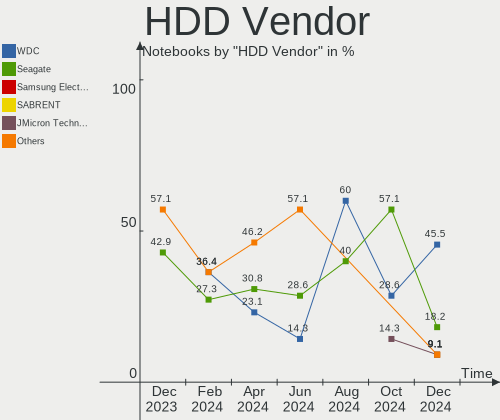
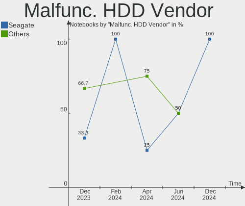
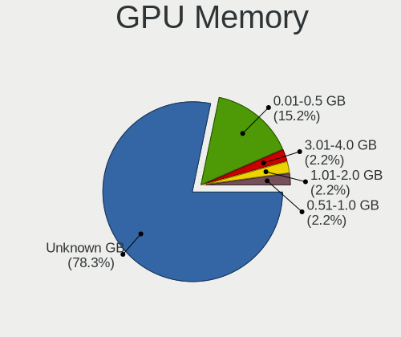
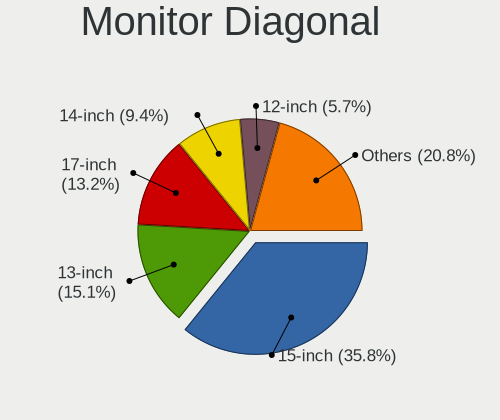
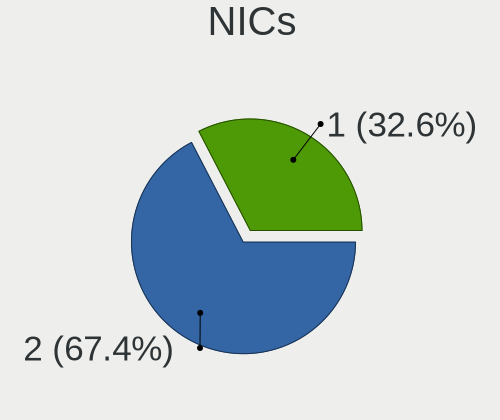
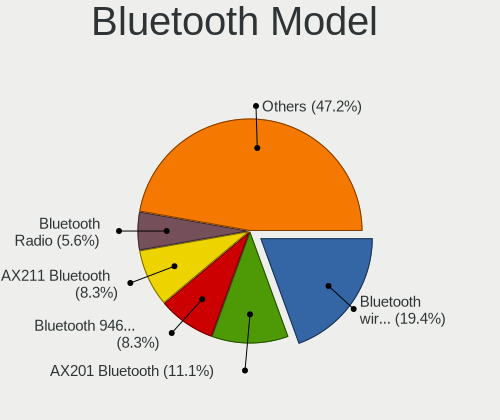

Linux in Netherlands - Hardware Trends (Notebooks)
--------------------------------------------------

A project to identify most popular hardware characteristics and track their change
over time based on data collected by Linux users at https://Linux-Hardware.org.

Anyone can contribute to this report by the [hw-probe](https://github.com/linuxhw/hw-probe) tool:

    sudo -E hw-probe -all -upload

Period: Nov, 2022.

Contents
--------

* [ System ](#system)
  - [ OS                       ](#os)
  - [ OS Family                ](#os-family)
  - [ Kernel                   ](#kernel)
  - [ Kernel Family            ](#kernel-family)
  - [ Kernel Major Ver.        ](#kernel-major-ver)
  - [ Arch                     ](#arch)
  - [ DE                       ](#de)
  - [ Display Server           ](#display-server)
  - [ Display Manager          ](#display-manager)
  - [ OS Lang                  ](#os-lang)
  - [ Boot Mode                ](#boot-mode)
  - [ Filesystem               ](#filesystem)
  - [ Part. scheme             ](#part-scheme)
  - [ Dual Boot with Linux/BSD ](#dual-boot-with-linuxbsd)
  - [ Dual Boot (Win)          ](#dual-boot-win)

* [ Board ](#board)
  - [ Vendor                   ](#vendor)
  - [ Model                    ](#model)
  - [ Model Family             ](#model-family)
  - [ MFG Year                 ](#mfg-year)
  - [ Form Factor              ](#form-factor)
  - [ Secure Boot              ](#secure-boot)
  - [ Coreboot                 ](#coreboot)
  - [ RAM Size                 ](#ram-size)
  - [ RAM Used                 ](#ram-used)
  - [ Total Drives             ](#total-drives)
  - [ Has CD-ROM               ](#has-cd-rom)
  - [ Has Ethernet             ](#has-ethernet)
  - [ Has WiFi                 ](#has-wifi)
  - [ Has Bluetooth            ](#has-bluetooth)

* [ Location ](#location)
  - [ Country                  ](#country)
  - [ City                     ](#city)

* [ Drives ](#drives)
  - [ Drive Vendor             ](#drive-vendor)
  - [ Drive Model              ](#drive-model)
  - [ HDD Vendor               ](#hdd-vendor)
  - [ SSD Vendor               ](#ssd-vendor)
  - [ Drive Kind               ](#drive-kind)
  - [ Drive Connector          ](#drive-connector)
  - [ Drive Size               ](#drive-size)
  - [ Space Total              ](#space-total)
  - [ Space Used               ](#space-used)
  - [ Malfunc. Drives          ](#malfunc-drives)
  - [ Malfunc. Drive Vendor    ](#malfunc-drive-vendor)
  - [ Malfunc. HDD Vendor      ](#malfunc-hdd-vendor)
  - [ Malfunc. Drive Kind      ](#malfunc-drive-kind)
  - [ Failed Drives            ](#failed-drives)
  - [ Failed Drive Vendor      ](#failed-drive-vendor)
  - [ Drive Status             ](#drive-status)

* [ Storage controller ](#storage-controller)
  - [ Storage Vendor           ](#storage-vendor)
  - [ Storage Model            ](#storage-model)
  - [ Storage Kind             ](#storage-kind)

* [ Processor ](#processor)
  - [ CPU Vendor               ](#cpu-vendor)
  - [ CPU Model                ](#cpu-model)
  - [ CPU Model Family         ](#cpu-model-family)
  - [ CPU Cores                ](#cpu-cores)
  - [ CPU Sockets              ](#cpu-sockets)
  - [ CPU Threads              ](#cpu-threads)
  - [ CPU Op-Modes             ](#cpu-op-modes)
  - [ CPU Microcode            ](#cpu-microcode)
  - [ CPU Microarch            ](#cpu-microarch)

* [ Graphics ](#graphics)
  - [ GPU Vendor               ](#gpu-vendor)
  - [ GPU Model                ](#gpu-model)
  - [ GPU Combo                ](#gpu-combo)
  - [ GPU Driver               ](#gpu-driver)
  - [ GPU Memory               ](#gpu-memory)

* [ Monitor ](#monitor)
  - [ Monitor Vendor           ](#monitor-vendor)
  - [ Monitor Model            ](#monitor-model)
  - [ Monitor Resolution       ](#monitor-resolution)
  - [ Monitor Diagonal         ](#monitor-diagonal)
  - [ Monitor Width            ](#monitor-width)
  - [ Aspect Ratio             ](#aspect-ratio)
  - [ Monitor Area             ](#monitor-area)
  - [ Pixel Density            ](#pixel-density)
  - [ Multiple Monitors        ](#multiple-monitors)

* [ Network ](#network)
  - [ Net Controller Vendor    ](#net-controller-vendor)
  - [ Net Controller Model     ](#net-controller-model)
  - [ Wireless Vendor          ](#wireless-vendor)
  - [ Wireless Model           ](#wireless-model)
  - [ Ethernet Vendor          ](#ethernet-vendor)
  - [ Ethernet Model           ](#ethernet-model)
  - [ Net Controller Kind      ](#net-controller-kind)
  - [ Used Controller          ](#used-controller)
  - [ NICs                     ](#nics)
  - [ IPv6                     ](#ipv6)

* [ Bluetooth ](#bluetooth)
  - [ Bluetooth Vendor         ](#bluetooth-vendor)
  - [ Bluetooth Model          ](#bluetooth-model)

* [ Sound ](#sound)
  - [ Sound Vendor             ](#sound-vendor)
  - [ Sound Model              ](#sound-model)

* [ Memory ](#memory)
  - [ Memory Vendor            ](#memory-vendor)
  - [ Memory Model             ](#memory-model)
  - [ Memory Kind              ](#memory-kind)
  - [ Memory Form Factor       ](#memory-form-factor)
  - [ Memory Size              ](#memory-size)
  - [ Memory Speed             ](#memory-speed)

* [ Printers & scanners ](#printers--scanners)
  - [ Printer Vendor           ](#printer-vendor)
  - [ Printer Model            ](#printer-model)
  - [ Scanner Vendor           ](#scanner-vendor)
  - [ Scanner Model            ](#scanner-model)

* [ Camera ](#camera)
  - [ Camera Vendor            ](#camera-vendor)
  - [ Camera Model             ](#camera-model)

* [ Security ](#security)
  - [ Fingerprint Vendor       ](#fingerprint-vendor)
  - [ Fingerprint Model        ](#fingerprint-model)
  - [ Chipcard Vendor          ](#chipcard-vendor)
  - [ Chipcard Model           ](#chipcard-model)

* [ Unsupported ](#unsupported)
  - [ Unsupported Devices      ](#unsupported-devices)
  - [ Unsupported Device Types ](#unsupported-device-types)

System
------

OS
--

Installed operating systems

| Name                         | Notebooks | Percent |
|------------------------------|-----------|---------|
| Ubuntu 22.04                 | 8         | 11.11%  |
| Fedora 36                    | 6         | 8.33%   |
| Fedora 37                    | 5         | 6.94%   |
| Linux Mint 21                | 4         | 5.56%   |
| Debian 11                    | 4         | 5.56%   |
| Ubuntu 22.10                 | 3         | 4.17%   |
| Pop!_OS 22.04                | 3         | 4.17%   |
| openSUSE Tumbleweed-XXXXXXXX | 3         | 4.17%   |
| OpenMandriva 4.50            | 3         | 4.17%   |
| Manjaro 22.0.0               | 3         | 4.17%   |
| Linux Mint 20.3              | 3         | 4.17%   |
| Zorin 16                     | 2         | 2.78%   |
| Ubuntu 20.04                 | 2         | 2.78%   |
| SteamOS 3.4                  | 2         | 2.78%   |
| SteamOS 3.3.2                | 2         | 2.78%   |
| OpenMandriva 4.3             | 2         | 2.78%   |
| Arch Rolling                 | 2         | 2.78%   |
| Xubuntu 22.04                | 1         | 1.39%   |
| Xubuntu 18.04                | 1         | 1.39%   |
| Ubuntu Budgie 18.04          | 1         | 1.39%   |
| SteamOS 3.3.1                | 1         | 1.39%   |
| openSUSE Microos-XXXXXXXX    | 1         | 1.39%   |
| Lubuntu 22.10                | 1         | 1.39%   |
| Linux Mint 20.1              | 1         | 1.39%   |
| Linux Mint 20                | 1         | 1.39%   |
| Kubuntu 22.10                | 1         | 1.39%   |
| KDE neon 22.04               | 1         | 1.39%   |
| Kali 2022.4                  | 1         | 1.39%   |
| Gentoo 2.9                   | 1         | 1.39%   |
| EndeavourOS Rolling          | 1         | 1.39%   |
| Devuan 4                     | 1         | 1.39%   |
| ArcoLinux Rolling            | 1         | 1.39%   |

OS Family
---------

OS without a version

| Name          | Notebooks | Percent |
|---------------|-----------|---------|
| Ubuntu        | 13        | 18.06%  |
| Fedora        | 11        | 15.28%  |
| Linux Mint    | 9         | 12.5%   |
| SteamOS       | 5         | 6.94%   |
| OpenMandriva  | 5         | 6.94%   |
| openSUSE      | 4         | 5.56%   |
| Debian        | 4         | 5.56%   |
| Pop!_OS       | 3         | 4.17%   |
| Manjaro       | 3         | 4.17%   |
| Zorin         | 2         | 2.78%   |
| Xubuntu       | 2         | 2.78%   |
| Arch          | 2         | 2.78%   |
| Ubuntu Budgie | 1         | 1.39%   |
| Lubuntu       | 1         | 1.39%   |
| Kubuntu       | 1         | 1.39%   |
| KDE neon      | 1         | 1.39%   |
| Kali          | 1         | 1.39%   |
| Gentoo        | 1         | 1.39%   |
| EndeavourOS   | 1         | 1.39%   |
| Devuan        | 1         | 1.39%   |
| ArcoLinux     | 1         | 1.39%   |

Kernel
------

Version of the Linux kernel

| Version                                        | Notebooks | Percent |
|------------------------------------------------|-----------|---------|
| 5.15.0-52-generic                              | 8         | 11.11%  |
| 5.15.0-53-generic                              | 6         | 8.33%   |
| 5.19.0-23-generic                              | 5         | 6.94%   |
| 6.0.5-200.fc36.x86_64                          | 4         | 5.56%   |
| 6.0.9-300.fc37.x86_64                          | 3         | 4.17%   |
| 6.0.8-1-default                                | 3         | 4.17%   |
| 5.13.0-valve21.3-1-neptune                     | 3         | 4.17%   |
| 5.10.0-19-amd64                                | 3         | 4.17%   |
| 6.0.6-arch1-1                                  | 2         | 2.78%   |
| 6.0.6-76060006-generic                         | 2         | 2.78%   |
| 5.4.0-131-generic                              | 2         | 2.78%   |
| 5.16.7-desktop-1omv4003                        | 2         | 2.78%   |
| 5.15.78-1-MANJARO                              | 2         | 2.78%   |
| 6.1.0-rc4+                                     | 1         | 1.39%   |
| 6.0.9-gentoo-wayland-x86_64                    | 1         | 1.39%   |
| 6.0.8-zen1-1-zen                               | 1         | 1.39%   |
| 6.0.8-300.fc37.x86_64                          | 1         | 1.39%   |
| 6.0.7-arch1-1                                  | 1         | 1.39%   |
| 6.0.7-200.fc36.x86_64                          | 1         | 1.39%   |
| 6.0.6-1-MANJARO                                | 1         | 1.39%   |
| 6.0.6-1-default                                | 1         | 1.39%   |
| 6.0.3-76060003-generic                         | 1         | 1.39%   |
| 6.0.2-desktop-1omv4050                         | 1         | 1.39%   |
| 5.4.217-0504217-generic                        | 1         | 1.39%   |
| 5.4.0-91-generic                               | 1         | 1.39%   |
| 5.4.0-133-generic                              | 1         | 1.39%   |
| 5.4.0-132-generic                              | 1         | 1.39%   |
| 5.19.5-desktop-1omv4090                        | 1         | 1.39%   |
| 5.19.12-desktop-2omv4090                       | 1         | 1.39%   |
| 5.18.0-kali5-amd64                             | 1         | 1.39%   |
| 5.17.5-300.fc36.x86_64                         | 1         | 1.39%   |
| 5.17.0-1019-oem                                | 1         | 1.39%   |
| 5.15.0-41-generic                              | 1         | 1.39%   |
| 5.14.0-1054-oem                                | 1         | 1.39%   |
| 5.14.0-1047-oem                                | 1         | 1.39%   |
| 5.13.0-valve31-1-neptune                       | 1         | 1.39%   |
| 5.13.0-valve21.1-1-neptune-02211-gc54cda5a36f3 | 1         | 1.39%   |
| 5.11.0-44-generic                              | 1         | 1.39%   |
| 5.10.0-19-686-pae                              | 1         | 1.39%   |
| 5.10.0-18-amd64                                | 1         | 1.39%   |

Kernel Family
-------------

Linux kernel without a distro release

| Version | Notebooks | Percent |
|---------|-----------|---------|
| 5.15.0  | 15        | 20.83%  |
| 6.0.6   | 6         | 8.33%   |
| 6.0.8   | 5         | 6.94%   |
| 5.4.0   | 5         | 6.94%   |
| 5.19.0  | 5         | 6.94%   |
| 5.13.0  | 5         | 6.94%   |
| 5.10.0  | 5         | 6.94%   |
| 6.0.9   | 4         | 5.56%   |
| 6.0.5   | 4         | 5.56%   |
| 6.0.7   | 2         | 2.78%   |
| 5.16.7  | 2         | 2.78%   |
| 5.15.78 | 2         | 2.78%   |
| 5.14.0  | 2         | 2.78%   |
| 6.1.0   | 1         | 1.39%   |
| 6.0.3   | 1         | 1.39%   |
| 6.0.2   | 1         | 1.39%   |
| 5.4.217 | 1         | 1.39%   |
| 5.19.5  | 1         | 1.39%   |
| 5.19.12 | 1         | 1.39%   |
| 5.18.0  | 1         | 1.39%   |
| 5.17.5  | 1         | 1.39%   |
| 5.17.0  | 1         | 1.39%   |
| 5.11.0  | 1         | 1.39%   |

Kernel Major Ver.
-----------------

Linux kernel major version

| Version | Notebooks | Percent |
|---------|-----------|---------|
| 6.0     | 23        | 31.94%  |
| 5.15    | 17        | 23.61%  |
| 5.19    | 7         | 9.72%   |
| 5.4     | 6         | 8.33%   |
| 5.13    | 5         | 6.94%   |
| 5.10    | 5         | 6.94%   |
| 5.17    | 2         | 2.78%   |
| 5.16    | 2         | 2.78%   |
| 5.14    | 2         | 2.78%   |
| 6.1     | 1         | 1.39%   |
| 5.18    | 1         | 1.39%   |
| 5.11    | 1         | 1.39%   |

Arch
----

OS architecture (x86_64, i586, etc.)

| Name   | Notebooks | Percent |
|--------|-----------|---------|
| x86_64 | 71        | 98.61%  |
| i686   | 1         | 1.39%   |

DE
--

Desktop Environment

| Name       | Notebooks | Percent |
|------------|-----------|---------|
| GNOME      | 28        | 38.89%  |
| KDE5       | 22        | 30.56%  |
| XFCE       | 9         | 12.5%   |
| X-Cinnamon | 7         | 9.72%   |
| MATE       | 2         | 2.78%   |
| sway       | 1         | 1.39%   |
| LXQt       | 1         | 1.39%   |
| i3         | 1         | 1.39%   |
| Budgie     | 1         | 1.39%   |

Display Server
--------------

X11 or Wayland

| Name    | Notebooks | Percent |
|---------|-----------|---------|
| X11     | 51        | 70.83%  |
| Wayland | 19        | 26.39%  |
| Tty     | 1         | 1.39%   |
| Unknown | 1         | 1.39%   |

Display Manager
---------------

SDDM, LightDM, etc.

| Name    | Notebooks | Percent |
|---------|-----------|---------|
| Unknown | 30        | 41.67%  |
| LightDM | 13        | 18.06%  |
| GDM3    | 11        | 15.28%  |
| SDDM    | 10        | 13.89%  |
| GDM     | 6         | 8.33%   |
| XDM     | 1         | 1.39%   |
| GREETD  | 1         | 1.39%   |

OS Lang
-------

Language

| Lang  | Notebooks | Percent |
|-------|-----------|---------|
| en_US | 43        | 59.72%  |
| nl_NL | 18        | 25%     |
| en_GB | 6         | 8.33%   |
| ru_UA | 1         | 1.39%   |
| ru_RU | 1         | 1.39%   |
| hr_HR | 1         | 1.39%   |
| en_NL | 1         | 1.39%   |
| en_AU | 1         | 1.39%   |

Boot Mode
---------

EFI or BIOS

| Mode | Notebooks | Percent |
|------|-----------|---------|
| EFI  | 37        | 51.39%  |
| BIOS | 35        | 48.61%  |

Filesystem
----------

Type of filesystem

| Type    | Notebooks | Percent |
|---------|-----------|---------|
| Ext4    | 48        | 66.67%  |
| Btrfs   | 21        | 29.17%  |
| Overlay | 3         | 4.17%   |

Part. scheme
------------

Scheme of partitioning

| Type    | Notebooks | Percent |
|---------|-----------|---------|
| GPT     | 34        | 47.22%  |
| Unknown | 30        | 41.67%  |
| MBR     | 8         | 11.11%  |

Dual Boot with Linux/BSD
------------------------

Hosting more than one Linux/BSD

| Dual boot | Notebooks | Percent |
|-----------|-----------|---------|
| No        | 66        | 91.67%  |
| Yes       | 6         | 8.33%   |

Dual Boot (Win)
---------------

Hosting Linux and Windows

| Dual boot | Notebooks | Percent |
|-----------|-----------|---------|
| No        | 58        | 80.56%  |
| Yes       | 14        | 19.44%  |

Board
-----

Vendor
------

Motherboard manufacturer

| Name             | Notebooks | Percent |
|------------------|-----------|---------|
| Hewlett-Packard  | 17        | 23.61%  |
| Lenovo           | 16        | 22.22%  |
| Dell             | 11        | 15.28%  |
| ASUSTek Computer | 6         | 8.33%   |
| Acer             | 6         | 8.33%   |
| Apple            | 5         | 6.94%   |
| Valve            | 4         | 5.56%   |
| MSI              | 2         | 2.78%   |
| THUNDEROBOT      | 1         | 1.39%   |
| SLIMBOOK         | 1         | 1.39%   |
| Schenker         | 1         | 1.39%   |
| Panasonic        | 1         | 1.39%   |
| HUAWEI           | 1         | 1.39%   |

Model
-----

Motherboard model

| Name                                     | Notebooks | Percent |
|------------------------------------------|-----------|---------|
| Valve Jupiter                            | 4         | 5.56%   |
| Dell XPS 15 9510                         | 3         | 4.17%   |
| Lenovo Yoga Slim 7 13ACN5 82CY           | 2         | 2.78%   |
| Lenovo ThinkPad T16 Gen 1 21CHCTO1WW     | 2         | 2.78%   |
| Apple MacBookPro11,5                     | 2         | 2.78%   |
| THUNDEROBOT 911MT                        | 1         | 1.39%   |
| SLIMBOOK PROX14                          | 1         | 1.39%   |
| Schenker XMG FUSION 15 (XFU15L19)        | 1         | 1.39%   |
| Panasonic CF-R9KWCTDR                    | 1         | 1.39%   |
| MSI MS-1688                              | 1         | 1.39%   |
| MSI Modern 15 A11MU                      | 1         | 1.39%   |
| Lenovo Yoga Slim 7 Pro 14IAH7 82UT       | 1         | 1.39%   |
| Lenovo ThinkPad X200 7458FDG             | 1         | 1.39%   |
| Lenovo ThinkPad X1 Carbon 2nd 20A7000NAD | 1         | 1.39%   |
| Lenovo ThinkPad T420 4236WR1             | 1         | 1.39%   |
| Lenovo ThinkPad L560 20F2S2UR02          | 1         | 1.39%   |
| Lenovo ThinkPad L380 20M50013MH          | 1         | 1.39%   |
| Lenovo ThinkPad L14 Gen 1 20U5001WTX     | 1         | 1.39%   |
| Lenovo ThinkPad Edge E431 6277CTO        | 1         | 1.39%   |
| Lenovo IdeaPad L340-15IRH Gaming 81LK    | 1         | 1.39%   |
| Lenovo IdeaPad 5 Pro 16ACH6 82L5         | 1         | 1.39%   |
| Lenovo IdeaPad 5 15ARE05 81YQ            | 1         | 1.39%   |
| Lenovo IdeaPad 5 14ITL05 82FE            | 1         | 1.39%   |
| HUAWEI BOHK-WAX9X                        | 1         | 1.39%   |
| HP Victus by Laptop 16-d0xxx             | 1         | 1.39%   |
| HP ProBook 5330m                         | 1         | 1.39%   |
| HP ProBook 4530s                         | 1         | 1.39%   |
| HP ProBook 450 G5                        | 1         | 1.39%   |
| HP ProBook 450 15.6 inch G9 Notebook PC  | 1         | 1.39%   |
| HP Pavilion Gaming Laptop 15-cx0xxx      | 1         | 1.39%   |
| HP Pavilion g6                           | 1         | 1.39%   |
| HP Pavilion dv9500                       | 1         | 1.39%   |
| HP OMEN by Laptop 15-dc0xxx              | 1         | 1.39%   |
| HP Notebook                              | 1         | 1.39%   |
| HP EliteBook 865 16 inch G9 Notebook PC  | 1         | 1.39%   |
| HP EliteBook 8570w                       | 1         | 1.39%   |
| HP EliteBook 830 G5                      | 1         | 1.39%   |
| HP EliteBook 745 G6                      | 1         | 1.39%   |
| HP Compaq Presario CQ71                  | 1         | 1.39%   |
| HP Compaq 6820s                          | 1         | 1.39%   |

Model Family
------------

Motherboard model prefix

| Name                  | Notebooks | Percent |
|-----------------------|-----------|---------|
| Lenovo ThinkPad       | 9         | 12.5%   |
| Dell Latitude         | 6         | 8.33%   |
| Acer Aspire           | 5         | 6.94%   |
| Valve Jupiter         | 4         | 5.56%   |
| Lenovo IdeaPad        | 4         | 5.56%   |
| HP ProBook            | 4         | 5.56%   |
| HP EliteBook          | 4         | 5.56%   |
| Dell XPS              | 4         | 5.56%   |
| Lenovo Yoga           | 3         | 4.17%   |
| HP Pavilion           | 3         | 4.17%   |
| Apple MacBookPro11    | 3         | 4.17%   |
| HP Compaq             | 2         | 2.78%   |
| THUNDEROBOT 911MT     | 1         | 1.39%   |
| SLIMBOOK PROX14       | 1         | 1.39%   |
| Schenker XMG          | 1         | 1.39%   |
| Panasonic CF-R9KWCTDR | 1         | 1.39%   |
| MSI MS-1688           | 1         | 1.39%   |
| MSI Modern            | 1         | 1.39%   |
| HUAWEI BOHK-WAX9X     | 1         | 1.39%   |
| HP Victus             | 1         | 1.39%   |
| HP OMEN               | 1         | 1.39%   |
| HP Notebook           | 1         | 1.39%   |
| Dell Precision        | 1         | 1.39%   |
| ASUS X551MA           | 1         | 1.39%   |
| ASUS N752VX           | 1         | 1.39%   |
| ASUS K56CA            | 1         | 1.39%   |
| ASUS FX503VD          | 1         | 1.39%   |
| ASUS E200HA           | 1         | 1.39%   |
| ASUS A6R              | 1         | 1.39%   |
| Apple MacBookPro8     | 1         | 1.39%   |
| Apple MacBookAir7     | 1         | 1.39%   |
| Acer SW5-017          | 1         | 1.39%   |
| Unknown               | 1         | 1.39%   |

MFG Year
--------

Motherboard manufacture year

| Year | Notebooks | Percent |
|------|-----------|---------|
| 2022 | 10        | 13.89%  |
| 2021 | 9         | 12.5%   |
| 2016 | 7         | 9.72%   |
| 2011 | 7         | 9.72%   |
| 2020 | 6         | 8.33%   |
| 2019 | 6         | 8.33%   |
| 2018 | 5         | 6.94%   |
| 2010 | 5         | 6.94%   |
| 2017 | 3         | 4.17%   |
| 2012 | 3         | 4.17%   |
| 2015 | 2         | 2.78%   |
| 2014 | 2         | 2.78%   |
| 2013 | 2         | 2.78%   |
| 2007 | 2         | 2.78%   |
| 2009 | 1         | 1.39%   |
| 2008 | 1         | 1.39%   |
| 2006 | 1         | 1.39%   |

Form Factor
-----------

Physical design of the computer

| Name     | Notebooks | Percent |
|----------|-----------|---------|
| Notebook | 72        | 100%    |

Secure Boot
-----------

Enabled or disabled

| State    | Notebooks | Percent |
|----------|-----------|---------|
| Disabled | 64        | 88.89%  |
| Enabled  | 8         | 11.11%  |

Coreboot
--------

Have coreboot on board

| Used | Notebooks | Percent |
|------|-----------|---------|
| No   | 72        | 100%    |

RAM Size
--------

Total RAM memory

| Size in GB  | Notebooks | Percent |
|-------------|-----------|---------|
| 4.01-8.0    | 21        | 29.17%  |
| 8.01-16.0   | 16        | 22.22%  |
| 3.01-4.0    | 11        | 15.28%  |
| 16.01-24.0  | 11        | 15.28%  |
| 32.01-64.0  | 6         | 8.33%   |
| 24.01-32.0  | 3         | 4.17%   |
| 1.01-2.0    | 3         | 4.17%   |
| 64.01-256.0 | 1         | 1.39%   |

RAM Used
--------

Used RAM memory

| Used GB   | Notebooks | Percent |
|-----------|-----------|---------|
| 2.01-3.0  | 22        | 30.56%  |
| 1.01-2.0  | 19        | 26.39%  |
| 3.01-4.0  | 12        | 16.67%  |
| 4.01-8.0  | 10        | 13.89%  |
| 0.51-1.0  | 5         | 6.94%   |
| 8.01-16.0 | 4         | 5.56%   |

Total Drives
------------

Number of drives on board

| Drives | Notebooks | Percent |
|--------|-----------|---------|
| 1      | 56        | 77.78%  |
| 2      | 12        | 16.67%  |
| 3      | 3         | 4.17%   |
| 0      | 1         | 1.39%   |

Has CD-ROM
----------

Has CD-ROM on board

| Presented | Notebooks | Percent |
|-----------|-----------|---------|
| No        | 54        | 75%     |
| Yes       | 18        | 25%     |

Has Ethernet
------------

Has Ethernet on board

| Presented | Notebooks | Percent |
|-----------|-----------|---------|
| Yes       | 57        | 79.17%  |
| No        | 15        | 20.83%  |

Has WiFi
--------

Has WiFi module

| Presented | Notebooks | Percent |
|-----------|-----------|---------|
| Yes       | 71        | 98.61%  |
| No        | 1         | 1.39%   |

Has Bluetooth
-------------

Has Bluetooth module

| Presented | Notebooks | Percent |
|-----------|-----------|---------|
| Yes       | 61        | 84.72%  |
| No        | 11        | 15.28%  |

Location
--------

Country
-------

Geographic location (country)

| Country     | Notebooks | Percent |
|-------------|-----------|---------|
| Netherlands | 72        | 100%    |

City
----

Geographic location (city)

| City                   | Notebooks | Percent |
|------------------------|-----------|---------|
| Amsterdam              | 19        | 26.39%  |
| Rotterdam              | 3         | 4.17%   |
| Almere Stad            | 3         | 4.17%   |
| Purmerend              | 2         | 2.78%   |
| Hoofddorp              | 2         | 2.78%   |
| Herten                 | 2         | 2.78%   |
| Haarlem                | 2         | 2.78%   |
| Delft                  | 2         | 2.78%   |
| Zwolle                 | 1         | 1.39%   |
| Zevenaar               | 1         | 1.39%   |
| Zeist                  | 1         | 1.39%   |
| Winterswijk            | 1         | 1.39%   |
| Wijdewormer            | 1         | 1.39%   |
| Wierden                | 1         | 1.39%   |
| Wezep                  | 1         | 1.39%   |
| Someren                | 1         | 1.39%   |
| Sittard                | 1         | 1.39%   |
| Sint Pancras           | 1         | 1.39%   |
| Schiedam               | 1         | 1.39%   |
| Sappemeer              | 1         | 1.39%   |
| Rozenburg              | 1         | 1.39%   |
| Rijswijk               | 1         | 1.39%   |
| Oss                    | 1         | 1.39%   |
| Naaldwijk              | 1         | 1.39%   |
| Mijnsheerenland        | 1         | 1.39%   |
| Leimuiden              | 1         | 1.39%   |
| Leiden                 | 1         | 1.39%   |
| Leeuwarden             | 1         | 1.39%   |
| Kudelstaart            | 1         | 1.39%   |
| Krimpen aan den IJssel | 1         | 1.39%   |
| Huizen                 | 1         | 1.39%   |
| Hengelo                | 1         | 1.39%   |
| Heerenveen             | 1         | 1.39%   |
| Heemskerk              | 1         | 1.39%   |
| Harmelen               | 1         | 1.39%   |
| Groningen              | 1         | 1.39%   |
| Enschede               | 1         | 1.39%   |
| Dronten                | 1         | 1.39%   |
| Doetinchem             | 1         | 1.39%   |
| Deventer               | 1         | 1.39%   |

Drives
------

Drive Vendor
------------

Hard drive vendors

| Vendor                      | Notebooks | Drives | Percent |
|-----------------------------|-----------|--------|---------|
| Samsung Electronics         | 19        | 22     | 22.09%  |
| WDC                         | 8         | 8      | 9.3%    |
| Unknown                     | 7         | 7      | 8.14%   |
| SK hynix                    | 6         | 6      | 6.98%   |
| SanDisk                     | 5         | 5      | 5.81%   |
| Kingston                    | 5         | 5      | 5.81%   |
| HGST                        | 5         | 5      | 5.81%   |
| Seagate                     | 4         | 4      | 4.65%   |
| Apple                       | 4         | 4      | 4.65%   |
| Kingston Technology Company | 3         | 3      | 3.49%   |
| Hitachi                     | 3         | 3      | 3.49%   |
| Micron Technology           | 2         | 2      | 2.33%   |
| Crucial                     | 2         | 2      | 2.33%   |
| Transcend                   | 1         | 1      | 1.16%   |
| Teclast                     | 1         | 1      | 1.16%   |
| Team                        | 1         | 1      | 1.16%   |
| SSSTC                       | 1         | 1      | 1.16%   |
| Phison Electronics          | 1         | 1      | 1.16%   |
| O2 Micro                    | 1         | 1      | 1.16%   |
| LITEONIT                    | 1         | 1      | 1.16%   |
| LITEON                      | 1         | 1      | 1.16%   |
| KIOXIA                      | 1         | 1      | 1.16%   |
| KingSpec                    | 1         | 1      | 1.16%   |
| External                    | 1         | 1      | 1.16%   |
| China                       | 1         | 1      | 1.16%   |
| A-DATA Technology           | 1         | 1      | 1.16%   |

Drive Model
-----------

Hard drive models

| Model                                                | Notebooks | Percent |
|------------------------------------------------------|-----------|---------|
| Samsung NVMe SSD Controller SM981/PM981/PM983 1TB    | 6         | 6.82%   |
| Samsung NVMe SSD Controller PM9A1/PM9A3/980PRO 250GB | 4         | 4.55%   |
| Unknown MMC Card  32GB                               | 3         | 3.41%   |
| SK hynix SKHynix_HFS512GD9TNI-L2A0B 512GB            | 3         | 3.41%   |
| WDC WDS240G2G0A-00JH30 240GB SSD                     | 2         | 2.27%   |
| Samsung SSD 850 EVO 250GB                            | 2         | 2.27%   |
| Kingston Company OM3PDP3 NVMe SSD 256GB              | 2         | 2.27%   |
| Kingston SA400S37120G 120GB SSD                      | 2         | 2.27%   |
| HGST HTS725050A7E630 500GB                           | 2         | 2.27%   |
| HGST HTS721010A9E630 1TB                             | 2         | 2.27%   |
| Apple SSD SM0512G 500GB                              | 2         | 2.27%   |
| WDC WDS500G2B0A-00SM50 500GB SSD                     | 1         | 1.14%   |
| WDC WDBNCE0010PNC 1TB SSD                            | 1         | 1.14%   |
| WDC WD600UE-22HCT0 64GB                              | 1         | 1.14%   |
| WDC WD3200BPVT-22JJ5T0 320GB                         | 1         | 1.14%   |
| WDC WD3200BEKX-00B7WT0 320GB                         | 1         | 1.14%   |
| WDC PC SN540 SDDPNPF-512G-1032 512GB                 | 1         | 1.14%   |
| Unknown MMC Card  536GB                              | 1         | 1.14%   |
| Unknown MMC Card  512GB                              | 1         | 1.14%   |
| Unknown MMC Card  128GB                              | 1         | 1.14%   |
| Unknown HCG4a2  64GB                                 | 1         | 1.14%   |
| Transcend TS128GSSD230S 128GB                        | 1         | 1.14%   |
| Teclast 256GB SSD                                    | 1         | 1.14%   |
| Team T253TD240G 240GB SSD                            | 1         | 1.14%   |
| SSSTC CL1-8D512 512GB                                | 1         | 1.14%   |
| SK hynix SKHynix_HFS512GDE9X084N 512GB               | 1         | 1.14%   |
| SK hynix SKHynix_HFS001TDE9X084N 1TB                 | 1         | 1.14%   |
| SK hynix HFS256G39MND-2300A 256GB SSD                | 1         | 1.14%   |
| Seagate ST2000LX001-1RG174 2TB                       | 1         | 1.14%   |
| Seagate ST1000LM035-1RK172 1TB                       | 1         | 1.14%   |
| Seagate ST1000LM014-1EJ164 1TB                       | 1         | 1.14%   |
| Seagate Expansion 1TB                                | 1         | 1.14%   |
| Sandisk WD Black SN750 / PC SN730 NVMe SSD 1024GB    | 1         | 1.14%   |
| SanDisk SSD U100 24GB                                | 1         | 1.14%   |
| SanDisk SD9SN8W-128G-1006 128GB SSD                  | 1         | 1.14%   |
| SanDisk SD8TB8U256G1001 256GB SSD                    | 1         | 1.14%   |
| SanDisk SD8SN8U128G1002 128GB SSD                    | 1         | 1.14%   |
| Samsung SSD 870 QVO 1TB                              | 1         | 1.14%   |
| Samsung SSD 870 EVO 2TB                              | 1         | 1.14%   |
| Samsung Portable SSD T5 1TB                          | 1         | 1.14%   |

HDD Vendor
----------

Hard disk drive vendors

| Vendor  | Notebooks | Drives | Percent |
|---------|-----------|--------|---------|
| HGST    | 5         | 5      | 33.33%  |
| Seagate | 4         | 4      | 26.67%  |
| WDC     | 3         | 3      | 20%     |
| Hitachi | 3         | 3      | 20%     |

SSD Vendor
----------

Solid state drive vendors

| Vendor              | Notebooks | Drives | Percent |
|---------------------|-----------|--------|---------|
| WDC                 | 4         | 4      | 13.33%  |
| SanDisk             | 4         | 4      | 13.33%  |
| Samsung Electronics | 4         | 5      | 13.33%  |
| Kingston            | 4         | 4      | 13.33%  |
| Apple               | 4         | 4      | 13.33%  |
| Crucial             | 2         | 2      | 6.67%   |
| Transcend           | 1         | 1      | 3.33%   |
| Teclast             | 1         | 1      | 3.33%   |
| Team                | 1         | 1      | 3.33%   |
| SK hynix            | 1         | 1      | 3.33%   |
| LITEONIT            | 1         | 1      | 3.33%   |
| KingSpec            | 1         | 1      | 3.33%   |
| China               | 1         | 1      | 3.33%   |
| A-DATA Technology   | 1         | 1      | 3.33%   |

Drive Kind
----------

HDD or SSD

| Kind | Notebooks | Drives | Percent |
|------|-----------|--------|---------|
| NVMe | 35        | 36     | 41.18%  |
| SSD  | 28        | 31     | 32.94%  |
| HDD  | 15        | 15     | 17.65%  |
| MMC  | 7         | 7      | 8.24%   |

Drive Connector
---------------

SATA, SAS, NVMe, etc.

| Type | Notebooks | Drives | Percent |
|------|-----------|--------|---------|
| SATA | 39        | 44     | 46.99%  |
| NVMe | 34        | 35     | 40.96%  |
| MMC  | 7         | 7      | 8.43%   |
| SAS  | 3         | 3      | 3.61%   |

Drive Size
----------

Size of hard drive

| Size in TB | Notebooks | Drives | Percent |
|------------|-----------|--------|---------|
| 0.01-0.5   | 32        | 35     | 76.19%  |
| 0.51-1.0   | 8         | 9      | 19.05%  |
| 1.01-2.0   | 2         | 2      | 4.76%   |

Space Total
-----------

Amount of disk space available on the file system

| Size in GB     | Notebooks | Percent |
|----------------|-----------|---------|
| 101-250        | 20        | 27.78%  |
| 251-500        | 11        | 15.28%  |
| 1001-2000      | 11        | 15.28%  |
| 501-1000       | 11        | 15.28%  |
| 51-100         | 6         | 8.33%   |
| 21-50          | 4         | 5.56%   |
| 1-20           | 4         | 5.56%   |
| More than 3000 | 3         | 4.17%   |
| 2001-3000      | 2         | 2.78%   |

Space Used
----------

Amount of used disk space

| Used GB        | Notebooks | Percent |
|----------------|-----------|---------|
| 1-20           | 28        | 38.89%  |
| 21-50          | 14        | 19.44%  |
| 251-500        | 10        | 13.89%  |
| 101-250        | 9         | 12.5%   |
| 501-1000       | 4         | 5.56%   |
| 51-100         | 3         | 4.17%   |
| 1001-2000      | 2         | 2.78%   |
| More than 3000 | 1         | 1.39%   |
| 2001-3000      | 1         | 1.39%   |

Malfunc. Drives
---------------

Drive models with a malfunction

| Model                                           | Notebooks | Drives | Percent |
|-------------------------------------------------|-----------|--------|---------|
| WDC WD600UE-22HCT0 64GB                         | 1         | 1      | 20%     |
| WDC WD3200BPVT-22JJ5T0 320GB                    | 1         | 1      | 20%     |
| LITEON CA1-8D128-HP 128GB                       | 1         | 1      | 20%     |
| Kingston Technology Company KC2000 NVMe SSD 2TB | 1         | 1      | 20%     |
| Hitachi HTS542512K9A300 120GB                   | 1         | 1      | 20%     |

Malfunc. Drive Vendor
---------------------

Vendors of faulty drives

| Vendor                      | Notebooks | Drives | Percent |
|-----------------------------|-----------|--------|---------|
| WDC                         | 2         | 2      | 40%     |
| LITEON                      | 1         | 1      | 20%     |
| Kingston Technology Company | 1         | 1      | 20%     |
| Hitachi                     | 1         | 1      | 20%     |

Malfunc. HDD Vendor
-------------------

Vendors of faulty HDD drives

| Vendor  | Notebooks | Drives | Percent |
|---------|-----------|--------|---------|
| WDC     | 2         | 2      | 66.67%  |
| Hitachi | 1         | 1      | 33.33%  |

Malfunc. Drive Kind
-------------------

Kinds of faulty drives

| Kind | Notebooks | Drives | Percent |
|------|-----------|--------|---------|
| HDD  | 3         | 3      | 60%     |
| NVMe | 2         | 2      | 40%     |

Failed Drives
-------------

Failed drive models

Zero info for selected period =(

Failed Drive Vendor
-------------------

Failed drive vendors

Zero info for selected period =(

Drive Status
------------

Number of failed and malfunc. drives

| Status   | Notebooks | Drives | Percent |
|----------|-----------|--------|---------|
| Detected | 44        | 59     | 61.11%  |
| Works    | 23        | 25     | 31.94%  |
| Malfunc  | 5         | 5      | 6.94%   |

Storage controller
------------------

Storage Vendor
--------------

Storage controller vendors

| Vendor                         | Notebooks | Percent |
|--------------------------------|-----------|---------|
| Intel                          | 42        | 50.6%   |
| Samsung Electronics            | 20        | 24.1%   |
| SK hynix                       | 5         | 6.02%   |
| Kingston Technology Company    | 4         | 4.82%   |
| AMD                            | 3         | 3.61%   |
| SanDisk                        | 2         | 2.41%   |
| Micron Technology              | 2         | 2.41%   |
| Solid State Storage Technology | 1         | 1.2%    |
| Phison Electronics             | 1         | 1.2%    |
| O2 Micro                       | 1         | 1.2%    |
| Lite-On Technology             | 1         | 1.2%    |
| KIOXIA                         | 1         | 1.2%    |

Storage Model
-------------

Storage controller models

| Model                                                                          | Notebooks | Percent |
|--------------------------------------------------------------------------------|-----------|---------|
| Samsung NVMe SSD Controller SM981/PM981/PM983                                  | 8         | 9.3%    |
| Samsung NVMe SSD Controller PM9A1/PM9A3/980PRO                                 | 6         | 6.98%   |
| Intel Cannon Lake Mobile PCH SATA AHCI Controller                              | 5         | 5.81%   |
| Intel 7 Series Chipset Family 6-port SATA Controller [AHCI mode]               | 5         | 5.81%   |
| Intel 6 Series/C200 Series Chipset Family 6 port Mobile SATA AHCI Controller   | 5         | 5.81%   |
| Intel Volume Management Device NVMe RAID Controller                            | 4         | 4.65%   |
| Intel Sunrise Point-LP SATA Controller [AHCI mode]                             | 4         | 4.65%   |
| SK hynix Non-Volatile memory controller                                        | 3         | 3.49%   |
| Samsung Electronics SATA controller                                            | 3         | 3.49%   |
| Intel 82801 Mobile SATA Controller [RAID mode]                                 | 3         | 3.49%   |
| SK hynix Gold P31/PC711 NVMe Solid State Drive                                 | 2         | 2.33%   |
| Micron Non-Volatile memory controller                                          | 2         | 2.33%   |
| Kingston Company OM3PDP3 NVMe SSD                                              | 2         | 2.33%   |
| Intel 82801IBM/IEM (ICH9M/ICH9M-E) 4 port SATA Controller [AHCI mode]          | 2         | 2.33%   |
| Intel 82801HM/HEM (ICH8M/ICH8M-E) SATA Controller [AHCI mode]                  | 2         | 2.33%   |
| Intel 82801HM/HEM (ICH8M/ICH8M-E) IDE Controller                               | 2         | 2.33%   |
| Intel 5 Series/3400 Series Chipset 6 port SATA AHCI Controller                 | 2         | 2.33%   |
| Intel 5 Series/3400 Series Chipset 4 port SATA AHCI Controller                 | 2         | 2.33%   |
| AMD FCH SATA Controller [AHCI mode]                                            | 2         | 2.33%   |
| Solid State Storage Non-Volatile memory controller                             | 1         | 1.16%   |
| SanDisk WD Black SN750 / PC SN730 NVMe SSD                                     | 1         | 1.16%   |
| SanDisk Non-Volatile memory controller                                         | 1         | 1.16%   |
| Samsung NVMe SSD Controller SM961/PM961/SM963                                  | 1         | 1.16%   |
| Samsung NVMe SSD Controller 980                                                | 1         | 1.16%   |
| Samsung Apple PCIe SSD                                                         | 1         | 1.16%   |
| Phison PS5013 E13 NVMe Controller                                              | 1         | 1.16%   |
| O2 Micro Non-Volatile memory controller                                        | 1         | 1.16%   |
| Lite-On Non-Volatile memory controller                                         | 1         | 1.16%   |
| KIOXIA NVMe SSD Controller BG4                                                 | 1         | 1.16%   |
| Kingston Company KC2000 NVMe SSD                                               | 1         | 1.16%   |
| Kingston Company A2000 NVMe SSD                                                | 1         | 1.16%   |
| Intel Wildcat Point-LP SATA Controller [AHCI Mode]                             | 1         | 1.16%   |
| Intel HM170/QM170 Chipset SATA Controller [AHCI Mode]                          | 1         | 1.16%   |
| Intel Cannon Point-LP SATA Controller [AHCI Mode]                              | 1         | 1.16%   |
| Intel Atom Processor E3800 Series SATA AHCI Controller                         | 1         | 1.16%   |
| Intel 8 Series/C220 Series Chipset Family 6-port SATA Controller 1 [AHCI mode] | 1         | 1.16%   |
| Intel 8 Series SATA Controller 1 [AHCI mode]                                   | 1         | 1.16%   |
| Intel 500 Series Chipset Family SATA AHCI Controller                           | 1         | 1.16%   |
| Intel 5 Series/3400 Series Chipset 4 port SATA IDE Controller                  | 1         | 1.16%   |
| Intel 5 Series/3400 Series Chipset 2 port SATA IDE Controller                  | 1         | 1.16%   |

Storage Kind
------------

Kind of storage controller (IDE, SATA, NVMe, SAS, ...)

| Kind | Notebooks | Percent |
|------|-----------|---------|
| SATA | 40        | 47.06%  |
| NVMe | 34        | 40%     |
| RAID | 7         | 8.24%   |
| IDE  | 4         | 4.71%   |

Processor
---------

CPU Vendor
----------

Processor vendors

| Vendor | Notebooks | Percent |
|--------|-----------|---------|
| Intel  | 58        | 80.56%  |
| AMD    | 14        | 19.44%  |

CPU Model
---------

Processor models

| Model                                       | Notebooks | Percent |
|---------------------------------------------|-----------|---------|
| Intel 11th Gen Core i7-11800H @ 2.30GHz     | 4         | 5.56%   |
| AMD Custom APU 0405                         | 4         | 5.56%   |
| Intel Core i7-9750H CPU @ 2.60GHz           | 2         | 2.78%   |
| Intel Core i7-8750H CPU @ 2.20GHz           | 2         | 2.78%   |
| Intel Core i7-4870HQ CPU @ 2.50GHz          | 2         | 2.78%   |
| Intel Core i5-8250U CPU @ 1.60GHz           | 2         | 2.78%   |
| Intel Core i5-3230M CPU @ 2.60GHz           | 2         | 2.78%   |
| Intel 12th Gen Core i5-12500H               | 2         | 2.78%   |
| AMD Ryzen 7 PRO 6850U with Radeon Graphics  | 2         | 2.78%   |
| AMD Ryzen 7 5800U with Radeon Graphics      | 2         | 2.78%   |
| Intel Pentium Dual-Core CPU T4300 @ 2.10GHz | 1         | 1.39%   |
| Intel Pentium CPU P6100 @ 2.00GHz           | 1         | 1.39%   |
| Intel Pentium CPU N3530 @ 2.16GHz           | 1         | 1.39%   |
| Intel Core i7-9850H CPU @ 2.60GHz           | 1         | 1.39%   |
| Intel Core i7-8565U CPU @ 1.80GHz           | 1         | 1.39%   |
| Intel Core i7-6700HQ CPU @ 2.60GHz          | 1         | 1.39%   |
| Intel Core i7-4750HQ CPU @ 2.00GHz          | 1         | 1.39%   |
| Intel Core i7-3630QM CPU @ 2.40GHz          | 1         | 1.39%   |
| Intel Core i7-3540M CPU @ 3.00GHz           | 1         | 1.39%   |
| Intel Core i7-10850H CPU @ 2.70GHz          | 1         | 1.39%   |
| Intel Core i7 CPU U 640 @ 1.20GHz           | 1         | 1.39%   |
| Intel Core i5-9300H CPU @ 2.40GHz           | 1         | 1.39%   |
| Intel Core i5-8350U CPU @ 1.70GHz           | 1         | 1.39%   |
| Intel Core i5-7300HQ CPU @ 2.50GHz          | 1         | 1.39%   |
| Intel Core i5-7200U CPU @ 2.50GHz           | 1         | 1.39%   |
| Intel Core i5-6300U CPU @ 2.40GHz           | 1         | 1.39%   |
| Intel Core i5-6200U CPU @ 2.30GHz           | 1         | 1.39%   |
| Intel Core i5-5300U CPU @ 2.30GHz           | 1         | 1.39%   |
| Intel Core i5-5250U CPU @ 1.60GHz           | 1         | 1.39%   |
| Intel Core i5-4200U CPU @ 1.60GHz           | 1         | 1.39%   |
| Intel Core i5-4200M CPU @ 2.50GHz           | 1         | 1.39%   |
| Intel Core i5-2540M CPU @ 2.60GHz           | 1         | 1.39%   |
| Intel Core i5-2520M CPU @ 2.50GHz           | 1         | 1.39%   |
| Intel Core i5-2435M CPU @ 2.40GHz           | 1         | 1.39%   |
| Intel Core i5 CPU M 560 @ 2.67GHz           | 1         | 1.39%   |
| Intel Core i5 CPU M 460 @ 2.53GHz           | 1         | 1.39%   |
| Intel Core i5 CPU M 430 @ 2.27GHz           | 1         | 1.39%   |
| Intel Core i3-3217U CPU @ 1.80GHz           | 1         | 1.39%   |
| Intel Core i3-2350M CPU @ 2.30GHz           | 1         | 1.39%   |
| Intel Core i3-2330M CPU @ 2.20GHz           | 1         | 1.39%   |

CPU Model Family
----------------

Processor model prefix

| Model                   | Notebooks | Percent |
|-------------------------|-----------|---------|
| Intel Core i5           | 20        | 27.78%  |
| Other                   | 14        | 19.44%  |
| Intel Core i7           | 14        | 19.44%  |
| Intel Core i3           | 4         | 5.56%   |
| AMD Ryzen 7             | 4         | 5.56%   |
| Intel Core 2 Duo        | 3         | 4.17%   |
| AMD Ryzen 7 PRO         | 3         | 4.17%   |
| Intel Pentium           | 2         | 2.78%   |
| Intel Atom              | 2         | 2.78%   |
| AMD Ryzen 5             | 2         | 2.78%   |
| Intel Pentium Dual-Core | 1         | 1.39%   |
| Intel Celeron M         | 1         | 1.39%   |
| Intel Celeron           | 1         | 1.39%   |
| AMD Ryzen 5 PRO         | 1         | 1.39%   |

CPU Cores
---------

Number of processor cores

| Number | Notebooks | Percent |
|--------|-----------|---------|
| 2      | 28        | 38.89%  |
| 4      | 20        | 27.78%  |
| 8      | 11        | 15.28%  |
| 6      | 8         | 11.11%  |
| 12     | 2         | 2.78%   |
| 1      | 2         | 2.78%   |
| 10     | 1         | 1.39%   |

CPU Sockets
-----------

Number of sockets

| Number | Notebooks | Percent |
|--------|-----------|---------|
| 1      | 72        | 100%    |

CPU Threads
-----------

Threads per core (Hyper-Threading)

| Number | Notebooks | Percent |
|--------|-----------|---------|
| 2      | 60        | 83.33%  |
| 1      | 12        | 16.67%  |

CPU Op-Modes
------------

CPU Operation Modes (32-bit, 64-bit)

| Op mode        | Notebooks | Percent |
|----------------|-----------|---------|
| 32-bit, 64-bit | 71        | 98.61%  |
| 32-bit         | 1         | 1.39%   |

CPU Microcode
-------------

Microcode number

| Number     | Notebooks | Percent |
|------------|-----------|---------|
| Unknown    | 25        | 34.72%  |
| 0x806d1    | 4         | 5.56%   |
| 0x206a7    | 4         | 5.56%   |
| 0x906ea    | 3         | 4.17%   |
| 0x306a9    | 3         | 4.17%   |
| 0x0a50000c | 3         | 4.17%   |
| 0x0a404102 | 3         | 4.17%   |
| 0x906a3    | 2         | 2.78%   |
| 0x306d4    | 2         | 2.78%   |
| 0x20655    | 2         | 2.78%   |
| 0x08108109 | 2         | 2.78%   |
| 0xa0652    | 1         | 1.39%   |
| 0x906ed    | 1         | 1.39%   |
| 0x906e9    | 1         | 1.39%   |
| 0x906a4    | 1         | 1.39%   |
| 0x806ec    | 1         | 1.39%   |
| 0x806ea    | 1         | 1.39%   |
| 0x806c2    | 1         | 1.39%   |
| 0x806c1    | 1         | 1.39%   |
| 0x6fd      | 1         | 1.39%   |
| 0x6d8      | 1         | 1.39%   |
| 0x406e3    | 1         | 1.39%   |
| 0x406c4    | 1         | 1.39%   |
| 0x406c3    | 1         | 1.39%   |
| 0x40661    | 1         | 1.39%   |
| 0x30678    | 1         | 1.39%   |
| 0x20652    | 1         | 1.39%   |
| 0x1067a    | 1         | 1.39%   |
| 0x10676    | 1         | 1.39%   |
| 0x08600106 | 1         | 1.39%   |

CPU Microarch
-------------

Microarchitecture

| Name             | Notebooks | Percent |
|------------------|-----------|---------|
| KabyLake         | 12        | 16.67%  |
| Unknown          | 8         | 11.11%  |
| SandyBridge      | 6         | 8.33%   |
| Westmere         | 5         | 6.94%   |
| IvyBridge        | 5         | 6.94%   |
| Haswell          | 5         | 6.94%   |
| Silvermont       | 4         | 5.56%   |
| Icelake          | 4         | 5.56%   |
| Zen 3            | 3         | 4.17%   |
| Skylake          | 3         | 4.17%   |
| Penryn           | 3         | 4.17%   |
| Alderlake Hybrid | 3         | 4.17%   |
| Zen+             | 2         | 2.78%   |
| Zen 2            | 2         | 2.78%   |
| TigerLake        | 2         | 2.78%   |
| Broadwell        | 2         | 2.78%   |
| P6               | 1         | 1.39%   |
| Core             | 1         | 1.39%   |
| CometLake        | 1         | 1.39%   |

Graphics
--------

GPU Vendor
----------

Vendors of graphics cards

| Vendor | Notebooks | Percent |
|--------|-----------|---------|
| Intel  | 52        | 56.52%  |
| AMD    | 21        | 22.83%  |
| Nvidia | 19        | 20.65%  |

GPU Model
---------

Graphics card models

| Model                                                                                    | Notebooks | Percent |
|------------------------------------------------------------------------------------------|-----------|---------|
| Intel CoffeeLake-H GT2 [UHD Graphics 630]                                                | 6         | 6.52%   |
| Intel 2nd Generation Core Processor Family Integrated Graphics Controller                | 6         | 6.52%   |
| Intel TigerLake-H GT1 [UHD Graphics]                                                     | 5         | 5.43%   |
| Intel Core Processor Integrated Graphics Controller                                      | 5         | 5.43%   |
| Nvidia GA107M [GeForce RTX 3050 Ti Mobile]                                               | 4         | 4.35%   |
| Intel 3rd Gen Core processor Graphics Controller                                         | 4         | 4.35%   |
| AMD VanGogh [AMD Custom GPU 0405]                                                        | 4         | 4.35%   |
| Intel UHD Graphics 620                                                                   | 3         | 3.26%   |
| Intel Atom/Celeron/Pentium Processor x5-E8000/J3xxx/N3xxx Integrated Graphics Controller | 3         | 3.26%   |
| AMD Rembrandt [Radeon 680M]                                                              | 3         | 3.26%   |
| AMD Cezanne [Radeon Vega Series / Radeon Vega Mobile Series]                             | 3         | 3.26%   |
| Nvidia TU117M [GeForce GTX 1650 Mobile / Max-Q]                                          | 2         | 2.17%   |
| Intel Skylake GT2 [HD Graphics 520]                                                      | 2         | 2.17%   |
| Intel Mobile 4 Series Chipset Integrated Graphics Controller                             | 2         | 2.17%   |
| Intel Alder Lake-P Integrated Graphics Controller                                        | 2         | 2.17%   |
| AMD Venus XT [Radeon HD 8870M / R9 M270X/M370X]                                          | 2         | 2.17%   |
| AMD Renoir                                                                               | 2         | 2.17%   |
| AMD Picasso/Raven 2 [Radeon Vega Series / Radeon Vega Mobile Series]                     | 2         | 2.17%   |
| Nvidia TU117GLM [Quadro T2000 Mobile / Max-Q]                                            | 1         | 1.09%   |
| Nvidia TU106M [GeForce RTX 2070 Mobile]                                                  | 1         | 1.09%   |
| Nvidia GP108M [GeForce MX250]                                                            | 1         | 1.09%   |
| Nvidia GP107M [GeForce GTX 1050 Ti Mobile]                                               | 1         | 1.09%   |
| Nvidia GP107M [GeForce GTX 1050 Mobile]                                                  | 1         | 1.09%   |
| Nvidia GP107M [GeForce GTX 1050 3 GB Max-Q]                                              | 1         | 1.09%   |
| Nvidia GP106M [GeForce GTX 1060 Mobile]                                                  | 1         | 1.09%   |
| Nvidia GM107M [GeForce GTX 950M]                                                         | 1         | 1.09%   |
| Nvidia GF119M [GeForce 610M]                                                             | 1         | 1.09%   |
| Nvidia GF108M [GeForce GT 540M]                                                          | 1         | 1.09%   |
| Nvidia GF108GLM [NVS 5200M]                                                              | 1         | 1.09%   |
| Nvidia GA107M [GeForce RTX 3050 Mobile]                                                  | 1         | 1.09%   |
| Nvidia G86M [GeForce 8400M GS]                                                           | 1         | 1.09%   |
| Intel WhiskeyLake-U GT2 [UHD Graphics 620]                                               | 1         | 1.09%   |
| Intel TigerLake-LP GT2 [Iris Xe Graphics]                                                | 1         | 1.09%   |
| Intel Tiger Lake-LP GT2 [UHD Graphics G4]                                                | 1         | 1.09%   |
| Intel HD Graphics 630                                                                    | 1         | 1.09%   |
| Intel HD Graphics 620                                                                    | 1         | 1.09%   |
| Intel HD Graphics 6000                                                                   | 1         | 1.09%   |
| Intel HD Graphics 5500                                                                   | 1         | 1.09%   |
| Intel HD Graphics 530                                                                    | 1         | 1.09%   |
| Intel Haswell-ULT Integrated Graphics Controller                                         | 1         | 1.09%   |

GPU Combo
---------

Combinations of graphics cards

| Name           | Notebooks | Percent |
|----------------|-----------|---------|
| 1 x Intel      | 32        | 44.44%  |
| 1 x AMD        | 18        | 25%     |
| Intel + Nvidia | 17        | 23.61%  |
| Intel + AMD    | 2         | 2.78%   |
| 2 x Intel      | 1         | 1.39%   |
| 1 x Nvidia     | 1         | 1.39%   |
| AMD + Nvidia   | 1         | 1.39%   |

GPU Driver
----------

Free vs proprietary

| Driver      | Notebooks | Percent |
|-------------|-----------|---------|
| Free        | 59        | 81.94%  |
| Proprietary | 12        | 16.67%  |
| Unknown     | 1         | 1.39%   |

GPU Memory
----------

Total video memory

| Size in GB | Notebooks | Percent |
|------------|-----------|---------|
| Unknown    | 52        | 72.22%  |
| 0.01-0.5   | 7         | 9.72%   |
| 1.01-2.0   | 5         | 6.94%   |
| 0.51-1.0   | 5         | 6.94%   |
| 3.01-4.0   | 3         | 4.17%   |

Monitor
-------

Monitor Vendor
--------------

Monitor vendors

| Vendor                  | Notebooks | Percent |
|-------------------------|-----------|---------|
| AU Optronics            | 12        | 13.79%  |
| Samsung Electronics     | 10        | 11.49%  |
| LG Display              | 10        | 11.49%  |
| BOE                     | 8         | 9.2%    |
| Chimei Innolux          | 7         | 8.05%   |
| Goldstar                | 5         | 5.75%   |
| Apple                   | 5         | 5.75%   |
| Philips                 | 4         | 4.6%    |
| Sharp                   | 3         | 3.45%   |
| Dell                    | 3         | 3.45%   |
| CSO                     | 3         | 3.45%   |
| Chi Mei Optoelectronics | 3         | 3.45%   |
| Analogix                | 3         | 3.45%   |
| Valve                   | 2         | 2.3%    |
| Seiko/Epson             | 1         | 1.15%   |
| RTK                     | 1         | 1.15%   |
| Panasonic               | 1         | 1.15%   |
| MSI                     | 1         | 1.15%   |
| LG Philips              | 1         | 1.15%   |
| Lenovo                  | 1         | 1.15%   |
| InfoVision              | 1         | 1.15%   |
| Eizo                    | 1         | 1.15%   |
| Unknown                 | 1         | 1.15%   |

Monitor Model
-------------

Monitor models

| Model                                                                 | Notebooks | Percent |
|-----------------------------------------------------------------------|-----------|---------|
| Analogix ANX7530 U ANX7539 800x1280                                   | 3         | 3.37%   |
| Valve ANX7530 U VLV3001 800x1280 100x150mm 7.1-inch                   | 2         | 2.25%   |
| Samsung Electronics LCD Monitor SEC544B 1600x900 310x174mm 14.0-inch  | 2         | 2.25%   |
| Philips PHL 243V7 PHLC155 1920x1080 527x296mm 23.8-inch               | 2         | 2.25%   |
| Chimei Innolux LCD Monitor CMN13B0 2560x1600 286x178mm 13.3-inch      | 2         | 2.25%   |
| AU Optronics LCD Monitor AUO38ED 1920x1080 344x193mm 15.5-inch        | 2         | 2.25%   |
| Apple Color LCD APPA02E 2880x1800 331x207mm 15.4-inch                 | 2         | 2.25%   |
| Sharp LCD Monitor SHP1516 3840x2400 336x210mm 15.6-inch               | 1         | 1.12%   |
| Sharp LCD Monitor SHP14D1 1920x1200 336x210mm 15.6-inch               | 1         | 1.12%   |
| Sharp LCD Monitor SHP14D0 3840x2400 336x210mm 15.6-inch               | 1         | 1.12%   |
| Seiko/Epson LCD Monitor 2720x900                                      | 1         | 1.12%   |
| Samsung Electronics LCD Monitor SEC4141 1366x768 344x193mm 15.5-inch  | 1         | 1.12%   |
| Samsung Electronics LCD Monitor SEC315A 1366x768 344x194mm 15.5-inch  | 1         | 1.12%   |
| Samsung Electronics LCD Monitor SEC3155 1366x768 293x165mm 13.2-inch  | 1         | 1.12%   |
| Samsung Electronics LCD Monitor SEC3154 1600x900 382x215mm 17.3-inch  | 1         | 1.12%   |
| Samsung Electronics LCD Monitor SDC4C48 1920x1080 344x194mm 15.5-inch | 1         | 1.12%   |
| Samsung Electronics LCD Monitor SDC414D 3456x2160 336x210mm 15.6-inch | 1         | 1.12%   |
| Samsung Electronics LCD Monitor SAM0200 1280x720                      | 1         | 1.12%   |
| Samsung Electronics LC27G5xT SAM7079 2560x1440 597x336mm 27.0-inch    | 1         | 1.12%   |
| Samsung Electronics C24F390 SAM0D2C 1920x1080 520x290mm 23.4-inch     | 1         | 1.12%   |
| RTK FHD RTK2A3B 1920x1080 597x336mm 27.0-inch                         | 1         | 1.12%   |
| Philips PHL 276E8V PHLC18F 3840x2160 597x336mm 27.0-inch              | 1         | 1.12%   |
| Philips PHL 223V5 PHLC0CF 1920x1080 477x268mm 21.5-inch               | 1         | 1.12%   |
| Panasonic TV MEIC12C 1280x720 698x392mm 31.5-inch                     | 1         | 1.12%   |
| MSI MAG241C MSI3EA2 1920x1080 521x293mm 23.5-inch                     | 1         | 1.12%   |
| LG Philips LCD Monitor LPL0901 1440x900 367x230mm 17.1-inch           | 1         | 1.12%   |
| LG Display LCD Monitor LGD40A0 1366x768 310x174mm 14.0-inch           | 1         | 1.12%   |
| LG Display LCD Monitor LGD06E4 1920x1080 344x194mm 15.5-inch          | 1         | 1.12%   |
| LG Display LCD Monitor LGD06B3 1920x1200 336x210mm 15.6-inch          | 1         | 1.12%   |
| LG Display LCD Monitor LGD062C 1920x1080 309x174mm 14.0-inch          | 1         | 1.12%   |
| LG Display LCD Monitor LGD05C0 1920x1080 344x194mm 15.5-inch          | 1         | 1.12%   |
| LG Display LCD Monitor LGD0563 1920x1080 344x194mm 15.5-inch          | 1         | 1.12%   |
| LG Display LCD Monitor LGD04CE 1366x768 309x174mm 14.0-inch           | 1         | 1.12%   |
| LG Display LCD Monitor LGD03E0 1366x768 345x194mm 15.6-inch           | 1         | 1.12%   |
| LG Display LCD Monitor LGD02EC 1366x768 293x165mm 13.2-inch           | 1         | 1.12%   |
| LG Display LCD Monitor LGD02DC 1366x768 344x194mm 15.5-inch           | 1         | 1.12%   |
| Lenovo LCD Monitor LEN4011 1280x800 261x163mm 12.1-inch               | 1         | 1.12%   |
| InfoVision LCD Monitor IVO0535 1920x1080 294x165mm 13.3-inch          | 1         | 1.12%   |
| Goldstar M198WDP GSM4B88 1440x900 408x229mm 18.4-inch                 | 1         | 1.12%   |
| Goldstar LG ULTRAWIDE GSM59F1 2560x1080 670x280mm 28.6-inch           | 1         | 1.12%   |

Monitor Resolution
------------------

Monitor screen resolution

| Resolution        | Notebooks | Percent |
|-------------------|-----------|---------|
| 1920x1080 (FHD)   | 26        | 30.59%  |
| 1366x768 (WXGA)   | 15        | 17.65%  |
| 1920x1200 (WUXGA) | 6         | 7.06%   |
| 3840x2160 (4K)    | 5         | 5.88%   |
| 800x1280          | 4         | 4.71%   |
| 2880x1800         | 4         | 4.71%   |
| 2560x1600         | 4         | 4.71%   |
| 1600x900 (HD+)    | 4         | 4.71%   |
| 1440x900 (WXGA+)  | 3         | 3.53%   |
| 1280x800 (WXGA)   | 3         | 3.53%   |
| 3840x2400         | 2         | 2.35%   |
| 2560x1440 (QHD)   | 2         | 2.35%   |
| 1280x720 (HD)     | 2         | 2.35%   |
| 3840x1600         | 1         | 1.18%   |
| 3456x2160         | 1         | 1.18%   |
| 2720x900          | 1         | 1.18%   |
| 2560x1080         | 1         | 1.18%   |
| Unknown           | 1         | 1.18%   |

Monitor Diagonal
----------------

Diagonal size in inches

| Inches  | Notebooks | Percent |
|---------|-----------|---------|
| 15      | 30        | 34.48%  |
| 13      | 9         | 10.34%  |
| 17      | 7         | 8.05%   |
| 14      | 7         | 8.05%   |
| 16      | 5         | 5.75%   |
| Unknown | 5         | 5.75%   |
| 23      | 4         | 4.6%    |
| 27      | 3         | 3.45%   |
| 24      | 3         | 3.45%   |
| 31      | 2         | 2.3%    |
| 18      | 2         | 2.3%    |
| 12      | 2         | 2.3%    |
| 7       | 2         | 2.3%    |
| 46      | 1         | 1.15%   |
| 37      | 1         | 1.15%   |
| 34      | 1         | 1.15%   |
| 25      | 1         | 1.15%   |
| 21      | 1         | 1.15%   |
| 11      | 1         | 1.15%   |

Monitor Width
-------------

Physical width

| Width in mm | Notebooks | Percent |
|-------------|-----------|---------|
| 301-350     | 43        | 50.59%  |
| 201-300     | 10        | 11.76%  |
| 501-600     | 9         | 10.59%  |
| 351-400     | 8         | 9.41%   |
| Unknown     | 5         | 5.88%   |
| 401-500     | 3         | 3.53%   |
| 601-700     | 2         | 2.35%   |
| 1-100       | 2         | 2.35%   |
| 801-900     | 1         | 1.18%   |
| 701-800     | 1         | 1.18%   |
| 1001-1500   | 1         | 1.18%   |

Aspect Ratio
------------

Proportional relationship between the width and the height

| Ratio   | Notebooks | Percent |
|---------|-----------|---------|
| 16/9    | 48        | 61.54%  |
| 16/10   | 21        | 26.92%  |
| 0.62    | 3         | 3.85%   |
| 21/9    | 2         | 2.56%   |
| 0.67    | 2         | 2.56%   |
| 3/2     | 1         | 1.28%   |
| Unknown | 1         | 1.28%   |

Monitor Area
------------

Area in inch

| Area in inch | Notebooks | Percent |
|----------------|-----------|---------|
| 101-110        | 30        | 34.48%  |
| 81-90          | 11        | 12.64%  |
| 201-250        | 7         | 8.05%   |
| 71-80          | 5         | 5.75%   |
| 111-120        | 5         | 5.75%   |
| Unknown        | 5         | 5.75%   |
| 351-500        | 4         | 4.6%    |
| 121-130        | 4         | 4.6%    |
| 301-350        | 3         | 3.45%   |
| 131-140        | 3         | 3.45%   |
| 61-70          | 2         | 2.3%    |
| 1-40           | 2         | 2.3%    |
| 251-300        | 2         | 2.3%    |
| 141-150        | 2         | 2.3%    |
| 51-60          | 1         | 1.15%   |
| 501-1000       | 1         | 1.15%   |

Pixel Density
-------------

Pixels per inch

| Density       | Notebooks | Percent |
|---------------|-----------|---------|
| 121-160       | 27        | 31.03%  |
| 101-120       | 22        | 25.29%  |
| 161-240       | 15        | 17.24%  |
| 51-100        | 11        | 12.64%  |
| More than 240 | 5         | 5.75%   |
| Unknown       | 5         | 5.75%   |
| 1-50          | 2         | 2.3%    |

Multiple Monitors
-----------------

Total monitors connected

| Total | Notebooks | Percent |
|-------|-----------|---------|
| 1     | 53        | 73.61%  |
| 2     | 15        | 20.83%  |
| 0     | 2         | 2.78%   |
| 5     | 1         | 1.39%   |
| 3     | 1         | 1.39%   |

Network
-------

Net Controller Vendor
---------------------

Controller vendors

| Vendor                            | Notebooks | Percent |
|-----------------------------------|-----------|---------|
| Intel                             | 39        | 34.51%  |
| Realtek Semiconductor             | 37        | 32.74%  |
| Qualcomm Atheros                  | 9         | 7.96%   |
| Broadcom                          | 9         | 7.96%   |
| Ralink Technology                 | 3         | 2.65%   |
| Ralink                            | 2         | 1.77%   |
| Qualcomm                          | 2         | 1.77%   |
| DisplayLink                       | 2         | 1.77%   |
| Broadcom Limited                  | 2         | 1.77%   |
| ASIX Electronics                  | 2         | 1.77%   |
| TP-Link                           | 1         | 0.88%   |
| Samsung Electronics               | 1         | 0.88%   |
| MediaTek                          | 1         | 0.88%   |
| Huawei Technologies               | 1         | 0.88%   |
| Ericsson Business Mobile Networks | 1         | 0.88%   |
| D-Link                            | 1         | 0.88%   |

Net Controller Model
--------------------

Controller models

| Model                                                             | Notebooks | Percent |
|-------------------------------------------------------------------|-----------|---------|
| Realtek RTL8111/8168/8411 PCI Express Gigabit Ethernet Controller | 22        | 15.83%  |
| Realtek RTL8153 Gigabit Ethernet Adapter                          | 6         | 4.32%   |
| Intel Wi-Fi 6 AX200                                               | 6         | 4.32%   |
| Realtek RTL8822CE 802.11ac PCIe Wireless Network Adapter          | 5         | 3.6%    |
| Intel Tiger Lake PCH CNVi WiFi                                    | 5         | 3.6%    |
| Intel 82579LM Gigabit Network Connection (Lewisville)             | 5         | 3.6%    |
| Realtek RTL810xE PCI Express Fast Ethernet controller             | 4         | 2.88%   |
| Intel Wireless 8265 / 8275                                        | 4         | 2.88%   |
| Realtek Realtek Network controller                                | 2         | 1.44%   |
| Qualcomm QCNFA765 Wireless Network Adapter                        | 2         | 1.44%   |
| Qualcomm Atheros QCA6174 802.11ac Wireless Network Adapter        | 2         | 1.44%   |
| Qualcomm Atheros AR9485 Wireless Network Adapter                  | 2         | 1.44%   |
| Qualcomm Atheros AR9285 Wireless Network Adapter (PCI-Express)    | 2         | 1.44%   |
| Intel Wireless 7265                                               | 2         | 1.44%   |
| Intel Wi-Fi 6 AX201                                               | 2         | 1.44%   |
| Intel Centrino Ultimate-N 6300                                    | 2         | 1.44%   |
| Intel Centrino Advanced-N 6200                                    | 2         | 1.44%   |
| Intel Cannon Lake PCH CNVi WiFi                                   | 2         | 1.44%   |
| Intel Alder Lake-P PCH CNVi WiFi                                  | 2         | 1.44%   |
| Intel 82577LM Gigabit Network Connection                          | 2         | 1.44%   |
| Broadcom NetLink BCM57780 Gigabit Ethernet PCIe                   | 2         | 1.44%   |
| Broadcom BCM43602 802.11ac Wireless LAN SoC                       | 2         | 1.44%   |
| ASIX AX88179 Gigabit Ethernet                                     | 2         | 1.44%   |
| TP-Link 802.11ac WLAN Adapter                                     | 1         | 0.72%   |
| Samsung GT-I9070 (network tethering, USB debugging enabled)       | 1         | 0.72%   |
| Realtek RTL8822BE 802.11a/b/g/n/ac WiFi adapter                   | 1         | 0.72%   |
| Realtek RTL8821CE 802.11ac PCIe Wireless Network Adapter          | 1         | 0.72%   |
| Realtek RTL8814AU 802.11a/b/g/n/ac Wireless Adapter               | 1         | 0.72%   |
| Realtek RTL8723BE PCIe Wireless Network Adapter                   | 1         | 0.72%   |
| Realtek RTL8188EUS 802.11n Wireless Network Adapter               | 1         | 0.72%   |
| Realtek RTL8188CUS 802.11n WLAN Adapter                           | 1         | 0.72%   |
| Realtek RTL-8100/8101L/8139 PCI Fast Ethernet Adapter             | 1         | 0.72%   |
| Ralink RT5370 Wireless Adapter                                    | 1         | 0.72%   |
| Ralink RT2870/RT3070 Wireless Adapter                             | 1         | 0.72%   |
| Ralink MT7601U Wireless Adapter                                   | 1         | 0.72%   |
| Ralink RT3592 Wireless 802.11abgn 2T/2R PCIe                      | 1         | 0.72%   |
| Ralink RT3290 Wireless 802.11n 1T/1R PCIe                         | 1         | 0.72%   |
| Qualcomm Atheros QCA9565 / AR9565 Wireless Network Adapter        | 1         | 0.72%   |
| Qualcomm Atheros QCA9377 802.11ac Wireless Network Adapter        | 1         | 0.72%   |
| Qualcomm Atheros AR9287 Wireless Network Adapter (PCI-Express)    | 1         | 0.72%   |

Wireless Vendor
---------------

Wireless vendors

| Vendor                | Notebooks | Percent |
|-----------------------|-----------|---------|
| Intel                 | 36        | 46.15%  |
| Realtek Semiconductor | 13        | 16.67%  |
| Qualcomm Atheros      | 9         | 11.54%  |
| Broadcom              | 8         | 10.26%  |
| Ralink Technology     | 3         | 3.85%   |
| Ralink                | 2         | 2.56%   |
| Qualcomm              | 2         | 2.56%   |
| Broadcom Limited      | 2         | 2.56%   |
| TP-Link               | 1         | 1.28%   |
| MediaTek              | 1         | 1.28%   |
| D-Link                | 1         | 1.28%   |

Wireless Model
--------------

Wireless models

| Model                                                          | Notebooks | Percent |
|----------------------------------------------------------------|-----------|---------|
| Intel Wi-Fi 6 AX200                                            | 6         | 7.69%   |
| Realtek RTL8822CE 802.11ac PCIe Wireless Network Adapter       | 5         | 6.41%   |
| Intel Tiger Lake PCH CNVi WiFi                                 | 5         | 6.41%   |
| Intel Wireless 8265 / 8275                                     | 4         | 5.13%   |
| Realtek Realtek Network controller                             | 2         | 2.56%   |
| Qualcomm QCNFA765 Wireless Network Adapter                     | 2         | 2.56%   |
| Qualcomm Atheros QCA6174 802.11ac Wireless Network Adapter     | 2         | 2.56%   |
| Qualcomm Atheros AR9485 Wireless Network Adapter               | 2         | 2.56%   |
| Qualcomm Atheros AR9285 Wireless Network Adapter (PCI-Express) | 2         | 2.56%   |
| Intel Wireless 7265                                            | 2         | 2.56%   |
| Intel Wi-Fi 6 AX201                                            | 2         | 2.56%   |
| Intel Centrino Ultimate-N 6300                                 | 2         | 2.56%   |
| Intel Centrino Advanced-N 6200                                 | 2         | 2.56%   |
| Intel Cannon Lake PCH CNVi WiFi                                | 2         | 2.56%   |
| Intel Alder Lake-P PCH CNVi WiFi                               | 2         | 2.56%   |
| Broadcom BCM43602 802.11ac Wireless LAN SoC                    | 2         | 2.56%   |
| TP-Link 802.11ac WLAN Adapter                                  | 1         | 1.28%   |
| Realtek RTL8822BE 802.11a/b/g/n/ac WiFi adapter                | 1         | 1.28%   |
| Realtek RTL8821CE 802.11ac PCIe Wireless Network Adapter       | 1         | 1.28%   |
| Realtek RTL8814AU 802.11a/b/g/n/ac Wireless Adapter            | 1         | 1.28%   |
| Realtek RTL8723BE PCIe Wireless Network Adapter                | 1         | 1.28%   |
| Realtek RTL8188EUS 802.11n Wireless Network Adapter            | 1         | 1.28%   |
| Realtek RTL8188CUS 802.11n WLAN Adapter                        | 1         | 1.28%   |
| Ralink RT5370 Wireless Adapter                                 | 1         | 1.28%   |
| Ralink RT2870/RT3070 Wireless Adapter                          | 1         | 1.28%   |
| Ralink MT7601U Wireless Adapter                                | 1         | 1.28%   |
| Ralink RT3592 Wireless 802.11abgn 2T/2R PCIe                   | 1         | 1.28%   |
| Ralink RT3290 Wireless 802.11n 1T/1R PCIe                      | 1         | 1.28%   |
| Qualcomm Atheros QCA9565 / AR9565 Wireless Network Adapter     | 1         | 1.28%   |
| Qualcomm Atheros QCA9377 802.11ac Wireless Network Adapter     | 1         | 1.28%   |
| Qualcomm Atheros AR9287 Wireless Network Adapter (PCI-Express) | 1         | 1.28%   |
| MediaTek MT7921 802.11ax PCI Express Wireless Network Adapter  | 1         | 1.28%   |
| Intel Wireless-AC 9260                                         | 1         | 1.28%   |
| Intel Wireless 8260                                            | 1         | 1.28%   |
| Intel Wireless 7260                                            | 1         | 1.28%   |
| Intel Ultimate N WiFi Link 5300                                | 1         | 1.28%   |
| Intel PRO/Wireless 3945ABG [Golan] Network Connection          | 1         | 1.28%   |
| Intel Comet Lake PCH CNVi WiFi                                 | 1         | 1.28%   |
| Intel Centrino Wireless-N 2230                                 | 1         | 1.28%   |
| Intel Centrino Advanced-N 6205 [Taylor Peak]                   | 1         | 1.28%   |

Ethernet Vendor
---------------

Ethernet vendors

| Vendor                | Notebooks | Percent |
|-----------------------|-----------|---------|
| Realtek Semiconductor | 32        | 54.24%  |
| Intel                 | 16        | 27.12%  |
| Broadcom              | 5         | 8.47%   |
| DisplayLink           | 2         | 3.39%   |
| ASIX Electronics      | 2         | 3.39%   |
| Samsung Electronics   | 1         | 1.69%   |
| Huawei Technologies   | 1         | 1.69%   |

Ethernet Model
--------------

Ethernet models

| Model                                                             | Notebooks | Percent |
|-------------------------------------------------------------------|-----------|---------|
| Realtek RTL8111/8168/8411 PCI Express Gigabit Ethernet Controller | 22        | 36.67%  |
| Realtek RTL8153 Gigabit Ethernet Adapter                          | 6         | 10%     |
| Intel 82579LM Gigabit Network Connection (Lewisville)             | 5         | 8.33%   |
| Realtek RTL810xE PCI Express Fast Ethernet controller             | 4         | 6.67%   |
| Intel 82577LM Gigabit Network Connection                          | 2         | 3.33%   |
| Broadcom NetLink BCM57780 Gigabit Ethernet PCIe                   | 2         | 3.33%   |
| ASIX AX88179 Gigabit Ethernet                                     | 2         | 3.33%   |
| Samsung GT-I9070 (network tethering, USB debugging enabled)       | 1         | 1.67%   |
| Realtek RTL-8100/8101L/8139 PCI Fast Ethernet Adapter             | 1         | 1.67%   |
| Intel Ethernet Connection I219-LM                                 | 1         | 1.67%   |
| Intel Ethernet Connection I218-V                                  | 1         | 1.67%   |
| Intel Ethernet Connection I217-V                                  | 1         | 1.67%   |
| Intel Ethernet Connection (7) I219-LM                             | 1         | 1.67%   |
| Intel Ethernet Connection (4) I219-V                              | 1         | 1.67%   |
| Intel Ethernet Connection (4) I219-LM                             | 1         | 1.67%   |
| Intel Ethernet Connection (3) I218-LM                             | 1         | 1.67%   |
| Intel 82567LM Gigabit Network Connection                          | 1         | 1.67%   |
| Intel 82562GT 10/100 Network Connection                           | 1         | 1.67%   |
| Huawei E353/E3131                                                 | 1         | 1.67%   |
| DisplayLink USB-C Dual-4K Dock                                    | 1         | 1.67%   |
| DisplayLink HP Port Replicator (Composite Device)                 | 1         | 1.67%   |
| Broadcom NetXtreme BCM57765 Gigabit Ethernet PCIe                 | 1         | 1.67%   |
| Broadcom NetXtreme BCM57762 Gigabit Ethernet PCIe                 | 1         | 1.67%   |
| Broadcom NetLink BCM57785 Gigabit Ethernet PCIe                   | 1         | 1.67%   |

Net Controller Kind
-------------------

Ethernet, WiFi or modem

| Kind     | Notebooks | Percent |
|----------|-----------|---------|
| WiFi     | 71        | 55.04%  |
| Ethernet | 57        | 44.19%  |
| Modem    | 1         | 0.78%   |

Used Controller
---------------

Currently used network controller

| Kind     | Notebooks | Percent |
|----------|-----------|---------|
| WiFi     | 61        | 80.26%  |
| Ethernet | 15        | 19.74%  |

NICs
----

Total network controllers on board

| Total | Notebooks | Percent |
|-------|-----------|---------|
| 2     | 46        | 63.89%  |
| 1     | 26        | 36.11%  |

IPv6
----

IPv6 vs IPv4

| Used | Notebooks | Percent |
|------|-----------|---------|
| No   | 54        | 75%     |
| Yes  | 18        | 25%     |

Bluetooth
---------

Bluetooth Vendor
----------------

Controller vendors

| Vendor                          | Notebooks | Percent |
|---------------------------------|-----------|---------|
| Intel                           | 27        | 44.26%  |
| IMC Networks                    | 6         | 9.84%   |
| Realtek Semiconductor           | 5         | 8.2%    |
| Apple                           | 5         | 8.2%    |
| Broadcom                        | 4         | 6.56%   |
| Qualcomm Atheros Communications | 2         | 3.28%   |
| Lite-On Technology              | 2         | 3.28%   |
| Foxconn / Hon Hai               | 2         | 3.28%   |
| Dell                            | 2         | 3.28%   |
| USI                             | 1         | 1.64%   |
| Realtek                         | 1         | 1.64%   |
| Ralink Technology               | 1         | 1.64%   |
| Ralink                          | 1         | 1.64%   |
| Micro Star International        | 1         | 1.64%   |
| Hewlett-Packard                 | 1         | 1.64%   |

Bluetooth Model
---------------

Controller models

| Model                                                      | Notebooks | Percent |
|------------------------------------------------------------|-----------|---------|
| Intel AX201 Bluetooth                                      | 7         | 11.48%  |
| Intel Bluetooth wireless interface                         | 6         | 9.84%   |
| Intel AX200 Bluetooth                                      | 6         | 9.84%   |
| Realtek Bluetooth Radio                                    | 4         | 6.56%   |
| Intel Bluetooth 9460/9560 Jefferson Peak (JfP)             | 4         | 6.56%   |
| IMC Networks Bluetooth Radio                               | 4         | 6.56%   |
| Apple Bluetooth Host Controller                            | 4         | 6.56%   |
| Intel Bluetooth Device                                     | 2         | 3.28%   |
| USI Bluetooth Device                                       | 1         | 1.64%   |
| Realtek  Bluetooth 4.2 Adapter                             | 1         | 1.64%   |
| Realtek Bluetooth Radio                                    | 1         | 1.64%   |
| Ralink CSR BS8510                                          | 1         | 1.64%   |
| Ralink RT3290 Bluetooth                                    | 1         | 1.64%   |
| Qualcomm Atheros  Bluetooth Device                         | 1         | 1.64%   |
| Qualcomm Atheros AR3011 Bluetooth                          | 1         | 1.64%   |
| Micro Star International Motorola Bluetooth 2.1+EDR Device | 1         | 1.64%   |
| Lite-On Qualcomm Atheros Bluetooth                         | 1         | 1.64%   |
| Lite-On Bluetooth Device                                   | 1         | 1.64%   |
| Intel Wireless-AC 9260 Bluetooth Adapter                   | 1         | 1.64%   |
| Intel Centrino Bluetooth Wireless Transceiver              | 1         | 1.64%   |
| IMC Networks Bluetooth Device                              | 1         | 1.64%   |
| IMC Networks Atheros AR3012 Bluetooth 4.0 Adapter          | 1         | 1.64%   |
| HP Bluetooth 2.0 Interface [Broadcom BCM2045]              | 1         | 1.64%   |
| Foxconn / Hon Hai Wireless_Device                          | 1         | 1.64%   |
| Foxconn / Hon Hai Acer Bluetooth module                    | 1         | 1.64%   |
| Dell DW375 Bluetooth Module                                | 1         | 1.64%   |
| Dell BCM20702A0 Bluetooth Module                           | 1         | 1.64%   |
| Broadcom HP Portable SoftSailing                           | 1         | 1.64%   |
| Broadcom HP Portable Bumble Bee                            | 1         | 1.64%   |
| Broadcom BCM2045B (BDC-2.1) [Bluetooth Controller]         | 1         | 1.64%   |
| Broadcom BCM2045B (BDC-2.1)                                | 1         | 1.64%   |
| Apple Bluetooth USB Host Controller                        | 1         | 1.64%   |

Sound
-----

Sound Vendor
------------

Sound card vendors

| Vendor                | Notebooks | Percent |
|-----------------------|-----------|---------|
| Intel                 | 55        | 62.5%   |
| AMD                   | 18        | 20.45%  |
| Nvidia                | 9         | 10.23%  |
| Logitech              | 2         | 2.27%   |
| YZ Technology         | 1         | 1.14%   |
| Realtek Semiconductor | 1         | 1.14%   |
| Conexant Systems      | 1         | 1.14%   |
| C-Media Electronics   | 1         | 1.14%   |

Sound Model
-----------

Sound card models

| Model                                                                                             | Notebooks | Percent |
|---------------------------------------------------------------------------------------------------|-----------|---------|
| AMD Family 17h/19h HD Audio Controller                                                            | 10        | 9.71%   |
| AMD Rembrandt Radeon High Definition Audio Controller                                             | 7         | 6.8%    |
| Intel Sunrise Point-LP HD Audio                                                                   | 6         | 5.83%   |
| Intel Cannon Lake PCH cAVS                                                                        | 6         | 5.83%   |
| Intel 6 Series/C200 Series Chipset Family High Definition Audio Controller                        | 6         | 5.83%   |
| Intel Tiger Lake-H HD Audio Controller                                                            | 5         | 4.85%   |
| Intel 7 Series/C216 Chipset Family High Definition Audio Controller                               | 5         | 4.85%   |
| Intel 5 Series/3400 Series Chipset High Definition Audio                                          | 5         | 4.85%   |
| AMD Renoir Radeon High Definition Audio Controller                                                | 5         | 4.85%   |
| Intel 8 Series/C220 Series Chipset High Definition Audio Controller                               | 4         | 3.88%   |
| Intel Alder Lake PCH-P High Definition Audio Controller                                           | 3         | 2.91%   |
| AMD Oland/Hainan/Cape Verde/Pitcairn HDMI Audio [Radeon HD 7000 Series]                           | 3         | 2.91%   |
| Nvidia GP107GL High Definition Audio Controller                                                   | 2         | 1.94%   |
| Nvidia GF108 High Definition Audio Controller                                                     | 2         | 1.94%   |
| Nvidia Audio device                                                                               | 2         | 1.94%   |
| Intel Wildcat Point-LP High Definition Audio Controller                                           | 2         | 1.94%   |
| Intel Tiger Lake-LP Smart Sound Technology Audio Controller                                       | 2         | 1.94%   |
| Intel Broadwell-U Audio Controller                                                                | 2         | 1.94%   |
| Intel 82801I (ICH9 Family) HD Audio Controller                                                    | 2         | 1.94%   |
| Intel 82801H (ICH8 Family) HD Audio Controller                                                    | 2         | 1.94%   |
| AMD Raven/Raven2/Fenghuang HDMI/DP Audio Controller                                               | 2         | 1.94%   |
| YZ Technology 2.4G Wireless headset                                                               | 1         | 0.97%   |
| Realtek Semiconductor USB Audio                                                                   | 1         | 0.97%   |
| Nvidia TU107 GeForce GTX 1650 High Definition Audio Controller                                    | 1         | 0.97%   |
| Nvidia TU106 High Definition Audio Controller                                                     | 1         | 0.97%   |
| Nvidia GP106 High Definition Audio Controller                                                     | 1         | 0.97%   |
| Logitech Yeti X                                                                                   | 1         | 0.97%   |
| Logitech 960 Headset                                                                              | 1         | 0.97%   |
| Intel Xeon E3-1200 v3/4th Gen Core Processor HD Audio Controller                                  | 1         | 0.97%   |
| Intel Haswell-ULT HD Audio Controller                                                             | 1         | 0.97%   |
| Intel Crystal Well HD Audio Controller                                                            | 1         | 0.97%   |
| Intel Comet Lake PCH cAVS                                                                         | 1         | 0.97%   |
| Intel CM238 HD Audio Controller                                                                   | 1         | 0.97%   |
| Intel Cannon Point-LP High Definition Audio Controller                                            | 1         | 0.97%   |
| Intel Atom/Celeron/Pentium Processor x5-E8000/J3xxx/N3xxx Series High Definition Audio Controller | 1         | 0.97%   |
| Intel Atom Processor Z36xxx/Z37xxx Series High Definition Audio Controller                        | 1         | 0.97%   |
| Intel 8 Series HD Audio Controller                                                                | 1         | 0.97%   |
| Intel 100 Series/C230 Series Chipset Family HD Audio Controller                                   | 1         | 0.97%   |
| Conexant Systems Hi Res USB-C AUDIO                                                               | 1         | 0.97%   |
| C-Media Electronics Blue Snowball                                                                 | 1         | 0.97%   |

Memory
------

Memory Vendor
-------------

Memory module vendors

| Vendor              | Notebooks | Percent |
|---------------------|-----------|---------|
| SK hynix            | 10        | 26.32%  |
| Samsung Electronics | 9         | 23.68%  |
| Micron Technology   | 8         | 21.05%  |
| Unknown             | 3         | 7.89%   |
| Kingston            | 3         | 7.89%   |
| A-DATA Technology   | 2         | 5.26%   |
| ZIFEI               | 1         | 2.63%   |
| Crucial             | 1         | 2.63%   |
| Corsair             | 1         | 2.63%   |

Memory Model
------------

Memory module models

| Model                                                            | Notebooks | Percent |
|------------------------------------------------------------------|-----------|---------|
| SK hynix RAM H9HCNNNCPMMLXR-NEE 8GB Row Of Chips LPDDR4 4266MT/s | 2         | 5.13%   |
| ZIFEI RAM ZFNB4G1333SEC 4096MB SODIMM DDR3 1333MT/s              | 1         | 2.56%   |
| Unknown RAM Module 512MB SODIMM DDR                              | 1         | 2.56%   |
| Unknown RAM Module 4GB SODIMM DDR3 800MT/s                       | 1         | 2.56%   |
| Unknown RAM Module 4GB SODIMM DDR3 1600MT/s                      | 1         | 2.56%   |
| Unknown RAM Module 1GB SODIMM DDR                                | 1         | 2.56%   |
| SK hynix RAM Module 4GB SODIMM DDR3 1600MT/s                     | 1         | 2.56%   |
| SK hynix RAM HMT451S6AFR8A-PB 4GB SODIMM DDR3 1600MT/s           | 1         | 2.56%   |
| SK hynix RAM HMT451S6AFR6A-PB N0 2GB Chip DDR3 1600MT/s          | 1         | 2.56%   |
| SK hynix RAM HMT351S6CFR8C-PB 4GB SODIMM DDR3 1600MT/s           | 1         | 2.56%   |
| SK hynix RAM HMCG66MEBSA095N 8GB SODIMM 4800MT/s                 | 1         | 2.56%   |
| SK hynix RAM HMA81GS6CJR8N-VK 8GB SODIMM DDR4 2667MT/s           | 1         | 2.56%   |
| SK hynix RAM HMA81GS6AFR8N-UH 8GB SODIMM DDR4 2667MT/s           | 1         | 2.56%   |
| SK hynix RAM H9JCNNNFA5MLYR-N6E 8192MB SODIMM 6400MT/s           | 1         | 2.56%   |
| Samsung RAM Module 16GB SODIMM DDR5 4800MT/s                     | 1         | 2.56%   |
| Samsung RAM Module 16GB SODIMM DDR4 3200MT/s                     | 1         | 2.56%   |
| Samsung RAM M471A5244CB0-CTD 4GB Row Of Chips DDR4 2667MT/s      | 1         | 2.56%   |
| Samsung RAM M471A1K43EB1-CWE 8GB SODIMM DDR4 3200MT/s            | 1         | 2.56%   |
| Samsung RAM M471A1K43DB1-CWE 8192MB SODIMM DDR4 3200MT/s         | 1         | 2.56%   |
| Samsung RAM M471A1G44AB0-CWE 8GB Row Of Chips DDR4 3200MT/s      | 1         | 2.56%   |
| Samsung RAM M4 70T5663EH3-CF7 2GB SODIMM DDR2 975MT/s            | 1         | 2.56%   |
| Samsung RAM M4 70T2864QZ3-CE6 1024MB SODIMM DDR2 1639MT/s        | 1         | 2.56%   |
| Samsung RAM K3LKBKB0BM-MGCP 2GB Row Of Chips LPDDR5 6400MT/s     | 1         | 2.56%   |
| Micron RAM MT62F2G32D8DR-031 WT 8GB SODIMM LPDDR5 6400MT/s       | 1         | 2.56%   |
| Micron RAM Module 8GB SODIMM DDR3 1600MT/s                       | 1         | 2.56%   |
| Micron RAM 8ATF1G64HZ-3G2J1 8GB SODIMM DDR4 3200MT/s             | 1         | 2.56%   |
| Micron RAM 8ATF1G64HZ-2G3H1R 8GB SODIMM DDR4 2400MT/s            | 1         | 2.56%   |
| Micron RAM 8ATF1G64HZ-2G3B1 8192MB SODIMM DDR4 2400MT/s          | 1         | 2.56%   |
| Micron RAM 4ATF1G64HZ-3G2E1 8GB Row Of Chips DDR4 3200MT/s       | 1         | 2.56%   |
| Micron RAM 16KTF51264HZ-1G6M1 4GB SODIMM DDR3 1600MT/s           | 1         | 2.56%   |
| Micron RAM 16HTF25664HY-667E1 2048MB SODIMM DDR2 667MT/s         | 1         | 2.56%   |
| Kingston RAM KCRXJ6-HYJ 16GB SODIMM DDR4 2667MT/s                | 1         | 2.56%   |
| Kingston RAM K1CXP8-MIE 16GB SODIMM DDR4 3200MT/s                | 1         | 2.56%   |
| Kingston RAM 9905744-066.A00G 32GB SODIMM DDR4 3200MT/s          | 1         | 2.56%   |
| Crucial RAM CT16G4SFRA32A.C16FN 16GB SODIMM DDR4 3200MT/s        | 1         | 2.56%   |
| Corsair RAM CMSX8GX3M1A1600C10 8GB SODIMM DDR3 1600MT/s          | 1         | 2.56%   |
| A-DATA RAM Module 16GB SODIMM DDR4 3200MT/s                      | 1         | 2.56%   |
| A-DATA RAM AD73I1C1674EV 4GB SODIMM DDR3 1334MT/s                | 1         | 2.56%   |

Memory Kind
-----------

Memory module kinds

| Kind   | Notebooks | Percent |
|--------|-----------|---------|
| DDR4   | 15        | 41.67%  |
| DDR3   | 10        | 27.78%  |
| LPDDR5 | 3         | 8.33%   |
| SDRAM  | 2         | 5.56%   |
| LPDDR4 | 2         | 5.56%   |
| DDR5   | 2         | 5.56%   |
| DDR2   | 1         | 2.78%   |
| DDR    | 1         | 2.78%   |

Memory Form Factor
------------------

Physical design of the memory module

| Name         | Notebooks | Percent |
|--------------|-----------|---------|
| SODIMM       | 28        | 80%     |
| Row Of Chips | 6         | 17.14%  |
| Chip         | 1         | 2.86%   |

Memory Size
-----------

Memory module size

| Size  | Notebooks | Percent |
|-------|-----------|---------|
| 8192  | 16        | 42.11%  |
| 4096  | 9         | 23.68%  |
| 16384 | 5         | 13.16%  |
| 2048  | 4         | 10.53%  |
| 1024  | 2         | 5.26%   |
| 32768 | 1         | 2.63%   |
| 512   | 1         | 2.63%   |

Memory Speed
------------

Memory module speed

| Speed   | Notebooks | Percent |
|---------|-----------|---------|
| 3200    | 9         | 25%     |
| 1600    | 7         | 19.44%  |
| 2667    | 4         | 11.11%  |
| 6400    | 3         | 8.33%   |
| 4800    | 2         | 5.56%   |
| 4266    | 2         | 5.56%   |
| 2400    | 2         | 5.56%   |
| 2048    | 1         | 2.78%   |
| 1639    | 1         | 2.78%   |
| 1334    | 1         | 2.78%   |
| 1333    | 1         | 2.78%   |
| 800     | 1         | 2.78%   |
| 667     | 1         | 2.78%   |
| Unknown | 1         | 2.78%   |

Printers & scanners
-------------------

Printer Vendor
--------------

Printer device vendors

Zero info for selected period =(

Printer Model
-------------

Printer device models

Zero info for selected period =(

Scanner Vendor
--------------

Scanner device vendors

Zero info for selected period =(

Scanner Model
-------------

Scanner device models

Zero info for selected period =(

Camera
------

Camera Vendor
-------------

Camera device vendors

| Vendor                                 | Notebooks | Percent |
|----------------------------------------|-----------|---------|
| Chicony Electronics                    | 17        | 29.82%  |
| IMC Networks                           | 7         | 12.28%  |
| Microdia                               | 6         | 10.53%  |
| Suyin                                  | 4         | 7.02%   |
| Quanta                                 | 4         | 7.02%   |
| Realtek Semiconductor                  | 3         | 5.26%   |
| Lite-On Technology                     | 3         | 5.26%   |
| Acer                                   | 3         | 5.26%   |
| Samsung Electronics                    | 2         | 3.51%   |
| Syntek                                 | 1         | 1.75%   |
| Sunplus Innovation Technology          | 1         | 1.75%   |
| Luxvisions Innotech Limited            | 1         | 1.75%   |
| Lenovo                                 | 1         | 1.75%   |
| Cheng Uei Precision Industry (Foxlink) | 1         | 1.75%   |
| Apple                                  | 1         | 1.75%   |
| ALi                                    | 1         | 1.75%   |
| 8SSC21D67456V1SR27F6050                | 1         | 1.75%   |

Camera Model
------------

Camera device models

| Model                                                   | Notebooks | Percent |
|---------------------------------------------------------|-----------|---------|
| Microdia Integrated_Webcam_HD                           | 5         | 8.62%   |
| Chicony Integrated Camera                               | 4         | 6.9%    |
| IMC Networks Integrated Camera                          | 3         | 5.17%   |
| Chicony HP HD Camera                                    | 3         | 5.17%   |
| Chicony HD Webcam                                       | 3         | 5.17%   |
| Suyin 1.3M HD WebCam                                    | 2         | 3.45%   |
| Samsung Galaxy series, misc. (MTP mode)                 | 2         | 3.45%   |
| Quanta HP Wide Vision HD Camera                         | 2         | 3.45%   |
| Lite-On Integrated Camera                               | 2         | 3.45%   |
| Chicony Integrated HP HD Webcam                         | 2         | 3.45%   |
| Syntek Integrated Camera                                | 1         | 1.72%   |
| Suyin VGA Webcam                                        | 1         | 1.72%   |
| Suyin HP TrueVision HD                                  | 1         | 1.72%   |
| Sunplus Integrated_Webcam_HD                            | 1         | 1.72%   |
| Realtek USB Camera                                      | 1         | 1.72%   |
| Realtek Integrated_Webcam_HD                            | 1         | 1.72%   |
| Realtek HP Truevision HD                                | 1         | 1.72%   |
| Quanta HP Webcam-101                                    | 1         | 1.72%   |
| Quanta HD Webcam                                        | 1         | 1.72%   |
| Microdia Laptop Integrated Webcam HD (Composite Device) | 1         | 1.72%   |
| Microdia Hy-HD-Camera                                   | 1         | 1.72%   |
| Luxvisions Innotech Limited Integrated RGB Camera       | 1         | 1.72%   |
| Lite-On HP Wide Vision HD Camera                        | 1         | 1.72%   |
| Lenovo Integrated Webcam                                | 1         | 1.72%   |
| IMC Networks USB2.0 HD UVC WebCam                       | 1         | 1.72%   |
| IMC Networks USB Camera                                 | 1         | 1.72%   |
| IMC Networks ov9734_azurewave_camera                    | 1         | 1.72%   |
| IMC Networks Integrated RGB Camera                      | 1         | 1.72%   |
| Chicony USB2.0 VGA UVC WebCam                           | 1         | 1.72%   |
| Chicony HP HD Webcam [Fixed]                            | 1         | 1.72%   |
| Chicony HP HD Webcam                                    | 1         | 1.72%   |
| Chicony HP 5MP Camera                                   | 1         | 1.72%   |
| Chicony HD WebCam (Asus N-series)                       | 1         | 1.72%   |
| Cheng Uei Precision Industry (Foxlink) HP HD Camera     | 1         | 1.72%   |
| Apple FaceTime HD Camera                                | 1         | 1.72%   |
| ALi Gateway Webcam                                      | 1         | 1.72%   |
| Acer SunplusIT Integrated Camera                        | 1         | 1.72%   |
| Acer Integrated Camera                                  | 1         | 1.72%   |
| Acer BisonCam,NB Pro                                    | 1         | 1.72%   |
| 8SSC21D67456V1SR27F6050 Integrated Camera               | 1         | 1.72%   |

Security
--------

Fingerprint Vendor
------------------

Fingerprint sensor vendors

| Vendor                     | Notebooks | Percent |
|----------------------------|-----------|---------|
| Validity Sensors           | 5         | 35.71%  |
| Shenzhen Goodix Technology | 3         | 21.43%  |
| Synaptics                  | 2         | 14.29%  |
| LighTuning Technology      | 2         | 14.29%  |
| Upek                       | 1         | 7.14%   |
| AuthenTec                  | 1         | 7.14%   |

Fingerprint Model
-----------------

Fingerprint sensor models

| Model                                                                      | Notebooks | Percent |
|----------------------------------------------------------------------------|-----------|---------|
| Validity Sensors VFS495 Fingerprint Reader                                 | 2         | 14.29%  |
| Shenzhen Goodix  Fingerprint Device                                        | 2         | 14.29%  |
| LighTuning EgisTec Touch Fingerprint Sensor                                | 2         | 14.29%  |
| Validity Sensors VFS491                                                    | 1         | 7.14%   |
| Validity Sensors VFS471 Fingerprint Reader                                 | 1         | 7.14%   |
| Validity Sensors Synaptics VFS7552 Touch Fingerprint Sensor with PurePrint | 1         | 7.14%   |
| Upek Biometric Touchchip/Touchstrip Fingerprint Sensor                     | 1         | 7.14%   |
| Synaptics Metallica MOH Touch Fingerprint Reader                           | 1         | 7.14%   |
| Shenzhen Goodix FingerPrint                                                | 1         | 7.14%   |
| AuthenTec AES2810                                                          | 1         | 7.14%   |
| Unknown                                                                    | 1         | 7.14%   |

Chipcard Vendor
---------------

Chipcard module vendors

| Vendor      | Notebooks | Percent |
|-------------|-----------|---------|
| Broadcom    | 4         | 57.14%  |
| Alcor Micro | 3         | 42.86%  |

Chipcard Model
--------------

Chipcard module models

| Model                                                                        | Notebooks | Percent |
|------------------------------------------------------------------------------|-----------|---------|
| Alcor Micro AU9540 Smartcard Reader                                          | 3         | 42.86%  |
| Broadcom BCM5880 Secure Applications Processor                               | 2         | 28.57%  |
| Broadcom BCM5880 Secure Applications Processor with fingerprint swipe sensor | 1         | 14.29%  |
| Broadcom 58200                                                               | 1         | 14.29%  |

Unsupported
-----------

Unsupported Devices
-------------------

Total unsupported devices on board

| Total | Notebooks | Percent |
|-------|-----------|---------|
| 0     | 35        | 48.61%  |
| 1     | 30        | 41.67%  |
| 2     | 6         | 8.33%   |
| 3     | 1         | 1.39%   |

Unsupported Device Types
------------------------

Types of unsupported devices

| Type                     | Notebooks | Percent |
|--------------------------|-----------|---------|
| Fingerprint reader       | 14        | 31.82%  |
| Graphics card            | 8         | 18.18%  |
| Net/wireless             | 5         | 11.36%  |
| Chipcard                 | 5         | 11.36%  |
| Multimedia controller    | 4         | 9.09%   |
| Camera                   | 3         | 6.82%   |
| Communication controller | 2         | 4.55%   |
| Bluetooth                | 2         | 4.55%   |
| Card reader              | 1         | 2.27%   |

