Linux in Netherlands - Hardware Trends (Notebooks)
--------------------------------------------------

A project to identify most popular hardware characteristics and track their change
over time based on data collected by Linux users at https://Linux-Hardware.org.

Anyone can contribute to this report by the [hw-probe](https://github.com/linuxhw/hw-probe) tool:

    sudo -E hw-probe -all -upload

Period: Sep, 2022.

Contents
--------

* [ System ](#system)
  - [ OS                       ](#os)
  - [ OS Family                ](#os-family)
  - [ Kernel                   ](#kernel)
  - [ Kernel Family            ](#kernel-family)
  - [ Kernel Major Ver.        ](#kernel-major-ver)
  - [ Arch                     ](#arch)
  - [ DE                       ](#de)
  - [ Display Server           ](#display-server)
  - [ Display Manager          ](#display-manager)
  - [ OS Lang                  ](#os-lang)
  - [ Boot Mode                ](#boot-mode)
  - [ Filesystem               ](#filesystem)
  - [ Part. scheme             ](#part-scheme)
  - [ Dual Boot with Linux/BSD ](#dual-boot-with-linuxbsd)
  - [ Dual Boot (Win)          ](#dual-boot-win)

* [ Board ](#board)
  - [ Vendor                   ](#vendor)
  - [ Model                    ](#model)
  - [ Model Family             ](#model-family)
  - [ MFG Year                 ](#mfg-year)
  - [ Form Factor              ](#form-factor)
  - [ Secure Boot              ](#secure-boot)
  - [ Coreboot                 ](#coreboot)
  - [ RAM Size                 ](#ram-size)
  - [ RAM Used                 ](#ram-used)
  - [ Total Drives             ](#total-drives)
  - [ Has CD-ROM               ](#has-cd-rom)
  - [ Has Ethernet             ](#has-ethernet)
  - [ Has WiFi                 ](#has-wifi)
  - [ Has Bluetooth            ](#has-bluetooth)

* [ Location ](#location)
  - [ Country                  ](#country)
  - [ City                     ](#city)

* [ Drives ](#drives)
  - [ Drive Vendor             ](#drive-vendor)
  - [ Drive Model              ](#drive-model)
  - [ HDD Vendor               ](#hdd-vendor)
  - [ SSD Vendor               ](#ssd-vendor)
  - [ Drive Kind               ](#drive-kind)
  - [ Drive Connector          ](#drive-connector)
  - [ Drive Size               ](#drive-size)
  - [ Space Total              ](#space-total)
  - [ Space Used               ](#space-used)
  - [ Malfunc. Drives          ](#malfunc-drives)
  - [ Malfunc. Drive Vendor    ](#malfunc-drive-vendor)
  - [ Malfunc. HDD Vendor      ](#malfunc-hdd-vendor)
  - [ Malfunc. Drive Kind      ](#malfunc-drive-kind)
  - [ Failed Drives            ](#failed-drives)
  - [ Failed Drive Vendor      ](#failed-drive-vendor)
  - [ Drive Status             ](#drive-status)

* [ Storage controller ](#storage-controller)
  - [ Storage Vendor           ](#storage-vendor)
  - [ Storage Model            ](#storage-model)
  - [ Storage Kind             ](#storage-kind)

* [ Processor ](#processor)
  - [ CPU Vendor               ](#cpu-vendor)
  - [ CPU Model                ](#cpu-model)
  - [ CPU Model Family         ](#cpu-model-family)
  - [ CPU Cores                ](#cpu-cores)
  - [ CPU Sockets              ](#cpu-sockets)
  - [ CPU Threads              ](#cpu-threads)
  - [ CPU Op-Modes             ](#cpu-op-modes)
  - [ CPU Microcode            ](#cpu-microcode)
  - [ CPU Microarch            ](#cpu-microarch)

* [ Graphics ](#graphics)
  - [ GPU Vendor               ](#gpu-vendor)
  - [ GPU Model                ](#gpu-model)
  - [ GPU Combo                ](#gpu-combo)
  - [ GPU Driver               ](#gpu-driver)
  - [ GPU Memory               ](#gpu-memory)

* [ Monitor ](#monitor)
  - [ Monitor Vendor           ](#monitor-vendor)
  - [ Monitor Model            ](#monitor-model)
  - [ Monitor Resolution       ](#monitor-resolution)
  - [ Monitor Diagonal         ](#monitor-diagonal)
  - [ Monitor Width            ](#monitor-width)
  - [ Aspect Ratio             ](#aspect-ratio)
  - [ Monitor Area             ](#monitor-area)
  - [ Pixel Density            ](#pixel-density)
  - [ Multiple Monitors        ](#multiple-monitors)

* [ Network ](#network)
  - [ Net Controller Vendor    ](#net-controller-vendor)
  - [ Net Controller Model     ](#net-controller-model)
  - [ Wireless Vendor          ](#wireless-vendor)
  - [ Wireless Model           ](#wireless-model)
  - [ Ethernet Vendor          ](#ethernet-vendor)
  - [ Ethernet Model           ](#ethernet-model)
  - [ Net Controller Kind      ](#net-controller-kind)
  - [ Used Controller          ](#used-controller)
  - [ NICs                     ](#nics)
  - [ IPv6                     ](#ipv6)

* [ Bluetooth ](#bluetooth)
  - [ Bluetooth Vendor         ](#bluetooth-vendor)
  - [ Bluetooth Model          ](#bluetooth-model)

* [ Sound ](#sound)
  - [ Sound Vendor             ](#sound-vendor)
  - [ Sound Model              ](#sound-model)

* [ Memory ](#memory)
  - [ Memory Vendor            ](#memory-vendor)
  - [ Memory Model             ](#memory-model)
  - [ Memory Kind              ](#memory-kind)
  - [ Memory Form Factor       ](#memory-form-factor)
  - [ Memory Size              ](#memory-size)
  - [ Memory Speed             ](#memory-speed)

* [ Printers & scanners ](#printers--scanners)
  - [ Printer Vendor           ](#printer-vendor)
  - [ Printer Model            ](#printer-model)
  - [ Scanner Vendor           ](#scanner-vendor)
  - [ Scanner Model            ](#scanner-model)

* [ Camera ](#camera)
  - [ Camera Vendor            ](#camera-vendor)
  - [ Camera Model             ](#camera-model)

* [ Security ](#security)
  - [ Fingerprint Vendor       ](#fingerprint-vendor)
  - [ Fingerprint Model        ](#fingerprint-model)
  - [ Chipcard Vendor          ](#chipcard-vendor)
  - [ Chipcard Model           ](#chipcard-model)

* [ Unsupported ](#unsupported)
  - [ Unsupported Devices      ](#unsupported-devices)
  - [ Unsupported Device Types ](#unsupported-device-types)

System
------

OS
--

Installed operating systems

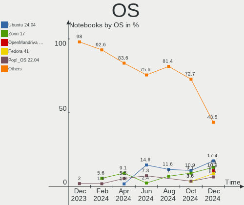

| Name                         | Notebooks | Percent |
|------------------------------|-----------|---------|
| OpenMandriva 4.3             | 15        | 23.08%  |
| Ubuntu 22.04                 | 10        | 15.38%  |
| Linux Mint 21                | 4         | 6.15%   |
| Fedora 36                    | 4         | 6.15%   |
| Zorin 16                     | 3         | 4.62%   |
| Ubuntu 20.04                 | 3         | 4.62%   |
| SteamOS 3.3.1                | 3         | 4.62%   |
| Pop!_OS 22.04                | 3         | 4.62%   |
| Manjaro 22.0.0               | 2         | 3.08%   |
| Linux Mint 20.3              | 2         | 3.08%   |
| KDE neon 20.04               | 2         | 3.08%   |
| Debian 11                    | 2         | 3.08%   |
| ArcoLinux Rolling            | 2         | 3.08%   |
| Rocky Linux 9.0              | 1         | 1.54%   |
| openSUSE Tumbleweed-XXXXXXXX | 1         | 1.54%   |
| Lubuntu 22.04                | 1         | 1.54%   |
| Linux Mint 20.2              | 1         | 1.54%   |
| Linux Mint 20.1              | 1         | 1.54%   |
| Kubuntu 22.04                | 1         | 1.54%   |
| KDE neon 22.04               | 1         | 1.54%   |
| Fedora 35                    | 1         | 1.54%   |
| Elementary 6.1               | 1         | 1.54%   |
| Arch Rolling                 | 1         | 1.54%   |

OS Family
---------

OS without a version

| Name         | Notebooks | Percent |
|--------------|-----------|---------|
| OpenMandriva | 15        | 23.08%  |
| Ubuntu       | 13        | 20%     |
| Linux Mint   | 8         | 12.31%  |
| Fedora       | 5         | 7.69%   |
| Zorin        | 3         | 4.62%   |
| SteamOS      | 3         | 4.62%   |
| Pop!_OS      | 3         | 4.62%   |
| KDE neon     | 3         | 4.62%   |
| Manjaro      | 2         | 3.08%   |
| Debian       | 2         | 3.08%   |
| ArcoLinux    | 2         | 3.08%   |
| Rocky Linux  | 1         | 1.54%   |
| openSUSE     | 1         | 1.54%   |
| Lubuntu      | 1         | 1.54%   |
| Kubuntu      | 1         | 1.54%   |
| Elementary   | 1         | 1.54%   |
| Arch         | 1         | 1.54%   |

Kernel
------

Version of the Linux kernel

| Version                                        | Notebooks | Percent |
|------------------------------------------------|-----------|---------|
| 5.16.7-desktop-1omv4003                        | 15        | 23.08%  |
| 5.15.0-48-generic                              | 8         | 12.31%  |
| 5.15.0-47-generic                              | 8         | 12.31%  |
| 5.15.0-46-generic                              | 6         | 9.23%   |
| 5.19.0-76051900-generic                        | 3         | 4.62%   |
| 5.13.0-valve21.1-1-neptune-02211-gc54cda5a36f3 | 3         | 4.62%   |
| 5.4.0-126-generic                              | 2         | 3.08%   |
| 5.19.9-200.fc36.x86_64                         | 2         | 3.08%   |
| 5.19.4-200.fc36.x86_64                         | 2         | 3.08%   |
| 5.19.10-arch1-1                                | 2         | 3.08%   |
| 5.15.65-1-MANJARO                              | 2         | 3.08%   |
| 5.15.0-43-generic                              | 2         | 3.08%   |
| 5.4.0-125-generic                              | 1         | 1.54%   |
| 5.4.0-109-generic                              | 1         | 1.54%   |
| 5.19.9-100.fc35.x86_64                         | 1         | 1.54%   |
| 5.19.2-1-default                               | 1         | 1.54%   |
| 5.19.11-arch1-1                                | 1         | 1.54%   |
| 5.15.0-41-generic                              | 1         | 1.54%   |
| 5.14.0-70.22.1.el9_0.x86_64                    | 1         | 1.54%   |
| 5.14.0-1051-oem                                | 1         | 1.54%   |
| 5.10.0-17-amd64                                | 1         | 1.54%   |
| 5.10.0-14-amd64                                | 1         | 1.54%   |

Kernel Family
-------------

Linux kernel without a distro release

| Version | Notebooks | Percent |
|---------|-----------|---------|
| 5.15.0  | 25        | 38.46%  |
| 5.16.7  | 15        | 23.08%  |
| 5.4.0   | 4         | 6.15%   |
| 5.19.9  | 3         | 4.62%   |
| 5.19.0  | 3         | 4.62%   |
| 5.13.0  | 3         | 4.62%   |
| 5.19.4  | 2         | 3.08%   |
| 5.19.10 | 2         | 3.08%   |
| 5.15.65 | 2         | 3.08%   |
| 5.14.0  | 2         | 3.08%   |
| 5.10.0  | 2         | 3.08%   |
| 5.19.2  | 1         | 1.54%   |
| 5.19.11 | 1         | 1.54%   |

Kernel Major Ver.
-----------------

Linux kernel major version

| Version | Notebooks | Percent |
|---------|-----------|---------|
| 5.15    | 27        | 41.54%  |
| 5.16    | 15        | 23.08%  |
| 5.19    | 12        | 18.46%  |
| 5.4     | 4         | 6.15%   |
| 5.13    | 3         | 4.62%   |
| 5.14    | 2         | 3.08%   |
| 5.10    | 2         | 3.08%   |

Arch
----

OS architecture (x86_64, i586, etc.)

| Name   | Notebooks | Percent |
|--------|-----------|---------|
| x86_64 | 65        | 100%    |

DE
--

Desktop Environment

| Name         | Notebooks | Percent |
|--------------|-----------|---------|
| KDE5         | 27        | 41.54%  |
| GNOME        | 24        | 36.92%  |
| X-Cinnamon   | 6         | 9.23%   |
| XFCE         | 3         | 4.62%   |
| Pantheon     | 1         | 1.54%   |
| MATE         | 1         | 1.54%   |
| LXQt         | 1         | 1.54%   |
| herbstluftwm | 1         | 1.54%   |
| Unknown      | 1         | 1.54%   |

Display Server
--------------

X11 or Wayland

| Name    | Notebooks | Percent |
|---------|-----------|---------|
| X11     | 51        | 78.46%  |
| Wayland | 13        | 20%     |
| Unknown | 1         | 1.54%   |

Display Manager
---------------

SDDM, LightDM, etc.

| Name    | Notebooks | Percent |
|---------|-----------|---------|
| SDDM    | 23        | 35.38%  |
| Unknown | 22        | 33.85%  |
| GDM3    | 9         | 13.85%  |
| LightDM | 6         | 9.23%   |
| GDM     | 5         | 7.69%   |

OS Lang
-------

Language

| Lang    | Notebooks | Percent |
|---------|-----------|---------|
| en_US   | 43        | 66.15%  |
| nl_NL   | 12        | 18.46%  |
| en_GB   | 5         | 7.69%   |
| ru_RU   | 1         | 1.54%   |
| en_NL   | 1         | 1.54%   |
| en_AG   | 1         | 1.54%   |
| C       | 1         | 1.54%   |
| Unknown | 1         | 1.54%   |

Boot Mode
---------

EFI or BIOS

| Mode | Notebooks | Percent |
|------|-----------|---------|
| EFI  | 44        | 67.69%  |
| BIOS | 21        | 32.31%  |

Filesystem
----------

Type of filesystem

| Type    | Notebooks | Percent |
|---------|-----------|---------|
| Ext4    | 39        | 60%     |
| Overlay | 18        | 27.69%  |
| Btrfs   | 7         | 10.77%  |
| Xfs     | 1         | 1.54%   |

Part. scheme
------------

Scheme of partitioning

| Type    | Notebooks | Percent |
|---------|-----------|---------|
| GPT     | 33        | 50.77%  |
| Unknown | 29        | 44.62%  |
| MBR     | 3         | 4.62%   |

Dual Boot with Linux/BSD
------------------------

Hosting more than one Linux/BSD

| Dual boot | Notebooks | Percent |
|-----------|-----------|---------|
| No        | 61        | 93.85%  |
| Yes       | 4         | 6.15%   |

Dual Boot (Win)
---------------

Hosting Linux and Windows

| Dual boot | Notebooks | Percent |
|-----------|-----------|---------|
| No        | 41        | 63.08%  |
| Yes       | 24        | 36.92%  |

Board
-----

Vendor
------

Motherboard manufacturer

| Name                | Notebooks | Percent |
|---------------------|-----------|---------|
| Dell                | 28        | 43.08%  |
| Lenovo              | 8         | 12.31%  |
| ASUSTek Computer    | 8         | 12.31%  |
| Hewlett-Packard     | 6         | 9.23%   |
| Valve               | 3         | 4.62%   |
| Packard Bell        | 2         | 3.08%   |
| HUAWEI              | 2         | 3.08%   |
| Acer                | 2         | 3.08%   |
| SKIKK               | 1         | 1.54%   |
| Samsung Electronics | 1         | 1.54%   |
| Notebook            | 1         | 1.54%   |
| Chuwi               | 1         | 1.54%   |
| Apple               | 1         | 1.54%   |
| Alienware           | 1         | 1.54%   |

Model
-----

Motherboard model

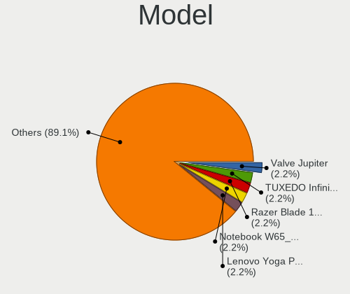

| Name                                        | Notebooks | Percent |
|---------------------------------------------|-----------|---------|
| Dell Latitude 3310                          | 9         | 13.85%  |
| Valve Jupiter                               | 3         | 4.62%   |
| Dell Latitude E6520                         | 2         | 3.08%   |
| Dell Latitude 3300                          | 2         | 3.08%   |
| Dell Latitude 3120                          | 2         | 3.08%   |
| SKIKK Standard                              | 1         | 1.54%   |
| Samsung 750XED                              | 1         | 1.54%   |
| Packard Bell EasyNote MH36                  | 1         | 1.54%   |
| Packard Bell EasyNote LE69KB                | 1         | 1.54%   |
| Notebook NH55RGQ                            | 1         | 1.54%   |
| Lenovo Yoga Slim 7 Pro 14IAP7 82SV          | 1         | 1.54%   |
| Lenovo Yoga 300-11IBY 80M0                  | 1         | 1.54%   |
| Lenovo ThinkPad X220 4291WSH                | 1         | 1.54%   |
| Lenovo ThinkPad X1 Extreme Gen 5 21DE001QMH | 1         | 1.54%   |
| Lenovo ThinkPad T14 Gen 1 20S0004BMH        | 1         | 1.54%   |
| Lenovo ThinkPad E550 20DF00CUFR             | 1         | 1.54%   |
| Lenovo ThinkBook 15 G2 ITL 20VE             | 1         | 1.54%   |
| Lenovo G50-70 20351                         | 1         | 1.54%   |
| HUAWEI WRT-WX9                              | 1         | 1.54%   |
| HUAWEI BOHK-WAX9X                           | 1         | 1.54%   |
| HP ZBook 15u G6                             | 1         | 1.54%   |
| HP ProBook 6460b                            | 1         | 1.54%   |
| HP Laptop 15s-eq2xxx                        | 1         | 1.54%   |
| HP ENVY Laptop 13-ad1xx                     | 1         | 1.54%   |
| HP EliteBook 855 G7 Notebook PC             | 1         | 1.54%   |
| HP EliteBook 8460p                          | 1         | 1.54%   |
| Dell XPS 9320                               | 1         | 1.54%   |
| Dell XPS 15 9510                            | 1         | 1.54%   |
| Dell XPS 13 9310                            | 1         | 1.54%   |
| Dell Precision M6800                        | 1         | 1.54%   |
| Dell Latitude E6320                         | 1         | 1.54%   |
| Dell Latitude E5570                         | 1         | 1.54%   |
| Dell Latitude 5530                          | 1         | 1.54%   |
| Dell Latitude 5400                          | 1         | 1.54%   |
| Dell Latitude 3420                          | 1         | 1.54%   |
| Dell Latitude 3190                          | 1         | 1.54%   |
| Dell Latitude 13                            | 1         | 1.54%   |
| Dell Inspiron 5490                          | 1         | 1.54%   |
| Dell Inspiron 16 Plus 7620                  | 1         | 1.54%   |
| Chuwi GemiBook                              | 1         | 1.54%   |

Model Family
------------

Motherboard model prefix

| Name                  | Notebooks | Percent |
|-----------------------|-----------|---------|
| Dell Latitude         | 22        | 33.85%  |
| Lenovo ThinkPad       | 4         | 6.15%   |
| Valve Jupiter         | 3         | 4.62%   |
| Dell XPS              | 3         | 4.62%   |
| Packard Bell EasyNote | 2         | 3.08%   |
| Lenovo Yoga           | 2         | 3.08%   |
| HP EliteBook          | 2         | 3.08%   |
| Dell Inspiron         | 2         | 3.08%   |
| ASUS VivoBook         | 2         | 3.08%   |
| SKIKK Standard        | 1         | 1.54%   |
| Samsung 750XED        | 1         | 1.54%   |
| Notebook NH55RGQ      | 1         | 1.54%   |
| Lenovo ThinkBook      | 1         | 1.54%   |
| Lenovo G50-70         | 1         | 1.54%   |
| HUAWEI WRT-WX9        | 1         | 1.54%   |
| HUAWEI BOHK-WAX9X     | 1         | 1.54%   |
| HP ZBook              | 1         | 1.54%   |
| HP ProBook            | 1         | 1.54%   |
| HP Laptop             | 1         | 1.54%   |
| HP ENVY               | 1         | 1.54%   |
| Dell Precision        | 1         | 1.54%   |
| Chuwi GemiBook        | 1         | 1.54%   |
| ASUS X75VC            | 1         | 1.54%   |
| ASUS X580VD           | 1         | 1.54%   |
| ASUS X555LAB          | 1         | 1.54%   |
| ASUS UX550VD          | 1         | 1.54%   |
| ASUS ASUS             | 1         | 1.54%   |
| ASUS 1201PN           | 1         | 1.54%   |
| Apple MacBookPro5     | 1         | 1.54%   |
| Alienware x15         | 1         | 1.54%   |
| Acer Swift            | 1         | 1.54%   |
| Acer Aspire           | 1         | 1.54%   |

MFG Year
--------

Motherboard manufacture year

| Year | Notebooks | Percent |
|------|-----------|---------|
| 2019 | 18        | 27.69%  |
| 2022 | 11        | 16.92%  |
| 2021 | 9         | 13.85%  |
| 2011 | 6         | 9.23%   |
| 2020 | 5         | 7.69%   |
| 2013 | 4         | 6.15%   |
| 2017 | 3         | 4.62%   |
| 2014 | 2         | 3.08%   |
| 2010 | 2         | 3.08%   |
| 2018 | 1         | 1.54%   |
| 2016 | 1         | 1.54%   |
| 2015 | 1         | 1.54%   |
| 2009 | 1         | 1.54%   |
| 2008 | 1         | 1.54%   |

Form Factor
-----------

Physical design of the computer

| Name     | Notebooks | Percent |
|----------|-----------|---------|
| Notebook | 65        | 100%    |

Secure Boot
-----------

Enabled or disabled

| State    | Notebooks | Percent |
|----------|-----------|---------|
| Disabled | 56        | 86.15%  |
| Enabled  | 9         | 13.85%  |

Coreboot
--------

Have coreboot on board

| Used | Notebooks | Percent |
|------|-----------|---------|
| No   | 65        | 100%    |

RAM Size
--------

Total RAM memory

| Size in GB | Notebooks | Percent |
|------------|-----------|---------|
| 4.01-8.0   | 26        | 40%     |
| 16.01-24.0 | 12        | 18.46%  |
| 8.01-16.0  | 12        | 18.46%  |
| 3.01-4.0   | 7         | 10.77%  |
| 32.01-64.0 | 6         | 9.23%   |
| 2.01-3.0   | 1         | 1.54%   |
| 1.01-2.0   | 1         | 1.54%   |

RAM Used
--------

Used RAM memory

| Used GB   | Notebooks | Percent |
|-----------|-----------|---------|
| 1.01-2.0  | 27        | 41.54%  |
| 2.01-3.0  | 14        | 21.54%  |
| 4.01-8.0  | 11        | 16.92%  |
| 8.01-16.0 | 7         | 10.77%  |
| 3.01-4.0  | 6         | 9.23%   |

Total Drives
------------

Number of drives on board

| Drives | Notebooks | Percent |
|--------|-----------|---------|
| 1      | 51        | 78.46%  |
| 2      | 10        | 15.38%  |
| 0      | 3         | 4.62%   |
| 3      | 1         | 1.54%   |

Has CD-ROM
----------

Has CD-ROM on board

| Presented | Notebooks | Percent |
|-----------|-----------|---------|
| No        | 54        | 83.08%  |
| Yes       | 11        | 16.92%  |

Has Ethernet
------------

Has Ethernet on board

| Presented | Notebooks | Percent |
|-----------|-----------|---------|
| Yes       | 44        | 67.69%  |
| No        | 21        | 32.31%  |

Has WiFi
--------

Has WiFi module

| Presented | Notebooks | Percent |
|-----------|-----------|---------|
| Yes       | 65        | 100%    |

Has Bluetooth
-------------

Has Bluetooth module

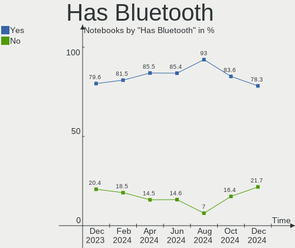

| Presented | Notebooks | Percent |
|-----------|-----------|---------|
| Yes       | 59        | 90.77%  |
| No        | 6         | 9.23%   |

Location
--------

Country
-------

Geographic location (country)

| Country     | Notebooks | Percent |
|-------------|-----------|---------|
| Netherlands | 65        | 100%    |

City
----

Geographic location (city)

| City           | Notebooks | Percent |
|----------------|-----------|---------|
| Schagen        | 15        | 23.08%  |
| Amsterdam      | 11        | 16.92%  |
| The Hague      | 2         | 3.08%   |
| Rotterdam      | 2         | 3.08%   |
| Ede            | 2         | 3.08%   |
| Delft          | 2         | 3.08%   |
| Amstelveen     | 2         | 3.08%   |
| Zwijndrecht    | 1         | 1.54%   |
| Zeist          | 1         | 1.54%   |
| Waddinxveen    | 1         | 1.54%   |
| Waalre         | 1         | 1.54%   |
| Vleuten        | 1         | 1.54%   |
| Veendam        | 1         | 1.54%   |
| Valkenswaard   | 1         | 1.54%   |
| Uden           | 1         | 1.54%   |
| Oostvoorne     | 1         | 1.54%   |
| Oosterhout     | 1         | 1.54%   |
| Ochten         | 1         | 1.54%   |
| Nederlangbroek | 1         | 1.54%   |
| Joure          | 1         | 1.54%   |
| Hoorn          | 1         | 1.54%   |
| Hoogeveen      | 1         | 1.54%   |
| Hengelo        | 1         | 1.54%   |
| Haren          | 1         | 1.54%   |
| Groningen      | 1         | 1.54%   |
| Groede         | 1         | 1.54%   |
| Gorredijk      | 1         | 1.54%   |
| Ermelo         | 1         | 1.54%   |
| Enschede       | 1         | 1.54%   |
| Eindhoven      | 1         | 1.54%   |
| Delfgauw       | 1         | 1.54%   |
| De Lier        | 1         | 1.54%   |
| Arnhem         | 1         | 1.54%   |
| Apeldoorn      | 1         | 1.54%   |
| Almelo         | 1         | 1.54%   |
| Unknown        | 1         | 1.54%   |

Drives
------

Drive Vendor
------------

Hard drive vendors

| Vendor                      | Notebooks | Drives | Percent |
|-----------------------------|-----------|--------|---------|
| Samsung Electronics         | 19        | 20     | 26.76%  |
| SK hynix                    | 13        | 13     | 18.31%  |
| SanDisk                     | 5         | 5      | 7.04%   |
| Kingston                    | 5         | 5      | 7.04%   |
| WDC                         | 4         | 4      | 5.63%   |
| Unknown                     | 4         | 5      | 5.63%   |
| Seagate                     | 3         | 3      | 4.23%   |
| Toshiba                     | 2         | 2      | 2.82%   |
| Micron Technology           | 2         | 3      | 2.82%   |
| KIOXIA                      | 2         | 2      | 2.82%   |
| Team                        | 1         | 1      | 1.41%   |
| SSSTC                       | 1         | 1      | 1.41%   |
| Phison Electronics          | 1         | 1      | 1.41%   |
| Patriot                     | 1         | 1      | 1.41%   |
| Netac                       | 1         | 1      | 1.41%   |
| LITEON                      | 1         | 1      | 1.41%   |
| Kingston Technology Company | 1         | 1      | 1.41%   |
| Intel                       | 1         | 2      | 1.41%   |
| GOODRAM                     | 1         | 1      | 1.41%   |
| Corsair                     | 1         | 1      | 1.41%   |
| A-DATA Technology           | 1         | 1      | 1.41%   |
| Unknown                     | 1         | 1      | 1.41%   |

Drive Model
-----------

Hard drive models

| Model                                               | Notebooks | Percent |
|-----------------------------------------------------|-----------|---------|
| SK hynix BC511 NVMe 256GB                           | 4         | 5.41%   |
| Samsung NVMe SSD Controller SM981/PM981/PM983 256GB | 3         | 4.05%   |
| SK hynix BC711 NVMe 128GB                           | 2         | 2.7%    |
| SK hynix BC501 NVMe 128GB                           | 2         | 2.7%    |
| Samsung SSD 860 EVO 500GB                           | 2         | 2.7%    |
| Samsung NVMe SSD Drive 1024GB                       | 2         | 2.7%    |
| KIOXIA KBG40ZNS256G NVMe 256GB                      | 2         | 2.7%    |
| WDC WD7500BPKX-22HPJT0 752GB                        | 1         | 1.35%   |
| WDC WD3200BPVT-22JJ5T0 320GB                        | 1         | 1.35%   |
| WDC WD10SPZX-22Z10T1 1TB                            | 1         | 1.35%   |
| WDC PC SN810 NVMe 1024GB                            | 1         | 1.35%   |
| Unknown MMC Card  64GB                              | 1         | 1.35%   |
| Unknown MMC Card  512GB                             | 1         | 1.35%   |
| Unknown MMC Card  483MB                             | 1         | 1.35%   |
| Unknown MMC Card  16GB                              | 1         | 1.35%   |
| Unknown ASTC  8GB                                   | 1         | 1.35%   |
| Toshiba MQ04ABF100 1TB                              | 1         | 1.35%   |
| Toshiba KXG50ZNV512G 512GB                          | 1         | 1.35%   |
| Team T2535T120G 120GB SSD                           | 1         | 1.35%   |
| SSSTC CL1-3D128-Q11 NVMe 128GB                      | 1         | 1.35%   |
| SK hynix SC308 SATA 512GB SSD                       | 1         | 1.35%   |
| SK hynix NVMe SSD Drive 512GB                       | 1         | 1.35%   |
| SK hynix BC501A NVMe 128GB                          | 1         | 1.35%   |
| SK hynix BC501 NVMe Solid State Drive 512GB         | 1         | 1.35%   |
| SK hynix BC501 NVMe 512GB                           | 1         | 1.35%   |
| Seagate ST9160412AS 160GB                           | 1         | 1.35%   |
| Seagate ST1000LM048-2E7172 1TB                      | 1         | 1.35%   |
| Seagate Expansion 1TB                               | 1         | 1.35%   |
| Sandisk WD Black SN850 500GB                        | 1         | 1.35%   |
| Sandisk WD Black SN750 / PC SN730 NVMe SSD 1024GB   | 1         | 1.35%   |
| SanDisk SDSSDP128G 128GB                            | 1         | 1.35%   |
| Sandisk PC SN740 NVMe WD 512GB                      | 1         | 1.35%   |
| SanDisk NVMe SSD Drive 256GB                        | 1         | 1.35%   |
| Samsung SSD 980 1TB                                 | 1         | 1.35%   |
| Samsung SSD 970 EVO Plus 1TB                        | 1         | 1.35%   |
| Samsung SSD 860 QVO 1TB                             | 1         | 1.35%   |
| Samsung SSD 860 EVO M.2 1TB                         | 1         | 1.35%   |
| Samsung SSD 850 EVO 250GB                           | 1         | 1.35%   |
| Samsung SSD 840 EVO 500GB                           | 1         | 1.35%   |
| Samsung PM991a NVMe 256GB                           | 1         | 1.35%   |

HDD Vendor
----------

Hard disk drive vendors

| Vendor  | Notebooks | Drives | Percent |
|---------|-----------|--------|---------|
| WDC     | 3         | 3      | 42.86%  |
| Seagate | 3         | 3      | 42.86%  |
| Toshiba | 1         | 1      | 14.29%  |

SSD Vendor
----------

Solid state drive vendors

| Vendor              | Notebooks | Drives | Percent |
|---------------------|-----------|--------|---------|
| Samsung Electronics | 6         | 6      | 35.29%  |
| Kingston            | 2         | 2      | 11.76%  |
| Team                | 1         | 1      | 5.88%   |
| SK hynix            | 1         | 1      | 5.88%   |
| SanDisk             | 1         | 1      | 5.88%   |
| Patriot             | 1         | 1      | 5.88%   |
| Netac               | 1         | 1      | 5.88%   |
| LITEON              | 1         | 1      | 5.88%   |
| GOODRAM             | 1         | 1      | 5.88%   |
| Corsair             | 1         | 1      | 5.88%   |
| A-DATA Technology   | 1         | 1      | 5.88%   |

Drive Kind
----------

HDD or SSD

| Kind | Notebooks | Drives | Percent |
|------|-----------|--------|---------|
| NVMe | 42        | 45     | 59.15%  |
| SSD  | 17        | 17     | 23.94%  |
| HDD  | 7         | 7      | 9.86%   |
| MMC  | 5         | 6      | 7.04%   |

Drive Connector
---------------

SATA, SAS, NVMe, etc.

| Type | Notebooks | Drives | Percent |
|------|-----------|--------|---------|
| NVMe | 42        | 45     | 60.87%  |
| SATA | 20        | 22     | 28.99%  |
| MMC  | 5         | 6      | 7.25%   |
| SAS  | 2         | 2      | 2.9%    |

Drive Size
----------

Size of hard drive

| Size in TB | Notebooks | Drives | Percent |
|------------|-----------|--------|---------|
| 0.01-0.5   | 15        | 15     | 65.22%  |
| 0.51-1.0   | 8         | 9      | 34.78%  |

Space Total
-----------

Amount of disk space available on the file system

| Size in GB     | Notebooks | Percent |
|----------------|-----------|---------|
| 1-20           | 17        | 26.15%  |
| 251-500        | 16        | 24.62%  |
| 101-250        | 13        | 20%     |
| 1001-2000      | 6         | 9.23%   |
| 501-1000       | 5         | 7.69%   |
| Unknown        | 4         | 6.15%   |
| 51-100         | 2         | 3.08%   |
| More than 3000 | 1         | 1.54%   |
| 21-50          | 1         | 1.54%   |

Space Used
----------

Amount of used disk space

| Used GB        | Notebooks | Percent |
|----------------|-----------|---------|
| 1-20           | 26        | 40%     |
| 21-50          | 9         | 13.85%  |
| 101-250        | 9         | 13.85%  |
| 251-500        | 6         | 9.23%   |
| 501-1000       | 4         | 6.15%   |
| Unknown        | 4         | 6.15%   |
| 51-100         | 3         | 4.62%   |
| 1001-2000      | 2         | 3.08%   |
| More than 3000 | 1         | 1.54%   |
| 0              | 1         | 1.54%   |

Malfunc. Drives
---------------

Drive models with a malfunction

Zero info for selected period =(

Malfunc. Drive Vendor
---------------------

Vendors of faulty drives

Zero info for selected period =(

Malfunc. HDD Vendor
-------------------

Vendors of faulty HDD drives

Zero info for selected period =(

Malfunc. Drive Kind
-------------------

Kinds of faulty drives

Zero info for selected period =(

Failed Drives
-------------

Failed drive models

Zero info for selected period =(

Failed Drive Vendor
-------------------

Failed drive vendors

Zero info for selected period =(

Drive Status
------------

Number of failed and malfunc. drives

| Status   | Notebooks | Drives | Percent |
|----------|-----------|--------|---------|
| Detected | 35        | 40     | 51.47%  |
| Works    | 33        | 35     | 48.53%  |

Storage controller
------------------

Storage Vendor
--------------

Storage controller vendors

| Vendor                         | Notebooks | Percent |
|--------------------------------|-----------|---------|
| Intel                          | 32        | 42.67%  |
| Samsung Electronics            | 13        | 17.33%  |
| SK hynix                       | 12        | 16%     |
| SanDisk                        | 5         | 6.67%   |
| Kingston Technology Company    | 4         | 5.33%   |
| Micron Technology              | 2         | 2.67%   |
| KIOXIA                         | 2         | 2.67%   |
| Toshiba America Info Systems   | 1         | 1.33%   |
| Solid State Storage Technology | 1         | 1.33%   |
| Phison Electronics             | 1         | 1.33%   |
| Nvidia                         | 1         | 1.33%   |
| AMD                            | 1         | 1.33%   |

Storage Model
-------------

Storage controller models

| Model                                                                            | Notebooks | Percent |
|----------------------------------------------------------------------------------|-----------|---------|
| Samsung NVMe SSD Controller SM981/PM981/PM983                                    | 6         | 7.69%   |
| Intel 82801 Mobile SATA Controller [RAID mode]                                   | 6         | 7.69%   |
| SK hynix BC501 NVMe Solid State Drive                                            | 5         | 6.41%   |
| Intel Volume Management Device NVMe RAID Controller                              | 5         | 6.41%   |
| Intel 6 Series/C200 Series Chipset Family 6 port Mobile SATA AHCI Controller     | 5         | 6.41%   |
| SK hynix BC511                                                                   | 4         | 5.13%   |
| Samsung NVMe SSD Controller 980                                                  | 4         | 5.13%   |
| SK hynix Gold P31 SSD                                                            | 3         | 3.85%   |
| Intel Tiger Lake-LP SATA Controller                                              | 3         | 3.85%   |
| SanDisk WD PC SN810 / Black SN850 NVMe SSD                                       | 2         | 2.56%   |
| SanDisk WD Black SN750 / PC SN730 NVMe SSD                                       | 2         | 2.56%   |
| Samsung NVMe SSD Controller PM9A1/PM9A3/980PRO                                   | 2         | 2.56%   |
| Micron Non-Volatile memory controller                                            | 2         | 2.56%   |
| KIOXIA NVMe SSD Controller BG4                                                   | 2         | 2.56%   |
| Kingston Company Company Non-Volatile memory controller                          | 2         | 2.56%   |
| Kingston Company OM3PDP3 NVMe SSD                                                | 2         | 2.56%   |
| Intel Celeron/Pentium Silver Processor SATA Controller                           | 2         | 2.56%   |
| Intel 8 Series SATA Controller 1 [AHCI mode]                                     | 2         | 2.56%   |
| Toshiba America Info Systems Toshiba America Info Non-Volatile memory controller | 1         | 1.28%   |
| Solid State Storage Non-Volatile memory controller                               | 1         | 1.28%   |
| Sandisk Non-Volatile memory controller                                           | 1         | 1.28%   |
| Samsung Electronics Non-Volatile memory controller                               | 1         | 1.28%   |
| Phison PS5013 E13 NVMe Controller                                                | 1         | 1.28%   |
| Nvidia MCP79 AHCI Controller                                                     | 1         | 1.28%   |
| Intel Wildcat Point-LP SATA Controller [AHCI Mode]                               | 1         | 1.28%   |
| Intel Sunrise Point-LP SATA Controller [AHCI mode]                               | 1         | 1.28%   |
| Intel SSD 660P Series                                                            | 1         | 1.28%   |
| Intel NM10/ICH7 Family SATA Controller [AHCI mode]                               | 1         | 1.28%   |
| Intel HM170/QM170 Chipset SATA Controller [AHCI Mode]                            | 1         | 1.28%   |
| Intel Comet Lake SATA AHCI Controller                                            | 1         | 1.28%   |
| Intel Cannon Point-LP SATA Controller [AHCI Mode]                                | 1         | 1.28%   |
| Intel Cannon Lake Mobile PCH SATA AHCI Controller                                | 1         | 1.28%   |
| Intel 82801IBM/IEM (ICH9M/ICH9M-E) 4 port SATA Controller [AHCI mode]            | 1         | 1.28%   |
| Intel 82801IBM/IEM (ICH9M/ICH9M-E) 2 port SATA Controller [IDE mode]             | 1         | 1.28%   |
| Intel 8 Series/C220 Series Chipset Family 6-port SATA Controller 1 [AHCI mode]   | 1         | 1.28%   |
| Intel 7 Series Chipset Family 6-port SATA Controller [AHCI mode]                 | 1         | 1.28%   |
| AMD FCH SATA Controller [AHCI mode]                                              | 1         | 1.28%   |

Storage Kind
------------

Kind of storage controller (IDE, SATA, NVMe, SAS, ...)

| Kind | Notebooks | Percent |
|------|-----------|---------|
| NVMe | 42        | 53.85%  |
| SATA | 24        | 30.77%  |
| RAID | 11        | 14.1%   |
| IDE  | 1         | 1.28%   |

Processor
---------

CPU Vendor
----------

Processor vendors

| Vendor | Notebooks | Percent |
|--------|-----------|---------|
| Intel  | 58        | 89.23%  |
| AMD    | 7         | 10.77%  |

CPU Model
---------

Processor models

| Model                                       | Notebooks | Percent |
|---------------------------------------------|-----------|---------|
| Intel Core i5-8265U CPU @ 1.60GHz           | 5         | 7.69%   |
| Intel Core i3-8145U CPU @ 2.10GHz           | 4         | 6.15%   |
| Intel Pentium Silver N6000 @ 1.10GHz        | 3         | 4.62%   |
| Intel 12th Gen Core i7-12700H               | 3         | 4.62%   |
| AMD Custom APU 0405                         | 3         | 4.62%   |
| Intel Core i7-9750H CPU @ 2.60GHz           | 2         | 3.08%   |
| Intel Core i7-7700HQ CPU @ 2.80GHz          | 2         | 3.08%   |
| Intel Core i7-2620M CPU @ 2.70GHz           | 2         | 3.08%   |
| Intel Core i5-2430M CPU @ 2.40GHz           | 2         | 3.08%   |
| Intel Core i5-1035G1 CPU @ 1.00GHz          | 2         | 3.08%   |
| Intel Core i3-7020U CPU @ 2.30GHz           | 2         | 3.08%   |
| Intel Core i3-4005U CPU @ 1.70GHz           | 2         | 3.08%   |
| Intel 11th Gen Core i5-1135G7 @ 2.40GHz     | 2         | 3.08%   |
| Intel Pentium Silver N5030 CPU @ 1.10GHz    | 1         | 1.54%   |
| Intel Pentium Dual-Core CPU T4200 @ 2.00GHz | 1         | 1.54%   |
| Intel Pentium CPU N3540 @ 2.16GHz           | 1         | 1.54%   |
| Intel Genuine CPU U7300 @ 1.30GHz           | 1         | 1.54%   |
| Intel Core i7-8665U CPU @ 1.90GHz           | 1         | 1.54%   |
| Intel Core i7-8565U CPU @ 1.80GHz           | 1         | 1.54%   |
| Intel Core i7-6600U CPU @ 2.60GHz           | 1         | 1.54%   |
| Intel Core i7-4800MQ CPU @ 2.70GHz          | 1         | 1.54%   |
| Intel Core i7-10510U CPU @ 1.80GHz          | 1         | 1.54%   |
| Intel Core i5-8365U CPU @ 1.60GHz           | 1         | 1.54%   |
| Intel Core i5-8250U CPU @ 1.60GHz           | 1         | 1.54%   |
| Intel Core i5-5200U CPU @ 2.20GHz           | 1         | 1.54%   |
| Intel Core i5-2540M CPU @ 2.60GHz           | 1         | 1.54%   |
| Intel Core i5-2520M CPU @ 2.50GHz           | 1         | 1.54%   |
| Intel Core i5-10210U CPU @ 1.60GHz          | 1         | 1.54%   |
| Intel Core i3-3217U CPU @ 1.80GHz           | 1         | 1.54%   |
| Intel Core 2 Duo CPU P7550 @ 2.26GHz        | 1         | 1.54%   |
| Intel Celeron J4125 CPU @ 2.00GHz           | 1         | 1.54%   |
| Intel Atom CPU N450 @ 1.66GHz               | 1         | 1.54%   |
| Intel 12th Gen Core i7-1265U                | 1         | 1.54%   |
| Intel 12th Gen Core i7-1260P                | 1         | 1.54%   |
| Intel 12th Gen Core i5-1240P                | 1         | 1.54%   |
| Intel 12th Gen Core i5-1235U                | 1         | 1.54%   |
| Intel 11th Gen Core i7-1185G7 @ 3.00GHz     | 1         | 1.54%   |
| Intel 11th Gen Core i7-11800H @ 2.30GHz     | 1         | 1.54%   |
| Intel 11th Gen Core i7-1165G7 @ 2.80GHz     | 1         | 1.54%   |
| Intel 11th Gen Core i7-11370H @ 3.30GHz     | 1         | 1.54%   |

CPU Model Family
----------------

Processor model prefix

| Model                   | Notebooks | Percent |
|-------------------------|-----------|---------|
| Other                   | 16        | 24.62%  |
| Intel Core i5           | 15        | 23.08%  |
| Intel Core i7           | 11        | 16.92%  |
| Intel Core i3           | 9         | 13.85%  |
| Intel Pentium Silver    | 4         | 6.15%   |
| Intel Pentium Dual-Core | 1         | 1.54%   |
| Intel Pentium           | 1         | 1.54%   |
| Intel Genuine           | 1         | 1.54%   |
| Intel Core 2 Duo        | 1         | 1.54%   |
| Intel Celeron           | 1         | 1.54%   |
| Intel Atom              | 1         | 1.54%   |
| AMD Ryzen 7 PRO         | 1         | 1.54%   |
| AMD Ryzen 7             | 1         | 1.54%   |
| AMD Ryzen 5             | 1         | 1.54%   |
| AMD E2                  | 1         | 1.54%   |

CPU Cores
---------

Number of processor cores

| Number | Notebooks | Percent |
|--------|-----------|---------|
| 4      | 32        | 49.23%  |
| 2      | 20        | 30.77%  |
| 14     | 3         | 4.62%   |
| 8      | 3         | 4.62%   |
| 12     | 2         | 3.08%   |
| 10     | 2         | 3.08%   |
| 6      | 2         | 3.08%   |
| 1      | 1         | 1.54%   |

CPU Sockets
-----------

Number of sockets

| Number | Notebooks | Percent |
|--------|-----------|---------|
| 1      | 65        | 100%    |

CPU Threads
-----------

Threads per core (Hyper-Threading)

| Number | Notebooks | Percent |
|--------|-----------|---------|
| 2      | 51        | 78.46%  |
| 1      | 14        | 21.54%  |

CPU Op-Modes
------------

CPU Operation Modes (32-bit, 64-bit)

| Op mode        | Notebooks | Percent |
|----------------|-----------|---------|
| 32-bit, 64-bit | 65        | 100%    |

CPU Microcode
-------------

Microcode number

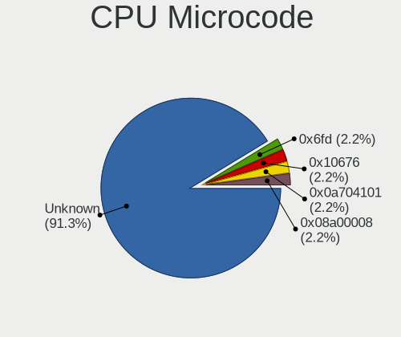

| Number     | Notebooks | Percent |
|------------|-----------|---------|
| Unknown    | 17        | 26.15%  |
| 0x806ec    | 12        | 18.46%  |
| 0x206a7    | 5         | 7.69%   |
| 0x906a3    | 4         | 6.15%   |
| 0x906c0    | 3         | 4.62%   |
| 0x806c1    | 3         | 4.62%   |
| 0x906ea    | 2         | 3.08%   |
| 0x906a4    | 2         | 3.08%   |
| 0x806e9    | 2         | 3.08%   |
| 0x706e5    | 2         | 3.08%   |
| 0x706a8    | 2         | 3.08%   |
| 0x40651    | 2         | 3.08%   |
| 0x906e9    | 1         | 1.54%   |
| 0x806eb    | 1         | 1.54%   |
| 0x806ea    | 1         | 1.54%   |
| 0x806d1    | 1         | 1.54%   |
| 0x406e3    | 1         | 1.54%   |
| 0x306a9    | 1         | 1.54%   |
| 0x30678    | 1         | 1.54%   |
| 0x106ca    | 1         | 1.54%   |
| 0x08108109 | 1         | 1.54%   |

CPU Microarch
-------------

Microarchitecture

| Name             | Notebooks | Percent |
|------------------|-----------|---------|
| KabyLake         | 21        | 32.31%  |
| Unknown          | 7         | 10.77%  |
| SandyBridge      | 6         | 9.23%   |
| TigerLake        | 5         | 7.69%   |
| Alderlake Hybrid | 4         | 6.15%   |
| Tremont          | 3         | 4.62%   |
| Penryn           | 3         | 4.62%   |
| IceLake          | 3         | 4.62%   |
| Haswell          | 3         | 4.62%   |
| Goldmont plus    | 2         | 3.08%   |
| Zen+             | 1         | 1.54%   |
| Zen 2            | 1         | 1.54%   |
| Skylake          | 1         | 1.54%   |
| Silvermont       | 1         | 1.54%   |
| Jaguar           | 1         | 1.54%   |
| IvyBridge        | 1         | 1.54%   |
| Broadwell        | 1         | 1.54%   |
| Bonnell          | 1         | 1.54%   |

Graphics
--------

GPU Vendor
----------

Vendors of graphics cards

| Vendor | Notebooks | Percent |
|--------|-----------|---------|
| Intel  | 55        | 68.75%  |
| Nvidia | 14        | 17.5%   |
| AMD    | 11        | 13.75%  |

GPU Model
---------

Graphics card models

| Model                                                                                 | Notebooks | Percent |
|---------------------------------------------------------------------------------------|-----------|---------|
| Intel WhiskeyLake-U GT2 [UHD Graphics 620]                                            | 12        | 15%     |
| Intel TigerLake-LP GT2 [Iris Xe Graphics]                                             | 5         | 6.25%   |
| Intel Alder Lake-P Integrated Graphics Controller                                     | 5         | 6.25%   |
| Intel 2nd Generation Core Processor Family Integrated Graphics Controller             | 5         | 6.25%   |
| Nvidia GA107M [GeForce RTX 3050 Ti Mobile]                                            | 3         | 3.75%   |
| Intel JasperLake [UHD Graphics]                                                       | 3         | 3.75%   |
| AMD VanGogh [AMD Custom GPU 0405]                                                     | 3         | 3.75%   |
| Nvidia GP107M [GeForce GTX 1050 Mobile]                                               | 2         | 2.5%    |
| Intel VGA compatible controller                                                       | 2         | 2.5%    |
| Intel Mobile 4 Series Chipset Integrated Graphics Controller                          | 2         | 2.5%    |
| Intel Kaby Lake-U GT2f HD 620 Graphics Controller                                     | 2         | 2.5%    |
| Intel Iris Plus Graphics G1 (Ice Lake)                                                | 2         | 2.5%    |
| Intel HD Graphics 630                                                                 | 2         | 2.5%    |
| Intel Haswell-ULT Integrated Graphics Controller                                      | 2         | 2.5%    |
| Intel CometLake-U GT2 [UHD Graphics]                                                  | 2         | 2.5%    |
| Intel CoffeeLake-H GT2 [UHD Graphics 630]                                             | 2         | 2.5%    |
| Nvidia TU117M [GeForce MX550]                                                         | 1         | 1.25%   |
| Nvidia TU117M                                                                         | 1         | 1.25%   |
| Nvidia GT218M [ION 2]                                                                 | 1         | 1.25%   |
| Nvidia GP108M [GeForce MX250]                                                         | 1         | 1.25%   |
| Nvidia GK104GLM [Quadro K3100M]                                                       | 1         | 1.25%   |
| Nvidia GF117M [GeForce 610M/710M/810M/820M / GT 620M/625M/630M/720M]                  | 1         | 1.25%   |
| Nvidia GA107M [GeForce RTX 3050 Mobile]                                               | 1         | 1.25%   |
| Nvidia GA103M [GeForce RTX 3080 Ti Laptop GPU]                                        | 1         | 1.25%   |
| Nvidia C79 [GeForce 9400M]                                                            | 1         | 1.25%   |
| Intel UHD Graphics 620                                                                | 1         | 1.25%   |
| Intel TigerLake-H GT1 [UHD Graphics]                                                  | 1         | 1.25%   |
| Intel Skylake GT2 [HD Graphics 520]                                                   | 1         | 1.25%   |
| Intel HD Graphics 5500                                                                | 1         | 1.25%   |
| Intel GeminiLake [UHD Graphics 605]                                                   | 1         | 1.25%   |
| Intel GeminiLake [UHD Graphics 600]                                                   | 1         | 1.25%   |
| Intel Atom Processor Z36xxx/Z37xxx Series Graphics & Display                          | 1         | 1.25%   |
| Intel 4th Gen Core Processor Integrated Graphics Controller                           | 1         | 1.25%   |
| Intel 3rd Gen Core processor Graphics Controller                                      | 1         | 1.25%   |
| AMD Topaz XT [Radeon R7 M260/M265 / M340/M360 / M440/M445 / 530/535 / 620/625 Mobile] | 1         | 1.25%   |
| AMD Seymour [Radeon HD 6400M/7400M Series]                                            | 1         | 1.25%   |
| AMD Renoir                                                                            | 1         | 1.25%   |
| AMD Picasso/Raven 2 [Radeon Vega Series / Radeon Vega Mobile Series]                  | 1         | 1.25%   |
| AMD Opal XT [Radeon R7 M265/M365X/M465]                                               | 1         | 1.25%   |
| AMD Lucienne                                                                          | 1         | 1.25%   |

GPU Combo
---------

Combinations of graphics cards

| Name           | Notebooks | Percent |
|----------------|-----------|---------|
| 1 x Intel      | 40        | 61.54%  |
| Intel + Nvidia | 12        | 18.46%  |
| 1 x AMD        | 8         | 12.31%  |
| Intel + AMD    | 3         | 4.62%   |
| 1 x Nvidia     | 2         | 3.08%   |

GPU Driver
----------

Free vs proprietary

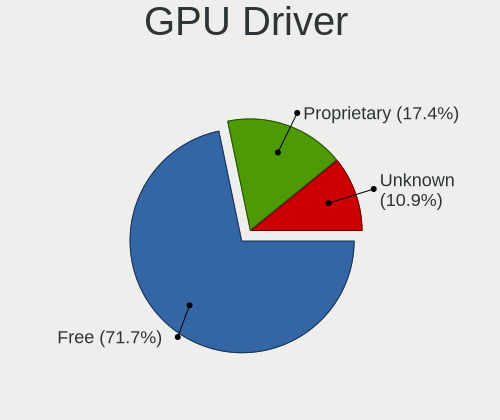

| Driver      | Notebooks | Percent |
|-------------|-----------|---------|
| Free        | 56        | 86.15%  |
| Proprietary | 7         | 10.77%  |
| Unknown     | 2         | 3.08%   |

GPU Memory
----------

Total video memory

| Size in GB | Notebooks | Percent |
|------------|-----------|---------|
| Unknown    | 56        | 86.15%  |
| 3.01-4.0   | 4         | 6.15%   |
| 1.01-2.0   | 2         | 3.08%   |
| 0.51-1.0   | 2         | 3.08%   |
| 0.01-0.5   | 1         | 1.54%   |

Monitor
-------

Monitor Vendor
--------------

Monitor vendors

| Vendor              | Notebooks | Percent |
|---------------------|-----------|---------|
| AU Optronics        | 20        | 24.69%  |
| LG Display          | 13        | 16.05%  |
| Samsung Electronics | 8         | 9.88%   |
| Chimei Innolux      | 8         | 9.88%   |
| BOE                 | 7         | 8.64%   |
| Iiyama              | 3         | 3.7%    |
| CSO                 | 3         | 3.7%    |
| Sharp               | 2         | 2.47%   |
| Philips             | 2         | 2.47%   |
| Hewlett-Packard     | 2         | 2.47%   |
| Goldstar            | 2         | 2.47%   |
| Gigabyte Technology | 2         | 2.47%   |
| Dell                | 2         | 2.47%   |
| ANX                 | 2         | 2.47%   |
| STA                 | 1         | 1.23%   |
| Medion              | 1         | 1.23%   |
| KDC                 | 1         | 1.23%   |
| HannStar            | 1         | 1.23%   |
| Analogix            | 1         | 1.23%   |

Monitor Model
-------------

Monitor models

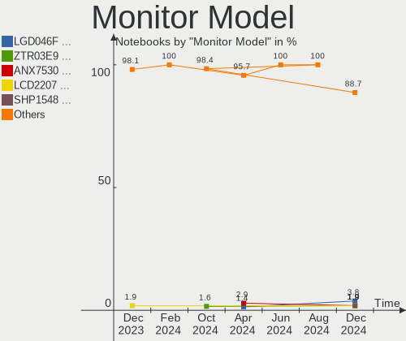

| Model                                                                  | Notebooks | Percent |
|------------------------------------------------------------------------|-----------|---------|
| AU Optronics LCD Monitor AUO202D 1920x1080 293x165mm 13.2-inch         | 7         | 8.54%   |
| BOE LCD Monitor BOE07B9 1920x1080 293x165mm 13.2-inch                  | 3         | 3.66%   |
| Samsung Electronics LCD Monitor SEC5441 1366x768 353x198mm 15.9-inch   | 2         | 2.44%   |
| Gigabyte Technology M32U GBT3204 3840x2160 697x392mm 31.5-inch         | 2         | 2.44%   |
| BOE LCD Monitor BOE07A8 1366x768 256x144mm 11.6-inch                   | 2         | 2.44%   |
| ANX ANX7530 U ANX7539 800x1280                                         | 2         | 2.44%   |
| STA LCD Monitor STA5DCA 1366x768 256x144mm 11.6-inch                   | 1         | 1.22%   |
| Sharp LCD Monitor SHP14F9 1920x1200 288x180mm 13.4-inch                | 1         | 1.22%   |
| Sharp LCD Monitor SHP14D1 1920x1200 336x210mm 15.6-inch                | 1         | 1.22%   |
| Samsung Electronics T27C350 SAM0AC5 1920x1080 598x336mm 27.0-inch      | 1         | 1.22%   |
| Samsung Electronics SyncMaster SAM0613 1920x1080                       | 1         | 1.22%   |
| Samsung Electronics S27C450 SAM09D0 1920x1080 598x336mm 27.0-inch      | 1         | 1.22%   |
| Samsung Electronics LF27T450F SAM7098 1920x1080 597x336mm 27.0-inch    | 1         | 1.22%   |
| Samsung Electronics LCD Monitor SEC3945 1280x800 331x207mm 15.4-inch   | 1         | 1.22%   |
| Samsung Electronics LCD Monitor SAM0D4F 1920x1080 1210x680mm 54.6-inch | 1         | 1.22%   |
| Samsung Electronics C49J89x SAM0F21 3840x1080 1196x336mm 48.9-inch     | 1         | 1.22%   |
| Philips PHL 243V7 PHLC155 1920x1080 527x296mm 23.8-inch                | 1         | 1.22%   |
| Philips PHL 243S5L PHL091F 1920x1080 521x293mm 23.5-inch               | 1         | 1.22%   |
| Medion MD 20889 MED3687 1920x1080 509x286mm 23.0-inch                  | 1         | 1.22%   |
| LG Display LCD Monitor LGD06E2 1920x1080 344x194mm 15.5-inch           | 1         | 1.22%   |
| LG Display LCD Monitor LGD06CE 1920x1200 288x180mm 13.4-inch           | 1         | 1.22%   |
| LG Display LCD Monitor LGD066D 1920x1080 344x194mm 15.5-inch           | 1         | 1.22%   |
| LG Display LCD Monitor LGD065A 1920x1080 344x194mm 15.5-inch           | 1         | 1.22%   |
| LG Display LCD Monitor LGD05F3 1920x1080 309x174mm 14.0-inch           | 1         | 1.22%   |
| LG Display LCD Monitor LGD05E5 1920x1080 344x194mm 15.5-inch           | 1         | 1.22%   |
| LG Display LCD Monitor LGD0597 1920x1080 294x165mm 13.3-inch           | 1         | 1.22%   |
| LG Display LCD Monitor LGD04E1 1366x768 344x194mm 15.5-inch            | 1         | 1.22%   |
| LG Display LCD Monitor LGD03DE 1600x900 382x215mm 17.3-inch            | 1         | 1.22%   |
| LG Display LCD Monitor LGD02DA 1920x1080 382x215mm 17.3-inch           | 1         | 1.22%   |
| LG Display LCD Monitor LGD02D9 1920x1080 344x194mm 15.5-inch           | 1         | 1.22%   |
| LG Display LCD Monitor LGD02D8 1366x768 277x156mm 12.5-inch            | 1         | 1.22%   |
| LG Display LCD Monitor LGD0254 1600x900 310x174mm 14.0-inch            | 1         | 1.22%   |
| KDC LCD Monitor KDC0830 1920x1080 344x193mm 15.5-inch                  | 1         | 1.22%   |
| Iiyama PLE2407HDS IVM560D 1920x1080 521x293mm 23.5-inch                | 1         | 1.22%   |
| Iiyama PLE2008HDS IVM539C 1600x900 443x249mm 20.0-inch                 | 1         | 1.22%   |
| Iiyama PL2875UH IVM7110 3840x2160 621x341mm 27.9-inch                  | 1         | 1.22%   |
| Hewlett-Packard P34hc G4 HPN36F9 3440x1440 797x334mm 34.0-inch         | 1         | 1.22%   |
| Hewlett-Packard 24fw HPN3545 1920x1080 527x296mm 23.8-inch             | 1         | 1.22%   |
| HannStar HSD121PHW1 HSD04B6 1366x768 270x150mm 12.2-inch               | 1         | 1.22%   |
| Goldstar QHD GSM7729 2560x1440 697x392mm 31.5-inch                     | 1         | 1.22%   |

Monitor Resolution
------------------

Monitor screen resolution

| Resolution        | Notebooks | Percent |
|-------------------|-----------|---------|
| 1920x1080 (FHD)   | 37        | 49.33%  |
| 1366x768 (WXGA)   | 13        | 17.33%  |
| 1600x900 (HD+)    | 5         | 6.67%   |
| 3840x2160 (4K)    | 4         | 5.33%   |
| 800x1280          | 3         | 4%      |
| 1920x1200 (WUXGA) | 3         | 4%      |
| 2880x1800         | 2         | 2.67%   |
| 2560x1440 (QHD)   | 2         | 2.67%   |
| 3840x1080         | 1         | 1.33%   |
| 3440x1440         | 1         | 1.33%   |
| 3072x1920         | 1         | 1.33%   |
| 2560x1600         | 1         | 1.33%   |
| 2160x1440         | 1         | 1.33%   |
| 1280x800 (WXGA)   | 1         | 1.33%   |

Monitor Diagonal
----------------

Diagonal size in inches

| Inches  | Notebooks | Percent |
|---------|-----------|---------|
| 15      | 22        | 26.83%  |
| 13      | 16        | 19.51%  |
| 14      | 9         | 10.98%  |
| 27      | 5         | 6.1%    |
| 11      | 5         | 6.1%    |
| Unknown | 4         | 4.88%   |
| 31      | 3         | 3.66%   |
| 24      | 3         | 3.66%   |
| 23      | 3         | 3.66%   |
| 17      | 3         | 3.66%   |
| 16      | 2         | 2.44%   |
| 12      | 2         | 2.44%   |
| 54      | 1         | 1.22%   |
| 49      | 1         | 1.22%   |
| 34      | 1         | 1.22%   |
| 25      | 1         | 1.22%   |
| 20      | 1         | 1.22%   |

Monitor Width
-------------

Physical width

| Width in mm | Notebooks | Percent |
|-------------|-----------|---------|
| 301-350     | 31        | 38.75%  |
| 201-300     | 23        | 28.75%  |
| 501-600     | 9         | 11.25%  |
| 351-400     | 5         | 6.25%   |
| 601-700     | 4         | 5%      |
| Unknown     | 4         | 5%      |
| 1001-1500   | 2         | 2.5%    |
| 701-800     | 1         | 1.25%   |
| 401-500     | 1         | 1.25%   |

Aspect Ratio
------------

Proportional relationship between the width and the height

| Ratio | Notebooks | Percent |
|-------|-----------|---------|
| 16/9  | 53        | 79.1%   |
| 16/10 | 8         | 11.94%  |
| 0.62  | 3         | 4.48%   |
| 32/9  | 1         | 1.49%   |
| 3/2   | 1         | 1.49%   |
| 21/9  | 1         | 1.49%   |

Monitor Area
------------

Area in inch

| Area in inch | Notebooks | Percent |
|----------------|-----------|---------|
| 101-110        | 22        | 26.83%  |
| 71-80          | 16        | 19.51%  |
| 81-90          | 9         | 10.98%  |
| 201-250        | 6         | 7.32%   |
| 51-60          | 5         | 6.1%    |
| 301-350        | 5         | 6.1%    |
| 351-500        | 4         | 4.88%   |
| Unknown        | 4         | 4.88%   |
| 61-70          | 2         | 2.44%   |
| 121-130        | 2         | 2.44%   |
| 111-120        | 2         | 2.44%   |
| More than 1000 | 1         | 1.22%   |
| 251-300        | 1         | 1.22%   |
| 151-200        | 1         | 1.22%   |
| 131-140        | 1         | 1.22%   |
| 501-1000       | 1         | 1.22%   |

Pixel Density
-------------

Pixels per inch

| Density       | Notebooks | Percent |
|---------------|-----------|---------|
| 121-160       | 34        | 42.5%   |
| 161-240       | 17        | 21.25%  |
| 51-100        | 14        | 17.5%   |
| 101-120       | 8         | 10%     |
| Unknown       | 4         | 5%      |
| More than 240 | 2         | 2.5%    |
| 1-50          | 1         | 1.25%   |

Multiple Monitors
-----------------

Total monitors connected

| Total | Notebooks | Percent |
|-------|-----------|---------|
| 1     | 44        | 67.69%  |
| 2     | 16        | 24.62%  |
| 0     | 3         | 4.62%   |
| 4     | 1         | 1.54%   |
| 3     | 1         | 1.54%   |

Network
-------

Net Controller Vendor
---------------------

Controller vendors

| Vendor                | Notebooks | Percent |
|-----------------------|-----------|---------|
| Intel                 | 53        | 52.48%  |
| Realtek Semiconductor | 31        | 30.69%  |
| Broadcom              | 4         | 3.96%   |
| Qualcomm Atheros      | 3         | 2.97%   |
| TP-Link               | 1         | 0.99%   |
| Ralink                | 1         | 0.99%   |
| Nvidia                | 1         | 0.99%   |
| Lenovo                | 1         | 0.99%   |
| Hewlett-Packard       | 1         | 0.99%   |
| Dresden Elektronik    | 1         | 0.99%   |
| DisplayLink           | 1         | 0.99%   |
| Dell                  | 1         | 0.99%   |
| Broadcom Limited      | 1         | 0.99%   |
| ASIX Electronics      | 1         | 0.99%   |

Net Controller Model
--------------------

Controller models

| Model                                                                                         | Notebooks | Percent |
|-----------------------------------------------------------------------------------------------|-----------|---------|
| Realtek RTL8111/8168/8411 PCI Express Gigabit Ethernet Controller                             | 20        | 17.39%  |
| Intel Cannon Point-LP CNVi [Wireless-AC]                                                      | 11        | 9.57%   |
| Intel Alder Lake-P PCH CNVi WiFi                                                              | 7         | 6.09%   |
| Intel Wireless 8265 / 8275                                                                    | 5         | 4.35%   |
| Intel Wi-Fi 6 AX201                                                                           | 5         | 4.35%   |
| Intel Wi-Fi 6 AX200                                                                           | 5         | 4.35%   |
| Intel Centrino Advanced-N 6205 [Taylor Peak]                                                  | 5         | 4.35%   |
| Intel 82579LM Gigabit Network Connection (Lewisville)                                         | 5         | 4.35%   |
| Realtek RTL8822CE 802.11ac PCIe Wireless Network Adapter                                      | 4         | 3.48%   |
| Intel Wi-Fi 6 AX201 160MHz                                                                    | 3         | 2.61%   |
| Realtek RTL8723BE PCIe Wireless Network Adapter                                               | 2         | 1.74%   |
| Realtek RTL8153 Gigabit Ethernet Adapter                                                      | 2         | 1.74%   |
| Intel Wireless 3160                                                                           | 2         | 1.74%   |
| Intel Ethernet Connection (6) I219-LM                                                         | 2         | 1.74%   |
| TP-Link TL-WN722N v2/v3 [Realtek RTL8188EUS]                                                  | 1         | 0.87%   |
| Realtek RTL8821CE 802.11ac PCIe Wireless Network Adapter                                      | 1         | 0.87%   |
| Realtek RTL810xE PCI Express Fast Ethernet controller                                         | 1         | 0.87%   |
| Realtek Realtek Network controller                                                            | 1         | 0.87%   |
| Realtek Realtek 8812AU/8821AU 802.11ac WLAN Adapter [USB Wireless Dual-Band Adapter 2.4/5Ghz] | 1         | 0.87%   |
| Realtek 802.11ac NIC                                                                          | 1         | 0.87%   |
| Ralink RT3090 Wireless 802.11n 1T/1R PCIe                                                     | 1         | 0.87%   |
| Qualcomm Atheros QCA9565 / AR9565 Wireless Network Adapter                                    | 1         | 0.87%   |
| Qualcomm Atheros AR9485 Wireless Network Adapter                                              | 1         | 0.87%   |
| Qualcomm Atheros AR8161 Gigabit Ethernet                                                      | 1         | 0.87%   |
| Qualcomm Atheros AR8132 Fast Ethernet                                                         | 1         | 0.87%   |
| Nvidia MCP79 Ethernet                                                                         | 1         | 0.87%   |
| Lenovo ThinkPad Lan                                                                           | 1         | 0.87%   |
| Intel Wireless 8260                                                                           | 1         | 0.87%   |
| Intel Wireless 7265                                                                           | 1         | 0.87%   |
| Intel WiFi Link 5100                                                                          | 1         | 0.87%   |
| Intel Wi-Fi 6 AX210/AX211/AX411 160MHz                                                        | 1         | 0.87%   |
| Intel Tiger Lake PCH CNVi WiFi                                                                | 1         | 0.87%   |
| Intel PRO/Wireless 3945ABG [Golan] Network Connection                                         | 1         | 0.87%   |
| Intel Ice Lake-LP PCH CNVi WiFi                                                               | 1         | 0.87%   |
| Intel Ethernet Connection I219-LM                                                             | 1         | 0.87%   |
| Intel Ethernet Connection I217-LM                                                             | 1         | 0.87%   |
| Intel Ethernet Connection (3) I218-V                                                          | 1         | 0.87%   |
| Intel Ethernet Connection (16) I219-LM                                                        | 1         | 0.87%   |
| Intel Ethernet Connection (10) I219-V                                                         | 1         | 0.87%   |
| Intel Comet Lake PCH-LP CNVi WiFi                                                             | 1         | 0.87%   |

Wireless Vendor
---------------

Wireless vendors

| Vendor                | Notebooks | Percent |
|-----------------------|-----------|---------|
| Intel                 | 51        | 75%     |
| Realtek Semiconductor | 10        | 14.71%  |
| Qualcomm Atheros      | 2         | 2.94%   |
| Broadcom              | 2         | 2.94%   |
| TP-Link               | 1         | 1.47%   |
| Ralink                | 1         | 1.47%   |
| Broadcom Limited      | 1         | 1.47%   |

Wireless Model
--------------

Wireless models

| Model                                                                                         | Notebooks | Percent |
|-----------------------------------------------------------------------------------------------|-----------|---------|
| Intel Cannon Point-LP CNVi [Wireless-AC]                                                      | 11        | 16.18%  |
| Intel Alder Lake-P PCH CNVi WiFi                                                              | 7         | 10.29%  |
| Intel Wireless 8265 / 8275                                                                    | 5         | 7.35%   |
| Intel Wi-Fi 6 AX201                                                                           | 5         | 7.35%   |
| Intel Wi-Fi 6 AX200                                                                           | 5         | 7.35%   |
| Intel Centrino Advanced-N 6205 [Taylor Peak]                                                  | 5         | 7.35%   |
| Realtek RTL8822CE 802.11ac PCIe Wireless Network Adapter                                      | 4         | 5.88%   |
| Intel Wi-Fi 6 AX201 160MHz                                                                    | 3         | 4.41%   |
| Realtek RTL8723BE PCIe Wireless Network Adapter                                               | 2         | 2.94%   |
| Intel Wireless 3160                                                                           | 2         | 2.94%   |
| TP-Link TL-WN722N v2/v3 [Realtek RTL8188EUS]                                                  | 1         | 1.47%   |
| Realtek RTL8821CE 802.11ac PCIe Wireless Network Adapter                                      | 1         | 1.47%   |
| Realtek Realtek Network controller                                                            | 1         | 1.47%   |
| Realtek Realtek 8812AU/8821AU 802.11ac WLAN Adapter [USB Wireless Dual-Band Adapter 2.4/5Ghz] | 1         | 1.47%   |
| Realtek 802.11ac NIC                                                                          | 1         | 1.47%   |
| Ralink RT3090 Wireless 802.11n 1T/1R PCIe                                                     | 1         | 1.47%   |
| Qualcomm Atheros QCA9565 / AR9565 Wireless Network Adapter                                    | 1         | 1.47%   |
| Qualcomm Atheros AR9485 Wireless Network Adapter                                              | 1         | 1.47%   |
| Intel Wireless 8260                                                                           | 1         | 1.47%   |
| Intel Wireless 7265                                                                           | 1         | 1.47%   |
| Intel WiFi Link 5100                                                                          | 1         | 1.47%   |
| Intel Wi-Fi 6 AX210/AX211/AX411 160MHz                                                        | 1         | 1.47%   |
| Intel Tiger Lake PCH CNVi WiFi                                                                | 1         | 1.47%   |
| Intel PRO/Wireless 3945ABG [Golan] Network Connection                                         | 1         | 1.47%   |
| Intel Ice Lake-LP PCH CNVi WiFi                                                               | 1         | 1.47%   |
| Intel Comet Lake PCH-LP CNVi WiFi                                                             | 1         | 1.47%   |
| Broadcom Limited BCM4352 802.11ac Wireless Network Adapter                                    | 1         | 1.47%   |
| Broadcom BCM4322 802.11a/b/g/n Wireless LAN Controller                                        | 1         | 1.47%   |
| Broadcom BCM4313 802.11bgn Wireless Network Adapter                                           | 1         | 1.47%   |

Ethernet Vendor
---------------

Ethernet vendors

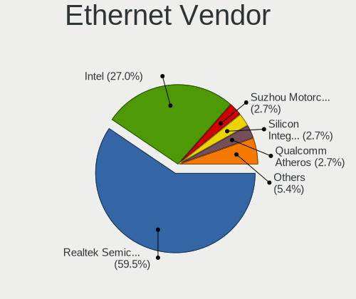

| Vendor                | Notebooks | Percent |
|-----------------------|-----------|---------|
| Realtek Semiconductor | 23        | 52.27%  |
| Intel                 | 13        | 29.55%  |
| Qualcomm Atheros      | 2         | 4.55%   |
| Broadcom              | 2         | 4.55%   |
| Nvidia                | 1         | 2.27%   |
| Lenovo                | 1         | 2.27%   |
| DisplayLink           | 1         | 2.27%   |
| ASIX Electronics      | 1         | 2.27%   |

Ethernet Model
--------------

Ethernet models

| Model                                                             | Notebooks | Percent |
|-------------------------------------------------------------------|-----------|---------|
| Realtek RTL8111/8168/8411 PCI Express Gigabit Ethernet Controller | 20        | 45.45%  |
| Intel 82579LM Gigabit Network Connection (Lewisville)             | 5         | 11.36%  |
| Realtek RTL8153 Gigabit Ethernet Adapter                          | 2         | 4.55%   |
| Intel Ethernet Connection (6) I219-LM                             | 2         | 4.55%   |
| Realtek RTL810xE PCI Express Fast Ethernet controller             | 1         | 2.27%   |
| Qualcomm Atheros AR8161 Gigabit Ethernet                          | 1         | 2.27%   |
| Qualcomm Atheros AR8132 Fast Ethernet                             | 1         | 2.27%   |
| Nvidia MCP79 Ethernet                                             | 1         | 2.27%   |
| Lenovo ThinkPad Lan                                               | 1         | 2.27%   |
| Intel Ethernet Connection I219-LM                                 | 1         | 2.27%   |
| Intel Ethernet Connection I217-LM                                 | 1         | 2.27%   |
| Intel Ethernet Connection (3) I218-V                              | 1         | 2.27%   |
| Intel Ethernet Connection (16) I219-LM                            | 1         | 2.27%   |
| Intel Ethernet Connection (10) I219-V                             | 1         | 2.27%   |
| Intel 82579V Gigabit Network Connection                           | 1         | 2.27%   |
| DisplayLink USB3.0 5K Graphic Docking                             | 1         | 2.27%   |
| Broadcom NetXtreme BCM5761e Gigabit Ethernet PCIe                 | 1         | 2.27%   |
| Broadcom NetLink BCM57780 Gigabit Ethernet PCIe                   | 1         | 2.27%   |
| ASIX AX88179 Gigabit Ethernet                                     | 1         | 2.27%   |

Net Controller Kind
-------------------

Ethernet, WiFi or modem

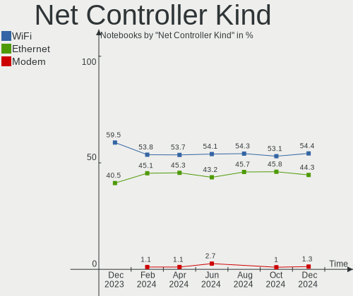

| Kind     | Notebooks | Percent |
|----------|-----------|---------|
| WiFi     | 65        | 59.09%  |
| Ethernet | 43        | 39.09%  |
| Modem    | 2         | 1.82%   |

Used Controller
---------------

Currently used network controller

| Kind     | Notebooks | Percent |
|----------|-----------|---------|
| WiFi     | 59        | 83.1%   |
| Ethernet | 12        | 16.9%   |

NICs
----

Total network controllers on board

| Total | Notebooks | Percent |
|-------|-----------|---------|
| 2     | 39        | 60%     |
| 1     | 26        | 40%     |

IPv6
----

IPv6 vs IPv4

| Used | Notebooks | Percent |
|------|-----------|---------|
| No   | 53        | 81.54%  |
| Yes  | 12        | 18.46%  |

Bluetooth
---------

Bluetooth Vendor
----------------

Controller vendors

| Vendor                  | Notebooks | Percent |
|-------------------------|-----------|---------|
| Intel                   | 43        | 72.88%  |
| IMC Networks            | 5         | 8.47%   |
| Realtek Semiconductor   | 3         | 5.08%   |
| Dell                    | 3         | 5.08%   |
| Realtek                 | 1         | 1.69%   |
| Hewlett-Packard         | 1         | 1.69%   |
| Cambridge Silicon Radio | 1         | 1.69%   |
| ASUSTek Computer        | 1         | 1.69%   |
| Apple                   | 1         | 1.69%   |

Bluetooth Model
---------------

Controller models

| Model                                               | Notebooks | Percent |
|-----------------------------------------------------|-----------|---------|
| Intel AX201 Bluetooth                               | 13        | 22.03%  |
| Intel Bluetooth 9460/9560 Jefferson Peak (JfP)      | 11        | 18.64%  |
| Intel Bluetooth wireless interface                  | 8         | 13.56%  |
| Intel Bluetooth Device                              | 5         | 8.47%   |
| Intel AX200 Bluetooth                               | 5         | 8.47%   |
| IMC Networks 802.11ac WLAN Adapter                  | 3         | 5.08%   |
| Realtek Bluetooth Radio                             | 2         | 3.39%   |
| Dell DW375 Bluetooth Module                         | 2         | 3.39%   |
| Realtek RTL8723B Bluetooth                          | 1         | 1.69%   |
| Realtek Bluetooth Radio                             | 1         | 1.69%   |
| Intel AX210 Bluetooth                               | 1         | 1.69%   |
| IMC Networks Bluetooth Device                       | 1         | 1.69%   |
| IMC Networks Atheros AR3012 Bluetooth 4.0 Adapter   | 1         | 1.69%   |
| HP Broadcom 2070 Bluetooth Combo                    | 1         | 1.69%   |
| Dell Wireless 365 Bluetooth                         | 1         | 1.69%   |
| Cambridge Silicon Radio Bluetooth Dongle (HCI mode) | 1         | 1.69%   |
| ASUS BT-270 Bluetooth Adapter                       | 1         | 1.69%   |
| Apple Bluetooth Host Controller                     | 1         | 1.69%   |

Sound
-----

Sound Vendor
------------

Sound card vendors

| Vendor                | Notebooks | Percent |
|-----------------------|-----------|---------|
| Intel                 | 57        | 75%     |
| AMD                   | 8         | 10.53%  |
| Nvidia                | 6         | 7.89%   |
| Realtek Semiconductor | 1         | 1.32%   |
| Razer USA             | 1         | 1.32%   |
| Polycom               | 1         | 1.32%   |
| Plantronics           | 1         | 1.32%   |
| Hewlett-Packard       | 1         | 1.32%   |

Sound Model
-----------

Sound card models

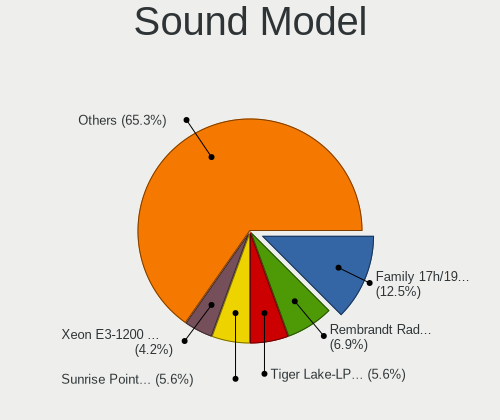

| Model                                                                             | Notebooks | Percent |
|-----------------------------------------------------------------------------------|-----------|---------|
| Intel Cannon Point-LP High Definition Audio Controller                            | 12        | 14.29%  |
| Intel Alder Lake PCH-P High Definition Audio Controller                           | 7         | 8.33%   |
| Intel 6 Series/C200 Series Chipset Family High Definition Audio Controller        | 6         | 7.14%   |
| Intel Tiger Lake-LP Smart Sound Technology Audio Controller                       | 5         | 5.95%   |
| Intel Sunrise Point-LP HD Audio                                                   | 4         | 4.76%   |
| Intel Jasper Lake HD Audio                                                        | 3         | 3.57%   |
| AMD Rembrandt Radeon High Definition Audio Controller                             | 3         | 3.57%   |
| AMD Family 17h/19h HD Audio Controller                                            | 3         | 3.57%   |
| Nvidia Audio device                                                               | 2         | 2.38%   |
| Intel Ice Lake-LP Smart Sound Technology Audio Controller                         | 2         | 2.38%   |
| Intel Haswell-ULT HD Audio Controller                                             | 2         | 2.38%   |
| Intel Comet Lake PCH-LP cAVS                                                      | 2         | 2.38%   |
| Intel CM238 HD Audio Controller                                                   | 2         | 2.38%   |
| Intel Celeron/Pentium Silver Processor High Definition Audio                      | 2         | 2.38%   |
| Intel Cannon Lake PCH cAVS                                                        | 2         | 2.38%   |
| Intel 82801I (ICH9 Family) HD Audio Controller                                    | 2         | 2.38%   |
| Intel 8 Series HD Audio Controller                                                | 2         | 2.38%   |
| AMD Renoir Radeon High Definition Audio Controller                                | 2         | 2.38%   |
| Realtek Semiconductor USB Audio                                                   | 1         | 1.19%   |
| Razer USA Razer Seiren Mini                                                       | 1         | 1.19%   |
| Polycom CX300                                                                     | 1         | 1.19%   |
| Plantronics Blackwire 3225 Series                                                 | 1         | 1.19%   |
| Nvidia TU107 GeForce GTX 1650 High Definition Audio Controller                    | 1         | 1.19%   |
| Nvidia MCP79 High Definition Audio                                                | 1         | 1.19%   |
| Nvidia High Definition Audio Controller                                           | 1         | 1.19%   |
| Nvidia GK104 HDMI Audio Controller                                                | 1         | 1.19%   |
| Intel Xeon E3-1200 v3/4th Gen Core Processor HD Audio Controller                  | 1         | 1.19%   |
| Intel Wildcat Point-LP High Definition Audio Controller                           | 1         | 1.19%   |
| Intel Tiger Lake-H HD Audio Controller                                            | 1         | 1.19%   |
| Intel NM10/ICH7 Family High Definition Audio Controller                           | 1         | 1.19%   |
| Intel Broadwell-U Audio Controller                                                | 1         | 1.19%   |
| Intel Atom Processor Z36xxx/Z37xxx Series High Definition Audio Controller        | 1         | 1.19%   |
| Intel 8 Series/C220 Series Chipset High Definition Audio Controller               | 1         | 1.19%   |
| Intel 7 Series/C216 Chipset Family High Definition Audio Controller               | 1         | 1.19%   |
| Hewlett-Packard USB Audio                                                         | 1         | 1.19%   |
| AMD Raven/Raven2/Fenghuang HDMI/DP Audio Controller                               | 1         | 1.19%   |
| AMD Kabini HDMI/DP Audio                                                          | 1         | 1.19%   |
| AMD FCH Azalia Controller                                                         | 1         | 1.19%   |
| AMD Caicos HDMI Audio [Radeon HD 6450 / 7450/8450/8490 OEM / R5 230/235/235X OEM] | 1         | 1.19%   |

Memory
------

Memory Vendor
-------------

Memory module vendors

| Vendor              | Notebooks | Percent |
|---------------------|-----------|---------|
| Samsung Electronics | 17        | 40.48%  |
| SK hynix            | 15        | 35.71%  |
| Micron Technology   | 4         | 9.52%   |
| Unknown (ABCD)      | 1         | 2.38%   |
| Unknown             | 1         | 2.38%   |
| Kingston            | 1         | 2.38%   |
| Crucial             | 1         | 2.38%   |
| A-DATA Technology   | 1         | 2.38%   |
| Unknown             | 1         | 2.38%   |

Memory Model
------------

Memory module models

| Model                                                            | Notebooks | Percent |
|------------------------------------------------------------------|-----------|---------|
| SK hynix RAM HMAA1GS6CJR6N-XN 8GB SODIMM DDR4 3200MT/s           | 4         | 9.52%   |
| SK hynix RAM HMA81GS6JJR8N-VK 8GB SODIMM DDR4 2667MT/s           | 2         | 4.76%   |
| SK hynix RAM HCNNNBKMMLXR-NEE 4GB Row Of Chips LPDDR4 4267MT/s   | 2         | 4.76%   |
| Samsung RAM M471A5244CB0-CWE 4GB SODIMM DDR4 3200MT/s            | 2         | 4.76%   |
| Samsung RAM M471A1K43DB1-CTD 8GB SODIMM DDR4 2667MT/s            | 2         | 4.76%   |
| Samsung RAM M471A1K43CB1-CTD 8GB SODIMM DDR4 2667MT/s            | 2         | 4.76%   |
| Unknown RAM Module 2GB Row Of Chips LPDDR4 4267MT/s              | 1         | 2.38%   |
| Unknown (ABCD) RAM 123456789012345678 1GB SODIMM LPDDR4 2400MT/s | 1         | 2.38%   |
| SK hynix RAM HMT41GS6BFR8A-PB 8GB SODIMM DDR3 1600MT/s           | 1         | 2.38%   |
| SK hynix RAM HMAA1GS6CMR6N-XN 8GB Row Of Chips DDR4 3200MT/s     | 1         | 2.38%   |
| SK hynix RAM HMA851S6CJR6N-XN 4GB SODIMM DDR4 3200MT/s           | 1         | 2.38%   |
| SK hynix RAM HMA851S6CJR6N-VK 4GB SODIMM DDR4 2667MT/s           | 1         | 2.38%   |
| SK hynix RAM HMA81GS6CJR8N-VK 8192MB SODIMM DDR4 2667MT/s        | 1         | 2.38%   |
| SK hynix RAM H9JCNNNFA5MLYR-N6E 4GB Row Of Chips LPDDR5 6400MT/s | 1         | 2.38%   |
| SK hynix RAM 0000000000-00000 4GB SODIMM DDR4 2400MT/s           | 1         | 2.38%   |
| Samsung RAM M471B5273DH0-CH9 4GB SODIMM DDR3 1334MT/s            | 1         | 2.38%   |
| Samsung RAM M471B5273CH0-CH9 4GB SODIMM DDR3 1334MT/s            | 1         | 2.38%   |
| Samsung RAM M471A5244CB0-CTD 4GB Row Of Chips DDR4 2667MT/s      | 1         | 2.38%   |
| Samsung RAM M471A2G44AM0-CWE 16GB SODIMM DDR4 3200MT/s           | 1         | 2.38%   |
| Samsung RAM M471A1K44BM0-CRC 8GB SODIMM DDR4 2400MT/s            | 1         | 2.38%   |
| Samsung RAM M471A1K43DB1-CWE 8192MB SODIMM DDR4 3200MT/s         | 1         | 2.38%   |
| Samsung RAM M471A1K43CB1-CRC 8GB SODIMM DDR4 2667MT/s            | 1         | 2.38%   |
| Samsung RAM K4UBE3D4AA-MGCH 8GB Row Of Chips LPDDR4 3200MT/s     | 1         | 2.38%   |
| Samsung RAM K4U6E3S4AA-MGCR 1GB Row Of Chips LPDDR4 4267MT/s     | 1         | 2.38%   |
| Samsung RAM K4E6E304EB-EGCF 4096MB Row Of Chips LPDDR3 1867MT/s  | 1         | 2.38%   |
| Samsung RAM K3LKBKB0BM-MGCP 2GB Row Of Chips LPDDR5 6400MT/s     | 1         | 2.38%   |
| Micron RAM MTC8C1084S1SC48BA1 16GB SODIMM 4800MT/s               | 1         | 2.38%   |
| Micron RAM MTC4C10163S1SC48BA1 8GB SODIMM DDR5 4800MT/s          | 1         | 2.38%   |
| Micron RAM 8ATF1G64HZ-2G6D1 8GB SODIMM DDR4 2667MT/s             | 1         | 2.38%   |
| Micron RAM 4ATF1G64HZ-3G2E2 8GB SODIMM DDR4 3200MT/s             | 1         | 2.38%   |
| Kingston RAM K1CXP8-HYC 16GB SODIMM DDR4 3200MT/s                | 1         | 2.38%   |
| Crucial RAM CT16G4SFD8266.M16FE 16GB SODIMM DDR4 2667MT/s        | 1         | 2.38%   |
| A-DATA RAM AD73I1C1674EV 4GB SODIMM DDR3 1334MT/s                | 1         | 2.38%   |
| Unknown                                                          | 1         | 2.38%   |

Memory Kind
-----------

Memory module kinds

| Kind   | Notebooks | Percent |
|--------|-----------|---------|
| DDR4   | 24        | 63.16%  |
| LPDDR4 | 6         | 15.79%  |
| DDR3   | 3         | 7.89%   |
| LPDDR5 | 2         | 5.26%   |
| DDR5   | 2         | 5.26%   |
| LPDDR3 | 1         | 2.63%   |

Memory Form Factor
------------------

Physical design of the memory module

| Name         | Notebooks | Percent |
|--------------|-----------|---------|
| SODIMM       | 29        | 74.36%  |
| Row Of Chips | 10        | 25.64%  |

Memory Size
-----------

Memory module size

| Size  | Notebooks | Percent |
|-------|-----------|---------|
| 8192  | 21        | 53.85%  |
| 4096  | 11        | 28.21%  |
| 16384 | 5         | 12.82%  |
| 2048  | 2         | 5.13%   |

Memory Speed
------------

Memory module speed

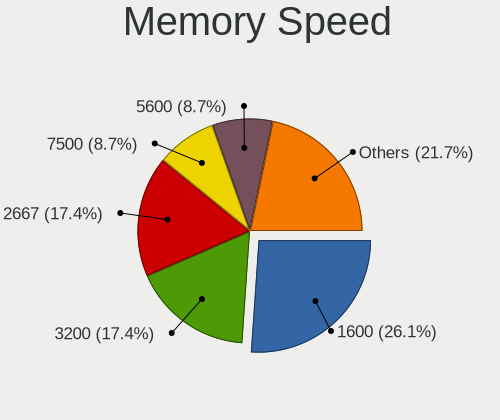

| Speed | Notebooks | Percent |
|-------|-----------|---------|
| 3200  | 12        | 31.58%  |
| 2667  | 11        | 28.95%  |
| 4267  | 4         | 10.53%  |
| 2400  | 3         | 7.89%   |
| 6400  | 2         | 5.26%   |
| 4800  | 2         | 5.26%   |
| 1334  | 2         | 5.26%   |
| 1867  | 1         | 2.63%   |
| 1600  | 1         | 2.63%   |

Printers & scanners
-------------------

Printer Vendor
--------------

Printer device vendors

Zero info for selected period =(

Printer Model
-------------

Printer device models

Zero info for selected period =(

Scanner Vendor
--------------

Scanner device vendors

Zero info for selected period =(

Scanner Model
-------------

Scanner device models

Zero info for selected period =(

Camera
------

Camera Vendor
-------------

Camera device vendors

| Vendor                                 | Notebooks | Percent |
|----------------------------------------|-----------|---------|
| Microdia                               | 13        | 22.41%  |
| Chicony Electronics                    | 11        | 18.97%  |
| Sunplus Innovation Technology          | 9         | 15.52%  |
| Realtek Semiconductor                  | 7         | 12.07%  |
| IMC Networks                           | 7         | 12.07%  |
| Logitech                               | 3         | 5.17%   |
| Acer                                   | 3         | 5.17%   |
| Apple                                  | 2         | 3.45%   |
| SunplusIT                              | 1         | 1.72%   |
| Sonix Technology                       | 1         | 1.72%   |
| Cheng Uei Precision Industry (Foxlink) | 1         | 1.72%   |

Camera Model
------------

Camera device models

| Model                                                                      | Notebooks | Percent |
|----------------------------------------------------------------------------|-----------|---------|
| Microdia Integrated_Webcam_HD                                              | 10        | 16.95%  |
| Realtek Integrated_Webcam_HD                                               | 6         | 10.17%  |
| Logitech StreamCam                                                         | 2         | 3.39%   |
| IMC Networks USB2.0 HD UVC WebCam                                          | 2         | 3.39%   |
| Chicony Integrated Camera                                                  | 2         | 3.39%   |
| Chicony HD WebCam                                                          | 2         | 3.39%   |
| SunplusIT 720p HD Camera                                                   | 1         | 1.69%   |
| Sunplus Laptop_Integrated_Webcam_HD                                        | 1         | 1.69%   |
| Sunplus Laptop_Integrated_Webcam_FHD                                       | 1         | 1.69%   |
| Sunplus Integrated_Webcam_HD                                               | 1         | 1.69%   |
| Sunplus Integrated_Webcam_FHD                                              | 1         | 1.69%   |
| Sunplus HP HD Webcam [Fixed]                                               | 1         | 1.69%   |
| Sunplus HK 1080P K20Pro                                                    | 1         | 1.69%   |
| Sunplus HD WebCam                                                          | 1         | 1.69%   |
| Sunplus Dell Integrated HD Webcam                                          | 1         | 1.69%   |
| Sunplus ASUS USB2.0 Webcam                                                 | 1         | 1.69%   |
| Sonix USB2.0 HD UVC WebCam                                                 | 1         | 1.69%   |
| Realtek USB Camera                                                         | 1         | 1.69%   |
| Realtek USB Boot                                                           | 1         | 1.69%   |
| Microdia Webcam Vitade AF                                                  | 1         | 1.69%   |
| Microdia Integrated_Webcam_FHD                                             | 1         | 1.69%   |
| Microdia Integrated Webcam                                                 | 1         | 1.69%   |
| Logitech HD Pro Webcam C920                                                | 1         | 1.69%   |
| IMC Networks UVC VGA Webcam                                                | 1         | 1.69%   |
| IMC Networks USB2.0 VGA UVC WebCam                                         | 1         | 1.69%   |
| IMC Networks ov9734_azurewave_camera                                       | 1         | 1.69%   |
| IMC Networks Integrated RGB Camera                                         | 1         | 1.69%   |
| IMC Networks HP TrueVision HD Camera                                       | 1         | 1.69%   |
| Chicony USB2.0 HD UVC WebCam                                               | 1         | 1.69%   |
| Chicony USB2.0 Camera                                                      | 1         | 1.69%   |
| Chicony Lenovo Integrated Camera (0.3MP)                                   | 1         | 1.69%   |
| Chicony Lenovo EasyCamera                                                  | 1         | 1.69%   |
| Chicony HP Wide Vision HD Camera                                           | 1         | 1.69%   |
| Chicony HP HD Camera                                                       | 1         | 1.69%   |
| Chicony HD User Facing                                                     | 1         | 1.69%   |
| Cheng Uei Precision Industry (Foxlink) HP Wide Vision HD Integrated Webcam | 1         | 1.69%   |
| Apple iPhone5/5C/5S/6                                                      | 1         | 1.69%   |
| Apple Built-in iSight                                                      | 1         | 1.69%   |
| Acer Lenovo Integrated Webcam                                              | 1         | 1.69%   |
| Acer Lenovo EasyCamera                                                     | 1         | 1.69%   |

Security
--------

Fingerprint Vendor
------------------

Fingerprint sensor vendors

| Vendor                     | Notebooks | Percent |
|----------------------------|-----------|---------|
| Validity Sensors           | 3         | 27.27%  |
| Synaptics                  | 3         | 27.27%  |
| Shenzhen Goodix Technology | 2         | 18.18%  |
| Upek                       | 1         | 9.09%   |
| LighTuning Technology      | 1         | 9.09%   |
| Elan Microelectronics      | 1         | 9.09%   |

Fingerprint Model
-----------------

Fingerprint sensor models

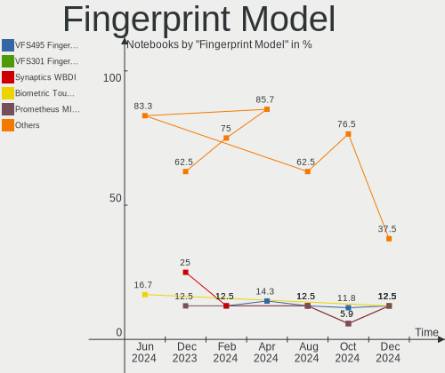

| Model                                                      | Notebooks | Percent |
|------------------------------------------------------------|-----------|---------|
| Validity Sensors VFS471 Fingerprint Reader                 | 2         | 18.18%  |
| Validity Sensors VFS5011 Fingerprint Reader                | 1         | 9.09%   |
| Upek Biometric Touchchip/Touchstrip Fingerprint Sensor     | 1         | 9.09%   |
| Synaptics  VFS7552 Touch Fingerprint Sensor with PurePrint | 1         | 9.09%   |
| Synaptics  FS7604 Touch Fingerprint Sensor with PurePrint  | 1         | 9.09%   |
| Synaptics Prometheus MIS Touch Fingerprint Reader          | 1         | 9.09%   |
| Shenzhen Goodix  Fingerprint Device                        | 1         | 9.09%   |
| Shenzhen Goodix FingerPrint                                | 1         | 9.09%   |
| LighTuning EgisTec Touch Fingerprint Sensor                | 1         | 9.09%   |
| Elan ELAN:Fingerprint                                      | 1         | 9.09%   |

Chipcard Vendor
---------------

Chipcard module vendors

| Vendor                | Notebooks | Percent |
|-----------------------|-----------|---------|
| Broadcom              | 7         | 77.78%  |
| Gemalto (was Gemplus) | 1         | 11.11%  |
| Alcor Micro           | 1         | 11.11%  |

Chipcard Model
--------------

Chipcard module models

| Model                                                                        | Notebooks | Percent |
|------------------------------------------------------------------------------|-----------|---------|
| Broadcom BCM5880 Secure Applications Processor                               | 4         | 44.44%  |
| Broadcom 58200                                                               | 2         | 22.22%  |
| Gemalto (was Gemplus) Compact Smart Card Reader Writer                       | 1         | 11.11%  |
| Broadcom BCM5880 Secure Applications Processor with fingerprint swipe sensor | 1         | 11.11%  |
| Alcor Micro AU9540 Smartcard Reader                                          | 1         | 11.11%  |

Unsupported
-----------

Unsupported Devices
-------------------

Total unsupported devices on board

| Total | Notebooks | Percent |
|-------|-----------|---------|
| 0     | 38        | 58.46%  |
| 1     | 22        | 33.85%  |
| 2     | 4         | 6.15%   |
| 5     | 1         | 1.54%   |

Unsupported Device Types
------------------------

Types of unsupported devices

| Type                  | Notebooks | Percent |
|-----------------------|-----------|---------|
| Fingerprint reader    | 11        | 33.33%  |
| Chipcard              | 7         | 21.21%  |
| Net/wireless          | 5         | 15.15%  |
| Graphics card         | 3         | 9.09%   |
| Multimedia controller | 2         | 6.06%   |
| Card reader           | 2         | 6.06%   |
| Camera                | 2         | 6.06%   |
| Storage               | 1         | 3.03%   |

