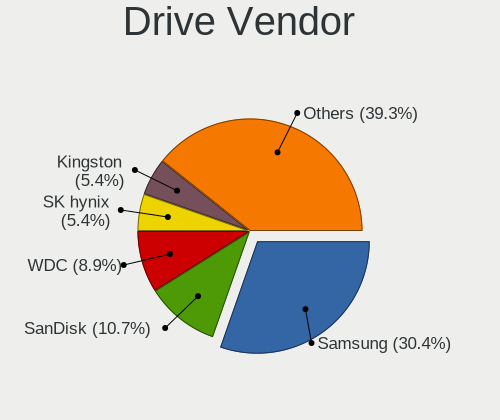
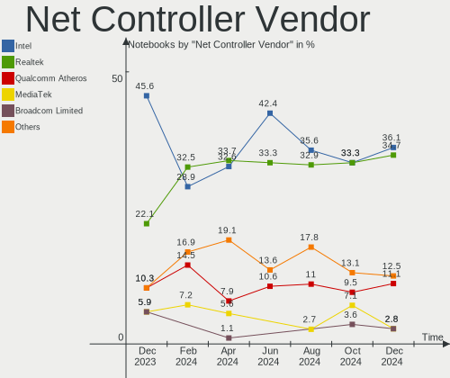
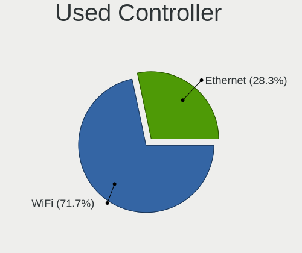
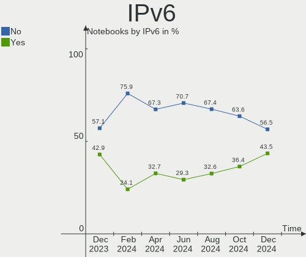
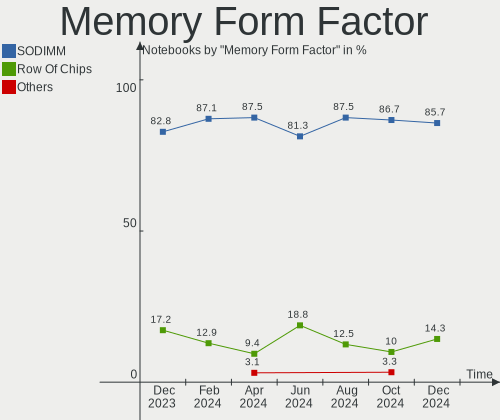
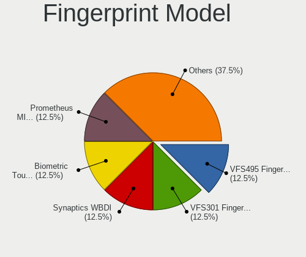

Linux in Netherlands - Hardware Trends (Notebooks)
--------------------------------------------------

A project to identify most popular hardware characteristics and track their change
over time based on data collected by Linux users at https://Linux-Hardware.org.

Anyone can contribute to this report by the [hw-probe](https://github.com/linuxhw/hw-probe) tool:

    sudo -E hw-probe -all -upload

Period: Dec, 2023.

Contents
--------

* [ System ](#system)
  - [ OS                       ](#os)
  - [ OS Family                ](#os-family)
  - [ Kernel                   ](#kernel)
  - [ Kernel Family            ](#kernel-family)
  - [ Kernel Major Ver.        ](#kernel-major-ver)
  - [ Arch                     ](#arch)
  - [ DE                       ](#de)
  - [ Display Server           ](#display-server)
  - [ Display Manager          ](#display-manager)
  - [ OS Lang                  ](#os-lang)
  - [ Boot Mode                ](#boot-mode)
  - [ Filesystem               ](#filesystem)
  - [ Part. scheme             ](#part-scheme)
  - [ Dual Boot with Linux/BSD ](#dual-boot-with-linuxbsd)
  - [ Dual Boot (Win)          ](#dual-boot-win)

* [ Board ](#board)
  - [ Vendor                   ](#vendor)
  - [ Model                    ](#model)
  - [ Model Family             ](#model-family)
  - [ MFG Year                 ](#mfg-year)
  - [ Form Factor              ](#form-factor)
  - [ Secure Boot              ](#secure-boot)
  - [ Coreboot                 ](#coreboot)
  - [ RAM Size                 ](#ram-size)
  - [ RAM Used                 ](#ram-used)
  - [ Total Drives             ](#total-drives)
  - [ Has CD-ROM               ](#has-cd-rom)
  - [ Has Ethernet             ](#has-ethernet)
  - [ Has WiFi                 ](#has-wifi)
  - [ Has Bluetooth            ](#has-bluetooth)

* [ Location ](#location)
  - [ Country                  ](#country)
  - [ City                     ](#city)

* [ Drives ](#drives)
  - [ Drive Vendor             ](#drive-vendor)
  - [ Drive Model              ](#drive-model)
  - [ HDD Vendor               ](#hdd-vendor)
  - [ SSD Vendor               ](#ssd-vendor)
  - [ Drive Kind               ](#drive-kind)
  - [ Drive Connector          ](#drive-connector)
  - [ Drive Size               ](#drive-size)
  - [ Space Total              ](#space-total)
  - [ Space Used               ](#space-used)
  - [ Malfunc. Drives          ](#malfunc-drives)
  - [ Malfunc. Drive Vendor    ](#malfunc-drive-vendor)
  - [ Malfunc. HDD Vendor      ](#malfunc-hdd-vendor)
  - [ Malfunc. Drive Kind      ](#malfunc-drive-kind)
  - [ Failed Drives            ](#failed-drives)
  - [ Failed Drive Vendor      ](#failed-drive-vendor)
  - [ Drive Status             ](#drive-status)

* [ Storage controller ](#storage-controller)
  - [ Storage Vendor           ](#storage-vendor)
  - [ Storage Model            ](#storage-model)
  - [ Storage Kind             ](#storage-kind)

* [ Processor ](#processor)
  - [ CPU Vendor               ](#cpu-vendor)
  - [ CPU Model                ](#cpu-model)
  - [ CPU Model Family         ](#cpu-model-family)
  - [ CPU Cores                ](#cpu-cores)
  - [ CPU Sockets              ](#cpu-sockets)
  - [ CPU Threads              ](#cpu-threads)
  - [ CPU Op-Modes             ](#cpu-op-modes)
  - [ CPU Microcode            ](#cpu-microcode)
  - [ CPU Microarch            ](#cpu-microarch)

* [ Graphics ](#graphics)
  - [ GPU Vendor               ](#gpu-vendor)
  - [ GPU Model                ](#gpu-model)
  - [ GPU Combo                ](#gpu-combo)
  - [ GPU Driver               ](#gpu-driver)
  - [ GPU Memory               ](#gpu-memory)

* [ Monitor ](#monitor)
  - [ Monitor Vendor           ](#monitor-vendor)
  - [ Monitor Model            ](#monitor-model)
  - [ Monitor Resolution       ](#monitor-resolution)
  - [ Monitor Diagonal         ](#monitor-diagonal)
  - [ Monitor Width            ](#monitor-width)
  - [ Aspect Ratio             ](#aspect-ratio)
  - [ Monitor Area             ](#monitor-area)
  - [ Pixel Density            ](#pixel-density)
  - [ Multiple Monitors        ](#multiple-monitors)

* [ Network ](#network)
  - [ Net Controller Vendor    ](#net-controller-vendor)
  - [ Net Controller Model     ](#net-controller-model)
  - [ Wireless Vendor          ](#wireless-vendor)
  - [ Wireless Model           ](#wireless-model)
  - [ Ethernet Vendor          ](#ethernet-vendor)
  - [ Ethernet Model           ](#ethernet-model)
  - [ Net Controller Kind      ](#net-controller-kind)
  - [ Used Controller          ](#used-controller)
  - [ NICs                     ](#nics)
  - [ IPv6                     ](#ipv6)

* [ Bluetooth ](#bluetooth)
  - [ Bluetooth Vendor         ](#bluetooth-vendor)
  - [ Bluetooth Model          ](#bluetooth-model)

* [ Sound ](#sound)
  - [ Sound Vendor             ](#sound-vendor)
  - [ Sound Model              ](#sound-model)

* [ Memory ](#memory)
  - [ Memory Vendor            ](#memory-vendor)
  - [ Memory Model             ](#memory-model)
  - [ Memory Kind              ](#memory-kind)
  - [ Memory Form Factor       ](#memory-form-factor)
  - [ Memory Size              ](#memory-size)
  - [ Memory Speed             ](#memory-speed)

* [ Printers & scanners ](#printers--scanners)
  - [ Printer Vendor           ](#printer-vendor)
  - [ Printer Model            ](#printer-model)
  - [ Scanner Vendor           ](#scanner-vendor)
  - [ Scanner Model            ](#scanner-model)

* [ Camera ](#camera)
  - [ Camera Vendor            ](#camera-vendor)
  - [ Camera Model             ](#camera-model)

* [ Security ](#security)
  - [ Fingerprint Vendor       ](#fingerprint-vendor)
  - [ Fingerprint Model        ](#fingerprint-model)
  - [ Chipcard Vendor          ](#chipcard-vendor)
  - [ Chipcard Model           ](#chipcard-model)

* [ Unsupported ](#unsupported)
  - [ Unsupported Devices      ](#unsupported-devices)
  - [ Unsupported Device Types ](#unsupported-device-types)

System
------

OS
--

Installed operating systems

| Name               | Notebooks | Percent |
|--------------------|-----------|---------|
| Ubuntu 22.04       | 11        | 22.45%  |
| Fedora 39          | 8         | 16.33%  |
| Linux Mint 21.2    | 5         | 10.2%   |
| Zorin 16           | 3         | 6.12%   |
| OpenMandriva 23.11 | 2         | 4.08%   |
| Kubuntu 23.10      | 2         | 4.08%   |
| Arch Rolling       | 2         | 4.08%   |
| Ubuntu 23.10       | 1         | 2.04%   |
| Pop!_OS 22.04      | 1         | 2.04%   |
| Parrot 5.3         | 1         | 2.04%   |
| OpenMandriva 5.0   | 1         | 2.04%   |
| OpenMandriva 23.90 | 1         | 2.04%   |
| OpenMandriva 23.08 | 1         | 2.04%   |
| OpenMandriva 23.01 | 1         | 2.04%   |
| NixOS 23.11        | 1         | 2.04%   |
| Manjaro            | 1         | 2.04%   |
| LMDE 6             | 1         | 2.04%   |
| Linux Lite 6.6     | 1         | 2.04%   |
| KDE neon 22.04     | 1         | 2.04%   |
| Fedora 38          | 1         | 2.04%   |
| Fedora 37          | 1         | 2.04%   |
| Debian 12          | 1         | 2.04%   |
| ArcoLinux Rolling  | 1         | 2.04%   |

OS Family
---------

OS without a version

| Name         | Notebooks | Percent |
|--------------|-----------|---------|
| Ubuntu       | 12        | 24.49%  |
| Fedora       | 10        | 20.41%  |
| OpenMandriva | 6         | 12.24%  |
| Linux Mint   | 5         | 10.2%   |
| Zorin        | 3         | 6.12%   |
| Kubuntu      | 2         | 4.08%   |
| Arch         | 2         | 4.08%   |
| Pop!_OS      | 1         | 2.04%   |
| Parrot       | 1         | 2.04%   |
| NixOS        | 1         | 2.04%   |
| Manjaro      | 1         | 2.04%   |
| LMDE         | 1         | 2.04%   |
| Linux Lite   | 1         | 2.04%   |
| KDE neon     | 1         | 2.04%   |
| Debian       | 1         | 2.04%   |
| ArcoLinux    | 1         | 2.04%   |

Kernel
------

Version of the Linux kernel

| Version                  | Notebooks | Percent |
|--------------------------|-----------|---------|
| 6.2.0-37-generic         | 8         | 16.33%  |
| 6.2.0-39-generic         | 5         | 10.2%   |
| 5.15.0-91-generic        | 5         | 10.2%   |
| 6.6.4-200.fc39.x86_64    | 3         | 6.12%   |
| 6.6.2-desktop-1omv2390   | 3         | 6.12%   |
| 6.6.8-200.fc39.x86_64    | 2         | 4.08%   |
| 6.6.7-200.fc39.x86_64    | 2         | 4.08%   |
| 6.6.4-arch1-1            | 2         | 4.08%   |
| 6.5.0-14-generic         | 2         | 4.08%   |
| 5.15.0-89-generic        | 2         | 4.08%   |
| 6.6.7-desktop-1omv2390   | 1         | 2.04%   |
| 6.6.7-arch1-1            | 1         | 2.04%   |
| 6.6.7-4-MANJARO          | 1         | 2.04%   |
| 6.6.7-100.fc38.x86_64    | 1         | 2.04%   |
| 6.5.6-76060506-generic   | 1         | 2.04%   |
| 6.5.6-300.fc39.x86_64    | 1         | 2.04%   |
| 6.5.12-100.fc37.x86_64   | 1         | 2.04%   |
| 6.5.0-10-generic         | 1         | 2.04%   |
| 6.5.0-0.deb12.1-rt-amd64 | 1         | 2.04%   |
| 6.4.11-desktop-1omv2390  | 1         | 2.04%   |
| 6.1.68                   | 1         | 2.04%   |
| 6.1.1-desktop-1omv2290   | 1         | 2.04%   |
| 6.1.0-1parrot1-amd64     | 1         | 2.04%   |
| 6.1.0-14-amd64           | 1         | 2.04%   |
| 5.15.0-72-generic        | 1         | 2.04%   |

Kernel Family
-------------

Linux kernel without a distro release

| Version | Notebooks | Percent |
|---------|-----------|---------|
| 6.2.0   | 13        | 26.53%  |
| 5.15.0  | 8         | 16.33%  |
| 6.6.7   | 6         | 12.24%  |
| 6.6.4   | 5         | 10.2%   |
| 6.5.0   | 4         | 8.16%   |
| 6.6.2   | 3         | 6.12%   |
| 6.6.8   | 2         | 4.08%   |
| 6.5.6   | 2         | 4.08%   |
| 6.1.0   | 2         | 4.08%   |
| 6.5.12  | 1         | 2.04%   |
| 6.4.11  | 1         | 2.04%   |
| 6.1.68  | 1         | 2.04%   |
| 6.1.1   | 1         | 2.04%   |

Kernel Major Ver.
-----------------

Linux kernel major version

| Version | Notebooks | Percent |
|---------|-----------|---------|
| 6.6     | 16        | 32.65%  |
| 6.2     | 13        | 26.53%  |
| 5.15    | 8         | 16.33%  |
| 6.5     | 7         | 14.29%  |
| 6.1     | 4         | 8.16%   |
| 6.4     | 1         | 2.04%   |

Arch
----

OS architecture (x86_64, i586, etc.)

| Name   | Notebooks | Percent |
|--------|-----------|---------|
| x86_64 | 49        | 100%    |

DE
--

Desktop Environment

| Name       | Notebooks | Percent |
|------------|-----------|---------|
| GNOME      | 28        | 57.14%  |
| KDE5       | 8         | 16.33%  |
| X-Cinnamon | 5         | 10.2%   |
| XFCE       | 4         | 8.16%   |
| MATE       | 2         | 4.08%   |
| none+i3    | 1         | 2.04%   |
| Cinnamon   | 1         | 2.04%   |

Display Server
--------------

X11 or Wayland

| Name    | Notebooks | Percent |
|---------|-----------|---------|
| Wayland | 26        | 53.06%  |
| X11     | 22        | 44.9%   |
| Unknown | 1         | 2.04%   |

Display Manager
---------------

SDDM, LightDM, etc.

| Name    | Notebooks | Percent |
|---------|-----------|---------|
| Unknown | 15        | 30.61%  |
| GDM3    | 13        | 26.53%  |
| SDDM    | 9         | 18.37%  |
| LightDM | 8         | 16.33%  |
| GDM     | 4         | 8.16%   |

OS Lang
-------

Language

| Lang  | Notebooks | Percent |
|-------|-----------|---------|
| en_US | 29        | 59.18%  |
| nl_NL | 15        | 30.61%  |
| en_GB | 2         | 4.08%   |
| es_UY | 1         | 2.04%   |
| de_DE | 1         | 2.04%   |
| bg_BG | 1         | 2.04%   |

Boot Mode
---------

EFI or BIOS

| Mode | Notebooks | Percent |
|------|-----------|---------|
| EFI  | 36        | 73.47%  |
| BIOS | 13        | 26.53%  |

Filesystem
----------

Type of filesystem

| Type    | Notebooks | Percent |
|---------|-----------|---------|
| Ext4    | 28        | 57.14%  |
| Btrfs   | 11        | 22.45%  |
| Tmpfs   | 8         | 16.33%  |
| Zfs     | 1         | 2.04%   |
| Overlay | 1         | 2.04%   |

Part. scheme
------------

Scheme of partitioning

| Type    | Notebooks | Percent |
|---------|-----------|---------|
| GPT     | 33        | 67.35%  |
| Unknown | 15        | 30.61%  |
| MBR     | 1         | 2.04%   |

Dual Boot with Linux/BSD
------------------------

Hosting more than one Linux/BSD

| Dual boot | Notebooks | Percent |
|-----------|-----------|---------|
| No        | 39        | 79.59%  |
| Yes       | 10        | 20.41%  |

Dual Boot (Win)
---------------

Hosting Linux and Windows

| Dual boot | Notebooks | Percent |
|-----------|-----------|---------|
| No        | 41        | 83.67%  |
| Yes       | 8         | 16.33%  |

Board
-----

Vendor
------

Motherboard manufacturer

| Name             | Notebooks | Percent |
|------------------|-----------|---------|
| Lenovo           | 12        | 24.49%  |
| Dell             | 10        | 20.41%  |
| Hewlett-Packard  | 7         | 14.29%  |
| ASUSTek Computer | 7         | 14.29%  |
| Medion           | 4         | 8.16%   |
| Fujitsu          | 2         | 4.08%   |
| Apple            | 2         | 4.08%   |
| Acer             | 2         | 4.08%   |
| MSI              | 1         | 2.04%   |
| Framework        | 1         | 2.04%   |
| Entroware        | 1         | 2.04%   |

Model
-----

Motherboard model

| Name                                   | Notebooks | Percent |
|----------------------------------------|-----------|---------|
| MSI Prestige 14Evo A11M                | 1         | 2.04%   |
| Medion P6613                           | 1         | 2.04%   |
| Medion E4251 MD61435                   | 1         | 2.04%   |
| Medion E15415                          | 1         | 2.04%   |
| Medion E11201                          | 1         | 2.04%   |
| Lenovo Yoga 2 Pro 20266                | 1         | 2.04%   |
| Lenovo ThinkPad X201 3680WXT           | 1         | 2.04%   |
| Lenovo ThinkPad T470s W10DG 20JTS1HG00 | 1         | 2.04%   |
| Lenovo ThinkPad T460p 20FWCTO1WW       | 1         | 2.04%   |
| Lenovo ThinkPad P15v Gen 1 20TRS1W200  | 1         | 2.04%   |
| Lenovo ThinkPad A475 20KMS08300        | 1         | 2.04%   |
| Lenovo ThinkBook 14-IIL 20SL           | 1         | 2.04%   |
| Lenovo ThinkBook 13s-IWL 20R9          | 1         | 2.04%   |
| Lenovo Legion Slim 7 16APH8 82Y4       | 1         | 2.04%   |
| Lenovo Legion 5 Pro 16ACH6H 82JQ       | 1         | 2.04%   |
| Lenovo IdeaPad Pro 5 14APH8 83AM       | 1         | 2.04%   |
| Lenovo IdeaPad 5 Pro 16ACH6 82L5       | 1         | 2.04%   |
| HP ProBook 450 G8 Notebook PC          | 1         | 2.04%   |
| HP Pavilion Notebook                   | 1         | 2.04%   |
| HP Pavilion 17                         | 1         | 2.04%   |
| HP Laptop 17-cp0xxx                    | 1         | 2.04%   |
| HP EliteBook 840 G7 Notebook PC        | 1         | 2.04%   |
| HP EliteBook 840 G6                    | 1         | 2.04%   |
| HP Compaq 6730b (NA373UC#ABB)          | 1         | 2.04%   |
| Fujitsu LIFEBOOK E744                  | 1         | 2.04%   |
| Fujitsu LIFEBOOK AH530                 | 1         | 2.04%   |
| Framework Laptop                       | 1         | 2.04%   |
| Entroware Hybris                       | 1         | 2.04%   |
| Dell XPS 13 9380                       | 1         | 2.04%   |
| Dell Precision 5680                    | 1         | 2.04%   |
| Dell Latitude E7450                    | 1         | 2.04%   |
| Dell Latitude E7240                    | 1         | 2.04%   |
| Dell Latitude E6440                    | 1         | 2.04%   |
| Dell Latitude E6230                    | 1         | 2.04%   |
| Dell Latitude E5510                    | 1         | 2.04%   |
| Dell Latitude E4300                    | 1         | 2.04%   |
| Dell Latitude 7400                     | 1         | 2.04%   |
| Dell Latitude 5540                     | 1         | 2.04%   |
| ASUS X540SAA                           | 1         | 2.04%   |
| ASUS X411UA                            | 1         | 2.04%   |

Model Family
------------

Motherboard model prefix

| Name               | Notebooks | Percent |
|--------------------|-----------|---------|
| Dell Latitude      | 8         | 16.33%  |
| Lenovo ThinkPad    | 5         | 10.2%   |
| ASUS VivoBook      | 3         | 6.12%   |
| Lenovo ThinkBook   | 2         | 4.08%   |
| Lenovo Legion      | 2         | 4.08%   |
| Lenovo IdeaPad     | 2         | 4.08%   |
| HP Pavilion        | 2         | 4.08%   |
| HP EliteBook       | 2         | 4.08%   |
| Fujitsu LIFEBOOK   | 2         | 4.08%   |
| Acer Aspire        | 2         | 4.08%   |
| MSI Prestige       | 1         | 2.04%   |
| Medion P6613       | 1         | 2.04%   |
| Medion E4251       | 1         | 2.04%   |
| Medion E15415      | 1         | 2.04%   |
| Medion E11201      | 1         | 2.04%   |
| Lenovo Yoga        | 1         | 2.04%   |
| HP ProBook         | 1         | 2.04%   |
| HP Laptop          | 1         | 2.04%   |
| HP Compaq          | 1         | 2.04%   |
| Framework Laptop   | 1         | 2.04%   |
| Entroware Hybris   | 1         | 2.04%   |
| Dell XPS           | 1         | 2.04%   |
| Dell Precision     | 1         | 2.04%   |
| ASUS X540SAA       | 1         | 2.04%   |
| ASUS X411UA        | 1         | 2.04%   |
| ASUS K75VM         | 1         | 2.04%   |
| ASUS K52Jc         | 1         | 2.04%   |
| Apple MacBookPro11 | 1         | 2.04%   |
| Apple MacBookAir7  | 1         | 2.04%   |

MFG Year
--------

Motherboard manufacture year

| Year | Notebooks | Percent |
|------|-----------|---------|
| 2023 | 5         | 10.2%   |
| 2020 | 5         | 10.2%   |
| 2019 | 5         | 10.2%   |
| 2013 | 5         | 10.2%   |
| 2010 | 5         | 10.2%   |
| 2021 | 4         | 8.16%   |
| 2018 | 4         | 8.16%   |
| 2022 | 3         | 6.12%   |
| 2012 | 3         | 6.12%   |
| 2017 | 2         | 4.08%   |
| 2016 | 2         | 4.08%   |
| 2014 | 2         | 4.08%   |
| 2008 | 2         | 4.08%   |
| 2009 | 1         | 2.04%   |
| 2007 | 1         | 2.04%   |

Form Factor
-----------

Physical design of the computer

| Name     | Notebooks | Percent |
|----------|-----------|---------|
| Notebook | 49        | 100%    |

Secure Boot
-----------

Enabled or disabled

| State    | Notebooks | Percent |
|----------|-----------|---------|
| Disabled | 40        | 81.63%  |
| Enabled  | 9         | 18.37%  |

Coreboot
--------

Have coreboot on board

| Used | Notebooks | Percent |
|------|-----------|---------|
| No   | 49        | 100%    |

RAM Size
--------

Total RAM memory

| Size in GB  | Notebooks | Percent |
|-------------|-----------|---------|
| 3.01-4.0    | 12        | 24.49%  |
| 16.01-24.0  | 12        | 24.49%  |
| 4.01-8.0    | 10        | 20.41%  |
| 8.01-16.0   | 8         | 16.33%  |
| 24.01-32.0  | 4         | 8.16%   |
| 64.01-256.0 | 2         | 4.08%   |
| 32.01-64.0  | 1         | 2.04%   |

RAM Used
--------

Used RAM memory

| Used GB   | Notebooks | Percent |
|-----------|-----------|---------|
| 1.01-2.0  | 18        | 36.73%  |
| 2.01-3.0  | 17        | 34.69%  |
| 4.01-8.0  | 6         | 12.24%  |
| 3.01-4.0  | 4         | 8.16%   |
| 8.01-16.0 | 4         | 8.16%   |

Total Drives
------------

Number of drives on board

| Drives | Notebooks | Percent |
|--------|-----------|---------|
| 1      | 40        | 81.63%  |
| 2      | 9         | 18.37%  |

Has CD-ROM
----------

Has CD-ROM on board

| Presented | Notebooks | Percent |
|-----------|-----------|---------|
| No        | 38        | 77.55%  |
| Yes       | 11        | 22.45%  |

Has Ethernet
------------

Has Ethernet on board

| Presented | Notebooks | Percent |
|-----------|-----------|---------|
| Yes       | 30        | 61.22%  |
| No        | 19        | 38.78%  |

Has WiFi
--------

Has WiFi module

| Presented | Notebooks | Percent |
|-----------|-----------|---------|
| Yes       | 49        | 100%    |

Has Bluetooth
-------------

Has Bluetooth module

| Presented | Notebooks | Percent |
|-----------|-----------|---------|
| Yes       | 39        | 79.59%  |
| No        | 10        | 20.41%  |

Location
--------

Country
-------

Geographic location (country)

| Country     | Notebooks | Percent |
|-------------|-----------|---------|
| Netherlands | 49        | 100%    |

City
----

Geographic location (city)

| City                | Notebooks | Percent |
|---------------------|-----------|---------|
| Amsterdam           | 10        | 20.41%  |
| The Hague           | 5         | 10.2%   |
| Naaldwijk           | 2         | 4.08%   |
| Drachten            | 2         | 4.08%   |
| Delft               | 2         | 4.08%   |
| Winschoten          | 1         | 2.04%   |
| Utrecht             | 1         | 2.04%   |
| Tilburg             | 1         | 2.04%   |
| Rotterdam           | 1         | 2.04%   |
| Ravenstein          | 1         | 2.04%   |
| Purmerend           | 1         | 2.04%   |
| Pijnacker           | 1         | 2.04%   |
| Papendrecht         | 1         | 2.04%   |
| Overveen            | 1         | 2.04%   |
| Oss                 | 1         | 2.04%   |
| Nuland              | 1         | 2.04%   |
| Nieuw-Vennep        | 1         | 2.04%   |
| Nederhorst den Berg | 1         | 2.04%   |
| Meppel              | 1         | 2.04%   |
| Medemblik           | 1         | 2.04%   |
| Loosdrecht          | 1         | 2.04%   |
| Hummelo             | 1         | 2.04%   |
| Heerlen             | 1         | 2.04%   |
| Harlingen           | 1         | 2.04%   |
| Gouda               | 1         | 2.04%   |
| Eygelshoven         | 1         | 2.04%   |
| Eelde               | 1         | 2.04%   |
| Culemborg           | 1         | 2.04%   |
| Bruinisse           | 1         | 2.04%   |
| Blaricum            | 1         | 2.04%   |
| Amstelveen          | 1         | 2.04%   |
| Amersfoort          | 1         | 2.04%   |
| Aalten              | 1         | 2.04%   |

Drives
------

Drive Vendor
------------

Hard drive vendors

| Vendor                       | Notebooks | Drives | Percent |
|------------------------------|-----------|--------|---------|
| Samsung Electronics          | 12        | 12     | 22.22%  |
| SanDisk                      | 7         | 7      | 12.96%  |
| Kingston                     | 5         | 5      | 9.26%   |
| Toshiba                      | 3         | 3      | 5.56%   |
| SK hynix                     | 3         | 3      | 5.56%   |
| Seagate                      | 3         | 3      | 5.56%   |
| Phison                       | 3         | 3      | 5.56%   |
| Intel                        | 3         | 3      | 5.56%   |
| Micron Technology            | 2         | 2      | 3.7%    |
| KIOXIA                       | 2         | 2      | 3.7%    |
| Hitachi                      | 2         | 2      | 3.7%    |
| Apple                        | 2         | 2      | 3.7%    |
| WDC                          | 1         | 1      | 1.85%   |
| USB                          | 1         | 1      | 1.85%   |
| Unknown                      | 1         | 2      | 1.85%   |
| Shenzhen Longsys Electronics | 1         | 1      | 1.85%   |
| LITEONIT                     | 1         | 1      | 1.85%   |
| HGST                         | 1         | 1      | 1.85%   |
| Unknown                      | 1         | 1      | 1.85%   |

Drive Model
-----------

Hard drive models

| Model                                               | Notebooks | Percent |
|-----------------------------------------------------|-----------|---------|
| Samsung NVMe SSD Controller SM981/PM981/PM983 512GB | 3         | 5.56%   |
| Kingston SA400S37240G 240GB SSD                     | 3         | 5.56%   |
| Toshiba XG6 NVMe SSD Controller 512GB               | 2         | 3.7%    |
| Sandisk WD Black 2018/SN750 / PC SN720 NVMe SSD 1TB | 2         | 3.7%    |
| Samsung SSD 850 EVO 250GB                           | 2         | 3.7%    |
| WDC WDS500G2B0A-00SM50 500GB SSD                    | 1         | 1.85%   |
| USB SanDisk 3.2Gen1 64GB                            | 1         | 1.85%   |
| Unknown MMC Card  64GB                              | 1         | 1.85%   |
| Toshiba HDWK105 500GB                               | 1         | 1.85%   |
| SK hynix PC801 NVMe 1TB                             | 1         | 1.85%   |
| SK hynix HFM512GD3JX013N 512GB                      | 1         | 1.85%   |
| SK hynix BC901 NVMe 256GB                           | 1         | 1.85%   |
| Shenzhen Longsys Lexar SSD NM790 1TB                | 1         | 1.85%   |
| Seagate ST1000LM014-1EJ164-SSHD 1TB                 | 1         | 1.85%   |
| Seagate ST1000LM014-1EJ164 1TB                      | 1         | 1.85%   |
| Seagate Expansion 2TB                               | 1         | 1.85%   |
| Sandisk WD PC SN740 SDDPMQD-1T00-1101 1TB           | 1         | 1.85%   |
| Sandisk WD Black SN850 1024GB                       | 1         | 1.85%   |
| Sandisk WD Black SN750 / PC SN730 NVMe SSD 2TB      | 1         | 1.85%   |
| SanDisk SSD PLUS 240GB                              | 1         | 1.85%   |
| SanDisk SDSSDXPS240G 240GB                          | 1         | 1.85%   |
| Samsung SSD PM851 mSATA 256GB                       | 1         | 1.85%   |
| Samsung SSD 980 1TB                                 | 1         | 1.85%   |
| Samsung SSD 850 PRO 256GB                           | 1         | 1.85%   |
| Samsung SSD 850 EVO 500GB                           | 1         | 1.85%   |
| Samsung MZVLQ1T0HALB-00000 1TB                      | 1         | 1.85%   |
| Samsung MZVLB1T0HBLR-000L2 1TB                      | 1         | 1.85%   |
| Samsung MZALQ512HALU-000L2 512GB                    | 1         | 1.85%   |
| Phison S11-128G-PHISON-SSD-B3 128GB                 | 1         | 1.85%   |
| Phison E19-256G-PHISON-SSD-B47R 256GB               | 1         | 1.85%   |
| Phison 512GB SM280512GKBB4S-E162                    | 1         | 1.85%   |
| Micron MTFDHBA512TCK 512GB                          | 1         | 1.85%   |
| Micron 2200S NVMe 512GB                             | 1         | 1.85%   |
| LITEONIT LMT-128M6M mSATA 128GB SSD                 | 1         | 1.85%   |
| KIOXIA KXG80ZNV1T02 LS 1TB                          | 1         | 1.85%   |
| KIOXIA KBG40ZNV512G 512GB                           | 1         | 1.85%   |
| Kingston SKC600MS256G 256GB SSD                     | 1         | 1.85%   |
| Kingston SA400S37120G 120GB SSD                     | 1         | 1.85%   |
| Intel SSDPEKNW512G8 512GB                           | 1         | 1.85%   |
| Intel SSD Pro 7600p/760p/E 6100p Series 256GB       | 1         | 1.85%   |

HDD Vendor
----------

Hard disk drive vendors

| Vendor  | Notebooks | Drives | Percent |
|---------|-----------|--------|---------|
| Seagate | 3         | 3      | 42.86%  |
| Hitachi | 2         | 2      | 28.57%  |
| Toshiba | 1         | 1      | 14.29%  |
| HGST    | 1         | 1      | 14.29%  |

SSD Vendor
----------

Solid state drive vendors

| Vendor              | Notebooks | Drives | Percent |
|---------------------|-----------|--------|---------|
| Samsung Electronics | 5         | 5      | 29.41%  |
| Kingston            | 5         | 5      | 29.41%  |
| SanDisk             | 2         | 2      | 11.76%  |
| Apple               | 2         | 2      | 11.76%  |
| WDC                 | 1         | 1      | 5.88%   |
| Phison              | 1         | 1      | 5.88%   |
| LITEONIT            | 1         | 1      | 5.88%   |

Drive Kind
----------

HDD or SSD

| Kind    | Notebooks | Drives | Percent |
|---------|-----------|--------|---------|
| NVMe    | 26        | 27     | 49.06%  |
| SSD     | 17        | 17     | 32.08%  |
| HDD     | 7         | 7      | 13.21%  |
| MMC     | 2         | 3      | 3.77%   |
| Unknown | 1         | 1      | 1.89%   |

Drive Connector
---------------

SATA, SAS, NVMe, etc.

| Type | Notebooks | Drives | Percent |
|------|-----------|--------|---------|
| NVMe | 26        | 27     | 50%     |
| SATA | 22        | 23     | 42.31%  |
| SAS  | 2         | 2      | 3.85%   |
| MMC  | 2         | 3      | 3.85%   |

Drive Size
----------

Size of hard drive

| Size in TB | Notebooks | Drives | Percent |
|------------|-----------|--------|---------|
| 0.01-0.5   | 20        | 20     | 83.33%  |
| 0.51-1.0   | 3         | 3      | 12.5%   |
| 1.01-2.0   | 1         | 1      | 4.17%   |

Space Total
-----------

Amount of disk space available on the file system

| Size in GB     | Notebooks | Percent |
|----------------|-----------|---------|
| 251-500        | 12        | 24.49%  |
| 101-250        | 12        | 24.49%  |
| 501-1000       | 6         | 12.24%  |
| 51-100         | 5         | 10.2%   |
| 1-20           | 4         | 8.16%   |
| Unknown        | 4         | 8.16%   |
| 21-50          | 2         | 4.08%   |
| 1001-2000      | 2         | 4.08%   |
| More than 3000 | 1         | 2.04%   |
| 2001-3000      | 1         | 2.04%   |

Space Used
----------

Amount of used disk space

| Used GB  | Notebooks | Percent |
|----------|-----------|---------|
| 1-20     | 19        | 38.78%  |
| 21-50    | 11        | 22.45%  |
| 101-250  | 7         | 14.29%  |
| 51-100   | 4         | 8.16%   |
| Unknown  | 4         | 8.16%   |
| 251-500  | 2         | 4.08%   |
| 501-1000 | 2         | 4.08%   |

Malfunc. Drives
---------------

Drive models with a malfunction

| Model                          | Notebooks | Drives | Percent |
|--------------------------------|-----------|--------|---------|
| Seagate ST1000LM014-1EJ164 1TB | 1         | 1      | 33.33%  |
| Hitachi HTS725016A9A364 160GB  | 1         | 1      | 33.33%  |
| HGST HTS541010A9E680 1TB       | 1         | 1      | 33.33%  |

Malfunc. Drive Vendor
---------------------

Vendors of faulty drives

| Vendor  | Notebooks | Drives | Percent |
|---------|-----------|--------|---------|
| Seagate | 1         | 1      | 33.33%  |
| Hitachi | 1         | 1      | 33.33%  |
| HGST    | 1         | 1      | 33.33%  |

Malfunc. HDD Vendor
-------------------

Vendors of faulty HDD drives

| Vendor  | Notebooks | Drives | Percent |
|---------|-----------|--------|---------|
| Seagate | 1         | 1      | 33.33%  |
| Hitachi | 1         | 1      | 33.33%  |
| HGST    | 1         | 1      | 33.33%  |

Malfunc. Drive Kind
-------------------

Kinds of faulty drives

| Kind | Notebooks | Drives | Percent |
|------|-----------|--------|---------|
| HDD  | 3         | 3      | 100%    |

Failed Drives
-------------

Failed drive models

Zero info for selected period =(

Failed Drive Vendor
-------------------

Failed drive vendors

Zero info for selected period =(

Drive Status
------------

Number of failed and malfunc. drives

| Status   | Notebooks | Drives | Percent |
|----------|-----------|--------|---------|
| Detected | 24        | 27     | 47.06%  |
| Works    | 24        | 25     | 47.06%  |
| Malfunc  | 3         | 3      | 5.88%   |

Storage controller
------------------

Storage Vendor
--------------

Storage controller vendors

| Vendor                       | Notebooks | Percent |
|------------------------------|-----------|---------|
| Intel                        | 30        | 50%     |
| Samsung Electronics          | 9         | 15%     |
| SanDisk                      | 5         | 8.33%   |
| AMD                          | 4         | 6.67%   |
| SK hynix                     | 3         | 5%      |
| Toshiba America Info Systems | 2         | 3.33%   |
| Phison Electronics           | 2         | 3.33%   |
| Micron Technology            | 2         | 3.33%   |
| KIOXIA                       | 2         | 3.33%   |
| Shenzhen Longsys Electronics | 1         | 1.67%   |

Storage Model
-------------

Storage controller models

| Model                                                                            | Notebooks | Percent |
|----------------------------------------------------------------------------------|-----------|---------|
| Samsung NVMe SSD Controller SM981/PM981/PM983                                    | 4         | 6.45%   |
| AMD FCH SATA Controller [AHCI mode]                                              | 4         | 6.45%   |
| Samsung NVMe SSD Controller 980 (DRAM-less)                                      | 3         | 4.84%   |
| Intel 5 Series/3400 Series Chipset 4 port SATA AHCI Controller                   | 3         | 4.84%   |
| Toshiba America Info Systems XG6 NVMe SSD Controller                             | 2         | 3.23%   |
| SanDisk Extreme Pro / WD Black 2018/SN750/PC SN720 NVMe SSD                      | 2         | 3.23%   |
| Micron 2200S NVMe SSD [Cassandra]                                                | 2         | 3.23%   |
| Intel Wildcat Point-LP SATA Controller [AHCI Mode]                               | 2         | 3.23%   |
| Intel Volume Management Device NVMe RAID Controller Intel Corporation            | 2         | 3.23%   |
| Intel Volume Management Device NVMe RAID Controller                              | 2         | 3.23%   |
| Intel SSD 660P Series                                                            | 2         | 3.23%   |
| Intel 82801IBM/IEM (ICH9M/ICH9M-E) 4 port SATA Controller [AHCI mode]            | 2         | 3.23%   |
| Intel 8 Series/C220 Series Chipset Family 6-port SATA Controller 1 [AHCI mode]   | 2         | 3.23%   |
| Intel 8 Series SATA Controller 1 [AHCI mode]                                     | 2         | 3.23%   |
| Intel 7 Series Chipset Family 6-port SATA Controller [AHCI mode]                 | 2         | 3.23%   |
| SK hynix Platinum P41/PC801 NVMe Solid State Drive                               | 1         | 1.61%   |
| SK hynix Gold P31/BC711/PC711 NVMe Solid State Drive                             | 1         | 1.61%   |
| SK hynix BC901 NVMe Solid State Drive (DRAM-less)                                | 1         | 1.61%   |
| Shenzhen Longsys Non-Volatile memory controller                                  | 1         | 1.61%   |
| SanDisk WD PC SN810 / Black SN850 NVMe SSD                                       | 1         | 1.61%   |
| Sandisk WD PC SN740 NVMe SSD 512GB (DRAM-less)                                   | 1         | 1.61%   |
| SanDisk Extreme Pro / WD Black SN750 / PC SN730 / Red SN700 NVMe SSD             | 1         | 1.61%   |
| Samsung S4LN058A01[SSUBX] AHCI SSD Controller (Apple slot)                       | 1         | 1.61%   |
| Samsung S4LN053X01 AHCI SSD Controller(Apple slot)                               | 1         | 1.61%   |
| Phison PS5019-E19 PCIe4 NVMe Controller (DRAM-less)                              | 1         | 1.61%   |
| Phison E16 PCIe4 NVMe Controller                                                 | 1         | 1.61%   |
| KIOXIA NVMe SSD Controller XG8                                                   | 1         | 1.61%   |
| KIOXIA NVMe SSD Controller BG4 (DRAM-less)                                       | 1         | 1.61%   |
| Intel Tiger Lake-LP SATA Controller                                              | 1         | 1.61%   |
| Intel Sunrise Point-LP SATA Controller [AHCI mode]                               | 1         | 1.61%   |
| Intel SSD DC P4101/Pro 7600p/760p/E 6100p Series                                 | 1         | 1.61%   |
| Intel Mobile 4 Series Chipset PT IDER Controller                                 | 1         | 1.61%   |
| Intel Ice Lake-LP SATA Controller [AHCI mode]                                    | 1         | 1.61%   |
| Intel Comet Lake SATA AHCI Controller                                            | 1         | 1.61%   |
| Intel Celeron/Pentium Silver Processor SATA Controller                           | 1         | 1.61%   |
| Intel Celeron N3350/Pentium N4200/Atom E3900 Series SATA AHCI Controller         | 1         | 1.61%   |
| Intel Cannon Lake Mobile PCH SATA AHCI Controller                                | 1         | 1.61%   |
| Intel Atom/Celeron/Pentium Processor x5-E8000/J3xxx/N3xxx Series SATA Controller | 1         | 1.61%   |
| Intel 82801IBM/IEM (ICH9M/ICH9M-E) 2 port SATA Controller [IDE mode]             | 1         | 1.61%   |
| Intel 82801 Mobile SATA Controller [RAID mode]                                   | 1         | 1.61%   |

Storage Kind
------------

Kind of storage controller (IDE, SATA, NVMe, SAS, ...)

| Kind | Notebooks | Percent |
|------|-----------|---------|
| SATA | 28        | 45.9%   |
| NVMe | 26        | 42.62%  |
| RAID | 5         | 8.2%    |
| IDE  | 2         | 3.28%   |

Processor
---------

CPU Vendor
----------

Processor vendors

| Vendor | Notebooks | Percent |
|--------|-----------|---------|
| Intel  | 42        | 85.71%  |
| AMD    | 7         | 14.29%  |

CPU Model
---------

Processor models

| Model                                       | Notebooks | Percent |
|---------------------------------------------|-----------|---------|
| Intel Core i7-8565U CPU @ 1.80GHz           | 2         | 4.08%   |
| Intel 13th Gen Core i9-13900H               | 2         | 4.08%   |
| Intel 11th Gen Core i7-1165G7 @ 2.80GHz     | 2         | 4.08%   |
| Intel Pentium Dual-Core CPU T4500 @ 2.30GHz | 1         | 2.04%   |
| Intel Pentium Dual-Core CPU T4200 @ 2.00GHz | 1         | 2.04%   |
| Intel Pentium CPU P6100 @ 2.00GHz           | 1         | 2.04%   |
| Intel N200                                  | 1         | 2.04%   |
| Intel Core i7-8665U CPU @ 1.90GHz           | 1         | 2.04%   |
| Intel Core i7-6700HQ CPU @ 2.60GHz          | 1         | 2.04%   |
| Intel Core i7-6600U CPU @ 2.60GHz           | 1         | 2.04%   |
| Intel Core i7-4750HQ CPU @ 2.00GHz          | 1         | 2.04%   |
| Intel Core i7-4600M CPU @ 2.90GHz           | 1         | 2.04%   |
| Intel Core i7-4500U CPU @ 1.80GHz           | 1         | 2.04%   |
| Intel Core i7-3610QM CPU @ 2.30GHz          | 1         | 2.04%   |
| Intel Core i7-10750H CPU @ 2.60GHz          | 1         | 2.04%   |
| Intel Core i7-10510U CPU @ 1.80GHz          | 1         | 2.04%   |
| Intel Core i5-8365U CPU @ 1.60GHz           | 1         | 2.04%   |
| Intel Core i5-8300H CPU @ 2.30GHz           | 1         | 2.04%   |
| Intel Core i5-8250U CPU @ 1.60GHz           | 1         | 2.04%   |
| Intel Core i5-5300U CPU @ 2.30GHz           | 1         | 2.04%   |
| Intel Core i5-5250U CPU @ 1.60GHz           | 1         | 2.04%   |
| Intel Core i5-5200U CPU @ 2.20GHz           | 1         | 2.04%   |
| Intel Core i5-4310U CPU @ 2.00GHz           | 1         | 2.04%   |
| Intel Core i5-4310M CPU @ 2.70GHz           | 1         | 2.04%   |
| Intel Core i5-3320M CPU @ 2.60GHz           | 1         | 2.04%   |
| Intel Core i5-1035G4 CPU @ 1.10GHz          | 1         | 2.04%   |
| Intel Core i5-10210U CPU @ 1.60GHz          | 1         | 2.04%   |
| Intel Core i5 CPU M 520 @ 2.40GHz           | 1         | 2.04%   |
| Intel Core i5 CPU M 430 @ 2.27GHz           | 1         | 2.04%   |
| Intel Core i3 CPU M 370 @ 2.40GHz           | 1         | 2.04%   |
| Intel Core 2 Duo CPU T9600 @ 2.80GHz        | 1         | 2.04%   |
| Intel Core 2 Duo CPU P9400 @ 2.40GHz        | 1         | 2.04%   |
| Intel Celeron N4000 CPU @ 1.10GHz           | 1         | 2.04%   |
| Intel Celeron CPU N3450 @ 1.10GHz           | 1         | 2.04%   |
| Intel Celeron CPU N3060 @ 1.60GHz           | 1         | 2.04%   |
| Intel 13th Gen Core i5-1345U                | 1         | 2.04%   |
| Intel 11th Gen Core i7-1185G7 @ 3.00GHz     | 1         | 2.04%   |
| Intel 11th Gen Core i7-11370H @ 3.30GHz     | 1         | 2.04%   |
| Intel 11th Gen Core i5-1135G7 @ 2.40GHz     | 1         | 2.04%   |
| AMD Ryzen 9 5900HX with Radeon Graphics     | 1         | 2.04%   |

CPU Model Family
----------------

Processor model prefix

| Model                   | Notebooks | Percent |
|-------------------------|-----------|---------|
| Intel Core i5           | 13        | 26.53%  |
| Intel Core i7           | 11        | 22.45%  |
| Other                   | 10        | 20.41%  |
| AMD Ryzen 7             | 4         | 8.16%   |
| Intel Celeron           | 3         | 6.12%   |
| Intel Pentium Dual-Core | 2         | 4.08%   |
| Intel Core 2 Duo        | 2         | 4.08%   |
| Intel Pentium           | 1         | 2.04%   |
| Intel Core i3           | 1         | 2.04%   |
| AMD Ryzen 9             | 1         | 2.04%   |
| AMD A8                  | 1         | 2.04%   |

CPU Cores
---------

Number of processor cores

| Number | Notebooks | Percent |
|--------|-----------|---------|
| 4      | 20        | 40.82%  |
| 2      | 20        | 40.82%  |
| 8      | 5         | 10.2%   |
| 14     | 2         | 4.08%   |
| 10     | 1         | 2.04%   |
| 6      | 1         | 2.04%   |

CPU Sockets
-----------

Number of sockets

| Number | Notebooks | Percent |
|--------|-----------|---------|
| 1      | 49        | 100%    |

CPU Threads
-----------

Threads per core (Hyper-Threading)

| Number | Notebooks | Percent |
|--------|-----------|---------|
| 2      | 39        | 79.59%  |
| 1      | 10        | 20.41%  |

CPU Op-Modes
------------

CPU Operation Modes (32-bit, 64-bit)

| Op mode        | Notebooks | Percent |
|----------------|-----------|---------|
| 32-bit, 64-bit | 49        | 100%    |

CPU Microcode
-------------

Microcode number

| Number     | Notebooks | Percent |
|------------|-----------|---------|
| Unknown    | 33        | 67.35%  |
| 0x306d4    | 2         | 4.08%   |
| 0x0a50000c | 2         | 4.08%   |
| 0xb06a3    | 1         | 2.04%   |
| 0x806eb    | 1         | 2.04%   |
| 0x806c1    | 1         | 2.04%   |
| 0x706a1    | 1         | 2.04%   |
| 0x506c9    | 1         | 2.04%   |
| 0x40651    | 1         | 2.04%   |
| 0x306c3    | 1         | 2.04%   |
| 0x1067a    | 1         | 2.04%   |
| 0x0a704103 | 1         | 2.04%   |
| 0x08608103 | 1         | 2.04%   |
| 0x07030106 | 1         | 2.04%   |
| 0x0600611a | 1         | 2.04%   |

CPU Microarch
-------------

Microarchitecture

| Name             | Notebooks | Percent |
|------------------|-----------|---------|
| KabyLake         | 8         | 16.33%  |
| TigerLake        | 5         | 10.2%   |
| Haswell          | 5         | 10.2%   |
| Unknown          | 5         | 10.2%   |
| Westmere         | 4         | 8.16%   |
| Penryn           | 4         | 8.16%   |
| Broadwell        | 3         | 6.12%   |
| Zen 3            | 2         | 4.08%   |
| Skylake          | 2         | 4.08%   |
| IvyBridge        | 2         | 4.08%   |
| Alderlake Hybrid | 2         | 4.08%   |
| Silvermont       | 1         | 2.04%   |
| Puma             | 1         | 2.04%   |
| IceLake          | 1         | 2.04%   |
| Goldmont plus    | 1         | 2.04%   |
| Goldmont         | 1         | 2.04%   |
| Excavator        | 1         | 2.04%   |
| CometLake        | 1         | 2.04%   |

Graphics
--------

GPU Vendor
----------

Vendors of graphics cards

| Vendor | Notebooks | Percent |
|--------|-----------|---------|
| Intel  | 41        | 71.93%  |
| Nvidia | 9         | 15.79%  |
| AMD    | 7         | 12.28%  |

GPU Model
---------

Graphics card models

| Model                                                                                    | Notebooks | Percent |
|------------------------------------------------------------------------------------------|-----------|---------|
| Intel TigerLake-LP GT2 [Iris Xe Graphics]                                                | 5         | 8.77%   |
| Intel WhiskeyLake-U GT2 [UHD Graphics 620]                                               | 4         | 7.02%   |
| Intel Core Processor Integrated Graphics Controller                                      | 4         | 7.02%   |
| Intel Raptor Lake-P [Iris Xe Graphics]                                                   | 3         | 5.26%   |
| Intel Mobile 4 Series Chipset Integrated Graphics Controller                             | 3         | 5.26%   |
| Nvidia GA107M [GeForce RTX 3050 Mobile]                                                  | 2         | 3.51%   |
| Intel HD Graphics 5500                                                                   | 2         | 3.51%   |
| Intel Haswell-ULT Integrated Graphics Controller                                         | 2         | 3.51%   |
| Intel CometLake-U GT2 [UHD Graphics]                                                     | 2         | 3.51%   |
| Intel 4th Gen Core Processor Integrated Graphics Controller                              | 2         | 3.51%   |
| Intel 3rd Gen Core processor Graphics Controller                                         | 2         | 3.51%   |
| AMD Phoenix1                                                                             | 2         | 3.51%   |
| AMD Cezanne [Radeon Vega Series / Radeon Vega Mobile Series]                             | 2         | 3.51%   |
| Nvidia GP107GLM [Quadro P620]                                                            | 1         | 1.75%   |
| Nvidia GM108M [GeForce 940MX]                                                            | 1         | 1.75%   |
| Nvidia GM108M [GeForce 830M]                                                             | 1         | 1.75%   |
| Nvidia GA106M [GeForce RTX 3060 Mobile / Max-Q]                                          | 1         | 1.75%   |
| Nvidia G98M [GeForce G 105M]                                                             | 1         | 1.75%   |
| Nvidia AD107M [GeForce RTX 4060 Max-Q / Mobile]                                          | 1         | 1.75%   |
| Nvidia AD107GLM [RTX 2000 Ada Generation Laptop GPU]                                     | 1         | 1.75%   |
| Intel UHD Graphics 620                                                                   | 1         | 1.75%   |
| Intel Skylake GT2 [HD Graphics 520]                                                      | 1         | 1.75%   |
| Intel Iris Plus Graphics G4 (Ice Lake)                                                   | 1         | 1.75%   |
| Intel HD Graphics 6000                                                                   | 1         | 1.75%   |
| Intel HD Graphics 530                                                                    | 1         | 1.75%   |
| Intel HD Graphics 500                                                                    | 1         | 1.75%   |
| Intel GeminiLake [UHD Graphics 600]                                                      | 1         | 1.75%   |
| Intel Crystal Well Integrated Graphics Controller                                        | 1         | 1.75%   |
| Intel CometLake-H GT2 [UHD Graphics]                                                     | 1         | 1.75%   |
| Intel CoffeeLake-H GT2 [UHD Graphics 630]                                                | 1         | 1.75%   |
| Intel Atom/Celeron/Pentium Processor x5-E8000/J3xxx/N3xxx Integrated Graphics Controller | 1         | 1.75%   |
| Intel Alder Lake-N [UHD Graphics]                                                        | 1         | 1.75%   |
| AMD Wani [Radeon R5/R6/R7 Graphics]                                                      | 1         | 1.75%   |
| AMD Mullins [Radeon R4/R5 Graphics]                                                      | 1         | 1.75%   |
| AMD Lucienne                                                                             | 1         | 1.75%   |

GPU Combo
---------

Combinations of graphics cards

| Name           | Notebooks | Percent |
|----------------|-----------|---------|
| 1 x Intel      | 34        | 69.39%  |
| Intel + Nvidia | 5         | 10.2%   |
| 1 x AMD        | 4         | 8.16%   |
| AMD + Nvidia   | 3         | 6.12%   |
| 2 x Intel      | 2         | 4.08%   |
| 1 x Nvidia     | 1         | 2.04%   |

GPU Driver
----------

Free vs proprietary

| Driver      | Notebooks | Percent |
|-------------|-----------|---------|
| Free        | 45        | 91.84%  |
| Proprietary | 3         | 6.12%   |
| Unknown     | 1         | 2.04%   |

GPU Memory
----------

Total video memory

| Size in GB | Notebooks | Percent |
|------------|-----------|---------|
| Unknown    | 41        | 83.67%  |
| 3.01-4.0   | 2         | 4.08%   |
| 0.51-1.0   | 2         | 4.08%   |
| 0.01-0.5   | 2         | 4.08%   |
| 5.01-6.0   | 1         | 2.04%   |
| 1.01-2.0   | 1         | 2.04%   |

Monitor
-------

Monitor Vendor
--------------

Monitor vendors

| Vendor                  | Notebooks | Percent |
|-------------------------|-----------|---------|
| AU Optronics            | 11        | 21.15%  |
| BOE                     | 9         | 17.31%  |
| Samsung Electronics     | 7         | 13.46%  |
| Chimei Innolux          | 7         | 13.46%  |
| LG Display              | 5         | 9.62%   |
| Chi Mei Optoelectronics | 3         | 5.77%   |
| CSO                     | 2         | 3.85%   |
| Apple                   | 2         | 3.85%   |
| Toshiba                 | 1         | 1.92%   |
| TMX                     | 1         | 1.92%   |
| Philips                 | 1         | 1.92%   |
| Lenovo                  | 1         | 1.92%   |
| Iiyama                  | 1         | 1.92%   |
| Eizo                    | 1         | 1.92%   |

Monitor Model
-------------

Monitor models

| Model                                                                    | Notebooks | Percent |
|--------------------------------------------------------------------------|-----------|---------|
| LG Display LCD Monitor LGD056D 1920x1080 382x215mm 17.3-inch             | 2         | 3.85%   |
| AU Optronics LCD Monitor AUO243D 1920x1080 309x173mm 13.9-inch           | 2         | 3.85%   |
| Toshiba LCD Monitor LCD2207 1280x800 287x180mm 13.3-inch                 | 1         | 1.92%   |
| TMX TL140ADXP22-0 TMX2002 2880x1800 300x190mm 14.0-inch                  | 1         | 1.92%   |
| Samsung Electronics LCD Monitor SEC5441 1366x768 344x194mm 15.5-inch     | 1         | 1.92%   |
| Samsung Electronics LCD Monitor SEC3846 1680x1050 331x207mm 15.4-inch    | 1         | 1.92%   |
| Samsung Electronics LCD Monitor SEC304C 1366x768 353x198mm 15.9-inch     | 1         | 1.92%   |
| Samsung Electronics LCD Monitor SDC4C48 1920x1080 344x194mm 15.5-inch    | 1         | 1.92%   |
| Samsung Electronics LCD Monitor SDC424A 3200x1800 293x165mm 13.2-inch    | 1         | 1.92%   |
| Samsung Electronics LCD Monitor SDC4161 1920x1080 344x194mm 15.5-inch    | 1         | 1.92%   |
| Samsung Electronics LC49G95T SAM7053 3840x1080 1193x336mm 48.8-inch      | 1         | 1.92%   |
| Philips PHL 499P9 PHL092A 3840x1080 1193x336mm 48.8-inch                 | 1         | 1.92%   |
| LG Display LCD Monitor LGDD801 1366x768 344x194mm 15.5-inch              | 1         | 1.92%   |
| LG Display LCD Monitor LGD05AB 1920x1080 309x174mm 14.0-inch             | 1         | 1.92%   |
| LG Display LCD Monitor LGD04B3 1920x1080 345x194mm 15.6-inch             | 1         | 1.92%   |
| Lenovo LCD Monitor LEN4011 1280x800 261x163mm 12.1-inch                  | 1         | 1.92%   |
| Iiyama PL2492HN IVM6156 1920x1080 527x296mm 23.8-inch                    | 1         | 1.92%   |
| Eizo EV2451 ENC2786 1920x1080 528x297mm 23.9-inch                        | 1         | 1.92%   |
| CSO LCD Monitor CSO1600 2560x1600 345x215mm 16.0-inch                    | 1         | 1.92%   |
| CSO LCD Monitor CSO1506 1920x1080 344x194mm 15.5-inch                    | 1         | 1.92%   |
| Chimei Innolux LCD Monitor CMN1618 1920x1200 344x215mm 16.0-inch         | 1         | 1.92%   |
| Chimei Innolux LCD Monitor CMN15E7 1920x1080 344x193mm 15.5-inch         | 1         | 1.92%   |
| Chimei Innolux LCD Monitor CMN14E8 1920x1080 309x173mm 13.9-inch         | 1         | 1.92%   |
| Chimei Innolux LCD Monitor CMN14D4 1920x1080 309x173mm 13.9-inch         | 1         | 1.92%   |
| Chimei Innolux LCD Monitor CMN14C3 1366x768 309x173mm 13.9-inch          | 1         | 1.92%   |
| Chimei Innolux LCD Monitor CMN1489 1366x768 309x173mm 13.9-inch          | 1         | 1.92%   |
| Chimei Innolux LCD Monitor CMN1401 1920x1080 309x173mm 13.9-inch         | 1         | 1.92%   |
| Chi Mei Optoelectronics LCD Monitor CMO1721 1600x900 382x215mm 17.3-inch | 1         | 1.92%   |
| Chi Mei Optoelectronics LCD Monitor CMO1592 1366x768 344x193mm 15.5-inch | 1         | 1.92%   |
| Chi Mei Optoelectronics LCD Monitor CMO1571 1366x768 344x193mm 15.5-inch | 1         | 1.92%   |
| BOE LCD Monitor BOE0BCA 2256x1504 285x190mm 13.5-inch                    | 1         | 1.92%   |
| BOE LCD Monitor BOE0997 2560x1600 345x215mm 16.0-inch                    | 1         | 1.92%   |
| BOE LCD Monitor BOE095F 2256x1504 285x190mm 13.5-inch                    | 1         | 1.92%   |
| BOE LCD Monitor BOE0953 1920x1080 382x215mm 17.3-inch                    | 1         | 1.92%   |
| BOE LCD Monitor BOE08C6 1920x1080 344x194mm 15.5-inch                    | 1         | 1.92%   |
| BOE LCD Monitor BOE07D7 1920x1080 294x165mm 13.3-inch                    | 1         | 1.92%   |
| BOE LCD Monitor BOE0700 1920x1080 344x194mm 15.5-inch                    | 1         | 1.92%   |
| BOE LCD Monitor BOE06F3 1920x1080 309x173mm 13.9-inch                    | 1         | 1.92%   |
| BOE LCD Monitor BOE066E 1366x768 344x194mm 15.5-inch                     | 1         | 1.92%   |
| AU Optronics LCD Monitor AUOF1A7 3200x2000 344x215mm 16.0-inch           | 1         | 1.92%   |

Monitor Resolution
------------------

Monitor screen resolution

| Resolution         | Notebooks | Percent |
|--------------------|-----------|---------|
| 1920x1080 (FHD)    | 21        | 42.86%  |
| 1366x768 (WXGA)    | 9         | 18.37%  |
| 2560x1600          | 3         | 6.12%   |
| 3840x1080          | 2         | 4.08%   |
| 2880x1800          | 2         | 4.08%   |
| 2256x1504          | 2         | 4.08%   |
| 1920x1200 (WUXGA)  | 2         | 4.08%   |
| 1600x900 (HD+)     | 2         | 4.08%   |
| 1280x800 (WXGA)    | 2         | 4.08%   |
| 3200x2000          | 1         | 2.04%   |
| 3200x1800 (QHD+)   | 1         | 2.04%   |
| 1680x1050 (WSXGA+) | 1         | 2.04%   |
| 1440x900 (WXGA+)   | 1         | 2.04%   |

Monitor Diagonal
----------------

Diagonal size in inches

| Inches | Notebooks | Percent |
|--------|-----------|---------|
| 15     | 14        | 27.45%  |
| 13     | 11        | 21.57%  |
| 14     | 8         | 15.69%  |
| 16     | 6         | 11.76%  |
| 17     | 4         | 7.84%   |
| 12     | 3         | 5.88%   |
| 48     | 2         | 3.92%   |
| 24     | 1         | 1.96%   |
| 23     | 1         | 1.96%   |
| 18     | 1         | 1.96%   |

Monitor Width
-------------

Physical width

| Width in mm | Notebooks | Percent |
|-------------|-----------|---------|
| 301-350     | 29        | 56.86%  |
| 201-300     | 11        | 21.57%  |
| 351-400     | 6         | 11.76%  |
| 501-600     | 2         | 3.92%   |
| 1001-1500   | 2         | 3.92%   |
| 401-500     | 1         | 1.96%   |

Aspect Ratio
------------

Proportional relationship between the width and the height

| Ratio | Notebooks | Percent |
|-------|-----------|---------|
| 16/9  | 33        | 67.35%  |
| 16/10 | 11        | 22.45%  |
| 3/2   | 3         | 6.12%   |
| 32/9  | 2         | 4.08%   |

Monitor Area
------------

Area in inch

| Area in inch | Notebooks | Percent |
|----------------|-----------|---------|
| 81-90          | 15        | 29.41%  |
| 101-110        | 14        | 27.45%  |
| 111-120        | 6         | 11.76%  |
| 71-80          | 4         | 7.84%   |
| 121-130        | 4         | 7.84%   |
| 61-70          | 3         | 5.88%   |
| 201-250        | 2         | 3.92%   |
| 501-1000       | 2         | 3.92%   |
| 141-150        | 1         | 1.96%   |

Pixel Density
-------------

Pixels per inch

| Density       | Notebooks | Percent |
|---------------|-----------|---------|
| 121-160       | 24        | 47.06%  |
| 161-240       | 9         | 17.65%  |
| 101-120       | 8         | 15.69%  |
| 51-100        | 8         | 15.69%  |
| More than 240 | 2         | 3.92%   |

Multiple Monitors
-----------------

Total monitors connected

| Total | Notebooks | Percent |
|-------|-----------|---------|
| 1     | 42        | 85.71%  |
| 2     | 5         | 10.2%   |
| 0     | 2         | 4.08%   |

Network
-------

Net Controller Vendor
---------------------

Controller vendors

| Vendor                     | Notebooks | Percent |
|----------------------------|-----------|---------|
| Intel                      | 31        | 45.59%  |
| Realtek Semiconductor      | 15        | 22.06%  |
| Qualcomm Atheros           | 7         | 10.29%  |
| MediaTek                   | 4         | 5.88%   |
| Broadcom Limited           | 4         | 5.88%   |
| Broadcom                   | 3         | 4.41%   |
| ZTE WCDMA Technologies MSM | 1         | 1.47%   |
| Sierra Wireless            | 1         | 1.47%   |
| Ralink Technology          | 1         | 1.47%   |
| JMicron Technology         | 1         | 1.47%   |

Net Controller Model
--------------------

Controller models

| Model                                                             | Notebooks | Percent |
|-------------------------------------------------------------------|-----------|---------|
| Realtek RTL8111/8168/8411 PCI Express Gigabit Ethernet Controller | 7         | 8.24%   |
| Realtek RTL8153 Gigabit Ethernet Adapter                          | 3         | 3.53%   |
| Realtek RTL810xE PCI Express Fast Ethernet controller             | 3         | 3.53%   |
| Intel Wireless 7260                                               | 3         | 3.53%   |
| Intel Wi-Fi 6 AX210/AX211/AX411 160MHz                            | 3         | 3.53%   |
| Intel Wi-Fi 6 AX201                                               | 3         | 3.53%   |
| Realtek RTL8188EUS 802.11n Wireless Network Adapter               | 2         | 2.35%   |
| Qualcomm Atheros AR9285 Wireless Network Adapter (PCI-Express)    | 2         | 2.35%   |
| MediaTek MT7922 802.11ax PCI Express Wireless Network Adapter     | 2         | 2.35%   |
| MediaTek MT7921 802.11ax PCI Express Wireless Network Adapter     | 2         | 2.35%   |
| Intel Wireless 8260                                               | 2         | 2.35%   |
| Intel Raptor Lake PCH CNVi WiFi                                   | 2         | 2.35%   |
| Intel Ethernet Connection I217-LM                                 | 2         | 2.35%   |
| Intel Comet Lake PCH-LP CNVi WiFi                                 | 2         | 2.35%   |
| Intel Centrino Advanced-N 6200                                    | 2         | 2.35%   |
| Intel Cannon Point-LP CNVi [Wireless-AC]                          | 2         | 2.35%   |
| Broadcom BCM43142 802.11b/g/n                                     | 2         | 2.35%   |
| ZTE WCDMA MSM ZTE WCDMA MSM                                       | 1         | 1.18%   |
| Sierra Wireless EM7455 Qualcomm Snapdragon X7 LTE-A               | 1         | 1.18%   |
| Realtek RTL88x2bu [AC1200 Techkey]                                | 1         | 1.18%   |
| Realtek RTL8852AE 802.11ax PCIe Wireless Network Adapter          | 1         | 1.18%   |
| Realtek RTL8822BE 802.11a/b/g/n/ac WiFi adapter                   | 1         | 1.18%   |
| Realtek RTL8821CE 802.11ac PCIe Wireless Network Adapter          | 1         | 1.18%   |
| Ralink MT7610U ("Archer T2U" 2.4G+5G WLAN Adapter                 | 1         | 1.18%   |
| Qualcomm Atheros QCA9565 / AR9565 Wireless Network Adapter        | 1         | 1.18%   |
| Qualcomm Atheros QCA9377 802.11ac Wireless Network Adapter        | 1         | 1.18%   |
| Qualcomm Atheros QCA6174 802.11ac Wireless Network Adapter        | 1         | 1.18%   |
| Qualcomm Atheros AR9485 Wireless Network Adapter                  | 1         | 1.18%   |
| Qualcomm Atheros AR9287 Wireless Network Adapter (PCI-Express)    | 1         | 1.18%   |
| JMicron JMC250 PCI Express Gigabit Ethernet Controller            | 1         | 1.18%   |
| Intel Wireless 7265                                               | 1         | 1.18%   |
| Intel Wireless 3160                                               | 1         | 1.18%   |
| Intel Wi-Fi 6 AX200                                               | 1         | 1.18%   |
| Intel Ultimate N WiFi Link 5300                                   | 1         | 1.18%   |
| Intel PRO/Wireless 5100 AGN [Shiloh] Network Connection           | 1         | 1.18%   |
| Intel Ice Lake-LP PCH CNVi WiFi                                   | 1         | 1.18%   |
| Intel Gemini Lake PCH CNVi WiFi                                   | 1         | 1.18%   |
| Intel Ethernet Connection I219-LM                                 | 1         | 1.18%   |
| Intel Ethernet Connection I218-LM                                 | 1         | 1.18%   |
| Intel Ethernet Connection (6) I219-LM                             | 1         | 1.18%   |

Wireless Vendor
---------------

Wireless vendors

| Vendor                | Notebooks | Percent |
|-----------------------|-----------|---------|
| Intel                 | 31        | 57.41%  |
| Qualcomm Atheros      | 7         | 12.96%  |
| Realtek Semiconductor | 6         | 11.11%  |
| MediaTek              | 4         | 7.41%   |
| Broadcom              | 3         | 5.56%   |
| Sierra Wireless       | 1         | 1.85%   |
| Ralink Technology     | 1         | 1.85%   |
| Broadcom Limited      | 1         | 1.85%   |

Wireless Model
--------------

Wireless models

| Model                                                                | Notebooks | Percent |
|----------------------------------------------------------------------|-----------|---------|
| Intel Wireless 7260                                                  | 3         | 5.56%   |
| Intel Wi-Fi 6 AX210/AX211/AX411 160MHz                               | 3         | 5.56%   |
| Intel Wi-Fi 6 AX201                                                  | 3         | 5.56%   |
| Realtek RTL8188EUS 802.11n Wireless Network Adapter                  | 2         | 3.7%    |
| Qualcomm Atheros AR9285 Wireless Network Adapter (PCI-Express)       | 2         | 3.7%    |
| MediaTek MT7922 802.11ax PCI Express Wireless Network Adapter        | 2         | 3.7%    |
| MediaTek MT7921 802.11ax PCI Express Wireless Network Adapter        | 2         | 3.7%    |
| Intel Wireless 8260                                                  | 2         | 3.7%    |
| Intel Raptor Lake PCH CNVi WiFi                                      | 2         | 3.7%    |
| Intel Comet Lake PCH-LP CNVi WiFi                                    | 2         | 3.7%    |
| Intel Centrino Advanced-N 6200                                       | 2         | 3.7%    |
| Intel Cannon Point-LP CNVi [Wireless-AC]                             | 2         | 3.7%    |
| Broadcom BCM43142 802.11b/g/n                                        | 2         | 3.7%    |
| Sierra Wireless EM7455 Qualcomm Snapdragon X7 LTE-A                  | 1         | 1.85%   |
| Realtek RTL88x2bu [AC1200 Techkey]                                   | 1         | 1.85%   |
| Realtek RTL8852AE 802.11ax PCIe Wireless Network Adapter             | 1         | 1.85%   |
| Realtek RTL8822BE 802.11a/b/g/n/ac WiFi adapter                      | 1         | 1.85%   |
| Realtek RTL8821CE 802.11ac PCIe Wireless Network Adapter             | 1         | 1.85%   |
| Ralink MT7610U ("Archer T2U" 2.4G+5G WLAN Adapter                    | 1         | 1.85%   |
| Qualcomm Atheros QCA9565 / AR9565 Wireless Network Adapter           | 1         | 1.85%   |
| Qualcomm Atheros QCA9377 802.11ac Wireless Network Adapter           | 1         | 1.85%   |
| Qualcomm Atheros QCA6174 802.11ac Wireless Network Adapter           | 1         | 1.85%   |
| Qualcomm Atheros AR9485 Wireless Network Adapter                     | 1         | 1.85%   |
| Qualcomm Atheros AR9287 Wireless Network Adapter (PCI-Express)       | 1         | 1.85%   |
| Intel Wireless 7265                                                  | 1         | 1.85%   |
| Intel Wireless 3160                                                  | 1         | 1.85%   |
| Intel Wi-Fi 6 AX200                                                  | 1         | 1.85%   |
| Intel Ultimate N WiFi Link 5300                                      | 1         | 1.85%   |
| Intel PRO/Wireless 5100 AGN [Shiloh] Network Connection              | 1         | 1.85%   |
| Intel Ice Lake-LP PCH CNVi WiFi                                      | 1         | 1.85%   |
| Intel Gemini Lake PCH CNVi WiFi                                      | 1         | 1.85%   |
| Intel Comet Lake PCH CNVi WiFi                                       | 1         | 1.85%   |
| Intel CNVi: Wi-Fi                                                    | 1         | 1.85%   |
| Intel Centrino Advanced-N 6235                                       | 1         | 1.85%   |
| Intel Centrino Advanced-N 6230 [Rainbow Peak]                        | 1         | 1.85%   |
| Intel Centrino Advanced-N 6205 [Taylor Peak]                         | 1         | 1.85%   |
| Broadcom Limited BCM4360 802.11ac Dual Band Wireless Network Adapter | 1         | 1.85%   |
| Broadcom BCM4360 802.11ac Dual Band Wireless Network Adapter         | 1         | 1.85%   |

Ethernet Vendor
---------------

Ethernet vendors

| Vendor                     | Notebooks | Percent |
|----------------------------|-----------|---------|
| Realtek Semiconductor      | 13        | 41.94%  |
| Intel                      | 13        | 41.94%  |
| Broadcom Limited           | 3         | 9.68%   |
| ZTE WCDMA Technologies MSM | 1         | 3.23%   |
| JMicron Technology         | 1         | 3.23%   |

Ethernet Model
--------------

Ethernet models

| Model                                                             | Notebooks | Percent |
|-------------------------------------------------------------------|-----------|---------|
| Realtek RTL8111/8168/8411 PCI Express Gigabit Ethernet Controller | 7         | 22.58%  |
| Realtek RTL8153 Gigabit Ethernet Adapter                          | 3         | 9.68%   |
| Realtek RTL810xE PCI Express Fast Ethernet controller             | 3         | 9.68%   |
| Intel Ethernet Connection I217-LM                                 | 2         | 6.45%   |
| ZTE WCDMA MSM ZTE WCDMA MSM                                       | 1         | 3.23%   |
| JMicron JMC250 PCI Express Gigabit Ethernet Controller            | 1         | 3.23%   |
| Intel Ethernet Connection I219-LM                                 | 1         | 3.23%   |
| Intel Ethernet Connection I218-LM                                 | 1         | 3.23%   |
| Intel Ethernet Connection (6) I219-LM                             | 1         | 3.23%   |
| Intel Ethernet Connection (3) I218-LM                             | 1         | 3.23%   |
| Intel Ethernet Connection (23) I219-LM                            | 1         | 3.23%   |
| Intel Ethernet Connection (2) I219-LM                             | 1         | 3.23%   |
| Intel Ethernet Connection (13) I219-V                             | 1         | 3.23%   |
| Intel Ethernet Connection (11) I219-V                             | 1         | 3.23%   |
| Intel 82579LM Gigabit Network Connection (Lewisville)             | 1         | 3.23%   |
| Intel 82577LM Gigabit Network Connection                          | 1         | 3.23%   |
| Intel 82567LM Gigabit Network Connection                          | 1         | 3.23%   |
| Broadcom Limited NetXtreme BCM5761e Gigabit Ethernet PCIe         | 1         | 3.23%   |
| Broadcom Limited NetLink BCM5787M Gigabit Ethernet PCI Express    | 1         | 3.23%   |
| Broadcom Limited NetLink BCM57780 Gigabit Ethernet PCIe           | 1         | 3.23%   |

Net Controller Kind
-------------------

Ethernet, WiFi or modem

| Kind     | Notebooks | Percent |
|----------|-----------|---------|
| WiFi     | 49        | 62.03%  |
| Ethernet | 30        | 37.97%  |

Used Controller
---------------

Currently used network controller

| Kind     | Notebooks | Percent |
|----------|-----------|---------|
| WiFi     | 43        | 82.69%  |
| Ethernet | 9         | 17.31%  |

NICs
----

Total network controllers on board

| Total | Notebooks | Percent |
|-------|-----------|---------|
| 2     | 27        | 55.1%   |
| 1     | 22        | 44.9%   |

IPv6
----

IPv6 vs IPv4

| Used | Notebooks | Percent |
|------|-----------|---------|
| No   | 28        | 57.14%  |
| Yes  | 21        | 42.86%  |

Bluetooth
---------

Bluetooth Vendor
----------------

Controller vendors

| Vendor                | Notebooks | Percent |
|-----------------------|-----------|---------|
| Intel                 | 22        | 55%     |
| Foxconn / Hon Hai     | 4         | 10%     |
| Broadcom              | 4         | 10%     |
| Realtek Semiconductor | 3         | 7.5%    |
| IMC Networks          | 3         | 7.5%    |
| Apple                 | 2         | 5%      |
| Hewlett-Packard       | 1         | 2.5%    |
| Askey Computer        | 1         | 2.5%    |

Bluetooth Model
---------------

Controller models

| Model                                            | Notebooks | Percent |
|--------------------------------------------------|-----------|---------|
| Intel Bluetooth Device                           | 7         | 17.07%  |
| Intel Bluetooth wireless interface               | 6         | 14.63%  |
| Intel Bluetooth 9460/9560 Jefferson Peak (JfP)   | 4         | 9.76%   |
| Intel AX210 Bluetooth                            | 3         | 7.32%   |
| Realtek Bluetooth Radio                          | 2         | 4.88%   |
| IMC Networks Bluetooth Device                    | 2         | 4.88%   |
| Foxconn / Hon Hai Bluetooth Adapter              | 2         | 4.88%   |
| Realtek RTL8822BE Bluetooth 4.2 Adapter          | 1         | 2.44%   |
| Intel Centrino Advanced-N 6230 Bluetooth adapter | 1         | 2.44%   |
| Intel AX200 Bluetooth                            | 1         | 2.44%   |
| IMC Networks Wireless_Device                     | 1         | 2.44%   |
| HP Bluetooth 2.0 Interface [Broadcom BCM2045]    | 1         | 2.44%   |
| Foxconn / Hon Hai MediaTek Bluetooth Adapter     | 1         | 2.44%   |
| Foxconn / Hon Hai Bluetooth Device               | 1         | 2.44%   |
| Broadcom Bluetooth dongle                        | 1         | 2.44%   |
| Broadcom BCM43142A0 Bluetooth Device             | 1         | 2.44%   |
| Broadcom BCM43142A0 Bluetooth 4.0                | 1         | 2.44%   |
| Broadcom BCM20702A0 Bluetooth 4.0                | 1         | 2.44%   |
| Broadcom BCM2045B (BDC-2.1)                      | 1         | 2.44%   |
| Askey Bluetooth Device                           | 1         | 2.44%   |
| Apple Bluetooth USB Host Controller              | 1         | 2.44%   |
| Apple Bluetooth Host Controller                  | 1         | 2.44%   |

Sound
-----

Sound Vendor
------------

Sound card vendors

| Vendor                     | Notebooks | Percent |
|----------------------------|-----------|---------|
| Intel                      | 42        | 72.41%  |
| AMD                        | 7         | 12.07%  |
| Nvidia                     | 3         | 5.17%   |
| Yealink Network Technology | 1         | 1.72%   |
| Texas Instruments          | 1         | 1.72%   |
| Realtek Semiconductor      | 1         | 1.72%   |
| Hewlett-Packard            | 1         | 1.72%   |
| C-Media Electronics        | 1         | 1.72%   |
| BEHRINGER International    | 1         | 1.72%   |

Sound Model
-----------

Sound card models

| Model                                                                                             | Notebooks | Percent |
|---------------------------------------------------------------------------------------------------|-----------|---------|
| Intel Tiger Lake-LP Smart Sound Technology Audio Controller                                       | 5         | 6.94%   |
| AMD Family 17h/19h HD Audio Controller                                                            | 5         | 6.94%   |
| Intel Cannon Point-LP High Definition Audio Controller                                            | 4         | 5.56%   |
| Intel 82801I (ICH9 Family) HD Audio Controller                                                    | 4         | 5.56%   |
| Intel 5 Series/3400 Series Chipset High Definition Audio                                          | 4         | 5.56%   |
| Intel Wildcat Point-LP High Definition Audio Controller                                           | 3         | 4.17%   |
| Intel Raptor Lake-P/U/H cAVS                                                                      | 3         | 4.17%   |
| Intel Broadwell-U Audio Controller                                                                | 3         | 4.17%   |
| Intel 8 Series/C220 Series Chipset High Definition Audio Controller                               | 3         | 4.17%   |
| Nvidia Audio device                                                                               | 2         | 2.78%   |
| Intel Xeon E3-1200 v3/4th Gen Core Processor HD Audio Controller                                  | 2         | 2.78%   |
| Intel Sunrise Point-LP HD Audio                                                                   | 2         | 2.78%   |
| Intel Haswell-ULT HD Audio Controller                                                             | 2         | 2.78%   |
| Intel Comet Lake PCH-LP cAVS                                                                      | 2         | 2.78%   |
| Intel 8 Series HD Audio Controller                                                                | 2         | 2.78%   |
| Intel 7 Series/C216 Chipset Family High Definition Audio Controller                               | 2         | 2.78%   |
| AMD Renoir Radeon High Definition Audio Controller                                                | 2         | 2.78%   |
| AMD Rembrandt Radeon High Definition Audio Controller                                             | 2         | 2.78%   |
| AMD Kabini HDMI/DP Audio                                                                          | 2         | 2.78%   |
| Yealink Network Technology Yealink WH66                                                           | 1         | 1.39%   |
| Texas Instruments PCM2902 Audio Codec                                                             | 1         | 1.39%   |
| Realtek Semiconductor USB Audio                                                                   | 1         | 1.39%   |
| Nvidia GA106 High Definition Audio Controller                                                     | 1         | 1.39%   |
| Intel Ice Lake-LP Smart Sound Technology Audio Controller                                         | 1         | 1.39%   |
| Intel Crystal Well HD Audio Controller                                                            | 1         | 1.39%   |
| Intel Comet Lake PCH cAVS                                                                         | 1         | 1.39%   |
| Intel Celeron/Pentium Silver Processor High Definition Audio                                      | 1         | 1.39%   |
| Intel Celeron N3350/Pentium N4200/Atom E3900 Series Audio Cluster                                 | 1         | 1.39%   |
| Intel Cannon Lake PCH cAVS                                                                        | 1         | 1.39%   |
| Intel Atom/Celeron/Pentium Processor x5-E8000/J3xxx/N3xxx Series High Definition Audio Controller | 1         | 1.39%   |
| Intel Alder Lake-N HD Graphics SGPC                                                               | 1         | 1.39%   |
| Intel 100 Series/C230 Series Chipset Family HD Audio Controller                                   | 1         | 1.39%   |
| Hewlett-Packard USB Audio                                                                         | 1         | 1.39%   |
| C-Media Electronics CM103+ Audio Controller                                                       | 1         | 1.39%   |
| BEHRINGER International UMC1820                                                                   | 1         | 1.39%   |
| AMD FCH Azalia Controller                                                                         | 1         | 1.39%   |
| AMD Family 15h (Models 60h-6fh) Audio Controller                                                  | 1         | 1.39%   |

Memory
------

Memory Vendor
-------------

Memory module vendors

| Vendor              | Notebooks | Percent |
|---------------------|-----------|---------|
| SK hynix            | 13        | 37.14%  |
| Samsung Electronics | 9         | 25.71%  |
| Micron Technology   | 4         | 11.43%  |
| Kingston            | 3         | 8.57%   |
| Unknown             | 2         | 5.71%   |
| Ramaxel Technology  | 2         | 5.71%   |
| Corsair             | 1         | 2.86%   |
| Unknown             | 1         | 2.86%   |

Memory Model
------------

Memory module models

| Model                                                            | Notebooks | Percent |
|------------------------------------------------------------------|-----------|---------|
| SK hynix RAM HMT451S6BFR8A-PB 4GB SODIMM DDR3 1600MT/s           | 2         | 5.26%   |
| Samsung RAM M471A1K43EB1-CWE 8GB SODIMM DDR4 3200MT/s            | 2         | 5.26%   |
| Samsung RAM M471A1G44AB0-CWE 8GB SODIMM DDR4 3200MT/s            | 2         | 5.26%   |
| Unknown RAM Module 4GB SODIMM                                    | 1         | 2.63%   |
| Unknown RAM Module 2GB SODIMM 800MT/s                            | 1         | 2.63%   |
| SK hynix RAM Module 8GB SODIMM DDR4 2667MT/s                     | 1         | 2.63%   |
| SK hynix RAM Module 4GB SODIMM DDR3 1600MT/s                     | 1         | 2.63%   |
| SK hynix RAM HYMP125S64CR8-S6 2GB SODIMM DDR2 800MT/s            | 1         | 2.63%   |
| SK hynix RAM HYMP125S64CP8-Y5 2GB SODIMM DDR2 667MT/s            | 1         | 2.63%   |
| SK hynix RAM HMT41GS6BFR8A-PB 8GB SODIMM DDR3 1600MT/s           | 1         | 2.63%   |
| SK hynix RAM HMT351S6CFR8C-PB 4GB SODIMM DDR3 1600MT/s           | 1         | 2.63%   |
| SK hynix RAM HMCG78AGBSA095N 16GB SODIMM DDR5 5600MT/s           | 1         | 2.63%   |
| SK hynix RAM HMCG78AGBSA092N 16GB SODIMM DDR5 5600MT/s           | 1         | 2.63%   |
| SK hynix RAM HMAA2GS6CJR8N-XN 16GB SODIMM DDR4 3200MT/s          | 1         | 2.63%   |
| SK hynix RAM HMA851S6CJR6N-VK 4GB SODIMM DDR4 2667MT/s           | 1         | 2.63%   |
| SK hynix RAM HMA82GS6CJR8N-VK 16GB SODIMM DDR4 2667MT/s          | 1         | 2.63%   |
| SK hynix RAM HCNNNCPMMLXR-NEE 2GB Row Of Chips LPDDR4 4267MT/s   | 1         | 2.63%   |
| SK hynix RAM H9JCNNNBK3MLYR-N6E 1GB Row Of Chips LPDDR5 6400MT/s | 1         | 2.63%   |
| Samsung RAM M471B5673EH1-CF8 2GB SODIMM DDR3 4199MT/s            | 1         | 2.63%   |
| Samsung RAM M471B1G73QH0-YK0 8GB SODIMM DDR3 1867MT/s            | 1         | 2.63%   |
| Samsung RAM M471A5244CB0-CRC 4096MB SODIMM DDR4 2667MT/s         | 1         | 2.63%   |
| Samsung RAM M471A2G44AM0-CWE 16GB Row Of Chips DDR4 3200MT/s     | 1         | 2.63%   |
| Samsung RAM M471A1K43DB1-CWE 8GB SODIMM DDR4 3200MT/s            | 1         | 2.63%   |
| Samsung RAM K4EBE304EC-EGCG 8GB Row Of Chips LPDDR3 2133MT/s     | 1         | 2.63%   |
| Ramaxel RAM RMT3160ED58E9W1600 4GB SODIMM DDR3 1600MT/s          | 1         | 2.63%   |
| Ramaxel RAM RMSA3300ME78HBF-2666 16GB SODIMM DDR4 2667MT/s       | 1         | 2.63%   |
| Micron RAM Module 16GB SODIMM DDR4 2667MT/s                      | 1         | 2.63%   |
| Micron RAM 8ATF51264HZ-2G1B1 8GB SODIMM DDR4 2667MT/s            | 1         | 2.63%   |
| Micron RAM 4ATF1G64HZ-3G2F1 8GB SODIMM DDR4 3200MT/s             | 1         | 2.63%   |
| Micron RAM 16ATF2G64HZ-2G6H1 16GB SODIMM DDR4 2667MT/s           | 1         | 2.63%   |
| Kingston RAM KHX2666C15S4/8G 8GB SODIMM DDR4 2667MT/s            | 1         | 2.63%   |
| Kingston RAM K821PJ-MID 16GB SODIMM DDR4 2400MT/s                | 1         | 2.63%   |
| Kingston RAM 9905428-186.A00LF 8GB SODIMM DDR3 1600MT/s          | 1         | 2.63%   |
| Corsair RAM Module 16GB SODIMM DDR4 2667MT/s                     | 1         | 2.63%   |
| Unknown                                                          | 1         | 2.63%   |

Memory Kind
-----------

Memory module kinds

| Kind    | Notebooks | Percent |
|---------|-----------|---------|
| DDR4    | 14        | 48.28%  |
| DDR3    | 6         | 20.69%  |
| LPDDR5  | 2         | 6.9%    |
| Unknown | 2         | 6.9%    |
| SDRAM   | 1         | 3.45%   |
| LPDDR4  | 1         | 3.45%   |
| LPDDR3  | 1         | 3.45%   |
| DDR5    | 1         | 3.45%   |
| DDR2    | 1         | 3.45%   |

Memory Form Factor
------------------

Physical design of the memory module

| Name         | Notebooks | Percent |
|--------------|-----------|---------|
| SODIMM       | 24        | 82.76%  |
| Row Of Chips | 5         | 17.24%  |

Memory Size
-----------

Memory module size

| Size  | Notebooks | Percent |
|-------|-----------|---------|
| 8192  | 12        | 38.71%  |
| 16384 | 9         | 29.03%  |
| 4096  | 7         | 22.58%  |
| 2048  | 3         | 9.68%   |

Memory Speed
------------

Memory module speed

| Speed   | Notebooks | Percent |
|---------|-----------|---------|
| 2667    | 8         | 25.81%  |
| 3200    | 6         | 19.35%  |
| 1600    | 6         | 19.35%  |
| 6400    | 2         | 6.45%   |
| 800     | 2         | 6.45%   |
| 5600    | 1         | 3.23%   |
| 4267    | 1         | 3.23%   |
| 4199    | 1         | 3.23%   |
| 2400    | 1         | 3.23%   |
| 2133    | 1         | 3.23%   |
| 667     | 1         | 3.23%   |
| Unknown | 1         | 3.23%   |

Printers & scanners
-------------------

Printer Vendor
--------------

Printer device vendors

| Vendor             | Notebooks | Percent |
|--------------------|-----------|---------|
| Dymo-CoStar        | 1         | 50%     |
| Brother Industries | 1         | 50%     |

Printer Model
-------------

Printer device models

| Model                       | Notebooks | Percent |
|-----------------------------|-----------|---------|
| Dymo-CoStar LabelWriter 450 | 1         | 50%     |
| Brother MFC-J4540DW         | 1         | 50%     |

Scanner Vendor
--------------

Scanner device vendors

Zero info for selected period =(

Scanner Model
-------------

Scanner device models

Zero info for selected period =(

Camera
------

Camera Vendor
-------------

Camera device vendors

| Vendor                                 | Notebooks | Percent |
|----------------------------------------|-----------|---------|
| Chicony Electronics                    | 8         | 18.6%   |
| IMC Networks                           | 7         | 16.28%  |
| Realtek Semiconductor                  | 5         | 11.63%  |
| Bison Electronics                      | 4         | 9.3%    |
| Sunplus Innovation Technology          | 3         | 6.98%   |
| Quanta                                 | 3         | 6.98%   |
| Microdia                               | 3         | 6.98%   |
| Luxvisions Innotech Limited            | 2         | 4.65%   |
| Cheng Uei Precision Industry (Foxlink) | 2         | 4.65%   |
| Samsung Electronics                    | 1         | 2.33%   |
| OYT Tech                               | 1         | 2.33%   |
| Lenovo                                 | 1         | 2.33%   |
| Goertek Electronics                    | 1         | 2.33%   |
| Alcor Micro                            | 1         | 2.33%   |
| Acer                                   | 1         | 2.33%   |

Camera Model
------------

Camera device models

| Model                                                           | Notebooks | Percent |
|-----------------------------------------------------------------|-----------|---------|
| IMC Networks USB2.0 HD UVC WebCam                               | 3         | 6.98%   |
| IMC Networks Integrated Camera                                  | 3         | 6.98%   |
| Sunplus Integrated_Webcam_HD                                    | 2         | 4.65%   |
| Realtek Laptop Camera                                           | 2         | 4.65%   |
| Microdia Integrated Webcam                                      | 2         | 4.65%   |
| Chicony USB2.0 0.3M UVC WebCam                                  | 2         | 4.65%   |
| Chicony Integrated Camera                                       | 2         | 4.65%   |
| Bison Integrated Camera                                         | 2         | 4.65%   |
| Sunplus Lenovo EasyCamera                                       | 1         | 2.33%   |
| Samsung Galaxy series, misc. (MTP mode)                         | 1         | 2.33%   |
| Realtek Integrated_Webcam_FHD                                   | 1         | 2.33%   |
| Realtek HP Truevision HD                                        | 1         | 2.33%   |
| Realtek HP "Truevision HD" laptop camera                        | 1         | 2.33%   |
| Quanta USB Webcam                                               | 1         | 2.33%   |
| Quanta HP HD Camera                                             | 1         | 2.33%   |
| Quanta ACER HD User Facing                                      | 1         | 2.33%   |
| OYT Tech OYV1RDFF1                                              | 1         | 2.33%   |
| Microdia Integrated_Webcam_HD                                   | 1         | 2.33%   |
| Luxvisions Innotech Limited Integrated Camera                   | 1         | 2.33%   |
| Luxvisions Innotech Limited HP HD Camera                        | 1         | 2.33%   |
| Lenovo Integrated Webcam                                        | 1         | 2.33%   |
| IMC Networks VGA UVC WebCam                                     | 1         | 2.33%   |
| Goertek USB2.0 VGA UVC WebCam                                   | 1         | 2.33%   |
| Chicony USB2.0 FHD UVC WebCam                                   | 1         | 2.33%   |
| Chicony HP HD Camera                                            | 1         | 2.33%   |
| Chicony FJ Camera                                               | 1         | 2.33%   |
| Chicony 1.3M Webcam                                             | 1         | 2.33%   |
| Cheng Uei Precision Industry (Foxlink) Webcam (UVC)             | 1         | 2.33%   |
| Cheng Uei Precision Industry (Foxlink) HP True Vision HD Camera | 1         | 2.33%   |
| Bison HD Camera                                                 | 1         | 2.33%   |
| Bison BisonCam, NB Pro                                          | 1         | 2.33%   |
| Alcor Micro USB 2.0 Camera                                      | 1         | 2.33%   |
| Acer Integrated RGB Camera                                      | 1         | 2.33%   |

Security
--------

Fingerprint Vendor
------------------

Fingerprint sensor vendors

| Vendor                     | Notebooks | Percent |
|----------------------------|-----------|---------|
| Validity Sensors           | 3         | 37.5%   |
| Synaptics                  | 3         | 37.5%   |
| Shenzhen Goodix Technology | 1         | 12.5%   |
| Elan Microelectronics      | 1         | 12.5%   |

Fingerprint Model
-----------------

Fingerprint sensor models

| Model                                                     | Notebooks | Percent |
|-----------------------------------------------------------|-----------|---------|
| Validity Sensors Synaptics WBDI                           | 2         | 25%     |
| Validity Sensors VFS7500 Touch Fingerprint Sensor         | 1         | 12.5%   |
| Synaptics WBDI Fingerprint Reader USB 086                 | 1         | 12.5%   |
| Synaptics  FS7604 Touch Fingerprint Sensor with PurePrint | 1         | 12.5%   |
| Synaptics Prometheus MIS Touch Fingerprint Reader         | 1         | 12.5%   |
| Shenzhen Goodix  FingerPrint Device                       | 1         | 12.5%   |
| Elan ELAN:ARM-M4                                          | 1         | 12.5%   |

Chipcard Vendor
---------------

Chipcard module vendors

| Vendor   | Notebooks | Percent |
|----------|-----------|---------|
| Broadcom | 5         | 83.33%  |
| O2 Micro | 1         | 16.67%  |

Chipcard Model
--------------

Chipcard module models

| Model                                                                        | Notebooks | Percent |
|------------------------------------------------------------------------------|-----------|---------|
| Broadcom BCM5880 Secure Applications Processor                               | 2         | 33.33%  |
| Broadcom 58200                                                               | 2         | 33.33%  |
| O2 Micro OZ776 CCID Smartcard Reader                                         | 1         | 16.67%  |
| Broadcom BCM5880 Secure Applications Processor with fingerprint swipe sensor | 1         | 16.67%  |

Unsupported
-----------

Unsupported Devices
-------------------

Total unsupported devices on board

| Total | Notebooks | Percent |
|-------|-----------|---------|
| 0     | 27        | 55.1%   |
| 1     | 20        | 40.82%  |
| 2     | 2         | 4.08%   |

Unsupported Device Types
------------------------

Types of unsupported devices

| Type                  | Notebooks | Percent |
|-----------------------|-----------|---------|
| Fingerprint reader    | 8         | 33.33%  |
| Chipcard              | 6         | 25%     |
| Multimedia controller | 4         | 16.67%  |
| Graphics card         | 4         | 16.67%  |
| Net/wireless          | 1         | 4.17%   |
| Camera                | 1         | 4.17%   |

