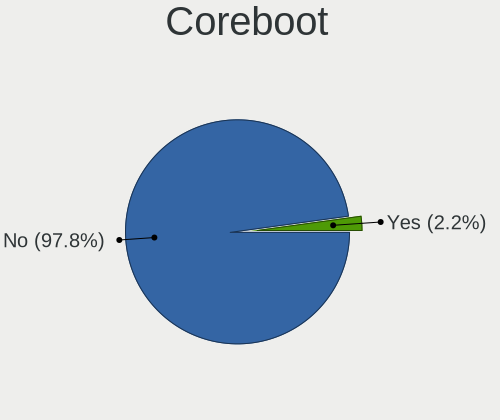
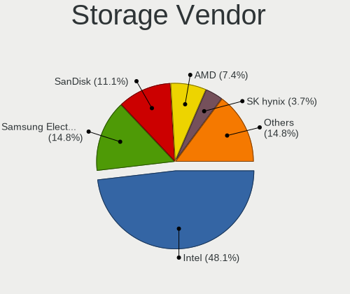
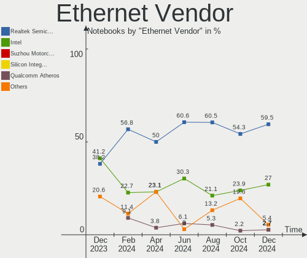
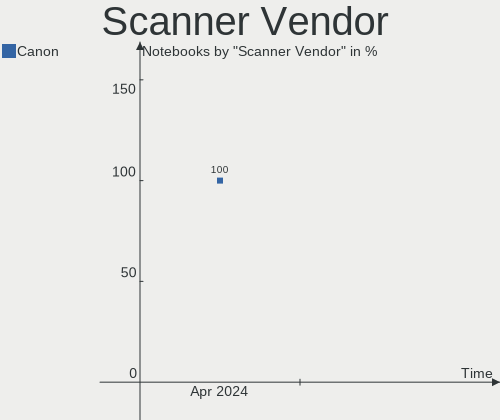
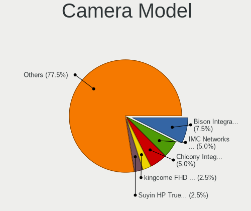
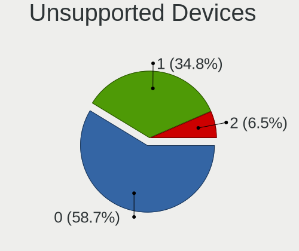

Linux in Netherlands - Hardware Trends (Notebooks)
--------------------------------------------------

A project to identify most popular hardware characteristics and track their change
over time based on data collected by Linux users at https://Linux-Hardware.org.

Anyone can contribute to this report by the [hw-probe](https://github.com/linuxhw/hw-probe) tool:

    sudo -E hw-probe -all -upload

Period: May, 2023.

Contents
--------

* [ System ](#system)
  - [ OS                       ](#os)
  - [ OS Family                ](#os-family)
  - [ Kernel                   ](#kernel)
  - [ Kernel Family            ](#kernel-family)
  - [ Kernel Major Ver.        ](#kernel-major-ver)
  - [ Arch                     ](#arch)
  - [ DE                       ](#de)
  - [ Display Server           ](#display-server)
  - [ Display Manager          ](#display-manager)
  - [ OS Lang                  ](#os-lang)
  - [ Boot Mode                ](#boot-mode)
  - [ Filesystem               ](#filesystem)
  - [ Part. scheme             ](#part-scheme)
  - [ Dual Boot with Linux/BSD ](#dual-boot-with-linuxbsd)
  - [ Dual Boot (Win)          ](#dual-boot-win)

* [ Board ](#board)
  - [ Vendor                   ](#vendor)
  - [ Model                    ](#model)
  - [ Model Family             ](#model-family)
  - [ MFG Year                 ](#mfg-year)
  - [ Form Factor              ](#form-factor)
  - [ Secure Boot              ](#secure-boot)
  - [ Coreboot                 ](#coreboot)
  - [ RAM Size                 ](#ram-size)
  - [ RAM Used                 ](#ram-used)
  - [ Total Drives             ](#total-drives)
  - [ Has CD-ROM               ](#has-cd-rom)
  - [ Has Ethernet             ](#has-ethernet)
  - [ Has WiFi                 ](#has-wifi)
  - [ Has Bluetooth            ](#has-bluetooth)

* [ Location ](#location)
  - [ Country                  ](#country)
  - [ City                     ](#city)

* [ Drives ](#drives)
  - [ Drive Vendor             ](#drive-vendor)
  - [ Drive Model              ](#drive-model)
  - [ HDD Vendor               ](#hdd-vendor)
  - [ SSD Vendor               ](#ssd-vendor)
  - [ Drive Kind               ](#drive-kind)
  - [ Drive Connector          ](#drive-connector)
  - [ Drive Size               ](#drive-size)
  - [ Space Total              ](#space-total)
  - [ Space Used               ](#space-used)
  - [ Malfunc. Drives          ](#malfunc-drives)
  - [ Malfunc. Drive Vendor    ](#malfunc-drive-vendor)
  - [ Malfunc. HDD Vendor      ](#malfunc-hdd-vendor)
  - [ Malfunc. Drive Kind      ](#malfunc-drive-kind)
  - [ Failed Drives            ](#failed-drives)
  - [ Failed Drive Vendor      ](#failed-drive-vendor)
  - [ Drive Status             ](#drive-status)

* [ Storage controller ](#storage-controller)
  - [ Storage Vendor           ](#storage-vendor)
  - [ Storage Model            ](#storage-model)
  - [ Storage Kind             ](#storage-kind)

* [ Processor ](#processor)
  - [ CPU Vendor               ](#cpu-vendor)
  - [ CPU Model                ](#cpu-model)
  - [ CPU Model Family         ](#cpu-model-family)
  - [ CPU Cores                ](#cpu-cores)
  - [ CPU Sockets              ](#cpu-sockets)
  - [ CPU Threads              ](#cpu-threads)
  - [ CPU Op-Modes             ](#cpu-op-modes)
  - [ CPU Microcode            ](#cpu-microcode)
  - [ CPU Microarch            ](#cpu-microarch)

* [ Graphics ](#graphics)
  - [ GPU Vendor               ](#gpu-vendor)
  - [ GPU Model                ](#gpu-model)
  - [ GPU Combo                ](#gpu-combo)
  - [ GPU Driver               ](#gpu-driver)
  - [ GPU Memory               ](#gpu-memory)

* [ Monitor ](#monitor)
  - [ Monitor Vendor           ](#monitor-vendor)
  - [ Monitor Model            ](#monitor-model)
  - [ Monitor Resolution       ](#monitor-resolution)
  - [ Monitor Diagonal         ](#monitor-diagonal)
  - [ Monitor Width            ](#monitor-width)
  - [ Aspect Ratio             ](#aspect-ratio)
  - [ Monitor Area             ](#monitor-area)
  - [ Pixel Density            ](#pixel-density)
  - [ Multiple Monitors        ](#multiple-monitors)

* [ Network ](#network)
  - [ Net Controller Vendor    ](#net-controller-vendor)
  - [ Net Controller Model     ](#net-controller-model)
  - [ Wireless Vendor          ](#wireless-vendor)
  - [ Wireless Model           ](#wireless-model)
  - [ Ethernet Vendor          ](#ethernet-vendor)
  - [ Ethernet Model           ](#ethernet-model)
  - [ Net Controller Kind      ](#net-controller-kind)
  - [ Used Controller          ](#used-controller)
  - [ NICs                     ](#nics)
  - [ IPv6                     ](#ipv6)

* [ Bluetooth ](#bluetooth)
  - [ Bluetooth Vendor         ](#bluetooth-vendor)
  - [ Bluetooth Model          ](#bluetooth-model)

* [ Sound ](#sound)
  - [ Sound Vendor             ](#sound-vendor)
  - [ Sound Model              ](#sound-model)

* [ Memory ](#memory)
  - [ Memory Vendor            ](#memory-vendor)
  - [ Memory Model             ](#memory-model)
  - [ Memory Kind              ](#memory-kind)
  - [ Memory Form Factor       ](#memory-form-factor)
  - [ Memory Size              ](#memory-size)
  - [ Memory Speed             ](#memory-speed)

* [ Printers & scanners ](#printers--scanners)
  - [ Printer Vendor           ](#printer-vendor)
  - [ Printer Model            ](#printer-model)
  - [ Scanner Vendor           ](#scanner-vendor)
  - [ Scanner Model            ](#scanner-model)

* [ Camera ](#camera)
  - [ Camera Vendor            ](#camera-vendor)
  - [ Camera Model             ](#camera-model)

* [ Security ](#security)
  - [ Fingerprint Vendor       ](#fingerprint-vendor)
  - [ Fingerprint Model        ](#fingerprint-model)
  - [ Chipcard Vendor          ](#chipcard-vendor)
  - [ Chipcard Model           ](#chipcard-model)

* [ Unsupported ](#unsupported)
  - [ Unsupported Devices      ](#unsupported-devices)
  - [ Unsupported Device Types ](#unsupported-device-types)

System
------

OS
--

Installed operating systems

| Name                         | Notebooks | Percent |
|------------------------------|-----------|---------|
| Ubuntu 22.04                 | 8         | 12.5%   |
| Zorin 16                     | 6         | 9.38%   |
| Linux Mint 21.1              | 6         | 9.38%   |
| Fedora 38                    | 5         | 7.81%   |
| Ubuntu 23.04                 | 3         | 4.69%   |
| Manjaro 22.1.1               | 3         | 4.69%   |
| EndeavourOS Rolling          | 3         | 4.69%   |
| Arch Rolling                 | 3         | 4.69%   |
| OpenMandriva 23.03           | 2         | 3.13%   |
| Linux Mint 20.3              | 2         | 3.13%   |
| Kubuntu 23.04                | 2         | 3.13%   |
| KDE neon 22.04               | 2         | 3.13%   |
| Debian 11                    | 2         | 3.13%   |
| Ubuntu 20.04                 | 1         | 1.56%   |
| SteamOS 3.4.6                | 1         | 1.56%   |
| Parrot 5.3                   | 1         | 1.56%   |
| Parrot 5.1                   | 1         | 1.56%   |
| Parrot 4.11                  | 1         | 1.56%   |
| openSUSE Tumbleweed-XXXXXXXX | 1         | 1.56%   |
| OpenMandriva 4.50            | 1         | 1.56%   |
| OpenMandriva 4.3             | 1         | 1.56%   |
| Manjaro                      | 1         | 1.56%   |
| Lubuntu 23.04                | 1         | 1.56%   |
| Linux Mint 20.2              | 1         | 1.56%   |
| Linux Mint 20                | 1         | 1.56%   |
| Kali 2023.2                  | 1         | 1.56%   |
| Fedora 37                    | 1         | 1.56%   |
| Fedora 35                    | 1         | 1.56%   |
| Elementary 7                 | 1         | 1.56%   |
| ArcoLinux Rolling            | 1         | 1.56%   |

OS Family
---------

OS without a version

| Name         | Notebooks | Percent |
|--------------|-----------|---------|
| Ubuntu       | 12        | 18.75%  |
| Linux Mint   | 10        | 15.63%  |
| Fedora       | 7         | 10.94%  |
| Zorin        | 6         | 9.38%   |
| OpenMandriva | 4         | 6.25%   |
| Manjaro      | 4         | 6.25%   |
| Parrot       | 3         | 4.69%   |
| EndeavourOS  | 3         | 4.69%   |
| Arch         | 3         | 4.69%   |
| Kubuntu      | 2         | 3.13%   |
| KDE neon     | 2         | 3.13%   |
| Debian       | 2         | 3.13%   |
| SteamOS      | 1         | 1.56%   |
| openSUSE     | 1         | 1.56%   |
| Lubuntu      | 1         | 1.56%   |
| Kali         | 1         | 1.56%   |
| Elementary   | 1         | 1.56%   |
| ArcoLinux    | 1         | 1.56%   |

Kernel
------

Version of the Linux kernel

| Version                  | Notebooks | Percent |
|--------------------------|-----------|---------|
| 5.19.0-41-generic        | 8         | 12.5%   |
| 5.15.0-71-generic        | 7         | 10.94%  |
| 6.2.0-20-generic         | 6         | 9.38%   |
| 6.3.1-arch1-1            | 3         | 4.69%   |
| 5.15.0-72-generic        | 3         | 4.69%   |
| 6.3.2-arch1-1            | 2         | 3.13%   |
| 6.3.0+                   | 2         | 3.13%   |
| 6.2.6-desktop-1omv2390   | 2         | 3.13%   |
| 6.2.15-300.fc38.x86_64   | 2         | 3.13%   |
| 6.2.13-300.fc38.x86_64   | 2         | 3.13%   |
| 6.1.26-1-MANJARO         | 2         | 3.13%   |
| 5.4.0-148-generic        | 2         | 3.13%   |
| 6.3.4-273-tkg-pds        | 1         | 1.56%   |
| 6.3.3-060303-generic     | 1         | 1.56%   |
| 6.3.1-2-default          | 1         | 1.56%   |
| 6.3.0-1-MANJARO          | 1         | 1.56%   |
| 6.2.15-1-MANJARO         | 1         | 1.56%   |
| 6.2.14-300.fc38.x86_64   | 1         | 1.56%   |
| 6.1.30-1-lts             | 1         | 1.56%   |
| 6.1.0-kali9-amd64        | 1         | 1.56%   |
| 6.1.0-1parrot1-amd64     | 1         | 1.56%   |
| 6.1.0-1006-oem           | 1         | 1.56%   |
| 6.0.9-060009-generic     | 1         | 1.56%   |
| 6.0.0-2parrot1-amd64     | 1         | 1.56%   |
| 5.4.0-73-generic         | 1         | 1.56%   |
| 5.4.0-26-generic         | 1         | 1.56%   |
| 5.4.0-146-generic        | 1         | 1.56%   |
| 5.19.5-desktop-1omv4090  | 1         | 1.56%   |
| 5.19.0-42-generic        | 1         | 1.56%   |
| 5.16.13-desktop-1omv4003 | 1         | 1.56%   |
| 5.15.107-1-pve           | 1         | 1.56%   |
| 5.15.0-53-generic        | 1         | 1.56%   |
| 5.13.0-valve36-1-neptune | 1         | 1.56%   |
| 5.10.0-6parrot1-amd64    | 1         | 1.56%   |
| 5.10.0-23-amd64          | 1         | 1.56%   |

Kernel Family
-------------

Linux kernel without a distro release

| Version  | Notebooks | Percent |
|----------|-----------|---------|
| 5.15.0   | 11        | 17.19%  |
| 5.19.0   | 9         | 14.06%  |
| 6.2.0    | 6         | 9.38%   |
| 5.4.0    | 5         | 7.81%   |
| 6.3.1    | 4         | 6.25%   |
| 6.3.0    | 3         | 4.69%   |
| 6.2.15   | 3         | 4.69%   |
| 6.1.0    | 3         | 4.69%   |
| 6.3.2    | 2         | 3.13%   |
| 6.2.6    | 2         | 3.13%   |
| 6.2.13   | 2         | 3.13%   |
| 6.1.26   | 2         | 3.13%   |
| 5.10.0   | 2         | 3.13%   |
| 6.3.4    | 1         | 1.56%   |
| 6.3.3    | 1         | 1.56%   |
| 6.2.14   | 1         | 1.56%   |
| 6.1.30   | 1         | 1.56%   |
| 6.0.9    | 1         | 1.56%   |
| 6.0.0    | 1         | 1.56%   |
| 5.19.5   | 1         | 1.56%   |
| 5.16.13  | 1         | 1.56%   |
| 5.15.107 | 1         | 1.56%   |
| 5.13.0   | 1         | 1.56%   |

Kernel Major Ver.
-----------------

Linux kernel major version

| Version | Notebooks | Percent |
|---------|-----------|---------|
| 6.2     | 14        | 21.88%  |
| 5.15    | 12        | 18.75%  |
| 6.3     | 11        | 17.19%  |
| 5.19    | 10        | 15.63%  |
| 6.1     | 6         | 9.38%   |
| 5.4     | 5         | 7.81%   |
| 6.0     | 2         | 3.13%   |
| 5.10    | 2         | 3.13%   |
| 5.16    | 1         | 1.56%   |
| 5.13    | 1         | 1.56%   |

Arch
----

OS architecture (x86_64, i586, etc.)

| Name   | Notebooks | Percent |
|--------|-----------|---------|
| x86_64 | 64        | 100%    |

DE
--

Desktop Environment

| Name       | Notebooks | Percent |
|------------|-----------|---------|
| GNOME      | 30        | 46.88%  |
| KDE5       | 14        | 21.88%  |
| X-Cinnamon | 10        | 15.63%  |
| XFCE       | 3         | 4.69%   |
| MATE       | 3         | 4.69%   |
| Pantheon   | 1         | 1.56%   |
| LXQt       | 1         | 1.56%   |
| i3         | 1         | 1.56%   |
| Unknown    | 1         | 1.56%   |

Display Server
--------------

X11 or Wayland

| Name    | Notebooks | Percent |
|---------|-----------|---------|
| X11     | 43        | 67.19%  |
| Wayland | 20        | 31.25%  |
| Tty     | 1         | 1.56%   |

Display Manager
---------------

SDDM, LightDM, etc.

| Name    | Notebooks | Percent |
|---------|-----------|---------|
| Unknown | 25        | 39.06%  |
| GDM3    | 13        | 20.31%  |
| LightDM | 12        | 18.75%  |
| SDDM    | 8         | 12.5%   |
| GDM     | 6         | 9.38%   |

OS Lang
-------

Language

| Lang  | Notebooks | Percent |
|-------|-----------|---------|
| en_US | 29        | 45.31%  |
| nl_NL | 23        | 35.94%  |
| en_GB | 6         | 9.38%   |
| ru_RU | 1         | 1.56%   |
| fr_FR | 1         | 1.56%   |
| es_MX | 1         | 1.56%   |
| en_IN | 1         | 1.56%   |
| de_DE | 1         | 1.56%   |
| C     | 1         | 1.56%   |

Boot Mode
---------

EFI or BIOS

| Mode | Notebooks | Percent |
|------|-----------|---------|
| EFI  | 33        | 51.56%  |
| BIOS | 31        | 48.44%  |

Filesystem
----------

Type of filesystem

| Type    | Notebooks | Percent |
|---------|-----------|---------|
| Ext4    | 41        | 64.06%  |
| Btrfs   | 10        | 15.63%  |
| Tmpfs   | 8         | 12.5%   |
| Overlay | 3         | 4.69%   |
| Zfs     | 1         | 1.56%   |
| F2fs    | 1         | 1.56%   |

Part. scheme
------------

Scheme of partitioning

| Type    | Notebooks | Percent |
|---------|-----------|---------|
| GPT     | 37        | 57.81%  |
| Unknown | 24        | 37.5%   |
| MBR     | 3         | 4.69%   |

Dual Boot with Linux/BSD
------------------------

Hosting more than one Linux/BSD

| Dual boot | Notebooks | Percent |
|-----------|-----------|---------|
| No        | 55        | 85.94%  |
| Yes       | 9         | 14.06%  |

Dual Boot (Win)
---------------

Hosting Linux and Windows

| Dual boot | Notebooks | Percent |
|-----------|-----------|---------|
| No        | 54        | 84.38%  |
| Yes       | 10        | 15.63%  |

Board
-----

Vendor
------

Motherboard manufacturer

| Name                | Notebooks | Percent |
|---------------------|-----------|---------|
| Hewlett-Packard     | 13        | 20.31%  |
| Dell                | 13        | 20.31%  |
| Lenovo              | 11        | 17.19%  |
| Acer                | 6         | 9.38%   |
| Toshiba             | 3         | 4.69%   |
| MSI                 | 3         | 4.69%   |
| ASUSTek Computer    | 2         | 3.13%   |
| Valve               | 1         | 1.56%   |
| Timi                | 1         | 1.56%   |
| Sony                | 1         | 1.56%   |
| SKIKK               | 1         | 1.56%   |
| Samsung Electronics | 1         | 1.56%   |
| PC Specialist       | 1         | 1.56%   |
| Packard Bell        | 1         | 1.56%   |
| Notebook            | 1         | 1.56%   |
| Intel               | 1         | 1.56%   |
| HUAWEI              | 1         | 1.56%   |
| Framework           | 1         | 1.56%   |
| Apple               | 1         | 1.56%   |
| Unknown             | 1         | 1.56%   |

Model
-----

Motherboard model

| Name                                        | Notebooks | Percent |
|---------------------------------------------|-----------|---------|
| Dell XPS 9315                               | 2         | 3.13%   |
| Valve Jupiter                               | 1         | 1.56%   |
| Toshiba Satellite Pro C70-B                 | 1         | 1.56%   |
| Toshiba Satellite L650                      | 1         | 1.56%   |
| Toshiba Satellite C870-1FZ                  | 1         | 1.56%   |
| Timi TM1701                                 | 1         | 1.56%   |
| Sony SVF1521A6EW                            | 1         | 1.56%   |
| SKIKK Niflheim 17 II                        | 1         | 1.56%   |
| Samsung N150/N210/N220                      | 1         | 1.56%   |
| PC Specialist NP5x_NP6x_NP7xPNP             | 1         | 1.56%   |
| Packard Bell EasyNote MH35                  | 1         | 1.56%   |
| Notebook N14xWU                             | 1         | 1.56%   |
| MSI Stealth GS77 12UH                       | 1         | 1.56%   |
| MSI GF63 Thin 11UC                          | 1         | 1.56%   |
| MSI CX700                                   | 1         | 1.56%   |
| Lenovo V15 G2 ALC 82KD                      | 1         | 1.56%   |
| Lenovo V14 G2 ALC 82KC                      | 1         | 1.56%   |
| Lenovo ThinkPad X1 Carbon Gen 11 21HMCTO1WW | 1         | 1.56%   |
| Lenovo ThinkPad T420 4236WR1                | 1         | 1.56%   |
| Lenovo ThinkPad T410 2537V32                | 1         | 1.56%   |
| Lenovo ThinkBook 15 G4 ABA 21DL             | 1         | 1.56%   |
| Lenovo ThinkBook 15 G2 ITL 20VE             | 1         | 1.56%   |
| Lenovo Legion Y540-17IRH 81Q4               | 1         | 1.56%   |
| Lenovo Legion 5 Pro 16ARH7H 82RG            | 1         | 1.56%   |
| Lenovo Legion 5 15ARH05 82B5                | 1         | 1.56%   |
| Lenovo IdeaPad 5 Pro 16ACH6 82L5            | 1         | 1.56%   |
| Intel CHERRYVIEW D1 PLATFORM                | 1         | 1.56%   |
| HUAWEI MACHC-WAX9                           | 1         | 1.56%   |
| HP ZBook 15u G5                             | 1         | 1.56%   |
| HP ZBook 14u G5                             | 1         | 1.56%   |
| HP ProBook 650 G3                           | 1         | 1.56%   |
| HP Pavilion Gaming Laptop 15-dk1xxx         | 1         | 1.56%   |
| HP OMEN by Laptop 15-dc1xxx                 | 1         | 1.56%   |
| HP Laptop 15s-fq1xxx                        | 1         | 1.56%   |
| HP EliteBook Folio G1                       | 1         | 1.56%   |
| HP EliteBook 850 G8 Notebook PC             | 1         | 1.56%   |
| HP EliteBook 8470p                          | 1         | 1.56%   |
| HP EliteBook 840 14 inch G9 Notebook PC     | 1         | 1.56%   |
| HP EliteBook 820 G4                         | 1         | 1.56%   |
| HP EliteBook 720 G2                         | 1         | 1.56%   |

Model Family
------------

Motherboard model prefix

| Name                  | Notebooks | Percent |
|-----------------------|-----------|---------|
| Dell Latitude         | 7         | 10.94%  |
| HP EliteBook          | 6         | 9.38%   |
| Acer Aspire           | 4         | 6.25%   |
| Toshiba Satellite     | 3         | 4.69%   |
| Lenovo ThinkPad       | 3         | 4.69%   |
| Lenovo Legion         | 3         | 4.69%   |
| Dell XPS              | 3         | 4.69%   |
| Lenovo ThinkBook      | 2         | 3.13%   |
| HP ZBook              | 2         | 3.13%   |
| Dell Precision        | 2         | 3.13%   |
| Acer TravelMate       | 2         | 3.13%   |
| Valve Jupiter         | 1         | 1.56%   |
| Timi TM1701           | 1         | 1.56%   |
| Sony SVF1521A6EW      | 1         | 1.56%   |
| SKIKK Niflheim        | 1         | 1.56%   |
| Samsung N150          | 1         | 1.56%   |
| PC Specialist NP5x    | 1         | 1.56%   |
| Packard Bell EasyNote | 1         | 1.56%   |
| Notebook N14xWU       | 1         | 1.56%   |
| MSI Stealth           | 1         | 1.56%   |
| MSI GF63              | 1         | 1.56%   |
| MSI CX700             | 1         | 1.56%   |
| Lenovo V15            | 1         | 1.56%   |
| Lenovo V14            | 1         | 1.56%   |
| Lenovo IdeaPad        | 1         | 1.56%   |
| Intel CHERRYVIEW      | 1         | 1.56%   |
| HUAWEI MACHC-WAX9     | 1         | 1.56%   |
| HP ProBook            | 1         | 1.56%   |
| HP Pavilion           | 1         | 1.56%   |
| HP OMEN               | 1         | 1.56%   |
| HP Laptop             | 1         | 1.56%   |
| HP 255                | 1         | 1.56%   |
| Framework Laptop      | 1         | 1.56%   |
| Dell Inspiron         | 1         | 1.56%   |
| ASUS X551MA           | 1         | 1.56%   |
| ASUS X200LA           | 1         | 1.56%   |
| Apple MacBookPro9     | 1         | 1.56%   |
| Unknown               | 1         | 1.56%   |

MFG Year
--------

Motherboard manufacture year

| Year | Notebooks | Percent |
|------|-----------|---------|
| 2022 | 10        | 15.63%  |
| 2020 | 8         | 12.5%   |
| 2021 | 6         | 9.38%   |
| 2018 | 6         | 9.38%   |
| 2019 | 5         | 7.81%   |
| 2017 | 5         | 7.81%   |
| 2009 | 4         | 6.25%   |
| 2014 | 3         | 4.69%   |
| 2013 | 3         | 4.69%   |
| 2012 | 3         | 4.69%   |
| 2011 | 3         | 4.69%   |
| 2010 | 3         | 4.69%   |
| 2023 | 2         | 3.13%   |
| 2016 | 1         | 1.56%   |
| 2015 | 1         | 1.56%   |
| 2007 | 1         | 1.56%   |

Form Factor
-----------

Physical design of the computer

| Name     | Notebooks | Percent |
|----------|-----------|---------|
| Notebook | 64        | 100%    |

Secure Boot
-----------

Enabled or disabled

| State    | Notebooks | Percent |
|----------|-----------|---------|
| Disabled | 58        | 90.63%  |
| Enabled  | 6         | 9.38%   |

Coreboot
--------

Have coreboot on board

| Used | Notebooks | Percent |
|------|-----------|---------|
| No   | 64        | 100%    |

RAM Size
--------

Total RAM memory

| Size in GB  | Notebooks | Percent |
|-------------|-----------|---------|
| 16.01-24.0  | 17        | 26.56%  |
| 4.01-8.0    | 13        | 20.31%  |
| 3.01-4.0    | 10        | 15.63%  |
| 32.01-64.0  | 9         | 14.06%  |
| 8.01-16.0   | 9         | 14.06%  |
| 24.01-32.0  | 2         | 3.13%   |
| 1.01-2.0    | 2         | 3.13%   |
| 64.01-256.0 | 1         | 1.56%   |
| 0.51-1.0    | 1         | 1.56%   |

RAM Used
--------

Used RAM memory

| Used GB    | Notebooks | Percent |
|------------|-----------|---------|
| 4.01-8.0   | 17        | 26.56%  |
| 2.01-3.0   | 15        | 23.44%  |
| 1.01-2.0   | 15        | 23.44%  |
| 3.01-4.0   | 6         | 9.38%   |
| 0.51-1.0   | 5         | 7.81%   |
| 8.01-16.0  | 4         | 6.25%   |
| 16.01-24.0 | 1         | 1.56%   |
| 0.01-0.5   | 1         | 1.56%   |

Total Drives
------------

Number of drives on board

| Drives | Notebooks | Percent |
|--------|-----------|---------|
| 1      | 47        | 73.44%  |
| 2      | 14        | 21.88%  |
| 3      | 3         | 4.69%   |

Has CD-ROM
----------

Has CD-ROM on board

| Presented | Notebooks | Percent |
|-----------|-----------|---------|
| No        | 45        | 70.31%  |
| Yes       | 19        | 29.69%  |

Has Ethernet
------------

Has Ethernet on board

| Presented | Notebooks | Percent |
|-----------|-----------|---------|
| Yes       | 52        | 81.25%  |
| No        | 12        | 18.75%  |

Has WiFi
--------

Has WiFi module

| Presented | Notebooks | Percent |
|-----------|-----------|---------|
| Yes       | 62        | 96.88%  |
| No        | 2         | 3.13%   |

Has Bluetooth
-------------

Has Bluetooth module

| Presented | Notebooks | Percent |
|-----------|-----------|---------|
| Yes       | 51        | 79.69%  |
| No        | 13        | 20.31%  |

Location
--------

Country
-------

Geographic location (country)

| Country     | Notebooks | Percent |
|-------------|-----------|---------|
| Netherlands | 64        | 100%    |

City
----

Geographic location (city)

| City         | Notebooks | Percent |
|--------------|-----------|---------|
| Amsterdam    | 13        | 20.31%  |
| Delft        | 5         | 7.81%   |
| Rotterdam    | 3         | 4.69%   |
| Naaldwijk    | 3         | 4.69%   |
| Utrecht      | 2         | 3.13%   |
| Leeuwarden   | 2         | 3.13%   |
| Zeist        | 1         | 1.56%   |
| Winterswijk  | 1         | 1.56%   |
| Winschoten   | 1         | 1.56%   |
| Westerbork   | 1         | 1.56%   |
| Weert        | 1         | 1.56%   |
| Valkenswaard | 1         | 1.56%   |
| Valkenburg   | 1         | 1.56%   |
| The Hague    | 1         | 1.56%   |
| Sittard      | 1         | 1.56%   |
| Purmerend    | 1         | 1.56%   |
| Oosterhout   | 1         | 1.56%   |
| Ochten       | 1         | 1.56%   |
| Nijmegen     | 1         | 1.56%   |
| Middelburg   | 1         | 1.56%   |
| Marum        | 1         | 1.56%   |
| Maastricht   | 1         | 1.56%   |
| Leidschendam | 1         | 1.56%   |
| Leiden       | 1         | 1.56%   |
| Kampen       | 1         | 1.56%   |
| Huissen      | 1         | 1.56%   |
| Hoofddorp    | 1         | 1.56%   |
| Hilvarenbeek | 1         | 1.56%   |
| Helmond      | 1         | 1.56%   |
| Heerlen      | 1         | 1.56%   |
| Heerenveen   | 1         | 1.56%   |
| Hardenberg   | 1         | 1.56%   |
| Goes         | 1         | 1.56%   |
| Enschede     | 1         | 1.56%   |
| Delfzijl     | 1         | 1.56%   |
| De Bilt      | 1         | 1.56%   |
| Breda        | 1         | 1.56%   |
| Blaricum     | 1         | 1.56%   |
| Beverwijk    | 1         | 1.56%   |
| Barendrecht  | 1         | 1.56%   |

Drives
------

Drive Vendor
------------

Hard drive vendors

| Vendor                      | Notebooks | Drives | Percent |
|-----------------------------|-----------|--------|---------|
| Samsung Electronics         | 22        | 24     | 26.83%  |
| SanDisk                     | 7         | 7      | 8.54%   |
| WDC                         | 6         | 6      | 7.32%   |
| Unknown                     | 6         | 6      | 7.32%   |
| Crucial                     | 6         | 6      | 7.32%   |
| Toshiba                     | 5         | 5      | 6.1%    |
| Kingston                    | 5         | 5      | 6.1%    |
| Seagate                     | 4         | 4      | 4.88%   |
| SK hynix                    | 3         | 3      | 3.66%   |
| Phison Electronics          | 2         | 2      | 2.44%   |
| Kingston Technology Company | 2         | 2      | 2.44%   |
| Intel                       | 2         | 2      | 2.44%   |
| Hitachi                     | 2         | 2      | 2.44%   |
| Union Memory                | 1         | 1      | 1.22%   |
| Team                        | 1         | 1      | 1.22%   |
| StarTech                    | 1         | 1      | 1.22%   |
| Phison                      | 1         | 1      | 1.22%   |
| LITEON C                    | 1         | 1      | 1.22%   |
| LITEON                      | 1         | 1      | 1.22%   |
| KIOXIA                      | 1         | 1      | 1.22%   |
| HGST                        | 1         | 1      | 1.22%   |
| China                       | 1         | 1      | 1.22%   |
| A-DATA Technology           | 1         | 1      | 1.22%   |

Drive Model
-----------

Hard drive models

| Model                                               | Notebooks | Percent |
|-----------------------------------------------------|-----------|---------|
| Samsung NVMe SSD Controller SM981/PM981/PM983 256GB | 5         | 6.02%   |
| Samsung SSD 980 1TB                                 | 3         | 3.61%   |
| Unknown EC2QT  64GB                                 | 2         | 2.41%   |
| Toshiba KXG50ZNV512G 512GB                          | 2         | 2.41%   |
| Sandisk WD Black SN850 500GB                        | 2         | 2.41%   |
| WDC WDS500G2B0A-00SM50 500GB SSD                    | 1         | 1.2%    |
| WDC WD6400BEVT-22A0RT0 640GB                        | 1         | 1.2%    |
| WDC WD5000BPKT-60PK4T0 500GB                        | 1         | 1.2%    |
| WDC WD20SPZX-22UA7T0 2TB                            | 1         | 1.2%    |
| WDC WD10JPVX-60JC3T0 1TB                            | 1         | 1.2%    |
| WDC PC SN810 SDCPNRZ-2T00-1032 2TB                  | 1         | 1.2%    |
| Unknown MMC Card  32GB                              | 1         | 1.2%    |
| Unknown MMC Card  256GB                             | 1         | 1.2%    |
| Unknown hC8aP  64GB                                 | 1         | 1.2%    |
| Unknown BJNB4R  32GB                                | 1         | 1.2%    |
| Union Memory UMIS RPJTJ256MEE1OWX 256GB             | 1         | 1.2%    |
| Toshiba THNSN5256GPUK NVMe 256GB                    | 1         | 1.2%    |
| Toshiba THNSN5256GPUK 256GB                         | 1         | 1.2%    |
| Toshiba MK3265GSX 320GB                             | 1         | 1.2%    |
| Team T253LE240G 240GB SSD                           | 1         | 1.2%    |
| StarTech M2-USB-C-NVME-SA 256GB                     | 1         | 1.2%    |
| SK hynix SKHynix_HFS512GDE9X084N 512GB              | 1         | 1.2%    |
| SK hynix SC308 SATA 128GB SSD                       | 1         | 1.2%    |
| SK hynix SC300 M.2 2280 128GB SSD                   | 1         | 1.2%    |
| Seagate ST9160821AS 160GB                           | 1         | 1.2%    |
| Seagate ST2000LM015-2E8174 2TB                      | 1         | 1.2%    |
| Seagate ST1000LM049-2GH172 1TB                      | 1         | 1.2%    |
| Seagate ST1000LM035-1RK172 1TB                      | 1         | 1.2%    |
| SanDisk X400 M.2 2280 128GB SSD                     | 1         | 1.2%    |
| Sandisk WDC PC SN530 SDBPMPZ-512G-1101 512GB        | 1         | 1.2%    |
| SanDisk SDSSDA960G 960GB                            | 1         | 1.2%    |
| SanDisk NVMe SSD Drive 2TB                          | 1         | 1.2%    |
| SanDisk NVMe SSD Drive 1TB                          | 1         | 1.2%    |
| Samsung SSD 990 PRO 2TB                             | 1         | 1.2%    |
| Samsung SSD 970 EVO 500GB S466NX0KA52205B           | 1         | 1.2%    |
| Samsung SSD 870 EVO 1TB                             | 1         | 1.2%    |
| Samsung SSD 860 QVO 1TB                             | 1         | 1.2%    |
| Samsung SSD 860 EVO 500GB                           | 1         | 1.2%    |
| Samsung SSD 850 EVO 500GB                           | 1         | 1.2%    |
| Samsung SSD 830 Series 256GB                        | 1         | 1.2%    |

HDD Vendor
----------

Hard disk drive vendors

| Vendor  | Notebooks | Drives | Percent |
|---------|-----------|--------|---------|
| WDC     | 4         | 4      | 33.33%  |
| Seagate | 4         | 4      | 33.33%  |
| Hitachi | 2         | 2      | 16.67%  |
| Toshiba | 1         | 1      | 8.33%   |
| HGST    | 1         | 1      | 8.33%   |

SSD Vendor
----------

Solid state drive vendors

| Vendor              | Notebooks | Drives | Percent |
|---------------------|-----------|--------|---------|
| Crucial             | 6         | 6      | 25%     |
| Samsung Electronics | 5         | 5      | 20.83%  |
| Kingston            | 3         | 3      | 12.5%   |
| SK hynix            | 2         | 2      | 8.33%   |
| SanDisk             | 2         | 2      | 8.33%   |
| WDC                 | 1         | 1      | 4.17%   |
| Team                | 1         | 1      | 4.17%   |
| LITEON C            | 1         | 1      | 4.17%   |
| LITEON              | 1         | 1      | 4.17%   |
| Intel               | 1         | 1      | 4.17%   |
| China               | 1         | 1      | 4.17%   |

Drive Kind
----------

HDD or SSD

| Kind    | Notebooks | Drives | Percent |
|---------|-----------|--------|---------|
| NVMe    | 36        | 40     | 46.15%  |
| SSD     | 22        | 24     | 28.21%  |
| HDD     | 12        | 12     | 15.38%  |
| MMC     | 7         | 7      | 8.97%   |
| Unknown | 1         | 1      | 1.28%   |

Drive Connector
---------------

SATA, SAS, NVMe, etc.

| Type | Notebooks | Drives | Percent |
|------|-----------|--------|---------|
| NVMe | 36        | 40     | 45.57%  |
| SATA | 33        | 34     | 41.77%  |
| MMC  | 7         | 7      | 8.86%   |
| SAS  | 3         | 3      | 3.8%    |

Drive Size
----------

Size of hard drive

| Size in TB | Notebooks | Drives | Percent |
|------------|-----------|--------|---------|
| 0.01-0.5   | 25        | 26     | 71.43%  |
| 0.51-1.0   | 8         | 8      | 22.86%  |
| 1.01-2.0   | 2         | 2      | 5.71%   |

Space Total
-----------

Amount of disk space available on the file system

| Size in GB     | Notebooks | Percent |
|----------------|-----------|---------|
| 251-500        | 18        | 28.13%  |
| 101-250        | 12        | 18.75%  |
| 501-1000       | 8         | 12.5%   |
| 1001-2000      | 7         | 10.94%  |
| 51-100         | 7         | 10.94%  |
| 1-20           | 5         | 7.81%   |
| More than 3000 | 3         | 4.69%   |
| 2001-3000      | 2         | 3.13%   |
| 21-50          | 1         | 1.56%   |
| Unknown        | 1         | 1.56%   |

Space Used
----------

Amount of used disk space

| Used GB   | Notebooks | Percent |
|-----------|-----------|---------|
| 1-20      | 23        | 35.94%  |
| 21-50     | 14        | 21.88%  |
| 251-500   | 7         | 10.94%  |
| 101-250   | 7         | 10.94%  |
| 51-100    | 6         | 9.38%   |
| 501-1000  | 4         | 6.25%   |
| 2001-3000 | 1         | 1.56%   |
| 1001-2000 | 1         | 1.56%   |
| Unknown   | 1         | 1.56%   |

Malfunc. Drives
---------------

Drive models with a malfunction

| Model                         | Notebooks | Drives | Percent |
|-------------------------------|-----------|--------|---------|
| Toshiba MK3265GSX 320GB       | 1         | 1      | 50%     |
| LITEON CV8-8E128-HP 128GB SSD | 1         | 1      | 50%     |

Malfunc. Drive Vendor
---------------------

Vendors of faulty drives

| Vendor  | Notebooks | Drives | Percent |
|---------|-----------|--------|---------|
| Toshiba | 1         | 1      | 50%     |
| LITEON  | 1         | 1      | 50%     |

Malfunc. HDD Vendor
-------------------

Vendors of faulty HDD drives

| Vendor  | Notebooks | Drives | Percent |
|---------|-----------|--------|---------|
| Toshiba | 1         | 1      | 100%    |

Malfunc. Drive Kind
-------------------

Kinds of faulty drives

| Kind | Notebooks | Drives | Percent |
|------|-----------|--------|---------|
| SSD  | 1         | 1      | 50%     |
| HDD  | 1         | 1      | 50%     |

Failed Drives
-------------

Failed drive models

Zero info for selected period =(

Failed Drive Vendor
-------------------

Failed drive vendors

Zero info for selected period =(

Drive Status
------------

Number of failed and malfunc. drives

| Status   | Notebooks | Drives | Percent |
|----------|-----------|--------|---------|
| Detected | 43        | 57     | 65.15%  |
| Works    | 21        | 25     | 31.82%  |
| Malfunc  | 2         | 2      | 3.03%   |

Storage controller
------------------

Storage Vendor
--------------

Storage controller vendors

| Vendor                           | Notebooks | Percent |
|----------------------------------|-----------|---------|
| Intel                            | 39        | 46.43%  |
| Samsung Electronics              | 16        | 19.05%  |
| SanDisk                          | 6         | 7.14%   |
| AMD                              | 6         | 7.14%   |
| Toshiba America Info Systems     | 4         | 4.76%   |
| Kingston Technology Company      | 4         | 4.76%   |
| Phison Electronics               | 3         | 3.57%   |
| Silicon Integrated Systems [SiS] | 2         | 2.38%   |
| Union Memory (Shenzhen)          | 1         | 1.19%   |
| SK hynix                         | 1         | 1.19%   |
| KIOXIA                           | 1         | 1.19%   |
| ADATA Technology                 | 1         | 1.19%   |

Storage Model
-------------

Storage controller models

| Model                                                                         | Notebooks | Percent |
|-------------------------------------------------------------------------------|-----------|---------|
| Samsung NVMe SSD Controller SM981/PM981/PM983                                 | 7         | 7.69%   |
| Samsung NVMe SSD Controller 980                                               | 6         | 6.59%   |
| Intel Volume Management Device NVMe RAID Controller                           | 6         | 6.59%   |
| Intel Sunrise Point-LP SATA Controller [AHCI mode]                            | 6         | 6.59%   |
| Intel 7 Series Chipset Family 6-port SATA Controller [AHCI mode]              | 6         | 6.59%   |
| AMD FCH SATA Controller [AHCI mode]                                           | 5         | 5.49%   |
| SanDisk WD PC SN810 / Black SN850 NVMe SSD                                    | 4         | 4.4%    |
| Intel 82801 Mobile SATA Controller [RAID mode]                                | 3         | 3.3%    |
| Toshiba America Info Systems XG5 NVMe SSD Controller                          | 2         | 2.2%    |
| Toshiba America Info Systems XG4 NVMe SSD Controller                          | 2         | 2.2%    |
| Silicon Integrated Systems [SiS] SATA Controller / IDE mode                   | 2         | 2.2%    |
| Silicon Integrated Systems [SiS] 5513 IDE Controller                          | 2         | 2.2%    |
| Phison Electronics Non-Volatile memory controller                             | 2         | 2.2%    |
| Intel Wildcat Point-LP SATA Controller [AHCI Mode]                            | 2         | 2.2%    |
| Intel Tiger Lake-LP SATA Controller                                           | 2         | 2.2%    |
| Intel Cannon Lake Mobile PCH SATA AHCI Controller                             | 2         | 2.2%    |
| Intel 8 Series SATA Controller 1 [AHCI mode]                                  | 2         | 2.2%    |
| Intel 6 Series/C200 Series Chipset Family 6 port Mobile SATA AHCI Controller  | 2         | 2.2%    |
| Intel 5 Series/3400 Series Chipset 4 port SATA AHCI Controller                | 2         | 2.2%    |
| Union Memory (Shenzhen) Non-Volatile memory controller                        | 1         | 1.1%    |
| SK hynix Gold P31/PC711 NVMe Solid State Drive                                | 1         | 1.1%    |
| SanDisk WD Blue SN570 NVMe SSD 1TB                                            | 1         | 1.1%    |
| SanDisk NVMe Controller                                                       | 1         | 1.1%    |
| Samsung NVMe SSD Controller SM961/PM961/SM963                                 | 1         | 1.1%    |
| Samsung NVMe SSD Controller PM9B1                                             | 1         | 1.1%    |
| Samsung NVMe SSD Controller PM9A1/PM9A3/980PRO                                | 1         | 1.1%    |
| Samsung Electronics Non-Volatile memory controller                            | 1         | 1.1%    |
| Phison PS5013 E13 NVMe Controller                                             | 1         | 1.1%    |
| KIOXIA Non-Volatile memory controller                                         | 1         | 1.1%    |
| Kingston Company U-SNS8154P3 NVMe SSD                                         | 1         | 1.1%    |
| Kingston Company Company Non-Volatile memory controller                       | 1         | 1.1%    |
| Kingston Company OM3PDP3 NVMe SSD                                             | 1         | 1.1%    |
| Kingston Company NVMe Controller                                              | 1         | 1.1%    |
| Intel SSD 600P Series                                                         | 1         | 1.1%    |
| Intel Q170/Q150/B150/H170/H110/Z170/CM236 Chipset SATA Controller [AHCI Mode] | 1         | 1.1%    |
| Intel NM10/ICH7 Family SATA Controller [AHCI mode]                            | 1         | 1.1%    |
| Intel Celeron/Pentium Silver Processor SATA Controller                        | 1         | 1.1%    |
| Intel Cannon Point-LP SATA Controller [AHCI Mode]                             | 1         | 1.1%    |
| Intel Atom Processor E3800 Series SATA AHCI Controller                        | 1         | 1.1%    |
| Intel 82801IBM/IEM (ICH9M/ICH9M-E) 4 port SATA Controller [AHCI mode]         | 1         | 1.1%    |

Storage Kind
------------

Kind of storage controller (IDE, SATA, NVMe, SAS, ...)

| Kind | Notebooks | Percent |
|------|-----------|---------|
| SATA | 37        | 43.53%  |
| NVMe | 36        | 42.35%  |
| RAID | 9         | 10.59%  |
| IDE  | 3         | 3.53%   |

Processor
---------

CPU Vendor
----------

Processor vendors

| Vendor | Notebooks | Percent |
|--------|-----------|---------|
| Intel  | 55        | 85.94%  |
| AMD    | 9         | 14.06%  |

CPU Model
---------

Processor models

| Model                                       | Notebooks | Percent |
|---------------------------------------------|-----------|---------|
| Intel Core i7-8550U CPU @ 1.80GHz           | 4         | 6.25%   |
| Intel 11th Gen Core i5-1135G7 @ 2.40GHz     | 3         | 4.69%   |
| Intel Core i7-9750H CPU @ 2.60GHz           | 2         | 3.13%   |
| Intel 12th Gen Core i7-12700H               | 2         | 3.13%   |
| Intel 12th Gen Core i7-1250U                | 2         | 3.13%   |
| Intel 11th Gen Core i7-1165G7 @ 2.80GHz     | 2         | 3.13%   |
| Intel Pentium Dual-Core CPU T4400 @ 2.20GHz | 1         | 1.56%   |
| Intel Pentium Dual-Core CPU T4200 @ 2.00GHz | 1         | 1.56%   |
| Intel Pentium Dual CPU T2310 @ 1.46GHz      | 1         | 1.56%   |
| Intel Pentium CPU 2117U @ 1.80GHz           | 1         | 1.56%   |
| Intel Core m7-6Y75 CPU @ 1.20GHz            | 1         | 1.56%   |
| Intel Core i9-9980HK CPU @ 2.40GHz          | 1         | 1.56%   |
| Intel Core i7-7700HQ CPU @ 2.80GHz          | 1         | 1.56%   |
| Intel Core i7-7600U CPU @ 2.80GHz           | 1         | 1.56%   |
| Intel Core i7-6500U CPU @ 2.50GHz           | 1         | 1.56%   |
| Intel Core i7-3615QM CPU @ 2.30GHz          | 1         | 1.56%   |
| Intel Core i7-10510U CPU @ 1.80GHz          | 1         | 1.56%   |
| Intel Core i5-8365U CPU @ 1.60GHz           | 1         | 1.56%   |
| Intel Core i5-7300U CPU @ 2.60GHz           | 1         | 1.56%   |
| Intel Core i5-7200U CPU @ 2.50GHz           | 1         | 1.56%   |
| Intel Core i5-5300U CPU @ 2.30GHz           | 1         | 1.56%   |
| Intel Core i5-5200U CPU @ 2.20GHz           | 1         | 1.56%   |
| Intel Core i5-4210U CPU @ 1.70GHz           | 1         | 1.56%   |
| Intel Core i5-3320M CPU @ 2.60GHz           | 1         | 1.56%   |
| Intel Core i5-3230M CPU @ 2.60GHz           | 1         | 1.56%   |
| Intel Core i5-2540M CPU @ 2.60GHz           | 1         | 1.56%   |
| Intel Core i5-10300H CPU @ 2.50GHz          | 1         | 1.56%   |
| Intel Core i5 CPU M 520 @ 2.40GHz           | 1         | 1.56%   |
| Intel Core i5 CPU M 480 @ 2.67GHz           | 1         | 1.56%   |
| Intel Core i3-4010U CPU @ 1.70GHz           | 1         | 1.56%   |
| Intel Core i3-3110M CPU @ 2.40GHz           | 1         | 1.56%   |
| Intel Core i3-2348M CPU @ 2.30GHz           | 1         | 1.56%   |
| Intel Core i3-2310M CPU @ 2.10GHz           | 1         | 1.56%   |
| Intel Core i3-1005G1 CPU @ 1.20GHz          | 1         | 1.56%   |
| Intel Core i3 CPU M 350 @ 2.27GHz           | 1         | 1.56%   |
| Intel Celeron N4020 CPU @ 1.10GHz           | 1         | 1.56%   |
| Intel Celeron CPU N2830 @ 2.16GHz           | 1         | 1.56%   |
| Intel Atom x5-Z8550 CPU @ 1.44GHz           | 1         | 1.56%   |
| Intel Atom x5-Z8350 CPU @ 1.44GHz           | 1         | 1.56%   |
| Intel Atom CPU N450 @ 1.66GHz               | 1         | 1.56%   |

CPU Model Family
----------------

Processor model prefix

| Model                   | Notebooks | Percent |
|-------------------------|-----------|---------|
| Other                   | 16        | 25%     |
| Intel Core i5           | 12        | 18.75%  |
| Intel Core i7           | 11        | 17.19%  |
| Intel Core i3           | 6         | 9.38%   |
| AMD Ryzen 7             | 4         | 6.25%   |
| Intel Atom              | 3         | 4.69%   |
| Intel Pentium Dual-Core | 2         | 3.13%   |
| Intel Celeron           | 2         | 3.13%   |
| AMD Ryzen 5             | 2         | 3.13%   |
| Intel Pentium Dual      | 1         | 1.56%   |
| Intel Pentium           | 1         | 1.56%   |
| Intel Core m7           | 1         | 1.56%   |
| Intel Core i9           | 1         | 1.56%   |
| AMD Ryzen 3             | 1         | 1.56%   |
| AMD Athlon X2           | 1         | 1.56%   |

CPU Cores
---------

Number of processor cores

| Number | Notebooks | Percent |
|--------|-----------|---------|
| 2      | 26        | 40.63%  |
| 4      | 17        | 26.56%  |
| 8      | 5         | 7.81%   |
| 6      | 5         | 7.81%   |
| 10     | 4         | 6.25%   |
| 14     | 3         | 4.69%   |
| 1      | 3         | 4.69%   |
| 24     | 1         | 1.56%   |

CPU Sockets
-----------

Number of sockets

| Number | Notebooks | Percent |
|--------|-----------|---------|
| 1      | 64        | 100%    |

CPU Threads
-----------

Threads per core (Hyper-Threading)

| Number | Notebooks | Percent |
|--------|-----------|---------|
| 2      | 52        | 81.25%  |
| 1      | 10        | 15.63%  |
| 8      | 1         | 1.56%   |
| 4      | 1         | 1.56%   |

CPU Op-Modes
------------

CPU Operation Modes (32-bit, 64-bit)

| Op mode        | Notebooks | Percent |
|----------------|-----------|---------|
| 32-bit, 64-bit | 64        | 100%    |

CPU Microcode
-------------

Microcode number

| Number     | Notebooks | Percent |
|------------|-----------|---------|
| Unknown    | 35        | 54.69%  |
| 0x906a4    | 3         | 4.69%   |
| 0x906a3    | 2         | 3.13%   |
| 0x806c1    | 2         | 3.13%   |
| 0x306a9    | 2         | 3.13%   |
| 0x206a7    | 2         | 3.13%   |
| 0x1067a    | 2         | 3.13%   |
| 0xb0671    | 1         | 1.56%   |
| 0x806e9    | 1         | 1.56%   |
| 0x706a8    | 1         | 1.56%   |
| 0x6fd      | 1         | 1.56%   |
| 0x406e3    | 1         | 1.56%   |
| 0x40651    | 1         | 1.56%   |
| 0x306d4    | 1         | 1.56%   |
| 0x30678    | 1         | 1.56%   |
| 0x20655    | 1         | 1.56%   |
| 0x20652    | 1         | 1.56%   |
| 0x106ca    | 1         | 1.56%   |
| 0x0a50000c | 1         | 1.56%   |
| 0x0a404102 | 1         | 1.56%   |
| 0x08608103 | 1         | 1.56%   |
| 0x08600106 | 1         | 1.56%   |
| 0x0810100b | 1         | 1.56%   |

CPU Microarch
-------------

Microarchitecture

| Name             | Notebooks | Percent |
|------------------|-----------|---------|
| KabyLake         | 13        | 20.31%  |
| Unknown          | 7         | 10.94%  |
| TigerLake        | 6         | 9.38%   |
| Alderlake Hybrid | 6         | 9.38%   |
| IvyBridge        | 5         | 7.81%   |
| Westmere         | 3         | 4.69%   |
| Silvermont       | 3         | 4.69%   |
| SandyBridge      | 3         | 4.69%   |
| Zen 3            | 2         | 3.13%   |
| Skylake          | 2         | 3.13%   |
| Penryn           | 2         | 3.13%   |
| Haswell          | 2         | 3.13%   |
| Broadwell        | 2         | 3.13%   |
| Zen 2            | 1         | 1.56%   |
| Zen              | 1         | 1.56%   |
| K8 & K10 hybrid  | 1         | 1.56%   |
| IceLake          | 1         | 1.56%   |
| Goldmont plus    | 1         | 1.56%   |
| Core             | 1         | 1.56%   |
| CometLake        | 1         | 1.56%   |
| Bonnell          | 1         | 1.56%   |

Graphics
--------

GPU Vendor
----------

Vendors of graphics cards

| Vendor                           | Notebooks | Percent |
|----------------------------------|-----------|---------|
| Intel                            | 49        | 62.03%  |
| Nvidia                           | 15        | 18.99%  |
| AMD                              | 14        | 17.72%  |
| Silicon Integrated Systems [SiS] | 1         | 1.27%   |

GPU Model
---------

Graphics card models

| Model                                                                                    | Notebooks | Percent |
|------------------------------------------------------------------------------------------|-----------|---------|
| Intel TigerLake-LP GT2 [Iris Xe Graphics]                                                | 6         | 7.59%   |
| Intel 3rd Gen Core processor Graphics Controller                                         | 5         | 6.33%   |
| Intel UHD Graphics 620                                                                   | 4         | 5.06%   |
| Intel HD Graphics 620                                                                    | 3         | 3.8%    |
| Intel Alder Lake-P Integrated Graphics Controller                                        | 3         | 3.8%    |
| Intel 2nd Generation Core Processor Family Integrated Graphics Controller                | 3         | 3.8%    |
| Intel HD Graphics 5500                                                                   | 2         | 2.53%   |
| Intel Haswell-ULT Integrated Graphics Controller                                         | 2         | 2.53%   |
| Intel Core Processor Integrated Graphics Controller                                      | 2         | 2.53%   |
| Intel CoffeeLake-H GT2 [UHD Graphics 630]                                                | 2         | 2.53%   |
| Intel Atom/Celeron/Pentium Processor x5-E8000/J3xxx/N3xxx Integrated Graphics Controller | 2         | 2.53%   |
| Intel Alder Lake-UP4 GT2 [Iris Xe Graphics]                                              | 2         | 2.53%   |
| AMD Lucienne                                                                             | 2         | 2.53%   |
| AMD Lexa XT [Radeon PRO WX 3100]                                                         | 2         | 2.53%   |
| Silicon Integrated Systems [SiS] 771/671 PCIE VGA Display Adapter                        | 1         | 1.27%   |
| Nvidia TU117M [GeForce GTX 1650 Ti Mobile]                                               | 1         | 1.27%   |
| Nvidia TU117M [GeForce GTX 1650 Mobile / Max-Q]                                          | 1         | 1.27%   |
| Nvidia TU117M                                                                            | 1         | 1.27%   |
| Nvidia TU117GLM [Quadro T2000 Mobile / Max-Q]                                            | 1         | 1.27%   |
| Nvidia TU106M [GeForce RTX 2060 Mobile]                                                  | 1         | 1.27%   |
| Nvidia GP108M [GeForce MX150]                                                            | 1         | 1.27%   |
| Nvidia GP108BM [GeForce MX250]                                                           | 1         | 1.27%   |
| Nvidia GM107GLM [Quadro M1200 Mobile]                                                    | 1         | 1.27%   |
| Nvidia GK107M [GeForce GT 650M Mac Edition]                                              | 1         | 1.27%   |
| Nvidia GA107M [GeForce RTX 3050 Ti Mobile]                                               | 1         | 1.27%   |
| Nvidia GA107M [GeForce RTX 3050 Mobile]                                                  | 1         | 1.27%   |
| Nvidia GA106M [GeForce RTX 3060 Mobile / Max-Q]                                          | 1         | 1.27%   |
| Nvidia GA104M [GeForce RTX 3080 Mobile / Max-Q 8GB/16GB]                                 | 1         | 1.27%   |
| Nvidia GA104M [GeForce RTX 3070 Mobile / Max-Q]                                          | 1         | 1.27%   |
| Nvidia AD107M [GeForce RTX 4060 Max-Q / Mobile]                                          | 1         | 1.27%   |
| Intel WhiskeyLake-U GT2 [UHD Graphics 620]                                               | 1         | 1.27%   |
| Intel TigerLake-H GT1 [UHD Graphics]                                                     | 1         | 1.27%   |
| Intel Skylake GT2 [HD Graphics 520]                                                      | 1         | 1.27%   |
| Intel Raptor Lake-P [Iris Xe Graphics]                                                   | 1         | 1.27%   |
| Intel Iris Plus Graphics G1 (Ice Lake)                                                   | 1         | 1.27%   |
| Intel HD Graphics 630                                                                    | 1         | 1.27%   |
| Intel HD Graphics 515                                                                    | 1         | 1.27%   |
| Intel GeminiLake [UHD Graphics 600]                                                      | 1         | 1.27%   |
| Intel CometLake-U GT2 [UHD Graphics]                                                     | 1         | 1.27%   |
| Intel CometLake-H GT2 [UHD Graphics]                                                     | 1         | 1.27%   |

GPU Combo
---------

Combinations of graphics cards

| Name           | Notebooks | Percent |
|----------------|-----------|---------|
| 1 x Intel      | 36        | 56.25%  |
| Intel + Nvidia | 11        | 17.19%  |
| 1 x AMD        | 10        | 15.63%  |
| 1 x Nvidia     | 3         | 4.69%   |
| Intel + AMD    | 2         | 3.13%   |
| 1 x SiS        | 1         | 1.56%   |
| AMD + Nvidia   | 1         | 1.56%   |

GPU Driver
----------

Free vs proprietary

| Driver      | Notebooks | Percent |
|-------------|-----------|---------|
| Free        | 51        | 79.69%  |
| Proprietary | 10        | 15.63%  |
| Unknown     | 3         | 4.69%   |

GPU Memory
----------

Total video memory

| Size in GB | Notebooks | Percent |
|------------|-----------|---------|
| Unknown    | 54        | 84.38%  |
| 3.01-4.0   | 3         | 4.69%   |
| 1.01-2.0   | 2         | 3.13%   |
| 0.01-0.5   | 2         | 3.13%   |
| 7.01-8.0   | 1         | 1.56%   |
| 5.01-6.0   | 1         | 1.56%   |
| 0.51-1.0   | 1         | 1.56%   |

Monitor
-------

Monitor Vendor
--------------

Monitor vendors

| Vendor                  | Notebooks | Percent |
|-------------------------|-----------|---------|
| AU Optronics            | 16        | 22.22%  |
| Chimei Innolux          | 10        | 13.89%  |
| BOE                     | 9         | 12.5%   |
| LG Display              | 8         | 11.11%  |
| Samsung Electronics     | 6         | 8.33%   |
| Goldstar                | 3         | 4.17%   |
| Sharp                   | 2         | 2.78%   |
| Philips                 | 2         | 2.78%   |
| ASUSTek Computer        | 2         | 2.78%   |
| WaveShare               | 1         | 1.39%   |
| Valve                   | 1         | 1.39%   |
| Tianma XM               | 1         | 1.39%   |
| Planar                  | 1         | 1.39%   |
| PANDA                   | 1         | 1.39%   |
| Lenovo                  | 1         | 1.39%   |
| Iiyama                  | 1         | 1.39%   |
| HannStar                | 1         | 1.39%   |
| Dell                    | 1         | 1.39%   |
| CSO                     | 1         | 1.39%   |
| Chi Mei Optoelectronics | 1         | 1.39%   |
| BOE Technology Group    | 1         | 1.39%   |
| Apple                   | 1         | 1.39%   |
| AOC                     | 1         | 1.39%   |

Monitor Model
-------------

Monitor models

| Model                                                                    | Notebooks | Percent |
|--------------------------------------------------------------------------|-----------|---------|
| Chimei Innolux LCD Monitor CMN15F5 1920x1080 344x193mm 15.5-inch         | 2         | 2.78%   |
| Chimei Innolux LCD Monitor CMN15E7 1920x1080 344x193mm 15.5-inch         | 2         | 2.78%   |
| WaveShare LCD Monitor HLT2A3B 1920x1200 216x135mm 10.0-inch              | 1         | 1.39%   |
| Valve ANX7530 U VLV3001 800x1280 100x150mm 7.1-inch                      | 1         | 1.39%   |
| Tianma XM LCD Monitor TLX1388 3000x2000 293x196mm 13.9-inch              | 1         | 1.39%   |
| Sharp LQ173M1JW08 SHP1544 1920x1080 382x215mm 17.3-inch                  | 1         | 1.39%   |
| Sharp LCD Monitor SHP1551 3840x2400 288x180mm 13.4-inch                  | 1         | 1.39%   |
| Samsung Electronics SyncMaster SAM05CD 1920x1080                         | 1         | 1.39%   |
| Samsung Electronics LCD Monitor SEC544B 1600x900 310x174mm 14.0-inch     | 1         | 1.39%   |
| Samsung Electronics LCD Monitor SEC5441 1280x800 331x207mm 15.4-inch     | 1         | 1.39%   |
| Samsung Electronics LCD Monitor SDC4C48 1920x1080 239x134mm 10.8-inch    | 1         | 1.39%   |
| Samsung Electronics LCD Monitor SDC4349 1920x1080 276x155mm 12.5-inch    | 1         | 1.39%   |
| Samsung Electronics LCD Monitor SDC4193 2880x1800 302x189mm 14.0-inch    | 1         | 1.39%   |
| Planar PXL2470MW PLN2470 1920x1080 521x293mm 23.5-inch                   | 1         | 1.39%   |
| Philips PHL 234E5 PHLC0C7 1920x1080 509x286mm 23.0-inch                  | 1         | 1.39%   |
| Philips 225B PHL088B 1680x1050 474x296mm 22.0-inch                       | 1         | 1.39%   |
| PANDA LCD Monitor NCP0055 1920x1080 294x165mm 13.3-inch                  | 1         | 1.39%   |
| LG Display LCD Monitor LGD40A0 1366x768 310x174mm 14.0-inch              | 1         | 1.39%   |
| LG Display LCD Monitor LGD06CE 1920x1200 288x180mm 13.4-inch             | 1         | 1.39%   |
| LG Display LCD Monitor LGD06B3 1920x1200 336x210mm 15.6-inch             | 1         | 1.39%   |
| LG Display LCD Monitor LGD05E6 1920x1080 344x194mm 15.5-inch             | 1         | 1.39%   |
| LG Display LCD Monitor LGD048A 1920x1080 276x156mm 12.5-inch             | 1         | 1.39%   |
| LG Display LCD Monitor LGD0396 1600x900 382x215mm 17.3-inch              | 1         | 1.39%   |
| LG Display LCD Monitor LGD0250 1366x768 345x194mm 15.6-inch              | 1         | 1.39%   |
| LG Display LCD Monitor LGD01CA 1600x900 382x215mm 17.3-inch              | 1         | 1.39%   |
| Lenovo LCD Monitor LEN4036 1440x900 303x190mm 14.1-inch                  | 1         | 1.39%   |
| Iiyama PL2730H IVM663A 1920x1080 598x336mm 27.0-inch                     | 1         | 1.39%   |
| HannStar HSD101PFW2 HSD03E9 1024x600 222x125mm 10.0-inch                 | 1         | 1.39%   |
| Goldstar Ultra HD GSM5B09 3840x2160 600x340mm 27.2-inch                  | 1         | 1.39%   |
| Goldstar HDR WQHD GSM772B 3440x1440 800x335mm 34.1-inch                  | 1         | 1.39%   |
| Goldstar 22EN43 GSM59D8 1920x1080 477x268mm 21.5-inch                    | 1         | 1.39%   |
| Dell E173FP DELA00B 1280x1024 338x270mm 17.0-inch                        | 1         | 1.39%   |
| CSO LCD Monitor CSO1506 1920x1080 344x194mm 15.5-inch                    | 1         | 1.39%   |
| Chimei Innolux LCD Monitor CMN175C 1920x1080 381x214mm 17.2-inch         | 1         | 1.39%   |
| Chimei Innolux LCD Monitor CMN1738 1920x1080 381x214mm 17.2-inch         | 1         | 1.39%   |
| Chimei Innolux LCD Monitor CMN1510 1920x1080 344x193mm 15.5-inch         | 1         | 1.39%   |
| Chimei Innolux LCD Monitor CMN150D 1920x1080 344x193mm 15.5-inch         | 1         | 1.39%   |
| Chimei Innolux LCD Monitor CMN14D4 1920x1080 309x173mm 13.9-inch         | 1         | 1.39%   |
| Chimei Innolux LCD Monitor CMN1242 1920x1080 276x155mm 12.5-inch         | 1         | 1.39%   |
| Chi Mei Optoelectronics LCD Monitor CMO15A7 1366x768 344x193mm 15.5-inch | 1         | 1.39%   |

Monitor Resolution
------------------

Monitor screen resolution

| Resolution         | Notebooks | Percent |
|--------------------|-----------|---------|
| 1920x1080 (FHD)    | 31        | 46.27%  |
| 1366x768 (WXGA)    | 10        | 14.93%  |
| 1600x900 (HD+)     | 5         | 7.46%   |
| 2560x1600          | 3         | 4.48%   |
| 2560x1440 (QHD)    | 3         | 4.48%   |
| 1920x1200 (WUXGA)  | 3         | 4.48%   |
| 1440x900 (WXGA+)   | 2         | 2.99%   |
| 800x1280           | 1         | 1.49%   |
| 3840x2400          | 1         | 1.49%   |
| 3840x2160 (4K)     | 1         | 1.49%   |
| 3440x1440          | 1         | 1.49%   |
| 3000x2000          | 1         | 1.49%   |
| 2880x1800          | 1         | 1.49%   |
| 2256x1504          | 1         | 1.49%   |
| 1680x1050 (WSXGA+) | 1         | 1.49%   |
| 1280x1024 (SXGA)   | 1         | 1.49%   |
| 1024x600           | 1         | 1.49%   |

Monitor Diagonal
----------------

Diagonal size in inches

| Inches  | Notebooks | Percent |
|---------|-----------|---------|
| 15      | 24        | 33.8%   |
| 13      | 10        | 14.08%  |
| 17      | 9         | 12.68%  |
| 27      | 5         | 7.04%   |
| 14      | 5         | 7.04%   |
| 12      | 4         | 5.63%   |
| Unknown | 3         | 4.23%   |
| 23      | 2         | 2.82%   |
| 10      | 2         | 2.82%   |
| 34      | 1         | 1.41%   |
| 22      | 1         | 1.41%   |
| 21      | 1         | 1.41%   |
| 18      | 1         | 1.41%   |
| 16      | 1         | 1.41%   |
| 11      | 1         | 1.41%   |
| 7       | 1         | 1.41%   |

Monitor Width
-------------

Physical width

| Width in mm | Notebooks | Percent |
|-------------|-----------|---------|
| 301-350     | 35        | 49.3%   |
| 201-300     | 12        | 16.9%   |
| 351-400     | 10        | 14.08%  |
| 501-600     | 6         | 8.45%   |
| 401-500     | 3         | 4.23%   |
| Unknown     | 3         | 4.23%   |
| 701-800     | 1         | 1.41%   |
| 1-100       | 1         | 1.41%   |

Aspect Ratio
------------

Proportional relationship between the width and the height

| Ratio   | Notebooks | Percent |
|---------|-----------|---------|
| 16/9    | 47        | 74.6%   |
| 16/10   | 9         | 14.29%  |
| 3/2     | 2         | 3.17%   |
| Unknown | 2         | 3.17%   |
| 5/4     | 1         | 1.59%   |
| 21/9    | 1         | 1.59%   |
| 0.67    | 1         | 1.59%   |

Monitor Area
------------

Area in inch

| Area in inch | Notebooks | Percent |
|----------------|-----------|---------|
| 101-110        | 23        | 31.94%  |
| 81-90          | 12        | 16.67%  |
| 121-130        | 9         | 12.5%   |
| 301-350        | 5         | 6.94%   |
| 61-70          | 4         | 5.56%   |
| 201-250        | 4         | 5.56%   |
| 71-80          | 3         | 4.17%   |
| Unknown        | 3         | 4.17%   |
| 41-50          | 2         | 2.78%   |
| 141-150        | 2         | 2.78%   |
| 111-120        | 2         | 2.78%   |
| 51-60          | 1         | 1.39%   |
| 351-500        | 1         | 1.39%   |
| 1-40           | 1         | 1.39%   |

Pixel Density
-------------

Pixels per inch

| Density       | Notebooks | Percent |
|---------------|-----------|---------|
| 121-160       | 29        | 40.28%  |
| 101-120       | 17        | 23.61%  |
| 161-240       | 10        | 13.89%  |
| 51-100        | 10        | 13.89%  |
| More than 240 | 3         | 4.17%   |
| Unknown       | 3         | 4.17%   |

Multiple Monitors
-----------------

Total monitors connected

| Total | Notebooks | Percent |
|-------|-----------|---------|
| 1     | 47        | 73.44%  |
| 2     | 11        | 17.19%  |
| 0     | 5         | 7.81%   |
| 4     | 1         | 1.56%   |

Network
-------

Net Controller Vendor
---------------------

Controller vendors

| Vendor                           | Notebooks | Percent |
|----------------------------------|-----------|---------|
| Intel                            | 41        | 41.41%  |
| Realtek Semiconductor            | 33        | 33.33%  |
| Broadcom                         | 8         | 8.08%   |
| Qualcomm Atheros                 | 5         | 5.05%   |
| Silicon Integrated Systems [SiS] | 3         | 3.03%   |
| MediaTek                         | 3         | 3.03%   |
| Broadcom Limited                 | 2         | 2.02%   |
| Ralink                           | 1         | 1.01%   |
| Marvell Technology Group         | 1         | 1.01%   |
| DisplayLink                      | 1         | 1.01%   |
| ASIX Electronics                 | 1         | 1.01%   |

Net Controller Model
--------------------

Controller models

| Model                                                                | Notebooks | Percent |
|----------------------------------------------------------------------|-----------|---------|
| Realtek RTL8111/8168/8411 PCI Express Gigabit Ethernet Controller    | 16        | 13.01%  |
| Intel Wireless 8265 / 8275                                           | 6         | 4.88%   |
| Intel Alder Lake-P PCH CNVi WiFi                                     | 6         | 4.88%   |
| Realtek RTL8153 Gigabit Ethernet Adapter                             | 5         | 4.07%   |
| Intel Wi-Fi 6 AX201                                                  | 5         | 4.07%   |
| Realtek RTL8152 Fast Ethernet Adapter                                | 4         | 3.25%   |
| Realtek RTL810xE PCI Express Fast Ethernet controller                | 4         | 3.25%   |
| Realtek RTL8822CE 802.11ac PCIe Wireless Network Adapter             | 3         | 2.44%   |
| Intel Wireless 7265                                                  | 3         | 2.44%   |
| Intel Ethernet Connection (4) I219-V                                 | 3         | 2.44%   |
| Silicon Integrated Systems [SiS] 191 Gigabit Ethernet Adapter        | 2         | 1.63%   |
| Realtek RTL8821CE 802.11ac PCIe Wireless Network Adapter             | 2         | 1.63%   |
| MediaTek MT7921 802.11ax PCI Express Wireless Network Adapter        | 2         | 1.63%   |
| Intel Wireless 3160                                                  | 2         | 1.63%   |
| Intel Wi-Fi 6 AX210/AX211/AX411 160MHz                               | 2         | 1.63%   |
| Intel Wi-Fi 6 AX200                                                  | 2         | 1.63%   |
| Intel Ethernet Connection (4) I219-LM                                | 2         | 1.63%   |
| Intel Ethernet Connection (3) I218-LM                                | 2         | 1.63%   |
| Intel Centrino Advanced-N 6200                                       | 2         | 1.63%   |
| Intel Cannon Lake PCH CNVi WiFi                                      | 2         | 1.63%   |
| Intel 82579LM Gigabit Network Connection (Lewisville)                | 2         | 1.63%   |
| Broadcom BCM43142 802.11b/g/n                                        | 2         | 1.63%   |
| Silicon Integrated Systems [SiS] SiS163U 802.11 Wireless LAN Adapter | 1         | 0.81%   |
| Realtek RTL88x2bu [AC1200 Techkey]                                   | 1         | 0.81%   |
| Realtek RTL8723AE PCIe Wireless Network Adapter                      | 1         | 0.81%   |
| Realtek RTL8191SEvB Wireless LAN Controller                          | 1         | 0.81%   |
| Realtek RTL8187B Wireless 802.11g 54Mbps Network Adapter             | 1         | 0.81%   |
| Realtek RTL8125 2.5GbE Controller                                    | 1         | 0.81%   |
| Realtek Killer E3000 2.5GbE Controller                               | 1         | 0.81%   |
| Ralink RT3090 Wireless 802.11n 1T/1R PCIe                            | 1         | 0.81%   |
| Qualcomm Atheros QCA9377 802.11ac Wireless Network Adapter           | 1         | 0.81%   |
| Qualcomm Atheros AR928X Wireless Network Adapter (PCI-Express)       | 1         | 0.81%   |
| Qualcomm Atheros AR9285 Wireless Network Adapter (PCI-Express)       | 1         | 0.81%   |
| Qualcomm Atheros AR8152 v1.1 Fast Ethernet                           | 1         | 0.81%   |
| Qualcomm Atheros AR8132 Fast Ethernet                                | 1         | 0.81%   |
| MediaTek MT7922 802.11ax PCI Express Wireless Network Adapter        | 1         | 0.81%   |
| Marvell Group 88E8040 PCI-E Fast Ethernet Controller                 | 1         | 0.81%   |
| Intel Wireless-AC 9260                                               | 1         | 0.81%   |
| Intel Wireless 8260                                                  | 1         | 0.81%   |
| Intel WiFi Link 5100                                                 | 1         | 0.81%   |

Wireless Vendor
---------------

Wireless vendors

| Vendor                           | Notebooks | Percent |
|----------------------------------|-----------|---------|
| Intel                            | 41        | 63.08%  |
| Realtek Semiconductor            | 9         | 13.85%  |
| Broadcom                         | 6         | 9.23%   |
| Qualcomm Atheros                 | 3         | 4.62%   |
| MediaTek                         | 3         | 4.62%   |
| Silicon Integrated Systems [SiS] | 1         | 1.54%   |
| Ralink                           | 1         | 1.54%   |
| Broadcom Limited                 | 1         | 1.54%   |

Wireless Model
--------------

Wireless models

| Model                                                                | Notebooks | Percent |
|----------------------------------------------------------------------|-----------|---------|
| Intel Wireless 8265 / 8275                                           | 6         | 9.23%   |
| Intel Alder Lake-P PCH CNVi WiFi                                     | 6         | 9.23%   |
| Intel Wi-Fi 6 AX201                                                  | 5         | 7.69%   |
| Realtek RTL8822CE 802.11ac PCIe Wireless Network Adapter             | 3         | 4.62%   |
| Intel Wireless 7265                                                  | 3         | 4.62%   |
| Realtek RTL8821CE 802.11ac PCIe Wireless Network Adapter             | 2         | 3.08%   |
| MediaTek MT7921 802.11ax PCI Express Wireless Network Adapter        | 2         | 3.08%   |
| Intel Wireless 3160                                                  | 2         | 3.08%   |
| Intel Wi-Fi 6 AX210/AX211/AX411 160MHz                               | 2         | 3.08%   |
| Intel Wi-Fi 6 AX200                                                  | 2         | 3.08%   |
| Intel Centrino Advanced-N 6200                                       | 2         | 3.08%   |
| Intel Cannon Lake PCH CNVi WiFi                                      | 2         | 3.08%   |
| Broadcom BCM43142 802.11b/g/n                                        | 2         | 3.08%   |
| Silicon Integrated Systems [SiS] SiS163U 802.11 Wireless LAN Adapter | 1         | 1.54%   |
| Realtek RTL88x2bu [AC1200 Techkey]                                   | 1         | 1.54%   |
| Realtek RTL8723AE PCIe Wireless Network Adapter                      | 1         | 1.54%   |
| Realtek RTL8191SEvB Wireless LAN Controller                          | 1         | 1.54%   |
| Realtek RTL8187B Wireless 802.11g 54Mbps Network Adapter             | 1         | 1.54%   |
| Ralink RT3090 Wireless 802.11n 1T/1R PCIe                            | 1         | 1.54%   |
| Qualcomm Atheros QCA9377 802.11ac Wireless Network Adapter           | 1         | 1.54%   |
| Qualcomm Atheros AR928X Wireless Network Adapter (PCI-Express)       | 1         | 1.54%   |
| Qualcomm Atheros AR9285 Wireless Network Adapter (PCI-Express)       | 1         | 1.54%   |
| MediaTek MT7922 802.11ax PCI Express Wireless Network Adapter        | 1         | 1.54%   |
| Intel Wireless-AC 9260                                               | 1         | 1.54%   |
| Intel Wireless 8260                                                  | 1         | 1.54%   |
| Intel WiFi Link 5100                                                 | 1         | 1.54%   |
| Intel Tiger Lake PCH CNVi WiFi                                       | 1         | 1.54%   |
| Intel Comet Lake PCH-LP CNVi WiFi                                    | 1         | 1.54%   |
| Intel Centrino Ultimate-N 6300                                       | 1         | 1.54%   |
| Intel Centrino Advanced-N 6235                                       | 1         | 1.54%   |
| Intel Centrino Advanced-N 6205 [Taylor Peak]                         | 1         | 1.54%   |
| Intel Cannon Point-LP CNVi [Wireless-AC]                             | 1         | 1.54%   |
| Intel Alder Lake-U CNVi: Wireless-AC                                 | 1         | 1.54%   |
| Intel 700 Series Chipset Family Wi-Fi                                | 1         | 1.54%   |
| Broadcom Limited BCM43225 802.11b/g/n                                | 1         | 1.54%   |
| Broadcom BCM4356 802.11ac Wireless Network Adapter                   | 1         | 1.54%   |
| Broadcom BCM4331 802.11a/b/g/n                                       | 1         | 1.54%   |
| Broadcom BCM43227 802.11b/g/n                                        | 1         | 1.54%   |
| Broadcom BCM4313 802.11bgn Wireless Network Adapter                  | 1         | 1.54%   |

Ethernet Vendor
---------------

Ethernet vendors

| Vendor                           | Notebooks | Percent |
|----------------------------------|-----------|---------|
| Realtek Semiconductor            | 28        | 50.91%  |
| Intel                            | 14        | 25.45%  |
| Broadcom                         | 5         | 9.09%   |
| Silicon Integrated Systems [SiS] | 2         | 3.64%   |
| Qualcomm Atheros                 | 2         | 3.64%   |
| Marvell Technology Group         | 1         | 1.82%   |
| DisplayLink                      | 1         | 1.82%   |
| Broadcom Limited                 | 1         | 1.82%   |
| ASIX Electronics                 | 1         | 1.82%   |

Ethernet Model
--------------

Ethernet models

| Model                                                             | Notebooks | Percent |
|-------------------------------------------------------------------|-----------|---------|
| Realtek RTL8111/8168/8411 PCI Express Gigabit Ethernet Controller | 16        | 27.59%  |
| Realtek RTL8153 Gigabit Ethernet Adapter                          | 5         | 8.62%   |
| Realtek RTL8152 Fast Ethernet Adapter                             | 4         | 6.9%    |
| Realtek RTL810xE PCI Express Fast Ethernet controller             | 4         | 6.9%    |
| Intel Ethernet Connection (4) I219-V                              | 3         | 5.17%   |
| Silicon Integrated Systems [SiS] 191 Gigabit Ethernet Adapter     | 2         | 3.45%   |
| Intel Ethernet Connection (4) I219-LM                             | 2         | 3.45%   |
| Intel Ethernet Connection (3) I218-LM                             | 2         | 3.45%   |
| Intel 82579LM Gigabit Network Connection (Lewisville)             | 2         | 3.45%   |
| Realtek RTL8125 2.5GbE Controller                                 | 1         | 1.72%   |
| Realtek Killer E3000 2.5GbE Controller                            | 1         | 1.72%   |
| Qualcomm Atheros AR8152 v1.1 Fast Ethernet                        | 1         | 1.72%   |
| Qualcomm Atheros AR8132 Fast Ethernet                             | 1         | 1.72%   |
| Marvell Group 88E8040 PCI-E Fast Ethernet Controller              | 1         | 1.72%   |
| Intel Ethernet Connection (7) I219-LM                             | 1         | 1.72%   |
| Intel Ethernet Connection (6) I219-LM                             | 1         | 1.72%   |
| Intel Ethernet Connection (5) I219-LM                             | 1         | 1.72%   |
| Intel Ethernet Connection (16) I219-V                             | 1         | 1.72%   |
| Intel 82577LM Gigabit Network Connection                          | 1         | 1.72%   |
| DisplayLink USB3.0 5K Graphic Docking                             | 1         | 1.72%   |
| Broadcom NetXtreme BCM57765 Gigabit Ethernet PCIe                 | 1         | 1.72%   |
| Broadcom NetXtreme BCM57761 Gigabit Ethernet PCIe                 | 1         | 1.72%   |
| Broadcom NetXtreme BCM5761 Gigabit Ethernet PCIe                  | 1         | 1.72%   |
| Broadcom NetLink BCM5784M Gigabit Ethernet PCIe                   | 1         | 1.72%   |
| Broadcom NetLink BCM57785 Gigabit Ethernet PCIe                   | 1         | 1.72%   |
| Broadcom Limited NetXtreme BCM5761e Gigabit Ethernet PCIe         | 1         | 1.72%   |
| ASIX AX88179 Gigabit Ethernet                                     | 1         | 1.72%   |

Net Controller Kind
-------------------

Ethernet, WiFi or modem

| Kind     | Notebooks | Percent |
|----------|-----------|---------|
| WiFi     | 62        | 54.39%  |
| Ethernet | 52        | 45.61%  |

Used Controller
---------------

Currently used network controller

| Kind     | Notebooks | Percent |
|----------|-----------|---------|
| WiFi     | 50        | 78.13%  |
| Ethernet | 14        | 21.88%  |

NICs
----

Total network controllers on board

| Total | Notebooks | Percent |
|-------|-----------|---------|
| 2     | 44        | 68.75%  |
| 1     | 18        | 28.13%  |
| 3     | 1         | 1.56%   |
| 0     | 1         | 1.56%   |

IPv6
----

IPv6 vs IPv4

| Used | Notebooks | Percent |
|------|-----------|---------|
| No   | 39        | 60.94%  |
| Yes  | 25        | 39.06%  |

Bluetooth
---------

Bluetooth Vendor
----------------

Controller vendors

| Vendor                | Notebooks | Percent |
|-----------------------|-----------|---------|
| Intel                 | 35        | 68.63%  |
| Realtek Semiconductor | 4         | 7.84%   |
| Foxconn / Hon Hai     | 4         | 7.84%   |
| Broadcom              | 4         | 7.84%   |
| Lite-On Technology    | 2         | 3.92%   |
| IMC Networks          | 1         | 1.96%   |
| Apple                 | 1         | 1.96%   |

Bluetooth Model
---------------

Controller models

| Model                                          | Notebooks | Percent |
|------------------------------------------------|-----------|---------|
| Intel Bluetooth wireless interface             | 11        | 21.57%  |
| Intel Bluetooth Device                         | 7         | 13.73%  |
| Intel AX201 Bluetooth                          | 7         | 13.73%  |
| Intel Bluetooth 9460/9560 Jefferson Peak (JfP) | 4         | 7.84%   |
| Realtek  Bluetooth 4.2 Adapter                 | 2         | 3.92%   |
| Realtek Bluetooth Radio                        | 2         | 3.92%   |
| Intel AX210 Bluetooth                          | 2         | 3.92%   |
| Intel AX200 Bluetooth                          | 2         | 3.92%   |
| Foxconn / Hon Hai MediaTek Bluetooth Adapter   | 2         | 3.92%   |
| Broadcom BCM2045B (BDC-2.1)                    | 2         | 3.92%   |
| Lite-On Qualcomm Atheros QCA9377 Bluetooth     | 1         | 1.96%   |
| Lite-On Broadcom BCM43142A0 Bluetooth Device   | 1         | 1.96%   |
| Intel Wireless-AC 9260 Bluetooth Adapter       | 1         | 1.96%   |
| Intel Centrino Bluetooth Wireless Transceiver  | 1         | 1.96%   |
| IMC Networks Bluetooth Radio                   | 1         | 1.96%   |
| Foxconn / Hon Hai Wireless_Device              | 1         | 1.96%   |
| Foxconn / Hon Hai BCM43142A0                   | 1         | 1.96%   |
| Broadcom HP Portable SoftSailing               | 1         | 1.96%   |
| Broadcom Bluetooth 2.1 Device                  | 1         | 1.96%   |
| Apple Bluetooth USB Host Controller            | 1         | 1.96%   |

Sound
-----

Sound Vendor
------------

Sound card vendors

| Vendor                           | Notebooks | Percent |
|----------------------------------|-----------|---------|
| Intel                            | 51        | 61.45%  |
| Nvidia                           | 11        | 13.25%  |
| AMD                              | 11        | 13.25%  |
| Hewlett-Packard                  | 4         | 4.82%   |
| Silicon Integrated Systems [SiS] | 2         | 2.41%   |
| GN Netcom                        | 2         | 2.41%   |
| Realtek Semiconductor            | 1         | 1.2%    |
| Audio-Technica                   | 1         | 1.2%    |

Sound Model
-----------

Sound card models

| Model                                                                      | Notebooks | Percent |
|----------------------------------------------------------------------------|-----------|---------|
| Intel Sunrise Point-LP HD Audio                                            | 9         | 9.68%   |
| AMD Family 17h/19h HD Audio Controller                                     | 7         | 7.53%   |
| Intel Tiger Lake-LP Smart Sound Technology Audio Controller                | 6         | 6.45%   |
| Intel 7 Series/C216 Chipset Family High Definition Audio Controller        | 6         | 6.45%   |
| Nvidia TU107 GeForce GTX 1650 High Definition Audio Controller             | 4         | 4.3%    |
| Intel Alder Lake PCH-P High Definition Audio Controller                    | 4         | 4.3%    |
| Hewlett-Packard USB Audio                                                  | 4         | 4.3%    |
| AMD Renoir Radeon High Definition Audio Controller                         | 4         | 4.3%    |
| Intel Cannon Lake PCH cAVS                                                 | 3         | 3.23%   |
| Intel Alder Lake-U cAVS (Audio, Voice, Speech)                             | 3         | 3.23%   |
| Intel 5 Series/3400 Series Chipset High Definition Audio                   | 3         | 3.23%   |
| Silicon Integrated Systems [SiS] Azalia Audio Controller                   | 2         | 2.15%   |
| Nvidia GA104 High Definition Audio Controller                              | 2         | 2.15%   |
| Intel Wildcat Point-LP High Definition Audio Controller                    | 2         | 2.15%   |
| Intel Haswell-ULT HD Audio Controller                                      | 2         | 2.15%   |
| Intel Broadwell-U Audio Controller                                         | 2         | 2.15%   |
| Intel 8 Series HD Audio Controller                                         | 2         | 2.15%   |
| Intel 6 Series/C200 Series Chipset Family High Definition Audio Controller | 2         | 2.15%   |
| Realtek Semiconductor USB Audio                                            | 1         | 1.08%   |
| Nvidia TU106 High Definition Audio Controller                              | 1         | 1.08%   |
| Nvidia GM107 High Definition Audio Controller [GeForce 940MX]              | 1         | 1.08%   |
| Nvidia GK107 HDMI Audio Controller                                         | 1         | 1.08%   |
| Nvidia GA106 High Definition Audio Controller                              | 1         | 1.08%   |
| Nvidia Audio device                                                        | 1         | 1.08%   |
| Intel Tiger Lake-H HD Audio Controller                                     | 1         | 1.08%   |
| Intel NM10/ICH7 Family High Definition Audio Controller                    | 1         | 1.08%   |
| Intel Ice Lake-LP Smart Sound Technology Audio Controller                  | 1         | 1.08%   |
| Intel Comet Lake PCH-LP cAVS                                               | 1         | 1.08%   |
| Intel Comet Lake PCH cAVS                                                  | 1         | 1.08%   |
| Intel CM238 HD Audio Controller                                            | 1         | 1.08%   |
| Intel Celeron/Pentium Silver Processor High Definition Audio               | 1         | 1.08%   |
| Intel Cannon Point-LP High Definition Audio Controller                     | 1         | 1.08%   |
| Intel Atom Processor Z36xxx/Z37xxx Series High Definition Audio Controller | 1         | 1.08%   |
| Intel 82801I (ICH9 Family) HD Audio Controller                             | 1         | 1.08%   |
| Intel 700 Series Chipset Family Precise Touch and Stylus Port #1           | 1         | 1.08%   |
| GN Netcom Jabra Link 380                                                   | 1         | 1.08%   |
| GN Netcom Jabra Evolve2 40                                                 | 1         | 1.08%   |
| Audio-Technica AT2020USB+                                                  | 1         | 1.08%   |
| AMD SBx00 Azalia (Intel HDA)                                               | 1         | 1.08%   |
| AMD RV710/730 HDMI Audio [Radeon HD 4000 series]                           | 1         | 1.08%   |

Memory
------

Memory Vendor
-------------

Memory module vendors

| Vendor              | Notebooks | Percent |
|---------------------|-----------|---------|
| SK hynix            | 10        | 29.41%  |
| Micron Technology   | 6         | 17.65%  |
| Samsung Electronics | 5         | 14.71%  |
| Unknown             | 2         | 5.88%   |
| Ramaxel Technology  | 2         | 5.88%   |
| G.Skill             | 2         | 5.88%   |
| Crucial             | 2         | 5.88%   |
| Team                | 1         | 2.94%   |
| Nanya Technology    | 1         | 2.94%   |
| Lexar               | 1         | 2.94%   |
| Kingston            | 1         | 2.94%   |
| Elpida              | 1         | 2.94%   |

Memory Model
------------

Memory module models

| Model                                                          | Notebooks | Percent |
|----------------------------------------------------------------|-----------|---------|
| SK hynix RAM HMT451S6BFR8A-PB 4GB SODIMM DDR3 1600MT/s         | 2         | 5.88%   |
| Micron RAM MT62F1G64D8CH-031 2GB Row Of Chips LPDDR5 6400MT/s  | 2         | 5.88%   |
| Unknown RAM Module 2GB SODIMM DDR3 1600MT/s                    | 1         | 2.94%   |
| Unknown RAM Module 2048MB SODIMM SDRAM                         | 1         | 2.94%   |
| Team RAM TEAMGROUP-SD4-2400 16GB SODIMM DDR4 8400MT/s          | 1         | 2.94%   |
| SK hynix RAM Module 2GB DIMM DDR3 1600MT/s                     | 1         | 2.94%   |
| SK hynix RAM Module 16GB SODIMM DDR4 3200MT/s                  | 1         | 2.94%   |
| SK hynix RAM Module 16GB SODIMM DDR4 2133MT/s                  | 1         | 2.94%   |
| SK hynix RAM HMCG78MEBSA095N 16GB SODIMM DDR5 4800MT/s         | 1         | 2.94%   |
| SK hynix RAM HMCG66MEBSA092N 8GB SODIMM DDR5 4800MT/s          | 1         | 2.94%   |
| SK hynix RAM HMA81GS6JJR8N-VK 8GB SODIMM DDR4 2667MT/s         | 1         | 2.94%   |
| SK hynix RAM HCNNNCPMMLXR-NEE 2GB Row Of Chips LPDDR4 4267MT/s | 1         | 2.94%   |
| SK hynix RAM H58G66AK6BX070 4GB Row Of Chips LPDDR5 6400MT/s   | 1         | 2.94%   |
| Samsung RAM Module 16GB SODIMM DDR5 4800MT/s                   | 1         | 2.94%   |
| Samsung RAM M471B5773CHS-CH9 2GB SODIMM DDR3 4199MT/s          | 1         | 2.94%   |
| Samsung RAM M471B5673FH0-CF8 2GB SODIMM DDR3 1067MT/s          | 1         | 2.94%   |
| Samsung RAM M471A5244CB0-CWE 4GB Row Of Chips DDR4 3200MT/s    | 1         | 2.94%   |
| Samsung RAM M471A1K43BB1-CRC 8GB SODIMM DDR4 2667MT/s          | 1         | 2.94%   |
| Ramaxel RAM RMSA3320MJ78HAF-3200 8GB SODIMM DDR4 3200MT/s      | 1         | 2.94%   |
| Ramaxel RAM RMSA3260NA78HAF-2666 8GB SODIMM DDR4 2667MT/s      | 1         | 2.94%   |
| Nanya RAM NT4GC64B8HB0NS-CG 4GB SODIMM DDR3 1334MT/s           | 1         | 2.94%   |
| Micron RAM Module 8GB SODIMM DDR4 2133MT/s                     | 1         | 2.94%   |
| Micron RAM Module 4GB SODIMM DDR4 2400MT/s                     | 1         | 2.94%   |
| Micron RAM 8ATF1G64HZ-2G3B1 8GB SODIMM DDR4 2400MT/s           | 1         | 2.94%   |
| Micron RAM 4ATF11G64HZ-3G2E1 8GB Row Of Chips DDR4 3200MT/s    | 1         | 2.94%   |
| Lexar RAM LD4AS008G-3200ST 8GB SODIMM DDR4 3200MT/s            | 1         | 2.94%   |
| Kingston RAM ACR16D3LS1KFG/4G 4GB SODIMM DDR3 1600MT/s         | 1         | 2.94%   |
| G.Skill RAM F5-5200S3838A16G 16GB SODIMM DDR5 5200MT/s         | 1         | 2.94%   |
| G.Skill RAM F3-1600C11-8GSL 8GB SODIMM DDR3 1600MT/s           | 1         | 2.94%   |
| Elpida RAM Module 4GB SODIMM DDR3 1600MT/s                     | 1         | 2.94%   |
| Crucial RAM Module 8GB SODIMM DDR3 1600MT/s                    | 1         | 2.94%   |
| Crucial RAM CB8GS2666.C8ET 8GB SODIMM DDR4 2667MT/s            | 1         | 2.94%   |

Memory Kind
-----------

Memory module kinds

| Kind   | Notebooks | Percent |
|--------|-----------|---------|
| DDR4   | 13        | 40.63%  |
| DDR3   | 9         | 28.13%  |
| DDR5   | 4         | 12.5%   |
| LPDDR5 | 3         | 9.38%   |
| SDRAM  | 2         | 6.25%   |
| LPDDR4 | 1         | 3.13%   |

Memory Form Factor
------------------

Physical design of the memory module

| Name         | Notebooks | Percent |
|--------------|-----------|---------|
| SODIMM       | 26        | 78.79%  |
| Row Of Chips | 6         | 18.18%  |
| DIMM         | 1         | 3.03%   |

Memory Size
-----------

Memory module size

| Size  | Notebooks | Percent |
|-------|-----------|---------|
| 8192  | 12        | 35.29%  |
| 4096  | 8         | 23.53%  |
| 16384 | 7         | 20.59%  |
| 2048  | 7         | 20.59%  |

Memory Speed
------------

Memory module speed

| Speed   | Notebooks | Percent |
|---------|-----------|---------|
| 1600    | 8         | 24.24%  |
| 3200    | 4         | 12.12%  |
| 2667    | 4         | 12.12%  |
| 6400    | 3         | 9.09%   |
| 4800    | 3         | 9.09%   |
| 2400    | 2         | 6.06%   |
| 2133    | 2         | 6.06%   |
| 8400    | 1         | 3.03%   |
| 5200    | 1         | 3.03%   |
| 4267    | 1         | 3.03%   |
| 4199    | 1         | 3.03%   |
| 1334    | 1         | 3.03%   |
| 1067    | 1         | 3.03%   |
| Unknown | 1         | 3.03%   |

Printers & scanners
-------------------

Printer Vendor
--------------

Printer device vendors

| Vendor | Notebooks | Percent |
|--------|-----------|---------|
| Canon  | 1         | 100%    |

Printer Model
-------------

Printer device models

| Model         | Notebooks | Percent |
|---------------|-----------|---------|
| Canon LBP2900 | 1         | 100%    |

Scanner Vendor
--------------

Scanner device vendors

| Vendor         | Notebooks | Percent |
|----------------|-----------|---------|
| Mustek Systems | 1         | 100%    |

Scanner Model
-------------

Scanner device models

| Model                               | Notebooks | Percent |
|-------------------------------------|-----------|---------|
| Mustek Systems BearPaw 2400 CU Plus | 1         | 100%    |

Camera
------

Camera Vendor
-------------

Camera device vendors

| Vendor                                 | Notebooks | Percent |
|----------------------------------------|-----------|---------|
| Chicony Electronics                    | 7         | 12.73%  |
| Realtek Semiconductor                  | 5         | 9.09%   |
| Suyin                                  | 4         | 7.27%   |
| Quanta                                 | 4         | 7.27%   |
| Cheng Uei Precision Industry (Foxlink) | 4         | 7.27%   |
| Acer                                   | 4         | 7.27%   |
| Sunplus Innovation Technology          | 3         | 5.45%   |
| Microdia                               | 3         | 5.45%   |
| Lite-On Technology                     | 3         | 5.45%   |
| IMC Networks                           | 3         | 5.45%   |
| Bison Electronics                      | 3         | 5.45%   |
| Luxvisions Innotech Limited            | 2         | 3.64%   |
| Importek                               | 2         | 3.64%   |
| Z-Star Microelectronics                | 1         | 1.82%   |
| Samsung Electronics                    | 1         | 1.82%   |
| Ruision                                | 1         | 1.82%   |
| Remo Tech                              | 1         | 1.82%   |
| MacroSilicon                           | 1         | 1.82%   |
| Logitech                               | 1         | 1.82%   |
| Lenovo                                 | 1         | 1.82%   |
| Apple                                  | 1         | 1.82%   |

Camera Model
------------

Camera device models

| Model                                                          | Notebooks | Percent |
|----------------------------------------------------------------|-----------|---------|
| IMC Networks Integrated Camera                                 | 3         | 5.36%   |
| Bison Integrated Camera                                        | 3         | 5.36%   |
| Suyin Acer/HP Integrated Webcam [CN0314]                       | 2         | 3.57%   |
| Sunplus Integrated_Webcam_HD                                   | 2         | 3.57%   |
| Realtek Integrated_Webcam_HD                                   | 2         | 3.57%   |
| Microdia Integrated_Webcam_HD                                  | 2         | 3.57%   |
| Lite-On HP HD Camera                                           | 2         | 3.57%   |
| Chicony HP HD Camera                                           | 2         | 3.57%   |
| Z-Star Webcam                                                  | 1         | 1.79%   |
| Suyin HD WebCam                                                | 1         | 1.79%   |
| Suyin 1.3M HD WebCam                                           | 1         | 1.79%   |
| Sunplus Integrated_Webcam_FHD                                  | 1         | 1.79%   |
| Samsung Galaxy series, misc. (MTP mode)                        | 1         | 1.79%   |
| Ruision UVC Camera                                             | 1         | 1.79%   |
| Remo Tech OBSBOT Tiny                                          | 1         | 1.79%   |
| Realtek Laptop Camera                                          | 1         | 1.79%   |
| Realtek Integrated Webcam HD                                   | 1         | 1.79%   |
| Realtek Front Camera                                           | 1         | 1.79%   |
| Quanta VGA WebCam                                              | 1         | 1.79%   |
| Quanta HP Wide Vision HD Camera                                | 1         | 1.79%   |
| Quanta HP HD Camera                                            | 1         | 1.79%   |
| Quanta HD User Facing                                          | 1         | 1.79%   |
| Microdia Dell Integrated HD Webcam                             | 1         | 1.79%   |
| MacroSilicon usb video                                         | 1         | 1.79%   |
| Luxvisions Innotech Limited HP TrueVision HD Camera            | 1         | 1.79%   |
| Luxvisions Innotech Limited HP 5MP Camera                      | 1         | 1.79%   |
| Logitech C922 Pro Stream Webcam                                | 1         | 1.79%   |
| Lite-On TOSHIBA Web Camera - HD                                | 1         | 1.79%   |
| Lenovo Integrated Webcam [R5U877]                              | 1         | 1.79%   |
| Importek TOSHIBA Web Camera - HD                               | 1         | 1.79%   |
| Importek Laptop Integrated Webcam                              | 1         | 1.79%   |
| Chicony USB2.0 HD UVC WebCam                                   | 1         | 1.79%   |
| Chicony USB2.0 Camera                                          | 1         | 1.79%   |
| Chicony integrated camera                                      | 1         | 1.79%   |
| Chicony HP Wide Vision HD Camera                               | 1         | 1.79%   |
| Chicony HP IR Camera                                           | 1         | 1.79%   |
| Chicony FHD Webcam                                             | 1         | 1.79%   |
| Cheng Uei Precision Industry (Foxlink) XiaoMi USB 2.0 Webcam   | 1         | 1.79%   |
| Cheng Uei Precision Industry (Foxlink) HP TrueVision HD Camera | 1         | 1.79%   |
| Cheng Uei Precision Industry (Foxlink) HP HD Camera            | 1         | 1.79%   |

Security
--------

Fingerprint Vendor
------------------

Fingerprint sensor vendors

| Vendor                     | Notebooks | Percent |
|----------------------------|-----------|---------|
| Validity Sensors           | 4         | 40%     |
| Synaptics                  | 2         | 20%     |
| Upek                       | 1         | 10%     |
| Shenzhen Goodix Technology | 1         | 10%     |
| LighTuning Technology      | 1         | 10%     |
| Elan Microelectronics      | 1         | 10%     |

Fingerprint Model
-----------------

Fingerprint sensor models

| Model                                                                      | Notebooks | Percent |
|----------------------------------------------------------------------------|-----------|---------|
| Validity Sensors VFS495 Fingerprint Reader                                 | 2         | 20%     |
| Validity Sensors Synaptics VFS7552 Touch Fingerprint Sensor with PurePrint | 2         | 20%     |
| Synaptics FS7604 Touch Fingerprint Sensor with PurePrint                   | 2         | 20%     |
| Upek Biometric Touchchip/Touchstrip Fingerprint Sensor                     | 1         | 10%     |
| Shenzhen Goodix  FingerPrint Device                                        | 1         | 10%     |
| LighTuning ES603 Swipe Fingerprint Sensor                                  | 1         | 10%     |
| Elan ELAN:Fingerprint                                                      | 1         | 10%     |

Chipcard Vendor
---------------

Chipcard module vendors

| Vendor                | Notebooks | Percent |
|-----------------------|-----------|---------|
| Broadcom              | 6         | 85.71%  |
| Gemalto (was Gemplus) | 1         | 14.29%  |

Chipcard Model
--------------

Chipcard module models

| Model                                             | Notebooks | Percent |
|---------------------------------------------------|-----------|---------|
| Broadcom 58200                                    | 4         | 57.14%  |
| Broadcom 5880                                     | 2         | 28.57%  |
| Gemalto (was Gemplus) GemPC Twin SmartCard Reader | 1         | 14.29%  |

Unsupported
-----------

Unsupported Devices
-------------------

Total unsupported devices on board

| Total | Notebooks | Percent |
|-------|-----------|---------|
| 0     | 36        | 56.25%  |
| 1     | 23        | 35.94%  |
| 2     | 5         | 7.81%   |

Unsupported Device Types
------------------------

Types of unsupported devices

| Type                     | Notebooks | Percent |
|--------------------------|-----------|---------|
| Fingerprint reader       | 10        | 30.3%   |
| Graphics card            | 7         | 21.21%  |
| Chipcard                 | 6         | 18.18%  |
| Multimedia controller    | 4         | 12.12%  |
| Net/wireless             | 3         | 9.09%   |
| Network                  | 1         | 3.03%   |
| Communication controller | 1         | 3.03%   |
| Card reader              | 1         | 3.03%   |

