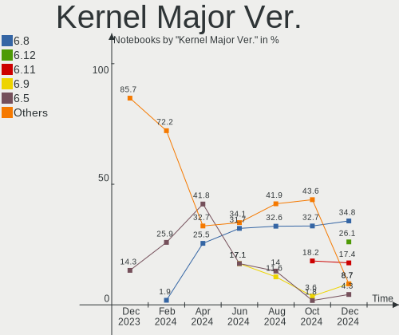
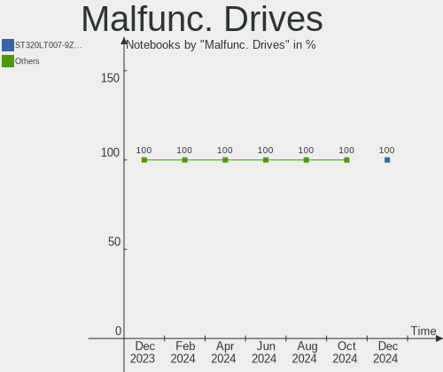
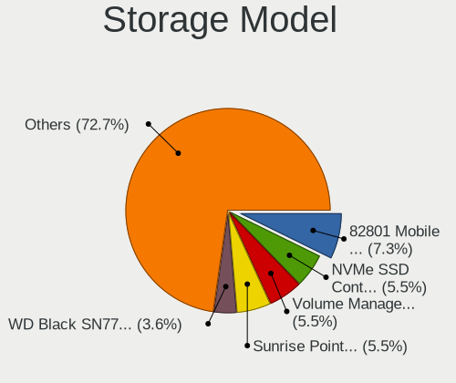
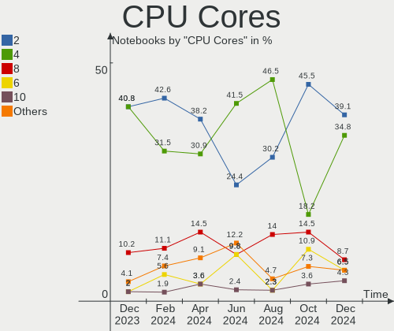
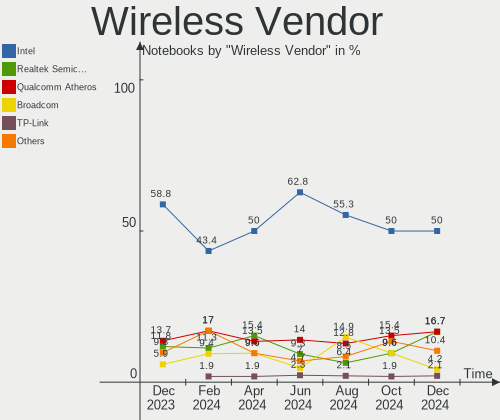
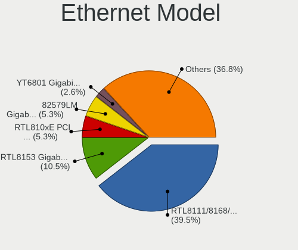
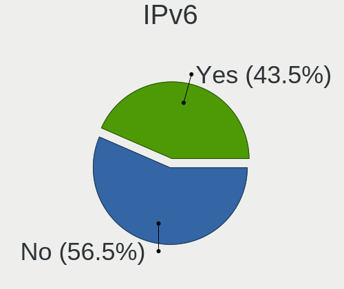
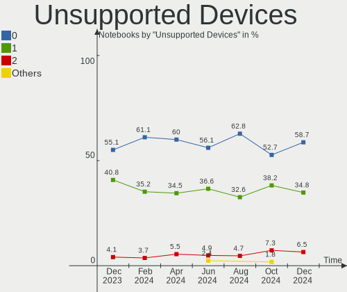
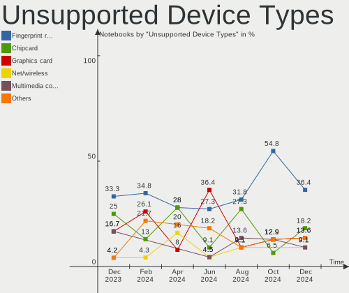

Linux in Netherlands - Hardware Trends (Notebooks)
--------------------------------------------------

A project to identify most popular hardware characteristics and track their change
over time based on data collected by Linux users at https://Linux-Hardware.org.

Anyone can contribute to this report by the [hw-probe](https://github.com/linuxhw/hw-probe) tool:

    sudo -E hw-probe -all -upload

Period: Dec, 2022.

Contents
--------

* [ System ](#system)
  - [ OS                       ](#os)
  - [ OS Family                ](#os-family)
  - [ Kernel                   ](#kernel)
  - [ Kernel Family            ](#kernel-family)
  - [ Kernel Major Ver.        ](#kernel-major-ver)
  - [ Arch                     ](#arch)
  - [ DE                       ](#de)
  - [ Display Server           ](#display-server)
  - [ Display Manager          ](#display-manager)
  - [ OS Lang                  ](#os-lang)
  - [ Boot Mode                ](#boot-mode)
  - [ Filesystem               ](#filesystem)
  - [ Part. scheme             ](#part-scheme)
  - [ Dual Boot with Linux/BSD ](#dual-boot-with-linuxbsd)
  - [ Dual Boot (Win)          ](#dual-boot-win)

* [ Board ](#board)
  - [ Vendor                   ](#vendor)
  - [ Model                    ](#model)
  - [ Model Family             ](#model-family)
  - [ MFG Year                 ](#mfg-year)
  - [ Form Factor              ](#form-factor)
  - [ Secure Boot              ](#secure-boot)
  - [ Coreboot                 ](#coreboot)
  - [ RAM Size                 ](#ram-size)
  - [ RAM Used                 ](#ram-used)
  - [ Total Drives             ](#total-drives)
  - [ Has CD-ROM               ](#has-cd-rom)
  - [ Has Ethernet             ](#has-ethernet)
  - [ Has WiFi                 ](#has-wifi)
  - [ Has Bluetooth            ](#has-bluetooth)

* [ Location ](#location)
  - [ Country                  ](#country)
  - [ City                     ](#city)

* [ Drives ](#drives)
  - [ Drive Vendor             ](#drive-vendor)
  - [ Drive Model              ](#drive-model)
  - [ HDD Vendor               ](#hdd-vendor)
  - [ SSD Vendor               ](#ssd-vendor)
  - [ Drive Kind               ](#drive-kind)
  - [ Drive Connector          ](#drive-connector)
  - [ Drive Size               ](#drive-size)
  - [ Space Total              ](#space-total)
  - [ Space Used               ](#space-used)
  - [ Malfunc. Drives          ](#malfunc-drives)
  - [ Malfunc. Drive Vendor    ](#malfunc-drive-vendor)
  - [ Malfunc. HDD Vendor      ](#malfunc-hdd-vendor)
  - [ Malfunc. Drive Kind      ](#malfunc-drive-kind)
  - [ Failed Drives            ](#failed-drives)
  - [ Failed Drive Vendor      ](#failed-drive-vendor)
  - [ Drive Status             ](#drive-status)

* [ Storage controller ](#storage-controller)
  - [ Storage Vendor           ](#storage-vendor)
  - [ Storage Model            ](#storage-model)
  - [ Storage Kind             ](#storage-kind)

* [ Processor ](#processor)
  - [ CPU Vendor               ](#cpu-vendor)
  - [ CPU Model                ](#cpu-model)
  - [ CPU Model Family         ](#cpu-model-family)
  - [ CPU Cores                ](#cpu-cores)
  - [ CPU Sockets              ](#cpu-sockets)
  - [ CPU Threads              ](#cpu-threads)
  - [ CPU Op-Modes             ](#cpu-op-modes)
  - [ CPU Microcode            ](#cpu-microcode)
  - [ CPU Microarch            ](#cpu-microarch)

* [ Graphics ](#graphics)
  - [ GPU Vendor               ](#gpu-vendor)
  - [ GPU Model                ](#gpu-model)
  - [ GPU Combo                ](#gpu-combo)
  - [ GPU Driver               ](#gpu-driver)
  - [ GPU Memory               ](#gpu-memory)

* [ Monitor ](#monitor)
  - [ Monitor Vendor           ](#monitor-vendor)
  - [ Monitor Model            ](#monitor-model)
  - [ Monitor Resolution       ](#monitor-resolution)
  - [ Monitor Diagonal         ](#monitor-diagonal)
  - [ Monitor Width            ](#monitor-width)
  - [ Aspect Ratio             ](#aspect-ratio)
  - [ Monitor Area             ](#monitor-area)
  - [ Pixel Density            ](#pixel-density)
  - [ Multiple Monitors        ](#multiple-monitors)

* [ Network ](#network)
  - [ Net Controller Vendor    ](#net-controller-vendor)
  - [ Net Controller Model     ](#net-controller-model)
  - [ Wireless Vendor          ](#wireless-vendor)
  - [ Wireless Model           ](#wireless-model)
  - [ Ethernet Vendor          ](#ethernet-vendor)
  - [ Ethernet Model           ](#ethernet-model)
  - [ Net Controller Kind      ](#net-controller-kind)
  - [ Used Controller          ](#used-controller)
  - [ NICs                     ](#nics)
  - [ IPv6                     ](#ipv6)

* [ Bluetooth ](#bluetooth)
  - [ Bluetooth Vendor         ](#bluetooth-vendor)
  - [ Bluetooth Model          ](#bluetooth-model)

* [ Sound ](#sound)
  - [ Sound Vendor             ](#sound-vendor)
  - [ Sound Model              ](#sound-model)

* [ Memory ](#memory)
  - [ Memory Vendor            ](#memory-vendor)
  - [ Memory Model             ](#memory-model)
  - [ Memory Kind              ](#memory-kind)
  - [ Memory Form Factor       ](#memory-form-factor)
  - [ Memory Size              ](#memory-size)
  - [ Memory Speed             ](#memory-speed)

* [ Printers & scanners ](#printers--scanners)
  - [ Printer Vendor           ](#printer-vendor)
  - [ Printer Model            ](#printer-model)
  - [ Scanner Vendor           ](#scanner-vendor)
  - [ Scanner Model            ](#scanner-model)

* [ Camera ](#camera)
  - [ Camera Vendor            ](#camera-vendor)
  - [ Camera Model             ](#camera-model)

* [ Security ](#security)
  - [ Fingerprint Vendor       ](#fingerprint-vendor)
  - [ Fingerprint Model        ](#fingerprint-model)
  - [ Chipcard Vendor          ](#chipcard-vendor)
  - [ Chipcard Model           ](#chipcard-model)

* [ Unsupported ](#unsupported)
  - [ Unsupported Devices      ](#unsupported-devices)
  - [ Unsupported Device Types ](#unsupported-device-types)

System
------

OS
--

Installed operating systems

| Name                | Notebooks | Percent |
|---------------------|-----------|---------|
| Ubuntu 22.04        | 8         | 14.55%  |
| Ubuntu 22.10        | 5         | 9.09%   |
| Linux Mint 21.1     | 4         | 7.27%   |
| Fedora 37           | 4         | 7.27%   |
| Manjaro 22.0.0      | 3         | 5.45%   |
| Debian 11           | 3         | 5.45%   |
| Zorin 16            | 2         | 3.64%   |
| Pop!_OS 22.04       | 2         | 3.64%   |
| Manjaro             | 2         | 3.64%   |
| Kali 2022.4         | 2         | 3.64%   |
| antiX 22            | 2         | 3.64%   |
| Ubuntu Studio 22.04 | 1         | 1.82%   |
| Ubuntu Budgie 18.04 | 1         | 1.82%   |
| Ubuntu 20.04        | 1         | 1.82%   |
| Trisquel 10.0.1     | 1         | 1.82%   |
| SteamOS 3.4.3       | 1         | 1.82%   |
| SteamOS 3.3.2       | 1         | 1.82%   |
| Parrot 5.1          | 1         | 1.82%   |
| OpenMandriva 4.50   | 1         | 1.82%   |
| NixOS 22.11         | 1         | 1.82%   |
| MX 21               | 1         | 1.82%   |
| Linux Mint 21       | 1         | 1.82%   |
| Linux Mint 20.3     | 1         | 1.82%   |
| Kubuntu 22.04       | 1         | 1.82%   |
| KDE neon 22.04      | 1         | 1.82%   |
| Gentoo 2.9          | 1         | 1.82%   |
| Fedora 35           | 1         | 1.82%   |
| Arch Rolling        | 1         | 1.82%   |
| AlmaLinux 9.1       | 1         | 1.82%   |

OS Family
---------

OS without a version

| Name          | Notebooks | Percent |
|---------------|-----------|---------|
| Ubuntu        | 14        | 25.45%  |
| Linux Mint    | 6         | 10.91%  |
| Manjaro       | 5         | 9.09%   |
| Fedora        | 5         | 9.09%   |
| Debian        | 3         | 5.45%   |
| Zorin         | 2         | 3.64%   |
| SteamOS       | 2         | 3.64%   |
| Pop!_OS       | 2         | 3.64%   |
| Kali          | 2         | 3.64%   |
| antiX         | 2         | 3.64%   |
| Ubuntu Studio | 1         | 1.82%   |
| Ubuntu Budgie | 1         | 1.82%   |
| Trisquel      | 1         | 1.82%   |
| Parrot        | 1         | 1.82%   |
| OpenMandriva  | 1         | 1.82%   |
| NixOS         | 1         | 1.82%   |
| MX            | 1         | 1.82%   |
| Kubuntu       | 1         | 1.82%   |
| KDE neon      | 1         | 1.82%   |
| Gentoo        | 1         | 1.82%   |
| Arch          | 1         | 1.82%   |
| AlmaLinux     | 1         | 1.82%   |

Kernel
------

Version of the Linux kernel

| Version                     | Notebooks | Percent |
|-----------------------------|-----------|---------|
| 5.15.0-56-generic           | 13        | 23.64%  |
| 5.19.0-26-generic           | 4         | 7.27%   |
| 5.15.78-1-MANJARO           | 4         | 7.27%   |
| 6.0.6-76060006-generic      | 2         | 3.64%   |
| 6.0.11-300.fc37.x86_64      | 2         | 3.64%   |
| 6.0.0-kali3-amd64           | 2         | 3.64%   |
| 5.15.0-57-generic           | 2         | 3.64%   |
| 5.10.0-19-amd64             | 2         | 3.64%   |
| 6.1.0-rc7+                  | 1         | 1.82%   |
| 6.1.0                       | 1         | 1.82%   |
| 6.0.7-100.fc35.x86_64       | 1         | 1.82%   |
| 6.0.12-x64v1-xanmod1        | 1         | 1.82%   |
| 6.0.11-x64v1-xanmod1-1      | 1         | 1.82%   |
| 6.0.10-300.fc37.x86_64      | 1         | 1.82%   |
| 6.0.0-2parrot1-amd64        | 1         | 1.82%   |
| 6.0.0-0.deb11.2-amd64       | 1         | 1.82%   |
| 5.8.0-50-generic            | 1         | 1.82%   |
| 5.4.0-135-generic           | 1         | 1.82%   |
| 5.19.12-desktop-2omv4090    | 1         | 1.82%   |
| 5.19.0-27-generic           | 1         | 1.82%   |
| 5.15.81-1-MANJARO           | 1         | 1.82%   |
| 5.15.80-gentoo-x86_64       | 1         | 1.82%   |
| 5.15.0-56-lowlatency        | 1         | 1.82%   |
| 5.15.0-53-generic           | 1         | 1.82%   |
| 5.15.0-52-generic           | 1         | 1.82%   |
| 5.14.0-162.6.1.el9_1.x86_64 | 1         | 1.82%   |
| 5.13.0-valve36-1-neptune    | 1         | 1.82%   |
| 5.13.0-valve21.3-1-neptune  | 1         | 1.82%   |
| 5.11.0-051100-generic       | 1         | 1.82%   |
| 5.10.142-antix.2-amd64-smp  | 1         | 1.82%   |
| 5.10.0-18-amd64             | 1         | 1.82%   |
| 4.9.0-326-antix.1-486-smp   | 1         | 1.82%   |

Kernel Family
-------------

Linux kernel without a distro release

| Version  | Notebooks | Percent |
|----------|-----------|---------|
| 5.15.0   | 18        | 32.73%  |
| 5.19.0   | 5         | 9.09%   |
| 6.0.0    | 4         | 7.27%   |
| 5.15.78  | 4         | 7.27%   |
| 6.0.11   | 3         | 5.45%   |
| 5.10.0   | 3         | 5.45%   |
| 6.1.0    | 2         | 3.64%   |
| 6.0.6    | 2         | 3.64%   |
| 5.13.0   | 2         | 3.64%   |
| 6.0.7    | 1         | 1.82%   |
| 6.0.12   | 1         | 1.82%   |
| 6.0.10   | 1         | 1.82%   |
| 5.8.0    | 1         | 1.82%   |
| 5.4.0    | 1         | 1.82%   |
| 5.19.12  | 1         | 1.82%   |
| 5.15.81  | 1         | 1.82%   |
| 5.15.80  | 1         | 1.82%   |
| 5.14.0   | 1         | 1.82%   |
| 5.11.0   | 1         | 1.82%   |
| 5.10.142 | 1         | 1.82%   |
| 4.9.0    | 1         | 1.82%   |

Kernel Major Ver.
-----------------

Linux kernel major version

| Version | Notebooks | Percent |
|---------|-----------|---------|
| 5.15    | 24        | 43.64%  |
| 6.0     | 12        | 21.82%  |
| 5.19    | 6         | 10.91%  |
| 5.10    | 4         | 7.27%   |
| 6.1     | 2         | 3.64%   |
| 5.13    | 2         | 3.64%   |
| 5.8     | 1         | 1.82%   |
| 5.4     | 1         | 1.82%   |
| 5.14    | 1         | 1.82%   |
| 5.11    | 1         | 1.82%   |
| 4.9     | 1         | 1.82%   |

Arch
----

OS architecture (x86_64, i586, etc.)

| Name   | Notebooks | Percent |
|--------|-----------|---------|
| x86_64 | 54        | 98.18%  |
| i686   | 1         | 1.82%   |

DE
--

Desktop Environment

| Name       | Notebooks | Percent |
|------------|-----------|---------|
| GNOME      | 28        | 50.91%  |
| KDE5       | 10        | 18.18%  |
| XFCE       | 5         | 9.09%   |
| MATE       | 5         | 9.09%   |
| X-Cinnamon | 3         | 5.45%   |
| icewm      | 2         | 3.64%   |
| Budgie     | 1         | 1.82%   |
| Unknown    | 1         | 1.82%   |

Display Server
--------------

X11 or Wayland

| Name    | Notebooks | Percent |
|---------|-----------|---------|
| X11     | 33        | 60%     |
| Wayland | 20        | 36.36%  |
| Tty     | 1         | 1.82%   |
| Unknown | 1         | 1.82%   |

Display Manager
---------------

SDDM, LightDM, etc.

| Name    | Notebooks | Percent |
|---------|-----------|---------|
| Unknown | 18        | 32.73%  |
| GDM3    | 13        | 23.64%  |
| GDM     | 9         | 16.36%  |
| LightDM | 8         | 14.55%  |
| SDDM    | 7         | 12.73%  |

OS Lang
-------

Language

| Lang  | Notebooks | Percent |
|-------|-----------|---------|
| en_US | 31        | 56.36%  |
| nl_NL | 13        | 23.64%  |
| pl_PL | 3         | 5.45%   |
| en_GB | 2         | 3.64%   |
| ru_RU | 1         | 1.82%   |
| pt_PT | 1         | 1.82%   |
| hr_HR | 1         | 1.82%   |
| en_IE | 1         | 1.82%   |
| de_DE | 1         | 1.82%   |
| C     | 1         | 1.82%   |

Boot Mode
---------

EFI or BIOS

| Mode | Notebooks | Percent |
|------|-----------|---------|
| EFI  | 31        | 56.36%  |
| BIOS | 24        | 43.64%  |

Filesystem
----------

Type of filesystem

| Type    | Notebooks | Percent |
|---------|-----------|---------|
| Ext4    | 45        | 81.82%  |
| Btrfs   | 7         | 12.73%  |
| Zfs     | 1         | 1.82%   |
| Xfs     | 1         | 1.82%   |
| Overlay | 1         | 1.82%   |

Part. scheme
------------

Scheme of partitioning

| Type    | Notebooks | Percent |
|---------|-----------|---------|
| GPT     | 34        | 61.82%  |
| Unknown | 16        | 29.09%  |
| MBR     | 5         | 9.09%   |

Dual Boot with Linux/BSD
------------------------

Hosting more than one Linux/BSD

| Dual boot | Notebooks | Percent |
|-----------|-----------|---------|
| No        | 50        | 90.91%  |
| Yes       | 5         | 9.09%   |

Dual Boot (Win)
---------------

Hosting Linux and Windows

| Dual boot | Notebooks | Percent |
|-----------|-----------|---------|
| No        | 37        | 67.27%  |
| Yes       | 18        | 32.73%  |

Board
-----

Vendor
------

Motherboard manufacturer

| Name                | Notebooks | Percent |
|---------------------|-----------|---------|
| Lenovo              | 16        | 29.09%  |
| Acer                | 7         | 12.73%  |
| Hewlett-Packard     | 6         | 10.91%  |
| Dell                | 6         | 10.91%  |
| MSI                 | 4         | 7.27%   |
| ASUSTek Computer    | 3         | 5.45%   |
| Valve               | 2         | 3.64%   |
| Medion              | 2         | 3.64%   |
| Apple               | 2         | 3.64%   |
| Toshiba             | 1         | 1.82%   |
| THUNDEROBOT         | 1         | 1.82%   |
| Samsung Electronics | 1         | 1.82%   |
| Packard Bell        | 1         | 1.82%   |
| Notebook            | 1         | 1.82%   |
| LG Electronics      | 1         | 1.82%   |
| Alienware           | 1         | 1.82%   |

Model
-----

Motherboard model

| Name                                       | Notebooks | Percent |
|--------------------------------------------|-----------|---------|
| Valve Jupiter                              | 2         | 3.64%   |
| Toshiba Satellite C70D-B                   | 1         | 1.82%   |
| THUNDEROBOT 911MT                          | 1         | 1.82%   |
| Samsung 300E4A/300E5A/300E7A/3430EA/3530EA | 1         | 1.82%   |
| Packard Bell EasyNote TE11HC               | 1         | 1.82%   |
| Notebook PB50_70RF,RD,RC                   | 1         | 1.82%   |
| MSI Summit E16Flip A12UCT                  | 1         | 1.82%   |
| MSI Modern 15 A11MU                        | 1         | 1.82%   |
| MSI GP75 Leopard 10SEK                     | 1         | 1.82%   |
| MSI GL62M 7RE                              | 1         | 1.82%   |
| Medion E4251 MD61435                       | 1         | 1.82%   |
| Medion E4251                               | 1         | 1.82%   |
| LG 17Z90Q-G.AA79G                          | 1         | 1.82%   |
| Lenovo ThinkPad X230 Tablet 34383V4        | 1         | 1.82%   |
| Lenovo ThinkPad X201 Tablet 3093RZ6        | 1         | 1.82%   |
| Lenovo ThinkPad T510 4349AF5               | 1         | 1.82%   |
| Lenovo ThinkPad T490 20N2CTO1WW            | 1         | 1.82%   |
| Lenovo ThinkPad T470s 20HF003QUS           | 1         | 1.82%   |
| Lenovo ThinkPad T16 Gen 1 21CHCTO1WW       | 1         | 1.82%   |
| Lenovo ThinkPad P14s Gen 2a 21A0004BMH     | 1         | 1.82%   |
| Lenovo ThinkPad L560 20F2S2UR02            | 1         | 1.82%   |
| Lenovo ThinkPad E15 Gen 2 20TD00JYMH       | 1         | 1.82%   |
| Lenovo ThinkBook 15 G2 ITL 20VE            | 1         | 1.82%   |
| Lenovo IdeaPad Gaming 3 15ACH6 82K2        | 1         | 1.82%   |
| Lenovo IdeaPad 5 15ARE05 81YQ              | 1         | 1.82%   |
| Lenovo IdeaPad 320-15ISK 80XH              | 1         | 1.82%   |
| Lenovo IdeaPad 3 14IAU7 82RJ               | 1         | 1.82%   |
| Lenovo G50-70 20351                        | 1         | 1.82%   |
| Lenovo 3000 V100 076346G                   | 1         | 1.82%   |
| HP Pavilion Laptop 15-cw1xxx               | 1         | 1.82%   |
| HP Pavilion Gaming Laptop 15-cx0xxx        | 1         | 1.82%   |
| HP Pavilion 17                             | 1         | 1.82%   |
| HP EliteBook 850 G8 Notebook PC            | 1         | 1.82%   |
| HP EliteBook 820 G4                        | 1         | 1.82%   |
| HP Compaq Presario CQ71                    | 1         | 1.82%   |
| Dell XPS 9320                              | 1         | 1.82%   |
| Dell XPS 15 7590                           | 1         | 1.82%   |
| Dell Latitude 5521                         | 1         | 1.82%   |
| Dell Latitude 3120                         | 1         | 1.82%   |
| Dell Latitude 2120                         | 1         | 1.82%   |

Model Family
------------

Motherboard model prefix

| Name                  | Notebooks | Percent |
|-----------------------|-----------|---------|
| Lenovo ThinkPad       | 9         | 16.36%  |
| Acer Aspire           | 5         | 9.09%   |
| Lenovo IdeaPad        | 4         | 7.27%   |
| HP Pavilion           | 3         | 5.45%   |
| Dell Latitude         | 3         | 5.45%   |
| Valve Jupiter         | 2         | 3.64%   |
| Medion E4251          | 2         | 3.64%   |
| HP EliteBook          | 2         | 3.64%   |
| Dell XPS              | 2         | 3.64%   |
| Toshiba Satellite     | 1         | 1.82%   |
| THUNDEROBOT 911MT     | 1         | 1.82%   |
| Samsung 300E4A        | 1         | 1.82%   |
| Packard Bell EasyNote | 1         | 1.82%   |
| Notebook PB50         | 1         | 1.82%   |
| MSI Summit            | 1         | 1.82%   |
| MSI Modern            | 1         | 1.82%   |
| MSI GP75              | 1         | 1.82%   |
| MSI GL62M             | 1         | 1.82%   |
| LG 17Z90Q-G.AA79G     | 1         | 1.82%   |
| Lenovo ThinkBook      | 1         | 1.82%   |
| Lenovo G50-70         | 1         | 1.82%   |
| Lenovo 3000           | 1         | 1.82%   |
| HP Compaq             | 1         | 1.82%   |
| Dell Inspiron         | 1         | 1.82%   |
| ASUS X756UQK          | 1         | 1.82%   |
| ASUS N750JK           | 1         | 1.82%   |
| ASUS K50IE            | 1         | 1.82%   |
| Apple MacBookPro9     | 1         | 1.82%   |
| Apple MacBookPro8     | 1         | 1.82%   |
| Alienware x17         | 1         | 1.82%   |
| Acer Nitro            | 1         | 1.82%   |
| Acer Iconia           | 1         | 1.82%   |

MFG Year
--------

Motherboard manufacture year

| Year | Notebooks | Percent |
|------|-----------|---------|
| 2022 | 8         | 14.55%  |
| 2021 | 8         | 14.55%  |
| 2020 | 5         | 9.09%   |
| 2016 | 5         | 9.09%   |
| 2019 | 4         | 7.27%   |
| 2013 | 4         | 7.27%   |
| 2010 | 4         | 7.27%   |
| 2018 | 3         | 5.45%   |
| 2017 | 3         | 5.45%   |
| 2014 | 3         | 5.45%   |
| 2012 | 3         | 5.45%   |
| 2009 | 2         | 3.64%   |
| 2006 | 2         | 3.64%   |
| 2011 | 1         | 1.82%   |

Form Factor
-----------

Physical design of the computer

| Name     | Notebooks | Percent |
|----------|-----------|---------|
| Notebook | 55        | 100%    |

Secure Boot
-----------

Enabled or disabled

| State    | Notebooks | Percent |
|----------|-----------|---------|
| Disabled | 49        | 89.09%  |
| Enabled  | 6         | 10.91%  |

Coreboot
--------

Have coreboot on board

| Used | Notebooks | Percent |
|------|-----------|---------|
| No   | 55        | 100%    |

RAM Size
--------

Total RAM memory

| Size in GB  | Notebooks | Percent |
|-------------|-----------|---------|
| 8.01-16.0   | 13        | 23.64%  |
| 4.01-8.0    | 11        | 20%     |
| 3.01-4.0    | 10        | 18.18%  |
| 16.01-24.0  | 8         | 14.55%  |
| 32.01-64.0  | 5         | 9.09%   |
| 24.01-32.0  | 4         | 7.27%   |
| 64.01-256.0 | 2         | 3.64%   |
| 1.01-2.0    | 2         | 3.64%   |

RAM Used
--------

Used RAM memory

| Used GB   | Notebooks | Percent |
|-----------|-----------|---------|
| 1.01-2.0  | 17        | 30.91%  |
| 2.01-3.0  | 12        | 21.82%  |
| 4.01-8.0  | 10        | 18.18%  |
| 8.01-16.0 | 7         | 12.73%  |
| 3.01-4.0  | 5         | 9.09%   |
| 0.51-1.0  | 3         | 5.45%   |
| 0.01-0.5  | 1         | 1.82%   |

Total Drives
------------

Number of drives on board

| Drives | Notebooks | Percent |
|--------|-----------|---------|
| 1      | 35        | 63.64%  |
| 2      | 18        | 32.73%  |
| 3      | 1         | 1.82%   |
| 0      | 1         | 1.82%   |

Has CD-ROM
----------

Has CD-ROM on board

| Presented | Notebooks | Percent |
|-----------|-----------|---------|
| No        | 37        | 67.27%  |
| Yes       | 18        | 32.73%  |

Has Ethernet
------------

Has Ethernet on board

| Presented | Notebooks | Percent |
|-----------|-----------|---------|
| Yes       | 42        | 76.36%  |
| No        | 13        | 23.64%  |

Has WiFi
--------

Has WiFi module

| Presented | Notebooks | Percent |
|-----------|-----------|---------|
| Yes       | 54        | 98.18%  |
| No        | 1         | 1.82%   |

Has Bluetooth
-------------

Has Bluetooth module

| Presented | Notebooks | Percent |
|-----------|-----------|---------|
| Yes       | 48        | 87.27%  |
| No        | 7         | 12.73%  |

Location
--------

Country
-------

Geographic location (country)

| Country     | Notebooks | Percent |
|-------------|-----------|---------|
| Netherlands | 55        | 100%    |

City
----

Geographic location (city)

| City                    | Notebooks | Percent |
|-------------------------|-----------|---------|
| Amsterdam               | 10        | 18.18%  |
| Tilburg                 | 3         | 5.45%   |
| Haarlem                 | 3         | 5.45%   |
| Groningen               | 3         | 5.45%   |
| Purmerend               | 2         | 3.64%   |
| Blaricum                | 2         | 3.64%   |
| Amstelveen              | 2         | 3.64%   |
| Zwartsluis              | 1         | 1.82%   |
| Zoetermeer              | 1         | 1.82%   |
| Wissenkerke             | 1         | 1.82%   |
| Winterswijk             | 1         | 1.82%   |
| Winssen                 | 1         | 1.82%   |
| Weteringbrug            | 1         | 1.82%   |
| Velsen                  | 1         | 1.82%   |
| The Hague               | 1         | 1.82%   |
| Someren                 | 1         | 1.82%   |
| Schiedam                | 1         | 1.82%   |
| Rotterdam               | 1         | 1.82%   |
| Ouderkerk aan de Amstel | 1         | 1.82%   |
| Ochten                  | 1         | 1.82%   |
| Nispen                  | 1         | 1.82%   |
| Nieuwegein              | 1         | 1.82%   |
| Naaldwijk               | 1         | 1.82%   |
| Middelburg              | 1         | 1.82%   |
| Luxwoude                | 1         | 1.82%   |
| Hoofddorp               | 1         | 1.82%   |
| Hoensbroek              | 1         | 1.82%   |
| Heerlen                 | 1         | 1.82%   |
| Haaksbergen             | 1         | 1.82%   |
| Gorinchem               | 1         | 1.82%   |
| Enkhuizen               | 1         | 1.82%   |
| Diemen                  | 1         | 1.82%   |
| Delft                   | 1         | 1.82%   |
| Beverwijk               | 1         | 1.82%   |
| Bavel                   | 1         | 1.82%   |
| Almere Stad             | 1         | 1.82%   |
| Aalten                  | 1         | 1.82%   |

Drives
------

Drive Vendor
------------

Hard drive vendors

| Vendor                      | Notebooks | Drives | Percent |
|-----------------------------|-----------|--------|---------|
| Samsung Electronics         | 20        | 23     | 28.17%  |
| WDC                         | 8         | 8      | 11.27%  |
| Intel                       | 6         | 6      | 8.45%   |
| Unknown                     | 5         | 5      | 7.04%   |
| SK hynix                    | 5         | 5      | 7.04%   |
| SanDisk                     | 4         | 4      | 5.63%   |
| Toshiba                     | 3         | 4      | 4.23%   |
| Crucial                     | 3         | 3      | 4.23%   |
| Seagate                     | 2         | 2      | 2.82%   |
| HGST                        | 2         | 2      | 2.82%   |
| China                       | 2         | 2      | 2.82%   |
| Teclast                     | 1         | 1      | 1.41%   |
| SSSTC                       | 1         | 1      | 1.41%   |
| PNY                         | 1         | 1      | 1.41%   |
| Phison                      | 1         | 1      | 1.41%   |
| Lite-On Technology          | 1         | 1      | 1.41%   |
| KIOXIA                      | 1         | 1      | 1.41%   |
| Kingston Technology Company | 1         | 1      | 1.41%   |
| Intenso                     | 1         | 1      | 1.41%   |
| HGST HTS                    | 1         | 1      | 1.41%   |
| ASMT                        | 1         | 1      | 1.41%   |
| Unknown                     | 1         | 1      | 1.41%   |

Drive Model
-----------

Hard drive models

| Model                                               | Notebooks | Percent |
|-----------------------------------------------------|-----------|---------|
| WDC WDS240G2G0A-00JH30 240GB SSD                    | 2         | 2.7%    |
| Toshiba MQ01ABF050 500GB                            | 2         | 2.7%    |
| Samsung NVMe SSD Controller SM981/PM981/PM983 500GB | 2         | 2.7%    |
| Samsung NVMe SSD Controller PM9A1/PM9A3/980PRO 2TB  | 2         | 2.7%    |
| Crucial CT250MX500SSD1 250GB                        | 2         | 2.7%    |
| WDC WD5000LPVT-80G33T2 500GB                        | 1         | 1.35%   |
| WDC WD5000LPCX-24C6HT0 500GB                        | 1         | 1.35%   |
| WDC WD3200BPVT-22JJ5T0 320GB                        | 1         | 1.35%   |
| WDC WD2500BEVT-22ZCT0 250GB                         | 1         | 1.35%   |
| WDC PC SN540 SDDPNPF-512G-1032 512GB                | 1         | 1.35%   |
| WDC PC SN530 SDBPMPZ-256G-1101 256GB                | 1         | 1.35%   |
| Unknown SD2GB                                       | 1         | 1.35%   |
| Unknown MMC Card  512GB                             | 1         | 1.35%   |
| Unknown MMC Card  4GB                               | 1         | 1.35%   |
| Unknown MMC Card  256GB                             | 1         | 1.35%   |
| Unknown MBG4GC  32GB                                | 1         | 1.35%   |
| Toshiba THNSNH128GMCT 128GB SSD                     | 1         | 1.35%   |
| Toshiba MQ01ABD100 1TB                              | 1         | 1.35%   |
| Teclast 256GB SSD                                   | 1         | 1.35%   |
| SSSTC CL1-8D512 512GB                               | 1         | 1.35%   |
| SK hynix SKHynix_HFS512GD9TNI-L2A0B 512GB           | 1         | 1.35%   |
| SK hynix SKHynix_HFS256GDE9X081N 256GB              | 1         | 1.35%   |
| SK hynix PC801 NVMe 512GB                           | 1         | 1.35%   |
| SK hynix PC711 NVMe 1TB                             | 1         | 1.35%   |
| SK hynix HFS128G39TND-N210A 128GB SSD               | 1         | 1.35%   |
| Seagate ST1000LM035-1RK172 1TB                      | 1         | 1.35%   |
| Seagate Expansion SW 1TB                            | 1         | 1.35%   |
| Sandisk WD Black SN850 1TB                          | 1         | 1.35%   |
| SanDisk SSD PLUS 240GB                              | 1         | 1.35%   |
| SanDisk SD8TB8U256G1001 256GB SSD                   | 1         | 1.35%   |
| SanDisk 3.2 Gen 1 496GB SSD                         | 1         | 1.35%   |
| Samsung SSD 980 500GB                               | 1         | 1.35%   |
| Samsung SSD 870 EVO 500GB                           | 1         | 1.35%   |
| Samsung SSD 860 EVO 1TB                             | 1         | 1.35%   |
| Samsung SSD 850 EVO 120GB                           | 1         | 1.35%   |
| Samsung SSD 840 Series 250GB                        | 1         | 1.35%   |
| Samsung SSD 840 EVO 500GB                           | 1         | 1.35%   |
| Samsung SSD 830 Series 256GB                        | 1         | 1.35%   |
| Samsung PM9A1 NVMe 2048GB                           | 1         | 1.35%   |
| Samsung NVMe SSD Drive 128GB                        | 1         | 1.35%   |

HDD Vendor
----------

Hard disk drive vendors

| Vendor              | Notebooks | Drives | Percent |
|---------------------|-----------|--------|---------|
| WDC                 | 4         | 4      | 28.57%  |
| Toshiba             | 3         | 3      | 21.43%  |
| Seagate             | 2         | 2      | 14.29%  |
| HGST                | 2         | 2      | 14.29%  |
| Samsung Electronics | 1         | 1      | 7.14%   |
| HGST HTS            | 1         | 1      | 7.14%   |
| ASMT                | 1         | 1      | 7.14%   |

SSD Vendor
----------

Solid state drive vendors

| Vendor              | Notebooks | Drives | Percent |
|---------------------|-----------|--------|---------|
| Samsung Electronics | 7         | 7      | 26.92%  |
| SanDisk             | 3         | 3      | 11.54%  |
| Crucial             | 3         | 3      | 11.54%  |
| WDC                 | 2         | 2      | 7.69%   |
| Intel               | 2         | 2      | 7.69%   |
| China               | 2         | 2      | 7.69%   |
| Toshiba             | 1         | 1      | 3.85%   |
| Teclast             | 1         | 1      | 3.85%   |
| SK hynix            | 1         | 1      | 3.85%   |
| PNY                 | 1         | 1      | 3.85%   |
| Phison              | 1         | 1      | 3.85%   |
| Intenso             | 1         | 1      | 3.85%   |
| Unknown             | 1         | 1      | 3.85%   |

Drive Kind
----------

HDD or SSD

| Kind | Notebooks | Drives | Percent |
|------|-----------|--------|---------|
| NVMe | 27        | 30     | 39.71%  |
| SSD  | 24        | 26     | 35.29%  |
| HDD  | 12        | 14     | 17.65%  |
| MMC  | 5         | 5      | 7.35%   |

Drive Connector
---------------

SATA, SAS, NVMe, etc.

| Type | Notebooks | Drives | Percent |
|------|-----------|--------|---------|
| SATA | 30        | 36     | 45.45%  |
| NVMe | 27        | 30     | 40.91%  |
| MMC  | 5         | 5      | 7.58%   |
| SAS  | 4         | 4      | 6.06%   |

Drive Size
----------

Size of hard drive

| Size in TB | Notebooks | Drives | Percent |
|------------|-----------|--------|---------|
| 0.01-0.5   | 30        | 32     | 81.08%  |
| 0.51-1.0   | 7         | 8      | 18.92%  |

Space Total
-----------

Amount of disk space available on the file system

| Size in GB | Notebooks | Percent |
|------------|-----------|---------|
| 101-250    | 21        | 38.18%  |
| 251-500    | 13        | 23.64%  |
| 501-1000   | 13        | 23.64%  |
| 1001-2000  | 3         | 5.45%   |
| 1-20       | 2         | 3.64%   |
| 21-50      | 1         | 1.82%   |
| 51-100     | 1         | 1.82%   |
| Unknown    | 1         | 1.82%   |

Space Used
----------

Amount of used disk space

| Used GB  | Notebooks | Percent |
|----------|-----------|---------|
| 1-20     | 16        | 29.09%  |
| 101-250  | 15        | 27.27%  |
| 21-50    | 11        | 20%     |
| 51-100   | 6         | 10.91%  |
| 251-500  | 4         | 7.27%   |
| 501-1000 | 2         | 3.64%   |
| Unknown  | 1         | 1.82%   |

Malfunc. Drives
---------------

Drive models with a malfunction

| Model                          | Notebooks | Drives | Percent |
|--------------------------------|-----------|--------|---------|
| WDC WD2500BEVT-22ZCT0 250GB    | 1         | 1      | 50%     |
| Seagate ST1000LM035-1RK172 1TB | 1         | 1      | 50%     |

Malfunc. Drive Vendor
---------------------

Vendors of faulty drives

| Vendor  | Notebooks | Drives | Percent |
|---------|-----------|--------|---------|
| WDC     | 1         | 1      | 50%     |
| Seagate | 1         | 1      | 50%     |

Malfunc. HDD Vendor
-------------------

Vendors of faulty HDD drives

| Vendor  | Notebooks | Drives | Percent |
|---------|-----------|--------|---------|
| WDC     | 1         | 1      | 50%     |
| Seagate | 1         | 1      | 50%     |

Malfunc. Drive Kind
-------------------

Kinds of faulty drives

| Kind | Notebooks | Drives | Percent |
|------|-----------|--------|---------|
| HDD  | 2         | 2      | 100%    |

Failed Drives
-------------

Failed drive models

Zero info for selected period =(

Failed Drive Vendor
-------------------

Failed drive vendors

Zero info for selected period =(

Drive Status
------------

Number of failed and malfunc. drives

| Status   | Notebooks | Drives | Percent |
|----------|-----------|--------|---------|
| Detected | 33        | 45     | 57.89%  |
| Works    | 22        | 28     | 38.6%   |
| Malfunc  | 2         | 2      | 3.51%   |

Storage controller
------------------

Storage Vendor
--------------

Storage controller vendors

| Vendor                         | Notebooks | Percent |
|--------------------------------|-----------|---------|
| Intel                          | 39        | 58.21%  |
| Samsung Electronics            | 13        | 19.4%   |
| SK hynix                       | 4         | 5.97%   |
| SanDisk                        | 3         | 4.48%   |
| AMD                            | 3         | 4.48%   |
| Toshiba America Info Systems   | 1         | 1.49%   |
| Solid State Storage Technology | 1         | 1.49%   |
| Nvidia                         | 1         | 1.49%   |
| Lite-On Technology             | 1         | 1.49%   |
| Kingston Technology Company    | 1         | 1.49%   |

Storage Model
-------------

Storage controller models

| Model                                                                          | Notebooks | Percent |
|--------------------------------------------------------------------------------|-----------|---------|
| Samsung NVMe SSD Controller 980                                                | 6         | 8.33%   |
| Intel Volume Management Device NVMe RAID Controller                            | 4         | 5.56%   |
| Intel Sunrise Point-LP SATA Controller [AHCI mode]                             | 4         | 5.56%   |
| Samsung NVMe SSD Controller PM9A1/PM9A3/980PRO                                 | 3         | 4.17%   |
| Intel Cannon Lake Mobile PCH SATA AHCI Controller                              | 3         | 4.17%   |
| Intel 8 Series/C220 Series Chipset Family 6-port SATA Controller 1 [AHCI mode] | 3         | 4.17%   |
| Intel 7 Series Chipset Family 6-port SATA Controller [AHCI mode]               | 3         | 4.17%   |
| Intel 500 Series Chipset Family SATA AHCI Controller                           | 3         | 4.17%   |
| AMD FCH SATA Controller [AHCI mode]                                            | 3         | 4.17%   |
| SK hynix Non-Volatile memory controller                                        | 2         | 2.78%   |
| SK hynix Gold P31/PC711 NVMe Solid State Drive                                 | 2         | 2.78%   |
| SanDisk Non-Volatile memory controller                                         | 2         | 2.78%   |
| Samsung NVMe SSD Controller SM981/PM981/PM983                                  | 2         | 2.78%   |
| Samsung NVMe SSD Controller SM961/PM961/SM963                                  | 2         | 2.78%   |
| Intel Celeron/Pentium Silver Processor SATA Controller                         | 2         | 2.78%   |
| Intel 82801 Mobile SATA Controller [RAID mode]                                 | 2         | 2.78%   |
| Intel 6 Series/C200 Series Chipset Family 6 port Mobile SATA AHCI Controller   | 2         | 2.78%   |
| Intel 5 Series/3400 Series Chipset 6 port SATA AHCI Controller                 | 2         | 2.78%   |
| Toshiba America Info Systems XG6 NVMe SSD Controller                           | 1         | 1.39%   |
| Solid State Storage Non-Volatile memory controller                             | 1         | 1.39%   |
| SanDisk WD PC SN810 / Black SN850 NVMe SSD                                     | 1         | 1.39%   |
| Nvidia MCP79 AHCI Controller                                                   | 1         | 1.39%   |
| Lite-On NVMe Controller                                                        | 1         | 1.39%   |
| Kingston Company OM3PDP3 NVMe SSD                                              | 1         | 1.39%   |
| Intel Tiger Lake-LP SATA Controller                                            | 1         | 1.39%   |
| Intel SSD Pro 7600p/760p/E 6100p Series                                        | 1         | 1.39%   |
| Intel SSD 660P Series                                                          | 1         | 1.39%   |
| Intel SSD 600P Series                                                          | 1         | 1.39%   |
| Intel Non-Volatile memory controller                                           | 1         | 1.39%   |
| Intel NM10/ICH7 Family SATA Controller [AHCI mode]                             | 1         | 1.39%   |
| Intel HM170/QM170 Chipset SATA Controller [AHCI Mode]                          | 1         | 1.39%   |
| Intel Celeron N3350/Pentium N4200/Atom E3900 Series SATA AHCI Controller       | 1         | 1.39%   |
| Intel Alder Lake-P SATA AHCI Controller                                        | 1         | 1.39%   |
| Intel 82801IBM/IEM (ICH9M/ICH9M-E) 4 port SATA Controller [AHCI mode]          | 1         | 1.39%   |
| Intel 82801GBM/GHM (ICH7-M Family) SATA Controller [IDE mode]                  | 1         | 1.39%   |
| Intel 82801GBM/GHM (ICH7-M Family) SATA Controller [AHCI mode]                 | 1         | 1.39%   |
| Intel 82801G (ICH7 Family) IDE Controller                                      | 1         | 1.39%   |
| Intel 8 Series SATA Controller 1 [AHCI mode]                                   | 1         | 1.39%   |
| Intel 5 Series/3400 Series Chipset 4 port SATA AHCI Controller                 | 1         | 1.39%   |
| Intel 400 Series Chipset Family SATA AHCI Controller                           | 1         | 1.39%   |

Storage Kind
------------

Kind of storage controller (IDE, SATA, NVMe, SAS, ...)

| Kind | Notebooks | Percent |
|------|-----------|---------|
| SATA | 36        | 50.7%   |
| NVMe | 27        | 38.03%  |
| RAID | 6         | 8.45%   |
| IDE  | 2         | 2.82%   |

Processor
---------

CPU Vendor
----------

Processor vendors

| Vendor | Notebooks | Percent |
|--------|-----------|---------|
| Intel  | 47        | 85.45%  |
| AMD    | 8         | 14.55%  |

CPU Model
---------

Processor models

| Model                                       | Notebooks | Percent |
|---------------------------------------------|-----------|---------|
| Intel Core i9-9980HK CPU @ 2.40GHz          | 2         | 3.64%   |
| Intel Core i7-7600U CPU @ 2.80GHz           | 2         | 3.64%   |
| Intel Core i3-6006U CPU @ 2.00GHz           | 2         | 3.64%   |
| Intel 12th Gen Core i7-1260P                | 2         | 3.64%   |
| Intel 11th Gen Core i7-11800H @ 2.30GHz     | 2         | 3.64%   |
| Intel 11th Gen Core i5-1135G7 @ 2.40GHz     | 2         | 3.64%   |
| AMD Custom APU 0405                         | 2         | 3.64%   |
| Intel Pentium Silver N6000 @ 1.10GHz        | 1         | 1.82%   |
| Intel Pentium Dual-Core CPU T4400 @ 2.20GHz | 1         | 1.82%   |
| Intel Pentium Dual-Core CPU T4300 @ 2.10GHz | 1         | 1.82%   |
| Intel Pentium CPU B940 @ 2.00GHz            | 1         | 1.82%   |
| Intel Genuine CPU T2400 @ 1.83GHz           | 1         | 1.82%   |
| Intel Core i7-8750H CPU @ 2.20GHz           | 1         | 1.82%   |
| Intel Core i7-8565U CPU @ 1.80GHz           | 1         | 1.82%   |
| Intel Core i7-7500U CPU @ 2.70GHz           | 1         | 1.82%   |
| Intel Core i7-4702MQ CPU @ 2.20GHz          | 1         | 1.82%   |
| Intel Core i7-4700HQ CPU @ 2.40GHz          | 1         | 1.82%   |
| Intel Core i7-3520M CPU @ 2.90GHz           | 1         | 1.82%   |
| Intel Core i7-2635QM CPU @ 2.00GHz          | 1         | 1.82%   |
| Intel Core i7-10750H CPU @ 2.60GHz          | 1         | 1.82%   |
| Intel Core i7 CPU L 620 @ 2.00GHz           | 1         | 1.82%   |
| Intel Core i5-7300HQ CPU @ 2.50GHz          | 1         | 1.82%   |
| Intel Core i5-7200U CPU @ 2.50GHz           | 1         | 1.82%   |
| Intel Core i5-6300U CPU @ 2.40GHz           | 1         | 1.82%   |
| Intel Core i5-4200M CPU @ 2.50GHz           | 1         | 1.82%   |
| Intel Core i5-3210M CPU @ 2.50GHz           | 1         | 1.82%   |
| Intel Core i5 CPU M 540 @ 2.53GHz           | 1         | 1.82%   |
| Intel Core i5 CPU M 460 @ 2.53GHz           | 1         | 1.82%   |
| Intel Core i3-4005U CPU @ 1.70GHz           | 1         | 1.82%   |
| Intel Core i3-2350M CPU @ 2.30GHz           | 1         | 1.82%   |
| Intel Core 2 CPU T7600 @ 2.33GHz            | 1         | 1.82%   |
| Intel Celeron N4020 CPU @ 1.10GHz           | 1         | 1.82%   |
| Intel Celeron N4000 CPU @ 1.10GHz           | 1         | 1.82%   |
| Intel Celeron CPU N3450 @ 1.10GHz           | 1         | 1.82%   |
| Intel Atom CPU Z3740 @ 1.33GHz              | 1         | 1.82%   |
| Intel Atom CPU N550 @ 1.50GHz               | 1         | 1.82%   |
| Intel 12th Gen Core i9-12900HK              | 1         | 1.82%   |
| Intel 12th Gen Core i7-1280P                | 1         | 1.82%   |
| Intel 12th Gen Core i5-1235U                | 1         | 1.82%   |
| Intel 11th Gen Core i7-1185G7 @ 3.00GHz     | 1         | 1.82%   |

CPU Model Family
----------------

Processor model prefix

| Model                   | Notebooks | Percent |
|-------------------------|-----------|---------|
| Other                   | 14        | 25.45%  |
| Intel Core i7           | 11        | 20%     |
| Intel Core i5           | 7         | 12.73%  |
| Intel Core i3           | 4         | 7.27%   |
| Intel Celeron           | 3         | 5.45%   |
| AMD Ryzen 5             | 3         | 5.45%   |
| Intel Pentium Dual-Core | 2         | 3.64%   |
| Intel Core i9           | 2         | 3.64%   |
| Intel Atom              | 2         | 3.64%   |
| Intel Pentium Silver    | 1         | 1.82%   |
| Intel Pentium           | 1         | 1.82%   |
| Intel Genuine           | 1         | 1.82%   |
| Intel Core 2            | 1         | 1.82%   |
| AMD Ryzen 7 PRO         | 1         | 1.82%   |
| AMD Ryzen 5 PRO         | 1         | 1.82%   |
| AMD E1                  | 1         | 1.82%   |

CPU Cores
---------

Number of processor cores

| Number | Notebooks | Percent |
|--------|-----------|---------|
| 2      | 25        | 45.45%  |
| 4      | 14        | 25.45%  |
| 8      | 6         | 10.91%  |
| 6      | 5         | 9.09%   |
| 14     | 2         | 3.64%   |
| 12     | 2         | 3.64%   |
| 10     | 1         | 1.82%   |

CPU Sockets
-----------

Number of sockets

| Number | Notebooks | Percent |
|--------|-----------|---------|
| 1      | 55        | 100%    |

CPU Threads
-----------

Threads per core (Hyper-Threading)

| Number | Notebooks | Percent |
|--------|-----------|---------|
| 2      | 39        | 70.91%  |
| 1      | 16        | 29.09%  |

CPU Op-Modes
------------

CPU Operation Modes (32-bit, 64-bit)

| Op mode        | Notebooks | Percent |
|----------------|-----------|---------|
| 32-bit, 64-bit | 54        | 98.18%  |
| 32-bit         | 1         | 1.82%   |

CPU Microcode
-------------

Microcode number

| Number     | Notebooks | Percent |
|------------|-----------|---------|
| Unknown    | 16        | 29.09%  |
| 0x806e9    | 3         | 5.45%   |
| 0x806d1    | 3         | 5.45%   |
| 0x806c1    | 3         | 5.45%   |
| 0x906ed    | 2         | 3.64%   |
| 0x406e3    | 2         | 3.64%   |
| 0x306c3    | 2         | 3.64%   |
| 0x306a9    | 2         | 3.64%   |
| 0x206a7    | 2         | 3.64%   |
| 0x0a50000c | 2         | 3.64%   |
| 0xa0652    | 1         | 1.82%   |
| 0x906ea    | 1         | 1.82%   |
| 0x906c0    | 1         | 1.82%   |
| 0x906a4    | 1         | 1.82%   |
| 0x906a3    | 1         | 1.82%   |
| 0x806ec    | 1         | 1.82%   |
| 0x806c2    | 1         | 1.82%   |
| 0x6f6      | 1         | 1.82%   |
| 0x6e8      | 1         | 1.82%   |
| 0x40651    | 1         | 1.82%   |
| 0x30673    | 1         | 1.82%   |
| 0x20655    | 1         | 1.82%   |
| 0x20652    | 1         | 1.82%   |
| 0x106ca    | 1         | 1.82%   |
| 0x1067a    | 1         | 1.82%   |
| 0x0a404102 | 1         | 1.82%   |
| 0x08108102 | 1         | 1.82%   |
| 0x0700010f | 1         | 1.82%   |

CPU Microarch
-------------

Microarchitecture

| Name             | Notebooks | Percent |
|------------------|-----------|---------|
| KabyLake         | 9         | 16.36%  |
| Unknown          | 7         | 12.73%  |
| TigerLake        | 4         | 7.27%   |
| Haswell          | 4         | 7.27%   |
| Westmere         | 3         | 5.45%   |
| Skylake          | 3         | 5.45%   |
| SandyBridge      | 3         | 5.45%   |
| Icelake          | 3         | 5.45%   |
| Zen 3            | 2         | 3.64%   |
| Penryn           | 2         | 3.64%   |
| IvyBridge        | 2         | 3.64%   |
| Goldmont plus    | 2         | 3.64%   |
| Alderlake Hybrid | 2         | 3.64%   |
| Zen+             | 1         | 1.82%   |
| Zen 2            | 1         | 1.82%   |
| Silvermont       | 1         | 1.82%   |
| P6               | 1         | 1.82%   |
| Jaguar           | 1         | 1.82%   |
| Goldmont         | 1         | 1.82%   |
| Core             | 1         | 1.82%   |
| CometLake        | 1         | 1.82%   |
| Bonnell          | 1         | 1.82%   |

Graphics
--------

GPU Vendor
----------

Vendors of graphics cards

| Vendor | Notebooks | Percent |
|--------|-----------|---------|
| Intel  | 44        | 60.27%  |
| Nvidia | 18        | 24.66%  |
| AMD    | 11        | 15.07%  |

GPU Model
---------

Graphics card models

| Model                                                                         | Notebooks | Percent |
|-------------------------------------------------------------------------------|-----------|---------|
| Intel HD Graphics 620                                                         | 4         | 5.41%   |
| Intel Alder Lake-P Integrated Graphics Controller                             | 4         | 5.41%   |
| Nvidia GA107M [GeForce RTX 3050 Mobile]                                       | 3         | 4.05%   |
| Intel TigerLake-LP GT2 [Iris Xe Graphics]                                     | 3         | 4.05%   |
| Intel TigerLake-H GT1 [UHD Graphics]                                          | 3         | 4.05%   |
| Intel CoffeeLake-H GT2 [UHD Graphics 630]                                     | 3         | 4.05%   |
| Intel 4th Gen Core Processor Integrated Graphics Controller                   | 3         | 4.05%   |
| Intel 2nd Generation Core Processor Family Integrated Graphics Controller     | 3         | 4.05%   |
| Intel Skylake GT2 [HD Graphics 520]                                           | 2         | 2.7%    |
| Intel GeminiLake [UHD Graphics 600]                                           | 2         | 2.7%    |
| Intel Core Processor Integrated Graphics Controller                           | 2         | 2.7%    |
| Intel 3rd Gen Core processor Graphics Controller                              | 2         | 2.7%    |
| AMD VanGogh [AMD Custom GPU 0405]                                             | 2         | 2.7%    |
| AMD Cezanne [Radeon Vega Series / Radeon Vega Mobile Series]                  | 2         | 2.7%    |
| Nvidia TU117M [GeForce MX450]                                                 | 1         | 1.35%   |
| Nvidia TU117M [GeForce GTX 1650 Mobile / Max-Q]                               | 1         | 1.35%   |
| Nvidia TU106M [GeForce RTX 2070 Mobile]                                       | 1         | 1.35%   |
| Nvidia TU106M [GeForce RTX 2060 Mobile]                                       | 1         | 1.35%   |
| Nvidia GT218M [NVS 3100M]                                                     | 1         | 1.35%   |
| Nvidia GT218M [GeForce 310M]                                                  | 1         | 1.35%   |
| Nvidia GP107M [GeForce GTX 1050 Ti Mobile]                                    | 1         | 1.35%   |
| Nvidia GP106M [GeForce GTX 1060 Mobile]                                       | 1         | 1.35%   |
| Nvidia GM107M [GeForce GTX 850M]                                              | 1         | 1.35%   |
| Nvidia GM107 [GeForce 940MX]                                                  | 1         | 1.35%   |
| Nvidia GK106M [GeForce GTX 760M]                                              | 1         | 1.35%   |
| Nvidia GF108M [GeForce GT 540M]                                               | 1         | 1.35%   |
| Nvidia GA106M [GeForce RTX 3060 Mobile / Max-Q]                               | 1         | 1.35%   |
| Nvidia GA103M [GeForce RTX 3080 Ti Laptop GPU]                                | 1         | 1.35%   |
| Nvidia G73M [GeForce Go 7600]                                                 | 1         | 1.35%   |
| Intel WhiskeyLake-U GT2 [UHD Graphics 620]                                    | 1         | 1.35%   |
| Intel Tiger Lake-LP GT2 [UHD Graphics G4]                                     | 1         | 1.35%   |
| Intel Mobile 945GM/GMS/GME, 943/940GML Express Integrated Graphics Controller | 1         | 1.35%   |
| Intel Mobile 945GM/GMS, 943/940GML Express Integrated Graphics Controller     | 1         | 1.35%   |
| Intel Mobile 4 Series Chipset Integrated Graphics Controller                  | 1         | 1.35%   |
| Intel JasperLake [UHD Graphics]                                               | 1         | 1.35%   |
| Intel HD Graphics 630                                                         | 1         | 1.35%   |
| Intel HD Graphics 520                                                         | 1         | 1.35%   |
| Intel HD Graphics 500                                                         | 1         | 1.35%   |
| Intel Haswell-ULT Integrated Graphics Controller                              | 1         | 1.35%   |
| Intel CometLake-H GT2 [UHD Graphics]                                          | 1         | 1.35%   |

GPU Combo
---------

Combinations of graphics cards

| Name           | Notebooks | Percent |
|----------------|-----------|---------|
| 1 x Intel      | 26        | 47.27%  |
| Intel + Nvidia | 14        | 25.45%  |
| 1 x AMD        | 7         | 12.73%  |
| 1 x Nvidia     | 3         | 5.45%   |
| Intel + AMD    | 3         | 5.45%   |
| 2 x Intel      | 1         | 1.82%   |
| AMD + Nvidia   | 1         | 1.82%   |

GPU Driver
----------

Free vs proprietary

| Driver      | Notebooks | Percent |
|-------------|-----------|---------|
| Free        | 45        | 81.82%  |
| Proprietary | 9         | 16.36%  |
| Unknown     | 1         | 1.82%   |

GPU Memory
----------

Total video memory

| Size in GB | Notebooks | Percent |
|------------|-----------|---------|
| Unknown    | 42        | 76.36%  |
| 1.01-2.0   | 5         | 9.09%   |
| 0.01-0.5   | 4         | 7.27%   |
| 0.51-1.0   | 2         | 3.64%   |
| 3.01-4.0   | 1         | 1.82%   |
| 2.01-3.0   | 1         | 1.82%   |

Monitor
-------

Monitor Vendor
--------------

Monitor vendors

| Vendor                  | Notebooks | Percent |
|-------------------------|-----------|---------|
| Chimei Innolux          | 13        | 19.7%   |
| AU Optronics            | 11        | 16.67%  |
| Samsung Electronics     | 9         | 13.64%  |
| LG Display              | 9         | 13.64%  |
| BOE                     | 7         | 10.61%  |
| Lenovo                  | 2         | 3.03%   |
| Dell                    | 2         | 3.03%   |
| Apple                   | 2         | 3.03%   |
| Valve                   | 1         | 1.52%   |
| Philips                 | 1         | 1.52%   |
| LG Philips              | 1         | 1.52%   |
| InfoVision              | 1         | 1.52%   |
| Goldstar                | 1         | 1.52%   |
| Eizo                    | 1         | 1.52%   |
| Chi Mei Optoelectronics | 1         | 1.52%   |
| AOC                     | 1         | 1.52%   |
| Ancor Communications    | 1         | 1.52%   |
| Analogix                | 1         | 1.52%   |
| Acer                    | 1         | 1.52%   |

Monitor Model
-------------

Monitor models

| Model                                                                 | Notebooks | Percent |
|-----------------------------------------------------------------------|-----------|---------|
| Samsung Electronics LCD Monitor SDCA029 3840x2160 344x194mm 15.5-inch | 2         | 3.03%   |
| AU Optronics LCD Monitor AUO22EC 1366x768 344x193mm 15.5-inch         | 2         | 3.03%   |
| AU Optronics LCD Monitor AUO21ED 1920x1080 344x193mm 15.5-inch        | 2         | 3.03%   |
| Valve ANX7530 U VLV3001 800x1280 100x150mm 7.1-inch                   | 1         | 1.52%   |
| Samsung Electronics SyncMaster SAM0524 1920x1080 480x270mm 21.7-inch  | 1         | 1.52%   |
| Samsung Electronics SyncMaster SAM04A2 1440x900 408x255mm 18.9-inch   | 1         | 1.52%   |
| Samsung Electronics S24R65x SAM1023 1920x1080 527x296mm 23.8-inch     | 1         | 1.52%   |
| Samsung Electronics S24D340 SAM0BBB 1920x1080 530x300mm 24.0-inch     | 1         | 1.52%   |
| Samsung Electronics LCD Monitor SEC324A 1366x768 344x194mm 15.5-inch  | 1         | 1.52%   |
| Samsung Electronics LCD Monitor SEC3154 1600x900 382x215mm 17.3-inch  | 1         | 1.52%   |
| Samsung Electronics LCD Monitor SDC3654 1600x900 382x215mm 17.3-inch  | 1         | 1.52%   |
| Philips PHL 240B4Q PHL08E3 1920x1200 518x324mm 24.1-inch              | 1         | 1.52%   |
| LG Philips LCD Monitor LPLCA00 1280x800 331x207mm 15.4-inch           | 1         | 1.52%   |
| LG Display LCD Monitor LGD0709 1920x1080 344x194mm 15.5-inch          | 1         | 1.52%   |
| LG Display LCD Monitor LGD06EA 2560x1600 366x229mm 17.0-inch          | 1         | 1.52%   |
| LG Display LCD Monitor LGD06E4 1920x1080 344x194mm 15.5-inch          | 1         | 1.52%   |
| LG Display LCD Monitor LGD06CE 1920x1200 288x180mm 13.4-inch          | 1         | 1.52%   |
| LG Display LCD Monitor LGD066B 1920x1080 382x215mm 17.3-inch          | 1         | 1.52%   |
| LG Display LCD Monitor LGD05E5 1920x1080 340x190mm 15.3-inch          | 1         | 1.52%   |
| LG Display LCD Monitor LGD0468 1366x768 344x194mm 15.5-inch           | 1         | 1.52%   |
| LG Display LCD Monitor LGD02DC 1366x768 344x194mm 15.5-inch           | 1         | 1.52%   |
| LG Display LCD Monitor LGD02D8 1366x768 277x156mm 12.5-inch           | 1         | 1.52%   |
| Lenovo LCD Monitor LEN40B1 1600x900 344x193mm 15.5-inch               | 1         | 1.52%   |
| Lenovo LCD Monitor LEN4011 1280x800 261x163mm 12.1-inch               | 1         | 1.52%   |
| InfoVision LCD Monitor IVO3D41 1920x1080 344x194mm 15.5-inch          | 1         | 1.52%   |
| Goldstar ULTRAWIDE GSM59F2 2560x1080 798x334mm 34.1-inch              | 1         | 1.52%   |
| Eizo EV2450 ENC2530 1920x1080 528x297mm 23.9-inch                     | 1         | 1.52%   |
| Dell U2415 DELA0BA 1920x1200 520x320mm 24.0-inch                      | 1         | 1.52%   |
| Dell E2422H DELF137 1920x1080 527x296mm 23.8-inch                     | 1         | 1.52%   |
| Chimei Innolux LCD Monitor CMN1776 1920x1080 381x214mm 17.2-inch      | 1         | 1.52%   |
| Chimei Innolux LCD Monitor CMN176E 1920x1080 381x214mm 17.2-inch      | 1         | 1.52%   |
| Chimei Innolux LCD Monitor CMN1736 1600x900 382x214mm 17.2-inch       | 1         | 1.52%   |
| Chimei Innolux LCD Monitor CMN1735 1920x1080 382x215mm 17.3-inch      | 1         | 1.52%   |
| Chimei Innolux LCD Monitor CMN1734 1600x900 382x214mm 17.2-inch       | 1         | 1.52%   |
| Chimei Innolux LCD Monitor CMN1614 1920x1200 344x215mm 16.0-inch      | 1         | 1.52%   |
| Chimei Innolux LCD Monitor CMN15E6 1366x768 344x193mm 15.5-inch       | 1         | 1.52%   |
| Chimei Innolux LCD Monitor CMN15D3 1920x1080 344x193mm 15.5-inch      | 1         | 1.52%   |
| Chimei Innolux LCD Monitor CMN15D2 1920x1080 344x193mm 15.5-inch      | 1         | 1.52%   |
| Chimei Innolux LCD Monitor CMN151E 1920x1080 344x193mm 15.5-inch      | 1         | 1.52%   |
| Chimei Innolux LCD Monitor CMN150D 1920x1080 344x193mm 15.5-inch      | 1         | 1.52%   |

Monitor Resolution
------------------

Monitor screen resolution

| Resolution         | Notebooks | Percent |
|--------------------|-----------|---------|
| 1920x1080 (FHD)    | 30        | 46.88%  |
| 1366x768 (WXGA)    | 8         | 12.5%   |
| 1600x900 (HD+)     | 5         | 7.81%   |
| 1280x800 (WXGA)    | 4         | 6.25%   |
| 3840x2160 (4K)     | 3         | 4.69%   |
| 1920x1200 (WUXGA)  | 3         | 4.69%   |
| 800x1280           | 2         | 3.13%   |
| 2560x1600          | 2         | 3.13%   |
| 2560x1440 (QHD)    | 2         | 3.13%   |
| 1680x1050 (WSXGA+) | 2         | 3.13%   |
| 2560x1080          | 1         | 1.56%   |
| 1440x900 (WXGA+)   | 1         | 1.56%   |
| 1024x600           | 1         | 1.56%   |

Monitor Diagonal
----------------

Diagonal size in inches

| Inches  | Notebooks | Percent |
|---------|-----------|---------|
| 15      | 25        | 37.88%  |
| 17      | 11        | 16.67%  |
| 14      | 6         | 9.09%   |
| 24      | 5         | 7.58%   |
| 12      | 4         | 6.06%   |
| 13      | 3         | 4.55%   |
| 21      | 2         | 3.03%   |
| 16      | 2         | 3.03%   |
| 34      | 1         | 1.52%   |
| 27      | 1         | 1.52%   |
| 23      | 1         | 1.52%   |
| 22      | 1         | 1.52%   |
| 18      | 1         | 1.52%   |
| 10      | 1         | 1.52%   |
| 7       | 1         | 1.52%   |
| Unknown | 1         | 1.52%   |

Monitor Width
-------------

Physical width

| Width in mm | Notebooks | Percent |
|-------------|-----------|---------|
| 301-350     | 34        | 51.52%  |
| 351-400     | 11        | 16.67%  |
| 501-600     | 7         | 10.61%  |
| 201-300     | 7         | 10.61%  |
| 401-500     | 4         | 6.06%   |
| 701-800     | 1         | 1.52%   |
| 1-100       | 1         | 1.52%   |
| Unknown     | 1         | 1.52%   |

Aspect Ratio
------------

Proportional relationship between the width and the height

| Ratio | Notebooks | Percent |
|-------|-----------|---------|
| 16/9  | 45        | 73.77%  |
| 16/10 | 12        | 19.67%  |
| 3/2   | 1         | 1.64%   |
| 21/9  | 1         | 1.64%   |
| 0.67  | 1         | 1.64%   |
| 0.62  | 1         | 1.64%   |

Monitor Area
------------

Area in inch

| Area in inch | Notebooks | Percent |
|----------------|-----------|---------|
| 101-110        | 25        | 37.88%  |
| 121-130        | 11        | 16.67%  |
| 81-90          | 8         | 12.12%  |
| 201-250        | 7         | 10.61%  |
| 61-70          | 4         | 6.06%   |
| 251-300        | 2         | 3.03%   |
| 111-120        | 2         | 3.03%   |
| 71-80          | 1         | 1.52%   |
| 351-500        | 1         | 1.52%   |
| 41-50          | 1         | 1.52%   |
| 1-40           | 1         | 1.52%   |
| 301-350        | 1         | 1.52%   |
| 151-200        | 1         | 1.52%   |
| Unknown        | 1         | 1.52%   |

Pixel Density
-------------

Pixels per inch

| Density       | Notebooks | Percent |
|---------------|-----------|---------|
| 121-160       | 29        | 43.94%  |
| 101-120       | 16        | 24.24%  |
| 51-100        | 11        | 16.67%  |
| 161-240       | 7         | 10.61%  |
| More than 240 | 2         | 3.03%   |
| Unknown       | 1         | 1.52%   |

Multiple Monitors
-----------------

Total monitors connected

| Total | Notebooks | Percent |
|-------|-----------|---------|
| 1     | 43        | 78.18%  |
| 2     | 10        | 18.18%  |
| 3     | 1         | 1.82%   |
| 0     | 1         | 1.82%   |

Network
-------

Net Controller Vendor
---------------------

Controller vendors

| Vendor                | Notebooks | Percent |
|-----------------------|-----------|---------|
| Realtek Semiconductor | 31        | 36.47%  |
| Intel                 | 31        | 36.47%  |
| Qualcomm Atheros      | 9         | 10.59%  |
| Broadcom              | 6         | 7.06%   |
| MediaTek              | 2         | 2.35%   |
| Broadcom Limited      | 2         | 2.35%   |
| TP-Link               | 1         | 1.18%   |
| Samsung Electronics   | 1         | 1.18%   |
| Qualcomm              | 1         | 1.18%   |
| DisplayLink           | 1         | 1.18%   |

Net Controller Model
--------------------

Controller models

| Model                                                             | Notebooks | Percent |
|-------------------------------------------------------------------|-----------|---------|
| Realtek RTL8111/8168/8411 PCI Express Gigabit Ethernet Controller | 18        | 17.48%  |
| Intel Alder Lake-P PCH CNVi WiFi                                  | 5         | 4.85%   |
| Realtek RTL810xE PCI Express Fast Ethernet controller             | 4         | 3.88%   |
| Qualcomm Atheros QCA9377 802.11ac Wireless Network Adapter        | 4         | 3.88%   |
| Intel Wi-Fi 6 AX201                                               | 4         | 3.88%   |
| Realtek RTL8822CE 802.11ac PCIe Wireless Network Adapter          | 3         | 2.91%   |
| Qualcomm Atheros AR9285 Wireless Network Adapter (PCI-Express)    | 3         | 2.91%   |
| Intel Wi-Fi 6 AX200                                               | 3         | 2.91%   |
| Realtek RTL8153 Gigabit Ethernet Adapter                          | 2         | 1.94%   |
| Realtek RTL8152 Fast Ethernet Adapter                             | 2         | 1.94%   |
| MediaTek MT7921 802.11ax PCI Express Wireless Network Adapter     | 2         | 1.94%   |
| Intel Wireless 8265 / 8275                                        | 2         | 1.94%   |
| Intel Tiger Lake PCH CNVi WiFi                                    | 2         | 1.94%   |
| Intel Gemini Lake PCH CNVi WiFi                                   | 2         | 1.94%   |
| Intel Ethernet Connection (4) I219-LM                             | 2         | 1.94%   |
| Intel Centrino Advanced-N 6200                                    | 2         | 1.94%   |
| Intel 82577LM Gigabit Network Connection                          | 2         | 1.94%   |
| Broadcom NetXtreme BCM57765 Gigabit Ethernet PCIe                 | 2         | 1.94%   |
| Broadcom BCM4331 802.11a/b/g/n                                    | 2         | 1.94%   |
| TP-Link AC600 wireless Realtek RTL8811AU [Archer T2U Nano]        | 1         | 0.97%   |
| Samsung Galaxy series, misc. (tethering mode)                     | 1         | 0.97%   |
| Realtek RTL8822BE 802.11a/b/g/n/ac WiFi adapter                   | 1         | 0.97%   |
| Realtek RTL8821CE 802.11ac PCIe Wireless Network Adapter          | 1         | 0.97%   |
| Realtek RTL8723BE PCIe Wireless Network Adapter                   | 1         | 0.97%   |
| Realtek RTL8188EE Wireless Network Adapter                        | 1         | 0.97%   |
| Realtek RTL-8100/8101L/8139 PCI Fast Ethernet Adapter             | 1         | 0.97%   |
| Realtek Killer E3000 2.5GbE Controller                            | 1         | 0.97%   |
| Realtek Killer E2600 Gigabit Ethernet Controller                  | 1         | 0.97%   |
| Realtek 802.11ac NIC                                              | 1         | 0.97%   |
| Qualcomm QCNFA765 Wireless Network Adapter                        | 1         | 0.97%   |
| Qualcomm Atheros QCA8171 Gigabit Ethernet                         | 1         | 0.97%   |
| Qualcomm Atheros AR9462 Wireless Network Adapter                  | 1         | 0.97%   |
| Intel Wireless 8260                                               | 1         | 0.97%   |
| Intel Wireless 7260                                               | 1         | 0.97%   |
| Intel Wi-Fi 6 AX210/AX211/AX411 160MHz                            | 1         | 0.97%   |
| Intel Wi-Fi 6 AX201 160MHz                                        | 1         | 0.97%   |
| Intel PRO/Wireless 4965 AG or AGN [Kedron] Network Connection     | 1         | 0.97%   |
| Intel PRO/Wireless 3945ABG [Golan] Network Connection             | 1         | 0.97%   |
| Intel Ethernet Connection I219-LM                                 | 1         | 0.97%   |
| Intel Ethernet Connection (6) I219-V                              | 1         | 0.97%   |

Wireless Vendor
---------------

Wireless vendors

| Vendor                | Notebooks | Percent |
|-----------------------|-----------|---------|
| Intel                 | 31        | 55.36%  |
| Realtek Semiconductor | 8         | 14.29%  |
| Qualcomm Atheros      | 8         | 14.29%  |
| Broadcom              | 5         | 8.93%   |
| MediaTek              | 2         | 3.57%   |
| TP-Link               | 1         | 1.79%   |
| Qualcomm              | 1         | 1.79%   |

Wireless Model
--------------

Wireless models

| Model                                                          | Notebooks | Percent |
|----------------------------------------------------------------|-----------|---------|
| Intel Alder Lake-P PCH CNVi WiFi                               | 5         | 8.93%   |
| Qualcomm Atheros QCA9377 802.11ac Wireless Network Adapter     | 4         | 7.14%   |
| Intel Wi-Fi 6 AX201                                            | 4         | 7.14%   |
| Realtek RTL8822CE 802.11ac PCIe Wireless Network Adapter       | 3         | 5.36%   |
| Qualcomm Atheros AR9285 Wireless Network Adapter (PCI-Express) | 3         | 5.36%   |
| Intel Wi-Fi 6 AX200                                            | 3         | 5.36%   |
| MediaTek MT7921 802.11ax PCI Express Wireless Network Adapter  | 2         | 3.57%   |
| Intel Wireless 8265 / 8275                                     | 2         | 3.57%   |
| Intel Tiger Lake PCH CNVi WiFi                                 | 2         | 3.57%   |
| Intel Gemini Lake PCH CNVi WiFi                                | 2         | 3.57%   |
| Intel Centrino Advanced-N 6200                                 | 2         | 3.57%   |
| Broadcom BCM4331 802.11a/b/g/n                                 | 2         | 3.57%   |
| TP-Link AC600 wireless Realtek RTL8811AU [Archer T2U Nano]     | 1         | 1.79%   |
| Realtek RTL8822BE 802.11a/b/g/n/ac WiFi adapter                | 1         | 1.79%   |
| Realtek RTL8821CE 802.11ac PCIe Wireless Network Adapter       | 1         | 1.79%   |
| Realtek RTL8723BE PCIe Wireless Network Adapter                | 1         | 1.79%   |
| Realtek RTL8188EE Wireless Network Adapter                     | 1         | 1.79%   |
| Realtek 802.11ac NIC                                           | 1         | 1.79%   |
| Qualcomm QCNFA765 Wireless Network Adapter                     | 1         | 1.79%   |
| Qualcomm Atheros AR9462 Wireless Network Adapter               | 1         | 1.79%   |
| Intel Wireless 8260                                            | 1         | 1.79%   |
| Intel Wireless 7260                                            | 1         | 1.79%   |
| Intel Wi-Fi 6 AX210/AX211/AX411 160MHz                         | 1         | 1.79%   |
| Intel Wi-Fi 6 AX201 160MHz                                     | 1         | 1.79%   |
| Intel PRO/Wireless 4965 AG or AGN [Kedron] Network Connection  | 1         | 1.79%   |
| Intel PRO/Wireless 3945ABG [Golan] Network Connection          | 1         | 1.79%   |
| Intel Dual Band Wireless-AC 3168NGW [Stone Peak]               | 1         | 1.79%   |
| Intel Comet Lake PCH CNVi WiFi                                 | 1         | 1.79%   |
| Intel Centrino Wireless-N 130                                  | 1         | 1.79%   |
| Intel Centrino Advanced-N 6205 [Taylor Peak]                   | 1         | 1.79%   |
| Intel Cannon Point-LP CNVi [Wireless-AC]                       | 1         | 1.79%   |
| Broadcom BCM43225 802.11b/g/n                                  | 1         | 1.79%   |
| Broadcom BCM43142 802.11b/g/n                                  | 1         | 1.79%   |
| Broadcom BCM4313 802.11bgn Wireless Network Adapter            | 1         | 1.79%   |

Ethernet Vendor
---------------

Ethernet vendors

| Vendor                | Notebooks | Percent |
|-----------------------|-----------|---------|
| Realtek Semiconductor | 27        | 60%     |
| Intel                 | 8         | 17.78%  |
| Broadcom              | 5         | 11.11%  |
| Broadcom Limited      | 2         | 4.44%   |
| Samsung Electronics   | 1         | 2.22%   |
| Qualcomm Atheros      | 1         | 2.22%   |
| DisplayLink           | 1         | 2.22%   |

Ethernet Model
--------------

Ethernet models

| Model                                                             | Notebooks | Percent |
|-------------------------------------------------------------------|-----------|---------|
| Realtek RTL8111/8168/8411 PCI Express Gigabit Ethernet Controller | 18        | 38.3%   |
| Realtek RTL810xE PCI Express Fast Ethernet controller             | 4         | 8.51%   |
| Realtek RTL8153 Gigabit Ethernet Adapter                          | 2         | 4.26%   |
| Realtek RTL8152 Fast Ethernet Adapter                             | 2         | 4.26%   |
| Intel Ethernet Connection (4) I219-LM                             | 2         | 4.26%   |
| Intel 82577LM Gigabit Network Connection                          | 2         | 4.26%   |
| Broadcom NetXtreme BCM57765 Gigabit Ethernet PCIe                 | 2         | 4.26%   |
| Samsung Galaxy series, misc. (tethering mode)                     | 1         | 2.13%   |
| Realtek RTL-8100/8101L/8139 PCI Fast Ethernet Adapter             | 1         | 2.13%   |
| Realtek Killer E3000 2.5GbE Controller                            | 1         | 2.13%   |
| Realtek Killer E2600 Gigabit Ethernet Controller                  | 1         | 2.13%   |
| Qualcomm Atheros QCA8171 Gigabit Ethernet                         | 1         | 2.13%   |
| Intel Ethernet Connection I219-LM                                 | 1         | 2.13%   |
| Intel Ethernet Connection (6) I219-V                              | 1         | 2.13%   |
| Intel Ethernet Connection (14) I219-LM                            | 1         | 2.13%   |
| Intel 82579LM Gigabit Network Connection (Lewisville)             | 1         | 2.13%   |
| DisplayLink 6950                                                  | 1         | 2.13%   |
| Broadcom NetXtreme BCM57760 Gigabit Ethernet PCIe                 | 1         | 2.13%   |
| Broadcom NetLink BCM57785 Gigabit Ethernet PCIe                   | 1         | 2.13%   |
| Broadcom NetLink BCM57780 Gigabit Ethernet PCIe                   | 1         | 2.13%   |
| Broadcom Limited NetLink BCM5787M Gigabit Ethernet PCI Express    | 1         | 2.13%   |
| Broadcom Limited NetLink BCM57780 Gigabit Ethernet PCIe           | 1         | 2.13%   |

Net Controller Kind
-------------------

Ethernet, WiFi or modem

| Kind     | Notebooks | Percent |
|----------|-----------|---------|
| WiFi     | 54        | 56.25%  |
| Ethernet | 42        | 43.75%  |

Used Controller
---------------

Currently used network controller

| Kind     | Notebooks | Percent |
|----------|-----------|---------|
| WiFi     | 43        | 78.18%  |
| Ethernet | 12        | 21.82%  |

NICs
----

Total network controllers on board

| Total | Notebooks | Percent |
|-------|-----------|---------|
| 2     | 40        | 72.73%  |
| 1     | 13        | 23.64%  |
| 3     | 1         | 1.82%   |
| 0     | 1         | 1.82%   |

IPv6
----

IPv6 vs IPv4

| Used | Notebooks | Percent |
|------|-----------|---------|
| No   | 31        | 56.36%  |
| Yes  | 24        | 43.64%  |

Bluetooth
---------

Bluetooth Vendor
----------------

Controller vendors

| Vendor                          | Notebooks | Percent |
|---------------------------------|-----------|---------|
| Intel                           | 26        | 53.06%  |
| IMC Networks                    | 4         | 8.16%   |
| Broadcom                        | 4         | 8.16%   |
| Realtek Semiconductor           | 3         | 6.12%   |
| Qualcomm Atheros Communications | 3         | 6.12%   |
| Foxconn / Hon Hai               | 3         | 6.12%   |
| Apple                           | 2         | 4.08%   |
| USI                             | 1         | 2.04%   |
| TP-Link                         | 1         | 2.04%   |
| Toshiba                         | 1         | 2.04%   |
| Lite-On Technology              | 1         | 2.04%   |

Bluetooth Model
---------------

Controller models

| Model                                            | Notebooks | Percent |
|--------------------------------------------------|-----------|---------|
| Intel AX201 Bluetooth                            | 8         | 16%     |
| Intel Bluetooth wireless interface               | 4         | 8%      |
| Intel Bluetooth Device                           | 4         | 8%      |
| Intel Bluetooth 9460/9560 Jefferson Peak (JfP)   | 4         | 8%      |
| Intel AX200 Bluetooth                            | 3         | 6%      |
| IMC Networks Bluetooth Radio                     | 3         | 6%      |
| Realtek  Bluetooth 4.2 Adapter                   | 2         | 4%      |
| Qualcomm Atheros  Bluetooth Device               | 2         | 4%      |
| Foxconn / Hon Hai Wireless_Device                | 2         | 4%      |
| Broadcom BCM2045 Bluetooth                       | 2         | 4%      |
| USI Bluetooth Device                             | 1         | 2%      |
| TP-Link UB500 Adapter                            | 1         | 2%      |
| Toshiba BCM43142A0                               | 1         | 2%      |
| Realtek RTL8723B Bluetooth                       | 1         | 2%      |
| Qualcomm Atheros AR3011 Bluetooth (no firmware)  | 1         | 2%      |
| Qualcomm Atheros AR3011 Bluetooth                | 1         | 2%      |
| Lite-On Qualcomm Atheros QCA9377 Bluetooth       | 1         | 2%      |
| Intel Wireless-AC 3168 Bluetooth                 | 1         | 2%      |
| Intel Centrino Advanced-N 6230 Bluetooth adapter | 1         | 2%      |
| Intel AX210 Bluetooth                            | 1         | 2%      |
| IMC Networks Bluetooth Device                    | 1         | 2%      |
| Foxconn / Hon Hai Bluetooth Device               | 1         | 2%      |
| Broadcom BCM2045B (BDC-2.1)                      | 1         | 2%      |
| Broadcom BCM2035 Bluetooth dongle                | 1         | 2%      |
| Apple Bluetooth USB Host Controller              | 1         | 2%      |
| Apple Bluetooth Host Controller                  | 1         | 2%      |

Sound
-----

Sound Vendor
------------

Sound card vendors

| Vendor          | Notebooks | Percent |
|-----------------|-----------|---------|
| Intel           | 45        | 68.18%  |
| Nvidia          | 10        | 15.15%  |
| AMD             | 9         | 13.64%  |
| Logitech        | 1         | 1.52%   |
| Hewlett-Packard | 1         | 1.52%   |

Sound Model
-----------

Sound card models

| Model                                                                             | Notebooks | Percent |
|-----------------------------------------------------------------------------------|-----------|---------|
| Intel Sunrise Point-LP HD Audio                                                   | 7         | 9.09%   |
| Intel Alder Lake PCH-P High Definition Audio Controller                           | 5         | 6.49%   |
| AMD Family 17h/19h HD Audio Controller                                            | 5         | 6.49%   |
| Intel Tiger Lake-LP Smart Sound Technology Audio Controller                       | 4         | 5.19%   |
| Intel Xeon E3-1200 v3/4th Gen Core Processor HD Audio Controller                  | 3         | 3.9%    |
| Intel Tiger Lake-H HD Audio Controller                                            | 3         | 3.9%    |
| Intel NM10/ICH7 Family High Definition Audio Controller                           | 3         | 3.9%    |
| Intel Cannon Lake PCH cAVS                                                        | 3         | 3.9%    |
| Intel 8 Series/C220 Series Chipset High Definition Audio Controller               | 3         | 3.9%    |
| Intel 7 Series/C216 Chipset Family High Definition Audio Controller               | 3         | 3.9%    |
| Intel 5 Series/3400 Series Chipset High Definition Audio                          | 3         | 3.9%    |
| AMD Renoir Radeon High Definition Audio Controller                                | 3         | 3.9%    |
| AMD Rembrandt Radeon High Definition Audio Controller                             | 3         | 3.9%    |
| Nvidia TU106 High Definition Audio Controller                                     | 2         | 2.6%    |
| Nvidia High Definition Audio Controller                                           | 2         | 2.6%    |
| Nvidia Audio device                                                               | 2         | 2.6%    |
| Intel Celeron/Pentium Silver Processor High Definition Audio                      | 2         | 2.6%    |
| Intel 6 Series/C200 Series Chipset Family High Definition Audio Controller        | 2         | 2.6%    |
| Nvidia MCP79 High Definition Audio                                                | 1         | 1.3%    |
| Nvidia GP106 High Definition Audio Controller                                     | 1         | 1.3%    |
| Nvidia GM107 High Definition Audio Controller [GeForce 940MX]                     | 1         | 1.3%    |
| Nvidia GF108 High Definition Audio Controller                                     | 1         | 1.3%    |
| Nvidia GA106 High Definition Audio Controller                                     | 1         | 1.3%    |
| Logitech Blue Microphones                                                         | 1         | 1.3%    |
| Intel Jasper Lake HD Audio                                                        | 1         | 1.3%    |
| Intel Haswell-ULT HD Audio Controller                                             | 1         | 1.3%    |
| Intel Comet Lake PCH cAVS                                                         | 1         | 1.3%    |
| Intel CM238 HD Audio Controller                                                   | 1         | 1.3%    |
| Intel Celeron N3350/Pentium N4200/Atom E3900 Series Audio Cluster                 | 1         | 1.3%    |
| Intel Cannon Point-LP High Definition Audio Controller                            | 1         | 1.3%    |
| Intel 82801I (ICH9 Family) HD Audio Controller                                    | 1         | 1.3%    |
| Intel 8 Series HD Audio Controller                                                | 1         | 1.3%    |
| Hewlett-Packard USB Audio                                                         | 1         | 1.3%    |
| AMD Raven/Raven2/Fenghuang HDMI/DP Audio Controller                               | 1         | 1.3%    |
| AMD Kabini HDMI/DP Audio                                                          | 1         | 1.3%    |
| AMD FCH Azalia Controller                                                         | 1         | 1.3%    |
| AMD Caicos HDMI Audio [Radeon HD 6450 / 7450/8450/8490 OEM / R5 230/235/235X OEM] | 1         | 1.3%    |

Memory
------

Memory Vendor
-------------

Memory module vendors

| Vendor              | Notebooks | Percent |
|---------------------|-----------|---------|
| Samsung Electronics | 15        | 39.47%  |
| SK hynix            | 7         | 18.42%  |
| Micron Technology   | 5         | 13.16%  |
| Crucial             | 3         | 7.89%   |
| A-DATA Technology   | 3         | 7.89%   |
| Unknown             | 2         | 5.26%   |
| Nanya Technology    | 2         | 5.26%   |
| Kingston            | 1         | 2.63%   |

Memory Model
------------

Memory module models

| Model                                                        | Notebooks | Percent |
|--------------------------------------------------------------|-----------|---------|
| Samsung RAM M471B5173EB0-YK0 4GB SODIMM DDR3 1600MT/s        | 2         | 5.26%   |
| Unknown RAM Module 2GB SODIMM DDR2                           | 1         | 2.63%   |
| Unknown RAM Module 1GB SODIMM DDR3 1066MT/s                  | 1         | 2.63%   |
| SK hynix RAM HMT451S6AFR8A-PB 4GB SODIMM DDR3 1600MT/s       | 1         | 2.63%   |
| SK hynix RAM HMT351S6EFR8A-PB 4GB SODIMM DDR3 1600MT/s       | 1         | 2.63%   |
| SK hynix RAM HMT325S6CFR8C-H9 2GB SODIMM DDR3 1334MT/s       | 1         | 2.63%   |
| SK hynix RAM HMAA1GS6CJR6N-XN 8GB SODIMM DDR4 3200MT/s       | 1         | 2.63%   |
| SK hynix RAM HMA82GS6MFR8N-TF 16GB SODIMM DDR4 2133MT/s      | 1         | 2.63%   |
| SK hynix RAM HMA82GS6JJR8N-VK 16GB SODIMM DDR4 2667MT/s      | 1         | 2.63%   |
| SK hynix RAM H9JCNNNFA5MLYR-N6E 8GB SODIMM LPDDR5 6400MT/s   | 1         | 2.63%   |
| Samsung RAM Module 4GB SODIMM DDR3 1600MT/s                  | 1         | 2.63%   |
| Samsung RAM Module 16GB SODIMM DDR4 3200MT/s                 | 1         | 2.63%   |
| Samsung RAM M471B5273CH0-CH9 4GB SODIMM DDR3 1334MT/s        | 1         | 2.63%   |
| Samsung RAM M471A5244CB0-CRC 4GB SODIMM DDR4 2667MT/s        | 1         | 2.63%   |
| Samsung RAM M471A4G43MB1-CTD 32GB SODIMM DDR4 2667MT/s       | 1         | 2.63%   |
| Samsung RAM M471A2K43DB1-CWE 16GB SODIMM DDR4 3200MT/s       | 1         | 2.63%   |
| Samsung RAM M471A2G43BB2-CWE 16GB SODIMM DDR4 3200MT/s       | 1         | 2.63%   |
| Samsung RAM M471A1K43EB1-CWE 8GB SODIMM DDR4 3200MT/s        | 1         | 2.63%   |
| Samsung RAM M471A1K43DB1-CWE 8GB SODIMM DDR4 3200MT/s        | 1         | 2.63%   |
| Samsung RAM M471A1K43DB1-CTD 8GB SODIMM DDR4 2667MT/s        | 1         | 2.63%   |
| Samsung RAM M471A1G44AB0-CWE 8GB Row Of Chips DDR4 3200MT/s  | 1         | 2.63%   |
| Samsung RAM M425R4GA3BB0-CQKOL 32GB SODIMM DDR5 4800MT/s     | 1         | 2.63%   |
| Samsung RAM M4 70T5663EH3-CF7 2GB SODIMM DDR2 975MT/s        | 1         | 2.63%   |
| Nanya RAM NT4GC64B8HG0NS-CG 4096MB SODIMM DDR3 1334MT/s      | 1         | 2.63%   |
| Nanya RAM M2S4G64CB8HD5N-CG 4GB SODIMM DDR3 1334MT/s         | 1         | 2.63%   |
| Micron RAM MT40A1G16TB-062E:F 8GB Row Of Chips DDR4 3200MT/s | 1         | 2.63%   |
| Micron RAM CT102464BF186D.C16 8GB SODIMM DDR3 1867MT/s       | 1         | 2.63%   |
| Micron RAM 4ATS1G64HZ-2G6E1 8GB SODIMM DDR4 2667MT/s         | 1         | 2.63%   |
| Micron RAM 4ATF51264HZ-2G3H1R 4096MB SODIMM DDR4 2400MT/s    | 1         | 2.63%   |
| Micron RAM 4ATF51264HZ-2G3B2 4GB SODIMM DDR4 2400MT/s        | 1         | 2.63%   |
| Kingston RAM ACR16D3LS1KNG/4G 4GB SODIMM DDR3 1600MT/s       | 1         | 2.63%   |
| Crucial RAM CT8G4SFS824A.C8FR 8GB SODIMM DDR4 2400MT/s       | 1         | 2.63%   |
| Crucial RAM CT16G4SFRA32A.M16FRS 16GB SODIMM DDR4 3200MT/s   | 1         | 2.63%   |
| Crucial RAM CT16G4SFRA32A.C8FF 16GB SODIMM DDR4 3200MT/s     | 1         | 2.63%   |
| A-DATA RAM Module 4096MB SODIMM DDR4 2400MT/s                | 1         | 2.63%   |
| A-DATA RAM AO1P26KC8T1-BXPS 8GB SODIMM DDR4 2667MT/s         | 1         | 2.63%   |
| A-DATA RAM AO1P21FC8T1-BQXS 8GB SODIMM DDR4 2133MT/s         | 1         | 2.63%   |

Memory Kind
-----------

Memory module kinds

| Kind   | Notebooks | Percent |
|--------|-----------|---------|
| DDR4   | 16        | 53.33%  |
| DDR3   | 10        | 33.33%  |
| SDRAM  | 1         | 3.33%   |
| LPDDR5 | 1         | 3.33%   |
| DDR5   | 1         | 3.33%   |
| DDR2   | 1         | 3.33%   |

Memory Form Factor
------------------

Physical design of the memory module

| Name         | Notebooks | Percent |
|--------------|-----------|---------|
| SODIMM       | 30        | 93.75%  |
| Row Of Chips | 2         | 6.25%   |

Memory Size
-----------

Memory module size

| Size  | Notebooks | Percent |
|-------|-----------|---------|
| 8192  | 11        | 32.35%  |
| 4096  | 10        | 29.41%  |
| 16384 | 7         | 20.59%  |
| 2048  | 3         | 8.82%   |
| 32768 | 2         | 5.88%   |
| 1024  | 1         | 2.94%   |

Memory Speed
------------

Memory module speed

| Speed   | Notebooks | Percent |
|---------|-----------|---------|
| 3200    | 8         | 25%     |
| 2667    | 5         | 15.63%  |
| 1600    | 5         | 15.63%  |
| 2400    | 3         | 9.38%   |
| 1334    | 3         | 9.38%   |
| 2133    | 2         | 6.25%   |
| 6400    | 1         | 3.13%   |
| 4800    | 1         | 3.13%   |
| 2048    | 1         | 3.13%   |
| 1867    | 1         | 3.13%   |
| 1066    | 1         | 3.13%   |
| Unknown | 1         | 3.13%   |

Printers & scanners
-------------------

Printer Vendor
--------------

Printer device vendors

Zero info for selected period =(

Printer Model
-------------

Printer device models

Zero info for selected period =(

Scanner Vendor
--------------

Scanner device vendors

Zero info for selected period =(

Scanner Model
-------------

Scanner device models

Zero info for selected period =(

Camera
------

Camera Vendor
-------------

Camera device vendors

| Vendor                                 | Notebooks | Percent |
|----------------------------------------|-----------|---------|
| Chicony Electronics                    | 10        | 21.28%  |
| Acer                                   | 7         | 14.89%  |
| Microdia                               | 6         | 12.77%  |
| IMC Networks                           | 4         | 8.51%   |
| Luxvisions Innotech Limited            | 3         | 6.38%   |
| Suyin                                  | 2         | 4.26%   |
| Sunplus Innovation Technology          | 2         | 4.26%   |
| Lenovo                                 | 2         | 4.26%   |
| Apple                                  | 2         | 4.26%   |
| Syntek                                 | 1         | 2.13%   |
| Silicon Motion                         | 1         | 2.13%   |
| Realtek Semiconductor                  | 1         | 2.13%   |
| Quanta                                 | 1         | 2.13%   |
| Logitech                               | 1         | 2.13%   |
| Lite-On Technology                     | 1         | 2.13%   |
| Cheng Uei Precision Industry (Foxlink) | 1         | 2.13%   |
| AnMo Electronics                       | 1         | 2.13%   |
| Alcor Micro                            | 1         | 2.13%   |

Camera Model
------------

Camera device models

| Model                                                                      | Notebooks | Percent |
|----------------------------------------------------------------------------|-----------|---------|
| Microdia Integrated_Webcam_HD                                              | 5         | 10.64%  |
| Acer Integrated Camera                                                     | 4         | 8.51%   |
| Chicony Integrated Camera                                                  | 3         | 6.38%   |
| Chicony HD WebCam                                                          | 3         | 6.38%   |
| IMC Networks Integrated Camera                                             | 2         | 4.26%   |
| Apple FaceTime HD Camera                                                   | 2         | 4.26%   |
| Acer BisonCam,NB Pro                                                       | 2         | 4.26%   |
| Syntek EasyCamera                                                          | 1         | 2.13%   |
| Suyin HP Truevision HD                                                     | 1         | 2.13%   |
| Suyin 1.3M HD WebCam                                                       | 1         | 2.13%   |
| Sunplus SPCA2650 AV Camera                                                 | 1         | 2.13%   |
| Sunplus HD WebCam                                                          | 1         | 2.13%   |
| Silicon Motion WebCam SC-0311139N                                          | 1         | 2.13%   |
| Realtek USB2.0 VGA UVC WebCam                                              | 1         | 2.13%   |
| Quanta HP Webcam-101                                                       | 1         | 2.13%   |
| Microdia USB 2.0 Camera                                                    | 1         | 2.13%   |
| Luxvisions Innotech Limited LGE Camera                                     | 1         | 2.13%   |
| Luxvisions Innotech Limited Integrated Camera                              | 1         | 2.13%   |
| Luxvisions Innotech Limited HP HD Camera                                   | 1         | 2.13%   |
| Logitech BRIO Ultra HD Webcam                                              | 1         | 2.13%   |
| Lite-On HP HD Camera                                                       | 1         | 2.13%   |
| Lenovo Integrated Webcam [R5U877]                                          | 1         | 2.13%   |
| Lenovo Integrated Webcam                                                   | 1         | 2.13%   |
| IMC Networks Lenovo EasyCamera                                             | 1         | 2.13%   |
| IMC Networks Integrated Webcam                                             | 1         | 2.13%   |
| Chicony VGA Webcam                                                         | 1         | 2.13%   |
| Chicony TOSHIBA Web Camera - HD                                            | 1         | 2.13%   |
| Chicony HD WebCam (Asus N-series)                                          | 1         | 2.13%   |
| Chicony HD User Facing                                                     | 1         | 2.13%   |
| Cheng Uei Precision Industry (Foxlink) HP Wide Vision HD Integrated Webcam | 1         | 2.13%   |
| AnMo Dino-Lite Basic                                                       | 1         | 2.13%   |
| Alcor Micro USB 2.0 Camera                                                 | 1         | 2.13%   |
| Acer FHD Camera                                                            | 1         | 2.13%   |

Security
--------

Fingerprint Vendor
------------------

Fingerprint sensor vendors

| Vendor                     | Notebooks | Percent |
|----------------------------|-----------|---------|
| Shenzhen Goodix Technology | 3         | 37.5%   |
| Synaptics                  | 2         | 25%     |
| Validity Sensors           | 1         | 12.5%   |
| Upek                       | 1         | 12.5%   |
| AuthenTec                  | 1         | 12.5%   |

Fingerprint Model
-----------------

Fingerprint sensor models

| Model                                                  | Notebooks | Percent |
|--------------------------------------------------------|-----------|---------|
| Shenzhen Goodix  FingerPrint Device                    | 3         | 37.5%   |
| Validity Sensors VFS495 Fingerprint Reader             | 1         | 12.5%   |
| Upek Biometric Touchchip/Touchstrip Fingerprint Sensor | 1         | 12.5%   |
| Synaptics Prometheus MIS Touch Fingerprint Reader      | 1         | 12.5%   |
| AuthenTec AES1600                                      | 1         | 12.5%   |
| Unknown                                                | 1         | 12.5%   |

Chipcard Vendor
---------------

Chipcard module vendors

| Vendor      | Notebooks | Percent |
|-------------|-----------|---------|
| Alcor Micro | 2         | 100%    |

Chipcard Model
--------------

Chipcard module models

| Model                               | Notebooks | Percent |
|-------------------------------------|-----------|---------|
| Alcor Micro AU9540 Smartcard Reader | 2         | 100%    |

Unsupported
-----------

Unsupported Devices
-------------------

Total unsupported devices on board

| Total | Notebooks | Percent |
|-------|-----------|---------|
| 0     | 35        | 63.64%  |
| 1     | 17        | 30.91%  |
| 2     | 3         | 5.45%   |

Unsupported Device Types
------------------------

Types of unsupported devices

| Type                  | Notebooks | Percent |
|-----------------------|-----------|---------|
| Fingerprint reader    | 8         | 36.36%  |
| Graphics card         | 5         | 22.73%  |
| Multimedia controller | 3         | 13.64%  |
| Net/wireless          | 2         | 9.09%   |
| Modem                 | 1         | 4.55%   |
| Flash memory          | 1         | 4.55%   |
| Chipcard              | 1         | 4.55%   |
| Card reader           | 1         | 4.55%   |

