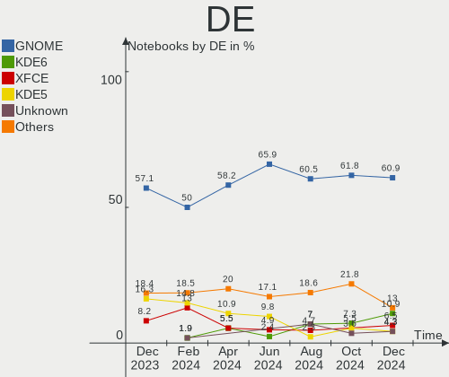
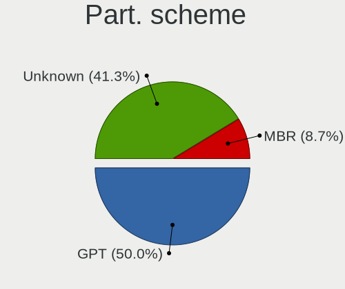
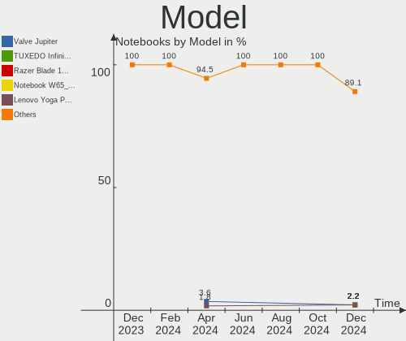
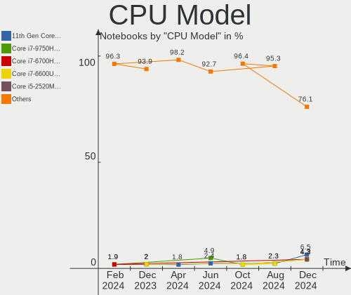
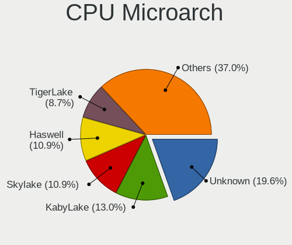
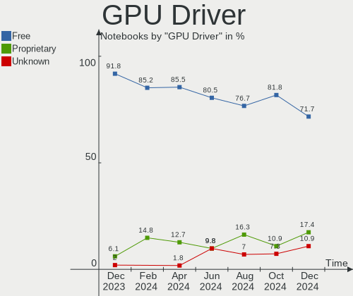
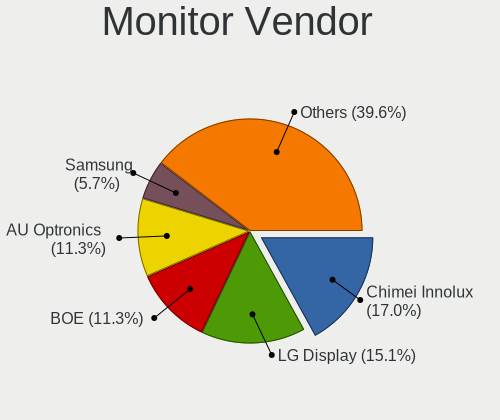
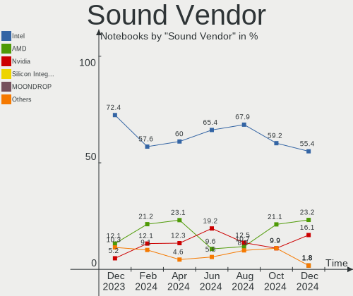

Linux in Netherlands - Hardware Trends (Notebooks)
--------------------------------------------------

A project to identify most popular hardware characteristics and track their change
over time based on data collected by Linux users at https://Linux-Hardware.org.

Anyone can contribute to this report by the [hw-probe](https://github.com/linuxhw/hw-probe) tool:

    sudo -E hw-probe -all -upload

Contents
--------

* [ System ](#system)
  - [ OS                       ](#os)
  - [ OS Family                ](#os-family)
  - [ Kernel                   ](#kernel)
  - [ Kernel Family            ](#kernel-family)
  - [ Kernel Major Ver.        ](#kernel-major-ver)
  - [ Arch                     ](#arch)
  - [ DE                       ](#de)
  - [ Display Server           ](#display-server)
  - [ Display Manager          ](#display-manager)
  - [ OS Lang                  ](#os-lang)
  - [ Boot Mode                ](#boot-mode)
  - [ Filesystem               ](#filesystem)
  - [ Part. scheme             ](#part-scheme)
  - [ Dual Boot with Linux/BSD ](#dual-boot-with-linuxbsd)
  - [ Dual Boot (Win)          ](#dual-boot-win)

* [ Board ](#board)
  - [ Vendor                   ](#vendor)
  - [ Model                    ](#model)
  - [ Model Family             ](#model-family)
  - [ MFG Year                 ](#mfg-year)
  - [ Form Factor              ](#form-factor)
  - [ Secure Boot              ](#secure-boot)
  - [ Coreboot                 ](#coreboot)
  - [ RAM Size                 ](#ram-size)
  - [ RAM Used                 ](#ram-used)
  - [ Total Drives             ](#total-drives)
  - [ Has CD-ROM               ](#has-cd-rom)
  - [ Has Ethernet             ](#has-ethernet)
  - [ Has WiFi                 ](#has-wifi)
  - [ Has Bluetooth            ](#has-bluetooth)

* [ Location ](#location)
  - [ Country                  ](#country)
  - [ City                     ](#city)

* [ Drives ](#drives)
  - [ Drive Vendor             ](#drive-vendor)
  - [ Drive Model              ](#drive-model)
  - [ HDD Vendor               ](#hdd-vendor)
  - [ SSD Vendor               ](#ssd-vendor)
  - [ Drive Kind               ](#drive-kind)
  - [ Drive Connector          ](#drive-connector)
  - [ Drive Size               ](#drive-size)
  - [ Space Total              ](#space-total)
  - [ Space Used               ](#space-used)
  - [ Malfunc. Drives          ](#malfunc-drives)
  - [ Malfunc. Drive Vendor    ](#malfunc-drive-vendor)
  - [ Malfunc. HDD Vendor      ](#malfunc-hdd-vendor)
  - [ Malfunc. Drive Kind      ](#malfunc-drive-kind)
  - [ Failed Drives            ](#failed-drives)
  - [ Failed Drive Vendor      ](#failed-drive-vendor)
  - [ Drive Status             ](#drive-status)

* [ Storage controller ](#storage-controller)
  - [ Storage Vendor           ](#storage-vendor)
  - [ Storage Model            ](#storage-model)
  - [ Storage Kind             ](#storage-kind)

* [ Processor ](#processor)
  - [ CPU Vendor               ](#cpu-vendor)
  - [ CPU Model                ](#cpu-model)
  - [ CPU Model Family         ](#cpu-model-family)
  - [ CPU Cores                ](#cpu-cores)
  - [ CPU Sockets              ](#cpu-sockets)
  - [ CPU Threads              ](#cpu-threads)
  - [ CPU Op-Modes             ](#cpu-op-modes)
  - [ CPU Microcode            ](#cpu-microcode)
  - [ CPU Microarch            ](#cpu-microarch)

* [ Graphics ](#graphics)
  - [ GPU Vendor               ](#gpu-vendor)
  - [ GPU Model                ](#gpu-model)
  - [ GPU Combo                ](#gpu-combo)
  - [ GPU Driver               ](#gpu-driver)
  - [ GPU Memory               ](#gpu-memory)

* [ Monitor ](#monitor)
  - [ Monitor Vendor           ](#monitor-vendor)
  - [ Monitor Model            ](#monitor-model)
  - [ Monitor Resolution       ](#monitor-resolution)
  - [ Monitor Diagonal         ](#monitor-diagonal)
  - [ Monitor Width            ](#monitor-width)
  - [ Aspect Ratio             ](#aspect-ratio)
  - [ Monitor Area             ](#monitor-area)
  - [ Pixel Density            ](#pixel-density)
  - [ Multiple Monitors        ](#multiple-monitors)

* [ Network ](#network)
  - [ Net Controller Vendor    ](#net-controller-vendor)
  - [ Net Controller Model     ](#net-controller-model)
  - [ Wireless Vendor          ](#wireless-vendor)
  - [ Wireless Model           ](#wireless-model)
  - [ Ethernet Vendor          ](#ethernet-vendor)
  - [ Ethernet Model           ](#ethernet-model)
  - [ Net Controller Kind      ](#net-controller-kind)
  - [ Used Controller          ](#used-controller)
  - [ NICs                     ](#nics)
  - [ IPv6                     ](#ipv6)

* [ Bluetooth ](#bluetooth)
  - [ Bluetooth Vendor         ](#bluetooth-vendor)
  - [ Bluetooth Model          ](#bluetooth-model)

* [ Sound ](#sound)
  - [ Sound Vendor             ](#sound-vendor)
  - [ Sound Model              ](#sound-model)

* [ Memory ](#memory)
  - [ Memory Vendor            ](#memory-vendor)
  - [ Memory Model             ](#memory-model)
  - [ Memory Kind              ](#memory-kind)
  - [ Memory Form Factor       ](#memory-form-factor)
  - [ Memory Size              ](#memory-size)
  - [ Memory Speed             ](#memory-speed)

* [ Printers & scanners ](#printers--scanners)
  - [ Printer Vendor           ](#printer-vendor)
  - [ Printer Model            ](#printer-model)
  - [ Scanner Vendor           ](#scanner-vendor)
  - [ Scanner Model            ](#scanner-model)

* [ Camera ](#camera)
  - [ Camera Vendor            ](#camera-vendor)
  - [ Camera Model             ](#camera-model)

* [ Security ](#security)
  - [ Fingerprint Vendor       ](#fingerprint-vendor)
  - [ Fingerprint Model        ](#fingerprint-model)
  - [ Chipcard Vendor          ](#chipcard-vendor)
  - [ Chipcard Model           ](#chipcard-model)

* [ Unsupported ](#unsupported)
  - [ Unsupported Devices      ](#unsupported-devices)
  - [ Unsupported Device Types ](#unsupported-device-types)

System
------

OS
--

Installed operating systems

| Name                         | Notebooks | Percent |
|------------------------------|-----------|---------|
| Linux Mint 20.3              | 8         | 12.31%  |
| Ubuntu 20.04                 | 7         | 10.77%  |
| OpenMandriva 4.3             | 7         | 10.77%  |
| Fedora 35                    | 6         | 9.23%   |
| Zorin 16                     | 3         | 4.62%   |
| Ubuntu 22.04                 | 3         | 4.62%   |
| Debian 11                    | 3         | 4.62%   |
| ArcoLinux Rolling            | 3         | 4.62%   |
| Arch                         | 3         | 4.62%   |
| Manjaro 21.2.6               | 2         | 3.08%   |
| Manjaro 21.2.5               | 2         | 3.08%   |
| Fedora 36                    | 2         | 3.08%   |
| Arch Rolling                 | 2         | 3.08%   |
| Void Linux Rolling           | 1         | 1.54%   |
| Ubuntu 21.10                 | 1         | 1.54%   |
| Ubuntu 21.04                 | 1         | 1.54%   |
| SteamOS Snapshot             | 1         | 1.54%   |
| Pop!_OS 21.10                | 1         | 1.54%   |
| openSUSE Tumbleweed-20220401 | 1         | 1.54%   |
| OpenMandriva 4.2             | 1         | 1.54%   |
| Manjaro                      | 1         | 1.54%   |
| Lubuntu 21.10                | 1         | 1.54%   |
| Kubuntu 21.10                | 1         | 1.54%   |
| GNOME OS Nightly             | 1         | 1.54%   |
| Clear Linux 36150            | 1         | 1.54%   |
| Artix Rolling                | 1         | 1.54%   |
| antiX 21                     | 1         | 1.54%   |

OS Family
---------

OS without a version

| Name         | Notebooks | Percent |
|--------------|-----------|---------|
| Ubuntu       | 12        | 18.46%  |
| OpenMandriva | 8         | 12.31%  |
| Linux Mint   | 8         | 12.31%  |
| Fedora       | 8         | 12.31%  |
| Manjaro      | 5         | 7.69%   |
| Arch         | 5         | 7.69%   |
| Zorin        | 3         | 4.62%   |
| Debian       | 3         | 4.62%   |
| ArcoLinux    | 3         | 4.62%   |
| Void Linux   | 1         | 1.54%   |
| SteamOS      | 1         | 1.54%   |
| Pop!_OS      | 1         | 1.54%   |
| openSUSE     | 1         | 1.54%   |
| Lubuntu      | 1         | 1.54%   |
| Kubuntu      | 1         | 1.54%   |
| GNOME OS     | 1         | 1.54%   |
| Clear Linux  | 1         | 1.54%   |
| Artix        | 1         | 1.54%   |
| antiX        | 1         | 1.54%   |

Kernel
------

Version of the Linux kernel

| Version                                        | Notebooks | Percent |
|------------------------------------------------|-----------|---------|
| 5.13.0-39-generic                              | 10        | 15.38%  |
| 5.16.7-desktop-1omv4003                        | 7         | 10.77%  |
| 5.4.0-107-generic                              | 5         | 7.69%   |
| 5.16.18-200.fc35.x86_64                        | 4         | 6.15%   |
| 5.17.1-arch1-1                                 | 3         | 4.62%   |
| 5.17.4-arch1-1                                 | 2         | 3.08%   |
| 5.17.2-300.fc36.x86_64                         | 2         | 3.08%   |
| 5.17.1-051701-generic                          | 2         | 3.08%   |
| 5.16.14-1-MANJARO                              | 2         | 3.08%   |
| 5.13.0-40-generic                              | 2         | 3.08%   |
| 5.10.109-1-MANJARO                             | 2         | 3.08%   |
| 5.17.4-051704-generic                          | 1         | 1.54%   |
| 5.17.3-arch1-1                                 | 1         | 1.54%   |
| 5.17.2-artix3-1                                | 1         | 1.54%   |
| 5.17.1-zen1-1-zen                              | 1         | 1.54%   |
| 5.17.1-1-default                               | 1         | 1.54%   |
| 5.16.19-76051619-generic                       | 1         | 1.54%   |
| 5.16.19-200.fc35.x86_64                        | 1         | 1.54%   |
| 5.16.16-200.fc35.x86_64                        | 1         | 1.54%   |
| 5.16.13-1132.native                            | 1         | 1.54%   |
| 5.16.11-xanmod0-rog-1                          | 1         | 1.54%   |
| 5.16.0-5-amd64                                 | 1         | 1.54%   |
| 5.16.0-0.bpo.4-amd64                           | 1         | 1.54%   |
| 5.15.32_1                                      | 1         | 1.54%   |
| 5.15.28-1-MANJARO                              | 1         | 1.54%   |
| 5.15.0-27-generic                              | 1         | 1.54%   |
| 5.15.0-25-generic                              | 1         | 1.54%   |
| 5.15.0-23-generic                              | 1         | 1.54%   |
| 5.14.18                                        | 1         | 1.54%   |
| 5.13.0-valve10.1-1-neptune-02144-g7fffaf925dfb | 1         | 1.54%   |
| 5.13.0-19-generic                              | 1         | 1.54%   |
| 5.11.0-49-generic                              | 1         | 1.54%   |
| 5.10.57-antix.1-amd64-smp                      | 1         | 1.54%   |
| 5.10.14-desktop-1omv4002                       | 1         | 1.54%   |
| 5.10.0-11-amd64                                | 1         | 1.54%   |

Kernel Family
-------------

Linux kernel without a distro release

| Version  | Notebooks | Percent |
|----------|-----------|---------|
| 5.13.0   | 14        | 21.54%  |
| 5.17.1   | 7         | 10.77%  |
| 5.16.7   | 7         | 10.77%  |
| 5.4.0    | 5         | 7.69%   |
| 5.16.18  | 4         | 6.15%   |
| 5.17.4   | 3         | 4.62%   |
| 5.17.2   | 3         | 4.62%   |
| 5.15.0   | 3         | 4.62%   |
| 5.16.19  | 2         | 3.08%   |
| 5.16.14  | 2         | 3.08%   |
| 5.16.0   | 2         | 3.08%   |
| 5.10.109 | 2         | 3.08%   |
| 5.17.3   | 1         | 1.54%   |
| 5.16.16  | 1         | 1.54%   |
| 5.16.13  | 1         | 1.54%   |
| 5.16.11  | 1         | 1.54%   |
| 5.15.32  | 1         | 1.54%   |
| 5.15.28  | 1         | 1.54%   |
| 5.14.18  | 1         | 1.54%   |
| 5.11.0   | 1         | 1.54%   |
| 5.10.57  | 1         | 1.54%   |
| 5.10.14  | 1         | 1.54%   |
| 5.10.0   | 1         | 1.54%   |

Kernel Major Ver.
-----------------

Linux kernel major version

| Version | Notebooks | Percent |
|---------|-----------|---------|
| 5.16    | 20        | 30.77%  |
| 5.17    | 14        | 21.54%  |
| 5.13    | 14        | 21.54%  |
| 5.4     | 5         | 7.69%   |
| 5.15    | 5         | 7.69%   |
| 5.10    | 5         | 7.69%   |
| 5.14    | 1         | 1.54%   |
| 5.11    | 1         | 1.54%   |

Arch
----

OS architecture (x86_64, i586, etc.)

| Name   | Notebooks | Percent |
|--------|-----------|---------|
| x86_64 | 65        | 100%    |

DE
--

Desktop Environment

| Name            | Notebooks | Percent |
|-----------------|-----------|---------|
| GNOME           | 25        | 38.46%  |
| KDE5            | 17        | 26.15%  |
| X-Cinnamon      | 8         | 12.31%  |
| XFCE            | 6         | 9.23%   |
| i3              | 2         | 3.08%   |
| Unknown         | 2         | 3.08%   |
| xmonad          | 1         | 1.54%   |
| LXQt            | 1         | 1.54%   |
| icewm           | 1         | 1.54%   |
| GNOME Flashback | 1         | 1.54%   |
| awesome         | 1         | 1.54%   |

Display Server
--------------

X11 or Wayland

| Name    | Notebooks | Percent |
|---------|-----------|---------|
| X11     | 47        | 72.31%  |
| Wayland | 17        | 26.15%  |
| Tty     | 1         | 1.54%   |

Display Manager
---------------

SDDM, LightDM, etc.

| Name    | Notebooks | Percent |
|---------|-----------|---------|
| Unknown | 23        | 35.38%  |
| SDDM    | 13        | 20%     |
| GDM     | 11        | 16.92%  |
| LightDM | 10        | 15.38%  |
| GDM3    | 8         | 12.31%  |

OS Lang
-------

Language

| Lang    | Notebooks | Percent |
|---------|-----------|---------|
| en_US   | 31        | 47.69%  |
| nl_NL   | 23        | 35.38%  |
| en_GB   | 3         | 4.62%   |
| C       | 2         | 3.08%   |
| uk_UA   | 1         | 1.54%   |
| ru_RU   | 1         | 1.54%   |
| pl_PL   | 1         | 1.54%   |
| en_NZ   | 1         | 1.54%   |
| en_DE   | 1         | 1.54%   |
| Unknown | 1         | 1.54%   |

Boot Mode
---------

EFI or BIOS

| Mode | Notebooks | Percent |
|------|-----------|---------|
| EFI  | 39        | 60%     |
| BIOS | 26        | 40%     |

Filesystem
----------

Type of filesystem

| Type    | Notebooks | Percent |
|---------|-----------|---------|
| Ext4    | 43        | 66.15%  |
| Btrfs   | 12        | 18.46%  |
| Overlay | 8         | 12.31%  |
| Xfs     | 1         | 1.54%   |
| F2fs    | 1         | 1.54%   |

Part. scheme
------------

Scheme of partitioning

| Type    | Notebooks | Percent |
|---------|-----------|---------|
| GPT     | 31        | 47.69%  |
| Unknown | 29        | 44.62%  |
| MBR     | 5         | 7.69%   |

Dual Boot with Linux/BSD
------------------------

Hosting more than one Linux/BSD

| Dual boot | Notebooks | Percent |
|-----------|-----------|---------|
| No        | 61        | 93.85%  |
| Yes       | 4         | 6.15%   |

Dual Boot (Win)
---------------

Hosting Linux and Windows

| Dual boot | Notebooks | Percent |
|-----------|-----------|---------|
| No        | 41        | 63.08%  |
| Yes       | 24        | 36.92%  |

Board
-----

Vendor
------

Motherboard manufacturer

| Name             | Notebooks | Percent |
|------------------|-----------|---------|
| Lenovo           | 17        | 26.15%  |
| Dell             | 17        | 26.15%  |
| Hewlett-Packard  | 7         | 10.77%  |
| ASUSTek Computer | 5         | 7.69%   |
| Notebook         | 3         | 4.62%   |
| Packard Bell     | 2         | 3.08%   |
| Valve            | 1         | 1.54%   |
| TUXEDO           | 1         | 1.54%   |
| Toshiba          | 1         | 1.54%   |
| TongFang         | 1         | 1.54%   |
| Timi             | 1         | 1.54%   |
| MSI              | 1         | 1.54%   |
| Medion           | 1         | 1.54%   |
| HUAWEI           | 1         | 1.54%   |
| Google           | 1         | 1.54%   |
| Fujitsu          | 1         | 1.54%   |
| Framework        | 1         | 1.54%   |
| Clevo            | 1         | 1.54%   |
| Chuwi            | 1         | 1.54%   |
| Apple            | 1         | 1.54%   |

Model
-----

Motherboard model

| Name                                  | Notebooks | Percent |
|---------------------------------------|-----------|---------|
| Dell XPS 13 9360                      | 2         | 3.08%   |
| Dell Latitude 3310                    | 2         | 3.08%   |
| Valve Jupiter                         | 1         | 1.54%   |
| TUXEDO Pulse 15 Gen1                  | 1         | 1.54%   |
| Toshiba dynabook Satellite B552/G     | 1         | 1.54%   |
| TongFang GM5TG8W                      | 1         | 1.54%   |
| Timi A35                              | 1         | 1.54%   |
| Packard Bell EasyNote_MX37-U-057NL    | 1         | 1.54%   |
| Packard Bell EasyNote LE69KB          | 1         | 1.54%   |
| Notebook P7xxTM1                      | 1         | 1.54%   |
| Notebook NS50_70MU                    | 1         | 1.54%   |
| Notebook NH55RGQ                      | 1         | 1.54%   |
| MSI CX700                             | 1         | 1.54%   |
| Medion E15303                         | 1         | 1.54%   |
| Lenovo Y310                           | 1         | 1.54%   |
| Lenovo ThinkPad X230 2325YGM          | 1         | 1.54%   |
| Lenovo ThinkPad X1 Extreme 20MFCTO1WW | 1         | 1.54%   |
| Lenovo ThinkPad T480 20L5CTO1WW       | 1         | 1.54%   |
| Lenovo ThinkPad T14 Gen 1 20UD0013MH  | 1         | 1.54%   |
| Lenovo ThinkPad P1 Gen 4i 20Y30010MH  | 1         | 1.54%   |
| Lenovo ThinkPad Edge E531 6885DUG     | 1         | 1.54%   |
| Lenovo Legion 7 16ACHg6 82N6          | 1         | 1.54%   |
| Lenovo Legion 5 15ACH6 82JW           | 1         | 1.54%   |
| Lenovo IdeaPad S510p 20298            | 1         | 1.54%   |
| Lenovo IdeaPad L340-15IRH Gaming 81LK | 1         | 1.54%   |
| Lenovo IdeaPad C340-14API 81N6        | 1         | 1.54%   |
| Lenovo IdeaPad 510-15ISK 80SR         | 1         | 1.54%   |
| Lenovo IdeaPad 5 Pro 14ACN6 82L7      | 1         | 1.54%   |
| Lenovo IdeaPad 330-15IKB 81DC         | 1         | 1.54%   |
| Lenovo IdeaPad 330-15ICH 81FK         | 1         | 1.54%   |
| Lenovo IdeaPad 3 15ALC6 82KU          | 1         | 1.54%   |
| HUAWEI KPL-W0X                        | 1         | 1.54%   |
| HP ProBook 650 G5                     | 1         | 1.54%   |
| HP Pavilion Gaming Laptop 15-dk0xxx   | 1         | 1.54%   |
| HP Pavilion dv7                       | 1         | 1.54%   |
| HP Laptop 14-df0xxx                   | 1         | 1.54%   |
| HP EliteBook 8570w                    | 1         | 1.54%   |
| HP Compaq Presario CQ70               | 1         | 1.54%   |
| HP Compaq 6730b (NN204ET#ABH)         | 1         | 1.54%   |
| Google Kip                            | 1         | 1.54%   |
| Fujitsu CELSIUS H720                  | 1         | 1.54%   |
| Framework Laptop                      | 1         | 1.54%   |
| Dell XPS 15 9560                      | 1         | 1.54%   |
| Dell XPS 13 9370                      | 1         | 1.54%   |
| Dell XPS 13 9333                      | 1         | 1.54%   |
| Dell Precision 3560                   | 1         | 1.54%   |
| Dell Latitude E7250                   | 1         | 1.54%   |
| Dell Latitude E6530                   | 1         | 1.54%   |
| Dell Latitude E6320                   | 1         | 1.54%   |
| Dell Latitude 5580                    | 1         | 1.54%   |
| Dell Latitude 5520                    | 1         | 1.54%   |
| Dell Latitude 3380                    | 1         | 1.54%   |
| Dell Latitude 3190                    | 1         | 1.54%   |
| Dell Latitude 3189                    | 1         | 1.54%   |
| Dell Inspiron 5558                    | 1         | 1.54%   |
| Clevo P770ZM                          | 1         | 1.54%   |
| Chuwi HeroBook Air                    | 1         | 1.54%   |
| ASUS X756UQK                          | 1         | 1.54%   |
| ASUS Strix GL504GW_GL504GW            | 1         | 1.54%   |
| ASUS ROG Zephyrus G15 GA503QS_GA503QS | 1         | 1.54%   |

Model Family
------------

Motherboard model prefix

| Name                  | Notebooks | Percent |
|-----------------------|-----------|---------|
| Dell Latitude         | 10        | 15.38%  |
| Lenovo IdeaPad        | 8         | 12.31%  |
| Lenovo ThinkPad       | 6         | 9.23%   |
| Dell XPS              | 5         | 7.69%   |
| Packard Bell EasyNote | 2         | 3.08%   |
| Lenovo Legion         | 2         | 3.08%   |
| HP Pavilion           | 2         | 3.08%   |
| HP Compaq             | 2         | 3.08%   |
| Valve Jupiter         | 1         | 1.54%   |
| TUXEDO Pulse          | 1         | 1.54%   |
| Toshiba dynabook      | 1         | 1.54%   |
| TongFang GM5TG8W      | 1         | 1.54%   |
| Timi A35              | 1         | 1.54%   |
| Notebook P7xxTM1      | 1         | 1.54%   |
| Notebook NS50         | 1         | 1.54%   |
| Notebook NH55RGQ      | 1         | 1.54%   |
| MSI CX700             | 1         | 1.54%   |
| Medion E15303         | 1         | 1.54%   |
| Lenovo Y310           | 1         | 1.54%   |
| HUAWEI KPL-W0X        | 1         | 1.54%   |
| HP ProBook            | 1         | 1.54%   |
| HP Laptop             | 1         | 1.54%   |
| HP EliteBook          | 1         | 1.54%   |
| Google Kip            | 1         | 1.54%   |
| Fujitsu CELSIUS       | 1         | 1.54%   |
| Framework Laptop      | 1         | 1.54%   |
| Dell Precision        | 1         | 1.54%   |
| Dell Inspiron         | 1         | 1.54%   |
| Clevo P770ZM          | 1         | 1.54%   |
| Chuwi HeroBook        | 1         | 1.54%   |
| ASUS X756UQK          | 1         | 1.54%   |
| ASUS Strix            | 1         | 1.54%   |
| ASUS ROG              | 1         | 1.54%   |
| ASUS N750JV           | 1         | 1.54%   |
| ASUS GX501VIK         | 1         | 1.54%   |
| Apple MacBookPro10    | 1         | 1.54%   |

MFG Year
--------

Motherboard manufacture year

| Year | Notebooks | Percent |
|------|-----------|---------|
| 2021 | 16        | 24.62%  |
| 2019 | 8         | 12.31%  |
| 2018 | 7         | 10.77%  |
| 2012 | 6         | 9.23%   |
| 2017 | 5         | 7.69%   |
| 2013 | 5         | 7.69%   |
| 2016 | 4         | 6.15%   |
| 2015 | 4         | 6.15%   |
| 2008 | 4         | 6.15%   |
| 2020 | 3         | 4.62%   |
| 2022 | 1         | 1.54%   |
| 2011 | 1         | 1.54%   |
| 2009 | 1         | 1.54%   |

Form Factor
-----------

Physical design of the computer

| Name     | Notebooks | Percent |
|----------|-----------|---------|
| Notebook | 65        | 100%    |

Secure Boot
-----------

Enabled or disabled

| State    | Notebooks | Percent |
|----------|-----------|---------|
| Disabled | 59        | 90.77%  |
| Enabled  | 6         | 9.23%   |

Coreboot
--------

Have coreboot on board

| Used | Notebooks | Percent |
|------|-----------|---------|
| No   | 64        | 98.46%  |
| Yes  | 1         | 1.54%   |

RAM Size
--------

Total RAM memory

| Size in GB | Notebooks | Percent |
|------------|-----------|---------|
| 4.01-8.0   | 18        | 27.69%  |
| 16.01-24.0 | 14        | 21.54%  |
| 3.01-4.0   | 13        | 20%     |
| 32.01-64.0 | 10        | 15.38%  |
| 8.01-16.0  | 8         | 12.31%  |
| 24.01-32.0 | 1         | 1.54%   |
| 1.01-2.0   | 1         | 1.54%   |

RAM Used
--------

Used RAM memory

| Used GB    | Notebooks | Percent |
|------------|-----------|---------|
| 1.01-2.0   | 22        | 33.85%  |
| 2.01-3.0   | 18        | 27.69%  |
| 4.01-8.0   | 9         | 13.85%  |
| 3.01-4.0   | 7         | 10.77%  |
| 8.01-16.0  | 4         | 6.15%   |
| 0.51-1.0   | 3         | 4.62%   |
| 24.01-32.0 | 1         | 1.54%   |
| 16.01-24.0 | 1         | 1.54%   |

Total Drives
------------

Number of drives on board

| Drives | Notebooks | Percent |
|--------|-----------|---------|
| 1      | 46        | 70.77%  |
| 2      | 17        | 26.15%  |
| 4      | 1         | 1.54%   |
| 0      | 1         | 1.54%   |

Has CD-ROM
----------

Has CD-ROM on board

| Presented | Notebooks | Percent |
|-----------|-----------|---------|
| No        | 51        | 78.46%  |
| Yes       | 14        | 21.54%  |

Has Ethernet
------------

Has Ethernet on board

| Presented | Notebooks | Percent |
|-----------|-----------|---------|
| Yes       | 48        | 73.85%  |
| No        | 17        | 26.15%  |

Has WiFi
--------

Has WiFi module

| Presented | Notebooks | Percent |
|-----------|-----------|---------|
| Yes       | 65        | 100%    |

Has Bluetooth
-------------

Has Bluetooth module

| Presented | Notebooks | Percent |
|-----------|-----------|---------|
| Yes       | 58        | 89.23%  |
| No        | 7         | 10.77%  |

Location
--------

Country
-------

Geographic location (country)

| Country     | Notebooks | Percent |
|-------------|-----------|---------|
| Netherlands | 65        | 100%    |

City
----

Geographic location (city)

| City                | Notebooks | Percent |
|---------------------|-----------|---------|
| Amsterdam           | 14        | 21.54%  |
| Schagen             | 4         | 6.15%   |
| Rotterdam           | 4         | 6.15%   |
| Schijndel           | 3         | 4.62%   |
| Zoetermeer          | 2         | 3.08%   |
| The Hague           | 2         | 3.08%   |
| Leidschendam        | 2         | 3.08%   |
| Dordrecht           | 2         | 3.08%   |
| Doetinchem          | 2         | 3.08%   |
| Delft               | 2         | 3.08%   |
| Zutphen             | 1         | 1.54%   |
| Wamel               | 1         | 1.54%   |
| Vleuten             | 1         | 1.54%   |
| Soest               | 1         | 1.54%   |
| Rijssen             | 1         | 1.54%   |
| Oudeschoot          | 1         | 1.54%   |
| Oss                 | 1         | 1.54%   |
| Ochten              | 1         | 1.54%   |
| Nijmegen            | 1         | 1.54%   |
| Lutjegast           | 1         | 1.54%   |
| Lelystad            | 1         | 1.54%   |
| Leimuiden           | 1         | 1.54%   |
| Leiderdorp          | 1         | 1.54%   |
| Leersum             | 1         | 1.54%   |
| Hoorn               | 1         | 1.54%   |
| Gorssel             | 1         | 1.54%   |
| Eindhoven           | 1         | 1.54%   |
| Ede                 | 1         | 1.54%   |
| Dronten             | 1         | 1.54%   |
| Dieren              | 1         | 1.54%   |
| Diemen              | 1         | 1.54%   |
| Deventer            | 1         | 1.54%   |
| Best                | 1         | 1.54%   |
| Barendrecht         | 1         | 1.54%   |
| Apeldoorn           | 1         | 1.54%   |
| Amersfoort          | 1         | 1.54%   |
| Alphen aan den Rijn | 1         | 1.54%   |
| Almelo              | 1         | 1.54%   |

Drives
------

Drive Vendor
------------

Hard drive vendors

| Vendor              | Notebooks | Drives | Percent |
|---------------------|-----------|--------|---------|
| Samsung Electronics | 20        | 24     | 25.32%  |
| SK Hynix            | 12        | 13     | 15.19%  |
| WDC                 | 8         | 8      | 10.13%  |
| Seagate             | 5         | 5      | 6.33%   |
| Kingston            | 5         | 5      | 6.33%   |
| Crucial             | 4         | 4      | 5.06%   |
| Unknown             | 3         | 3      | 3.8%    |
| SanDisk             | 3         | 3      | 3.8%    |
| Toshiba             | 2         | 2      | 2.53%   |
| Intel               | 2         | 2      | 2.53%   |
| HGST                | 2         | 2      | 2.53%   |
| ASMT                | 2         | 2      | 2.53%   |
| StoreJet            | 1         | 1      | 1.27%   |
| Phison              | 1         | 1      | 1.27%   |
| Netac               | 1         | 1      | 1.27%   |
| Micron Technology   | 1         | 1      | 1.27%   |
| LITEONIT            | 1         | 1      | 1.27%   |
| LITEON              | 1         | 1      | 1.27%   |
| KIOXIA              | 1         | 1      | 1.27%   |
| ICY BOX             | 1         | 1      | 1.27%   |
| Biwin               | 1         | 1      | 1.27%   |
| Apple               | 1         | 1      | 1.27%   |
| Unknown             | 1         | 1      | 1.27%   |

Drive Model
-----------

Hard drive models

| Model                                   | Notebooks | Percent |
|-----------------------------------------|-----------|---------|
| SK Hynix NVMe SSD Drive 512GB           | 3         | 3.61%   |
| WDC WDS500G2B0A-00SM50 500GB SSD        | 2         | 2.41%   |
| SK Hynix SC311 SATA 256GB SSD           | 2         | 2.41%   |
| Samsung SSD 970 EVO Plus 1TB            | 2         | 2.41%   |
| Samsung SSD 970 EVO 1TB                 | 2         | 2.41%   |
| Samsung SSD 860 EVO M.2 500GB           | 2         | 2.41%   |
| Samsung NVMe SSD Drive 500GB            | 2         | 2.41%   |
| Kingston SV300S37A120G 120GB SSD        | 2         | 2.41%   |
| ASMT 2115 1TB                           | 2         | 2.41%   |
| WDC WDS240G2G0A-00JH30 240GB SSD        | 1         | 1.2%    |
| WDC WDS200T1X0E-00AFY0 2TB              | 1         | 1.2%    |
| WDC WD3200LPLX-75ZNTT0 320GB            | 1         | 1.2%    |
| WDC WD3200BPVT-22JJ5T0 320GB            | 1         | 1.2%    |
| WDC WD3200BEVT-22ZCT0 320GB             | 1         | 1.2%    |
| WDC WD10JPVX-75JC3T0 1TB                | 1         | 1.2%    |
| Unknown MMC Card  64GB                  | 1         | 1.2%    |
| Unknown HAG2e  16GB                     | 1         | 1.2%    |
| Unknown ASTC  16GB                      | 1         | 1.2%    |
| Toshiba MQ02ABF100 1TB                  | 1         | 1.2%    |
| Toshiba KXG50ZNV1T02 NVMe 1024GB        | 1         | 1.2%    |
| StoreJet Transcend 480GB SSD            | 1         | 1.2%    |
| SK Hynix SC308 SATA 128GB SSD           | 1         | 1.2%    |
| SK Hynix PC401 NVMe 256GB               | 1         | 1.2%    |
| SK Hynix PC300 NVMe 512GB               | 1         | 1.2%    |
| SK Hynix NVMe SSD Drive 1024GB          | 1         | 1.2%    |
| SK Hynix HFS256GD9TNG-62A0A 256GB       | 1         | 1.2%    |
| SK Hynix HFS128G3BMND-3210A 128GB SSD   | 1         | 1.2%    |
| SK Hynix HFS128G39TND-N210A 128GB SSD   | 1         | 1.2%    |
| SK Hynix BC511 HFM256GDJTNI-82A0A 256GB | 1         | 1.2%    |
| Seagate ST9250410AS 250GB               | 1         | 1.2%    |
| Seagate ST1000LX015-1U7172 1TB          | 1         | 1.2%    |
| Seagate ST1000LM049-2GH172 1TB          | 1         | 1.2%    |
| Seagate ST1000LM048-2E7172 1TB          | 1         | 1.2%    |
| Seagate Expansion+ 2TB                  | 1         | 1.2%    |
| SanDisk SD9SN8W256G1027 256GB SSD       | 1         | 1.2%    |
| SanDisk SD9SN8W128G 128GB SSD           | 1         | 1.2%    |
| Sandisk NVMe SSD Drive 256GB            | 1         | 1.2%    |
| Samsung SSD 980 PRO 500GB               | 1         | 1.2%    |
| Samsung SSD 980 1TB                     | 1         | 1.2%    |
| Samsung SSD 970 EVO 500GB               | 1         | 1.2%    |
| Samsung SSD 870 EVO 500GB               | 1         | 1.2%    |
| Samsung SSD 860 EVO 1TB                 | 1         | 1.2%    |
| Samsung SSD 850 EVO mSATA 250GB         | 1         | 1.2%    |
| Samsung SSD 850 EVO 250GB               | 1         | 1.2%    |
| Samsung PM991a NVMe 256GB               | 1         | 1.2%    |
| Samsung NVMe SSD Drive 1024GB           | 1         | 1.2%    |
| Samsung MZVLB512HBJQ-000L7 512GB        | 1         | 1.2%    |
| Samsung MZVLB1T0HBLR-000L2 1TB          | 1         | 1.2%    |
| Samsung MZVL21T0HCLR-00BL7 1TB          | 1         | 1.2%    |
| Samsung MZVKW512HMJP-00000 512GB        | 1         | 1.2%    |
| Samsung MZHPV512HDGL-00000 512GB SSD    | 1         | 1.2%    |
| Samsung MZALQ256HBJD-00BL2 256GB        | 1         | 1.2%    |
| Phison NVMe SSD Drive 512GB             | 1         | 1.2%    |
| Netac SSD 128GB                         | 1         | 1.2%    |
| Micron 5100_MTFDDAK1T9TBY 2TB SSD       | 1         | 1.2%    |
| LITEONIT LCS-128M6S 2.5 7mm 128GB SSD   | 1         | 1.2%    |
| LITEON CL1-4D128 128GB                  | 1         | 1.2%    |
| KIOXIA KBG40ZNS512G NVMe 512GB          | 1         | 1.2%    |
| Kingston SV100S2256G 256GB SSD          | 1         | 1.2%    |
| Kingston SNVS1000G 1TB                  | 1         | 1.2%    |

HDD Vendor
----------

Hard disk drive vendors

| Vendor  | Notebooks | Drives | Percent |
|---------|-----------|--------|---------|
| Seagate | 5         | 5      | 35.71%  |
| WDC     | 4         | 4      | 28.57%  |
| HGST    | 2         | 2      | 14.29%  |
| ASMT    | 2         | 2      | 14.29%  |
| Toshiba | 1         | 1      | 7.14%   |

SSD Vendor
----------

Solid state drive vendors

| Vendor              | Notebooks | Drives | Percent |
|---------------------|-----------|--------|---------|
| Samsung Electronics | 7         | 7      | 22.58%  |
| SK Hynix            | 5         | 5      | 16.13%  |
| Kingston            | 4         | 4      | 12.9%   |
| Crucial             | 4         | 4      | 12.9%   |
| WDC                 | 3         | 3      | 9.68%   |
| SanDisk             | 2         | 2      | 6.45%   |
| StoreJet            | 1         | 1      | 3.23%   |
| Netac               | 1         | 1      | 3.23%   |
| Micron Technology   | 1         | 1      | 3.23%   |
| LITEONIT            | 1         | 1      | 3.23%   |
| Intel               | 1         | 1      | 3.23%   |
| Apple               | 1         | 1      | 3.23%   |

Drive Kind
----------

HDD or SSD

| Kind    | Notebooks | Drives | Percent |
|---------|-----------|--------|---------|
| SSD     | 31        | 31     | 39.74%  |
| NVMe    | 29        | 34     | 37.18%  |
| HDD     | 13        | 14     | 16.67%  |
| MMC     | 4         | 4      | 5.13%   |
| Unknown | 1         | 1      | 1.28%   |

Drive Connector
---------------

SATA, SAS, NVMe, etc.

| Type | Notebooks | Drives | Percent |
|------|-----------|--------|---------|
| SATA | 37        | 41     | 49.33%  |
| NVMe | 29        | 34     | 38.67%  |
| SAS  | 5         | 5      | 6.67%   |
| MMC  | 4         | 4      | 5.33%   |

Drive Size
----------

Size of hard drive

| Size in TB | Notebooks | Drives | Percent |
|------------|-----------|--------|---------|
| 0.01-0.5   | 31        | 31     | 68.89%  |
| 0.51-1.0   | 11        | 11     | 24.44%  |
| 1.01-2.0   | 3         | 3      | 6.67%   |

Space Total
-----------

Amount of disk space available on the file system

| Size in GB     | Notebooks | Percent |
|----------------|-----------|---------|
| 251-500        | 15        | 23.08%  |
| 101-250        | 15        | 23.08%  |
| 501-1000       | 9         | 13.85%  |
| 1001-2000      | 8         | 12.31%  |
| 1-20           | 8         | 12.31%  |
| Unknown        | 3         | 4.62%   |
| More than 3000 | 2         | 3.08%   |
| 21-50          | 2         | 3.08%   |
| 51-100         | 2         | 3.08%   |
| 2001-3000      | 1         | 1.54%   |

Space Used
----------

Amount of used disk space

| Used GB   | Notebooks | Percent |
|-----------|-----------|---------|
| 1-20      | 22        | 33.85%  |
| 21-50     | 9         | 13.85%  |
| 51-100    | 9         | 13.85%  |
| 101-250   | 8         | 12.31%  |
| 501-1000  | 8         | 12.31%  |
| 251-500   | 3         | 4.62%   |
| 1001-2000 | 3         | 4.62%   |
| Unknown   | 3         | 4.62%   |

Malfunc. Drives
---------------

Drive models with a malfunction

| Model                                        | Notebooks | Drives | Percent |
|----------------------------------------------|-----------|--------|---------|
| Seagate ST9250410AS 250GB                    | 1         | 1      | 25%     |
| Micron Technology 5100_MTFDDAK1T9TBY 2TB SSD | 1         | 1      | 25%     |
| Intel SSDSCKKF128G8 SATA 128GB               | 1         | 1      | 25%     |
| HGST HTS545050A7E380 500GB                   | 1         | 1      | 25%     |

Malfunc. Drive Vendor
---------------------

Vendors of faulty drives

| Vendor            | Notebooks | Drives | Percent |
|-------------------|-----------|--------|---------|
| Seagate           | 1         | 1      | 25%     |
| Micron Technology | 1         | 1      | 25%     |
| Intel             | 1         | 1      | 25%     |
| HGST              | 1         | 1      | 25%     |

Malfunc. HDD Vendor
-------------------

Vendors of faulty HDD drives

| Vendor  | Notebooks | Drives | Percent |
|---------|-----------|--------|---------|
| Seagate | 1         | 1      | 50%     |
| HGST    | 1         | 1      | 50%     |

Malfunc. Drive Kind
-------------------

Kinds of faulty drives

| Kind | Notebooks | Drives | Percent |
|------|-----------|--------|---------|
| SSD  | 2         | 2      | 50%     |
| HDD  | 2         | 2      | 50%     |

Failed Drives
-------------

Failed drive models

Zero info for selected period =(

Failed Drive Vendor
-------------------

Failed drive vendors

Zero info for selected period =(

Drive Status
------------

Number of failed and malfunc. drives

| Status   | Notebooks | Drives | Percent |
|----------|-----------|--------|---------|
| Detected | 36        | 44     | 51.43%  |
| Works    | 30        | 36     | 42.86%  |
| Malfunc  | 4         | 4      | 5.71%   |

Storage controller
------------------

Storage Vendor
--------------

Storage controller vendors

| Vendor                           | Notebooks | Percent |
|----------------------------------|-----------|---------|
| Intel                            | 41        | 53.25%  |
| Samsung Electronics              | 14        | 18.18%  |
| SK Hynix                         | 7         | 9.09%   |
| AMD                              | 6         | 7.79%   |
| Sandisk                          | 2         | 2.6%    |
| Toshiba America Info Systems     | 1         | 1.3%    |
| Silicon Integrated Systems [SiS] | 1         | 1.3%    |
| Phison Electronics               | 1         | 1.3%    |
| Lite-On Technology               | 1         | 1.3%    |
| KIOXIA                           | 1         | 1.3%    |
| Kingston Technology Company      | 1         | 1.3%    |
| Biwin Storage Technology         | 1         | 1.3%    |

Storage Model
-------------

Storage controller models

| Model                                                                            | Notebooks | Percent |
|----------------------------------------------------------------------------------|-----------|---------|
| Intel 7 Series Chipset Family 6-port SATA Controller [AHCI mode]                 | 8         | 10.13%  |
| Samsung NVMe SSD Controller SM981/PM981/PM983                                    | 7         | 8.86%   |
| Intel 82801 Mobile SATA Controller [RAID mode]                                   | 6         | 7.59%   |
| AMD FCH SATA Controller [AHCI mode]                                              | 6         | 7.59%   |
| Intel Sunrise Point-LP SATA Controller [AHCI mode]                               | 5         | 6.33%   |
| Intel Cannon Lake Mobile PCH SATA AHCI Controller                                | 4         | 5.06%   |
| Samsung NVMe SSD Controller 980                                                  | 3         | 3.8%    |
| SK Hynix PC401 NVMe Solid State Drive 256GB                                      | 2         | 2.53%   |
| SK Hynix Gold P31 SSD                                                            | 2         | 2.53%   |
| Samsung NVMe SSD Controller PM9A1/PM9A3/980PRO                                   | 2         | 2.53%   |
| Intel Celeron/Pentium Silver Processor SATA Controller                           | 2         | 2.53%   |
| Intel 8 Series SATA Controller 1 [AHCI mode]                                     | 2         | 2.53%   |
| Toshiba America Info Systems Toshiba America Info Non-Volatile memory controller | 1         | 1.27%   |
| SK Hynix PC300 NVMe Solid State Drive 512GB                                      | 1         | 1.27%   |
| SK Hynix Non-Volatile memory controller                                          | 1         | 1.27%   |
| SK Hynix BC511                                                                   | 1         | 1.27%   |
| Silicon Integrated Systems [SiS] SATA Controller / IDE mode                      | 1         | 1.27%   |
| Silicon Integrated Systems [SiS] 5513 IDE Controller                             | 1         | 1.27%   |
| Sandisk WD PC SN810 / Black SN850 NVMe SSD                                       | 1         | 1.27%   |
| Sandisk WD Blue SN500 / PC SN520 NVMe SSD                                        | 1         | 1.27%   |
| Samsung NVMe SSD Controller SM961/PM961/SM963                                    | 1         | 1.27%   |
| Samsung Electronics SATA controller                                              | 1         | 1.27%   |
| Phison PS5013 E13 NVMe Controller                                                | 1         | 1.27%   |
| Lite-On NVMe Controller                                                          | 1         | 1.27%   |
| KIOXIA Non-Volatile memory controller                                            | 1         | 1.27%   |
| Kingston Company Company Non-Volatile memory controller                          | 1         | 1.27%   |
| Intel Wildcat Point-LP SATA Controller [AHCI Mode]                               | 1         | 1.27%   |
| Intel Volume Management Device NVMe RAID Controller                              | 1         | 1.27%   |
| Intel Tiger Lake-LP SATA Controller [AHCI mode]                                  | 1         | 1.27%   |
| Intel SSD 660P Series                                                            | 1         | 1.27%   |
| Intel HM170/QM170 Chipset SATA Controller [AHCI Mode]                            | 1         | 1.27%   |
| Intel Celeron N3350/Pentium N4200/Atom E3900 Series SATA AHCI Controller         | 1         | 1.27%   |
| Intel Cannon Point-LP SATA Controller [AHCI Mode]                                | 1         | 1.27%   |
| Intel 9 Series Chipset Family SATA Controller [AHCI Mode]                        | 1         | 1.27%   |
| Intel 82801IBM/IEM (ICH9M/ICH9M-E) 4 port SATA Controller [AHCI mode]            | 1         | 1.27%   |
| Intel 82801IBM/IEM (ICH9M/ICH9M-E) 2 port SATA Controller [IDE mode]             | 1         | 1.27%   |
| Intel 82801HM/HEM (ICH8M/ICH8M-E) SATA Controller [IDE mode]                     | 1         | 1.27%   |
| Intel 8 Series/C220 Series Chipset Family 6-port SATA Controller 1 [AHCI mode]   | 1         | 1.27%   |
| Intel 6 Series/C200 Series Chipset Family 6 port Mobile SATA AHCI Controller     | 1         | 1.27%   |
| Intel 500 Series Chipset Family SATA AHCI Controller                             | 1         | 1.27%   |
| Intel 200 Series PCH SATA controller [AHCI mode]                                 | 1         | 1.27%   |
| Biwin Storage Non-Volatile memory controller                                     | 1         | 1.27%   |

Storage Kind
------------

Kind of storage controller (IDE, SATA, NVMe, SAS, ...)

| Kind | Notebooks | Percent |
|------|-----------|---------|
| SATA | 38        | 49.35%  |
| NVMe | 29        | 37.66%  |
| RAID | 7         | 9.09%   |
| IDE  | 3         | 3.9%    |

Processor
---------

CPU Vendor
----------

Processor vendors

| Vendor | Notebooks | Percent |
|--------|-----------|---------|
| Intel  | 53        | 81.54%  |
| AMD    | 12        | 18.46%  |

CPU Model
---------

Processor models

| Model                                         | Notebooks | Percent |
|-----------------------------------------------|-----------|---------|
| Intel 11th Gen Core i5-1135G7 @ 2.40GHz       | 3         | 4.62%   |
| Intel Core i7-9750H CPU @ 2.60GHz             | 2         | 3.08%   |
| Intel Core i7-7700HQ CPU @ 2.80GHz            | 2         | 3.08%   |
| Intel Core i7-7500U CPU @ 2.70GHz             | 2         | 3.08%   |
| Intel Core i3-7100U CPU @ 2.40GHz             | 2         | 3.08%   |
| Intel Core i3-3110M CPU @ 2.40GHz             | 2         | 3.08%   |
| AMD Ryzen 7 5800H with Radeon Graphics        | 2         | 3.08%   |
| Intel Pentium Silver N5000 CPU @ 1.10GHz      | 1         | 1.54%   |
| Intel Pentium Dual CPU T2390 @ 1.86GHz        | 1         | 1.54%   |
| Intel Pentium Dual CPU T2370 @ 1.73GHz        | 1         | 1.54%   |
| Intel Pentium CPU N4200 @ 1.10GHz             | 1         | 1.54%   |
| Intel Genuine CPU T1600 @ 1.66GHz             | 1         | 1.54%   |
| Intel Core i7-8850H CPU @ 2.60GHz             | 1         | 1.54%   |
| Intel Core i7-8750H CPU @ 2.20GHz             | 1         | 1.54%   |
| Intel Core i7-8700K CPU @ 3.70GHz             | 1         | 1.54%   |
| Intel Core i7-5500U CPU @ 2.40GHz             | 1         | 1.54%   |
| Intel Core i7-4790K CPU @ 4.00GHz             | 1         | 1.54%   |
| Intel Core i7-4700HQ CPU @ 2.40GHz            | 1         | 1.54%   |
| Intel Core i7-4500U CPU @ 1.80GHz             | 1         | 1.54%   |
| Intel Core i7-3820QM CPU @ 2.70GHz            | 1         | 1.54%   |
| Intel Core i7-3630QM CPU @ 2.40GHz            | 1         | 1.54%   |
| Intel Core i7-3540M CPU @ 3.00GHz             | 1         | 1.54%   |
| Intel Core i7-3520M CPU @ 2.90GHz             | 1         | 1.54%   |
| Intel Core i5-9300HF CPU @ 2.40GHz            | 1         | 1.54%   |
| Intel Core i5-8365U CPU @ 1.60GHz             | 1         | 1.54%   |
| Intel Core i5-8350U CPU @ 1.70GHz             | 1         | 1.54%   |
| Intel Core i5-8300H CPU @ 2.30GHz             | 1         | 1.54%   |
| Intel Core i5-8265U CPU @ 1.60GHz             | 1         | 1.54%   |
| Intel Core i5-8250U CPU @ 1.60GHz             | 1         | 1.54%   |
| Intel Core i5-7200U CPU @ 2.50GHz             | 1         | 1.54%   |
| Intel Core i5-6300U CPU @ 2.40GHz             | 1         | 1.54%   |
| Intel Core i5-6200U CPU @ 2.30GHz             | 1         | 1.54%   |
| Intel Core i5-5300U CPU @ 2.30GHz             | 1         | 1.54%   |
| Intel Core i5-4200U CPU @ 1.60GHz             | 1         | 1.54%   |
| Intel Core i5-3320M CPU @ 2.60GHz             | 1         | 1.54%   |
| Intel Core i5-3210M CPU @ 2.50GHz             | 1         | 1.54%   |
| Intel Core i5-2520M CPU @ 2.50GHz             | 1         | 1.54%   |
| Intel Core i5-2410M CPU @ 2.30GHz             | 1         | 1.54%   |
| Intel Core i3-8145U CPU @ 2.10GHz             | 1         | 1.54%   |
| Intel Core i3-6006U CPU @ 2.00GHz             | 1         | 1.54%   |
| Intel Core 2 Duo CPU P8700 @ 2.53GHz          | 1         | 1.54%   |
| Intel Celeron N4020 CPU @ 1.10GHz             | 1         | 1.54%   |
| Intel Celeron CPU N2840 @ 2.16GHz             | 1         | 1.54%   |
| Intel 11th Gen Core i7-1185G7 @ 3.00GHz       | 1         | 1.54%   |
| Intel 11th Gen Core i7-11850H @ 2.50GHz       | 1         | 1.54%   |
| Intel 11th Gen Core i7-11800H @ 2.30GHz       | 1         | 1.54%   |
| Intel 11th Gen Core i5-11300H @ 3.10GHz       | 1         | 1.54%   |
| AMD Ryzen 9 5900HS with Radeon Graphics       | 1         | 1.54%   |
| AMD Ryzen 7 PRO 4750U with Radeon Graphics    | 1         | 1.54%   |
| AMD Ryzen 7 5800U with Radeon Graphics        | 1         | 1.54%   |
| AMD Ryzen 7 4800H with Radeon Graphics        | 1         | 1.54%   |
| AMD Ryzen 5 5500U with Radeon Graphics        | 1         | 1.54%   |
| AMD Ryzen 5 4500U with Radeon Graphics        | 1         | 1.54%   |
| AMD Ryzen 5 3500U with Radeon Vega Mobile Gfx | 1         | 1.54%   |
| AMD Ryzen 5 2500U with Radeon Vega Mobile Gfx | 1         | 1.54%   |
| AMD E2-3800 APU with Radeon HD Graphics       | 1         | 1.54%   |
| AMD Custom APU 0405                           | 1         | 1.54%   |

CPU Model Family
----------------

Processor model prefix

| Model                | Notebooks | Percent |
|----------------------|-----------|---------|
| Intel Core i7        | 17        | 26.15%  |
| Intel Core i5        | 15        | 23.08%  |
| Other                | 8         | 12.31%  |
| Intel Core i3        | 6         | 9.23%   |
| AMD Ryzen 7          | 4         | 6.15%   |
| AMD Ryzen 5          | 4         | 6.15%   |
| Intel Pentium Dual   | 2         | 3.08%   |
| Intel Celeron        | 2         | 3.08%   |
| Intel Pentium Silver | 1         | 1.54%   |
| Intel Pentium        | 1         | 1.54%   |
| Intel Genuine        | 1         | 1.54%   |
| Intel Core 2 Duo     | 1         | 1.54%   |
| AMD Ryzen 9          | 1         | 1.54%   |
| AMD Ryzen 7 PRO      | 1         | 1.54%   |
| AMD E2               | 1         | 1.54%   |

CPU Cores
---------

Number of processor cores

| Number | Notebooks | Percent |
|--------|-----------|---------|
| 2      | 27        | 41.54%  |
| 4      | 23        | 35.38%  |
| 8      | 8         | 12.31%  |
| 6      | 7         | 10.77%  |

CPU Sockets
-----------

Number of sockets

| Number | Notebooks | Percent |
|--------|-----------|---------|
| 1      | 65        | 100%    |

CPU Threads
-----------

Threads per core (Hyper-Threading)

| Number | Notebooks | Percent |
|--------|-----------|---------|
| 2      | 54        | 83.08%  |
| 1      | 11        | 16.92%  |

CPU Op-Modes
------------

CPU Operation Modes (32-bit, 64-bit)

| Op mode        | Notebooks | Percent |
|----------------|-----------|---------|
| 32-bit, 64-bit | 65        | 100%    |

CPU Microcode
-------------

Microcode number

| Number     | Notebooks | Percent |
|------------|-----------|---------|
| Unknown    | 19        | 29.23%  |
| 0x306a9    | 6         | 9.23%   |
| 0x806e9    | 5         | 7.69%   |
| 0x806c1    | 5         | 7.69%   |
| 0x906ea    | 4         | 6.15%   |
| 0x806ec    | 3         | 4.62%   |
| 0x6fd      | 3         | 4.62%   |
| 0x206a7    | 2         | 3.08%   |
| 0x906e9    | 1         | 1.54%   |
| 0x806ea    | 1         | 1.54%   |
| 0x806d1    | 1         | 1.54%   |
| 0x706a8    | 1         | 1.54%   |
| 0x706a1    | 1         | 1.54%   |
| 0x506c9    | 1         | 1.54%   |
| 0x406e3    | 1         | 1.54%   |
| 0x40651    | 1         | 1.54%   |
| 0x306c3    | 1         | 1.54%   |
| 0x30678    | 1         | 1.54%   |
| 0x1067a    | 1         | 1.54%   |
| 0x0a50000c | 1         | 1.54%   |
| 0x08608102 | 1         | 1.54%   |
| 0x08600106 | 1         | 1.54%   |
| 0x08600103 | 1         | 1.54%   |
| 0x08108109 | 1         | 1.54%   |
| 0x08101007 | 1         | 1.54%   |
| 0x0700010f | 1         | 1.54%   |

CPU Microarch
-------------

Microarchitecture

| Name          | Notebooks | Percent |
|---------------|-----------|---------|
| KabyLake      | 19        | 29.23%  |
| IvyBridge     | 8         | 12.31%  |
| TigerLake     | 5         | 7.69%   |
| Zen 3         | 4         | 6.15%   |
| Haswell       | 4         | 6.15%   |
| Unknown       | 4         | 6.15%   |
| Zen 2         | 3         | 4.62%   |
| Skylake       | 3         | 4.62%   |
| Core          | 3         | 4.62%   |
| SandyBridge   | 2         | 3.08%   |
| Goldmont plus | 2         | 3.08%   |
| Broadwell     | 2         | 3.08%   |
| Zen+          | 1         | 1.54%   |
| Zen           | 1         | 1.54%   |
| Silvermont    | 1         | 1.54%   |
| Penryn        | 1         | 1.54%   |
| Jaguar        | 1         | 1.54%   |
| Goldmont      | 1         | 1.54%   |

Graphics
--------

GPU Vendor
----------

Vendors of graphics cards

| Vendor                           | Notebooks | Percent |
|----------------------------------|-----------|---------|
| Intel                            | 45        | 54.22%  |
| Nvidia                           | 24        | 28.92%  |
| AMD                              | 13        | 15.66%  |
| Silicon Integrated Systems [SiS] | 1         | 1.2%    |

GPU Model
---------

Graphics card models

| Model                                                                              | Notebooks | Percent |
|------------------------------------------------------------------------------------|-----------|---------|
| Intel 3rd Gen Core processor Graphics Controller                                   | 6         | 7.14%   |
| Intel TigerLake-LP GT2 [Iris Xe Graphics]                                          | 5         | 5.95%   |
| Intel HD Graphics 620                                                              | 5         | 5.95%   |
| Intel CoffeeLake-H GT2 [UHD Graphics 630]                                          | 5         | 5.95%   |
| AMD Cezanne                                                                        | 4         | 4.76%   |
| Intel WhiskeyLake-U GT2 [UHD Graphics 620]                                         | 3         | 3.57%   |
| Intel Skylake GT2 [HD Graphics 520]                                                | 3         | 3.57%   |
| AMD Renoir                                                                         | 3         | 3.57%   |
| Nvidia GP107M [GeForce GTX 1050 Mobile]                                            | 2         | 2.38%   |
| Nvidia GK107GLM [Quadro K1000M]                                                    | 2         | 2.38%   |
| Nvidia GA104M [GeForce RTX 3080 Mobile / Max-Q 8GB/16GB]                           | 2         | 2.38%   |
| Intel UHD Graphics 620                                                             | 2         | 2.38%   |
| Intel Mobile 4 Series Chipset Integrated Graphics Controller                       | 2         | 2.38%   |
| Intel HD Graphics 5500                                                             | 2         | 2.38%   |
| Intel Haswell-ULT Integrated Graphics Controller                                   | 2         | 2.38%   |
| Intel 2nd Generation Core Processor Family Integrated Graphics Controller          | 2         | 2.38%   |
| Silicon Integrated Systems [SiS] 771/671 PCIE VGA Display Adapter                  | 1         | 1.19%   |
| Nvidia TU117GLM [Quadro T500 Mobile]                                               | 1         | 1.19%   |
| Nvidia TU106M [GeForce RTX 2070 Mobile]                                            | 1         | 1.19%   |
| Nvidia GP108M [GeForce MX250]                                                      | 1         | 1.19%   |
| Nvidia GP107M [GeForce GTX 1050 Ti Mobile]                                         | 1         | 1.19%   |
| Nvidia GP107M [GeForce GTX 1050 3 GB Max-Q]                                        | 1         | 1.19%   |
| Nvidia GP104BM [GeForce GTX 1080 Mobile]                                           | 1         | 1.19%   |
| Nvidia GP104BM [GeForce GTX 1070 Mobile]                                           | 1         | 1.19%   |
| Nvidia GM204M [GeForce GTX 980M]                                                   | 1         | 1.19%   |
| Nvidia GM108M [GeForce 940MX]                                                      | 1         | 1.19%   |
| Nvidia GM107 [GeForce 940MX]                                                       | 1         | 1.19%   |
| Nvidia GK208M [GeForce GT 740M]                                                    | 1         | 1.19%   |
| Nvidia GK107M [GeForce GT 750M]                                                    | 1         | 1.19%   |
| Nvidia GK107M [GeForce GT 650M Mac Edition]                                        | 1         | 1.19%   |
| Nvidia GK107M [GeForce GT 640M]                                                    | 1         | 1.19%   |
| Nvidia GF108GLM [NVS 5200M]                                                        | 1         | 1.19%   |
| Nvidia GA107GLM [RTX A2000 Mobile]                                                 | 1         | 1.19%   |
| Nvidia GA107BM [GeForce RTX 3050 Ti Mobile]                                        | 1         | 1.19%   |
| Nvidia GA106M [GeForce RTX 3060 Mobile / Max-Q]                                    | 1         | 1.19%   |
| Intel TigerLake-H GT1 [UHD Graphics]                                               | 1         | 1.19%   |
| Intel Mobile GM965/GL960 Integrated Graphics Controller (secondary)                | 1         | 1.19%   |
| Intel Mobile GM965/GL960 Integrated Graphics Controller (primary)                  | 1         | 1.19%   |
| Intel HD Graphics 630                                                              | 1         | 1.19%   |
| Intel GeminiLake [UHD Graphics 605]                                                | 1         | 1.19%   |
| Intel GeminiLake [UHD Graphics 600]                                                | 1         | 1.19%   |
| Intel Celeron N3350/Pentium N4200/Atom E3900 Series Integrated Graphics Controller | 1         | 1.19%   |
| Intel Atom Processor Z36xxx/Z37xxx Series Graphics & Display                       | 1         | 1.19%   |
| Intel 4th Gen Core Processor Integrated Graphics Controller                        | 1         | 1.19%   |
| AMD VanGogh [AMD Custom GPU 0405]                                                  | 1         | 1.19%   |
| AMD Seymour [Radeon HD 6400M/7400M Series]                                         | 1         | 1.19%   |
| AMD Raven Ridge [Radeon Vega Series / Radeon Vega Mobile Series]                   | 1         | 1.19%   |
| AMD Picasso/Raven 2 [Radeon Vega Series / Radeon Vega Mobile Series]               | 1         | 1.19%   |
| AMD Lucienne                                                                       | 1         | 1.19%   |
| AMD Kabini [Radeon HD 8280 / R3 Series]                                            | 1         | 1.19%   |

GPU Combo
---------

Combinations of graphics cards

| Name           | Notebooks | Percent |
|----------------|-----------|---------|
| 1 x Intel      | 30        | 46.15%  |
| Intel + Nvidia | 14        | 21.54%  |
| 1 x AMD        | 9         | 13.85%  |
| 1 x Nvidia     | 7         | 10.77%  |
| AMD + Nvidia   | 3         | 4.62%   |
| 1 x SiS        | 1         | 1.54%   |
| Intel + AMD    | 1         | 1.54%   |

GPU Driver
----------

Free vs proprietary

| Driver      | Notebooks | Percent |
|-------------|-----------|---------|
| Free        | 48        | 73.85%  |
| Proprietary | 16        | 24.62%  |
| Unknown     | 1         | 1.54%   |

GPU Memory
----------

Total video memory

| Size in GB | Notebooks | Percent |
|------------|-----------|---------|
| Unknown    | 49        | 75.38%  |
| 1.01-2.0   | 5         | 7.69%   |
| 7.01-8.0   | 3         | 4.62%   |
| 0.51-1.0   | 3         | 4.62%   |
| 0.01-0.5   | 3         | 4.62%   |
| 3.01-4.0   | 2         | 3.08%   |

Monitor
-------

Monitor Vendor
--------------

Monitor vendors

| Vendor                  | Notebooks | Percent |
|-------------------------|-----------|---------|
| AU Optronics            | 14        | 20%     |
| BOE                     | 12        | 17.14%  |
| LG Display              | 9         | 12.86%  |
| Chimei Innolux          | 9         | 12.86%  |
| Samsung Electronics     | 6         | 8.57%   |
| Sharp                   | 3         | 4.29%   |
| CSO                     | 2         | 2.86%   |
| Chi Mei Optoelectronics | 2         | 2.86%   |
| ViewSonic               | 1         | 1.43%   |
| PANDA                   | 1         | 1.43%   |
| MSI                     | 1         | 1.43%   |
| LGD                     | 1         | 1.43%   |
| LG Philips              | 1         | 1.43%   |
| Lenovo                  | 1         | 1.43%   |
| Iiyama                  | 1         | 1.43%   |
| Hewlett-Packard         | 1         | 1.43%   |
| Goldstar                | 1         | 1.43%   |
| BenQ                    | 1         | 1.43%   |
| Apple                   | 1         | 1.43%   |
| ANX                     | 1         | 1.43%   |
| Acer                    | 1         | 1.43%   |

Monitor Model
-------------

Monitor models

| Model                                                                     | Notebooks | Percent |
|---------------------------------------------------------------------------|-----------|---------|
| Chimei Innolux LCD Monitor CMN15D5 1920x1080 344x193mm 15.5-inch          | 2         | 2.82%   |
| ViewSonic VP3481a VSCB13A 3440x1440 797x333mm 34.0-inch                   | 1         | 1.41%   |
| Sharp LCD Monitor SHP1476 3840x2160 346x194mm 15.6-inch                   | 1         | 1.41%   |
| Sharp LCD Monitor SHP144A 3200x1800 294x165mm 13.3-inch                   | 1         | 1.41%   |
| Sharp LCD Monitor SHP1449 1920x1080 294x165mm 13.3-inch                   | 1         | 1.41%   |
| Samsung Electronics LCD Monitor SEC5441 1366x768 309x174mm 14.0-inch      | 1         | 1.41%   |
| Samsung Electronics LCD Monitor SEC5145 1280x800 331x207mm 15.4-inch      | 1         | 1.41%   |
| Samsung Electronics LCD Monitor SEC3047 1366x768 277x156mm 12.5-inch      | 1         | 1.41%   |
| Samsung Electronics LCD Monitor SDC4150 3456x2160 336x210mm 15.6-inch     | 1         | 1.41%   |
| Samsung Electronics LCD Monitor SDC3452 1366x768 344x194mm 15.5-inch      | 1         | 1.41%   |
| Samsung Electronics LCD Monitor SAM0678 1360x768                          | 1         | 1.41%   |
| PANDA LCD Monitor NCP002E 1920x1080 344x194mm 15.5-inch                   | 1         | 1.41%   |
| MSI G24C6 MSI3BA0 1920x1080 520x290mm 23.4-inch                           | 1         | 1.41%   |
| LGD LCD Monitor 1920x1080                                                 | 1         | 1.41%   |
| LG Philips LCD Monitor LPLA104 1440x900 367x230mm 17.1-inch               | 1         | 1.41%   |
| LG Display LCD Monitor LGD0709 1920x1080 344x194mm 15.5-inch              | 1         | 1.41%   |
| LG Display LCD Monitor LGD06AA 3840x2400 344x215mm 16.0-inch              | 1         | 1.41%   |
| LG Display LCD Monitor LGD05E5 1920x1080 344x194mm 15.5-inch              | 1         | 1.41%   |
| LG Display LCD Monitor LGD0521 1920x1080 309x174mm 14.0-inch              | 1         | 1.41%   |
| LG Display LCD Monitor LGD0484 1366x768 344x194mm 15.5-inch               | 1         | 1.41%   |
| LG Display LCD Monitor LGD0450 1366x768 277x156mm 12.5-inch               | 1         | 1.41%   |
| LG Display LCD Monitor LGD03DE 1600x900 382x215mm 17.3-inch               | 1         | 1.41%   |
| LG Display LCD Monitor LGD0303 1600x900 382x215mm 17.3-inch               | 1         | 1.41%   |
| LG Display LCD Monitor LGD0215 1920x1080 345x194mm 15.6-inch              | 1         | 1.41%   |
| Lenovo LCD Monitor LEN4031 1280x800 304x190mm 14.1-inch                   | 1         | 1.41%   |
| Iiyama PL2730Q IVM6643 2560x1440 597x336mm 27.0-inch                      | 1         | 1.41%   |
| Hewlett-Packard 24f HPN3545 1920x1080 530x300mm 24.0-inch                 | 1         | 1.41%   |
| Goldstar Ultra HD GSM5B09 3840x2160 600x340mm 27.2-inch                   | 1         | 1.41%   |
| Goldstar Ultra HD GSM5B08 3840x2160 600x340mm 27.2-inch                   | 1         | 1.41%   |
| CSO LCD Monitor CSO1600 2560x1600 345x215mm 16.0-inch                     | 1         | 1.41%   |
| CSO LCD Monitor CSO1402 2880x1800 302x188mm 14.0-inch                     | 1         | 1.41%   |
| Chimei Innolux LCD Monitor CMN15B6 1366x768 340x190mm 15.3-inch           | 1         | 1.41%   |
| Chimei Innolux LCD Monitor CMN152A 2560x1440 344x193mm 15.5-inch          | 1         | 1.41%   |
| Chimei Innolux LCD Monitor CMN151E 1920x1080 344x193mm 15.5-inch          | 1         | 1.41%   |
| Chimei Innolux LCD Monitor CMN14D4 1920x1080 309x173mm 13.9-inch          | 1         | 1.41%   |
| Chimei Innolux LCD Monitor CMN13A0 1366x768 293x165mm 13.2-inch           | 1         | 1.41%   |
| Chimei Innolux LCD Monitor CMN1352 1366x768 293x165mm 13.2-inch           | 1         | 1.41%   |
| Chimei Innolux LCD Monitor CMN1345 1920x1080 293x165mm 13.2-inch          | 1         | 1.41%   |
| Chi Mei Optoelectronics LCD Monitor CMO1720 1920x1080 382x215mm 17.3-inch | 1         | 1.41%   |
| Chi Mei Optoelectronics LCD Monitor CMO1719 1600x900 382x215mm 17.3-inch  | 1         | 1.41%   |
| BOE LCD Monitor BOE09AD 1366x768 256x144mm 11.6-inch                      | 1         | 1.41%   |
| BOE LCD Monitor BOE0974 2560x1440 344x194mm 15.5-inch                     | 1         | 1.41%   |
| BOE LCD Monitor BOE095F 2256x1504 285x190mm 13.5-inch                     | 1         | 1.41%   |
| BOE LCD Monitor BOE0928 1920x1080 344x194mm 15.5-inch                     | 1         | 1.41%   |
| BOE LCD Monitor BOE0900 1920x1080 344x194mm 15.5-inch                     | 1         | 1.41%   |
| BOE LCD Monitor BOE08E8 1920x1080 344x194mm 15.5-inch                     | 1         | 1.41%   |
| BOE LCD Monitor BOE083C 1920x1080 309x173mm 13.9-inch                     | 1         | 1.41%   |
| BOE LCD Monitor BOE07A8 1366x768 256x144mm 11.6-inch                      | 1         | 1.41%   |
| BOE LCD Monitor BOE0700 1920x1080 340x190mm 15.3-inch                     | 1         | 1.41%   |
| BOE LCD Monitor BOE06E4 1366x768 256x144mm 11.6-inch                      | 1         | 1.41%   |
| BOE LCD Monitor BOE06CB 1920x1080 344x194mm 15.5-inch                     | 1         | 1.41%   |
| BOE LCD Monitor BOE065E 1920x1080 344x194mm 15.5-inch                     | 1         | 1.41%   |
| BenQ GW2270 BNQ78DB 1920x1080 480x270mm 21.7-inch                         | 1         | 1.41%   |
| AU Optronics LCD Monitor AUO82ED 1920x1080 344x194mm 15.5-inch            | 1         | 1.41%   |
| AU Optronics LCD Monitor AUO5895 1920x1080 344x193mm 15.5-inch            | 1         | 1.41%   |
| AU Optronics LCD Monitor AUO573D 1920x1080 309x174mm 14.0-inch            | 1         | 1.41%   |
| AU Optronics LCD Monitor AUO502D 1920x1080 293x162mm 13.2-inch            | 1         | 1.41%   |
| AU Optronics LCD Monitor AUO42ED 1920x1080 340x190mm 15.3-inch            | 1         | 1.41%   |
| AU Optronics LCD Monitor AUO403D 1920x1080 309x173mm 13.9-inch            | 1         | 1.41%   |
| AU Optronics LCD Monitor AUO34ED 1920x1080 344x193mm 15.5-inch            | 1         | 1.41%   |

Monitor Resolution
------------------

Monitor screen resolution

| Resolution       | Notebooks | Percent |
|------------------|-----------|---------|
| 1920x1080 (FHD)  | 31        | 46.97%  |
| 1366x768 (WXGA)  | 12        | 18.18%  |
| 3840x2160 (4K)   | 4         | 6.06%   |
| 2560x1440 (QHD)  | 3         | 4.55%   |
| 1600x900 (HD+)   | 3         | 4.55%   |
| 2880x1800        | 2         | 3.03%   |
| 1280x800 (WXGA)  | 2         | 3.03%   |
| 800x1280         | 1         | 1.52%   |
| 3840x2400        | 1         | 1.52%   |
| 3456x2160        | 1         | 1.52%   |
| 3440x1440        | 1         | 1.52%   |
| 3200x1800 (QHD+) | 1         | 1.52%   |
| 2560x1600        | 1         | 1.52%   |
| 2256x1504        | 1         | 1.52%   |
| 1440x900 (WXGA+) | 1         | 1.52%   |
| 1360x768         | 1         | 1.52%   |

Monitor Diagonal
----------------

Diagonal size in inches

| Inches  | Notebooks | Percent |
|---------|-----------|---------|
| 15      | 30        | 42.86%  |
| 13      | 10        | 14.29%  |
| 17      | 7         | 10%     |
| 14      | 5         | 7.14%   |
| 11      | 4         | 5.71%   |
| 27      | 3         | 4.29%   |
| Unknown | 3         | 4.29%   |
| 16      | 2         | 2.86%   |
| 12      | 2         | 2.86%   |
| 34      | 1         | 1.43%   |
| 24      | 1         | 1.43%   |
| 23      | 1         | 1.43%   |
| 21      | 1         | 1.43%   |

Monitor Width
-------------

Physical width

| Width in mm | Notebooks | Percent |
|-------------|-----------|---------|
| 301-350     | 38        | 54.29%  |
| 201-300     | 14        | 20%     |
| 351-400     | 8         | 11.43%  |
| 501-600     | 4         | 5.71%   |
| Unknown     | 3         | 4.29%   |
| 701-800     | 1         | 1.43%   |
| 601-700     | 1         | 1.43%   |
| 401-500     | 1         | 1.43%   |

Aspect Ratio
------------

Proportional relationship between the width and the height

| Ratio   | Notebooks | Percent |
|---------|-----------|---------|
| 16/9    | 51        | 79.69%  |
| 16/10   | 9         | 14.06%  |
| 3/2     | 1         | 1.56%   |
| 21/9    | 1         | 1.56%   |
| 0.62    | 1         | 1.56%   |
| Unknown | 1         | 1.56%   |

Monitor Area
------------

Area in inch

| Area in inch | Notebooks | Percent |
|----------------|-----------|---------|
| 101-110        | 29        | 41.43%  |
| 81-90          | 8         | 11.43%  |
| 71-80          | 7         | 10%     |
| 121-130        | 5         | 7.14%   |
| 51-60          | 4         | 5.71%   |
| 301-350        | 3         | 4.29%   |
| 201-250        | 3         | 4.29%   |
| Unknown        | 3         | 4.29%   |
| 61-70          | 2         | 2.86%   |
| 131-140        | 2         | 2.86%   |
| 111-120        | 2         | 2.86%   |
| 351-500        | 1         | 1.43%   |
| 91-100         | 1         | 1.43%   |

Pixel Density
-------------

Pixels per inch

| Density       | Notebooks | Percent |
|---------------|-----------|---------|
| 121-160       | 32        | 45.71%  |
| 101-120       | 12        | 17.14%  |
| 161-240       | 10        | 14.29%  |
| More than 240 | 7         | 10%     |
| 51-100        | 6         | 8.57%   |
| Unknown       | 3         | 4.29%   |

Multiple Monitors
-----------------

Total monitors connected

| Total | Notebooks | Percent |
|-------|-----------|---------|
| 1     | 54        | 83.08%  |
| 2     | 8         | 12.31%  |
| 0     | 2         | 3.08%   |
| 3     | 1         | 1.54%   |

Network
-------

Net Controller Vendor
---------------------

Controller vendors

| Vendor                            | Notebooks | Percent |
|-----------------------------------|-----------|---------|
| Intel                             | 45        | 43.27%  |
| Realtek Semiconductor             | 33        | 31.73%  |
| Qualcomm Atheros                  | 13        | 12.5%   |
| Broadcom                          | 4         | 3.85%   |
| Dell                              | 2         | 1.92%   |
| Broadcom Limited                  | 2         | 1.92%   |
| Spreadtrum Communications         | 1         | 0.96%   |
| Silicon Integrated Systems [SiS]  | 1         | 0.96%   |
| Sierra Wireless                   | 1         | 0.96%   |
| Lenovo                            | 1         | 0.96%   |
| Ericsson Business Mobile Networks | 1         | 0.96%   |

Net Controller Model
--------------------

Controller models

| Model                                                                   | Notebooks | Percent |
|-------------------------------------------------------------------------|-----------|---------|
| Realtek RTL8111/8168/8411 PCI Express Gigabit Ethernet Controller       | 23        | 19.01%  |
| Intel Wi-Fi 6 AX200                                                     | 8         | 6.61%   |
| Qualcomm Atheros QCA6174 802.11ac Wireless Network Adapter              | 6         | 4.96%   |
| Intel Wireless 8265 / 8275                                              | 5         | 4.13%   |
| Intel 82579LM Gigabit Network Connection (Lewisville)                   | 5         | 4.13%   |
| Realtek RTL8153 Gigabit Ethernet Adapter                                | 3         | 2.48%   |
| Intel Wireless 7265                                                     | 3         | 2.48%   |
| Intel Wireless 7260                                                     | 3         | 2.48%   |
| Intel Wi-Fi 6 AX210/AX211/AX411 160MHz                                  | 3         | 2.48%   |
| Intel Wi-Fi 6 AX201                                                     | 3         | 2.48%   |
| Intel Centrino Advanced-N 6205 [Taylor Peak]                            | 3         | 2.48%   |
| Intel Cannon Lake PCH CNVi WiFi                                         | 3         | 2.48%   |
| Realtek RTL8822CE 802.11ac PCIe Wireless Network Adapter                | 2         | 1.65%   |
| Realtek RTL810xE PCI Express Fast Ethernet controller                   | 2         | 1.65%   |
| Qualcomm Atheros QCA9377 802.11ac Wireless Network Adapter              | 2         | 1.65%   |
| Qualcomm Atheros AR242x / AR542x Wireless Network Adapter (PCI-Express) | 2         | 1.65%   |
| Intel Ethernet Connection (4) I219-LM                                   | 2         | 1.65%   |
| Intel Cannon Point-LP CNVi [Wireless-AC]                                | 2         | 1.65%   |
| Spreadtrum Unisoc Phone                                                 | 1         | 0.83%   |
| Silicon Integrated Systems [SiS] 191 Gigabit Ethernet Adapter           | 1         | 0.83%   |
| Sierra Wireless MC8305 Modem                                            | 1         | 0.83%   |
| Realtek RTL8852AE 802.11ax PCIe Wireless Network Adapter                | 1         | 0.83%   |
| Realtek RTL8822BE 802.11a/b/g/n/ac WiFi adapter                         | 1         | 0.83%   |
| Realtek RTL8821CE 802.11ac PCIe Wireless Network Adapter                | 1         | 0.83%   |
| Realtek RTL8723BU 802.11b/g/n WLAN Adapter                              | 1         | 0.83%   |
| Realtek RTL8723BE PCIe Wireless Network Adapter                         | 1         | 0.83%   |
| Realtek RTL8125 2.5GbE Controller                                       | 1         | 0.83%   |
| Qualcomm Atheros QCA9565 / AR9565 Wireless Network Adapter              | 1         | 0.83%   |
| Qualcomm Atheros QCA8172 Fast Ethernet                                  | 1         | 0.83%   |
| Qualcomm Atheros Killer E2500 Gigabit Ethernet Controller               | 1         | 0.83%   |
| Qualcomm Atheros AR93xx Wireless Network Adapter                        | 1         | 0.83%   |
| Lenovo ThinkPad TBT 3 Dock                                              | 1         | 0.83%   |
| Intel Wireless-AC 9260                                                  | 1         | 0.83%   |
| Intel Wireless 3165                                                     | 1         | 0.83%   |
| Intel Wireless 3160                                                     | 1         | 0.83%   |
| Intel PRO/Wireless 5100 AGN [Shiloh] Network Connection                 | 1         | 0.83%   |
| Intel PRO/Wireless 3945ABG [Golan] Network Connection                   | 1         | 0.83%   |
| Intel Ethernet Connection (7) I219-LM                                   | 1         | 0.83%   |
| Intel Ethernet Connection (6) I219-LM                                   | 1         | 0.83%   |
| Intel Ethernet Connection (3) I218-LM                                   | 1         | 0.83%   |
| Intel Ethernet Connection (13) I219-V                                   | 1         | 0.83%   |
| Intel Ethernet Connection (13) I219-LM                                  | 1         | 0.83%   |
| Intel Dual Band Wireless-AC 3168NGW [Stone Peak]                        | 1         | 0.83%   |
| Intel Dual Band Wireless-AC 3165 Plus Bluetooth                         | 1         | 0.83%   |
| Intel Centrino Wireless-N 2200                                          | 1         | 0.83%   |
| Intel Centrino Wireless-N 135                                           | 1         | 0.83%   |
| Intel Centrino Wireless-N 1030 [Rainbow Peak]                           | 1         | 0.83%   |
| Intel Centrino Ultimate-N 6300                                          | 1         | 0.83%   |
| Intel 82579V Gigabit Network Connection                                 | 1         | 0.83%   |
| Ericsson Business Mobile Networks H5321 gw Mobile Broadband Module      | 1         | 0.83%   |
| Dell DW5560 miniPCIe HSPA+ Mobile Broadband Modem                       | 1         | 0.83%   |
| Dell DW5550                                                             | 1         | 0.83%   |
| Broadcom NetXtreme BCM57786 Gigabit Ethernet PCIe                       | 1         | 0.83%   |
| Broadcom NetXtreme BCM57762 Gigabit Ethernet PCIe                       | 1         | 0.83%   |
| Broadcom NetLink BCM5906M Fast Ethernet PCI Express                     | 1         | 0.83%   |
| Broadcom NetLink BCM57780 Gigabit Ethernet PCIe                         | 1         | 0.83%   |
| Broadcom Limited NetLink BCM5787M Gigabit Ethernet PCI Express          | 1         | 0.83%   |
| Broadcom Limited BCM4331 802.11a/b/g/n                                  | 1         | 0.83%   |
| Broadcom BCM43142 802.11b/g/n                                           | 1         | 0.83%   |

Wireless Vendor
---------------

Wireless vendors

| Vendor                | Notebooks | Percent |
|-----------------------|-----------|---------|
| Intel                 | 44        | 66.67%  |
| Qualcomm Atheros      | 12        | 18.18%  |
| Realtek Semiconductor | 7         | 10.61%  |
| Sierra Wireless       | 1         | 1.52%   |
| Broadcom Limited      | 1         | 1.52%   |
| Broadcom              | 1         | 1.52%   |

Wireless Model
--------------

Wireless models

| Model                                                                   | Notebooks | Percent |
|-------------------------------------------------------------------------|-----------|---------|
| Intel Wi-Fi 6 AX200                                                     | 8         | 12.12%  |
| Qualcomm Atheros QCA6174 802.11ac Wireless Network Adapter              | 6         | 9.09%   |
| Intel Wireless 8265 / 8275                                              | 5         | 7.58%   |
| Intel Wireless 7265                                                     | 3         | 4.55%   |
| Intel Wireless 7260                                                     | 3         | 4.55%   |
| Intel Wi-Fi 6 AX210/AX211/AX411 160MHz                                  | 3         | 4.55%   |
| Intel Wi-Fi 6 AX201                                                     | 3         | 4.55%   |
| Intel Centrino Advanced-N 6205 [Taylor Peak]                            | 3         | 4.55%   |
| Intel Cannon Lake PCH CNVi WiFi                                         | 3         | 4.55%   |
| Realtek RTL8822CE 802.11ac PCIe Wireless Network Adapter                | 2         | 3.03%   |
| Qualcomm Atheros QCA9377 802.11ac Wireless Network Adapter              | 2         | 3.03%   |
| Qualcomm Atheros AR242x / AR542x Wireless Network Adapter (PCI-Express) | 2         | 3.03%   |
| Intel Cannon Point-LP CNVi [Wireless-AC]                                | 2         | 3.03%   |
| Sierra Wireless MC8305 Modem                                            | 1         | 1.52%   |
| Realtek RTL8852AE 802.11ax PCIe Wireless Network Adapter                | 1         | 1.52%   |
| Realtek RTL8822BE 802.11a/b/g/n/ac WiFi adapter                         | 1         | 1.52%   |
| Realtek RTL8821CE 802.11ac PCIe Wireless Network Adapter                | 1         | 1.52%   |
| Realtek RTL8723BU 802.11b/g/n WLAN Adapter                              | 1         | 1.52%   |
| Realtek RTL8723BE PCIe Wireless Network Adapter                         | 1         | 1.52%   |
| Qualcomm Atheros QCA9565 / AR9565 Wireless Network Adapter              | 1         | 1.52%   |
| Qualcomm Atheros AR93xx Wireless Network Adapter                        | 1         | 1.52%   |
| Intel Wireless-AC 9260                                                  | 1         | 1.52%   |
| Intel Wireless 3165                                                     | 1         | 1.52%   |
| Intel Wireless 3160                                                     | 1         | 1.52%   |
| Intel PRO/Wireless 5100 AGN [Shiloh] Network Connection                 | 1         | 1.52%   |
| Intel PRO/Wireless 3945ABG [Golan] Network Connection                   | 1         | 1.52%   |
| Intel Dual Band Wireless-AC 3168NGW [Stone Peak]                        | 1         | 1.52%   |
| Intel Dual Band Wireless-AC 3165 Plus Bluetooth                         | 1         | 1.52%   |
| Intel Centrino Wireless-N 2200                                          | 1         | 1.52%   |
| Intel Centrino Wireless-N 135                                           | 1         | 1.52%   |
| Intel Centrino Wireless-N 1030 [Rainbow Peak]                           | 1         | 1.52%   |
| Intel Centrino Ultimate-N 6300                                          | 1         | 1.52%   |
| Broadcom Limited BCM4331 802.11a/b/g/n                                  | 1         | 1.52%   |
| Broadcom BCM43142 802.11b/g/n                                           | 1         | 1.52%   |

Ethernet Vendor
---------------

Ethernet vendors

| Vendor                           | Notebooks | Percent |
|----------------------------------|-----------|---------|
| Realtek Semiconductor            | 28        | 56%     |
| Intel                            | 13        | 26%     |
| Broadcom                         | 3         | 6%      |
| Qualcomm Atheros                 | 2         | 4%      |
| Spreadtrum Communications        | 1         | 2%      |
| Silicon Integrated Systems [SiS] | 1         | 2%      |
| Lenovo                           | 1         | 2%      |
| Broadcom Limited                 | 1         | 2%      |

Ethernet Model
--------------

Ethernet models

| Model                                                             | Notebooks | Percent |
|-------------------------------------------------------------------|-----------|---------|
| Realtek RTL8111/8168/8411 PCI Express Gigabit Ethernet Controller | 23        | 44.23%  |
| Intel 82579LM Gigabit Network Connection (Lewisville)             | 5         | 9.62%   |
| Realtek RTL8153 Gigabit Ethernet Adapter                          | 3         | 5.77%   |
| Realtek RTL810xE PCI Express Fast Ethernet controller             | 2         | 3.85%   |
| Intel Ethernet Connection (4) I219-LM                             | 2         | 3.85%   |
| Spreadtrum Unisoc Phone                                           | 1         | 1.92%   |
| Silicon Integrated Systems [SiS] 191 Gigabit Ethernet Adapter     | 1         | 1.92%   |
| Realtek RTL8125 2.5GbE Controller                                 | 1         | 1.92%   |
| Qualcomm Atheros QCA8172 Fast Ethernet                            | 1         | 1.92%   |
| Qualcomm Atheros Killer E2500 Gigabit Ethernet Controller         | 1         | 1.92%   |
| Lenovo ThinkPad TBT 3 Dock                                        | 1         | 1.92%   |
| Intel Ethernet Connection (7) I219-LM                             | 1         | 1.92%   |
| Intel Ethernet Connection (6) I219-LM                             | 1         | 1.92%   |
| Intel Ethernet Connection (3) I218-LM                             | 1         | 1.92%   |
| Intel Ethernet Connection (13) I219-V                             | 1         | 1.92%   |
| Intel Ethernet Connection (13) I219-LM                            | 1         | 1.92%   |
| Intel 82579V Gigabit Network Connection                           | 1         | 1.92%   |
| Broadcom NetXtreme BCM57786 Gigabit Ethernet PCIe                 | 1         | 1.92%   |
| Broadcom NetXtreme BCM57762 Gigabit Ethernet PCIe                 | 1         | 1.92%   |
| Broadcom NetLink BCM5906M Fast Ethernet PCI Express               | 1         | 1.92%   |
| Broadcom NetLink BCM57780 Gigabit Ethernet PCIe                   | 1         | 1.92%   |
| Broadcom Limited NetLink BCM5787M Gigabit Ethernet PCI Express    | 1         | 1.92%   |

Net Controller Kind
-------------------

Ethernet, WiFi or modem

| Kind     | Notebooks | Percent |
|----------|-----------|---------|
| WiFi     | 65        | 56.03%  |
| Ethernet | 48        | 41.38%  |
| Modem    | 3         | 2.59%   |

Used Controller
---------------

Currently used network controller

| Kind     | Notebooks | Percent |
|----------|-----------|---------|
| WiFi     | 57        | 80.28%  |
| Ethernet | 14        | 19.72%  |

NICs
----

Total network controllers on board

| Total | Notebooks | Percent |
|-------|-----------|---------|
| 2     | 44        | 67.69%  |
| 1     | 18        | 27.69%  |
| 3     | 2         | 3.08%   |
| 0     | 1         | 1.54%   |

IPv6
----

IPv6 vs IPv4

| Used | Notebooks | Percent |
|------|-----------|---------|
| No   | 45        | 69.23%  |
| Yes  | 20        | 30.77%  |

Bluetooth
---------

Bluetooth Vendor
----------------

Controller vendors

| Vendor                          | Notebooks | Percent |
|---------------------------------|-----------|---------|
| Intel                           | 35        | 60.34%  |
| Qualcomm Atheros Communications | 7         | 12.07%  |
| Realtek Semiconductor           | 4         | 6.9%    |
| Broadcom                        | 3         | 5.17%   |
| IMC Networks                    | 2         | 3.45%   |
| Foxconn / Hon Hai               | 2         | 3.45%   |
| Dell                            | 2         | 3.45%   |
| Lite-On Technology              | 1         | 1.72%   |
| Hewlett-Packard                 | 1         | 1.72%   |
| Apple                           | 1         | 1.72%   |

Bluetooth Model
---------------

Controller models

| Model                                          | Notebooks | Percent |
|------------------------------------------------|-----------|---------|
| Intel Bluetooth wireless interface             | 13        | 22.41%  |
| Intel AX200 Bluetooth                          | 8         | 13.79%  |
| Intel Bluetooth 9460/9560 Jefferson Peak (JfP) | 5         | 8.62%   |
| Realtek Bluetooth Radio                        | 4         | 6.9%    |
| Qualcomm Atheros QCA61x4 Bluetooth 4.0         | 4         | 6.9%    |
| Intel AX210 Bluetooth                          | 3         | 5.17%   |
| Intel AX201 Bluetooth                          | 3         | 5.17%   |
| Qualcomm Atheros  Bluetooth Device             | 2         | 3.45%   |
| Qualcomm Atheros AR3012 Bluetooth 4.0          | 1         | 1.72%   |
| Lite-On Broadcom BCM43142A0 Bluetooth Device   | 1         | 1.72%   |
| Intel Wireless-AC 9260 Bluetooth Adapter       | 1         | 1.72%   |
| Intel Wireless-AC 3168 Bluetooth               | 1         | 1.72%   |
| Intel Bluetooth Device                         | 1         | 1.72%   |
| IMC Networks Bluetooth Radio                   | 1         | 1.72%   |
| IMC Networks Bluetooth Device                  | 1         | 1.72%   |
| HP Bluetooth 2.0 Interface [Broadcom BCM2045]  | 1         | 1.72%   |
| Foxconn / Hon Hai Bluetooth Device             | 1         | 1.72%   |
| Foxconn / Hon Hai BCM20702A0                   | 1         | 1.72%   |
| Dell DW375 Bluetooth Module                    | 1         | 1.72%   |
| Dell BCM20702A0 Bluetooth Module               | 1         | 1.72%   |
| Broadcom HP Portable SoftSailing               | 1         | 1.72%   |
| Broadcom BCM20702 Bluetooth 4.0 [ThinkPad]     | 1         | 1.72%   |
| Broadcom BCM2045 Bluetooth                     | 1         | 1.72%   |
| Apple Bluetooth Host Controller                | 1         | 1.72%   |

Sound
-----

Sound Vendor
------------

Sound card vendors

| Vendor                           | Notebooks | Percent |
|----------------------------------|-----------|---------|
| Intel                            | 52        | 59.77%  |
| Nvidia                           | 17        | 19.54%  |
| AMD                              | 12        | 13.79%  |
| Silicon Integrated Systems [SiS] | 1         | 1.15%   |
| RODE Microphones                 | 1         | 1.15%   |
| Lenovo                           | 1         | 1.15%   |
| JMTek                            | 1         | 1.15%   |
| Cambridge Silicon Radio          | 1         | 1.15%   |
| C-Media Electronics              | 1         | 1.15%   |

Sound Model
-----------

Sound card models

| Model                                                                      | Notebooks | Percent |
|----------------------------------------------------------------------------|-----------|---------|
| Intel Sunrise Point-LP HD Audio                                            | 10        | 9.9%    |
| AMD Family 17h/19h HD Audio Controller                                     | 10        | 9.9%    |
| Intel 7 Series/C216 Chipset Family High Definition Audio Controller        | 8         | 7.92%   |
| Intel Cannon Lake PCH cAVS                                                 | 6         | 5.94%   |
| AMD Renoir Radeon High Definition Audio Controller                         | 6         | 5.94%   |
| Intel Tiger Lake-LP Smart Sound Technology Audio Controller                | 5         | 4.95%   |
| Nvidia GP107GL High Definition Audio Controller                            | 3         | 2.97%   |
| Nvidia GK107 HDMI Audio Controller                                         | 3         | 2.97%   |
| Nvidia Audio device                                                        | 3         | 2.97%   |
| Intel Cannon Point-LP High Definition Audio Controller                     | 3         | 2.97%   |
| Nvidia GP104 High Definition Audio Controller                              | 2         | 1.98%   |
| Nvidia GA104 High Definition Audio Controller                              | 2         | 1.98%   |
| Intel Wildcat Point-LP High Definition Audio Controller                    | 2         | 1.98%   |
| Intel Tiger Lake-H HD Audio Controller                                     | 2         | 1.98%   |
| Intel Haswell-ULT HD Audio Controller                                      | 2         | 1.98%   |
| Intel CM238 HD Audio Controller                                            | 2         | 1.98%   |
| Intel Celeron/Pentium Silver Processor High Definition Audio               | 2         | 1.98%   |
| Intel Broadwell-U Audio Controller                                         | 2         | 1.98%   |
| Intel 82801I (ICH9 Family) HD Audio Controller                             | 2         | 1.98%   |
| Intel 8 Series HD Audio Controller                                         | 2         | 1.98%   |
| Intel 6 Series/C200 Series Chipset Family High Definition Audio Controller | 2         | 1.98%   |
| AMD Raven/Raven2/Fenghuang HDMI/DP Audio Controller                        | 2         | 1.98%   |
| Silicon Integrated Systems [SiS] Azalia Audio Controller                   | 1         | 0.99%   |
| RODE Microphones RODE NT-USB                                               | 1         | 0.99%   |
| Nvidia TU106 High Definition Audio Controller                              | 1         | 0.99%   |
| Nvidia GM204 High Definition Audio Controller                              | 1         | 0.99%   |
| Nvidia GM107 High Definition Audio Controller [GeForce 940MX]              | 1         | 0.99%   |
| Nvidia GF108 High Definition Audio Controller                              | 1         | 0.99%   |
| Lenovo ThinkPad Thunderbolt 3 Dock USB Audio                               | 1         | 0.99%   |
| JMTek LCS USB Audio                                                        | 1         | 0.99%   |
| Intel Xeon E3-1200 v3/4th Gen Core Processor HD Audio Controller           | 1         | 0.99%   |
| Intel Celeron N3350/Pentium N4200/Atom E3900 Series Audio Cluster          | 1         | 0.99%   |
| Intel Atom Processor Z36xxx/Z37xxx Series High Definition Audio Controller | 1         | 0.99%   |
| Intel 9 Series Chipset Family HD Audio Controller                          | 1         | 0.99%   |
| Intel 82801H (ICH8 Family) HD Audio Controller                             | 1         | 0.99%   |
| Intel 8 Series/C220 Series Chipset High Definition Audio Controller        | 1         | 0.99%   |
| Intel 200 Series PCH HD Audio                                              | 1         | 0.99%   |
| Cambridge Silicon Radio B10                                                | 1         | 0.99%   |
| C-Media Electronics Blue Snowball                                          | 1         | 0.99%   |
| AMD Rembrandt Radeon High Definition Audio Controller                      | 1         | 0.99%   |
| AMD Kabini HDMI/DP Audio                                                   | 1         | 0.99%   |
| AMD FCH Azalia Controller                                                  | 1         | 0.99%   |

Memory
------

Memory Vendor
-------------

Memory module vendors

| Vendor              | Notebooks | Percent |
|---------------------|-----------|---------|
| SK Hynix            | 14        | 30.43%  |
| Samsung Electronics | 14        | 30.43%  |
| Micron Technology   | 5         | 10.87%  |
| Ramaxel Technology  | 2         | 4.35%   |
| Kingston            | 2         | 4.35%   |
| G.Skill             | 2         | 4.35%   |
| Wilk                | 1         | 2.17%   |
| Unknown             | 1         | 2.17%   |
| Team                | 1         | 2.17%   |
| Nanya Technology    | 1         | 2.17%   |
| Crucial             | 1         | 2.17%   |
| Corsair             | 1         | 2.17%   |
| Unknown             | 1         | 2.17%   |

Memory Model
------------

Memory module models

| Model                                                         | Notebooks | Percent |
|---------------------------------------------------------------|-----------|---------|
| SK Hynix RAM HMA81GS6AFR8N-UH 8GB SODIMM DDR4 2667MT/s        | 2         | 4.26%   |
| Samsung RAM M471A5244CB0-CTD 4GB SODIMM DDR4 3266MT/s         | 2         | 4.26%   |
| Wilk RAM GR3200S464L22S/8G 8GB SODIMM DDR4 3200MT/s           | 1         | 2.13%   |
| Unknown RAM Module 2GB SODIMM SDRAM                           | 1         | 2.13%   |
| Team RAM TEAMGROUP-SD4-2400 8192MB SODIMM DDR4 8400MT/s       | 1         | 2.13%   |
| SK Hynix RAM Module 8GB SODIMM DDR4 2667MT/s                  | 1         | 2.13%   |
| SK Hynix RAM Module 16GB SODIMM DDR4 2400MT/s                 | 1         | 2.13%   |
| SK Hynix RAM HMT451S6MFR8C-PB 4GB SODIMM DDR3 1600MT/s        | 1         | 2.13%   |
| SK Hynix RAM HMT451S6AFR8A-PB 4096MB SODIMM DDR3 1600MT/s     | 1         | 2.13%   |
| SK Hynix RAM HMT425S6AFR6A-PB 2GB SODIMM DDR3 1600MT/s        | 1         | 2.13%   |
| SK Hynix RAM HMAB2GS6AMR6N-XN 16384MB SODIMM DDR4 3200MT/s    | 1         | 2.13%   |
| SK Hynix RAM HMAA2GS6CJR8N-XN 16GB SODIMM DDR4 3200MT/s       | 1         | 2.13%   |
| SK Hynix RAM HMAA2GS6AJR8N-XN 16384MB SODIMM DDR4 3200MT/s    | 1         | 2.13%   |
| SK Hynix RAM HMAA1GS6CJR6N-XN 8GB SODIMM DDR4 3200MT/s        | 1         | 2.13%   |
| SK Hynix RAM HMA851S6DJR6N-XN 4096MB SODIMM DDR4 3200MT/s     | 1         | 2.13%   |
| SK Hynix RAM HMA851S6AFR6N-UH 4GB SODIMM DDR4 2667MT/s        | 1         | 2.13%   |
| SK Hynix RAM 0000000000-00000 8GB SODIMM DDR4 2400MT/s        | 1         | 2.13%   |
| Samsung RAM M471B5773DH0-CH9 2GB SODIMM DDR3 1600MT/s         | 1         | 2.13%   |
| Samsung RAM M471B5273DH0-CH9 4GB SODIMM DDR3 1334MT/s         | 1         | 2.13%   |
| Samsung RAM M471B5173EB0-YK0 4GB SODIMM DDR3 1600MT/s         | 1         | 2.13%   |
| Samsung RAM M471B5173DB0-YK0 4096MB SODIMM DDR3 1600MT/s      | 1         | 2.13%   |
| Samsung RAM M471A4G43AB1-CWE 32GB SODIMM DDR4 3200MT/s        | 1         | 2.13%   |
| Samsung RAM M471A2K43DB1-CWE 16GB SODIMM DDR4 3200MT/s        | 1         | 2.13%   |
| Samsung RAM M471A2K43CB1-CTD 16GB SODIMM DDR4 2667MT/s        | 1         | 2.13%   |
| Samsung RAM M471A2K43CB1-CRC 16GB SODIMM DDR4 2667MT/s        | 1         | 2.13%   |
| Samsung RAM M471A1K43DB1-CTD 8GB SODIMM DDR4 2667MT/s         | 1         | 2.13%   |
| Samsung RAM M471A1G44AB0-CWE 8GB SODIMM DDR4 3200MT/s         | 1         | 2.13%   |
| Samsung RAM M471A1G44AB0-CWE 8GB Row Of Chips DDR4 3200MT/s   | 1         | 2.13%   |
| Samsung RAM K4E6E304EB-EGCF 4GB Row Of Chips LPDDR3 1867MT/s  | 1         | 2.13%   |
| Ramaxel RAM RMT3170ME68F9F1600 4GB SODIMM DDR3 1600MT/s       | 1         | 2.13%   |
| Ramaxel RAM RMSA3330ME88HCF-3200 32GB SODIMM DDR4 3200MT/s    | 1         | 2.13%   |
| Nanya RAM NT4GC64B8HB0NS-CG 4GB SODIMM DDR3 1334MT/s          | 1         | 2.13%   |
| Micron RAM MT52L1G32D4PG-107 8GB Row Of Chips LPDDR3 1867MT/s | 1         | 2.13%   |
| Micron RAM 8KTF51264HZ-1G9P2 4GB SODIMM DDR3 1867MT/s         | 1         | 2.13%   |
| Micron RAM 4KTF25664HZ-1G6E1 2GB SODIMM DDR3 1600MT/s         | 1         | 2.13%   |
| Micron RAM 4ATF51264HZ-3G2J1 4GB Row Of Chips DDR4 3200MT/s   | 1         | 2.13%   |
| Micron RAM 4ATF1G64HZ-3G2E2 8GB SODIMM DDR4 3200MT/s          | 1         | 2.13%   |
| Micron RAM 16KTF51264HZ-1G6M1 4096MB SODIMM DDR3 1600MT/s     | 1         | 2.13%   |
| Kingston RAM TSB1600D3S11ELD/4G 4GB SODIMM DDR3 1600MT/s      | 1         | 2.13%   |
| Kingston RAM 9905711-016.A00G 4GB SODIMM DDR4 2667MT/s        | 1         | 2.13%   |
| G.Skill RAM F4-3200C18-8GRS 8GB SODIMM DDR4 3200MT/s          | 1         | 2.13%   |
| G.Skill RAM F3-1600C9-8GRSL 8GB SODIMM DDR3 1600MT/s          | 1         | 2.13%   |
| Crucial RAM CT16G4SFRA266.C8FE 16GB SODIMM DDR4 2667MT/s      | 1         | 2.13%   |
| Corsair RAM CMSX32GX4M2A3000C16 16384MB SODIMM DDR4 2667MT/s  | 1         | 2.13%   |
| Unknown                                                       | 1         | 2.13%   |

Memory Kind
-----------

Memory module kinds

| Kind   | Notebooks | Percent |
|--------|-----------|---------|
| DDR4   | 24        | 61.54%  |
| DDR3   | 11        | 28.21%  |
| LPDDR3 | 2         | 5.13%   |
| SDRAM  | 1         | 2.56%   |
| LPDDR4 | 1         | 2.56%   |

Memory Form Factor
------------------

Physical design of the memory module

| Name         | Notebooks | Percent |
|--------------|-----------|---------|
| SODIMM       | 36        | 90%     |
| Row Of Chips | 4         | 10%     |

Memory Size
-----------

Memory module size

| Size  | Notebooks | Percent |
|-------|-----------|---------|
| 8192  | 13        | 31.71%  |
| 4096  | 12        | 29.27%  |
| 16384 | 9         | 21.95%  |
| 2048  | 4         | 9.76%   |
| 32768 | 2         | 4.88%   |
| 1024  | 1         | 2.44%   |

Memory Speed
------------

Memory module speed

| Speed   | Notebooks | Percent |
|---------|-----------|---------|
| 3200    | 12        | 28.57%  |
| 2667    | 9         | 21.43%  |
| 1600    | 9         | 21.43%  |
| 1867    | 3         | 7.14%   |
| 3266    | 2         | 4.76%   |
| 2400    | 2         | 4.76%   |
| 1334    | 2         | 4.76%   |
| 8400    | 1         | 2.38%   |
| 1866    | 1         | 2.38%   |
| Unknown | 1         | 2.38%   |

Printers & scanners
-------------------

Printer Vendor
--------------

Printer device vendors

Zero info for selected period =(

Printer Model
-------------

Printer device models

Zero info for selected period =(

Scanner Vendor
--------------

Scanner device vendors

Zero info for selected period =(

Scanner Model
-------------

Scanner device models

Zero info for selected period =(

Camera
------

Camera Vendor
-------------

Camera device vendors

| Vendor                                 | Notebooks | Percent |
|----------------------------------------|-----------|---------|
| Chicony Electronics                    | 16        | 25.4%   |
| Microdia                               | 9         | 14.29%  |
| Acer                                   | 9         | 14.29%  |
| Realtek Semiconductor                  | 8         | 12.7%   |
| Sunplus Innovation Technology          | 6         | 9.52%   |
| Logitech                               | 4         | 6.35%   |
| IMC Networks                           | 3         | 4.76%   |
| Y Media                                | 1         | 1.59%   |
| Xiaomi                                 | 1         | 1.59%   |
| USB Camera                             | 1         | 1.59%   |
| Suyin                                  | 1         | 1.59%   |
| Primax Electronics                     | 1         | 1.59%   |
| Lite-On Technology                     | 1         | 1.59%   |
| Cheng Uei Precision Industry (Foxlink) | 1         | 1.59%   |
| Apple                                  | 1         | 1.59%   |

Camera Model
------------

Camera device models

| Model                                                   | Notebooks | Percent |
|---------------------------------------------------------|-----------|---------|
| Sunplus Integrated_Webcam_HD                            | 4         | 6.25%   |
| Microdia Integrated_Webcam_HD                           | 4         | 6.25%   |
| Realtek Integrated_Webcam_HD                            | 3         | 4.69%   |
| Chicony Integrated Camera                               | 3         | 4.69%   |
| Acer Integrated Camera                                  | 3         | 4.69%   |
| Microdia Integrated Webcam HD                           | 2         | 3.13%   |
| Logitech BRIO Ultra HD Webcam                           | 2         | 3.13%   |
| Chicony USB2.0 Camera                                   | 2         | 3.13%   |
| Acer EasyCamera                                         | 2         | 3.13%   |
| Y Media USB Camera                                      | 1         | 1.56%   |
| Xiaomi Mi/Redmi series (PTP)                            | 1         | 1.56%   |
| USB Camera USB Camera                                   | 1         | 1.56%   |
| Suyin USB2.0 UVC 1.3M WebCam                            | 1         | 1.56%   |
| Sunplus Laptop Integrated Webcam HD                     | 1         | 1.56%   |
| Sunplus HD WebCam                                       | 1         | 1.56%   |
| Realtek USB2.0 VGA UVC WebCam                           | 1         | 1.56%   |
| Realtek USB2.0 HD UVC WebCam                            | 1         | 1.56%   |
| Realtek Integrated Webcam                               | 1         | 1.56%   |
| Realtek Integrated Camera                               | 1         | 1.56%   |
| Realtek EasyCamera                                      | 1         | 1.56%   |
| Primax HP HD Webcam [Fixed]                             | 1         | 1.56%   |
| Microdia PC Camera (SN9C325)                            | 1         | 1.56%   |
| Microdia Laptop Integrated Webcam HD (Composite Device) | 1         | 1.56%   |
| Microdia Dell Integrated HD Webcam                      | 1         | 1.56%   |
| Logitech Webcam Pro 9000                                | 1         | 1.56%   |
| Logitech HD Pro Webcam C920                             | 1         | 1.56%   |
| Lite-On Integrated Camera                               | 1         | 1.56%   |
| IMC Networks XiaoMi Webcam                              | 1         | 1.56%   |
| IMC Networks USB2.0 UVC HD Webcam                       | 1         | 1.56%   |
| IMC Networks USB2.0 HD UVC WebCam                       | 1         | 1.56%   |
| Chicony Webcam                                          | 1         | 1.56%   |
| Chicony USB 2.0 Camera                                  | 1         | 1.56%   |
| Chicony Integrated RGB Camera                           | 1         | 1.56%   |
| Chicony Integrated Camera (1280x720@30)                 | 1         | 1.56%   |
| Chicony HP Wide Vision HD Camera                        | 1         | 1.56%   |
| Chicony HP TrueVision HD Webcam                         | 1         | 1.56%   |
| Chicony HP TrueVision HD Camera                         | 1         | 1.56%   |
| Chicony HD Webcam                                       | 1         | 1.56%   |
| Chicony FJ Camera                                       | 1         | 1.56%   |
| Chicony CNF7050                                         | 1         | 1.56%   |
| Chicony CKF7037 HP webcam                               | 1         | 1.56%   |
| Cheng Uei Precision Industry (Foxlink) HP HD Camera     | 1         | 1.56%   |
| Apple FaceTime HD Camera (Built-in)                     | 1         | 1.56%   |
| Acer ThinkPad Integrated Camera                         | 1         | 1.56%   |
| Acer Lenovo Integrated Webcam                           | 1         | 1.56%   |
| Acer Integrated IR Camera                               | 1         | 1.56%   |
| Acer HP TrueVision HD Webcam                            | 1         | 1.56%   |
| Acer BisonCam, NB Pro                                   | 1         | 1.56%   |

Security
--------

Fingerprint Vendor
------------------

Fingerprint sensor vendors

| Vendor                | Notebooks | Percent |
|-----------------------|-----------|---------|
| Synaptics             | 4         | 44.44%  |
| Validity Sensors      | 2         | 22.22%  |
| AuthenTec             | 2         | 22.22%  |
| LighTuning Technology | 1         | 11.11%  |

Fingerprint Model
-----------------

Fingerprint sensor models

| Model                                             | Notebooks | Percent |
|---------------------------------------------------|-----------|---------|
| Validity Sensors VFS491                           | 1         | 11.11%  |
| Validity Sensors Fingerprint scanner              | 1         | 11.11%  |
| Synaptics WBDI Device                             | 1         | 11.11%  |
| Synaptics Prometheus MIS Touch Fingerprint Reader | 1         | 11.11%  |
| Synaptics Metallica MIS Touch Fingerprint Reader  | 1         | 11.11%  |
| LighTuning ES603 Swipe Fingerprint Sensor         | 1         | 11.11%  |
| AuthenTec Fingerprint Sensor                      | 1         | 11.11%  |
| AuthenTec AES2810                                 | 1         | 11.11%  |
| Unknown                                           | 1         | 11.11%  |

Chipcard Vendor
---------------

Chipcard module vendors

| Vendor      | Notebooks | Percent |
|-------------|-----------|---------|
| Broadcom    | 6         | 66.67%  |
| Alcor Micro | 2         | 22.22%  |
| O2 Micro    | 1         | 11.11%  |

Chipcard Model
--------------

Chipcard module models

| Model                                                                        | Notebooks | Percent |
|------------------------------------------------------------------------------|-----------|---------|
| Broadcom BCM5880 Secure Applications Processor with fingerprint swipe sensor | 2         | 22.22%  |
| Broadcom 58200                                                               | 2         | 22.22%  |
| Alcor Micro AU9540 Smartcard Reader                                          | 2         | 22.22%  |
| O2 Micro OZ776 CCID Smartcard Reader                                         | 1         | 11.11%  |
| Broadcom BCM5880 Secure Applications Processor                               | 1         | 11.11%  |
| Broadcom 5880                                                                | 1         | 11.11%  |

Unsupported
-----------

Unsupported Devices
-------------------

Total unsupported devices on board

| Total | Notebooks | Percent |
|-------|-----------|---------|
| 0     | 43        | 66.15%  |
| 1     | 16        | 24.62%  |
| 3     | 3         | 4.62%   |
| 2     | 3         | 4.62%   |

Unsupported Device Types
------------------------

Types of unsupported devices

| Type                     | Notebooks | Percent |
|--------------------------|-----------|---------|
| Fingerprint reader       | 9         | 30%     |
| Graphics card            | 7         | 23.33%  |
| Chipcard                 | 7         | 23.33%  |
| Net/ethernet             | 2         | 6.67%   |
| Multimedia controller    | 2         | 6.67%   |
| Communication controller | 2         | 6.67%   |
| Net/wireless             | 1         | 3.33%   |

