Linux in Netherlands - Hardware Trends (Notebooks)
--------------------------------------------------

A project to identify most popular hardware characteristics and track their change
over time based on data collected by Linux users at https://Linux-Hardware.org.

Anyone can contribute to this report by the [hw-probe](https://github.com/linuxhw/hw-probe) tool:

    sudo -E hw-probe -all -upload

Period: Aug, 2023.

Contents
--------

* [ System ](#system)
  - [ OS                       ](#os)
  - [ OS Family                ](#os-family)
  - [ Kernel                   ](#kernel)
  - [ Kernel Family            ](#kernel-family)
  - [ Kernel Major Ver.        ](#kernel-major-ver)
  - [ Arch                     ](#arch)
  - [ DE                       ](#de)
  - [ Display Server           ](#display-server)
  - [ Display Manager          ](#display-manager)
  - [ OS Lang                  ](#os-lang)
  - [ Boot Mode                ](#boot-mode)
  - [ Filesystem               ](#filesystem)
  - [ Part. scheme             ](#part-scheme)
  - [ Dual Boot with Linux/BSD ](#dual-boot-with-linuxbsd)
  - [ Dual Boot (Win)          ](#dual-boot-win)

* [ Board ](#board)
  - [ Vendor                   ](#vendor)
  - [ Model                    ](#model)
  - [ Model Family             ](#model-family)
  - [ MFG Year                 ](#mfg-year)
  - [ Form Factor              ](#form-factor)
  - [ Secure Boot              ](#secure-boot)
  - [ Coreboot                 ](#coreboot)
  - [ RAM Size                 ](#ram-size)
  - [ RAM Used                 ](#ram-used)
  - [ Total Drives             ](#total-drives)
  - [ Has CD-ROM               ](#has-cd-rom)
  - [ Has Ethernet             ](#has-ethernet)
  - [ Has WiFi                 ](#has-wifi)
  - [ Has Bluetooth            ](#has-bluetooth)

* [ Location ](#location)
  - [ Country                  ](#country)
  - [ City                     ](#city)

* [ Drives ](#drives)
  - [ Drive Vendor             ](#drive-vendor)
  - [ Drive Model              ](#drive-model)
  - [ HDD Vendor               ](#hdd-vendor)
  - [ SSD Vendor               ](#ssd-vendor)
  - [ Drive Kind               ](#drive-kind)
  - [ Drive Connector          ](#drive-connector)
  - [ Drive Size               ](#drive-size)
  - [ Space Total              ](#space-total)
  - [ Space Used               ](#space-used)
  - [ Malfunc. Drives          ](#malfunc-drives)
  - [ Malfunc. Drive Vendor    ](#malfunc-drive-vendor)
  - [ Malfunc. HDD Vendor      ](#malfunc-hdd-vendor)
  - [ Malfunc. Drive Kind      ](#malfunc-drive-kind)
  - [ Failed Drives            ](#failed-drives)
  - [ Failed Drive Vendor      ](#failed-drive-vendor)
  - [ Drive Status             ](#drive-status)

* [ Storage controller ](#storage-controller)
  - [ Storage Vendor           ](#storage-vendor)
  - [ Storage Model            ](#storage-model)
  - [ Storage Kind             ](#storage-kind)

* [ Processor ](#processor)
  - [ CPU Vendor               ](#cpu-vendor)
  - [ CPU Model                ](#cpu-model)
  - [ CPU Model Family         ](#cpu-model-family)
  - [ CPU Cores                ](#cpu-cores)
  - [ CPU Sockets              ](#cpu-sockets)
  - [ CPU Threads              ](#cpu-threads)
  - [ CPU Op-Modes             ](#cpu-op-modes)
  - [ CPU Microcode            ](#cpu-microcode)
  - [ CPU Microarch            ](#cpu-microarch)

* [ Graphics ](#graphics)
  - [ GPU Vendor               ](#gpu-vendor)
  - [ GPU Model                ](#gpu-model)
  - [ GPU Combo                ](#gpu-combo)
  - [ GPU Driver               ](#gpu-driver)
  - [ GPU Memory               ](#gpu-memory)

* [ Monitor ](#monitor)
  - [ Monitor Vendor           ](#monitor-vendor)
  - [ Monitor Model            ](#monitor-model)
  - [ Monitor Resolution       ](#monitor-resolution)
  - [ Monitor Diagonal         ](#monitor-diagonal)
  - [ Monitor Width            ](#monitor-width)
  - [ Aspect Ratio             ](#aspect-ratio)
  - [ Monitor Area             ](#monitor-area)
  - [ Pixel Density            ](#pixel-density)
  - [ Multiple Monitors        ](#multiple-monitors)

* [ Network ](#network)
  - [ Net Controller Vendor    ](#net-controller-vendor)
  - [ Net Controller Model     ](#net-controller-model)
  - [ Wireless Vendor          ](#wireless-vendor)
  - [ Wireless Model           ](#wireless-model)
  - [ Ethernet Vendor          ](#ethernet-vendor)
  - [ Ethernet Model           ](#ethernet-model)
  - [ Net Controller Kind      ](#net-controller-kind)
  - [ Used Controller          ](#used-controller)
  - [ NICs                     ](#nics)
  - [ IPv6                     ](#ipv6)

* [ Bluetooth ](#bluetooth)
  - [ Bluetooth Vendor         ](#bluetooth-vendor)
  - [ Bluetooth Model          ](#bluetooth-model)

* [ Sound ](#sound)
  - [ Sound Vendor             ](#sound-vendor)
  - [ Sound Model              ](#sound-model)

* [ Memory ](#memory)
  - [ Memory Vendor            ](#memory-vendor)
  - [ Memory Model             ](#memory-model)
  - [ Memory Kind              ](#memory-kind)
  - [ Memory Form Factor       ](#memory-form-factor)
  - [ Memory Size              ](#memory-size)
  - [ Memory Speed             ](#memory-speed)

* [ Printers & scanners ](#printers--scanners)
  - [ Printer Vendor           ](#printer-vendor)
  - [ Printer Model            ](#printer-model)
  - [ Scanner Vendor           ](#scanner-vendor)
  - [ Scanner Model            ](#scanner-model)

* [ Camera ](#camera)
  - [ Camera Vendor            ](#camera-vendor)
  - [ Camera Model             ](#camera-model)

* [ Security ](#security)
  - [ Fingerprint Vendor       ](#fingerprint-vendor)
  - [ Fingerprint Model        ](#fingerprint-model)
  - [ Chipcard Vendor          ](#chipcard-vendor)
  - [ Chipcard Model           ](#chipcard-model)

* [ Unsupported ](#unsupported)
  - [ Unsupported Devices      ](#unsupported-devices)
  - [ Unsupported Device Types ](#unsupported-device-types)

System
------

OS
--

Installed operating systems

| Name                         | Notebooks | Percent |
|------------------------------|-----------|---------|
| Ubuntu 22.04                 | 11        | 20%     |
| Linux Mint 21.2              | 6         | 10.91%  |
| Zorin 16                     | 5         | 9.09%   |
| Pop!_OS 22.04                | 5         | 9.09%   |
| Debian 12                    | 5         | 9.09%   |
| OpenMandriva 23.08           | 3         | 5.45%   |
| Fedora 38                    | 3         | 5.45%   |
| Ubuntu 23.04                 | 2         | 3.64%   |
| openSUSE Tumbleweed-XXXXXXXX | 2         | 3.64%   |
| Xubuntu 22.04                | 1         | 1.82%   |
| Ubuntu MATE 23.04            | 1         | 1.82%   |
| Ubuntu 22.10                 | 1         | 1.82%   |
| SteamOS 3.4.8                | 1         | 1.82%   |
| SteamOS 3.4.6                | 1         | 1.82%   |
| Rocky Linux 8.8              | 1         | 1.82%   |
| OpenMandriva 23.03           | 1         | 1.82%   |
| Kubuntu 22.04                | 1         | 1.82%   |
| KDE neon 22.04               | 1         | 1.82%   |
| Kali 2023.1                  | 1         | 1.82%   |
| Elementary 7                 | 1         | 1.82%   |
| Debian 11                    | 1         | 1.82%   |
| Arch Rolling                 | 1         | 1.82%   |

OS Family
---------

OS without a version

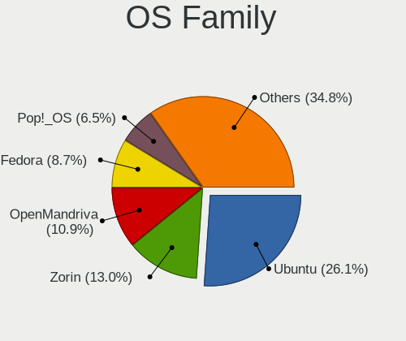

| Name         | Notebooks | Percent |
|--------------|-----------|---------|
| Ubuntu       | 14        | 25.45%  |
| Linux Mint   | 6         | 10.91%  |
| Debian       | 6         | 10.91%  |
| Zorin        | 5         | 9.09%   |
| Pop!_OS      | 5         | 9.09%   |
| OpenMandriva | 4         | 7.27%   |
| Fedora       | 3         | 5.45%   |
| SteamOS      | 2         | 3.64%   |
| openSUSE     | 2         | 3.64%   |
| Xubuntu      | 1         | 1.82%   |
| Ubuntu MATE  | 1         | 1.82%   |
| Rocky Linux  | 1         | 1.82%   |
| Kubuntu      | 1         | 1.82%   |
| KDE neon     | 1         | 1.82%   |
| Kali         | 1         | 1.82%   |
| Elementary   | 1         | 1.82%   |
| Arch         | 1         | 1.82%   |

Kernel
------

Version of the Linux kernel

| Version                      | Notebooks | Percent |
|------------------------------|-----------|---------|
| 6.2.0-26-generic             | 14        | 25.45%  |
| 6.4.6-76060406-generic       | 5         | 9.09%   |
| 5.15.0-78-generic            | 5         | 9.09%   |
| 6.1.0-11-amd64               | 4         | 7.27%   |
| 5.15.0-79-generic            | 4         | 7.27%   |
| 6.4.11-desktop-1omv2390      | 3         | 5.45%   |
| 6.2.0-31-generic             | 2         | 3.64%   |
| 6.4.8-1-default              | 1         | 1.82%   |
| 6.4.7-200.fc38.x86_64        | 1         | 1.82%   |
| 6.4.11-arch2-1               | 1         | 1.82%   |
| 6.4.11-1-default             | 1         | 1.82%   |
| 6.4.10-200.fc38.x86_64       | 1         | 1.82%   |
| 6.2.9-300.fc38.x86_64        | 1         | 1.82%   |
| 6.2.6-desktop-1omv2390       | 1         | 1.82%   |
| 6.2.0-27-generic             | 1         | 1.82%   |
| 6.2.0-1009-lowlatency        | 1         | 1.82%   |
| 6.1.0-kali5-amd64            | 1         | 1.82%   |
| 6.1.0-0.deb11.7-amd64        | 1         | 1.82%   |
| 5.19.0-46-generic            | 1         | 1.82%   |
| 5.15.0-82-generic            | 1         | 1.82%   |
| 5.15.0-76-generic            | 1         | 1.82%   |
| 5.13.0-valve37-1-neptune     | 1         | 1.82%   |
| 5.13.0-valve36-1-neptune     | 1         | 1.82%   |
| 5.10.0-24-amd64              | 1         | 1.82%   |
| 4.18.0-477.21.1.el8_8.x86_64 | 1         | 1.82%   |

Kernel Family
-------------

Linux kernel without a distro release

| Version | Notebooks | Percent |
|---------|-----------|---------|
| 6.2.0   | 18        | 32.73%  |
| 5.15.0  | 11        | 20%     |
| 6.1.0   | 6         | 10.91%  |
| 6.4.6   | 5         | 9.09%   |
| 6.4.11  | 5         | 9.09%   |
| 5.13.0  | 2         | 3.64%   |
| 6.4.8   | 1         | 1.82%   |
| 6.4.7   | 1         | 1.82%   |
| 6.4.10  | 1         | 1.82%   |
| 6.2.9   | 1         | 1.82%   |
| 6.2.6   | 1         | 1.82%   |
| 5.19.0  | 1         | 1.82%   |
| 5.10.0  | 1         | 1.82%   |
| 4.18.0  | 1         | 1.82%   |

Kernel Major Ver.
-----------------

Linux kernel major version

| Version | Notebooks | Percent |
|---------|-----------|---------|
| 6.2     | 20        | 36.36%  |
| 6.4     | 13        | 23.64%  |
| 5.15    | 11        | 20%     |
| 6.1     | 6         | 10.91%  |
| 5.13    | 2         | 3.64%   |
| 5.19    | 1         | 1.82%   |
| 5.10    | 1         | 1.82%   |
| 4.18    | 1         | 1.82%   |

Arch
----

OS architecture (x86_64, i586, etc.)

| Name   | Notebooks | Percent |
|--------|-----------|---------|
| x86_64 | 55        | 100%    |

DE
--

Desktop Environment

| Name       | Notebooks | Percent |
|------------|-----------|---------|
| GNOME      | 29        | 52.73%  |
| KDE5       | 11        | 20%     |
| X-Cinnamon | 5         | 9.09%   |
| XFCE       | 4         | 7.27%   |
| MATE       | 2         | 3.64%   |
| Unknown    | 2         | 3.64%   |
| Pantheon   | 1         | 1.82%   |
| Cinnamon   | 1         | 1.82%   |

Display Server
--------------

X11 or Wayland

| Name    | Notebooks | Percent |
|---------|-----------|---------|
| X11     | 38        | 69.09%  |
| Wayland | 17        | 30.91%  |

Display Manager
---------------

SDDM, LightDM, etc.

| Name    | Notebooks | Percent |
|---------|-----------|---------|
| Unknown | 25        | 45.45%  |
| GDM3    | 16        | 29.09%  |
| LightDM | 6         | 10.91%  |
| SDDM    | 5         | 9.09%   |
| GDM     | 3         | 5.45%   |

OS Lang
-------

Language

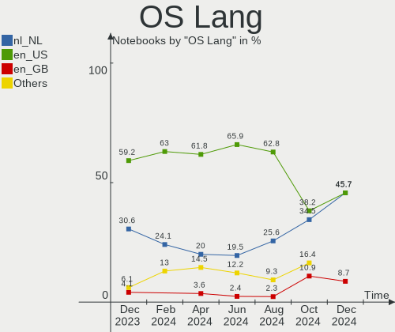

| Lang  | Notebooks | Percent |
|-------|-----------|---------|
| en_US | 33        | 60%     |
| nl_NL | 13        | 23.64%  |
| ru_RU | 2         | 3.64%   |
| fr_FR | 2         | 3.64%   |
| en_GB | 2         | 3.64%   |
| pt_BR | 1         | 1.82%   |
| nl_BE | 1         | 1.82%   |
| es_ES | 1         | 1.82%   |

Boot Mode
---------

EFI or BIOS

| Mode | Notebooks | Percent |
|------|-----------|---------|
| EFI  | 30        | 54.55%  |
| BIOS | 25        | 45.45%  |

Filesystem
----------

Type of filesystem

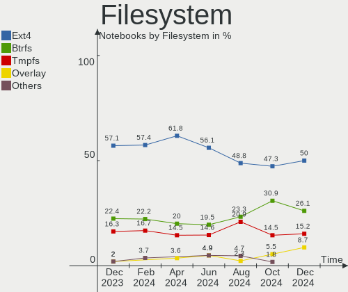

| Type    | Notebooks | Percent |
|---------|-----------|---------|
| Ext4    | 29        | 52.73%  |
| Btrfs   | 12        | 21.82%  |
| Tmpfs   | 11        | 20%     |
| Overlay | 2         | 3.64%   |
| Xfs     | 1         | 1.82%   |

Part. scheme
------------

Scheme of partitioning

| Type    | Notebooks | Percent |
|---------|-----------|---------|
| GPT     | 29        | 52.73%  |
| Unknown | 24        | 43.64%  |
| MBR     | 2         | 3.64%   |

Dual Boot with Linux/BSD
------------------------

Hosting more than one Linux/BSD

| Dual boot | Notebooks | Percent |
|-----------|-----------|---------|
| No        | 51        | 92.73%  |
| Yes       | 4         | 7.27%   |

Dual Boot (Win)
---------------

Hosting Linux and Windows

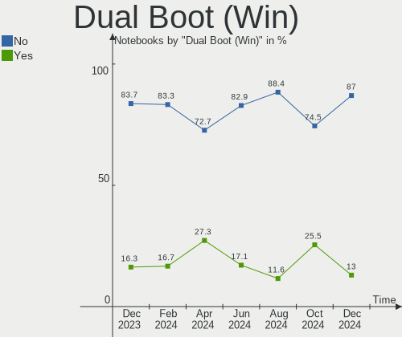

| Dual boot | Notebooks | Percent |
|-----------|-----------|---------|
| No        | 45        | 81.82%  |
| Yes       | 10        | 18.18%  |

Board
-----

Vendor
------

Motherboard manufacturer

| Name             | Notebooks | Percent |
|------------------|-----------|---------|
| Lenovo           | 13        | 23.64%  |
| Hewlett-Packard  | 12        | 21.82%  |
| Dell             | 8         | 14.55%  |
| ASUSTek Computer | 8         | 14.55%  |
| Apple            | 3         | 5.45%   |
| Valve            | 2         | 3.64%   |
| Acer             | 2         | 3.64%   |
| Positivo         | 1         | 1.82%   |
| Notebook         | 1         | 1.82%   |
| MSI              | 1         | 1.82%   |
| LG Electronics   | 1         | 1.82%   |
| HONOR            | 1         | 1.82%   |
| Google           | 1         | 1.82%   |
| AMI              | 1         | 1.82%   |

Model
-----

Motherboard model

| Name                                     | Notebooks | Percent |
|------------------------------------------|-----------|---------|
| Dell XPS 15 9500                         | 3         | 5.45%   |
| Valve Jupiter                            | 2         | 3.64%   |
| Positivo Mobile                          | 1         | 1.82%   |
| Notebook PB50_70RF,RD,RC                 | 1         | 1.82%   |
| MSI Katana GF76 11UC                     | 1         | 1.82%   |
| LG 14Z90N-V.AA78B                        | 1         | 1.82%   |
| Lenovo Yoga 300-11IBR 80M1               | 1         | 1.82%   |
| Lenovo ThinkPad X230 23243VG             | 1         | 1.82%   |
| Lenovo ThinkPad X1 Carbon 4th 20FCS0BJ00 | 1         | 1.82%   |
| Lenovo ThinkPad T490 20N3S8FN0F          | 1         | 1.82%   |
| Lenovo ThinkPad P51 20HJS3MY00           | 1         | 1.82%   |
| Lenovo ThinkPad P50 20EQS5C701           | 1         | 1.82%   |
| Lenovo Legion 5 Pro 16ACH6H 82JQ         | 1         | 1.82%   |
| Lenovo Legion 5 15ACH6H 82JU             | 1         | 1.82%   |
| Lenovo IdeaPad Y700-15ISK 80NV           | 1         | 1.82%   |
| Lenovo IdeaPad L340-15IRH Gaming 81LK    | 1         | 1.82%   |
| Lenovo IdeaPad Gaming 3 15IHU6 82K1      | 1         | 1.82%   |
| Lenovo IdeaPad 510-15ISK 80SR            | 1         | 1.82%   |
| Lenovo IdeaPad 5 14ITL05 82FE            | 1         | 1.82%   |
| HONOR BOHK-WAX9X                         | 1         | 1.82%   |
| HP Victus by Laptop 16-d0xxx             | 1         | 1.82%   |
| HP ProBook 6560b                         | 1         | 1.82%   |
| HP ProBook 445 G8 Notebook PC            | 1         | 1.82%   |
| HP ProBook 4310s                         | 1         | 1.82%   |
| HP Presario CQ42                         | 1         | 1.82%   |
| HP Pavilion Laptop 15-cc5xx              | 1         | 1.82%   |
| HP Notebook                              | 1         | 1.82%   |
| HP Laptop 17-ca0xxx                      | 1         | 1.82%   |
| HP EliteBook 840 G6                      | 1         | 1.82%   |
| HP EliteBook 840 G3                      | 1         | 1.82%   |
| HP EliteBook 2570p                       | 1         | 1.82%   |
| HP EliteBook 2540p                       | 1         | 1.82%   |
| Google Rammus                            | 1         | 1.82%   |
| Dell XPS 15 7590                         | 1         | 1.82%   |
| Dell XPS 13 9310                         | 1         | 1.82%   |
| Dell Latitude E6440                      | 1         | 1.82%   |
| Dell Latitude 7480                       | 1         | 1.82%   |
| Dell Inspiron 1720                       | 1         | 1.82%   |
| ASUS ZenBook UX425EA_UX425EA             | 1         | 1.82%   |
| ASUS X751LD                              | 1         | 1.82%   |

Model Family
------------

Motherboard model prefix

| Name              | Notebooks | Percent |
|-------------------|-----------|---------|
| Lenovo ThinkPad   | 5         | 9.09%   |
| Lenovo IdeaPad    | 5         | 9.09%   |
| Dell XPS          | 5         | 9.09%   |
| HP EliteBook      | 4         | 7.27%   |
| HP ProBook        | 3         | 5.45%   |
| ASUS Vivobook     | 3         | 5.45%   |
| Valve Jupiter     | 2         | 3.64%   |
| Lenovo Legion     | 2         | 3.64%   |
| Dell Latitude     | 2         | 3.64%   |
| ASUS ROG          | 2         | 3.64%   |
| Acer Aspire       | 2         | 3.64%   |
| Positivo Mobile   | 1         | 1.82%   |
| Notebook PB50     | 1         | 1.82%   |
| MSI Katana        | 1         | 1.82%   |
| LG 14Z90N-V.AA78B | 1         | 1.82%   |
| Lenovo Yoga       | 1         | 1.82%   |
| HONOR BOHK-WAX9X  | 1         | 1.82%   |
| HP Victus         | 1         | 1.82%   |
| HP Presario       | 1         | 1.82%   |
| HP Pavilion       | 1         | 1.82%   |
| HP Notebook       | 1         | 1.82%   |
| HP Laptop         | 1         | 1.82%   |
| Google Rammus     | 1         | 1.82%   |
| Dell Inspiron     | 1         | 1.82%   |
| ASUS ZenBook      | 1         | 1.82%   |
| ASUS X751LD       | 1         | 1.82%   |
| ASUS K75VJ        | 1         | 1.82%   |
| Apple MacBookPro9 | 1         | 1.82%   |
| Apple MacBookAir7 | 1         | 1.82%   |
| Apple MacBookAir5 | 1         | 1.82%   |
| Unknown           | 1         | 1.82%   |

MFG Year
--------

Motherboard manufacture year

| Year | Notebooks | Percent |
|------|-----------|---------|
| 2021 | 11        | 20%     |
| 2020 | 7         | 12.73%  |
| 2012 | 6         | 10.91%  |
| 2019 | 5         | 9.09%   |
| 2015 | 5         | 9.09%   |
| 2016 | 4         | 7.27%   |
| 2017 | 3         | 5.45%   |
| 2023 | 2         | 3.64%   |
| 2022 | 2         | 3.64%   |
| 2018 | 2         | 3.64%   |
| 2013 | 2         | 3.64%   |
| 2010 | 2         | 3.64%   |
| 2014 | 1         | 1.82%   |
| 2011 | 1         | 1.82%   |
| 2009 | 1         | 1.82%   |
| 2007 | 1         | 1.82%   |

Form Factor
-----------

Physical design of the computer

| Name     | Notebooks | Percent |
|----------|-----------|---------|
| Notebook | 55        | 100%    |

Secure Boot
-----------

Enabled or disabled

| State    | Notebooks | Percent |
|----------|-----------|---------|
| Disabled | 50        | 90.91%  |
| Enabled  | 5         | 9.09%   |

Coreboot
--------

Have coreboot on board

| Used | Notebooks | Percent |
|------|-----------|---------|
| No   | 54        | 98.18%  |
| Yes  | 1         | 1.82%   |

RAM Size
--------

Total RAM memory

| Size in GB  | Notebooks | Percent |
|-------------|-----------|---------|
| 4.01-8.0    | 15        | 27.27%  |
| 16.01-24.0  | 11        | 20%     |
| 8.01-16.0   | 10        | 18.18%  |
| 32.01-64.0  | 7         | 12.73%  |
| 3.01-4.0    | 7         | 12.73%  |
| 64.01-256.0 | 2         | 3.64%   |
| 1.01-2.0    | 2         | 3.64%   |
| 2.01-3.0    | 1         | 1.82%   |

RAM Used
--------

Used RAM memory

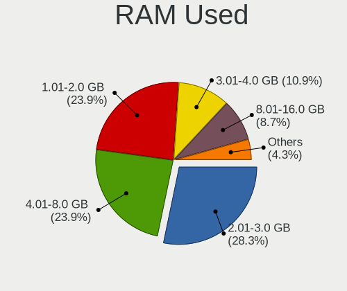

| Used GB    | Notebooks | Percent |
|------------|-----------|---------|
| 2.01-3.0   | 16        | 29.09%  |
| 1.01-2.0   | 13        | 23.64%  |
| 3.01-4.0   | 10        | 18.18%  |
| 4.01-8.0   | 8         | 14.55%  |
| 8.01-16.0  | 4         | 7.27%   |
| 16.01-24.0 | 2         | 3.64%   |
| 0.51-1.0   | 2         | 3.64%   |

Total Drives
------------

Number of drives on board

| Drives | Notebooks | Percent |
|--------|-----------|---------|
| 1      | 44        | 80%     |
| 2      | 9         | 16.36%  |
| 3      | 2         | 3.64%   |

Has CD-ROM
----------

Has CD-ROM on board

| Presented | Notebooks | Percent |
|-----------|-----------|---------|
| No        | 45        | 81.82%  |
| Yes       | 10        | 18.18%  |

Has Ethernet
------------

Has Ethernet on board

| Presented | Notebooks | Percent |
|-----------|-----------|---------|
| Yes       | 38        | 69.09%  |
| No        | 17        | 30.91%  |

Has WiFi
--------

Has WiFi module

| Presented | Notebooks | Percent |
|-----------|-----------|---------|
| Yes       | 54        | 98.18%  |
| No        | 1         | 1.82%   |

Has Bluetooth
-------------

Has Bluetooth module

| Presented | Notebooks | Percent |
|-----------|-----------|---------|
| Yes       | 43        | 78.18%  |
| No        | 12        | 21.82%  |

Location
--------

Country
-------

Geographic location (country)

| Country     | Notebooks | Percent |
|-------------|-----------|---------|
| Netherlands | 55        | 100%    |

City
----

Geographic location (city)

| City                | Notebooks | Percent |
|---------------------|-----------|---------|
| Amsterdam           | 10        | 18.18%  |
| Naaldwijk           | 5         | 9.09%   |
| Rotterdam           | 4         | 7.27%   |
| Utrecht             | 2         | 3.64%   |
| Groningen           | 2         | 3.64%   |
| Zoetermeer          | 1         | 1.82%   |
| Zierikzee           | 1         | 1.82%   |
| Zevenhoven          | 1         | 1.82%   |
| Workum              | 1         | 1.82%   |
| Veenendaal          | 1         | 1.82%   |
| Teteringen          | 1         | 1.82%   |
| Terneuzen           | 1         | 1.82%   |
| Spijkenisse         | 1         | 1.82%   |
| Roosendaal          | 1         | 1.82%   |
| Raalte              | 1         | 1.82%   |
| Ooij                | 1         | 1.82%   |
| Oegstgeest          | 1         | 1.82%   |
| Nieuw-Vennep        | 1         | 1.82%   |
| Hilversum           | 1         | 1.82%   |
| Heerlen             | 1         | 1.82%   |
| Haarlem             | 1         | 1.82%   |
| Groot-Ammers        | 1         | 1.82%   |
| Gouda               | 1         | 1.82%   |
| Etten               | 1         | 1.82%   |
| Enschede            | 1         | 1.82%   |
| Eindhoven           | 1         | 1.82%   |
| Ede                 | 1         | 1.82%   |
| Delft               | 1         | 1.82%   |
| Boxtel              | 1         | 1.82%   |
| Bolsward            | 1         | 1.82%   |
| Bladel              | 1         | 1.82%   |
| Berkel en Rodenrijs | 1         | 1.82%   |
| Beesel              | 1         | 1.82%   |
| Apeldoorn           | 1         | 1.82%   |
| Alphen aan den Rijn | 1         | 1.82%   |
| Almere Stad         | 1         | 1.82%   |
| Alblasserdam        | 1         | 1.82%   |

Drives
------

Drive Vendor
------------

Hard drive vendors

| Vendor                         | Notebooks | Drives | Percent |
|--------------------------------|-----------|--------|---------|
| Samsung Electronics            | 13        | 15     | 20.31%  |
| SK hynix                       | 8         | 8      | 12.5%   |
| Toshiba                        | 5         | 5      | 7.81%   |
| Sandisk                        | 5         | 5      | 7.81%   |
| Unknown                        | 4         | 5      | 6.25%   |
| Micron Technology              | 4         | 4      | 6.25%   |
| Kingston                       | 4         | 4      | 6.25%   |
| Intel                          | 4         | 4      | 6.25%   |
| WDC                            | 3         | 3      | 4.69%   |
| Phison Electronics             | 3         | 3      | 4.69%   |
| Apple                          | 2         | 2      | 3.13%   |
| Solid State Storage Technology | 1         | 1      | 1.56%   |
| Seagate                        | 1         | 1      | 1.56%   |
| PHD 3.0                        | 1         | 1      | 1.56%   |
| JMicron Technology             | 1         | 1      | 1.56%   |
| HS-SSD-E100                    | 1         | 1      | 1.56%   |
| Hitachi                        | 1         | 1      | 1.56%   |
| HGST                           | 1         | 1      | 1.56%   |
| GOODRAM                        | 1         | 1      | 1.56%   |
| Crucial                        | 1         | 1      | 1.56%   |

Drive Model
-----------

Hard drive models

| Model                                                | Notebooks | Percent |
|------------------------------------------------------|-----------|---------|
| Sandisk WD Black SN750 / PC SN730 NVMe SSD 1024GB    | 2         | 2.99%   |
| WDC WD10SPZX-21Z10T0 1TB                             | 1         | 1.49%   |
| WDC WD10JPVX-22JC3T0 1TB                             | 1         | 1.49%   |
| WDC PC SN520 SDAPMUW-512G-1101 512GB                 | 1         | 1.49%   |
| Unknown TA2964  64GB                                 | 1         | 1.49%   |
| Unknown SD/MMC/MS PRO 1GB                            | 1         | 1.49%   |
| Unknown MMC Card  64GB                               | 1         | 1.49%   |
| Unknown MMC Card  512GB                              | 1         | 1.49%   |
| Unknown GF8S5  513GB                                 | 1         | 1.49%   |
| Toshiba XG6 NVMe SSD Controller 1024GB               | 1         | 1.49%   |
| Toshiba THNSNH128GMCT 128GB SSD                      | 1         | 1.49%   |
| Toshiba MQ02ABF100 1TB                               | 1         | 1.49%   |
| Toshiba MK3256GSY 320GB                              | 1         | 1.49%   |
| Toshiba KXG5AZNV256G NVMe SED 256GB                  | 1         | 1.49%   |
| Solid State Storage CA5-8D512-Q11 NVMe SSSTC 512GB   | 1         | 1.49%   |
| SK hynix SKHynix_HFS512GDE9X084N 512GB               | 1         | 1.49%   |
| SK hynix SKHynix_HFS001TDE9X084N 1TB                 | 1         | 1.49%   |
| SK hynix SC311 SATA 256GB SSD                        | 1         | 1.49%   |
| SK hynix PC711 NVMe 1TB                              | 1         | 1.49%   |
| SK hynix PC611 NVMe 512GB                            | 1         | 1.49%   |
| SK hynix HFS512GD9TNG-L2A0A 512GB                    | 1         | 1.49%   |
| SK hynix HFS128G3BMND-3210A 128GB SSD                | 1         | 1.49%   |
| SK hynix HFM512GD3JX013N 512GB                       | 1         | 1.49%   |
| Seagate Expansion 2TB                                | 1         | 1.49%   |
| Sandisk WDC PC SN530 SDBPTPZ-1T00-1002 1024GB        | 1         | 1.49%   |
| SanDisk SD9SN8W-128G-1006 128GB SSD                  | 1         | 1.49%   |
| SanDisk DF4032  32GB                                 | 1         | 1.49%   |
| Samsung SSD 980 1TB                                  | 1         | 1.49%   |
| Samsung SSD 970 EVO Plus 1TB                         | 1         | 1.49%   |
| Samsung SSD 870 EVO 1TB                              | 1         | 1.49%   |
| Samsung SSD 860 EVO 1TB                              | 1         | 1.49%   |
| Samsung SSD 850 PRO 1TB                              | 1         | 1.49%   |
| Samsung SSD 850 EVO 500GB                            | 1         | 1.49%   |
| Samsung SSD 850 EVO 250GB                            | 1         | 1.49%   |
| Samsung SSD 830 Series 256GB                         | 1         | 1.49%   |
| Samsung NVMe SSD Controller SM981/PM981/PM983 500GB  | 1         | 1.49%   |
| Samsung NVMe SSD Controller SM961/PM961/SM963 1024GB | 1         | 1.49%   |
| Samsung MZVLQ256HAJD-000H1 256GB                     | 1         | 1.49%   |
| Samsung MZNTY128HDHP-000H1 128GB SSD                 | 1         | 1.49%   |
| Samsung MZNLN256HCHP-000L2 256GB SSD                 | 1         | 1.49%   |

HDD Vendor
----------

Hard disk drive vendors

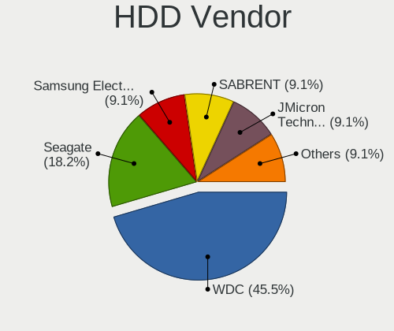

| Vendor              | Notebooks | Drives | Percent |
|---------------------|-----------|--------|---------|
| WDC                 | 2         | 2      | 20%     |
| Toshiba             | 2         | 2      | 20%     |
| Unknown             | 1         | 1      | 10%     |
| Seagate             | 1         | 1      | 10%     |
| Samsung Electronics | 1         | 1      | 10%     |
| PHD 3.0             | 1         | 1      | 10%     |
| Hitachi             | 1         | 1      | 10%     |
| HGST                | 1         | 1      | 10%     |

SSD Vendor
----------

Solid state drive vendors

| Vendor              | Notebooks | Drives | Percent |
|---------------------|-----------|--------|---------|
| Samsung Electronics | 7         | 8      | 35%     |
| SK hynix            | 2         | 2      | 10%     |
| Micron Technology   | 2         | 2      | 10%     |
| Kingston            | 2         | 2      | 10%     |
| Apple               | 2         | 2      | 10%     |
| Toshiba             | 1         | 1      | 5%      |
| SanDisk             | 1         | 1      | 5%      |
| Intel               | 1         | 1      | 5%      |
| GOODRAM             | 1         | 1      | 5%      |
| Crucial             | 1         | 1      | 5%      |

Drive Kind
----------

HDD or SSD

| Kind    | Notebooks | Drives | Percent |
|---------|-----------|--------|---------|
| NVMe    | 28        | 29     | 45.16%  |
| SSD     | 19        | 21     | 30.65%  |
| HDD     | 9         | 10     | 14.52%  |
| MMC     | 4         | 5      | 6.45%   |
| Unknown | 2         | 2      | 3.23%   |

Drive Connector
---------------

SATA, SAS, NVMe, etc.

| Type | Notebooks | Drives | Percent |
|------|-----------|--------|---------|
| NVMe | 28        | 29     | 45.16%  |
| SATA | 25        | 28     | 40.32%  |
| SAS  | 5         | 5      | 8.06%   |
| MMC  | 4         | 5      | 6.45%   |

Drive Size
----------

Size of hard drive

| Size in TB | Notebooks | Drives | Percent |
|------------|-----------|--------|---------|
| 0.01-0.5   | 20        | 21     | 66.67%  |
| 0.51-1.0   | 9         | 9      | 30%     |
| 1.01-2.0   | 1         | 1      | 3.33%   |

Space Total
-----------

Amount of disk space available on the file system

| Size in GB     | Notebooks | Percent |
|----------------|-----------|---------|
| 251-500        | 15        | 27.27%  |
| 101-250        | 13        | 23.64%  |
| 501-1000       | 11        | 20%     |
| 51-100         | 5         | 9.09%   |
| 1001-2000      | 4         | 7.27%   |
| More than 3000 | 3         | 5.45%   |
| 21-50          | 2         | 3.64%   |
| 1-20           | 2         | 3.64%   |

Space Used
----------

Amount of used disk space

| Used GB        | Notebooks | Percent |
|----------------|-----------|---------|
| 1-20           | 15        | 27.27%  |
| 101-250        | 12        | 21.82%  |
| 251-500        | 9         | 16.36%  |
| 21-50          | 9         | 16.36%  |
| 51-100         | 5         | 9.09%   |
| 1001-2000      | 2         | 3.64%   |
| More than 3000 | 1         | 1.82%   |
| 2001-3000      | 1         | 1.82%   |
| 501-1000       | 1         | 1.82%   |

Malfunc. Drives
---------------

Drive models with a malfunction

Zero info for selected period =(

Malfunc. Drive Vendor
---------------------

Vendors of faulty drives

Zero info for selected period =(

Malfunc. HDD Vendor
-------------------

Vendors of faulty HDD drives

Zero info for selected period =(

Malfunc. Drive Kind
-------------------

Kinds of faulty drives

Zero info for selected period =(

Failed Drives
-------------

Failed drive models

Zero info for selected period =(

Failed Drive Vendor
-------------------

Failed drive vendors

Zero info for selected period =(

Drive Status
------------

Number of failed and malfunc. drives

| Status   | Notebooks | Drives | Percent |
|----------|-----------|--------|---------|
| Detected | 38        | 49     | 67.86%  |
| Works    | 18        | 18     | 32.14%  |

Storage controller
------------------

Storage Vendor
--------------

Storage controller vendors

| Vendor                         | Notebooks | Percent |
|--------------------------------|-----------|---------|
| Intel                          | 33        | 51.56%  |
| Samsung Electronics            | 7         | 10.94%  |
| SK hynix                       | 6         | 9.38%   |
| SanDisk                        | 4         | 6.25%   |
| AMD                            | 4         | 6.25%   |
| Phison Electronics             | 3         | 4.69%   |
| Toshiba America Info Systems   | 2         | 3.13%   |
| Micron Technology              | 2         | 3.13%   |
| Kingston Technology Company    | 2         | 3.13%   |
| Solid State Storage Technology | 1         | 1.56%   |

Storage Model
-------------

Storage controller models

| Model                                                                          | Notebooks | Percent |
|--------------------------------------------------------------------------------|-----------|---------|
| Intel 7 Series Chipset Family 6-port SATA Controller [AHCI mode]               | 5         | 7.46%   |
| SK hynix Gold P31/BC711/PC711 NVMe Solid State Drive                           | 4         | 5.97%   |
| Intel Volume Management Device NVMe RAID Controller                            | 4         | 5.97%   |
| Intel Sunrise Point-LP SATA Controller [AHCI mode]                             | 4         | 5.97%   |
| Samsung NVMe SSD Controller 980                                                | 3         | 4.48%   |
| Intel Cannon Lake Mobile PCH SATA AHCI Controller                              | 3         | 4.48%   |
| AMD FCH SATA Controller [AHCI mode]                                            | 3         | 4.48%   |
| SanDisk WD Black SN750 / PC SN730 NVMe SSD                                     | 2         | 2.99%   |
| Samsung NVMe SSD Controller SM981/PM981/PM983                                  | 2         | 2.99%   |
| Kingston Company OM8PCP Design-In PCIe 3 NVMe SSD (DRAM-less)                  | 2         | 2.99%   |
| Intel SSD 670p Series [Keystone Harbor]                                        | 2         | 2.99%   |
| Intel 82801IBM/IEM (ICH9M/ICH9M-E) 4 port SATA Controller [AHCI mode]          | 2         | 2.99%   |
| Intel 82801 Mobile SATA Controller [RAID mode]                                 | 2         | 2.99%   |
| Intel 8 Series/C220 Series Chipset Family 6-port SATA Controller 1 [AHCI mode] | 2         | 2.99%   |
| Toshiba America Info Systems XG6 NVMe SSD Controller                           | 1         | 1.49%   |
| Toshiba America Info Systems XG5 NVMe SSD Controller                           | 1         | 1.49%   |
| Solid State Storage Non-Volatile memory controller                             | 1         | 1.49%   |
| SK hynix PC611 NVMe Solid State Drive                                          | 1         | 1.49%   |
| SK hynix PC601 NVMe Solid State Drive                                          | 1         | 1.49%   |
| SanDisk PC SN520 NVMe SSD                                                      | 1         | 1.49%   |
| SanDisk IX SN530 NVMe SSD (DRAM-less)                                          | 1         | 1.49%   |
| Samsung S4LN058A01[SSUBX] AHCI SSD Controller (Apple slot)                     | 1         | 1.49%   |
| Samsung NVMe SSD Controller SM961/PM961/SM963                                  | 1         | 1.49%   |
| Phison PS5013 E13 NVMe Controller                                              | 1         | 1.49%   |
| Phison E18 PCIe4 NVMe Controller                                               | 1         | 1.49%   |
| Phison E16 PCIe4 NVMe Controller                                               | 1         | 1.49%   |
| Micron 3400 NVMe SSD [Hendrix]                                                 | 1         | 1.49%   |
| Micron 2210 NVMe SSD [Cobain]                                                  | 1         | 1.49%   |
| Intel Wildcat Point-LP SATA Controller [AHCI Mode]                             | 1         | 1.49%   |
| Intel Tiger Lake-LP SATA Controller                                            | 1         | 1.49%   |
| Intel Tiger Lake SATA AHCI Controller                                          | 1         | 1.49%   |
| Intel SSD 660P Series                                                          | 1         | 1.49%   |
| Intel Q170/Q150/B150/H170/H110/Z170/CM236 Chipset SATA Controller [AHCI Mode]  | 1         | 1.49%   |
| Intel Ice Lake-LP SATA Controller [AHCI mode]                                  | 1         | 1.49%   |
| Intel HM170/QM170 Chipset SATA Controller [AHCI Mode]                          | 1         | 1.49%   |
| Intel 82801HM/HEM (ICH8M/ICH8M-E) SATA Controller [AHCI mode]                  | 1         | 1.49%   |
| Intel 82801HM/HEM (ICH8M/ICH8M-E) IDE Controller                               | 1         | 1.49%   |
| Intel 8 Series SATA Controller 1 [AHCI mode]                                   | 1         | 1.49%   |
| Intel 6 Series/C200 Series Chipset Family 6 port Mobile SATA AHCI Controller   | 1         | 1.49%   |
| Intel 5 Series/3400 Series Chipset 6 port SATA AHCI Controller                 | 1         | 1.49%   |

Storage Kind
------------

Kind of storage controller (IDE, SATA, NVMe, SAS, ...)

| Kind | Notebooks | Percent |
|------|-----------|---------|
| SATA | 31        | 46.97%  |
| NVMe | 28        | 42.42%  |
| RAID | 6         | 9.09%   |
| IDE  | 1         | 1.52%   |

Processor
---------

CPU Vendor
----------

Processor vendors

| Vendor | Notebooks | Percent |
|--------|-----------|---------|
| Intel  | 44        | 80%     |
| AMD    | 11        | 20%     |

CPU Model
---------

Processor models

| Model                                       | Notebooks | Percent |
|---------------------------------------------|-----------|---------|
| Intel Core i9-10885H CPU @ 2.40GHz          | 2         | 3.64%   |
| Intel Core i5-6300U CPU @ 2.40GHz           | 2         | 3.64%   |
| Intel 11th Gen Core i5-11300H @ 3.10GHz     | 2         | 3.64%   |
| AMD Custom APU 0405                         | 2         | 3.64%   |
| Intel Pentium Dual-Core CPU T4500 @ 2.30GHz | 1         | 1.82%   |
| Intel Core m3-8100Y CPU @ 1.10GHz           | 1         | 1.82%   |
| Intel Core i9-9980HK CPU @ 2.40GHz          | 1         | 1.82%   |
| Intel Core i7-9750H CPU @ 2.60GHz           | 1         | 1.82%   |
| Intel Core i7-8665U CPU @ 1.90GHz           | 1         | 1.82%   |
| Intel Core i7-8565U CPU @ 1.80GHz           | 1         | 1.82%   |
| Intel Core i7-7820HQ CPU @ 2.90GHz          | 1         | 1.82%   |
| Intel Core i7-6820HQ CPU @ 2.70GHz          | 1         | 1.82%   |
| Intel Core i7-6700HQ CPU @ 2.60GHz          | 1         | 1.82%   |
| Intel Core i7-6600U CPU @ 2.60GHz           | 1         | 1.82%   |
| Intel Core i7-5650U CPU @ 2.20GHz           | 1         | 1.82%   |
| Intel Core i7-4702MQ CPU @ 2.20GHz          | 1         | 1.82%   |
| Intel Core i7-3630QM CPU @ 2.40GHz          | 1         | 1.82%   |
| Intel Core i7-10750H CPU @ 2.60GHz          | 1         | 1.82%   |
| Intel Core i7-1065G7 CPU @ 1.30GHz          | 1         | 1.82%   |
| Intel Core i7 CPU L 640 @ 2.13GHz           | 1         | 1.82%   |
| Intel Core i5-9300H CPU @ 2.40GHz           | 1         | 1.82%   |
| Intel Core i5-8365U CPU @ 1.60GHz           | 1         | 1.82%   |
| Intel Core i5-7200U CPU @ 2.50GHz           | 1         | 1.82%   |
| Intel Core i5-6200U CPU @ 2.30GHz           | 1         | 1.82%   |
| Intel Core i5-4310M CPU @ 2.70GHz           | 1         | 1.82%   |
| Intel Core i5-3427U CPU @ 1.80GHz           | 1         | 1.82%   |
| Intel Core i5-3360M CPU @ 2.80GHz           | 1         | 1.82%   |
| Intel Core i5-3320M CPU @ 2.60GHz           | 1         | 1.82%   |
| Intel Core i5-3210M CPU @ 2.50GHz           | 1         | 1.82%   |
| Intel Core i5-2410M CPU @ 2.30GHz           | 1         | 1.82%   |
| Intel Core i5-1035G1 CPU @ 1.00GHz          | 1         | 1.82%   |
| Intel Core i3-5005U CPU @ 2.00GHz           | 1         | 1.82%   |
| Intel Core i3-4030U CPU @ 1.90GHz           | 1         | 1.82%   |
| Intel Core 2 Duo CPU T7250 @ 2.00GHz        | 1         | 1.82%   |
| Intel Core 2 Duo CPU T6570 @ 2.10GHz        | 1         | 1.82%   |
| Intel Celeron CPU N3060 @ 1.60GHz           | 1         | 1.82%   |
| Intel Atom x7-Z8750 CPU @ 1.60GHz           | 1         | 1.82%   |
| Intel 11th Gen Core i7-1185G7 @ 3.00GHz     | 1         | 1.82%   |
| Intel 11th Gen Core i7-11800H @ 2.30GHz     | 1         | 1.82%   |
| Intel 11th Gen Core i7-1165G7 @ 2.80GHz     | 1         | 1.82%   |

CPU Model Family
----------------

Processor model prefix

| Model                   | Notebooks | Percent |
|-------------------------|-----------|---------|
| Intel Core i7           | 13        | 23.64%  |
| Intel Core i5           | 13        | 23.64%  |
| Other                   | 10        | 18.18%  |
| Intel Core i9           | 3         | 5.45%   |
| AMD Ryzen 5             | 3         | 5.45%   |
| Intel Core i3           | 2         | 3.64%   |
| Intel Core 2 Duo        | 2         | 3.64%   |
| AMD Ryzen 9             | 2         | 3.64%   |
| AMD Ryzen 7             | 2         | 3.64%   |
| Intel Pentium Dual-Core | 1         | 1.82%   |
| Intel Core m3           | 1         | 1.82%   |
| Intel Celeron           | 1         | 1.82%   |
| Intel Atom              | 1         | 1.82%   |
| AMD V120                | 1         | 1.82%   |

CPU Cores
---------

Number of processor cores

| Number | Notebooks | Percent |
|--------|-----------|---------|
| 4      | 21        | 38.18%  |
| 2      | 21        | 38.18%  |
| 8      | 7         | 12.73%  |
| 6      | 5         | 9.09%   |
| 1      | 1         | 1.82%   |

CPU Sockets
-----------

Number of sockets

| Number | Notebooks | Percent |
|--------|-----------|---------|
| 1      | 55        | 100%    |

CPU Threads
-----------

Threads per core (Hyper-Threading)

| Number | Notebooks | Percent |
|--------|-----------|---------|
| 2      | 48        | 87.27%  |
| 1      | 7         | 12.73%  |

CPU Op-Modes
------------

CPU Operation Modes (32-bit, 64-bit)

| Op mode        | Notebooks | Percent |
|----------------|-----------|---------|
| 32-bit, 64-bit | 55        | 100%    |

CPU Microcode
-------------

Microcode number

| Number     | Notebooks | Percent |
|------------|-----------|---------|
| Unknown    | 37        | 67.27%  |
| 0x0a50000c | 3         | 5.45%   |
| 0x806c1    | 2         | 3.64%   |
| 0x306d4    | 2         | 3.64%   |
| 0x906e9    | 1         | 1.82%   |
| 0x806eb    | 1         | 1.82%   |
| 0x806e9    | 1         | 1.82%   |
| 0x806d1    | 1         | 1.82%   |
| 0x706e5    | 1         | 1.82%   |
| 0x406c4    | 1         | 1.82%   |
| 0x306c3    | 1         | 1.82%   |
| 0x306a9    | 1         | 1.82%   |
| 0x0a704101 | 1         | 1.82%   |
| 0x0a50000d | 1         | 1.82%   |
| 0x06006705 | 1         | 1.82%   |

CPU Microarch
-------------

Microarchitecture

| Name        | Notebooks | Percent |
|-------------|-----------|---------|
| KabyLake    | 9         | 16.36%  |
| Skylake     | 6         | 10.91%  |
| TigerLake   | 5         | 9.09%   |
| IvyBridge   | 5         | 9.09%   |
| Zen 3       | 4         | 7.27%   |
| IceLake     | 4         | 7.27%   |
| Unknown     | 4         | 7.27%   |
| Haswell     | 3         | 5.45%   |
| CometLake   | 3         | 5.45%   |
| Silvermont  | 2         | 3.64%   |
| Penryn      | 2         | 3.64%   |
| Broadwell   | 2         | 3.64%   |
| Zen+        | 1         | 1.82%   |
| Westmere    | 1         | 1.82%   |
| SandyBridge | 1         | 1.82%   |
| K10         | 1         | 1.82%   |
| Excavator   | 1         | 1.82%   |
| Core        | 1         | 1.82%   |

Graphics
--------

GPU Vendor
----------

Vendors of graphics cards

| Vendor | Notebooks | Percent |
|--------|-----------|---------|
| Intel  | 42        | 53.85%  |
| Nvidia | 25        | 32.05%  |
| AMD    | 11        | 14.1%   |

GPU Model
---------

Graphics card models

| Model                                                                                    | Notebooks | Percent |
|------------------------------------------------------------------------------------------|-----------|---------|
| Intel TigerLake-LP GT2 [Iris Xe Graphics]                                                | 5         | 6.41%   |
| Intel 3rd Gen Core processor Graphics Controller                                         | 5         | 6.41%   |
| Intel Skylake GT2 [HD Graphics 520]                                                      | 4         | 5.13%   |
| Nvidia TU117M [GeForce GTX 1650 Ti Mobile]                                               | 3         | 3.85%   |
| Intel WhiskeyLake-U GT2 [UHD Graphics 620]                                               | 3         | 3.85%   |
| Intel CometLake-H GT2 [UHD Graphics]                                                     | 3         | 3.85%   |
| Intel CoffeeLake-H GT2 [UHD Graphics 630]                                                | 3         | 3.85%   |
| AMD Cezanne [Radeon Vega Series / Radeon Vega Mobile Series]                             | 3         | 3.85%   |
| Nvidia TU117M [GeForce GTX 1650 Mobile / Max-Q]                                          | 2         | 2.56%   |
| Nvidia GM108M [GeForce 940MX]                                                            | 2         | 2.56%   |
| Nvidia GA107M [GeForce RTX 3050 Ti Mobile]                                               | 2         | 2.56%   |
| Nvidia GA107M [GeForce RTX 3050 Mobile]                                                  | 2         | 2.56%   |
| Intel TigerLake-H GT1 [UHD Graphics]                                                     | 2         | 2.56%   |
| Intel HD Graphics 530                                                                    | 2         | 2.56%   |
| Intel Atom/Celeron/Pentium Processor x5-E8000/J3xxx/N3xxx Integrated Graphics Controller | 2         | 2.56%   |
| Intel 4th Gen Core Processor Integrated Graphics Controller                              | 2         | 2.56%   |
| AMD VanGogh [AMD Custom GPU 0405]                                                        | 2         | 2.56%   |
| Nvidia TU117M [GeForce MX450]                                                            | 1         | 1.28%   |
| Nvidia TU106M [GeForce RTX 2070 Mobile]                                                  | 1         | 1.28%   |
| Nvidia GP108M [GeForce MX150]                                                            | 1         | 1.28%   |
| Nvidia GP107M [GeForce GTX 1050 3 GB Max-Q]                                              | 1         | 1.28%   |
| Nvidia GN21-X11                                                                          | 1         | 1.28%   |
| Nvidia GM107M [GeForce GTX 960M]                                                         | 1         | 1.28%   |
| Nvidia GM107GLM [Quadro M2000M]                                                          | 1         | 1.28%   |
| Nvidia GM107GLM [Quadro M1200 Mobile]                                                    | 1         | 1.28%   |
| Nvidia GK106M [GeForce GTX 760M]                                                         | 1         | 1.28%   |
| Nvidia GF117M [GeForce 610M/710M/810M/820M / GT 620M/625M/630M/720M]                     | 1         | 1.28%   |
| Nvidia GF108M [GeForce GT 635M]                                                          | 1         | 1.28%   |
| Nvidia GA106M [GeForce RTX 3060 Mobile / Max-Q]                                          | 1         | 1.28%   |
| Nvidia GA104M [GeForce RTX 3070 Mobile / Max-Q]                                          | 1         | 1.28%   |
| Nvidia G84M [GeForce 8600M GT]                                                           | 1         | 1.28%   |
| Intel UHD Graphics 615                                                                   | 1         | 1.28%   |
| Intel Mobile 4 Series Chipset Integrated Graphics Controller                             | 1         | 1.28%   |
| Intel Iris Plus Graphics G7                                                              | 1         | 1.28%   |
| Intel Iris Plus Graphics G1 (Ice Lake)                                                   | 1         | 1.28%   |
| Intel HD Graphics 630                                                                    | 1         | 1.28%   |
| Intel HD Graphics 620                                                                    | 1         | 1.28%   |
| Intel HD Graphics 6000                                                                   | 1         | 1.28%   |
| Intel HD Graphics 5500                                                                   | 1         | 1.28%   |
| Intel Haswell-ULT Integrated Graphics Controller                                         | 1         | 1.28%   |

GPU Combo
---------

Combinations of graphics cards

| Name           | Notebooks | Percent |
|----------------|-----------|---------|
| 1 x Intel      | 22        | 40%     |
| Intel + Nvidia | 20        | 36.36%  |
| 1 x AMD        | 9         | 16.36%  |
| 1 x Nvidia     | 2         | 3.64%   |
| AMD + Nvidia   | 2         | 3.64%   |

GPU Driver
----------

Free vs proprietary

| Driver      | Notebooks | Percent |
|-------------|-----------|---------|
| Free        | 41        | 74.55%  |
| Proprietary | 14        | 25.45%  |

GPU Memory
----------

Total video memory

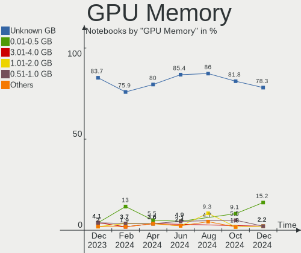

| Size in GB | Notebooks | Percent |
|------------|-----------|---------|
| Unknown    | 43        | 78.18%  |
| 0.01-0.5   | 5         | 9.09%   |
| 3.01-4.0   | 3         | 5.45%   |
| 1.01-2.0   | 3         | 5.45%   |
| 2.01-3.0   | 1         | 1.82%   |

Monitor
-------

Monitor Vendor
--------------

Monitor vendors

| Vendor              | Notebooks | Percent |
|---------------------|-----------|---------|
| BOE                 | 10        | 15.63%  |
| AU Optronics        | 10        | 15.63%  |
| Samsung Electronics | 9         | 14.06%  |
| Chimei Innolux      | 9         | 14.06%  |
| LG Display          | 8         | 12.5%   |
| Sharp               | 6         | 9.38%   |
| Apple               | 3         | 4.69%   |
| Valve               | 2         | 3.13%   |
| Iiyama              | 2         | 3.13%   |
| PANDA               | 1         | 1.56%   |
| Goldstar            | 1         | 1.56%   |
| Dell                | 1         | 1.56%   |
| AOC                 | 1         | 1.56%   |
| Acer                | 1         | 1.56%   |

Monitor Model
-------------

Monitor models

| Model                                                                 | Notebooks | Percent |
|-----------------------------------------------------------------------|-----------|---------|
| Valve ANX7530 U VLV3001 800x1280 100x150mm 7.1-inch                   | 2         | 3.08%   |
| Sharp LCD Monitor SHP14D0 3840x2400 336x210mm 15.6-inch               | 2         | 3.08%   |
| Samsung Electronics Color LCD SDCA029 2160x1440 252x168mm 11.9-inch   | 2         | 3.08%   |
| Sharp LQ134N1JW52 SHP151E 1920x1200 288x180mm 13.4-inch               | 1         | 1.54%   |
| Sharp LCD Monitor SHP14FA 3840x2400 288x180mm 13.4-inch               | 1         | 1.54%   |
| Sharp LCD Monitor SHP14D1 1920x1200 336x210mm 15.6-inch               | 1         | 1.54%   |
| Sharp LCD Monitor SHP143B 3840x2160 346x194mm 15.6-inch               | 1         | 1.54%   |
| Samsung Electronics SyncMaster SAM0524 1920x1080 477x268mm 21.5-inch  | 1         | 1.54%   |
| Samsung Electronics S24R35x SAM100E 1920x1080 521x293mm 23.5-inch     | 1         | 1.54%   |
| Samsung Electronics S24C570 SAM0A58 1920x1080 520x290mm 23.4-inch     | 1         | 1.54%   |
| Samsung Electronics LCD Monitor SEC4351 1366x768 344x194mm 15.5-inch  | 1         | 1.54%   |
| Samsung Electronics LCD Monitor SEC314F 1600x900 382x215mm 17.3-inch  | 1         | 1.54%   |
| Samsung Electronics LCD Monitor SAM0C39 1920x1080 885x498mm 40.0-inch | 1         | 1.54%   |
| Samsung Electronics C24F390 SAM0D2C 1920x1080 521x293mm 23.5-inch     | 1         | 1.54%   |
| PANDA LCD Monitor NCP004F 1920x1080 309x174mm 14.0-inch               | 1         | 1.54%   |
| LG Display LCD Monitor LGD0645 1920x1080 344x194mm 15.5-inch          | 1         | 1.54%   |
| LG Display LCD Monitor LGD0590 1920x1080 344x194mm 15.5-inch          | 1         | 1.54%   |
| LG Display LCD Monitor LGD0532 1920x1080 344x194mm 15.5-inch          | 1         | 1.54%   |
| LG Display LCD Monitor LGD04A7 1920x1080 344x194mm 15.5-inch          | 1         | 1.54%   |
| LG Display LCD Monitor LGD02E9 1366x768 309x174mm 14.0-inch           | 1         | 1.54%   |
| LG Display LCD Monitor LGD02D8 1366x768 277x156mm 12.5-inch           | 1         | 1.54%   |
| LG Display LCD Monitor LGD024F 1280x800 260x160mm 12.0-inch           | 1         | 1.54%   |
| LG Display LCD Monitor LGD01DA 1366x768 294x166mm 13.3-inch           | 1         | 1.54%   |
| Iiyama PL3271Q IVM761C 2560x1440 698x393mm 31.5-inch                  | 1         | 1.54%   |
| Iiyama PL3271Q IVM761B 2560x1440 698x393mm 31.5-inch                  | 1         | 1.54%   |
| Goldstar ULTRAWIDE GSM76FD 2560x1080 798x334mm 34.1-inch              | 1         | 1.54%   |
| Dell U2721DE DEL41E0 2560x1440 597x336mm 27.0-inch                    | 1         | 1.54%   |
| Dell U2721DE DEL41DE 2560x1440 597x336mm 27.0-inch                    | 1         | 1.54%   |
| Chimei Innolux LCD Monitor CMN1735 1920x1080 382x215mm 17.3-inch      | 1         | 1.54%   |
| Chimei Innolux LCD Monitor CMN1728 1600x900 382x215mm 17.3-inch       | 1         | 1.54%   |
| Chimei Innolux LCD Monitor CMN15F5 1920x1080 344x193mm 15.5-inch      | 1         | 1.54%   |
| Chimei Innolux LCD Monitor CMN15E7 1920x1080 344x193mm 15.5-inch      | 1         | 1.54%   |
| Chimei Innolux LCD Monitor CMN15CA 1366x768 344x193mm 15.5-inch       | 1         | 1.54%   |
| Chimei Innolux LCD Monitor CMN14E5 1920x1080 309x173mm 13.9-inch      | 1         | 1.54%   |
| Chimei Innolux LCD Monitor CMN14D5 1920x1080 309x173mm 13.9-inch      | 1         | 1.54%   |
| Chimei Innolux LCD Monitor CMN1489 1366x768 309x173mm 13.9-inch       | 1         | 1.54%   |
| Chimei Innolux LCD Monitor CMN140A 1920x1080 309x173mm 13.9-inch      | 1         | 1.54%   |
| BOE LCD Monitor BOE0AAD 1920x1080 355x200mm 16.0-inch                 | 1         | 1.54%   |
| BOE LCD Monitor BOE0A81 1920x1080 344x194mm 15.5-inch                 | 1         | 1.54%   |
| BOE LCD Monitor BOE0985 2560x1600 344x215mm 16.0-inch                 | 1         | 1.54%   |

Monitor Resolution
------------------

Monitor screen resolution

| Resolution        | Notebooks | Percent |
|-------------------|-----------|---------|
| 1920x1080 (FHD)   | 29        | 46.03%  |
| 1366x768 (WXGA)   | 9         | 14.29%  |
| 3840x2160 (4K)    | 4         | 6.35%   |
| 3840x2400         | 3         | 4.76%   |
| 2560x1600         | 3         | 4.76%   |
| 2560x1440 (QHD)   | 3         | 4.76%   |
| 1600x900 (HD+)    | 3         | 4.76%   |
| 800x1280          | 2         | 3.17%   |
| 1920x1200 (WUXGA) | 2         | 3.17%   |
| 1440x900 (WXGA+)  | 2         | 3.17%   |
| 1280x800 (WXGA)   | 2         | 3.17%   |
| 2560x1080         | 1         | 1.59%   |

Monitor Diagonal
----------------

Diagonal size in inches

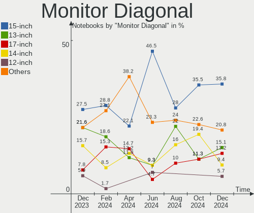

| Inches | Notebooks | Percent |
|--------|-----------|---------|
| 15     | 19        | 29.69%  |
| 13     | 11        | 17.19%  |
| 14     | 8         | 12.5%   |
| 17     | 6         | 9.38%   |
| 27     | 3         | 4.69%   |
| 16     | 3         | 4.69%   |
| 12     | 3         | 4.69%   |
| 31     | 2         | 3.13%   |
| 23     | 2         | 3.13%   |
| 7      | 2         | 3.13%   |
| 54     | 1         | 1.56%   |
| 34     | 1         | 1.56%   |
| 24     | 1         | 1.56%   |
| 21     | 1         | 1.56%   |
| 11     | 1         | 1.56%   |

Monitor Width
-------------

Physical width

| Width in mm | Notebooks | Percent |
|-------------|-----------|---------|
| 301-350     | 34        | 53.13%  |
| 201-300     | 10        | 15.63%  |
| 351-400     | 7         | 10.94%  |
| 501-600     | 6         | 9.38%   |
| 601-700     | 2         | 3.13%   |
| 1-100       | 2         | 3.13%   |
| 701-800     | 1         | 1.56%   |
| 401-500     | 1         | 1.56%   |
| 1001-1500   | 1         | 1.56%   |

Aspect Ratio
------------

Proportional relationship between the width and the height

| Ratio | Notebooks | Percent |
|-------|-----------|---------|
| 16/9  | 43        | 74.14%  |
| 16/10 | 12        | 20.69%  |
| 0.67  | 2         | 3.45%   |
| 21/9  | 1         | 1.72%   |

Monitor Area
------------

Area in inch

| Area in inch | Notebooks | Percent |
|----------------|-----------|---------|
| 101-110        | 19        | 29.69%  |
| 81-90          | 15        | 23.44%  |
| 121-130        | 5         | 7.81%   |
| 71-80          | 4         | 6.25%   |
| 201-250        | 4         | 6.25%   |
| 61-70          | 3         | 4.69%   |
| 351-500        | 3         | 4.69%   |
| 301-350        | 3         | 4.69%   |
| 111-120        | 3         | 4.69%   |
| 1-40           | 2         | 3.13%   |
| More than 1000 | 1         | 1.56%   |
| 51-60          | 1         | 1.56%   |
| 131-140        | 1         | 1.56%   |

Pixel Density
-------------

Pixels per inch

| Density       | Notebooks | Percent |
|---------------|-----------|---------|
| 121-160       | 31        | 48.44%  |
| 101-120       | 12        | 18.75%  |
| 51-100        | 8         | 12.5%   |
| More than 240 | 6         | 9.38%   |
| 161-240       | 6         | 9.38%   |
| 1-50          | 1         | 1.56%   |

Multiple Monitors
-----------------

Total monitors connected

| Total | Notebooks | Percent |
|-------|-----------|---------|
| 1     | 44        | 80%     |
| 2     | 9         | 16.36%  |
| 3     | 2         | 3.64%   |

Network
-------

Net Controller Vendor
---------------------

Controller vendors

| Vendor                   | Notebooks | Percent |
|--------------------------|-----------|---------|
| Intel                    | 34        | 42.5%   |
| Realtek Semiconductor    | 22        | 27.5%   |
| Qualcomm Atheros         | 4         | 5%      |
| Broadcom Limited         | 4         | 5%      |
| DisplayLink              | 3         | 3.75%   |
| Broadcom                 | 3         | 3.75%   |
| Qualcomm                 | 2         | 2.5%    |
| MediaTek                 | 2         | 2.5%    |
| Sierra Wireless          | 1         | 1.25%   |
| Ralink                   | 1         | 1.25%   |
| NetGear                  | 1         | 1.25%   |
| Marvell Technology Group | 1         | 1.25%   |
| Lenovo                   | 1         | 1.25%   |
| JMicron Technology       | 1         | 1.25%   |

Net Controller Model
--------------------

Controller models

| Model                                                             | Notebooks | Percent |
|-------------------------------------------------------------------|-----------|---------|
| Realtek RTL8111/8168/8411 PCI Express Gigabit Ethernet Controller | 15        | 15.31%  |
| Intel Wi-Fi 6 AX200                                               | 6         | 6.12%   |
| Intel Wi-Fi 6 AX201                                               | 5         | 5.1%    |
| Realtek RTL8822CE 802.11ac PCIe Wireless Network Adapter          | 3         | 3.06%   |
| Realtek RTL8821CE 802.11ac PCIe Wireless Network Adapter          | 3         | 3.06%   |
| Realtek RTL8153 Gigabit Ethernet Adapter                          | 3         | 3.06%   |
| Intel Wireless 8260                                               | 3         | 3.06%   |
| Realtek RTL810xE PCI Express Fast Ethernet controller             | 2         | 2.04%   |
| Qualcomm QCA6390 Wireless Network Adapter                         | 2         | 2.04%   |
| Intel Wireless 8265 / 8275                                        | 2         | 2.04%   |
| Intel Tiger Lake PCH CNVi WiFi                                    | 2         | 2.04%   |
| Intel Ethernet Connection I219-LM                                 | 2         | 2.04%   |
| Intel Ethernet Connection (6) I219-LM                             | 2         | 2.04%   |
| Intel Centrino Advanced-N 6205 [Taylor Peak]                      | 2         | 2.04%   |
| Intel Cannon Point-LP CNVi [Wireless-AC]                          | 2         | 2.04%   |
| Intel 82579LM Gigabit Network Connection (Lewisville)             | 2         | 2.04%   |
| DisplayLink ThinkPad USB 3.0 Pro Dock                             | 2         | 2.04%   |
| Sierra Wireless EM7455                                            | 1         | 1.02%   |
| Realtek RTL88x2bu [AC1200 Techkey]                                | 1         | 1.02%   |
| Realtek RTL8188EE Wireless Network Adapter                        | 1         | 1.02%   |
| Ralink RT5390 Wireless 802.11n 1T/1R PCIe                         | 1         | 1.02%   |
| Qualcomm Atheros QCA9565 / AR9565 Wireless Network Adapter        | 1         | 1.02%   |
| Qualcomm Atheros AR9485 Wireless Network Adapter                  | 1         | 1.02%   |
| Qualcomm Atheros AR9462 Wireless Network Adapter                  | 1         | 1.02%   |
| Qualcomm Atheros AR9285 Wireless Network Adapter (PCI-Express)    | 1         | 1.02%   |
| NetGear WNA3100M(v1) Wireless-N 300 [Realtek RTL8192CU]           | 1         | 1.02%   |
| MediaTek MT7922 802.11ax PCI Express Wireless Network Adapter     | 1         | 1.02%   |
| MediaTek MT7921 802.11ax PCI Express Wireless Network Adapter     | 1         | 1.02%   |
| Marvell Group 88E8072 PCI-E Gigabit Ethernet Controller           | 1         | 1.02%   |
| Lenovo USB-C Dock Ethernet                                        | 1         | 1.02%   |
| JMicron JMC260 PCI Express Fast Ethernet Controller               | 1         | 1.02%   |
| Intel Wireless 7265                                               | 1         | 1.02%   |
| Intel Wi-Fi 6 AX210/AX211/AX411 160MHz                            | 1         | 1.02%   |
| Intel PRO/Wireless 3945ABG [Golan] Network Connection             | 1         | 1.02%   |
| Intel Ice Lake-LP PCH CNVi WiFi                                   | 1         | 1.02%   |
| Intel Ethernet Connection I217-LM                                 | 1         | 1.02%   |
| Intel Ethernet Connection (5) I219-LM                             | 1         | 1.02%   |
| Intel Ethernet Connection (4) I219-LM                             | 1         | 1.02%   |
| Intel Ethernet Connection (2) I219-LM                             | 1         | 1.02%   |
| Intel Dual Band Wireless-AC 3168NGW [Stone Peak]                  | 1         | 1.02%   |

Wireless Vendor
---------------

Wireless vendors

| Vendor                | Notebooks | Percent |
|-----------------------|-----------|---------|
| Intel                 | 33        | 58.93%  |
| Realtek Semiconductor | 7         | 12.5%   |
| Qualcomm Atheros      | 4         | 7.14%   |
| Broadcom              | 3         | 5.36%   |
| Qualcomm              | 2         | 3.57%   |
| MediaTek              | 2         | 3.57%   |
| Broadcom Limited      | 2         | 3.57%   |
| Sierra Wireless       | 1         | 1.79%   |
| Ralink                | 1         | 1.79%   |
| NetGear               | 1         | 1.79%   |

Wireless Model
--------------

Wireless models

| Model                                                          | Notebooks | Percent |
|----------------------------------------------------------------|-----------|---------|
| Intel Wi-Fi 6 AX200                                            | 6         | 10.53%  |
| Intel Wi-Fi 6 AX201                                            | 5         | 8.77%   |
| Realtek RTL8822CE 802.11ac PCIe Wireless Network Adapter       | 3         | 5.26%   |
| Realtek RTL8821CE 802.11ac PCIe Wireless Network Adapter       | 3         | 5.26%   |
| Intel Wireless 8260                                            | 3         | 5.26%   |
| Qualcomm QCA6390 Wireless Network Adapter                      | 2         | 3.51%   |
| Intel Wireless 8265 / 8275                                     | 2         | 3.51%   |
| Intel Tiger Lake PCH CNVi WiFi                                 | 2         | 3.51%   |
| Intel Centrino Advanced-N 6205 [Taylor Peak]                   | 2         | 3.51%   |
| Intel Cannon Point-LP CNVi [Wireless-AC]                       | 2         | 3.51%   |
| Sierra Wireless EM7455                                         | 1         | 1.75%   |
| Realtek RTL88x2bu [AC1200 Techkey]                             | 1         | 1.75%   |
| Realtek RTL8188EE Wireless Network Adapter                     | 1         | 1.75%   |
| Ralink RT5390 Wireless 802.11n 1T/1R PCIe                      | 1         | 1.75%   |
| Qualcomm Atheros QCA9565 / AR9565 Wireless Network Adapter     | 1         | 1.75%   |
| Qualcomm Atheros AR9485 Wireless Network Adapter               | 1         | 1.75%   |
| Qualcomm Atheros AR9462 Wireless Network Adapter               | 1         | 1.75%   |
| Qualcomm Atheros AR9285 Wireless Network Adapter (PCI-Express) | 1         | 1.75%   |
| NetGear WNA3100M(v1) Wireless-N 300 [Realtek RTL8192CU]        | 1         | 1.75%   |
| MediaTek MT7922 802.11ax PCI Express Wireless Network Adapter  | 1         | 1.75%   |
| MediaTek MT7921 802.11ax PCI Express Wireless Network Adapter  | 1         | 1.75%   |
| Intel Wireless 7265                                            | 1         | 1.75%   |
| Intel Wi-Fi 6 AX210/AX211/AX411 160MHz                         | 1         | 1.75%   |
| Intel PRO/Wireless 3945ABG [Golan] Network Connection          | 1         | 1.75%   |
| Intel Ice Lake-LP PCH CNVi WiFi                                | 1         | 1.75%   |
| Intel Dual Band Wireless-AC 3168NGW [Stone Peak]               | 1         | 1.75%   |
| Intel Dual Band Wireless-AC 3165 Plus Bluetooth                | 1         | 1.75%   |
| Intel Comet Lake PCH CNVi WiFi                                 | 1         | 1.75%   |
| Intel Centrino Wireless-N 1000 [Condor Peak]                   | 1         | 1.75%   |
| Intel Centrino Advanced-N 6235                                 | 1         | 1.75%   |
| Intel Centrino Advanced-N 6200                                 | 1         | 1.75%   |
| Intel Cannon Lake PCH CNVi WiFi                                | 1         | 1.75%   |
| Broadcom Limited BCM4360 802.11ac Wireless Network Adapter     | 1         | 1.75%   |
| Broadcom Limited BCM4313 802.11bgn Wireless Network Adapter    | 1         | 1.75%   |
| Broadcom BCM4356 802.11ac Wireless Network Adapter             | 1         | 1.75%   |
| Broadcom BCM4331 802.11a/b/g/n                                 | 1         | 1.75%   |
| Broadcom BCM43224 802.11a/b/g/n                                | 1         | 1.75%   |

Ethernet Vendor
---------------

Ethernet vendors

| Vendor                   | Notebooks | Percent |
|--------------------------|-----------|---------|
| Realtek Semiconductor    | 19        | 47.5%   |
| Intel                    | 12        | 30%     |
| DisplayLink              | 3         | 7.5%    |
| Broadcom Limited         | 2         | 5%      |
| Marvell Technology Group | 1         | 2.5%    |
| Lenovo                   | 1         | 2.5%    |
| JMicron Technology       | 1         | 2.5%    |
| Broadcom                 | 1         | 2.5%    |

Ethernet Model
--------------

Ethernet models

| Model                                                             | Notebooks | Percent |
|-------------------------------------------------------------------|-----------|---------|
| Realtek RTL8111/8168/8411 PCI Express Gigabit Ethernet Controller | 15        | 36.59%  |
| Realtek RTL8153 Gigabit Ethernet Adapter                          | 3         | 7.32%   |
| Realtek RTL810xE PCI Express Fast Ethernet controller             | 2         | 4.88%   |
| Intel Ethernet Connection I219-LM                                 | 2         | 4.88%   |
| Intel Ethernet Connection (6) I219-LM                             | 2         | 4.88%   |
| Intel 82579LM Gigabit Network Connection (Lewisville)             | 2         | 4.88%   |
| DisplayLink ThinkPad USB 3.0 Pro Dock                             | 2         | 4.88%   |
| Marvell Group 88E8072 PCI-E Gigabit Ethernet Controller           | 1         | 2.44%   |
| Lenovo USB-C Dock Ethernet                                        | 1         | 2.44%   |
| JMicron JMC260 PCI Express Fast Ethernet Controller               | 1         | 2.44%   |
| Intel Ethernet Connection I217-LM                                 | 1         | 2.44%   |
| Intel Ethernet Connection (5) I219-LM                             | 1         | 2.44%   |
| Intel Ethernet Connection (4) I219-LM                             | 1         | 2.44%   |
| Intel Ethernet Connection (2) I219-LM                             | 1         | 2.44%   |
| Intel 82579V Gigabit Network Connection                           | 1         | 2.44%   |
| Intel 82577LM Gigabit Network Connection                          | 1         | 2.44%   |
| DisplayLink Dell Universal Dock D6000                             | 1         | 2.44%   |
| Broadcom NetXtreme BCM57765 Gigabit Ethernet PCIe                 | 1         | 2.44%   |
| Broadcom Limited NetLink BCM57780 Gigabit Ethernet PCIe           | 1         | 2.44%   |
| Broadcom Limited BCM4401-B0 100Base-TX                            | 1         | 2.44%   |

Net Controller Kind
-------------------

Ethernet, WiFi or modem

| Kind     | Notebooks | Percent |
|----------|-----------|---------|
| WiFi     | 54        | 58.7%   |
| Ethernet | 38        | 41.3%   |

Used Controller
---------------

Currently used network controller

| Kind     | Notebooks | Percent |
|----------|-----------|---------|
| WiFi     | 42        | 72.41%  |
| Ethernet | 16        | 27.59%  |

NICs
----

Total network controllers on board

| Total | Notebooks | Percent |
|-------|-----------|---------|
| 2     | 33        | 60%     |
| 1     | 22        | 40%     |

IPv6
----

IPv6 vs IPv4

| Used | Notebooks | Percent |
|------|-----------|---------|
| No   | 35        | 63.64%  |
| Yes  | 20        | 36.36%  |

Bluetooth
---------

Bluetooth Vendor
----------------

Controller vendors

| Vendor                          | Notebooks | Percent |
|---------------------------------|-----------|---------|
| Intel                           | 26        | 59.09%  |
| IMC Networks                    | 3         | 6.82%   |
| Foxconn / Hon Hai               | 3         | 6.82%   |
| Apple                           | 3         | 6.82%   |
| Realtek Semiconductor           | 2         | 4.55%   |
| Hewlett-Packard                 | 2         | 4.55%   |
| Broadcom                        | 2         | 4.55%   |
| Qualcomm Atheros Communications | 1         | 2.27%   |
| Lite-On Technology              | 1         | 2.27%   |
| ASUSTek Computer                | 1         | 2.27%   |

Bluetooth Model
---------------

Controller models

| Model                                          | Notebooks | Percent |
|------------------------------------------------|-----------|---------|
| Intel AX201 Bluetooth                          | 8         | 18.18%  |
| Intel Bluetooth wireless interface             | 6         | 13.64%  |
| Intel AX200 Bluetooth                          | 6         | 13.64%  |
| Intel Bluetooth 9460/9560 Jefferson Peak (JfP) | 4         | 9.09%   |
| IMC Networks Bluetooth Radio                   | 3         | 6.82%   |
| HP Broadcom 2070 Bluetooth Combo               | 2         | 4.55%   |
| Apple Bluetooth USB Host Controller            | 2         | 4.55%   |
| Realtek  Bluetooth 4.2 Adapter                 | 1         | 2.27%   |
| Realtek Bluetooth Radio                        | 1         | 2.27%   |
| Qualcomm Atheros AR3012 Bluetooth 4.0          | 1         | 2.27%   |
| Lite-On Bluetooth Radio                        | 1         | 2.27%   |
| Intel Bluetooth Device                         | 1         | 2.27%   |
| Intel AX210 Bluetooth                          | 1         | 2.27%   |
| Foxconn / Hon Hai Wireless_Device              | 1         | 2.27%   |
| Foxconn / Hon Hai MediaTek Bluetooth Adapter   | 1         | 2.27%   |
| Foxconn / Hon Hai Bluetooth Device             | 1         | 2.27%   |
| Broadcom HP Portable SoftSailing               | 1         | 2.27%   |
| Broadcom BCM20702 Bluetooth 4.0 [ThinkPad]     | 1         | 2.27%   |
| ASUS ASUS USB-BT500                            | 1         | 2.27%   |
| Apple Built-in Bluetooth 2.0+EDR HCI           | 1         | 2.27%   |

Sound
-----

Sound Vendor
------------

Sound card vendors

| Vendor          | Notebooks | Percent |
|-----------------|-----------|---------|
| Intel           | 43        | 64.18%  |
| AMD             | 12        | 17.91%  |
| Nvidia          | 8         | 11.94%  |
| SteelSeries ApS | 1         | 1.49%   |
| Logitech        | 1         | 1.49%   |
| Lenovo          | 1         | 1.49%   |
| GN Netcom       | 1         | 1.49%   |

Sound Model
-----------

Sound card models

| Model                                                                                             | Notebooks | Percent |
|---------------------------------------------------------------------------------------------------|-----------|---------|
| AMD Family 17h/19h HD Audio Controller                                                            | 7         | 8.86%   |
| Intel Sunrise Point-LP HD Audio                                                                   | 6         | 7.59%   |
| Intel Tiger Lake-LP Smart Sound Technology Audio Controller                                       | 5         | 6.33%   |
| Intel 7 Series/C216 Chipset Family High Definition Audio Controller                               | 5         | 6.33%   |
| AMD Rembrandt Radeon High Definition Audio Controller                                             | 4         | 5.06%   |
| Intel Comet Lake PCH cAVS                                                                         | 3         | 3.8%    |
| Intel Cannon Point-LP High Definition Audio Controller                                            | 3         | 3.8%    |
| Intel Cannon Lake PCH cAVS                                                                        | 3         | 3.8%    |
| Nvidia Audio device                                                                               | 2         | 2.53%   |
| Intel Xeon E3-1200 v3/4th Gen Core Processor HD Audio Controller                                  | 2         | 2.53%   |
| Intel Wildcat Point-LP High Definition Audio Controller                                           | 2         | 2.53%   |
| Intel Tiger Lake-H HD Audio Controller                                                            | 2         | 2.53%   |
| Intel Ice Lake-LP Smart Sound Technology Audio Controller                                         | 2         | 2.53%   |
| Intel Broadwell-U Audio Controller                                                                | 2         | 2.53%   |
| Intel 82801I (ICH9 Family) HD Audio Controller                                                    | 2         | 2.53%   |
| Intel 8 Series/C220 Series Chipset High Definition Audio Controller                               | 2         | 2.53%   |
| Intel 100 Series/C230 Series Chipset Family HD Audio Controller                                   | 2         | 2.53%   |
| AMD Renoir Radeon High Definition Audio Controller                                                | 2         | 2.53%   |
| SteelSeries ApS SteelSeries Arctis 7                                                              | 1         | 1.27%   |
| Nvidia TU106 High Definition Audio Controller                                                     | 1         | 1.27%   |
| Nvidia GP107GL High Definition Audio Controller                                                   | 1         | 1.27%   |
| Nvidia GM107 High Definition Audio Controller [GeForce 940MX]                                     | 1         | 1.27%   |
| Nvidia GF108 High Definition Audio Controller                                                     | 1         | 1.27%   |
| Nvidia GA106 High Definition Audio Controller                                                     | 1         | 1.27%   |
| Nvidia GA104 High Definition Audio Controller                                                     | 1         | 1.27%   |
| Logitech Blue Microphones                                                                         | 1         | 1.27%   |
| Lenovo ThinkPad USB-C Dock Gen2 USB Audio                                                         | 1         | 1.27%   |
| Intel Haswell-ULT HD Audio Controller                                                             | 1         | 1.27%   |
| Intel CM238 HD Audio Controller                                                                   | 1         | 1.27%   |
| Intel Atom/Celeron/Pentium Processor x5-E8000/J3xxx/N3xxx Series High Definition Audio Controller | 1         | 1.27%   |
| Intel 82801H (ICH8 Family) HD Audio Controller                                                    | 1         | 1.27%   |
| Intel 8 Series HD Audio Controller                                                                | 1         | 1.27%   |
| Intel 6 Series/C200 Series Chipset Family High Definition Audio Controller                        | 1         | 1.27%   |
| Intel 5 Series/3400 Series Chipset High Definition Audio                                          | 1         | 1.27%   |
| GN Netcom Jabra EVOLVE LINK                                                                       | 1         | 1.27%   |
| AMD SBx00 Azalia (Intel HDA)                                                                      | 1         | 1.27%   |
| AMD RV710/730 HDMI Audio [Radeon HD 4000 series]                                                  | 1         | 1.27%   |
| AMD RS880 HDMI Audio [Radeon HD 4200 Series]                                                      | 1         | 1.27%   |
| AMD Raven/Raven2/Fenghuang HDMI/DP Audio Controller                                               | 1         | 1.27%   |
| AMD High Definition Audio Controller                                                              | 1         | 1.27%   |

Memory
------

Memory Vendor
-------------

Memory module vendors

| Vendor              | Notebooks | Percent |
|---------------------|-----------|---------|
| SK hynix            | 11        | 44%     |
| Samsung Electronics | 7         | 28%     |
| Micron Technology   | 4         | 16%     |
| Ramaxel Technology  | 1         | 4%      |
| Kingston            | 1         | 4%      |
| G.Skill             | 1         | 4%      |

Memory Model
------------

Memory module models

| Model                                                        | Notebooks | Percent |
|--------------------------------------------------------------|-----------|---------|
| SK hynix RAM Module 4GB SODIMM DDR4 2133MT/s                 | 1         | 3.85%   |
| SK hynix RAM Module 2GB DIMM DDR3 1600MT/s                   | 1         | 3.85%   |
| SK hynix RAM Module 16GB SODIMM DDR4 2667MT/s                | 1         | 3.85%   |
| SK hynix RAM HYMP125S64CP8-Y5 2GB SODIMM DDR 667MT/s         | 1         | 3.85%   |
| SK hynix RAM HYMP112S64CP6-Y5 1GB SODIMM DDR 667MT/s         | 1         | 3.85%   |
| SK hynix RAM HMT451S6BFR8A-PB 4GB SODIMM DDR3 1600MT/s       | 1         | 3.85%   |
| SK hynix RAM HMT425S6AFR6A-PB 2GB SODIMM DDR3 3200MT/s       | 1         | 3.85%   |
| SK hynix RAM HMT41GS6AFR8A-PB 8GB SODIMM DDR3 1600MT/s       | 1         | 3.85%   |
| SK hynix RAM HMAA1GS6CMR6N-VK 8GB Row Of Chips DDR4 2667MT/s | 1         | 3.85%   |
| SK hynix RAM HMAA1GS6CJR6N-XN 8GB SODIMM DDR4 3200MT/s       | 1         | 3.85%   |
| SK hynix RAM HMA81GS6JJR8N-VK 8GB SODIMM DDR4 2667MT/s       | 1         | 3.85%   |
| SK hynix RAM HMA81GS6CJR8N-VK 8GB SODIMM DDR4 2667MT/s       | 1         | 3.85%   |
| Samsung RAM Module 4GB SODIMM DDR3 1600MT/s                  | 1         | 3.85%   |
| Samsung RAM M471A5244CB0-CWE 4GB SODIMM DDR4 3200MT/s        | 1         | 3.85%   |
| Samsung RAM M471A4G43MB1-CTD 32GB SODIMM DDR4 2667MT/s       | 1         | 3.85%   |
| Samsung RAM M471A2K43DB1-CTD 16GB SODIMM DDR4 2667MT/s       | 1         | 3.85%   |
| Samsung RAM M471A1G44AB0-CWE 8GB SODIMM DDR4 3200MT/s        | 1         | 3.85%   |
| Samsung RAM M425R2GA3BB0-CQKOL 16GB SODIMM DDR5 4800MT/s     | 1         | 3.85%   |
| Samsung RAM K4E6E304EC-EGCF 4096MB LPDDR3 1867MT/s           | 1         | 3.85%   |
| Ramaxel RAM RMSA3340MB88HBF-3200 16GB SODIMM DDR4 3200MT/s   | 1         | 3.85%   |
| Micron RAM MTC8C1084S1SC48BA1 16GB SODIMM DDR5 4800MT/s      | 1         | 3.85%   |
| Micron RAM 4ATF51264HZ-3G2J1 4GB SODIMM DDR4 3200MT/s        | 1         | 3.85%   |
| Micron RAM 16ATF4G64HZ-3G2E2 32GB SODIMM DDR4 3200MT/s       | 1         | 3.85%   |
| Micron RAM 16ATF2G64HZ-2G3E2 16GB SODIMM DDR4 2400MT/s       | 1         | 3.85%   |
| Kingston RAM KKRVFX-MIE 8GB SODIMM DDR4 3200MT/s             | 1         | 3.85%   |
| G.Skill RAM Module 16GB SODIMM DDR4 3200MT/s                 | 1         | 3.85%   |

Memory Kind
-----------

Memory module kinds

| Kind   | Notebooks | Percent |
|--------|-----------|---------|
| DDR4   | 15        | 65.22%  |
| DDR3   | 5         | 21.74%  |
| LPDDR3 | 1         | 4.35%   |
| DDR5   | 1         | 4.35%   |
| DDR2   | 1         | 4.35%   |

Memory Form Factor
------------------

Physical design of the memory module

| Name         | Notebooks | Percent |
|--------------|-----------|---------|
| SODIMM       | 20        | 86.96%  |
| Row Of Chips | 1         | 4.35%   |
| DIMM         | 1         | 4.35%   |
| Unknown      | 1         | 4.35%   |

Memory Size
-----------

Memory module size

| Size  | Notebooks | Percent |
|-------|-----------|---------|
| 8192  | 8         | 32%     |
| 16384 | 7         | 28%     |
| 4096  | 4         | 16%     |
| 2048  | 3         | 12%     |
| 32768 | 2         | 8%      |
| 1024  | 1         | 4%      |

Memory Speed
------------

Memory module speed

| Speed | Notebooks | Percent |
|-------|-----------|---------|
| 3200  | 8         | 34.78%  |
| 2667  | 6         | 26.09%  |
| 1600  | 4         | 17.39%  |
| 4800  | 1         | 4.35%   |
| 2400  | 1         | 4.35%   |
| 2133  | 1         | 4.35%   |
| 1867  | 1         | 4.35%   |
| 667   | 1         | 4.35%   |

Printers & scanners
-------------------

Printer Vendor
--------------

Printer device vendors

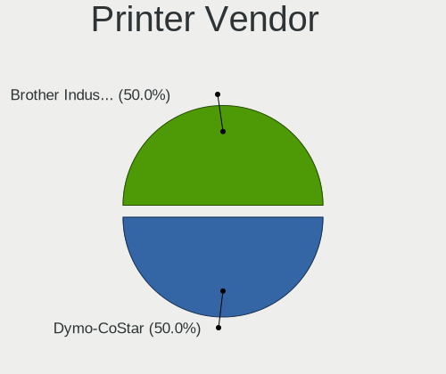

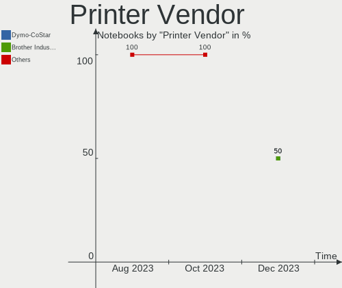

| Vendor          | Notebooks | Percent |
|-----------------|-----------|---------|
| Hewlett-Packard | 1         | 100%    |

Printer Model
-------------

Printer device models

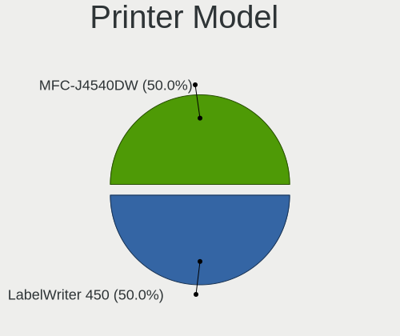

| Model                  | Notebooks | Percent |
|------------------------|-----------|---------|
| HP DeskJet 2700 series | 1         | 100%    |

Scanner Vendor
--------------

Scanner device vendors

Zero info for selected period =(

Scanner Model
-------------

Scanner device models

Zero info for selected period =(

Camera
------

Camera Vendor
-------------

Camera device vendors

| Vendor                                 | Notebooks | Percent |
|----------------------------------------|-----------|---------|
| Chicony Electronics                    | 11        | 21.15%  |
| IMC Networks                           | 6         | 11.54%  |
| Realtek Semiconductor                  | 5         | 9.62%   |
| Quanta                                 | 4         | 7.69%   |
| Microdia                               | 4         | 7.69%   |
| Lite-On Technology                     | 3         | 5.77%   |
| Bison Electronics                      | 3         | 5.77%   |
| Syntek                                 | 2         | 3.85%   |
| Cheng Uei Precision Industry (Foxlink) | 2         | 3.85%   |
| Apple                                  | 2         | 3.85%   |
| Suyin                                  | 1         | 1.92%   |
| Sunplus Innovation Technology          | 1         | 1.92%   |
| Sonix Technology                       | 1         | 1.92%   |
| ShineTech                              | 1         | 1.92%   |
| Philips (or NXP)                       | 1         | 1.92%   |
| OmniVision Technologies                | 1         | 1.92%   |
| Luxvisions Innotech Limited            | 1         | 1.92%   |
| Logitech                               | 1         | 1.92%   |
| Jieli Technology                       | 1         | 1.92%   |
| ARC International                      | 1         | 1.92%   |

Camera Model
------------

Camera device models

| Model                                                       | Notebooks | Percent |
|-------------------------------------------------------------|-----------|---------|
| IMC Networks USB2.0 HD UVC WebCam                           | 5         | 9.62%   |
| Chicony Integrated Camera                                   | 4         | 7.69%   |
| Microdia Integrated_Webcam_HD                               | 3         | 5.77%   |
| Realtek Integrated_Webcam_HD                                | 2         | 3.85%   |
| Syntek Lenovo EasyCamera                                    | 1         | 1.92%   |
| Syntek Integrated Camera                                    | 1         | 1.92%   |
| Suyin UVC HD Webcam                                         | 1         | 1.92%   |
| Sunplus FHD Camera Microphone                               | 1         | 1.92%   |
| Sonix USB2.0 FHD UVC WebCam                                 | 1         | 1.92%   |
| ShineTech USB2.0 HD UVC WebCam                              | 1         | 1.92%   |
| Realtek USB Camera                                          | 1         | 1.92%   |
| Realtek Integrated Webcam_HD                                | 1         | 1.92%   |
| Realtek EasyCamera                                          | 1         | 1.92%   |
| Quanta ov9734_techfront_camera                              | 1         | 1.92%   |
| Quanta HP Wide Vision HD Camera                             | 1         | 1.92%   |
| Quanta HP Webcam                                            | 1         | 1.92%   |
| Quanta HD User Facing                                       | 1         | 1.92%   |
| Philips (or NXP) PCVC740K ToUcam Pro [pwc]                  | 1         | 1.92%   |
| OmniVision OV2640 Webcam                                    | 1         | 1.92%   |
| Microdia Integrated Webcam                                  | 1         | 1.92%   |
| Luxvisions Innotech Limited HP HD Camera                    | 1         | 1.92%   |
| Logitech HD Webcam C910                                     | 1         | 1.92%   |
| Lite-On Integrated Camera                                   | 1         | 1.92%   |
| Lite-On HP HD Webcam                                        | 1         | 1.92%   |
| Lite-On HP HD Camera                                        | 1         | 1.92%   |
| Jieli USB PHY 2.0                                           | 1         | 1.92%   |
| IMC Networks Integrated Camera                              | 1         | 1.92%   |
| Chicony Webcam-101                                          | 1         | 1.92%   |
| Chicony LG Camera                                           | 1         | 1.92%   |
| Chicony Integrated HP HD Webcam                             | 1         | 1.92%   |
| Chicony Integrated Camera (1280x720@30)                     | 1         | 1.92%   |
| Chicony HP Wide Vision HD Camera                            | 1         | 1.92%   |
| Chicony HD WebCam                                           | 1         | 1.92%   |
| Chicony CNF8243 Webcam                                      | 1         | 1.92%   |
| Cheng Uei Precision Industry (Foxlink) HP Truevision HD     | 1         | 1.92%   |
| Cheng Uei Precision Industry (Foxlink) HP HD Webcam [Fixed] | 1         | 1.92%   |
| Bison Lenovo EasyCamera                                     | 1         | 1.92%   |
| Bison HD Webcam                                             | 1         | 1.92%   |
| Bison BisonCam,NB Pro                                       | 1         | 1.92%   |
| ARC International Camera                                    | 1         | 1.92%   |

Security
--------

Fingerprint Vendor
------------------

Fingerprint sensor vendors

| Vendor                     | Notebooks | Percent |
|----------------------------|-----------|---------|
| Validity Sensors           | 4         | 40%     |
| Synaptics                  | 3         | 30%     |
| Shenzhen Goodix Technology | 3         | 30%     |

Fingerprint Model
-----------------

Fingerprint sensor models

| Model                                             | Notebooks | Percent |
|---------------------------------------------------|-----------|---------|
| Validity Sensors VFS7500 Touch Fingerprint Sensor | 2         | 20%     |
| Shenzhen Goodix FingerPrint                       | 2         | 20%     |
| Validity Sensors VFS451 Fingerprint Reader        | 1         | 10%     |
| Validity Sensors Synaptics WBDI                   | 1         | 10%     |
| Synaptics UWP WBDI                                | 1         | 10%     |
| Synaptics Prometheus MIS Touch Fingerprint Reader | 1         | 10%     |
| Synaptics Fingerprint reader [HP G6]              | 1         | 10%     |
| Shenzhen Goodix  Fingerprint Device               | 1         | 10%     |

Chipcard Vendor
---------------

Chipcard module vendors

| Vendor      | Notebooks | Percent |
|-------------|-----------|---------|
| Broadcom    | 2         | 50%     |
| Upek        | 1         | 25%     |
| Alcor Micro | 1         | 25%     |

Chipcard Model
--------------

Chipcard module models

| Model                                                                        | Notebooks | Percent |
|------------------------------------------------------------------------------|-----------|---------|
| Upek TouchChip Fingerprint Coprocessor (WBF advanced mode)                   | 1         | 25%     |
| Broadcom BCM5880 Secure Applications Processor with fingerprint swipe sensor | 1         | 25%     |
| Broadcom 5880                                                                | 1         | 25%     |
| Alcor Micro AU9540 Smartcard Reader                                          | 1         | 25%     |

Unsupported
-----------

Unsupported Devices
-------------------

Total unsupported devices on board

| Total | Notebooks | Percent |
|-------|-----------|---------|
| 0     | 34        | 61.82%  |
| 1     | 18        | 32.73%  |
| 2     | 3         | 5.45%   |

Unsupported Device Types
------------------------

Types of unsupported devices

| Type                  | Notebooks | Percent |
|-----------------------|-----------|---------|
| Fingerprint reader    | 10        | 41.67%  |
| Chipcard              | 4         | 16.67%  |
| Graphics card         | 3         | 12.5%   |
| Net/wireless          | 2         | 8.33%   |
| Multimedia controller | 2         | 8.33%   |
| Bluetooth             | 2         | 8.33%   |
| Card reader           | 1         | 4.17%   |

