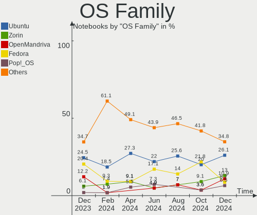
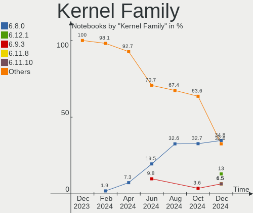
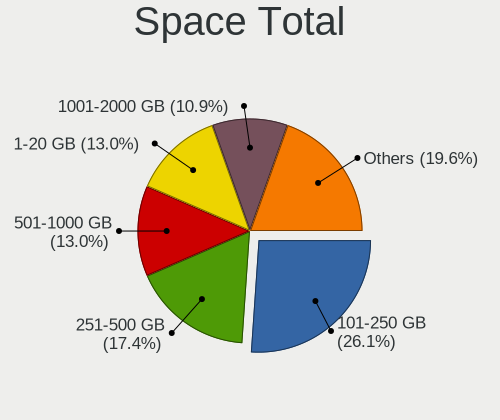
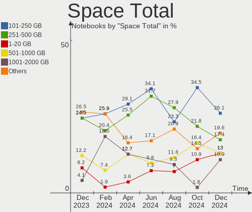
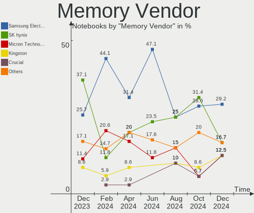
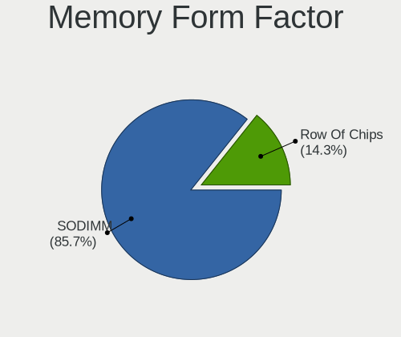
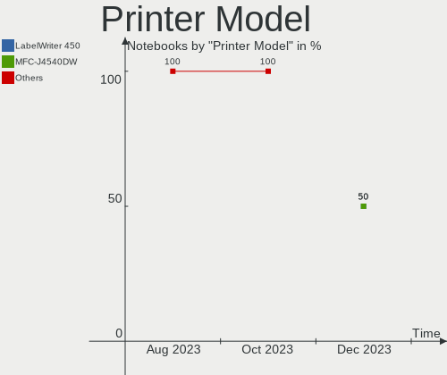

Linux in Netherlands - Hardware Trends (Notebooks)
--------------------------------------------------

A project to identify most popular hardware characteristics and track their change
over time based on data collected by Linux users at https://Linux-Hardware.org.

Anyone can contribute to this report by the [hw-probe](https://github.com/linuxhw/hw-probe) tool:

    sudo -E hw-probe -all -upload

Period: Oct, 2023.

Contents
--------

* [ System ](#system)
  - [ OS                       ](#os)
  - [ OS Family                ](#os-family)
  - [ Kernel                   ](#kernel)
  - [ Kernel Family            ](#kernel-family)
  - [ Kernel Major Ver.        ](#kernel-major-ver)
  - [ Arch                     ](#arch)
  - [ DE                       ](#de)
  - [ Display Server           ](#display-server)
  - [ Display Manager          ](#display-manager)
  - [ OS Lang                  ](#os-lang)
  - [ Boot Mode                ](#boot-mode)
  - [ Filesystem               ](#filesystem)
  - [ Part. scheme             ](#part-scheme)
  - [ Dual Boot with Linux/BSD ](#dual-boot-with-linuxbsd)
  - [ Dual Boot (Win)          ](#dual-boot-win)

* [ Board ](#board)
  - [ Vendor                   ](#vendor)
  - [ Model                    ](#model)
  - [ Model Family             ](#model-family)
  - [ MFG Year                 ](#mfg-year)
  - [ Form Factor              ](#form-factor)
  - [ Secure Boot              ](#secure-boot)
  - [ Coreboot                 ](#coreboot)
  - [ RAM Size                 ](#ram-size)
  - [ RAM Used                 ](#ram-used)
  - [ Total Drives             ](#total-drives)
  - [ Has CD-ROM               ](#has-cd-rom)
  - [ Has Ethernet             ](#has-ethernet)
  - [ Has WiFi                 ](#has-wifi)
  - [ Has Bluetooth            ](#has-bluetooth)

* [ Location ](#location)
  - [ Country                  ](#country)
  - [ City                     ](#city)

* [ Drives ](#drives)
  - [ Drive Vendor             ](#drive-vendor)
  - [ Drive Model              ](#drive-model)
  - [ HDD Vendor               ](#hdd-vendor)
  - [ SSD Vendor               ](#ssd-vendor)
  - [ Drive Kind               ](#drive-kind)
  - [ Drive Connector          ](#drive-connector)
  - [ Drive Size               ](#drive-size)
  - [ Space Total              ](#space-total)
  - [ Space Used               ](#space-used)
  - [ Malfunc. Drives          ](#malfunc-drives)
  - [ Malfunc. Drive Vendor    ](#malfunc-drive-vendor)
  - [ Malfunc. HDD Vendor      ](#malfunc-hdd-vendor)
  - [ Malfunc. Drive Kind      ](#malfunc-drive-kind)
  - [ Failed Drives            ](#failed-drives)
  - [ Failed Drive Vendor      ](#failed-drive-vendor)
  - [ Drive Status             ](#drive-status)

* [ Storage controller ](#storage-controller)
  - [ Storage Vendor           ](#storage-vendor)
  - [ Storage Model            ](#storage-model)
  - [ Storage Kind             ](#storage-kind)

* [ Processor ](#processor)
  - [ CPU Vendor               ](#cpu-vendor)
  - [ CPU Model                ](#cpu-model)
  - [ CPU Model Family         ](#cpu-model-family)
  - [ CPU Cores                ](#cpu-cores)
  - [ CPU Sockets              ](#cpu-sockets)
  - [ CPU Threads              ](#cpu-threads)
  - [ CPU Op-Modes             ](#cpu-op-modes)
  - [ CPU Microcode            ](#cpu-microcode)
  - [ CPU Microarch            ](#cpu-microarch)

* [ Graphics ](#graphics)
  - [ GPU Vendor               ](#gpu-vendor)
  - [ GPU Model                ](#gpu-model)
  - [ GPU Combo                ](#gpu-combo)
  - [ GPU Driver               ](#gpu-driver)
  - [ GPU Memory               ](#gpu-memory)

* [ Monitor ](#monitor)
  - [ Monitor Vendor           ](#monitor-vendor)
  - [ Monitor Model            ](#monitor-model)
  - [ Monitor Resolution       ](#monitor-resolution)
  - [ Monitor Diagonal         ](#monitor-diagonal)
  - [ Monitor Width            ](#monitor-width)
  - [ Aspect Ratio             ](#aspect-ratio)
  - [ Monitor Area             ](#monitor-area)
  - [ Pixel Density            ](#pixel-density)
  - [ Multiple Monitors        ](#multiple-monitors)

* [ Network ](#network)
  - [ Net Controller Vendor    ](#net-controller-vendor)
  - [ Net Controller Model     ](#net-controller-model)
  - [ Wireless Vendor          ](#wireless-vendor)
  - [ Wireless Model           ](#wireless-model)
  - [ Ethernet Vendor          ](#ethernet-vendor)
  - [ Ethernet Model           ](#ethernet-model)
  - [ Net Controller Kind      ](#net-controller-kind)
  - [ Used Controller          ](#used-controller)
  - [ NICs                     ](#nics)
  - [ IPv6                     ](#ipv6)

* [ Bluetooth ](#bluetooth)
  - [ Bluetooth Vendor         ](#bluetooth-vendor)
  - [ Bluetooth Model          ](#bluetooth-model)

* [ Sound ](#sound)
  - [ Sound Vendor             ](#sound-vendor)
  - [ Sound Model              ](#sound-model)

* [ Memory ](#memory)
  - [ Memory Vendor            ](#memory-vendor)
  - [ Memory Model             ](#memory-model)
  - [ Memory Kind              ](#memory-kind)
  - [ Memory Form Factor       ](#memory-form-factor)
  - [ Memory Size              ](#memory-size)
  - [ Memory Speed             ](#memory-speed)

* [ Printers & scanners ](#printers--scanners)
  - [ Printer Vendor           ](#printer-vendor)
  - [ Printer Model            ](#printer-model)
  - [ Scanner Vendor           ](#scanner-vendor)
  - [ Scanner Model            ](#scanner-model)

* [ Camera ](#camera)
  - [ Camera Vendor            ](#camera-vendor)
  - [ Camera Model             ](#camera-model)

* [ Security ](#security)
  - [ Fingerprint Vendor       ](#fingerprint-vendor)
  - [ Fingerprint Model        ](#fingerprint-model)
  - [ Chipcard Vendor          ](#chipcard-vendor)
  - [ Chipcard Model           ](#chipcard-model)

* [ Unsupported ](#unsupported)
  - [ Unsupported Devices      ](#unsupported-devices)
  - [ Unsupported Device Types ](#unsupported-device-types)

System
------

OS
--

Installed operating systems

| Name                | Notebooks | Percent |
|---------------------|-----------|---------|
| Ubuntu 22.04        | 12        | 22.64%  |
| Fedora 38           | 6         | 11.32%  |
| Zorin 16            | 5         | 9.43%   |
| Linux Mint 21.2     | 5         | 9.43%   |
| Debian 12           | 4         | 7.55%   |
| Ubuntu 23.04        | 3         | 5.66%   |
| Pop!_OS 22.04       | 2         | 3.77%   |
| KDE neon 22.04      | 2         | 3.77%   |
| Fedora 39           | 2         | 3.77%   |
| Ubuntu 2023.3       | 1         | 1.89%   |
| openSUSE Leap-15.5  | 1         | 1.89%   |
| OpenMandriva 23.10  | 1         | 1.89%   |
| NixOS 23.05         | 1         | 1.89%   |
| Manjaro             | 1         | 1.89%   |
| LMDE 6              | 1         | 1.89%   |
| Linux Mint 20.2     | 1         | 1.89%   |
| Linux Mint 19.3     | 1         | 1.89%   |
| Kali 2023.3         | 1         | 1.89%   |
| Kali 2023.1         | 1         | 1.89%   |
| EndeavourOS Rolling | 1         | 1.89%   |
| Debian              | 1         | 1.89%   |

OS Family
---------

OS without a version

| Name         | Notebooks | Percent |
|--------------|-----------|---------|
| Ubuntu       | 16        | 30.19%  |
| Fedora       | 8         | 15.09%  |
| Linux Mint   | 7         | 13.21%  |
| Zorin        | 5         | 9.43%   |
| Debian       | 5         | 9.43%   |
| Pop!_OS      | 2         | 3.77%   |
| KDE neon     | 2         | 3.77%   |
| Kali         | 2         | 3.77%   |
| openSUSE     | 1         | 1.89%   |
| OpenMandriva | 1         | 1.89%   |
| NixOS        | 1         | 1.89%   |
| Manjaro      | 1         | 1.89%   |
| LMDE         | 1         | 1.89%   |
| EndeavourOS  | 1         | 1.89%   |

Kernel
------

Version of the Linux kernel

| Version                      | Notebooks | Percent |
|------------------------------|-----------|---------|
| 6.2.0-34-generic             | 9         | 16.98%  |
| 6.2.0-35-generic             | 4         | 7.55%   |
| 5.15.0-86-generic            | 4         | 7.55%   |
| 6.1.0-12-amd64               | 3         | 5.66%   |
| 5.15.0-84-generic            | 3         | 5.66%   |
| 6.5.7-200.fc38.x86_64        | 2         | 3.77%   |
| 6.1.0-13-amd64               | 2         | 3.77%   |
| 6.5.8-300.fc39.x86_64        | 1         | 1.89%   |
| 6.5.8-273-tkg-linux-tkg-pds  | 1         | 1.89%   |
| 6.5.8-200.fc38.x86_64        | 1         | 1.89%   |
| 6.5.7-x64v4-xanmod1          | 1         | 1.89%   |
| 6.5.6-76060506-generic       | 1         | 1.89%   |
| 6.5.6-300.fc39.x86_64        | 1         | 1.89%   |
| 6.5.5-desktop-1omv2390       | 1         | 1.89%   |
| 6.5.5-200.fc38.x86_64        | 1         | 1.89%   |
| 6.5.5-060505-generic         | 1         | 1.89%   |
| 6.5.4-76060504-generic       | 1         | 1.89%   |
| 6.5.0-2-amd64                | 1         | 1.89%   |
| 6.4.7-200.fc38.x86_64        | 1         | 1.89%   |
| 6.4.16-6-MANJARO             | 1         | 1.89%   |
| 6.2.9-300.fc38.x86_64        | 1         | 1.89%   |
| 6.2.0-36-generic             | 1         | 1.89%   |
| 6.2.0-33-generic             | 1         | 1.89%   |
| 6.1.47                       | 1         | 1.89%   |
| 6.1.0-kali5-amd64            | 1         | 1.89%   |
| 5.4.0-164-generic            | 1         | 1.89%   |
| 5.19.0-40-generic            | 1         | 1.89%   |
| 5.19.0-051900-generic        | 1         | 1.89%   |
| 5.15.0-87-generic            | 1         | 1.89%   |
| 5.15.0-78-generic            | 1         | 1.89%   |
| 5.15.0-76-generic            | 1         | 1.89%   |
| 5.14.21-150500.55.28-default | 1         | 1.89%   |
| 5.0.0-32-generic             | 1         | 1.89%   |

Kernel Family
-------------

Linux kernel without a distro release

| Version | Notebooks | Percent |
|---------|-----------|---------|
| 6.2.0   | 15        | 28.3%   |
| 5.15.0  | 10        | 18.87%  |
| 6.1.0   | 6         | 11.32%  |
| 6.5.8   | 3         | 5.66%   |
| 6.5.7   | 3         | 5.66%   |
| 6.5.5   | 3         | 5.66%   |
| 6.5.6   | 2         | 3.77%   |
| 5.19.0  | 2         | 3.77%   |
| 6.5.4   | 1         | 1.89%   |
| 6.5.0   | 1         | 1.89%   |
| 6.4.7   | 1         | 1.89%   |
| 6.4.16  | 1         | 1.89%   |
| 6.2.9   | 1         | 1.89%   |
| 6.1.47  | 1         | 1.89%   |
| 5.4.0   | 1         | 1.89%   |
| 5.14.21 | 1         | 1.89%   |
| 5.0.0   | 1         | 1.89%   |

Kernel Major Ver.
-----------------

Linux kernel major version

| Version | Notebooks | Percent |
|---------|-----------|---------|
| 6.2     | 16        | 30.19%  |
| 6.5     | 13        | 24.53%  |
| 5.15    | 10        | 18.87%  |
| 6.1     | 7         | 13.21%  |
| 6.4     | 2         | 3.77%   |
| 5.19    | 2         | 3.77%   |
| 5.4     | 1         | 1.89%   |
| 5.14    | 1         | 1.89%   |
| 5.0     | 1         | 1.89%   |

Arch
----

OS architecture (x86_64, i586, etc.)

| Name   | Notebooks | Percent |
|--------|-----------|---------|
| x86_64 | 53        | 100%    |

DE
--

Desktop Environment

| Name       | Notebooks | Percent |
|------------|-----------|---------|
| GNOME      | 32        | 60.38%  |
| KDE5       | 10        | 18.87%  |
| X-Cinnamon | 5         | 9.43%   |
| MATE       | 4         | 7.55%   |
| XFCE       | 2         | 3.77%   |

Display Server
--------------

X11 or Wayland

| Name    | Notebooks | Percent |
|---------|-----------|---------|
| X11     | 27        | 50.94%  |
| Wayland | 24        | 45.28%  |
| Tty     | 1         | 1.89%   |
| Unknown | 1         | 1.89%   |

Display Manager
---------------

SDDM, LightDM, etc.

| Name    | Notebooks | Percent |
|---------|-----------|---------|
| GDM3    | 19        | 35.85%  |
| Unknown | 18        | 33.96%  |
| SDDM    | 6         | 11.32%  |
| GDM     | 6         | 11.32%  |
| LightDM | 4         | 7.55%   |

OS Lang
-------

Language

| Lang  | Notebooks | Percent |
|-------|-----------|---------|
| en_US | 25        | 47.17%  |
| nl_NL | 18        | 33.96%  |
| en_GB | 3         | 5.66%   |
| pl_PL | 1         | 1.89%   |
| it_IT | 1         | 1.89%   |
| fr_FR | 1         | 1.89%   |
| en_NL | 1         | 1.89%   |
| de_DE | 1         | 1.89%   |
| ca_ES | 1         | 1.89%   |
| C     | 1         | 1.89%   |

Boot Mode
---------

EFI or BIOS

| Mode | Notebooks | Percent |
|------|-----------|---------|
| EFI  | 27        | 50.94%  |
| BIOS | 26        | 49.06%  |

Filesystem
----------

Type of filesystem

| Type    | Notebooks | Percent |
|---------|-----------|---------|
| Ext4    | 29        | 54.72%  |
| Tmpfs   | 16        | 30.19%  |
| Btrfs   | 6         | 11.32%  |
| Zfs     | 1         | 1.89%   |
| Overlay | 1         | 1.89%   |

Part. scheme
------------

Scheme of partitioning

| Type    | Notebooks | Percent |
|---------|-----------|---------|
| GPT     | 33        | 62.26%  |
| Unknown | 18        | 33.96%  |
| MBR     | 2         | 3.77%   |

Dual Boot with Linux/BSD
------------------------

Hosting more than one Linux/BSD

| Dual boot | Notebooks | Percent |
|-----------|-----------|---------|
| No        | 45        | 84.91%  |
| Yes       | 8         | 15.09%  |

Dual Boot (Win)
---------------

Hosting Linux and Windows

| Dual boot | Notebooks | Percent |
|-----------|-----------|---------|
| No        | 37        | 69.81%  |
| Yes       | 16        | 30.19%  |

Board
-----

Vendor
------

Motherboard manufacturer

| Name                | Notebooks | Percent |
|---------------------|-----------|---------|
| Lenovo              | 11        | 20.75%  |
| Dell                | 9         | 16.98%  |
| Hewlett-Packard     | 8         | 15.09%  |
| ASUSTek Computer    | 7         | 13.21%  |
| Acer                | 7         | 13.21%  |
| Notebook            | 3         | 5.66%   |
| Medion              | 2         | 3.77%   |
| VALE                | 1         | 1.89%   |
| Samsung Electronics | 1         | 1.89%   |
| MSI                 | 1         | 1.89%   |
| HUAWEI              | 1         | 1.89%   |
| Gigabyte Technology | 1         | 1.89%   |
| Apple               | 1         | 1.89%   |

Model
-----

Motherboard model

| Name                                       | Notebooks | Percent |
|--------------------------------------------|-----------|---------|
| Dell XPS 9315                              | 2         | 3.77%   |
| VALE Notebook Classic C140                 | 1         | 1.89%   |
| Samsung 900X3C/900X3D/900X3E/900X4C/900X4D | 1         | 1.89%   |
| Notebook PCx0Dx                            | 1         | 1.89%   |
| Notebook PB50_70RF,RD,RC                   | 1         | 1.89%   |
| Notebook N85_N87HCHNHZ                     | 1         | 1.89%   |
| MSI GF75 Thin 9SC                          | 1         | 1.89%   |
| Medion P6613                               | 1         | 1.89%   |
| Medion E4251 MD61435                       | 1         | 1.89%   |
| Lenovo Yoga Slim 7 Pro 14ACH5 82MS         | 1         | 1.89%   |
| Lenovo V15 G2 ALC 82KD                     | 1         | 1.89%   |
| Lenovo ThinkPad T540p 20BE0086MH           | 1         | 1.89%   |
| Lenovo ThinkPad L14 Gen 4 21H1000VMH       | 1         | 1.89%   |
| Lenovo ThinkPad E15 Gen 3 20YGCTO1WW       | 1         | 1.89%   |
| Lenovo ThinkBook 15 G2 ARE 20VG            | 1         | 1.89%   |
| Lenovo Legion Y540-17IRH 81Q4              | 1         | 1.89%   |
| Lenovo Legion 5 Pro 16IAH7H 82RF           | 1         | 1.89%   |
| Lenovo IdeaPad S540-13IML 81XA             | 1         | 1.89%   |
| Lenovo IdeaPad MIIX 700-12ISK 80QL         | 1         | 1.89%   |
| Lenovo G50-70 20351                        | 1         | 1.89%   |
| HUAWEI NBLB-WAX9N                          | 1         | 1.89%   |
| HP ZBook Studio G5                         | 1         | 1.89%   |
| HP ProBook 6550b                           | 1         | 1.89%   |
| HP ProBook 650 G1                          | 1         | 1.89%   |
| HP Pavilion dv6                            | 1         | 1.89%   |
| HP OMEN by Laptop 17-an0xx                 | 1         | 1.89%   |
| HP Laptop 14s-dq2xxx                       | 1         | 1.89%   |
| HP EliteBook 8570p                         | 1         | 1.89%   |
| HP EliteBook 2540p                         | 1         | 1.89%   |
| Gigabyte AORUS 15G XB                      | 1         | 1.89%   |
| Dell XPS 15 9530                           | 1         | 1.89%   |
| Dell Vostro 3700                           | 1         | 1.89%   |
| Dell Latitude 7490                         | 1         | 1.89%   |
| Dell Latitude 7430                         | 1         | 1.89%   |
| Dell Latitude 5530                         | 1         | 1.89%   |
| Dell Latitude 5440                         | 1         | 1.89%   |
| Dell Inspiron 3793                         | 1         | 1.89%   |
| ASUS ZenBook UX425EA_UX425EA               | 1         | 1.89%   |
| ASUS Zenbook UM3402YAR_UM3402YA            | 1         | 1.89%   |
| ASUS VivoBook_ASUSLaptop X1605VA_X1605VA   | 1         | 1.89%   |

Model Family
------------

Motherboard model prefix

| Name              | Notebooks | Percent |
|-------------------|-----------|---------|
| Acer Aspire       | 6         | 11.32%  |
| Dell Latitude     | 4         | 7.55%   |
| Lenovo ThinkPad   | 3         | 5.66%   |
| Dell XPS          | 3         | 5.66%   |
| Lenovo Legion     | 2         | 3.77%   |
| Lenovo IdeaPad    | 2         | 3.77%   |
| HP ProBook        | 2         | 3.77%   |
| HP EliteBook      | 2         | 3.77%   |
| ASUS ZenBook      | 2         | 3.77%   |
| ASUS VivoBook     | 2         | 3.77%   |
| VALE Notebook     | 1         | 1.89%   |
| Samsung 900X3C    | 1         | 1.89%   |
| Notebook PCx0Dx   | 1         | 1.89%   |
| Notebook PB50     | 1         | 1.89%   |
| Notebook N85      | 1         | 1.89%   |
| MSI GF75          | 1         | 1.89%   |
| Medion P6613      | 1         | 1.89%   |
| Medion E4251      | 1         | 1.89%   |
| Lenovo Yoga       | 1         | 1.89%   |
| Lenovo V15        | 1         | 1.89%   |
| Lenovo ThinkBook  | 1         | 1.89%   |
| Lenovo G50-70     | 1         | 1.89%   |
| HUAWEI NBLB-WAX9N | 1         | 1.89%   |
| HP ZBook          | 1         | 1.89%   |
| HP Pavilion       | 1         | 1.89%   |
| HP OMEN           | 1         | 1.89%   |
| HP Laptop         | 1         | 1.89%   |
| Gigabyte AORUS    | 1         | 1.89%   |
| Dell Vostro       | 1         | 1.89%   |
| Dell Inspiron     | 1         | 1.89%   |
| ASUS ROG          | 1         | 1.89%   |
| ASUS G551JW       | 1         | 1.89%   |
| ASUS E402BA       | 1         | 1.89%   |
| Apple MacBookAir4 | 1         | 1.89%   |
| Acer Swift        | 1         | 1.89%   |

MFG Year
--------

Motherboard manufacture year

| Year | Notebooks | Percent |
|------|-----------|---------|
| 2021 | 7         | 13.21%  |
| 2022 | 6         | 11.32%  |
| 2020 | 6         | 11.32%  |
| 2019 | 6         | 11.32%  |
| 2023 | 4         | 7.55%   |
| 2018 | 4         | 7.55%   |
| 2013 | 4         | 7.55%   |
| 2017 | 3         | 5.66%   |
| 2010 | 3         | 5.66%   |
| 2015 | 2         | 3.77%   |
| 2014 | 2         | 3.77%   |
| 2012 | 2         | 3.77%   |
| 2008 | 2         | 3.77%   |
| 2016 | 1         | 1.89%   |
| 2009 | 1         | 1.89%   |

Form Factor
-----------

Physical design of the computer

| Name     | Notebooks | Percent |
|----------|-----------|---------|
| Notebook | 53        | 100%    |

Secure Boot
-----------

Enabled or disabled

| State    | Notebooks | Percent |
|----------|-----------|---------|
| Disabled | 43        | 81.13%  |
| Enabled  | 10        | 18.87%  |

Coreboot
--------

Have coreboot on board

| Used | Notebooks | Percent |
|------|-----------|---------|
| No   | 53        | 100%    |

RAM Size
--------

Total RAM memory

| Size in GB  | Notebooks | Percent |
|-------------|-----------|---------|
| 8.01-16.0   | 17        | 32.08%  |
| 4.01-8.0    | 11        | 20.75%  |
| 3.01-4.0    | 10        | 18.87%  |
| 16.01-24.0  | 7         | 13.21%  |
| 32.01-64.0  | 4         | 7.55%   |
| 64.01-256.0 | 3         | 5.66%   |
| 24.01-32.0  | 1         | 1.89%   |

RAM Used
--------

Used RAM memory

| Used GB   | Notebooks | Percent |
|-----------|-----------|---------|
| 2.01-3.0  | 13        | 24.53%  |
| 4.01-8.0  | 12        | 22.64%  |
| 3.01-4.0  | 12        | 22.64%  |
| 1.01-2.0  | 11        | 20.75%  |
| 8.01-16.0 | 4         | 7.55%   |
| 0.51-1.0  | 1         | 1.89%   |

Total Drives
------------

Number of drives on board

| Drives | Notebooks | Percent |
|--------|-----------|---------|
| 1      | 42        | 79.25%  |
| 2      | 9         | 16.98%  |
| 3      | 2         | 3.77%   |

Has CD-ROM
----------

Has CD-ROM on board

| Presented | Notebooks | Percent |
|-----------|-----------|---------|
| No        | 37        | 69.81%  |
| Yes       | 16        | 30.19%  |

Has Ethernet
------------

Has Ethernet on board

| Presented | Notebooks | Percent |
|-----------|-----------|---------|
| Yes       | 38        | 71.7%   |
| No        | 15        | 28.3%   |

Has WiFi
--------

Has WiFi module

| Presented | Notebooks | Percent |
|-----------|-----------|---------|
| Yes       | 53        | 100%    |

Has Bluetooth
-------------

Has Bluetooth module

| Presented | Notebooks | Percent |
|-----------|-----------|---------|
| Yes       | 49        | 92.45%  |
| No        | 4         | 7.55%   |

Location
--------

Country
-------

Geographic location (country)

| Country     | Notebooks | Percent |
|-------------|-----------|---------|
| Netherlands | 53        | 100%    |

City
----

Geographic location (city)

| City        | Notebooks | Percent |
|-------------|-----------|---------|
| Amsterdam   | 12        | 22.64%  |
| Rotterdam   | 3         | 5.66%   |
| Haarlem     | 3         | 5.66%   |
| Groningen   | 3         | 5.66%   |
| Delft       | 3         | 5.66%   |
| Naaldwijk   | 2         | 3.77%   |
| Kerkrade    | 2         | 3.77%   |
| Amstelveen  | 2         | 3.77%   |
| Zutphen     | 1         | 1.89%   |
| Wageningen  | 1         | 1.89%   |
| Venlo       | 1         | 1.89%   |
| Veghel      | 1         | 1.89%   |
| The Hague   | 1         | 1.89%   |
| Schiedam    | 1         | 1.89%   |
| Purmerend   | 1         | 1.89%   |
| Papendrecht | 1         | 1.89%   |
| Oude-Tonge  | 1         | 1.89%   |
| Meerssen    | 1         | 1.89%   |
| Luttelgeest | 1         | 1.89%   |
| Lochem      | 1         | 1.89%   |
| Hoogeveen   | 1         | 1.89%   |
| Heeze       | 1         | 1.89%   |
| Gennep      | 1         | 1.89%   |
| Enschede    | 1         | 1.89%   |
| Eindhoven   | 1         | 1.89%   |
| Breda       | 1         | 1.89%   |
| Blaricum    | 1         | 1.89%   |
| Baarn       | 1         | 1.89%   |
| Assendelft  | 1         | 1.89%   |
| Almelo      | 1         | 1.89%   |
| Aalten      | 1         | 1.89%   |

Drives
------

Drive Vendor
------------

Hard drive vendors

| Vendor                      | Notebooks | Drives | Percent |
|-----------------------------|-----------|--------|---------|
| Samsung Electronics         | 13        | 16     | 21.31%  |
| Sandisk                     | 8         | 8      | 13.11%  |
| SK hynix                    | 5         | 5      | 8.2%    |
| Intel                       | 5         | 6      | 8.2%    |
| Kingston                    | 4         | 4      | 6.56%   |
| Seagate                     | 3         | 3      | 4.92%   |
| Micron Technology           | 3         | 3      | 4.92%   |
| WDC                         | 2         | 3      | 3.28%   |
| Unknown                     | 2         | 2      | 3.28%   |
| Toshiba                     | 2         | 2      | 3.28%   |
| Phison Electronics          | 2         | 2      | 3.28%   |
| Hitachi                     | 2         | 2      | 3.28%   |
| HGST                        | 2         | 2      | 3.28%   |
| Crucial                     | 2         | 2      | 3.28%   |
| Union Memory (Shenzhen)     | 1         | 1      | 1.64%   |
| Phison                      | 1         | 1      | 1.64%   |
| MAXIO Technology (Hangzhou) | 1         | 1      | 1.64%   |
| JMicron Technology          | 1         | 1      | 1.64%   |
| GLOWAY                      | 1         | 1      | 1.64%   |
| Aura                        | 1         | 1      | 1.64%   |

Drive Model
-----------

Hard drive models

| Model                                               | Notebooks | Percent |
|-----------------------------------------------------|-----------|---------|
| Samsung NVMe SSD Controller SM981/PM981/PM983 1TB   | 2         | 3.08%   |
| Samsung NVMe SSD Controller PM9A1/PM9A3/980PRO 1TB  | 2         | 3.08%   |
| Phison ESE2A044-512 NVMe 512GB                      | 2         | 3.08%   |
| Intel SSD 660P Series 1024GB                        | 2         | 3.08%   |
| WDC WDS200T1X0E-00AFY0 2TB                          | 1         | 1.54%   |
| WDC WDS100T2B0A 1TB SSD                             | 1         | 1.54%   |
| WDC WD6400BEVT-22A0RT0 640GB                        | 1         | 1.54%   |
| Unknown MMC Card  4GB                               | 1         | 1.54%   |
| Unknown MMC Card  2GB                               | 1         | 1.54%   |
| Union Memory (Shenzhen) UMIS RPJTJ512MKP1QDQ 512GB  | 1         | 1.54%   |
| Toshiba KXG60ZNV512G 512GB                          | 1         | 1.54%   |
| Toshiba KBG40ZNT512G MEMORY 512GB                   | 1         | 1.54%   |
| SK hynix SC401 SATA 512GB SSD                       | 1         | 1.54%   |
| SK hynix PC801 NVMe 2TB                             | 1         | 1.54%   |
| SK hynix HFS256G32TND-N210A 256GB SSD               | 1         | 1.54%   |
| SK hynix HFS128G32TNF-N3A0A 128GB SSD               | 1         | 1.54%   |
| SK hynix HFM512GDJTNI-82A0A 512GB                   | 1         | 1.54%   |
| Seagate ST1000LM035-1RK172 1TB                      | 1         | 1.54%   |
| Seagate ST1000LM014-1EJ164 1TB                      | 1         | 1.54%   |
| Seagate Expansion Desk 3TB                          | 1         | 1.54%   |
| Sandisk WD_BLACK SN750 SE 1TB                       | 1         | 1.54%   |
| Sandisk WD PC SN740 SDDQNQD-512G-1014 512GB         | 1         | 1.54%   |
| Sandisk WD Black SN750 / PC SN730 NVMe SSD 1024GB   | 1         | 1.54%   |
| Sandisk WD Black 2018/SN750 / PC SN720 NVMe SSD 1TB | 1         | 1.54%   |
| SanDisk SSD U100 SMG2 128GB                         | 1         | 1.54%   |
| SanDisk SSD PLUS 240GB                              | 1         | 1.54%   |
| SanDisk SDSSDA240G 240GB                            | 1         | 1.54%   |
| SanDisk SD8SN8U-128G-1006 128GB SSD                 | 1         | 1.54%   |
| Samsung SSD 990 PRO 2TB                             | 1         | 1.54%   |
| Samsung SSD 980 PRO 2TB                             | 1         | 1.54%   |
| Samsung SSD 980 1TB                                 | 1         | 1.54%   |
| Samsung SSD 840 PRO Series 512GB                    | 1         | 1.54%   |
| Samsung SSD 650 120GB                               | 1         | 1.54%   |
| Samsung PM9B1 NVMe 512GB                            | 1         | 1.54%   |
| Samsung PM9A1 NVMe 512GB                            | 1         | 1.54%   |
| Samsung MZVLQ1T0HBLB-00B00 1024GB                   | 1         | 1.54%   |
| Samsung MZVLQ1T0HALB-00000 1TB                      | 1         | 1.54%   |
| Samsung MZVLB1T0HBLR-00000 1TB                      | 1         | 1.54%   |
| Samsung MZALQ512HALU-000L2 512GB                    | 1         | 1.54%   |
| Phison S11-128G-PHISON-SSD-B3 128GB                 | 1         | 1.54%   |

HDD Vendor
----------

Hard disk drive vendors

| Vendor  | Notebooks | Drives | Percent |
|---------|-----------|--------|---------|
| Seagate | 3         | 3      | 37.5%   |
| Hitachi | 2         | 2      | 25%     |
| HGST    | 2         | 2      | 25%     |
| WDC     | 1         | 1      | 12.5%   |

SSD Vendor
----------

Solid state drive vendors

| Vendor              | Notebooks | Drives | Percent |
|---------------------|-----------|--------|---------|
| SanDisk             | 4         | 4      | 22.22%  |
| SK hynix            | 3         | 3      | 16.67%  |
| Kingston            | 3         | 3      | 16.67%  |
| Samsung Electronics | 2         | 2      | 11.11%  |
| Crucial             | 2         | 2      | 11.11%  |
| WDC                 | 1         | 1      | 5.56%   |
| Phison              | 1         | 1      | 5.56%   |
| Micron Technology   | 1         | 1      | 5.56%   |
| GLOWAY              | 1         | 1      | 5.56%   |

Drive Kind
----------

HDD or SSD

| Kind    | Notebooks | Drives | Percent |
|---------|-----------|--------|---------|
| NVMe    | 32        | 37     | 53.33%  |
| SSD     | 17        | 18     | 28.33%  |
| HDD     | 8         | 8      | 13.33%  |
| MMC     | 2         | 2      | 3.33%   |
| Unknown | 1         | 1      | 1.67%   |

Drive Connector
---------------

SATA, SAS, NVMe, etc.

| Type | Notebooks | Drives | Percent |
|------|-----------|--------|---------|
| NVMe | 32        | 36     | 53.33%  |
| SATA | 24        | 25     | 40%     |
| SAS  | 2         | 3      | 3.33%   |
| MMC  | 2         | 2      | 3.33%   |

Drive Size
----------

Size of hard drive

| Size in TB | Notebooks | Drives | Percent |
|------------|-----------|--------|---------|
| 0.01-0.5   | 17        | 18     | 68%     |
| 0.51-1.0   | 7         | 7      | 28%     |
| 2.01-3.0   | 1         | 1      | 4%      |

Space Total
-----------

Amount of disk space available on the file system

| Size in GB     | Notebooks | Percent |
|----------------|-----------|---------|
| 101-250        | 16        | 30.19%  |
| 251-500        | 15        | 28.3%   |
| 1-20           | 5         | 9.43%   |
| 501-1000       | 5         | 9.43%   |
| 21-50          | 4         | 7.55%   |
| 1001-2000      | 4         | 7.55%   |
| 51-100         | 2         | 3.77%   |
| More than 3000 | 1         | 1.89%   |
| Unknown        | 1         | 1.89%   |

Space Used
----------

Amount of used disk space

| Used GB  | Notebooks | Percent |
|----------|-----------|---------|
| 21-50    | 16        | 30.19%  |
| 101-250  | 13        | 24.53%  |
| 1-20     | 11        | 20.75%  |
| 251-500  | 5         | 9.43%   |
| 51-100   | 5         | 9.43%   |
| 501-1000 | 2         | 3.77%   |
| Unknown  | 1         | 1.89%   |

Malfunc. Drives
---------------

Drive models with a malfunction

| Model                                 | Notebooks | Drives | Percent |
|---------------------------------------|-----------|--------|---------|
| SK hynix HFS256G32TND-N210A 256GB SSD | 1         | 1      | 25%     |
| Intel SSDPEKKW256G7 256GB             | 1         | 1      | 25%     |
| Hitachi HTS725050A7E630 500GB         | 1         | 1      | 25%     |
| HGST HTS721010A9E630 1TB              | 1         | 1      | 25%     |

Malfunc. Drive Vendor
---------------------

Vendors of faulty drives

| Vendor   | Notebooks | Drives | Percent |
|----------|-----------|--------|---------|
| SK hynix | 1         | 1      | 25%     |
| Intel    | 1         | 1      | 25%     |
| Hitachi  | 1         | 1      | 25%     |
| HGST     | 1         | 1      | 25%     |

Malfunc. HDD Vendor
-------------------

Vendors of faulty HDD drives

| Vendor  | Notebooks | Drives | Percent |
|---------|-----------|--------|---------|
| Hitachi | 1         | 1      | 50%     |
| HGST    | 1         | 1      | 50%     |

Malfunc. Drive Kind
-------------------

Kinds of faulty drives

| Kind | Notebooks | Drives | Percent |
|------|-----------|--------|---------|
| HDD  | 2         | 2      | 50%     |
| NVMe | 1         | 1      | 25%     |
| SSD  | 1         | 1      | 25%     |

Failed Drives
-------------

Failed drive models

Zero info for selected period =(

Failed Drive Vendor
-------------------

Failed drive vendors

Zero info for selected period =(

Drive Status
------------

Number of failed and malfunc. drives

| Status   | Notebooks | Drives | Percent |
|----------|-----------|--------|---------|
| Detected | 34        | 42     | 61.82%  |
| Works    | 17        | 20     | 30.91%  |
| Malfunc  | 4         | 4      | 7.27%   |

Storage controller
------------------

Storage Vendor
--------------

Storage controller vendors

| Vendor                                  | Notebooks | Percent |
|-----------------------------------------|-----------|---------|
| Intel                                   | 41        | 56.94%  |
| Samsung Electronics                     | 11        | 15.28%  |
| SanDisk                                 | 5         | 6.94%   |
| AMD                                     | 4         | 5.56%   |
| SK hynix                                | 2         | 2.78%   |
| Phison Electronics                      | 2         | 2.78%   |
| Micron Technology                       | 2         | 2.78%   |
| Toshiba America Info Systems            | 1         | 1.39%   |
| Shenzhen Unionmemory Information System | 1         | 1.39%   |
| MAXIO Technology (Hangzhou)             | 1         | 1.39%   |
| KIOXIA                                  | 1         | 1.39%   |
| Kingston Technology Company             | 1         | 1.39%   |

Storage Model
-------------

Storage controller models

| Model                                                                                       | Notebooks | Percent |
|---------------------------------------------------------------------------------------------|-----------|---------|
| Intel Volume Management Device NVMe RAID Controller                                         | 7         | 8.97%   |
| Samsung NVMe SSD Controller PM9A1/PM9A3/980PRO                                              | 4         | 5.13%   |
| Samsung NVMe SSD Controller 980 (DRAM-less)                                                 | 4         | 5.13%   |
| Intel Cannon Lake Mobile PCH SATA AHCI Controller                                           | 4         | 5.13%   |
| AMD FCH SATA Controller [AHCI mode]                                                         | 4         | 5.13%   |
| Samsung NVMe SSD Controller SM981/PM981/PM983                                               | 3         | 3.85%   |
| Intel Sunrise Point-LP SATA Controller [AHCI mode]                                          | 3         | 3.85%   |
| Intel SSD 660P Series                                                                       | 3         | 3.85%   |
| Intel 82801IBM/IEM (ICH9M/ICH9M-E) 4 port SATA Controller [AHCI mode]                       | 3         | 3.85%   |
| Intel 8 Series/C220 Series Chipset Family 6-port SATA Controller 1 [AHCI mode]              | 3         | 3.85%   |
| Intel 5 Series/3400 Series Chipset 6 port SATA AHCI Controller                              | 3         | 3.85%   |
| Phison PS5019-E19 PCIe4 NVMe Controller (DRAM-less)                                         | 2         | 2.56%   |
| Intel Volume Management Device NVMe RAID Controller Intel Corporation                       | 2         | 2.56%   |
| Intel HM170/QM170 Chipset SATA Controller [AHCI Mode]                                       | 2         | 2.56%   |
| Intel Comet Lake SATA AHCI Controller                                                       | 2         | 2.56%   |
| Intel Celeron/Pentium Silver Processor SATA Controller                                      | 2         | 2.56%   |
| Intel 8 Series SATA Controller 1 [AHCI mode]                                                | 2         | 2.56%   |
| Intel 7 Series Chipset Family 6-port SATA Controller [AHCI mode]                            | 2         | 2.56%   |
| Toshiba America Info Systems XG6 NVMe SSD Controller                                        | 1         | 1.28%   |
| SK hynix Platinum P41/PC801 NVMe Solid State Drive                                          | 1         | 1.28%   |
| SK hynix BC511 NVMe SSD                                                                     | 1         | 1.28%   |
| Shenzhen Unionmemory Information System RPETJ512MKP1QDQ PCIe 4.0 NVMe SSD 512GB (DRAM-less) | 1         | 1.28%   |
| SanDisk WD PC SN810 / Black SN850 NVMe SSD                                                  | 1         | 1.28%   |
| SanDisk WD Black SN770 / PC SN740 256GB / PC SN560 (DRAM-less) NVMe SSD                     | 1         | 1.28%   |
| SanDisk PC SN735 NVMe SSD (DRAM-less)                                                       | 1         | 1.28%   |
| SanDisk Extreme Pro / WD Black SN750 / PC SN730 / Red SN700 NVMe SSD                        | 1         | 1.28%   |
| SanDisk Extreme Pro / WD Black 2018/SN750/PC SN720 NVMe SSD                                 | 1         | 1.28%   |
| Samsung NVMe SSD Controller S4LV008[Pascal]                                                 | 1         | 1.28%   |
| Samsung NVMe SSD Controller PM9B1 (DRAM-less)                                               | 1         | 1.28%   |
| Micron 2450 NVMe SSD [HendrixV] (DRAM-less)                                                 | 1         | 1.28%   |
| Micron 2300 NVMe SSD [Santana]                                                              | 1         | 1.28%   |
| MAXIO (Hangzhou) NVMe SSD Controller MAP1202                                                | 1         | 1.28%   |
| KIOXIA NVMe SSD Controller BG4 (DRAM-less)                                                  | 1         | 1.28%   |
| Kingston Company OM8SBP NVMe PCIe SSD (DRAM-less)                                           | 1         | 1.28%   |
| Intel SSD 670p Series [Keystone Harbor]                                                     | 1         | 1.28%   |
| Intel SSD 600P Series                                                                       | 1         | 1.28%   |
| Intel Jasper Lake SATA AHCI Controller                                                      | 1         | 1.28%   |
| Intel Ice Lake-LP SATA Controller [AHCI mode]                                               | 1         | 1.28%   |
| Intel 82801 Mobile SATA Controller [RAID mode]                                              | 1         | 1.28%   |
| Intel 6 Series/C200 Series Chipset Family 6 port Mobile SATA AHCI Controller                | 1         | 1.28%   |

Storage Kind
------------

Kind of storage controller (IDE, SATA, NVMe, SAS, ...)

| Kind | Notebooks | Percent |
|------|-----------|---------|
| SATA | 34        | 44.74%  |
| NVMe | 32        | 42.11%  |
| RAID | 10        | 13.16%  |

Processor
---------

CPU Vendor
----------

Processor vendors

| Vendor | Notebooks | Percent |
|--------|-----------|---------|
| Intel  | 45        | 84.91%  |
| AMD    | 8         | 15.09%  |

CPU Model
---------

Processor models

| Model                                       | Notebooks | Percent |
|---------------------------------------------|-----------|---------|
| Intel Core i7-9750H CPU @ 2.60GHz           | 2         | 3.77%   |
| Intel Core i5-10210U CPU @ 1.60GHz          | 2         | 3.77%   |
| Intel 13th Gen Core i9-13900H               | 2         | 3.77%   |
| Intel 12th Gen Core i7-1250U                | 2         | 3.77%   |
| Intel Pentium Silver N5030 CPU @ 1.10GHz    | 1         | 1.89%   |
| Intel Pentium Dual-Core CPU T4400 @ 2.20GHz | 1         | 1.89%   |
| Intel Pentium Dual-Core CPU T4200 @ 2.00GHz | 1         | 1.89%   |
| Intel Pentium 3558U @ 1.70GHz               | 1         | 1.89%   |
| Intel Core m7-6Y75 CPU @ 1.20GHz            | 1         | 1.89%   |
| Intel Core i9-9980HK CPU @ 2.40GHz          | 1         | 1.89%   |
| Intel Core i7-8750H CPU @ 2.20GHz           | 1         | 1.89%   |
| Intel Core i7-8550U CPU @ 1.80GHz           | 1         | 1.89%   |
| Intel Core i7-7700HQ CPU @ 2.80GHz          | 1         | 1.89%   |
| Intel Core i7-4720HQ CPU @ 2.60GHz          | 1         | 1.89%   |
| Intel Core i7-4700MQ CPU @ 2.40GHz          | 1         | 1.89%   |
| Intel Core i7-3520M CPU @ 2.90GHz           | 1         | 1.89%   |
| Intel Core i7-10875H CPU @ 2.30GHz          | 1         | 1.89%   |
| Intel Core i7-10870H CPU @ 2.20GHz          | 1         | 1.89%   |
| Intel Core i7-10510U CPU @ 1.80GHz          | 1         | 1.89%   |
| Intel Core i7 CPU L 640 @ 2.13GHz           | 1         | 1.89%   |
| Intel Core i5-8350U CPU @ 1.70GHz           | 1         | 1.89%   |
| Intel Core i5-7300HQ CPU @ 2.50GHz          | 1         | 1.89%   |
| Intel Core i5-6200U CPU @ 2.30GHz           | 1         | 1.89%   |
| Intel Core i5-4200M CPU @ 2.50GHz           | 1         | 1.89%   |
| Intel Core i5-3317U CPU @ 1.70GHz           | 1         | 1.89%   |
| Intel Core i5-2557M CPU @ 1.70GHz           | 1         | 1.89%   |
| Intel Core i5-1035G1 CPU @ 1.00GHz          | 1         | 1.89%   |
| Intel Core i5 CPU M 560 @ 2.67GHz           | 1         | 1.89%   |
| Intel Core i5 CPU M 520 @ 2.40GHz           | 1         | 1.89%   |
| Intel Core i3-4012Y CPU @ 1.50GHz           | 1         | 1.89%   |
| Intel Core 2 Duo CPU T6400 @ 2.00GHz        | 1         | 1.89%   |
| Intel Celeron N5100 @ 1.10GHz               | 1         | 1.89%   |
| Intel Celeron N4000 CPU @ 1.10GHz           | 1         | 1.89%   |
| Intel 13th Gen Core i5-1350P                | 1         | 1.89%   |
| Intel 13th Gen Core i5-1335U                | 1         | 1.89%   |
| Intel 12th Gen Core i7-12700H               | 1         | 1.89%   |
| Intel 12th Gen Core i7-1265U                | 1         | 1.89%   |
| Intel 12th Gen Core i7-12650H               | 1         | 1.89%   |
| Intel 12th Gen Core i5-1245U                | 1         | 1.89%   |
| Intel 11th Gen Core i7-1165G7 @ 2.80GHz     | 1         | 1.89%   |

CPU Model Family
----------------

Processor model prefix

| Model                   | Notebooks | Percent |
|-------------------------|-----------|---------|
| Other                   | 13        | 24.53%  |
| Intel Core i7           | 12        | 22.64%  |
| Intel Core i5           | 11        | 20.75%  |
| AMD Ryzen 7             | 4         | 7.55%   |
| AMD Ryzen 5             | 3         | 5.66%   |
| Intel Pentium Dual-Core | 2         | 3.77%   |
| Intel Celeron           | 2         | 3.77%   |
| Intel Pentium Silver    | 1         | 1.89%   |
| Intel Pentium           | 1         | 1.89%   |
| Intel Core m7           | 1         | 1.89%   |
| Intel Core i9           | 1         | 1.89%   |
| Intel Core i3           | 1         | 1.89%   |
| Intel Core 2 Duo        | 1         | 1.89%   |

CPU Cores
---------

Number of processor cores

| Number | Notebooks | Percent |
|--------|-----------|---------|
| 2      | 17        | 32.08%  |
| 4      | 13        | 24.53%  |
| 8      | 7         | 13.21%  |
| 10     | 6         | 11.32%  |
| 6      | 6         | 11.32%  |
| 14     | 3         | 5.66%   |
| 12     | 1         | 1.89%   |

CPU Sockets
-----------

Number of sockets

| Number | Notebooks | Percent |
|--------|-----------|---------|
| 1      | 53        | 100%    |

CPU Threads
-----------

Threads per core (Hyper-Threading)

| Number | Notebooks | Percent |
|--------|-----------|---------|
| 2      | 39        | 73.58%  |
| 1      | 14        | 26.42%  |

CPU Op-Modes
------------

CPU Operation Modes (32-bit, 64-bit)

| Op mode        | Notebooks | Percent |
|----------------|-----------|---------|
| 32-bit, 64-bit | 53        | 100%    |

CPU Microcode
-------------

Microcode number

| Number     | Notebooks | Percent |
|------------|-----------|---------|
| Unknown    | 35        | 66.04%  |
| 0x906a4    | 3         | 5.66%   |
| 0x906e9    | 2         | 3.77%   |
| 0x1067a    | 2         | 3.77%   |
| 0xb06a2    | 1         | 1.89%   |
| 0x806ec    | 1         | 1.89%   |
| 0x806ea    | 1         | 1.89%   |
| 0x706a1    | 1         | 1.89%   |
| 0x40651    | 1         | 1.89%   |
| 0x20655    | 1         | 1.89%   |
| 0x0a50000d | 1         | 1.89%   |
| 0x0a50000b | 1         | 1.89%   |
| 0x08608103 | 1         | 1.89%   |
| 0x08600103 | 1         | 1.89%   |
| 0x06006705 | 1         | 1.89%   |

CPU Microarch
-------------

Microarchitecture

| Name             | Notebooks | Percent |
|------------------|-----------|---------|
| KabyLake         | 11        | 20.75%  |
| Alderlake Hybrid | 10        | 18.87%  |
| Haswell          | 5         | 9.43%   |
| Zen 3            | 3         | 5.66%   |
| Westmere         | 3         | 5.66%   |
| Penryn           | 3         | 5.66%   |
| Unknown          | 3         | 5.66%   |
| Zen 2            | 2         | 3.77%   |
| TigerLake        | 2         | 3.77%   |
| Skylake          | 2         | 3.77%   |
| IvyBridge        | 2         | 3.77%   |
| Goldmont plus    | 2         | 3.77%   |
| CometLake        | 2         | 3.77%   |
| SandyBridge      | 1         | 1.89%   |
| IceLake          | 1         | 1.89%   |
| Excavator        | 1         | 1.89%   |

Graphics
--------

GPU Vendor
----------

Vendors of graphics cards

| Vendor | Notebooks | Percent |
|--------|-----------|---------|
| Intel  | 40        | 58.82%  |
| Nvidia | 19        | 27.94%  |
| AMD    | 9         | 13.24%  |

GPU Model
---------

Graphics card models

| Model                                                          | Notebooks | Percent |
|----------------------------------------------------------------|-----------|---------|
| Intel Raptor Lake-P [Iris Xe Graphics]                         | 3         | 4.35%   |
| Intel CometLake-U GT2 [UHD Graphics]                           | 3         | 4.35%   |
| Intel CoffeeLake-H GT2 [UHD Graphics 630]                      | 3         | 4.35%   |
| Intel 4th Gen Core Processor Integrated Graphics Controller    | 3         | 4.35%   |
| Nvidia GA104M [GeForce RTX 3070 Mobile / Max-Q]                | 2         | 2.9%    |
| Intel UHD Graphics 620                                         | 2         | 2.9%    |
| Intel HD Graphics 630                                          | 2         | 2.9%    |
| Intel Core Processor Integrated Graphics Controller            | 2         | 2.9%    |
| Intel CometLake-H GT2 [UHD Graphics]                           | 2         | 2.9%    |
| Intel Alder Lake-UP4 GT2 [Iris Xe Graphics]                    | 2         | 2.9%    |
| Intel Alder Lake-UP3 GT2 [Iris Xe Graphics]                    | 2         | 2.9%    |
| Intel 3rd Gen Core processor Graphics Controller               | 2         | 2.9%    |
| AMD Renoir [Radeon RX Vega 6 (Ryzen 4000/5000 Mobile Series)]  | 2         | 2.9%    |
| AMD Lucienne                                                   | 2         | 2.9%    |
| AMD Cezanne [Radeon Vega Series / Radeon Vega Mobile Series]   | 2         | 2.9%    |
| Nvidia TU117M [GeForce GTX 1650 Mobile / Max-Q]                | 1         | 1.45%   |
| Nvidia TU106M [GeForce RTX 2070 Mobile]                        | 1         | 1.45%   |
| Nvidia TU106M [GeForce RTX 2060 Mobile]                        | 1         | 1.45%   |
| Nvidia TU104M [GeForce RTX 2070 SUPER Mobile / Max-Q]          | 1         | 1.45%   |
| Nvidia GT216M [GeForce GT 330M]                                | 1         | 1.45%   |
| Nvidia GP108M [GeForce MX250]                                  | 1         | 1.45%   |
| Nvidia GP108M [GeForce MX230]                                  | 1         | 1.45%   |
| Nvidia GP107M [GeForce MX350]                                  | 1         | 1.45%   |
| Nvidia GP107M [GeForce GTX 1050 Mobile]                        | 1         | 1.45%   |
| Nvidia GP107GLM [Quadro P1000 Mobile]                          | 1         | 1.45%   |
| Nvidia GM107M [GeForce GTX 960M]                               | 1         | 1.45%   |
| Nvidia GK208M [GeForce GT 730M]                                | 1         | 1.45%   |
| Nvidia GA107M [GeForce RTX 3050 Ti Mobile]                     | 1         | 1.45%   |
| Nvidia G98M [GeForce G 105M]                                   | 1         | 1.45%   |
| Nvidia G98M [GeForce 9200M GS]                                 | 1         | 1.45%   |
| Nvidia AD107M [GeForce RTX 4060 Max-Q / Mobile]                | 1         | 1.45%   |
| Nvidia AD107M [GeForce RTX 4050 Max-Q / Mobile]                | 1         | 1.45%   |
| Intel TigerLake-LP GT2 [Iris Xe Graphics]                      | 1         | 1.45%   |
| Intel Tiger Lake-LP GT2 [UHD Graphics G4]                      | 1         | 1.45%   |
| Intel Skylake GT2 [HD Graphics 520]                            | 1         | 1.45%   |
| Intel Raptor Lake-P [UHD Graphics]                             | 1         | 1.45%   |
| Intel JasperLake [UHD Graphics]                                | 1         | 1.45%   |
| Intel Iris Plus Graphics G1 (Ice Lake)                         | 1         | 1.45%   |
| Intel HD Graphics 515                                          | 1         | 1.45%   |
| Intel Haswell-ULT Integrated Graphics Controller [HD Graphics] | 1         | 1.45%   |

GPU Combo
---------

Combinations of graphics cards

| Name           | Notebooks | Percent |
|----------------|-----------|---------|
| 1 x Intel      | 26        | 49.06%  |
| Intel + Nvidia | 14        | 26.42%  |
| 1 x AMD        | 7         | 13.21%  |
| 1 x Nvidia     | 4         | 7.55%   |
| 2 x AMD        | 1         | 1.89%   |
| AMD + Nvidia   | 1         | 1.89%   |

GPU Driver
----------

Free vs proprietary

| Driver      | Notebooks | Percent |
|-------------|-----------|---------|
| Free        | 44        | 83.02%  |
| Proprietary | 9         | 16.98%  |

GPU Memory
----------

Total video memory

| Size in GB | Notebooks | Percent |
|------------|-----------|---------|
| Unknown    | 39        | 73.58%  |
| 1.01-2.0   | 4         | 7.55%   |
| 0.01-0.5   | 4         | 7.55%   |
| 0.51-1.0   | 3         | 5.66%   |
| 7.01-8.0   | 1         | 1.89%   |
| 5.01-6.0   | 1         | 1.89%   |
| 3.01-4.0   | 1         | 1.89%   |

Monitor
-------

Monitor Vendor
--------------

Monitor vendors

| Vendor              | Notebooks | Percent |
|---------------------|-----------|---------|
| Chimei Innolux      | 11        | 17.19%  |
| LG Display          | 9         | 14.06%  |
| Samsung Electronics | 8         | 12.5%   |
| BOE                 | 8         | 12.5%   |
| AU Optronics        | 8         | 12.5%   |
| Goldstar            | 4         | 6.25%   |
| Sharp               | 3         | 4.69%   |
| PANDA               | 2         | 3.13%   |
| Panasonic           | 1         | 1.56%   |
| MStar               | 1         | 1.56%   |
| Lenovo              | 1         | 1.56%   |
| InfoVision          | 1         | 1.56%   |
| Iiyama              | 1         | 1.56%   |
| Hewlett-Packard     | 1         | 1.56%   |
| GDH                 | 1         | 1.56%   |
| Eizo                | 1         | 1.56%   |
| Dell                | 1         | 1.56%   |
| CSO                 | 1         | 1.56%   |
| Apple               | 1         | 1.56%   |

Monitor Model
-------------

Monitor models

| Model                                                                 | Notebooks | Percent |
|-----------------------------------------------------------------------|-----------|---------|
| Chimei Innolux LCD Monitor CMN1738 1920x1080 381x214mm 17.2-inch      | 2         | 3.13%   |
| Sharp LQ156M1JW17 SHP14FC 1920x1080 344x194mm 15.5-inch               | 1         | 1.56%   |
| Sharp LQ156M1JW03 SHP14C5 1920x1080 344x194mm 15.5-inch               | 1         | 1.56%   |
| Sharp LCD Monitor SHP1548 1920x1200 288x180mm 13.4-inch               | 1         | 1.56%   |
| Samsung Electronics S27A750D SAM0798 1920x1080 598x336mm 27.0-inch    | 1         | 1.56%   |
| Samsung Electronics LCD Monitor SEC3551 1366x768 344x194mm 15.5-inch  | 1         | 1.56%   |
| Samsung Electronics LCD Monitor SEC304C 1366x768 309x174mm 14.0-inch  | 1         | 1.56%   |
| Samsung Electronics LCD Monitor SDCA029 3840x2160 344x194mm 15.5-inch | 1         | 1.56%   |
| Samsung Electronics LCD Monitor SDC4852 1366x768 344x194mm 15.5-inch  | 1         | 1.56%   |
| Samsung Electronics LCD Monitor SDC414D 3456x2160 336x210mm 15.6-inch | 1         | 1.56%   |
| Samsung Electronics LCD Monitor SDC4144 2160x1440 254x169mm 12.0-inch | 1         | 1.56%   |
| Samsung Electronics LCD Monitor SDC324C 1920x1080 344x194mm 15.5-inch | 1         | 1.56%   |
| PANDA LCD Monitor NCP0061 2560x1600 302x189mm 14.0-inch               | 1         | 1.56%   |
| PANDA LCD Monitor NCP004A 1920x1080 309x174mm 14.0-inch               | 1         | 1.56%   |
| Panasonic LCD Monitor MEI96A2 2880x1620 344x193mm 15.5-inch           | 1         | 1.56%   |
| MStar Demo MST0030 1920x1080 708x398mm 32.0-inch                      | 1         | 1.56%   |
| LG Display LP156WH1-TLA3 LGD01C2 1366x768 344x194mm 15.5-inch         | 1         | 1.56%   |
| LG Display LCD Monitor LGD06DA 1920x1080 344x194mm 15.5-inch          | 1         | 1.56%   |
| LG Display LCD Monitor LGD06D6 1920x1080 309x174mm 14.0-inch          | 1         | 1.56%   |
| LG Display LCD Monitor LGD06CE 1920x1200 288x180mm 13.4-inch          | 1         | 1.56%   |
| LG Display LCD Monitor LGD06B8 1920x1080 344x194mm 15.5-inch          | 1         | 1.56%   |
| LG Display LCD Monitor LGD065A 1920x1080 344x194mm 15.5-inch          | 1         | 1.56%   |
| LG Display LCD Monitor LGD0599 1920x1080 309x174mm 14.0-inch          | 1         | 1.56%   |
| LG Display LCD Monitor LGD0258 1600x900 345x194mm 15.6-inch           | 1         | 1.56%   |
| LG Display LCD Monitor LGD024F 1280x800 260x160mm 12.0-inch           | 1         | 1.56%   |
| Lenovo M14 LEN61DD 1920x1080 309x174mm 14.0-inch                      | 1         | 1.56%   |
| InfoVision LCD Monitor IVO8C45 2240x1400 302x188mm 14.0-inch          | 1         | 1.56%   |
| Iiyama PL3294Q IVM762D 2048x1280 700x390mm 31.5-inch                  | 1         | 1.56%   |
| Hewlett-Packard Z30i HWP3099 2560x1600 641x400mm 29.7-inch            | 1         | 1.56%   |
| Goldstar ULTRAWIDE GSM76F9 2560x1080 531x298mm 24.0-inch              | 1         | 1.56%   |
| Goldstar Ultra HD GSM5B08 3840x2160 600x340mm 27.2-inch               | 1         | 1.56%   |
| Goldstar QHD GSM7729 2560x1440 697x392mm 31.5-inch                    | 1         | 1.56%   |
| Goldstar 27GL850 GSM5B80 2560x1440 697x392mm 31.5-inch                | 1         | 1.56%   |
| GDH TV PHILCO GDH0030 1920x1080 708x398mm 32.0-inch                   | 1         | 1.56%   |
| Eizo FS2333 ENC2420 1920x1080 510x287mm 23.0-inch                     | 1         | 1.56%   |
| Dell U2412M DELA07A 1920x1200 518x324mm 24.1-inch                     | 1         | 1.56%   |
| CSO LCD Monitor CSO1612 2560x1600 345x215mm 16.0-inch                 | 1         | 1.56%   |
| Chimei Innolux LCD Monitor CMN175C 1920x1080 381x214mm 17.2-inch      | 1         | 1.56%   |
| Chimei Innolux LCD Monitor CMN1618 1920x1200 344x215mm 16.0-inch      | 1         | 1.56%   |
| Chimei Innolux LCD Monitor CMN15F5 1920x1080 344x193mm 15.5-inch      | 1         | 1.56%   |

Monitor Resolution
------------------

Monitor screen resolution

| Resolution        | Notebooks | Percent |
|-------------------|-----------|---------|
| 1920x1080 (FHD)   | 31        | 52.54%  |
| 3840x2160 (4K)    | 7         | 11.86%  |
| 1920x1200 (WUXGA) | 5         | 8.47%   |
| 2560x1600         | 3         | 5.08%   |
| 1600x900 (HD+)    | 3         | 5.08%   |
| 1366x768 (WXGA)   | 3         | 5.08%   |
| 3456x2160         | 1         | 1.69%   |
| 2560x1440 (QHD)   | 1         | 1.69%   |
| 2560x1080         | 1         | 1.69%   |
| 2240x1400         | 1         | 1.69%   |
| 2160x1440         | 1         | 1.69%   |
| 1440x900 (WXGA+)  | 1         | 1.69%   |
| 1280x800 (WXGA)   | 1         | 1.69%   |

Monitor Diagonal
----------------

Diagonal size in inches

| Inches | Notebooks | Percent |
|--------|-----------|---------|
| 15     | 20        | 31.75%  |
| 17     | 9         | 14.29%  |
| 14     | 9         | 14.29%  |
| 13     | 9         | 14.29%  |
| 16     | 3         | 4.76%   |
| 52     | 2         | 3.17%   |
| 31     | 2         | 3.17%   |
| 27     | 2         | 3.17%   |
| 12     | 2         | 3.17%   |
| 34     | 1         | 1.59%   |
| 29     | 1         | 1.59%   |
| 24     | 1         | 1.59%   |
| 23     | 1         | 1.59%   |
| 11     | 1         | 1.59%   |

Monitor Width
-------------

Physical width

| Width in mm | Notebooks | Percent |
|-------------|-----------|---------|
| 301-350     | 35        | 56.45%  |
| 351-400     | 10        | 16.13%  |
| 201-300     | 7         | 11.29%  |
| 501-600     | 4         | 6.45%   |
| 601-700     | 3         | 4.84%   |
| 1001-1500   | 2         | 3.23%   |
| 701-800     | 1         | 1.61%   |

Aspect Ratio
------------

Proportional relationship between the width and the height

| Ratio | Notebooks | Percent |
|-------|-----------|---------|
| 16/9  | 41        | 74.55%  |
| 16/10 | 12        | 21.82%  |
| 3/2   | 1         | 1.82%   |
| 21/9  | 1         | 1.82%   |

Monitor Area
------------

Area in inch

| Area in inch | Notebooks | Percent |
|----------------|-----------|---------|
| 101-110        | 20        | 31.75%  |
| 81-90          | 16        | 25.4%   |
| 121-130        | 9         | 14.29%  |
| 351-500        | 4         | 6.35%   |
| 111-120        | 3         | 4.76%   |
| More than 1000 | 2         | 3.17%   |
| 71-80          | 2         | 3.17%   |
| 61-70          | 2         | 3.17%   |
| 301-350        | 2         | 3.17%   |
| 51-60          | 1         | 1.59%   |
| 251-300        | 1         | 1.59%   |
| 201-250        | 1         | 1.59%   |

Pixel Density
-------------

Pixels per inch

| Density       | Notebooks | Percent |
|---------------|-----------|---------|
| 121-160       | 33        | 53.23%  |
| 161-240       | 9         | 14.52%  |
| 101-120       | 8         | 12.9%   |
| 51-100        | 7         | 11.29%  |
| More than 240 | 3         | 4.84%   |
| 1-50          | 2         | 3.23%   |

Multiple Monitors
-----------------

Total monitors connected

| Total | Notebooks | Percent |
|-------|-----------|---------|
| 1     | 42        | 79.25%  |
| 2     | 9         | 16.98%  |
| 3     | 2         | 3.77%   |

Network
-------

Net Controller Vendor
---------------------

Controller vendors

| Vendor                | Notebooks | Percent |
|-----------------------|-----------|---------|
| Intel                 | 37        | 42.05%  |
| Realtek Semiconductor | 27        | 30.68%  |
| Qualcomm Atheros      | 8         | 9.09%   |
| MediaTek              | 4         | 4.55%   |
| Broadcom              | 3         | 3.41%   |
| TP-Link               | 1         | 1.14%   |
| Sierra Wireless       | 1         | 1.14%   |
| Samsung Electronics   | 1         | 1.14%   |
| Ralink                | 1         | 1.14%   |
| NetGear               | 1         | 1.14%   |
| Hewlett-Packard       | 1         | 1.14%   |
| DisplayLink           | 1         | 1.14%   |
| Broadcom Limited      | 1         | 1.14%   |
| Arduino SA            | 1         | 1.14%   |

Net Controller Model
--------------------

Controller models

| Model                                                             | Notebooks | Percent |
|-------------------------------------------------------------------|-----------|---------|
| Realtek RTL8111/8168/8411 PCI Express Gigabit Ethernet Controller | 21        | 21.43%  |
| Intel Alder Lake-P PCH CNVi WiFi                                  | 6         | 6.12%   |
| Intel Wi-Fi 6 AX200                                               | 4         | 4.08%   |
| Qualcomm Atheros QCA9377 802.11ac Wireless Network Adapter        | 3         | 3.06%   |
| Intel Wireless 7260                                               | 3         | 3.06%   |
| Intel Raptor Lake PCH CNVi WiFi                                   | 3         | 3.06%   |
| Intel Cannon Lake PCH CNVi WiFi                                   | 3         | 3.06%   |
| Realtek RTL8153 Gigabit Ethernet Adapter                          | 2         | 2.04%   |
| Realtek RTL810xE PCI Express Fast Ethernet controller             | 2         | 2.04%   |
| Qualcomm Atheros QCA9565 / AR9565 Wireless Network Adapter        | 2         | 2.04%   |
| MediaTek MT7921 802.11ax PCI Express Wireless Network Adapter     | 2         | 2.04%   |
| Intel Wireless 7265                                               | 2         | 2.04%   |
| Intel Wi-Fi 6 AX201                                               | 2         | 2.04%   |
| Intel Gemini Lake PCH CNVi WiFi                                   | 2         | 2.04%   |
| Intel Comet Lake PCH-LP CNVi WiFi                                 | 2         | 2.04%   |
| Intel Centrino Advanced-N 6200                                    | 2         | 2.04%   |
| TP-Link AC600 wireless Realtek RTL8811AU [Archer T2U Nano]        | 1         | 1.02%   |
| Sierra Wireless EM7345 4G LTE                                     | 1         | 1.02%   |
| Samsung Galaxy series, misc. (tethering mode)                     | 1         | 1.02%   |
| Realtek RTL8852AE 802.11ax PCIe Wireless Network Adapter          | 1         | 1.02%   |
| Realtek RTL8812AU 802.11a/b/g/n/ac 2T2R DB WLAN Adapter           | 1         | 1.02%   |
| Realtek Killer E2600 Gigabit Ethernet Controller                  | 1         | 1.02%   |
| Ralink RT2790 Wireless 802.11n 1T/2R PCIe                         | 1         | 1.02%   |
| Qualcomm Atheros QCA6174 802.11ac Wireless Network Adapter        | 1         | 1.02%   |
| Qualcomm Atheros AR9462 Wireless Network Adapter                  | 1         | 1.02%   |
| Qualcomm Atheros AR8132 Fast Ethernet                             | 1         | 1.02%   |
| NetGear Wireless_Device                                           | 1         | 1.02%   |
| MediaTek Wi-Fi 6E MT7902 Wireless Network Adapter                 | 1         | 1.02%   |
| MediaTek MT7922 802.11ax PCI Express Wireless Network Adapter     | 1         | 1.02%   |
| Intel Wireless 8265 / 8275                                        | 1         | 1.02%   |
| Intel Wireless 8260                                               | 1         | 1.02%   |
| Intel Wi-Fi 6 AX210/AX211/AX411 160MHz                            | 1         | 1.02%   |
| Intel Wi-Fi 6 AX201 160MHz                                        | 1         | 1.02%   |
| Intel Ethernet Controller I225-V                                  | 1         | 1.02%   |
| Intel Ethernet Connection I217-V                                  | 1         | 1.02%   |
| Intel Ethernet Connection I217-LM                                 | 1         | 1.02%   |
| Intel Ethernet Connection (4) I219-LM                             | 1         | 1.02%   |
| Intel Ethernet Connection (23) I219-LM                            | 1         | 1.02%   |
| Intel Ethernet Connection (16) I219-V                             | 1         | 1.02%   |
| Intel Ethernet Connection (16) I219-LM                            | 1         | 1.02%   |

Wireless Vendor
---------------

Wireless vendors

| Vendor                | Notebooks | Percent |
|-----------------------|-----------|---------|
| Intel                 | 36        | 62.07%  |
| Qualcomm Atheros      | 7         | 12.07%  |
| MediaTek              | 4         | 6.9%    |
| Broadcom              | 3         | 5.17%   |
| Realtek Semiconductor | 2         | 3.45%   |
| TP-Link               | 1         | 1.72%   |
| Sierra Wireless       | 1         | 1.72%   |
| Ralink                | 1         | 1.72%   |
| NetGear               | 1         | 1.72%   |
| Hewlett-Packard       | 1         | 1.72%   |
| Broadcom Limited      | 1         | 1.72%   |

Wireless Model
--------------

Wireless models

| Model                                                         | Notebooks | Percent |
|---------------------------------------------------------------|-----------|---------|
| Intel Alder Lake-P PCH CNVi WiFi                              | 6         | 10.34%  |
| Intel Wi-Fi 6 AX200                                           | 4         | 6.9%    |
| Qualcomm Atheros QCA9377 802.11ac Wireless Network Adapter    | 3         | 5.17%   |
| Intel Wireless 7260                                           | 3         | 5.17%   |
| Intel Raptor Lake PCH CNVi WiFi                               | 3         | 5.17%   |
| Intel Cannon Lake PCH CNVi WiFi                               | 3         | 5.17%   |
| Qualcomm Atheros QCA9565 / AR9565 Wireless Network Adapter    | 2         | 3.45%   |
| MediaTek MT7921 802.11ax PCI Express Wireless Network Adapter | 2         | 3.45%   |
| Intel Wireless 7265                                           | 2         | 3.45%   |
| Intel Wi-Fi 6 AX201                                           | 2         | 3.45%   |
| Intel Gemini Lake PCH CNVi WiFi                               | 2         | 3.45%   |
| Intel Comet Lake PCH-LP CNVi WiFi                             | 2         | 3.45%   |
| Intel Centrino Advanced-N 6200                                | 2         | 3.45%   |
| TP-Link AC600 wireless Realtek RTL8811AU [Archer T2U Nano]    | 1         | 1.72%   |
| Sierra Wireless EM7345 4G LTE                                 | 1         | 1.72%   |
| Realtek RTL8852AE 802.11ax PCIe Wireless Network Adapter      | 1         | 1.72%   |
| Realtek RTL8812AU 802.11a/b/g/n/ac 2T2R DB WLAN Adapter       | 1         | 1.72%   |
| Ralink RT2790 Wireless 802.11n 1T/2R PCIe                     | 1         | 1.72%   |
| Qualcomm Atheros QCA6174 802.11ac Wireless Network Adapter    | 1         | 1.72%   |
| Qualcomm Atheros AR9462 Wireless Network Adapter              | 1         | 1.72%   |
| NetGear Wireless_Device                                       | 1         | 1.72%   |
| MediaTek Wi-Fi 6E MT7902 Wireless Network Adapter             | 1         | 1.72%   |
| MediaTek MT7922 802.11ax PCI Express Wireless Network Adapter | 1         | 1.72%   |
| Intel Wireless 8265 / 8275                                    | 1         | 1.72%   |
| Intel Wireless 8260                                           | 1         | 1.72%   |
| Intel Wi-Fi 6 AX210/AX211/AX411 160MHz                        | 1         | 1.72%   |
| Intel Wi-Fi 6 AX201 160MHz                                    | 1         | 1.72%   |
| Intel Dual Band Wireless-AC 3168NGW [Stone Peak]              | 1         | 1.72%   |
| Intel Centrino Ultimate-N 6300                                | 1         | 1.72%   |
| Intel Centrino Advanced-N 6235                                | 1         | 1.72%   |
| HP lt4112 Gobi 4G Module Network Device                       | 1         | 1.72%   |
| Broadcom Limited BCM43225 802.11b/g/n                         | 1         | 1.72%   |
| Broadcom BCM43228 802.11a/b/g/n                               | 1         | 1.72%   |
| Broadcom BCM43224 802.11a/b/g/n                               | 1         | 1.72%   |
| Broadcom BCM4312 802.11b/g LP-PHY                             | 1         | 1.72%   |

Ethernet Vendor
---------------

Ethernet vendors

| Vendor                | Notebooks | Percent |
|-----------------------|-----------|---------|
| Realtek Semiconductor | 26        | 66.67%  |
| Intel                 | 10        | 25.64%  |
| Samsung Electronics   | 1         | 2.56%   |
| Qualcomm Atheros      | 1         | 2.56%   |
| DisplayLink           | 1         | 2.56%   |

Ethernet Model
--------------

Ethernet models

| Model                                                             | Notebooks | Percent |
|-------------------------------------------------------------------|-----------|---------|
| Realtek RTL8111/8168/8411 PCI Express Gigabit Ethernet Controller | 21        | 53.85%  |
| Realtek RTL8153 Gigabit Ethernet Adapter                          | 2         | 5.13%   |
| Realtek RTL810xE PCI Express Fast Ethernet controller             | 2         | 5.13%   |
| Samsung Galaxy series, misc. (tethering mode)                     | 1         | 2.56%   |
| Realtek Killer E2600 Gigabit Ethernet Controller                  | 1         | 2.56%   |
| Qualcomm Atheros AR8132 Fast Ethernet                             | 1         | 2.56%   |
| Intel Ethernet Controller I225-V                                  | 1         | 2.56%   |
| Intel Ethernet Connection I217-V                                  | 1         | 2.56%   |
| Intel Ethernet Connection I217-LM                                 | 1         | 2.56%   |
| Intel Ethernet Connection (4) I219-LM                             | 1         | 2.56%   |
| Intel Ethernet Connection (23) I219-LM                            | 1         | 2.56%   |
| Intel Ethernet Connection (16) I219-V                             | 1         | 2.56%   |
| Intel Ethernet Connection (16) I219-LM                            | 1         | 2.56%   |
| Intel 82579LM Gigabit Network Connection (Lewisville)             | 1         | 2.56%   |
| Intel 82577LM Gigabit Network Connection                          | 1         | 2.56%   |
| Intel 82577LC Gigabit Network Connection                          | 1         | 2.56%   |
| DisplayLink USB-C Dual-4K Dock                                    | 1         | 2.56%   |

Net Controller Kind
-------------------

Ethernet, WiFi or modem

| Kind     | Notebooks | Percent |
|----------|-----------|---------|
| WiFi     | 53        | 57.61%  |
| Ethernet | 38        | 41.3%   |
| Modem    | 1         | 1.09%   |

Used Controller
---------------

Currently used network controller

| Kind     | Notebooks | Percent |
|----------|-----------|---------|
| WiFi     | 48        | 84.21%  |
| Ethernet | 9         | 15.79%  |

NICs
----

Total network controllers on board

| Total | Notebooks | Percent |
|-------|-----------|---------|
| 2     | 35        | 66.04%  |
| 1     | 18        | 33.96%  |

IPv6
----

IPv6 vs IPv4

| Used | Notebooks | Percent |
|------|-----------|---------|
| No   | 32        | 60.38%  |
| Yes  | 21        | 39.62%  |

Bluetooth
---------

Bluetooth Vendor
----------------

Controller vendors

| Vendor                          | Notebooks | Percent |
|---------------------------------|-----------|---------|
| Intel                           | 33        | 67.35%  |
| Lite-On Technology              | 4         | 8.16%   |
| IMC Networks                    | 3         | 6.12%   |
| Qualcomm Atheros Communications | 2         | 4.08%   |
| Broadcom                        | 2         | 4.08%   |
| Realtek Semiconductor           | 1         | 2.04%   |
| Hewlett-Packard                 | 1         | 2.04%   |
| Foxconn / Hon Hai               | 1         | 2.04%   |
| Conwise Technology              | 1         | 2.04%   |
| Apple                           | 1         | 2.04%   |

Bluetooth Model
---------------

Controller models

| Model                                          | Notebooks | Percent |
|------------------------------------------------|-----------|---------|
| Intel Bluetooth Device                         | 8         | 16.33%  |
| Intel Bluetooth wireless interface             | 7         | 14.29%  |
| Intel Bluetooth 9460/9560 Jefferson Peak (JfP) | 7         | 14.29%  |
| Intel AX201 Bluetooth                          | 4         | 8.16%   |
| Intel AX200 Bluetooth                          | 4         | 8.16%   |
| Lite-On Qualcomm Atheros QCA9377 Bluetooth     | 2         | 4.08%   |
| IMC Networks Wireless_Device                   | 2         | 4.08%   |
| Realtek Bluetooth Radio                        | 1         | 2.04%   |
| Qualcomm Atheros  Bluetooth Device             | 1         | 2.04%   |
| Qualcomm Atheros AR3012 Bluetooth 4.0          | 1         | 2.04%   |
| Lite-On Bluetooth Device                       | 1         | 2.04%   |
| Lite-On Atheros AR3012 Bluetooth               | 1         | 2.04%   |
| Intel Wireless-AC 3168 Bluetooth               | 1         | 2.04%   |
| Intel Centrino Bluetooth Wireless Transceiver  | 1         | 2.04%   |
| Intel AX210 Bluetooth                          | 1         | 2.04%   |
| IMC Networks Bluetooth Device                  | 1         | 2.04%   |
| HP Broadcom 2070 Bluetooth Combo               | 1         | 2.04%   |
| Foxconn / Hon Hai Wireless_Device              | 1         | 2.04%   |
| Conwise CW6622                                 | 1         | 2.04%   |
| Broadcom HP Portable SoftSailing               | 1         | 2.04%   |
| Broadcom HP Portable Bumble Bee                | 1         | 2.04%   |
| Apple Built-in Bluetooth 2.0+EDR HCI           | 1         | 2.04%   |

Sound
-----

Sound Vendor
------------

Sound card vendors

| Vendor    | Notebooks | Percent |
|-----------|-----------|---------|
| Intel     | 45        | 66.18%  |
| Nvidia    | 9         | 13.24%  |
| AMD       | 8         | 11.76%  |
| GN Netcom | 3         | 4.41%   |
| Razer USA | 1         | 1.47%   |
| Harman    | 1         | 1.47%   |
| DSEA A/S  | 1         | 1.47%   |

Sound Model
-----------

Sound card models

| Model                                                                      | Notebooks | Percent |
|----------------------------------------------------------------------------|-----------|---------|
| AMD Renoir Radeon High Definition Audio Controller                         | 7         | 8.64%   |
| AMD Family 17h/19h HD Audio Controller                                     | 7         | 8.64%   |
| Intel Sunrise Point-LP HD Audio                                            | 4         | 4.94%   |
| Intel Raptor Lake-P/U/H cAVS                                               | 4         | 4.94%   |
| Intel Cannon Lake PCH cAVS                                                 | 4         | 4.94%   |
| Intel Alder Lake PCH-P High Definition Audio Controller                    | 4         | 4.94%   |
| Intel Xeon E3-1200 v3/4th Gen Core Processor HD Audio Controller           | 3         | 3.7%    |
| Intel Comet Lake PCH-LP cAVS                                               | 3         | 3.7%    |
| Intel 82801I (ICH9 Family) HD Audio Controller                             | 3         | 3.7%    |
| Intel 8 Series/C220 Series Chipset High Definition Audio Controller        | 3         | 3.7%    |
| Intel 5 Series/3400 Series Chipset High Definition Audio                   | 3         | 3.7%    |
| Nvidia TU106 High Definition Audio Controller                              | 2         | 2.47%   |
| Nvidia GP107GL High Definition Audio Controller                            | 2         | 2.47%   |
| Nvidia GA104 High Definition Audio Controller                              | 2         | 2.47%   |
| Intel Tiger Lake-LP Smart Sound Technology Audio Controller                | 2         | 2.47%   |
| Intel Haswell-ULT HD Audio Controller                                      | 2         | 2.47%   |
| Intel Comet Lake PCH cAVS                                                  | 2         | 2.47%   |
| Intel CM238 HD Audio Controller                                            | 2         | 2.47%   |
| Intel Celeron/Pentium Silver Processor High Definition Audio               | 2         | 2.47%   |
| Intel Alder Lake Smart Sound Technology Audio Controller                   | 2         | 2.47%   |
| Intel 8 Series HD Audio Controller                                         | 2         | 2.47%   |
| Intel 7 Series/C216 Chipset Family High Definition Audio Controller        | 2         | 2.47%   |
| GN Netcom Jabra Evolve2 40                                                 | 2         | 2.47%   |
| Razer USA Kraken 7.1 V2                                                    | 1         | 1.23%   |
| Nvidia TU104 HD Audio Controller                                           | 1         | 1.23%   |
| Nvidia GT216 HDMI Audio Controller                                         | 1         | 1.23%   |
| Nvidia Audio device                                                        | 1         | 1.23%   |
| Intel Jasper Lake HD Audio                                                 | 1         | 1.23%   |
| Intel Ice Lake-LP Smart Sound Technology Audio Controller                  | 1         | 1.23%   |
| Intel 6 Series/C200 Series Chipset Family High Definition Audio Controller | 1         | 1.23%   |
| Harman Soundcraft 2-channel Audio Driver                                   | 1         | 1.23%   |
| GN Netcom Jabra Evolve2 75                                                 | 1         | 1.23%   |
| DSEA A/S Sennheiser USB headset                                            | 1         | 1.23%   |
| AMD High Definition Audio Controller                                       | 1         | 1.23%   |
| AMD Family 15h (Models 60h-6fh) Audio Controller                           | 1         | 1.23%   |

Memory
------

Memory Vendor
-------------

Memory module vendors

| Vendor              | Notebooks | Percent |
|---------------------|-----------|---------|
| SK hynix            | 9         | 32.14%  |
| Micron Technology   | 7         | 25%     |
| Samsung Electronics | 6         | 21.43%  |
| Kingston            | 3         | 10.71%  |
| Crucial             | 2         | 7.14%   |
| G.Skill             | 1         | 3.57%   |

Memory Model
------------

Memory module models

| Model                                                         | Notebooks | Percent |
|---------------------------------------------------------------|-----------|---------|
| Micron RAM MT62F1G64D8CH-031 2GB Row Of Chips LPDDR5 6400MT/s | 2         | 6.9%    |
| SK hynix RAM HMCG88MEBSA092N 32GB SODIMM DDR5 4800MT/s        | 1         | 3.45%   |
| SK hynix RAM HMCG78AEBSA095N 16GB SODIMM DDR5 4800MT/s        | 1         | 3.45%   |
| SK hynix RAM HMAA2GS6CJR8N-XN 16GB SODIMM DDR4 3200MT/s       | 1         | 3.45%   |
| SK hynix RAM HMAA1GS6CMR6N-VK 8GB SODIMM DDR4 2667MT/s        | 1         | 3.45%   |
| SK hynix RAM HMAA1GS6CJR6N-XN 8GB SODIMM DDR4 3200MT/s        | 1         | 3.45%   |
| SK hynix RAM HMA82GS6AFR8N-UH 16GB SODIMM DDR4 2667MT/s       | 1         | 3.45%   |
| SK hynix RAM HMA81GS6JJR8N-VK 8GB SODIMM DDR4 2667MT/s        | 1         | 3.45%   |
| SK hynix RAM HMA81GS6DJR8N-XN 8GB SODIMM DDR4 3200MT/s        | 1         | 3.45%   |
| SK hynix RAM HMA81GS6CJR8N-VK 8GB SODIMM DDR4 2667MT/s        | 1         | 3.45%   |
| SK hynix RAM HMA41GS6AFR8N-TF 8GB SODIMM DDR4 2667MT/s        | 1         | 3.45%   |
| Samsung RAM Module 2GB SODIMM DDR3 1600MT/s                   | 1         | 3.45%   |
| Samsung RAM M471B5173QH0-YK0 4GB SODIMM DDR3 1600MT/s         | 1         | 3.45%   |
| Samsung RAM M471A2G44BM0-CWE 16GB SODIMM DDR4 3200MT/s        | 1         | 3.45%   |
| Samsung RAM M471A1K43CB1-CRC 8GB SODIMM DDR4 2667MT/s         | 1         | 3.45%   |
| Samsung RAM M471A1G44BB0-CWE 8GB SODIMM DDR4 3200MT/s         | 1         | 3.45%   |
| Samsung RAM K4UBE3D4AA-MGCR 8GB SODIMM LPDDR4 4266MT/s        | 1         | 3.45%   |
| Micron RAM MTC8C1084S1SC48BA1 16GB SODIMM DDR5 4800MT/s       | 1         | 3.45%   |
| Micron RAM 4KTF51264HZ-1G6A1 4GB SODIMM DDR3 1600MT/s         | 1         | 3.45%   |
| Micron RAM 4ATF51264HZ-3G2J1 4GB SODIMM DDR4 3200MT/s         | 1         | 3.45%   |
| Micron RAM 4ATF51264HZ-2G6E1 4GB SODIMM DDR4 2667MT/s         | 1         | 3.45%   |
| Micron RAM 4ATF1G64HZ-3G2E1 8GB SODIMM DDR4 3200MT/s          | 1         | 3.45%   |
| Kingston RAM KHX2666C15S4/16G 16GB SODIMM DDR4 2667MT/s       | 1         | 3.45%   |
| Kingston RAM KFYHV1-HYC 4GB SODIMM DDR3 1600MT/s              | 1         | 3.45%   |
| Kingston RAM KF2666C15S4/16G 16GB SODIMM DDR4 2667MT/s        | 1         | 3.45%   |
| G.Skill RAM F4-3200C22-32GRS 32GB SODIMM DDR4 3200MT/s        | 1         | 3.45%   |
| Crucial RAM CT8G4SFRA266.C8FE 8GB SODIMM DDR4 2667MT/s        | 1         | 3.45%   |
| Crucial RAM CT16G4SFD8266.M16FJ 16GB SODIMM DDR4 2667MT/s     | 1         | 3.45%   |

Memory Kind
-----------

Memory module kinds

| Kind   | Notebooks | Percent |
|--------|-----------|---------|
| DDR4   | 14        | 60.87%  |
| DDR5   | 3         | 13.04%  |
| DDR3   | 3         | 13.04%  |
| LPDDR5 | 2         | 8.7%    |
| LPDDR4 | 1         | 4.35%   |

Memory Form Factor
------------------

Physical design of the memory module

| Name         | Notebooks | Percent |
|--------------|-----------|---------|
| SODIMM       | 21        | 91.3%   |
| Row Of Chips | 2         | 8.7%    |

Memory Size
-----------

Memory module size

| Size  | Notebooks | Percent |
|-------|-----------|---------|
| 8192  | 9         | 37.5%   |
| 16384 | 7         | 29.17%  |
| 4096  | 3         | 12.5%   |
| 2048  | 3         | 12.5%   |
| 32768 | 2         | 8.33%   |

Memory Speed
------------

Memory module speed

| Speed | Notebooks | Percent |
|-------|-----------|---------|
| 2667  | 9         | 36%     |
| 3200  | 7         | 28%     |
| 4800  | 3         | 12%     |
| 1600  | 3         | 12%     |
| 6400  | 2         | 8%      |
| 4266  | 1         | 4%      |

Printers & scanners
-------------------

Printer Vendor
--------------

Printer device vendors

| Vendor | Notebooks | Percent |
|--------|-----------|---------|
| Canon  | 1         | 100%    |

Printer Model
-------------

Printer device models

| Model               | Notebooks | Percent |
|---------------------|-----------|---------|
| Canon TR4600 series | 1         | 100%    |

Scanner Vendor
--------------

Scanner device vendors

Zero info for selected period =(

Scanner Model
-------------

Scanner device models

Zero info for selected period =(

Camera
------

Camera Vendor
-------------

Camera device vendors

| Vendor                                 | Notebooks | Percent |
|----------------------------------------|-----------|---------|
| Chicony Electronics                    | 10        | 21.28%  |
| IMC Networks                           | 8         | 17.02%  |
| Realtek Semiconductor                  | 5         | 10.64%  |
| Microdia                               | 4         | 8.51%   |
| Cheng Uei Precision Industry (Foxlink) | 3         | 6.38%   |
| Bison Electronics                      | 3         | 6.38%   |
| Syntek                                 | 1         | 2.13%   |
| Suyin                                  | 1         | 2.13%   |
| Sunplus Innovation Technology          | 1         | 2.13%   |
| Sonix Technology                       | 1         | 2.13%   |
| Silicon Motion                         | 1         | 2.13%   |
| Ruision                                | 1         | 2.13%   |
| Quanta                                 | 1         | 2.13%   |
| Lite-On Technology                     | 1         | 2.13%   |
| BKX-210918                             | 1         | 2.13%   |
| BillionPixels                          | 1         | 2.13%   |
| Apple                                  | 1         | 2.13%   |
| Alcor Micro                            | 1         | 2.13%   |
| Acer                                   | 1         | 2.13%   |
| 8SSC21D67422V1SR28902JL                | 1         | 2.13%   |

Camera Model
------------

Camera device models

| Model                                                           | Notebooks | Percent |
|-----------------------------------------------------------------|-----------|---------|
| IMC Networks USB2.0 HD UVC WebCam                               | 3         | 6.38%   |
| IMC Networks Integrated Camera                                  | 3         | 6.38%   |
| Microdia Integrated_Webcam_FHD                                  | 2         | 4.26%   |
| Chicony VGA WebCam                                              | 2         | 4.26%   |
| Bison BisonCam,NB Pro                                           | 2         | 4.26%   |
| Syntek Integrated Camera                                        | 1         | 2.13%   |
| Suyin Acer/HP Integrated Webcam [CN0314]                        | 1         | 2.13%   |
| Sunplus HD User Facing                                          | 1         | 2.13%   |
| Sonix USB2.0 FHD UVC WebCam                                     | 1         | 2.13%   |
| Silicon Motion Webcam SC-13HDL11624N [Namuga Co., Ltd.]         | 1         | 2.13%   |
| Ruision UVC Camera                                              | 1         | 2.13%   |
| Realtek Lenovo EasyCamera                                       | 1         | 2.13%   |
| Realtek Integrated_Webcam_HD                                    | 1         | 2.13%   |
| Realtek Integrated_Webcam_FHD                                   | 1         | 2.13%   |
| Realtek Integrated Webcam_HD                                    | 1         | 2.13%   |
| Realtek HD WebCam                                               | 1         | 2.13%   |
| Quanta HD User Facing                                           | 1         | 2.13%   |
| Microdia Laptop_Integrated_Webcam_2M                            | 1         | 2.13%   |
| Microdia Integrated_Webcam_HD                                   | 1         | 2.13%   |
| Lite-On Integrated Camera                                       | 1         | 2.13%   |
| IMC Networks USB2.0 VGA UVC WebCam                              | 1         | 2.13%   |
| IMC Networks ov9734_azurewave_camera                            | 1         | 2.13%   |
| Chicony USB2.0 Camera                                           | 1         | 2.13%   |
| Chicony Integrated Camera                                       | 1         | 2.13%   |
| Chicony HP TrueVision HD Camera                                 | 1         | 2.13%   |
| Chicony HP Laptop Integrated Webcam [2 MP Fixed]                | 1         | 2.13%   |
| Chicony HP HD Webcam [Fixed]                                    | 1         | 2.13%   |
| Chicony HP HD Webcam                                            | 1         | 2.13%   |
| Chicony HD WebCam (Asus N-series)                               | 1         | 2.13%   |
| Chicony HD WebCam                                               | 1         | 2.13%   |
| Cheng Uei Precision Industry (Foxlink) Webcam (UVC)             | 1         | 2.13%   |
| Cheng Uei Precision Industry (Foxlink) HP Wide Vision HD Camera | 1         | 2.13%   |
| Cheng Uei Precision Industry (Foxlink) HP HD Camera             | 1         | 2.13%   |
| BKX-210918 SPCA2650 AV Camera                                   | 1         | 2.13%   |
| Bison Integrated Camera                                         | 1         | 2.13%   |
| BillionPixels USB2.0 HD UVC WebCam                              | 1         | 2.13%   |
| Apple FaceTime Camera                                           | 1         | 2.13%   |
| Alcor Micro USB 2.0 Camera                                      | 1         | 2.13%   |
| Acer Integrated Camera                                          | 1         | 2.13%   |
| 8SSC21D67422V1SR28902JL Integrated RGB Camera                   | 1         | 2.13%   |

Security
--------

Fingerprint Vendor
------------------

Fingerprint sensor vendors

| Vendor                | Notebooks | Percent |
|-----------------------|-----------|---------|
| Validity Sensors      | 6         | 66.67%  |
| Synaptics             | 2         | 22.22%  |
| LighTuning Technology | 1         | 11.11%  |

Fingerprint Model
-----------------

Fingerprint sensor models

| Model                                                                      | Notebooks | Percent |
|----------------------------------------------------------------------------|-----------|---------|
| Synaptics TouchPad                                                         | 2         | 22.22%  |
| Validity Sensors VFS495 Fingerprint Reader                                 | 1         | 11.11%  |
| Validity Sensors VFS491                                                    | 1         | 11.11%  |
| Validity Sensors VFS451 Fingerprint Reader                                 | 1         | 11.11%  |
| Validity Sensors VFS300 Fingerprint Reader                                 | 1         | 11.11%  |
| Validity Sensors VFS 5011 fingerprint sensor                               | 1         | 11.11%  |
| Validity Sensors Synaptics VFS7552 Touch Fingerprint Sensor with PurePrint | 1         | 11.11%  |
| LighTuning EgisTec Touch Fingerprint Sensor                                | 1         | 11.11%  |

Chipcard Vendor
---------------

Chipcard module vendors

| Vendor      | Notebooks | Percent |
|-------------|-----------|---------|
| Broadcom    | 3         | 60%     |
| Alcor Micro | 2         | 40%     |

Chipcard Model
--------------

Chipcard module models

| Model                               | Notebooks | Percent |
|-------------------------------------|-----------|---------|
| Broadcom 58200                      | 2         | 40%     |
| Alcor Micro AU9540 Smartcard Reader | 2         | 40%     |
| Broadcom 5880                       | 1         | 20%     |

Unsupported
-----------

Unsupported Devices
-------------------

Total unsupported devices on board

| Total | Notebooks | Percent |
|-------|-----------|---------|
| 0     | 31        | 58.49%  |
| 1     | 19        | 35.85%  |
| 2     | 3         | 5.66%   |

Unsupported Device Types
------------------------

Types of unsupported devices

| Type                  | Notebooks | Percent |
|-----------------------|-----------|---------|
| Fingerprint reader    | 9         | 36%     |
| Multimedia controller | 6         | 24%     |
| Net/wireless          | 4         | 16%     |
| Graphics card         | 4         | 16%     |
| Chipcard              | 1         | 4%      |
| Camera                | 1         | 4%      |

