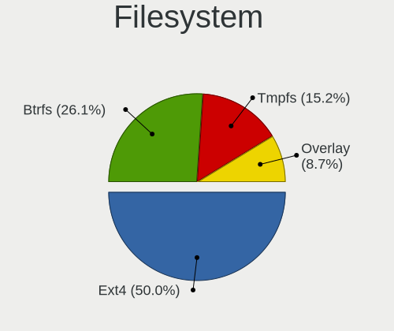
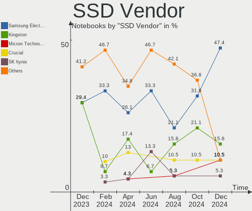
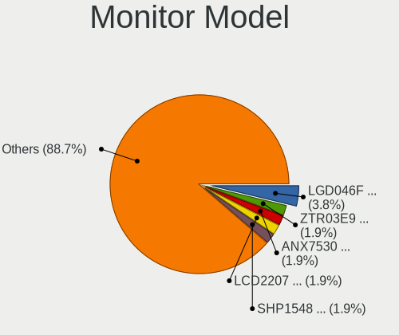
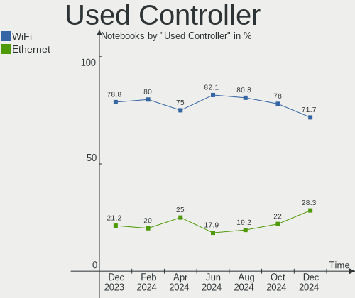
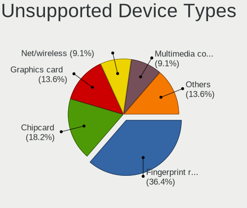

Linux in Netherlands - Hardware Trends (Notebooks)
--------------------------------------------------

A project to identify most popular hardware characteristics and track their change
over time based on data collected by Linux users at https://Linux-Hardware.org.

Anyone can contribute to this report by the [hw-probe](https://github.com/linuxhw/hw-probe) tool:

    sudo -E hw-probe -all -upload

Period: Aug, 2022.

Contents
--------

* [ System ](#system)
  - [ OS                       ](#os)
  - [ OS Family                ](#os-family)
  - [ Kernel                   ](#kernel)
  - [ Kernel Family            ](#kernel-family)
  - [ Kernel Major Ver.        ](#kernel-major-ver)
  - [ Arch                     ](#arch)
  - [ DE                       ](#de)
  - [ Display Server           ](#display-server)
  - [ Display Manager          ](#display-manager)
  - [ OS Lang                  ](#os-lang)
  - [ Boot Mode                ](#boot-mode)
  - [ Filesystem               ](#filesystem)
  - [ Part. scheme             ](#part-scheme)
  - [ Dual Boot with Linux/BSD ](#dual-boot-with-linuxbsd)
  - [ Dual Boot (Win)          ](#dual-boot-win)

* [ Board ](#board)
  - [ Vendor                   ](#vendor)
  - [ Model                    ](#model)
  - [ Model Family             ](#model-family)
  - [ MFG Year                 ](#mfg-year)
  - [ Form Factor              ](#form-factor)
  - [ Secure Boot              ](#secure-boot)
  - [ Coreboot                 ](#coreboot)
  - [ RAM Size                 ](#ram-size)
  - [ RAM Used                 ](#ram-used)
  - [ Total Drives             ](#total-drives)
  - [ Has CD-ROM               ](#has-cd-rom)
  - [ Has Ethernet             ](#has-ethernet)
  - [ Has WiFi                 ](#has-wifi)
  - [ Has Bluetooth            ](#has-bluetooth)

* [ Location ](#location)
  - [ Country                  ](#country)
  - [ City                     ](#city)

* [ Drives ](#drives)
  - [ Drive Vendor             ](#drive-vendor)
  - [ Drive Model              ](#drive-model)
  - [ HDD Vendor               ](#hdd-vendor)
  - [ SSD Vendor               ](#ssd-vendor)
  - [ Drive Kind               ](#drive-kind)
  - [ Drive Connector          ](#drive-connector)
  - [ Drive Size               ](#drive-size)
  - [ Space Total              ](#space-total)
  - [ Space Used               ](#space-used)
  - [ Malfunc. Drives          ](#malfunc-drives)
  - [ Malfunc. Drive Vendor    ](#malfunc-drive-vendor)
  - [ Malfunc. HDD Vendor      ](#malfunc-hdd-vendor)
  - [ Malfunc. Drive Kind      ](#malfunc-drive-kind)
  - [ Failed Drives            ](#failed-drives)
  - [ Failed Drive Vendor      ](#failed-drive-vendor)
  - [ Drive Status             ](#drive-status)

* [ Storage controller ](#storage-controller)
  - [ Storage Vendor           ](#storage-vendor)
  - [ Storage Model            ](#storage-model)
  - [ Storage Kind             ](#storage-kind)

* [ Processor ](#processor)
  - [ CPU Vendor               ](#cpu-vendor)
  - [ CPU Model                ](#cpu-model)
  - [ CPU Model Family         ](#cpu-model-family)
  - [ CPU Cores                ](#cpu-cores)
  - [ CPU Sockets              ](#cpu-sockets)
  - [ CPU Threads              ](#cpu-threads)
  - [ CPU Op-Modes             ](#cpu-op-modes)
  - [ CPU Microcode            ](#cpu-microcode)
  - [ CPU Microarch            ](#cpu-microarch)

* [ Graphics ](#graphics)
  - [ GPU Vendor               ](#gpu-vendor)
  - [ GPU Model                ](#gpu-model)
  - [ GPU Combo                ](#gpu-combo)
  - [ GPU Driver               ](#gpu-driver)
  - [ GPU Memory               ](#gpu-memory)

* [ Monitor ](#monitor)
  - [ Monitor Vendor           ](#monitor-vendor)
  - [ Monitor Model            ](#monitor-model)
  - [ Monitor Resolution       ](#monitor-resolution)
  - [ Monitor Diagonal         ](#monitor-diagonal)
  - [ Monitor Width            ](#monitor-width)
  - [ Aspect Ratio             ](#aspect-ratio)
  - [ Monitor Area             ](#monitor-area)
  - [ Pixel Density            ](#pixel-density)
  - [ Multiple Monitors        ](#multiple-monitors)

* [ Network ](#network)
  - [ Net Controller Vendor    ](#net-controller-vendor)
  - [ Net Controller Model     ](#net-controller-model)
  - [ Wireless Vendor          ](#wireless-vendor)
  - [ Wireless Model           ](#wireless-model)
  - [ Ethernet Vendor          ](#ethernet-vendor)
  - [ Ethernet Model           ](#ethernet-model)
  - [ Net Controller Kind      ](#net-controller-kind)
  - [ Used Controller          ](#used-controller)
  - [ NICs                     ](#nics)
  - [ IPv6                     ](#ipv6)

* [ Bluetooth ](#bluetooth)
  - [ Bluetooth Vendor         ](#bluetooth-vendor)
  - [ Bluetooth Model          ](#bluetooth-model)

* [ Sound ](#sound)
  - [ Sound Vendor             ](#sound-vendor)
  - [ Sound Model              ](#sound-model)

* [ Memory ](#memory)
  - [ Memory Vendor            ](#memory-vendor)
  - [ Memory Model             ](#memory-model)
  - [ Memory Kind              ](#memory-kind)
  - [ Memory Form Factor       ](#memory-form-factor)
  - [ Memory Size              ](#memory-size)
  - [ Memory Speed             ](#memory-speed)

* [ Printers & scanners ](#printers--scanners)
  - [ Printer Vendor           ](#printer-vendor)
  - [ Printer Model            ](#printer-model)
  - [ Scanner Vendor           ](#scanner-vendor)
  - [ Scanner Model            ](#scanner-model)

* [ Camera ](#camera)
  - [ Camera Vendor            ](#camera-vendor)
  - [ Camera Model             ](#camera-model)

* [ Security ](#security)
  - [ Fingerprint Vendor       ](#fingerprint-vendor)
  - [ Fingerprint Model        ](#fingerprint-model)
  - [ Chipcard Vendor          ](#chipcard-vendor)
  - [ Chipcard Model           ](#chipcard-model)

* [ Unsupported ](#unsupported)
  - [ Unsupported Devices      ](#unsupported-devices)
  - [ Unsupported Device Types ](#unsupported-device-types)

System
------

OS
--

Installed operating systems

| Name                 | Notebooks | Percent |
|----------------------|-----------|---------|
| OpenMandriva 4.3     | 11        | 16.67%  |
| Ubuntu 22.04         | 9         | 13.64%  |
| Ubuntu 20.04         | 7         | 10.61%  |
| Fedora 36            | 6         | 9.09%   |
| Linux Mint 21        | 5         | 7.58%   |
| Pop!_OS 22.04        | 4         | 6.06%   |
| Zorin 16             | 3         | 4.55%   |
| Debian 11            | 3         | 4.55%   |
| Linux Mint 20.3      | 2         | 3.03%   |
| EndeavourOS          | 2         | 3.03%   |
| Zorin 12             | 1         | 1.52%   |
| Xubuntu 22.04        | 1         | 1.52%   |
| Xero Rolling         | 1         | 1.52%   |
| Ubuntu MATE 22.04    | 1         | 1.52%   |
| Ubuntu MATE 20.04    | 1         | 1.52%   |
| OpenMandriva 4.90    | 1         | 1.52%   |
| Nitrux 2.3.0         | 1         | 1.52%   |
| Manjaro 21.3.7       | 1         | 1.52%   |
| Manjaro 21.3.6       | 1         | 1.52%   |
| KDE neon 20.04       | 1         | 1.52%   |
| Kaisen 2.1           | 1         | 1.52%   |
| Garuda Linux Soaring | 1         | 1.52%   |
| EndeavourOS Rolling  | 1         | 1.52%   |
| Elementary 6.1       | 1         | 1.52%   |

OS Family
---------

OS without a version

| Name         | Notebooks | Percent |
|--------------|-----------|---------|
| Ubuntu       | 16        | 24.24%  |
| OpenMandriva | 12        | 18.18%  |
| Linux Mint   | 7         | 10.61%  |
| Fedora       | 6         | 9.09%   |
| Zorin        | 4         | 6.06%   |
| Pop!_OS      | 4         | 6.06%   |
| EndeavourOS  | 3         | 4.55%   |
| Debian       | 3         | 4.55%   |
| Ubuntu MATE  | 2         | 3.03%   |
| Manjaro      | 2         | 3.03%   |
| Xubuntu      | 1         | 1.52%   |
| Xero         | 1         | 1.52%   |
| Nitrux       | 1         | 1.52%   |
| KDE neon     | 1         | 1.52%   |
| Kaisen       | 1         | 1.52%   |
| Garuda Linux | 1         | 1.52%   |
| Elementary   | 1         | 1.52%   |

Kernel
------

Version of the Linux kernel

| Version                  | Notebooks | Percent |
|--------------------------|-----------|---------|
| 5.15.0-46-generic        | 12        | 18.18%  |
| 5.16.7-desktop-1omv4003  | 11        | 16.67%  |
| 5.15.0-43-generic        | 10        | 15.15%  |
| 5.19.0-76051900-generic  | 4         | 6.06%   |
| 5.18.18-200.fc36.x86_64  | 2         | 3.03%   |
| 5.18.17-200.fc36.x86_64  | 2         | 3.03%   |
| 5.15.0-41-generic        | 2         | 3.03%   |
| 5.10.0-17-amd64          | 2         | 3.03%   |
| 5.19.3-zen1-1-zen        | 1         | 1.52%   |
| 5.19.3-arch1-1           | 1         | 1.52%   |
| 5.19.1-3-MANJARO         | 1         | 1.52%   |
| 5.19.0-xanmod1-x64v2     | 1         | 1.52%   |
| 5.18.16-arch1-1          | 1         | 1.52%   |
| 5.18.14-nitrous-fire+    | 1         | 1.52%   |
| 5.18.13-200.fc36.x86_64  | 1         | 1.52%   |
| 5.18.12-desktop-3omv4090 | 1         | 1.52%   |
| 5.18.11-200.fc36.x86_64  | 1         | 1.52%   |
| 5.18.0-0.bpo.1-amd64     | 1         | 1.52%   |
| 5.17.1.17.realtime2-3-rt | 1         | 1.52%   |
| 5.17.0-kaisen1-amd64     | 1         | 1.52%   |
| 5.15.57-2-MANJARO        | 1         | 1.52%   |
| 5.15.0-45-generic        | 1         | 1.52%   |
| 5.15.0-25-generic        | 1         | 1.52%   |
| 5.14.0-1051-oem          | 1         | 1.52%   |
| 5.14.0-1050-oem          | 1         | 1.52%   |
| 5.13.0-41-generic        | 1         | 1.52%   |
| 5.13.0-30-generic        | 1         | 1.52%   |
| 5.11.0-44-generic        | 1         | 1.52%   |
| 4.15.0-142-generic       | 1         | 1.52%   |

Kernel Family
-------------

Linux kernel without a distro release

| Version   | Notebooks | Percent |
|-----------|-----------|---------|
| 5.15.0    | 26        | 39.39%  |
| 5.16.7    | 11        | 16.67%  |
| 5.19.0    | 5         | 7.58%   |
| 5.19.3    | 2         | 3.03%   |
| 5.18.18   | 2         | 3.03%   |
| 5.18.17   | 2         | 3.03%   |
| 5.14.0    | 2         | 3.03%   |
| 5.13.0    | 2         | 3.03%   |
| 5.10.0    | 2         | 3.03%   |
| 5.19.1    | 1         | 1.52%   |
| 5.18.16   | 1         | 1.52%   |
| 5.18.14   | 1         | 1.52%   |
| 5.18.13   | 1         | 1.52%   |
| 5.18.12   | 1         | 1.52%   |
| 5.18.11   | 1         | 1.52%   |
| 5.18.0    | 1         | 1.52%   |
| 5.17.1.17 | 1         | 1.52%   |
| 5.17.0    | 1         | 1.52%   |
| 5.15.57   | 1         | 1.52%   |
| 5.11.0    | 1         | 1.52%   |
| 4.15.0    | 1         | 1.52%   |

Kernel Major Ver.
-----------------

Linux kernel major version

| Version | Notebooks | Percent |
|---------|-----------|---------|
| 5.15    | 27        | 40.91%  |
| 5.16    | 11        | 16.67%  |
| 5.18    | 10        | 15.15%  |
| 5.19    | 8         | 12.12%  |
| 5.14    | 2         | 3.03%   |
| 5.13    | 2         | 3.03%   |
| 5.10    | 2         | 3.03%   |
| 5.17.1  | 1         | 1.52%   |
| 5.17    | 1         | 1.52%   |
| 5.11    | 1         | 1.52%   |
| 4.15    | 1         | 1.52%   |

Arch
----

OS architecture (x86_64, i586, etc.)

| Name   | Notebooks | Percent |
|--------|-----------|---------|
| x86_64 | 65        | 98.48%  |
| i686   | 1         | 1.52%   |

DE
--

Desktop Environment

| Name       | Notebooks | Percent |
|------------|-----------|---------|
| GNOME      | 30        | 45.45%  |
| KDE5       | 22        | 33.33%  |
| X-Cinnamon | 6         | 9.09%   |
| XFCE       | 5         | 7.58%   |
| MATE       | 2         | 3.03%   |
| Pantheon   | 1         | 1.52%   |

Display Server
--------------

X11 or Wayland

| Name    | Notebooks | Percent |
|---------|-----------|---------|
| X11     | 51        | 77.27%  |
| Wayland | 15        | 22.73%  |

Display Manager
---------------

SDDM, LightDM, etc.

| Name    | Notebooks | Percent |
|---------|-----------|---------|
| Unknown | 18        | 27.27%  |
| SDDM    | 17        | 25.76%  |
| GDM3    | 14        | 21.21%  |
| LightDM | 9         | 13.64%  |
| GDM     | 8         | 12.12%  |

OS Lang
-------

Language

| Lang  | Notebooks | Percent |
|-------|-----------|---------|
| en_US | 39        | 59.09%  |
| nl_NL | 15        | 22.73%  |
| en_GB | 6         | 9.09%   |
| de_DE | 2         | 3.03%   |
| ru_RU | 1         | 1.52%   |
| pt_PT | 1         | 1.52%   |
| it_IT | 1         | 1.52%   |
| C     | 1         | 1.52%   |

Boot Mode
---------

EFI or BIOS

| Mode | Notebooks | Percent |
|------|-----------|---------|
| EFI  | 48        | 72.73%  |
| BIOS | 18        | 27.27%  |

Filesystem
----------

Type of filesystem

| Type    | Notebooks | Percent |
|---------|-----------|---------|
| Ext4    | 42        | 63.64%  |
| Overlay | 13        | 19.7%   |
| Btrfs   | 10        | 15.15%  |
| Xfs     | 1         | 1.52%   |

Part. scheme
------------

Scheme of partitioning

| Type    | Notebooks | Percent |
|---------|-----------|---------|
| GPT     | 34        | 51.52%  |
| Unknown | 30        | 45.45%  |
| MBR     | 2         | 3.03%   |

Dual Boot with Linux/BSD
------------------------

Hosting more than one Linux/BSD

| Dual boot | Notebooks | Percent |
|-----------|-----------|---------|
| No        | 59        | 89.39%  |
| Yes       | 7         | 10.61%  |

Dual Boot (Win)
---------------

Hosting Linux and Windows

| Dual boot | Notebooks | Percent |
|-----------|-----------|---------|
| No        | 43        | 65.15%  |
| Yes       | 23        | 34.85%  |

Board
-----

Vendor
------

Motherboard manufacturer

| Name             | Notebooks | Percent |
|------------------|-----------|---------|
| Dell             | 20        | 30.3%   |
| Hewlett-Packard  | 11        | 16.67%  |
| ASUSTek Computer | 8         | 12.12%  |
| Apple            | 8         | 12.12%  |
| Lenovo           | 7         | 10.61%  |
| MSI              | 3         | 4.55%   |
| Acer             | 3         | 4.55%   |
| Toshiba          | 1         | 1.52%   |
| TEKNOSERVICE     | 1         | 1.52%   |
| Notebook         | 1         | 1.52%   |
| Medion           | 1         | 1.52%   |
| HONOR            | 1         | 1.52%   |
| Fujitsu          | 1         | 1.52%   |

Model
-----

Motherboard model

| Name                                       | Notebooks | Percent |
|--------------------------------------------|-----------|---------|
| Dell Latitude 3310                         | 5         | 7.58%   |
| HP Laptop 17-cp0xxx                        | 2         | 3.03%   |
| Dell Latitude 3300                         | 2         | 3.03%   |
| Apple MacBookPro9,2                        | 2         | 3.03%   |
| Apple MacBookPro14,2                       | 2         | 3.03%   |
| Toshiba Satellite P200                     | 1         | 1.52%   |
| TEKNOSERVICE PORTATIL TTL 15               | 1         | 1.52%   |
| Notebook P64_HJ,HK1                        | 1         | 1.52%   |
| MSI PS63 Modern 8RC                        | 1         | 1.52%   |
| MSI Prestige 15 A10SC                      | 1         | 1.52%   |
| MSI CX705                                  | 1         | 1.52%   |
| Medion E7419 MD60990                       | 1         | 1.52%   |
| Lenovo ThinkPad X1 Carbon Gen 9 20XW0055MH | 1         | 1.52%   |
| Lenovo ThinkPad L15 Gen 2a 20X8S0VX03      | 1         | 1.52%   |
| Lenovo ThinkPad E580 20KS003GMH            | 1         | 1.52%   |
| Lenovo ThinkBook 15 G3 ACL 21A4            | 1         | 1.52%   |
| Lenovo Legion 5 17ACH6H 82JY               | 1         | 1.52%   |
| Lenovo IdeaPad L340-15API 81LW             | 1         | 1.52%   |
| Lenovo IdeaPad 720S-13IKB 81BV             | 1         | 1.52%   |
| HONOR BOHK-WAX9X                           | 1         | 1.52%   |
| HP ZBook Fury 15 G7 Mobile Workstation     | 1         | 1.52%   |
| HP ProBook 455 G7                          | 1         | 1.52%   |
| HP ProBook 430 G4                          | 1         | 1.52%   |
| HP Pavilion Laptop 15-eh1xxx               | 1         | 1.52%   |
| HP Notebook                                | 1         | 1.52%   |
| HP ENVY Notebook                           | 1         | 1.52%   |
| HP EliteBook 745 G6                        | 1         | 1.52%   |
| HP EliteBook 745 G3                        | 1         | 1.52%   |
| HP Elite x2 1012 G1                        | 1         | 1.52%   |
| Fujitsu LIFEBOOK E746                      | 1         | 1.52%   |
| Dell XPS 15 9520                           | 1         | 1.52%   |
| Dell XPS 15 9510                           | 1         | 1.52%   |
| Dell XPS 13 9360                           | 1         | 1.52%   |
| Dell XPS 13 7390                           | 1         | 1.52%   |
| Dell Vostro 14 5410                        | 1         | 1.52%   |
| Dell Latitude E6430                        | 1         | 1.52%   |
| Dell Latitude E6420                        | 1         | 1.52%   |
| Dell Latitude 7420                         | 1         | 1.52%   |
| Dell Latitude 5590                         | 1         | 1.52%   |
| Dell Latitude 3490                         | 1         | 1.52%   |
| Dell Latitude 3410                         | 1         | 1.52%   |
| Dell Latitude 3380                         | 1         | 1.52%   |
| Dell Inspiron 5490                         | 1         | 1.52%   |
| ASUS Zenbook UM5401QA_UM5401QA             | 1         | 1.52%   |
| ASUS X756UQK                               | 1         | 1.52%   |
| ASUS VivoBook_ASUSLaptop X7600PC_N7600PC   | 1         | 1.52%   |
| ASUS VivoBook_ASUSLaptop X513EA_K513EA     | 1         | 1.52%   |
| ASUS N76VB                                 | 1         | 1.52%   |
| ASUS N550JV                                | 1         | 1.52%   |
| ASUS K53TA                                 | 1         | 1.52%   |
| ASUS ASUS TUF Gaming F15 FX506LH_FX506LH   | 1         | 1.52%   |
| Apple MacBookPro8,2                        | 1         | 1.52%   |
| Apple MacBookPro7,1                        | 1         | 1.52%   |
| Apple MacBookPro5,5                        | 1         | 1.52%   |
| Apple MacBookPro16,1                       | 1         | 1.52%   |
| Acer Nitro AN515-57                        | 1         | 1.52%   |
| Acer Aspire SW5-271                        | 1         | 1.52%   |
| Acer Aspire 7720                           | 1         | 1.52%   |

Model Family
------------

Motherboard model prefix

| Name                  | Notebooks | Percent |
|-----------------------|-----------|---------|
| Dell Latitude         | 14        | 21.21%  |
| Dell XPS              | 4         | 6.06%   |
| Lenovo ThinkPad       | 3         | 4.55%   |
| Lenovo IdeaPad        | 2         | 3.03%   |
| HP ProBook            | 2         | 3.03%   |
| HP Laptop             | 2         | 3.03%   |
| HP EliteBook          | 2         | 3.03%   |
| ASUS VivoBook         | 2         | 3.03%   |
| Apple MacBookPro9     | 2         | 3.03%   |
| Apple MacBookPro14    | 2         | 3.03%   |
| Acer Aspire           | 2         | 3.03%   |
| Toshiba Satellite     | 1         | 1.52%   |
| TEKNOSERVICE PORTATIL | 1         | 1.52%   |
| Notebook P64          | 1         | 1.52%   |
| MSI PS63              | 1         | 1.52%   |
| MSI Prestige          | 1         | 1.52%   |
| MSI CX705             | 1         | 1.52%   |
| Medion E7419          | 1         | 1.52%   |
| Lenovo ThinkBook      | 1         | 1.52%   |
| Lenovo Legion         | 1         | 1.52%   |
| HONOR BOHK-WAX9X      | 1         | 1.52%   |
| HP ZBook              | 1         | 1.52%   |
| HP Pavilion           | 1         | 1.52%   |
| HP Notebook           | 1         | 1.52%   |
| HP ENVY               | 1         | 1.52%   |
| HP Elite              | 1         | 1.52%   |
| Fujitsu LIFEBOOK      | 1         | 1.52%   |
| Dell Vostro           | 1         | 1.52%   |
| Dell Inspiron         | 1         | 1.52%   |
| ASUS Zenbook          | 1         | 1.52%   |
| ASUS X756UQK          | 1         | 1.52%   |
| ASUS N76VB            | 1         | 1.52%   |
| ASUS N550JV           | 1         | 1.52%   |
| ASUS K53TA            | 1         | 1.52%   |
| ASUS ASUS             | 1         | 1.52%   |
| Apple MacBookPro8     | 1         | 1.52%   |
| Apple MacBookPro7     | 1         | 1.52%   |
| Apple MacBookPro5     | 1         | 1.52%   |
| Apple MacBookPro16    | 1         | 1.52%   |
| Acer Nitro            | 1         | 1.52%   |

MFG Year
--------

Motherboard manufacture year

| Year | Notebooks | Percent |
|------|-----------|---------|
| 2021 | 14        | 21.21%  |
| 2019 | 13        | 19.7%   |
| 2018 | 6         | 9.09%   |
| 2016 | 6         | 9.09%   |
| 2020 | 5         | 7.58%   |
| 2022 | 4         | 6.06%   |
| 2012 | 4         | 6.06%   |
| 2017 | 3         | 4.55%   |
| 2013 | 2         | 3.03%   |
| 2011 | 2         | 3.03%   |
| 2010 | 2         | 3.03%   |
| 2007 | 2         | 3.03%   |
| 2015 | 1         | 1.52%   |
| 2014 | 1         | 1.52%   |
| 2009 | 1         | 1.52%   |

Form Factor
-----------

Physical design of the computer

| Name     | Notebooks | Percent |
|----------|-----------|---------|
| Notebook | 66        | 100%    |

Secure Boot
-----------

Enabled or disabled

| State    | Notebooks | Percent |
|----------|-----------|---------|
| Disabled | 62        | 93.94%  |
| Enabled  | 4         | 6.06%   |

Coreboot
--------

Have coreboot on board

| Used | Notebooks | Percent |
|------|-----------|---------|
| No   | 66        | 100%    |

RAM Size
--------

Total RAM memory

| Size in GB  | Notebooks | Percent |
|-------------|-----------|---------|
| 4.01-8.0    | 25        | 37.88%  |
| 8.01-16.0   | 14        | 21.21%  |
| 16.01-24.0  | 13        | 19.7%   |
| 3.01-4.0    | 6         | 9.09%   |
| 24.01-32.0  | 3         | 4.55%   |
| 32.01-64.0  | 2         | 3.03%   |
| 64.01-256.0 | 2         | 3.03%   |
| 2.01-3.0    | 1         | 1.52%   |

RAM Used
--------

Used RAM memory

| Used GB    | Notebooks | Percent |
|------------|-----------|---------|
| 1.01-2.0   | 28        | 42.42%  |
| 2.01-3.0   | 15        | 22.73%  |
| 4.01-8.0   | 9         | 13.64%  |
| 3.01-4.0   | 8         | 12.12%  |
| 8.01-16.0  | 3         | 4.55%   |
| 24.01-32.0 | 1         | 1.52%   |
| 16.01-24.0 | 1         | 1.52%   |
| 0.51-1.0   | 1         | 1.52%   |

Total Drives
------------

Number of drives on board

| Drives | Notebooks | Percent |
|--------|-----------|---------|
| 1      | 43        | 65.15%  |
| 2      | 18        | 27.27%  |
| 0      | 3         | 4.55%   |
| 3      | 2         | 3.03%   |

Has CD-ROM
----------

Has CD-ROM on board

| Presented | Notebooks | Percent |
|-----------|-----------|---------|
| No        | 52        | 78.79%  |
| Yes       | 14        | 21.21%  |

Has Ethernet
------------

Has Ethernet on board

| Presented | Notebooks | Percent |
|-----------|-----------|---------|
| Yes       | 55        | 83.33%  |
| No        | 11        | 16.67%  |

Has WiFi
--------

Has WiFi module

| Presented | Notebooks | Percent |
|-----------|-----------|---------|
| Yes       | 66        | 100%    |

Has Bluetooth
-------------

Has Bluetooth module

| Presented | Notebooks | Percent |
|-----------|-----------|---------|
| Yes       | 56        | 84.85%  |
| No        | 10        | 15.15%  |

Location
--------

Country
-------

Geographic location (country)

| Country     | Notebooks | Percent |
|-------------|-----------|---------|
| Netherlands | 66        | 100%    |

City
----

Geographic location (city)

| City            | Notebooks | Percent |
|-----------------|-----------|---------|
| Schagen         | 10        | 15.15%  |
| The Hague       | 5         | 7.58%   |
| Delft           | 4         | 6.06%   |
| Tilburg         | 3         | 4.55%   |
| Amsterdam       | 3         | 4.55%   |
| Rotterdam       | 2         | 3.03%   |
| Naaldwijk       | 2         | 3.03%   |
| Dronten         | 2         | 3.03%   |
| Zuidbroek       | 1         | 1.52%   |
| Zoutelande      | 1         | 1.52%   |
| Zelhem          | 1         | 1.52%   |
| Zeist           | 1         | 1.52%   |
| Weert           | 1         | 1.52%   |
| Veenendaal      | 1         | 1.52%   |
| Utrecht         | 1         | 1.52%   |
| Son             | 1         | 1.52%   |
| Soest           | 1         | 1.52%   |
| Rijswijk        | 1         | 1.52%   |
| Rijssen         | 1         | 1.52%   |
| Oegstgeest      | 1         | 1.52%   |
| Nijkerk         | 1         | 1.52%   |
| Nieuwegein      | 1         | 1.52%   |
| Nieuw-Vossemeer | 1         | 1.52%   |
| Meppel          | 1         | 1.52%   |
| Lemelerveld     | 1         | 1.52%   |
| Leeuwarden      | 1         | 1.52%   |
| Helmond         | 1         | 1.52%   |
| Heerde          | 1         | 1.52%   |
| Haarlem         | 1         | 1.52%   |
| Groningen       | 1         | 1.52%   |
| Gorredijk       | 1         | 1.52%   |
| Gemert          | 1         | 1.52%   |
| Geleen          | 1         | 1.52%   |
| Drachten        | 1         | 1.52%   |
| Dordrecht       | 1         | 1.52%   |
| Dokkum          | 1         | 1.52%   |
| Den Hoorn       | 1         | 1.52%   |
| Boxtel          | 1         | 1.52%   |
| Bilthoven       | 1         | 1.52%   |
| Arnhem          | 1         | 1.52%   |
| Apeldoorn       | 1         | 1.52%   |
| Anna Paulowna   | 1         | 1.52%   |
| Amersfoort      | 1         | 1.52%   |

Drives
------

Drive Vendor
------------

Hard drive vendors

| Vendor              | Notebooks | Drives | Percent |
|---------------------|-----------|--------|---------|
| Samsung Electronics | 22        | 26     | 28.57%  |
| SK hynix            | 11        | 11     | 14.29%  |
| KIOXIA              | 5         | 5      | 6.49%   |
| HGST                | 5         | 5      | 6.49%   |
| SanDisk             | 4         | 4      | 5.19%   |
| Apple               | 4         | 7      | 5.19%   |
| Micron Technology   | 3         | 3      | 3.9%    |
| Kingston            | 3         | 3      | 3.9%    |
| Intel               | 3         | 3      | 3.9%    |
| WDC                 | 2         | 2      | 2.6%    |
| Unknown             | 2         | 2      | 2.6%    |
| Toshiba             | 2         | 2      | 2.6%    |
| Seagate             | 2         | 2      | 2.6%    |
| Phison              | 2         | 2      | 2.6%    |
| LITEON              | 2         | 2      | 2.6%    |
| Crucial             | 2         | 2      | 2.6%    |
| SPCC                | 1         | 1      | 1.3%    |
| Inateck             | 1         | 1      | 1.3%    |
| Hitachi             | 1         | 1      | 1.3%    |

Drive Model
-----------

Hard drive models

| Model                                               | Notebooks | Percent |
|-----------------------------------------------------|-----------|---------|
| Samsung NVMe SSD Drive 512GB                        | 3         | 3.57%   |
| SanDisk NVMe SSD Drive 512GB                        | 2         | 2.38%   |
| Samsung SSD 980 1TB                                 | 2         | 2.38%   |
| Samsung SSD 860 QVO 1TB                             | 2         | 2.38%   |
| Samsung NVMe SSD Drive 1TB                          | 2         | 2.38%   |
| Kingston SA400S37120G 120GB SSD                     | 2         | 2.38%   |
| HGST HTS541010A9E680 1TB                            | 2         | 2.38%   |
| Apple NVMe SSD Drive 8KB                            | 2         | 2.38%   |
| Apple NVMe SSD Drive 256GB                          | 2         | 2.38%   |
| WDC WD10SPZX-08Z10 1TB                              | 1         | 1.19%   |
| WDC PC SN730 SDBPNTY-512G-1032 512GB                | 1         | 1.19%   |
| Unknown SD02G  2GB                                  | 1         | 1.19%   |
| Unknown MMC Card  128GB                             | 1         | 1.19%   |
| Toshiba RC500 500GB                                 | 1         | 1.19%   |
| Toshiba MK1237GSX 120GB                             | 1         | 1.19%   |
| SPCC M.2 SSD 128GB                                  | 1         | 1.19%   |
| SK hynix SC311 SATA 128GB SSD                       | 1         | 1.19%   |
| SK hynix PC801 NVMe 2TB                             | 1         | 1.19%   |
| SK hynix HFS128G39TND-N210A 128GB SSD               | 1         | 1.19%   |
| SK hynix HFM512GD3JX016N 512GB                      | 1         | 1.19%   |
| SK hynix HFM512GD3JX013N 512GB                      | 1         | 1.19%   |
| SK hynix BC711 NVMe 128GB                           | 1         | 1.19%   |
| SK hynix BC711 HFM512GD3JX013N 512GB                | 1         | 1.19%   |
| SK hynix BC511 NVMe 256GB                           | 1         | 1.19%   |
| SK hynix BC511 HFM256GDJTNI-82A0A 256GB             | 1         | 1.19%   |
| SK hynix BC501A NVMe 128GB                          | 1         | 1.19%   |
| SK hynix BC501 NVMe 512GB                           | 1         | 1.19%   |
| Seagate ST9160314ASG 160GB                          | 1         | 1.19%   |
| Seagate ST1000LM048-2E7172 1TB                      | 1         | 1.19%   |
| SanDisk SDSSDH3 250G                                | 1         | 1.19%   |
| SanDisk SD8SNAT-128G-1006 128GB SSD                 | 1         | 1.19%   |
| Samsung SSD PM851 2.5 7mm 256GB                     | 1         | 1.19%   |
| Samsung SSD 970 EVO Plus 1TB                        | 1         | 1.19%   |
| Samsung SSD 850 EVO 500GB                           | 1         | 1.19%   |
| Samsung SSD 850 EVO 250G                            | 1         | 1.19%   |
| Samsung SSD 840 Series 120GB                        | 1         | 1.19%   |
| Samsung SSD 840 EVO 250GB                           | 1         | 1.19%   |
| Samsung SSD 750 EVO 250GB                           | 1         | 1.19%   |
| Samsung SM963 2.5" NVMe PCIe SSD 1024GB             | 1         | 1.19%   |
| Samsung Portable SSD T5 500GB                       | 1         | 1.19%   |
| Samsung PM991a NVMe 256GB                           | 1         | 1.19%   |
| Samsung PM991 NVMe 256GB                            | 1         | 1.19%   |
| Samsung NVMe SSD Controller SM981/PM981/PM983 1TB   | 1         | 1.19%   |
| Samsung NVMe SSD Controller SM961/PM961/SM963 256GB | 1         | 1.19%   |
| Samsung NVMe SSD Controller PM9A1/PM9A3/980PRO 1TB  | 1         | 1.19%   |
| Samsung MZALQ512HBLU-00BL2 512GB                    | 1         | 1.19%   |
| Samsung MZ7TY256HDHP-00000 256GB SSD                | 1         | 1.19%   |
| Samsung MZ7PD256HAFV-000H7 256GB SSD                | 1         | 1.19%   |
| Phison NVMe SSD Drive 2TB                           | 1         | 1.19%   |
| Phison NVMe SSD Drive 120GB                         | 1         | 1.19%   |
| Micron C400-MTFDDAC256MAM 256GB SSD                 | 1         | 1.19%   |
| Micron 3400 NVMe 512GB                              | 1         | 1.19%   |
| Micron 2210_MTFDHBA512QFD 512GB                     | 1         | 1.19%   |
| LITEON IT L8H-64V2G 64GB SSD                        | 1         | 1.19%   |
| LITEON CV8-8E128-11 SATA 128GB SSD                  | 1         | 1.19%   |
| KIOXIA NVMe SSD Drive 512GB                         | 1         | 1.19%   |
| KIOXIA NVMe SSD Drive 256GB                         | 1         | 1.19%   |
| KIOXIA KBG40ZNV256G 256GB                           | 1         | 1.19%   |
| KIOXIA KBG40ZNS512G NVMe 512GB                      | 1         | 1.19%   |
| KIOXIA KBG40ZNS128G NVMe 128GB                      | 1         | 1.19%   |

HDD Vendor
----------

Hard disk drive vendors

| Vendor  | Notebooks | Drives | Percent |
|---------|-----------|--------|---------|
| HGST    | 5         | 5      | 45.45%  |
| Seagate | 2         | 2      | 18.18%  |
| WDC     | 1         | 1      | 9.09%   |
| Toshiba | 1         | 1      | 9.09%   |
| Hitachi | 1         | 1      | 9.09%   |
| Apple   | 1         | 2      | 9.09%   |

SSD Vendor
----------

Solid state drive vendors

| Vendor              | Notebooks | Drives | Percent |
|---------------------|-----------|--------|---------|
| Samsung Electronics | 10        | 11     | 41.67%  |
| Kingston            | 3         | 3      | 12.5%   |
| SK hynix            | 2         | 2      | 8.33%   |
| SanDisk             | 2         | 2      | 8.33%   |
| LITEON              | 2         | 2      | 8.33%   |
| Crucial             | 2         | 2      | 8.33%   |
| SPCC                | 1         | 1      | 4.17%   |
| Micron Technology   | 1         | 1      | 4.17%   |
| Intel               | 1         | 1      | 4.17%   |

Drive Kind
----------

HDD or SSD

| Kind | Notebooks | Drives | Percent |
|------|-----------|--------|---------|
| NVMe | 39        | 45     | 52%     |
| SSD  | 23        | 25     | 30.67%  |
| HDD  | 11        | 12     | 14.67%  |
| MMC  | 2         | 2      | 2.67%   |

Drive Connector
---------------

SATA, SAS, NVMe, etc.

| Type | Notebooks | Drives | Percent |
|------|-----------|--------|---------|
| NVMe | 39        | 44     | 54.93%  |
| SATA | 27        | 34     | 38.03%  |
| SAS  | 3         | 4      | 4.23%   |
| MMC  | 2         | 2      | 2.82%   |

Drive Size
----------

Size of hard drive

| Size in TB | Notebooks | Drives | Percent |
|------------|-----------|--------|---------|
| 0.01-0.5   | 25        | 30     | 80.65%  |
| 0.51-1.0   | 6         | 7      | 19.35%  |

Space Total
-----------

Amount of disk space available on the file system

| Size in GB     | Notebooks | Percent |
|----------------|-----------|---------|
| 101-250        | 17        | 25.76%  |
| 251-500        | 13        | 19.7%   |
| 1-20           | 13        | 19.7%   |
| 501-1000       | 7         | 10.61%  |
| 1001-2000      | 5         | 7.58%   |
| 21-50          | 3         | 4.55%   |
| 51-100         | 3         | 4.55%   |
| More than 3000 | 2         | 3.03%   |
| Unknown        | 2         | 3.03%   |
| 2001-3000      | 1         | 1.52%   |

Space Used
----------

Amount of used disk space

| Used GB        | Notebooks | Percent |
|----------------|-----------|---------|
| 1-20           | 30        | 45.45%  |
| 21-50          | 8         | 12.12%  |
| 101-250        | 7         | 10.61%  |
| 251-500        | 6         | 9.09%   |
| 501-1000       | 6         | 9.09%   |
| 51-100         | 5         | 7.58%   |
| Unknown        | 2         | 3.03%   |
| More than 3000 | 1         | 1.52%   |
| 1001-2000      | 1         | 1.52%   |

Malfunc. Drives
---------------

Drive models with a malfunction

| Model                                | Notebooks | Drives | Percent |
|--------------------------------------|-----------|--------|---------|
| SK hynix BC711 HFM512GD3JX013N 512GB | 1         | 1      | 50%     |
| HGST HTS545050A7E660 500GB           | 1         | 1      | 50%     |

Malfunc. Drive Vendor
---------------------

Vendors of faulty drives

| Vendor   | Notebooks | Drives | Percent |
|----------|-----------|--------|---------|
| SK hynix | 1         | 1      | 50%     |
| HGST     | 1         | 1      | 50%     |

Malfunc. HDD Vendor
-------------------

Vendors of faulty HDD drives

| Vendor | Notebooks | Drives | Percent |
|--------|-----------|--------|---------|
| HGST   | 1         | 1      | 100%    |

Malfunc. Drive Kind
-------------------

Kinds of faulty drives

| Kind | Notebooks | Drives | Percent |
|------|-----------|--------|---------|
| NVMe | 1         | 1      | 50%     |
| HDD  | 1         | 1      | 50%     |

Failed Drives
-------------

Failed drive models

Zero info for selected period =(

Failed Drive Vendor
-------------------

Failed drive vendors

Zero info for selected period =(

Drive Status
------------

Number of failed and malfunc. drives

| Status   | Notebooks | Drives | Percent |
|----------|-----------|--------|---------|
| Works    | 32        | 39     | 49.23%  |
| Detected | 31        | 43     | 47.69%  |
| Malfunc  | 2         | 2      | 3.08%   |

Storage controller
------------------

Storage Vendor
--------------

Storage controller vendors

| Vendor                           | Notebooks | Percent |
|----------------------------------|-----------|---------|
| Intel                            | 34        | 40.96%  |
| Samsung Electronics              | 14        | 16.87%  |
| SK hynix                         | 9         | 10.84%  |
| AMD                              | 7         | 8.43%   |
| KIOXIA                           | 6         | 7.23%   |
| SanDisk                          | 3         | 3.61%   |
| Apple                            | 3         | 3.61%   |
| Phison Electronics               | 2         | 2.41%   |
| Nvidia                           | 2         | 2.41%   |
| Micron Technology                | 2         | 2.41%   |
| Silicon Integrated Systems [SiS] | 1         | 1.2%    |

Storage Model
-------------

Storage controller models

| Model                                                                            | Notebooks | Percent |
|----------------------------------------------------------------------------------|-----------|---------|
| Samsung NVMe SSD Controller 980                                                  | 8         | 9.09%   |
| Intel Sunrise Point-LP SATA Controller [AHCI mode]                               | 7         | 7.95%   |
| AMD FCH SATA Controller [AHCI mode]                                              | 7         | 7.95%   |
| KIOXIA NVMe SSD Controller BG4                                                   | 5         | 5.68%   |
| Intel Volume Management Device NVMe RAID Controller                              | 5         | 5.68%   |
| Intel 82801 Mobile SATA Controller [RAID mode]                                   | 5         | 5.68%   |
| SK hynix Gold P31 SSD                                                            | 4         | 4.55%   |
| Intel 7 Series Chipset Family 6-port SATA Controller [AHCI mode]                 | 4         | 4.55%   |
| SanDisk WD Black SN750 / PC SN730 NVMe SSD                                       | 3         | 3.41%   |
| Samsung NVMe SSD Controller SM981/PM981/PM983                                    | 3         | 3.41%   |
| SK hynix BC511                                                                   | 2         | 2.27%   |
| SK hynix BC501 NVMe Solid State Drive                                            | 2         | 2.27%   |
| Samsung NVMe SSD Controller PM9A1/PM9A3/980PRO                                   | 2         | 2.27%   |
| Micron Non-Volatile memory controller                                            | 2         | 2.27%   |
| Apple S3X NVMe Controller                                                        | 2         | 2.27%   |
| SK hynix Non-Volatile memory controller                                          | 1         | 1.14%   |
| Silicon Integrated Systems [SiS] SATA Controller / IDE mode                      | 1         | 1.14%   |
| Silicon Integrated Systems [SiS] 5513 IDE Controller                             | 1         | 1.14%   |
| Samsung NVMe SSD Controller SM961/PM961/SM963                                    | 1         | 1.14%   |
| Phison E7 NVMe Controller                                                        | 1         | 1.14%   |
| Phison E12 NVMe Controller                                                       | 1         | 1.14%   |
| Nvidia MCP89 SATA Controller (AHCI mode)                                         | 1         | 1.14%   |
| Nvidia MCP79 AHCI Controller                                                     | 1         | 1.14%   |
| KIOXIA NVMe SSD                                                                  | 1         | 1.14%   |
| Intel Wildcat Point-LP SATA Controller [AHCI Mode]                               | 1         | 1.14%   |
| Intel Tiger Lake-LP SATA Controller                                              | 1         | 1.14%   |
| Intel SSD 660P Series                                                            | 1         | 1.14%   |
| Intel Non-Volatile memory controller                                             | 1         | 1.14%   |
| Intel Jasper Lake SATA AHCI Controller                                           | 1         | 1.14%   |
| Intel HM170/QM170 Chipset SATA Controller [AHCI Mode]                            | 1         | 1.14%   |
| Intel Comet Lake SATA AHCI Controller                                            | 1         | 1.14%   |
| Intel Comet Lake PCH-LP SATA RAID Premium Controller                             | 1         | 1.14%   |
| Intel Cannon Point-LP SATA Controller [AHCI Mode]                                | 1         | 1.14%   |
| Intel Atom/Celeron/Pentium Processor x5-E8000/J3xxx/N3xxx Series SATA Controller | 1         | 1.14%   |
| Intel 82801HM/HEM (ICH8M/ICH8M-E) SATA Controller [IDE mode]                     | 1         | 1.14%   |
| Intel 82801HM/HEM (ICH8M/ICH8M-E) IDE Controller                                 | 1         | 1.14%   |
| Intel 82801GBM/GHM (ICH7-M Family) SATA Controller [IDE mode]                    | 1         | 1.14%   |
| Intel 8 Series/C220 Series Chipset Family 6-port SATA Controller 1 [AHCI mode]   | 1         | 1.14%   |
| Intel 6 Series/C200 Series Chipset Family 6 port Mobile SATA AHCI Controller     | 1         | 1.14%   |
| Intel 500 Series Chipset Family SATA AHCI Controller                             | 1         | 1.14%   |
| Intel 400 Series Chipset Family SATA AHCI Controller                             | 1         | 1.14%   |
| Apple ANS2 NVMe Controller                                                       | 1         | 1.14%   |

Storage Kind
------------

Kind of storage controller (IDE, SATA, NVMe, SAS, ...)

| Kind | Notebooks | Percent |
|------|-----------|---------|
| NVMe | 39        | 46.43%  |
| SATA | 31        | 36.9%   |
| RAID | 11        | 13.1%   |
| IDE  | 3         | 3.57%   |

Processor
---------

CPU Vendor
----------

Processor vendors

| Vendor | Notebooks | Percent |
|--------|-----------|---------|
| Intel  | 52        | 78.79%  |
| AMD    | 14        | 21.21%  |

CPU Model
---------

Processor models

| Model                                           | Notebooks | Percent |
|-------------------------------------------------|-----------|---------|
| Intel Core i3-8145U CPU @ 2.10GHz               | 3         | 4.55%   |
| AMD Ryzen 5 5500U with Radeon Graphics          | 3         | 4.55%   |
| Intel Core i7-7500U CPU @ 2.70GHz               | 2         | 3.03%   |
| Intel Core i5-8265U CPU @ 1.60GHz               | 2         | 3.03%   |
| Intel Core i5-7267U CPU @ 3.10GHz               | 2         | 3.03%   |
| Intel Core i5-3210M CPU @ 2.50GHz               | 2         | 3.03%   |
| Intel Core i5-10210U CPU @ 1.60GHz              | 2         | 3.03%   |
| Intel 11th Gen Core i5-11300H @ 3.10GHz         | 2         | 3.03%   |
| AMD Ryzen 7 5800H with Radeon Graphics          | 2         | 3.03%   |
| AMD Ryzen 7 3700U with Radeon Vega Mobile Gfx   | 2         | 3.03%   |
| Intel Pentium Dual-Core CPU T4500 @ 2.30GHz     | 1         | 1.52%   |
| Intel Pentium CPU 4415U @ 2.30GHz               | 1         | 1.52%   |
| Intel Pentium CPU 4405U @ 2.10GHz               | 1         | 1.52%   |
| Intel Core m5-6Y57 CPU @ 1.10GHz                | 1         | 1.52%   |
| Intel Core M-5Y10c CPU @ 0.80GHz                | 1         | 1.52%   |
| Intel Core i7-9750H CPU @ 2.60GHz               | 1         | 1.52%   |
| Intel Core i7-8565U CPU @ 1.80GHz               | 1         | 1.52%   |
| Intel Core i7-8550U CPU @ 1.80GHz               | 1         | 1.52%   |
| Intel Core i7-7700HQ CPU @ 2.80GHz              | 1         | 1.52%   |
| Intel Core i7-4700HQ CPU @ 2.40GHz              | 1         | 1.52%   |
| Intel Core i7-3630QM CPU @ 2.40GHz              | 1         | 1.52%   |
| Intel Core i7-2760QM CPU @ 2.40GHz              | 1         | 1.52%   |
| Intel Core i7-10750H CPU @ 2.60GHz              | 1         | 1.52%   |
| Intel Core i7-10710U CPU @ 1.10GHz              | 1         | 1.52%   |
| Intel Core i5-8350U CPU @ 1.70GHz               | 1         | 1.52%   |
| Intel Core i5-8250U CPU @ 1.60GHz               | 1         | 1.52%   |
| Intel Core i5-7200U CPU @ 2.50GHz               | 1         | 1.52%   |
| Intel Core i5-6200U CPU @ 2.30GHz               | 1         | 1.52%   |
| Intel Core i5-3320M CPU @ 2.60GHz               | 1         | 1.52%   |
| Intel Core i5-2520M CPU @ 2.50GHz               | 1         | 1.52%   |
| Intel Core i5-10300H CPU @ 2.50GHz              | 1         | 1.52%   |
| Intel Core i3-7130U CPU @ 2.70GHz               | 1         | 1.52%   |
| Intel Core i3-7020U CPU @ 2.30GHz               | 1         | 1.52%   |
| Intel Core i3-6006U CPU @ 2.00GHz               | 1         | 1.52%   |
| Intel Core i3-10110U CPU @ 2.10GHz              | 1         | 1.52%   |
| Intel Core Duo CPU T2350 @ 1.86GHz              | 1         | 1.52%   |
| Intel Core 2 Duo CPU T5550 @ 1.83GHz            | 1         | 1.52%   |
| Intel Core 2 Duo CPU P8600 @ 2.40GHz            | 1         | 1.52%   |
| Intel Core 2 Duo CPU P7550 @ 2.26GHz            | 1         | 1.52%   |
| Intel Celeron N5100 @ 1.10GHz                   | 1         | 1.52%   |
| Intel Celeron CPU N3060 @ 1.60GHz               | 1         | 1.52%   |
| Intel 12th Gen Core i7-12700H                   | 1         | 1.52%   |
| Intel 11th Gen Core i7-1185G7 @ 3.00GHz         | 1         | 1.52%   |
| Intel 11th Gen Core i7-11800H @ 2.30GHz         | 1         | 1.52%   |
| Intel 11th Gen Core i7-1165G7 @ 2.80GHz         | 1         | 1.52%   |
| Intel 11th Gen Core i5-11400H @ 2.70GHz         | 1         | 1.52%   |
| Intel 11th Gen Core i5-1135G7 @ 2.40GHz         | 1         | 1.52%   |
| AMD Ryzen 7 5700U with Radeon Graphics          | 1         | 1.52%   |
| AMD Ryzen 5 PRO 5650U with Radeon Graphics      | 1         | 1.52%   |
| AMD Ryzen 5 PRO 3500U w/ Radeon Vega Mobile Gfx | 1         | 1.52%   |
| AMD Ryzen 3 4300U with Radeon Graphics          | 1         | 1.52%   |
| AMD PRO A10-8700B R6, 10 Compute Cores 4C+6G    | 1         | 1.52%   |
| AMD A6-3400M APU with Radeon HD Graphics        | 1         | 1.52%   |
| AMD A10-8700P Radeon R6, 10 Compute Cores 4C+6G | 1         | 1.52%   |

CPU Model Family
----------------

Processor model prefix

| Model                   | Notebooks | Percent |
|-------------------------|-----------|---------|
| Intel Core i5           | 15        | 22.73%  |
| Intel Core i7           | 11        | 16.67%  |
| Other                   | 8         | 12.12%  |
| Intel Core i3           | 7         | 10.61%  |
| AMD Ryzen 7             | 5         | 7.58%   |
| Intel Core 2 Duo        | 3         | 4.55%   |
| AMD Ryzen 5             | 3         | 4.55%   |
| Intel Pentium           | 2         | 3.03%   |
| Intel Celeron           | 2         | 3.03%   |
| AMD Ryzen 5 PRO         | 2         | 3.03%   |
| Intel Pentium Dual-Core | 1         | 1.52%   |
| Intel Core m5           | 1         | 1.52%   |
| Intel Core M            | 1         | 1.52%   |
| Intel Core Duo          | 1         | 1.52%   |
| AMD Ryzen 3             | 1         | 1.52%   |
| AMD PRO A10             | 1         | 1.52%   |
| AMD A6                  | 1         | 1.52%   |
| AMD A10                 | 1         | 1.52%   |

CPU Cores
---------

Number of processor cores

| Number | Notebooks | Percent |
|--------|-----------|---------|
| 2      | 29        | 43.94%  |
| 4      | 24        | 36.36%  |
| 6      | 8         | 12.12%  |
| 8      | 4         | 6.06%   |
| 14     | 1         | 1.52%   |

CPU Sockets
-----------

Number of sockets

| Number | Notebooks | Percent |
|--------|-----------|---------|
| 1      | 66        | 100%    |

CPU Threads
-----------

Threads per core (Hyper-Threading)

| Number | Notebooks | Percent |
|--------|-----------|---------|
| 2      | 57        | 86.36%  |
| 1      | 9         | 13.64%  |

CPU Op-Modes
------------

CPU Operation Modes (32-bit, 64-bit)

| Op mode        | Notebooks | Percent |
|----------------|-----------|---------|
| 32-bit, 64-bit | 65        | 98.48%  |
| 32-bit         | 1         | 1.52%   |

CPU Microcode
-------------

Microcode number

| Number     | Notebooks | Percent |
|------------|-----------|---------|
| Unknown    | 16        | 24.24%  |
| 0x806ec    | 7         | 10.61%  |
| 0x806e9    | 5         | 7.58%   |
| 0x306a9    | 4         | 6.06%   |
| 0x806ea    | 3         | 4.55%   |
| 0x806c1    | 3         | 4.55%   |
| 0x406e3    | 3         | 4.55%   |
| 0x08608103 | 3         | 4.55%   |
| 0x806d1    | 2         | 3.03%   |
| 0x206a7    | 2         | 3.03%   |
| 0x0a50000c | 2         | 3.03%   |
| 0x0600611a | 2         | 3.03%   |
| 0xa0660    | 1         | 1.52%   |
| 0xa0652    | 1         | 1.52%   |
| 0x906ea    | 1         | 1.52%   |
| 0x906e9    | 1         | 1.52%   |
| 0x906a3    | 1         | 1.52%   |
| 0x6fd      | 1         | 1.52%   |
| 0x6ec      | 1         | 1.52%   |
| 0x306d4    | 1         | 1.52%   |
| 0x1067a    | 1         | 1.52%   |
| 0x0a50000b | 1         | 1.52%   |
| 0x08600106 | 1         | 1.52%   |
| 0x08108109 | 1         | 1.52%   |
| 0x08108102 | 1         | 1.52%   |
| 0x03000027 | 1         | 1.52%   |

CPU Microarch
-------------

Microarchitecture

| Name             | Notebooks | Percent |
|------------------|-----------|---------|
| KabyLake         | 22        | 33.33%  |
| TigerLake        | 5         | 7.58%   |
| Unknown          | 5         | 7.58%   |
| Skylake          | 4         | 6.06%   |
| IvyBridge        | 4         | 6.06%   |
| Zen+             | 3         | 4.55%   |
| Zen 3            | 3         | 4.55%   |
| Penryn           | 3         | 4.55%   |
| CometLake        | 3         | 4.55%   |
| SandyBridge      | 2         | 3.03%   |
| Icelake          | 2         | 3.03%   |
| Excavator        | 2         | 3.03%   |
| Zen 2            | 1         | 1.52%   |
| Silvermont       | 1         | 1.52%   |
| P6               | 1         | 1.52%   |
| K10 Llano        | 1         | 1.52%   |
| Haswell          | 1         | 1.52%   |
| Core             | 1         | 1.52%   |
| Broadwell        | 1         | 1.52%   |
| Alderlake Hybrid | 1         | 1.52%   |

Graphics
--------

GPU Vendor
----------

Vendors of graphics cards

| Vendor | Notebooks | Percent |
|--------|-----------|---------|
| Intel  | 45        | 55.56%  |
| Nvidia | 19        | 23.46%  |
| AMD    | 17        | 20.99%  |

GPU Model
---------

Graphics card models

| Model                                                                                    | Notebooks | Percent |
|------------------------------------------------------------------------------------------|-----------|---------|
| Intel WhiskeyLake-U GT2 [UHD Graphics 620]                                               | 6         | 7.32%   |
| Intel TigerLake-LP GT2 [Iris Xe Graphics]                                                | 5         | 6.1%    |
| Intel HD Graphics 620                                                                    | 4         | 4.88%   |
| Intel 3rd Gen Core processor Graphics Controller                                         | 4         | 4.88%   |
| AMD Lucienne                                                                             | 4         | 4.88%   |
| Intel UHD Graphics 620                                                                   | 3         | 3.66%   |
| Intel CometLake-U GT2 [UHD Graphics]                                                     | 3         | 3.66%   |
| AMD Picasso/Raven 2 [Radeon Vega Series / Radeon Vega Mobile Series]                     | 3         | 3.66%   |
| AMD Cezanne                                                                              | 3         | 3.66%   |
| Nvidia GA107M [GeForce RTX 3050 Ti Mobile]                                               | 2         | 2.44%   |
| Nvidia GA106M [GeForce RTX 3060 Mobile / Max-Q]                                          | 2         | 2.44%   |
| Intel TigerLake-H GT1 [UHD Graphics]                                                     | 2         | 2.44%   |
| Intel Skylake GT2 [HD Graphics 520]                                                      | 2         | 2.44%   |
| Intel Iris Plus Graphics 650                                                             | 2         | 2.44%   |
| Intel 2nd Generation Core Processor Family Integrated Graphics Controller                | 2         | 2.44%   |
| AMD Wani [Radeon R5/R6/R7 Graphics]                                                      | 2         | 2.44%   |
| Nvidia TU117M [GeForce GTX 1650 Mobile / Max-Q]                                          | 1         | 1.22%   |
| Nvidia TU117M                                                                            | 1         | 1.22%   |
| Nvidia TU117GLM [Quadro T1000 Mobile]                                                    | 1         | 1.22%   |
| Nvidia MCP89 [GeForce 320M]                                                              | 1         | 1.22%   |
| Nvidia GP107M [GeForce GTX 1050 Ti Mobile]                                               | 1         | 1.22%   |
| Nvidia GP107M [GeForce GTX 1050 Mobile]                                                  | 1         | 1.22%   |
| Nvidia GM107 [GeForce 940MX]                                                             | 1         | 1.22%   |
| Nvidia GK107M [GeForce GT 750M]                                                          | 1         | 1.22%   |
| Nvidia GK107M [GeForce GT 740M]                                                          | 1         | 1.22%   |
| Nvidia GF119M [NVS 4200M]                                                                | 1         | 1.22%   |
| Nvidia GF108GLM [NVS 5200M]                                                              | 1         | 1.22%   |
| Nvidia GA107M [GeForce RTX 3050 Mobile]                                                  | 1         | 1.22%   |
| Nvidia G86M [GeForce 9300M G]                                                            | 1         | 1.22%   |
| Nvidia G73M [GeForce Go 7600]                                                            | 1         | 1.22%   |
| Nvidia C79 [GeForce 9400M]                                                               | 1         | 1.22%   |
| Intel Kaby Lake-U GT2f HD 620 Graphics Controller                                        | 1         | 1.22%   |
| Intel Kaby Lake-U GT1 Integrated Graphics Controller                                     | 1         | 1.22%   |
| Intel JasperLake [UHD Graphics]                                                          | 1         | 1.22%   |
| Intel HD Graphics 630                                                                    | 1         | 1.22%   |
| Intel HD Graphics 5300                                                                   | 1         | 1.22%   |
| Intel HD Graphics 515                                                                    | 1         | 1.22%   |
| Intel HD Graphics 510                                                                    | 1         | 1.22%   |
| Intel CometLake-H GT2 [UHD Graphics]                                                     | 1         | 1.22%   |
| Intel Comet Lake UHD Graphics                                                            | 1         | 1.22%   |
| Intel Atom/Celeron/Pentium Processor x5-E8000/J3xxx/N3xxx Integrated Graphics Controller | 1         | 1.22%   |
| Intel Alder Lake-P Integrated Graphics Controller                                        | 1         | 1.22%   |
| Intel 4th Gen Core Processor Integrated Graphics Controller                              | 1         | 1.22%   |
| AMD Whistler [Radeon HD 6730M/6770M/7690M XT]                                            | 1         | 1.22%   |
| AMD Whistler [Radeon HD 6630M/6650M/6750M/7670M/7690M]                                   | 1         | 1.22%   |
| AMD Sumo [Radeon HD 6520G]                                                               | 1         | 1.22%   |
| AMD Renoir                                                                               | 1         | 1.22%   |
| AMD Park [Mobility Radeon HD 5430/5450/5470]                                             | 1         | 1.22%   |
| AMD Navi 14 [Radeon RX 5500/5500M / Pro 5500M]                                           | 1         | 1.22%   |

GPU Combo
---------

Combinations of graphics cards

| Name           | Notebooks | Percent |
|----------------|-----------|---------|
| 1 x Intel      | 31        | 46.97%  |
| 1 x AMD        | 14        | 21.21%  |
| Intel + Nvidia | 13        | 19.7%   |
| 1 x Nvidia     | 5         | 7.58%   |
| 2 x AMD        | 1         | 1.52%   |
| Intel + AMD    | 1         | 1.52%   |
| AMD + Nvidia   | 1         | 1.52%   |

GPU Driver
----------

Free vs proprietary

| Driver      | Notebooks | Percent |
|-------------|-----------|---------|
| Free        | 53        | 80.3%   |
| Proprietary | 11        | 16.67%  |
| Unknown     | 2         | 3.03%   |

GPU Memory
----------

Total video memory

| Size in GB | Notebooks | Percent |
|------------|-----------|---------|
| Unknown    | 46        | 69.7%   |
| 0.01-0.5   | 8         | 12.12%  |
| 1.01-2.0   | 5         | 7.58%   |
| 0.51-1.0   | 4         | 6.06%   |
| 3.01-4.0   | 3         | 4.55%   |

Monitor
-------

Monitor Vendor
--------------

Monitor vendors

| Vendor                  | Notebooks | Percent |
|-------------------------|-----------|---------|
| AU Optronics            | 14        | 17.72%  |
| BOE                     | 13        | 16.46%  |
| LG Display              | 10        | 12.66%  |
| Chimei Innolux          | 8         | 10.13%  |
| Apple                   | 8         | 10.13%  |
| Sharp                   | 4         | 5.06%   |
| Samsung Electronics     | 4         | 5.06%   |
| Dell                    | 4         | 5.06%   |
| Philips                 | 3         | 3.8%    |
| Goldstar                | 3         | 3.8%    |
| Chi Mei Optoelectronics | 2         | 2.53%   |
| Sony                    | 1         | 1.27%   |
| RTK                     | 1         | 1.27%   |
| LG Philips              | 1         | 1.27%   |
| Hewlett-Packard         | 1         | 1.27%   |
| CSO                     | 1         | 1.27%   |
| Acer                    | 1         | 1.27%   |

Monitor Model
-------------

Monitor models

| Model                                                                     | Notebooks | Percent |
|---------------------------------------------------------------------------|-----------|---------|
| Chimei Innolux LCD Monitor CMN15E8 1920x1080 344x193mm 15.5-inch          | 2         | 2.5%    |
| BOE LCD Monitor BOE07B9 1920x1080 293x165mm 13.2-inch                     | 2         | 2.5%    |
| AU Optronics LCD Monitor AUO202D 1920x1080 293x165mm 13.2-inch            | 2         | 2.5%    |
| AU Optronics LCD Monitor AUO162C 1366x768 293x164mm 13.2-inch             | 2         | 2.5%    |
| Apple Color LCD APPA033 2880x1800 286x179mm 13.3-inch                     | 2         | 2.5%    |
| Apple Color LCD APP9CC7 1280x800 286x179mm 13.3-inch                      | 2         | 2.5%    |
| Sony TV XV SNY5601 1920x1080                                              | 1         | 1.25%   |
| Sharp LCD Monitor SHP1542 1920x1080 309x174mm 14.0-inch                   | 1         | 1.25%   |
| Sharp LCD Monitor SHP1516 3840x2400 336x210mm 15.6-inch                   | 1         | 1.25%   |
| Sharp LCD Monitor SHP14D1 1920x1200 336x210mm 15.6-inch                   | 1         | 1.25%   |
| Sharp LCD Monitor SHP144A 3200x1800 294x165mm 13.3-inch                   | 1         | 1.25%   |
| Samsung Electronics LCD Monitor SEC3847 1440x900 367x230mm 17.1-inch      | 1         | 1.25%   |
| Samsung Electronics LCD Monitor SDC4161 1920x1080 344x194mm 15.5-inch     | 1         | 1.25%   |
| Samsung Electronics LCD Monitor SDC4154 2880x1800 302x189mm 14.0-inch     | 1         | 1.25%   |
| Samsung Electronics LCD Monitor SDC324C 1920x1080 344x194mm 15.5-inch     | 1         | 1.25%   |
| Samsung Electronics LCD Monitor SAM0679 1360x768 410x256mm 19.0-inch      | 1         | 1.25%   |
| RTK LCD Monitor RTK1D1A 1920x1080 1020x570mm 46.0-inch                    | 1         | 1.25%   |
| Philips PHL 272B7QU PHL0926 2560x1440 597x336mm 27.0-inch                 | 1         | 1.25%   |
| Philips PHL 243V7 PHLC155 1920x1080 527x296mm 23.8-inch                   | 1         | 1.25%   |
| Philips FTV PHL01EA 1920x1080 1440x810mm 65.0-inch                        | 1         | 1.25%   |
| LG Philips LCD Monitor LPLA002 1440x900 367x230mm 17.1-inch               | 1         | 1.25%   |
| LG Display LCD Monitor LGD06E8 1920x1080 344x194mm 15.5-inch              | 1         | 1.25%   |
| LG Display LCD Monitor LGD06D6 1920x1080 309x174mm 14.0-inch              | 1         | 1.25%   |
| LG Display LCD Monitor LGD062E 1920x1080 344x194mm 15.5-inch              | 1         | 1.25%   |
| LG Display LCD Monitor LGD05F3 1920x1080 309x174mm 14.0-inch              | 1         | 1.25%   |
| LG Display LCD Monitor LGD0521 1920x1080 309x174mm 14.0-inch              | 1         | 1.25%   |
| LG Display LCD Monitor LGD04EF 1920x1080 294x165mm 13.3-inch              | 1         | 1.25%   |
| LG Display LCD Monitor LGD04B3 1920x1080 345x194mm 15.6-inch              | 1         | 1.25%   |
| LG Display LCD Monitor LGD04A5 1920x1280 253x169mm 12.0-inch              | 1         | 1.25%   |
| LG Display LCD Monitor LGD0437 1920x1080 276x156mm 12.5-inch              | 1         | 1.25%   |
| LG Display LCD Monitor LGD02DF 1600x900 310x174mm 14.0-inch               | 1         | 1.25%   |
| Hewlett-Packard Z27 HPN3536 3840x2160 597x336mm 27.0-inch                 | 1         | 1.25%   |
| Goldstar HDR WQHD GSM7756 3440x1440 820x346mm 35.0-inch                   | 1         | 1.25%   |
| Goldstar HDR 4K GSM7707 3840x2160 600x340mm 27.2-inch                     | 1         | 1.25%   |
| Goldstar HDR 4K GSM7706 3840x2160 600x340mm 27.2-inch                     | 1         | 1.25%   |
| Dell UP3216Q DEL40C1 3840x2160 698x393mm 31.5-inch                        | 1         | 1.25%   |
| Dell U2518D DEL413C 2560x1440 550x310mm 24.9-inch                         | 1         | 1.25%   |
| Dell U2412M DELA07A 1920x1200 518x324mm 24.1-inch                         | 1         | 1.25%   |
| Dell P2419H DELD0DA 1920x1080 527x296mm 23.8-inch                         | 1         | 1.25%   |
| CSO LCD Monitor CSO1403 3840x2400 302x189mm 14.0-inch                     | 1         | 1.25%   |
| Chimei Innolux LCD Monitor CMN175C 1920x1080 381x214mm 17.2-inch          | 1         | 1.25%   |
| Chimei Innolux LCD Monitor CMN1529 1920x1080 344x193mm 15.5-inch          | 1         | 1.25%   |
| Chimei Innolux LCD Monitor CMN1521 1920x1080 344x193mm 15.5-inch          | 1         | 1.25%   |
| Chimei Innolux LCD Monitor CMN151E 1920x1080 344x193mm 15.5-inch          | 1         | 1.25%   |
| Chimei Innolux LCD Monitor CMN14C3 1366x768 309x173mm 13.9-inch           | 1         | 1.25%   |
| Chimei Innolux LCD Monitor CMN1368 1366x768 293x164mm 13.2-inch           | 1         | 1.25%   |
| Chi Mei Optoelectronics LCD Monitor CMO1720 1920x1080 382x215mm 17.3-inch | 1         | 1.25%   |
| Chi Mei Optoelectronics LCD Monitor CMO1711 1600x900 382x215mm 17.3-inch  | 1         | 1.25%   |
| BOE LCD Monitor BOE097D 1920x1080 344x194mm 15.5-inch                     | 1         | 1.25%   |
| BOE LCD Monitor BOE0954 1600x900 382x215mm 17.3-inch                      | 1         | 1.25%   |
| BOE LCD Monitor BOE08C2 1920x1080 344x194mm 15.5-inch                     | 1         | 1.25%   |
| BOE LCD Monitor BOE0872 1920x1080 344x194mm 15.5-inch                     | 1         | 1.25%   |
| BOE LCD Monitor BOE0812 1920x1080 344x194mm 15.5-inch                     | 1         | 1.25%   |
| BOE LCD Monitor BOE07C0 1366x768 293x165mm 13.2-inch                      | 1         | 1.25%   |
| BOE LCD Monitor BOE06FF 1920x1080 344x194mm 15.5-inch                     | 1         | 1.25%   |
| BOE LCD Monitor BOE06DB 1366x768 277x156mm 12.5-inch                      | 1         | 1.25%   |
| BOE LCD Monitor BOE06CB 1920x1080 344x194mm 15.5-inch                     | 1         | 1.25%   |
| BOE LCD Monitor BOE069A 1366x768 309x173mm 13.9-inch                      | 1         | 1.25%   |
| BOE LCD Monitor BOE0600 1366x768 309x173mm 13.9-inch                      | 1         | 1.25%   |
| AU Optronics LCD Monitor AUOE495 2560x1600 344x215mm 16.0-inch            | 1         | 1.25%   |

Monitor Resolution
------------------

Monitor screen resolution

| Resolution        | Notebooks | Percent |
|-------------------|-----------|---------|
| 1920x1080 (FHD)   | 40        | 51.95%  |
| 1366x768 (WXGA)   | 7         | 9.09%   |
| 3840x2160 (4K)    | 4         | 5.19%   |
| 1600x900 (HD+)    | 4         | 5.19%   |
| 1280x800 (WXGA)   | 4         | 5.19%   |
| 2880x1800         | 3         | 3.9%    |
| 1440x900 (WXGA+)  | 3         | 3.9%    |
| 3840x2400         | 2         | 2.6%    |
| 2560x1440 (QHD)   | 2         | 2.6%    |
| 1920x1200 (WUXGA) | 2         | 2.6%    |
| 3440x1440         | 1         | 1.3%    |
| 3200x1800 (QHD+)  | 1         | 1.3%    |
| 3072x1920         | 1         | 1.3%    |
| 2560x1600         | 1         | 1.3%    |
| 1920x1280         | 1         | 1.3%    |
| 1360x768          | 1         | 1.3%    |

Monitor Diagonal
----------------

Diagonal size in inches

| Inches | Notebooks | Percent |
|--------|-----------|---------|
| 15     | 22        | 27.5%   |
| 13     | 19        | 23.75%  |
| 14     | 10        | 12.5%   |
| 17     | 8         | 10%     |
| 27     | 4         | 5%      |
| 24     | 3         | 3.75%   |
| 12     | 3         | 3.75%   |
| 23     | 2         | 2.5%    |
| 16     | 2         | 2.5%    |
| 72     | 1         | 1.25%   |
| 65     | 1         | 1.25%   |
| 46     | 1         | 1.25%   |
| 35     | 1         | 1.25%   |
| 31     | 1         | 1.25%   |
| 25     | 1         | 1.25%   |
| 19     | 1         | 1.25%   |

Monitor Width
-------------

Physical width

| Width in mm | Notebooks | Percent |
|-------------|-----------|---------|
| 301-350     | 36        | 46.15%  |
| 201-300     | 20        | 25.64%  |
| 501-600     | 8         | 10.26%  |
| 351-400     | 8         | 10.26%  |
| 1001-1500   | 2         | 2.56%   |
| 801-900     | 1         | 1.28%   |
| 601-700     | 1         | 1.28%   |
| 401-500     | 1         | 1.28%   |
| 1501-2000   | 1         | 1.28%   |

Aspect Ratio
------------

Proportional relationship between the width and the height

| Ratio | Notebooks | Percent |
|-------|-----------|---------|
| 16/9  | 52        | 74.29%  |
| 16/10 | 16        | 22.86%  |
| 3/2   | 1         | 1.43%   |
| 21/9  | 1         | 1.43%   |

Monitor Area
------------

Area in inch

| Area in inch | Notebooks | Percent |
|----------------|-----------|---------|
| 101-110        | 21        | 26.25%  |
| 81-90          | 16        | 20%     |
| 71-80          | 13        | 16.25%  |
| 121-130        | 5         | 6.25%   |
| 301-350        | 4         | 5%      |
| 201-250        | 4         | 5%      |
| 61-70          | 3         | 3.75%   |
| 131-140        | 3         | 3.75%   |
| 111-120        | 3         | 3.75%   |
| More than 1000 | 2         | 2.5%    |
| 351-500        | 2         | 2.5%    |
| 251-300        | 2         | 2.5%    |
| 151-200        | 1         | 1.25%   |
| 501-1000       | 1         | 1.25%   |

Pixel Density
-------------

Pixels per inch

| Density       | Notebooks | Percent |
|---------------|-----------|---------|
| 121-160       | 34        | 43.04%  |
| 101-120       | 16        | 20.25%  |
| 161-240       | 13        | 16.46%  |
| 51-100        | 7         | 8.86%   |
| More than 240 | 6         | 7.59%   |
| 1-50          | 3         | 3.8%    |

Multiple Monitors
-----------------

Total monitors connected

| Total | Notebooks | Percent |
|-------|-----------|---------|
| 1     | 52        | 78.79%  |
| 2     | 12        | 18.18%  |
| 4     | 1         | 1.52%   |
| 0     | 1         | 1.52%   |

Network
-------

Net Controller Vendor
---------------------

Controller vendors

| Vendor                           | Notebooks | Percent |
|----------------------------------|-----------|---------|
| Intel                            | 43        | 39.45%  |
| Realtek Semiconductor            | 38        | 34.86%  |
| Broadcom                         | 10        | 9.17%   |
| Qualcomm Atheros                 | 7         | 6.42%   |
| MediaTek                         | 2         | 1.83%   |
| ZTE WCDMA Technologies MSM       | 1         | 0.92%   |
| TP-Link                          | 1         | 0.92%   |
| Silicon Integrated Systems [SiS] | 1         | 0.92%   |
| Nvidia                           | 1         | 0.92%   |
| Lenovo                           | 1         | 0.92%   |
| Huawei Technologies              | 1         | 0.92%   |
| Hewlett-Packard                  | 1         | 0.92%   |
| DisplayLink                      | 1         | 0.92%   |
| ASIX Electronics                 | 1         | 0.92%   |

Net Controller Model
--------------------

Controller models

| Model                                                             | Notebooks | Percent |
|-------------------------------------------------------------------|-----------|---------|
| Realtek RTL8111/8168/8411 PCI Express Gigabit Ethernet Controller | 27        | 21.26%  |
| Intel Wi-Fi 6 AX200                                               | 6         | 4.72%   |
| Intel Cannon Point-LP CNVi [Wireless-AC]                          | 6         | 4.72%   |
| Realtek RTL8153 Gigabit Ethernet Adapter                          | 5         | 3.94%   |
| Intel Wi-Fi 6 AX201                                               | 5         | 3.94%   |
| Realtek RTL8821CE 802.11ac PCIe Wireless Network Adapter          | 4         | 3.15%   |
| Intel Wireless 8265 / 8275                                        | 4         | 3.15%   |
| Intel Wireless 7265                                               | 4         | 3.15%   |
| Broadcom NetXtreme BCM57765 Gigabit Ethernet PCIe                 | 3         | 2.36%   |
| Broadcom BCM4331 802.11a/b/g/n                                    | 3         | 2.36%   |
| Realtek RTL8152 Fast Ethernet Adapter                             | 2         | 1.57%   |
| Realtek RTL810xE PCI Express Fast Ethernet controller             | 2         | 1.57%   |
| Qualcomm Atheros QCA6174 802.11ac Wireless Network Adapter        | 2         | 1.57%   |
| Qualcomm Atheros AR9485 Wireless Network Adapter                  | 2         | 1.57%   |
| Qualcomm Atheros AR9285 Wireless Network Adapter (PCI-Express)    | 2         | 1.57%   |
| MediaTek MT7921 802.11ax PCI Express Wireless Network Adapter     | 2         | 1.57%   |
| Intel Wireless 8260                                               | 2         | 1.57%   |
| Intel Wireless 3165                                               | 2         | 1.57%   |
| Intel Tiger Lake PCH CNVi WiFi                                    | 2         | 1.57%   |
| Intel PRO/Wireless 3945ABG [Golan] Network Connection             | 2         | 1.57%   |
| Intel Dual Band Wireless-AC 3165 Plus Bluetooth                   | 2         | 1.57%   |
| Intel Centrino Ultimate-N 6300                                    | 2         | 1.57%   |
| Intel 82579LM Gigabit Network Connection (Lewisville)             | 2         | 1.57%   |
| Broadcom BCM43602 802.11ac Wireless LAN SoC                       | 2         | 1.57%   |
| Broadcom BCM4322 802.11a/b/g/n Wireless LAN Controller            | 2         | 1.57%   |
| ZTE WCDMA MSM ZTE WCDMA MSM                                       | 1         | 0.79%   |
| TP-Link TL-WN823N v2/v3 [Realtek RTL8192EU]                       | 1         | 0.79%   |
| Silicon Integrated Systems [SiS] 191 Gigabit Ethernet Adapter     | 1         | 0.79%   |
| Realtek RTL88x2bu [AC1200 Techkey]                                | 1         | 0.79%   |
| Realtek RTL8852AE 802.11ax PCIe Wireless Network Adapter          | 1         | 0.79%   |
| Realtek RTL8822CE 802.11ac PCIe Wireless Network Adapter          | 1         | 0.79%   |
| Realtek RTL8812AU 802.11a/b/g/n/ac 2T2R DB WLAN Adapter           | 1         | 0.79%   |
| Realtek RTL8723BE PCIe Wireless Network Adapter                   | 1         | 0.79%   |
| Realtek Killer E2600 Gigabit Ethernet Controller                  | 1         | 0.79%   |
| Qualcomm Atheros QCA9377 802.11ac Wireless Network Adapter        | 1         | 0.79%   |
| Qualcomm Atheros AR8161 Gigabit Ethernet                          | 1         | 0.79%   |
| Nvidia MCP79 Ethernet                                             | 1         | 0.79%   |
| Lenovo Thinkpad LAN                                               | 1         | 0.79%   |
| Intel Wireless-AC 9260                                            | 1         | 0.79%   |
| Intel Wi-Fi 6 AX210/AX211/AX411 160MHz                            | 1         | 0.79%   |
| Intel I210 Gigabit Network Connection                             | 1         | 0.79%   |
| Intel Ethernet Connection I219-V                                  | 1         | 0.79%   |
| Intel Ethernet Connection (4) I219-LM                             | 1         | 0.79%   |
| Intel Ethernet Connection (10) I219-V                             | 1         | 0.79%   |
| Intel Comet Lake PCH-LP CNVi WiFi                                 | 1         | 0.79%   |
| Intel Comet Lake PCH CNVi WiFi                                    | 1         | 0.79%   |
| Intel Alder Lake-P PCH CNVi WiFi                                  | 1         | 0.79%   |
| Huawei E161/E169/E620/E800 HSDPA Modem                            | 1         | 0.79%   |
| HP lt4120 Snapdragon X5 LTE                                       | 1         | 0.79%   |
| DisplayLink USB-C Dual-4K Dock                                    | 1         | 0.79%   |
| Broadcom NetXtreme BCM5764M Gigabit Ethernet PCIe                 | 1         | 0.79%   |
| Broadcom NetXtreme BCM5762 Gigabit Ethernet PCIe                  | 1         | 0.79%   |
| Broadcom NetLink BCM5787M Gigabit Ethernet PCI Express            | 1         | 0.79%   |
| Broadcom BCM4364 802.11ac Wireless Network Adapter                | 1         | 0.79%   |
| ASIX AX88772                                                      | 1         | 0.79%   |

Wireless Vendor
---------------

Wireless vendors

| Vendor                | Notebooks | Percent |
|-----------------------|-----------|---------|
| Intel                 | 42        | 60.87%  |
| Realtek Semiconductor | 9         | 13.04%  |
| Broadcom              | 8         | 11.59%  |
| Qualcomm Atheros      | 7         | 10.14%  |
| MediaTek              | 2         | 2.9%    |
| TP-Link               | 1         | 1.45%   |

Wireless Model
--------------

Wireless models

| Model                                                          | Notebooks | Percent |
|----------------------------------------------------------------|-----------|---------|
| Intel Wi-Fi 6 AX200                                            | 6         | 8.7%    |
| Intel Cannon Point-LP CNVi [Wireless-AC]                       | 6         | 8.7%    |
| Intel Wi-Fi 6 AX201                                            | 5         | 7.25%   |
| Realtek RTL8821CE 802.11ac PCIe Wireless Network Adapter       | 4         | 5.8%    |
| Intel Wireless 8265 / 8275                                     | 4         | 5.8%    |
| Intel Wireless 7265                                            | 4         | 5.8%    |
| Broadcom BCM4331 802.11a/b/g/n                                 | 3         | 4.35%   |
| Qualcomm Atheros QCA6174 802.11ac Wireless Network Adapter     | 2         | 2.9%    |
| Qualcomm Atheros AR9485 Wireless Network Adapter               | 2         | 2.9%    |
| Qualcomm Atheros AR9285 Wireless Network Adapter (PCI-Express) | 2         | 2.9%    |
| MediaTek MT7921 802.11ax PCI Express Wireless Network Adapter  | 2         | 2.9%    |
| Intel Wireless 8260                                            | 2         | 2.9%    |
| Intel Wireless 3165                                            | 2         | 2.9%    |
| Intel Tiger Lake PCH CNVi WiFi                                 | 2         | 2.9%    |
| Intel PRO/Wireless 3945ABG [Golan] Network Connection          | 2         | 2.9%    |
| Intel Dual Band Wireless-AC 3165 Plus Bluetooth                | 2         | 2.9%    |
| Intel Centrino Ultimate-N 6300                                 | 2         | 2.9%    |
| Broadcom BCM43602 802.11ac Wireless LAN SoC                    | 2         | 2.9%    |
| Broadcom BCM4322 802.11a/b/g/n Wireless LAN Controller         | 2         | 2.9%    |
| TP-Link TL-WN823N v2/v3 [Realtek RTL8192EU]                    | 1         | 1.45%   |
| Realtek RTL88x2bu [AC1200 Techkey]                             | 1         | 1.45%   |
| Realtek RTL8852AE 802.11ax PCIe Wireless Network Adapter       | 1         | 1.45%   |
| Realtek RTL8822CE 802.11ac PCIe Wireless Network Adapter       | 1         | 1.45%   |
| Realtek RTL8812AU 802.11a/b/g/n/ac 2T2R DB WLAN Adapter        | 1         | 1.45%   |
| Realtek RTL8723BE PCIe Wireless Network Adapter                | 1         | 1.45%   |
| Qualcomm Atheros QCA9377 802.11ac Wireless Network Adapter     | 1         | 1.45%   |
| Intel Wireless-AC 9260                                         | 1         | 1.45%   |
| Intel Wi-Fi 6 AX210/AX211/AX411 160MHz                         | 1         | 1.45%   |
| Intel Comet Lake PCH-LP CNVi WiFi                              | 1         | 1.45%   |
| Intel Comet Lake PCH CNVi WiFi                                 | 1         | 1.45%   |
| Intel Alder Lake-P PCH CNVi WiFi                               | 1         | 1.45%   |
| Broadcom BCM4364 802.11ac Wireless Network Adapter             | 1         | 1.45%   |

Ethernet Vendor
---------------

Ethernet vendors

| Vendor                           | Notebooks | Percent |
|----------------------------------|-----------|---------|
| Realtek Semiconductor            | 35        | 63.64%  |
| Intel                            | 6         | 10.91%  |
| Broadcom                         | 6         | 10.91%  |
| ZTE WCDMA Technologies MSM       | 1         | 1.82%   |
| Silicon Integrated Systems [SiS] | 1         | 1.82%   |
| Qualcomm Atheros                 | 1         | 1.82%   |
| Nvidia                           | 1         | 1.82%   |
| Lenovo                           | 1         | 1.82%   |
| Hewlett-Packard                  | 1         | 1.82%   |
| DisplayLink                      | 1         | 1.82%   |
| ASIX Electronics                 | 1         | 1.82%   |

Ethernet Model
--------------

Ethernet models

| Model                                                             | Notebooks | Percent |
|-------------------------------------------------------------------|-----------|---------|
| Realtek RTL8111/8168/8411 PCI Express Gigabit Ethernet Controller | 27        | 47.37%  |
| Realtek RTL8153 Gigabit Ethernet Adapter                          | 5         | 8.77%   |
| Broadcom NetXtreme BCM57765 Gigabit Ethernet PCIe                 | 3         | 5.26%   |
| Realtek RTL8152 Fast Ethernet Adapter                             | 2         | 3.51%   |
| Realtek RTL810xE PCI Express Fast Ethernet controller             | 2         | 3.51%   |
| Intel 82579LM Gigabit Network Connection (Lewisville)             | 2         | 3.51%   |
| ZTE WCDMA MSM ZTE WCDMA MSM                                       | 1         | 1.75%   |
| Silicon Integrated Systems [SiS] 191 Gigabit Ethernet Adapter     | 1         | 1.75%   |
| Realtek Killer E2600 Gigabit Ethernet Controller                  | 1         | 1.75%   |
| Qualcomm Atheros AR8161 Gigabit Ethernet                          | 1         | 1.75%   |
| Nvidia MCP79 Ethernet                                             | 1         | 1.75%   |
| Lenovo Thinkpad LAN                                               | 1         | 1.75%   |
| Intel I210 Gigabit Network Connection                             | 1         | 1.75%   |
| Intel Ethernet Connection I219-V                                  | 1         | 1.75%   |
| Intel Ethernet Connection (4) I219-LM                             | 1         | 1.75%   |
| Intel Ethernet Connection (10) I219-V                             | 1         | 1.75%   |
| HP lt4120 Snapdragon X5 LTE                                       | 1         | 1.75%   |
| DisplayLink USB-C Dual-4K Dock                                    | 1         | 1.75%   |
| Broadcom NetXtreme BCM5764M Gigabit Ethernet PCIe                 | 1         | 1.75%   |
| Broadcom NetXtreme BCM5762 Gigabit Ethernet PCIe                  | 1         | 1.75%   |
| Broadcom NetLink BCM5787M Gigabit Ethernet PCI Express            | 1         | 1.75%   |
| ASIX AX88772                                                      | 1         | 1.75%   |

Net Controller Kind
-------------------

Ethernet, WiFi or modem

| Kind     | Notebooks | Percent |
|----------|-----------|---------|
| WiFi     | 66        | 54.55%  |
| Ethernet | 54        | 44.63%  |
| Modem    | 1         | 0.83%   |

Used Controller
---------------

Currently used network controller

| Kind     | Notebooks | Percent |
|----------|-----------|---------|
| WiFi     | 53        | 74.65%  |
| Ethernet | 18        | 25.35%  |

NICs
----

Total network controllers on board

| Total | Notebooks | Percent |
|-------|-----------|---------|
| 2     | 45        | 68.18%  |
| 1     | 21        | 31.82%  |

IPv6
----

IPv6 vs IPv4

| Used | Notebooks | Percent |
|------|-----------|---------|
| No   | 47        | 71.21%  |
| Yes  | 19        | 28.79%  |

Bluetooth
---------

Bluetooth Vendor
----------------

Controller vendors

| Vendor                          | Notebooks | Percent |
|---------------------------------|-----------|---------|
| Intel                           | 37        | 66.07%  |
| Realtek Semiconductor           | 6         | 10.71%  |
| Apple                           | 5         | 8.93%   |
| IMC Networks                    | 4         | 7.14%   |
| Qualcomm Atheros Communications | 2         | 3.57%   |
| Foxconn / Hon Hai               | 1         | 1.79%   |
| Dell                            | 1         | 1.79%   |

Bluetooth Model
---------------

Controller models

| Model                                             | Notebooks | Percent |
|---------------------------------------------------|-----------|---------|
| Intel Bluetooth wireless interface                | 13        | 23.21%  |
| Intel AX201 Bluetooth                             | 9         | 16.07%  |
| Realtek Bluetooth Radio                           | 6         | 10.71%  |
| Intel Bluetooth 9460/9560 Jefferson Peak (JfP)    | 6         | 10.71%  |
| Intel AX200 Bluetooth                             | 6         | 10.71%  |
| Apple Bluetooth Host Controller                   | 3         | 5.36%   |
| Apple Bluetooth USB Host Controller               | 2         | 3.57%   |
| Qualcomm Atheros  Bluetooth Device                | 1         | 1.79%   |
| Qualcomm Atheros QCA61x4 Bluetooth 4.0            | 1         | 1.79%   |
| Intel Wireless-AC 9260 Bluetooth Adapter          | 1         | 1.79%   |
| Intel Bluetooth Device                            | 1         | 1.79%   |
| Intel AX210 Bluetooth                             | 1         | 1.79%   |
| IMC Networks Wireless_Device                      | 1         | 1.79%   |
| IMC Networks Bluetooth USB Host Controller        | 1         | 1.79%   |
| IMC Networks Bluetooth Device                     | 1         | 1.79%   |
| IMC Networks Atheros AR3012 Bluetooth 4.0 Adapter | 1         | 1.79%   |
| Foxconn / Hon Hai Wireless_Device                 | 1         | 1.79%   |
| Dell DW375 Bluetooth Module                       | 1         | 1.79%   |

Sound
-----

Sound Vendor
------------

Sound card vendors

| Vendor                           | Notebooks | Percent |
|----------------------------------|-----------|---------|
| Intel                            | 48        | 59.26%  |
| AMD                              | 17        | 20.99%  |
| Nvidia                           | 11        | 13.58%  |
| Silicon Integrated Systems [SiS] | 1         | 1.23%   |
| SAVITECH                         | 1         | 1.23%   |
| No brand                         | 1         | 1.23%   |
| Hewlett-Packard                  | 1         | 1.23%   |
| Apple                            | 1         | 1.23%   |

Sound Model
-----------

Sound card models

| Model                                                                                             | Notebooks | Percent |
|---------------------------------------------------------------------------------------------------|-----------|---------|
| Intel Sunrise Point-LP HD Audio                                                                   | 15        | 15.46%  |
| AMD Family 17h/19h HD Audio Controller                                                            | 11        | 11.34%  |
| AMD Renoir Radeon High Definition Audio Controller                                                | 7         | 7.22%   |
| Intel Cannon Point-LP High Definition Audio Controller                                            | 6         | 6.19%   |
| Intel Tiger Lake-LP Smart Sound Technology Audio Controller                                       | 5         | 5.15%   |
| Intel Comet Lake PCH-LP cAVS                                                                      | 4         | 4.12%   |
| Intel 7 Series/C216 Chipset Family High Definition Audio Controller                               | 4         | 4.12%   |
| AMD Raven/Raven2/Fenghuang HDMI/DP Audio Controller                                               | 3         | 3.09%   |
| Nvidia TU107 GeForce GTX 1650 High Definition Audio Controller                                    | 2         | 2.06%   |
| Nvidia GA106 High Definition Audio Controller                                                     | 2         | 2.06%   |
| Intel Tiger Lake-H HD Audio Controller                                                            | 2         | 2.06%   |
| Intel Comet Lake PCH cAVS                                                                         | 2         | 2.06%   |
| Intel 6 Series/C200 Series Chipset Family High Definition Audio Controller                        | 2         | 2.06%   |
| AMD Kabini HDMI/DP Audio                                                                          | 2         | 2.06%   |
| AMD Family 15h (Models 60h-6fh) Audio Controller                                                  | 2         | 2.06%   |
| Silicon Integrated Systems [SiS] Azalia Audio Controller                                          | 1         | 1.03%   |
| SAVITECH SA9023 USB Audio                                                                         | 1         | 1.03%   |
| Nvidia MCP89 High Definition Audio                                                                | 1         | 1.03%   |
| Nvidia MCP79 High Definition Audio                                                                | 1         | 1.03%   |
| Nvidia GP107GL High Definition Audio Controller                                                   | 1         | 1.03%   |
| Nvidia GM107 High Definition Audio Controller [GeForce 940MX]                                     | 1         | 1.03%   |
| Nvidia GK107 HDMI Audio Controller                                                                | 1         | 1.03%   |
| Nvidia GF119 HDMI Audio Controller                                                                | 1         | 1.03%   |
| Nvidia GF108 High Definition Audio Controller                                                     | 1         | 1.03%   |
| No brand CalDigit Thunderbolt 3 Audio                                                             | 1         | 1.03%   |
| Intel Xeon E3-1200 v3/4th Gen Core Processor HD Audio Controller                                  | 1         | 1.03%   |
| Intel Wildcat Point-LP High Definition Audio Controller                                           | 1         | 1.03%   |
| Intel UNA USB audio                                                                               | 1         | 1.03%   |
| Intel NM10/ICH7 Family High Definition Audio Controller                                           | 1         | 1.03%   |
| Intel Jasper Lake HD Audio                                                                        | 1         | 1.03%   |
| Intel CM238 HD Audio Controller                                                                   | 1         | 1.03%   |
| Intel Broadwell-U Audio Controller                                                                | 1         | 1.03%   |
| Intel Atom/Celeron/Pentium Processor x5-E8000/J3xxx/N3xxx Series High Definition Audio Controller | 1         | 1.03%   |
| Intel Alder Lake PCH-P High Definition Audio Controller                                           | 1         | 1.03%   |
| Intel 82801H (ICH8 Family) HD Audio Controller                                                    | 1         | 1.03%   |
| Intel 8 Series/C220 Series Chipset High Definition Audio Controller                               | 1         | 1.03%   |
| Hewlett-Packard USB Audio                                                                         | 1         | 1.03%   |
| Apple Audio Device                                                                                | 1         | 1.03%   |
| AMD Turks HDMI Audio [Radeon HD 6500/6600 / 6700M Series]                                         | 1         | 1.03%   |
| AMD Navi 10 HDMI Audio                                                                            | 1         | 1.03%   |
| AMD FCH Azalia Controller                                                                         | 1         | 1.03%   |
| AMD Cedar HDMI Audio [Radeon HD 5400/6300/7300 Series]                                            | 1         | 1.03%   |
| AMD BeaverCreek HDMI Audio [Radeon HD 6500D and 6400G-6600G series]                               | 1         | 1.03%   |

Memory
------

Memory Vendor
-------------

Memory module vendors

| Vendor              | Notebooks | Percent |
|---------------------|-----------|---------|
| Samsung Electronics | 16        | 34.04%  |
| SK hynix            | 14        | 29.79%  |
| Micron Technology   | 5         | 10.64%  |
| Kingston            | 5         | 10.64%  |
| Crucial             | 5         | 10.64%  |
| GOODRAM             | 2         | 4.26%   |

Memory Model
------------

Memory module models

| Model                                                          | Notebooks | Percent |
|----------------------------------------------------------------|-----------|---------|
| Samsung RAM M471A1G44AB0-CWE 8GB SODIMM DDR4 3200MT/s          | 4         | 8.33%   |
| SK hynix RAM HMA81GS6DJR8N-XN 8GB SODIMM DDR4 3200MT/s         | 2         | 4.17%   |
| Samsung RAM M471A1K43EB1-CWE 8GB SODIMM DDR4 3200MT/s          | 2         | 4.17%   |
| Samsung RAM M471A1K43CB1-CTD 8GB SODIMM DDR4 2667MT/s          | 2         | 4.17%   |
| Micron RAM 4ATF1G64HZ-3G2E2 8GB SODIMM DDR4 3200MT/s           | 2         | 4.17%   |
| GOODRAM RAM GR3200S464L22/16G 16384MB SODIMM DDR4 3200MT/s     | 2         | 4.17%   |
| SK hynix RAM Module 8GB SODIMM DDR4 2133MT/s                   | 1         | 2.08%   |
| SK hynix RAM Module 4GB SODIMM LPDDR3 1867MT/s                 | 1         | 2.08%   |
| SK hynix RAM HMAA2GS6CJR8N-XN 16384MB SODIMM DDR4 3200MT/s     | 1         | 2.08%   |
| SK hynix RAM HMAA1GS6CJR6N-XN 8GB SODIMM DDR4 3200MT/s         | 1         | 2.08%   |
| SK hynix RAM HMAA1GS6CJR6N-XN 8GB Row Of Chips DDR4 3200MT/s   | 1         | 2.08%   |
| SK hynix RAM HMA851S6CJR6N-VK 4GB SODIMM DDR4 2667MT/s         | 1         | 2.08%   |
| SK hynix RAM HMA851S6AFR6N-UH 4GB SODIMM DDR4 2667MT/s         | 1         | 2.08%   |
| SK hynix RAM HMA81GS6DJR8N-VK 8GB SODIMM DDR4 2667MT/s         | 1         | 2.08%   |
| SK hynix RAM HMA81GS6CJR8N-VK 8GB SODIMM DDR4 2667MT/s         | 1         | 2.08%   |
| SK hynix RAM HMA81GS6AFR8N-UH 8GB SODIMM DDR4 2667MT/s         | 1         | 2.08%   |
| SK hynix RAM HCNNNFAMMLXR-NEE 4GB Row Of Chips LPDDR4 4267MT/s | 1         | 2.08%   |
| SK hynix RAM H9HCNNNCPMMLXR-NEE 8GB SODIMM LPDDR4 4266MT/s     | 1         | 2.08%   |
| Samsung RAM UBE3D4AA-MGCR 2GB Row Of Chips LPDDR4 4267MT/s     | 1         | 2.08%   |
| Samsung RAM Module 8GB SODIMM DDR4 2133MT/s                    | 1         | 2.08%   |
| Samsung RAM Module 16384MB SODIMM DDR4 2667MT/s                | 1         | 2.08%   |
| Samsung RAM M471B5773DH0-CK0 2GB SODIMM DDR3 1600MT/s          | 1         | 2.08%   |
| Samsung RAM M471B5273DH0-CH9 4096MB SODIMM DDR3 1334MT/s       | 1         | 2.08%   |
| Samsung RAM M471A2G43AB2-CWE 16384MB SODIMM DDR4 3200MT/s      | 1         | 2.08%   |
| Samsung RAM M471A1G44BB0-CWE 8192MB SODIMM DDR4 3200MT/s       | 1         | 2.08%   |
| Samsung RAM M425R4GA3BB0-CQKOL 32GB SODIMM 4800MT/s            | 1         | 2.08%   |
| Samsung RAM K4E6E304EC-EGCG 4GB Row Of Chips LPDDR3 2133MT/s   | 1         | 2.08%   |
| Micron RAM 8ATF1G64HZ-3G2R1 8GB SODIMM DDR4 3200MT/s           | 1         | 2.08%   |
| Micron RAM 8ATF1G64HZ-2G6E1 8GB SODIMM DDR4 2667MT/s           | 1         | 2.08%   |
| Micron RAM 8ATF1G64HZ-2G3H1 8GB SODIMM DDR4 2400MT/s           | 1         | 2.08%   |
| Kingston RAM Module 8192MB SODIMM DDR4 3200MT/s                | 1         | 2.08%   |
| Kingston RAM KKN2NM-MIE 4GB SODIMM DDR4 2667MT/s               | 1         | 2.08%   |
| Kingston RAM KHYXPX-MIE 8GB SODIMM DDR4 2667MT/s               | 1         | 2.08%   |
| Kingston RAM ASU16D3LS1KBG/4G 4GB SODIMM DDR3 1600MT/s         | 1         | 2.08%   |
| Kingston RAM 99U5428-078.A00LF 8GB SODIMM DDR3 1600MT/s        | 1         | 2.08%   |
| Crucial RAM Module 4GB SODIMM DDR3 1067MT/s                    | 1         | 2.08%   |
| Crucial RAM Module 4096MB SODIMM DDR3 1600MT/s                 | 1         | 2.08%   |
| Crucial RAM CT8G4SFRA32A.M8FR 8192MB SODIMM DDR4 3200MT/s      | 1         | 2.08%   |
| Crucial RAM CT16G4SFD8266.M16FE 16GB SODIMM DDR4 2667MT/s      | 1         | 2.08%   |
| Crucial RAM CT16G4SFD824A.M16FJ 16GB SODIMM DDR4 2400MT/s      | 1         | 2.08%   |

Memory Kind
-----------

Memory module kinds

| Kind    | Notebooks | Percent |
|---------|-----------|---------|
| DDR4    | 26        | 68.42%  |
| DDR3    | 5         | 13.16%  |
| LPDDR4  | 4         | 10.53%  |
| LPDDR3  | 2         | 5.26%   |
| Unknown | 1         | 2.63%   |

Memory Form Factor
------------------

Physical design of the memory module

| Name         | Notebooks | Percent |
|--------------|-----------|---------|
| SODIMM       | 35        | 89.74%  |
| Row Of Chips | 4         | 10.26%  |

Memory Size
-----------

Memory module size

| Size  | Notebooks | Percent |
|-------|-----------|---------|
| 8192  | 25        | 59.52%  |
| 4096  | 9         | 21.43%  |
| 16384 | 6         | 14.29%  |
| 32768 | 1         | 2.38%   |
| 2048  | 1         | 2.38%   |

Memory Speed
------------

Memory module speed

| Speed | Notebooks | Percent |
|-------|-----------|---------|
| 3200  | 14        | 36.84%  |
| 2667  | 11        | 28.95%  |
| 1600  | 3         | 7.89%   |
| 4267  | 2         | 5.26%   |
| 2133  | 2         | 5.26%   |
| 4800  | 1         | 2.63%   |
| 4266  | 1         | 2.63%   |
| 2400  | 1         | 2.63%   |
| 1867  | 1         | 2.63%   |
| 1334  | 1         | 2.63%   |
| 1067  | 1         | 2.63%   |

Printers & scanners
-------------------

Printer Vendor
--------------

Printer device vendors

Zero info for selected period =(

Printer Model
-------------

Printer device models

Zero info for selected period =(

Scanner Vendor
--------------

Scanner device vendors

Zero info for selected period =(

Scanner Model
-------------

Scanner device models

Zero info for selected period =(

Camera
------

Camera Vendor
-------------

Camera device vendors

| Vendor                                 | Notebooks | Percent |
|----------------------------------------|-----------|---------|
| Microdia                               | 11        | 18.03%  |
| Realtek Semiconductor                  | 8         | 13.11%  |
| Chicony Electronics                    | 8         | 13.11%  |
| Apple                                  | 6         | 9.84%   |
| IMC Networks                           | 5         | 8.2%    |
| Sunplus Innovation Technology          | 4         | 6.56%   |
| Quanta                                 | 4         | 6.56%   |
| Cheng Uei Precision Industry (Foxlink) | 4         | 6.56%   |
| Acer                                   | 4         | 6.56%   |
| Logitech                               | 2         | 3.28%   |
| Syntek                                 | 1         | 1.64%   |
| Sonix Technology                       | 1         | 1.64%   |
| Luxvisions Innotech Limited            | 1         | 1.64%   |
| Lite-On Technology                     | 1         | 1.64%   |
| Alcor Micro                            | 1         | 1.64%   |

Camera Model
------------

Camera device models

| Model                                                    | Notebooks | Percent |
|----------------------------------------------------------|-----------|---------|
| Microdia Integrated_Webcam_HD                            | 9         | 14.75%  |
| Realtek Integrated_Webcam_HD                             | 4         | 6.56%   |
| IMC Networks USB2.0 HD UVC WebCam                        | 3         | 4.92%   |
| Apple FaceTime HD Camera                                 | 3         | 4.92%   |
| Realtek Integrated Webcam                                | 2         | 3.28%   |
| IMC Networks Integrated Camera                           | 2         | 3.28%   |
| Chicony USB 2.0 Camera                                   | 2         | 3.28%   |
| Chicony Integrated Camera                                | 2         | 3.28%   |
| Apple Built-in iSight                                    | 2         | 3.28%   |
| Syntek Integrated Camera                                 | 1         | 1.64%   |
| Sunplus Laptop_Integrated_Webcam_FHD                     | 1         | 1.64%   |
| Sunplus Laptop Integrated WebCam HD                      | 1         | 1.64%   |
| Sunplus Integrated_Webcam_HD                             | 1         | 1.64%   |
| Sunplus ASUS USB2.0 Webcam                               | 1         | 1.64%   |
| Sonix USB2.0 HD UVC WebCam                               | 1         | 1.64%   |
| Realtek USB2.0 VGA UVC WebCam                            | 1         | 1.64%   |
| Realtek Built-In Video Camera                            | 1         | 1.64%   |
| Quanta ov9734_techfront_camera                           | 1         | 1.64%   |
| Quanta HP TrueVision HD Camera                           | 1         | 1.64%   |
| Quanta HP HD Camera                                      | 1         | 1.64%   |
| Quanta HD User Facing                                    | 1         | 1.64%   |
| Microdia USB 2.0 Camera                                  | 1         | 1.64%   |
| Microdia Dell Integrated HD Webcam                       | 1         | 1.64%   |
| Luxvisions Innotech Limited HP Wide Vision HD Camera     | 1         | 1.64%   |
| Logitech Webcam C270                                     | 1         | 1.64%   |
| Logitech BRIO Ultra HD Webcam                            | 1         | 1.64%   |
| Lite-On HP HD Camera                                     | 1         | 1.64%   |
| Chicony HP TrueVision HD Camera                          | 1         | 1.64%   |
| Chicony HP HD Camera                                     | 1         | 1.64%   |
| Chicony HD WebCam (Asus N-series)                        | 1         | 1.64%   |
| Chicony Acer Crystal Eye webcam                          | 1         | 1.64%   |
| Cheng Uei Precision Industry (Foxlink) HP Webcam         | 1         | 1.64%   |
| Cheng Uei Precision Industry (Foxlink) HP Truevision HD  | 1         | 1.64%   |
| Cheng Uei Precision Industry (Foxlink) HP HD Camera      | 1         | 1.64%   |
| Cheng Uei Precision Industry (Foxlink) HP Full HD Camera | 1         | 1.64%   |
| Apple iPhone 5/5C/5S/6/SE                                | 1         | 1.64%   |
| Alcor Micro ASUS USB2.0 WebCam                           | 1         | 1.64%   |
| Acer SunplusIT Integrated Camera                         | 1         | 1.64%   |
| Acer Integrated Camera                                   | 1         | 1.64%   |
| Acer HD Webcam                                           | 1         | 1.64%   |
| Acer EasyCamera                                          | 1         | 1.64%   |

Security
--------

Fingerprint Vendor
------------------

Fingerprint sensor vendors

| Vendor                     | Notebooks | Percent |
|----------------------------|-----------|---------|
| Synaptics                  | 4         | 44.44%  |
| Validity Sensors           | 2         | 22.22%  |
| Elan Microelectronics      | 2         | 22.22%  |
| Shenzhen Goodix Technology | 1         | 11.11%  |

Fingerprint Model
-----------------

Fingerprint sensor models

| Model                                                       | Notebooks | Percent |
|-------------------------------------------------------------|-----------|---------|
| Elan ELAN:ARM-M4                                            | 2         | 22.22%  |
| Unknown                                                     | 2         | 22.22%  |
| Validity Sensors VFS495 Fingerprint Reader                  | 1         | 11.11%  |
| Validity Sensors Synaptics VFS7552 Touch Fingerprint Sensor | 1         | 11.11%  |
| Synaptics  WBDI                                             | 1         | 11.11%  |
| Synaptics Metallica MOH Touch Fingerprint Reader            | 1         | 11.11%  |
| Shenzhen Goodix  Fingerprint Device                         | 1         | 11.11%  |

Chipcard Vendor
---------------

Chipcard module vendors

| Vendor      | Notebooks | Percent |
|-------------|-----------|---------|
| Broadcom    | 3         | 60%     |
| Alcor Micro | 2         | 40%     |

Chipcard Model
--------------

Chipcard module models

| Model                                          | Notebooks | Percent |
|------------------------------------------------|-----------|---------|
| Alcor Micro AU9540 Smartcard Reader            | 2         | 40%     |
| Broadcom BCM5880 Secure Applications Processor | 1         | 20%     |
| Broadcom 5880                                  | 1         | 20%     |
| Broadcom 58200                                 | 1         | 20%     |

Unsupported
-----------

Unsupported Devices
-------------------

Total unsupported devices on board

| Total | Notebooks | Percent |
|-------|-----------|---------|
| 0     | 37        | 56.06%  |
| 1     | 24        | 36.36%  |
| 2     | 5         | 7.58%   |

Unsupported Device Types
------------------------

Types of unsupported devices

| Type                     | Notebooks | Percent |
|--------------------------|-----------|---------|
| Fingerprint reader       | 9         | 28.13%  |
| Net/wireless             | 7         | 21.88%  |
| Graphics card            | 6         | 18.75%  |
| Chipcard                 | 5         | 15.63%  |
| Storage                  | 1         | 3.13%   |
| Sound                    | 1         | 3.13%   |
| Net/ethernet             | 1         | 3.13%   |
| Communication controller | 1         | 3.13%   |
| Camera                   | 1         | 3.13%   |

