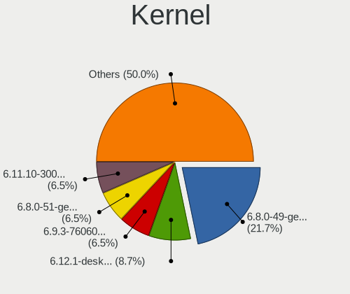
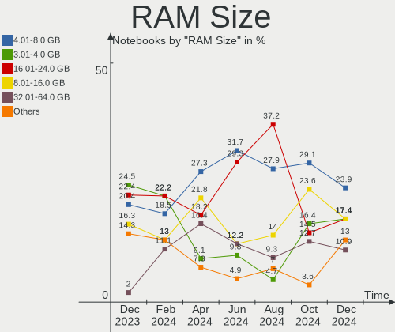
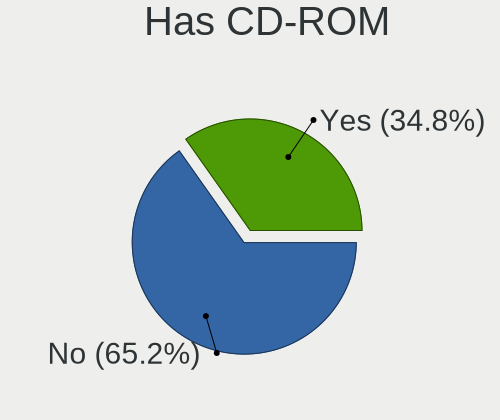
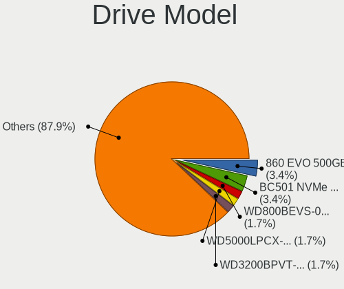
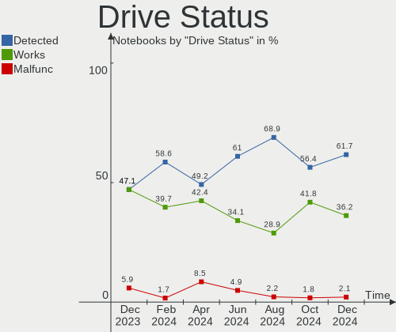
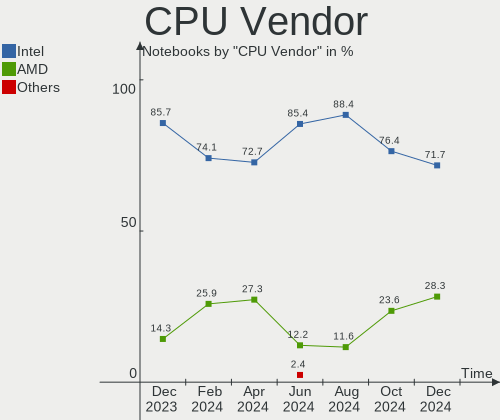
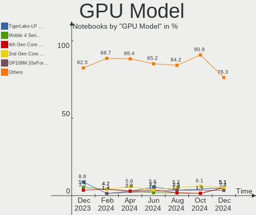
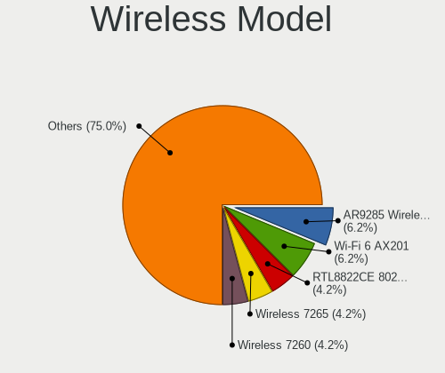

Linux in Netherlands - Hardware Trends (Notebooks)
--------------------------------------------------

A project to identify most popular hardware characteristics and track their change
over time based on data collected by Linux users at https://Linux-Hardware.org.

Anyone can contribute to this report by the [hw-probe](https://github.com/linuxhw/hw-probe) tool:

    sudo -E hw-probe -all -upload

Contents
--------

* [ System ](#system)
  - [ OS                       ](#os)
  - [ OS Family                ](#os-family)
  - [ Kernel                   ](#kernel)
  - [ Kernel Family            ](#kernel-family)
  - [ Kernel Major Ver.        ](#kernel-major-ver)
  - [ Arch                     ](#arch)
  - [ DE                       ](#de)
  - [ Display Server           ](#display-server)
  - [ Display Manager          ](#display-manager)
  - [ OS Lang                  ](#os-lang)
  - [ Boot Mode                ](#boot-mode)
  - [ Filesystem               ](#filesystem)
  - [ Part. scheme             ](#part-scheme)
  - [ Dual Boot with Linux/BSD ](#dual-boot-with-linuxbsd)
  - [ Dual Boot (Win)          ](#dual-boot-win)

* [ Board ](#board)
  - [ Vendor                   ](#vendor)
  - [ Model                    ](#model)
  - [ Model Family             ](#model-family)
  - [ MFG Year                 ](#mfg-year)
  - [ Form Factor              ](#form-factor)
  - [ Secure Boot              ](#secure-boot)
  - [ Coreboot                 ](#coreboot)
  - [ RAM Size                 ](#ram-size)
  - [ RAM Used                 ](#ram-used)
  - [ Total Drives             ](#total-drives)
  - [ Has CD-ROM               ](#has-cd-rom)
  - [ Has Ethernet             ](#has-ethernet)
  - [ Has WiFi                 ](#has-wifi)
  - [ Has Bluetooth            ](#has-bluetooth)

* [ Location ](#location)
  - [ Country                  ](#country)
  - [ City                     ](#city)

* [ Drives ](#drives)
  - [ Drive Vendor             ](#drive-vendor)
  - [ Drive Model              ](#drive-model)
  - [ HDD Vendor               ](#hdd-vendor)
  - [ SSD Vendor               ](#ssd-vendor)
  - [ Drive Kind               ](#drive-kind)
  - [ Drive Connector          ](#drive-connector)
  - [ Drive Size               ](#drive-size)
  - [ Space Total              ](#space-total)
  - [ Space Used               ](#space-used)
  - [ Malfunc. Drives          ](#malfunc-drives)
  - [ Malfunc. Drive Vendor    ](#malfunc-drive-vendor)
  - [ Malfunc. HDD Vendor      ](#malfunc-hdd-vendor)
  - [ Malfunc. Drive Kind      ](#malfunc-drive-kind)
  - [ Failed Drives            ](#failed-drives)
  - [ Failed Drive Vendor      ](#failed-drive-vendor)
  - [ Drive Status             ](#drive-status)

* [ Storage controller ](#storage-controller)
  - [ Storage Vendor           ](#storage-vendor)
  - [ Storage Model            ](#storage-model)
  - [ Storage Kind             ](#storage-kind)

* [ Processor ](#processor)
  - [ CPU Vendor               ](#cpu-vendor)
  - [ CPU Model                ](#cpu-model)
  - [ CPU Model Family         ](#cpu-model-family)
  - [ CPU Cores                ](#cpu-cores)
  - [ CPU Sockets              ](#cpu-sockets)
  - [ CPU Threads              ](#cpu-threads)
  - [ CPU Op-Modes             ](#cpu-op-modes)
  - [ CPU Microcode            ](#cpu-microcode)
  - [ CPU Microarch            ](#cpu-microarch)

* [ Graphics ](#graphics)
  - [ GPU Vendor               ](#gpu-vendor)
  - [ GPU Model                ](#gpu-model)
  - [ GPU Combo                ](#gpu-combo)
  - [ GPU Driver               ](#gpu-driver)
  - [ GPU Memory               ](#gpu-memory)

* [ Monitor ](#monitor)
  - [ Monitor Vendor           ](#monitor-vendor)
  - [ Monitor Model            ](#monitor-model)
  - [ Monitor Resolution       ](#monitor-resolution)
  - [ Monitor Diagonal         ](#monitor-diagonal)
  - [ Monitor Width            ](#monitor-width)
  - [ Aspect Ratio             ](#aspect-ratio)
  - [ Monitor Area             ](#monitor-area)
  - [ Pixel Density            ](#pixel-density)
  - [ Multiple Monitors        ](#multiple-monitors)

* [ Network ](#network)
  - [ Net Controller Vendor    ](#net-controller-vendor)
  - [ Net Controller Model     ](#net-controller-model)
  - [ Wireless Vendor          ](#wireless-vendor)
  - [ Wireless Model           ](#wireless-model)
  - [ Ethernet Vendor          ](#ethernet-vendor)
  - [ Ethernet Model           ](#ethernet-model)
  - [ Net Controller Kind      ](#net-controller-kind)
  - [ Used Controller          ](#used-controller)
  - [ NICs                     ](#nics)
  - [ IPv6                     ](#ipv6)

* [ Bluetooth ](#bluetooth)
  - [ Bluetooth Vendor         ](#bluetooth-vendor)
  - [ Bluetooth Model          ](#bluetooth-model)

* [ Sound ](#sound)
  - [ Sound Vendor             ](#sound-vendor)
  - [ Sound Model              ](#sound-model)

* [ Memory ](#memory)
  - [ Memory Vendor            ](#memory-vendor)
  - [ Memory Model             ](#memory-model)
  - [ Memory Kind              ](#memory-kind)
  - [ Memory Form Factor       ](#memory-form-factor)
  - [ Memory Size              ](#memory-size)
  - [ Memory Speed             ](#memory-speed)

* [ Printers & scanners ](#printers--scanners)
  - [ Printer Vendor           ](#printer-vendor)
  - [ Printer Model            ](#printer-model)
  - [ Scanner Vendor           ](#scanner-vendor)
  - [ Scanner Model            ](#scanner-model)

* [ Camera ](#camera)
  - [ Camera Vendor            ](#camera-vendor)
  - [ Camera Model             ](#camera-model)

* [ Security ](#security)
  - [ Fingerprint Vendor       ](#fingerprint-vendor)
  - [ Fingerprint Model        ](#fingerprint-model)
  - [ Chipcard Vendor          ](#chipcard-vendor)
  - [ Chipcard Model           ](#chipcard-model)

* [ Unsupported ](#unsupported)
  - [ Unsupported Devices      ](#unsupported-devices)
  - [ Unsupported Device Types ](#unsupported-device-types)

System
------

OS
--

Installed operating systems

| Name                         | Notebooks | Percent |
|------------------------------|-----------|---------|
| Ubuntu 22.04                 | 9         | 17.31%  |
| Ubuntu 20.04                 | 5         | 9.62%   |
| OpenMandriva 4.3             | 4         | 7.69%   |
| Linux Mint 20.3              | 3         | 5.77%   |
| Fedora 35                    | 3         | 5.77%   |
| Debian 11                    | 3         | 5.77%   |
| Ubuntu 21.10                 | 2         | 3.85%   |
| Pop!_OS 22.04                | 2         | 3.85%   |
| Manjaro 21.2.6               | 2         | 3.85%   |
| Kubuntu 21.10                | 2         | 3.85%   |
| Fedora 36                    | 2         | 3.85%   |
| Debian Testing               | 2         | 3.85%   |
| Xubuntu 22.04                | 1         | 1.92%   |
| Xubuntu 20.04                | 1         | 1.92%   |
| Ubuntu MATE 22.04            | 1         | 1.92%   |
| Ubuntu MATE 20.04            | 1         | 1.92%   |
| Ubuntu 21.04                 | 1         | 1.92%   |
| SteamOS 3.2                  | 1         | 1.92%   |
| openSUSE Tumbleweed-XXXXXXXX | 1         | 1.92%   |
| Linux Mint 20.2              | 1         | 1.92%   |
| Kali 2022.2                  | 1         | 1.92%   |
| Gentoo 2.7                   | 1         | 1.92%   |
| EndeavourOS Rolling          | 1         | 1.92%   |
| Clear Linux 36410            | 1         | 1.92%   |
| ArcoLinux Rolling            | 1         | 1.92%   |

OS Family
---------

OS without a version

| Name         | Notebooks | Percent |
|--------------|-----------|---------|
| Ubuntu       | 17        | 32.69%  |
| Fedora       | 5         | 9.62%   |
| Debian       | 5         | 9.62%   |
| OpenMandriva | 4         | 7.69%   |
| Linux Mint   | 4         | 7.69%   |
| Xubuntu      | 2         | 3.85%   |
| Ubuntu MATE  | 2         | 3.85%   |
| Pop!_OS      | 2         | 3.85%   |
| Manjaro      | 2         | 3.85%   |
| Kubuntu      | 2         | 3.85%   |
| SteamOS      | 1         | 1.92%   |
| openSUSE     | 1         | 1.92%   |
| Kali         | 1         | 1.92%   |
| Gentoo       | 1         | 1.92%   |
| EndeavourOS  | 1         | 1.92%   |
| Clear Linux  | 1         | 1.92%   |
| ArcoLinux    | 1         | 1.92%   |

Kernel
------

Version of the Linux kernel

| Version                                      | Notebooks | Percent |
|----------------------------------------------|-----------|---------|
| 5.13.0-40-generic                            | 6         | 11.54%  |
| 5.15.0-27-generic                            | 5         | 9.62%   |
| 5.16.7-desktop-1omv4003                      | 4         | 7.69%   |
| 5.4.0-110-generic                            | 3         | 5.77%   |
| 5.17.5-76051705-generic                      | 2         | 3.85%   |
| 5.17.0-1-amd64                               | 2         | 3.85%   |
| 5.13.0-41-generic                            | 2         | 3.85%   |
| 5.10.0-14-amd64                              | 2         | 3.85%   |
| 5.4.0-91-generic                             | 1         | 1.92%   |
| 5.17.9-arch1-1                               | 1         | 1.92%   |
| 5.17.9-300.fc36.x86_64                       | 1         | 1.92%   |
| 5.17.8-300.fc36.x86_64                       | 1         | 1.92%   |
| 5.17.8-051708-generic                        | 1         | 1.92%   |
| 5.17.7-200.fc35.x86_64                       | 1         | 1.92%   |
| 5.17.7-1-default                             | 1         | 1.92%   |
| 5.17.6-200.fc35.x86_64                       | 1         | 1.92%   |
| 5.17.4-200.fc35.x86_64                       | 1         | 1.92%   |
| 5.17.11-1148.native                          | 1         | 1.92%   |
| 5.17.1-3-MANJARO                             | 1         | 1.92%   |
| 5.17.0-mainline-t14                          | 1         | 1.92%   |
| 5.16.14-1-MANJARO                            | 1         | 1.92%   |
| 5.16.0-kali7-amd64                           | 1         | 1.92%   |
| 5.15.38-1-lts                                | 1         | 1.92%   |
| 5.15.0-33-generic                            | 1         | 1.92%   |
| 5.15.0-322205121620-generic                  | 1         | 1.92%   |
| 5.15.0-30-generic                            | 1         | 1.92%   |
| 5.15.0-25-generic                            | 1         | 1.92%   |
| 5.15.0-23-generic                            | 1         | 1.92%   |
| 5.14.0-1034-oem                              | 1         | 1.92%   |
| 5.13.19-051319-generic                       | 1         | 1.92%   |
| 5.13.0-valve14-1-neptune-02195-g5b0f749d00fa | 1         | 1.92%   |
| 5.13.0-44-generic                            | 1         | 1.92%   |
| 5.11.0-16-generic                            | 1         | 1.92%   |
| 5.10.0-13-amd64                              | 1         | 1.92%   |

Kernel Family
-------------

Linux kernel without a distro release

| Version | Notebooks | Percent |
|---------|-----------|---------|
| 5.15.0  | 10        | 19.23%  |
| 5.13.0  | 10        | 19.23%  |
| 5.4.0   | 4         | 7.69%   |
| 5.16.7  | 4         | 7.69%   |
| 5.17.0  | 3         | 5.77%   |
| 5.10.0  | 3         | 5.77%   |
| 5.17.9  | 2         | 3.85%   |
| 5.17.8  | 2         | 3.85%   |
| 5.17.7  | 2         | 3.85%   |
| 5.17.5  | 2         | 3.85%   |
| 5.17.6  | 1         | 1.92%   |
| 5.17.4  | 1         | 1.92%   |
| 5.17.11 | 1         | 1.92%   |
| 5.17.1  | 1         | 1.92%   |
| 5.16.14 | 1         | 1.92%   |
| 5.16.0  | 1         | 1.92%   |
| 5.15.38 | 1         | 1.92%   |
| 5.14.0  | 1         | 1.92%   |
| 5.13.19 | 1         | 1.92%   |
| 5.11.0  | 1         | 1.92%   |

Kernel Major Ver.
-----------------

Linux kernel major version

| Version | Notebooks | Percent |
|---------|-----------|---------|
| 5.17    | 15        | 28.85%  |
| 5.15    | 11        | 21.15%  |
| 5.13    | 11        | 21.15%  |
| 5.16    | 6         | 11.54%  |
| 5.4     | 4         | 7.69%   |
| 5.10    | 3         | 5.77%   |
| 5.14    | 1         | 1.92%   |
| 5.11    | 1         | 1.92%   |

Arch
----

OS architecture (x86_64, i586, etc.)

| Name   | Notebooks | Percent |
|--------|-----------|---------|
| x86_64 | 52        | 100%    |

DE
--

Desktop Environment

| Name       | Notebooks | Percent |
|------------|-----------|---------|
| GNOME      | 27        | 51.92%  |
| KDE5       | 12        | 23.08%  |
| X-Cinnamon | 4         | 7.69%   |
| XFCE       | 3         | 5.77%   |
| MATE       | 2         | 3.85%   |
| Cinnamon   | 2         | 3.85%   |
| Deepin     | 1         | 1.92%   |
| Unknown    | 1         | 1.92%   |

Display Server
--------------

X11 or Wayland

| Name    | Notebooks | Percent |
|---------|-----------|---------|
| X11     | 37        | 71.15%  |
| Wayland | 12        | 23.08%  |
| Tty     | 2         | 3.85%   |
| Unknown | 1         | 1.92%   |

Display Manager
---------------

SDDM, LightDM, etc.

| Name    | Notebooks | Percent |
|---------|-----------|---------|
| GDM3    | 14        | 26.92%  |
| SDDM    | 12        | 23.08%  |
| GDM     | 9         | 17.31%  |
| Unknown | 9         | 17.31%  |
| LightDM | 8         | 15.38%  |

OS Lang
-------

Language

| Lang    | Notebooks | Percent |
|---------|-----------|---------|
| en_US   | 37        | 71.15%  |
| nl_NL   | 8         | 15.38%  |
| en_GB   | 3         | 5.77%   |
| ru_RU   | 1         | 1.92%   |
| POSIX   | 1         | 1.92%   |
| it_IT   | 1         | 1.92%   |
| Unknown | 1         | 1.92%   |

Boot Mode
---------

EFI or BIOS

| Mode | Notebooks | Percent |
|------|-----------|---------|
| EFI  | 30        | 57.69%  |
| BIOS | 22        | 42.31%  |

Filesystem
----------

Type of filesystem

| Type    | Notebooks | Percent |
|---------|-----------|---------|
| Ext4    | 42        | 80.77%  |
| Overlay | 5         | 9.62%   |
| Btrfs   | 4         | 7.69%   |
| Xfs     | 1         | 1.92%   |

Part. scheme
------------

Scheme of partitioning

| Type    | Notebooks | Percent |
|---------|-----------|---------|
| GPT     | 28        | 53.85%  |
| Unknown | 20        | 38.46%  |
| MBR     | 4         | 7.69%   |

Dual Boot with Linux/BSD
------------------------

Hosting more than one Linux/BSD

| Dual boot | Notebooks | Percent |
|-----------|-----------|---------|
| No        | 44        | 84.62%  |
| Yes       | 8         | 15.38%  |

Dual Boot (Win)
---------------

Hosting Linux and Windows

| Dual boot | Notebooks | Percent |
|-----------|-----------|---------|
| No        | 40        | 76.92%  |
| Yes       | 12        | 23.08%  |

Board
-----

Vendor
------

Motherboard manufacturer

| Name             | Notebooks | Percent |
|------------------|-----------|---------|
| Lenovo           | 15        | 28.85%  |
| Dell             | 11        | 21.15%  |
| Hewlett-Packard  | 7         | 13.46%  |
| Acer             | 5         | 9.62%   |
| Notebook         | 2         | 3.85%   |
| MSI              | 2         | 3.85%   |
| Medion           | 2         | 3.85%   |
| ASUSTek Computer | 2         | 3.85%   |
| Valve            | 1         | 1.92%   |
| Panasonic        | 1         | 1.92%   |
| Packard Bell     | 1         | 1.92%   |
| HONOR            | 1         | 1.92%   |
| Alienware        | 1         | 1.92%   |
| Unknown          | 1         | 1.92%   |

Model
-----

Motherboard model

| Name                                   | Notebooks | Percent |
|----------------------------------------|-----------|---------|
| Lenovo ThinkBook 15 G2 ITL 20VE        | 2         | 3.85%   |
| Valve Jupiter                          | 1         | 1.92%   |
| Panasonic CF-AX2LDCZMF                 | 1         | 1.92%   |
| Packard Bell EasyNote LE69KB           | 1         | 1.92%   |
| Notebook PB50_70RF,RD,RC               | 1         | 1.92%   |
| Notebook NL5xRU                        | 1         | 1.92%   |
| MSI GS63 7RD                           | 1         | 1.92%   |
| MSI GP62MVR 7RF                        | 1         | 1.92%   |
| Medion X6816                           | 1         | 1.92%   |
| Medion P6812                           | 1         | 1.92%   |
| Lenovo Yoga Slim 7 14ARE05 82A2        | 1         | 1.92%   |
| Lenovo ThinkPad X240 20AMS1S800        | 1         | 1.92%   |
| Lenovo ThinkPad X201 3680AC2           | 1         | 1.92%   |
| Lenovo ThinkPad W520 428223G           | 1         | 1.92%   |
| Lenovo ThinkPad T14s Gen 1 20UHCTO1WW  | 1         | 1.92%   |
| Lenovo ThinkPad T14 Gen 1 20UES06X00   | 1         | 1.92%   |
| Lenovo ThinkPad P15s Gen 2i 20W6000JMH | 1         | 1.92%   |
| Lenovo ThinkPad P14s Gen 2a 21A0CTO1WW | 1         | 1.92%   |
| Lenovo ThinkPad Edge 03193TG           | 1         | 1.92%   |
| Lenovo Legion Y540-17IRH-PG0 81T3      | 1         | 1.92%   |
| Lenovo Legion 5 15ACH6H 82JU           | 1         | 1.92%   |
| Lenovo Legion 5 15ACH6A 82NW           | 1         | 1.92%   |
| Lenovo IdeaPad L340-15IWL 81LG         | 1         | 1.92%   |
| HONOR BOHK-WAX9X                       | 1         | 1.92%   |
| HP ZBook Studio G5                     | 1         | 1.92%   |
| HP ZBook 15 G6                         | 1         | 1.92%   |
| HP ProBook x360 11 G1 EE               | 1         | 1.92%   |
| HP ProBook 6560b                       | 1         | 1.92%   |
| HP Pavilion Power Laptop 15-cb0xx      | 1         | 1.92%   |
| HP Pavilion Laptop 15-eh0xxx           | 1         | 1.92%   |
| HP Pavilion Laptop 15-cw1xxx           | 1         | 1.92%   |
| Dell XPS 15 9570                       | 1         | 1.92%   |
| Dell XPS 15 9560                       | 1         | 1.92%   |
| Dell XPS 13 9310                       | 1         | 1.92%   |
| Dell Precision 3551                    | 1         | 1.92%   |
| Dell Latitude E6510                    | 1         | 1.92%   |
| Dell Latitude 3520                     | 1         | 1.92%   |
| Dell Latitude 3310                     | 1         | 1.92%   |
| Dell Latitude 3120                     | 1         | 1.92%   |
| Dell Inspiron 1525                     | 1         | 1.92%   |
| Dell Inspiron 14 7420 2-in-1           | 1         | 1.92%   |
| Dell G3 3779                           | 1         | 1.92%   |
| ASUS UX430UAR                          | 1         | 1.92%   |
| ASUS UL30A                             | 1         | 1.92%   |
| Alienware 17 R4                        | 1         | 1.92%   |
| Acer TravelMate 8372                   | 1         | 1.92%   |
| Acer Swift SF514-55T                   | 1         | 1.92%   |
| Acer Aspire E5-573                     | 1         | 1.92%   |
| Acer Aspire E1-532                     | 1         | 1.92%   |
| Acer Aspire 7750G                      | 1         | 1.92%   |
| Unknown                                | 1         | 1.92%   |

Model Family
------------

Motherboard model prefix

| Name                   | Notebooks | Percent |
|------------------------|-----------|---------|
| Lenovo ThinkPad        | 8         | 15.38%  |
| Dell Latitude          | 4         | 7.69%   |
| Lenovo Legion          | 3         | 5.77%   |
| HP Pavilion            | 3         | 5.77%   |
| Dell XPS               | 3         | 5.77%   |
| Acer Aspire            | 3         | 5.77%   |
| Lenovo ThinkBook       | 2         | 3.85%   |
| HP ZBook               | 2         | 3.85%   |
| HP ProBook             | 2         | 3.85%   |
| Dell Inspiron          | 2         | 3.85%   |
| Valve Jupiter          | 1         | 1.92%   |
| Panasonic CF-AX2LDCZMF | 1         | 1.92%   |
| Packard Bell EasyNote  | 1         | 1.92%   |
| Notebook PB50          | 1         | 1.92%   |
| Notebook NL5xRU        | 1         | 1.92%   |
| MSI GS63               | 1         | 1.92%   |
| MSI GP62MVR            | 1         | 1.92%   |
| Medion X6816           | 1         | 1.92%   |
| Medion P6812           | 1         | 1.92%   |
| Lenovo Yoga            | 1         | 1.92%   |
| Lenovo IdeaPad         | 1         | 1.92%   |
| HONOR BOHK-WAX9X       | 1         | 1.92%   |
| Dell Precision         | 1         | 1.92%   |
| Dell G3                | 1         | 1.92%   |
| ASUS UX430UAR          | 1         | 1.92%   |
| ASUS UL30A             | 1         | 1.92%   |
| Alienware 17           | 1         | 1.92%   |
| Acer TravelMate        | 1         | 1.92%   |
| Acer Swift             | 1         | 1.92%   |
| Unknown                | 1         | 1.92%   |

MFG Year
--------

Motherboard manufacture year

| Year | Notebooks | Percent |
|------|-----------|---------|
| 2020 | 11        | 21.15%  |
| 2021 | 7         | 13.46%  |
| 2017 | 6         | 11.54%  |
| 2019 | 5         | 9.62%   |
| 2011 | 5         | 9.62%   |
| 2013 | 4         | 7.69%   |
| 2010 | 4         | 7.69%   |
| 2018 | 3         | 5.77%   |
| 2022 | 2         | 3.85%   |
| 2016 | 1         | 1.92%   |
| 2015 | 1         | 1.92%   |
| 2014 | 1         | 1.92%   |
| 2009 | 1         | 1.92%   |
| 2008 | 1         | 1.92%   |

Form Factor
-----------

Physical design of the computer

| Name     | Notebooks | Percent |
|----------|-----------|---------|
| Notebook | 52        | 100%    |

Secure Boot
-----------

Enabled or disabled

| State    | Notebooks | Percent |
|----------|-----------|---------|
| Disabled | 47        | 90.38%  |
| Enabled  | 5         | 9.62%   |

Coreboot
--------

Have coreboot on board

| Used | Notebooks | Percent |
|------|-----------|---------|
| No   | 52        | 100%    |

RAM Size
--------

Total RAM memory

| Size in GB  | Notebooks | Percent |
|-------------|-----------|---------|
| 16.01-24.0  | 12        | 23.08%  |
| 8.01-16.0   | 11        | 21.15%  |
| 4.01-8.0    | 10        | 19.23%  |
| 3.01-4.0    | 8         | 15.38%  |
| 32.01-64.0  | 5         | 9.62%   |
| 24.01-32.0  | 3         | 5.77%   |
| 2.01-3.0    | 1         | 1.92%   |
| 64.01-256.0 | 1         | 1.92%   |
| 1.01-2.0    | 1         | 1.92%   |

RAM Used
--------

Used RAM memory

| Used GB    | Notebooks | Percent |
|------------|-----------|---------|
| 1.01-2.0   | 20        | 38.46%  |
| 2.01-3.0   | 13        | 25%     |
| 4.01-8.0   | 9         | 17.31%  |
| 3.01-4.0   | 5         | 9.62%   |
| 8.01-16.0  | 4         | 7.69%   |
| 16.01-24.0 | 1         | 1.92%   |

Total Drives
------------

Number of drives on board

| Drives | Notebooks | Percent |
|--------|-----------|---------|
| 1      | 34        | 65.38%  |
| 2      | 14        | 26.92%  |
| 4      | 2         | 3.85%   |
| 3      | 2         | 3.85%   |

Has CD-ROM
----------

Has CD-ROM on board

| Presented | Notebooks | Percent |
|-----------|-----------|---------|
| No        | 41        | 78.85%  |
| Yes       | 11        | 21.15%  |

Has Ethernet
------------

Has Ethernet on board

| Presented | Notebooks | Percent |
|-----------|-----------|---------|
| Yes       | 39        | 75%     |
| No        | 13        | 25%     |

Has WiFi
--------

Has WiFi module

| Presented | Notebooks | Percent |
|-----------|-----------|---------|
| Yes       | 51        | 98.08%  |
| No        | 1         | 1.92%   |

Has Bluetooth
-------------

Has Bluetooth module

| Presented | Notebooks | Percent |
|-----------|-----------|---------|
| Yes       | 43        | 82.69%  |
| No        | 9         | 17.31%  |

Location
--------

Country
-------

Geographic location (country)

| Country     | Notebooks | Percent |
|-------------|-----------|---------|
| Netherlands | 52        | 100%    |

City
----

Geographic location (city)

| City             | Notebooks | Percent |
|------------------|-----------|---------|
| Amsterdam        | 12        | 23.08%  |
| The Hague        | 7         | 13.46%  |
| Rotterdam        | 3         | 5.77%   |
| Schagen          | 2         | 3.85%   |
| Amersfoort       | 2         | 3.85%   |
| Zwolle           | 1         | 1.92%   |
| Zwartemeer       | 1         | 1.92%   |
| Wageningen       | 1         | 1.92%   |
| Voorhout         | 1         | 1.92%   |
| Tilburg          | 1         | 1.92%   |
| Rijswijk         | 1         | 1.92%   |
| Nuenen           | 1         | 1.92%   |
| Nieuwegein       | 1         | 1.92%   |
| Nederland        | 1         | 1.92%   |
| Naaldwijk        | 1         | 1.92%   |
| Maarssen         | 1         | 1.92%   |
| Lisse            | 1         | 1.92%   |
| Huissen          | 1         | 1.92%   |
| Hoorn            | 1         | 1.92%   |
| Hoogezand        | 1         | 1.92%   |
| Hoensbroek       | 1         | 1.92%   |
| Hengelo          | 1         | 1.92%   |
| Heerhugowaard    | 1         | 1.92%   |
| Groningen        | 1         | 1.92%   |
| Emmeloord        | 1         | 1.92%   |
| Eindhoven        | 1         | 1.92%   |
| Delft            | 1         | 1.92%   |
| Damwald          | 1         | 1.92%   |
| Castricum        | 1         | 1.92%   |
| Almere Stad      | 1         | 1.92%   |
| 's-Hertogenbosch | 1         | 1.92%   |

Drives
------

Drive Vendor
------------

Hard drive vendors

| Vendor              | Notebooks | Drives | Percent |
|---------------------|-----------|--------|---------|
| Samsung Electronics | 24        | 30     | 36.92%  |
| WDC                 | 7         | 7      | 10.77%  |
| SK Hynix            | 4         | 4      | 6.15%   |
| Micron Technology   | 4         | 4      | 6.15%   |
| Unknown             | 3         | 3      | 4.62%   |
| Toshiba             | 3         | 3      | 4.62%   |
| Seagate             | 3         | 3      | 4.62%   |
| SanDisk             | 3         | 3      | 4.62%   |
| HGST                | 3         | 3      | 4.62%   |
| Crucial             | 3         | 4      | 4.62%   |
| Transcend           | 1         | 1      | 1.54%   |
| Realtek             | 1         | 1      | 1.54%   |
| PNY                 | 1         | 1      | 1.54%   |
| KIOXIA              | 1         | 1      | 1.54%   |
| Kingston            | 1         | 1      | 1.54%   |
| Intel               | 1         | 1      | 1.54%   |
| Hitachi             | 1         | 1      | 1.54%   |
| A-DATA Technology   | 1         | 1      | 1.54%   |

Drive Model
-----------

Hard drive models

| Model                                   | Notebooks | Percent |
|-----------------------------------------|-----------|---------|
| HGST HTS721010A9E630 1TB                | 3         | 4.29%   |
| WDC WDS500G2B0C-00PXH0 500GB            | 2         | 2.86%   |
| Samsung SSD 850 EVO 250GB               | 2         | 2.86%   |
| Samsung MZVLB512HBJQ-000L2 512GB        | 2         | 2.86%   |
| WDC WD3200LPCX-22VHAT0 320GB            | 1         | 1.43%   |
| WDC WD3200BPVT-22JJ5T0 320GB            | 1         | 1.43%   |
| WDC WD20SPZX-75UA7T0 2TB                | 1         | 1.43%   |
| WDC WD1600BUCT-63TWBY0 160GB            | 1         | 1.43%   |
| WDC WD10JPVX-22JC3T0 1TB                | 1         | 1.43%   |
| Unknown SU16G  16GB                     | 1         | 1.43%   |
| Unknown SB64G  64GB                     | 1         | 1.43%   |
| Unknown ACLCE  64GB                     | 1         | 1.43%   |
| Transcend TS120GMTS420S 120GB SSD       | 1         | 1.43%   |
| Toshiba Q300 120GB SSD                  | 1         | 1.43%   |
| Toshiba NVMe SSD Drive 512GB            | 1         | 1.43%   |
| Toshiba MQ04ABF100 1TB                  | 1         | 1.43%   |
| SK Hynix SKHynix_HFM256GD3HX015N 256GB  | 1         | 1.43%   |
| SK Hynix HFM512GDJTNI-82A0A 512GB       | 1         | 1.43%   |
| SK Hynix BC711 NVMe 128GB               | 1         | 1.43%   |
| SK Hynix BC511 HFM512GDJTNI-82A0A 512GB | 1         | 1.43%   |
| Seagate ST9250320AS 250GB               | 1         | 1.43%   |
| Seagate ST9160823ASG 160GB              | 1         | 1.43%   |
| Seagate Backup+ Hub BK 8TB              | 1         | 1.43%   |
| SanDisk SD9SN8W256G1002 256GB SSD       | 1         | 1.43%   |
| SanDisk SD8SN8U-128G-1006 128GB SSD     | 1         | 1.43%   |
| Sandisk NVMe SSD Drive 512GB            | 1         | 1.43%   |
| Samsung SSD 980 500GB                   | 1         | 1.43%   |
| Samsung SSD 970 EVO 1TB                 | 1         | 1.43%   |
| Samsung SSD 960 EVO 250GB               | 1         | 1.43%   |
| Samsung SSD 860 EVO 500GB               | 1         | 1.43%   |
| Samsung SSD 860 EVO 4TB                 | 1         | 1.43%   |
| Samsung SSD 850 PRO 256G                | 1         | 1.43%   |
| Samsung SSD 850 EVO 500GB               | 1         | 1.43%   |
| Samsung SSD 850 EVO 250G                | 1         | 1.43%   |
| Samsung SSD 840 EVO 500GB               | 1         | 1.43%   |
| Samsung PSSD T7 1TB                     | 1         | 1.43%   |
| Samsung PM991a NVMe 256GB               | 1         | 1.43%   |
| Samsung PM981 NVMe 512GB                | 1         | 1.43%   |
| Samsung PM961 NVMe 512GB                | 1         | 1.43%   |
| Samsung NVMe SSD Drive 512GB            | 1         | 1.43%   |
| Samsung NVMe SSD Drive 2TB              | 1         | 1.43%   |
| Samsung NVMe SSD Drive 1TB              | 1         | 1.43%   |
| Samsung NVMe SSD Drive 1024GB           | 1         | 1.43%   |
| Samsung MZVLB512HBJQ-000L7 512GB        | 1         | 1.43%   |
| Samsung MZVLB1T0HBLR-000L7 1TB          | 1         | 1.43%   |
| Samsung MZVL22T0HBLB-00BL7 2TB          | 1         | 1.43%   |
| Samsung MZNLN512HMJP-00000 512GB SSD    | 1         | 1.43%   |
| Samsung MZMPC128HBFU-00000 128GB SSD    | 1         | 1.43%   |
| Samsung MZALQ512HALU-000L2 512GB        | 1         | 1.43%   |
| Samsung MZ7PD256HAFV-000H7 256GB SSD    | 1         | 1.43%   |
| Samsung MZ7LN256HAJQ-000H1 256GB SSD    | 1         | 1.43%   |
| Realtek RTL9210 NVME 512GB              | 1         | 1.43%   |
| PNY CS900 480GB SSD                     | 1         | 1.43%   |
| Micron MTFDHBA512TDV 512GB              | 1         | 1.43%   |
| Micron MTFDHBA512QFD 512GB              | 1         | 1.43%   |
| Micron 2300 NVMe 1024GB                 | 1         | 1.43%   |
| Micron 2200S NVMe 512GB                 | 1         | 1.43%   |
| KIOXIA KXG60ZNV512G 512GB               | 1         | 1.43%   |
| Kingston NVMe SSD Drive 512GB           | 1         | 1.43%   |
| Intel SSDPEKNW512G8H 512GB              | 1         | 1.43%   |

HDD Vendor
----------

Hard disk drive vendors

| Vendor  | Notebooks | Drives | Percent |
|---------|-----------|--------|---------|
| WDC     | 5         | 5      | 38.46%  |
| Seagate | 3         | 3      | 23.08%  |
| HGST    | 3         | 3      | 23.08%  |
| Toshiba | 1         | 1      | 7.69%   |
| Hitachi | 1         | 1      | 7.69%   |

SSD Vendor
----------

Solid state drive vendors

| Vendor              | Notebooks | Drives | Percent |
|---------------------|-----------|--------|---------|
| Samsung Electronics | 11        | 13     | 55%     |
| Crucial             | 3         | 4      | 15%     |
| SanDisk             | 2         | 2      | 10%     |
| Transcend           | 1         | 1      | 5%      |
| Toshiba             | 1         | 1      | 5%      |
| PNY                 | 1         | 1      | 5%      |
| A-DATA Technology   | 1         | 1      | 5%      |

Drive Kind
----------

HDD or SSD

| Kind | Notebooks | Drives | Percent |
|------|-----------|--------|---------|
| NVMe | 30        | 33     | 46.88%  |
| SSD  | 18        | 23     | 28.13%  |
| HDD  | 13        | 13     | 20.31%  |
| MMC  | 3         | 3      | 4.69%   |

Drive Connector
---------------

SATA, SAS, NVMe, etc.

| Type | Notebooks | Drives | Percent |
|------|-----------|--------|---------|
| NVMe | 29        | 32     | 46.77%  |
| SATA | 27        | 32     | 43.55%  |
| SAS  | 3         | 5      | 4.84%   |
| MMC  | 3         | 3      | 4.84%   |

Drive Size
----------

Size of hard drive

| Size in TB | Notebooks | Drives | Percent |
|------------|-----------|--------|---------|
| 0.01-0.5   | 18        | 23     | 58.06%  |
| 0.51-1.0   | 10        | 10     | 32.26%  |
| 3.01-4.0   | 1         | 1      | 3.23%   |
| 1.01-2.0   | 1         | 1      | 3.23%   |
| 4.01-10.0  | 1         | 1      | 3.23%   |

Space Total
-----------

Amount of disk space available on the file system

| Size in GB     | Notebooks | Percent |
|----------------|-----------|---------|
| 251-500        | 20        | 38.46%  |
| 101-250        | 11        | 21.15%  |
| 501-1000       | 9         | 17.31%  |
| 1-20           | 6         | 11.54%  |
| More than 3000 | 2         | 3.85%   |
| 1001-2000      | 2         | 3.85%   |
| Unknown        | 2         | 3.85%   |

Space Used
----------

Amount of used disk space

| Used GB        | Notebooks | Percent |
|----------------|-----------|---------|
| 1-20           | 14        | 26.92%  |
| 51-100         | 12        | 23.08%  |
| 251-500        | 8         | 15.38%  |
| 21-50          | 7         | 13.46%  |
| 101-250        | 6         | 11.54%  |
| Unknown        | 2         | 3.85%   |
| More than 3000 | 1         | 1.92%   |
| 2001-3000      | 1         | 1.92%   |
| 501-1000       | 1         | 1.92%   |

Malfunc. Drives
---------------

Drive models with a malfunction

| Model                             | Notebooks | Drives | Percent |
|-----------------------------------|-----------|--------|---------|
| WDC WD10JPVX-22JC3T0 1TB          | 1         | 1      | 25%     |
| HGST HTS721010A9E630 1TB          | 1         | 1      | 25%     |
| Crucial CT512MX100SSD1 512GB      | 1         | 1      | 25%     |
| A-DATA Technology SP550 240GB SSD | 1         | 1      | 25%     |

Malfunc. Drive Vendor
---------------------

Vendors of faulty drives

| Vendor            | Notebooks | Drives | Percent |
|-------------------|-----------|--------|---------|
| WDC               | 1         | 1      | 25%     |
| HGST              | 1         | 1      | 25%     |
| Crucial           | 1         | 1      | 25%     |
| A-DATA Technology | 1         | 1      | 25%     |

Malfunc. HDD Vendor
-------------------

Vendors of faulty HDD drives

| Vendor | Notebooks | Drives | Percent |
|--------|-----------|--------|---------|
| WDC    | 1         | 1      | 50%     |
| HGST   | 1         | 1      | 50%     |

Malfunc. Drive Kind
-------------------

Kinds of faulty drives

| Kind | Notebooks | Drives | Percent |
|------|-----------|--------|---------|
| SSD  | 2         | 2      | 50%     |
| HDD  | 2         | 2      | 50%     |

Failed Drives
-------------

Failed drive models

Zero info for selected period =(

Failed Drive Vendor
-------------------

Failed drive vendors

Zero info for selected period =(

Drive Status
------------

Number of failed and malfunc. drives

| Status   | Notebooks | Drives | Percent |
|----------|-----------|--------|---------|
| Works    | 30        | 35     | 51.72%  |
| Detected | 24        | 33     | 41.38%  |
| Malfunc  | 4         | 4      | 6.9%    |

Storage controller
------------------

Storage Vendor
--------------

Storage controller vendors

| Vendor                       | Notebooks | Percent |
|------------------------------|-----------|---------|
| Intel                        | 37        | 54.41%  |
| Samsung Electronics          | 14        | 20.59%  |
| SK Hynix                     | 4         | 5.88%   |
| Micron Technology            | 4         | 5.88%   |
| Sandisk                      | 3         | 4.41%   |
| AMD                          | 3         | 4.41%   |
| Toshiba America Info Systems | 2         | 2.94%   |
| Kingston Technology Company  | 1         | 1.47%   |

Storage Model
-------------

Storage controller models

| Model                                                                            | Notebooks | Percent |
|----------------------------------------------------------------------------------|-----------|---------|
| Samsung NVMe SSD Controller SM981/PM981/PM983                                    | 9         | 12.33%  |
| Intel Cannon Lake Mobile PCH SATA AHCI Controller                                | 6         | 8.22%   |
| Intel 6 Series/C200 Series Chipset Family 6 port Mobile SATA AHCI Controller     | 5         | 6.85%   |
| Micron Non-Volatile memory controller                                            | 4         | 5.48%   |
| Intel Volume Management Device NVMe RAID Controller                              | 4         | 5.48%   |
| Intel HM170/QM170 Chipset SATA Controller [AHCI Mode]                            | 4         | 5.48%   |
| Samsung NVMe SSD Controller 980                                                  | 3         | 4.11%   |
| Intel Tiger Lake-LP SATA Controller [AHCI mode]                                  | 3         | 4.11%   |
| AMD FCH SATA Controller [AHCI mode]                                              | 3         | 4.11%   |
| SK Hynix Gold P31 SSD                                                            | 2         | 2.74%   |
| SK Hynix BC511                                                                   | 2         | 2.74%   |
| Samsung NVMe SSD Controller SM961/PM961/SM963                                    | 2         | 2.74%   |
| Intel 8 Series SATA Controller 1 [AHCI mode]                                     | 2         | 2.74%   |
| Intel 5 Series/3400 Series Chipset 4 port SATA AHCI Controller                   | 2         | 2.74%   |
| Toshiba America Info Systems XG6 NVMe SSD Controller                             | 1         | 1.37%   |
| Toshiba America Info Systems Toshiba America Info Non-Volatile memory controller | 1         | 1.37%   |
| Sandisk WD Blue SN550 NVMe SSD                                                   | 1         | 1.37%   |
| Sandisk WD Black SN750 / PC SN730 NVMe SSD                                       | 1         | 1.37%   |
| Sandisk Non-Volatile memory controller                                           | 1         | 1.37%   |
| Samsung NVMe SSD Controller PM9A1/PM9A3/980PRO                                   | 1         | 1.37%   |
| Kingston Company OM3PDP3 NVMe SSD                                                | 1         | 1.37%   |
| Intel Wildcat Point-LP SATA Controller [AHCI Mode]                               | 1         | 1.37%   |
| Intel Sunrise Point-LP SATA Controller [AHCI mode]                               | 1         | 1.37%   |
| Intel SSD 660P Series                                                            | 1         | 1.37%   |
| Intel Q170/Q150/B150/H170/H110/Z170/CM236 Chipset SATA Controller [AHCI Mode]    | 1         | 1.37%   |
| Intel Celeron N3350/Pentium N4200/Atom E3900 Series SATA AHCI Controller         | 1         | 1.37%   |
| Intel Cannon Point-LP SATA Controller [AHCI Mode]                                | 1         | 1.37%   |
| Intel 82801IBM/IEM (ICH9M/ICH9M-E) 4 port SATA Controller [AHCI mode]            | 1         | 1.37%   |
| Intel 82801HM/HEM (ICH8M/ICH8M-E) SATA Controller [AHCI mode]                    | 1         | 1.37%   |
| Intel 82801HM/HEM (ICH8M/ICH8M-E) IDE Controller                                 | 1         | 1.37%   |
| Intel 8 Series/C220 Series Chipset Family 6-port SATA Controller 1 [AHCI mode]   | 1         | 1.37%   |
| Intel 7 Series Chipset Family 6-port SATA Controller [AHCI mode]                 | 1         | 1.37%   |
| Intel 5 Series/3400 Series Chipset 6 port SATA AHCI Controller                   | 1         | 1.37%   |
| Intel 5 Series/3400 Series Chipset 4 port SATA IDE Controller                    | 1         | 1.37%   |
| Intel 5 Series/3400 Series Chipset 2 port SATA IDE Controller                    | 1         | 1.37%   |
| Intel 400 Series Chipset Family SATA AHCI Controller                             | 1         | 1.37%   |

Storage Kind
------------

Kind of storage controller (IDE, SATA, NVMe, SAS, ...)

| Kind | Notebooks | Percent |
|------|-----------|---------|
| SATA | 36        | 50.7%   |
| NVMe | 29        | 40.85%  |
| RAID | 4         | 5.63%   |
| IDE  | 2         | 2.82%   |

Processor
---------

CPU Vendor
----------

Processor vendors

| Vendor | Notebooks | Percent |
|--------|-----------|---------|
| Intel  | 40        | 76.92%  |
| AMD    | 12        | 23.08%  |

CPU Model
---------

Processor models

| Model                                         | Notebooks | Percent |
|-----------------------------------------------|-----------|---------|
| Intel Core i7-7700HQ CPU @ 2.80GHz            | 4         | 7.69%   |
| Intel Core i7-9750H CPU @ 2.60GHz             | 2         | 3.85%   |
| Intel Core i7-8750H CPU @ 2.20GHz             | 2         | 3.85%   |
| Intel Core i5-2410M CPU @ 2.30GHz             | 2         | 3.85%   |
| Intel Core i5 CPU M 520 @ 2.40GHz             | 2         | 3.85%   |
| Intel 11th Gen Core i7-1165G7 @ 2.80GHz       | 2         | 3.85%   |
| Intel 11th Gen Core i5-1135G7 @ 2.40GHz       | 2         | 3.85%   |
| AMD Ryzen 7 5800H with Radeon Graphics        | 2         | 3.85%   |
| AMD Ryzen 5 PRO 4650U with Radeon Graphics    | 2         | 3.85%   |
| AMD Ryzen 5 4500U with Radeon Graphics        | 2         | 3.85%   |
| Intel Pentium Silver N6000 @ 1.10GHz          | 1         | 1.92%   |
| Intel Pentium Dual CPU T2370 @ 1.73GHz        | 1         | 1.92%   |
| Intel Pentium CPU N4200 @ 1.10GHz             | 1         | 1.92%   |
| Intel Genuine CPU U7300 @ 1.30GHz             | 1         | 1.92%   |
| Intel Core i9-9980HK CPU @ 2.40GHz            | 1         | 1.92%   |
| Intel Core i7-9850H CPU @ 2.60GHz             | 1         | 1.92%   |
| Intel Core i7-8550U CPU @ 1.80GHz             | 1         | 1.92%   |
| Intel Core i7-7820HK CPU @ 2.90GHz            | 1         | 1.92%   |
| Intel Core i7-4710MQ CPU @ 2.50GHz            | 1         | 1.92%   |
| Intel Core i7-2820QM CPU @ 2.30GHz            | 1         | 1.92%   |
| Intel Core i7-2670QM CPU @ 2.20GHz            | 1         | 1.92%   |
| Intel Core i7-10850H CPU @ 2.70GHz            | 1         | 1.92%   |
| Intel Core i5-8265U CPU @ 1.60GHz             | 1         | 1.92%   |
| Intel Core i5-5200U CPU @ 2.20GHz             | 1         | 1.92%   |
| Intel Core i5-4300U CPU @ 1.90GHz             | 1         | 1.92%   |
| Intel Core i5-3427U CPU @ 1.80GHz             | 1         | 1.92%   |
| Intel Core i5-2430M CPU @ 2.40GHz             | 1         | 1.92%   |
| Intel Core i5 CPU M 480 @ 2.67GHz             | 1         | 1.92%   |
| Intel Core i3-8145U CPU @ 2.10GHz             | 1         | 1.92%   |
| Intel Core i3 CPU M 380 @ 2.53GHz             | 1         | 1.92%   |
| Intel Celeron 2957U @ 1.40GHz                 | 1         | 1.92%   |
| Intel 12th Gen Core i7-1255U                  | 1         | 1.92%   |
| Intel 11th Gen Core i7-1185G7 @ 3.00GHz       | 1         | 1.92%   |
| Intel 11th Gen Core i3-1115G4 @ 3.00GHz       | 1         | 1.92%   |
| AMD Ryzen 7 PRO 5850U with Radeon Graphics    | 1         | 1.92%   |
| AMD Ryzen 7 3700U with Radeon Vega Mobile Gfx | 1         | 1.92%   |
| AMD Ryzen 5 4600U with Radeon Graphics        | 1         | 1.92%   |
| AMD Ryzen 5 3500U with Radeon Vega Mobile Gfx | 1         | 1.92%   |
| AMD E2-3800 APU with Radeon HD Graphics       | 1         | 1.92%   |
| AMD Custom APU 0405                           | 1         | 1.92%   |

CPU Model Family
----------------

Processor model prefix

| Model                | Notebooks | Percent |
|----------------------|-----------|---------|
| Intel Core i7        | 15        | 28.85%  |
| Intel Core i5        | 10        | 19.23%  |
| Other                | 8         | 15.38%  |
| AMD Ryzen 5          | 4         | 7.69%   |
| AMD Ryzen 7          | 3         | 5.77%   |
| Intel Core i3        | 2         | 3.85%   |
| AMD Ryzen 5 PRO      | 2         | 3.85%   |
| Intel Pentium Silver | 1         | 1.92%   |
| Intel Pentium Dual   | 1         | 1.92%   |
| Intel Pentium        | 1         | 1.92%   |
| Intel Genuine        | 1         | 1.92%   |
| Intel Core i9        | 1         | 1.92%   |
| Intel Celeron        | 1         | 1.92%   |
| AMD Ryzen 7 PRO      | 1         | 1.92%   |
| AMD E2               | 1         | 1.92%   |

CPU Cores
---------

Number of processor cores

| Number | Notebooks | Percent |
|--------|-----------|---------|
| 4      | 21        | 40.38%  |
| 2      | 15        | 28.85%  |
| 6      | 11        | 21.15%  |
| 8      | 4         | 7.69%   |
| 10     | 1         | 1.92%   |

CPU Sockets
-----------

Number of sockets

| Number | Notebooks | Percent |
|--------|-----------|---------|
| 1      | 52        | 100%    |

CPU Threads
-----------

Threads per core (Hyper-Threading)

| Number | Notebooks | Percent |
|--------|-----------|---------|
| 2      | 43        | 82.69%  |
| 1      | 9         | 17.31%  |

CPU Op-Modes
------------

CPU Operation Modes (32-bit, 64-bit)

| Op mode        | Notebooks | Percent |
|----------------|-----------|---------|
| 32-bit, 64-bit | 52        | 100%    |

CPU Microcode
-------------

Microcode number

| Number     | Notebooks | Percent |
|------------|-----------|---------|
| Unknown    | 15        | 28.85%  |
| 0x806c1    | 5         | 9.62%   |
| 0x08600106 | 5         | 9.62%   |
| 0x206a7    | 4         | 7.69%   |
| 0x906ea    | 3         | 5.77%   |
| 0x906e9    | 3         | 5.77%   |
| 0x40651    | 2         | 3.85%   |
| 0x20655    | 2         | 3.85%   |
| 0x0a50000c | 2         | 3.85%   |
| 0xa0652    | 1         | 1.92%   |
| 0x906c0    | 1         | 1.92%   |
| 0x806ec    | 1         | 1.92%   |
| 0x806ea    | 1         | 1.92%   |
| 0x506c9    | 1         | 1.92%   |
| 0x306d4    | 1         | 1.92%   |
| 0x306c3    | 1         | 1.92%   |
| 0x306a9    | 1         | 1.92%   |
| 0x08108109 | 1         | 1.92%   |
| 0x08108102 | 1         | 1.92%   |
| 0x0700010f | 1         | 1.92%   |

CPU Microarch
-------------

Microarchitecture

| Name        | Notebooks | Percent |
|-------------|-----------|---------|
| KabyLake    | 14        | 26.92%  |
| TigerLake   | 6         | 11.54%  |
| Zen 2       | 5         | 9.62%   |
| SandyBridge | 5         | 9.62%   |
| Westmere    | 4         | 7.69%   |
| Zen 3       | 3         | 5.77%   |
| Haswell     | 3         | 5.77%   |
| Zen+        | 2         | 3.85%   |
| Unknown     | 2         | 3.85%   |
| Tremont     | 1         | 1.92%   |
| Penryn      | 1         | 1.92%   |
| Jaguar      | 1         | 1.92%   |
| IvyBridge   | 1         | 1.92%   |
| Goldmont    | 1         | 1.92%   |
| Core        | 1         | 1.92%   |
| CometLake   | 1         | 1.92%   |
| Broadwell   | 1         | 1.92%   |

Graphics
--------

GPU Vendor
----------

Vendors of graphics cards

| Vendor | Notebooks | Percent |
|--------|-----------|---------|
| Intel  | 39        | 54.93%  |
| Nvidia | 19        | 26.76%  |
| AMD    | 13        | 18.31%  |

GPU Model
---------

Graphics card models

| Model                                                                              | Notebooks | Percent |
|------------------------------------------------------------------------------------|-----------|---------|
| Intel CoffeeLake-H GT2 [UHD Graphics 630]                                          | 6         | 8.22%   |
| Intel TigerLake-LP GT2 [Iris Xe Graphics]                                          | 5         | 6.85%   |
| Intel HD Graphics 630                                                              | 5         | 6.85%   |
| AMD Renoir                                                                         | 5         | 6.85%   |
| Intel Core Processor Integrated Graphics Controller                                | 4         | 5.48%   |
| Intel 2nd Generation Core Processor Family Integrated Graphics Controller          | 4         | 5.48%   |
| Nvidia GP107M [GeForce GTX 1050 Mobile]                                            | 3         | 4.11%   |
| AMD Cezanne                                                                        | 3         | 4.11%   |
| Nvidia GP106M [GeForce GTX 1060 Mobile]                                            | 2         | 2.74%   |
| Intel WhiskeyLake-U GT2 [UHD Graphics 620]                                         | 2         | 2.74%   |
| Intel Haswell-ULT Integrated Graphics Controller                                   | 2         | 2.74%   |
| AMD Picasso/Raven 2 [Radeon Vega Series / Radeon Vega Mobile Series]               | 2         | 2.74%   |
| Nvidia TU117M [GeForce GTX 1650 Mobile / Max-Q]                                    | 1         | 1.37%   |
| Nvidia TU117GLM [Quadro T500 Mobile]                                               | 1         | 1.37%   |
| Nvidia TU106M [GeForce RTX 2070 Mobile]                                            | 1         | 1.37%   |
| Nvidia GT218M [GeForce 310M]                                                       | 1         | 1.37%   |
| Nvidia GP107M [GeForce GTX 1050 Ti Mobile]                                         | 1         | 1.37%   |
| Nvidia GP107GLM [Quadro P620]                                                      | 1         | 1.37%   |
| Nvidia GP107GLM [Quadro P2000 Mobile]                                              | 1         | 1.37%   |
| Nvidia GP104M [GeForce GTX 1080 Mobile]                                            | 1         | 1.37%   |
| Nvidia GM108M [GeForce MX110]                                                      | 1         | 1.37%   |
| Nvidia GK104M [GeForce GTX 870M]                                                   | 1         | 1.37%   |
| Nvidia GF116M [GeForce GT 555M/635M]                                               | 1         | 1.37%   |
| Nvidia GF106M [GeForce GT 555M]                                                    | 1         | 1.37%   |
| Nvidia GF106GLM [Quadro 2000M]                                                     | 1         | 1.37%   |
| Nvidia GA106M [GeForce RTX 3060 Mobile / Max-Q]                                    | 1         | 1.37%   |
| Intel VGA compatible controller                                                    | 1         | 1.37%   |
| Intel UHD Graphics 620                                                             | 1         | 1.37%   |
| Intel Tiger Lake UHD Graphics                                                      | 1         | 1.37%   |
| Intel Mobile GM965/GL960 Integrated Graphics Controller (secondary)                | 1         | 1.37%   |
| Intel Mobile GM965/GL960 Integrated Graphics Controller (primary)                  | 1         | 1.37%   |
| Intel Mobile 4 Series Chipset Integrated Graphics Controller                       | 1         | 1.37%   |
| Intel JasperLake [UHD Graphics]                                                    | 1         | 1.37%   |
| Intel HD Graphics 5500                                                             | 1         | 1.37%   |
| Intel CometLake-H GT2 [UHD Graphics]                                               | 1         | 1.37%   |
| Intel Celeron N3350/Pentium N4200/Atom E3900 Series Integrated Graphics Controller | 1         | 1.37%   |
| Intel 4th Gen Core Processor Integrated Graphics Controller                        | 1         | 1.37%   |
| Intel 3rd Gen Core processor Graphics Controller                                   | 1         | 1.37%   |
| AMD Whistler [Radeon HD 6630M/6650M/6750M/7670M/7690M]                             | 1         | 1.37%   |
| AMD VanGogh [AMD Custom GPU 0405]                                                  | 1         | 1.37%   |
| AMD Navi 23 [Radeon RX 6600/6600 XT/6600M]                                         | 1         | 1.37%   |
| AMD Kabini [Radeon HD 8280 / R3 Series]                                            | 1         | 1.37%   |

GPU Combo
---------

Combinations of graphics cards

| Name           | Notebooks | Percent |
|----------------|-----------|---------|
| 1 x Intel      | 22        | 42.31%  |
| Intel + Nvidia | 17        | 32.69%  |
| 1 x AMD        | 11        | 21.15%  |
| 2 x AMD        | 1         | 1.92%   |
| AMD + Nvidia   | 1         | 1.92%   |

GPU Driver
----------

Free vs proprietary

| Driver      | Notebooks | Percent |
|-------------|-----------|---------|
| Free        | 46        | 88.46%  |
| Proprietary | 6         | 11.54%  |

GPU Memory
----------

Total video memory

| Size in GB | Notebooks | Percent |
|------------|-----------|---------|
| Unknown    | 36        | 69.23%  |
| 0.01-0.5   | 5         | 9.62%   |
| 3.01-4.0   | 3         | 5.77%   |
| 0.51-1.0   | 3         | 5.77%   |
| 1.01-2.0   | 2         | 3.85%   |
| 7.01-8.0   | 1         | 1.92%   |
| 5.01-6.0   | 1         | 1.92%   |
| 2.01-3.0   | 1         | 1.92%   |

Monitor
-------

Monitor Vendor
--------------

Monitor vendors

| Vendor              | Notebooks | Percent |
|---------------------|-----------|---------|
| AU Optronics        | 15        | 25%     |
| LG Display          | 11        | 18.33%  |
| BOE                 | 8         | 13.33%  |
| Chimei Innolux      | 6         | 10%     |
| Sharp               | 3         | 5%      |
| Lenovo              | 3         | 5%      |
| Samsung Electronics | 2         | 3.33%   |
| Philips             | 2         | 3.33%   |
| Dell                | 2         | 3.33%   |
| AOC                 | 2         | 3.33%   |
| Toshiba             | 1         | 1.67%   |
| PANDA               | 1         | 1.67%   |
| Panasonic           | 1         | 1.67%   |
| Goldstar            | 1         | 1.67%   |
| Fujitsu Siemens     | 1         | 1.67%   |
| CSO                 | 1         | 1.67%   |

Monitor Model
-------------

Monitor models

| Model                                                                 | Notebooks | Percent |
|-----------------------------------------------------------------------|-----------|---------|
| BOE LCD Monitor BOE0900 1920x1080 344x194mm 15.5-inch                 | 2         | 3.33%   |
| Toshiba 49UHD_LCD_TV TSB3700 3840x2160 1872x1053mm 84.6-inch          | 1         | 1.67%   |
| Sharp LCD Monitor SHP14FA 3840x2400 288x180mm 13.4-inch               | 1         | 1.67%   |
| Sharp LCD Monitor SHP149A 1920x1080 344x194mm 15.5-inch               | 1         | 1.67%   |
| Sharp LCD Monitor SHP1453 1920x1080 346x194mm 15.6-inch               | 1         | 1.67%   |
| Samsung Electronics LCD Monitor SEC3358 1280x800 331x207mm 15.4-inch  | 1         | 1.67%   |
| Samsung Electronics LCD Monitor SDCA029 3840x2160 344x194mm 15.5-inch | 1         | 1.67%   |
| Philips PHL 345B1C PHL093D 3440x1440 797x334mm 34.0-inch              | 1         | 1.67%   |
| Philips PHL 272B8Q PHL0918 2560x1440 597x336mm 27.0-inch              | 1         | 1.67%   |
| PANDA LCD Monitor NCP0040 1920x1080 344x194mm 15.5-inch               | 1         | 1.67%   |
| Panasonic VVX16T029D00 MEI96A2 2880x1620 344x193mm 15.5-inch          | 1         | 1.67%   |
| LG Display LCD Monitor LGD06E0 1920x1080 344x194mm 15.5-inch          | 1         | 1.67%   |
| LG Display LCD Monitor LGD06A5 1920x1080 344x194mm 15.5-inch          | 1         | 1.67%   |
| LG Display LCD Monitor LGD05E5 1920x1080 344x194mm 15.5-inch          | 1         | 1.67%   |
| LG Display LCD Monitor LGD046F 1920x1080 344x194mm 15.5-inch          | 1         | 1.67%   |
| LG Display LCD Monitor LGD0430 1366x768 345x194mm 15.6-inch           | 1         | 1.67%   |
| LG Display LCD Monitor LGD03DE 1600x900 382x215mm 17.3-inch           | 1         | 1.67%   |
| LG Display LCD Monitor LGD03CD 1366x768 277x156mm 12.5-inch           | 1         | 1.67%   |
| LG Display LCD Monitor LGD02F1 1366x768 344x194mm 15.5-inch           | 1         | 1.67%   |
| LG Display LCD Monitor LGD02DC 1366x768 344x194mm 15.5-inch           | 1         | 1.67%   |
| LG Display LCD Monitor LGD0289 1600x900 382x215mm 17.3-inch           | 1         | 1.67%   |
| LG Display LCD Monitor LGD024B 1366x768 344x194mm 15.5-inch           | 1         | 1.67%   |
| Lenovo LCD Monitor LEN40B2 1920x1080 344x193mm 15.5-inch              | 1         | 1.67%   |
| Lenovo LCD Monitor LEN4011 1280x800 261x163mm 12.1-inch               | 1         | 1.67%   |
| Lenovo G27q-20 LEN66C3 2560x1440 597x336mm 27.0-inch                  | 1         | 1.67%   |
| Goldstar ULTRAFINE GSM5BCB 3840x2160 600x340mm 27.2-inch              | 1         | 1.67%   |
| Fujitsu Siemens P27-8 TS Pro FUS088B 2560x1440 597x336mm 27.0-inch    | 1         | 1.67%   |
| Dell U2719D DEL415F 2560x1440 600x340mm 27.2-inch                     | 1         | 1.67%   |
| Dell 1907FP DEL4015 1280x1024 380x300mm 19.1-inch                     | 1         | 1.67%   |
| CSO LCD Monitor CSO1500 3840x2160 344x194mm 15.5-inch                 | 1         | 1.67%   |
| Chimei Innolux LCD Monitor CMN15F6 1920x1080 344x193mm 15.5-inch      | 1         | 1.67%   |
| Chimei Innolux LCD Monitor CMN15E6 1366x768 344x193mm 15.5-inch       | 1         | 1.67%   |
| Chimei Innolux LCD Monitor CMN15D2 1920x1080 344x193mm 15.5-inch      | 1         | 1.67%   |
| Chimei Innolux LCD Monitor CMN15C9 1366x768 344x193mm 15.5-inch       | 1         | 1.67%   |
| Chimei Innolux LCD Monitor CMN1515 1920x1080 344x193mm 15.5-inch      | 1         | 1.67%   |
| Chimei Innolux LCD Monitor CMN150D 1920x1080 344x193mm 15.5-inch      | 1         | 1.67%   |
| BOE LCD Monitor BOE0982 3840x2160 309x174mm 14.0-inch                 | 1         | 1.67%   |
| BOE LCD Monitor BOE0872 1920x1080 344x194mm 15.5-inch                 | 1         | 1.67%   |
| BOE LCD Monitor BOE0869 1920x1080 344x194mm 15.5-inch                 | 1         | 1.67%   |
| BOE LCD Monitor BOE07A8 1366x768 256x144mm 11.6-inch                  | 1         | 1.67%   |
| BOE LCD Monitor BOE0718 1920x1080 309x173mm 13.9-inch                 | 1         | 1.67%   |
| BOE LCD Monitor BOE0687 1920x1080 344x193mm 15.5-inch                 | 1         | 1.67%   |
| AU Optronics LCD Monitor AUOD1ED 1920x1080 344x193mm 15.5-inch        | 1         | 1.67%   |
| AU Optronics LCD Monitor AUO7490 1920x1080 309x174mm 14.0-inch        | 1         | 1.67%   |
| AU Optronics LCD Monitor AUO683D 1920x1080 309x174mm 14.0-inch        | 1         | 1.67%   |
| AU Optronics LCD Monitor AUO573D 1920x1080 309x174mm 14.0-inch        | 1         | 1.67%   |
| AU Optronics LCD Monitor AUO46EC 1366x768 344x193mm 15.5-inch         | 1         | 1.67%   |
| AU Optronics LCD Monitor AUO439D 1920x1080 382x215mm 17.3-inch        | 1         | 1.67%   |
| AU Optronics LCD Monitor AUO332C 1366x768 293x164mm 13.2-inch         | 1         | 1.67%   |
| AU Optronics LCD Monitor AUO323D 1920x1080 309x173mm 13.9-inch        | 1         | 1.67%   |
| AU Optronics LCD Monitor AUO259B 1920x1200 301x188mm 14.0-inch        | 1         | 1.67%   |
| AU Optronics LCD Monitor AUO23EC 1366x768 344x193mm 15.5-inch         | 1         | 1.67%   |
| AU Optronics LCD Monitor AUO235C 1366x768 256x144mm 11.6-inch         | 1         | 1.67%   |
| AU Optronics LCD Monitor AUO202D 1920x1080 293x165mm 13.2-inch        | 1         | 1.67%   |
| AU Optronics LCD Monitor AUO139D 1920x1080 381x214mm 17.2-inch        | 1         | 1.67%   |
| AU Optronics LCD Monitor AUO109B 3840x2160 382x214mm 17.2-inch        | 1         | 1.67%   |
| AU Optronics LCD Monitor AUO102C 1366x768 293x164mm 13.2-inch         | 1         | 1.67%   |
| AOC AG271QG4 AOC2710 2560x1440 597x336mm 27.0-inch                    | 1         | 1.67%   |
| AOC 27G2G4 AOC2702 1920x1080 598x336mm 27.0-inch                      | 1         | 1.67%   |

Monitor Resolution
------------------

Monitor screen resolution

| Resolution        | Notebooks | Percent |
|-------------------|-----------|---------|
| 1920x1080 (FHD)   | 26        | 44.07%  |
| 1366x768 (WXGA)   | 13        | 22.03%  |
| 3840x2160 (4K)    | 7         | 11.86%  |
| 2560x1440 (QHD)   | 5         | 8.47%   |
| 1600x900 (HD+)    | 2         | 3.39%   |
| 1280x800 (WXGA)   | 2         | 3.39%   |
| 3840x2400         | 1         | 1.69%   |
| 3440x1440         | 1         | 1.69%   |
| 1920x1200 (WUXGA) | 1         | 1.69%   |
| 1280x1024 (SXGA)  | 1         | 1.69%   |

Monitor Diagonal
----------------

Diagonal size in inches

| Inches | Notebooks | Percent |
|--------|-----------|---------|
| 15     | 29        | 49.15%  |
| 27     | 6         | 10.17%  |
| 17     | 6         | 10.17%  |
| 14     | 6         | 10.17%  |
| 13     | 5         | 8.47%   |
| 12     | 2         | 3.39%   |
| 11     | 2         | 3.39%   |
| 84     | 1         | 1.69%   |
| 34     | 1         | 1.69%   |
| 19     | 1         | 1.69%   |

Monitor Width
-------------

Physical width

| Width in mm | Notebooks | Percent |
|-------------|-----------|---------|
| 301-350     | 36        | 61.02%  |
| 201-300     | 8         | 13.56%  |
| 351-400     | 7         | 11.86%  |
| 501-600     | 6         | 10.17%  |
| 701-800     | 1         | 1.69%   |
| 1501-2000   | 1         | 1.69%   |

Aspect Ratio
------------

Proportional relationship between the width and the height

| Ratio | Notebooks | Percent |
|-------|-----------|---------|
| 16/9  | 46        | 88.46%  |
| 16/10 | 3         | 5.77%   |
| 5/4   | 1         | 1.92%   |
| 3/2   | 1         | 1.92%   |
| 21/9  | 1         | 1.92%   |

Monitor Area
------------

Area in inch

| Area in inch | Notebooks | Percent |
|----------------|-----------|---------|
| 101-110        | 29        | 49.15%  |
| 81-90          | 7         | 11.86%  |
| 301-350        | 6         | 10.17%  |
| 121-130        | 6         | 10.17%  |
| 71-80          | 4         | 6.78%   |
| 61-70          | 2         | 3.39%   |
| 51-60          | 2         | 3.39%   |
| More than 1000 | 1         | 1.69%   |
| 351-500        | 1         | 1.69%   |
| 151-200        | 1         | 1.69%   |

Pixel Density
-------------

Pixels per inch

| Density       | Notebooks | Percent |
|---------------|-----------|---------|
| 121-160       | 29        | 48.33%  |
| 101-120       | 16        | 26.67%  |
| More than 240 | 6         | 10%     |
| 51-100        | 6         | 10%     |
| 161-240       | 3         | 5%      |

Multiple Monitors
-----------------

Total monitors connected

| Total | Notebooks | Percent |
|-------|-----------|---------|
| 1     | 45        | 86.54%  |
| 2     | 6         | 11.54%  |
| 3     | 1         | 1.92%   |

Network
-------

Net Controller Vendor
---------------------

Controller vendors

| Vendor                            | Notebooks | Percent |
|-----------------------------------|-----------|---------|
| Intel                             | 32        | 40.51%  |
| Realtek Semiconductor             | 25        | 31.65%  |
| Qualcomm Atheros                  | 11        | 13.92%  |
| Broadcom                          | 5         | 6.33%   |
| Ralink                            | 1         | 1.27%   |
| MEDIATEK                          | 1         | 1.27%   |
| Marvell Technology Group          | 1         | 1.27%   |
| Ericsson Business Mobile Networks | 1         | 1.27%   |
| DisplayLink                       | 1         | 1.27%   |
| ASIX Electronics                  | 1         | 1.27%   |

Net Controller Model
--------------------

Controller models

| Model                                                             | Notebooks | Percent |
|-------------------------------------------------------------------|-----------|---------|
| Realtek RTL8111/8168/8411 PCI Express Gigabit Ethernet Controller | 20        | 21.28%  |
| Intel Wi-Fi 6 AX201                                               | 5         | 5.32%   |
| Realtek RTL8852AE 802.11ax PCIe Wireless Network Adapter          | 4         | 4.26%   |
| Qualcomm Atheros QCA6174 802.11ac Wireless Network Adapter        | 4         | 4.26%   |
| Intel Wi-Fi 6 AX200                                               | 4         | 4.26%   |
| Intel Cannon Lake PCH CNVi WiFi                                   | 3         | 3.19%   |
| Realtek RTL8821CE 802.11ac PCIe Wireless Network Adapter          | 2         | 2.13%   |
| Realtek RTL8153 Gigabit Ethernet Adapter                          | 2         | 2.13%   |
| Qualcomm Atheros Killer E2500 Gigabit Ethernet Controller         | 2         | 2.13%   |
| Qualcomm Atheros AR8151 v2.0 Gigabit Ethernet                     | 2         | 2.13%   |
| Intel Wireless 7265                                               | 2         | 2.13%   |
| Intel Wireless 7260                                               | 2         | 2.13%   |
| Intel Wi-Fi 6 AX210/AX211/AX411 160MHz                            | 2         | 2.13%   |
| Intel Centrino Wireless-N 1000 [Condor Peak]                      | 2         | 2.13%   |
| Intel Cannon Point-LP CNVi [Wireless-AC]                          | 2         | 2.13%   |
| Intel 82577LM Gigabit Network Connection                          | 2         | 2.13%   |
| Realtek RTL8822CE 802.11ac PCIe Wireless Network Adapter          | 1         | 1.06%   |
| Realtek RTL8723BE PCIe Wireless Network Adapter                   | 1         | 1.06%   |
| Realtek RTL8188CE 802.11b/g/n WiFi Adapter                        | 1         | 1.06%   |
| Ralink RT5390 Wireless 802.11n 1T/1R PCIe                         | 1         | 1.06%   |
| Qualcomm Atheros QCA9565 / AR9565 Wireless Network Adapter        | 1         | 1.06%   |
| Qualcomm Atheros QCA9377 802.11ac Wireless Network Adapter        | 1         | 1.06%   |
| Qualcomm Atheros Killer E220x Gigabit Ethernet Controller         | 1         | 1.06%   |
| Qualcomm Atheros AR9287 Wireless Network Adapter (PCI-Express)    | 1         | 1.06%   |
| Qualcomm Atheros AR8132 Fast Ethernet                             | 1         | 1.06%   |
| MEDIATEK MT7921 802.11ax PCI Express Wireless Network Adapter     | 1         | 1.06%   |
| Marvell Group 88E8040 PCI-E Fast Ethernet Controller              | 1         | 1.06%   |
| Intel Wireless 8265 / 8275                                        | 1         | 1.06%   |
| Intel Wi-Fi 6 AX201 160MHz                                        | 1         | 1.06%   |
| Intel Ethernet Connection I218-LM                                 | 1         | 1.06%   |
| Intel Ethernet Connection (7) I219-LM                             | 1         | 1.06%   |
| Intel Ethernet Connection (13) I219-V                             | 1         | 1.06%   |
| Intel Ethernet Connection (11) I219-LM                            | 1         | 1.06%   |
| Intel Dual Band Wireless-AC 3168NGW [Stone Peak]                  | 1         | 1.06%   |
| Intel Comet Lake PCH CNVi WiFi                                    | 1         | 1.06%   |
| Intel Centrino Wireless-N 1030 [Rainbow Peak]                     | 1         | 1.06%   |
| Intel Centrino Ultimate-N 6300                                    | 1         | 1.06%   |
| Intel Centrino Advanced-N 6200                                    | 1         | 1.06%   |
| Intel Alder Lake-P PCH CNVi WiFi                                  | 1         | 1.06%   |
| Intel 82579V Gigabit Network Connection                           | 1         | 1.06%   |
| Intel 82579LM Gigabit Network Connection (Lewisville)             | 1         | 1.06%   |
| Ericsson Business Mobile Networks F3307 Mobile Broadband Module   | 1         | 1.06%   |
| DisplayLink Dell Universal Dock D6000                             | 1         | 1.06%   |
| Broadcom NetXtreme BCM57786 Gigabit Ethernet PCIe                 | 1         | 1.06%   |
| Broadcom NetXtreme BCM57760 Gigabit Ethernet PCIe                 | 1         | 1.06%   |
| Broadcom NetLink BCM57780 Gigabit Ethernet PCIe                   | 1         | 1.06%   |
| Broadcom BCM43225 802.11b/g/n                                     | 1         | 1.06%   |
| Broadcom BCM4313 802.11bgn Wireless Network Adapter               | 1         | 1.06%   |
| Broadcom BCM4312 802.11b/g LP-PHY                                 | 1         | 1.06%   |
| ASIX AX88179 Gigabit Ethernet                                     | 1         | 1.06%   |

Wireless Vendor
---------------

Wireless vendors

| Vendor                | Notebooks | Percent |
|-----------------------|-----------|---------|
| Intel                 | 30        | 58.82%  |
| Realtek Semiconductor | 9         | 17.65%  |
| Qualcomm Atheros      | 7         | 13.73%  |
| Broadcom              | 3         | 5.88%   |
| Ralink                | 1         | 1.96%   |
| MEDIATEK              | 1         | 1.96%   |

Wireless Model
--------------

Wireless models

| Model                                                          | Notebooks | Percent |
|----------------------------------------------------------------|-----------|---------|
| Intel Wi-Fi 6 AX201                                            | 5         | 9.8%    |
| Realtek RTL8852AE 802.11ax PCIe Wireless Network Adapter       | 4         | 7.84%   |
| Qualcomm Atheros QCA6174 802.11ac Wireless Network Adapter     | 4         | 7.84%   |
| Intel Wi-Fi 6 AX200                                            | 4         | 7.84%   |
| Intel Cannon Lake PCH CNVi WiFi                                | 3         | 5.88%   |
| Realtek RTL8821CE 802.11ac PCIe Wireless Network Adapter       | 2         | 3.92%   |
| Intel Wireless 7265                                            | 2         | 3.92%   |
| Intel Wireless 7260                                            | 2         | 3.92%   |
| Intel Wi-Fi 6 AX210/AX211/AX411 160MHz                         | 2         | 3.92%   |
| Intel Centrino Wireless-N 1000 [Condor Peak]                   | 2         | 3.92%   |
| Intel Cannon Point-LP CNVi [Wireless-AC]                       | 2         | 3.92%   |
| Realtek RTL8822CE 802.11ac PCIe Wireless Network Adapter       | 1         | 1.96%   |
| Realtek RTL8723BE PCIe Wireless Network Adapter                | 1         | 1.96%   |
| Realtek RTL8188CE 802.11b/g/n WiFi Adapter                     | 1         | 1.96%   |
| Ralink RT5390 Wireless 802.11n 1T/1R PCIe                      | 1         | 1.96%   |
| Qualcomm Atheros QCA9565 / AR9565 Wireless Network Adapter     | 1         | 1.96%   |
| Qualcomm Atheros QCA9377 802.11ac Wireless Network Adapter     | 1         | 1.96%   |
| Qualcomm Atheros AR9287 Wireless Network Adapter (PCI-Express) | 1         | 1.96%   |
| MEDIATEK MT7921 802.11ax PCI Express Wireless Network Adapter  | 1         | 1.96%   |
| Intel Wireless 8265 / 8275                                     | 1         | 1.96%   |
| Intel Wi-Fi 6 AX201 160MHz                                     | 1         | 1.96%   |
| Intel Dual Band Wireless-AC 3168NGW [Stone Peak]               | 1         | 1.96%   |
| Intel Comet Lake PCH CNVi WiFi                                 | 1         | 1.96%   |
| Intel Centrino Wireless-N 1030 [Rainbow Peak]                  | 1         | 1.96%   |
| Intel Centrino Ultimate-N 6300                                 | 1         | 1.96%   |
| Intel Centrino Advanced-N 6200                                 | 1         | 1.96%   |
| Intel Alder Lake-P PCH CNVi WiFi                               | 1         | 1.96%   |
| Broadcom BCM43225 802.11b/g/n                                  | 1         | 1.96%   |
| Broadcom BCM4313 802.11bgn Wireless Network Adapter            | 1         | 1.96%   |
| Broadcom BCM4312 802.11b/g LP-PHY                              | 1         | 1.96%   |

Ethernet Vendor
---------------

Ethernet vendors

| Vendor                   | Notebooks | Percent |
|--------------------------|-----------|---------|
| Realtek Semiconductor    | 21        | 51.22%  |
| Intel                    | 8         | 19.51%  |
| Qualcomm Atheros         | 6         | 14.63%  |
| Broadcom                 | 3         | 7.32%   |
| Marvell Technology Group | 1         | 2.44%   |
| DisplayLink              | 1         | 2.44%   |
| ASIX Electronics         | 1         | 2.44%   |

Ethernet Model
--------------

Ethernet models

| Model                                                             | Notebooks | Percent |
|-------------------------------------------------------------------|-----------|---------|
| Realtek RTL8111/8168/8411 PCI Express Gigabit Ethernet Controller | 20        | 47.62%  |
| Realtek RTL8153 Gigabit Ethernet Adapter                          | 2         | 4.76%   |
| Qualcomm Atheros Killer E2500 Gigabit Ethernet Controller         | 2         | 4.76%   |
| Qualcomm Atheros AR8151 v2.0 Gigabit Ethernet                     | 2         | 4.76%   |
| Intel 82577LM Gigabit Network Connection                          | 2         | 4.76%   |
| Qualcomm Atheros Killer E220x Gigabit Ethernet Controller         | 1         | 2.38%   |
| Qualcomm Atheros AR8132 Fast Ethernet                             | 1         | 2.38%   |
| Marvell Group 88E8040 PCI-E Fast Ethernet Controller              | 1         | 2.38%   |
| Intel Ethernet Connection I218-LM                                 | 1         | 2.38%   |
| Intel Ethernet Connection (7) I219-LM                             | 1         | 2.38%   |
| Intel Ethernet Connection (13) I219-V                             | 1         | 2.38%   |
| Intel Ethernet Connection (11) I219-LM                            | 1         | 2.38%   |
| Intel 82579V Gigabit Network Connection                           | 1         | 2.38%   |
| Intel 82579LM Gigabit Network Connection (Lewisville)             | 1         | 2.38%   |
| DisplayLink Dell Universal Dock D6000                             | 1         | 2.38%   |
| Broadcom NetXtreme BCM57786 Gigabit Ethernet PCIe                 | 1         | 2.38%   |
| Broadcom NetXtreme BCM57760 Gigabit Ethernet PCIe                 | 1         | 2.38%   |
| Broadcom NetLink BCM57780 Gigabit Ethernet PCIe                   | 1         | 2.38%   |
| ASIX AX88179 Gigabit Ethernet                                     | 1         | 2.38%   |

Net Controller Kind
-------------------

Ethernet, WiFi or modem

| Kind     | Notebooks | Percent |
|----------|-----------|---------|
| WiFi     | 51        | 56.04%  |
| Ethernet | 39        | 42.86%  |
| Modem    | 1         | 1.1%    |

Used Controller
---------------

Currently used network controller

| Kind     | Notebooks | Percent |
|----------|-----------|---------|
| WiFi     | 43        | 78.18%  |
| Ethernet | 12        | 21.82%  |

NICs
----

Total network controllers on board

| Total | Notebooks | Percent |
|-------|-----------|---------|
| 2     | 35        | 67.31%  |
| 1     | 15        | 28.85%  |
| 3     | 2         | 3.85%   |

IPv6
----

IPv6 vs IPv4

| Used | Notebooks | Percent |
|------|-----------|---------|
| No   | 39        | 75%     |
| Yes  | 13        | 25%     |

Bluetooth
---------

Bluetooth Vendor
----------------

Controller vendors

| Vendor                          | Notebooks | Percent |
|---------------------------------|-----------|---------|
| Intel                           | 26        | 60.47%  |
| Realtek Semiconductor           | 6         | 13.95%  |
| Qualcomm Atheros Communications | 4         | 9.3%    |
| Foxconn / Hon Hai               | 2         | 4.65%   |
| Broadcom                        | 2         | 4.65%   |
| Lite-On Technology              | 1         | 2.33%   |
| IMC Networks                    | 1         | 2.33%   |
| Hewlett-Packard                 | 1         | 2.33%   |

Bluetooth Model
---------------

Controller models

| Model                                            | Notebooks | Percent |
|--------------------------------------------------|-----------|---------|
| Intel AX201 Bluetooth                            | 7         | 16.28%  |
| Intel Bluetooth wireless interface               | 5         | 11.63%  |
| Intel Bluetooth 9460/9560 Jefferson Peak (JfP)   | 5         | 11.63%  |
| Realtek Bluetooth Radio                          | 4         | 9.3%    |
| Qualcomm Atheros QCA61x4 Bluetooth 4.0           | 4         | 9.3%    |
| Intel AX200 Bluetooth                            | 4         | 9.3%    |
| Realtek  Bluetooth 4.2 Adapter                   | 2         | 4.65%   |
| Intel AX210 Bluetooth                            | 2         | 4.65%   |
| Broadcom BCM2045B (BDC-2.1)                      | 2         | 4.65%   |
| Lite-On Atheros AR3012 Bluetooth                 | 1         | 2.33%   |
| Intel Wireless-AC 3168 Bluetooth                 | 1         | 2.33%   |
| Intel Centrino Advanced-N 6230 Bluetooth adapter | 1         | 2.33%   |
| Intel Bluetooth Device                           | 1         | 2.33%   |
| IMC Networks Bluetooth Radio                     | 1         | 2.33%   |
| HP Broadcom 2070 Bluetooth Combo                 | 1         | 2.33%   |
| Foxconn / Hon Hai Wireless_Device                | 1         | 2.33%   |
| Foxconn / Hon Hai Bluetooth Device               | 1         | 2.33%   |

Sound
-----

Sound Vendor
------------

Sound card vendors

| Vendor                 | Notebooks | Percent |
|------------------------|-----------|---------|
| Intel                  | 40        | 53.33%  |
| Nvidia                 | 13        | 17.33%  |
| AMD                    | 13        | 17.33%  |
| SteelSeries ApS        | 2         | 2.67%   |
| Texas Instruments      | 1         | 1.33%   |
| Realtek Semiconductor  | 1         | 1.33%   |
| Plantronics            | 1         | 1.33%   |
| Hewlett-Packard        | 1         | 1.33%   |
| GYROCOM C&C            | 1         | 1.33%   |
| Generalplus Technology | 1         | 1.33%   |
| C-Media Electronics    | 1         | 1.33%   |

Sound Model
-----------

Sound card models

| Model                                                                      | Notebooks | Percent |
|----------------------------------------------------------------------------|-----------|---------|
| AMD Family 17h/19h HD Audio Controller                                     | 10        | 11.36%  |
| Intel Tiger Lake-LP Smart Sound Technology Audio Controller                | 6         | 6.82%   |
| Intel Cannon Lake PCH cAVS                                                 | 6         | 6.82%   |
| AMD Renoir Radeon High Definition Audio Controller                         | 6         | 6.82%   |
| Intel CM238 HD Audio Controller                                            | 5         | 5.68%   |
| Intel 6 Series/C200 Series Chipset Family High Definition Audio Controller | 5         | 5.68%   |
| Intel 5 Series/3400 Series Chipset High Definition Audio                   | 4         | 4.55%   |
| Nvidia GP107GL High Definition Audio Controller                            | 2         | 2.27%   |
| Nvidia GP106 High Definition Audio Controller                              | 2         | 2.27%   |
| Nvidia GF106 High Definition Audio Controller                              | 2         | 2.27%   |
| Intel Haswell-ULT HD Audio Controller                                      | 2         | 2.27%   |
| Intel Cannon Point-LP High Definition Audio Controller                     | 2         | 2.27%   |
| Intel 8 Series HD Audio Controller                                         | 2         | 2.27%   |
| AMD Raven/Raven2/Fenghuang HDMI/DP Audio Controller                        | 2         | 2.27%   |
| Texas Instruments SMSL M-3 Desktop DAC                                     | 1         | 1.14%   |
| SteelSeries ApS SteelSeries Arctis 1 Wireless                              | 1         | 1.14%   |
| SteelSeries ApS Arctis 7 wireless adapter                                  | 1         | 1.14%   |
| Realtek Semiconductor USB Audio                                            | 1         | 1.14%   |
| Plantronics Blackwire 325.1                                                | 1         | 1.14%   |
| Nvidia TU107 GeForce GTX 1650 High Definition Audio Controller             | 1         | 1.14%   |
| Nvidia TU106 High Definition Audio Controller                              | 1         | 1.14%   |
| Nvidia High Definition Audio Controller                                    | 1         | 1.14%   |
| Nvidia GP104 High Definition Audio Controller                              | 1         | 1.14%   |
| Nvidia GK104 HDMI Audio Controller                                         | 1         | 1.14%   |
| Nvidia GF116 High Definition Audio Controller                              | 1         | 1.14%   |
| Nvidia Audio device                                                        | 1         | 1.14%   |
| Intel Wildcat Point-LP High Definition Audio Controller                    | 1         | 1.14%   |
| Intel Sunrise Point-LP HD Audio                                            | 1         | 1.14%   |
| Intel Jasper Lake HD Audio                                                 | 1         | 1.14%   |
| Intel Comet Lake PCH cAVS                                                  | 1         | 1.14%   |
| Intel Celeron N3350/Pentium N4200/Atom E3900 Series Audio Cluster          | 1         | 1.14%   |
| Intel Broadwell-U Audio Controller                                         | 1         | 1.14%   |
| Intel Alder Lake PCH-P High Definition Audio Controller                    | 1         | 1.14%   |
| Intel 82801I (ICH9 Family) HD Audio Controller                             | 1         | 1.14%   |
| Intel 82801H (ICH8 Family) HD Audio Controller                             | 1         | 1.14%   |
| Intel 8 Series/C220 Series Chipset High Definition Audio Controller        | 1         | 1.14%   |
| Intel 7 Series/C216 Chipset Family High Definition Audio Controller        | 1         | 1.14%   |
| Hewlett-Packard USB Audio                                                  | 1         | 1.14%   |
| GYROCOM C&C Fiio E10                                                       | 1         | 1.14%   |
| Generalplus Technology Usb Audio Device                                    | 1         | 1.14%   |
| C-Media Electronics CM106 Like Sound Device                                | 1         | 1.14%   |
| AMD Turks HDMI Audio [Radeon HD 6500/6600 / 6700M Series]                  | 1         | 1.14%   |
| AMD Rembrandt Radeon High Definition Audio Controller                      | 1         | 1.14%   |
| AMD Navi 21/23 HDMI/DP Audio Controller                                    | 1         | 1.14%   |
| AMD Kabini HDMI/DP Audio                                                   | 1         | 1.14%   |
| AMD FCH Azalia Controller                                                  | 1         | 1.14%   |

Memory
------

Memory Vendor
-------------

Memory module vendors

| Vendor              | Notebooks | Percent |
|---------------------|-----------|---------|
| SK Hynix            | 15        | 36.59%  |
| Samsung Electronics | 8         | 19.51%  |
| Micron Technology   | 5         | 12.2%   |
| Kingston            | 5         | 12.2%   |
| Crucial             | 4         | 9.76%   |
| Unknown             | 1         | 2.44%   |
| Team                | 1         | 2.44%   |
| Ramaxel Technology  | 1         | 2.44%   |
| A-DATA Technology   | 1         | 2.44%   |

Memory Model
------------

Memory module models

| Model                                                            | Notebooks | Percent |
|------------------------------------------------------------------|-----------|---------|
| SK Hynix RAM HMT351S6CFR8C-H9 4096MB SODIMM DDR3 1334MT/s        | 2         | 4.55%   |
| SK Hynix RAM HMAA1GS6CJR6N-XN 8192MB Row Of Chips DDR4 3200MT/s  | 2         | 4.55%   |
| Samsung RAM M471B5173QH0-YK0 4GB SODIMM DDR3 1600MT/s            | 2         | 4.55%   |
| Samsung RAM M471A1G44AB0-CWE 8GB SODIMM DDR4 3200MT/s            | 2         | 4.55%   |
| Micron RAM 4ATF1G64HZ-3G2E2 8GB SODIMM DDR4 3200MT/s             | 2         | 4.55%   |
| Unknown RAM Module 2GB Row Of Chips LPDDR4 4267MT/s              | 1         | 2.27%   |
| Team RAM Elite-1600 8GB SODIMM DDR3 1600MT/s                     | 1         | 2.27%   |
| SK Hynix RAM HMT451S6BFR8A-PB 4GB SODIMM DDR3 1600MT/s           | 1         | 2.27%   |
| SK Hynix RAM HMT451S6AFR8C-PB 4GB SODIMM DDR3 1600MT/s           | 1         | 2.27%   |
| SK Hynix RAM HMT351S6EFR8C-PB 4GB SODIMM DDR3 1600MT/s           | 1         | 2.27%   |
| SK Hynix RAM HMT351S6AFR8C-H9 4GB SODIMM DDR3 1334MT/s           | 1         | 2.27%   |
| SK Hynix RAM HMT325S6CFR8C-H9 2048MB SODIMM DDR3 1334MT/s        | 1         | 2.27%   |
| SK Hynix RAM HMAB2GS6AMR6N-XN 16GB SODIMM DDR4 3200MT/s          | 1         | 2.27%   |
| SK Hynix RAM HMAA4GS6CJR8N-XN 32GB SODIMM DDR4 3200MT/s          | 1         | 2.27%   |
| SK Hynix RAM HMAA1GS6CMR6N-XN 8GB SODIMM DDR4 3200MT/s           | 1         | 2.27%   |
| SK Hynix RAM HMAA1GS6CMR6N-VK 8GB Row Of Chips DDR4 2667MT/s     | 1         | 2.27%   |
| SK Hynix RAM HMA82GS6DJR8N-XN 16GB SODIMM DDR4 3200MT/s          | 1         | 2.27%   |
| SK Hynix RAM HMA81GS6CJR8N-VK 8192MB SODIMM DDR4 2667MT/s        | 1         | 2.27%   |
| SK Hynix RAM HMA81GS6AFR8N-UH 8GB SODIMM DDR4 2667MT/s           | 1         | 2.27%   |
| SK Hynix RAM HCNNNCPMMLXR-NEE 2GB Row Of Chips LPDDR4 4267MT/s   | 1         | 2.27%   |
| SK Hynix RAM HCNNNBKMMLXR-NEE 4GB Row Of Chips LPDDR4 4267MT/s   | 1         | 2.27%   |
| Samsung RAM Module 16384MB SODIMM DDR4 2667MT/s                  | 1         | 2.27%   |
| Samsung RAM M471A2G43AB2-CWE 16GB SODIMM DDR4 3200MT/s           | 1         | 2.27%   |
| Samsung RAM K4EBE304EB-EGCG 8GB Row Of Chips LPDDR3 2133MT/s     | 1         | 2.27%   |
| Samsung RAM K4BDG1646Q-HYKO 2GB SODIMM DDR3 1600MT/s             | 1         | 2.27%   |
| Ramaxel RAM RMSA3260ME78HAF-2666 8GB SODIMM DDR4 2667MT/s        | 1         | 2.27%   |
| Micron RAM MT53E1G32D4NQ-046WTE 8GB Row Of Chips LPDDR4 4266MT/s | 1         | 2.27%   |
| Micron RAM 4ATS2G64HZ-3G2B1 16GB SODIMM DDR4 3200MT/s            | 1         | 2.27%   |
| Micron RAM 4ATF1G64HZ-3G2E1 8GB SODIMM DDR4 3200MT/s             | 1         | 2.27%   |
| Kingston RAM MSI24D4S7D8MB-8 8GB SODIMM DDR4 2400MT/s            | 1         | 2.27%   |
| Kingston RAM KHX2666C15S4/16G 16GB SODIMM DDR4 2667MT/s          | 1         | 2.27%   |
| Kingston RAM ACR16D3LS1NBG/4G 4GB SODIMM DDR3 1600MT/s           | 1         | 2.27%   |
| Kingston RAM ACR16D3LS1KNG/4G 4096MB SODIMM DDR3 1600MT/s        | 1         | 2.27%   |
| Kingston RAM 9905700-080.A00G 16GB SODIMM DDR4 2667MT/s          | 1         | 2.27%   |
| Crucial RAM CT8G4SFS824A.C8FDD1 8GB SODIMM DDR4 2400MT/s         | 1         | 2.27%   |
| Crucial RAM CT16G4SFRA32A.C16FR 16GB SODIMM DDR4 3200MT/s        | 1         | 2.27%   |
| Crucial RAM CT16G4SFD832A.M16FJ 16GB SODIMM DDR4 3200MT/s        | 1         | 2.27%   |
| Crucial RAM CT16G4SFD8266.M16FJ 16GB SODIMM DDR4 2667MT/s        | 1         | 2.27%   |
| A-DATA RAM AO1P26KC8T1-BXPS 8GB SODIMM DDR4 2667MT/s             | 1         | 2.27%   |

Memory Kind
-----------

Memory module kinds

| Kind   | Notebooks | Percent |
|--------|-----------|---------|
| DDR4   | 20        | 60.61%  |
| DDR3   | 8         | 24.24%  |
| LPDDR4 | 4         | 12.12%  |
| LPDDR3 | 1         | 3.03%   |

Memory Form Factor
------------------

Physical design of the memory module

| Name         | Notebooks | Percent |
|--------------|-----------|---------|
| SODIMM       | 26        | 76.47%  |
| Row Of Chips | 8         | 23.53%  |

Memory Size
-----------

Memory module size

| Size  | Notebooks | Percent |
|-------|-----------|---------|
| 8192  | 18        | 47.37%  |
| 16384 | 9         | 23.68%  |
| 4096  | 7         | 18.42%  |
| 2048  | 3         | 7.89%   |
| 32768 | 1         | 2.63%   |

Memory Speed
------------

Memory module speed

| Speed | Notebooks | Percent |
|-------|-----------|---------|
| 3200  | 11        | 33.33%  |
| 2667  | 8         | 24.24%  |
| 1600  | 6         | 18.18%  |
| 4267  | 3         | 9.09%   |
| 1334  | 2         | 6.06%   |
| 4266  | 1         | 3.03%   |
| 2400  | 1         | 3.03%   |
| 2133  | 1         | 3.03%   |

Printers & scanners
-------------------

Printer Vendor
--------------

Printer device vendors

Zero info for selected period =(

Printer Model
-------------

Printer device models

Zero info for selected period =(

Scanner Vendor
--------------

Scanner device vendors

Zero info for selected period =(

Scanner Model
-------------

Scanner device models

Zero info for selected period =(

Camera
------

Camera Vendor
-------------

Camera device vendors

| Vendor                                 | Notebooks | Percent |
|----------------------------------------|-----------|---------|
| Microdia                               | 10        | 19.61%  |
| Chicony Electronics                    | 10        | 19.61%  |
| Acer                                   | 8         | 15.69%  |
| IMC Networks                           | 5         | 9.8%    |
| Suyin                                  | 3         | 5.88%   |
| Cheng Uei Precision Industry (Foxlink) | 3         | 5.88%   |
| Quanta                                 | 2         | 3.92%   |
| Tobii Technology AB                    | 1         | 1.96%   |
| Syntek                                 | 1         | 1.96%   |
| Sunplus Innovation Technology          | 1         | 1.96%   |
| Ricoh                                  | 1         | 1.96%   |
| Realtek Semiconductor                  | 1         | 1.96%   |
| Microsoft                              | 1         | 1.96%   |
| Logitech                               | 1         | 1.96%   |
| Lite-On Technology                     | 1         | 1.96%   |
| Jieli Technology                       | 1         | 1.96%   |
| ARC International                      | 1         | 1.96%   |

Camera Model
------------

Camera device models

| Model                                                                      | Notebooks | Percent |
|----------------------------------------------------------------------------|-----------|---------|
| Microdia Integrated_Webcam_HD                                              | 7         | 13.73%  |
| IMC Networks Integrated Camera                                             | 4         | 7.84%   |
| Chicony Integrated Camera                                                  | 4         | 7.84%   |
| Microdia Integrated_Webcam_FHD                                             | 2         | 3.92%   |
| Acer Integrated Camera                                                     | 2         | 3.92%   |
| Acer BisonCam,NB Pro                                                       | 2         | 3.92%   |
| Tobii AB EyeChip                                                           | 1         | 1.96%   |
| Syntek Integrated Camera                                                   | 1         | 1.96%   |
| Suyin Asus Integrated Webcam [CN031B]                                      | 1         | 1.96%   |
| Suyin 1.3M WebCam (notebook emachines E730, Acer sub-brand)                | 1         | 1.96%   |
| Suyin 1.3M HD WebCam                                                       | 1         | 1.96%   |
| Sunplus HD WebCam                                                          | 1         | 1.96%   |
| Ricoh HD Webcam                                                            | 1         | 1.96%   |
| Realtek Integrated_Webcam_HD                                               | 1         | 1.96%   |
| Quanta ov9734_techfront_camera                                             | 1         | 1.96%   |
| Quanta HP Wide Vision HD Camera                                            | 1         | 1.96%   |
| Microsoft LifeCam HD-3000                                                  | 1         | 1.96%   |
| Microdia USB Camera                                                        | 1         | 1.96%   |
| Logitech Webcam C310                                                       | 1         | 1.96%   |
| Lite-On HP HD Camera                                                       | 1         | 1.96%   |
| Jieli USB PHY 2.0                                                          | 1         | 1.96%   |
| IMC Networks USB2.0 HD UVC WebCam                                          | 1         | 1.96%   |
| Chicony Lenovo Integrated Camera (0.3MP)                                   | 1         | 1.96%   |
| Chicony Integrated HP HD Webcam                                            | 1         | 1.96%   |
| Chicony HP Wide Vision HD Camera                                           | 1         | 1.96%   |
| Chicony HD WebCam (Acer)                                                   | 1         | 1.96%   |
| Chicony HD WebCam                                                          | 1         | 1.96%   |
| Chicony HD User Facing                                                     | 1         | 1.96%   |
| Cheng Uei Precision Industry (Foxlink) USB2.0 UVC 1.3M Webcam              | 1         | 1.96%   |
| Cheng Uei Precision Industry (Foxlink) HP Wide Vision HD Integrated Webcam | 1         | 1.96%   |
| Cheng Uei Precision Industry (Foxlink) HP HD Camera                        | 1         | 1.96%   |
| ARC International Camera                                                   | 1         | 1.96%   |
| Acer SunplusIT INC. Integrated Camera                                      | 1         | 1.96%   |
| Acer MSI Integrated Webcam                                                 | 1         | 1.96%   |
| Acer Lenovo Integrated Webcam                                              | 1         | 1.96%   |
| Acer HD Webcam                                                             | 1         | 1.96%   |

Security
--------

Fingerprint Vendor
------------------

Fingerprint sensor vendors

| Vendor                     | Notebooks | Percent |
|----------------------------|-----------|---------|
| Synaptics                  | 4         | 30.77%  |
| Shenzhen Goodix Technology | 3         | 23.08%  |
| Validity Sensors           | 2         | 15.38%  |
| Elan Microelectronics      | 2         | 15.38%  |
| Upek                       | 1         | 7.69%   |
| LighTuning Technology      | 1         | 7.69%   |

Fingerprint Model
-----------------

Fingerprint sensor models

| Model                                                                      | Notebooks | Percent |
|----------------------------------------------------------------------------|-----------|---------|
| Synaptics Prometheus MIS Touch Fingerprint Reader                          | 3         | 23.08%  |
| Shenzhen Goodix  Fingerprint Device                                        | 2         | 15.38%  |
| Validity Sensors VFS471 Fingerprint Reader                                 | 1         | 7.69%   |
| Validity Sensors Synaptics VFS7552 Touch Fingerprint Sensor with PurePrint | 1         | 7.69%   |
| Upek Biometric Touchchip/Touchstrip Fingerprint Sensor                     | 1         | 7.69%   |
| Shenzhen Goodix FingerPrint                                                | 1         | 7.69%   |
| LighTuning Fingerprint Reader                                              | 1         | 7.69%   |
| Elan ELAN:Fingerprint                                                      | 1         | 7.69%   |
| Elan ELAN:ARM-M4                                                           | 1         | 7.69%   |
| Unknown                                                                    | 1         | 7.69%   |

Chipcard Vendor
---------------

Chipcard module vendors

| Vendor      | Notebooks | Percent |
|-------------|-----------|---------|
| Broadcom    | 2         | 50%     |
| Alcor Micro | 2         | 50%     |

Chipcard Model
--------------

Chipcard module models

| Model                                          | Notebooks | Percent |
|------------------------------------------------|-----------|---------|
| Alcor Micro AU9540 Smartcard Reader            | 2         | 50%     |
| Broadcom BCM5880 Secure Applications Processor | 1         | 25%     |
| Broadcom 58200                                 | 1         | 25%     |

Unsupported
-----------

Unsupported Devices
-------------------

Total unsupported devices on board

| Total | Notebooks | Percent |
|-------|-----------|---------|
| 0     | 30        | 57.69%  |
| 1     | 16        | 30.77%  |
| 2     | 3         | 5.77%   |
| 3     | 2         | 3.85%   |
| 4     | 1         | 1.92%   |

Unsupported Device Types
------------------------

Types of unsupported devices

| Type                  | Notebooks | Percent |
|-----------------------|-----------|---------|
| Fingerprint reader    | 13        | 40.63%  |
| Graphics card         | 8         | 25%     |
| Chipcard              | 4         | 12.5%   |
| Camera                | 3         | 9.38%   |
| Net/wireless          | 2         | 6.25%   |
| Network               | 1         | 3.13%   |
| Multimedia controller | 1         | 3.13%   |

