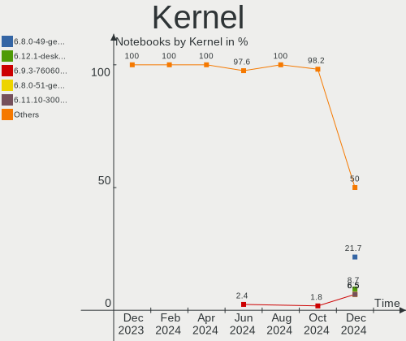
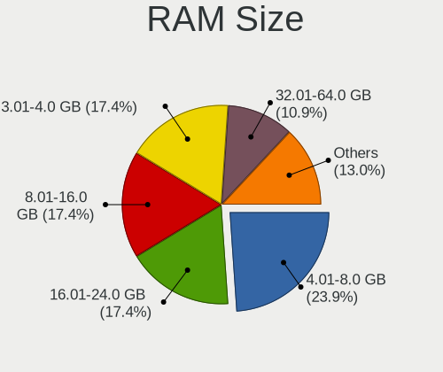
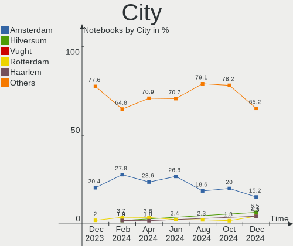
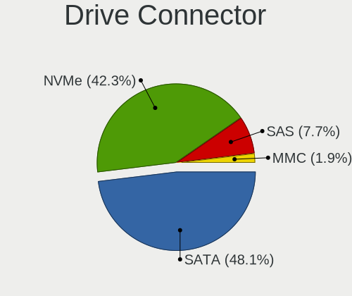
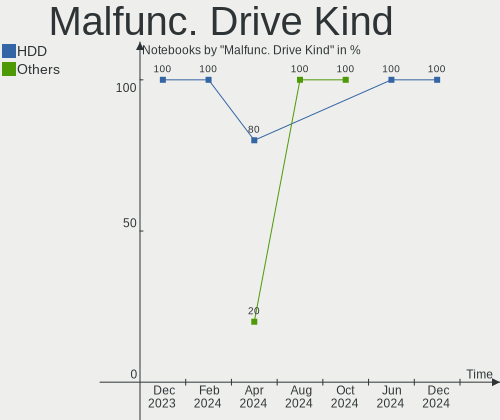
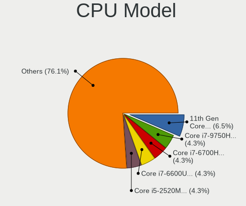
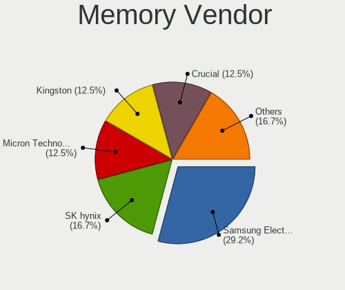
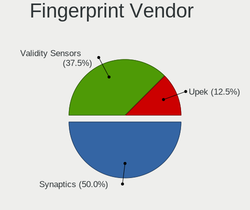

Linux in Netherlands - Hardware Trends (Notebooks)
--------------------------------------------------

A project to identify most popular hardware characteristics and track their change
over time based on data collected by Linux users at https://Linux-Hardware.org.

Anyone can contribute to this report by the [hw-probe](https://github.com/linuxhw/hw-probe) tool:

    sudo -E hw-probe -all -upload

Period: Mar, 2023.

Contents
--------

* [ System ](#system)
  - [ OS                       ](#os)
  - [ OS Family                ](#os-family)
  - [ Kernel                   ](#kernel)
  - [ Kernel Family            ](#kernel-family)
  - [ Kernel Major Ver.        ](#kernel-major-ver)
  - [ Arch                     ](#arch)
  - [ DE                       ](#de)
  - [ Display Server           ](#display-server)
  - [ Display Manager          ](#display-manager)
  - [ OS Lang                  ](#os-lang)
  - [ Boot Mode                ](#boot-mode)
  - [ Filesystem               ](#filesystem)
  - [ Part. scheme             ](#part-scheme)
  - [ Dual Boot with Linux/BSD ](#dual-boot-with-linuxbsd)
  - [ Dual Boot (Win)          ](#dual-boot-win)

* [ Board ](#board)
  - [ Vendor                   ](#vendor)
  - [ Model                    ](#model)
  - [ Model Family             ](#model-family)
  - [ MFG Year                 ](#mfg-year)
  - [ Form Factor              ](#form-factor)
  - [ Secure Boot              ](#secure-boot)
  - [ Coreboot                 ](#coreboot)
  - [ RAM Size                 ](#ram-size)
  - [ RAM Used                 ](#ram-used)
  - [ Total Drives             ](#total-drives)
  - [ Has CD-ROM               ](#has-cd-rom)
  - [ Has Ethernet             ](#has-ethernet)
  - [ Has WiFi                 ](#has-wifi)
  - [ Has Bluetooth            ](#has-bluetooth)

* [ Location ](#location)
  - [ Country                  ](#country)
  - [ City                     ](#city)

* [ Drives ](#drives)
  - [ Drive Vendor             ](#drive-vendor)
  - [ Drive Model              ](#drive-model)
  - [ HDD Vendor               ](#hdd-vendor)
  - [ SSD Vendor               ](#ssd-vendor)
  - [ Drive Kind               ](#drive-kind)
  - [ Drive Connector          ](#drive-connector)
  - [ Drive Size               ](#drive-size)
  - [ Space Total              ](#space-total)
  - [ Space Used               ](#space-used)
  - [ Malfunc. Drives          ](#malfunc-drives)
  - [ Malfunc. Drive Vendor    ](#malfunc-drive-vendor)
  - [ Malfunc. HDD Vendor      ](#malfunc-hdd-vendor)
  - [ Malfunc. Drive Kind      ](#malfunc-drive-kind)
  - [ Failed Drives            ](#failed-drives)
  - [ Failed Drive Vendor      ](#failed-drive-vendor)
  - [ Drive Status             ](#drive-status)

* [ Storage controller ](#storage-controller)
  - [ Storage Vendor           ](#storage-vendor)
  - [ Storage Model            ](#storage-model)
  - [ Storage Kind             ](#storage-kind)

* [ Processor ](#processor)
  - [ CPU Vendor               ](#cpu-vendor)
  - [ CPU Model                ](#cpu-model)
  - [ CPU Model Family         ](#cpu-model-family)
  - [ CPU Cores                ](#cpu-cores)
  - [ CPU Sockets              ](#cpu-sockets)
  - [ CPU Threads              ](#cpu-threads)
  - [ CPU Op-Modes             ](#cpu-op-modes)
  - [ CPU Microcode            ](#cpu-microcode)
  - [ CPU Microarch            ](#cpu-microarch)

* [ Graphics ](#graphics)
  - [ GPU Vendor               ](#gpu-vendor)
  - [ GPU Model                ](#gpu-model)
  - [ GPU Combo                ](#gpu-combo)
  - [ GPU Driver               ](#gpu-driver)
  - [ GPU Memory               ](#gpu-memory)

* [ Monitor ](#monitor)
  - [ Monitor Vendor           ](#monitor-vendor)
  - [ Monitor Model            ](#monitor-model)
  - [ Monitor Resolution       ](#monitor-resolution)
  - [ Monitor Diagonal         ](#monitor-diagonal)
  - [ Monitor Width            ](#monitor-width)
  - [ Aspect Ratio             ](#aspect-ratio)
  - [ Monitor Area             ](#monitor-area)
  - [ Pixel Density            ](#pixel-density)
  - [ Multiple Monitors        ](#multiple-monitors)

* [ Network ](#network)
  - [ Net Controller Vendor    ](#net-controller-vendor)
  - [ Net Controller Model     ](#net-controller-model)
  - [ Wireless Vendor          ](#wireless-vendor)
  - [ Wireless Model           ](#wireless-model)
  - [ Ethernet Vendor          ](#ethernet-vendor)
  - [ Ethernet Model           ](#ethernet-model)
  - [ Net Controller Kind      ](#net-controller-kind)
  - [ Used Controller          ](#used-controller)
  - [ NICs                     ](#nics)
  - [ IPv6                     ](#ipv6)

* [ Bluetooth ](#bluetooth)
  - [ Bluetooth Vendor         ](#bluetooth-vendor)
  - [ Bluetooth Model          ](#bluetooth-model)

* [ Sound ](#sound)
  - [ Sound Vendor             ](#sound-vendor)
  - [ Sound Model              ](#sound-model)

* [ Memory ](#memory)
  - [ Memory Vendor            ](#memory-vendor)
  - [ Memory Model             ](#memory-model)
  - [ Memory Kind              ](#memory-kind)
  - [ Memory Form Factor       ](#memory-form-factor)
  - [ Memory Size              ](#memory-size)
  - [ Memory Speed             ](#memory-speed)

* [ Printers & scanners ](#printers--scanners)
  - [ Printer Vendor           ](#printer-vendor)
  - [ Printer Model            ](#printer-model)
  - [ Scanner Vendor           ](#scanner-vendor)
  - [ Scanner Model            ](#scanner-model)

* [ Camera ](#camera)
  - [ Camera Vendor            ](#camera-vendor)
  - [ Camera Model             ](#camera-model)

* [ Security ](#security)
  - [ Fingerprint Vendor       ](#fingerprint-vendor)
  - [ Fingerprint Model        ](#fingerprint-model)
  - [ Chipcard Vendor          ](#chipcard-vendor)
  - [ Chipcard Model           ](#chipcard-model)

* [ Unsupported ](#unsupported)
  - [ Unsupported Devices      ](#unsupported-devices)
  - [ Unsupported Device Types ](#unsupported-device-types)

System
------

OS
--

Installed operating systems

| Name                         | Notebooks | Percent |
|------------------------------|-----------|---------|
| Ubuntu 22.04                 | 8         | 13.79%  |
| Fedora 37                    | 6         | 10.34%  |
| Zorin 16                     | 4         | 6.9%    |
| Linux Mint 21.1              | 4         | 6.9%    |
| Pop!_OS 22.04                | 3         | 5.17%   |
| OpenMandriva 23.03           | 3         | 5.17%   |
| Xubuntu 22.04                | 2         | 3.45%   |
| Ubuntu 20.04                 | 2         | 3.45%   |
| SteamOS 3.4.6                | 2         | 3.45%   |
| OpenMandriva 23.01           | 2         | 3.45%   |
| Manjaro 22.0.4               | 2         | 3.45%   |
| EndeavourOS Rolling          | 2         | 3.45%   |
| Debian                       | 2         | 3.45%   |
| Arch Rolling                 | 2         | 3.45%   |
| Zorin 15                     | 1         | 1.72%   |
| Ubuntu 23.04                 | 1         | 1.72%   |
| Ubuntu 22.10                 | 1         | 1.72%   |
| openSUSE Tumbleweed-XXXXXXXX | 1         | 1.72%   |
| OpenMandriva 4.3             | 1         | 1.72%   |
| Manjaro                      | 1         | 1.72%   |
| Lubuntu 22.04                | 1         | 1.72%   |
| Linux Mint 21                | 1         | 1.72%   |
| Kubuntu 22.04                | 1         | 1.72%   |
| KDE neon 22.04               | 1         | 1.72%   |
| Kali 2023.1                  | 1         | 1.72%   |
| Garuda Linux Rolling         | 1         | 1.72%   |
| Debian 11                    | 1         | 1.72%   |
| ArcoLinux Rolling            | 1         | 1.72%   |

OS Family
---------

OS without a version

| Name         | Notebooks | Percent |
|--------------|-----------|---------|
| Ubuntu       | 12        | 20.69%  |
| OpenMandriva | 6         | 10.34%  |
| Fedora       | 6         | 10.34%  |
| Zorin        | 5         | 8.62%   |
| Linux Mint   | 5         | 8.62%   |
| Pop!_OS      | 3         | 5.17%   |
| Manjaro      | 3         | 5.17%   |
| Debian       | 3         | 5.17%   |
| Xubuntu      | 2         | 3.45%   |
| SteamOS      | 2         | 3.45%   |
| EndeavourOS  | 2         | 3.45%   |
| Arch         | 2         | 3.45%   |
| openSUSE     | 1         | 1.72%   |
| Lubuntu      | 1         | 1.72%   |
| Kubuntu      | 1         | 1.72%   |
| KDE neon     | 1         | 1.72%   |
| Kali         | 1         | 1.72%   |
| Garuda Linux | 1         | 1.72%   |
| ArcoLinux    | 1         | 1.72%   |

Kernel
------

Version of the Linux kernel

| Version                  | Notebooks | Percent |
|--------------------------|-----------|---------|
| 5.19.0-35-generic        | 11        | 18.97%  |
| 5.15.0-67-generic        | 8         | 13.79%  |
| 6.2.6-desktop-1omv2390   | 3         | 5.17%   |
| 6.2.8-arch1-1            | 2         | 3.45%   |
| 6.1.18-200.fc37.x86_64   | 2         | 3.45%   |
| 6.1.14-200.fc37.x86_64   | 2         | 3.45%   |
| 6.1.1-desktop-1omv2290   | 2         | 3.45%   |
| 6.1.0-5-amd64            | 2         | 3.45%   |
| 5.19.0-38-generic        | 2         | 3.45%   |
| 5.15.94-1-MANJARO        | 2         | 3.45%   |
| 5.13.0-valve36-1-neptune | 2         | 3.45%   |
| 6.2.8-200.fc37.x86_64    | 1         | 1.72%   |
| 6.2.7-zen1-1-zen         | 1         | 1.72%   |
| 6.2.6-arch1-1            | 1         | 1.72%   |
| 6.2.6-76060206-generic   | 1         | 1.72%   |
| 6.2.2-arch1-1            | 1         | 1.72%   |
| 6.2.0-76060200-generic   | 1         | 1.72%   |
| 6.1.21-1-lts             | 1         | 1.72%   |
| 6.1.12-1-MANJARO         | 1         | 1.72%   |
| 6.1.12-1-default         | 1         | 1.72%   |
| 6.1.11-76060111-generic  | 1         | 1.72%   |
| 6.1.0-kali5-amd64        | 1         | 1.72%   |
| 6.1.0-16-generic         | 1         | 1.72%   |
| 6.0.7-301.fc37.x86_64    | 1         | 1.72%   |
| 5.4.0-144-generic        | 1         | 1.72%   |
| 5.19.0-32-generic        | 1         | 1.72%   |
| 5.16.7-desktop-1omv4003  | 1         | 1.72%   |
| 5.15.0-53-generic        | 1         | 1.72%   |
| 5.14.0-1054-oem          | 1         | 1.72%   |
| 5.14.0-1048-oem          | 1         | 1.72%   |
| 5.10.0-21-amd64          | 1         | 1.72%   |

Kernel Family
-------------

Linux kernel without a distro release

| Version | Notebooks | Percent |
|---------|-----------|---------|
| 5.19.0  | 14        | 24.14%  |
| 5.15.0  | 9         | 15.52%  |
| 6.2.6   | 5         | 8.62%   |
| 6.1.0   | 4         | 6.9%    |
| 6.2.8   | 3         | 5.17%   |
| 6.1.18  | 2         | 3.45%   |
| 6.1.14  | 2         | 3.45%   |
| 6.1.12  | 2         | 3.45%   |
| 6.1.1   | 2         | 3.45%   |
| 5.15.94 | 2         | 3.45%   |
| 5.14.0  | 2         | 3.45%   |
| 5.13.0  | 2         | 3.45%   |
| 6.2.7   | 1         | 1.72%   |
| 6.2.2   | 1         | 1.72%   |
| 6.2.0   | 1         | 1.72%   |
| 6.1.21  | 1         | 1.72%   |
| 6.1.11  | 1         | 1.72%   |
| 6.0.7   | 1         | 1.72%   |
| 5.4.0   | 1         | 1.72%   |
| 5.16.7  | 1         | 1.72%   |
| 5.10.0  | 1         | 1.72%   |

Kernel Major Ver.
-----------------

Linux kernel major version

| Version | Notebooks | Percent |
|---------|-----------|---------|
| 6.1     | 14        | 24.14%  |
| 5.19    | 14        | 24.14%  |
| 6.2     | 11        | 18.97%  |
| 5.15    | 11        | 18.97%  |
| 5.14    | 2         | 3.45%   |
| 5.13    | 2         | 3.45%   |
| 6.0     | 1         | 1.72%   |
| 5.4     | 1         | 1.72%   |
| 5.16    | 1         | 1.72%   |
| 5.10    | 1         | 1.72%   |

Arch
----

OS architecture (x86_64, i586, etc.)

| Name   | Notebooks | Percent |
|--------|-----------|---------|
| x86_64 | 57        | 98.28%  |
| i686   | 1         | 1.72%   |

DE
--

Desktop Environment

| Name       | Notebooks | Percent |
|------------|-----------|---------|
| GNOME      | 24        | 41.38%  |
| KDE5       | 17        | 29.31%  |
| X-Cinnamon | 7         | 12.07%  |
| XFCE       | 6         | 10.34%  |
| Unknown    | 3         | 5.17%   |
| LXQt       | 1         | 1.72%   |

Display Server
--------------

X11 or Wayland

| Name    | Notebooks | Percent |
|---------|-----------|---------|
| X11     | 43        | 74.14%  |
| Wayland | 13        | 22.41%  |
| Tty     | 1         | 1.72%   |
| Unknown | 1         | 1.72%   |

Display Manager
---------------

SDDM, LightDM, etc.

| Name    | Notebooks | Percent |
|---------|-----------|---------|
| Unknown | 19        | 32.76%  |
| GDM3    | 14        | 24.14%  |
| SDDM    | 13        | 22.41%  |
| LightDM | 9         | 15.52%  |
| GDM     | 3         | 5.17%   |

OS Lang
-------

Language

| Lang        | Notebooks | Percent |
|-------------|-----------|---------|
| en_US       | 32        | 55.17%  |
| nl_NL       | 21        | 36.21%  |
| lt_LT       | 1         | 1.72%   |
| es_ES       | 1         | 1.72%   |
| en_US.utf-8 | 1         | 1.72%   |
| en_GB       | 1         | 1.72%   |
| de_DE       | 1         | 1.72%   |

Boot Mode
---------

EFI or BIOS

| Mode | Notebooks | Percent |
|------|-----------|---------|
| BIOS | 29        | 50%     |
| EFI  | 29        | 50%     |

Filesystem
----------

Type of filesystem

| Type    | Notebooks | Percent |
|---------|-----------|---------|
| Ext4    | 43        | 74.14%  |
| Btrfs   | 8         | 13.79%  |
| Overlay | 5         | 8.62%   |
| Zfs     | 2         | 3.45%   |

Part. scheme
------------

Scheme of partitioning

| Type    | Notebooks | Percent |
|---------|-----------|---------|
| GPT     | 34        | 58.62%  |
| Unknown | 17        | 29.31%  |
| MBR     | 7         | 12.07%  |

Dual Boot with Linux/BSD
------------------------

Hosting more than one Linux/BSD

| Dual boot | Notebooks | Percent |
|-----------|-----------|---------|
| No        | 45        | 77.59%  |
| Yes       | 13        | 22.41%  |

Dual Boot (Win)
---------------

Hosting Linux and Windows

| Dual boot | Notebooks | Percent |
|-----------|-----------|---------|
| No        | 44        | 75.86%  |
| Yes       | 14        | 24.14%  |

Board
-----

Vendor
------

Motherboard manufacturer

| Name             | Notebooks | Percent |
|------------------|-----------|---------|
| Hewlett-Packard  | 14        | 24.14%  |
| Lenovo           | 11        | 18.97%  |
| Dell             | 7         | 12.07%  |
| Acer             | 6         | 10.34%  |
| ASUSTek Computer | 4         | 6.9%    |
| Apple            | 3         | 5.17%   |
| Valve            | 2         | 3.45%   |
| HUAWEI           | 2         | 3.45%   |
| Notebook         | 1         | 1.72%   |
| MSI              | 1         | 1.72%   |
| Medion           | 1         | 1.72%   |
| Hampoo           | 1         | 1.72%   |
| Google           | 1         | 1.72%   |
| Fujitsu          | 1         | 1.72%   |
| Framework        | 1         | 1.72%   |
| Alienware        | 1         | 1.72%   |
| Unknown          | 1         | 1.72%   |

Model
-----

Motherboard model

| Name                                        | Notebooks | Percent |
|---------------------------------------------|-----------|---------|
| Valve Jupiter                               | 2         | 3.45%   |
| HP ZBook 15 G5                              | 2         | 3.45%   |
| Notebook N85_N87,HJ,HJ1,HK1                 | 1         | 1.72%   |
| MSI Summit E16FlipEvo A11MT                 | 1         | 1.72%   |
| Medion E4251                                | 1         | 1.72%   |
| Lenovo Yoga 300-11IBR 80M1                  | 1         | 1.72%   |
| Lenovo ThinkPad X1 Extreme Gen 3 20TKCTO1WW | 1         | 1.72%   |
| Lenovo ThinkPad X1 Extreme 2nd 20QVCTO1WW   | 1         | 1.72%   |
| Lenovo ThinkPad X1 Carbon Gen 10 21CBCTO1WW | 1         | 1.72%   |
| Lenovo ThinkPad X1 Carbon 6th 20KHCTO1WW    | 1         | 1.72%   |
| Lenovo ThinkPad T510 4384VJZ                | 1         | 1.72%   |
| Lenovo ThinkPad T480 20L5CTO1WW             | 1         | 1.72%   |
| Lenovo ThinkPad L15 Gen 3 21C30092MH        | 1         | 1.72%   |
| Lenovo ThinkPad E15 Gen 4 21EES00100        | 1         | 1.72%   |
| Lenovo ThinkPad E15 Gen 2 20TD0037MH        | 1         | 1.72%   |
| Lenovo IdeaPad 5 15ARE05 81YQ               | 1         | 1.72%   |
| HUAWEI MACHC-WAX9                           | 1         | 1.72%   |
| HUAWEI BOHB-WAX9                            | 1         | 1.72%   |
| HP ZBook 15 G3                              | 1         | 1.72%   |
| HP ProBook 430 G2                           | 1         | 1.72%   |
| HP Pavilion Plus Laptop 14-eh0xxx           | 1         | 1.72%   |
| HP Pavilion Laptop 15-eh2xxx                | 1         | 1.72%   |
| HP Pavilion g7                              | 1         | 1.72%   |
| HP Pavilion dv7                             | 1         | 1.72%   |
| HP Notebook                                 | 1         | 1.72%   |
| HP Laptop 15s-fq4xxx                        | 1         | 1.72%   |
| HP EliteBook 725 G2                         | 1         | 1.72%   |
| HP EliteBook 2570p                          | 1         | 1.72%   |
| HP Compaq nc6120 (PY505EA#ABH)              | 1         | 1.72%   |
| HP Compaq 6730s                             | 1         | 1.72%   |
| Hampoo X1D3_C806N                           | 1         | 1.72%   |
| Google Rammus                               | 1         | 1.72%   |
| Fujitsu LIFEBOOK U9312                      | 1         | 1.72%   |
| Framework Laptop                            | 1         | 1.72%   |
| Dell XPS 9315                               | 1         | 1.72%   |
| Dell XPS 15 9520                            | 1         | 1.72%   |
| Dell XPS 13 9310                            | 1         | 1.72%   |
| Dell Studio XPS 1647                        | 1         | 1.72%   |
| Dell Latitude E7440                         | 1         | 1.72%   |
| Dell Latitude E6520                         | 1         | 1.72%   |

Model Family
------------

Motherboard model prefix

| Name               | Notebooks | Percent |
|--------------------|-----------|---------|
| Lenovo ThinkPad    | 9         | 15.52%  |
| Acer Aspire        | 6         | 10.34%  |
| HP Pavilion        | 4         | 6.9%    |
| HP ZBook           | 3         | 5.17%   |
| Dell XPS           | 3         | 5.17%   |
| Valve Jupiter      | 2         | 3.45%   |
| HP EliteBook       | 2         | 3.45%   |
| HP Compaq          | 2         | 3.45%   |
| Dell Latitude      | 2         | 3.45%   |
| Apple MacBookPro11 | 2         | 3.45%   |
| Notebook N85       | 1         | 1.72%   |
| MSI Summit         | 1         | 1.72%   |
| Medion E4251       | 1         | 1.72%   |
| Lenovo Yoga        | 1         | 1.72%   |
| Lenovo IdeaPad     | 1         | 1.72%   |
| HUAWEI MACHC-WAX9  | 1         | 1.72%   |
| HUAWEI BOHB-WAX9   | 1         | 1.72%   |
| HP ProBook         | 1         | 1.72%   |
| HP Notebook        | 1         | 1.72%   |
| HP Laptop          | 1         | 1.72%   |
| Hampoo X1D3        | 1         | 1.72%   |
| Google Rammus      | 1         | 1.72%   |
| Fujitsu LIFEBOOK   | 1         | 1.72%   |
| Framework Laptop   | 1         | 1.72%   |
| Dell Studio        | 1         | 1.72%   |
| Dell Inspiron      | 1         | 1.72%   |
| ASUS T200TA        | 1         | 1.72%   |
| ASUS T100TAM       | 1         | 1.72%   |
| ASUS ROG           | 1         | 1.72%   |
| ASUS N76VM         | 1         | 1.72%   |
| Apple MacBookAir5  | 1         | 1.72%   |
| Alienware m15      | 1         | 1.72%   |
| Unknown            | 1         | 1.72%   |

MFG Year
--------

Motherboard manufacture year

| Year | Notebooks | Percent |
|------|-----------|---------|
| 2022 | 12        | 20.69%  |
| 2020 | 6         | 10.34%  |
| 2021 | 5         | 8.62%   |
| 2018 | 5         | 8.62%   |
| 2019 | 4         | 6.9%    |
| 2016 | 4         | 6.9%    |
| 2014 | 4         | 6.9%    |
| 2012 | 3         | 5.17%   |
| 2011 | 3         | 5.17%   |
| 2008 | 3         | 5.17%   |
| 2015 | 2         | 3.45%   |
| 2013 | 2         | 3.45%   |
| 2010 | 2         | 3.45%   |
| 2017 | 1         | 1.72%   |
| 2009 | 1         | 1.72%   |
| 2005 | 1         | 1.72%   |

Form Factor
-----------

Physical design of the computer

| Name     | Notebooks | Percent |
|----------|-----------|---------|
| Notebook | 58        | 100%    |

Secure Boot
-----------

Enabled or disabled

| State    | Notebooks | Percent |
|----------|-----------|---------|
| Disabled | 51        | 87.93%  |
| Enabled  | 7         | 12.07%  |

Coreboot
--------

Have coreboot on board

| Used | Notebooks | Percent |
|------|-----------|---------|
| No   | 57        | 98.28%  |
| Yes  | 1         | 1.72%   |

RAM Size
--------

Total RAM memory

| Size in GB  | Notebooks | Percent |
|-------------|-----------|---------|
| 16.01-24.0  | 13        | 22.41%  |
| 4.01-8.0    | 11        | 18.97%  |
| 32.01-64.0  | 9         | 15.52%  |
| 3.01-4.0    | 9         | 15.52%  |
| 8.01-16.0   | 6         | 10.34%  |
| 1.01-2.0    | 5         | 8.62%   |
| 2.01-3.0    | 2         | 3.45%   |
| 64.01-256.0 | 2         | 3.45%   |
| 0.51-1.0    | 1         | 1.72%   |

RAM Used
--------

Used RAM memory

| Used GB   | Notebooks | Percent |
|-----------|-----------|---------|
| 4.01-8.0  | 16        | 27.59%  |
| 1.01-2.0  | 15        | 25.86%  |
| 2.01-3.0  | 12        | 20.69%  |
| 3.01-4.0  | 7         | 12.07%  |
| 0.51-1.0  | 5         | 8.62%   |
| 8.01-16.0 | 3         | 5.17%   |

Total Drives
------------

Number of drives on board

| Drives | Notebooks | Percent |
|--------|-----------|---------|
| 1      | 41        | 70.69%  |
| 2      | 13        | 22.41%  |
| 3      | 3         | 5.17%   |
| 4      | 1         | 1.72%   |

Has CD-ROM
----------

Has CD-ROM on board

| Presented | Notebooks | Percent |
|-----------|-----------|---------|
| No        | 43        | 74.14%  |
| Yes       | 15        | 25.86%  |

Has Ethernet
------------

Has Ethernet on board

| Presented | Notebooks | Percent |
|-----------|-----------|---------|
| Yes       | 43        | 74.14%  |
| No        | 15        | 25.86%  |

Has WiFi
--------

Has WiFi module

| Presented | Notebooks | Percent |
|-----------|-----------|---------|
| Yes       | 53        | 91.38%  |
| No        | 5         | 8.62%   |

Has Bluetooth
-------------

Has Bluetooth module

| Presented | Notebooks | Percent |
|-----------|-----------|---------|
| Yes       | 45        | 77.59%  |
| No        | 13        | 22.41%  |

Location
--------

Country
-------

Geographic location (country)

| Country     | Notebooks | Percent |
|-------------|-----------|---------|
| Netherlands | 58        | 100%    |

City
----

Geographic location (city)

| City                   | Notebooks | Percent |
|------------------------|-----------|---------|
| Amsterdam              | 10        | 17.24%  |
| The Hague              | 3         | 5.17%   |
| Hilversum              | 3         | 5.17%   |
| Zoetermeer             | 2         | 3.45%   |
| Rotterdam              | 2         | 3.45%   |
| Maastricht             | 2         | 3.45%   |
| Leiden                 | 2         | 3.45%   |
| Etten                  | 2         | 3.45%   |
| Capelle aan den IJssel | 2         | 3.45%   |
| Almere Stad            | 2         | 3.45%   |
| Zuidland               | 1         | 1.72%   |
| Zeist                  | 1         | 1.72%   |
| Uden                   | 1         | 1.72%   |
| Tubbergen              | 1         | 1.72%   |
| Spijkenisse            | 1         | 1.72%   |
| Purmerend              | 1         | 1.72%   |
| Peize                  | 1         | 1.72%   |
| Nijmegen               | 1         | 1.72%   |
| Nieuwleusen            | 1         | 1.72%   |
| Naarden                | 1         | 1.72%   |
| Naaldwijk              | 1         | 1.72%   |
| Leusden                | 1         | 1.72%   |
| Krabbendijke           | 1         | 1.72%   |
| Hellevoetsluis         | 1         | 1.72%   |
| Helden                 | 1         | 1.72%   |
| Heerlen                | 1         | 1.72%   |
| Haarlem                | 1         | 1.72%   |
| Goor                   | 1         | 1.72%   |
| Gilze                  | 1         | 1.72%   |
| Ermelo                 | 1         | 1.72%   |
| Eindhoven              | 1         | 1.72%   |
| Dronten                | 1         | 1.72%   |
| Delft                  | 1         | 1.72%   |
| Blaricum               | 1         | 1.72%   |
| Bergambacht            | 1         | 1.72%   |
| Assen                  | 1         | 1.72%   |
| Amersfoort             | 1         | 1.72%   |
| 's-Gravendeel          | 1         | 1.72%   |

Drives
------

Drive Vendor
------------

Hard drive vendors

| Vendor                      | Notebooks | Drives | Percent |
|-----------------------------|-----------|--------|---------|
| Samsung Electronics         | 17        | 18     | 22.08%  |
| Unknown                     | 10        | 10     | 12.99%  |
| WDC                         | 6         | 6      | 7.79%   |
| Intel                       | 5         | 5      | 6.49%   |
| Micron Technology           | 4         | 4      | 5.19%   |
| Toshiba                     | 3         | 3      | 3.9%    |
| SK hynix                    | 3         | 3      | 3.9%    |
| Sandisk                     | 3         | 3      | 3.9%    |
| Hitachi                     | 3         | 3      | 3.9%    |
| Seagate                     | 2         | 2      | 2.6%    |
| Kingston                    | 2         | 2      | 2.6%    |
| HGST                        | 2         | 2      | 2.6%    |
| Crucial                     | 2         | 3      | 2.6%    |
| Apple                       | 2         | 2      | 2.6%    |
| Union Memory (Shenzhen)     | 1         | 1      | 1.3%    |
| SPCC                        | 1         | 1      | 1.3%    |
| Realtek                     | 1         | 1      | 1.3%    |
| Phison Electronics          | 1         | 1      | 1.3%    |
| Phison                      | 1         | 1      | 1.3%    |
| O2 Micro                    | 1         | 1      | 1.3%    |
| MAXIO Technology (Hangzhou) | 1         | 1      | 1.3%    |
| LITEONIT                    | 1         | 1      | 1.3%    |
| Kingston Technology Company | 1         | 1      | 1.3%    |
| KingFast                    | 1         | 1      | 1.3%    |
| Intenso                     | 1         | 1      | 1.3%    |
| Corsair                     | 1         | 1      | 1.3%    |
| A-DATA Technology           | 1         | 1      | 1.3%    |

Drive Model
-----------

Hard drive models

| Model                                                 | Notebooks | Percent |
|-------------------------------------------------------|-----------|---------|
| Unknown MMC Card  32GB                                | 4         | 5.13%   |
| Samsung NVMe SSD Controller SM981/PM981/PM983 250GB   | 4         | 5.13%   |
| WDC WD5000BPVT-22HXZT3 500GB                          | 1         | 1.28%   |
| WDC WD3200BEKT-60PVMT0 320GB                          | 1         | 1.28%   |
| WDC WD2500BEVT-60ZCT1 250GB                           | 1         | 1.28%   |
| WDC WD2500BEVT-35A23T0 250GB                          | 1         | 1.28%   |
| WDC WD10SPZX-21Z10T0 1TB                              | 1         | 1.28%   |
| WDC PC SN530 SDBPNPZ-512G-1014 512GB                  | 1         | 1.28%   |
| Unknown MMC Card  64GB                                | 1         | 1.28%   |
| Unknown MMC Card  512GB                               | 1         | 1.28%   |
| Unknown MMC Card  256GB                               | 1         | 1.28%   |
| Unknown 16M                                           | 1         | 1.28%   |
| Unknown 032G74  32GB                                  | 1         | 1.28%   |
| Unknown 00000  8GB                                    | 1         | 1.28%   |
| Union Memory (Shenzhen) UMIS RPJTJ512MGE1QDQ 512GB    | 1         | 1.28%   |
| Toshiba MQ01ABD100 1TB                                | 1         | 1.28%   |
| Toshiba MK8034GSX 80GB                                | 1         | 1.28%   |
| Toshiba KXG6AZNV1T02 1TB                              | 1         | 1.28%   |
| SPCC Solid State Disk 512GB                           | 1         | 1.28%   |
| SK hynix SKHynix_HFM512GDHTNI-87A0B 512GB             | 1         | 1.28%   |
| SK hynix SC308 SATA 512GB SSD                         | 1         | 1.28%   |
| SK hynix PC801 NVMe 1TB                               | 1         | 1.28%   |
| Seagate ST1000LX015-1U7172 1TB                        | 1         | 1.28%   |
| Seagate Expansion+ 2TB                                | 1         | 1.28%   |
| Sandisk WD Black SN850 1TB                            | 1         | 1.28%   |
| Sandisk WD Black 2018/SN750 / PC SN720 NVMe SSD 256GB | 1         | 1.28%   |
| SanDisk NVMe SSD Drive 512GB                          | 1         | 1.28%   |
| Samsung SSD 970 EVO Plus 2TB                          | 1         | 1.28%   |
| Samsung SSD 870 EVO 1TB                               | 1         | 1.28%   |
| Samsung SSD 860 EVO M.2 500GB                         | 1         | 1.28%   |
| Samsung SSD 850 EVO 500GB                             | 1         | 1.28%   |
| Samsung SSD 850 EVO 250GB                             | 1         | 1.28%   |
| Samsung SSD 840 EVO 500GB                             | 1         | 1.28%   |
| Samsung SSD 750 EVO 120GB                             | 1         | 1.28%   |
| Samsung PSSD T7 1TB                                   | 1         | 1.28%   |
| Samsung MZVLB512HAJQ-000H7 512GB                      | 1         | 1.28%   |
| Samsung MZVLB1T0HALR-000H1 1TB                        | 1         | 1.28%   |
| Samsung MZVL22T0HBLB-00B07 2TB                        | 1         | 1.28%   |
| Samsung MZVL21T0HCLR-00BL7 1TB                        | 1         | 1.28%   |
| Samsung MZALQ512HBLU-00BL1 512GB                      | 1         | 1.28%   |

HDD Vendor
----------

Hard disk drive vendors

| Vendor  | Notebooks | Drives | Percent |
|---------|-----------|--------|---------|
| WDC     | 5         | 5      | 35.71%  |
| Hitachi | 3         | 3      | 21.43%  |
| Toshiba | 2         | 2      | 14.29%  |
| Seagate | 2         | 2      | 14.29%  |
| HGST    | 2         | 2      | 14.29%  |

SSD Vendor
----------

Solid state drive vendors

| Vendor              | Notebooks | Drives | Percent |
|---------------------|-----------|--------|---------|
| Samsung Electronics | 8         | 8      | 38.1%   |
| Crucial             | 2         | 3      | 9.52%   |
| Apple               | 2         | 2      | 9.52%   |
| SPCC                | 1         | 1      | 4.76%   |
| SK hynix            | 1         | 1      | 4.76%   |
| Phison              | 1         | 1      | 4.76%   |
| Micron Technology   | 1         | 1      | 4.76%   |
| LITEONIT            | 1         | 1      | 4.76%   |
| KingFast            | 1         | 1      | 4.76%   |
| Intenso             | 1         | 1      | 4.76%   |
| Corsair             | 1         | 1      | 4.76%   |
| A-DATA Technology   | 1         | 1      | 4.76%   |

Drive Kind
----------

HDD or SSD

| Kind | Notebooks | Drives | Percent |
|------|-----------|--------|---------|
| NVMe | 29        | 33     | 40.85%  |
| SSD  | 19        | 22     | 26.76%  |
| HDD  | 13        | 14     | 18.31%  |
| MMC  | 10        | 10     | 14.08%  |

Drive Connector
---------------

SATA, SAS, NVMe, etc.

| Type | Notebooks | Drives | Percent |
|------|-----------|--------|---------|
| NVMe | 29        | 32     | 41.43%  |
| SATA | 28        | 33     | 40%     |
| MMC  | 10        | 10     | 14.29%  |
| SAS  | 3         | 4      | 4.29%   |

Drive Size
----------

Size of hard drive

| Size in TB | Notebooks | Drives | Percent |
|------------|-----------|--------|---------|
| 0.01-0.5   | 19        | 22     | 61.29%  |
| 0.51-1.0   | 11        | 13     | 35.48%  |
| 1.01-2.0   | 1         | 1      | 3.23%   |

Space Total
-----------

Amount of disk space available on the file system

| Size in GB     | Notebooks | Percent |
|----------------|-----------|---------|
| 251-500        | 14        | 24.14%  |
| 101-250        | 10        | 17.24%  |
| 501-1000       | 10        | 17.24%  |
| 1001-2000      | 7         | 12.07%  |
| 21-50          | 5         | 8.62%   |
| 1-20           | 5         | 8.62%   |
| 51-100         | 4         | 6.9%    |
| More than 3000 | 1         | 1.72%   |
| 2001-3000      | 1         | 1.72%   |
| Unknown        | 1         | 1.72%   |

Space Used
----------

Amount of used disk space

| Used GB   | Notebooks | Percent |
|-----------|-----------|---------|
| 1-20      | 21        | 36.21%  |
| 251-500   | 11        | 18.97%  |
| 21-50     | 10        | 17.24%  |
| 101-250   | 6         | 10.34%  |
| 501-1000  | 5         | 8.62%   |
| 51-100    | 3         | 5.17%   |
| 2001-3000 | 1         | 1.72%   |
| Unknown   | 1         | 1.72%   |

Malfunc. Drives
---------------

Drive models with a malfunction

| Model                          | Notebooks | Drives | Percent |
|--------------------------------|-----------|--------|---------|
| Seagate ST1000LX015-1U7172 1TB | 1         | 1      | 33.33%  |
| Realtek RTL9210 NVME 512GB     | 1         | 1      | 33.33%  |
| HGST HTS721010A9E630 1TB       | 1         | 1      | 33.33%  |

Malfunc. Drive Vendor
---------------------

Vendors of faulty drives

| Vendor  | Notebooks | Drives | Percent |
|---------|-----------|--------|---------|
| Seagate | 1         | 1      | 33.33%  |
| Realtek | 1         | 1      | 33.33%  |
| HGST    | 1         | 1      | 33.33%  |

Malfunc. HDD Vendor
-------------------

Vendors of faulty HDD drives

| Vendor  | Notebooks | Drives | Percent |
|---------|-----------|--------|---------|
| Seagate | 1         | 1      | 50%     |
| HGST    | 1         | 1      | 50%     |

Malfunc. Drive Kind
-------------------

Kinds of faulty drives

| Kind | Notebooks | Drives | Percent |
|------|-----------|--------|---------|
| HDD  | 2         | 2      | 66.67%  |
| NVMe | 1         | 1      | 33.33%  |

Failed Drives
-------------

Failed drive models

Zero info for selected period =(

Failed Drive Vendor
-------------------

Failed drive vendors

Zero info for selected period =(

Drive Status
------------

Number of failed and malfunc. drives

| Status   | Notebooks | Drives | Percent |
|----------|-----------|--------|---------|
| Detected | 34        | 45     | 53.97%  |
| Works    | 26        | 31     | 41.27%  |
| Malfunc  | 3         | 3      | 4.76%   |

Storage controller
------------------

Storage Vendor
--------------

Storage controller vendors

| Vendor                       | Notebooks | Percent |
|------------------------------|-----------|---------|
| Intel                        | 33        | 51.56%  |
| Samsung Electronics          | 11        | 17.19%  |
| Sandisk                      | 4         | 6.25%   |
| Micron Technology            | 3         | 4.69%   |
| Kingston Technology Company  | 3         | 4.69%   |
| AMD                          | 3         | 4.69%   |
| SK hynix                     | 2         | 3.13%   |
| Union Memory (Shenzhen)      | 1         | 1.56%   |
| Toshiba America Info Systems | 1         | 1.56%   |
| Phison Electronics           | 1         | 1.56%   |
| O2 Micro                     | 1         | 1.56%   |
| MAXIO Technology (Hangzhou)  | 1         | 1.56%   |

Storage Model
-------------

Storage controller models

| Model                                                                            | Notebooks | Percent |
|----------------------------------------------------------------------------------|-----------|---------|
| Samsung NVMe SSD Controller SM981/PM981/PM983                                    | 6         | 9.09%   |
| Intel 82801 Mobile SATA Controller [RAID mode]                                   | 4         | 6.06%   |
| Intel Volume Management Device NVMe RAID Controller                              | 3         | 4.55%   |
| Intel Non-Volatile memory controller                                             | 3         | 4.55%   |
| Intel 7 Series Chipset Family 6-port SATA Controller [AHCI mode]                 | 3         | 4.55%   |
| Intel 5 Series/3400 Series Chipset 4 port SATA AHCI Controller                   | 3         | 4.55%   |
| AMD FCH SATA Controller [AHCI mode]                                              | 3         | 4.55%   |
| Samsung NVMe SSD Controller PM9A1/PM9A3/980PRO                                   | 2         | 3.03%   |
| Samsung Apple PCIe SSD                                                           | 2         | 3.03%   |
| Micron NVMe Storage Controller                                                   | 2         | 3.03%   |
| Intel Sunrise Point-LP SATA Controller [AHCI mode]                               | 2         | 3.03%   |
| Intel Cannon Lake Mobile PCH SATA AHCI Controller                                | 2         | 3.03%   |
| Intel 82801IBM/IEM (ICH9M/ICH9M-E) 4 port SATA Controller [AHCI mode]            | 2         | 3.03%   |
| Intel 5 Series/3400 Series Chipset 6 port SATA AHCI Controller                   | 2         | 3.03%   |
| Union Memory (Shenzhen) AM630 PCIe 4.0 x4 NVMe SSD Controller                    | 1         | 1.52%   |
| Toshiba America Info Systems XG6 NVMe SSD Controller                             | 1         | 1.52%   |
| SK hynix Platinum P41 NVMe Solid State Drive 2TB                                 | 1         | 1.52%   |
| SK hynix BC511                                                                   | 1         | 1.52%   |
| SanDisk WD PC SN810 / Black SN850 NVMe SSD                                       | 1         | 1.52%   |
| SanDisk WD Blue SN550 NVMe SSD                                                   | 1         | 1.52%   |
| SanDisk WD Black 2018/SN750 / PC SN720 NVMe SSD                                  | 1         | 1.52%   |
| Sandisk Non-Volatile memory controller                                           | 1         | 1.52%   |
| Samsung NVMe SSD Controller 980                                                  | 1         | 1.52%   |
| Phison PS5013 E13 NVMe Controller                                                | 1         | 1.52%   |
| O2 Micro Non-Volatile memory controller                                          | 1         | 1.52%   |
| Micron Non-Volatile memory controller                                            | 1         | 1.52%   |
| MAXIO (Hangzhou) NVMe SSD Controller MAP1202                                     | 1         | 1.52%   |
| Kingston Company U-SNS8154P3 NVMe SSD                                            | 1         | 1.52%   |
| Kingston Company Company Non-Volatile memory controller                          | 1         | 1.52%   |
| Kingston Company NVMe Controller                                                 | 1         | 1.52%   |
| Intel Wildcat Point-LP SATA Controller [AHCI Mode]                               | 1         | 1.52%   |
| Intel SSD 660P Series                                                            | 1         | 1.52%   |
| Intel Q170/Q150/B150/H170/H110/Z170/CM236 Chipset SATA Controller [AHCI Mode]    | 1         | 1.52%   |
| Intel PROSet/Wireless WiFi Software extension                                    | 1         | 1.52%   |
| Intel HM170/QM170 Chipset SATA Controller [AHCI Mode]                            | 1         | 1.52%   |
| Intel Comet Lake SATA AHCI Controller                                            | 1         | 1.52%   |
| Intel Celeron/Pentium Silver Processor SATA Controller                           | 1         | 1.52%   |
| Intel Atom/Celeron/Pentium Processor x5-E8000/J3xxx/N3xxx Series SATA Controller | 1         | 1.52%   |
| Intel 82801FB/FBM/FR/FW/FRW (ICH6 Family) IDE Controller                         | 1         | 1.52%   |
| Intel 8 Series/C220 Series Chipset Family 6-port SATA Controller 1 [AHCI mode]   | 1         | 1.52%   |

Storage Kind
------------

Kind of storage controller (IDE, SATA, NVMe, SAS, ...)

| Kind | Notebooks | Percent |
|------|-----------|---------|
| NVMe | 29        | 45.31%  |
| SATA | 28        | 43.75%  |
| RAID | 6         | 9.38%   |
| IDE  | 1         | 1.56%   |

Processor
---------

CPU Vendor
----------

Processor vendors

| Vendor | Notebooks | Percent |
|--------|-----------|---------|
| Intel  | 50        | 86.21%  |
| AMD    | 8         | 13.79%  |

CPU Model
---------

Processor models

| Model                                   | Notebooks | Percent |
|-----------------------------------------|-----------|---------|
| Intel Core i7-9750H CPU @ 2.60GHz       | 2         | 3.45%   |
| Intel Core i7-8850H CPU @ 2.60GHz       | 2         | 3.45%   |
| Intel Atom CPU Z3775 @ 1.46GHz          | 2         | 3.45%   |
| Intel 11th Gen Core i7-1165G7 @ 2.80GHz | 2         | 3.45%   |
| AMD Ryzen 7 5825U with Radeon Graphics  | 2         | 3.45%   |
| AMD Custom APU 0405                     | 2         | 3.45%   |
| Intel Pentium M processor 1.73GHz       | 1         | 1.72%   |
| Intel Pentium CPU P6200 @ 2.13GHz       | 1         | 1.72%   |
| Intel Pentium CPU P6100 @ 2.00GHz       | 1         | 1.72%   |
| Intel Core m3-8100Y CPU @ 1.10GHz       | 1         | 1.72%   |
| Intel Core i7-8750H CPU @ 2.20GHz       | 1         | 1.72%   |
| Intel Core i7-8650U CPU @ 1.90GHz       | 1         | 1.72%   |
| Intel Core i7-8550U CPU @ 1.80GHz       | 1         | 1.72%   |
| Intel Core i7-6820HQ CPU @ 2.70GHz      | 1         | 1.72%   |
| Intel Core i7-4870HQ CPU @ 2.50GHz      | 1         | 1.72%   |
| Intel Core i7-4750HQ CPU @ 2.00GHz      | 1         | 1.72%   |
| Intel Core i7-4710MQ CPU @ 2.50GHz      | 1         | 1.72%   |
| Intel Core i7-3610QM CPU @ 2.30GHz      | 1         | 1.72%   |
| Intel Core i7-3520M CPU @ 2.90GHz       | 1         | 1.72%   |
| Intel Core i7-2620M CPU @ 2.70GHz       | 1         | 1.72%   |
| Intel Core i7-10850H CPU @ 2.70GHz      | 1         | 1.72%   |
| Intel Core i7-10510U CPU @ 1.80GHz      | 1         | 1.72%   |
| Intel Core i7 CPU M 620 @ 2.67GHz       | 1         | 1.72%   |
| Intel Core i5-7300HQ CPU @ 2.50GHz      | 1         | 1.72%   |
| Intel Core i5-6200U CPU @ 2.30GHz       | 1         | 1.72%   |
| Intel Core i5-5200U CPU @ 2.20GHz       | 1         | 1.72%   |
| Intel Core i5-4310U CPU @ 2.00GHz       | 1         | 1.72%   |
| Intel Core i5-3427U CPU @ 1.80GHz       | 1         | 1.72%   |
| Intel Core i5-2430M CPU @ 2.40GHz       | 1         | 1.72%   |
| Intel Core i5-10300H CPU @ 2.50GHz      | 1         | 1.72%   |
| Intel Core i5-10210U CPU @ 1.60GHz      | 1         | 1.72%   |
| Intel Core i5 CPU M 520 @ 2.40GHz       | 1         | 1.72%   |
| Intel Core i3-6006U CPU @ 2.00GHz       | 1         | 1.72%   |
| Intel Core i3 CPU M 370 @ 2.40GHz       | 1         | 1.72%   |
| Intel Core 2 Duo CPU T6570 @ 2.10GHz    | 1         | 1.72%   |
| Intel Core 2 Duo CPU T6400 @ 2.00GHz    | 1         | 1.72%   |
| Intel Celeron N4020 CPU @ 1.10GHz       | 1         | 1.72%   |
| Intel Celeron CPU N3060 @ 1.60GHz       | 1         | 1.72%   |
| Intel Atom x5-Z8350 CPU @ 1.44GHz       | 1         | 1.72%   |
| Intel 12th Gen Core i7-1270P            | 1         | 1.72%   |

CPU Model Family
----------------

Processor model prefix

| Model            | Notebooks | Percent |
|------------------|-----------|---------|
| Intel Core i7    | 17        | 29.31%  |
| Other            | 13        | 22.41%  |
| Intel Core i5    | 9         | 15.52%  |
| Intel Atom       | 3         | 5.17%   |
| Intel Pentium    | 2         | 3.45%   |
| Intel Core i3    | 2         | 3.45%   |
| Intel Core 2 Duo | 2         | 3.45%   |
| Intel Celeron    | 2         | 3.45%   |
| AMD Ryzen 7      | 2         | 3.45%   |
| AMD A8           | 2         | 3.45%   |
| Intel Pentium M  | 1         | 1.72%   |
| Intel Core m3    | 1         | 1.72%   |
| AMD Ryzen 9      | 1         | 1.72%   |
| AMD Ryzen 5      | 1         | 1.72%   |

CPU Cores
---------

Number of processor cores

| Number | Notebooks | Percent |
|--------|-----------|---------|
| 4      | 22        | 37.93%  |
| 2      | 19        | 32.76%  |
| 6      | 7         | 12.07%  |
| 10     | 3         | 5.17%   |
| 8      | 3         | 5.17%   |
| 12     | 2         | 3.45%   |
| 14     | 1         | 1.72%   |
| 1      | 1         | 1.72%   |

CPU Sockets
-----------

Number of sockets

| Number | Notebooks | Percent |
|--------|-----------|---------|
| 1      | 58        | 100%    |

CPU Threads
-----------

Threads per core (Hyper-Threading)

| Number | Notebooks | Percent |
|--------|-----------|---------|
| 2      | 43        | 74.14%  |
| 1      | 15        | 25.86%  |

CPU Op-Modes
------------

CPU Operation Modes (32-bit, 64-bit)

| Op mode        | Notebooks | Percent |
|----------------|-----------|---------|
| 32-bit, 64-bit | 57        | 98.28%  |
| 32-bit         | 1         | 1.72%   |

CPU Microcode
-------------

Microcode number

| Number     | Notebooks | Percent |
|------------|-----------|---------|
| Unknown    | 25        | 43.1%   |
| 0x806c1    | 3         | 5.17%   |
| 0xa0652    | 2         | 3.45%   |
| 0x906ea    | 2         | 3.45%   |
| 0x906a4    | 2         | 3.45%   |
| 0x906a3    | 2         | 3.45%   |
| 0x806ec    | 2         | 3.45%   |
| 0x806c2    | 2         | 3.45%   |
| 0x20655    | 2         | 3.45%   |
| 0x806ea    | 1         | 1.72%   |
| 0x6d8      | 1         | 1.72%   |
| 0x406e3    | 1         | 1.72%   |
| 0x406c4    | 1         | 1.72%   |
| 0x40661    | 1         | 1.72%   |
| 0x40651    | 1         | 1.72%   |
| 0x306a9    | 1         | 1.72%   |
| 0x30678    | 1         | 1.72%   |
| 0x206a7    | 1         | 1.72%   |
| 0x20652    | 1         | 1.72%   |
| 0x1067a    | 1         | 1.72%   |
| 0x0a50000d | 1         | 1.72%   |
| 0x0a50000c | 1         | 1.72%   |
| 0x0a50000b | 1         | 1.72%   |
| 0x08600103 | 1         | 1.72%   |
| 0x07030106 | 1         | 1.72%   |

CPU Microarch
-------------

Microarchitecture

| Name             | Notebooks | Percent |
|------------------|-----------|---------|
| KabyLake         | 11        | 18.97%  |
| Westmere         | 5         | 8.62%   |
| TigerLake        | 5         | 8.62%   |
| Silvermont       | 4         | 6.9%    |
| Haswell          | 4         | 6.9%    |
| Alderlake Hybrid | 4         | 6.9%    |
| Unknown          | 4         | 6.9%    |
| Zen 3            | 3         | 5.17%   |
| Skylake          | 3         | 5.17%   |
| IvyBridge        | 3         | 5.17%   |
| SandyBridge      | 2         | 3.45%   |
| Penryn           | 2         | 3.45%   |
| CometLake        | 2         | 3.45%   |
| Zen 2            | 1         | 1.72%   |
| Steamroller      | 1         | 1.72%   |
| Puma             | 1         | 1.72%   |
| P6               | 1         | 1.72%   |
| Goldmont plus    | 1         | 1.72%   |
| Broadwell        | 1         | 1.72%   |

Graphics
--------

GPU Vendor
----------

Vendors of graphics cards

| Vendor | Notebooks | Percent |
|--------|-----------|---------|
| Intel  | 45        | 59.21%  |
| Nvidia | 18        | 23.68%  |
| AMD    | 13        | 17.11%  |

GPU Model
---------

Graphics card models

| Model                                                                                    | Notebooks | Percent |
|------------------------------------------------------------------------------------------|-----------|---------|
| Intel TigerLake-LP GT2 [Iris Xe Graphics]                                                | 5         | 6.49%   |
| Intel CoffeeLake-H GT2 [UHD Graphics 630]                                                | 5         | 6.49%   |
| Intel Alder Lake-P Integrated Graphics Controller                                        | 3         | 3.9%    |
| Intel 3rd Gen Core processor Graphics Controller                                         | 3         | 3.9%    |
| Intel UHD Graphics 620                                                                   | 2         | 2.6%    |
| Intel Skylake GT2 [HD Graphics 520]                                                      | 2         | 2.6%    |
| Intel Core Processor Integrated Graphics Controller                                      | 2         | 2.6%    |
| Intel CometLake-U GT2 [UHD Graphics]                                                     | 2         | 2.6%    |
| Intel CometLake-H GT2 [UHD Graphics]                                                     | 2         | 2.6%    |
| Intel Atom/Celeron/Pentium Processor x5-E8000/J3xxx/N3xxx Integrated Graphics Controller | 2         | 2.6%    |
| Intel Atom Processor Z36xxx/Z37xxx Series Graphics & Display                             | 2         | 2.6%    |
| Intel 2nd Generation Core Processor Family Integrated Graphics Controller                | 2         | 2.6%    |
| AMD VanGogh [AMD Custom GPU 0405]                                                        | 2         | 2.6%    |
| AMD Park [Mobility Radeon HD 5430/5450/5470]                                             | 2         | 2.6%    |
| AMD Barcelo                                                                              | 2         | 2.6%    |
| Nvidia TU117M [GeForce GTX 1650 Ti Mobile]                                               | 1         | 1.3%    |
| Nvidia TU117M [GeForce GTX 1650 Mobile / Max-Q]                                          | 1         | 1.3%    |
| Nvidia TU117M                                                                            | 1         | 1.3%    |
| Nvidia GT218M [NVS 3100M]                                                                | 1         | 1.3%    |
| Nvidia GP108BM [GeForce MX250]                                                           | 1         | 1.3%    |
| Nvidia GP107M [GeForce GTX 1050 Mobile]                                                  | 1         | 1.3%    |
| Nvidia GP107M [GeForce GTX 1050 3 GB Max-Q]                                              | 1         | 1.3%    |
| Nvidia GP107GLM [Quadro P1000 Mobile]                                                    | 1         | 1.3%    |
| Nvidia GP106M [GeForce GTX 1060 Mobile]                                                  | 1         | 1.3%    |
| Nvidia GM108M [GeForce 940M]                                                             | 1         | 1.3%    |
| Nvidia GM107GLM [Quadro M2000M]                                                          | 1         | 1.3%    |
| Nvidia GK107M [GeForce GT 750M Mac Edition]                                              | 1         | 1.3%    |
| Nvidia GK104M [GeForce GTX 870M]                                                         | 1         | 1.3%    |
| Nvidia GF119M [NVS 4200M]                                                                | 1         | 1.3%    |
| Nvidia GF108M [GeForce GT 620M/630M/635M/640M LE]                                        | 1         | 1.3%    |
| Nvidia GA107M [GeForce RTX 3050 Ti Mobile]                                               | 1         | 1.3%    |
| Nvidia GA104M [GeForce RTX 3080 Mobile / Max-Q 8GB/16GB]                                 | 1         | 1.3%    |
| Nvidia G96CM [GeForce 9600M GS]                                                          | 1         | 1.3%    |
| Intel UHD Graphics 615                                                                   | 1         | 1.3%    |
| Intel Mobile 915GM/GMS/910GML Express Graphics Controller                                | 1         | 1.3%    |
| Intel Mobile 4 Series Chipset Integrated Graphics Controller                             | 1         | 1.3%    |
| Intel HD Graphics 630                                                                    | 1         | 1.3%    |
| Intel HD Graphics 5500                                                                   | 1         | 1.3%    |
| Intel HD Graphics 530                                                                    | 1         | 1.3%    |
| Intel Haswell-ULT Integrated Graphics Controller                                         | 1         | 1.3%    |

GPU Combo
---------

Combinations of graphics cards

| Name           | Notebooks | Percent |
|----------------|-----------|---------|
| 1 x Intel      | 27        | 46.55%  |
| Intel + Nvidia | 14        | 24.14%  |
| 1 x AMD        | 8         | 13.79%  |
| 1 x Nvidia     | 3         | 5.17%   |
| Intel + AMD    | 3         | 5.17%   |
| 2 x Intel      | 1         | 1.72%   |
| 2 x AMD        | 1         | 1.72%   |
| AMD + Nvidia   | 1         | 1.72%   |

GPU Driver
----------

Free vs proprietary

| Driver      | Notebooks | Percent |
|-------------|-----------|---------|
| Free        | 51        | 87.93%  |
| Proprietary | 6         | 10.34%  |
| Unknown     | 1         | 1.72%   |

GPU Memory
----------

Total video memory

| Size in GB | Notebooks | Percent |
|------------|-----------|---------|
| Unknown    | 43        | 74.14%  |
| 0.01-0.5   | 5         | 8.62%   |
| 0.51-1.0   | 4         | 6.9%    |
| 3.01-4.0   | 3         | 5.17%   |
| 5.01-6.0   | 1         | 1.72%   |
| 1.01-2.0   | 1         | 1.72%   |
| 8.01-16.0  | 1         | 1.72%   |

Monitor
-------

Monitor Vendor
--------------

Monitor vendors

| Vendor                  | Notebooks | Percent |
|-------------------------|-----------|---------|
| AU Optronics            | 13        | 20%     |
| Samsung Electronics     | 8         | 12.31%  |
| BOE                     | 8         | 12.31%  |
| Chimei Innolux          | 6         | 9.23%   |
| LG Display              | 5         | 7.69%   |
| Dell                    | 3         | 4.62%   |
| Apple                   | 3         | 4.62%   |
| Valve                   | 2         | 3.08%   |
| Sharp                   | 2         | 3.08%   |
| Iiyama                  | 2         | 3.08%   |
| Goldstar                | 2         | 3.08%   |
| Chi Mei Optoelectronics | 2         | 3.08%   |
| Tianma XM               | 1         | 1.54%   |
| Sony                    | 1         | 1.54%   |
| Philips                 | 1         | 1.54%   |
| Panasonic               | 1         | 1.54%   |
| LG Philips              | 1         | 1.54%   |
| Lenovo                  | 1         | 1.54%   |
| InfoVision              | 1         | 1.54%   |
| Hewlett-Packard         | 1         | 1.54%   |
| CSO                     | 1         | 1.54%   |

Monitor Model
-------------

Monitor models

| Model                                                                     | Notebooks | Percent |
|---------------------------------------------------------------------------|-----------|---------|
| Valve ANX7530 U VLV3001 800x1280 100x150mm 7.1-inch                       | 2         | 3.08%   |
| Samsung Electronics LCD Monitor SDC4141 3840x2160 344x194mm 15.5-inch     | 2         | 3.08%   |
| Chimei Innolux LCD Monitor CMN151E 1920x1080 344x193mm 15.5-inch          | 2         | 3.08%   |
| AU Optronics LCD Monitor AUO206C 1366x768 277x156mm 12.5-inch             | 2         | 3.08%   |
| Apple Color LCD APPA019 2880x1800 331x207mm 15.4-inch                     | 2         | 3.08%   |
| Tianma XM LCD Monitor TLX1388 3000x2000 293x196mm 13.9-inch               | 1         | 1.54%   |
| Sony SDM-X93 SNY1290 1280x1024 359x287mm 18.1-inch                        | 1         | 1.54%   |
| Sharp LCD Monitor SHP1516 3840x2400 336x210mm 15.6-inch                   | 1         | 1.54%   |
| Sharp LCD Monitor SHP14FA 3840x2400 288x180mm 13.4-inch                   | 1         | 1.54%   |
| Samsung Electronics SMS22A350H SAM07D1 1920x1080 477x268mm 21.5-inch      | 1         | 1.54%   |
| Samsung Electronics S24R65x SAM1023 1920x1080 527x296mm 23.8-inch         | 1         | 1.54%   |
| Samsung Electronics LCD Monitor SEC544B 1600x900 310x174mm 14.0-inch      | 1         | 1.54%   |
| Samsung Electronics LCD Monitor SEC5448 1920x1080 344x194mm 15.5-inch     | 1         | 1.54%   |
| Samsung Electronics LCD Monitor SEC3859 1366x768 293x165mm 13.2-inch      | 1         | 1.54%   |
| Samsung Electronics LCD Monitor SEC304F 1680x945 409x230mm 18.5-inch      | 1         | 1.54%   |
| Philips PHL 272B8Q PHL0918 2560x1440 597x336mm 27.0-inch                  | 1         | 1.54%   |
| Panasonic VVX16T029D00 MEI96A2 2880x1620 344x193mm 15.5-inch              | 1         | 1.54%   |
| LG Philips LP154WX4-TLAB LPL3D01 1280x800 331x207mm 15.4-inch             | 1         | 1.54%   |
| LG Display LCD Monitor LGD06CE 1920x1200 288x180mm 13.4-inch              | 1         | 1.54%   |
| LG Display LCD Monitor LGD0563 1920x1080 344x194mm 15.5-inch              | 1         | 1.54%   |
| LG Display LCD Monitor LGD04E8 1920x1080 382x215mm 17.3-inch              | 1         | 1.54%   |
| LG Display LCD Monitor LGD046F 1920x1080 344x194mm 15.5-inch              | 1         | 1.54%   |
| LG Display LCD Monitor LGD027A 1600x900 382x215mm 17.3-inch               | 1         | 1.54%   |
| Lenovo LCD Monitor LEN40B1 1600x900 344x194mm 15.5-inch                   | 1         | 1.54%   |
| InfoVision LCD Monitor IVO8C8D 2240x1400 302x189mm 14.0-inch              | 1         | 1.54%   |
| Iiyama PL2760Q IVM663E 2560x1440 597x336mm 27.0-inch                      | 1         | 1.54%   |
| Iiyama PL2492H IVM612F 1920x1080 527x296mm 23.8-inch                      | 1         | 1.54%   |
| Hewlett-Packard E202 HWP3272 1600x900 443x249mm 20.0-inch                 | 1         | 1.54%   |
| Goldstar FULL HD GSM5B55 1920x1080 480x270mm 21.7-inch                    | 1         | 1.54%   |
| Goldstar 42LC2R-ZH GSM9C58 1360x768 700x392mm 31.6-inch                   | 1         | 1.54%   |
| Dell U2412M DELA07A 1920x1200 518x324mm 24.1-inch                         | 1         | 1.54%   |
| Dell P2418D DELD0C2 2560x1440 526x296mm 23.8-inch                         | 1         | 1.54%   |
| Dell P2415Q DELA0BE 3840x2160 527x296mm 23.8-inch                         | 1         | 1.54%   |
| CSO LCD Monitor CSO1411 3840x2400 302x189mm 14.0-inch                     | 1         | 1.54%   |
| Chimei Innolux LCD Monitor CMN1734 1600x900 382x214mm 17.2-inch           | 1         | 1.54%   |
| Chimei Innolux LCD Monitor CMN15CA 1366x768 344x193mm 15.5-inch           | 1         | 1.54%   |
| Chimei Innolux LCD Monitor CMN1538 1920x1080 344x193mm 15.5-inch          | 1         | 1.54%   |
| Chimei Innolux LCD Monitor CMN1492 1366x768 309x174mm 14.0-inch           | 1         | 1.54%   |
| Chi Mei Optoelectronics LCD Monitor CMO1720 1920x1080 382x215mm 17.3-inch | 1         | 1.54%   |
| Chi Mei Optoelectronics LCD Monitor CMO1711 1600x900 382x215mm 17.3-inch  | 1         | 1.54%   |

Monitor Resolution
------------------

Monitor screen resolution

| Resolution        | Notebooks | Percent |
|-------------------|-----------|---------|
| 1920x1080 (FHD)   | 18        | 29.51%  |
| 1366x768 (WXGA)   | 9         | 14.75%  |
| 3840x2160 (4K)    | 6         | 9.84%   |
| 1600x900 (HD+)    | 6         | 9.84%   |
| 2560x1440 (QHD)   | 4         | 6.56%   |
| 3840x2400         | 3         | 4.92%   |
| 800x1280          | 2         | 3.28%   |
| 2880x1800         | 2         | 3.28%   |
| 1920x1200 (WUXGA) | 2         | 3.28%   |
| 3000x2000         | 1         | 1.64%   |
| 2560x1600         | 1         | 1.64%   |
| 2256x1504         | 1         | 1.64%   |
| 2240x1400         | 1         | 1.64%   |
| 1680x945          | 1         | 1.64%   |
| 1440x900 (WXGA+)  | 1         | 1.64%   |
| 1360x768          | 1         | 1.64%   |
| 1280x800 (WXGA)   | 1         | 1.64%   |
| 1280x1024 (SXGA)  | 1         | 1.64%   |

Monitor Diagonal
----------------

Diagonal size in inches

| Inches | Notebooks | Percent |
|--------|-----------|---------|
| 15     | 22        | 33.85%  |
| 17     | 8         | 12.31%  |
| 14     | 7         | 10.77%  |
| 13     | 7         | 10.77%  |
| 24     | 5         | 7.69%   |
| 18     | 3         | 4.62%   |
| 27     | 2         | 3.08%   |
| 21     | 2         | 3.08%   |
| 12     | 2         | 3.08%   |
| 11     | 2         | 3.08%   |
| 7      | 2         | 3.08%   |
| 31     | 1         | 1.54%   |
| 20     | 1         | 1.54%   |
| 16     | 1         | 1.54%   |

Monitor Width
-------------

Physical width

| Width in mm | Notebooks | Percent |
|-------------|-----------|---------|
| 301-350     | 30        | 46.88%  |
| 201-300     | 11        | 17.19%  |
| 351-400     | 9         | 14.06%  |
| 501-600     | 7         | 10.94%  |
| 401-500     | 4         | 6.25%   |
| 1-100       | 2         | 3.13%   |
| 601-700     | 1         | 1.56%   |

Aspect Ratio
------------

Proportional relationship between the width and the height

| Ratio | Notebooks | Percent |
|-------|-----------|---------|
| 16/9  | 41        | 71.93%  |
| 16/10 | 11        | 19.3%   |
| 3/2   | 2         | 3.51%   |
| 0.67  | 2         | 3.51%   |
| 5/4   | 1         | 1.75%   |

Monitor Area
------------

Area in inch

| Area in inch | Notebooks | Percent |
|----------------|-----------|---------|
| 101-110        | 21        | 32.31%  |
| 81-90          | 9         | 13.85%  |
| 121-130        | 7         | 10.77%  |
| 71-80          | 5         | 7.69%   |
| 201-250        | 5         | 7.69%   |
| 151-200        | 3         | 4.62%   |
| 61-70          | 2         | 3.08%   |
| 51-60          | 2         | 3.08%   |
| 1-40           | 2         | 3.08%   |
| 301-350        | 2         | 3.08%   |
| 141-150        | 2         | 3.08%   |
| 111-120        | 2         | 3.08%   |
| 351-500        | 1         | 1.54%   |
| 251-300        | 1         | 1.54%   |
| 131-140        | 1         | 1.54%   |

Pixel Density
-------------

Pixels per inch

| Density       | Notebooks | Percent |
|---------------|-----------|---------|
| 121-160       | 21        | 32.81%  |
| 101-120       | 16        | 25%     |
| 161-240       | 12        | 18.75%  |
| More than 240 | 8         | 12.5%   |
| 51-100        | 6         | 9.38%   |
| 1-50          | 1         | 1.56%   |

Multiple Monitors
-----------------

Total monitors connected

| Total | Notebooks | Percent |
|-------|-----------|---------|
| 1     | 45        | 77.59%  |
| 2     | 11        | 18.97%  |
| 0     | 2         | 3.45%   |

Network
-------

Net Controller Vendor
---------------------

Controller vendors

| Vendor                   | Notebooks | Percent |
|--------------------------|-----------|---------|
| Intel                    | 36        | 41.38%  |
| Realtek Semiconductor    | 22        | 25.29%  |
| Broadcom                 | 10        | 11.49%  |
| Qualcomm Atheros         | 6         | 6.9%    |
| ASIX Electronics         | 4         | 4.6%    |
| Samsung Electronics      | 1         | 1.15%   |
| Ralink Technology        | 1         | 1.15%   |
| Ralink                   | 1         | 1.15%   |
| Qualcomm                 | 1         | 1.15%   |
| Marvell Technology Group | 1         | 1.15%   |
| Hewlett-Packard          | 1         | 1.15%   |
| Fibocom                  | 1         | 1.15%   |
| Dresden Elektronik       | 1         | 1.15%   |
| DisplayLink              | 1         | 1.15%   |

Net Controller Model
--------------------

Controller models

| Model                                                             | Notebooks | Percent |
|-------------------------------------------------------------------|-----------|---------|
| Realtek RTL8111/8168/8411 PCI Express Gigabit Ethernet Controller | 11        | 10.38%  |
| Intel Alder Lake-P PCH CNVi WiFi                                  | 6         | 5.66%   |
| ASIX AX88179 Gigabit Ethernet                                     | 4         | 3.77%   |
| Realtek RTL8153 Gigabit Ethernet Adapter                          | 3         | 2.83%   |
| Realtek RTL810xE PCI Express Fast Ethernet controller             | 3         | 2.83%   |
| Intel Wireless 8265 / 8275                                        | 3         | 2.83%   |
| Intel Wireless 7260                                               | 3         | 2.83%   |
| Intel Wi-Fi 6 AX200                                               | 3         | 2.83%   |
| Realtek RTL8852BE PCIe 802.11ax Wireless Network Controller       | 2         | 1.89%   |
| Realtek RTL8822CE 802.11ac PCIe Wireless Network Adapter          | 2         | 1.89%   |
| Intel Wi-Fi 6 AX210/AX211/AX411 160MHz                            | 2         | 1.89%   |
| Intel Wi-Fi 6 AX201                                               | 2         | 1.89%   |
| Intel Ethernet Connection (7) I219-LM                             | 2         | 1.89%   |
| Intel Comet Lake PCH-LP CNVi WiFi                                 | 2         | 1.89%   |
| Intel Comet Lake PCH CNVi WiFi                                    | 2         | 1.89%   |
| Intel Centrino Advanced-N 6200                                    | 2         | 1.89%   |
| Intel Cannon Lake PCH CNVi WiFi                                   | 2         | 1.89%   |
| Intel 82579LM Gigabit Network Connection (Lewisville)             | 2         | 1.89%   |
| Broadcom NetLink BCM57780 Gigabit Ethernet PCIe                   | 2         | 1.89%   |
| Broadcom BCM4360 802.11ac Wireless Network Adapter                | 2         | 1.89%   |
| Samsung GT-I9070 (network tethering, USB debugging enabled)       | 1         | 0.94%   |
| Realtek RTL88x2bu [AC1200 Techkey]                                | 1         | 0.94%   |
| Realtek RTL8821CE 802.11ac PCIe Wireless Network Adapter          | 1         | 0.94%   |
| Realtek RTL8152 Fast Ethernet Adapter                             | 1         | 0.94%   |
| Realtek RTL8125 2.5GbE Controller                                 | 1         | 0.94%   |
| Ralink MT7601U Wireless Adapter                                   | 1         | 0.94%   |
| Ralink RT5390 Wireless 802.11n 1T/1R PCIe                         | 1         | 0.94%   |
| Qualcomm Fairphone 4 5G                                           | 1         | 0.94%   |
| Qualcomm Atheros QCA9377 802.11ac Wireless Network Adapter        | 1         | 0.94%   |
| Qualcomm Atheros QCA6174 802.11ac Wireless Network Adapter        | 1         | 0.94%   |
| Qualcomm Atheros Killer E2500 Gigabit Ethernet Controller         | 1         | 0.94%   |
| Qualcomm Atheros Killer E220x Gigabit Ethernet Controller         | 1         | 0.94%   |
| Qualcomm Atheros AR9485 Wireless Network Adapter                  | 1         | 0.94%   |
| Qualcomm Atheros AR9285 Wireless Network Adapter (PCI-Express)    | 1         | 0.94%   |
| Qualcomm Atheros AR8161 Gigabit Ethernet                          | 1         | 0.94%   |
| Qualcomm Atheros AR8121/AR8113/AR8114 Gigabit or Fast Ethernet    | 1         | 0.94%   |
| Marvell Group 88E8042 PCI-E Fast Ethernet Controller              | 1         | 0.94%   |
| Intel Wireless 8260                                               | 1         | 0.94%   |
| Intel Wireless 7265                                               | 1         | 0.94%   |
| Intel Wireless 3165                                               | 1         | 0.94%   |

Wireless Vendor
---------------

Wireless vendors

| Vendor                | Notebooks | Percent |
|-----------------------|-----------|---------|
| Intel                 | 36        | 64.29%  |
| Broadcom              | 7         | 12.5%   |
| Realtek Semiconductor | 6         | 10.71%  |
| Qualcomm Atheros      | 4         | 7.14%   |
| Ralink Technology     | 1         | 1.79%   |
| Ralink                | 1         | 1.79%   |
| Fibocom               | 1         | 1.79%   |

Wireless Model
--------------

Wireless models

| Model                                                          | Notebooks | Percent |
|----------------------------------------------------------------|-----------|---------|
| Intel Alder Lake-P PCH CNVi WiFi                               | 6         | 10.71%  |
| Intel Wireless 8265 / 8275                                     | 3         | 5.36%   |
| Intel Wireless 7260                                            | 3         | 5.36%   |
| Intel Wi-Fi 6 AX200                                            | 3         | 5.36%   |
| Realtek RTL8852BE PCIe 802.11ax Wireless Network Controller    | 2         | 3.57%   |
| Realtek RTL8822CE 802.11ac PCIe Wireless Network Adapter       | 2         | 3.57%   |
| Intel Wi-Fi 6 AX210/AX211/AX411 160MHz                         | 2         | 3.57%   |
| Intel Wi-Fi 6 AX201                                            | 2         | 3.57%   |
| Intel Comet Lake PCH-LP CNVi WiFi                              | 2         | 3.57%   |
| Intel Comet Lake PCH CNVi WiFi                                 | 2         | 3.57%   |
| Intel Centrino Advanced-N 6200                                 | 2         | 3.57%   |
| Intel Cannon Lake PCH CNVi WiFi                                | 2         | 3.57%   |
| Broadcom BCM4360 802.11ac Wireless Network Adapter             | 2         | 3.57%   |
| Realtek RTL88x2bu [AC1200 Techkey]                             | 1         | 1.79%   |
| Realtek RTL8821CE 802.11ac PCIe Wireless Network Adapter       | 1         | 1.79%   |
| Ralink MT7601U Wireless Adapter                                | 1         | 1.79%   |
| Ralink RT5390 Wireless 802.11n 1T/1R PCIe                      | 1         | 1.79%   |
| Qualcomm Atheros QCA9377 802.11ac Wireless Network Adapter     | 1         | 1.79%   |
| Qualcomm Atheros QCA6174 802.11ac Wireless Network Adapter     | 1         | 1.79%   |
| Qualcomm Atheros AR9485 Wireless Network Adapter               | 1         | 1.79%   |
| Qualcomm Atheros AR9285 Wireless Network Adapter (PCI-Express) | 1         | 1.79%   |
| Intel Wireless 8260                                            | 1         | 1.79%   |
| Intel Wireless 7265                                            | 1         | 1.79%   |
| Intel Wireless 3165                                            | 1         | 1.79%   |
| Intel Wireless 3160                                            | 1         | 1.79%   |
| Intel WiFi Link 5100                                           | 1         | 1.79%   |
| Intel PRO/Wireless 5100 AGN [Shiloh] Network Connection        | 1         | 1.79%   |
| Intel PRO/Wireless 2200BG [Calexico2] Network Connection       | 1         | 1.79%   |
| Intel Gemini Lake PCH CNVi WiFi                                | 1         | 1.79%   |
| Intel Centrino Advanced-N 6205 [Taylor Peak]                   | 1         | 1.79%   |
| Fibocom L830-EB-00 LTE WWAN Modem                              | 1         | 1.79%   |
| Broadcom BCM43228 802.11a/b/g/n                                | 1         | 1.79%   |
| Broadcom BCM43225 802.11b/g/n                                  | 1         | 1.79%   |
| Broadcom BCM43224 802.11a/b/g/n                                | 1         | 1.79%   |
| Broadcom BCM43142 802.11b/g/n                                  | 1         | 1.79%   |
| Broadcom BCM4313 802.11bgn Wireless Network Adapter            | 1         | 1.79%   |

Ethernet Vendor
---------------

Ethernet vendors

| Vendor                   | Notebooks | Percent |
|--------------------------|-----------|---------|
| Realtek Semiconductor    | 18        | 39.13%  |
| Intel                    | 11        | 23.91%  |
| Broadcom                 | 5         | 10.87%  |
| Qualcomm Atheros         | 4         | 8.7%    |
| ASIX Electronics         | 4         | 8.7%    |
| Samsung Electronics      | 1         | 2.17%   |
| Qualcomm                 | 1         | 2.17%   |
| Marvell Technology Group | 1         | 2.17%   |
| DisplayLink              | 1         | 2.17%   |

Ethernet Model
--------------

Ethernet models

| Model                                                             | Notebooks | Percent |
|-------------------------------------------------------------------|-----------|---------|
| Realtek RTL8111/8168/8411 PCI Express Gigabit Ethernet Controller | 11        | 23.4%   |
| ASIX AX88179 Gigabit Ethernet                                     | 4         | 8.51%   |
| Realtek RTL8153 Gigabit Ethernet Adapter                          | 3         | 6.38%   |
| Realtek RTL810xE PCI Express Fast Ethernet controller             | 3         | 6.38%   |
| Intel Ethernet Connection (7) I219-LM                             | 2         | 4.26%   |
| Intel 82579LM Gigabit Network Connection (Lewisville)             | 2         | 4.26%   |
| Broadcom NetLink BCM57780 Gigabit Ethernet PCIe                   | 2         | 4.26%   |
| Samsung GT-I9070 (network tethering, USB debugging enabled)       | 1         | 2.13%   |
| Realtek RTL8152 Fast Ethernet Adapter                             | 1         | 2.13%   |
| Realtek RTL8125 2.5GbE Controller                                 | 1         | 2.13%   |
| Qualcomm Fairphone 4 5G                                           | 1         | 2.13%   |
| Qualcomm Atheros Killer E2500 Gigabit Ethernet Controller         | 1         | 2.13%   |
| Qualcomm Atheros Killer E220x Gigabit Ethernet Controller         | 1         | 2.13%   |
| Qualcomm Atheros AR8161 Gigabit Ethernet                          | 1         | 2.13%   |
| Qualcomm Atheros AR8121/AR8113/AR8114 Gigabit or Fast Ethernet    | 1         | 2.13%   |
| Marvell Group 88E8042 PCI-E Fast Ethernet Controller              | 1         | 2.13%   |
| Intel Ethernet Connection I218-LM                                 | 1         | 2.13%   |
| Intel Ethernet Connection (7) I219-V                              | 1         | 2.13%   |
| Intel Ethernet Connection (4) I219-V                              | 1         | 2.13%   |
| Intel Ethernet Connection (4) I219-LM                             | 1         | 2.13%   |
| Intel Ethernet Connection (2) I219-LM                             | 1         | 2.13%   |
| Intel Ethernet Connection (16) I219-LM                            | 1         | 2.13%   |
| Intel 82577LM Gigabit Network Connection                          | 1         | 2.13%   |
| DisplayLink HP Port Replicator (Composite Device)                 | 1         | 2.13%   |
| Broadcom NetXtreme BCM57762 Gigabit Ethernet PCIe                 | 1         | 2.13%   |
| Broadcom NetXtreme BCM5705M_2 Gigabit Ethernet                    | 1         | 2.13%   |
| Broadcom NetLink BCM5784M Gigabit Ethernet PCIe                   | 1         | 2.13%   |

Net Controller Kind
-------------------

Ethernet, WiFi or modem

| Kind     | Notebooks | Percent |
|----------|-----------|---------|
| WiFi     | 53        | 53.54%  |
| Ethernet | 43        | 43.43%  |
| Modem    | 3         | 3.03%   |

Used Controller
---------------

Currently used network controller

| Kind     | Notebooks | Percent |
|----------|-----------|---------|
| WiFi     | 40        | 68.97%  |
| Ethernet | 18        | 31.03%  |

NICs
----

Total network controllers on board

| Total | Notebooks | Percent |
|-------|-----------|---------|
| 2     | 34        | 58.62%  |
| 1     | 21        | 36.21%  |
| 0     | 3         | 5.17%   |

IPv6
----

IPv6 vs IPv4

| Used | Notebooks | Percent |
|------|-----------|---------|
| No   | 32        | 55.17%  |
| Yes  | 26        | 44.83%  |

Bluetooth
---------

Bluetooth Vendor
----------------

Controller vendors

| Vendor                          | Notebooks | Percent |
|---------------------------------|-----------|---------|
| Intel                           | 29        | 63.04%  |
| Broadcom                        | 4         | 8.7%    |
| Realtek Semiconductor           | 3         | 6.52%   |
| IMC Networks                    | 3         | 6.52%   |
| Apple                           | 3         | 6.52%   |
| Qualcomm Atheros Communications | 2         | 4.35%   |
| Hewlett-Packard                 | 1         | 2.17%   |
| Dell                            | 1         | 2.17%   |

Bluetooth Model
---------------

Controller models

| Model                                             | Notebooks | Percent |
|---------------------------------------------------|-----------|---------|
| Intel Bluetooth wireless interface                | 10        | 21.74%  |
| Intel Bluetooth Device                            | 5         | 10.87%  |
| Intel Bluetooth 9460/9560 Jefferson Peak (JfP)    | 5         | 10.87%  |
| Intel AX201 Bluetooth                             | 4         | 8.7%    |
| Realtek Bluetooth Radio                           | 3         | 6.52%   |
| Intel AX200 Bluetooth                             | 3         | 6.52%   |
| Qualcomm Atheros  Bluetooth Device                | 2         | 4.35%   |
| Intel AX210 Bluetooth                             | 2         | 4.35%   |
| IMC Networks Bluetooth Radio                      | 2         | 4.35%   |
| Apple Bluetooth Host Controller                   | 2         | 4.35%   |
| IMC Networks Atheros AR3012 Bluetooth 4.0 Adapter | 1         | 2.17%   |
| HP Bluetooth 1.2 Interface [Broadcom BCM2035]     | 1         | 2.17%   |
| Dell Wireless 370 Bluetooth Mini-card             | 1         | 2.17%   |
| Broadcom HP Portable SoftSailing                  | 1         | 2.17%   |
| Broadcom HP Portable Bumble Bee                   | 1         | 2.17%   |
| Broadcom BCM43142A0 Bluetooth 4.0                 | 1         | 2.17%   |
| Broadcom BCM2045B (BDC-2.1)                       | 1         | 2.17%   |
| Apple Built-in Bluetooth 2.0+EDR HCI              | 1         | 2.17%   |

Sound
-----

Sound Vendor
------------

Sound card vendors

| Vendor          | Notebooks | Percent |
|-----------------|-----------|---------|
| Intel           | 47        | 62.67%  |
| Nvidia          | 14        | 18.67%  |
| AMD             | 12        | 16%     |
| Lenovo          | 1         | 1.33%   |
| Hewlett-Packard | 1         | 1.33%   |

Sound Model
-----------

Sound card models

| Model                                                                                             | Notebooks | Percent |
|---------------------------------------------------------------------------------------------------|-----------|---------|
| Intel Tiger Lake-LP Smart Sound Technology Audio Controller                                       | 5         | 5.95%   |
| Intel Sunrise Point-LP HD Audio                                                                   | 5         | 5.95%   |
| Intel Cannon Lake PCH cAVS                                                                        | 5         | 5.95%   |
| Intel Alder Lake PCH-P High Definition Audio Controller                                           | 5         | 5.95%   |
| Intel 5 Series/3400 Series Chipset High Definition Audio                                          | 5         | 5.95%   |
| AMD Renoir Radeon High Definition Audio Controller                                                | 4         | 4.76%   |
| AMD Family 17h/19h HD Audio Controller                                                            | 4         | 4.76%   |
| Nvidia TU107 GeForce GTX 1650 High Definition Audio Controller                                    | 3         | 3.57%   |
| Nvidia GP107GL High Definition Audio Controller                                                   | 3         | 3.57%   |
| Intel 8 Series/C220 Series Chipset High Definition Audio Controller                               | 3         | 3.57%   |
| Intel 7 Series/C216 Chipset Family High Definition Audio Controller                               | 3         | 3.57%   |
| Intel Comet Lake PCH-LP cAVS                                                                      | 2         | 2.38%   |
| Intel Comet Lake PCH cAVS                                                                         | 2         | 2.38%   |
| Intel 82801I (ICH9 Family) HD Audio Controller                                                    | 2         | 2.38%   |
| Intel 6 Series/C200 Series Chipset Family High Definition Audio Controller                        | 2         | 2.38%   |
| AMD Rembrandt Radeon High Definition Audio Controller                                             | 2         | 2.38%   |
| AMD FCH Azalia Controller                                                                         | 2         | 2.38%   |
| AMD Cedar HDMI Audio [Radeon HD 5400/6300/7300 Series]                                            | 2         | 2.38%   |
| Nvidia High Definition Audio Controller                                                           | 1         | 1.19%   |
| Nvidia GP106 High Definition Audio Controller                                                     | 1         | 1.19%   |
| Nvidia GM107 High Definition Audio Controller [GeForce 940MX]                                     | 1         | 1.19%   |
| Nvidia GK107 HDMI Audio Controller                                                                | 1         | 1.19%   |
| Nvidia GK104 HDMI Audio Controller                                                                | 1         | 1.19%   |
| Nvidia GF119 HDMI Audio Controller                                                                | 1         | 1.19%   |
| Nvidia GF108 High Definition Audio Controller                                                     | 1         | 1.19%   |
| Nvidia GA104 High Definition Audio Controller                                                     | 1         | 1.19%   |
| Lenovo ThinkPad Integrated Earbuds                                                                | 1         | 1.19%   |
| Intel Wildcat Point-LP High Definition Audio Controller                                           | 1         | 1.19%   |
| Intel Haswell-ULT HD Audio Controller                                                             | 1         | 1.19%   |
| Intel Crystal Well HD Audio Controller                                                            | 1         | 1.19%   |
| Intel CM238 HD Audio Controller                                                                   | 1         | 1.19%   |
| Intel Celeron/Pentium Silver Processor High Definition Audio                                      | 1         | 1.19%   |
| Intel Broadwell-U Audio Controller                                                                | 1         | 1.19%   |
| Intel Atom/Celeron/Pentium Processor x5-E8000/J3xxx/N3xxx Series High Definition Audio Controller | 1         | 1.19%   |
| Intel Alder Lake-U cAVS (Audio, Voice, Speech)                                                    | 1         | 1.19%   |
| Intel 82801FB/FBM/FR/FW/FRW (ICH6 Family) AC'97 Audio Controller                                  | 1         | 1.19%   |
| Intel 8 Series HD Audio Controller                                                                | 1         | 1.19%   |
| Intel 100 Series/C230 Series Chipset Family HD Audio Controller                                   | 1         | 1.19%   |
| Hewlett-Packard USB Audio                                                                         | 1         | 1.19%   |
| AMD RV710/730 HDMI Audio [Radeon HD 4000 series]                                                  | 1         | 1.19%   |

Memory
------

Memory Vendor
-------------

Memory module vendors

| Vendor              | Notebooks | Percent |
|---------------------|-----------|---------|
| SK hynix            | 12        | 37.5%   |
| Samsung Electronics | 8         | 25%     |
| Micron Technology   | 4         | 12.5%   |
| Nanya Technology    | 2         | 6.25%   |
| Unknown             | 1         | 3.13%   |
| Team                | 1         | 3.13%   |
| Kingston            | 1         | 3.13%   |
| Elpida              | 1         | 3.13%   |
| Crucial             | 1         | 3.13%   |
| Corsair             | 1         | 3.13%   |

Memory Model
------------

Memory module models

| Model                                                            | Notebooks | Percent |
|------------------------------------------------------------------|-----------|---------|
| Unknown RAM Module 2GB Row Of Chips LPDDR4 4267MT/s              | 1         | 3.03%   |
| Team RAM Elite-1600 8GB SODIMM DDR3 1600MT/s                     | 1         | 3.03%   |
| SK hynix RAM Module 4GB SODIMM DDR3 1600MT/s                     | 1         | 3.03%   |
| SK hynix RAM Module 2GB DIMM DDR3 1066MT/s                       | 1         | 3.03%   |
| SK hynix RAM Module 16GB SODIMM DDR4 2667MT/s                    | 1         | 3.03%   |
| SK hynix RAM HYMP125S64CP8-S6 2048MB SODIMM DDR2 800MT/s         | 1         | 3.03%   |
| SK hynix RAM HMT451S6BFR8A-PB 4GB SODIMM DDR3 1600MT/s           | 1         | 3.03%   |
| SK hynix RAM HMT351S6BFR8C-H9 4GB SODIMM DDR3 1334MT/s           | 1         | 3.03%   |
| SK hynix RAM HMAA4GS6AJR8N-XN 32GB SODIMM DDR4 3200MT/s          | 1         | 3.03%   |
| SK hynix RAM HMA81GS6JJR8N-VK 8GB SODIMM DDR4 2667MT/s           | 1         | 3.03%   |
| SK hynix RAM HCNNNCPMMLXR-NEE 2GB Row Of Chips LPDDR4 4267MT/s   | 1         | 3.03%   |
| SK hynix RAM H9JCNNNFA5MLYR-N6E 4GB Row Of Chips LPDDR5 6400MT/s | 1         | 3.03%   |
| SK hynix RAM H9CCNNNCLGALAR-NVD 8GB Row Of Chips LPDDR3 2133MT/s | 1         | 3.03%   |
| SK hynix RAM H5ANAG6NCJR-XNC 8GB Row Of Chips DDR4 3200MT/s      | 1         | 3.03%   |
| Samsung RAM M471B5273DH0-CH9 4GB SODIMM DDR3 1334MT/s            | 1         | 3.03%   |
| Samsung RAM M471A2K43EB1-CWE 16GB SODIMM DDR4 3200MT/s           | 1         | 3.03%   |
| Samsung RAM M471A2K43CB1-CRC 16GB SODIMM DDR4 2667MT/s           | 1         | 3.03%   |
| Samsung RAM M471A2G43BB2-CWE 16GB SODIMM DDR4 3200MT/s           | 1         | 3.03%   |
| Samsung RAM M471A2G43AB2-CWE 16384MB SODIMM DDR4 3200MT/s        | 1         | 3.03%   |
| Samsung RAM M471A1G44AB0-CWE 8GB Row Of Chips DDR4 3200MT/s      | 1         | 3.03%   |
| Samsung RAM K4EBE304ED-EGCG 8GB Row Of Chips LPDDR3 2133MT/s     | 1         | 3.03%   |
| Samsung RAM K4E8E324EB-EGCF 2GB LPDDR3 1867MT/s                  | 1         | 3.03%   |
| Nanya RAM NT4GC64B8HB0NS-CG 4GB SODIMM DDR3 1334MT/s             | 1         | 3.03%   |
| Nanya RAM NT2GC64B8HC0NS-CG 2GB SODIMM DDR3 1334MT/s             | 1         | 3.03%   |
| Micron RAM Module 4GB Row Of Chips LPDDR4 4267MT/s               | 1         | 3.03%   |
| Micron RAM Module 2GB SODIMM DDR3 1600MT/s                       | 1         | 3.03%   |
| Micron RAM 8ATF1G64HZ-3G2R1 8GB SODIMM DDR4 3200MT/s             | 1         | 3.03%   |
| Micron RAM 4ATF51264HZ-3G2R1 4GB SODIMM DDR4 3200MT/s            | 1         | 3.03%   |
| Kingston RAM ACR32D4S2S1ME-8 8GB SODIMM DDR4 3200MT/s            | 1         | 3.03%   |
| Elpida RAM EBJ21UE8BDS0-DJ-F 2GB SODIMM DDR3 1334MT/s            | 1         | 3.03%   |
| Crucial RAM CT8G4SFS824A.M8FH 8GB SODIMM DDR4 2400MT/s           | 1         | 3.03%   |
| Crucial RAM CT8G4SFRA32A.M4FF 8GB SODIMM DDR4 3200MT/s           | 1         | 3.03%   |
| Corsair RAM CMSA16GX4M2A2666C18 8GB SODIMM DDR4 2667MT/s         | 1         | 3.03%   |

Memory Kind
-----------

Memory module kinds

| Kind   | Notebooks | Percent |
|--------|-----------|---------|
| DDR4   | 14        | 45.16%  |
| DDR3   | 9         | 29.03%  |
| LPDDR4 | 3         | 9.68%   |
| LPDDR3 | 3         | 9.68%   |
| LPDDR5 | 1         | 3.23%   |
| DDR2   | 1         | 3.23%   |

Memory Form Factor
------------------

Physical design of the memory module

| Name         | Notebooks | Percent |
|--------------|-----------|---------|
| SODIMM       | 21        | 67.74%  |
| Row Of Chips | 8         | 25.81%  |
| DIMM         | 1         | 3.23%   |
| Unknown      | 1         | 3.23%   |

Memory Size
-----------

Memory module size

| Size  | Notebooks | Percent |
|-------|-----------|---------|
| 8192  | 12        | 38.71%  |
| 16384 | 6         | 19.35%  |
| 4096  | 6         | 19.35%  |
| 2048  | 6         | 19.35%  |
| 32768 | 1         | 3.23%   |

Memory Speed
------------

Memory module speed

| Speed | Notebooks | Percent |
|-------|-----------|---------|
| 3200  | 10        | 31.25%  |
| 2667  | 4         | 12.5%   |
| 1600  | 4         | 12.5%   |
| 1334  | 4         | 12.5%   |
| 4267  | 3         | 9.38%   |
| 2133  | 2         | 6.25%   |
| 6400  | 1         | 3.13%   |
| 2400  | 1         | 3.13%   |
| 1867  | 1         | 3.13%   |
| 1066  | 1         | 3.13%   |
| 800   | 1         | 3.13%   |

Printers & scanners
-------------------

Printer Vendor
--------------

Printer device vendors

Zero info for selected period =(

Printer Model
-------------

Printer device models

Zero info for selected period =(

Scanner Vendor
--------------

Scanner device vendors

Zero info for selected period =(

Scanner Model
-------------

Scanner device models

Zero info for selected period =(

Camera
------

Camera Vendor
-------------

Camera device vendors

| Vendor                                 | Notebooks | Percent |
|----------------------------------------|-----------|---------|
| Chicony Electronics                    | 11        | 22.92%  |
| Microdia                               | 7         | 14.58%  |
| Realtek Semiconductor                  | 4         | 8.33%   |
| Quanta                                 | 4         | 8.33%   |
| Lite-On Technology                     | 3         | 6.25%   |
| Acer                                   | 3         | 6.25%   |
| Syntek                                 | 2         | 4.17%   |
| Suyin                                  | 2         | 4.17%   |
| IMC Networks                           | 2         | 4.17%   |
| Sunplus Innovation Technology          | 1         | 2.08%   |
| Ricoh                                  | 1         | 2.08%   |
| Microsoft                              | 1         | 2.08%   |
| Luxvisions Innotech Limited            | 1         | 2.08%   |
| Logitech                               | 1         | 2.08%   |
| Lenovo                                 | 1         | 2.08%   |
| Cheng Uei Precision Industry (Foxlink) | 1         | 2.08%   |
| Bison Electronics                      | 1         | 2.08%   |
| Apple                                  | 1         | 2.08%   |
| ALi                                    | 1         | 2.08%   |

Camera Model
------------

Camera device models

| Model                                                | Notebooks | Percent |
|------------------------------------------------------|-----------|---------|
| Microdia Integrated_Webcam_HD                        | 3         | 6.25%   |
| Syntek Integrated Camera                             | 2         | 4.17%   |
| Lite-On HP HD Webcam                                 | 2         | 4.17%   |
| Chicony Integrated Camera                            | 2         | 4.17%   |
| Suyin WebCam                                         | 1         | 2.08%   |
| Suyin Acer HD Crystal Eye webcam                     | 1         | 2.08%   |
| Sunplus Asus Webcam                                  | 1         | 2.08%   |
| Ricoh Laptop_Integrated_Webcam_FHD                   | 1         | 2.08%   |
| Realtek USB2.0-Camera                                | 1         | 2.08%   |
| Realtek Laptop Camera                                | 1         | 2.08%   |
| Realtek Integrated_Webcam_FHD                        | 1         | 2.08%   |
| Realtek HP Truevision HD                             | 1         | 2.08%   |
| Quanta HP TrueVision HD Camera                       | 1         | 2.08%   |
| Quanta HP True Vision 5MP Camera                     | 1         | 2.08%   |
| Quanta HD Webcam                                     | 1         | 2.08%   |
| Quanta HD Camera                                     | 1         | 2.08%   |
| Microsoft Microsoft LifeCam Studio                 | 1         | 2.08%   |
| Microdia Laptop_Integrated_Webcam_2M                 | 1         | 2.08%   |
| Microdia Integrated Webcam                           | 1         | 2.08%   |
| Microdia HP Integrated Webcam                        | 1         | 2.08%   |
| Microdia Camera                                      | 1         | 2.08%   |
| Luxvisions Innotech Limited HP Wide Vision HD Camera | 1         | 2.08%   |
| Logitech Webcam C270                                 | 1         | 2.08%   |
| Lite-On HP HD Camera                                 | 1         | 2.08%   |
| Lenovo Integrated Webcam [R5U877]                    | 1         | 2.08%   |
| IMC Networks USB2.0 HD UVC WebCam                    | 1         | 2.08%   |
| IMC Networks Integrated Camera                       | 1         | 2.08%   |
| Chicony USB 2.0 Camera                               | 1         | 2.08%   |
| Chicony Integrated Camera (1280x720@30)              | 1         | 2.08%   |
| Chicony HP Integrated Webcam                         | 1         | 2.08%   |
| Chicony HP HD Webcam [Fixed]                         | 1         | 2.08%   |
| Chicony HP HD Camera                                 | 1         | 2.08%   |
| Chicony HD WebCam                                    | 1         | 2.08%   |
| Chicony HD User Facing                               | 1         | 2.08%   |
| Chicony FJ Camera                                    | 1         | 2.08%   |
| Chicony CKF7063 Webcam (HP)                          | 1         | 2.08%   |
| Cheng Uei Precision Industry (Foxlink) HD Camera     | 1         | 2.08%   |
| Bison MSI Integrated Webcam                          | 1         | 2.08%   |
| Apple FaceTime HD Camera (Built-in)                  | 1         | 2.08%   |
| ALi Gateway Webcam                                   | 1         | 2.08%   |

Security
--------

Fingerprint Vendor
------------------

Fingerprint sensor vendors

| Vendor                     | Notebooks | Percent |
|----------------------------|-----------|---------|
| Synaptics                  | 5         | 31.25%  |
| Validity Sensors           | 4         | 25%     |
| Shenzhen Goodix Technology | 3         | 18.75%  |
| LighTuning Technology      | 2         | 12.5%   |
| Upek                       | 1         | 6.25%   |
| Elan Microelectronics      | 1         | 6.25%   |

Fingerprint Model
-----------------

Fingerprint sensor models

| Model                                                                      | Notebooks | Percent |
|----------------------------------------------------------------------------|-----------|---------|
| Synaptics Prometheus MIS Touch Fingerprint Reader                          | 2         | 12.5%   |
| Synaptics Metallica MIS Touch Fingerprint Reader                           | 2         | 12.5%   |
| Shenzhen Goodix  FingerPrint Device                                        | 2         | 12.5%   |
| Validity Sensors VFS495 Fingerprint Reader                                 | 1         | 6.25%   |
| Validity Sensors VFS491                                                    | 1         | 6.25%   |
| Validity Sensors VFS101 Fingerprint Reader                                 | 1         | 6.25%   |
| Validity Sensors Synaptics VFS7552 Touch Fingerprint Sensor with PurePrint | 1         | 6.25%   |
| Upek Biometric Touchchip/Touchstrip Fingerprint Sensor                     | 1         | 6.25%   |
| Synaptics UWP WBDI Device                                                  | 1         | 6.25%   |
| Shenzhen Goodix FingerPrint                                                | 1         | 6.25%   |
| LighTuning ES603 Swipe Fingerprint Sensor                                  | 1         | 6.25%   |
| LighTuning EgisTec Touch Fingerprint Sensor                                | 1         | 6.25%   |
| Elan ELAN:ARM-M4                                                           | 1         | 6.25%   |

Chipcard Vendor
---------------

Chipcard module vendors

| Vendor      | Notebooks | Percent |
|-------------|-----------|---------|
| Alcor Micro | 2         | 66.67%  |
| Broadcom    | 1         | 33.33%  |

Chipcard Model
--------------

Chipcard module models

| Model                                                                        | Notebooks | Percent |
|------------------------------------------------------------------------------|-----------|---------|
| Alcor Micro AU9540 Smartcard Reader                                          | 2         | 66.67%  |
| Broadcom BCM5880 Secure Applications Processor with fingerprint swipe sensor | 1         | 33.33%  |

Unsupported
-----------

Unsupported Devices
-------------------

Total unsupported devices on board

| Total | Notebooks | Percent |
|-------|-----------|---------|
| 0     | 29        | 50%     |
| 1     | 21        | 36.21%  |
| 2     | 5         | 8.62%   |
| 3     | 3         | 5.17%   |

Unsupported Device Types
------------------------

Types of unsupported devices

| Type                     | Notebooks | Percent |
|--------------------------|-----------|---------|
| Fingerprint reader       | 16        | 41.03%  |
| Graphics card            | 6         | 15.38%  |
| Multimedia controller    | 5         | 12.82%  |
| Net/wireless             | 3         | 7.69%   |
| Chipcard                 | 3         | 7.69%   |
| Communication controller | 2         | 5.13%   |
| Storage                  | 1         | 2.56%   |
| Network                  | 1         | 2.56%   |
| Modem                    | 1         | 2.56%   |
| Camera                   | 1         | 2.56%   |

