Linux in Netherlands - Hardware Trends (Notebooks)
--------------------------------------------------

A project to identify most popular hardware characteristics and track their change
over time based on data collected by Linux users at https://Linux-Hardware.org.

Anyone can contribute to this report by the [hw-probe](https://github.com/linuxhw/hw-probe) tool:

    sudo -E hw-probe -all -upload

Period: Jan, 2023.

Contents
--------

* [ System ](#system)
  - [ OS                       ](#os)
  - [ OS Family                ](#os-family)
  - [ Kernel                   ](#kernel)
  - [ Kernel Family            ](#kernel-family)
  - [ Kernel Major Ver.        ](#kernel-major-ver)
  - [ Arch                     ](#arch)
  - [ DE                       ](#de)
  - [ Display Server           ](#display-server)
  - [ Display Manager          ](#display-manager)
  - [ OS Lang                  ](#os-lang)
  - [ Boot Mode                ](#boot-mode)
  - [ Filesystem               ](#filesystem)
  - [ Part. scheme             ](#part-scheme)
  - [ Dual Boot with Linux/BSD ](#dual-boot-with-linuxbsd)
  - [ Dual Boot (Win)          ](#dual-boot-win)

* [ Board ](#board)
  - [ Vendor                   ](#vendor)
  - [ Model                    ](#model)
  - [ Model Family             ](#model-family)
  - [ MFG Year                 ](#mfg-year)
  - [ Form Factor              ](#form-factor)
  - [ Secure Boot              ](#secure-boot)
  - [ Coreboot                 ](#coreboot)
  - [ RAM Size                 ](#ram-size)
  - [ RAM Used                 ](#ram-used)
  - [ Total Drives             ](#total-drives)
  - [ Has CD-ROM               ](#has-cd-rom)
  - [ Has Ethernet             ](#has-ethernet)
  - [ Has WiFi                 ](#has-wifi)
  - [ Has Bluetooth            ](#has-bluetooth)

* [ Location ](#location)
  - [ Country                  ](#country)
  - [ City                     ](#city)

* [ Drives ](#drives)
  - [ Drive Vendor             ](#drive-vendor)
  - [ Drive Model              ](#drive-model)
  - [ HDD Vendor               ](#hdd-vendor)
  - [ SSD Vendor               ](#ssd-vendor)
  - [ Drive Kind               ](#drive-kind)
  - [ Drive Connector          ](#drive-connector)
  - [ Drive Size               ](#drive-size)
  - [ Space Total              ](#space-total)
  - [ Space Used               ](#space-used)
  - [ Malfunc. Drives          ](#malfunc-drives)
  - [ Malfunc. Drive Vendor    ](#malfunc-drive-vendor)
  - [ Malfunc. HDD Vendor      ](#malfunc-hdd-vendor)
  - [ Malfunc. Drive Kind      ](#malfunc-drive-kind)
  - [ Failed Drives            ](#failed-drives)
  - [ Failed Drive Vendor      ](#failed-drive-vendor)
  - [ Drive Status             ](#drive-status)

* [ Storage controller ](#storage-controller)
  - [ Storage Vendor           ](#storage-vendor)
  - [ Storage Model            ](#storage-model)
  - [ Storage Kind             ](#storage-kind)

* [ Processor ](#processor)
  - [ CPU Vendor               ](#cpu-vendor)
  - [ CPU Model                ](#cpu-model)
  - [ CPU Model Family         ](#cpu-model-family)
  - [ CPU Cores                ](#cpu-cores)
  - [ CPU Sockets              ](#cpu-sockets)
  - [ CPU Threads              ](#cpu-threads)
  - [ CPU Op-Modes             ](#cpu-op-modes)
  - [ CPU Microcode            ](#cpu-microcode)
  - [ CPU Microarch            ](#cpu-microarch)

* [ Graphics ](#graphics)
  - [ GPU Vendor               ](#gpu-vendor)
  - [ GPU Model                ](#gpu-model)
  - [ GPU Combo                ](#gpu-combo)
  - [ GPU Driver               ](#gpu-driver)
  - [ GPU Memory               ](#gpu-memory)

* [ Monitor ](#monitor)
  - [ Monitor Vendor           ](#monitor-vendor)
  - [ Monitor Model            ](#monitor-model)
  - [ Monitor Resolution       ](#monitor-resolution)
  - [ Monitor Diagonal         ](#monitor-diagonal)
  - [ Monitor Width            ](#monitor-width)
  - [ Aspect Ratio             ](#aspect-ratio)
  - [ Monitor Area             ](#monitor-area)
  - [ Pixel Density            ](#pixel-density)
  - [ Multiple Monitors        ](#multiple-monitors)

* [ Network ](#network)
  - [ Net Controller Vendor    ](#net-controller-vendor)
  - [ Net Controller Model     ](#net-controller-model)
  - [ Wireless Vendor          ](#wireless-vendor)
  - [ Wireless Model           ](#wireless-model)
  - [ Ethernet Vendor          ](#ethernet-vendor)
  - [ Ethernet Model           ](#ethernet-model)
  - [ Net Controller Kind      ](#net-controller-kind)
  - [ Used Controller          ](#used-controller)
  - [ NICs                     ](#nics)
  - [ IPv6                     ](#ipv6)

* [ Bluetooth ](#bluetooth)
  - [ Bluetooth Vendor         ](#bluetooth-vendor)
  - [ Bluetooth Model          ](#bluetooth-model)

* [ Sound ](#sound)
  - [ Sound Vendor             ](#sound-vendor)
  - [ Sound Model              ](#sound-model)

* [ Memory ](#memory)
  - [ Memory Vendor            ](#memory-vendor)
  - [ Memory Model             ](#memory-model)
  - [ Memory Kind              ](#memory-kind)
  - [ Memory Form Factor       ](#memory-form-factor)
  - [ Memory Size              ](#memory-size)
  - [ Memory Speed             ](#memory-speed)

* [ Printers & scanners ](#printers--scanners)
  - [ Printer Vendor           ](#printer-vendor)
  - [ Printer Model            ](#printer-model)
  - [ Scanner Vendor           ](#scanner-vendor)
  - [ Scanner Model            ](#scanner-model)

* [ Camera ](#camera)
  - [ Camera Vendor            ](#camera-vendor)
  - [ Camera Model             ](#camera-model)

* [ Security ](#security)
  - [ Fingerprint Vendor       ](#fingerprint-vendor)
  - [ Fingerprint Model        ](#fingerprint-model)
  - [ Chipcard Vendor          ](#chipcard-vendor)
  - [ Chipcard Model           ](#chipcard-model)

* [ Unsupported ](#unsupported)
  - [ Unsupported Devices      ](#unsupported-devices)
  - [ Unsupported Device Types ](#unsupported-device-types)

System
------

OS
--

Installed operating systems

| Name                 | Notebooks | Percent |
|----------------------|-----------|---------|
| Ubuntu 22.04         | 17        | 20.73%  |
| OpenMandriva 23.01   | 12        | 14.63%  |
| Manjaro              | 5         | 6.1%    |
| Linux Mint 21.1      | 5         | 6.1%    |
| Debian 11            | 5         | 6.1%    |
| Ubuntu 22.10         | 4         | 4.88%   |
| Fedora 37            | 4         | 4.88%   |
| Zorin 16             | 3         | 3.66%   |
| Ubuntu 20.04         | 3         | 3.66%   |
| SteamOS 3.4.4        | 2         | 2.44%   |
| Pop!_OS 22.04        | 2         | 2.44%   |
| Debian               | 2         | 2.44%   |
| Arch Rolling         | 2         | 2.44%   |
| Xubuntu 18.04        | 1         | 1.22%   |
| Ubuntu Studio 22.10  | 1         | 1.22%   |
| Oracle Linux 9.1     | 1         | 1.22%   |
| openSUSE Leap-15.4   | 1         | 1.22%   |
| OpenMandriva 4.50    | 1         | 1.22%   |
| OpenMandriva 4.3     | 1         | 1.22%   |
| MX 21                | 1         | 1.22%   |
| Lubuntu 20.04        | 1         | 1.22%   |
| Linux Mint 21        | 1         | 1.22%   |
| Linux Mint 20.3      | 1         | 1.22%   |
| Kubuntu 20.04        | 1         | 1.22%   |
| KDE neon 22.04       | 1         | 1.22%   |
| Kali 2022.4          | 1         | 1.22%   |
| Gentoo 2.9           | 1         | 1.22%   |
| Garuda Linux Rolling | 1         | 1.22%   |
| ArcoLinux Rolling    | 1         | 1.22%   |

OS Family
---------

OS without a version

| Name          | Notebooks | Percent |
|---------------|-----------|---------|
| Ubuntu        | 24        | 29.27%  |
| OpenMandriva  | 14        | 17.07%  |
| Linux Mint    | 7         | 8.54%   |
| Debian        | 7         | 8.54%   |
| Manjaro       | 5         | 6.1%    |
| Fedora        | 4         | 4.88%   |
| Zorin         | 3         | 3.66%   |
| SteamOS       | 2         | 2.44%   |
| Pop!_OS       | 2         | 2.44%   |
| Arch          | 2         | 2.44%   |
| Xubuntu       | 1         | 1.22%   |
| Ubuntu Studio | 1         | 1.22%   |
| Oracle Linux  | 1         | 1.22%   |
| openSUSE      | 1         | 1.22%   |
| MX            | 1         | 1.22%   |
| Lubuntu       | 1         | 1.22%   |
| Kubuntu       | 1         | 1.22%   |
| KDE neon      | 1         | 1.22%   |
| Kali          | 1         | 1.22%   |
| Gentoo        | 1         | 1.22%   |
| Garuda Linux  | 1         | 1.22%   |
| ArcoLinux     | 1         | 1.22%   |

Kernel
------

Version of the Linux kernel

| Version                         | Notebooks | Percent |
|---------------------------------|-----------|---------|
| 5.15.0-58-generic               | 16        | 19.51%  |
| 6.1.1-desktop-1omv2290          | 10        | 12.2%   |
| 5.15.0-56-generic               | 8         | 9.76%   |
| 5.10.0-20-amd64                 | 4         | 4.88%   |
| 5.19.0-29-generic               | 3         | 3.66%   |
| 5.15.85-1-MANJARO               | 3         | 3.66%   |
| 5.15.0-57-generic               | 3         | 3.66%   |
| 6.1.6-200.fc37.x86_64           | 2         | 2.44%   |
| 6.1.4-desktop-1omv2301          | 2         | 2.44%   |
| 6.1.1-1-MANJARO                 | 2         | 2.44%   |
| 6.0.12-76060006-generic         | 2         | 2.44%   |
| 5.15.0-43-generic               | 2         | 2.44%   |
| 5.13.0-valve36-1-neptune        | 2         | 2.44%   |
| 6.1.7-200.fc37.x86_64           | 1         | 1.22%   |
| 6.1.6-arch1-1                   | 1         | 1.22%   |
| 6.1.4-zen2-1-zen                | 1         | 1.22%   |
| 6.1.4-arch1-1                   | 1         | 1.22%   |
| 6.1.0-2-amd64                   | 1         | 1.22%   |
| 6.0.2-desktop-1omv4050          | 1         | 1.22%   |
| 6.0.15-300.fc37.x86_64          | 1         | 1.22%   |
| 6.0.0-kali3-amd64               | 1         | 1.22%   |
| 6.0.0-0.deb11.2-amd64           | 1         | 1.22%   |
| 5.8.0-55-generic                | 1         | 1.22%   |
| 5.4.217-0504217-generic         | 1         | 1.22%   |
| 5.4.0-137-generic               | 1         | 1.22%   |
| 5.4.0-136-generic               | 1         | 1.22%   |
| 5.19.0-28-generic               | 1         | 1.22%   |
| 5.19.0-1015-lowlatency          | 1         | 1.22%   |
| 5.16.7-desktop-1omv4003         | 1         | 1.22%   |
| 5.15.85-1-lts                   | 1         | 1.22%   |
| 5.15.75-gentoo-x86_64           | 1         | 1.22%   |
| 5.15.0-59-generic               | 1         | 1.22%   |
| 5.14.21-150400.24.38-default    | 1         | 1.22%   |
| 5.14.0-70.13.1.0.3.el9_0.x86_64 | 1         | 1.22%   |
| 5.10.0-21-amd64                 | 1         | 1.22%   |
| 5.10.0-20-686-pae               | 1         | 1.22%   |

Kernel Family
-------------

Linux kernel without a distro release

| Version | Notebooks | Percent |
|---------|-----------|---------|
| 5.15.0  | 30        | 36.59%  |
| 6.1.1   | 12        | 14.63%  |
| 5.10.0  | 6         | 7.32%   |
| 5.19.0  | 5         | 6.1%    |
| 6.1.4   | 4         | 4.88%   |
| 5.15.85 | 4         | 4.88%   |
| 6.1.6   | 3         | 3.66%   |
| 6.0.12  | 2         | 2.44%   |
| 6.0.0   | 2         | 2.44%   |
| 5.4.0   | 2         | 2.44%   |
| 5.13.0  | 2         | 2.44%   |
| 6.1.7   | 1         | 1.22%   |
| 6.1.0   | 1         | 1.22%   |
| 6.0.2   | 1         | 1.22%   |
| 6.0.15  | 1         | 1.22%   |
| 5.8.0   | 1         | 1.22%   |
| 5.4.217 | 1         | 1.22%   |
| 5.16.7  | 1         | 1.22%   |
| 5.15.75 | 1         | 1.22%   |
| 5.14.21 | 1         | 1.22%   |
| 5.14.0  | 1         | 1.22%   |

Kernel Major Ver.
-----------------

Linux kernel major version

| Version | Notebooks | Percent |
|---------|-----------|---------|
| 5.15    | 35        | 42.68%  |
| 6.1     | 21        | 25.61%  |
| 6.0     | 6         | 7.32%   |
| 5.10    | 6         | 7.32%   |
| 5.19    | 5         | 6.1%    |
| 5.4     | 3         | 3.66%   |
| 5.14    | 2         | 2.44%   |
| 5.13    | 2         | 2.44%   |
| 5.8     | 1         | 1.22%   |
| 5.16    | 1         | 1.22%   |

Arch
----

OS architecture (x86_64, i586, etc.)

| Name   | Notebooks | Percent |
|--------|-----------|---------|
| x86_64 | 81        | 98.78%  |
| i686   | 1         | 1.22%   |

DE
--

Desktop Environment

| Name             | Notebooks | Percent |
|------------------|-----------|---------|
| GNOME            | 42        | 51.22%  |
| KDE5             | 24        | 29.27%  |
| XFCE             | 5         | 6.1%    |
| X-Cinnamon       | 5         | 6.1%    |
| MATE             | 2         | 2.44%   |
| LXQt             | 1         | 1.22%   |
| lightdm-xsession | 1         | 1.22%   |
| herbstluftwm     | 1         | 1.22%   |
| Cinnamon         | 1         | 1.22%   |

Display Server
--------------

X11 or Wayland

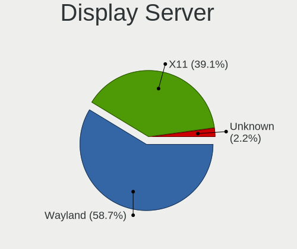

| Name    | Notebooks | Percent |
|---------|-----------|---------|
| X11     | 50        | 60.98%  |
| Wayland | 31        | 37.8%   |
| Unknown | 1         | 1.22%   |

Display Manager
---------------

SDDM, LightDM, etc.

| Name    | Notebooks | Percent |
|---------|-----------|---------|
| GDM3    | 24        | 29.27%  |
| Unknown | 24        | 29.27%  |
| SDDM    | 20        | 24.39%  |
| GDM     | 8         | 9.76%   |
| LightDM | 6         | 7.32%   |

OS Lang
-------

Language

| Lang  | Notebooks | Percent |
|-------|-----------|---------|
| en_US | 43        | 52.44%  |
| nl_NL | 28        | 34.15%  |
| pl_PL | 3         | 3.66%   |
| ru_RU | 2         | 2.44%   |
| zh_CN | 1         | 1.22%   |
| sk_SK | 1         | 1.22%   |
| nl_AW | 1         | 1.22%   |
| fr_FR | 1         | 1.22%   |
| en_GB | 1         | 1.22%   |
| C     | 1         | 1.22%   |

Boot Mode
---------

EFI or BIOS

| Mode | Notebooks | Percent |
|------|-----------|---------|
| EFI  | 42        | 51.22%  |
| BIOS | 40        | 48.78%  |

Filesystem
----------

Type of filesystem

| Type    | Notebooks | Percent |
|---------|-----------|---------|
| Ext4    | 61        | 74.39%  |
| Btrfs   | 11        | 13.41%  |
| Overlay | 8         | 9.76%   |
| Zfs     | 1         | 1.22%   |
| Xfs     | 1         | 1.22%   |

Part. scheme
------------

Scheme of partitioning

| Type    | Notebooks | Percent |
|---------|-----------|---------|
| GPT     | 47        | 57.32%  |
| Unknown | 24        | 29.27%  |
| MBR     | 11        | 13.41%  |

Dual Boot with Linux/BSD
------------------------

Hosting more than one Linux/BSD

| Dual boot | Notebooks | Percent |
|-----------|-----------|---------|
| No        | 67        | 81.71%  |
| Yes       | 15        | 18.29%  |

Dual Boot (Win)
---------------

Hosting Linux and Windows

| Dual boot | Notebooks | Percent |
|-----------|-----------|---------|
| No        | 56        | 68.29%  |
| Yes       | 26        | 31.71%  |

Board
-----

Vendor
------

Motherboard manufacturer

| Name             | Notebooks | Percent |
|------------------|-----------|---------|
| Hewlett-Packard  | 21        | 25.61%  |
| Lenovo           | 17        | 20.73%  |
| Dell             | 12        | 14.63%  |
| Acer             | 12        | 14.63%  |
| Apple            | 4         | 4.88%   |
| ASUSTek Computer | 3         | 3.66%   |
| Valve            | 2         | 2.44%   |
| Sony             | 2         | 2.44%   |
| MSI              | 2         | 2.44%   |
| Medion           | 2         | 2.44%   |
| Toshiba          | 1         | 1.22%   |
| Standard         | 1         | 1.22%   |
| realme           | 1         | 1.22%   |
| Notebook         | 1         | 1.22%   |
| Google           | 1         | 1.22%   |

Model
-----

Motherboard model

| Name                                              | Notebooks | Percent |
|---------------------------------------------------|-----------|---------|
| Valve Jupiter                                     | 2         | 2.44%   |
| Lenovo Yoga Slim 7 13ACN5 82CY                    | 2         | 2.44%   |
| HP Pavilion Laptop 15-eh2xxx                      | 2         | 2.44%   |
| Apple MacBookAir7,2                               | 2         | 2.44%   |
| Acer Aspire E5-774                                | 2         | 2.44%   |
| Toshiba Satellite C870-12F                        | 1         | 1.22%   |
| Sony VPCEB3L9E                                    | 1         | 1.22%   |
| Sony VPCEB3L1E                                    | 1         | 1.22%   |
| realme CloudProXXXX                               | 1         | 1.22%   |
| Notebook NS50MU                                   | 1         | 1.22%   |
| MSI GE70 2QD                                      | 1         | 1.22%   |
| MSI CX700ND/CX70 0NF/CX70 0NE                     | 1         | 1.22%   |
| Medion E4251 MD61435                              | 1         | 1.22%   |
| Medion E4251                                      | 1         | 1.22%   |
| Lenovo ThinkPad X270 20K5S1A524                   | 1         | 1.22%   |
| Lenovo ThinkPad T490s 20NX0076MH                  | 1         | 1.22%   |
| Lenovo ThinkPad T490 20N3S0E000                   | 1         | 1.22%   |
| Lenovo ThinkPad T440 20B7S0JC0P                   | 1         | 1.22%   |
| Lenovo ThinkPad T14 Gen 2a 20XK002SMH             | 1         | 1.22%   |
| Lenovo ThinkPad Edge E540 20C600JHMH              | 1         | 1.22%   |
| Lenovo ThinkPad Edge E145 20BC000                 | 1         | 1.22%   |
| Lenovo ThinkPad E560 20EVCTO1WW                   | 1         | 1.22%   |
| Lenovo IdeaPad 510-15ISK 80SR                     | 1         | 1.22%   |
| Lenovo IdeaPad 310-15ABR 80ST                     | 1         | 1.22%   |
| Lenovo IdeaPad 3 15ADA05 81W1                     | 1         | 1.22%   |
| Lenovo IdeaPad 100-15IBD 80QQ                     | 1         | 1.22%   |
| Lenovo G770 1037                                  | 1         | 1.22%   |
| Lenovo G550 2958                                  | 1         | 1.22%   |
| Lenovo Erazer Z500 20226                          | 1         | 1.22%   |
| HP ZBook Studio G4                                | 1         | 1.22%   |
| HP ZBook Power 15.6 inch G9 Mobile Workstation PC | 1         | 1.22%   |
| HP ZBook 15 G3                                    | 1         | 1.22%   |
| HP ZBook 15 G2                                    | 1         | 1.22%   |
| HP ProBook 650 G1                                 | 1         | 1.22%   |
| HP ProBook 4540s                                  | 1         | 1.22%   |
| HP ProBook 430 G1                                 | 1         | 1.22%   |
| HP Pavilion Sleekbook 15                          | 1         | 1.22%   |
| HP Pavilion Laptop 14-ce0xxx                      | 1         | 1.22%   |
| HP Pavilion Gaming Laptop 17-cd1xxx               | 1         | 1.22%   |
| HP Pavilion dv9500                                | 1         | 1.22%   |

Model Family
------------

Motherboard model prefix

| Name                | Notebooks | Percent |
|---------------------|-----------|---------|
| Acer Aspire         | 10        | 12.2%   |
| Lenovo ThinkPad     | 8         | 9.76%   |
| HP Pavilion         | 7         | 8.54%   |
| Dell Latitude       | 7         | 8.54%   |
| Lenovo IdeaPad      | 4         | 4.88%   |
| HP ZBook            | 4         | 4.88%   |
| Dell XPS            | 4         | 4.88%   |
| HP ProBook          | 3         | 3.66%   |
| HP EliteBook        | 3         | 3.66%   |
| Valve Jupiter       | 2         | 2.44%   |
| Medion E4251        | 2         | 2.44%   |
| Lenovo Yoga         | 2         | 2.44%   |
| Apple MacBookAir7   | 2         | 2.44%   |
| Toshiba Satellite   | 1         | 1.22%   |
| Sony VPCEB3L9E      | 1         | 1.22%   |
| Sony VPCEB3L1E      | 1         | 1.22%   |
| realme CloudProXXXX | 1         | 1.22%   |
| Notebook NS50MU     | 1         | 1.22%   |
| MSI GE70            | 1         | 1.22%   |
| MSI CX700ND         | 1         | 1.22%   |
| Lenovo G770         | 1         | 1.22%   |
| Lenovo G550         | 1         | 1.22%   |
| Lenovo Erazer       | 1         | 1.22%   |
| HP Notebook         | 1         | 1.22%   |
| HP Laptop           | 1         | 1.22%   |
| HP Compaq           | 1         | 1.22%   |
| HP 240              | 1         | 1.22%   |
| Google Banon        | 1         | 1.22%   |
| Dell Precision      | 1         | 1.22%   |
| ASUS VivoBook       | 1         | 1.22%   |
| ASUS K72Jr          | 1         | 1.22%   |
| ASUS GL553VD        | 1         | 1.22%   |
| Apple MacBookPro5   | 1         | 1.22%   |
| Apple MacBookAir5   | 1         | 1.22%   |
| Acer TravelMate     | 1         | 1.22%   |
| Acer Nitro          | 1         | 1.22%   |
| Unknown             | 1         | 1.22%   |

MFG Year
--------

Motherboard manufacture year

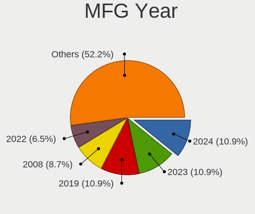

| Year | Notebooks | Percent |
|------|-----------|---------|
| 2021 | 12        | 14.63%  |
| 2013 | 9         | 10.98%  |
| 2015 | 8         | 9.76%   |
| 2022 | 7         | 8.54%   |
| 2020 | 7         | 8.54%   |
| 2016 | 6         | 7.32%   |
| 2012 | 6         | 7.32%   |
| 2019 | 4         | 4.88%   |
| 2018 | 4         | 4.88%   |
| 2010 | 4         | 4.88%   |
| 2017 | 3         | 3.66%   |
| 2011 | 3         | 3.66%   |
| 2009 | 3         | 3.66%   |
| 2014 | 2         | 2.44%   |
| 2006 | 2         | 2.44%   |
| 2008 | 1         | 1.22%   |
| 2007 | 1         | 1.22%   |

Form Factor
-----------

Physical design of the computer

| Name     | Notebooks | Percent |
|----------|-----------|---------|
| Notebook | 82        | 100%    |

Secure Boot
-----------

Enabled or disabled

| State    | Notebooks | Percent |
|----------|-----------|---------|
| Disabled | 72        | 87.8%   |
| Enabled  | 10        | 12.2%   |

Coreboot
--------

Have coreboot on board

| Used | Notebooks | Percent |
|------|-----------|---------|
| No   | 81        | 98.78%  |
| Yes  | 1         | 1.22%   |

RAM Size
--------

Total RAM memory

| Size in GB | Notebooks | Percent |
|------------|-----------|---------|
| 4.01-8.0   | 27        | 32.93%  |
| 8.01-16.0  | 16        | 19.51%  |
| 16.01-24.0 | 15        | 18.29%  |
| 3.01-4.0   | 11        | 13.41%  |
| 32.01-64.0 | 7         | 8.54%   |
| 2.01-3.0   | 3         | 3.66%   |
| 1.01-2.0   | 3         | 3.66%   |

RAM Used
--------

Used RAM memory

| Used GB   | Notebooks | Percent |
|-----------|-----------|---------|
| 1.01-2.0  | 30        | 36.59%  |
| 4.01-8.0  | 19        | 23.17%  |
| 2.01-3.0  | 17        | 20.73%  |
| 3.01-4.0  | 9         | 10.98%  |
| 8.01-16.0 | 4         | 4.88%   |
| 0.51-1.0  | 3         | 3.66%   |

Total Drives
------------

Number of drives on board

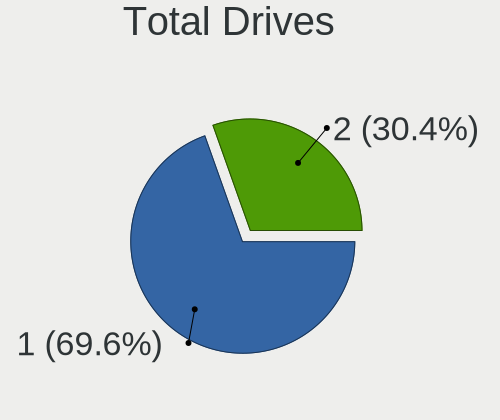

| Drives | Notebooks | Percent |
|--------|-----------|---------|
| 1      | 59        | 71.95%  |
| 2      | 20        | 24.39%  |
| 3      | 3         | 3.66%   |

Has CD-ROM
----------

Has CD-ROM on board

| Presented | Notebooks | Percent |
|-----------|-----------|---------|
| No        | 56        | 68.29%  |
| Yes       | 26        | 31.71%  |

Has Ethernet
------------

Has Ethernet on board

| Presented | Notebooks | Percent |
|-----------|-----------|---------|
| Yes       | 68        | 82.93%  |
| No        | 14        | 17.07%  |

Has WiFi
--------

Has WiFi module

| Presented | Notebooks | Percent |
|-----------|-----------|---------|
| Yes       | 80        | 97.56%  |
| No        | 2         | 2.44%   |

Has Bluetooth
-------------

Has Bluetooth module

| Presented | Notebooks | Percent |
|-----------|-----------|---------|
| Yes       | 68        | 82.93%  |
| No        | 14        | 17.07%  |

Location
--------

Country
-------

Geographic location (country)

| Country     | Notebooks | Percent |
|-------------|-----------|---------|
| Netherlands | 82        | 100%    |

City
----

Geographic location (city)

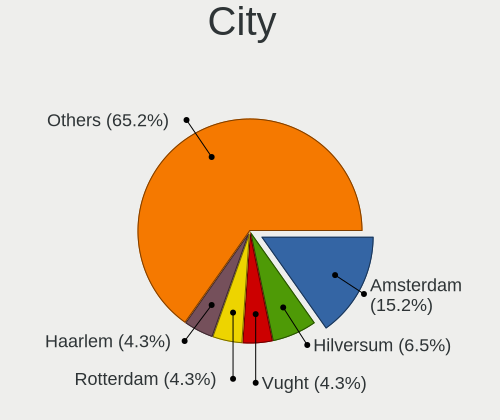

| City                | Notebooks | Percent |
|---------------------|-----------|---------|
| Amsterdam           | 18        | 21.95%  |
| The Hague           | 5         | 6.1%    |
| Leiden              | 3         | 3.66%   |
| Enschede            | 3         | 3.66%   |
| Naaldwijk           | 2         | 2.44%   |
| Haarlem             | 2         | 2.44%   |
| Groningen           | 2         | 2.44%   |
| Eindhoven           | 2         | 2.44%   |
| Delft               | 2         | 2.44%   |
| Blaricum            | 2         | 2.44%   |
| Apeldoorn           | 2         | 2.44%   |
| Amersfoort          | 2         | 2.44%   |
| Alphen aan den Rijn | 2         | 2.44%   |
| Almere Stad         | 2         | 2.44%   |
| Zuidland            | 1         | 1.22%   |
| Zuid-Scharwoude     | 1         | 1.22%   |
| Zeewolde            | 1         | 1.22%   |
| Weteringbrug        | 1         | 1.22%   |
| Vleuten             | 1         | 1.22%   |
| Utrecht             | 1         | 1.22%   |
| Uithoorn            | 1         | 1.22%   |
| Tilburg             | 1         | 1.22%   |
| Terneuzen           | 1         | 1.22%   |
| Schaijk             | 1         | 1.22%   |
| Rotterdam           | 1         | 1.22%   |
| Roosendaal          | 1         | 1.22%   |
| Roelofarendsveen    | 1         | 1.22%   |
| Rijswijk            | 1         | 1.22%   |
| Peize               | 1         | 1.22%   |
| Meppel              | 1         | 1.22%   |
| Lochem              | 1         | 1.22%   |
| Leusden             | 1         | 1.22%   |
| Kudelstaart         | 1         | 1.22%   |
| Krimpen aan de Lek  | 1         | 1.22%   |
| Kerkrade            | 1         | 1.22%   |
| Huissen             | 1         | 1.22%   |
| Hengelo             | 1         | 1.22%   |
| Heerhugowaard       | 1         | 1.22%   |
| Diemen              | 1         | 1.22%   |
| Denekamp            | 1         | 1.22%   |

Drives
------

Drive Vendor
------------

Hard drive vendors

| Vendor                      | Notebooks | Drives | Percent |
|-----------------------------|-----------|--------|---------|
| Samsung Electronics         | 23        | 25     | 23.47%  |
| WDC                         | 11        | 12     | 11.22%  |
| SK hynix                    | 9         | 9      | 9.18%   |
| Toshiba                     | 7         | 7      | 7.14%   |
| Kingston                    | 7         | 7      | 7.14%   |
| Unknown                     | 5         | 6      | 5.1%    |
| Crucial                     | 5         | 5      | 5.1%    |
| Micron Technology           | 4         | 4      | 4.08%   |
| Seagate                     | 3         | 3      | 3.06%   |
| Sandisk                     | 3         | 3      | 3.06%   |
| Intel                       | 3         | 3      | 3.06%   |
| KIOXIA                      | 2         | 2      | 2.04%   |
| HGST                        | 2         | 2      | 2.04%   |
| Apple                       | 2         | 2      | 2.04%   |
| Transcend                   | 1         | 1      | 1.02%   |
| SSK                         | 1         | 1      | 1.02%   |
| Phison Electronics          | 1         | 1      | 1.02%   |
| Phison                      | 1         | 1      | 1.02%   |
| MAXIO Technology (Hangzhou) | 1         | 1      | 1.02%   |
| LITEONIT                    | 1         | 1      | 1.02%   |
| LITEON                      | 1         | 1      | 1.02%   |
| KingFast                    | 1         | 1      | 1.02%   |
| Kingchuxing                 | 1         | 1      | 1.02%   |
| JetFlash                    | 1         | 1      | 1.02%   |
| Hitachi                     | 1         | 1      | 1.02%   |
| Unknown                     | 1         | 1      | 1.02%   |

Drive Model
-----------

Hard drive models

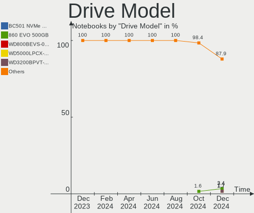

| Model                                                | Notebooks | Percent |
|------------------------------------------------------|-----------|---------|
| Samsung SSD 850 EVO 250GB                            | 3         | 2.94%   |
| Toshiba MQ01ABF050 500GB                             | 2         | 1.96%   |
| SK hynix SKHynix_HFS512GD9TNI-L2A0B 512GB            | 2         | 1.96%   |
| SK hynix BC501 NVMe Solid State Drive 512GB          | 2         | 1.96%   |
| Samsung SSD 870 QVO 1TB                              | 2         | 1.96%   |
| Samsung SSD 860 EVO 250GB                            | 2         | 1.96%   |
| Samsung PSSD T7 Shield 1TB                           | 2         | 1.96%   |
| Samsung NVMe SSD Controller PM9A1/PM9A3/980PRO 512GB | 2         | 1.96%   |
| Kingston SA400S37240G 240GB SSD                      | 2         | 1.96%   |
| Intel SSDPEKNU010TZH 1TB                             | 2         | 1.96%   |
| Crucial CT250MX500SSD1 250GB                         | 2         | 1.96%   |
| Crucial CT1000MX500SSD1 1TB                          | 2         | 1.96%   |
| WDC WDS500G2B0A-00SM50 500GB SSD                     | 1         | 0.98%   |
| WDC WD7500BPVT-24HXZT3 752GB                         | 1         | 0.98%   |
| WDC WD7500BPVT-22HXZT3 752GB                         | 1         | 0.98%   |
| WDC WD5000LPLX-21ZNTT0 500GB                         | 1         | 0.98%   |
| WDC WD5000LPLX-08ZNTT0 500GB                         | 1         | 0.98%   |
| WDC WD5000BEVT-22ZAT0 500GB                          | 1         | 0.98%   |
| WDC WD3200BPVT-80JJ5T0 320GB                         | 1         | 0.98%   |
| WDC WD3200BPVT-22JJ5T0 320GB                         | 1         | 0.98%   |
| WDC WD3200BEVT-22ZCT0 320GB                          | 1         | 0.98%   |
| WDC WD10SPZX-60Z10T1 1TB                             | 1         | 0.98%   |
| WDC WD10SPZX-21Z10T0 1TB                             | 1         | 0.98%   |
| WDC PC SN520 SDAPNUW-512G-1014 512GB                 | 1         | 0.98%   |
| Unknown SL16G  16GB                                  | 1         | 0.98%   |
| Unknown MMC Card  8GB                                | 1         | 0.98%   |
| Unknown MMC Card  512GB                              | 1         | 0.98%   |
| Unknown MMC Card  32GB                               | 1         | 0.98%   |
| Unknown MMC Card  16GB                               | 1         | 0.98%   |
| Unknown HBG4a2  32GB                                 | 1         | 0.98%   |
| Transcend TS240GJDM520 240GB SSD                     | 1         | 0.98%   |
| Toshiba THNSNK128GCS8 SATA 128GB SSD                 | 1         | 0.98%   |
| Toshiba MQ02ABF100 1TB                               | 1         | 0.98%   |
| Toshiba KXG6AZNV1T02 1TB                             | 1         | 0.98%   |
| Toshiba KXG50ZNV256G 256GB                           | 1         | 0.98%   |
| Toshiba KXG50ZNV1T02 NVMe 1024GB                     | 1         | 0.98%   |
| SSK Disk 128GB                                       | 1         | 0.98%   |
| SK hynix SKHynix_HFS512GDE9X081N 512GB               | 1         | 0.98%   |
| SK hynix HFS256G39TND-N210A 256GB SSD                | 1         | 0.98%   |
| SK hynix HFS128G3BMND-3210A 128GB SSD                | 1         | 0.98%   |

HDD Vendor
----------

Hard disk drive vendors

| Vendor  | Notebooks | Drives | Percent |
|---------|-----------|--------|---------|
| WDC     | 10        | 10     | 52.63%  |
| Toshiba | 3         | 3      | 15.79%  |
| Seagate | 3         | 3      | 15.79%  |
| HGST    | 2         | 2      | 10.53%  |
| Hitachi | 1         | 1      | 5.26%   |

SSD Vendor
----------

Solid state drive vendors

| Vendor              | Notebooks | Drives | Percent |
|---------------------|-----------|--------|---------|
| Samsung Electronics | 15        | 15     | 38.46%  |
| Kingston            | 6         | 6      | 15.38%  |
| Crucial             | 5         | 5      | 12.82%  |
| SK hynix            | 2         | 2      | 5.13%   |
| Apple               | 2         | 2      | 5.13%   |
| WDC                 | 1         | 1      | 2.56%   |
| Transcend           | 1         | 1      | 2.56%   |
| Toshiba             | 1         | 1      | 2.56%   |
| Phison              | 1         | 1      | 2.56%   |
| Micron Technology   | 1         | 1      | 2.56%   |
| LITEONIT            | 1         | 1      | 2.56%   |
| LITEON              | 1         | 1      | 2.56%   |
| KingFast            | 1         | 1      | 2.56%   |
| Unknown             | 1         | 1      | 2.56%   |

Drive Kind
----------

HDD or SSD

| Kind    | Notebooks | Drives | Percent |
|---------|-----------|--------|---------|
| SSD     | 39        | 39     | 39%     |
| NVMe    | 34        | 35     | 34%     |
| HDD     | 19        | 19     | 19%     |
| MMC     | 5         | 6      | 5%      |
| Unknown | 3         | 3      | 3%      |

Drive Connector
---------------

SATA, SAS, NVMe, etc.

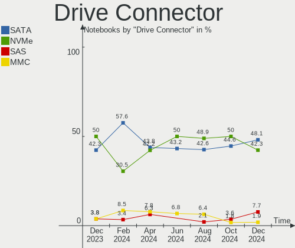

| Type | Notebooks | Drives | Percent |
|------|-----------|--------|---------|
| SATA | 51        | 55     | 53.13%  |
| NVMe | 34        | 35     | 35.42%  |
| SAS  | 6         | 6      | 6.25%   |
| MMC  | 5         | 6      | 5.21%   |

Drive Size
----------

Size of hard drive

| Size in TB | Notebooks | Drives | Percent |
|------------|-----------|--------|---------|
| 0.01-0.5   | 41        | 43     | 73.21%  |
| 0.51-1.0   | 15        | 15     | 26.79%  |

Space Total
-----------

Amount of disk space available on the file system

| Size in GB | Notebooks | Percent |
|------------|-----------|---------|
| 101-250    | 23        | 28.05%  |
| 251-500    | 16        | 19.51%  |
| 501-1000   | 11        | 13.41%  |
| 1-20       | 8         | 9.76%   |
| 51-100     | 8         | 9.76%   |
| 21-50      | 7         | 8.54%   |
| 1001-2000  | 5         | 6.1%    |
| Unknown    | 3         | 3.66%   |
| 2001-3000  | 1         | 1.22%   |

Space Used
----------

Amount of used disk space

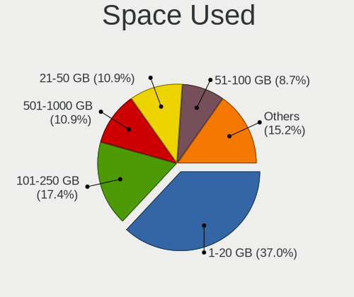

| Used GB  | Notebooks | Percent |
|----------|-----------|---------|
| 1-20     | 30        | 36.59%  |
| 21-50    | 16        | 19.51%  |
| 101-250  | 13        | 15.85%  |
| 51-100   | 11        | 13.41%  |
| 501-1000 | 5         | 6.1%    |
| 251-500  | 4         | 4.88%   |
| Unknown  | 3         | 3.66%   |

Malfunc. Drives
---------------

Drive models with a malfunction

| Model                                | Notebooks | Drives | Percent |
|--------------------------------------|-----------|--------|---------|
| Toshiba THNSNK128GCS8 SATA 128GB SSD | 1         | 1      | 33.33%  |
| Toshiba MQ01ABF050 500GB             | 1         | 1      | 33.33%  |
| Kingston SA400S37120G 120GB SSD      | 1         | 1      | 33.33%  |

Malfunc. Drive Vendor
---------------------

Vendors of faulty drives

| Vendor   | Notebooks | Drives | Percent |
|----------|-----------|--------|---------|
| Toshiba  | 2         | 2      | 66.67%  |
| Kingston | 1         | 1      | 33.33%  |

Malfunc. HDD Vendor
-------------------

Vendors of faulty HDD drives

| Vendor  | Notebooks | Drives | Percent |
|---------|-----------|--------|---------|
| Toshiba | 1         | 1      | 100%    |

Malfunc. Drive Kind
-------------------

Kinds of faulty drives

| Kind | Notebooks | Drives | Percent |
|------|-----------|--------|---------|
| SSD  | 2         | 2      | 66.67%  |
| HDD  | 1         | 1      | 33.33%  |

Failed Drives
-------------

Failed drive models

Zero info for selected period =(

Failed Drive Vendor
-------------------

Failed drive vendors

Zero info for selected period =(

Drive Status
------------

Number of failed and malfunc. drives

| Status   | Notebooks | Drives | Percent |
|----------|-----------|--------|---------|
| Detected | 45        | 55     | 52.33%  |
| Works    | 38        | 44     | 44.19%  |
| Malfunc  | 3         | 3      | 3.49%   |

Storage controller
------------------

Storage Vendor
--------------

Storage controller vendors

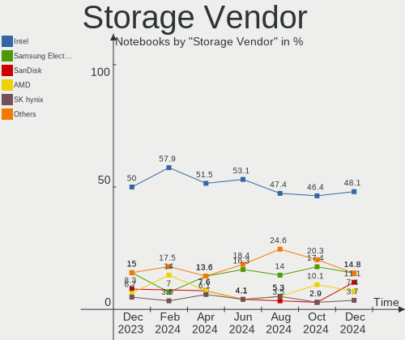

| Vendor                       | Notebooks | Percent |
|------------------------------|-----------|---------|
| Intel                        | 53        | 57.61%  |
| Samsung Electronics          | 11        | 11.96%  |
| SK hynix                     | 7         | 7.61%   |
| AMD                          | 5         | 5.43%   |
| SanDisk                      | 4         | 4.35%   |
| Toshiba America Info Systems | 3         | 3.26%   |
| Micron Technology            | 3         | 3.26%   |
| KIOXIA                       | 2         | 2.17%   |
| Phison Electronics           | 1         | 1.09%   |
| Nvidia                       | 1         | 1.09%   |
| MAXIO Technology (Hangzhou)  | 1         | 1.09%   |
| Kingston Technology Company  | 1         | 1.09%   |

Storage Model
-------------

Storage controller models

| Model                                                                          | Notebooks | Percent |
|--------------------------------------------------------------------------------|-----------|---------|
| Intel Sunrise Point-LP SATA Controller [AHCI mode]                             | 6         | 6.06%   |
| Intel 8 Series/C220 Series Chipset Family 6-port SATA Controller 1 [AHCI mode] | 6         | 6.06%   |
| Intel 7 Series Chipset Family 6-port SATA Controller [AHCI mode]               | 6         | 6.06%   |
| Intel 82801 Mobile SATA Controller [RAID mode]                                 | 5         | 5.05%   |
| Intel Wildcat Point-LP SATA Controller [AHCI Mode]                             | 4         | 4.04%   |
| AMD FCH SATA Controller [AHCI mode]                                            | 4         | 4.04%   |
| SK hynix BC501 NVMe Solid State Drive                                          | 3         | 3.03%   |
| Samsung NVMe SSD Controller 980                                                | 3         | 3.03%   |
| Micron Non-Volatile memory controller                                          | 3         | 3.03%   |
| Intel Volume Management Device NVMe RAID Controller                            | 3         | 3.03%   |
| Intel 82801IBM/IEM (ICH9M/ICH9M-E) 4 port SATA Controller [AHCI mode]          | 3         | 3.03%   |
| Intel 5 Series/3400 Series Chipset 4 port SATA AHCI Controller                 | 3         | 3.03%   |
| Toshiba America Info Systems XG5 NVMe SSD Controller                           | 2         | 2.02%   |
| SK hynix Non-Volatile memory controller                                        | 2         | 2.02%   |
| SK hynix Gold P31/PC711 NVMe Solid State Drive                                 | 2         | 2.02%   |
| SanDisk Non-Volatile memory controller                                         | 2         | 2.02%   |
| Samsung NVMe SSD Controller SM981/PM981/PM983                                  | 2         | 2.02%   |
| Samsung NVMe SSD Controller SM961/PM961/SM963                                  | 2         | 2.02%   |
| Samsung NVMe SSD Controller PM9A1/PM9A3/980PRO                                 | 2         | 2.02%   |
| Samsung Electronics SATA controller                                            | 2         | 2.02%   |
| KIOXIA NVMe SSD Controller BG4                                                 | 2         | 2.02%   |
| Intel Q170/Q150/B150/H170/H110/Z170/CM236 Chipset SATA Controller [AHCI Mode]  | 2         | 2.02%   |
| Intel Non-Volatile memory controller                                           | 2         | 2.02%   |
| Intel HM170/QM170 Chipset SATA Controller [AHCI Mode]                          | 2         | 2.02%   |
| Intel Celeron/Pentium Silver Processor SATA Controller                         | 2         | 2.02%   |
| Intel 8 Series SATA Controller 1 [AHCI mode]                                   | 2         | 2.02%   |
| Toshiba America Info Systems XG6 NVMe SSD Controller                           | 1         | 1.01%   |
| SanDisk WD Blue SN500 / PC SN520 NVMe SSD                                      | 1         | 1.01%   |
| SanDisk WD Black SN750 / PC SN730 NVMe SSD                                     | 1         | 1.01%   |
| Samsung Electronics Non-Volatile memory controller                             | 1         | 1.01%   |
| Phison PS5013 E13 NVMe Controller                                              | 1         | 1.01%   |
| Nvidia MCP79 AHCI Controller                                                   | 1         | 1.01%   |
| MAXIO (Hangzhou) NVMe SSD Controller MAP1202                                   | 1         | 1.01%   |
| Kingston Company Company Non-Volatile memory controller                        | 1         | 1.01%   |
| Intel SSD 660P Series                                                          | 1         | 1.01%   |
| Intel Ice Lake-LP SATA Controller [AHCI mode]                                  | 1         | 1.01%   |
| Intel 82801HM/HEM (ICH8M/ICH8M-E) SATA Controller [AHCI mode]                  | 1         | 1.01%   |
| Intel 82801HM/HEM (ICH8M/ICH8M-E) IDE Controller                               | 1         | 1.01%   |
| Intel 82801GBM/GHM (ICH7-M Family) SATA Controller [IDE mode]                  | 1         | 1.01%   |
| Intel 82801GBM/GHM (ICH7-M Family) SATA Controller [AHCI mode]                 | 1         | 1.01%   |

Storage Kind
------------

Kind of storage controller (IDE, SATA, NVMe, SAS, ...)

| Kind | Notebooks | Percent |
|------|-----------|---------|
| SATA | 48        | 50%     |
| NVMe | 34        | 35.42%  |
| RAID | 8         | 8.33%   |
| IDE  | 6         | 6.25%   |

Processor
---------

CPU Vendor
----------

Processor vendors

| Vendor | Notebooks | Percent |
|--------|-----------|---------|
| Intel  | 68        | 82.93%  |
| AMD    | 14        | 17.07%  |

CPU Model
---------

Processor models

| Model                                       | Notebooks | Percent |
|---------------------------------------------|-----------|---------|
| Intel Pentium CPU 3825U @ 1.90GHz           | 2         | 2.44%   |
| Intel Core i7-10750H CPU @ 2.60GHz          | 2         | 2.44%   |
| Intel Core i5-4200M CPU @ 2.50GHz           | 2         | 2.44%   |
| Intel Core i5-3230M CPU @ 2.60GHz           | 2         | 2.44%   |
| Intel Core i5-3210M CPU @ 2.50GHz           | 2         | 2.44%   |
| Intel 12th Gen Core i7-12700H               | 2         | 2.44%   |
| Intel 11th Gen Core i7-1185G7 @ 3.00GHz     | 2         | 2.44%   |
| AMD Ryzen 7 5825U with Radeon Graphics      | 2         | 2.44%   |
| AMD Ryzen 7 5800U with Radeon Graphics      | 2         | 2.44%   |
| AMD Custom APU 0405                         | 2         | 2.44%   |
| Intel Pentium Dual-Core CPU T4500 @ 2.30GHz | 1         | 1.22%   |
| Intel Pentium Dual-Core CPU T4400 @ 2.20GHz | 1         | 1.22%   |
| Intel Core i7-9750H CPU @ 2.60GHz           | 1         | 1.22%   |
| Intel Core i7-8565U CPU @ 1.80GHz           | 1         | 1.22%   |
| Intel Core i7-7700HQ CPU @ 2.80GHz          | 1         | 1.22%   |
| Intel Core i7-6820HQ CPU @ 2.70GHz          | 1         | 1.22%   |
| Intel Core i7-6700HQ CPU @ 2.60GHz          | 1         | 1.22%   |
| Intel Core i7-6500U CPU @ 2.50GHz           | 1         | 1.22%   |
| Intel Core i7-5650U CPU @ 2.20GHz           | 1         | 1.22%   |
| Intel Core i7-5500U CPU @ 2.40GHz           | 1         | 1.22%   |
| Intel Core i7-4810MQ CPU @ 2.80GHz          | 1         | 1.22%   |
| Intel Core i7-4800MQ CPU @ 2.70GHz          | 1         | 1.22%   |
| Intel Core i7-4720HQ CPU @ 2.60GHz          | 1         | 1.22%   |
| Intel Core i7-4710MQ CPU @ 2.50GHz          | 1         | 1.22%   |
| Intel Core i7-3630QM CPU @ 2.40GHz          | 1         | 1.22%   |
| Intel Core i5-8265U CPU @ 1.60GHz           | 1         | 1.22%   |
| Intel Core i5-8250U CPU @ 1.60GHz           | 1         | 1.22%   |
| Intel Core i5-7300U CPU @ 2.60GHz           | 1         | 1.22%   |
| Intel Core i5-7300HQ CPU @ 2.50GHz          | 1         | 1.22%   |
| Intel Core i5-7200U CPU @ 2.50GHz           | 1         | 1.22%   |
| Intel Core i5-6200U CPU @ 2.30GHz           | 1         | 1.22%   |
| Intel Core i5-5250U CPU @ 1.60GHz           | 1         | 1.22%   |
| Intel Core i5-5200U CPU @ 2.20GHz           | 1         | 1.22%   |
| Intel Core i5-4300U CPU @ 1.90GHz           | 1         | 1.22%   |
| Intel Core i5-4210M CPU @ 2.60GHz           | 1         | 1.22%   |
| Intel Core i5-3427U CPU @ 1.80GHz           | 1         | 1.22%   |
| Intel Core i5-3340M CPU @ 2.70GHz           | 1         | 1.22%   |
| Intel Core i5-3337U CPU @ 1.80GHz           | 1         | 1.22%   |
| Intel Core i5-2540M CPU @ 2.60GHz           | 1         | 1.22%   |
| Intel Core i5-2430M CPU @ 2.40GHz           | 1         | 1.22%   |

CPU Model Family
----------------

Processor model prefix

| Model                   | Notebooks | Percent |
|-------------------------|-----------|---------|
| Intel Core i5           | 25        | 30.49%  |
| Intel Core i7           | 15        | 18.29%  |
| Other                   | 11        | 13.41%  |
| AMD Ryzen 7             | 7         | 8.54%   |
| Intel Core i3           | 6         | 7.32%   |
| Intel Core 2 Duo        | 3         | 3.66%   |
| Intel Celeron           | 3         | 3.66%   |
| Intel Pentium Dual-Core | 2         | 2.44%   |
| Intel Pentium           | 2         | 2.44%   |
| Intel Core 2            | 2         | 2.44%   |
| Intel Atom              | 1         | 1.22%   |
| AMD Ryzen 7 PRO         | 1         | 1.22%   |
| AMD Ryzen 3 PRO         | 1         | 1.22%   |
| AMD E1                  | 1         | 1.22%   |
| AMD Athlon II Neo       | 1         | 1.22%   |
| AMD A10                 | 1         | 1.22%   |

CPU Cores
---------

Number of processor cores

| Number | Notebooks | Percent |
|--------|-----------|---------|
| 2      | 43        | 52.44%  |
| 4      | 25        | 30.49%  |
| 8      | 6         | 7.32%   |
| 6      | 3         | 3.66%   |
| 14     | 2         | 2.44%   |
| 12     | 1         | 1.22%   |
| 10     | 1         | 1.22%   |
| 1      | 1         | 1.22%   |

CPU Sockets
-----------

Number of sockets

| Number | Notebooks | Percent |
|--------|-----------|---------|
| 1      | 82        | 100%    |

CPU Threads
-----------

Threads per core (Hyper-Threading)

| Number | Notebooks | Percent |
|--------|-----------|---------|
| 2      | 66        | 80.49%  |
| 1      | 16        | 19.51%  |

CPU Op-Modes
------------

CPU Operation Modes (32-bit, 64-bit)

| Op mode        | Notebooks | Percent |
|----------------|-----------|---------|
| 32-bit, 64-bit | 82        | 100%    |

CPU Microcode
-------------

Microcode number

| Number     | Notebooks | Percent |
|------------|-----------|---------|
| Unknown    | 27        | 32.93%  |
| 0x306a9    | 7         | 8.54%   |
| 0x306d4    | 4         | 4.88%   |
| 0x20655    | 4         | 4.88%   |
| 0x806c1    | 3         | 3.66%   |
| 0x306c3    | 3         | 3.66%   |
| 0x08108109 | 3         | 3.66%   |
| 0xa0652    | 2         | 2.44%   |
| 0x906a3    | 2         | 2.44%   |
| 0x806ec    | 2         | 2.44%   |
| 0x706e5    | 2         | 2.44%   |
| 0x6fd      | 2         | 2.44%   |
| 0x406e3    | 2         | 2.44%   |
| 0x40651    | 2         | 2.44%   |
| 0x1067a    | 2         | 2.44%   |
| 0x0a50000d | 2         | 2.44%   |
| 0x0a50000c | 2         | 2.44%   |
| 0x906ea    | 1         | 1.22%   |
| 0x906e9    | 1         | 1.22%   |
| 0x906a4    | 1         | 1.22%   |
| 0x6f6      | 1         | 1.22%   |
| 0x506e3    | 1         | 1.22%   |
| 0x406c4    | 1         | 1.22%   |
| 0x30678    | 1         | 1.22%   |
| 0x206a7    | 1         | 1.22%   |
| 0x08608103 | 1         | 1.22%   |
| 0x06006118 | 1         | 1.22%   |
| 0x010000c8 | 1         | 1.22%   |

CPU Microarch
-------------

Microarchitecture

| Name             | Notebooks | Percent |
|------------------|-----------|---------|
| KabyLake         | 9         | 10.98%  |
| Haswell          | 9         | 10.98%  |
| IvyBridge        | 8         | 9.76%   |
| Skylake          | 6         | 7.32%   |
| Broadwell        | 6         | 7.32%   |
| Zen 3            | 5         | 6.1%    |
| TigerLake        | 5         | 6.1%    |
| Westmere         | 4         | 4.88%   |
| Core             | 4         | 4.88%   |
| Unknown          | 4         | 4.88%   |
| Zen+             | 3         | 3.66%   |
| Penryn           | 3         | 3.66%   |
| Alderlake Hybrid | 3         | 3.66%   |
| Silvermont       | 2         | 2.44%   |
| SandyBridge      | 2         | 2.44%   |
| IceLake          | 2         | 2.44%   |
| Goldmont plus    | 2         | 2.44%   |
| CometLake        | 2         | 2.44%   |
| K10              | 1         | 1.22%   |
| Jaguar           | 1         | 1.22%   |
| Excavator        | 1         | 1.22%   |

Graphics
--------

GPU Vendor
----------

Vendors of graphics cards

| Vendor | Notebooks | Percent |
|--------|-----------|---------|
| Intel  | 62        | 56.36%  |
| Nvidia | 26        | 23.64%  |
| AMD    | 22        | 20%     |

GPU Model
---------

Graphics card models

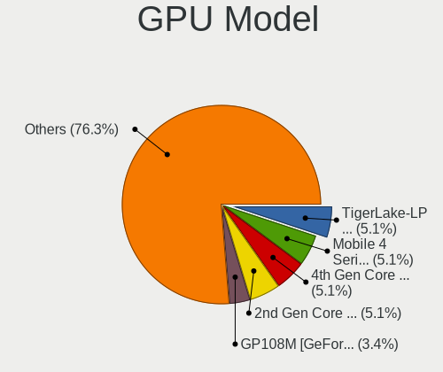

| Model                                                                     | Notebooks | Percent |
|---------------------------------------------------------------------------|-----------|---------|
| Intel 4th Gen Core Processor Integrated Graphics Controller               | 7         | 6.31%   |
| Intel 3rd Gen Core processor Graphics Controller                          | 7         | 6.31%   |
| Intel TigerLake-LP GT2 [Iris Xe Graphics]                                 | 5         | 4.5%    |
| Intel Skylake GT2 [HD Graphics 520]                                       | 4         | 3.6%    |
| Intel Mobile 4 Series Chipset Integrated Graphics Controller              | 3         | 2.7%    |
| Intel Alder Lake-P Integrated Graphics Controller                         | 3         | 2.7%    |
| AMD Picasso/Raven 2 [Radeon Vega Series / Radeon Vega Mobile Series]      | 3         | 2.7%    |
| AMD Cezanne [Radeon Vega Series / Radeon Vega Mobile Series]              | 3         | 2.7%    |
| Nvidia GK208M [GeForce GT 740M]                                           | 2         | 1.8%    |
| Intel WhiskeyLake-U GT2 [UHD Graphics 620]                                | 2         | 1.8%    |
| Intel Iris Plus Graphics G1 (Ice Lake)                                    | 2         | 1.8%    |
| Intel HD Graphics 630                                                     | 2         | 1.8%    |
| Intel HD Graphics 620                                                     | 2         | 1.8%    |
| Intel HD Graphics 6000                                                    | 2         | 1.8%    |
| Intel HD Graphics 5500                                                    | 2         | 1.8%    |
| Intel HD Graphics 530                                                     | 2         | 1.8%    |
| Intel HD Graphics                                                         | 2         | 1.8%    |
| Intel Haswell-ULT Integrated Graphics Controller                          | 2         | 1.8%    |
| Intel GeminiLake [UHD Graphics 600]                                       | 2         | 1.8%    |
| Intel Core Processor Integrated Graphics Controller                       | 2         | 1.8%    |
| Intel CometLake-H GT2 [UHD Graphics]                                      | 2         | 1.8%    |
| Intel 2nd Generation Core Processor Family Integrated Graphics Controller | 2         | 1.8%    |
| AMD VanGogh [AMD Custom GPU 0405]                                         | 2         | 1.8%    |
| AMD Park [Mobility Radeon HD 5430/5450/5470]                              | 2         | 1.8%    |
| AMD Barcelo                                                               | 2         | 1.8%    |
| Nvidia TU117M [GeForce MX450]                                             | 1         | 0.9%    |
| Nvidia TU117M [GeForce GTX 1650 Ti Mobile]                                | 1         | 0.9%    |
| Nvidia TU117M [GeForce GTX 1650 Mobile / Max-Q]                           | 1         | 0.9%    |
| Nvidia TU117M                                                             | 1         | 0.9%    |
| Nvidia TU117GLM [T600 Laptop GPU]                                         | 1         | 0.9%    |
| Nvidia TU116M [GeForce GTX 1660 Ti Mobile]                                | 1         | 0.9%    |
| Nvidia GP108M [GeForce MX250]                                             | 1         | 0.9%    |
| Nvidia GP108M [GeForce MX150]                                             | 1         | 0.9%    |
| Nvidia GP107M [GeForce GTX 1050 Mobile]                                   | 1         | 0.9%    |
| Nvidia GM108M [GeForce 940M]                                              | 1         | 0.9%    |
| Nvidia GM108M [GeForce 940MX]                                             | 1         | 0.9%    |
| Nvidia GM107M [GeForce GTX 960M]                                          | 1         | 0.9%    |
| Nvidia GM107M [GeForce GTX 950M]                                          | 1         | 0.9%    |
| Nvidia GM107GLM [Quadro M2000M]                                           | 1         | 0.9%    |
| Nvidia GM107GLM [Quadro M1200 Mobile]                                     | 1         | 0.9%    |

GPU Combo
---------

Combinations of graphics cards

| Name           | Notebooks | Percent |
|----------------|-----------|---------|
| 1 x Intel      | 33        | 40.24%  |
| Intel + Nvidia | 22        | 26.83%  |
| 1 x AMD        | 16        | 19.51%  |
| Intel + AMD    | 5         | 6.1%    |
| 1 x Nvidia     | 3         | 3.66%   |
| 2 x Intel      | 2         | 2.44%   |
| AMD + Nvidia   | 1         | 1.22%   |

GPU Driver
----------

Free vs proprietary

| Driver      | Notebooks | Percent |
|-------------|-----------|---------|
| Free        | 76        | 92.68%  |
| Proprietary | 5         | 6.1%    |
| Unknown     | 1         | 1.22%   |

GPU Memory
----------

Total video memory

| Size in GB | Notebooks | Percent |
|------------|-----------|---------|
| Unknown    | 59        | 71.95%  |
| 0.01-0.5   | 11        | 13.41%  |
| 1.01-2.0   | 5         | 6.1%    |
| 3.01-4.0   | 4         | 4.88%   |
| 0.51-1.0   | 2         | 2.44%   |
| 5.01-6.0   | 1         | 1.22%   |

Monitor
-------

Monitor Vendor
--------------

Monitor vendors

| Vendor                  | Notebooks | Percent |
|-------------------------|-----------|---------|
| AU Optronics            | 22        | 24.18%  |
| Chimei Innolux          | 14        | 15.38%  |
| BOE                     | 11        | 12.09%  |
| LG Display              | 10        | 10.99%  |
| Samsung Electronics     | 7         | 7.69%   |
| Dell                    | 4         | 4.4%    |
| Apple                   | 4         | 4.4%    |
| Sharp                   | 3         | 3.3%    |
| LG Philips              | 3         | 3.3%    |
| Hewlett-Packard         | 3         | 3.3%    |
| Valve                   | 2         | 2.2%    |
| Iiyama                  | 2         | 2.2%    |
| Sony                    | 1         | 1.1%    |
| PANDA                   | 1         | 1.1%    |
| MRG                     | 1         | 1.1%    |
| Lenovo                  | 1         | 1.1%    |
| Goldstar                | 1         | 1.1%    |
| Chi Mei Optoelectronics | 1         | 1.1%    |

Monitor Model
-------------

Monitor models

| Model                                                                | Notebooks | Percent |
|----------------------------------------------------------------------|-----------|---------|
| Valve ANX7530 U VLV3001 800x1280 100x150mm 7.1-inch                  | 2         | 2.17%   |
| Chimei Innolux LCD Monitor CMN15C2 1920x1080 344x194mm 15.5-inch     | 2         | 2.17%   |
| Chimei Innolux LCD Monitor CMN13B0 2560x1600 286x178mm 13.3-inch     | 2         | 2.17%   |
| AU Optronics LCD Monitor AUO71EC 1366x768 344x193mm 15.5-inch        | 2         | 2.17%   |
| AU Optronics LCD Monitor AUO5799 1920x1080 344x194mm 15.5-inch       | 2         | 2.17%   |
| AU Optronics LCD Monitor AUO119E 1600x900 382x214mm 17.2-inch        | 2         | 2.17%   |
| Apple Color LCD APP9CDF 1440x900 286x179mm 13.3-inch                 | 2         | 2.17%   |
| Sony Nvidia Defaul t Flat Panel SNY05FA 1366x768 309x174mm 14.0-inch | 1         | 1.09%   |
| Sharp LCD Monitor SHP14FA 3840x2400 288x180mm 13.4-inch              | 1         | 1.09%   |
| Sharp LCD Monitor SHP14D0 3840x2400 336x210mm 15.6-inch              | 1         | 1.09%   |
| Sharp LCD Monitor SHP143E 3840x2160 346x194mm 15.6-inch              | 1         | 1.09%   |
| Samsung Electronics SAMTRON STN0022 1280x1024 376x301mm 19.0-inch    | 1         | 1.09%   |
| Samsung Electronics LS24A600N SAM7148 2560x1440 527x297mm 23.8-inch  | 1         | 1.09%   |
| Samsung Electronics LS24A600N SAM7147 2560x1440 527x297mm 23.8-inch  | 1         | 1.09%   |
| Samsung Electronics LF24T35 SAM707D 1920x1080 528x297mm 23.9-inch    | 1         | 1.09%   |
| Samsung Electronics LCD Monitor SEC5441 1366x768 344x194mm 15.5-inch | 1         | 1.09%   |
| Samsung Electronics LCD Monitor SEC4156 1600x900 382x215mm 17.3-inch | 1         | 1.09%   |
| Samsung Electronics LCD Monitor SDC4552 1366x768 344x194mm 15.5-inch | 1         | 1.09%   |
| Samsung Electronics LCD Monitor SDC3654 1600x900 382x215mm 17.3-inch | 1         | 1.09%   |
| PANDA LCD Monitor NCP002E 1920x1080 344x194mm 15.5-inch              | 1         | 1.09%   |
| MRG nreal air MRG3132 1920x1080 1920x1080mm 86.7-inch                | 1         | 1.09%   |
| LG Philips LCD Monitor LPLCA00 1280x800 331x207mm 15.4-inch          | 1         | 1.09%   |
| LG Philips LCD Monitor LPLBB00 1024x768 304x228mm 15.0-inch          | 1         | 1.09%   |
| LG Philips LCD Monitor LPLA002 1440x900 367x230mm 17.1-inch          | 1         | 1.09%   |
| LG Display LCD Monitor LGDD801 1366x768 344x194mm 15.5-inch          | 1         | 1.09%   |
| LG Display LCD Monitor LGD0762 1920x1080 344x194mm 15.5-inch         | 1         | 1.09%   |
| LG Display LCD Monitor LGD0683 1920x1080 344x194mm 15.5-inch         | 1         | 1.09%   |
| LG Display LCD Monitor LGD065A 1920x1080 344x194mm 15.5-inch         | 1         | 1.09%   |
| LG Display LCD Monitor LGD05F1 1920x1080 309x174mm 14.0-inch         | 1         | 1.09%   |
| LG Display LCD Monitor LGD057E 1920x1080 344x194mm 15.5-inch         | 1         | 1.09%   |
| LG Display LCD Monitor LGD04A7 1920x1080 344x194mm 15.5-inch         | 1         | 1.09%   |
| LG Display LCD Monitor LGD046F 1920x1080 344x194mm 15.5-inch         | 1         | 1.09%   |
| LG Display LCD Monitor LGD044F 1920x1080 345x194mm 15.6-inch         | 1         | 1.09%   |
| LG Display LCD Monitor LGD034C 1366x768 293x165mm 13.2-inch          | 1         | 1.09%   |
| Lenovo LCD Monitor LEN40B0 1366x768 344x194mm 15.5-inch              | 1         | 1.09%   |
| Iiyama PL3490WQ IVM7604 3440x1440 800x335mm 34.1-inch                | 1         | 1.09%   |
| Iiyama PL2792QN IVM6656 2560x1440 597x336mm 27.0-inch                | 1         | 1.09%   |
| Hewlett-Packard P24 G5 HPN3821 1920x1080 527x296mm 23.8-inch         | 1         | 1.09%   |
| Hewlett-Packard E233 HPN345F 1920x1080 510x290mm 23.1-inch           | 1         | 1.09%   |
| Hewlett-Packard 24f HPN3545 1920x1080 527x296mm 23.8-inch            | 1         | 1.09%   |

Monitor Resolution
------------------

Monitor screen resolution

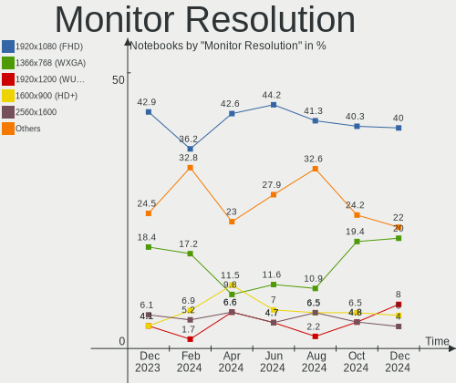

| Resolution         | Notebooks | Percent |
|--------------------|-----------|---------|
| 1920x1080 (FHD)    | 38        | 43.68%  |
| 1366x768 (WXGA)    | 18        | 20.69%  |
| 1600x900 (HD+)     | 7         | 8.05%   |
| 1440x900 (WXGA+)   | 4         | 4.6%    |
| 3840x2160 (4K)     | 3         | 3.45%   |
| 2560x1440 (QHD)    | 3         | 3.45%   |
| 800x1280           | 2         | 2.3%    |
| 3840x2400          | 2         | 2.3%    |
| 2560x1600          | 2         | 2.3%    |
| 1280x800 (WXGA)    | 2         | 2.3%    |
| 1280x1024 (SXGA)   | 2         | 2.3%    |
| 3440x1440          | 1         | 1.15%   |
| 2160x1440          | 1         | 1.15%   |
| 1680x1050 (WSXGA+) | 1         | 1.15%   |
| 1024x768 (XGA)     | 1         | 1.15%   |

Monitor Diagonal
----------------

Diagonal size in inches

| Inches | Notebooks | Percent |
|--------|-----------|---------|
| 15     | 37        | 40.66%  |
| 13     | 13        | 14.29%  |
| 17     | 12        | 13.19%  |
| 14     | 9         | 9.89%   |
| 23     | 4         | 4.4%    |
| 27     | 3         | 3.3%    |
| 19     | 2         | 2.2%    |
| 12     | 2         | 2.2%    |
| 11     | 2         | 2.2%    |
| 7      | 2         | 2.2%    |
| 86     | 1         | 1.1%    |
| 38     | 1         | 1.1%    |
| 34     | 1         | 1.1%    |
| 24     | 1         | 1.1%    |
| 22     | 1         | 1.1%    |

Monitor Width
-------------

Physical width

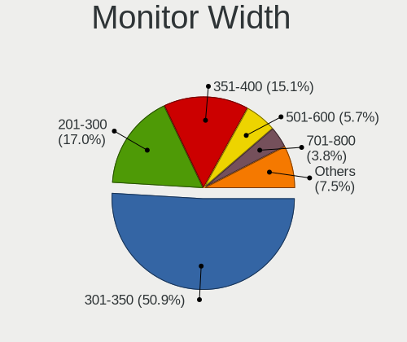

| Width in mm | Notebooks | Percent |
|-------------|-----------|---------|
| 301-350     | 45        | 50%     |
| 201-300     | 17        | 18.89%  |
| 351-400     | 14        | 15.56%  |
| 501-600     | 8         | 8.89%   |
| 1-100       | 2         | 2.22%   |
| 801-900     | 1         | 1.11%   |
| 701-800     | 1         | 1.11%   |
| 401-500     | 1         | 1.11%   |
| 1501-2000   | 1         | 1.11%   |

Aspect Ratio
------------

Proportional relationship between the width and the height

| Ratio | Notebooks | Percent |
|-------|-----------|---------|
| 16/9  | 66        | 78.57%  |
| 16/10 | 11        | 13.1%   |
| 5/4   | 2         | 2.38%   |
| 0.67  | 2         | 2.38%   |
| 4/3   | 1         | 1.19%   |
| 3/2   | 1         | 1.19%   |
| 21/9  | 1         | 1.19%   |

Monitor Area
------------

Area in inch

| Area in inch | Notebooks | Percent |
|----------------|-----------|---------|
| 101-110        | 36        | 40%     |
| 81-90          | 13        | 14.44%  |
| 121-130        | 11        | 12.22%  |
| 71-80          | 9         | 10%     |
| 201-250        | 5         | 5.56%   |
| 301-350        | 3         | 3.33%   |
| 61-70          | 2         | 2.22%   |
| 51-60          | 2         | 2.22%   |
| 1-40           | 2         | 2.22%   |
| 151-200        | 2         | 2.22%   |
| More than 1000 | 1         | 1.11%   |
| 351-500        | 1         | 1.11%   |
| 131-140        | 1         | 1.11%   |
| 501-1000       | 1         | 1.11%   |
| 91-100         | 1         | 1.11%   |

Pixel Density
-------------

Pixels per inch

| Density       | Notebooks | Percent |
|---------------|-----------|---------|
| 121-160       | 41        | 46.07%  |
| 101-120       | 20        | 22.47%  |
| 51-100        | 14        | 15.73%  |
| 161-240       | 10        | 11.24%  |
| More than 240 | 3         | 3.37%   |
| 1-50          | 1         | 1.12%   |

Multiple Monitors
-----------------

Total monitors connected

| Total | Notebooks | Percent |
|-------|-----------|---------|
| 1     | 69        | 84.15%  |
| 2     | 10        | 12.2%   |
| 3     | 2         | 2.44%   |
| 0     | 1         | 1.22%   |

Network
-------

Net Controller Vendor
---------------------

Controller vendors

| Vendor                                | Notebooks | Percent |
|---------------------------------------|-----------|---------|
| Intel                                 | 44        | 33.85%  |
| Realtek Semiconductor                 | 40        | 30.77%  |
| Qualcomm Atheros                      | 12        | 9.23%   |
| Broadcom                              | 7         | 5.38%   |
| Broadcom Limited                      | 6         | 4.62%   |
| ASIX Electronics                      | 5         | 3.85%   |
| Marvell Technology Group              | 3         | 2.31%   |
| TP-Link                               | 2         | 1.54%   |
| MediaTek                              | 2         | 1.54%   |
| DisplayLink                           | 2         | 1.54%   |
| Samsung Electronics                   | 1         | 0.77%   |
| Ralink Technology                     | 1         | 0.77%   |
| Ralink                                | 1         | 0.77%   |
| Nvidia                                | 1         | 0.77%   |
| Fibocom                               | 1         | 0.77%   |
| Dresden Elektronik                    | 1         | 0.77%   |
| 802.11g Adapter [Linksys WUSB54GC v3] | 1         | 0.77%   |

Net Controller Model
--------------------

Controller models

| Model                                                                          | Notebooks | Percent |
|--------------------------------------------------------------------------------|-----------|---------|
| Realtek RTL8111/8168/8411 PCI Express Gigabit Ethernet Controller              | 22        | 13.5%   |
| Realtek RTL8153 Gigabit Ethernet Adapter                                       | 6         | 3.68%   |
| Realtek RTL810xE PCI Express Fast Ethernet controller                          | 6         | 3.68%   |
| Intel Wi-Fi 6 AX200                                                            | 5         | 3.07%   |
| ASIX AX88179 Gigabit Ethernet                                                  | 5         | 3.07%   |
| Realtek RTL8821CE 802.11ac PCIe Wireless Network Adapter                       | 4         | 2.45%   |
| Qualcomm Atheros AR9285 Wireless Network Adapter (PCI-Express)                 | 4         | 2.45%   |
| Intel Wireless 7260                                                            | 4         | 2.45%   |
| Realtek RTL8822CE 802.11ac PCIe Wireless Network Adapter                       | 3         | 1.84%   |
| Intel Wireless 8265 / 8275                                                     | 3         | 1.84%   |
| Intel Wireless 7265                                                            | 3         | 1.84%   |
| Intel Wi-Fi 6 AX201                                                            | 3         | 1.84%   |
| Intel Ethernet Connection I217-LM                                              | 3         | 1.84%   |
| Intel Centrino Ultimate-N 6300                                                 | 3         | 1.84%   |
| Realtek Realtek Network controller                                             | 2         | 1.23%   |
| Qualcomm Atheros QCA9377 802.11ac Wireless Network Adapter                     | 2         | 1.23%   |
| Qualcomm Atheros QCA6174 802.11ac Wireless Network Adapter                     | 2         | 1.23%   |
| Marvell Group Yukon Optima 88E8059 [PCIe Gigabit Ethernet Controller with AVB] | 2         | 1.23%   |
| Intel Wireless-AC 9260                                                         | 2         | 1.23%   |
| Intel Wireless 8260                                                            | 2         | 1.23%   |
| Intel PRO/Wireless 4965 AG or AGN [Kedron] Network Connection                  | 2         | 1.23%   |
| Intel Gemini Lake PCH CNVi WiFi                                                | 2         | 1.23%   |
| Intel Ethernet Connection (6) I219-V                                           | 2         | 1.23%   |
| Intel Ethernet Connection (2) I219-LM                                          | 2         | 1.23%   |
| Intel Comet Lake PCH CNVi WiFi                                                 | 2         | 1.23%   |
| Intel Centrino Advanced-N 6235                                                 | 2         | 1.23%   |
| Intel Cannon Point-LP CNVi [Wireless-AC]                                       | 2         | 1.23%   |
| Intel Alder Lake-P PCH CNVi WiFi                                               | 2         | 1.23%   |
| Intel 82579LM Gigabit Network Connection (Lewisville)                          | 2         | 1.23%   |
| Broadcom Limited BCM4360 802.11ac Wireless Network Adapter                     | 2         | 1.23%   |
| Broadcom BCM43224 802.11a/b/g/n                                                | 2         | 1.23%   |
| TP-Link TL-WN823N v2/v3 [Realtek RTL8192EU]                                    | 1         | 0.61%   |
| TP-Link RTL8812AU Archer T4U 802.11ac                                          | 1         | 0.61%   |
| Samsung Galaxy series, misc. (tethering mode)                                  | 1         | 0.61%   |
| Realtek RTL8852AE 802.11ax PCIe Wireless Network Adapter                       | 1         | 0.61%   |
| Realtek RTL8821AE 802.11ac PCIe Wireless Network Adapter                       | 1         | 0.61%   |
| Realtek RTL8723BE PCIe Wireless Network Adapter                                | 1         | 0.61%   |
| Realtek RTL8723AE PCIe Wireless Network Adapter                                | 1         | 0.61%   |
| Realtek RTL8192CU 802.11n WLAN Adapter                                         | 1         | 0.61%   |
| Realtek RTL8188EE Wireless Network Adapter                                     | 1         | 0.61%   |

Wireless Vendor
---------------

Wireless vendors

| Vendor                                | Notebooks | Percent |
|---------------------------------------|-----------|---------|
| Intel                                 | 44        | 51.16%  |
| Realtek Semiconductor                 | 15        | 17.44%  |
| Qualcomm Atheros                      | 10        | 11.63%  |
| Broadcom                              | 6         | 6.98%   |
| Broadcom Limited                      | 3         | 3.49%   |
| TP-Link                               | 2         | 2.33%   |
| MediaTek                              | 2         | 2.33%   |
| Ralink Technology                     | 1         | 1.16%   |
| Ralink                                | 1         | 1.16%   |
| Fibocom                               | 1         | 1.16%   |
| 802.11g Adapter [Linksys WUSB54GC v3] | 1         | 1.16%   |

Wireless Model
--------------

Wireless models

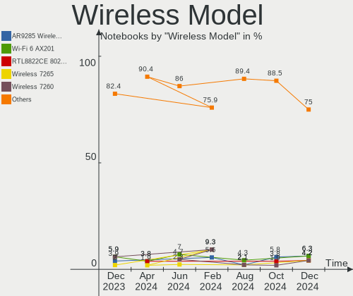

| Model                                                          | Notebooks | Percent |
|----------------------------------------------------------------|-----------|---------|
| Intel Wi-Fi 6 AX200                                            | 5         | 5.81%   |
| Realtek RTL8821CE 802.11ac PCIe Wireless Network Adapter       | 4         | 4.65%   |
| Qualcomm Atheros AR9285 Wireless Network Adapter (PCI-Express) | 4         | 4.65%   |
| Intel Wireless 7260                                            | 4         | 4.65%   |
| Realtek RTL8822CE 802.11ac PCIe Wireless Network Adapter       | 3         | 3.49%   |
| Intel Wireless 8265 / 8275                                     | 3         | 3.49%   |
| Intel Wireless 7265                                            | 3         | 3.49%   |
| Intel Wi-Fi 6 AX201                                            | 3         | 3.49%   |
| Intel Centrino Ultimate-N 6300                                 | 3         | 3.49%   |
| Realtek Realtek Network controller                             | 2         | 2.33%   |
| Qualcomm Atheros QCA9377 802.11ac Wireless Network Adapter     | 2         | 2.33%   |
| Qualcomm Atheros QCA6174 802.11ac Wireless Network Adapter     | 2         | 2.33%   |
| Intel Wireless-AC 9260                                         | 2         | 2.33%   |
| Intel Wireless 8260                                            | 2         | 2.33%   |
| Intel PRO/Wireless 4965 AG or AGN [Kedron] Network Connection  | 2         | 2.33%   |
| Intel Gemini Lake PCH CNVi WiFi                                | 2         | 2.33%   |
| Intel Comet Lake PCH CNVi WiFi                                 | 2         | 2.33%   |
| Intel Centrino Advanced-N 6235                                 | 2         | 2.33%   |
| Intel Cannon Point-LP CNVi [Wireless-AC]                       | 2         | 2.33%   |
| Intel Alder Lake-P PCH CNVi WiFi                               | 2         | 2.33%   |
| Broadcom Limited BCM4360 802.11ac Wireless Network Adapter     | 2         | 2.33%   |
| Broadcom BCM43224 802.11a/b/g/n                                | 2         | 2.33%   |
| TP-Link TL-WN823N v2/v3 [Realtek RTL8192EU]                    | 1         | 1.16%   |
| TP-Link RTL8812AU Archer T4U 802.11ac                          | 1         | 1.16%   |
| Realtek RTL8852AE 802.11ax PCIe Wireless Network Adapter       | 1         | 1.16%   |
| Realtek RTL8821AE 802.11ac PCIe Wireless Network Adapter       | 1         | 1.16%   |
| Realtek RTL8723BE PCIe Wireless Network Adapter                | 1         | 1.16%   |
| Realtek RTL8723AE PCIe Wireless Network Adapter                | 1         | 1.16%   |
| Realtek RTL8192CU 802.11n WLAN Adapter                         | 1         | 1.16%   |
| Realtek RTL8188EE Wireless Network Adapter                     | 1         | 1.16%   |
| Ralink RT2870/RT3070 Wireless Adapter                          | 1         | 1.16%   |
| Ralink RT3290 Wireless 802.11n 1T/1R PCIe                      | 1         | 1.16%   |
| Qualcomm Atheros QCA9565 / AR9565 Wireless Network Adapter     | 1         | 1.16%   |
| Qualcomm Atheros AR9287 Wireless Network Adapter (PCI-Express) | 1         | 1.16%   |
| MediaTek MT7921 802.11ax PCI Express Wireless Network Adapter  | 1         | 1.16%   |
| MediaTek MT7630e 802.11bgn Wireless Network Adapter            | 1         | 1.16%   |
| Intel Wireless 3160                                            | 1         | 1.16%   |
| Intel WiFi Link 5100                                           | 1         | 1.16%   |
| Intel Wi-Fi 6 AX210/AX211/AX411 160MHz                         | 1         | 1.16%   |
| Intel PRO/Wireless 3945ABG [Golan] Network Connection          | 1         | 1.16%   |

Ethernet Vendor
---------------

Ethernet vendors

| Vendor                   | Notebooks | Percent |
|--------------------------|-----------|---------|
| Realtek Semiconductor    | 34        | 45.95%  |
| Intel                    | 18        | 24.32%  |
| ASIX Electronics         | 5         | 6.76%   |
| Qualcomm Atheros         | 4         | 5.41%   |
| Marvell Technology Group | 3         | 4.05%   |
| Broadcom Limited         | 3         | 4.05%   |
| Broadcom                 | 3         | 4.05%   |
| DisplayLink              | 2         | 2.7%    |
| Samsung Electronics      | 1         | 1.35%   |
| Nvidia                   | 1         | 1.35%   |

Ethernet Model
--------------

Ethernet models

| Model                                                                          | Notebooks | Percent |
|--------------------------------------------------------------------------------|-----------|---------|
| Realtek RTL8111/8168/8411 PCI Express Gigabit Ethernet Controller              | 22        | 28.95%  |
| Realtek RTL8153 Gigabit Ethernet Adapter                                       | 6         | 7.89%   |
| Realtek RTL810xE PCI Express Fast Ethernet controller                          | 6         | 7.89%   |
| ASIX AX88179 Gigabit Ethernet                                                  | 5         | 6.58%   |
| Intel Ethernet Connection I217-LM                                              | 3         | 3.95%   |
| Marvell Group Yukon Optima 88E8059 [PCIe Gigabit Ethernet Controller with AVB] | 2         | 2.63%   |
| Intel Ethernet Connection (6) I219-V                                           | 2         | 2.63%   |
| Intel Ethernet Connection (2) I219-LM                                          | 2         | 2.63%   |
| Intel 82579LM Gigabit Network Connection (Lewisville)                          | 2         | 2.63%   |
| Samsung Galaxy series, misc. (tethering mode)                                  | 1         | 1.32%   |
| Realtek RTL8152 Fast Ethernet Adapter                                          | 1         | 1.32%   |
| Realtek RTL8125 2.5GbE Controller                                              | 1         | 1.32%   |
| Qualcomm Atheros Killer E220x Gigabit Ethernet Controller                      | 1         | 1.32%   |
| Qualcomm Atheros AR8152 v2.0 Fast Ethernet                                     | 1         | 1.32%   |
| Qualcomm Atheros AR8151 v1.0 Gigabit Ethernet                                  | 1         | 1.32%   |
| Qualcomm Atheros AR8131 Gigabit Ethernet                                       | 1         | 1.32%   |
| Nvidia MCP79 Ethernet                                                          | 1         | 1.32%   |
| Marvell Group 88E8071 PCI-E Gigabit Ethernet Controller                        | 1         | 1.32%   |
| Intel Ethernet Connection I219-V                                               | 1         | 1.32%   |
| Intel Ethernet Connection I218-LM                                              | 1         | 1.32%   |
| Intel Ethernet Connection I217-V                                               | 1         | 1.32%   |
| Intel Ethernet Connection (6) I219-LM                                          | 1         | 1.32%   |
| Intel Ethernet Connection (4) I219-V                                           | 1         | 1.32%   |
| Intel Ethernet Connection (4) I219-LM                                          | 1         | 1.32%   |
| Intel Ethernet Connection (16) I219-V                                          | 1         | 1.32%   |
| Intel Ethernet Connection (16) I219-LM                                         | 1         | 1.32%   |
| Intel Ethernet Connection (13) I219-LM                                         | 1         | 1.32%   |
| DisplayLink USB3.0 5K Graphic Docking                                          | 1         | 1.32%   |
| DisplayLink Dell Universal Dock D6000                                          | 1         | 1.32%   |
| Broadcom NetXtreme BCM5761e Gigabit Ethernet PCIe                              | 1         | 1.32%   |
| Broadcom NetXtreme BCM5761 Gigabit Ethernet PCIe                               | 1         | 1.32%   |
| Broadcom NetLink BCM5906M Fast Ethernet PCI Express                            | 1         | 1.32%   |
| Broadcom Limited NetXtreme BCM5788 Gigabit Ethernet                            | 1         | 1.32%   |
| Broadcom Limited NetLink BCM5787M Gigabit Ethernet PCI Express                 | 1         | 1.32%   |
| Broadcom Limited NetLink BCM57780 Gigabit Ethernet PCIe                        | 1         | 1.32%   |

Net Controller Kind
-------------------

Ethernet, WiFi or modem

| Kind     | Notebooks | Percent |
|----------|-----------|---------|
| WiFi     | 80        | 53.69%  |
| Ethernet | 68        | 45.64%  |
| Modem    | 1         | 0.67%   |

Used Controller
---------------

Currently used network controller

| Kind     | Notebooks | Percent |
|----------|-----------|---------|
| WiFi     | 65        | 74.71%  |
| Ethernet | 22        | 25.29%  |

NICs
----

Total network controllers on board

| Total | Notebooks | Percent |
|-------|-----------|---------|
| 2     | 59        | 71.95%  |
| 1     | 21        | 25.61%  |
| 3     | 1         | 1.22%   |
| 0     | 1         | 1.22%   |

IPv6
----

IPv6 vs IPv4

| Used | Notebooks | Percent |
|------|-----------|---------|
| No   | 50        | 60.98%  |
| Yes  | 32        | 39.02%  |

Bluetooth
---------

Bluetooth Vendor
----------------

Controller vendors

| Vendor                          | Notebooks | Percent |
|---------------------------------|-----------|---------|
| Intel                           | 36        | 52.17%  |
| Realtek Semiconductor           | 9         | 13.04%  |
| Lite-On Technology              | 4         | 5.8%    |
| Apple                           | 4         | 5.8%    |
| IMC Networks                    | 3         | 4.35%   |
| Hewlett-Packard                 | 2         | 2.9%    |
| Foxconn / Hon Hai               | 2         | 2.9%    |
| Dell                            | 2         | 2.9%    |
| Cambridge Silicon Radio         | 2         | 2.9%    |
| Broadcom                        | 2         | 2.9%    |
| Toshiba                         | 1         | 1.45%   |
| Ralink                          | 1         | 1.45%   |
| Qualcomm Atheros Communications | 1         | 1.45%   |

Bluetooth Model
---------------

Controller models

| Model                                                                               | Notebooks | Percent |
|-------------------------------------------------------------------------------------|-----------|---------|
| Intel Bluetooth wireless interface                                                  | 13        | 18.84%  |
| Intel Bluetooth Device                                                              | 8         | 11.59%  |
| Realtek Bluetooth Radio                                                             | 5         | 7.25%   |
| Intel AX200 Bluetooth                                                               | 5         | 7.25%   |
| Intel Bluetooth 9460/9560 Jefferson Peak (JfP)                                      | 4         | 5.8%    |
| Lite-On Bluetooth Device                                                            | 3         | 4.35%   |
| Intel Centrino Bluetooth Wireless Transceiver                                       | 3         | 4.35%   |
| IMC Networks Bluetooth Radio                                                        | 3         | 4.35%   |
| Realtek  Bluetooth 4.2 Adapter                                                      | 2         | 2.9%    |
| Intel Wireless-AC 9260 Bluetooth Adapter                                            | 2         | 2.9%    |
| Dell BCM20702A0 Bluetooth Module                                                    | 2         | 2.9%    |
| Cambridge Silicon Radio Bluetooth Dongle (HCI mode)                                 | 2         | 2.9%    |
| Apple Bluetooth USB Host Controller                                                 | 2         | 2.9%    |
| Toshiba RT Bluetooth Radio                                                          | 1         | 1.45%   |
| Realtek RTL8821A Bluetooth                                                          | 1         | 1.45%   |
| Realtek RTL8723B Bluetooth                                                          | 1         | 1.45%   |
| Ralink RT3290 Bluetooth                                                             | 1         | 1.45%   |
| Qualcomm Atheros AR3012 Bluetooth                                                   | 1         | 1.45%   |
| Lite-On Wireless_Device                                                             | 1         | 1.45%   |
| Intel AX210 Bluetooth                                                               | 1         | 1.45%   |
| HP Broadcom 2070 Bluetooth Combo                                                    | 1         | 1.45%   |
| HP Bluetooth 2.0 Interface [Broadcom BCM2045]                                       | 1         | 1.45%   |
| Foxconn / Hon Hai Foxconn T77H114 BCM2070 [Single-Chip Bluetooth 2.1 + EDR Adapter] | 1         | 1.45%   |
| Foxconn / Hon Hai Acer Bluetooth module                                             | 1         | 1.45%   |
| Broadcom BCM20702A0                                                                 | 1         | 1.45%   |
| Broadcom BCM2045 Bluetooth                                                          | 1         | 1.45%   |
| Apple Built-in Bluetooth 2.0+EDR HCI                                                | 1         | 1.45%   |
| Apple Bluetooth Host Controller                                                     | 1         | 1.45%   |

Sound
-----

Sound Vendor
------------

Sound card vendors

| Vendor          | Notebooks | Percent |
|-----------------|-----------|---------|
| Intel           | 66        | 67.35%  |
| AMD             | 18        | 18.37%  |
| Nvidia          | 8         | 8.16%   |
| Veho            | 1         | 1.02%   |
| Plantronics     | 1         | 1.02%   |
| Nreal           | 1         | 1.02%   |
| Logitech        | 1         | 1.02%   |
| Hewlett-Packard | 1         | 1.02%   |
| Unknown         | 1         | 1.02%   |

Sound Model
-----------

Sound card models

| Model                                                                                             | Notebooks | Percent |
|---------------------------------------------------------------------------------------------------|-----------|---------|
| AMD Family 17h/19h HD Audio Controller                                                            | 9         | 7.26%   |
| Intel 7 Series/C216 Chipset Family High Definition Audio Controller                               | 8         | 6.45%   |
| Intel Sunrise Point-LP HD Audio                                                                   | 7         | 5.65%   |
| Intel 8 Series/C220 Series Chipset High Definition Audio Controller                               | 7         | 5.65%   |
| Intel Xeon E3-1200 v3/4th Gen Core Processor HD Audio Controller                                  | 6         | 4.84%   |
| Intel Wildcat Point-LP High Definition Audio Controller                                           | 6         | 4.84%   |
| Intel Broadwell-U Audio Controller                                                                | 6         | 4.84%   |
| AMD Renoir Radeon High Definition Audio Controller                                                | 6         | 4.84%   |
| Intel Tiger Lake-LP Smart Sound Technology Audio Controller                                       | 5         | 4.03%   |
| Intel Alder Lake PCH-P High Definition Audio Controller                                           | 4         | 3.23%   |
| Intel 5 Series/3400 Series Chipset High Definition Audio                                          | 4         | 3.23%   |
| Intel 82801I (ICH9 Family) HD Audio Controller                                                    | 3         | 2.42%   |
| AMD Raven/Raven2/Fenghuang HDMI/DP Audio Controller                                               | 3         | 2.42%   |
| Nvidia GM107 High Definition Audio Controller [GeForce 940MX]                                     | 2         | 1.61%   |
| Intel NM10/ICH7 Family High Definition Audio Controller                                           | 2         | 1.61%   |
| Intel Ice Lake-LP Smart Sound Technology Audio Controller                                         | 2         | 1.61%   |
| Intel Haswell-ULT HD Audio Controller                                                             | 2         | 1.61%   |
| Intel Comet Lake PCH cAVS                                                                         | 2         | 1.61%   |
| Intel CM238 HD Audio Controller                                                                   | 2         | 1.61%   |
| Intel Celeron/Pentium Silver Processor High Definition Audio                                      | 2         | 1.61%   |
| Intel Cannon Point-LP High Definition Audio Controller                                            | 2         | 1.61%   |
| Intel 8 Series HD Audio Controller                                                                | 2         | 1.61%   |
| Intel 6 Series/C200 Series Chipset Family High Definition Audio Controller                        | 2         | 1.61%   |
| Intel 100 Series/C230 Series Chipset Family HD Audio Controller                                   | 2         | 1.61%   |
| AMD Rembrandt Radeon High Definition Audio Controller                                             | 2         | 1.61%   |
| AMD Kabini HDMI/DP Audio                                                                          | 2         | 1.61%   |
| AMD Cedar HDMI Audio [Radeon HD 5400/6300/7300 Series]                                            | 2         | 1.61%   |
| Veho Wireless Audio                                                                               | 1         | 0.81%   |
| Plantronics Blackwire 3220 Series                                                                 | 1         | 0.81%   |
| Nvidia TU116 High Definition Audio Controller                                                     | 1         | 0.81%   |
| Nvidia TU107 GeForce GTX 1650 High Definition Audio Controller                                    | 1         | 0.81%   |
| Nvidia MCP79 High Definition Audio                                                                | 1         | 0.81%   |
| Nvidia GK208 HDMI/DP Audio Controller                                                             | 1         | 0.81%   |
| Nvidia GK107 HDMI Audio Controller                                                                | 1         | 0.81%   |
| Nvidia GA106 High Definition Audio Controller                                                     | 1         | 0.81%   |
| Nreal Air                                                                                         | 1         | 0.81%   |
| Logitech H600 [Wireless Headset]                                                                  | 1         | 0.81%   |
| Intel Comet Lake PCH-LP cAVS                                                                      | 1         | 0.81%   |
| Intel Cannon Lake PCH cAVS                                                                        | 1         | 0.81%   |
| Intel Atom/Celeron/Pentium Processor x5-E8000/J3xxx/N3xxx Series High Definition Audio Controller | 1         | 0.81%   |

Memory
------

Memory Vendor
-------------

Memory module vendors

| Vendor              | Notebooks | Percent |
|---------------------|-----------|---------|
| Samsung Electronics | 18        | 32.73%  |
| SK hynix            | 9         | 16.36%  |
| Micron Technology   | 9         | 16.36%  |
| Kingston            | 6         | 10.91%  |
| Unknown             | 5         | 9.09%   |
| Elpida              | 2         | 3.64%   |
| Wilk                | 1         | 1.82%   |
| Ramaxel Technology  | 1         | 1.82%   |
| Nanya Technology    | 1         | 1.82%   |
| Lexar               | 1         | 1.82%   |
| G.Skill             | 1         | 1.82%   |
| Crucial             | 1         | 1.82%   |

Memory Model
------------

Memory module models

| Model                                                            | Notebooks | Percent |
|------------------------------------------------------------------|-----------|---------|
| Samsung RAM M471A1K43DB1-CWE 8GB SODIMM DDR4 3200MT/s            | 3         | 5.26%   |
| Micron RAM 8ATF1G64HZ-3G2R1 8192MB SODIMM DDR4 3200MT/s          | 3         | 5.26%   |
| Unknown RAM Module 2GB SODIMM DDR2 667MT/s                       | 2         | 3.51%   |
| Unknown RAM Module 2GB Row Of Chips LPDDR4 4267MT/s              | 2         | 3.51%   |
| SK hynix RAM H9HCNNNCPMMLXR-NEE 8GB Row Of Chips LPDDR4 4266MT/s | 2         | 3.51%   |
| Elpida RAM EBJ41UF8BCS0-DJ-F 4GB SODIMM DDR3 1334MT/s            | 2         | 3.51%   |
| Wilk RAM GR3200S464L22S/16G 16GB SODIMM DDR4 3200MT/s            | 1         | 1.75%   |
| Unknown RAM Module 2GB SODIMM 800MT/s                            | 1         | 1.75%   |
| SK hynix RAM Module 4GB SODIMM DDR3 1600MT/s                     | 1         | 1.75%   |
| SK hynix RAM HYMP512S64CP8-Y5 1GB SODIMM DDR2 667MT/s            | 1         | 1.75%   |
| SK hynix RAM HMT451S6AFR8A-PB 4GB SODIMM DDR3 1600MT/s           | 1         | 1.75%   |
| SK hynix RAM HMT41GS6AFR8A-PB 8GB SODIMM DDR3 1600MT/s           | 1         | 1.75%   |
| SK hynix RAM HMAB2GS6CMR6N-XN 16GB SODIMM DDR4 3200MT/s          | 1         | 1.75%   |
| SK hynix RAM HMA81GS6JJR8N-VK 8GB SODIMM DDR4 2667MT/s           | 1         | 1.75%   |
| SK hynix RAM HMA41GS6AFR8N-TF 8GB SODIMM DDR4 2667MT/s           | 1         | 1.75%   |
| Samsung RAM Module 4GB SODIMM DDR3 1600MT/s                      | 1         | 1.75%   |
| Samsung RAM Module 4096MB SODIMM DDR3 1600MT/s                   | 1         | 1.75%   |
| Samsung RAM M471B5673FH0-CH9 2GB SODIMM DDR3 1334MT/s            | 1         | 1.75%   |
| Samsung RAM M471B5273DH0-CK0 4GB SODIMM DDR3 1600MT/s            | 1         | 1.75%   |
| Samsung RAM M471B5273CH0-YK0 4096MB SODIMM DDR3 1600MT/s         | 1         | 1.75%   |
| Samsung RAM M471B5273CH0-CK0 4096MB SODIMM DDR3 1600MT/s         | 1         | 1.75%   |
| Samsung RAM M471B5173QH0-YK0 4GB SODIMM DDR3 1600MT/s            | 1         | 1.75%   |
| Samsung RAM M471B5173EB0-YK0 4GB SODIMM DDR3 1600MT/s            | 1         | 1.75%   |
| Samsung RAM M471B1G73QH0-YK0 8GB SODIMM DDR3 1867MT/s            | 1         | 1.75%   |
| Samsung RAM M471A5244CB0-CWE 4GB SODIMM DDR4 3200MT/s            | 1         | 1.75%   |
| Samsung RAM M471A5244BB0-CPB 4GB SODIMM DDR4 2400MT/s            | 1         | 1.75%   |
| Samsung RAM M471A4G43MB1-CTD 32GB SODIMM DDR4 2667MT/s           | 1         | 1.75%   |
| Samsung RAM M471A2K43DB1-CWE 16GB SODIMM DDR4 3200MT/s           | 1         | 1.75%   |
| Samsung RAM M471A1K43DB1-CTD 8GB SODIMM DDR4 2667MT/s            | 1         | 1.75%   |
| Samsung RAM M471A1K43BB1-CTD 8GB SODIMM DDR4 2667MT/s            | 1         | 1.75%   |
| Samsung RAM K4E8E324EB-EGCF 2GB LPDDR3 1867MT/s                  | 1         | 1.75%   |
| Ramaxel RAM RMSA3270ME86H9F-2666 4GB Row Of Chips DDR4 2400MT/s  | 1         | 1.75%   |
| Nanya RAM NT4GC64B88B0NS-DI 4GB SODIMM DDR3 1600MT/s             | 1         | 1.75%   |
| Micron RAM Module 8GB SODIMM DDR4 2400MT/s                       | 1         | 1.75%   |
| Micron RAM 8KTF51264HZ-1G6E1 4GB SODIMM DDR3 1600MT/s            | 1         | 1.75%   |
| Micron RAM 4ATS1G64HZ-2G6E1 8GB SODIMM DDR4 2667MT/s             | 1         | 1.75%   |
| Micron RAM 4ATF51264HZ-3G2J1 4GB SODIMM DDR4 3200MT/s            | 1         | 1.75%   |
| Micron RAM 4ATF51264HZ-2G6E1 4GB SODIMM DDR4 2667MT/s            | 1         | 1.75%   |
| Micron RAM 4ATF1G64HZ-3G2E2 8GB SODIMM DDR4 3200MT/s             | 1         | 1.75%   |
| Lexar RAM LD4AS016G-3200ST 16GB SODIMM DDR4 1200MT/s             | 1         | 1.75%   |

Memory Kind
-----------

Memory module kinds

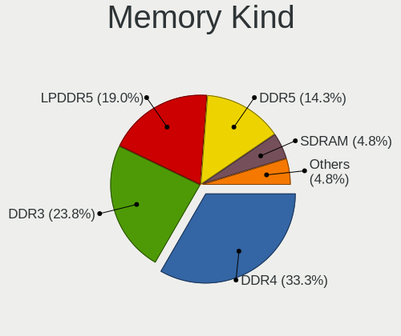

| Kind    | Notebooks | Percent |
|---------|-----------|---------|
| DDR4    | 21        | 43.75%  |
| DDR3    | 17        | 35.42%  |
| LPDDR4  | 4         | 8.33%   |
| DDR2    | 3         | 6.25%   |
| LPDDR3  | 1         | 2.08%   |
| DDR5    | 1         | 2.08%   |
| Unknown | 1         | 2.08%   |

Memory Form Factor
------------------

Physical design of the memory module

| Name         | Notebooks | Percent |
|--------------|-----------|---------|
| SODIMM       | 43        | 87.76%  |
| Row Of Chips | 5         | 10.2%   |
| Unknown      | 1         | 2.04%   |

Memory Size
-----------

Memory module size

| Size  | Notebooks | Percent |
|-------|-----------|---------|
| 8192  | 22        | 43.14%  |
| 4096  | 14        | 27.45%  |
| 2048  | 7         | 13.73%  |
| 16384 | 5         | 9.8%    |
| 32768 | 2         | 3.92%   |
| 1024  | 1         | 1.96%   |

Memory Speed
------------

Memory module speed

| Speed | Notebooks | Percent |
|-------|-----------|---------|
| 1600  | 13        | 25.49%  |
| 3200  | 11        | 21.57%  |
| 2667  | 7         | 13.73%  |
| 2400  | 5         | 9.8%    |
| 1334  | 3         | 5.88%   |
| 667   | 3         | 5.88%   |
| 4267  | 2         | 3.92%   |
| 4266  | 2         | 3.92%   |
| 4800  | 1         | 1.96%   |
| 1867  | 1         | 1.96%   |
| 1200  | 1         | 1.96%   |
| 800   | 1         | 1.96%   |
| 533   | 1         | 1.96%   |

Printers & scanners
-------------------

Printer Vendor
--------------

Printer device vendors

Zero info for selected period =(

Printer Model
-------------

Printer device models

Zero info for selected period =(

Scanner Vendor
--------------

Scanner device vendors

Zero info for selected period =(

Scanner Model
-------------

Scanner device models

Zero info for selected period =(

Camera
------

Camera Vendor
-------------

Camera device vendors

| Vendor                                 | Notebooks | Percent |
|----------------------------------------|-----------|---------|
| Chicony Electronics                    | 20        | 29.85%  |
| Microdia                               | 7         | 10.45%  |
| IMC Networks                           | 5         | 7.46%   |
| Cheng Uei Precision Industry (Foxlink) | 5         | 7.46%   |
| Sunplus Innovation Technology          | 4         | 5.97%   |
| Realtek Semiconductor                  | 4         | 5.97%   |
| Quanta                                 | 4         | 5.97%   |
| Acer                                   | 4         | 5.97%   |
| Suyin                                  | 2         | 2.99%   |
| Luxvisions Innotech Limited            | 2         | 2.99%   |
| Lite-On Technology                     | 2         | 2.99%   |
| Apple                                  | 2         | 2.99%   |
| Syntek                                 | 1         | 1.49%   |
| SunplusIT                              | 1         | 1.49%   |
| Primax Electronics                     | 1         | 1.49%   |
| Intel                                  | 1         | 1.49%   |
| Genesys Logic                          | 1         | 1.49%   |
| Alcor Micro                            | 1         | 1.49%   |

Camera Model
------------

Camera device models

| Model                                                | Notebooks | Percent |
|------------------------------------------------------|-----------|---------|
| IMC Networks Integrated Camera                       | 3         | 4.48%   |
| Chicony Integrated Camera                            | 3         | 4.48%   |
| Chicony HD WebCam                                    | 3         | 4.48%   |
| Sunplus Integrated_Webcam_HD                         | 2         | 2.99%   |
| Quanta HD User Facing                                | 2         | 2.99%   |
| Microdia Integrated_Webcam_HD                        | 2         | 2.99%   |
| Microdia Dell Integrated HD Webcam                   | 2         | 2.99%   |
| Luxvisions Innotech Limited HP Wide Vision HD Camera | 2         | 2.99%   |
| Chicony HP HD Webcam                                 | 2         | 2.99%   |
| Chicony 1.3M Webcam                                  | 2         | 2.99%   |
| Syntek Integrated Camera                             | 1         | 1.49%   |
| Suyin HP Truevision HD                               | 1         | 1.49%   |
| Suyin Acer/HP Integrated Webcam [CN0314]             | 1         | 1.49%   |
| SunplusIT 720p HD Camera                             | 1         | 1.49%   |
| Sunplus Integrated_Webcam_FHD                        | 1         | 1.49%   |
| Sunplus FHD Camera Microphone                        | 1         | 1.49%   |
| Realtek USB2.0 HD UVC WebCam                         | 1         | 1.49%   |
| Realtek Integrated_Webcam_HD                         | 1         | 1.49%   |
| Realtek HD WebCam                                    | 1         | 1.49%   |
| Realtek EasyCamera                                   | 1         | 1.49%   |
| Quanta HP HD Camera                                  | 1         | 1.49%   |
| Quanta ACER HD User Facing                           | 1         | 1.49%   |
| Primax HP HD Webcam [Fixed]                          | 1         | 1.49%   |
| Microdia USB 2.0 Camera                              | 1         | 1.49%   |
| Microdia Integrated Webcam                           | 1         | 1.49%   |
| Microdia HP Integrated Webcam                        | 1         | 1.49%   |
| Lite-On HP HD Webcam                                 | 1         | 1.49%   |
| Lite-On HP HD Camera                                 | 1         | 1.49%   |
| Intel RealSense 3D Camera (Front F200)               | 1         | 1.49%   |
| IMC Networks USB2.0 HD UVC WebCam                    | 1         | 1.49%   |
| IMC Networks Integrated Webcam                       | 1         | 1.49%   |
| Genesys Logic Camera                                 | 1         | 1.49%   |
| Chicony USB2.0 Camera                                | 1         | 1.49%   |
| Chicony ThinkPad T490 Webcam                         | 1         | 1.49%   |
| Chicony Lenovo EasyCamera                            | 1         | 1.49%   |
| Chicony HP Wide Vision HD Camera                     | 1         | 1.49%   |
| Chicony HP Truevision HD                             | 1         | 1.49%   |
| Chicony HP HD Webcam [Fixed]                         | 1         | 1.49%   |
| Chicony HP HD Camera                                 | 1         | 1.49%   |
| Chicony HD User Facing                               | 1         | 1.49%   |

Security
--------

Fingerprint Vendor
------------------

Fingerprint sensor vendors

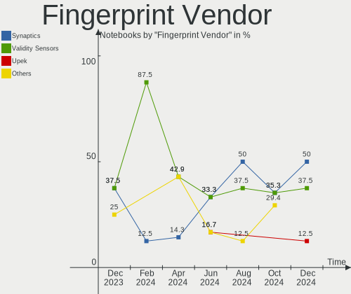

| Vendor                     | Notebooks | Percent |
|----------------------------|-----------|---------|
| Validity Sensors           | 8         | 40%     |
| Synaptics                  | 4         | 20%     |
| Shenzhen Goodix Technology | 3         | 15%     |
| AuthenTec                  | 3         | 15%     |
| Elan Microelectronics      | 2         | 10%     |

Fingerprint Model
-----------------

Fingerprint sensor models

| Model                                                      | Notebooks | Percent |
|------------------------------------------------------------|-----------|---------|
| Synaptics Prometheus MIS Touch Fingerprint Reader          | 3         | 15%     |
| Validity Sensors VFS5011 Fingerprint Reader                | 2         | 10%     |
| Validity Sensors VFS495 Fingerprint Reader                 | 2         | 10%     |
| Shenzhen Goodix FingerPrint                                | 2         | 10%     |
| Elan ELAN:ARM-M4                                           | 2         | 10%     |
| AuthenTec AES2501 Fingerprint Sensor                       | 2         | 10%     |
| Validity Sensors VFS491                                    | 1         | 5%      |
| Validity Sensors VFS471 Fingerprint Reader                 | 1         | 5%      |
| Validity Sensors VFS 5011 fingerprint sensor               | 1         | 5%      |
| Validity Sensors Synaptics WBDI                            | 1         | 5%      |
| Synaptics  VFS7552 Touch Fingerprint Sensor with PurePrint | 1         | 5%      |
| Shenzhen Goodix  Fingerprint Device                        | 1         | 5%      |
| AuthenTec AES2810                                          | 1         | 5%      |

Chipcard Vendor
---------------

Chipcard module vendors

| Vendor                    | Notebooks | Percent |
|---------------------------|-----------|---------|
| Alcor Micro               | 5         | 62.5%   |
| Broadcom                  | 2         | 25%     |
| Fujitsu Siemens Computers | 1         | 12.5%   |

Chipcard Model
--------------

Chipcard module models

| Model                                          | Notebooks | Percent |
|------------------------------------------------|-----------|---------|
| Alcor Micro AU9540 Smartcard Reader            | 5         | 62.5%   |
| Fujitsu Siemens Computers Keyboard KB SCR      | 1         | 12.5%   |
| Broadcom BCM5880 Secure Applications Processor | 1         | 12.5%   |
| Broadcom 58200                                 | 1         | 12.5%   |

Unsupported
-----------

Unsupported Devices
-------------------

Total unsupported devices on board

| Total | Notebooks | Percent |
|-------|-----------|---------|
| 0     | 40        | 48.78%  |
| 1     | 29        | 35.37%  |
| 2     | 10        | 12.2%   |
| 3     | 2         | 2.44%   |
| 4     | 1         | 1.22%   |

Unsupported Device Types
------------------------

Types of unsupported devices

| Type                     | Notebooks | Percent |
|--------------------------|-----------|---------|
| Fingerprint reader       | 19        | 34.55%  |
| Graphics card            | 15        | 27.27%  |
| Chipcard                 | 7         | 12.73%  |
| Net/wireless             | 4         | 7.27%   |
| Camera                   | 3         | 5.45%   |
| Sound                    | 2         | 3.64%   |
| Communication controller | 2         | 3.64%   |
| Multimedia controller    | 1         | 1.82%   |
| Flash memory             | 1         | 1.82%   |
| Bluetooth                | 1         | 1.82%   |

