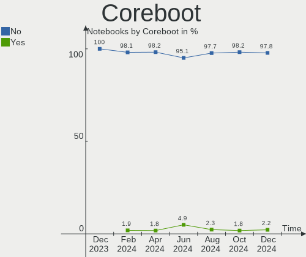
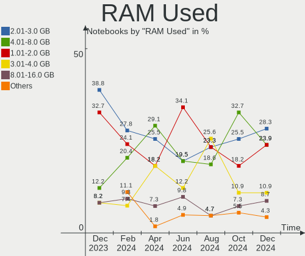
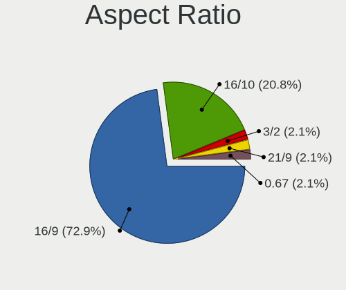
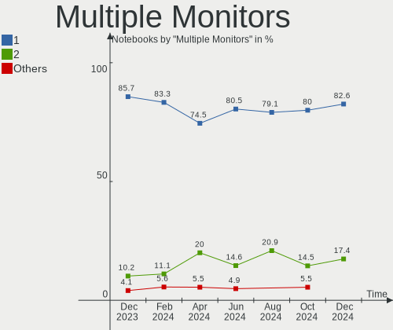
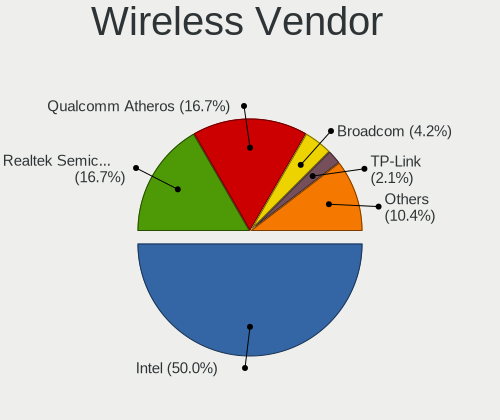
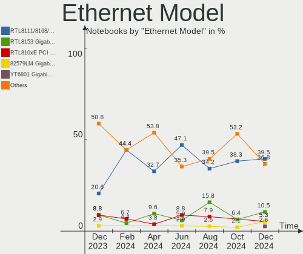
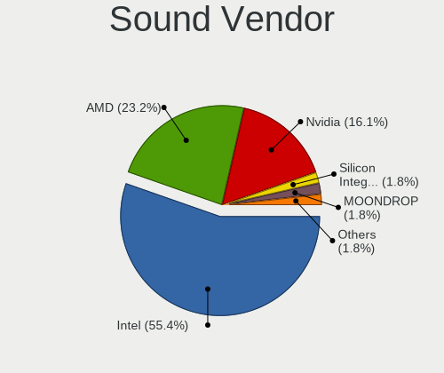
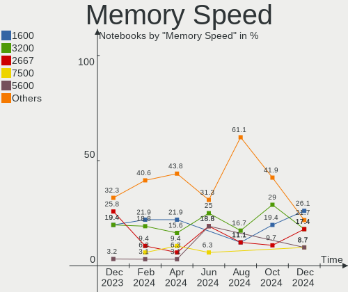

Linux in Netherlands - Hardware Trends (Notebooks)
--------------------------------------------------

A project to identify most popular hardware characteristics and track their change
over time based on data collected by Linux users at https://Linux-Hardware.org.

Anyone can contribute to this report by the [hw-probe](https://github.com/linuxhw/hw-probe) tool:

    sudo -E hw-probe -all -upload

Period: Dec, 2024.

Contents
--------

* [ System ](#system)
  - [ OS                       ](#os)
  - [ OS Family                ](#os-family)
  - [ Kernel                   ](#kernel)
  - [ Kernel Family            ](#kernel-family)
  - [ Kernel Major Ver.        ](#kernel-major-ver)
  - [ Arch                     ](#arch)
  - [ DE                       ](#de)
  - [ Display Server           ](#display-server)
  - [ Display Manager          ](#display-manager)
  - [ OS Lang                  ](#os-lang)
  - [ Boot Mode                ](#boot-mode)
  - [ Filesystem               ](#filesystem)
  - [ Part. scheme             ](#part-scheme)
  - [ Dual Boot with Linux/BSD ](#dual-boot-with-linuxbsd)
  - [ Dual Boot (Win)          ](#dual-boot-win)

* [ Board ](#board)
  - [ Vendor                   ](#vendor)
  - [ Model                    ](#model)
  - [ Model Family             ](#model-family)
  - [ MFG Year                 ](#mfg-year)
  - [ Form Factor              ](#form-factor)
  - [ Secure Boot              ](#secure-boot)
  - [ Coreboot                 ](#coreboot)
  - [ RAM Size                 ](#ram-size)
  - [ RAM Used                 ](#ram-used)
  - [ Total Drives             ](#total-drives)
  - [ Has CD-ROM               ](#has-cd-rom)
  - [ Has Ethernet             ](#has-ethernet)
  - [ Has WiFi                 ](#has-wifi)
  - [ Has Bluetooth            ](#has-bluetooth)

* [ Location ](#location)
  - [ Country                  ](#country)
  - [ City                     ](#city)

* [ Drives ](#drives)
  - [ Drive Vendor             ](#drive-vendor)
  - [ Drive Model              ](#drive-model)
  - [ HDD Vendor               ](#hdd-vendor)
  - [ SSD Vendor               ](#ssd-vendor)
  - [ Drive Kind               ](#drive-kind)
  - [ Drive Connector          ](#drive-connector)
  - [ Drive Size               ](#drive-size)
  - [ Space Total              ](#space-total)
  - [ Space Used               ](#space-used)
  - [ Malfunc. Drives          ](#malfunc-drives)
  - [ Malfunc. Drive Vendor    ](#malfunc-drive-vendor)
  - [ Malfunc. HDD Vendor      ](#malfunc-hdd-vendor)
  - [ Malfunc. Drive Kind      ](#malfunc-drive-kind)
  - [ Failed Drives            ](#failed-drives)
  - [ Failed Drive Vendor      ](#failed-drive-vendor)
  - [ Drive Status             ](#drive-status)

* [ Storage controller ](#storage-controller)
  - [ Storage Vendor           ](#storage-vendor)
  - [ Storage Model            ](#storage-model)
  - [ Storage Kind             ](#storage-kind)

* [ Processor ](#processor)
  - [ CPU Vendor               ](#cpu-vendor)
  - [ CPU Model                ](#cpu-model)
  - [ CPU Model Family         ](#cpu-model-family)
  - [ CPU Cores                ](#cpu-cores)
  - [ CPU Sockets              ](#cpu-sockets)
  - [ CPU Threads              ](#cpu-threads)
  - [ CPU Op-Modes             ](#cpu-op-modes)
  - [ CPU Microcode            ](#cpu-microcode)
  - [ CPU Microarch            ](#cpu-microarch)

* [ Graphics ](#graphics)
  - [ GPU Vendor               ](#gpu-vendor)
  - [ GPU Model                ](#gpu-model)
  - [ GPU Combo                ](#gpu-combo)
  - [ GPU Driver               ](#gpu-driver)
  - [ GPU Memory               ](#gpu-memory)

* [ Monitor ](#monitor)
  - [ Monitor Vendor           ](#monitor-vendor)
  - [ Monitor Model            ](#monitor-model)
  - [ Monitor Resolution       ](#monitor-resolution)
  - [ Monitor Diagonal         ](#monitor-diagonal)
  - [ Monitor Width            ](#monitor-width)
  - [ Aspect Ratio             ](#aspect-ratio)
  - [ Monitor Area             ](#monitor-area)
  - [ Pixel Density            ](#pixel-density)
  - [ Multiple Monitors        ](#multiple-monitors)

* [ Network ](#network)
  - [ Net Controller Vendor    ](#net-controller-vendor)
  - [ Net Controller Model     ](#net-controller-model)
  - [ Wireless Vendor          ](#wireless-vendor)
  - [ Wireless Model           ](#wireless-model)
  - [ Ethernet Vendor          ](#ethernet-vendor)
  - [ Ethernet Model           ](#ethernet-model)
  - [ Net Controller Kind      ](#net-controller-kind)
  - [ Used Controller          ](#used-controller)
  - [ NICs                     ](#nics)
  - [ IPv6                     ](#ipv6)

* [ Bluetooth ](#bluetooth)
  - [ Bluetooth Vendor         ](#bluetooth-vendor)
  - [ Bluetooth Model          ](#bluetooth-model)

* [ Sound ](#sound)
  - [ Sound Vendor             ](#sound-vendor)
  - [ Sound Model              ](#sound-model)

* [ Memory ](#memory)
  - [ Memory Vendor            ](#memory-vendor)
  - [ Memory Model             ](#memory-model)
  - [ Memory Kind              ](#memory-kind)
  - [ Memory Form Factor       ](#memory-form-factor)
  - [ Memory Size              ](#memory-size)
  - [ Memory Speed             ](#memory-speed)

* [ Printers & scanners ](#printers--scanners)
  - [ Printer Vendor           ](#printer-vendor)
  - [ Printer Model            ](#printer-model)
  - [ Scanner Vendor           ](#scanner-vendor)
  - [ Scanner Model            ](#scanner-model)

* [ Camera ](#camera)
  - [ Camera Vendor            ](#camera-vendor)
  - [ Camera Model             ](#camera-model)

* [ Security ](#security)
  - [ Fingerprint Vendor       ](#fingerprint-vendor)
  - [ Fingerprint Model        ](#fingerprint-model)
  - [ Chipcard Vendor          ](#chipcard-vendor)
  - [ Chipcard Model           ](#chipcard-model)

* [ Unsupported ](#unsupported)
  - [ Unsupported Devices      ](#unsupported-devices)
  - [ Unsupported Device Types ](#unsupported-device-types)

System
------

OS
--

Installed operating systems

| Name                         | Notebooks | Percent |
|------------------------------|-----------|---------|
| Ubuntu 24.04                 | 8         | 17.39%  |
| Zorin 17                     | 6         | 13.04%  |
| OpenMandriva 24.12           | 5         | 10.87%  |
| Fedora 41                    | 4         | 8.7%    |
| Pop!_OS 22.04                | 3         | 6.52%   |
| ArcoLinux Rolling            | 3         | 6.52%   |
| Ubuntu 22.04                 | 2         | 4.35%   |
| Vanilla 2.0                  | 1         | 2.17%   |
| Ubuntu 23.10                 | 1         | 2.17%   |
| Ubuntu 20.04                 | 1         | 2.17%   |
| SteamOS 3.6.20               | 1         | 2.17%   |
| openSUSE Tumbleweed-XXXXXXXX | 1         | 2.17%   |
| openSUSE Microos-XXXXXXXX    | 1         | 2.17%   |
| Linux Mint 21.3              | 1         | 2.17%   |
| Linux Mint 20                | 1         | 2.17%   |
| Gentoo 2.15                  | 1         | 2.17%   |
| Garuda Linux Rolling         | 1         | 2.17%   |
| EndeavourOS Rolling          | 1         | 2.17%   |
| Debian 12                    | 1         | 2.17%   |
| Debian                       | 1         | 2.17%   |
| Bazzite 41                   | 1         | 2.17%   |
| Arch Rolling                 | 1         | 2.17%   |

OS Family
---------

OS without a version

| Name         | Notebooks | Percent |
|--------------|-----------|---------|
| Ubuntu       | 12        | 26.09%  |
| Zorin        | 6         | 13.04%  |
| OpenMandriva | 5         | 10.87%  |
| Fedora       | 4         | 8.7%    |
| Pop!_OS      | 3         | 6.52%   |
| ArcoLinux    | 3         | 6.52%   |
| openSUSE     | 2         | 4.35%   |
| Linux Mint   | 2         | 4.35%   |
| Debian       | 2         | 4.35%   |
| Vanilla      | 1         | 2.17%   |
| SteamOS      | 1         | 2.17%   |
| Gentoo       | 1         | 2.17%   |
| Garuda Linux | 1         | 2.17%   |
| EndeavourOS  | 1         | 2.17%   |
| Bazzite      | 1         | 2.17%   |
| Arch         | 1         | 2.17%   |

Kernel
------

Version of the Linux kernel

| Version                                  | Notebooks | Percent |
|------------------------------------------|-----------|---------|
| 6.8.0-49-generic                         | 10        | 21.74%  |
| 6.12.1-desktop-1omv2490                  | 4         | 8.7%    |
| 6.9.3-76060903-generic                   | 3         | 6.52%   |
| 6.8.0-51-generic                         | 3         | 6.52%   |
| 6.11.10-300.fc41.x86_64                  | 3         | 6.52%   |
| 6.8.0-50-generic                         | 2         | 4.35%   |
| 6.12.3-arch1-1                           | 2         | 4.35%   |
| 6.11.8-1-default                         | 2         | 4.35%   |
| 6.9.7-gentoo                             | 1         | 2.17%   |
| 6.8.0-31-generic                         | 1         | 2.17%   |
| 6.5.0-valve22-1-neptune-65-g9a338ed8a75e | 1         | 2.17%   |
| 6.5.0-9-generic                          | 1         | 2.17%   |
| 6.12.6-desktop-1omv2490                  | 1         | 2.17%   |
| 6.12.5-amd64                             | 1         | 2.17%   |
| 6.12.4-zen1-1-zen                        | 1         | 2.17%   |
| 6.12.4-200.fc41.x86_64                   | 1         | 2.17%   |
| 6.12.1-zen1-1-zen                        | 1         | 2.17%   |
| 6.12.1-arch1-1                           | 1         | 2.17%   |
| 6.11.9-303.bazzite.fc41.x86_64           | 1         | 2.17%   |
| 6.11.8-zen1-2-zen                        | 1         | 2.17%   |
| 6.11.6-amd64                             | 1         | 2.17%   |
| 6.1.0-28-amd64                           | 1         | 2.17%   |
| 5.4.0-204-generic                        | 1         | 2.17%   |
| 5.15.0-130-generic                       | 1         | 2.17%   |
| 5.15.0-125-generic                       | 1         | 2.17%   |

Kernel Family
-------------

Linux kernel without a distro release

| Version | Notebooks | Percent |
|---------|-----------|---------|
| 6.8.0   | 16        | 34.78%  |
| 6.12.1  | 6         | 13.04%  |
| 6.9.3   | 3         | 6.52%   |
| 6.11.8  | 3         | 6.52%   |
| 6.11.10 | 3         | 6.52%   |
| 6.5.0   | 2         | 4.35%   |
| 6.12.4  | 2         | 4.35%   |
| 6.12.3  | 2         | 4.35%   |
| 5.15.0  | 2         | 4.35%   |
| 6.9.7   | 1         | 2.17%   |
| 6.12.6  | 1         | 2.17%   |
| 6.12.5  | 1         | 2.17%   |
| 6.11.9  | 1         | 2.17%   |
| 6.11.6  | 1         | 2.17%   |
| 6.1.0   | 1         | 2.17%   |
| 5.4.0   | 1         | 2.17%   |

Kernel Major Ver.
-----------------

Linux kernel major version

| Version | Notebooks | Percent |
|---------|-----------|---------|
| 6.8     | 16        | 34.78%  |
| 6.12    | 12        | 26.09%  |
| 6.11    | 8         | 17.39%  |
| 6.9     | 4         | 8.7%    |
| 6.5     | 2         | 4.35%   |
| 5.15    | 2         | 4.35%   |
| 6.1     | 1         | 2.17%   |
| 5.4     | 1         | 2.17%   |

Arch
----

OS architecture (x86_64, i586, etc.)

| Name   | Notebooks | Percent |
|--------|-----------|---------|
| x86_64 | 46        | 100%    |

DE
--

Desktop Environment

| Name     | Notebooks | Percent |
|----------|-----------|---------|
| GNOME    | 28        | 60.87%  |
| KDE6     | 5         | 10.87%  |
| XFCE     | 3         | 6.52%   |
| KDE5     | 2         | 4.35%   |
| Unknown  | 2         | 4.35%   |
| Xsession | 1         | 2.17%   |
| MATE     | 1         | 2.17%   |
| LXQt     | 1         | 2.17%   |
| KDE4     | 1         | 2.17%   |
| Hyprland | 1         | 2.17%   |
| Cinnamon | 1         | 2.17%   |

Display Server
--------------

X11 or Wayland

| Name    | Notebooks | Percent |
|---------|-----------|---------|
| Wayland | 27        | 58.7%   |
| X11     | 18        | 39.13%  |
| Unknown | 1         | 2.17%   |

Display Manager
---------------

SDDM, LightDM, etc.

| Name    | Notebooks | Percent |
|---------|-----------|---------|
| Unknown | 19        | 41.3%   |
| GDM3    | 11        | 23.91%  |
| SDDM    | 8         | 17.39%  |
| GDM     | 5         | 10.87%  |
| LightDM | 3         | 6.52%   |

OS Lang
-------

Language

| Lang  | Notebooks | Percent |
|-------|-----------|---------|
| nl_NL | 21        | 45.65%  |
| en_US | 21        | 45.65%  |
| en_GB | 4         | 8.7%    |

Boot Mode
---------

EFI or BIOS

| Mode | Notebooks | Percent |
|------|-----------|---------|
| BIOS | 29        | 63.04%  |
| EFI  | 17        | 36.96%  |

Filesystem
----------

Type of filesystem

| Type    | Notebooks | Percent |
|---------|-----------|---------|
| Ext4    | 23        | 50%     |
| Btrfs   | 12        | 26.09%  |
| Tmpfs   | 7         | 15.22%  |
| Overlay | 4         | 8.7%    |

Part. scheme
------------

Scheme of partitioning

| Type    | Notebooks | Percent |
|---------|-----------|---------|
| GPT     | 23        | 50%     |
| Unknown | 19        | 41.3%   |
| MBR     | 4         | 8.7%    |

Dual Boot with Linux/BSD
------------------------

Hosting more than one Linux/BSD

| Dual boot | Notebooks | Percent |
|-----------|-----------|---------|
| No        | 41        | 89.13%  |
| Yes       | 5         | 10.87%  |

Dual Boot (Win)
---------------

Hosting Linux and Windows

| Dual boot | Notebooks | Percent |
|-----------|-----------|---------|
| No        | 40        | 86.96%  |
| Yes       | 6         | 13.04%  |

Board
-----

Vendor
------

Motherboard manufacturer

| Name             | Notebooks | Percent |
|------------------|-----------|---------|
| Hewlett-Packard  | 10        | 21.74%  |
| Lenovo           | 9         | 19.57%  |
| Dell             | 9         | 19.57%  |
| ASUSTek Computer | 8         | 17.39%  |
| Acer             | 2         | 4.35%   |
| Valve            | 1         | 2.17%   |
| TUXEDO           | 1         | 2.17%   |
| Razer            | 1         | 2.17%   |
| Notebook         | 1         | 2.17%   |
| Google           | 1         | 2.17%   |
| Framework        | 1         | 2.17%   |
| Apple            | 1         | 2.17%   |
| Unknown          | 1         | 2.17%   |

Model
-----

Motherboard model

| Name                                        | Notebooks | Percent |
|---------------------------------------------|-----------|---------|
| Valve Jupiter                               | 1         | 2.17%   |
| TUXEDO InfinityBook Pro AMD Gen9            | 1         | 2.17%   |
| Razer Blade 17 (2022) - RZ09-0423           | 1         | 2.17%   |
| Notebook W65_W67RB                          | 1         | 2.17%   |
| Lenovo Yoga Pro 7 14APH8 82Y8               | 1         | 2.17%   |
| Lenovo V155-15API 81V5                      | 1         | 2.17%   |
| Lenovo ThinkPad X220 Tablet 4299Y42         | 1         | 2.17%   |
| Lenovo ThinkPad X1 Carbon Gen 11 21HMCTO1WW | 1         | 2.17%   |
| Lenovo ThinkPad T470s W10DG 20JTS1HG00      | 1         | 2.17%   |
| Lenovo ThinkPad T14 Gen 4 21K3CTO1WW        | 1         | 2.17%   |
| Lenovo ThinkPad P1 Gen 2 20QUS00000         | 1         | 2.17%   |
| Lenovo Legion Y540-17IRH 81Q4               | 1         | 2.17%   |
| Lenovo G50-70 20351                         | 1         | 2.17%   |
| HP ProBook 650 G1                           | 1         | 2.17%   |
| HP ProBook 450 G8 Notebook PC               | 1         | 2.17%   |
| HP ProBook 450 G6                           | 1         | 2.17%   |
| HP ProBook 445R G6                          | 1         | 2.17%   |
| HP Pavilion dv7                             | 1         | 2.17%   |
| HP Pavilion dm1                             | 1         | 2.17%   |
| HP Notebook                                 | 1         | 2.17%   |
| HP EliteBook 845 G8 Notebook PC             | 1         | 2.17%   |
| HP EliteBook 655 15.6 inch G9 Notebook PC   | 1         | 2.17%   |
| HP Compaq Presario CQ71                     | 1         | 2.17%   |
| Google Delbin                               | 1         | 2.17%   |
| Framework Laptop                            | 1         | 2.17%   |
| Dell XPS 9315                               | 1         | 2.17%   |
| Dell XPS 15 7590                            | 1         | 2.17%   |
| Dell Precision M4800                        | 1         | 2.17%   |
| Dell Latitude E6220                         | 1         | 2.17%   |
| Dell Latitude E4300                         | 1         | 2.17%   |
| Dell Latitude 7280                          | 1         | 2.17%   |
| Dell Latitude 5520                          | 1         | 2.17%   |
| Dell Latitude 14 Rugged (5404)              | 1         | 2.17%   |
| Dell Inspiron 7773                          | 1         | 2.17%   |
| ASUS X71SL                                  | 1         | 2.17%   |
| ASUS Vivobook Go E1504FA_E1504FA            | 1         | 2.17%   |
| ASUS UX305CA                                | 1         | 2.17%   |
| ASUS N71Jv                                  | 1         | 2.17%   |
| ASUS N551JQ                                 | 1         | 2.17%   |
| ASUS N53SV                                  | 1         | 2.17%   |

Model Family
------------

Motherboard model prefix

| Name                | Notebooks | Percent |
|---------------------|-----------|---------|
| Lenovo ThinkPad     | 5         | 10.87%  |
| Dell Latitude       | 5         | 10.87%  |
| HP ProBook          | 4         | 8.7%    |
| HP Pavilion         | 2         | 4.35%   |
| HP EliteBook        | 2         | 4.35%   |
| Dell XPS            | 2         | 4.35%   |
| Acer Aspire         | 2         | 4.35%   |
| Valve Jupiter       | 1         | 2.17%   |
| TUXEDO InfinityBook | 1         | 2.17%   |
| Razer Blade         | 1         | 2.17%   |
| Notebook W65        | 1         | 2.17%   |
| Lenovo Yoga         | 1         | 2.17%   |
| Lenovo V155-15API   | 1         | 2.17%   |
| Lenovo Legion       | 1         | 2.17%   |
| Lenovo G50-70       | 1         | 2.17%   |
| HP Notebook         | 1         | 2.17%   |
| HP Compaq           | 1         | 2.17%   |
| Google Delbin       | 1         | 2.17%   |
| Framework Laptop    | 1         | 2.17%   |
| Dell Precision      | 1         | 2.17%   |
| Dell Inspiron       | 1         | 2.17%   |
| ASUS X71SL          | 1         | 2.17%   |
| ASUS Vivobook       | 1         | 2.17%   |
| ASUS UX305CA        | 1         | 2.17%   |
| ASUS N71Jv          | 1         | 2.17%   |
| ASUS N551JQ         | 1         | 2.17%   |
| ASUS N53SV          | 1         | 2.17%   |
| ASUS GL552VW        | 1         | 2.17%   |
| ASUS ASUS           | 1         | 2.17%   |
| Apple MacBookAir2   | 1         | 2.17%   |
| Unknown             | 1         | 2.17%   |

MFG Year
--------

Motherboard manufacture year

| Year | Notebooks | Percent |
|------|-----------|---------|
| 2024 | 5         | 10.87%  |
| 2023 | 5         | 10.87%  |
| 2019 | 5         | 10.87%  |
| 2008 | 4         | 8.7%    |
| 2022 | 3         | 6.52%   |
| 2017 | 3         | 6.52%   |
| 2015 | 3         | 6.52%   |
| 2013 | 3         | 6.52%   |
| 2010 | 3         | 6.52%   |
| 2020 | 2         | 4.35%   |
| 2018 | 2         | 4.35%   |
| 2014 | 2         | 4.35%   |
| 2011 | 2         | 4.35%   |
| 2009 | 2         | 4.35%   |
| 2021 | 1         | 2.17%   |
| 2016 | 1         | 2.17%   |

Form Factor
-----------

Physical design of the computer

| Name     | Notebooks | Percent |
|----------|-----------|---------|
| Notebook | 46        | 100%    |

Secure Boot
-----------

Enabled or disabled

| State    | Notebooks | Percent |
|----------|-----------|---------|
| Disabled | 45        | 97.83%  |
| Enabled  | 1         | 2.17%   |

Coreboot
--------

Have coreboot on board

| Used | Notebooks | Percent |
|------|-----------|---------|
| No   | 45        | 97.83%  |
| Yes  | 1         | 2.17%   |

RAM Size
--------

Total RAM memory

| Size in GB  | Notebooks | Percent |
|-------------|-----------|---------|
| 4.01-8.0    | 11        | 23.91%  |
| 3.01-4.0    | 8         | 17.39%  |
| 16.01-24.0  | 8         | 17.39%  |
| 8.01-16.0   | 8         | 17.39%  |
| 32.01-64.0  | 5         | 10.87%  |
| 24.01-32.0  | 2         | 4.35%   |
| 64.01-256.0 | 2         | 4.35%   |
| 2.01-3.0    | 1         | 2.17%   |
| 1.01-2.0    | 1         | 2.17%   |

RAM Used
--------

Used RAM memory

| Used GB   | Notebooks | Percent |
|-----------|-----------|---------|
| 2.01-3.0  | 13        | 28.26%  |
| 4.01-8.0  | 11        | 23.91%  |
| 1.01-2.0  | 11        | 23.91%  |
| 3.01-4.0  | 5         | 10.87%  |
| 8.01-16.0 | 4         | 8.7%    |
| 0.51-1.0  | 2         | 4.35%   |

Total Drives
------------

Number of drives on board

| Drives | Notebooks | Percent |
|--------|-----------|---------|
| 1      | 32        | 69.57%  |
| 2      | 14        | 30.43%  |

Has CD-ROM
----------

Has CD-ROM on board

| Presented | Notebooks | Percent |
|-----------|-----------|---------|
| No        | 30        | 65.22%  |
| Yes       | 16        | 34.78%  |

Has Ethernet
------------

Has Ethernet on board

| Presented | Notebooks | Percent |
|-----------|-----------|---------|
| Yes       | 35        | 76.09%  |
| No        | 11        | 23.91%  |

Has WiFi
--------

Has WiFi module

| Presented | Notebooks | Percent |
|-----------|-----------|---------|
| Yes       | 43        | 93.48%  |
| No        | 3         | 6.52%   |

Has Bluetooth
-------------

Has Bluetooth module

| Presented | Notebooks | Percent |
|-----------|-----------|---------|
| Yes       | 36        | 78.26%  |
| No        | 10        | 21.74%  |

Location
--------

Country
-------

Geographic location (country)

| Country     | Notebooks | Percent |
|-------------|-----------|---------|
| Netherlands | 46        | 100%    |

City
----

Geographic location (city)

| City                  | Notebooks | Percent |
|-----------------------|-----------|---------|
| Amsterdam             | 7         | 15.22%  |
| Hilversum             | 3         | 6.52%   |
| Vught                 | 2         | 4.35%   |
| Rotterdam             | 2         | 4.35%   |
| Haarlem               | 2         | 4.35%   |
| Gennep                | 2         | 4.35%   |
| Veenendaal            | 1         | 2.17%   |
| Utrecht               | 1         | 2.17%   |
| Schoonhoven           | 1         | 2.17%   |
| Overveen              | 1         | 2.17%   |
| Oss                   | 1         | 2.17%   |
| Nijmegen              | 1         | 2.17%   |
| Nieuwegein            | 1         | 2.17%   |
| Medemblik             | 1         | 2.17%   |
| Leiden                | 1         | 2.17%   |
| Leeuwarden            | 1         | 2.17%   |
| Kloosterburen         | 1         | 2.17%   |
| Kessel                | 1         | 2.17%   |
| Kampen                | 1         | 2.17%   |
| Hoorn                 | 1         | 2.17%   |
| Hoog-Keppel           | 1         | 2.17%   |
| Hengelo               | 1         | 2.17%   |
| Heiloo                | 1         | 2.17%   |
| Heemskerk             | 1         | 2.17%   |
| Gorinchem             | 1         | 2.17%   |
| Etten                 | 1         | 2.17%   |
| Elburg                | 1         | 2.17%   |
| Eindhoven             | 1         | 2.17%   |
| Driebergen-Rijsenburg | 1         | 2.17%   |
| Burgh-Haamstede       | 1         | 2.17%   |
| Beltrum               | 1         | 2.17%   |
| Baarn                 | 1         | 2.17%   |
| Amstelveen            | 1         | 2.17%   |
| Alphen aan den Rijn   | 1         | 2.17%   |

Drives
------

Drive Vendor
------------

Hard drive vendors

| Vendor                      | Notebooks | Drives | Percent |
|-----------------------------|-----------|--------|---------|
| Samsung Electronics         | 17        | 18     | 30.36%  |
| SanDisk                     | 6         | 6      | 10.71%  |
| WDC                         | 5         | 5      | 8.93%   |
| SK hynix                    | 3         | 3      | 5.36%   |
| Kingston                    | 3         | 3      | 5.36%   |
| Unknown                     | 2         | 3      | 3.57%   |
| Seagate                     | 2         | 2      | 3.57%   |
| Phison Electronics          | 2         | 2      | 3.57%   |
| Micron Technology           | 2         | 2      | 3.57%   |
| KIOXIA                      | 2         | 2      | 3.57%   |
| Crucial                     | 2         | 2      | 3.57%   |
| SABRENT                     | 1         | 1      | 1.79%   |
| Phison                      | 1         | 1      | 1.79%   |
| Micron/Crucial Technology   | 1         | 1      | 1.79%   |
| KUU                         | 1         | 1      | 1.79%   |
| Kingston Technology Company | 1         | 1      | 1.79%   |
| JMicron Technology          | 1         | 1      | 1.79%   |
| Intenso                     | 1         | 1      | 1.79%   |
| Intel                       | 1         | 1      | 1.79%   |
| HGST                        | 1         | 1      | 1.79%   |
| BHT                         | 1         | 1      | 1.79%   |

Drive Model
-----------

Hard drive models

| Model                                                | Notebooks | Percent |
|------------------------------------------------------|-----------|---------|
| SK hynix BC501 NVMe Solid State Drive 512GB          | 2         | 3.45%   |
| Samsung SSD 860 EVO 500GB                            | 2         | 3.45%   |
| WDC WD800BEVS-07RST0 80GB                            | 1         | 1.72%   |
| WDC WD5000LPCX-24C6HT0 500GB                         | 1         | 1.72%   |
| WDC WD3200BPVT-22ZEST0 320GB                         | 1         | 1.72%   |
| WDC WD2500BEKT-75PVMT0 250GB                         | 1         | 1.72%   |
| WDC WD10SPZX-21Z10T0 1TB                             | 1         | 1.72%   |
| Unknown USB DISK 3.2 1TB                             | 1         | 1.72%   |
| Unknown MMC Card  968MB                              | 1         | 1.72%   |
| Unknown MMC Card  64GB                               | 1         | 1.72%   |
| SK hynix SC313 HFS256G32TNF-N3A0A 256GB SSD          | 1         | 1.72%   |
| Seagate ST9640320AS 640GB                            | 1         | 1.72%   |
| Seagate ST320LT007-9ZV142 320GB                      | 1         | 1.72%   |
| Sandisk WD PC SN740 SDDQNQD-512G-1201 512GB          | 1         | 1.72%   |
| Sandisk WD PC SN740 SDDPNQD-512G-1102 512GB          | 1         | 1.72%   |
| Sandisk WD Blue SN500 / PC SN520 NVMe SSD 256GB      | 1         | 1.72%   |
| Sandisk WD Black SN750 / PC SN730 NVMe SSD 512GB     | 1         | 1.72%   |
| SanDisk NVMe SSD Drive 512GB                         | 1         | 1.72%   |
| SanDisk NVMe SSD Drive 2TB                           | 1         | 1.72%   |
| Samsung SSD 990 PRO 1TB                              | 1         | 1.72%   |
| Samsung SSD 990 EVO 1TB                              | 1         | 1.72%   |
| Samsung SSD 860 EVO M.2 1TB                          | 1         | 1.72%   |
| Samsung SSD 860 EVO 250GB                            | 1         | 1.72%   |
| Samsung SSD 850 EVO 500GB                            | 1         | 1.72%   |
| Samsung SSD 850 EVO 250GB                            | 1         | 1.72%   |
| Samsung SSD 840 EVO 250GB                            | 1         | 1.72%   |
| Samsung PSSD T7 Shield 4TB                           | 1         | 1.72%   |
| Samsung PM991a NVMe 256GB                            | 1         | 1.72%   |
| Samsung NVMe SSD Controller PM9A1/PM9A3/980PRO 512GB | 1         | 1.72%   |
| Samsung MZVLQ256HBJD-00BH1 256GB                     | 1         | 1.72%   |
| Samsung MZVL4512HBLU-00BTW 512GB                     | 1         | 1.72%   |
| Samsung MZVL21T0HCLR-00B00 1TB                       | 1         | 1.72%   |
| Samsung MZMPC032HBCD-000H1 32GB SSD                  | 1         | 1.72%   |
| Samsung MZALQ256HAJD-000L2 256GB                     | 1         | 1.72%   |
| Samsung HS12UHE 120GB                                | 1         | 1.72%   |
| SABRENT Disk 2TB                                     | 1         | 1.72%   |
| Phison S11-256G-PHISON-SSD-B27 256GB                 | 1         | 1.72%   |
| Phison ESE2A044-512 NVMe 512GB                       | 1         | 1.72%   |
| Phison E12 NVMe Controller 480GB                     | 1         | 1.72%   |
| Micron/Crucial P2 NVMe PCIe SSD 500GB                | 1         | 1.72%   |

HDD Vendor
----------

Hard disk drive vendors

| Vendor              | Notebooks | Drives | Percent |
|---------------------|-----------|--------|---------|
| WDC                 | 5         | 5      | 45.45%  |
| Seagate             | 2         | 2      | 18.18%  |
| Samsung Electronics | 1         | 1      | 9.09%   |
| SABRENT             | 1         | 1      | 9.09%   |
| JMicron Technology  | 1         | 1      | 9.09%   |
| HGST                | 1         | 1      | 9.09%   |

SSD Vendor
----------

Solid state drive vendors

| Vendor              | Notebooks | Drives | Percent |
|---------------------|-----------|--------|---------|
| Samsung Electronics | 9         | 9      | 47.37%  |
| Kingston            | 3         | 3      | 15.79%  |
| Micron Technology   | 2         | 2      | 10.53%  |
| Crucial             | 2         | 2      | 10.53%  |
| SK hynix            | 1         | 1      | 5.26%   |
| Phison              | 1         | 1      | 5.26%   |
| BHT                 | 1         | 1      | 5.26%   |

Drive Kind
----------

HDD or SSD

| Kind    | Notebooks | Drives | Percent |
|---------|-----------|--------|---------|
| NVMe    | 22        | 23     | 41.51%  |
| SSD     | 16        | 19     | 30.19%  |
| HDD     | 11        | 11     | 20.75%  |
| Unknown | 3         | 3      | 5.66%   |
| MMC     | 1         | 2      | 1.89%   |

Drive Connector
---------------

SATA, SAS, NVMe, etc.

| Type | Notebooks | Drives | Percent |
|------|-----------|--------|---------|
| SATA | 25        | 29     | 48.08%  |
| NVMe | 22        | 23     | 42.31%  |
| SAS  | 4         | 4      | 7.69%   |
| MMC  | 1         | 2      | 1.92%   |

Drive Size
----------

Size of hard drive

| Size in TB | Notebooks | Drives | Percent |
|------------|-----------|--------|---------|
| 0.01-0.5   | 19        | 22     | 70.37%  |
| 0.51-1.0   | 5         | 5      | 18.52%  |
| 1.01-2.0   | 2         | 2      | 7.41%   |
| 3.01-4.0   | 1         | 1      | 3.7%    |

Space Total
-----------

Amount of disk space available on the file system

| Size in GB     | Notebooks | Percent |
|----------------|-----------|---------|
| 101-250        | 12        | 26.09%  |
| 251-500        | 8         | 17.39%  |
| 1-20           | 6         | 13.04%  |
| 501-1000       | 6         | 13.04%  |
| 1001-2000      | 5         | 10.87%  |
| More than 3000 | 3         | 6.52%   |
| 21-50          | 2         | 4.35%   |
| Unknown        | 2         | 4.35%   |
| 2001-3000      | 1         | 2.17%   |
| 51-100         | 1         | 2.17%   |

Space Used
----------

Amount of used disk space

| Used GB   | Notebooks | Percent |
|-----------|-----------|---------|
| 1-20      | 17        | 36.96%  |
| 101-250   | 8         | 17.39%  |
| 21-50     | 5         | 10.87%  |
| 501-1000  | 5         | 10.87%  |
| 51-100    | 4         | 8.7%    |
| 0         | 2         | 4.35%   |
| Unknown   | 2         | 4.35%   |
| 251-500   | 1         | 2.17%   |
| 2001-3000 | 1         | 2.17%   |
| 1001-2000 | 1         | 2.17%   |

Malfunc. Drives
---------------

Drive models with a malfunction

| Model                           | Notebooks | Drives | Percent |
|---------------------------------|-----------|--------|---------|
| Seagate ST320LT007-9ZV142 320GB | 1         | 1      | 100%    |

Malfunc. Drive Vendor
---------------------

Vendors of faulty drives

| Vendor  | Notebooks | Drives | Percent |
|---------|-----------|--------|---------|
| Seagate | 1         | 1      | 100%    |

Malfunc. HDD Vendor
-------------------

Vendors of faulty HDD drives

| Vendor  | Notebooks | Drives | Percent |
|---------|-----------|--------|---------|
| Seagate | 1         | 1      | 100%    |

Malfunc. Drive Kind
-------------------

Kinds of faulty drives

| Kind | Notebooks | Drives | Percent |
|------|-----------|--------|---------|
| HDD  | 1         | 1      | 100%    |

Failed Drives
-------------

Failed drive models

Zero info for selected period =(

Failed Drive Vendor
-------------------

Failed drive vendors

Zero info for selected period =(

Drive Status
------------

Number of failed and malfunc. drives

| Status   | Notebooks | Drives | Percent |
|----------|-----------|--------|---------|
| Detected | 29        | 37     | 61.7%   |
| Works    | 17        | 20     | 36.17%  |
| Malfunc  | 1         | 1      | 2.13%   |

Storage controller
------------------

Storage Vendor
--------------

Storage controller vendors

| Vendor                           | Notebooks | Percent |
|----------------------------------|-----------|---------|
| Intel                            | 26        | 48.15%  |
| Samsung Electronics              | 8         | 14.81%  |
| SanDisk                          | 6         | 11.11%  |
| AMD                              | 4         | 7.41%   |
| SK hynix                         | 2         | 3.7%    |
| Phison Electronics               | 2         | 3.7%    |
| KIOXIA                           | 2         | 3.7%    |
| Silicon Integrated Systems [SiS] | 1         | 1.85%   |
| Nvidia                           | 1         | 1.85%   |
| Micron/Crucial Technology        | 1         | 1.85%   |
| Kingston Technology Company      | 1         | 1.85%   |

Storage Model
-------------

Storage controller models

| Model                                                                          | Notebooks | Percent |
|--------------------------------------------------------------------------------|-----------|---------|
| Intel 82801 Mobile SATA Controller [RAID mode]                                 | 4         | 7.27%   |
| Samsung NVMe SSD Controller 980 (DRAM-less)                                    | 3         | 5.45%   |
| Intel Volume Management Device NVMe RAID Controller                            | 3         | 5.45%   |
| Intel Sunrise Point-LP SATA Controller [AHCI mode]                             | 3         | 5.45%   |
| SK hynix BC501 NVMe Solid State Drive                                          | 2         | 3.64%   |
| SanDisk WD Black SN770 / PC SN740 256GB / PC SN560 (DRAM-less) NVMe SSD        | 2         | 3.64%   |
| Samsung NVMe SSD Controller PM9A1/PM9A3/980PRO                                 | 2         | 3.64%   |
| Intel HM170/QM170 Chipset SATA Controller [AHCI Mode]                          | 2         | 3.64%   |
| Intel Cannon Point-LP SATA Controller [AHCI Mode]                              | 2         | 3.64%   |
| Intel Cannon Lake Mobile PCH SATA AHCI Controller                              | 2         | 3.64%   |
| Intel 82801IBM/IEM (ICH9M/ICH9M-E) 4 port SATA Controller [AHCI mode]          | 2         | 3.64%   |
| Intel 8 Series/C220 Series Chipset Family 6-port SATA Controller 1 [AHCI mode] | 2         | 3.64%   |
| Intel 6 Series/C200 Series Chipset Family 6 port Mobile SATA AHCI Controller   | 2         | 3.64%   |
| AMD SB7x0/SB8x0/SB9x0 SATA Controller [AHCI mode]                              | 2         | 3.64%   |
| AMD FCH SATA Controller [AHCI mode]                                            | 2         | 3.64%   |
| Silicon Integrated Systems [SiS] SATA Controller / IDE mode                    | 1         | 1.82%   |
| Silicon Integrated Systems [SiS] 5513 IDE Controller                           | 1         | 1.82%   |
| Sandisk WD PC SN740 NVMe SSD 512GB (DRAM-less)                                 | 1         | 1.82%   |
| SanDisk WD Blue SN500 / PC SN520 x2 M.2 2280 NVMe SSD                          | 1         | 1.82%   |
| Sandisk WD Black SN850X NVMe SSD                                               | 1         | 1.82%   |
| SanDisk Extreme Pro / WD Black SN750 / PC SN730 / Red SN700 NVMe SSD           | 1         | 1.82%   |
| Samsung NVMe SSD Controller S4LV008[Pascal]                                    | 1         | 1.82%   |
| Samsung NVMe SSD Controller PM9C1a (DRAM-less)                                 | 1         | 1.82%   |
| Samsung NVMe SSD Controller PM9B1 (DRAM-less)                                  | 1         | 1.82%   |
| Phison PS5019-E19 PCIe4 NVMe Controller (DRAM-less)                            | 1         | 1.82%   |
| Phison E12 NVMe Controller                                                     | 1         | 1.82%   |
| Nvidia MCP79 AHCI Controller                                                   | 1         | 1.82%   |
| Micron/Crucial P2 [Nick P2] / P3 / P3 Plus NVMe PCIe SSD (DRAM-less)           | 1         | 1.82%   |
| KIOXIA NVMe SSD Controller XG8                                                 | 1         | 1.82%   |
| KIOXIA NVMe SSD Controller BG4 (DRAM-less)                                     | 1         | 1.82%   |
| Kingston Company OM3PDP3 NVMe SSD                                              | 1         | 1.82%   |
| Intel SSD DC P4101/Pro 7600p/760p/E 6100p Series                               | 1         | 1.82%   |
| Intel Alder Lake-N SATA AHCI Controller                                        | 1         | 1.82%   |
| Intel 8 Series SATA Controller 1 [AHCI mode]                                   | 1         | 1.82%   |
| Intel 5 Series/3400 Series Chipset 4 port SATA AHCI Controller                 | 1         | 1.82%   |

Storage Kind
------------

Kind of storage controller (IDE, SATA, NVMe, SAS, ...)

| Kind | Notebooks | Percent |
|------|-----------|---------|
| SATA | 23        | 43.4%   |
| NVMe | 22        | 41.51%  |
| RAID | 7         | 13.21%  |
| IDE  | 1         | 1.89%   |

Processor
---------

CPU Vendor
----------

Processor vendors

| Vendor | Notebooks | Percent |
|--------|-----------|---------|
| Intel  | 33        | 71.74%  |
| AMD    | 13        | 28.26%  |

CPU Model
---------

Processor models

| Model                                         | Notebooks | Percent |
|-----------------------------------------------|-----------|---------|
| Intel 11th Gen Core i5-1135G7 @ 2.40GHz       | 3         | 6.52%   |
| Intel Core i7-9750H CPU @ 2.60GHz             | 2         | 4.35%   |
| Intel Core i7-6700HQ CPU @ 2.60GHz            | 2         | 4.35%   |
| Intel Core i7-6600U CPU @ 2.60GHz             | 2         | 4.35%   |
| Intel Core i5-2520M CPU @ 2.50GHz             | 2         | 4.35%   |
| Intel Pentium Dual-Core CPU T4500 @ 2.30GHz   | 1         | 2.17%   |
| Intel N100                                    | 1         | 2.17%   |
| Intel Core m3-6Y30 CPU @ 0.90GHz              | 1         | 2.17%   |
| Intel Core i7-8565U CPU @ 1.80GHz             | 1         | 2.17%   |
| Intel Core i7-8550U CPU @ 1.80GHz             | 1         | 2.17%   |
| Intel Core i7-4810MQ CPU @ 2.80GHz            | 1         | 2.17%   |
| Intel Core i7-4710HQ CPU @ 2.50GHz            | 1         | 2.17%   |
| Intel Core i5-9300H CPU @ 2.40GHz             | 1         | 2.17%   |
| Intel Core i5-8265U CPU @ 1.60GHz             | 1         | 2.17%   |
| Intel Core i5-4310U CPU @ 2.00GHz             | 1         | 2.17%   |
| Intel Core i5-4200M CPU @ 2.50GHz             | 1         | 2.17%   |
| Intel Core i5-2410M CPU @ 2.30GHz             | 1         | 2.17%   |
| Intel Core i5 CPU M 430 @ 2.27GHz             | 1         | 2.17%   |
| Intel Core i3-4030U CPU @ 1.90GHz             | 1         | 2.17%   |
| Intel Core 2 Duo CPU T5800 @ 2.00GHz          | 1         | 2.17%   |
| Intel Core 2 Duo CPU P9600 @ 2.53GHz          | 1         | 2.17%   |
| Intel Core 2 Duo CPU L9300 @ 1.60GHz          | 1         | 2.17%   |
| Intel Celeron Dual-Core CPU T3000 @ 1.80GHz   | 1         | 2.17%   |
| Intel 13th Gen Core i7-1355U                  | 1         | 2.17%   |
| Intel 12th Gen Core i9-12900H                 | 1         | 2.17%   |
| Intel 12th Gen Core i7-1250U                  | 1         | 2.17%   |
| Intel 11th Gen Core i3-1115G4 @ 3.00GHz       | 1         | 2.17%   |
| AMD Ryzen 9 7845HX with Radeon Graphics       | 1         | 2.17%   |
| AMD Ryzen 7 PRO 7840U w/ Radeon 780M Graphics | 1         | 2.17%   |
| AMD Ryzen 7 PRO 5850U with Radeon Graphics    | 1         | 2.17%   |
| AMD Ryzen 7 8845HS w/ Radeon 780M Graphics    | 1         | 2.17%   |
| AMD Ryzen 7 7840HS with Radeon 780M Graphics  | 1         | 2.17%   |
| AMD Ryzen 5 7520U with Radeon Graphics        | 1         | 2.17%   |
| AMD Ryzen 5 5625U with Radeon Graphics        | 1         | 2.17%   |
| AMD Ryzen 5 3500U with Radeon Vega Mobile Gfx | 1         | 2.17%   |
| AMD Ryzen 3 3200U with Radeon Vega Mobile Gfx | 1         | 2.17%   |
| AMD E2-7110 APU with AMD Radeon R2 Graphics   | 1         | 2.17%   |
| AMD E-450 APU with Radeon HD Graphics         | 1         | 2.17%   |
| AMD Custom APU 0405                           | 1         | 2.17%   |
| AMD Athlon II P340 Dual-Core Processor        | 1         | 2.17%   |

CPU Model Family
----------------

Processor model prefix

| Model                   | Notebooks | Percent |
|-------------------------|-----------|---------|
| Intel Core i7           | 10        | 21.74%  |
| Other                   | 9         | 19.57%  |
| Intel Core i5           | 8         | 17.39%  |
| Intel Core 2 Duo        | 3         | 6.52%   |
| AMD Ryzen 5             | 3         | 6.52%   |
| AMD Ryzen 7 PRO         | 2         | 4.35%   |
| AMD Ryzen 7             | 2         | 4.35%   |
| Intel Pentium Dual-Core | 1         | 2.17%   |
| Intel Core m3           | 1         | 2.17%   |
| Intel Core i3           | 1         | 2.17%   |
| Intel Celeron Dual-Core | 1         | 2.17%   |
| AMD Ryzen 9             | 1         | 2.17%   |
| AMD Ryzen 3             | 1         | 2.17%   |
| AMD E2                  | 1         | 2.17%   |
| AMD E                   | 1         | 2.17%   |
| AMD Athlon II           | 1         | 2.17%   |

CPU Cores
---------

Number of processor cores

| Number | Notebooks | Percent |
|--------|-----------|---------|
| 2      | 18        | 39.13%  |
| 4      | 16        | 34.78%  |
| 8      | 4         | 8.7%    |
| 6      | 3         | 6.52%   |
| 10     | 2         | 4.35%   |
| 14     | 1         | 2.17%   |
| 12     | 1         | 2.17%   |
| 1      | 1         | 2.17%   |

CPU Sockets
-----------

Number of sockets

| Number | Notebooks | Percent |
|--------|-----------|---------|
| 1      | 46        | 100%    |

CPU Threads
-----------

Threads per core (Hyper-Threading)

| Number | Notebooks | Percent |
|--------|-----------|---------|
| 2      | 37        | 80.43%  |
| 1      | 9         | 19.57%  |

CPU Op-Modes
------------

CPU Operation Modes (32-bit, 64-bit)

| Op mode        | Notebooks | Percent |
|----------------|-----------|---------|
| 32-bit, 64-bit | 46        | 100%    |

CPU Microcode
-------------

Microcode number

| Number     | Notebooks | Percent |
|------------|-----------|---------|
| Unknown    | 42        | 91.3%   |
| 0x6fd      | 1         | 2.17%   |
| 0x10676    | 1         | 2.17%   |
| 0x0a704101 | 1         | 2.17%   |
| 0x08a00008 | 1         | 2.17%   |

CPU Microarch
-------------

Microarchitecture

| Name             | Notebooks | Percent |
|------------------|-----------|---------|
| Unknown          | 9         | 19.57%  |
| KabyLake         | 6         | 13.04%  |
| Skylake          | 5         | 10.87%  |
| Haswell          | 5         | 10.87%  |
| TigerLake        | 4         | 8.7%    |
| Penryn           | 4         | 8.7%    |
| SandyBridge      | 3         | 6.52%   |
| Zen+             | 2         | 4.35%   |
| Zen 3            | 2         | 4.35%   |
| Westmere         | 1         | 2.17%   |
| Puma             | 1         | 2.17%   |
| K10              | 1         | 2.17%   |
| Core             | 1         | 2.17%   |
| Bobcat           | 1         | 2.17%   |
| Alderlake Hybrid | 1         | 2.17%   |

Graphics
--------

GPU Vendor
----------

Vendors of graphics cards

| Vendor | Notebooks | Percent |
|--------|-----------|---------|
| Intel  | 30        | 51.72%  |
| Nvidia | 15        | 25.86%  |
| AMD    | 13        | 22.41%  |

GPU Model
---------

Graphics card models

| Model                                                                     | Notebooks | Percent |
|---------------------------------------------------------------------------|-----------|---------|
| Intel TigerLake-LP GT2 [Iris Xe Graphics]                                 | 3         | 5.08%   |
| Intel Mobile 4 Series Chipset Integrated Graphics Controller              | 3         | 5.08%   |
| Intel 4th Gen Core Processor Integrated Graphics Controller               | 3         | 5.08%   |
| Intel 2nd Generation Core Processor Family Integrated Graphics Controller | 3         | 5.08%   |
| Nvidia GP108M [GeForce MX150]                                             | 2         | 3.39%   |
| Intel WhiskeyLake-U GT2 [UHD Graphics 620]                                | 2         | 3.39%   |
| Intel Skylake GT2 [HD Graphics 520]                                       | 2         | 3.39%   |
| Intel HD Graphics 530                                                     | 2         | 3.39%   |
| Intel Haswell-ULT Integrated Graphics Controller                          | 2         | 3.39%   |
| Intel CoffeeLake-H GT2 [UHD Graphics 630]                                 | 2         | 3.39%   |
| AMD Picasso/Raven 2 [Radeon Vega Series / Radeon Vega Mobile Series]      | 2         | 3.39%   |
| AMD Phoenix1                                                              | 2         | 3.39%   |
| Nvidia TU117M [GeForce GTX 1650 Mobile / Max-Q]                           | 1         | 1.69%   |
| Nvidia TU117GLM [Quadro T1000 Mobile]                                     | 1         | 1.69%   |
| Nvidia TU116M [GeForce GTX 1660 Ti Mobile]                                | 1         | 1.69%   |
| Nvidia GT216M [GeForce GT 325M]                                           | 1         | 1.69%   |
| Nvidia GM108M [GeForce 940M]                                              | 1         | 1.69%   |
| Nvidia GM107M [GeForce GTX 960M]                                          | 1         | 1.69%   |
| Nvidia GM107M [GeForce 845M]                                              | 1         | 1.69%   |
| Nvidia GK106GLM [Quadro K2100M]                                           | 1         | 1.69%   |
| Nvidia GF108M [GeForce GT 540M]                                           | 1         | 1.69%   |
| Nvidia GA104M [Geforce RTX 3070 Ti Laptop GPU]                            | 1         | 1.69%   |
| Nvidia G98M [GeForce 9300M GS]                                            | 1         | 1.69%   |
| Nvidia C79 [GeForce 9400M]                                                | 1         | 1.69%   |
| Nvidia AD107M [GeForce RTX 4060 Max-Q / Mobile]                           | 1         | 1.69%   |
| Intel UHD Graphics 620                                                    | 1         | 1.69%   |
| Intel Tiger Lake-LP GT2 [UHD Graphics G4]                                 | 1         | 1.69%   |
| Intel Raptor Lake-P [Iris Xe Graphics]                                    | 1         | 1.69%   |
| Intel HD Graphics 515                                                     | 1         | 1.69%   |
| Intel Core Processor Integrated Graphics Controller                       | 1         | 1.69%   |
| Intel Alder Lake-UP4 GT2 [Iris Xe Graphics]                               | 1         | 1.69%   |
| Intel Alder Lake-P GT2 [Iris Xe Graphics]                                 | 1         | 1.69%   |
| Intel Alder Lake-N [UHD Graphics]                                         | 1         | 1.69%   |
| AMD Wrestler [Radeon HD 6320]                                             | 1         | 1.69%   |
| AMD VanGogh [AMD Custom GPU 0405]                                         | 1         | 1.69%   |
| AMD RS880M [Mobility Radeon HD 4225/4250]                                 | 1         | 1.69%   |
| AMD Raphael                                                               | 1         | 1.69%   |
| AMD Phoenix3                                                              | 1         | 1.69%   |
| AMD Park [Mobility Radeon HD 5430/5450/5470]                              | 1         | 1.69%   |
| AMD Mullins [Radeon R3 Graphics]                                          | 1         | 1.69%   |

GPU Combo
---------

Combinations of graphics cards

| Name           | Notebooks | Percent |
|----------------|-----------|---------|
| 1 x Intel      | 19        | 41.3%   |
| Intel + Nvidia | 11        | 23.91%  |
| 1 x AMD        | 11        | 23.91%  |
| 1 x Nvidia     | 3         | 6.52%   |
| 2 x AMD        | 1         | 2.17%   |
| AMD + Nvidia   | 1         | 2.17%   |

GPU Driver
----------

Free vs proprietary

| Driver      | Notebooks | Percent |
|-------------|-----------|---------|
| Free        | 33        | 71.74%  |
| Proprietary | 8         | 17.39%  |
| Unknown     | 5         | 10.87%  |

GPU Memory
----------

Total video memory

| Size in GB | Notebooks | Percent |
|------------|-----------|---------|
| Unknown    | 36        | 78.26%  |
| 0.01-0.5   | 7         | 15.22%  |
| 3.01-4.0   | 1         | 2.17%   |
| 1.01-2.0   | 1         | 2.17%   |
| 0.51-1.0   | 1         | 2.17%   |

Monitor
-------

Monitor Vendor
--------------

Monitor vendors

| Vendor                  | Notebooks | Percent |
|-------------------------|-----------|---------|
| Chimei Innolux          | 9         | 16.98%  |
| LG Display              | 8         | 15.09%  |
| BOE                     | 6         | 11.32%  |
| AU Optronics            | 6         | 11.32%  |
| Samsung Electronics     | 3         | 5.66%   |
| Sharp                   | 2         | 3.77%   |
| CSO                     | 2         | 3.77%   |
| Chi Mei Optoelectronics | 2         | 3.77%   |
| ZTR                     | 1         | 1.89%   |
| Valve                   | 1         | 1.89%   |
| Toshiba                 | 1         | 1.89%   |
| Philips                 | 1         | 1.89%   |
| PANDA                   | 1         | 1.89%   |
| Panasonic               | 1         | 1.89%   |
| LG Philips              | 1         | 1.89%   |
| InfoVision              | 1         | 1.89%   |
| Iiyama                  | 1         | 1.89%   |
| Hewlett-Packard         | 1         | 1.89%   |
| Goldstar                | 1         | 1.89%   |
| CTV                     | 1         | 1.89%   |
| CSW                     | 1         | 1.89%   |
| ASUSTek Computer        | 1         | 1.89%   |
| Apple                   | 1         | 1.89%   |

Monitor Model
-------------

Monitor models

| Model                                                                    | Notebooks | Percent |
|--------------------------------------------------------------------------|-----------|---------|
| LG Display LCD Monitor LGD046F 1920x1080 344x194mm 15.5-inch             | 2         | 3.77%   |
| ZTR LCD Monitor ZTR03E9 1920x1080 345x194mm 15.6-inch                    | 1         | 1.89%   |
| Valve ANX7530 U VLV3001 800x1280 100x150mm 7.1-inch                      | 1         | 1.89%   |
| Toshiba LCD Monitor LCD2207 1280x800 287x180mm 13.3-inch                 | 1         | 1.89%   |
| Sharp LCD Monitor SHP1548 1920x1200 288x180mm 13.4-inch                  | 1         | 1.89%   |
| Sharp LCD Monitor SHP14BA 1920x1080 344x194mm 15.5-inch                  | 1         | 1.89%   |
| Samsung Electronics LCD Monitor SEC5441 1280x800 286x179mm 13.3-inch     | 1         | 1.89%   |
| Samsung Electronics LCD Monitor SDC4193 2880x1800 302x189mm 14.0-inch    | 1         | 1.89%   |
| Samsung Electronics CF791 SAM0DC8 3440x1440 797x333mm 34.0-inch          | 1         | 1.89%   |
| Philips PHL 243V5 PHLC0D1 1920x1080 521x293mm 23.5-inch                  | 1         | 1.89%   |
| PANDA LCD Monitor NCP0046 1920x1080 344x194mm 15.5-inch                  | 1         | 1.89%   |
| Panasonic TV MEIC122 1280x720 697x392mm 31.5-inch                        | 1         | 1.89%   |
| LG Philips LCD Monitor LPLA101 1440x900 367x230mm 17.1-inch              | 1         | 1.89%   |
| LG Display LCD Monitor LGD6616 1366x768 277x156mm 12.5-inch              | 1         | 1.89%   |
| LG Display LCD Monitor LGD0468 1366x768 344x194mm 15.5-inch              | 1         | 1.89%   |
| LG Display LCD Monitor LGD042C 1920x1080 345x194mm 15.6-inch             | 1         | 1.89%   |
| LG Display LCD Monitor LGD02D8 1366x768 277x156mm 12.5-inch              | 1         | 1.89%   |
| LG Display LCD Monitor LGD0226 1600x900 382x215mm 17.3-inch              | 1         | 1.89%   |
| LG Display LCD Monitor LGD01DD 1600x900 382x215mm 17.3-inch              | 1         | 1.89%   |
| InfoVision LCD Monitor IVO05AB 2560x1600 312x195mm 14.5-inch             | 1         | 1.89%   |
| Iiyama PLE2208HDS IVM560A 1920x1080 477x268mm 21.5-inch                  | 1         | 1.89%   |
| Hewlett-Packard LA2405 HWP284B 1920x1200 518x324mm 24.1-inch             | 1         | 1.89%   |
| Goldstar FHD GSM5C66 1920x1080 527x296mm 23.8-inch                       | 1         | 1.89%   |
| CTV TELEFUNKEN CTV0030 1920x1080 708x398mm 32.0-inch                     | 1         | 1.89%   |
| CSW MNG007QA1-1 CSW1639 1920x1200 344x215mm 16.0-inch                    | 1         | 1.89%   |
| CSO LCD Monitor CSO1506 1920x1080 344x194mm 15.5-inch                    | 1         | 1.89%   |
| CSO LCD Monitor CSO1404 1920x1200 302x189mm 14.0-inch                    | 1         | 1.89%   |
| Chimei Innolux LCD Monitor CMN175C 1920x1080 381x214mm 17.2-inch         | 1         | 1.89%   |
| Chimei Innolux LCD Monitor CMN15F5 1920x1080 344x193mm 15.5-inch         | 1         | 1.89%   |
| Chimei Innolux LCD Monitor CMN15E8 1920x1080 344x193mm 15.5-inch         | 1         | 1.89%   |
| Chimei Innolux LCD Monitor CMN15E7 1920x1080 344x193mm 15.5-inch         | 1         | 1.89%   |
| Chimei Innolux LCD Monitor CMN15C9 1366x768 344x193mm 15.5-inch          | 1         | 1.89%   |
| Chimei Innolux LCD Monitor CMN15C2 1920x1080 344x194mm 15.5-inch         | 1         | 1.89%   |
| Chimei Innolux LCD Monitor CMN1512 1920x1080 344x193mm 15.5-inch         | 1         | 1.89%   |
| Chimei Innolux LCD Monitor CMN14C4 1366x768 309x173mm 13.9-inch          | 1         | 1.89%   |
| Chimei Innolux LCD Monitor CMN141C 1920x1080 309x173mm 13.9-inch         | 1         | 1.89%   |
| Chi Mei Optoelectronics LCD Monitor CMO1711 1600x900 382x215mm 17.3-inch | 1         | 1.89%   |
| Chi Mei Optoelectronics LCD Monitor CMO1599 1366x768 344x193mm 15.5-inch | 1         | 1.89%   |
| BOE LCD Monitor BOE0C8E 2560x1600 329x206mm 15.3-inch                    | 1         | 1.89%   |
| BOE LCD Monitor BOE09F9 2560x1440 381x214mm 17.2-inch                    | 1         | 1.89%   |

Monitor Resolution
------------------

Monitor screen resolution

| Resolution        | Notebooks | Percent |
|-------------------|-----------|---------|
| 1920x1080 (FHD)   | 20        | 40%     |
| 1366x768 (WXGA)   | 10        | 20%     |
| 1920x1200 (WUXGA) | 4         | 8%      |
| 1600x900 (HD+)    | 3         | 6%      |
| 2560x1600         | 2         | 4%      |
| 2560x1440 (QHD)   | 2         | 4%      |
| 1280x800 (WXGA)   | 2         | 4%      |
| 800x1280          | 1         | 2%      |
| 3840x2160 (4K)    | 1         | 2%      |
| 3440x1440         | 1         | 2%      |
| 2880x1800         | 1         | 2%      |
| 2256x1504         | 1         | 2%      |
| 1440x900 (WXGA+)  | 1         | 2%      |
| 1280x720 (HD)     | 1         | 2%      |

Monitor Diagonal
----------------

Diagonal size in inches

| Inches | Notebooks | Percent |
|--------|-----------|---------|
| 15     | 19        | 35.85%  |
| 13     | 8         | 15.09%  |
| 17     | 7         | 13.21%  |
| 14     | 5         | 9.43%   |
| 12     | 3         | 5.66%   |
| 31     | 2         | 3.77%   |
| 24     | 2         | 3.77%   |
| 34     | 1         | 1.89%   |
| 32     | 1         | 1.89%   |
| 23     | 1         | 1.89%   |
| 21     | 1         | 1.89%   |
| 16     | 1         | 1.89%   |
| 11     | 1         | 1.89%   |
| 7      | 1         | 1.89%   |

Monitor Width
-------------

Physical width

| Width in mm | Notebooks | Percent |
|-------------|-----------|---------|
| 301-350     | 27        | 50.94%  |
| 201-300     | 9         | 16.98%  |
| 351-400     | 8         | 15.09%  |
| 501-600     | 3         | 5.66%   |
| 701-800     | 2         | 3.77%   |
| 601-700     | 2         | 3.77%   |
| 401-500     | 1         | 1.89%   |
| 1-100       | 1         | 1.89%   |

Aspect Ratio
------------

Proportional relationship between the width and the height

| Ratio | Notebooks | Percent |
|-------|-----------|---------|
| 16/9  | 35        | 72.92%  |
| 16/10 | 10        | 20.83%  |
| 3/2   | 1         | 2.08%   |
| 21/9  | 1         | 2.08%   |
| 0.67  | 1         | 2.08%   |

Monitor Area
------------

Area in inch

| Area in inch | Notebooks | Percent |
|----------------|-----------|---------|
| 101-110        | 19        | 35.85%  |
| 81-90          | 8         | 15.09%  |
| 71-80          | 5         | 9.43%   |
| 121-130        | 5         | 9.43%   |
| 351-500        | 4         | 7.55%   |
| 201-250        | 3         | 5.66%   |
| 61-70          | 2         | 3.77%   |
| 131-140        | 2         | 3.77%   |
| 51-60          | 1         | 1.89%   |
| 1-40           | 1         | 1.89%   |
| 251-300        | 1         | 1.89%   |
| 111-120        | 1         | 1.89%   |
| 91-100         | 1         | 1.89%   |

Pixel Density
-------------

Pixels per inch

| Density       | Notebooks | Percent |
|---------------|-----------|---------|
| 121-160       | 22        | 41.51%  |
| 101-120       | 13        | 24.53%  |
| 161-240       | 9         | 16.98%  |
| 51-100        | 7         | 13.21%  |
| More than 240 | 1         | 1.89%   |
| 1-50          | 1         | 1.89%   |

Multiple Monitors
-----------------

Total monitors connected

| Total | Notebooks | Percent |
|-------|-----------|---------|
| 1     | 38        | 82.61%  |
| 2     | 8         | 17.39%  |

Network
-------

Net Controller Vendor
---------------------

Controller vendors

| Vendor                                 | Notebooks | Percent |
|----------------------------------------|-----------|---------|
| Intel                                  | 26        | 36.11%  |
| Realtek Semiconductor                  | 25        | 34.72%  |
| Qualcomm Atheros                       | 8         | 11.11%  |
| MediaTek                               | 2         | 2.78%   |
| Broadcom Limited                       | 2         | 2.78%   |
| Broadcom                               | 2         | 2.78%   |
| U-Blox                                 | 1         | 1.39%   |
| TP-Link                                | 1         | 1.39%   |
| Suzhou Motorcomm Electronic Technology | 1         | 1.39%   |
| Silicon Integrated Systems [SiS]       | 1         | 1.39%   |
| Qualcomm                               | 1         | 1.39%   |
| Microsoft                              | 1         | 1.39%   |
| Hewlett-Packard                        | 1         | 1.39%   |

Net Controller Model
--------------------

Controller models

| Model                                                                  | Notebooks | Percent |
|------------------------------------------------------------------------|-----------|---------|
| Realtek RTL8111/8168/8211/8411 PCI Express Gigabit Ethernet Controller | 15        | 17.24%  |
| Realtek RTL8153 Gigabit Ethernet Adapter                               | 4         | 4.6%    |
| Qualcomm Atheros AR9285 Wireless Network Adapter (PCI-Express)         | 3         | 3.45%   |
| Intel Wi-Fi 6 AX201                                                    | 3         | 3.45%   |
| Realtek RTL8852BE PCIe 802.11ax Wireless Network Controller            | 2         | 2.3%    |
| Realtek RTL8822CE 802.11ac PCIe Wireless Network Adapter               | 2         | 2.3%    |
| Realtek RTL810xE PCI Express Fast Ethernet controller                  | 2         | 2.3%    |
| Intel Wireless 7265                                                    | 2         | 2.3%    |
| Intel Wireless 7260                                                    | 2         | 2.3%    |
| Intel Wireless 3165                                                    | 2         | 2.3%    |
| Intel Wi-Fi 6E(802.11ax) AX210/AX1675* 2x2 [Typhoon Peak]              | 2         | 2.3%    |
| Intel Wi-Fi 6 AX200                                                    | 2         | 2.3%    |
| Intel Centrino Advanced-N 6205 [Taylor Peak]                           | 2         | 2.3%    |
| Intel Cannon Point-LP CNVi [Wireless-AC]                               | 2         | 2.3%    |
| Intel Alder Lake-P PCH CNVi WiFi                                       | 2         | 2.3%    |
| Intel 82579LM Gigabit Network Connection (Lewisville)                  | 2         | 2.3%    |
| U-Blox [u-blox 8]                                                      | 1         | 1.15%   |
| TP-Link Archer T3U [Realtek RTL8812BU]                                 | 1         | 1.15%   |
| Suzhou Motorcomm Electronic YT6801 Gigabit Ethernet Controller         | 1         | 1.15%   |
| Silicon Integrated Systems [SiS] 191 Gigabit Ethernet Adapter          | 1         | 1.15%   |
| Realtek RTL8822BE 802.11a/b/g/n/ac WiFi adapter                        | 1         | 1.15%   |
| Realtek RTL8723BE PCIe Wireless Network Adapter                        | 1         | 1.15%   |
| Realtek RTL8192EU 802.11b/g/n WLAN Adapter                             | 1         | 1.15%   |
| Realtek RTL8188EE Wireless Network Adapter                             | 1         | 1.15%   |
| Realtek RTL8125 2.5GbE Controller                                      | 1         | 1.15%   |
| Realtek 802.11ac NIC                                                   | 1         | 1.15%   |
| Qualcomm QCNFA765 Wireless Network Adapter                             | 1         | 1.15%   |
| Qualcomm Atheros QCA9377 802.11ac Wireless Network Adapter             | 1         | 1.15%   |
| Qualcomm Atheros AR9485 Wireless Network Adapter                       | 1         | 1.15%   |
| Qualcomm Atheros AR9462 Wireless Network Adapter                       | 1         | 1.15%   |
| Qualcomm Atheros AR928X Wireless Network Adapter (PCI-Express)         | 1         | 1.15%   |
| Qualcomm Atheros AR9287 Wireless Network Adapter (PCI-Express)         | 1         | 1.15%   |
| Qualcomm Atheros AR8131 Gigabit Ethernet                               | 1         | 1.15%   |
| Microsoft Xbox Wireless Adapter for Windows                            | 1         | 1.15%   |
| MediaTek Wi-Fi 6E MT7902 Wireless Network Adapter                      | 1         | 1.15%   |
| MediaTek MT7922 802.11ax PCI Express Wireless Network Adapter          | 1         | 1.15%   |
| Intel Wireless 8265 / 8275                                             | 1         | 1.15%   |
| Intel Wireless 8260                                                    | 1         | 1.15%   |
| Intel WiFi Link 5100                                                   | 1         | 1.15%   |
| Intel Raptor Lake PCH CNVi WiFi                                        | 1         | 1.15%   |

Wireless Vendor
---------------

Wireless vendors

| Vendor                | Notebooks | Percent |
|-----------------------|-----------|---------|
| Intel                 | 24        | 50%     |
| Realtek Semiconductor | 8         | 16.67%  |
| Qualcomm Atheros      | 8         | 16.67%  |
| Broadcom              | 2         | 4.17%   |
| TP-Link               | 1         | 2.08%   |
| Qualcomm              | 1         | 2.08%   |
| Microsoft             | 1         | 2.08%   |
| MediaTek              | 1         | 2.08%   |
| Hewlett-Packard       | 1         | 2.08%   |
| Broadcom Limited      | 1         | 2.08%   |

Wireless Model
--------------

Wireless models

| Model                                                          | Notebooks | Percent |
|----------------------------------------------------------------|-----------|---------|
| Qualcomm Atheros AR9285 Wireless Network Adapter (PCI-Express) | 3         | 6.25%   |
| Intel Wi-Fi 6 AX201                                            | 3         | 6.25%   |
| Realtek RTL8822CE 802.11ac PCIe Wireless Network Adapter       | 2         | 4.17%   |
| Intel Wireless 7265                                            | 2         | 4.17%   |
| Intel Wireless 7260                                            | 2         | 4.17%   |
| Intel Wireless 3165                                            | 2         | 4.17%   |
| Intel Wi-Fi 6E(802.11ax) AX210/AX1675* 2x2 [Typhoon Peak]      | 2         | 4.17%   |
| Intel Wi-Fi 6 AX200                                            | 2         | 4.17%   |
| Intel Centrino Advanced-N 6205 [Taylor Peak]                   | 2         | 4.17%   |
| Intel Cannon Point-LP CNVi [Wireless-AC]                       | 2         | 4.17%   |
| Intel Alder Lake-P PCH CNVi WiFi                               | 2         | 4.17%   |
| TP-Link Archer T3U [Realtek RTL8812BU]                         | 1         | 2.08%   |
| Realtek RTL8852BE PCIe 802.11ax Wireless Network Controller    | 1         | 2.08%   |
| Realtek RTL8822BE 802.11a/b/g/n/ac WiFi adapter                | 1         | 2.08%   |
| Realtek RTL8723BE PCIe Wireless Network Adapter                | 1         | 2.08%   |
| Realtek RTL8192EU 802.11b/g/n WLAN Adapter                     | 1         | 2.08%   |
| Realtek RTL8188EE Wireless Network Adapter                     | 1         | 2.08%   |
| Realtek 802.11ac NIC                                           | 1         | 2.08%   |
| Qualcomm QCNFA765 Wireless Network Adapter                     | 1         | 2.08%   |
| Qualcomm Atheros QCA9377 802.11ac Wireless Network Adapter     | 1         | 2.08%   |
| Qualcomm Atheros AR9485 Wireless Network Adapter               | 1         | 2.08%   |
| Qualcomm Atheros AR9462 Wireless Network Adapter               | 1         | 2.08%   |
| Qualcomm Atheros AR928X Wireless Network Adapter (PCI-Express) | 1         | 2.08%   |
| Qualcomm Atheros AR9287 Wireless Network Adapter (PCI-Express) | 1         | 2.08%   |
| Microsoft Xbox Wireless Adapter for Windows                    | 1         | 2.08%   |
| MediaTek Wi-Fi 6E MT7902 Wireless Network Adapter              | 1         | 2.08%   |
| Intel Wireless 8265 / 8275                                     | 1         | 2.08%   |
| Intel Wireless 8260                                            | 1         | 2.08%   |
| Intel WiFi Link 5100                                           | 1         | 2.08%   |
| Intel Raptor Lake PCH CNVi WiFi                                | 1         | 2.08%   |
| Intel Cannon Lake PCH CNVi WiFi                                | 1         | 2.08%   |
| HP lt4112 Gobi 4G Module Network Device                        | 1         | 2.08%   |
| Broadcom Limited BCM4321 802.11a/b/g/n                         | 1         | 2.08%   |
| Broadcom BCM43228 802.11a/b/g/n                                | 1         | 2.08%   |
| Broadcom BCM4313 802.11bgn Wireless Network Adapter            | 1         | 2.08%   |

Ethernet Vendor
---------------

Ethernet vendors

| Vendor                                 | Notebooks | Percent |
|----------------------------------------|-----------|---------|
| Realtek Semiconductor                  | 22        | 59.46%  |
| Intel                                  | 10        | 27.03%  |
| Suzhou Motorcomm Electronic Technology | 1         | 2.7%    |
| Silicon Integrated Systems [SiS]       | 1         | 2.7%    |
| Qualcomm Atheros                       | 1         | 2.7%    |
| MediaTek                               | 1         | 2.7%    |
| Broadcom Limited                       | 1         | 2.7%    |

Ethernet Model
--------------

Ethernet models

| Model                                                                  | Notebooks | Percent |
|------------------------------------------------------------------------|-----------|---------|
| Realtek RTL8111/8168/8211/8411 PCI Express Gigabit Ethernet Controller | 15        | 39.47%  |
| Realtek RTL8153 Gigabit Ethernet Adapter                               | 4         | 10.53%  |
| Realtek RTL810xE PCI Express Fast Ethernet controller                  | 2         | 5.26%   |
| Intel 82579LM Gigabit Network Connection (Lewisville)                  | 2         | 5.26%   |
| Suzhou Motorcomm Electronic YT6801 Gigabit Ethernet Controller         | 1         | 2.63%   |
| Silicon Integrated Systems [SiS] 191 Gigabit Ethernet Adapter          | 1         | 2.63%   |
| Realtek RTL8852BE PCIe 802.11ax Wireless Network Controller            | 1         | 2.63%   |
| Realtek RTL8125 2.5GbE Controller                                      | 1         | 2.63%   |
| Qualcomm Atheros AR8131 Gigabit Ethernet                               | 1         | 2.63%   |
| MediaTek MT7922 802.11ax PCI Express Wireless Network Adapter          | 1         | 2.63%   |
| Intel Ethernet Connection I219-LM                                      | 1         | 2.63%   |
| Intel Ethernet Connection I218-LM                                      | 1         | 2.63%   |
| Intel Ethernet Connection I217-V                                       | 1         | 2.63%   |
| Intel Ethernet Connection I217-LM                                      | 1         | 2.63%   |
| Intel Ethernet Connection (4) I219-LM                                  | 1         | 2.63%   |
| Intel Ethernet Connection (13) I219-V                                  | 1         | 2.63%   |
| Intel CNVi: Wi-Fi                                                      | 1         | 2.63%   |
| Intel 82567LM Gigabit Network Connection                               | 1         | 2.63%   |
| Broadcom Limited NetLink BCM57780 Gigabit Ethernet PCIe                | 1         | 2.63%   |

Net Controller Kind
-------------------

Ethernet, WiFi or modem

| Kind     | Notebooks | Percent |
|----------|-----------|---------|
| WiFi     | 43        | 54.43%  |
| Ethernet | 35        | 44.3%   |
| Modem    | 1         | 1.27%   |

Used Controller
---------------

Currently used network controller

| Kind     | Notebooks | Percent |
|----------|-----------|---------|
| WiFi     | 38        | 71.7%   |
| Ethernet | 15        | 28.3%   |

NICs
----

Total network controllers on board

| Total | Notebooks | Percent |
|-------|-----------|---------|
| 2     | 31        | 67.39%  |
| 1     | 15        | 32.61%  |

IPv6
----

IPv6 vs IPv4

| Used | Notebooks | Percent |
|------|-----------|---------|
| No   | 26        | 56.52%  |
| Yes  | 20        | 43.48%  |

Bluetooth
---------

Bluetooth Vendor
----------------

Controller vendors

| Vendor                          | Notebooks | Percent |
|---------------------------------|-----------|---------|
| Intel                           | 21        | 58.33%  |
| Realtek Semiconductor           | 4         | 11.11%  |
| IMC Networks                    | 4         | 11.11%  |
| Broadcom                        | 2         | 5.56%   |
| USI                             | 1         | 2.78%   |
| Qualcomm Atheros Communications | 1         | 2.78%   |
| Foxconn / Hon Hai               | 1         | 2.78%   |
| Apple                           | 1         | 2.78%   |
| Unknown                         | 1         | 2.78%   |

Bluetooth Model
---------------

Controller models

| Model                                          | Notebooks | Percent |
|------------------------------------------------|-----------|---------|
| Intel Bluetooth wireless interface             | 7         | 19.44%  |
| Intel AX201 Bluetooth                          | 4         | 11.11%  |
| Intel Bluetooth 9460/9560 Jefferson Peak (JfP) | 3         | 8.33%   |
| Intel AX211 Bluetooth                          | 3         | 8.33%   |
| Realtek Bluetooth Radio                        | 2         | 5.56%   |
| Intel AX210 Bluetooth                          | 2         | 5.56%   |
| Intel AX200 Bluetooth                          | 2         | 5.56%   |
| IMC Networks Bluetooth Radio                   | 2         | 5.56%   |
| USI Bluetooth Device                           | 1         | 2.78%   |
| Realtek RTL8723B Bluetooth                     | 1         | 2.78%   |
| Realtek  Bluetooth 4.2 Adapter                 | 1         | 2.78%   |
| Qualcomm Atheros  Bluetooth Device             | 1         | 2.78%   |
| IMC Networks Wireless_Device                   | 1         | 2.78%   |
| IMC Networks Atheros AR3012 Bluetooth          | 1         | 2.78%   |
| Foxconn / Hon Hai Wireless_Device              | 1         | 2.78%   |
| Broadcom HP Portable Bumble Bee                | 1         | 2.78%   |
| Broadcom BCM2070 Bluetooth 2.1 + EDR           | 1         | 2.78%   |
| Apple Bluetooth USB Host Controller            | 1         | 2.78%   |
| Unknown                                        | 1         | 2.78%   |

Sound
-----

Sound Vendor
------------

Sound card vendors

| Vendor                           | Notebooks | Percent |
|----------------------------------|-----------|---------|
| Intel                            | 31        | 55.36%  |
| AMD                              | 13        | 23.21%  |
| Nvidia                           | 9         | 16.07%  |
| Silicon Integrated Systems [SiS] | 1         | 1.79%   |
| MOONDROP                         | 1         | 1.79%   |
| GN Netcom                        | 1         | 1.79%   |

Sound Model
-----------

Sound card models

| Model                                                                      | Notebooks | Percent |
|----------------------------------------------------------------------------|-----------|---------|
| AMD Family 17h/19h/1ah HD Audio Controller                                 | 9         | 12.5%   |
| AMD Rembrandt Radeon High Definition Audio Controller                      | 5         | 6.94%   |
| Intel Tiger Lake-LP Smart Sound Technology Audio Controller                | 4         | 5.56%   |
| Intel Sunrise Point-LP HD Audio                                            | 4         | 5.56%   |
| Intel Xeon E3-1200 v3/4th Gen Core Processor HD Audio Controller           | 3         | 4.17%   |
| Intel Cannon Lake PCH cAVS                                                 | 3         | 4.17%   |
| Intel 82801I (ICH9 Family) HD Audio Controller                             | 3         | 4.17%   |
| Intel 8 Series/C220 Series Chipset High Definition Audio Controller        | 3         | 4.17%   |
| Intel 6 Series/C200 Series Chipset Family High Definition Audio Controller | 3         | 4.17%   |
| Intel Haswell-ULT HD Audio Controller                                      | 2         | 2.78%   |
| Intel Cannon Point-LP High Definition Audio Controller                     | 2         | 2.78%   |
| Intel 8 Series HD Audio Controller                                         | 2         | 2.78%   |
| Intel 100 Series/C230 Series Chipset Family HD Audio Controller            | 2         | 2.78%   |
| AMD SBx00 Azalia (Intel HDA)                                               | 2         | 2.78%   |
| AMD Renoir Radeon High Definition Audio Controller                         | 2         | 2.78%   |
| AMD Raven/Raven2/Fenghuang HDMI/DP Audio Controller                        | 2         | 2.78%   |
| Silicon Integrated Systems [SiS] Azalia Audio Controller                   | 1         | 1.39%   |
| Nvidia TU116 High Definition Audio Controller                              | 1         | 1.39%   |
| Nvidia TU107 GeForce GTX 1650 High Definition Audio Controller             | 1         | 1.39%   |
| Nvidia MCP79 High Definition Audio                                         | 1         | 1.39%   |
| Nvidia GT216 HDMI Audio Controller                                         | 1         | 1.39%   |
| Nvidia GM107 High Definition Audio Controller [GeForce 940MX]              | 1         | 1.39%   |
| Nvidia GK106 HDMI Audio Controller                                         | 1         | 1.39%   |
| Nvidia GF108 High Definition Audio Controller                              | 1         | 1.39%   |
| Nvidia GA104 High Definition Audio Controller                              | 1         | 1.39%   |
| Nvidia AD107 High Definition Audio Controller                              | 1         | 1.39%   |
| MOONDROP MAY                                                               | 1         | 1.39%   |
| Intel Raptor Lake-P/U/H cAVS                                               | 1         | 1.39%   |
| Intel Alder Lake-N PCH High Definition Audio Controller                    | 1         | 1.39%   |
| Intel Alder Lake Smart Sound Technology Audio Controller                   | 1         | 1.39%   |
| Intel Alder Lake PCH-P High Definition Audio Controller                    | 1         | 1.39%   |
| Intel 5 Series/3400 Series Chipset High Definition Audio                   | 1         | 1.39%   |
| GN Netcom Jabra EVOLVE LINK                                                | 1         | 1.39%   |
| AMD Wrestler HDMI Audio                                                    | 1         | 1.39%   |
| AMD Kabini HDMI/DP Audio                                                   | 1         | 1.39%   |
| AMD FCH Azalia Controller                                                  | 1         | 1.39%   |
| AMD Cedar HDMI Audio [Radeon HD 5400/6300/7300 Series]                     | 1         | 1.39%   |

Memory
------

Memory Vendor
-------------

Memory module vendors

| Vendor              | Notebooks | Percent |
|---------------------|-----------|---------|
| Samsung Electronics | 7         | 29.17%  |
| SK hynix            | 4         | 16.67%  |
| Micron Technology   | 3         | 12.5%   |
| Kingston            | 3         | 12.5%   |
| Crucial             | 3         | 12.5%   |
| Unknown             | 2         | 8.33%   |
| G.Skill             | 1         | 4.17%   |
| Unknown             | 1         | 4.17%   |

Memory Model
------------

Memory module models

| Model                                                         | Notebooks | Percent |
|---------------------------------------------------------------|-----------|---------|
| Unknown RAM Module 8GB SODIMM DDR3 1333MT/s                   | 1         | 4.17%   |
| Unknown RAM Module 2048MB SODIMM SDRAM                        | 1         | 4.17%   |
| SK hynix RAM HMT451S6BFR8A-PB 4GB SODIMM DDR3 1600MT/s        | 1         | 4.17%   |
| SK hynix RAM HMT451S6AFR8A-PB 4GB SODIMM DDR3 1600MT/s        | 1         | 4.17%   |
| SK hynix RAM HMAA2GS6CJR8N-XN 16GB SODIMM DDR4 3200MT/s       | 1         | 4.17%   |
| SK hynix RAM HMA81GS6CJR8N-VK 8GB SODIMM DDR4 2667MT/s        | 1         | 4.17%   |
| Samsung RAM Module 2GB SODIMM LPDDR3 1600MT/s                 | 1         | 4.17%   |
| Samsung RAM Module 16GB SODIMM DDR4 3200MT/s                  | 1         | 4.17%   |
| Samsung RAM M471B5773DH0-CH9 2GB SODIMM DDR3 1600MT/s         | 1         | 4.17%   |
| Samsung RAM M471A2K43DB1-CTD 16GB SODIMM DDR4 2667MT/s        | 1         | 4.17%   |
| Samsung RAM M471A2K43CB1-CRC 16GB SODIMM DDR4 2667MT/s        | 1         | 4.17%   |
| Samsung RAM M425R1GB4PB0-CWMOD 8GB SODIMM DDR5 5600MT/s       | 1         | 4.17%   |
| Samsung RAM K3KL9L90CM-MGCT 4GB Row Of Chips LPDDR5 7500MT/s  | 1         | 4.17%   |
| Micron RAM MT62F2G32D4DS-026 WT 8192MB Row Of Chips 7500MT/s  | 1         | 4.17%   |
| Micron RAM MT62F1G64D8CH-031 2GB Row Of Chips LPDDR5 6400MT/s | 1         | 4.17%   |
| Micron RAM 8ATF1G64HZ-2G6J1 8GB SODIMM DDR4 2667MT/s          | 1         | 4.17%   |
| Kingston RAM KN2M64-ETB 8GB SODIMM DDR3 1600MT/s              | 1         | 4.17%   |
| Kingston RAM ACR16D3LS1NBG/4G 4GB SODIMM DDR3 1600MT/s        | 1         | 4.17%   |
| Kingston RAM 9905700-122.A00G 16GB SODIMM DDR4 3200MT/s       | 1         | 4.17%   |
| G.Skill RAM F5-4800S3838A32G 32GB SODIMM DDR5 4800MT/s        | 1         | 4.17%   |
| Crucial RAM CT8G56C46S5.M4G1 8GB SODIMM DDR5 5600MT/s         | 1         | 4.17%   |
| Crucial RAM CT8G4SFRA32A.M8FRS 8GB SODIMM DDR4 3200MT/s       | 1         | 4.17%   |
| Crucial RAM CT102464BF160B.C16 8GB SODIMM DDR3 1600MT/s       | 1         | 4.17%   |
| Unknown                                                       | 1         | 4.17%   |

Memory Kind
-----------

Memory module kinds

| Kind   | Notebooks | Percent |
|--------|-----------|---------|
| DDR4   | 7         | 33.33%  |
| DDR3   | 5         | 23.81%  |
| LPDDR5 | 4         | 19.05%  |
| DDR5   | 3         | 14.29%  |
| SDRAM  | 1         | 4.76%   |
| LPDDR3 | 1         | 4.76%   |

Memory Form Factor
------------------

Physical design of the memory module

| Name         | Notebooks | Percent |
|--------------|-----------|---------|
| SODIMM       | 18        | 85.71%  |
| Row Of Chips | 3         | 14.29%  |

Memory Size
-----------

Memory module size

| Size  | Notebooks | Percent |
|-------|-----------|---------|
| 8192  | 10        | 45.45%  |
| 16384 | 5         | 22.73%  |
| 4096  | 3         | 13.64%  |
| 2048  | 3         | 13.64%  |
| 32768 | 1         | 4.55%   |

Memory Speed
------------

Memory module speed

| Speed   | Notebooks | Percent |
|---------|-----------|---------|
| 1600    | 6         | 26.09%  |
| 3200    | 4         | 17.39%  |
| 2667    | 4         | 17.39%  |
| 7500    | 2         | 8.7%    |
| 5600    | 2         | 8.7%    |
| 6400    | 1         | 4.35%   |
| 5500    | 1         | 4.35%   |
| 4800    | 1         | 4.35%   |
| 1333    | 1         | 4.35%   |
| Unknown | 1         | 4.35%   |

Printers & scanners
-------------------

Printer Vendor
--------------

Printer device vendors

Zero info for selected period =(

Printer Model
-------------

Printer device models

Zero info for selected period =(

Scanner Vendor
--------------

Scanner device vendors

Zero info for selected period =(

Scanner Model
-------------

Scanner device models

Zero info for selected period =(

Camera
------

Camera Vendor
-------------

Camera device vendors

| Vendor                                 | Notebooks | Percent |
|----------------------------------------|-----------|---------|
| Chicony Electronics                    | 7         | 17.5%   |
| Bison Electronics                      | 5         | 12.5%   |
| Sunplus Innovation Technology          | 4         | 10%     |
| IMC Networks                           | 4         | 10%     |
| Suyin                                  | 3         | 7.5%    |
| Realtek Semiconductor                  | 3         | 7.5%    |
| Quanta                                 | 3         | 7.5%    |
| Microdia                               | 2         | 5%      |
| Lite-On Technology                     | 2         | 5%      |
| Silicon Motion                         | 1         | 2.5%    |
| Shine-optics                           | 1         | 2.5%    |
| Samsung Electronics                    | 1         | 2.5%    |
| Luxvisions Innotech Limited            | 1         | 2.5%    |
| kingcome                               | 1         | 2.5%    |
| Cheng Uei Precision Industry (Foxlink) | 1         | 2.5%    |
| Apple                                  | 1         | 2.5%    |

Camera Model
------------

Camera device models

| Model                                                       | Notebooks | Percent |
|-------------------------------------------------------------|-----------|---------|
| Bison Integrated Camera                                     | 3         | 7.5%    |
| IMC Networks 2M Integrated Webcam                           | 2         | 5%      |
| Chicony Integrated Camera                                   | 2         | 5%      |
| Suyin HP TrueVision HD                                      | 1         | 2.5%    |
| Suyin Asus Integrated Webcam                                | 1         | 2.5%    |
| Suyin 1.3M WebCam (notebook emachines E730, Acer sub-brand) | 1         | 2.5%    |
| Sunplus Laptop_Integrated_Webcam_HD                         | 1         | 2.5%    |
| Sunplus Laptop Integrated Webcam HD                         | 1         | 2.5%    |
| Sunplus HD WebCam                                           | 1         | 2.5%    |
| Sunplus DICOTA 4K                                           | 1         | 2.5%    |
| Silicon Motion HP Webcam-101                                | 1         | 2.5%    |
| Shine-optics USB2.0 HD UVC WebCam                           | 1         | 2.5%    |
| Samsung Galaxy series, misc. (MTP mode)                     | 1         | 2.5%    |
| Realtek Integrated_Webcam_HD                                | 1         | 2.5%    |
| Realtek Integrated Webcam HD                                | 1         | 2.5%    |
| Realtek 2SF022                                              | 1         | 2.5%    |
| Quanta USB2.0 HD UVC WebCam                                 | 1         | 2.5%    |
| Quanta HP HD Camera                                         | 1         | 2.5%    |
| Quanta HD User Facing                                       | 1         | 2.5%    |
| Microdia Laptop_Integrated_Webcam_0.3M                      | 1         | 2.5%    |
| Microdia Integrated_Webcam_HD                               | 1         | 2.5%    |
| Luxvisions Innotech Limited HP HD Camera                    | 1         | 2.5%    |
| Lite-On HP HD Webcam                                        | 1         | 2.5%    |
| Lite-On HP HD Camera                                        | 1         | 2.5%    |
| kingcome FHD WebCam                                         | 1         | 2.5%    |
| IMC Networks USB2.0 HD UVC WebCam                           | 1         | 2.5%    |
| IMC Networks Integrated RGB Camera                          | 1         | 2.5%    |
| Chicony USB2.0 HD UVC WebCam                                | 1         | 2.5%    |
| Chicony Lenovo Integrated Camera (0.3MP)                    | 1         | 2.5%    |
| Chicony HP HD Camera                                        | 1         | 2.5%    |
| Chicony Chicony USB 2.0 Camera                              | 1         | 2.5%    |
| Chicony 1.3 MPixel UVC Webcam                               | 1         | 2.5%    |
| Cheng Uei Precision Industry (Foxlink) HP TrueVision HD     | 1         | 2.5%    |
| Bison SunplusIT Integrated Camera                           | 1         | 2.5%    |
| Bison Lenovo EasyCamera                                     | 1         | 2.5%    |
| Apple Built-in iSight                                       | 1         | 2.5%    |

Security
--------

Fingerprint Vendor
------------------

Fingerprint sensor vendors

| Vendor           | Notebooks | Percent |
|------------------|-----------|---------|
| Synaptics        | 4         | 50%     |
| Validity Sensors | 3         | 37.5%   |
| Upek             | 1         | 12.5%   |

Fingerprint Model
-----------------

Fingerprint sensor models

| Model                                                    | Notebooks | Percent |
|----------------------------------------------------------|-----------|---------|
| Validity Sensors VFS495 Fingerprint Reader               | 1         | 12.5%   |
| Validity Sensors VFS301 Fingerprint Reader               | 1         | 12.5%   |
| Validity Sensors Synaptics WBDI                          | 1         | 12.5%   |
| Upek Biometric Touchchip/Touchstrip Fingerprint Sensor   | 1         | 12.5%   |
| Synaptics Prometheus MIS Touch Fingerprint Reader        | 1         | 12.5%   |
| Synaptics Prometheus Fingerprint Reader                  | 1         | 12.5%   |
| Synaptics FS7604 Touch Fingerprint Sensor with PurePrint | 1         | 12.5%   |
| Synaptics Fingerprint reader [HP G6]                     | 1         | 12.5%   |

Chipcard Vendor
---------------

Chipcard module vendors

| Vendor   | Notebooks | Percent |
|----------|-----------|---------|
| Broadcom | 6         | 100%    |

Chipcard Model
--------------

Chipcard module models

| Model                                                                        | Notebooks | Percent |
|------------------------------------------------------------------------------|-----------|---------|
| Broadcom BCM5880 Secure Applications Processor                               | 3         | 50%     |
| Broadcom BCM5880 Secure Applications Processor with fingerprint swipe sensor | 1         | 16.67%  |
| Broadcom 5880                                                                | 1         | 16.67%  |
| Broadcom 58200                                                               | 1         | 16.67%  |

Unsupported
-----------

Unsupported Devices
-------------------

Total unsupported devices on board

| Total | Notebooks | Percent |
|-------|-----------|---------|
| 0     | 27        | 58.7%   |
| 1     | 16        | 34.78%  |
| 2     | 3         | 6.52%   |

Unsupported Device Types
------------------------

Types of unsupported devices

| Type                     | Notebooks | Percent |
|--------------------------|-----------|---------|
| Fingerprint reader       | 8         | 36.36%  |
| Chipcard                 | 4         | 18.18%  |
| Graphics card            | 3         | 13.64%  |
| Net/wireless             | 2         | 9.09%   |
| Multimedia controller    | 2         | 9.09%   |
| Storage                  | 1         | 4.55%   |
| Net/ethernet             | 1         | 4.55%   |
| Communication controller | 1         | 4.55%   |

