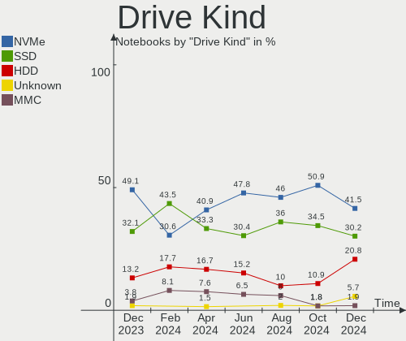
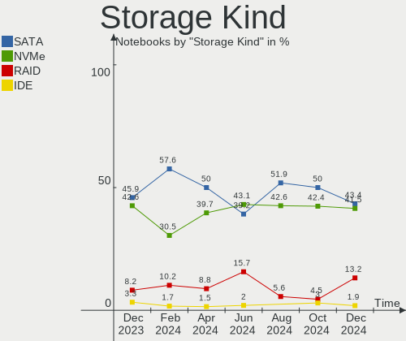
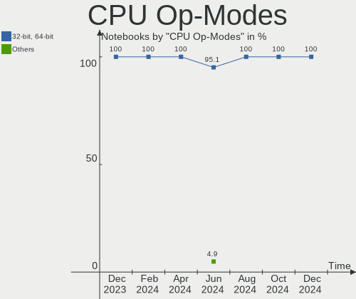
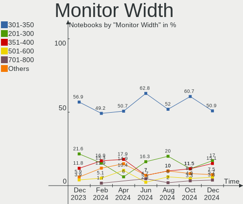
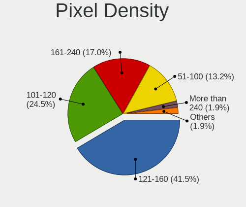
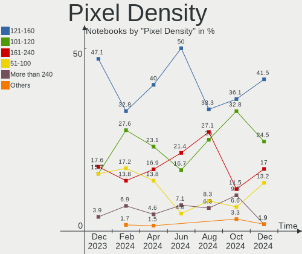
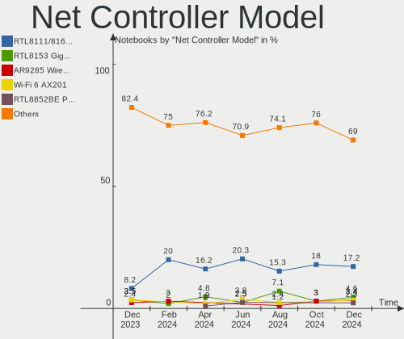

Linux in Netherlands - Hardware Trends (Notebooks)
--------------------------------------------------

A project to identify most popular hardware characteristics and track their change
over time based on data collected by Linux users at https://Linux-Hardware.org.

Anyone can contribute to this report by the [hw-probe](https://github.com/linuxhw/hw-probe) tool:

    sudo -E hw-probe -all -upload

Period: Jul, 2023.

Contents
--------

* [ System ](#system)
  - [ OS                       ](#os)
  - [ OS Family                ](#os-family)
  - [ Kernel                   ](#kernel)
  - [ Kernel Family            ](#kernel-family)
  - [ Kernel Major Ver.        ](#kernel-major-ver)
  - [ Arch                     ](#arch)
  - [ DE                       ](#de)
  - [ Display Server           ](#display-server)
  - [ Display Manager          ](#display-manager)
  - [ OS Lang                  ](#os-lang)
  - [ Boot Mode                ](#boot-mode)
  - [ Filesystem               ](#filesystem)
  - [ Part. scheme             ](#part-scheme)
  - [ Dual Boot with Linux/BSD ](#dual-boot-with-linuxbsd)
  - [ Dual Boot (Win)          ](#dual-boot-win)

* [ Board ](#board)
  - [ Vendor                   ](#vendor)
  - [ Model                    ](#model)
  - [ Model Family             ](#model-family)
  - [ MFG Year                 ](#mfg-year)
  - [ Form Factor              ](#form-factor)
  - [ Secure Boot              ](#secure-boot)
  - [ Coreboot                 ](#coreboot)
  - [ RAM Size                 ](#ram-size)
  - [ RAM Used                 ](#ram-used)
  - [ Total Drives             ](#total-drives)
  - [ Has CD-ROM               ](#has-cd-rom)
  - [ Has Ethernet             ](#has-ethernet)
  - [ Has WiFi                 ](#has-wifi)
  - [ Has Bluetooth            ](#has-bluetooth)

* [ Location ](#location)
  - [ Country                  ](#country)
  - [ City                     ](#city)

* [ Drives ](#drives)
  - [ Drive Vendor             ](#drive-vendor)
  - [ Drive Model              ](#drive-model)
  - [ HDD Vendor               ](#hdd-vendor)
  - [ SSD Vendor               ](#ssd-vendor)
  - [ Drive Kind               ](#drive-kind)
  - [ Drive Connector          ](#drive-connector)
  - [ Drive Size               ](#drive-size)
  - [ Space Total              ](#space-total)
  - [ Space Used               ](#space-used)
  - [ Malfunc. Drives          ](#malfunc-drives)
  - [ Malfunc. Drive Vendor    ](#malfunc-drive-vendor)
  - [ Malfunc. HDD Vendor      ](#malfunc-hdd-vendor)
  - [ Malfunc. Drive Kind      ](#malfunc-drive-kind)
  - [ Failed Drives            ](#failed-drives)
  - [ Failed Drive Vendor      ](#failed-drive-vendor)
  - [ Drive Status             ](#drive-status)

* [ Storage controller ](#storage-controller)
  - [ Storage Vendor           ](#storage-vendor)
  - [ Storage Model            ](#storage-model)
  - [ Storage Kind             ](#storage-kind)

* [ Processor ](#processor)
  - [ CPU Vendor               ](#cpu-vendor)
  - [ CPU Model                ](#cpu-model)
  - [ CPU Model Family         ](#cpu-model-family)
  - [ CPU Cores                ](#cpu-cores)
  - [ CPU Sockets              ](#cpu-sockets)
  - [ CPU Threads              ](#cpu-threads)
  - [ CPU Op-Modes             ](#cpu-op-modes)
  - [ CPU Microcode            ](#cpu-microcode)
  - [ CPU Microarch            ](#cpu-microarch)

* [ Graphics ](#graphics)
  - [ GPU Vendor               ](#gpu-vendor)
  - [ GPU Model                ](#gpu-model)
  - [ GPU Combo                ](#gpu-combo)
  - [ GPU Driver               ](#gpu-driver)
  - [ GPU Memory               ](#gpu-memory)

* [ Monitor ](#monitor)
  - [ Monitor Vendor           ](#monitor-vendor)
  - [ Monitor Model            ](#monitor-model)
  - [ Monitor Resolution       ](#monitor-resolution)
  - [ Monitor Diagonal         ](#monitor-diagonal)
  - [ Monitor Width            ](#monitor-width)
  - [ Aspect Ratio             ](#aspect-ratio)
  - [ Monitor Area             ](#monitor-area)
  - [ Pixel Density            ](#pixel-density)
  - [ Multiple Monitors        ](#multiple-monitors)

* [ Network ](#network)
  - [ Net Controller Vendor    ](#net-controller-vendor)
  - [ Net Controller Model     ](#net-controller-model)
  - [ Wireless Vendor          ](#wireless-vendor)
  - [ Wireless Model           ](#wireless-model)
  - [ Ethernet Vendor          ](#ethernet-vendor)
  - [ Ethernet Model           ](#ethernet-model)
  - [ Net Controller Kind      ](#net-controller-kind)
  - [ Used Controller          ](#used-controller)
  - [ NICs                     ](#nics)
  - [ IPv6                     ](#ipv6)

* [ Bluetooth ](#bluetooth)
  - [ Bluetooth Vendor         ](#bluetooth-vendor)
  - [ Bluetooth Model          ](#bluetooth-model)

* [ Sound ](#sound)
  - [ Sound Vendor             ](#sound-vendor)
  - [ Sound Model              ](#sound-model)

* [ Memory ](#memory)
  - [ Memory Vendor            ](#memory-vendor)
  - [ Memory Model             ](#memory-model)
  - [ Memory Kind              ](#memory-kind)
  - [ Memory Form Factor       ](#memory-form-factor)
  - [ Memory Size              ](#memory-size)
  - [ Memory Speed             ](#memory-speed)

* [ Printers & scanners ](#printers--scanners)
  - [ Printer Vendor           ](#printer-vendor)
  - [ Printer Model            ](#printer-model)
  - [ Scanner Vendor           ](#scanner-vendor)
  - [ Scanner Model            ](#scanner-model)

* [ Camera ](#camera)
  - [ Camera Vendor            ](#camera-vendor)
  - [ Camera Model             ](#camera-model)

* [ Security ](#security)
  - [ Fingerprint Vendor       ](#fingerprint-vendor)
  - [ Fingerprint Model        ](#fingerprint-model)
  - [ Chipcard Vendor          ](#chipcard-vendor)
  - [ Chipcard Model           ](#chipcard-model)

* [ Unsupported ](#unsupported)
  - [ Unsupported Devices      ](#unsupported-devices)
  - [ Unsupported Device Types ](#unsupported-device-types)

System
------

OS
--

Installed operating systems

| Name                | Notebooks | Percent |
|---------------------|-----------|---------|
| Ubuntu 22.04        | 9         | 18.37%  |
| Fedora 38           | 6         | 12.24%  |
| Ubuntu 23.04        | 4         | 8.16%   |
| Zorin 16            | 3         | 6.12%   |
| Pop!_OS 22.04       | 3         | 6.12%   |
| Manjaro 23.0.0      | 3         | 6.12%   |
| Linux Mint 21.1     | 3         | 6.12%   |
| Debian 12           | 3         | 6.12%   |
| Manjaro             | 2         | 4.08%   |
| Xubuntu 22.04       | 1         | 2.04%   |
| Ubuntu 22.10        | 1         | 2.04%   |
| Ubuntu 20.04        | 1         | 2.04%   |
| Solus 4.4           | 1         | 2.04%   |
| ROSA R11.1          | 1         | 2.04%   |
| OpenMandriva 23.06  | 1         | 2.04%   |
| Linux Mint 20.3     | 1         | 2.04%   |
| Linux Mint 20.2     | 1         | 2.04%   |
| Kubuntu 23.04       | 1         | 2.04%   |
| Gentoo 2.13         | 1         | 2.04%   |
| EndeavourOS Rolling | 1         | 2.04%   |
| Deepin 23           | 1         | 2.04%   |
| Arch Rolling        | 1         | 2.04%   |

OS Family
---------

OS without a version

| Name         | Notebooks | Percent |
|--------------|-----------|---------|
| Ubuntu       | 15        | 30.61%  |
| Fedora       | 6         | 12.24%  |
| Manjaro      | 5         | 10.2%   |
| Linux Mint   | 5         | 10.2%   |
| Zorin        | 3         | 6.12%   |
| Pop!_OS      | 3         | 6.12%   |
| Debian       | 3         | 6.12%   |
| Xubuntu      | 1         | 2.04%   |
| Solus        | 1         | 2.04%   |
| ROSA         | 1         | 2.04%   |
| OpenMandriva | 1         | 2.04%   |
| Kubuntu      | 1         | 2.04%   |
| Gentoo       | 1         | 2.04%   |
| EndeavourOS  | 1         | 2.04%   |
| Deepin       | 1         | 2.04%   |
| Arch         | 1         | 2.04%   |

Kernel
------

Version of the Linux kernel

| Version                             | Notebooks | Percent |
|-------------------------------------|-----------|---------|
| 5.15.0-76-generic                   | 7         | 14.29%  |
| 5.19.0-46-generic                   | 6         | 12.24%  |
| 6.2.6-76060206-generic              | 3         | 6.12%   |
| 6.2.0-24-generic                    | 3         | 6.12%   |
| 6.3.11-200.fc38.x86_64              | 2         | 4.08%   |
| 6.4.6-200.fc38.x86_64               | 1         | 2.04%   |
| 6.4.6-1-MANJARO                     | 1         | 2.04%   |
| 6.4.4-200.fc38.x86_64               | 1         | 2.04%   |
| 6.4.3-arch1-1                       | 1         | 2.04%   |
| 6.4.3-273-tkg-pds                   | 1         | 2.04%   |
| 6.4.3-1-liquorix-amd64              | 1         | 2.04%   |
| 6.3.8-240.current                   | 1         | 2.04%   |
| 6.3.5-desktop-3omv2390              | 1         | 2.04%   |
| 6.3.13-1-MANJARO                    | 1         | 2.04%   |
| 6.3.12-200.fc38.x86_64              | 1         | 2.04%   |
| 6.3.12-1-MANJARO                    | 1         | 2.04%   |
| 6.2.15-300.fc38.x86_64              | 1         | 2.04%   |
| 6.2.0-25-generic                    | 1         | 2.04%   |
| 6.2.0-20-generic                    | 1         | 2.04%   |
| 6.2.0-1008-lowlatency               | 1         | 2.04%   |
| 6.1.38-x86_64                       | 1         | 2.04%   |
| 6.1.32-amd64-desktop-hwe            | 1         | 2.04%   |
| 6.1.31-2-MANJARO                    | 1         | 2.04%   |
| 6.1.0-9-amd64                       | 1         | 2.04%   |
| 6.1.0-10-amd64                      | 1         | 2.04%   |
| 5.4.0-73-generic                    | 1         | 2.04%   |
| 5.4.0-153-generic                   | 1         | 2.04%   |
| 5.19.0-50-generic                   | 1         | 2.04%   |
| 5.19.0-47-generic                   | 1         | 2.04%   |
| 5.15.120-1-MANJARO                  | 1         | 2.04%   |
| 5.15.0-78-generic                   | 1         | 2.04%   |
| 5.11.0-37-generic                   | 1         | 2.04%   |
| 4.15.0-desktop-122.124.1rosa-x86_64 | 1         | 2.04%   |

Kernel Family
-------------

Linux kernel without a distro release

| Version  | Notebooks | Percent |
|----------|-----------|---------|
| 5.19.0   | 8         | 16.33%  |
| 5.15.0   | 8         | 16.33%  |
| 6.2.0    | 6         | 12.24%  |
| 6.4.3    | 3         | 6.12%   |
| 6.2.6    | 3         | 6.12%   |
| 6.4.6    | 2         | 4.08%   |
| 6.3.12   | 2         | 4.08%   |
| 6.3.11   | 2         | 4.08%   |
| 6.1.0    | 2         | 4.08%   |
| 5.4.0    | 2         | 4.08%   |
| 6.4.4    | 1         | 2.04%   |
| 6.3.8    | 1         | 2.04%   |
| 6.3.5    | 1         | 2.04%   |
| 6.3.13   | 1         | 2.04%   |
| 6.2.15   | 1         | 2.04%   |
| 6.1.38   | 1         | 2.04%   |
| 6.1.32   | 1         | 2.04%   |
| 6.1.31   | 1         | 2.04%   |
| 5.15.120 | 1         | 2.04%   |
| 5.11.0   | 1         | 2.04%   |
| 4.15.0   | 1         | 2.04%   |

Kernel Major Ver.
-----------------

Linux kernel major version

| Version | Notebooks | Percent |
|---------|-----------|---------|
| 6.2     | 10        | 20.41%  |
| 5.15    | 9         | 18.37%  |
| 5.19    | 8         | 16.33%  |
| 6.3     | 7         | 14.29%  |
| 6.4     | 6         | 12.24%  |
| 6.1     | 5         | 10.2%   |
| 5.4     | 2         | 4.08%   |
| 5.11    | 1         | 2.04%   |
| 4.15    | 1         | 2.04%   |

Arch
----

OS architecture (x86_64, i586, etc.)

| Name   | Notebooks | Percent |
|--------|-----------|---------|
| x86_64 | 49        | 100%    |

DE
--

Desktop Environment

| Name       | Notebooks | Percent |
|------------|-----------|---------|
| GNOME      | 27        | 55.1%   |
| X-Cinnamon | 7         | 14.29%  |
| KDE5       | 7         | 14.29%  |
| XFCE       | 2         | 4.08%   |
| Unknown    | 2         | 4.08%   |
| MATE       | 1         | 2.04%   |
| LXDE       | 1         | 2.04%   |
| KDE4       | 1         | 2.04%   |
| Deepin     | 1         | 2.04%   |

Display Server
--------------

X11 or Wayland

| Name    | Notebooks | Percent |
|---------|-----------|---------|
| X11     | 30        | 61.22%  |
| Wayland | 17        | 34.69%  |
| Tty     | 1         | 2.04%   |
| Unknown | 1         | 2.04%   |

Display Manager
---------------

SDDM, LightDM, etc.

| Name    | Notebooks | Percent |
|---------|-----------|---------|
| Unknown | 20        | 40.82%  |
| GDM3    | 15        | 30.61%  |
| LightDM | 7         | 14.29%  |
| SDDM    | 4         | 8.16%   |
| GDM     | 2         | 4.08%   |
| KDM     | 1         | 2.04%   |

OS Lang
-------

Language

| Lang    | Notebooks | Percent |
|---------|-----------|---------|
| en_US   | 26        | 53.06%  |
| nl_NL   | 13        | 26.53%  |
| ru_RU   | 2         | 4.08%   |
| en_GB   | 2         | 4.08%   |
| sk_SK   | 1         | 2.04%   |
| pl_PL   | 1         | 2.04%   |
| fr_FR   | 1         | 2.04%   |
| de_DE   | 1         | 2.04%   |
| ca_ES   | 1         | 2.04%   |
| Unknown | 1         | 2.04%   |

Boot Mode
---------

EFI or BIOS

| Mode | Notebooks | Percent |
|------|-----------|---------|
| BIOS | 26        | 53.06%  |
| EFI  | 23        | 46.94%  |

Filesystem
----------

Type of filesystem

| Type    | Notebooks | Percent |
|---------|-----------|---------|
| Ext4    | 33        | 67.35%  |
| Tmpfs   | 10        | 20.41%  |
| Btrfs   | 5         | 10.2%   |
| Overlay | 1         | 2.04%   |

Part. scheme
------------

Scheme of partitioning

| Type    | Notebooks | Percent |
|---------|-----------|---------|
| GPT     | 27        | 55.1%   |
| Unknown | 19        | 38.78%  |
| MBR     | 3         | 6.12%   |

Dual Boot with Linux/BSD
------------------------

Hosting more than one Linux/BSD

| Dual boot | Notebooks | Percent |
|-----------|-----------|---------|
| No        | 44        | 89.8%   |
| Yes       | 5         | 10.2%   |

Dual Boot (Win)
---------------

Hosting Linux and Windows

| Dual boot | Notebooks | Percent |
|-----------|-----------|---------|
| No        | 38        | 77.55%  |
| Yes       | 11        | 22.45%  |

Board
-----

Vendor
------

Motherboard manufacturer

| Name             | Notebooks | Percent |
|------------------|-----------|---------|
| Lenovo           | 11        | 22.45%  |
| Hewlett-Packard  | 10        | 20.41%  |
| Dell             | 5         | 10.2%   |
| ASUSTek Computer | 5         | 10.2%   |
| Acer             | 4         | 8.16%   |
| Notebook         | 3         | 6.12%   |
| Apple            | 3         | 6.12%   |
| VALE             | 1         | 2.04%   |
| Toshiba          | 1         | 2.04%   |
| Standard         | 1         | 2.04%   |
| Sony             | 1         | 2.04%   |
| Packard Bell     | 1         | 2.04%   |
| MSI              | 1         | 2.04%   |
| Minix            | 1         | 2.04%   |
| Medion           | 1         | 2.04%   |

Model
-----

Motherboard model

| Name                                        | Notebooks | Percent |
|---------------------------------------------|-----------|---------|
| VALE Notebook Classic C140                  | 1         | 2.04%   |
| Toshiba Satellite C850-1GL                  | 1         | 2.04%   |
| Sony SVF1521A6EW                            | 1         | 2.04%   |
| Packard Bell EasyNote TJ67                  | 1         | 2.04%   |
| Notebook NJx0PU                             | 1         | 2.04%   |
| Notebook NH5x_7xDPx                         | 1         | 2.04%   |
| Notebook NH50_70RH                          | 1         | 2.04%   |
| MSI Prestige 14Evo A12M                     | 1         | 2.04%   |
| Minix NEO Z83-4A                            | 1         | 2.04%   |
| Medion E4251 MD61435                        | 1         | 2.04%   |
| Lenovo ThinkPad X1 Carbon Gen 11 21HMCTO1WW | 1         | 2.04%   |
| Lenovo ThinkPad X1 Carbon Gen 10 21CBCTO1WW | 1         | 2.04%   |
| Lenovo ThinkPad T470s 20HGS1VD00            | 1         | 2.04%   |
| Lenovo ThinkPad T470 W10DG 20JNS0K009       | 1         | 2.04%   |
| Lenovo ThinkPad T14 Gen 1 20UDCTO1WW        | 1         | 2.04%   |
| Lenovo ThinkBook 15 G2 ITL 20VE             | 1         | 2.04%   |
| Lenovo Legion Y540-17IRH 81Q4               | 1         | 2.04%   |
| Lenovo Legion 5 Pro 16IAH7H 82RF            | 1         | 2.04%   |
| Lenovo IdeaPad 5 15ARE05 81YQ               | 1         | 2.04%   |
| Lenovo IdeaPad 5 14ARE05 81YM               | 1         | 2.04%   |
| Lenovo G50-70 20351                         | 1         | 2.04%   |
| HP ZBook Fury 16 G9 Mobile Workstation PC   | 1         | 2.04%   |
| HP ZBook 17 G2                              | 1         | 2.04%   |
| HP ZBook 15 G5                              | 1         | 2.04%   |
| HP ProBook 6570b                            | 1         | 2.04%   |
| HP Pavilion TS 11                           | 1         | 2.04%   |
| HP Pavilion 17                              | 1         | 2.04%   |
| HP EliteBook 850 G8 Notebook PC             | 1         | 2.04%   |
| HP EliteBook 840 G5                         | 1         | 2.04%   |
| HP EliteBook 820 G4                         | 1         | 2.04%   |
| HP Compaq Presario CQ60                     | 1         | 2.04%   |
| Dell XPS 15 9530                            | 1         | 2.04%   |
| Dell Precision 7540                         | 1         | 2.04%   |
| Dell Latitude E7440                         | 1         | 2.04%   |
| Dell Latitude E5510                         | 1         | 2.04%   |
| Dell Inspiron 5593                          | 1         | 2.04%   |
| ASUS UX430UAR                               | 1         | 2.04%   |
| ASUS TUF Gaming FX705GD_FX705GD             | 1         | 2.04%   |
| ASUS Strix GL504GM_GL504GM                  | 1         | 2.04%   |
| ASUS N53SM                                  | 1         | 2.04%   |

Model Family
------------

Motherboard model prefix

| Name                  | Notebooks | Percent |
|-----------------------|-----------|---------|
| Lenovo ThinkPad       | 5         | 10.2%   |
| HP ZBook              | 3         | 6.12%   |
| HP EliteBook          | 3         | 6.12%   |
| Acer TravelMate       | 3         | 6.12%   |
| Lenovo Legion         | 2         | 4.08%   |
| Lenovo IdeaPad        | 2         | 4.08%   |
| HP Pavilion           | 2         | 4.08%   |
| Dell Latitude         | 2         | 4.08%   |
| VALE Notebook         | 1         | 2.04%   |
| Toshiba Satellite     | 1         | 2.04%   |
| Sony SVF1521A6EW      | 1         | 2.04%   |
| Packard Bell EasyNote | 1         | 2.04%   |
| Notebook NJx0PU       | 1         | 2.04%   |
| Notebook NH5x         | 1         | 2.04%   |
| Notebook NH50         | 1         | 2.04%   |
| MSI Prestige          | 1         | 2.04%   |
| Minix NEO             | 1         | 2.04%   |
| Medion E4251          | 1         | 2.04%   |
| Lenovo ThinkBook      | 1         | 2.04%   |
| Lenovo G50-70         | 1         | 2.04%   |
| HP ProBook            | 1         | 2.04%   |
| HP Compaq             | 1         | 2.04%   |
| Dell XPS              | 1         | 2.04%   |
| Dell Precision        | 1         | 2.04%   |
| Dell Inspiron         | 1         | 2.04%   |
| ASUS UX430UAR         | 1         | 2.04%   |
| ASUS TUF              | 1         | 2.04%   |
| ASUS Strix            | 1         | 2.04%   |
| ASUS N53SM            | 1         | 2.04%   |
| ASUS G73Jw            | 1         | 2.04%   |
| Apple MacBookPro8     | 1         | 2.04%   |
| Apple MacBookPro11    | 1         | 2.04%   |
| Apple MacBookAir3     | 1         | 2.04%   |
| Acer Extensa          | 1         | 2.04%   |
| Unknown               | 1         | 2.04%   |

MFG Year
--------

Motherboard manufacture year

| Year | Notebooks | Percent |
|------|-----------|---------|
| 2018 | 6         | 12.24%  |
| 2020 | 5         | 10.2%   |
| 2019 | 5         | 10.2%   |
| 2013 | 5         | 10.2%   |
| 2022 | 4         | 8.16%   |
| 2017 | 4         | 8.16%   |
| 2014 | 4         | 8.16%   |
| 2021 | 3         | 6.12%   |
| 2010 | 3         | 6.12%   |
| 2023 | 2         | 4.08%   |
| 2012 | 2         | 4.08%   |
| 2011 | 2         | 4.08%   |
| 2009 | 2         | 4.08%   |
| 2016 | 1         | 2.04%   |
| 2008 | 1         | 2.04%   |

Form Factor
-----------

Physical design of the computer

| Name     | Notebooks | Percent |
|----------|-----------|---------|
| Notebook | 49        | 100%    |

Secure Boot
-----------

Enabled or disabled

| State    | Notebooks | Percent |
|----------|-----------|---------|
| Disabled | 47        | 95.92%  |
| Enabled  | 2         | 4.08%   |

Coreboot
--------

Have coreboot on board

| Used | Notebooks | Percent |
|------|-----------|---------|
| No   | 49        | 100%    |

RAM Size
--------

Total RAM memory

| Size in GB  | Notebooks | Percent |
|-------------|-----------|---------|
| 16.01-24.0  | 11        | 22.45%  |
| 4.01-8.0    | 10        | 20.41%  |
| 32.01-64.0  | 10        | 20.41%  |
| 3.01-4.0    | 10        | 20.41%  |
| 8.01-16.0   | 5         | 10.2%   |
| 64.01-256.0 | 2         | 4.08%   |
| 1.01-2.0    | 1         | 2.04%   |

RAM Used
--------

Used RAM memory

| Used GB    | Notebooks | Percent |
|------------|-----------|---------|
| 4.01-8.0   | 15        | 30.61%  |
| 1.01-2.0   | 14        | 28.57%  |
| 2.01-3.0   | 10        | 20.41%  |
| 3.01-4.0   | 5         | 10.2%   |
| 8.01-16.0  | 2         | 4.08%   |
| 0.51-1.0   | 2         | 4.08%   |
| 16.01-24.0 | 1         | 2.04%   |

Total Drives
------------

Number of drives on board

| Drives | Notebooks | Percent |
|--------|-----------|---------|
| 1      | 34        | 69.39%  |
| 2      | 11        | 22.45%  |
| 5      | 1         | 2.04%   |
| 4      | 1         | 2.04%   |
| 3      | 1         | 2.04%   |
| 0      | 1         | 2.04%   |

Has CD-ROM
----------

Has CD-ROM on board

| Presented | Notebooks | Percent |
|-----------|-----------|---------|
| No        | 37        | 75.51%  |
| Yes       | 12        | 24.49%  |

Has Ethernet
------------

Has Ethernet on board

| Presented | Notebooks | Percent |
|-----------|-----------|---------|
| Yes       | 38        | 77.55%  |
| No        | 11        | 22.45%  |

Has WiFi
--------

Has WiFi module

| Presented | Notebooks | Percent |
|-----------|-----------|---------|
| Yes       | 48        | 97.96%  |
| No        | 1         | 2.04%   |

Has Bluetooth
-------------

Has Bluetooth module

| Presented | Notebooks | Percent |
|-----------|-----------|---------|
| Yes       | 40        | 81.63%  |
| No        | 9         | 18.37%  |

Location
--------

Country
-------

Geographic location (country)

| Country     | Notebooks | Percent |
|-------------|-----------|---------|
| Netherlands | 49        | 100%    |

City
----

Geographic location (city)

| City                | Notebooks | Percent |
|---------------------|-----------|---------|
| Amsterdam           | 6         | 12.24%  |
| Utrecht             | 3         | 6.12%   |
| The Hague           | 3         | 6.12%   |
| Roosendaal          | 3         | 6.12%   |
| Rotterdam           | 2         | 4.08%   |
| Enschede            | 2         | 4.08%   |
| Almere Stad         | 2         | 4.08%   |
| Wolvega             | 1         | 2.04%   |
| Wassenaar           | 1         | 2.04%   |
| Voorthuizen         | 1         | 2.04%   |
| Uden                | 1         | 2.04%   |
| Tjalleberd          | 1         | 2.04%   |
| Terneuzen           | 1         | 2.04%   |
| Stramproy           | 1         | 2.04%   |
| Ridderkerk          | 1         | 2.04%   |
| Rhenen              | 1         | 2.04%   |
| Purmerend           | 1         | 2.04%   |
| Oisterwijk          | 1         | 2.04%   |
| Nieuw-Beijerland    | 1         | 2.04%   |
| Naaldwijk           | 1         | 2.04%   |
| Monnickendam        | 1         | 2.04%   |
| Meppel              | 1         | 2.04%   |
| Leiden              | 1         | 2.04%   |
| Hoofddorp           | 1         | 2.04%   |
| Heemstede           | 1         | 2.04%   |
| Goes                | 1         | 2.04%   |
| Emmen               | 1         | 2.04%   |
| Ede                 | 1         | 2.04%   |
| Blaricum            | 1         | 2.04%   |
| Beverwijk           | 1         | 2.04%   |
| Bedum               | 1         | 2.04%   |
| Assen               | 1         | 2.04%   |
| Alphen aan den Rijn | 1         | 2.04%   |
| Alkmaar             | 1         | 2.04%   |
| 's-Gravenzande      | 1         | 2.04%   |

Drives
------

Drive Vendor
------------

Hard drive vendors

| Vendor                  | Notebooks | Drives | Percent |
|-------------------------|-----------|--------|---------|
| Samsung Electronics     | 17        | 18     | 25.76%  |
| WDC                     | 5         | 5      | 7.58%   |
| Micron Technology       | 5         | 5      | 7.58%   |
| SK hynix                | 4         | 4      | 6.06%   |
| Seagate                 | 4         | 4      | 6.06%   |
| SanDisk                 | 4         | 4      | 6.06%   |
| Toshiba                 | 3         | 3      | 4.55%   |
| Kingston                | 3         | 3      | 4.55%   |
| Crucial                 | 3         | 3      | 4.55%   |
| Unknown                 | 2         | 2      | 3.03%   |
| KIOXIA                  | 2         | 2      | 3.03%   |
| Apple                   | 2         | 2      | 3.03%   |
| Union Memory (Shenzhen) | 1         | 1      | 1.52%   |
| PNY                     | 1         | 1      | 1.52%   |
| Phison                  | 1         | 1      | 1.52%   |
| Netac                   | 1         | 1      | 1.52%   |
| LITEONIT                | 1         | 1      | 1.52%   |
| Intenso                 | 1         | 1      | 1.52%   |
| Intel                   | 1         | 1      | 1.52%   |
| Hitachi                 | 1         | 1      | 1.52%   |
| GOODRAM                 | 1         | 1      | 1.52%   |
| China                   | 1         | 1      | 1.52%   |
| ASMT                    | 1         | 2      | 1.52%   |
| Unknown                 | 1         | 1      | 1.52%   |

Drive Model
-----------

Hard drive models

| Model                                               | Notebooks | Percent |
|-----------------------------------------------------|-----------|---------|
| Samsung SSD 990 PRO 2TB                             | 2         | 2.99%   |
| Samsung SSD 980 500GB                               | 2         | 2.99%   |
| Samsung MZALQ512HALU-000L2 512GB                    | 2         | 2.99%   |
| WDC WDS240G2G0A-00JH30 240GB SSD                    | 1         | 1.49%   |
| WDC WD7500BPKX-22HPJT0 752GB                        | 1         | 1.49%   |
| WDC WD5000BEVT-22A0RT0 500GB                        | 1         | 1.49%   |
| WDC WD2500BEVT-22ZCT0 250GB                         | 1         | 1.49%   |
| WDC WD1600BEVT-60ZCT1 160GB                         | 1         | 1.49%   |
| Unknown MMC Card  64GB                              | 1         | 1.49%   |
| Unknown MMC Card  256GB                             | 1         | 1.49%   |
| Union Memory (Shenzhen) UMIS RPETJ256MKP1MDQ 256GB  | 1         | 1.49%   |
| Toshiba XG6 NVMe SSD Controller 512GB               | 1         | 1.49%   |
| Toshiba MQ01ABF050 500GB                            | 1         | 1.49%   |
| Toshiba MQ01ABD100 1TB                              | 1         | 1.49%   |
| SK hynix SC308 SATA 512GB SSD                       | 1         | 1.49%   |
| SK hynix PC801 NVMe 2TB                             | 1         | 1.49%   |
| SK hynix PC801 HFS512GEJ9X101N 512GB                | 1         | 1.49%   |
| SK hynix HFS256G39TND-N210A 256GB SSD               | 1         | 1.49%   |
| Seagate ST9500420AS 500GB                           | 1         | 1.49%   |
| Seagate ST1000LX015-1U7172 1TB                      | 1         | 1.49%   |
| Seagate ST1000LM024 HN-M101MBB 1TB                  | 1         | 1.49%   |
| Seagate One Touch Hub 4TB                           | 1         | 1.49%   |
| Sandisk WD Blue SN570 500GB                         | 1         | 1.49%   |
| Sandisk WD Blue SN500 / PC SN520 NVMe SSD 512GB     | 1         | 1.49%   |
| SanDisk SD7SN6S512G1001 512GB SSD                   | 1         | 1.49%   |
| SanDisk Portable SSD 1TB                            | 1         | 1.49%   |
| Samsung SSD PM851 2.5 7mm 128GB                     | 1         | 1.49%   |
| Samsung SSD 990 PRO 1TB                             | 1         | 1.49%   |
| Samsung SSD 980 PRO 500GB                           | 1         | 1.49%   |
| Samsung SSD 870 QVO 1TB                             | 1         | 1.49%   |
| Samsung SSD 860 EVO 2TB                             | 1         | 1.49%   |
| Samsung SSD 860 EVO 250GB                           | 1         | 1.49%   |
| Samsung SSD 840 Series 250GB                        | 1         | 1.49%   |
| Samsung NVMe SSD Controller SM981/PM981/PM983 500GB | 1         | 1.49%   |
| Samsung NVMe SSD Controller SM961/PM961/SM963 256GB | 1         | 1.49%   |
| Samsung NVMe SSD Controller PM9A1/PM9A3/980PRO 1TB  | 1         | 1.49%   |
| Samsung MZVLQ512HBLU-00B00 512GB                    | 1         | 1.49%   |
| Samsung MZVLB1T0HBLR-000L7 1TB                      | 1         | 1.49%   |
| PNY ELITE PSSD 960GB                                | 1         | 1.49%   |
| Phison S11-128G-PHISON-SSD-B3 128GB                 | 1         | 1.49%   |

HDD Vendor
----------

Hard disk drive vendors

| Vendor  | Notebooks | Drives | Percent |
|---------|-----------|--------|---------|
| WDC     | 4         | 4      | 36.36%  |
| Seagate | 3         | 3      | 27.27%  |
| Toshiba | 2         | 2      | 18.18%  |
| Hitachi | 1         | 1      | 9.09%   |
| ASMT    | 1         | 2      | 9.09%   |

SSD Vendor
----------

Solid state drive vendors

| Vendor              | Notebooks | Drives | Percent |
|---------------------|-----------|--------|---------|
| Samsung Electronics | 5         | 5      | 17.86%  |
| Micron Technology   | 3         | 3      | 10.71%  |
| Kingston            | 3         | 3      | 10.71%  |
| Crucial             | 3         | 3      | 10.71%  |
| SK hynix            | 2         | 2      | 7.14%   |
| SanDisk             | 2         | 2      | 7.14%   |
| Apple               | 2         | 2      | 7.14%   |
| WDC                 | 1         | 1      | 3.57%   |
| PNY                 | 1         | 1      | 3.57%   |
| Phison              | 1         | 1      | 3.57%   |
| Netac               | 1         | 1      | 3.57%   |
| LITEONIT            | 1         | 1      | 3.57%   |
| Intenso             | 1         | 1      | 3.57%   |
| GOODRAM             | 1         | 1      | 3.57%   |
| China               | 1         | 1      | 3.57%   |

Drive Kind
----------

HDD or SSD

| Kind    | Notebooks | Drives | Percent |
|---------|-----------|--------|---------|
| SSD     | 26        | 28     | 40.63%  |
| NVMe    | 23        | 24     | 35.94%  |
| HDD     | 11        | 12     | 17.19%  |
| MMC     | 3         | 3      | 4.69%   |
| Unknown | 1         | 1      | 1.56%   |

Drive Connector
---------------

SATA, SAS, NVMe, etc.

| Type | Notebooks | Drives | Percent |
|------|-----------|--------|---------|
| SATA | 30        | 35     | 49.18%  |
| NVMe | 23        | 24     | 37.7%   |
| SAS  | 5         | 6      | 8.2%    |
| MMC  | 3         | 3      | 4.92%   |

Drive Size
----------

Size of hard drive

| Size in TB | Notebooks | Drives | Percent |
|------------|-----------|--------|---------|
| 0.01-0.5   | 25        | 26     | 67.57%  |
| 0.51-1.0   | 9         | 10     | 24.32%  |
| 1.01-2.0   | 2         | 2      | 5.41%   |
| 3.01-4.0   | 1         | 2      | 2.7%    |

Space Total
-----------

Amount of disk space available on the file system

| Size in GB     | Notebooks | Percent |
|----------------|-----------|---------|
| 101-250        | 17        | 34.69%  |
| 251-500        | 8         | 16.33%  |
| 1001-2000      | 7         | 14.29%  |
| 501-1000       | 7         | 14.29%  |
| 51-100         | 4         | 8.16%   |
| Unknown        | 3         | 6.12%   |
| 1-20           | 2         | 4.08%   |
| More than 3000 | 1         | 2.04%   |

Space Used
----------

Amount of used disk space

| Used GB   | Notebooks | Percent |
|-----------|-----------|---------|
| 21-50     | 15        | 30.61%  |
| 101-250   | 10        | 20.41%  |
| 1-20      | 9         | 18.37%  |
| 51-100    | 6         | 12.24%  |
| 251-500   | 3         | 6.12%   |
| Unknown   | 3         | 6.12%   |
| 1001-2000 | 2         | 4.08%   |
| 501-1000  | 1         | 2.04%   |

Malfunc. Drives
---------------

Drive models with a malfunction

| Model                                         | Notebooks | Drives | Percent |
|-----------------------------------------------|-----------|--------|---------|
| Micron Technology MTFDDAK128MAM-1J1 128GB SSD | 1         | 1      | 100%    |

Malfunc. Drive Vendor
---------------------

Vendors of faulty drives

| Vendor            | Notebooks | Drives | Percent |
|-------------------|-----------|--------|---------|
| Micron Technology | 1         | 1      | 100%    |

Malfunc. HDD Vendor
-------------------

Vendors of faulty HDD drives

Zero info for selected period =(

Malfunc. Drive Kind
-------------------

Kinds of faulty drives

| Kind | Notebooks | Drives | Percent |
|------|-----------|--------|---------|
| SSD  | 1         | 1      | 100%    |

Failed Drives
-------------

Failed drive models

Zero info for selected period =(

Failed Drive Vendor
-------------------

Failed drive vendors

Zero info for selected period =(

Drive Status
------------

Number of failed and malfunc. drives

| Status   | Notebooks | Drives | Percent |
|----------|-----------|--------|---------|
| Detected | 31        | 43     | 60.78%  |
| Works    | 19        | 24     | 37.25%  |
| Malfunc  | 1         | 1      | 1.96%   |

Storage controller
------------------

Storage Vendor
--------------

Storage controller vendors

| Vendor                                  | Notebooks | Percent |
|-----------------------------------------|-----------|---------|
| Intel                                   | 34        | 55.74%  |
| Samsung Electronics                     | 14        | 22.95%  |
| SK hynix                                | 2         | 3.28%   |
| SanDisk                                 | 2         | 3.28%   |
| Micron Technology                       | 2         | 3.28%   |
| KIOXIA                                  | 2         | 3.28%   |
| AMD                                     | 2         | 3.28%   |
| Toshiba America Info Systems            | 1         | 1.64%   |
| Shenzhen Unionmemory Information System | 1         | 1.64%   |
| Nvidia                                  | 1         | 1.64%   |

Storage Model
-------------

Storage controller models

| Model                                                                          | Notebooks | Percent |
|--------------------------------------------------------------------------------|-----------|---------|
| Samsung NVMe SSD Controller 980                                                | 5         | 7.69%   |
| Intel Cannon Lake Mobile PCH SATA AHCI Controller                              | 5         | 7.69%   |
| Intel Sunrise Point-LP SATA Controller [AHCI mode]                             | 4         | 6.15%   |
| Intel 7 Series Chipset Family 6-port SATA Controller [AHCI mode]               | 4         | 6.15%   |
| Samsung NVMe SSD Controller S4LV008[Pascal]                                    | 3         | 4.62%   |
| Intel Volume Management Device NVMe RAID Controller                            | 3         | 4.62%   |
| Intel 82801IBM/IEM (ICH9M/ICH9M-E) 4 port SATA Controller [AHCI mode]          | 3         | 4.62%   |
| SK hynix Platinum P41/PC801 NVMe Solid State Drive                             | 2         | 3.08%   |
| Samsung NVMe SSD Controller SM981/PM981/PM983                                  | 2         | 3.08%   |
| Samsung NVMe SSD Controller PM9A1/PM9A3/980PRO                                 | 2         | 3.08%   |
| Intel Tiger Lake-LP SATA Controller                                            | 2         | 3.08%   |
| Intel Celeron/Pentium Silver Processor SATA Controller                         | 2         | 3.08%   |
| Intel 82801 Mobile SATA Controller [RAID mode]                                 | 2         | 3.08%   |
| Intel 6 Series/C200 Series Chipset Family 6 port Mobile SATA AHCI Controller   | 2         | 3.08%   |
| AMD FCH SATA Controller [AHCI mode]                                            | 2         | 3.08%   |
| Toshiba America Info Systems XG6 NVMe SSD Controller                           | 1         | 1.54%   |
| Shenzhen Unionmemory Information System Non-Volatile memory controller         | 1         | 1.54%   |
| SanDisk WD Blue SN570 NVMe SSD 1TB                                             | 1         | 1.54%   |
| SanDisk WD Blue SN500 / PC SN520 NVMe SSD                                      | 1         | 1.54%   |
| Samsung S4LN053X01 AHCI SSD Controller(Apple slot)                             | 1         | 1.54%   |
| Samsung NVMe SSD Controller SM961/PM961/SM963                                  | 1         | 1.54%   |
| Nvidia MCP89 SATA Controller (AHCI mode)                                       | 1         | 1.54%   |
| Micron 2450 NVMe SSD [HendrixV] (DRAM-less)                                    | 1         | 1.54%   |
| Micron 2200S NVMe SSD [Cassandra]                                              | 1         | 1.54%   |
| KIOXIA NVMe SSD Controller XG8                                                 | 1         | 1.54%   |
| KIOXIA NVMe SSD Controller BG4 (DRAM-less)                                     | 1         | 1.54%   |
| Intel Volume Management Device NVMe RAID Controller Intel Corporation          | 1         | 1.54%   |
| Intel SSD 600P Series                                                          | 1         | 1.54%   |
| Intel Ice Lake-LP SATA Controller [AHCI mode]                                  | 1         | 1.54%   |
| Intel Atom Processor E3800 Series SATA AHCI Controller                         | 1         | 1.54%   |
| Intel Alder Lake-P SATA AHCI Controller                                        | 1         | 1.54%   |
| Intel 8 Series/C220 Series Chipset Family 6-port SATA Controller 1 [AHCI mode] | 1         | 1.54%   |
| Intel 8 Series SATA Controller 1 [AHCI mode]                                   | 1         | 1.54%   |
| Intel 5 Series/3400 Series Chipset 4 port SATA IDE Controller                  | 1         | 1.54%   |
| Intel 5 Series/3400 Series Chipset 4 port SATA AHCI Controller                 | 1         | 1.54%   |
| Intel 5 Series/3400 Series Chipset 2 port SATA IDE Controller                  | 1         | 1.54%   |
| Intel 400 Series Chipset Family SATA AHCI Controller                           | 1         | 1.54%   |

Storage Kind
------------

Kind of storage controller (IDE, SATA, NVMe, SAS, ...)

| Kind | Notebooks | Percent |
|------|-----------|---------|
| SATA | 33        | 52.38%  |
| NVMe | 23        | 36.51%  |
| RAID | 6         | 9.52%   |
| IDE  | 1         | 1.59%   |

Processor
---------

CPU Vendor
----------

Processor vendors

| Vendor | Notebooks | Percent |
|--------|-----------|---------|
| Intel  | 45        | 91.84%  |
| AMD    | 4         | 8.16%   |

CPU Model
---------

Processor models

| Model                                       | Notebooks | Percent |
|---------------------------------------------|-----------|---------|
| Intel Core i7-8750H CPU @ 2.20GHz           | 2         | 4.08%   |
| Intel Core i7-7600U CPU @ 2.80GHz           | 2         | 4.08%   |
| Intel Core i5-8250U CPU @ 1.60GHz           | 2         | 4.08%   |
| Intel 12th Gen Core i7-12700H               | 2         | 4.08%   |
| Intel 12th Gen Core i5-1235U                | 2         | 4.08%   |
| Intel 11th Gen Core i5-1135G7 @ 2.40GHz     | 2         | 4.08%   |
| Intel Pentium Dual-Core CPU T4400 @ 2.20GHz | 1         | 2.04%   |
| Intel Pentium CPU 2117U @ 1.80GHz           | 1         | 2.04%   |
| Intel Genuine CPU T1600 @ 1.66GHz           | 1         | 2.04%   |
| Intel Core i9-9980HK CPU @ 2.40GHz          | 1         | 2.04%   |
| Intel Core i7-9750H CPU @ 2.60GHz           | 1         | 2.04%   |
| Intel Core i7-8850H CPU @ 2.60GHz           | 1         | 2.04%   |
| Intel Core i7-4800MQ CPU @ 2.70GHz          | 1         | 2.04%   |
| Intel Core i7-4750HQ CPU @ 2.00GHz          | 1         | 2.04%   |
| Intel Core i7-2670QM CPU @ 2.20GHz          | 1         | 2.04%   |
| Intel Core i7-2640M CPU @ 2.80GHz           | 1         | 2.04%   |
| Intel Core i7-10750H CPU @ 2.60GHz          | 1         | 2.04%   |
| Intel Core i7-1065G7 CPU @ 1.30GHz          | 1         | 2.04%   |
| Intel Core i7 CPU Q 740 @ 1.73GHz           | 1         | 2.04%   |
| Intel Core i5-9300H CPU @ 2.40GHz           | 1         | 2.04%   |
| Intel Core i5-8350U CPU @ 1.70GHz           | 1         | 2.04%   |
| Intel Core i5-6300U CPU @ 2.40GHz           | 1         | 2.04%   |
| Intel Core i5-4300U CPU @ 1.90GHz           | 1         | 2.04%   |
| Intel Core i5-3230M CPU @ 2.60GHz           | 1         | 2.04%   |
| Intel Core i3-4005U CPU @ 1.70GHz           | 1         | 2.04%   |
| Intel Core i3-3110M CPU @ 2.40GHz           | 1         | 2.04%   |
| Intel Core i3 CPU M 350 @ 2.27GHz           | 1         | 2.04%   |
| Intel Core 2 Duo CPU U9400 @ 1.40GHz        | 1         | 2.04%   |
| Intel Core 2 Duo CPU T6400 @ 2.00GHz        | 1         | 2.04%   |
| Intel Celeron N4020 CPU @ 1.10GHz           | 1         | 2.04%   |
| Intel Celeron N4000 CPU @ 1.10GHz           | 1         | 2.04%   |
| Intel Celeron CPU N2930 @ 1.83GHz           | 1         | 2.04%   |
| Intel Celeron CPU 1000M @ 1.80GHz           | 1         | 2.04%   |
| Intel Atom x5-Z8350 CPU @ 1.44GHz           | 1         | 2.04%   |
| Intel 13th Gen Core i9-13900H               | 1         | 2.04%   |
| Intel 13th Gen Core i7-1355U                | 1         | 2.04%   |
| Intel 12th Gen Core i7-1280P                | 1         | 2.04%   |
| Intel 12th Gen Core i7-12800HX              | 1         | 2.04%   |
| Intel 11th Gen Core i7-1185G7 @ 3.00GHz     | 1         | 2.04%   |
| AMD Ryzen 7 PRO 4750U with Radeon Graphics  | 1         | 2.04%   |

CPU Model Family
----------------

Processor model prefix

| Model                   | Notebooks | Percent |
|-------------------------|-----------|---------|
| Intel Core i7           | 13        | 26.53%  |
| Other                   | 11        | 22.45%  |
| Intel Core i5           | 7         | 14.29%  |
| Intel Celeron           | 4         | 8.16%   |
| Intel Core i3           | 3         | 6.12%   |
| Intel Core 2 Duo        | 2         | 4.08%   |
| Intel Pentium Dual-Core | 1         | 2.04%   |
| Intel Pentium           | 1         | 2.04%   |
| Intel Genuine           | 1         | 2.04%   |
| Intel Core i9           | 1         | 2.04%   |
| Intel Atom              | 1         | 2.04%   |
| AMD Ryzen 7 PRO         | 1         | 2.04%   |
| AMD Ryzen 7             | 1         | 2.04%   |
| AMD Ryzen 5             | 1         | 2.04%   |
| AMD A4                  | 1         | 2.04%   |

CPU Cores
---------

Number of processor cores

| Number | Notebooks | Percent |
|--------|-----------|---------|
| 2      | 18        | 36.73%  |
| 4      | 14        | 28.57%  |
| 6      | 6         | 12.24%  |
| 14     | 4         | 8.16%   |
| 10     | 3         | 6.12%   |
| 8      | 3         | 6.12%   |
| 16     | 1         | 2.04%   |

CPU Sockets
-----------

Number of sockets

| Number | Notebooks | Percent |
|--------|-----------|---------|
| 1      | 49        | 100%    |

CPU Threads
-----------

Threads per core (Hyper-Threading)

| Number | Notebooks | Percent |
|--------|-----------|---------|
| 2      | 33        | 67.35%  |
| 1      | 16        | 32.65%  |

CPU Op-Modes
------------

CPU Operation Modes (32-bit, 64-bit)

| Op mode        | Notebooks | Percent |
|----------------|-----------|---------|
| 32-bit, 64-bit | 49        | 100%    |

CPU Microcode
-------------

Microcode number

| Number     | Notebooks | Percent |
|------------|-----------|---------|
| Unknown    | 34        | 69.39%  |
| 0x906ea    | 3         | 6.12%   |
| 0x306a9    | 2         | 4.08%   |
| 0xb06a3    | 1         | 2.04%   |
| 0x806e9    | 1         | 2.04%   |
| 0x806c1    | 1         | 2.04%   |
| 0x706a8    | 1         | 2.04%   |
| 0x6fd      | 1         | 2.04%   |
| 0x40661    | 1         | 2.04%   |
| 0x40651    | 1         | 2.04%   |
| 0x20652    | 1         | 2.04%   |
| 0x1067a    | 1         | 2.04%   |
| 0x08600104 | 1         | 2.04%   |

CPU Microarch
-------------

Microarchitecture

| Name             | Notebooks | Percent |
|------------------|-----------|---------|
| KabyLake         | 11        | 22.45%  |
| IvyBridge        | 4         | 8.16%   |
| Haswell          | 4         | 8.16%   |
| Alderlake Hybrid | 4         | 8.16%   |
| Unknown          | 4         | 8.16%   |
| Zen 2            | 3         | 6.12%   |
| TigerLake        | 3         | 6.12%   |
| Penryn           | 3         | 6.12%   |
| Silvermont       | 2         | 4.08%   |
| SandyBridge      | 2         | 4.08%   |
| Goldmont plus    | 2         | 4.08%   |
| Westmere         | 1         | 2.04%   |
| Skylake          | 1         | 2.04%   |
| Nehalem          | 1         | 2.04%   |
| Jaguar           | 1         | 2.04%   |
| IceLake          | 1         | 2.04%   |
| Core             | 1         | 2.04%   |
| CometLake        | 1         | 2.04%   |

Graphics
--------

GPU Vendor
----------

Vendors of graphics cards

| Vendor | Notebooks | Percent |
|--------|-----------|---------|
| Intel  | 37        | 61.67%  |
| Nvidia | 18        | 30%     |
| AMD    | 5         | 8.33%   |

GPU Model
---------

Graphics card models

| Model                                                                                    | Notebooks | Percent |
|------------------------------------------------------------------------------------------|-----------|---------|
| Intel 3rd Gen Core processor Graphics Controller                                         | 4         | 6.56%   |
| Intel UHD Graphics 620                                                                   | 3         | 4.92%   |
| Intel TigerLake-LP GT2 [Iris Xe Graphics]                                                | 3         | 4.92%   |
| Intel CoffeeLake-H GT2 [UHD Graphics 630]                                                | 3         | 4.92%   |
| Intel Alder Lake-P Integrated Graphics Controller                                        | 3         | 4.92%   |
| AMD Renoir                                                                               | 3         | 4.92%   |
| Nvidia GA106M [GeForce RTX 3060 Mobile / Max-Q]                                          | 2         | 3.28%   |
| Intel Raptor Lake-P [Iris Xe Graphics]                                                   | 2         | 3.28%   |
| Intel HD Graphics 620                                                                    | 2         | 3.28%   |
| Intel Haswell-ULT Integrated Graphics Controller                                         | 2         | 3.28%   |
| Intel GeminiLake [UHD Graphics 600]                                                      | 2         | 3.28%   |
| Intel Alder Lake-UP3 GT2 [Iris Xe Graphics]                                              | 2         | 3.28%   |
| Intel 2nd Generation Core Processor Family Integrated Graphics Controller                | 2         | 3.28%   |
| Nvidia TU117GLM [Quadro T2000 Mobile / Max-Q]                                            | 1         | 1.64%   |
| Nvidia TU106M [GeForce RTX 2060 Mobile]                                                  | 1         | 1.64%   |
| Nvidia MCP89 [GeForce 320M]                                                              | 1         | 1.64%   |
| Nvidia GT218M [GeForce G210M]                                                            | 1         | 1.64%   |
| Nvidia GP108M [GeForce MX230]                                                            | 1         | 1.64%   |
| Nvidia GP107M [GeForce GTX 1050 Mobile]                                                  | 1         | 1.64%   |
| Nvidia GP107M [GeForce GTX 1050 3 GB Max-Q]                                              | 1         | 1.64%   |
| Nvidia GP107GLM [Quadro P1000 Mobile]                                                    | 1         | 1.64%   |
| Nvidia GP106M [GeForce GTX 1060 Mobile]                                                  | 1         | 1.64%   |
| Nvidia GK104GLM [Quadro K3100M]                                                          | 1         | 1.64%   |
| Nvidia GF108M [GeForce GT 620M/630M/635M/640M LE]                                        | 1         | 1.64%   |
| Nvidia GF106M [GeForce GTX 460M]                                                         | 1         | 1.64%   |
| Nvidia GA107GLM [RTX A1000 Laptop GPU]                                                   | 1         | 1.64%   |
| Nvidia GA104M [GeForce RTX 3070 Mobile / Max-Q]                                          | 1         | 1.64%   |
| Nvidia GA104 [GeForce RTX 3060]                                                          | 1         | 1.64%   |
| Nvidia G98M [GeForce 9300M GS]                                                           | 1         | 1.64%   |
| Nvidia AD107M [GeForce RTX 4060 Max-Q / Mobile]                                          | 1         | 1.64%   |
| Intel Skylake GT2 [HD Graphics 520]                                                      | 1         | 1.64%   |
| Intel Mobile 4 Series Chipset Integrated Graphics Controller                             | 1         | 1.64%   |
| Intel Iris Plus Graphics G7                                                              | 1         | 1.64%   |
| Intel Crystal Well Integrated Graphics Controller                                        | 1         | 1.64%   |
| Intel Core Processor Integrated Graphics Controller                                      | 1         | 1.64%   |
| Intel CometLake-H GT2 [UHD Graphics]                                                     | 1         | 1.64%   |
| Intel Atom/Celeron/Pentium Processor x5-E8000/J3xxx/N3xxx Integrated Graphics Controller | 1         | 1.64%   |
| Intel Atom Processor Z36xxx/Z37xxx Series Graphics & Display                             | 1         | 1.64%   |
| Intel 4th Gen Core Processor Integrated Graphics Controller                              | 1         | 1.64%   |
| AMD Sun XT [Radeon HD 8670A/8670M/8690M / R5 M330 / M430 / Radeon 520 Mobile]            | 1         | 1.64%   |

GPU Combo
---------

Combinations of graphics cards

| Name           | Notebooks | Percent |
|----------------|-----------|---------|
| 1 x Intel      | 26        | 53.06%  |
| Intel + Nvidia | 10        | 20.41%  |
| 1 x Nvidia     | 8         | 16.33%  |
| 1 x AMD        | 4         | 8.16%   |
| Intel + AMD    | 1         | 2.04%   |

GPU Driver
----------

Free vs proprietary

| Driver      | Notebooks | Percent |
|-------------|-----------|---------|
| Free        | 39        | 79.59%  |
| Proprietary | 9         | 18.37%  |
| Unknown     | 1         | 2.04%   |

GPU Memory
----------

Total video memory

| Size in GB | Notebooks | Percent |
|------------|-----------|---------|
| Unknown    | 39        | 79.59%  |
| 3.01-4.0   | 3         | 6.12%   |
| 0.01-0.5   | 3         | 6.12%   |
| 5.01-6.0   | 2         | 4.08%   |
| 1.01-2.0   | 2         | 4.08%   |

Monitor
-------

Monitor Vendor
--------------

Monitor vendors

| Vendor               | Notebooks | Percent |
|----------------------|-----------|---------|
| Chimei Innolux       | 12        | 20%     |
| AU Optronics         | 11        | 18.33%  |
| Samsung Electronics  | 6         | 10%     |
| LG Display           | 6         | 10%     |
| BOE                  | 6         | 10%     |
| Apple                | 3         | 5%      |
| InfoVision           | 2         | 3.33%   |
| Hewlett-Packard      | 2         | 3.33%   |
| ASUSTek Computer     | 2         | 3.33%   |
| Sony                 | 1         | 1.67%   |
| RTK                  | 1         | 1.67%   |
| Philips              | 1         | 1.67%   |
| PANDA                | 1         | 1.67%   |
| Iiyama               | 1         | 1.67%   |
| HannStar Display     | 1         | 1.67%   |
| Goldstar             | 1         | 1.67%   |
| Dell                 | 1         | 1.67%   |
| CSO                  | 1         | 1.67%   |
| BOE Technology Group | 1         | 1.67%   |

Monitor Model
-------------

Monitor models

| Model                                                                 | Notebooks | Percent |
|-----------------------------------------------------------------------|-----------|---------|
| Sony TV SNY0801 1360x768                                              | 1         | 1.64%   |
| Samsung Electronics LCD Monitor SyncMaster                            | 1         | 1.64%   |
| Samsung Electronics LCD Monitor SEC544B 1600x900 382x214mm 17.2-inch  | 1         | 1.64%   |
| Samsung Electronics LCD Monitor SEC4141 1366x768 344x193mm 15.5-inch  | 1         | 1.64%   |
| Samsung Electronics LCD Monitor SEC3953 1366x768 256x144mm 11.6-inch  | 1         | 1.64%   |
| Samsung Electronics LCD Monitor SDC4193 2880x1800 302x189mm 14.0-inch | 1         | 1.64%   |
| Samsung Electronics LCD Monitor SDC414D 3456x2160 336x210mm 15.6-inch | 1         | 1.64%   |
| RTK FHD HDR  RTKBC32 1920x1080 600x340mm 27.2-inch                    | 1         | 1.64%   |
| Philips PHL 234E5 PHLC0C7 1920x1080 509x286mm 23.0-inch               | 1         | 1.64%   |
| PANDA LCD Monitor NCP004A 1920x1080 309x174mm 14.0-inch               | 1         | 1.64%   |
| LG Display LCD Monitor LGD066D 1920x1080 344x194mm 15.5-inch          | 1         | 1.64%   |
| LG Display LCD Monitor LGD0621 1920x1080 382x215mm 17.3-inch          | 1         | 1.64%   |
| LG Display LCD Monitor LGD05E5 1920x1080 344x194mm 15.5-inch          | 1         | 1.64%   |
| LG Display LCD Monitor LGD03EA 1920x1080 309x174mm 14.0-inch          | 1         | 1.64%   |
| LG Display LCD Monitor LGD0395 1366x768 344x194mm 15.5-inch           | 1         | 1.64%   |
| LG Display LCD Monitor LGD033A 1366x768 344x194mm 15.5-inch           | 1         | 1.64%   |
| InfoVision LCD Monitor IVO3D41 1920x1080 344x194mm 15.5-inch          | 1         | 1.64%   |
| InfoVision LCD Monitor IVO057D 1920x1080 309x174mm 14.0-inch          | 1         | 1.64%   |
| Iiyama PL2893UH IVM7114 3840x2160 621x341mm 27.9-inch                 | 1         | 1.64%   |
| Hewlett-Packard Z30i HWP309B 2560x1600 641x400mm 29.7-inch            | 1         | 1.64%   |
| Hewlett-Packard E240 HWP3265 1920x1080 527x296mm 23.8-inch            | 1         | 1.64%   |
| HannStar Display LCD Monitor HSD173PUW1 3840x1200                     | 1         | 1.64%   |
| Goldstar ULTRAWIDE GSM59F1 2560x1080 673x284mm 28.8-inch              | 1         | 1.64%   |
| Dell U2413 DELF046 1920x1200 518x324mm 24.1-inch                      | 1         | 1.64%   |
| Dell U2412M DELA07B 1920x1200 518x324mm 24.1-inch                     | 1         | 1.64%   |
| CSO LCD Monitor CSO1612 2560x1600 345x215mm 16.0-inch                 | 1         | 1.64%   |
| Chimei Innolux LCD Monitor CMN1775 1920x1080 381x214mm 17.2-inch      | 1         | 1.64%   |
| Chimei Innolux LCD Monitor CMN175C 1920x1080 381x214mm 17.2-inch      | 1         | 1.64%   |
| Chimei Innolux LCD Monitor CMN15B7 1366x768 344x193mm 15.5-inch       | 1         | 1.64%   |
| Chimei Innolux LCD Monitor CMN151E 1920x1080 344x193mm 15.5-inch      | 1         | 1.64%   |
| Chimei Innolux LCD Monitor CMN1510 1920x1080 344x193mm 15.5-inch      | 1         | 1.64%   |
| Chimei Innolux LCD Monitor CMN14D4 1920x1080 309x173mm 13.9-inch      | 1         | 1.64%   |
| Chimei Innolux LCD Monitor CMN14D2 1920x1080 309x173mm 13.9-inch      | 1         | 1.64%   |
| Chimei Innolux LCD Monitor CMN14C9 1920x1080 309x173mm 13.9-inch      | 1         | 1.64%   |
| Chimei Innolux LCD Monitor CMN1417 1920x1200 301x188mm 14.0-inch      | 1         | 1.64%   |
| Chimei Innolux LCD Monitor CMN1409 1920x1080 309x173mm 13.9-inch      | 1         | 1.64%   |
| Chimei Innolux LCD Monitor CMN1242 1920x1080 276x155mm 12.5-inch      | 1         | 1.64%   |
| Chimei Innolux LCD Monitor CMN1132 1366x768 256x144mm 11.6-inch       | 1         | 1.64%   |
| BOE Technology Group LCD Monitor 1920x1080                            | 1         | 1.64%   |
| BOE LCD Monitor BOE0977 2560x1440 381x214mm 17.2-inch                 | 1         | 1.64%   |

Monitor Resolution
------------------

Monitor screen resolution

| Resolution        | Notebooks | Percent |
|-------------------|-----------|---------|
| 1920x1080 (FHD)   | 27        | 49.09%  |
| 1366x768 (WXGA)   | 9         | 16.36%  |
| 1920x1200 (WUXGA) | 3         | 5.45%   |
| 3840x2160 (4K)    | 2         | 3.64%   |
| 2880x1800         | 2         | 3.64%   |
| 2560x1440 (QHD)   | 2         | 3.64%   |
| 1600x900 (HD+)    | 2         | 3.64%   |
| 3840x1200         | 1         | 1.82%   |
| 3456x2160         | 1         | 1.82%   |
| 2560x1600         | 1         | 1.82%   |
| 2560x1080         | 1         | 1.82%   |
| 1440x900 (WXGA+)  | 1         | 1.82%   |
| 1360x768          | 1         | 1.82%   |
| 1280x800 (WXGA)   | 1         | 1.82%   |
| Unknown           | 1         | 1.82%   |

Monitor Diagonal
----------------

Diagonal size in inches

| Inches  | Notebooks | Percent |
|---------|-----------|---------|
| 15      | 19        | 32.76%  |
| 17      | 9         | 15.52%  |
| 14      | 8         | 13.79%  |
| 13      | 5         | 8.62%   |
| 27      | 3         | 5.17%   |
| 11      | 3         | 5.17%   |
| 24      | 2         | 3.45%   |
| 16      | 2         | 3.45%   |
| Unknown | 2         | 3.45%   |
| 72      | 1         | 1.72%   |
| 34      | 1         | 1.72%   |
| 29      | 1         | 1.72%   |
| 23      | 1         | 1.72%   |
| 12      | 1         | 1.72%   |

Monitor Width
-------------

Physical width

| Width in mm | Notebooks | Percent |
|-------------|-----------|---------|
| 301-350     | 33        | 57.89%  |
| 351-400     | 9         | 15.79%  |
| 201-300     | 5         | 8.77%   |
| 601-700     | 3         | 5.26%   |
| 501-600     | 3         | 5.26%   |
| Unknown     | 2         | 3.51%   |
| 701-800     | 1         | 1.75%   |
| 1501-2000   | 1         | 1.75%   |

Aspect Ratio
------------

Proportional relationship between the width and the height

| Ratio   | Notebooks | Percent |
|---------|-----------|---------|
| 16/9    | 40        | 76.92%  |
| 16/10   | 9         | 17.31%  |
| Unknown | 2         | 3.85%   |
| 21/9    | 1         | 1.92%   |

Monitor Area
------------

Area in inch

| Area in inch | Notebooks | Percent |
|----------------|-----------|---------|
| 101-110        | 18        | 31.03%  |
| 81-90          | 13        | 22.41%  |
| 121-130        | 9         | 15.52%  |
| 51-60          | 3         | 5.17%   |
| 301-350        | 3         | 5.17%   |
| 351-500        | 2         | 3.45%   |
| 201-250        | 2         | 3.45%   |
| 111-120        | 2         | 3.45%   |
| Unknown        | 2         | 3.45%   |
| More than 1000 | 1         | 1.72%   |
| 61-70          | 1         | 1.72%   |
| 251-300        | 1         | 1.72%   |
| 91-100         | 1         | 1.72%   |

Pixel Density
-------------

Pixels per inch

| Density       | Notebooks | Percent |
|---------------|-----------|---------|
| 121-160       | 30        | 53.57%  |
| 101-120       | 11        | 19.64%  |
| 161-240       | 5         | 8.93%   |
| 51-100        | 5         | 8.93%   |
| More than 240 | 2         | 3.57%   |
| Unknown       | 2         | 3.57%   |
| 1-50          | 1         | 1.79%   |

Multiple Monitors
-----------------

Total monitors connected

| Total | Notebooks | Percent |
|-------|-----------|---------|
| 1     | 39        | 79.59%  |
| 2     | 7         | 14.29%  |
| 4     | 1         | 2.04%   |
| 3     | 1         | 2.04%   |
| 0     | 1         | 2.04%   |

Network
-------

Net Controller Vendor
---------------------

Controller vendors

| Vendor                | Notebooks | Percent |
|-----------------------|-----------|---------|
| Intel                 | 34        | 44.16%  |
| Realtek Semiconductor | 21        | 27.27%  |
| Qualcomm Atheros      | 7         | 9.09%   |
| Broadcom              | 6         | 7.79%   |
| ASIX Electronics      | 2         | 2.6%    |
| TP-Link               | 1         | 1.3%    |
| Ralink                | 1         | 1.3%    |
| MediaTek              | 1         | 1.3%    |
| Manta                 | 1         | 1.3%    |
| Lenovo                | 1         | 1.3%    |
| DisplayLink           | 1         | 1.3%    |
| Broadcom Limited      | 1         | 1.3%    |

Net Controller Model
--------------------

Controller models

| Model                                                                   | Notebooks | Percent |
|-------------------------------------------------------------------------|-----------|---------|
| Realtek RTL8111/8168/8411 PCI Express Gigabit Ethernet Controller       | 14        | 15.05%  |
| Realtek RTL810xE PCI Express Fast Ethernet controller                   | 5         | 5.38%   |
| Intel Wi-Fi 6 AX200                                                     | 5         | 5.38%   |
| Intel Cannon Lake PCH CNVi WiFi                                         | 4         | 4.3%    |
| Intel Alder Lake-P PCH CNVi WiFi                                        | 4         | 4.3%    |
| Intel Wireless 8265 / 8275                                              | 3         | 3.23%   |
| Intel Wi-Fi 6 AX210/AX211/AX411 160MHz                                  | 3         | 3.23%   |
| Intel Wi-Fi 6 AX201                                                     | 3         | 3.23%   |
| Intel Ethernet Connection (4) I219-LM                                   | 3         | 3.23%   |
| Qualcomm Atheros AR9462 Wireless Network Adapter                        | 2         | 2.15%   |
| Intel Wireless 7260                                                     | 2         | 2.15%   |
| Intel Raptor Lake PCH CNVi WiFi                                         | 2         | 2.15%   |
| Intel Gemini Lake PCH CNVi WiFi                                         | 2         | 2.15%   |
| Intel Ethernet Connection I219-LM                                       | 2         | 2.15%   |
| Intel Ethernet Connection (7) I219-LM                                   | 2         | 2.15%   |
| ASIX AX88179 Gigabit Ethernet                                           | 2         | 2.15%   |
| TP-Link TL-WN823N v2/v3 [Realtek RTL8192EU]                             | 1         | 1.08%   |
| Realtek RTL8723BE PCIe Wireless Network Adapter                         | 1         | 1.08%   |
| Realtek RTL8188EE Wireless Network Adapter                              | 1         | 1.08%   |
| Realtek RTL8188CE 802.11b/g/n WiFi Adapter                              | 1         | 1.08%   |
| Realtek RTL8153 Gigabit Ethernet Adapter                                | 1         | 1.08%   |
| Realtek RTL8125 2.5GbE Controller                                       | 1         | 1.08%   |
| Ralink RT3290 Wireless 802.11n 1T/1R PCIe                               | 1         | 1.08%   |
| Qualcomm Atheros QCA9377 802.11ac Wireless Network Adapter              | 1         | 1.08%   |
| Qualcomm Atheros AR9485 Wireless Network Adapter                        | 1         | 1.08%   |
| Qualcomm Atheros AR928X Wireless Network Adapter (PCI-Express)          | 1         | 1.08%   |
| Qualcomm Atheros AR9285 Wireless Network Adapter (PCI-Express)          | 1         | 1.08%   |
| Qualcomm Atheros AR8131 Gigabit Ethernet                                | 1         | 1.08%   |
| Qualcomm Atheros AR242x / AR542x Wireless Network Adapter (PCI-Express) | 1         | 1.08%   |
| MediaTek WiFi                                                           | 1         | 1.08%   |
| Manta MM812                                                             | 1         | 1.08%   |
| Lenovo ThinkPad TBT 3 Dock                                              | 1         | 1.08%   |
| Intel Wireless 8260                                                     | 1         | 1.08%   |
| Intel Wireless 7265                                                     | 1         | 1.08%   |
| Intel WiFi Link 5100                                                    | 1         | 1.08%   |
| Intel Ethernet Connection I218-LM                                       | 1         | 1.08%   |
| Intel Ethernet Connection I217-LM                                       | 1         | 1.08%   |
| Intel Ethernet Connection (17) I219-V                                   | 1         | 1.08%   |
| Intel Ethernet Connection (16) I219-V                                   | 1         | 1.08%   |
| Intel Centrino Advanced-N 6200                                          | 1         | 1.08%   |

Wireless Vendor
---------------

Wireless vendors

| Vendor                | Notebooks | Percent |
|-----------------------|-----------|---------|
| Intel                 | 33        | 66%     |
| Qualcomm Atheros      | 7         | 14%     |
| Broadcom              | 4         | 8%      |
| Realtek Semiconductor | 3         | 6%      |
| TP-Link               | 1         | 2%      |
| Ralink                | 1         | 2%      |
| MediaTek              | 1         | 2%      |

Wireless Model
--------------

Wireless models

| Model                                                                   | Notebooks | Percent |
|-------------------------------------------------------------------------|-----------|---------|
| Intel Wi-Fi 6 AX200                                                     | 5         | 10%     |
| Intel Cannon Lake PCH CNVi WiFi                                         | 4         | 8%      |
| Intel Alder Lake-P PCH CNVi WiFi                                        | 4         | 8%      |
| Intel Wireless 8265 / 8275                                              | 3         | 6%      |
| Intel Wi-Fi 6 AX210/AX211/AX411 160MHz                                  | 3         | 6%      |
| Intel Wi-Fi 6 AX201                                                     | 3         | 6%      |
| Qualcomm Atheros AR9462 Wireless Network Adapter                        | 2         | 4%      |
| Intel Wireless 7260                                                     | 2         | 4%      |
| Intel Raptor Lake PCH CNVi WiFi                                         | 2         | 4%      |
| Intel Gemini Lake PCH CNVi WiFi                                         | 2         | 4%      |
| TP-Link TL-WN823N v2/v3 [Realtek RTL8192EU]                             | 1         | 2%      |
| Realtek RTL8723BE PCIe Wireless Network Adapter                         | 1         | 2%      |
| Realtek RTL8188EE Wireless Network Adapter                              | 1         | 2%      |
| Realtek RTL8188CE 802.11b/g/n WiFi Adapter                              | 1         | 2%      |
| Ralink RT3290 Wireless 802.11n 1T/1R PCIe                               | 1         | 2%      |
| Qualcomm Atheros QCA9377 802.11ac Wireless Network Adapter              | 1         | 2%      |
| Qualcomm Atheros AR9485 Wireless Network Adapter                        | 1         | 2%      |
| Qualcomm Atheros AR928X Wireless Network Adapter (PCI-Express)          | 1         | 2%      |
| Qualcomm Atheros AR9285 Wireless Network Adapter (PCI-Express)          | 1         | 2%      |
| Qualcomm Atheros AR242x / AR542x Wireless Network Adapter (PCI-Express) | 1         | 2%      |
| MediaTek WiFi                                                           | 1         | 2%      |
| Intel Wireless 8260                                                     | 1         | 2%      |
| Intel Wireless 7265                                                     | 1         | 2%      |
| Intel WiFi Link 5100                                                    | 1         | 2%      |
| Intel Centrino Advanced-N 6200                                          | 1         | 2%      |
| Intel Alder Lake-S PCH CNVi WiFi                                        | 1         | 2%      |
| Broadcom BCM4360 802.11ac Wireless Network Adapter                      | 1         | 2%      |
| Broadcom BCM4331 802.11a/b/g/n                                          | 1         | 2%      |
| Broadcom BCM43224 802.11a/b/g/n                                         | 1         | 2%      |
| Broadcom BCM43142 802.11b/g/n                                           | 1         | 2%      |

Ethernet Vendor
---------------

Ethernet vendors

| Vendor                | Notebooks | Percent |
|-----------------------|-----------|---------|
| Realtek Semiconductor | 21        | 50%     |
| Intel                 | 12        | 28.57%  |
| Broadcom              | 3         | 7.14%   |
| ASIX Electronics      | 2         | 4.76%   |
| Qualcomm Atheros      | 1         | 2.38%   |
| Lenovo                | 1         | 2.38%   |
| DisplayLink           | 1         | 2.38%   |
| Broadcom Limited      | 1         | 2.38%   |

Ethernet Model
--------------

Ethernet models

| Model                                                             | Notebooks | Percent |
|-------------------------------------------------------------------|-----------|---------|
| Realtek RTL8111/8168/8411 PCI Express Gigabit Ethernet Controller | 14        | 33.33%  |
| Realtek RTL810xE PCI Express Fast Ethernet controller             | 5         | 11.9%   |
| Intel Ethernet Connection (4) I219-LM                             | 3         | 7.14%   |
| Intel Ethernet Connection I219-LM                                 | 2         | 4.76%   |
| Intel Ethernet Connection (7) I219-LM                             | 2         | 4.76%   |
| ASIX AX88179 Gigabit Ethernet                                     | 2         | 4.76%   |
| Realtek RTL8153 Gigabit Ethernet Adapter                          | 1         | 2.38%   |
| Realtek RTL8125 2.5GbE Controller                                 | 1         | 2.38%   |
| Qualcomm Atheros AR8131 Gigabit Ethernet                          | 1         | 2.38%   |
| Lenovo ThinkPad TBT 3 Dock                                        | 1         | 2.38%   |
| Intel Ethernet Connection I218-LM                                 | 1         | 2.38%   |
| Intel Ethernet Connection I217-LM                                 | 1         | 2.38%   |
| Intel Ethernet Connection (17) I219-V                             | 1         | 2.38%   |
| Intel Ethernet Connection (16) I219-V                             | 1         | 2.38%   |
| Intel 82579V Gigabit Network Connection                           | 1         | 2.38%   |
| DisplayLink USB3.0 5K Graphic Docking                             | 1         | 2.38%   |
| Broadcom NetXtreme BCM57765 Gigabit Ethernet PCIe                 | 1         | 2.38%   |
| Broadcom NetXtreme BCM5764M Gigabit Ethernet PCIe                 | 1         | 2.38%   |
| Broadcom NetLink BCM5784M Gigabit Ethernet PCIe                   | 1         | 2.38%   |
| Broadcom Limited NetXtreme BCM5761e Gigabit Ethernet PCIe         | 1         | 2.38%   |

Net Controller Kind
-------------------

Ethernet, WiFi or modem

| Kind     | Notebooks | Percent |
|----------|-----------|---------|
| WiFi     | 48        | 55.17%  |
| Ethernet | 38        | 43.68%  |
| Unknown  | 1         | 1.15%   |

Used Controller
---------------

Currently used network controller

| Kind     | Notebooks | Percent |
|----------|-----------|---------|
| WiFi     | 40        | 78.43%  |
| Ethernet | 11        | 21.57%  |

NICs
----

Total network controllers on board

| Total | Notebooks | Percent |
|-------|-----------|---------|
| 2     | 35        | 71.43%  |
| 1     | 13        | 26.53%  |
| 3     | 1         | 2.04%   |

IPv6
----

IPv6 vs IPv4

| Used | Notebooks | Percent |
|------|-----------|---------|
| No   | 27        | 55.1%   |
| Yes  | 22        | 44.9%   |

Bluetooth
---------

Bluetooth Vendor
----------------

Controller vendors

| Vendor                          | Notebooks | Percent |
|---------------------------------|-----------|---------|
| Intel                           | 30        | 75%     |
| Apple                           | 3         | 7.5%    |
| Qualcomm Atheros Communications | 2         | 5%      |
| Realtek Semiconductor           | 1         | 2.5%    |
| Ralink                          | 1         | 2.5%    |
| Foxconn / Hon Hai               | 1         | 2.5%    |
| Broadcom                        | 1         | 2.5%    |
| ASUSTek Computer                | 1         | 2.5%    |

Bluetooth Model
---------------

Controller models

| Model                                          | Notebooks | Percent |
|------------------------------------------------|-----------|---------|
| Intel Bluetooth wireless interface             | 6         | 15%     |
| Intel Bluetooth Device                         | 6         | 15%     |
| Intel Bluetooth 9460/9560 Jefferson Peak (JfP) | 6         | 15%     |
| Intel AX200 Bluetooth                          | 5         | 12.5%   |
| Intel AX201 Bluetooth                          | 4         | 10%     |
| Intel AX210 Bluetooth                          | 3         | 7.5%    |
| Apple Bluetooth Host Controller                | 2         | 5%      |
| Realtek RTL8723B Bluetooth                     | 1         | 2.5%    |
| Ralink RT3290 Bluetooth                        | 1         | 2.5%    |
| Qualcomm Atheros  Bluetooth Device             | 1         | 2.5%    |
| Qualcomm Atheros AR3012 Bluetooth 4.0          | 1         | 2.5%    |
| Foxconn / Hon Hai Bluetooth Device             | 1         | 2.5%    |
| Broadcom HP Portable SoftSailing               | 1         | 2.5%    |
| ASUS BT-270 Bluetooth Adapter                  | 1         | 2.5%    |
| Apple Bluetooth USB Host Controller            | 1         | 2.5%    |

Sound
-----

Sound Vendor
------------

Sound card vendors

| Vendor              | Notebooks | Percent |
|---------------------|-----------|---------|
| Intel               | 43        | 64.18%  |
| Nvidia              | 15        | 22.39%  |
| AMD                 | 4         | 5.97%   |
| Lenovo              | 1         | 1.49%   |
| Hewlett-Packard     | 1         | 1.49%   |
| GN Netcom           | 1         | 1.49%   |
| C-Media Electronics | 1         | 1.49%   |
| Audio-Technica      | 1         | 1.49%   |

Sound Model
-----------

Sound card models

| Model                                                                      | Notebooks | Percent |
|----------------------------------------------------------------------------|-----------|---------|
| Intel Sunrise Point-LP HD Audio                                            | 6         | 8%      |
| Intel Cannon Lake PCH cAVS                                                 | 6         | 8%      |
| Intel Alder Lake PCH-P High Definition Audio Controller                    | 5         | 6.67%   |
| Intel 7 Series/C216 Chipset Family High Definition Audio Controller        | 4         | 5.33%   |
| Nvidia GP107GL High Definition Audio Controller                            | 3         | 4%      |
| Intel Tiger Lake-LP Smart Sound Technology Audio Controller                | 3         | 4%      |
| Intel 82801I (ICH9 Family) HD Audio Controller                             | 3         | 4%      |
| AMD Renoir Radeon High Definition Audio Controller                         | 3         | 4%      |
| AMD Family 17h/19h HD Audio Controller                                     | 3         | 4%      |
| Nvidia GA106 High Definition Audio Controller                              | 2         | 2.67%   |
| Nvidia GA104 High Definition Audio Controller                              | 2         | 2.67%   |
| Intel Raptor Lake-P/U/H cAVS                                               | 2         | 2.67%   |
| Intel Haswell-ULT HD Audio Controller                                      | 2         | 2.67%   |
| Intel Celeron/Pentium Silver Processor High Definition Audio               | 2         | 2.67%   |
| Intel 8 Series/C220 Series Chipset High Definition Audio Controller        | 2         | 2.67%   |
| Intel 8 Series HD Audio Controller                                         | 2         | 2.67%   |
| Intel 6 Series/C200 Series Chipset Family High Definition Audio Controller | 2         | 2.67%   |
| Intel 5 Series/3400 Series Chipset High Definition Audio                   | 2         | 2.67%   |
| Nvidia TU107 GeForce GTX 1650 High Definition Audio Controller             | 1         | 1.33%   |
| Nvidia TU106 High Definition Audio Controller                              | 1         | 1.33%   |
| Nvidia MCP89 High Definition Audio                                         | 1         | 1.33%   |
| Nvidia High Definition Audio Controller                                    | 1         | 1.33%   |
| Nvidia GP106 High Definition Audio Controller                              | 1         | 1.33%   |
| Nvidia GK104 HDMI Audio Controller                                         | 1         | 1.33%   |
| Nvidia GF108 High Definition Audio Controller                              | 1         | 1.33%   |
| Nvidia GF106 High Definition Audio Controller                              | 1         | 1.33%   |
| Nvidia Audio device                                                        | 1         | 1.33%   |
| Lenovo ThinkPad Thunderbolt 3 Dock USB Audio                               | 1         | 1.33%   |
| Intel Ice Lake-LP Smart Sound Technology Audio Controller                  | 1         | 1.33%   |
| Intel Crystal Well HD Audio Controller                                     | 1         | 1.33%   |
| Intel Comet Lake PCH cAVS                                                  | 1         | 1.33%   |
| Intel Atom Processor Z36xxx/Z37xxx Series High Definition Audio Controller | 1         | 1.33%   |
| Intel Alder Lake-S HD Audio Controller                                     | 1         | 1.33%   |
| Hewlett-Packard USB Audio                                                  | 1         | 1.33%   |
| GN Netcom Jabra Link 380                                                   | 1         | 1.33%   |
| C-Media Electronics USB Advanced Audio Device                              | 1         | 1.33%   |
| Audio-Technica AT2020USB+                                                  | 1         | 1.33%   |
| AMD Kabini HDMI/DP Audio                                                   | 1         | 1.33%   |
| AMD FCH Azalia Controller                                                  | 1         | 1.33%   |

Memory
------

Memory Vendor
-------------

Memory module vendors

| Vendor              | Notebooks | Percent |
|---------------------|-----------|---------|
| SK hynix            | 12        | 44.44%  |
| Micron Technology   | 5         | 18.52%  |
| Samsung Electronics | 4         | 14.81%  |
| Kingston            | 2         | 7.41%   |
| Unknown (ABCD)      | 1         | 3.7%    |
| Unifosa             | 1         | 3.7%    |
| Elpida              | 1         | 3.7%    |
| Corsair             | 1         | 3.7%    |

Memory Model
------------

Memory module models

| Model                                                            | Notebooks | Percent |
|------------------------------------------------------------------|-----------|---------|
| SK hynix RAM HMA81GS6DJR8N-XN 8GB SODIMM DDR4 3200MT/s           | 2         | 6.9%    |
| Unknown (ABCD) RAM 123456789012345678 2GB SODIMM LPDDR4 2400MT/s | 1         | 3.45%   |
| Unifosa RAM GU332G0ALEPR8H2C6F 2GB SODIMM DDR2 800MT/s           | 1         | 3.45%   |
| SK hynix RAM Module 4GB DIMM DDR3 1600MT/s                       | 1         | 3.45%   |
| SK hynix RAM Module 4096MB SODIMM DDR3 1600MT/s                  | 1         | 3.45%   |
| SK hynix RAM Module 16GB SODIMM DDR5 4800MT/s                    | 1         | 3.45%   |
| SK hynix RAM Module 16GB SODIMM DDR4 2133MT/s                    | 1         | 3.45%   |
| SK hynix RAM HMT351S6CFR8C-PB 4GB SODIMM DDR3 1600MT/s           | 1         | 3.45%   |
| SK hynix RAM HMT325S6BFR8C-H9 2GB SODIMM 1600MT/s                | 1         | 3.45%   |
| SK hynix RAM HMA82GS6DJR8N-XN 16GB SODIMM DDR4 3200MT/s          | 1         | 3.45%   |
| SK hynix RAM HMA82GS6CJR8N-VK 16GB SODIMM DDR4 2667MT/s          | 1         | 3.45%   |
| SK hynix RAM HMA81GS6JJR8N-VK 8GB SODIMM DDR4 2667MT/s           | 1         | 3.45%   |
| SK hynix RAM HMA81GS6AFR8N-UH 8GB SODIMM DDR4 2667MT/s           | 1         | 3.45%   |
| SK hynix RAM H9HCNNNCPMMLXR-NEE 2GB Row Of Chips LPDDR4 4267MT/s | 1         | 3.45%   |
| Samsung RAM M471B5173BH0-YK0 4GB SODIMM DDR3 1600MT/s            | 1         | 3.45%   |
| Samsung RAM M471A2K43BB1-CPB 16GB SODIMM DDR4 2133MT/s           | 1         | 3.45%   |
| Samsung RAM M471A1G44AB0-CWE 8GB Row Of Chips DDR4 3200MT/s      | 1         | 3.45%   |
| Samsung RAM K3KL9L90CM-MGCT 4GB Row Of Chips 6400MT/s            | 1         | 3.45%   |
| Micron RAM Module 8GB SODIMM DDR4 2133MT/s                       | 1         | 3.45%   |
| Micron RAM 8KTF51264HZ-1G6P1 4GB SODIMM DDR3 1600MT/s            | 1         | 3.45%   |
| Micron RAM 8KTF51264HZ-1G6E1 4GB SODIMM DDR3 1600MT/s            | 1         | 3.45%   |
| Micron RAM 4ATS2G64HZ-3G2B1 16GB SODIMM DDR4 3200MT/s            | 1         | 3.45%   |
| Micron RAM 4ATS1G64HZ-2G3A1 8GB SODIMM DDR4 2400MT/s             | 1         | 3.45%   |
| Micron RAM 4ATF1G64HZ-3G2E1 8GB SODIMM DDR4 3200MT/s             | 1         | 3.45%   |
| Kingston RAM KF548S38-32 32GB SODIMM DDR5 4800MT/s               | 1         | 3.45%   |
| Kingston RAM 9905790-025.A00G 16GB SODIMM DDR5 4800MT/s          | 1         | 3.45%   |
| Elpida RAM Module 1GB SODIMM DDR3 1067MT/s                       | 1         | 3.45%   |
| Corsair RAM CM4X16GE2666C18S4 16GB SODIMM DDR4 2667MT/s          | 1         | 3.45%   |

Memory Kind
-----------

Memory module kinds

| Kind    | Notebooks | Percent |
|---------|-----------|---------|
| DDR4    | 11        | 47.83%  |
| DDR3    | 6         | 26.09%  |
| LPDDR4  | 2         | 8.7%    |
| DDR5    | 2         | 8.7%    |
| DDR2    | 1         | 4.35%   |
| Unknown | 1         | 4.35%   |

Memory Form Factor
------------------

Physical design of the memory module

| Name         | Notebooks | Percent |
|--------------|-----------|---------|
| SODIMM       | 20        | 83.33%  |
| Row Of Chips | 3         | 12.5%   |
| DIMM         | 1         | 4.17%   |

Memory Size
-----------

Memory module size

| Size  | Notebooks | Percent |
|-------|-----------|---------|
| 8192  | 8         | 33.33%  |
| 16384 | 6         | 25%     |
| 4096  | 6         | 25%     |
| 2048  | 2         | 8.33%   |
| 32768 | 1         | 4.17%   |
| 1024  | 1         | 4.17%   |

Memory Speed
------------

Memory module speed

| Speed | Notebooks | Percent |
|-------|-----------|---------|
| 1600  | 5         | 20.83%  |
| 3200  | 4         | 16.67%  |
| 2667  | 4         | 16.67%  |
| 2133  | 3         | 12.5%   |
| 4800  | 2         | 8.33%   |
| 2400  | 2         | 8.33%   |
| 6400  | 1         | 4.17%   |
| 4267  | 1         | 4.17%   |
| 1067  | 1         | 4.17%   |
| 800   | 1         | 4.17%   |

Printers & scanners
-------------------

Printer Vendor
--------------

Printer device vendors

Zero info for selected period =(

Printer Model
-------------

Printer device models

Zero info for selected period =(

Scanner Vendor
--------------

Scanner device vendors

Zero info for selected period =(

Scanner Model
-------------

Scanner device models

Zero info for selected period =(

Camera
------

Camera Vendor
-------------

Camera device vendors

| Vendor                                 | Notebooks | Percent |
|----------------------------------------|-----------|---------|
| Chicony Electronics                    | 9         | 20%     |
| IMC Networks                           | 7         | 15.56%  |
| Bison Electronics                      | 4         | 8.89%   |
| Acer                                   | 4         | 8.89%   |
| Realtek Semiconductor                  | 3         | 6.67%   |
| Suyin                                  | 2         | 4.44%   |
| Microdia                               | 2         | 4.44%   |
| Logitech                               | 2         | 4.44%   |
| Lite-On Technology                     | 2         | 4.44%   |
| Apple                                  | 2         | 4.44%   |
| Syntek                                 | 1         | 2.22%   |
| Sunplus Innovation Technology          | 1         | 2.22%   |
| Remo Tech                              | 1         | 2.22%   |
| Quanta                                 | 1         | 2.22%   |
| Luxvisions Innotech Limited            | 1         | 2.22%   |
| Cheng Uei Precision Industry (Foxlink) | 1         | 2.22%   |
| BKX-FAY-220407                         | 1         | 2.22%   |
| Alcor Micro                            | 1         | 2.22%   |

Camera Model
------------

Camera device models

| Model                                               | Notebooks | Percent |
|-----------------------------------------------------|-----------|---------|
| IMC Networks USB2.0 HD UVC WebCam                   | 3         | 6.67%   |
| Suyin Acer/HP Integrated Webcam [CN0314]            | 2         | 4.44%   |
| Microdia Integrated_Webcam_HD                       | 2         | 4.44%   |
| Lite-On HP HD Camera                                | 2         | 4.44%   |
| IMC Networks Integrated Camera                      | 2         | 4.44%   |
| IMC Networks 2M Integrated Webcam                   | 2         | 4.44%   |
| Bison Integrated Camera                             | 2         | 4.44%   |
| Acer BisonCam,NB Pro                                | 2         | 4.44%   |
| Syntek Integrated Camera                            | 1         | 2.22%   |
| Sunplus HD WebCam                                   | 1         | 2.22%   |
| Remo Tech OBSBOT Tiny                               | 1         | 2.22%   |
| Realtek Integrated_Webcam_HD                        | 1         | 2.22%   |
| Realtek HP Truevision HD                            | 1         | 2.22%   |
| Realtek Front Camera                                | 1         | 2.22%   |
| Quanta HD User Facing                               | 1         | 2.22%   |
| Luxvisions Innotech Limited HP 5MP Camera           | 1         | 2.22%   |
| Logitech Webcam C270                                | 1         | 2.22%   |
| Logitech C920 PRO HD Webcam                         | 1         | 2.22%   |
| Chicony Webcam                                      | 1         | 2.22%   |
| Chicony USB2.0 Camera                               | 1         | 2.22%   |
| Chicony TOSHIBA Web Camera - HD                     | 1         | 2.22%   |
| Chicony Integrated HP HD Webcam                     | 1         | 2.22%   |
| Chicony Integrated Camera                           | 1         | 2.22%   |
| Chicony HP Truevision HD                            | 1         | 2.22%   |
| Chicony HP HD Camera                                | 1         | 2.22%   |
| Chicony HD WebCam                                   | 1         | 2.22%   |
| Chicony FHD Webcam                                  | 1         | 2.22%   |
| Cheng Uei Precision Industry (Foxlink) HP HD Camera | 1         | 2.22%   |
| BKX-FAY-220407 SPCA2650 AV Camera                   | 1         | 2.22%   |
| Bison Lenovo EasyCamera                             | 1         | 2.22%   |
| Bison Integrated RGB Camera                         | 1         | 2.22%   |
| Apple FaceTime HD Camera                            | 1         | 2.22%   |
| Apple FaceTime Camera                               | 1         | 2.22%   |
| Alcor Micro USB 2.0 Camera                          | 1         | 2.22%   |
| Acer Integrated Camera                              | 1         | 2.22%   |
| Acer HD Camera                                      | 1         | 2.22%   |

Security
--------

Fingerprint Vendor
------------------

Fingerprint sensor vendors

| Vendor                     | Notebooks | Percent |
|----------------------------|-----------|---------|
| Validity Sensors           | 3         | 30%     |
| Synaptics                  | 3         | 30%     |
| Shenzhen Goodix Technology | 2         | 20%     |
| Elan Microelectronics      | 1         | 10%     |
| AuthenTec                  | 1         | 10%     |

Fingerprint Model
-----------------

Fingerprint sensor models

| Model                                                                      | Notebooks | Percent |
|----------------------------------------------------------------------------|-----------|---------|
| Validity Sensors VFS495 Fingerprint Reader                                 | 2         | 20%     |
| Shenzhen Goodix  FingerPrint Device                                        | 2         | 20%     |
| Validity Sensors Synaptics VFS7552 Touch Fingerprint Sensor with PurePrint | 1         | 10%     |
| Synaptics WBDI Fingerprint Reader USB 086                                  | 1         | 10%     |
| Synaptics Prometheus MIS Touch Fingerprint Reader                          | 1         | 10%     |
| Synaptics FS7604 Touch Fingerprint Sensor with PurePrint                   | 1         | 10%     |
| Elan ELAN:Fingerprint                                                      | 1         | 10%     |
| AuthenTec AES1600                                                          | 1         | 10%     |

Chipcard Vendor
---------------

Chipcard module vendors

| Vendor      | Notebooks | Percent |
|-------------|-----------|---------|
| Broadcom    | 2         | 50%     |
| Yubico.com  | 1         | 25%     |
| Alcor Micro | 1         | 25%     |

Chipcard Model
--------------

Chipcard module models

| Model                                          | Notebooks | Percent |
|------------------------------------------------|-----------|---------|
| Yubico.com Yubikey 4/5 U2F+CCID                | 1         | 25%     |
| Broadcom BCM5880 Secure Applications Processor | 1         | 25%     |
| Broadcom 58200                                 | 1         | 25%     |
| Alcor Micro AU9540 Smartcard Reader            | 1         | 25%     |

Unsupported
-----------

Unsupported Devices
-------------------

Total unsupported devices on board

| Total | Notebooks | Percent |
|-------|-----------|---------|
| 0     | 29        | 59.18%  |
| 1     | 18        | 36.73%  |
| 2     | 2         | 4.08%   |

Unsupported Device Types
------------------------

Types of unsupported devices

| Type                     | Notebooks | Percent |
|--------------------------|-----------|---------|
| Fingerprint reader       | 10        | 45.45%  |
| Graphics card            | 7         | 31.82%  |
| Net/wireless             | 1         | 4.55%   |
| Multimedia controller    | 1         | 4.55%   |
| Communication controller | 1         | 4.55%   |
| Chipcard                 | 1         | 4.55%   |
| Bluetooth                | 1         | 4.55%   |

