Linux in Netherlands - Hardware Trends (Notebooks)
--------------------------------------------------

A project to identify most popular hardware characteristics and track their change
over time based on data collected by Linux users at https://Linux-Hardware.org.

Anyone can contribute to this report by the [hw-probe](https://github.com/linuxhw/hw-probe) tool:

    sudo -E hw-probe -all -upload

Period: Feb, 2023.

Contents
--------

* [ System ](#system)
  - [ OS                       ](#os)
  - [ OS Family                ](#os-family)
  - [ Kernel                   ](#kernel)
  - [ Kernel Family            ](#kernel-family)
  - [ Kernel Major Ver.        ](#kernel-major-ver)
  - [ Arch                     ](#arch)
  - [ DE                       ](#de)
  - [ Display Server           ](#display-server)
  - [ Display Manager          ](#display-manager)
  - [ OS Lang                  ](#os-lang)
  - [ Boot Mode                ](#boot-mode)
  - [ Filesystem               ](#filesystem)
  - [ Part. scheme             ](#part-scheme)
  - [ Dual Boot with Linux/BSD ](#dual-boot-with-linuxbsd)
  - [ Dual Boot (Win)          ](#dual-boot-win)

* [ Board ](#board)
  - [ Vendor                   ](#vendor)
  - [ Model                    ](#model)
  - [ Model Family             ](#model-family)
  - [ MFG Year                 ](#mfg-year)
  - [ Form Factor              ](#form-factor)
  - [ Secure Boot              ](#secure-boot)
  - [ Coreboot                 ](#coreboot)
  - [ RAM Size                 ](#ram-size)
  - [ RAM Used                 ](#ram-used)
  - [ Total Drives             ](#total-drives)
  - [ Has CD-ROM               ](#has-cd-rom)
  - [ Has Ethernet             ](#has-ethernet)
  - [ Has WiFi                 ](#has-wifi)
  - [ Has Bluetooth            ](#has-bluetooth)

* [ Location ](#location)
  - [ Country                  ](#country)
  - [ City                     ](#city)

* [ Drives ](#drives)
  - [ Drive Vendor             ](#drive-vendor)
  - [ Drive Model              ](#drive-model)
  - [ HDD Vendor               ](#hdd-vendor)
  - [ SSD Vendor               ](#ssd-vendor)
  - [ Drive Kind               ](#drive-kind)
  - [ Drive Connector          ](#drive-connector)
  - [ Drive Size               ](#drive-size)
  - [ Space Total              ](#space-total)
  - [ Space Used               ](#space-used)
  - [ Malfunc. Drives          ](#malfunc-drives)
  - [ Malfunc. Drive Vendor    ](#malfunc-drive-vendor)
  - [ Malfunc. HDD Vendor      ](#malfunc-hdd-vendor)
  - [ Malfunc. Drive Kind      ](#malfunc-drive-kind)
  - [ Failed Drives            ](#failed-drives)
  - [ Failed Drive Vendor      ](#failed-drive-vendor)
  - [ Drive Status             ](#drive-status)

* [ Storage controller ](#storage-controller)
  - [ Storage Vendor           ](#storage-vendor)
  - [ Storage Model            ](#storage-model)
  - [ Storage Kind             ](#storage-kind)

* [ Processor ](#processor)
  - [ CPU Vendor               ](#cpu-vendor)
  - [ CPU Model                ](#cpu-model)
  - [ CPU Model Family         ](#cpu-model-family)
  - [ CPU Cores                ](#cpu-cores)
  - [ CPU Sockets              ](#cpu-sockets)
  - [ CPU Threads              ](#cpu-threads)
  - [ CPU Op-Modes             ](#cpu-op-modes)
  - [ CPU Microcode            ](#cpu-microcode)
  - [ CPU Microarch            ](#cpu-microarch)

* [ Graphics ](#graphics)
  - [ GPU Vendor               ](#gpu-vendor)
  - [ GPU Model                ](#gpu-model)
  - [ GPU Combo                ](#gpu-combo)
  - [ GPU Driver               ](#gpu-driver)
  - [ GPU Memory               ](#gpu-memory)

* [ Monitor ](#monitor)
  - [ Monitor Vendor           ](#monitor-vendor)
  - [ Monitor Model            ](#monitor-model)
  - [ Monitor Resolution       ](#monitor-resolution)
  - [ Monitor Diagonal         ](#monitor-diagonal)
  - [ Monitor Width            ](#monitor-width)
  - [ Aspect Ratio             ](#aspect-ratio)
  - [ Monitor Area             ](#monitor-area)
  - [ Pixel Density            ](#pixel-density)
  - [ Multiple Monitors        ](#multiple-monitors)

* [ Network ](#network)
  - [ Net Controller Vendor    ](#net-controller-vendor)
  - [ Net Controller Model     ](#net-controller-model)
  - [ Wireless Vendor          ](#wireless-vendor)
  - [ Wireless Model           ](#wireless-model)
  - [ Ethernet Vendor          ](#ethernet-vendor)
  - [ Ethernet Model           ](#ethernet-model)
  - [ Net Controller Kind      ](#net-controller-kind)
  - [ Used Controller          ](#used-controller)
  - [ NICs                     ](#nics)
  - [ IPv6                     ](#ipv6)

* [ Bluetooth ](#bluetooth)
  - [ Bluetooth Vendor         ](#bluetooth-vendor)
  - [ Bluetooth Model          ](#bluetooth-model)

* [ Sound ](#sound)
  - [ Sound Vendor             ](#sound-vendor)
  - [ Sound Model              ](#sound-model)

* [ Memory ](#memory)
  - [ Memory Vendor            ](#memory-vendor)
  - [ Memory Model             ](#memory-model)
  - [ Memory Kind              ](#memory-kind)
  - [ Memory Form Factor       ](#memory-form-factor)
  - [ Memory Size              ](#memory-size)
  - [ Memory Speed             ](#memory-speed)

* [ Printers & scanners ](#printers--scanners)
  - [ Printer Vendor           ](#printer-vendor)
  - [ Printer Model            ](#printer-model)
  - [ Scanner Vendor           ](#scanner-vendor)
  - [ Scanner Model            ](#scanner-model)

* [ Camera ](#camera)
  - [ Camera Vendor            ](#camera-vendor)
  - [ Camera Model             ](#camera-model)

* [ Security ](#security)
  - [ Fingerprint Vendor       ](#fingerprint-vendor)
  - [ Fingerprint Model        ](#fingerprint-model)
  - [ Chipcard Vendor          ](#chipcard-vendor)
  - [ Chipcard Model           ](#chipcard-model)

* [ Unsupported ](#unsupported)
  - [ Unsupported Devices      ](#unsupported-devices)
  - [ Unsupported Device Types ](#unsupported-device-types)

System
------

OS
--

Installed operating systems

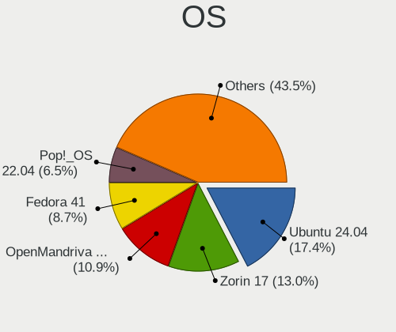

| Name                | Notebooks | Percent |
|---------------------|-----------|---------|
| Ubuntu 22.04        | 12        | 21.43%  |
| Linux Mint 21.1     | 8         | 14.29%  |
| OpenMandriva 23.01  | 5         | 8.93%   |
| Fedora 37           | 3         | 5.36%   |
| Debian 11           | 3         | 5.36%   |
| Ubuntu 22.10        | 2         | 3.57%   |
| SteamOS 3.4.4       | 2         | 3.57%   |
| EndeavourOS Rolling | 2         | 3.57%   |
| ArcoLinux Rolling   | 2         | 3.57%   |
| Zorin 16            | 1         | 1.79%   |
| Xubuntu 22.04       | 1         | 1.79%   |
| Ubuntu Studio 22.10 | 1         | 1.79%   |
| Ubuntu Budgie 22.10 | 1         | 1.79%   |
| Ubuntu 20.04        | 1         | 1.79%   |
| SteamOS 3.4.5       | 1         | 1.79%   |
| openSUSE Leap-15.4  | 1         | 1.79%   |
| Manjaro 22.0.4      | 1         | 1.79%   |
| Manjaro 22.0.3      | 1         | 1.79%   |
| Manjaro 22.0.1      | 1         | 1.79%   |
| Manjaro             | 1         | 1.79%   |
| Lubuntu 20.04       | 1         | 1.79%   |
| Linux Mint 21       | 1         | 1.79%   |
| Linux Mint 20.3     | 1         | 1.79%   |
| Linux Mint 20.2     | 1         | 1.79%   |
| KDE neon 22.04      | 1         | 1.79%   |
| Arch Rolling        | 1         | 1.79%   |

OS Family
---------

OS without a version

| Name          | Notebooks | Percent |
|---------------|-----------|---------|
| Ubuntu        | 15        | 26.79%  |
| Linux Mint    | 11        | 19.64%  |
| OpenMandriva  | 5         | 8.93%   |
| Manjaro       | 4         | 7.14%   |
| SteamOS       | 3         | 5.36%   |
| Fedora        | 3         | 5.36%   |
| Debian        | 3         | 5.36%   |
| EndeavourOS   | 2         | 3.57%   |
| ArcoLinux     | 2         | 3.57%   |
| Zorin         | 1         | 1.79%   |
| Xubuntu       | 1         | 1.79%   |
| Ubuntu Studio | 1         | 1.79%   |
| Ubuntu Budgie | 1         | 1.79%   |
| openSUSE      | 1         | 1.79%   |
| Lubuntu       | 1         | 1.79%   |
| KDE neon      | 1         | 1.79%   |
| Arch          | 1         | 1.79%   |

Kernel
------

Version of the Linux kernel

| Version                      | Notebooks | Percent |
|------------------------------|-----------|---------|
| 5.15.0-60-generic            | 14        | 25%     |
| 5.15.0-58-generic            | 7         | 12.5%   |
| 5.19.0-32-generic            | 3         | 5.36%   |
| 5.13.0-valve36-1-neptune     | 3         | 5.36%   |
| 6.1.4-desktop-1omv2301       | 2         | 3.57%   |
| 6.1.11-arch1-1               | 2         | 3.57%   |
| 6.1.11-1-MANJARO             | 2         | 3.57%   |
| 6.1.1-desktop-1omv2290       | 2         | 3.57%   |
| 5.4.0-139-generic            | 2         | 3.57%   |
| 5.10.0-21-amd64              | 2         | 3.57%   |
| 6.2.1-desktop-1omv2390       | 1         | 1.79%   |
| 6.1.8-200.fc37.x86_64        | 1         | 1.79%   |
| 6.1.7-1-MANJARO              | 1         | 1.79%   |
| 6.1.7-060107-generic         | 1         | 1.79%   |
| 6.1.12-zen1-1-zen            | 1         | 1.79%   |
| 6.1.11-200.fc37.x86_64       | 1         | 1.79%   |
| 6.1.10-arch1-1               | 1         | 1.79%   |
| 6.1.10-200.fc37.x86_64       | 1         | 1.79%   |
| 5.4.0-131-generic            | 1         | 1.79%   |
| 5.19.0-35-generic            | 1         | 1.79%   |
| 5.19.0-31-generic            | 1         | 1.79%   |
| 5.19.0-1015-lowlatency       | 1         | 1.79%   |
| 5.15.94-1-MANJARO            | 1         | 1.79%   |
| 5.15.91-4-lts                | 1         | 1.79%   |
| 5.14.21-150400.24.41-default | 1         | 1.79%   |
| 5.14.0-1057-oem              | 1         | 1.79%   |
| 5.10.0-20-amd64              | 1         | 1.79%   |

Kernel Family
-------------

Linux kernel without a distro release

| Version | Notebooks | Percent |
|---------|-----------|---------|
| 5.15.0  | 21        | 37.5%   |
| 5.19.0  | 6         | 10.71%  |
| 6.1.11  | 5         | 8.93%   |
| 5.4.0   | 3         | 5.36%   |
| 5.13.0  | 3         | 5.36%   |
| 5.10.0  | 3         | 5.36%   |
| 6.1.7   | 2         | 3.57%   |
| 6.1.4   | 2         | 3.57%   |
| 6.1.10  | 2         | 3.57%   |
| 6.1.1   | 2         | 3.57%   |
| 6.2.1   | 1         | 1.79%   |
| 6.1.8   | 1         | 1.79%   |
| 6.1.12  | 1         | 1.79%   |
| 5.15.94 | 1         | 1.79%   |
| 5.15.91 | 1         | 1.79%   |
| 5.14.21 | 1         | 1.79%   |
| 5.14.0  | 1         | 1.79%   |

Kernel Major Ver.
-----------------

Linux kernel major version

| Version | Notebooks | Percent |
|---------|-----------|---------|
| 5.15    | 23        | 41.07%  |
| 6.1     | 15        | 26.79%  |
| 5.19    | 6         | 10.71%  |
| 5.4     | 3         | 5.36%   |
| 5.13    | 3         | 5.36%   |
| 5.10    | 3         | 5.36%   |
| 5.14    | 2         | 3.57%   |
| 6.2     | 1         | 1.79%   |

Arch
----

OS architecture (x86_64, i586, etc.)

| Name   | Notebooks | Percent |
|--------|-----------|---------|
| x86_64 | 56        | 100%    |

DE
--

Desktop Environment

| Name            | Notebooks | Percent |
|-----------------|-----------|---------|
| GNOME           | 24        | 42.86%  |
| KDE5            | 12        | 21.43%  |
| X-Cinnamon      | 11        | 19.64%  |
| XFCE            | 3         | 5.36%   |
| qtile           | 1         | 1.79%   |
| openbox         | 1         | 1.79%   |
| LXQt            | 1         | 1.79%   |
| GNOME Flashback | 1         | 1.79%   |
| Cinnamon        | 1         | 1.79%   |
| Budgie          | 1         | 1.79%   |

Display Server
--------------

X11 or Wayland

| Name    | Notebooks | Percent |
|---------|-----------|---------|
| X11     | 35        | 62.5%   |
| Wayland | 20        | 35.71%  |
| Tty     | 1         | 1.79%   |

Display Manager
---------------

SDDM, LightDM, etc.

| Name    | Notebooks | Percent |
|---------|-----------|---------|
| Unknown | 18        | 32.14%  |
| GDM3    | 14        | 25%     |
| LightDM | 9         | 16.07%  |
| SDDM    | 8         | 14.29%  |
| GDM     | 7         | 12.5%   |

OS Lang
-------

Language

| Lang    | Notebooks | Percent |
|---------|-----------|---------|
| en_US   | 29        | 51.79%  |
| nl_NL   | 17        | 30.36%  |
| pl_PL   | 2         | 3.57%   |
| en_GB   | 2         | 3.57%   |
| ru_RU   | 1         | 1.79%   |
| ro_RO   | 1         | 1.79%   |
| nb_NO   | 1         | 1.79%   |
| es_CO   | 1         | 1.79%   |
| C       | 1         | 1.79%   |
| Unknown | 1         | 1.79%   |

Boot Mode
---------

EFI or BIOS

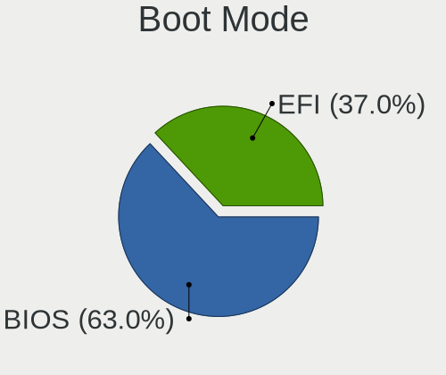

| Mode | Notebooks | Percent |
|------|-----------|---------|
| EFI  | 30        | 53.57%  |
| BIOS | 26        | 46.43%  |

Filesystem
----------

Type of filesystem

| Type    | Notebooks | Percent |
|---------|-----------|---------|
| Ext4    | 45        | 80.36%  |
| Btrfs   | 8         | 14.29%  |
| Overlay | 2         | 3.57%   |
| Xfs     | 1         | 1.79%   |

Part. scheme
------------

Scheme of partitioning

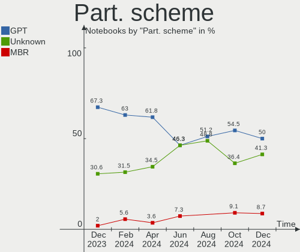

| Type    | Notebooks | Percent |
|---------|-----------|---------|
| GPT     | 30        | 53.57%  |
| Unknown | 18        | 32.14%  |
| MBR     | 8         | 14.29%  |

Dual Boot with Linux/BSD
------------------------

Hosting more than one Linux/BSD

| Dual boot | Notebooks | Percent |
|-----------|-----------|---------|
| No        | 51        | 91.07%  |
| Yes       | 5         | 8.93%   |

Dual Boot (Win)
---------------

Hosting Linux and Windows

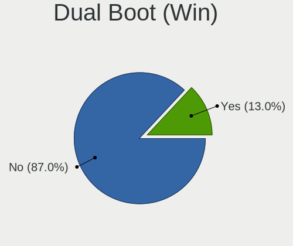

| Dual boot | Notebooks | Percent |
|-----------|-----------|---------|
| No        | 38        | 67.86%  |
| Yes       | 18        | 32.14%  |

Board
-----

Vendor
------

Motherboard manufacturer

| Name             | Notebooks | Percent |
|------------------|-----------|---------|
| Hewlett-Packard  | 18        | 32.14%  |
| Dell             | 8         | 14.29%  |
| Lenovo           | 6         | 10.71%  |
| ASUSTek Computer | 6         | 10.71%  |
| Acer             | 4         | 7.14%   |
| Valve            | 3         | 5.36%   |
| Toshiba          | 2         | 3.57%   |
| Unknown          | 2         | 3.57%   |
| TUXEDO           | 1         | 1.79%   |
| Standard         | 1         | 1.79%   |
| Sony             | 1         | 1.79%   |
| HUAWEI           | 1         | 1.79%   |
| Google           | 1         | 1.79%   |
| Apple            | 1         | 1.79%   |
| Alienware        | 1         | 1.79%   |

Model
-----

Motherboard model

| Name                                              | Notebooks | Percent |
|---------------------------------------------------|-----------|---------|
| Valve Jupiter                                     | 3         | 5.36%   |
| Unknown                                           | 3         | 5.36%   |
| Dell Latitude E6320                               | 2         | 3.57%   |
| TUXEDO Pulse 15 Gen1                              | 1         | 1.79%   |
| Toshiba Satellite P870                            | 1         | 1.79%   |
| Toshiba Satellite C660                            | 1         | 1.79%   |
| Sony VGN-FW11M                                    | 1         | 1.79%   |
| Lenovo Yoga Slim 7 Pro 14IAP7 82SV                | 1         | 1.79%   |
| Lenovo ThinkPad T510 4349AF5                      | 1         | 1.79%   |
| Lenovo ThinkPad T440p 20AWS08S01                  | 1         | 1.79%   |
| Lenovo ThinkPad P15 Gen 1 20ST0066MX              | 1         | 1.79%   |
| Lenovo ThinkPad E14 Gen 2 20TA002PMH              | 1         | 1.79%   |
| Lenovo Legion 5 15ACH6A 82NW                      | 1         | 1.79%   |
| HUAWEI NBLK-WAX9X                                 | 1         | 1.79%   |
| HP ZBook Power 15.6 inch G9 Mobile Workstation PC | 1         | 1.79%   |
| HP ZBook 15 G2                                    | 1         | 1.79%   |
| HP ProBook 6570b                                  | 1         | 1.79%   |
| HP Pavilion Laptop 15-eg0xxx                      | 1         | 1.79%   |
| HP Pavilion Gaming Laptop 15-cx0xxx               | 1         | 1.79%   |
| HP Pavilion g7                                    | 1         | 1.79%   |
| HP Pavilion dv7                                   | 1         | 1.79%   |
| HP OMEN Laptop 15-en1xxx                          | 1         | 1.79%   |
| HP OMEN by Laptop 16-c0xxx                        | 1         | 1.79%   |
| HP Notebook                                       | 1         | 1.79%   |
| HP Laptop 15s-fq1xxx                              | 1         | 1.79%   |
| HP Laptop 14s-dq1xxx                              | 1         | 1.79%   |
| HP EliteBook 8570w                                | 1         | 1.79%   |
| HP EliteBook 850 G3                               | 1         | 1.79%   |
| HP EliteBook 820 G4                               | 1         | 1.79%   |
| HP EliteBook 2570p                                | 1         | 1.79%   |
| HP Compaq Presario CQ60                           | 1         | 1.79%   |
| HP Compaq 6820s                                   | 1         | 1.79%   |
| Google Helios                                     | 1         | 1.79%   |
| Dell Precision 3571                               | 1         | 1.79%   |
| Dell Latitude E7450                               | 1         | 1.79%   |
| Dell Latitude E5570                               | 1         | 1.79%   |
| Dell Latitude 7300                                | 1         | 1.79%   |
| Dell Latitude 3320                                | 1         | 1.79%   |
| Dell Inspiron 15-3567                             | 1         | 1.79%   |
| ASUS VivoBook_ASUSLaptop X512FA_X512FA            | 1         | 1.79%   |

Model Family
------------

Motherboard model prefix

| Name              | Notebooks | Percent |
|-------------------|-----------|---------|
| Dell Latitude     | 6         | 10.71%  |
| Lenovo ThinkPad   | 4         | 7.14%   |
| HP Pavilion       | 4         | 7.14%   |
| HP EliteBook      | 4         | 7.14%   |
| Valve Jupiter     | 3         | 5.36%   |
| Unknown           | 3         | 5.36%   |
| Toshiba Satellite | 2         | 3.57%   |
| HP ZBook          | 2         | 3.57%   |
| HP OMEN           | 2         | 3.57%   |
| HP Laptop         | 2         | 3.57%   |
| HP Compaq         | 2         | 3.57%   |
| ASUS VivoBook     | 2         | 3.57%   |
| Acer Aspire       | 2         | 3.57%   |
| TUXEDO Pulse      | 1         | 1.79%   |
| Sony VGN-FW11M    | 1         | 1.79%   |
| Lenovo Yoga       | 1         | 1.79%   |
| Lenovo Legion     | 1         | 1.79%   |
| HUAWEI NBLK-WAX9X | 1         | 1.79%   |
| HP ProBook        | 1         | 1.79%   |
| HP Notebook       | 1         | 1.79%   |
| Google Helios     | 1         | 1.79%   |
| Dell Precision    | 1         | 1.79%   |
| Dell Inspiron     | 1         | 1.79%   |
| ASUS ROG          | 1         | 1.79%   |
| ASUS N76VB        | 1         | 1.79%   |
| ASUS N751JX       | 1         | 1.79%   |
| ASUS ASUS         | 1         | 1.79%   |
| Apple MacBookPro8 | 1         | 1.79%   |
| Alienware 15      | 1         | 1.79%   |
| Acer TravelMate   | 1         | 1.79%   |
| Acer Predator     | 1         | 1.79%   |

MFG Year
--------

Motherboard manufacture year

| Year | Notebooks | Percent |
|------|-----------|---------|
| 2022 | 10        | 17.86%  |
| 2021 | 7         | 12.5%   |
| 2019 | 7         | 12.5%   |
| 2012 | 5         | 8.93%   |
| 2020 | 4         | 7.14%   |
| 2016 | 4         | 7.14%   |
| 2013 | 3         | 5.36%   |
| 2011 | 3         | 5.36%   |
| 2008 | 3         | 5.36%   |
| 2015 | 2         | 3.57%   |
| 2009 | 2         | 3.57%   |
| 2023 | 1         | 1.79%   |
| 2018 | 1         | 1.79%   |
| 2017 | 1         | 1.79%   |
| 2014 | 1         | 1.79%   |
| 2010 | 1         | 1.79%   |
| 2007 | 1         | 1.79%   |

Form Factor
-----------

Physical design of the computer

| Name     | Notebooks | Percent |
|----------|-----------|---------|
| Notebook | 56        | 100%    |

Secure Boot
-----------

Enabled or disabled

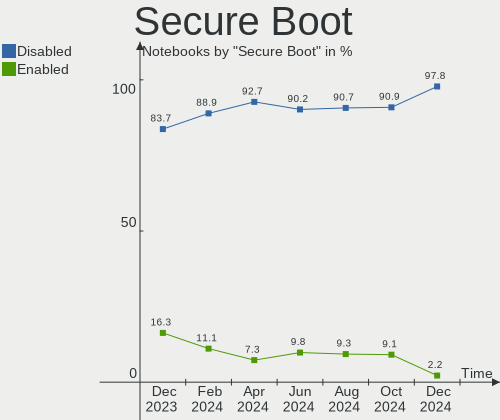

| State    | Notebooks | Percent |
|----------|-----------|---------|
| Disabled | 51        | 91.07%  |
| Enabled  | 5         | 8.93%   |

Coreboot
--------

Have coreboot on board

| Used | Notebooks | Percent |
|------|-----------|---------|
| No   | 55        | 98.21%  |
| Yes  | 1         | 1.79%   |

RAM Size
--------

Total RAM memory

| Size in GB | Notebooks | Percent |
|------------|-----------|---------|
| 4.01-8.0   | 17        | 30.36%  |
| 16.01-24.0 | 12        | 21.43%  |
| 8.01-16.0  | 12        | 21.43%  |
| 3.01-4.0   | 8         | 14.29%  |
| 32.01-64.0 | 6         | 10.71%  |
| 24.01-32.0 | 1         | 1.79%   |

RAM Used
--------

Used RAM memory

| Used GB   | Notebooks | Percent |
|-----------|-----------|---------|
| 2.01-3.0  | 19        | 33.93%  |
| 1.01-2.0  | 15        | 26.79%  |
| 4.01-8.0  | 10        | 17.86%  |
| 3.01-4.0  | 9         | 16.07%  |
| 8.01-16.0 | 2         | 3.57%   |
| 0.51-1.0  | 1         | 1.79%   |

Total Drives
------------

Number of drives on board

| Drives | Notebooks | Percent |
|--------|-----------|---------|
| 1      | 39        | 69.64%  |
| 2      | 15        | 26.79%  |
| 3      | 2         | 3.57%   |

Has CD-ROM
----------

Has CD-ROM on board

| Presented | Notebooks | Percent |
|-----------|-----------|---------|
| No        | 40        | 71.43%  |
| Yes       | 16        | 28.57%  |

Has Ethernet
------------

Has Ethernet on board

| Presented | Notebooks | Percent |
|-----------|-----------|---------|
| Yes       | 45        | 80.36%  |
| No        | 11        | 19.64%  |

Has WiFi
--------

Has WiFi module

| Presented | Notebooks | Percent |
|-----------|-----------|---------|
| Yes       | 55        | 98.21%  |
| No        | 1         | 1.79%   |

Has Bluetooth
-------------

Has Bluetooth module

| Presented | Notebooks | Percent |
|-----------|-----------|---------|
| Yes       | 46        | 82.14%  |
| No        | 10        | 17.86%  |

Location
--------

Country
-------

Geographic location (country)

| Country     | Notebooks | Percent |
|-------------|-----------|---------|
| Netherlands | 56        | 100%    |

City
----

Geographic location (city)

| City            | Notebooks | Percent |
|-----------------|-----------|---------|
| Amsterdam       | 11        | 19.64%  |
| Utrecht         | 3         | 5.36%   |
| Groningen       | 3         | 5.36%   |
| Schiedam        | 2         | 3.57%   |
| Nijmegen        | 2         | 3.57%   |
| Leende          | 2         | 3.57%   |
| Heerhugowaard   | 2         | 3.57%   |
| Eindhoven       | 2         | 3.57%   |
| Wierden         | 1         | 1.79%   |
| Waalwijk        | 1         | 1.79%   |
| Vleuten         | 1         | 1.79%   |
| The Hague       | 1         | 1.79%   |
| Steenbergen     | 1         | 1.79%   |
| Stadskanaal     | 1         | 1.79%   |
| Spijkenisse     | 1         | 1.79%   |
| Sittard         | 1         | 1.79%   |
| Rotterdam       | 1         | 1.79%   |
| Roosendaal      | 1         | 1.79%   |
| Oudega          | 1         | 1.79%   |
| Ommen           | 1         | 1.79%   |
| Noordwijkerhout | 1         | 1.79%   |
| Nederweert      | 1         | 1.79%   |
| Naaldwijk       | 1         | 1.79%   |
| Moordrecht      | 1         | 1.79%   |
| Hengelo         | 1         | 1.79%   |
| Goor            | 1         | 1.79%   |
| Goes            | 1         | 1.79%   |
| Enkhuizen       | 1         | 1.79%   |
| Ede             | 1         | 1.79%   |
| Deventer        | 1         | 1.79%   |
| Burum           | 1         | 1.79%   |
| Breda           | 1         | 1.79%   |
| Assen           | 1         | 1.79%   |
| Amstelveen      | 1         | 1.79%   |
| Almere Stad     | 1         | 1.79%   |
| Almelo          | 1         | 1.79%   |
| Aadorp          | 1         | 1.79%   |

Drives
------

Drive Vendor
------------

Hard drive vendors

| Vendor                | Notebooks | Drives | Percent |
|-----------------------|-----------|--------|---------|
| Samsung Electronics   | 22        | 23     | 29.73%  |
| Seagate               | 7         | 8      | 9.46%   |
| WDC                   | 5         | 5      | 6.76%   |
| SanDisk               | 5         | 5      | 6.76%   |
| Unknown               | 4         | 6      | 5.41%   |
| Toshiba               | 3         | 3      | 4.05%   |
| Micron Technology     | 3         | 3      | 4.05%   |
| Kingston              | 3         | 3      | 4.05%   |
| HGST                  | 3         | 3      | 4.05%   |
| LITEON                | 2         | 2      | 2.7%    |
| Intel                 | 2         | 2      | 2.7%    |
| Hitachi               | 2         | 2      | 2.7%    |
| Crucial               | 2         | 2      | 2.7%    |
| SPCC                  | 1         | 1      | 1.35%   |
| SK hynix              | 1         | 1      | 1.35%   |
| Reeinno               | 1         | 1      | 1.35%   |
| Realtek Semiconductor | 1         | 1      | 1.35%   |
| PNY                   | 1         | 1      | 1.35%   |
| Phison                | 1         | 1      | 1.35%   |
| O2 Micro              | 1         | 1      | 1.35%   |
| Lite-On Technology    | 1         | 1      | 1.35%   |
| Corsair               | 1         | 1      | 1.35%   |
| China                 | 1         | 1      | 1.35%   |
| Unknown               | 1         | 1      | 1.35%   |

Drive Model
-----------

Hard drive models

| Model                                                | Notebooks | Percent |
|------------------------------------------------------|-----------|---------|
| Samsung NVMe SSD Controller SM981/PM981/PM983 250GB  | 4         | 5.19%   |
| Sandisk WD Blue SN500 / PC SN520 NVMe SSD 256GB      | 2         | 2.6%    |
| HGST HTS721010A9E630 1TB                             | 2         | 2.6%    |
| WDC WDS500G2B0A-00SM50 500GB SSD                     | 1         | 1.3%    |
| WDC WD6400BEVT-22A0RT0 640GB                         | 1         | 1.3%    |
| WDC WD1600BEVT-60ZCT1 160GB                          | 1         | 1.3%    |
| WDC WD10SPZX-21Z10T0 1TB                             | 1         | 1.3%    |
| WDC PC SN730 SDBPNTY-1T00-1006 1TB                   | 1         | 1.3%    |
| Unknown SE64G  64GB                                  | 1         | 1.3%    |
| Unknown MMC Card  64GB                               | 1         | 1.3%    |
| Unknown MMC Card  512GB                              | 1         | 1.3%    |
| Unknown MMC Card  32GB                               | 1         | 1.3%    |
| Unknown MMC Card  134GB                              | 1         | 1.3%    |
| Unknown DG4032  32GB                                 | 1         | 1.3%    |
| Toshiba THNSNH128GMCT 128GB SSD                      | 1         | 1.3%    |
| Toshiba MQ01ABD100 1TB                               | 1         | 1.3%    |
| Toshiba MK5061GSYN 500GB                             | 1         | 1.3%    |
| SPCC Solid State Disk 1TB                            | 1         | 1.3%    |
| SK hynix SC308 SATA 512GB SSD                        | 1         | 1.3%    |
| Seagate ST9200420ASG 200GB                           | 1         | 1.3%    |
| Seagate ST500VT000-1DK142 500GB                      | 1         | 1.3%    |
| Seagate ST500LM021-1KJ152 500GB                      | 1         | 1.3%    |
| Seagate ST4000VX016-3CV104 4TB                       | 1         | 1.3%    |
| Seagate ST1000LX015-1U7172 1TB                       | 1         | 1.3%    |
| Seagate ST1000LM035-1RK172 1TB                       | 1         | 1.3%    |
| Seagate ST1000LM024 HN-M101MBB 1TB                   | 1         | 1.3%    |
| Sandisk WDC PC SN530 SDBPTPZ-1T00 1024GB             | 1         | 1.3%    |
| SanDisk SDSA6MM-016G-1006 16GB SSD                   | 1         | 1.3%    |
| SanDisk SD8SN8U-256G-1006 256GB SSD                  | 1         | 1.3%    |
| Samsung SSD 990 PRO 1TB                              | 1         | 1.3%    |
| Samsung SSD 980 PRO 1TB                              | 1         | 1.3%    |
| Samsung SSD 970 EVO Plus 1TB                         | 1         | 1.3%    |
| Samsung SSD 870 EVO 500GB                            | 1         | 1.3%    |
| Samsung SSD 870 EVO 250GB                            | 1         | 1.3%    |
| Samsung SSD 860 EVO 1TB                              | 1         | 1.3%    |
| Samsung SSD 840 PRO Series 256GB                     | 1         | 1.3%    |
| Samsung SSD 750 EVO 250GB                            | 1         | 1.3%    |
| Samsung PM991a NVMe 512GB                            | 1         | 1.3%    |
| Samsung PM991a NVMe 256GB                            | 1         | 1.3%    |
| Samsung NVMe SSD Controller PM9A1/PM9A3/980PRO 960GB | 1         | 1.3%    |

HDD Vendor
----------

Hard disk drive vendors

| Vendor  | Notebooks | Drives | Percent |
|---------|-----------|--------|---------|
| Seagate | 7         | 8      | 41.18%  |
| WDC     | 3         | 3      | 17.65%  |
| HGST    | 3         | 3      | 17.65%  |
| Toshiba | 2         | 2      | 11.76%  |
| Hitachi | 2         | 2      | 11.76%  |

SSD Vendor
----------

Solid state drive vendors

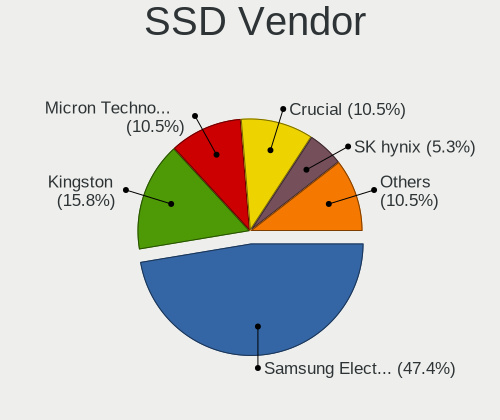

| Vendor              | Notebooks | Drives | Percent |
|---------------------|-----------|--------|---------|
| Samsung Electronics | 5         | 5      | 23.81%  |
| Kingston            | 3         | 3      | 14.29%  |
| SanDisk             | 2         | 2      | 9.52%   |
| Crucial             | 2         | 2      | 9.52%   |
| WDC                 | 1         | 1      | 4.76%   |
| Toshiba             | 1         | 1      | 4.76%   |
| SPCC                | 1         | 1      | 4.76%   |
| SK hynix            | 1         | 1      | 4.76%   |
| Reeinno             | 1         | 1      | 4.76%   |
| PNY                 | 1         | 1      | 4.76%   |
| LITEON              | 1         | 1      | 4.76%   |
| Corsair             | 1         | 1      | 4.76%   |
| China               | 1         | 1      | 4.76%   |

Drive Kind
----------

HDD or SSD

| Kind    | Notebooks | Drives | Percent |
|---------|-----------|--------|---------|
| NVMe    | 28        | 32     | 41.18%  |
| SSD     | 18        | 21     | 26.47%  |
| HDD     | 17        | 18     | 25%     |
| MMC     | 4         | 6      | 5.88%   |
| Unknown | 1         | 1      | 1.47%   |

Drive Connector
---------------

SATA, SAS, NVMe, etc.

| Type | Notebooks | Drives | Percent |
|------|-----------|--------|---------|
| SATA | 33        | 39     | 50%     |
| NVMe | 28        | 32     | 42.42%  |
| MMC  | 4         | 6      | 6.06%   |
| SAS  | 1         | 1      | 1.52%   |

Drive Size
----------

Size of hard drive

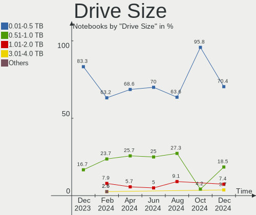

| Size in TB | Notebooks | Drives | Percent |
|------------|-----------|--------|---------|
| 0.01-0.5   | 22        | 24     | 61.11%  |
| 0.51-1.0   | 13        | 13     | 36.11%  |
| 3.01-4.0   | 1         | 2      | 2.78%   |

Space Total
-----------

Amount of disk space available on the file system

| Size in GB     | Notebooks | Percent |
|----------------|-----------|---------|
| 251-500        | 17        | 30.36%  |
| 101-250        | 17        | 30.36%  |
| 501-1000       | 12        | 21.43%  |
| 1001-2000      | 4         | 7.14%   |
| More than 3000 | 2         | 3.57%   |
| 51-100         | 2         | 3.57%   |
| 21-50          | 1         | 1.79%   |
| 1-20           | 1         | 1.79%   |

Space Used
----------

Amount of used disk space

| Used GB  | Notebooks | Percent |
|----------|-----------|---------|
| 21-50    | 17        | 30.36%  |
| 1-20     | 13        | 23.21%  |
| 251-500  | 7         | 12.5%   |
| 101-250  | 7         | 12.5%   |
| 51-100   | 7         | 12.5%   |
| 501-1000 | 4         | 7.14%   |
| 0        | 1         | 1.79%   |

Malfunc. Drives
---------------

Drive models with a malfunction

| Model                              | Notebooks | Drives | Percent |
|------------------------------------|-----------|--------|---------|
| Toshiba MK5061GSYN 500GB           | 1         | 1      | 25%     |
| Seagate ST9200420ASG 200GB         | 1         | 1      | 25%     |
| Seagate ST1000LM024 HN-M101MBB 1TB | 1         | 1      | 25%     |
| Hitachi HTS542525K9SA00 250GB      | 1         | 1      | 25%     |

Malfunc. Drive Vendor
---------------------

Vendors of faulty drives

| Vendor  | Notebooks | Drives | Percent |
|---------|-----------|--------|---------|
| Seagate | 2         | 2      | 50%     |
| Toshiba | 1         | 1      | 25%     |
| Hitachi | 1         | 1      | 25%     |

Malfunc. HDD Vendor
-------------------

Vendors of faulty HDD drives

| Vendor  | Notebooks | Drives | Percent |
|---------|-----------|--------|---------|
| Seagate | 2         | 2      | 50%     |
| Toshiba | 1         | 1      | 25%     |
| Hitachi | 1         | 1      | 25%     |

Malfunc. Drive Kind
-------------------

Kinds of faulty drives

| Kind | Notebooks | Drives | Percent |
|------|-----------|--------|---------|
| HDD  | 4         | 4      | 100%    |

Failed Drives
-------------

Failed drive models

| Model                        | Notebooks | Drives | Percent |
|------------------------------|-----------|--------|---------|
| Crucial M4-CT256M4SSD3 256GB | 1         | 1      | 100%    |

Failed Drive Vendor
-------------------

Failed drive vendors

| Vendor  | Notebooks | Drives | Percent |
|---------|-----------|--------|---------|
| Crucial | 1         | 1      | 100%    |

Drive Status
------------

Number of failed and malfunc. drives

| Status   | Notebooks | Drives | Percent |
|----------|-----------|--------|---------|
| Detected | 32        | 41     | 53.33%  |
| Works    | 23        | 32     | 38.33%  |
| Malfunc  | 4         | 4      | 6.67%   |
| Failed   | 1         | 1      | 1.67%   |

Storage controller
------------------

Storage Vendor
--------------

Storage controller vendors

| Vendor                | Notebooks | Percent |
|-----------------------|-----------|---------|
| Intel                 | 39        | 54.93%  |
| Samsung Electronics   | 17        | 23.94%  |
| SanDisk               | 4         | 5.63%   |
| Micron Technology     | 3         | 4.23%   |
| AMD                   | 3         | 4.23%   |
| Realtek Semiconductor | 1         | 1.41%   |
| Phison Electronics    | 1         | 1.41%   |
| O2 Micro              | 1         | 1.41%   |
| Lite-On Technology    | 1         | 1.41%   |
| JMicron Technology    | 1         | 1.41%   |

Storage Model
-------------

Storage controller models

| Model                                                                          | Notebooks | Percent |
|--------------------------------------------------------------------------------|-----------|---------|
| Samsung NVMe SSD Controller SM981/PM981/PM983                                  | 7         | 9.33%   |
| Samsung NVMe SSD Controller 980                                                | 7         | 9.33%   |
| Intel 7 Series Chipset Family 6-port SATA Controller [AHCI mode]               | 5         | 6.67%   |
| Intel 82801IBM/IEM (ICH9M/ICH9M-E) 4 port SATA Controller [AHCI mode]          | 4         | 5.33%   |
| Intel 82801 Mobile SATA Controller [RAID mode]                                 | 4         | 5.33%   |
| Intel 8 Series/C220 Series Chipset Family 6-port SATA Controller 1 [AHCI mode] | 4         | 5.33%   |
| Intel 6 Series/C200 Series Chipset Family 6 port Mobile SATA AHCI Controller   | 4         | 5.33%   |
| Micron Non-Volatile memory controller                                          | 3         | 4%      |
| Intel Volume Management Device NVMe RAID Controller                            | 3         | 4%      |
| Intel Sunrise Point-LP SATA Controller [AHCI mode]                             | 3         | 4%      |
| AMD FCH SATA Controller [AHCI mode]                                            | 3         | 4%      |
| SanDisk WD Blue SN500 / PC SN520 NVMe SSD                                      | 2         | 2.67%   |
| Samsung NVMe SSD Controller PM9A1/PM9A3/980PRO                                 | 2         | 2.67%   |
| Intel Wildcat Point-LP SATA Controller [AHCI Mode]                             | 2         | 2.67%   |
| Intel Cannon Lake Mobile PCH SATA AHCI Controller                              | 2         | 2.67%   |
| SanDisk WD Black SN750 / PC SN730 NVMe SSD                                     | 1         | 1.33%   |
| SanDisk Non-Volatile memory controller                                         | 1         | 1.33%   |
| Samsung NVMe SSD Controller PM9B1                                              | 1         | 1.33%   |
| Samsung Electronics Non-Volatile memory controller                             | 1         | 1.33%   |
| Realtek RTS5763DL NVMe SSD Controller                                          | 1         | 1.33%   |
| Phison NVMe Storage Controller                                                 | 1         | 1.33%   |
| O2 Micro Non-Volatile memory controller                                        | 1         | 1.33%   |
| Lite-On Non-Volatile memory controller                                         | 1         | 1.33%   |
| JMicron JMB58x AHCI SATA controller                                            | 1         | 1.33%   |
| Intel Tiger Lake-LP SATA Controller                                            | 1         | 1.33%   |
| Intel SSD 600P Series                                                          | 1         | 1.33%   |
| Intel Q170/Q150/B150/H170/H110/Z170/CM236 Chipset SATA Controller [AHCI Mode]  | 1         | 1.33%   |
| Intel Non-Volatile memory controller                                           | 1         | 1.33%   |
| Intel Comet Lake SATA AHCI Controller                                          | 1         | 1.33%   |
| Intel Celeron N3350/Pentium N4200/Atom E3900 Series SATA AHCI Controller       | 1         | 1.33%   |
| Intel Cannon Point-LP SATA Controller [AHCI Mode]                              | 1         | 1.33%   |
| Intel Alder Lake-P SATA AHCI Controller                                        | 1         | 1.33%   |
| Intel 82801HM/HEM (ICH8M/ICH8M-E) SATA Controller [AHCI mode]                  | 1         | 1.33%   |
| Intel 5 Series/3400 Series Chipset 6 port SATA AHCI Controller                 | 1         | 1.33%   |
| Intel 400 Series Chipset Family SATA AHCI Controller                           | 1         | 1.33%   |

Storage Kind
------------

Kind of storage controller (IDE, SATA, NVMe, SAS, ...)

| Kind | Notebooks | Percent |
|------|-----------|---------|
| SATA | 36        | 50.7%   |
| NVMe | 28        | 39.44%  |
| RAID | 7         | 9.86%   |

Processor
---------

CPU Vendor
----------

Processor vendors

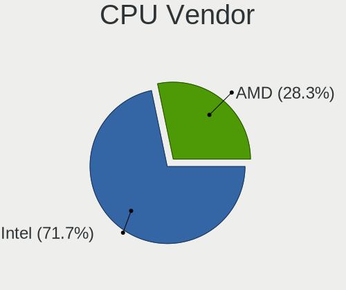

| Vendor | Notebooks | Percent |
|--------|-----------|---------|
| Intel  | 46        | 82.14%  |
| AMD    | 10        | 17.86%  |

CPU Model
---------

Processor models

| Model                                       | Notebooks | Percent |
|---------------------------------------------|-----------|---------|
| Intel 11th Gen Core i5-1135G7 @ 2.40GHz     | 4         | 7.14%   |
| AMD Ryzen 7 5800H with Radeon Graphics      | 4         | 7.14%   |
| Intel Core i7-3630QM CPU @ 2.40GHz          | 3         | 5.36%   |
| AMD Custom APU 0405                         | 3         | 5.36%   |
| Intel 12th Gen Core i7-12700H               | 2         | 3.57%   |
| Intel Pentium Dual-Core CPU T4400 @ 2.20GHz | 1         | 1.79%   |
| Intel Genuine CPU T1600 @ 1.66GHz           | 1         | 1.79%   |
| Intel Core i9-10885H CPU @ 2.40GHz          | 1         | 1.79%   |
| Intel Core i7-9750H CPU @ 2.60GHz           | 1         | 1.79%   |
| Intel Core i7-8665U CPU @ 1.90GHz           | 1         | 1.79%   |
| Intel Core i7-7600U CPU @ 2.80GHz           | 1         | 1.79%   |
| Intel Core i7-6700HQ CPU @ 2.60GHz          | 1         | 1.79%   |
| Intel Core i7-6600U CPU @ 2.60GHz           | 1         | 1.79%   |
| Intel Core i7-6500U CPU @ 2.50GHz           | 1         | 1.79%   |
| Intel Core i7-4750HQ CPU @ 2.00GHz          | 1         | 1.79%   |
| Intel Core i7-4710MQ CPU @ 2.50GHz          | 1         | 1.79%   |
| Intel Core i7-4702MQ CPU @ 2.20GHz          | 1         | 1.79%   |
| Intel Core i7-3520M CPU @ 2.90GHz           | 1         | 1.79%   |
| Intel Core i7-2635QM CPU @ 2.00GHz          | 1         | 1.79%   |
| Intel Core i7-1065G7 CPU @ 1.30GHz          | 1         | 1.79%   |
| Intel Core i5-8300H CPU @ 2.30GHz           | 1         | 1.79%   |
| Intel Core i5-8265U CPU @ 1.60GHz           | 1         | 1.79%   |
| Intel Core i5-5300U CPU @ 2.30GHz           | 1         | 1.79%   |
| Intel Core i5-4300M CPU @ 2.60GHz           | 1         | 1.79%   |
| Intel Core i5-3210M CPU @ 2.50GHz           | 1         | 1.79%   |
| Intel Core i5-2540M CPU @ 2.60GHz           | 1         | 1.79%   |
| Intel Core i5-2520M CPU @ 2.50GHz           | 1         | 1.79%   |
| Intel Core i5-2450M CPU @ 2.50GHz           | 1         | 1.79%   |
| Intel Core i5-2430M CPU @ 2.40GHz           | 1         | 1.79%   |
| Intel Core i5-10300H CPU @ 2.50GHz          | 1         | 1.79%   |
| Intel Core i5-10210U CPU @ 1.60GHz          | 1         | 1.79%   |
| Intel Core i5 CPU M 540 @ 2.53GHz           | 1         | 1.79%   |
| Intel Core i3-7100U CPU @ 2.40GHz           | 1         | 1.79%   |
| Intel Core i3-5005U CPU @ 2.00GHz           | 1         | 1.79%   |
| Intel Core i3-1005G1 CPU @ 1.20GHz          | 1         | 1.79%   |
| Intel Core 2 Duo CPU T7250 @ 2.00GHz        | 1         | 1.79%   |
| Intel Core 2 Duo CPU T5800 @ 2.00GHz        | 1         | 1.79%   |
| Intel Core 2 Duo CPU P8400 @ 2.26GHz        | 1         | 1.79%   |
| Intel Atom Processor E3940 @ 1.60GHz        | 1         | 1.79%   |
| Intel 12th Gen Core i7-12800H               | 1         | 1.79%   |

CPU Model Family
----------------

Processor model prefix

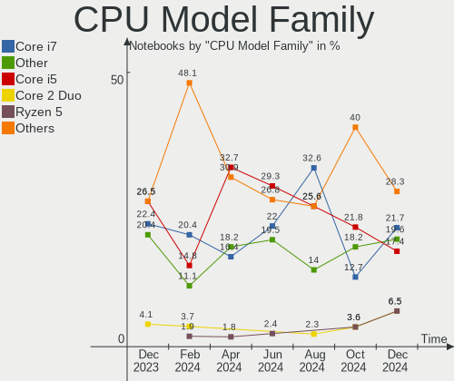

| Model                   | Notebooks | Percent |
|-------------------------|-----------|---------|
| Intel Core i7           | 15        | 26.79%  |
| Other                   | 12        | 21.43%  |
| Intel Core i5           | 12        | 21.43%  |
| AMD Ryzen 7             | 6         | 10.71%  |
| Intel Core i3           | 3         | 5.36%   |
| Intel Core 2 Duo        | 3         | 5.36%   |
| Intel Pentium Dual-Core | 1         | 1.79%   |
| Intel Genuine           | 1         | 1.79%   |
| Intel Core i9           | 1         | 1.79%   |
| Intel Atom              | 1         | 1.79%   |
| AMD Ryzen 5             | 1         | 1.79%   |

CPU Cores
---------

Number of processor cores

| Number | Notebooks | Percent |
|--------|-----------|---------|
| 4      | 25        | 44.64%  |
| 2      | 19        | 33.93%  |
| 8      | 6         | 10.71%  |
| 14     | 3         | 5.36%   |
| 12     | 1         | 1.79%   |
| 6      | 1         | 1.79%   |
| 1      | 1         | 1.79%   |

CPU Sockets
-----------

Number of sockets

| Number | Notebooks | Percent |
|--------|-----------|---------|
| 1      | 56        | 100%    |

CPU Threads
-----------

Threads per core (Hyper-Threading)

| Number | Notebooks | Percent |
|--------|-----------|---------|
| 2      | 50        | 89.29%  |
| 1      | 6         | 10.71%  |

CPU Op-Modes
------------

CPU Operation Modes (32-bit, 64-bit)

| Op mode        | Notebooks | Percent |
|----------------|-----------|---------|
| 32-bit, 64-bit | 56        | 100%    |

CPU Microcode
-------------

Microcode number

| Number     | Notebooks | Percent |
|------------|-----------|---------|
| Unknown    | 24        | 42.86%  |
| 0x806c1    | 5         | 8.93%   |
| 0x906a3    | 3         | 5.36%   |
| 0x806ec    | 3         | 5.36%   |
| 0x906ea    | 2         | 3.57%   |
| 0x6fd      | 2         | 3.57%   |
| 0x406e3    | 2         | 3.57%   |
| 0x306d4    | 2         | 3.57%   |
| 0x306c3    | 2         | 3.57%   |
| 0x206a7    | 2         | 3.57%   |
| 0xa0652    | 1         | 1.79%   |
| 0x506ca    | 1         | 1.79%   |
| 0x40661    | 1         | 1.79%   |
| 0x306a9    | 1         | 1.79%   |
| 0x1067a    | 1         | 1.79%   |
| 0x10676    | 1         | 1.79%   |
| 0x0a50000d | 1         | 1.79%   |
| 0x0a50000c | 1         | 1.79%   |
| 0x08600103 | 1         | 1.79%   |

CPU Microarch
-------------

Microarchitecture

| Name             | Notebooks | Percent |
|------------------|-----------|---------|
| KabyLake         | 7         | 12.5%   |
| TigerLake        | 5         | 8.93%   |
| SandyBridge      | 5         | 8.93%   |
| IvyBridge        | 5         | 8.93%   |
| Zen 3            | 4         | 7.14%   |
| Haswell          | 4         | 7.14%   |
| Unknown          | 4         | 7.14%   |
| Skylake          | 3         | 5.36%   |
| Core             | 3         | 5.36%   |
| Alderlake Hybrid | 3         | 5.36%   |
| Zen+             | 2         | 3.57%   |
| Penryn           | 2         | 3.57%   |
| IceLake          | 2         | 3.57%   |
| CometLake        | 2         | 3.57%   |
| Broadwell        | 2         | 3.57%   |
| Zen 2            | 1         | 1.79%   |
| Westmere         | 1         | 1.79%   |
| Goldmont         | 1         | 1.79%   |

Graphics
--------

GPU Vendor
----------

Vendors of graphics cards

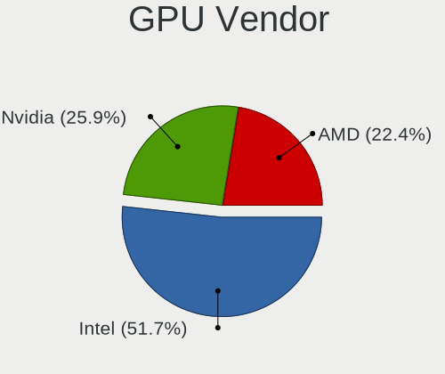

| Vendor | Notebooks | Percent |
|--------|-----------|---------|
| Intel  | 38        | 51.35%  |
| Nvidia | 19        | 25.68%  |
| AMD    | 17        | 22.97%  |

GPU Model
---------

Graphics card models

| Model                                                                                 | Notebooks | Percent |
|---------------------------------------------------------------------------------------|-----------|---------|
| Intel TigerLake-LP GT2 [Iris Xe Graphics]                                             | 5         | 6.67%   |
| Intel Alder Lake-P Integrated Graphics Controller                                     | 4         | 5.33%   |
| Intel 3rd Gen Core processor Graphics Controller                                      | 4         | 5.33%   |
| Intel 2nd Generation Core Processor Family Integrated Graphics Controller             | 4         | 5.33%   |
| AMD Cezanne [Radeon Vega Series / Radeon Vega Mobile Series]                          | 4         | 5.33%   |
| AMD VanGogh [AMD Custom GPU 0405]                                                     | 3         | 4%      |
| Nvidia TU117GLM [T600 Laptop GPU]                                                     | 2         | 2.67%   |
| Nvidia GA106M [GeForce RTX 3060 Mobile / Max-Q]                                       | 2         | 2.67%   |
| Intel WhiskeyLake-U GT2 [UHD Graphics 620]                                            | 2         | 2.67%   |
| Intel Skylake GT2 [HD Graphics 520]                                                   | 2         | 2.67%   |
| Intel HD Graphics 620                                                                 | 2         | 2.67%   |
| Intel HD Graphics 5500                                                                | 2         | 2.67%   |
| Intel CometLake-H GT2 [UHD Graphics]                                                  | 2         | 2.67%   |
| Intel CoffeeLake-H GT2 [UHD Graphics 630]                                             | 2         | 2.67%   |
| Intel 4th Gen Core Processor Integrated Graphics Controller                           | 2         | 2.67%   |
| AMD Seymour [Radeon HD 6400M/7400M Series]                                            | 2         | 2.67%   |
| AMD Picasso/Raven 2 [Radeon Vega Series / Radeon Vega Mobile Series]                  | 2         | 2.67%   |
| Nvidia TU117M                                                                         | 1         | 1.33%   |
| Nvidia TU106M [GeForce RTX 2060 Mobile]                                               | 1         | 1.33%   |
| Nvidia TU106GLM [Quadro RTX 3000 Mobile / Max-Q]                                      | 1         | 1.33%   |
| Nvidia GT218M [NVS 3100M]                                                             | 1         | 1.33%   |
| Nvidia GT218M [GeForce 315M]                                                          | 1         | 1.33%   |
| Nvidia GP107M [GeForce GTX 1050 Mobile]                                               | 1         | 1.33%   |
| Nvidia GP104BM [GeForce GTX 1070 Mobile]                                              | 1         | 1.33%   |
| Nvidia GM107M [GeForce GTX 950M]                                                      | 1         | 1.33%   |
| Nvidia GK107M [GeForce GT 740M]                                                       | 1         | 1.33%   |
| Nvidia GK107GLM [Quadro K1100M]                                                       | 1         | 1.33%   |
| Nvidia GK106M [GeForce GTX 760M]                                                      | 1         | 1.33%   |
| Nvidia GF108M [GeForce GT 620M/630M/635M/640M LE]                                     | 1         | 1.33%   |
| Nvidia GA107M [GeForce RTX 3050 Ti Mobile]                                            | 1         | 1.33%   |
| Nvidia GA104M [GeForce RTX 3070 Mobile / Max-Q]                                       | 1         | 1.33%   |
| Nvidia G98M [GeForce 9200M GS]                                                        | 1         | 1.33%   |
| Intel Mobile 4 Series Chipset Integrated Graphics Controller                          | 1         | 1.33%   |
| Intel Iris Plus Graphics G7                                                           | 1         | 1.33%   |
| Intel Iris Plus Graphics G1 (Ice Lake)                                                | 1         | 1.33%   |
| Intel HD Graphics 530                                                                 | 1         | 1.33%   |
| Intel HD Graphics 500                                                                 | 1         | 1.33%   |
| Intel Crystal Well Integrated Graphics Controller                                     | 1         | 1.33%   |
| Intel CometLake-U GT2 [UHD Graphics]                                                  | 1         | 1.33%   |
| AMD Topaz XT [Radeon R7 M260/M265 / M340/M360 / M440/M445 / 530/535 / 620/625 Mobile] | 1         | 1.33%   |

GPU Combo
---------

Combinations of graphics cards

| Name           | Notebooks | Percent |
|----------------|-----------|---------|
| 1 x Intel      | 23        | 41.07%  |
| Intel + Nvidia | 11        | 19.64%  |
| 1 x AMD        | 10        | 17.86%  |
| 1 x Nvidia     | 5         | 8.93%   |
| Intel + AMD    | 3         | 5.36%   |
| AMD + Nvidia   | 3         | 5.36%   |
| 2 x AMD        | 1         | 1.79%   |

GPU Driver
----------

Free vs proprietary

| Driver      | Notebooks | Percent |
|-------------|-----------|---------|
| Free        | 47        | 83.93%  |
| Proprietary | 6         | 10.71%  |
| Unknown     | 3         | 5.36%   |

GPU Memory
----------

Total video memory

| Size in GB | Notebooks | Percent |
|------------|-----------|---------|
| Unknown    | 41        | 73.21%  |
| 1.01-2.0   | 5         | 8.93%   |
| 0.01-0.5   | 5         | 8.93%   |
| 7.01-8.0   | 2         | 3.57%   |
| 5.01-6.0   | 2         | 3.57%   |
| 0.51-1.0   | 1         | 1.79%   |

Monitor
-------

Monitor Vendor
--------------

Monitor vendors

| Vendor                  | Notebooks | Percent |
|-------------------------|-----------|---------|
| AU Optronics            | 12        | 21.43%  |
| BOE                     | 9         | 16.07%  |
| LG Display              | 7         | 12.5%   |
| Chimei Innolux          | 7         | 12.5%   |
| Samsung Electronics     | 5         | 8.93%   |
| Valve                   | 3         | 5.36%   |
| LG Philips              | 2         | 3.57%   |
| Goldstar                | 2         | 3.57%   |
| Chi Mei Optoelectronics | 2         | 3.57%   |
| PANDA                   | 1         | 1.79%   |
| Lenovo                  | 1         | 1.79%   |
| Iiyama                  | 1         | 1.79%   |
| Dell                    | 1         | 1.79%   |
| CSO                     | 1         | 1.79%   |
| Apple                   | 1         | 1.79%   |
| AOC                     | 1         | 1.79%   |

Monitor Model
-------------

Monitor models

| Model                                                                     | Notebooks | Percent |
|---------------------------------------------------------------------------|-----------|---------|
| Valve ANX7530 U VLV3001 800x1280 100x150mm 7.1-inch                       | 3         | 5.36%   |
| LG Display LCD Monitor LGD02EC 1366x768 293x165mm 13.2-inch               | 2         | 3.57%   |
| Samsung Electronics SyncMaster SAM0226 1440x900 410x257mm 19.1-inch       | 1         | 1.79%   |
| Samsung Electronics LCD Monitor SEC325A 1366x768 344x194mm 15.5-inch      | 1         | 1.79%   |
| Samsung Electronics LCD Monitor SDC4C48 1920x1080 344x194mm 15.5-inch     | 1         | 1.79%   |
| Samsung Electronics LCD Monitor SDC4171 2880x1800 302x189mm 14.0-inch     | 1         | 1.79%   |
| Samsung Electronics LCD Monitor SDC4141 3840x2160 344x194mm 15.5-inch     | 1         | 1.79%   |
| PANDA LCD Monitor NCP004D 1920x1080 344x194mm 15.5-inch                   | 1         | 1.79%   |
| LG Philips LCD Monitor LPLA104 1440x900 367x230mm 17.1-inch               | 1         | 1.79%   |
| LG Philips LCD Monitor LPL0901 1440x900 367x230mm 17.1-inch               | 1         | 1.79%   |
| LG Display LCD Monitor LGD0762 1920x1080 344x194mm 15.5-inch              | 1         | 1.79%   |
| LG Display LCD Monitor LGD0709 1920x1080 344x194mm 15.5-inch              | 1         | 1.79%   |
| LG Display LCD Monitor LGD05DB 1920x1080 294x165mm 13.3-inch              | 1         | 1.79%   |
| LG Display LCD Monitor LGD046C 1920x1080 382x215mm 17.3-inch              | 1         | 1.79%   |
| LG Display LCD Monitor LGD02DC 1366x768 344x194mm 15.5-inch               | 1         | 1.79%   |
| Lenovo LCD Monitor LEN40B1 1600x900 344x194mm 15.5-inch                   | 1         | 1.79%   |
| Iiyama PLE2208HDD IVM5616 1920x1080 477x268mm 21.5-inch                   | 1         | 1.79%   |
| Goldstar ULTRAFINE GSM5BC2 3840x2160 600x340mm 27.2-inch                  | 1         | 1.79%   |
| Goldstar 38GN950 GSM7753 3840x1600 879x366mm 37.5-inch                    | 1         | 1.79%   |
| Dell U2415 DELA0BA 1920x1080 518x324mm 24.1-inch                          | 1         | 1.79%   |
| CSO LCD Monitor CSO140C 2880x1800 302x188mm 14.0-inch                     | 1         | 1.79%   |
| Chimei Innolux LCD Monitor CMN1735 1920x1080 382x215mm 17.3-inch          | 1         | 1.79%   |
| Chimei Innolux LCD Monitor CMN15F5 1920x1080 344x193mm 15.5-inch          | 1         | 1.79%   |
| Chimei Innolux LCD Monitor CMN15E8 1920x1080 344x193mm 15.5-inch          | 1         | 1.79%   |
| Chimei Innolux LCD Monitor CMN15C2 1920x1080 344x194mm 15.5-inch          | 1         | 1.79%   |
| Chimei Innolux LCD Monitor CMN1542 1366x768 344x193mm 15.5-inch           | 1         | 1.79%   |
| Chimei Innolux LCD Monitor CMN14FF 1920x1080 309x173mm 13.9-inch          | 1         | 1.79%   |
| Chimei Innolux LCD Monitor CMN1242 1920x1080 276x155mm 12.5-inch          | 1         | 1.79%   |
| Chi Mei Optoelectronics LCD Monitor CMO1720 1920x1080 382x215mm 17.3-inch | 1         | 1.79%   |
| Chi Mei Optoelectronics LCD Monitor CMO1719 1600x900 382x215mm 17.3-inch  | 1         | 1.79%   |
| BOE LCD Monitor BOE0A2D 2560x1440 344x194mm 15.5-inch                     | 1         | 1.79%   |
| BOE LCD Monitor BOE0995 1920x1080 382x215mm 17.3-inch                     | 1         | 1.79%   |
| BOE LCD Monitor BOE0977 2560x1440 381x214mm 17.2-inch                     | 1         | 1.79%   |
| BOE LCD Monitor BOE0924 1920x1080 294x165mm 13.3-inch                     | 1         | 1.79%   |
| BOE LCD Monitor BOE0900 1920x1080 344x194mm 15.5-inch                     | 1         | 1.79%   |
| BOE LCD Monitor BOE0877 1920x1080 309x173mm 13.9-inch                     | 1         | 1.79%   |
| BOE LCD Monitor BOE0818 1920x1080 344x194mm 15.5-inch                     | 1         | 1.79%   |
| BOE LCD Monitor BOE07A1 1920x1080 344x193mm 15.5-inch                     | 1         | 1.79%   |
| BOE LCD Monitor BOE0671 1366x768 344x194mm 15.5-inch                      | 1         | 1.79%   |
| AU Optronics LCD Monitor AUO623D 1920x1080 309x174mm 14.0-inch            | 1         | 1.79%   |

Monitor Resolution
------------------

Monitor screen resolution

| Resolution         | Notebooks | Percent |
|--------------------|-----------|---------|
| 1920x1080 (FHD)    | 27        | 49.09%  |
| 1366x768 (WXGA)    | 10        | 18.18%  |
| 800x1280           | 3         | 5.45%   |
| 3840x2160 (4K)     | 3         | 5.45%   |
| 1600x900 (HD+)     | 3         | 5.45%   |
| 1440x900 (WXGA+)   | 3         | 5.45%   |
| 2880x1800          | 2         | 3.64%   |
| 2560x1440 (QHD)    | 2         | 3.64%   |
| 3840x1600          | 1         | 1.82%   |
| 1680x1050 (WSXGA+) | 1         | 1.82%   |

Monitor Diagonal
----------------

Diagonal size in inches

| Inches  | Notebooks | Percent |
|---------|-----------|---------|
| 15      | 23        | 41.07%  |
| 17      | 9         | 16.07%  |
| 13      | 6         | 10.71%  |
| 14      | 5         | 8.93%   |
| 7       | 3         | 5.36%   |
| 12      | 2         | 3.57%   |
| 37      | 1         | 1.79%   |
| 31      | 1         | 1.79%   |
| 27      | 1         | 1.79%   |
| 24      | 1         | 1.79%   |
| 21      | 1         | 1.79%   |
| 19      | 1         | 1.79%   |
| 18      | 1         | 1.79%   |
| Unknown | 1         | 1.79%   |

Monitor Width
-------------

Physical width

| Width in mm | Notebooks | Percent |
|-------------|-----------|---------|
| 301-350     | 30        | 54.55%  |
| 351-400     | 9         | 16.36%  |
| 201-300     | 6         | 10.91%  |
| 1-100       | 3         | 5.45%   |
| 501-600     | 2         | 3.64%   |
| 401-500     | 2         | 3.64%   |
| 801-900     | 1         | 1.82%   |
| 601-700     | 1         | 1.82%   |
| Unknown     | 1         | 1.82%   |

Aspect Ratio
------------

Proportional relationship between the width and the height

| Ratio   | Notebooks | Percent |
|---------|-----------|---------|
| 16/9    | 43        | 78.18%  |
| 16/10   | 7         | 12.73%  |
| 0.67    | 3         | 5.45%   |
| 21/9    | 1         | 1.82%   |
| Unknown | 1         | 1.82%   |

Monitor Area
------------

Area in inch

| Area in inch | Notebooks | Percent |
|----------------|-----------|---------|
| 101-110        | 23        | 41.07%  |
| 81-90          | 7         | 12.5%   |
| 121-130        | 6         | 10.71%  |
| 71-80          | 4         | 7.14%   |
| 1-40           | 3         | 5.36%   |
| 131-140        | 3         | 5.36%   |
| 61-70          | 2         | 3.57%   |
| 351-500        | 2         | 3.57%   |
| 301-350        | 1         | 1.79%   |
| 251-300        | 1         | 1.79%   |
| 201-250        | 1         | 1.79%   |
| 151-200        | 1         | 1.79%   |
| 141-150        | 1         | 1.79%   |
| Unknown        | 1         | 1.79%   |

Pixel Density
-------------

Pixels per inch

| Density       | Notebooks | Percent |
|---------------|-----------|---------|
| 121-160       | 25        | 44.64%  |
| 101-120       | 14        | 25%     |
| 161-240       | 8         | 14.29%  |
| 51-100        | 5         | 8.93%   |
| More than 240 | 3         | 5.36%   |
| Unknown       | 1         | 1.79%   |

Multiple Monitors
-----------------

Total monitors connected

| Total | Notebooks | Percent |
|-------|-----------|---------|
| 1     | 51        | 91.07%  |
| 2     | 3         | 5.36%   |
| 0     | 2         | 3.57%   |

Network
-------

Net Controller Vendor
---------------------

Controller vendors

| Vendor                   | Notebooks | Percent |
|--------------------------|-----------|---------|
| Realtek Semiconductor    | 29        | 34.52%  |
| Intel                    | 27        | 32.14%  |
| Qualcomm Atheros         | 10        | 11.9%   |
| MediaTek                 | 4         | 4.76%   |
| Broadcom                 | 3         | 3.57%   |
| Hewlett-Packard          | 2         | 2.38%   |
| DisplayLink              | 2         | 2.38%   |
| Broadcom Limited         | 2         | 2.38%   |
| Ralink                   | 1         | 1.19%   |
| Prusa                    | 1         | 1.19%   |
| Marvell Technology Group | 1         | 1.19%   |
| Dell                     | 1         | 1.19%   |
| ASIX Electronics         | 1         | 1.19%   |

Net Controller Model
--------------------

Controller models

| Model                                                                   | Notebooks | Percent |
|-------------------------------------------------------------------------|-----------|---------|
| Realtek RTL8111/8168/8411 PCI Express Gigabit Ethernet Controller       | 13        | 11.93%  |
| Realtek RTL8822CE 802.11ac PCIe Wireless Network Adapter                | 4         | 3.67%   |
| Realtek RTL810xE PCI Express Fast Ethernet controller                   | 4         | 3.67%   |
| MediaTek MT7921 802.11ax PCI Express Wireless Network Adapter           | 4         | 3.67%   |
| Intel 82579LM Gigabit Network Connection (Lewisville)                   | 4         | 3.67%   |
| Realtek RTL8821CE 802.11ac PCIe Wireless Network Adapter                | 3         | 2.75%   |
| Realtek RTL8152 Fast Ethernet Adapter                                   | 3         | 2.75%   |
| Intel Wi-Fi 6 AX201                                                     | 3         | 2.75%   |
| Intel Alder Lake-P PCH CNVi WiFi                                        | 3         | 2.75%   |
| Realtek RTL8852AE 802.11ax PCIe Wireless Network Adapter                | 2         | 1.83%   |
| Qualcomm Atheros QCA9377 802.11ac Wireless Network Adapter              | 2         | 1.83%   |
| Qualcomm Atheros AR9462 Wireless Network Adapter                        | 2         | 1.83%   |
| Qualcomm Atheros AR8161 Gigabit Ethernet                                | 2         | 1.83%   |
| Intel Wireless 8260                                                     | 2         | 1.83%   |
| Intel Wireless 7260                                                     | 2         | 1.83%   |
| Intel Wi-Fi 6 AX200                                                     | 2         | 1.83%   |
| Intel Ethernet Connection I217-LM                                       | 2         | 1.83%   |
| Intel Centrino Ultimate-N 6300                                          | 2         | 1.83%   |
| Intel Centrino Advanced-N 6205 [Taylor Peak]                            | 2         | 1.83%   |
| Realtek RTL8822BE 802.11a/b/g/n/ac WiFi adapter                         | 1         | 0.92%   |
| Realtek RTL8811AU 802.11a/b/g/n/ac WLAN Adapter                         | 1         | 0.92%   |
| Realtek RTL8723AE PCIe Wireless Network Adapter                         | 1         | 0.92%   |
| Realtek RTL8188EE Wireless Network Adapter                              | 1         | 0.92%   |
| Realtek RTL8188CE 802.11b/g/n WiFi Adapter                              | 1         | 0.92%   |
| Realtek RTL8153 Gigabit Ethernet Adapter                                | 1         | 0.92%   |
| Realtek RTL8125 2.5GbE Controller                                       | 1         | 0.92%   |
| Ralink RT5390 Wireless 802.11n 1T/1R PCIe                               | 1         | 0.92%   |
| Qualcomm Atheros QCA6174 802.11ac Wireless Network Adapter              | 1         | 0.92%   |
| Qualcomm Atheros Killer E2500 Gigabit Ethernet Controller               | 1         | 0.92%   |
| Qualcomm Atheros Killer E2400 Gigabit Ethernet Controller               | 1         | 0.92%   |
| Qualcomm Atheros AR9485 Wireless Network Adapter                        | 1         | 0.92%   |
| Qualcomm Atheros AR8132 Fast Ethernet                                   | 1         | 0.92%   |
| Qualcomm Atheros AR242x / AR542x Wireless Network Adapter (PCI-Express) | 1         | 0.92%   |
| Prusa Original Prusa i3 MK3                                             | 1         | 0.92%   |
| Marvell Group 88E8055 PCI-E Gigabit Ethernet Controller                 | 1         | 0.92%   |
| Intel Wireless 8265 / 8275                                              | 1         | 0.92%   |
| Intel Wireless 7265                                                     | 1         | 0.92%   |
| Intel WiFi Link 5100                                                    | 1         | 0.92%   |
| Intel Wi-Fi 6 AX210/AX211/AX411 160MHz                                  | 1         | 0.92%   |
| Intel PRO/Wireless 3945ABG [Golan] Network Connection                   | 1         | 0.92%   |

Wireless Vendor
---------------

Wireless vendors

| Vendor                | Notebooks | Percent |
|-----------------------|-----------|---------|
| Intel                 | 26        | 47.27%  |
| Realtek Semiconductor | 13        | 23.64%  |
| Qualcomm Atheros      | 7         | 12.73%  |
| MediaTek              | 4         | 7.27%   |
| Broadcom              | 3         | 5.45%   |
| Ralink                | 1         | 1.82%   |
| Broadcom Limited      | 1         | 1.82%   |

Wireless Model
--------------

Wireless models

| Model                                                                   | Notebooks | Percent |
|-------------------------------------------------------------------------|-----------|---------|
| Realtek RTL8822CE 802.11ac PCIe Wireless Network Adapter                | 4         | 7.14%   |
| MediaTek MT7921 802.11ax PCI Express Wireless Network Adapter           | 4         | 7.14%   |
| Realtek RTL8821CE 802.11ac PCIe Wireless Network Adapter                | 3         | 5.36%   |
| Intel Wi-Fi 6 AX201                                                     | 3         | 5.36%   |
| Intel Alder Lake-P PCH CNVi WiFi                                        | 3         | 5.36%   |
| Realtek RTL8852AE 802.11ax PCIe Wireless Network Adapter                | 2         | 3.57%   |
| Qualcomm Atheros QCA9377 802.11ac Wireless Network Adapter              | 2         | 3.57%   |
| Qualcomm Atheros AR9462 Wireless Network Adapter                        | 2         | 3.57%   |
| Intel Wireless 8260                                                     | 2         | 3.57%   |
| Intel Wireless 7260                                                     | 2         | 3.57%   |
| Intel Wi-Fi 6 AX200                                                     | 2         | 3.57%   |
| Intel Centrino Ultimate-N 6300                                          | 2         | 3.57%   |
| Intel Centrino Advanced-N 6205 [Taylor Peak]                            | 2         | 3.57%   |
| Realtek RTL8822BE 802.11a/b/g/n/ac WiFi adapter                         | 1         | 1.79%   |
| Realtek RTL8811AU 802.11a/b/g/n/ac WLAN Adapter                         | 1         | 1.79%   |
| Realtek RTL8723AE PCIe Wireless Network Adapter                         | 1         | 1.79%   |
| Realtek RTL8188EE Wireless Network Adapter                              | 1         | 1.79%   |
| Realtek RTL8188CE 802.11b/g/n WiFi Adapter                              | 1         | 1.79%   |
| Ralink RT5390 Wireless 802.11n 1T/1R PCIe                               | 1         | 1.79%   |
| Qualcomm Atheros QCA6174 802.11ac Wireless Network Adapter              | 1         | 1.79%   |
| Qualcomm Atheros AR9485 Wireless Network Adapter                        | 1         | 1.79%   |
| Qualcomm Atheros AR242x / AR542x Wireless Network Adapter (PCI-Express) | 1         | 1.79%   |
| Intel Wireless 8265 / 8275                                              | 1         | 1.79%   |
| Intel Wireless 7265                                                     | 1         | 1.79%   |
| Intel WiFi Link 5100                                                    | 1         | 1.79%   |
| Intel Wi-Fi 6 AX210/AX211/AX411 160MHz                                  | 1         | 1.79%   |
| Intel PRO/Wireless 3945ABG [Golan] Network Connection                   | 1         | 1.79%   |
| Intel Comet Lake PCH-LP CNVi WiFi                                       | 1         | 1.79%   |
| Intel Comet Lake PCH CNVi WiFi                                          | 1         | 1.79%   |
| Intel Centrino Advanced-N 6200                                          | 1         | 1.79%   |
| Intel Cannon Point-LP CNVi [Wireless-AC]                                | 1         | 1.79%   |
| Intel Cannon Lake PCH CNVi WiFi                                         | 1         | 1.79%   |
| Broadcom Limited BCM43225 802.11b/g/n                                   | 1         | 1.79%   |
| Broadcom BCM4331 802.11a/b/g/n                                          | 1         | 1.79%   |
| Broadcom BCM43228 802.11a/b/g/n                                         | 1         | 1.79%   |
| Broadcom BCM4312 802.11b/g LP-PHY                                       | 1         | 1.79%   |

Ethernet Vendor
---------------

Ethernet vendors

| Vendor                   | Notebooks | Percent |
|--------------------------|-----------|---------|
| Realtek Semiconductor    | 22        | 44%     |
| Intel                    | 16        | 32%     |
| Qualcomm Atheros         | 5         | 10%     |
| DisplayLink              | 2         | 4%      |
| Marvell Technology Group | 1         | 2%      |
| Hewlett-Packard          | 1         | 2%      |
| Broadcom Limited         | 1         | 2%      |
| Broadcom                 | 1         | 2%      |
| ASIX Electronics         | 1         | 2%      |

Ethernet Model
--------------

Ethernet models

| Model                                                             | Notebooks | Percent |
|-------------------------------------------------------------------|-----------|---------|
| Realtek RTL8111/8168/8411 PCI Express Gigabit Ethernet Controller | 13        | 26%     |
| Realtek RTL810xE PCI Express Fast Ethernet controller             | 4         | 8%      |
| Intel 82579LM Gigabit Network Connection (Lewisville)             | 4         | 8%      |
| Realtek RTL8152 Fast Ethernet Adapter                             | 3         | 6%      |
| Qualcomm Atheros AR8161 Gigabit Ethernet                          | 2         | 4%      |
| Intel Ethernet Connection I217-LM                                 | 2         | 4%      |
| Realtek RTL8153 Gigabit Ethernet Adapter                          | 1         | 2%      |
| Realtek RTL8125 2.5GbE Controller                                 | 1         | 2%      |
| Qualcomm Atheros Killer E2500 Gigabit Ethernet Controller         | 1         | 2%      |
| Qualcomm Atheros Killer E2400 Gigabit Ethernet Controller         | 1         | 2%      |
| Qualcomm Atheros AR8132 Fast Ethernet                             | 1         | 2%      |
| Marvell Group 88E8055 PCI-E Gigabit Ethernet Controller           | 1         | 2%      |
| Intel Ethernet Connection I219-V                                  | 1         | 2%      |
| Intel Ethernet Connection I219-LM                                 | 1         | 2%      |
| Intel Ethernet Connection (4) I219-LM                             | 1         | 2%      |
| Intel Ethernet Connection (3) I218-LM                             | 1         | 2%      |
| Intel Ethernet Connection (16) I219-V                             | 1         | 2%      |
| Intel Ethernet Connection (16) I219-LM                            | 1         | 2%      |
| Intel Ethernet Connection (11) I219-LM                            | 1         | 2%      |
| Intel 82579V Gigabit Network Connection                           | 1         | 2%      |
| Intel 82577LM Gigabit Network Connection                          | 1         | 2%      |
| Intel 82562GT 10/100 Network Connection                           | 1         | 2%      |
| HP lt4120 Snapdragon X5 LTE                                       | 1         | 2%      |
| DisplayLink USB-C Triple-4K Dock                                  | 1         | 2%      |
| DisplayLink Dell Universal Dock D6000                             | 1         | 2%      |
| Broadcom NetXtreme BCM57765 Gigabit Ethernet PCIe                 | 1         | 2%      |
| Broadcom Limited NetLink BCM57780 Gigabit Ethernet PCIe           | 1         | 2%      |
| ASIX AX88179 Gigabit Ethernet                                     | 1         | 2%      |

Net Controller Kind
-------------------

Ethernet, WiFi or modem

| Kind     | Notebooks | Percent |
|----------|-----------|---------|
| WiFi     | 55        | 53.4%   |
| Ethernet | 45        | 43.69%  |
| Modem    | 3         | 2.91%   |

Used Controller
---------------

Currently used network controller

| Kind     | Notebooks | Percent |
|----------|-----------|---------|
| WiFi     | 48        | 80%     |
| Ethernet | 12        | 20%     |

NICs
----

Total network controllers on board

| Total | Notebooks | Percent |
|-------|-----------|---------|
| 2     | 41        | 73.21%  |
| 1     | 15        | 26.79%  |

IPv6
----

IPv6 vs IPv4

| Used | Notebooks | Percent |
|------|-----------|---------|
| No   | 35        | 62.5%   |
| Yes  | 21        | 37.5%   |

Bluetooth
---------

Bluetooth Vendor
----------------

Controller vendors

| Vendor                          | Notebooks | Percent |
|---------------------------------|-----------|---------|
| Intel                           | 16        | 34.04%  |
| IMC Networks                    | 9         | 19.15%  |
| Realtek Semiconductor           | 5         | 10.64%  |
| Broadcom                        | 4         | 8.51%   |
| Qualcomm Atheros Communications | 2         | 4.26%   |
| Hewlett-Packard                 | 2         | 4.26%   |
| Dell                            | 2         | 4.26%   |
| Cambridge Silicon Radio         | 2         | 4.26%   |
| Toshiba                         | 1         | 2.13%   |
| Realtek                         | 1         | 2.13%   |
| Foxconn / Hon Hai               | 1         | 2.13%   |
| Apple                           | 1         | 2.13%   |
| Alps Electric                   | 1         | 2.13%   |

Bluetooth Model
---------------

Controller models

| Model                                               | Notebooks | Percent |
|-----------------------------------------------------|-----------|---------|
| Intel Bluetooth wireless interface                  | 6         | 12.77%  |
| Intel AX201 Bluetooth                               | 4         | 8.51%   |
| IMC Networks Wireless_Device                        | 4         | 8.51%   |
| Realtek  Bluetooth 4.2 Adapter                      | 3         | 6.38%   |
| IMC Networks Bluetooth Radio                        | 3         | 6.38%   |
| Broadcom HP Portable SoftSailing                    | 3         | 6.38%   |
| Realtek Bluetooth Radio                             | 2         | 4.26%   |
| Qualcomm Atheros  Bluetooth Device                  | 2         | 4.26%   |
| Intel Bluetooth Device                              | 2         | 4.26%   |
| Intel AX200 Bluetooth                               | 2         | 4.26%   |
| HP Bluetooth 2.0 Interface [Broadcom BCM2045]       | 2         | 4.26%   |
| Dell DW375 Bluetooth Module                         | 2         | 4.26%   |
| Cambridge Silicon Radio Bluetooth Dongle (HCI mode) | 2         | 4.26%   |
| Toshiba RT Bluetooth Radio                          | 1         | 2.13%   |
| Realtek 802.11ac WLAN Adapter                       | 1         | 2.13%   |
| Intel Bluetooth 9460/9560 Jefferson Peak (JfP)      | 1         | 2.13%   |
| Intel AX210 Bluetooth                               | 1         | 2.13%   |
| IMC Networks Bluetooth Device                       | 1         | 2.13%   |
| IMC Networks Atheros AR3012 Bluetooth 4.0 Adapter   | 1         | 2.13%   |
| Foxconn / Hon Hai Bluetooth Device                  | 1         | 2.13%   |
| Broadcom BCM2045B (BDC-2.1)                         | 1         | 2.13%   |
| Apple Bluetooth Host Controller                     | 1         | 2.13%   |
| Alps Electric BCM2046 Bluetooth Device              | 1         | 2.13%   |

Sound
-----

Sound Vendor
------------

Sound card vendors

| Vendor                | Notebooks | Percent |
|-----------------------|-----------|---------|
| Intel                 | 46        | 60.53%  |
| Nvidia                | 13        | 17.11%  |
| AMD                   | 13        | 17.11%  |
| Realtek Semiconductor | 1         | 1.32%   |
| Plantronics           | 1         | 1.32%   |
| Logitech              | 1         | 1.32%   |
| GN Netcom             | 1         | 1.32%   |

Sound Model
-----------

Sound card models

| Model                                                                      | Notebooks | Percent |
|----------------------------------------------------------------------------|-----------|---------|
| AMD Family 17h/19h HD Audio Controller                                     | 7         | 8.05%   |
| Intel Tiger Lake-LP Smart Sound Technology Audio Controller                | 5         | 5.75%   |
| Intel 7 Series/C216 Chipset Family High Definition Audio Controller        | 5         | 5.75%   |
| Intel 6 Series/C200 Series Chipset Family High Definition Audio Controller | 5         | 5.75%   |
| Intel Sunrise Point-LP HD Audio                                            | 4         | 4.6%    |
| Intel Alder Lake PCH-P High Definition Audio Controller                    | 4         | 4.6%    |
| Intel 82801I (ICH9 Family) HD Audio Controller                             | 4         | 4.6%    |
| Intel 8 Series/C220 Series Chipset High Definition Audio Controller        | 4         | 4.6%    |
| AMD Renoir Radeon High Definition Audio Controller                         | 3         | 3.45%   |
| AMD Rembrandt Radeon High Definition Audio Controller                      | 3         | 3.45%   |
| Nvidia TU106 High Definition Audio Controller                              | 2         | 2.3%    |
| Nvidia High Definition Audio Controller                                    | 2         | 2.3%    |
| Nvidia GK107 HDMI Audio Controller                                         | 2         | 2.3%    |
| Nvidia GA106 High Definition Audio Controller                              | 2         | 2.3%    |
| Intel Xeon E3-1200 v3/4th Gen Core Processor HD Audio Controller           | 2         | 2.3%    |
| Intel Wildcat Point-LP High Definition Audio Controller                    | 2         | 2.3%    |
| Intel Ice Lake-LP Smart Sound Technology Audio Controller                  | 2         | 2.3%    |
| Intel Comet Lake PCH cAVS                                                  | 2         | 2.3%    |
| Intel Cannon Point-LP High Definition Audio Controller                     | 2         | 2.3%    |
| Intel Cannon Lake PCH cAVS                                                 | 2         | 2.3%    |
| Intel Broadwell-U Audio Controller                                         | 2         | 2.3%    |
| AMD Raven/Raven2/Fenghuang HDMI/DP Audio Controller                        | 2         | 2.3%    |
| Realtek Semiconductor USB Audio                                            | 1         | 1.15%   |
| Plantronics Blackwire 3225 Series                                          | 1         | 1.15%   |
| Nvidia TU107 GeForce GTX 1650 High Definition Audio Controller             | 1         | 1.15%   |
| Nvidia GP107GL High Definition Audio Controller                            | 1         | 1.15%   |
| Nvidia GP104 High Definition Audio Controller                              | 1         | 1.15%   |
| Nvidia GF108 High Definition Audio Controller                              | 1         | 1.15%   |
| Nvidia GA104 High Definition Audio Controller                              | 1         | 1.15%   |
| Logitech Blue Microphones                                                  | 1         | 1.15%   |
| Intel Crystal Well HD Audio Controller                                     | 1         | 1.15%   |
| Intel Comet Lake PCH-LP cAVS                                               | 1         | 1.15%   |
| Intel Celeron N3350/Pentium N4200/Atom E3900 Series Audio Cluster          | 1         | 1.15%   |
| Intel 82801H (ICH8 Family) HD Audio Controller                             | 1         | 1.15%   |
| Intel 5 Series/3400 Series Chipset High Definition Audio                   | 1         | 1.15%   |
| Intel 100 Series/C230 Series Chipset Family HD Audio Controller            | 1         | 1.15%   |
| GN Netcom Jabra Link 380                                                   | 1         | 1.15%   |
| AMD RV620 HDMI Audio [Radeon HD 3450/3470/3550/3570]                       | 1         | 1.15%   |
| AMD Oland/Hainan/Cape Verde/Pitcairn HDMI Audio [Radeon HD 7000 Series]    | 1         | 1.15%   |
| AMD Navi 21/23 HDMI/DP Audio Controller                                    | 1         | 1.15%   |

Memory
------

Memory Vendor
-------------

Memory module vendors

| Vendor              | Notebooks | Percent |
|---------------------|-----------|---------|
| Samsung Electronics | 10        | 29.41%  |
| SK hynix            | 8         | 23.53%  |
| Micron Technology   | 7         | 20.59%  |
| Kingston            | 3         | 8.82%   |
| Unknown             | 2         | 5.88%   |
| Timetec             | 1         | 2.94%   |
| Smart               | 1         | 2.94%   |
| Nanya Technology    | 1         | 2.94%   |
| Crucial             | 1         | 2.94%   |

Memory Model
------------

Memory module models

| Model                                                        | Notebooks | Percent |
|--------------------------------------------------------------|-----------|---------|
| SK hynix RAM HMA81GS6DJR8N-XN 8GB SODIMM DDR4 3200MT/s       | 2         | 5.88%   |
| Micron RAM 8ATF2G64HZ-3G2E1 16GB SODIMM DDR4 3200MT/s        | 2         | 5.88%   |
| Unknown RAM Module 2GB SODIMM DDR2                           | 1         | 2.94%   |
| Unknown RAM Module 2048MB SODIMM LPDDR4 2133MT/s             | 1         | 2.94%   |
| Timetec RAM Module 8GB SODIMM DDR3 1600MT/s                  | 1         | 2.94%   |
| Smart RAM SF4642G8CK8IEHLSBG 16GB SODIMM DDR4 2667MT/s       | 1         | 2.94%   |
| SK hynix RAM HMT41GS6BFR8A-PB 8GB SODIMM DDR3 1600MT/s       | 1         | 2.94%   |
| SK hynix RAM HMT41GS6AFR8A-PB 8GB SODIMM DDR3 1600MT/s       | 1         | 2.94%   |
| SK hynix RAM HMT351S6CFR8C-PB 4GB SODIMM DDR3 1600MT/s       | 1         | 2.94%   |
| SK hynix RAM HMCG78MEBSA092N 16GB SODIMM DDR5 4800MT/s       | 1         | 2.94%   |
| SK hynix RAM HMA851S6CJR6N-XN 4GB SODIMM DDR4 3200MT/s       | 1         | 2.94%   |
| SK hynix RAM HMA81GS6AFR8N-UH 8GB SODIMM DDR4 2667MT/s       | 1         | 2.94%   |
| Samsung RAM Module 8GB Row Of Chips LPDDR3 2133MT/s          | 1         | 2.94%   |
| Samsung RAM M471B5773DH0-CK0 2GB SODIMM DDR3 1600MT/s        | 1         | 2.94%   |
| Samsung RAM M471B5173CB0-YK0 4GB SODIMM DDR3 1600MT/s        | 1         | 2.94%   |
| Samsung RAM M471B1G73QH0-YK0 8GB SODIMM DDR3 1867MT/s        | 1         | 2.94%   |
| Samsung RAM M471B1G73DB0-YK0 8192MB SODIMM DDR3 1600MT/s     | 1         | 2.94%   |
| Samsung RAM M471A4G43AB1-CWE 32GB SODIMM DDR4 3200MT/s       | 1         | 2.94%   |
| Samsung RAM M471A2K43CB1-CTD 16GB SODIMM DDR4 8400MT/s       | 1         | 2.94%   |
| Samsung RAM M471A1K43EB1-CWE 8GB SODIMM DDR4 3200MT/s        | 1         | 2.94%   |
| Samsung RAM M4 70T2864QZ3-CE6 1GB SODIMM DDR2 1639MT/s       | 1         | 2.94%   |
| Samsung RAM K3LKBKB0BM-MGCP 2GB Row Of Chips LPDDR5 6400MT/s | 1         | 2.94%   |
| Nanya RAM NT2GT64U8HD0BN-AD 2GB SODIMM DDR2 2048MT/s         | 1         | 2.94%   |
| Micron RAM 8KTF51264HZ-1G6E1 4GB SODIMM DDR3 1600MT/s        | 1         | 2.94%   |
| Micron RAM 8ATF2G64HZ-3G2E2 16GB SODIMM DDR4 3200MT/s        | 1         | 2.94%   |
| Micron RAM 8ATF1G64HZ-3G2J1 8GB SODIMM DDR4 3200MT/s         | 1         | 2.94%   |
| Micron RAM 4ATF51264HZ-2G6E1 4GB SODIMM DDR4 2667MT/s        | 1         | 2.94%   |
| Micron RAM 16HTF25664HY-667E1 2GB SODIMM DDR2 667MT/s        | 1         | 2.94%   |
| Kingston RAM KF548S38-32 32GB SODIMM DDR5 4800MT/s           | 1         | 2.94%   |
| Kingston RAM ASU16D3LS1KBG/4G 4GB SODIMM DDR3 1600MT/s       | 1         | 2.94%   |
| Kingston RAM 9905624-032.A00G 8GB SODIMM DDR4 2400MT/s       | 1         | 2.94%   |
| Crucial RAM CT16G48C40S5.M8A1 16GB SODIMM DDR5 4800MT/s      | 1         | 2.94%   |

Memory Kind
-----------

Memory module kinds

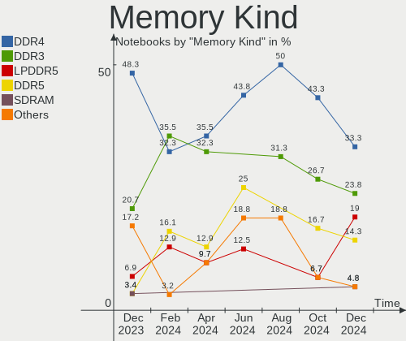

| Kind   | Notebooks | Percent |
|--------|-----------|---------|
| DDR4   | 13        | 43.33%  |
| DDR3   | 8         | 26.67%  |
| SDRAM  | 2         | 6.67%   |
| DDR5   | 2         | 6.67%   |
| DDR2   | 2         | 6.67%   |
| LPDDR5 | 1         | 3.33%   |
| LPDDR4 | 1         | 3.33%   |
| LPDDR3 | 1         | 3.33%   |

Memory Form Factor
------------------

Physical design of the memory module

| Name         | Notebooks | Percent |
|--------------|-----------|---------|
| SODIMM       | 27        | 93.1%   |
| Row Of Chips | 2         | 6.9%    |

Memory Size
-----------

Memory module size

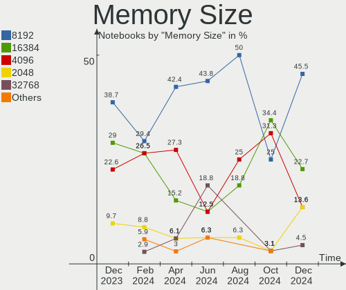

| Size  | Notebooks | Percent |
|-------|-----------|---------|
| 8192  | 11        | 34.38%  |
| 16384 | 6         | 18.75%  |
| 4096  | 6         | 18.75%  |
| 2048  | 6         | 18.75%  |
| 32768 | 2         | 6.25%   |
| 1024  | 1         | 3.13%   |

Memory Speed
------------

Memory module speed

| Speed   | Notebooks | Percent |
|---------|-----------|---------|
| 3200    | 9         | 29.03%  |
| 1600    | 7         | 22.58%  |
| 2667    | 4         | 12.9%   |
| 4800    | 2         | 6.45%   |
| 2133    | 2         | 6.45%   |
| 8400    | 1         | 3.23%   |
| 6400    | 1         | 3.23%   |
| 2400    | 1         | 3.23%   |
| 2048    | 1         | 3.23%   |
| 1639    | 1         | 3.23%   |
| 667     | 1         | 3.23%   |
| Unknown | 1         | 3.23%   |

Printers & scanners
-------------------

Printer Vendor
--------------

Printer device vendors

Zero info for selected period =(

Printer Model
-------------

Printer device models

Zero info for selected period =(

Scanner Vendor
--------------

Scanner device vendors

Zero info for selected period =(

Scanner Model
-------------

Scanner device models

Zero info for selected period =(

Camera
------

Camera Vendor
-------------

Camera device vendors

| Vendor                                 | Notebooks | Percent |
|----------------------------------------|-----------|---------|
| Chicony Electronics                    | 10        | 19.61%  |
| IMC Networks                           | 6         | 11.76%  |
| Sunplus Innovation Technology          | 5         | 9.8%    |
| Microdia                               | 4         | 7.84%   |
| Luxvisions Innotech Limited            | 4         | 7.84%   |
| Suyin                                  | 3         | 5.88%   |
| Realtek Semiconductor                  | 3         | 5.88%   |
| Quanta                                 | 3         | 5.88%   |
| Primax Electronics                     | 2         | 3.92%   |
| Cheng Uei Precision Industry (Foxlink) | 2         | 3.92%   |
| Acer                                   | 2         | 3.92%   |
| Sonix Technology                       | 1         | 1.96%   |
| Silicon Motion                         | 1         | 1.96%   |
| Ricoh                                  | 1         | 1.96%   |
| Logitech                               | 1         | 1.96%   |
| Lite-On Technology                     | 1         | 1.96%   |
| Lenovo                                 | 1         | 1.96%   |
| Apple                                  | 1         | 1.96%   |

Camera Model
------------

Camera device models

| Model                                                           | Notebooks | Percent |
|-----------------------------------------------------------------|-----------|---------|
| IMC Networks USB2.0 HD UVC WebCam                               | 3         | 5.88%   |
| Quanta HD User Facing                                           | 2         | 3.92%   |
| Primax HP HD Webcam [Fixed]                                     | 2         | 3.92%   |
| Microdia Laptop Integrated Webcam HD (Composite Device)         | 2         | 3.92%   |
| Microdia Integrated_Webcam_HD                                   | 2         | 3.92%   |
| Luxvisions Innotech Limited HP Wide Vision HD Camera            | 2         | 3.92%   |
| Luxvisions Innotech Limited HP TrueVision HD Camera             | 2         | 3.92%   |
| Chicony HD Webcam                                               | 2         | 3.92%   |
| Suyin TOSHIBA Web Camera                                        | 1         | 1.96%   |
| Suyin HP TrueVision HD                                          | 1         | 1.96%   |
| Suyin Acer/HP Integrated Webcam [CN0314]                        | 1         | 1.96%   |
| Sunplus Integrated_Webcam_HD                                    | 1         | 1.96%   |
| Sunplus Integrated Webcam                                       | 1         | 1.96%   |
| Sunplus FHD Camera Microphone                                   | 1         | 1.96%   |
| Sunplus Dell Integrated HD Webcam                               | 1         | 1.96%   |
| Sunplus Asus Webcam                                             | 1         | 1.96%   |
| Sonix USB2.0 HD UVC WebCam                                      | 1         | 1.96%   |
| Silicon Motion HP Webcam                                        | 1         | 1.96%   |
| Ricoh Sony Vaio Integrated Webcam                               | 1         | 1.96%   |
| Realtek Integrated_Webcam_HD                                    | 1         | 1.96%   |
| Realtek Integrated Webcam HD                                    | 1         | 1.96%   |
| Realtek FULL HD 1080P Webcam                                    | 1         | 1.96%   |
| Quanta HP HD Camera                                             | 1         | 1.96%   |
| Logitech Webcam C925e                                           | 1         | 1.96%   |
| Lite-On HP HD Camera                                            | 1         | 1.96%   |
| Lenovo Integrated Webcam [R5U877]                               | 1         | 1.96%   |
| IMC Networks ov9734_azurewave_camera                            | 1         | 1.96%   |
| IMC Networks Integrated RGB Camera                              | 1         | 1.96%   |
| IMC Networks Integrated Camera                                  | 1         | 1.96%   |
| Chicony Webcam                                                  | 1         | 1.96%   |
| Chicony Integrated Camera                                       | 1         | 1.96%   |
| Chicony HP Wide Vision HD Camera                                | 1         | 1.96%   |
| Chicony HP HD Webcam [Fixed]                                    | 1         | 1.96%   |
| Chicony HP HD Webcam                                            | 1         | 1.96%   |
| Chicony HP HD Camera                                            | 1         | 1.96%   |
| Chicony HD WebCam (Asus N-series)                               | 1         | 1.96%   |
| Chicony FHD Webcam                                              | 1         | 1.96%   |
| Cheng Uei Precision Industry (Foxlink) HP Wide Vision HD Camera | 1         | 1.96%   |
| Cheng Uei Precision Industry (Foxlink) HP Webcam-101            | 1         | 1.96%   |
| Apple FaceTime HD Camera                                        | 1         | 1.96%   |

Security
--------

Fingerprint Vendor
------------------

Fingerprint sensor vendors

| Vendor                     | Notebooks | Percent |
|----------------------------|-----------|---------|
| Validity Sensors           | 5         | 71.43%  |
| Synaptics                  | 1         | 14.29%  |
| Shenzhen Goodix Technology | 1         | 14.29%  |

Fingerprint Model
-----------------

Fingerprint sensor models

| Model                                             | Notebooks | Percent |
|---------------------------------------------------|-----------|---------|
| Validity Sensors VFS491                           | 3         | 42.86%  |
| Validity Sensors VFS495 Fingerprint Reader        | 2         | 28.57%  |
| Synaptics Prometheus MIS Touch Fingerprint Reader | 1         | 14.29%  |
| Shenzhen Goodix  Fingerprint Device               | 1         | 14.29%  |

Chipcard Vendor
---------------

Chipcard module vendors

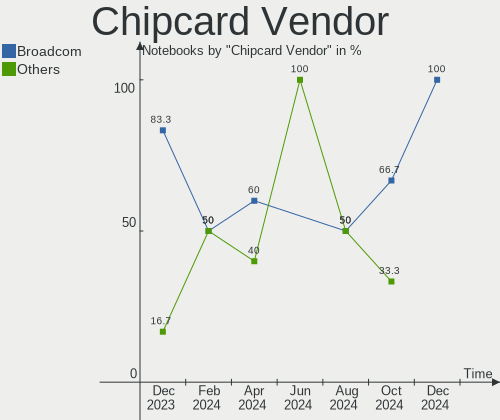

| Vendor      | Notebooks | Percent |
|-------------|-----------|---------|
| Broadcom    | 5         | 83.33%  |
| Alcor Micro | 1         | 16.67%  |

Chipcard Model
--------------

Chipcard module models

| Model                                          | Notebooks | Percent |
|------------------------------------------------|-----------|---------|
| Broadcom BCM5880 Secure Applications Processor | 3         | 50%     |
| Broadcom 58200                                 | 2         | 33.33%  |
| Alcor Micro AU9540 Smartcard Reader            | 1         | 16.67%  |

Unsupported
-----------

Unsupported Devices
-------------------

Total unsupported devices on board

| Total | Notebooks | Percent |
|-------|-----------|---------|
| 0     | 35        | 62.5%   |
| 1     | 13        | 23.21%  |
| 2     | 8         | 14.29%  |

Unsupported Device Types
------------------------

Types of unsupported devices

| Type                  | Notebooks | Percent |
|-----------------------|-----------|---------|
| Graphics card         | 8         | 29.63%  |
| Fingerprint reader    | 7         | 25.93%  |
| Chipcard              | 6         | 22.22%  |
| Net/wireless          | 2         | 7.41%   |
| Camera                | 2         | 7.41%   |
| Multimedia controller | 1         | 3.7%    |
| Bluetooth             | 1         | 3.7%    |

