Linux in Netherlands - Hardware Trends (Notebooks)
--------------------------------------------------

A project to identify most popular hardware characteristics and track their change
over time based on data collected by Linux users at https://Linux-Hardware.org.

Anyone can contribute to this report by the [hw-probe](https://github.com/linuxhw/hw-probe) tool:

    sudo -E hw-probe -all -upload

Period: Apr, 2023.

Contents
--------

* [ System ](#system)
  - [ OS                       ](#os)
  - [ OS Family                ](#os-family)
  - [ Kernel                   ](#kernel)
  - [ Kernel Family            ](#kernel-family)
  - [ Kernel Major Ver.        ](#kernel-major-ver)
  - [ Arch                     ](#arch)
  - [ DE                       ](#de)
  - [ Display Server           ](#display-server)
  - [ Display Manager          ](#display-manager)
  - [ OS Lang                  ](#os-lang)
  - [ Boot Mode                ](#boot-mode)
  - [ Filesystem               ](#filesystem)
  - [ Part. scheme             ](#part-scheme)
  - [ Dual Boot with Linux/BSD ](#dual-boot-with-linuxbsd)
  - [ Dual Boot (Win)          ](#dual-boot-win)

* [ Board ](#board)
  - [ Vendor                   ](#vendor)
  - [ Model                    ](#model)
  - [ Model Family             ](#model-family)
  - [ MFG Year                 ](#mfg-year)
  - [ Form Factor              ](#form-factor)
  - [ Secure Boot              ](#secure-boot)
  - [ Coreboot                 ](#coreboot)
  - [ RAM Size                 ](#ram-size)
  - [ RAM Used                 ](#ram-used)
  - [ Total Drives             ](#total-drives)
  - [ Has CD-ROM               ](#has-cd-rom)
  - [ Has Ethernet             ](#has-ethernet)
  - [ Has WiFi                 ](#has-wifi)
  - [ Has Bluetooth            ](#has-bluetooth)

* [ Location ](#location)
  - [ Country                  ](#country)
  - [ City                     ](#city)

* [ Drives ](#drives)
  - [ Drive Vendor             ](#drive-vendor)
  - [ Drive Model              ](#drive-model)
  - [ HDD Vendor               ](#hdd-vendor)
  - [ SSD Vendor               ](#ssd-vendor)
  - [ Drive Kind               ](#drive-kind)
  - [ Drive Connector          ](#drive-connector)
  - [ Drive Size               ](#drive-size)
  - [ Space Total              ](#space-total)
  - [ Space Used               ](#space-used)
  - [ Malfunc. Drives          ](#malfunc-drives)
  - [ Malfunc. Drive Vendor    ](#malfunc-drive-vendor)
  - [ Malfunc. HDD Vendor      ](#malfunc-hdd-vendor)
  - [ Malfunc. Drive Kind      ](#malfunc-drive-kind)
  - [ Failed Drives            ](#failed-drives)
  - [ Failed Drive Vendor      ](#failed-drive-vendor)
  - [ Drive Status             ](#drive-status)

* [ Storage controller ](#storage-controller)
  - [ Storage Vendor           ](#storage-vendor)
  - [ Storage Model            ](#storage-model)
  - [ Storage Kind             ](#storage-kind)

* [ Processor ](#processor)
  - [ CPU Vendor               ](#cpu-vendor)
  - [ CPU Model                ](#cpu-model)
  - [ CPU Model Family         ](#cpu-model-family)
  - [ CPU Cores                ](#cpu-cores)
  - [ CPU Sockets              ](#cpu-sockets)
  - [ CPU Threads              ](#cpu-threads)
  - [ CPU Op-Modes             ](#cpu-op-modes)
  - [ CPU Microcode            ](#cpu-microcode)
  - [ CPU Microarch            ](#cpu-microarch)

* [ Graphics ](#graphics)
  - [ GPU Vendor               ](#gpu-vendor)
  - [ GPU Model                ](#gpu-model)
  - [ GPU Combo                ](#gpu-combo)
  - [ GPU Driver               ](#gpu-driver)
  - [ GPU Memory               ](#gpu-memory)

* [ Monitor ](#monitor)
  - [ Monitor Vendor           ](#monitor-vendor)
  - [ Monitor Model            ](#monitor-model)
  - [ Monitor Resolution       ](#monitor-resolution)
  - [ Monitor Diagonal         ](#monitor-diagonal)
  - [ Monitor Width            ](#monitor-width)
  - [ Aspect Ratio             ](#aspect-ratio)
  - [ Monitor Area             ](#monitor-area)
  - [ Pixel Density            ](#pixel-density)
  - [ Multiple Monitors        ](#multiple-monitors)

* [ Network ](#network)
  - [ Net Controller Vendor    ](#net-controller-vendor)
  - [ Net Controller Model     ](#net-controller-model)
  - [ Wireless Vendor          ](#wireless-vendor)
  - [ Wireless Model           ](#wireless-model)
  - [ Ethernet Vendor          ](#ethernet-vendor)
  - [ Ethernet Model           ](#ethernet-model)
  - [ Net Controller Kind      ](#net-controller-kind)
  - [ Used Controller          ](#used-controller)
  - [ NICs                     ](#nics)
  - [ IPv6                     ](#ipv6)

* [ Bluetooth ](#bluetooth)
  - [ Bluetooth Vendor         ](#bluetooth-vendor)
  - [ Bluetooth Model          ](#bluetooth-model)

* [ Sound ](#sound)
  - [ Sound Vendor             ](#sound-vendor)
  - [ Sound Model              ](#sound-model)

* [ Memory ](#memory)
  - [ Memory Vendor            ](#memory-vendor)
  - [ Memory Model             ](#memory-model)
  - [ Memory Kind              ](#memory-kind)
  - [ Memory Form Factor       ](#memory-form-factor)
  - [ Memory Size              ](#memory-size)
  - [ Memory Speed             ](#memory-speed)

* [ Printers & scanners ](#printers--scanners)
  - [ Printer Vendor           ](#printer-vendor)
  - [ Printer Model            ](#printer-model)
  - [ Scanner Vendor           ](#scanner-vendor)
  - [ Scanner Model            ](#scanner-model)

* [ Camera ](#camera)
  - [ Camera Vendor            ](#camera-vendor)
  - [ Camera Model             ](#camera-model)

* [ Security ](#security)
  - [ Fingerprint Vendor       ](#fingerprint-vendor)
  - [ Fingerprint Model        ](#fingerprint-model)
  - [ Chipcard Vendor          ](#chipcard-vendor)
  - [ Chipcard Model           ](#chipcard-model)

* [ Unsupported ](#unsupported)
  - [ Unsupported Devices      ](#unsupported-devices)
  - [ Unsupported Device Types ](#unsupported-device-types)

System
------

OS
--

Installed operating systems

| Name                         | Notebooks | Percent |
|------------------------------|-----------|---------|
| Ubuntu 22.04                 | 10        | 13.33%  |
| OpenMandriva 23.03           | 8         | 10.67%  |
| Fedora 38                    | 7         | 9.33%   |
| openSUSE Tumbleweed-XXXXXXXX | 5         | 6.67%   |
| Linux Mint 21.1              | 5         | 6.67%   |
| Fedora 37                    | 5         | 6.67%   |
| Debian 11                    | 5         | 6.67%   |
| Zorin 16                     | 4         | 5.33%   |
| Manjaro                      | 4         | 5.33%   |
| Ubuntu 20.04                 | 2         | 2.67%   |
| Pop!_OS 22.04                | 2         | 2.67%   |
| Fedora 36                    | 2         | 2.67%   |
| Arch Rolling                 | 2         | 2.67%   |
| Ubuntu 23.04                 | 1         | 1.33%   |
| SteamOS 3.4.6                | 1         | 1.33%   |
| OpenMandriva 4.2             | 1         | 1.33%   |
| OpenMandriva 23.01           | 1         | 1.33%   |
| NixOS 22.11                  | 1         | 1.33%   |
| Manjaro 22.1.0               | 1         | 1.33%   |
| LMDE 5                       | 1         | 1.33%   |
| Linux Mint 21                | 1         | 1.33%   |
| Linux Mint 20.3              | 1         | 1.33%   |
| KDE neon 22.04               | 1         | 1.33%   |
| Gentoo 2.13                  | 1         | 1.33%   |
| Fedora 35                    | 1         | 1.33%   |
| EndeavourOS Rolling          | 1         | 1.33%   |
| Elementary 7                 | 1         | 1.33%   |

OS Family
---------

OS without a version

| Name         | Notebooks | Percent |
|--------------|-----------|---------|
| Fedora       | 15        | 20%     |
| Ubuntu       | 13        | 17.33%  |
| OpenMandriva | 10        | 13.33%  |
| Linux Mint   | 7         | 9.33%   |
| openSUSE     | 5         | 6.67%   |
| Manjaro      | 5         | 6.67%   |
| Debian       | 5         | 6.67%   |
| Zorin        | 4         | 5.33%   |
| Pop!_OS      | 2         | 2.67%   |
| Arch         | 2         | 2.67%   |
| SteamOS      | 1         | 1.33%   |
| NixOS        | 1         | 1.33%   |
| LMDE         | 1         | 1.33%   |
| KDE neon     | 1         | 1.33%   |
| Gentoo       | 1         | 1.33%   |
| EndeavourOS  | 1         | 1.33%   |
| Elementary   | 1         | 1.33%   |

Kernel
------

Version of the Linux kernel

| Version                  | Notebooks | Percent |
|--------------------------|-----------|---------|
| 6.2.6-desktop-1omv2390   | 7         | 9.33%   |
| 5.15.0-69-generic        | 7         | 9.33%   |
| 5.19.0-38-generic        | 5         | 6.67%   |
| 6.2.11-300.fc38.x86_64   | 3         | 4%      |
| 5.19.0-40-generic        | 3         | 4%      |
| 5.10.0-20-amd64          | 3         | 4%      |
| 6.3.0-rc2+               | 2         | 2.67%   |
| 6.3.0+                   | 2         | 2.67%   |
| 6.2.9-1-default          | 2         | 2.67%   |
| 6.2.10-1-default         | 2         | 2.67%   |
| 5.15.0-70-generic        | 2         | 2.67%   |
| 5.15.0-56-generic        | 2         | 2.67%   |
| 5.10.0-21-amd64          | 2         | 2.67%   |
| 6.3.0-rc7+               | 1         | 1.33%   |
| 6.2.9-arch1-1            | 1         | 1.33%   |
| 6.2.9-300.fc38.x86_64    | 1         | 1.33%   |
| 6.2.9-200.fc37.x86_64    | 1         | 1.33%   |
| 6.2.9-1-MANJARO          | 1         | 1.33%   |
| 6.2.8-300.fc38.x86_64    | 1         | 1.33%   |
| 6.2.8                    | 1         | 1.33%   |
| 6.2.6-76060206-generic   | 1         | 1.33%   |
| 6.2.12-zen1-1-zen        | 1         | 1.33%   |
| 6.2.12-300.fc38.x86_64   | 1         | 1.33%   |
| 6.2.12-1-default         | 1         | 1.33%   |
| 6.2.11-100.fc36.x86_64   | 1         | 1.33%   |
| 6.2.10-arch1-1           | 1         | 1.33%   |
| 6.2.10-200.fc37.x86_64   | 1         | 1.33%   |
| 6.2.10-100.fc36.x86_64   | 1         | 1.33%   |
| 6.2.10-1-MANJARO         | 1         | 1.33%   |
| 6.2.10-060210-generic    | 1         | 1.33%   |
| 6.2.0-rc6-gentoo-p14     | 1         | 1.33%   |
| 6.2.0-19-generic         | 1         | 1.33%   |
| 6.1.4-desktop-1omv2301   | 1         | 1.33%   |
| 6.1.23-1-MANJARO         | 1         | 1.33%   |
| 6.0.12-76060006-generic  | 1         | 1.33%   |
| 5.4.0-147-generic        | 1         | 1.33%   |
| 5.19.0-41-generic        | 1         | 1.33%   |
| 5.19.0-32-generic        | 1         | 1.33%   |
| 5.16.13-desktop-1omv4003 | 1         | 1.33%   |
| 5.15.108-1-MANJARO       | 1         | 1.33%   |

Kernel Family
-------------

Linux kernel without a distro release

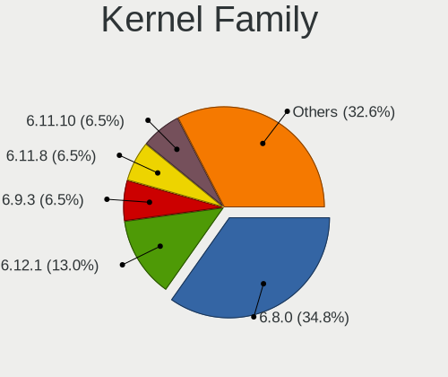

| Version  | Notebooks | Percent |
|----------|-----------|---------|
| 5.15.0   | 13        | 17.33%  |
| 5.19.0   | 10        | 13.33%  |
| 6.2.6    | 8         | 10.67%  |
| 6.2.10   | 7         | 9.33%   |
| 6.2.9    | 6         | 8%      |
| 5.10.0   | 6         | 8%      |
| 6.3.0    | 5         | 6.67%   |
| 6.2.11   | 4         | 5.33%   |
| 6.2.12   | 3         | 4%      |
| 6.2.8    | 2         | 2.67%   |
| 6.2.0    | 2         | 2.67%   |
| 6.1.4    | 1         | 1.33%   |
| 6.1.23   | 1         | 1.33%   |
| 6.0.12   | 1         | 1.33%   |
| 5.4.0    | 1         | 1.33%   |
| 5.16.13  | 1         | 1.33%   |
| 5.15.108 | 1         | 1.33%   |
| 5.15.106 | 1         | 1.33%   |
| 5.13.0   | 1         | 1.33%   |
| 5.10.14  | 1         | 1.33%   |

Kernel Major Ver.
-----------------

Linux kernel major version

| Version | Notebooks | Percent |
|---------|-----------|---------|
| 6.2     | 32        | 42.67%  |
| 5.15    | 15        | 20%     |
| 5.19    | 10        | 13.33%  |
| 5.10    | 7         | 9.33%   |
| 6.3     | 5         | 6.67%   |
| 6.1     | 2         | 2.67%   |
| 6.0     | 1         | 1.33%   |
| 5.4     | 1         | 1.33%   |
| 5.16    | 1         | 1.33%   |
| 5.13    | 1         | 1.33%   |

Arch
----

OS architecture (x86_64, i586, etc.)

| Name   | Notebooks | Percent |
|--------|-----------|---------|
| x86_64 | 74        | 98.67%  |
| i686   | 1         | 1.33%   |

DE
--

Desktop Environment

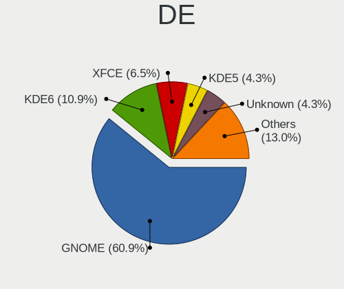

| Name       | Notebooks | Percent |
|------------|-----------|---------|
| GNOME      | 36        | 48%     |
| KDE5       | 24        | 32%     |
| X-Cinnamon | 5         | 6.67%   |
| XFCE       | 3         | 4%      |
| MATE       | 2         | 2.67%   |
| Unknown    | 2         | 2.67%   |
| Pantheon   | 1         | 1.33%   |
| LXDE       | 1         | 1.33%   |
| Cinnamon   | 1         | 1.33%   |

Display Server
--------------

X11 or Wayland

| Name    | Notebooks | Percent |
|---------|-----------|---------|
| X11     | 47        | 62.67%  |
| Wayland | 27        | 36%     |
| Unknown | 1         | 1.33%   |

Display Manager
---------------

SDDM, LightDM, etc.

| Name    | Notebooks | Percent |
|---------|-----------|---------|
| Unknown | 21        | 28%     |
| SDDM    | 16        | 21.33%  |
| GDM     | 16        | 21.33%  |
| GDM3    | 13        | 17.33%  |
| LightDM | 9         | 12%     |

OS Lang
-------

Language

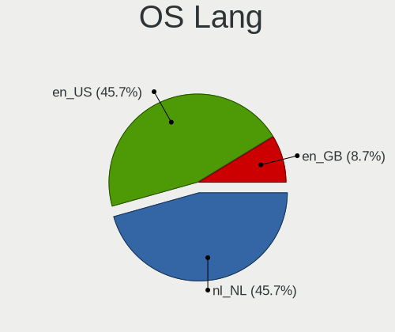

| Lang    | Notebooks | Percent |
|---------|-----------|---------|
| en_US   | 42        | 56%     |
| nl_NL   | 21        | 28%     |
| en_GB   | 3         | 4%      |
| POSIX   | 2         | 2.67%   |
| en_NL   | 2         | 2.67%   |
| Unknown | 2         | 2.67%   |
| sv_SE   | 1         | 1.33%   |
| nb_NO   | 1         | 1.33%   |
| de_DE   | 1         | 1.33%   |

Boot Mode
---------

EFI or BIOS

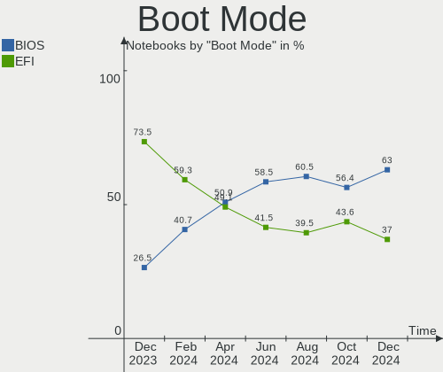

| Mode | Notebooks | Percent |
|------|-----------|---------|
| EFI  | 54        | 72%     |
| BIOS | 21        | 28%     |

Filesystem
----------

Type of filesystem

| Type    | Notebooks | Percent |
|---------|-----------|---------|
| Ext4    | 48        | 64%     |
| Btrfs   | 15        | 20%     |
| Overlay | 10        | 13.33%  |
| Tmpfs   | 2         | 2.67%   |

Part. scheme
------------

Scheme of partitioning

| Type    | Notebooks | Percent |
|---------|-----------|---------|
| GPT     | 49        | 65.33%  |
| Unknown | 19        | 25.33%  |
| MBR     | 7         | 9.33%   |

Dual Boot with Linux/BSD
------------------------

Hosting more than one Linux/BSD

| Dual boot | Notebooks | Percent |
|-----------|-----------|---------|
| No        | 63        | 84%     |
| Yes       | 12        | 16%     |

Dual Boot (Win)
---------------

Hosting Linux and Windows

| Dual boot | Notebooks | Percent |
|-----------|-----------|---------|
| No        | 57        | 76%     |
| Yes       | 18        | 24%     |

Board
-----

Vendor
------

Motherboard manufacturer

| Name             | Notebooks | Percent |
|------------------|-----------|---------|
| Hewlett-Packard  | 14        | 18.67%  |
| Lenovo           | 13        | 17.33%  |
| Dell             | 8         | 10.67%  |
| Apple            | 8         | 10.67%  |
| ASUSTek Computer | 7         | 9.33%   |
| Notebook         | 6         | 8%      |
| Acer             | 4         | 5.33%   |
| Medion           | 2         | 2.67%   |
| Insyde           | 2         | 2.67%   |
| ilife            | 2         | 2.67%   |
| Wortmann AG      | 1         | 1.33%   |
| VIOS             | 1         | 1.33%   |
| Valve            | 1         | 1.33%   |
| Toxic            | 1         | 1.33%   |
| SLIMBOOK         | 1         | 1.33%   |
| Intel            | 1         | 1.33%   |
| HUAWEI           | 1         | 1.33%   |
| Chuwi            | 1         | 1.33%   |
| BTO              | 1         | 1.33%   |

Model
-----

Motherboard model

| Name                                       | Notebooks | Percent |
|--------------------------------------------|-----------|---------|
| ilife S806                                 | 2         | 2.67%   |
| Apple MacBookPro12,1                       | 2         | 2.67%   |
| Apple MacBookAir7,2                        | 2         | 2.67%   |
| Wortmann AG TERRA_MOBILE_1160              | 1         | 1.33%   |
| VIOS LTH17                                 | 1         | 1.33%   |
| Valve Jupiter                              | 1         | 1.33%   |
| Toxic GM5MPHY                              | 1         | 1.33%   |
| SLIMBOOK PROX-AMD5                         | 1         | 1.33%   |
| Notebook W54_55_94_95_97AU,AUQ             | 1         | 1.33%   |
| Notebook P95_96_97Ex,Rx                    | 1         | 1.33%   |
| Notebook NLxxPUx                           | 1         | 1.33%   |
| Notebook NH55RGQ                           | 1         | 1.33%   |
| Notebook N141CU                            | 1         | 1.33%   |
| Notebook N13_N140ZU                        | 1         | 1.33%   |
| Medion E4251                               | 1         | 1.33%   |
| Medion E2215T MD60198                      | 1         | 1.33%   |
| Lenovo Yoga Slim 7 13ACN5 82CY             | 1         | 1.33%   |
| Lenovo Yoga 300-11IBR 80M1                 | 1         | 1.33%   |
| Lenovo V15 G2 ALC 82KD                     | 1         | 1.33%   |
| Lenovo ThinkPad X1 Carbon Gen 9 20XWCTO1WW | 1         | 1.33%   |
| Lenovo ThinkPad T440s 20AQ006HUS           | 1         | 1.33%   |
| Lenovo ThinkPad P50 20EQS5C701             | 1         | 1.33%   |
| Lenovo ThinkPad P14s Gen 2a 21A0007PGE     | 1         | 1.33%   |
| Lenovo ThinkPad P14s Gen 2a 21A0000JMH     | 1         | 1.33%   |
| Lenovo ThinkBook 13s-IWL 20R9              | 1         | 1.33%   |
| Lenovo Legion 5 Pro 16ACH6H 82JQ           | 1         | 1.33%   |
| Lenovo IdeaPad S540-15IWL GTX 81SW         | 1         | 1.33%   |
| Lenovo IdeaPad 5 Pro 16ACH6 82L5           | 1         | 1.33%   |
| Lenovo IdeaPad 5 Pro 14ACN6 82L7           | 1         | 1.33%   |
| Intel CHERRYVIEW D1 PLATFORM               | 1         | 1.33%   |
| Insyde M890BAP                             | 1         | 1.33%   |
| Insyde CherryTrail                         | 1         | 1.33%   |
| HUAWEI MACHC-WAX9                          | 1         | 1.33%   |
| HP ZBook 15 G3                             | 1         | 1.33%   |
| HP ZBook 14u G5                            | 1         | 1.33%   |
| HP ProBook 6570b                           | 1         | 1.33%   |
| HP ProBook 640 G8 Notebook PC              | 1         | 1.33%   |
| HP Pavilion dv7                            | 1         | 1.33%   |
| HP OMEN Laptop 15-en1xxx                   | 1         | 1.33%   |
| HP EliteBook 8570p                         | 1         | 1.33%   |

Model Family
------------

Motherboard model prefix

| Name               | Notebooks | Percent |
|--------------------|-----------|---------|
| HP EliteBook       | 6         | 8%      |
| Dell Latitude      | 6         | 8%      |
| Lenovo ThinkPad    | 5         | 6.67%   |
| Lenovo IdeaPad     | 3         | 4%      |
| Lenovo Yoga        | 2         | 2.67%   |
| ilife S806         | 2         | 2.67%   |
| HP ZBook           | 2         | 2.67%   |
| HP ProBook         | 2         | 2.67%   |
| HP Compaq          | 2         | 2.67%   |
| Dell XPS           | 2         | 2.67%   |
| ASUS Zenbook       | 2         | 2.67%   |
| ASUS VivoBook      | 2         | 2.67%   |
| Apple MacBookPro12 | 2         | 2.67%   |
| Apple MacBookAir7  | 2         | 2.67%   |
| Acer Swift         | 2         | 2.67%   |
| Wortmann AG TERRA  | 1         | 1.33%   |
| VIOS LTH17         | 1         | 1.33%   |
| Valve Jupiter      | 1         | 1.33%   |
| Toxic GM5MPHY      | 1         | 1.33%   |
| SLIMBOOK PROX-AMD5 | 1         | 1.33%   |
| Notebook W54       | 1         | 1.33%   |
| Notebook P95       | 1         | 1.33%   |
| Notebook NLxxPUx   | 1         | 1.33%   |
| Notebook NH55RGQ   | 1         | 1.33%   |
| Notebook N141CU    | 1         | 1.33%   |
| Notebook N13       | 1         | 1.33%   |
| Medion E4251       | 1         | 1.33%   |
| Medion E2215T      | 1         | 1.33%   |
| Lenovo V15         | 1         | 1.33%   |
| Lenovo ThinkBook   | 1         | 1.33%   |
| Lenovo Legion      | 1         | 1.33%   |
| Intel CHERRYVIEW   | 1         | 1.33%   |
| Insyde M890BAP     | 1         | 1.33%   |
| Insyde CherryTrail | 1         | 1.33%   |
| HUAWEI MACHC-WAX9  | 1         | 1.33%   |
| HP Pavilion        | 1         | 1.33%   |
| HP OMEN            | 1         | 1.33%   |
| Chuwi HeroBook     | 1         | 1.33%   |
| BTO 17X1183        | 1         | 1.33%   |
| ASUS ROG           | 1         | 1.33%   |

MFG Year
--------

Motherboard manufacture year

| Year | Notebooks | Percent |
|------|-----------|---------|
| 2021 | 15        | 20%     |
| 2019 | 14        | 18.67%  |
| 2015 | 8         | 10.67%  |
| 2022 | 7         | 9.33%   |
| 2016 | 5         | 6.67%   |
| 2012 | 5         | 6.67%   |
| 2020 | 4         | 5.33%   |
| 2017 | 3         | 4%      |
| 2014 | 3         | 4%      |
| 2011 | 3         | 4%      |
| 2008 | 3         | 4%      |
| 2018 | 2         | 2.67%   |
| 2013 | 2         | 2.67%   |
| 2007 | 1         | 1.33%   |

Form Factor
-----------

Physical design of the computer

| Name     | Notebooks | Percent |
|----------|-----------|---------|
| Notebook | 75        | 100%    |

Secure Boot
-----------

Enabled or disabled

| State    | Notebooks | Percent |
|----------|-----------|---------|
| Disabled | 69        | 92%     |
| Enabled  | 6         | 8%      |

Coreboot
--------

Have coreboot on board

| Used | Notebooks | Percent |
|------|-----------|---------|
| No   | 75        | 100%    |

RAM Size
--------

Total RAM memory

| Size in GB  | Notebooks | Percent |
|-------------|-----------|---------|
| 4.01-8.0    | 16        | 21.33%  |
| 8.01-16.0   | 14        | 18.67%  |
| 16.01-24.0  | 12        | 16%     |
| 32.01-64.0  | 11        | 14.67%  |
| 3.01-4.0    | 9         | 12%     |
| 1.01-2.0    | 7         | 9.33%   |
| 24.01-32.0  | 2         | 2.67%   |
| 64.01-256.0 | 2         | 2.67%   |
| 0.51-1.0    | 2         | 2.67%   |

RAM Used
--------

Used RAM memory

| Used GB   | Notebooks | Percent |
|-----------|-----------|---------|
| 1.01-2.0  | 22        | 29.33%  |
| 4.01-8.0  | 14        | 18.67%  |
| 3.01-4.0  | 14        | 18.67%  |
| 2.01-3.0  | 12        | 16%     |
| 0.51-1.0  | 8         | 10.67%  |
| 8.01-16.0 | 5         | 6.67%   |

Total Drives
------------

Number of drives on board

| Drives | Notebooks | Percent |
|--------|-----------|---------|
| 1      | 52        | 69.33%  |
| 2      | 18        | 24%     |
| 0      | 3         | 4%      |
| 3      | 2         | 2.67%   |

Has CD-ROM
----------

Has CD-ROM on board

| Presented | Notebooks | Percent |
|-----------|-----------|---------|
| No        | 68        | 90.67%  |
| Yes       | 7         | 9.33%   |

Has Ethernet
------------

Has Ethernet on board

| Presented | Notebooks | Percent |
|-----------|-----------|---------|
| Yes       | 46        | 61.33%  |
| No        | 29        | 38.67%  |

Has WiFi
--------

Has WiFi module

| Presented | Notebooks | Percent |
|-----------|-----------|---------|
| Yes       | 69        | 92%     |
| No        | 6         | 8%      |

Has Bluetooth
-------------

Has Bluetooth module

| Presented | Notebooks | Percent |
|-----------|-----------|---------|
| Yes       | 59        | 78.67%  |
| No        | 16        | 21.33%  |

Location
--------

Country
-------

Geographic location (country)

| Country     | Notebooks | Percent |
|-------------|-----------|---------|
| Netherlands | 75        | 100%    |

City
----

Geographic location (city)

| City                   | Notebooks | Percent |
|------------------------|-----------|---------|
| Amsterdam              | 14        | 18.67%  |
| Delft                  | 6         | 8%      |
| The Hague              | 4         | 5.33%   |
| Rotterdam              | 3         | 4%      |
| Kloetinge              | 3         | 4%      |
| Utrecht                | 2         | 2.67%   |
| Groningen              | 2         | 2.67%   |
| Eindhoven              | 2         | 2.67%   |
| Amersfoort             | 2         | 2.67%   |
| Zutphen                | 1         | 1.33%   |
| Zuidland               | 1         | 1.33%   |
| Zeeland                | 1         | 1.33%   |
| Velp                   | 1         | 1.33%   |
| Tilburg                | 1         | 1.33%   |
| Schijndel              | 1         | 1.33%   |
| Roosendaal             | 1         | 1.33%   |
| Overberg               | 1         | 1.33%   |
| Oss                    | 1         | 1.33%   |
| Oostburg               | 1         | 1.33%   |
| Nieuwegein             | 1         | 1.33%   |
| Naarden                | 1         | 1.33%   |
| Middelburg             | 1         | 1.33%   |
| Meppel                 | 1         | 1.33%   |
| Maastricht             | 1         | 1.33%   |
| Lisse                  | 1         | 1.33%   |
| Krimpen aan de Lek     | 1         | 1.33%   |
| IJlst                  | 1         | 1.33%   |
| Hoorn                  | 1         | 1.33%   |
| Heythuysen             | 1         | 1.33%   |
| Helmond                | 1         | 1.33%   |
| Grijpskerk             | 1         | 1.33%   |
| Gouda                  | 1         | 1.33%   |
| Gennep                 | 1         | 1.33%   |
| Enschede               | 1         | 1.33%   |
| Emmen                  | 1         | 1.33%   |
| Drachten               | 1         | 1.33%   |
| Dongen                 | 1         | 1.33%   |
| Doetinchem             | 1         | 1.33%   |
| Dedemsvaart            | 1         | 1.33%   |
| Capelle aan den IJssel | 1         | 1.33%   |

Drives
------

Drive Vendor
------------

Hard drive vendors

| Vendor                    | Notebooks | Drives | Percent |
|---------------------------|-----------|--------|---------|
| Samsung Electronics       | 22        | 30     | 26.19%  |
| WDC                       | 7         | 7      | 8.33%   |
| Unknown                   | 7         | 8      | 8.33%   |
| Apple                     | 6         | 6      | 7.14%   |
| SK hynix                  | 5         | 5      | 5.95%   |
| Micron Technology         | 4         | 4      | 4.76%   |
| Unknown                   | 4         | 4      | 4.76%   |
| Seagate                   | 3         | 3      | 3.57%   |
| SanDisk                   | 3         | 3      | 3.57%   |
| Intel                     | 3         | 3      | 3.57%   |
| Hitachi                   | 3         | 3      | 3.57%   |
| Toshiba                   | 2         | 2      | 2.38%   |
| KIOXIA                    | 2         | 2      | 2.38%   |
| Kingston                  | 2         | 2      | 2.38%   |
| China                     | 2         | 2      | 2.38%   |
| WDC WDS2                  | 1         | 1      | 1.19%   |
| UMIS                      | 1         | 1      | 1.19%   |
| Phison Electronics        | 1         | 1      | 1.19%   |
| Phison                    | 1         | 1      | 1.19%   |
| O2 Micro                  | 1         | 1      | 1.19%   |
| Micron/Crucial Technology | 1         | 1      | 1.19%   |
| Intenso                   | 1         | 1      | 1.19%   |
| Fujitsu                   | 1         | 1      | 1.19%   |
| Crucial                   | 1         | 1      | 1.19%   |

Drive Model
-----------

Hard drive models

| Model                                              | Notebooks | Percent |
|----------------------------------------------------|-----------|---------|
| Samsung NVMe SSD Controller SM981/PM981/PM983 1TB  | 8         | 8.89%   |
| Unknown                                            | 4         | 4.44%   |
| Samsung NVMe SSD Controller PM9A1/PM9A3/980PRO 2TB | 3         | 3.33%   |
| Unknown NCard  32GB                                | 2         | 2.22%   |
| Unknown MMC Card  32GB                             | 2         | 2.22%   |
| Samsung MZVLB1T0HBLR-000L2 1TB                     | 2         | 2.22%   |
| Hitachi HTS725050A7E630 500GB                      | 2         | 2.22%   |
| Apple SSD SM0256G 256GB                            | 2         | 2.22%   |
| WDC WDS2 40G2G0A-00JH30 240GB SSD                  | 1         | 1.11%   |
| WDC WD7500BPVT-22HXZT1 752GB                       | 1         | 1.11%   |
| WDC WD1600BEVT-22A23T0 160GB                       | 1         | 1.11%   |
| WDC WD10JPVX-60J 1TB                               | 1         | 1.11%   |
| WDC WD Blue SA510 M.2 2280 500GB                   | 1         | 1.11%   |
| WDC PC SN730 SDBQNTY-1T00-1001 1TB                 | 1         | 1.11%   |
| WDC PC SN530 SDBPNPZ-512G-1006 512GB               | 1         | 1.11%   |
| WDC PC SN520 SDAPNUW-256G-1002 256GB               | 1         | 1.11%   |
| Unknown NVMe SSD Drive 1024GB                      | 1         | 1.11%   |
| Unknown DA4128  128GB                              | 1         | 1.11%   |
| Unknown CWBD3R  64GB                               | 1         | 1.11%   |
| UMIS RPJTJ256MEE1OWX 256GB                         | 1         | 1.11%   |
| Toshiba THNSFJ256GCSU 256GB SSD                    | 1         | 1.11%   |
| Toshiba KXG50ZNV512G 512GB                         | 1         | 1.11%   |
| SK hynix SKHynix_HFS512GDE9X084N 512GB             | 1         | 1.11%   |
| SK hynix SKHynix_HFS512GD9TNI-L2A0B 512GB          | 1         | 1.11%   |
| SK hynix SKHynix_HFS001TDE9X081N 1024GB            | 1         | 1.11%   |
| SK hynix SC401 SATA 512GB SSD                      | 1         | 1.11%   |
| SK hynix PC801 NVMe 512GB                          | 1         | 1.11%   |
| Seagate ST9500420AS 500GB                          | 1         | 1.11%   |
| Seagate ST9320423AS 320GB                          | 1         | 1.11%   |
| Seagate ST1000LM048-2E7172 1TB                     | 1         | 1.11%   |
| SanDisk SDW64G  64GB                               | 1         | 1.11%   |
| SanDisk SDSSDA120G 120GB                           | 1         | 1.11%   |
| SanDisk DF4032  32GB                               | 1         | 1.11%   |
| Samsung SSD PM871 mSATA 128GB                      | 1         | 1.11%   |
| Samsung SSD 980 PRO 1TB                            | 1         | 1.11%   |
| Samsung SSD 980 1TB                                | 1         | 1.11%   |
| Samsung SSD 870 QVO 1TB                            | 1         | 1.11%   |
| Samsung SSD 860 QVO 2TB                            | 1         | 1.11%   |
| Samsung SSD 850 PRO 1TB                            | 1         | 1.11%   |
| Samsung SSD 850 EVO 500GB                          | 1         | 1.11%   |

HDD Vendor
----------

Hard disk drive vendors

| Vendor  | Notebooks | Drives | Percent |
|---------|-----------|--------|---------|
| WDC     | 3         | 3      | 30%     |
| Seagate | 3         | 3      | 30%     |
| Hitachi | 3         | 3      | 30%     |
| Fujitsu | 1         | 1      | 10%     |

SSD Vendor
----------

Solid state drive vendors

| Vendor              | Notebooks | Drives | Percent |
|---------------------|-----------|--------|---------|
| Samsung Electronics | 8         | 8      | 32%     |
| Apple               | 5         | 5      | 20%     |
| China               | 2         | 2      | 8%      |
| WDC WDS2            | 1         | 1      | 4%      |
| WDC                 | 1         | 1      | 4%      |
| Toshiba             | 1         | 1      | 4%      |
| SK hynix            | 1         | 1      | 4%      |
| SanDisk             | 1         | 1      | 4%      |
| Phison              | 1         | 1      | 4%      |
| Micron Technology   | 1         | 1      | 4%      |
| Kingston            | 1         | 1      | 4%      |
| Intenso             | 1         | 1      | 4%      |
| Crucial             | 1         | 1      | 4%      |

Drive Kind
----------

HDD or SSD

| Kind | Notebooks | Drives | Percent |
|------|-----------|--------|---------|
| NVMe | 38        | 45     | 45.24%  |
| SSD  | 24        | 25     | 28.57%  |
| MMC  | 12        | 13     | 14.29%  |
| HDD  | 10        | 10     | 11.9%   |

Drive Connector
---------------

SATA, SAS, NVMe, etc.

| Type | Notebooks | Drives | Percent |
|------|-----------|--------|---------|
| NVMe | 38        | 45     | 45.24%  |
| SATA | 31        | 32     | 36.9%   |
| MMC  | 12        | 13     | 14.29%  |
| SAS  | 3         | 3      | 3.57%   |

Drive Size
----------

Size of hard drive

| Size in TB | Notebooks | Drives | Percent |
|------------|-----------|--------|---------|
| 0.01-0.5   | 24        | 25     | 70.59%  |
| 0.51-1.0   | 9         | 9      | 26.47%  |
| 1.01-2.0   | 1         | 1      | 2.94%   |

Space Total
-----------

Amount of disk space available on the file system

| Size in GB     | Notebooks | Percent |
|----------------|-----------|---------|
| 101-250        | 16        | 21.33%  |
| 1-20           | 15        | 20%     |
| 251-500        | 10        | 13.33%  |
| 501-1000       | 9         | 12%     |
| 21-50          | 8         | 10.67%  |
| 1001-2000      | 6         | 8%      |
| Unknown        | 5         | 6.67%   |
| 51-100         | 3         | 4%      |
| More than 3000 | 2         | 2.67%   |
| 2001-3000      | 1         | 1.33%   |

Space Used
----------

Amount of used disk space

| Used GB   | Notebooks | Percent |
|-----------|-----------|---------|
| 1-20      | 36        | 48%     |
| 21-50     | 11        | 14.67%  |
| 251-500   | 7         | 9.33%   |
| 101-250   | 6         | 8%      |
| 51-100    | 5         | 6.67%   |
| Unknown   | 5         | 6.67%   |
| 501-1000  | 3         | 4%      |
| 1001-2000 | 2         | 2.67%   |

Malfunc. Drives
---------------

Drive models with a malfunction

| Model                         | Notebooks | Drives | Percent |
|-------------------------------|-----------|--------|---------|
| WDC WD1600BEVT-22A23T0 160GB  | 1         | 1      | 20%     |
| SK hynix SC401 SATA 512GB SSD | 1         | 1      | 20%     |
| Intenso SSD 256GB             | 1         | 1      | 20%     |
| Hitachi HTS725050A7E630 500GB | 1         | 1      | 20%     |
| Fujitsu MHZ2320BH G2 320GB    | 1         | 1      | 20%     |

Malfunc. Drive Vendor
---------------------

Vendors of faulty drives

| Vendor   | Notebooks | Drives | Percent |
|----------|-----------|--------|---------|
| WDC      | 1         | 1      | 20%     |
| SK hynix | 1         | 1      | 20%     |
| Intenso  | 1         | 1      | 20%     |
| Hitachi  | 1         | 1      | 20%     |
| Fujitsu  | 1         | 1      | 20%     |

Malfunc. HDD Vendor
-------------------

Vendors of faulty HDD drives

| Vendor  | Notebooks | Drives | Percent |
|---------|-----------|--------|---------|
| WDC     | 1         | 1      | 33.33%  |
| Hitachi | 1         | 1      | 33.33%  |
| Fujitsu | 1         | 1      | 33.33%  |

Malfunc. Drive Kind
-------------------

Kinds of faulty drives

| Kind | Notebooks | Drives | Percent |
|------|-----------|--------|---------|
| HDD  | 3         | 3      | 60%     |
| SSD  | 2         | 2      | 40%     |

Failed Drives
-------------

Failed drive models

Zero info for selected period =(

Failed Drive Vendor
-------------------

Failed drive vendors

Zero info for selected period =(

Drive Status
------------

Number of failed and malfunc. drives

| Status   | Notebooks | Drives | Percent |
|----------|-----------|--------|---------|
| Detected | 38        | 49     | 49.35%  |
| Works    | 34        | 39     | 44.16%  |
| Malfunc  | 5         | 5      | 6.49%   |

Storage controller
------------------

Storage Vendor
--------------

Storage controller vendors

| Vendor                       | Notebooks | Percent |
|------------------------------|-----------|---------|
| Intel                        | 41        | 46.59%  |
| Samsung Electronics          | 23        | 26.14%  |
| SK hynix                     | 4         | 4.55%   |
| AMD                          | 4         | 4.55%   |
| SanDisk                      | 3         | 3.41%   |
| Micron Technology            | 3         | 3.41%   |
| Toshiba America Info Systems | 2         | 2.27%   |
| Union Memory (Shenzhen)      | 1         | 1.14%   |
| Transcend                    | 1         | 1.14%   |
| Phison Electronics           | 1         | 1.14%   |
| O2 Micro                     | 1         | 1.14%   |
| Micron/Crucial Technology    | 1         | 1.14%   |
| KIOXIA                       | 1         | 1.14%   |
| Kingston Technology Company  | 1         | 1.14%   |
| Apple                        | 1         | 1.14%   |

Storage Model
-------------

Storage controller models

| Model                                                                            | Notebooks | Percent |
|----------------------------------------------------------------------------------|-----------|---------|
| Samsung NVMe SSD Controller SM981/PM981/PM983                                    | 12        | 13.04%  |
| Intel 82801 Mobile SATA Controller [RAID mode]                                   | 5         | 5.43%   |
| Intel 7 Series Chipset Family 6-port SATA Controller [AHCI mode]                 | 5         | 5.43%   |
| Samsung NVMe SSD Controller PM9A1/PM9A3/980PRO                                   | 4         | 4.35%   |
| Samsung Electronics SATA controller                                              | 4         | 4.35%   |
| AMD FCH SATA Controller [AHCI mode]                                              | 4         | 4.35%   |
| Micron NVMe Storage Controller                                                   | 3         | 3.26%   |
| Intel Volume Management Device NVMe RAID Controller                              | 3         | 3.26%   |
| Intel Cannon Point-LP SATA Controller [AHCI Mode]                                | 3         | 3.26%   |
| Intel Cannon Lake Mobile PCH SATA AHCI Controller                                | 3         | 3.26%   |
| SK hynix Gold P31/PC711 NVMe Solid State Drive                                   | 2         | 2.17%   |
| Samsung NVMe SSD Controller 980                                                  | 2         | 2.17%   |
| Intel Wildcat Point-LP SATA Controller [AHCI Mode]                               | 2         | 2.17%   |
| Intel SSD 660P Series                                                            | 2         | 2.17%   |
| Intel Q170/Q150/B150/H170/H110/Z170/CM236 Chipset SATA Controller [AHCI Mode]    | 2         | 2.17%   |
| Intel Celeron/Pentium Silver Processor SATA Controller                           | 2         | 2.17%   |
| Intel 8 Series SATA Controller 1 [AHCI mode]                                     | 2         | 2.17%   |
| Intel 5 Series/3400 Series Chipset 4 port SATA AHCI Controller                   | 2         | 2.17%   |
| Union Memory (Shenzhen) Non-Volatile memory controller                           | 1         | 1.09%   |
| Transcend Non-Volatile memory controller                                         | 1         | 1.09%   |
| Toshiba America Info Systems XG6 NVMe SSD Controller                             | 1         | 1.09%   |
| Toshiba America Info Systems XG5 NVMe SSD Controller                             | 1         | 1.09%   |
| SK hynix Platinum P41 NVMe Solid State Drive 2TB                                 | 1         | 1.09%   |
| SK hynix Non-Volatile memory controller                                          | 1         | 1.09%   |
| SanDisk WD Blue SN550 NVMe SSD                                                   | 1         | 1.09%   |
| SanDisk WD Blue SN500 / PC SN520 NVMe SSD                                        | 1         | 1.09%   |
| SanDisk WD Black SN750 / PC SN730 NVMe SSD                                       | 1         | 1.09%   |
| Samsung NVMe SSD Controller SM961/PM961/SM963                                    | 1         | 1.09%   |
| Samsung Apple PCIe SSD                                                           | 1         | 1.09%   |
| Phison E16 PCIe4 NVMe Controller                                                 | 1         | 1.09%   |
| O2 Micro Non-Volatile memory controller                                          | 1         | 1.09%   |
| Micron/Crucial P2 NVMe PCIe SSD                                                  | 1         | 1.09%   |
| KIOXIA NVMe SSD Controller BG4                                                   | 1         | 1.09%   |
| Kingston Company NVMe Controller                                                 | 1         | 1.09%   |
| Intel Non-Volatile memory controller                                             | 1         | 1.09%   |
| Intel NM10/ICH7 Family SATA Controller [AHCI mode]                               | 1         | 1.09%   |
| Intel Mobile 4 Series Chipset PT IDER Controller                                 | 1         | 1.09%   |
| Intel HM170/QM170 Chipset SATA Controller [AHCI Mode]                            | 1         | 1.09%   |
| Intel Comet Lake SATA AHCI Controller                                            | 1         | 1.09%   |
| Intel Atom/Celeron/Pentium Processor x5-E8000/J3xxx/N3xxx Series SATA Controller | 1         | 1.09%   |

Storage Kind
------------

Kind of storage controller (IDE, SATA, NVMe, SAS, ...)

| Kind | Notebooks | Percent |
|------|-----------|---------|
| SATA | 40        | 45.45%  |
| NVMe | 38        | 43.18%  |
| RAID | 8         | 9.09%   |
| IDE  | 2         | 2.27%   |

Processor
---------

CPU Vendor
----------

Processor vendors

| Vendor | Notebooks | Percent |
|--------|-----------|---------|
| Intel  | 62        | 82.67%  |
| AMD    | 13        | 17.33%  |

CPU Model
---------

Processor models

| Model                                      | Notebooks | Percent |
|--------------------------------------------|-----------|---------|
| Intel Core i7-9750H CPU @ 2.60GHz          | 3         | 4%      |
| Intel Core i7-8565U CPU @ 1.80GHz          | 3         | 4%      |
| Intel Core i5-8265U CPU @ 1.60GHz          | 3         | 4%      |
| Intel Atom x5-Z8350 CPU @ 1.44GHz          | 3         | 4%      |
| Intel Core i7-6820HQ CPU @ 2.70GHz         | 2         | 2.67%   |
| Intel Core i7-3520M CPU @ 2.90GHz          | 2         | 2.67%   |
| Intel Core i7-10510U CPU @ 1.80GHz         | 2         | 2.67%   |
| Intel Core i5-5257U CPU @ 2.70GHz          | 2         | 2.67%   |
| Intel Atom CPU Z3736F @ 1.33GHz            | 2         | 2.67%   |
| Intel 11th Gen Core i7-1185G7 @ 3.00GHz    | 2         | 2.67%   |
| AMD Ryzen 7 PRO 5850U with Radeon Graphics | 2         | 2.67%   |
| AMD Ryzen 7 5800U with Radeon Graphics     | 2         | 2.67%   |
| AMD Ryzen 7 5800H with Radeon Graphics     | 2         | 2.67%   |
| AMD Ryzen 7 5700U with Radeon Graphics     | 2         | 2.67%   |
| Intel Pentium Dual CPU T2330 @ 1.60GHz     | 1         | 1.33%   |
| Intel Core i7-8665U CPU @ 1.90GHz          | 1         | 1.33%   |
| Intel Core i7-8569U CPU @ 2.80GHz          | 1         | 1.33%   |
| Intel Core i7-8550U CPU @ 1.80GHz          | 1         | 1.33%   |
| Intel Core i7-6700HQ CPU @ 2.60GHz         | 1         | 1.33%   |
| Intel Core i7-5650U CPU @ 2.20GHz          | 1         | 1.33%   |
| Intel Core i7-5500U CPU @ 2.40GHz          | 1         | 1.33%   |
| Intel Core i7-4750HQ CPU @ 2.00GHz         | 1         | 1.33%   |
| Intel Core i7-4600U CPU @ 2.10GHz          | 1         | 1.33%   |
| Intel Core i7-10875H CPU @ 2.30GHz         | 1         | 1.33%   |
| Intel Core i5-8365U CPU @ 1.60GHz          | 1         | 1.33%   |
| Intel Core i5-5300U CPU @ 2.30GHz          | 1         | 1.33%   |
| Intel Core i5-5250U CPU @ 1.60GHz          | 1         | 1.33%   |
| Intel Core i5-4300U CPU @ 1.90GHz          | 1         | 1.33%   |
| Intel Core i5-3340M CPU @ 2.70GHz          | 1         | 1.33%   |
| Intel Core i5-3210M CPU @ 2.50GHz          | 1         | 1.33%   |
| Intel Core i5-2435M CPU @ 2.40GHz          | 1         | 1.33%   |
| Intel Core i5-1035G1 CPU @ 1.00GHz         | 1         | 1.33%   |
| Intel Core i5 CPU M 480 @ 2.67GHz          | 1         | 1.33%   |
| Intel Core i5 CPU M 460 @ 2.53GHz          | 1         | 1.33%   |
| Intel Core i3-8145U CPU @ 2.10GHz          | 1         | 1.33%   |
| Intel Core i3-5010U CPU @ 2.10GHz          | 1         | 1.33%   |
| Intel Core 2 Duo CPU P9600 @ 2.53GHz       | 1         | 1.33%   |
| Intel Core 2 Duo CPU L9400 @ 1.86GHz       | 1         | 1.33%   |
| Intel Celeron N5100 @ 1.10GHz              | 1         | 1.33%   |
| Intel Celeron N4020C CPU @ 1.10GHz         | 1         | 1.33%   |

CPU Model Family
----------------

Processor model prefix

| Model              | Notebooks | Percent |
|--------------------|-----------|---------|
| Intel Core i7      | 21        | 28%     |
| Intel Core i5      | 15        | 20%     |
| Intel Atom         | 9         | 12%     |
| Other              | 8         | 10.67%  |
| AMD Ryzen 7        | 6         | 8%      |
| Intel Celeron      | 5         | 6.67%   |
| Intel Core i3      | 2         | 2.67%   |
| Intel Core 2 Duo   | 2         | 2.67%   |
| AMD Ryzen 9        | 2         | 2.67%   |
| AMD Ryzen 7 PRO    | 2         | 2.67%   |
| AMD Ryzen 5        | 2         | 2.67%   |
| Intel Pentium Dual | 1         | 1.33%   |

CPU Cores
---------

Number of processor cores

| Number | Notebooks | Percent |
|--------|-----------|---------|
| 4      | 31        | 41.33%  |
| 2      | 24        | 32%     |
| 8      | 12        | 16%     |
| 6      | 4         | 5.33%   |
| 12     | 2         | 2.67%   |
| 10     | 1         | 1.33%   |
| 1      | 1         | 1.33%   |

CPU Sockets
-----------

Number of sockets

| Number | Notebooks | Percent |
|--------|-----------|---------|
| 1      | 75        | 100%    |

CPU Threads
-----------

Threads per core (Hyper-Threading)

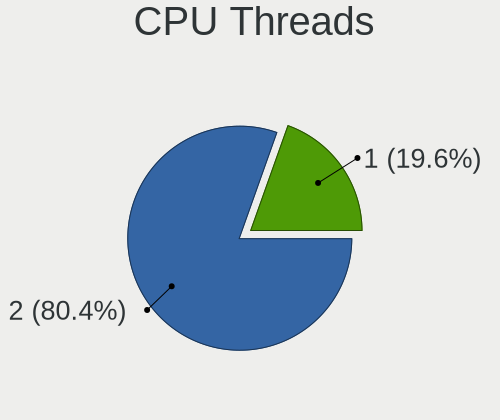

| Number | Notebooks | Percent |
|--------|-----------|---------|
| 2      | 57        | 76%     |
| 1      | 18        | 24%     |

CPU Op-Modes
------------

CPU Operation Modes (32-bit, 64-bit)

| Op mode        | Notebooks | Percent |
|----------------|-----------|---------|
| 32-bit, 64-bit | 75        | 100%    |

CPU Microcode
-------------

Microcode number

| Number     | Notebooks | Percent |
|------------|-----------|---------|
| Unknown    | 41        | 54.67%  |
| 0x0a50000c | 5         | 6.67%   |
| 0x806ec    | 3         | 4%      |
| 0x306a9    | 3         | 4%      |
| 0x806ea    | 2         | 2.67%   |
| 0x406c4    | 2         | 2.67%   |
| 0x20655    | 2         | 2.67%   |
| 0x0a50000d | 2         | 2.67%   |
| 0x08608103 | 2         | 2.67%   |
| 0x906ea    | 1         | 1.33%   |
| 0x906a3    | 1         | 1.33%   |
| 0x806eb    | 1         | 1.33%   |
| 0x706e5    | 1         | 1.33%   |
| 0x706a8    | 1         | 1.33%   |
| 0x6fd      | 1         | 1.33%   |
| 0x40661    | 1         | 1.33%   |
| 0x40651    | 1         | 1.33%   |
| 0x306d4    | 1         | 1.33%   |
| 0x206a7    | 1         | 1.33%   |
| 0x106ca    | 1         | 1.33%   |
| 0x0a404102 | 1         | 1.33%   |
| 0x08108109 | 1         | 1.33%   |

CPU Microarch
-------------

Microarchitecture

| Name             | Notebooks | Percent |
|------------------|-----------|---------|
| KabyLake         | 16        | 21.33%  |
| Silvermont       | 9         | 12%     |
| Zen 3            | 8         | 10.67%  |
| Broadwell        | 7         | 9.33%   |
| IvyBridge        | 5         | 6.67%   |
| Unknown          | 4         | 5.33%   |
| TigerLake        | 3         | 4%      |
| Skylake          | 3         | 4%      |
| Haswell          | 3         | 4%      |
| Alderlake Hybrid | 3         | 4%      |
| Westmere         | 2         | 2.67%   |
| Penryn           | 2         | 2.67%   |
| Icelake          | 2         | 2.67%   |
| Goldmont plus    | 2         | 2.67%   |
| Zen+             | 1         | 1.33%   |
| Tremont          | 1         | 1.33%   |
| SandyBridge      | 1         | 1.33%   |
| Core             | 1         | 1.33%   |
| CometLake        | 1         | 1.33%   |
| Bonnell          | 1         | 1.33%   |

Graphics
--------

GPU Vendor
----------

Vendors of graphics cards

| Vendor | Notebooks | Percent |
|--------|-----------|---------|
| Intel  | 59        | 66.29%  |
| Nvidia | 16        | 17.98%  |
| AMD    | 14        | 15.73%  |

GPU Model
---------

Graphics card models

| Model                                                                                    | Notebooks | Percent |
|------------------------------------------------------------------------------------------|-----------|---------|
| Intel WhiskeyLake-U GT2 [UHD Graphics 620]                                               | 9         | 10%     |
| AMD Cezanne [Radeon Vega Series / Radeon Vega Mobile Series]                             | 7         | 7.78%   |
| Intel Atom/Celeron/Pentium Processor x5-E8000/J3xxx/N3xxx Integrated Graphics Controller | 5         | 5.56%   |
| Intel 3rd Gen Core processor Graphics Controller                                         | 5         | 5.56%   |
| Intel Atom Processor Z36xxx/Z37xxx Series Graphics & Display                             | 4         | 4.44%   |
| Intel TigerLake-LP GT2 [Iris Xe Graphics]                                                | 3         | 3.33%   |
| Intel HD Graphics 5500                                                                   | 3         | 3.33%   |
| Intel CoffeeLake-H GT2 [UHD Graphics 630]                                                | 3         | 3.33%   |
| Nvidia TU117M [GeForce GTX 1650 Mobile / Max-Q]                                          | 2         | 2.22%   |
| Nvidia GM107GLM [Quadro M2000M]                                                          | 2         | 2.22%   |
| Nvidia GA104M [GeForce RTX 3070 Mobile / Max-Q]                                          | 2         | 2.22%   |
| Intel Mobile 4 Series Chipset Integrated Graphics Controller                             | 2         | 2.22%   |
| Intel Iris Graphics 6100                                                                 | 2         | 2.22%   |
| Intel HD Graphics 6000                                                                   | 2         | 2.22%   |
| Intel Haswell-ULT Integrated Graphics Controller                                         | 2         | 2.22%   |
| Intel GeminiLake [UHD Graphics 600]                                                      | 2         | 2.22%   |
| Intel Core Processor Integrated Graphics Controller                                      | 2         | 2.22%   |
| Intel CometLake-U GT2 [UHD Graphics]                                                     | 2         | 2.22%   |
| Intel Alder Lake-P Integrated Graphics Controller                                        | 2         | 2.22%   |
| AMD Lucienne                                                                             | 2         | 2.22%   |
| Nvidia TU106M [GeForce RTX 2070 Mobile]                                                  | 1         | 1.11%   |
| Nvidia TU104M [GeForce RTX 2070 SUPER Mobile / Max-Q]                                    | 1         | 1.11%   |
| Nvidia GP108M [GeForce MX250]                                                            | 1         | 1.11%   |
| Nvidia GP108M [GeForce MX150]                                                            | 1         | 1.11%   |
| Nvidia GP108BM [GeForce MX250]                                                           | 1         | 1.11%   |
| Nvidia GP106BM [GeForce GTX 1060 Mobile 6GB]                                             | 1         | 1.11%   |
| Nvidia GM107M [GeForce GTX 950M]                                                         | 1         | 1.11%   |
| Nvidia GA107M [GeForce RTX 3050 Ti Mobile]                                               | 1         | 1.11%   |
| Nvidia GA106M [GeForce RTX 3060 Mobile / Max-Q]                                          | 1         | 1.11%   |
| Nvidia GA104M [GeForce RTX 3080 Mobile / Max-Q 8GB/16GB]                                 | 1         | 1.11%   |
| Intel UHD Graphics 620                                                                   | 1         | 1.11%   |
| Intel Mobile GM965/GL960 Integrated Graphics Controller (secondary)                      | 1         | 1.11%   |
| Intel Mobile GM965/GL960 Integrated Graphics Controller (primary)                        | 1         | 1.11%   |
| Intel JasperLake [UHD Graphics]                                                          | 1         | 1.11%   |
| Intel Iris Plus Graphics G1 (Ice Lake)                                                   | 1         | 1.11%   |
| Intel HD Graphics 530                                                                    | 1         | 1.11%   |
| Intel Crystal Well Integrated Graphics Controller                                        | 1         | 1.11%   |
| Intel CometLake-H GT2 [UHD Graphics]                                                     | 1         | 1.11%   |
| Intel CoffeeLake-U GT3e [Iris Plus Graphics 655]                                         | 1         | 1.11%   |
| Intel Atom Processor D4xx/D5xx/N4xx/N5xx Integrated Graphics Controller                  | 1         | 1.11%   |

GPU Combo
---------

Combinations of graphics cards

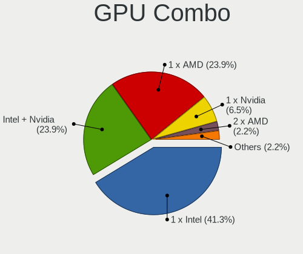

| Name           | Notebooks | Percent |
|----------------|-----------|---------|
| 1 x Intel      | 47        | 62.67%  |
| Intel + Nvidia | 9         | 12%     |
| 1 x AMD        | 9         | 12%     |
| 1 x Nvidia     | 4         | 5.33%   |
| AMD + Nvidia   | 3         | 4%      |
| Intel + AMD    | 2         | 2.67%   |
| 2 x Intel      | 1         | 1.33%   |

GPU Driver
----------

Free vs proprietary

| Driver      | Notebooks | Percent |
|-------------|-----------|---------|
| Free        | 61        | 81.33%  |
| Proprietary | 11        | 14.67%  |
| Unknown     | 3         | 4%      |

GPU Memory
----------

Total video memory

| Size in GB | Notebooks | Percent |
|------------|-----------|---------|
| Unknown    | 59        | 78.67%  |
| 1.01-2.0   | 5         | 6.67%   |
| 7.01-8.0   | 4         | 5.33%   |
| 0.01-0.5   | 4         | 5.33%   |
| 3.01-4.0   | 2         | 2.67%   |
| 5.01-6.0   | 1         | 1.33%   |

Monitor
-------

Monitor Vendor
--------------

Monitor vendors

| Vendor                  | Notebooks | Percent |
|-------------------------|-----------|---------|
| BOE                     | 13        | 17.11%  |
| AU Optronics            | 13        | 17.11%  |
| LG Display              | 12        | 15.79%  |
| Apple                   | 8         | 10.53%  |
| Samsung Electronics     | 6         | 7.89%   |
| Chimei Innolux          | 6         | 7.89%   |
| Sharp                   | 2         | 2.63%   |
| InfoVision              | 2         | 2.63%   |
| Dell                    | 2         | 2.63%   |
| CSO                     | 2         | 2.63%   |
| Valve                   | 1         | 1.32%   |
| Tianma XM               | 1         | 1.32%   |
| Panasonic               | 1         | 1.32%   |
| NEC Computers           | 1         | 1.32%   |
| Hewlett-Packard         | 1         | 1.32%   |
| Goldstar                | 1         | 1.32%   |
| Chi Mei Optoelectronics | 1         | 1.32%   |
| BenQ                    | 1         | 1.32%   |
| AOC                     | 1         | 1.32%   |
| Acer                    | 1         | 1.32%   |

Monitor Model
-------------

Monitor models

| Model                                                                 | Notebooks | Percent |
|-----------------------------------------------------------------------|-----------|---------|
| LG Display LCD Monitor LGD046F 1920x1080 345x194mm 15.6-inch          | 2         | 2.53%   |
| BOE LCD Monitor BOE072C 1920x1080 309x173mm 13.9-inch                 | 2         | 2.53%   |
| AU Optronics LCD Monitor AUO403D 1920x1080 309x174mm 14.0-inch        | 2         | 2.53%   |
| Apple Color LCD APP9CF0 1440x900 290x180mm 13.4-inch                  | 2         | 2.53%   |
| Apple Color LCD APP9CC7 1280x800 286x179mm 13.3-inch                  | 2         | 2.53%   |
| Valve ANX7530 U VLV3001 800x1280 100x150mm 7.1-inch                   | 1         | 1.27%   |
| Tianma XM LCD Monitor TLX1388 3000x2000 293x196mm 13.9-inch           | 1         | 1.27%   |
| Sharp LQ173M1JW04 SHP14E1 1920x1080 382x215mm 17.3-inch               | 1         | 1.27%   |
| Sharp LCD Monitor SHP143B 3840x2160 346x194mm 15.6-inch               | 1         | 1.27%   |
| Samsung Electronics S24C650 SAM09E9 1920x1080 521x293mm 23.5-inch     | 1         | 1.27%   |
| Samsung Electronics S24C650 SAM09E8 1920x1080 521x293mm 23.5-inch     | 1         | 1.27%   |
| Samsung Electronics LCD Monitor SEC4D45 1280x800 331x207mm 15.4-inch  | 1         | 1.27%   |
| Samsung Electronics LCD Monitor SDCA029 2560x1440 294x165mm 13.3-inch | 1         | 1.27%   |
| Samsung Electronics LCD Monitor SDC416E 2880x1620 344x194mm 15.5-inch | 1         | 1.27%   |
| Samsung Electronics LCD Monitor SDC416D 2880x1800 312x195mm 14.5-inch | 1         | 1.27%   |
| Samsung Electronics C24FG70 SAM0D57 1920x1080 532x304mm 24.1-inch     | 1         | 1.27%   |
| Panasonic TV MEIA0A6 1920x1080 698x392mm 31.5-inch                    | 1         | 1.27%   |
| NEC Computers P403 NEC6929 1920x1080 886x498mm 40.0-inch              | 1         | 1.27%   |
| LG Display LCD Monitor LGD4601 1280x800 286x179mm 13.3-inch           | 1         | 1.27%   |
| LG Display LCD Monitor LGD06CE 1920x1200 288x180mm 13.4-inch          | 1         | 1.27%   |
| LG Display LCD Monitor LGD062E 1920x1080 344x194mm 15.5-inch          | 1         | 1.27%   |
| LG Display LCD Monitor LGD05FE 1920x1080 344x194mm 15.5-inch          | 1         | 1.27%   |
| LG Display LCD Monitor LGD05E9 1920x1080 294x165mm 13.3-inch          | 1         | 1.27%   |
| LG Display LCD Monitor LGD05E6 1920x1080 344x194mm 15.5-inch          | 1         | 1.27%   |
| LG Display LCD Monitor LGD05E5 1920x1080 344x194mm 15.5-inch          | 1         | 1.27%   |
| LG Display LCD Monitor LGD04B1 1366x768 310x174mm 14.0-inch           | 1         | 1.27%   |
| LG Display LCD Monitor LGD027A 1600x900 382x215mm 17.3-inch           | 1         | 1.27%   |
| LG Display LCD Monitor LGD0258 1600x900 345x194mm 15.6-inch           | 1         | 1.27%   |
| InfoVision LCD Monitor IVO0489 1366x768 256x144mm 11.6-inch           | 1         | 1.27%   |
| InfoVision LCD Monitor IVO03F4 1024x600 223x125mm 10.1-inch           | 1         | 1.27%   |
| Hewlett-Packard 24fw HPN3545 1920x1080 527x296mm 23.8-inch            | 1         | 1.27%   |
| Goldstar 38GN950 GSM7753 3840x1600 879x366mm 37.5-inch                | 1         | 1.27%   |
| Dell U2520D DELA150 2560x1440 553x311mm 25.0-inch                     | 1         | 1.27%   |
| Dell U2518D DEL413A 2560x1440 553x311mm 25.0-inch                     | 1         | 1.27%   |
| Dell P2419HC DELA11C 1920x1080 527x296mm 23.8-inch                    | 1         | 1.27%   |
| CSO LCD Monitor CSO1403 3840x2400 302x189mm 14.0-inch                 | 1         | 1.27%   |
| CSO LCD Monitor CSO1402 2880x1800 302x188mm 14.0-inch                 | 1         | 1.27%   |
| Chimei Innolux LCD Monitor CMN15F5 1920x1080 344x193mm 15.5-inch      | 1         | 1.27%   |
| Chimei Innolux LCD Monitor CMN152D 1920x1080 344x193mm 15.5-inch      | 1         | 1.27%   |
| Chimei Innolux LCD Monitor CMN14E7 1920x1080 309x173mm 13.9-inch      | 1         | 1.27%   |

Monitor Resolution
------------------

Monitor screen resolution

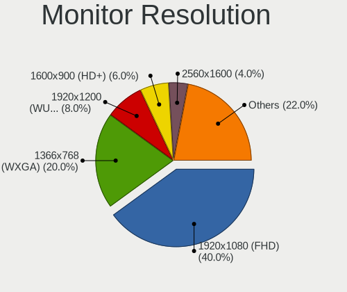

| Resolution        | Notebooks | Percent |
|-------------------|-----------|---------|
| 1920x1080 (FHD)   | 31        | 42.47%  |
| 1366x768 (WXGA)   | 8         | 10.96%  |
| 2560x1600         | 5         | 6.85%   |
| 1280x800 (WXGA)   | 5         | 6.85%   |
| 3840x2160 (4K)    | 4         | 5.48%   |
| 1600x900 (HD+)    | 4         | 5.48%   |
| 2880x1800         | 3         | 4.11%   |
| 2560x1440 (QHD)   | 3         | 4.11%   |
| 1920x1200 (WUXGA) | 2         | 2.74%   |
| 1440x900 (WXGA+)  | 2         | 2.74%   |
| 800x1280          | 1         | 1.37%   |
| 3840x2400         | 1         | 1.37%   |
| 3840x1600         | 1         | 1.37%   |
| 3000x2000         | 1         | 1.37%   |
| 2880x864          | 1         | 1.37%   |
| 2880x1620         | 1         | 1.37%   |

Monitor Diagonal
----------------

Diagonal size in inches

| Inches  | Notebooks | Percent |
|---------|-----------|---------|
| 13      | 21        | 27.63%  |
| 15      | 20        | 26.32%  |
| 14      | 12        | 15.79%  |
| 24      | 4         | 5.26%   |
| 17      | 4         | 5.26%   |
| 16      | 2         | 2.63%   |
| 12      | 2         | 2.63%   |
| 11      | 2         | 2.63%   |
| 42      | 1         | 1.32%   |
| 40      | 1         | 1.32%   |
| 37      | 1         | 1.32%   |
| 36      | 1         | 1.32%   |
| 31      | 1         | 1.32%   |
| 25      | 1         | 1.32%   |
| 23      | 1         | 1.32%   |
| 7       | 1         | 1.32%   |
| Unknown | 1         | 1.32%   |

Monitor Width
-------------

Physical width

| Width in mm | Notebooks | Percent |
|-------------|-----------|---------|
| 301-350     | 41        | 53.95%  |
| 201-300     | 18        | 23.68%  |
| 501-600     | 6         | 7.89%   |
| 351-400     | 4         | 5.26%   |
| 801-900     | 2         | 2.63%   |
| 701-800     | 1         | 1.32%   |
| 601-700     | 1         | 1.32%   |
| 901-1000    | 1         | 1.32%   |
| 1-100       | 1         | 1.32%   |
| Unknown     | 1         | 1.32%   |

Aspect Ratio
------------

Proportional relationship between the width and the height

| Ratio | Notebooks | Percent |
|-------|-----------|---------|
| 16/9  | 48        | 68.57%  |
| 16/10 | 17        | 24.29%  |
| 3/2   | 2         | 2.86%   |
| 3.33  | 1         | 1.43%   |
| 21/9  | 1         | 1.43%   |
| 0.67  | 1         | 1.43%   |

Monitor Area
------------

Area in inch

| Area in inch | Notebooks | Percent |
|----------------|-----------|---------|
| 81-90          | 25        | 32.89%  |
| 101-110        | 20        | 26.32%  |
| 71-80          | 6         | 7.89%   |
| 121-130        | 4         | 5.26%   |
| 251-300        | 3         | 3.95%   |
| 201-250        | 3         | 3.95%   |
| 501-1000       | 3         | 3.95%   |
| 61-70          | 2         | 2.63%   |
| 51-60          | 2         | 2.63%   |
| 351-500        | 2         | 2.63%   |
| 111-120        | 2         | 2.63%   |
| 91-100         | 2         | 2.63%   |
| 1-40           | 1         | 1.32%   |
| Unknown        | 1         | 1.32%   |

Pixel Density
-------------

Pixels per inch

| Density       | Notebooks | Percent |
|---------------|-----------|---------|
| 121-160       | 33        | 44%     |
| 161-240       | 14        | 18.67%  |
| 101-120       | 14        | 18.67%  |
| 51-100        | 8         | 10.67%  |
| More than 240 | 5         | 6.67%   |
| Unknown       | 1         | 1.33%   |

Multiple Monitors
-----------------

Total monitors connected

| Total | Notebooks | Percent |
|-------|-----------|---------|
| 1     | 54        | 72%     |
| 2     | 11        | 14.67%  |
| 0     | 8         | 10.67%  |
| 3     | 2         | 2.67%   |

Network
-------

Net Controller Vendor
---------------------

Controller vendors

| Vendor                | Notebooks | Percent |
|-----------------------|-----------|---------|
| Intel                 | 46        | 44.66%  |
| Realtek Semiconductor | 29        | 28.16%  |
| Broadcom              | 8         | 7.77%   |
| MediaTek              | 5         | 4.85%   |
| Qualcomm Atheros      | 3         | 2.91%   |
| TP-Link               | 2         | 1.94%   |
| Ralink Technology     | 2         | 1.94%   |
| Broadcom Limited      | 2         | 1.94%   |
| ASIX Electronics      | 2         | 1.94%   |
| Hewlett-Packard       | 1         | 0.97%   |
| Dresden Elektronik    | 1         | 0.97%   |
| DisplayLink           | 1         | 0.97%   |
| Dell                  | 1         | 0.97%   |

Net Controller Model
--------------------

Controller models

| Model                                                                   | Notebooks | Percent |
|-------------------------------------------------------------------------|-----------|---------|
| Realtek RTL8111/8168/8411 PCI Express Gigabit Ethernet Controller       | 18        | 14.52%  |
| Intel Wi-Fi 6 AX200                                                     | 10        | 8.06%   |
| Intel Cannon Point-LP CNVi [Wireless-AC]                                | 7         | 5.65%   |
| Realtek RTL8153 Gigabit Ethernet Adapter                                | 6         | 4.84%   |
| MediaTek MT7921 802.11ax PCI Express Wireless Network Adapter           | 4         | 3.23%   |
| Intel Wireless 7260                                                     | 4         | 3.23%   |
| Intel Wi-Fi 6 AX201                                                     | 3         | 2.42%   |
| Intel Centrino Advanced-N 6205 [Taylor Peak]                            | 3         | 2.42%   |
| Intel Alder Lake-P PCH CNVi WiFi                                        | 3         | 2.42%   |
| Realtek RTL8821CE 802.11ac PCIe Wireless Network Adapter                | 2         | 1.61%   |
| Intel Wireless 8260                                                     | 2         | 1.61%   |
| Intel Ethernet Connection I218-LM                                       | 2         | 1.61%   |
| Intel Ethernet Connection (6) I219-V                                    | 2         | 1.61%   |
| Intel Ethernet Connection (6) I219-LM                                   | 2         | 1.61%   |
| Intel Ethernet Connection (2) I219-LM                                   | 2         | 1.61%   |
| Intel 82579LM Gigabit Network Connection (Lewisville)                   | 2         | 1.61%   |
| Intel 82567LM Gigabit Network Connection                                | 2         | 1.61%   |
| Broadcom NetXtreme BCM57765 Gigabit Ethernet PCIe                       | 2         | 1.61%   |
| Broadcom Limited BCM4360 802.11ac Wireless Network Adapter              | 2         | 1.61%   |
| Broadcom BCM4331 802.11a/b/g/n                                          | 2         | 1.61%   |
| ASIX AX88179 Gigabit Ethernet                                           | 2         | 1.61%   |
| TP-Link UE300 10/100/1000 LAN (ethernet mode) [Realtek RTL8153]         | 1         | 0.81%   |
| TP-Link Archer T3U [Realtek RTL8812BU]                                  | 1         | 0.81%   |
| Realtek RTL8852AE 802.11ax PCIe Wireless Network Adapter                | 1         | 0.81%   |
| Realtek RTL8822CE 802.11ac PCIe Wireless Network Adapter                | 1         | 0.81%   |
| Realtek RTL8188ETV Wireless LAN 802.11n Network Adapter                 | 1         | 0.81%   |
| Realtek RTL8125 2.5GbE Controller                                       | 1         | 0.81%   |
| Realtek RTL810xE PCI Express Fast Ethernet controller                   | 1         | 0.81%   |
| Realtek RTL-8100/8101L/8139 PCI Fast Ethernet Adapter                   | 1         | 0.81%   |
| Ralink RT2870/RT3070 Wireless Adapter                                   | 1         | 0.81%   |
| Ralink MT7601U Wireless Adapter                                         | 1         | 0.81%   |
| Qualcomm Atheros QCA6174 802.11ac Wireless Network Adapter              | 1         | 0.81%   |
| Qualcomm Atheros AR8151 v2.0 Gigabit Ethernet                           | 1         | 0.81%   |
| Qualcomm Atheros AR242x / AR542x Wireless Network Adapter (PCI-Express) | 1         | 0.81%   |
| MediaTek MT7922 802.11ax PCI Express Wireless Network Adapter           | 1         | 0.81%   |
| Intel Wireless 8265 / 8275                                              | 1         | 0.81%   |
| Intel Wireless 7265                                                     | 1         | 0.81%   |
| Intel Wireless 3165                                                     | 1         | 0.81%   |
| Intel Wireless 3160                                                     | 1         | 0.81%   |
| Intel Wi-Fi 6 AX210/AX211/AX411 160MHz                                  | 1         | 0.81%   |

Wireless Vendor
---------------

Wireless vendors

| Vendor                | Notebooks | Percent |
|-----------------------|-----------|---------|
| Intel                 | 46        | 64.79%  |
| Broadcom              | 8         | 11.27%  |
| Realtek Semiconductor | 5         | 7.04%   |
| MediaTek              | 5         | 7.04%   |
| Ralink Technology     | 2         | 2.82%   |
| Qualcomm Atheros      | 2         | 2.82%   |
| Broadcom Limited      | 2         | 2.82%   |
| TP-Link               | 1         | 1.41%   |

Wireless Model
--------------

Wireless models

| Model                                                                   | Notebooks | Percent |
|-------------------------------------------------------------------------|-----------|---------|
| Intel Wi-Fi 6 AX200                                                     | 10        | 14.08%  |
| Intel Cannon Point-LP CNVi [Wireless-AC]                                | 7         | 9.86%   |
| MediaTek MT7921 802.11ax PCI Express Wireless Network Adapter           | 4         | 5.63%   |
| Intel Wireless 7260                                                     | 4         | 5.63%   |
| Intel Wi-Fi 6 AX201                                                     | 3         | 4.23%   |
| Intel Centrino Advanced-N 6205 [Taylor Peak]                            | 3         | 4.23%   |
| Intel Alder Lake-P PCH CNVi WiFi                                        | 3         | 4.23%   |
| Realtek RTL8821CE 802.11ac PCIe Wireless Network Adapter                | 2         | 2.82%   |
| Intel Wireless 8260                                                     | 2         | 2.82%   |
| Broadcom Limited BCM4360 802.11ac Wireless Network Adapter              | 2         | 2.82%   |
| Broadcom BCM4331 802.11a/b/g/n                                          | 2         | 2.82%   |
| TP-Link Archer T3U [Realtek RTL8812BU]                                  | 1         | 1.41%   |
| Realtek RTL8852AE 802.11ax PCIe Wireless Network Adapter                | 1         | 1.41%   |
| Realtek RTL8822CE 802.11ac PCIe Wireless Network Adapter                | 1         | 1.41%   |
| Realtek RTL8188ETV Wireless LAN 802.11n Network Adapter                 | 1         | 1.41%   |
| Ralink RT2870/RT3070 Wireless Adapter                                   | 1         | 1.41%   |
| Ralink MT7601U Wireless Adapter                                         | 1         | 1.41%   |
| Qualcomm Atheros QCA6174 802.11ac Wireless Network Adapter              | 1         | 1.41%   |
| Qualcomm Atheros AR242x / AR542x Wireless Network Adapter (PCI-Express) | 1         | 1.41%   |
| MediaTek MT7922 802.11ax PCI Express Wireless Network Adapter           | 1         | 1.41%   |
| Intel Wireless 8265 / 8275                                              | 1         | 1.41%   |
| Intel Wireless 7265                                                     | 1         | 1.41%   |
| Intel Wireless 3165                                                     | 1         | 1.41%   |
| Intel Wireless 3160                                                     | 1         | 1.41%   |
| Intel Wi-Fi 6 AX210/AX211/AX411 160MHz                                  | 1         | 1.41%   |
| Intel Wi-Fi 6 AX201 160MHz                                              | 1         | 1.41%   |
| Intel Ultimate N WiFi Link 5300                                         | 1         | 1.41%   |
| Intel Tiger Lake PCH CNVi WiFi                                          | 1         | 1.41%   |
| Intel PRO/Wireless 5100 AGN [Shiloh] Network Connection                 | 1         | 1.41%   |
| Intel Ice Lake-LP PCH CNVi WiFi                                         | 1         | 1.41%   |
| Intel Gemini Lake PCH CNVi WiFi                                         | 1         | 1.41%   |
| Intel Comet Lake PCH-LP CNVi WiFi                                       | 1         | 1.41%   |
| Intel Comet Lake PCH CNVi WiFi                                          | 1         | 1.41%   |
| Intel Centrino Ultimate-N 6300                                          | 1         | 1.41%   |
| Broadcom BCM4364 802.11ac Wireless Network Adapter                      | 1         | 1.41%   |
| Broadcom BCM43602 802.11ac Wireless LAN SoC                             | 1         | 1.41%   |
| Broadcom BCM4360 802.11ac Wireless Network Adapter                      | 1         | 1.41%   |
| Broadcom BCM4356 802.11ac Wireless Network Adapter                      | 1         | 1.41%   |
| Broadcom BCM43225 802.11b/g/n                                           | 1         | 1.41%   |
| Broadcom BCM4313 802.11bgn Wireless Network Adapter                     | 1         | 1.41%   |

Ethernet Vendor
---------------

Ethernet vendors

| Vendor                | Notebooks | Percent |
|-----------------------|-----------|---------|
| Realtek Semiconductor | 26        | 53.06%  |
| Intel                 | 16        | 32.65%  |
| Broadcom              | 2         | 4.08%   |
| ASIX Electronics      | 2         | 4.08%   |
| TP-Link               | 1         | 2.04%   |
| Qualcomm Atheros      | 1         | 2.04%   |
| DisplayLink           | 1         | 2.04%   |

Ethernet Model
--------------

Ethernet models

| Model                                                             | Notebooks | Percent |
|-------------------------------------------------------------------|-----------|---------|
| Realtek RTL8111/8168/8411 PCI Express Gigabit Ethernet Controller | 18        | 36%     |
| Realtek RTL8153 Gigabit Ethernet Adapter                          | 6         | 12%     |
| Intel Ethernet Connection I218-LM                                 | 2         | 4%      |
| Intel Ethernet Connection (6) I219-V                              | 2         | 4%      |
| Intel Ethernet Connection (6) I219-LM                             | 2         | 4%      |
| Intel Ethernet Connection (2) I219-LM                             | 2         | 4%      |
| Intel 82579LM Gigabit Network Connection (Lewisville)             | 2         | 4%      |
| Intel 82567LM Gigabit Network Connection                          | 2         | 4%      |
| Broadcom NetXtreme BCM57765 Gigabit Ethernet PCIe                 | 2         | 4%      |
| ASIX AX88179 Gigabit Ethernet                                     | 2         | 4%      |
| TP-Link UE300 10/100/1000 LAN (ethernet mode) [Realtek RTL8153]   | 1         | 2%      |
| Realtek RTL8125 2.5GbE Controller                                 | 1         | 2%      |
| Realtek RTL810xE PCI Express Fast Ethernet controller             | 1         | 2%      |
| Realtek RTL-8100/8101L/8139 PCI Fast Ethernet Adapter             | 1         | 2%      |
| Qualcomm Atheros AR8151 v2.0 Gigabit Ethernet                     | 1         | 2%      |
| Intel Ethernet Connection (4) I219-V                              | 1         | 2%      |
| Intel Ethernet Connection (3) I218-LM                             | 1         | 2%      |
| Intel Ethernet Connection (13) I219-V                             | 1         | 2%      |
| Intel 82579V Gigabit Network Connection                           | 1         | 2%      |
| DisplayLink USB3.0 Dual Video Dock                                | 1         | 2%      |

Net Controller Kind
-------------------

Ethernet, WiFi or modem

| Kind     | Notebooks | Percent |
|----------|-----------|---------|
| WiFi     | 69        | 58.47%  |
| Ethernet | 46        | 38.98%  |
| Modem    | 3         | 2.54%   |

Used Controller
---------------

Currently used network controller

| Kind     | Notebooks | Percent |
|----------|-----------|---------|
| WiFi     | 55        | 74.32%  |
| Ethernet | 19        | 25.68%  |

NICs
----

Total network controllers on board

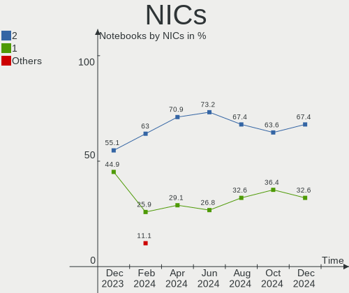

| Total | Notebooks | Percent |
|-------|-----------|---------|
| 2     | 37        | 49.33%  |
| 1     | 29        | 38.67%  |
| 0     | 7         | 9.33%   |
| 3     | 2         | 2.67%   |

IPv6
----

IPv6 vs IPv4

| Used | Notebooks | Percent |
|------|-----------|---------|
| No   | 44        | 58.67%  |
| Yes  | 31        | 41.33%  |

Bluetooth
---------

Bluetooth Vendor
----------------

Controller vendors

| Vendor                          | Notebooks | Percent |
|---------------------------------|-----------|---------|
| Intel                           | 38        | 64.41%  |
| Apple                           | 6         | 10.17%  |
| Foxconn / Hon Hai               | 5         | 8.47%   |
| IMC Networks                    | 3         | 5.08%   |
| Broadcom                        | 3         | 5.08%   |
| Realtek Semiconductor           | 2         | 3.39%   |
| Qualcomm Atheros Communications | 1         | 1.69%   |
| ASUSTek Computer                | 1         | 1.69%   |

Bluetooth Model
---------------

Controller models

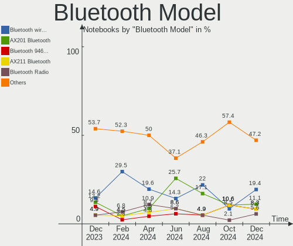

| Model                                          | Notebooks | Percent |
|------------------------------------------------|-----------|---------|
| Intel Bluetooth wireless interface             | 10        | 16.95%  |
| Intel AX200 Bluetooth                          | 10        | 16.95%  |
| Intel Bluetooth 9460/9560 Jefferson Peak (JfP) | 8         | 13.56%  |
| Intel AX201 Bluetooth                          | 7         | 11.86%  |
| Foxconn / Hon Hai Wireless_Device              | 4         | 6.78%   |
| Broadcom HP Portable SoftSailing               | 3         | 5.08%   |
| Apple Bluetooth USB Host Controller            | 3         | 5.08%   |
| Apple Bluetooth Host Controller                | 3         | 5.08%   |
| Realtek Bluetooth Radio                        | 2         | 3.39%   |
| Intel Bluetooth Device                         | 2         | 3.39%   |
| IMC Networks Bluetooth Radio                   | 2         | 3.39%   |
| Qualcomm Atheros  Bluetooth Device             | 1         | 1.69%   |
| Intel AX210 Bluetooth                          | 1         | 1.69%   |
| IMC Networks Wireless_Device                   | 1         | 1.69%   |
| Foxconn / Hon Hai Acer Module                  | 1         | 1.69%   |
| ASUS ASUS USB-BT500                            | 1         | 1.69%   |

Sound
-----

Sound Vendor
------------

Sound card vendors

| Vendor                | Notebooks | Percent |
|-----------------------|-----------|---------|
| Intel                 | 54        | 62.79%  |
| AMD                   | 14        | 16.28%  |
| Nvidia                | 11        | 12.79%  |
| C-Media Electronics   | 3         | 3.49%   |
| Realtek Semiconductor | 1         | 1.16%   |
| Logitech              | 1         | 1.16%   |
| Creative Technology   | 1         | 1.16%   |
| Apple                 | 1         | 1.16%   |

Sound Model
-----------

Sound card models

| Model                                                                                             | Notebooks | Percent |
|---------------------------------------------------------------------------------------------------|-----------|---------|
| AMD Family 17h/19h HD Audio Controller                                                            | 12        | 11.32%  |
| Intel Cannon Point-LP High Definition Audio Controller                                            | 10        | 9.43%   |
| AMD Renoir Radeon High Definition Audio Controller                                                | 8         | 7.55%   |
| Intel Wildcat Point-LP High Definition Audio Controller                                           | 7         | 6.6%    |
| Intel Broadwell-U Audio Controller                                                                | 7         | 6.6%    |
| Intel 7 Series/C216 Chipset Family High Definition Audio Controller                               | 5         | 4.72%   |
| Nvidia GA104 High Definition Audio Controller                                                     | 3         | 2.83%   |
| Intel Tiger Lake-LP Smart Sound Technology Audio Controller                                       | 3         | 2.83%   |
| Intel Cannon Lake PCH cAVS                                                                        | 3         | 2.83%   |
| Intel Alder Lake PCH-P High Definition Audio Controller                                           | 3         | 2.83%   |
| Intel 100 Series/C230 Series Chipset Family HD Audio Controller                                   | 3         | 2.83%   |
| Nvidia GM107 High Definition Audio Controller [GeForce 940MX]                                     | 2         | 1.89%   |
| Intel Haswell-ULT HD Audio Controller                                                             | 2         | 1.89%   |
| Intel Comet Lake PCH-LP cAVS                                                                      | 2         | 1.89%   |
| Intel Celeron/Pentium Silver Processor High Definition Audio                                      | 2         | 1.89%   |
| Intel 82801I (ICH9 Family) HD Audio Controller                                                    | 2         | 1.89%   |
| Intel 8 Series HD Audio Controller                                                                | 2         | 1.89%   |
| Intel 5 Series/3400 Series Chipset High Definition Audio                                          | 2         | 1.89%   |
| AMD Rembrandt Radeon High Definition Audio Controller                                             | 2         | 1.89%   |
| Realtek Semiconductor USB Audio                                                                   | 1         | 0.94%   |
| Nvidia TU107 GeForce GTX 1650 High Definition Audio Controller                                    | 1         | 0.94%   |
| Nvidia TU106 High Definition Audio Controller                                                     | 1         | 0.94%   |
| Nvidia TU104 HD Audio Controller                                                                  | 1         | 0.94%   |
| Nvidia GP106 High Definition Audio Controller                                                     | 1         | 0.94%   |
| Nvidia GA106 High Definition Audio Controller                                                     | 1         | 0.94%   |
| Nvidia Audio device                                                                               | 1         | 0.94%   |
| Logitech Blue Microphones                                                                         | 1         | 0.94%   |
| Intel Tiger Lake-H HD Audio Controller                                                            | 1         | 0.94%   |
| Intel Sunrise Point-LP HD Audio                                                                   | 1         | 0.94%   |
| Intel NM10/ICH7 Family High Definition Audio Controller                                           | 1         | 0.94%   |
| Intel Jasper Lake HD Audio                                                                        | 1         | 0.94%   |
| Intel Ice Lake-LP Smart Sound Technology Audio Controller                                         | 1         | 0.94%   |
| Intel Crystal Well HD Audio Controller                                                            | 1         | 0.94%   |
| Intel Comet Lake PCH cAVS                                                                         | 1         | 0.94%   |
| Intel Atom/Celeron/Pentium Processor x5-E8000/J3xxx/N3xxx Series High Definition Audio Controller | 1         | 0.94%   |
| Intel 82801H (ICH8 Family) HD Audio Controller                                                    | 1         | 0.94%   |
| Intel 8 Series/C220 Series Chipset High Definition Audio Controller                               | 1         | 0.94%   |
| Intel 6 Series/C200 Series Chipset Family High Definition Audio Controller                        | 1         | 0.94%   |
| Creative Technology SB X-Fi Surround 5.1 Pro                                                      | 1         | 0.94%   |
| C-Media Electronics USB Advanced Audio Device                                                     | 1         | 0.94%   |

Memory
------

Memory Vendor
-------------

Memory module vendors

| Vendor              | Notebooks | Percent |
|---------------------|-----------|---------|
| SK hynix            | 13        | 22.41%  |
| Samsung Electronics | 12        | 20.69%  |
| Micron Technology   | 8         | 13.79%  |
| Unknown             | 5         | 8.62%   |
| Crucial             | 5         | 8.62%   |
| Kingston            | 4         | 6.9%    |
| GOODRAM             | 3         | 5.17%   |
| Ramaxel Technology  | 2         | 3.45%   |
| Corsair             | 2         | 3.45%   |
| tigo                | 1         | 1.72%   |
| Qimonda             | 1         | 1.72%   |
| Elpida              | 1         | 1.72%   |
| Unknown             | 1         | 1.72%   |

Memory Model
------------

Memory module models

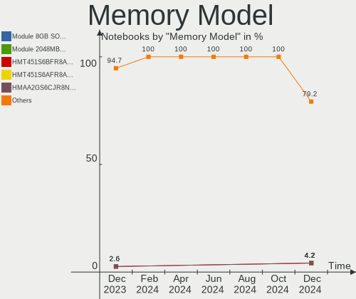

| Model                                                            | Notebooks | Percent |
|------------------------------------------------------------------|-----------|---------|
| Unknown RAM Module 2GB SODIMM DDR3 1600MT/s                      | 2         | 3.33%   |
| Unknown RAM Module 2GB SODIMM DDR3 1333MT/s                      | 2         | 3.33%   |
| Samsung RAM M471A2G44AM0-CWE 16GB SODIMM DDR4 3200MT/s           | 2         | 3.33%   |
| Samsung RAM M471A2G43AB2-CWE 16GB SODIMM DDR4 3200MT/s           | 2         | 3.33%   |
| Crucial RAM CT102464BF160B.C16 8GB SODIMM DDR3 1600MT/s          | 2         | 3.33%   |
| Unknown RAM Module 1GB SODIMM DDR3 1333MT/s                      | 1         | 1.67%   |
| tigo RAM Module 4GB SODIMM DDR3 1333MT/s                         | 1         | 1.67%   |
| SK hynix RAM Module 4GB SODIMM DDR3 1600MT/s                     | 1         | 1.67%   |
| SK hynix RAM Module 2GB SODIMM DDR3 1600MT/s                     | 1         | 1.67%   |
| SK hynix RAM HYMP125S64CP8-S6 2GB SODIMM DDR2 800MT/s            | 1         | 1.67%   |
| SK hynix RAM HMT851S6AMR6A-PB 4GB Chip DDR3 1600MT/s             | 1         | 1.67%   |
| SK hynix RAM HMT451S6AFR8A-PB 4GB SODIMM DDR3 1600MT/s           | 1         | 1.67%   |
| SK hynix RAM HMT425S6AFR6A-PB 2GB SODIMM DDR3 3200MT/s           | 1         | 1.67%   |
| SK hynix RAM HMT351S6BFR8C-H9 4GB SODIMM DDR3 1333MT/s           | 1         | 1.67%   |
| SK hynix RAM HMP112S6NFR8C-S6 1GB SODIMM DDR2 800MT/s            | 1         | 1.67%   |
| SK hynix RAM HMAA1GS6DMR6N-XN 8GB Row Of Chips DDR4 3200MT/s     | 1         | 1.67%   |
| SK hynix RAM HMAA1GS6CJR6N-XN 8GB SODIMM DDR4 3200MT/s           | 1         | 1.67%   |
| SK hynix RAM HMA82GS6JJR8N-VK 16GB SODIMM DDR4 2667MT/s          | 1         | 1.67%   |
| SK hynix RAM H9JCNNNCP3MLYR-N6E 4GB SODIMM LPDDR5 6400MT/s       | 1         | 1.67%   |
| SK hynix RAM H9HCNNNCPMMLXR-NEE 8GB Row Of Chips LPDDR4 4266MT/s | 1         | 1.67%   |
| SK hynix RAM H9CCNNNCLGALAR-NVD 8GB Row Of Chips LPDDR3 2133MT/s | 1         | 1.67%   |
| Samsung RAM U6E3S4AA-MGCR 4GB Row Of Chips LPDDR4 4267MT/s       | 1         | 1.67%   |
| Samsung RAM Module 4GB SODIMM DDR3 1600MT/s                      | 1         | 1.67%   |
| Samsung RAM M471B5173QH0-YK0 4GB SODIMM DDR3 1600MT/s            | 1         | 1.67%   |
| Samsung RAM M471A5244CB0-CTD 4GB SODIMM DDR4 3266MT/s            | 1         | 1.67%   |
| Samsung RAM M471A4G43MB1-CTD 32GB SODIMM DDR4 2667MT/s           | 1         | 1.67%   |
| Samsung RAM M471A1K43EB1-CWE 8GB SODIMM DDR4 3200MT/s            | 1         | 1.67%   |
| Samsung RAM M471A1K43DB1-CTD 8GB SODIMM DDR4 2667MT/s            | 1         | 1.67%   |
| Samsung RAM M471A1G44AB0-CWE 8GB SODIMM DDR4 3200MT/s            | 1         | 1.67%   |
| Samsung RAM K4UBE3D4AA-MGCH 8GB Row Of Chips LPDDR4 3200MT/s     | 1         | 1.67%   |
| Ramaxel RAM RMSA3300ME78HBF-2666 16GB SODIMM DDR4 2667MT/s       | 1         | 1.67%   |
| Ramaxel RAM Module 8GB SODIMM DDR4 2667MT/s                      | 1         | 1.67%   |
| Qimonda RAM Module 1GB SODIMM DDR2 533MT/s                       | 1         | 1.67%   |
| Micron RAM MT52L512M32D2PF-09 4GB Row Of Chips LPDDR3 2133MT/s   | 1         | 1.67%   |
| Micron RAM Module 8192MB SODIMM DDR4 3200MT/s                    | 1         | 1.67%   |
| Micron RAM Module 2GB Row Of Chips LPDDR5 6400MT/s               | 1         | 1.67%   |
| Micron RAM 8ATF1G64HZ-2G3B1 8GB SODIMM DDR4 2400MT/s             | 1         | 1.67%   |
| Micron RAM 4ATF11G64HZ-3G2E1 8GB Row Of Chips DDR4 3200MT/s      | 1         | 1.67%   |
| Micron RAM 16KTF1G64HZ-1G6E1 8192MB SODIMM DDR3 1600MT/s         | 1         | 1.67%   |
| Micron RAM 16HTF25664HY-667E1 2GB SODIMM DDR2 667MT/s            | 1         | 1.67%   |

Memory Kind
-----------

Memory module kinds

| Kind   | Notebooks | Percent |
|--------|-----------|---------|
| DDR4   | 20        | 40.82%  |
| DDR3   | 18        | 36.73%  |
| LPDDR5 | 3         | 6.12%   |
| LPDDR4 | 3         | 6.12%   |
| DDR2   | 3         | 6.12%   |
| LPDDR3 | 2         | 4.08%   |

Memory Form Factor
------------------

Physical design of the memory module

| Name         | Notebooks | Percent |
|--------------|-----------|---------|
| SODIMM       | 41        | 80.39%  |
| Row Of Chips | 9         | 17.65%  |
| Chip         | 1         | 1.96%   |

Memory Size
-----------

Memory module size

| Size  | Notebooks | Percent |
|-------|-----------|---------|
| 8192  | 16        | 30.77%  |
| 4096  | 13        | 25%     |
| 16384 | 10        | 19.23%  |
| 2048  | 9         | 17.31%  |
| 1024  | 3         | 5.77%   |
| 32768 | 1         | 1.92%   |

Memory Speed
------------

Memory module speed

| Speed | Notebooks | Percent |
|-------|-----------|---------|
| 3200  | 14        | 26.92%  |
| 1600  | 10        | 19.23%  |
| 2667  | 7         | 13.46%  |
| 1333  | 7         | 13.46%  |
| 6400  | 3         | 5.77%   |
| 2400  | 2         | 3.85%   |
| 2133  | 2         | 3.85%   |
| 800   | 2         | 3.85%   |
| 4267  | 1         | 1.92%   |
| 4266  | 1         | 1.92%   |
| 3266  | 1         | 1.92%   |
| 667   | 1         | 1.92%   |
| 533   | 1         | 1.92%   |

Printers & scanners
-------------------

Printer Vendor
--------------

Printer device vendors

Zero info for selected period =(

Printer Model
-------------

Printer device models

Zero info for selected period =(

Scanner Vendor
--------------

Scanner device vendors

Zero info for selected period =(

Scanner Model
-------------

Scanner device models

Zero info for selected period =(

Camera
------

Camera Vendor
-------------

Camera device vendors

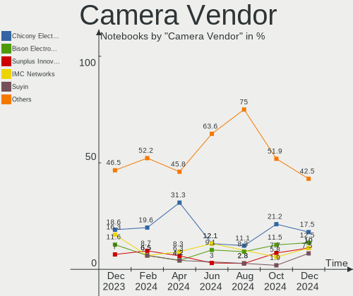

| Vendor                                 | Notebooks | Percent |
|----------------------------------------|-----------|---------|
| Chicony Electronics                    | 22        | 34.38%  |
| IMC Networks                           | 11        | 17.19%  |
| Microdia                               | 5         | 7.81%   |
| Realtek Semiconductor                  | 4         | 6.25%   |
| Alcor Micro                            | 3         | 4.69%   |
| Quanta                                 | 2         | 3.13%   |
| Logitech                               | 2         | 3.13%   |
| Lite-On Technology                     | 2         | 3.13%   |
| Cheng Uei Precision Industry (Foxlink) | 2         | 3.13%   |
| Bison Electronics                      | 2         | 3.13%   |
| Apple                                  | 2         | 3.13%   |
| Suyin                                  | 1         | 1.56%   |
| Sunplus Innovation Technology          | 1         | 1.56%   |
| Sonix Technology                       | 1         | 1.56%   |
| Silicon Motion                         | 1         | 1.56%   |
| Primax Electronics                     | 1         | 1.56%   |
| Luxvisions Innotech Limited            | 1         | 1.56%   |
| Acer                                   | 1         | 1.56%   |

Camera Model
------------

Camera device models

| Model                                                | Notebooks | Percent |
|------------------------------------------------------|-----------|---------|
| IMC Networks Integrated Camera                       | 7         | 10.77%  |
| Chicony Integrated Camera                            | 5         | 7.69%   |
| Chicony HD WebCam                                    | 5         | 7.69%   |
| Realtek Integrated_Webcam_HD                         | 3         | 4.62%   |
| Chicony USB2.0 Camera                                | 3         | 4.62%   |
| Microdia Integrated_Webcam_HD                        | 2         | 3.08%   |
| IMC Networks USB2.0 HD UVC WebCam                    | 2         | 3.08%   |
| Chicony HP HD Webcam [Fixed]                         | 2         | 3.08%   |
| Chicony HP HD Camera                                 | 2         | 3.08%   |
| Bison BisonCam,NB Pro                                | 2         | 3.08%   |
| Apple FaceTime HD Camera                             | 2         | 3.08%   |
| Suyin HP Webcam                                      | 1         | 1.54%   |
| Sunplus Laptop Integrated Webcam HD                  | 1         | 1.54%   |
| Sonix USB2.0 FHD UVC WebCam                          | 1         | 1.54%   |
| Silicon Motion 300k Pixel Camera                     | 1         | 1.54%   |
| Realtek TV Camera                                    | 1         | 1.54%   |
| Realtek Realtek USB MIC                              | 1         | 1.54%   |
| Quanta HP HD Camera                                  | 1         | 1.54%   |
| Quanta HD User Facing                                | 1         | 1.54%   |
| Primax HP HD Webcam [Fixed]                          | 1         | 1.54%   |
| Microdia USB 2.0 Camera                              | 1         | 1.54%   |
| Microdia Integrated_Webcam_2M                        | 1         | 1.54%   |
| Microdia HP Integrated Webcam                        | 1         | 1.54%   |
| Luxvisions Innotech Limited HP Wide Vision HD Camera | 1         | 1.54%   |
| Logitech Webcam C270                                 | 1         | 1.54%   |
| Logitech C920 PRO HD Webcam                          | 1         | 1.54%   |
| Lite-On HP HD Webcam                                 | 1         | 1.54%   |
| Lite-On HP HD Camera                                 | 1         | 1.54%   |
| IMC Networks USB2.0 VGA UVC WebCam                   | 1         | 1.54%   |
| IMC Networks USB2.0 HD IR UVC WebCam                 | 1         | 1.54%   |
| Chicony USB2.0 VGA UVC WebCam                        | 1         | 1.54%   |
| Chicony USB 2.0 Camera                               | 1         | 1.54%   |
| Chicony integrated USB webcam                        | 1         | 1.54%   |
| Chicony CKA7227                                      | 1         | 1.54%   |
| Chicony 1.3M Webcam                                  | 1         | 1.54%   |
| Cheng Uei Precision Industry (Foxlink) HP HD Webcam  | 1         | 1.54%   |
| Cheng Uei Precision Industry (Foxlink) HD Camera     | 1         | 1.54%   |
| Alcor Micro USB 2.0 Camera                           | 1         | 1.54%   |
| Alcor Micro SHUNCCM2MP                               | 1         | 1.54%   |
| Alcor Micro HP Webcam                                | 1         | 1.54%   |

Security
--------

Fingerprint Vendor
------------------

Fingerprint sensor vendors

| Vendor                             | Notebooks | Percent |
|------------------------------------|-----------|---------|
| Validity Sensors                   | 6         | 37.5%   |
| Synaptics                          | 5         | 31.25%  |
| Shenzhen Goodix Technology         | 2         | 12.5%   |
| Realtek USB2.0 Finger Print Bridge | 1         | 6.25%   |
| LighTuning Technology              | 1         | 6.25%   |
| AuthenTec                          | 1         | 6.25%   |

Fingerprint Model
-----------------

Fingerprint sensor models

| Model                                                                      | Notebooks | Percent |
|----------------------------------------------------------------------------|-----------|---------|
| Validity Sensors VFS491                                                    | 2         | 12.5%   |
| Synaptics  VFS7552 Touch Fingerprint Sensor with PurePrint                 | 2         | 12.5%   |
| Synaptics Prometheus MIS Touch Fingerprint Reader                          | 2         | 12.5%   |
| Validity Sensors VFS7500 Touch Fingerprint Sensor                          | 1         | 6.25%   |
| Validity Sensors VFS301 Fingerprint Reader                                 | 1         | 6.25%   |
| Validity Sensors VFS 5011 fingerprint sensor                               | 1         | 6.25%   |
| Validity Sensors Synaptics VFS7552 Touch Fingerprint Sensor with PurePrint | 1         | 6.25%   |
| Synaptics UWP WBDI                                                         | 1         | 6.25%   |
| Shenzhen Goodix  FingerPrint Device                                        | 1         | 6.25%   |
| Shenzhen Goodix Fingerprint Reader                                         | 1         | 6.25%   |
| Realtek USB2.0 Finger Print Bridge FocalTech Fingerprint Device            | 1         | 6.25%   |
| LighTuning EgisTec Touch Fingerprint Sensor                                | 1         | 6.25%   |
| AuthenTec AES2810                                                          | 1         | 6.25%   |

Chipcard Vendor
---------------

Chipcard module vendors

| Vendor      | Notebooks | Percent |
|-------------|-----------|---------|
| Alcor Micro | 3         | 75%     |
| Broadcom    | 1         | 25%     |

Chipcard Model
--------------

Chipcard module models

| Model                                          | Notebooks | Percent |
|------------------------------------------------|-----------|---------|
| Alcor Micro AU9540 Smartcard Reader            | 3         | 75%     |
| Broadcom BCM5880 Secure Applications Processor | 1         | 25%     |

Unsupported
-----------

Unsupported Devices
-------------------

Total unsupported devices on board

| Total | Notebooks | Percent |
|-------|-----------|---------|
| 0     | 45        | 60%     |
| 1     | 24        | 32%     |
| 2     | 4         | 5.33%   |
| 8     | 1         | 1.33%   |
| 3     | 1         | 1.33%   |

Unsupported Device Types
------------------------

Types of unsupported devices

| Type                  | Notebooks | Percent |
|-----------------------|-----------|---------|
| Fingerprint reader    | 16        | 39.02%  |
| Multimedia controller | 7         | 17.07%  |
| Graphics card         | 6         | 14.63%  |
| Chipcard              | 3         | 7.32%   |
| Camera                | 3         | 7.32%   |
| Sound                 | 2         | 4.88%   |
| Net/wireless          | 2         | 4.88%   |
| Card reader           | 1         | 2.44%   |
| Bluetooth             | 1         | 2.44%   |

