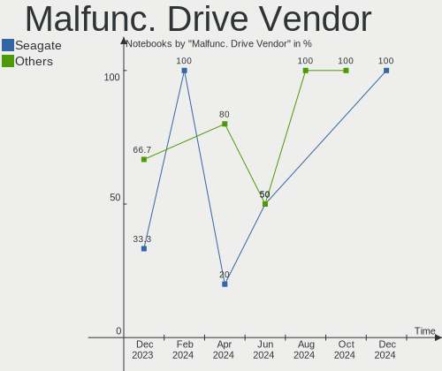
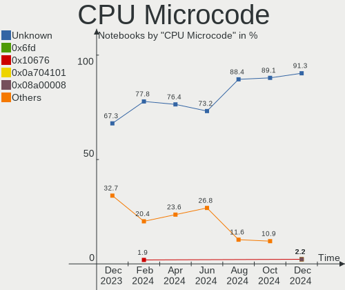
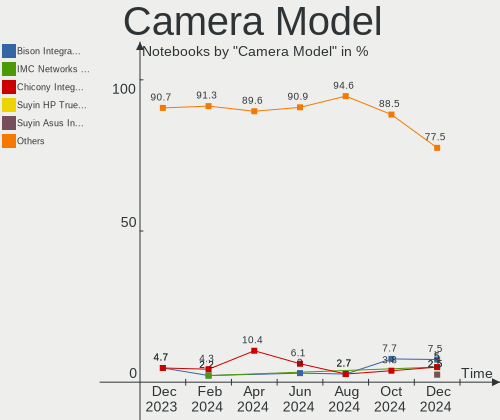

Linux in Netherlands - Hardware Trends (Notebooks)
--------------------------------------------------

A project to identify most popular hardware characteristics and track their change
over time based on data collected by Linux users at https://Linux-Hardware.org.

Anyone can contribute to this report by the [hw-probe](https://github.com/linuxhw/hw-probe) tool:

    sudo -E hw-probe -all -upload

Period: Sep, 2023.

Contents
--------

* [ System ](#system)
  - [ OS                       ](#os)
  - [ OS Family                ](#os-family)
  - [ Kernel                   ](#kernel)
  - [ Kernel Family            ](#kernel-family)
  - [ Kernel Major Ver.        ](#kernel-major-ver)
  - [ Arch                     ](#arch)
  - [ DE                       ](#de)
  - [ Display Server           ](#display-server)
  - [ Display Manager          ](#display-manager)
  - [ OS Lang                  ](#os-lang)
  - [ Boot Mode                ](#boot-mode)
  - [ Filesystem               ](#filesystem)
  - [ Part. scheme             ](#part-scheme)
  - [ Dual Boot with Linux/BSD ](#dual-boot-with-linuxbsd)
  - [ Dual Boot (Win)          ](#dual-boot-win)

* [ Board ](#board)
  - [ Vendor                   ](#vendor)
  - [ Model                    ](#model)
  - [ Model Family             ](#model-family)
  - [ MFG Year                 ](#mfg-year)
  - [ Form Factor              ](#form-factor)
  - [ Secure Boot              ](#secure-boot)
  - [ Coreboot                 ](#coreboot)
  - [ RAM Size                 ](#ram-size)
  - [ RAM Used                 ](#ram-used)
  - [ Total Drives             ](#total-drives)
  - [ Has CD-ROM               ](#has-cd-rom)
  - [ Has Ethernet             ](#has-ethernet)
  - [ Has WiFi                 ](#has-wifi)
  - [ Has Bluetooth            ](#has-bluetooth)

* [ Location ](#location)
  - [ Country                  ](#country)
  - [ City                     ](#city)

* [ Drives ](#drives)
  - [ Drive Vendor             ](#drive-vendor)
  - [ Drive Model              ](#drive-model)
  - [ HDD Vendor               ](#hdd-vendor)
  - [ SSD Vendor               ](#ssd-vendor)
  - [ Drive Kind               ](#drive-kind)
  - [ Drive Connector          ](#drive-connector)
  - [ Drive Size               ](#drive-size)
  - [ Space Total              ](#space-total)
  - [ Space Used               ](#space-used)
  - [ Malfunc. Drives          ](#malfunc-drives)
  - [ Malfunc. Drive Vendor    ](#malfunc-drive-vendor)
  - [ Malfunc. HDD Vendor      ](#malfunc-hdd-vendor)
  - [ Malfunc. Drive Kind      ](#malfunc-drive-kind)
  - [ Failed Drives            ](#failed-drives)
  - [ Failed Drive Vendor      ](#failed-drive-vendor)
  - [ Drive Status             ](#drive-status)

* [ Storage controller ](#storage-controller)
  - [ Storage Vendor           ](#storage-vendor)
  - [ Storage Model            ](#storage-model)
  - [ Storage Kind             ](#storage-kind)

* [ Processor ](#processor)
  - [ CPU Vendor               ](#cpu-vendor)
  - [ CPU Model                ](#cpu-model)
  - [ CPU Model Family         ](#cpu-model-family)
  - [ CPU Cores                ](#cpu-cores)
  - [ CPU Sockets              ](#cpu-sockets)
  - [ CPU Threads              ](#cpu-threads)
  - [ CPU Op-Modes             ](#cpu-op-modes)
  - [ CPU Microcode            ](#cpu-microcode)
  - [ CPU Microarch            ](#cpu-microarch)

* [ Graphics ](#graphics)
  - [ GPU Vendor               ](#gpu-vendor)
  - [ GPU Model                ](#gpu-model)
  - [ GPU Combo                ](#gpu-combo)
  - [ GPU Driver               ](#gpu-driver)
  - [ GPU Memory               ](#gpu-memory)

* [ Monitor ](#monitor)
  - [ Monitor Vendor           ](#monitor-vendor)
  - [ Monitor Model            ](#monitor-model)
  - [ Monitor Resolution       ](#monitor-resolution)
  - [ Monitor Diagonal         ](#monitor-diagonal)
  - [ Monitor Width            ](#monitor-width)
  - [ Aspect Ratio             ](#aspect-ratio)
  - [ Monitor Area             ](#monitor-area)
  - [ Pixel Density            ](#pixel-density)
  - [ Multiple Monitors        ](#multiple-monitors)

* [ Network ](#network)
  - [ Net Controller Vendor    ](#net-controller-vendor)
  - [ Net Controller Model     ](#net-controller-model)
  - [ Wireless Vendor          ](#wireless-vendor)
  - [ Wireless Model           ](#wireless-model)
  - [ Ethernet Vendor          ](#ethernet-vendor)
  - [ Ethernet Model           ](#ethernet-model)
  - [ Net Controller Kind      ](#net-controller-kind)
  - [ Used Controller          ](#used-controller)
  - [ NICs                     ](#nics)
  - [ IPv6                     ](#ipv6)

* [ Bluetooth ](#bluetooth)
  - [ Bluetooth Vendor         ](#bluetooth-vendor)
  - [ Bluetooth Model          ](#bluetooth-model)

* [ Sound ](#sound)
  - [ Sound Vendor             ](#sound-vendor)
  - [ Sound Model              ](#sound-model)

* [ Memory ](#memory)
  - [ Memory Vendor            ](#memory-vendor)
  - [ Memory Model             ](#memory-model)
  - [ Memory Kind              ](#memory-kind)
  - [ Memory Form Factor       ](#memory-form-factor)
  - [ Memory Size              ](#memory-size)
  - [ Memory Speed             ](#memory-speed)

* [ Printers & scanners ](#printers--scanners)
  - [ Printer Vendor           ](#printer-vendor)
  - [ Printer Model            ](#printer-model)
  - [ Scanner Vendor           ](#scanner-vendor)
  - [ Scanner Model            ](#scanner-model)

* [ Camera ](#camera)
  - [ Camera Vendor            ](#camera-vendor)
  - [ Camera Model             ](#camera-model)

* [ Security ](#security)
  - [ Fingerprint Vendor       ](#fingerprint-vendor)
  - [ Fingerprint Model        ](#fingerprint-model)
  - [ Chipcard Vendor          ](#chipcard-vendor)
  - [ Chipcard Model           ](#chipcard-model)

* [ Unsupported ](#unsupported)
  - [ Unsupported Devices      ](#unsupported-devices)
  - [ Unsupported Device Types ](#unsupported-device-types)

System
------

OS
--

Installed operating systems

| Name                | Notebooks | Percent |
|---------------------|-----------|---------|
| Linux Mint 21.2     | 7         | 14.58%  |
| Ubuntu 22.04        | 5         | 10.42%  |
| Pop!_OS 22.04       | 4         | 8.33%   |
| Zorin 16            | 2         | 4.17%   |
| Xero Rolling        | 2         | 4.17%   |
| Ubuntu 23.04        | 2         | 4.17%   |
| OpenMandriva 23.08  | 2         | 4.17%   |
| MX 23               | 2         | 4.17%   |
| Gentoo 2.14         | 2         | 4.17%   |
| Fedora 38           | 2         | 4.17%   |
| Arch Rolling        | 2         | 4.17%   |
| Ubuntu Budgie 22.10 | 1         | 2.08%   |
| TUXEDO OS 22.04     | 1         | 2.08%   |
| SteamOS 3.4.10      | 1         | 2.08%   |
| ROSA R11.1          | 1         | 2.08%   |
| OpenMandriva 4.3    | 1         | 2.08%   |
| OpenMandriva 23.09  | 1         | 2.08%   |
| Manjaro 23.0.0      | 1         | 2.08%   |
| Manjaro             | 1         | 2.08%   |
| Lubuntu 22.04       | 1         | 2.08%   |
| Linux Mint 18.3     | 1         | 2.08%   |
| KDE neon 22.04      | 1         | 2.08%   |
| Debian 12           | 1         | 2.08%   |
| Debian 11           | 1         | 2.08%   |
| Debian              | 1         | 2.08%   |
| ArcoLinux Rolling   | 1         | 2.08%   |
| Alpine 3.18.3       | 1         | 2.08%   |

OS Family
---------

OS without a version

| Name          | Notebooks | Percent |
|---------------|-----------|---------|
| Linux Mint    | 8         | 16.67%  |
| Ubuntu        | 7         | 14.58%  |
| Pop!_OS       | 4         | 8.33%   |
| OpenMandriva  | 4         | 8.33%   |
| Debian        | 3         | 6.25%   |
| Zorin         | 2         | 4.17%   |
| Xero          | 2         | 4.17%   |
| MX            | 2         | 4.17%   |
| Manjaro       | 2         | 4.17%   |
| Gentoo        | 2         | 4.17%   |
| Fedora        | 2         | 4.17%   |
| Arch          | 2         | 4.17%   |
| Ubuntu Budgie | 1         | 2.08%   |
| TUXEDO OS     | 1         | 2.08%   |
| SteamOS       | 1         | 2.08%   |
| ROSA          | 1         | 2.08%   |
| Lubuntu       | 1         | 2.08%   |
| KDE neon      | 1         | 2.08%   |
| ArcoLinux     | 1         | 2.08%   |
| Alpine        | 1         | 2.08%   |

Kernel
------

Version of the Linux kernel

| Version                           | Notebooks | Percent |
|-----------------------------------|-----------|---------|
| 6.2.0-33-generic                  | 5         | 10.42%  |
| 6.4.6-76060406-generic            | 4         | 8.33%   |
| 5.15.0-84-generic                 | 3         | 6.25%   |
| 6.4.11-desktop-1omv2390           | 2         | 4.17%   |
| 6.2.0-32-generic                  | 2         | 4.17%   |
| 6.1.0-12-amd64                    | 2         | 4.17%   |
| 5.15.0-79-generic                 | 2         | 4.17%   |
| 6.5.5-arch1-1                     | 1         | 2.08%   |
| 6.5.4-arch2-1                     | 1         | 2.08%   |
| 6.5.4-060504-generic              | 1         | 2.08%   |
| 6.5.3-desktop-1omv2390            | 1         | 2.08%   |
| 6.5.3-arch1-1                     | 1         | 2.08%   |
| 6.5.1-arch1-1                     | 1         | 2.08%   |
| 6.5.0-gentoo                      | 1         | 2.08%   |
| 6.5.0-1-MANJARO                   | 1         | 2.08%   |
| 6.4.9-1-liquorix-amd64            | 1         | 2.08%   |
| 6.4.15-200.fc38.x86_64            | 1         | 2.08%   |
| 6.4.12-arch1-1                    | 1         | 2.08%   |
| 6.4.12-200.fc38.x86_64            | 1         | 2.08%   |
| 6.4.0-4-amd64                     | 1         | 2.08%   |
| 6.3.7-060307-generic              | 1         | 2.08%   |
| 6.2.0-34-generic                  | 1         | 2.08%   |
| 6.2.0-27-generic                  | 1         | 2.08%   |
| 6.1.53-0-lts                      | 1         | 2.08%   |
| 6.1.38-1-MANJARO                  | 1         | 2.08%   |
| 6.1.1-gentoo-x86_64               | 1         | 2.08%   |
| 6.1.0-1022-oem                    | 1         | 2.08%   |
| 5.19.0-46-generic                 | 1         | 2.08%   |
| 5.16.7-desktop-1omv4003           | 1         | 2.08%   |
| 5.15.0-82-generic                 | 1         | 2.08%   |
| 5.15.0-76-generic                 | 1         | 2.08%   |
| 5.13.0-valve37-1-neptune          | 1         | 2.08%   |
| 5.10.0-25-amd64                   | 1         | 2.08%   |
| 4.15.0-desktop-122.124.1rosa-i586 | 1         | 2.08%   |
| 4.15.0-142-generic                | 1         | 2.08%   |

Kernel Family
-------------

Linux kernel without a distro release

| Version | Notebooks | Percent |
|---------|-----------|---------|
| 6.2.0   | 9         | 18.75%  |
| 5.15.0  | 7         | 14.58%  |
| 6.4.6   | 4         | 8.33%   |
| 6.1.0   | 3         | 6.25%   |
| 6.5.4   | 2         | 4.17%   |
| 6.5.3   | 2         | 4.17%   |
| 6.5.0   | 2         | 4.17%   |
| 6.4.12  | 2         | 4.17%   |
| 6.4.11  | 2         | 4.17%   |
| 4.15.0  | 2         | 4.17%   |
| 6.5.5   | 1         | 2.08%   |
| 6.5.1   | 1         | 2.08%   |
| 6.4.9   | 1         | 2.08%   |
| 6.4.15  | 1         | 2.08%   |
| 6.4.0   | 1         | 2.08%   |
| 6.3.7   | 1         | 2.08%   |
| 6.1.53  | 1         | 2.08%   |
| 6.1.38  | 1         | 2.08%   |
| 6.1.1   | 1         | 2.08%   |
| 5.19.0  | 1         | 2.08%   |
| 5.16.7  | 1         | 2.08%   |
| 5.13.0  | 1         | 2.08%   |
| 5.10.0  | 1         | 2.08%   |

Kernel Major Ver.
-----------------

Linux kernel major version

| Version | Notebooks | Percent |
|---------|-----------|---------|
| 6.4     | 11        | 22.92%  |
| 6.2     | 9         | 18.75%  |
| 6.5     | 8         | 16.67%  |
| 5.15    | 7         | 14.58%  |
| 6.1     | 6         | 12.5%   |
| 4.15    | 2         | 4.17%   |
| 6.3     | 1         | 2.08%   |
| 5.19    | 1         | 2.08%   |
| 5.16    | 1         | 2.08%   |
| 5.13    | 1         | 2.08%   |
| 5.10    | 1         | 2.08%   |

Arch
----

OS architecture (x86_64, i586, etc.)

| Name   | Notebooks | Percent |
|--------|-----------|---------|
| x86_64 | 47        | 97.92%  |
| i686   | 1         | 2.08%   |

DE
--

Desktop Environment

| Name       | Notebooks | Percent |
|------------|-----------|---------|
| GNOME      | 17        | 35.42%  |
| KDE5       | 13        | 27.08%  |
| X-Cinnamon | 7         | 14.58%  |
| XFCE       | 3         | 6.25%   |
| MATE       | 2         | 4.17%   |
| sway       | 1         | 2.08%   |
| LXQt       | 1         | 2.08%   |
| KDE4       | 1         | 2.08%   |
| i3         | 1         | 2.08%   |
| Cinnamon   | 1         | 2.08%   |
| Budgie     | 1         | 2.08%   |

Display Server
--------------

X11 or Wayland

| Name    | Notebooks | Percent |
|---------|-----------|---------|
| X11     | 33        | 68.75%  |
| Wayland | 15        | 31.25%  |

Display Manager
---------------

SDDM, LightDM, etc.

| Name    | Notebooks | Percent |
|---------|-----------|---------|
| Unknown | 16        | 33.33%  |
| SDDM    | 10        | 20.83%  |
| LightDM | 9         | 18.75%  |
| GDM3    | 8         | 16.67%  |
| GDM     | 3         | 6.25%   |
| SLiM    | 1         | 2.08%   |
| KDM     | 1         | 2.08%   |

OS Lang
-------

Language

| Lang  | Notebooks | Percent |
|-------|-----------|---------|
| en_US | 25        | 52.08%  |
| nl_NL | 15        | 31.25%  |
| en_GB | 2         | 4.17%   |
| C     | 2         | 4.17%   |
| ru_RU | 1         | 2.08%   |
| es_ES | 1         | 2.08%   |
| de_DE | 1         | 2.08%   |
| cs_CZ | 1         | 2.08%   |

Boot Mode
---------

EFI or BIOS

| Mode | Notebooks | Percent |
|------|-----------|---------|
| EFI  | 31        | 64.58%  |
| BIOS | 17        | 35.42%  |

Filesystem
----------

Type of filesystem

| Type    | Notebooks | Percent |
|---------|-----------|---------|
| Ext4    | 31        | 64.58%  |
| Btrfs   | 9         | 18.75%  |
| Tmpfs   | 5         | 10.42%  |
| Overlay | 2         | 4.17%   |
| Zfs     | 1         | 2.08%   |

Part. scheme
------------

Scheme of partitioning

| Type    | Notebooks | Percent |
|---------|-----------|---------|
| GPT     | 29        | 60.42%  |
| Unknown | 16        | 33.33%  |
| MBR     | 3         | 6.25%   |

Dual Boot with Linux/BSD
------------------------

Hosting more than one Linux/BSD

| Dual boot | Notebooks | Percent |
|-----------|-----------|---------|
| No        | 38        | 79.17%  |
| Yes       | 10        | 20.83%  |

Dual Boot (Win)
---------------

Hosting Linux and Windows

| Dual boot | Notebooks | Percent |
|-----------|-----------|---------|
| No        | 40        | 83.33%  |
| Yes       | 8         | 16.67%  |

Board
-----

Vendor
------

Motherboard manufacturer

| Name             | Notebooks | Percent |
|------------------|-----------|---------|
| Lenovo           | 12        | 25%     |
| Hewlett-Packard  | 9         | 18.75%  |
| ASUSTek Computer | 8         | 16.67%  |
| Acer             | 4         | 8.33%   |
| MSI              | 2         | 4.17%   |
| Medion           | 2         | 4.17%   |
| Dell             | 2         | 4.17%   |
| Valve            | 1         | 2.08%   |
| Toshiba          | 1         | 2.08%   |
| System76         | 1         | 2.08%   |
| SKIKK            | 1         | 2.08%   |
| Notebook         | 1         | 2.08%   |
| HUAWEI           | 1         | 2.08%   |
| Framework        | 1         | 2.08%   |
| Clevo            | 1         | 2.08%   |
| Chuwi            | 1         | 2.08%   |

Model
-----

Motherboard model

| Name                                     | Notebooks | Percent |
|------------------------------------------|-----------|---------|
| Valve Jupiter                            | 1         | 2.08%   |
| Toshiba Satellite A200                   | 1         | 2.08%   |
| System76 Gazelle                         | 1         | 2.08%   |
| SKIKK Sindri 14                          | 1         | 2.08%   |
| Notebook NH50_70RH                       | 1         | 2.08%   |
| MSI Prestige 14Evo A12M                  | 1         | 2.08%   |
| MSI Katana 15 B12VGK                     | 1         | 2.08%   |
| Medion E11201                            | 1         | 2.08%   |
| Medion Akoya E7416                       | 1         | 2.08%   |
| Lenovo Z50-75 80EC                       | 1         | 2.08%   |
| Lenovo ThinkPad X1 Carbon 7th 20QES21E00 | 1         | 2.08%   |
| Lenovo ThinkPad X1 Carbon 6th 20KGS3RV00 | 1         | 2.08%   |
| Lenovo ThinkPad T16 Gen 1 21CHCTO1WW     | 1         | 2.08%   |
| Lenovo ThinkPad T14 Gen 1 20UD001AMH     | 1         | 2.08%   |
| Lenovo ThinkPad L540 20AU006CRI          | 1         | 2.08%   |
| Lenovo ThinkPad L13 Gen 2 20VH001WRT     | 1         | 2.08%   |
| Lenovo Legion 5 Pro 16ACH6H 82JQ         | 1         | 2.08%   |
| Lenovo IdeaPad 520-15IKB 81BF            | 1         | 2.08%   |
| Lenovo IdeaPad 3 15ALC6 82KU             | 1         | 2.08%   |
| Lenovo IdeaPad 1 14AMN7 82VF             | 1         | 2.08%   |
| Lenovo 14w Gen 2 82N9                    | 1         | 2.08%   |
| HUAWEI HN-WX9X                           | 1         | 2.08%   |
| HP ProBook 6550b                         | 1         | 2.08%   |
| HP ProBook 450 15.6 inch G9 Notebook PC  | 1         | 2.08%   |
| HP Pro Tablet 608 G1                     | 1         | 2.08%   |
| HP Pavilion Gaming Laptop 15-cx0xxx      | 1         | 2.08%   |
| HP Pavilion g6                           | 1         | 2.08%   |
| HP OMEN by Gaming Laptop 16-xf0xxx       | 1         | 2.08%   |
| HP Laptop 14-ck0xxx                      | 1         | 2.08%   |
| HP EliteBook Revolve 810 G3              | 1         | 2.08%   |
| HP EliteBook 8570w                       | 1         | 2.08%   |
| Framework Laptop                         | 1         | 2.08%   |
| Dell Latitude 5420                       | 1         | 2.08%   |
| Dell Latitude 3301                       | 1         | 2.08%   |
| Clevo E7130                              | 1         | 2.08%   |
| Chuwi MiniBook X                         | 1         | 2.08%   |
| ASUS VivoBook_ASUSLaptop X513EA_K513EA   | 1         | 2.08%   |
| ASUS VivoBook_ASUSLaptop X513EAN_K513EA  | 1         | 2.08%   |
| ASUS VivoBook_ASUSLaptop X412FL_X412FL   | 1         | 2.08%   |
| ASUS ROG Strix G814JI_G814JI             | 1         | 2.08%   |

Model Family
------------

Motherboard model prefix

| Name              | Notebooks | Percent |
|-------------------|-----------|---------|
| Lenovo ThinkPad   | 6         | 12.5%   |
| Acer Aspire       | 4         | 8.33%   |
| Lenovo IdeaPad    | 3         | 6.25%   |
| ASUS VivoBook     | 3         | 6.25%   |
| HP ProBook        | 2         | 4.17%   |
| HP Pavilion       | 2         | 4.17%   |
| HP EliteBook      | 2         | 4.17%   |
| Dell Latitude     | 2         | 4.17%   |
| ASUS ROG          | 2         | 4.17%   |
| Valve Jupiter     | 1         | 2.08%   |
| Toshiba Satellite | 1         | 2.08%   |
| System76 Gazelle  | 1         | 2.08%   |
| SKIKK Sindri      | 1         | 2.08%   |
| Notebook NH50     | 1         | 2.08%   |
| MSI Prestige      | 1         | 2.08%   |
| MSI Katana        | 1         | 2.08%   |
| Medion E11201     | 1         | 2.08%   |
| Medion Akoya      | 1         | 2.08%   |
| Lenovo Z50-75     | 1         | 2.08%   |
| Lenovo Legion     | 1         | 2.08%   |
| Lenovo 14w        | 1         | 2.08%   |
| HUAWEI HN-WX9X    | 1         | 2.08%   |
| HP Pro            | 1         | 2.08%   |
| HP OMEN           | 1         | 2.08%   |
| HP Laptop         | 1         | 2.08%   |
| Framework Laptop  | 1         | 2.08%   |
| Clevo E7130       | 1         | 2.08%   |
| Chuwi MiniBook    | 1         | 2.08%   |
| ASUS N751JX       | 1         | 2.08%   |
| ASUS K54L         | 1         | 2.08%   |
| ASUS ASUS         | 1         | 2.08%   |

MFG Year
--------

Motherboard manufacture year

| Year | Notebooks | Percent |
|------|-----------|---------|
| 2022 | 9         | 18.75%  |
| 2021 | 6         | 12.5%   |
| 2023 | 5         | 10.42%  |
| 2020 | 5         | 10.42%  |
| 2019 | 4         | 8.33%   |
| 2018 | 3         | 6.25%   |
| 2015 | 3         | 6.25%   |
| 2014 | 3         | 6.25%   |
| 2016 | 2         | 4.17%   |
| 2011 | 2         | 4.17%   |
| 2010 | 2         | 4.17%   |
| 2007 | 2         | 4.17%   |
| 2017 | 1         | 2.08%   |
| 2012 | 1         | 2.08%   |

Form Factor
-----------

Physical design of the computer

| Name     | Notebooks | Percent |
|----------|-----------|---------|
| Notebook | 48        | 100%    |

Secure Boot
-----------

Enabled or disabled

| State    | Notebooks | Percent |
|----------|-----------|---------|
| Disabled | 43        | 89.58%  |
| Enabled  | 5         | 10.42%  |

Coreboot
--------

Have coreboot on board

| Used | Notebooks | Percent |
|------|-----------|---------|
| No   | 47        | 97.92%  |
| Yes  | 1         | 2.08%   |

RAM Size
--------

Total RAM memory

| Size in GB  | Notebooks | Percent |
|-------------|-----------|---------|
| 16.01-24.0  | 11        | 22.92%  |
| 3.01-4.0    | 10        | 20.83%  |
| 8.01-16.0   | 8         | 16.67%  |
| 4.01-8.0    | 7         | 14.58%  |
| 32.01-64.0  | 5         | 10.42%  |
| 24.01-32.0  | 3         | 6.25%   |
| 64.01-256.0 | 2         | 4.17%   |
| 2.01-3.0    | 1         | 2.08%   |
| 1.01-2.0    | 1         | 2.08%   |

RAM Used
--------

Used RAM memory

| Used GB   | Notebooks | Percent |
|-----------|-----------|---------|
| 4.01-8.0  | 14        | 29.17%  |
| 2.01-3.0  | 13        | 27.08%  |
| 1.01-2.0  | 12        | 25%     |
| 3.01-4.0  | 4         | 8.33%   |
| 8.01-16.0 | 4         | 8.33%   |
| 0.51-1.0  | 1         | 2.08%   |

Total Drives
------------

Number of drives on board

| Drives | Notebooks | Percent |
|--------|-----------|---------|
| 1      | 30        | 62.5%   |
| 2      | 18        | 37.5%   |

Has CD-ROM
----------

Has CD-ROM on board

| Presented | Notebooks | Percent |
|-----------|-----------|---------|
| No        | 35        | 72.92%  |
| Yes       | 13        | 27.08%  |

Has Ethernet
------------

Has Ethernet on board

| Presented | Notebooks | Percent |
|-----------|-----------|---------|
| Yes       | 36        | 75%     |
| No        | 12        | 25%     |

Has WiFi
--------

Has WiFi module

| Presented | Notebooks | Percent |
|-----------|-----------|---------|
| Yes       | 47        | 97.92%  |
| No        | 1         | 2.08%   |

Has Bluetooth
-------------

Has Bluetooth module

| Presented | Notebooks | Percent |
|-----------|-----------|---------|
| Yes       | 44        | 91.67%  |
| No        | 4         | 8.33%   |

Location
--------

Country
-------

Geographic location (country)

| Country     | Notebooks | Percent |
|-------------|-----------|---------|
| Netherlands | 48        | 100%    |

City
----

Geographic location (city)

| City                   | Notebooks | Percent |
|------------------------|-----------|---------|
| Amsterdam              | 10        | 20.83%  |
| The Hague              | 3         | 6.25%   |
| Rotterdam              | 2         | 4.17%   |
| Hoeven                 | 2         | 4.17%   |
| Delft                  | 2         | 4.17%   |
| Zevenbergen            | 1         | 2.08%   |
| Zeeland                | 1         | 2.08%   |
| Zandvoort              | 1         | 2.08%   |
| Vught                  | 1         | 2.08%   |
| Voorhout               | 1         | 2.08%   |
| Vleuten                | 1         | 2.08%   |
| Venlo                  | 1         | 2.08%   |
| Siddeburen             | 1         | 2.08%   |
| Purmerend              | 1         | 2.08%   |
| Pijnacker              | 1         | 2.08%   |
| Noordwijk aan Zee      | 1         | 2.08%   |
| Nieuwegein             | 1         | 2.08%   |
| Naaldwijk              | 1         | 2.08%   |
| Middelburg             | 1         | 2.08%   |
| Maastricht             | 1         | 2.08%   |
| Lutjewinkel            | 1         | 2.08%   |
| Leeuwarden             | 1         | 2.08%   |
| IJmuiden               | 1         | 2.08%   |
| Houten                 | 1         | 2.08%   |
| Haarlem                | 1         | 2.08%   |
| Groningen              | 1         | 2.08%   |
| Eindhoven              | 1         | 2.08%   |
| Drachten               | 1         | 2.08%   |
| Dordrecht              | 1         | 2.08%   |
| Capelle aan den IJssel | 1         | 2.08%   |
| Breda                  | 1         | 2.08%   |
| Bloemendaal            | 1         | 2.08%   |
| Baexem                 | 1         | 2.08%   |
| Baarn                  | 1         | 2.08%   |

Drives
------

Drive Vendor
------------

Hard drive vendors

| Vendor              | Notebooks | Drives | Percent |
|---------------------|-----------|--------|---------|
| Samsung Electronics | 16        | 17     | 26.23%  |
| Sandisk             | 10        | 11     | 16.39%  |
| Unknown             | 5         | 7      | 8.2%    |
| WDC                 | 4         | 4      | 6.56%   |
| SK hynix            | 4         | 4      | 6.56%   |
| Intel               | 4         | 4      | 6.56%   |
| Micron Technology   | 3         | 3      | 4.92%   |
| Toshiba             | 2         | 2      | 3.28%   |
| Seagate             | 2         | 3      | 3.28%   |
| Kingston            | 2         | 2      | 3.28%   |
| WALRAM              | 1         | 1      | 1.64%   |
| SPCC                | 1         | 1      | 1.64%   |
| Phison Electronics  | 1         | 1      | 1.64%   |
| LITEON              | 1         | 1      | 1.64%   |
| KIOXIA              | 1         | 1      | 1.64%   |
| Kingchuxing         | 1         | 1      | 1.64%   |
| HGST                | 1         | 1      | 1.64%   |
| Crucial             | 1         | 1      | 1.64%   |
| Unknown             | 1         | 1      | 1.64%   |

Drive Model
-----------

Hard drive models

| Model                                               | Notebooks | Percent |
|-----------------------------------------------------|-----------|---------|
| Unknown MMC Card  64GB                              | 2         | 3.13%   |
| Sandisk WD Blue SN570 1TB                           | 2         | 3.13%   |
| Sandisk WD Black SN850 1TB                          | 2         | 3.13%   |
| Samsung NVMe SSD Controller SM981/PM981/PM983 256GB | 2         | 3.13%   |
| Samsung NVMe SSD Controller PM9A1/PM9A3/980PRO 1TB  | 2         | 3.13%   |
| Micron 2400_MTFDKBA1T0QFM 1024GB                    | 2         | 3.13%   |
| Intel SSD 660P Series 1024GB                        | 2         | 3.13%   |
| WDC WD7500BPKT-60PK4T0 752GB                        | 1         | 1.56%   |
| WDC WD3200BPVT-55JJ5T0 320GB                        | 1         | 1.56%   |
| WDC WD2500BEVS-22UST0 250GB                         | 1         | 1.56%   |
| WDC WD10SPZX-24Z10T0 1TB                            | 1         | 1.56%   |
| WALRAM SSD 512GB                                    | 1         | 1.56%   |
| Unknown SD16G  64GB                                 | 1         | 1.56%   |
| Unknown SD/MMC/MS PRO 128GB                         | 1         | 1.56%   |
| Unknown SB64G  64GB                                 | 1         | 1.56%   |
| Unknown MMC Card  512GB                             | 1         | 1.56%   |
| Toshiba MQ01ABF050 500GB                            | 1         | 1.56%   |
| Toshiba MQ01ABD100 1TB                              | 1         | 1.56%   |
| SPCC Solid State Disk 1TB                           | 1         | 1.56%   |
| SK hynix SKHynix_HFS512GD9TNI-L2B0B 512GB           | 1         | 1.56%   |
| SK hynix SC210 2.5 7MM 128GB SSD                    | 1         | 1.56%   |
| SK hynix HFS128G3BTND-N210A 128GB SSD               | 1         | 1.56%   |
| SK hynix HFM512GD3JX013N 512GB                      | 1         | 1.56%   |
| Seagate ST9320320AS 320GB                           | 1         | 1.56%   |
| Seagate ST500LM000-SSHD-8GB                         | 1         | 1.56%   |
| Seagate ST1000LM 048-2E7172 1TB                     | 1         | 1.56%   |
| Sandisk WD Blue SN500 / PC SN520 NVMe SSD 256GB     | 1         | 1.56%   |
| Sandisk WD Black SN750 / PC SN730 NVMe SSD 512GB    | 1         | 1.56%   |
| SanDisk SDW64G  64GB                                | 1         | 1.56%   |
| Sandisk PC SN530 NVMe WDC 256GB                     | 1         | 1.56%   |
| Sandisk PC SN520 NVMe SSD 512GB                     | 1         | 1.56%   |
| SanDisk NVMe SSD Drive 1TB                          | 1         | 1.56%   |
| Samsung SSD 980 PRO 500GB                           | 1         | 1.56%   |
| Samsung SSD 960 EVO 1TB                             | 1         | 1.56%   |
| Samsung SSD 870 EVO 1TB                             | 1         | 1.56%   |
| Samsung SSD 850 EVO 250GB                           | 1         | 1.56%   |
| Samsung SSD 840 EVO 120GB                           | 1         | 1.56%   |
| Samsung NVMe SSD Controller SM961/PM961/SM963 500GB | 1         | 1.56%   |
| Samsung MZVLB256HAHQ-000L7 256GB                    | 1         | 1.56%   |
| Samsung MZVLB1T0HBLR-000L2 1TB                      | 1         | 1.56%   |

HDD Vendor
----------

Hard disk drive vendors

| Vendor              | Notebooks | Drives | Percent |
|---------------------|-----------|--------|---------|
| WDC                 | 4         | 4      | 36.36%  |
| Toshiba             | 2         | 2      | 18.18%  |
| Seagate             | 2         | 3      | 18.18%  |
| Unknown             | 1         | 1      | 9.09%   |
| Samsung Electronics | 1         | 1      | 9.09%   |
| HGST                | 1         | 1      | 9.09%   |

SSD Vendor
----------

Solid state drive vendors

| Vendor              | Notebooks | Drives | Percent |
|---------------------|-----------|--------|---------|
| Samsung Electronics | 4         | 5      | 40%     |
| SK hynix            | 2         | 2      | 20%     |
| WALRAM              | 1         | 1      | 10%     |
| SPCC                | 1         | 1      | 10%     |
| LITEON              | 1         | 1      | 10%     |
| Crucial             | 1         | 1      | 10%     |

Drive Kind
----------

HDD or SSD

| Kind    | Notebooks | Drives | Percent |
|---------|-----------|--------|---------|
| NVMe    | 30        | 34     | 52.63%  |
| HDD     | 11        | 12     | 19.3%   |
| SSD     | 9         | 11     | 15.79%  |
| MMC     | 6         | 8      | 10.53%  |
| Unknown | 1         | 1      | 1.75%   |

Drive Connector
---------------

SATA, SAS, NVMe, etc.

| Type | Notebooks | Drives | Percent |
|------|-----------|--------|---------|
| NVMe | 30        | 34     | 54.55%  |
| SATA | 17        | 22     | 30.91%  |
| MMC  | 6         | 8      | 10.91%  |
| SAS  | 2         | 2      | 3.64%   |

Drive Size
----------

Size of hard drive

| Size in TB | Notebooks | Drives | Percent |
|------------|-----------|--------|---------|
| 0.01-0.5   | 13        | 15     | 68.42%  |
| 0.51-1.0   | 6         | 8      | 31.58%  |

Space Total
-----------

Amount of disk space available on the file system

| Size in GB | Notebooks | Percent |
|------------|-----------|---------|
| 251-500    | 14        | 29.17%  |
| 101-250    | 9         | 18.75%  |
| 501-1000   | 9         | 18.75%  |
| 1-20       | 5         | 10.42%  |
| 1001-2000  | 4         | 8.33%   |
| 51-100     | 3         | 6.25%   |
| 21-50      | 2         | 4.17%   |
| Unknown    | 2         | 4.17%   |

Space Used
----------

Amount of used disk space

| Used GB   | Notebooks | Percent |
|-----------|-----------|---------|
| 1-20      | 18        | 37.5%   |
| 21-50     | 11        | 22.92%  |
| 101-250   | 6         | 12.5%   |
| 51-100    | 6         | 12.5%   |
| 251-500   | 2         | 4.17%   |
| 501-1000  | 2         | 4.17%   |
| Unknown   | 2         | 4.17%   |
| 1001-2000 | 1         | 2.08%   |

Malfunc. Drives
---------------

Drive models with a malfunction

| Model                     | Notebooks | Drives | Percent |
|---------------------------|-----------|--------|---------|
| Seagate ST9320320AS 320GB | 1         | 1      | 50%     |
| HGST HTS721010A9E630 1TB  | 1         | 1      | 50%     |

Malfunc. Drive Vendor
---------------------

Vendors of faulty drives

| Vendor  | Notebooks | Drives | Percent |
|---------|-----------|--------|---------|
| Seagate | 1         | 1      | 50%     |
| HGST    | 1         | 1      | 50%     |

Malfunc. HDD Vendor
-------------------

Vendors of faulty HDD drives

| Vendor  | Notebooks | Drives | Percent |
|---------|-----------|--------|---------|
| Seagate | 1         | 1      | 50%     |
| HGST    | 1         | 1      | 50%     |

Malfunc. Drive Kind
-------------------

Kinds of faulty drives

| Kind | Notebooks | Drives | Percent |
|------|-----------|--------|---------|
| HDD  | 2         | 2      | 100%    |

Failed Drives
-------------

Failed drive models

Zero info for selected period =(

Failed Drive Vendor
-------------------

Failed drive vendors

Zero info for selected period =(

Drive Status
------------

Number of failed and malfunc. drives

| Status   | Notebooks | Drives | Percent |
|----------|-----------|--------|---------|
| Detected | 27        | 37     | 51.92%  |
| Works    | 23        | 27     | 44.23%  |
| Malfunc  | 2         | 2      | 3.85%   |

Storage controller
------------------

Storage Vendor
--------------

Storage controller vendors

| Vendor                      | Notebooks | Percent |
|-----------------------------|-----------|---------|
| Intel                       | 23        | 41.07%  |
| Samsung Electronics         | 10        | 17.86%  |
| SanDisk                     | 9         | 16.07%  |
| AMD                         | 4         | 7.14%   |
| Micron Technology           | 3         | 5.36%   |
| SK hynix                    | 2         | 3.57%   |
| Kingston Technology Company | 2         | 3.57%   |
| Phison Electronics          | 1         | 1.79%   |
| Nvidia                      | 1         | 1.79%   |
| KIOXIA                      | 1         | 1.79%   |

Storage Model
-------------

Storage controller models

| Model                                                                          | Notebooks | Percent |
|--------------------------------------------------------------------------------|-----------|---------|
| AMD FCH SATA Controller [AHCI mode]                                            | 4         | 6.45%   |
| Samsung NVMe SSD Controller SM981/PM981/PM983                                  | 3         | 4.84%   |
| Samsung NVMe SSD Controller PM9A1/PM9A3/980PRO                                 | 3         | 4.84%   |
| Intel Tiger Lake-LP SATA Controller                                            | 3         | 4.84%   |
| Intel SSD 660P Series                                                          | 3         | 4.84%   |
| SanDisk WD PC SN810 / Black SN850 NVMe SSD                                     | 2         | 3.23%   |
| SanDisk WD Blue SN570 NVMe SSD 1TB                                             | 2         | 3.23%   |
| Samsung NVMe SSD Controller SM961/PM961/SM963                                  | 2         | 3.23%   |
| Micron 2400 NVMe SSD (DRAM-less)                                               | 2         | 3.23%   |
| Kingston Company KC3000/Renegade NVMe SSD                                      | 2         | 3.23%   |
| Intel Wildcat Point-LP SATA Controller [AHCI Mode]                             | 2         | 3.23%   |
| Intel Volume Management Device NVMe RAID Controller                            | 2         | 3.23%   |
| Intel Sunrise Point-LP SATA Controller [AHCI mode]                             | 2         | 3.23%   |
| Intel Cannon Lake Mobile PCH SATA AHCI Controller                              | 2         | 3.23%   |
| Intel 8 Series/C220 Series Chipset Family 6-port SATA Controller 1 [AHCI mode] | 2         | 3.23%   |
| SK hynix PC611 NVMe Solid State Drive                                          | 1         | 1.61%   |
| SK hynix Gold P31/BC711/PC711 NVMe Solid State Drive                           | 1         | 1.61%   |
| Sandisk Western Digital WD Black SN850X NVMe SSD                               | 1         | 1.61%   |
| SanDisk WD Blue SN500 / PC SN520 NVMe SSD                                      | 1         | 1.61%   |
| SanDisk WD Black SN750 / PC SN730 NVMe SSD                                     | 1         | 1.61%   |
| SanDisk PC SN520 NVMe SSD                                                      | 1         | 1.61%   |
| SanDisk IX SN530 NVMe SSD (DRAM-less)                                          | 1         | 1.61%   |
| Samsung NVMe SSD Controller PM9B1                                              | 1         | 1.61%   |
| Samsung NVMe SSD Controller 980                                                | 1         | 1.61%   |
| Phison PS5013 E13 NVMe Controller                                              | 1         | 1.61%   |
| Nvidia MCP67 IDE Controller                                                    | 1         | 1.61%   |
| Nvidia MCP67 AHCI Controller                                                   | 1         | 1.61%   |
| Micron 2450 NVMe SSD [HendrixV] (DRAM-less)                                    | 1         | 1.61%   |
| KIOXIA NVMe SSD Controller BG4 (DRAM-less)                                     | 1         | 1.61%   |
| Intel Volume Management Device NVMe RAID Controller Intel Corporation          | 1         | 1.61%   |
| Intel Tiger Lake SATA AHCI Controller                                          | 1         | 1.61%   |
| Intel SSD 670p Series [Keystone Harbor]                                        | 1         | 1.61%   |
| Intel Jasper Lake SATA AHCI Controller                                         | 1         | 1.61%   |
| Intel Celeron N3350/Pentium N4200/Atom E3900 Series SATA AHCI Controller       | 1         | 1.61%   |
| Intel Cannon Point-LP SATA Controller [AHCI Mode]                              | 1         | 1.61%   |
| Intel 82801GBM/GHM (ICH7-M Family) SATA Controller [IDE mode]                  | 1         | 1.61%   |
| Intel 82801 Mobile SATA Controller [RAID mode]                                 | 1         | 1.61%   |
| Intel 7 Series Chipset Family 6-port SATA Controller [AHCI mode]               | 1         | 1.61%   |
| Intel 6 Series/C200 Series Chipset Family 6 port Mobile SATA AHCI Controller   | 1         | 1.61%   |
| Intel 5 Series/3400 Series Chipset 6 port SATA AHCI Controller                 | 1         | 1.61%   |

Storage Kind
------------

Kind of storage controller (IDE, SATA, NVMe, SAS, ...)

| Kind | Notebooks | Percent |
|------|-----------|---------|
| NVMe | 29        | 50%     |
| SATA | 23        | 39.66%  |
| RAID | 4         | 6.9%    |
| IDE  | 2         | 3.45%   |

Processor
---------

CPU Vendor
----------

Processor vendors

| Vendor | Notebooks | Percent |
|--------|-----------|---------|
| Intel  | 35        | 72.92%  |
| AMD    | 13        | 27.08%  |

CPU Model
---------

Processor models

| Model                                         | Notebooks | Percent |
|-----------------------------------------------|-----------|---------|
| Intel 11th Gen Core i5-1135G7 @ 2.40GHz       | 4         | 8.33%   |
| Intel Core i5-5200U CPU @ 2.20GHz             | 2         | 4.17%   |
| Intel Pentium CPU P6200 @ 2.13GHz             | 1         | 2.08%   |
| Intel Pentium CPU B950 @ 2.10GHz              | 1         | 2.08%   |
| Intel N100                                    | 1         | 2.08%   |
| Intel Genuine CPU T2130 @ 1.86GHz             | 1         | 2.08%   |
| Intel Core i7-8665U CPU @ 1.90GHz             | 1         | 2.08%   |
| Intel Core i7-8650U CPU @ 1.90GHz             | 1         | 2.08%   |
| Intel Core i7-4750HQ CPU @ 2.00GHz            | 1         | 2.08%   |
| Intel Core i7-4712MQ CPU @ 2.30GHz            | 1         | 2.08%   |
| Intel Core i7-3740QM CPU @ 2.70GHz            | 1         | 2.08%   |
| Intel Core i5-9300H CPU @ 2.40GHz             | 1         | 2.08%   |
| Intel Core i5-8300H CPU @ 2.30GHz             | 1         | 2.08%   |
| Intel Core i5-8265U CPU @ 1.60GHz             | 1         | 2.08%   |
| Intel Core i5-8250U CPU @ 1.60GHz             | 1         | 2.08%   |
| Intel Core i5-6200U CPU @ 2.30GHz             | 1         | 2.08%   |
| Intel Core i5 CPU M 450 @ 2.40GHz             | 1         | 2.08%   |
| Intel Core i3-8145U CPU @ 2.10GHz             | 1         | 2.08%   |
| Intel Core i3-6006U CPU @ 2.00GHz             | 1         | 2.08%   |
| Intel Celeron N4500 @ 1.10GHz                 | 1         | 2.08%   |
| Intel Celeron N4000 CPU @ 1.10GHz             | 1         | 2.08%   |
| Intel Celeron CPU N3450 @ 1.10GHz             | 1         | 2.08%   |
| Intel Atom x5-Z8500 CPU @ 1.44GHz             | 1         | 2.08%   |
| Intel 13th Gen Core i9-13980HX                | 1         | 2.08%   |
| Intel 12th Gen Core i7-1280P                  | 1         | 2.08%   |
| Intel 12th Gen Core i7-12650H                 | 1         | 2.08%   |
| Intel 12th Gen Core i7-1255U                  | 1         | 2.08%   |
| Intel 11th Gen Core i7-1195G7 @ 2.90GHz       | 1         | 2.08%   |
| Intel 11th Gen Core i7-11800H @ 2.30GHz       | 1         | 2.08%   |
| Intel 11th Gen Core i7-1165G7 @ 2.80GHz       | 1         | 2.08%   |
| Intel 11th Gen Core i5-11400H @ 2.70GHz       | 1         | 2.08%   |
| AMD Turion 64 X2 Mobile Technology TL-58      | 1         | 2.08%   |
| AMD Ryzen 9 7945HX with Radeon Graphics       | 1         | 2.08%   |
| AMD Ryzen 7 PRO 6850U with Radeon Graphics    | 1         | 2.08%   |
| AMD Ryzen 7 PRO 4750U with Radeon Graphics    | 1         | 2.08%   |
| AMD Ryzen 7 7840HS w/ Radeon 780M Graphics    | 1         | 2.08%   |
| AMD Ryzen 7 5800H with Radeon Graphics        | 1         | 2.08%   |
| AMD Ryzen 7 5700U with Radeon Graphics        | 1         | 2.08%   |
| AMD Ryzen 5 7520U with Radeon Graphics        | 1         | 2.08%   |
| AMD Ryzen 5 3500U with Radeon Vega Mobile Gfx | 1         | 2.08%   |

CPU Model Family
----------------

Processor model prefix

| Model                   | Notebooks | Percent |
|-------------------------|-----------|---------|
| Other                   | 15        | 31.25%  |
| Intel Core i5           | 8         | 16.67%  |
| Intel Core i7           | 5         | 10.42%  |
| Intel Celeron           | 3         | 6.25%   |
| AMD Ryzen 7             | 3         | 6.25%   |
| Intel Pentium           | 2         | 4.17%   |
| Intel Core i3           | 2         | 4.17%   |
| AMD Ryzen 7 PRO         | 2         | 4.17%   |
| AMD Ryzen 5             | 2         | 4.17%   |
| Intel Genuine           | 1         | 2.08%   |
| Intel Atom              | 1         | 2.08%   |
| AMD Turion 64 X2 Mobile | 1         | 2.08%   |
| AMD Ryzen 9             | 1         | 2.08%   |
| AMD FX                  | 1         | 2.08%   |
| AMD A6                  | 1         | 2.08%   |

CPU Cores
---------

Number of processor cores

| Number | Notebooks | Percent |
|--------|-----------|---------|
| 4      | 22        | 45.83%  |
| 2      | 14        | 29.17%  |
| 8      | 6         | 12.5%   |
| 10     | 2         | 4.17%   |
| 24     | 1         | 2.08%   |
| 16     | 1         | 2.08%   |
| 14     | 1         | 2.08%   |
| 6      | 1         | 2.08%   |

CPU Sockets
-----------

Number of sockets

| Number | Notebooks | Percent |
|--------|-----------|---------|
| 1      | 48        | 100%    |

CPU Threads
-----------

Threads per core (Hyper-Threading)

| Number | Notebooks | Percent |
|--------|-----------|---------|
| 2      | 38        | 79.17%  |
| 1      | 10        | 20.83%  |

CPU Op-Modes
------------

CPU Operation Modes (32-bit, 64-bit)

| Op mode        | Notebooks | Percent |
|----------------|-----------|---------|
| 32-bit, 64-bit | 46        | 95.83%  |
| 32-bit         | 1         | 2.08%   |
| Unknown        | 1         | 2.08%   |

CPU Microcode
-------------

Microcode number

| Number     | Notebooks | Percent |
|------------|-----------|---------|
| Unknown    | 29        | 60.42%  |
| 0x906ea    | 1         | 2.08%   |
| 0x806ea    | 1         | 2.08%   |
| 0x806c1    | 1         | 2.08%   |
| 0x6ec      | 1         | 2.08%   |
| 0x406e3    | 1         | 2.08%   |
| 0x40661    | 1         | 2.08%   |
| 0x306d4    | 1         | 2.08%   |
| 0x306a9    | 1         | 2.08%   |
| 0x206a7    | 1         | 2.08%   |
| 0x20655    | 1         | 2.08%   |
| 0x0a601203 | 1         | 2.08%   |
| 0x0a404102 | 1         | 2.08%   |
| 0x08a00008 | 1         | 2.08%   |
| 0x08608103 | 1         | 2.08%   |
| 0x08600109 | 1         | 2.08%   |
| 0x08200103 | 1         | 2.08%   |
| 0x08108109 | 1         | 2.08%   |
| 0x06003106 | 1         | 2.08%   |
| 0x03000027 | 1         | 2.08%   |

CPU Microarch
-------------

Microarchitecture

| Name             | Notebooks | Percent |
|------------------|-----------|---------|
| Unknown          | 10        | 20.83%  |
| KabyLake         | 7         | 14.58%  |
| TigerLake        | 6         | 12.5%   |
| Westmere         | 2         | 4.17%   |
| Skylake          | 2         | 4.17%   |
| Haswell          | 2         | 4.17%   |
| Broadwell        | 2         | 4.17%   |
| Alderlake Hybrid | 2         | 4.17%   |
| Zen+             | 1         | 2.08%   |
| Zen 3            | 1         | 2.08%   |
| Zen 2            | 1         | 2.08%   |
| Zen              | 1         | 2.08%   |
| Tremont          | 1         | 2.08%   |
| Steamroller      | 1         | 2.08%   |
| Silvermont       | 1         | 2.08%   |
| SandyBridge      | 1         | 2.08%   |
| P6               | 1         | 2.08%   |
| K8 Hammer        | 1         | 2.08%   |
| K10 Llano        | 1         | 2.08%   |
| IvyBridge        | 1         | 2.08%   |
| Gracemont        | 1         | 2.08%   |
| Goldmont plus    | 1         | 2.08%   |
| Goldmont         | 1         | 2.08%   |

Graphics
--------

GPU Vendor
----------

Vendors of graphics cards

| Vendor | Notebooks | Percent |
|--------|-----------|---------|
| Intel  | 34        | 56.67%  |
| Nvidia | 13        | 21.67%  |
| AMD    | 13        | 21.67%  |

GPU Model
---------

Graphics card models

| Model                                                                                    | Notebooks | Percent |
|------------------------------------------------------------------------------------------|-----------|---------|
| Intel TigerLake-LP GT2 [Iris Xe Graphics]                                                | 6         | 9.84%   |
| Nvidia AD106M [GeForce RTX 4070 Max-Q / Mobile]                                          | 4         | 6.56%   |
| Intel WhiskeyLake-U GT2 [UHD Graphics 620]                                               | 3         | 4.92%   |
| Nvidia GM107M [GeForce GTX 950M]                                                         | 2         | 3.28%   |
| Intel UHD Graphics 620                                                                   | 2         | 3.28%   |
| Intel TigerLake-H GT1 [UHD Graphics]                                                     | 2         | 3.28%   |
| Intel Skylake GT2 [HD Graphics 520]                                                      | 2         | 3.28%   |
| Intel HD Graphics 5500                                                                   | 2         | 3.28%   |
| Intel Core Processor Integrated Graphics Controller                                      | 2         | 3.28%   |
| Intel CoffeeLake-H GT2 [UHD Graphics 630]                                                | 2         | 3.28%   |
| AMD Picasso/Raven 2 [Radeon Vega Series / Radeon Vega Mobile Series]                     | 2         | 3.28%   |
| Nvidia GP108M [GeForce MX250]                                                            | 1         | 1.64%   |
| Nvidia GP107M [GeForce GTX 1050 3 GB Max-Q]                                              | 1         | 1.64%   |
| Nvidia GP106M [GeForce GTX 1060 Mobile]                                                  | 1         | 1.64%   |
| Nvidia GA107M [GeForce RTX 3050 Ti Mobile]                                               | 1         | 1.64%   |
| Nvidia GA106M [GeForce RTX 3060 Mobile / Max-Q]                                          | 1         | 1.64%   |
| Nvidia GA104M [GeForce RTX 3070 Mobile / Max-Q]                                          | 1         | 1.64%   |
| Nvidia G86M [GeForce 8400M G]                                                            | 1         | 1.64%   |
| Intel Raptor Lake-S UHD Graphics                                                         | 1         | 1.64%   |
| Intel Mobile 945GM/GMS/GME, 943/940GML Express Integrated Graphics Controller            | 1         | 1.64%   |
| Intel Mobile 945GM/GMS, 943/940GML Express Integrated Graphics Controller                | 1         | 1.64%   |
| Intel JasperLake [UHD Graphics]                                                          | 1         | 1.64%   |
| Intel HD Graphics 500                                                                    | 1         | 1.64%   |
| Intel GeminiLake [UHD Graphics 600]                                                      | 1         | 1.64%   |
| Intel Crystal Well Integrated Graphics Controller                                        | 1         | 1.64%   |
| Intel Atom/Celeron/Pentium Processor x5-E8000/J3xxx/N3xxx Integrated Graphics Controller | 1         | 1.64%   |
| Intel Alder Lake-UP3 GT2 [Iris Xe Graphics]                                              | 1         | 1.64%   |
| Intel Alder Lake-P Integrated Graphics Controller                                        | 1         | 1.64%   |
| Intel Alder Lake-P GT1 [UHD Graphics]                                                    | 1         | 1.64%   |
| Intel Alder Lake-N [UHD Graphics]                                                        | 1         | 1.64%   |
| Intel 4th Gen Core Processor Integrated Graphics Controller                              | 1         | 1.64%   |
| Intel 2nd Generation Core Processor Family Integrated Graphics Controller                | 1         | 1.64%   |
| AMD VanGogh [AMD Custom GPU 0405]                                                        | 1         | 1.64%   |
| AMD Sumo [Radeon HD 6520G]                                                               | 1         | 1.64%   |
| AMD Renoir                                                                               | 1         | 1.64%   |
| AMD Rembrandt [Radeon 680M]                                                              | 1         | 1.64%   |
| AMD Raphael                                                                              | 1         | 1.64%   |
| AMD Phoenix1                                                                             | 1         | 1.64%   |
| AMD Mendocino                                                                            | 1         | 1.64%   |
| AMD Lucienne                                                                             | 1         | 1.64%   |

GPU Combo
---------

Combinations of graphics cards

| Name           | Notebooks | Percent |
|----------------|-----------|---------|
| 1 x Intel      | 25        | 52.08%  |
| 1 x AMD        | 10        | 20.83%  |
| Intel + Nvidia | 9         | 18.75%  |
| AMD + Nvidia   | 3         | 6.25%   |
| 1 x Nvidia     | 1         | 2.08%   |

GPU Driver
----------

Free vs proprietary

| Driver      | Notebooks | Percent |
|-------------|-----------|---------|
| Free        | 38        | 79.17%  |
| Proprietary | 9         | 18.75%  |
| Unknown     | 1         | 2.08%   |

GPU Memory
----------

Total video memory

| Size in GB | Notebooks | Percent |
|------------|-----------|---------|
| Unknown    | 35        | 72.92%  |
| 0.01-0.5   | 6         | 12.5%   |
| 0.51-1.0   | 4         | 8.33%   |
| 1.01-2.0   | 2         | 4.17%   |
| 2.01-3.0   | 1         | 2.08%   |

Monitor
-------

Monitor Vendor
--------------

Monitor vendors

| Vendor               | Notebooks | Percent |
|----------------------|-----------|---------|
| AU Optronics         | 14        | 25.93%  |
| BOE                  | 8         | 14.81%  |
| LG Display           | 7         | 12.96%  |
| Chimei Innolux       | 7         | 12.96%  |
| Samsung Electronics  | 4         | 7.41%   |
| Iiyama               | 2         | 3.7%    |
| Goldstar             | 2         | 3.7%    |
| AOC                  | 2         | 3.7%    |
| Valve                | 1         | 1.85%   |
| PANDA                | 1         | 1.85%   |
| LPL                  | 1         | 1.85%   |
| LG Philips           | 1         | 1.85%   |
| Lenovo               | 1         | 1.85%   |
| Dell                 | 1         | 1.85%   |
| CSO                  | 1         | 1.85%   |
| Ancor Communications | 1         | 1.85%   |

Monitor Model
-------------

Monitor models

| Model                                                                 | Notebooks | Percent |
|-----------------------------------------------------------------------|-----------|---------|
| Samsung Electronics LCD Monitor SDC4161 1920x1080 344x194mm 15.5-inch | 2         | 3.64%   |
| AU Optronics LCD Monitor AUOAF90 1920x1080 344x193mm 15.5-inch        | 2         | 3.64%   |
| AU Optronics LCD Monitor AUO403D 1920x1080 309x173mm 13.9-inch        | 2         | 3.64%   |
| AU Optronics LCD Monitor AUO233D 1920x1080 309x174mm 14.0-inch        | 2         | 3.64%   |
| Valve ANX7530 U VLV3001 800x1280 100x150mm 7.1-inch                   | 1         | 1.82%   |
| Samsung Electronics LU28R55 SAM1017 3840x2160 632x360mm 28.6-inch     | 1         | 1.82%   |
| Samsung Electronics LCD Monitor SEC324A 1366x768 344x194mm 15.5-inch  | 1         | 1.82%   |
| PANDA LCD Monitor NCP004D 1920x1080 344x194mm 15.5-inch               | 1         | 1.82%   |
| LPL LCD Monitor 1440x900                                              | 1         | 1.82%   |
| LG Philips LCD Monitor LPLDC00 1280x800 331x207mm 15.4-inch           | 1         | 1.82%   |
| LG Display LCD Monitor LGD068D 1920x1080 309x174mm 14.0-inch          | 1         | 1.82%   |
| LG Display LCD Monitor LGD05E5 1920x1080 344x194mm 15.5-inch          | 1         | 1.82%   |
| LG Display LCD Monitor LGD0590 1920x1080 344x194mm 15.5-inch          | 1         | 1.82%   |
| LG Display LCD Monitor LGD046C 1920x1080 382x215mm 17.3-inch          | 1         | 1.82%   |
| LG Display LCD Monitor LGD02F2 1366x768 344x194mm 15.5-inch           | 1         | 1.82%   |
| LG Display LCD Monitor LGD0259 1920x1080 345x194mm 15.6-inch          | 1         | 1.82%   |
| LG Display LCD Monitor LGD01CA 1600x900 382x215mm 17.3-inch           | 1         | 1.82%   |
| Lenovo LEN G25-10 LEN65FE 1920x1080 544x303mm 24.5-inch               | 1         | 1.82%   |
| Iiyama PLE2483H-DP IVM611E 1920x1080 531x299mm 24.0-inch              | 1         | 1.82%   |
| Iiyama PL2470H IVM615B 1920x1080 527x296mm 23.8-inch                  | 1         | 1.82%   |
| Goldstar ULTRAWIDE GSM5AFB 2560x1080 798x334mm 34.1-inch              | 1         | 1.82%   |
| Goldstar ULTRAWIDE GSM59F1 2560x1080 673x284mm 28.8-inch              | 1         | 1.82%   |
| Goldstar FULL HD GSM5ABB 1920x1080 480x270mm 21.7-inch                | 1         | 1.82%   |
| Dell P2319H DELD0D7 1920x1080 509x286mm 23.0-inch                     | 1         | 1.82%   |
| CSO LCD Monitor CSO1600 2560x1600 345x215mm 16.0-inch                 | 1         | 1.82%   |
| Chimei Innolux P130ZDZ-EF1 CMN8201 2160x1440 275x183mm 13.0-inch      | 1         | 1.82%   |
| Chimei Innolux LCD Monitor CMN1614 1920x1200 344x215mm 16.0-inch      | 1         | 1.82%   |
| Chimei Innolux LCD Monitor CMN15CB 1920x1080 344x193mm 15.5-inch      | 1         | 1.82%   |
| Chimei Innolux LCD Monitor CMN151E 1920x1080 344x193mm 15.5-inch      | 1         | 1.82%   |
| Chimei Innolux LCD Monitor CMN151B 1920x1080 344x193mm 15.5-inch      | 1         | 1.82%   |
| Chimei Innolux LCD Monitor CMN14D4 1920x1080 309x173mm 13.9-inch      | 1         | 1.82%   |
| Chimei Innolux LCD Monitor CMN1375 1920x1080 293x165mm 13.2-inch      | 1         | 1.82%   |
| BOE NE180QDM-NZ2 BOE0B35 2560x1600 388x242mm 18.0-inch                | 1         | 1.82%   |
| BOE NE173QHM-NZ2 BOE0B69 2560x1440 381x214mm 17.2-inch                | 1         | 1.82%   |
| BOE LCD Monitor BOE0B81 1920x1080 355x200mm 16.0-inch                 | 1         | 1.82%   |
| BOE LCD Monitor BOE09D8 1920x1080 344x194mm 15.5-inch                 | 1         | 1.82%   |
| BOE LCD Monitor BOE095F 2256x1504 285x190mm 13.5-inch                 | 1         | 1.82%   |
| BOE LCD Monitor BOE08E3 1920x1080 309x174mm 14.0-inch                 | 1         | 1.82%   |
| BOE LCD Monitor BOE07EA 1366x768 294x165mm 13.3-inch                  | 1         | 1.82%   |
| BOE LCD Monitor BOE0697 1366x768 309x173mm 13.9-inch                  | 1         | 1.82%   |

Monitor Resolution
------------------

Monitor screen resolution

| Resolution        | Notebooks | Percent |
|-------------------|-----------|---------|
| 1920x1080 (FHD)   | 28        | 57.14%  |
| 1366x768 (WXGA)   | 6         | 12.24%  |
| 1600x900 (HD+)    | 3         | 6.12%   |
| 3840x2160 (4K)    | 2         | 4.08%   |
| 2560x1600         | 2         | 4.08%   |
| 800x1280          | 1         | 2.04%   |
| 2560x1440 (QHD)   | 1         | 2.04%   |
| 2560x1080         | 1         | 2.04%   |
| 2256x1504         | 1         | 2.04%   |
| 2160x1440         | 1         | 2.04%   |
| 1920x1200 (WUXGA) | 1         | 2.04%   |
| 1440x900 (WXGA+)  | 1         | 2.04%   |
| 1280x800 (WXGA)   | 1         | 2.04%   |

Monitor Diagonal
----------------

Diagonal size in inches

| Inches  | Notebooks | Percent |
|---------|-----------|---------|
| 15      | 18        | 33.33%  |
| 14      | 8         | 14.81%  |
| 13      | 6         | 11.11%  |
| 17      | 5         | 9.26%   |
| 24      | 4         | 7.41%   |
| 16      | 3         | 5.56%   |
| 23      | 2         | 3.7%    |
| 34      | 1         | 1.85%   |
| 31      | 1         | 1.85%   |
| 28      | 1         | 1.85%   |
| 21      | 1         | 1.85%   |
| 18      | 1         | 1.85%   |
| 11      | 1         | 1.85%   |
| 7       | 1         | 1.85%   |
| Unknown | 1         | 1.85%   |

Monitor Width
-------------

Physical width

| Width in mm | Notebooks | Percent |
|-------------|-----------|---------|
| 301-350     | 30        | 56.6%   |
| 351-400     | 7         | 13.21%  |
| 501-600     | 5         | 9.43%   |
| 201-300     | 5         | 9.43%   |
| 601-700     | 2         | 3.77%   |
| 701-800     | 1         | 1.89%   |
| 401-500     | 1         | 1.89%   |
| 1-100       | 1         | 1.89%   |
| Unknown     | 1         | 1.89%   |

Aspect Ratio
------------

Proportional relationship between the width and the height

| Ratio   | Notebooks | Percent |
|---------|-----------|---------|
| 16/9    | 37        | 78.72%  |
| 16/10   | 5         | 10.64%  |
| 3/2     | 2         | 4.26%   |
| 21/9    | 1         | 2.13%   |
| 0.67    | 1         | 2.13%   |
| Unknown | 1         | 2.13%   |

Monitor Area
------------

Area in inch

| Area in inch | Notebooks | Percent |
|----------------|-----------|---------|
| 101-110        | 19        | 35.85%  |
| 81-90          | 11        | 20.75%  |
| 121-130        | 5         | 9.43%   |
| 201-250        | 4         | 7.55%   |
| 71-80          | 3         | 5.66%   |
| 351-500        | 3         | 5.66%   |
| 251-300        | 2         | 3.77%   |
| 111-120        | 2         | 3.77%   |
| 51-60          | 1         | 1.89%   |
| 1-40           | 1         | 1.89%   |
| 141-150        | 1         | 1.89%   |
| Unknown        | 1         | 1.89%   |

Pixel Density
-------------

Pixels per inch

| Density | Notebooks | Percent |
|---------|-----------|---------|
| 121-160 | 28        | 53.85%  |
| 101-120 | 8         | 15.38%  |
| 51-100  | 8         | 15.38%  |
| 161-240 | 7         | 13.46%  |
| Unknown | 1         | 1.92%   |

Multiple Monitors
-----------------

Total monitors connected

| Total | Notebooks | Percent |
|-------|-----------|---------|
| 1     | 38        | 79.17%  |
| 2     | 6         | 12.5%   |
| 3     | 2         | 4.17%   |
| 0     | 2         | 4.17%   |

Network
-------

Net Controller Vendor
---------------------

Controller vendors

| Vendor                     | Notebooks | Percent |
|----------------------------|-----------|---------|
| Realtek Semiconductor      | 29        | 39.73%  |
| Intel                      | 24        | 32.88%  |
| Qualcomm Atheros           | 7         | 9.59%   |
| ASIX Electronics           | 4         | 5.48%   |
| MediaTek                   | 3         | 4.11%   |
| ZTE WCDMA Technologies MSM | 1         | 1.37%   |
| Qualcomm                   | 1         | 1.37%   |
| Nvidia                     | 1         | 1.37%   |
| JMicron Technology         | 1         | 1.37%   |
| Hewlett-Packard            | 1         | 1.37%   |
| Broadcom                   | 1         | 1.37%   |

Net Controller Model
--------------------

Controller models

| Model                                                                   | Notebooks | Percent |
|-------------------------------------------------------------------------|-----------|---------|
| Realtek RTL8111/8168/8411 PCI Express Gigabit Ethernet Controller       | 20        | 22.99%  |
| Intel Wi-Fi 6 AX201                                                     | 4         | 4.6%    |
| ASIX AX88179 Gigabit Ethernet                                           | 4         | 4.6%    |
| Realtek RTL8822CE 802.11ac PCIe Wireless Network Adapter                | 3         | 3.45%   |
| Intel Wireless 7265                                                     | 3         | 3.45%   |
| Intel Wi-Fi 6 AX200                                                     | 3         | 3.45%   |
| Realtek RTL8852BE PCIe 802.11ax Wireless Network Controller             | 2         | 2.3%    |
| Realtek RTL8822BE 802.11a/b/g/n/ac WiFi adapter                         | 2         | 2.3%    |
| Realtek RTL8821CE 802.11ac PCIe Wireless Network Adapter                | 2         | 2.3%    |
| Realtek RTL810xE PCI Express Fast Ethernet controller                   | 2         | 2.3%    |
| Qualcomm Atheros QCA9377 802.11ac Wireless Network Adapter              | 2         | 2.3%    |
| Qualcomm Atheros AR242x / AR542x Wireless Network Adapter (PCI-Express) | 2         | 2.3%    |
| MediaTek MT7921 802.11ax PCI Express Wireless Network Adapter           | 2         | 2.3%    |
| Intel Wi-Fi 6 AX210/AX211/AX411 160MHz                                  | 2         | 2.3%    |
| Intel Ethernet Connection (13) I219-V                                   | 2         | 2.3%    |
| Intel Cannon Point-LP CNVi [Wireless-AC]                                | 2         | 2.3%    |
| Intel Alder Lake-P PCH CNVi WiFi                                        | 2         | 2.3%    |
| ZTE WCDMA MSM ZTE WCDMA MSM                                             | 1         | 1.15%   |
| Realtek RTL8191SEvB Wireless LAN Controller                             | 1         | 1.15%   |
| Realtek RTL8188CE 802.11b/g/n WiFi Adapter                              | 1         | 1.15%   |
| Realtek RTL8153 Gigabit Ethernet Adapter                                | 1         | 1.15%   |
| Realtek Realtek WLAN controller                                         | 1         | 1.15%   |
| Qualcomm QCNFA765 Wireless Network Adapter                              | 1         | 1.15%   |
| Qualcomm Atheros QCA9565 / AR9565 Wireless Network Adapter              | 1         | 1.15%   |
| Qualcomm Atheros AR9462 Wireless Network Adapter                        | 1         | 1.15%   |
| Qualcomm Atheros AR9285 Wireless Network Adapter (PCI-Express)          | 1         | 1.15%   |
| Qualcomm Atheros AR8151 v2.0 Gigabit Ethernet                           | 1         | 1.15%   |
| Nvidia MCP67 Ethernet                                                   | 1         | 1.15%   |
| MediaTek MT7922 802.11ax PCI Express Wireless Network Adapter           | 1         | 1.15%   |
| JMicron JMC250 PCI Express Gigabit Ethernet Controller                  | 1         | 1.15%   |
| Intel Wireless 8265 / 8275                                              | 1         | 1.15%   |
| Intel Wireless 7260                                                     | 1         | 1.15%   |
| Intel Wireless 3160                                                     | 1         | 1.15%   |
| Intel Tiger Lake PCH CNVi WiFi                                          | 1         | 1.15%   |
| Intel Ethernet Connection I217-V                                        | 1         | 1.15%   |
| Intel Ethernet Connection (6) I219-LM                                   | 1         | 1.15%   |
| Intel Ethernet Connection (4) I219-LM                                   | 1         | 1.15%   |
| Intel Ethernet Connection (3) I218-LM                                   | 1         | 1.15%   |
| Intel CNVi: Wi-Fi                                                       | 1         | 1.15%   |
| Intel Centrino Advanced-N 6205 [Taylor Peak]                            | 1         | 1.15%   |

Wireless Vendor
---------------

Wireless vendors

| Vendor                | Notebooks | Percent |
|-----------------------|-----------|---------|
| Intel                 | 23        | 47.92%  |
| Realtek Semiconductor | 12        | 25%     |
| Qualcomm Atheros      | 7         | 14.58%  |
| MediaTek              | 3         | 6.25%   |
| Qualcomm              | 1         | 2.08%   |
| Hewlett-Packard       | 1         | 2.08%   |
| Broadcom              | 1         | 2.08%   |

Wireless Model
--------------

Wireless models

| Model                                                                   | Notebooks | Percent |
|-------------------------------------------------------------------------|-----------|---------|
| Intel Wi-Fi 6 AX201                                                     | 4         | 8.33%   |
| Realtek RTL8822CE 802.11ac PCIe Wireless Network Adapter                | 3         | 6.25%   |
| Intel Wireless 7265                                                     | 3         | 6.25%   |
| Intel Wi-Fi 6 AX200                                                     | 3         | 6.25%   |
| Realtek RTL8852BE PCIe 802.11ax Wireless Network Controller             | 2         | 4.17%   |
| Realtek RTL8822BE 802.11a/b/g/n/ac WiFi adapter                         | 2         | 4.17%   |
| Realtek RTL8821CE 802.11ac PCIe Wireless Network Adapter                | 2         | 4.17%   |
| Qualcomm Atheros QCA9377 802.11ac Wireless Network Adapter              | 2         | 4.17%   |
| Qualcomm Atheros AR242x / AR542x Wireless Network Adapter (PCI-Express) | 2         | 4.17%   |
| MediaTek MT7921 802.11ax PCI Express Wireless Network Adapter           | 2         | 4.17%   |
| Intel Wi-Fi 6 AX210/AX211/AX411 160MHz                                  | 2         | 4.17%   |
| Intel Cannon Point-LP CNVi [Wireless-AC]                                | 2         | 4.17%   |
| Intel Alder Lake-P PCH CNVi WiFi                                        | 2         | 4.17%   |
| Realtek RTL8191SEvB Wireless LAN Controller                             | 1         | 2.08%   |
| Realtek RTL8188CE 802.11b/g/n WiFi Adapter                              | 1         | 2.08%   |
| Realtek Realtek WLAN controller                                         | 1         | 2.08%   |
| Qualcomm QCNFA765 Wireless Network Adapter                              | 1         | 2.08%   |
| Qualcomm Atheros QCA9565 / AR9565 Wireless Network Adapter              | 1         | 2.08%   |
| Qualcomm Atheros AR9462 Wireless Network Adapter                        | 1         | 2.08%   |
| Qualcomm Atheros AR9285 Wireless Network Adapter (PCI-Express)          | 1         | 2.08%   |
| MediaTek MT7922 802.11ax PCI Express Wireless Network Adapter           | 1         | 2.08%   |
| Intel Wireless 8265 / 8275                                              | 1         | 2.08%   |
| Intel Wireless 7260                                                     | 1         | 2.08%   |
| Intel Wireless 3160                                                     | 1         | 2.08%   |
| Intel Tiger Lake PCH CNVi WiFi                                          | 1         | 2.08%   |
| Intel CNVi: Wi-Fi                                                       | 1         | 2.08%   |
| Intel Centrino Advanced-N 6205 [Taylor Peak]                            | 1         | 2.08%   |
| Intel 700 Series Chipset Family Wi-Fi                                   | 1         | 2.08%   |
| HP lt4112 Gobi 4G Module Network Device                                 | 1         | 2.08%   |
| Broadcom BCM4313 802.11bgn Wireless Network Adapter                     | 1         | 2.08%   |

Ethernet Vendor
---------------

Ethernet vendors

| Vendor                     | Notebooks | Percent |
|----------------------------|-----------|---------|
| Realtek Semiconductor      | 22        | 57.89%  |
| Intel                      | 8         | 21.05%  |
| ASIX Electronics           | 4         | 10.53%  |
| ZTE WCDMA Technologies MSM | 1         | 2.63%   |
| Qualcomm Atheros           | 1         | 2.63%   |
| Nvidia                     | 1         | 2.63%   |
| JMicron Technology         | 1         | 2.63%   |

Ethernet Model
--------------

Ethernet models

| Model                                                             | Notebooks | Percent |
|-------------------------------------------------------------------|-----------|---------|
| Realtek RTL8111/8168/8411 PCI Express Gigabit Ethernet Controller | 20        | 51.28%  |
| ASIX AX88179 Gigabit Ethernet                                     | 4         | 10.26%  |
| Realtek RTL810xE PCI Express Fast Ethernet controller             | 2         | 5.13%   |
| Intel Ethernet Connection (13) I219-V                             | 2         | 5.13%   |
| ZTE WCDMA MSM ZTE WCDMA MSM                                       | 1         | 2.56%   |
| Realtek RTL8153 Gigabit Ethernet Adapter                          | 1         | 2.56%   |
| Qualcomm Atheros AR8151 v2.0 Gigabit Ethernet                     | 1         | 2.56%   |
| Nvidia MCP67 Ethernet                                             | 1         | 2.56%   |
| JMicron JMC250 PCI Express Gigabit Ethernet Controller            | 1         | 2.56%   |
| Intel Ethernet Connection I217-V                                  | 1         | 2.56%   |
| Intel Ethernet Connection (6) I219-LM                             | 1         | 2.56%   |
| Intel Ethernet Connection (4) I219-LM                             | 1         | 2.56%   |
| Intel Ethernet Connection (3) I218-LM                             | 1         | 2.56%   |
| Intel 82579LM Gigabit Network Connection (Lewisville)             | 1         | 2.56%   |
| Intel 82577LC Gigabit Network Connection                          | 1         | 2.56%   |

Net Controller Kind
-------------------

Ethernet, WiFi or modem

| Kind     | Notebooks | Percent |
|----------|-----------|---------|
| WiFi     | 47        | 56.63%  |
| Ethernet | 36        | 43.37%  |

Used Controller
---------------

Currently used network controller

| Kind     | Notebooks | Percent |
|----------|-----------|---------|
| WiFi     | 42        | 82.35%  |
| Ethernet | 9         | 17.65%  |

NICs
----

Total network controllers on board

| Total | Notebooks | Percent |
|-------|-----------|---------|
| 2     | 31        | 64.58%  |
| 1     | 16        | 33.33%  |
| 3     | 1         | 2.08%   |

IPv6
----

IPv6 vs IPv4

| Used | Notebooks | Percent |
|------|-----------|---------|
| No   | 32        | 66.67%  |
| Yes  | 16        | 33.33%  |

Bluetooth
---------

Bluetooth Vendor
----------------

Controller vendors

| Vendor                          | Notebooks | Percent |
|---------------------------------|-----------|---------|
| Intel                           | 22        | 48.89%  |
| Realtek Semiconductor           | 8         | 17.78%  |
| IMC Networks                    | 4         | 8.89%   |
| Qualcomm Atheros Communications | 2         | 4.44%   |
| Foxconn / Hon Hai               | 2         | 4.44%   |
| Cambridge Silicon Radio         | 2         | 4.44%   |
| USI                             | 1         | 2.22%   |
| Toshiba                         | 1         | 2.22%   |
| Realtek                         | 1         | 2.22%   |
| Lite-On Technology              | 1         | 2.22%   |
| Broadcom                        | 1         | 2.22%   |

Bluetooth Model
---------------

Controller models

| Model                                               | Notebooks | Percent |
|-----------------------------------------------------|-----------|---------|
| Realtek Bluetooth Radio                             | 6         | 13.33%  |
| Intel Bluetooth wireless interface                  | 6         | 13.33%  |
| Intel AX201 Bluetooth                               | 6         | 13.33%  |
| Intel Bluetooth Device                              | 3         | 6.67%   |
| Intel AX200 Bluetooth                               | 3         | 6.67%   |
| Realtek  Bluetooth 4.2 Adapter                      | 2         | 4.44%   |
| Intel Bluetooth 9460/9560 Jefferson Peak (JfP)      | 2         | 4.44%   |
| Intel AX210 Bluetooth                               | 2         | 4.44%   |
| IMC Networks Bluetooth Radio                        | 2         | 4.44%   |
| Cambridge Silicon Radio Bluetooth Dongle (HCI mode) | 2         | 4.44%   |
| USI Bluetooth Device                                | 1         | 2.22%   |
| Toshiba Integrated Bluetooth HCI                    | 1         | 2.22%   |
| Realtek Bluetooth Radio                             | 1         | 2.22%   |
| Qualcomm Atheros  Bluetooth Device                  | 1         | 2.22%   |
| Qualcomm Atheros AR3012 Bluetooth 4.0               | 1         | 2.22%   |
| Lite-On Qualcomm Atheros QCA9377 Bluetooth          | 1         | 2.22%   |
| IMC Networks Wireless_Device                        | 1         | 2.22%   |
| IMC Networks Bluetooth Device                       | 1         | 2.22%   |
| Foxconn / Hon Hai Wireless_Device                   | 1         | 2.22%   |
| Foxconn / Hon Hai MediaTek Bluetooth Adapter        | 1         | 2.22%   |
| Broadcom HP Portable SoftSailing                    | 1         | 2.22%   |

Sound
-----

Sound Vendor
------------

Sound card vendors

| Vendor              | Notebooks | Percent |
|---------------------|-----------|---------|
| Intel               | 34        | 53.97%  |
| AMD                 | 13        | 20.63%  |
| Nvidia              | 10        | 15.87%  |
| SteelSeries ApS     | 1         | 1.59%   |
| Razer USA           | 1         | 1.59%   |
| Philips (or NXP)    | 1         | 1.59%   |
| Logitech            | 1         | 1.59%   |
| JMTek               | 1         | 1.59%   |
| C-Media Electronics | 1         | 1.59%   |

Sound Model
-----------

Sound card models

| Model                                                                      | Notebooks | Percent |
|----------------------------------------------------------------------------|-----------|---------|
| AMD Family 17h/19h HD Audio Controller                                     | 9         | 11.84%  |
| Intel Tiger Lake-LP Smart Sound Technology Audio Controller                | 6         | 7.89%   |
| Nvidia Audio device                                                        | 5         | 6.58%   |
| Intel Sunrise Point-LP HD Audio                                            | 4         | 5.26%   |
| AMD Rembrandt Radeon High Definition Audio Controller                      | 4         | 5.26%   |
| Intel Cannon Point-LP High Definition Audio Controller                     | 3         | 3.95%   |
| Intel Alder Lake PCH-P High Definition Audio Controller                    | 3         | 3.95%   |
| Intel Wildcat Point-LP High Definition Audio Controller                    | 2         | 2.63%   |
| Intel Tiger Lake-H HD Audio Controller                                     | 2         | 2.63%   |
| Intel Cannon Lake PCH cAVS                                                 | 2         | 2.63%   |
| Intel Broadwell-U Audio Controller                                         | 2         | 2.63%   |
| Intel 8 Series/C220 Series Chipset High Definition Audio Controller        | 2         | 2.63%   |
| Intel 5 Series/3400 Series Chipset High Definition Audio                   | 2         | 2.63%   |
| AMD Renoir Radeon High Definition Audio Controller                         | 2         | 2.63%   |
| AMD Raven/Raven2/Fenghuang HDMI/DP Audio Controller                        | 2         | 2.63%   |
| AMD FCH Azalia Controller                                                  | 2         | 2.63%   |
| SteelSeries ApS Arctis Pro Wireless                                        | 1         | 1.32%   |
| Razer USA Razer Barracuda X                                                | 1         | 1.32%   |
| Philips (or NXP) DSS330 Digital Speaker System [uda1321]                   | 1         | 1.32%   |
| Nvidia MCP67 High Definition Audio                                         | 1         | 1.32%   |
| Nvidia GP107GL High Definition Audio Controller                            | 1         | 1.32%   |
| Nvidia GP106 High Definition Audio Controller                              | 1         | 1.32%   |
| Nvidia GA106 High Definition Audio Controller                              | 1         | 1.32%   |
| Nvidia GA104 High Definition Audio Controller                              | 1         | 1.32%   |
| Logitech Logi Z407                                                         | 1         | 1.32%   |
| JMTek USB PnP Audio Device                                                 | 1         | 1.32%   |
| Intel Xeon E3-1200 v3/4th Gen Core Processor HD Audio Controller           | 1         | 1.32%   |
| Intel NM10/ICH7 Family High Definition Audio Controller                    | 1         | 1.32%   |
| Intel Jasper Lake HD Audio                                                 | 1         | 1.32%   |
| Intel Crystal Well HD Audio Controller                                     | 1         | 1.32%   |
| Intel Celeron/Pentium Silver Processor High Definition Audio               | 1         | 1.32%   |
| Intel Celeron N3350/Pentium N4200/Atom E3900 Series Audio Cluster          | 1         | 1.32%   |
| Intel Alder Lake-N HD Graphics SGPC                                        | 1         | 1.32%   |
| Intel 700 Series Chipset Family Precise Touch and Stylus Port #1           | 1         | 1.32%   |
| Intel 7 Series/C216 Chipset Family High Definition Audio Controller        | 1         | 1.32%   |
| Intel 6 Series/C200 Series Chipset Family High Definition Audio Controller | 1         | 1.32%   |
| C-Media Electronics USB Advanced Audio Device                              | 1         | 1.32%   |
| AMD Oland/Hainan/Cape Verde/Pitcairn HDMI Audio [Radeon HD 7000 Series]    | 1         | 1.32%   |
| AMD Kaveri HDMI/DP Audio Controller                                        | 1         | 1.32%   |
| AMD BeaverCreek HDMI Audio [Radeon HD 6500D and 6400G-6600G series]        | 1         | 1.32%   |

Memory
------

Memory Vendor
-------------

Memory module vendors

| Vendor              | Notebooks | Percent |
|---------------------|-----------|---------|
| SK hynix            | 9         | 29.03%  |
| Samsung Electronics | 7         | 22.58%  |
| Micron Technology   | 4         | 12.9%   |
| Crucial             | 3         | 9.68%   |
| Unknown             | 2         | 6.45%   |
| Kingston            | 2         | 6.45%   |
| Ramaxel Technology  | 1         | 3.23%   |
| G.Skill             | 1         | 3.23%   |
| Elpida              | 1         | 3.23%   |
| A-DATA Technology   | 1         | 3.23%   |

Memory Model
------------

Memory module models

| Model                                                            | Notebooks | Percent |
|------------------------------------------------------------------|-----------|---------|
| Samsung RAM M471A5244CB0-CTD 4GB SODIMM DDR4 3266MT/s            | 2         | 5.88%   |
| Samsung RAM M471A1K43EB1-CWE 8GB SODIMM DDR4 3200MT/s            | 2         | 5.88%   |
| Unknown RAM Module 8GB SODIMM DDR4 3200MT/s                      | 1         | 2.94%   |
| Unknown RAM Module 2048MB SODIMM DDR                             | 1         | 2.94%   |
| SK hynix RAM Module 2GB SODIMM DDR3 1600MT/s                     | 1         | 2.94%   |
| SK hynix RAM HMT41GS6BFR8A-PB 8GB SODIMM DDR3 1600MT/s           | 1         | 2.94%   |
| SK hynix RAM HMT351S6CFR8C-H9 4GB SODIMM DDR3 1333MT/s           | 1         | 2.94%   |
| SK hynix RAM HMCG78MEBSA092N 16GB SODIMM DDR5 4800MT/s           | 1         | 2.94%   |
| SK hynix RAM HMAA1GS6CMR6N-VK 8GB SODIMM DDR4 2667MT/s           | 1         | 2.94%   |
| SK hynix RAM HMAA1GS6CJR6N-XN 8GB SODIMM DDR4 3200MT/s           | 1         | 2.94%   |
| SK hynix RAM H9JCNNNFA5MLYR-N6E 8GB SODIMM LPDDR5 6400MT/s       | 1         | 2.94%   |
| SK hynix RAM H9HCNNNCPMMLXR-NEE 2GB Row Of Chips LPDDR4 4267MT/s | 1         | 2.94%   |
| SK hynix RAM H9CCNNN8GTALAR-NVD 2GB Row Of Chips LPDDR3 2133MT/s | 1         | 2.94%   |
| Samsung RAM Module 3GB Row Of Chips LPDDR5 6400MT/s              | 1         | 2.94%   |
| Samsung RAM M471A5244CB0-CWE 4GB SODIMM DDR4 3200MT/s            | 1         | 2.94%   |
| Samsung RAM M471A1K43CB1-CTD 8GB SODIMM DDR4 2667MT/s            | 1         | 2.94%   |
| Samsung RAM M471A1G44AB0-CWE 8GB SODIMM DDR4 3200MT/s            | 1         | 2.94%   |
| Samsung RAM K4EBE304EB-EGCG 8GB Row Of Chips LPDDR3 2133MT/s     | 1         | 2.94%   |
| Ramaxel RAM RMT3170ME68F9F1600 4GB SODIMM DDR3 1600MT/s          | 1         | 2.94%   |
| Micron RAM MTC8C1084S1SC48BA1 16GB SODIMM DDR5 4800MT/s          | 1         | 2.94%   |
| Micron RAM 4ATS2G64HZ-3G2B1 16GB SODIMM DDR4 3200MT/s            | 1         | 2.94%   |
| Micron RAM 4ATF51264HZ-2G3AZ 4GB SODIMM DDR4 2133MT/s            | 1         | 2.94%   |
| Micron RAM 4ATF1G64HZ-3G2E2 8GB SODIMM DDR4 3200MT/s             | 1         | 2.94%   |
| Micron RAM 4ATF1G64HZ-3G2E1 8GB Row Of Chips DDR4 3200MT/s       | 1         | 2.94%   |
| Kingston RAM ACR32D4S2S1MR-4 4GB SODIMM DDR4 3200MT/s            | 1         | 2.94%   |
| Kingston RAM 9905744-035.A00G 16GB SODIMM DDR4 3200MT/s          | 1         | 2.94%   |
| G.Skill RAM F4-3200C22-32GRS 32GB SODIMM DDR4 3200MT/s           | 1         | 2.94%   |
| Elpida RAM EBJ81UG8BBU0-GN-F 8GB SODIMM DDR3 1600MT/s            | 1         | 2.94%   |
| Crucial RAM CT51264BF160BJ.C8F 4GB SODIMM DDR3 1600MT/s          | 1         | 2.94%   |
| Crucial RAM CT16G4SFRA32A.C16FN 16GB SODIMM DDR4 3200MT/s        | 1         | 2.94%   |
| Crucial RAM CT16G4SFRA266.M16FRS 16GB SODIMM DDR4 2667MT/s       | 1         | 2.94%   |
| A-DATA RAM Module 16GB SODIMM DDR4 3200MT/s                      | 1         | 2.94%   |

Memory Kind
-----------

Memory module kinds

| Kind   | Notebooks | Percent |
|--------|-----------|---------|
| DDR4   | 12        | 46.15%  |
| DDR3   | 6         | 23.08%  |
| LPDDR5 | 2         | 7.69%   |
| LPDDR3 | 2         | 7.69%   |
| DDR5   | 2         | 7.69%   |
| LPDDR4 | 1         | 3.85%   |
| DDR    | 1         | 3.85%   |

Memory Form Factor
------------------

Physical design of the memory module

| Name         | Notebooks | Percent |
|--------------|-----------|---------|
| SODIMM       | 22        | 81.48%  |
| Row Of Chips | 5         | 18.52%  |

Memory Size
-----------

Memory module size

| Size  | Notebooks | Percent |
|-------|-----------|---------|
| 8192  | 11        | 37.93%  |
| 4096  | 7         | 24.14%  |
| 16384 | 6         | 20.69%  |
| 2048  | 3         | 10.34%  |
| 32768 | 1         | 3.45%   |
| 3072  | 1         | 3.45%   |

Memory Speed
------------

Memory module speed

| Speed   | Notebooks | Percent |
|---------|-----------|---------|
| 3200    | 9         | 31.03%  |
| 1600    | 5         | 17.24%  |
| 2667    | 3         | 10.34%  |
| 2133    | 3         | 10.34%  |
| 6400    | 2         | 6.9%    |
| 4800    | 2         | 6.9%    |
| 3266    | 2         | 6.9%    |
| 4267    | 1         | 3.45%   |
| 1333    | 1         | 3.45%   |
| Unknown | 1         | 3.45%   |

Printers & scanners
-------------------

Printer Vendor
--------------

Printer device vendors

Zero info for selected period =(

Printer Model
-------------

Printer device models

Zero info for selected period =(

Scanner Vendor
--------------

Scanner device vendors

Zero info for selected period =(

Scanner Model
-------------

Scanner device models

Zero info for selected period =(

Camera
------

Camera Vendor
-------------

Camera device vendors

| Vendor                        | Notebooks | Percent |
|-------------------------------|-----------|---------|
| Chicony Electronics           | 11        | 27.5%   |
| IMC Networks                  | 6         | 15%     |
| Realtek Semiconductor         | 4         | 10%     |
| Quanta                        | 3         | 7.5%    |
| Acer                          | 3         | 7.5%    |
| Syntek                        | 2         | 5%      |
| Sonix Technology              | 2         | 5%      |
| Luxvisions Innotech Limited   | 2         | 5%      |
| Suyin                         | 1         | 2.5%    |
| Sunplus Innovation Technology | 1         | 2.5%    |
| Primax Electronics            | 1         | 2.5%    |
| OYT Tech                      | 1         | 2.5%    |
| Microdia                      | 1         | 2.5%    |
| HYGD-220831-A                 | 1         | 2.5%    |
| Alcor Micro                   | 1         | 2.5%    |

Camera Model
------------

Camera device models

| Model                                                 | Notebooks | Percent |
|-------------------------------------------------------|-----------|---------|
| IMC Networks USB2.0 HD UVC WebCam                     | 3         | 7.5%    |
| Chicony Integrated Camera                             | 3         | 7.5%    |
| Sonix USB2.0 HD UVC WebCam                            | 2         | 5%      |
| IMC Networks Integrated Camera                        | 2         | 5%      |
| Chicony HD WebCam                                     | 2         | 5%      |
| Acer BisonCam,NB Pro                                  | 2         | 5%      |
| Syntek Lenovo EasyCamera                              | 1         | 2.5%    |
| Syntek Integrated Camera                              | 1         | 2.5%    |
| Suyin Acer CrystalEye Webcam                          | 1         | 2.5%    |
| Sunplus Integrated_Webcam_HD                          | 1         | 2.5%    |
| Realtek Integrated_Webcam_HD                          | 1         | 2.5%    |
| Realtek Integrated Camera                             | 1         | 2.5%    |
| Realtek EasyCamera                                    | 1         | 2.5%    |
| Realtek 2SF022                                        | 1         | 2.5%    |
| Quanta USB2.0 HD UVC WebCam                           | 1         | 2.5%    |
| Quanta HP Wide Vision HD Camera                       | 1         | 2.5%    |
| Quanta HD User Facing                                 | 1         | 2.5%    |
| Primax HP HD Webcam [Fixed]                           | 1         | 2.5%    |
| OYT Tech OYV1RDFF1                                    | 1         | 2.5%    |
| Microdia Camera                                       | 1         | 2.5%    |
| Luxvisions Innotech Limited Integrated Camera         | 1         | 2.5%    |
| Luxvisions Innotech Limited HP True Vision FHD Camera | 1         | 2.5%    |
| IMC Networks HD Camera                                | 1         | 2.5%    |
| HYGD-220831-A Hy-Usb2.0-1*MIC                         | 1         | 2.5%    |
| Chicony USB2.0 HD UVC WebCam                          | 1         | 2.5%    |
| Chicony USB2.0 Camera                                 | 1         | 2.5%    |
| Chicony HP Integrated Webcam                          | 1         | 2.5%    |
| Chicony HP HD Webcam                                  | 1         | 2.5%    |
| Chicony HP HD Camera                                  | 1         | 2.5%    |
| Chicony HD WebCam (Asus N-series)                     | 1         | 2.5%    |
| Alcor Micro Asus Integrated Webcam                    | 1         | 2.5%    |
| Acer HD Camera                                        | 1         | 2.5%    |

Security
--------

Fingerprint Vendor
------------------

Fingerprint sensor vendors

| Vendor                     | Notebooks | Percent |
|----------------------------|-----------|---------|
| Synaptics                  | 6         | 60%     |
| Validity Sensors           | 3         | 30%     |
| Shenzhen Goodix Technology | 1         | 10%     |

Fingerprint Model
-----------------

Fingerprint sensor models

| Model                                             | Notebooks | Percent |
|---------------------------------------------------|-----------|---------|
| Synaptics Prometheus MIS Touch Fingerprint Reader | 3         | 30%     |
| Validity Sensors VFS5011 Fingerprint Reader       | 1         | 10%     |
| Validity Sensors VFS491                           | 1         | 10%     |
| Validity Sensors VFS451 Fingerprint Reader        | 1         | 10%     |
| Synaptics WBDI Fingerprint Reader USB 086         | 1         | 10%     |
| Synaptics  WBDI                                   | 1         | 10%     |
| Synaptics Metallica MIS Touch Fingerprint Reader  | 1         | 10%     |
| Shenzhen Goodix Fingerprint Reader                | 1         | 10%     |

Chipcard Vendor
---------------

Chipcard module vendors

| Vendor      | Notebooks | Percent |
|-------------|-----------|---------|
| Alcor Micro | 2         | 100%    |

Chipcard Model
--------------

Chipcard module models

| Model                               | Notebooks | Percent |
|-------------------------------------|-----------|---------|
| Alcor Micro AU9540 Smartcard Reader | 2         | 100%    |

Unsupported
-----------

Unsupported Devices
-------------------

Total unsupported devices on board

| Total | Notebooks | Percent |
|-------|-----------|---------|
| 0     | 30        | 62.5%   |
| 1     | 16        | 33.33%  |
| 2     | 2         | 4.17%   |

Unsupported Device Types
------------------------

Types of unsupported devices

| Type                  | Notebooks | Percent |
|-----------------------|-----------|---------|
| Fingerprint reader    | 10        | 50%     |
| Graphics card         | 3         | 15%     |
| Card reader           | 2         | 10%     |
| Sound                 | 1         | 5%      |
| Net/wireless          | 1         | 5%      |
| Multimedia controller | 1         | 5%      |
| Chipcard              | 1         | 5%      |
| Camera                | 1         | 5%      |

