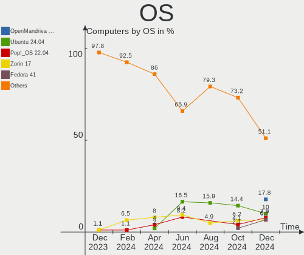
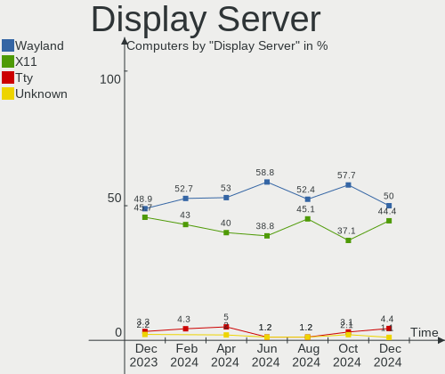
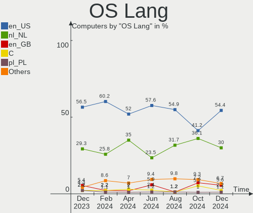
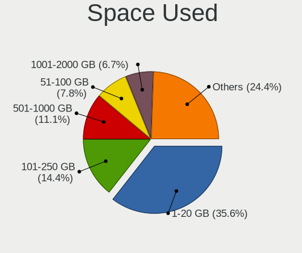
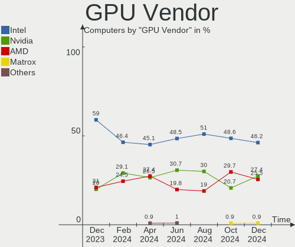
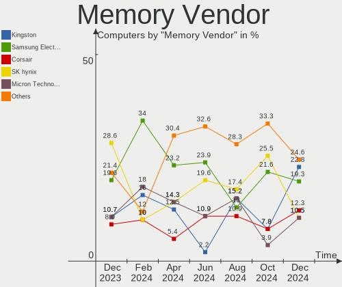

Linux in Netherlands - Hardware Trends
--------------------------------------

A project to identify most popular hardware characteristics and track their change
over time based on data collected by Linux users at https://Linux-Hardware.org.

Anyone can contribute to this report by the [hw-probe](https://github.com/linuxhw/hw-probe) tool:

    sudo -E hw-probe -all -upload

This is a report for all computer types. See also reports for [desktops](/Location/Netherlands/Desktop/README.md) and [notebooks](/Location/Netherlands/Notebook/README.md).

Period: Apr, 2023.

Contents
--------

* [ System ](#system)
  - [ OS                       ](#os)
  - [ OS Family                ](#os-family)
  - [ Kernel                   ](#kernel)
  - [ Kernel Family            ](#kernel-family)
  - [ Kernel Major Ver.        ](#kernel-major-ver)
  - [ Arch                     ](#arch)
  - [ DE                       ](#de)
  - [ Display Server           ](#display-server)
  - [ Display Manager          ](#display-manager)
  - [ OS Lang                  ](#os-lang)
  - [ Boot Mode                ](#boot-mode)
  - [ Filesystem               ](#filesystem)
  - [ Part. scheme             ](#part-scheme)
  - [ Dual Boot with Linux/BSD ](#dual-boot-with-linuxbsd)
  - [ Dual Boot (Win)          ](#dual-boot-win)

* [ Board ](#board)
  - [ Vendor                   ](#vendor)
  - [ Model                    ](#model)
  - [ Model Family             ](#model-family)
  - [ MFG Year                 ](#mfg-year)
  - [ Form Factor              ](#form-factor)
  - [ Secure Boot              ](#secure-boot)
  - [ Coreboot                 ](#coreboot)
  - [ RAM Size                 ](#ram-size)
  - [ RAM Used                 ](#ram-used)
  - [ Total Drives             ](#total-drives)
  - [ Has CD-ROM               ](#has-cd-rom)
  - [ Has Ethernet             ](#has-ethernet)
  - [ Has WiFi                 ](#has-wifi)
  - [ Has Bluetooth            ](#has-bluetooth)

* [ Location ](#location)
  - [ Country                  ](#country)
  - [ City                     ](#city)

* [ Drives ](#drives)
  - [ Drive Vendor             ](#drive-vendor)
  - [ Drive Model              ](#drive-model)
  - [ HDD Vendor               ](#hdd-vendor)
  - [ SSD Vendor               ](#ssd-vendor)
  - [ Drive Kind               ](#drive-kind)
  - [ Drive Connector          ](#drive-connector)
  - [ Drive Size               ](#drive-size)
  - [ Space Total              ](#space-total)
  - [ Space Used               ](#space-used)
  - [ Malfunc. Drives          ](#malfunc-drives)
  - [ Malfunc. Drive Vendor    ](#malfunc-drive-vendor)
  - [ Malfunc. HDD Vendor      ](#malfunc-hdd-vendor)
  - [ Malfunc. Drive Kind      ](#malfunc-drive-kind)
  - [ Failed Drives            ](#failed-drives)
  - [ Failed Drive Vendor      ](#failed-drive-vendor)
  - [ Drive Status             ](#drive-status)

* [ Storage controller ](#storage-controller)
  - [ Storage Vendor           ](#storage-vendor)
  - [ Storage Model            ](#storage-model)
  - [ Storage Kind             ](#storage-kind)

* [ Processor ](#processor)
  - [ CPU Vendor               ](#cpu-vendor)
  - [ CPU Model                ](#cpu-model)
  - [ CPU Model Family         ](#cpu-model-family)
  - [ CPU Cores                ](#cpu-cores)
  - [ CPU Sockets              ](#cpu-sockets)
  - [ CPU Threads              ](#cpu-threads)
  - [ CPU Op-Modes             ](#cpu-op-modes)
  - [ CPU Microcode            ](#cpu-microcode)
  - [ CPU Microarch            ](#cpu-microarch)

* [ Graphics ](#graphics)
  - [ GPU Vendor               ](#gpu-vendor)
  - [ GPU Model                ](#gpu-model)
  - [ GPU Combo                ](#gpu-combo)
  - [ GPU Driver               ](#gpu-driver)
  - [ GPU Memory               ](#gpu-memory)

* [ Monitor ](#monitor)
  - [ Monitor Vendor           ](#monitor-vendor)
  - [ Monitor Model            ](#monitor-model)
  - [ Monitor Resolution       ](#monitor-resolution)
  - [ Monitor Diagonal         ](#monitor-diagonal)
  - [ Monitor Width            ](#monitor-width)
  - [ Aspect Ratio             ](#aspect-ratio)
  - [ Monitor Area             ](#monitor-area)
  - [ Pixel Density            ](#pixel-density)
  - [ Multiple Monitors        ](#multiple-monitors)

* [ Network ](#network)
  - [ Net Controller Vendor    ](#net-controller-vendor)
  - [ Net Controller Model     ](#net-controller-model)
  - [ Wireless Vendor          ](#wireless-vendor)
  - [ Wireless Model           ](#wireless-model)
  - [ Ethernet Vendor          ](#ethernet-vendor)
  - [ Ethernet Model           ](#ethernet-model)
  - [ Net Controller Kind      ](#net-controller-kind)
  - [ Used Controller          ](#used-controller)
  - [ NICs                     ](#nics)
  - [ IPv6                     ](#ipv6)

* [ Bluetooth ](#bluetooth)
  - [ Bluetooth Vendor         ](#bluetooth-vendor)
  - [ Bluetooth Model          ](#bluetooth-model)

* [ Sound ](#sound)
  - [ Sound Vendor             ](#sound-vendor)
  - [ Sound Model              ](#sound-model)

* [ Memory ](#memory)
  - [ Memory Vendor            ](#memory-vendor)
  - [ Memory Model             ](#memory-model)
  - [ Memory Kind              ](#memory-kind)
  - [ Memory Form Factor       ](#memory-form-factor)
  - [ Memory Size              ](#memory-size)
  - [ Memory Speed             ](#memory-speed)

* [ Printers & scanners ](#printers--scanners)
  - [ Printer Vendor           ](#printer-vendor)
  - [ Printer Model            ](#printer-model)
  - [ Scanner Vendor           ](#scanner-vendor)
  - [ Scanner Model            ](#scanner-model)

* [ Camera ](#camera)
  - [ Camera Vendor            ](#camera-vendor)
  - [ Camera Model             ](#camera-model)

* [ Security ](#security)
  - [ Fingerprint Vendor       ](#fingerprint-vendor)
  - [ Fingerprint Model        ](#fingerprint-model)
  - [ Chipcard Vendor          ](#chipcard-vendor)
  - [ Chipcard Model           ](#chipcard-model)

* [ Unsupported ](#unsupported)
  - [ Unsupported Devices      ](#unsupported-devices)
  - [ Unsupported Device Types ](#unsupported-device-types)

System
------

OS
--

Installed operating systems

| Name                         | Computers | Percent |
|------------------------------|-----------|---------|
| Ubuntu 22.04                 | 19        | 14.18%  |
| OpenMandriva 23.03           | 15        | 11.19%  |
| Linux Mint 21.1              | 12        | 8.96%   |
| Fedora 38                    | 11        | 8.21%   |
| Debian 11                    | 9         | 6.72%   |
| Zorin 16                     | 8         | 5.97%   |
| Fedora 37                    | 8         | 5.97%   |
| Ubuntu 20.04                 | 6         | 4.48%   |
| openSUSE Tumbleweed-XXXXXXXX | 5         | 3.73%   |
| Manjaro                      | 5         | 3.73%   |
| Pop!_OS 22.04                | 3         | 2.24%   |
| Fedora 35                    | 3         | 2.24%   |
| Arch Rolling                 | 3         | 2.24%   |
| Ubuntu 23.04                 | 2         | 1.49%   |
| Ubuntu 22.10                 | 2         | 1.49%   |
| Nobara 37                    | 2         | 1.49%   |
| Linux Mint 21                | 2         | 1.49%   |
| Fedora 36                    | 2         | 1.49%   |
| Ubuntu MATE 22.04            | 1         | 0.75%   |
| Ubuntu 18.04                 | 1         | 0.75%   |
| SteamOS 3.4.6                | 1         | 0.75%   |
| OpenMandriva 4.2             | 1         | 0.75%   |
| OpenMandriva 23.01           | 1         | 0.75%   |
| NixOS 22.11                  | 1         | 0.75%   |
| Manjaro 22.1.0               | 1         | 0.75%   |
| LMDE 5                       | 1         | 0.75%   |
| Linux Mint 20.3              | 1         | 0.75%   |
| KDE neon 22.04               | 1         | 0.75%   |
| Gentoo 2.13                  | 1         | 0.75%   |
| Garuda Linux Soaring         | 1         | 0.75%   |
| EndeavourOS Rolling          | 1         | 0.75%   |
| Elementary 7                 | 1         | 0.75%   |
| Debian 10                    | 1         | 0.75%   |
| BunsenLabs 11                | 1         | 0.75%   |
| AlmaLinux 9.1                | 1         | 0.75%   |

OS Family
---------

OS without a version

| Name         | Computers | Percent |
|--------------|-----------|---------|
| Ubuntu       | 30        | 22.39%  |
| Fedora       | 24        | 17.91%  |
| OpenMandriva | 17        | 12.69%  |
| Linux Mint   | 15        | 11.19%  |
| Debian       | 10        | 7.46%   |
| Zorin        | 8         | 5.97%   |
| Manjaro      | 6         | 4.48%   |
| openSUSE     | 5         | 3.73%   |
| Pop!_OS      | 3         | 2.24%   |
| Arch         | 3         | 2.24%   |
| Nobara       | 2         | 1.49%   |
| Ubuntu MATE  | 1         | 0.75%   |
| SteamOS      | 1         | 0.75%   |
| NixOS        | 1         | 0.75%   |
| LMDE         | 1         | 0.75%   |
| KDE neon     | 1         | 0.75%   |
| Gentoo       | 1         | 0.75%   |
| Garuda Linux | 1         | 0.75%   |
| EndeavourOS  | 1         | 0.75%   |
| Elementary   | 1         | 0.75%   |
| BunsenLabs   | 1         | 0.75%   |
| AlmaLinux    | 1         | 0.75%   |

Kernel
------

Version of the Linux kernel

| Version                     | Computers | Percent |
|-----------------------------|-----------|---------|
| 5.15.0-69-generic           | 15        | 11.19%  |
| 6.2.6-desktop-1omv2390      | 14        | 10.45%  |
| 5.19.0-40-generic           | 6         | 4.48%   |
| 5.19.0-38-generic           | 6         | 4.48%   |
| 5.15.0-70-generic           | 6         | 4.48%   |
| 5.10.0-21-amd64             | 5         | 3.73%   |
| 5.15.0-56-generic           | 4         | 2.99%   |
| 6.2.11-300.fc38.x86_64      | 3         | 2.24%   |
| 5.10.0-20-amd64             | 3         | 2.24%   |
| 6.3.0-rc2+                  | 2         | 1.49%   |
| 6.3.0+                      | 2         | 1.49%   |
| 6.2.9-300.fc38.x86_64       | 2         | 1.49%   |
| 6.2.9-200.fc37.x86_64       | 2         | 1.49%   |
| 6.2.9-1-default             | 2         | 1.49%   |
| 6.2.8-200.fsync.fc37.x86_64 | 2         | 1.49%   |
| 6.2.6-76060206-generic      | 2         | 1.49%   |
| 6.2.12-300.fc38.x86_64      | 2         | 1.49%   |
| 6.2.10-1-default            | 2         | 1.49%   |
| 6.1.23-1-MANJARO            | 2         | 1.49%   |
| 5.19.0-41-generic           | 2         | 1.49%   |
| 5.19.0-32-generic           | 2         | 1.49%   |
| 5.19.0-1015-raspi           | 2         | 1.49%   |
| 6.3.0-rc7+                  | 1         | 0.75%   |
| 6.3.0-rc6+                  | 1         | 0.75%   |
| 6.3.0-rc4+                  | 1         | 0.75%   |
| 6.3.0-AMD-znver2            | 1         | 0.75%   |
| 6.2.9-arch1-1               | 1         | 0.75%   |
| 6.2.9-1-MANJARO             | 1         | 0.75%   |
| 6.2.8-arch1-1               | 1         | 0.75%   |
| 6.2.8-300.fc38.x86_64       | 1         | 0.75%   |
| 6.2.8-200.fc37.x86_64       | 1         | 0.75%   |
| 6.2.8                       | 1         | 0.75%   |
| 6.2.7-300.fc38.x86_64       | 1         | 0.75%   |
| 6.2.12-zen1-1-zen           | 1         | 0.75%   |
| 6.2.12-1-default            | 1         | 0.75%   |
| 6.2.11-200.fc37.x86_64      | 1         | 0.75%   |
| 6.2.11-100.fc36.x86_64      | 1         | 0.75%   |
| 6.2.11-1-pve                | 1         | 0.75%   |
| 6.2.10-arch1-1              | 1         | 0.75%   |
| 6.2.10-300.fc38.x86_64      | 1         | 0.75%   |

Kernel Family
-------------

Linux kernel without a distro release

| Version  | Computers | Percent |
|----------|-----------|---------|
| 5.15.0   | 29        | 21.64%  |
| 5.19.0   | 18        | 13.43%  |
| 6.2.6    | 16        | 11.94%  |
| 5.10.0   | 10        | 7.46%   |
| 6.3.0    | 8         | 5.97%   |
| 6.2.9    | 8         | 5.97%   |
| 6.2.10   | 8         | 5.97%   |
| 6.2.8    | 6         | 4.48%   |
| 6.2.11   | 6         | 4.48%   |
| 5.4.0    | 6         | 4.48%   |
| 6.2.12   | 4         | 2.99%   |
| 6.2.0    | 3         | 2.24%   |
| 6.1.23   | 2         | 1.49%   |
| 6.2.7    | 1         | 0.75%   |
| 6.1.4    | 1         | 0.75%   |
| 6.0.12   | 1         | 0.75%   |
| 5.16.13  | 1         | 0.75%   |
| 5.15.62  | 1         | 0.75%   |
| 5.15.108 | 1         | 0.75%   |
| 5.15.106 | 1         | 0.75%   |
| 5.14.0   | 1         | 0.75%   |
| 5.13.0   | 1         | 0.75%   |
| 5.10.14  | 1         | 0.75%   |

Kernel Major Ver.
-----------------

Linux kernel major version

| Version | Computers | Percent |
|---------|-----------|---------|
| 6.2     | 52        | 38.81%  |
| 5.15    | 32        | 23.88%  |
| 5.19    | 18        | 13.43%  |
| 5.10    | 11        | 8.21%   |
| 6.3     | 8         | 5.97%   |
| 5.4     | 6         | 4.48%   |
| 6.1     | 3         | 2.24%   |
| 6.0     | 1         | 0.75%   |
| 5.16    | 1         | 0.75%   |
| 5.14    | 1         | 0.75%   |
| 5.13    | 1         | 0.75%   |

Arch
----

OS architecture (x86_64, i586, etc.)

| Name    | Computers | Percent |
|---------|-----------|---------|
| x86_64  | 130       | 97.01%  |
| i686    | 2         | 1.49%   |
| aarch64 | 2         | 1.49%   |

DE
--

Desktop Environment

| Name            | Computers | Percent |
|-----------------|-----------|---------|
| GNOME           | 63        | 47.01%  |
| KDE5            | 31        | 23.13%  |
| X-Cinnamon      | 12        | 8.96%   |
| Unknown         | 8         | 5.97%   |
| XFCE            | 6         | 4.48%   |
| MATE            | 6         | 4.48%   |
| LXDE            | 2         | 1.49%   |
| GNOME Flashback | 2         | 1.49%   |
| Enlightenment   | 2         | 1.49%   |
| Pantheon        | 1         | 0.75%   |
| Cinnamon        | 1         | 0.75%   |

Display Server
--------------

X11 or Wayland

| Name    | Computers | Percent |
|---------|-----------|---------|
| X11     | 84        | 62.69%  |
| Wayland | 46        | 34.33%  |
| Tty     | 3         | 2.24%   |
| Unknown | 1         | 0.75%   |

Display Manager
---------------

SDDM, LightDM, etc.

| Name    | Computers | Percent |
|---------|-----------|---------|
| Unknown | 43        | 32.09%  |
| GDM     | 25        | 18.66%  |
| SDDM    | 23        | 17.16%  |
| GDM3    | 22        | 16.42%  |
| LightDM | 21        | 15.67%  |

OS Lang
-------

Language

| Lang    | Computers | Percent |
|---------|-----------|---------|
| en_US   | 71        | 52.99%  |
| nl_NL   | 44        | 32.84%  |
| en_GB   | 5         | 3.73%   |
| Unknown | 4         | 2.99%   |
| POSIX   | 2         | 1.49%   |
| en_NL   | 2         | 1.49%   |
| C       | 2         | 1.49%   |
| sv_SE   | 1         | 0.75%   |
| nb_NO   | 1         | 0.75%   |
| de_DE   | 1         | 0.75%   |
| ar_KW   | 1         | 0.75%   |

Boot Mode
---------

EFI or BIOS

| Mode | Computers | Percent |
|------|-----------|---------|
| EFI  | 91        | 67.91%  |
| BIOS | 43        | 32.09%  |

Filesystem
----------

Type of filesystem

| Type    | Computers | Percent |
|---------|-----------|---------|
| Ext4    | 90        | 67.16%  |
| Btrfs   | 26        | 19.4%   |
| Overlay | 13        | 9.7%    |
| Tmpfs   | 3         | 2.24%   |
| Xfs     | 1         | 0.75%   |
| Ext2    | 1         | 0.75%   |

Part. scheme
------------

Scheme of partitioning

| Type    | Computers | Percent |
|---------|-----------|---------|
| GPT     | 81        | 60.45%  |
| Unknown | 36        | 26.87%  |
| MBR     | 17        | 12.69%  |

Dual Boot with Linux/BSD
------------------------

Hosting more than one Linux/BSD

| Dual boot | Computers | Percent |
|-----------|-----------|---------|
| No        | 111       | 82.84%  |
| Yes       | 23        | 17.16%  |

Dual Boot (Win)
---------------

Hosting Linux and Windows

| Dual boot | Computers | Percent |
|-----------|-----------|---------|
| No        | 103       | 76.87%  |
| Yes       | 31        | 23.13%  |

Board
-----

Vendor
------

Motherboard manufacturer

| Name                    | Computers | Percent |
|-------------------------|-----------|---------|
| Hewlett-Packard         | 20        | 14.93%  |
| Lenovo                  | 17        | 12.69%  |
| ASUSTek Computer        | 14        | 10.45%  |
| Dell                    | 11        | 8.21%   |
| Apple                   | 10        | 7.46%   |
| Gigabyte Technology     | 9         | 6.72%   |
| Acer                    | 8         | 5.97%   |
| Notebook                | 6         | 4.48%   |
| Intel                   | 6         | 4.48%   |
| ASRock                  | 6         | 4.48%   |
| Medion                  | 5         | 3.73%   |
| Raspberry Pi Foundation | 2         | 1.49%   |
| MSI                     | 2         | 1.49%   |
| Insyde                  | 2         | 1.49%   |
| ilife                   | 2         | 1.49%   |
| BESSTAR Tech            | 2         | 1.49%   |
| Wortmann AG             | 1         | 0.75%   |
| VIOS                    | 1         | 0.75%   |
| Valve                   | 1         | 0.75%   |
| Toxic                   | 1         | 0.75%   |
| SLIMBOOK                | 1         | 0.75%   |
| Microsoft               | 1         | 0.75%   |
| HUAWEI                  | 1         | 0.75%   |
| Foxconn                 | 1         | 0.75%   |
| EVERCOM NETWORK         | 1         | 0.75%   |
| Chuwi                   | 1         | 0.75%   |
| BTO                     | 1         | 0.75%   |
| AZW                     | 1         | 0.75%   |

Model
-----

Motherboard model

| Name                                       | Computers | Percent |
|--------------------------------------------|-----------|---------|
| RPi Raspberry Pi Compute Module 4 Rev 1.1  | 2         | 1.49%   |
| ilife S806                                 | 2         | 1.49%   |
| Gigabyte GA-770TA-UD3                      | 2         | 1.49%   |
| Apple MacBookPro12,1                       | 2         | 1.49%   |
| Apple MacBookAir7,2                        | 2         | 1.49%   |
| Wortmann AG TERRA_MOBILE_1160              | 1         | 0.75%   |
| VIOS LTH17                                 | 1         | 0.75%   |
| Valve Jupiter                              | 1         | 0.75%   |
| Toxic GM5MPHY                              | 1         | 0.75%   |
| SLIMBOOK PROX-AMD5                         | 1         | 0.75%   |
| Notebook W54_55_94_95_97AU,AUQ             | 1         | 0.75%   |
| Notebook P95_96_97Ex,Rx                    | 1         | 0.75%   |
| Notebook NLxxPUx                           | 1         | 0.75%   |
| Notebook NH55RGQ                           | 1         | 0.75%   |
| Notebook N141CU                            | 1         | 0.75%   |
| Notebook N13_N140ZU                        | 1         | 0.75%   |
| MSI MS-7C02                                | 1         | 0.75%   |
| MSI MS-7B85                                | 1         | 0.75%   |
| Microsoft Surface Pro                      | 1         | 0.75%   |
| Medion MS-7857                             | 1         | 0.75%   |
| Medion MS-7708                             | 1         | 0.75%   |
| Medion H61H2-LM3                           | 1         | 0.75%   |
| Medion E4251                               | 1         | 0.75%   |
| Medion E2215T MD60198                      | 1         | 0.75%   |
| Lenovo Yoga Slim 7 13ACN5 82CY             | 1         | 0.75%   |
| Lenovo Yoga 530-14IKB 81EK                 | 1         | 0.75%   |
| Lenovo Yoga 300-11IBR 80M1                 | 1         | 0.75%   |
| Lenovo YB1-X91F                            | 1         | 0.75%   |
| Lenovo V15 G2 ALC 82KD                     | 1         | 0.75%   |
| Lenovo ThinkStation P720 30BBS21C01        | 1         | 0.75%   |
| Lenovo ThinkPad X1 Carbon Gen 9 20XWCTO1WW | 1         | 0.75%   |
| Lenovo ThinkPad T440s 20AQ006HUS           | 1         | 0.75%   |
| Lenovo ThinkPad P50 20EQS5C701             | 1         | 0.75%   |
| Lenovo ThinkPad P14s Gen 2a 21A0007PGE     | 1         | 0.75%   |
| Lenovo ThinkPad P14s Gen 2a 21A0000JMH     | 1         | 0.75%   |
| Lenovo ThinkBook 13s-IWL 20R9              | 1         | 0.75%   |
| Lenovo Legion 5 Pro 16ACH6H 82JQ           | 1         | 0.75%   |
| Lenovo IdeaPad S540-15IWL GTX 81SW         | 1         | 0.75%   |
| Lenovo IdeaPad 5 Pro 16ACH6 82L5           | 1         | 0.75%   |
| Lenovo IdeaPad 5 Pro 14ACN6 82L7           | 1         | 0.75%   |

Model Family
------------

Motherboard model prefix

| Name                  | Computers | Percent |
|-----------------------|-----------|---------|
| HP EliteBook          | 6         | 4.48%   |
| Dell Latitude         | 6         | 4.48%   |
| Lenovo ThinkPad       | 5         | 3.73%   |
| HP Compaq             | 4         | 2.99%   |
| Lenovo Yoga           | 3         | 2.24%   |
| Lenovo IdeaPad        | 3         | 2.24%   |
| RPi Raspberry         | 2         | 1.49%   |
| ilife S806            | 2         | 1.49%   |
| HP ZBook              | 2         | 1.49%   |
| HP ProBook            | 2         | 1.49%   |
| HP Pavilion           | 2         | 1.49%   |
| Gigabyte GA-770TA-UD3 | 2         | 1.49%   |
| Gigabyte B550         | 2         | 1.49%   |
| Dell XPS              | 2         | 1.49%   |
| Dell OptiPlex         | 2         | 1.49%   |
| ASUS Zenbook          | 2         | 1.49%   |
| ASUS VivoBook         | 2         | 1.49%   |
| ASUS ROG              | 2         | 1.49%   |
| ASRock Z790           | 2         | 1.49%   |
| Apple MacBookPro12    | 2         | 1.49%   |
| Apple MacBookAir7     | 2         | 1.49%   |
| Acer Swift            | 2         | 1.49%   |
| Acer Aspire           | 2         | 1.49%   |
| Wortmann AG TERRA     | 1         | 0.75%   |
| VIOS LTH17            | 1         | 0.75%   |
| Valve Jupiter         | 1         | 0.75%   |
| Toxic GM5MPHY         | 1         | 0.75%   |
| SLIMBOOK PROX-AMD5    | 1         | 0.75%   |
| Notebook W54          | 1         | 0.75%   |
| Notebook P95          | 1         | 0.75%   |
| Notebook NLxxPUx      | 1         | 0.75%   |
| Notebook NH55RGQ      | 1         | 0.75%   |
| Notebook N141CU       | 1         | 0.75%   |
| Notebook N13          | 1         | 0.75%   |
| MSI MS-7C02           | 1         | 0.75%   |
| MSI MS-7B85           | 1         | 0.75%   |
| Microsoft Surface     | 1         | 0.75%   |
| Medion MS-7857        | 1         | 0.75%   |
| Medion MS-7708        | 1         | 0.75%   |
| Medion H61H2-LM3      | 1         | 0.75%   |

MFG Year
--------

Motherboard manufacture year

| Year    | Computers | Percent |
|---------|-----------|---------|
| 2021    | 20        | 14.93%  |
| 2019    | 17        | 12.69%  |
| 2022    | 11        | 8.21%   |
| 2015    | 11        | 8.21%   |
| 2012    | 9         | 6.72%   |
| 2011    | 9         | 6.72%   |
| 2020    | 8         | 5.97%   |
| 2016    | 8         | 5.97%   |
| 2018    | 7         | 5.22%   |
| 2014    | 6         | 4.48%   |
| 2013    | 6         | 4.48%   |
| 2017    | 5         | 3.73%   |
| 2008    | 5         | 3.73%   |
| 2023    | 3         | 2.24%   |
| 2010    | 2         | 1.49%   |
| 2009    | 2         | 1.49%   |
| 2007    | 2         | 1.49%   |
| Unknown | 2         | 1.49%   |
| 2003    | 1         | 0.75%   |

Form Factor
-----------

Physical design of the computer

| Name           | Computers | Percent |
|----------------|-----------|---------|
| Notebook       | 75        | 55.97%  |
| Desktop        | 42        | 31.34%  |
| Mini pc        | 5         | 3.73%   |
| Tablet         | 4         | 2.99%   |
| Convertible    | 4         | 2.99%   |
| System on chip | 2         | 1.49%   |
| All in one     | 1         | 0.75%   |
| Server         | 1         | 0.75%   |

Secure Boot
-----------

Enabled or disabled

| State    | Computers | Percent |
|----------|-----------|---------|
| Disabled | 122       | 91.04%  |
| Enabled  | 12        | 8.96%   |

Coreboot
--------

Have coreboot on board

| Used | Computers | Percent |
|------|-----------|---------|
| No   | 134       | 100%    |

RAM Size
--------

Total RAM memory

| Size in GB  | Computers | Percent |
|-------------|-----------|---------|
| 16.01-24.0  | 27        | 20.15%  |
| 8.01-16.0   | 25        | 18.66%  |
| 4.01-8.0    | 24        | 17.91%  |
| 32.01-64.0  | 22        | 16.42%  |
| 3.01-4.0    | 16        | 11.94%  |
| 1.01-2.0    | 9         | 6.72%   |
| 24.01-32.0  | 4         | 2.99%   |
| 64.01-256.0 | 4         | 2.99%   |
| 0.51-1.0    | 3         | 2.24%   |

RAM Used
--------

Used RAM memory

| Used GB   | Computers | Percent |
|-----------|-----------|---------|
| 1.01-2.0  | 39        | 29.1%   |
| 4.01-8.0  | 27        | 20.15%  |
| 2.01-3.0  | 24        | 17.91%  |
| 3.01-4.0  | 19        | 14.18%  |
| 0.51-1.0  | 12        | 8.96%   |
| 8.01-16.0 | 10        | 7.46%   |
| 0.01-0.5  | 3         | 2.24%   |

Total Drives
------------

Number of drives on board

| Drives | Computers | Percent |
|--------|-----------|---------|
| 1      | 79        | 58.96%  |
| 2      | 30        | 22.39%  |
| 3      | 12        | 8.96%   |
| 4      | 6         | 4.48%   |
| 0      | 3         | 2.24%   |
| 5      | 2         | 1.49%   |
| 9      | 1         | 0.75%   |
| 6      | 1         | 0.75%   |

Has CD-ROM
----------

Has CD-ROM on board

| Presented | Computers | Percent |
|-----------|-----------|---------|
| No        | 105       | 78.36%  |
| Yes       | 29        | 21.64%  |

Has Ethernet
------------

Has Ethernet on board

| Presented | Computers | Percent |
|-----------|-----------|---------|
| Yes       | 95        | 70.9%   |
| No        | 39        | 29.1%   |

Has WiFi
--------

Has WiFi module

| Presented | Computers | Percent |
|-----------|-----------|---------|
| Yes       | 105       | 78.36%  |
| No        | 29        | 21.64%  |

Has Bluetooth
-------------

Has Bluetooth module

| Presented | Computers | Percent |
|-----------|-----------|---------|
| Yes       | 92        | 68.66%  |
| No        | 42        | 31.34%  |

Location
--------

Country
-------

Geographic location (country)

| Country     | Computers | Percent |
|-------------|-----------|---------|
| Netherlands | 134       | 100%    |

City
----

Geographic location (city)

| City                  | Computers | Percent |
|-----------------------|-----------|---------|
| Amsterdam             | 21        | 15.67%  |
| The Hague             | 10        | 7.46%   |
| Delft                 | 8         | 5.97%   |
| Rotterdam             | 5         | 3.73%   |
| Groningen             | 4         | 2.99%   |
| Utrecht               | 3         | 2.24%   |
| Kloetinge             | 3         | 2.24%   |
| Gouda                 | 3         | 2.24%   |
| Breda                 | 3         | 2.24%   |
| Amersfoort            | 3         | 2.24%   |
| Alkmaar               | 3         | 2.24%   |
| Zandvoort             | 2         | 1.49%   |
| Oosterwolde           | 2         | 1.49%   |
| Heythuysen            | 2         | 1.49%   |
| Harderwijk            | 2         | 1.49%   |
| Emmen                 | 2         | 1.49%   |
| Eindhoven             | 2         | 1.49%   |
| Doetinchem            | 2         | 1.49%   |
| Zutphen               | 1         | 0.75%   |
| Zuidland              | 1         | 0.75%   |
| Zeeland               | 1         | 0.75%   |
| Zaandam               | 1         | 0.75%   |
| Weert                 | 1         | 0.75%   |
| Venlo                 | 1         | 0.75%   |
| Velp                  | 1         | 0.75%   |
| Tilburg               | 1         | 0.75%   |
| Terneuzen             | 1         | 0.75%   |
| Soest                 | 1         | 0.75%   |
| Schijndel             | 1         | 0.75%   |
| Roosendaal            | 1         | 0.75%   |
| Purmerend             | 1         | 0.75%   |
| Overberg              | 1         | 0.75%   |
| Oss                   | 1         | 0.75%   |
| Oostburg              | 1         | 0.75%   |
| Nuenen                | 1         | 0.75%   |
| Nijmegen              | 1         | 0.75%   |
| Nieuwegein            | 1         | 0.75%   |
| Naarden               | 1         | 0.75%   |
| Monster               | 1         | 0.75%   |
| Millingen aan de Rijn | 1         | 0.75%   |

Drives
------

Drive Vendor
------------

Hard drive vendors

| Vendor                      | Computers | Drives | Percent |
|-----------------------------|-----------|--------|---------|
| Samsung Electronics         | 43        | 60     | 22.99%  |
| WDC                         | 22        | 26     | 11.76%  |
| Seagate                     | 14        | 18     | 7.49%   |
| Kingston                    | 13        | 16     | 6.95%   |
| Unknown                     | 11        | 13     | 5.88%   |
| SanDisk                     | 9         | 12     | 4.81%   |
| Hitachi                     | 8         | 8      | 4.28%   |
| SK hynix                    | 7         | 7      | 3.74%   |
| Crucial                     | 7         | 7      | 3.74%   |
| Apple                       | 7         | 7      | 3.74%   |
| Toshiba                     | 6         | 6      | 3.21%   |
| Unknown                     | 5         | 6      | 2.67%   |
| Micron Technology           | 4         | 4      | 2.14%   |
| Intel                       | 3         | 3      | 1.6%    |
| SAGE                        | 2         | 2      | 1.07%   |
| Micron/Crucial Technology   | 2         | 2      | 1.07%   |
| Maxtor                      | 2         | 2      | 1.07%   |
| KIOXIA                      | 2         | 2      | 1.07%   |
| JMicron Technology          | 2         | 2      | 1.07%   |
| China                       | 2         | 2      | 1.07%   |
| WDC WDS2                    | 1         | 1      | 0.53%   |
| UMIS                        | 1         | 1      | 0.53%   |
| SPCC                        | 1         | 1      | 0.53%   |
| PNY                         | 1         | 1      | 0.53%   |
| Phison Electronics          | 1         | 1      | 0.53%   |
| Phison                      | 1         | 1      | 0.53%   |
| Patriot                     | 1         | 1      | 0.53%   |
| O2 Micro                    | 1         | 1      | 0.53%   |
| Mushkin                     | 1         | 1      | 0.53%   |
| LITEON                      | 1         | 1      | 0.53%   |
| Kingston Technology Company | 1         | 2      | 0.53%   |
| Intenso                     | 1         | 1      | 0.53%   |
| Inateck                     | 1         | 1      | 0.53%   |
| Gigabyte Technology         | 1         | 1      | 0.53%   |
| Fujitsu                     | 1         | 1      | 0.53%   |
| A-DATA Technology           | 1         | 1      | 0.53%   |

Drive Model
-----------

Hard drive models

| Model                                              | Computers | Percent |
|----------------------------------------------------|-----------|---------|
| Samsung NVMe SSD Controller SM981/PM981/PM983 1TB  | 10        | 4.72%   |
| Unknown                                            | 5         | 2.36%   |
| Unknown MMC Card  32GB                             | 3         | 1.42%   |
| Samsung NVMe SSD Controller PM9A1/PM9A3/980PRO 2TB | 3         | 1.42%   |
| WDC WD5000LPVX-28V0TT0 500GB                       | 2         | 0.94%   |
| WDC WD20EFRX-68EUZN0 2TB                           | 2         | 0.94%   |
| Unknown NCard  32GB                                | 2         | 0.94%   |
| Seagate ST500DM002-1BD142 500GB                    | 2         | 0.94%   |
| Seagate ST3500418AS 500GB                          | 2         | 0.94%   |
| Seagate ST3160212ACE 160GB                         | 2         | 0.94%   |
| Seagate ST2000DM008-2FR102 2TB                     | 2         | 0.94%   |
| SanDisk SSD U100 8GB                               | 2         | 0.94%   |
| SanDisk NVMe SSD Drive 2TB                         | 2         | 0.94%   |
| Samsung SSD 980 1TB                                | 2         | 0.94%   |
| Samsung SSD 970 EVO 1TB                            | 2         | 0.94%   |
| Samsung SSD 870 QVO 1TB                            | 2         | 0.94%   |
| Samsung SSD 860 QVO 1TB                            | 2         | 0.94%   |
| Samsung SSD 860 EVO 500GB                          | 2         | 0.94%   |
| Samsung SSD 860 EVO 1TB                            | 2         | 0.94%   |
| Samsung SSD 850 PRO 256GB                          | 2         | 0.94%   |
| Samsung SSD 850 EVO 500GB                          | 2         | 0.94%   |
| Samsung SSD 850 EVO 250GB                          | 2         | 0.94%   |
| Samsung MZVLB1T0HBLR-000L2 1TB                     | 2         | 0.94%   |
| Samsung HD753LJ 752GB                              | 2         | 0.94%   |
| SAGE 3639S 160GB                                   | 2         | 0.94%   |
| Micron/Crucial P2 NVMe PCIe SSD 1TB                | 2         | 0.94%   |
| Maxtor 6V200E0 208GB                               | 2         | 0.94%   |
| Kingston SFYRS1000G 1TB                            | 2         | 0.94%   |
| JMicron Tech 250GB                                 | 2         | 0.94%   |
| Hitachi HTS725050A7E630 500GB                      | 2         | 0.94%   |
| Hitachi HDS728080PLA380 40Y9028LEN 80GB            | 2         | 0.94%   |
| Crucial CT500MX500SSD1 500GB                       | 2         | 0.94%   |
| Apple SSD SM0256G 256GB                            | 2         | 0.94%   |
| WDC WDS2 40G2G0A-00JH30 240GB SSD                  | 1         | 0.47%   |
| WDC WD800JB-00JJC0 80GB                            | 1         | 0.47%   |
| WDC WD7500BPVT-22HXZT1 752GB                       | 1         | 0.47%   |
| WDC WD5000AAKX-753CA1 500GB                        | 1         | 0.47%   |
| WDC WD3200BEVT-75ZCT2 320GB                        | 1         | 0.47%   |
| WDC WD20EFAX-68FB5N0 2TB                           | 1         | 0.47%   |
| WDC WD20EARX-00PASB0 2TB                           | 1         | 0.47%   |

HDD Vendor
----------

Hard disk drive vendors

| Vendor              | Computers | Drives | Percent |
|---------------------|-----------|--------|---------|
| WDC                 | 18        | 22     | 33.96%  |
| Seagate             | 13        | 17     | 24.53%  |
| Hitachi             | 8         | 8      | 15.09%  |
| Toshiba             | 4         | 4      | 7.55%   |
| Samsung Electronics | 3         | 3      | 5.66%   |
| SAGE                | 2         | 2      | 3.77%   |
| Maxtor              | 2         | 2      | 3.77%   |
| Inateck             | 1         | 1      | 1.89%   |
| Fujitsu             | 1         | 1      | 1.89%   |
| Apple               | 1         | 1      | 1.89%   |

SSD Vendor
----------

Solid state drive vendors

| Vendor              | Computers | Drives | Percent |
|---------------------|-----------|--------|---------|
| Samsung Electronics | 21        | 24     | 37.5%   |
| Kingston            | 7         | 10     | 12.5%   |
| Crucial             | 6         | 6      | 10.71%  |
| Apple               | 5         | 5      | 8.93%   |
| SanDisk             | 3         | 3      | 5.36%   |
| China               | 2         | 2      | 3.57%   |
| WDC WDS2            | 1         | 1      | 1.79%   |
| WDC                 | 1         | 1      | 1.79%   |
| Toshiba             | 1         | 1      | 1.79%   |
| SPCC                | 1         | 1      | 1.79%   |
| SK hynix            | 1         | 1      | 1.79%   |
| PNY                 | 1         | 1      | 1.79%   |
| Phison              | 1         | 1      | 1.79%   |
| Patriot             | 1         | 1      | 1.79%   |
| Micron Technology   | 1         | 1      | 1.79%   |
| LITEON              | 1         | 1      | 1.79%   |
| Intenso             | 1         | 1      | 1.79%   |
| Unknown             | 1         | 2      | 1.79%   |

Drive Kind
----------

HDD or SSD

| Kind    | Computers | Drives | Percent |
|---------|-----------|--------|---------|
| NVMe    | 62        | 76     | 36.9%   |
| SSD     | 50        | 63     | 29.76%  |
| HDD     | 36        | 61     | 21.43%  |
| MMC     | 17        | 19     | 10.12%  |
| Unknown | 3         | 3      | 1.79%   |

Drive Connector
---------------

SATA, SAS, NVMe, etc.

| Type | Computers | Drives | Percent |
|------|-----------|--------|---------|
| SATA | 71        | 116    | 44.65%  |
| NVMe | 62        | 76     | 38.99%  |
| MMC  | 17        | 19     | 10.69%  |
| SAS  | 9         | 11     | 5.66%   |

Drive Size
----------

Size of hard drive

| Size in TB | Computers | Drives | Percent |
|------------|-----------|--------|---------|
| 0.01-0.5   | 52        | 75     | 55.91%  |
| 0.51-1.0   | 30        | 36     | 32.26%  |
| 1.01-2.0   | 8         | 8      | 8.6%    |
| 4.01-10.0  | 2         | 4      | 2.15%   |
| 2.01-3.0   | 1         | 1      | 1.08%   |

Space Total
-----------

Amount of disk space available on the file system

| Size in GB     | Computers | Percent |
|----------------|-----------|---------|
| 101-250        | 28        | 20.9%   |
| 251-500        | 18        | 13.43%  |
| 1-20           | 18        | 13.43%  |
| 501-1000       | 16        | 11.94%  |
| 21-50          | 11        | 8.21%   |
| 1001-2000      | 10        | 7.46%   |
| 2001-3000      | 9         | 6.72%   |
| 51-100         | 9         | 6.72%   |
| Unknown        | 8         | 5.97%   |
| More than 3000 | 7         | 5.22%   |

Space Used
----------

Amount of used disk space

| Used GB        | Computers | Percent |
|----------------|-----------|---------|
| 1-20           | 54        | 40.3%   |
| 21-50          | 22        | 16.42%  |
| 51-100         | 13        | 9.7%    |
| 251-500        | 11        | 8.21%   |
| 101-250        | 10        | 7.46%   |
| 1001-2000      | 9         | 6.72%   |
| Unknown        | 8         | 5.97%   |
| 501-1000       | 6         | 4.48%   |
| More than 3000 | 1         | 0.75%   |

Malfunc. Drives
---------------

Drive models with a malfunction

| Model                             | Computers | Drives | Percent |
|-----------------------------------|-----------|--------|---------|
| WDC WD5000AAKX-753CA1 500GB       | 1         | 1      | 6.67%   |
| WDC WD1600BEVT-22A23T0 160GB      | 1         | 1      | 6.67%   |
| WDC WD15EZRX-00DC0B0 1TB          | 1         | 1      | 6.67%   |
| WDC WD10EAVS-00D7B0 1TB           | 1         | 1      | 6.67%   |
| WDC WD10EARX-00N0YB0 1TB          | 1         | 1      | 6.67%   |
| WDC WD10EACS-00D6B0 1TB           | 1         | 1      | 6.67%   |
| Toshiba DT01ACA100 1TB            | 1         | 1      | 6.67%   |
| SK hynix SC401 SATA 512GB SSD     | 1         | 1      | 6.67%   |
| Seagate ST3250310AS 250GB         | 1         | 1      | 6.67%   |
| Seagate ST2000DM008-2FR102 2TB    | 1         | 1      | 6.67%   |
| Samsung Electronics HD753LJ 752GB | 1         | 1      | 6.67%   |
| Kingston SV300S37A120G 120GB SSD  | 1         | 1      | 6.67%   |
| Intenso SSD 256GB                 | 1         | 1      | 6.67%   |
| Hitachi HTS725050A7E630 500GB     | 1         | 1      | 6.67%   |
| Fujitsu MHZ2320BH G2 320GB        | 1         | 1      | 6.67%   |

Malfunc. Drive Vendor
---------------------

Vendors of faulty drives

| Vendor              | Computers | Drives | Percent |
|---------------------|-----------|--------|---------|
| WDC                 | 6         | 6      | 40%     |
| Seagate             | 2         | 2      | 13.33%  |
| Toshiba             | 1         | 1      | 6.67%   |
| SK hynix            | 1         | 1      | 6.67%   |
| Samsung Electronics | 1         | 1      | 6.67%   |
| Kingston            | 1         | 1      | 6.67%   |
| Intenso             | 1         | 1      | 6.67%   |
| Hitachi             | 1         | 1      | 6.67%   |
| Fujitsu             | 1         | 1      | 6.67%   |

Malfunc. HDD Vendor
-------------------

Vendors of faulty HDD drives

| Vendor              | Computers | Drives | Percent |
|---------------------|-----------|--------|---------|
| WDC                 | 6         | 6      | 50%     |
| Seagate             | 2         | 2      | 16.67%  |
| Toshiba             | 1         | 1      | 8.33%   |
| Samsung Electronics | 1         | 1      | 8.33%   |
| Hitachi             | 1         | 1      | 8.33%   |
| Fujitsu             | 1         | 1      | 8.33%   |

Malfunc. Drive Kind
-------------------

Kinds of faulty drives

| Kind | Computers | Drives | Percent |
|------|-----------|--------|---------|
| HDD  | 11        | 12     | 78.57%  |
| SSD  | 3         | 3      | 21.43%  |

Failed Drives
-------------

Failed drive models

Zero info for selected period =(

Failed Drive Vendor
-------------------

Failed drive vendors

Zero info for selected period =(

Drive Status
------------

Number of failed and malfunc. drives

| Status   | Computers | Drives | Percent |
|----------|-----------|--------|---------|
| Detected | 69        | 119    | 47.26%  |
| Works    | 63        | 88     | 43.15%  |
| Malfunc  | 14        | 15     | 9.59%   |

Storage controller
------------------

Storage Vendor
--------------

Storage controller vendors

| Vendor                       | Computers | Percent |
|------------------------------|-----------|---------|
| Intel                        | 75        | 43.35%  |
| Samsung Electronics          | 31        | 17.92%  |
| AMD                          | 19        | 10.98%  |
| SanDisk                      | 7         | 4.05%   |
| SK hynix                     | 6         | 3.47%   |
| Kingston Technology Company  | 6         | 3.47%   |
| ASMedia Technology           | 5         | 2.89%   |
| Marvell Technology Group     | 4         | 2.31%   |
| Micron/Crucial Technology    | 3         | 1.73%   |
| Micron Technology            | 3         | 1.73%   |
| Toshiba America Info Systems | 2         | 1.16%   |
| Phison Electronics           | 2         | 1.16%   |
| JMicron Technology           | 2         | 1.16%   |
| VIA Technologies             | 1         | 0.58%   |
| Union Memory (Shenzhen)      | 1         | 0.58%   |
| Transcend                    | 1         | 0.58%   |
| O2 Micro                     | 1         | 0.58%   |
| KIOXIA                       | 1         | 0.58%   |
| INNOGRIT                     | 1         | 0.58%   |
| Apple                        | 1         | 0.58%   |
| ADATA Technology             | 1         | 0.58%   |

Storage Model
-------------

Storage controller models

| Model                                                                                   | Computers | Percent |
|-----------------------------------------------------------------------------------------|-----------|---------|
| Samsung NVMe SSD Controller SM981/PM981/PM983                                           | 16        | 8.33%   |
| AMD FCH SATA Controller [AHCI mode]                                                     | 12        | 6.25%   |
| Intel 7 Series Chipset Family 6-port SATA Controller [AHCI mode]                        | 6         | 3.13%   |
| Intel 82801 Mobile SATA Controller [RAID mode]                                          | 5         | 2.6%    |
| Samsung NVMe SSD Controller SM961/PM961/SM963                                           | 4         | 2.08%   |
| Samsung NVMe SSD Controller PM9A1/PM9A3/980PRO                                          | 4         | 2.08%   |
| Samsung NVMe SSD Controller 980                                                         | 4         | 2.08%   |
| Samsung Electronics SATA controller                                                     | 4         | 2.08%   |
| Intel Cannon Point-LP SATA Controller [AHCI Mode]                                       | 4         | 2.08%   |
| ASMedia ASM1062 Serial ATA Controller                                                   | 4         | 2.08%   |
| AMD 400 Series Chipset SATA Controller                                                  | 4         | 2.08%   |
| Micron NVMe Storage Controller                                                          | 3         | 1.56%   |
| Kingston Company Company Non-Volatile memory controller                                 | 3         | 1.56%   |
| Intel Volume Management Device NVMe RAID Controller                                     | 3         | 1.56%   |
| Intel Comet Lake SATA AHCI Controller                                                   | 3         | 1.56%   |
| Intel Cannon Lake Mobile PCH SATA AHCI Controller                                       | 3         | 1.56%   |
| Intel 8 Series/C220 Series Chipset Family 6-port SATA Controller 1 [AHCI mode]          | 3         | 1.56%   |
| Intel 7 Series/C210 Series Chipset Family 6-port SATA Controller [AHCI mode]            | 3         | 1.56%   |
| Intel 6 Series/C200 Series Chipset Family Desktop SATA Controller (IDE mode, ports 4-5) | 3         | 1.56%   |
| Intel 6 Series/C200 Series Chipset Family Desktop SATA Controller (IDE mode, ports 0-3) | 3         | 1.56%   |
| Intel 6 Series/C200 Series Chipset Family 6 port Desktop SATA AHCI Controller           | 3         | 1.56%   |
| AMD SB7x0/SB8x0/SB9x0 SATA Controller [IDE mode]                                        | 3         | 1.56%   |
| AMD SB7x0/SB8x0/SB9x0 IDE Controller                                                    | 3         | 1.56%   |
| AMD 500 Series Chipset SATA Controller                                                  | 3         | 1.56%   |
| SK hynix Gold P31/PC711 NVMe Solid State Drive                                          | 2         | 1.04%   |
| SanDisk WD Blue SN550 NVMe SSD                                                          | 2         | 1.04%   |
| Micron/Crucial P2 NVMe PCIe SSD                                                         | 2         | 1.04%   |
| Marvell Group 88SE91A3 SATA-600 Controller                                              | 2         | 1.04%   |
| JMicron JMB363 SATA/IDE Controller                                                      | 2         | 1.04%   |
| Intel Wildcat Point-LP SATA Controller [AHCI Mode]                                      | 2         | 1.04%   |
| Intel Sunrise Point-LP SATA Controller [AHCI mode]                                      | 2         | 1.04%   |
| Intel SSD 660P Series                                                                   | 2         | 1.04%   |
| Intel SATA Controller [RAID mode]                                                       | 2         | 1.04%   |
| Intel Q170/Q150/B150/H170/H110/Z170/CM236 Chipset SATA Controller [AHCI Mode]           | 2         | 1.04%   |
| Intel Celeron/Pentium Silver Processor SATA Controller                                  | 2         | 1.04%   |
| Intel C600/X79 series chipset 6-Port SATA AHCI Controller                               | 2         | 1.04%   |
| Intel Alder Lake-S PCH SATA Controller [AHCI Mode]                                      | 2         | 1.04%   |
| Intel 8 Series SATA Controller 1 [AHCI mode]                                            | 2         | 1.04%   |
| Intel 700 Series Chipset Family SATA AHCI Controller                                    | 2         | 1.04%   |
| Intel 5 Series/3400 Series Chipset 4 port SATA AHCI Controller                          | 2         | 1.04%   |

Storage Kind
------------

Kind of storage controller (IDE, SATA, NVMe, SAS, ...)

| Kind | Computers | Percent |
|------|-----------|---------|
| SATA | 83        | 49.4%   |
| NVMe | 62        | 36.9%   |
| IDE  | 13        | 7.74%   |
| RAID | 10        | 5.95%   |

Processor
---------

CPU Vendor
----------

Processor vendors

| Vendor | Computers | Percent |
|--------|-----------|---------|
| Intel  | 101       | 75.37%  |
| AMD    | 31        | 23.13%  |
| ARM    | 2         | 1.49%   |

CPU Model
---------

Processor models

| Model                                      | Computers | Percent |
|--------------------------------------------|-----------|---------|
| Intel Core i7-9750H CPU @ 2.60GHz          | 3         | 2.24%   |
| Intel Core i7-8565U CPU @ 1.80GHz          | 3         | 2.24%   |
| Intel Core i5-8265U CPU @ 1.60GHz          | 3         | 2.24%   |
| Intel Atom x5-Z8350 CPU @ 1.44GHz          | 3         | 2.24%   |
| Intel Atom CPU Z3736F @ 1.33GHz            | 3         | 2.24%   |
| Intel Core i7-8550U CPU @ 1.80GHz          | 2         | 1.49%   |
| Intel Core i7-6820HQ CPU @ 2.70GHz         | 2         | 1.49%   |
| Intel Core i7-3520M CPU @ 2.90GHz          | 2         | 1.49%   |
| Intel Core i7-2600 CPU @ 3.40GHz           | 2         | 1.49%   |
| Intel Core i7-10510U CPU @ 1.80GHz         | 2         | 1.49%   |
| Intel Core i5-5257U CPU @ 2.70GHz          | 2         | 1.49%   |
| Intel Core i3-3220 CPU @ 3.30GHz           | 2         | 1.49%   |
| Intel Core i3-2100 CPU @ 3.10GHz           | 2         | 1.49%   |
| Intel Atom x5-Z8550 CPU @ 1.44GHz          | 2         | 1.49%   |
| Intel 11th Gen Core i7-1185G7 @ 3.00GHz    | 2         | 1.49%   |
| ARM Processor                              | 2         | 1.49%   |
| AMD Ryzen 7 PRO 5850U with Radeon Graphics | 2         | 1.49%   |
| AMD Ryzen 7 5800U with Radeon Graphics     | 2         | 1.49%   |
| AMD Ryzen 7 5800H with Radeon Graphics     | 2         | 1.49%   |
| AMD Ryzen 7 5700U with Radeon Graphics     | 2         | 1.49%   |
| AMD Ryzen 5 5600G with Radeon Graphics     | 2         | 1.49%   |
| AMD Phenom II X6 1090T Processor           | 2         | 1.49%   |
| Intel Xeon Silver 4114 CPU @ 2.20GHz       | 1         | 0.75%   |
| Intel Xeon CPU W3565 @ 3.20GHz             | 1         | 0.75%   |
| Intel Pentium Dual CPU T2330 @ 1.60GHz     | 1         | 0.75%   |
| Intel Pentium CPU G630 @ 2.70GHz           | 1         | 0.75%   |
| Intel Pentium CPU 4415U @ 2.30GHz          | 1         | 0.75%   |
| Intel Pentium 4 CPU 2.40GHz                | 1         | 0.75%   |
| Intel Core i9-9900KF CPU @ 3.60GHz         | 1         | 0.75%   |
| Intel Core i7-8665U CPU @ 1.90GHz          | 1         | 0.75%   |
| Intel Core i7-8569U CPU @ 2.80GHz          | 1         | 0.75%   |
| Intel Core i7-6700HQ CPU @ 2.60GHz         | 1         | 0.75%   |
| Intel Core i7-6700 CPU @ 3.40GHz           | 1         | 0.75%   |
| Intel Core i7-5650U CPU @ 2.20GHz          | 1         | 0.75%   |
| Intel Core i7-5500U CPU @ 2.40GHz          | 1         | 0.75%   |
| Intel Core i7-4930K CPU @ 3.40GHz          | 1         | 0.75%   |
| Intel Core i7-4770 CPU @ 3.40GHz           | 1         | 0.75%   |
| Intel Core i7-4750HQ CPU @ 2.00GHz         | 1         | 0.75%   |
| Intel Core i7-4600U CPU @ 2.10GHz          | 1         | 0.75%   |
| Intel Core i7-3930K CPU @ 3.20GHz          | 1         | 0.75%   |

CPU Model Family
----------------

Processor model prefix

| Model              | Computers | Percent |
|--------------------|-----------|---------|
| Intel Core i7      | 32        | 23.88%  |
| Intel Core i5      | 23        | 17.16%  |
| Other              | 14        | 10.45%  |
| Intel Atom         | 12        | 8.96%   |
| AMD Ryzen 7        | 11        | 8.21%   |
| AMD Ryzen 5        | 9         | 6.72%   |
| Intel Core i3      | 7         | 5.22%   |
| Intel Celeron      | 6         | 4.48%   |
| Intel Core 2 Duo   | 3         | 2.24%   |
| AMD Ryzen 9        | 3         | 2.24%   |
| Intel Pentium      | 2         | 1.49%   |
| AMD Ryzen 7 PRO    | 2         | 1.49%   |
| AMD Phenom II X6   | 2         | 1.49%   |
| Intel Xeon Silver  | 1         | 0.75%   |
| Intel Xeon         | 1         | 0.75%   |
| Intel Pentium Dual | 1         | 0.75%   |
| Intel Pentium 4    | 1         | 0.75%   |
| Intel Core i9      | 1         | 0.75%   |
| AMD Ryzen 3        | 1         | 0.75%   |
| AMD FX             | 1         | 0.75%   |
| AMD A8             | 1         | 0.75%   |

CPU Cores
---------

Number of processor cores

| Number  | Computers | Percent |
|---------|-----------|---------|
| 4       | 50        | 37.31%  |
| 2       | 36        | 26.87%  |
| 8       | 18        | 13.43%  |
| 6       | 16        | 11.94%  |
| 16      | 3         | 2.24%   |
| 12      | 3         | 2.24%   |
| 1       | 2         | 1.49%   |
| Unknown | 2         | 1.49%   |
| 24      | 1         | 0.75%   |
| 20      | 1         | 0.75%   |
| 10      | 1         | 0.75%   |
| 3       | 1         | 0.75%   |

CPU Sockets
-----------

Number of sockets

| Number  | Computers | Percent |
|---------|-----------|---------|
| 1       | 131       | 97.76%  |
| Unknown | 2         | 1.49%   |
| 2       | 1         | 0.75%   |

CPU Threads
-----------

Threads per core (Hyper-Threading)

| Number  | Computers | Percent |
|---------|-----------|---------|
| 2       | 96        | 71.64%  |
| 1       | 36        | 26.87%  |
| Unknown | 2         | 1.49%   |

CPU Op-Modes
------------

CPU Operation Modes (32-bit, 64-bit)

| Op mode        | Computers | Percent |
|----------------|-----------|---------|
| 32-bit, 64-bit | 133       | 99.25%  |
| 32-bit         | 1         | 0.75%   |

CPU Microcode
-------------

Microcode number

| Number     | Computers | Percent |
|------------|-----------|---------|
| Unknown    | 66        | 49.25%  |
| 0x206a7    | 5         | 3.73%   |
| 0x0a50000c | 5         | 3.73%   |
| 0x806ec    | 4         | 2.99%   |
| 0x306a9    | 4         | 2.99%   |
| 0x0a50000d | 4         | 2.99%   |
| 0x806ea    | 3         | 2.24%   |
| 0xb0671    | 2         | 1.49%   |
| 0x906ea    | 2         | 1.49%   |
| 0x6fd      | 2         | 1.49%   |
| 0x406c4    | 2         | 1.49%   |
| 0x20655    | 2         | 1.49%   |
| 0x0a404102 | 2         | 1.49%   |
| 0x08701021 | 2         | 1.49%   |
| 0x08608103 | 2         | 1.49%   |
| 0x08600106 | 2         | 1.49%   |
| 0x08108109 | 2         | 1.49%   |
| 0x0800820d | 2         | 1.49%   |
| 0x010000dc | 2         | 1.49%   |
| 0xf27      | 1         | 0.75%   |
| 0xa0655    | 1         | 0.75%   |
| 0x906ec    | 1         | 0.75%   |
| 0x906a3    | 1         | 0.75%   |
| 0x90672    | 1         | 0.75%   |
| 0x806eb    | 1         | 0.75%   |
| 0x706e5    | 1         | 0.75%   |
| 0x706a8    | 1         | 0.75%   |
| 0x506e3    | 1         | 0.75%   |
| 0x406e3    | 1         | 0.75%   |
| 0x40661    | 1         | 0.75%   |
| 0x40651    | 1         | 0.75%   |
| 0x306e4    | 1         | 0.75%   |
| 0x306d4    | 1         | 0.75%   |
| 0x306c3    | 1         | 0.75%   |
| 0x106ca    | 1         | 0.75%   |
| 0x1067a    | 1         | 0.75%   |
| 0x0a601203 | 1         | 0.75%   |
| 0x06001119 | 1         | 0.75%   |

CPU Microarch
-------------

Microarchitecture

| Name             | Computers | Percent |
|------------------|-----------|---------|
| KabyLake         | 23        | 17.16%  |
| Silvermont       | 12        | 8.96%   |
| Zen 3            | 11        | 8.21%   |
| IvyBridge        | 10        | 7.46%   |
| Unknown          | 9         | 6.72%   |
| SandyBridge      | 8         | 5.97%   |
| Haswell          | 7         | 5.22%   |
| Broadwell        | 7         | 5.22%   |
| Skylake          | 6         | 4.48%   |
| Alderlake Hybrid | 6         | 4.48%   |
| Zen+             | 5         | 3.73%   |
| Zen 2            | 5         | 3.73%   |
| TigerLake        | 3         | 2.24%   |
| Penryn           | 3         | 2.24%   |
| Westmere         | 2         | 1.49%   |
| Piledriver       | 2         | 1.49%   |
| Nehalem          | 2         | 1.49%   |
| K10              | 2         | 1.49%   |
| Icelake          | 2         | 1.49%   |
| Goldmont plus    | 2         | 1.49%   |
| Core             | 2         | 1.49%   |
| CometLake        | 2         | 1.49%   |
| Tremont          | 1         | 0.75%   |
| NetBurst         | 1         | 0.75%   |
| Bonnell          | 1         | 0.75%   |

Graphics
--------

GPU Vendor
----------

Vendors of graphics cards

| Vendor | Computers | Percent |
|--------|-----------|---------|
| Intel  | 82        | 54.67%  |
| AMD    | 35        | 23.33%  |
| Nvidia | 33        | 22%     |

GPU Model
---------

Graphics card models

| Model                                                                                    | Computers | Percent |
|------------------------------------------------------------------------------------------|-----------|---------|
| Intel WhiskeyLake-U GT2 [UHD Graphics 620]                                               | 9         | 5.96%   |
| AMD Cezanne [Radeon Vega Series / Radeon Vega Mobile Series]                             | 8         | 5.3%    |
| Intel Atom/Celeron/Pentium Processor x5-E8000/J3xxx/N3xxx Integrated Graphics Controller | 6         | 3.97%   |
| Intel Atom Processor Z36xxx/Z37xxx Series Graphics & Display                             | 6         | 3.97%   |
| Intel 3rd Gen Core processor Graphics Controller                                         | 6         | 3.97%   |
| Intel 2nd Generation Core Processor Family Integrated Graphics Controller                | 6         | 3.97%   |
| Intel TigerLake-LP GT2 [Iris Xe Graphics]                                                | 3         | 1.99%   |
| Intel HD Graphics 5500                                                                   | 3         | 1.99%   |
| Intel CometLake-U GT2 [UHD Graphics]                                                     | 3         | 1.99%   |
| Intel CoffeeLake-H GT2 [UHD Graphics 630]                                                | 3         | 1.99%   |
| Nvidia TU117M [GeForce GTX 1650 Mobile / Max-Q]                                          | 2         | 1.32%   |
| Nvidia GM107GLM [Quadro M2000M]                                                          | 2         | 1.32%   |
| Nvidia GM107 [GeForce GTX 750 Ti]                                                        | 2         | 1.32%   |
| Nvidia GA104M [GeForce RTX 3070 Mobile / Max-Q]                                          | 2         | 1.32%   |
| Intel UHD Graphics 620                                                                   | 2         | 1.32%   |
| Intel Mobile 4 Series Chipset Integrated Graphics Controller                             | 2         | 1.32%   |
| Intel Iris Graphics 6100                                                                 | 2         | 1.32%   |
| Intel HD Graphics 6000                                                                   | 2         | 1.32%   |
| Intel HD Graphics 530                                                                    | 2         | 1.32%   |
| Intel Haswell-ULT Integrated Graphics Controller                                         | 2         | 1.32%   |
| Intel GeminiLake [UHD Graphics 600]                                                      | 2         | 1.32%   |
| Intel Core Processor Integrated Graphics Controller                                      | 2         | 1.32%   |
| Intel CoffeeLake-U GT3e [Iris Plus Graphics 655]                                         | 2         | 1.32%   |
| Intel Alder Lake-P Integrated Graphics Controller                                        | 2         | 1.32%   |
| AMD Renoir                                                                               | 2         | 1.32%   |
| AMD Rembrandt [Radeon 680M]                                                              | 2         | 1.32%   |
| AMD Picasso/Raven 2 [Radeon Vega Series / Radeon Vega Mobile Series]                     | 2         | 1.32%   |
| AMD Lucienne                                                                             | 2         | 1.32%   |
| AMD Lexa PRO [Radeon 540/540X/550/550X / RX 540X/550/550X]                               | 2         | 1.32%   |
| AMD Cypress PRO [Radeon HD 5850]                                                         | 2         | 1.32%   |
| AMD Cape Verde XT [Radeon HD 7770/8760 / R7 250X]                                        | 2         | 1.32%   |
| Nvidia TU106M [GeForce RTX 2070 Mobile]                                                  | 1         | 0.66%   |
| Nvidia TU106 [GeForce RTX 2060 SUPER]                                                    | 1         | 0.66%   |
| Nvidia TU106 [GeForce RTX 2060 Rev. A]                                                   | 1         | 0.66%   |
| Nvidia TU104M [GeForce RTX 2070 SUPER Mobile / Max-Q]                                    | 1         | 0.66%   |
| Nvidia NV34 [GeForce FX 5200]                                                            | 1         | 0.66%   |
| Nvidia GP108M [GeForce MX250]                                                            | 1         | 0.66%   |
| Nvidia GP108M [GeForce MX150]                                                            | 1         | 0.66%   |
| Nvidia GP108BM [GeForce MX250]                                                           | 1         | 0.66%   |
| Nvidia GP106BM [GeForce GTX 1060 Mobile 6GB]                                             | 1         | 0.66%   |

GPU Combo
---------

Combinations of graphics cards

| Name           | Computers | Percent |
|----------------|-----------|---------|
| 1 x Intel      | 67        | 50%     |
| 1 x AMD        | 29        | 21.64%  |
| 1 x Nvidia     | 20        | 14.93%  |
| Intel + Nvidia | 9         | 6.72%   |
| AMD + Nvidia   | 4         | 2.99%   |
| Other          | 2         | 1.49%   |
| Intel + AMD    | 2         | 1.49%   |
| 2 x Intel      | 1         | 0.75%   |

GPU Driver
----------

Free vs proprietary

| Driver      | Computers | Percent |
|-------------|-----------|---------|
| Free        | 106       | 79.1%   |
| Proprietary | 22        | 16.42%  |
| Unknown     | 6         | 4.48%   |

GPU Memory
----------

Total video memory

| Size in GB | Computers | Percent |
|------------|-----------|---------|
| Unknown    | 90        | 67.16%  |
| 1.01-2.0   | 13        | 9.7%    |
| 7.01-8.0   | 9         | 6.72%   |
| 0.01-0.5   | 8         | 5.97%   |
| 3.01-4.0   | 4         | 2.99%   |
| 0.51-1.0   | 4         | 2.99%   |
| 8.01-16.0  | 3         | 2.24%   |
| 5.01-6.0   | 2         | 1.49%   |
| 16.01-24.0 | 1         | 0.75%   |

Monitor
-------

Monitor Vendor
--------------

Monitor vendors

| Vendor                  | Computers | Percent |
|-------------------------|-----------|---------|
| Samsung Electronics     | 17        | 13.18%  |
| AU Optronics            | 15        | 11.63%  |
| BOE                     | 14        | 10.85%  |
| LG Display              | 13        | 10.08%  |
| Apple                   | 9         | 6.98%   |
| Goldstar                | 7         | 5.43%   |
| Chimei Innolux          | 7         | 5.43%   |
| Acer                    | 7         | 5.43%   |
| Dell                    | 6         | 4.65%   |
| Philips                 | 4         | 3.1%    |
| BenQ                    | 4         | 3.1%    |
| Hewlett-Packard         | 3         | 2.33%   |
| AOC                     | 3         | 2.33%   |
| Sharp                   | 2         | 1.55%   |
| Panasonic               | 2         | 1.55%   |
| InfoVision              | 2         | 1.55%   |
| CSO                     | 2         | 1.55%   |
| Vestel Elektronik       | 1         | 0.78%   |
| Valve                   | 1         | 0.78%   |
| Unknown                 | 1         | 0.78%   |
| Tianma XM               | 1         | 0.78%   |
| Sony                    | 1         | 0.78%   |
| RTK                     | 1         | 0.78%   |
| NEC Computers           | 1         | 0.78%   |
| Grundig                 | 1         | 0.78%   |
| Gigabyte Technology     | 1         | 0.78%   |
| Chi Mei Optoelectronics | 1         | 0.78%   |
| Belinea                 | 1         | 0.78%   |
| ASUSTek Computer        | 1         | 0.78%   |

Monitor Model
-------------

Monitor models

| Model                                                                   | Computers | Percent |
|-------------------------------------------------------------------------|-----------|---------|
| Samsung Electronics T22D390 SAM0B6B 1920x1080 477x268mm 21.5-inch       | 2         | 1.47%   |
| LG Display LCD Monitor LGD046F 1920x1080 345x194mm 15.6-inch            | 2         | 1.47%   |
| Chimei Innolux LCD Monitor CMN14D4 1920x1080 309x173mm 13.9-inch        | 2         | 1.47%   |
| BOE LCD Monitor BOE072C 1920x1080 309x173mm 13.9-inch                   | 2         | 1.47%   |
| AU Optronics LCD Monitor AUO403D 1920x1080 309x174mm 14.0-inch          | 2         | 1.47%   |
| Apple Color LCD APP9CF0 1440x900 290x180mm 13.4-inch                    | 2         | 1.47%   |
| Apple Color LCD APP9CC7 1280x800 286x179mm 13.3-inch                    | 2         | 1.47%   |
| Acer V223HQ ACR0104 1920x1080 510x287mm 23.0-inch                       | 2         | 1.47%   |
| Vestel Elektronik 55UHD_LCD_TV VES3700 3840x2160 1872x1053mm 84.6-inch  | 1         | 0.74%   |
| Valve ANX7530 U VLV3001 800x1280 100x150mm 7.1-inch                     | 1         | 0.74%   |
| Unknown LCD Monitor FFFF 2288x1287 2550x2550mm 142.0-inch               | 1         | 0.74%   |
| Tianma XM LCD Monitor TLX1388 3000x2000 293x196mm 13.9-inch             | 1         | 0.74%   |
| Sony TV *00 SNY4B04 3840x2160                                           | 1         | 0.74%   |
| Sharp LQ173M1JW04 SHP14E1 1920x1080 382x215mm 17.3-inch                 | 1         | 0.74%   |
| Sharp LCD Monitor SHP143B 3840x2160 346x194mm 15.6-inch                 | 1         | 0.74%   |
| Samsung Electronics U28H75x SAM0E00 3840x2160 607x345mm 27.5-inch       | 1         | 0.74%   |
| Samsung Electronics SyncMaster SAM0304 1680x1050 494x320mm 23.2-inch    | 1         | 0.74%   |
| Samsung Electronics SyncMaster SAM027E 1680x1050 474x296mm 22.0-inch    | 1         | 0.74%   |
| Samsung Electronics S24C650 SAM09E9 1920x1080 521x293mm 23.5-inch       | 1         | 0.74%   |
| Samsung Electronics S24C650 SAM09E8 1920x1080 521x293mm 23.5-inch       | 1         | 0.74%   |
| Samsung Electronics S SAM041E 2048x1152 510x287mm 23.0-inch             | 1         | 0.74%   |
| Samsung Electronics LU28R55 SAM1017 3840x2160 632x360mm 28.6-inch       | 1         | 0.74%   |
| Samsung Electronics LCD Monitor SEC4D45 1280x800 331x207mm 15.4-inch    | 1         | 0.74%   |
| Samsung Electronics LCD Monitor SDCA029 2560x1440 294x165mm 13.3-inch   | 1         | 0.74%   |
| Samsung Electronics LCD Monitor SDC416E 2880x1620 344x194mm 15.5-inch   | 1         | 0.74%   |
| Samsung Electronics LCD Monitor SDC416D 2880x1800 312x195mm 14.5-inch   | 1         | 0.74%   |
| Samsung Electronics LCD Monitor SAM0FEE 3840x2160 1872x1053mm 84.6-inch | 1         | 0.74%   |
| Samsung Electronics LCD Monitor SAM07C5 1920x1080 700x390mm 31.5-inch   | 1         | 0.74%   |
| Samsung Electronics LCD Monitor SAM03D4 1280x720                        | 1         | 0.74%   |
| Samsung Electronics LCD Monitor S24E650 3840x1200                       | 1         | 0.74%   |
| Samsung Electronics LCD Monitor S24C650                                 | 1         | 0.74%   |
| Samsung Electronics C24FG70 SAM0D57 1920x1080 532x304mm 24.1-inch       | 1         | 0.74%   |
| RTK LCD Monitor RTK1D1A 1920x1080 1020x570mm 46.0-inch                  | 1         | 0.74%   |
| Philips PHL BDM4350 PHL08FA 3840x2160 953x543mm 43.2-inch               | 1         | 0.74%   |
| Philips PHL 243V7 PHLC155 1920x1080 527x296mm 23.8-inch                 | 1         | 0.74%   |
| Philips PHL 243V5 PHLC0D1 1920x1080 521x293mm 23.5-inch                 | 1         | 0.74%   |
| Philips LCD Monitor PHL 288E2 3840x2160                                 | 1         | 0.74%   |
| Panasonic TV MEIA296 1280x1024 698x392mm 31.5-inch                      | 1         | 0.74%   |
| Panasonic TV MEIA0A6 1920x1080 698x392mm 31.5-inch                      | 1         | 0.74%   |
| NEC Computers P403 NEC6929 1920x1080 886x498mm 40.0-inch                | 1         | 0.74%   |

Monitor Resolution
------------------

Monitor screen resolution

| Resolution         | Computers | Percent |
|--------------------|-----------|---------|
| 1920x1080 (FHD)    | 53        | 41.73%  |
| 3840x2160 (4K)     | 17        | 13.39%  |
| 2560x1440 (QHD)    | 8         | 6.3%    |
| 1366x768 (WXGA)    | 8         | 6.3%    |
| 2560x1600          | 5         | 3.94%   |
| 1280x800 (WXGA)    | 5         | 3.94%   |
| 1680x1050 (WSXGA+) | 4         | 3.15%   |
| 1600x900 (HD+)     | 4         | 3.15%   |
| 2880x1800          | 3         | 2.36%   |
| 1920x1200 (WUXGA)  | 3         | 2.36%   |
| 3440x1440          | 2         | 1.57%   |
| 1440x900 (WXGA+)   | 2         | 1.57%   |
| 800x1280           | 1         | 0.79%   |
| 3840x2400          | 1         | 0.79%   |
| 3840x1600          | 1         | 0.79%   |
| 3840x1200          | 1         | 0.79%   |
| 3000x2000          | 1         | 0.79%   |
| 2880x864           | 1         | 0.79%   |
| 2880x1620          | 1         | 0.79%   |
| 2736x1824          | 1         | 0.79%   |
| 2288x1287          | 1         | 0.79%   |
| 2048x1152          | 1         | 0.79%   |
| 1360x768           | 1         | 0.79%   |
| 1280x1024 (SXGA)   | 1         | 0.79%   |
| Unknown            | 1         | 0.79%   |

Monitor Diagonal
----------------

Diagonal size in inches

| Inches  | Computers | Percent |
|---------|-----------|---------|
| 13      | 25        | 19.23%  |
| 15      | 20        | 15.38%  |
| 14      | 12        | 9.23%   |
| 24      | 11        | 8.46%   |
| 23      | 9         | 6.92%   |
| 21      | 7         | 5.38%   |
| 27      | 5         | 3.85%   |
| 17      | 4         | 3.08%   |
| Unknown | 4         | 3.08%   |
| 84      | 3         | 2.31%   |
| 22      | 3         | 2.31%   |
| 12      | 3         | 2.31%   |
| 54      | 2         | 1.54%   |
| 35      | 2         | 1.54%   |
| 31      | 2         | 1.54%   |
| 25      | 2         | 1.54%   |
| 16      | 2         | 1.54%   |
| 11      | 2         | 1.54%   |
| 142     | 1         | 0.77%   |
| 72      | 1         | 0.77%   |
| 46      | 1         | 0.77%   |
| 43      | 1         | 0.77%   |
| 42      | 1         | 0.77%   |
| 40      | 1         | 0.77%   |
| 37      | 1         | 0.77%   |
| 36      | 1         | 0.77%   |
| 33      | 1         | 0.77%   |
| 28      | 1         | 0.77%   |
| 19      | 1         | 0.77%   |
| 7       | 1         | 0.77%   |

Monitor Width
-------------

Physical width

| Width in mm    | Computers | Percent |
|----------------|-----------|---------|
| 301-350        | 43        | 33.59%  |
| 501-600        | 23        | 17.97%  |
| 201-300        | 21        | 16.41%  |
| 401-500        | 11        | 8.59%   |
| 351-400        | 5         | 3.91%   |
| 801-900        | 4         | 3.13%   |
| 601-700        | 4         | 3.13%   |
| 1501-2000      | 4         | 3.13%   |
| Unknown        | 4         | 3.13%   |
| 1001-1500      | 3         | 2.34%   |
| 701-800        | 2         | 1.56%   |
| 901-1000       | 2         | 1.56%   |
| More than 2000 | 1         | 0.78%   |
| 1-100          | 1         | 0.78%   |

Aspect Ratio
------------

Proportional relationship between the width and the height

| Ratio   | Computers | Percent |
|---------|-----------|---------|
| 16/9    | 86        | 71.67%  |
| 16/10   | 21        | 17.5%   |
| 3/2     | 4         | 3.33%   |
| 21/9    | 3         | 2.5%    |
| Unknown | 2         | 1.67%   |
| 5/4     | 1         | 0.83%   |
| 3.33    | 1         | 0.83%   |
| 1.00    | 1         | 0.83%   |
| 0.67    | 1         | 0.83%   |

Monitor Area
------------

Area in inch

| Area in inch | Computers | Percent |
|----------------|-----------|---------|
| 81-90          | 27        | 21.09%  |
| 201-250        | 21        | 16.41%  |
| 101-110        | 20        | 15.63%  |
| 71-80          | 9         | 7.03%   |
| More than 1000 | 7         | 5.47%   |
| 351-500        | 7         | 5.47%   |
| 301-350        | 5         | 3.91%   |
| 251-300        | 5         | 3.91%   |
| 151-200        | 5         | 3.91%   |
| 501-1000       | 5         | 3.91%   |
| 121-130        | 4         | 3.13%   |
| Unknown        | 4         | 3.13%   |
| 61-70          | 2         | 1.56%   |
| 51-60          | 2         | 1.56%   |
| 111-120        | 2         | 1.56%   |
| 91-100         | 2         | 1.56%   |
| 1-40           | 1         | 0.78%   |

Pixel Density
-------------

Pixels per inch

| Density       | Computers | Percent |
|---------------|-----------|---------|
| 121-160       | 41        | 32.28%  |
| 51-100        | 30        | 23.62%  |
| 101-120       | 26        | 20.47%  |
| 161-240       | 18        | 14.17%  |
| More than 240 | 5         | 3.94%   |
| Unknown       | 4         | 3.15%   |
| 1-50          | 3         | 2.36%   |

Multiple Monitors
-----------------

Total monitors connected

| Total | Computers | Percent |
|-------|-----------|---------|
| 1     | 98        | 73.13%  |
| 2     | 19        | 14.18%  |
| 0     | 15        | 11.19%  |
| 3     | 2         | 1.49%   |

Network
-------

Net Controller Vendor
---------------------

Controller vendors

| Vendor                   | Computers | Percent |
|--------------------------|-----------|---------|
| Intel                    | 75        | 42.37%  |
| Realtek Semiconductor    | 53        | 29.94%  |
| Broadcom                 | 12        | 6.78%   |
| Qualcomm Atheros         | 8         | 4.52%   |
| TP-Link                  | 6         | 3.39%   |
| MediaTek                 | 6         | 3.39%   |
| Ralink Technology        | 4         | 2.26%   |
| Broadcom Limited         | 3         | 1.69%   |
| D-Link                   | 2         | 1.13%   |
| ASIX Electronics         | 2         | 1.13%   |
| Marvell Technology Group | 1         | 0.56%   |
| Hewlett-Packard          | 1         | 0.56%   |
| Dresden Elektronik       | 1         | 0.56%   |
| DisplayLink              | 1         | 0.56%   |
| Dell                     | 1         | 0.56%   |
| 3Com                     | 1         | 0.56%   |

Net Controller Model
--------------------

Controller models

| Model                                                             | Computers | Percent |
|-------------------------------------------------------------------|-----------|---------|
| Realtek RTL8111/8168/8411 PCI Express Gigabit Ethernet Controller | 35        | 16.28%  |
| Intel Wi-Fi 6 AX200                                               | 16        | 7.44%   |
| Intel Cannon Point-LP CNVi [Wireless-AC]                          | 8         | 3.72%   |
| Realtek RTL8153 Gigabit Ethernet Adapter                          | 7         | 3.26%   |
| Realtek RTL8125 2.5GbE Controller                                 | 5         | 2.33%   |
| Intel 82579V Gigabit Network Connection                           | 5         | 2.33%   |
| MediaTek MT7921 802.11ax PCI Express Wireless Network Adapter     | 4         | 1.86%   |
| Intel Wireless 7260                                               | 4         | 1.86%   |
| Intel 82579LM Gigabit Network Connection (Lewisville)             | 4         | 1.86%   |
| Intel Wireless 8265 / 8275                                        | 3         | 1.4%    |
| Intel Wireless 8260                                               | 3         | 1.4%    |
| Intel Wi-Fi 6 AX210/AX211/AX411 160MHz                            | 3         | 1.4%    |
| Intel Wi-Fi 6 AX201                                               | 3         | 1.4%    |
| Intel Ethernet Controller I225-V                                  | 3         | 1.4%    |
| Intel Ethernet Connection (6) I219-V                              | 3         | 1.4%    |
| Intel Ethernet Connection (2) I219-V                              | 3         | 1.4%    |
| Intel Centrino Advanced-N 6205 [Taylor Peak]                      | 3         | 1.4%    |
| Intel Alder Lake-P PCH CNVi WiFi                                  | 3         | 1.4%    |
| Broadcom NetXtreme BCM57765 Gigabit Ethernet PCIe                 | 3         | 1.4%    |
| Broadcom BCM4331 802.11a/b/g/n                                    | 3         | 1.4%    |
| TP-Link UE300 10/100/1000 LAN (ethernet mode) [Realtek RTL8153]   | 2         | 0.93%   |
| TP-Link TL-WN823N v2/v3 [Realtek RTL8192EU]                       | 2         | 0.93%   |
| Realtek RTL8822CE 802.11ac PCIe Wireless Network Adapter          | 2         | 0.93%   |
| Realtek RTL8821CE 802.11ac PCIe Wireless Network Adapter          | 2         | 0.93%   |
| Ralink MT7601U Wireless Adapter                                   | 2         | 0.93%   |
| Qualcomm Atheros QCA6174 802.11ac Wireless Network Adapter        | 2         | 0.93%   |
| Qualcomm Atheros AR93xx Wireless Network Adapter                  | 2         | 0.93%   |
| Intel Wireless 7265                                               | 2         | 0.93%   |
| Intel Ethernet Connection I218-LM                                 | 2         | 0.93%   |
| Intel Ethernet Connection I217-V                                  | 2         | 0.93%   |
| Intel Ethernet Connection (6) I219-LM                             | 2         | 0.93%   |
| Intel Ethernet Connection (2) I219-LM                             | 2         | 0.93%   |
| Intel Comet Lake PCH-LP CNVi WiFi                                 | 2         | 0.93%   |
| Intel 82567LM Gigabit Network Connection                          | 2         | 0.93%   |
| D-Link DWA-140 RangeBooster N Adapter(rev.B3) [Ralink RT5372]     | 2         | 0.93%   |
| Broadcom Limited BCM4360 802.11ac Wireless Network Adapter        | 2         | 0.93%   |
| Broadcom BCM4360 802.11ac Wireless Network Adapter                | 2         | 0.93%   |
| ASIX AX88179 Gigabit Ethernet                                     | 2         | 0.93%   |
| TP-Link Archer T3U [Realtek RTL8812BU]                            | 1         | 0.47%   |
| TP-Link 802.11ac WLAN Adapter                                     | 1         | 0.47%   |

Wireless Vendor
---------------

Wireless vendors

| Vendor                   | Computers | Percent |
|--------------------------|-----------|---------|
| Intel                    | 63        | 58.88%  |
| Broadcom                 | 10        | 9.35%   |
| Realtek Semiconductor    | 7         | 6.54%   |
| Qualcomm Atheros         | 7         | 6.54%   |
| MediaTek                 | 6         | 5.61%   |
| TP-Link                  | 4         | 3.74%   |
| Ralink Technology        | 4         | 3.74%   |
| Broadcom Limited         | 3         | 2.8%    |
| D-Link                   | 2         | 1.87%   |
| Marvell Technology Group | 1         | 0.93%   |

Wireless Model
--------------

Wireless models

| Model                                                                   | Computers | Percent |
|-------------------------------------------------------------------------|-----------|---------|
| Intel Wi-Fi 6 AX200                                                     | 16        | 14.95%  |
| Intel Cannon Point-LP CNVi [Wireless-AC]                                | 8         | 7.48%   |
| MediaTek MT7921 802.11ax PCI Express Wireless Network Adapter           | 4         | 3.74%   |
| Intel Wireless 7260                                                     | 4         | 3.74%   |
| Intel Wireless 8265 / 8275                                              | 3         | 2.8%    |
| Intel Wireless 8260                                                     | 3         | 2.8%    |
| Intel Wi-Fi 6 AX210/AX211/AX411 160MHz                                  | 3         | 2.8%    |
| Intel Wi-Fi 6 AX201                                                     | 3         | 2.8%    |
| Intel Centrino Advanced-N 6205 [Taylor Peak]                            | 3         | 2.8%    |
| Intel Alder Lake-P PCH CNVi WiFi                                        | 3         | 2.8%    |
| Broadcom BCM4331 802.11a/b/g/n                                          | 3         | 2.8%    |
| TP-Link TL-WN823N v2/v3 [Realtek RTL8192EU]                             | 2         | 1.87%   |
| Realtek RTL8822CE 802.11ac PCIe Wireless Network Adapter                | 2         | 1.87%   |
| Realtek RTL8821CE 802.11ac PCIe Wireless Network Adapter                | 2         | 1.87%   |
| Ralink MT7601U Wireless Adapter                                         | 2         | 1.87%   |
| Qualcomm Atheros QCA6174 802.11ac Wireless Network Adapter              | 2         | 1.87%   |
| Qualcomm Atheros AR93xx Wireless Network Adapter                        | 2         | 1.87%   |
| Intel Wireless 7265                                                     | 2         | 1.87%   |
| Intel Comet Lake PCH-LP CNVi WiFi                                       | 2         | 1.87%   |
| D-Link DWA-140 RangeBooster N Adapter(rev.B3) [Ralink RT5372]           | 2         | 1.87%   |
| Broadcom Limited BCM4360 802.11ac Wireless Network Adapter              | 2         | 1.87%   |
| Broadcom BCM4360 802.11ac Wireless Network Adapter                      | 2         | 1.87%   |
| TP-Link Archer T3U [Realtek RTL8812BU]                                  | 1         | 0.93%   |
| TP-Link 802.11ac WLAN Adapter                                           | 1         | 0.93%   |
| Realtek RTL8852BE PCIe 802.11ax Wireless Network Controller             | 1         | 0.93%   |
| Realtek RTL8852AE 802.11ax PCIe Wireless Network Adapter                | 1         | 0.93%   |
| Realtek RTL8188ETV Wireless LAN 802.11n Network Adapter                 | 1         | 0.93%   |
| Ralink RT2870/RT3070 Wireless Adapter                                   | 1         | 0.93%   |
| Ralink RT2870 Wireless Adapter                                          | 1         | 0.93%   |
| Qualcomm Atheros AR9462 Wireless Network Adapter                        | 1         | 0.93%   |
| Qualcomm Atheros AR9285 Wireless Network Adapter (PCI-Express)          | 1         | 0.93%   |
| Qualcomm Atheros AR242x / AR542x Wireless Network Adapter (PCI-Express) | 1         | 0.93%   |
| MediaTek MT7922 802.11ax PCI Express Wireless Network Adapter           | 1         | 0.93%   |
| MediaTek MT7921K (RZ608) Wi-Fi 6E 80MHz                                 | 1         | 0.93%   |
| Marvell Group 88W8897 [AVASTAR] 802.11ac Wireless                       | 1         | 0.93%   |
| Intel Wireless-AC 9260                                                  | 1         | 0.93%   |
| Intel Wireless 3165                                                     | 1         | 0.93%   |
| Intel Wireless 3160                                                     | 1         | 0.93%   |
| Intel Wi-Fi 6 AX201 160MHz                                              | 1         | 0.93%   |
| Intel Ultimate N WiFi Link 5300                                         | 1         | 0.93%   |

Ethernet Vendor
---------------

Ethernet vendors

| Vendor                | Computers | Percent |
|-----------------------|-----------|---------|
| Realtek Semiconductor | 48        | 47.52%  |
| Intel                 | 41        | 40.59%  |
| Broadcom              | 5         | 4.95%   |
| TP-Link               | 2         | 1.98%   |
| ASIX Electronics      | 2         | 1.98%   |
| Qualcomm Atheros      | 1         | 0.99%   |
| DisplayLink           | 1         | 0.99%   |
| 3Com                  | 1         | 0.99%   |

Ethernet Model
--------------

Ethernet models

| Model                                                             | Computers | Percent |
|-------------------------------------------------------------------|-----------|---------|
| Realtek RTL8111/8168/8411 PCI Express Gigabit Ethernet Controller | 35        | 33.33%  |
| Realtek RTL8153 Gigabit Ethernet Adapter                          | 7         | 6.67%   |
| Realtek RTL8125 2.5GbE Controller                                 | 5         | 4.76%   |
| Intel 82579V Gigabit Network Connection                           | 5         | 4.76%   |
| Intel 82579LM Gigabit Network Connection (Lewisville)             | 4         | 3.81%   |
| Intel Ethernet Controller I225-V                                  | 3         | 2.86%   |
| Intel Ethernet Connection (6) I219-V                              | 3         | 2.86%   |
| Intel Ethernet Connection (2) I219-V                              | 3         | 2.86%   |
| Broadcom NetXtreme BCM57765 Gigabit Ethernet PCIe                 | 3         | 2.86%   |
| TP-Link UE300 10/100/1000 LAN (ethernet mode) [Realtek RTL8153]   | 2         | 1.9%    |
| Intel Ethernet Connection I218-LM                                 | 2         | 1.9%    |
| Intel Ethernet Connection I217-V                                  | 2         | 1.9%    |
| Intel Ethernet Connection (6) I219-LM                             | 2         | 1.9%    |
| Intel Ethernet Connection (2) I219-LM                             | 2         | 1.9%    |
| Intel 82567LM Gigabit Network Connection                          | 2         | 1.9%    |
| ASIX AX88179 Gigabit Ethernet                                     | 2         | 1.9%    |
| Realtek RTL810xE PCI Express Fast Ethernet controller             | 1         | 0.95%   |
| Realtek RTL-8100/8101L/8139 PCI Fast Ethernet Adapter             | 1         | 0.95%   |
| Realtek Killer E3000 2.5GbE Controller                            | 1         | 0.95%   |
| Qualcomm Atheros AR8151 v2.0 Gigabit Ethernet                     | 1         | 0.95%   |
| Intel I211 Gigabit Network Connection                             | 1         | 0.95%   |
| Intel I210 Gigabit Network Connection                             | 1         | 0.95%   |
| Intel Ethernet Controller I219-V                                  | 1         | 0.95%   |
| Intel Ethernet Connection I219-V                                  | 1         | 0.95%   |
| Intel Ethernet Connection I217-LM                                 | 1         | 0.95%   |
| Intel Ethernet Connection (4) I219-V                              | 1         | 0.95%   |
| Intel Ethernet Connection (3) I219-LM                             | 1         | 0.95%   |
| Intel Ethernet Connection (3) I218-LM                             | 1         | 0.95%   |
| Intel Ethernet Connection (17) I219-V                             | 1         | 0.95%   |
| Intel Ethernet Connection (17) I219-LM                            | 1         | 0.95%   |
| Intel Ethernet Connection (13) I219-V                             | 1         | 0.95%   |
| Intel Ethernet Connection (11) I219-V                             | 1         | 0.95%   |
| Intel Ethernet Connection (10) I219-V                             | 1         | 0.95%   |
| Intel 82567LM-3 Gigabit Network Connection                        | 1         | 0.95%   |
| Intel 82541PI Gigabit Ethernet Controller                         | 1         | 0.95%   |
| DisplayLink USB3.0 Dual Video Dock                                | 1         | 0.95%   |
| Broadcom NetXtreme BCM57766 Gigabit Ethernet PCIe                 | 1         | 0.95%   |
| Broadcom NetXtreme BCM5761 Gigabit Ethernet PCIe                  | 1         | 0.95%   |
| 3Com 3CSOHO100B-TX 910-A01 [tulip]                                | 1         | 0.95%   |

Net Controller Kind
-------------------

Ethernet, WiFi or modem

| Kind     | Computers | Percent |
|----------|-----------|---------|
| WiFi     | 105       | 51.72%  |
| Ethernet | 95        | 46.8%   |
| Modem    | 3         | 1.48%   |

Used Controller
---------------

Currently used network controller

| Kind     | Computers | Percent |
|----------|-----------|---------|
| WiFi     | 72        | 53.73%  |
| Ethernet | 62        | 46.27%  |

NICs
----

Total network controllers on board

| Total | Computers | Percent |
|-------|-----------|---------|
| 1     | 60        | 44.78%  |
| 2     | 58        | 43.28%  |
| 0     | 11        | 8.21%   |
| 3     | 5         | 3.73%   |

IPv6
----

IPv6 vs IPv4

| Used | Computers | Percent |
|------|-----------|---------|
| No   | 77        | 57.46%  |
| Yes  | 57        | 42.54%  |

Bluetooth
---------

Bluetooth Vendor
----------------

Controller vendors

| Vendor                          | Computers | Percent |
|---------------------------------|-----------|---------|
| Intel                           | 53        | 57.61%  |
| Cambridge Silicon Radio         | 8         | 8.7%    |
| Apple                           | 8         | 8.7%    |
| Foxconn / Hon Hai               | 5         | 5.43%   |
| Realtek Semiconductor           | 4         | 4.35%   |
| IMC Networks                    | 3         | 3.26%   |
| Broadcom                        | 3         | 3.26%   |
| Lite-On Technology              | 2         | 2.17%   |
| TP-Link                         | 1         | 1.09%   |
| Qualcomm Atheros Communications | 1         | 1.09%   |
| MediaTek                        | 1         | 1.09%   |
| Marvell Semiconductor           | 1         | 1.09%   |
| Dell                            | 1         | 1.09%   |
| ASUSTek Computer                | 1         | 1.09%   |

Bluetooth Model
---------------

Controller models

| Model                                               | Computers | Percent |
|-----------------------------------------------------|-----------|---------|
| Intel Bluetooth wireless interface                  | 14        | 15.22%  |
| Intel AX200 Bluetooth                               | 14        | 15.22%  |
| Intel Bluetooth 9460/9560 Jefferson Peak (JfP)      | 9         | 9.78%   |
| Intel AX201 Bluetooth                               | 8         | 8.7%    |
| Cambridge Silicon Radio Bluetooth Dongle (HCI mode) | 8         | 8.7%    |
| Realtek Bluetooth Radio                             | 4         | 4.35%   |
| Intel Bluetooth Device                              | 4         | 4.35%   |
| Foxconn / Hon Hai Wireless_Device                   | 4         | 4.35%   |
| Apple Bluetooth USB Host Controller                 | 4         | 4.35%   |
| Intel AX210 Bluetooth                               | 3         | 3.26%   |
| Broadcom HP Portable SoftSailing                    | 3         | 3.26%   |
| Apple Bluetooth Host Controller                     | 3         | 3.26%   |
| Lite-On Bluetooth Device                            | 2         | 2.17%   |
| IMC Networks Bluetooth Radio                        | 2         | 2.17%   |
| TP-Link UB500 Adapter                               | 1         | 1.09%   |
| Qualcomm Atheros  Bluetooth Device                  | 1         | 1.09%   |
| MediaTek Wireless_Device                            | 1         | 1.09%   |
| Marvell Bluetooth and Wireless LAN Composite        | 1         | 1.09%   |
| Intel Wireless-AC 9260 Bluetooth Adapter            | 1         | 1.09%   |
| IMC Networks Wireless_Device                        | 1         | 1.09%   |
| Foxconn / Hon Hai Acer Module                       | 1         | 1.09%   |
| Dell BT Mini-Receiver                               | 1         | 1.09%   |
| ASUS ASUS USB-BT500                                 | 1         | 1.09%   |
| Apple Built-in Bluetooth 2.0+EDR HCI                | 1         | 1.09%   |

Sound
-----

Sound Vendor
------------

Sound card vendors

| Vendor                  | Computers | Percent |
|-------------------------|-----------|---------|
| Intel                   | 90        | 49.18%  |
| AMD                     | 40        | 21.86%  |
| Nvidia                  | 27        | 14.75%  |
| C-Media Electronics     | 7         | 3.83%   |
| Texas Instruments       | 2         | 1.09%   |
| Realtek Semiconductor   | 2         | 1.09%   |
| Logitech                | 2         | 1.09%   |
| Samson Technologies     | 1         | 0.55%   |
| MCS                     | 1         | 0.55%   |
| GN Netcom               | 1         | 0.55%   |
| Focusrite-Novation      | 1         | 0.55%   |
| Dell                    | 1         | 0.55%   |
| Creative Technology     | 1         | 0.55%   |
| Creative Labs           | 1         | 0.55%   |
| Cooler Master           | 1         | 0.55%   |
| Cambridge Silicon Radio | 1         | 0.55%   |
| BEHRINGER International | 1         | 0.55%   |
| ASUSTek Computer        | 1         | 0.55%   |
| ASRock                  | 1         | 0.55%   |
| Apple                   | 1         | 0.55%   |

Sound Model
-----------

Sound card models

| Model                                                                      | Computers | Percent |
|----------------------------------------------------------------------------|-----------|---------|
| AMD Family 17h/19h HD Audio Controller                                     | 20        | 9.22%   |
| AMD Renoir Radeon High Definition Audio Controller                         | 13        | 5.99%   |
| Intel Cannon Point-LP High Definition Audio Controller                     | 11        | 5.07%   |
| Intel 7 Series/C216 Chipset Family High Definition Audio Controller        | 9         | 4.15%   |
| Intel Wildcat Point-LP High Definition Audio Controller                    | 7         | 3.23%   |
| Intel Broadwell-U Audio Controller                                         | 7         | 3.23%   |
| Intel 6 Series/C200 Series Chipset Family High Definition Audio Controller | 7         | 3.23%   |
| Nvidia GA104 High Definition Audio Controller                              | 5         | 2.3%    |
| Intel Sunrise Point-LP HD Audio                                            | 5         | 2.3%    |
| Nvidia GM107 High Definition Audio Controller [GeForce 940MX]              | 4         | 1.84%   |
| Intel 8 Series/C220 Series Chipset High Definition Audio Controller        | 4         | 1.84%   |
| Nvidia TU106 High Definition Audio Controller                              | 3         | 1.38%   |
| Nvidia GP104 High Definition Audio Controller                              | 3         | 1.38%   |
| Intel Tiger Lake-LP Smart Sound Technology Audio Controller                | 3         | 1.38%   |
| Intel Comet Lake PCH-LP cAVS                                               | 3         | 1.38%   |
| Intel Cannon Lake PCH cAVS                                                 | 3         | 1.38%   |
| Intel Alder Lake PCH-P High Definition Audio Controller                    | 3         | 1.38%   |
| Intel 5 Series/3400 Series Chipset High Definition Audio                   | 3         | 1.38%   |
| Intel 200 Series PCH HD Audio                                              | 3         | 1.38%   |
| Intel 100 Series/C230 Series Chipset Family HD Audio Controller            | 3         | 1.38%   |
| AMD Starship/Matisse HD Audio Controller                                   | 3         | 1.38%   |
| AMD SBx00 Azalia (Intel HDA)                                               | 3         | 1.38%   |
| AMD Rembrandt Radeon High Definition Audio Controller                      | 3         | 1.38%   |
| AMD Oland/Hainan/Cape Verde/Pitcairn HDMI Audio [Radeon HD 7000 Series]    | 3         | 1.38%   |
| Realtek Semiconductor USB Audio                                            | 2         | 0.92%   |
| Nvidia GK208 HDMI/DP Audio Controller                                      | 2         | 0.92%   |
| Nvidia Audio device                                                        | 2         | 0.92%   |
| Intel NM10/ICH7 Family High Definition Audio Controller                    | 2         | 0.92%   |
| Intel Haswell-ULT HD Audio Controller                                      | 2         | 0.92%   |
| Intel Comet Lake PCH cAVS                                                  | 2         | 0.92%   |
| Intel Celeron/Pentium Silver Processor High Definition Audio               | 2         | 0.92%   |
| Intel C600/X79 series chipset High Definition Audio Controller             | 2         | 0.92%   |
| Intel Alder Lake-S HD Audio Controller                                     | 2         | 0.92%   |
| Intel 82801I (ICH9 Family) HD Audio Controller                             | 2         | 0.92%   |
| Intel 8 Series HD Audio Controller                                         | 2         | 0.92%   |
| Intel 700 Series Chipset Family Precise Touch and Stylus Port #1           | 2         | 0.92%   |
| C-Media Electronics Audio Adapter (Unitek Y-247A)                          | 2         | 0.92%   |
| AMD Turks HDMI Audio [Radeon HD 6500/6600 / 6700M Series]                  | 2         | 0.92%   |
| AMD Raven/Raven2/Fenghuang HDMI/DP Audio Controller                        | 2         | 0.92%   |
| AMD Family 17h (Models 00h-0fh) HD Audio Controller                        | 2         | 0.92%   |

Memory
------

Memory Vendor
-------------

Memory module vendors

| Vendor              | Computers | Percent |
|---------------------|-----------|---------|
| SK hynix            | 18        | 18.75%  |
| Samsung Electronics | 14        | 14.58%  |
| Crucial             | 13        | 13.54%  |
| Unknown             | 9         | 9.38%   |
| Micron Technology   | 8         | 8.33%   |
| Kingston            | 8         | 8.33%   |
| Corsair             | 7         | 7.29%   |
| G.Skill             | 4         | 4.17%   |
| Ramaxel Technology  | 3         | 3.13%   |
| Nanya Technology    | 3         | 3.13%   |
| GOODRAM             | 3         | 3.13%   |
| Unknown             | 2         | 2.08%   |
| tigo                | 1         | 1.04%   |
| Qimonda             | 1         | 1.04%   |
| Patriot             | 1         | 1.04%   |
| Elpida              | 1         | 1.04%   |

Memory Model
------------

Memory module models

| Model                                                            | Computers | Percent |
|------------------------------------------------------------------|-----------|---------|
| Unknown RAM Module 2GB SODIMM DDR3 1600MT/s                      | 3         | 3%      |
| Unknown RAM Module 2GB SODIMM DDR3 1333MT/s                      | 2         | 2%      |
| Samsung RAM M471A2G44AM0-CWE 16GB SODIMM DDR4 3200MT/s           | 2         | 2%      |
| Samsung RAM M471A2G43AB2-CWE 16GB SODIMM DDR4 3200MT/s           | 2         | 2%      |
| Nanya RAM M2F2G64CB88G7N-CG 2GB DIMM DDR3 1333MT/s               | 2         | 2%      |
| G.Skill RAM F5-6000J3238F16G 16GB DIMM DDR5 6000MT/s             | 2         | 2%      |
| Crucial RAM CT102464BF160B.C16 8GB SODIMM DDR3 1600MT/s          | 2         | 2%      |
| Crucial RAM BLT4G3D1608ET3LX0. 4GB DIMM DDR3 1600MT/s            | 2         | 2%      |
| Corsair RAM CMK16GX4M2B3000C15 8192MB DIMM DDR4 3200MT/s         | 2         | 2%      |
| Unknown                                                          | 2         | 2%      |
| Unknown RAM Module 8GB DIMM DDR3 1600MT/s                        | 1         | 1%      |
| Unknown RAM Module 512MB DIMM SDRAM                              | 1         | 1%      |
| Unknown RAM Module 2048MB DIMM 5354MT/s                          | 1         | 1%      |
| Unknown RAM Module 1GB SODIMM DDR3 1333MT/s                      | 1         | 1%      |
| tigo RAM Module 4GB SODIMM DDR3 1333MT/s                         | 1         | 1%      |
| SK hynix RAM Module 8192MB SODIMM DDR3 1333MT/s                  | 1         | 1%      |
| SK hynix RAM Module 4GB SODIMM DDR3 1600MT/s                     | 1         | 1%      |
| SK hynix RAM Module 4GB DIMM DDR3 1600MT/s                       | 1         | 1%      |
| SK hynix RAM Module 2GB SODIMM DDR3 1600MT/s                     | 1         | 1%      |
| SK hynix RAM HYMP125S64CP8-S6 2GB SODIMM DDR2 800MT/s            | 1         | 1%      |
| SK hynix RAM HMT851S6AMR6A-PB 4GB Chip DDR3 1600MT/s             | 1         | 1%      |
| SK hynix RAM HMT451S6AFR8A-PB 4GB SODIMM DDR3 1600MT/s           | 1         | 1%      |
| SK hynix RAM HMT425S6AFR6A-PB 2GB SODIMM DDR3 3200MT/s           | 1         | 1%      |
| SK hynix RAM HMT351S6BFR8C-H9 4GB SODIMM DDR3 1333MT/s           | 1         | 1%      |
| SK hynix RAM HMP112S6NFR8C-S6 1GB SODIMM DDR2 800MT/s            | 1         | 1%      |
| SK hynix RAM HMAA1GS6DMR6N-XN 8GB Row Of Chips DDR4 3200MT/s     | 1         | 1%      |
| SK hynix RAM HMAA1GS6CJR6N-XN 8GB SODIMM DDR4 3200MT/s           | 1         | 1%      |
| SK hynix RAM HMA851S6DJR6N-XN 4GB SODIMM DDR4 3200MT/s           | 1         | 1%      |
| SK hynix RAM HMA82GS6JJR8N-VK 16GB SODIMM DDR4 2667MT/s          | 1         | 1%      |
| SK hynix RAM HMA81GR7AFR8N-VK 8GB DIMM DDR4 2666MT/s             | 1         | 1%      |
| SK hynix RAM H9JCNNNCP3MLYR-N6E 4GB SODIMM LPDDR5 6400MT/s       | 1         | 1%      |
| SK hynix RAM H9HCNNNCPMMLXR-NEE 8GB Row Of Chips LPDDR4 4266MT/s | 1         | 1%      |
| SK hynix RAM H9CCNNNCLGALAR-NVD 8GB Row Of Chips LPDDR3 2133MT/s | 1         | 1%      |
| SK hynix RAM H9CCNNNBJTALAR-NUD 4GB Row Of Chips LPDDR3 1867MT/s | 1         | 1%      |
| Samsung RAM U6E3S4AA-MGCR 4GB Row Of Chips LPDDR4 4267MT/s       | 1         | 1%      |
| Samsung RAM Module 4GB SODIMM DDR3 1600MT/s                      | 1         | 1%      |
| Samsung RAM M471B5173QH0-YK0 4GB SODIMM DDR3 1600MT/s            | 1         | 1%      |
| Samsung RAM M471A5644EB0-CRC 2GB SODIMM DDR4 2400MT/s            | 1         | 1%      |
| Samsung RAM M471A5244CB0-CTD 4GB SODIMM DDR4 3266MT/s            | 1         | 1%      |
| Samsung RAM M471A4G43MB1-CTD 32GB SODIMM DDR4 2667MT/s           | 1         | 1%      |

Memory Kind
-----------

Memory module kinds

| Kind    | Computers | Percent |
|---------|-----------|---------|
| DDR4    | 37        | 43.53%  |
| DDR3    | 30        | 35.29%  |
| DDR2    | 4         | 4.71%   |
| LPDDR5  | 3         | 3.53%   |
| LPDDR4  | 3         | 3.53%   |
| LPDDR3  | 3         | 3.53%   |
| DDR5    | 3         | 3.53%   |
| SDRAM   | 1         | 1.18%   |
| Unknown | 1         | 1.18%   |

Memory Form Factor
------------------

Physical design of the memory module

| Name         | Computers | Percent |
|--------------|-----------|---------|
| SODIMM       | 52        | 59.77%  |
| DIMM         | 23        | 26.44%  |
| Row Of Chips | 10        | 11.49%  |
| DIP          | 1         | 1.15%   |
| Chip         | 1         | 1.15%   |

Memory Size
-----------

Memory module size

| Size  | Computers | Percent |
|-------|-----------|---------|
| 8192  | 31        | 34.44%  |
| 4096  | 20        | 22.22%  |
| 16384 | 17        | 18.89%  |
| 2048  | 17        | 18.89%  |
| 1024  | 3         | 3.33%   |
| 32768 | 1         | 1.11%   |
| 512   | 1         | 1.11%   |

Memory Speed
------------

Memory module speed

| Speed   | Computers | Percent |
|---------|-----------|---------|
| 3200    | 21        | 23.33%  |
| 1600    | 16        | 17.78%  |
| 2667    | 12        | 13.33%  |
| 1333    | 11        | 12.22%  |
| 2400    | 4         | 4.44%   |
| 6400    | 3         | 3.33%   |
| 2133    | 3         | 3.33%   |
| 800     | 3         | 3.33%   |
| 6000    | 2         | 2.22%   |
| 3466    | 2         | 2.22%   |
| 1066    | 2         | 2.22%   |
| 5354    | 1         | 1.11%   |
| 4800    | 1         | 1.11%   |
| 4267    | 1         | 1.11%   |
| 4266    | 1         | 1.11%   |
| 3733    | 1         | 1.11%   |
| 3266    | 1         | 1.11%   |
| 2666    | 1         | 1.11%   |
| 1867    | 1         | 1.11%   |
| 667     | 1         | 1.11%   |
| 533     | 1         | 1.11%   |
| Unknown | 1         | 1.11%   |

Printers & scanners
-------------------

Printer Vendor
--------------

Printer device vendors

| Vendor             | Computers | Percent |
|--------------------|-----------|---------|
| Brother Industries | 2         | 66.67%  |
| Hewlett-Packard    | 1         | 33.33%  |

Printer Model
-------------

Printer device models

| Model                              | Computers | Percent |
|------------------------------------|-----------|---------|
| HP DeskJet 2620 All-in-One Printer | 1         | 33.33%  |
| Brother HL-5450DN series           | 1         | 33.33%  |
| Brother HL-5440D series            | 1         | 33.33%  |

Scanner Vendor
--------------

Scanner device vendors

Zero info for selected period =(

Scanner Model
-------------

Scanner device models

Zero info for selected period =(

Camera
------

Camera Vendor
-------------

Camera device vendors

| Vendor                                 | Computers | Percent |
|----------------------------------------|-----------|---------|
| Chicony Electronics                    | 25        | 30.49%  |
| Logitech                               | 12        | 14.63%  |
| IMC Networks                           | 11        | 13.41%  |
| Microdia                               | 6         | 7.32%   |
| Realtek Semiconductor                  | 4         | 4.88%   |
| Apple                                  | 3         | 3.66%   |
| Alcor Micro                            | 3         | 3.66%   |
| Quanta                                 | 2         | 2.44%   |
| Lite-On Technology                     | 2         | 2.44%   |
| Cheng Uei Precision Industry (Foxlink) | 2         | 2.44%   |
| Bison Electronics                      | 2         | 2.44%   |
| TANDBERG                               | 1         | 1.22%   |
| Syntek                                 | 1         | 1.22%   |
| Suyin                                  | 1         | 1.22%   |
| Sunplus Innovation Technology          | 1         | 1.22%   |
| Sonix Technology                       | 1         | 1.22%   |
| Silicon Motion                         | 1         | 1.22%   |
| Samsung Electronics                    | 1         | 1.22%   |
| Primax Electronics                     | 1         | 1.22%   |
| Luxvisions Innotech Limited            | 1         | 1.22%   |
| Acer                                   | 1         | 1.22%   |

Camera Model
------------

Camera device models

| Model                                                | Computers | Percent |
|------------------------------------------------------|-----------|---------|
| IMC Networks Integrated Camera                       | 7         | 8.43%   |
| Chicony HD WebCam                                    | 6         | 7.23%   |
| Chicony Integrated Camera                            | 5         | 6.02%   |
| Logitech Webcam C270                                 | 4         | 4.82%   |
| Realtek Integrated_Webcam_HD                         | 3         | 3.61%   |
| Chicony USB2.0 Camera                                | 3         | 3.61%   |
| Chicony HP HD Camera                                 | 3         | 3.61%   |
| Microdia Integrated_Webcam_HD                        | 2         | 2.41%   |
| Logitech QuickCam Vision Pro                         | 2         | 2.41%   |
| IMC Networks USB2.0 HD UVC WebCam                    | 2         | 2.41%   |
| Chicony HP HD Webcam [Fixed]                         | 2         | 2.41%   |
| Bison BisonCam,NB Pro                                | 2         | 2.41%   |
| Apple FaceTime HD Camera                             | 2         | 2.41%   |
| TANDBERG PrecisionHD Camera                          | 1         | 1.2%    |
| Syntek Integrated Camera                             | 1         | 1.2%    |
| Suyin HP Webcam                                      | 1         | 1.2%    |
| Sunplus Laptop Integrated Webcam HD                  | 1         | 1.2%    |
| Sonix USB2.0 FHD UVC WebCam                          | 1         | 1.2%    |
| Silicon Motion 300k Pixel Camera                     | 1         | 1.2%    |
| Samsung Galaxy series, misc. (MTP mode)              | 1         | 1.2%    |
| Realtek TV Camera                                    | 1         | 1.2%    |
| Realtek Realtek USB MIC                              | 1         | 1.2%    |
| Quanta HP HD Camera                                  | 1         | 1.2%    |
| Quanta HD User Facing                                | 1         | 1.2%    |
| Primax HP HD Webcam [Fixed]                          | 1         | 1.2%    |
| Microdia USB 2.0 Camera                              | 1         | 1.2%    |
| Microdia Integrated_Webcam_2M                        | 1         | 1.2%    |
| Microdia Integrated Camera                           | 1         | 1.2%    |
| Microdia HP Integrated Webcam                        | 1         | 1.2%    |
| Luxvisions Innotech Limited HP Wide Vision HD Camera | 1         | 1.2%    |
| Logitech Webcam C925e                                | 1         | 1.2%    |
| Logitech StreamCam                                   | 1         | 1.2%    |
| Logitech HD Webcam C510                              | 1         | 1.2%    |
| Logitech C920 PRO HD Webcam                          | 1         | 1.2%    |
| Logitech Brio 500                                    | 1         | 1.2%    |
| Logitech BRIO 4K Stream Edition                      | 1         | 1.2%    |
| Lite-On HP HD Webcam                                 | 1         | 1.2%    |
| Lite-On HP HD Camera                                 | 1         | 1.2%    |
| IMC Networks USB2.0 VGA UVC WebCam                   | 1         | 1.2%    |
| IMC Networks USB2.0 HD IR UVC WebCam                 | 1         | 1.2%    |

Security
--------

Fingerprint Vendor
------------------

Fingerprint sensor vendors

| Vendor                             | Computers | Percent |
|------------------------------------|-----------|---------|
| Synaptics                          | 7         | 38.89%  |
| Validity Sensors                   | 6         | 33.33%  |
| Shenzhen Goodix Technology         | 2         | 11.11%  |
| Realtek USB2.0 Finger Print Bridge | 1         | 5.56%   |
| LighTuning Technology              | 1         | 5.56%   |
| AuthenTec                          | 1         | 5.56%   |

Fingerprint Model
-----------------

Fingerprint sensor models

| Model                                                                      | Computers | Percent |
|----------------------------------------------------------------------------|-----------|---------|
| Validity Sensors VFS491                                                    | 2         | 11.11%  |
| Synaptics UWP WBDI                                                         | 2         | 11.11%  |
| Synaptics  VFS7552 Touch Fingerprint Sensor with PurePrint                 | 2         | 11.11%  |
| Synaptics Prometheus MIS Touch Fingerprint Reader                          | 2         | 11.11%  |
| Validity Sensors VFS7500 Touch Fingerprint Sensor                          | 1         | 5.56%   |
| Validity Sensors VFS301 Fingerprint Reader                                 | 1         | 5.56%   |
| Validity Sensors VFS 5011 fingerprint sensor                               | 1         | 5.56%   |
| Validity Sensors Synaptics VFS7552 Touch Fingerprint Sensor with PurePrint | 1         | 5.56%   |
| Synaptics  WBDI                                                            | 1         | 5.56%   |
| Shenzhen Goodix  FingerPrint Device                                        | 1         | 5.56%   |
| Shenzhen Goodix Fingerprint Reader                                         | 1         | 5.56%   |
| Realtek USB2.0 Finger Print Bridge FocalTech Fingerprint Device            | 1         | 5.56%   |
| LighTuning EgisTec Touch Fingerprint Sensor                                | 1         | 5.56%   |
| AuthenTec AES2810                                                          | 1         | 5.56%   |

Chipcard Vendor
---------------

Chipcard module vendors

| Vendor      | Computers | Percent |
|-------------|-----------|---------|
| Alcor Micro | 3         | 75%     |
| Broadcom    | 1         | 25%     |

Chipcard Model
--------------

Chipcard module models

| Model                                          | Computers | Percent |
|------------------------------------------------|-----------|---------|
| Alcor Micro AU9540 Smartcard Reader            | 3         | 75%     |
| Broadcom BCM5880 Secure Applications Processor | 1         | 25%     |

Unsupported
-----------

Unsupported Devices
-------------------

Total unsupported devices on board

| Total | Computers | Percent |
|-------|-----------|---------|
| 0     | 93        | 69.4%   |
| 1     | 34        | 25.37%  |
| 2     | 5         | 3.73%   |
| 8     | 1         | 0.75%   |
| 3     | 1         | 0.75%   |

Unsupported Device Types
------------------------

Types of unsupported devices

| Type                  | Computers | Percent |
|-----------------------|-----------|---------|
| Fingerprint reader    | 18        | 34.62%  |
| Multimedia controller | 10        | 19.23%  |
| Graphics card         | 7         | 13.46%  |
| Camera                | 4         | 7.69%   |
| Net/wireless          | 3         | 5.77%   |
| Chipcard              | 3         | 5.77%   |
| Sound                 | 2         | 3.85%   |
| Unassigned class      | 1         | 1.92%   |
| Storage/ide           | 1         | 1.92%   |
| Storage/ata           | 1         | 1.92%   |
| Card reader           | 1         | 1.92%   |
| Bluetooth             | 1         | 1.92%   |

