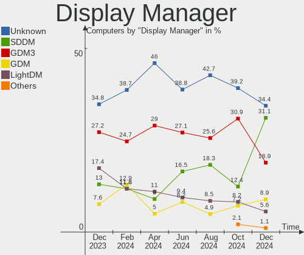
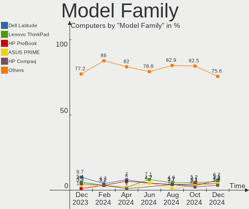
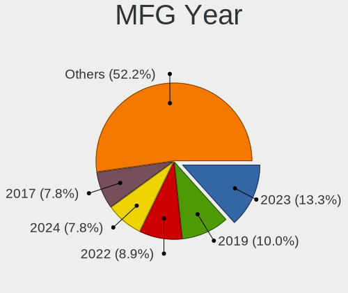
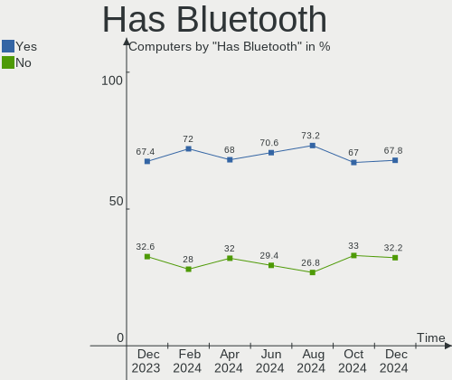
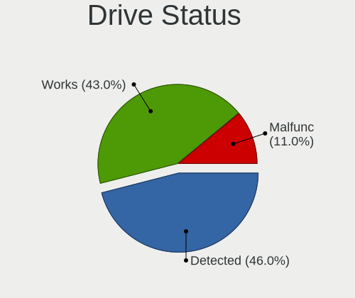
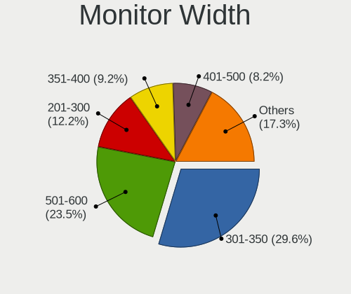
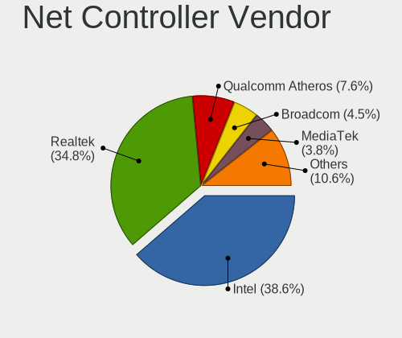
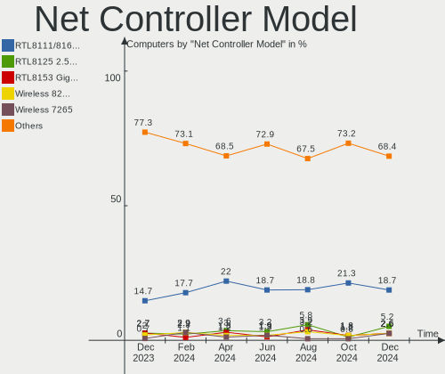
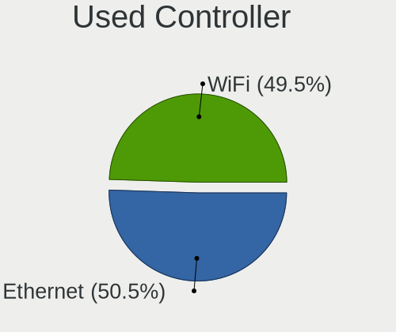
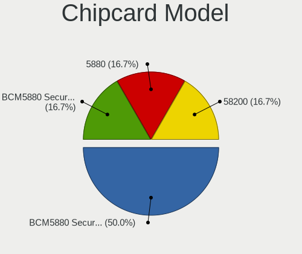

Linux in Netherlands - Hardware Trends
--------------------------------------

A project to identify most popular hardware characteristics and track their change
over time based on data collected by Linux users at https://Linux-Hardware.org.

Anyone can contribute to this report by the [hw-probe](https://github.com/linuxhw/hw-probe) tool:

    sudo -E hw-probe -all -upload

This is a report for all computer types. See also reports for [desktops](/Location/Netherlands/Desktop/README.md) and [notebooks](/Location/Netherlands/Notebook/README.md).

Period: Dec, 2023.

Contents
--------

* [ System ](#system)
  - [ OS                       ](#os)
  - [ OS Family                ](#os-family)
  - [ Kernel                   ](#kernel)
  - [ Kernel Family            ](#kernel-family)
  - [ Kernel Major Ver.        ](#kernel-major-ver)
  - [ Arch                     ](#arch)
  - [ DE                       ](#de)
  - [ Display Server           ](#display-server)
  - [ Display Manager          ](#display-manager)
  - [ OS Lang                  ](#os-lang)
  - [ Boot Mode                ](#boot-mode)
  - [ Filesystem               ](#filesystem)
  - [ Part. scheme             ](#part-scheme)
  - [ Dual Boot with Linux/BSD ](#dual-boot-with-linuxbsd)
  - [ Dual Boot (Win)          ](#dual-boot-win)

* [ Board ](#board)
  - [ Vendor                   ](#vendor)
  - [ Model                    ](#model)
  - [ Model Family             ](#model-family)
  - [ MFG Year                 ](#mfg-year)
  - [ Form Factor              ](#form-factor)
  - [ Secure Boot              ](#secure-boot)
  - [ Coreboot                 ](#coreboot)
  - [ RAM Size                 ](#ram-size)
  - [ RAM Used                 ](#ram-used)
  - [ Total Drives             ](#total-drives)
  - [ Has CD-ROM               ](#has-cd-rom)
  - [ Has Ethernet             ](#has-ethernet)
  - [ Has WiFi                 ](#has-wifi)
  - [ Has Bluetooth            ](#has-bluetooth)

* [ Location ](#location)
  - [ Country                  ](#country)
  - [ City                     ](#city)

* [ Drives ](#drives)
  - [ Drive Vendor             ](#drive-vendor)
  - [ Drive Model              ](#drive-model)
  - [ HDD Vendor               ](#hdd-vendor)
  - [ SSD Vendor               ](#ssd-vendor)
  - [ Drive Kind               ](#drive-kind)
  - [ Drive Connector          ](#drive-connector)
  - [ Drive Size               ](#drive-size)
  - [ Space Total              ](#space-total)
  - [ Space Used               ](#space-used)
  - [ Malfunc. Drives          ](#malfunc-drives)
  - [ Malfunc. Drive Vendor    ](#malfunc-drive-vendor)
  - [ Malfunc. HDD Vendor      ](#malfunc-hdd-vendor)
  - [ Malfunc. Drive Kind      ](#malfunc-drive-kind)
  - [ Failed Drives            ](#failed-drives)
  - [ Failed Drive Vendor      ](#failed-drive-vendor)
  - [ Drive Status             ](#drive-status)

* [ Storage controller ](#storage-controller)
  - [ Storage Vendor           ](#storage-vendor)
  - [ Storage Model            ](#storage-model)
  - [ Storage Kind             ](#storage-kind)

* [ Processor ](#processor)
  - [ CPU Vendor               ](#cpu-vendor)
  - [ CPU Model                ](#cpu-model)
  - [ CPU Model Family         ](#cpu-model-family)
  - [ CPU Cores                ](#cpu-cores)
  - [ CPU Sockets              ](#cpu-sockets)
  - [ CPU Threads              ](#cpu-threads)
  - [ CPU Op-Modes             ](#cpu-op-modes)
  - [ CPU Microcode            ](#cpu-microcode)
  - [ CPU Microarch            ](#cpu-microarch)

* [ Graphics ](#graphics)
  - [ GPU Vendor               ](#gpu-vendor)
  - [ GPU Model                ](#gpu-model)
  - [ GPU Combo                ](#gpu-combo)
  - [ GPU Driver               ](#gpu-driver)
  - [ GPU Memory               ](#gpu-memory)

* [ Monitor ](#monitor)
  - [ Monitor Vendor           ](#monitor-vendor)
  - [ Monitor Model            ](#monitor-model)
  - [ Monitor Resolution       ](#monitor-resolution)
  - [ Monitor Diagonal         ](#monitor-diagonal)
  - [ Monitor Width            ](#monitor-width)
  - [ Aspect Ratio             ](#aspect-ratio)
  - [ Monitor Area             ](#monitor-area)
  - [ Pixel Density            ](#pixel-density)
  - [ Multiple Monitors        ](#multiple-monitors)

* [ Network ](#network)
  - [ Net Controller Vendor    ](#net-controller-vendor)
  - [ Net Controller Model     ](#net-controller-model)
  - [ Wireless Vendor          ](#wireless-vendor)
  - [ Wireless Model           ](#wireless-model)
  - [ Ethernet Vendor          ](#ethernet-vendor)
  - [ Ethernet Model           ](#ethernet-model)
  - [ Net Controller Kind      ](#net-controller-kind)
  - [ Used Controller          ](#used-controller)
  - [ NICs                     ](#nics)
  - [ IPv6                     ](#ipv6)

* [ Bluetooth ](#bluetooth)
  - [ Bluetooth Vendor         ](#bluetooth-vendor)
  - [ Bluetooth Model          ](#bluetooth-model)

* [ Sound ](#sound)
  - [ Sound Vendor             ](#sound-vendor)
  - [ Sound Model              ](#sound-model)

* [ Memory ](#memory)
  - [ Memory Vendor            ](#memory-vendor)
  - [ Memory Model             ](#memory-model)
  - [ Memory Kind              ](#memory-kind)
  - [ Memory Form Factor       ](#memory-form-factor)
  - [ Memory Size              ](#memory-size)
  - [ Memory Speed             ](#memory-speed)

* [ Printers & scanners ](#printers--scanners)
  - [ Printer Vendor           ](#printer-vendor)
  - [ Printer Model            ](#printer-model)
  - [ Scanner Vendor           ](#scanner-vendor)
  - [ Scanner Model            ](#scanner-model)

* [ Camera ](#camera)
  - [ Camera Vendor            ](#camera-vendor)
  - [ Camera Model             ](#camera-model)

* [ Security ](#security)
  - [ Fingerprint Vendor       ](#fingerprint-vendor)
  - [ Fingerprint Model        ](#fingerprint-model)
  - [ Chipcard Vendor          ](#chipcard-vendor)
  - [ Chipcard Model           ](#chipcard-model)

* [ Unsupported ](#unsupported)
  - [ Unsupported Devices      ](#unsupported-devices)
  - [ Unsupported Device Types ](#unsupported-device-types)

System
------

OS
--

Installed operating systems

| Name               | Computers | Percent |
|--------------------|-----------|---------|
| Ubuntu 22.04       | 18        | 19.57%  |
| Fedora 39          | 14        | 15.22%  |
| Linux Mint 21.2    | 12        | 13.04%  |
| Zorin 16           | 6         | 6.52%   |
| Ubuntu 23.10       | 4         | 4.35%   |
| Arch Rolling       | 4         | 4.35%   |
| OpenMandriva 5.0   | 3         | 3.26%   |
| Ubuntu 23.04       | 2         | 2.17%   |
| OpenMandriva 23.11 | 2         | 2.17%   |
| OpenMandriva 23.08 | 2         | 2.17%   |
| NixOS 23.11        | 2         | 2.17%   |
| Kubuntu 23.10      | 2         | 2.17%   |
| KDE neon 22.04     | 2         | 2.17%   |
| Fedora 38          | 2         | 2.17%   |
| Debian 12          | 2         | 2.17%   |
| Debian             | 2         | 2.17%   |
| Zorin 17           | 1         | 1.09%   |
| Raspbian 11        | 1         | 1.09%   |
| Pop!_OS 22.04      | 1         | 1.09%   |
| Parrot 5.3         | 1         | 1.09%   |
| OpenMandriva 23.90 | 1         | 1.09%   |
| OpenMandriva 23.01 | 1         | 1.09%   |
| Manjaro            | 1         | 1.09%   |
| LMDE 6             | 1         | 1.09%   |
| Linux Mint 21.1    | 1         | 1.09%   |
| Linux Mint 21      | 1         | 1.09%   |
| Linux Lite 6.6     | 1         | 1.09%   |
| Fedora 37          | 1         | 1.09%   |
| ArcoLinux Rolling  | 1         | 1.09%   |

OS Family
---------

OS without a version

| Name         | Computers | Percent |
|--------------|-----------|---------|
| Ubuntu       | 24        | 26.09%  |
| Fedora       | 17        | 18.48%  |
| Linux Mint   | 14        | 15.22%  |
| OpenMandriva | 9         | 9.78%   |
| Zorin        | 7         | 7.61%   |
| Debian       | 4         | 4.35%   |
| Arch         | 4         | 4.35%   |
| NixOS        | 2         | 2.17%   |
| Kubuntu      | 2         | 2.17%   |
| KDE neon     | 2         | 2.17%   |
| Raspbian     | 1         | 1.09%   |
| Pop!_OS      | 1         | 1.09%   |
| Parrot       | 1         | 1.09%   |
| Manjaro      | 1         | 1.09%   |
| LMDE         | 1         | 1.09%   |
| Linux Lite   | 1         | 1.09%   |
| ArcoLinux    | 1         | 1.09%   |

Kernel
------

Version of the Linux kernel

| Version                  | Computers | Percent |
|--------------------------|-----------|---------|
| 5.15.0-91-generic        | 13        | 14.13%  |
| 6.2.0-37-generic         | 11        | 11.96%  |
| 6.2.0-39-generic         | 10        | 10.87%  |
| 6.6.4-200.fc39.x86_64    | 6         | 6.52%   |
| 6.6.2-desktop-1omv2390   | 5         | 5.43%   |
| 6.5.0-14-generic         | 5         | 5.43%   |
| 5.15.0-89-generic        | 5         | 5.43%   |
| 6.6.8-200.fc39.x86_64    | 3         | 3.26%   |
| 6.6.7-200.fc39.x86_64    | 3         | 3.26%   |
| 6.6.4-arch1-1            | 2         | 2.17%   |
| 6.1.68                   | 2         | 2.17%   |
| 6.6.7-desktop-1omv2390   | 1         | 1.09%   |
| 6.6.7-arch1-1            | 1         | 1.09%   |
| 6.6.7-4-MANJARO          | 1         | 1.09%   |
| 6.6.7-100.fc38.x86_64    | 1         | 1.09%   |
| 6.6.6-arch1-1            | 1         | 1.09%   |
| 6.6.6-200.fc39.x86_64    | 1         | 1.09%   |
| 6.6.5-arch1-1            | 1         | 1.09%   |
| 6.6.4-1-liquorix-amd64   | 1         | 1.09%   |
| 6.5.7-200.fc38.x86_64    | 1         | 1.09%   |
| 6.5.6-76060506-generic   | 1         | 1.09%   |
| 6.5.6-300.fc39.x86_64    | 1         | 1.09%   |
| 6.5.12-100.fc37.x86_64   | 1         | 1.09%   |
| 6.5.0-5-amd64            | 1         | 1.09%   |
| 6.5.0-13-generic         | 1         | 1.09%   |
| 6.5.0-10-generic         | 1         | 1.09%   |
| 6.5.0-0.deb12.1-rt-amd64 | 1         | 1.09%   |
| 6.4.8-desktop-2omv2390   | 1         | 1.09%   |
| 6.4.11-desktop-1omv2390  | 1         | 1.09%   |
| 6.2.0-33-generic         | 1         | 1.09%   |
| 6.2.0-26-generic         | 1         | 1.09%   |
| 6.1.69+                  | 1         | 1.09%   |
| 6.1.1-desktop-1omv2290   | 1         | 1.09%   |
| 6.1.0-1parrot1-amd64     | 1         | 1.09%   |
| 6.1.0-16-amd64           | 1         | 1.09%   |
| 6.1.0-14-amd64           | 1         | 1.09%   |
| 5.15.0-76-generic        | 1         | 1.09%   |
| 5.15.0-72-generic        | 1         | 1.09%   |

Kernel Family
-------------

Linux kernel without a distro release

| Version | Computers | Percent |
|---------|-----------|---------|
| 6.2.0   | 23        | 25%     |
| 5.15.0  | 20        | 21.74%  |
| 6.6.4   | 9         | 9.78%   |
| 6.5.0   | 9         | 9.78%   |
| 6.6.7   | 7         | 7.61%   |
| 6.6.2   | 5         | 5.43%   |
| 6.6.8   | 3         | 3.26%   |
| 6.1.0   | 3         | 3.26%   |
| 6.6.6   | 2         | 2.17%   |
| 6.5.6   | 2         | 2.17%   |
| 6.1.68  | 2         | 2.17%   |
| 6.6.5   | 1         | 1.09%   |
| 6.5.7   | 1         | 1.09%   |
| 6.5.12  | 1         | 1.09%   |
| 6.4.8   | 1         | 1.09%   |
| 6.4.11  | 1         | 1.09%   |
| 6.1.69  | 1         | 1.09%   |
| 6.1.1   | 1         | 1.09%   |

Kernel Major Ver.
-----------------

Linux kernel major version

| Version | Computers | Percent |
|---------|-----------|---------|
| 6.6     | 27        | 29.35%  |
| 6.2     | 23        | 25%     |
| 5.15    | 20        | 21.74%  |
| 6.5     | 13        | 14.13%  |
| 6.1     | 7         | 7.61%   |
| 6.4     | 2         | 2.17%   |

Arch
----

OS architecture (x86_64, i586, etc.)

| Name   | Computers | Percent |
|--------|-----------|---------|
| x86_64 | 91        | 98.91%  |
| armv6l | 1         | 1.09%   |

DE
--

Desktop Environment

| Name       | Computers | Percent |
|------------|-----------|---------|
| GNOME      | 53        | 57.61%  |
| X-Cinnamon | 11        | 11.96%  |
| KDE5       | 11        | 11.96%  |
| XFCE       | 7         | 7.61%   |
| MATE       | 4         | 4.35%   |
| none+i3    | 2         | 2.17%   |
| LXQt       | 2         | 2.17%   |
| Cinnamon   | 1         | 1.09%   |
| Unknown    | 1         | 1.09%   |

Display Server
--------------

X11 or Wayland

| Name    | Computers | Percent |
|---------|-----------|---------|
| Wayland | 45        | 48.91%  |
| X11     | 42        | 45.65%  |
| Tty     | 3         | 3.26%   |
| Unknown | 2         | 2.17%   |

Display Manager
---------------

SDDM, LightDM, etc.

| Name    | Computers | Percent |
|---------|-----------|---------|
| Unknown | 32        | 34.78%  |
| GDM3    | 25        | 27.17%  |
| LightDM | 16        | 17.39%  |
| SDDM    | 12        | 13.04%  |
| GDM     | 7         | 7.61%   |

OS Lang
-------

Language

| Lang  | Computers | Percent |
|-------|-----------|---------|
| en_US | 52        | 56.52%  |
| nl_NL | 27        | 29.35%  |
| en_GB | 5         | 5.43%   |
| pl_PL | 2         | 2.17%   |
| C     | 2         | 2.17%   |
| it_IT | 1         | 1.09%   |
| es_UY | 1         | 1.09%   |
| de_DE | 1         | 1.09%   |
| bg_BG | 1         | 1.09%   |

Boot Mode
---------

EFI or BIOS

| Mode | Computers | Percent |
|------|-----------|---------|
| EFI  | 57        | 61.96%  |
| BIOS | 35        | 38.04%  |

Filesystem
----------

Type of filesystem

| Type    | Computers | Percent |
|---------|-----------|---------|
| Ext4    | 54        | 58.7%   |
| Btrfs   | 19        | 20.65%  |
| Tmpfs   | 16        | 17.39%  |
| Overlay | 2         | 2.17%   |
| Zfs     | 1         | 1.09%   |

Part. scheme
------------

Scheme of partitioning

| Type    | Computers | Percent |
|---------|-----------|---------|
| GPT     | 59        | 64.13%  |
| Unknown | 30        | 32.61%  |
| MBR     | 3         | 3.26%   |

Dual Boot with Linux/BSD
------------------------

Hosting more than one Linux/BSD

| Dual boot | Computers | Percent |
|-----------|-----------|---------|
| No        | 75        | 81.52%  |
| Yes       | 17        | 18.48%  |

Dual Boot (Win)
---------------

Hosting Linux and Windows

| Dual boot | Computers | Percent |
|-----------|-----------|---------|
| No        | 74        | 80.43%  |
| Yes       | 18        | 19.57%  |

Board
-----

Vendor
------

Motherboard manufacturer

| Name                    | Computers | Percent |
|-------------------------|-----------|---------|
| ASUSTek Computer        | 19        | 20.65%  |
| Lenovo                  | 15        | 16.3%   |
| Hewlett-Packard         | 14        | 15.22%  |
| Dell                    | 10        | 10.87%  |
| MSI                     | 5         | 5.43%   |
| Medion                  | 5         | 5.43%   |
| Gigabyte Technology     | 5         | 5.43%   |
| Fujitsu                 | 3         | 3.26%   |
| ASRock                  | 2         | 2.17%   |
| Apple                   | 2         | 2.17%   |
| Acer                    | 2         | 2.17%   |
| Shuttle                 | 1         | 1.09%   |
| Seeed Studio            | 1         | 1.09%   |
| Raspberry Pi Foundation | 1         | 1.09%   |
| Pegatron                | 1         | 1.09%   |
| Microsoft               | 1         | 1.09%   |
| Intel                   | 1         | 1.09%   |
| Huanan                  | 1         | 1.09%   |
| Google                  | 1         | 1.09%   |
| Framework               | 1         | 1.09%   |
| Entroware               | 1         | 1.09%   |

Model
-----

Motherboard model

| Name                                     | Computers | Percent |
|------------------------------------------|-----------|---------|
| Gigabyte B550 AORUS ELITE V2             | 2         | 2.17%   |
| Shuttle SH55J                            | 1         | 1.09%   |
| Seeed Studio ODYSSEY-X86J4125            | 1         | 1.09%   |
| RPi Raspberry Pi Zero W Rev 1.1          | 1         | 1.09%   |
| Pegatron WL239AA-ABH s5330nl             | 1         | 1.09%   |
| MSI Pro 3130 Small Form Factor PC        | 1         | 1.09%   |
| MSI Prestige 14Evo A11M                  | 1         | 1.09%   |
| MSI MS-7B79                              | 1         | 1.09%   |
| MSI MS-7922                              | 1         | 1.09%   |
| MSI MS-7599                              | 1         | 1.09%   |
| Microsoft Surface Pro 7+                 | 1         | 1.09%   |
| Medion P6613                             | 1         | 1.09%   |
| Medion E4251 MD61435                     | 1         | 1.09%   |
| Medion E23201 MD61575                    | 1         | 1.09%   |
| Medion E15415                            | 1         | 1.09%   |
| Medion E11201                            | 1         | 1.09%   |
| Lenovo Yoga 2 Pro 20266                  | 1         | 1.09%   |
| Lenovo ThinkPad X201 3680WXT             | 1         | 1.09%   |
| Lenovo ThinkPad T470s W10DG 20JTS1HG00   | 1         | 1.09%   |
| Lenovo ThinkPad T460p 20FWCTO1WW         | 1         | 1.09%   |
| Lenovo ThinkPad P15v Gen 1 20TRS1W200    | 1         | 1.09%   |
| Lenovo ThinkPad A475 20KMS08300          | 1         | 1.09%   |
| Lenovo ThinkCentre M720q 10T700AHMH      | 1         | 1.09%   |
| Lenovo ThinkCentre M70q Gen 3 11T3002VMH | 1         | 1.09%   |
| Lenovo ThinkBook 14-IIL 20SL             | 1         | 1.09%   |
| Lenovo ThinkBook 13s-IWL 20R9            | 1         | 1.09%   |
| Lenovo Legion Slim 7 16APH8 82Y4         | 1         | 1.09%   |
| Lenovo Legion 5 Pro 16ACH6H 82JQ         | 1         | 1.09%   |
| Lenovo IdeaPad Pro 5 14APH8 83AM         | 1         | 1.09%   |
| Lenovo IdeaPad 5 Pro 16ACH6 82L5         | 1         | 1.09%   |
| Lenovo C340 10102                        | 1         | 1.09%   |
| Intel NUC12WSKi5                         | 1         | 1.09%   |
| Huanan X99-F8                            | 1         | 1.09%   |
| HP Z400 Workstation                      | 1         | 1.09%   |
| HP ProDesk 600 G1 SFF                    | 1         | 1.09%   |
| HP ProBook 450 G8 Notebook PC            | 1         | 1.09%   |
| HP Pavilion Notebook                     | 1         | 1.09%   |
| HP Pavilion 17                           | 1         | 1.09%   |
| HP Laptop 17-cp0xxx                      | 1         | 1.09%   |
| HP ENVY x360 Convertible 13-ay0xxx       | 1         | 1.09%   |

Model Family
------------

Motherboard model prefix

| Name                          | Computers | Percent |
|-------------------------------|-----------|---------|
| Dell Latitude                 | 8         | 8.7%    |
| Lenovo ThinkPad               | 5         | 5.43%   |
| HP Compaq                     | 4         | 4.35%   |
| ASUS ROG                      | 4         | 4.35%   |
| HP EliteBook                  | 3         | 3.26%   |
| ASUS VivoBook                 | 3         | 3.26%   |
| ASUS PRIME                    | 3         | 3.26%   |
| Lenovo ThinkCentre            | 2         | 2.17%   |
| Lenovo ThinkBook              | 2         | 2.17%   |
| Lenovo Legion                 | 2         | 2.17%   |
| Lenovo IdeaPad                | 2         | 2.17%   |
| HP Pavilion                   | 2         | 2.17%   |
| Gigabyte B550                 | 2         | 2.17%   |
| Fujitsu LIFEBOOK              | 2         | 2.17%   |
| ASUS Maximus                  | 2         | 2.17%   |
| Acer Aspire                   | 2         | 2.17%   |
| Shuttle SH55J                 | 1         | 1.09%   |
| Seeed Studio ODYSSEY-X86J4125 | 1         | 1.09%   |
| RPi Raspberry                 | 1         | 1.09%   |
| Pegatron WL239AA-ABH          | 1         | 1.09%   |
| MSI Pro                       | 1         | 1.09%   |
| MSI Prestige                  | 1         | 1.09%   |
| MSI MS-7B79                   | 1         | 1.09%   |
| MSI MS-7922                   | 1         | 1.09%   |
| MSI MS-7599                   | 1         | 1.09%   |
| Microsoft Surface             | 1         | 1.09%   |
| Medion P6613                  | 1         | 1.09%   |
| Medion E4251                  | 1         | 1.09%   |
| Medion E23201                 | 1         | 1.09%   |
| Medion E15415                 | 1         | 1.09%   |
| Medion E11201                 | 1         | 1.09%   |
| Lenovo Yoga                   | 1         | 1.09%   |
| Lenovo C340                   | 1         | 1.09%   |
| Intel NUC12WSKi5              | 1         | 1.09%   |
| Huanan X99-F8                 | 1         | 1.09%   |
| HP Z400                       | 1         | 1.09%   |
| HP ProDesk                    | 1         | 1.09%   |
| HP ProBook                    | 1         | 1.09%   |
| HP Laptop                     | 1         | 1.09%   |
| HP ENVY                       | 1         | 1.09%   |

MFG Year
--------

Motherboard manufacture year

| Year    | Computers | Percent |
|---------|-----------|---------|
| 2020    | 12        | 13.04%  |
| 2010    | 10        | 10.87%  |
| 2023    | 9         | 9.78%   |
| 2019    | 8         | 8.7%    |
| 2013    | 8         | 8.7%    |
| 2022    | 7         | 7.61%   |
| 2018    | 7         | 7.61%   |
| 2021    | 6         | 6.52%   |
| 2017    | 6         | 6.52%   |
| 2012    | 6         | 6.52%   |
| 2014    | 4         | 4.35%   |
| 2016    | 2         | 2.17%   |
| 2009    | 2         | 2.17%   |
| 2008    | 2         | 2.17%   |
| 2011    | 1         | 1.09%   |
| 2007    | 1         | 1.09%   |
| Unknown | 1         | 1.09%   |

Form Factor
-----------

Physical design of the computer

| Name           | Computers | Percent |
|----------------|-----------|---------|
| Notebook       | 49        | 53.26%  |
| Desktop        | 33        | 35.87%  |
| Mini pc        | 4         | 4.35%   |
| Convertible    | 2         | 2.17%   |
| All in one     | 2         | 2.17%   |
| System on chip | 1         | 1.09%   |
| Tablet         | 1         | 1.09%   |

Secure Boot
-----------

Enabled or disabled

| State    | Computers | Percent |
|----------|-----------|---------|
| Disabled | 80        | 86.96%  |
| Enabled  | 12        | 13.04%  |

Coreboot
--------

Have coreboot on board

| Used | Computers | Percent |
|------|-----------|---------|
| No   | 91        | 98.91%  |
| Yes  | 1         | 1.09%   |

RAM Size
--------

Total RAM memory

| Size in GB  | Computers | Percent |
|-------------|-----------|---------|
| 16.01-24.0  | 27        | 29.35%  |
| 4.01-8.0    | 17        | 18.48%  |
| 3.01-4.0    | 14        | 15.22%  |
| 8.01-16.0   | 14        | 15.22%  |
| 32.01-64.0  | 8         | 8.7%    |
| 64.01-256.0 | 6         | 6.52%   |
| 24.01-32.0  | 4         | 4.35%   |
| 2.01-3.0    | 1         | 1.09%   |
| 0.01-0.5    | 1         | 1.09%   |

RAM Used
--------

Used RAM memory

| Used GB   | Computers | Percent |
|-----------|-----------|---------|
| 1.01-2.0  | 28        | 30.43%  |
| 2.01-3.0  | 27        | 29.35%  |
| 4.01-8.0  | 19        | 20.65%  |
| 3.01-4.0  | 10        | 10.87%  |
| 8.01-16.0 | 6         | 6.52%   |
| 0.51-1.0  | 1         | 1.09%   |
| 0.01-0.5  | 1         | 1.09%   |

Total Drives
------------

Number of drives on board

| Drives | Computers | Percent |
|--------|-----------|---------|
| 1      | 59        | 64.13%  |
| 2      | 20        | 21.74%  |
| 3      | 5         | 5.43%   |
| 6      | 3         | 3.26%   |
| 4      | 2         | 2.17%   |
| 7      | 1         | 1.09%   |
| 5      | 1         | 1.09%   |
| 0      | 1         | 1.09%   |

Has CD-ROM
----------

Has CD-ROM on board

| Presented | Computers | Percent |
|-----------|-----------|---------|
| No        | 74        | 80.43%  |
| Yes       | 18        | 19.57%  |

Has Ethernet
------------

Has Ethernet on board

| Presented | Computers | Percent |
|-----------|-----------|---------|
| Yes       | 71        | 77.17%  |
| No        | 21        | 22.83%  |

Has WiFi
--------

Has WiFi module

| Presented | Computers | Percent |
|-----------|-----------|---------|
| Yes       | 71        | 77.17%  |
| No        | 21        | 22.83%  |

Has Bluetooth
-------------

Has Bluetooth module

| Presented | Computers | Percent |
|-----------|-----------|---------|
| Yes       | 62        | 67.39%  |
| No        | 30        | 32.61%  |

Location
--------

Country
-------

Geographic location (country)

| Country     | Computers | Percent |
|-------------|-----------|---------|
| Netherlands | 92        | 100%    |

City
----

Geographic location (city)

| City                   | Computers | Percent |
|------------------------|-----------|---------|
| Amsterdam              | 17        | 18.48%  |
| The Hague              | 6         | 6.52%   |
| Naaldwijk              | 5         | 5.43%   |
| Gouda                  | 3         | 3.26%   |
| Utrecht                | 2         | 2.17%   |
| Tilburg                | 2         | 2.17%   |
| Rotterdam              | 2         | 2.17%   |
| Loosdrecht             | 2         | 2.17%   |
| Haarlem                | 2         | 2.17%   |
| Drachten               | 2         | 2.17%   |
| Delft                  | 2         | 2.17%   |
| Culemborg              | 2         | 2.17%   |
| Capelle aan den IJssel | 2         | 2.17%   |
| Zwartewaal             | 1         | 1.09%   |
| Winschoten             | 1         | 1.09%   |
| Veldhoven              | 1         | 1.09%   |
| Steenbergen            | 1         | 1.09%   |
| Stadskanaal            | 1         | 1.09%   |
| Sassenheim             | 1         | 1.09%   |
| Rosmalen               | 1         | 1.09%   |
| Rijswijk               | 1         | 1.09%   |
| Ravenstein             | 1         | 1.09%   |
| Purmerend              | 1         | 1.09%   |
| Pijnacker              | 1         | 1.09%   |
| Papendrecht            | 1         | 1.09%   |
| Overveen               | 1         | 1.09%   |
| Oss                    | 1         | 1.09%   |
| Oisterwijk             | 1         | 1.09%   |
| Oegstgeest             | 1         | 1.09%   |
| Nunspeet               | 1         | 1.09%   |
| Nuland                 | 1         | 1.09%   |
| Nieuw-Vennep           | 1         | 1.09%   |
| Nederhorst den Berg    | 1         | 1.09%   |
| Meppel                 | 1         | 1.09%   |
| Meijel                 | 1         | 1.09%   |
| Medemblik              | 1         | 1.09%   |
| Leeuwarden             | 1         | 1.09%   |
| Kapelle                | 1         | 1.09%   |
| IJsselmuiden           | 1         | 1.09%   |
| Hummelo                | 1         | 1.09%   |

Drives
------

Drive Vendor
------------

Hard drive vendors

| Vendor                       | Computers | Drives | Percent |
|------------------------------|-----------|--------|---------|
| Samsung Electronics          | 30        | 37     | 22.9%   |
| SanDisk                      | 12        | 13     | 9.16%   |
| Kingston                     | 12        | 14     | 9.16%   |
| WDC                          | 8         | 9      | 6.11%   |
| Seagate                      | 6         | 6      | 4.58%   |
| Toshiba                      | 5         | 5      | 3.82%   |
| Phison                       | 5         | 5      | 3.82%   |
| Micron Technology            | 5         | 5      | 3.82%   |
| Intel                        | 5         | 5      | 3.82%   |
| Unknown                      | 3         | 6      | 2.29%   |
| SK hynix                     | 3         | 3      | 2.29%   |
| KIOXIA                       | 3         | 3      | 2.29%   |
| Hitachi                      | 3         | 3      | 2.29%   |
| Crucial                      | 3         | 4      | 2.29%   |
| Apple                        | 3         | 3      | 2.29%   |
| A-DATA Technology            | 3         | 3      | 2.29%   |
| Shenzhen Longsys Electronics | 2         | 2      | 1.53%   |
| Patriot                      | 2         | 2      | 1.53%   |
| Fujitsu                      | 2         | 2      | 1.53%   |
| WALRAM                       | 1         | 1      | 0.76%   |
| USB                          | 1         | 1      | 0.76%   |
| SSD 128G                     | 1         | 1      | 0.76%   |
| SPCC                         | 1         | 1      | 0.76%   |
| PNY                          | 1         | 1      | 0.76%   |
| Phison Electronics           | 1         | 1      | 0.76%   |
| Maxtor                       | 1         | 1      | 0.76%   |
| LITEONIT                     | 1         | 1      | 0.76%   |
| KingDian                     | 1         | 1      | 0.76%   |
| JMicron Technology           | 1         | 1      | 0.76%   |
| HGST                         | 1         | 1      | 0.76%   |
| Hewlett-Packard              | 1         | 1      | 0.76%   |
| FORESEE                      | 1         | 1      | 0.76%   |
| Dogfish                      | 1         | 1      | 0.76%   |
| China                        | 1         | 1      | 0.76%   |
| Unknown                      | 1         | 1      | 0.76%   |

Drive Model
-----------

Hard drive models

| Model                                               | Computers | Percent |
|-----------------------------------------------------|-----------|---------|
| Samsung NVMe SSD Controller SM981/PM981/PM983 512GB | 5         | 3.45%   |
| Kingston SA400S37240G 240GB SSD                     | 4         | 2.76%   |
| Sandisk WD Black 2018/SN750 / PC SN720 NVMe SSD 1TB | 3         | 2.07%   |
| Samsung SSD 980 1TB                                 | 3         | 2.07%   |
| Kingston SA400S37480G 480GB SSD                     | 3         | 2.07%   |
| Toshiba XG6 NVMe SSD Controller 512GB               | 2         | 1.38%   |
| SanDisk SSD PLUS 240GB                              | 2         | 1.38%   |
| Samsung SSD 850 EVO 500GB                           | 2         | 1.38%   |
| Samsung SSD 850 EVO 250GB                           | 2         | 1.38%   |
| Samsung NVMe SSD Controller PM9A1/PM9A3/980PRO 2TB  | 2         | 1.38%   |
| Kingston SV300S37A120G 120GB SSD                    | 2         | 1.38%   |
| Kingston SNV2S500G 500GB                            | 2         | 1.38%   |
| WDC WUH721818ALE6L4 18TB                            | 1         | 0.69%   |
| WDC WDS500G2B0A-00SM50 500GB SSD                    | 1         | 0.69%   |
| WDC WD5000AAKX-08ERMA0 500GB                        | 1         | 0.69%   |
| WDC WD3200BEKT-60V5T1 320GB                         | 1         | 0.69%   |
| WDC WD10JPCX-24UE4T0 1TB                            | 1         | 0.69%   |
| WDC WD10EZEX-75WN4A0 1TB                            | 1         | 0.69%   |
| WDC WD10EZEX-60WN4A0 1TB                            | 1         | 0.69%   |
| WDC WD10EZEX-08WN4A0 1TB                            | 1         | 0.69%   |
| WDC WD10EACS-00D6B0 1TB                             | 1         | 0.69%   |
| WALRAM 1TB                                          | 1         | 0.69%   |
| USB SanDisk 3.2Gen1 64GB                            | 1         | 0.69%   |
| Unknown SD/MMC/M.S.PRO 32GB                         | 1         | 0.69%   |
| Unknown SD/MMC 2GB                                  | 1         | 0.69%   |
| Unknown MMC Card  8GB                               | 1         | 0.69%   |
| Unknown MMC Card  64GB                              | 1         | 0.69%   |
| Unknown M.S./M.S.Pro/HG 16GB                        | 1         | 0.69%   |
| Toshiba MK3259GSXP 320GB                            | 1         | 0.69%   |
| Toshiba HDWK105 500GB                               | 1         | 0.69%   |
| Toshiba DT01ACA300 3TB                              | 1         | 0.69%   |
| SSD 128G B 128GB                                    | 1         | 0.69%   |
| SPCC Solid State Disk 64GB                          | 1         | 0.69%   |
| SK hynix PC801 NVMe 1TB                             | 1         | 0.69%   |
| SK hynix HFM512GD3JX013N 512GB                      | 1         | 0.69%   |
| SK hynix BC901 NVMe 256GB                           | 1         | 0.69%   |
| Shenzhen Longsys Lexar SSD NM790 2TB                | 1         | 0.69%   |
| Shenzhen Longsys Lexar SSD NM790 1TB                | 1         | 0.69%   |
| Seagate ST500LM012 HN-M500MBB 500GB                 | 1         | 0.69%   |
| Seagate ST2000DM001 4GB                             | 1         | 0.69%   |

HDD Vendor
----------

Hard disk drive vendors

| Vendor              | Computers | Drives | Percent |
|---------------------|-----------|--------|---------|
| WDC                 | 7         | 8      | 26.92%  |
| Seagate             | 5         | 5      | 19.23%  |
| Toshiba             | 3         | 3      | 11.54%  |
| Hitachi             | 3         | 3      | 11.54%  |
| Samsung Electronics | 2         | 2      | 7.69%   |
| Fujitsu             | 2         | 2      | 7.69%   |
| Maxtor              | 1         | 1      | 3.85%   |
| HGST                | 1         | 1      | 3.85%   |
| Hewlett-Packard     | 1         | 1      | 3.85%   |
| Apple               | 1         | 1      | 3.85%   |

SSD Vendor
----------

Solid state drive vendors

| Vendor              | Computers | Drives | Percent |
|---------------------|-----------|--------|---------|
| Samsung Electronics | 16        | 19     | 28.57%  |
| Kingston            | 11        | 12     | 19.64%  |
| SanDisk             | 5         | 5      | 8.93%   |
| Crucial             | 3         | 4      | 5.36%   |
| Phison              | 2         | 2      | 3.57%   |
| Patriot             | 2         | 2      | 3.57%   |
| Micron Technology   | 2         | 2      | 3.57%   |
| Intel               | 2         | 2      | 3.57%   |
| Apple               | 2         | 2      | 3.57%   |
| A-DATA Technology   | 2         | 2      | 3.57%   |
| WDC                 | 1         | 1      | 1.79%   |
| SPCC                | 1         | 1      | 1.79%   |
| PNY                 | 1         | 1      | 1.79%   |
| LITEONIT            | 1         | 1      | 1.79%   |
| KingDian            | 1         | 1      | 1.79%   |
| JMicron Technology  | 1         | 1      | 1.79%   |
| FORESEE             | 1         | 1      | 1.79%   |
| Dogfish             | 1         | 1      | 1.79%   |
| China               | 1         | 1      | 1.79%   |

Drive Kind
----------

HDD or SSD

| Kind    | Computers | Drives | Percent |
|---------|-----------|--------|---------|
| SSD     | 47        | 61     | 39.5%   |
| NVMe    | 44        | 48     | 36.97%  |
| HDD     | 22        | 27     | 18.49%  |
| MMC     | 3         | 4      | 2.52%   |
| Unknown | 3         | 6      | 2.52%   |

Drive Connector
---------------

SATA, SAS, NVMe, etc.

| Type | Computers | Drives | Percent |
|------|-----------|--------|---------|
| SATA | 54        | 82     | 50%     |
| NVMe | 44        | 48     | 40.74%  |
| SAS  | 7         | 12     | 6.48%   |
| MMC  | 3         | 4      | 2.78%   |

Drive Size
----------

Size of hard drive

| Size in TB | Computers | Drives | Percent |
|------------|-----------|--------|---------|
| 0.01-0.5   | 51        | 63     | 69.86%  |
| 0.51-1.0   | 14        | 17     | 19.18%  |
| 3.01-4.0   | 3         | 3      | 4.11%   |
| 1.01-2.0   | 3         | 3      | 4.11%   |
| 2.01-3.0   | 1         | 1      | 1.37%   |
| 10.01-20.0 | 1         | 1      | 1.37%   |

Space Total
-----------

Amount of disk space available on the file system

| Size in GB     | Computers | Percent |
|----------------|-----------|---------|
| 101-250        | 23        | 25%     |
| 251-500        | 19        | 20.65%  |
| 1-20           | 10        | 10.87%  |
| 501-1000       | 10        | 10.87%  |
| 1001-2000      | 8         | 8.7%    |
| 51-100         | 8         | 8.7%    |
| Unknown        | 6         | 6.52%   |
| More than 3000 | 3         | 3.26%   |
| 21-50          | 3         | 3.26%   |
| 2001-3000      | 2         | 2.17%   |

Space Used
----------

Amount of used disk space

| Used GB        | Computers | Percent |
|----------------|-----------|---------|
| 1-20           | 31        | 33.7%   |
| 21-50          | 16        | 17.39%  |
| 101-250        | 14        | 15.22%  |
| 51-100         | 10        | 10.87%  |
| 251-500        | 7         | 7.61%   |
| Unknown        | 6         | 6.52%   |
| 501-1000       | 4         | 4.35%   |
| More than 3000 | 2         | 2.17%   |
| 2001-3000      | 1         | 1.09%   |
| 1001-2000      | 1         | 1.09%   |

Malfunc. Drives
---------------

Drive models with a malfunction

| Model                             | Computers | Drives | Percent |
|-----------------------------------|-----------|--------|---------|
| WDC WD10EZEX-08WN4A0 1TB          | 1         | 1      | 12.5%   |
| Toshiba MK3259GSXP 320GB          | 1         | 1      | 12.5%   |
| Seagate ST1000LM014-1EJ164 1TB    | 1         | 1      | 12.5%   |
| Samsung Electronics SP2504C 250GB | 1         | 1      | 12.5%   |
| Maxtor 7L250S0 256GB              | 1         | 1      | 12.5%   |
| Hitachi HTS725016A9A364 160GB     | 1         | 1      | 12.5%   |
| HGST HTS541010A9E680 1TB          | 1         | 1      | 12.5%   |
| China SSD 240GB                   | 1         | 1      | 12.5%   |

Malfunc. Drive Vendor
---------------------

Vendors of faulty drives

| Vendor              | Computers | Drives | Percent |
|---------------------|-----------|--------|---------|
| WDC                 | 1         | 1      | 12.5%   |
| Toshiba             | 1         | 1      | 12.5%   |
| Seagate             | 1         | 1      | 12.5%   |
| Samsung Electronics | 1         | 1      | 12.5%   |
| Maxtor              | 1         | 1      | 12.5%   |
| Hitachi             | 1         | 1      | 12.5%   |
| HGST                | 1         | 1      | 12.5%   |
| China               | 1         | 1      | 12.5%   |

Malfunc. HDD Vendor
-------------------

Vendors of faulty HDD drives

| Vendor              | Computers | Drives | Percent |
|---------------------|-----------|--------|---------|
| WDC                 | 1         | 1      | 14.29%  |
| Toshiba             | 1         | 1      | 14.29%  |
| Seagate             | 1         | 1      | 14.29%  |
| Samsung Electronics | 1         | 1      | 14.29%  |
| Maxtor              | 1         | 1      | 14.29%  |
| Hitachi             | 1         | 1      | 14.29%  |
| HGST                | 1         | 1      | 14.29%  |

Malfunc. Drive Kind
-------------------

Kinds of faulty drives

| Kind | Computers | Drives | Percent |
|------|-----------|--------|---------|
| HDD  | 6         | 7      | 85.71%  |
| SSD  | 1         | 1      | 14.29%  |

Failed Drives
-------------

Failed drive models

Zero info for selected period =(

Failed Drive Vendor
-------------------

Failed drive vendors

Zero info for selected period =(

Drive Status
------------

Number of failed and malfunc. drives

| Status   | Computers | Drives | Percent |
|----------|-----------|--------|---------|
| Detected | 50        | 78     | 50.51%  |
| Works    | 42        | 60     | 42.42%  |
| Malfunc  | 7         | 8      | 7.07%   |

Storage controller
------------------

Storage Vendor
--------------

Storage controller vendors

| Vendor                       | Computers | Percent |
|------------------------------|-----------|---------|
| Intel                        | 56        | 46.28%  |
| AMD                          | 18        | 14.88%  |
| Samsung Electronics          | 16        | 13.22%  |
| SanDisk                      | 7         | 5.79%   |
| Phison Electronics           | 4         | 3.31%   |
| SK hynix                     | 3         | 2.48%   |
| Micron Technology            | 3         | 2.48%   |
| KIOXIA                       | 3         | 2.48%   |
| Toshiba America Info Systems | 2         | 1.65%   |
| Shenzhen Longsys Electronics | 2         | 1.65%   |
| Kingston Technology Company  | 2         | 1.65%   |
| JMicron Technology           | 2         | 1.65%   |
| Silicon Motion               | 1         | 0.83%   |
| ASMedia Technology           | 1         | 0.83%   |
| ADATA Technology             | 1         | 0.83%   |

Storage Model
-------------

Storage controller models

| Model                                                                          | Computers | Percent |
|--------------------------------------------------------------------------------|-----------|---------|
| AMD FCH SATA Controller [AHCI mode]                                            | 10        | 7.41%   |
| Samsung NVMe SSD Controller SM981/PM981/PM983                                  | 7         | 5.19%   |
| Samsung NVMe SSD Controller 980 (DRAM-less)                                    | 6         | 4.44%   |
| Intel 8 Series/C220 Series Chipset Family 6-port SATA Controller 1 [AHCI mode] | 5         | 3.7%    |
| SanDisk Extreme Pro / WD Black 2018/SN750/PC SN720 NVMe SSD                    | 3         | 2.22%   |
| Samsung NVMe SSD Controller PM9A1/PM9A3/980PRO                                 | 3         | 2.22%   |
| Intel Wildcat Point-LP SATA Controller [AHCI Mode]                             | 3         | 2.22%   |
| Intel Volume Management Device NVMe RAID Controller Intel Corporation          | 3         | 2.22%   |
| Intel Celeron/Pentium Silver Processor SATA Controller                         | 3         | 2.22%   |
| Intel 5 Series/3400 Series Chipset 6 port SATA AHCI Controller                 | 3         | 2.22%   |
| Intel 5 Series/3400 Series Chipset 4 port SATA AHCI Controller                 | 3         | 2.22%   |
| AMD SB7x0/SB8x0/SB9x0 SATA Controller [IDE mode]                               | 3         | 2.22%   |
| AMD SB7x0/SB8x0/SB9x0 IDE Controller                                           | 3         | 2.22%   |
| AMD 500 Series Chipset SATA Controller                                         | 3         | 2.22%   |
| AMD 400 Series Chipset SATA Controller                                         | 3         | 2.22%   |
| Toshiba America Info Systems XG6 NVMe SSD Controller                           | 2         | 1.48%   |
| Shenzhen Longsys Non-Volatile memory controller                                | 2         | 1.48%   |
| Micron 2200S NVMe SSD [Cassandra]                                              | 2         | 1.48%   |
| KIOXIA NVMe SSD Controller BG4 (DRAM-less)                                     | 2         | 1.48%   |
| JMicron JMB368 IDE controller                                                  | 2         | 1.48%   |
| Intel Volume Management Device NVMe RAID Controller                            | 2         | 1.48%   |
| Intel Sunrise Point-LP SATA Controller [AHCI mode]                             | 2         | 1.48%   |
| Intel SSD 660P Series                                                          | 2         | 1.48%   |
| Intel Q170/Q150/B150/H170/H110/Z170/CM236 Chipset SATA Controller [AHCI Mode]  | 2         | 1.48%   |
| Intel Cannon Lake PCH SATA AHCI Controller                                     | 2         | 1.48%   |
| Intel 82801IBM/IEM (ICH9M/ICH9M-E) 4 port SATA Controller [AHCI mode]          | 2         | 1.48%   |
| Intel 8 Series SATA Controller 1 [AHCI mode]                                   | 2         | 1.48%   |
| Intel 7 Series Chipset Family 6-port SATA Controller [AHCI mode]               | 2         | 1.48%   |
| Intel 6 Series/C200 Series Chipset Family 6 port Desktop SATA AHCI Controller  | 2         | 1.48%   |
| Intel 500 Series Chipset Family SATA AHCI Controller                           | 2         | 1.48%   |
| SK hynix Platinum P41/PC801 NVMe Solid State Drive                             | 1         | 0.74%   |
| SK hynix Gold P31/BC711/PC711 NVMe Solid State Drive                           | 1         | 0.74%   |
| SK hynix BC901 NVMe Solid State Drive (DRAM-less)                              | 1         | 0.74%   |
| Silicon Motion SM2263EN/SM2263XT (DRAM-less) NVMe SSD Controllers              | 1         | 0.74%   |
| SanDisk WD PC SN810 / Black SN850 NVMe SSD                                     | 1         | 0.74%   |
| Sandisk WD PC SN740 NVMe SSD 512GB (DRAM-less)                                 | 1         | 0.74%   |
| Sandisk WD Black SN850X NVMe SSD                                               | 1         | 0.74%   |
| SanDisk WD Black SN770 / PC SN740 256GB / PC SN560 (DRAM-less) NVMe SSD        | 1         | 0.74%   |
| SanDisk Extreme Pro / WD Black SN750 / PC SN730 / Red SN700 NVMe SSD           | 1         | 0.74%   |
| Samsung S4LN058A01[SSUBX] AHCI SSD Controller (Apple slot)                     | 1         | 0.74%   |

Storage Kind
------------

Kind of storage controller (IDE, SATA, NVMe, SAS, ...)

| Kind | Computers | Percent |
|------|-----------|---------|
| SATA | 65        | 52.85%  |
| NVMe | 44        | 35.77%  |
| RAID | 7         | 5.69%   |
| IDE  | 7         | 5.69%   |

Processor
---------

CPU Vendor
----------

Processor vendors

| Vendor | Computers | Percent |
|--------|-----------|---------|
| Intel  | 69        | 75%     |
| AMD    | 22        | 23.91%  |
| ARM    | 1         | 1.09%   |

CPU Model
---------

Processor models

| Model                                       | Computers | Percent |
|---------------------------------------------|-----------|---------|
| Intel Core i7-8565U CPU @ 1.80GHz           | 2         | 2.17%   |
| Intel 13th Gen Core i9-13900H               | 2         | 2.17%   |
| Intel 11th Gen Core i7-1165G7 @ 2.80GHz     | 2         | 2.17%   |
| Intel 11th Gen Core i5-1135G7 @ 2.40GHz     | 2         | 2.17%   |
| AMD Phenom II X4 955 Processor              | 2         | 2.17%   |
| Intel Xeon CPU W3565 @ 3.20GHz              | 1         | 1.09%   |
| Intel Xeon CPU E5-2678 v3 @ 2.50GHz         | 1         | 1.09%   |
| Intel Xeon CPU E3-1231 v3 @ 3.40GHz         | 1         | 1.09%   |
| Intel Pentium Dual-Core CPU T4500 @ 2.30GHz | 1         | 1.09%   |
| Intel Pentium Dual-Core CPU T4200 @ 2.00GHz | 1         | 1.09%   |
| Intel Pentium Dual-Core CPU E5300 @ 2.60GHz | 1         | 1.09%   |
| Intel Pentium CPU P6100 @ 2.00GHz           | 1         | 1.09%   |
| Intel Pentium CPU G6950 @ 2.80GHz           | 1         | 1.09%   |
| Intel Pentium CPU G2030 @ 3.00GHz           | 1         | 1.09%   |
| Intel N200                                  | 1         | 1.09%   |
| Intel Core i9-9900K CPU @ 3.60GHz           | 1         | 1.09%   |
| Intel Core i7-8665U CPU @ 1.90GHz           | 1         | 1.09%   |
| Intel Core i7-7700K CPU @ 4.20GHz           | 1         | 1.09%   |
| Intel Core i7-6700K CPU @ 4.00GHz           | 1         | 1.09%   |
| Intel Core i7-6700HQ CPU @ 2.60GHz          | 1         | 1.09%   |
| Intel Core i7-6600U CPU @ 2.60GHz           | 1         | 1.09%   |
| Intel Core i7-4750HQ CPU @ 2.00GHz          | 1         | 1.09%   |
| Intel Core i7-4600M CPU @ 2.90GHz           | 1         | 1.09%   |
| Intel Core i7-4500U CPU @ 1.80GHz           | 1         | 1.09%   |
| Intel Core i7-3610QM CPU @ 2.30GHz          | 1         | 1.09%   |
| Intel Core i7-10750H CPU @ 2.60GHz          | 1         | 1.09%   |
| Intel Core i7-10510U CPU @ 1.80GHz          | 1         | 1.09%   |
| Intel Core i5-9400T CPU @ 1.80GHz           | 1         | 1.09%   |
| Intel Core i5-8365U CPU @ 1.60GHz           | 1         | 1.09%   |
| Intel Core i5-8300H CPU @ 2.30GHz           | 1         | 1.09%   |
| Intel Core i5-8250U CPU @ 1.60GHz           | 1         | 1.09%   |
| Intel Core i5-7300U CPU @ 2.60GHz           | 1         | 1.09%   |
| Intel Core i5-5300U CPU @ 2.30GHz           | 1         | 1.09%   |
| Intel Core i5-5250U CPU @ 1.60GHz           | 1         | 1.09%   |
| Intel Core i5-5200U CPU @ 2.20GHz           | 1         | 1.09%   |
| Intel Core i5-4690K CPU @ 3.50GHz           | 1         | 1.09%   |
| Intel Core i5-4690 CPU @ 3.50GHz            | 1         | 1.09%   |
| Intel Core i5-4570 CPU @ 3.20GHz            | 1         | 1.09%   |
| Intel Core i5-4310U CPU @ 2.00GHz           | 1         | 1.09%   |
| Intel Core i5-4310M CPU @ 2.70GHz           | 1         | 1.09%   |

CPU Model Family
----------------

Processor model prefix

| Model                   | Computers | Percent |
|-------------------------|-----------|---------|
| Intel Core i5           | 22        | 23.91%  |
| Other                   | 15        | 16.3%   |
| Intel Core i7           | 13        | 14.13%  |
| Intel Celeron           | 6         | 6.52%   |
| AMD Ryzen 7             | 6         | 6.52%   |
| AMD Ryzen 5             | 5         | 5.43%   |
| AMD Ryzen 9             | 4         | 4.35%   |
| Intel Xeon              | 3         | 3.26%   |
| Intel Pentium Dual-Core | 3         | 3.26%   |
| Intel Pentium           | 3         | 3.26%   |
| AMD Phenom II X4        | 3         | 3.26%   |
| Intel Core i3           | 2         | 2.17%   |
| Intel Core 2 Duo        | 2         | 2.17%   |
| AMD Ryzen 3             | 2         | 2.17%   |
| Intel Core i9           | 1         | 1.09%   |
| ARM BCM                 | 1         | 1.09%   |
| AMD A8                  | 1         | 1.09%   |

CPU Cores
---------

Number of processor cores

| Number | Computers | Percent |
|--------|-----------|---------|
| 4      | 37        | 40.22%  |
| 2      | 27        | 29.35%  |
| 8      | 9         | 9.78%   |
| 6      | 8         | 8.7%    |
| 12     | 5         | 5.43%   |
| 14     | 2         | 2.17%   |
| 24     | 1         | 1.09%   |
| 10     | 1         | 1.09%   |
| 3      | 1         | 1.09%   |
| 1      | 1         | 1.09%   |

CPU Sockets
-----------

Number of sockets

| Number | Computers | Percent |
|--------|-----------|---------|
| 1      | 92        | 100%    |

CPU Threads
-----------

Threads per core (Hyper-Threading)

| Number | Computers | Percent |
|--------|-----------|---------|
| 2      | 59        | 64.13%  |
| 1      | 33        | 35.87%  |

CPU Op-Modes
------------

CPU Operation Modes (32-bit, 64-bit)

| Op mode        | Computers | Percent |
|----------------|-----------|---------|
| 32-bit, 64-bit | 91        | 98.91%  |
| Unknown        | 1         | 1.09%   |

CPU Microcode
-------------

Microcode number

| Number     | Computers | Percent |
|------------|-----------|---------|
| Unknown    | 55        | 59.78%  |
| 0x306c3    | 4         | 4.35%   |
| 0x306d4    | 2         | 2.17%   |
| 0x306a9    | 2         | 2.17%   |
| 0x20655    | 2         | 2.17%   |
| 0x1067a    | 2         | 2.17%   |
| 0x0a50000c | 2         | 2.17%   |
| 0x08600106 | 2         | 2.17%   |
| 0xb06a3    | 1         | 1.09%   |
| 0x806eb    | 1         | 1.09%   |
| 0x806c1    | 1         | 1.09%   |
| 0x706a8    | 1         | 1.09%   |
| 0x706a1    | 1         | 1.09%   |
| 0x506c9    | 1         | 1.09%   |
| 0x40651    | 1         | 1.09%   |
| 0x206a7    | 1         | 1.09%   |
| 0x106a5    | 1         | 1.09%   |
| 0x0a704103 | 1         | 1.09%   |
| 0x0a601206 | 1         | 1.09%   |
| 0x0a20120a | 1         | 1.09%   |
| 0x08701030 | 1         | 1.09%   |
| 0x08608103 | 1         | 1.09%   |
| 0x08600109 | 1         | 1.09%   |
| 0x08108109 | 1         | 1.09%   |
| 0x08001138 | 1         | 1.09%   |
| 0x07030106 | 1         | 1.09%   |
| 0x0600611a | 1         | 1.09%   |
| 0x010000c8 | 1         | 1.09%   |
| 0x010000b6 | 1         | 1.09%   |

CPU Microarch
-------------

Microarchitecture

| Name             | Computers | Percent |
|------------------|-----------|---------|
| KabyLake         | 12        | 13.04%  |
| Unknown          | 11        | 11.96%  |
| Haswell          | 10        | 10.87%  |
| Westmere         | 6         | 6.52%   |
| TigerLake        | 6         | 6.52%   |
| Zen 3            | 5         | 5.43%   |
| Zen 2            | 5         | 5.43%   |
| Penryn           | 5         | 5.43%   |
| IvyBridge        | 5         | 5.43%   |
| Broadwell        | 4         | 4.35%   |
| Skylake          | 3         | 3.26%   |
| K10              | 3         | 3.26%   |
| Goldmont plus    | 3         | 3.26%   |
| Icelake          | 2         | 2.17%   |
| CometLake        | 2         | 2.17%   |
| Alderlake Hybrid | 2         | 2.17%   |
| Zen+             | 1         | 1.09%   |
| Zen              | 1         | 1.09%   |
| Silvermont       | 1         | 1.09%   |
| SandyBridge      | 1         | 1.09%   |
| Puma             | 1         | 1.09%   |
| Nehalem          | 1         | 1.09%   |
| Goldmont         | 1         | 1.09%   |
| Excavator        | 1         | 1.09%   |

Graphics
--------

GPU Vendor
----------

Vendors of graphics cards

| Vendor | Computers | Percent |
|--------|-----------|---------|
| Intel  | 59        | 59%     |
| AMD    | 21        | 21%     |
| Nvidia | 20        | 20%     |

GPU Model
---------

Graphics card models

| Model                                                                       | Computers | Percent |
|-----------------------------------------------------------------------------|-----------|---------|
| Intel TigerLake-LP GT2 [Iris Xe Graphics]                                   | 6         | 5.83%   |
| Intel Core Processor Integrated Graphics Controller                         | 6         | 5.83%   |
| Intel WhiskeyLake-U GT2 [UHD Graphics 620]                                  | 4         | 3.88%   |
| AMD Ellesmere [Radeon RX 470/480/570/570X/580/580X/590]                     | 4         | 3.88%   |
| Intel Xeon E3-1200 v2/3rd Gen Core processor Graphics Controller            | 3         | 2.91%   |
| Intel Raptor Lake-P [Iris Xe Graphics]                                      | 3         | 2.91%   |
| Intel Mobile 4 Series Chipset Integrated Graphics Controller                | 3         | 2.91%   |
| Intel GeminiLake [UHD Graphics 600]                                         | 3         | 2.91%   |
| AMD Navi 22 [Radeon RX 6700/6700 XT/6750 XT / 6800M/6850M XT]               | 3         | 2.91%   |
| Nvidia GA107M [GeForce RTX 3050 Mobile]                                     | 2         | 1.94%   |
| Intel HD Graphics 5500                                                      | 2         | 1.94%   |
| Intel Haswell-ULT Integrated Graphics Controller                            | 2         | 1.94%   |
| Intel CometLake-U GT2 [UHD Graphics]                                        | 2         | 1.94%   |
| Intel CoffeeLake-S GT2 [UHD Graphics 630]                                   | 2         | 1.94%   |
| Intel 4th Gen Core Processor Integrated Graphics Controller                 | 2         | 1.94%   |
| Intel 3rd Gen Core processor Graphics Controller                            | 2         | 1.94%   |
| AMD Renoir [Radeon RX Vega 6 (Ryzen 4000/5000 Mobile Series)]               | 2         | 1.94%   |
| AMD Phoenix1                                                                | 2         | 1.94%   |
| AMD Cezanne [Radeon Vega Series / Radeon Vega Mobile Series]                | 2         | 1.94%   |
| Nvidia TU116 [GeForce GTX 1660 SUPER]                                       | 1         | 0.97%   |
| Nvidia TU106 [GeForce RTX 2060 SUPER]                                       | 1         | 0.97%   |
| Nvidia GT218 [GeForce 210]                                                  | 1         | 0.97%   |
| Nvidia GP107GLM [Quadro P620]                                               | 1         | 0.97%   |
| Nvidia GP107 [GeForce GTX 1050 Ti]                                          | 1         | 0.97%   |
| Nvidia GP104 [GeForce GTX 1080]                                             | 1         | 0.97%   |
| Nvidia GP104 [GeForce GTX 1070 Ti]                                          | 1         | 0.97%   |
| Nvidia GM206 [GeForce GTX 960]                                              | 1         | 0.97%   |
| Nvidia GM108M [GeForce 940MX]                                               | 1         | 0.97%   |
| Nvidia GM108M [GeForce 830M]                                                | 1         | 0.97%   |
| Nvidia GK208B [GeForce GT 710]                                              | 1         | 0.97%   |
| Nvidia GK106 [GeForce GTX 650 Ti]                                           | 1         | 0.97%   |
| Nvidia GA106M [GeForce RTX 3060 Mobile / Max-Q]                             | 1         | 0.97%   |
| Nvidia GA106 [Geforce RTX 3050]                                             | 1         | 0.97%   |
| Nvidia G98M [GeForce G 105M]                                                | 1         | 0.97%   |
| Nvidia G96CGL [Quadro FX 580]                                               | 1         | 0.97%   |
| Nvidia AD107M [GeForce RTX 4060 Max-Q / Mobile]                             | 1         | 0.97%   |
| Nvidia AD107GLM [RTX 2000 Ada Generation Laptop GPU]                        | 1         | 0.97%   |
| Intel Xeon E3-1200 v3/4th Gen Core Processor Integrated Graphics Controller | 1         | 0.97%   |
| Intel UHD Graphics 620                                                      | 1         | 0.97%   |
| Intel Skylake GT2 [HD Graphics 520]                                         | 1         | 0.97%   |

GPU Combo
---------

Combinations of graphics cards

| Name           | Computers | Percent |
|----------------|-----------|---------|
| 1 x Intel      | 51        | 55.43%  |
| 1 x AMD        | 15        | 16.3%   |
| 1 x Nvidia     | 12        | 13.04%  |
| Intel + Nvidia | 5         | 5.43%   |
| AMD + Nvidia   | 3         | 3.26%   |
| 2 x Intel      | 2         | 2.17%   |
| 2 x AMD        | 2         | 2.17%   |
| Other          | 1         | 1.09%   |
| Intel + AMD    | 1         | 1.09%   |

GPU Driver
----------

Free vs proprietary

| Driver      | Computers | Percent |
|-------------|-----------|---------|
| Free        | 78        | 84.78%  |
| Proprietary | 10        | 10.87%  |
| Unknown     | 4         | 4.35%   |

GPU Memory
----------

Total video memory

| Size in GB | Computers | Percent |
|------------|-----------|---------|
| Unknown    | 67        | 72.83%  |
| 7.01-8.0   | 5         | 5.43%   |
| 0.01-0.5   | 5         | 5.43%   |
| 3.01-4.0   | 4         | 4.35%   |
| 1.01-2.0   | 4         | 4.35%   |
| 0.51-1.0   | 4         | 4.35%   |
| 5.01-6.0   | 2         | 2.17%   |
| 8.01-16.0  | 1         | 1.09%   |

Monitor
-------

Monitor Vendor
--------------

Monitor vendors

| Vendor                  | Computers | Percent |
|-------------------------|-----------|---------|
| AU Optronics            | 12        | 12.24%  |
| Samsung Electronics     | 10        | 10.2%   |
| Goldstar                | 10        | 10.2%   |
| BOE                     | 10        | 10.2%   |
| Chimei Innolux          | 7         | 7.14%   |
| Philips                 | 6         | 6.12%   |
| LG Display              | 6         | 6.12%   |
| Iiyama                  | 6         | 6.12%   |
| Lenovo                  | 3         | 3.06%   |
| Hewlett-Packard         | 3         | 3.06%   |
| Dell                    | 3         | 3.06%   |
| Chi Mei Optoelectronics | 3         | 3.06%   |
| Eizo                    | 2         | 2.04%   |
| CSO                     | 2         | 2.04%   |
| Apple                   | 2         | 2.04%   |
| Acer                    | 2         | 2.04%   |
| Toshiba                 | 1         | 1.02%   |
| TMX                     | 1         | 1.02%   |
| Sony                    | 1         | 1.02%   |
| Sceptre Tech            | 1         | 1.02%   |
| Panasonic               | 1         | 1.02%   |
| Marantz                 | 1         | 1.02%   |
| Insignia                | 1         | 1.02%   |
| Denver                  | 1         | 1.02%   |
| DENON                   | 1         | 1.02%   |
| Ancor Communications    | 1         | 1.02%   |
| Unknown                 | 1         | 1.02%   |

Monitor Model
-------------

Monitor models

| Model                                                                  | Computers | Percent |
|------------------------------------------------------------------------|-----------|---------|
| LG Display LCD Monitor LGD056D 1920x1080 382x215mm 17.3-inch           | 2         | 1.94%   |
| Iiyama PLE2483H IVM6113 1920x1080 531x299mm 24.0-inch                  | 2         | 1.94%   |
| Goldstar ULTRAWIDE GSM7770 2560x1080 798x334mm 34.1-inch               | 2         | 1.94%   |
| AU Optronics LCD Monitor AUO243D 1920x1080 309x173mm 13.9-inch         | 2         | 1.94%   |
| Toshiba LCD Monitor LCD2207 1280x800 287x180mm 13.3-inch               | 1         | 0.97%   |
| TMX TL140ADXP22-0 TMX2002 2880x1800 300x190mm 14.0-inch                | 1         | 0.97%   |
| Sony TV SNYDB01 1920x1080                                              | 1         | 0.97%   |
| Sceptre Tech X195W-Naga SPT1801 1360x768 410x230mm 18.5-inch           | 1         | 0.97%   |
| Samsung Electronics U28H75x SAM0E00 3840x2160 607x345mm 27.5-inch      | 1         | 0.97%   |
| Samsung Electronics S34J55x SAM0F70 3440x1440 797x333mm 34.0-inch      | 1         | 0.97%   |
| Samsung Electronics LCD Monitor SEC5441 1366x768 344x194mm 15.5-inch   | 1         | 0.97%   |
| Samsung Electronics LCD Monitor SEC3846 1680x1050 331x207mm 15.4-inch  | 1         | 0.97%   |
| Samsung Electronics LCD Monitor SEC304C 1366x768 353x198mm 15.9-inch   | 1         | 0.97%   |
| Samsung Electronics LCD Monitor SDC4C48 1920x1080 344x194mm 15.5-inch  | 1         | 0.97%   |
| Samsung Electronics LCD Monitor SDC424A 3200x1800 293x165mm 13.2-inch  | 1         | 0.97%   |
| Samsung Electronics LCD Monitor SDC4161 1920x1080 344x194mm 15.5-inch  | 1         | 0.97%   |
| Samsung Electronics LCD Monitor SAM0E33 1920x1080 1210x680mm 54.6-inch | 1         | 0.97%   |
| Samsung Electronics LC49G95T SAM7053 3840x1080 1193x336mm 48.8-inch    | 1         | 0.97%   |
| Philips PHL32M1N5800A PHLC277 3840x2160 697x392mm 31.5-inch            | 1         | 0.97%   |
| Philips PHL 499P9 PHL092A 3840x1080 1193x336mm 48.8-inch               | 1         | 0.97%   |
| Philips PHL 345E2 PHLC237 3440x1440 800x335mm 34.1-inch                | 1         | 0.97%   |
| Philips PHL 328P6V PHL090B 3840x2160 698x398mm 31.6-inch               | 1         | 0.97%   |
| Philips PHL 272P7V PHL0902 3840x2160 600x340mm 27.2-inch               | 1         | 0.97%   |
| Philips LCD Monitor 273ELH 1920x1080                                   | 1         | 0.97%   |
| Panasonic TV MEIA096 1920x1080 698x392mm 31.5-inch                     | 1         | 0.97%   |
| Marantz AVR MJI004A 1920x1080 640x360mm 28.9-inch                      | 1         | 0.97%   |
| LG Display LCD Monitor LGDD801 1366x768 344x194mm 15.5-inch            | 1         | 0.97%   |
| LG Display LCD Monitor LGD05AB 1920x1080 309x174mm 14.0-inch           | 1         | 0.97%   |
| LG Display LCD Monitor LGD0555 2736x1824 260x173mm 12.3-inch           | 1         | 0.97%   |
| LG Display LCD Monitor LGD04B3 1920x1080 345x194mm 15.6-inch           | 1         | 0.97%   |
| Lenovo LEN Y27gA LEN65BE 1920x1080 598x336mm 27.0-inch                 | 1         | 0.97%   |
| Lenovo LCD Monitor LEN4011 1280x800 261x163mm 12.1-inch                | 1         | 0.97%   |
| Lenovo AIO PC LEN2000 1366x768 410x230mm 18.5-inch                     | 1         | 0.97%   |
| Insignia NS-L32Q-10A BBY3210 1360x768 697x392mm 31.5-inch              | 1         | 0.97%   |
| Iiyama PLX2783H IVM6648 1920x1080 600x340mm 27.2-inch                  | 1         | 0.97%   |
| Iiyama PL2792Q IVM6637 2560x1440 600x340mm 27.2-inch                   | 1         | 0.97%   |
| Iiyama PL2760H IVM664A 1920x1080 598x336mm 27.0-inch                   | 1         | 0.97%   |
| Iiyama PL2530H IVM6132 1920x1080 544x303mm 24.5-inch                   | 1         | 0.97%   |
| Iiyama PL2492HN IVM6156 1920x1080 527x296mm 23.8-inch                  | 1         | 0.97%   |
| Iiyama PL2288H IVM5633 1920x1080 477x268mm 21.5-inch                   | 1         | 0.97%   |

Monitor Resolution
------------------

Monitor screen resolution

| Resolution         | Computers | Percent |
|--------------------|-----------|---------|
| 1920x1080 (FHD)    | 46        | 48.42%  |
| 1366x768 (WXGA)    | 9         | 9.47%   |
| 3840x2160 (4K)     | 7         | 7.37%   |
| 2560x1080          | 4         | 4.21%   |
| 2560x1600          | 3         | 3.16%   |
| 1920x1200 (WUXGA)  | 3         | 3.16%   |
| 3840x1080          | 2         | 2.11%   |
| 3440x1440          | 2         | 2.11%   |
| 2880x1800          | 2         | 2.11%   |
| 2560x1440 (QHD)    | 2         | 2.11%   |
| 2256x1504          | 2         | 2.11%   |
| 1680x1050 (WSXGA+) | 2         | 2.11%   |
| 1600x900 (HD+)     | 2         | 2.11%   |
| 1280x800 (WXGA)    | 2         | 2.11%   |
| 3200x2000          | 1         | 1.05%   |
| 3200x1800 (QHD+)   | 1         | 1.05%   |
| 2944x1080          | 1         | 1.05%   |
| 2736x1824          | 1         | 1.05%   |
| 1440x900 (WXGA+)   | 1         | 1.05%   |
| 1360x768           | 1         | 1.05%   |
| Unknown            | 1         | 1.05%   |

Monitor Diagonal
----------------

Diagonal size in inches

| Inches  | Computers | Percent |
|---------|-----------|---------|
| 15      | 14        | 14.29%  |
| 13      | 13        | 13.27%  |
| 24      | 8         | 8.16%   |
| 14      | 8         | 8.16%   |
| 27      | 7         | 7.14%   |
| 16      | 6         | 6.12%   |
| 34      | 5         | 5.1%    |
| 31      | 5         | 5.1%    |
| 21      | 5         | 5.1%    |
| 23      | 4         | 4.08%   |
| 17      | 4         | 4.08%   |
| 12      | 4         | 4.08%   |
| 48      | 2         | 2.04%   |
| 18      | 2         | 2.04%   |
| Unknown | 2         | 2.04%   |
| 72      | 1         | 1.02%   |
| 65      | 1         | 1.02%   |
| 54      | 1         | 1.02%   |
| 29      | 1         | 1.02%   |
| 28      | 1         | 1.02%   |
| 26      | 1         | 1.02%   |
| 25      | 1         | 1.02%   |
| 22      | 1         | 1.02%   |
| 20      | 1         | 1.02%   |

Monitor Width
-------------

Physical width

| Width in mm | Computers | Percent |
|-------------|-----------|---------|
| 301-350     | 29        | 29.9%   |
| 501-600     | 19        | 19.59%  |
| 201-300     | 14        | 14.43%  |
| 401-500     | 9         | 9.28%   |
| 601-700     | 8         | 8.25%   |
| 351-400     | 6         | 6.19%   |
| 701-800     | 5         | 5.15%   |
| 1001-1500   | 4         | 4.12%   |
| Unknown     | 2         | 2.06%   |
| 1501-2000   | 1         | 1.03%   |

Aspect Ratio
------------

Proportional relationship between the width and the height

| Ratio   | Computers | Percent |
|---------|-----------|---------|
| 16/9    | 63        | 69.23%  |
| 16/10   | 14        | 15.38%  |
| 21/9    | 6         | 6.59%   |
| 3/2     | 4         | 4.4%    |
| 32/9    | 2         | 2.2%    |
| Unknown | 2         | 2.2%    |

Monitor Area
------------

Area in inch

| Area in inch | Computers | Percent |
|----------------|-----------|---------|
| 81-90          | 15        | 15.31%  |
| 201-250        | 15        | 15.31%  |
| 101-110        | 14        | 14.29%  |
| 351-500        | 11        | 11.22%  |
| 301-350        | 9         | 9.18%   |
| 71-80          | 7         | 7.14%   |
| 111-120        | 6         | 6.12%   |
| 251-300        | 4         | 4.08%   |
| 121-130        | 4         | 4.08%   |
| More than 1000 | 3         | 3.06%   |
| 61-70          | 3         | 3.06%   |
| 141-150        | 2         | 2.04%   |
| 501-1000       | 2         | 2.04%   |
| Unknown        | 2         | 2.04%   |
| 151-200        | 1         | 1.02%   |

Pixel Density
-------------

Pixels per inch

| Density       | Computers | Percent |
|---------------|-----------|---------|
| 121-160       | 28        | 29.79%  |
| 51-100        | 28        | 29.79%  |
| 101-120       | 19        | 20.21%  |
| 161-240       | 12        | 12.77%  |
| 1-50          | 3         | 3.19%   |
| More than 240 | 2         | 2.13%   |
| Unknown       | 2         | 2.13%   |

Multiple Monitors
-----------------

Total monitors connected

| Total | Computers | Percent |
|-------|-----------|---------|
| 1     | 69        | 75%     |
| 2     | 15        | 16.3%   |
| 0     | 7         | 7.61%   |
| 3     | 1         | 1.09%   |

Network
-------

Net Controller Vendor
---------------------

Controller vendors

| Vendor                                | Computers | Percent |
|---------------------------------------|-----------|---------|
| Intel                                 | 54        | 42.86%  |
| Realtek Semiconductor                 | 37        | 29.37%  |
| Qualcomm Atheros                      | 10        | 7.94%   |
| Broadcom Limited                      | 5         | 3.97%   |
| MediaTek                              | 4         | 3.17%   |
| Broadcom                              | 4         | 3.17%   |
| NetGear                               | 2         | 1.59%   |
| ZTE WCDMA Technologies MSM            | 1         | 0.79%   |
| Sierra Wireless                       | 1         | 0.79%   |
| Seeed Technology                      | 1         | 0.79%   |
| Ralink Technology                     | 1         | 0.79%   |
| Microsoft                             | 1         | 0.79%   |
| Linksys                               | 1         | 0.79%   |
| JMicron Technology                    | 1         | 0.79%   |
| DisplayLink                           | 1         | 0.79%   |
| Belkin Components                     | 1         | 0.79%   |
| 802.11g Adapter [Linksys WUSB54GC v3] | 1         | 0.79%   |

Net Controller Model
--------------------

Controller models

| Model                                                             | Computers | Percent |
|-------------------------------------------------------------------|-----------|---------|
| Realtek RTL8111/8168/8411 PCI Express Gigabit Ethernet Controller | 22        | 14.67%  |
| Intel Wi-Fi 6 AX210/AX211/AX411 160MHz                            | 5         | 3.33%   |
| Realtek RTL8153 Gigabit Ethernet Adapter                          | 4         | 2.67%   |
| Realtek RTL8125 2.5GbE Controller                                 | 4         | 2.67%   |
| Realtek RTL810xE PCI Express Fast Ethernet controller             | 4         | 2.67%   |
| Intel Wireless 7260                                               | 4         | 2.67%   |
| Intel Wi-Fi 6 AX201                                               | 4         | 2.67%   |
| Intel Ethernet Connection I217-LM                                 | 4         | 2.67%   |
| Intel Wireless 8265 / 8275                                        | 3         | 2%      |
| Intel I211 Gigabit Network Connection                             | 3         | 2%      |
| Intel 82579LM Gigabit Network Connection (Lewisville)             | 3         | 2%      |
| Realtek RTL8188EUS 802.11n Wireless Network Adapter               | 2         | 1.33%   |
| Qualcomm Atheros AR9485 Wireless Network Adapter                  | 2         | 1.33%   |
| Qualcomm Atheros AR9285 Wireless Network Adapter (PCI-Express)    | 2         | 1.33%   |
| MediaTek MT7922 802.11ax PCI Express Wireless Network Adapter     | 2         | 1.33%   |
| MediaTek MT7921 802.11ax PCI Express Wireless Network Adapter     | 2         | 1.33%   |
| Intel Wireless 8260                                               | 2         | 1.33%   |
| Intel Wi-Fi 6 AX200                                               | 2         | 1.33%   |
| Intel Raptor Lake PCH CNVi WiFi                                   | 2         | 1.33%   |
| Intel Gemini Lake PCH CNVi WiFi                                   | 2         | 1.33%   |
| Intel Ethernet Controller I225-V                                  | 2         | 1.33%   |
| Intel Ethernet Connection (7) I219-V                              | 2         | 1.33%   |
| Intel Ethernet Connection (2) I219-V                              | 2         | 1.33%   |
| Intel Comet Lake PCH-LP CNVi WiFi                                 | 2         | 1.33%   |
| Intel Centrino Advanced-N 6200                                    | 2         | 1.33%   |
| Intel Cannon Point-LP CNVi [Wireless-AC]                          | 2         | 1.33%   |
| Broadcom BCM43142 802.11b/g/n                                     | 2         | 1.33%   |
| ZTE WCDMA MSM ZTE WCDMA MSM                                       | 1         | 0.67%   |
| Sierra Wireless EM7455 Qualcomm Snapdragon X7 LTE-A               | 1         | 0.67%   |
| Seeed Seeeduino_Cortex_M0+                                        | 1         | 0.67%   |
| Realtek RTL88x2bu [AC1200 Techkey]                                | 1         | 0.67%   |
| Realtek RTL8852AE 802.11ax PCIe Wireless Network Adapter          | 1         | 0.67%   |
| Realtek RTL8822CE 802.11ac PCIe Wireless Network Adapter          | 1         | 0.67%   |
| Realtek RTL8822BE 802.11a/b/g/n/ac WiFi adapter                   | 1         | 0.67%   |
| Realtek RTL8821CE 802.11ac PCIe Wireless Network Adapter          | 1         | 0.67%   |
| Realtek Realtek WLAN controller                                   | 1         | 0.67%   |
| Ralink MT7610U ("Archer T2U" 2.4G+5G WLAN Adapter                 | 1         | 0.67%   |
| Qualcomm Atheros QCA9565 / AR9565 Wireless Network Adapter        | 1         | 0.67%   |
| Qualcomm Atheros QCA9377 802.11ac Wireless Network Adapter        | 1         | 0.67%   |
| Qualcomm Atheros QCA6174 802.11ac Wireless Network Adapter        | 1         | 0.67%   |

Wireless Vendor
---------------

Wireless vendors

| Vendor                                | Computers | Percent |
|---------------------------------------|-----------|---------|
| Intel                                 | 44        | 57.14%  |
| Qualcomm Atheros                      | 9         | 11.69%  |
| Realtek Semiconductor                 | 8         | 10.39%  |
| MediaTek                              | 4         | 5.19%   |
| Broadcom                              | 3         | 3.9%    |
| NetGear                               | 2         | 2.6%    |
| Sierra Wireless                       | 1         | 1.3%    |
| Ralink Technology                     | 1         | 1.3%    |
| Microsoft                             | 1         | 1.3%    |
| Linksys                               | 1         | 1.3%    |
| Broadcom Limited                      | 1         | 1.3%    |
| Belkin Components                     | 1         | 1.3%    |
| 802.11g Adapter [Linksys WUSB54GC v3] | 1         | 1.3%    |

Wireless Model
--------------

Wireless models

| Model                                                          | Computers | Percent |
|----------------------------------------------------------------|-----------|---------|
| Intel Wi-Fi 6 AX210/AX211/AX411 160MHz                         | 5         | 6.49%   |
| Intel Wireless 7260                                            | 4         | 5.19%   |
| Intel Wi-Fi 6 AX201                                            | 4         | 5.19%   |
| Intel Wireless 8265 / 8275                                     | 3         | 3.9%    |
| Realtek RTL8188EUS 802.11n Wireless Network Adapter            | 2         | 2.6%    |
| Qualcomm Atheros AR9485 Wireless Network Adapter               | 2         | 2.6%    |
| Qualcomm Atheros AR9285 Wireless Network Adapter (PCI-Express) | 2         | 2.6%    |
| MediaTek MT7922 802.11ax PCI Express Wireless Network Adapter  | 2         | 2.6%    |
| MediaTek MT7921 802.11ax PCI Express Wireless Network Adapter  | 2         | 2.6%    |
| Intel Wireless 8260                                            | 2         | 2.6%    |
| Intel Wi-Fi 6 AX200                                            | 2         | 2.6%    |
| Intel Raptor Lake PCH CNVi WiFi                                | 2         | 2.6%    |
| Intel Gemini Lake PCH CNVi WiFi                                | 2         | 2.6%    |
| Intel Comet Lake PCH-LP CNVi WiFi                              | 2         | 2.6%    |
| Intel Centrino Advanced-N 6200                                 | 2         | 2.6%    |
| Intel Cannon Point-LP CNVi [Wireless-AC]                       | 2         | 2.6%    |
| Broadcom BCM43142 802.11b/g/n                                  | 2         | 2.6%    |
| Sierra Wireless EM7455 Qualcomm Snapdragon X7 LTE-A            | 1         | 1.3%    |
| Realtek RTL88x2bu [AC1200 Techkey]                             | 1         | 1.3%    |
| Realtek RTL8852AE 802.11ax PCIe Wireless Network Adapter       | 1         | 1.3%    |
| Realtek RTL8822CE 802.11ac PCIe Wireless Network Adapter       | 1         | 1.3%    |
| Realtek RTL8822BE 802.11a/b/g/n/ac WiFi adapter                | 1         | 1.3%    |
| Realtek RTL8821CE 802.11ac PCIe Wireless Network Adapter       | 1         | 1.3%    |
| Realtek Realtek WLAN controller                                | 1         | 1.3%    |
| Ralink MT7610U ("Archer T2U" 2.4G+5G WLAN Adapter              | 1         | 1.3%    |
| Qualcomm Atheros QCA9565 / AR9565 Wireless Network Adapter     | 1         | 1.3%    |
| Qualcomm Atheros QCA9377 802.11ac Wireless Network Adapter     | 1         | 1.3%    |
| Qualcomm Atheros QCA6174 802.11ac Wireless Network Adapter     | 1         | 1.3%    |
| Qualcomm Atheros AR9287 Wireless Network Adapter (PCI-Express) | 1         | 1.3%    |
| Qualcomm Atheros AR922X Wireless Network Adapter               | 1         | 1.3%    |
| NetGear WNDA3100v1 802.11abgn [Atheros AR9170+AR9104]          | 1         | 1.3%    |
| NetGear A6210                                                  | 1         | 1.3%    |
| Microsoft Xbox Wireless Adapter for Windows                    | 1         | 1.3%    |
| Linksys WUSB6100M 802.11a/b/g/n/ac Wireless Adapter            | 1         | 1.3%    |
| Intel Wireless-AC                                              | 1         | 1.3%    |
| Intel Wireless 7265                                            | 1         | 1.3%    |
| Intel Wireless 3160                                            | 1         | 1.3%    |
| Intel Ultimate N WiFi Link 5300                                | 1         | 1.3%    |
| Intel PRO/Wireless 5100 AGN [Shiloh] Network Connection        | 1         | 1.3%    |
| Intel Ice Lake-LP PCH CNVi WiFi                                | 1         | 1.3%    |

Ethernet Vendor
---------------

Ethernet vendors

| Vendor                     | Computers | Percent |
|----------------------------|-----------|---------|
| Realtek Semiconductor      | 34        | 47.22%  |
| Intel                      | 29        | 40.28%  |
| Broadcom Limited           | 4         | 5.56%   |
| ZTE WCDMA Technologies MSM | 1         | 1.39%   |
| Qualcomm Atheros           | 1         | 1.39%   |
| JMicron Technology         | 1         | 1.39%   |
| DisplayLink                | 1         | 1.39%   |
| Broadcom                   | 1         | 1.39%   |

Ethernet Model
--------------

Ethernet models

| Model                                                             | Computers | Percent |
|-------------------------------------------------------------------|-----------|---------|
| Realtek RTL8111/8168/8411 PCI Express Gigabit Ethernet Controller | 22        | 30.56%  |
| Realtek RTL8153 Gigabit Ethernet Adapter                          | 4         | 5.56%   |
| Realtek RTL8125 2.5GbE Controller                                 | 4         | 5.56%   |
| Realtek RTL810xE PCI Express Fast Ethernet controller             | 4         | 5.56%   |
| Intel Ethernet Connection I217-LM                                 | 4         | 5.56%   |
| Intel I211 Gigabit Network Connection                             | 3         | 4.17%   |
| Intel 82579LM Gigabit Network Connection (Lewisville)             | 3         | 4.17%   |
| Intel Ethernet Controller I225-V                                  | 2         | 2.78%   |
| Intel Ethernet Connection (7) I219-V                              | 2         | 2.78%   |
| Intel Ethernet Connection (2) I219-V                              | 2         | 2.78%   |
| ZTE WCDMA MSM ZTE WCDMA MSM                                       | 1         | 1.39%   |
| Qualcomm Atheros AR8121/AR8113/AR8114 Gigabit or Fast Ethernet    | 1         | 1.39%   |
| JMicron JMC250 PCI Express Gigabit Ethernet Controller            | 1         | 1.39%   |
| Intel Ethernet Controller I226-V                                  | 1         | 1.39%   |
| Intel Ethernet Connection I219-LM                                 | 1         | 1.39%   |
| Intel Ethernet Connection I218-LM                                 | 1         | 1.39%   |
| Intel Ethernet Connection (6) I219-LM                             | 1         | 1.39%   |
| Intel Ethernet Connection (3) I218-LM                             | 1         | 1.39%   |
| Intel Ethernet Connection (23) I219-LM                            | 1         | 1.39%   |
| Intel Ethernet Connection (2) I219-LM                             | 1         | 1.39%   |
| Intel Ethernet Connection (17) I219-LM                            | 1         | 1.39%   |
| Intel Ethernet Connection (14) I219-V                             | 1         | 1.39%   |
| Intel Ethernet Connection (13) I219-V                             | 1         | 1.39%   |
| Intel Ethernet Connection (11) I219-V                             | 1         | 1.39%   |
| Intel 82577LM Gigabit Network Connection                          | 1         | 1.39%   |
| Intel 82567LM Gigabit Network Connection                          | 1         | 1.39%   |
| DisplayLink USB3.0 5K Graphic Docking                             | 1         | 1.39%   |
| Broadcom NetXtreme BCM5764M Gigabit Ethernet PCIe                 | 1         | 1.39%   |
| Broadcom Limited NetXtreme BCM5761e Gigabit Ethernet PCIe         | 1         | 1.39%   |
| Broadcom Limited NetLink BCM5787M Gigabit Ethernet PCI Express    | 1         | 1.39%   |
| Broadcom Limited NetLink BCM57788 Gigabit Ethernet PCIe           | 1         | 1.39%   |
| Broadcom Limited NetLink BCM57780 Gigabit Ethernet PCIe           | 1         | 1.39%   |

Net Controller Kind
-------------------

Ethernet, WiFi or modem

| Kind     | Computers | Percent |
|----------|-----------|---------|
| WiFi     | 71        | 49.65%  |
| Ethernet | 71        | 49.65%  |
| Modem    | 1         | 0.7%    |

Used Controller
---------------

Currently used network controller

| Kind     | Computers | Percent |
|----------|-----------|---------|
| WiFi     | 59        | 60.82%  |
| Ethernet | 38        | 39.18%  |

NICs
----

Total network controllers on board

| Total | Computers | Percent |
|-------|-----------|---------|
| 1     | 50        | 54.35%  |
| 2     | 39        | 42.39%  |
| 3     | 2         | 2.17%   |
| 0     | 1         | 1.09%   |

IPv6
----

IPv6 vs IPv4

| Used | Computers | Percent |
|------|-----------|---------|
| No   | 56        | 60.87%  |
| Yes  | 36        | 39.13%  |

Bluetooth
---------

Bluetooth Vendor
----------------

Controller vendors

| Vendor                  | Computers | Percent |
|-------------------------|-----------|---------|
| Intel                   | 34        | 53.13%  |
| Realtek Semiconductor   | 6         | 9.38%   |
| Cambridge Silicon Radio | 5         | 7.81%   |
| Broadcom                | 5         | 7.81%   |
| Foxconn / Hon Hai       | 4         | 6.25%   |
| IMC Networks            | 3         | 4.69%   |
| Apple                   | 2         | 3.13%   |
| TP-Link                 | 1         | 1.56%   |
| Realtek                 | 1         | 1.56%   |
| Hewlett-Packard         | 1         | 1.56%   |
| ASUSTek Computer        | 1         | 1.56%   |
| Askey Computer          | 1         | 1.56%   |

Bluetooth Model
---------------

Controller models

| Model                                               | Computers | Percent |
|-----------------------------------------------------|-----------|---------|
| Intel Bluetooth Device                              | 11        | 16.92%  |
| Intel Bluetooth wireless interface                  | 9         | 13.85%  |
| Realtek Bluetooth Radio                             | 5         | 7.69%   |
| Intel Bluetooth 9460/9560 Jefferson Peak (JfP)      | 5         | 7.69%   |
| Intel AX210 Bluetooth                               | 5         | 7.69%   |
| Cambridge Silicon Radio Bluetooth Dongle (HCI mode) | 5         | 7.69%   |
| Intel AX200 Bluetooth                               | 2         | 3.08%   |
| IMC Networks Bluetooth Device                       | 2         | 3.08%   |
| Foxconn / Hon Hai Bluetooth Adapter                 | 2         | 3.08%   |
| Broadcom BCM20702A0 Bluetooth 4.0                   | 2         | 3.08%   |
| TP-Link UB500 Adapter                               | 1         | 1.54%   |
| Realtek RTL8822BE Bluetooth 4.2 Adapter             | 1         | 1.54%   |
| Realtek Bluetooth Radio                             | 1         | 1.54%   |
| Intel Wireless-AC 3168 Bluetooth                    | 1         | 1.54%   |
| Intel Centrino Advanced-N 6230 Bluetooth adapter    | 1         | 1.54%   |
| IMC Networks Wireless_Device                        | 1         | 1.54%   |
| HP Bluetooth 2.0 Interface [Broadcom BCM2045]       | 1         | 1.54%   |
| Foxconn / Hon Hai MediaTek Bluetooth Adapter        | 1         | 1.54%   |
| Foxconn / Hon Hai Bluetooth Device                  | 1         | 1.54%   |
| Broadcom Bluetooth dongle                           | 1         | 1.54%   |
| Broadcom BCM43142A0 Bluetooth Device                | 1         | 1.54%   |
| Broadcom BCM43142A0 Bluetooth 4.0                   | 1         | 1.54%   |
| Broadcom BCM2045B (BDC-2.1)                         | 1         | 1.54%   |
| ASUS Bluetooth Device                               | 1         | 1.54%   |
| Askey Bluetooth Device                              | 1         | 1.54%   |
| Apple Bluetooth USB Host Controller                 | 1         | 1.54%   |
| Apple Bluetooth Host Controller                     | 1         | 1.54%   |

Sound
-----

Sound Vendor
------------

Sound card vendors

| Vendor                     | Computers | Percent |
|----------------------------|-----------|---------|
| Intel                      | 69        | 55.65%  |
| AMD                        | 26        | 20.97%  |
| Nvidia                     | 13        | 10.48%  |
| RODE Microphones           | 2         | 1.61%   |
| Realtek Semiconductor      | 2         | 1.61%   |
| JMTek                      | 2         | 1.61%   |
| C-Media Electronics        | 2         | 1.61%   |
| ASUSTek Computer           | 2         | 1.61%   |
| Yealink Network Technology | 1         | 0.81%   |
| Texas Instruments          | 1         | 0.81%   |
| Hewlett-Packard            | 1         | 0.81%   |
| GN Netcom                  | 1         | 0.81%   |
| Focusrite-Novation         | 1         | 0.81%   |
| BEHRINGER International    | 1         | 0.81%   |

Sound Model
-----------

Sound card models

| Model                                                                      | Computers | Percent |
|----------------------------------------------------------------------------|-----------|---------|
| AMD Family 17h/19h HD Audio Controller                                     | 12        | 7.74%   |
| Intel Tiger Lake-LP Smart Sound Technology Audio Controller                | 6         | 3.87%   |
| Intel 8 Series/C220 Series Chipset High Definition Audio Controller        | 6         | 3.87%   |
| Intel 5 Series/3400 Series Chipset High Definition Audio                   | 6         | 3.87%   |
| AMD Renoir Radeon High Definition Audio Controller                         | 6         | 3.87%   |
| Intel Wildcat Point-LP High Definition Audio Controller                    | 4         | 2.58%   |
| Intel Cannon Point-LP High Definition Audio Controller                     | 4         | 2.58%   |
| Intel Broadwell-U Audio Controller                                         | 4         | 2.58%   |
| Intel 82801I (ICH9 Family) HD Audio Controller                             | 4         | 2.58%   |
| Intel 7 Series/C216 Chipset Family High Definition Audio Controller        | 4         | 2.58%   |
| AMD Starship/Matisse HD Audio Controller                                   | 4         | 2.58%   |
| AMD Ellesmere HDMI Audio [Radeon RX 470/480 / 570/580/590]                 | 4         | 2.58%   |
| Intel Xeon E3-1200 v3/4th Gen Core Processor HD Audio Controller           | 3         | 1.94%   |
| Intel Sunrise Point-LP HD Audio                                            | 3         | 1.94%   |
| Intel Raptor Lake-P/U/H cAVS                                               | 3         | 1.94%   |
| Intel Celeron/Pentium Silver Processor High Definition Audio               | 3         | 1.94%   |
| Intel Cannon Lake PCH cAVS                                                 | 3         | 1.94%   |
| Intel 100 Series/C230 Series Chipset Family HD Audio Controller            | 3         | 1.94%   |
| AMD SBx00 Azalia (Intel HDA)                                               | 3         | 1.94%   |
| AMD Rembrandt Radeon High Definition Audio Controller                      | 3         | 1.94%   |
| AMD Navi 21/23 HDMI/DP Audio Controller                                    | 3         | 1.94%   |
| Realtek Semiconductor USB Audio                                            | 2         | 1.29%   |
| Nvidia GP104 High Definition Audio Controller                              | 2         | 1.29%   |
| Nvidia GA106 High Definition Audio Controller                              | 2         | 1.29%   |
| Nvidia Audio device                                                        | 2         | 1.29%   |
| JMTek USB PnP Audio Device                                                 | 2         | 1.29%   |
| Intel Haswell-ULT HD Audio Controller                                      | 2         | 1.29%   |
| Intel Comet Lake PCH-LP cAVS                                               | 2         | 1.29%   |
| Intel 8 Series HD Audio Controller                                         | 2         | 1.29%   |
| Intel 6 Series/C200 Series Chipset Family High Definition Audio Controller | 2         | 1.29%   |
| ASUSTek Computer USB Audio                                                 | 2         | 1.29%   |
| AMD Kabini HDMI/DP Audio                                                   | 2         | 1.29%   |
| Yealink Network Technology Yealink WH66                                    | 1         | 0.65%   |
| Texas Instruments PCM2902 Audio Codec                                      | 1         | 0.65%   |
| RODE Microphones RODE NT-USB Mini                                          | 1         | 0.65%   |
| RODE Microphones RODE NT-USB                                               | 1         | 0.65%   |
| Nvidia TU116 High Definition Audio Controller                              | 1         | 0.65%   |
| Nvidia TU106 High Definition Audio Controller                              | 1         | 0.65%   |
| Nvidia High Definition Audio Controller                                    | 1         | 0.65%   |
| Nvidia GP107GL High Definition Audio Controller                            | 1         | 0.65%   |

Memory
------

Memory Vendor
-------------

Memory module vendors

| Vendor              | Computers | Percent |
|---------------------|-----------|---------|
| SK hynix            | 16        | 28.57%  |
| Samsung Electronics | 11        | 19.64%  |
| Micron Technology   | 6         | 10.71%  |
| Kingston            | 6         | 10.71%  |
| Corsair             | 5         | 8.93%   |
| Unknown             | 4         | 7.14%   |
| Unknown (ABCD)      | 2         | 3.57%   |
| Ramaxel Technology  | 2         | 3.57%   |
| G.Skill             | 1         | 1.79%   |
| Crucial             | 1         | 1.79%   |
| A-DATA Technology   | 1         | 1.79%   |
| Unknown             | 1         | 1.79%   |

Memory Model
------------

Memory module models

| Model                                                            | Computers | Percent |
|------------------------------------------------------------------|-----------|---------|
| Unknown (ABCD) RAM 123456789012345678 2GB DIMM LPDDR4 2400MT/s   | 2         | 3.28%   |
| SK hynix RAM HMT451S6BFR8A-PB 4GB SODIMM DDR3 1600MT/s           | 2         | 3.28%   |
| SK hynix RAM HMT351S6CFR8C-PB 4GB SODIMM DDR3 1600MT/s           | 2         | 3.28%   |
| Samsung RAM M471A1K43EB1-CWE 8GB SODIMM DDR4 3200MT/s            | 2         | 3.28%   |
| Samsung RAM M471A1G44AB0-CWE 8GB SODIMM DDR4 3200MT/s            | 2         | 3.28%   |
| Unknown RAM Module 4GB SODIMM                                    | 1         | 1.64%   |
| Unknown RAM Module 4GB DIMM SDRAM                                | 1         | 1.64%   |
| Unknown RAM Module 2GB SODIMM 800MT/s                            | 1         | 1.64%   |
| Unknown RAM Module 2GB DIMM DDR 1333MT/s                         | 1         | 1.64%   |
| SK hynix RAM Module 8GB SODIMM DDR4 2667MT/s                     | 1         | 1.64%   |
| SK hynix RAM Module 4GB SODIMM DDR3 1600MT/s                     | 1         | 1.64%   |
| SK hynix RAM HYMP125S64CR8-S6 2GB SODIMM DDR2 800MT/s            | 1         | 1.64%   |
| SK hynix RAM HYMP125S64CP8-Y5 2GB SODIMM DDR2 667MT/s            | 1         | 1.64%   |
| SK hynix RAM HMT451U6AFR8C-PB 4GB DIMM DDR3 1600MT/s             | 1         | 1.64%   |
| SK hynix RAM HMT41GS6BFR8A-PB 8GB SODIMM DDR3 1600MT/s           | 1         | 1.64%   |
| SK hynix RAM HMT351U6EFR8C-PB 4GB DIMM DDR3 1800MT/s             | 1         | 1.64%   |
| SK hynix RAM HMCG78AGBSA095N 16GB SODIMM DDR5 5600MT/s           | 1         | 1.64%   |
| SK hynix RAM HMCG78AGBSA092N 16GB SODIMM DDR5 5600MT/s           | 1         | 1.64%   |
| SK hynix RAM HMAA2GS6CJR8N-XN 16GB SODIMM DDR4 3200MT/s          | 1         | 1.64%   |
| SK hynix RAM HMA851S6CJR6N-VK 4GB SODIMM DDR4 2667MT/s           | 1         | 1.64%   |
| SK hynix RAM HMA82GS6CJR8N-VK 16GB SODIMM DDR4 2667MT/s          | 1         | 1.64%   |
| SK hynix RAM HCNNNCPMMLXR-NEE 2GB Row Of Chips LPDDR4 4267MT/s   | 1         | 1.64%   |
| SK hynix RAM H9JCNNNBK3MLYR-N6E 1GB Row Of Chips LPDDR5 6400MT/s | 1         | 1.64%   |
| Samsung RAM Module 8GB SODIMM DDR4 2133MT/s                      | 1         | 1.64%   |
| Samsung RAM M471B5673EH1-CF8 2GB SODIMM DDR3 4199MT/s            | 1         | 1.64%   |
| Samsung RAM M471B1G73QH0-YK0 8GB SODIMM DDR3 1867MT/s            | 1         | 1.64%   |
| Samsung RAM M471A5244CB0-CRC 4096MB SODIMM DDR4 2667MT/s         | 1         | 1.64%   |
| Samsung RAM M471A2G44AM0-CWE 16GB Row Of Chips DDR4 3200MT/s     | 1         | 1.64%   |
| Samsung RAM M471A1K43DB1-CWE 8GB SODIMM DDR4 3200MT/s            | 1         | 1.64%   |
| Samsung RAM M391B5773DH0-CK0 2GB DIMM DDR3 1600MT/s              | 1         | 1.64%   |
| Samsung RAM K4EBE304EC-EGCG 8GB Row Of Chips LPDDR3 2133MT/s     | 1         | 1.64%   |
| Ramaxel RAM RMT3160ED58E9W1600 4GB SODIMM DDR3 1600MT/s          | 1         | 1.64%   |
| Ramaxel RAM RMSA3300ME78HBF-2666 16GB SODIMM DDR4 2667MT/s       | 1         | 1.64%   |
| Micron RAM MT53E512M32D2NP-046 1GB Row Of Chips LPDDR4 4267MT/s  | 1         | 1.64%   |
| Micron RAM Module 16GB SODIMM DDR4 2667MT/s                      | 1         | 1.64%   |
| Micron RAM 8JTF51264AZ-1G6E1 4GB DIMM DDR3 1600MT/s              | 1         | 1.64%   |
| Micron RAM 8ATF51264HZ-2G1B1 8GB SODIMM DDR4 2667MT/s            | 1         | 1.64%   |
| Micron RAM 4ATF1G64HZ-3G2F1 8GB SODIMM DDR4 3200MT/s             | 1         | 1.64%   |
| Micron RAM 16ATF2G64HZ-2G6H1 16GB SODIMM DDR4 2667MT/s           | 1         | 1.64%   |
| Kingston RAM KHX2666C15S4/8G 8GB SODIMM DDR4 2667MT/s            | 1         | 1.64%   |

Memory Kind
-----------

Memory module kinds

| Kind    | Computers | Percent |
|---------|-----------|---------|
| DDR4    | 23        | 47.92%  |
| DDR3    | 11        | 22.92%  |
| LPDDR4  | 4         | 8.33%   |
| SDRAM   | 2         | 4.17%   |
| LPDDR5  | 2         | 4.17%   |
| Unknown | 2         | 4.17%   |
| LPDDR3  | 1         | 2.08%   |
| DDR5    | 1         | 2.08%   |
| DDR2    | 1         | 2.08%   |
| DDR     | 1         | 2.08%   |

Memory Form Factor
------------------

Physical design of the memory module

| Name         | Computers | Percent |
|--------------|-----------|---------|
| SODIMM       | 26        | 54.17%  |
| DIMM         | 16        | 33.33%  |
| Row Of Chips | 6         | 12.5%   |

Memory Size
-----------

Memory module size

| Size  | Computers | Percent |
|-------|-----------|---------|
| 8192  | 18        | 34.62%  |
| 16384 | 15        | 28.85%  |
| 4096  | 13        | 25%     |
| 2048  | 6         | 11.54%  |

Memory Speed
------------

Memory module speed

| Speed   | Computers | Percent |
|---------|-----------|---------|
| 1600    | 10        | 18.52%  |
| 2667    | 9         | 16.67%  |
| 3200    | 8         | 14.81%  |
| 2400    | 4         | 7.41%   |
| 6400    | 2         | 3.7%    |
| 4267    | 2         | 3.7%    |
| 3800    | 2         | 3.7%    |
| 3600    | 2         | 3.7%    |
| 2133    | 2         | 3.7%    |
| 1333    | 2         | 3.7%    |
| 800     | 2         | 3.7%    |
| Unknown | 2         | 3.7%    |
| 5600    | 1         | 1.85%   |
| 4199    | 1         | 1.85%   |
| 3000    | 1         | 1.85%   |
| 1867    | 1         | 1.85%   |
| 1866    | 1         | 1.85%   |
| 1800    | 1         | 1.85%   |
| 667     | 1         | 1.85%   |

Printers & scanners
-------------------

Printer Vendor
--------------

Printer device vendors

| Vendor             | Computers | Percent |
|--------------------|-----------|---------|
| Ricoh              | 1         | 25%     |
| Dymo-CoStar        | 1         | 25%     |
| Canon              | 1         | 25%     |
| Brother Industries | 1         | 25%     |

Printer Model
-------------

Printer device models

| Model                       | Computers | Percent |
|-----------------------------|-----------|---------|
| Ricoh Aficio SP 3510DN      | 1         | 25%     |
| Dymo-CoStar LabelWriter 450 | 1         | 25%     |
| Canon PIXMA MX470 Series    | 1         | 25%     |
| Brother MFC-J4540DW         | 1         | 25%     |

Scanner Vendor
--------------

Scanner device vendors

Zero info for selected period =(

Scanner Model
-------------

Scanner device models

Zero info for selected period =(

Camera
------

Camera Vendor
-------------

Camera device vendors

| Vendor                                 | Computers | Percent |
|----------------------------------------|-----------|---------|
| Chicony Electronics                    | 10        | 19.23%  |
| IMC Networks                           | 7         | 13.46%  |
| Realtek Semiconductor                  | 6         | 11.54%  |
| Microdia                               | 5         | 9.62%   |
| Bison Electronics                      | 4         | 7.69%   |
| Sunplus Innovation Technology          | 3         | 5.77%   |
| Quanta                                 | 3         | 5.77%   |
| Luxvisions Innotech Limited            | 2         | 3.85%   |
| Cheng Uei Precision Industry (Foxlink) | 2         | 3.85%   |
| Z-Star Microelectronics                | 1         | 1.92%   |
| Silicon Motion                         | 1         | 1.92%   |
| Samsung Electronics                    | 1         | 1.92%   |
| OYT Tech                               | 1         | 1.92%   |
| Logitech                               | 1         | 1.92%   |
| Lenovo                                 | 1         | 1.92%   |
| Goertek Electronics                    | 1         | 1.92%   |
| Generalplus Technology                 | 1         | 1.92%   |
| Alcor Micro                            | 1         | 1.92%   |
| Acer                                   | 1         | 1.92%   |

Camera Model
------------

Camera device models

| Model                                                           | Computers | Percent |
|-----------------------------------------------------------------|-----------|---------|
| IMC Networks USB2.0 HD UVC WebCam                               | 3         | 5.66%   |
| IMC Networks Integrated Camera                                  | 3         | 5.66%   |
| Sunplus Integrated_Webcam_HD                                    | 2         | 3.77%   |
| Realtek Laptop Camera                                           | 2         | 3.77%   |
| Microdia Integrated Webcam                                      | 2         | 3.77%   |
| Chicony USB2.0 0.3M UVC WebCam                                  | 2         | 3.77%   |
| Chicony Integrated Camera                                       | 2         | 3.77%   |
| Chicony HP HD Camera                                            | 2         | 3.77%   |
| Bison Integrated Camera                                         | 2         | 3.77%   |
| Z-Star Lenovo USB2.0 UVC Camera                                 | 1         | 1.89%   |
| Sunplus Lenovo EasyCamera                                       | 1         | 1.89%   |
| Silicon Motion 300k Pixel Camera                                | 1         | 1.89%   |
| Samsung Galaxy series, misc. (MTP mode)                         | 1         | 1.89%   |
| Realtek Integrated_Webcam_FHD                                   | 1         | 1.89%   |
| Realtek HP Truevision HD                                        | 1         | 1.89%   |
| Realtek HP "Truevision HD" laptop camera                        | 1         | 1.89%   |
| Realtek FULL HD 1080P Webcam                                    | 1         | 1.89%   |
| Quanta USB Webcam                                               | 1         | 1.89%   |
| Quanta HP HD Camera                                             | 1         | 1.89%   |
| Quanta ACER HD User Facing                                      | 1         | 1.89%   |
| OYT Tech OYV1RDFF1                                              | 1         | 1.89%   |
| Microdia USB Camera                                             | 1         | 1.89%   |
| Microdia Integrated_Webcam_HD                                   | 1         | 1.89%   |
| Microdia Integrated Camera                                      | 1         | 1.89%   |
| Luxvisions Innotech Limited Integrated Camera                   | 1         | 1.89%   |
| Luxvisions Innotech Limited HP HD Camera                        | 1         | 1.89%   |
| Logitech C922 Pro Stream Webcam                                 | 1         | 1.89%   |
| Lenovo Integrated Webcam                                        | 1         | 1.89%   |
| IMC Networks VGA UVC WebCam                                     | 1         | 1.89%   |
| Goertek USB2.0 VGA UVC WebCam                                   | 1         | 1.89%   |
| Generalplus WEB CAM                                             | 1         | 1.89%   |
| Chicony USB2.0 FHD UVC WebCam                                   | 1         | 1.89%   |
| Chicony HP Wide Vision HD Camera                                | 1         | 1.89%   |
| Chicony HP IR Camera                                            | 1         | 1.89%   |
| Chicony FJ Camera                                               | 1         | 1.89%   |
| Chicony 1.3M Webcam                                             | 1         | 1.89%   |
| Cheng Uei Precision Industry (Foxlink) Webcam (UVC)             | 1         | 1.89%   |
| Cheng Uei Precision Industry (Foxlink) HP True Vision HD Camera | 1         | 1.89%   |
| Bison HD Camera                                                 | 1         | 1.89%   |
| Bison BisonCam, NB Pro                                          | 1         | 1.89%   |

Security
--------

Fingerprint Vendor
------------------

Fingerprint sensor vendors

| Vendor                     | Computers | Percent |
|----------------------------|-----------|---------|
| Validity Sensors           | 4         | 40%     |
| Synaptics                  | 4         | 40%     |
| Shenzhen Goodix Technology | 1         | 10%     |
| Elan Microelectronics      | 1         | 10%     |

Fingerprint Model
-----------------

Fingerprint sensor models

| Model                                                       | Computers | Percent |
|-------------------------------------------------------------|-----------|---------|
| Validity Sensors Synaptics WBDI                             | 2         | 20%     |
| Validity Sensors VFS7500 Touch Fingerprint Sensor           | 1         | 10%     |
| Validity Sensors Synaptics VFS7552 Touch Fingerprint Sensor | 1         | 10%     |
| Synaptics WBDI Fingerprint Reader USB 086                   | 1         | 10%     |
| Synaptics UWP WBDI                                          | 1         | 10%     |
| Synaptics  FS7604 Touch Fingerprint Sensor with PurePrint   | 1         | 10%     |
| Synaptics Prometheus MIS Touch Fingerprint Reader           | 1         | 10%     |
| Shenzhen Goodix  FingerPrint Device                         | 1         | 10%     |
| Elan ELAN:ARM-M4                                            | 1         | 10%     |

Chipcard Vendor
---------------

Chipcard module vendors

| Vendor   | Computers | Percent |
|----------|-----------|---------|
| Broadcom | 5         | 83.33%  |
| O2 Micro | 1         | 16.67%  |

Chipcard Model
--------------

Chipcard module models

| Model                                                                        | Computers | Percent |
|------------------------------------------------------------------------------|-----------|---------|
| Broadcom BCM5880 Secure Applications Processor                               | 2         | 33.33%  |
| Broadcom 58200                                                               | 2         | 33.33%  |
| O2 Micro OZ776 CCID Smartcard Reader                                         | 1         | 16.67%  |
| Broadcom BCM5880 Secure Applications Processor with fingerprint swipe sensor | 1         | 16.67%  |

Unsupported
-----------

Unsupported Devices
-------------------

Total unsupported devices on board

| Total | Computers | Percent |
|-------|-----------|---------|
| 0     | 61        | 66.3%   |
| 1     | 29        | 31.52%  |
| 2     | 2         | 2.17%   |

Unsupported Device Types
------------------------

Types of unsupported devices

| Type                  | Computers | Percent |
|-----------------------|-----------|---------|
| Fingerprint reader    | 10        | 30.3%   |
| Multimedia controller | 6         | 18.18%  |
| Graphics card         | 6         | 18.18%  |
| Chipcard              | 6         | 18.18%  |
| Net/wireless          | 2         | 6.06%   |
| Camera                | 2         | 6.06%   |
| Unassigned class      | 1         | 3.03%   |

