Linux in Netherlands - Hardware Trends
--------------------------------------

A project to identify most popular hardware characteristics and track their change
over time based on data collected by Linux users at https://Linux-Hardware.org.

Anyone can contribute to this report by the [hw-probe](https://github.com/linuxhw/hw-probe) tool:

    sudo -E hw-probe -all -upload

This is a report for all computer types. See also reports for [desktops](/Location/Netherlands/Desktop/README.md) and [notebooks](/Location/Netherlands/Notebook/README.md).

Period: Sep, 2022.

Contents
--------

* [ System ](#system)
  - [ OS                       ](#os)
  - [ OS Family                ](#os-family)
  - [ Kernel                   ](#kernel)
  - [ Kernel Family            ](#kernel-family)
  - [ Kernel Major Ver.        ](#kernel-major-ver)
  - [ Arch                     ](#arch)
  - [ DE                       ](#de)
  - [ Display Server           ](#display-server)
  - [ Display Manager          ](#display-manager)
  - [ OS Lang                  ](#os-lang)
  - [ Boot Mode                ](#boot-mode)
  - [ Filesystem               ](#filesystem)
  - [ Part. scheme             ](#part-scheme)
  - [ Dual Boot with Linux/BSD ](#dual-boot-with-linuxbsd)
  - [ Dual Boot (Win)          ](#dual-boot-win)

* [ Board ](#board)
  - [ Vendor                   ](#vendor)
  - [ Model                    ](#model)
  - [ Model Family             ](#model-family)
  - [ MFG Year                 ](#mfg-year)
  - [ Form Factor              ](#form-factor)
  - [ Secure Boot              ](#secure-boot)
  - [ Coreboot                 ](#coreboot)
  - [ RAM Size                 ](#ram-size)
  - [ RAM Used                 ](#ram-used)
  - [ Total Drives             ](#total-drives)
  - [ Has CD-ROM               ](#has-cd-rom)
  - [ Has Ethernet             ](#has-ethernet)
  - [ Has WiFi                 ](#has-wifi)
  - [ Has Bluetooth            ](#has-bluetooth)

* [ Location ](#location)
  - [ Country                  ](#country)
  - [ City                     ](#city)

* [ Drives ](#drives)
  - [ Drive Vendor             ](#drive-vendor)
  - [ Drive Model              ](#drive-model)
  - [ HDD Vendor               ](#hdd-vendor)
  - [ SSD Vendor               ](#ssd-vendor)
  - [ Drive Kind               ](#drive-kind)
  - [ Drive Connector          ](#drive-connector)
  - [ Drive Size               ](#drive-size)
  - [ Space Total              ](#space-total)
  - [ Space Used               ](#space-used)
  - [ Malfunc. Drives          ](#malfunc-drives)
  - [ Malfunc. Drive Vendor    ](#malfunc-drive-vendor)
  - [ Malfunc. HDD Vendor      ](#malfunc-hdd-vendor)
  - [ Malfunc. Drive Kind      ](#malfunc-drive-kind)
  - [ Failed Drives            ](#failed-drives)
  - [ Failed Drive Vendor      ](#failed-drive-vendor)
  - [ Drive Status             ](#drive-status)

* [ Storage controller ](#storage-controller)
  - [ Storage Vendor           ](#storage-vendor)
  - [ Storage Model            ](#storage-model)
  - [ Storage Kind             ](#storage-kind)

* [ Processor ](#processor)
  - [ CPU Vendor               ](#cpu-vendor)
  - [ CPU Model                ](#cpu-model)
  - [ CPU Model Family         ](#cpu-model-family)
  - [ CPU Cores                ](#cpu-cores)
  - [ CPU Sockets              ](#cpu-sockets)
  - [ CPU Threads              ](#cpu-threads)
  - [ CPU Op-Modes             ](#cpu-op-modes)
  - [ CPU Microcode            ](#cpu-microcode)
  - [ CPU Microarch            ](#cpu-microarch)

* [ Graphics ](#graphics)
  - [ GPU Vendor               ](#gpu-vendor)
  - [ GPU Model                ](#gpu-model)
  - [ GPU Combo                ](#gpu-combo)
  - [ GPU Driver               ](#gpu-driver)
  - [ GPU Memory               ](#gpu-memory)

* [ Monitor ](#monitor)
  - [ Monitor Vendor           ](#monitor-vendor)
  - [ Monitor Model            ](#monitor-model)
  - [ Monitor Resolution       ](#monitor-resolution)
  - [ Monitor Diagonal         ](#monitor-diagonal)
  - [ Monitor Width            ](#monitor-width)
  - [ Aspect Ratio             ](#aspect-ratio)
  - [ Monitor Area             ](#monitor-area)
  - [ Pixel Density            ](#pixel-density)
  - [ Multiple Monitors        ](#multiple-monitors)

* [ Network ](#network)
  - [ Net Controller Vendor    ](#net-controller-vendor)
  - [ Net Controller Model     ](#net-controller-model)
  - [ Wireless Vendor          ](#wireless-vendor)
  - [ Wireless Model           ](#wireless-model)
  - [ Ethernet Vendor          ](#ethernet-vendor)
  - [ Ethernet Model           ](#ethernet-model)
  - [ Net Controller Kind      ](#net-controller-kind)
  - [ Used Controller          ](#used-controller)
  - [ NICs                     ](#nics)
  - [ IPv6                     ](#ipv6)

* [ Bluetooth ](#bluetooth)
  - [ Bluetooth Vendor         ](#bluetooth-vendor)
  - [ Bluetooth Model          ](#bluetooth-model)

* [ Sound ](#sound)
  - [ Sound Vendor             ](#sound-vendor)
  - [ Sound Model              ](#sound-model)

* [ Memory ](#memory)
  - [ Memory Vendor            ](#memory-vendor)
  - [ Memory Model             ](#memory-model)
  - [ Memory Kind              ](#memory-kind)
  - [ Memory Form Factor       ](#memory-form-factor)
  - [ Memory Size              ](#memory-size)
  - [ Memory Speed             ](#memory-speed)

* [ Printers & scanners ](#printers--scanners)
  - [ Printer Vendor           ](#printer-vendor)
  - [ Printer Model            ](#printer-model)
  - [ Scanner Vendor           ](#scanner-vendor)
  - [ Scanner Model            ](#scanner-model)

* [ Camera ](#camera)
  - [ Camera Vendor            ](#camera-vendor)
  - [ Camera Model             ](#camera-model)

* [ Security ](#security)
  - [ Fingerprint Vendor       ](#fingerprint-vendor)
  - [ Fingerprint Model        ](#fingerprint-model)
  - [ Chipcard Vendor          ](#chipcard-vendor)
  - [ Chipcard Model           ](#chipcard-model)

* [ Unsupported ](#unsupported)
  - [ Unsupported Devices      ](#unsupported-devices)
  - [ Unsupported Device Types ](#unsupported-device-types)

System
------

OS
--

Installed operating systems

| Name                         | Computers | Percent |
|------------------------------|-----------|---------|
| OpenMandriva 4.3             | 49        | 37.98%  |
| Ubuntu 22.04                 | 17        | 13.18%  |
| Fedora 36                    | 8         | 6.2%    |
| Ubuntu 20.04                 | 6         | 4.65%   |
| Linux Mint 21                | 6         | 4.65%   |
| Zorin 16                     | 5         | 3.88%   |
| Debian 11                    | 4         | 3.1%    |
| ArcoLinux Rolling            | 4         | 3.1%    |
| SteamOS 3.3.1                | 3         | 2.33%   |
| Pop!_OS 22.04                | 3         | 2.33%   |
| Manjaro 22.0.0               | 2         | 1.55%   |
| Linux Mint 20.3              | 2         | 1.55%   |
| Kubuntu 22.04                | 2         | 1.55%   |
| KDE neon 20.04               | 2         | 1.55%   |
| EndeavourOS Rolling          | 2         | 1.55%   |
| Arch Rolling                 | 2         | 1.55%   |
| Xubuntu 22.04                | 1         | 0.78%   |
| Rocky Linux 9.0              | 1         | 0.78%   |
| openSUSE Tumbleweed-XXXXXXXX | 1         | 0.78%   |
| openSUSE Leap-15.3           | 1         | 0.78%   |
| Manjaro                      | 1         | 0.78%   |
| Lubuntu 22.04                | 1         | 0.78%   |
| Linux Mint 20.2              | 1         | 0.78%   |
| Linux Mint 20.1              | 1         | 0.78%   |
| KDE neon 22.04               | 1         | 0.78%   |
| Fedora 35                    | 1         | 0.78%   |
| Elementary 6.1               | 1         | 0.78%   |
| BuildRoot 2022.08-git        | 1         | 0.78%   |

OS Family
---------

OS without a version

| Name         | Computers | Percent |
|--------------|-----------|---------|
| OpenMandriva | 49        | 37.98%  |
| Ubuntu       | 23        | 17.83%  |
| Linux Mint   | 10        | 7.75%   |
| Fedora       | 9         | 6.98%   |
| Zorin        | 5         | 3.88%   |
| Debian       | 4         | 3.1%    |
| ArcoLinux    | 4         | 3.1%    |
| SteamOS      | 3         | 2.33%   |
| Pop!_OS      | 3         | 2.33%   |
| Manjaro      | 3         | 2.33%   |
| KDE neon     | 3         | 2.33%   |
| openSUSE     | 2         | 1.55%   |
| Kubuntu      | 2         | 1.55%   |
| EndeavourOS  | 2         | 1.55%   |
| Arch         | 2         | 1.55%   |
| Xubuntu      | 1         | 0.78%   |
| Rocky Linux  | 1         | 0.78%   |
| Lubuntu      | 1         | 0.78%   |
| Elementary   | 1         | 0.78%   |
| BuildRoot    | 1         | 0.78%   |

Kernel
------

Version of the Linux kernel

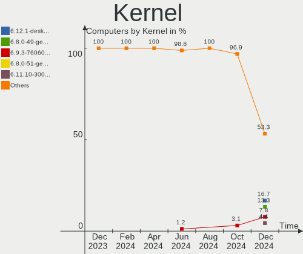

| Version                                        | Computers | Percent |
|------------------------------------------------|-----------|---------|
| 5.16.7-desktop-1omv4003                        | 49        | 37.98%  |
| 5.15.0-47-generic                              | 13        | 10.08%  |
| 5.15.0-48-generic                              | 11        | 8.53%   |
| 5.15.0-46-generic                              | 9         | 6.98%   |
| 5.19.9-200.fc36.x86_64                         | 3         | 2.33%   |
| 5.19.11-arch1-1                                | 3         | 2.33%   |
| 5.19.0-76051900-generic                        | 3         | 2.33%   |
| 5.13.0-valve21.1-1-neptune-02211-gc54cda5a36f3 | 3         | 2.33%   |
| 5.8.0-50-generic                               | 2         | 1.55%   |
| 5.4.0-126-generic                              | 2         | 1.55%   |
| 5.19.4-200.fc36.x86_64                         | 2         | 1.55%   |
| 5.19.10-arch1-1                                | 2         | 1.55%   |
| 5.15.65-1-MANJARO                              | 2         | 1.55%   |
| 5.15.0-43-generic                              | 2         | 1.55%   |
| 5.15.0-41-generic                              | 2         | 1.55%   |
| 5.10.0-17-amd64                                | 2         | 1.55%   |
| 5.4.0-125-generic                              | 1         | 0.78%   |
| 5.4.0-109-generic                              | 1         | 0.78%   |
| 5.3.18-150300.59.90-default                    | 1         | 0.78%   |
| 5.19.9-AMD-znver2                              | 1         | 0.78%   |
| 5.19.9-100.fc35.x86_64                         | 1         | 0.78%   |
| 5.19.8-200.fc36.x86_64                         | 1         | 0.78%   |
| 5.19.7-arch1-1                                 | 1         | 0.78%   |
| 5.19.7-1-MANJARO                               | 1         | 0.78%   |
| 5.19.6-200.fc36.x86_64                         | 1         | 0.78%   |
| 5.19.5-arch1-1                                 | 1         | 0.78%   |
| 5.19.2-1-default                               | 1         | 0.78%   |
| 5.18.19                                        | 1         | 0.78%   |
| 5.17.0-300.fc36.x86_64                         | 1         | 0.78%   |
| 5.15.0-47-lowlatency                           | 1         | 0.78%   |
| 5.15.0-1014-raspi                              | 1         | 0.78%   |
| 5.14.0-70.22.1.el9_0.x86_64                    | 1         | 0.78%   |
| 5.14.0-1051-oem                                | 1         | 0.78%   |
| 5.10.0-18-amd64                                | 1         | 0.78%   |
| 5.10.0-14-amd64                                | 1         | 0.78%   |

Kernel Family
-------------

Linux kernel without a distro release

| Version | Computers | Percent |
|---------|-----------|---------|
| 5.16.7  | 49        | 37.98%  |
| 5.15.0  | 39        | 30.23%  |
| 5.19.9  | 5         | 3.88%   |
| 5.4.0   | 4         | 3.1%    |
| 5.10.0  | 4         | 3.1%    |
| 5.19.11 | 3         | 2.33%   |
| 5.19.0  | 3         | 2.33%   |
| 5.13.0  | 3         | 2.33%   |
| 5.8.0   | 2         | 1.55%   |
| 5.19.7  | 2         | 1.55%   |
| 5.19.4  | 2         | 1.55%   |
| 5.19.10 | 2         | 1.55%   |
| 5.15.65 | 2         | 1.55%   |
| 5.14.0  | 2         | 1.55%   |
| 5.3.18  | 1         | 0.78%   |
| 5.19.8  | 1         | 0.78%   |
| 5.19.6  | 1         | 0.78%   |
| 5.19.5  | 1         | 0.78%   |
| 5.19.2  | 1         | 0.78%   |
| 5.18.19 | 1         | 0.78%   |
| 5.17.0  | 1         | 0.78%   |

Kernel Major Ver.
-----------------

Linux kernel major version

| Version | Computers | Percent |
|---------|-----------|---------|
| 5.16    | 49        | 37.98%  |
| 5.15    | 41        | 31.78%  |
| 5.19    | 21        | 16.28%  |
| 5.4     | 4         | 3.1%    |
| 5.10    | 4         | 3.1%    |
| 5.13    | 3         | 2.33%   |
| 5.8     | 2         | 1.55%   |
| 5.14    | 2         | 1.55%   |
| 5.3     | 1         | 0.78%   |
| 5.18    | 1         | 0.78%   |
| 5.17    | 1         | 0.78%   |

Arch
----

OS architecture (x86_64, i586, etc.)

| Name    | Computers | Percent |
|---------|-----------|---------|
| x86_64  | 128       | 99.22%  |
| aarch64 | 1         | 0.78%   |

DE
--

Desktop Environment

| Name         | Computers | Percent |
|--------------|-----------|---------|
| KDE5         | 66        | 51.16%  |
| GNOME        | 41        | 31.78%  |
| XFCE         | 8         | 6.2%    |
| X-Cinnamon   | 7         | 5.43%   |
| Unknown      | 2         | 1.55%   |
| Pantheon     | 1         | 0.78%   |
| MATE         | 1         | 0.78%   |
| LXQt         | 1         | 0.78%   |
| herbstluftwm | 1         | 0.78%   |
| Cinnamon     | 1         | 0.78%   |

Display Server
--------------

X11 or Wayland

| Name    | Computers | Percent |
|---------|-----------|---------|
| X11     | 104       | 80.62%  |
| Wayland | 24        | 18.6%   |
| Unknown | 1         | 0.78%   |

Display Manager
---------------

SDDM, LightDM, etc.

| Name    | Computers | Percent |
|---------|-----------|---------|
| SDDM    | 61        | 47.29%  |
| Unknown | 30        | 23.26%  |
| GDM3    | 15        | 11.63%  |
| LightDM | 13        | 10.08%  |
| GDM     | 10        | 7.75%   |

OS Lang
-------

Language

| Lang    | Computers | Percent |
|---------|-----------|---------|
| en_US   | 94        | 72.87%  |
| nl_NL   | 22        | 17.05%  |
| en_GB   | 5         | 3.88%   |
| Unknown | 2         | 1.55%   |
| ru_RU   | 1         | 0.78%   |
| pl_PL   | 1         | 0.78%   |
| it_IT   | 1         | 0.78%   |
| en_NL   | 1         | 0.78%   |
| en_AG   | 1         | 0.78%   |
| C       | 1         | 0.78%   |

Boot Mode
---------

EFI or BIOS

| Mode | Computers | Percent |
|------|-----------|---------|
| EFI  | 92        | 71.32%  |
| BIOS | 37        | 28.68%  |

Filesystem
----------

Type of filesystem

| Type    | Computers | Percent |
|---------|-----------|---------|
| Ext4    | 62        | 48.06%  |
| Overlay | 51        | 39.53%  |
| Btrfs   | 13        | 10.08%  |
| Zfs     | 1         | 0.78%   |
| Xfs     | 1         | 0.78%   |
| Ext2    | 1         | 0.78%   |

Part. scheme
------------

Scheme of partitioning

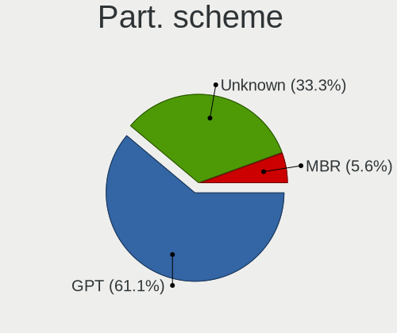

| Type    | Computers | Percent |
|---------|-----------|---------|
| GPT     | 75        | 58.14%  |
| Unknown | 46        | 35.66%  |
| MBR     | 8         | 6.2%    |

Dual Boot with Linux/BSD
------------------------

Hosting more than one Linux/BSD

| Dual boot | Computers | Percent |
|-----------|-----------|---------|
| No        | 120       | 93.02%  |
| Yes       | 9         | 6.98%   |

Dual Boot (Win)
---------------

Hosting Linux and Windows

| Dual boot | Computers | Percent |
|-----------|-----------|---------|
| Yes       | 68        | 52.71%  |
| No        | 61        | 47.29%  |

Board
-----

Vendor
------

Motherboard manufacturer

| Name                    | Computers | Percent |
|-------------------------|-----------|---------|
| Dell                    | 63        | 48.84%  |
| Hewlett-Packard         | 12        | 9.3%    |
| ASUSTek Computer        | 11        | 8.53%   |
| Lenovo                  | 9         | 6.98%   |
| Gigabyte Technology     | 6         | 4.65%   |
| ASRock                  | 4         | 3.1%    |
| Apple                   | 4         | 3.1%    |
| Acer                    | 4         | 3.1%    |
| Valve                   | 3         | 2.33%   |
| Packard Bell            | 2         | 1.55%   |
| HUAWEI                  | 2         | 1.55%   |
| SKIKK                   | 1         | 0.78%   |
| Samsung Electronics     | 1         | 0.78%   |
| Raspberry Pi Foundation | 1         | 0.78%   |
| Notebook                | 1         | 0.78%   |
| MSI                     | 1         | 0.78%   |
| Medion                  | 1         | 0.78%   |
| Chuwi                   | 1         | 0.78%   |
| Biostar                 | 1         | 0.78%   |
| Alienware               | 1         | 0.78%   |

Model
-----

Motherboard model

| Name                                        | Computers | Percent |
|---------------------------------------------|-----------|---------|
| Dell Latitude 3120                          | 19        | 14.73%  |
| Dell Latitude 3190 2-in-1                   | 17        | 13.18%  |
| Dell Latitude 3310                          | 9         | 6.98%   |
| Valve Jupiter                               | 3         | 2.33%   |
| Dell Latitude E6520                         | 2         | 1.55%   |
| Dell Latitude 3300                          | 2         | 1.55%   |
| SKIKK Standard                              | 1         | 0.78%   |
| Samsung 750XED                              | 1         | 0.78%   |
| RPi Raspberry Pi                            | 1         | 0.78%   |
| Packard Bell EasyNote MH36                  | 1         | 0.78%   |
| Packard Bell EasyNote LE69KB                | 1         | 0.78%   |
| Notebook NH55RGQ                            | 1         | 0.78%   |
| MSI MS-7977                                 | 1         | 0.78%   |
| Medion Akoya P2140 D MD8327/2487            | 1         | 0.78%   |
| Lenovo Yoga Slim 7 Pro 14IAP7 82SV          | 1         | 0.78%   |
| Lenovo Yoga 300-11IBY 80M0                  | 1         | 0.78%   |
| Lenovo ThinkPad X220 4291WSH                | 1         | 0.78%   |
| Lenovo ThinkPad X1 Extreme Gen 5 21DE001QMH | 1         | 0.78%   |
| Lenovo ThinkPad T14 Gen 1 20S0004BMH        | 1         | 0.78%   |
| Lenovo ThinkPad E550 20DF00CUFR             | 1         | 0.78%   |
| Lenovo ThinkBook 15 G2 ITL 20VE             | 1         | 0.78%   |
| Lenovo H50-50 90B600GPNY                    | 1         | 0.78%   |
| Lenovo G50-70 20351                         | 1         | 0.78%   |
| HUAWEI WRT-WX9                              | 1         | 0.78%   |
| HUAWEI BOHK-WAX9X                           | 1         | 0.78%   |
| HP ZBook 15u G6                             | 1         | 0.78%   |
| HP Z440 Workstation                         | 1         | 0.78%   |
| HP ProDesk 600 G3 SFF                       | 1         | 0.78%   |
| HP ProBook 6460b                            | 1         | 0.78%   |
| HP Laptop 15s-eq2xxx                        | 1         | 0.78%   |
| HP ENVY x360 Convertible 15-ee0xxx          | 1         | 0.78%   |
| HP ENVY Laptop 13-ad1xx                     | 1         | 0.78%   |
| HP EliteBook x360 1030 G2                   | 1         | 0.78%   |
| HP EliteBook 855 G7 Notebook PC             | 1         | 0.78%   |
| HP EliteBook 8460p                          | 1         | 0.78%   |
| HP Compaq dc7900 Small Form Factor          | 1         | 0.78%   |
| HP Compaq dc7800 Small Form Factor          | 1         | 0.78%   |
| Gigabyte Z97P-D3                            | 1         | 0.78%   |
| Gigabyte Z270X-Ultra Gaming                 | 1         | 0.78%   |
| Gigabyte X570S AORUS ELITE AX               | 1         | 0.78%   |

Model Family
------------

Motherboard model prefix

| Name                   | Computers | Percent |
|------------------------|-----------|---------|
| Dell Latitude          | 56        | 43.41%  |
| Lenovo ThinkPad        | 4         | 3.1%    |
| Dell XPS               | 4         | 3.1%    |
| Valve Jupiter          | 3         | 2.33%   |
| HP EliteBook           | 3         | 2.33%   |
| Packard Bell EasyNote  | 2         | 1.55%   |
| Lenovo Yoga            | 2         | 1.55%   |
| HP ENVY                | 2         | 1.55%   |
| HP Compaq              | 2         | 1.55%   |
| Gigabyte X570S         | 2         | 1.55%   |
| Dell Inspiron          | 2         | 1.55%   |
| ASUS VivoBook          | 2         | 1.55%   |
| ASRock X570            | 2         | 1.55%   |
| Acer Aspire            | 2         | 1.55%   |
| SKIKK Standard         | 1         | 0.78%   |
| Samsung 750XED         | 1         | 0.78%   |
| RPi Raspberry          | 1         | 0.78%   |
| Notebook NH55RGQ       | 1         | 0.78%   |
| MSI MS-7977            | 1         | 0.78%   |
| Medion Akoya           | 1         | 0.78%   |
| Lenovo ThinkBook       | 1         | 0.78%   |
| Lenovo H50-50          | 1         | 0.78%   |
| Lenovo G50-70          | 1         | 0.78%   |
| HUAWEI WRT-WX9         | 1         | 0.78%   |
| HUAWEI BOHK-WAX9X      | 1         | 0.78%   |
| HP ZBook               | 1         | 0.78%   |
| HP Z440                | 1         | 0.78%   |
| HP ProDesk             | 1         | 0.78%   |
| HP ProBook             | 1         | 0.78%   |
| HP Laptop              | 1         | 0.78%   |
| Gigabyte Z97P-D3       | 1         | 0.78%   |
| Gigabyte Z270X-Ultra   | 1         | 0.78%   |
| Gigabyte P55A-UD3      | 1         | 0.78%   |
| Gigabyte GB-BRR7H-4800 | 1         | 0.78%   |
| Dell Precision         | 1         | 0.78%   |
| Chuwi GemiBook         | 1         | 0.78%   |
| Biostar H77MU3         | 1         | 0.78%   |
| ASUS X75VC             | 1         | 0.78%   |
| ASUS X580VD            | 1         | 0.78%   |
| ASUS X555LAB           | 1         | 0.78%   |

MFG Year
--------

Motherboard manufacture year

| Year    | Computers | Percent |
|---------|-----------|---------|
| 2019    | 38        | 29.46%  |
| 2021    | 28        | 21.71%  |
| 2022    | 11        | 8.53%   |
| 2020    | 8         | 6.2%    |
| 2011    | 8         | 6.2%    |
| 2017    | 7         | 5.43%   |
| 2015    | 4         | 3.1%    |
| 2013    | 4         | 3.1%    |
| 2018    | 3         | 2.33%   |
| 2016    | 3         | 2.33%   |
| 2014    | 3         | 2.33%   |
| 2009    | 3         | 2.33%   |
| 2008    | 3         | 2.33%   |
| 2012    | 2         | 1.55%   |
| 2010    | 2         | 1.55%   |
| 2007    | 1         | 0.78%   |
| Unknown | 1         | 0.78%   |

Form Factor
-----------

Physical design of the computer

| Name           | Computers | Percent |
|----------------|-----------|---------|
| Notebook       | 65        | 50.39%  |
| Convertible    | 37        | 28.68%  |
| Desktop        | 22        | 17.05%  |
| All in one     | 3         | 2.33%   |
| System on chip | 1         | 0.78%   |
| Tablet         | 1         | 0.78%   |

Secure Boot
-----------

Enabled or disabled

| State    | Computers | Percent |
|----------|-----------|---------|
| Disabled | 119       | 92.25%  |
| Enabled  | 10        | 7.75%   |

Coreboot
--------

Have coreboot on board

| Used | Computers | Percent |
|------|-----------|---------|
| No   | 129       | 100%    |

RAM Size
--------

Total RAM memory

| Size in GB  | Computers | Percent |
|-------------|-----------|---------|
| 4.01-8.0    | 59        | 45.74%  |
| 8.01-16.0   | 24        | 18.6%   |
| 16.01-24.0  | 18        | 13.95%  |
| 3.01-4.0    | 13        | 10.08%  |
| 32.01-64.0  | 9         | 6.98%   |
| 64.01-256.0 | 2         | 1.55%   |
| 1.01-2.0    | 2         | 1.55%   |
| 24.01-32.0  | 1         | 0.78%   |
| 2.01-3.0    | 1         | 0.78%   |

RAM Used
--------

Used RAM memory

| Used GB   | Computers | Percent |
|-----------|-----------|---------|
| 1.01-2.0  | 68        | 52.71%  |
| 2.01-3.0  | 23        | 17.83%  |
| 4.01-8.0  | 15        | 11.63%  |
| 3.01-4.0  | 9         | 6.98%   |
| 8.01-16.0 | 9         | 6.98%   |
| 0.51-1.0  | 5         | 3.88%   |

Total Drives
------------

Number of drives on board

| Drives | Computers | Percent |
|--------|-----------|---------|
| 1      | 99        | 76.74%  |
| 2      | 15        | 11.63%  |
| 3      | 6         | 4.65%   |
| 4      | 4         | 3.1%    |
| 0      | 3         | 2.33%   |
| 7      | 1         | 0.78%   |
| 5      | 1         | 0.78%   |

Has CD-ROM
----------

Has CD-ROM on board

| Presented | Computers | Percent |
|-----------|-----------|---------|
| No        | 104       | 80.62%  |
| Yes       | 25        | 19.38%  |

Has Ethernet
------------

Has Ethernet on board

| Presented | Computers | Percent |
|-----------|-----------|---------|
| Yes       | 69        | 53.49%  |
| No        | 60        | 46.51%  |

Has WiFi
--------

Has WiFi module

| Presented | Computers | Percent |
|-----------|-----------|---------|
| Yes       | 116       | 89.92%  |
| No        | 13        | 10.08%  |

Has Bluetooth
-------------

Has Bluetooth module

| Presented | Computers | Percent |
|-----------|-----------|---------|
| Yes       | 109       | 84.5%   |
| No        | 20        | 15.5%   |

Location
--------

Country
-------

Geographic location (country)

| Country     | Computers | Percent |
|-------------|-----------|---------|
| Netherlands | 129       | 100%    |

City
----

Geographic location (city)

| City           | Computers | Percent |
|----------------|-----------|---------|
| Schagen        | 47        | 36.43%  |
| Amsterdam      | 23        | 17.83%  |
| The Hague      | 4         | 3.1%    |
| Zeist          | 3         | 2.33%   |
| Vleuten        | 2         | 1.55%   |
| Rotterdam      | 2         | 1.55%   |
| Leidschendam   | 2         | 1.55%   |
| Hoofddorp      | 2         | 1.55%   |
| Ede            | 2         | 1.55%   |
| Delft          | 2         | 1.55%   |
| Amstelveen     | 2         | 1.55%   |
| Unknown        | 2         | 1.55%   |
| Zwijndrecht    | 1         | 0.78%   |
| Zaandam        | 1         | 0.78%   |
| Waddinxveen    | 1         | 0.78%   |
| Waalre         | 1         | 0.78%   |
| Veendam        | 1         | 0.78%   |
| Valkenswaard   | 1         | 0.78%   |
| Utrecht        | 1         | 0.78%   |
| Ugchelen       | 1         | 0.78%   |
| Uden           | 1         | 0.78%   |
| Tilburg        | 1         | 0.78%   |
| Son            | 1         | 0.78%   |
| Overveen       | 1         | 0.78%   |
| Oostvoorne     | 1         | 0.78%   |
| Oosterhout     | 1         | 0.78%   |
| Ochten         | 1         | 0.78%   |
| Nieuw-Vennep   | 1         | 0.78%   |
| Nederlangbroek | 1         | 0.78%   |
| Joure          | 1         | 0.78%   |
| Hoorn          | 1         | 0.78%   |
| Hoogeveen      | 1         | 0.78%   |
| Hengelo        | 1         | 0.78%   |
| Heerhugowaard  | 1         | 0.78%   |
| Haren          | 1         | 0.78%   |
| Groningen      | 1         | 0.78%   |
| Groede         | 1         | 0.78%   |
| Gorredijk      | 1         | 0.78%   |
| Ermelo         | 1         | 0.78%   |
| Enschede       | 1         | 0.78%   |

Drives
------

Drive Vendor
------------

Hard drive vendors

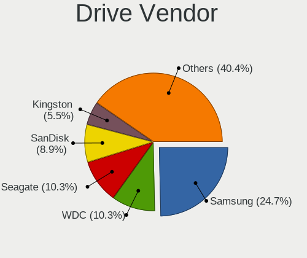

| Vendor                      | Computers | Drives | Percent |
|-----------------------------|-----------|--------|---------|
| Samsung Electronics         | 42        | 49     | 25.93%  |
| SK hynix                    | 24        | 24     | 14.81%  |
| WDC                         | 18        | 21     | 11.11%  |
| Kingston                    | 9         | 10     | 5.56%   |
| SSSTC                       | 8         | 8      | 4.94%   |
| Seagate                     | 8         | 10     | 4.94%   |
| KIOXIA                      | 7         | 7      | 4.32%   |
| Sandisk                     | 6         | 6      | 3.7%    |
| Unknown                     | 5         | 6      | 3.09%   |
| LITEON                      | 4         | 4      | 2.47%   |
| Toshiba                     | 3         | 3      | 1.85%   |
| Phison Electronics          | 3         | 3      | 1.85%   |
| Intel                       | 3         | 4      | 1.85%   |
| Crucial                     | 3         | 3      | 1.85%   |
| Micron Technology           | 2         | 3      | 1.23%   |
| Corsair                     | 2         | 2      | 1.23%   |
| A-DATA Technology           | 2         | 2      | 1.23%   |
| XUM                         | 1         | 1      | 0.62%   |
| Team                        | 1         | 1      | 0.62%   |
| PNY                         | 1         | 1      | 0.62%   |
| Patriot                     | 1         | 1      | 0.62%   |
| Netac                       | 1         | 1      | 0.62%   |
| Micron/Crucial Technology   | 1         | 1      | 0.62%   |
| Kingston Technology Company | 1         | 1      | 0.62%   |
| Hitachi                     | 1         | 1      | 0.62%   |
| HGST                        | 1         | 1      | 0.62%   |
| GOODRAM                     | 1         | 1      | 0.62%   |
| Gigabyte Technology         | 1         | 1      | 0.62%   |
| Apple                       | 1         | 1      | 0.62%   |
| Unknown                     | 1         | 1      | 0.62%   |

Drive Model
-----------

Hard drive models

| Model                                                 | Computers | Percent |
|-------------------------------------------------------|-----------|---------|
| SK hynix BC711 NVMe 128GB                             | 10        | 5.71%   |
| SSSTC CL1-3D128-Q11 NVMe 128GB                        | 8         | 4.57%   |
| WDC PC SN520 NVMe 128GB                               | 5         | 2.86%   |
| SK hynix BC511 NVMe 256GB                             | 4         | 2.29%   |
| KIOXIA KBG40ZNS128G NVMe 128GB                        | 4         | 2.29%   |
| SK hynix BC501A NVMe 128GB                            | 3         | 1.71%   |
| Samsung NVMe SSD Controller SM981/PM981/PM983 256GB   | 3         | 1.71%   |
| LITEON CV8-8E128-11 SATA 128GB SSD                    | 3         | 1.71%   |
| Unknown MMC Card  64GB                                | 2         | 1.14%   |
| SK hynix BC501 NVMe 128GB                             | 2         | 1.14%   |
| Seagate Expansion 1TB                                 | 2         | 1.14%   |
| Samsung SSD 980 1TB                                   | 2         | 1.14%   |
| Samsung SSD 860 EVO 500GB                             | 2         | 1.14%   |
| Samsung SSD 850 EVO 250GB                             | 2         | 1.14%   |
| Samsung PM991a NVMe 128GB                             | 2         | 1.14%   |
| Samsung NVMe SSD Drive 1024GB                         | 2         | 1.14%   |
| Samsung NVMe SSD Controller SM961/PM961/SM963 256GB   | 2         | 1.14%   |
| Samsung NVMe SSD Controller PM9A1/PM9A3/980PRO 1024GB | 2         | 1.14%   |
| Samsung HD103SJ 1TB                                   | 2         | 1.14%   |
| Phison PS5013 E13 NVMe Controller 512GB               | 2         | 1.14%   |
| KIOXIA KBG40ZNS256G NVMe 256GB                        | 2         | 1.14%   |
| Kingston SNVS500G 500GB                               | 2         | 1.14%   |
| Intel NVMe SSD Drive 512GB                            | 2         | 1.14%   |
| XUM HX256GSSDSATA3 256GB                              | 1         | 0.57%   |
| WDC WDS480G2G0A-00JH30 480GB SSD                      | 1         | 0.57%   |
| WDC WDS250G1B0A-00H9H0 250GB SSD                      | 1         | 0.57%   |
| WDC WD80EFAX-68KNBN0 8TB                              | 1         | 0.57%   |
| WDC WD7500BPKX-22HPJT0 752GB                          | 1         | 0.57%   |
| WDC WD5000AACS-00G8B1 500GB                           | 1         | 0.57%   |
| WDC WD40EFRX-68N32N0 4TB                              | 1         | 0.57%   |
| WDC WD3200BPVT-22JJ5T0 320GB                          | 1         | 0.57%   |
| WDC WD3200AAJS-56M0A0 320GB                           | 1         | 0.57%   |
| WDC WD20EARX-008FB0 2TB                               | 1         | 0.57%   |
| WDC WD10SPZX-22Z10T1 1TB                              | 1         | 0.57%   |
| WDC WD10EZEX-21WN4A0 1TB                              | 1         | 0.57%   |
| WDC WD10EZEX-08Y20A0 1TB                              | 1         | 0.57%   |
| WDC WD10EZEX-08WN4A0 1TB                              | 1         | 0.57%   |
| WDC WD10EZEX-00RKKA0 1TB                              | 1         | 0.57%   |
| WDC WD10EFRX-68JCSN0 1TB                              | 1         | 0.57%   |
| WDC PC SN810 NVMe 1024GB                              | 1         | 0.57%   |

HDD Vendor
----------

Hard disk drive vendors

| Vendor              | Computers | Drives | Percent |
|---------------------|-----------|--------|---------|
| WDC                 | 11        | 13     | 40.74%  |
| Seagate             | 7         | 9      | 25.93%  |
| Samsung Electronics | 4         | 4      | 14.81%  |
| Toshiba             | 2         | 2      | 7.41%   |
| Hitachi             | 1         | 1      | 3.7%    |
| HGST                | 1         | 1      | 3.7%    |
| Apple               | 1         | 1      | 3.7%    |

SSD Vendor
----------

Solid state drive vendors

| Vendor              | Computers | Drives | Percent |
|---------------------|-----------|--------|---------|
| Samsung Electronics | 17        | 18     | 36.96%  |
| LITEON              | 4         | 4      | 8.7%    |
| Kingston            | 4         | 4      | 8.7%    |
| Crucial             | 3         | 3      | 6.52%   |
| WDC                 | 2         | 2      | 4.35%   |
| SK hynix            | 2         | 2      | 4.35%   |
| SanDisk             | 2         | 2      | 4.35%   |
| Corsair             | 2         | 2      | 4.35%   |
| A-DATA Technology   | 2         | 2      | 4.35%   |
| XUM                 | 1         | 1      | 2.17%   |
| Team                | 1         | 1      | 2.17%   |
| PNY                 | 1         | 1      | 2.17%   |
| Patriot             | 1         | 1      | 2.17%   |
| Netac               | 1         | 1      | 2.17%   |
| Intel               | 1         | 1      | 2.17%   |
| GOODRAM             | 1         | 1      | 2.17%   |
| Gigabyte Technology | 1         | 1      | 2.17%   |

Drive Kind
----------

HDD or SSD

| Kind    | Computers | Drives | Percent |
|---------|-----------|--------|---------|
| NVMe    | 83        | 92     | 53.9%   |
| SSD     | 41        | 47     | 26.62%  |
| HDD     | 23        | 31     | 14.94%  |
| MMC     | 6         | 7      | 3.9%    |
| Unknown | 1         | 1      | 0.65%   |

Drive Connector
---------------

SATA, SAS, NVMe, etc.

| Type | Computers | Drives | Percent |
|------|-----------|--------|---------|
| NVMe | 83        | 92     | 58.45%  |
| SATA | 49        | 75     | 34.51%  |
| MMC  | 6         | 7      | 4.23%   |
| SAS  | 4         | 4      | 2.82%   |

Drive Size
----------

Size of hard drive

| Size in TB | Computers | Drives | Percent |
|------------|-----------|--------|---------|
| 0.01-0.5   | 38        | 45     | 56.72%  |
| 0.51-1.0   | 22        | 24     | 32.84%  |
| 1.01-2.0   | 3         | 3      | 4.48%   |
| 3.01-4.0   | 2         | 2      | 2.99%   |
| 4.01-10.0  | 2         | 4      | 2.99%   |

Space Total
-----------

Amount of disk space available on the file system

| Size in GB     | Computers | Percent |
|----------------|-----------|---------|
| 1-20           | 51        | 39.53%  |
| 101-250        | 19        | 14.73%  |
| 251-500        | 17        | 13.18%  |
| 1001-2000      | 12        | 9.3%    |
| 501-1000       | 9         | 6.98%   |
| More than 3000 | 7         | 5.43%   |
| Unknown        | 6         | 4.65%   |
| 51-100         | 5         | 3.88%   |
| 21-50          | 3         | 2.33%   |

Space Used
----------

Amount of used disk space

| Used GB        | Computers | Percent |
|----------------|-----------|---------|
| 1-20           | 67        | 51.94%  |
| 21-50          | 13        | 10.08%  |
| 101-250        | 11        | 8.53%   |
| 251-500        | 9         | 6.98%   |
| 501-1000       | 7         | 5.43%   |
| 51-100         | 6         | 4.65%   |
| Unknown        | 6         | 4.65%   |
| 1001-2000      | 4         | 3.1%    |
| More than 3000 | 3         | 2.33%   |
| 2001-3000      | 2         | 1.55%   |
| 0              | 1         | 0.78%   |

Malfunc. Drives
---------------

Drive models with a malfunction

| Model                                 | Computers | Drives | Percent |
|---------------------------------------|-----------|--------|---------|
| WDC WD5000AACS-00G8B1 500GB           | 1         | 1      | 12.5%   |
| WDC WD10EFRX-68JCSN0 1TB              | 1         | 1      | 12.5%   |
| Samsung Electronics SSD 870 EVO 500GB | 1         | 1      | 12.5%   |
| Samsung Electronics SSD 850 EVO 250GB | 1         | 1      | 12.5%   |
| Intel SSDSC2CW060A3 64GB              | 1         | 1      | 12.5%   |
| Crucial CT500MX500SSD1 500GB          | 1         | 1      | 12.5%   |
| Crucial CT128MX100SSD1 128GB          | 1         | 1      | 12.5%   |
| Corsair CSSD-F60GB2 64GB              | 1         | 1      | 12.5%   |

Malfunc. Drive Vendor
---------------------

Vendors of faulty drives

| Vendor              | Computers | Drives | Percent |
|---------------------|-----------|--------|---------|
| WDC                 | 2         | 2      | 25%     |
| Samsung Electronics | 2         | 2      | 25%     |
| Crucial             | 2         | 2      | 25%     |
| Intel               | 1         | 1      | 12.5%   |
| Corsair             | 1         | 1      | 12.5%   |

Malfunc. HDD Vendor
-------------------

Vendors of faulty HDD drives

| Vendor | Computers | Drives | Percent |
|--------|-----------|--------|---------|
| WDC    | 2         | 2      | 100%    |

Malfunc. Drive Kind
-------------------

Kinds of faulty drives

| Kind | Computers | Drives | Percent |
|------|-----------|--------|---------|
| SSD  | 6         | 6      | 75%     |
| HDD  | 2         | 2      | 25%     |

Failed Drives
-------------

Failed drive models

Zero info for selected period =(

Failed Drive Vendor
-------------------

Failed drive vendors

Zero info for selected period =(

Drive Status
------------

Number of failed and malfunc. drives

| Status   | Computers | Drives | Percent |
|----------|-----------|--------|---------|
| Works    | 80        | 95     | 57.97%  |
| Detected | 52        | 75     | 37.68%  |
| Malfunc  | 6         | 8      | 4.35%   |

Storage controller
------------------

Storage Vendor
--------------

Storage controller vendors

| Vendor                         | Computers | Percent |
|--------------------------------|-----------|---------|
| Intel                          | 70        | 42.68%  |
| Samsung Electronics            | 23        | 14.02%  |
| SK hynix                       | 22        | 13.41%  |
| SanDisk                        | 10        | 6.1%    |
| Solid State Storage Technology | 8         | 4.88%   |
| KIOXIA                         | 7         | 4.27%   |
| AMD                            | 7         | 4.27%   |
| Kingston Technology Company    | 6         | 3.66%   |
| Phison Electronics             | 3         | 1.83%   |
| Micron Technology              | 2         | 1.22%   |
| ASMedia Technology             | 2         | 1.22%   |
| Toshiba America Info Systems   | 1         | 0.61%   |
| Nvidia                         | 1         | 0.61%   |
| Micron/Crucial Technology      | 1         | 0.61%   |
| JMicron Technology             | 1         | 0.61%   |

Storage Model
-------------

Storage controller models

| Model                                                                            | Computers | Percent |
|----------------------------------------------------------------------------------|-----------|---------|
| Intel Celeron/Pentium Silver Processor SATA Controller                           | 19        | 10.86%  |
| SK hynix Gold P31 SSD                                                            | 11        | 6.29%   |
| Samsung NVMe SSD Controller 980                                                  | 10        | 5.71%   |
| Solid State Storage Non-Volatile memory controller                               | 8         | 4.57%   |
| SK hynix BC501 NVMe Solid State Drive                                            | 7         | 4%      |
| Samsung NVMe SSD Controller SM981/PM981/PM983                                    | 7         | 4%      |
| KIOXIA NVMe SSD Controller BG4                                                   | 7         | 4%      |
| Intel 82801 Mobile SATA Controller [RAID mode]                                   | 6         | 3.43%   |
| AMD FCH SATA Controller [AHCI mode]                                              | 6         | 3.43%   |
| SanDisk PC SN520 NVMe SSD                                                        | 5         | 2.86%   |
| Intel Volume Management Device NVMe RAID Controller                              | 5         | 2.86%   |
| Intel 6 Series/C200 Series Chipset Family 6 port Mobile SATA AHCI Controller     | 5         | 2.86%   |
| SK hynix BC511                                                                   | 4         | 2.29%   |
| Samsung NVMe SSD Controller PM9A1/PM9A3/980PRO                                   | 4         | 2.29%   |
| Kingston Company Company Non-Volatile memory controller                          | 3         | 1.71%   |
| Intel Tiger Lake-LP SATA Controller                                              | 3         | 1.71%   |
| Intel Sunrise Point-LP SATA Controller [AHCI mode]                               | 3         | 1.71%   |
| Intel 200 Series PCH SATA controller [AHCI mode]                                 | 3         | 1.71%   |
| SanDisk WD PC SN810 / Black SN850 NVMe SSD                                       | 2         | 1.14%   |
| SanDisk WD Black SN750 / PC SN730 NVMe SSD                                       | 2         | 1.14%   |
| Samsung NVMe SSD Controller SM961/PM961/SM963                                    | 2         | 1.14%   |
| Phison PS5013 E13 NVMe Controller                                                | 2         | 1.14%   |
| Micron Non-Volatile memory controller                                            | 2         | 1.14%   |
| Kingston Company OM3PDP3 NVMe SSD                                                | 2         | 1.14%   |
| Intel SSD 660P Series                                                            | 2         | 1.14%   |
| Intel Q170/Q150/B150/H170/H110/Z170/CM236 Chipset SATA Controller [AHCI Mode]    | 2         | 1.14%   |
| Intel 9 Series Chipset Family SATA Controller [AHCI Mode]                        | 2         | 1.14%   |
| Intel 8 Series/C220 Series Chipset Family 6-port SATA Controller 1 [AHCI mode]   | 2         | 1.14%   |
| Intel 8 Series SATA Controller 1 [AHCI mode]                                     | 2         | 1.14%   |
| Intel 6 Series/C200 Series Chipset Family 6 port Desktop SATA AHCI Controller    | 2         | 1.14%   |
| ASMedia ASM1062 Serial ATA Controller                                            | 2         | 1.14%   |
| Toshiba America Info Systems Toshiba America Info Non-Volatile memory controller | 1         | 0.57%   |
| Sandisk Non-Volatile memory controller                                           | 1         | 0.57%   |
| Samsung Electronics Non-Volatile memory controller                               | 1         | 0.57%   |
| Phison E16 PCIe4 NVMe Controller                                                 | 1         | 0.57%   |
| Nvidia MCP79 AHCI Controller                                                     | 1         | 0.57%   |
| Micron/Crucial Non-Volatile memory controller                                    | 1         | 0.57%   |
| Kingston Company SNVS2000G [NV1 NVMe PCIe SSD 2TB]                               | 1         | 0.57%   |
| Kingston Company A2000 NVMe SSD                                                  | 1         | 0.57%   |
| JMicron JMB363 SATA/IDE Controller                                               | 1         | 0.57%   |

Storage Kind
------------

Kind of storage controller (IDE, SATA, NVMe, SAS, ...)

| Kind | Computers | Percent |
|------|-----------|---------|
| NVMe | 83        | 49.7%   |
| SATA | 66        | 39.52%  |
| RAID | 12        | 7.19%   |
| IDE  | 6         | 3.59%   |

Processor
---------

CPU Vendor
----------

Processor vendors

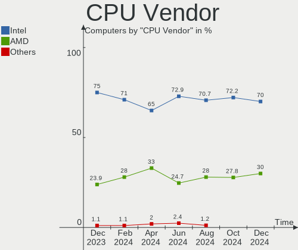

| Vendor | Computers | Percent |
|--------|-----------|---------|
| Intel  | 113       | 87.6%   |
| AMD    | 15        | 11.63%  |
| ARM    | 1         | 0.78%   |

CPU Model
---------

Processor models

| Model                                       | Computers | Percent |
|---------------------------------------------|-----------|---------|
| Intel Pentium Silver N6000 @ 1.10GHz        | 20        | 15.5%   |
| Intel Pentium Silver N5030 CPU @ 1.10GHz    | 13        | 10.08%  |
| Intel Pentium Silver N5000 CPU @ 1.10GHz    | 5         | 3.88%   |
| Intel Core i5-8265U CPU @ 1.60GHz           | 5         | 3.88%   |
| Intel Core i3-8145U CPU @ 2.10GHz           | 4         | 3.1%    |
| Intel 12th Gen Core i7-12700H               | 3         | 2.33%   |
| Intel 11th Gen Core i5-1135G7 @ 2.40GHz     | 3         | 2.33%   |
| AMD Custom APU 0405                         | 3         | 2.33%   |
| Intel Core i7-9750H CPU @ 2.60GHz           | 2         | 1.55%   |
| Intel Core i7-7700HQ CPU @ 2.80GHz          | 2         | 1.55%   |
| Intel Core i7-2620M CPU @ 2.70GHz           | 2         | 1.55%   |
| Intel Core i5-2430M CPU @ 2.40GHz           | 2         | 1.55%   |
| Intel Core i5-1035G1 CPU @ 1.00GHz          | 2         | 1.55%   |
| Intel Core i3-7020U CPU @ 2.30GHz           | 2         | 1.55%   |
| Intel Core i3-4005U CPU @ 1.70GHz           | 2         | 1.55%   |
| AMD Ryzen 9 5900X 12-Core Processor         | 2         | 1.55%   |
| Intel Xeon CPU E5-1620 v3 @ 3.50GHz         | 1         | 0.78%   |
| Intel Pentium Dual-Core CPU T4200 @ 2.00GHz | 1         | 0.78%   |
| Intel Pentium CPU N3540 @ 2.16GHz           | 1         | 0.78%   |
| Intel Genuine CPU U7300 @ 1.30GHz           | 1         | 0.78%   |
| Intel Core i7-8665U CPU @ 1.90GHz           | 1         | 0.78%   |
| Intel Core i7-8565U CPU @ 1.80GHz           | 1         | 0.78%   |
| Intel Core i7-7700K CPU @ 4.20GHz           | 1         | 0.78%   |
| Intel Core i7-6600U CPU @ 2.60GHz           | 1         | 0.78%   |
| Intel Core i7-4800MQ CPU @ 2.70GHz          | 1         | 0.78%   |
| Intel Core i7-3770K CPU @ 3.50GHz           | 1         | 0.78%   |
| Intel Core i7-10510U CPU @ 1.80GHz          | 1         | 0.78%   |
| Intel Core i7 CPU 920 @ 2.67GHz             | 1         | 0.78%   |
| Intel Core i5-8365U CPU @ 1.60GHz           | 1         | 0.78%   |
| Intel Core i5-8250U CPU @ 1.60GHz           | 1         | 0.78%   |
| Intel Core i5-7500 CPU @ 3.40GHz            | 1         | 0.78%   |
| Intel Core i5-7300U CPU @ 2.60GHz           | 1         | 0.78%   |
| Intel Core i5-6600K CPU @ 3.50GHz           | 1         | 0.78%   |
| Intel Core i5-5675R CPU @ 3.10GHz           | 1         | 0.78%   |
| Intel Core i5-5200U CPU @ 2.20GHz           | 1         | 0.78%   |
| Intel Core i5-4590 CPU @ 3.30GHz            | 1         | 0.78%   |
| Intel Core i5-2540M CPU @ 2.60GHz           | 1         | 0.78%   |
| Intel Core i5-2520M CPU @ 2.50GHz           | 1         | 0.78%   |
| Intel Core i5-2500S CPU @ 2.70GHz           | 1         | 0.78%   |
| Intel Core i5-2320 CPU @ 3.00GHz            | 1         | 0.78%   |

CPU Model Family
----------------

Processor model prefix

| Model                   | Computers | Percent |
|-------------------------|-----------|---------|
| Intel Pentium Silver    | 38        | 29.46%  |
| Intel Core i5           | 23        | 17.83%  |
| Other                   | 18        | 13.95%  |
| Intel Core i7           | 14        | 10.85%  |
| Intel Core i3           | 14        | 10.85%  |
| Intel Core 2 Duo        | 4         | 3.1%    |
| AMD Ryzen 7             | 4         | 3.1%    |
| AMD Ryzen 9             | 3         | 2.33%   |
| AMD Ryzen 5             | 3         | 2.33%   |
| Intel Xeon              | 1         | 0.78%   |
| Intel Pentium Dual-Core | 1         | 0.78%   |
| Intel Pentium           | 1         | 0.78%   |
| Intel Genuine           | 1         | 0.78%   |
| Intel Celeron           | 1         | 0.78%   |
| Intel Atom              | 1         | 0.78%   |
| AMD Ryzen 7 PRO         | 1         | 0.78%   |
| AMD E2                  | 1         | 0.78%   |

CPU Cores
---------

Number of processor cores

| Number | Computers | Percent |
|--------|-----------|---------|
| 4      | 79        | 61.24%  |
| 2      | 29        | 22.48%  |
| 8      | 6         | 4.65%   |
| 12     | 4         | 3.1%    |
| 6      | 4         | 3.1%    |
| 14     | 3         | 2.33%   |
| 10     | 2         | 1.55%   |
| 16     | 1         | 0.78%   |
| 1      | 1         | 0.78%   |

CPU Sockets
-----------

Number of sockets

| Number | Computers | Percent |
|--------|-----------|---------|
| 1      | 129       | 100%    |

CPU Threads
-----------

Threads per core (Hyper-Threading)

| Number | Computers | Percent |
|--------|-----------|---------|
| 2      | 69        | 53.49%  |
| 1      | 60        | 46.51%  |

CPU Op-Modes
------------

CPU Operation Modes (32-bit, 64-bit)

| Op mode        | Computers | Percent |
|----------------|-----------|---------|
| 32-bit, 64-bit | 128       | 99.22%  |
| Unknown        | 1         | 0.78%   |

CPU Microcode
-------------

Microcode number

| Number     | Computers | Percent |
|------------|-----------|---------|
| Unknown    | 29        | 22.48%  |
| 0x906c0    | 20        | 15.5%   |
| 0x706a8    | 14        | 10.85%  |
| 0x806ec    | 12        | 9.3%    |
| 0x206a7    | 7         | 5.43%   |
| 0x706a1    | 5         | 3.88%   |
| 0x906a3    | 4         | 3.1%    |
| 0x806c1    | 4         | 3.1%    |
| 0x306a9    | 3         | 2.33%   |
| 0x906ea    | 2         | 1.55%   |
| 0x906e9    | 2         | 1.55%   |
| 0x906a4    | 2         | 1.55%   |
| 0x806e9    | 2         | 1.55%   |
| 0x706e5    | 2         | 1.55%   |
| 0x406e3    | 2         | 1.55%   |
| 0x40651    | 2         | 1.55%   |
| 0x0a20120a | 2         | 1.55%   |
| 0x806eb    | 1         | 0.78%   |
| 0x806ea    | 1         | 0.78%   |
| 0x806d1    | 1         | 0.78%   |
| 0x6fb      | 1         | 0.78%   |
| 0x506e3    | 1         | 0.78%   |
| 0x306c3    | 1         | 0.78%   |
| 0x30678    | 1         | 0.78%   |
| 0x106e5    | 1         | 0.78%   |
| 0x106ca    | 1         | 0.78%   |
| 0x1067a    | 1         | 0.78%   |
| 0x0a50000c | 1         | 0.78%   |
| 0x08701021 | 1         | 0.78%   |
| 0x08600106 | 1         | 0.78%   |
| 0x08600103 | 1         | 0.78%   |
| 0x08108109 | 1         | 0.78%   |

CPU Microarch
-------------

Microarchitecture

| Name             | Computers | Percent |
|------------------|-----------|---------|
| KabyLake         | 25        | 19.38%  |
| Tremont          | 19        | 14.73%  |
| Goldmont plus    | 19        | 14.73%  |
| Unknown          | 9         | 6.98%   |
| SandyBridge      | 8         | 6.2%    |
| TigerLake        | 6         | 4.65%   |
| Haswell          | 6         | 4.65%   |
| Zen 2            | 5         | 3.88%   |
| Penryn           | 5         | 3.88%   |
| Zen 3            | 4         | 3.1%    |
| Skylake          | 4         | 3.1%    |
| Alderlake Hybrid | 4         | 3.1%    |
| IvyBridge        | 3         | 2.33%   |
| IceLake          | 3         | 2.33%   |
| Nehalem          | 2         | 1.55%   |
| Broadwell        | 2         | 1.55%   |
| Zen+             | 1         | 0.78%   |
| Silvermont       | 1         | 0.78%   |
| Jaguar           | 1         | 0.78%   |
| Core             | 1         | 0.78%   |
| Bonnell          | 1         | 0.78%   |

Graphics
--------

GPU Vendor
----------

Vendors of graphics cards

| Vendor | Computers | Percent |
|--------|-----------|---------|
| Intel  | 100       | 68.97%  |
| Nvidia | 26        | 17.93%  |
| AMD    | 19        | 13.1%   |

GPU Model
---------

Graphics card models

| Model                                                                       | Computers | Percent |
|-----------------------------------------------------------------------------|-----------|---------|
| Intel JasperLake [UHD Graphics]                                             | 20        | 13.7%   |
| Intel GeminiLake [UHD Graphics 605]                                         | 18        | 12.33%  |
| Intel WhiskeyLake-U GT2 [UHD Graphics 620]                                  | 12        | 8.22%   |
| Intel 2nd Generation Core Processor Family Integrated Graphics Controller   | 7         | 4.79%   |
| Intel TigerLake-LP GT2 [Iris Xe Graphics]                                   | 6         | 4.11%   |
| Intel Alder Lake-P Integrated Graphics Controller                           | 5         | 3.42%   |
| Intel HD Graphics 630                                                       | 4         | 2.74%   |
| Nvidia GA107M [GeForce RTX 3050 Ti Mobile]                                  | 3         | 2.05%   |
| AMD VanGogh [AMD Custom GPU 0405]                                           | 3         | 2.05%   |
| AMD Renoir                                                                  | 3         | 2.05%   |
| Nvidia GP107M [GeForce GTX 1050 Mobile]                                     | 2         | 1.37%   |
| Nvidia GM107 [GeForce GTX 750 Ti]                                           | 2         | 1.37%   |
| Nvidia GA102 [GeForce RTX 3080 Ti]                                          | 2         | 1.37%   |
| Intel VGA compatible controller                                             | 2         | 1.37%   |
| Intel Skylake GT2 [HD Graphics 520]                                         | 2         | 1.37%   |
| Intel Mobile 4 Series Chipset Integrated Graphics Controller                | 2         | 1.37%   |
| Intel Kaby Lake-U GT2f HD 620 Graphics Controller                           | 2         | 1.37%   |
| Intel Iris Plus Graphics G1 (Ice Lake)                                      | 2         | 1.37%   |
| Intel Haswell-ULT Integrated Graphics Controller                            | 2         | 1.37%   |
| Intel CometLake-U GT2 [UHD Graphics]                                        | 2         | 1.37%   |
| Intel CoffeeLake-H GT2 [UHD Graphics 630]                                   | 2         | 1.37%   |
| Nvidia TU117M [GeForce MX550]                                               | 1         | 0.68%   |
| Nvidia TU117M                                                               | 1         | 0.68%   |
| Nvidia TU116 [GeForce GTX 1650]                                             | 1         | 0.68%   |
| Nvidia TU104 [GeForce RTX 2070 SUPER]                                       | 1         | 0.68%   |
| Nvidia GT218M [ION 2]                                                       | 1         | 0.68%   |
| Nvidia GT218 [GeForce G210]                                                 | 1         | 0.68%   |
| Nvidia GP108M [GeForce MX250]                                               | 1         | 0.68%   |
| Nvidia GP104 [GeForce GTX 1080]                                             | 1         | 0.68%   |
| Nvidia GM206 [GeForce GTX 960]                                              | 1         | 0.68%   |
| Nvidia GM204 [GeForce GTX 980]                                              | 1         | 0.68%   |
| Nvidia GK208B [GeForce GT 710]                                              | 1         | 0.68%   |
| Nvidia GK104GLM [Quadro K3100M]                                             | 1         | 0.68%   |
| Nvidia GF119 [GeForce GT 610]                                               | 1         | 0.68%   |
| Nvidia GF117M [GeForce 610M/710M/810M/820M / GT 620M/625M/630M/720M]        | 1         | 0.68%   |
| Nvidia GA107M [GeForce RTX 3050 Mobile]                                     | 1         | 0.68%   |
| Nvidia GA103M [GeForce RTX 3080 Ti Laptop GPU]                              | 1         | 0.68%   |
| Nvidia C79 [GeForce 9400M]                                                  | 1         | 0.68%   |
| Intel Xeon E3-1200 v3/4th Gen Core Processor Integrated Graphics Controller | 1         | 0.68%   |
| Intel UHD Graphics 620                                                      | 1         | 0.68%   |

GPU Combo
---------

Combinations of graphics cards

| Name           | Computers | Percent |
|----------------|-----------|---------|
| 1 x Intel      | 83        | 64.34%  |
| 1 x Nvidia     | 14        | 10.85%  |
| 1 x AMD        | 14        | 10.85%  |
| Intel + Nvidia | 12        | 9.3%    |
| Intel + AMD    | 4         | 3.1%    |
| Other          | 1         | 0.78%   |
| 2 x AMD        | 1         | 0.78%   |

GPU Driver
----------

Free vs proprietary

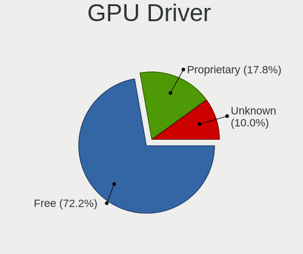

| Driver      | Computers | Percent |
|-------------|-----------|---------|
| Free        | 107       | 82.95%  |
| Proprietary | 16        | 12.4%   |
| Unknown     | 6         | 4.65%   |

GPU Memory
----------

Total video memory

| Size in GB | Computers | Percent |
|------------|-----------|---------|
| Unknown    | 103       | 79.84%  |
| 3.01-4.0   | 7         | 5.43%   |
| 1.01-2.0   | 5         | 3.88%   |
| 0.01-0.5   | 5         | 3.88%   |
| 7.01-8.0   | 4         | 3.1%    |
| 0.51-1.0   | 3         | 2.33%   |
| 8.01-16.0  | 2         | 1.55%   |

Monitor
-------

Monitor Vendor
--------------

Monitor vendors

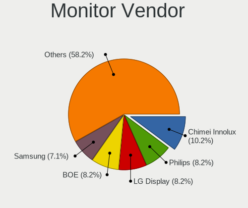

| Vendor               | Computers | Percent |
|----------------------|-----------|---------|
| AU Optronics         | 31        | 21.09%  |
| BOE                  | 30        | 20.41%  |
| Samsung Electronics  | 13        | 8.84%   |
| LG Display           | 13        | 8.84%   |
| Chimei Innolux       | 8         | 5.44%   |
| Iiyama               | 7         | 4.76%   |
| Philips              | 5         | 3.4%    |
| Goldstar             | 5         | 3.4%    |
| Sharp                | 3         | 2.04%   |
| Hewlett-Packard      | 3         | 2.04%   |
| Dell                 | 3         | 2.04%   |
| CSO                  | 3         | 2.04%   |
| Apple                | 3         | 2.04%   |
| InfoVision           | 2         | 1.36%   |
| Gigabyte Technology  | 2         | 1.36%   |
| ANX                  | 2         | 1.36%   |
| WST                  | 1         | 0.68%   |
| ViewSonic            | 1         | 0.68%   |
| STA                  | 1         | 0.68%   |
| Sony                 | 1         | 0.68%   |
| Skyworth             | 1         | 0.68%   |
| Medion               | 1         | 0.68%   |
| LG Electronics       | 1         | 0.68%   |
| KDC                  | 1         | 0.68%   |
| Idek Iiyama          | 1         | 0.68%   |
| HannStar             | 1         | 0.68%   |
| Eizo                 | 1         | 0.68%   |
| Ancor Communications | 1         | 0.68%   |
| Analogix             | 1         | 0.68%   |
| Acer                 | 1         | 0.68%   |

Monitor Model
-------------

Monitor models

| Model                                                                  | Computers | Percent |
|------------------------------------------------------------------------|-----------|---------|
| BOE LCD Monitor BOE093D 1366x768 256x144mm 11.6-inch                   | 12        | 7.95%   |
| AU Optronics LCD Monitor AUO202D 1920x1080 293x165mm 13.2-inch         | 7         | 4.64%   |
| AU Optronics LCD Monitor AUO405C 1366x768 256x144mm 11.6-inch          | 6         | 3.97%   |
| BOE LCD Monitor BOE097B 1366x768 256x144mm 11.6-inch                   | 5         | 3.31%   |
| BOE LCD Monitor BOE0744 1366x768 256x144mm 11.6-inch                   | 4         | 2.65%   |
| AU Optronics LCD Monitor AUO7E91 1366x768 256x144mm 11.6-inch          | 4         | 2.65%   |
| BOE LCD Monitor BOE07B9 1920x1080 293x165mm 13.2-inch                  | 3         | 1.99%   |
| Samsung Electronics LCD Monitor SEC5441 1366x768 353x198mm 15.9-inch   | 2         | 1.32%   |
| InfoVision LCD Monitor IVO048F 1366x768 256x144mm 11.6-inch            | 2         | 1.32%   |
| Gigabyte Technology M32U GBT3204 3840x2160 697x392mm 31.5-inch         | 2         | 1.32%   |
| BOE LCD Monitor BOE07A8 1366x768 256x144mm 11.6-inch                   | 2         | 1.32%   |
| AU Optronics LCD Monitor AUO243D 1920x1080 309x173mm 13.9-inch         | 2         | 1.32%   |
| ANX ANX7530 U ANX7539 800x1280                                         | 2         | 1.32%   |
| WST LCD Monitor WST3316 2160x1440 254x169mm 12.0-inch                  | 1         | 0.66%   |
| ViewSonic PJ402D-2 HCD7B1D 1280x960                                    | 1         | 0.66%   |
| STA LCD Monitor STA5DCA 1366x768 256x144mm 11.6-inch                   | 1         | 0.66%   |
| Sony TV *00 SNYAA04 3840x2160 1439x809mm 65.0-inch                     | 1         | 0.66%   |
| Skyworth CP9687 SII9533 1920x1080 820x460mm 37.0-inch                  | 1         | 0.66%   |
| Sharp LCD Monitor SHP14F9 1920x1200 288x180mm 13.4-inch                | 1         | 0.66%   |
| Sharp LCD Monitor SHP14F7 1920x1200 288x180mm 13.4-inch                | 1         | 0.66%   |
| Sharp LCD Monitor SHP14D1 1920x1200 336x210mm 15.6-inch                | 1         | 0.66%   |
| Samsung Electronics T27C350 SAM0AC5 1920x1080 598x336mm 27.0-inch      | 1         | 0.66%   |
| Samsung Electronics SyncMaster SAM0613 1920x1080                       | 1         | 0.66%   |
| Samsung Electronics SyncMaster SAM0302 1680x1050 459x296mm 21.5-inch   | 1         | 0.66%   |
| Samsung Electronics S27R65x SAM1045 1920x1080 598x336mm 27.0-inch      | 1         | 0.66%   |
| Samsung Electronics S27C450 SAM09D0 1920x1080 598x336mm 27.0-inch      | 1         | 0.66%   |
| Samsung Electronics LF27T450F SAM7098 1920x1080 597x336mm 27.0-inch    | 1         | 0.66%   |
| Samsung Electronics LCD Monitor SyncMaster 3600x1200                   | 1         | 0.66%   |
| Samsung Electronics LCD Monitor SEC3945 1280x800 331x207mm 15.4-inch   | 1         | 0.66%   |
| Samsung Electronics LCD Monitor SAM0D4F 1920x1080 1210x680mm 54.6-inch | 1         | 0.66%   |
| Samsung Electronics LCD Monitor S22B350                                | 1         | 0.66%   |
| Samsung Electronics LCD Monitor S22B300                                | 1         | 0.66%   |
| Samsung Electronics LCD Monitor S22B150 5760x1080                      | 1         | 0.66%   |
| Samsung Electronics C49J89x SAM0F21 3840x1080 1196x336mm 48.9-inch     | 1         | 0.66%   |
| Samsung Electronics C24F390 SAM0D2C 1920x1080 521x293mm 23.5-inch      | 1         | 0.66%   |
| Philips PHL 243V7 PHLC155 1920x1080 527x296mm 23.8-inch                | 1         | 0.66%   |
| Philips PHL 243S5L PHL091F 1920x1080 521x293mm 23.5-inch               | 1         | 0.66%   |
| Philips PHL 223V5 PHLC0CF 1920x1080 477x268mm 21.5-inch                | 1         | 0.66%   |
| Philips 225B PHL088B 1680x1050 474x296mm 22.0-inch                     | 1         | 0.66%   |
| Philips 19S PHL0878 1280x1024 376x301mm 19.0-inch                      | 1         | 0.66%   |

Monitor Resolution
------------------

Monitor screen resolution

| Resolution         | Computers | Percent |
|--------------------|-----------|---------|
| 1920x1080 (FHD)    | 51        | 36.43%  |
| 1366x768 (WXGA)    | 46        | 32.86%  |
| 3840x2160 (4K)     | 6         | 4.29%   |
| 1600x900 (HD+)     | 6         | 4.29%   |
| 2560x1440 (QHD)    | 4         | 2.86%   |
| 1920x1200 (WUXGA)  | 4         | 2.86%   |
| 800x1280           | 3         | 2.14%   |
| 1680x1050 (WSXGA+) | 3         | 2.14%   |
| 2880x1800          | 2         | 1.43%   |
| 2160x1440          | 2         | 1.43%   |
| 1280x1024 (SXGA)   | 2         | 1.43%   |
| Unknown            | 2         | 1.43%   |
| 5760x1080          | 1         | 0.71%   |
| 3840x1600          | 1         | 0.71%   |
| 3840x1080          | 1         | 0.71%   |
| 3600x1200          | 1         | 0.71%   |
| 3440x1440          | 1         | 0.71%   |
| 3072x1920          | 1         | 0.71%   |
| 2560x1600          | 1         | 0.71%   |
| 1280x960           | 1         | 0.71%   |
| 1280x800 (WXGA)    | 1         | 0.71%   |

Monitor Diagonal
----------------

Diagonal size in inches

| Inches  | Computers | Percent |
|---------|-----------|---------|
| 11      | 36        | 24.49%  |
| 15      | 23        | 15.65%  |
| 13      | 18        | 12.24%  |
| 27      | 10        | 6.8%    |
| 14      | 10        | 6.8%    |
| Unknown | 9         | 6.12%   |
| 24      | 6         | 4.08%   |
| 23      | 5         | 3.4%    |
| 12      | 5         | 3.4%    |
| 21      | 4         | 2.72%   |
| 31      | 3         | 2.04%   |
| 19      | 3         | 2.04%   |
| 17      | 3         | 2.04%   |
| 20      | 2         | 1.36%   |
| 16      | 2         | 1.36%   |
| 65      | 1         | 0.68%   |
| 54      | 1         | 0.68%   |
| 49      | 1         | 0.68%   |
| 38      | 1         | 0.68%   |
| 37      | 1         | 0.68%   |
| 34      | 1         | 0.68%   |
| 25      | 1         | 0.68%   |
| 22      | 1         | 0.68%   |

Monitor Width
-------------

Physical width

| Width in mm | Computers | Percent |
|-------------|-----------|---------|
| 201-300     | 59        | 40.69%  |
| 301-350     | 33        | 22.76%  |
| 501-600     | 19        | 13.1%   |
| Unknown     | 9         | 6.21%   |
| 401-500     | 8         | 5.52%   |
| 351-400     | 7         | 4.83%   |
| 601-700     | 4         | 2.76%   |
| 1001-1500   | 3         | 2.07%   |
| 801-900     | 2         | 1.38%   |
| 701-800     | 1         | 0.69%   |

Aspect Ratio
------------

Proportional relationship between the width and the height

| Ratio   | Computers | Percent |
|---------|-----------|---------|
| 16/9    | 102       | 78.46%  |
| 16/10   | 12        | 9.23%   |
| Unknown | 4         | 3.08%   |
| 3/2     | 3         | 2.31%   |
| 0.62    | 3         | 2.31%   |
| 5/4     | 2         | 1.54%   |
| 21/9    | 2         | 1.54%   |
| 4/3     | 1         | 0.77%   |
| 32/9    | 1         | 0.77%   |

Monitor Area
------------

Area in inch

| Area in inch | Computers | Percent |
|----------------|-----------|---------|
| 51-60          | 36        | 24.49%  |
| 101-110        | 23        | 15.65%  |
| 71-80          | 20        | 13.61%  |
| 201-250        | 14        | 9.52%   |
| 81-90          | 10        | 6.8%    |
| 301-350        | 10        | 6.8%    |
| Unknown        | 9         | 6.12%   |
| 151-200        | 6         | 4.08%   |
| 351-500        | 4         | 2.72%   |
| 61-70          | 3         | 2.04%   |
| 501-1000       | 3         | 2.04%   |
| More than 1000 | 2         | 1.36%   |
| 251-300        | 2         | 1.36%   |
| 121-130        | 2         | 1.36%   |
| 111-120        | 2         | 1.36%   |
| 131-140        | 1         | 0.68%   |

Pixel Density
-------------

Pixels per inch

| Density       | Computers | Percent |
|---------------|-----------|---------|
| 121-160       | 69        | 47.92%  |
| 51-100        | 30        | 20.83%  |
| 161-240       | 21        | 14.58%  |
| 101-120       | 12        | 8.33%   |
| Unknown       | 9         | 6.25%   |
| More than 240 | 2         | 1.39%   |
| 1-50          | 1         | 0.69%   |

Multiple Monitors
-----------------

Total monitors connected

| Total | Computers | Percent |
|-------|-----------|---------|
| 1     | 104       | 80.62%  |
| 2     | 18        | 13.95%  |
| 3     | 3         | 2.33%   |
| 0     | 3         | 2.33%   |
| 4     | 1         | 0.78%   |

Network
-------

Net Controller Vendor
---------------------

Controller vendors

| Vendor                   | Computers | Percent |
|--------------------------|-----------|---------|
| Intel                    | 101       | 56.42%  |
| Realtek Semiconductor    | 44        | 24.58%  |
| Broadcom                 | 7         | 3.91%   |
| Qualcomm Atheros         | 6         | 3.35%   |
| Ralink Technology        | 3         | 1.68%   |
| TP-Link                  | 2         | 1.12%   |
| Microsoft                | 2         | 1.12%   |
| MediaTek                 | 2         | 1.12%   |
| Ralink                   | 1         | 0.56%   |
| Nvidia                   | 1         | 0.56%   |
| Microchip Technology     | 1         | 0.56%   |
| Marvell Technology Group | 1         | 0.56%   |
| Lenovo                   | 1         | 0.56%   |
| Hewlett-Packard          | 1         | 0.56%   |
| Dresden Elektronik       | 1         | 0.56%   |
| DisplayLink              | 1         | 0.56%   |
| Dell                     | 1         | 0.56%   |
| Broadcom Limited         | 1         | 0.56%   |
| ASUSTek Computer         | 1         | 0.56%   |
| ASIX Electronics         | 1         | 0.56%   |

Net Controller Model
--------------------

Controller models

| Model                                                                                         | Computers | Percent |
|-----------------------------------------------------------------------------------------------|-----------|---------|
| Realtek RTL8111/8168/8411 PCI Express Gigabit Ethernet Controller                             | 29        | 14.87%  |
| Intel Wireless 8265 / 8275                                                                    | 23        | 11.79%  |
| Intel Wi-Fi 6 AX201 160MHz                                                                    | 20        | 10.26%  |
| Intel Cannon Point-LP CNVi [Wireless-AC]                                                      | 11        | 5.64%   |
| Intel Alder Lake-P PCH CNVi WiFi                                                              | 7         | 3.59%   |
| Intel Wi-Fi 6 AX201                                                                           | 6         | 3.08%   |
| Intel Wi-Fi 6 AX200                                                                           | 6         | 3.08%   |
| Realtek RTL8822CE 802.11ac PCIe Wireless Network Adapter                                      | 5         | 2.56%   |
| Intel Centrino Advanced-N 6205 [Taylor Peak]                                                  | 5         | 2.56%   |
| Intel 82579LM Gigabit Network Connection (Lewisville)                                         | 5         | 2.56%   |
| Realtek RTL8723BE PCIe Wireless Network Adapter                                               | 2         | 1.03%   |
| Realtek RTL8153 Gigabit Ethernet Adapter                                                      | 2         | 1.03%   |
| Realtek RTL8125 2.5GbE Controller                                                             | 2         | 1.03%   |
| Ralink RT2870/RT3070 Wireless Adapter                                                         | 2         | 1.03%   |
| MediaTek MT7921K (RZ608) Wi-Fi 6E 80MHz                                                       | 2         | 1.03%   |
| Intel Wireless 3160                                                                           | 2         | 1.03%   |
| Intel I211 Gigabit Network Connection                                                         | 2         | 1.03%   |
| Intel Ethernet Connection (6) I219-LM                                                         | 2         | 1.03%   |
| Intel Ethernet Connection (2) I219-V                                                          | 2         | 1.03%   |
| Intel 82579V Gigabit Network Connection                                                       | 2         | 1.03%   |
| TP-Link TL-WN722N v2/v3 [Realtek RTL8188EUS]                                                  | 1         | 0.51%   |
| TP-Link 802.11ac WLAN Adapter                                                                 | 1         | 0.51%   |
| Realtek RTL8821CE 802.11ac PCIe Wireless Network Adapter                                      | 1         | 0.51%   |
| Realtek RTL8188EUS 802.11n Wireless Network Adapter                                           | 1         | 0.51%   |
| Realtek RTL810xE PCI Express Fast Ethernet controller                                         | 1         | 0.51%   |
| Realtek Realtek Network controller                                                            | 1         | 0.51%   |
| Realtek Realtek 8812AU/8821AU 802.11ac WLAN Adapter [USB Wireless Dual-Band Adapter 2.4/5Ghz] | 1         | 0.51%   |
| Realtek B1690189192                                                                           | 1         | 0.51%   |
| Realtek 802.11ac NIC                                                                          | 1         | 0.51%   |
| Ralink RT5370 Wireless Adapter                                                                | 1         | 0.51%   |
| Ralink RT3090 Wireless 802.11n 1T/1R PCIe                                                     | 1         | 0.51%   |
| Qualcomm Atheros QCA9565 / AR9565 Wireless Network Adapter                                    | 1         | 0.51%   |
| Qualcomm Atheros QCA6174 802.11ac Wireless Network Adapter                                    | 1         | 0.51%   |
| Qualcomm Atheros Killer E2400 Gigabit Ethernet Controller                                     | 1         | 0.51%   |
| Qualcomm Atheros AR9485 Wireless Network Adapter                                              | 1         | 0.51%   |
| Qualcomm Atheros AR93xx Wireless Network Adapter                                              | 1         | 0.51%   |
| Qualcomm Atheros AR8161 Gigabit Ethernet                                                      | 1         | 0.51%   |
| Qualcomm Atheros AR8132 Fast Ethernet                                                         | 1         | 0.51%   |
| Nvidia MCP79 Ethernet                                                                         | 1         | 0.51%   |
| Microsoft XBOX ACC                                                                            | 1         | 0.51%   |

Wireless Vendor
---------------

Wireless vendors

| Vendor                | Computers | Percent |
|-----------------------|-----------|---------|
| Intel                 | 88        | 72.73%  |
| Realtek Semiconductor | 13        | 10.74%  |
| Qualcomm Atheros      | 4         | 3.31%   |
| Broadcom              | 4         | 3.31%   |
| Ralink Technology     | 3         | 2.48%   |
| TP-Link               | 2         | 1.65%   |
| Microsoft             | 2         | 1.65%   |
| MediaTek              | 2         | 1.65%   |
| Ralink                | 1         | 0.83%   |
| Broadcom Limited      | 1         | 0.83%   |
| ASUSTek Computer      | 1         | 0.83%   |

Wireless Model
--------------

Wireless models

| Model                                                                                         | Computers | Percent |
|-----------------------------------------------------------------------------------------------|-----------|---------|
| Intel Wireless 8265 / 8275                                                                    | 23        | 19.01%  |
| Intel Wi-Fi 6 AX201 160MHz                                                                    | 20        | 16.53%  |
| Intel Cannon Point-LP CNVi [Wireless-AC]                                                      | 11        | 9.09%   |
| Intel Alder Lake-P PCH CNVi WiFi                                                              | 7         | 5.79%   |
| Intel Wi-Fi 6 AX201                                                                           | 6         | 4.96%   |
| Intel Wi-Fi 6 AX200                                                                           | 6         | 4.96%   |
| Realtek RTL8822CE 802.11ac PCIe Wireless Network Adapter                                      | 5         | 4.13%   |
| Intel Centrino Advanced-N 6205 [Taylor Peak]                                                  | 5         | 4.13%   |
| Realtek RTL8723BE PCIe Wireless Network Adapter                                               | 2         | 1.65%   |
| Ralink RT2870/RT3070 Wireless Adapter                                                         | 2         | 1.65%   |
| MediaTek MT7921K (RZ608) Wi-Fi 6E 80MHz                                                       | 2         | 1.65%   |
| Intel Wireless 3160                                                                           | 2         | 1.65%   |
| TP-Link TL-WN722N v2/v3 [Realtek RTL8188EUS]                                                  | 1         | 0.83%   |
| TP-Link 802.11ac WLAN Adapter                                                                 | 1         | 0.83%   |
| Realtek RTL8821CE 802.11ac PCIe Wireless Network Adapter                                      | 1         | 0.83%   |
| Realtek RTL8188EUS 802.11n Wireless Network Adapter                                           | 1         | 0.83%   |
| Realtek Realtek Network controller                                                            | 1         | 0.83%   |
| Realtek Realtek 8812AU/8821AU 802.11ac WLAN Adapter [USB Wireless Dual-Band Adapter 2.4/5Ghz] | 1         | 0.83%   |
| Realtek B1690189192                                                                           | 1         | 0.83%   |
| Realtek 802.11ac NIC                                                                          | 1         | 0.83%   |
| Ralink RT5370 Wireless Adapter                                                                | 1         | 0.83%   |
| Ralink RT3090 Wireless 802.11n 1T/1R PCIe                                                     | 1         | 0.83%   |
| Qualcomm Atheros QCA9565 / AR9565 Wireless Network Adapter                                    | 1         | 0.83%   |
| Qualcomm Atheros QCA6174 802.11ac Wireless Network Adapter                                    | 1         | 0.83%   |
| Qualcomm Atheros AR9485 Wireless Network Adapter                                              | 1         | 0.83%   |
| Qualcomm Atheros AR93xx Wireless Network Adapter                                              | 1         | 0.83%   |
| Microsoft XBOX ACC                                                                            | 1         | 0.83%   |
| Microsoft Wireless XBox Controller Dongle                                                     | 1         | 0.83%   |
| Intel Wireless 8260                                                                           | 1         | 0.83%   |
| Intel Wireless 7265                                                                           | 1         | 0.83%   |
| Intel WiFi Link 5100                                                                          | 1         | 0.83%   |
| Intel Wi-Fi 6 AX210/AX211/AX411 160MHz                                                        | 1         | 0.83%   |
| Intel Tiger Lake PCH CNVi WiFi                                                                | 1         | 0.83%   |
| Intel PRO/Wireless 3945ABG [Golan] Network Connection                                         | 1         | 0.83%   |
| Intel Ice Lake-LP PCH CNVi WiFi                                                               | 1         | 0.83%   |
| Intel Comet Lake PCH-LP CNVi WiFi                                                             | 1         | 0.83%   |
| Broadcom Limited BCM4352 802.11ac Wireless Network Adapter                                    | 1         | 0.83%   |
| Broadcom BCM43602 802.11ac Wireless LAN SoC                                                   | 1         | 0.83%   |
| Broadcom BCM4322 802.11a/b/g/n Wireless LAN Controller                                        | 1         | 0.83%   |
| Broadcom BCM4321 802.11a/b/g/n                                                                | 1         | 0.83%   |

Ethernet Vendor
---------------

Ethernet vendors

| Vendor                   | Computers | Percent |
|--------------------------|-----------|---------|
| Realtek Semiconductor    | 34        | 48.57%  |
| Intel                    | 24        | 34.29%  |
| Broadcom                 | 4         | 5.71%   |
| Qualcomm Atheros         | 3         | 4.29%   |
| Nvidia                   | 1         | 1.43%   |
| Marvell Technology Group | 1         | 1.43%   |
| Lenovo                   | 1         | 1.43%   |
| DisplayLink              | 1         | 1.43%   |
| ASIX Electronics         | 1         | 1.43%   |

Ethernet Model
--------------

Ethernet models

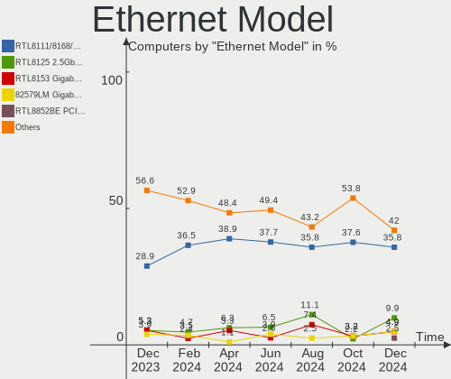

| Model                                                             | Computers | Percent |
|-------------------------------------------------------------------|-----------|---------|
| Realtek RTL8111/8168/8411 PCI Express Gigabit Ethernet Controller | 29        | 41.43%  |
| Intel 82579LM Gigabit Network Connection (Lewisville)             | 5         | 7.14%   |
| Realtek RTL8153 Gigabit Ethernet Adapter                          | 2         | 2.86%   |
| Realtek RTL8125 2.5GbE Controller                                 | 2         | 2.86%   |
| Intel I211 Gigabit Network Connection                             | 2         | 2.86%   |
| Intel Ethernet Connection (6) I219-LM                             | 2         | 2.86%   |
| Intel Ethernet Connection (2) I219-V                              | 2         | 2.86%   |
| Intel 82579V Gigabit Network Connection                           | 2         | 2.86%   |
| Realtek RTL810xE PCI Express Fast Ethernet controller             | 1         | 1.43%   |
| Qualcomm Atheros Killer E2400 Gigabit Ethernet Controller         | 1         | 1.43%   |
| Qualcomm Atheros AR8161 Gigabit Ethernet                          | 1         | 1.43%   |
| Qualcomm Atheros AR8132 Fast Ethernet                             | 1         | 1.43%   |
| Nvidia MCP79 Ethernet                                             | 1         | 1.43%   |
| Marvell Group 88E8058 PCI-E Gigabit Ethernet Controller           | 1         | 1.43%   |
| Lenovo ThinkPad Lan                                               | 1         | 1.43%   |
| Intel Ethernet Controller I225-V                                  | 1         | 1.43%   |
| Intel Ethernet Connection I219-LM                                 | 1         | 1.43%   |
| Intel Ethernet Connection I217-LM                                 | 1         | 1.43%   |
| Intel Ethernet Connection (5) I219-LM                             | 1         | 1.43%   |
| Intel Ethernet Connection (3) I218-V                              | 1         | 1.43%   |
| Intel Ethernet Connection (2) I218-LM                             | 1         | 1.43%   |
| Intel Ethernet Connection (16) I219-LM                            | 1         | 1.43%   |
| Intel Ethernet Connection (10) I219-V                             | 1         | 1.43%   |
| Intel 82572EI Gigabit Ethernet Controller (Copper)                | 1         | 1.43%   |
| Intel 82567LM-3 Gigabit Network Connection                        | 1         | 1.43%   |
| Intel 82566DM-2 Gigabit Network Connection                        | 1         | 1.43%   |
| DisplayLink USB3.0 5K Graphic Docking                             | 1         | 1.43%   |
| Broadcom NetXtreme BCM57766 Gigabit Ethernet PCIe                 | 1         | 1.43%   |
| Broadcom NetXtreme BCM57765 Gigabit Ethernet PCIe                 | 1         | 1.43%   |
| Broadcom NetXtreme BCM5761e Gigabit Ethernet PCIe                 | 1         | 1.43%   |
| Broadcom NetLink BCM57780 Gigabit Ethernet PCIe                   | 1         | 1.43%   |
| ASIX AX88179 Gigabit Ethernet                                     | 1         | 1.43%   |

Net Controller Kind
-------------------

Ethernet, WiFi or modem

| Kind     | Computers | Percent |
|----------|-----------|---------|
| WiFi     | 116       | 62.03%  |
| Ethernet | 68        | 36.36%  |
| Modem    | 3         | 1.6%    |

Used Controller
---------------

Currently used network controller

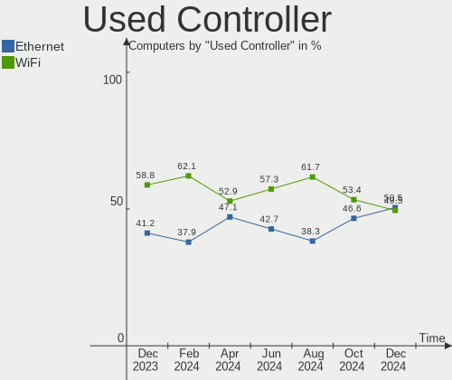

| Kind     | Computers | Percent |
|----------|-----------|---------|
| WiFi     | 103       | 76.3%   |
| Ethernet | 32        | 23.7%   |

NICs
----

Total network controllers on board

| Total | Computers | Percent |
|-------|-----------|---------|
| 1     | 81        | 62.79%  |
| 2     | 47        | 36.43%  |
| 0     | 1         | 0.78%   |

IPv6
----

IPv6 vs IPv4

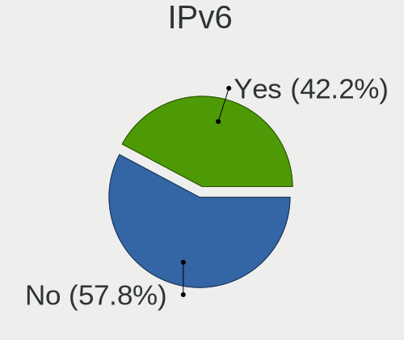

| Used | Computers | Percent |
|------|-----------|---------|
| No   | 106       | 82.17%  |
| Yes  | 23        | 17.83%  |

Bluetooth
---------

Bluetooth Vendor
----------------

Controller vendors

| Vendor                  | Computers | Percent |
|-------------------------|-----------|---------|
| Intel                   | 80        | 73.39%  |
| Cambridge Silicon Radio | 6         | 5.5%    |
| IMC Networks            | 5         | 4.59%   |
| Realtek Semiconductor   | 4         | 3.67%   |
| Apple                   | 4         | 3.67%   |
| Dell                    | 3         | 2.75%   |
| MediaTek                | 2         | 1.83%   |
| TP-Link                 | 1         | 0.92%   |
| Realtek                 | 1         | 0.92%   |
| Lite-On Technology      | 1         | 0.92%   |
| Hewlett-Packard         | 1         | 0.92%   |
| ASUSTek Computer        | 1         | 0.92%   |

Bluetooth Model
---------------

Controller models

| Model                                               | Computers | Percent |
|-----------------------------------------------------|-----------|---------|
| Intel AX201 Bluetooth                               | 31        | 28.44%  |
| Intel Bluetooth wireless interface                  | 26        | 23.85%  |
| Intel Bluetooth 9460/9560 Jefferson Peak (JfP)      | 11        | 10.09%  |
| Intel AX200 Bluetooth                               | 6         | 5.5%    |
| Cambridge Silicon Radio Bluetooth Dongle (HCI mode) | 6         | 5.5%    |
| Intel Bluetooth Device                              | 5         | 4.59%   |
| Realtek Bluetooth Radio                             | 3         | 2.75%   |
| IMC Networks 802.11ac WLAN Adapter                  | 3         | 2.75%   |
| MediaTek Wireless_Device                            | 2         | 1.83%   |
| Dell DW375 Bluetooth Module                         | 2         | 1.83%   |
| TP-Link UB500 Adapter                               | 1         | 0.92%   |
| Realtek RTL8723B Bluetooth                          | 1         | 0.92%   |
| Realtek Bluetooth Radio                             | 1         | 0.92%   |
| Lite-On Bluetooth Device                            | 1         | 0.92%   |
| Intel AX210 Bluetooth                               | 1         | 0.92%   |
| IMC Networks Bluetooth Device                       | 1         | 0.92%   |
| IMC Networks Atheros AR3012 Bluetooth 4.0 Adapter   | 1         | 0.92%   |
| HP Broadcom 2070 Bluetooth Combo                    | 1         | 0.92%   |
| Dell Wireless 365 Bluetooth                         | 1         | 0.92%   |
| ASUS BT-270 Bluetooth Adapter                       | 1         | 0.92%   |
| Apple Built-in Bluetooth 2.0+EDR HCI                | 1         | 0.92%   |
| Apple Bluetooth USB Host Controller                 | 1         | 0.92%   |
| Apple Bluetooth Host Controller                     | 1         | 0.92%   |
| Apple Bluetooth HCI                                 | 1         | 0.92%   |

Sound
-----

Sound Vendor
------------

Sound card vendors

| Vendor                | Computers | Percent |
|-----------------------|-----------|---------|
| Intel                 | 111       | 69.38%  |
| AMD                   | 20        | 12.5%   |
| Nvidia                | 18        | 11.25%  |
| Creative Labs         | 2         | 1.25%   |
| Yamaha                | 1         | 0.63%   |
| SAVITECH              | 1         | 0.63%   |
| Realtek Semiconductor | 1         | 0.63%   |
| Razer USA             | 1         | 0.63%   |
| Polycom               | 1         | 0.63%   |
| Plantronics           | 1         | 0.63%   |
| Logitech              | 1         | 0.63%   |
| Hewlett-Packard       | 1         | 0.63%   |
| C-Media Electronics   | 1         | 0.63%   |

Sound Model
-----------

Sound card models

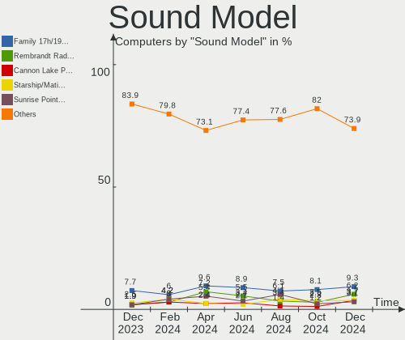

| Model                                                                             | Computers | Percent |
|-----------------------------------------------------------------------------------|-----------|---------|
| Intel Jasper Lake HD Audio                                                        | 20        | 11.43%  |
| Intel Celeron/Pentium Silver Processor High Definition Audio                      | 19        | 10.86%  |
| Intel Cannon Point-LP High Definition Audio Controller                            | 12        | 6.86%   |
| Intel 6 Series/C200 Series Chipset Family High Definition Audio Controller        | 8         | 4.57%   |
| Intel Alder Lake PCH-P High Definition Audio Controller                           | 7         | 4%      |
| Intel Tiger Lake-LP Smart Sound Technology Audio Controller                       | 6         | 3.43%   |
| Intel Sunrise Point-LP HD Audio                                                   | 6         | 3.43%   |
| AMD Family 17h/19h HD Audio Controller                                            | 6         | 3.43%   |
| AMD Starship/Matisse HD Audio Controller                                          | 5         | 2.86%   |
| AMD Renoir Radeon High Definition Audio Controller                                | 5         | 2.86%   |
| Intel Xeon E3-1200 v3/4th Gen Core Processor HD Audio Controller                  | 3         | 1.71%   |
| Intel 82801I (ICH9 Family) HD Audio Controller                                    | 3         | 1.71%   |
| Intel 7 Series/C216 Chipset Family High Definition Audio Controller               | 3         | 1.71%   |
| AMD Rembrandt Radeon High Definition Audio Controller                             | 3         | 1.71%   |
| Nvidia High Definition Audio Controller                                           | 2         | 1.14%   |
| Nvidia GM107 High Definition Audio Controller [GeForce 940MX]                     | 2         | 1.14%   |
| Nvidia GA102 High Definition Audio Controller                                     | 2         | 1.14%   |
| Nvidia Audio device                                                               | 2         | 1.14%   |
| Intel Ice Lake-LP Smart Sound Technology Audio Controller                         | 2         | 1.14%   |
| Intel Haswell-ULT HD Audio Controller                                             | 2         | 1.14%   |
| Intel Comet Lake PCH-LP cAVS                                                      | 2         | 1.14%   |
| Intel CM238 HD Audio Controller                                                   | 2         | 1.14%   |
| Intel Cannon Lake PCH cAVS                                                        | 2         | 1.14%   |
| Intel Broadwell-U Audio Controller                                                | 2         | 1.14%   |
| Intel 9 Series Chipset Family HD Audio Controller                                 | 2         | 1.14%   |
| Intel 8 Series/C220 Series Chipset High Definition Audio Controller               | 2         | 1.14%   |
| Intel 8 Series HD Audio Controller                                                | 2         | 1.14%   |
| Intel 200 Series PCH HD Audio                                                     | 2         | 1.14%   |
| Intel 100 Series/C230 Series Chipset Family HD Audio Controller                   | 2         | 1.14%   |
| AMD Caicos HDMI Audio [Radeon HD 6450 / 7450/8450/8490 OEM / R5 230/235/235X OEM] | 2         | 1.14%   |
| Yamaha Steinberg UR22mkII                                                         | 1         | 0.57%   |
| SAVITECH ODAC-revB                                                                | 1         | 0.57%   |
| Realtek Semiconductor USB Audio                                                   | 1         | 0.57%   |
| Razer USA Razer Seiren Mini                                                       | 1         | 0.57%   |
| Polycom CX300                                                                     | 1         | 0.57%   |
| Plantronics Blackwire 3225 Series                                                 | 1         | 0.57%   |
| Nvidia TU116 High Definition Audio Controller                                     | 1         | 0.57%   |
| Nvidia TU107 GeForce GTX 1650 High Definition Audio Controller                    | 1         | 0.57%   |
| Nvidia TU104 HD Audio Controller                                                  | 1         | 0.57%   |
| Nvidia MCP79 High Definition Audio                                                | 1         | 0.57%   |

Memory
------

Memory Vendor
-------------

Memory module vendors

| Vendor              | Computers | Percent |
|---------------------|-----------|---------|
| SK hynix            | 35        | 37.63%  |
| Samsung Electronics | 23        | 24.73%  |
| Micron Technology   | 15        | 16.13%  |
| Corsair             | 6         | 6.45%   |
| Crucial             | 4         | 4.3%    |
| Kingston            | 3         | 3.23%   |
| Unknown             | 2         | 2.15%   |
| Unknown (ABCD)      | 1         | 1.08%   |
| Unknown             | 1         | 1.08%   |
| Qimonda             | 1         | 1.08%   |
| G.Skill             | 1         | 1.08%   |
| A-DATA Technology   | 1         | 1.08%   |

Memory Model
------------

Memory module models

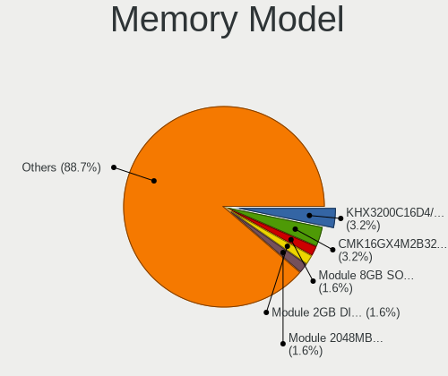

| Model                                                            | Computers | Percent |
|------------------------------------------------------------------|-----------|---------|
| SK hynix RAM HCNNNBKMMLXR-NEE 4GB Row Of Chips LPDDR4 4267MT/s   | 15        | 16.13%  |
| Micron RAM 0000000000-00000 8GB SODIMM DDR4 2400MT/s             | 10        | 10.75%  |
| SK hynix RAM 0000000000-00000 4GB SODIMM DDR4 2400MT/s           | 7         | 7.53%   |
| SK hynix RAM HMAA1GS6CJR6N-XN 8GB SODIMM DDR4 3200MT/s           | 4         | 4.3%    |
| SK hynix RAM HMA81GS6JJR8N-VK 8GB SODIMM DDR4 2667MT/s           | 2         | 2.15%   |
| Samsung RAM U6E3S4AA-MGCR 4GB Row Of Chips LPDDR4 4267MT/s       | 2         | 2.15%   |
| Samsung RAM M471A5244CB0-CWE 4GB SODIMM DDR4 3200MT/s            | 2         | 2.15%   |
| Samsung RAM M471A1K43DB1-CTD 8GB SODIMM DDR4 2667MT/s            | 2         | 2.15%   |
| Samsung RAM M471A1K43CB1-CTD 8GB SODIMM DDR4 2667MT/s            | 2         | 2.15%   |
| Corsair RAM CML8GX3M2A1600C9 4096MB DIMM DDR3 1867MT/s           | 2         | 2.15%   |
| Unknown                                                          | 2         | 2.15%   |
| Unknown RAM Module 2GB Row Of Chips LPDDR4 4267MT/s              | 1         | 1.08%   |
| Unknown (ABCD) RAM 123456789012345678 1GB SODIMM LPDDR4 2400MT/s | 1         | 1.08%   |
| SK hynix RAM Module 8GB SODIMM DDR3 1333MT/s                     | 1         | 1.08%   |
| SK hynix RAM HMT41GS6BFR8A-PB 8GB SODIMM DDR3 1600MT/s           | 1         | 1.08%   |
| SK hynix RAM HMAA1GS6CMR6N-XN 8GB Row Of Chips DDR4 3200MT/s     | 1         | 1.08%   |
| SK hynix RAM HMA851S6CJR6N-XN 4GB SODIMM DDR4 3200MT/s           | 1         | 1.08%   |
| SK hynix RAM HMA851S6CJR6N-VK 4GB SODIMM DDR4 2667MT/s           | 1         | 1.08%   |
| SK hynix RAM HMA81GS6CJR8N-VK 8192MB SODIMM DDR4 2667MT/s        | 1         | 1.08%   |
| SK hynix RAM H9JCNNNFA5MLYR-N6E 4GB Row Of Chips LPDDR5 6400MT/s | 1         | 1.08%   |
| Samsung RAM Module 8GB SODIMM DDR4 2133MT/s                      | 1         | 1.08%   |
| Samsung RAM M471B5273DH0-CH9 4GB SODIMM DDR3 1334MT/s            | 1         | 1.08%   |
| Samsung RAM M471B5273CH0-CH9 4GB SODIMM DDR3 1334MT/s            | 1         | 1.08%   |
| Samsung RAM M471A5244CB0-CTD 4GB Row Of Chips DDR4 2667MT/s      | 1         | 1.08%   |
| Samsung RAM M471A2G44AM0-CWE 16GB SODIMM DDR4 3200MT/s           | 1         | 1.08%   |
| Samsung RAM M471A1K44BM0-CRC 8GB SODIMM DDR4 2400MT/s            | 1         | 1.08%   |
| Samsung RAM M471A1K43DB1-CWE 8192MB SODIMM DDR4 3200MT/s         | 1         | 1.08%   |
| Samsung RAM M471A1K43CB1-CRC 8GB SODIMM DDR4 2667MT/s            | 1         | 1.08%   |
| Samsung RAM M378A1G43DB0-CPB 8GB DIMM DDR4 2133MT/s              | 1         | 1.08%   |
| Samsung RAM K4UBE3D4AA-MGCH 8GB Row Of Chips LPDDR4 3200MT/s     | 1         | 1.08%   |
| Samsung RAM K4U6E3S4AA-MGCR 1GB Row Of Chips LPDDR4 4267MT/s     | 1         | 1.08%   |
| Samsung RAM K4E8E324EB-EGCF 2GB SODIMM LPDDR3 1867MT/s           | 1         | 1.08%   |
| Samsung RAM K4E6E304EC-EGCG 4GB Row Of Chips LPDDR3 2133MT/s     | 1         | 1.08%   |
| Samsung RAM K4E6E304EB-EGCF 4096MB Row Of Chips LPDDR3 1867MT/s  | 1         | 1.08%   |
| Samsung RAM K3LKBKB0BM-MGCP 2GB Row Of Chips LPDDR5 6400MT/s     | 1         | 1.08%   |
| Qimonda RAM 64T256020EU2.5C2 2048MB DIMM DDR2 800MT/s            | 1         | 1.08%   |
| Micron RAM MTC8C1084S1SC48BA1 16GB SODIMM 4800MT/s               | 1         | 1.08%   |
| Micron RAM MTC4C10163S1SC48BA1 8GB SODIMM DDR5 4800MT/s          | 1         | 1.08%   |
| Micron RAM 8ATF1G64HZ-2G6D1 8GB SODIMM DDR4 2667MT/s             | 1         | 1.08%   |
| Micron RAM 53E512M32D2NP-046 4GB Row Of Chips LPDDR4 4267MT/s    | 1         | 1.08%   |

Memory Kind
-----------

Memory module kinds

| Kind    | Computers | Percent |
|---------|-----------|---------|
| DDR4    | 47        | 53.41%  |
| LPDDR4  | 22        | 25%     |
| DDR3    | 8         | 9.09%   |
| LPDDR3  | 3         | 3.41%   |
| LPDDR5  | 2         | 2.27%   |
| DDR5    | 2         | 2.27%   |
| DDR2    | 2         | 2.27%   |
| SDRAM   | 1         | 1.14%   |
| Unknown | 1         | 1.14%   |

Memory Form Factor
------------------

Physical design of the memory module

| Name         | Computers | Percent |
|--------------|-----------|---------|
| SODIMM       | 49        | 55.68%  |
| Row Of Chips | 27        | 30.68%  |
| DIMM         | 12        | 13.64%  |

Memory Size
-----------

Memory module size

| Size  | Computers | Percent |
|-------|-----------|---------|
| 8192  | 44        | 48.89%  |
| 4096  | 34        | 37.78%  |
| 16384 | 7         | 7.78%   |
| 2048  | 5         | 5.56%   |

Memory Speed
------------

Memory module speed

| Speed | Computers | Percent |
|-------|-----------|---------|
| 4267  | 20        | 22.73%  |
| 2400  | 20        | 22.73%  |
| 3200  | 14        | 15.91%  |
| 2667  | 11        | 12.5%   |
| 1867  | 4         | 4.55%   |
| 2133  | 3         | 3.41%   |
| 6400  | 2         | 2.27%   |
| 4800  | 2         | 2.27%   |
| 3600  | 2         | 2.27%   |
| 1600  | 2         | 2.27%   |
| 1334  | 2         | 2.27%   |
| 1333  | 2         | 2.27%   |
| 800   | 2         | 2.27%   |
| 3020  | 1         | 1.14%   |
| 1280  | 1         | 1.14%   |

Printers & scanners
-------------------

Printer Vendor
--------------

Printer device vendors

| Vendor | Computers | Percent |
|--------|-----------|---------|
| Canon  | 1         | 100%    |

Printer Model
-------------

Printer device models

| Model              | Computers | Percent |
|--------------------|-----------|---------|
| Canon G3020 series | 1         | 100%    |

Scanner Vendor
--------------

Scanner device vendors

Zero info for selected period =(

Scanner Model
-------------

Scanner device models

Zero info for selected period =(

Camera
------

Camera Vendor
-------------

Camera device vendors

| Vendor                                 | Computers | Percent |
|----------------------------------------|-----------|---------|
| Realtek Semiconductor                  | 35        | 27.78%  |
| Microdia                               | 35        | 27.78%  |
| Sunplus Innovation Technology          | 18        | 14.29%  |
| Chicony Electronics                    | 13        | 10.32%  |
| IMC Networks                           | 7         | 5.56%   |
| Apple                                  | 5         | 3.97%   |
| Logitech                               | 4         | 3.17%   |
| Acer                                   | 3         | 2.38%   |
| Trust                                  | 1         | 0.79%   |
| SunplusIT                              | 1         | 0.79%   |
| Sonix Technology                       | 1         | 0.79%   |
| Samsung Electronics                    | 1         | 0.79%   |
| Generalplus Technology                 | 1         | 0.79%   |
| Cheng Uei Precision Industry (Foxlink) | 1         | 0.79%   |

Camera Model
------------

Camera device models

| Model                                    | Computers | Percent |
|------------------------------------------|-----------|---------|
| Microdia Integrated_Webcam_HD            | 31        | 22.3%   |
| Realtek Integrated_Webcam_5M             | 27        | 19.42%  |
| Realtek Integrated_Webcam_HD             | 11        | 7.91%   |
| Sunplus Integrated_Webcam_HD             | 10        | 7.19%   |
| Microdia Integrated_Webcam_5M            | 7         | 5.04%   |
| Realtek USB Camera                       | 2         | 1.44%   |
| Logitech StreamCam                       | 2         | 1.44%   |
| IMC Networks USB2.0 HD UVC WebCam        | 2         | 1.44%   |
| Chicony Integrated Camera                | 2         | 1.44%   |
| Chicony HP Wide Vision HD Camera         | 2         | 1.44%   |
| Chicony HP HD Camera                     | 2         | 1.44%   |
| Chicony HD WebCam                        | 2         | 1.44%   |
| Apple FaceTime HD Camera (Built-in)      | 2         | 1.44%   |
| Apple Built-in iSight                    | 2         | 1.44%   |
| Trust WB-6250X Webcam                    | 1         | 0.72%   |
| SunplusIT 720p HD Camera                 | 1         | 0.72%   |
| Sunplus Laptop_Integrated_Webcam_HD      | 1         | 0.72%   |
| Sunplus Laptop_Integrated_Webcam_FHD     | 1         | 0.72%   |
| Sunplus Integrated_Webcam_FHD            | 1         | 0.72%   |
| Sunplus HP HD Webcam [Fixed]             | 1         | 0.72%   |
| Sunplus HK 1080P K20Pro                  | 1         | 0.72%   |
| Sunplus HD WebCam                        | 1         | 0.72%   |
| Sunplus Dell Integrated HD Webcam        | 1         | 0.72%   |
| Sunplus ASUS USB2.0 Webcam               | 1         | 0.72%   |
| Sonix USB2.0 HD UVC WebCam               | 1         | 0.72%   |
| Samsung Galaxy A5 (MTP)                  | 1         | 0.72%   |
| Realtek USB Boot                         | 1         | 0.72%   |
| Microdia Webcam Vitade AF                | 1         | 0.72%   |
| Microdia Integrated_Webcam_FHD           | 1         | 0.72%   |
| Microdia Integrated Webcam               | 1         | 0.72%   |
| Logitech HD Pro Webcam C920              | 1         | 0.72%   |
| Logitech BRIO Ultra HD Webcam            | 1         | 0.72%   |
| IMC Networks UVC VGA Webcam              | 1         | 0.72%   |
| IMC Networks USB2.0 VGA UVC WebCam       | 1         | 0.72%   |
| IMC Networks ov9734_azurewave_camera     | 1         | 0.72%   |
| IMC Networks Integrated RGB Camera       | 1         | 0.72%   |
| IMC Networks HP TrueVision HD Camera     | 1         | 0.72%   |
| Generalplus 808 Camera #9 (web-cam mode) | 1         | 0.72%   |
| Chicony USB2.0 HD UVC WebCam             | 1         | 0.72%   |
| Chicony USB2.0 Camera                    | 1         | 0.72%   |

Security
--------

Fingerprint Vendor
------------------

Fingerprint sensor vendors

| Vendor                     | Computers | Percent |
|----------------------------|-----------|---------|
| Validity Sensors           | 4         | 33.33%  |
| Synaptics                  | 3         | 25%     |
| Shenzhen Goodix Technology | 2         | 16.67%  |
| Upek                       | 1         | 8.33%   |
| LighTuning Technology      | 1         | 8.33%   |
| Elan Microelectronics      | 1         | 8.33%   |

Fingerprint Model
-----------------

Fingerprint sensor models

| Model                                                       | Computers | Percent |
|-------------------------------------------------------------|-----------|---------|
| Validity Sensors VFS471 Fingerprint Reader                  | 2         | 16.67%  |
| Validity Sensors VFS5011 Fingerprint Reader                 | 1         | 8.33%   |
| Validity Sensors Synaptics VFS7552 Touch Fingerprint Sensor | 1         | 8.33%   |
| Upek Biometric Touchchip/Touchstrip Fingerprint Sensor      | 1         | 8.33%   |
| Synaptics  VFS7552 Touch Fingerprint Sensor with PurePrint  | 1         | 8.33%   |
| Synaptics  FS7604 Touch Fingerprint Sensor with PurePrint   | 1         | 8.33%   |
| Synaptics Prometheus MIS Touch Fingerprint Reader           | 1         | 8.33%   |
| Shenzhen Goodix  Fingerprint Device                         | 1         | 8.33%   |
| Shenzhen Goodix FingerPrint                                 | 1         | 8.33%   |
| LighTuning EgisTec Touch Fingerprint Sensor                 | 1         | 8.33%   |
| Elan ELAN:Fingerprint                                       | 1         | 8.33%   |

Chipcard Vendor
---------------

Chipcard module vendors

| Vendor                | Computers | Percent |
|-----------------------|-----------|---------|
| Broadcom              | 7         | 77.78%  |
| Gemalto (was Gemplus) | 1         | 11.11%  |
| Alcor Micro           | 1         | 11.11%  |

Chipcard Model
--------------

Chipcard module models

| Model                                                                        | Computers | Percent |
|------------------------------------------------------------------------------|-----------|---------|
| Broadcom BCM5880 Secure Applications Processor                               | 4         | 44.44%  |
| Broadcom 58200                                                               | 2         | 22.22%  |
| Gemalto (was Gemplus) Compact Smart Card Reader Writer                       | 1         | 11.11%  |
| Broadcom BCM5880 Secure Applications Processor with fingerprint swipe sensor | 1         | 11.11%  |
| Alcor Micro AU9540 Smartcard Reader                                          | 1         | 11.11%  |

Unsupported
-----------

Unsupported Devices
-------------------

Total unsupported devices on board

| Total | Computers | Percent |
|-------|-----------|---------|
| 0     | 78        | 60.47%  |
| 1     | 43        | 33.33%  |
| 2     | 7         | 5.43%   |
| 5     | 1         | 0.78%   |

Unsupported Device Types
------------------------

Types of unsupported devices

| Type                     | Computers | Percent |
|--------------------------|-----------|---------|
| Multimedia controller    | 19        | 31.67%  |
| Fingerprint reader       | 12        | 20%     |
| Graphics card            | 7         | 11.67%  |
| Chipcard                 | 7         | 11.67%  |
| Net/wireless             | 6         | 10%     |
| Camera                   | 3         | 5%      |
| Card reader              | 2         | 3.33%   |
| Unassigned class         | 1         | 1.67%   |
| Storage                  | 1         | 1.67%   |
| Network                  | 1         | 1.67%   |
| Communication controller | 1         | 1.67%   |

