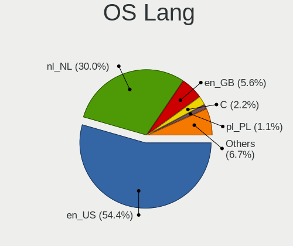
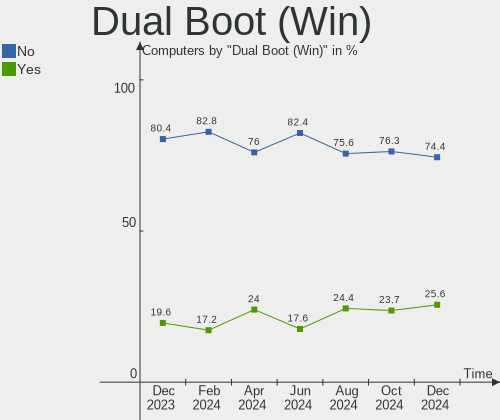
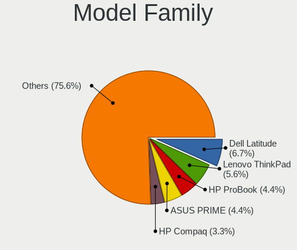
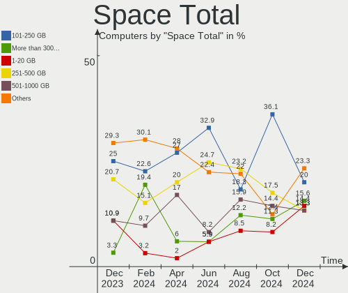
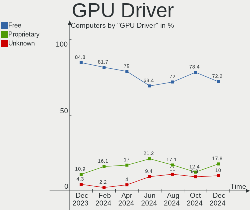
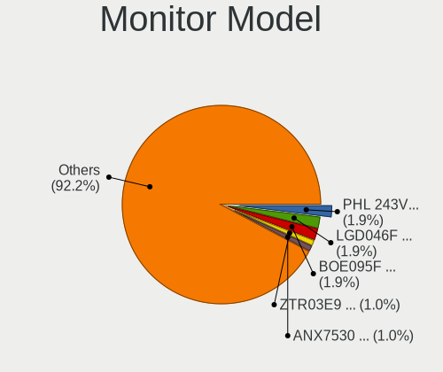
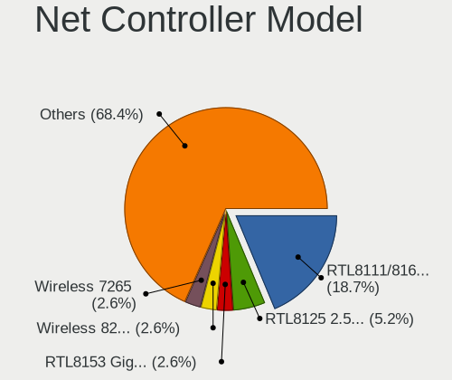
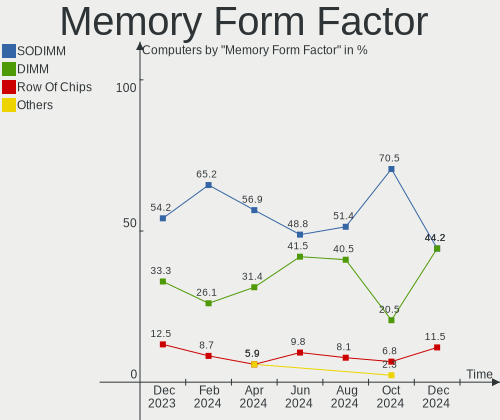
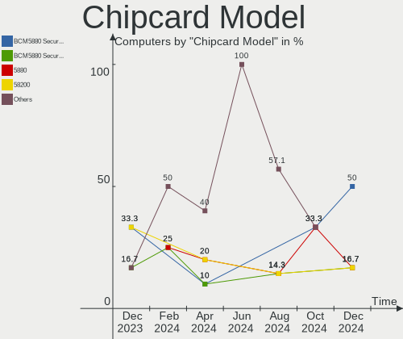

Linux in Netherlands - Hardware Trends
--------------------------------------

A project to identify most popular hardware characteristics and track their change
over time based on data collected by Linux users at https://Linux-Hardware.org.

Anyone can contribute to this report by the [hw-probe](https://github.com/linuxhw/hw-probe) tool:

    sudo -E hw-probe -all -upload

This is a report for all computer types. See also reports for [desktops](/Location/Netherlands/Desktop/README.md) and [notebooks](/Location/Netherlands/Notebook/README.md).

Contents
--------

* [ System ](#system)
  - [ OS                       ](#os)
  - [ OS Family                ](#os-family)
  - [ Kernel                   ](#kernel)
  - [ Kernel Family            ](#kernel-family)
  - [ Kernel Major Ver.        ](#kernel-major-ver)
  - [ Arch                     ](#arch)
  - [ DE                       ](#de)
  - [ Display Server           ](#display-server)
  - [ Display Manager          ](#display-manager)
  - [ OS Lang                  ](#os-lang)
  - [ Boot Mode                ](#boot-mode)
  - [ Filesystem               ](#filesystem)
  - [ Part. scheme             ](#part-scheme)
  - [ Dual Boot with Linux/BSD ](#dual-boot-with-linuxbsd)
  - [ Dual Boot (Win)          ](#dual-boot-win)

* [ Board ](#board)
  - [ Vendor                   ](#vendor)
  - [ Model                    ](#model)
  - [ Model Family             ](#model-family)
  - [ MFG Year                 ](#mfg-year)
  - [ Form Factor              ](#form-factor)
  - [ Secure Boot              ](#secure-boot)
  - [ Coreboot                 ](#coreboot)
  - [ RAM Size                 ](#ram-size)
  - [ RAM Used                 ](#ram-used)
  - [ Total Drives             ](#total-drives)
  - [ Has CD-ROM               ](#has-cd-rom)
  - [ Has Ethernet             ](#has-ethernet)
  - [ Has WiFi                 ](#has-wifi)
  - [ Has Bluetooth            ](#has-bluetooth)

* [ Location ](#location)
  - [ Country                  ](#country)
  - [ City                     ](#city)

* [ Drives ](#drives)
  - [ Drive Vendor             ](#drive-vendor)
  - [ Drive Model              ](#drive-model)
  - [ HDD Vendor               ](#hdd-vendor)
  - [ SSD Vendor               ](#ssd-vendor)
  - [ Drive Kind               ](#drive-kind)
  - [ Drive Connector          ](#drive-connector)
  - [ Drive Size               ](#drive-size)
  - [ Space Total              ](#space-total)
  - [ Space Used               ](#space-used)
  - [ Malfunc. Drives          ](#malfunc-drives)
  - [ Malfunc. Drive Vendor    ](#malfunc-drive-vendor)
  - [ Malfunc. HDD Vendor      ](#malfunc-hdd-vendor)
  - [ Malfunc. Drive Kind      ](#malfunc-drive-kind)
  - [ Failed Drives            ](#failed-drives)
  - [ Failed Drive Vendor      ](#failed-drive-vendor)
  - [ Drive Status             ](#drive-status)

* [ Storage controller ](#storage-controller)
  - [ Storage Vendor           ](#storage-vendor)
  - [ Storage Model            ](#storage-model)
  - [ Storage Kind             ](#storage-kind)

* [ Processor ](#processor)
  - [ CPU Vendor               ](#cpu-vendor)
  - [ CPU Model                ](#cpu-model)
  - [ CPU Model Family         ](#cpu-model-family)
  - [ CPU Cores                ](#cpu-cores)
  - [ CPU Sockets              ](#cpu-sockets)
  - [ CPU Threads              ](#cpu-threads)
  - [ CPU Op-Modes             ](#cpu-op-modes)
  - [ CPU Microcode            ](#cpu-microcode)
  - [ CPU Microarch            ](#cpu-microarch)

* [ Graphics ](#graphics)
  - [ GPU Vendor               ](#gpu-vendor)
  - [ GPU Model                ](#gpu-model)
  - [ GPU Combo                ](#gpu-combo)
  - [ GPU Driver               ](#gpu-driver)
  - [ GPU Memory               ](#gpu-memory)

* [ Monitor ](#monitor)
  - [ Monitor Vendor           ](#monitor-vendor)
  - [ Monitor Model            ](#monitor-model)
  - [ Monitor Resolution       ](#monitor-resolution)
  - [ Monitor Diagonal         ](#monitor-diagonal)
  - [ Monitor Width            ](#monitor-width)
  - [ Aspect Ratio             ](#aspect-ratio)
  - [ Monitor Area             ](#monitor-area)
  - [ Pixel Density            ](#pixel-density)
  - [ Multiple Monitors        ](#multiple-monitors)

* [ Network ](#network)
  - [ Net Controller Vendor    ](#net-controller-vendor)
  - [ Net Controller Model     ](#net-controller-model)
  - [ Wireless Vendor          ](#wireless-vendor)
  - [ Wireless Model           ](#wireless-model)
  - [ Ethernet Vendor          ](#ethernet-vendor)
  - [ Ethernet Model           ](#ethernet-model)
  - [ Net Controller Kind      ](#net-controller-kind)
  - [ Used Controller          ](#used-controller)
  - [ NICs                     ](#nics)
  - [ IPv6                     ](#ipv6)

* [ Bluetooth ](#bluetooth)
  - [ Bluetooth Vendor         ](#bluetooth-vendor)
  - [ Bluetooth Model          ](#bluetooth-model)

* [ Sound ](#sound)
  - [ Sound Vendor             ](#sound-vendor)
  - [ Sound Model              ](#sound-model)

* [ Memory ](#memory)
  - [ Memory Vendor            ](#memory-vendor)
  - [ Memory Model             ](#memory-model)
  - [ Memory Kind              ](#memory-kind)
  - [ Memory Form Factor       ](#memory-form-factor)
  - [ Memory Size              ](#memory-size)
  - [ Memory Speed             ](#memory-speed)

* [ Printers & scanners ](#printers--scanners)
  - [ Printer Vendor           ](#printer-vendor)
  - [ Printer Model            ](#printer-model)
  - [ Scanner Vendor           ](#scanner-vendor)
  - [ Scanner Model            ](#scanner-model)

* [ Camera ](#camera)
  - [ Camera Vendor            ](#camera-vendor)
  - [ Camera Model             ](#camera-model)

* [ Security ](#security)
  - [ Fingerprint Vendor       ](#fingerprint-vendor)
  - [ Fingerprint Model        ](#fingerprint-model)
  - [ Chipcard Vendor          ](#chipcard-vendor)
  - [ Chipcard Model           ](#chipcard-model)

* [ Unsupported ](#unsupported)
  - [ Unsupported Devices      ](#unsupported-devices)
  - [ Unsupported Device Types ](#unsupported-device-types)

System
------

OS
--

Installed operating systems

| Name                         | Computers | Percent |
|------------------------------|-----------|---------|
| Ubuntu 22.04                 | 18        | 17.31%  |
| Ubuntu 20.04                 | 14        | 13.46%  |
| OpenMandriva 4.3             | 9         | 8.65%   |
| Linux Mint 20.3              | 6         | 5.77%   |
| Debian 11                    | 5         | 4.81%   |
| Ubuntu 21.10                 | 4         | 3.85%   |
| Fedora 35                    | 4         | 3.85%   |
| Zorin 16                     | 3         | 2.88%   |
| Pop!_OS 22.04                | 3         | 2.88%   |
| Manjaro 21.2.6               | 3         | 2.88%   |
| EndeavourOS Rolling          | 3         | 2.88%   |
| Xubuntu 20.04                | 2         | 1.92%   |
| Kubuntu 21.10                | 2         | 1.92%   |
| KDE neon 20.04               | 2         | 1.92%   |
| Fedora 36                    | 2         | 1.92%   |
| Debian Testing               | 2         | 1.92%   |
| ArcoLinux Rolling            | 2         | 1.92%   |
| Xubuntu 22.04                | 1         | 0.96%   |
| Xero Rolling                 | 1         | 0.96%   |
| Ubuntu MATE 22.04            | 1         | 0.96%   |
| Ubuntu MATE 20.04            | 1         | 0.96%   |
| Ubuntu 21.04                 | 1         | 0.96%   |
| Ubuntu 18.04                 | 1         | 0.96%   |
| SteamOS Snapshot             | 1         | 0.96%   |
| SteamOS 3.2                  | 1         | 0.96%   |
| openSUSE Tumbleweed-XXXXXXXX | 1         | 0.96%   |
| openSUSE Leap-15.4           | 1         | 0.96%   |
| MocaccinoOS                  | 1         | 0.96%   |
| Manjaro 21.2.5               | 1         | 0.96%   |
| Lubuntu 21.10                | 1         | 0.96%   |
| Linux Mint 20.2              | 1         | 0.96%   |
| Linux Mint 20.1              | 1         | 0.96%   |
| Kali 2022.2                  | 1         | 0.96%   |
| Gentoo 2.7                   | 1         | 0.96%   |
| Fedora 37                    | 1         | 0.96%   |
| Clear Linux 36410            | 1         | 0.96%   |
| Clear Linux 36250            | 1         | 0.96%   |

OS Family
---------

OS without a version

| Name         | Computers | Percent |
|--------------|-----------|---------|
| Ubuntu       | 38        | 36.54%  |
| OpenMandriva | 9         | 8.65%   |
| Linux Mint   | 8         | 7.69%   |
| Fedora       | 7         | 6.73%   |
| Debian       | 7         | 6.73%   |
| Manjaro      | 4         | 3.85%   |
| Zorin        | 3         | 2.88%   |
| Xubuntu      | 3         | 2.88%   |
| Pop!_OS      | 3         | 2.88%   |
| EndeavourOS  | 3         | 2.88%   |
| Ubuntu MATE  | 2         | 1.92%   |
| SteamOS      | 2         | 1.92%   |
| openSUSE     | 2         | 1.92%   |
| Kubuntu      | 2         | 1.92%   |
| KDE neon     | 2         | 1.92%   |
| Clear Linux  | 2         | 1.92%   |
| ArcoLinux    | 2         | 1.92%   |
| Xero         | 1         | 0.96%   |
| MocaccinoOS  | 1         | 0.96%   |
| Lubuntu      | 1         | 0.96%   |
| Kali         | 1         | 0.96%   |
| Gentoo       | 1         | 0.96%   |

Kernel
------

Version of the Linux kernel

| Version                                                | Computers | Percent |
|--------------------------------------------------------|-----------|---------|
| 5.13.0-40-generic                                      | 12        | 11.54%  |
| 5.15.0-27-generic                                      | 10        | 9.62%   |
| 5.16.7-desktop-1omv4003                                | 9         | 8.65%   |
| 5.13.0-41-generic                                      | 8         | 7.69%   |
| 5.4.0-113-generic                                      | 3         | 2.88%   |
| 5.4.0-110-generic                                      | 3         | 2.88%   |
| 5.17.5-76051705-generic                                | 3         | 2.88%   |
| 5.4.0-109-generic                                      | 2         | 1.92%   |
| 5.17.9-arch1-1                                         | 2         | 1.92%   |
| 5.17.5-arch1-1                                         | 2         | 1.92%   |
| 5.17.1-3-MANJARO                                       | 2         | 1.92%   |
| 5.17.0-1-amd64                                         | 2         | 1.92%   |
| 5.15.0-30-generic                                      | 2         | 1.92%   |
| 5.15.0-25-generic                                      | 2         | 1.92%   |
| 5.13.0-44-generic                                      | 2         | 1.92%   |
| 5.10.0-14-amd64                                        | 2         | 1.92%   |
| 5.8.0-55-generic                                       | 1         | 0.96%   |
| 5.8.0-50-generic                                       | 1         | 0.96%   |
| 5.4.0-91-generic                                       | 1         | 0.96%   |
| 5.4.0-77-generic                                       | 1         | 0.96%   |
| 5.18.0-arch1-1                                         | 1         | 0.96%   |
| 5.18.0-0.rc5.20220505gita7391ad3572431a.43.fc37.x86_64 | 1         | 0.96%   |
| 5.17.9-300.fc36.x86_64                                 | 1         | 0.96%   |
| 5.17.8-300.fc36.x86_64                                 | 1         | 0.96%   |
| 5.17.8-051708-generic                                  | 1         | 0.96%   |
| 5.17.7-200.fc35.x86_64                                 | 1         | 0.96%   |
| 5.17.7-1-default                                       | 1         | 0.96%   |
| 5.17.6-200.fc35.x86_64                                 | 1         | 0.96%   |
| 5.17.5-200.fc35.x86_64                                 | 1         | 0.96%   |
| 5.17.4-200.fc35.x86_64                                 | 1         | 0.96%   |
| 5.17.11-1148.native                                    | 1         | 0.96%   |
| 5.17.0-mainline-t14                                    | 1         | 0.96%   |
| 5.16.2-arch1-1                                         | 1         | 0.96%   |
| 5.16.14-1-MANJARO                                      | 1         | 0.96%   |
| 5.16.13-1132.native                                    | 1         | 0.96%   |
| 5.16.0-kali7-amd64                                     | 1         | 0.96%   |
| 5.16.0-0.bpo.4-amd64                                   | 1         | 0.96%   |
| 5.15.38-mocaccino                                      | 1         | 0.96%   |
| 5.15.38-1-lts                                          | 1         | 0.96%   |
| 5.15.35-1-pve                                          | 1         | 0.96%   |
| 5.15.0-33-generic                                      | 1         | 0.96%   |
| 5.15.0-322205121620-generic                            | 1         | 0.96%   |
| 5.15.0-23-generic                                      | 1         | 0.96%   |
| 5.15.0-1006-raspi                                      | 1         | 0.96%   |
| 5.15.0-1005-raspi                                      | 1         | 0.96%   |
| 5.14.21-150400.22-default                              | 1         | 0.96%   |
| 5.14.0-1034-oem                                        | 1         | 0.96%   |
| 5.13.19-051319-generic                                 | 1         | 0.96%   |
| 5.13.0-valve14-1-neptune-02195-g5b0f749d00fa           | 1         | 0.96%   |
| 5.13.0-41-lowlatency                                   | 1         | 0.96%   |
| 5.13.0-1028-raspi                                      | 1         | 0.96%   |
| 5.11.0-16-generic                                      | 1         | 0.96%   |
| 5.10.105-1-MANJARO                                     | 1         | 0.96%   |
| 5.10.0-13-amd64                                        | 1         | 0.96%   |

Kernel Family
-------------

Linux kernel without a distro release

| Version  | Computers | Percent |
|----------|-----------|---------|
| 5.13.0   | 25        | 24.04%  |
| 5.15.0   | 19        | 18.27%  |
| 5.4.0    | 10        | 9.62%   |
| 5.16.7   | 9         | 8.65%   |
| 5.17.5   | 6         | 5.77%   |
| 5.17.9   | 3         | 2.88%   |
| 5.17.0   | 3         | 2.88%   |
| 5.10.0   | 3         | 2.88%   |
| 5.8.0    | 2         | 1.92%   |
| 5.18.0   | 2         | 1.92%   |
| 5.17.8   | 2         | 1.92%   |
| 5.17.7   | 2         | 1.92%   |
| 5.17.1   | 2         | 1.92%   |
| 5.16.0   | 2         | 1.92%   |
| 5.15.38  | 2         | 1.92%   |
| 5.17.6   | 1         | 0.96%   |
| 5.17.4   | 1         | 0.96%   |
| 5.17.11  | 1         | 0.96%   |
| 5.16.2   | 1         | 0.96%   |
| 5.16.14  | 1         | 0.96%   |
| 5.16.13  | 1         | 0.96%   |
| 5.15.35  | 1         | 0.96%   |
| 5.14.21  | 1         | 0.96%   |
| 5.14.0   | 1         | 0.96%   |
| 5.13.19  | 1         | 0.96%   |
| 5.11.0   | 1         | 0.96%   |
| 5.10.105 | 1         | 0.96%   |

Kernel Major Ver.
-----------------

Linux kernel major version

| Version | Computers | Percent |
|---------|-----------|---------|
| 5.13    | 26        | 25%     |
| 5.15    | 22        | 21.15%  |
| 5.17    | 21        | 20.19%  |
| 5.16    | 14        | 13.46%  |
| 5.4     | 10        | 9.62%   |
| 5.10    | 4         | 3.85%   |
| 5.8     | 2         | 1.92%   |
| 5.18    | 2         | 1.92%   |
| 5.14    | 2         | 1.92%   |
| 5.11    | 1         | 0.96%   |

Arch
----

OS architecture (x86_64, i586, etc.)

| Name    | Computers | Percent |
|---------|-----------|---------|
| x86_64  | 100       | 96.15%  |
| aarch64 | 3         | 2.88%   |
| i686    | 1         | 0.96%   |

DE
--

Desktop Environment

| Name       | Computers | Percent |
|------------|-----------|---------|
| GNOME      | 53        | 50.96%  |
| KDE5       | 25        | 24.04%  |
| XFCE       | 8         | 7.69%   |
| X-Cinnamon | 8         | 7.69%   |
| MATE       | 3         | 2.88%   |
| Unknown    | 3         | 2.88%   |
| Cinnamon   | 2         | 1.92%   |
| LXQt       | 1         | 0.96%   |
| Deepin     | 1         | 0.96%   |

Display Server
--------------

X11 or Wayland

| Name    | Computers | Percent |
|---------|-----------|---------|
| X11     | 76        | 73.08%  |
| Wayland | 22        | 21.15%  |
| Tty     | 3         | 2.88%   |
| Unknown | 3         | 2.88%   |

Display Manager
---------------

SDDM, LightDM, etc.

| Name    | Computers | Percent |
|---------|-----------|---------|
| GDM3    | 33        | 31.73%  |
| Unknown | 26        | 25%     |
| SDDM    | 22        | 21.15%  |
| LightDM | 13        | 12.5%   |
| GDM     | 10        | 9.62%   |

OS Lang
-------

Language

| Lang    | Computers | Percent |
|---------|-----------|---------|
| en_US   | 62        | 59.62%  |
| nl_NL   | 32        | 30.77%  |
| en_GB   | 4         | 3.85%   |
| ru_RU   | 2         | 1.92%   |
| POSIX   | 1         | 0.96%   |
| it_IT   | 1         | 0.96%   |
| C.UTF8  | 1         | 0.96%   |
| Unknown | 1         | 0.96%   |

Boot Mode
---------

EFI or BIOS

| Mode | Computers | Percent |
|------|-----------|---------|
| EFI  | 58        | 55.77%  |
| BIOS | 46        | 44.23%  |

Filesystem
----------

Type of filesystem

| Type    | Computers | Percent |
|---------|-----------|---------|
| Ext4    | 82        | 78.85%  |
| Btrfs   | 11        | 10.58%  |
| Overlay | 10        | 9.62%   |
| Xfs     | 1         | 0.96%   |

Part. scheme
------------

Scheme of partitioning

| Type    | Computers | Percent |
|---------|-----------|---------|
| Unknown | 55        | 52.88%  |
| GPT     | 43        | 41.35%  |
| MBR     | 6         | 5.77%   |

Dual Boot with Linux/BSD
------------------------

Hosting more than one Linux/BSD

| Dual boot | Computers | Percent |
|-----------|-----------|---------|
| No        | 92        | 88.46%  |
| Yes       | 12        | 11.54%  |

Dual Boot (Win)
---------------

Hosting Linux and Windows

| Dual boot | Computers | Percent |
|-----------|-----------|---------|
| No        | 72        | 69.23%  |
| Yes       | 32        | 30.77%  |

Board
-----

Vendor
------

Motherboard manufacturer

| Name                    | Computers | Percent |
|-------------------------|-----------|---------|
| Dell                    | 21        | 20.19%  |
| Lenovo                  | 15        | 14.42%  |
| ASUSTek Computer        | 12        | 11.54%  |
| Hewlett-Packard         | 11        | 10.58%  |
| Acer                    | 9         | 8.65%   |
| MSI                     | 8         | 7.69%   |
| Gigabyte Technology     | 5         | 4.81%   |
| Raspberry Pi Foundation | 3         | 2.88%   |
| ASRock                  | 3         | 2.88%   |
| Notebook                | 2         | 1.92%   |
| Medion                  | 2         | 1.92%   |
| Intel                   | 2         | 1.92%   |
| Valve                   | 1         | 0.96%   |
| Supermicro              | 1         | 0.96%   |
| Panasonic               | 1         | 0.96%   |
| Packard Bell            | 1         | 0.96%   |
| Microsoft               | 1         | 0.96%   |
| HONOR                   | 1         | 0.96%   |
| Foxconn                 | 1         | 0.96%   |
| BESSTAR Tech            | 1         | 0.96%   |
| Apple                   | 1         | 0.96%   |
| Alienware               | 1         | 0.96%   |
| Unknown                 | 1         | 0.96%   |

Model
-----

Motherboard model

| Name                                   | Computers | Percent |
|----------------------------------------|-----------|---------|
| Dell Latitude 3120                     | 5         | 4.81%   |
| Lenovo ThinkBook 15 G2 ITL 20VE        | 2         | 1.92%   |
| Dell Latitude 3190 2-in-1              | 2         | 1.92%   |
| ASUS ROG STRIX B450-F GAMING           | 2         | 1.92%   |
| Valve Jupiter                          | 1         | 0.96%   |
| Supermicro H8QG6                       | 1         | 0.96%   |
| RPi Raspberry Pi 4 Model B Rev 1.5     | 1         | 0.96%   |
| RPi Raspberry Pi 4 Model B Rev 1.4     | 1         | 0.96%   |
| RPi Raspberry Pi                       | 1         | 0.96%   |
| Panasonic CF-AX2LDCZMF                 | 1         | 0.96%   |
| Packard Bell EasyNote LE69KB           | 1         | 0.96%   |
| Notebook PB50_70RF,RD,RC               | 1         | 0.96%   |
| Notebook NL5xRU                        | 1         | 0.96%   |
| MSI MS-7C91                            | 1         | 0.96%   |
| MSI MS-7C02                            | 1         | 0.96%   |
| MSI MS-7B85                            | 1         | 0.96%   |
| MSI MS-7977                            | 1         | 0.96%   |
| MSI MS-7924                            | 1         | 0.96%   |
| MSI MS-7850                            | 1         | 0.96%   |
| MSI GS63 7RD                           | 1         | 0.96%   |
| MSI GP62MVR 7RF                        | 1         | 0.96%   |
| Microsoft Surface Pro 4                | 1         | 0.96%   |
| Medion X6816                           | 1         | 0.96%   |
| Medion P6812                           | 1         | 0.96%   |
| Lenovo Yoga Slim 7 14ARE05 82A2        | 1         | 0.96%   |
| Lenovo ThinkPad X240 20AMS1S800        | 1         | 0.96%   |
| Lenovo ThinkPad X201 3680AC2           | 1         | 0.96%   |
| Lenovo ThinkPad W520 428223G           | 1         | 0.96%   |
| Lenovo ThinkPad T14s Gen 1 20UHCTO1WW  | 1         | 0.96%   |
| Lenovo ThinkPad T14 Gen 1 20UES06X00   | 1         | 0.96%   |
| Lenovo ThinkPad P15s Gen 2i 20W6000JMH | 1         | 0.96%   |
| Lenovo ThinkPad P14s Gen 2a 21A0CTO1WW | 1         | 0.96%   |
| Lenovo ThinkPad Edge 03193TG           | 1         | 0.96%   |
| Lenovo Legion Y540-17IRH-PG0 81T3      | 1         | 0.96%   |
| Lenovo Legion 5 15ACH6H 82JU           | 1         | 0.96%   |
| Lenovo Legion 5 15ACH6A 82NW           | 1         | 0.96%   |
| Lenovo IdeaPad L340-15IWL 81LG         | 1         | 0.96%   |
| Intel NUC11PAHi5                       | 1         | 0.96%   |
| Intel NUC10i7FNH                       | 1         | 0.96%   |
| HONOR BOHK-WAX9X                       | 1         | 0.96%   |
| HP ZBook Studio G5                     | 1         | 0.96%   |
| HP ZBook 15 G6                         | 1         | 0.96%   |
| HP Z230 SFF Workstation                | 1         | 0.96%   |
| HP t630 Thin Client                    | 1         | 0.96%   |
| HP ProBook x360 11 G1 EE               | 1         | 0.96%   |
| HP ProBook 6560b                       | 1         | 0.96%   |
| HP Pavilion Power Laptop 15-cb0xx      | 1         | 0.96%   |
| HP Pavilion Laptop 15-eh0xxx           | 1         | 0.96%   |
| HP Pavilion Laptop 15-cw1xxx           | 1         | 0.96%   |
| HP EliteDesk 800 G3 DM 65W             | 1         | 0.96%   |
| HP Compaq dc7700 Small Form Factor     | 1         | 0.96%   |
| Gigabyte P55A-UD3                      | 1         | 0.96%   |
| Gigabyte GB-BRR7H-4700                 | 1         | 0.96%   |
| Gigabyte EP45-DS3P                     | 1         | 0.96%   |
| Gigabyte B550 AORUS ELITE V2           | 1         | 0.96%   |
| Gigabyte A320M-S2H                     | 1         | 0.96%   |
| Foxconn Pro 3300 Series SFF            | 1         | 0.96%   |
| Dell XPS 15 9570                       | 1         | 0.96%   |
| Dell XPS 15 9560                       | 1         | 0.96%   |
| Dell XPS 13 9310                       | 1         | 0.96%   |

Model Family
------------

Motherboard model prefix

| Name                   | Computers | Percent |
|------------------------|-----------|---------|
| Dell Latitude          | 10        | 9.62%   |
| Lenovo ThinkPad        | 8         | 7.69%   |
| Acer Aspire            | 7         | 6.73%   |
| RPi Raspberry          | 3         | 2.88%   |
| Lenovo Legion          | 3         | 2.88%   |
| HP Pavilion            | 3         | 2.88%   |
| Dell XPS               | 3         | 2.88%   |
| Dell Inspiron          | 3         | 2.88%   |
| Lenovo ThinkBook       | 2         | 1.92%   |
| HP ZBook               | 2         | 1.92%   |
| HP ProBook             | 2         | 1.92%   |
| Dell OptiPlex          | 2         | 1.92%   |
| ASUS ROG               | 2         | 1.92%   |
| Valve Jupiter          | 1         | 0.96%   |
| Supermicro H8QG6       | 1         | 0.96%   |
| Panasonic CF-AX2LDCZMF | 1         | 0.96%   |
| Packard Bell EasyNote  | 1         | 0.96%   |
| Notebook PB50          | 1         | 0.96%   |
| Notebook NL5xRU        | 1         | 0.96%   |
| MSI MS-7C91            | 1         | 0.96%   |
| MSI MS-7C02            | 1         | 0.96%   |
| MSI MS-7B85            | 1         | 0.96%   |
| MSI MS-7977            | 1         | 0.96%   |
| MSI MS-7924            | 1         | 0.96%   |
| MSI MS-7850            | 1         | 0.96%   |
| MSI GS63               | 1         | 0.96%   |
| MSI GP62MVR            | 1         | 0.96%   |
| Microsoft Surface      | 1         | 0.96%   |
| Medion X6816           | 1         | 0.96%   |
| Medion P6812           | 1         | 0.96%   |
| Lenovo Yoga            | 1         | 0.96%   |
| Lenovo IdeaPad         | 1         | 0.96%   |
| Intel NUC11PAHi5       | 1         | 0.96%   |
| Intel NUC10i7FNH       | 1         | 0.96%   |
| HONOR BOHK-WAX9X       | 1         | 0.96%   |
| HP Z230                | 1         | 0.96%   |
| HP t630                | 1         | 0.96%   |
| HP EliteDesk           | 1         | 0.96%   |
| HP Compaq              | 1         | 0.96%   |
| Gigabyte P55A-UD3      | 1         | 0.96%   |
| Gigabyte GB-BRR7H-4700 | 1         | 0.96%   |
| Gigabyte EP45-DS3P     | 1         | 0.96%   |
| Gigabyte B550          | 1         | 0.96%   |
| Gigabyte A320M-S2H     | 1         | 0.96%   |
| Foxconn Pro            | 1         | 0.96%   |
| Dell Studio            | 1         | 0.96%   |
| Dell Precision         | 1         | 0.96%   |
| Dell G3                | 1         | 0.96%   |
| BESSTAR Tech HM80      | 1         | 0.96%   |
| ASUS UX430UAR          | 1         | 0.96%   |
| ASUS UL30A             | 1         | 0.96%   |
| ASUS PRIME             | 1         | 0.96%   |
| ASUS P8Z68-V           | 1         | 0.96%   |
| ASUS P8B75-M           | 1         | 0.96%   |
| ASUS P7P55D            | 1         | 0.96%   |
| ASUS P5KPL-SE          | 1         | 0.96%   |
| ASUS F1A55-M           | 1         | 0.96%   |
| ASUS All               | 1         | 0.96%   |
| ASUS A8R-MX            | 1         | 0.96%   |
| ASRock Business        | 1         | 0.96%   |

MFG Year
--------

Motherboard manufacture year

| Year    | Computers | Percent |
|---------|-----------|---------|
| 2021    | 15        | 14.42%  |
| 2020    | 13        | 12.5%   |
| 2019    | 10        | 9.62%   |
| 2018    | 9         | 8.65%   |
| 2017    | 9         | 8.65%   |
| 2013    | 7         | 6.73%   |
| 2011    | 7         | 6.73%   |
| 2012    | 6         | 5.77%   |
| 2010    | 5         | 4.81%   |
| 2014    | 4         | 3.85%   |
| 2008    | 4         | 3.85%   |
| 2016    | 3         | 2.88%   |
| 2009    | 3         | 2.88%   |
| Unknown | 3         | 2.88%   |
| 2022    | 2         | 1.92%   |
| 2015    | 2         | 1.92%   |
| 2006    | 1         | 0.96%   |
| 2005    | 1         | 0.96%   |

Form Factor
-----------

Physical design of the computer

| Name           | Computers | Percent |
|----------------|-----------|---------|
| Notebook       | 52        | 50%     |
| Desktop        | 35        | 33.65%  |
| Convertible    | 7         | 6.73%   |
| Mini pc        | 5         | 4.81%   |
| System on chip | 3         | 2.88%   |
| Tablet         | 1         | 0.96%   |
| Server         | 1         | 0.96%   |

Secure Boot
-----------

Enabled or disabled

| State    | Computers | Percent |
|----------|-----------|---------|
| Disabled | 94        | 90.38%  |
| Enabled  | 10        | 9.62%   |

Coreboot
--------

Have coreboot on board

| Used | Computers | Percent |
|------|-----------|---------|
| No   | 104       | 100%    |

RAM Size
--------

Total RAM memory

| Size in GB  | Computers | Percent |
|-------------|-----------|---------|
| 8.01-16.0   | 25        | 24.04%  |
| 4.01-8.0    | 20        | 19.23%  |
| 16.01-24.0  | 19        | 18.27%  |
| 3.01-4.0    | 16        | 15.38%  |
| 32.01-64.0  | 13        | 12.5%   |
| 24.01-32.0  | 4         | 3.85%   |
| 64.01-256.0 | 3         | 2.88%   |
| 1.01-2.0    | 3         | 2.88%   |
| 2.01-3.0    | 1         | 0.96%   |

RAM Used
--------

Used RAM memory

| Used GB    | Computers | Percent |
|------------|-----------|---------|
| 1.01-2.0   | 48        | 46.15%  |
| 2.01-3.0   | 20        | 19.23%  |
| 4.01-8.0   | 15        | 14.42%  |
| 3.01-4.0   | 10        | 9.62%   |
| 8.01-16.0  | 5         | 4.81%   |
| 0.51-1.0   | 3         | 2.88%   |
| 32.01-64.0 | 1         | 0.96%   |
| 16.01-24.0 | 1         | 0.96%   |
| 0.01-0.5   | 1         | 0.96%   |

Total Drives
------------

Number of drives on board

| Drives | Computers | Percent |
|--------|-----------|---------|
| 1      | 60        | 57.69%  |
| 2      | 28        | 26.92%  |
| 3      | 9         | 8.65%   |
| 4      | 5         | 4.81%   |
| 7      | 1         | 0.96%   |
| 5      | 1         | 0.96%   |

Has CD-ROM
----------

Has CD-ROM on board

| Presented | Computers | Percent |
|-----------|-----------|---------|
| No        | 73        | 70.19%  |
| Yes       | 31        | 29.81%  |

Has Ethernet
------------

Has Ethernet on board

| Presented | Computers | Percent |
|-----------|-----------|---------|
| Yes       | 81        | 77.88%  |
| No        | 23        | 22.12%  |

Has WiFi
--------

Has WiFi module

| Presented | Computers | Percent |
|-----------|-----------|---------|
| Yes       | 71        | 68.27%  |
| No        | 33        | 31.73%  |

Has Bluetooth
-------------

Has Bluetooth module

| Presented | Computers | Percent |
|-----------|-----------|---------|
| Yes       | 63        | 60.58%  |
| No        | 41        | 39.42%  |

Location
--------

Country
-------

Geographic location (country)

| Country     | Computers | Percent |
|-------------|-----------|---------|
| Netherlands | 104       | 100%    |

City
----

Geographic location (city)

| City             | Computers | Percent |
|------------------|-----------|---------|
| Amsterdam        | 16        | 15.38%  |
| The Hague        | 9         | 8.65%   |
| Schagen          | 7         | 6.73%   |
| Rotterdam        | 4         | 3.85%   |
| Tilburg          | 3         | 2.88%   |
| Leiden           | 3         | 2.88%   |
| Haarlem          | 3         | 2.88%   |
| Damwald          | 3         | 2.88%   |
| Almere Stad      | 3         | 2.88%   |
| Schiedam         | 2         | 1.92%   |
| Putte            | 2         | 1.92%   |
| Naaldwijk        | 2         | 1.92%   |
| Hengelo          | 2         | 1.92%   |
| Groningen        | 2         | 1.92%   |
| Amersfoort       | 2         | 1.92%   |
| Zwolle           | 1         | 0.96%   |
| Zwartemeer       | 1         | 0.96%   |
| Zierikzee        | 1         | 0.96%   |
| Zeist            | 1         | 0.96%   |
| Wormerveer       | 1         | 0.96%   |
| Wageningen       | 1         | 0.96%   |
| Voorst           | 1         | 0.96%   |
| Voorhout         | 1         | 0.96%   |
| Velserbroek      | 1         | 0.96%   |
| Utrecht          | 1         | 0.96%   |
| Uithoorn         | 1         | 0.96%   |
| Roosendaal       | 1         | 0.96%   |
| Rijswijk         | 1         | 0.96%   |
| Overveen         | 1         | 0.96%   |
| Oosterhout       | 1         | 0.96%   |
| Nuenen           | 1         | 0.96%   |
| Noardburgum      | 1         | 0.96%   |
| Nieuwveen        | 1         | 0.96%   |
| Nieuwegein       | 1         | 0.96%   |
| Nederland        | 1         | 0.96%   |
| Maarssen         | 1         | 0.96%   |
| Lisse            | 1         | 0.96%   |
| Leimuiden        | 1         | 0.96%   |
| Krabbendijke     | 1         | 0.96%   |
| Huissen          | 1         | 0.96%   |
| Hoorn            | 1         | 0.96%   |
| Hoogezand        | 1         | 0.96%   |
| Hoensbroek       | 1         | 0.96%   |
| Heerhugowaard    | 1         | 0.96%   |
| Emmeloord        | 1         | 0.96%   |
| Eindhoven        | 1         | 0.96%   |
| Drunen           | 1         | 0.96%   |
| Den Burg         | 1         | 0.96%   |
| Delft            | 1         | 0.96%   |
| Culemborg        | 1         | 0.96%   |
| Castricum        | 1         | 0.96%   |
| Breda            | 1         | 0.96%   |
| Baarle-Nassau    | 1         | 0.96%   |
| Assen            | 1         | 0.96%   |
| Arnhem           | 1         | 0.96%   |
| 's-Hertogenbosch | 1         | 0.96%   |

Drives
------

Drive Vendor
------------

Hard drive vendors

| Vendor                    | Computers | Drives | Percent |
|---------------------------|-----------|--------|---------|
| Samsung Electronics       | 43        | 60     | 30.94%  |
| WDC                       | 18        | 30     | 12.95%  |
| Seagate                   | 14        | 15     | 10.07%  |
| Kingston                  | 10        | 11     | 7.19%   |
| SK Hynix                  | 8         | 8      | 5.76%   |
| Unknown                   | 6         | 6      | 4.32%   |
| Crucial                   | 6         | 7      | 4.32%   |
| Sandisk                   | 5         | 5      | 3.6%    |
| Micron Technology         | 5         | 5      | 3.6%    |
| HGST                      | 4         | 4      | 2.88%   |
| Toshiba                   | 3         | 3      | 2.16%   |
| Hitachi                   | 3         | 3      | 2.16%   |
| PNY                       | 2         | 2      | 1.44%   |
| Intel                     | 2         | 2      | 1.44%   |
| Transcend                 | 1         | 1      | 0.72%   |
| Realtek                   | 1         | 1      | 0.72%   |
| OCZ                       | 1         | 2      | 0.72%   |
| Micron/Crucial Technology | 1         | 1      | 0.72%   |
| MAXTOR                    | 1         | 1      | 0.72%   |
| LITEON                    | 1         | 1      | 0.72%   |
| KIOXIA                    | 1         | 1      | 0.72%   |
| HP Phison                 | 1         | 1      | 0.72%   |
| China                     | 1         | 1      | 0.72%   |
| A-DATA Technology         | 1         | 1      | 0.72%   |

Drive Model
-----------

Hard drive models

| Model                                   | Computers | Percent |
|-----------------------------------------|-----------|---------|
| Samsung SSD 850 EVO 250GB               | 4         | 2.5%    |
| SK Hynix BC711 NVMe 128GB               | 3         | 1.88%   |
| Samsung SSD 980 500GB                   | 3         | 1.88%   |
| Samsung NVMe SSD Drive 1TB              | 3         | 1.88%   |
| Kingston SA400S37240G 240GB SSD         | 3         | 1.88%   |
| HGST HTS721010A9E630 1TB                | 3         | 1.88%   |
| WDC WDS500G2B0C-00PXH0 500GB            | 2         | 1.25%   |
| Unknown MMC Card  64GB                  | 2         | 1.25%   |
| Samsung SSD 970 EVO 1TB                 | 2         | 1.25%   |
| Samsung SSD 870 QVO 1TB                 | 2         | 1.25%   |
| Samsung PSSD T7 1TB                     | 2         | 1.25%   |
| Samsung NVMe SSD Drive 500GB            | 2         | 1.25%   |
| Samsung MZVLB512HBJQ-000L2 512GB        | 2         | 1.25%   |
| Samsung HD103SJ 1TB                     | 2         | 1.25%   |
| Kingston SV300S37A120G 120GB SSD        | 2         | 1.25%   |
| WDC WDS500G2B0A-00SM50 500GB SSD        | 1         | 0.63%   |
| WDC WDS250G1B0A-00H9H0 250GB SSD        | 1         | 0.63%   |
| WDC WD800JD-60LSA5 80GB                 | 1         | 0.63%   |
| WDC WD6400BPVT-16HXZT1 640GB            | 1         | 0.63%   |
| WDC WD6400BEVT-22A0RT0 640GB            | 1         | 0.63%   |
| WDC WD40EZRZ-22GXCB0 4TB                | 1         | 0.63%   |
| WDC WD40EZAZ-00SF3B0 4TB                | 1         | 0.63%   |
| WDC WD40EFZX-68AWUN0 4TB                | 1         | 0.63%   |
| WDC WD3200LPCX-22VHAT0 320GB            | 1         | 0.63%   |
| WDC WD3200BPVT-22JJ5T0 320GB            | 1         | 0.63%   |
| WDC WD20SPZX-75UA7T0 2TB                | 1         | 0.63%   |
| WDC WD20EZRX-00DC0B0 2TB                | 1         | 0.63%   |
| WDC WD20EFRX-68EUZN0 2TB                | 1         | 0.63%   |
| WDC WD20EARS-00MVWB0 2TB                | 1         | 0.63%   |
| WDC WD1600BUCT-63TWBY0 160GB            | 1         | 0.63%   |
| WDC WD1600BB-55GUC0 160GB               | 1         | 0.63%   |
| WDC WD10JPVX-22JC3T0 1TB                | 1         | 0.63%   |
| WDC WD10EZEX-08WN4A0 1TB                | 1         | 0.63%   |
| WDC WD10EVDS-63U8B1 1TB                 | 1         | 0.63%   |
| WDC WD1003FZEX-00K3CA0 1TB              | 1         | 0.63%   |
| WDC WD1002FBYS-02A6B0 1TB               | 1         | 0.63%   |
| WDC PC SN520 NVMe 128GB                 | 1         | 0.63%   |
| Unknown SU16G  16GB                     | 1         | 0.63%   |
| Unknown SB64G  64GB                     | 1         | 0.63%   |
| Unknown MMC Card  32GB                  | 1         | 0.63%   |
| Unknown ACLCE  64GB                     | 1         | 0.63%   |
| Transcend TS120GMTS420S 120GB SSD       | 1         | 0.63%   |
| Toshiba Q300 120GB SSD                  | 1         | 0.63%   |
| Toshiba NVMe SSD Drive 512GB            | 1         | 0.63%   |
| Toshiba MQ04ABF100 1TB                  | 1         | 0.63%   |
| SK Hynix SKHynix_HFM256GD3HX015N 256GB  | 1         | 0.63%   |
| SK Hynix NVMe SSD Drive 128GB           | 1         | 0.63%   |
| SK Hynix HFM512GDJTNI-82A0A 512GB       | 1         | 0.63%   |
| SK Hynix HFM256GDJTNG-8310A 256GB       | 1         | 0.63%   |
| SK Hynix BC511 HFM512GDJTNI-82A0A 512GB | 1         | 0.63%   |
| Seagate ST9250320AS 250GB               | 1         | 0.63%   |
| Seagate ST9160823ASG 160GB              | 1         | 0.63%   |
| Seagate ST6000VN001-2BB186 6TB          | 1         | 0.63%   |
| Seagate ST500LX003-1AC15G 500GB         | 1         | 0.63%   |
| Seagate ST500LM021-1KJ152 500GB         | 1         | 0.63%   |
| Seagate ST500DM002-1BD142 500GB         | 1         | 0.63%   |
| Seagate ST3320311CS 320GB               | 1         | 0.63%   |
| Seagate ST3250820AS 250GB               | 1         | 0.63%   |
| Seagate ST3250318AS 250GB               | 1         | 0.63%   |
| Seagate ST31000528AS 1TB                | 1         | 0.63%   |

HDD Vendor
----------

Hard disk drive vendors

| Vendor              | Computers | Drives | Percent |
|---------------------|-----------|--------|---------|
| WDC                 | 15        | 25     | 36.59%  |
| Seagate             | 14        | 15     | 34.15%  |
| HGST                | 4         | 4      | 9.76%   |
| Samsung Electronics | 3         | 4      | 7.32%   |
| Hitachi             | 3         | 3      | 7.32%   |
| Toshiba             | 1         | 1      | 2.44%   |
| MAXTOR              | 1         | 1      | 2.44%   |

SSD Vendor
----------

Solid state drive vendors

| Vendor              | Computers | Drives | Percent |
|---------------------|-----------|--------|---------|
| Samsung Electronics | 23        | 28     | 44.23%  |
| Kingston            | 8         | 9      | 15.38%  |
| Crucial             | 6         | 7      | 11.54%  |
| SanDisk             | 3         | 3      | 5.77%   |
| WDC                 | 2         | 2      | 3.85%   |
| PNY                 | 2         | 2      | 3.85%   |
| Transcend           | 1         | 1      | 1.92%   |
| Toshiba             | 1         | 1      | 1.92%   |
| OCZ                 | 1         | 2      | 1.92%   |
| Micron Technology   | 1         | 1      | 1.92%   |
| LITEON              | 1         | 1      | 1.92%   |
| HP Phison           | 1         | 1      | 1.92%   |
| China               | 1         | 1      | 1.92%   |
| A-DATA Technology   | 1         | 1      | 1.92%   |

Drive Kind
----------

HDD or SSD

| Kind | Computers | Drives | Percent |
|------|-----------|--------|---------|
| NVMe | 48        | 53     | 35.04%  |
| SSD  | 45        | 60     | 32.85%  |
| HDD  | 38        | 53     | 27.74%  |
| MMC  | 6         | 6      | 4.38%   |

Drive Connector
---------------

SATA, SAS, NVMe, etc.

| Type | Computers | Drives | Percent |
|------|-----------|--------|---------|
| SATA | 66        | 107    | 53.66%  |
| NVMe | 47        | 52     | 38.21%  |
| MMC  | 6         | 6      | 4.88%   |
| SAS  | 4         | 7      | 3.25%   |

Drive Size
----------

Size of hard drive

| Size in TB | Computers | Drives | Percent |
|------------|-----------|--------|---------|
| 0.01-0.5   | 49        | 63     | 55.06%  |
| 0.51-1.0   | 26        | 28     | 29.21%  |
| 1.01-2.0   | 6         | 12     | 6.74%   |
| 3.01-4.0   | 4         | 6      | 4.49%   |
| 4.01-10.0  | 3         | 3      | 3.37%   |
| 2.01-3.0   | 1         | 1      | 1.12%   |

Space Total
-----------

Amount of disk space available on the file system

| Size in GB     | Computers | Percent |
|----------------|-----------|---------|
| 251-500        | 27        | 25.96%  |
| 101-250        | 26        | 25%     |
| 1-20           | 13        | 12.5%   |
| 501-1000       | 12        | 11.54%  |
| More than 3000 | 9         | 8.65%   |
| 1001-2000      | 8         | 7.69%   |
| 51-100         | 4         | 3.85%   |
| 2001-3000      | 2         | 1.92%   |
| Unknown        | 2         | 1.92%   |
| 21-50          | 1         | 0.96%   |

Space Used
----------

Amount of used disk space

| Used GB        | Computers | Percent |
|----------------|-----------|---------|
| 1-20           | 37        | 35.58%  |
| 51-100         | 16        | 15.38%  |
| 21-50          | 15        | 14.42%  |
| 101-250        | 11        | 10.58%  |
| 251-500        | 9         | 8.65%   |
| 501-1000       | 8         | 7.69%   |
| More than 3000 | 2         | 1.92%   |
| 2001-3000      | 2         | 1.92%   |
| 1001-2000      | 2         | 1.92%   |
| Unknown        | 2         | 1.92%   |

Malfunc. Drives
---------------

Drive models with a malfunction

| Model                             | Computers | Drives | Percent |
|-----------------------------------|-----------|--------|---------|
| WDC WD10JPVX-22JC3T0 1TB          | 1         | 1      | 20%     |
| HGST HTS721010A9E630 1TB          | 1         | 1      | 20%     |
| Crucial CT512MX100SSD1 512GB      | 1         | 1      | 20%     |
| Crucial CT500MX500SSD1 500GB      | 1         | 1      | 20%     |
| A-DATA Technology SP550 240GB SSD | 1         | 1      | 20%     |

Malfunc. Drive Vendor
---------------------

Vendors of faulty drives

| Vendor            | Computers | Drives | Percent |
|-------------------|-----------|--------|---------|
| Crucial           | 2         | 2      | 40%     |
| WDC               | 1         | 1      | 20%     |
| HGST              | 1         | 1      | 20%     |
| A-DATA Technology | 1         | 1      | 20%     |

Malfunc. HDD Vendor
-------------------

Vendors of faulty HDD drives

| Vendor | Computers | Drives | Percent |
|--------|-----------|--------|---------|
| WDC    | 1         | 1      | 50%     |
| HGST   | 1         | 1      | 50%     |

Malfunc. Drive Kind
-------------------

Kinds of faulty drives

| Kind | Computers | Drives | Percent |
|------|-----------|--------|---------|
| SSD  | 3         | 3      | 60%     |
| HDD  | 2         | 2      | 40%     |

Failed Drives
-------------

Failed drive models

Zero info for selected period =(

Failed Drive Vendor
-------------------

Failed drive vendors

Zero info for selected period =(

Drive Status
------------

Number of failed and malfunc. drives

| Status   | Computers | Drives | Percent |
|----------|-----------|--------|---------|
| Detected | 61        | 104    | 54.46%  |
| Works    | 46        | 63     | 41.07%  |
| Malfunc  | 5         | 5      | 4.46%   |

Storage controller
------------------

Storage Vendor
--------------

Storage controller vendors

| Vendor                        | Computers | Percent |
|-------------------------------|-----------|---------|
| Intel                         | 66        | 47.83%  |
| Samsung Electronics           | 23        | 16.67%  |
| AMD                           | 17        | 12.32%  |
| SK Hynix                      | 8         | 5.8%    |
| Sandisk                       | 5         | 3.62%   |
| Micron Technology             | 4         | 2.9%    |
| Marvell Technology Group      | 3         | 2.17%   |
| Toshiba America Info Systems  | 2         | 1.45%   |
| Kingston Technology Company   | 2         | 1.45%   |
| JMicron Technology            | 2         | 1.45%   |
| VIA Technologies              | 1         | 0.72%   |
| ULi Electronics               | 1         | 0.72%   |
| Silicon Image                 | 1         | 0.72%   |
| Micron/Crucial Technology     | 1         | 0.72%   |
| Integrated Technology Express | 1         | 0.72%   |
| Broadcom / LSI                | 1         | 0.72%   |

Storage Model
-------------

Storage controller models

| Model                                                                            | Computers | Percent |
|----------------------------------------------------------------------------------|-----------|---------|
| Samsung NVMe SSD Controller SM981/PM981/PM983                                    | 10        | 6.45%   |
| AMD FCH SATA Controller [AHCI mode]                                              | 10        | 6.45%   |
| Samsung NVMe SSD Controller 980                                                  | 7         | 4.52%   |
| Intel Cannon Lake Mobile PCH SATA AHCI Controller                                | 6         | 3.87%   |
| Intel 8 Series/C220 Series Chipset Family 6-port SATA Controller 1 [AHCI mode]   | 6         | 3.87%   |
| Intel 6 Series/C200 Series Chipset Family 6 port Mobile SATA AHCI Controller     | 6         | 3.87%   |
| SK Hynix Gold P31 SSD                                                            | 5         | 3.23%   |
| AMD 400 Series Chipset SATA Controller                                           | 5         | 3.23%   |
| Samsung NVMe SSD Controller SM961/PM961/SM963                                    | 4         | 2.58%   |
| Micron Non-Volatile memory controller                                            | 4         | 2.58%   |
| Intel Volume Management Device NVMe RAID Controller                              | 4         | 2.58%   |
| Intel Tiger Lake-LP SATA Controller [AHCI mode]                                  | 4         | 2.58%   |
| Intel HM170/QM170 Chipset SATA Controller [AHCI Mode]                            | 4         | 2.58%   |
| Intel 5 Series/3400 Series Chipset 6 port SATA AHCI Controller                   | 3         | 1.94%   |
| SK Hynix BC511                                                                   | 2         | 1.29%   |
| Sandisk WD Blue SN550 NVMe SSD                                                   | 2         | 1.29%   |
| Samsung NVMe SSD Controller PM9A1/PM9A3/980PRO                                   | 2         | 1.29%   |
| JMicron JMB363 SATA/IDE Controller                                               | 2         | 1.29%   |
| Intel SSD 660P Series                                                            | 2         | 1.29%   |
| Intel Q170/Q150/B150/H170/H110/Z170/CM236 Chipset SATA Controller [AHCI Mode]    | 2         | 1.29%   |
| Intel Comet Lake SATA AHCI Controller                                            | 2         | 1.29%   |
| Intel Celeron/Pentium Silver Processor SATA Controller                           | 2         | 1.29%   |
| Intel 9 Series Chipset Family SATA Controller [AHCI Mode]                        | 2         | 1.29%   |
| Intel 82801JI (ICH10 Family) 4 port SATA IDE Controller #1                       | 2         | 1.29%   |
| Intel 82801JI (ICH10 Family) 2 port SATA IDE Controller #2                       | 2         | 1.29%   |
| Intel 8 Series SATA Controller 1 [AHCI mode]                                     | 2         | 1.29%   |
| Intel 7 Series/C210 Series Chipset Family 6-port SATA Controller [AHCI mode]     | 2         | 1.29%   |
| Intel 6 Series/C200 Series Chipset Family 6 port Desktop SATA AHCI Controller    | 2         | 1.29%   |
| Intel 5 Series/3400 Series Chipset 4 port SATA AHCI Controller                   | 2         | 1.29%   |
| AMD SB7x0/SB8x0/SB9x0 IDE Controller                                             | 2         | 1.29%   |
| AMD 500 Series Chipset SATA Controller                                           | 2         | 1.29%   |
| VIA VT6421 IDE/SATA Controller                                                   | 1         | 0.65%   |
| ULi ULi 5287 SATA                                                                | 1         | 0.65%   |
| ULi M5229 IDE                                                                    | 1         | 0.65%   |
| Toshiba America Info Systems XG6 NVMe SSD Controller                             | 1         | 0.65%   |
| Toshiba America Info Systems Toshiba America Info Non-Volatile memory controller | 1         | 0.65%   |
| SK Hynix BC501 NVMe Solid State Drive                                            | 1         | 0.65%   |
| Silicon Image SiI 3124 PCI-X Serial ATA Controller                               | 1         | 0.65%   |
| Sandisk WD Black SN750 / PC SN730 NVMe SSD                                       | 1         | 0.65%   |
| Sandisk PC SN520 NVMe SSD                                                        | 1         | 0.65%   |
| Sandisk Non-Volatile memory controller                                           | 1         | 0.65%   |
| Samsung NVMe SSD Controller SM951/PM951                                          | 1         | 0.65%   |
| Micron/Crucial Non-Volatile memory controller                                    | 1         | 0.65%   |
| Marvell Group 88SE9215 PCIe 2.0 x1 4-port SATA 6 Gb/s Controller                 | 1         | 0.65%   |
| Marvell Group 88SE9172 SATA 6Gb/s Controller                                     | 1         | 0.65%   |
| Marvell Group 88SE9120 SATA 6Gb/s Controller                                     | 1         | 0.65%   |
| Kingston Company Company Non-Volatile memory controller                          | 1         | 0.65%   |
| Kingston Company OM3PDP3 NVMe SSD                                                | 1         | 0.65%   |
| Intel Wildcat Point-LP SATA Controller [AHCI Mode]                               | 1         | 0.65%   |
| Intel Sunrise Point-LP SATA Controller [AHCI mode]                               | 1         | 0.65%   |
| Intel SATA Controller [RAID mode]                                                | 1         | 0.65%   |
| Intel NM10/ICH7 Family SATA Controller [IDE mode]                                | 1         | 0.65%   |
| Intel Celeron N3350/Pentium N4200/Atom E3900 Series SATA AHCI Controller         | 1         | 0.65%   |
| Intel Cannon Point-LP SATA Controller [AHCI Mode]                                | 1         | 0.65%   |
| Intel 82801JI (ICH10 Family) SATA AHCI Controller                                | 1         | 0.65%   |
| Intel 82801IBM/IEM (ICH9M/ICH9M-E) 4 port SATA Controller [AHCI mode]            | 1         | 0.65%   |
| Intel 82801HM/HEM (ICH8M/ICH8M-E) SATA Controller [AHCI mode]                    | 1         | 0.65%   |
| Intel 82801HM/HEM (ICH8M/ICH8M-E) IDE Controller                                 | 1         | 0.65%   |
| Intel 82801H (ICH8 Family) 4 port SATA Controller [IDE mode]                     | 1         | 0.65%   |
| Intel 82801G (ICH7 Family) IDE Controller                                        | 1         | 0.65%   |

Storage Kind
------------

Kind of storage controller (IDE, SATA, NVMe, SAS, ...)

| Kind | Computers | Percent |
|------|-----------|---------|
| SATA | 72        | 51.06%  |
| NVMe | 47        | 33.33%  |
| IDE  | 13        | 9.22%   |
| RAID | 8         | 5.67%   |
| SAS  | 1         | 0.71%   |

Processor
---------

CPU Vendor
----------

Processor vendors

| Vendor | Computers | Percent |
|--------|-----------|---------|
| Intel  | 73        | 70.19%  |
| AMD    | 28        | 26.92%  |
| ARM    | 3         | 2.88%   |

CPU Model
---------

Processor models

| Model                                      | Computers | Percent |
|--------------------------------------------|-----------|---------|
| Intel Pentium Silver N6000 @ 1.10GHz       | 5         | 4.81%   |
| Intel Core i7-7700HQ CPU @ 2.80GHz         | 4         | 3.85%   |
| Intel Core i5-4590 CPU @ 3.30GHz           | 3         | 2.88%   |
| Intel 11th Gen Core i5-1135G7 @ 2.40GHz    | 3         | 2.88%   |
| ARM Processor                              | 3         | 2.88%   |
| Intel Core i7-9750H CPU @ 2.60GHz          | 2         | 1.92%   |
| Intel Core i7-8750H CPU @ 2.20GHz          | 2         | 1.92%   |
| Intel Core i5-2410M CPU @ 2.30GHz          | 2         | 1.92%   |
| Intel Core i5 CPU M 520 @ 2.40GHz          | 2         | 1.92%   |
| Intel 11th Gen Core i7-1165G7 @ 2.80GHz    | 2         | 1.92%   |
| AMD Ryzen 7 5800H with Radeon Graphics     | 2         | 1.92%   |
| AMD Ryzen 7 2700 Eight-Core Processor      | 2         | 1.92%   |
| AMD Ryzen 5 PRO 4650U with Radeon Graphics | 2         | 1.92%   |
| AMD Ryzen 5 4500U with Radeon Graphics     | 2         | 1.92%   |
| Intel Xeon CPU E3-1230 v3 @ 3.30GHz        | 1         | 0.96%   |
| Intel Xeon CPU E3-1225 v3 @ 3.20GHz        | 1         | 0.96%   |
| Intel Pentium Silver N5030 CPU @ 1.10GHz   | 1         | 0.96%   |
| Intel Pentium Silver N5000 CPU @ 1.10GHz   | 1         | 0.96%   |
| Intel Pentium Dual CPU T2370 @ 1.73GHz     | 1         | 0.96%   |
| Intel Pentium CPU N4200 @ 1.10GHz          | 1         | 0.96%   |
| Intel Genuine CPU U7300 @ 1.30GHz          | 1         | 0.96%   |
| Intel Core i9-9980HK CPU @ 2.40GHz         | 1         | 0.96%   |
| Intel Core i7-9850H CPU @ 2.60GHz          | 1         | 0.96%   |
| Intel Core i7-8550U CPU @ 1.80GHz          | 1         | 0.96%   |
| Intel Core i7-7820HK CPU @ 2.90GHz         | 1         | 0.96%   |
| Intel Core i7-6700K CPU @ 4.00GHz          | 1         | 0.96%   |
| Intel Core i7-4790K CPU @ 4.00GHz          | 1         | 0.96%   |
| Intel Core i7-4710MQ CPU @ 2.50GHz         | 1         | 0.96%   |
| Intel Core i7-3770 CPU @ 3.40GHz           | 1         | 0.96%   |
| Intel Core i7-2820QM CPU @ 2.30GHz         | 1         | 0.96%   |
| Intel Core i7-2670QM CPU @ 2.20GHz         | 1         | 0.96%   |
| Intel Core i7-2600K CPU @ 3.40GHz          | 1         | 0.96%   |
| Intel Core i7-10850H CPU @ 2.70GHz         | 1         | 0.96%   |
| Intel Core i7-10710U CPU @ 1.10GHz         | 1         | 0.96%   |
| Intel Core i7-10510U CPU @ 1.80GHz         | 1         | 0.96%   |
| Intel Core i7 CPU 920 @ 2.67GHz            | 1         | 0.96%   |
| Intel Core i7 CPU 870 @ 2.93GHz            | 1         | 0.96%   |
| Intel Core i5-9400 CPU @ 2.90GHz           | 1         | 0.96%   |
| Intel Core i5-8265U CPU @ 1.60GHz          | 1         | 0.96%   |
| Intel Core i5-6500 CPU @ 3.20GHz           | 1         | 0.96%   |
| Intel Core i5-6300U CPU @ 2.40GHz          | 1         | 0.96%   |
| Intel Core i5-5200U CPU @ 2.20GHz          | 1         | 0.96%   |
| Intel Core i5-4300U CPU @ 1.90GHz          | 1         | 0.96%   |
| Intel Core i5-3570 CPU @ 3.40GHz           | 1         | 0.96%   |
| Intel Core i5-3427U CPU @ 1.80GHz          | 1         | 0.96%   |
| Intel Core i5-2430M CPU @ 2.40GHz          | 1         | 0.96%   |
| Intel Core i5-2415M CPU @ 2.30GHz          | 1         | 0.96%   |
| Intel Core i5 CPU M 480 @ 2.67GHz          | 1         | 0.96%   |
| Intel Core i5 CPU 750 @ 2.67GHz            | 1         | 0.96%   |
| Intel Core i3-8145U CPU @ 2.10GHz          | 1         | 0.96%   |
| Intel Core i3-3220 CPU @ 3.30GHz           | 1         | 0.96%   |
| Intel Core i3-2120 CPU @ 3.30GHz           | 1         | 0.96%   |
| Intel Core i3 CPU M 380 @ 2.53GHz          | 1         | 0.96%   |
| Intel Core 2 Quad CPU Q9650 @ 3.00GHz      | 1         | 0.96%   |
| Intel Core 2 Quad CPU Q9400 @ 2.66GHz      | 1         | 0.96%   |
| Intel Core 2 Quad CPU Q8400 @ 2.66GHz      | 1         | 0.96%   |
| Intel Core 2 CPU 6300 @ 1.86GHz            | 1         | 0.96%   |
| Intel Celeron CPU G1840 @ 2.80GHz          | 1         | 0.96%   |
| Intel Celeron 2957U @ 1.40GHz              | 1         | 0.96%   |
| Intel 12th Gen Core i7-1255U               | 1         | 0.96%   |

CPU Model Family
----------------

Processor model prefix

| Model                | Computers | Percent |
|----------------------|-----------|---------|
| Intel Core i7        | 23        | 22.12%  |
| Intel Core i5        | 19        | 18.27%  |
| Other                | 12        | 11.54%  |
| AMD Ryzen 7          | 9         | 8.65%   |
| Intel Pentium Silver | 7         | 6.73%   |
| AMD Ryzen 5          | 7         | 6.73%   |
| Intel Core i3        | 4         | 3.85%   |
| Intel Core 2 Quad    | 3         | 2.88%   |
| Intel Xeon           | 2         | 1.92%   |
| Intel Celeron        | 2         | 1.92%   |
| AMD Ryzen 5 PRO      | 2         | 1.92%   |
| Intel Pentium Dual   | 1         | 0.96%   |
| Intel Pentium        | 1         | 0.96%   |
| Intel Genuine        | 1         | 0.96%   |
| Intel Core i9        | 1         | 0.96%   |
| Intel Core 2         | 1         | 0.96%   |
| AMD Ryzen 9          | 1         | 0.96%   |
| AMD Ryzen 7 PRO      | 1         | 0.96%   |
| AMD Ryzen 3          | 1         | 0.96%   |
| AMD Opteron          | 1         | 0.96%   |
| AMD Embedded         | 1         | 0.96%   |
| AMD E2               | 1         | 0.96%   |
| AMD E1               | 1         | 0.96%   |
| AMD Athlon 64 X2     | 1         | 0.96%   |
| AMD A4               | 1         | 0.96%   |

CPU Cores
---------

Number of processor cores

| Number | Computers | Percent |
|--------|-----------|---------|
| 4      | 50        | 48.08%  |
| 2      | 25        | 24.04%  |
| 6      | 16        | 15.38%  |
| 8      | 9         | 8.65%   |
| 32     | 1         | 0.96%   |
| 12     | 1         | 0.96%   |
| 10     | 1         | 0.96%   |
| 1      | 1         | 0.96%   |

CPU Sockets
-----------

Number of sockets

| Number | Computers | Percent |
|--------|-----------|---------|
| 1      | 103       | 99.04%  |
| 4      | 1         | 0.96%   |

CPU Threads
-----------

Threads per core (Hyper-Threading)

| Number | Computers | Percent |
|--------|-----------|---------|
| 2      | 68        | 65.38%  |
| 1      | 36        | 34.62%  |

CPU Op-Modes
------------

CPU Operation Modes (32-bit, 64-bit)

| Op mode        | Computers | Percent |
|----------------|-----------|---------|
| 32-bit, 64-bit | 101       | 97.12%  |
| Unknown        | 3         | 2.88%   |

CPU Microcode
-------------

Microcode number

| Number     | Computers | Percent |
|------------|-----------|---------|
| Unknown    | 31        | 29.81%  |
| 0x806c1    | 6         | 5.77%   |
| 0x306c3    | 6         | 5.77%   |
| 0x206a7    | 6         | 5.77%   |
| 0x906c0    | 5         | 4.81%   |
| 0x08600106 | 5         | 4.81%   |
| 0x906ea    | 4         | 3.85%   |
| 0x306a9    | 4         | 3.85%   |
| 0x906e9    | 3         | 2.88%   |
| 0x506e3    | 2         | 1.92%   |
| 0x40651    | 2         | 1.92%   |
| 0x20655    | 2         | 1.92%   |
| 0x106e5    | 2         | 1.92%   |
| 0x0a50000c | 2         | 1.92%   |
| 0x0a201016 | 2         | 1.92%   |
| 0x0800820d | 2         | 1.92%   |
| 0xa0660    | 1         | 0.96%   |
| 0xa0652    | 1         | 0.96%   |
| 0x806ec    | 1         | 0.96%   |
| 0x806ea    | 1         | 0.96%   |
| 0x706a8    | 1         | 0.96%   |
| 0x706a1    | 1         | 0.96%   |
| 0x6f2      | 1         | 0.96%   |
| 0x506c9    | 1         | 0.96%   |
| 0x406e3    | 1         | 0.96%   |
| 0x306d4    | 1         | 0.96%   |
| 0x106a5    | 1         | 0.96%   |
| 0x1067a    | 1         | 0.96%   |
| 0x0a201204 | 1         | 0.96%   |
| 0x08701021 | 1         | 0.96%   |
| 0x08600103 | 1         | 0.96%   |
| 0x08108109 | 1         | 0.96%   |
| 0x08108102 | 1         | 0.96%   |
| 0x08101016 | 1         | 0.96%   |
| 0x0700010f | 1         | 0.96%   |
| 0x03000027 | 1         | 0.96%   |

CPU Microarch
-------------

Microarchitecture

| Name          | Computers | Percent |
|---------------|-----------|---------|
| KabyLake      | 16        | 15.38%  |
| Haswell       | 10        | 9.62%   |
| Zen 2         | 9         | 8.65%   |
| SandyBridge   | 8         | 7.69%   |
| TigerLake     | 7         | 6.73%   |
| Zen 3         | 6         | 5.77%   |
| Unknown       | 6         | 5.77%   |
| Zen+          | 5         | 4.81%   |
| Westmere      | 4         | 3.85%   |
| Tremont       | 4         | 3.85%   |
| Penryn        | 4         | 3.85%   |
| IvyBridge     | 4         | 3.85%   |
| Skylake       | 3         | 2.88%   |
| Nehalem       | 3         | 2.88%   |
| Goldmont plus | 2         | 1.92%   |
| Core          | 2         | 1.92%   |
| CometLake     | 2         | 1.92%   |
| Zen           | 1         | 0.96%   |
| K8 Hammer     | 1         | 0.96%   |
| K10 Llano     | 1         | 0.96%   |
| Jaguar        | 1         | 0.96%   |
| Goldmont      | 1         | 0.96%   |
| Excavator     | 1         | 0.96%   |
| Bulldozer     | 1         | 0.96%   |
| Broadwell     | 1         | 0.96%   |
| Bobcat        | 1         | 0.96%   |

Graphics
--------

GPU Vendor
----------

Vendors of graphics cards

| Vendor                     | Computers | Percent |
|----------------------------|-----------|---------|
| Intel                      | 57        | 45.97%  |
| Nvidia                     | 38        | 30.65%  |
| AMD                        | 28        | 22.58%  |
| Matrox Electronics Systems | 1         | 0.81%   |

GPU Model
---------

Graphics card models

| Model                                                                       | Computers | Percent |
|-----------------------------------------------------------------------------|-----------|---------|
| AMD Renoir                                                                  | 7         | 5.51%   |
| Intel TigerLake-LP GT2 [Iris Xe Graphics]                                   | 6         | 4.72%   |
| Intel CoffeeLake-H GT2 [UHD Graphics 630]                                   | 6         | 4.72%   |
| Intel 2nd Generation Core Processor Family Integrated Graphics Controller   | 6         | 4.72%   |
| Intel JasperLake [UHD Graphics]                                             | 5         | 3.94%   |
| Intel HD Graphics 630                                                       | 5         | 3.94%   |
| Intel Core Processor Integrated Graphics Controller                         | 4         | 3.15%   |
| Nvidia GP108 [GeForce GT 1030]                                              | 3         | 2.36%   |
| Nvidia GP107M [GeForce GTX 1050 Mobile]                                     | 3         | 2.36%   |
| AMD Cezanne                                                                 | 3         | 2.36%   |
| Nvidia GP107 [GeForce GTX 1050 Ti]                                          | 2         | 1.57%   |
| Nvidia GP106M [GeForce GTX 1060 Mobile]                                     | 2         | 1.57%   |
| Nvidia GM206 [GeForce GTX 960]                                              | 2         | 1.57%   |
| Intel Xeon E3-1200 v3/4th Gen Core Processor Integrated Graphics Controller | 2         | 1.57%   |
| Intel WhiskeyLake-U GT2 [UHD Graphics 620]                                  | 2         | 1.57%   |
| Intel Haswell-ULT Integrated Graphics Controller                            | 2         | 1.57%   |
| Intel GeminiLake [UHD Graphics 605]                                         | 2         | 1.57%   |
| AMD Picasso/Raven 2 [Radeon Vega Series / Radeon Vega Mobile Series]        | 2         | 1.57%   |
| Nvidia TU117M [GeForce GTX 1650 Mobile / Max-Q]                             | 1         | 0.79%   |
| Nvidia TU117GLM [Quadro T500 Mobile]                                        | 1         | 0.79%   |
| Nvidia TU106M [GeForce RTX 2070 Mobile]                                     | 1         | 0.79%   |
| Nvidia GT218M [GeForce 310M]                                                | 1         | 0.79%   |
| Nvidia GT216 [GeForce GT 220]                                               | 1         | 0.79%   |
| Nvidia GT215 [GeForce GT 240]                                               | 1         | 0.79%   |
| Nvidia GP107M [GeForce GTX 1050 Ti Mobile]                                  | 1         | 0.79%   |
| Nvidia GP107GLM [Quadro P620]                                               | 1         | 0.79%   |
| Nvidia GP107GLM [Quadro P2000 Mobile]                                       | 1         | 0.79%   |
| Nvidia GP106 [GeForce GTX 1060 3GB]                                         | 1         | 0.79%   |
| Nvidia GP104M [GeForce GTX 1080 Mobile]                                     | 1         | 0.79%   |
| Nvidia GP104 [GeForce GTX 1080]                                             | 1         | 0.79%   |
| Nvidia GM108M [GeForce MX110]                                               | 1         | 0.79%   |
| Nvidia GM107 [GeForce GTX 750 Ti]                                           | 1         | 0.79%   |
| Nvidia GK208B [GeForce GT 710]                                              | 1         | 0.79%   |
| Nvidia GK107GL [Quadro K600]                                                | 1         | 0.79%   |
| Nvidia GK104M [GeForce GTX 870M]                                            | 1         | 0.79%   |
| Nvidia GF119 [GeForce GT 610]                                               | 1         | 0.79%   |
| Nvidia GF116M [GeForce GT 555M/635M]                                        | 1         | 0.79%   |
| Nvidia GF114 [GeForce GTX 560]                                              | 1         | 0.79%   |
| Nvidia GF114 [GeForce GTX 560 Ti]                                           | 1         | 0.79%   |
| Nvidia GF106M [GeForce GT 555M]                                             | 1         | 0.79%   |
| Nvidia GF106GLM [Quadro 2000M]                                              | 1         | 0.79%   |
| Nvidia GF106GL [Quadro 2000]                                                | 1         | 0.79%   |
| Nvidia GA106M [GeForce RTX 3060 Mobile / Max-Q]                             | 1         | 0.79%   |
| Nvidia GA102 [GeForce RTX 3080 Ti]                                          | 1         | 0.79%   |
| Nvidia G96C [GeForce 9500 GT]                                               | 1         | 0.79%   |
| Matrox Electronics Systems MGA G200eW WPCM450                               | 1         | 0.79%   |
| Intel Xeon E3-1200 v3 Processor Integrated Graphics Controller              | 1         | 0.79%   |
| Intel Xeon E3-1200 v2/3rd Gen Core processor Graphics Controller            | 1         | 0.79%   |
| Intel VGA compatible controller                                             | 1         | 0.79%   |
| Intel UHD Graphics 620                                                      | 1         | 0.79%   |
| Intel Tiger Lake UHD Graphics                                               | 1         | 0.79%   |
| Intel Skylake GT2 [HD Graphics 520]                                         | 1         | 0.79%   |
| Intel Mobile GM965/GL960 Integrated Graphics Controller (secondary)         | 1         | 0.79%   |
| Intel Mobile GM965/GL960 Integrated Graphics Controller (primary)           | 1         | 0.79%   |
| Intel Mobile 4 Series Chipset Integrated Graphics Controller                | 1         | 0.79%   |
| Intel HD Graphics 5500                                                      | 1         | 0.79%   |
| Intel HD Graphics 530                                                       | 1         | 0.79%   |
| Intel CometLake-U GT2 [UHD Graphics]                                        | 1         | 0.79%   |
| Intel CometLake-H GT2 [UHD Graphics]                                        | 1         | 0.79%   |
| Intel Comet Lake UHD Graphics                                               | 1         | 0.79%   |

GPU Combo
---------

Combinations of graphics cards

| Name                     | Computers | Percent |
|--------------------------|-----------|---------|
| 1 x Intel                | 38        | 36.54%  |
| 1 x AMD                  | 25        | 24.04%  |
| 1 x Nvidia               | 17        | 16.35%  |
| Intel + Nvidia           | 17        | 16.35%  |
| Other                    | 3         | 2.88%   |
| 2 x AMD                  | 1         | 0.96%   |
| Nvidia + Matrox          | 1         | 0.96%   |
| Intel + AMD + 1 x Nvidia | 1         | 0.96%   |
| AMD + Nvidia             | 1         | 0.96%   |

GPU Driver
----------

Free vs proprietary

| Driver      | Computers | Percent |
|-------------|-----------|---------|
| Free        | 84        | 80.77%  |
| Proprietary | 15        | 14.42%  |
| Unknown     | 5         | 4.81%   |

GPU Memory
----------

Total video memory

| Size in GB | Computers | Percent |
|------------|-----------|---------|
| Unknown    | 66        | 63.46%  |
| 0.51-1.0   | 10        | 9.62%   |
| 0.01-0.5   | 9         | 8.65%   |
| 3.01-4.0   | 7         | 6.73%   |
| 1.01-2.0   | 5         | 4.81%   |
| 8.01-16.0  | 3         | 2.88%   |
| 7.01-8.0   | 2         | 1.92%   |
| 5.01-6.0   | 1         | 0.96%   |
| 2.01-3.0   | 1         | 0.96%   |

Monitor
-------

Monitor Vendor
--------------

Monitor vendors

| Vendor               | Computers | Percent |
|----------------------|-----------|---------|
| BOE                  | 15        | 12.93%  |
| AU Optronics         | 15        | 12.93%  |
| Samsung Electronics  | 11        | 9.48%   |
| LG Display           | 11        | 9.48%   |
| Iiyama               | 8         | 6.9%    |
| Chimei Innolux       | 6         | 5.17%   |
| Philips              | 5         | 4.31%   |
| Goldstar             | 5         | 4.31%   |
| Dell                 | 5         | 4.31%   |
| AOC                  | 4         | 3.45%   |
| Sharp                | 3         | 2.59%   |
| Lenovo               | 3         | 2.59%   |
| Hewlett-Packard      | 3         | 2.59%   |
| Ancor Communications | 3         | 2.59%   |
| Acer                 | 3         | 2.59%   |
| Medion               | 2         | 1.72%   |
| Toshiba              | 1         | 0.86%   |
| Sony                 | 1         | 0.86%   |
| Plain Tree Systems   | 1         | 0.86%   |
| PANDA                | 1         | 0.86%   |
| Panasonic            | 1         | 0.86%   |
| MSI                  | 1         | 0.86%   |
| Idek Iiyama          | 1         | 0.86%   |
| HLT                  | 1         | 0.86%   |
| Fujitsu Siemens      | 1         | 0.86%   |
| CSO                  | 1         | 0.86%   |
| CHR                  | 1         | 0.86%   |
| BenQ                 | 1         | 0.86%   |
| Belinea              | 1         | 0.86%   |
| ASUSTek Computer     | 1         | 0.86%   |

Monitor Model
-------------

Monitor models

| Model                                                                   | Computers | Percent |
|-------------------------------------------------------------------------|-----------|---------|
| BOE LCD Monitor BOE093D 1366x768 256x144mm 11.6-inch                    | 3         | 2.54%   |
| Samsung Electronics S24R65x SAM1023 1920x1080 527x296mm 23.8-inch       | 2         | 1.69%   |
| BOE LCD Monitor BOE0900 1920x1080 344x194mm 15.5-inch                   | 2         | 1.69%   |
| Toshiba 49UHD_LCD_TV TSB3700 3840x2160 1872x1053mm 84.6-inch            | 1         | 0.85%   |
| Sony LCD Monitor TV 1920x1080                                           | 1         | 0.85%   |
| Sharp LCD Monitor SHP14FA 3840x2400 288x180mm 13.4-inch                 | 1         | 0.85%   |
| Sharp LCD Monitor SHP149A 1920x1080 344x194mm 15.5-inch                 | 1         | 0.85%   |
| Sharp LCD Monitor SHP1453 1920x1080 346x194mm 15.6-inch                 | 1         | 0.85%   |
| Samsung Electronics T24C300 SAM0A9B 1920x1080 531x299mm 24.0-inch       | 1         | 0.85%   |
| Samsung Electronics S22B150 SAM08A3 1920x1080 477x268mm 21.5-inch       | 1         | 0.85%   |
| Samsung Electronics LCD Monitor SEC3358 1280x800 331x207mm 15.4-inch    | 1         | 0.85%   |
| Samsung Electronics LCD Monitor SDCA029 3840x2160 344x194mm 15.5-inch   | 1         | 0.85%   |
| Samsung Electronics LCD Monitor SDC3853 2736x1824 260x173mm 12.3-inch   | 1         | 0.85%   |
| Samsung Electronics LCD Monitor SAM7103 3840x2160 700x390mm 31.5-inch   | 1         | 0.85%   |
| Samsung Electronics LCD Monitor SAM0F13 3840x2160 1872x1053mm 84.6-inch | 1         | 0.85%   |
| Samsung Electronics LCD Monitor SAM07BF 1920x1080 886x498mm 40.0-inch   | 1         | 0.85%   |
| Samsung Electronics LCD Monitor C49RG9x 3840x1080                       | 1         | 0.85%   |
| Plain Tree Systems XA7-17i PTS030C 1280x1024 337x270mm 17.0-inch        | 1         | 0.85%   |
| Philips PHL 345B1C PHL093D 3440x1440 797x334mm 34.0-inch                | 1         | 0.85%   |
| Philips PHL 272B8Q PHL0918 2560x1440 597x336mm 27.0-inch                | 1         | 0.85%   |
| Philips PHL 243V5 PHLC0D1 1920x1080 521x293mm 23.5-inch                 | 1         | 0.85%   |
| Philips LCD Monitor 19S 1280x1024                                       | 1         | 0.85%   |
| Philips 227ELH PHLC07B 1920x1080 480x268mm 21.6-inch                    | 1         | 0.85%   |
| Philips 227E4LH PHLC0AC 1920x1080 477x268mm 21.5-inch                   | 1         | 0.85%   |
| PANDA LCD Monitor NCP0040 1920x1080 344x194mm 15.5-inch                 | 1         | 0.85%   |
| Panasonic VVX16T029D00 MEI96A2 2880x1620 344x193mm 15.5-inch            | 1         | 0.85%   |
| MSI MAG342CQRV MSI3DB6 3440x1440 797x333mm 34.0-inch                    | 1         | 0.85%   |
| Medion MD32119PR MED89DA 1280x1024 376x301mm 19.0-inch                  | 1         | 0.85%   |
| Medion MD 20462 MED36A1 1920x1080 521x293mm 23.5-inch                   | 1         | 0.85%   |
| LG Display LCD Monitor LGD06E0 1920x1080 344x194mm 15.5-inch            | 1         | 0.85%   |
| LG Display LCD Monitor LGD06A5 1920x1080 344x194mm 15.5-inch            | 1         | 0.85%   |
| LG Display LCD Monitor LGD05E5 1920x1080 344x194mm 15.5-inch            | 1         | 0.85%   |
| LG Display LCD Monitor LGD046F 1920x1080 344x194mm 15.5-inch            | 1         | 0.85%   |
| LG Display LCD Monitor LGD0430 1366x768 345x194mm 15.6-inch             | 1         | 0.85%   |
| LG Display LCD Monitor LGD03DE 1600x900 382x215mm 17.3-inch             | 1         | 0.85%   |
| LG Display LCD Monitor LGD03CD 1366x768 277x156mm 12.5-inch             | 1         | 0.85%   |
| LG Display LCD Monitor LGD02F1 1366x768 344x194mm 15.5-inch             | 1         | 0.85%   |
| LG Display LCD Monitor LGD02DC 1366x768 344x194mm 15.5-inch             | 1         | 0.85%   |
| LG Display LCD Monitor LGD0289 1600x900 382x215mm 17.3-inch             | 1         | 0.85%   |
| LG Display LCD Monitor LGD024B 1366x768 344x194mm 15.5-inch             | 1         | 0.85%   |
| Lenovo LCD Monitor LEN40B2 1920x1080 344x193mm 15.5-inch                | 1         | 0.85%   |
| Lenovo LCD Monitor LEN4011 1280x800 261x163mm 12.1-inch                 | 1         | 0.85%   |
| Lenovo G27q-20 LEN66C3 2560x1440 597x336mm 27.0-inch                    | 1         | 0.85%   |
| Iiyama PLX2783H-DP IVM661C 1920x1080 600x340mm 27.2-inch                | 1         | 0.85%   |
| Iiyama PL2783Q IVM661F 2560x1440 597x336mm 27.0-inch                    | 1         | 0.85%   |
| Iiyama PL2592H IVM6135 1920x1080 544x303mm 24.5-inch                    | 1         | 0.85%   |
| Iiyama PL2492HN IVM6156 1920x1080 527x296mm 23.8-inch                   | 1         | 0.85%   |
| Iiyama PL2409HD IVM560C 1920x1080 521x293mm 23.5-inch                   | 1         | 0.85%   |
| Iiyama PL2282H IVM5625 1920x1080 480x270mm 21.7-inch                    | 1         | 0.85%   |
| Iiyama PL2209HD IVM560B 1920x1080 478x269mm 21.6-inch                   | 1         | 0.85%   |
| Iiyama PL2080H IVM539F 1600x900 443x249mm 20.0-inch                     | 1         | 0.85%   |
| Idek Iiyama LCD Monitor PLE2607WS                                       | 1         | 0.85%   |
| HLT WS_FHDOLED HLT3433 1080x1920 1920x1080mm 86.7-inch                  | 1         | 0.85%   |
| Hewlett-Packard L1940T HWP2683 1280x1024 376x301mm 19.0-inch            | 1         | 0.85%   |
| Hewlett-Packard L1740 HWP2649 1280x1024 338x270mm 17.0-inch             | 1         | 0.85%   |
| Hewlett-Packard 24o HPN337B 1920x1080 531x299mm 24.0-inch               | 1         | 0.85%   |
| Hewlett-Packard 23xi HWP3032 1920x1080 509x286mm 23.0-inch              | 1         | 0.85%   |
| Goldstar W2253 GSM56DD 1920x1080 510x290mm 23.1-inch                    | 1         | 0.85%   |
| Goldstar ULTRAFINE GSM5BCB 3840x2160 600x340mm 27.2-inch                | 1         | 0.85%   |
| Goldstar HDR 4K GSM774F 3840x2160 697x392mm 31.5-inch                   | 1         | 0.85%   |

Monitor Resolution
------------------

Monitor screen resolution

| Resolution         | Computers | Percent |
|--------------------|-----------|---------|
| 1920x1080 (FHD)    | 53        | 47.32%  |
| 1366x768 (WXGA)    | 20        | 17.86%  |
| 3840x2160 (4K)     | 10        | 8.93%   |
| 2560x1440 (QHD)    | 8         | 7.14%   |
| 1280x1024 (SXGA)   | 6         | 5.36%   |
| 1600x900 (HD+)     | 3         | 2.68%   |
| 3440x1440          | 2         | 1.79%   |
| 1680x1050 (WSXGA+) | 2         | 1.79%   |
| 1280x800 (WXGA)    | 2         | 1.79%   |
| 3840x2400          | 1         | 0.89%   |
| 3840x1080          | 1         | 0.89%   |
| 2736x1824          | 1         | 0.89%   |
| 1920x1200 (WUXGA)  | 1         | 0.89%   |
| 1080x1920          | 1         | 0.89%   |
| Unknown            | 1         | 0.89%   |

Monitor Diagonal
----------------

Diagonal size in inches

| Inches  | Computers | Percent |
|---------|-----------|---------|
| 15      | 29        | 25%     |
| 24      | 11        | 9.48%   |
| 27      | 9         | 7.76%   |
| 17      | 8         | 6.9%    |
| 11      | 8         | 6.9%    |
| 23      | 7         | 6.03%   |
| 14      | 7         | 6.03%   |
| 21      | 6         | 5.17%   |
| Unknown | 6         | 5.17%   |
| 13      | 5         | 4.31%   |
| 19      | 4         | 3.45%   |
| 12      | 3         | 2.59%   |
| 84      | 2         | 1.72%   |
| 34      | 2         | 1.72%   |
| 20      | 2         | 1.72%   |
| 86      | 1         | 0.86%   |
| 43      | 1         | 0.86%   |
| 40      | 1         | 0.86%   |
| 31      | 1         | 0.86%   |
| 25      | 1         | 0.86%   |
| 22      | 1         | 0.86%   |
| 18      | 1         | 0.86%   |

Monitor Width
-------------

Physical width

| Width in mm | Computers | Percent |
|-------------|-----------|---------|
| 301-350     | 39        | 34.21%  |
| 501-600     | 26        | 22.81%  |
| 201-300     | 15        | 13.16%  |
| 401-500     | 10        | 8.77%   |
| 351-400     | 10        | 8.77%   |
| Unknown     | 6         | 5.26%   |
| 1501-2000   | 3         | 2.63%   |
| 701-800     | 2         | 1.75%   |
| 801-900     | 1         | 0.88%   |
| 601-700     | 1         | 0.88%   |
| 901-1000    | 1         | 0.88%   |

Aspect Ratio
------------

Proportional relationship between the width and the height

| Ratio   | Computers | Percent |
|---------|-----------|---------|
| 16/9    | 83        | 79.81%  |
| 16/10   | 6         | 5.77%   |
| Unknown | 6         | 5.77%   |
| 5/4     | 5         | 4.81%   |
| 3/2     | 2         | 1.92%   |
| 21/9    | 2         | 1.92%   |

Monitor Area
------------

Area in inch

| Area in inch | Computers | Percent |
|----------------|-----------|---------|
| 101-110        | 29        | 25.22%  |
| 201-250        | 21        | 18.26%  |
| 301-350        | 9         | 7.83%   |
| 81-90          | 8         | 6.96%   |
| 51-60          | 8         | 6.96%   |
| 151-200        | 6         | 5.22%   |
| 121-130        | 6         | 5.22%   |
| Unknown        | 6         | 5.22%   |
| 71-80          | 4         | 3.48%   |
| 251-300        | 4         | 3.48%   |
| More than 1000 | 3         | 2.61%   |
| 61-70          | 3         | 2.61%   |
| 351-500        | 3         | 2.61%   |
| 141-150        | 3         | 2.61%   |
| 501-1000       | 2         | 1.74%   |

Pixel Density
-------------

Pixels per inch

| Density       | Computers | Percent |
|---------------|-----------|---------|
| 121-160       | 37        | 32.46%  |
| 51-100        | 34        | 29.82%  |
| 101-120       | 26        | 22.81%  |
| More than 240 | 7         | 6.14%   |
| Unknown       | 6         | 5.26%   |
| 161-240       | 3         | 2.63%   |
| 1-50          | 1         | 0.88%   |

Multiple Monitors
-----------------

Total monitors connected

| Total | Computers | Percent |
|-------|-----------|---------|
| 1     | 88        | 84.62%  |
| 2     | 13        | 12.5%   |
| 3     | 2         | 1.92%   |
| 0     | 1         | 0.96%   |

Network
-------

Net Controller Vendor
---------------------

Controller vendors

| Vendor                            | Computers | Percent |
|-----------------------------------|-----------|---------|
| Intel                             | 57        | 41.01%  |
| Realtek Semiconductor             | 50        | 35.97%  |
| Qualcomm Atheros                  | 12        | 8.63%   |
| Broadcom                          | 6         | 4.32%   |
| Ralink                            | 3         | 2.16%   |
| Marvell Technology Group          | 2         | 1.44%   |
| Broadcom Limited                  | 2         | 1.44%   |
| ULi Electronics                   | 1         | 0.72%   |
| Sitecom Europe                    | 1         | 0.72%   |
| MEDIATEK                          | 1         | 0.72%   |
| Ericsson Business Mobile Networks | 1         | 0.72%   |
| DisplayLink                       | 1         | 0.72%   |
| ASUSTek Computer                  | 1         | 0.72%   |
| ASIX Electronics                  | 1         | 0.72%   |

Net Controller Model
--------------------

Controller models

| Model                                                             | Computers | Percent |
|-------------------------------------------------------------------|-----------|---------|
| Realtek RTL8111/8168/8411 PCI Express Gigabit Ethernet Controller | 42        | 26.09%  |
| Intel Wi-Fi 6 AX200                                               | 7         | 4.35%   |
| Intel Wi-Fi 6 AX201                                               | 6         | 3.73%   |
| Intel Wi-Fi 6 AX201 160MHz                                        | 5         | 3.11%   |
| Realtek RTL8852AE 802.11ax PCIe Wireless Network Adapter          | 4         | 2.48%   |
| Qualcomm Atheros QCA6174 802.11ac Wireless Network Adapter        | 4         | 2.48%   |
| Intel I211 Gigabit Network Connection                             | 4         | 2.48%   |
| Realtek RTL8153 Gigabit Ethernet Adapter                          | 3         | 1.86%   |
| Realtek RTL8125 2.5GbE Controller                                 | 3         | 1.86%   |
| Intel Wireless 8265 / 8275                                        | 3         | 1.86%   |
| Intel Cannon Lake PCH CNVi WiFi                                   | 3         | 1.86%   |
| Realtek RTL8821CE 802.11ac PCIe Wireless Network Adapter          | 2         | 1.24%   |
| Ralink RT2500 Wireless 802.11bg                                   | 2         | 1.24%   |
| Qualcomm Atheros Killer E2500 Gigabit Ethernet Controller         | 2         | 1.24%   |
| Qualcomm Atheros AR8151 v2.0 Gigabit Ethernet                     | 2         | 1.24%   |
| Intel Wireless 7265                                               | 2         | 1.24%   |
| Intel Wireless 7260                                               | 2         | 1.24%   |
| Intel Wi-Fi 6 AX210/AX211/AX411 160MHz                            | 2         | 1.24%   |
| Intel Ethernet Controller I225-V                                  | 2         | 1.24%   |
| Intel Dual Band Wireless-AC 3168NGW [Stone Peak]                  | 2         | 1.24%   |
| Intel Comet Lake PCH-LP CNVi WiFi                                 | 2         | 1.24%   |
| Intel Centrino Wireless-N 1000 [Condor Peak]                      | 2         | 1.24%   |
| Intel Cannon Point-LP CNVi [Wireless-AC]                          | 2         | 1.24%   |
| Intel 82579V Gigabit Network Connection                           | 2         | 1.24%   |
| Intel 82579LM Gigabit Network Connection (Lewisville)             | 2         | 1.24%   |
| Intel 82577LM Gigabit Network Connection                          | 2         | 1.24%   |
| ULi ULi 1689,1573 integrated ethernet.                            | 1         | 0.62%   |
| Sitecom Europe WL-344 Wireless Adapter 300N X2 [Ralink RT3071]    | 1         | 0.62%   |
| Realtek RTL8822CE 802.11ac PCIe Wireless Network Adapter          | 1         | 0.62%   |
| Realtek RTL8723BE PCIe Wireless Network Adapter                   | 1         | 0.62%   |
| Realtek RTL8188CE 802.11b/g/n WiFi Adapter                        | 1         | 0.62%   |
| Realtek RTL-8110SC/8169SC Gigabit Ethernet                        | 1         | 0.62%   |
| Ralink RT5390 Wireless 802.11n 1T/1R PCIe                         | 1         | 0.62%   |
| Qualcomm Atheros QCA9565 / AR9565 Wireless Network Adapter        | 1         | 0.62%   |
| Qualcomm Atheros QCA9377 802.11ac Wireless Network Adapter        | 1         | 0.62%   |
| Qualcomm Atheros Killer E2400 Gigabit Ethernet Controller         | 1         | 0.62%   |
| Qualcomm Atheros Killer E220x Gigabit Ethernet Controller         | 1         | 0.62%   |
| Qualcomm Atheros AR9287 Wireless Network Adapter (PCI-Express)    | 1         | 0.62%   |
| Qualcomm Atheros AR8132 Fast Ethernet                             | 1         | 0.62%   |
| MEDIATEK MT7921 802.11ax PCI Express Wireless Network Adapter     | 1         | 0.62%   |
| Marvell Group 88W8897 [AVASTAR] 802.11ac Wireless                 | 1         | 0.62%   |
| Marvell Group 88E8040 PCI-E Fast Ethernet Controller              | 1         | 0.62%   |
| Intel Wireless-AC 9260                                            | 1         | 0.62%   |
| Intel I210 Gigabit Network Connection                             | 1         | 0.62%   |
| Intel Ethernet Connection I218-LM                                 | 1         | 0.62%   |
| Intel Ethernet Connection I217-V                                  | 1         | 0.62%   |
| Intel Ethernet Connection I217-LM                                 | 1         | 0.62%   |
| Intel Ethernet Connection (7) I219-LM                             | 1         | 0.62%   |
| Intel Ethernet Connection (5) I219-LM                             | 1         | 0.62%   |
| Intel Ethernet Connection (2) I218-V                              | 1         | 0.62%   |
| Intel Ethernet Connection (13) I219-V                             | 1         | 0.62%   |
| Intel Ethernet Connection (11) I219-LM                            | 1         | 0.62%   |
| Intel Ethernet Connection (10) I219-V                             | 1         | 0.62%   |
| Intel Comet Lake PCH CNVi WiFi                                    | 1         | 0.62%   |
| Intel Centrino Wireless-N 1030 [Rainbow Peak]                     | 1         | 0.62%   |
| Intel Centrino Ultimate-N 6300                                    | 1         | 0.62%   |
| Intel Centrino Advanced-N 6200                                    | 1         | 0.62%   |
| Intel Alder Lake-P PCH CNVi WiFi                                  | 1         | 0.62%   |
| Intel 82576 Gigabit Network Connection                            | 1         | 0.62%   |
| Intel 82566DM Gigabit Network Connection                          | 1         | 0.62%   |

Wireless Vendor
---------------

Wireless vendors

| Vendor                   | Computers | Percent |
|--------------------------|-----------|---------|
| Intel                    | 44        | 61.11%  |
| Realtek Semiconductor    | 9         | 12.5%   |
| Qualcomm Atheros         | 7         | 9.72%   |
| Ralink                   | 3         | 4.17%   |
| Broadcom                 | 3         | 4.17%   |
| Broadcom Limited         | 2         | 2.78%   |
| Sitecom Europe           | 1         | 1.39%   |
| MEDIATEK                 | 1         | 1.39%   |
| Marvell Technology Group | 1         | 1.39%   |
| ASUSTek Computer         | 1         | 1.39%   |

Wireless Model
--------------

Wireless models

| Model                                                          | Computers | Percent |
|----------------------------------------------------------------|-----------|---------|
| Intel Wi-Fi 6 AX200                                            | 7         | 9.72%   |
| Intel Wi-Fi 6 AX201                                            | 6         | 8.33%   |
| Intel Wi-Fi 6 AX201 160MHz                                     | 5         | 6.94%   |
| Realtek RTL8852AE 802.11ax PCIe Wireless Network Adapter       | 4         | 5.56%   |
| Qualcomm Atheros QCA6174 802.11ac Wireless Network Adapter     | 4         | 5.56%   |
| Intel Wireless 8265 / 8275                                     | 3         | 4.17%   |
| Intel Cannon Lake PCH CNVi WiFi                                | 3         | 4.17%   |
| Realtek RTL8821CE 802.11ac PCIe Wireless Network Adapter       | 2         | 2.78%   |
| Ralink RT2500 Wireless 802.11bg                                | 2         | 2.78%   |
| Intel Wireless 7265                                            | 2         | 2.78%   |
| Intel Wireless 7260                                            | 2         | 2.78%   |
| Intel Wi-Fi 6 AX210/AX211/AX411 160MHz                         | 2         | 2.78%   |
| Intel Dual Band Wireless-AC 3168NGW [Stone Peak]               | 2         | 2.78%   |
| Intel Comet Lake PCH-LP CNVi WiFi                              | 2         | 2.78%   |
| Intel Centrino Wireless-N 1000 [Condor Peak]                   | 2         | 2.78%   |
| Intel Cannon Point-LP CNVi [Wireless-AC]                       | 2         | 2.78%   |
| Sitecom Europe WL-344 Wireless Adapter 300N X2 [Ralink RT3071] | 1         | 1.39%   |
| Realtek RTL8822CE 802.11ac PCIe Wireless Network Adapter       | 1         | 1.39%   |
| Realtek RTL8723BE PCIe Wireless Network Adapter                | 1         | 1.39%   |
| Realtek RTL8188CE 802.11b/g/n WiFi Adapter                     | 1         | 1.39%   |
| Ralink RT5390 Wireless 802.11n 1T/1R PCIe                      | 1         | 1.39%   |
| Qualcomm Atheros QCA9565 / AR9565 Wireless Network Adapter     | 1         | 1.39%   |
| Qualcomm Atheros QCA9377 802.11ac Wireless Network Adapter     | 1         | 1.39%   |
| Qualcomm Atheros AR9287 Wireless Network Adapter (PCI-Express) | 1         | 1.39%   |
| MEDIATEK MT7921 802.11ax PCI Express Wireless Network Adapter  | 1         | 1.39%   |
| Marvell Group 88W8897 [AVASTAR] 802.11ac Wireless              | 1         | 1.39%   |
| Intel Wireless-AC 9260                                         | 1         | 1.39%   |
| Intel Comet Lake PCH CNVi WiFi                                 | 1         | 1.39%   |
| Intel Centrino Wireless-N 1030 [Rainbow Peak]                  | 1         | 1.39%   |
| Intel Centrino Ultimate-N 6300                                 | 1         | 1.39%   |
| Intel Centrino Advanced-N 6200                                 | 1         | 1.39%   |
| Intel Alder Lake-P PCH CNVi WiFi                               | 1         | 1.39%   |
| Broadcom Limited BCM4331 802.11a/b/g/n                         | 1         | 1.39%   |
| Broadcom Limited BCM4321 802.11a/b/g/n                         | 1         | 1.39%   |
| Broadcom BCM43225 802.11b/g/n                                  | 1         | 1.39%   |
| Broadcom BCM4313 802.11bgn Wireless Network Adapter            | 1         | 1.39%   |
| Broadcom BCM4312 802.11b/g LP-PHY                              | 1         | 1.39%   |
| ASUS AC51 802.11a/b/g/n/ac Wireless Adapter [Mediatek MT7610U] | 1         | 1.39%   |

Ethernet Vendor
---------------

Ethernet vendors

| Vendor                   | Computers | Percent |
|--------------------------|-----------|---------|
| Realtek Semiconductor    | 46        | 54.76%  |
| Intel                    | 23        | 27.38%  |
| Qualcomm Atheros         | 7         | 8.33%   |
| Broadcom                 | 4         | 4.76%   |
| ULi Electronics          | 1         | 1.19%   |
| Marvell Technology Group | 1         | 1.19%   |
| DisplayLink              | 1         | 1.19%   |
| ASIX Electronics         | 1         | 1.19%   |

Ethernet Model
--------------

Ethernet models

| Model                                                             | Computers | Percent |
|-------------------------------------------------------------------|-----------|---------|
| Realtek RTL8111/8168/8411 PCI Express Gigabit Ethernet Controller | 42        | 47.73%  |
| Intel I211 Gigabit Network Connection                             | 4         | 4.55%   |
| Realtek RTL8153 Gigabit Ethernet Adapter                          | 3         | 3.41%   |
| Realtek RTL8125 2.5GbE Controller                                 | 3         | 3.41%   |
| Qualcomm Atheros Killer E2500 Gigabit Ethernet Controller         | 2         | 2.27%   |
| Qualcomm Atheros AR8151 v2.0 Gigabit Ethernet                     | 2         | 2.27%   |
| Intel Ethernet Controller I225-V                                  | 2         | 2.27%   |
| Intel 82579V Gigabit Network Connection                           | 2         | 2.27%   |
| Intel 82579LM Gigabit Network Connection (Lewisville)             | 2         | 2.27%   |
| Intel 82577LM Gigabit Network Connection                          | 2         | 2.27%   |
| ULi ULi 1689,1573 integrated ethernet.                            | 1         | 1.14%   |
| Realtek RTL-8110SC/8169SC Gigabit Ethernet                        | 1         | 1.14%   |
| Qualcomm Atheros Killer E2400 Gigabit Ethernet Controller         | 1         | 1.14%   |
| Qualcomm Atheros Killer E220x Gigabit Ethernet Controller         | 1         | 1.14%   |
| Qualcomm Atheros AR8132 Fast Ethernet                             | 1         | 1.14%   |
| Marvell Group 88E8040 PCI-E Fast Ethernet Controller              | 1         | 1.14%   |
| Intel I210 Gigabit Network Connection                             | 1         | 1.14%   |
| Intel Ethernet Connection I218-LM                                 | 1         | 1.14%   |
| Intel Ethernet Connection I217-V                                  | 1         | 1.14%   |
| Intel Ethernet Connection I217-LM                                 | 1         | 1.14%   |
| Intel Ethernet Connection (7) I219-LM                             | 1         | 1.14%   |
| Intel Ethernet Connection (5) I219-LM                             | 1         | 1.14%   |
| Intel Ethernet Connection (2) I218-V                              | 1         | 1.14%   |
| Intel Ethernet Connection (13) I219-V                             | 1         | 1.14%   |
| Intel Ethernet Connection (11) I219-LM                            | 1         | 1.14%   |
| Intel Ethernet Connection (10) I219-V                             | 1         | 1.14%   |
| Intel 82576 Gigabit Network Connection                            | 1         | 1.14%   |
| Intel 82566DM Gigabit Network Connection                          | 1         | 1.14%   |
| DisplayLink Dell Universal Dock D6000                             | 1         | 1.14%   |
| Broadcom NetXtreme BCM57786 Gigabit Ethernet PCIe                 | 1         | 1.14%   |
| Broadcom NetXtreme BCM57765 Gigabit Ethernet PCIe                 | 1         | 1.14%   |
| Broadcom NetXtreme BCM57760 Gigabit Ethernet PCIe                 | 1         | 1.14%   |
| Broadcom NetLink BCM57780 Gigabit Ethernet PCIe                   | 1         | 1.14%   |
| ASIX AX88179 Gigabit Ethernet                                     | 1         | 1.14%   |

Net Controller Kind
-------------------

Ethernet, WiFi or modem

| Kind     | Computers | Percent |
|----------|-----------|---------|
| Ethernet | 81        | 52.94%  |
| WiFi     | 71        | 46.41%  |
| Modem    | 1         | 0.65%   |

Used Controller
---------------

Currently used network controller

| Kind     | Computers | Percent |
|----------|-----------|---------|
| WiFi     | 54        | 51.43%  |
| Ethernet | 51        | 48.57%  |

NICs
----

Total network controllers on board

| Total | Computers | Percent |
|-------|-----------|---------|
| 2     | 49        | 47.12%  |
| 1     | 48        | 46.15%  |
| 3     | 4         | 3.85%   |
| 0     | 3         | 2.88%   |

IPv6
----

IPv6 vs IPv4

| Used | Computers | Percent |
|------|-----------|---------|
| No   | 76        | 73.08%  |
| Yes  | 28        | 26.92%  |

Bluetooth
---------

Bluetooth Vendor
----------------

Controller vendors

| Vendor                          | Computers | Percent |
|---------------------------------|-----------|---------|
| Intel                           | 39        | 61.9%   |
| Realtek Semiconductor           | 6         | 9.52%   |
| Cambridge Silicon Radio         | 5         | 7.94%   |
| Qualcomm Atheros Communications | 4         | 6.35%   |
| Foxconn / Hon Hai               | 2         | 3.17%   |
| Broadcom                        | 2         | 3.17%   |
| Marvell Semiconductor           | 1         | 1.59%   |
| Lite-On Technology              | 1         | 1.59%   |
| IMC Networks                    | 1         | 1.59%   |
| Hewlett-Packard                 | 1         | 1.59%   |
| Apple                           | 1         | 1.59%   |

Bluetooth Model
---------------

Controller models

| Model                                               | Computers | Percent |
|-----------------------------------------------------|-----------|---------|
| Intel AX201 Bluetooth                               | 13        | 20.63%  |
| Intel Bluetooth wireless interface                  | 7         | 11.11%  |
| Intel Bluetooth 9460/9560 Jefferson Peak (JfP)      | 6         | 9.52%   |
| Intel AX200 Bluetooth                               | 6         | 9.52%   |
| Cambridge Silicon Radio Bluetooth Dongle (HCI mode) | 5         | 7.94%   |
| Realtek Bluetooth Radio                             | 4         | 6.35%   |
| Qualcomm Atheros QCA61x4 Bluetooth 4.0              | 4         | 6.35%   |
| Realtek  Bluetooth 4.2 Adapter                      | 2         | 3.17%   |
| Intel Wireless-AC 3168 Bluetooth                    | 2         | 3.17%   |
| Intel AX210 Bluetooth                               | 2         | 3.17%   |
| Broadcom BCM2045B (BDC-2.1)                         | 2         | 3.17%   |
| Marvell Bluetooth and Wireless LAN Composite        | 1         | 1.59%   |
| Lite-On Atheros AR3012 Bluetooth                    | 1         | 1.59%   |
| Intel Wireless-AC 9260 Bluetooth Adapter            | 1         | 1.59%   |
| Intel Centrino Advanced-N 6230 Bluetooth adapter    | 1         | 1.59%   |
| Intel Bluetooth Device                              | 1         | 1.59%   |
| IMC Networks Bluetooth Radio                        | 1         | 1.59%   |
| HP Broadcom 2070 Bluetooth Combo                    | 1         | 1.59%   |
| Foxconn / Hon Hai Wireless_Device                   | 1         | 1.59%   |
| Foxconn / Hon Hai Bluetooth Device                  | 1         | 1.59%   |
| Apple Bluetooth Host Controller                     | 1         | 1.59%   |

Sound
-----

Sound Vendor
------------

Sound card vendors

| Vendor                    | Computers | Percent |
|---------------------------|-----------|---------|
| Intel                     | 73        | 46.79%  |
| AMD                       | 32        | 20.51%  |
| Nvidia                    | 31        | 19.87%  |
| C-Media Electronics       | 5         | 3.21%   |
| SteelSeries ApS           | 2         | 1.28%   |
| Yamaha                    | 1         | 0.64%   |
| ULi Electronics           | 1         | 0.64%   |
| Texas Instruments         | 1         | 0.64%   |
| Sennheiser Communications | 1         | 0.64%   |
| Realtek Semiconductor     | 1         | 0.64%   |
| Plantronics               | 1         | 0.64%   |
| Logitech                  | 1         | 0.64%   |
| Hewlett-Packard           | 1         | 0.64%   |
| GYROCOM C&C               | 1         | 0.64%   |
| Generalplus Technology    | 1         | 0.64%   |
| Creative Technology       | 1         | 0.64%   |
| Creative Labs             | 1         | 0.64%   |
| Cooler Master             | 1         | 0.64%   |

Sound Model
-----------

Sound card models

| Model                                                                      | Computers | Percent |
|----------------------------------------------------------------------------|-----------|---------|
| AMD Family 17h/19h HD Audio Controller                                     | 13        | 7.22%   |
| Intel 6 Series/C200 Series Chipset Family High Definition Audio Controller | 8         | 4.44%   |
| AMD Renoir Radeon High Definition Audio Controller                         | 8         | 4.44%   |
| Intel Tiger Lake-LP Smart Sound Technology Audio Controller                | 7         | 3.89%   |
| Intel Cannon Lake PCH cAVS                                                 | 6         | 3.33%   |
| Intel 8 Series/C220 Series Chipset High Definition Audio Controller        | 6         | 3.33%   |
| Intel 5 Series/3400 Series Chipset High Definition Audio                   | 6         | 3.33%   |
| Intel Jasper Lake HD Audio                                                 | 5         | 2.78%   |
| Intel CM238 HD Audio Controller                                            | 5         | 2.78%   |
| AMD Starship/Matisse HD Audio Controller                                   | 5         | 2.78%   |
| Nvidia GP107GL High Definition Audio Controller                            | 4         | 2.22%   |
| Intel 7 Series/C216 Chipset Family High Definition Audio Controller        | 4         | 2.22%   |
| Nvidia GP108 High Definition Audio Controller                              | 3         | 1.67%   |
| Nvidia GP106 High Definition Audio Controller                              | 3         | 1.67%   |
| Nvidia GF106 High Definition Audio Controller                              | 3         | 1.67%   |
| Intel Xeon E3-1200 v3/4th Gen Core Processor HD Audio Controller           | 3         | 1.67%   |
| Intel 82801JI (ICH10 Family) HD Audio Controller                           | 3         | 1.67%   |
| AMD Raven/Raven2/Fenghuang HDMI/DP Audio Controller                        | 3         | 1.67%   |
| AMD Navi 21/23 HDMI/DP Audio Controller                                    | 3         | 1.67%   |
| AMD Family 17h (Models 00h-0fh) HD Audio Controller                        | 3         | 1.67%   |
| Nvidia High Definition Audio Controller                                    | 2         | 1.11%   |
| Nvidia GP104 High Definition Audio Controller                              | 2         | 1.11%   |
| Nvidia GM206 High Definition Audio Controller                              | 2         | 1.11%   |
| Nvidia GF114 HDMI Audio Controller                                         | 2         | 1.11%   |
| Intel Sunrise Point-LP HD Audio                                            | 2         | 1.11%   |
| Intel Haswell-ULT HD Audio Controller                                      | 2         | 1.11%   |
| Intel Comet Lake PCH-LP cAVS                                               | 2         | 1.11%   |
| Intel Celeron/Pentium Silver Processor High Definition Audio               | 2         | 1.11%   |
| Intel Cannon Point-LP High Definition Audio Controller                     | 2         | 1.11%   |
| Intel 9 Series Chipset Family HD Audio Controller                          | 2         | 1.11%   |
| Intel 82801H (ICH8 Family) HD Audio Controller                             | 2         | 1.11%   |
| Intel 8 Series HD Audio Controller                                         | 2         | 1.11%   |
| Intel 200 Series PCH HD Audio                                              | 2         | 1.11%   |
| C-Media Electronics CM106 Like Sound Device                                | 2         | 1.11%   |
| C-Media Electronics Blue Snowball                                          | 2         | 1.11%   |
| AMD Turks HDMI Audio [Radeon HD 6500/6600 / 6700M Series]                  | 2         | 1.11%   |
| AMD Kabini HDMI/DP Audio                                                   | 2         | 1.11%   |
| AMD FCH Azalia Controller                                                  | 2         | 1.11%   |
| Yamaha Steinberg UR22mkII                                                  | 1         | 0.56%   |
| ULi Electronics HD Audio Controller                                        | 1         | 0.56%   |
| Texas Instruments SMSL M-3 Desktop DAC                                     | 1         | 0.56%   |
| SteelSeries ApS SteelSeries Arctis 1 Wireless                              | 1         | 0.56%   |
| SteelSeries ApS Arctis 7 wireless adapter                                  | 1         | 0.56%   |
| Sennheiser Communications Headset [PC 8]                                   | 1         | 0.56%   |
| Realtek Semiconductor USB Audio                                            | 1         | 0.56%   |
| Plantronics Blackwire 325.1                                                | 1         | 0.56%   |
| Nvidia TU107 GeForce GTX 1650 High Definition Audio Controller             | 1         | 0.56%   |
| Nvidia TU106 High Definition Audio Controller                              | 1         | 0.56%   |
| Nvidia GT216 HDMI Audio Controller                                         | 1         | 0.56%   |
| Nvidia GM107 High Definition Audio Controller [GeForce 940MX]              | 1         | 0.56%   |
| Nvidia GK208 HDMI/DP Audio Controller                                      | 1         | 0.56%   |
| Nvidia GK107 HDMI Audio Controller                                         | 1         | 0.56%   |
| Nvidia GK104 HDMI Audio Controller                                         | 1         | 0.56%   |
| Nvidia GF116 High Definition Audio Controller                              | 1         | 0.56%   |
| Nvidia GA102 High Definition Audio Controller                              | 1         | 0.56%   |
| Nvidia Audio device                                                        | 1         | 0.56%   |
| Logitech G933 Wireless Headset Dongle                                      | 1         | 0.56%   |
| Intel Wildcat Point-LP High Definition Audio Controller                    | 1         | 0.56%   |
| Intel NM10/ICH7 Family High Definition Audio Controller                    | 1         | 0.56%   |
| Intel Comet Lake PCH cAVS                                                  | 1         | 0.56%   |

Memory
------

Memory Vendor
-------------

Memory module vendors

| Vendor              | Computers | Percent |
|---------------------|-----------|---------|
| SK Hynix            | 19        | 30.65%  |
| Samsung Electronics | 10        | 16.13%  |
| Kingston            | 9         | 14.52%  |
| Micron Technology   | 7         | 11.29%  |
| Crucial             | 5         | 8.06%   |
| G.Skill             | 3         | 4.84%   |
| Unknown             | 2         | 3.23%   |
| Corsair             | 2         | 3.23%   |
| Team                | 1         | 1.61%   |
| Ramaxel Technology  | 1         | 1.61%   |
| GeIL                | 1         | 1.61%   |
| A-DATA Technology   | 1         | 1.61%   |
| Unknown             | 1         | 1.61%   |

Memory Model
------------

Memory module models

| Model                                                            | Computers | Percent |
|------------------------------------------------------------------|-----------|---------|
| SK Hynix RAM HCNNNBKMMLXR-NEE 4GB Row Of Chips LPDDR4 4267MT/s   | 3         | 4.55%   |
| SK Hynix RAM HMT351S6CFR8C-H9 4096MB SODIMM DDR3 1334MT/s        | 2         | 3.03%   |
| SK Hynix RAM HMAA1GS6CJR6N-XN 8192MB Row Of Chips DDR4 3200MT/s  | 2         | 3.03%   |
| Samsung RAM M471B5173QH0-YK0 4GB SODIMM DDR3 1600MT/s            | 2         | 3.03%   |
| Samsung RAM M471A1G44AB0-CWE 8GB SODIMM DDR4 3200MT/s            | 2         | 3.03%   |
| Micron RAM 4ATF1G64HZ-3G2E2 8GB SODIMM DDR4 3200MT/s             | 2         | 3.03%   |
| Unknown RAM Module 4GB DIMM DDR4 2133MT/s                        | 1         | 1.52%   |
| Unknown RAM Module 2GB Row Of Chips LPDDR4 4267MT/s              | 1         | 1.52%   |
| Team RAM Elite-1600 8GB SODIMM DDR3 1600MT/s                     | 1         | 1.52%   |
| SK Hynix RAM HMT451S6BFR8A-PB 4GB SODIMM DDR3 1600MT/s           | 1         | 1.52%   |
| SK Hynix RAM HMT451S6AFR8C-PB 4GB SODIMM DDR3 1600MT/s           | 1         | 1.52%   |
| SK Hynix RAM HMT41GU6BFR8C-PB 8GB DIMM DDR3 1600MT/s             | 1         | 1.52%   |
| SK Hynix RAM HMT351S6EFR8C-PB 4GB SODIMM DDR3 1600MT/s           | 1         | 1.52%   |
| SK Hynix RAM HMT351S6AFR8C-H9 4GB SODIMM DDR3 1334MT/s           | 1         | 1.52%   |
| SK Hynix RAM HMT325S6CFR8C-H9 2048MB SODIMM DDR3 1334MT/s        | 1         | 1.52%   |
| SK Hynix RAM HMAB2GS6AMR6N-XN 16GB SODIMM DDR4 3200MT/s          | 1         | 1.52%   |
| SK Hynix RAM HMAA4GS6CJR8N-XN 32GB SODIMM DDR4 3200MT/s          | 1         | 1.52%   |
| SK Hynix RAM HMAA1GS6CMR6N-XN 8GB SODIMM DDR4 3200MT/s           | 1         | 1.52%   |
| SK Hynix RAM HMAA1GS6CMR6N-VK 8GB Row Of Chips DDR4 2667MT/s     | 1         | 1.52%   |
| SK Hynix RAM HMA82GS6DJR8N-XN 16GB SODIMM DDR4 3200MT/s          | 1         | 1.52%   |
| SK Hynix RAM HMA81GS6CJR8N-VK 8192MB SODIMM DDR4 2667MT/s        | 1         | 1.52%   |
| SK Hynix RAM HMA81GS6AFR8N-UH 8GB SODIMM DDR4 2667MT/s           | 1         | 1.52%   |
| SK Hynix RAM HCNNNCPMMLXR-NEE 2GB Row Of Chips LPDDR4 4267MT/s   | 1         | 1.52%   |
| SK Hynix RAM 0000000000-00000 8GB SODIMM DDR4 2400MT/s           | 1         | 1.52%   |
| Samsung RAM Module 8GB DIMM DDR4 2133MT/s                        | 1         | 1.52%   |
| Samsung RAM Module 16384MB SODIMM DDR4 2667MT/s                  | 1         | 1.52%   |
| Samsung RAM M471A2G43AB2-CWE 16GB SODIMM DDR4 3200MT/s           | 1         | 1.52%   |
| Samsung RAM M378B1G73DB0-CK0 8GB DIMM DDR3 2133MT/s              | 1         | 1.52%   |
| Samsung RAM K4EBE304EB-EGCG 8GB Row Of Chips LPDDR3 2133MT/s     | 1         | 1.52%   |
| Samsung RAM K4BDG1646Q-HYKO 2GB SODIMM DDR3 1600MT/s             | 1         | 1.52%   |
| Ramaxel RAM RMSA3260ME78HAF-2666 8GB SODIMM DDR4 2667MT/s        | 1         | 1.52%   |
| Micron RAM MT53E1G32D4NQ-046WTE 8GB Row Of Chips LPDDR4 4266MT/s | 1         | 1.52%   |
| Micron RAM 53E512M32D2NP-046 1GB Row Of Chips LPDDR4 4267MT/s    | 1         | 1.52%   |
| Micron RAM 4ATS2G64HZ-3G2B1 16GB SODIMM DDR4 3200MT/s            | 1         | 1.52%   |
| Micron RAM 4ATF1G64HZ-3G2E1 8GB SODIMM DDR4 3200MT/s             | 1         | 1.52%   |
| Micron RAM 0000000000-00000 8GB SODIMM DDR4 2400MT/s             | 1         | 1.52%   |
| Kingston RAM MSI24D4S7D8MB-8 8GB SODIMM DDR4 2400MT/s            | 1         | 1.52%   |
| Kingston RAM KHX2666C15S4/16G 16GB SODIMM DDR4 2667MT/s          | 1         | 1.52%   |
| Kingston RAM KHX1600C10D3/8G 4096MB DIMM DDR3 1600MT/s           | 1         | 1.52%   |
| Kingston RAM K531R8-HYA 4GB DIMM DDR3 1600MT/s                   | 1         | 1.52%   |
| Kingston RAM ACR16D3LS1NBG/4G 4GB SODIMM DDR3 1600MT/s           | 1         | 1.52%   |
| Kingston RAM ACR16D3LS1KNG/4G 4096MB SODIMM DDR3 1600MT/s        | 1         | 1.52%   |
| Kingston RAM ACR16D3LS1KFG/8G 8GB SODIMM DDR3 1600MT/s           | 1         | 1.52%   |
| Kingston RAM 9905744-062.A00G 32GB SODIMM DDR4 3200MT/s          | 1         | 1.52%   |
| Kingston RAM 9905700-080.A00G 16GB SODIMM DDR4 2667MT/s          | 1         | 1.52%   |
| GeIL RAM CL11-11-11 D3-1600 8GB DIMM DDR3 1600MT/s               | 1         | 1.52%   |
| G.Skill RAM F4-3200C16-16GIS 16384MB DIMM DDR4 3600MT/s          | 1         | 1.52%   |
| G.Skill RAM F4-3200C16-16GFX 16GB DIMM DDR4 3200MT/s             | 1         | 1.52%   |
| G.Skill RAM F4-2666C19-8GRS 8GB SODIMM DDR4 2667MT/s             | 1         | 1.52%   |
| Crucial RAM CT8G4SFS824A.C8FDD1 8GB SODIMM DDR4 2400MT/s         | 1         | 1.52%   |
| Crucial RAM CT16G4SFRA32A.C16FR 16GB SODIMM DDR4 3200MT/s        | 1         | 1.52%   |
| Crucial RAM CT16G4SFRA266.M8FE 16GB SODIMM DDR4 2667MT/s         | 1         | 1.52%   |
| Crucial RAM CT16G4SFD832A.M16FJ 16GB SODIMM DDR4 3200MT/s        | 1         | 1.52%   |
| Crucial RAM CT16G4SFD8266.M16FJ 16GB SODIMM DDR4 2667MT/s        | 1         | 1.52%   |
| Corsair RAM CMX8GX3M2A1600C9 4GB DIMM DDR3 1800MT/s              | 1         | 1.52%   |
| Corsair RAM CMK16GX4M2B3200C16 8GB DIMM DDR4 3600MT/s            | 1         | 1.52%   |
| Corsair RAM CMK16GX4M2A2400C14 8GB DIMM DDR4 2800MT/s            | 1         | 1.52%   |
| A-DATA RAM AO1P26KC8T1-BXPS 8GB SODIMM DDR4 2667MT/s             | 1         | 1.52%   |
| Unknown                                                          | 1         | 1.52%   |

Memory Kind
-----------

Memory module kinds

| Kind    | Computers | Percent |
|---------|-----------|---------|
| DDR4    | 29        | 56.86%  |
| DDR3    | 13        | 25.49%  |
| LPDDR4  | 7         | 13.73%  |
| LPDDR3  | 1         | 1.96%   |
| Unknown | 1         | 1.96%   |

Memory Form Factor
------------------

Physical design of the memory module

| Name         | Computers | Percent |
|--------------|-----------|---------|
| SODIMM       | 32        | 61.54%  |
| Row Of Chips | 11        | 21.15%  |
| DIMM         | 9         | 17.31%  |

Memory Size
-----------

Memory module size

| Size  | Computers | Percent |
|-------|-----------|---------|
| 8192  | 27        | 45.76%  |
| 4096  | 14        | 23.73%  |
| 16384 | 12        | 20.34%  |
| 2048  | 4         | 6.78%   |
| 32768 | 2         | 3.39%   |

Memory Speed
------------

Memory module speed

| Speed | Computers | Percent |
|-------|-----------|---------|
| 3200  | 13        | 24.53%  |
| 2667  | 10        | 18.87%  |
| 1600  | 9         | 16.98%  |
| 4267  | 6         | 11.32%  |
| 2400  | 3         | 5.66%   |
| 2133  | 3         | 5.66%   |
| 3600  | 2         | 3.77%   |
| 1334  | 2         | 3.77%   |
| 4266  | 1         | 1.89%   |
| 2800  | 1         | 1.89%   |
| 1867  | 1         | 1.89%   |
| 1800  | 1         | 1.89%   |
| 1280  | 1         | 1.89%   |

Printers & scanners
-------------------

Printer Vendor
--------------

Printer device vendors

| Vendor              | Computers | Percent |
|---------------------|-----------|---------|
| Seiko Epson         | 1         | 25%     |
| Samsung Electronics | 1         | 25%     |
| Prolific Technology | 1         | 25%     |
| Hewlett-Packard     | 1         | 25%     |

Printer Model
-------------

Printer device models

| Model                              | Computers | Percent |
|------------------------------------|-----------|---------|
| Seiko Epson Printer                | 1         | 25%     |
| Samsung SCX-4600 Series            | 1         | 25%     |
| Prolific PL2305 Parallel Port      | 1         | 25%     |
| HP DeskJet 2620 All-in-One Printer | 1         | 25%     |

Scanner Vendor
--------------

Scanner device vendors

Zero info for selected period =(

Scanner Model
-------------

Scanner device models

Zero info for selected period =(

Camera
------

Camera Vendor
-------------

Camera device vendors

| Vendor                                 | Computers | Percent |
|----------------------------------------|-----------|---------|
| Microdia                               | 15        | 23.44%  |
| Chicony Electronics                    | 10        | 15.63%  |
| Acer                                   | 8         | 12.5%   |
| IMC Networks                           | 5         | 7.81%   |
| Sunplus Innovation Technology          | 4         | 6.25%   |
| Suyin                                  | 3         | 4.69%   |
| Realtek Semiconductor                  | 3         | 4.69%   |
| Logitech                               | 3         | 4.69%   |
| Cheng Uei Precision Industry (Foxlink) | 3         | 4.69%   |
| Quanta                                 | 2         | 3.13%   |
| Tobii Technology AB                    | 1         | 1.56%   |
| Syntek                                 | 1         | 1.56%   |
| Samsung Electronics                    | 1         | 1.56%   |
| Ricoh                                  | 1         | 1.56%   |
| Microsoft                              | 1         | 1.56%   |
| Lite-On Technology                     | 1         | 1.56%   |
| Jieli Technology                       | 1         | 1.56%   |
| ARC International                      | 1         | 1.56%   |

Camera Model
------------

Camera device models

| Model                                                                      | Computers | Percent |
|----------------------------------------------------------------------------|-----------|---------|
| Microdia Integrated_Webcam_HD                                              | 12        | 18.18%  |
| IMC Networks Integrated Camera                                             | 4         | 6.06%   |
| Chicony Integrated Camera                                                  | 4         | 6.06%   |
| Sunplus Integrated_Webcam_HD                                               | 2         | 3.03%   |
| Realtek Integrated_Webcam_5M                                               | 2         | 3.03%   |
| Microdia Integrated_Webcam_FHD                                             | 2         | 3.03%   |
| Microdia Integrated_Webcam_5M                                              | 2         | 3.03%   |
| Acer Integrated Camera                                                     | 2         | 3.03%   |
| Acer BisonCam,NB Pro                                                       | 2         | 3.03%   |
| Tobii AB EyeChip                                                           | 1         | 1.52%   |
| Syntek Integrated Camera                                                   | 1         | 1.52%   |
| Suyin Asus Integrated Webcam [CN031B]                                      | 1         | 1.52%   |
| Suyin 1.3M WebCam (notebook emachines E730, Acer sub-brand)                | 1         | 1.52%   |
| Suyin 1.3M HD WebCam                                                       | 1         | 1.52%   |
| Sunplus HK 1080P K20Pro                                                    | 1         | 1.52%   |
| Sunplus HD WebCam                                                          | 1         | 1.52%   |
| Samsung Galaxy A5 (MTP)                                                    | 1         | 1.52%   |
| Ricoh HD Webcam                                                            | 1         | 1.52%   |
| Realtek Integrated_Webcam_HD                                               | 1         | 1.52%   |
| Quanta ov9734_techfront_camera                                             | 1         | 1.52%   |
| Quanta HP Wide Vision HD Camera                                            | 1         | 1.52%   |
| Microsoft LifeCam HD-3000                                                  | 1         | 1.52%   |
| Microdia USB Camera                                                        | 1         | 1.52%   |
| Logitech Webcam C310                                                       | 1         | 1.52%   |
| Logitech Webcam C270                                                       | 1         | 1.52%   |
| Logitech B525 HD Webcam                                                    | 1         | 1.52%   |
| Lite-On HP HD Camera                                                       | 1         | 1.52%   |
| Jieli USB PHY 2.0                                                          | 1         | 1.52%   |
| IMC Networks USB2.0 HD UVC WebCam                                          | 1         | 1.52%   |
| Chicony Lenovo Integrated Camera (0.3MP)                                   | 1         | 1.52%   |
| Chicony Integrated HP HD Webcam                                            | 1         | 1.52%   |
| Chicony HP Wide Vision HD Camera                                           | 1         | 1.52%   |
| Chicony HD WebCam (Acer)                                                   | 1         | 1.52%   |
| Chicony HD WebCam                                                          | 1         | 1.52%   |
| Chicony HD User Facing                                                     | 1         | 1.52%   |
| Cheng Uei Precision Industry (Foxlink) USB2.0 UVC 1.3M Webcam              | 1         | 1.52%   |
| Cheng Uei Precision Industry (Foxlink) HP Wide Vision HD Integrated Webcam | 1         | 1.52%   |
| Cheng Uei Precision Industry (Foxlink) HP HD Camera                        | 1         | 1.52%   |
| ARC International Camera                                                   | 1         | 1.52%   |
| Acer SunplusIT INC. Integrated Camera                                      | 1         | 1.52%   |
| Acer MSI Integrated Webcam                                                 | 1         | 1.52%   |
| Acer Lenovo Integrated Webcam                                              | 1         | 1.52%   |
| Acer HD Webcam                                                             | 1         | 1.52%   |

Security
--------

Fingerprint Vendor
------------------

Fingerprint sensor vendors

| Vendor                     | Computers | Percent |
|----------------------------|-----------|---------|
| Synaptics                  | 4         | 28.57%  |
| Shenzhen Goodix Technology | 4         | 28.57%  |
| Validity Sensors           | 2         | 14.29%  |
| Elan Microelectronics      | 2         | 14.29%  |
| Upek                       | 1         | 7.14%   |
| LighTuning Technology      | 1         | 7.14%   |

Fingerprint Model
-----------------

Fingerprint sensor models

| Model                                                                      | Computers | Percent |
|----------------------------------------------------------------------------|-----------|---------|
| Synaptics Prometheus MIS Touch Fingerprint Reader                          | 3         | 21.43%  |
| Shenzhen Goodix  Fingerprint Device                                        | 2         | 14.29%  |
| Validity Sensors VFS471 Fingerprint Reader                                 | 1         | 7.14%   |
| Validity Sensors Synaptics VFS7552 Touch Fingerprint Sensor with PurePrint | 1         | 7.14%   |
| Upek Biometric Touchchip/Touchstrip Fingerprint Sensor                     | 1         | 7.14%   |
| Shenzhen Goodix Fingerprint Reader                                         | 1         | 7.14%   |
| Shenzhen Goodix FingerPrint                                                | 1         | 7.14%   |
| LighTuning Fingerprint Reader                                              | 1         | 7.14%   |
| Elan ELAN:Fingerprint                                                      | 1         | 7.14%   |
| Elan ELAN:ARM-M4                                                           | 1         | 7.14%   |
| Unknown                                                                    | 1         | 7.14%   |

Chipcard Vendor
---------------

Chipcard module vendors

| Vendor      | Computers | Percent |
|-------------|-----------|---------|
| Broadcom    | 2         | 50%     |
| Alcor Micro | 2         | 50%     |

Chipcard Model
--------------

Chipcard module models

| Model                                          | Computers | Percent |
|------------------------------------------------|-----------|---------|
| Alcor Micro AU9540 Smartcard Reader            | 2         | 50%     |
| Broadcom BCM5880 Secure Applications Processor | 1         | 25%     |
| Broadcom 58200                                 | 1         | 25%     |

Unsupported
-----------

Unsupported Devices
-------------------

Total unsupported devices on board

| Total | Computers | Percent |
|-------|-----------|---------|
| 0     | 74        | 71.15%  |
| 1     | 21        | 20.19%  |
| 2     | 6         | 5.77%   |
| 3     | 2         | 1.92%   |
| 4     | 1         | 0.96%   |

Unsupported Device Types
------------------------

Types of unsupported devices

| Type                     | Computers | Percent |
|--------------------------|-----------|---------|
| Fingerprint reader       | 14        | 33.33%  |
| Graphics card            | 10        | 23.81%  |
| Multimedia controller    | 6         | 14.29%  |
| Chipcard                 | 4         | 9.52%   |
| Camera                   | 3         | 7.14%   |
| Net/wireless             | 2         | 4.76%   |
| Storage/ide              | 1         | 2.38%   |
| Network                  | 1         | 2.38%   |
| Communication controller | 1         | 2.38%   |

