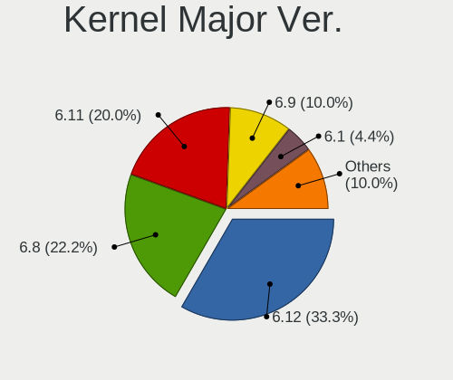
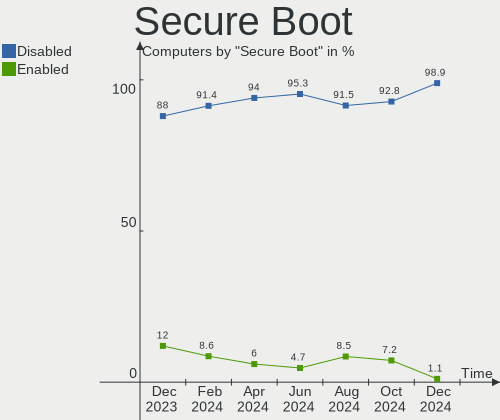
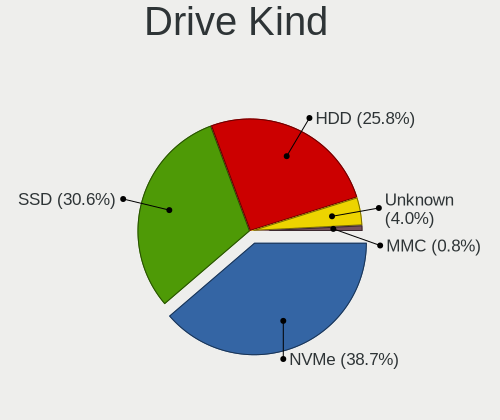
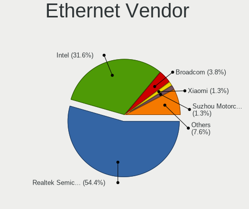
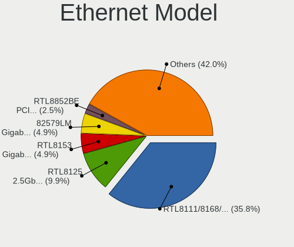

Linux in Netherlands - Hardware Trends
--------------------------------------

A project to identify most popular hardware characteristics and track their change
over time based on data collected by Linux users at https://Linux-Hardware.org.

Anyone can contribute to this report by the [hw-probe](https://github.com/linuxhw/hw-probe) tool:

    sudo -E hw-probe -all -upload

This is a report for all computer types. See also reports for [desktops](/Location/Netherlands/Desktop/README.md) and [notebooks](/Location/Netherlands/Notebook/README.md).

Period: Jul, 2023.

Contents
--------

* [ System ](#system)
  - [ OS                       ](#os)
  - [ OS Family                ](#os-family)
  - [ Kernel                   ](#kernel)
  - [ Kernel Family            ](#kernel-family)
  - [ Kernel Major Ver.        ](#kernel-major-ver)
  - [ Arch                     ](#arch)
  - [ DE                       ](#de)
  - [ Display Server           ](#display-server)
  - [ Display Manager          ](#display-manager)
  - [ OS Lang                  ](#os-lang)
  - [ Boot Mode                ](#boot-mode)
  - [ Filesystem               ](#filesystem)
  - [ Part. scheme             ](#part-scheme)
  - [ Dual Boot with Linux/BSD ](#dual-boot-with-linuxbsd)
  - [ Dual Boot (Win)          ](#dual-boot-win)

* [ Board ](#board)
  - [ Vendor                   ](#vendor)
  - [ Model                    ](#model)
  - [ Model Family             ](#model-family)
  - [ MFG Year                 ](#mfg-year)
  - [ Form Factor              ](#form-factor)
  - [ Secure Boot              ](#secure-boot)
  - [ Coreboot                 ](#coreboot)
  - [ RAM Size                 ](#ram-size)
  - [ RAM Used                 ](#ram-used)
  - [ Total Drives             ](#total-drives)
  - [ Has CD-ROM               ](#has-cd-rom)
  - [ Has Ethernet             ](#has-ethernet)
  - [ Has WiFi                 ](#has-wifi)
  - [ Has Bluetooth            ](#has-bluetooth)

* [ Location ](#location)
  - [ Country                  ](#country)
  - [ City                     ](#city)

* [ Drives ](#drives)
  - [ Drive Vendor             ](#drive-vendor)
  - [ Drive Model              ](#drive-model)
  - [ HDD Vendor               ](#hdd-vendor)
  - [ SSD Vendor               ](#ssd-vendor)
  - [ Drive Kind               ](#drive-kind)
  - [ Drive Connector          ](#drive-connector)
  - [ Drive Size               ](#drive-size)
  - [ Space Total              ](#space-total)
  - [ Space Used               ](#space-used)
  - [ Malfunc. Drives          ](#malfunc-drives)
  - [ Malfunc. Drive Vendor    ](#malfunc-drive-vendor)
  - [ Malfunc. HDD Vendor      ](#malfunc-hdd-vendor)
  - [ Malfunc. Drive Kind      ](#malfunc-drive-kind)
  - [ Failed Drives            ](#failed-drives)
  - [ Failed Drive Vendor      ](#failed-drive-vendor)
  - [ Drive Status             ](#drive-status)

* [ Storage controller ](#storage-controller)
  - [ Storage Vendor           ](#storage-vendor)
  - [ Storage Model            ](#storage-model)
  - [ Storage Kind             ](#storage-kind)

* [ Processor ](#processor)
  - [ CPU Vendor               ](#cpu-vendor)
  - [ CPU Model                ](#cpu-model)
  - [ CPU Model Family         ](#cpu-model-family)
  - [ CPU Cores                ](#cpu-cores)
  - [ CPU Sockets              ](#cpu-sockets)
  - [ CPU Threads              ](#cpu-threads)
  - [ CPU Op-Modes             ](#cpu-op-modes)
  - [ CPU Microcode            ](#cpu-microcode)
  - [ CPU Microarch            ](#cpu-microarch)

* [ Graphics ](#graphics)
  - [ GPU Vendor               ](#gpu-vendor)
  - [ GPU Model                ](#gpu-model)
  - [ GPU Combo                ](#gpu-combo)
  - [ GPU Driver               ](#gpu-driver)
  - [ GPU Memory               ](#gpu-memory)

* [ Monitor ](#monitor)
  - [ Monitor Vendor           ](#monitor-vendor)
  - [ Monitor Model            ](#monitor-model)
  - [ Monitor Resolution       ](#monitor-resolution)
  - [ Monitor Diagonal         ](#monitor-diagonal)
  - [ Monitor Width            ](#monitor-width)
  - [ Aspect Ratio             ](#aspect-ratio)
  - [ Monitor Area             ](#monitor-area)
  - [ Pixel Density            ](#pixel-density)
  - [ Multiple Monitors        ](#multiple-monitors)

* [ Network ](#network)
  - [ Net Controller Vendor    ](#net-controller-vendor)
  - [ Net Controller Model     ](#net-controller-model)
  - [ Wireless Vendor          ](#wireless-vendor)
  - [ Wireless Model           ](#wireless-model)
  - [ Ethernet Vendor          ](#ethernet-vendor)
  - [ Ethernet Model           ](#ethernet-model)
  - [ Net Controller Kind      ](#net-controller-kind)
  - [ Used Controller          ](#used-controller)
  - [ NICs                     ](#nics)
  - [ IPv6                     ](#ipv6)

* [ Bluetooth ](#bluetooth)
  - [ Bluetooth Vendor         ](#bluetooth-vendor)
  - [ Bluetooth Model          ](#bluetooth-model)

* [ Sound ](#sound)
  - [ Sound Vendor             ](#sound-vendor)
  - [ Sound Model              ](#sound-model)

* [ Memory ](#memory)
  - [ Memory Vendor            ](#memory-vendor)
  - [ Memory Model             ](#memory-model)
  - [ Memory Kind              ](#memory-kind)
  - [ Memory Form Factor       ](#memory-form-factor)
  - [ Memory Size              ](#memory-size)
  - [ Memory Speed             ](#memory-speed)

* [ Printers & scanners ](#printers--scanners)
  - [ Printer Vendor           ](#printer-vendor)
  - [ Printer Model            ](#printer-model)
  - [ Scanner Vendor           ](#scanner-vendor)
  - [ Scanner Model            ](#scanner-model)

* [ Camera ](#camera)
  - [ Camera Vendor            ](#camera-vendor)
  - [ Camera Model             ](#camera-model)

* [ Security ](#security)
  - [ Fingerprint Vendor       ](#fingerprint-vendor)
  - [ Fingerprint Model        ](#fingerprint-model)
  - [ Chipcard Vendor          ](#chipcard-vendor)
  - [ Chipcard Model           ](#chipcard-model)

* [ Unsupported ](#unsupported)
  - [ Unsupported Devices      ](#unsupported-devices)
  - [ Unsupported Device Types ](#unsupported-device-types)

System
------

OS
--

Installed operating systems

| Name                 | Computers | Percent |
|----------------------|-----------|---------|
| Fedora 38            | 15        | 13.64%  |
| Ubuntu 22.04         | 14        | 12.73%  |
| Ubuntu 23.04         | 7         | 6.36%   |
| Linux Mint 21.1      | 7         | 6.36%   |
| Zorin 16             | 4         | 3.64%   |
| Pop!_OS 22.04        | 4         | 3.64%   |
| Manjaro              | 4         | 3.64%   |
| Debian 12            | 4         | 3.64%   |
| Arch Rolling         | 4         | 3.64%   |
| Manjaro 23.0.0       | 3         | 2.73%   |
| Linux Mint 21.2      | 3         | 2.73%   |
| KDE neon 22.04       | 3         | 2.73%   |
| Debian 11            | 3         | 2.73%   |
| Ubuntu 22.10         | 2         | 1.82%   |
| Ubuntu 20.04         | 2         | 1.82%   |
| OpenMandriva 23.06   | 2         | 1.82%   |
| Nobara 38            | 2         | 1.82%   |
| Linux Mint 20.3      | 2         | 1.82%   |
| Kubuntu 23.04        | 2         | 1.82%   |
| Kubuntu 22.04        | 2         | 1.82%   |
| EndeavourOS Rolling  | 2         | 1.82%   |
| Xubuntu 22.04        | 1         | 0.91%   |
| Void Linux Rolling   | 1         | 0.91%   |
| Ubuntu 18.04         | 1         | 0.91%   |
| Solus 4.4            | 1         | 0.91%   |
| ROSA R11.1           | 1         | 0.91%   |
| Raspbian 11          | 1         | 0.91%   |
| Parrot 5.3           | 1         | 0.91%   |
| openSUSE Leap-15.5   | 1         | 0.91%   |
| OpenMandriva 23.07   | 1         | 0.91%   |
| OpenMandriva 23.03   | 1         | 0.91%   |
| Nobara 37            | 1         | 0.91%   |
| Linux Mint 20.2      | 1         | 0.91%   |
| Gentoo 2.13          | 1         | 0.91%   |
| Garuda Linux Soaring | 1         | 0.91%   |
| Elementary 7         | 1         | 0.91%   |
| Elementary 6.1       | 1         | 0.91%   |
| Deepin 23            | 1         | 0.91%   |
| ArcoLinux Rolling    | 1         | 0.91%   |
| Alpine 3.18.2        | 1         | 0.91%   |

OS Family
---------

OS without a version

| Name         | Computers | Percent |
|--------------|-----------|---------|
| Ubuntu       | 26        | 23.64%  |
| Fedora       | 15        | 13.64%  |
| Linux Mint   | 13        | 11.82%  |
| Manjaro      | 7         | 6.36%   |
| Debian       | 7         | 6.36%   |
| Zorin        | 4         | 3.64%   |
| Pop!_OS      | 4         | 3.64%   |
| OpenMandriva | 4         | 3.64%   |
| Kubuntu      | 4         | 3.64%   |
| Arch         | 4         | 3.64%   |
| Nobara       | 3         | 2.73%   |
| KDE neon     | 3         | 2.73%   |
| EndeavourOS  | 2         | 1.82%   |
| Elementary   | 2         | 1.82%   |
| Xubuntu      | 1         | 0.91%   |
| Void Linux   | 1         | 0.91%   |
| Solus        | 1         | 0.91%   |
| ROSA         | 1         | 0.91%   |
| Raspbian     | 1         | 0.91%   |
| Parrot       | 1         | 0.91%   |
| openSUSE     | 1         | 0.91%   |
| Gentoo       | 1         | 0.91%   |
| Garuda Linux | 1         | 0.91%   |
| Deepin       | 1         | 0.91%   |
| ArcoLinux    | 1         | 0.91%   |
| Alpine       | 1         | 0.91%   |

Kernel
------

Version of the Linux kernel

| Version                      | Computers | Percent |
|------------------------------|-----------|---------|
| 5.15.0-76-generic            | 15        | 13.64%  |
| 5.19.0-46-generic            | 14        | 12.73%  |
| 6.2.0-24-generic             | 7         | 6.36%   |
| 6.3.11-200.fc38.x86_64       | 5         | 4.55%   |
| 6.2.6-76060206-generic       | 4         | 3.64%   |
| 5.19.0-50-generic            | 4         | 3.64%   |
| 5.15.0-78-generic            | 4         | 3.64%   |
| 6.3.8-200.fc38.x86_64        | 3         | 2.73%   |
| 6.3.12-200.fc38.x86_64       | 3         | 2.73%   |
| 5.10.0-23-amd64              | 3         | 2.73%   |
| 6.4.4-200.fc38.x86_64        | 2         | 1.82%   |
| 6.4.3-arch1-1                | 2         | 1.82%   |
| 6.3.5-desktop-3omv2390       | 2         | 1.82%   |
| 6.1.31-2-MANJARO             | 2         | 1.82%   |
| 6.1.0-9-amd64                | 2         | 1.82%   |
| 6.4.7-arch1-1                | 1         | 0.91%   |
| 6.4.6-200.fc38.x86_64        | 1         | 0.91%   |
| 6.4.6-1-MANJARO              | 1         | 0.91%   |
| 6.4.5-x64v3-xanmod1          | 1         | 0.91%   |
| 6.4.4-arch1-1                | 1         | 0.91%   |
| 6.4.3-arch1-2                | 1         | 0.91%   |
| 6.4.3-273-tkg-pds            | 1         | 0.91%   |
| 6.4.3-1-MANJARO              | 1         | 0.91%   |
| 6.4.3-1-liquorix-amd64       | 1         | 0.91%   |
| 6.3.9-arch1-1                | 1         | 0.91%   |
| 6.3.8-240.current            | 1         | 0.91%   |
| 6.3.13-1-MANJARO             | 1         | 0.91%   |
| 6.3.12_1                     | 1         | 0.91%   |
| 6.3.12-204.fsync.fc38.x86_64 | 1         | 0.91%   |
| 6.3.12-204.fsync.fc37.x86_64 | 1         | 0.91%   |
| 6.3.12-203.fsync.fc38.x86_64 | 1         | 0.91%   |
| 6.3.12-1-MANJARO             | 1         | 0.91%   |
| 6.2.6-desktop-1omv2390       | 1         | 0.91%   |
| 6.2.15-300.fc38.x86_64       | 1         | 0.91%   |
| 6.2.0-25-generic             | 1         | 0.91%   |
| 6.2.0-20-generic             | 1         | 0.91%   |
| 6.2.0-1008-lowlatency        | 1         | 0.91%   |
| 6.1.38-x86_64                | 1         | 0.91%   |
| 6.1.35-1-lts                 | 1         | 0.91%   |
| 6.1.34-0-lts                 | 1         | 0.91%   |

Kernel Family
-------------

Linux kernel without a distro release

| Version  | Computers | Percent |
|----------|-----------|---------|
| 5.19.0   | 19        | 17.27%  |
| 5.15.0   | 19        | 17.27%  |
| 6.2.0    | 10        | 9.09%   |
| 6.3.12   | 8         | 7.27%   |
| 6.4.3    | 6         | 5.45%   |
| 6.3.11   | 5         | 4.55%   |
| 6.2.6    | 5         | 4.55%   |
| 6.3.8    | 4         | 3.64%   |
| 6.1.0    | 4         | 3.64%   |
| 6.4.4    | 3         | 2.73%   |
| 5.10.0   | 3         | 2.73%   |
| 6.4.6    | 2         | 1.82%   |
| 6.3.5    | 2         | 1.82%   |
| 6.1.31   | 2         | 1.82%   |
| 5.4.0    | 2         | 1.82%   |
| 4.15.0   | 2         | 1.82%   |
| 6.4.7    | 1         | 0.91%   |
| 6.4.5    | 1         | 0.91%   |
| 6.3.9    | 1         | 0.91%   |
| 6.3.13   | 1         | 0.91%   |
| 6.2.15   | 1         | 0.91%   |
| 6.1.38   | 1         | 0.91%   |
| 6.1.35   | 1         | 0.91%   |
| 6.1.34   | 1         | 0.91%   |
| 6.1.32   | 1         | 0.91%   |
| 6.1.21   | 1         | 0.91%   |
| 6.1.1    | 1         | 0.91%   |
| 5.15.120 | 1         | 0.91%   |
| 5.14.21  | 1         | 0.91%   |
| 5.11.0   | 1         | 0.91%   |

Kernel Major Ver.
-----------------

Linux kernel major version

| Version | Computers | Percent |
|---------|-----------|---------|
| 6.3     | 21        | 19.09%  |
| 5.15    | 20        | 18.18%  |
| 5.19    | 19        | 17.27%  |
| 6.2     | 16        | 14.55%  |
| 6.4     | 13        | 11.82%  |
| 6.1     | 12        | 10.91%  |
| 5.10    | 3         | 2.73%   |
| 5.4     | 2         | 1.82%   |
| 4.15    | 2         | 1.82%   |
| 5.14    | 1         | 0.91%   |
| 5.11    | 1         | 0.91%   |

Arch
----

OS architecture (x86_64, i586, etc.)

| Name    | Computers | Percent |
|---------|-----------|---------|
| x86_64  | 108       | 98.18%  |
| i686    | 1         | 0.91%   |
| aarch64 | 1         | 0.91%   |

DE
--

Desktop Environment

| Name             | Computers | Percent |
|------------------|-----------|---------|
| GNOME            | 51        | 46.36%  |
| KDE5             | 21        | 19.09%  |
| X-Cinnamon       | 11        | 10%     |
| XFCE             | 5         | 4.55%   |
| Unknown          | 5         | 4.55%   |
| MATE             | 3         | 2.73%   |
| LXDE             | 3         | 2.73%   |
| Pantheon         | 2         | 1.82%   |
| i3               | 2         | 1.82%   |
| Deepin           | 2         | 1.82%   |
| sway             | 1         | 0.91%   |
| lightdm-xsession | 1         | 0.91%   |
| KDE4             | 1         | 0.91%   |
| Cinnamon         | 1         | 0.91%   |
| Budgie           | 1         | 0.91%   |

Display Server
--------------

X11 or Wayland

| Name    | Computers | Percent |
|---------|-----------|---------|
| X11     | 69        | 62.73%  |
| Wayland | 35        | 31.82%  |
| Tty     | 4         | 3.64%   |
| Unknown | 2         | 1.82%   |

Display Manager
---------------

SDDM, LightDM, etc.

| Name    | Computers | Percent |
|---------|-----------|---------|
| Unknown | 46        | 41.82%  |
| GDM3    | 24        | 21.82%  |
| LightDM | 17        | 15.45%  |
| SDDM    | 14        | 12.73%  |
| GDM     | 8         | 7.27%   |
| KDM     | 1         | 0.91%   |

OS Lang
-------

Language

| Lang    | Computers | Percent |
|---------|-----------|---------|
| en_US   | 63        | 57.27%  |
| nl_NL   | 29        | 26.36%  |
| en_GB   | 4         | 3.64%   |
| de_DE   | 3         | 2.73%   |
| ru_RU   | 2         | 1.82%   |
| C       | 2         | 1.82%   |
| tr_TR   | 1         | 0.91%   |
| sk_SK   | 1         | 0.91%   |
| pl_PL   | 1         | 0.91%   |
| fr_FR   | 1         | 0.91%   |
| en_NL   | 1         | 0.91%   |
| ca_ES   | 1         | 0.91%   |
| Unknown | 1         | 0.91%   |

Boot Mode
---------

EFI or BIOS

| Mode | Computers | Percent |
|------|-----------|---------|
| EFI  | 59        | 53.64%  |
| BIOS | 51        | 46.36%  |

Filesystem
----------

Type of filesystem

| Type    | Computers | Percent |
|---------|-----------|---------|
| Ext4    | 66        | 60%     |
| Tmpfs   | 22        | 20%     |
| Btrfs   | 20        | 18.18%  |
| Overlay | 2         | 1.82%   |

Part. scheme
------------

Scheme of partitioning

| Type    | Computers | Percent |
|---------|-----------|---------|
| GPT     | 63        | 57.27%  |
| Unknown | 44        | 40%     |
| MBR     | 3         | 2.73%   |

Dual Boot with Linux/BSD
------------------------

Hosting more than one Linux/BSD

| Dual boot | Computers | Percent |
|-----------|-----------|---------|
| No        | 94        | 85.45%  |
| Yes       | 16        | 14.55%  |

Dual Boot (Win)
---------------

Hosting Linux and Windows

| Dual boot | Computers | Percent |
|-----------|-----------|---------|
| No        | 85        | 77.27%  |
| Yes       | 25        | 22.73%  |

Board
-----

Vendor
------

Motherboard manufacturer

| Name                    | Computers | Percent |
|-------------------------|-----------|---------|
| Lenovo                  | 17        | 15.45%  |
| Hewlett-Packard         | 15        | 13.64%  |
| ASUSTek Computer        | 15        | 13.64%  |
| ASRock                  | 10        | 9.09%   |
| MSI                     | 8         | 7.27%   |
| Dell                    | 8         | 7.27%   |
| Acer                    | 6         | 5.45%   |
| Gigabyte Technology     | 5         | 4.55%   |
| Apple                   | 5         | 4.55%   |
| Intel                   | 4         | 3.64%   |
| Notebook                | 3         | 2.73%   |
| VALE                    | 1         | 0.91%   |
| Toshiba                 | 1         | 0.91%   |
| Standard                | 1         | 0.91%   |
| Sony                    | 1         | 0.91%   |
| Raspberry Pi Foundation | 1         | 0.91%   |
| Pegatron                | 1         | 0.91%   |
| Packard Bell            | 1         | 0.91%   |
| MP                      | 1         | 0.91%   |
| Minix                   | 1         | 0.91%   |
| Medion                  | 1         | 0.91%   |
| ECS                     | 1         | 0.91%   |
| BESSTAR Tech            | 1         | 0.91%   |
| AMI                     | 1         | 0.91%   |
| Unknown                 | 1         | 0.91%   |

Model
-----

Motherboard model

| Name                                        | Computers | Percent |
|---------------------------------------------|-----------|---------|
| HP Z440 Workstation                         | 2         | 1.82%   |
| ASRock B450 Gaming-ITX/ac                   | 2         | 1.82%   |
| Unknown                                     | 2         | 1.82%   |
| VALE Notebook Classic C140                  | 1         | 0.91%   |
| Toshiba Satellite C850-1GL                  | 1         | 0.91%   |
| Sony SVF1521A6EW                            | 1         | 0.91%   |
| RPi Raspberry Pi 4 Model B Rev 1.5          | 1         | 0.91%   |
| Pegatron 520-1000nl                         | 1         | 0.91%   |
| Packard Bell EasyNote TJ67                  | 1         | 0.91%   |
| Notebook NJx0PU                             | 1         | 0.91%   |
| Notebook NH5x_7xDPx                         | 1         | 0.91%   |
| Notebook NH50_70RH                          | 1         | 0.91%   |
| MSI Prestige 14Evo A12M                     | 1         | 0.91%   |
| MSI MS-7E06                                 | 1         | 0.91%   |
| MSI MS-7D08                                 | 1         | 0.91%   |
| MSI MS-7C94                                 | 1         | 0.91%   |
| MSI MS-7C02                                 | 1         | 0.91%   |
| MSI MS-7B51                                 | 1         | 0.91%   |
| MSI MS-7A74                                 | 1         | 0.91%   |
| MSI MS-7982                                 | 1         | 0.91%   |
| MP MS-7848                                  | 1         | 0.91%   |
| Minix NEO Z83-4A                            | 1         | 0.91%   |
| Medion E4251 MD61435                        | 1         | 0.91%   |
| Lenovo ThinkPad X1 Carbon Gen 11 21HMCTO1WW | 1         | 0.91%   |
| Lenovo ThinkPad X1 Carbon Gen 10 21CBCTO1WW | 1         | 0.91%   |
| Lenovo ThinkPad T470s 20HGS1VD00            | 1         | 0.91%   |
| Lenovo ThinkPad T470 W10DG 20JNS0K009       | 1         | 0.91%   |
| Lenovo ThinkPad T14 Gen 1 20UDCTO1WW        | 1         | 0.91%   |
| Lenovo ThinkCentre M720q 10T700AHMH         | 1         | 0.91%   |
| Lenovo ThinkCentre M70q Gen 3 11T300B5MH    | 1         | 0.91%   |
| Lenovo ThinkBook 15 G2 ITL 20VE             | 1         | 0.91%   |
| Lenovo Legion Y540-17IRH 81Q4               | 1         | 0.91%   |
| Lenovo Legion T5 26AMR5 90RC01G7MH          | 1         | 0.91%   |
| Lenovo Legion 5 Pro 16IAH7H 82RF            | 1         | 0.91%   |
| Lenovo IdeaPadFlex 5 16ABR8 82XY            | 1         | 0.91%   |
| Lenovo IdeaPad 5 15ARE05 81YQ               | 1         | 0.91%   |
| Lenovo IdeaPad 5 14ARE05 81YM               | 1         | 0.91%   |
| Lenovo IdeaCentre 510A-15ARR 90J0000WBF     | 1         | 0.91%   |
| Lenovo H530s 10132                          | 1         | 0.91%   |
| Lenovo G50-70 20351                         | 1         | 0.91%   |

Model Family
------------

Motherboard model prefix

| Name                  | Computers | Percent |
|-----------------------|-----------|---------|
| Lenovo ThinkPad       | 5         | 4.55%   |
| Lenovo Legion         | 3         | 2.73%   |
| HP ZBook              | 3         | 2.73%   |
| HP Pavilion           | 3         | 2.73%   |
| HP EliteBook          | 3         | 2.73%   |
| ASUS TUF              | 3         | 2.73%   |
| Acer TravelMate       | 3         | 2.73%   |
| Lenovo ThinkCentre    | 2         | 1.82%   |
| Lenovo IdeaPad        | 2         | 1.82%   |
| HP Z440               | 2         | 1.82%   |
| Dell Latitude         | 2         | 1.82%   |
| ASRock B450           | 2         | 1.82%   |
| Acer Aspire           | 2         | 1.82%   |
| Unknown               | 2         | 1.82%   |
| VALE Notebook         | 1         | 0.91%   |
| Toshiba Satellite     | 1         | 0.91%   |
| Sony SVF1521A6EW      | 1         | 0.91%   |
| RPi Raspberry         | 1         | 0.91%   |
| Pegatron 520-1000nl   | 1         | 0.91%   |
| Packard Bell EasyNote | 1         | 0.91%   |
| Notebook NJx0PU       | 1         | 0.91%   |
| Notebook NH5x         | 1         | 0.91%   |
| Notebook NH50         | 1         | 0.91%   |
| MSI Prestige          | 1         | 0.91%   |
| MSI MS-7E06           | 1         | 0.91%   |
| MSI MS-7D08           | 1         | 0.91%   |
| MSI MS-7C94           | 1         | 0.91%   |
| MSI MS-7C02           | 1         | 0.91%   |
| MSI MS-7B51           | 1         | 0.91%   |
| MSI MS-7A74           | 1         | 0.91%   |
| MSI MS-7982           | 1         | 0.91%   |
| MP MS-7848            | 1         | 0.91%   |
| Minix NEO             | 1         | 0.91%   |
| Medion E4251          | 1         | 0.91%   |
| Lenovo ThinkBook      | 1         | 0.91%   |
| Lenovo IdeaPadFlex    | 1         | 0.91%   |
| Lenovo IdeaCentre     | 1         | 0.91%   |
| Lenovo H530s          | 1         | 0.91%   |
| Lenovo G50-70         | 1         | 0.91%   |
| Intel NUC7i7DNKE      | 1         | 0.91%   |

MFG Year
--------

Motherboard manufacture year

| Year    | Computers | Percent |
|---------|-----------|---------|
| 2022    | 15        | 13.64%  |
| 2018    | 15        | 13.64%  |
| 2019    | 11        | 10%     |
| 2020    | 8         | 7.27%   |
| 2013    | 8         | 7.27%   |
| 2021    | 7         | 6.36%   |
| 2014    | 6         | 5.45%   |
| 2011    | 6         | 5.45%   |
| 2010    | 6         | 5.45%   |
| 2023    | 5         | 4.55%   |
| 2017    | 5         | 4.55%   |
| 2012    | 4         | 3.64%   |
| 2016    | 3         | 2.73%   |
| 2015    | 3         | 2.73%   |
| 2009    | 3         | 2.73%   |
| 2008    | 3         | 2.73%   |
| 2005    | 1         | 0.91%   |
| Unknown | 1         | 0.91%   |

Form Factor
-----------

Physical design of the computer

| Name           | Computers | Percent |
|----------------|-----------|---------|
| Notebook       | 49        | 44.55%  |
| Desktop        | 46        | 41.82%  |
| Mini pc        | 7         | 6.36%   |
| All in one     | 4         | 3.64%   |
| System on chip | 1         | 0.91%   |
| Tablet         | 1         | 0.91%   |
| Convertible    | 1         | 0.91%   |
| Server         | 1         | 0.91%   |

Secure Boot
-----------

Enabled or disabled

| State    | Computers | Percent |
|----------|-----------|---------|
| Disabled | 107       | 97.27%  |
| Enabled  | 3         | 2.73%   |

Coreboot
--------

Have coreboot on board

| Used | Computers | Percent |
|------|-----------|---------|
| No   | 110       | 100%    |

RAM Size
--------

Total RAM memory

| Size in GB  | Computers | Percent |
|-------------|-----------|---------|
| 16.01-24.0  | 26        | 23.64%  |
| 32.01-64.0  | 23        | 20.91%  |
| 4.01-8.0    | 18        | 16.36%  |
| 8.01-16.0   | 17        | 15.45%  |
| 3.01-4.0    | 16        | 14.55%  |
| 64.01-256.0 | 6         | 5.45%   |
| 1.01-2.0    | 2         | 1.82%   |
| 24.01-32.0  | 1         | 0.91%   |
| 2.01-3.0    | 1         | 0.91%   |

RAM Used
--------

Used RAM memory

| Used GB    | Computers | Percent |
|------------|-----------|---------|
| 4.01-8.0   | 28        | 25.45%  |
| 2.01-3.0   | 25        | 22.73%  |
| 1.01-2.0   | 25        | 22.73%  |
| 3.01-4.0   | 14        | 12.73%  |
| 8.01-16.0  | 9         | 8.18%   |
| 0.51-1.0   | 6         | 5.45%   |
| 0.01-0.5   | 2         | 1.82%   |
| 16.01-24.0 | 1         | 0.91%   |

Total Drives
------------

Number of drives on board

| Drives | Computers | Percent |
|--------|-----------|---------|
| 1      | 62        | 56.36%  |
| 2      | 25        | 22.73%  |
| 3      | 10        | 9.09%   |
| 4      | 5         | 4.55%   |
| 5      | 4         | 3.64%   |
| 0      | 2         | 1.82%   |
| 7      | 1         | 0.91%   |
| 6      | 1         | 0.91%   |

Has CD-ROM
----------

Has CD-ROM on board

| Presented | Computers | Percent |
|-----------|-----------|---------|
| No        | 78        | 70.91%  |
| Yes       | 32        | 29.09%  |

Has Ethernet
------------

Has Ethernet on board

| Presented | Computers | Percent |
|-----------|-----------|---------|
| Yes       | 96        | 87.27%  |
| No        | 14        | 12.73%  |

Has WiFi
--------

Has WiFi module

| Presented | Computers | Percent |
|-----------|-----------|---------|
| Yes       | 83        | 75.45%  |
| No        | 27        | 24.55%  |

Has Bluetooth
-------------

Has Bluetooth module

| Presented | Computers | Percent |
|-----------|-----------|---------|
| Yes       | 67        | 60.91%  |
| No        | 43        | 39.09%  |

Location
--------

Country
-------

Geographic location (country)

| Country     | Computers | Percent |
|-------------|-----------|---------|
| Netherlands | 110       | 100%    |

City
----

Geographic location (city)

| City                | Computers | Percent |
|---------------------|-----------|---------|
| Amsterdam           | 15        | 13.64%  |
| The Hague           | 7         | 6.36%   |
| Rotterdam           | 5         | 4.55%   |
| Utrecht             | 4         | 3.64%   |
| Roosendaal          | 3         | 2.73%   |
| Enschede            | 3         | 2.73%   |
| Blaricum            | 3         | 2.73%   |
| Almere Stad         | 3         | 2.73%   |
| Purmerend           | 2         | 1.82%   |
| Eindhoven           | 2         | 1.82%   |
| Arnhem              | 2         | 1.82%   |
| Amersfoort          | 2         | 1.82%   |
| Alphen aan den Rijn | 2         | 1.82%   |
| Alkmaar             | 2         | 1.82%   |
| Wolvega             | 1         | 0.91%   |
| Witmarsum           | 1         | 0.91%   |
| Weert               | 1         | 0.91%   |
| Wassenaar           | 1         | 0.91%   |
| Vriezenveen         | 1         | 0.91%   |
| Voorthuizen         | 1         | 0.91%   |
| Voorburg            | 1         | 0.91%   |
| Volkel              | 1         | 0.91%   |
| Vleuten             | 1         | 0.91%   |
| Uden                | 1         | 0.91%   |
| Tjalleberd          | 1         | 0.91%   |
| Terneuzen           | 1         | 0.91%   |
| Tegelen             | 1         | 0.91%   |
| Stramproy           | 1         | 0.91%   |
| Stolwijk            | 1         | 0.91%   |
| Sprundel            | 1         | 0.91%   |
| Schoonhoven         | 1         | 0.91%   |
| Ridderkerk          | 1         | 0.91%   |
| Rhenen              | 1         | 0.91%   |
| Oisterwijk          | 1         | 0.91%   |
| Nunspeet            | 1         | 0.91%   |
| Nijmegen            | 1         | 0.91%   |
| Nieuwegein          | 1         | 0.91%   |
| Nieuw-Weerdinge     | 1         | 0.91%   |
| Nieuw-Beijerland    | 1         | 0.91%   |
| Naaldwijk           | 1         | 0.91%   |

Drives
------

Drive Vendor
------------

Hard drive vendors

| Vendor                      | Computers | Drives | Percent |
|-----------------------------|-----------|--------|---------|
| Samsung Electronics         | 43        | 56     | 24.57%  |
| WDC                         | 24        | 28     | 13.71%  |
| Seagate                     | 15        | 15     | 8.57%   |
| Sandisk                     | 13        | 14     | 7.43%   |
| Toshiba                     | 9         | 11     | 5.14%   |
| Kingston                    | 9         | 9      | 5.14%   |
| Micron Technology           | 7         | 7      | 4%      |
| Crucial                     | 6         | 6      | 3.43%   |
| SK hynix                    | 4         | 4      | 2.29%   |
| Intel                       | 4         | 4      | 2.29%   |
| Unknown                     | 3         | 3      | 1.71%   |
| PNY                         | 3         | 3      | 1.71%   |
| Kingston Technology Company | 3         | 3      | 1.71%   |
| Intenso                     | 3         | 3      | 1.71%   |
| Hitachi                     | 3         | 3      | 1.71%   |
| China                       | 3         | 3      | 1.71%   |
| LITEONIT                    | 2         | 2      | 1.14%   |
| KIOXIA                      | 2         | 2      | 1.14%   |
| JMicron Technology          | 2         | 2      | 1.14%   |
| GOODRAM                     | 2         | 2      | 1.14%   |
| Apple                       | 2         | 2      | 1.14%   |
| Unknown                     | 2         | 2      | 1.14%   |
| XPG                         | 1         | 1      | 0.57%   |
| Union Memory (Shenzhen)     | 1         | 1      | 0.57%   |
| Seagate Technology          | 1         | 1      | 0.57%   |
| Phison Electronics          | 1         | 1      | 0.57%   |
| Phison                      | 1         | 1      | 0.57%   |
| Patriot                     | 1         | 1      | 0.57%   |
| OCZ-VERTEX2                 | 1         | 1      | 0.57%   |
| Netac                       | 1         | 1      | 0.57%   |
| Micron/Crucial Technology   | 1         | 1      | 0.57%   |
| GOFATOO                     | 1         | 1      | 0.57%   |
| ASMT                        | 1         | 2      | 0.57%   |

Drive Model
-----------

Hard drive models

| Model                                               | Computers | Percent |
|-----------------------------------------------------|-----------|---------|
| Samsung NVMe SSD Controller SM981/PM981/PM983 500GB | 8         | 4.28%   |
| Samsung NVMe SSD Controller PM9A1/PM9A3/980PRO 1TB  | 5         | 2.67%   |
| Samsung SSD 850 EVO 500GB                           | 4         | 2.14%   |
| Samsung SSD 980 500GB                               | 3         | 1.6%    |
| Samsung SSD 990 PRO 2TB                             | 2         | 1.07%   |
| Samsung SSD 870 QVO 1TB                             | 2         | 1.07%   |
| Samsung SSD 860 QVO 1TB                             | 2         | 1.07%   |
| Samsung SSD 860 EVO 1TB                             | 2         | 1.07%   |
| Samsung NVMe SSD Controller SM961/PM961/SM963 256GB | 2         | 1.07%   |
| Samsung MZALQ512HALU-000L2 512GB                    | 2         | 1.07%   |
| Kingston Company SNV2S2000G 2TB                     | 2         | 1.07%   |
| Kingston SV300S37A120G 120GB SSD                    | 2         | 1.07%   |
| Kingston SA400S37480G 480GB SSD                     | 2         | 1.07%   |
| JMicron Tech 250GB                                  | 2         | 1.07%   |
| Crucial CT250MX500SSD1 250GB                        | 2         | 1.07%   |
| Unknown                                             | 2         | 1.07%   |
| XPG GAMMIX S11 Pro 1TB                              | 1         | 0.53%   |
| WDC WDS250G2B0A-00SM50 250GB SSD                    | 1         | 0.53%   |
| WDC WDS250G1B0A-00H9H0 250GB SSD                    | 1         | 0.53%   |
| WDC WDS240G2G0A-00JH30 240GB SSD                    | 1         | 0.53%   |
| WDC WD7500BPKX-22HPJT0 752GB                        | 1         | 0.53%   |
| WDC WD60EFRX-68MYMN1 6TB                            | 1         | 0.53%   |
| WDC WD5000BEVT-22A0RT0 500GB                        | 1         | 0.53%   |
| WDC WD5000AAVS-00ZTB0 500GB                         | 1         | 0.53%   |
| WDC WD40EFZX-68AWUN0 4TB                            | 1         | 0.53%   |
| WDC WD40EFRX-68N32N0 4TB                            | 1         | 0.53%   |
| WDC WD40 EZRZ-00WN9B0 4TB                           | 1         | 0.53%   |
| WDC WD3200AAJB-00J3A0 320GB                         | 1         | 0.53%   |
| WDC WD2500BEVT-22ZCT0 250GB                         | 1         | 0.53%   |
| WDC WD2500BEVT-22A23T0 250GB                        | 1         | 0.53%   |
| WDC WD2500BEVT-00ZCT0 250GB                         | 1         | 0.53%   |
| WDC WD20SPZX-60UA7T1 2TB                            | 1         | 0.53%   |
| WDC WD20EZRX-00DC0B0 2TB                            | 1         | 0.53%   |
| WDC WD20EZRX-00D8PB0 2TB                            | 1         | 0.53%   |
| WDC WD20EARX-00PASB0 2TB                            | 1         | 0.53%   |
| WDC WD1600BEVT-60ZCT1 160GB                         | 1         | 0.53%   |
| WDC WD1600AAJS-00WAA0 160GB                         | 1         | 0.53%   |
| WDC WD10SPZX-60Z10T0 1TB                            | 1         | 0.53%   |
| WDC WD10EZRZ-00HTKB0 1TB                            | 1         | 0.53%   |
| WDC WD10EZEX-75WN4A0 1TB                            | 1         | 0.53%   |

HDD Vendor
----------

Hard disk drive vendors

| Vendor              | Computers | Drives | Percent |
|---------------------|-----------|--------|---------|
| WDC                 | 22        | 25     | 48.89%  |
| Seagate             | 11        | 11     | 24.44%  |
| Toshiba             | 6         | 8      | 13.33%  |
| Hitachi             | 3         | 3      | 6.67%   |
| Samsung Electronics | 2         | 2      | 4.44%   |
| ASMT                | 1         | 2      | 2.22%   |

SSD Vendor
----------

Solid state drive vendors

| Vendor              | Computers | Drives | Percent |
|---------------------|-----------|--------|---------|
| Samsung Electronics | 19        | 23     | 26.76%  |
| Kingston            | 8         | 8      | 11.27%  |
| SanDisk             | 6         | 6      | 8.45%   |
| Crucial             | 6         | 6      | 8.45%   |
| Micron Technology   | 5         | 5      | 7.04%   |
| WDC                 | 3         | 3      | 4.23%   |
| PNY                 | 3         | 3      | 4.23%   |
| Intenso             | 3         | 3      | 4.23%   |
| China               | 3         | 3      | 4.23%   |
| SK hynix            | 2         | 2      | 2.82%   |
| LITEONIT            | 2         | 2      | 2.82%   |
| GOODRAM             | 2         | 2      | 2.82%   |
| Apple               | 2         | 2      | 2.82%   |
| Toshiba             | 1         | 1      | 1.41%   |
| Phison              | 1         | 1      | 1.41%   |
| Patriot             | 1         | 1      | 1.41%   |
| OCZ-VERTEX2         | 1         | 1      | 1.41%   |
| Netac               | 1         | 1      | 1.41%   |
| Intel               | 1         | 1      | 1.41%   |
| GOFATOO             | 1         | 1      | 1.41%   |

Drive Kind
----------

HDD or SSD

| Kind    | Computers | Drives | Percent |
|---------|-----------|--------|---------|
| SSD     | 66        | 75     | 40.99%  |
| NVMe    | 49        | 62     | 30.43%  |
| HDD     | 38        | 51     | 23.6%   |
| MMC     | 5         | 5      | 3.11%   |
| Unknown | 3         | 3      | 1.86%   |

Drive Connector
---------------

SATA, SAS, NVMe, etc.

| Type | Computers | Drives | Percent |
|------|-----------|--------|---------|
| SATA | 81        | 116    | 55.86%  |
| NVMe | 49        | 62     | 33.79%  |
| SAS  | 10        | 13     | 6.9%    |
| MMC  | 5         | 5      | 3.45%   |

Drive Size
----------

Size of hard drive

| Size in TB | Computers | Drives | Percent |
|------------|-----------|--------|---------|
| 0.01-0.5   | 62        | 69     | 56.88%  |
| 0.51-1.0   | 27        | 32     | 24.77%  |
| 1.01-2.0   | 9         | 9      | 8.26%   |
| 3.01-4.0   | 7         | 10     | 6.42%   |
| 4.01-10.0  | 3         | 3      | 2.75%   |
| 2.01-3.0   | 1         | 3      | 0.92%   |

Space Total
-----------

Amount of disk space available on the file system

| Size in GB     | Computers | Percent |
|----------------|-----------|---------|
| 101-250        | 30        | 27.27%  |
| 251-500        | 19        | 17.27%  |
| More than 3000 | 14        | 12.73%  |
| 1001-2000      | 13        | 11.82%  |
| 501-1000       | 12        | 10.91%  |
| 1-20           | 6         | 5.45%   |
| 2001-3000      | 5         | 4.55%   |
| 51-100         | 5         | 4.55%   |
| Unknown        | 4         | 3.64%   |
| 21-50          | 2         | 1.82%   |

Space Used
----------

Amount of used disk space

| Used GB        | Computers | Percent |
|----------------|-----------|---------|
| 1-20           | 27        | 24.55%  |
| 21-50          | 25        | 22.73%  |
| 101-250        | 16        | 14.55%  |
| 51-100         | 15        | 13.64%  |
| 1001-2000      | 7         | 6.36%   |
| 251-500        | 6         | 5.45%   |
| 501-1000       | 6         | 5.45%   |
| More than 3000 | 4         | 3.64%   |
| Unknown        | 4         | 3.64%   |

Malfunc. Drives
---------------

Drive models with a malfunction

| Model                                         | Computers | Drives | Percent |
|-----------------------------------------------|-----------|--------|---------|
| Seagate ST3320613AS 320GB                     | 1         | 1      | 20%     |
| Micron Technology MTFDDAK128MAM-1J1 128GB SSD | 1         | 1      | 20%     |
| LITEONIT LMT-256M3M 256GB SSD                 | 1         | 1      | 20%     |
| Intel SSDSA2M160G2GC 160GB                    | 1         | 1      | 20%     |
| Hitachi HUA722010CLA330 1TB                   | 1         | 1      | 20%     |

Malfunc. Drive Vendor
---------------------

Vendors of faulty drives

| Vendor            | Computers | Drives | Percent |
|-------------------|-----------|--------|---------|
| Seagate           | 1         | 1      | 20%     |
| Micron Technology | 1         | 1      | 20%     |
| LITEONIT          | 1         | 1      | 20%     |
| Intel             | 1         | 1      | 20%     |
| Hitachi           | 1         | 1      | 20%     |

Malfunc. HDD Vendor
-------------------

Vendors of faulty HDD drives

| Vendor  | Computers | Drives | Percent |
|---------|-----------|--------|---------|
| Seagate | 1         | 1      | 50%     |
| Hitachi | 1         | 1      | 50%     |

Malfunc. Drive Kind
-------------------

Kinds of faulty drives

| Kind | Computers | Drives | Percent |
|------|-----------|--------|---------|
| SSD  | 3         | 3      | 60%     |
| HDD  | 2         | 2      | 40%     |

Failed Drives
-------------

Failed drive models

Zero info for selected period =(

Failed Drive Vendor
-------------------

Failed drive vendors

Zero info for selected period =(

Drive Status
------------

Number of failed and malfunc. drives

| Status   | Computers | Drives | Percent |
|----------|-----------|--------|---------|
| Detected | 69        | 112    | 59.48%  |
| Works    | 43        | 79     | 37.07%  |
| Malfunc  | 4         | 5      | 3.45%   |

Storage controller
------------------

Storage Vendor
--------------

Storage controller vendors

| Vendor                                  | Computers | Percent |
|-----------------------------------------|-----------|---------|
| Intel                                   | 69        | 44.23%  |
| Samsung Electronics                     | 29        | 18.59%  |
| AMD                                     | 26        | 16.67%  |
| SanDisk                                 | 7         | 4.49%   |
| Seagate Technology                      | 3         | 1.92%   |
| Kingston Technology Company             | 3         | 1.92%   |
| Toshiba America Info Systems            | 2         | 1.28%   |
| SK hynix                                | 2         | 1.28%   |
| Micron Technology                       | 2         | 1.28%   |
| Marvell Technology Group                | 2         | 1.28%   |
| KIOXIA                                  | 2         | 1.28%   |
| ASMedia Technology                      | 2         | 1.28%   |
| VIA Technologies                        | 1         | 0.64%   |
| Shenzhen Unionmemory Information System | 1         | 0.64%   |
| Phison Electronics                      | 1         | 0.64%   |
| Nvidia                                  | 1         | 0.64%   |
| Micron/Crucial Technology               | 1         | 0.64%   |
| JMicron Technology                      | 1         | 0.64%   |
| ADATA Technology                        | 1         | 0.64%   |

Storage Model
-------------

Storage controller models

| Model                                                                          | Computers | Percent |
|--------------------------------------------------------------------------------|-----------|---------|
| AMD FCH SATA Controller [AHCI mode]                                            | 16        | 8.99%   |
| Samsung NVMe SSD Controller SM981/PM981/PM983                                  | 9         | 5.06%   |
| Samsung NVMe SSD Controller 980                                                | 8         | 4.49%   |
| Samsung NVMe SSD Controller PM9A1/PM9A3/980PRO                                 | 6         | 3.37%   |
| Intel Sunrise Point-LP SATA Controller [AHCI mode]                             | 6         | 3.37%   |
| Intel Cannon Lake Mobile PCH SATA AHCI Controller                              | 5         | 2.81%   |
| Intel 8 Series/C220 Series Chipset Family 6-port SATA Controller 1 [AHCI mode] | 5         | 2.81%   |
| AMD 400 Series Chipset SATA Controller                                         | 5         | 2.81%   |
| Intel Celeron/Pentium Silver Processor SATA Controller                         | 4         | 2.25%   |
| Intel 7 Series Chipset Family 6-port SATA Controller [AHCI mode]               | 4         | 2.25%   |
| AMD 500 Series Chipset SATA Controller                                         | 4         | 2.25%   |
| SanDisk WD Black SN770 / PC SN740 256GB / PC SN560 (DRAM-less) NVMe SSD        | 3         | 1.69%   |
| Samsung NVMe SSD Controller S4LV008[Pascal]                                    | 3         | 1.69%   |
| Kingston Company Company Non-Volatile memory controller                        | 3         | 1.69%   |
| Intel Volume Management Device NVMe RAID Controller                            | 3         | 1.69%   |
| Intel Tiger Lake-LP SATA Controller                                            | 3         | 1.69%   |
| Intel 82801IBM/IEM (ICH9M/ICH9M-E) 4 port SATA Controller [AHCI mode]          | 3         | 1.69%   |
| Intel 6 Series/C200 Series Chipset Family 6 port Desktop SATA AHCI Controller  | 3         | 1.69%   |
| AMD SB7x0/SB8x0/SB9x0 SATA Controller [AHCI mode]                              | 3         | 1.69%   |
| AMD SB7x0/SB8x0/SB9x0 IDE Controller                                           | 3         | 1.69%   |
| SK hynix Platinum P41/PC801 NVMe Solid State Drive                             | 2         | 1.12%   |
| Seagate FireCuda 520 SSD                                                       | 2         | 1.12%   |
| SanDisk WD Blue SN570 NVMe SSD 1TB                                             | 2         | 1.12%   |
| Samsung NVMe SSD Controller SM961/PM961/SM963                                  | 2         | 1.12%   |
| Intel SATA Controller [RAID mode]                                              | 2         | 1.12%   |
| Intel Cannon Lake PCH SATA AHCI Controller                                     | 2         | 1.12%   |
| Intel 82801 Mobile SATA Controller [RAID mode]                                 | 2         | 1.12%   |
| Intel 700 Series Chipset Family SATA AHCI Controller                           | 2         | 1.12%   |
| Intel 6 Series/C200 Series Chipset Family 6 port Mobile SATA AHCI Controller   | 2         | 1.12%   |
| Intel 5 Series/3400 Series Chipset 6 port SATA AHCI Controller                 | 2         | 1.12%   |
| Intel 200 Series PCH SATA controller [AHCI mode]                               | 2         | 1.12%   |
| VIA VT6415 PATA IDE Host Controller                                            | 1         | 0.56%   |
| Toshiba America Info Systems XG6 NVMe SSD Controller                           | 1         | 0.56%   |
| Toshiba America Info Systems BG3 NVMe SSD Controller                           | 1         | 0.56%   |
| Shenzhen Unionmemory Information System Non-Volatile memory controller         | 1         | 0.56%   |
| Seagate FireCuda 530 SSD                                                       | 1         | 0.56%   |
| Sandisk Western Digital WD Black SN850X NVMe SSD                               | 1         | 0.56%   |
| SanDisk WD PC SN810 / Black SN850 NVMe SSD                                     | 1         | 0.56%   |
| SanDisk WD Blue SN500 / PC SN520 NVMe SSD                                      | 1         | 0.56%   |
| Samsung S4LN053X01 AHCI SSD Controller(Apple slot)                             | 1         | 0.56%   |

Storage Kind
------------

Kind of storage controller (IDE, SATA, NVMe, SAS, ...)

| Kind | Computers | Percent |
|------|-----------|---------|
| SATA | 86        | 55.84%  |
| NVMe | 49        | 31.82%  |
| IDE  | 10        | 6.49%   |
| RAID | 9         | 5.84%   |

Processor
---------

CPU Vendor
----------

Processor vendors

| Vendor | Computers | Percent |
|--------|-----------|---------|
| Intel  | 80        | 72.73%  |
| AMD    | 29        | 26.36%  |
| ARM    | 1         | 0.91%   |

CPU Model
---------

Processor models

| Model                                       | Computers | Percent |
|---------------------------------------------|-----------|---------|
| AMD Ryzen 3 2200G with Radeon Vega Graphics | 3         | 2.73%   |
| Intel Core i7-8750H CPU @ 2.20GHz           | 2         | 1.82%   |
| Intel Core i7-7600U CPU @ 2.80GHz           | 2         | 1.82%   |
| Intel Core i5-8250U CPU @ 1.60GHz           | 2         | 1.82%   |
| Intel Core i3-4160 CPU @ 3.60GHz            | 2         | 1.82%   |
| Intel Celeron J4125 CPU @ 2.00GHz           | 2         | 1.82%   |
| Intel 12th Gen Core i7-12700H               | 2         | 1.82%   |
| Intel 12th Gen Core i5-1235U                | 2         | 1.82%   |
| Intel 11th Gen Core i5-1135G7 @ 2.40GHz     | 2         | 1.82%   |
| AMD Ryzen 9 5900X 12-Core Processor         | 2         | 1.82%   |
| AMD Ryzen 7 5800X 8-Core Processor          | 2         | 1.82%   |
| AMD Ryzen 5 5600G with Radeon Graphics      | 2         | 1.82%   |
| AMD FX-8350 Eight-Core Processor            | 2         | 1.82%   |
| Intel Xeon CPU E5-1650 v4 @ 3.60GHz         | 1         | 0.91%   |
| Intel Xeon CPU E5-1650 v3 @ 3.50GHz         | 1         | 0.91%   |
| Intel Xeon CPU E31240 @ 3.30GHz             | 1         | 0.91%   |
| Intel Pentium Dual-Core CPU T4400 @ 2.20GHz | 1         | 0.91%   |
| Intel Pentium CPU 2117U @ 1.80GHz           | 1         | 0.91%   |
| Intel Pentium 4 CPU 3.00GHz                 | 1         | 0.91%   |
| Intel Genuine CPU T1600 @ 1.66GHz           | 1         | 0.91%   |
| Intel Core i9-9980HK CPU @ 2.40GHz          | 1         | 0.91%   |
| Intel Core i9-9900K CPU @ 3.60GHz           | 1         | 0.91%   |
| Intel Core i7-9750H CPU @ 2.60GHz           | 1         | 0.91%   |
| Intel Core i7-8850H CPU @ 2.60GHz           | 1         | 0.91%   |
| Intel Core i7-8700T CPU @ 2.40GHz           | 1         | 0.91%   |
| Intel Core i7-8700 CPU @ 3.20GHz            | 1         | 0.91%   |
| Intel Core i7-8650U CPU @ 1.90GHz           | 1         | 0.91%   |
| Intel Core i7-6500U CPU @ 2.50GHz           | 1         | 0.91%   |
| Intel Core i7-4800MQ CPU @ 2.70GHz          | 1         | 0.91%   |
| Intel Core i7-4770 CPU @ 3.40GHz            | 1         | 0.91%   |
| Intel Core i7-4750HQ CPU @ 2.00GHz          | 1         | 0.91%   |
| Intel Core i7-3770 CPU @ 3.40GHz            | 1         | 0.91%   |
| Intel Core i7-2670QM CPU @ 2.20GHz          | 1         | 0.91%   |
| Intel Core i7-2640M CPU @ 2.80GHz           | 1         | 0.91%   |
| Intel Core i7-2600K CPU @ 3.40GHz           | 1         | 0.91%   |
| Intel Core i7-10750H CPU @ 2.60GHz          | 1         | 0.91%   |
| Intel Core i7-1065G7 CPU @ 1.30GHz          | 1         | 0.91%   |
| Intel Core i7 CPU Q 740 @ 1.73GHz           | 1         | 0.91%   |
| Intel Core i7 CPU 870 @ 2.93GHz             | 1         | 0.91%   |
| Intel Core i5-9400T CPU @ 1.80GHz           | 1         | 0.91%   |

CPU Model Family
----------------

Processor model prefix

| Model                   | Computers | Percent |
|-------------------------|-----------|---------|
| Intel Core i7           | 21        | 19.09%  |
| Other                   | 17        | 15.45%  |
| Intel Core i5           | 13        | 11.82%  |
| Intel Core i3           | 8         | 7.27%   |
| AMD Ryzen 7             | 8         | 7.27%   |
| Intel Celeron           | 7         | 6.36%   |
| AMD Ryzen 9             | 6         | 5.45%   |
| AMD Ryzen 5             | 5         | 4.55%   |
| Intel Xeon              | 3         | 2.73%   |
| Intel Core 2 Duo        | 3         | 2.73%   |
| AMD Ryzen 3             | 3         | 2.73%   |
| Intel Core i9           | 2         | 1.82%   |
| AMD FX                  | 2         | 1.82%   |
| Intel Pentium Dual-Core | 1         | 0.91%   |
| Intel Pentium 4         | 1         | 0.91%   |
| Intel Pentium           | 1         | 0.91%   |
| Intel Genuine           | 1         | 0.91%   |
| Intel Core 2 Quad       | 1         | 0.91%   |
| Intel Atom              | 1         | 0.91%   |
| ARM BCM                 | 1         | 0.91%   |
| AMD Ryzen 7 PRO         | 1         | 0.91%   |
| AMD Ryzen 5 PRO         | 1         | 0.91%   |
| AMD Phenom II X4        | 1         | 0.91%   |
| AMD Athlon II X3        | 1         | 0.91%   |
| AMD A4                  | 1         | 0.91%   |

CPU Cores
---------

Number of processor cores

| Number | Computers | Percent |
|--------|-----------|---------|
| 4      | 35        | 31.82%  |
| 2      | 28        | 25.45%  |
| 6      | 18        | 16.36%  |
| 8      | 12        | 10.91%  |
| 16     | 4         | 3.64%   |
| 14     | 4         | 3.64%   |
| 12     | 4         | 3.64%   |
| 10     | 4         | 3.64%   |
| 1      | 1         | 0.91%   |

CPU Sockets
-----------

Number of sockets

| Number | Computers | Percent |
|--------|-----------|---------|
| 1      | 110       | 100%    |

CPU Threads
-----------

Threads per core (Hyper-Threading)

| Number | Computers | Percent |
|--------|-----------|---------|
| 2      | 76        | 69.09%  |
| 1      | 34        | 30.91%  |

CPU Op-Modes
------------

CPU Operation Modes (32-bit, 64-bit)

| Op mode        | Computers | Percent |
|----------------|-----------|---------|
| 32-bit, 64-bit | 108       | 98.18%  |
| Unknown        | 2         | 1.82%   |

CPU Microcode
-------------

Microcode number

| Number     | Computers | Percent |
|------------|-----------|---------|
| Unknown    | 67        | 60.91%  |
| 0x906ea    | 4         | 3.64%   |
| 0x306a9    | 3         | 2.73%   |
| 0x0a601203 | 3         | 2.73%   |
| 0x0a50000d | 3         | 2.73%   |
| 0x506e3    | 2         | 1.82%   |
| 0xf43      | 1         | 0.91%   |
| 0xb06f2    | 1         | 0.91%   |
| 0xb06a3    | 1         | 0.91%   |
| 0xb0671    | 1         | 0.91%   |
| 0x906ed    | 1         | 0.91%   |
| 0x806ea    | 1         | 0.91%   |
| 0x806e9    | 1         | 0.91%   |
| 0x806c1    | 1         | 0.91%   |
| 0x706a8    | 1         | 0.91%   |
| 0x6fd      | 1         | 0.91%   |
| 0x406e3    | 1         | 0.91%   |
| 0x40661    | 1         | 0.91%   |
| 0x40651    | 1         | 0.91%   |
| 0x306c3    | 1         | 0.91%   |
| 0x206a7    | 1         | 0.91%   |
| 0x20655    | 1         | 0.91%   |
| 0x20652    | 1         | 0.91%   |
| 0x106e5    | 1         | 0.91%   |
| 0x1067a    | 1         | 0.91%   |
| 0x0a201204 | 1         | 0.91%   |
| 0x0a201016 | 1         | 0.91%   |
| 0x08701030 | 1         | 0.91%   |
| 0x08608103 | 1         | 0.91%   |
| 0x08600104 | 1         | 0.91%   |
| 0x08101007 | 1         | 0.91%   |
| 0x0800820d | 1         | 0.91%   |
| 0x06000817 | 1         | 0.91%   |
| 0x010000db | 1         | 0.91%   |

CPU Microarch
-------------

Microarchitecture

| Name             | Computers | Percent |
|------------------|-----------|---------|
| KabyLake         | 18        | 16.36%  |
| Unknown          | 11        | 10%     |
| Zen 3            | 9         | 8.18%   |
| Haswell          | 9         | 8.18%   |
| Zen 2            | 6         | 5.45%   |
| IvyBridge        | 6         | 5.45%   |
| Alderlake Hybrid | 6         | 5.45%   |
| TigerLake        | 5         | 4.55%   |
| SandyBridge      | 5         | 4.55%   |
| Penryn           | 5         | 4.55%   |
| Skylake          | 4         | 3.64%   |
| Goldmont plus    | 4         | 3.64%   |
| Zen              | 3         | 2.73%   |
| Zen+             | 2         | 1.82%   |
| Westmere         | 2         | 1.82%   |
| Silvermont       | 2         | 1.82%   |
| Piledriver       | 2         | 1.82%   |
| Nehalem          | 2         | 1.82%   |
| K10              | 2         | 1.82%   |
| Broadwell        | 2         | 1.82%   |
| NetBurst         | 1         | 0.91%   |
| Jaguar           | 1         | 0.91%   |
| IceLake          | 1         | 0.91%   |
| Core             | 1         | 0.91%   |
| CometLake        | 1         | 0.91%   |

Graphics
--------

GPU Vendor
----------

Vendors of graphics cards

| Vendor                     | Computers | Percent |
|----------------------------|-----------|---------|
| Intel                      | 60        | 47.62%  |
| Nvidia                     | 35        | 27.78%  |
| AMD                        | 30        | 23.81%  |
| Matrox Electronics Systems | 1         | 0.79%   |

GPU Model
---------

Graphics card models

| Model                                                                       | Computers | Percent |
|-----------------------------------------------------------------------------|-----------|---------|
| Intel TigerLake-LP GT2 [Iris Xe Graphics]                                   | 5         | 3.79%   |
| Intel UHD Graphics 620                                                      | 4         | 3.03%   |
| Intel GeminiLake [UHD Graphics 600]                                         | 4         | 3.03%   |
| Intel 3rd Gen Core processor Graphics Controller                            | 4         | 3.03%   |
| AMD Renoir                                                                  | 4         | 3.03%   |
| AMD Ellesmere [Radeon RX 470/480/570/570X/580/580X/590]                     | 4         | 3.03%   |
| Nvidia GP108 [GeForce GT 1030]                                              | 3         | 2.27%   |
| Intel CoffeeLake-H GT2 [UHD Graphics 630]                                   | 3         | 2.27%   |
| Intel Alder Lake-P Integrated Graphics Controller                           | 3         | 2.27%   |
| Intel 2nd Generation Core Processor Family Integrated Graphics Controller   | 3         | 2.27%   |
| AMD Raven Ridge [Radeon Vega Series / Radeon Vega Mobile Series]            | 3         | 2.27%   |
| AMD Raphael                                                                 | 3         | 2.27%   |
| Nvidia TU106M [GeForce RTX 2060 Mobile]                                     | 2         | 1.52%   |
| Nvidia GA106M [GeForce RTX 3060 Mobile / Max-Q]                             | 2         | 1.52%   |
| Nvidia GA104 [GeForce RTX 3060 Ti Lite Hash Rate]                           | 2         | 1.52%   |
| Intel Xeon E3-1200 v3/4th Gen Core Processor Integrated Graphics Controller | 2         | 1.52%   |
| Intel Skylake GT2 [HD Graphics 520]                                         | 2         | 1.52%   |
| Intel Raptor Lake-P [Iris Xe Graphics]                                      | 2         | 1.52%   |
| Intel HD Graphics 620                                                       | 2         | 1.52%   |
| Intel Haswell-ULT Integrated Graphics Controller                            | 2         | 1.52%   |
| Intel Core Processor Integrated Graphics Controller                         | 2         | 1.52%   |
| Intel CoffeeLake-S GT2 [UHD Graphics 630]                                   | 2         | 1.52%   |
| Intel Alder Lake-UP3 GT2 [Iris Xe Graphics]                                 | 2         | 1.52%   |
| Intel Alder Lake-S GT1 [UHD Graphics 730]                                   | 2         | 1.52%   |
| Intel 4th Generation Core Processor Family Integrated Graphics Controller   | 2         | 1.52%   |
| AMD Navi 22 [Radeon RX 6700/6700 XT/6750 XT / 6800M/6850M XT]               | 2         | 1.52%   |
| AMD Cezanne [Radeon Vega Series / Radeon Vega Mobile Series]                | 2         | 1.52%   |
| Nvidia TU117GLM [Quadro T2000 Mobile / Max-Q]                               | 1         | 0.76%   |
| Nvidia TU116 [GeForce GTX 1660 Ti]                                          | 1         | 0.76%   |
| Nvidia TU104 [GeForce RTX 2080 Rev. A]                                      | 1         | 0.76%   |
| Nvidia MCP89 [GeForce 320M]                                                 | 1         | 0.76%   |
| Nvidia GT218M [GeForce G210M]                                               | 1         | 0.76%   |
| Nvidia GP108M [GeForce MX230]                                               | 1         | 0.76%   |
| Nvidia GP108M [GeForce MX150]                                               | 1         | 0.76%   |
| Nvidia GP107M [GeForce GTX 1050 Mobile]                                     | 1         | 0.76%   |
| Nvidia GP107M [GeForce GTX 1050 3 GB Max-Q]                                 | 1         | 0.76%   |
| Nvidia GP107GLM [Quadro P1000 Mobile]                                       | 1         | 0.76%   |
| Nvidia GP106M [GeForce GTX 1060 Mobile]                                     | 1         | 0.76%   |
| Nvidia GP106 [GeForce GTX 1060 6GB]                                         | 1         | 0.76%   |
| Nvidia GP104 [GeForce GTX 1080]                                             | 1         | 0.76%   |

GPU Combo
---------

Combinations of graphics cards

| Name            | Computers | Percent |
|-----------------|-----------|---------|
| 1 x Intel       | 44        | 40%     |
| 1 x AMD         | 23        | 20.91%  |
| 1 x Nvidia      | 21        | 19.09%  |
| Intel + Nvidia  | 12        | 10.91%  |
| 2 x AMD         | 4         | 3.64%   |
| Other           | 1         | 0.91%   |
| 2 x Nvidia      | 1         | 0.91%   |
| 1 x Matrox      | 1         | 0.91%   |
| Intel + 2 x AMD | 1         | 0.91%   |
| Intel + AMD     | 1         | 0.91%   |
| AMD + Nvidia    | 1         | 0.91%   |

GPU Driver
----------

Free vs proprietary

| Driver      | Computers | Percent |
|-------------|-----------|---------|
| Free        | 87        | 79.09%  |
| Proprietary | 20        | 18.18%  |
| Unknown     | 3         | 2.73%   |

GPU Memory
----------

Total video memory

| Size in GB | Computers | Percent |
|------------|-----------|---------|
| Unknown    | 74        | 67.27%  |
| 0.01-0.5   | 8         | 7.27%   |
| 7.01-8.0   | 6         | 5.45%   |
| 1.01-2.0   | 6         | 5.45%   |
| 3.01-4.0   | 5         | 4.55%   |
| 5.01-6.0   | 4         | 3.64%   |
| 0.51-1.0   | 4         | 3.64%   |
| 8.01-16.0  | 2         | 1.82%   |
| 16.01-24.0 | 1         | 0.91%   |

Monitor
-------

Monitor Vendor
--------------

Monitor vendors

| Vendor               | Computers | Percent |
|----------------------|-----------|---------|
| Samsung Electronics  | 15        | 12.2%   |
| Chimei Innolux       | 13        | 10.57%  |
| AU Optronics         | 11        | 8.94%   |
| Iiyama               | 10        | 8.13%   |
| Goldstar             | 8         | 6.5%    |
| BOE                  | 7         | 5.69%   |
| Philips              | 6         | 4.88%   |
| LG Display           | 6         | 4.88%   |
| Hewlett-Packard      | 6         | 4.88%   |
| Dell                 | 5         | 4.07%   |
| ASUSTek Computer     | 5         | 4.07%   |
| Apple                | 5         | 4.07%   |
| AOC                  | 5         | 4.07%   |
| Sony                 | 3         | 2.44%   |
| BenQ                 | 3         | 2.44%   |
| InfoVision           | 2         | 1.63%   |
| Acer                 | 2         | 1.63%   |
| SGT                  | 1         | 0.81%   |
| RTK                  | 1         | 0.81%   |
| PANDA                | 1         | 0.81%   |
| Lenovo               | 1         | 0.81%   |
| HannStar Display     | 1         | 0.81%   |
| Gigabyte Technology  | 1         | 0.81%   |
| Eizo                 | 1         | 0.81%   |
| Daewoo               | 1         | 0.81%   |
| CSO                  | 1         | 0.81%   |
| BOE Technology Group | 1         | 0.81%   |
| Ancor Communications | 1         | 0.81%   |

Monitor Model
-------------

Monitor models

| Model                                                                  | Computers | Percent |
|------------------------------------------------------------------------|-----------|---------|
| Goldstar Ultra HD GSM5B09 3840x2160 600x340mm 27.2-inch                | 2         | 1.59%   |
| Sony TV XV SNY5601 1920x1080                                           | 1         | 0.79%   |
| Sony TV SNY0C02 1360x768                                               | 1         | 0.79%   |
| Sony TV SNY0801 1360x768                                               | 1         | 0.79%   |
| SGT LC156LF1L_03 SGT1560 1920x1080 345x194mm 15.6-inch                 | 1         | 0.79%   |
| Samsung Electronics U28E590 SAM0C4D 3840x2160 607x345mm 27.5-inch      | 1         | 0.79%   |
| Samsung Electronics U28E590 SAM0C4C 3840x2160 608x345mm 27.5-inch      | 1         | 0.79%   |
| Samsung Electronics SyncMaster SAM04A2 1440x900 408x255mm 18.9-inch    | 1         | 0.79%   |
| Samsung Electronics SMS24A350H SAM07D6 1920x1080 531x299mm 24.0-inch   | 1         | 0.79%   |
| Samsung Electronics LU28R55 SAM1017 3840x2160 632x360mm 28.6-inch      | 1         | 0.79%   |
| Samsung Electronics LU28R55 SAM1015 3840x2160 632x360mm 28.6-inch      | 1         | 0.79%   |
| Samsung Electronics LS27C36x SAM7315 1920x1080 598x336mm 27.0-inch     | 1         | 0.79%   |
| Samsung Electronics LCD Monitor SyncMaster                             | 1         | 0.79%   |
| Samsung Electronics LCD Monitor SEC544B 1600x900 382x214mm 17.2-inch   | 1         | 0.79%   |
| Samsung Electronics LCD Monitor SEC4141 1366x768 344x193mm 15.5-inch   | 1         | 0.79%   |
| Samsung Electronics LCD Monitor SEC3953 1366x768 256x144mm 11.6-inch   | 1         | 0.79%   |
| Samsung Electronics LCD Monitor SDC4193 2880x1800 302x189mm 14.0-inch  | 1         | 0.79%   |
| Samsung Electronics LCD Monitor SDC414D 3456x2160 336x210mm 15.6-inch  | 1         | 0.79%   |
| Samsung Electronics LCD Monitor SAM7016 3840x2160 950x540mm 43.0-inch  | 1         | 0.79%   |
| Samsung Electronics LCD Monitor SAM0E33 1920x1080 1210x680mm 54.6-inch | 1         | 0.79%   |
| Samsung Electronics LCD Monitor SAM0D42 3840x2160 950x540mm 43.0-inch  | 1         | 0.79%   |
| Samsung Electronics C49J89x SAM0F21 3840x1080 1196x336mm 48.9-inch     | 1         | 0.79%   |
| RTK FHD HDR  RTKBC32 1920x1080 600x340mm 27.2-inch                     | 1         | 0.79%   |
| Philips PHL 322E1 PHLC20F 1920x1080 698x393mm 31.5-inch                | 1         | 0.79%   |
| Philips PHL 275B1 PHL0946 2560x1440 597x336mm 27.0-inch                | 1         | 0.79%   |
| Philips PHL 234E5 PHLC0C7 1920x1080 509x286mm 23.0-inch                | 1         | 0.79%   |
| Philips PHL 221S6L PHL08F9 1920x1080 477x268mm 21.5-inch               | 1         | 0.79%   |
| Philips LCD Monitor 226V4 1920x1080                                    | 1         | 0.79%   |
| Philips 27M1C5500V PHLC29B 2560x1440 597x336mm 27.0-inch               | 1         | 0.79%   |
| PANDA LCD Monitor NCP004A 1920x1080 309x174mm 14.0-inch                | 1         | 0.79%   |
| LG Display LCD Monitor LGD066D 1920x1080 344x194mm 15.5-inch           | 1         | 0.79%   |
| LG Display LCD Monitor LGD0621 1920x1080 382x215mm 17.3-inch           | 1         | 0.79%   |
| LG Display LCD Monitor LGD05E5 1920x1080 344x194mm 15.5-inch           | 1         | 0.79%   |
| LG Display LCD Monitor LGD03EA 1920x1080 309x174mm 14.0-inch           | 1         | 0.79%   |
| LG Display LCD Monitor LGD0395 1366x768 344x194mm 15.5-inch            | 1         | 0.79%   |
| LG Display LCD Monitor LGD033A 1366x768 344x194mm 15.5-inch            | 1         | 0.79%   |
| Lenovo G27q-20 LEN66C3 2560x1440 597x336mm 27.0-inch                   | 1         | 0.79%   |
| InfoVision LCD Monitor IVO3D41 1920x1080 344x194mm 15.5-inch           | 1         | 0.79%   |
| InfoVision LCD Monitor IVO057D 1920x1080 309x174mm 14.0-inch           | 1         | 0.79%   |
| Iiyama PLX2783H-DP IVM661C 1920x1080 600x340mm 27.2-inch               | 1         | 0.79%   |

Monitor Resolution
------------------

Monitor screen resolution

| Resolution         | Computers | Percent |
|--------------------|-----------|---------|
| 1920x1080 (FHD)    | 45        | 38.79%  |
| 2560x1440 (QHD)    | 16        | 13.79%  |
| 3840x2160 (4K)     | 14        | 12.07%  |
| 1366x768 (WXGA)    | 9         | 7.76%   |
| 3440x1440          | 6         | 5.17%   |
| 1920x1200 (WUXGA)  | 4         | 3.45%   |
| 1280x1024 (SXGA)   | 3         | 2.59%   |
| 2880x1800          | 2         | 1.72%   |
| 2560x1080          | 2         | 1.72%   |
| 1680x1050 (WSXGA+) | 2         | 1.72%   |
| 1600x900 (HD+)     | 2         | 1.72%   |
| 1440x900 (WXGA+)   | 2         | 1.72%   |
| 1360x768           | 2         | 1.72%   |
| 3840x1200          | 1         | 0.86%   |
| 3840x1080          | 1         | 0.86%   |
| 3456x2160          | 1         | 0.86%   |
| 2880x1920          | 1         | 0.86%   |
| 2560x1600          | 1         | 0.86%   |
| 1280x800 (WXGA)    | 1         | 0.86%   |
| Unknown            | 1         | 0.86%   |

Monitor Diagonal
----------------

Diagonal size in inches

| Inches  | Computers | Percent |
|---------|-----------|---------|
| 27      | 23        | 19.33%  |
| 15      | 19        | 15.97%  |
| 17      | 11        | 9.24%   |
| 34      | 8         | 6.72%   |
| 14      | 8         | 6.72%   |
| 13      | 6         | 5.04%   |
| 24      | 5         | 4.2%    |
| Unknown | 5         | 4.2%    |
| 31      | 4         | 3.36%   |
| 21      | 4         | 3.36%   |
| 23      | 3         | 2.52%   |
| 16      | 3         | 2.52%   |
| 11      | 3         | 2.52%   |
| 84      | 2         | 1.68%   |
| 72      | 2         | 1.68%   |
| 20      | 2         | 1.68%   |
| 54      | 1         | 0.84%   |
| 49      | 1         | 0.84%   |
| 39      | 1         | 0.84%   |
| 32      | 1         | 0.84%   |
| 29      | 1         | 0.84%   |
| 28      | 1         | 0.84%   |
| 26      | 1         | 0.84%   |
| 22      | 1         | 0.84%   |
| 19      | 1         | 0.84%   |
| 18      | 1         | 0.84%   |
| 12      | 1         | 0.84%   |

Monitor Width
-------------

Physical width

| Width in mm | Computers | Percent |
|-------------|-----------|---------|
| 301-350     | 37        | 31.36%  |
| 501-600     | 28        | 23.73%  |
| 351-400     | 10        | 8.47%   |
| 701-800     | 9         | 7.63%   |
| 601-700     | 9         | 7.63%   |
| 401-500     | 8         | 6.78%   |
| 201-300     | 5         | 4.24%   |
| Unknown     | 5         | 4.24%   |
| 1501-2000   | 4         | 3.39%   |
| 1001-1500   | 2         | 1.69%   |
| 801-900     | 1         | 0.85%   |

Aspect Ratio
------------

Proportional relationship between the width and the height

| Ratio   | Computers | Percent |
|---------|-----------|---------|
| 16/9    | 77        | 70.64%  |
| 16/10   | 16        | 14.68%  |
| 21/9    | 8         | 7.34%   |
| Unknown | 4         | 3.67%   |
| 5/4     | 3         | 2.75%   |
| 32/9    | 1         | 0.92%   |

Monitor Area
------------

Area in inch

| Area in inch | Computers | Percent |
|----------------|-----------|---------|
| 301-350        | 24        | 20.34%  |
| 101-110        | 18        | 15.25%  |
| 81-90          | 14        | 11.86%  |
| 351-500        | 14        | 11.86%  |
| 121-130        | 9         | 7.63%   |
| 201-250        | 8         | 6.78%   |
| 151-200        | 7         | 5.93%   |
| More than 1000 | 5         | 4.24%   |
| Unknown        | 5         | 4.24%   |
| 51-60          | 3         | 2.54%   |
| 111-120        | 3         | 2.54%   |
| 251-300        | 2         | 1.69%   |
| 141-150        | 2         | 1.69%   |
| 501-1000       | 2         | 1.69%   |
| 61-70          | 1         | 0.85%   |
| 91-100         | 1         | 0.85%   |

Pixel Density
-------------

Pixels per inch

| Density       | Computers | Percent |
|---------------|-----------|---------|
| 121-160       | 36        | 31.03%  |
| 51-100        | 33        | 28.45%  |
| 101-120       | 31        | 26.72%  |
| 161-240       | 6         | 5.17%   |
| Unknown       | 5         | 4.31%   |
| 1-50          | 3         | 2.59%   |
| More than 240 | 2         | 1.72%   |

Multiple Monitors
-----------------

Total monitors connected

| Total | Computers | Percent |
|-------|-----------|---------|
| 1     | 89        | 80.91%  |
| 2     | 15        | 13.64%  |
| 0     | 3         | 2.73%   |
| 3     | 2         | 1.82%   |
| 4     | 1         | 0.91%   |

Network
-------

Net Controller Vendor
---------------------

Controller vendors

| Vendor                          | Computers | Percent |
|---------------------------------|-----------|---------|
| Intel                           | 61        | 38.61%  |
| Realtek Semiconductor           | 55        | 34.81%  |
| Qualcomm Atheros                | 11        | 6.96%   |
| Broadcom                        | 10        | 6.33%   |
| TP-Link                         | 3         | 1.9%    |
| MediaTek                        | 3         | 1.9%    |
| ASIX Electronics                | 3         | 1.9%    |
| Ralink                          | 2         | 1.27%   |
| Samsung Electronics             | 1         | 0.63%   |
| Ralink Technology               | 1         | 0.63%   |
| Qualcomm Atheros Communications | 1         | 0.63%   |
| Marvell Technology Group        | 1         | 0.63%   |
| Manta                           | 1         | 0.63%   |
| Lenovo                          | 1         | 0.63%   |
| DisplayLink                     | 1         | 0.63%   |
| Broadcom Limited                | 1         | 0.63%   |
| AVM                             | 1         | 0.63%   |
| Aquantia                        | 1         | 0.63%   |

Net Controller Model
--------------------

Controller models

| Model                                                             | Computers | Percent |
|-------------------------------------------------------------------|-----------|---------|
| Realtek RTL8111/8168/8411 PCI Express Gigabit Ethernet Controller | 37        | 19.37%  |
| Realtek RTL8125 2.5GbE Controller                                 | 8         | 4.19%   |
| Intel Wi-Fi 6 AX200                                               | 8         | 4.19%   |
| Realtek RTL810xE PCI Express Fast Ethernet controller             | 5         | 2.62%   |
| Intel Wireless 8265 / 8275                                        | 5         | 2.62%   |
| Intel Cannon Lake PCH CNVi WiFi                                   | 5         | 2.62%   |
| Intel Wi-Fi 6 AX201                                               | 4         | 2.09%   |
| Intel I211 Gigabit Network Connection                             | 4         | 2.09%   |
| Intel Ethernet Controller I225-V                                  | 4         | 2.09%   |
| Intel Alder Lake-P PCH CNVi WiFi                                  | 4         | 2.09%   |
| Qualcomm Atheros AR928X Wireless Network Adapter (PCI-Express)    | 3         | 1.57%   |
| Intel Wireless 7265                                               | 3         | 1.57%   |
| Intel Wi-Fi 6 AX210/AX211/AX411 160MHz                            | 3         | 1.57%   |
| Intel Ethernet Connection I219-LM                                 | 3         | 1.57%   |
| Intel Ethernet Connection (7) I219-V                              | 3         | 1.57%   |
| Intel Ethernet Connection (4) I219-LM                             | 3         | 1.57%   |
| TP-Link TL-WN823N v2/v3 [Realtek RTL8192EU]                       | 2         | 1.05%   |
| Realtek RTL8852BE PCIe 802.11ax Wireless Network Controller       | 2         | 1.05%   |
| Realtek RTL8852AE 802.11ax PCIe Wireless Network Adapter          | 2         | 1.05%   |
| Realtek RTL8153 Gigabit Ethernet Adapter                          | 2         | 1.05%   |
| Qualcomm Atheros QCA9377 802.11ac Wireless Network Adapter        | 2         | 1.05%   |
| Qualcomm Atheros AR9462 Wireless Network Adapter                  | 2         | 1.05%   |
| Intel Wireless 8260                                               | 2         | 1.05%   |
| Intel Wireless 7260                                               | 2         | 1.05%   |
| Intel Raptor Lake PCH CNVi WiFi                                   | 2         | 1.05%   |
| Intel Gemini Lake PCH CNVi WiFi                                   | 2         | 1.05%   |
| Intel Ethernet Connection I217-LM                                 | 2         | 1.05%   |
| Intel Ethernet Connection (7) I219-LM                             | 2         | 1.05%   |
| Intel Ethernet Connection (2) I218-LM                             | 2         | 1.05%   |
| Intel Ethernet Connection (10) I219-V                             | 2         | 1.05%   |
| Intel Dual Band Wireless-AC 3168NGW [Stone Peak]                  | 2         | 1.05%   |
| Intel Alder Lake-S PCH CNVi WiFi                                  | 2         | 1.05%   |
| Broadcom NetXtreme BCM5764M Gigabit Ethernet PCIe                 | 2         | 1.05%   |
| ASIX AX88179 Gigabit Ethernet                                     | 2         | 1.05%   |
| TP-Link Archer T9UH v1 [Realtek RTL8814AU]                        | 1         | 0.52%   |
| Samsung Galaxy series, misc. (tethering mode)                     | 1         | 0.52%   |
| Realtek RTL8822CE 802.11ac PCIe Wireless Network Adapter          | 1         | 0.52%   |
| Realtek RTL8821CE 802.11ac PCIe Wireless Network Adapter          | 1         | 0.52%   |
| Realtek RTL8723BE PCIe Wireless Network Adapter                   | 1         | 0.52%   |
| Realtek RTL8188EE Wireless Network Adapter                        | 1         | 0.52%   |

Wireless Vendor
---------------

Wireless vendors

| Vendor                          | Computers | Percent |
|---------------------------------|-----------|---------|
| Intel                           | 48        | 56.47%  |
| Realtek Semiconductor           | 10        | 11.76%  |
| Qualcomm Atheros                | 10        | 11.76%  |
| Broadcom                        | 6         | 7.06%   |
| TP-Link                         | 3         | 3.53%   |
| MediaTek                        | 3         | 3.53%   |
| Ralink                          | 2         | 2.35%   |
| Ralink Technology               | 1         | 1.18%   |
| Qualcomm Atheros Communications | 1         | 1.18%   |
| AVM                             | 1         | 1.18%   |

Wireless Model
--------------

Wireless models

| Model                                                                         | Computers | Percent |
|-------------------------------------------------------------------------------|-----------|---------|
| Intel Wi-Fi 6 AX200                                                           | 8         | 9.41%   |
| Intel Wireless 8265 / 8275                                                    | 5         | 5.88%   |
| Intel Cannon Lake PCH CNVi WiFi                                               | 5         | 5.88%   |
| Intel Wi-Fi 6 AX201                                                           | 4         | 4.71%   |
| Intel Alder Lake-P PCH CNVi WiFi                                              | 4         | 4.71%   |
| Qualcomm Atheros AR928X Wireless Network Adapter (PCI-Express)                | 3         | 3.53%   |
| Intel Wireless 7265                                                           | 3         | 3.53%   |
| Intel Wi-Fi 6 AX210/AX211/AX411 160MHz                                        | 3         | 3.53%   |
| TP-Link TL-WN823N v2/v3 [Realtek RTL8192EU]                                   | 2         | 2.35%   |
| Realtek RTL8852BE PCIe 802.11ax Wireless Network Controller                   | 2         | 2.35%   |
| Realtek RTL8852AE 802.11ax PCIe Wireless Network Adapter                      | 2         | 2.35%   |
| Qualcomm Atheros QCA9377 802.11ac Wireless Network Adapter                    | 2         | 2.35%   |
| Qualcomm Atheros AR9462 Wireless Network Adapter                              | 2         | 2.35%   |
| Intel Wireless 8260                                                           | 2         | 2.35%   |
| Intel Wireless 7260                                                           | 2         | 2.35%   |
| Intel Raptor Lake PCH CNVi WiFi                                               | 2         | 2.35%   |
| Intel Gemini Lake PCH CNVi WiFi                                               | 2         | 2.35%   |
| Intel Dual Band Wireless-AC 3168NGW [Stone Peak]                              | 2         | 2.35%   |
| Intel Alder Lake-S PCH CNVi WiFi                                              | 2         | 2.35%   |
| TP-Link Archer T9UH v1 [Realtek RTL8814AU]                                    | 1         | 1.18%   |
| Realtek RTL8822CE 802.11ac PCIe Wireless Network Adapter                      | 1         | 1.18%   |
| Realtek RTL8821CE 802.11ac PCIe Wireless Network Adapter                      | 1         | 1.18%   |
| Realtek RTL8723BE PCIe Wireless Network Adapter                               | 1         | 1.18%   |
| Realtek RTL8188EE Wireless Network Adapter                                    | 1         | 1.18%   |
| Realtek RTL8188CE 802.11b/g/n WiFi Adapter                                    | 1         | 1.18%   |
| Realtek 802.11ac WLAN Adapter                                                 | 1         | 1.18%   |
| Ralink MT7601U Wireless Adapter                                               | 1         | 1.18%   |
| Ralink RT5390 Wireless 802.11n 1T/1R PCIe                                     | 1         | 1.18%   |
| Ralink RT3290 Wireless 802.11n 1T/1R PCIe                                     | 1         | 1.18%   |
| Qualcomm Atheros TP-Link TL-WN821N v2 / TL-WN822N v1 802.11n [Atheros AR9170] | 1         | 1.18%   |
| Qualcomm Atheros AR9485 Wireless Network Adapter                              | 1         | 1.18%   |
| Qualcomm Atheros AR9285 Wireless Network Adapter (PCI-Express)                | 1         | 1.18%   |
| Qualcomm Atheros AR242x / AR542x Wireless Network Adapter (PCI-Express)       | 1         | 1.18%   |
| MediaTek WiFi                                                                 | 1         | 1.18%   |
| MediaTek MT7922 802.11ax PCI Express Wireless Network Adapter                 | 1         | 1.18%   |
| MediaTek MT7921K (RZ608) Wi-Fi 6E 80MHz                                       | 1         | 1.18%   |
| Intel WiFi Link 5100                                                          | 1         | 1.18%   |
| Intel Comet Lake PCH-LP CNVi WiFi                                             | 1         | 1.18%   |
| Intel Centrino Advanced-N 6200                                                | 1         | 1.18%   |
| Intel 700 Series Chipset Family Wi-Fi                                         | 1         | 1.18%   |

Ethernet Vendor
---------------

Ethernet vendors

| Vendor                   | Computers | Percent |
|--------------------------|-----------|---------|
| Realtek Semiconductor    | 53        | 50.96%  |
| Intel                    | 35        | 33.65%  |
| Broadcom                 | 5         | 4.81%   |
| ASIX Electronics         | 3         | 2.88%   |
| Qualcomm Atheros         | 2         | 1.92%   |
| Samsung Electronics      | 1         | 0.96%   |
| Marvell Technology Group | 1         | 0.96%   |
| Lenovo                   | 1         | 0.96%   |
| DisplayLink              | 1         | 0.96%   |
| Broadcom Limited         | 1         | 0.96%   |
| Aquantia                 | 1         | 0.96%   |

Ethernet Model
--------------

Ethernet models

| Model                                                               | Computers | Percent |
|---------------------------------------------------------------------|-----------|---------|
| Realtek RTL8111/8168/8411 PCI Express Gigabit Ethernet Controller   | 37        | 35.24%  |
| Realtek RTL8125 2.5GbE Controller                                   | 8         | 7.62%   |
| Realtek RTL810xE PCI Express Fast Ethernet controller               | 5         | 4.76%   |
| Intel I211 Gigabit Network Connection                               | 4         | 3.81%   |
| Intel Ethernet Controller I225-V                                    | 4         | 3.81%   |
| Intel Ethernet Connection I219-LM                                   | 3         | 2.86%   |
| Intel Ethernet Connection (7) I219-V                                | 3         | 2.86%   |
| Intel Ethernet Connection (4) I219-LM                               | 3         | 2.86%   |
| Realtek RTL8153 Gigabit Ethernet Adapter                            | 2         | 1.9%    |
| Intel Ethernet Connection I217-LM                                   | 2         | 1.9%    |
| Intel Ethernet Connection (7) I219-LM                               | 2         | 1.9%    |
| Intel Ethernet Connection (2) I218-LM                               | 2         | 1.9%    |
| Intel Ethernet Connection (10) I219-V                               | 2         | 1.9%    |
| Broadcom NetXtreme BCM5764M Gigabit Ethernet PCIe                   | 2         | 1.9%    |
| ASIX AX88179 Gigabit Ethernet                                       | 2         | 1.9%    |
| Samsung Galaxy series, misc. (tethering mode)                       | 1         | 0.95%   |
| Realtek RTL-8100/8101L/8139 PCI Fast Ethernet Adapter               | 1         | 0.95%   |
| Qualcomm Atheros AR8131 Gigabit Ethernet                            | 1         | 0.95%   |
| Qualcomm Atheros AR8121/AR8113/AR8114 Gigabit or Fast Ethernet      | 1         | 0.95%   |
| Marvell Group 88E8071 PCI-E Gigabit Ethernet Controller             | 1         | 0.95%   |
| Lenovo ThinkPad TBT 3 Dock                                          | 1         | 0.95%   |
| Intel NM10/ICH7 Family LAN Controller                               | 1         | 0.95%   |
| Intel Ethernet Controller I225-LM                                   | 1         | 0.95%   |
| Intel Ethernet Connection I218-LM                                   | 1         | 0.95%   |
| Intel Ethernet Connection (5) I219-LM                               | 1         | 0.95%   |
| Intel Ethernet Connection (3) I218-LM                               | 1         | 0.95%   |
| Intel Ethernet Connection (17) I219-V                               | 1         | 0.95%   |
| Intel Ethernet Connection (17) I219-LM                              | 1         | 0.95%   |
| Intel Ethernet Connection (16) I219-V                               | 1         | 0.95%   |
| Intel 82583V Gigabit Network Connection                             | 1         | 0.95%   |
| Intel 82579V Gigabit Network Connection                             | 1         | 0.95%   |
| Intel 82579LM Gigabit Network Connection (Lewisville)               | 1         | 0.95%   |
| DisplayLink USB3.0 5K Graphic Docking                               | 1         | 0.95%   |
| Broadcom NetXtreme II BCM5716 Gigabit Ethernet                      | 1         | 0.95%   |
| Broadcom NetXtreme BCM57765 Gigabit Ethernet PCIe                   | 1         | 0.95%   |
| Broadcom NetLink BCM5784M Gigabit Ethernet PCIe                     | 1         | 0.95%   |
| Broadcom Limited NetXtreme BCM5761e Gigabit Ethernet PCIe           | 1         | 0.95%   |
| ASIX AX88772B                                                       | 1         | 0.95%   |
| Aquantia AQC113CS NBase-T/IEEE 802.3bz Ethernet Controller [AQtion] | 1         | 0.95%   |

Net Controller Kind
-------------------

Ethernet, WiFi or modem

| Kind     | Computers | Percent |
|----------|-----------|---------|
| Ethernet | 96        | 53.33%  |
| WiFi     | 83        | 46.11%  |
| Unknown  | 1         | 0.56%   |

Used Controller
---------------

Currently used network controller

| Kind     | Computers | Percent |
|----------|-----------|---------|
| WiFi     | 57        | 50.89%  |
| Ethernet | 55        | 49.11%  |

NICs
----

Total network controllers on board

| Total | Computers | Percent |
|-------|-----------|---------|
| 2     | 63        | 57.27%  |
| 1     | 43        | 39.09%  |
| 3     | 3         | 2.73%   |
| 0     | 1         | 0.91%   |

IPv6
----

IPv6 vs IPv4

| Used | Computers | Percent |
|------|-----------|---------|
| No   | 67        | 60.91%  |
| Yes  | 43        | 39.09%  |

Bluetooth
---------

Bluetooth Vendor
----------------

Controller vendors

| Vendor                          | Computers | Percent |
|---------------------------------|-----------|---------|
| Intel                           | 40        | 58.82%  |
| Realtek Semiconductor           | 6         | 8.82%   |
| Apple                           | 5         | 7.35%   |
| Cambridge Silicon Radio         | 4         | 5.88%   |
| TP-Link                         | 2         | 2.94%   |
| Qualcomm Atheros Communications | 2         | 2.94%   |
| IMC Networks                    | 2         | 2.94%   |
| Foxconn / Hon Hai               | 2         | 2.94%   |
| Ralink                          | 1         | 1.47%   |
| MediaTek                        | 1         | 1.47%   |
| Edimax Technology               | 1         | 1.47%   |
| Broadcom                        | 1         | 1.47%   |
| ASUSTek Computer                | 1         | 1.47%   |

Bluetooth Model
---------------

Controller models

| Model                                               | Computers | Percent |
|-----------------------------------------------------|-----------|---------|
| Intel Bluetooth wireless interface                  | 8         | 11.76%  |
| Intel Bluetooth Device                              | 7         | 10.29%  |
| Intel Bluetooth 9460/9560 Jefferson Peak (JfP)      | 7         | 10.29%  |
| Intel AX201 Bluetooth                               | 7         | 10.29%  |
| Intel AX200 Bluetooth                               | 7         | 10.29%  |
| Realtek Bluetooth Radio                             | 5         | 7.35%   |
| Cambridge Silicon Radio Bluetooth Dongle (HCI mode) | 4         | 5.88%   |
| Intel AX210 Bluetooth                               | 3         | 4.41%   |
| TP-Link UB500 Adapter                               | 2         | 2.94%   |
| Apple Bluetooth Host Controller                     | 2         | 2.94%   |
| Realtek RTL8723B Bluetooth                          | 1         | 1.47%   |
| Ralink RT3290 Bluetooth                             | 1         | 1.47%   |
| Qualcomm Atheros  Bluetooth Device                  | 1         | 1.47%   |
| Qualcomm Atheros AR3012 Bluetooth 4.0               | 1         | 1.47%   |
| MediaTek Wireless_Device                            | 1         | 1.47%   |
| Intel Wireless-AC 3168 Bluetooth                    | 1         | 1.47%   |
| IMC Networks Bluetooth Radio                        | 1         | 1.47%   |
| IMC Networks Bluetooth Device                       | 1         | 1.47%   |
| Foxconn / Hon Hai Wireless_Device                   | 1         | 1.47%   |
| Foxconn / Hon Hai Bluetooth Device                  | 1         | 1.47%   |
| Edimax Bluetooth Adapter                            | 1         | 1.47%   |
| Broadcom HP Portable SoftSailing                    | 1         | 1.47%   |
| ASUS BT-270 Bluetooth Adapter                       | 1         | 1.47%   |
| Apple Built-in Bluetooth 2.0+EDR HCI                | 1         | 1.47%   |
| Apple Bluetooth USB Host Controller                 | 1         | 1.47%   |
| Apple Bluetooth HCI                                 | 1         | 1.47%   |

Sound
-----

Sound Vendor
------------

Sound card vendors

| Vendor                         | Computers | Percent |
|--------------------------------|-----------|---------|
| Intel                          | 77        | 48.13%  |
| AMD                            | 32        | 20%     |
| Nvidia                         | 30        | 18.75%  |
| Jieli Technology               | 2         | 1.25%   |
| C-Media Electronics            | 2         | 1.25%   |
| www.hirestech.com 2012 REV 1.8 | 1         | 0.63%   |
| SteelSeries ApS                | 1         | 0.63%   |
| Sony                           | 1         | 0.63%   |
| Schiit Audio                   | 1         | 0.63%   |
| Native Instruments             | 1         | 0.63%   |
| Micro Star International       | 1         | 0.63%   |
| MCS                            | 1         | 0.63%   |
| Lenovo                         | 1         | 0.63%   |
| Hewlett-Packard                | 1         | 0.63%   |
| GYROCOM C&C                    | 1         | 0.63%   |
| GN Netcom                      | 1         | 0.63%   |
| Generalplus Technology         | 1         | 0.63%   |
| DigiTech                       | 1         | 0.63%   |
| Corsair                        | 1         | 0.63%   |
| Blue Microphones               | 1         | 0.63%   |
| BEHRINGER International        | 1         | 0.63%   |
| Audio-Technica                 | 1         | 0.63%   |

Sound Model
-----------

Sound card models

| Model                                                                      | Computers | Percent |
|----------------------------------------------------------------------------|-----------|---------|
| AMD Family 17h/19h HD Audio Controller                                     | 14        | 7.11%   |
| Intel Cannon Lake PCH cAVS                                                 | 10        | 5.08%   |
| Intel Sunrise Point-LP HD Audio                                            | 8         | 4.06%   |
| AMD Starship/Matisse HD Audio Controller                                   | 8         | 4.06%   |
| AMD Renoir Radeon High Definition Audio Controller                         | 8         | 4.06%   |
| Intel 8 Series/C220 Series Chipset High Definition Audio Controller        | 6         | 3.05%   |
| Intel 7 Series/C216 Chipset Family High Definition Audio Controller        | 6         | 3.05%   |
| Intel Tiger Lake-LP Smart Sound Technology Audio Controller                | 5         | 2.54%   |
| Intel Alder Lake PCH-P High Definition Audio Controller                    | 5         | 2.54%   |
| AMD Navi 21/23 HDMI/DP Audio Controller                                    | 5         | 2.54%   |
| Nvidia GA104 High Definition Audio Controller                              | 4         | 2.03%   |
| Intel Xeon E3-1200 v3/4th Gen Core Processor HD Audio Controller           | 4         | 2.03%   |
| Intel Celeron/Pentium Silver Processor High Definition Audio               | 4         | 2.03%   |
| Intel 6 Series/C200 Series Chipset Family High Definition Audio Controller | 4         | 2.03%   |
| Intel 5 Series/3400 Series Chipset High Definition Audio                   | 4         | 2.03%   |
| AMD SBx00 Azalia (Intel HDA)                                               | 4         | 2.03%   |
| AMD Ellesmere HDMI Audio [Radeon RX 470/480 / 570/580/590]                 | 4         | 2.03%   |
| Nvidia GP108 High Definition Audio Controller                              | 3         | 1.52%   |
| Nvidia GP107GL High Definition Audio Controller                            | 3         | 1.52%   |
| Intel 82801I (ICH9 Family) HD Audio Controller                             | 3         | 1.52%   |
| AMD Rembrandt Radeon High Definition Audio Controller                      | 3         | 1.52%   |
| AMD Raven/Raven2/Fenghuang HDMI/DP Audio Controller                        | 3         | 1.52%   |
| Nvidia TU106 High Definition Audio Controller                              | 2         | 1.02%   |
| Nvidia GP106 High Definition Audio Controller                              | 2         | 1.02%   |
| Nvidia GP104 High Definition Audio Controller                              | 2         | 1.02%   |
| Nvidia GA106 High Definition Audio Controller                              | 2         | 1.02%   |
| Nvidia Audio device                                                        | 2         | 1.02%   |
| Jieli Technology MK-01                                                     | 2         | 1.02%   |
| Intel Raptor Lake-P/U/H cAVS                                               | 2         | 1.02%   |
| Intel Haswell-ULT HD Audio Controller                                      | 2         | 1.02%   |
| Intel C610/X99 series chipset HD Audio Controller                          | 2         | 1.02%   |
| Intel Alder Lake-S HD Audio Controller                                     | 2         | 1.02%   |
| Intel 8 Series HD Audio Controller                                         | 2         | 1.02%   |
| Intel 700 Series Chipset Family Precise Touch and Stylus Port #1           | 2         | 1.02%   |
| Intel 200 Series PCH HD Audio                                              | 2         | 1.02%   |
| AMD Family 17h (Models 00h-0fh) HD Audio Controller                        | 2         | 1.02%   |
| www.hirestech.com 2012 REV 1.8 Music Streamer II                           | 1         | 0.51%   |
| SteelSeries ApS Arctis Pro Wireless                                        | 1         | 0.51%   |
| Sony Wireless Headset                                                      | 1         | 0.51%   |
| Schiit Audio Schiit Modi 3+                                                | 1         | 0.51%   |

Memory
------

Memory Vendor
-------------

Memory module vendors

| Vendor              | Computers | Percent |
|---------------------|-----------|---------|
| SK hynix            | 17        | 28.81%  |
| Samsung Electronics | 9         | 15.25%  |
| Corsair             | 8         | 13.56%  |
| Micron Technology   | 6         | 10.17%  |
| Kingston            | 5         | 8.47%   |
| G.Skill             | 4         | 6.78%   |
| Unknown (ABCD)      | 1         | 1.69%   |
| Unknown             | 1         | 1.69%   |
| Unifosa             | 1         | 1.69%   |
| Ramaxel Technology  | 1         | 1.69%   |
| PNY                 | 1         | 1.69%   |
| Infineon            | 1         | 1.69%   |
| Elpida              | 1         | 1.69%   |
| Crucial             | 1         | 1.69%   |
| A-DATA Technology   | 1         | 1.69%   |
| A Force             | 1         | 1.69%   |

Memory Model
------------

Memory module models

| Model                                                            | Computers | Percent |
|------------------------------------------------------------------|-----------|---------|
| SK hynix RAM HMA81GS6DJR8N-XN 8GB SODIMM DDR4 3200MT/s           | 2         | 3.17%   |
| Corsair RAM CMK16GX4M2B3200C16 8GB DIMM DDR4 3600MT/s            | 2         | 3.17%   |
| Unknown RAM Module 1GB DIMM DDR2                                 | 1         | 1.59%   |
| Unknown (ABCD) RAM 123456789012345678 2GB SODIMM LPDDR4 2400MT/s | 1         | 1.59%   |
| Unifosa RAM GU332G0ALEPR8H2C6F 2GB SODIMM DDR2 800MT/s           | 1         | 1.59%   |
| SK hynix RAM Module 4GB DIMM DDR3 1600MT/s                       | 1         | 1.59%   |
| SK hynix RAM Module 4096MB SODIMM DDR3 1600MT/s                  | 1         | 1.59%   |
| SK hynix RAM Module 16GB SODIMM DDR5 4800MT/s                    | 1         | 1.59%   |
| SK hynix RAM Module 16GB SODIMM DDR4 2133MT/s                    | 1         | 1.59%   |
| SK hynix RAM HMT451U6BFR8A-PB 4GB DIMM DDR3 1648MT/s             | 1         | 1.59%   |
| SK hynix RAM HMT351U7BFR8A-H9 4GB DIMM DDR3 1333MT/s             | 1         | 1.59%   |
| SK hynix RAM HMT351S6CFR8C-PB 4GB SODIMM DDR3 1600MT/s           | 1         | 1.59%   |
| SK hynix RAM HMT351S6BFR8C-H9 4GB DIMM DDR3 1333MT/s             | 1         | 1.59%   |
| SK hynix RAM HMT325U7CFR8C-PB 2GB DIMM DDR3 1600MT/s             | 1         | 1.59%   |
| SK hynix RAM HMT325S6BFR8C-H9 2GB SODIMM 1600MT/s                | 1         | 1.59%   |
| SK hynix RAM HMA82GS6DJR8N-XN 16GB SODIMM DDR4 3200MT/s          | 1         | 1.59%   |
| SK hynix RAM HMA82GS6CJR8N-VK 16GB SODIMM DDR4 2667MT/s          | 1         | 1.59%   |
| SK hynix RAM HMA81GS6JJR8N-VK 8GB SODIMM DDR4 2667MT/s           | 1         | 1.59%   |
| SK hynix RAM HMA81GS6AFR8N-UH 8GB SODIMM DDR4 2667MT/s           | 1         | 1.59%   |
| SK hynix RAM HMA41GR7AFR4N-TF 8GB DIMM DDR4 2133MT/s             | 1         | 1.59%   |
| SK hynix RAM H9HCNNNCPMMLXR-NEE 2GB Row Of Chips LPDDR4 4267MT/s | 1         | 1.59%   |
| SK hynix RAM H54G56CYRBX247N 8GB Row Of Chips LPDDR4 4267MT/s    | 1         | 1.59%   |
| Samsung RAM M471B5773DH0-CH9 2GB DIMM DDR3 1333MT/s              | 1         | 1.59%   |
| Samsung RAM M471B5173BH0-YK0 4GB SODIMM DDR3 1600MT/s            | 1         | 1.59%   |
| Samsung RAM M471A2K43BB1-CPB 16GB SODIMM DDR4 2133MT/s           | 1         | 1.59%   |
| Samsung RAM M471A1K43EB1-CWE 8GB SODIMM DDR4 3200MT/s            | 1         | 1.59%   |
| Samsung RAM M471A1G44AB0-CWE 8GB Row Of Chips DDR4 3200MT/s      | 1         | 1.59%   |
| Samsung RAM M378B5173EB0-CK0 4GB DIMM DDR3 1600MT/s              | 1         | 1.59%   |
| Samsung RAM M378A5244CB0-CTD 4GB DIMM DDR4 3334MT/s              | 1         | 1.59%   |
| Samsung RAM M378A1G43DB0-CPB 8GB DIMM DDR4 2133MT/s              | 1         | 1.59%   |
| Samsung RAM K3KL9L90CM-MGCT 4GB Row Of Chips 6400MT/s            | 1         | 1.59%   |
| Ramaxel RAM RMSA3340MF88HBF-3200 16GB SODIMM DDR4 3200MT/s       | 1         | 1.59%   |
| PNY RAM 8GBF1X08QFHH36-135-K 8GB DIMM DDR4 3200MT/s              | 1         | 1.59%   |
| Micron RAM Module 8GB SODIMM DDR4 2133MT/s                       | 1         | 1.59%   |
| Micron RAM 8KTF51264HZ-1G6P1 4GB SODIMM DDR3 1600MT/s            | 1         | 1.59%   |
| Micron RAM 8KTF51264HZ-1G6E1 4GB SODIMM DDR3 1600MT/s            | 1         | 1.59%   |
| Micron RAM 8ATF51264AZ-2G1B1 4GB DIMM DDR4 2133MT/s              | 1         | 1.59%   |
| Micron RAM 4ATS2G64HZ-3G2B1 16GB SODIMM DDR4 3200MT/s            | 1         | 1.59%   |
| Micron RAM 4ATS1G64HZ-2G3A1 8GB SODIMM DDR4 2400MT/s             | 1         | 1.59%   |
| Micron RAM 4ATF1G64HZ-3G2E1 8GB SODIMM DDR4 3200MT/s             | 1         | 1.59%   |

Memory Kind
-----------

Memory module kinds

| Kind    | Computers | Percent |
|---------|-----------|---------|
| DDR4    | 28        | 53.85%  |
| DDR3    | 11        | 21.15%  |
| DDR5    | 5         | 9.62%   |
| LPDDR4  | 3         | 5.77%   |
| DDR2    | 3         | 5.77%   |
| DDR     | 1         | 1.92%   |
| Unknown | 1         | 1.92%   |

Memory Form Factor
------------------

Physical design of the memory module

| Name         | Computers | Percent |
|--------------|-----------|---------|
| SODIMM       | 24        | 46.15%  |
| DIMM         | 24        | 46.15%  |
| Row Of Chips | 4         | 7.69%   |

Memory Size
-----------

Memory module size

| Size  | Computers | Percent |
|-------|-----------|---------|
| 8192  | 19        | 33.93%  |
| 4096  | 13        | 23.21%  |
| 16384 | 12        | 21.43%  |
| 2048  | 5         | 8.93%   |
| 32768 | 3         | 5.36%   |
| 1024  | 3         | 5.36%   |
| 512   | 1         | 1.79%   |

Memory Speed
------------

Memory module speed

| Speed   | Computers | Percent |
|---------|-----------|---------|
| 3200    | 8         | 14.81%  |
| 1600    | 8         | 14.81%  |
| 2133    | 6         | 11.11%  |
| 2667    | 5         | 9.26%   |
| 3600    | 4         | 7.41%   |
| 2400    | 4         | 7.41%   |
| 4800    | 3         | 5.56%   |
| 4267    | 2         | 3.7%    |
| 1333    | 2         | 3.7%    |
| 6800    | 1         | 1.85%   |
| 6400    | 1         | 1.85%   |
| 5600    | 1         | 1.85%   |
| 3866    | 1         | 1.85%   |
| 3733    | 1         | 1.85%   |
| 3666    | 1         | 1.85%   |
| 3334    | 1         | 1.85%   |
| 1648    | 1         | 1.85%   |
| 1067    | 1         | 1.85%   |
| 800     | 1         | 1.85%   |
| 533     | 1         | 1.85%   |
| Unknown | 1         | 1.85%   |

Printers & scanners
-------------------

Printer Vendor
--------------

Printer device vendors

| Vendor                | Computers | Percent |
|-----------------------|-----------|---------|
| Seiko Epson           | 1         | 33.33%  |
| Samsung Electronics   | 1         | 33.33%  |
| Lexmark International | 1         | 33.33%  |

Printer Model
-------------

Printer device models

| Model                                | Computers | Percent |
|--------------------------------------|-----------|---------|
| Seiko Epson ET-2820 Series           | 1         | 33.33%  |
| Samsung ML-216x Series Laser Printer | 1         | 33.33%  |
| Lexmark International MC3326adwe     | 1         | 33.33%  |

Scanner Vendor
--------------

Scanner device vendors

Zero info for selected period =(

Scanner Model
-------------

Scanner device models

Zero info for selected period =(

Camera
------

Camera Vendor
-------------

Camera device vendors

| Vendor                                 | Computers | Percent |
|----------------------------------------|-----------|---------|
| Chicony Electronics                    | 12        | 20.34%  |
| IMC Networks                           | 7         | 11.86%  |
| Logitech                               | 5         | 8.47%   |
| Bison Electronics                      | 4         | 6.78%   |
| Apple                                  | 4         | 6.78%   |
| Acer                                   | 4         | 6.78%   |
| Realtek Semiconductor                  | 3         | 5.08%   |
| Microdia                               | 3         | 5.08%   |
| Suyin                                  | 2         | 3.39%   |
| Sunplus Innovation Technology          | 2         | 3.39%   |
| Quanta                                 | 2         | 3.39%   |
| Luxvisions Innotech Limited            | 2         | 3.39%   |
| Lite-On Technology                     | 2         | 3.39%   |
| Syntek                                 | 1         | 1.69%   |
| Remo Tech                              | 1         | 1.69%   |
| MacroSilicon                           | 1         | 1.69%   |
| Cheng Uei Precision Industry (Foxlink) | 1         | 1.69%   |
| BKX-FAY-220407                         | 1         | 1.69%   |
| Asuscom Network                        | 1         | 1.69%   |
| Alcor Micro                            | 1         | 1.69%   |

Camera Model
------------

Camera device models

| Model                                               | Computers | Percent |
|-----------------------------------------------------|-----------|---------|
| IMC Networks USB2.0 HD UVC WebCam                   | 3         | 5.08%   |
| Suyin Acer/HP Integrated Webcam [CN0314]            | 2         | 3.39%   |
| Microdia Integrated_Webcam_HD                       | 2         | 3.39%   |
| Logitech C920 PRO HD Webcam                         | 2         | 3.39%   |
| Lite-On HP HD Camera                                | 2         | 3.39%   |
| IMC Networks Integrated Camera                      | 2         | 3.39%   |
| IMC Networks 2M Integrated Webcam                   | 2         | 3.39%   |
| Bison Integrated Camera                             | 2         | 3.39%   |
| Apple Built-in iSight                               | 2         | 3.39%   |
| Acer BisonCam,NB Pro                                | 2         | 3.39%   |
| Syntek Integrated Camera                            | 1         | 1.69%   |
| Sunplus HD WebCam                                   | 1         | 1.69%   |
| Sunplus HD 720P webcam                              | 1         | 1.69%   |
| Remo Tech OBSBOT Tiny                               | 1         | 1.69%   |
| Realtek Integrated_Webcam_HD                        | 1         | 1.69%   |
| Realtek HP Truevision HD                            | 1         | 1.69%   |
| Realtek Front Camera                                | 1         | 1.69%   |
| Quanta HP 5M Camera                                 | 1         | 1.69%   |
| Quanta HD User Facing                               | 1         | 1.69%   |
| Microdia USB 2.0 Camera                             | 1         | 1.69%   |
| MacroSilicon MS210x Video Grabber [EasierCAP]       | 1         | 1.69%   |
| Luxvisions Innotech Limited Integrated Camera       | 1         | 1.69%   |
| Luxvisions Innotech Limited HP 5MP Camera           | 1         | 1.69%   |
| Logitech Webcam C270                                | 1         | 1.69%   |
| Logitech HD Webcam C910                             | 1         | 1.69%   |
| Logitech HD Pro Webcam C920                         | 1         | 1.69%   |
| Chicony Webcam                                      | 1         | 1.69%   |
| Chicony USB2.0 FHD Camera                           | 1         | 1.69%   |
| Chicony USB2.0 Camera                               | 1         | 1.69%   |
| Chicony USB2.0 2M UVC WebCam                        | 1         | 1.69%   |
| Chicony TOSHIBA Web Camera - HD                     | 1         | 1.69%   |
| Chicony Integrated HP HD Webcam                     | 1         | 1.69%   |
| Chicony Integrated Camera                           | 1         | 1.69%   |
| Chicony HP Truevision HD                            | 1         | 1.69%   |
| Chicony HP High Definition 1MP Webcam               | 1         | 1.69%   |
| Chicony HP HD Camera                                | 1         | 1.69%   |
| Chicony HD WebCam                                   | 1         | 1.69%   |
| Chicony FHD Webcam                                  | 1         | 1.69%   |
| Cheng Uei Precision Industry (Foxlink) HP HD Camera | 1         | 1.69%   |
| BKX-FAY-220407 SPCA2650 AV Camera                   | 1         | 1.69%   |

Security
--------

Fingerprint Vendor
------------------

Fingerprint sensor vendors

| Vendor                     | Computers | Percent |
|----------------------------|-----------|---------|
| Validity Sensors           | 3         | 27.27%  |
| Synaptics                  | 3         | 27.27%  |
| Shenzhen Goodix Technology | 3         | 27.27%  |
| Elan Microelectronics      | 1         | 9.09%   |
| AuthenTec                  | 1         | 9.09%   |

Fingerprint Model
-----------------

Fingerprint sensor models

| Model                                                                      | Computers | Percent |
|----------------------------------------------------------------------------|-----------|---------|
| Validity Sensors VFS495 Fingerprint Reader                                 | 2         | 18.18%  |
| Shenzhen Goodix  FingerPrint Device                                        | 2         | 18.18%  |
| Validity Sensors Synaptics VFS7552 Touch Fingerprint Sensor with PurePrint | 1         | 9.09%   |
| Synaptics WBDI Fingerprint Reader USB 086                                  | 1         | 9.09%   |
| Synaptics Prometheus MIS Touch Fingerprint Reader                          | 1         | 9.09%   |
| Synaptics FS7604 Touch Fingerprint Sensor with PurePrint                   | 1         | 9.09%   |
| Shenzhen Goodix Fingerprint Reader                                         | 1         | 9.09%   |
| Elan ELAN:Fingerprint                                                      | 1         | 9.09%   |
| AuthenTec AES1600                                                          | 1         | 9.09%   |

Chipcard Vendor
---------------

Chipcard module vendors

| Vendor      | Computers | Percent |
|-------------|-----------|---------|
| Broadcom    | 2         | 50%     |
| Yubico.com  | 1         | 25%     |
| Alcor Micro | 1         | 25%     |

Chipcard Model
--------------

Chipcard module models

| Model                                          | Computers | Percent |
|------------------------------------------------|-----------|---------|
| Yubico.com Yubikey 4/5 U2F+CCID                | 1         | 25%     |
| Broadcom BCM5880 Secure Applications Processor | 1         | 25%     |
| Broadcom 58200                                 | 1         | 25%     |
| Alcor Micro AU9540 Smartcard Reader            | 1         | 25%     |

Unsupported
-----------

Unsupported Devices
-------------------

Total unsupported devices on board

| Total | Computers | Percent |
|-------|-----------|---------|
| 0     | 82        | 74.55%  |
| 1     | 25        | 22.73%  |
| 2     | 3         | 2.73%   |

Unsupported Device Types
------------------------

Types of unsupported devices

| Type                     | Computers | Percent |
|--------------------------|-----------|---------|
| Fingerprint reader       | 11        | 35.48%  |
| Graphics card            | 9         | 29.03%  |
| Net/wireless             | 4         | 12.9%   |
| Unassigned class         | 2         | 6.45%   |
| Communication controller | 2         | 6.45%   |
| Multimedia controller    | 1         | 3.23%   |
| Chipcard                 | 1         | 3.23%   |
| Bluetooth                | 1         | 3.23%   |

