Linux in Netherlands - Hardware Trends
--------------------------------------

A project to identify most popular hardware characteristics and track their change
over time based on data collected by Linux users at https://Linux-Hardware.org.

Anyone can contribute to this report by the [hw-probe](https://github.com/linuxhw/hw-probe) tool:

    sudo -E hw-probe -all -upload

This is a report for all computer types. See also reports for [desktops](/Location/Netherlands/Desktop/README.md) and [notebooks](/Location/Netherlands/Notebook/README.md).

Period: Sep, 2023.

Contents
--------

* [ System ](#system)
  - [ OS                       ](#os)
  - [ OS Family                ](#os-family)
  - [ Kernel                   ](#kernel)
  - [ Kernel Family            ](#kernel-family)
  - [ Kernel Major Ver.        ](#kernel-major-ver)
  - [ Arch                     ](#arch)
  - [ DE                       ](#de)
  - [ Display Server           ](#display-server)
  - [ Display Manager          ](#display-manager)
  - [ OS Lang                  ](#os-lang)
  - [ Boot Mode                ](#boot-mode)
  - [ Filesystem               ](#filesystem)
  - [ Part. scheme             ](#part-scheme)
  - [ Dual Boot with Linux/BSD ](#dual-boot-with-linuxbsd)
  - [ Dual Boot (Win)          ](#dual-boot-win)

* [ Board ](#board)
  - [ Vendor                   ](#vendor)
  - [ Model                    ](#model)
  - [ Model Family             ](#model-family)
  - [ MFG Year                 ](#mfg-year)
  - [ Form Factor              ](#form-factor)
  - [ Secure Boot              ](#secure-boot)
  - [ Coreboot                 ](#coreboot)
  - [ RAM Size                 ](#ram-size)
  - [ RAM Used                 ](#ram-used)
  - [ Total Drives             ](#total-drives)
  - [ Has CD-ROM               ](#has-cd-rom)
  - [ Has Ethernet             ](#has-ethernet)
  - [ Has WiFi                 ](#has-wifi)
  - [ Has Bluetooth            ](#has-bluetooth)

* [ Location ](#location)
  - [ Country                  ](#country)
  - [ City                     ](#city)

* [ Drives ](#drives)
  - [ Drive Vendor             ](#drive-vendor)
  - [ Drive Model              ](#drive-model)
  - [ HDD Vendor               ](#hdd-vendor)
  - [ SSD Vendor               ](#ssd-vendor)
  - [ Drive Kind               ](#drive-kind)
  - [ Drive Connector          ](#drive-connector)
  - [ Drive Size               ](#drive-size)
  - [ Space Total              ](#space-total)
  - [ Space Used               ](#space-used)
  - [ Malfunc. Drives          ](#malfunc-drives)
  - [ Malfunc. Drive Vendor    ](#malfunc-drive-vendor)
  - [ Malfunc. HDD Vendor      ](#malfunc-hdd-vendor)
  - [ Malfunc. Drive Kind      ](#malfunc-drive-kind)
  - [ Failed Drives            ](#failed-drives)
  - [ Failed Drive Vendor      ](#failed-drive-vendor)
  - [ Drive Status             ](#drive-status)

* [ Storage controller ](#storage-controller)
  - [ Storage Vendor           ](#storage-vendor)
  - [ Storage Model            ](#storage-model)
  - [ Storage Kind             ](#storage-kind)

* [ Processor ](#processor)
  - [ CPU Vendor               ](#cpu-vendor)
  - [ CPU Model                ](#cpu-model)
  - [ CPU Model Family         ](#cpu-model-family)
  - [ CPU Cores                ](#cpu-cores)
  - [ CPU Sockets              ](#cpu-sockets)
  - [ CPU Threads              ](#cpu-threads)
  - [ CPU Op-Modes             ](#cpu-op-modes)
  - [ CPU Microcode            ](#cpu-microcode)
  - [ CPU Microarch            ](#cpu-microarch)

* [ Graphics ](#graphics)
  - [ GPU Vendor               ](#gpu-vendor)
  - [ GPU Model                ](#gpu-model)
  - [ GPU Combo                ](#gpu-combo)
  - [ GPU Driver               ](#gpu-driver)
  - [ GPU Memory               ](#gpu-memory)

* [ Monitor ](#monitor)
  - [ Monitor Vendor           ](#monitor-vendor)
  - [ Monitor Model            ](#monitor-model)
  - [ Monitor Resolution       ](#monitor-resolution)
  - [ Monitor Diagonal         ](#monitor-diagonal)
  - [ Monitor Width            ](#monitor-width)
  - [ Aspect Ratio             ](#aspect-ratio)
  - [ Monitor Area             ](#monitor-area)
  - [ Pixel Density            ](#pixel-density)
  - [ Multiple Monitors        ](#multiple-monitors)

* [ Network ](#network)
  - [ Net Controller Vendor    ](#net-controller-vendor)
  - [ Net Controller Model     ](#net-controller-model)
  - [ Wireless Vendor          ](#wireless-vendor)
  - [ Wireless Model           ](#wireless-model)
  - [ Ethernet Vendor          ](#ethernet-vendor)
  - [ Ethernet Model           ](#ethernet-model)
  - [ Net Controller Kind      ](#net-controller-kind)
  - [ Used Controller          ](#used-controller)
  - [ NICs                     ](#nics)
  - [ IPv6                     ](#ipv6)

* [ Bluetooth ](#bluetooth)
  - [ Bluetooth Vendor         ](#bluetooth-vendor)
  - [ Bluetooth Model          ](#bluetooth-model)

* [ Sound ](#sound)
  - [ Sound Vendor             ](#sound-vendor)
  - [ Sound Model              ](#sound-model)

* [ Memory ](#memory)
  - [ Memory Vendor            ](#memory-vendor)
  - [ Memory Model             ](#memory-model)
  - [ Memory Kind              ](#memory-kind)
  - [ Memory Form Factor       ](#memory-form-factor)
  - [ Memory Size              ](#memory-size)
  - [ Memory Speed             ](#memory-speed)

* [ Printers & scanners ](#printers--scanners)
  - [ Printer Vendor           ](#printer-vendor)
  - [ Printer Model            ](#printer-model)
  - [ Scanner Vendor           ](#scanner-vendor)
  - [ Scanner Model            ](#scanner-model)

* [ Camera ](#camera)
  - [ Camera Vendor            ](#camera-vendor)
  - [ Camera Model             ](#camera-model)

* [ Security ](#security)
  - [ Fingerprint Vendor       ](#fingerprint-vendor)
  - [ Fingerprint Model        ](#fingerprint-model)
  - [ Chipcard Vendor          ](#chipcard-vendor)
  - [ Chipcard Model           ](#chipcard-model)

* [ Unsupported ](#unsupported)
  - [ Unsupported Devices      ](#unsupported-devices)
  - [ Unsupported Device Types ](#unsupported-device-types)

System
------

OS
--

Installed operating systems

| Name                 | Computers | Percent |
|----------------------|-----------|---------|
| Ubuntu 22.04         | 12        | 12.12%  |
| Linux Mint 21.2      | 11        | 11.11%  |
| Fedora 38            | 9         | 9.09%   |
| OpenMandriva 23.08   | 8         | 8.08%   |
| Zorin 16             | 4         | 4.04%   |
| Pop!_OS 22.04        | 4         | 4.04%   |
| OpenMandriva 23.09   | 4         | 4.04%   |
| Debian 12            | 4         | 4.04%   |
| Arch Rolling         | 4         | 4.04%   |
| Xero Rolling         | 3         | 3.03%   |
| Ubuntu 23.04         | 3         | 3.03%   |
| Manjaro              | 3         | 3.03%   |
| ArcoLinux Rolling    | 3         | 3.03%   |
| OpenMandriva 4.3     | 2         | 2.02%   |
| MX 23                | 2         | 2.02%   |
| Kubuntu 22.04        | 2         | 2.02%   |
| Gentoo 2.14          | 2         | 2.02%   |
| Debian 11            | 2         | 2.02%   |
| Ubuntu Budgie 22.10  | 1         | 1.01%   |
| Ubuntu 20.04         | 1         | 1.01%   |
| TUXEDO OS 22.04      | 1         | 1.01%   |
| SteamOS 3.4.10       | 1         | 1.01%   |
| ROSA R11.1           | 1         | 1.01%   |
| Raspbian 11          | 1         | 1.01%   |
| Pop!_OS 20.04        | 1         | 1.01%   |
| OpenMandriva 23.90   | 1         | 1.01%   |
| Nobara 38            | 1         | 1.01%   |
| Manjaro 23.0.0       | 1         | 1.01%   |
| Lubuntu 22.04        | 1         | 1.01%   |
| LMDE 5               | 1         | 1.01%   |
| Linux Mint 18.3      | 1         | 1.01%   |
| KDE neon 22.04       | 1         | 1.01%   |
| Garuda Linux Soaring | 1         | 1.01%   |
| Debian               | 1         | 1.01%   |
| Alpine 3.18.3        | 1         | 1.01%   |

OS Family
---------

OS without a version

| Name          | Computers | Percent |
|---------------|-----------|---------|
| Ubuntu        | 16        | 16.16%  |
| OpenMandriva  | 15        | 15.15%  |
| Linux Mint    | 12        | 12.12%  |
| Fedora        | 9         | 9.09%   |
| Debian        | 7         | 7.07%   |
| Pop!_OS       | 5         | 5.05%   |
| Zorin         | 4         | 4.04%   |
| Manjaro       | 4         | 4.04%   |
| Arch          | 4         | 4.04%   |
| Xero          | 3         | 3.03%   |
| ArcoLinux     | 3         | 3.03%   |
| MX            | 2         | 2.02%   |
| Kubuntu       | 2         | 2.02%   |
| Gentoo        | 2         | 2.02%   |
| Ubuntu Budgie | 1         | 1.01%   |
| TUXEDO OS     | 1         | 1.01%   |
| SteamOS       | 1         | 1.01%   |
| ROSA          | 1         | 1.01%   |
| Raspbian      | 1         | 1.01%   |
| Nobara        | 1         | 1.01%   |
| Lubuntu       | 1         | 1.01%   |
| LMDE          | 1         | 1.01%   |
| KDE neon      | 1         | 1.01%   |
| Garuda Linux  | 1         | 1.01%   |
| Alpine        | 1         | 1.01%   |

Kernel
------

Version of the Linux kernel

| Version                      | Computers | Percent |
|------------------------------|-----------|---------|
| 6.2.0-33-generic             | 9         | 9.09%   |
| 6.4.11-desktop-1omv2390      | 7         | 7.07%   |
| 5.15.0-83-generic            | 7         | 7.07%   |
| 6.4.15-200.fc38.x86_64       | 5         | 5.05%   |
| 6.2.0-32-generic             | 5         | 5.05%   |
| 6.4.6-76060406-generic       | 4         | 4.04%   |
| 6.4.12-arch1-1               | 4         | 4.04%   |
| 5.15.0-84-generic            | 4         | 4.04%   |
| 6.5.3-desktop-1omv2390       | 3         | 3.03%   |
| 6.1.0-12-amd64               | 3         | 3.03%   |
| 6.5.0-1-MANJARO              | 2         | 2.02%   |
| 6.4.12-200.fc38.x86_64       | 2         | 2.02%   |
| 5.15.0-79-generic            | 2         | 2.02%   |
| 5.10.0-25-amd64              | 2         | 2.02%   |
| 6.5.5-arch1-1                | 1         | 1.01%   |
| 6.5.4-arch2-1                | 1         | 1.01%   |
| 6.5.4-060504-generic         | 1         | 1.01%   |
| 6.5.3-x64v2-xanmod1-1        | 1         | 1.01%   |
| 6.5.3-arch1-1                | 1         | 1.01%   |
| 6.5.3-1-MANJARO              | 1         | 1.01%   |
| 6.5.2-zen1-1-zen             | 1         | 1.01%   |
| 6.5.2-desktop-1omv2390       | 1         | 1.01%   |
| 6.5.1-arch1-1                | 1         | 1.01%   |
| 6.5.0-gentoo                 | 1         | 1.01%   |
| 6.5.0-desktop-1omv2390       | 1         | 1.01%   |
| 6.4.9-1-liquorix-amd64       | 1         | 1.01%   |
| 6.4.8-desktop-2omv2390       | 1         | 1.01%   |
| 6.4.10-202.fsync.fc38.x86_64 | 1         | 1.01%   |
| 6.4.0-4-amd64                | 1         | 1.01%   |
| 6.3.7-060307-generic         | 1         | 1.01%   |
| 6.2.9-300.fc38.x86_64        | 1         | 1.01%   |
| 6.2.0-34-generic             | 1         | 1.01%   |
| 6.2.0-27-generic             | 1         | 1.01%   |
| 6.2.0-26-generic             | 1         | 1.01%   |
| 6.1.55-1-lts                 | 1         | 1.01%   |
| 6.1.53-0-lts                 | 1         | 1.01%   |
| 6.1.38-1-MANJARO             | 1         | 1.01%   |
| 6.1.21-v8+                   | 1         | 1.01%   |
| 6.1.1-gentoo-x86_64          | 1         | 1.01%   |
| 6.1.0-12-arm64               | 1         | 1.01%   |

Kernel Family
-------------

Linux kernel without a distro release

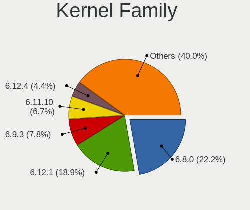

| Version  | Computers | Percent |
|----------|-----------|---------|
| 6.2.0    | 17        | 17.17%  |
| 5.15.0   | 15        | 15.15%  |
| 6.4.11   | 7         | 7.07%   |
| 6.5.3    | 6         | 6.06%   |
| 6.4.12   | 6         | 6.06%   |
| 6.1.0    | 6         | 6.06%   |
| 6.4.15   | 5         | 5.05%   |
| 6.5.0    | 4         | 4.04%   |
| 6.4.6    | 4         | 4.04%   |
| 5.10.0   | 3         | 3.03%   |
| 6.5.4    | 2         | 2.02%   |
| 6.5.2    | 2         | 2.02%   |
| 4.15.0   | 2         | 2.02%   |
| 6.5.5    | 1         | 1.01%   |
| 6.5.1    | 1         | 1.01%   |
| 6.4.9    | 1         | 1.01%   |
| 6.4.8    | 1         | 1.01%   |
| 6.4.10   | 1         | 1.01%   |
| 6.4.0    | 1         | 1.01%   |
| 6.3.7    | 1         | 1.01%   |
| 6.2.9    | 1         | 1.01%   |
| 6.1.55   | 1         | 1.01%   |
| 6.1.53   | 1         | 1.01%   |
| 6.1.38   | 1         | 1.01%   |
| 6.1.21   | 1         | 1.01%   |
| 6.1.1    | 1         | 1.01%   |
| 6.0.12   | 1         | 1.01%   |
| 5.19.0   | 1         | 1.01%   |
| 5.16.7   | 1         | 1.01%   |
| 5.16.13  | 1         | 1.01%   |
| 5.15.129 | 1         | 1.01%   |
| 5.13.0   | 1         | 1.01%   |
| 5.11.0   | 1         | 1.01%   |

Kernel Major Ver.
-----------------

Linux kernel major version

| Version | Computers | Percent |
|---------|-----------|---------|
| 6.4     | 26        | 26.26%  |
| 6.2     | 18        | 18.18%  |
| 6.5     | 16        | 16.16%  |
| 5.15    | 16        | 16.16%  |
| 6.1     | 11        | 11.11%  |
| 5.10    | 3         | 3.03%   |
| 5.16    | 2         | 2.02%   |
| 4.15    | 2         | 2.02%   |
| 6.3     | 1         | 1.01%   |
| 6.0     | 1         | 1.01%   |
| 5.19    | 1         | 1.01%   |
| 5.13    | 1         | 1.01%   |
| 5.11    | 1         | 1.01%   |

Arch
----

OS architecture (x86_64, i586, etc.)

| Name    | Computers | Percent |
|---------|-----------|---------|
| x86_64  | 96        | 96.97%  |
| aarch64 | 2         | 2.02%   |
| i686    | 1         | 1.01%   |

DE
--

Desktop Environment

| Name            | Computers | Percent |
|-----------------|-----------|---------|
| GNOME           | 36        | 36.36%  |
| KDE5            | 29        | 29.29%  |
| X-Cinnamon      | 14        | 14.14%  |
| XFCE            | 4         | 4.04%   |
| MATE            | 3         | 3.03%   |
| LXQt            | 3         | 3.03%   |
| Cinnamon        | 2         | 2.02%   |
| sway            | 1         | 1.01%   |
| LXDE            | 1         | 1.01%   |
| KDE4            | 1         | 1.01%   |
| i3              | 1         | 1.01%   |
| Hyprland        | 1         | 1.01%   |
| GNOME Flashback | 1         | 1.01%   |
| Budgie          | 1         | 1.01%   |
| Unknown         | 1         | 1.01%   |

Display Server
--------------

X11 or Wayland

| Name    | Computers | Percent |
|---------|-----------|---------|
| X11     | 59        | 59.6%   |
| Wayland | 39        | 39.39%  |
| Tty     | 1         | 1.01%   |

Display Manager
---------------

SDDM, LightDM, etc.

| Name    | Computers | Percent |
|---------|-----------|---------|
| Unknown | 33        | 33.33%  |
| SDDM    | 27        | 27.27%  |
| GDM3    | 17        | 17.17%  |
| LightDM | 14        | 14.14%  |
| GDM     | 6         | 6.06%   |
| SLiM    | 1         | 1.01%   |
| KDM     | 1         | 1.01%   |

OS Lang
-------

Language

| Lang  | Computers | Percent |
|-------|-----------|---------|
| en_US | 51        | 51.52%  |
| nl_NL | 34        | 34.34%  |
| en_GB | 5         | 5.05%   |
| de_DE | 2         | 2.02%   |
| C     | 2         | 2.02%   |
| ru_RU | 1         | 1.01%   |
| es_ES | 1         | 1.01%   |
| en_ZA | 1         | 1.01%   |
| en_EN | 1         | 1.01%   |
| cs_CZ | 1         | 1.01%   |

Boot Mode
---------

EFI or BIOS

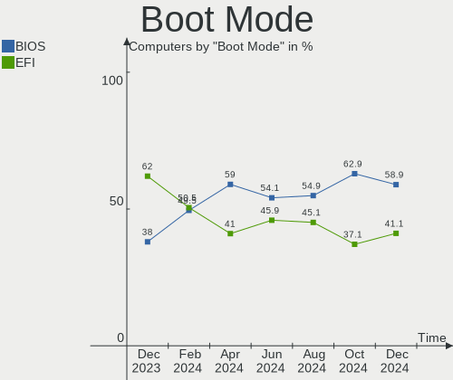

| Mode | Computers | Percent |
|------|-----------|---------|
| EFI  | 57        | 57.58%  |
| BIOS | 42        | 42.42%  |

Filesystem
----------

Type of filesystem

| Type    | Computers | Percent |
|---------|-----------|---------|
| Ext4    | 58        | 58.59%  |
| Btrfs   | 20        | 20.2%   |
| Tmpfs   | 16        | 16.16%  |
| Overlay | 4         | 4.04%   |
| Zfs     | 1         | 1.01%   |

Part. scheme
------------

Scheme of partitioning

| Type    | Computers | Percent |
|---------|-----------|---------|
| GPT     | 59        | 59.6%   |
| Unknown | 33        | 33.33%  |
| MBR     | 7         | 7.07%   |

Dual Boot with Linux/BSD
------------------------

Hosting more than one Linux/BSD

| Dual boot | Computers | Percent |
|-----------|-----------|---------|
| No        | 79        | 79.8%   |
| Yes       | 20        | 20.2%   |

Dual Boot (Win)
---------------

Hosting Linux and Windows

| Dual boot | Computers | Percent |
|-----------|-----------|---------|
| No        | 80        | 80.81%  |
| Yes       | 19        | 19.19%  |

Board
-----

Vendor
------

Motherboard manufacturer

| Name                    | Computers | Percent |
|-------------------------|-----------|---------|
| ASUSTek Computer        | 19        | 19.19%  |
| Lenovo                  | 16        | 16.16%  |
| Hewlett-Packard         | 15        | 15.15%  |
| MSI                     | 9         | 9.09%   |
| Gigabyte Technology     | 6         | 6.06%   |
| Dell                    | 6         | 6.06%   |
| Acer                    | 5         | 5.05%   |
| Medion                  | 4         | 4.04%   |
| ASRock                  | 3         | 3.03%   |
| Intel                   | 2         | 2.02%   |
| Valve                   | 1         | 1.01%   |
| Toshiba                 | 1         | 1.01%   |
| System76                | 1         | 1.01%   |
| SolidRun                | 1         | 1.01%   |
| SKIKK                   | 1         | 1.01%   |
| Raspberry Pi Foundation | 1         | 1.01%   |
| Notebook                | 1         | 1.01%   |
| MP                      | 1         | 1.01%   |
| HUAWEI                  | 1         | 1.01%   |
| Framework               | 1         | 1.01%   |
| Clevo                   | 1         | 1.01%   |
| Chuwi                   | 1         | 1.01%   |
| BESSTAR Tech            | 1         | 1.01%   |
| Unknown                 | 1         | 1.01%   |

Model
-----

Motherboard model

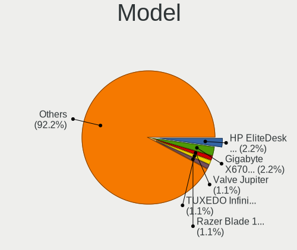

| Name                                     | Computers | Percent |
|------------------------------------------|-----------|---------|
| Dell OptiPlex 7010                       | 3         | 3.03%   |
| MSI MS-7740                              | 2         | 2.02%   |
| Gigabyte X570 AORUS MASTER               | 2         | 2.02%   |
| Valve Jupiter                            | 1         | 1.01%   |
| Toshiba Satellite A200                   | 1         | 1.01%   |
| System76 Gazelle                         | 1         | 1.01%   |
| SolidRun CEX7 Platform                   | 1         | 1.01%   |
| SKIKK Sindri 14                          | 1         | 1.01%   |
| RPi Raspberry Pi 4 Model B Rev 1.4       | 1         | 1.01%   |
| Notebook NH50_70RH                       | 1         | 1.01%   |
| MSI Prestige 14Evo A12M                  | 1         | 1.01%   |
| MSI MS-7C95                              | 1         | 1.01%   |
| MSI MS-7C02                              | 1         | 1.01%   |
| MSI MS-7B85                              | 1         | 1.01%   |
| MSI MS-7996                              | 1         | 1.01%   |
| MSI Katana 15 B12VGK                     | 1         | 1.01%   |
| MSI Cubi N 8GL (MS-B171)                 | 1         | 1.01%   |
| MP MS-7848                               | 1         | 1.01%   |
| Medion MS-7667                           | 1         | 1.01%   |
| Medion ERAZER P46002 MD34021/C576        | 1         | 1.01%   |
| Medion E11201                            | 1         | 1.01%   |
| Medion Akoya E7416                       | 1         | 1.01%   |
| Lenovo Z50-75 80EC                       | 1         | 1.01%   |
| Lenovo Yoga 7 14ARB7 82QF                | 1         | 1.01%   |
| Lenovo Yoga 6 13ALC7 82UD                | 1         | 1.01%   |
| Lenovo ThinkPad X1 Carbon 7th 20QES21E00 | 1         | 1.01%   |
| Lenovo ThinkPad X1 Carbon 6th 20KGS3RV00 | 1         | 1.01%   |
| Lenovo ThinkPad T16 Gen 1 21CHCTO1WW     | 1         | 1.01%   |
| Lenovo ThinkPad T14 Gen 1 20UD001AMH     | 1         | 1.01%   |
| Lenovo ThinkPad L540 20AU006CRI          | 1         | 1.01%   |
| Lenovo ThinkPad L13 Gen 2 20VH001WRT     | 1         | 1.01%   |
| Lenovo MIIX 320-10ICR 80XF               | 1         | 1.01%   |
| Lenovo Legion 5 Pro 16ACH6H 82JQ         | 1         | 1.01%   |
| Lenovo IdeaPad 520-15IKB 81BF            | 1         | 1.01%   |
| Lenovo IdeaPad 3 15ALC6 82KU             | 1         | 1.01%   |
| Lenovo IdeaPad 1 14AMN7 82VF             | 1         | 1.01%   |
| Lenovo IdeaCentre 310S-08IGM 90HX001WMH  | 1         | 1.01%   |
| Lenovo 14w Gen 2 82N9                    | 1         | 1.01%   |
| Intel X79                                | 1         | 1.01%   |
| Intel D33217GKE G76540-205               | 1         | 1.01%   |

Model Family
------------

Motherboard model prefix

| Name              | Computers | Percent |
|-------------------|-----------|---------|
| Lenovo ThinkPad   | 6         | 6.06%   |
| Acer Aspire       | 5         | 5.05%   |
| ASUS ROG          | 4         | 4.04%   |
| Lenovo IdeaPad    | 3         | 3.03%   |
| HP EliteBook      | 3         | 3.03%   |
| Dell OptiPlex     | 3         | 3.03%   |
| ASUS VivoBook     | 3         | 3.03%   |
| MSI MS-7740       | 2         | 2.02%   |
| Lenovo Yoga       | 2         | 2.02%   |
| HP ProBook        | 2         | 2.02%   |
| HP Pavilion       | 2         | 2.02%   |
| HP Compaq         | 2         | 2.02%   |
| Gigabyte X570     | 2         | 2.02%   |
| Dell Latitude     | 2         | 2.02%   |
| ASUS PRIME        | 2         | 2.02%   |
| Valve Jupiter     | 1         | 1.01%   |
| Toshiba Satellite | 1         | 1.01%   |
| System76 Gazelle  | 1         | 1.01%   |
| SolidRun CEX7     | 1         | 1.01%   |
| SKIKK Sindri      | 1         | 1.01%   |
| RPi Raspberry     | 1         | 1.01%   |
| Notebook NH50     | 1         | 1.01%   |
| MSI Prestige      | 1         | 1.01%   |
| MSI MS-7C95       | 1         | 1.01%   |
| MSI MS-7C02       | 1         | 1.01%   |
| MSI MS-7B85       | 1         | 1.01%   |
| MSI MS-7996       | 1         | 1.01%   |
| MSI Katana        | 1         | 1.01%   |
| MSI Cubi          | 1         | 1.01%   |
| MP MS-7848        | 1         | 1.01%   |
| Medion MS-7667    | 1         | 1.01%   |
| Medion ERAZER     | 1         | 1.01%   |
| Medion E11201     | 1         | 1.01%   |
| Medion Akoya      | 1         | 1.01%   |
| Lenovo Z50-75     | 1         | 1.01%   |
| Lenovo MIIX       | 1         | 1.01%   |
| Lenovo Legion     | 1         | 1.01%   |
| Lenovo IdeaCentre | 1         | 1.01%   |
| Lenovo 14w        | 1         | 1.01%   |
| Intel X79         | 1         | 1.01%   |

MFG Year
--------

Motherboard manufacture year

| Year    | Computers | Percent |
|---------|-----------|---------|
| 2022    | 15        | 15.15%  |
| 2020    | 10        | 10.1%   |
| 2019    | 9         | 9.09%   |
| 2018    | 8         | 8.08%   |
| 2021    | 7         | 7.07%   |
| 2017    | 6         | 6.06%   |
| 2013    | 6         | 6.06%   |
| 2023    | 5         | 5.05%   |
| 2015    | 5         | 5.05%   |
| 2011    | 5         | 5.05%   |
| 2016    | 4         | 4.04%   |
| 2014    | 4         | 4.04%   |
| 2012    | 4         | 4.04%   |
| 2010    | 3         | 3.03%   |
| 2009    | 3         | 3.03%   |
| 2007    | 2         | 2.02%   |
| 2008    | 1         | 1.01%   |
| 2006    | 1         | 1.01%   |
| Unknown | 1         | 1.01%   |

Form Factor
-----------

Physical design of the computer

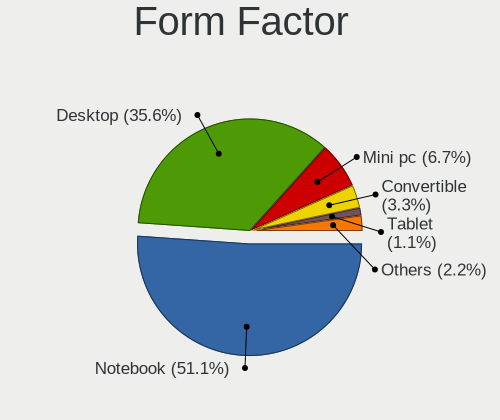

| Name           | Computers | Percent |
|----------------|-----------|---------|
| Notebook       | 48        | 48.48%  |
| Desktop        | 45        | 45.45%  |
| Convertible    | 4         | 4.04%   |
| System on chip | 1         | 1.01%   |
| Tablet         | 1         | 1.01%   |

Secure Boot
-----------

Enabled or disabled

| State    | Computers | Percent |
|----------|-----------|---------|
| Disabled | 91        | 91.92%  |
| Enabled  | 8         | 8.08%   |

Coreboot
--------

Have coreboot on board

| Used | Computers | Percent |
|------|-----------|---------|
| No   | 98        | 98.99%  |
| Yes  | 1         | 1.01%   |

RAM Size
--------

Total RAM memory

| Size in GB  | Computers | Percent |
|-------------|-----------|---------|
| 16.01-24.0  | 23        | 23.23%  |
| 8.01-16.0   | 23        | 23.23%  |
| 3.01-4.0    | 15        | 15.15%  |
| 32.01-64.0  | 12        | 12.12%  |
| 4.01-8.0    | 11        | 11.11%  |
| 24.01-32.0  | 7         | 7.07%   |
| 64.01-256.0 | 4         | 4.04%   |
| 2.01-3.0    | 2         | 2.02%   |
| 1.01-2.0    | 2         | 2.02%   |

RAM Used
--------

Used RAM memory

| Used GB   | Computers | Percent |
|-----------|-----------|---------|
| 2.01-3.0  | 29        | 29.29%  |
| 1.01-2.0  | 27        | 27.27%  |
| 4.01-8.0  | 21        | 21.21%  |
| 3.01-4.0  | 10        | 10.1%   |
| 8.01-16.0 | 7         | 7.07%   |
| 0.51-1.0  | 4         | 4.04%   |
| 0.01-0.5  | 1         | 1.01%   |

Total Drives
------------

Number of drives on board

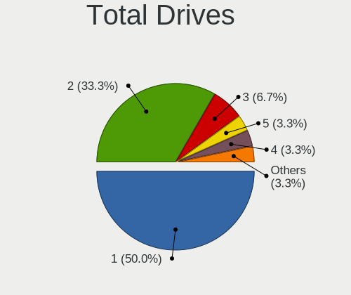

| Drives | Computers | Percent |
|--------|-----------|---------|
| 1      | 53        | 53.54%  |
| 2      | 32        | 32.32%  |
| 3      | 7         | 7.07%   |
| 4      | 4         | 4.04%   |
| 5      | 3         | 3.03%   |

Has CD-ROM
----------

Has CD-ROM on board

| Presented | Computers | Percent |
|-----------|-----------|---------|
| No        | 65        | 65.66%  |
| Yes       | 34        | 34.34%  |

Has Ethernet
------------

Has Ethernet on board

| Presented | Computers | Percent |
|-----------|-----------|---------|
| Yes       | 81        | 81.82%  |
| No        | 18        | 18.18%  |

Has WiFi
--------

Has WiFi module

| Presented | Computers | Percent |
|-----------|-----------|---------|
| Yes       | 67        | 67.68%  |
| No        | 32        | 32.32%  |

Has Bluetooth
-------------

Has Bluetooth module

| Presented | Computers | Percent |
|-----------|-----------|---------|
| Yes       | 62        | 62.63%  |
| No        | 37        | 37.37%  |

Location
--------

Country
-------

Geographic location (country)

| Country     | Computers | Percent |
|-------------|-----------|---------|
| Netherlands | 99        | 100%    |

City
----

Geographic location (city)

| City                   | Computers | Percent |
|------------------------|-----------|---------|
| Amsterdam              | 20        | 20.2%   |
| The Hague              | 7         | 7.07%   |
| Rotterdam              | 5         | 5.05%   |
| Utrecht                | 2         | 2.02%   |
| Nijmegen               | 2         | 2.02%   |
| Nieuwegein             | 2         | 2.02%   |
| Naaldwijk              | 2         | 2.02%   |
| Hoeven                 | 2         | 2.02%   |
| Haarlem                | 2         | 2.02%   |
| Eexterveen             | 2         | 2.02%   |
| Delft                  | 2         | 2.02%   |
| Capelle aan den IJssel | 2         | 2.02%   |
| Arnhem                 | 2         | 2.02%   |
| Amersfoort             | 2         | 2.02%   |
| Zuidwolde              | 1         | 1.01%   |
| Zevenhuizen            | 1         | 1.01%   |
| Zevenbergen            | 1         | 1.01%   |
| Zeist                  | 1         | 1.01%   |
| Zeeland                | 1         | 1.01%   |
| Zandvoort              | 1         | 1.01%   |
| Zaandam                | 1         | 1.01%   |
| Weert                  | 1         | 1.01%   |
| Vught                  | 1         | 1.01%   |
| Voorhout               | 1         | 1.01%   |
| Vleuten                | 1         | 1.01%   |
| Venlo                  | 1         | 1.01%   |
| Sprang                 | 1         | 1.01%   |
| Sint Annaland          | 1         | 1.01%   |
| Siddeburen             | 1         | 1.01%   |
| Saasveld               | 1         | 1.01%   |
| Purmerend              | 1         | 1.01%   |
| Pijnacker              | 1         | 1.01%   |
| Noordwijk aan Zee      | 1         | 1.01%   |
| Middelburg             | 1         | 1.01%   |
| Maastricht             | 1         | 1.01%   |
| Lutjewinkel            | 1         | 1.01%   |
| Lisse                  | 1         | 1.01%   |
| Leiden                 | 1         | 1.01%   |
| Leeuwarden             | 1         | 1.01%   |
| IJmuiden               | 1         | 1.01%   |

Drives
------

Drive Vendor
------------

Hard drive vendors

| Vendor                       | Computers | Drives | Percent |
|------------------------------|-----------|--------|---------|
| Samsung Electronics          | 35        | 43     | 23.49%  |
| Sandisk                      | 15        | 16     | 10.07%  |
| WDC                          | 14        | 17     | 9.4%    |
| Seagate                      | 12        | 14     | 8.05%   |
| Kingston                     | 12        | 12     | 8.05%   |
| SK hynix                     | 8         | 8      | 5.37%   |
| Unknown                      | 7         | 9      | 4.7%    |
| Crucial                      | 7         | 8      | 4.7%    |
| Intel                        | 6         | 6      | 4.03%   |
| Toshiba                      | 5         | 6      | 3.36%   |
| Micron Technology            | 3         | 3      | 2.01%   |
| Micron/Crucial Technology    | 2         | 3      | 1.34%   |
| KIOXIA                       | 2         | 2      | 1.34%   |
| WALRAM                       | 1         | 1      | 0.67%   |
| SPCC                         | 1         | 1      | 0.67%   |
| Silicon Motion               | 1         | 1      | 0.67%   |
| Shenzhen Longsys Electronics | 1         | 1      | 0.67%   |
| PNY                          | 1         | 1      | 0.67%   |
| Phison Electronics           | 1         | 1      | 0.67%   |
| Maxtor                       | 1         | 1      | 0.67%   |
| LITEONIT                     | 1         | 1      | 0.67%   |
| LITEON                       | 1         | 1      | 0.67%   |
| KingSpec                     | 1         | 1      | 0.67%   |
| KingFast                     | 1         | 1      | 0.67%   |
| Kingchuxing                  | 1         | 1      | 0.67%   |
| JMicron Technology           | 1         | 1      | 0.67%   |
| Intenso                      | 1         | 1      | 0.67%   |
| Hitachi                      | 1         | 1      | 0.67%   |
| HGST                         | 1         | 1      | 0.67%   |
| Hewlett-Packard              | 1         | 1      | 0.67%   |
| GOODRAM                      | 1         | 1      | 0.67%   |
| Gigabyte Technology          | 1         | 1      | 0.67%   |
| China                        | 1         | 1      | 0.67%   |
| Unknown                      | 1         | 1      | 0.67%   |

Drive Model
-----------

Hard drive models

| Model                                               | Computers | Percent |
|-----------------------------------------------------|-----------|---------|
| Samsung NVMe SSD Controller SM981/PM981/PM983 256GB | 6         | 3.7%    |
| Unknown MMC Card  64GB                              | 3         | 1.85%   |
| Sandisk WD Black SN850 1TB                          | 3         | 1.85%   |
| Samsung NVMe SSD Controller PM9A1/PM9A3/980PRO 1TB  | 3         | 1.85%   |
| Sandisk WD Blue SN570 1TB                           | 2         | 1.23%   |
| Samsung SSD 970 EVO 1TB                             | 2         | 1.23%   |
| Samsung SSD 860 EVO 1TB                             | 2         | 1.23%   |
| Samsung SSD 850 EVO 250GB                           | 2         | 1.23%   |
| Samsung SSD 840 EVO 120GB                           | 2         | 1.23%   |
| Micron/Crucial P2 NVMe PCIe SSD 1TB                 | 2         | 1.23%   |
| Micron 2400_MTFDKBA1T0QFM 1024GB                    | 2         | 1.23%   |
| Kingston SV300S37A120G 120GB SSD                    | 2         | 1.23%   |
| Kingston SA400S37960G 960GB SSD                     | 2         | 1.23%   |
| Intel SSD 660P Series 1024GB                        | 2         | 1.23%   |
| Crucial CT1000MX500SSD1 1TB                         | 2         | 1.23%   |
| WDC WDS250G2B0C-00PXH0 250GB                        | 1         | 0.62%   |
| WDC WD7500BPKT-60PK4T0 752GB                        | 1         | 0.62%   |
| WDC WD5001ABYS-01YNA0 500GB                         | 1         | 0.62%   |
| WDC WD5000AVDS-63U7B1 500GB                         | 1         | 0.62%   |
| WDC WD5000AAKX-001CA0 500GB                         | 1         | 0.62%   |
| WDC WD3200BPVT-55JJ5T0 320GB                        | 1         | 0.62%   |
| WDC WD3200BEVT-22ZCT0 320GB                         | 1         | 0.62%   |
| WDC WD30EZRZ-00Z5HB0 3TB                            | 1         | 0.62%   |
| WDC WD30EZRX-00SPEB0 3TB                            | 1         | 0.62%   |
| WDC WD2500BEVS-22UST0 250GB                         | 1         | 0.62%   |
| WDC WD20EZRX-00D8PB0 2TB                            | 1         | 0.62%   |
| WDC WD1600AAJS-61M0A0 160GB                         | 1         | 0.62%   |
| WDC WD10SPZX-24Z10T0 1TB                            | 1         | 0.62%   |
| WDC WD10PURX-64E5EY0 1TB                            | 1         | 0.62%   |
| WDC WD10EARX-22N0YB0 1TB                            | 1         | 0.62%   |
| WDC WD1003FBYZ-010FB0 1TB                           | 1         | 0.62%   |
| WDC WD1003FBYX-01Y7B1 1TB                           | 1         | 0.62%   |
| WALRAM SSD 512GB                                    | 1         | 0.62%   |
| Unknown SD16G  64GB                                 | 1         | 0.62%   |
| Unknown SD/MMC/MS PRO 128GB                         | 1         | 0.62%   |
| Unknown SB64G  64GB                                 | 1         | 0.62%   |
| Unknown MMC Card  512GB                             | 1         | 0.62%   |
| Unknown MMC Card  256GB                             | 1         | 0.62%   |
| Toshiba THNSN5128GPU7 128GB                         | 1         | 0.62%   |
| Toshiba MQ02ABD100H 1TB                             | 1         | 0.62%   |

HDD Vendor
----------

Hard disk drive vendors

| Vendor              | Computers | Drives | Percent |
|---------------------|-----------|--------|---------|
| WDC                 | 13        | 16     | 33.33%  |
| Seagate             | 12        | 14     | 30.77%  |
| Toshiba             | 4         | 4      | 10.26%  |
| Samsung Electronics | 4         | 4      | 10.26%  |
| Unknown             | 1         | 1      | 2.56%   |
| Maxtor              | 1         | 1      | 2.56%   |
| Intenso             | 1         | 1      | 2.56%   |
| Hitachi             | 1         | 1      | 2.56%   |
| HGST                | 1         | 1      | 2.56%   |
| Hewlett-Packard     | 1         | 1      | 2.56%   |

SSD Vendor
----------

Solid state drive vendors

| Vendor              | Computers | Drives | Percent |
|---------------------|-----------|--------|---------|
| Samsung Electronics | 12        | 16     | 26.67%  |
| Kingston            | 10        | 10     | 22.22%  |
| Crucial             | 7         | 8      | 15.56%  |
| SK hynix            | 3         | 3      | 6.67%   |
| SanDisk             | 2         | 2      | 4.44%   |
| Intel               | 2         | 2      | 4.44%   |
| WALRAM              | 1         | 1      | 2.22%   |
| SPCC                | 1         | 1      | 2.22%   |
| PNY                 | 1         | 1      | 2.22%   |
| LITEONIT            | 1         | 1      | 2.22%   |
| LITEON              | 1         | 1      | 2.22%   |
| KingSpec            | 1         | 1      | 2.22%   |
| JMicron Technology  | 1         | 1      | 2.22%   |
| GOODRAM             | 1         | 1      | 2.22%   |
| China               | 1         | 1      | 2.22%   |

Drive Kind
----------

HDD or SSD

| Kind    | Computers | Drives | Percent |
|---------|-----------|--------|---------|
| NVMe    | 51        | 62     | 38.06%  |
| SSD     | 40        | 50     | 29.85%  |
| HDD     | 33        | 44     | 24.63%  |
| MMC     | 8         | 10     | 5.97%   |
| Unknown | 2         | 2      | 1.49%   |

Drive Connector
---------------

SATA, SAS, NVMe, etc.

| Type | Computers | Drives | Percent |
|------|-----------|--------|---------|
| SATA | 56        | 91     | 46.67%  |
| NVMe | 51        | 62     | 42.5%   |
| MMC  | 8         | 10     | 6.67%   |
| SAS  | 5         | 5      | 4.17%   |

Drive Size
----------

Size of hard drive

| Size in TB | Computers | Drives | Percent |
|------------|-----------|--------|---------|
| 0.01-0.5   | 40        | 53     | 54.05%  |
| 0.51-1.0   | 24        | 30     | 32.43%  |
| 1.01-2.0   | 4         | 4      | 5.41%   |
| 3.01-4.0   | 3         | 4      | 4.05%   |
| 2.01-3.0   | 2         | 2      | 2.7%    |
| 4.01-10.0  | 1         | 1      | 1.35%   |

Space Total
-----------

Amount of disk space available on the file system

| Size in GB     | Computers | Percent |
|----------------|-----------|---------|
| 101-250        | 24        | 24.24%  |
| 501-1000       | 21        | 21.21%  |
| 251-500        | 20        | 20.2%   |
| 1001-2000      | 7         | 7.07%   |
| 51-100         | 7         | 7.07%   |
| 1-20           | 6         | 6.06%   |
| Unknown        | 5         | 5.05%   |
| 2001-3000      | 4         | 4.04%   |
| More than 3000 | 3         | 3.03%   |
| 21-50          | 2         | 2.02%   |

Space Used
----------

Amount of used disk space

| Used GB        | Computers | Percent |
|----------------|-----------|---------|
| 1-20           | 41        | 41.41%  |
| 21-50          | 17        | 17.17%  |
| 51-100         | 12        | 12.12%  |
| 101-250        | 10        | 10.1%   |
| 251-500        | 7         | 7.07%   |
| Unknown        | 5         | 5.05%   |
| 1001-2000      | 3         | 3.03%   |
| 501-1000       | 3         | 3.03%   |
| More than 3000 | 1         | 1.01%   |

Malfunc. Drives
---------------

Drive models with a malfunction

| Model                            | Computers | Drives | Percent |
|----------------------------------|-----------|--------|---------|
| Seagate ST9320320AS 320GB        | 1         | 1      | 12.5%   |
| Seagate ST1000DM003-1ER162 1TB   | 1         | 1      | 12.5%   |
| Samsung Electronics HD103SJ 1TB  | 1         | 1      | 12.5%   |
| PNY SSD2SC120GM1DH16T-T 120GB    | 1         | 1      | 12.5%   |
| Maxtor STM380215AS 80GB          | 1         | 1      | 12.5%   |
| Kingston SV300S37A120G 120GB SSD | 1         | 1      | 12.5%   |
| Intel SSDSA2M080G2GC 80GB        | 1         | 1      | 12.5%   |
| HGST HTS721010A9E630 1TB         | 1         | 1      | 12.5%   |

Malfunc. Drive Vendor
---------------------

Vendors of faulty drives

| Vendor              | Computers | Drives | Percent |
|---------------------|-----------|--------|---------|
| Seagate             | 2         | 2      | 25%     |
| Samsung Electronics | 1         | 1      | 12.5%   |
| PNY                 | 1         | 1      | 12.5%   |
| Maxtor              | 1         | 1      | 12.5%   |
| Kingston            | 1         | 1      | 12.5%   |
| Intel               | 1         | 1      | 12.5%   |
| HGST                | 1         | 1      | 12.5%   |

Malfunc. HDD Vendor
-------------------

Vendors of faulty HDD drives

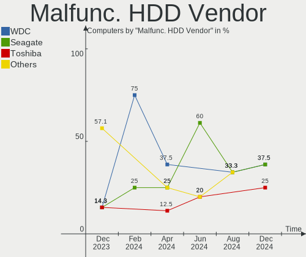

| Vendor              | Computers | Drives | Percent |
|---------------------|-----------|--------|---------|
| Seagate             | 2         | 2      | 40%     |
| Samsung Electronics | 1         | 1      | 20%     |
| Maxtor              | 1         | 1      | 20%     |
| HGST                | 1         | 1      | 20%     |

Malfunc. Drive Kind
-------------------

Kinds of faulty drives

| Kind | Computers | Drives | Percent |
|------|-----------|--------|---------|
| HDD  | 5         | 5      | 62.5%   |
| SSD  | 3         | 3      | 37.5%   |

Failed Drives
-------------

Failed drive models

Zero info for selected period =(

Failed Drive Vendor
-------------------

Failed drive vendors

Zero info for selected period =(

Drive Status
------------

Number of failed and malfunc. drives

| Status   | Computers | Drives | Percent |
|----------|-----------|--------|---------|
| Detected | 55        | 91     | 50.93%  |
| Works    | 45        | 69     | 41.67%  |
| Malfunc  | 8         | 8      | 7.41%   |

Storage controller
------------------

Storage Vendor
--------------

Storage controller vendors

| Vendor                       | Computers | Percent |
|------------------------------|-----------|---------|
| Intel                        | 49        | 36.84%  |
| AMD                          | 22        | 16.54%  |
| Samsung Electronics          | 20        | 15.04%  |
| SanDisk                      | 13        | 9.77%   |
| SK hynix                     | 5         | 3.76%   |
| Micron Technology            | 3         | 2.26%   |
| JMicron Technology           | 3         | 2.26%   |
| Toshiba America Info Systems | 2         | 1.5%    |
| Phison Electronics           | 2         | 1.5%    |
| Nvidia                       | 2         | 1.5%    |
| Micron/Crucial Technology    | 2         | 1.5%    |
| KIOXIA                       | 2         | 1.5%    |
| Kingston Technology Company  | 2         | 1.5%    |
| ASMedia Technology           | 2         | 1.5%    |
| VIA Technologies             | 1         | 0.75%   |
| Silicon Motion               | 1         | 0.75%   |
| Shenzhen Longsys Electronics | 1         | 0.75%   |
| LSI Logic / Symbios Logic    | 1         | 0.75%   |

Storage Model
-------------

Storage controller models

| Model                                                                                   | Computers | Percent |
|-----------------------------------------------------------------------------------------|-----------|---------|
| AMD FCH SATA Controller [AHCI mode]                                                     | 18        | 11.69%  |
| Samsung NVMe SSD Controller SM981/PM981/PM983                                           | 11        | 7.14%   |
| Samsung NVMe SSD Controller PM9A1/PM9A3/980PRO                                          | 5         | 3.25%   |
| Intel 7 Series/C210 Series Chipset Family 6-port SATA Controller [AHCI mode]            | 4         | 2.6%    |
| Intel 6 Series/C200 Series Chipset Family 6 port Desktop SATA AHCI Controller           | 4         | 2.6%    |
| AMD 500 Series Chipset SATA Controller                                                  | 4         | 2.6%    |
| SK hynix Gold P31/BC711/PC711 NVMe Solid State Drive                                    | 3         | 1.95%   |
| SanDisk WD PC SN810 / Black SN850 NVMe SSD                                              | 3         | 1.95%   |
| Intel Tiger Lake-LP SATA Controller                                                     | 3         | 1.95%   |
| Intel SSD 660P Series                                                                   | 3         | 1.95%   |
| Intel Q170/Q150/B150/H170/H110/Z170/CM236 Chipset SATA Controller [AHCI Mode]           | 3         | 1.95%   |
| Intel 8 Series/C220 Series Chipset Family 6-port SATA Controller 1 [AHCI mode]          | 3         | 1.95%   |
| AMD 400 Series Chipset SATA Controller                                                  | 3         | 1.95%   |
| AMD 300 Series Chipset SATA Controller                                                  | 3         | 1.95%   |
| SanDisk WD Blue SN570 NVMe SSD 1TB                                                      | 2         | 1.3%    |
| SanDisk WD Blue SN550 NVMe SSD                                                          | 2         | 1.3%    |
| Samsung NVMe SSD Controller SM961/PM961/SM963                                           | 2         | 1.3%    |
| Samsung NVMe SSD Controller 980                                                         | 2         | 1.3%    |
| Micron/Crucial P2 [Nick P2] / P3 / P3 Plus NVMe PCIe SSD (DRAM-less)                    | 2         | 1.3%    |
| Micron 2400 NVMe SSD (DRAM-less)                                                        | 2         | 1.3%    |
| Kingston Company KC3000/Renegade NVMe SSD                                               | 2         | 1.3%    |
| JMicron JMB363 SATA/IDE Controller                                                      | 2         | 1.3%    |
| Intel Wildcat Point-LP SATA Controller [AHCI Mode]                                      | 2         | 1.3%    |
| Intel Volume Management Device NVMe RAID Controller                                     | 2         | 1.3%    |
| Intel Sunrise Point-LP SATA Controller [AHCI mode]                                      | 2         | 1.3%    |
| Intel Celeron/Pentium Silver Processor SATA Controller                                  | 2         | 1.3%    |
| Intel Cannon Lake Mobile PCH SATA AHCI Controller                                       | 2         | 1.3%    |
| Intel 7 Series Chipset Family 6-port SATA Controller [AHCI mode]                        | 2         | 1.3%    |
| Intel 6 Series/C200 Series Chipset Family Desktop SATA Controller (IDE mode, ports 4-5) | 2         | 1.3%    |
| Intel 6 Series/C200 Series Chipset Family Desktop SATA Controller (IDE mode, ports 0-3) | 2         | 1.3%    |
| Intel 5 Series/3400 Series Chipset 6 port SATA AHCI Controller                          | 2         | 1.3%    |
| Intel 5 Series/3400 Series Chipset 4 port SATA IDE Controller                           | 2         | 1.3%    |
| Intel 5 Series/3400 Series Chipset 2 port SATA IDE Controller                           | 2         | 1.3%    |
| Intel 200 Series PCH SATA controller [AHCI mode]                                        | 2         | 1.3%    |
| ASMedia ASM1061 SATA IDE Controller                                                     | 2         | 1.3%    |
| VIA VT6415 PATA IDE Host Controller                                                     | 1         | 0.65%   |
| Toshiba America Info Systems XG6 NVMe SSD Controller                                    | 1         | 0.65%   |
| Toshiba America Info Systems XG3 NVMe SSD Controller                                    | 1         | 0.65%   |
| SK hynix Platinum P41/PC801 NVMe Solid State Drive                                      | 1         | 0.65%   |
| SK hynix PC611 NVMe Solid State Drive                                                   | 1         | 0.65%   |

Storage Kind
------------

Kind of storage controller (IDE, SATA, NVMe, SAS, ...)

| Kind | Computers | Percent |
|------|-----------|---------|
| SATA | 62        | 48.44%  |
| NVMe | 50        | 39.06%  |
| IDE  | 10        | 7.81%   |
| RAID | 5         | 3.91%   |
| SAS  | 1         | 0.78%   |

Processor
---------

CPU Vendor
----------

Processor vendors

| Vendor | Computers | Percent |
|--------|-----------|---------|
| Intel  | 64        | 64.65%  |
| AMD    | 33        | 33.33%  |
| ARM    | 2         | 2.02%   |

CPU Model
---------

Processor models

| Model                                   | Computers | Percent |
|-----------------------------------------|-----------|---------|
| Intel 11th Gen Core i5-1135G7 @ 2.40GHz | 4         | 4.04%   |
| Intel Core i7-8665U CPU @ 1.90GHz       | 2         | 2.02%   |
| Intel Core i7 CPU 860 @ 2.80GHz         | 2         | 2.02%   |
| Intel Core i5-5200U CPU @ 2.20GHz       | 2         | 2.02%   |
| Intel Core i5-3470 CPU @ 3.20GHz        | 2         | 2.02%   |
| Intel Core i5-3330 CPU @ 3.00GHz        | 2         | 2.02%   |
| Intel Celeron N4000 CPU @ 1.10GHz       | 2         | 2.02%   |
| AMD Ryzen 7 5700U with Radeon Graphics  | 2         | 2.02%   |
| AMD Ryzen 7 3800X 8-Core Processor      | 2         | 2.02%   |
| AMD Ryzen 5 3600 6-Core Processor       | 2         | 2.02%   |
| Intel Xeon CPU E5-1620 v2 @ 3.70GHz     | 1         | 1.01%   |
| Intel Pentium CPU P6200 @ 2.13GHz       | 1         | 1.01%   |
| Intel Pentium CPU B950 @ 2.10GHz        | 1         | 1.01%   |
| Intel N100                              | 1         | 1.01%   |
| Intel Genuine CPU T2130 @ 1.86GHz       | 1         | 1.01%   |
| Intel Core i7-8650U CPU @ 1.90GHz       | 1         | 1.01%   |
| Intel Core i7-7700K CPU @ 4.20GHz       | 1         | 1.01%   |
| Intel Core i7-6700K CPU @ 4.00GHz       | 1         | 1.01%   |
| Intel Core i7-4750HQ CPU @ 2.00GHz      | 1         | 1.01%   |
| Intel Core i7-4712MQ CPU @ 2.30GHz      | 1         | 1.01%   |
| Intel Core i7-3740QM CPU @ 2.70GHz      | 1         | 1.01%   |
| Intel Core i7-2600K CPU @ 3.40GHz       | 1         | 1.01%   |
| Intel Core i7 CPU 920 @ 2.67GHz         | 1         | 1.01%   |
| Intel Core i5-9300H CPU @ 2.40GHz       | 1         | 1.01%   |
| Intel Core i5-8300H CPU @ 2.30GHz       | 1         | 1.01%   |
| Intel Core i5-8265U CPU @ 1.60GHz       | 1         | 1.01%   |
| Intel Core i5-8250U CPU @ 1.60GHz       | 1         | 1.01%   |
| Intel Core i5-7400 CPU @ 3.00GHz        | 1         | 1.01%   |
| Intel Core i5-6600 CPU @ 3.30GHz        | 1         | 1.01%   |
| Intel Core i5-6200U CPU @ 2.30GHz       | 1         | 1.01%   |
| Intel Core i5-4590 CPU @ 3.30GHz        | 1         | 1.01%   |
| Intel Core i5-3570 CPU @ 3.40GHz        | 1         | 1.01%   |
| Intel Core i5-2400 CPU @ 3.10GHz        | 1         | 1.01%   |
| Intel Core i5-2300 CPU @ 2.80GHz        | 1         | 1.01%   |
| Intel Core i5 CPU M 450 @ 2.40GHz       | 1         | 1.01%   |
| Intel Core i5 CPU 750 @ 2.67GHz         | 1         | 1.01%   |
| Intel Core i5 CPU 650 @ 3.20GHz         | 1         | 1.01%   |
| Intel Core i3-8145U CPU @ 2.10GHz       | 1         | 1.01%   |
| Intel Core i3-6006U CPU @ 2.00GHz       | 1         | 1.01%   |
| Intel Core i3-4160 CPU @ 3.60GHz        | 1         | 1.01%   |

CPU Model Family
----------------

Processor model prefix

| Model                   | Computers | Percent |
|-------------------------|-----------|---------|
| Intel Core i5           | 20        | 20.2%   |
| Other                   | 17        | 17.17%  |
| Intel Core i7           | 12        | 12.12%  |
| AMD Ryzen 5             | 12        | 12.12%  |
| AMD Ryzen 7             | 9         | 9.09%   |
| Intel Core i3           | 6         | 6.06%   |
| Intel Celeron           | 6         | 6.06%   |
| AMD Ryzen 9             | 3         | 3.03%   |
| Intel Pentium           | 2         | 2.02%   |
| Intel Atom              | 2         | 2.02%   |
| AMD Ryzen 7 PRO         | 2         | 2.02%   |
| AMD A6                  | 2         | 2.02%   |
| Intel Xeon              | 1         | 1.01%   |
| Intel Genuine           | 1         | 1.01%   |
| ARM BCM                 | 1         | 1.01%   |
| AMD Turion 64 X2 Mobile | 1         | 1.01%   |
| AMD FX                  | 1         | 1.01%   |
| AMD Athlon 64 X2        | 1         | 1.01%   |

CPU Cores
---------

Number of processor cores

| Number | Computers | Percent |
|--------|-----------|---------|
| 4      | 46        | 46.46%  |
| 2      | 23        | 23.23%  |
| 8      | 12        | 12.12%  |
| 6      | 8         | 8.08%   |
| 16     | 3         | 3.03%   |
| 14     | 2         | 2.02%   |
| 10     | 2         | 2.02%   |
| 24     | 1         | 1.01%   |
| 12     | 1         | 1.01%   |
| 1      | 1         | 1.01%   |

CPU Sockets
-----------

Number of sockets

| Number | Computers | Percent |
|--------|-----------|---------|
| 1      | 99        | 100%    |

CPU Threads
-----------

Threads per core (Hyper-Threading)

| Number | Computers | Percent |
|--------|-----------|---------|
| 2      | 71        | 71.72%  |
| 1      | 28        | 28.28%  |

CPU Op-Modes
------------

CPU Operation Modes (32-bit, 64-bit)

| Op mode        | Computers | Percent |
|----------------|-----------|---------|
| 32-bit, 64-bit | 96        | 96.97%  |
| Unknown        | 2         | 2.02%   |
| 32-bit         | 1         | 1.01%   |

CPU Microcode
-------------

Microcode number

| Number     | Computers | Percent |
|------------|-----------|---------|
| Unknown    | 52        | 52.53%  |
| 0x206a7    | 4         | 4.04%   |
| 0x08701030 | 3         | 3.03%   |
| 0x706a1    | 2         | 2.02%   |
| 0x306c3    | 2         | 2.02%   |
| 0x306a9    | 2         | 2.02%   |
| 0x106e5    | 2         | 2.02%   |
| 0x08701021 | 2         | 2.02%   |
| 0x08608103 | 2         | 2.02%   |
| 0x08108109 | 2         | 2.02%   |
| 0x906ea    | 1         | 1.01%   |
| 0x806ea    | 1         | 1.01%   |
| 0x806c1    | 1         | 1.01%   |
| 0x6ec      | 1         | 1.01%   |
| 0x406e3    | 1         | 1.01%   |
| 0x40661    | 1         | 1.01%   |
| 0x306e4    | 1         | 1.01%   |
| 0x306d4    | 1         | 1.01%   |
| 0x20655    | 1         | 1.01%   |
| 0x20652    | 1         | 1.01%   |
| 0x0a601203 | 1         | 1.01%   |
| 0x0a50000d | 1         | 1.01%   |
| 0x0a404102 | 1         | 1.01%   |
| 0x0a404101 | 1         | 1.01%   |
| 0x0a201009 | 1         | 1.01%   |
| 0x08a00008 | 1         | 1.01%   |
| 0x08701013 | 1         | 1.01%   |
| 0x08600109 | 1         | 1.01%   |
| 0x08600103 | 1         | 1.01%   |
| 0x08200103 | 1         | 1.01%   |
| 0x08108102 | 1         | 1.01%   |
| 0x08101013 | 1         | 1.01%   |
| 0x0800820d | 1         | 1.01%   |
| 0x08001129 | 1         | 1.01%   |
| 0x06003106 | 1         | 1.01%   |
| 0x03000027 | 1         | 1.01%   |

CPU Microarch
-------------

Microarchitecture

| Name             | Computers | Percent |
|------------------|-----------|---------|
| Unknown          | 17        | 17.17%  |
| KabyLake         | 11        | 11.11%  |
| IvyBridge        | 10        | 10.1%   |
| Zen 2            | 8         | 8.08%   |
| TigerLake        | 6         | 6.06%   |
| Zen+             | 4         | 4.04%   |
| Skylake          | 4         | 4.04%   |
| SandyBridge      | 4         | 4.04%   |
| Nehalem          | 4         | 4.04%   |
| Haswell          | 4         | 4.04%   |
| Zen 3            | 3         | 3.03%   |
| Zen              | 3         | 3.03%   |
| Westmere         | 3         | 3.03%   |
| Goldmont plus    | 3         | 3.03%   |
| Silvermont       | 2         | 2.02%   |
| K8 Hammer        | 2         | 2.02%   |
| Broadwell        | 2         | 2.02%   |
| Alderlake Hybrid | 2         | 2.02%   |
| Tremont          | 1         | 1.01%   |
| Steamroller      | 1         | 1.01%   |
| Piledriver       | 1         | 1.01%   |
| P6               | 1         | 1.01%   |
| K10 Llano        | 1         | 1.01%   |
| Gracemont        | 1         | 1.01%   |
| Goldmont         | 1         | 1.01%   |

Graphics
--------

GPU Vendor
----------

Vendors of graphics cards

| Vendor | Computers | Percent |
|--------|-----------|---------|
| Intel  | 50        | 44.25%  |
| AMD    | 35        | 30.97%  |
| Nvidia | 28        | 24.78%  |

GPU Model
---------

Graphics card models

| Model                                                                                    | Computers | Percent |
|------------------------------------------------------------------------------------------|-----------|---------|
| Intel TigerLake-LP GT2 [Iris Xe Graphics]                                                | 6         | 5.17%   |
| Intel Xeon E3-1200 v2/3rd Gen Core processor Graphics Controller                         | 5         | 4.31%   |
| Nvidia AD106M [GeForce RTX 4070 Max-Q / Mobile]                                          | 4         | 3.45%   |
| Intel WhiskeyLake-U GT2 [UHD Graphics 620]                                               | 4         | 3.45%   |
| AMD Picasso/Raven 2 [Radeon Vega Series / Radeon Vega Mobile Series]                     | 4         | 3.45%   |
| Nvidia GP107 [GeForce GTX 1050 Ti]                                                       | 3         | 2.59%   |
| Intel GeminiLake [UHD Graphics 600]                                                      | 3         | 2.59%   |
| AMD Raphael                                                                              | 3         | 2.59%   |
| AMD Ellesmere [Radeon RX 470/480/570/570X/580/580X/590]                                  | 3         | 2.59%   |
| Nvidia GP108 [GeForce GT 1030]                                                           | 2         | 1.72%   |
| Nvidia GM107M [GeForce GTX 950M]                                                         | 2         | 1.72%   |
| Intel UHD Graphics 620                                                                   | 2         | 1.72%   |
| Intel TigerLake-H GT1 [UHD Graphics]                                                     | 2         | 1.72%   |
| Intel Skylake GT2 [HD Graphics 520]                                                      | 2         | 1.72%   |
| Intel HD Graphics 5500                                                                   | 2         | 1.72%   |
| Intel Core Processor Integrated Graphics Controller                                      | 2         | 1.72%   |
| Intel CoffeeLake-H GT2 [UHD Graphics 630]                                                | 2         | 1.72%   |
| Intel Atom/Celeron/Pentium Processor x5-E8000/J3xxx/N3xxx Integrated Graphics Controller | 2         | 1.72%   |
| Intel Alder Lake-P Integrated Graphics Controller                                        | 2         | 1.72%   |
| Intel 2nd Generation Core Processor Family Integrated Graphics Controller                | 2         | 1.72%   |
| AMD Rembrandt [Radeon 680M]                                                              | 2         | 1.72%   |
| AMD Lucienne                                                                             | 2         | 1.72%   |
| AMD Cezanne [Radeon Vega Series / Radeon Vega Mobile Series]                             | 2         | 1.72%   |
| Nvidia GP108M [GeForce MX250]                                                            | 1         | 0.86%   |
| Nvidia GP107M [GeForce GTX 1050 3 GB Max-Q]                                              | 1         | 0.86%   |
| Nvidia GP106M [GeForce GTX 1060 Mobile]                                                  | 1         | 0.86%   |
| Nvidia GP104 [GeForce GTX 1080]                                                          | 1         | 0.86%   |
| Nvidia GM206 [GeForce GTX 960]                                                           | 1         | 0.86%   |
| Nvidia GK208B [GeForce GT 730]                                                           | 1         | 0.86%   |
| Nvidia GK208B [GeForce GT 710]                                                           | 1         | 0.86%   |
| Nvidia GF119 [GeForce GT 520]                                                            | 1         | 0.86%   |
| Nvidia GA107M [GeForce RTX 3050 Ti Mobile]                                               | 1         | 0.86%   |
| Nvidia GA106M [GeForce RTX 3060 Mobile / Max-Q]                                          | 1         | 0.86%   |
| Nvidia GA106 [Geforce RTX 3050]                                                          | 1         | 0.86%   |
| Nvidia GA104M [GeForce RTX 3070 Mobile / Max-Q]                                          | 1         | 0.86%   |
| Nvidia GA104 [GeForce RTX 3070]                                                          | 1         | 0.86%   |
| Nvidia GA104 [GeForce RTX 3070 Ti]                                                       | 1         | 0.86%   |
| Nvidia GA104 [GeForce RTX 3060 Ti Lite Hash Rate]                                        | 1         | 0.86%   |
| Nvidia GA102 [GeForce RTX 3090]                                                          | 1         | 0.86%   |
| Nvidia GA102 [GeForce RTX 3080 Ti]                                                       | 1         | 0.86%   |

GPU Combo
---------

Combinations of graphics cards

| Name           | Computers | Percent |
|----------------|-----------|---------|
| 1 x Intel      | 39        | 39.39%  |
| 1 x AMD        | 29        | 29.29%  |
| 1 x Nvidia     | 13        | 13.13%  |
| Intel + Nvidia | 9         | 9.09%   |
| AMD + Nvidia   | 5         | 5.05%   |
| Other          | 2         | 2.02%   |
| 2 x Nvidia     | 1         | 1.01%   |
| 2 x AMD        | 1         | 1.01%   |

GPU Driver
----------

Free vs proprietary

| Driver      | Computers | Percent |
|-------------|-----------|---------|
| Free        | 79        | 79.8%   |
| Proprietary | 16        | 16.16%  |
| Unknown     | 4         | 4.04%   |

GPU Memory
----------

Total video memory

| Size in GB | Computers | Percent |
|------------|-----------|---------|
| Unknown    | 58        | 58.59%  |
| 1.01-2.0   | 10        | 10.1%   |
| 0.01-0.5   | 10        | 10.1%   |
| 0.51-1.0   | 9         | 9.09%   |
| 3.01-4.0   | 5         | 5.05%   |
| 7.01-8.0   | 4         | 4.04%   |
| 8.01-16.0  | 2         | 2.02%   |
| 2.01-3.0   | 1         | 1.01%   |

Monitor
-------

Monitor Vendor
--------------

Monitor vendors

| Vendor               | Computers | Percent |
|----------------------|-----------|---------|
| AU Optronics         | 15        | 14.29%  |
| Goldstar             | 10        | 9.52%   |
| Samsung Electronics  | 9         | 8.57%   |
| Hewlett-Packard      | 8         | 7.62%   |
| BOE                  | 8         | 7.62%   |
| LG Display           | 7         | 6.67%   |
| Iiyama               | 7         | 6.67%   |
| Chimei Innolux       | 7         | 6.67%   |
| Philips              | 6         | 5.71%   |
| Dell                 | 5         | 4.76%   |
| AOC                  | 4         | 3.81%   |
| Ancor Communications | 4         | 3.81%   |
| MSI                  | 2         | 1.9%    |
| InfoVision           | 2         | 1.9%    |
| Acer                 | 2         | 1.9%    |
| Valve                | 1         | 0.95%   |
| PANDA                | 1         | 0.95%   |
| Medion               | 1         | 0.95%   |
| LPL                  | 1         | 0.95%   |
| LG Philips           | 1         | 0.95%   |
| Lenovo               | 1         | 0.95%   |
| Eizo                 | 1         | 0.95%   |
| CSO                  | 1         | 0.95%   |
| Belinea              | 1         | 0.95%   |

Monitor Model
-------------

Monitor models

| Model                                                                  | Computers | Percent |
|------------------------------------------------------------------------|-----------|---------|
| Samsung Electronics LCD Monitor SDC4161 1920x1080 344x194mm 15.5-inch  | 2         | 1.82%   |
| Goldstar Ultra HD GSM5B09 3840x2160 600x340mm 27.2-inch                | 2         | 1.82%   |
| AU Optronics LCD Monitor AUOAF90 1920x1080 344x193mm 15.5-inch         | 2         | 1.82%   |
| AU Optronics LCD Monitor AUO403D 1920x1080 309x173mm 13.9-inch         | 2         | 1.82%   |
| AU Optronics LCD Monitor AUO233D 1920x1080 309x174mm 14.0-inch         | 2         | 1.82%   |
| Valve ANX7530 U VLV3001 800x1280 100x150mm 7.1-inch                    | 1         | 0.91%   |
| Samsung Electronics SyncMaster SAM058B 1920x1080 531x298mm 24.0-inch   | 1         | 0.91%   |
| Samsung Electronics SMT22A350 SAM07A5 1920x1080 477x268mm 21.5-inch    | 1         | 0.91%   |
| Samsung Electronics Odyssey G40B SAM727E 1920x1080 597x336mm 27.0-inch | 1         | 0.91%   |
| Samsung Electronics LU28R55 SAM1017 3840x2160 632x360mm 28.6-inch      | 1         | 0.91%   |
| Samsung Electronics LCD Monitor SEC324A 1366x768 344x194mm 15.5-inch   | 1         | 0.91%   |
| Samsung Electronics LCD Monitor SDC417A 2880x1800 302x189mm 14.0-inch  | 1         | 0.91%   |
| Samsung Electronics C32F391 SAM0D34 1920x1080 698x393mm 31.5-inch      | 1         | 0.91%   |
| Philips PHL 288E2 PHLC231 3840x2160 621x341mm 27.9-inch                | 1         | 0.91%   |
| Philips PHL 273V7 PHLC156 1920x1080 600x340mm 27.2-inch                | 1         | 0.91%   |
| Philips PHL 243V7 PHLC155 1920x1080 527x296mm 23.8-inch                | 1         | 0.91%   |
| Philips PHL 241V8 PHLC212 1920x1080 527x296mm 23.8-inch                | 1         | 0.91%   |
| Philips PHL 223V5 PHLC0CF 1920x1080 477x268mm 21.5-inch                | 1         | 0.91%   |
| Philips PHL 221S6L PHL08F9 1920x1080 477x268mm 21.5-inch               | 1         | 0.91%   |
| PANDA LCD Monitor NCP004D 1920x1080 344x194mm 15.5-inch                | 1         | 0.91%   |
| MSI MP271C MSI30A8 1920x1080 598x336mm 27.0-inch                       | 1         | 0.91%   |
| MSI MP242 MSI30A1 1920x1080 527x296mm 23.8-inch                        | 1         | 0.91%   |
| Medion MD20444 MED3661 1920x1080 521x293mm 23.5-inch                   | 1         | 0.91%   |
| LPL LCD Monitor 1440x900                                               | 1         | 0.91%   |
| LG Philips LCD Monitor LPLDC00 1280x800 331x207mm 15.4-inch            | 1         | 0.91%   |
| LG Display LCD Monitor LGD068D 1920x1080 309x174mm 14.0-inch           | 1         | 0.91%   |
| LG Display LCD Monitor LGD05E5 1920x1080 344x194mm 15.5-inch           | 1         | 0.91%   |
| LG Display LCD Monitor LGD0590 1920x1080 344x194mm 15.5-inch           | 1         | 0.91%   |
| LG Display LCD Monitor LGD046C 1920x1080 382x215mm 17.3-inch           | 1         | 0.91%   |
| LG Display LCD Monitor LGD02F2 1366x768 344x194mm 15.5-inch            | 1         | 0.91%   |
| LG Display LCD Monitor LGD0259 1920x1080 345x194mm 15.6-inch           | 1         | 0.91%   |
| LG Display LCD Monitor LGD01CA 1600x900 382x215mm 17.3-inch            | 1         | 0.91%   |
| Lenovo LEN G25-10 LEN65FE 1920x1080 544x303mm 24.5-inch                | 1         | 0.91%   |
| InfoVision LCD Monitor IVO8C66 1920x1080 309x174mm 14.0-inch           | 1         | 0.91%   |
| InfoVision LCD Monitor IVO854A 1920x1200 286x179mm 13.3-inch           | 1         | 0.91%   |
| Iiyama PLX2483H IVM6114 1920x1080 531x299mm 24.0-inch                  | 1         | 0.91%   |
| Iiyama PLE483 IVM4829 1280x1024 376x301mm 19.0-inch                    | 1         | 0.91%   |
| Iiyama PLE2483H-DP IVM611E 1920x1080 531x299mm 24.0-inch               | 1         | 0.91%   |
| Iiyama PL2775HD IVM6604 1920x1080 598x336mm 27.0-inch                  | 1         | 0.91%   |
| Iiyama PL2730H IVM663B 1920x1080 598x336mm 27.0-inch                   | 1         | 0.91%   |

Monitor Resolution
------------------

Monitor screen resolution

| Resolution         | Computers | Percent |
|--------------------|-----------|---------|
| 1920x1080 (FHD)    | 60        | 60%     |
| 3840x2160 (4K)     | 7         | 7%      |
| 1366x768 (WXGA)    | 6         | 6%      |
| 2560x1440 (QHD)    | 3         | 3%      |
| 1600x900 (HD+)     | 3         | 3%      |
| 1440x900 (WXGA+)   | 3         | 3%      |
| 2560x1600          | 2         | 2%      |
| 2560x1080          | 2         | 2%      |
| 1920x1200 (WUXGA)  | 2         | 2%      |
| 1680x1050 (WSXGA+) | 2         | 2%      |
| 1280x1024 (SXGA)   | 2         | 2%      |
| 800x1280           | 1         | 1%      |
| 3840x1600          | 1         | 1%      |
| 3440x1440          | 1         | 1%      |
| 3072x1920          | 1         | 1%      |
| 2880x1800          | 1         | 1%      |
| 2256x1504          | 1         | 1%      |
| 2160x1440          | 1         | 1%      |
| 1280x800 (WXGA)    | 1         | 1%      |

Monitor Diagonal
----------------

Diagonal size in inches

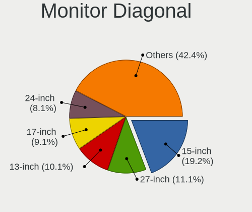

| Inches  | Computers | Percent |
|---------|-----------|---------|
| 15      | 18        | 16.98%  |
| 27      | 14        | 13.21%  |
| 24      | 11        | 10.38%  |
| 23      | 10        | 9.43%   |
| 14      | 10        | 9.43%   |
| 13      | 7         | 6.6%    |
| 21      | 6         | 5.66%   |
| 17      | 5         | 4.72%   |
| 19      | 4         | 3.77%   |
| 16      | 4         | 3.77%   |
| 31      | 3         | 2.83%   |
| 34      | 2         | 1.89%   |
| 25      | 2         | 1.89%   |
| 22      | 2         | 1.89%   |
| Unknown | 2         | 1.89%   |
| 37      | 1         | 0.94%   |
| 35      | 1         | 0.94%   |
| 28      | 1         | 0.94%   |
| 18      | 1         | 0.94%   |
| 11      | 1         | 0.94%   |
| 7       | 1         | 0.94%   |

Monitor Width
-------------

Physical width

| Width in mm | Computers | Percent |
|-------------|-----------|---------|
| 501-600     | 33        | 31.43%  |
| 301-350     | 33        | 31.43%  |
| 401-500     | 10        | 9.52%   |
| 351-400     | 9         | 8.57%   |
| 601-700     | 7         | 6.67%   |
| 201-300     | 6         | 5.71%   |
| 801-900     | 2         | 1.9%    |
| 701-800     | 2         | 1.9%    |
| Unknown     | 2         | 1.9%    |
| 1-100       | 1         | 0.95%   |

Aspect Ratio
------------

Proportional relationship between the width and the height

| Ratio   | Computers | Percent |
|---------|-----------|---------|
| 16/9    | 72        | 73.47%  |
| 16/10   | 15        | 15.31%  |
| 21/9    | 4         | 4.08%   |
| 5/4     | 2         | 2.04%   |
| 3/2     | 2         | 2.04%   |
| Unknown | 2         | 2.04%   |
| 0.67    | 1         | 1.02%   |

Monitor Area
------------

Area in inch

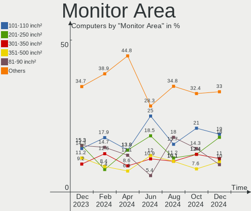

| Area in inch | Computers | Percent |
|----------------|-----------|---------|
| 201-250        | 21        | 20%     |
| 101-110        | 19        | 18.1%   |
| 301-350        | 14        | 13.33%  |
| 81-90          | 13        | 12.38%  |
| 351-500        | 7         | 6.67%   |
| 151-200        | 7         | 6.67%   |
| 251-300        | 6         | 5.71%   |
| 121-130        | 5         | 4.76%   |
| 71-80          | 4         | 3.81%   |
| 111-120        | 3         | 2.86%   |
| Unknown        | 2         | 1.9%    |
| 51-60          | 1         | 0.95%   |
| 1-40           | 1         | 0.95%   |
| 141-150        | 1         | 0.95%   |
| 501-1000       | 1         | 0.95%   |

Pixel Density
-------------

Pixels per inch

| Density       | Computers | Percent |
|---------------|-----------|---------|
| 51-100        | 40        | 39.6%   |
| 121-160       | 32        | 31.68%  |
| 101-120       | 17        | 16.83%  |
| 161-240       | 9         | 8.91%   |
| Unknown       | 2         | 1.98%   |
| More than 240 | 1         | 0.99%   |

Multiple Monitors
-----------------

Total monitors connected

| Total | Computers | Percent |
|-------|-----------|---------|
| 1     | 78        | 78.79%  |
| 2     | 13        | 13.13%  |
| 0     | 5         | 5.05%   |
| 3     | 3         | 3.03%   |

Network
-------

Net Controller Vendor
---------------------

Controller vendors

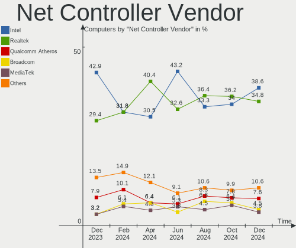

| Vendor                          | Computers | Percent |
|---------------------------------|-----------|---------|
| Realtek Semiconductor           | 60        | 41.67%  |
| Intel                           | 46        | 31.94%  |
| Qualcomm Atheros                | 8         | 5.56%   |
| MediaTek                        | 6         | 4.17%   |
| ASIX Electronics                | 4         | 2.78%   |
| Ralink Technology               | 3         | 2.08%   |
| Nvidia                          | 2         | 1.39%   |
| ICS Advent                      | 2         | 1.39%   |
| Broadcom                        | 2         | 1.39%   |
| ZTE WCDMA Technologies MSM      | 1         | 0.69%   |
| Qualcomm Atheros Communications | 1         | 0.69%   |
| Qualcomm                        | 1         | 0.69%   |
| QinHeng Electronics             | 1         | 0.69%   |
| NetGear                         | 1         | 0.69%   |
| JMicron Technology              | 1         | 0.69%   |
| Hewlett-Packard                 | 1         | 0.69%   |
| Google                          | 1         | 0.69%   |
| Fibocom                         | 1         | 0.69%   |
| Broadcom Limited                | 1         | 0.69%   |
| Aquantia                        | 1         | 0.69%   |

Net Controller Model
--------------------

Controller models

| Model                                                                         | Computers | Percent |
|-------------------------------------------------------------------------------|-----------|---------|
| Realtek RTL8111/8168/8411 PCI Express Gigabit Ethernet Controller             | 44        | 26.83%  |
| Intel Wi-Fi 6 AX200                                                           | 6         | 3.66%   |
| Intel 82579LM Gigabit Network Connection (Lewisville)                         | 6         | 3.66%   |
| MediaTek MT7922 802.11ax PCI Express Wireless Network Adapter                 | 4         | 2.44%   |
| Intel Wireless 7265                                                           | 4         | 2.44%   |
| Intel Wi-Fi 6 AX201                                                           | 4         | 2.44%   |
| ASIX AX88179 Gigabit Ethernet                                                 | 4         | 2.44%   |
| Realtek RTL8852BE PCIe 802.11ax Wireless Network Controller                   | 3         | 1.83%   |
| Realtek RTL8822CE 802.11ac PCIe Wireless Network Adapter                      | 3         | 1.83%   |
| Realtek RTL8125 2.5GbE Controller                                             | 3         | 1.83%   |
| Intel I211 Gigabit Network Connection                                         | 3         | 1.83%   |
| Intel Ethernet Controller I225-V                                              | 3         | 1.83%   |
| Intel Alder Lake-P PCH CNVi WiFi                                              | 3         | 1.83%   |
| Realtek RTL8822BE 802.11a/b/g/n/ac WiFi adapter                               | 2         | 1.22%   |
| Realtek RTL8821CE 802.11ac PCIe Wireless Network Adapter                      | 2         | 1.22%   |
| Realtek RTL8153 Gigabit Ethernet Adapter                                      | 2         | 1.22%   |
| Realtek RTL810xE PCI Express Fast Ethernet controller                         | 2         | 1.22%   |
| Ralink MT7601U Wireless Adapter                                               | 2         | 1.22%   |
| Qualcomm Atheros QCA9377 802.11ac Wireless Network Adapter                    | 2         | 1.22%   |
| Qualcomm Atheros AR242x / AR542x Wireless Network Adapter (PCI-Express)       | 2         | 1.22%   |
| MediaTek MT7921 802.11ax PCI Express Wireless Network Adapter                 | 2         | 1.22%   |
| Intel Wireless 3165                                                           | 2         | 1.22%   |
| Intel Wi-Fi 6 AX210/AX211/AX411 160MHz                                        | 2         | 1.22%   |
| Intel Ethernet Connection (2) I219-V                                          | 2         | 1.22%   |
| Intel Ethernet Connection (13) I219-V                                         | 2         | 1.22%   |
| Intel Cannon Point-LP CNVi [Wireless-AC]                                      | 2         | 1.22%   |
| ZTE WCDMA MSM ZTE WCDMA MSM                                                   | 1         | 0.61%   |
| Realtek RTL8191SEvB Wireless LAN Controller                                   | 1         | 0.61%   |
| Realtek RTL8188FTV 802.11b/g/n 1T1R 2.4G WLAN Adapter                         | 1         | 0.61%   |
| Realtek RTL8188CE 802.11b/g/n WiFi Adapter                                    | 1         | 0.61%   |
| Realtek RTL8169 PCI Gigabit Ethernet Controller                               | 1         | 0.61%   |
| Realtek RTL-8100/8101L/8139 PCI Fast Ethernet Adapter                         | 1         | 0.61%   |
| Realtek Realtek WLAN controller                                               | 1         | 0.61%   |
| Ralink RT2501/RT2573 Wireless Adapter                                         | 1         | 0.61%   |
| Qualcomm QCNFA765 Wireless Network Adapter                                    | 1         | 0.61%   |
| Qualcomm Atheros QCA9565 / AR9565 Wireless Network Adapter                    | 1         | 0.61%   |
| Qualcomm Atheros QCA6174 802.11ac Wireless Network Adapter                    | 1         | 0.61%   |
| Qualcomm Atheros TP-Link TL-WN821N v2 / TL-WN822N v1 802.11n [Atheros AR9170] | 1         | 0.61%   |
| Qualcomm Atheros AR9462 Wireless Network Adapter                              | 1         | 0.61%   |
| Qualcomm Atheros AR9285 Wireless Network Adapter (PCI-Express)                | 1         | 0.61%   |

Wireless Vendor
---------------

Wireless vendors

| Vendor                          | Computers | Percent |
|---------------------------------|-----------|---------|
| Intel                           | 33        | 47.14%  |
| Realtek Semiconductor           | 14        | 20%     |
| Qualcomm Atheros                | 8         | 11.43%  |
| MediaTek                        | 6         | 8.57%   |
| Ralink Technology               | 3         | 4.29%   |
| Qualcomm Atheros Communications | 1         | 1.43%   |
| Qualcomm                        | 1         | 1.43%   |
| NetGear                         | 1         | 1.43%   |
| Hewlett-Packard                 | 1         | 1.43%   |
| Fibocom                         | 1         | 1.43%   |
| Broadcom                        | 1         | 1.43%   |

Wireless Model
--------------

Wireless models

| Model                                                                         | Computers | Percent |
|-------------------------------------------------------------------------------|-----------|---------|
| Intel Wi-Fi 6 AX200                                                           | 6         | 8.57%   |
| MediaTek MT7922 802.11ax PCI Express Wireless Network Adapter                 | 4         | 5.71%   |
| Intel Wireless 7265                                                           | 4         | 5.71%   |
| Intel Wi-Fi 6 AX201                                                           | 4         | 5.71%   |
| Realtek RTL8852BE PCIe 802.11ax Wireless Network Controller                   | 3         | 4.29%   |
| Realtek RTL8822CE 802.11ac PCIe Wireless Network Adapter                      | 3         | 4.29%   |
| Intel Alder Lake-P PCH CNVi WiFi                                              | 3         | 4.29%   |
| Realtek RTL8822BE 802.11a/b/g/n/ac WiFi adapter                               | 2         | 2.86%   |
| Realtek RTL8821CE 802.11ac PCIe Wireless Network Adapter                      | 2         | 2.86%   |
| Ralink MT7601U Wireless Adapter                                               | 2         | 2.86%   |
| Qualcomm Atheros QCA9377 802.11ac Wireless Network Adapter                    | 2         | 2.86%   |
| Qualcomm Atheros AR242x / AR542x Wireless Network Adapter (PCI-Express)       | 2         | 2.86%   |
| MediaTek MT7921 802.11ax PCI Express Wireless Network Adapter                 | 2         | 2.86%   |
| Intel Wireless 3165                                                           | 2         | 2.86%   |
| Intel Wi-Fi 6 AX210/AX211/AX411 160MHz                                        | 2         | 2.86%   |
| Intel Cannon Point-LP CNVi [Wireless-AC]                                      | 2         | 2.86%   |
| Realtek RTL8191SEvB Wireless LAN Controller                                   | 1         | 1.43%   |
| Realtek RTL8188FTV 802.11b/g/n 1T1R 2.4G WLAN Adapter                         | 1         | 1.43%   |
| Realtek RTL8188CE 802.11b/g/n WiFi Adapter                                    | 1         | 1.43%   |
| Realtek Realtek WLAN controller                                               | 1         | 1.43%   |
| Ralink RT2501/RT2573 Wireless Adapter                                         | 1         | 1.43%   |
| Qualcomm QCNFA765 Wireless Network Adapter                                    | 1         | 1.43%   |
| Qualcomm Atheros QCA9565 / AR9565 Wireless Network Adapter                    | 1         | 1.43%   |
| Qualcomm Atheros QCA6174 802.11ac Wireless Network Adapter                    | 1         | 1.43%   |
| Qualcomm Atheros TP-Link TL-WN821N v2 / TL-WN822N v1 802.11n [Atheros AR9170] | 1         | 1.43%   |
| Qualcomm Atheros AR9462 Wireless Network Adapter                              | 1         | 1.43%   |
| Qualcomm Atheros AR9285 Wireless Network Adapter (PCI-Express)                | 1         | 1.43%   |
| NetGear A6210                                                                 | 1         | 1.43%   |
| Intel Wireless-AC 9260                                                        | 1         | 1.43%   |
| Intel Wireless 8265 / 8275                                                    | 1         | 1.43%   |
| Intel Wireless 7260                                                           | 1         | 1.43%   |
| Intel Wireless 3160                                                           | 1         | 1.43%   |
| Intel Tiger Lake PCH CNVi WiFi                                                | 1         | 1.43%   |
| Intel Dual Band Wireless-AC 3168NGW [Stone Peak]                              | 1         | 1.43%   |
| Intel Dual Band Wireless-AC 3165 Plus Bluetooth                               | 1         | 1.43%   |
| Intel CNVi: Wi-Fi                                                             | 1         | 1.43%   |
| Intel Centrino Advanced-N 6205 [Taylor Peak]                                  | 1         | 1.43%   |
| Intel 700 Series Chipset Family Wi-Fi                                         | 1         | 1.43%   |
| HP lt4112 Gobi 4G Module Network Device                                       | 1         | 1.43%   |
| Fibocom L831-EAU                                                              | 1         | 1.43%   |

Ethernet Vendor
---------------

Ethernet vendors

| Vendor                     | Computers | Percent |
|----------------------------|-----------|---------|
| Realtek Semiconductor      | 52        | 57.14%  |
| Intel                      | 24        | 26.37%  |
| ASIX Electronics           | 4         | 4.4%    |
| Nvidia                     | 2         | 2.2%    |
| ICS Advent                 | 2         | 2.2%    |
| ZTE WCDMA Technologies MSM | 1         | 1.1%    |
| Qualcomm Atheros           | 1         | 1.1%    |
| JMicron Technology         | 1         | 1.1%    |
| Google                     | 1         | 1.1%    |
| Broadcom Limited           | 1         | 1.1%    |
| Broadcom                   | 1         | 1.1%    |
| Aquantia                   | 1         | 1.1%    |

Ethernet Model
--------------

Ethernet models

| Model                                                               | Computers | Percent |
|---------------------------------------------------------------------|-----------|---------|
| Realtek RTL8111/8168/8411 PCI Express Gigabit Ethernet Controller   | 44        | 47.31%  |
| Intel 82579LM Gigabit Network Connection (Lewisville)               | 6         | 6.45%   |
| ASIX AX88179 Gigabit Ethernet                                       | 4         | 4.3%    |
| Realtek RTL8125 2.5GbE Controller                                   | 3         | 3.23%   |
| Intel I211 Gigabit Network Connection                               | 3         | 3.23%   |
| Intel Ethernet Controller I225-V                                    | 3         | 3.23%   |
| Realtek RTL8153 Gigabit Ethernet Adapter                            | 2         | 2.15%   |
| Realtek RTL810xE PCI Express Fast Ethernet controller               | 2         | 2.15%   |
| Intel Ethernet Connection (2) I219-V                                | 2         | 2.15%   |
| Intel Ethernet Connection (13) I219-V                               | 2         | 2.15%   |
| ZTE WCDMA MSM ZTE WCDMA MSM                                         | 1         | 1.08%   |
| Realtek RTL8169 PCI Gigabit Ethernet Controller                     | 1         | 1.08%   |
| Realtek RTL-8100/8101L/8139 PCI Fast Ethernet Adapter               | 1         | 1.08%   |
| Qualcomm Atheros AR8151 v2.0 Gigabit Ethernet                       | 1         | 1.08%   |
| Nvidia MCP67 Ethernet                                               | 1         | 1.08%   |
| Nvidia MCP61 Ethernet                                               | 1         | 1.08%   |
| JMicron JMC250 PCI Express Gigabit Ethernet Controller              | 1         | 1.08%   |
| Intel Ethernet Connection I217-V                                    | 1         | 1.08%   |
| Intel Ethernet Connection (6) I219-LM                               | 1         | 1.08%   |
| Intel Ethernet Connection (4) I219-LM                               | 1         | 1.08%   |
| Intel Ethernet Connection (3) I218-LM                               | 1         | 1.08%   |
| Intel 82583V Gigabit Network Connection                             | 1         | 1.08%   |
| Intel 82579V Gigabit Network Connection                             | 1         | 1.08%   |
| Intel 82578DM Gigabit Network Connection                            | 1         | 1.08%   |
| Intel 82577LC Gigabit Network Connection                            | 1         | 1.08%   |
| Intel 82567LF-2 Gigabit Network Connection                          | 1         | 1.08%   |
| ICS Advent DM9601 Fast Ethernet Adapter                             | 1         | 1.08%   |
| ICS Advent 10/100M LAN                                              | 1         | 1.08%   |
| Google Pixel 7 Pro                                                  | 1         | 1.08%   |
| Broadcom NetLink BCM57780 Gigabit Ethernet PCIe                     | 1         | 1.08%   |
| Broadcom Limited NetLink BCM57788 Gigabit Ethernet PCIe             | 1         | 1.08%   |
| Aquantia AQC113CS NBase-T/IEEE 802.3bz Ethernet Controller [AQtion] | 1         | 1.08%   |

Net Controller Kind
-------------------

Ethernet, WiFi or modem

| Kind     | Computers | Percent |
|----------|-----------|---------|
| Ethernet | 82        | 54.67%  |
| WiFi     | 67        | 44.67%  |
| Modem    | 1         | 0.67%   |

Used Controller
---------------

Currently used network controller

| Kind     | Computers | Percent |
|----------|-----------|---------|
| WiFi     | 52        | 50.98%  |
| Ethernet | 50        | 49.02%  |

NICs
----

Total network controllers on board

| Total | Computers | Percent |
|-------|-----------|---------|
| 1     | 51        | 51.52%  |
| 2     | 41        | 41.41%  |
| 3     | 5         | 5.05%   |
| 0     | 2         | 2.02%   |

IPv6
----

IPv6 vs IPv4

| Used | Computers | Percent |
|------|-----------|---------|
| No   | 64        | 64.65%  |
| Yes  | 35        | 35.35%  |

Bluetooth
---------

Bluetooth Vendor
----------------

Controller vendors

| Vendor                          | Computers | Percent |
|---------------------------------|-----------|---------|
| Intel                           | 32        | 50.79%  |
| Realtek Semiconductor           | 9         | 14.29%  |
| Cambridge Silicon Radio         | 5         | 7.94%   |
| IMC Networks                    | 4         | 6.35%   |
| Foxconn / Hon Hai               | 4         | 6.35%   |
| Qualcomm Atheros Communications | 3         | 4.76%   |
| USI                             | 1         | 1.59%   |
| Toshiba                         | 1         | 1.59%   |
| Realtek                         | 1         | 1.59%   |
| Lite-On Technology              | 1         | 1.59%   |
| Broadcom                        | 1         | 1.59%   |
| ASUSTek Computer                | 1         | 1.59%   |

Bluetooth Model
---------------

Controller models

| Model                                               | Computers | Percent |
|-----------------------------------------------------|-----------|---------|
| Intel Bluetooth wireless interface                  | 10        | 15.87%  |
| Realtek Bluetooth Radio                             | 7         | 11.11%  |
| Intel AX201 Bluetooth                               | 6         | 9.52%   |
| Intel AX200 Bluetooth                               | 6         | 9.52%   |
| Cambridge Silicon Radio Bluetooth Dongle (HCI mode) | 5         | 7.94%   |
| Intel Bluetooth Device                              | 4         | 6.35%   |
| Foxconn / Hon Hai Wireless_Device                   | 3         | 4.76%   |
| Realtek  Bluetooth 4.2 Adapter                      | 2         | 3.17%   |
| Qualcomm Atheros  Bluetooth Device                  | 2         | 3.17%   |
| Intel Bluetooth 9460/9560 Jefferson Peak (JfP)      | 2         | 3.17%   |
| Intel AX210 Bluetooth                               | 2         | 3.17%   |
| IMC Networks Bluetooth Radio                        | 2         | 3.17%   |
| USI Bluetooth Device                                | 1         | 1.59%   |
| Toshiba Integrated Bluetooth HCI                    | 1         | 1.59%   |
| Realtek Bluetooth Radio                             | 1         | 1.59%   |
| Qualcomm Atheros AR3012 Bluetooth 4.0               | 1         | 1.59%   |
| Lite-On Qualcomm Atheros QCA9377 Bluetooth          | 1         | 1.59%   |
| Intel Wireless-AC 9260 Bluetooth Adapter            | 1         | 1.59%   |
| Intel Wireless-AC 3168 Bluetooth                    | 1         | 1.59%   |
| IMC Networks Wireless_Device                        | 1         | 1.59%   |
| IMC Networks Bluetooth Device                       | 1         | 1.59%   |
| Foxconn / Hon Hai MediaTek Bluetooth Adapter        | 1         | 1.59%   |
| Broadcom HP Portable SoftSailing                    | 1         | 1.59%   |
| ASUS Broadcom BCM20702A0 Bluetooth                  | 1         | 1.59%   |

Sound
-----

Sound Vendor
------------

Sound card vendors

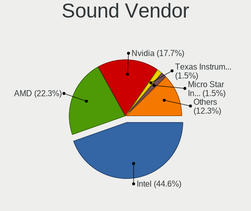

| Vendor              | Computers | Percent |
|---------------------|-----------|---------|
| Intel               | 62        | 42.18%  |
| AMD                 | 40        | 27.21%  |
| Nvidia              | 26        | 17.69%  |
| C-Media Electronics | 5         | 3.4%    |
| Logitech            | 3         | 2.04%   |
| SteelSeries ApS     | 2         | 1.36%   |
| Razer USA           | 2         | 1.36%   |
| ASUSTek Computer    | 2         | 1.36%   |
| Philips (or NXP)    | 1         | 0.68%   |
| JMTek               | 1         | 0.68%   |
| Creative Technology | 1         | 0.68%   |
| Creative Labs       | 1         | 0.68%   |
| Cooler Master       | 1         | 0.68%   |

Sound Model
-----------

Sound card models

| Model                                                                      | Computers | Percent |
|----------------------------------------------------------------------------|-----------|---------|
| AMD Family 17h/19h HD Audio Controller                                     | 16        | 9.2%    |
| Intel 6 Series/C200 Series Chipset Family High Definition Audio Controller | 7         | 4.02%   |
| AMD Starship/Matisse HD Audio Controller                                   | 7         | 4.02%   |
| AMD Rembrandt Radeon High Definition Audio Controller                      | 7         | 4.02%   |
| Intel Tiger Lake-LP Smart Sound Technology Audio Controller                | 6         | 3.45%   |
| Intel 7 Series/C216 Chipset Family High Definition Audio Controller        | 6         | 3.45%   |
| Intel 5 Series/3400 Series Chipset High Definition Audio                   | 6         | 3.45%   |
| Nvidia Audio device                                                        | 5         | 2.87%   |
| AMD Renoir Radeon High Definition Audio Controller                         | 5         | 2.87%   |
| AMD Raven/Raven2/Fenghuang HDMI/DP Audio Controller                        | 5         | 2.87%   |
| Nvidia GP107GL High Definition Audio Controller                            | 4         | 2.3%    |
| Nvidia GA104 High Definition Audio Controller                              | 4         | 2.3%    |
| Intel Sunrise Point-LP HD Audio                                            | 4         | 2.3%    |
| Intel Cannon Point-LP High Definition Audio Controller                     | 4         | 2.3%    |
| Intel Alder Lake PCH-P High Definition Audio Controller                    | 4         | 2.3%    |
| Intel Celeron/Pentium Silver Processor High Definition Audio               | 3         | 1.72%   |
| Intel 8 Series/C220 Series Chipset High Definition Audio Controller        | 3         | 1.72%   |
| Intel 100 Series/C230 Series Chipset Family HD Audio Controller            | 3         | 1.72%   |
| AMD RV710/730 HDMI Audio [Radeon HD 4000 series]                           | 3         | 1.72%   |
| AMD Oland/Hainan/Cape Verde/Pitcairn HDMI Audio [Radeon HD 7000 Series]    | 3         | 1.72%   |
| AMD FCH Azalia Controller                                                  | 3         | 1.72%   |
| AMD Ellesmere HDMI Audio [Radeon RX 470/480 / 570/580/590]                 | 3         | 1.72%   |
| Nvidia GP108 High Definition Audio Controller                              | 2         | 1.15%   |
| Nvidia GK208 HDMI/DP Audio Controller                                      | 2         | 1.15%   |
| Nvidia GA106 High Definition Audio Controller                              | 2         | 1.15%   |
| Nvidia GA102 High Definition Audio Controller                              | 2         | 1.15%   |
| Intel Xeon E3-1200 v3/4th Gen Core Processor HD Audio Controller           | 2         | 1.15%   |
| Intel Wildcat Point-LP High Definition Audio Controller                    | 2         | 1.15%   |
| Intel Tiger Lake-H HD Audio Controller                                     | 2         | 1.15%   |
| Intel Cannon Lake PCH cAVS                                                 | 2         | 1.15%   |
| Intel Broadwell-U Audio Controller                                         | 2         | 1.15%   |
| Intel 200 Series PCH HD Audio                                              | 2         | 1.15%   |
| ASUSTek Computer USB Audio                                                 | 2         | 1.15%   |
| AMD Family 17h (Models 00h-0fh) HD Audio Controller                        | 2         | 1.15%   |
| SteelSeries ApS SteelSeries Arctis 7                                       | 1         | 0.57%   |
| SteelSeries ApS Arctis Pro Wireless                                        | 1         | 0.57%   |
| Razer USA Razer Barracuda X                                                | 1         | 0.57%   |
| Razer USA Nari (Wireless)                                                  | 1         | 0.57%   |
| Philips (or NXP) DSS330 Digital Speaker System [uda1321]                   | 1         | 0.57%   |
| Nvidia MCP67 High Definition Audio                                         | 1         | 0.57%   |

Memory
------

Memory Vendor
-------------

Memory module vendors

| Vendor              | Computers | Percent |
|---------------------|-----------|---------|
| SK hynix            | 15        | 25.42%  |
| Kingston            | 8         | 13.56%  |
| Samsung Electronics | 7         | 11.86%  |
| Micron Technology   | 7         | 11.86%  |
| Crucial             | 7         | 11.86%  |
| Unknown             | 4         | 6.78%   |
| G.Skill             | 3         | 5.08%   |
| Corsair             | 3         | 5.08%   |
| A-DATA Technology   | 2         | 3.39%   |
| Ramaxel Technology  | 1         | 1.69%   |
| Nanya Technology    | 1         | 1.69%   |
| Elpida              | 1         | 1.69%   |

Memory Model
------------

Memory module models

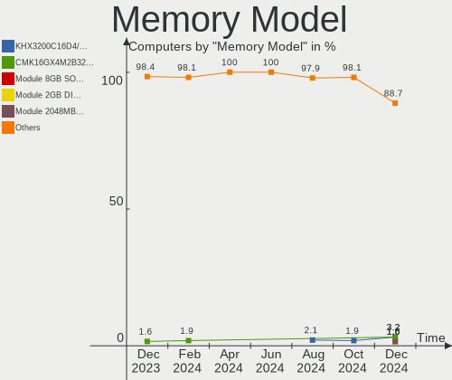

| Model                                                            | Computers | Percent |
|------------------------------------------------------------------|-----------|---------|
| Samsung RAM M471A5244CB0-CTD 4GB SODIMM DDR4 3266MT/s            | 2         | 3.13%   |
| Samsung RAM M471A1K43EB1-CWE 8GB SODIMM DDR4 3200MT/s            | 2         | 3.13%   |
| Micron RAM 8JTF51264AZ-1G6E1 4GB DIMM DDR3 1600MT/s              | 2         | 3.13%   |
| Crucial RAM CT102464BA160B.C16 8GB DIMM DDR3 1600MT/s            | 2         | 3.13%   |
| Unknown RAM Module 8GB SODIMM DDR4 3200MT/s                      | 1         | 1.56%   |
| Unknown RAM Module 4GB DIMM DDR 1333MT/s                         | 1         | 1.56%   |
| Unknown RAM Module 2GB DIMM DDR2 667MT/s                         | 1         | 1.56%   |
| Unknown RAM Module 2048MB SODIMM DDR                             | 1         | 1.56%   |
| Unknown RAM Module 1GB DIMM DDR2 667MT/s                         | 1         | 1.56%   |
| SK hynix RAM Module 2GB SODIMM DDR3 1600MT/s                     | 1         | 1.56%   |
| SK hynix RAM HMT41GS6BFR8A-PB 8GB SODIMM DDR3 1600MT/s           | 1         | 1.56%   |
| SK hynix RAM HMT351U6CFR8C-PB 4GB DIMM DDR3 1800MT/s             | 1         | 1.56%   |
| SK hynix RAM HMT351S6CFR8C-H9 4GB SODIMM DDR3 1333MT/s           | 1         | 1.56%   |
| SK hynix RAM HMT125U6BFR8C-G7 2GB DIMM 1066MT/s                  | 1         | 1.56%   |
| SK hynix RAM HMT125U6AFP8C-G7 2GB DIMM 1066MT/s                  | 1         | 1.56%   |
| SK hynix RAM HMCG78MEBSA092N 16GB SODIMM DDR5 4800MT/s           | 1         | 1.56%   |
| SK hynix RAM HMAA1GS6CMR6N-VK 8GB SODIMM DDR4 2667MT/s           | 1         | 1.56%   |
| SK hynix RAM HMAA1GS6CJR6N-XN 8GB SODIMM DDR4 3200MT/s           | 1         | 1.56%   |
| SK hynix RAM HMA851S6CJR6N-VK 4096MB SODIMM DDR4 2667MT/s        | 1         | 1.56%   |
| SK hynix RAM HMA451U6AFR8N-TF 4GB DIMM DDR4 2133MT/s             | 1         | 1.56%   |
| SK hynix RAM H9JCNNNFA5MLYR-N6E 8GB SODIMM LPDDR5 6400MT/s       | 1         | 1.56%   |
| SK hynix RAM H9HCNNNCPMMLXR-NEE 2GB Row Of Chips LPDDR4 4267MT/s | 1         | 1.56%   |
| SK hynix RAM H9CCNNN8GTALAR-NVD 2GB Row Of Chips LPDDR3 2133MT/s | 1         | 1.56%   |
| SK hynix RAM H54G56CYRBX247N 8GB Row Of Chips LPDDR4 4267MT/s    | 1         | 1.56%   |
| Samsung RAM Module 3GB Row Of Chips LPDDR5 6400MT/s              | 1         | 1.56%   |
| Samsung RAM M471A5244CB0-CWE 4GB SODIMM DDR4 3200MT/s            | 1         | 1.56%   |
| Samsung RAM M471A1K43CB1-CTD 8GB SODIMM DDR4 2667MT/s            | 1         | 1.56%   |
| Samsung RAM M471A1G44AB0-CWE 8GB SODIMM DDR4 3200MT/s            | 1         | 1.56%   |
| Samsung RAM K4EBE304EB-EGCG 8GB Row Of Chips LPDDR3 2133MT/s     | 1         | 1.56%   |
| Ramaxel RAM RMT3170ME68F9F1600 4GB SODIMM DDR3 1600MT/s          | 1         | 1.56%   |
| Nanya RAM M2F4G64CB8HB 4GB DIMM 1333MT/s                         | 1         | 1.56%   |
| Micron RAM MTC8C1084S1SC48BA1 16GB SODIMM DDR5 4800MT/s          | 1         | 1.56%   |
| Micron RAM Module 8GB SODIMM DDR4 2667MT/s                       | 1         | 1.56%   |
| Micron RAM 4ATS2G64HZ-3G2B1 16GB SODIMM DDR4 3200MT/s            | 1         | 1.56%   |
| Micron RAM 4ATF51264HZ-2G3AZ 4GB SODIMM DDR4 2133MT/s            | 1         | 1.56%   |
| Micron RAM 4ATF1G64HZ-3G2E2 8GB SODIMM DDR4 3200MT/s             | 1         | 1.56%   |
| Micron RAM 4ATF1G64HZ-3G2E1 8GB Row Of Chips DDR4 3200MT/s       | 1         | 1.56%   |
| Kingston RAM KHX3200C16D4/8GX 8GB DIMM DDR4 3600MT/s             | 1         | 1.56%   |
| Kingston RAM KHX3200C16D4/16GX 16GB DIMM DDR4 3600MT/s           | 1         | 1.56%   |
| Kingston RAM KHX2933C17S4/16G 16GB SODIMM DDR4 2933MT/s          | 1         | 1.56%   |

Memory Kind
-----------

Memory module kinds

| Kind    | Computers | Percent |
|---------|-----------|---------|
| DDR4    | 27        | 51.92%  |
| DDR3    | 12        | 23.08%  |
| LPDDR5  | 2         | 3.85%   |
| LPDDR4  | 2         | 3.85%   |
| LPDDR3  | 2         | 3.85%   |
| DDR5    | 2         | 3.85%   |
| DDR     | 2         | 3.85%   |
| Unknown | 2         | 3.85%   |
| DDR2    | 1         | 1.92%   |

Memory Form Factor
------------------

Physical design of the memory module

| Name         | Computers | Percent |
|--------------|-----------|---------|
| SODIMM       | 28        | 52.83%  |
| DIMM         | 19        | 35.85%  |
| Row Of Chips | 6         | 11.32%  |

Memory Size
-----------

Memory module size

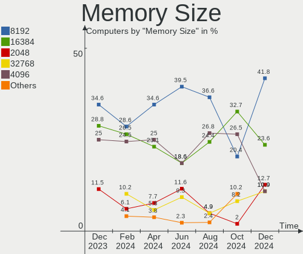

| Size  | Computers | Percent |
|-------|-----------|---------|
| 8192  | 25        | 42.37%  |
| 4096  | 15        | 25.42%  |
| 16384 | 9         | 15.25%  |
| 2048  | 7         | 11.86%  |
| 32768 | 1         | 1.69%   |
| 3072  | 1         | 1.69%   |
| 1024  | 1         | 1.69%   |

Memory Speed
------------

Memory module speed

| Speed   | Computers | Percent |
|---------|-----------|---------|
| 3200    | 13        | 23.21%  |
| 2667    | 7         | 12.5%   |
| 1600    | 7         | 12.5%   |
| 2133    | 4         | 7.14%   |
| 1333    | 3         | 5.36%   |
| 6400    | 2         | 3.57%   |
| 4800    | 2         | 3.57%   |
| 4267    | 2         | 3.57%   |
| 3600    | 2         | 3.57%   |
| 3266    | 2         | 3.57%   |
| 1334    | 2         | 3.57%   |
| 1066    | 2         | 3.57%   |
| 3733    | 1         | 1.79%   |
| 3533    | 1         | 1.79%   |
| 3466    | 1         | 1.79%   |
| 3000    | 1         | 1.79%   |
| 2933    | 1         | 1.79%   |
| 1800    | 1         | 1.79%   |
| 667     | 1         | 1.79%   |
| Unknown | 1         | 1.79%   |

Printers & scanners
-------------------

Printer Vendor
--------------

Printer device vendors

| Vendor          | Computers | Percent |
|-----------------|-----------|---------|
| Hewlett-Packard | 1         | 100%    |

Printer Model
-------------

Printer device models

| Model                    | Computers | Percent |
|--------------------------|-----------|---------|
| HP OfficeJet 8010 series | 1         | 100%    |

Scanner Vendor
--------------

Scanner device vendors

Zero info for selected period =(

Scanner Model
-------------

Scanner device models

Zero info for selected period =(

Camera
------

Camera Vendor
-------------

Camera device vendors

| Vendor                        | Computers | Percent |
|-------------------------------|-----------|---------|
| Chicony Electronics           | 13        | 26.53%  |
| IMC Networks                  | 6         | 12.24%  |
| Realtek Semiconductor         | 4         | 8.16%   |
| Quanta                        | 3         | 6.12%   |
| Microdia                      | 3         | 6.12%   |
| Luxvisions Innotech Limited   | 3         | 6.12%   |
| Acer                          | 3         | 6.12%   |
| Syntek                        | 2         | 4.08%   |
| Sonix Technology              | 2         | 4.08%   |
| Microsoft                     | 2         | 4.08%   |
| Suyin                         | 1         | 2.04%   |
| Sunplus Innovation Technology | 1         | 2.04%   |
| Primax Electronics            | 1         | 2.04%   |
| OYT Tech                      | 1         | 2.04%   |
| Logitech                      | 1         | 2.04%   |
| HYGD-220831-A                 | 1         | 2.04%   |
| GEMBIRD                       | 1         | 2.04%   |
| Alcor Micro                   | 1         | 2.04%   |

Camera Model
------------

Camera device models

| Model                                                 | Computers | Percent |
|-------------------------------------------------------|-----------|---------|
| Chicony Integrated Camera                             | 4         | 8.16%   |
| IMC Networks USB2.0 HD UVC WebCam                     | 3         | 6.12%   |
| Sonix USB2.0 HD UVC WebCam                            | 2         | 4.08%   |
| Microdia Camera                                       | 2         | 4.08%   |
| IMC Networks Integrated Camera                        | 2         | 4.08%   |
| Chicony HD WebCam                                     | 2         | 4.08%   |
| Acer BisonCam,NB Pro                                  | 2         | 4.08%   |
| Syntek Lenovo EasyCamera                              | 1         | 2.04%   |
| Syntek Integrated Camera                              | 1         | 2.04%   |
| Suyin Acer CrystalEye Webcam                          | 1         | 2.04%   |
| Sunplus Integrated_Webcam_HD                          | 1         | 2.04%   |
| Realtek Integrated_Webcam_HD                          | 1         | 2.04%   |
| Realtek Integrated Camera                             | 1         | 2.04%   |
| Realtek EasyCamera                                    | 1         | 2.04%   |
| Realtek 2SF022                                        | 1         | 2.04%   |
| Quanta USB2.0 HD UVC WebCam                           | 1         | 2.04%   |
| Quanta HP Wide Vision HD Camera                       | 1         | 2.04%   |
| Quanta HD User Facing                                 | 1         | 2.04%   |
| Primax HP HD Webcam [Fixed]                           | 1         | 2.04%   |
| OYT Tech OYV1RDFF1                                    | 1         | 2.04%   |
| Microsoft LifeCam HD-3000                             | 1         | 2.04%   |
| Microsoft LifeCam Cinema                              | 1         | 2.04%   |
| Microdia ACR010 USB Webcam                            | 1         | 2.04%   |
| Luxvisions Innotech Limited Integrated RGB Camera     | 1         | 2.04%   |
| Luxvisions Innotech Limited Integrated Camera         | 1         | 2.04%   |
| Luxvisions Innotech Limited HP True Vision FHD Camera | 1         | 2.04%   |
| Logitech C922 Pro Stream Webcam                       | 1         | 2.04%   |
| IMC Networks HD Camera                                | 1         | 2.04%   |
| HYGD-220831-A Hy-Usb2.0-1*MIC                         | 1         | 2.04%   |
| GEMBIRD Generic UVC 1.00 camera [AppoTech AX2311]     | 1         | 2.04%   |
| Chicony USB2.0 HD UVC WebCam                          | 1         | 2.04%   |
| Chicony USB2.0 Camera                                 | 1         | 2.04%   |
| Chicony HP Integrated Webcam                          | 1         | 2.04%   |
| Chicony HP HD Webcam                                  | 1         | 2.04%   |
| Chicony HP HD Camera                                  | 1         | 2.04%   |
| Chicony HP Full-HD Camera                             | 1         | 2.04%   |
| Chicony HD WebCam (Asus N-series)                     | 1         | 2.04%   |
| Alcor Micro Asus Integrated Webcam                    | 1         | 2.04%   |
| Acer HD Camera                                        | 1         | 2.04%   |

Security
--------

Fingerprint Vendor
------------------

Fingerprint sensor vendors

| Vendor                     | Computers | Percent |
|----------------------------|-----------|---------|
| Synaptics                  | 7         | 58.33%  |
| Validity Sensors           | 3         | 25%     |
| Shenzhen Goodix Technology | 2         | 16.67%  |

Fingerprint Model
-----------------

Fingerprint sensor models

| Model                                             | Computers | Percent |
|---------------------------------------------------|-----------|---------|
| Synaptics Prometheus MIS Touch Fingerprint Reader | 3         | 25%     |
| Shenzhen Goodix Fingerprint Reader                | 2         | 16.67%  |
| Validity Sensors VFS5011 Fingerprint Reader       | 1         | 8.33%   |
| Validity Sensors VFS491                           | 1         | 8.33%   |
| Validity Sensors VFS451 Fingerprint Reader        | 1         | 8.33%   |
| Synaptics WBDI Fingerprint Reader USB 086         | 1         | 8.33%   |
| Synaptics  WBDI                                   | 1         | 8.33%   |
| Synaptics Metallica MIS Touch Fingerprint Reader  | 1         | 8.33%   |
| Synaptics Fingerprint reader [HP G6]              | 1         | 8.33%   |

Chipcard Vendor
---------------

Chipcard module vendors

| Vendor      | Computers | Percent |
|-------------|-----------|---------|
| Alcor Micro | 2         | 100%    |

Chipcard Model
--------------

Chipcard module models

| Model                               | Computers | Percent |
|-------------------------------------|-----------|---------|
| Alcor Micro AU9540 Smartcard Reader | 2         | 100%    |

Unsupported
-----------

Unsupported Devices
-------------------

Total unsupported devices on board

| Total | Computers | Percent |
|-------|-----------|---------|
| 0     | 74        | 74.75%  |
| 1     | 23        | 23.23%  |
| 2     | 2         | 2.02%   |

Unsupported Device Types
------------------------

Types of unsupported devices

| Type                     | Computers | Percent |
|--------------------------|-----------|---------|
| Fingerprint reader       | 12        | 44.44%  |
| Graphics card            | 4         | 14.81%  |
| Multimedia controller    | 3         | 11.11%  |
| Net/wireless             | 2         | 7.41%   |
| Card reader              | 2         | 7.41%   |
| Sound                    | 1         | 3.7%    |
| Communication controller | 1         | 3.7%    |
| Chipcard                 | 1         | 3.7%    |
| Camera                   | 1         | 3.7%    |

