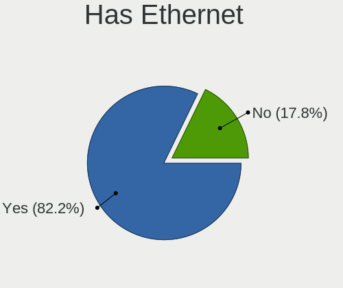
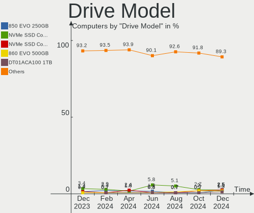
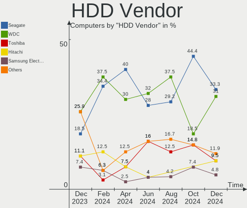
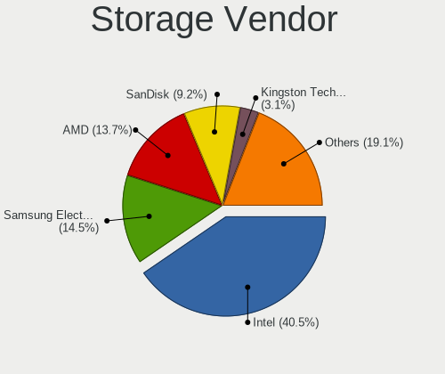
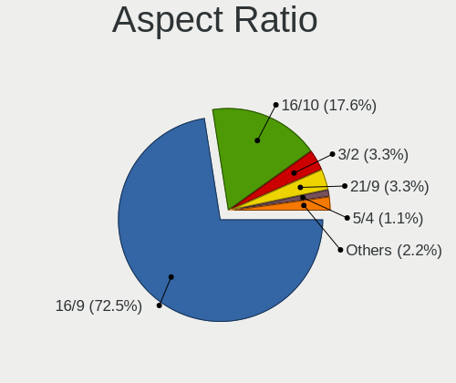
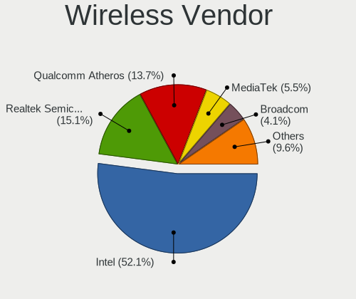
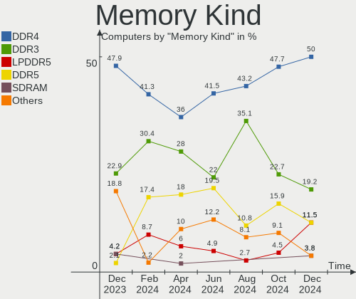
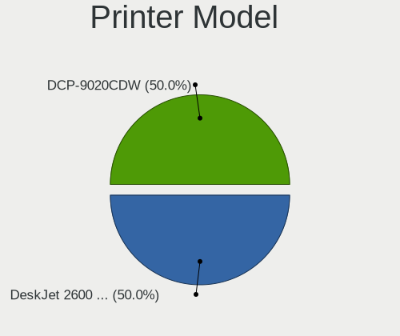
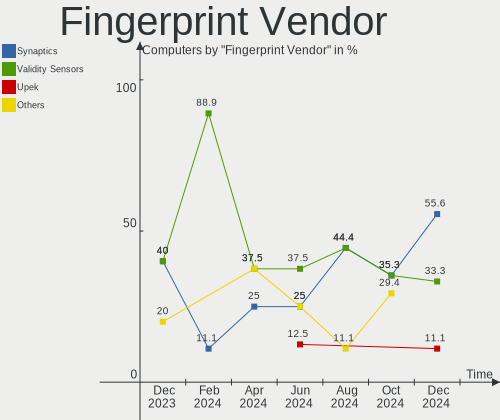
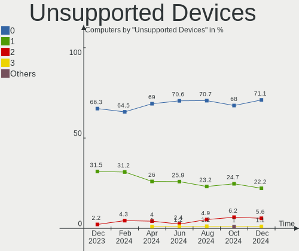

Linux in Netherlands - Hardware Trends
--------------------------------------

A project to identify most popular hardware characteristics and track their change
over time based on data collected by Linux users at https://Linux-Hardware.org.

Anyone can contribute to this report by the [hw-probe](https://github.com/linuxhw/hw-probe) tool:

    sudo -E hw-probe -all -upload

This is a report for all computer types. See also reports for [desktops](/Location/Netherlands/Desktop/README.md) and [notebooks](/Location/Netherlands/Notebook/README.md).

Period: Aug, 2023.

Contents
--------

* [ System ](#system)
  - [ OS                       ](#os)
  - [ OS Family                ](#os-family)
  - [ Kernel                   ](#kernel)
  - [ Kernel Family            ](#kernel-family)
  - [ Kernel Major Ver.        ](#kernel-major-ver)
  - [ Arch                     ](#arch)
  - [ DE                       ](#de)
  - [ Display Server           ](#display-server)
  - [ Display Manager          ](#display-manager)
  - [ OS Lang                  ](#os-lang)
  - [ Boot Mode                ](#boot-mode)
  - [ Filesystem               ](#filesystem)
  - [ Part. scheme             ](#part-scheme)
  - [ Dual Boot with Linux/BSD ](#dual-boot-with-linuxbsd)
  - [ Dual Boot (Win)          ](#dual-boot-win)

* [ Board ](#board)
  - [ Vendor                   ](#vendor)
  - [ Model                    ](#model)
  - [ Model Family             ](#model-family)
  - [ MFG Year                 ](#mfg-year)
  - [ Form Factor              ](#form-factor)
  - [ Secure Boot              ](#secure-boot)
  - [ Coreboot                 ](#coreboot)
  - [ RAM Size                 ](#ram-size)
  - [ RAM Used                 ](#ram-used)
  - [ Total Drives             ](#total-drives)
  - [ Has CD-ROM               ](#has-cd-rom)
  - [ Has Ethernet             ](#has-ethernet)
  - [ Has WiFi                 ](#has-wifi)
  - [ Has Bluetooth            ](#has-bluetooth)

* [ Location ](#location)
  - [ Country                  ](#country)
  - [ City                     ](#city)

* [ Drives ](#drives)
  - [ Drive Vendor             ](#drive-vendor)
  - [ Drive Model              ](#drive-model)
  - [ HDD Vendor               ](#hdd-vendor)
  - [ SSD Vendor               ](#ssd-vendor)
  - [ Drive Kind               ](#drive-kind)
  - [ Drive Connector          ](#drive-connector)
  - [ Drive Size               ](#drive-size)
  - [ Space Total              ](#space-total)
  - [ Space Used               ](#space-used)
  - [ Malfunc. Drives          ](#malfunc-drives)
  - [ Malfunc. Drive Vendor    ](#malfunc-drive-vendor)
  - [ Malfunc. HDD Vendor      ](#malfunc-hdd-vendor)
  - [ Malfunc. Drive Kind      ](#malfunc-drive-kind)
  - [ Failed Drives            ](#failed-drives)
  - [ Failed Drive Vendor      ](#failed-drive-vendor)
  - [ Drive Status             ](#drive-status)

* [ Storage controller ](#storage-controller)
  - [ Storage Vendor           ](#storage-vendor)
  - [ Storage Model            ](#storage-model)
  - [ Storage Kind             ](#storage-kind)

* [ Processor ](#processor)
  - [ CPU Vendor               ](#cpu-vendor)
  - [ CPU Model                ](#cpu-model)
  - [ CPU Model Family         ](#cpu-model-family)
  - [ CPU Cores                ](#cpu-cores)
  - [ CPU Sockets              ](#cpu-sockets)
  - [ CPU Threads              ](#cpu-threads)
  - [ CPU Op-Modes             ](#cpu-op-modes)
  - [ CPU Microcode            ](#cpu-microcode)
  - [ CPU Microarch            ](#cpu-microarch)

* [ Graphics ](#graphics)
  - [ GPU Vendor               ](#gpu-vendor)
  - [ GPU Model                ](#gpu-model)
  - [ GPU Combo                ](#gpu-combo)
  - [ GPU Driver               ](#gpu-driver)
  - [ GPU Memory               ](#gpu-memory)

* [ Monitor ](#monitor)
  - [ Monitor Vendor           ](#monitor-vendor)
  - [ Monitor Model            ](#monitor-model)
  - [ Monitor Resolution       ](#monitor-resolution)
  - [ Monitor Diagonal         ](#monitor-diagonal)
  - [ Monitor Width            ](#monitor-width)
  - [ Aspect Ratio             ](#aspect-ratio)
  - [ Monitor Area             ](#monitor-area)
  - [ Pixel Density            ](#pixel-density)
  - [ Multiple Monitors        ](#multiple-monitors)

* [ Network ](#network)
  - [ Net Controller Vendor    ](#net-controller-vendor)
  - [ Net Controller Model     ](#net-controller-model)
  - [ Wireless Vendor          ](#wireless-vendor)
  - [ Wireless Model           ](#wireless-model)
  - [ Ethernet Vendor          ](#ethernet-vendor)
  - [ Ethernet Model           ](#ethernet-model)
  - [ Net Controller Kind      ](#net-controller-kind)
  - [ Used Controller          ](#used-controller)
  - [ NICs                     ](#nics)
  - [ IPv6                     ](#ipv6)

* [ Bluetooth ](#bluetooth)
  - [ Bluetooth Vendor         ](#bluetooth-vendor)
  - [ Bluetooth Model          ](#bluetooth-model)

* [ Sound ](#sound)
  - [ Sound Vendor             ](#sound-vendor)
  - [ Sound Model              ](#sound-model)

* [ Memory ](#memory)
  - [ Memory Vendor            ](#memory-vendor)
  - [ Memory Model             ](#memory-model)
  - [ Memory Kind              ](#memory-kind)
  - [ Memory Form Factor       ](#memory-form-factor)
  - [ Memory Size              ](#memory-size)
  - [ Memory Speed             ](#memory-speed)

* [ Printers & scanners ](#printers--scanners)
  - [ Printer Vendor           ](#printer-vendor)
  - [ Printer Model            ](#printer-model)
  - [ Scanner Vendor           ](#scanner-vendor)
  - [ Scanner Model            ](#scanner-model)

* [ Camera ](#camera)
  - [ Camera Vendor            ](#camera-vendor)
  - [ Camera Model             ](#camera-model)

* [ Security ](#security)
  - [ Fingerprint Vendor       ](#fingerprint-vendor)
  - [ Fingerprint Model        ](#fingerprint-model)
  - [ Chipcard Vendor          ](#chipcard-vendor)
  - [ Chipcard Model           ](#chipcard-model)

* [ Unsupported ](#unsupported)
  - [ Unsupported Devices      ](#unsupported-devices)
  - [ Unsupported Device Types ](#unsupported-device-types)

System
------

OS
--

Installed operating systems

| Name                         | Computers | Percent |
|------------------------------|-----------|---------|
| Ubuntu 22.04                 | 18        | 18.18%  |
| Linux Mint 21.2              | 12        | 12.12%  |
| OpenMandriva 23.08           | 9         | 9.09%   |
| Pop!_OS 22.04                | 8         | 8.08%   |
| Zorin 16                     | 6         | 6.06%   |
| Fedora 38                    | 5         | 5.05%   |
| Debian 12                    | 5         | 5.05%   |
| openSUSE Tumbleweed-XXXXXXXX | 3         | 3.03%   |
| Debian 11                    | 3         | 3.03%   |
| Ubuntu 23.04                 | 2         | 2.02%   |
| Arch Rolling                 | 2         | 2.02%   |
| Zorin 15                     | 1         | 1.01%   |
| Xubuntu 22.04                | 1         | 1.01%   |
| Ubuntu MATE 23.04            | 1         | 1.01%   |
| Ubuntu 22.10                 | 1         | 1.01%   |
| SteamOS 3.4.8                | 1         | 1.01%   |
| SteamOS 3.4.6                | 1         | 1.01%   |
| Rocky Linux 9.2              | 1         | 1.01%   |
| Rocky Linux 8.8              | 1         | 1.01%   |
| OpenMandriva 4.3             | 1         | 1.01%   |
| OpenMandriva 23.03           | 1         | 1.01%   |
| Nobara 38                    | 1         | 1.01%   |
| Manjaro                      | 1         | 1.01%   |
| Lubuntu 22.04                | 1         | 1.01%   |
| Linux Mint 21.1              | 1         | 1.01%   |
| Kubuntu 23.04                | 1         | 1.01%   |
| Kubuntu 22.04                | 1         | 1.01%   |
| KDE neon 22.04               | 1         | 1.01%   |
| Kali 2023.3                  | 1         | 1.01%   |
| Kali 2023.1                  | 1         | 1.01%   |
| Gentoo 2.14                  | 1         | 1.01%   |
| Fedora 37                    | 1         | 1.01%   |
| EndeavourOS Rolling          | 1         | 1.01%   |
| Elementary 7                 | 1         | 1.01%   |
| Debian                       | 1         | 1.01%   |
| Artix Rolling                | 1         | 1.01%   |
| Arch ARM                     | 1         | 1.01%   |

OS Family
---------

OS without a version

| Name         | Computers | Percent |
|--------------|-----------|---------|
| Ubuntu       | 21        | 21.21%  |
| Linux Mint   | 13        | 13.13%  |
| OpenMandriva | 11        | 11.11%  |
| Debian       | 9         | 9.09%   |
| Pop!_OS      | 8         | 8.08%   |
| Zorin        | 7         | 7.07%   |
| Fedora       | 6         | 6.06%   |
| openSUSE     | 3         | 3.03%   |
| SteamOS      | 2         | 2.02%   |
| Rocky Linux  | 2         | 2.02%   |
| Kubuntu      | 2         | 2.02%   |
| Kali         | 2         | 2.02%   |
| Arch         | 2         | 2.02%   |
| Xubuntu      | 1         | 1.01%   |
| Ubuntu MATE  | 1         | 1.01%   |
| Nobara       | 1         | 1.01%   |
| Manjaro      | 1         | 1.01%   |
| Lubuntu      | 1         | 1.01%   |
| KDE neon     | 1         | 1.01%   |
| Gentoo       | 1         | 1.01%   |
| EndeavourOS  | 1         | 1.01%   |
| Elementary   | 1         | 1.01%   |
| Artix        | 1         | 1.01%   |
| Arch ARM     | 1         | 1.01%   |

Kernel
------

Version of the Linux kernel

| Version                       | Computers | Percent |
|-------------------------------|-----------|---------|
| 6.2.0-26-generic              | 16        | 16.16%  |
| 5.15.0-78-generic             | 10        | 10.1%   |
| 6.4.11-desktop-1omv2390       | 8         | 8.08%   |
| 6.4.6-76060406-generic        | 7         | 7.07%   |
| 5.15.0-79-generic             | 6         | 6.06%   |
| 6.1.0-11-amd64                | 4         | 4.04%   |
| 5.15.0-76-generic             | 4         | 4.04%   |
| 6.2.0-31-generic              | 3         | 3.03%   |
| 5.19.0-50-generic             | 2         | 2.02%   |
| 6.5.0-rc7-00164-g382d4cd18475 | 1         | 1.01%   |
| 6.4.8-gentoo                  | 1         | 1.01%   |
| 6.4.8-desktop-2omv2390        | 1         | 1.01%   |
| 6.4.8-1-default               | 1         | 1.01%   |
| 6.4.7-200.fc38.x86_64         | 1         | 1.01%   |
| 6.4.6-200.fc38.x86_64         | 1         | 1.01%   |
| 6.4.6-1-MANJARO               | 1         | 1.01%   |
| 6.4.6-1-default               | 1         | 1.01%   |
| 6.4.4-arch1-1                 | 1         | 1.01%   |
| 6.4.11-danctnix1-1-pinetab2   | 1         | 1.01%   |
| 6.4.11-arch2-1                | 1         | 1.01%   |
| 6.4.11-200.fc38.x86_64        | 1         | 1.01%   |
| 6.4.11-1-default              | 1         | 1.01%   |
| 6.4.10-artix1-1               | 1         | 1.01%   |
| 6.4.10-202.fsync.fc38.x86_64  | 1         | 1.01%   |
| 6.4.10-200.fc38.x86_64        | 1         | 1.01%   |
| 6.4.10-100.fc37.x86_64        | 1         | 1.01%   |
| 6.4.0-1-amd64                 | 1         | 1.01%   |
| 6.3.0-kali1-amd64             | 1         | 1.01%   |
| 6.2.9-300.fc38.x86_64         | 1         | 1.01%   |
| 6.2.6-desktop-1omv2390        | 1         | 1.01%   |
| 6.2.6-76060206-generic        | 1         | 1.01%   |
| 6.2.0-32-generic              | 1         | 1.01%   |
| 6.2.0-27-generic              | 1         | 1.01%   |
| 6.2.0-1009-lowlatency         | 1         | 1.01%   |
| 6.1.0-kali5-amd64             | 1         | 1.01%   |
| 6.1.0-0.deb11.7-amd64         | 1         | 1.01%   |
| 5.4.0-148-generic             | 1         | 1.01%   |
| 5.19.0-46-generic             | 1         | 1.01%   |
| 5.19.0-32-generic             | 1         | 1.01%   |
| 5.16.7-desktop-1omv4003       | 1         | 1.01%   |

Kernel Family
-------------

Linux kernel without a distro release

| Version | Computers | Percent |
|---------|-----------|---------|
| 6.2.0   | 22        | 22.22%  |
| 5.15.0  | 21        | 21.21%  |
| 6.4.11  | 12        | 12.12%  |
| 6.4.6   | 10        | 10.1%   |
| 6.1.0   | 6         | 6.06%   |
| 6.4.10  | 4         | 4.04%   |
| 5.19.0  | 4         | 4.04%   |
| 6.4.8   | 3         | 3.03%   |
| 5.10.0  | 3         | 3.03%   |
| 6.2.6   | 2         | 2.02%   |
| 5.13.0  | 2         | 2.02%   |
| 6.5.0   | 1         | 1.01%   |
| 6.4.7   | 1         | 1.01%   |
| 6.4.4   | 1         | 1.01%   |
| 6.4.0   | 1         | 1.01%   |
| 6.3.0   | 1         | 1.01%   |
| 6.2.9   | 1         | 1.01%   |
| 5.4.0   | 1         | 1.01%   |
| 5.16.7  | 1         | 1.01%   |
| 5.14.0  | 1         | 1.01%   |
| 4.18.0  | 1         | 1.01%   |

Kernel Major Ver.
-----------------

Linux kernel major version

| Version | Computers | Percent |
|---------|-----------|---------|
| 6.4     | 32        | 32.32%  |
| 6.2     | 25        | 25.25%  |
| 5.15    | 21        | 21.21%  |
| 6.1     | 6         | 6.06%   |
| 5.19    | 4         | 4.04%   |
| 5.10    | 3         | 3.03%   |
| 5.13    | 2         | 2.02%   |
| 6.5     | 1         | 1.01%   |
| 6.3     | 1         | 1.01%   |
| 5.4     | 1         | 1.01%   |
| 5.16    | 1         | 1.01%   |
| 5.14    | 1         | 1.01%   |
| 4.18    | 1         | 1.01%   |

Arch
----

OS architecture (x86_64, i586, etc.)

| Name    | Computers | Percent |
|---------|-----------|---------|
| x86_64  | 97        | 97.98%  |
| i686    | 1         | 1.01%   |
| aarch64 | 1         | 1.01%   |

DE
--

Desktop Environment

| Name       | Computers | Percent |
|------------|-----------|---------|
| GNOME      | 46        | 46.46%  |
| KDE5       | 22        | 22.22%  |
| X-Cinnamon | 9         | 9.09%   |
| XFCE       | 8         | 8.08%   |
| MATE       | 4         | 4.04%   |
| Unknown    | 4         | 4.04%   |
| i3         | 2         | 2.02%   |
| Pantheon   | 1         | 1.01%   |
| LXDE       | 1         | 1.01%   |
| Hyprland   | 1         | 1.01%   |
| Cinnamon   | 1         | 1.01%   |

Display Server
--------------

X11 or Wayland

| Name    | Computers | Percent |
|---------|-----------|---------|
| X11     | 65        | 65.66%  |
| Wayland | 30        | 30.3%   |
| Tty     | 3         | 3.03%   |
| Unknown | 1         | 1.01%   |

Display Manager
---------------

SDDM, LightDM, etc.

| Name    | Computers | Percent |
|---------|-----------|---------|
| Unknown | 45        | 45.45%  |
| GDM3    | 24        | 24.24%  |
| LightDM | 13        | 13.13%  |
| SDDM    | 12        | 12.12%  |
| GDM     | 5         | 5.05%   |

OS Lang
-------

Language

| Lang    | Computers | Percent |
|---------|-----------|---------|
| en_US   | 55        | 55.56%  |
| nl_NL   | 26        | 26.26%  |
| en_GB   | 5         | 5.05%   |
| ru_RU   | 3         | 3.03%   |
| nl_BE   | 2         | 2.02%   |
| fr_FR   | 2         | 2.02%   |
| C       | 2         | 2.02%   |
| pt_BR   | 1         | 1.01%   |
| pl_PL   | 1         | 1.01%   |
| es_ES   | 1         | 1.01%   |
| Unknown | 1         | 1.01%   |

Boot Mode
---------

EFI or BIOS

| Mode | Computers | Percent |
|------|-----------|---------|
| EFI  | 52        | 52.53%  |
| BIOS | 47        | 47.47%  |

Filesystem
----------

Type of filesystem

| Type    | Computers | Percent |
|---------|-----------|---------|
| Ext4    | 57        | 57.58%  |
| Btrfs   | 18        | 18.18%  |
| Tmpfs   | 17        | 17.17%  |
| Overlay | 6         | 6.06%   |
| Xfs     | 1         | 1.01%   |

Part. scheme
------------

Scheme of partitioning

| Type    | Computers | Percent |
|---------|-----------|---------|
| GPT     | 46        | 46.46%  |
| Unknown | 43        | 43.43%  |
| MBR     | 10        | 10.1%   |

Dual Boot with Linux/BSD
------------------------

Hosting more than one Linux/BSD

| Dual boot | Computers | Percent |
|-----------|-----------|---------|
| No        | 86        | 86.87%  |
| Yes       | 13        | 13.13%  |

Dual Boot (Win)
---------------

Hosting Linux and Windows

| Dual boot | Computers | Percent |
|-----------|-----------|---------|
| No        | 76        | 76.77%  |
| Yes       | 23        | 23.23%  |

Board
-----

Vendor
------

Motherboard manufacturer

| Name                | Computers | Percent |
|---------------------|-----------|---------|
| Hewlett-Packard     | 18        | 18.18%  |
| ASUSTek Computer    | 17        | 17.17%  |
| Lenovo              | 13        | 13.13%  |
| Dell                | 11        | 11.11%  |
| Gigabyte Technology | 7         | 7.07%   |
| Apple               | 6         | 6.06%   |
| MSI                 | 5         | 5.05%   |
| ASRock              | 4         | 4.04%   |
| Acer                | 4         | 4.04%   |
| Valve               | 2         | 2.02%   |
| Intel               | 2         | 2.02%   |
| Sun Microsystems    | 1         | 1.01%   |
| Positivo            | 1         | 1.01%   |
| Notebook            | 1         | 1.01%   |
| LG Electronics      | 1         | 1.01%   |
| HONOR               | 1         | 1.01%   |
| Google              | 1         | 1.01%   |
| Fujitsu             | 1         | 1.01%   |
| Foxconn             | 1         | 1.01%   |
| AMI                 | 1         | 1.01%   |
| Unknown             | 1         | 1.01%   |

Model
-----

Motherboard model

| Name                                     | Computers | Percent |
|------------------------------------------|-----------|---------|
| Dell XPS 15 9500                         | 3         | 3.03%   |
| Valve Jupiter                            | 2         | 2.02%   |
| Unknown                                  | 2         | 2.02%   |
| Sun Microsystems Ultra 24                | 1         | 1.01%   |
| Positivo Mobile                          | 1         | 1.01%   |
| Notebook PB50_70RF,RD,RC                 | 1         | 1.01%   |
| MSI MS-7B98                              | 1         | 1.01%   |
| MSI MS-7B48                              | 1         | 1.01%   |
| MSI MS-7982                              | 1         | 1.01%   |
| MSI MS-7592                              | 1         | 1.01%   |
| MSI Katana GF76 11UC                     | 1         | 1.01%   |
| LG 14Z90N-V.AA78B                        | 1         | 1.01%   |
| Lenovo Yoga 300-11IBR 80M1               | 1         | 1.01%   |
| Lenovo ThinkPad X230 23243VG             | 1         | 1.01%   |
| Lenovo ThinkPad X1 Carbon 4th 20FCS0BJ00 | 1         | 1.01%   |
| Lenovo ThinkPad T490 20N3S8FN0F          | 1         | 1.01%   |
| Lenovo ThinkPad P51 20HJS3MY00           | 1         | 1.01%   |
| Lenovo ThinkPad P50 20EQS5C701           | 1         | 1.01%   |
| Lenovo Legion 5 Pro 16ACH6H 82JQ         | 1         | 1.01%   |
| Lenovo Legion 5 15ACH6H 82JU             | 1         | 1.01%   |
| Lenovo IdeaPad Y700-15ISK 80NV           | 1         | 1.01%   |
| Lenovo IdeaPad L340-15IRH Gaming 81LK    | 1         | 1.01%   |
| Lenovo IdeaPad Gaming 3 15IHU6 82K1      | 1         | 1.01%   |
| Lenovo IdeaPad 510-15ISK 80SR            | 1         | 1.01%   |
| Lenovo IdeaPad 5 14ITL05 82FE            | 1         | 1.01%   |
| Intel NUC6CAYH                           | 1         | 1.01%   |
| Intel DH55TC AAE70932-205                | 1         | 1.01%   |
| HONOR BOHK-WAX9X                         | 1         | 1.01%   |
| HP Z200 Workstation                      | 1         | 1.01%   |
| HP Victus by Laptop 16-d0xxx             | 1         | 1.01%   |
| HP Spectre x360 Convertible 13-aw2xxx    | 1         | 1.01%   |
| HP Slim Desktop S01-pF2xxx               | 1         | 1.01%   |
| HP ProBook 6560b                         | 1         | 1.01%   |
| HP ProBook 445 G8 Notebook PC            | 1         | 1.01%   |
| HP ProBook 4310s                         | 1         | 1.01%   |
| HP Presario CQ42                         | 1         | 1.01%   |
| HP Pavilion Laptop 15-cc5xx              | 1         | 1.01%   |
| HP Notebook                              | 1         | 1.01%   |
| HP Laptop 17-ca0xxx                      | 1         | 1.01%   |
| HP EliteDesk 800 G3 DM 65W               | 1         | 1.01%   |

Model Family
------------

Motherboard model prefix

| Name                   | Computers | Percent |
|------------------------|-----------|---------|
| Dell XPS               | 6         | 6.06%   |
| Lenovo ThinkPad        | 5         | 5.05%   |
| Lenovo IdeaPad         | 5         | 5.05%   |
| HP EliteBook           | 4         | 4.04%   |
| ASUS ROG               | 4         | 4.04%   |
| HP ProBook             | 3         | 3.03%   |
| ASUS Vivobook          | 3         | 3.03%   |
| Acer Aspire            | 3         | 3.03%   |
| Valve Jupiter          | 2         | 2.02%   |
| Lenovo Legion          | 2         | 2.02%   |
| HP EliteDesk           | 2         | 2.02%   |
| Gigabyte X570          | 2         | 2.02%   |
| Gigabyte B550          | 2         | 2.02%   |
| Dell Latitude          | 2         | 2.02%   |
| ASUS PRIME             | 2         | 2.02%   |
| Unknown                | 2         | 2.02%   |
| Sun Microsystems Ultra | 1         | 1.01%   |
| Positivo Mobile        | 1         | 1.01%   |
| Notebook PB50          | 1         | 1.01%   |
| MSI MS-7B98            | 1         | 1.01%   |
| MSI MS-7B48            | 1         | 1.01%   |
| MSI MS-7982            | 1         | 1.01%   |
| MSI MS-7592            | 1         | 1.01%   |
| MSI Katana             | 1         | 1.01%   |
| LG 14Z90N-V.AA78B      | 1         | 1.01%   |
| Lenovo Yoga            | 1         | 1.01%   |
| Intel NUC6CAYH         | 1         | 1.01%   |
| Intel DH55TC           | 1         | 1.01%   |
| HONOR BOHK-WAX9X       | 1         | 1.01%   |
| HP Z200                | 1         | 1.01%   |
| HP Victus              | 1         | 1.01%   |
| HP Spectre             | 1         | 1.01%   |
| HP Slim                | 1         | 1.01%   |
| HP Presario            | 1         | 1.01%   |
| HP Pavilion            | 1         | 1.01%   |
| HP Notebook            | 1         | 1.01%   |
| HP Laptop              | 1         | 1.01%   |
| HP Compaq              | 1         | 1.01%   |
| Google Rammus          | 1         | 1.01%   |
| Gigabyte P35-DS4       | 1         | 1.01%   |

MFG Year
--------

Motherboard manufacture year

| Year    | Computers | Percent |
|---------|-----------|---------|
| 2020    | 12        | 12.12%  |
| 2021    | 11        | 11.11%  |
| 2017    | 9         | 9.09%   |
| 2019    | 8         | 8.08%   |
| 2012    | 8         | 8.08%   |
| 2013    | 7         | 7.07%   |
| 2010    | 6         | 6.06%   |
| 2018    | 5         | 5.05%   |
| 2016    | 5         | 5.05%   |
| 2015    | 5         | 5.05%   |
| 2011    | 5         | 5.05%   |
| 2023    | 4         | 4.04%   |
| 2009    | 4         | 4.04%   |
| 2007    | 3         | 3.03%   |
| 2022    | 2         | 2.02%   |
| 2014    | 2         | 2.02%   |
| 2008    | 2         | 2.02%   |
| Unknown | 1         | 1.01%   |

Form Factor
-----------

Physical design of the computer

| Name           | Computers | Percent |
|----------------|-----------|---------|
| Notebook       | 55        | 55.56%  |
| Desktop        | 37        | 37.37%  |
| Mini pc        | 3         | 3.03%   |
| All in one     | 2         | 2.02%   |
| System on chip | 1         | 1.01%   |
| Convertible    | 1         | 1.01%   |

Secure Boot
-----------

Enabled or disabled

| State    | Computers | Percent |
|----------|-----------|---------|
| Disabled | 93        | 93.94%  |
| Enabled  | 6         | 6.06%   |

Coreboot
--------

Have coreboot on board

| Used | Computers | Percent |
|------|-----------|---------|
| No   | 98        | 98.99%  |
| Yes  | 1         | 1.01%   |

RAM Size
--------

Total RAM memory

| Size in GB  | Computers | Percent |
|-------------|-----------|---------|
| 4.01-8.0    | 21        | 21.21%  |
| 16.01-24.0  | 21        | 21.21%  |
| 8.01-16.0   | 19        | 19.19%  |
| 3.01-4.0    | 14        | 14.14%  |
| 32.01-64.0  | 13        | 13.13%  |
| 64.01-256.0 | 4         | 4.04%   |
| 24.01-32.0  | 3         | 3.03%   |
| 2.01-3.0    | 2         | 2.02%   |
| 1.01-2.0    | 2         | 2.02%   |

RAM Used
--------

Used RAM memory

| Used GB    | Computers | Percent |
|------------|-----------|---------|
| 1.01-2.0   | 31        | 31.31%  |
| 2.01-3.0   | 26        | 26.26%  |
| 4.01-8.0   | 14        | 14.14%  |
| 3.01-4.0   | 14        | 14.14%  |
| 8.01-16.0  | 7         | 7.07%   |
| 0.51-1.0   | 4         | 4.04%   |
| 16.01-24.0 | 3         | 3.03%   |

Total Drives
------------

Number of drives on board

| Drives | Computers | Percent |
|--------|-----------|---------|
| 1      | 61        | 61.62%  |
| 2      | 22        | 22.22%  |
| 3      | 6         | 6.06%   |
| 5      | 4         | 4.04%   |
| 4      | 3         | 3.03%   |
| 7      | 2         | 2.02%   |
| 6      | 1         | 1.01%   |

Has CD-ROM
----------

Has CD-ROM on board

| Presented | Computers | Percent |
|-----------|-----------|---------|
| No        | 74        | 74.75%  |
| Yes       | 25        | 25.25%  |

Has Ethernet
------------

Has Ethernet on board

| Presented | Computers | Percent |
|-----------|-----------|---------|
| Yes       | 79        | 79.8%   |
| No        | 20        | 20.2%   |

Has WiFi
--------

Has WiFi module

| Presented | Computers | Percent |
|-----------|-----------|---------|
| Yes       | 75        | 75.76%  |
| No        | 24        | 24.24%  |

Has Bluetooth
-------------

Has Bluetooth module

| Presented | Computers | Percent |
|-----------|-----------|---------|
| Yes       | 62        | 62.63%  |
| No        | 37        | 37.37%  |

Location
--------

Country
-------

Geographic location (country)

| Country     | Computers | Percent |
|-------------|-----------|---------|
| Netherlands | 99        | 100%    |

City
----

Geographic location (city)

| City                | Computers | Percent |
|---------------------|-----------|---------|
| Amsterdam           | 17        | 17.17%  |
| Rotterdam           | 6         | 6.06%   |
| Naaldwijk           | 6         | 6.06%   |
| Groningen           | 3         | 3.03%   |
| Gouda               | 3         | 3.03%   |
| Utrecht             | 2         | 2.02%   |
| The Hague           | 2         | 2.02%   |
| Leiden              | 2         | 2.02%   |
| Enschede            | 2         | 2.02%   |
| Emmen               | 2         | 2.02%   |
| Eindhoven           | 2         | 2.02%   |
| Alphen aan den Rijn | 2         | 2.02%   |
| Almere Stad         | 2         | 2.02%   |
| Zwaag               | 1         | 1.01%   |
| Zuidwolde           | 1         | 1.01%   |
| Zoetermeer          | 1         | 1.01%   |
| Zierikzee           | 1         | 1.01%   |
| Zevenhoven          | 1         | 1.01%   |
| Zaandam             | 1         | 1.01%   |
| Workum              | 1         | 1.01%   |
| Wehl                | 1         | 1.01%   |
| Veldhoven           | 1         | 1.01%   |
| Veenendaal          | 1         | 1.01%   |
| Tilburg             | 1         | 1.01%   |
| Teteringen          | 1         | 1.01%   |
| Terneuzen           | 1         | 1.01%   |
| Spijkenisse         | 1         | 1.01%   |
| Sneek               | 1         | 1.01%   |
| Rosmalen            | 1         | 1.01%   |
| Roosendaal          | 1         | 1.01%   |
| Ridderkerk          | 1         | 1.01%   |
| Raalte              | 1         | 1.01%   |
| Purmerend           | 1         | 1.01%   |
| Ooij                | 1         | 1.01%   |
| Oegstgeest          | 1         | 1.01%   |
| Nuenen              | 1         | 1.01%   |
| Nijmegen            | 1         | 1.01%   |
| Nieuw-Vennep        | 1         | 1.01%   |
| Meijel              | 1         | 1.01%   |
| Lisse               | 1         | 1.01%   |

Drives
------

Drive Vendor
------------

Hard drive vendors

| Vendor                         | Computers | Drives | Percent |
|--------------------------------|-----------|--------|---------|
| Samsung Electronics            | 35        | 45     | 23.33%  |
| WDC                            | 21        | 26     | 14%     |
| Toshiba                        | 13        | 13     | 8.67%   |
| Seagate                        | 12        | 16     | 8%      |
| SK hynix                       | 8         | 8      | 5.33%   |
| Kingston                       | 8         | 8      | 5.33%   |
| Unknown                        | 7         | 10     | 4.67%   |
| Sandisk                        | 7         | 7      | 4.67%   |
| Intel                          | 6         | 6      | 4%      |
| Crucial                        | 5         | 5      | 3.33%   |
| Micron Technology              | 4         | 4      | 2.67%   |
| Phison Electronics             | 3         | 3      | 2%      |
| HGST                           | 2         | 2      | 1.33%   |
| Apple                          | 2         | 2      | 1.33%   |
| A-DATA Technology              | 2         | 2      | 1.33%   |
| XrayDisk                       | 1         | 1      | 0.67%   |
| SSSTC                          | 1         | 1      | 0.67%   |
| Solid State Storage Technology | 1         | 1      | 0.67%   |
| PHD 3.0                        | 1         | 1      | 0.67%   |
| OCZ-VERT                       | 1         | 1      | 0.67%   |
| OCZ                            | 1         | 1      | 0.67%   |
| Micron/Crucial Technology      | 1         | 1      | 0.67%   |
| Kingston Technology Company    | 1         | 1      | 0.67%   |
| JMicron Technology             | 1         | 1      | 0.67%   |
| Intenso                        | 1         | 1      | 0.67%   |
| HS-SSD-E100                    | 1         | 1      | 0.67%   |
| Hitachi                        | 1         | 1      | 0.67%   |
| GOODRAM                        | 1         | 1      | 0.67%   |
| Dogfish                        | 1         | 1      | 0.67%   |
| China                          | 1         | 1      | 0.67%   |

Drive Model
-----------

Hard drive models

| Model                                                 | Computers | Percent |
|-------------------------------------------------------|-----------|---------|
| Samsung NVMe SSD Controller SM981/PM981/PM983 500GB   | 6         | 3.59%   |
| Samsung SSD 850 EVO 500GB                             | 5         | 2.99%   |
| Samsung SSD 860 EVO 1TB                               | 3         | 1.8%    |
| Samsung NVMe SSD Controller PM9A1/PM9A3/980PRO 1024GB | 3         | 1.8%    |
| WDC WD102KRYZ-01A5AB0 10TB                            | 2         | 1.2%    |
| Unknown SD/MMC/MS PRO 1GB                             | 2         | 1.2%    |
| Unknown MMC Card  64GB                                | 2         | 1.2%    |
| Toshiba HDWD120 2TB                                   | 2         | 1.2%    |
| Toshiba DT01ACA100 1TB                                | 2         | 1.2%    |
| Seagate Expansion 2TB                                 | 2         | 1.2%    |
| Sandisk WD Black SN750 / PC SN730 NVMe SSD 1024GB     | 2         | 1.2%    |
| Samsung SSD 870 EVO 1TB                               | 2         | 1.2%    |
| Samsung Portable SSD T5 1TB                           | 2         | 1.2%    |
| Crucial CT480BX500SSD1 480GB                          | 2         | 1.2%    |
| XrayDisk NVMe SSD Drive 1024GB                        | 1         | 0.6%    |
| WDC WDS120G2G0A-00JH30 120GB SSD                      | 1         | 0.6%    |
| WDC WD740HLFS-01G6U4 74GB                             | 1         | 0.6%    |
| WDC WD5001ABYS-01YNA0 500GB                           | 1         | 0.6%    |
| WDC WD5000AAKX-753CA1 500GB                           | 1         | 0.6%    |
| WDC WD5000AAKS-60Z1A0 500GB                           | 1         | 0.6%    |
| WDC WD5000AAKS-00WWPA0 500GB                          | 1         | 0.6%    |
| WDC WD5000AAKS-00A7B2 500GB                           | 1         | 0.6%    |
| WDC WD5000AADS-00S9B0 500GB                           | 1         | 0.6%    |
| WDC WD40EZRZ-00GXCB0 4TB                              | 1         | 0.6%    |
| WDC WD3200BEVT-22ZCT0 320GB                           | 1         | 0.6%    |
| WDC WD30EFRX-68EUZN0 3TB                              | 1         | 0.6%    |
| WDC WD2500HHTZ-04N21V0 250GB                          | 1         | 0.6%    |
| WDC WD2500AAKX-60U6AA0 250GB                          | 1         | 0.6%    |
| WDC WD20EFRX-68AX9N0 2TB                              | 1         | 0.6%    |
| WDC WD10SPZX-21Z10T0 1TB                              | 1         | 0.6%    |
| WDC WD10JPVX-22JC3T0 1TB                              | 1         | 0.6%    |
| WDC WD10EZEX-60WN4A0 1TB                              | 1         | 0.6%    |
| WDC WD10EZEX-08WN4A0 1TB                              | 1         | 0.6%    |
| WDC WD10EZEX-00BN5A0 1TB                              | 1         | 0.6%    |
| WDC WD10EURX-63C57Y0 1TB                              | 1         | 0.6%    |
| WDC WD10EADS-00L5B1 1TB                               | 1         | 0.6%    |
| WDC WD1002FAEX-00Z3A0 1TB                             | 1         | 0.6%    |
| WDC PC SN520 SDAPMUW-512G-1101 512GB                  | 1         | 0.6%    |
| Unknown TA2964  64GB                                  | 1         | 0.6%    |
| Unknown SD/MMC 2GB                                    | 1         | 0.6%    |

HDD Vendor
----------

Hard disk drive vendors

| Vendor              | Computers | Drives | Percent |
|---------------------|-----------|--------|---------|
| WDC                 | 19        | 24     | 39.58%  |
| Seagate             | 12        | 16     | 25%     |
| Toshiba             | 9         | 9      | 18.75%  |
| Unknown             | 2         | 2      | 4.17%   |
| Samsung Electronics | 2         | 2      | 4.17%   |
| HGST                | 2         | 2      | 4.17%   |
| PHD 3.0             | 1         | 1      | 2.08%   |
| Hitachi             | 1         | 1      | 2.08%   |

SSD Vendor
----------

Solid state drive vendors

| Vendor              | Computers | Drives | Percent |
|---------------------|-----------|--------|---------|
| Samsung Electronics | 20        | 27     | 39.22%  |
| Kingston            | 6         | 6      | 11.76%  |
| Crucial             | 5         | 5      | 9.8%    |
| Toshiba             | 2         | 2      | 3.92%   |
| SK hynix            | 2         | 2      | 3.92%   |
| Micron Technology   | 2         | 2      | 3.92%   |
| Intel               | 2         | 2      | 3.92%   |
| Apple               | 2         | 2      | 3.92%   |
| A-DATA Technology   | 2         | 2      | 3.92%   |
| WDC                 | 1         | 1      | 1.96%   |
| SanDisk             | 1         | 1      | 1.96%   |
| OCZ-VERT            | 1         | 1      | 1.96%   |
| OCZ                 | 1         | 1      | 1.96%   |
| Intenso             | 1         | 1      | 1.96%   |
| GOODRAM             | 1         | 1      | 1.96%   |
| Dogfish             | 1         | 1      | 1.96%   |
| China               | 1         | 1      | 1.96%   |

Drive Kind
----------

HDD or SSD

| Kind    | Computers | Drives | Percent |
|---------|-----------|--------|---------|
| SSD     | 46        | 58     | 35.38%  |
| NVMe    | 41        | 46     | 31.54%  |
| HDD     | 35        | 57     | 26.92%  |
| MMC     | 5         | 7      | 3.85%   |
| Unknown | 3         | 4      | 2.31%   |

Drive Connector
---------------

SATA, SAS, NVMe, etc.

| Type | Computers | Drives | Percent |
|------|-----------|--------|---------|
| SATA | 65        | 104    | 52.85%  |
| NVMe | 41        | 46     | 33.33%  |
| SAS  | 12        | 15     | 9.76%   |
| MMC  | 5         | 7      | 4.07%   |

Drive Size
----------

Size of hard drive

| Size in TB | Computers | Drives | Percent |
|------------|-----------|--------|---------|
| 0.01-0.5   | 53        | 65     | 55.79%  |
| 0.51-1.0   | 24        | 28     | 25.26%  |
| 1.01-2.0   | 7         | 8      | 7.37%   |
| 4.01-10.0  | 4         | 5      | 4.21%   |
| 3.01-4.0   | 3         | 5      | 3.16%   |
| 2.01-3.0   | 2         | 2      | 2.11%   |
| 10.01-20.0 | 2         | 2      | 2.11%   |

Space Total
-----------

Amount of disk space available on the file system

| Size in GB     | Computers | Percent |
|----------------|-----------|---------|
| 251-500        | 22        | 22.22%  |
| 101-250        | 21        | 21.21%  |
| 501-1000       | 15        | 15.15%  |
| 1001-2000      | 11        | 11.11%  |
| More than 3000 | 9         | 9.09%   |
| 51-100         | 7         | 7.07%   |
| 1-20           | 6         | 6.06%   |
| 2001-3000      | 3         | 3.03%   |
| Unknown        | 3         | 3.03%   |
| 21-50          | 2         | 2.02%   |

Space Used
----------

Amount of used disk space

| Used GB        | Computers | Percent |
|----------------|-----------|---------|
| 1-20           | 26        | 26.26%  |
| 21-50          | 17        | 17.17%  |
| 251-500        | 15        | 15.15%  |
| 101-250        | 15        | 15.15%  |
| 51-100         | 6         | 6.06%   |
| 1001-2000      | 5         | 5.05%   |
| 501-1000       | 5         | 5.05%   |
| More than 3000 | 4         | 4.04%   |
| 2001-3000      | 3         | 3.03%   |
| Unknown        | 3         | 3.03%   |

Malfunc. Drives
---------------

Drive models with a malfunction

| Model                            | Computers | Drives | Percent |
|----------------------------------|-----------|--------|---------|
| WDC WDS120G2G0A-00JH30 120GB SSD | 1         | 1      | 20%     |
| WDC WD5000AAKS-60Z1A0 500GB      | 1         | 1      | 20%     |
| WDC WD5000AAKS-00WWPA0 500GB     | 1         | 1      | 20%     |
| WDC WD5000AAKS-00A7B2 500GB      | 1         | 1      | 20%     |
| WDC WD1002FAEX-00Z3A0 1TB        | 1         | 1      | 20%     |

Malfunc. Drive Vendor
---------------------

Vendors of faulty drives

| Vendor | Computers | Drives | Percent |
|--------|-----------|--------|---------|
| WDC    | 5         | 5      | 100%    |

Malfunc. HDD Vendor
-------------------

Vendors of faulty HDD drives

| Vendor | Computers | Drives | Percent |
|--------|-----------|--------|---------|
| WDC    | 4         | 4      | 100%    |

Malfunc. Drive Kind
-------------------

Kinds of faulty drives

| Kind | Computers | Drives | Percent |
|------|-----------|--------|---------|
| HDD  | 4         | 4      | 80%     |
| SSD  | 1         | 1      | 20%     |

Failed Drives
-------------

Failed drive models

Zero info for selected period =(

Failed Drive Vendor
-------------------

Failed drive vendors

Zero info for selected period =(

Drive Status
------------

Number of failed and malfunc. drives

| Status   | Computers | Drives | Percent |
|----------|-----------|--------|---------|
| Detected | 68        | 119    | 64.15%  |
| Works    | 33        | 48     | 31.13%  |
| Malfunc  | 5         | 5      | 4.72%   |

Storage controller
------------------

Storage Vendor
--------------

Storage controller vendors

| Vendor                         | Computers | Percent |
|--------------------------------|-----------|---------|
| Intel                          | 62        | 49.21%  |
| AMD                            | 17        | 13.49%  |
| Samsung Electronics            | 16        | 12.7%   |
| SK hynix                       | 6         | 4.76%   |
| SanDisk                        | 6         | 4.76%   |
| Phison Electronics             | 3         | 2.38%   |
| Kingston Technology Company    | 3         | 2.38%   |
| Toshiba America Info Systems   | 2         | 1.59%   |
| Solid State Storage Technology | 2         | 1.59%   |
| Micron Technology              | 2         | 1.59%   |
| Marvell Technology Group       | 2         | 1.59%   |
| JMicron Technology             | 2         | 1.59%   |
| Nvidia                         | 1         | 0.79%   |
| Micron/Crucial Technology      | 1         | 0.79%   |
| INNOGRIT                       | 1         | 0.79%   |

Storage Model
-------------

Storage controller models

| Model                                                                          | Computers | Percent |
|--------------------------------------------------------------------------------|-----------|---------|
| AMD FCH SATA Controller [AHCI mode]                                            | 12        | 8.33%   |
| Samsung NVMe SSD Controller SM981/PM981/PM983                                  | 7         | 4.86%   |
| Intel 8 Series/C220 Series Chipset Family 6-port SATA Controller 1 [AHCI mode] | 6         | 4.17%   |
| Intel Volume Management Device NVMe RAID Controller                            | 5         | 3.47%   |
| Intel 7 Series Chipset Family 6-port SATA Controller [AHCI mode]               | 5         | 3.47%   |
| SK hynix Gold P31/BC711/PC711 NVMe Solid State Drive                           | 4         | 2.78%   |
| Samsung NVMe SSD Controller 980                                                | 4         | 2.78%   |
| Intel Sunrise Point-LP SATA Controller [AHCI mode]                             | 4         | 2.78%   |
| Intel 5 Series/3400 Series Chipset 6 port SATA AHCI Controller                 | 4         | 2.78%   |
| Samsung NVMe SSD Controller PM9A1/PM9A3/980PRO                                 | 3         | 2.08%   |
| Intel Cannon Lake Mobile PCH SATA AHCI Controller                              | 3         | 2.08%   |
| AMD 500 Series Chipset SATA Controller                                         | 3         | 2.08%   |
| AMD 400 Series Chipset SATA Controller                                         | 3         | 2.08%   |
| SanDisk WD Black SN750 / PC SN730 NVMe SSD                                     | 2         | 1.39%   |
| Kingston Company OM8PCP Design-In PCIe 3 NVMe SSD (DRAM-less)                  | 2         | 1.39%   |
| Intel SSD 670p Series [Keystone Harbor]                                        | 2         | 1.39%   |
| Intel SSD 660P Series                                                          | 2         | 1.39%   |
| Intel SATA Controller [RAID mode]                                              | 2         | 1.39%   |
| Intel Q170/Q150/B150/H170/H110/Z170/CM236 Chipset SATA Controller [AHCI Mode]  | 2         | 1.39%   |
| Intel NM10/ICH7 Family SATA Controller [IDE mode]                              | 2         | 1.39%   |
| Intel 82801IR/IO/IH (ICH9R/DO/DH) 6 port SATA Controller [AHCI mode]           | 2         | 1.39%   |
| Intel 82801IBM/IEM (ICH9M/ICH9M-E) 4 port SATA Controller [AHCI mode]          | 2         | 1.39%   |
| Intel 82801HM/HEM (ICH8M/ICH8M-E) SATA Controller [AHCI mode]                  | 2         | 1.39%   |
| Intel 82801HM/HEM (ICH8M/ICH8M-E) IDE Controller                               | 2         | 1.39%   |
| Intel 82801G (ICH7 Family) IDE Controller                                      | 2         | 1.39%   |
| Intel 82801 Mobile SATA Controller [RAID mode]                                 | 2         | 1.39%   |
| Intel 6 Series/C200 Series Chipset Family 6 port Mobile SATA AHCI Controller   | 2         | 1.39%   |
| Intel 6 Series/C200 Series Chipset Family 6 port Desktop SATA AHCI Controller  | 2         | 1.39%   |
| Intel 5 Series/3400 Series Chipset PT IDER Controller                          | 2         | 1.39%   |
| Intel 200 Series PCH SATA controller [AHCI mode]                               | 2         | 1.39%   |
| Toshiba America Info Systems XG6 NVMe SSD Controller                           | 1         | 0.69%   |
| Toshiba America Info Systems XG5 NVMe SSD Controller                           | 1         | 0.69%   |
| Solid State Storage Non-Volatile memory controller                             | 1         | 0.69%   |
| Solid State Storage CL1-3D256-Q11 NVMe SSD M.2                                 | 1         | 0.69%   |
| SK hynix PC611 NVMe Solid State Drive                                          | 1         | 0.69%   |
| SK hynix PC601 NVMe Solid State Drive                                          | 1         | 0.69%   |
| SanDisk WD Blue SN550 NVMe SSD                                                 | 1         | 0.69%   |
| SanDisk WD Black SN770 / PC SN740 256GB / PC SN560 (DRAM-less) NVMe SSD        | 1         | 0.69%   |
| SanDisk PC SN520 NVMe SSD                                                      | 1         | 0.69%   |
| SanDisk IX SN530 NVMe SSD (DRAM-less)                                          | 1         | 0.69%   |

Storage Kind
------------

Kind of storage controller (IDE, SATA, NVMe, SAS, ...)

| Kind | Computers | Percent |
|------|-----------|---------|
| SATA | 66        | 51.16%  |
| NVMe | 41        | 31.78%  |
| IDE  | 12        | 9.3%    |
| RAID | 10        | 7.75%   |

Processor
---------

CPU Vendor
----------

Processor vendors

| Vendor | Computers | Percent |
|--------|-----------|---------|
| Intel  | 73        | 73.74%  |
| AMD    | 25        | 25.25%  |
| ARM    | 1         | 1.01%   |

CPU Model
---------

Processor models

| Model                                       | Computers | Percent |
|---------------------------------------------|-----------|---------|
| AMD Ryzen 7 3700X 8-Core Processor          | 3         | 3.03%   |
| Intel Core i9-10885H CPU @ 2.40GHz          | 2         | 2.02%   |
| Intel Core i5-6300U CPU @ 2.40GHz           | 2         | 2.02%   |
| Intel Core i5 CPU 650 @ 3.20GHz             | 2         | 2.02%   |
| Intel Core i3-4130 CPU @ 3.40GHz            | 2         | 2.02%   |
| Intel 11th Gen Core i5-1135G7 @ 2.40GHz     | 2         | 2.02%   |
| Intel 11th Gen Core i5-11300H @ 3.10GHz     | 2         | 2.02%   |
| AMD Ryzen 5 5600X 6-Core Processor          | 2         | 2.02%   |
| AMD Ryzen 5 5600G with Radeon Graphics      | 2         | 2.02%   |
| AMD Custom APU 0405                         | 2         | 2.02%   |
| Intel Xeon CPU E5620 @ 2.40GHz              | 1         | 1.01%   |
| Intel Xeon CPU E5450 @ 3.00GHz              | 1         | 1.01%   |
| Intel Pentium Gold G6405 CPU @ 4.10GHz      | 1         | 1.01%   |
| Intel Pentium Dual-Core CPU T4500 @ 2.30GHz | 1         | 1.01%   |
| Intel Pentium Dual-Core CPU E5400 @ 2.70GHz | 1         | 1.01%   |
| Intel Pentium Dual-Core CPU E5300 @ 2.60GHz | 1         | 1.01%   |
| Intel Core m3-8100Y CPU @ 1.10GHz           | 1         | 1.01%   |
| Intel Core i9-9980HK CPU @ 2.40GHz          | 1         | 1.01%   |
| Intel Core i9-9900K CPU @ 3.60GHz           | 1         | 1.01%   |
| Intel Core i7-9750H CPU @ 2.60GHz           | 1         | 1.01%   |
| Intel Core i7-8665U CPU @ 1.90GHz           | 1         | 1.01%   |
| Intel Core i7-8565U CPU @ 1.80GHz           | 1         | 1.01%   |
| Intel Core i7-7820HQ CPU @ 2.90GHz          | 1         | 1.01%   |
| Intel Core i7-6820HQ CPU @ 2.70GHz          | 1         | 1.01%   |
| Intel Core i7-6700HQ CPU @ 2.60GHz          | 1         | 1.01%   |
| Intel Core i7-6600U CPU @ 2.60GHz           | 1         | 1.01%   |
| Intel Core i7-5650U CPU @ 2.20GHz           | 1         | 1.01%   |
| Intel Core i7-4790 CPU @ 3.60GHz            | 1         | 1.01%   |
| Intel Core i7-4702MQ CPU @ 2.20GHz          | 1         | 1.01%   |
| Intel Core i7-3770 CPU @ 3.40GHz            | 1         | 1.01%   |
| Intel Core i7-3630QM CPU @ 2.40GHz          | 1         | 1.01%   |
| Intel Core i7-10750H CPU @ 2.60GHz          | 1         | 1.01%   |
| Intel Core i7-1065G7 CPU @ 1.30GHz          | 1         | 1.01%   |
| Intel Core i7 CPU L 640 @ 2.13GHz           | 1         | 1.01%   |
| Intel Core i7 CPU 960 @ 3.20GHz             | 1         | 1.01%   |
| Intel Core i7 CPU 860 @ 2.80GHz             | 1         | 1.01%   |
| Intel Core i5-9300H CPU @ 2.40GHz           | 1         | 1.01%   |
| Intel Core i5-8365U CPU @ 1.60GHz           | 1         | 1.01%   |
| Intel Core i5-7500 CPU @ 3.40GHz            | 1         | 1.01%   |
| Intel Core i5-7200U CPU @ 2.50GHz           | 1         | 1.01%   |

CPU Model Family
----------------

Processor model prefix

| Model                   | Computers | Percent |
|-------------------------|-----------|---------|
| Intel Core i5           | 22        | 22.22%  |
| Intel Core i7           | 17        | 17.17%  |
| Other                   | 13        | 13.13%  |
| AMD Ryzen 5             | 8         | 8.08%   |
| Intel Core i3           | 6         | 6.06%   |
| AMD Ryzen 7             | 6         | 6.06%   |
| Intel Core i9           | 4         | 4.04%   |
| AMD Ryzen 9             | 4         | 4.04%   |
| Intel Pentium Dual-Core | 3         | 3.03%   |
| Intel Core 2 Duo        | 3         | 3.03%   |
| Intel Celeron           | 3         | 3.03%   |
| Intel Xeon              | 2         | 2.02%   |
| Intel Pentium Gold      | 1         | 1.01%   |
| Intel Core m3           | 1         | 1.01%   |
| Intel Core 2 Quad       | 1         | 1.01%   |
| Intel Core 2            | 1         | 1.01%   |
| Intel Atom              | 1         | 1.01%   |
| AMD V120                | 1         | 1.01%   |
| AMD Ryzen Threadripper  | 1         | 1.01%   |
| AMD Phenom II X6        | 1         | 1.01%   |

CPU Cores
---------

Number of processor cores

| Number  | Computers | Percent |
|---------|-----------|---------|
| 4       | 36        | 36.36%  |
| 2       | 33        | 33.33%  |
| 8       | 13        | 13.13%  |
| 6       | 11        | 11.11%  |
| 12      | 3         | 3.03%   |
| 1       | 2         | 2.02%   |
| Unknown | 1         | 1.01%   |

CPU Sockets
-----------

Number of sockets

| Number  | Computers | Percent |
|---------|-----------|---------|
| 1       | 97        | 97.98%  |
| 2       | 1         | 1.01%   |
| Unknown | 1         | 1.01%   |

CPU Threads
-----------

Threads per core (Hyper-Threading)

| Number  | Computers | Percent |
|---------|-----------|---------|
| 2       | 75        | 75.76%  |
| 1       | 23        | 23.23%  |
| Unknown | 1         | 1.01%   |

CPU Op-Modes
------------

CPU Operation Modes (32-bit, 64-bit)

| Op mode        | Computers | Percent |
|----------------|-----------|---------|
| 32-bit, 64-bit | 98        | 98.99%  |
| 64-bit         | 1         | 1.01%   |

CPU Microcode
-------------

Microcode number

| Number     | Computers | Percent |
|------------|-----------|---------|
| Unknown    | 58        | 58.59%  |
| 0x306c3    | 4         | 4.04%   |
| 0x806c1    | 3         | 3.03%   |
| 0x206a7    | 3         | 3.03%   |
| 0x0a50000d | 3         | 3.03%   |
| 0x0a50000c | 3         | 3.03%   |
| 0x306d4    | 2         | 2.02%   |
| 0x306a9    | 2         | 2.02%   |
| 0x06006705 | 2         | 2.02%   |
| 0x906e9    | 1         | 1.01%   |
| 0x806eb    | 1         | 1.01%   |
| 0x806e9    | 1         | 1.01%   |
| 0x806d1    | 1         | 1.01%   |
| 0x706e5    | 1         | 1.01%   |
| 0x6f6      | 1         | 1.01%   |
| 0x506c9    | 1         | 1.01%   |
| 0x406c4    | 1         | 1.01%   |
| 0x206c2    | 1         | 1.01%   |
| 0x20652    | 1         | 1.01%   |
| 0x106e5    | 1         | 1.01%   |
| 0x106a5    | 1         | 1.01%   |
| 0x1067a    | 1         | 1.01%   |
| 0x10676    | 1         | 1.01%   |
| 0x0a704101 | 1         | 1.01%   |
| 0x0a601203 | 1         | 1.01%   |
| 0x0a201016 | 1         | 1.01%   |
| 0x08701030 | 1         | 1.01%   |
| 0x00000000 | 1         | 1.01%   |

CPU Microarch
-------------

Microarchitecture

| Name        | Computers | Percent |
|-------------|-----------|---------|
| KabyLake    | 12        | 12.12%  |
| Zen 3       | 9         | 9.09%   |
| Haswell     | 8         | 8.08%   |
| Skylake     | 7         | 7.07%   |
| Penryn      | 7         | 7.07%   |
| TigerLake   | 6         | 6.06%   |
| IvyBridge   | 6         | 6.06%   |
| Unknown     | 6         | 6.06%   |
| Westmere    | 5         | 5.05%   |
| SandyBridge | 5         | 5.05%   |
| Zen 2       | 4         | 4.04%   |
| IceLake     | 4         | 4.04%   |
| CometLake   | 4         | 4.04%   |
| Zen         | 2         | 2.02%   |
| Silvermont  | 2         | 2.02%   |
| Nehalem     | 2         | 2.02%   |
| K10         | 2         | 2.02%   |
| Excavator   | 2         | 2.02%   |
| Core        | 2         | 2.02%   |
| Broadwell   | 2         | 2.02%   |
| Zen+        | 1         | 1.01%   |
| Goldmont    | 1         | 1.01%   |

Graphics
--------

GPU Vendor
----------

Vendors of graphics cards

| Vendor | Computers | Percent |
|--------|-----------|---------|
| Intel  | 55        | 44.72%  |
| Nvidia | 44        | 35.77%  |
| AMD    | 24        | 19.51%  |

GPU Model
---------

Graphics card models

| Model                                                                                    | Computers | Percent |
|------------------------------------------------------------------------------------------|-----------|---------|
| Intel TigerLake-LP GT2 [Iris Xe Graphics]                                                | 6         | 4.84%   |
| Intel 3rd Gen Core processor Graphics Controller                                         | 5         | 4.03%   |
| Nvidia GP107 [GeForce GTX 1050 Ti]                                                       | 4         | 3.23%   |
| Intel Skylake GT2 [HD Graphics 520]                                                      | 4         | 3.23%   |
| Intel 2nd Generation Core Processor Family Integrated Graphics Controller                | 4         | 3.23%   |
| AMD Cezanne [Radeon Vega Series / Radeon Vega Mobile Series]                             | 4         | 3.23%   |
| Nvidia TU117M [GeForce GTX 1650 Ti Mobile]                                               | 3         | 2.42%   |
| Nvidia GK208B [GeForce GT 710]                                                           | 3         | 2.42%   |
| Intel WhiskeyLake-U GT2 [UHD Graphics 620]                                               | 3         | 2.42%   |
| Intel CometLake-H GT2 [UHD Graphics]                                                     | 3         | 2.42%   |
| Intel CoffeeLake-H GT2 [UHD Graphics 630]                                                | 3         | 2.42%   |
| Nvidia TU117M [GeForce GTX 1650 Mobile / Max-Q]                                          | 2         | 1.61%   |
| Nvidia GM108M [GeForce 940MX]                                                            | 2         | 1.61%   |
| Nvidia GA107M [GeForce RTX 3050 Ti Mobile]                                               | 2         | 1.61%   |
| Nvidia GA107M [GeForce RTX 3050 Mobile]                                                  | 2         | 1.61%   |
| Intel TigerLake-H GT1 [UHD Graphics]                                                     | 2         | 1.61%   |
| Intel HD Graphics 630                                                                    | 2         | 1.61%   |
| Intel HD Graphics 530                                                                    | 2         | 1.61%   |
| Intel Core Processor Integrated Graphics Controller                                      | 2         | 1.61%   |
| Intel Atom/Celeron/Pentium Processor x5-E8000/J3xxx/N3xxx Integrated Graphics Controller | 2         | 1.61%   |
| Intel 4th Generation Core Processor Family Integrated Graphics Controller                | 2         | 1.61%   |
| Intel 4th Gen Core Processor Integrated Graphics Controller                              | 2         | 1.61%   |
| AMD VanGogh [AMD Custom GPU 0405]                                                        | 2         | 1.61%   |
| AMD Stoney [Radeon R2/R3/R4/R5 Graphics]                                                 | 2         | 1.61%   |
| AMD Navi 31 [Radeon RX 7900 XT/7900 XTX]                                                 | 2         | 1.61%   |
| AMD Navi 22 [Radeon RX 6700/6700 XT/6750 XT / 6800M/6850M XT]                            | 2         | 1.61%   |
| Nvidia TU117M [GeForce MX450]                                                            | 1         | 0.81%   |
| Nvidia TU106M [GeForce RTX 2070 Mobile]                                                  | 1         | 0.81%   |
| Nvidia NV41 [GeForce 6800]                                                               | 1         | 0.81%   |
| Nvidia GT218 [GeForce 8400 GS Rev. 3]                                                    | 1         | 0.81%   |
| Nvidia GT215 [GeForce GT 240]                                                            | 1         | 0.81%   |
| Nvidia GP108M [GeForce MX150]                                                            | 1         | 0.81%   |
| Nvidia GP108 [GeForce GT 1030]                                                           | 1         | 0.81%   |
| Nvidia GP107M [GeForce GTX 1050 3 GB Max-Q]                                              | 1         | 0.81%   |
| Nvidia GN21-X11                                                                          | 1         | 0.81%   |
| Nvidia GM206 [GeForce GTX 950]                                                           | 1         | 0.81%   |
| Nvidia GM107M [GeForce GTX 960M]                                                         | 1         | 0.81%   |
| Nvidia GM107GLM [Quadro M2000M]                                                          | 1         | 0.81%   |
| Nvidia GM107GLM [Quadro M1200 Mobile]                                                    | 1         | 0.81%   |
| Nvidia GM107 [GeForce GTX 750 Ti]                                                        | 1         | 0.81%   |

GPU Combo
---------

Combinations of graphics cards

| Name           | Computers | Percent |
|----------------|-----------|---------|
| 1 x Intel      | 33        | 33.33%  |
| Intel + Nvidia | 22        | 22.22%  |
| 1 x AMD        | 21        | 21.21%  |
| 1 x Nvidia     | 19        | 19.19%  |
| AMD + Nvidia   | 2         | 2.02%   |
| Other          | 1         | 1.01%   |
| 2 x AMD        | 1         | 1.01%   |

GPU Driver
----------

Free vs proprietary

| Driver      | Computers | Percent |
|-------------|-----------|---------|
| Free        | 72        | 72.73%  |
| Proprietary | 25        | 25.25%  |
| Unknown     | 2         | 2.02%   |

GPU Memory
----------

Total video memory

| Size in GB | Computers | Percent |
|------------|-----------|---------|
| Unknown    | 62        | 62.63%  |
| 0.01-0.5   | 9         | 9.09%   |
| 1.01-2.0   | 8         | 8.08%   |
| 3.01-4.0   | 7         | 7.07%   |
| 7.01-8.0   | 4         | 4.04%   |
| 16.01-24.0 | 3         | 3.03%   |
| 8.01-16.0  | 3         | 3.03%   |
| 0.51-1.0   | 2         | 2.02%   |
| 2.01-3.0   | 1         | 1.01%   |

Monitor
-------

Monitor Vendor
--------------

Monitor vendors

| Vendor               | Computers | Percent |
|----------------------|-----------|---------|
| Samsung Electronics  | 16        | 14.29%  |
| BOE                  | 10        | 8.93%   |
| AU Optronics         | 10        | 8.93%   |
| Chimei Innolux       | 9         | 8.04%   |
| LG Display           | 8         | 7.14%   |
| Goldstar             | 8         | 7.14%   |
| Acer                 | 7         | 6.25%   |
| Sharp                | 6         | 5.36%   |
| Philips              | 5         | 4.46%   |
| Iiyama               | 4         | 3.57%   |
| Apple                | 4         | 3.57%   |
| Dell                 | 3         | 2.68%   |
| AOC                  | 3         | 2.68%   |
| Valve                | 2         | 1.79%   |
| Lenovo               | 2         | 1.79%   |
| Gigabyte Technology  | 2         | 1.79%   |
| BenQ                 | 2         | 1.79%   |
| Vestel Elektronik    | 1         | 0.89%   |
| Unknown              | 1         | 0.89%   |
| Toshiba              | 1         | 0.89%   |
| PANDA                | 1         | 0.89%   |
| MStar                | 1         | 0.89%   |
| MSI                  | 1         | 0.89%   |
| Medion               | 1         | 0.89%   |
| Impression           | 1         | 0.89%   |
| Hewlett-Packard      | 1         | 0.89%   |
| Aosiman              | 1         | 0.89%   |
| Ancor Communications | 1         | 0.89%   |

Monitor Model
-------------

Monitor models

| Model                                                                 | Computers | Percent |
|-----------------------------------------------------------------------|-----------|---------|
| Valve ANX7530 U VLV3001 800x1280 100x150mm 7.1-inch                   | 2         | 1.72%   |
| Sharp LCD Monitor SHP14D0 3840x2400 336x210mm 15.6-inch               | 2         | 1.72%   |
| Samsung Electronics Color LCD SDCA029 2160x1440 252x168mm 11.9-inch   | 2         | 1.72%   |
| Goldstar HDR 4K GSM7706 3840x2160 600x340mm 27.2-inch                 | 2         | 1.72%   |
| Gigabyte Technology G27Q GBT2709 2560x1440 598x336mm 27.0-inch        | 2         | 1.72%   |
| Vestel Elektronik 40W_LCD_TV VES3700 1920x540                         | 1         | 0.86%   |
| Unknown LCD Monitor FFFF 2288x1287 2550x2550mm 142.0-inch             | 1         | 0.86%   |
| Toshiba TV TSB0206 1920x1080                                          | 1         | 0.86%   |
| Sharp LQ134N1JW52 SHP151E 1920x1200 288x180mm 13.4-inch               | 1         | 0.86%   |
| Sharp LCD Monitor SHP14FA 3840x2400 288x180mm 13.4-inch               | 1         | 0.86%   |
| Sharp LCD Monitor SHP14D1 1920x1200 336x210mm 15.6-inch               | 1         | 0.86%   |
| Sharp LCD Monitor SHP143B 3840x2160 346x194mm 15.6-inch               | 1         | 0.86%   |
| Samsung Electronics U32H85x SAM0E3C 3840x2160 697x392mm 31.5-inch     | 1         | 0.86%   |
| Samsung Electronics SyncMaster SAM0524 1920x1080 477x268mm 21.5-inch  | 1         | 0.86%   |
| Samsung Electronics SyncMaster SAM0467 1920x1200 518x324mm 24.1-inch  | 1         | 0.86%   |
| Samsung Electronics SyncMaster SAM01D4 1440x900 408x225mm 18.3-inch   | 1         | 0.86%   |
| Samsung Electronics SyncMaster SAM01AE 1600x1200 408x306mm 20.1-inch  | 1         | 0.86%   |
| Samsung Electronics SyncMaster SAM010B 1280x1024 340x270mm 17.1-inch  | 1         | 0.86%   |
| Samsung Electronics S24R35x SAM100E 1920x1080 521x293mm 23.5-inch     | 1         | 0.86%   |
| Samsung Electronics S24C570 SAM0A58 1920x1080 520x290mm 23.4-inch     | 1         | 0.86%   |
| Samsung Electronics LCD Monitor SEC4351 1366x768 344x194mm 15.5-inch  | 1         | 0.86%   |
| Samsung Electronics LCD Monitor SEC314F 1600x900 382x215mm 17.3-inch  | 1         | 0.86%   |
| Samsung Electronics LCD Monitor SDC414B 1920x1080 294x165mm 13.3-inch | 1         | 0.86%   |
| Samsung Electronics LCD Monitor SAM0C39 1920x1080 885x498mm 40.0-inch | 1         | 0.86%   |
| Samsung Electronics LCD Monitor SAM03BB 1920x1080 886x498mm 40.0-inch | 1         | 0.86%   |
| Samsung Electronics C24F390 SAM0D2C 1920x1080 521x293mm 23.5-inch     | 1         | 0.86%   |
| Philips PHL 328P6V PHL090B 3840x2160 698x398mm 31.6-inch              | 1         | 0.86%   |
| Philips PHL 288E2 PHLC231 3840x2160 621x341mm 27.9-inch               | 1         | 0.86%   |
| Philips PHL 276E8V PHLC18F 3840x2160 600x340mm 27.2-inch              | 1         | 0.86%   |
| Philips PHL 240V5A PHLC10C 1920x1080 527x296mm 23.8-inch              | 1         | 0.86%   |
| Philips 22PFL3404 EU PHLD05C 1920x1080 477x268mm 21.5-inch            | 1         | 0.86%   |
| PANDA LCD Monitor NCP004F 1920x1080 309x174mm 14.0-inch               | 1         | 0.86%   |
| MStar Demo MST0030 2288x1430 708x398mm 32.0-inch                      | 1         | 0.86%   |
| MSI Optix MAG27C MSI1462 1920x1080 598x336mm 27.0-inch                | 1         | 0.86%   |
| Medion MD20444 MED3661 1920x1080 521x293mm 23.5-inch                  | 1         | 0.86%   |
| LG Display LCD Monitor LGD0645 1920x1080 344x194mm 15.5-inch          | 1         | 0.86%   |
| LG Display LCD Monitor LGD0590 1920x1080 344x194mm 15.5-inch          | 1         | 0.86%   |
| LG Display LCD Monitor LGD0532 1920x1080 344x194mm 15.5-inch          | 1         | 0.86%   |
| LG Display LCD Monitor LGD04A7 1920x1080 344x194mm 15.5-inch          | 1         | 0.86%   |
| LG Display LCD Monitor LGD02E9 1366x768 309x174mm 14.0-inch           | 1         | 0.86%   |

Monitor Resolution
------------------

Monitor screen resolution

| Resolution         | Computers | Percent |
|--------------------|-----------|---------|
| 1920x1080 (FHD)    | 48        | 43.64%  |
| 3840x2160 (4K)     | 16        | 14.55%  |
| 1366x768 (WXGA)    | 10        | 9.09%   |
| 2560x1440 (QHD)    | 7         | 6.36%   |
| 1600x900 (HD+)     | 4         | 3.64%   |
| 3840x2400          | 3         | 2.73%   |
| 2560x1600          | 3         | 2.73%   |
| 1920x1200 (WUXGA)  | 3         | 2.73%   |
| 1440x900 (WXGA+)   | 3         | 2.73%   |
| 800x1280           | 2         | 1.82%   |
| 3440x1440          | 2         | 1.82%   |
| 2560x1080          | 2         | 1.82%   |
| 1680x1050 (WSXGA+) | 2         | 1.82%   |
| 1280x800 (WXGA)    | 2         | 1.82%   |
| 2288x1287          | 1         | 0.91%   |
| 1600x1200          | 1         | 0.91%   |
| 1280x1024 (SXGA)   | 1         | 0.91%   |

Monitor Diagonal
----------------

Diagonal size in inches

| Inches | Computers | Percent |
|--------|-----------|---------|
| 15     | 19        | 16.96%  |
| 27     | 12        | 10.71%  |
| 13     | 12        | 10.71%  |
| 21     | 9         | 8.04%   |
| 14     | 8         | 7.14%   |
| 24     | 7         | 6.25%   |
| 23     | 7         | 6.25%   |
| 17     | 7         | 6.25%   |
| 34     | 4         | 3.57%   |
| 31     | 4         | 3.57%   |
| 16     | 3         | 2.68%   |
| 12     | 3         | 2.68%   |
| 20     | 2         | 1.79%   |
| 19     | 2         | 1.79%   |
| 7      | 2         | 1.79%   |
| 142    | 1         | 0.89%   |
| 84     | 1         | 0.89%   |
| 74     | 1         | 0.89%   |
| 54     | 1         | 0.89%   |
| 52     | 1         | 0.89%   |
| 40     | 1         | 0.89%   |
| 28     | 1         | 0.89%   |
| 26     | 1         | 0.89%   |
| 22     | 1         | 0.89%   |
| 18     | 1         | 0.89%   |
| 11     | 1         | 0.89%   |

Monitor Width
-------------

Physical width

| Width in mm    | Computers | Percent |
|----------------|-----------|---------|
| 301-350        | 35        | 31.82%  |
| 501-600        | 23        | 20.91%  |
| 401-500        | 15        | 13.64%  |
| 201-300        | 11        | 10%     |
| 601-700        | 7         | 6.36%   |
| 351-400        | 7         | 6.36%   |
| 701-800        | 4         | 3.64%   |
| 1501-2000      | 2         | 1.82%   |
| 1001-1500      | 2         | 1.82%   |
| 1-100          | 2         | 1.82%   |
| More than 2000 | 1         | 0.91%   |
| 801-900        | 1         | 0.91%   |

Aspect Ratio
------------

Proportional relationship between the width and the height

| Ratio | Computers | Percent |
|-------|-----------|---------|
| 16/9  | 77        | 74.76%  |
| 16/10 | 17        | 16.5%   |
| 21/9  | 4         | 3.88%   |
| 0.67  | 2         | 1.94%   |
| 5/4   | 1         | 0.97%   |
| 4/3   | 1         | 0.97%   |
| 1.00  | 1         | 0.97%   |

Monitor Area
------------

Area in inch

| Area in inch | Computers | Percent |
|----------------|-----------|---------|
| 201-250        | 20        | 18.02%  |
| 101-110        | 19        | 17.12%  |
| 81-90          | 15        | 13.51%  |
| 301-350        | 13        | 11.71%  |
| 351-500        | 9         | 8.11%   |
| 151-200        | 6         | 5.41%   |
| More than 1000 | 5         | 4.5%    |
| 71-80          | 5         | 4.5%    |
| 121-130        | 5         | 4.5%    |
| 61-70          | 3         | 2.7%    |
| 111-120        | 3         | 2.7%    |
| 1-40           | 2         | 1.8%    |
| 141-150        | 2         | 1.8%    |
| 51-60          | 1         | 0.9%    |
| 251-300        | 1         | 0.9%    |
| 131-140        | 1         | 0.9%    |
| 501-1000       | 1         | 0.9%    |

Pixel Density
-------------

Pixels per inch

| Density       | Computers | Percent |
|---------------|-----------|---------|
| 121-160       | 37        | 33.94%  |
| 51-100        | 30        | 27.52%  |
| 101-120       | 22        | 20.18%  |
| 161-240       | 10        | 9.17%   |
| More than 240 | 6         | 5.5%    |
| 1-50          | 4         | 3.67%   |

Multiple Monitors
-----------------

Total monitors connected

| Total | Computers | Percent |
|-------|-----------|---------|
| 1     | 76        | 76.77%  |
| 2     | 18        | 18.18%  |
| 3     | 3         | 3.03%   |
| 0     | 2         | 2.02%   |

Network
-------

Net Controller Vendor
---------------------

Controller vendors

| Vendor                   | Computers | Percent |
|--------------------------|-----------|---------|
| Intel                    | 51        | 36.96%  |
| Realtek Semiconductor    | 47        | 34.06%  |
| Broadcom                 | 8         | 5.8%    |
| Qualcomm Atheros         | 6         | 4.35%   |
| Broadcom Limited         | 5         | 3.62%   |
| MediaTek                 | 3         | 2.17%   |
| DisplayLink              | 3         | 2.17%   |
| Ralink Technology        | 2         | 1.45%   |
| Qualcomm                 | 2         | 1.45%   |
| Sigma Designs            | 1         | 0.72%   |
| Sierra Wireless          | 1         | 0.72%   |
| Samsung Electronics      | 1         | 0.72%   |
| Ralink                   | 1         | 0.72%   |
| Prusa                    | 1         | 0.72%   |
| Nvidia                   | 1         | 0.72%   |
| NetGear                  | 1         | 0.72%   |
| Marvell Technology Group | 1         | 0.72%   |
| Lenovo                   | 1         | 0.72%   |
| JMicron Technology       | 1         | 0.72%   |
| IMC Networks             | 1         | 0.72%   |

Net Controller Model
--------------------

Controller models

| Model                                                             | Computers | Percent |
|-------------------------------------------------------------------|-----------|---------|
| Realtek RTL8111/8168/8411 PCI Express Gigabit Ethernet Controller | 34        | 20.73%  |
| Intel Wi-Fi 6 AX200                                               | 8         | 4.88%   |
| Intel Wi-Fi 6 AX201                                               | 6         | 3.66%   |
| Realtek RTL8821CE 802.11ac PCIe Wireless Network Adapter          | 4         | 2.44%   |
| Realtek RTL8125 2.5GbE Controller                                 | 4         | 2.44%   |
| Intel I211 Gigabit Network Connection                             | 4         | 2.44%   |
| Intel Dual Band Wireless-AC 3168NGW [Stone Peak]                  | 4         | 2.44%   |
| Realtek RTL8822CE 802.11ac PCIe Wireless Network Adapter          | 3         | 1.83%   |
| Realtek RTL8153 Gigabit Ethernet Adapter                          | 3         | 1.83%   |
| Realtek RTL810xE PCI Express Fast Ethernet controller             | 3         | 1.83%   |
| Intel Wireless 8265 / 8275                                        | 3         | 1.83%   |
| Intel Wireless 8260                                               | 3         | 1.83%   |
| Intel Ethernet Connection I217-LM                                 | 3         | 1.83%   |
| Intel 82579LM Gigabit Network Connection (Lewisville)             | 3         | 1.83%   |
| Realtek RTL88x2bu [AC1200 Techkey]                                | 2         | 1.22%   |
| Realtek 802.11ac NIC                                              | 2         | 1.22%   |
| Qualcomm QCA6390 Wireless Network Adapter                         | 2         | 1.22%   |
| Intel Tiger Lake PCH CNVi WiFi                                    | 2         | 1.22%   |
| Intel Ethernet Connection I219-LM                                 | 2         | 1.22%   |
| Intel Ethernet Connection (6) I219-LM                             | 2         | 1.22%   |
| Intel Ethernet Connection (5) I219-LM                             | 2         | 1.22%   |
| Intel Centrino Advanced-N 6205 [Taylor Peak]                      | 2         | 1.22%   |
| Intel Cannon Point-LP CNVi [Wireless-AC]                          | 2         | 1.22%   |
| Intel 82578DM Gigabit Network Connection                          | 2         | 1.22%   |
| DisplayLink ThinkPad USB 3.0 Pro Dock                             | 2         | 1.22%   |
| Broadcom NetXtreme BCM57765 Gigabit Ethernet PCIe                 | 2         | 1.22%   |
| Sigma Designs Aeotec Z-Stick Gen5 (ZW090) - UZB                   | 1         | 0.61%   |
| Sierra Wireless EM7455                                            | 1         | 0.61%   |
| Samsung Galaxy series, misc. (tethering mode)                     | 1         | 0.61%   |
| Realtek RTL8188EE Wireless Network Adapter                        | 1         | 0.61%   |
| Realtek RTL8188CUS 802.11n WLAN Adapter                           | 1         | 0.61%   |
| Ralink RT5370 Wireless Adapter                                    | 1         | 0.61%   |
| Ralink RT2870/RT3070 Wireless Adapter                             | 1         | 0.61%   |
| Ralink RT5390 Wireless 802.11n 1T/1R PCIe                         | 1         | 0.61%   |
| Qualcomm Atheros QCA9565 / AR9565 Wireless Network Adapter        | 1         | 0.61%   |
| Qualcomm Atheros Attansic L1 Gigabit Ethernet                     | 1         | 0.61%   |
| Qualcomm Atheros AR9485 Wireless Network Adapter                  | 1         | 0.61%   |
| Qualcomm Atheros AR9462 Wireless Network Adapter                  | 1         | 0.61%   |
| Qualcomm Atheros AR928X Wireless Network Adapter (PCI-Express)    | 1         | 0.61%   |
| Qualcomm Atheros AR9285 Wireless Network Adapter (PCI-Express)    | 1         | 0.61%   |

Wireless Vendor
---------------

Wireless vendors

| Vendor                | Computers | Percent |
|-----------------------|-----------|---------|
| Intel                 | 41        | 53.25%  |
| Realtek Semiconductor | 12        | 15.58%  |
| Qualcomm Atheros      | 5         | 6.49%   |
| Broadcom              | 5         | 6.49%   |
| MediaTek              | 3         | 3.9%    |
| Broadcom Limited      | 3         | 3.9%    |
| Ralink Technology     | 2         | 2.6%    |
| Qualcomm              | 2         | 2.6%    |
| Sierra Wireless       | 1         | 1.3%    |
| Ralink                | 1         | 1.3%    |
| NetGear               | 1         | 1.3%    |
| IMC Networks          | 1         | 1.3%    |

Wireless Model
--------------

Wireless models

| Model                                                                  | Computers | Percent |
|------------------------------------------------------------------------|-----------|---------|
| Intel Wi-Fi 6 AX200                                                    | 8         | 10.26%  |
| Intel Wi-Fi 6 AX201                                                    | 6         | 7.69%   |
| Realtek RTL8821CE 802.11ac PCIe Wireless Network Adapter               | 4         | 5.13%   |
| Intel Dual Band Wireless-AC 3168NGW [Stone Peak]                       | 4         | 5.13%   |
| Realtek RTL8822CE 802.11ac PCIe Wireless Network Adapter               | 3         | 3.85%   |
| Intel Wireless 8265 / 8275                                             | 3         | 3.85%   |
| Intel Wireless 8260                                                    | 3         | 3.85%   |
| Realtek RTL88x2bu [AC1200 Techkey]                                     | 2         | 2.56%   |
| Realtek 802.11ac NIC                                                   | 2         | 2.56%   |
| Qualcomm QCA6390 Wireless Network Adapter                              | 2         | 2.56%   |
| Intel Tiger Lake PCH CNVi WiFi                                         | 2         | 2.56%   |
| Intel Centrino Advanced-N 6205 [Taylor Peak]                           | 2         | 2.56%   |
| Intel Cannon Point-LP CNVi [Wireless-AC]                               | 2         | 2.56%   |
| Sierra Wireless EM7455                                                 | 1         | 1.28%   |
| Realtek RTL8188EE Wireless Network Adapter                             | 1         | 1.28%   |
| Realtek RTL8188CUS 802.11n WLAN Adapter                                | 1         | 1.28%   |
| Ralink RT5370 Wireless Adapter                                         | 1         | 1.28%   |
| Ralink RT2870/RT3070 Wireless Adapter                                  | 1         | 1.28%   |
| Ralink RT5390 Wireless 802.11n 1T/1R PCIe                              | 1         | 1.28%   |
| Qualcomm Atheros QCA9565 / AR9565 Wireless Network Adapter             | 1         | 1.28%   |
| Qualcomm Atheros AR9485 Wireless Network Adapter                       | 1         | 1.28%   |
| Qualcomm Atheros AR9462 Wireless Network Adapter                       | 1         | 1.28%   |
| Qualcomm Atheros AR928X Wireless Network Adapter (PCI-Express)         | 1         | 1.28%   |
| Qualcomm Atheros AR9285 Wireless Network Adapter (PCI-Express)         | 1         | 1.28%   |
| NetGear WNA3100M(v1) Wireless-N 300 [Realtek RTL8192CU]                | 1         | 1.28%   |
| MediaTek MT7922 802.11ax PCI Express Wireless Network Adapter          | 1         | 1.28%   |
| MediaTek MT7921K (RZ608) Wi-Fi 6E 80MHz                                | 1         | 1.28%   |
| MediaTek MT7921 802.11ax PCI Express Wireless Network Adapter          | 1         | 1.28%   |
| Intel Wireless 7265                                                    | 1         | 1.28%   |
| Intel Wi-Fi 6 AX210/AX211/AX411 160MHz                                 | 1         | 1.28%   |
| Intel PRO/Wireless 3945ABG [Golan] Network Connection                  | 1         | 1.28%   |
| Intel Ice Lake-LP PCH CNVi WiFi                                        | 1         | 1.28%   |
| Intel Dual Band Wireless-AC 3165 Plus Bluetooth                        | 1         | 1.28%   |
| Intel Comet Lake PCH CNVi WiFi                                         | 1         | 1.28%   |
| Intel Centrino Wireless-N 2230                                         | 1         | 1.28%   |
| Intel Centrino Wireless-N 1000 [Condor Peak]                           | 1         | 1.28%   |
| Intel Centrino Advanced-N 6235                                         | 1         | 1.28%   |
| Intel Centrino Advanced-N 6200                                         | 1         | 1.28%   |
| Intel Cannon Lake PCH CNVi WiFi                                        | 1         | 1.28%   |
| IMC Networks AW-NU222 802.11bgn Wireless Module [Ralink RT2770+RT2720] | 1         | 1.28%   |

Ethernet Vendor
---------------

Ethernet vendors

| Vendor                   | Computers | Percent |
|--------------------------|-----------|---------|
| Realtek Semiconductor    | 43        | 51.81%  |
| Intel                    | 25        | 30.12%  |
| Broadcom                 | 4         | 4.82%   |
| DisplayLink              | 3         | 3.61%   |
| Broadcom Limited         | 2         | 2.41%   |
| Samsung Electronics      | 1         | 1.2%    |
| Qualcomm Atheros         | 1         | 1.2%    |
| Nvidia                   | 1         | 1.2%    |
| Marvell Technology Group | 1         | 1.2%    |
| Lenovo                   | 1         | 1.2%    |
| JMicron Technology       | 1         | 1.2%    |

Ethernet Model
--------------

Ethernet models

| Model                                                             | Computers | Percent |
|-------------------------------------------------------------------|-----------|---------|
| Realtek RTL8111/8168/8411 PCI Express Gigabit Ethernet Controller | 34        | 40.48%  |
| Realtek RTL8125 2.5GbE Controller                                 | 4         | 4.76%   |
| Intel I211 Gigabit Network Connection                             | 4         | 4.76%   |
| Realtek RTL8153 Gigabit Ethernet Adapter                          | 3         | 3.57%   |
| Realtek RTL810xE PCI Express Fast Ethernet controller             | 3         | 3.57%   |
| Intel Ethernet Connection I217-LM                                 | 3         | 3.57%   |
| Intel 82579LM Gigabit Network Connection (Lewisville)             | 3         | 3.57%   |
| Intel Ethernet Connection I219-LM                                 | 2         | 2.38%   |
| Intel Ethernet Connection (6) I219-LM                             | 2         | 2.38%   |
| Intel Ethernet Connection (5) I219-LM                             | 2         | 2.38%   |
| Intel 82578DM Gigabit Network Connection                          | 2         | 2.38%   |
| DisplayLink ThinkPad USB 3.0 Pro Dock                             | 2         | 2.38%   |
| Broadcom NetXtreme BCM57765 Gigabit Ethernet PCIe                 | 2         | 2.38%   |
| Samsung Galaxy series, misc. (tethering mode)                     | 1         | 1.19%   |
| Qualcomm Atheros Attansic L1 Gigabit Ethernet                     | 1         | 1.19%   |
| Nvidia MCP61 Ethernet                                             | 1         | 1.19%   |
| Marvell Group 88E8072 PCI-E Gigabit Ethernet Controller           | 1         | 1.19%   |
| Lenovo USB-C Dock Ethernet                                        | 1         | 1.19%   |
| JMicron JMC260 PCI Express Fast Ethernet Controller               | 1         | 1.19%   |
| Intel Ethernet Connection (7) I219-V                              | 1         | 1.19%   |
| Intel Ethernet Connection (4) I219-LM                             | 1         | 1.19%   |
| Intel Ethernet Connection (2) I219-LM                             | 1         | 1.19%   |
| Intel 82579V Gigabit Network Connection                           | 1         | 1.19%   |
| Intel 82578DC Gigabit Network Connection                          | 1         | 1.19%   |
| Intel 82577LM Gigabit Network Connection                          | 1         | 1.19%   |
| Intel 82566DM-2 Gigabit Network Connection                        | 1         | 1.19%   |
| DisplayLink Dell Universal Dock D6000                             | 1         | 1.19%   |
| Broadcom NetXtreme BCM5764M Gigabit Ethernet PCIe                 | 1         | 1.19%   |
| Broadcom NetXtreme BCM5761 Gigabit Ethernet PCIe                  | 1         | 1.19%   |
| Broadcom Limited NetLink BCM57780 Gigabit Ethernet PCIe           | 1         | 1.19%   |
| Broadcom Limited BCM4401-B0 100Base-TX                            | 1         | 1.19%   |

Net Controller Kind
-------------------

Ethernet, WiFi or modem

| Kind     | Computers | Percent |
|----------|-----------|---------|
| Ethernet | 79        | 50.64%  |
| WiFi     | 75        | 48.08%  |
| Modem    | 2         | 1.28%   |

Used Controller
---------------

Currently used network controller

| Kind     | Computers | Percent |
|----------|-----------|---------|
| WiFi     | 51        | 50%     |
| Ethernet | 51        | 50%     |

NICs
----

Total network controllers on board

| Total | Computers | Percent |
|-------|-----------|---------|
| 1     | 51        | 51.52%  |
| 2     | 44        | 44.44%  |
| 3     | 3         | 3.03%   |
| 0     | 1         | 1.01%   |

IPv6
----

IPv6 vs IPv4

| Used | Computers | Percent |
|------|-----------|---------|
| No   | 60        | 60.61%  |
| Yes  | 39        | 39.39%  |

Bluetooth
---------

Bluetooth Vendor
----------------

Controller vendors

| Vendor                          | Computers | Percent |
|---------------------------------|-----------|---------|
| Intel                           | 33        | 52.38%  |
| Cambridge Silicon Radio         | 6         | 9.52%   |
| Apple                           | 6         | 9.52%   |
| Realtek Semiconductor           | 3         | 4.76%   |
| IMC Networks                    | 3         | 4.76%   |
| Foxconn / Hon Hai               | 3         | 4.76%   |
| Broadcom                        | 3         | 4.76%   |
| Hewlett-Packard                 | 2         | 3.17%   |
| Qualcomm Atheros Communications | 1         | 1.59%   |
| MediaTek                        | 1         | 1.59%   |
| Lite-On Technology              | 1         | 1.59%   |
| ASUSTek Computer                | 1         | 1.59%   |

Bluetooth Model
---------------

Controller models

| Model                                               | Computers | Percent |
|-----------------------------------------------------|-----------|---------|
| Intel AX201 Bluetooth                               | 9         | 14.29%  |
| Intel Bluetooth wireless interface                  | 7         | 11.11%  |
| Intel AX200 Bluetooth                               | 7         | 11.11%  |
| Cambridge Silicon Radio Bluetooth Dongle (HCI mode) | 6         | 9.52%   |
| Intel Bluetooth Device                              | 4         | 6.35%   |
| Intel Bluetooth 9460/9560 Jefferson Peak (JfP)      | 4         | 6.35%   |
| IMC Networks Bluetooth Radio                        | 3         | 4.76%   |
| Realtek Bluetooth Radio                             | 2         | 3.17%   |
| HP Broadcom 2070 Bluetooth Combo                    | 2         | 3.17%   |
| Apple Built-in Bluetooth 2.0+EDR HCI                | 2         | 3.17%   |
| Apple Bluetooth USB Host Controller                 | 2         | 3.17%   |
| Realtek  Bluetooth 4.2 Adapter                      | 1         | 1.59%   |
| Qualcomm Atheros AR3012 Bluetooth 4.0               | 1         | 1.59%   |
| MediaTek Wireless_Device                            | 1         | 1.59%   |
| Lite-On Bluetooth Radio                             | 1         | 1.59%   |
| Intel Centrino Bluetooth Wireless Transceiver       | 1         | 1.59%   |
| Intel AX210 Bluetooth                               | 1         | 1.59%   |
| Foxconn / Hon Hai Wireless_Device                   | 1         | 1.59%   |
| Foxconn / Hon Hai MediaTek Bluetooth Adapter        | 1         | 1.59%   |
| Foxconn / Hon Hai Bluetooth Device                  | 1         | 1.59%   |
| Broadcom HP Portable SoftSailing                    | 1         | 1.59%   |
| Broadcom BCM43142 Bluetooth 4.0                     | 1         | 1.59%   |
| Broadcom BCM20702 Bluetooth 4.0 [ThinkPad]          | 1         | 1.59%   |
| ASUS ASUS USB-BT500                                 | 1         | 1.59%   |
| Apple Bluetooth Host Controller                     | 1         | 1.59%   |
| Apple Bluetooth HCI                                 | 1         | 1.59%   |

Sound
-----

Sound Vendor
------------

Sound card vendors

| Vendor                     | Computers | Percent |
|----------------------------|-----------|---------|
| Intel                      | 70        | 50%     |
| AMD                        | 31        | 22.14%  |
| Nvidia                     | 25        | 17.86%  |
| Logitech                   | 2         | 1.43%   |
| Creative Labs              | 2         | 1.43%   |
| C-Media Electronics        | 2         | 1.43%   |
| SteelSeries ApS            | 1         | 0.71%   |
| Seth                       | 1         | 0.71%   |
| RODE Microphones           | 1         | 0.71%   |
| PreSonus Audio Electronics | 1         | 0.71%   |
| Lenovo                     | 1         | 0.71%   |
| GN Netcom                  | 1         | 0.71%   |
| Generalplus Technology     | 1         | 0.71%   |
| Focusrite-Novation         | 1         | 0.71%   |

Sound Model
-----------

Sound card models

| Model                                                                      | Computers | Percent |
|----------------------------------------------------------------------------|-----------|---------|
| AMD Family 17h/19h HD Audio Controller                                     | 10        | 6.1%    |
| AMD Starship/Matisse HD Audio Controller                                   | 7         | 4.27%   |
| Intel Tiger Lake-LP Smart Sound Technology Audio Controller                | 6         | 3.66%   |
| Intel Sunrise Point-LP HD Audio                                            | 6         | 3.66%   |
| Intel 8 Series/C220 Series Chipset High Definition Audio Controller        | 6         | 3.66%   |
| Nvidia GP107GL High Definition Audio Controller                            | 5         | 3.05%   |
| Intel Xeon E3-1200 v3/4th Gen Core Processor HD Audio Controller           | 5         | 3.05%   |
| Intel 7 Series/C216 Chipset Family High Definition Audio Controller        | 5         | 3.05%   |
| Intel 6 Series/C200 Series Chipset Family High Definition Audio Controller | 5         | 3.05%   |
| Intel 5 Series/3400 Series Chipset High Definition Audio                   | 5         | 3.05%   |
| AMD Rembrandt Radeon High Definition Audio Controller                      | 5         | 3.05%   |
| Intel Cannon Lake PCH cAVS                                                 | 4         | 2.44%   |
| AMD Renoir Radeon High Definition Audio Controller                         | 4         | 2.44%   |
| Nvidia GK208 HDMI/DP Audio Controller                                      | 3         | 1.83%   |
| Nvidia GA104 High Definition Audio Controller                              | 3         | 1.83%   |
| Intel Comet Lake PCH cAVS                                                  | 3         | 1.83%   |
| Intel Cannon Point-LP High Definition Audio Controller                     | 3         | 1.83%   |
| Intel 82801I (ICH9 Family) HD Audio Controller                             | 3         | 1.83%   |
| Intel 82801H (ICH8 Family) HD Audio Controller                             | 3         | 1.83%   |
| Intel 100 Series/C230 Series Chipset Family HD Audio Controller            | 3         | 1.83%   |
| AMD Navi 21/23 HDMI/DP Audio Controller                                    | 3         | 1.83%   |
| Nvidia High Definition Audio Controller                                    | 2         | 1.22%   |
| Nvidia GM107 High Definition Audio Controller [GeForce 940MX]              | 2         | 1.22%   |
| Nvidia GA106 High Definition Audio Controller                              | 2         | 1.22%   |
| Nvidia Audio device                                                        | 2         | 1.22%   |
| Intel Wildcat Point-LP High Definition Audio Controller                    | 2         | 1.22%   |
| Intel Tiger Lake-H HD Audio Controller                                     | 2         | 1.22%   |
| Intel NM10/ICH7 Family High Definition Audio Controller                    | 2         | 1.22%   |
| Intel Ice Lake-LP Smart Sound Technology Audio Controller                  | 2         | 1.22%   |
| Intel Broadwell-U Audio Controller                                         | 2         | 1.22%   |
| Intel 200 Series PCH HD Audio                                              | 2         | 1.22%   |
| C-Media Electronics Blue Snowball                                          | 2         | 1.22%   |
| AMD Navi 31 HDMI/DP Audio                                                  | 2         | 1.22%   |
| AMD High Definition Audio Controller                                       | 2         | 1.22%   |
| AMD Family 17h (Models 00h-0fh) HD Audio Controller                        | 2         | 1.22%   |
| AMD Family 15h (Models 60h-6fh) Audio Controller                           | 2         | 1.22%   |
| SteelSeries ApS SteelSeries Arctis 7                                       | 1         | 0.61%   |
| Seth Tanuki-Ext-Oled                                                       | 1         | 0.61%   |
| RODE Microphones RODE NT-USB                                               | 1         | 0.61%   |
| PreSonus Audio Electronics AudioBox USB 96                                 | 1         | 0.61%   |

Memory
------

Memory Vendor
-------------

Memory module vendors

| Vendor              | Computers | Percent |
|---------------------|-----------|---------|
| SK hynix            | 16        | 31.37%  |
| Samsung Electronics | 9         | 17.65%  |
| G.Skill             | 6         | 11.76%  |
| Micron Technology   | 5         | 9.8%    |
| Kingston            | 5         | 9.8%    |
| Unknown             | 4         | 7.84%   |
| Corsair             | 2         | 3.92%   |
| Unknown (768A)      | 1         | 1.96%   |
| Ramaxel Technology  | 1         | 1.96%   |
| Crucial             | 1         | 1.96%   |
| Avant               | 1         | 1.96%   |

Memory Model
------------

Memory module models

| Model                                                        | Computers | Percent |
|--------------------------------------------------------------|-----------|---------|
| Unknown RAM Module 4GB DIMM SDRAM 1066MT/s                   | 1         | 1.85%   |
| Unknown RAM Module 4GB DIMM SDRAM                            | 1         | 1.85%   |
| Unknown RAM Module 4GB DIMM 1333MT/s                         | 1         | 1.85%   |
| Unknown RAM Module 2GB DIMM 800MT/s                          | 1         | 1.85%   |
| Unknown (768A) RAM Module 8GB SODIMM DDR4 2400MT/s           | 1         | 1.85%   |
| SK hynix RAM Module 8GB SODIMM DDR4 2400MT/s                 | 1         | 1.85%   |
| SK hynix RAM Module 8GB DIMM DDR4 3200MT/s                   | 1         | 1.85%   |
| SK hynix RAM Module 4GB SODIMM DDR4 2133MT/s                 | 1         | 1.85%   |
| SK hynix RAM Module 2GB SODIMM DDR3 1067MT/s                 | 1         | 1.85%   |
| SK hynix RAM Module 2GB DIMM DDR3 1600MT/s                   | 1         | 1.85%   |
| SK hynix RAM Module 16GB SODIMM DDR4 2667MT/s                | 1         | 1.85%   |
| SK hynix RAM HYMP125S64CP8-Y5 2GB SODIMM DDR 667MT/s         | 1         | 1.85%   |
| SK hynix RAM HYMP112S64CP6-Y5 1GB SODIMM DDR 667MT/s         | 1         | 1.85%   |
| SK hynix RAM HMT451U6AFR8C-PB 4GB DIMM DDR3 1600MT/s         | 1         | 1.85%   |
| SK hynix RAM HMT451S6BFR8A-PB 4GB SODIMM DDR3 1600MT/s       | 1         | 1.85%   |
| SK hynix RAM HMT425S6CFR6A-PB 2GB SODIMM DDR3 1600MT/s       | 1         | 1.85%   |
| SK hynix RAM HMT425S6AFR6A-PB 2GB SODIMM DDR3 3200MT/s       | 1         | 1.85%   |
| SK hynix RAM HMT41GS6AFR8A-PB 8GB SODIMM DDR3 1600MT/s       | 1         | 1.85%   |
| SK hynix RAM HMAA1GS6CMR6N-VK 8GB Row Of Chips DDR4 2667MT/s | 1         | 1.85%   |
| SK hynix RAM HMAA1GS6CJR6N-XN 8GB SODIMM DDR4 3200MT/s       | 1         | 1.85%   |
| SK hynix RAM HMA81GS6JJR8N-VK 8GB SODIMM DDR4 2667MT/s       | 1         | 1.85%   |
| SK hynix RAM HMA81GS6CJR8N-VK 8GB SODIMM DDR4 2667MT/s       | 1         | 1.85%   |
| Samsung RAM Module 4GB SODIMM DDR3 1600MT/s                  | 1         | 1.85%   |
| Samsung RAM Module 4GB SODIMM DDR3 1333MT/s                  | 1         | 1.85%   |
| Samsung RAM M471A5244CB0-CWE 4GB SODIMM DDR4 3200MT/s        | 1         | 1.85%   |
| Samsung RAM M471A4G43MB1-CTD 32GB SODIMM DDR4 2667MT/s       | 1         | 1.85%   |
| Samsung RAM M471A2K43DB1-CTD 16GB SODIMM DDR4 2667MT/s       | 1         | 1.85%   |
| Samsung RAM M471A1G44AB0-CWE 8GB SODIMM DDR4 3200MT/s        | 1         | 1.85%   |
| Samsung RAM M425R2GA3BB0-CQKOL 16GB SODIMM DDR5 4800MT/s     | 1         | 1.85%   |
| Samsung RAM M393B5773CH0-CH9 2GB DIMM DDR3 1333MT/s          | 1         | 1.85%   |
| Samsung RAM M393B5270DH0-YH9 4GB DIMM DDR3 1333MT/s          | 1         | 1.85%   |
| Samsung RAM M393B5270CH0-YH9 4GB DIMM DDR3 1333MT/s          | 1         | 1.85%   |
| Samsung RAM K4E6E304EC-EGCF 4096MB LPDDR3 1867MT/s           | 1         | 1.85%   |
| Ramaxel RAM RMSA3340MB88HBF-3200 16GB SODIMM DDR4 3200MT/s   | 1         | 1.85%   |
| Micron RAM MTC8C1084S1SC48BA1 16GB SODIMM DDR5 4800MT/s      | 1         | 1.85%   |
| Micron RAM Module 4GB DIMM DDR4 2667MT/s                     | 1         | 1.85%   |
| Micron RAM 4ATF51264HZ-3G2J1 4GB SODIMM DDR4 3200MT/s        | 1         | 1.85%   |
| Micron RAM 16ATF4G64HZ-3G2E2 32GB SODIMM DDR4 3200MT/s       | 1         | 1.85%   |
| Micron RAM 16ATF2G64HZ-2G3E2 16GB SODIMM DDR4 2400MT/s       | 1         | 1.85%   |
| Kingston RAM KKRVFX-MIE 8GB SODIMM DDR4 3200MT/s             | 1         | 1.85%   |

Memory Kind
-----------

Memory module kinds

| Kind    | Computers | Percent |
|---------|-----------|---------|
| DDR4    | 25        | 55.56%  |
| DDR3    | 13        | 28.89%  |
| SDRAM   | 2         | 4.44%   |
| Unknown | 2         | 4.44%   |
| LPDDR3  | 1         | 2.22%   |
| DDR5    | 1         | 2.22%   |
| DDR2    | 1         | 2.22%   |

Memory Form Factor
------------------

Physical design of the memory module

| Name         | Computers | Percent |
|--------------|-----------|---------|
| SODIMM       | 24        | 53.33%  |
| DIMM         | 19        | 42.22%  |
| Row Of Chips | 1         | 2.22%   |
| Unknown      | 1         | 2.22%   |

Memory Size
-----------

Memory module size

| Size  | Computers | Percent |
|-------|-----------|---------|
| 8192  | 16        | 31.37%  |
| 4096  | 14        | 27.45%  |
| 16384 | 10        | 19.61%  |
| 2048  | 8         | 15.69%  |
| 32768 | 2         | 3.92%   |
| 1024  | 1         | 1.96%   |

Memory Speed
------------

Memory module speed

| Speed   | Computers | Percent |
|---------|-----------|---------|
| 3200    | 12        | 25.53%  |
| 1600    | 8         | 17.02%  |
| 2667    | 7         | 14.89%  |
| 1333    | 3         | 6.38%   |
| 2933    | 2         | 4.26%   |
| 2400    | 2         | 4.26%   |
| 4800    | 1         | 2.13%   |
| 3733    | 1         | 2.13%   |
| 3600    | 1         | 2.13%   |
| 3151    | 1         | 2.13%   |
| 2666    | 1         | 2.13%   |
| 2133    | 1         | 2.13%   |
| 1867    | 1         | 2.13%   |
| 1334    | 1         | 2.13%   |
| 1067    | 1         | 2.13%   |
| 1066    | 1         | 2.13%   |
| 800     | 1         | 2.13%   |
| 667     | 1         | 2.13%   |
| Unknown | 1         | 2.13%   |

Printers & scanners
-------------------

Printer Vendor
--------------

Printer device vendors

| Vendor          | Computers | Percent |
|-----------------|-----------|---------|
| Hewlett-Packard | 3         | 100%    |

Printer Model
-------------

Printer device models

| Model                    | Computers | Percent |
|--------------------------|-----------|---------|
| HP OfficeJet 8010 series | 1         | 33.33%  |
| HP Deskjet 9800          | 1         | 33.33%  |
| HP DeskJet 2700 series   | 1         | 33.33%  |

Scanner Vendor
--------------

Scanner device vendors

Zero info for selected period =(

Scanner Model
-------------

Scanner device models

Zero info for selected period =(

Camera
------

Camera Vendor
-------------

Camera device vendors

| Vendor                                 | Computers | Percent |
|----------------------------------------|-----------|---------|
| Chicony Electronics                    | 12        | 19.35%  |
| IMC Networks                           | 6         | 9.68%   |
| Realtek Semiconductor                  | 5         | 8.06%   |
| Microdia                               | 5         | 8.06%   |
| Quanta                                 | 4         | 6.45%   |
| Logitech                               | 4         | 6.45%   |
| Apple                                  | 4         | 6.45%   |
| Lite-On Technology                     | 3         | 4.84%   |
| Bison Electronics                      | 3         | 4.84%   |
| Syntek                                 | 2         | 3.23%   |
| Microsoft                              | 2         | 3.23%   |
| Cheng Uei Precision Industry (Foxlink) | 2         | 3.23%   |
| Suyin                                  | 1         | 1.61%   |
| Sunplus Innovation Technology          | 1         | 1.61%   |
| Sonix Technology                       | 1         | 1.61%   |
| ShineTech                              | 1         | 1.61%   |
| Philips (or NXP)                       | 1         | 1.61%   |
| OmniVision Technologies                | 1         | 1.61%   |
| Luxvisions Innotech Limited            | 1         | 1.61%   |
| Jieli Technology                       | 1         | 1.61%   |
| Asuscom Network                        | 1         | 1.61%   |
| ARC International                      | 1         | 1.61%   |

Camera Model
------------

Camera device models

| Model                                      | Computers | Percent |
|--------------------------------------------|-----------|---------|
| IMC Networks USB2.0 HD UVC WebCam          | 5         | 8.06%   |
| Chicony Integrated Camera                  | 4         | 6.45%   |
| Microdia Integrated_Webcam_HD              | 3         | 4.84%   |
| Realtek Integrated_Webcam_HD               | 2         | 3.23%   |
| Apple Built-in iSight                      | 2         | 3.23%   |
| Syntek Lenovo EasyCamera                   | 1         | 1.61%   |
| Syntek Integrated Camera                   | 1         | 1.61%   |
| Suyin UVC HD Webcam                        | 1         | 1.61%   |
| Sunplus FHD Camera Microphone              | 1         | 1.61%   |
| Sonix USB2.0 FHD UVC WebCam                | 1         | 1.61%   |
| ShineTech USB2.0 HD UVC WebCam             | 1         | 1.61%   |
| Realtek USB Camera                         | 1         | 1.61%   |
| Realtek Integrated Webcam_HD               | 1         | 1.61%   |
| Realtek EasyCamera                         | 1         | 1.61%   |
| Quanta ov9734_techfront_camera             | 1         | 1.61%   |
| Quanta HP Wide Vision HD Camera            | 1         | 1.61%   |
| Quanta HP Webcam                           | 1         | 1.61%   |
| Quanta HD User Facing                      | 1         | 1.61%   |
| Philips (or NXP) PCVC740K ToUcam Pro [pwc] | 1         | 1.61%   |
| OmniVision OV2640 Webcam                   | 1         | 1.61%   |
| Microsoft LifeCam HD-3000                  | 1         | 1.61%   |
| Microsoft LifeCam Cinema                   | 1         | 1.61%   |
| Microdia Integrated Webcam                 | 1         | 1.61%   |
| Microdia GC02M2                            | 1         | 1.61%   |
| Luxvisions Innotech Limited HP HD Camera   | 1         | 1.61%   |
| Logitech Webcam C925e                      | 1         | 1.61%   |
| Logitech Webcam C310                       | 1         | 1.61%   |
| Logitech HD Webcam C910                    | 1         | 1.61%   |
| Logitech HD Pro Webcam C920                | 1         | 1.61%   |
| Lite-On Integrated Camera                  | 1         | 1.61%   |
| Lite-On HP HD Webcam                       | 1         | 1.61%   |
| Lite-On HP HD Camera                       | 1         | 1.61%   |
| Jieli USB PHY 2.0                          | 1         | 1.61%   |
| IMC Networks Integrated Camera             | 1         | 1.61%   |
| Chicony Webcam-101                         | 1         | 1.61%   |
| Chicony LG Camera                          | 1         | 1.61%   |
| Chicony Integrated HP HD Webcam            | 1         | 1.61%   |
| Chicony Integrated Camera (1280x720@30)    | 1         | 1.61%   |
| Chicony HP Wide Vision HD Camera           | 1         | 1.61%   |
| Chicony HP True Vision HD Camera           | 1         | 1.61%   |

Security
--------

Fingerprint Vendor
------------------

Fingerprint sensor vendors

| Vendor                     | Computers | Percent |
|----------------------------|-----------|---------|
| Validity Sensors           | 4         | 36.36%  |
| Synaptics                  | 4         | 36.36%  |
| Shenzhen Goodix Technology | 3         | 27.27%  |

Fingerprint Model
-----------------

Fingerprint sensor models

| Model                                             | Computers | Percent |
|---------------------------------------------------|-----------|---------|
| Validity Sensors VFS7500 Touch Fingerprint Sensor | 2         | 18.18%  |
| Synaptics UWP WBDI                                | 2         | 18.18%  |
| Shenzhen Goodix FingerPrint                       | 2         | 18.18%  |
| Validity Sensors VFS451 Fingerprint Reader        | 1         | 9.09%   |
| Validity Sensors Synaptics WBDI                   | 1         | 9.09%   |
| Synaptics Prometheus MIS Touch Fingerprint Reader | 1         | 9.09%   |
| Synaptics Fingerprint reader [HP G6]              | 1         | 9.09%   |
| Shenzhen Goodix  Fingerprint Device               | 1         | 9.09%   |

Chipcard Vendor
---------------

Chipcard module vendors

| Vendor      | Computers | Percent |
|-------------|-----------|---------|
| Broadcom    | 2         | 50%     |
| Upek        | 1         | 25%     |
| Alcor Micro | 1         | 25%     |

Chipcard Model
--------------

Chipcard module models

| Model                                                                        | Computers | Percent |
|------------------------------------------------------------------------------|-----------|---------|
| Upek TouchChip Fingerprint Coprocessor (WBF advanced mode)                   | 1         | 25%     |
| Broadcom BCM5880 Secure Applications Processor with fingerprint swipe sensor | 1         | 25%     |
| Broadcom 5880                                                                | 1         | 25%     |
| Alcor Micro AU9540 Smartcard Reader                                          | 1         | 25%     |

Unsupported
-----------

Unsupported Devices
-------------------

Total unsupported devices on board

| Total | Computers | Percent |
|-------|-----------|---------|
| 0     | 73        | 73.74%  |
| 1     | 22        | 22.22%  |
| 2     | 4         | 4.04%   |

Unsupported Device Types
------------------------

Types of unsupported devices

| Type                     | Computers | Percent |
|--------------------------|-----------|---------|
| Fingerprint reader       | 11        | 36.67%  |
| Graphics card            | 4         | 13.33%  |
| Chipcard                 | 4         | 13.33%  |
| Net/wireless             | 3         | 10%     |
| Bluetooth                | 3         | 10%     |
| Multimedia controller    | 2         | 6.67%   |
| Storage                  | 1         | 3.33%   |
| Communication controller | 1         | 3.33%   |
| Card reader              | 1         | 3.33%   |

