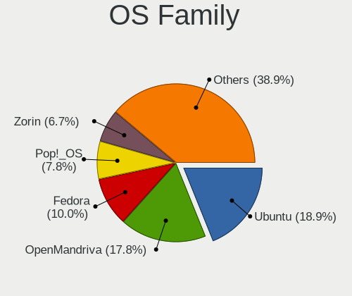
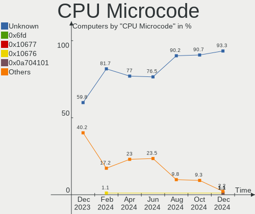
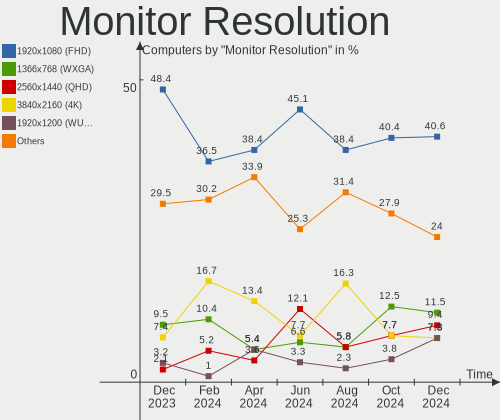
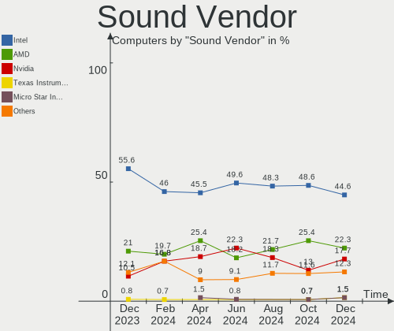
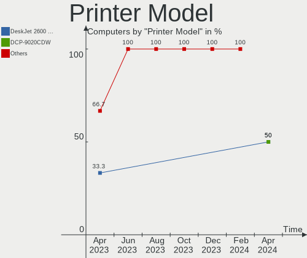

Linux in Netherlands - Hardware Trends
--------------------------------------

A project to identify most popular hardware characteristics and track their change
over time based on data collected by Linux users at https://Linux-Hardware.org.

Anyone can contribute to this report by the [hw-probe](https://github.com/linuxhw/hw-probe) tool:

    sudo -E hw-probe -all -upload

This is a report for all computer types. See also reports for [desktops](/Location/Netherlands/Desktop/README.md) and [notebooks](/Location/Netherlands/Notebook/README.md).

Period: Aug, 2022.

Contents
--------

* [ System ](#system)
  - [ OS                       ](#os)
  - [ OS Family                ](#os-family)
  - [ Kernel                   ](#kernel)
  - [ Kernel Family            ](#kernel-family)
  - [ Kernel Major Ver.        ](#kernel-major-ver)
  - [ Arch                     ](#arch)
  - [ DE                       ](#de)
  - [ Display Server           ](#display-server)
  - [ Display Manager          ](#display-manager)
  - [ OS Lang                  ](#os-lang)
  - [ Boot Mode                ](#boot-mode)
  - [ Filesystem               ](#filesystem)
  - [ Part. scheme             ](#part-scheme)
  - [ Dual Boot with Linux/BSD ](#dual-boot-with-linuxbsd)
  - [ Dual Boot (Win)          ](#dual-boot-win)

* [ Board ](#board)
  - [ Vendor                   ](#vendor)
  - [ Model                    ](#model)
  - [ Model Family             ](#model-family)
  - [ MFG Year                 ](#mfg-year)
  - [ Form Factor              ](#form-factor)
  - [ Secure Boot              ](#secure-boot)
  - [ Coreboot                 ](#coreboot)
  - [ RAM Size                 ](#ram-size)
  - [ RAM Used                 ](#ram-used)
  - [ Total Drives             ](#total-drives)
  - [ Has CD-ROM               ](#has-cd-rom)
  - [ Has Ethernet             ](#has-ethernet)
  - [ Has WiFi                 ](#has-wifi)
  - [ Has Bluetooth            ](#has-bluetooth)

* [ Location ](#location)
  - [ Country                  ](#country)
  - [ City                     ](#city)

* [ Drives ](#drives)
  - [ Drive Vendor             ](#drive-vendor)
  - [ Drive Model              ](#drive-model)
  - [ HDD Vendor               ](#hdd-vendor)
  - [ SSD Vendor               ](#ssd-vendor)
  - [ Drive Kind               ](#drive-kind)
  - [ Drive Connector          ](#drive-connector)
  - [ Drive Size               ](#drive-size)
  - [ Space Total              ](#space-total)
  - [ Space Used               ](#space-used)
  - [ Malfunc. Drives          ](#malfunc-drives)
  - [ Malfunc. Drive Vendor    ](#malfunc-drive-vendor)
  - [ Malfunc. HDD Vendor      ](#malfunc-hdd-vendor)
  - [ Malfunc. Drive Kind      ](#malfunc-drive-kind)
  - [ Failed Drives            ](#failed-drives)
  - [ Failed Drive Vendor      ](#failed-drive-vendor)
  - [ Drive Status             ](#drive-status)

* [ Storage controller ](#storage-controller)
  - [ Storage Vendor           ](#storage-vendor)
  - [ Storage Model            ](#storage-model)
  - [ Storage Kind             ](#storage-kind)

* [ Processor ](#processor)
  - [ CPU Vendor               ](#cpu-vendor)
  - [ CPU Model                ](#cpu-model)
  - [ CPU Model Family         ](#cpu-model-family)
  - [ CPU Cores                ](#cpu-cores)
  - [ CPU Sockets              ](#cpu-sockets)
  - [ CPU Threads              ](#cpu-threads)
  - [ CPU Op-Modes             ](#cpu-op-modes)
  - [ CPU Microcode            ](#cpu-microcode)
  - [ CPU Microarch            ](#cpu-microarch)

* [ Graphics ](#graphics)
  - [ GPU Vendor               ](#gpu-vendor)
  - [ GPU Model                ](#gpu-model)
  - [ GPU Combo                ](#gpu-combo)
  - [ GPU Driver               ](#gpu-driver)
  - [ GPU Memory               ](#gpu-memory)

* [ Monitor ](#monitor)
  - [ Monitor Vendor           ](#monitor-vendor)
  - [ Monitor Model            ](#monitor-model)
  - [ Monitor Resolution       ](#monitor-resolution)
  - [ Monitor Diagonal         ](#monitor-diagonal)
  - [ Monitor Width            ](#monitor-width)
  - [ Aspect Ratio             ](#aspect-ratio)
  - [ Monitor Area             ](#monitor-area)
  - [ Pixel Density            ](#pixel-density)
  - [ Multiple Monitors        ](#multiple-monitors)

* [ Network ](#network)
  - [ Net Controller Vendor    ](#net-controller-vendor)
  - [ Net Controller Model     ](#net-controller-model)
  - [ Wireless Vendor          ](#wireless-vendor)
  - [ Wireless Model           ](#wireless-model)
  - [ Ethernet Vendor          ](#ethernet-vendor)
  - [ Ethernet Model           ](#ethernet-model)
  - [ Net Controller Kind      ](#net-controller-kind)
  - [ Used Controller          ](#used-controller)
  - [ NICs                     ](#nics)
  - [ IPv6                     ](#ipv6)

* [ Bluetooth ](#bluetooth)
  - [ Bluetooth Vendor         ](#bluetooth-vendor)
  - [ Bluetooth Model          ](#bluetooth-model)

* [ Sound ](#sound)
  - [ Sound Vendor             ](#sound-vendor)
  - [ Sound Model              ](#sound-model)

* [ Memory ](#memory)
  - [ Memory Vendor            ](#memory-vendor)
  - [ Memory Model             ](#memory-model)
  - [ Memory Kind              ](#memory-kind)
  - [ Memory Form Factor       ](#memory-form-factor)
  - [ Memory Size              ](#memory-size)
  - [ Memory Speed             ](#memory-speed)

* [ Printers & scanners ](#printers--scanners)
  - [ Printer Vendor           ](#printer-vendor)
  - [ Printer Model            ](#printer-model)
  - [ Scanner Vendor           ](#scanner-vendor)
  - [ Scanner Model            ](#scanner-model)

* [ Camera ](#camera)
  - [ Camera Vendor            ](#camera-vendor)
  - [ Camera Model             ](#camera-model)

* [ Security ](#security)
  - [ Fingerprint Vendor       ](#fingerprint-vendor)
  - [ Fingerprint Model        ](#fingerprint-model)
  - [ Chipcard Vendor          ](#chipcard-vendor)
  - [ Chipcard Model           ](#chipcard-model)

* [ Unsupported ](#unsupported)
  - [ Unsupported Devices      ](#unsupported-devices)
  - [ Unsupported Device Types ](#unsupported-device-types)

System
------

OS
--

Installed operating systems

| Name                 | Computers | Percent |
|----------------------|-----------|---------|
| OpenMandriva 4.3     | 21        | 18.42%  |
| Ubuntu 22.04         | 17        | 14.91%  |
| Fedora 36            | 12        | 10.53%  |
| Ubuntu 20.04         | 10        | 8.77%   |
| Linux Mint 21        | 9         | 7.89%   |
| Zorin 16             | 7         | 6.14%   |
| Pop!_OS 22.04        | 6         | 5.26%   |
| Linux Mint 20.3      | 4         | 3.51%   |
| Debian 11            | 3         | 2.63%   |
| EndeavourOS          | 2         | 1.75%   |
| Zorin 12             | 1         | 0.88%   |
| Xubuntu 22.04        | 1         | 0.88%   |
| Xero Rolling         | 1         | 0.88%   |
| Void Linux           | 1         | 0.88%   |
| Ubuntu MATE 22.04    | 1         | 0.88%   |
| Ubuntu MATE 20.04    | 1         | 0.88%   |
| Ubuntu 20.10         | 1         | 0.88%   |
| OpenMandriva 4.90    | 1         | 0.88%   |
| Nitrux 2.3.0         | 1         | 0.88%   |
| Manjaro 21.3.7       | 1         | 0.88%   |
| Manjaro 21.3.6       | 1         | 0.88%   |
| Manjaro              | 1         | 0.88%   |
| LinuxFX 11           | 1         | 0.88%   |
| Kubuntu 22.04        | 1         | 0.88%   |
| KDE neon 20.04       | 1         | 0.88%   |
| Kali 2022.3          | 1         | 0.88%   |
| Kaisen 2.1           | 1         | 0.88%   |
| Gentoo 2.8           | 1         | 0.88%   |
| Garuda Linux Soaring | 1         | 0.88%   |
| EndeavourOS Rolling  | 1         | 0.88%   |
| Elementary 6.1       | 1         | 0.88%   |
| ArcoLinux Rolling    | 1         | 0.88%   |
| Arch Rolling         | 1         | 0.88%   |

OS Family
---------

OS without a version

| Name         | Computers | Percent |
|--------------|-----------|---------|
| Ubuntu       | 28        | 24.56%  |
| OpenMandriva | 22        | 19.3%   |
| Linux Mint   | 13        | 11.4%   |
| Fedora       | 12        | 10.53%  |
| Zorin        | 8         | 7.02%   |
| Pop!_OS      | 6         | 5.26%   |
| Manjaro      | 3         | 2.63%   |
| EndeavourOS  | 3         | 2.63%   |
| Debian       | 3         | 2.63%   |
| Ubuntu MATE  | 2         | 1.75%   |
| Xubuntu      | 1         | 0.88%   |
| Xero         | 1         | 0.88%   |
| Void Linux   | 1         | 0.88%   |
| Nitrux       | 1         | 0.88%   |
| LinuxFX      | 1         | 0.88%   |
| Kubuntu      | 1         | 0.88%   |
| KDE neon     | 1         | 0.88%   |
| Kali         | 1         | 0.88%   |
| Kaisen       | 1         | 0.88%   |
| Gentoo       | 1         | 0.88%   |
| Garuda Linux | 1         | 0.88%   |
| Elementary   | 1         | 0.88%   |
| ArcoLinux    | 1         | 0.88%   |
| Arch         | 1         | 0.88%   |

Kernel
------

Version of the Linux kernel

| Version                  | Computers | Percent |
|--------------------------|-----------|---------|
| 5.16.7-desktop-1omv4003  | 21        | 18.42%  |
| 5.15.0-46-generic        | 19        | 16.67%  |
| 5.15.0-43-generic        | 15        | 13.16%  |
| 5.19.0-76051900-generic  | 4         | 3.51%   |
| 5.15.0-41-generic        | 4         | 3.51%   |
| 5.18.17-200.fc36.x86_64  | 3         | 2.63%   |
| 5.4.0-122-generic        | 2         | 1.75%   |
| 5.19.5-zen1-1-zen        | 2         | 1.75%   |
| 5.18.18-200.fc36.x86_64  | 2         | 1.75%   |
| 5.18.16-200.fc36.x86_64  | 2         | 1.75%   |
| 5.18.13-200.fc36.x86_64  | 2         | 1.75%   |
| 5.18.10-76051810-generic | 2         | 1.75%   |
| 5.15.0-1013-raspi        | 2         | 1.75%   |
| 5.10.0-17-amd64          | 2         | 1.75%   |
| 5.8.0-50-generic         | 1         | 0.88%   |
| 5.8.0-25-generic         | 1         | 0.88%   |
| 5.4.0-125-generic        | 1         | 0.88%   |
| 5.19.4-200.fc36.x86_64   | 1         | 0.88%   |
| 5.19.3-zen1-1-zen        | 1         | 0.88%   |
| 5.19.3-arch1-1           | 1         | 0.88%   |
| 5.19.1-3-MANJARO         | 1         | 0.88%   |
| 5.19.0-xanmod1-x64v2     | 1         | 0.88%   |
| 5.18.19-200.fc36.x86_64  | 1         | 0.88%   |
| 5.18.16-arch1-1          | 1         | 0.88%   |
| 5.18.14_1                | 1         | 0.88%   |
| 5.18.14-nitrous-fire+    | 1         | 0.88%   |
| 5.18.14-1-MANJARO        | 1         | 0.88%   |
| 5.18.12-desktop-3omv4090 | 1         | 0.88%   |
| 5.18.11-200.fc36.x86_64  | 1         | 0.88%   |
| 5.18.0-kali5-amd64       | 1         | 0.88%   |
| 5.18.0-0.bpo.1-amd64     | 1         | 0.88%   |
| 5.17.1.17.realtime2-3-rt | 1         | 0.88%   |
| 5.17.0-kaisen1-amd64     | 1         | 0.88%   |
| 5.17.0-1014-oem          | 1         | 0.88%   |
| 5.15.57-2-MANJARO        | 1         | 0.88%   |
| 5.15.41-gentoo-x86_64    | 1         | 0.88%   |
| 5.15.0-47-generic        | 1         | 0.88%   |
| 5.15.0-45-generic        | 1         | 0.88%   |
| 5.15.0-25-generic        | 1         | 0.88%   |
| 5.14.0-1051-oem          | 1         | 0.88%   |
| 5.14.0-1050-oem          | 1         | 0.88%   |
| 5.13.0-41-generic        | 1         | 0.88%   |
| 5.13.0-30-generic        | 1         | 0.88%   |
| 5.11.0-44-generic        | 1         | 0.88%   |
| 4.9.277-82               | 1         | 0.88%   |
| 4.15.0-142-generic       | 1         | 0.88%   |

Kernel Family
-------------

Linux kernel without a distro release

| Version   | Computers | Percent |
|-----------|-----------|---------|
| 5.15.0    | 43        | 37.72%  |
| 5.16.7    | 21        | 18.42%  |
| 5.19.0    | 5         | 4.39%   |
| 5.4.0     | 3         | 2.63%   |
| 5.18.17   | 3         | 2.63%   |
| 5.18.16   | 3         | 2.63%   |
| 5.18.14   | 3         | 2.63%   |
| 5.8.0     | 2         | 1.75%   |
| 5.19.5    | 2         | 1.75%   |
| 5.19.3    | 2         | 1.75%   |
| 5.18.18   | 2         | 1.75%   |
| 5.18.13   | 2         | 1.75%   |
| 5.18.10   | 2         | 1.75%   |
| 5.18.0    | 2         | 1.75%   |
| 5.17.0    | 2         | 1.75%   |
| 5.14.0    | 2         | 1.75%   |
| 5.13.0    | 2         | 1.75%   |
| 5.10.0    | 2         | 1.75%   |
| 5.19.4    | 1         | 0.88%   |
| 5.19.1    | 1         | 0.88%   |
| 5.18.19   | 1         | 0.88%   |
| 5.18.12   | 1         | 0.88%   |
| 5.18.11   | 1         | 0.88%   |
| 5.17.1.17 | 1         | 0.88%   |
| 5.15.57   | 1         | 0.88%   |
| 5.15.41   | 1         | 0.88%   |
| 5.11.0    | 1         | 0.88%   |
| 4.9.277   | 1         | 0.88%   |
| 4.15.0    | 1         | 0.88%   |

Kernel Major Ver.
-----------------

Linux kernel major version

| Version | Computers | Percent |
|---------|-----------|---------|
| 5.15    | 45        | 39.47%  |
| 5.16    | 21        | 18.42%  |
| 5.18    | 20        | 17.54%  |
| 5.19    | 11        | 9.65%   |
| 5.4     | 3         | 2.63%   |
| 5.8     | 2         | 1.75%   |
| 5.17    | 2         | 1.75%   |
| 5.14    | 2         | 1.75%   |
| 5.13    | 2         | 1.75%   |
| 5.10    | 2         | 1.75%   |
| 5.17.1  | 1         | 0.88%   |
| 5.11    | 1         | 0.88%   |
| 4.9     | 1         | 0.88%   |
| 4.15    | 1         | 0.88%   |

Arch
----

OS architecture (x86_64, i586, etc.)

| Name    | Computers | Percent |
|---------|-----------|---------|
| x86_64  | 110       | 96.49%  |
| aarch64 | 3         | 2.63%   |
| i686    | 1         | 0.88%   |

DE
--

Desktop Environment

| Name       | Computers | Percent |
|------------|-----------|---------|
| GNOME      | 52        | 45.61%  |
| KDE5       | 36        | 31.58%  |
| X-Cinnamon | 10        | 8.77%   |
| XFCE       | 8         | 7.02%   |
| MATE       | 5         | 4.39%   |
| Unknown    | 2         | 1.75%   |
| Pantheon   | 1         | 0.88%   |

Display Server
--------------

X11 or Wayland

| Name    | Computers | Percent |
|---------|-----------|---------|
| X11     | 86        | 75.44%  |
| Wayland | 27        | 23.68%  |
| Tty     | 1         | 0.88%   |

Display Manager
---------------

SDDM, LightDM, etc.

| Name    | Computers | Percent |
|---------|-----------|---------|
| Unknown | 37        | 32.46%  |
| SDDM    | 30        | 26.32%  |
| GDM3    | 24        | 21.05%  |
| LightDM | 15        | 13.16%  |
| GDM     | 8         | 7.02%   |

OS Lang
-------

Language

| Lang    | Computers | Percent |
|---------|-----------|---------|
| en_US   | 63        | 55.26%  |
| nl_NL   | 35        | 30.7%   |
| en_GB   | 9         | 7.89%   |
| de_DE   | 2         | 1.75%   |
| ru_RU   | 1         | 0.88%   |
| pt_PT   | 1         | 0.88%   |
| it_IT   | 1         | 0.88%   |
| C       | 1         | 0.88%   |
| Unknown | 1         | 0.88%   |

Boot Mode
---------

EFI or BIOS

| Mode | Computers | Percent |
|------|-----------|---------|
| EFI  | 75        | 65.79%  |
| BIOS | 39        | 34.21%  |

Filesystem
----------

Type of filesystem

| Type    | Computers | Percent |
|---------|-----------|---------|
| Ext4    | 73        | 64.04%  |
| Overlay | 23        | 20.18%  |
| Btrfs   | 17        | 14.91%  |
| Xfs     | 1         | 0.88%   |

Part. scheme
------------

Scheme of partitioning

| Type    | Computers | Percent |
|---------|-----------|---------|
| GPT     | 56        | 49.12%  |
| Unknown | 55        | 48.25%  |
| MBR     | 3         | 2.63%   |

Dual Boot with Linux/BSD
------------------------

Hosting more than one Linux/BSD

| Dual boot | Computers | Percent |
|-----------|-----------|---------|
| No        | 100       | 87.72%  |
| Yes       | 14        | 12.28%  |

Dual Boot (Win)
---------------

Hosting Linux and Windows

| Dual boot | Computers | Percent |
|-----------|-----------|---------|
| No        | 77        | 67.54%  |
| Yes       | 37        | 32.46%  |

Board
-----

Vendor
------

Motherboard manufacturer

| Name                    | Computers | Percent |
|-------------------------|-----------|---------|
| Dell                    | 32        | 28.07%  |
| Hewlett-Packard         | 20        | 17.54%  |
| ASUSTek Computer        | 14        | 12.28%  |
| MSI                     | 10        | 8.77%   |
| Lenovo                  | 10        | 8.77%   |
| Apple                   | 8         | 7.02%   |
| Acer                    | 4         | 3.51%   |
| Gigabyte Technology     | 3         | 2.63%   |
| Raspberry Pi Foundation | 2         | 1.75%   |
| Toshiba                 | 1         | 0.88%   |
| TEKNOSERVICE            | 1         | 0.88%   |
| Standard                | 1         | 0.88%   |
| Shuttle                 | 1         | 0.88%   |
| Notebook                | 1         | 0.88%   |
| MP                      | 1         | 0.88%   |
| Medion                  | 1         | 0.88%   |
| HONOR                   | 1         | 0.88%   |
| Fujitsu                 | 1         | 0.88%   |
| ASRock                  | 1         | 0.88%   |
| Unknown                 | 1         | 0.88%   |

Model
-----

Motherboard model

| Name                                       | Computers | Percent |
|--------------------------------------------|-----------|---------|
| Dell Latitude 3190 2-in-1                  | 8         | 7.02%   |
| Dell Latitude 3310                         | 5         | 4.39%   |
| RPi Raspberry Pi                           | 2         | 1.75%   |
| HP Laptop 17-cp0xxx                        | 2         | 1.75%   |
| Dell Latitude 3300                         | 2         | 1.75%   |
| Apple MacBookPro9,2                        | 2         | 1.75%   |
| Apple MacBookPro14,2                       | 2         | 1.75%   |
| Toshiba Satellite P200                     | 1         | 0.88%   |
| TEKNOSERVICE PORTATIL TTL 15               | 1         | 0.88%   |
| Standard X50-V2                            | 1         | 0.88%   |
| Shuttle XH310V2                            | 1         | 0.88%   |
| Notebook P64_HJ,HK1                        | 1         | 0.88%   |
| MSI PS63 Modern 8RC                        | 1         | 0.88%   |
| MSI Prestige 15 A10SC                      | 1         | 0.88%   |
| MSI p6745nl                                | 1         | 0.88%   |
| MSI MS-7D54                                | 1         | 0.88%   |
| MSI MS-7C56                                | 1         | 0.88%   |
| MSI MS-7B86                                | 1         | 0.88%   |
| MSI MS-7B85                                | 1         | 0.88%   |
| MSI MS-7971                                | 1         | 0.88%   |
| MSI MS-7817                                | 1         | 0.88%   |
| MSI CX705                                  | 1         | 0.88%   |
| MP MS-7848                                 | 1         | 0.88%   |
| Medion E7419 MD60990                       | 1         | 0.88%   |
| Lenovo Yoga 9 14IAP7 82LU                  | 1         | 0.88%   |
| Lenovo ThinkPad X1 Carbon Gen 9 20XW0055MH | 1         | 0.88%   |
| Lenovo ThinkPad L15 Gen 2a 20X8S0VX03      | 1         | 0.88%   |
| Lenovo ThinkPad E580 20KS003GMH            | 1         | 0.88%   |
| Lenovo ThinkBook 15 G3 ACL 21A4            | 1         | 0.88%   |
| Lenovo Legion 5 17ACH6H 82JY               | 1         | 0.88%   |
| Lenovo IdeaPad L340-15API 81LW             | 1         | 0.88%   |
| Lenovo IdeaPad 720S-13IKB 81BV             | 1         | 0.88%   |
| Lenovo IdeaCentre K410 10089               | 1         | 0.88%   |
| Lenovo IdeaCentre 310S-08ASR 90G9002XNY    | 1         | 0.88%   |
| HONOR BOHK-WAX9X                           | 1         | 0.88%   |
| HP ZBook Fury 15 G7 Mobile Workstation     | 1         | 0.88%   |
| HP Z230 SFF Workstation                    | 1         | 0.88%   |
| HP Spectre x360 Convertible 13-aw0xxx      | 1         | 0.88%   |
| HP ProDesk 600 G2 SFF                      | 1         | 0.88%   |
| HP ProDesk 600 G1 SFF                      | 1         | 0.88%   |
| HP ProBook 455 G7                          | 1         | 0.88%   |
| HP ProBook 430 G4                          | 1         | 0.88%   |
| HP Pavilion Laptop 15-eh1xxx               | 1         | 0.88%   |
| HP Notebook                                | 1         | 0.88%   |
| HP ENVY x360 Convertible 15-dr1xxx         | 1         | 0.88%   |
| HP ENVY x360 Convertible 13-bd0xxx         | 1         | 0.88%   |
| HP ENVY Notebook                           | 1         | 0.88%   |
| HP EliteBook 745 G6                        | 1         | 0.88%   |
| HP EliteBook 745 G3                        | 1         | 0.88%   |
| HP Elite x2 1012 G1                        | 1         | 0.88%   |
| HP Compaq Pro 6300 SFF                     | 1         | 0.88%   |
| HP Compaq 8000 Elite SFF PC                | 1         | 0.88%   |
| HP 300-0xx                                 | 1         | 0.88%   |
| Gigabyte X570 AORUS PRO                    | 1         | 0.88%   |
| Gigabyte B150M-D3H                         | 1         | 0.88%   |
| Gigabyte A320M-S2H                         | 1         | 0.88%   |
| Fujitsu LIFEBOOK E746                      | 1         | 0.88%   |
| Dell XPS 15 9520                           | 1         | 0.88%   |
| Dell XPS 15 9510                           | 1         | 0.88%   |
| Dell XPS 13 9360                           | 1         | 0.88%   |

Model Family
------------

Motherboard model prefix

| Name                  | Computers | Percent |
|-----------------------|-----------|---------|
| Dell Latitude         | 23        | 20.18%  |
| Dell XPS              | 4         | 3.51%   |
| Lenovo ThinkPad       | 3         | 2.63%   |
| HP ENVY               | 3         | 2.63%   |
| Dell OptiPlex         | 3         | 2.63%   |
| RPi Raspberry         | 2         | 1.75%   |
| Lenovo IdeaPad        | 2         | 1.75%   |
| Lenovo IdeaCentre     | 2         | 1.75%   |
| HP ProDesk            | 2         | 1.75%   |
| HP ProBook            | 2         | 1.75%   |
| HP Laptop             | 2         | 1.75%   |
| HP EliteBook          | 2         | 1.75%   |
| HP Compaq             | 2         | 1.75%   |
| ASUS VivoBook         | 2         | 1.75%   |
| Apple MacBookPro9     | 2         | 1.75%   |
| Apple MacBookPro14    | 2         | 1.75%   |
| Acer Aspire           | 2         | 1.75%   |
| Toshiba Satellite     | 1         | 0.88%   |
| TEKNOSERVICE PORTATIL | 1         | 0.88%   |
| Standard X50-V2       | 1         | 0.88%   |
| Shuttle XH310V2       | 1         | 0.88%   |
| Notebook P64          | 1         | 0.88%   |
| MSI PS63              | 1         | 0.88%   |
| MSI Prestige          | 1         | 0.88%   |
| MSI p6745nl           | 1         | 0.88%   |
| MSI MS-7D54           | 1         | 0.88%   |
| MSI MS-7C56           | 1         | 0.88%   |
| MSI MS-7B86           | 1         | 0.88%   |
| MSI MS-7B85           | 1         | 0.88%   |
| MSI MS-7971           | 1         | 0.88%   |
| MSI MS-7817           | 1         | 0.88%   |
| MSI CX705             | 1         | 0.88%   |
| MP MS-7848            | 1         | 0.88%   |
| Medion E7419          | 1         | 0.88%   |
| Lenovo Yoga           | 1         | 0.88%   |
| Lenovo ThinkBook      | 1         | 0.88%   |
| Lenovo Legion         | 1         | 0.88%   |
| HONOR BOHK-WAX9X      | 1         | 0.88%   |
| HP ZBook              | 1         | 0.88%   |
| HP Z230               | 1         | 0.88%   |
| HP Spectre            | 1         | 0.88%   |
| HP Pavilion           | 1         | 0.88%   |
| HP Notebook           | 1         | 0.88%   |
| HP Elite              | 1         | 0.88%   |
| HP 300-0xx            | 1         | 0.88%   |
| Gigabyte X570         | 1         | 0.88%   |
| Gigabyte B150M-D3H    | 1         | 0.88%   |
| Gigabyte A320M-S2H    | 1         | 0.88%   |
| Fujitsu LIFEBOOK      | 1         | 0.88%   |
| Dell Vostro           | 1         | 0.88%   |
| Dell Inspiron         | 1         | 0.88%   |
| ASUS Zenbook          | 1         | 0.88%   |
| ASUS X756UQK          | 1         | 0.88%   |
| ASUS TUF              | 1         | 0.88%   |
| ASUS PRIME            | 1         | 0.88%   |
| ASUS P8H67-M          | 1         | 0.88%   |
| ASUS P5VD2-VM         | 1         | 0.88%   |
| ASUS N76VB            | 1         | 0.88%   |
| ASUS N550JV           | 1         | 0.88%   |
| ASUS K53TA            | 1         | 0.88%   |

MFG Year
--------

Motherboard manufacture year

| Year    | Computers | Percent |
|---------|-----------|---------|
| 2019    | 25        | 21.93%  |
| 2021    | 17        | 14.91%  |
| 2018    | 10        | 8.77%   |
| 2016    | 8         | 7.02%   |
| 2012    | 8         | 7.02%   |
| 2020    | 7         | 6.14%   |
| 2013    | 6         | 5.26%   |
| 2022    | 5         | 4.39%   |
| 2014    | 5         | 4.39%   |
| 2017    | 4         | 3.51%   |
| 2015    | 4         | 3.51%   |
| 2011    | 4         | 3.51%   |
| Unknown | 3         | 2.63%   |
| 2010    | 2         | 1.75%   |
| 2009    | 2         | 1.75%   |
| 2007    | 2         | 1.75%   |
| 2006    | 2         | 1.75%   |

Form Factor
-----------

Physical design of the computer

| Name           | Computers | Percent |
|----------------|-----------|---------|
| Notebook       | 66        | 57.89%  |
| Desktop        | 32        | 28.07%  |
| Convertible    | 13        | 11.4%   |
| System on chip | 3         | 2.63%   |

Secure Boot
-----------

Enabled or disabled

| State    | Computers | Percent |
|----------|-----------|---------|
| Disabled | 106       | 92.98%  |
| Enabled  | 8         | 7.02%   |

Coreboot
--------

Have coreboot on board

| Used | Computers | Percent |
|------|-----------|---------|
| No   | 114       | 100%    |

RAM Size
--------

Total RAM memory

| Size in GB  | Computers | Percent |
|-------------|-----------|---------|
| 4.01-8.0    | 37        | 32.46%  |
| 16.01-24.0  | 24        | 21.05%  |
| 8.01-16.0   | 20        | 17.54%  |
| 3.01-4.0    | 15        | 13.16%  |
| 32.01-64.0  | 8         | 7.02%   |
| 24.01-32.0  | 4         | 3.51%   |
| 64.01-256.0 | 3         | 2.63%   |
| 2.01-3.0    | 2         | 1.75%   |
| 1.01-2.0    | 1         | 0.88%   |

RAM Used
--------

Used RAM memory

| Used GB    | Computers | Percent |
|------------|-----------|---------|
| 1.01-2.0   | 50        | 43.86%  |
| 2.01-3.0   | 25        | 21.93%  |
| 3.01-4.0   | 15        | 13.16%  |
| 4.01-8.0   | 14        | 12.28%  |
| 8.01-16.0  | 5         | 4.39%   |
| 0.51-1.0   | 2         | 1.75%   |
| 32.01-64.0 | 1         | 0.88%   |
| 24.01-32.0 | 1         | 0.88%   |
| 16.01-24.0 | 1         | 0.88%   |

Total Drives
------------

Number of drives on board

| Drives | Computers | Percent |
|--------|-----------|---------|
| 1      | 68        | 59.65%  |
| 2      | 31        | 27.19%  |
| 3      | 7         | 6.14%   |
| 0      | 3         | 2.63%   |
| 5      | 2         | 1.75%   |
| 4      | 2         | 1.75%   |
| 9      | 1         | 0.88%   |

Has CD-ROM
----------

Has CD-ROM on board

| Presented | Computers | Percent |
|-----------|-----------|---------|
| No        | 84        | 73.68%  |
| Yes       | 30        | 26.32%  |

Has Ethernet
------------

Has Ethernet on board

| Presented | Computers | Percent |
|-----------|-----------|---------|
| Yes       | 87        | 76.32%  |
| No        | 27        | 23.68%  |

Has WiFi
--------

Has WiFi module

| Presented | Computers | Percent |
|-----------|-----------|---------|
| Yes       | 95        | 83.33%  |
| No        | 19        | 16.67%  |

Has Bluetooth
-------------

Has Bluetooth module

| Presented | Computers | Percent |
|-----------|-----------|---------|
| Yes       | 83        | 72.81%  |
| No        | 31        | 27.19%  |

Location
--------

Country
-------

Geographic location (country)

| Country     | Computers | Percent |
|-------------|-----------|---------|
| Netherlands | 114       | 100%    |

City
----

Geographic location (city)

| City             | Computers | Percent |
|------------------|-----------|---------|
| Schagen          | 18        | 15.79%  |
| Amsterdam        | 14        | 12.28%  |
| The Hague        | 7         | 6.14%   |
| Delft            | 5         | 4.39%   |
| Tilburg          | 3         | 2.63%   |
| Rotterdam        | 3         | 2.63%   |
| Rijswijk         | 3         | 2.63%   |
| Oosterbeek       | 2         | 1.75%   |
| Naaldwijk        | 2         | 1.75%   |
| Heerde           | 2         | 1.75%   |
| Dronten          | 2         | 1.75%   |
| Deventer         | 2         | 1.75%   |
| Assen            | 2         | 1.75%   |
| Zuidbroek        | 1         | 0.88%   |
| Zoutelande       | 1         | 0.88%   |
| Zelhem           | 1         | 0.88%   |
| Zeist            | 1         | 0.88%   |
| Wijchen          | 1         | 0.88%   |
| Weert            | 1         | 0.88%   |
| Voorburg         | 1         | 0.88%   |
| Vijfhuizen       | 1         | 0.88%   |
| Veenendaal       | 1         | 0.88%   |
| Utrecht          | 1         | 0.88%   |
| Son              | 1         | 0.88%   |
| Soest            | 1         | 0.88%   |
| Serooskerke      | 1         | 0.88%   |
| Rijssen          | 1         | 0.88%   |
| Purmerend        | 1         | 0.88%   |
| Oosterhout       | 1         | 0.88%   |
| Oegstgeest       | 1         | 0.88%   |
| Nijkerk          | 1         | 0.88%   |
| Nieuwegein       | 1         | 0.88%   |
| Nieuw-Vossemeer  | 1         | 0.88%   |
| Meppel           | 1         | 0.88%   |
| Lemelerveld      | 1         | 0.88%   |
| Leeuwarden       | 1         | 0.88%   |
| Hoogeveen        | 1         | 0.88%   |
| Helmond          | 1         | 0.88%   |
| Hazerswoude-Dorp | 1         | 0.88%   |
| Haarlem          | 1         | 0.88%   |
| Groningen        | 1         | 0.88%   |
| Gorredijk        | 1         | 0.88%   |
| Gemert           | 1         | 0.88%   |
| Geleen           | 1         | 0.88%   |
| Emmen            | 1         | 0.88%   |
| Drachten         | 1         | 0.88%   |
| Dordrecht        | 1         | 0.88%   |
| Dokkum           | 1         | 0.88%   |
| Den Hoorn        | 1         | 0.88%   |
| Breda            | 1         | 0.88%   |
| Boxtel           | 1         | 0.88%   |
| Boornbergum      | 1         | 0.88%   |
| Bilthoven        | 1         | 0.88%   |
| Bergen           | 1         | 0.88%   |
| Arnhem           | 1         | 0.88%   |
| Apeldoorn        | 1         | 0.88%   |
| Anna Paulowna    | 1         | 0.88%   |
| Amstelveen       | 1         | 0.88%   |
| Amersfoort       | 1         | 0.88%   |
| Almelo           | 1         | 0.88%   |

Drives
------

Drive Vendor
------------

Hard drive vendors

| Vendor              | Computers | Drives | Percent |
|---------------------|-----------|--------|---------|
| Samsung Electronics | 35        | 43     | 22.73%  |
| WDC                 | 15        | 16     | 9.74%   |
| SK hynix            | 14        | 14     | 9.09%   |
| Seagate             | 11        | 18     | 7.14%   |
| Kingston            | 11        | 11     | 7.14%   |
| SanDisk             | 9         | 9      | 5.84%   |
| Unknown             | 7         | 7      | 4.55%   |
| KIOXIA              | 7         | 7      | 4.55%   |
| Intel               | 6         | 7      | 3.9%    |
| HGST                | 6         | 6      | 3.9%    |
| Crucial             | 6         | 6      | 3.9%    |
| Toshiba             | 4         | 6      | 2.6%    |
| Micron Technology   | 4         | 4      | 2.6%    |
| Apple               | 4         | 7      | 2.6%    |
| Phison              | 3         | 3      | 1.95%   |
| LITEON              | 2         | 2      | 1.3%    |
| SPCC                | 1         | 1      | 0.65%   |
| Maxtor              | 1         | 1      | 0.65%   |
| Leven               | 1         | 1      | 0.65%   |
| KingSpec            | 1         | 1      | 0.65%   |
| KingFast            | 1         | 1      | 0.65%   |
| Inateck             | 1         | 1      | 0.65%   |
| Hitachi             | 1         | 1      | 0.65%   |
| GOODRAM             | 1         | 1      | 0.65%   |
| ExcelStor           | 1         | 1      | 0.65%   |
| A-DATA Technology   | 1         | 1      | 0.65%   |

Drive Model
-----------

Hard drive models

| Model                                              | Computers | Percent |
|----------------------------------------------------|-----------|---------|
| Samsung NVMe SSD Drive 1TB                         | 4         | 2.34%   |
| SK hynix BC501A NVMe 128GB                         | 3         | 1.75%   |
| Samsung NVMe SSD Drive 512GB                       | 3         | 1.75%   |
| Kingston SUV400S37240G 240GB SSD                   | 3         | 1.75%   |
| Kingston SA400S37240G 240GB SSD                    | 3         | 1.75%   |
| Kingston SA400S37120G 120GB SSD                    | 3         | 1.75%   |
| SK hynix SC311 SATA 128GB SSD                      | 2         | 1.17%   |
| SanDisk SDSSDH3 250G                               | 2         | 1.17%   |
| SanDisk NVMe SSD Drive 512GB                       | 2         | 1.17%   |
| Samsung SSD 980 1TB                                | 2         | 1.17%   |
| Samsung SSD 860 QVO 1TB                            | 2         | 1.17%   |
| Samsung SSD 850 EVO 500GB                          | 2         | 1.17%   |
| Samsung NVMe SSD Drive 500GB                       | 2         | 1.17%   |
| Samsung NVMe SSD Controller PM9A1/PM9A3/980PRO 1TB | 2         | 1.17%   |
| KIOXIA KBG40ZNS128G NVMe 128GB                     | 2         | 1.17%   |
| HGST HTS541010A9E680 1TB                           | 2         | 1.17%   |
| Apple NVMe SSD Drive 8KB                           | 2         | 1.17%   |
| Apple NVMe SSD Drive 256GB                         | 2         | 1.17%   |
| WDC WDS480G2G0A-00JH30 480GB SSD                   | 1         | 0.58%   |
| WDC WD40EZRZ-00GXCB0 4TB                           | 1         | 0.58%   |
| WDC WD30EZRX-00MMMB0 3TB                           | 1         | 0.58%   |
| WDC WD30EFRX-68EUZN0 3TB                           | 1         | 0.58%   |
| WDC WD2500KS-00MJB0 250GB                          | 1         | 0.58%   |
| WDC WD10SPZX-08Z10 1TB                             | 1         | 0.58%   |
| WDC WD10EZRZ-00HTKB0 1TB                           | 1         | 0.58%   |
| WDC WD10EZEX-00WN4A0 1TB                           | 1         | 0.58%   |
| WDC WD10EZEX-00ER1A0 1TB                           | 1         | 0.58%   |
| WDC WD10EZEX-00BN5A0 1TB                           | 1         | 0.58%   |
| WDC WD10EALX-009BA0 1TB                            | 1         | 0.58%   |
| WDC WD1002FBYS-02A6B0 1TB                          | 1         | 0.58%   |
| WDC WD1002FAEX-00Y9A0 1TB                          | 1         | 0.58%   |
| WDC PC SN730 SDBPNTY-512G-1032 512GB               | 1         | 0.58%   |
| WDC PC SN530 SDBPNPZ-512G-1006 512GB               | 1         | 0.58%   |
| WDC PC SN520 NVMe 128GB                            | 1         | 0.58%   |
| Unknown SN128  128GB                               | 1         | 0.58%   |
| Unknown SD02G  2GB                                 | 1         | 0.58%   |
| Unknown SD/MMC/MS PRO 128GB                        | 1         | 0.58%   |
| Unknown MMC Card  64GB                             | 1         | 0.58%   |
| Unknown MMC Card  32GB                             | 1         | 0.58%   |
| Unknown MMC Card  16GB                             | 1         | 0.58%   |
| Unknown MMC Card  128GB                            | 1         | 0.58%   |
| Toshiba RC500 500GB                                | 1         | 0.58%   |
| Toshiba MQ02ABF100 1TB                             | 1         | 0.58%   |
| Toshiba MQ01ABD100 1TB                             | 1         | 0.58%   |
| Toshiba MK1237GSX 120GB                            | 1         | 0.58%   |
| Toshiba HDWR180 8TB                                | 1         | 0.58%   |
| SPCC M.2 SSD 128GB                                 | 1         | 0.58%   |
| SK hynix PC801 NVMe 2TB                            | 1         | 0.58%   |
| SK hynix HFS128G39TND-N210A 128GB SSD              | 1         | 0.58%   |
| SK hynix HFM512GD3JX016N 512GB                     | 1         | 0.58%   |
| SK hynix HFM512GD3JX013N 512GB                     | 1         | 0.58%   |
| SK hynix BC711 NVMe 128GB                          | 1         | 0.58%   |
| SK hynix BC711 HFM512GD3JX013N 512GB               | 1         | 0.58%   |
| SK hynix BC511 NVMe 256GB                          | 1         | 0.58%   |
| SK hynix BC511 HFM256GDJTNI-82A0A 256GB            | 1         | 0.58%   |
| SK hynix BC501 NVMe 512GB                          | 1         | 0.58%   |
| Seagate ST9160314ASG 160GB                         | 1         | 0.58%   |
| Seagate ST8000NM0055-1RM112 8TB                    | 1         | 0.58%   |
| Seagate ST6000VN001-2BB186 6TB                     | 1         | 0.58%   |
| Seagate ST500DM002-1BD142 500GB                    | 1         | 0.58%   |

HDD Vendor
----------

Hard disk drive vendors

| Vendor              | Computers | Drives | Percent |
|---------------------|-----------|--------|---------|
| WDC                 | 11        | 12     | 29.73%  |
| Seagate             | 10        | 17     | 27.03%  |
| HGST                | 6         | 6      | 16.22%  |
| Toshiba             | 3         | 5      | 8.11%   |
| Samsung Electronics | 2         | 2      | 5.41%   |
| Unknown             | 1         | 1      | 2.7%    |
| Maxtor              | 1         | 1      | 2.7%    |
| Hitachi             | 1         | 1      | 2.7%    |
| ExcelStor           | 1         | 1      | 2.7%    |
| Apple               | 1         | 2      | 2.7%    |

SSD Vendor
----------

Solid state drive vendors

| Vendor              | Computers | Drives | Percent |
|---------------------|-----------|--------|---------|
| Samsung Electronics | 15        | 16     | 28.85%  |
| Kingston            | 10        | 10     | 19.23%  |
| SanDisk             | 6         | 6      | 11.54%  |
| Crucial             | 6         | 6      | 11.54%  |
| SK hynix            | 3         | 3      | 5.77%   |
| Micron Technology   | 2         | 2      | 3.85%   |
| LITEON              | 2         | 2      | 3.85%   |
| WDC                 | 1         | 1      | 1.92%   |
| SPCC                | 1         | 1      | 1.92%   |
| Seagate             | 1         | 1      | 1.92%   |
| Leven               | 1         | 1      | 1.92%   |
| KingSpec            | 1         | 1      | 1.92%   |
| Intel               | 1         | 1      | 1.92%   |
| GOODRAM             | 1         | 1      | 1.92%   |
| A-DATA Technology   | 1         | 1      | 1.92%   |

Drive Kind
----------

HDD or SSD

| Kind    | Computers | Drives | Percent |
|---------|-----------|--------|---------|
| NVMe    | 59        | 68     | 41.26%  |
| SSD     | 46        | 53     | 32.17%  |
| HDD     | 31        | 48     | 21.68%  |
| MMC     | 6         | 6      | 4.2%    |
| Unknown | 1         | 1      | 0.7%    |

Drive Connector
---------------

SATA, SAS, NVMe, etc.

| Type | Computers | Drives | Percent |
|------|-----------|--------|---------|
| SATA | 60        | 98     | 46.51%  |
| NVMe | 59        | 67     | 45.74%  |
| MMC  | 6         | 6      | 4.65%   |
| SAS  | 4         | 5      | 3.1%    |

Drive Size
----------

Size of hard drive

| Size in TB | Computers | Drives | Percent |
|------------|-----------|--------|---------|
| 0.01-0.5   | 53        | 61     | 66.25%  |
| 0.51-1.0   | 15        | 20     | 18.75%  |
| 1.01-2.0   | 5         | 10     | 6.25%   |
| 4.01-10.0  | 4         | 7      | 5%      |
| 2.01-3.0   | 2         | 2      | 2.5%    |
| 3.01-4.0   | 1         | 1      | 1.25%   |

Space Total
-----------

Amount of disk space available on the file system

| Size in GB     | Computers | Percent |
|----------------|-----------|---------|
| 101-250        | 28        | 24.56%  |
| 1-20           | 24        | 21.05%  |
| 251-500        | 20        | 17.54%  |
| 501-1000       | 12        | 10.53%  |
| 1001-2000      | 9         | 7.89%   |
| More than 3000 | 5         | 4.39%   |
| 51-100         | 5         | 4.39%   |
| 21-50          | 4         | 3.51%   |
| Unknown        | 4         | 3.51%   |
| 2001-3000      | 3         | 2.63%   |

Space Used
----------

Amount of used disk space

| Used GB        | Computers | Percent |
|----------------|-----------|---------|
| 1-20           | 53        | 46.49%  |
| 101-250        | 14        | 12.28%  |
| 21-50          | 11        | 9.65%   |
| 501-1000       | 9         | 7.89%   |
| 51-100         | 9         | 7.89%   |
| 251-500        | 8         | 7.02%   |
| Unknown        | 4         | 3.51%   |
| 1001-2000      | 3         | 2.63%   |
| More than 3000 | 2         | 1.75%   |
| 2001-3000      | 1         | 0.88%   |

Malfunc. Drives
---------------

Drive models with a malfunction

| Model                                | Computers | Drives | Percent |
|--------------------------------------|-----------|--------|---------|
| SK hynix BC711 HFM512GD3JX013N 512GB | 1         | 1      | 20%     |
| Samsung Electronics SSD 970 EVO 1TB  | 1         | 1      | 20%     |
| Kingston SUV400S37240G 240GB SSD     | 1         | 1      | 20%     |
| Intel SSD 600P Series 512GB          | 1         | 1      | 20%     |
| HGST HTS545050A7E660 500GB           | 1         | 1      | 20%     |

Malfunc. Drive Vendor
---------------------

Vendors of faulty drives

| Vendor              | Computers | Drives | Percent |
|---------------------|-----------|--------|---------|
| SK hynix            | 1         | 1      | 20%     |
| Samsung Electronics | 1         | 1      | 20%     |
| Kingston            | 1         | 1      | 20%     |
| Intel               | 1         | 1      | 20%     |
| HGST                | 1         | 1      | 20%     |

Malfunc. HDD Vendor
-------------------

Vendors of faulty HDD drives

| Vendor | Computers | Drives | Percent |
|--------|-----------|--------|---------|
| HGST   | 1         | 1      | 100%    |

Malfunc. Drive Kind
-------------------

Kinds of faulty drives

| Kind | Computers | Drives | Percent |
|------|-----------|--------|---------|
| NVMe | 3         | 3      | 60%     |
| SSD  | 1         | 1      | 20%     |
| HDD  | 1         | 1      | 20%     |

Failed Drives
-------------

Failed drive models

Zero info for selected period =(

Failed Drive Vendor
-------------------

Failed drive vendors

Zero info for selected period =(

Drive Status
------------

Number of failed and malfunc. drives

| Status   | Computers | Drives | Percent |
|----------|-----------|--------|---------|
| Detected | 59        | 92     | 50.43%  |
| Works    | 53        | 79     | 45.3%   |
| Malfunc  | 5         | 5      | 4.27%   |

Storage controller
------------------

Storage Vendor
--------------

Storage controller vendors

| Vendor                           | Computers | Percent |
|----------------------------------|-----------|---------|
| Intel                            | 67        | 44.67%  |
| Samsung Electronics              | 23        | 15.33%  |
| AMD                              | 16        | 10.67%  |
| SK hynix                         | 11        | 7.33%   |
| KIOXIA                           | 8         | 5.33%   |
| SanDisk                          | 6         | 4%      |
| Phison Electronics               | 3         | 2%      |
| JMicron Technology               | 3         | 2%      |
| Apple                            | 3         | 2%      |
| VIA Technologies                 | 2         | 1.33%   |
| Nvidia                           | 2         | 1.33%   |
| Micron Technology                | 2         | 1.33%   |
| Silicon Integrated Systems [SiS] | 1         | 0.67%   |
| Silicon Image                    | 1         | 0.67%   |
| Kingston Technology Company      | 1         | 0.67%   |
| ASMedia Technology               | 1         | 0.67%   |

Storage Model
-------------

Storage controller models

| Model                                                                            | Computers | Percent |
|----------------------------------------------------------------------------------|-----------|---------|
| AMD FCH SATA Controller [AHCI mode]                                              | 13        | 7.88%   |
| Samsung NVMe SSD Controller 980                                                  | 11        | 6.67%   |
| Samsung NVMe SSD Controller SM981/PM981/PM983                                    | 8         | 4.85%   |
| Intel Celeron/Pentium Silver Processor SATA Controller                           | 8         | 4.85%   |
| KIOXIA NVMe SSD Controller BG4                                                   | 7         | 4.24%   |
| Intel Sunrise Point-LP SATA Controller [AHCI mode]                               | 7         | 4.24%   |
| Intel 82801 Mobile SATA Controller [RAID mode]                                   | 7         | 4.24%   |
| Intel Volume Management Device NVMe RAID Controller                              | 6         | 3.64%   |
| Intel 8 Series/C220 Series Chipset Family 6-port SATA Controller 1 [AHCI mode]   | 6         | 3.64%   |
| SK hynix Gold P31 SSD                                                            | 4         | 2.42%   |
| SK hynix BC501 NVMe Solid State Drive                                            | 4         | 2.42%   |
| Intel Q170/Q150/B150/H170/H110/Z170/CM236 Chipset SATA Controller [AHCI Mode]    | 4         | 2.42%   |
| Intel 7 Series Chipset Family 6-port SATA Controller [AHCI mode]                 | 4         | 2.42%   |
| SanDisk WD Black SN750 / PC SN730 NVMe SSD                                       | 3         | 1.82%   |
| Samsung NVMe SSD Controller PM9A1/PM9A3/980PRO                                   | 3         | 1.82%   |
| SK hynix BC511                                                                   | 2         | 1.21%   |
| SanDisk WD Blue SN550 NVMe SSD                                                   | 2         | 1.21%   |
| Micron Non-Volatile memory controller                                            | 2         | 1.21%   |
| JMicron JMB363 SATA/IDE Controller                                               | 2         | 1.21%   |
| Intel SSD 660P Series                                                            | 2         | 1.21%   |
| Intel Non-Volatile memory controller                                             | 2         | 1.21%   |
| Intel 7 Series/C210 Series Chipset Family 6-port SATA Controller [AHCI mode]     | 2         | 1.21%   |
| Apple S3X NVMe Controller                                                        | 2         | 1.21%   |
| AMD 400 Series Chipset SATA Controller                                           | 2         | 1.21%   |
| VIA VT82C586A/B/VT82C686/A/B/VT823x/A/C PIPC Bus Master IDE                      | 1         | 0.61%   |
| VIA VT8237A SATA 2-Port Controller                                               | 1         | 0.61%   |
| VIA VT6415 PATA IDE Host Controller                                              | 1         | 0.61%   |
| SK hynix Non-Volatile memory controller                                          | 1         | 0.61%   |
| Silicon Integrated Systems [SiS] SATA Controller / IDE mode                      | 1         | 0.61%   |
| Silicon Integrated Systems [SiS] 5513 IDE Controller                             | 1         | 0.61%   |
| Silicon Image SiI 3132 Serial ATA Raid II Controller                             | 1         | 0.61%   |
| SanDisk PC SN520 NVMe SSD                                                        | 1         | 0.61%   |
| Samsung NVMe SSD Controller SM961/PM961/SM963                                    | 1         | 0.61%   |
| Samsung NVMe SSD Controller SM951/PM951                                          | 1         | 0.61%   |
| Phison PS5013 E13 NVMe Controller                                                | 1         | 0.61%   |
| Phison E7 NVMe Controller                                                        | 1         | 0.61%   |
| Phison E12 NVMe Controller                                                       | 1         | 0.61%   |
| Nvidia MCP89 SATA Controller (AHCI mode)                                         | 1         | 0.61%   |
| Nvidia MCP79 AHCI Controller                                                     | 1         | 0.61%   |
| KIOXIA NVMe SSD                                                                  | 1         | 0.61%   |
| Kingston Company OM3PDP3 NVMe SSD                                                | 1         | 0.61%   |
| JMicron JMB58x AHCI SATA controller                                              | 1         | 0.61%   |
| Intel Wildcat Point-LP SATA Controller [AHCI Mode]                               | 1         | 0.61%   |
| Intel Tiger Lake-LP SATA Controller                                              | 1         | 0.61%   |
| Intel SSD 600P Series                                                            | 1         | 0.61%   |
| Intel SATA Controller [RAID mode]                                                | 1         | 0.61%   |
| Intel NM10/ICH7 Family SATA Controller [AHCI mode]                               | 1         | 0.61%   |
| Intel Jasper Lake SATA AHCI Controller                                           | 1         | 0.61%   |
| Intel HM170/QM170 Chipset SATA Controller [AHCI Mode]                            | 1         | 0.61%   |
| Intel Comet Lake SATA AHCI Controller                                            | 1         | 0.61%   |
| Intel Comet Lake PCH-LP SATA RAID Premium Controller                             | 1         | 0.61%   |
| Intel Celeron N3350/Pentium N4200/Atom E3900 Series SATA AHCI Controller         | 1         | 0.61%   |
| Intel Cannon Point-LP SATA Controller [AHCI Mode]                                | 1         | 0.61%   |
| Intel Cannon Lake PCH SATA AHCI Controller                                       | 1         | 0.61%   |
| Intel Atom/Celeron/Pentium Processor x5-E8000/J3xxx/N3xxx Series SATA Controller | 1         | 0.61%   |
| Intel 9 Series Chipset Family SATA Controller [AHCI Mode]                        | 1         | 0.61%   |
| Intel 82801JD/DO (ICH10 Family) SATA AHCI Controller                             | 1         | 0.61%   |
| Intel 82801HR/HO/HH (ICH8R/DO/DH) 2 port SATA Controller [IDE mode]              | 1         | 0.61%   |
| Intel 82801HM/HEM (ICH8M/ICH8M-E) SATA Controller [IDE mode]                     | 1         | 0.61%   |
| Intel 82801HM/HEM (ICH8M/ICH8M-E) IDE Controller                                 | 1         | 0.61%   |

Storage Kind
------------

Kind of storage controller (IDE, SATA, NVMe, SAS, ...)

| Kind | Computers | Percent |
|------|-----------|---------|
| SATA | 67        | 44.97%  |
| NVMe | 59        | 39.6%   |
| RAID | 16        | 10.74%  |
| IDE  | 7         | 4.7%    |

Processor
---------

CPU Vendor
----------

Processor vendors

| Vendor | Computers | Percent |
|--------|-----------|---------|
| Intel  | 88        | 77.19%  |
| AMD    | 23        | 20.18%  |
| ARM    | 3         | 2.63%   |

CPU Model
---------

Processor models

| Model                                         | Computers | Percent |
|-----------------------------------------------|-----------|---------|
| Intel Pentium Silver N5030 CPU @ 1.10GHz      | 6         | 5.26%   |
| Intel Core i5-10210U CPU @ 1.60GHz            | 3         | 2.63%   |
| Intel Core i3-8145U CPU @ 2.10GHz             | 3         | 2.63%   |
| ARM Processor                                 | 3         | 2.63%   |
| AMD Ryzen 5 5500U with Radeon Graphics        | 3         | 2.63%   |
| Intel Pentium Silver N5000 CPU @ 1.10GHz      | 2         | 1.75%   |
| Intel Core i7-7500U CPU @ 2.70GHz             | 2         | 1.75%   |
| Intel Core i7-3770 CPU @ 3.40GHz              | 2         | 1.75%   |
| Intel Core i5-8265U CPU @ 1.60GHz             | 2         | 1.75%   |
| Intel Core i5-7267U CPU @ 3.10GHz             | 2         | 1.75%   |
| Intel Core i5-3210M CPU @ 2.50GHz             | 2         | 1.75%   |
| Intel 11th Gen Core i7-1165G7 @ 2.80GHz       | 2         | 1.75%   |
| Intel 11th Gen Core i5-11300H @ 3.10GHz       | 2         | 1.75%   |
| AMD Ryzen 7 5800H with Radeon Graphics        | 2         | 1.75%   |
| AMD Ryzen 7 3700U with Radeon Vega Mobile Gfx | 2         | 1.75%   |
| Intel Xeon CPU E3-1225 v3 @ 3.20GHz           | 1         | 0.88%   |
| Intel Pentium Silver N6000 @ 1.10GHz          | 1         | 0.88%   |
| Intel Pentium Dual-Core CPU T4500 @ 2.30GHz   | 1         | 0.88%   |
| Intel Pentium D CPU 3.00GHz                   | 1         | 0.88%   |
| Intel Pentium CPU 4415U @ 2.30GHz             | 1         | 0.88%   |
| Intel Pentium CPU 4405U @ 2.10GHz             | 1         | 0.88%   |
| Intel Core m5-6Y57 CPU @ 1.10GHz              | 1         | 0.88%   |
| Intel Core M-5Y10c CPU @ 0.80GHz              | 1         | 0.88%   |
| Intel Core i7-9750H CPU @ 2.60GHz             | 1         | 0.88%   |
| Intel Core i7-8565U CPU @ 1.80GHz             | 1         | 0.88%   |
| Intel Core i7-8550U CPU @ 1.80GHz             | 1         | 0.88%   |
| Intel Core i7-7700HQ CPU @ 2.80GHz            | 1         | 0.88%   |
| Intel Core i7-7700 CPU @ 3.60GHz              | 1         | 0.88%   |
| Intel Core i7-4790K CPU @ 4.00GHz             | 1         | 0.88%   |
| Intel Core i7-4700HQ CPU @ 2.40GHz            | 1         | 0.88%   |
| Intel Core i7-3630QM CPU @ 2.40GHz            | 1         | 0.88%   |
| Intel Core i7-2760QM CPU @ 2.40GHz            | 1         | 0.88%   |
| Intel Core i7-10750H CPU @ 2.60GHz            | 1         | 0.88%   |
| Intel Core i7-10710U CPU @ 1.10GHz            | 1         | 0.88%   |
| Intel Core i7-1065G7 CPU @ 1.30GHz            | 1         | 0.88%   |
| Intel Core i7 CPU 870 @ 2.93GHz               | 1         | 0.88%   |
| Intel Core i5-9600K CPU @ 3.70GHz             | 1         | 0.88%   |
| Intel Core i5-8350U CPU @ 1.70GHz             | 1         | 0.88%   |
| Intel Core i5-8250U CPU @ 1.60GHz             | 1         | 0.88%   |
| Intel Core i5-7200U CPU @ 2.50GHz             | 1         | 0.88%   |
| Intel Core i5-6600 CPU @ 3.30GHz              | 1         | 0.88%   |
| Intel Core i5-6200U CPU @ 2.30GHz             | 1         | 0.88%   |
| Intel Core i5-4570 CPU @ 3.20GHz              | 1         | 0.88%   |
| Intel Core i5-3320M CPU @ 2.60GHz             | 1         | 0.88%   |
| Intel Core i5-2520M CPU @ 2.50GHz             | 1         | 0.88%   |
| Intel Core i5-10300H CPU @ 2.50GHz            | 1         | 0.88%   |
| Intel Core i3-8100 CPU @ 3.60GHz              | 1         | 0.88%   |
| Intel Core i3-7130U CPU @ 2.70GHz             | 1         | 0.88%   |
| Intel Core i3-7020U CPU @ 2.30GHz             | 1         | 0.88%   |
| Intel Core i3-6320 CPU @ 3.90GHz              | 1         | 0.88%   |
| Intel Core i3-6100 CPU @ 3.70GHz              | 1         | 0.88%   |
| Intel Core i3-6006U CPU @ 2.00GHz             | 1         | 0.88%   |
| Intel Core i3-4160 CPU @ 3.60GHz              | 1         | 0.88%   |
| Intel Core i3-4130 CPU @ 3.40GHz              | 1         | 0.88%   |
| Intel Core i3-4025U CPU @ 1.90GHz             | 1         | 0.88%   |
| Intel Core i3-3220 CPU @ 3.30GHz              | 1         | 0.88%   |
| Intel Core i3-2100 CPU @ 3.10GHz              | 1         | 0.88%   |
| Intel Core i3-10110U CPU @ 2.10GHz            | 1         | 0.88%   |
| Intel Core Duo CPU T2350 @ 1.86GHz            | 1         | 0.88%   |
| Intel Core 2 Duo CPU T5550 @ 1.83GHz          | 1         | 0.88%   |

CPU Model Family
----------------

Processor model prefix

| Model                   | Computers | Percent |
|-------------------------|-----------|---------|
| Intel Core i5           | 19        | 16.67%  |
| Intel Core i7           | 17        | 14.91%  |
| Intel Core i3           | 15        | 13.16%  |
| Other                   | 13        | 11.4%   |
| Intel Pentium Silver    | 9         | 7.89%   |
| AMD Ryzen 7             | 8         | 7.02%   |
| AMD Ryzen 5             | 5         | 4.39%   |
| Intel Core 2 Duo        | 4         | 3.51%   |
| Intel Celeron           | 4         | 3.51%   |
| Intel Pentium           | 2         | 1.75%   |
| AMD Ryzen 5 PRO         | 2         | 1.75%   |
| AMD Ryzen 3             | 2         | 1.75%   |
| AMD A6                  | 2         | 1.75%   |
| Intel Xeon              | 1         | 0.88%   |
| Intel Pentium Dual-Core | 1         | 0.88%   |
| Intel Pentium D         | 1         | 0.88%   |
| Intel Core m5           | 1         | 0.88%   |
| Intel Core M            | 1         | 0.88%   |
| Intel Core Duo          | 1         | 0.88%   |
| Intel Core 2            | 1         | 0.88%   |
| Intel Atom              | 1         | 0.88%   |
| AMD Ryzen 9             | 1         | 0.88%   |
| AMD PRO A10             | 1         | 0.88%   |
| AMD Athlon II X2        | 1         | 0.88%   |
| AMD A10                 | 1         | 0.88%   |

CPU Cores
---------

Number of processor cores

| Number | Computers | Percent |
|--------|-----------|---------|
| 4      | 48        | 42.11%  |
| 2      | 44        | 38.6%   |
| 6      | 12        | 10.53%  |
| 8      | 7         | 6.14%   |
| 12     | 2         | 1.75%   |
| 14     | 1         | 0.88%   |

CPU Sockets
-----------

Number of sockets

| Number | Computers | Percent |
|--------|-----------|---------|
| 1      | 113       | 99.12%  |
| 2      | 1         | 0.88%   |

CPU Threads
-----------

Threads per core (Hyper-Threading)

| Number | Computers | Percent |
|--------|-----------|---------|
| 2      | 79        | 69.3%   |
| 1      | 35        | 30.7%   |

CPU Op-Modes
------------

CPU Operation Modes (32-bit, 64-bit)

| Op mode        | Computers | Percent |
|----------------|-----------|---------|
| 32-bit, 64-bit | 110       | 96.49%  |
| Unknown        | 3         | 2.63%   |
| 32-bit         | 1         | 0.88%   |

CPU Microcode
-------------

Microcode number

| Number     | Computers | Percent |
|------------|-----------|---------|
| Unknown    | 30        | 26.32%  |
| 0x806ec    | 8         | 7.02%   |
| 0x306a9    | 7         | 6.14%   |
| 0x706a8    | 6         | 5.26%   |
| 0x806e9    | 5         | 4.39%   |
| 0x806c1    | 4         | 3.51%   |
| 0x806ea    | 3         | 2.63%   |
| 0x406e3    | 3         | 2.63%   |
| 0x306c3    | 3         | 2.63%   |
| 0x08701021 | 3         | 2.63%   |
| 0x08608103 | 3         | 2.63%   |
| 0x906e9    | 2         | 1.75%   |
| 0x906a3    | 2         | 1.75%   |
| 0x806d1    | 2         | 1.75%   |
| 0x706a1    | 2         | 1.75%   |
| 0x206a7    | 2         | 1.75%   |
| 0x0a50000c | 2         | 1.75%   |
| 0x0600611a | 2         | 1.75%   |
| 0xa0660    | 1         | 0.88%   |
| 0xa0652    | 1         | 0.88%   |
| 0x906ed    | 1         | 0.88%   |
| 0x906eb    | 1         | 0.88%   |
| 0x906ea    | 1         | 0.88%   |
| 0x906c0    | 1         | 0.88%   |
| 0x706e5    | 1         | 0.88%   |
| 0x6fd      | 1         | 0.88%   |
| 0x6f2      | 1         | 0.88%   |
| 0x6ec      | 1         | 0.88%   |
| 0x506e3    | 1         | 0.88%   |
| 0x506c9    | 1         | 0.88%   |
| 0x40651    | 1         | 0.88%   |
| 0x306d4    | 1         | 0.88%   |
| 0x106ca    | 1         | 0.88%   |
| 0x1067a    | 1         | 0.88%   |
| 0x0a50000b | 1         | 0.88%   |
| 0x0a201006 | 1         | 0.88%   |
| 0x08600106 | 1         | 0.88%   |
| 0x08108109 | 1         | 0.88%   |
| 0x08108102 | 1         | 0.88%   |
| 0x08101016 | 1         | 0.88%   |
| 0x0800820d | 1         | 0.88%   |
| 0x06006705 | 1         | 0.88%   |
| 0x03000027 | 1         | 0.88%   |

CPU Microarch
-------------

Microarchitecture

| Name             | Computers | Percent |
|------------------|-----------|---------|
| KabyLake         | 26        | 22.81%  |
| Haswell          | 8         | 7.02%   |
| Goldmont plus    | 8         | 7.02%   |
| Unknown          | 8         | 7.02%   |
| Skylake          | 7         | 6.14%   |
| IvyBridge        | 7         | 6.14%   |
| TigerLake        | 6         | 5.26%   |
| Zen 3            | 5         | 4.39%   |
| Zen+             | 4         | 3.51%   |
| Zen 2            | 4         | 3.51%   |
| Penryn           | 4         | 3.51%   |
| SandyBridge      | 3         | 2.63%   |
| Icelake          | 3         | 2.63%   |
| Excavator        | 3         | 2.63%   |
| CometLake        | 3         | 2.63%   |
| Core             | 2         | 1.75%   |
| Alderlake Hybrid | 2         | 1.75%   |
| Zen              | 1         | 0.88%   |
| Tremont          | 1         | 0.88%   |
| Silvermont       | 1         | 0.88%   |
| P6               | 1         | 0.88%   |
| NetBurst         | 1         | 0.88%   |
| Nehalem          | 1         | 0.88%   |
| K10 Llano        | 1         | 0.88%   |
| K10              | 1         | 0.88%   |
| Goldmont         | 1         | 0.88%   |
| Broadwell        | 1         | 0.88%   |
| Bonnell          | 1         | 0.88%   |

Graphics
--------

GPU Vendor
----------

Vendors of graphics cards

| Vendor           | Computers | Percent |
|------------------|-----------|---------|
| Intel            | 71        | 54.62%  |
| Nvidia           | 29        | 22.31%  |
| AMD              | 29        | 22.31%  |
| VIA Technologies | 1         | 0.77%   |

GPU Model
---------

Graphics card models

| Model                                                                       | Computers | Percent |
|-----------------------------------------------------------------------------|-----------|---------|
| Intel GeminiLake [UHD Graphics 605]                                         | 8         | 6.11%   |
| Intel WhiskeyLake-U GT2 [UHD Graphics 620]                                  | 6         | 4.58%   |
| Intel TigerLake-LP GT2 [Iris Xe Graphics]                                   | 6         | 4.58%   |
| Intel HD Graphics 620                                                       | 4         | 3.05%   |
| Intel CometLake-U GT2 [UHD Graphics]                                        | 4         | 3.05%   |
| Intel 3rd Gen Core processor Graphics Controller                            | 4         | 3.05%   |
| AMD Lucienne                                                                | 4         | 3.05%   |
| Intel UHD Graphics 620                                                      | 3         | 2.29%   |
| AMD Picasso/Raven 2 [Radeon Vega Series / Radeon Vega Mobile Series]        | 3         | 2.29%   |
| AMD Cezanne                                                                 | 3         | 2.29%   |
| Nvidia GP104 [GeForce GTX 1080]                                             | 2         | 1.53%   |
| Nvidia GA107M [GeForce RTX 3050 Ti Mobile]                                  | 2         | 1.53%   |
| Nvidia GA106M [GeForce RTX 3060 Mobile / Max-Q]                             | 2         | 1.53%   |
| Intel TigerLake-H GT1 [UHD Graphics]                                        | 2         | 1.53%   |
| Intel Skylake GT2 [HD Graphics 520]                                         | 2         | 1.53%   |
| Intel JasperLake [UHD Graphics]                                             | 2         | 1.53%   |
| Intel Iris Plus Graphics 650                                                | 2         | 1.53%   |
| Intel CoffeeLake-S GT2 [UHD Graphics 630]                                   | 2         | 1.53%   |
| Intel Alder Lake-P Integrated Graphics Controller                           | 2         | 1.53%   |
| Intel 4th Generation Core Processor Family Integrated Graphics Controller   | 2         | 1.53%   |
| Intel 2nd Generation Core Processor Family Integrated Graphics Controller   | 2         | 1.53%   |
| AMD Wani [Radeon R5/R6/R7 Graphics]                                         | 2         | 1.53%   |
| AMD Navi 23 [Radeon RX 6600/6600 XT/6600M]                                  | 2         | 1.53%   |
| AMD Ellesmere [Radeon RX 470/480/570/570X/580/580X/590]                     | 2         | 1.53%   |
| AMD Cape Verde XT [Radeon HD 7770/8760 / R7 250X]                           | 2         | 1.53%   |
| VIA Technologies CN896/VN896/P4M900 [Chrome 9 HC]                           | 1         | 0.76%   |
| Nvidia TU117M [GeForce GTX 1650 Mobile / Max-Q]                             | 1         | 0.76%   |
| Nvidia TU117M                                                               | 1         | 0.76%   |
| Nvidia TU117GLM [Quadro T1000 Mobile]                                       | 1         | 0.76%   |
| Nvidia TU104 [GeForce RTX 2060]                                             | 1         | 0.76%   |
| Nvidia MCP89 [GeForce 320M]                                                 | 1         | 0.76%   |
| Nvidia GP108M [GeForce MX250]                                               | 1         | 0.76%   |
| Nvidia GP107M [GeForce GTX 1050 Ti Mobile]                                  | 1         | 0.76%   |
| Nvidia GP107M [GeForce GTX 1050 Mobile]                                     | 1         | 0.76%   |
| Nvidia GP106 [GeForce GTX 1060 6GB]                                         | 1         | 0.76%   |
| Nvidia GM107 [GeForce 940MX]                                                | 1         | 0.76%   |
| Nvidia GK208B [GeForce GT 730]                                              | 1         | 0.76%   |
| Nvidia GK107M [GeForce GT 750M]                                             | 1         | 0.76%   |
| Nvidia GK107M [GeForce GT 740M]                                             | 1         | 0.76%   |
| Nvidia GK107GL [Quadro K600]                                                | 1         | 0.76%   |
| Nvidia GK107 [GeForce GTX 650]                                              | 1         | 0.76%   |
| Nvidia GK104 [GeForce GTX 760]                                              | 1         | 0.76%   |
| Nvidia GF119M [NVS 4200M]                                                   | 1         | 0.76%   |
| Nvidia GF108GLM [NVS 5200M]                                                 | 1         | 0.76%   |
| Nvidia GA107M [GeForce RTX 3050 Mobile]                                     | 1         | 0.76%   |
| Nvidia G96C [GeForce 9500 GT]                                               | 1         | 0.76%   |
| Nvidia G86M [GeForce 9300M G]                                               | 1         | 0.76%   |
| Nvidia G73M [GeForce Go 7600]                                               | 1         | 0.76%   |
| Nvidia C79 [GeForce 9400M]                                                  | 1         | 0.76%   |
| Intel Xeon E3-1200 v3/4th Gen Core Processor Integrated Graphics Controller | 1         | 0.76%   |
| Intel Xeon E3-1200 v3 Processor Integrated Graphics Controller              | 1         | 0.76%   |
| Intel Kaby Lake-U GT2f HD 620 Graphics Controller                           | 1         | 0.76%   |
| Intel Kaby Lake-U GT1 Integrated Graphics Controller                        | 1         | 0.76%   |
| Intel IvyBridge GT2 [HD Graphics 4000]                                      | 1         | 0.76%   |
| Intel Iris Plus Graphics G7                                                 | 1         | 0.76%   |
| Intel HD Graphics 630                                                       | 1         | 0.76%   |
| Intel HD Graphics 5300                                                      | 1         | 0.76%   |
| Intel HD Graphics 530                                                       | 1         | 0.76%   |
| Intel HD Graphics 515                                                       | 1         | 0.76%   |
| Intel HD Graphics 510                                                       | 1         | 0.76%   |

GPU Combo
---------

Combinations of graphics cards

| Name           | Computers | Percent |
|----------------|-----------|---------|
| 1 x Intel      | 54        | 47.37%  |
| 1 x AMD        | 25        | 21.93%  |
| Intel + Nvidia | 14        | 12.28%  |
| 1 x Nvidia     | 13        | 11.4%   |
| Other          | 3         | 2.63%   |
| AMD + Nvidia   | 2         | 1.75%   |
| 2 x AMD        | 1         | 0.88%   |
| 1 x VIA        | 1         | 0.88%   |
| Intel + AMD    | 1         | 0.88%   |

GPU Driver
----------

Free vs proprietary

| Driver      | Computers | Percent |
|-------------|-----------|---------|
| Free        | 91        | 79.82%  |
| Proprietary | 16        | 14.04%  |
| Unknown     | 7         | 6.14%   |

GPU Memory
----------

Total video memory

| Size in GB | Computers | Percent |
|------------|-----------|---------|
| Unknown    | 82        | 71.93%  |
| 0.01-0.5   | 9         | 7.89%   |
| 1.01-2.0   | 8         | 7.02%   |
| 0.51-1.0   | 6         | 5.26%   |
| 7.01-8.0   | 4         | 3.51%   |
| 3.01-4.0   | 3         | 2.63%   |
| 5.01-6.0   | 1         | 0.88%   |
| 8.01-16.0  | 1         | 0.88%   |

Monitor
-------

Monitor Vendor
--------------

Monitor vendors

| Vendor                  | Computers | Percent |
|-------------------------|-----------|---------|
| BOE                     | 18        | 14.17%  |
| AU Optronics            | 18        | 14.17%  |
| Samsung Electronics     | 12        | 9.45%   |
| LG Display              | 10        | 7.87%   |
| Philips                 | 8         | 6.3%    |
| Dell                    | 8         | 6.3%    |
| Chimei Innolux          | 8         | 6.3%    |
| Apple                   | 8         | 6.3%    |
| Goldstar                | 6         | 4.72%   |
| Sharp                   | 4         | 3.15%   |
| Sony                    | 3         | 2.36%   |
| InfoVision              | 3         | 2.36%   |
| BenQ                    | 3         | 2.36%   |
| Acer                    | 3         | 2.36%   |
| Iiyama                  | 2         | 1.57%   |
| Hewlett-Packard         | 2         | 1.57%   |
| Chi Mei Optoelectronics | 2         | 1.57%   |
| RTK                     | 1         | 0.79%   |
| NXG                     | 1         | 0.79%   |
| NEC Computers           | 1         | 0.79%   |
| LG Philips              | 1         | 0.79%   |
| CSO                     | 1         | 0.79%   |
| CLB                     | 1         | 0.79%   |
| Belinea                 | 1         | 0.79%   |
| ASUSTek Computer        | 1         | 0.79%   |
| Ancor Communications    | 1         | 0.79%   |

Monitor Model
-------------

Monitor models

| Model                                                                 | Computers | Percent |
|-----------------------------------------------------------------------|-----------|---------|
| BOE LCD Monitor BOE0744 1366x768 256x144mm 11.6-inch                  | 4         | 3.1%    |
| Philips FTV PHL01EA 1920x1080 1440x810mm 65.0-inch                    | 2         | 1.55%   |
| Chimei Innolux LCD Monitor CMN15E8 1920x1080 344x193mm 15.5-inch      | 2         | 1.55%   |
| BOE LCD Monitor BOE07B9 1920x1080 293x165mm 13.2-inch                 | 2         | 1.55%   |
| AU Optronics LCD Monitor AUO405C 1366x768 256x144mm 11.6-inch         | 2         | 1.55%   |
| AU Optronics LCD Monitor AUO202D 1920x1080 293x165mm 13.2-inch        | 2         | 1.55%   |
| AU Optronics LCD Monitor AUO162C 1366x768 293x164mm 13.2-inch         | 2         | 1.55%   |
| Apple Color LCD APPA033 2880x1800 286x179mm 13.3-inch                 | 2         | 1.55%   |
| Apple Color LCD APP9CC7 1280x800 286x179mm 13.3-inch                  | 2         | 1.55%   |
| Sony TV XV SNY5601 1920x1080                                          | 1         | 0.78%   |
| Sony TV SNYC901 1920x1080                                             | 1         | 0.78%   |
| Sony TV  *00 SNY8004 3840x2160 1220x680mm 55.0-inch                   | 1         | 0.78%   |
| Sharp LCD Monitor SHP1542 1920x1080 309x174mm 14.0-inch               | 1         | 0.78%   |
| Sharp LCD Monitor SHP1516 3840x2400 336x210mm 15.6-inch               | 1         | 0.78%   |
| Sharp LCD Monitor SHP14D1 1920x1200 336x210mm 15.6-inch               | 1         | 0.78%   |
| Sharp LCD Monitor SHP144A 3200x1800 294x165mm 13.3-inch               | 1         | 0.78%   |
| Samsung Electronics U32J59x SAM0F35 3840x2160 697x392mm 31.5-inch     | 1         | 0.78%   |
| Samsung Electronics SyncMaster SAM0586 1920x1200 518x324mm 24.1-inch  | 1         | 0.78%   |
| Samsung Electronics SyncMaster SAM0161 1280x1024 338x270mm 17.0-inch  | 1         | 0.78%   |
| Samsung Electronics SMB1930N SAM0632 1360x768 410x230mm 18.5-inch     | 1         | 0.78%   |
| Samsung Electronics LCD Monitor SEC3847 1440x900 367x230mm 17.1-inch  | 1         | 0.78%   |
| Samsung Electronics LCD Monitor SDC4161 1920x1080 344x194mm 15.5-inch | 1         | 0.78%   |
| Samsung Electronics LCD Monitor SDC4154 2880x1800 302x189mm 14.0-inch | 1         | 0.78%   |
| Samsung Electronics LCD Monitor SDC4152 2880x1800 302x189mm 14.0-inch | 1         | 0.78%   |
| Samsung Electronics LCD Monitor SDC4142 3840x2160 294x165mm 13.3-inch | 1         | 0.78%   |
| Samsung Electronics LCD Monitor SDC324C 1920x1080 344x194mm 15.5-inch | 1         | 0.78%   |
| Samsung Electronics LCD Monitor SAM0679 1360x768 410x256mm 19.0-inch  | 1         | 0.78%   |
| Samsung Electronics LC34G55T SAM711A 3440x1440 798x334mm 34.1-inch    | 1         | 0.78%   |
| Samsung Electronics C32HG7x SAM0E14 2560x1440 697x392mm 31.5-inch     | 1         | 0.78%   |
| RTK LCD Monitor RTK1D1A 1920x1080 1020x570mm 46.0-inch                | 1         | 0.78%   |
| Philips PHL 277E6 PHLC0E6 1920x1080 598x336mm 27.0-inch               | 1         | 0.78%   |
| Philips PHL 272B7QU PHL0926 2560x1440 597x336mm 27.0-inch             | 1         | 0.78%   |
| Philips PHL 243V7 PHLC155 1920x1080 527x296mm 23.8-inch               | 1         | 0.78%   |
| Philips PHL 240V5 PHLC10A 1920x1080 527x296mm 23.8-inch               | 1         | 0.78%   |
| Philips PHL 221S6L PHL08F9 1920x1080 477x268mm 21.5-inch              | 1         | 0.78%   |
| Philips 170C5 PHLC00B 1280x1024 338x270mm 17.0-inch                   | 1         | 0.78%   |
| NXG MIRAI DL-519N NXG138C 1280x1024 376x301mm 19.0-inch               | 1         | 0.78%   |
| NEC Computers LCD195VXM+ NEC66C1 1280x1024 380x300mm 19.1-inch        | 1         | 0.78%   |
| LG Philips LCD Monitor LPLA002 1440x900 367x230mm 17.1-inch           | 1         | 0.78%   |
| LG Display LCD Monitor LGD06E8 1920x1080 344x194mm 15.5-inch          | 1         | 0.78%   |
| LG Display LCD Monitor LGD06D6 1920x1080 309x174mm 14.0-inch          | 1         | 0.78%   |
| LG Display LCD Monitor LGD062E 1920x1080 344x194mm 15.5-inch          | 1         | 0.78%   |
| LG Display LCD Monitor LGD05F3 1920x1080 309x174mm 14.0-inch          | 1         | 0.78%   |
| LG Display LCD Monitor LGD0521 1920x1080 309x174mm 14.0-inch          | 1         | 0.78%   |
| LG Display LCD Monitor LGD04EF 1920x1080 294x165mm 13.3-inch          | 1         | 0.78%   |
| LG Display LCD Monitor LGD04B3 1920x1080 345x194mm 15.6-inch          | 1         | 0.78%   |
| LG Display LCD Monitor LGD04A5 1920x1280 253x169mm 12.0-inch          | 1         | 0.78%   |
| LG Display LCD Monitor LGD0437 1920x1080 276x156mm 12.5-inch          | 1         | 0.78%   |
| LG Display LCD Monitor LGD02DF 1600x900 310x174mm 14.0-inch           | 1         | 0.78%   |
| InfoVision LCD Monitor IVO857E 1920x1080 294x165mm 13.3-inch          | 1         | 0.78%   |
| InfoVision LCD Monitor IVO061A 1366x768 344x193mm 15.5-inch           | 1         | 0.78%   |
| InfoVision LCD Monitor IVO048F 1366x768 256x144mm 11.6-inch           | 1         | 0.78%   |
| Iiyama PLX2783H-DP IVM661C 1920x1080 600x340mm 27.2-inch              | 1         | 0.78%   |
| Iiyama PL2480H IVM610B 1920x1080 521x293mm 23.5-inch                  | 1         | 0.78%   |
| Hewlett-Packard Z27 HPN3536 3840x2160 597x336mm 27.0-inch             | 1         | 0.78%   |
| Hewlett-Packard L1502 HWP2600 1024x768 310x230mm 15.2-inch            | 1         | 0.78%   |
| Goldstar ULTRAWIDE GSM7770 2560x1080 798x334mm 34.1-inch              | 1         | 0.78%   |
| Goldstar Ultra HD GSM5B08 3840x2160 600x340mm 27.2-inch               | 1         | 0.78%   |
| Goldstar L1919S GSM4AF2 1280x1024 376x301mm 19.0-inch                 | 1         | 0.78%   |
| Goldstar HDR WQHD GSM7756 3440x1440 820x346mm 35.0-inch               | 1         | 0.78%   |

Monitor Resolution
------------------

Monitor screen resolution

| Resolution        | Computers | Percent |
|-------------------|-----------|---------|
| 1920x1080 (FHD)   | 54        | 43.55%  |
| 1366x768 (WXGA)   | 18        | 14.52%  |
| 3840x2160 (4K)    | 9         | 7.26%   |
| 1280x1024 (SXGA)  | 7         | 5.65%   |
| 2880x1800         | 4         | 3.23%   |
| 2560x1440 (QHD)   | 4         | 3.23%   |
| 1600x900 (HD+)    | 4         | 3.23%   |
| 1280x800 (WXGA)   | 4         | 3.23%   |
| 3440x1440         | 3         | 2.42%   |
| 1920x1200 (WUXGA) | 3         | 2.42%   |
| 1440x900 (WXGA+)  | 3         | 2.42%   |
| 3840x2400         | 2         | 1.61%   |
| 3200x1800 (QHD+)  | 1         | 0.81%   |
| 3072x1920         | 1         | 0.81%   |
| 2560x1600         | 1         | 0.81%   |
| 2560x1080         | 1         | 0.81%   |
| 2048x1152         | 1         | 0.81%   |
| 1920x1280         | 1         | 0.81%   |
| 1600x1200         | 1         | 0.81%   |
| 1360x768          | 1         | 0.81%   |
| 1024x768 (XGA)    | 1         | 0.81%   |

Monitor Diagonal
----------------

Diagonal size in inches

| Inches | Computers | Percent |
|--------|-----------|---------|
| 15     | 25        | 19.53%  |
| 13     | 21        | 16.41%  |
| 17     | 11        | 8.59%   |
| 14     | 11        | 8.59%   |
| 27     | 8         | 6.25%   |
| 24     | 8         | 6.25%   |
| 11     | 8         | 6.25%   |
| 23     | 5         | 3.91%   |
| 19     | 5         | 3.91%   |
| 12     | 4         | 3.13%   |
| 65     | 3         | 2.34%   |
| 34     | 3         | 2.34%   |
| 31     | 3         | 2.34%   |
| 72     | 2         | 1.56%   |
| 25     | 2         | 1.56%   |
| 21     | 2         | 1.56%   |
| 16     | 2         | 1.56%   |
| 46     | 1         | 0.78%   |
| 35     | 1         | 0.78%   |
| 26     | 1         | 0.78%   |
| 20     | 1         | 0.78%   |
| 18     | 1         | 0.78%   |

Monitor Width
-------------

Physical width

| Width in mm | Computers | Percent |
|-------------|-----------|---------|
| 301-350     | 43        | 34.4%   |
| 201-300     | 31        | 24.8%   |
| 501-600     | 20        | 16%     |
| 351-400     | 12        | 9.6%    |
| 401-500     | 5         | 4%      |
| 601-700     | 4         | 3.2%    |
| 1001-1500   | 4         | 3.2%    |
| 701-800     | 3         | 2.4%    |
| 1501-2000   | 2         | 1.6%    |
| 801-900     | 1         | 0.8%    |

Aspect Ratio
------------

Proportional relationship between the width and the height

| Ratio | Computers | Percent |
|-------|-----------|---------|
| 16/9  | 84        | 72.41%  |
| 16/10 | 18        | 15.52%  |
| 5/4   | 7         | 6.03%   |
| 21/9  | 4         | 3.45%   |
| 4/3   | 2         | 1.72%   |
| 3/2   | 1         | 0.86%   |

Monitor Area
------------

Area in inch

| Area in inch | Computers | Percent |
|----------------|-----------|---------|
| 101-110        | 23        | 17.97%  |
| 81-90          | 17        | 13.28%  |
| 71-80          | 16        | 12.5%   |
| 201-250        | 11        | 8.59%   |
| 51-60          | 8         | 6.25%   |
| 301-350        | 8         | 6.25%   |
| 151-200        | 8         | 6.25%   |
| 351-500        | 7         | 5.47%   |
| More than 1000 | 5         | 3.91%   |
| 251-300        | 5         | 3.91%   |
| 121-130        | 5         | 3.91%   |
| 141-150        | 4         | 3.13%   |
| 111-120        | 4         | 3.13%   |
| 61-70          | 3         | 2.34%   |
| 131-140        | 3         | 2.34%   |
| 501-1000       | 1         | 0.78%   |

Pixel Density
-------------

Pixels per inch

| Density       | Computers | Percent |
|---------------|-----------|---------|
| 121-160       | 46        | 36.8%   |
| 51-100        | 28        | 22.4%   |
| 101-120       | 23        | 18.4%   |
| 161-240       | 15        | 12%     |
| More than 240 | 8         | 6.4%    |
| 1-50          | 5         | 4%      |

Multiple Monitors
-----------------

Total monitors connected

| Total | Computers | Percent |
|-------|-----------|---------|
| 1     | 92        | 80.7%   |
| 2     | 18        | 15.79%  |
| 0     | 3         | 2.63%   |
| 4     | 1         | 0.88%   |

Network
-------

Net Controller Vendor
---------------------

Controller vendors

| Vendor                            | Computers | Percent |
|-----------------------------------|-----------|---------|
| Intel                             | 68        | 41.21%  |
| Realtek Semiconductor             | 60        | 36.36%  |
| Broadcom                          | 12        | 7.27%   |
| Qualcomm Atheros                  | 8         | 4.85%   |
| MediaTek                          | 2         | 1.21%   |
| ZTE WCDMA Technologies MSM        | 1         | 0.61%   |
| TP-Link                           | 1         | 0.61%   |
| Sundance Technology Inc / IC Plus | 1         | 0.61%   |
| Silicon Integrated Systems [SiS]  | 1         | 0.61%   |
| Ralink Technology                 | 1         | 0.61%   |
| Ralink                            | 1         | 0.61%   |
| Nvidia                            | 1         | 0.61%   |
| Microsoft                         | 1         | 0.61%   |
| Marvell Technology Group          | 1         | 0.61%   |
| Lenovo                            | 1         | 0.61%   |
| JMicron Technology                | 1         | 0.61%   |
| Huawei Technologies               | 1         | 0.61%   |
| Hewlett-Packard                   | 1         | 0.61%   |
| DisplayLink                       | 1         | 0.61%   |
| ASIX Electronics                  | 1         | 0.61%   |

Net Controller Model
--------------------

Controller models

| Model                                                                          | Computers | Percent |
|--------------------------------------------------------------------------------|-----------|---------|
| Realtek RTL8111/8168/8411 PCI Express Gigabit Ethernet Controller              | 44        | 23.04%  |
| Intel Wireless 8265 / 8275                                                     | 13        | 6.81%   |
| Intel Wi-Fi 6 AX200                                                            | 8         | 4.19%   |
| Realtek RTL8153 Gigabit Ethernet Adapter                                       | 6         | 3.14%   |
| Intel Wi-Fi 6 AX201                                                            | 6         | 3.14%   |
| Intel Cannon Point-LP CNVi [Wireless-AC]                                       | 6         | 3.14%   |
| Realtek RTL8821CE 802.11ac PCIe Wireless Network Adapter                       | 4         | 2.09%   |
| Intel Wireless 7265                                                            | 4         | 2.09%   |
| Intel 82579LM Gigabit Network Connection (Lewisville)                          | 4         | 2.09%   |
| Qualcomm Atheros AR9285 Wireless Network Adapter (PCI-Express)                 | 3         | 1.57%   |
| Intel I211 Gigabit Network Connection                                          | 3         | 1.57%   |
| Broadcom NetXtreme BCM57765 Gigabit Ethernet PCIe                              | 3         | 1.57%   |
| Broadcom BCM4331 802.11a/b/g/n                                                 | 3         | 1.57%   |
| Realtek RTL8188CE 802.11b/g/n WiFi Adapter                                     | 2         | 1.05%   |
| Realtek RTL8152 Fast Ethernet Adapter                                          | 2         | 1.05%   |
| Realtek RTL810xE PCI Express Fast Ethernet controller                          | 2         | 1.05%   |
| Qualcomm Atheros QCA6174 802.11ac Wireless Network Adapter                     | 2         | 1.05%   |
| Qualcomm Atheros AR9485 Wireless Network Adapter                               | 2         | 1.05%   |
| MediaTek MT7921 802.11ax PCI Express Wireless Network Adapter                  | 2         | 1.05%   |
| Intel Wireless-AC 9260                                                         | 2         | 1.05%   |
| Intel Wireless 8260                                                            | 2         | 1.05%   |
| Intel Wireless 3165                                                            | 2         | 1.05%   |
| Intel Tiger Lake PCH CNVi WiFi                                                 | 2         | 1.05%   |
| Intel PRO/Wireless 3945ABG [Golan] Network Connection                          | 2         | 1.05%   |
| Intel Ethernet Connection I217-LM                                              | 2         | 1.05%   |
| Intel Dual Band Wireless-AC 3165 Plus Bluetooth                                | 2         | 1.05%   |
| Intel Comet Lake PCH-LP CNVi WiFi                                              | 2         | 1.05%   |
| Intel Centrino Ultimate-N 6300                                                 | 2         | 1.05%   |
| Intel Alder Lake-P PCH CNVi WiFi                                               | 2         | 1.05%   |
| Broadcom BCM43602 802.11ac Wireless LAN SoC                                    | 2         | 1.05%   |
| Broadcom BCM4322 802.11a/b/g/n Wireless LAN Controller                         | 2         | 1.05%   |
| ZTE WCDMA MSM ZTE WCDMA MSM                                                    | 1         | 0.52%   |
| TP-Link TL-WN823N v2/v3 [Realtek RTL8192EU]                                    | 1         | 0.52%   |
| Sundance Inc / IC Plus IC Plus IP100A Integrated 10/100 Ethernet MAC + PHY     | 1         | 0.52%   |
| Silicon Integrated Systems [SiS] 191 Gigabit Ethernet Adapter                  | 1         | 0.52%   |
| Realtek RTL88x2bu [AC1200 Techkey]                                             | 1         | 0.52%   |
| Realtek RTL8852AE 802.11ax PCIe Wireless Network Adapter                       | 1         | 0.52%   |
| Realtek RTL8822CE 802.11ac PCIe Wireless Network Adapter                       | 1         | 0.52%   |
| Realtek RTL8821AE 802.11ac PCIe Wireless Network Adapter                       | 1         | 0.52%   |
| Realtek RTL8812AU 802.11a/b/g/n/ac 2T2R DB WLAN Adapter                        | 1         | 0.52%   |
| Realtek RTL8723BE PCIe Wireless Network Adapter                                | 1         | 0.52%   |
| Realtek RTL8192EU 802.11b/g/n WLAN Adapter                                     | 1         | 0.52%   |
| Realtek RTL8188EUS 802.11n Wireless Network Adapter                            | 1         | 0.52%   |
| Realtek RTL8188CUS 802.11n WLAN Adapter                                        | 1         | 0.52%   |
| Realtek RTL8125 2.5GbE Controller                                              | 1         | 0.52%   |
| Realtek RTL-8110SC/8169SC Gigabit Ethernet                                     | 1         | 0.52%   |
| Realtek Killer E2600 Gigabit Ethernet Controller                               | 1         | 0.52%   |
| Realtek 802.11ac NIC                                                           | 1         | 0.52%   |
| Ralink MT7601U Wireless Adapter                                                | 1         | 0.52%   |
| Ralink RT3092 Wireless 802.11n 2T/2R PCIe                                      | 1         | 0.52%   |
| Qualcomm Atheros QCA9377 802.11ac Wireless Network Adapter                     | 1         | 0.52%   |
| Qualcomm Atheros AR8161 Gigabit Ethernet                                       | 1         | 0.52%   |
| Nvidia MCP79 Ethernet                                                          | 1         | 0.52%   |
| Microsoft Wireless XBox Controller Dongle                                      | 1         | 0.52%   |
| Marvell Group Yukon Optima 88E8059 [PCIe Gigabit Ethernet Controller with AVB] | 1         | 0.52%   |
| Lenovo Thinkpad LAN                                                            | 1         | 0.52%   |
| JMicron JMC260 PCI Express Fast Ethernet Controller                            | 1         | 0.52%   |
| Intel Wi-Fi 6 AX210/AX211/AX411 160MHz                                         | 1         | 0.52%   |
| Intel Wi-Fi 6 AX201 160MHz                                                     | 1         | 0.52%   |
| Intel Ice Lake-LP PCH CNVi WiFi                                                | 1         | 0.52%   |

Wireless Vendor
---------------

Wireless vendors

| Vendor                | Computers | Percent |
|-----------------------|-----------|---------|
| Intel                 | 59        | 60.2%   |
| Realtek Semiconductor | 16        | 16.33%  |
| Broadcom              | 9         | 9.18%   |
| Qualcomm Atheros      | 8         | 8.16%   |
| MediaTek              | 2         | 2.04%   |
| TP-Link               | 1         | 1.02%   |
| Ralink Technology     | 1         | 1.02%   |
| Ralink                | 1         | 1.02%   |
| Microsoft             | 1         | 1.02%   |

Wireless Model
--------------

Wireless models

| Model                                                          | Computers | Percent |
|----------------------------------------------------------------|-----------|---------|
| Intel Wireless 8265 / 8275                                     | 13        | 13.27%  |
| Intel Wi-Fi 6 AX200                                            | 8         | 8.16%   |
| Intel Wi-Fi 6 AX201                                            | 6         | 6.12%   |
| Intel Cannon Point-LP CNVi [Wireless-AC]                       | 6         | 6.12%   |
| Realtek RTL8821CE 802.11ac PCIe Wireless Network Adapter       | 4         | 4.08%   |
| Intel Wireless 7265                                            | 4         | 4.08%   |
| Qualcomm Atheros AR9285 Wireless Network Adapter (PCI-Express) | 3         | 3.06%   |
| Broadcom BCM4331 802.11a/b/g/n                                 | 3         | 3.06%   |
| Realtek RTL8188CE 802.11b/g/n WiFi Adapter                     | 2         | 2.04%   |
| Qualcomm Atheros QCA6174 802.11ac Wireless Network Adapter     | 2         | 2.04%   |
| Qualcomm Atheros AR9485 Wireless Network Adapter               | 2         | 2.04%   |
| MediaTek MT7921 802.11ax PCI Express Wireless Network Adapter  | 2         | 2.04%   |
| Intel Wireless-AC 9260                                         | 2         | 2.04%   |
| Intel Wireless 8260                                            | 2         | 2.04%   |
| Intel Wireless 3165                                            | 2         | 2.04%   |
| Intel Tiger Lake PCH CNVi WiFi                                 | 2         | 2.04%   |
| Intel PRO/Wireless 3945ABG [Golan] Network Connection          | 2         | 2.04%   |
| Intel Dual Band Wireless-AC 3165 Plus Bluetooth                | 2         | 2.04%   |
| Intel Comet Lake PCH-LP CNVi WiFi                              | 2         | 2.04%   |
| Intel Centrino Ultimate-N 6300                                 | 2         | 2.04%   |
| Intel Alder Lake-P PCH CNVi WiFi                               | 2         | 2.04%   |
| Broadcom BCM43602 802.11ac Wireless LAN SoC                    | 2         | 2.04%   |
| Broadcom BCM4322 802.11a/b/g/n Wireless LAN Controller         | 2         | 2.04%   |
| TP-Link TL-WN823N v2/v3 [Realtek RTL8192EU]                    | 1         | 1.02%   |
| Realtek RTL88x2bu [AC1200 Techkey]                             | 1         | 1.02%   |
| Realtek RTL8852AE 802.11ax PCIe Wireless Network Adapter       | 1         | 1.02%   |
| Realtek RTL8822CE 802.11ac PCIe Wireless Network Adapter       | 1         | 1.02%   |
| Realtek RTL8821AE 802.11ac PCIe Wireless Network Adapter       | 1         | 1.02%   |
| Realtek RTL8812AU 802.11a/b/g/n/ac 2T2R DB WLAN Adapter        | 1         | 1.02%   |
| Realtek RTL8723BE PCIe Wireless Network Adapter                | 1         | 1.02%   |
| Realtek RTL8192EU 802.11b/g/n WLAN Adapter                     | 1         | 1.02%   |
| Realtek RTL8188EUS 802.11n Wireless Network Adapter            | 1         | 1.02%   |
| Realtek RTL8188CUS 802.11n WLAN Adapter                        | 1         | 1.02%   |
| Realtek 802.11ac NIC                                           | 1         | 1.02%   |
| Ralink MT7601U Wireless Adapter                                | 1         | 1.02%   |
| Ralink RT3092 Wireless 802.11n 2T/2R PCIe                      | 1         | 1.02%   |
| Qualcomm Atheros QCA9377 802.11ac Wireless Network Adapter     | 1         | 1.02%   |
| Microsoft Wireless XBox Controller Dongle                      | 1         | 1.02%   |
| Intel Wi-Fi 6 AX210/AX211/AX411 160MHz                         | 1         | 1.02%   |
| Intel Wi-Fi 6 AX201 160MHz                                     | 1         | 1.02%   |
| Intel Ice Lake-LP PCH CNVi WiFi                                | 1         | 1.02%   |
| Intel Comet Lake PCH CNVi WiFi                                 | 1         | 1.02%   |
| Broadcom BCM4364 802.11ac Wireless Network Adapter             | 1         | 1.02%   |
| Broadcom BCM43142 802.11b/g/n                                  | 1         | 1.02%   |

Ethernet Vendor
---------------

Ethernet vendors

| Vendor                            | Computers | Percent |
|-----------------------------------|-----------|---------|
| Realtek Semiconductor             | 54        | 60.67%  |
| Intel                             | 17        | 19.1%   |
| Broadcom                          | 7         | 7.87%   |
| ZTE WCDMA Technologies MSM        | 1         | 1.12%   |
| Sundance Technology Inc / IC Plus | 1         | 1.12%   |
| Silicon Integrated Systems [SiS]  | 1         | 1.12%   |
| Qualcomm Atheros                  | 1         | 1.12%   |
| Nvidia                            | 1         | 1.12%   |
| Marvell Technology Group          | 1         | 1.12%   |
| Lenovo                            | 1         | 1.12%   |
| JMicron Technology                | 1         | 1.12%   |
| Hewlett-Packard                   | 1         | 1.12%   |
| DisplayLink                       | 1         | 1.12%   |
| ASIX Electronics                  | 1         | 1.12%   |

Ethernet Model
--------------

Ethernet models

| Model                                                                          | Computers | Percent |
|--------------------------------------------------------------------------------|-----------|---------|
| Realtek RTL8111/8168/8411 PCI Express Gigabit Ethernet Controller              | 44        | 47.83%  |
| Realtek RTL8153 Gigabit Ethernet Adapter                                       | 6         | 6.52%   |
| Intel 82579LM Gigabit Network Connection (Lewisville)                          | 4         | 4.35%   |
| Intel I211 Gigabit Network Connection                                          | 3         | 3.26%   |
| Broadcom NetXtreme BCM57765 Gigabit Ethernet PCIe                              | 3         | 3.26%   |
| Realtek RTL8152 Fast Ethernet Adapter                                          | 2         | 2.17%   |
| Realtek RTL810xE PCI Express Fast Ethernet controller                          | 2         | 2.17%   |
| Intel Ethernet Connection I217-LM                                              | 2         | 2.17%   |
| ZTE WCDMA MSM ZTE WCDMA MSM                                                    | 1         | 1.09%   |
| Sundance Inc / IC Plus IC Plus IP100A Integrated 10/100 Ethernet MAC + PHY     | 1         | 1.09%   |
| Silicon Integrated Systems [SiS] 191 Gigabit Ethernet Adapter                  | 1         | 1.09%   |
| Realtek RTL8125 2.5GbE Controller                                              | 1         | 1.09%   |
| Realtek RTL-8110SC/8169SC Gigabit Ethernet                                     | 1         | 1.09%   |
| Realtek Killer E2600 Gigabit Ethernet Controller                               | 1         | 1.09%   |
| Qualcomm Atheros AR8161 Gigabit Ethernet                                       | 1         | 1.09%   |
| Nvidia MCP79 Ethernet                                                          | 1         | 1.09%   |
| Marvell Group Yukon Optima 88E8059 [PCIe Gigabit Ethernet Controller with AVB] | 1         | 1.09%   |
| Lenovo Thinkpad LAN                                                            | 1         | 1.09%   |
| JMicron JMC260 PCI Express Fast Ethernet Controller                            | 1         | 1.09%   |
| Intel I210 Gigabit Network Connection                                          | 1         | 1.09%   |
| Intel Ethernet Connection I219-V                                               | 1         | 1.09%   |
| Intel Ethernet Connection (4) I219-LM                                          | 1         | 1.09%   |
| Intel Ethernet Connection (2) I219-V                                           | 1         | 1.09%   |
| Intel Ethernet Connection (2) I219-LM                                          | 1         | 1.09%   |
| Intel Ethernet Connection (2) I218-V                                           | 1         | 1.09%   |
| Intel Ethernet Connection (10) I219-V                                          | 1         | 1.09%   |
| Intel 82567LM-3 Gigabit Network Connection                                     | 1         | 1.09%   |
| HP lt4120 Snapdragon X5 LTE                                                    | 1         | 1.09%   |
| DisplayLink USB-C Dual-4K Dock                                                 | 1         | 1.09%   |
| Broadcom NetXtreme BCM5764M Gigabit Ethernet PCIe                              | 1         | 1.09%   |
| Broadcom NetXtreme BCM5762 Gigabit Ethernet PCIe                               | 1         | 1.09%   |
| Broadcom NetXtreme BCM5754 Gigabit Ethernet PCI Express                        | 1         | 1.09%   |
| Broadcom NetLink BCM5787M Gigabit Ethernet PCI Express                         | 1         | 1.09%   |
| ASIX AX88772                                                                   | 1         | 1.09%   |

Net Controller Kind
-------------------

Ethernet, WiFi or modem

| Kind     | Computers | Percent |
|----------|-----------|---------|
| WiFi     | 95        | 52.2%   |
| Ethernet | 86        | 47.25%  |
| Modem    | 1         | 0.55%   |

Used Controller
---------------

Currently used network controller

| Kind     | Computers | Percent |
|----------|-----------|---------|
| WiFi     | 74        | 63.79%  |
| Ethernet | 42        | 36.21%  |

NICs
----

Total network controllers on board

| Total | Computers | Percent |
|-------|-----------|---------|
| 2     | 56        | 49.12%  |
| 1     | 54        | 47.37%  |
| 0     | 3         | 2.63%   |
| 3     | 1         | 0.88%   |

IPv6
----

IPv6 vs IPv4

| Used | Computers | Percent |
|------|-----------|---------|
| No   | 82        | 71.93%  |
| Yes  | 32        | 28.07%  |

Bluetooth
---------

Bluetooth Vendor
----------------

Controller vendors

| Vendor                          | Computers | Percent |
|---------------------------------|-----------|---------|
| Intel                           | 54        | 65.06%  |
| Realtek Semiconductor           | 8         | 9.64%   |
| Cambridge Silicon Radio         | 5         | 6.02%   |
| Apple                           | 5         | 6.02%   |
| IMC Networks                    | 4         | 4.82%   |
| Qualcomm Atheros Communications | 2         | 2.41%   |
| Foxconn / Hon Hai               | 1         | 1.2%    |
| Dell                            | 1         | 1.2%    |
| Broadcom                        | 1         | 1.2%    |
| Belkin Components               | 1         | 1.2%    |
| ASUSTek Computer                | 1         | 1.2%    |

Bluetooth Model
---------------

Controller models

| Model                                               | Computers | Percent |
|-----------------------------------------------------|-----------|---------|
| Intel Bluetooth wireless interface                  | 22        | 26.51%  |
| Intel AX201 Bluetooth                               | 13        | 15.66%  |
| Intel AX200 Bluetooth                               | 8         | 9.64%   |
| Realtek Bluetooth Radio                             | 7         | 8.43%   |
| Intel Bluetooth 9460/9560 Jefferson Peak (JfP)      | 6         | 7.23%   |
| Cambridge Silicon Radio Bluetooth Dongle (HCI mode) | 5         | 6.02%   |
| Apple Bluetooth Host Controller                     | 3         | 3.61%   |
| Intel Wireless-AC 9260 Bluetooth Adapter            | 2         | 2.41%   |
| Intel Bluetooth Device                              | 2         | 2.41%   |
| Apple Bluetooth USB Host Controller                 | 2         | 2.41%   |
| Realtek RTL8821A Bluetooth                          | 1         | 1.2%    |
| Qualcomm Atheros  Bluetooth Device                  | 1         | 1.2%    |
| Qualcomm Atheros QCA61x4 Bluetooth 4.0              | 1         | 1.2%    |
| Intel AX210 Bluetooth                               | 1         | 1.2%    |
| IMC Networks Wireless_Device                        | 1         | 1.2%    |
| IMC Networks Bluetooth USB Host Controller          | 1         | 1.2%    |
| IMC Networks Bluetooth Device                       | 1         | 1.2%    |
| IMC Networks Atheros AR3012 Bluetooth 4.0 Adapter   | 1         | 1.2%    |
| Foxconn / Hon Hai Wireless_Device                   | 1         | 1.2%    |
| Dell DW375 Bluetooth Module                         | 1         | 1.2%    |
| Broadcom BCM43142A0 Bluetooth 4.0                   | 1         | 1.2%    |
| Belkin Components F8T012 Bluetooth Adapter          | 1         | 1.2%    |
| ASUS Broadcom BCM20702A0 Bluetooth                  | 1         | 1.2%    |

Sound
-----

Sound Vendor
------------

Sound card vendors

| Vendor                           | Computers | Percent |
|----------------------------------|-----------|---------|
| Intel                            | 82        | 54.67%  |
| AMD                              | 32        | 21.33%  |
| Nvidia                           | 19        | 12.67%  |
| C-Media Electronics              | 3         | 2%      |
| XMOS                             | 1         | 0.67%   |
| VIA Technologies                 | 1         | 0.67%   |
| Texas Instruments                | 1         | 0.67%   |
| Silicon Integrated Systems [SiS] | 1         | 0.67%   |
| SAVITECH                         | 1         | 0.67%   |
| RME                              | 1         | 0.67%   |
| Realtek Semiconductor            | 1         | 0.67%   |
| Nordic Semiconductor ASA         | 1         | 0.67%   |
| No brand                         | 1         | 0.67%   |
| Hewlett-Packard                  | 1         | 0.67%   |
| Creative Labs                    | 1         | 0.67%   |
| Cooler Master                    | 1         | 0.67%   |
| Cambridge Audio                  | 1         | 0.67%   |
| Apple                            | 1         | 0.67%   |

Sound Model
-----------

Sound card models

| Model                                                                                             | Computers | Percent |
|---------------------------------------------------------------------------------------------------|-----------|---------|
| Intel Sunrise Point-LP HD Audio                                                                   | 15        | 8.52%   |
| AMD Family 17h/19h HD Audio Controller                                                            | 12        | 6.82%   |
| Intel Celeron/Pentium Silver Processor High Definition Audio                                      | 8         | 4.55%   |
| AMD Renoir Radeon High Definition Audio Controller                                                | 7         | 3.98%   |
| Intel Tiger Lake-LP Smart Sound Technology Audio Controller                                       | 6         | 3.41%   |
| Intel Cannon Point-LP High Definition Audio Controller                                            | 6         | 3.41%   |
| Intel 8 Series/C220 Series Chipset High Definition Audio Controller                               | 6         | 3.41%   |
| Intel 7 Series/C216 Chipset Family High Definition Audio Controller                               | 6         | 3.41%   |
| Intel Xeon E3-1200 v3/4th Gen Core Processor HD Audio Controller                                  | 5         | 2.84%   |
| Intel Comet Lake PCH-LP cAVS                                                                      | 5         | 2.84%   |
| Intel 6 Series/C200 Series Chipset Family High Definition Audio Controller                        | 4         | 2.27%   |
| AMD Starship/Matisse HD Audio Controller                                                          | 4         | 2.27%   |
| AMD Raven/Raven2/Fenghuang HDMI/DP Audio Controller                                               | 4         | 2.27%   |
| AMD Oland/Hainan/Cape Verde/Pitcairn HDMI Audio [Radeon HD 7000 Series]                           | 4         | 2.27%   |
| Nvidia GK107 HDMI Audio Controller                                                                | 3         | 1.7%    |
| Intel 100 Series/C230 Series Chipset Family HD Audio Controller                                   | 3         | 1.7%    |
| AMD Navi 21/23 HDMI/DP Audio Controller                                                           | 3         | 1.7%    |
| AMD Family 15h (Models 60h-6fh) Audio Controller                                                  | 3         | 1.7%    |
| Nvidia TU107 GeForce GTX 1650 High Definition Audio Controller                                    | 2         | 1.14%   |
| Nvidia GP104 High Definition Audio Controller                                                     | 2         | 1.14%   |
| Nvidia GA106 High Definition Audio Controller                                                     | 2         | 1.14%   |
| Intel Tiger Lake-H HD Audio Controller                                                            | 2         | 1.14%   |
| Intel NM10/ICH7 Family High Definition Audio Controller                                           | 2         | 1.14%   |
| Intel Jasper Lake HD Audio                                                                        | 2         | 1.14%   |
| Intel Comet Lake PCH cAVS                                                                         | 2         | 1.14%   |
| Intel Alder Lake PCH-P High Definition Audio Controller                                           | 2         | 1.14%   |
| Intel 82801H (ICH8 Family) HD Audio Controller                                                    | 2         | 1.14%   |
| AMD Kabini HDMI/DP Audio                                                                          | 2         | 1.14%   |
| AMD Ellesmere HDMI Audio [Radeon RX 470/480 / 570/580/590]                                        | 2         | 1.14%   |
| XMOS iFi (by AMR) HD USB Audio                                                                    | 1         | 0.57%   |
| VIA Technologies VX900/VT8xxx High Definition Audio Controller                                    | 1         | 0.57%   |
| Texas Instruments PCM2902 Audio Codec                                                             | 1         | 0.57%   |
| Silicon Integrated Systems [SiS] Azalia Audio Controller                                          | 1         | 0.57%   |
| SAVITECH SA9023 USB Audio                                                                         | 1         | 0.57%   |
| RME ADI-2 DAC (59920196)                                                                          | 1         | 0.57%   |
| Realtek Semiconductor USB Condenser Microphone                                                    | 1         | 0.57%   |
| Nvidia TU104 HD Audio Controller                                                                  | 1         | 0.57%   |
| Nvidia MCP89 High Definition Audio                                                                | 1         | 0.57%   |
| Nvidia MCP79 High Definition Audio                                                                | 1         | 0.57%   |
| Nvidia GP107GL High Definition Audio Controller                                                   | 1         | 0.57%   |
| Nvidia GP106 High Definition Audio Controller                                                     | 1         | 0.57%   |
| Nvidia GM107 High Definition Audio Controller [GeForce 940MX]                                     | 1         | 0.57%   |
| Nvidia GK208 HDMI/DP Audio Controller                                                             | 1         | 0.57%   |
| Nvidia GK104 HDMI Audio Controller                                                                | 1         | 0.57%   |
| Nvidia GF119 HDMI Audio Controller                                                                | 1         | 0.57%   |
| Nvidia GF108 High Definition Audio Controller                                                     | 1         | 0.57%   |
| Nordic Semiconductor ASA Smart Control                                                            | 1         | 0.57%   |
| No brand CalDigit Thunderbolt 3 Audio                                                             | 1         | 0.57%   |
| Intel Wildcat Point-LP High Definition Audio Controller                                           | 1         | 0.57%   |
| Intel UNA USB audio                                                                               | 1         | 0.57%   |
| Intel Ice Lake-LP Smart Sound Technology Audio Controller                                         | 1         | 0.57%   |
| Intel Haswell-ULT HD Audio Controller                                                             | 1         | 0.57%   |
| Intel CM238 HD Audio Controller                                                                   | 1         | 0.57%   |
| Intel Celeron N3350/Pentium N4200/Atom E3900 Series Audio Cluster                                 | 1         | 0.57%   |
| Intel Cannon Lake PCH cAVS                                                                        | 1         | 0.57%   |
| Intel Broadwell-U Audio Controller                                                                | 1         | 0.57%   |
| Intel Atom/Celeron/Pentium Processor x5-E8000/J3xxx/N3xxx Series High Definition Audio Controller | 1         | 0.57%   |
| Intel 9 Series Chipset Family HD Audio Controller                                                 | 1         | 0.57%   |
| Intel 82801JD/DO (ICH10 Family) HD Audio Controller                                               | 1         | 0.57%   |
| Intel 8 Series HD Audio Controller                                                                | 1         | 0.57%   |

Memory
------

Memory Vendor
-------------

Memory module vendors

| Vendor              | Computers | Percent |
|---------------------|-----------|---------|
| SK hynix            | 20        | 27.78%  |
| Samsung Electronics | 18        | 25%     |
| Micron Technology   | 10        | 13.89%  |
| Kingston            | 6         | 8.33%   |
| Crucial             | 6         | 8.33%   |
| G.Skill             | 3         | 4.17%   |
| Corsair             | 3         | 4.17%   |
| GOODRAM             | 2         | 2.78%   |
| Unknown             | 1         | 1.39%   |
| Ramaxel Technology  | 1         | 1.39%   |
| Elpida              | 1         | 1.39%   |
| AMD                 | 1         | 1.39%   |

Memory Model
------------

Memory module models

| Model                                                          | Computers | Percent |
|----------------------------------------------------------------|-----------|---------|
| Samsung RAM M471A1G44AB0-CWE 8GB SODIMM DDR4 3200MT/s          | 4         | 5.41%   |
| Micron RAM 0000000000-00000 8GB SODIMM DDR4 2400MT/s           | 3         | 4.05%   |
| SK hynix RAM HMA81GS6DJR8N-XN 8GB SODIMM DDR4 3200MT/s         | 2         | 2.7%    |
| SK hynix RAM 0000000000-00000 4GB SODIMM DDR4 2400MT/s         | 2         | 2.7%    |
| Samsung RAM M471A1K43EB1-CWE 8GB SODIMM DDR4 3200MT/s          | 2         | 2.7%    |
| Samsung RAM M471A1K43CB1-CTD 8GB SODIMM DDR4 2667MT/s          | 2         | 2.7%    |
| Samsung RAM 0000000000-00000 8GB SODIMM DDR4 2400MT/s          | 2         | 2.7%    |
| Micron RAM 4ATF1G64HZ-3G2E2 8GB SODIMM DDR4 3200MT/s           | 2         | 2.7%    |
| GOODRAM RAM GR3200S464L22/16G 16384MB SODIMM DDR4 3200MT/s     | 2         | 2.7%    |
| Unknown RAM Module 1GB DIMM DDR2 667MT/s                       | 1         | 1.35%   |
| SK hynix RAM Module 8GB SODIMM DDR4 2133MT/s                   | 1         | 1.35%   |
| SK hynix RAM Module 4GB SODIMM LPDDR3 1867MT/s                 | 1         | 1.35%   |
| SK hynix RAM HMT451U6AFR8C-PB 4GB DIMM DDR3                    | 1         | 1.35%   |
| SK hynix RAM HMAA2GS6CJR8N-XN 16384MB SODIMM DDR4 3200MT/s     | 1         | 1.35%   |
| SK hynix RAM HMAA1GS6CJR6N-XN 8GB SODIMM DDR4 3200MT/s         | 1         | 1.35%   |
| SK hynix RAM HMAA1GS6CJR6N-XN 8GB Row Of Chips DDR4 3200MT/s   | 1         | 1.35%   |
| SK hynix RAM HMA851S6CJR6N-VK 4GB SODIMM DDR4 2667MT/s         | 1         | 1.35%   |
| SK hynix RAM HMA851S6AFR6N-UH 4GB SODIMM DDR4 2667MT/s         | 1         | 1.35%   |
| SK hynix RAM HMA81GU6AFR8N-UH 8GB DIMM DDR4 2400MT/s           | 1         | 1.35%   |
| SK hynix RAM HMA81GS6DJR8N-VK 8GB SODIMM DDR4 2667MT/s         | 1         | 1.35%   |
| SK hynix RAM HMA81GS6CJR8N-VK 8GB SODIMM DDR4 2667MT/s         | 1         | 1.35%   |
| SK hynix RAM HMA81GS6AFR8N-UH 8GB SODIMM DDR4 2667MT/s         | 1         | 1.35%   |
| SK hynix RAM HCNNNFAMMLXR-NEE 4GB Row Of Chips LPDDR4 4267MT/s | 1         | 1.35%   |
| SK hynix RAM HCNNNBKMMLXR-NEE 4GB Row Of Chips LPDDR4 4267MT/s | 1         | 1.35%   |
| SK hynix RAM H9HCNNNCPMMLXR-NEE 8GB SODIMM LPDDR4 4266MT/s     | 1         | 1.35%   |
| SK hynix RAM H5ANAG6NCMR-XNC 8GB SODIMM DDR4 3200MT/s          | 1         | 1.35%   |
| Samsung RAM UBE3D4AA-MGCR 2GB Row Of Chips LPDDR4 4267MT/s     | 1         | 1.35%   |
| Samsung RAM Module 8GB SODIMM DDR4 2133MT/s                    | 1         | 1.35%   |
| Samsung RAM Module 16384MB SODIMM DDR4 2667MT/s                | 1         | 1.35%   |
| Samsung RAM M471B5773DH0-CK0 2GB SODIMM DDR3 1600MT/s          | 1         | 1.35%   |
| Samsung RAM M471B5273DH0-CH9 4096MB SODIMM DDR3 1334MT/s       | 1         | 1.35%   |
| Samsung RAM M471A2G43AB2-CWE 16384MB SODIMM DDR4 3200MT/s      | 1         | 1.35%   |
| Samsung RAM M471A1G44BB0-CWE 8192MB SODIMM DDR4 3200MT/s       | 1         | 1.35%   |
| Samsung RAM M425R4GA3BB0-CQKOL 32GB SODIMM 4800MT/s            | 1         | 1.35%   |
| Samsung RAM K4E6E304EC-EGCG 4GB Row Of Chips LPDDR3 2133MT/s   | 1         | 1.35%   |
| Ramaxel RAM RMSA3260NA78HAF-2666 8GB SODIMM DDR4 2667MT/s      | 1         | 1.35%   |
| Micron RAM MT62F1G32D4DR-031 2GB Row Of Chips LPDDR5 6400MT/s  | 1         | 1.35%   |
| Micron RAM MT53E1G32D4NQ_046 8GB Row Of Chips LPDDR4 4267MT/s  | 1         | 1.35%   |
| Micron RAM 8ATF1G64HZ-3G2R1 8GB SODIMM DDR4 3200MT/s           | 1         | 1.35%   |
| Micron RAM 8ATF1G64HZ-2G6E1 8GB SODIMM DDR4 2667MT/s           | 1         | 1.35%   |
| Micron RAM 8ATF1G64HZ-2G3H1 8GB SODIMM DDR4 2400MT/s           | 1         | 1.35%   |
| Kingston RAM Module 8192MB SODIMM DDR4 3200MT/s                | 1         | 1.35%   |
| Kingston RAM KKN2NM-MIE 4GB SODIMM DDR4 2667MT/s               | 1         | 1.35%   |
| Kingston RAM KHYXPX-MIE 8GB SODIMM DDR4 2667MT/s               | 1         | 1.35%   |
| Kingston RAM ASU16D3LS1KBG/4G 4GB SODIMM DDR3 1600MT/s         | 1         | 1.35%   |
| Kingston RAM 99U5471-052.A00LF 8GB DIMM DDR3 1333MT/s          | 1         | 1.35%   |
| Kingston RAM 99U5428-078.A00LF 8GB SODIMM DDR3 1600MT/s        | 1         | 1.35%   |
| G.Skill RAM F4-3600C16-16GVKC 16GB DIMM DDR4 3866MT/s          | 1         | 1.35%   |
| G.Skill RAM F4-2400C16-8GRS 8192MB SODIMM DDR4 2400MT/s        | 1         | 1.35%   |
| G.Skill RAM F3-1600C11-8GRSL 8GB SODIMM DDR3 1600MT/s          | 1         | 1.35%   |
| Elpida RAM EBJ20EF8BDWA-GN-F 2GB DIMM DDR3 1600MT/s            | 1         | 1.35%   |
| Crucial RAM Module 4GB SODIMM DDR3 1067MT/s                    | 1         | 1.35%   |
| Crucial RAM Module 4096MB SODIMM DDR3 1600MT/s                 | 1         | 1.35%   |
| Crucial RAM CT8G4SFRA32A.M8FR 8192MB SODIMM DDR4 3200MT/s      | 1         | 1.35%   |
| Crucial RAM CT25664AA667.Y16F 2GB DIMM DDR 667MT/s             | 1         | 1.35%   |
| Crucial RAM CT16G4SFD8266.M16FE 16GB SODIMM DDR4 2667MT/s      | 1         | 1.35%   |
| Crucial RAM CT16G4SFD824A.M16FJ 16GB SODIMM DDR4 2400MT/s      | 1         | 1.35%   |
| Corsair RAM VS2GB667D2 2GB DIMM DDR 667MT/s                    | 1         | 1.35%   |
| Corsair RAM CMV8GX3M1A1600C11 8GB DIMM DDR3 1600MT/s           | 1         | 1.35%   |
| Corsair RAM CMK32GX4M2A2400C16 16GB DIMM DDR4 2400MT/s         | 1         | 1.35%   |

Memory Kind
-----------

Memory module kinds

| Kind    | Computers | Percent |
|---------|-----------|---------|
| DDR4    | 40        | 64.52%  |
| DDR3    | 9         | 14.52%  |
| LPDDR4  | 6         | 9.68%   |
| LPDDR3  | 2         | 3.23%   |
| DDR2    | 2         | 3.23%   |
| LPDDR5  | 1         | 1.61%   |
| DDR     | 1         | 1.61%   |
| Unknown | 1         | 1.61%   |

Memory Form Factor
------------------

Physical design of the memory module

| Name         | Computers | Percent |
|--------------|-----------|---------|
| SODIMM       | 46        | 74.19%  |
| DIMM         | 9         | 14.52%  |
| Row Of Chips | 7         | 11.29%  |

Memory Size
-----------

Memory module size

| Size  | Computers | Percent |
|-------|-----------|---------|
| 8192  | 40        | 61.54%  |
| 4096  | 11        | 16.92%  |
| 16384 | 8         | 12.31%  |
| 2048  | 4         | 6.15%   |
| 32768 | 1         | 1.54%   |
| 1024  | 1         | 1.54%   |

Memory Speed
------------

Memory module speed

| Speed | Computers | Percent |
|-------|-----------|---------|
| 3200  | 16        | 26.23%  |
| 2667  | 12        | 19.67%  |
| 2400  | 11        | 18.03%  |
| 1600  | 7         | 11.48%  |
| 4267  | 4         | 6.56%   |
| 2133  | 2         | 3.28%   |
| 667   | 2         | 3.28%   |
| 6400  | 1         | 1.64%   |
| 4800  | 1         | 1.64%   |
| 4266  | 1         | 1.64%   |
| 3866  | 1         | 1.64%   |
| 1867  | 1         | 1.64%   |
| 1334  | 1         | 1.64%   |
| 1067  | 1         | 1.64%   |

Printers & scanners
-------------------

Printer Vendor
--------------

Printer device vendors

| Vendor | Computers | Percent |
|--------|-----------|---------|
| Canon  | 1         | 100%    |

Printer Model
-------------

Printer device models

| Model               | Computers | Percent |
|---------------------|-----------|---------|
| Canon TS3100 series | 1         | 100%    |

Scanner Vendor
--------------

Scanner device vendors

| Vendor | Computers | Percent |
|--------|-----------|---------|
| Canon  | 1         | 100%    |

Scanner Model
-------------

Scanner device models

| Model                  | Computers | Percent |
|------------------------|-----------|---------|
| Canon CanoScan LiDE 60 | 1         | 100%    |

Camera
------

Camera Vendor
-------------

Camera device vendors

| Vendor                                 | Computers | Percent |
|----------------------------------------|-----------|---------|
| Realtek Semiconductor                  | 17        | 19.32%  |
| Microdia                               | 17        | 19.32%  |
| Chicony Electronics                    | 9         | 10.23%  |
| Sunplus Innovation Technology          | 8         | 9.09%   |
| Apple                                  | 6         | 6.82%   |
| Acer                                   | 6         | 6.82%   |
| Quanta                                 | 5         | 5.68%   |
| IMC Networks                           | 5         | 5.68%   |
| Cheng Uei Precision Industry (Foxlink) | 4         | 4.55%   |
| Logitech                               | 3         | 3.41%   |
| Syntek                                 | 1         | 1.14%   |
| Sonix Technology                       | 1         | 1.14%   |
| Ruision                                | 1         | 1.14%   |
| Luxvisions Innotech Limited            | 1         | 1.14%   |
| Lite-On Technology                     | 1         | 1.14%   |
| KYE Systems (Mouse Systems)            | 1         | 1.14%   |
| Asuscom Network                        | 1         | 1.14%   |
| Alcor Micro                            | 1         | 1.14%   |

Camera Model
------------

Camera device models

| Model                                                    | Computers | Percent |
|----------------------------------------------------------|-----------|---------|
| Microdia Integrated_Webcam_HD                            | 14        | 15.73%  |
| Realtek Integrated_Webcam_5M                             | 8         | 8.99%   |
| Realtek Integrated_Webcam_HD                             | 5         | 5.62%   |
| Sunplus Integrated_Webcam_HD                             | 4         | 4.49%   |
| IMC Networks USB2.0 HD UVC WebCam                        | 3         | 3.37%   |
| Apple FaceTime HD Camera                                 | 3         | 3.37%   |
| Realtek Integrated Webcam                                | 2         | 2.25%   |
| IMC Networks Integrated Camera                           | 2         | 2.25%   |
| Chicony USB 2.0 Camera                                   | 2         | 2.25%   |
| Chicony Integrated Camera                                | 2         | 2.25%   |
| Apple Built-in iSight                                    | 2         | 2.25%   |
| Syntek Integrated Camera                                 | 1         | 1.12%   |
| Sunplus Laptop_Integrated_Webcam_FHD                     | 1         | 1.12%   |
| Sunplus Laptop Integrated WebCam HD                      | 1         | 1.12%   |
| Sunplus HD 720P webcam                                   | 1         | 1.12%   |
| Sunplus ASUS USB2.0 Webcam                               | 1         | 1.12%   |
| Sonix USB2.0 HD UVC WebCam                               | 1         | 1.12%   |
| Ruision UVC Camera                                       | 1         | 1.12%   |
| Realtek USB2.0 VGA UVC WebCam                            | 1         | 1.12%   |
| Realtek USB Boot                                         | 1         | 1.12%   |
| Realtek Built-In Video Camera                            | 1         | 1.12%   |
| Quanta ov9734_techfront_camera                           | 1         | 1.12%   |
| Quanta HP TrueVision HD Camera                           | 1         | 1.12%   |
| Quanta HP True Vision HD Camera                          | 1         | 1.12%   |
| Quanta HP HD Camera                                      | 1         | 1.12%   |
| Quanta HD User Facing                                    | 1         | 1.12%   |
| Microdia USB 2.0 Camera                                  | 1         | 1.12%   |
| Microdia Integrated Camera                               | 1         | 1.12%   |
| Microdia Dell Integrated HD Webcam                       | 1         | 1.12%   |
| Luxvisions Innotech Limited HP Wide Vision HD Camera     | 1         | 1.12%   |
| Logitech Webcam C270                                     | 1         | 1.12%   |
| Logitech HD Webcam C615                                  | 1         | 1.12%   |
| Logitech BRIO Ultra HD Webcam                            | 1         | 1.12%   |
| Lite-On HP HD Camera                                     | 1         | 1.12%   |
| KYE Systems (Mouse Systems) PC-LM1E Camera               | 1         | 1.12%   |
| Chicony HP Wide Vision HD Camera                         | 1         | 1.12%   |
| Chicony HP TrueVision HD Camera                          | 1         | 1.12%   |
| Chicony HP HD Camera                                     | 1         | 1.12%   |
| Chicony HD WebCam (Asus N-series)                        | 1         | 1.12%   |
| Chicony Acer Crystal Eye webcam                          | 1         | 1.12%   |
| Cheng Uei Precision Industry (Foxlink) HP Webcam         | 1         | 1.12%   |
| Cheng Uei Precision Industry (Foxlink) HP Truevision HD  | 1         | 1.12%   |
| Cheng Uei Precision Industry (Foxlink) HP HD Camera      | 1         | 1.12%   |
| Cheng Uei Precision Industry (Foxlink) HP Full HD Camera | 1         | 1.12%   |
| Asuscom Network HD 1080P PC-Camera                       | 1         | 1.12%   |
| Apple iPhone 5/5C/5S/6/SE                                | 1         | 1.12%   |
| Alcor Micro ASUS USB2.0 WebCam                           | 1         | 1.12%   |
| Acer USB Camera                                          | 1         | 1.12%   |
| Acer SunplusIT Integrated Camera                         | 1         | 1.12%   |
| Acer Integrated RGB Camera                               | 1         | 1.12%   |
| Acer Integrated Camera                                   | 1         | 1.12%   |
| Acer HD Webcam                                           | 1         | 1.12%   |
| Acer EasyCamera                                          | 1         | 1.12%   |

Security
--------

Fingerprint Vendor
------------------

Fingerprint sensor vendors

| Vendor                     | Computers | Percent |
|----------------------------|-----------|---------|
| Synaptics                  | 7         | 58.33%  |
| Validity Sensors           | 2         | 16.67%  |
| Elan Microelectronics      | 2         | 16.67%  |
| Shenzhen Goodix Technology | 1         | 8.33%   |

Fingerprint Model
-----------------

Fingerprint sensor models

| Model                                                       | Computers | Percent |
|-------------------------------------------------------------|-----------|---------|
| Unknown                                                     | 5         | 41.67%  |
| Elan ELAN:ARM-M4                                            | 2         | 16.67%  |
| Validity Sensors VFS495 Fingerprint Reader                  | 1         | 8.33%   |
| Validity Sensors Synaptics VFS7552 Touch Fingerprint Sensor | 1         | 8.33%   |
| Synaptics  WBDI                                             | 1         | 8.33%   |
| Synaptics Metallica MOH Touch Fingerprint Reader            | 1         | 8.33%   |
| Shenzhen Goodix  Fingerprint Device                         | 1         | 8.33%   |

Chipcard Vendor
---------------

Chipcard module vendors

| Vendor      | Computers | Percent |
|-------------|-----------|---------|
| Broadcom    | 3         | 60%     |
| Alcor Micro | 2         | 40%     |

Chipcard Model
--------------

Chipcard module models

| Model                                          | Computers | Percent |
|------------------------------------------------|-----------|---------|
| Alcor Micro AU9540 Smartcard Reader            | 2         | 40%     |
| Broadcom BCM5880 Secure Applications Processor | 1         | 20%     |
| Broadcom 5880                                  | 1         | 20%     |
| Broadcom 58200                                 | 1         | 20%     |

Unsupported
-----------

Unsupported Devices
-------------------

Total unsupported devices on board

| Total | Computers | Percent |
|-------|-----------|---------|
| 0     | 76        | 66.67%  |
| 1     | 33        | 28.95%  |
| 2     | 5         | 4.39%   |

Unsupported Device Types
------------------------

Types of unsupported devices

| Type                     | Computers | Percent |
|--------------------------|-----------|---------|
| Fingerprint reader       | 12        | 29.27%  |
| Net/wireless             | 8         | 19.51%  |
| Graphics card            | 8         | 19.51%  |
| Chipcard                 | 5         | 12.2%   |
| Camera                   | 3         | 7.32%   |
| Storage                  | 1         | 2.44%   |
| Sound                    | 1         | 2.44%   |
| Net/ethernet             | 1         | 2.44%   |
| Multimedia controller    | 1         | 2.44%   |
| Communication controller | 1         | 2.44%   |

