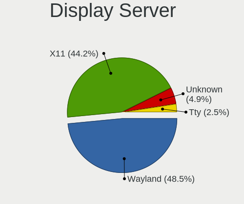
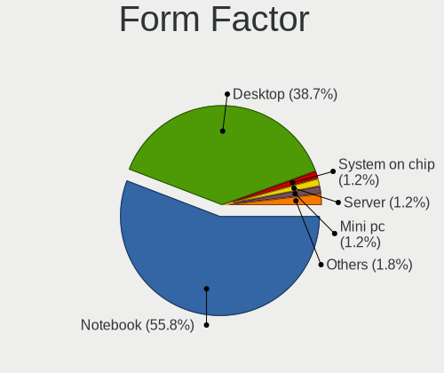
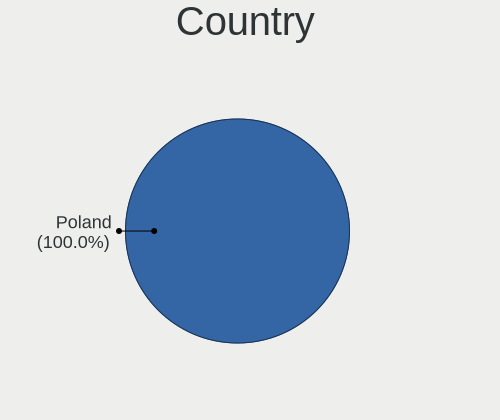
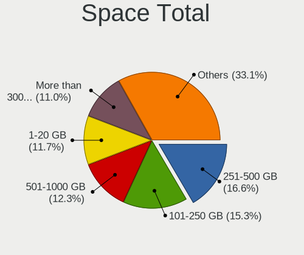
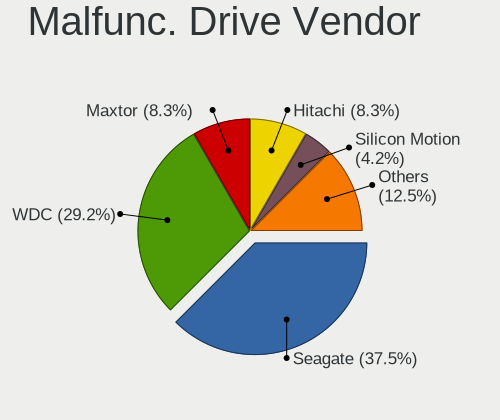
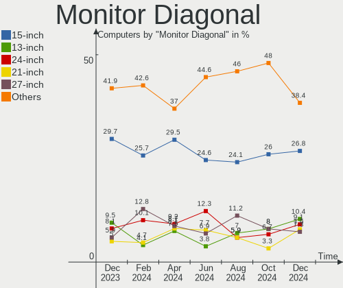
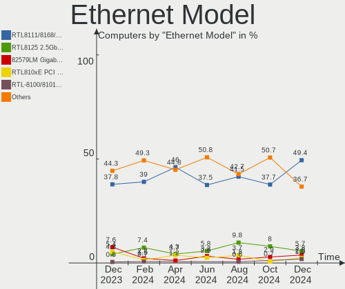
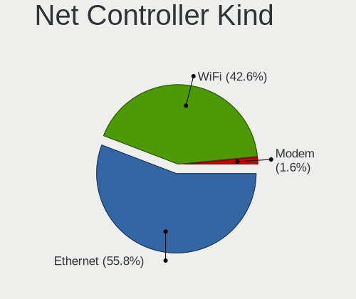
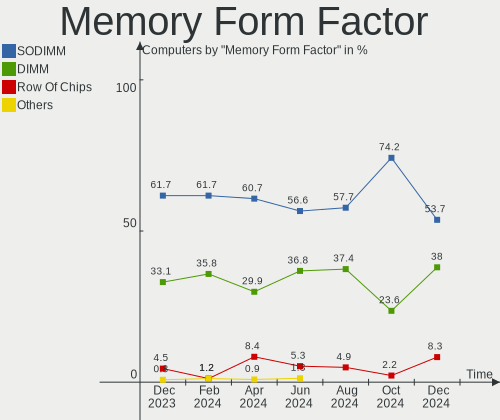
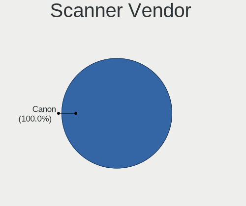

Linux in Poland - Hardware Trends
---------------------------------

A project to identify most popular hardware characteristics and track their change
over time based on data collected by Linux users at https://Linux-Hardware.org.

Anyone can contribute to this report by the [hw-probe](https://github.com/linuxhw/hw-probe) tool:

    sudo -E hw-probe -all -upload

This is a report for all computer types. See also reports for [desktops](/Location/Poland/Desktop/README.md) and [notebooks](/Location/Poland/Notebook/README.md).

Period: Mar, 2023.

Contents
--------

* [ System ](#system)
  - [ OS                       ](#os)
  - [ OS Family                ](#os-family)
  - [ Kernel                   ](#kernel)
  - [ Kernel Family            ](#kernel-family)
  - [ Kernel Major Ver.        ](#kernel-major-ver)
  - [ Arch                     ](#arch)
  - [ DE                       ](#de)
  - [ Display Server           ](#display-server)
  - [ Display Manager          ](#display-manager)
  - [ OS Lang                  ](#os-lang)
  - [ Boot Mode                ](#boot-mode)
  - [ Filesystem               ](#filesystem)
  - [ Part. scheme             ](#part-scheme)
  - [ Dual Boot with Linux/BSD ](#dual-boot-with-linuxbsd)
  - [ Dual Boot (Win)          ](#dual-boot-win)

* [ Board ](#board)
  - [ Vendor                   ](#vendor)
  - [ Model                    ](#model)
  - [ Model Family             ](#model-family)
  - [ MFG Year                 ](#mfg-year)
  - [ Form Factor              ](#form-factor)
  - [ Secure Boot              ](#secure-boot)
  - [ Coreboot                 ](#coreboot)
  - [ RAM Size                 ](#ram-size)
  - [ RAM Used                 ](#ram-used)
  - [ Total Drives             ](#total-drives)
  - [ Has CD-ROM               ](#has-cd-rom)
  - [ Has Ethernet             ](#has-ethernet)
  - [ Has WiFi                 ](#has-wifi)
  - [ Has Bluetooth            ](#has-bluetooth)

* [ Location ](#location)
  - [ Country                  ](#country)
  - [ City                     ](#city)

* [ Drives ](#drives)
  - [ Drive Vendor             ](#drive-vendor)
  - [ Drive Model              ](#drive-model)
  - [ HDD Vendor               ](#hdd-vendor)
  - [ SSD Vendor               ](#ssd-vendor)
  - [ Drive Kind               ](#drive-kind)
  - [ Drive Connector          ](#drive-connector)
  - [ Drive Size               ](#drive-size)
  - [ Space Total              ](#space-total)
  - [ Space Used               ](#space-used)
  - [ Malfunc. Drives          ](#malfunc-drives)
  - [ Malfunc. Drive Vendor    ](#malfunc-drive-vendor)
  - [ Malfunc. HDD Vendor      ](#malfunc-hdd-vendor)
  - [ Malfunc. Drive Kind      ](#malfunc-drive-kind)
  - [ Failed Drives            ](#failed-drives)
  - [ Failed Drive Vendor      ](#failed-drive-vendor)
  - [ Drive Status             ](#drive-status)

* [ Storage controller ](#storage-controller)
  - [ Storage Vendor           ](#storage-vendor)
  - [ Storage Model            ](#storage-model)
  - [ Storage Kind             ](#storage-kind)

* [ Processor ](#processor)
  - [ CPU Vendor               ](#cpu-vendor)
  - [ CPU Model                ](#cpu-model)
  - [ CPU Model Family         ](#cpu-model-family)
  - [ CPU Cores                ](#cpu-cores)
  - [ CPU Sockets              ](#cpu-sockets)
  - [ CPU Threads              ](#cpu-threads)
  - [ CPU Op-Modes             ](#cpu-op-modes)
  - [ CPU Microcode            ](#cpu-microcode)
  - [ CPU Microarch            ](#cpu-microarch)

* [ Graphics ](#graphics)
  - [ GPU Vendor               ](#gpu-vendor)
  - [ GPU Model                ](#gpu-model)
  - [ GPU Combo                ](#gpu-combo)
  - [ GPU Driver               ](#gpu-driver)
  - [ GPU Memory               ](#gpu-memory)

* [ Monitor ](#monitor)
  - [ Monitor Vendor           ](#monitor-vendor)
  - [ Monitor Model            ](#monitor-model)
  - [ Monitor Resolution       ](#monitor-resolution)
  - [ Monitor Diagonal         ](#monitor-diagonal)
  - [ Monitor Width            ](#monitor-width)
  - [ Aspect Ratio             ](#aspect-ratio)
  - [ Monitor Area             ](#monitor-area)
  - [ Pixel Density            ](#pixel-density)
  - [ Multiple Monitors        ](#multiple-monitors)

* [ Network ](#network)
  - [ Net Controller Vendor    ](#net-controller-vendor)
  - [ Net Controller Model     ](#net-controller-model)
  - [ Wireless Vendor          ](#wireless-vendor)
  - [ Wireless Model           ](#wireless-model)
  - [ Ethernet Vendor          ](#ethernet-vendor)
  - [ Ethernet Model           ](#ethernet-model)
  - [ Net Controller Kind      ](#net-controller-kind)
  - [ Used Controller          ](#used-controller)
  - [ NICs                     ](#nics)
  - [ IPv6                     ](#ipv6)

* [ Bluetooth ](#bluetooth)
  - [ Bluetooth Vendor         ](#bluetooth-vendor)
  - [ Bluetooth Model          ](#bluetooth-model)

* [ Sound ](#sound)
  - [ Sound Vendor             ](#sound-vendor)
  - [ Sound Model              ](#sound-model)

* [ Memory ](#memory)
  - [ Memory Vendor            ](#memory-vendor)
  - [ Memory Model             ](#memory-model)
  - [ Memory Kind              ](#memory-kind)
  - [ Memory Form Factor       ](#memory-form-factor)
  - [ Memory Size              ](#memory-size)
  - [ Memory Speed             ](#memory-speed)

* [ Printers & scanners ](#printers--scanners)
  - [ Printer Vendor           ](#printer-vendor)
  - [ Printer Model            ](#printer-model)
  - [ Scanner Vendor           ](#scanner-vendor)
  - [ Scanner Model            ](#scanner-model)

* [ Camera ](#camera)
  - [ Camera Vendor            ](#camera-vendor)
  - [ Camera Model             ](#camera-model)

* [ Security ](#security)
  - [ Fingerprint Vendor       ](#fingerprint-vendor)
  - [ Fingerprint Model        ](#fingerprint-model)
  - [ Chipcard Vendor          ](#chipcard-vendor)
  - [ Chipcard Model           ](#chipcard-model)

* [ Unsupported ](#unsupported)
  - [ Unsupported Devices      ](#unsupported-devices)
  - [ Unsupported Device Types ](#unsupported-device-types)

System
------

OS
--

Installed operating systems

| Name                         | Computers | Percent |
|------------------------------|-----------|---------|
| Ubuntu 22.04                 | 31        | 14.83%  |
| Linux Mint 21.1              | 22        | 10.53%  |
| OpenMandriva 23.03           | 18        | 8.61%   |
| OpenMandriva 23.01           | 17        | 8.13%   |
| Fedora 37                    | 16        | 7.66%   |
| Ubuntu 22.10                 | 10        | 4.78%   |
| Arch Rolling                 | 10        | 4.78%   |
| OpenMandriva 4.3             | 9         | 4.31%   |
| Debian 11                    | 7         | 3.35%   |
| Linux Mint 20.3              | 4         | 1.91%   |
| Debian                       | 4         | 1.91%   |
| Zorin 16                     | 3         | 1.44%   |
| Pop!_OS 22.04                | 3         | 1.44%   |
| MX 21                        | 3         | 1.44%   |
| LMDE 5                       | 3         | 1.44%   |
| Linux Mint 21                | 3         | 1.44%   |
| Kali 2023.1                  | 3         | 1.44%   |
| Gentoo 2.13                  | 3         | 1.44%   |
| Elementary 7                 | 3         | 1.44%   |
| ROSA 12.3                    | 2         | 0.96%   |
| openSUSE Tumbleweed-XXXXXXXX | 2         | 0.96%   |
| OpenMandriva 4.2             | 2         | 0.96%   |
| Manjaro                      | 2         | 0.96%   |
| KDE neon 22.04               | 2         | 0.96%   |
| Debian 10                    | 2         | 0.96%   |
| Xero Rolling                 | 1         | 0.48%   |
| Ubuntu MATE 22.04            | 1         | 0.48%   |
| Ubuntu 20.04                 | 1         | 0.48%   |
| TUXEDO OS 22.04              | 1         | 0.48%   |
| SteamOS 4                    | 1         | 0.48%   |
| SteamOS 3.4.6                | 1         | 0.48%   |
| SteamOS 3.4                  | 1         | 0.48%   |
| ROSA R11.1                   | 1         | 0.48%   |
| Raspbian 11                  | 1         | 0.48%   |
| Pop!_OS 20.04                | 1         | 0.48%   |
| Parrot 5.2                   | 1         | 0.48%   |
| OpenMandriva 4.90            | 1         | 0.48%   |
| OpenMandriva 4.50            | 1         | 0.48%   |
| NixOS 22.11                  | 1         | 0.48%   |
| Manjaro 22.0.5               | 1         | 0.48%   |

OS Family
---------

OS without a version

| Name         | Computers | Percent |
|--------------|-----------|---------|
| OpenMandriva | 48        | 22.97%  |
| Ubuntu       | 42        | 20.1%   |
| Linux Mint   | 29        | 13.88%  |
| Fedora       | 17        | 8.13%   |
| Debian       | 14        | 6.7%    |
| Arch         | 10        | 4.78%   |
| Pop!_OS      | 4         | 1.91%   |
| Zorin        | 3         | 1.44%   |
| SteamOS      | 3         | 1.44%   |
| ROSA         | 3         | 1.44%   |
| MX           | 3         | 1.44%   |
| Manjaro      | 3         | 1.44%   |
| LMDE         | 3         | 1.44%   |
| Kali         | 3         | 1.44%   |
| Gentoo       | 3         | 1.44%   |
| Elementary   | 3         | 1.44%   |
| openSUSE     | 2         | 0.96%   |
| Kubuntu      | 2         | 0.96%   |
| KDE neon     | 2         | 0.96%   |
| Xero         | 1         | 0.48%   |
| Ubuntu MATE  | 1         | 0.48%   |
| TUXEDO OS    | 1         | 0.48%   |
| Raspbian     | 1         | 0.48%   |
| Parrot       | 1         | 0.48%   |
| NixOS        | 1         | 0.48%   |
| Lubuntu      | 1         | 0.48%   |
| EuroLinux    | 1         | 0.48%   |
| EndeavourOS  | 1         | 0.48%   |
| CentOS       | 1         | 0.48%   |
| BlackPanther | 1         | 0.48%   |
| ArcoLinux    | 1         | 0.48%   |

Kernel
------

Version of the Linux kernel

| Version                                  | Computers | Percent |
|------------------------------------------|-----------|---------|
| 5.19.0-35-generic                        | 31        | 14.83%  |
| 6.1.1-desktop-1omv2290                   | 16        | 7.66%   |
| 5.15.0-67-generic                        | 16        | 7.66%   |
| 6.2.6-desktop-1omv2390                   | 13        | 6.22%   |
| 5.16.7-desktop-1omv4003                  | 7         | 3.35%   |
| 5.15.0-56-generic                        | 6         | 2.87%   |
| 5.4.0-144-generic                        | 5         | 2.39%   |
| 5.19.0-32-generic                        | 5         | 2.39%   |
| 5.10.0-21-amd64                          | 5         | 2.39%   |
| 6.2.2-desktop-1omv2390                   | 3         | 1.44%   |
| 6.2.2-060202-generic                     | 3         | 1.44%   |
| 6.1.18-200.fc37.x86_64                   | 3         | 1.44%   |
| 6.1.15-200.fc37.x86_64                   | 3         | 1.44%   |
| 6.1.14-200.fc37.x86_64                   | 3         | 1.44%   |
| 6.1.12-gentoo                            | 3         | 1.44%   |
| 6.1.0-kali5-amd64                        | 3         | 1.44%   |
| 5.19.0-38-generic                        | 3         | 1.44%   |
| 5.16.13-desktop-1omv4003                 | 3         | 1.44%   |
| 5.15.0-69-generic                        | 3         | 1.44%   |
| 6.2.8-arch1-1                            | 2         | 0.96%   |
| 6.2.7-200.fc37.x86_64                    | 2         | 0.96%   |
| 6.2.6-arch1-1                            | 2         | 0.96%   |
| 6.2.1-desktop-1omv2390                   | 2         | 0.96%   |
| 6.1.21-1-lts                             | 2         | 0.96%   |
| 6.1.11-76060111-generic                  | 2         | 0.96%   |
| 6.1.0-6-amd64                            | 2         | 0.96%   |
| 6.1.0-5-amd64                            | 2         | 0.96%   |
| 6.0.7-301.fc37.x86_64                    | 2         | 0.96%   |
| 5.19.0-31-generic                        | 2         | 0.96%   |
| 5.10.0-20-amd64                          | 2         | 0.96%   |
| 6.2.8-zen1-1-zen                         | 1         | 0.48%   |
| 6.2.7                                    | 1         | 0.48%   |
| 6.2.6-zen1-1-zen                         | 1         | 0.48%   |
| 6.2.6-300.fc38.x86_64                    | 1         | 0.48%   |
| 6.2.6-1-default                          | 1         | 0.48%   |
| 6.2.5-zen1-1-zen                         | 1         | 0.48%   |
| 6.2.5-arch1-1                            | 1         | 0.48%   |
| 6.2.5-060205-generic                     | 1         | 0.48%   |
| 6.2.2-arch1-1                            | 1         | 0.48%   |
| 6.2.1.xm1-1.klp-xanmod-rosa2021.1-x86_64 | 1         | 0.48%   |

Kernel Family
-------------

Linux kernel without a distro release

| Version  | Computers | Percent |
|----------|-----------|---------|
| 5.19.0   | 42        | 20.1%   |
| 5.15.0   | 28        | 13.4%   |
| 6.2.6    | 18        | 8.61%   |
| 6.1.1    | 16        | 7.66%   |
| 6.1.0    | 10        | 4.78%   |
| 5.10.0   | 10        | 4.78%   |
| 6.2.2    | 7         | 3.35%   |
| 6.1.12   | 7         | 3.35%   |
| 5.16.7   | 7         | 3.35%   |
| 5.4.0    | 6         | 2.87%   |
| 6.2.1    | 4         | 1.91%   |
| 6.1.15   | 4         | 1.91%   |
| 6.2.8    | 3         | 1.44%   |
| 6.2.7    | 3         | 1.44%   |
| 6.2.5    | 3         | 1.44%   |
| 6.1.18   | 3         | 1.44%   |
| 6.1.14   | 3         | 1.44%   |
| 6.1.11   | 3         | 1.44%   |
| 6.0.0    | 3         | 1.44%   |
| 5.16.13  | 3         | 1.44%   |
| 6.2.0    | 2         | 0.96%   |
| 6.1.21   | 2         | 0.96%   |
| 6.0.7    | 2         | 0.96%   |
| 5.13.0   | 2         | 0.96%   |
| 6.1.9    | 1         | 0.48%   |
| 6.1.19   | 1         | 0.48%   |
| 6.1.10   | 1         | 0.48%   |
| 6.0.2    | 1         | 0.48%   |
| 6.0.14   | 1         | 0.48%   |
| 5.6.14   | 1         | 0.48%   |
| 5.3.5    | 1         | 0.48%   |
| 5.2.5    | 1         | 0.48%   |
| 5.16.15  | 1         | 0.48%   |
| 5.15.84  | 1         | 0.48%   |
| 5.15.75  | 1         | 0.48%   |
| 5.15.55  | 1         | 0.48%   |
| 5.15.102 | 1         | 0.48%   |
| 5.14.7   | 1         | 0.48%   |
| 5.11.12  | 1         | 0.48%   |
| 5.10.14  | 1         | 0.48%   |

Kernel Major Ver.
-----------------

Linux kernel major version

| Version | Computers | Percent |
|---------|-----------|---------|
| 6.1     | 51        | 24.4%   |
| 5.19    | 42        | 20.1%   |
| 6.2     | 40        | 19.14%  |
| 5.15    | 32        | 15.31%  |
| 5.16    | 11        | 5.26%   |
| 5.10    | 11        | 5.26%   |
| 6.0     | 7         | 3.35%   |
| 5.4     | 6         | 2.87%   |
| 5.13    | 2         | 0.96%   |
| 5.6     | 1         | 0.48%   |
| 5.3     | 1         | 0.48%   |
| 5.2     | 1         | 0.48%   |
| 5.14    | 1         | 0.48%   |
| 5.11    | 1         | 0.48%   |
| 4.18    | 1         | 0.48%   |
| 4.15    | 1         | 0.48%   |

Arch
----

OS architecture (x86_64, i586, etc.)

| Name   | Computers | Percent |
|--------|-----------|---------|
| x86_64 | 206       | 98.56%  |
| i686   | 2         | 0.96%   |
| armv6l | 1         | 0.48%   |

DE
--

Desktop Environment

| Name       | Computers | Percent |
|------------|-----------|---------|
| GNOME      | 80        | 38.28%  |
| KDE5       | 62        | 29.67%  |
| X-Cinnamon | 24        | 11.48%  |
| MATE       | 13        | 6.22%   |
| XFCE       | 12        | 5.74%   |
| Unknown    | 5         | 2.39%   |
| LXQt       | 4         | 1.91%   |
| Pantheon   | 3         | 1.44%   |
| LXDE       | 3         | 1.44%   |
| KDE4       | 1         | 0.48%   |
| i3         | 1         | 0.48%   |
| Cinnamon   | 1         | 0.48%   |

Display Server
--------------

X11 or Wayland

| Name    | Computers | Percent |
|---------|-----------|---------|
| X11     | 152       | 72.73%  |
| Wayland | 51        | 24.4%   |
| Tty     | 3         | 1.44%   |
| Unknown | 3         | 1.44%   |

Display Manager
---------------

SDDM, LightDM, etc.

| Name    | Computers | Percent |
|---------|-----------|---------|
| SDDM    | 57        | 27.27%  |
| Unknown | 54        | 25.84%  |
| GDM3    | 45        | 21.53%  |
| LightDM | 27        | 12.92%  |
| GDM     | 22        | 10.53%  |
| NODM    | 2         | 0.96%   |
| LXDM    | 1         | 0.48%   |
| KDM     | 1         | 0.48%   |

OS Lang
-------

Language

| Lang    | Computers | Percent |
|---------|-----------|---------|
| pl_PL   | 116       | 55.5%   |
| en_US   | 75        | 35.89%  |
| en_GB   | 6         | 2.87%   |
| C       | 4         | 1.91%   |
| ru_RU   | 2         | 0.96%   |
| ru_UA   | 1         | 0.48%   |
| it_IT   | 1         | 0.48%   |
| es_AR   | 1         | 0.48%   |
| en_SE   | 1         | 0.48%   |
| de_DE   | 1         | 0.48%   |
| Unknown | 1         | 0.48%   |

Boot Mode
---------

EFI or BIOS

| Mode | Computers | Percent |
|------|-----------|---------|
| EFI  | 108       | 51.67%  |
| BIOS | 101       | 48.33%  |

Filesystem
----------

Type of filesystem

| Type    | Computers | Percent |
|---------|-----------|---------|
| Ext4    | 135       | 64.59%  |
| Overlay | 36        | 17.22%  |
| Btrfs   | 26        | 12.44%  |
| F2fs    | 5         | 2.39%   |
| Xfs     | 4         | 1.91%   |
| Rootfs  | 2         | 0.96%   |
| Zfs     | 1         | 0.48%   |

Part. scheme
------------

Scheme of partitioning

| Type    | Computers | Percent |
|---------|-----------|---------|
| GPT     | 130       | 62.2%   |
| Unknown | 51        | 24.4%   |
| MBR     | 28        | 13.4%   |

Dual Boot with Linux/BSD
------------------------

Hosting more than one Linux/BSD

| Dual boot | Computers | Percent |
|-----------|-----------|---------|
| No        | 159       | 76.08%  |
| Yes       | 50        | 23.92%  |

Dual Boot (Win)
---------------

Hosting Linux and Windows

| Dual boot | Computers | Percent |
|-----------|-----------|---------|
| No        | 130       | 62.2%   |
| Yes       | 79        | 37.8%   |

Board
-----

Vendor
------

Motherboard manufacturer

| Name                    | Computers | Percent |
|-------------------------|-----------|---------|
| Lenovo                  | 41        | 19.62%  |
| Dell                    | 35        | 16.75%  |
| Hewlett-Packard         | 32        | 15.31%  |
| ASUSTek Computer        | 29        | 13.88%  |
| Gigabyte Technology     | 18        | 8.61%   |
| MSI                     | 9         | 4.31%   |
| ASRock                  | 6         | 2.87%   |
| Acer                    | 6         | 2.87%   |
| Toshiba                 | 4         | 1.91%   |
| Samsung Electronics     | 4         | 1.91%   |
| Sony                    | 3         | 1.44%   |
| Kiano                   | 3         | 1.44%   |
| HUAWEI                  | 3         | 1.44%   |
| Intel                   | 2         | 0.96%   |
| Valve                   | 1         | 0.48%   |
| Supermicro              | 1         | 0.48%   |
| Raspberry Pi Foundation | 1         | 0.48%   |
| Notebook                | 1         | 0.48%   |
| Microsoft               | 1         | 0.48%   |
| IGEL Technology         | 1         | 0.48%   |
| Huanan                  | 1         | 0.48%   |
| Hampoo                  | 1         | 0.48%   |
| GPD                     | 1         | 0.48%   |
| Google                  | 1         | 0.48%   |
| Fujitsu                 | 1         | 0.48%   |
| Biostar                 | 1         | 0.48%   |
| Apple                   | 1         | 0.48%   |
| Unknown                 | 1         | 0.48%   |

Model
-----

Motherboard model

| Name                                | Computers | Percent |
|-------------------------------------|-----------|---------|
| Kiano Elegance 14.2                 | 3         | 1.44%   |
| Lenovo G570 20079                   | 2         | 0.96%   |
| Lenovo G50-80 80E5                  | 2         | 0.96%   |
| HUAWEI KPL-W0X                      | 2         | 0.96%   |
| HP Pavilion dv6                     | 2         | 0.96%   |
| HP EliteBook 830 G5                 | 2         | 0.96%   |
| HP 250 G6 Notebook PC               | 2         | 0.96%   |
| Gigabyte B550 AORUS ELITE V2        | 2         | 0.96%   |
| Gigabyte B450M DS3H                 | 2         | 0.96%   |
| Dell Vostro 3900                    | 2         | 0.96%   |
| Dell OptiPlex 780                   | 2         | 0.96%   |
| Dell Latitude E6530                 | 2         | 0.96%   |
| Dell Latitude E6440                 | 2         | 0.96%   |
| ASUS M3A78-CM                       | 2         | 0.96%   |
| ASUS All Series                     | 2         | 0.96%   |
| Valve Jupiter                       | 1         | 0.48%   |
| Toshiba Satellite Pro A50-C         | 1         | 0.48%   |
| Toshiba Satellite L40               | 1         | 0.48%   |
| Toshiba Satellite C855-12N          | 1         | 0.48%   |
| Toshiba QOSMIO X500                 | 1         | 0.48%   |
| Supermicro Super Server             | 1         | 0.48%   |
| Sony VPCEH1S1E                      | 1         | 0.48%   |
| Sony VGN-BX61VN                     | 1         | 0.48%   |
| Sony SVE1512M6ESI                   | 1         | 0.48%   |
| Samsung 950XED                      | 1         | 0.48%   |
| Samsung 950QED                      | 1         | 0.48%   |
| Samsung 355V4C/356V4C/3445VC/3545VC | 1         | 0.48%   |
| Samsung 300E4A/300E5A/300E7A        | 1         | 0.48%   |
| RPi Raspberry Pi Zero W Rev 1.1     | 1         | 0.48%   |
| Notebook NS50_70MU                  | 1         | 0.48%   |
| MSI OPTIMUS                         | 1         | 0.48%   |
| MSI MS-7D14                         | 1         | 0.48%   |
| MSI MS-7C37                         | 1         | 0.48%   |
| MSI MS-7C02                         | 1         | 0.48%   |
| MSI MS-7971                         | 1         | 0.48%   |
| MSI MS-7816                         | 1         | 0.48%   |
| MSI MS-7721                         | 1         | 0.48%   |
| MSI Creator Z17 A12UHST             | 1         | 0.48%   |
| MSI Creator Z16 A11UET              | 1         | 0.48%   |
| Microsoft Surface Laptop Go 2       | 1         | 0.48%   |

Model Family
------------

Motherboard model prefix

| Name               | Computers | Percent |
|--------------------|-----------|---------|
| Lenovo ThinkPad    | 17        | 8.13%   |
| Dell Latitude      | 16        | 7.66%   |
| Lenovo IdeaPad     | 9         | 4.31%   |
| HP EliteBook       | 6         | 2.87%   |
| Dell OptiPlex      | 6         | 2.87%   |
| HP Pavilion        | 4         | 1.91%   |
| Gigabyte B550      | 4         | 1.91%   |
| Acer Aspire        | 4         | 1.91%   |
| Toshiba Satellite  | 3         | 1.44%   |
| Lenovo Legion      | 3         | 1.44%   |
| Kiano Elegance     | 3         | 1.44%   |
| HP Laptop          | 3         | 1.44%   |
| Dell Vostro        | 3         | 1.44%   |
| Dell Precision     | 3         | 1.44%   |
| ASUS TUF           | 3         | 1.44%   |
| ASUS ROG           | 3         | 1.44%   |
| ASUS PRIME         | 3         | 1.44%   |
| MSI Creator        | 2         | 0.96%   |
| Lenovo ThinkCentre | 2         | 0.96%   |
| Lenovo G570        | 2         | 0.96%   |
| Lenovo G50-80      | 2         | 0.96%   |
| HUAWEI KPL-W0X     | 2         | 0.96%   |
| HP ProLiant        | 2         | 0.96%   |
| HP ProBook         | 2         | 0.96%   |
| HP ENVY            | 2         | 0.96%   |
| HP EliteDesk       | 2         | 0.96%   |
| HP Compaq          | 2         | 0.96%   |
| HP 250             | 2         | 0.96%   |
| Gigabyte B450M     | 2         | 0.96%   |
| Dell PowerEdge     | 2         | 0.96%   |
| ASUS M3A78-CM      | 2         | 0.96%   |
| ASUS ASUS          | 2         | 0.96%   |
| ASUS All           | 2         | 0.96%   |
| Valve Jupiter      | 1         | 0.48%   |
| Toshiba QOSMIO     | 1         | 0.48%   |
| Supermicro Super   | 1         | 0.48%   |
| Sony VPCEH1S1E     | 1         | 0.48%   |
| Sony VGN-BX61VN    | 1         | 0.48%   |
| Sony SVE1512M6ESI  | 1         | 0.48%   |
| Samsung 950XED     | 1         | 0.48%   |

MFG Year
--------

Motherboard manufacture year

| Year    | Computers | Percent |
|---------|-----------|---------|
| 2018    | 25        | 11.96%  |
| 2020    | 21        | 10.05%  |
| 2013    | 19        | 9.09%   |
| 2022    | 17        | 8.13%   |
| 2021    | 16        | 7.66%   |
| 2019    | 15        | 7.18%   |
| 2012    | 15        | 7.18%   |
| 2017    | 14        | 6.7%    |
| 2011    | 11        | 5.26%   |
| 2014    | 10        | 4.78%   |
| 2009    | 10        | 4.78%   |
| 2015    | 8         | 3.83%   |
| 2010    | 8         | 3.83%   |
| 2008    | 7         | 3.35%   |
| 2007    | 5         | 2.39%   |
| 2016    | 4         | 1.91%   |
| 2023    | 2         | 0.96%   |
| 2006    | 1         | 0.48%   |
| Unknown | 1         | 0.48%   |

Form Factor
-----------

Physical design of the computer

| Name           | Computers | Percent |
|----------------|-----------|---------|
| Notebook       | 124       | 59.33%  |
| Desktop        | 70        | 33.49%  |
| Convertible    | 5         | 2.39%   |
| Server         | 5         | 2.39%   |
| Tablet         | 2         | 0.96%   |
| Mini pc        | 2         | 0.96%   |
| System on chip | 1         | 0.48%   |

Secure Boot
-----------

Enabled or disabled

| State    | Computers | Percent |
|----------|-----------|---------|
| Disabled | 193       | 92.34%  |
| Enabled  | 16        | 7.66%   |

Coreboot
--------

Have coreboot on board

| Used | Computers | Percent |
|------|-----------|---------|
| No   | 208       | 99.52%  |
| Yes  | 1         | 0.48%   |

RAM Size
--------

Total RAM memory

| Size in GB      | Computers | Percent |
|-----------------|-----------|---------|
| 16.01-24.0      | 45        | 21.53%  |
| 8.01-16.0       | 41        | 19.62%  |
| 4.01-8.0        | 39        | 18.66%  |
| 3.01-4.0        | 36        | 17.22%  |
| 32.01-64.0      | 31        | 14.83%  |
| 64.01-256.0     | 5         | 2.39%   |
| 24.01-32.0      | 4         | 1.91%   |
| 2.01-3.0        | 3         | 1.44%   |
| More than 256.0 | 2         | 0.96%   |
| 1.01-2.0        | 2         | 0.96%   |
| 0.01-0.5        | 1         | 0.48%   |

RAM Used
--------

Used RAM memory

| Used GB    | Computers | Percent |
|------------|-----------|---------|
| 1.01-2.0   | 69        | 33.01%  |
| 2.01-3.0   | 46        | 22.01%  |
| 4.01-8.0   | 45        | 21.53%  |
| 3.01-4.0   | 20        | 9.57%   |
| 8.01-16.0  | 14        | 6.7%    |
| 0.51-1.0   | 10        | 4.78%   |
| 16.01-24.0 | 2         | 0.96%   |
| 0.01-0.5   | 2         | 0.96%   |
| 24.01-32.0 | 1         | 0.48%   |

Total Drives
------------

Number of drives on board

| Drives | Computers | Percent |
|--------|-----------|---------|
| 1      | 111       | 53.11%  |
| 2      | 62        | 29.67%  |
| 3      | 16        | 7.66%   |
| 4      | 9         | 4.31%   |
| 5      | 6         | 2.87%   |
| 6      | 2         | 0.96%   |
| 12     | 1         | 0.48%   |
| 7      | 1         | 0.48%   |
| 0      | 1         | 0.48%   |

Has CD-ROM
----------

Has CD-ROM on board

| Presented | Computers | Percent |
|-----------|-----------|---------|
| No        | 131       | 62.68%  |
| Yes       | 78        | 37.32%  |

Has Ethernet
------------

Has Ethernet on board

| Presented | Computers | Percent |
|-----------|-----------|---------|
| Yes       | 185       | 88.52%  |
| No        | 24        | 11.48%  |

Has WiFi
--------

Has WiFi module

| Presented | Computers | Percent |
|-----------|-----------|---------|
| Yes       | 158       | 75.6%   |
| No        | 51        | 24.4%   |

Has Bluetooth
-------------

Has Bluetooth module

| Presented | Computers | Percent |
|-----------|-----------|---------|
| Yes       | 125       | 59.81%  |
| No        | 84        | 40.19%  |

Location
--------

Country
-------

Geographic location (country)

| Country | Computers | Percent |
|---------|-----------|---------|
| Poland  | 209       | 100%    |

City
----

Geographic location (city)

| City                  | Computers | Percent |
|-----------------------|-----------|---------|
| Warsaw                | 47        | 22.49%  |
| Wroclaw               | 17        | 8.13%   |
| Krakow                | 12        | 5.74%   |
| Poznan                | 8         | 3.83%   |
| Katowice              | 7         | 3.35%   |
| Rzeszów              | 4         | 1.91%   |
| Lublin                | 4         | 1.91%   |
| Lodz                  | 4         | 1.91%   |
| Gliwice               | 4         | 1.91%   |
| Gdansk                | 4         | 1.91%   |
| Torun                 | 3         | 1.44%   |
| Płock                | 3         | 1.44%   |
| Kielce                | 3         | 1.44%   |
| Elblag                | 3         | 1.44%   |
| Bialystok             | 3         | 1.44%   |
| Bełchatów           | 3         | 1.44%   |
| Żory                 | 2         | 0.96%   |
| Tarnowskie Gory       | 2         | 0.96%   |
| Siedlce               | 2         | 0.96%   |
| Grodzisk Wielkopolski | 2         | 0.96%   |
| Częstochowa          | 2         | 0.96%   |
| Bytom                 | 2         | 0.96%   |
| Bydgoszcz             | 2         | 0.96%   |
| Brzesko               | 2         | 0.96%   |
| Zlotow                | 1         | 0.48%   |
| Zielona Góra         | 1         | 0.48%   |
| Zgierz                | 1         | 0.48%   |
| Zernica               | 1         | 0.48%   |
| Zawadzkie             | 1         | 0.48%   |
| Wieliczka             | 1         | 0.48%   |
| Wałbrzych            | 1         | 0.48%   |
| Trzebinia             | 1         | 0.48%   |
| Świnoujście         | 1         | 0.48%   |
| Swiebodzice           | 1         | 0.48%   |
| Swidnica              | 1         | 0.48%   |
| Susz                  | 1         | 0.48%   |
| Sosnowiec             | 1         | 0.48%   |
| Skarzysko-Kamienna    | 1         | 0.48%   |
| Skape                 | 1         | 0.48%   |
| Siniarzewo            | 1         | 0.48%   |

Drives
------

Drive Vendor
------------

Hard drive vendors

| Vendor                      | Computers | Drives | Percent |
|-----------------------------|-----------|--------|---------|
| Samsung Electronics         | 46        | 54     | 13.81%  |
| Seagate                     | 43        | 50     | 12.91%  |
| GOODRAM                     | 33        | 36     | 9.91%   |
| WDC                         | 30        | 40     | 9.01%   |
| SanDisk                     | 19        | 20     | 5.71%   |
| Kingston                    | 16        | 17     | 4.8%    |
| A-DATA Technology           | 14        | 14     | 4.2%    |
| Toshiba                     | 13        | 15     | 3.9%    |
| Crucial                     | 13        | 13     | 3.9%    |
| Micron Technology           | 10        | 10     | 3%      |
| Unknown                     | 9         | 11     | 2.7%    |
| Hitachi                     | 9         | 11     | 2.7%    |
| SK hynix                    | 6         | 6      | 1.8%    |
| Intel                       | 6         | 6      | 1.8%    |
| Transcend                   | 4         | 4      | 1.2%    |
| PNY                         | 4         | 4      | 1.2%    |
| Patriot                     | 4         | 4      | 1.2%    |
| HGST                        | 4         | 4      | 1.2%    |
| KIOXIA                      | 3         | 3      | 0.9%    |
| Apacer                      | 3         | 3      | 0.9%    |
| Unknown                     | 3         | 3      | 0.9%    |
| XPG                         | 2         | 3      | 0.6%    |
| SPCC                        | 2         | 3      | 0.6%    |
| Silicon Motion              | 2         | 2      | 0.6%    |
| Lite-On Technology          | 2         | 2      | 0.6%    |
| Kingston Technology Company | 2         | 2      | 0.6%    |
| ASMT                        | 2         | 2      | 0.6%    |
| WDC WDS2                    | 1         | 1      | 0.3%    |
| Union Memory (Shenzhen)     | 1         | 1      | 0.3%    |
| UMIS                        | 1         | 1      | 0.3%    |
| Realtek Semiconductor       | 1         | 1      | 0.3%    |
| Realtek                     | 1         | 1      | 0.3%    |
| POLION                      | 1         | 1      | 0.3%    |
| Plextor                     | 1         | 1      | 0.3%    |
| Phison Electronics          | 1         | 1      | 0.3%    |
| Phison                      | 1         | 1      | 0.3%    |
| OCZ                         | 1         | 2      | 0.3%    |
| Micron_1                    | 1         | 1      | 0.3%    |
| Micron/Crucial Technology   | 1         | 1      | 0.3%    |
| LITEONIT                    | 1         | 1      | 0.3%    |

Drive Model
-----------

Hard drive models

| Model                                                  | Computers | Percent |
|--------------------------------------------------------|-----------|---------|
| Samsung NVMe SSD Controller SM981/PM981/PM983 250GB    | 9         | 2.5%    |
| Seagate ST500LT012-1DG142 500GB                        | 5         | 1.39%   |
| Kingston SA400S37240G 240GB SSD                        | 5         | 1.39%   |
| GOODRAM SSDPR-CL100-120-G3 120GB                       | 5         | 1.39%   |
| Samsung SSD 860 EVO 500GB                              | 4         | 1.11%   |
| Transcend TS240GMTS420S 240GB SSD                      | 3         | 0.83%   |
| Seagate ST1000LM024 HN-M101MBB 1TB                     | 3         | 0.83%   |
| SanDisk DF4032  32GB                                   | 3         | 0.83%   |
| Samsung SSD 980 1TB                                    | 3         | 0.83%   |
| GOODRAM SSDPR-CX400-512-G2 512GB                       | 3         | 0.83%   |
| GOODRAM SSDPR-CX400-256-G2 256GB                       | 3         | 0.83%   |
| GOODRAM SSDPR-CX300-240 240GB                          | 3         | 0.83%   |
| GOODRAM SSDPR-CL100-960-G3 960GB                       | 3         | 0.83%   |
| GOODRAM SSDPR-CL100-480-G2 480GB                       | 3         | 0.83%   |
| GOODRAM SSD 120GB                                      | 3         | 0.83%   |
| Unknown                                                | 3         | 0.83%   |
| WDC WD5000AAKX-75U6AA0 500GB                           | 2         | 0.56%   |
| WDC WD3200BPVT-22ZEST0 320GB                           | 2         | 0.56%   |
| WDC WD3200BPVT-22JJ5T0 320GB                           | 2         | 0.56%   |
| Unknown SD/MMC 2GB                                     | 2         | 0.56%   |
| Unknown MMC Card  16GB                                 | 2         | 0.56%   |
| Unknown M.S./M.S.Pro/HG 16GB                           | 2         | 0.56%   |
| Toshiba MQ01ABF050 500GB                               | 2         | 0.56%   |
| SK hynix BC711 HFM512GD3JX013N 512GB                   | 2         | 0.56%   |
| Silicon Motion SM2263EN/SM2263XT SSD Controller 1024GB | 2         | 0.56%   |
| Seagate ST9500325AS 500GB                              | 2         | 0.56%   |
| Seagate ST500DM002-1BD142 500GB                        | 2         | 0.56%   |
| Seagate ST4000VN008-2DR166 4TB                         | 2         | 0.56%   |
| Seagate ST1000DM010-2EP102 1TB                         | 2         | 0.56%   |
| SanDisk NVMe SSD Drive 512GB                           | 2         | 0.56%   |
| SanDisk NVMe SSD Drive 1TB                             | 2         | 0.56%   |
| Samsung SSD PM851 mSATA 256GB                          | 2         | 0.56%   |
| Samsung PSSD T7 500GB                                  | 2         | 0.56%   |
| Samsung MZVLQ512HBLU-00B 512GB                         | 2         | 0.56%   |
| Patriot Burst 120GB SSD                                | 2         | 0.56%   |
| Micron 2450_MTFDKBA1T0TFK 1TB                          | 2         | 0.56%   |
| Kingston SKC3000S1024G 1TB                             | 2         | 0.56%   |
| Kingston SA400S37480G 480GB SSD                        | 2         | 0.56%   |
| Intel SSDPEKNU512GZ 512GB                              | 2         | 0.56%   |
| HGST HTS725050A7E630 500GB                             | 2         | 0.56%   |

HDD Vendor
----------

Hard disk drive vendors

| Vendor              | Computers | Drives | Percent |
|---------------------|-----------|--------|---------|
| Seagate             | 42        | 49     | 42.42%  |
| WDC                 | 27        | 36     | 27.27%  |
| Toshiba             | 10        | 11     | 10.1%   |
| Hitachi             | 9         | 11     | 9.09%   |
| HGST                | 4         | 4      | 4.04%   |
| Samsung Electronics | 2         | 2      | 2.02%   |
| ASMT                | 2         | 2      | 2.02%   |
| HGST HTS            | 1         | 1      | 1.01%   |
| Fujitsu             | 1         | 1      | 1.01%   |
| Apple               | 1         | 1      | 1.01%   |

SSD Vendor
----------

Solid state drive vendors

| Vendor              | Computers | Drives | Percent |
|---------------------|-----------|--------|---------|
| GOODRAM             | 31        | 31     | 22.63%  |
| Samsung Electronics | 23        | 23     | 16.79%  |
| A-DATA Technology   | 14        | 14     | 10.22%  |
| Crucial             | 13        | 13     | 9.49%   |
| Kingston            | 11        | 11     | 8.03%   |
| SanDisk             | 8         | 8      | 5.84%   |
| Transcend           | 4         | 4      | 2.92%   |
| Patriot             | 4         | 4      | 2.92%   |
| PNY                 | 3         | 3      | 2.19%   |
| Apacer              | 3         | 3      | 2.19%   |
| WDC                 | 2         | 2      | 1.46%   |
| SPCC                | 2         | 3      | 1.46%   |
| SK hynix            | 2         | 2      | 1.46%   |
| Micron Technology   | 2         | 2      | 1.46%   |
| WDC WDS2            | 1         | 1      | 0.73%   |
| Toshiba             | 1         | 1      | 0.73%   |
| Plextor             | 1         | 1      | 0.73%   |
| OCZ                 | 1         | 2      | 0.73%   |
| Micron_1            | 1         | 1      | 0.73%   |
| LITEONIT            | 1         | 1      | 0.73%   |
| LITEON E            | 1         | 1      | 0.73%   |
| LITEON              | 1         | 1      | 0.73%   |
| KIOXIA-EXCERIA      | 1         | 1      | 0.73%   |
| KingSpec            | 1         | 1      | 0.73%   |
| KingFast            | 1         | 1      | 0.73%   |
| JMicron Technology  | 1         | 1      | 0.73%   |
| Intel               | 1         | 1      | 0.73%   |
| HS-SSD-C100         | 1         | 1      | 0.73%   |
| China               | 1         | 1      | 0.73%   |

Drive Kind
----------

HDD or SSD

| Kind    | Computers | Drives | Percent |
|---------|-----------|--------|---------|
| SSD     | 115       | 139    | 39.25%  |
| HDD     | 83        | 118    | 28.33%  |
| NVMe    | 76        | 94     | 25.94%  |
| MMC     | 11        | 11     | 3.75%   |
| Unknown | 8         | 10     | 2.73%   |

Drive Connector
---------------

SATA, SAS, NVMe, etc.

| Type | Computers | Drives | Percent |
|------|-----------|--------|---------|
| SATA | 155       | 242    | 58.71%  |
| NVMe | 76        | 93     | 28.79%  |
| SAS  | 22        | 26     | 8.33%   |
| MMC  | 11        | 11     | 4.17%   |

Drive Size
----------

Size of hard drive

| Size in TB | Computers | Drives | Percent |
|------------|-----------|--------|---------|
| 0.01-0.5   | 124       | 156    | 60.49%  |
| 0.51-1.0   | 57        | 68     | 27.8%   |
| 1.01-2.0   | 11        | 13     | 5.37%   |
| 3.01-4.0   | 6         | 8      | 2.93%   |
| 2.01-3.0   | 4         | 7      | 1.95%   |
| 4.01-10.0  | 2         | 4      | 0.98%   |
| 10.01-20.0 | 1         | 1      | 0.49%   |

Space Total
-----------

Amount of disk space available on the file system

| Size in GB     | Computers | Percent |
|----------------|-----------|---------|
| 101-250        | 46        | 22.01%  |
| 251-500        | 37        | 17.7%   |
| 1-20           | 33        | 15.79%  |
| 501-1000       | 31        | 14.83%  |
| 1001-2000      | 17        | 8.13%   |
| 51-100         | 14        | 6.7%    |
| Unknown        | 12        | 5.74%   |
| More than 3000 | 10        | 4.78%   |
| 2001-3000      | 5         | 2.39%   |
| 21-50          | 4         | 1.91%   |

Space Used
----------

Amount of used disk space

| Used GB        | Computers | Percent |
|----------------|-----------|---------|
| 1-20           | 74        | 35.41%  |
| 21-50          | 32        | 15.31%  |
| 51-100         | 28        | 13.4%   |
| 101-250        | 25        | 11.96%  |
| 501-1000       | 17        | 8.13%   |
| Unknown        | 12        | 5.74%   |
| 251-500        | 8         | 3.83%   |
| 1001-2000      | 6         | 2.87%   |
| More than 3000 | 4         | 1.91%   |
| 2001-3000      | 3         | 1.44%   |

Malfunc. Drives
---------------

Drive models with a malfunction

| Model                                                           | Computers | Drives | Percent |
|-----------------------------------------------------------------|-----------|--------|---------|
| Seagate ST500LT012-1DG142 500GB                                 | 2         | 2      | 5.71%   |
| Kingston SA400S37480G 480GB SSD                                 | 2         | 2      | 5.71%   |
| WDC WD7500BPKT-22PK4T0 752GB                                    | 1         | 1      | 2.86%   |
| WDC WD60EFRX-68L0BN1 6TB                                        | 1         | 2      | 2.86%   |
| WDC WD5001AALS-00L3B2 500GB                                     | 1         | 1      | 2.86%   |
| WDC WD5000AAKX-75U6AA0 500GB                                    | 1         | 1      | 2.86%   |
| WDC WD20EARS-00MVWB0 2TB                                        | 1         | 1      | 2.86%   |
| WDC WD2003FYYS-02W0B0 2TB                                       | 1         | 1      | 2.86%   |
| WDC WD10SPZX-08Z10 1TB                                          | 1         | 1      | 2.86%   |
| Toshiba MK3265GSXN 320GB                                        | 1         | 1      | 2.86%   |
| Seagate ST9750423AS 752GB                                       | 1         | 1      | 2.86%   |
| Seagate ST9500325AS 500GB                                       | 1         | 1      | 2.86%   |
| Seagate ST500LM012 HN-M500MBB 500GB                             | 1         | 1      | 2.86%   |
| Seagate ST3320418AS 320GB                                       | 1         | 1      | 2.86%   |
| Seagate ST1000LM024 HN-M101MBB 1TB                              | 1         | 2      | 2.86%   |
| Seagate ST1000DM003-9YN162 1TB                                  | 1         | 1      | 2.86%   |
| SanDisk SD9TN8W-256G-1006 256GB SSD                             | 1         | 1      | 2.86%   |
| SanDisk SD7SB2Q512G1001 512GB SSD                               | 1         | 1      | 2.86%   |
| Samsung Electronics NVMe SSD Controller SM981/PM981/PM983 250GB | 1         | 1      | 2.86%   |
| Samsung Electronics HD321KJ 320GB                               | 1         | 1      | 2.86%   |
| Samsung Electronics HD082GJ 80GB                                | 1         | 1      | 2.86%   |
| Micron Technology 1100 SATA 512GB SSD                           | 1         | 1      | 2.86%   |
| Kingston SUV500MS240G 240GB SSD                                 | 1         | 1      | 2.86%   |
| KingSpec NT-256 256GB SSD                                       | 1         | 1      | 2.86%   |
| KingFast Disk 256GB SSD                                         | 1         | 1      | 2.86%   |
| Hitachi HTS725050A9A364 500GB                                   | 1         | 1      | 2.86%   |
| Hitachi HTS723216L9SA60 160GB                                   | 1         | 1      | 2.86%   |
| Hitachi HTS545050A7E380 500GB                                   | 1         | 1      | 2.86%   |
| Hitachi HDS721050CLA362 500GB                                   | 1         | 1      | 2.86%   |
| Hitachi HDS721010CLA330 1TB                                     | 1         | 1      | 2.86%   |
| Crucial CT1000MX500SSD4 1TB                                     | 1         | 1      | 2.86%   |
| China SATA3 512GB SSD                                           | 1         | 1      | 2.86%   |
| A-DATA Technology SP900 64GB SSD                                | 1         | 1      | 2.86%   |

Malfunc. Drive Vendor
---------------------

Vendors of faulty drives

| Vendor              | Computers | Drives | Percent |
|---------------------|-----------|--------|---------|
| Seagate             | 8         | 9      | 24.24%  |
| WDC                 | 5         | 8      | 15.15%  |
| Hitachi             | 5         | 5      | 15.15%  |
| Samsung Electronics | 3         | 3      | 9.09%   |
| Kingston            | 3         | 3      | 9.09%   |
| SanDisk             | 2         | 2      | 6.06%   |
| Toshiba             | 1         | 1      | 3.03%   |
| Micron Technology   | 1         | 1      | 3.03%   |
| KingSpec            | 1         | 1      | 3.03%   |
| KingFast            | 1         | 1      | 3.03%   |
| Crucial             | 1         | 1      | 3.03%   |
| China               | 1         | 1      | 3.03%   |
| A-DATA Technology   | 1         | 1      | 3.03%   |

Malfunc. HDD Vendor
-------------------

Vendors of faulty HDD drives

| Vendor              | Computers | Drives | Percent |
|---------------------|-----------|--------|---------|
| Seagate             | 8         | 9      | 38.1%   |
| WDC                 | 5         | 8      | 23.81%  |
| Hitachi             | 5         | 5      | 23.81%  |
| Samsung Electronics | 2         | 2      | 9.52%   |
| Toshiba             | 1         | 1      | 4.76%   |

Malfunc. Drive Kind
-------------------

Kinds of faulty drives

| Kind | Computers | Drives | Percent |
|------|-----------|--------|---------|
| HDD  | 18        | 25     | 60%     |
| SSD  | 11        | 11     | 36.67%  |
| NVMe | 1         | 1      | 3.33%   |

Failed Drives
-------------

Failed drive models

Zero info for selected period =(

Failed Drive Vendor
-------------------

Failed drive vendors

Zero info for selected period =(

Drive Status
------------

Number of failed and malfunc. drives

| Status   | Computers | Drives | Percent |
|----------|-----------|--------|---------|
| Works    | 116       | 172    | 48.74%  |
| Detected | 92        | 163    | 38.66%  |
| Malfunc  | 30        | 37     | 12.61%  |

Storage controller
------------------

Storage Vendor
--------------

Storage controller vendors

| Vendor                       | Computers | Percent |
|------------------------------|-----------|---------|
| Intel                        | 135       | 50%     |
| AMD                          | 42        | 15.56%  |
| Samsung Electronics          | 25        | 9.26%   |
| SanDisk                      | 9         | 3.33%   |
| Micron Technology            | 8         | 2.96%   |
| Kingston Technology Company  | 7         | 2.59%   |
| Phison Electronics           | 6         | 2.22%   |
| ASMedia Technology           | 6         | 2.22%   |
| SK hynix                     | 4         | 1.48%   |
| Toshiba America Info Systems | 3         | 1.11%   |
| Silicon Motion               | 3         | 1.11%   |
| LSI Logic / Symbios Logic    | 3         | 1.11%   |
| KIOXIA                       | 3         | 1.11%   |
| JMicron Technology           | 3         | 1.11%   |
| ADATA Technology             | 3         | 1.11%   |
| Union Memory (Shenzhen)      | 2         | 0.74%   |
| Lite-On Technology           | 2         | 0.74%   |
| Hewlett-Packard              | 2         | 0.74%   |
| Shenzhen Longsys Electronics | 1         | 0.37%   |
| Realtek Semiconductor        | 1         | 0.37%   |
| Micron/Crucial Technology    | 1         | 0.37%   |
| Biwin Storage Technology     | 1         | 0.37%   |

Storage Model
-------------

Storage controller models

| Model                                                                          | Computers | Percent |
|--------------------------------------------------------------------------------|-----------|---------|
| AMD FCH SATA Controller [AHCI mode]                                            | 26        | 8.52%   |
| Intel 8 Series/C220 Series Chipset Family 6-port SATA Controller 1 [AHCI mode] | 13        | 4.26%   |
| Samsung NVMe SSD Controller SM981/PM981/PM983                                  | 12        | 3.93%   |
| Intel 6 Series/C200 Series Chipset Family 6 port Mobile SATA AHCI Controller   | 12        | 3.93%   |
| Intel 82801 Mobile SATA Controller [RAID mode]                                 | 9         | 2.95%   |
| AMD 500 Series Chipset SATA Controller                                         | 9         | 2.95%   |
| Samsung NVMe SSD Controller 980                                                | 8         | 2.62%   |
| Micron NVMe Storage Controller                                                 | 8         | 2.62%   |
| Intel Wildcat Point-LP SATA Controller [AHCI Mode]                             | 7         | 2.3%    |
| Intel Volume Management Device NVMe RAID Controller                            | 7         | 2.3%    |
| Intel Celeron N3350/Pentium N4200/Atom E3900 Series SATA AHCI Controller       | 6         | 1.97%   |
| Intel Cannon Lake PCH SATA AHCI Controller                                     | 6         | 1.97%   |
| Intel 7 Series Chipset Family 6-port SATA Controller [AHCI mode]               | 6         | 1.97%   |
| Samsung NVMe SSD Controller PM9A1/PM9A3/980PRO                                 | 5         | 1.64%   |
| Intel Sunrise Point-LP SATA Controller [AHCI mode]                             | 5         | 1.64%   |
| ASMedia ASM1062 Serial ATA Controller                                          | 5         | 1.64%   |
| AMD 400 Series Chipset SATA Controller                                         | 5         | 1.64%   |
| Phison E12 NVMe Controller                                                     | 4         | 1.31%   |
| Kingston Company Company Non-Volatile memory controller                        | 4         | 1.31%   |
| Intel SATA Controller [RAID mode]                                              | 4         | 1.31%   |
| Intel 82801IBM/IEM (ICH9M/ICH9M-E) 4 port SATA Controller [AHCI mode]          | 4         | 1.31%   |
| Intel 82801HM/HEM (ICH8M/ICH8M-E) SATA Controller [AHCI mode]                  | 4         | 1.31%   |
| Intel 82801HM/HEM (ICH8M/ICH8M-E) IDE Controller                               | 4         | 1.31%   |
| Intel 7 Series/C210 Series Chipset Family 6-port SATA Controller [AHCI mode]   | 4         | 1.31%   |
| AMD SB7x0/SB8x0/SB9x0 SATA Controller [IDE mode]                               | 4         | 1.31%   |
| AMD SB7x0/SB8x0/SB9x0 IDE Controller                                           | 4         | 1.31%   |
| SK hynix Gold P31/PC711 NVMe Solid State Drive                                 | 3         | 0.98%   |
| Silicon Motion SM2263EN/SM2263XT SSD Controller                                | 3         | 0.98%   |
| SanDisk WD PC SN810 / Black SN850 NVMe SSD                                     | 3         | 0.98%   |
| KIOXIA NVMe SSD Controller BG4                                                 | 3         | 0.98%   |
| JMicron JMB363 SATA/IDE Controller                                             | 3         | 0.98%   |
| Intel SSD 660P Series                                                          | 3         | 0.98%   |
| Intel Q170/Q150/B150/H170/H110/Z170/CM236 Chipset SATA Controller [AHCI Mode]  | 3         | 0.98%   |
| Intel Cannon Lake Mobile PCH SATA AHCI Controller                              | 3         | 0.98%   |
| Intel 5 Series/3400 Series Chipset 4 port SATA AHCI Controller                 | 3         | 0.98%   |
| Intel 200 Series PCH SATA controller [AHCI mode]                               | 3         | 0.98%   |
| Union Memory (Shenzhen) Non-Volatile memory controller                         | 2         | 0.66%   |
| Toshiba America Info Systems XG6 NVMe SSD Controller                           | 2         | 0.66%   |
| SanDisk WD Blue SN550 NVMe SSD                                                 | 2         | 0.66%   |
| Phison E18 PCIe4 NVMe Controller                                               | 2         | 0.66%   |

Storage Kind
------------

Kind of storage controller (IDE, SATA, NVMe, SAS, ...)

| Kind | Computers | Percent |
|------|-----------|---------|
| SATA | 148       | 54.41%  |
| NVMe | 76        | 27.94%  |
| RAID | 24        | 8.82%   |
| IDE  | 22        | 8.09%   |
| SAS  | 2         | 0.74%   |

Processor
---------

CPU Vendor
----------

Processor vendors

| Vendor | Computers | Percent |
|--------|-----------|---------|
| Intel  | 156       | 74.64%  |
| AMD    | 52        | 24.88%  |
| ARM    | 1         | 0.48%   |

CPU Model
---------

Processor models

| Model                                         | Computers | Percent |
|-----------------------------------------------|-----------|---------|
| Intel Celeron CPU N3350 @ 1.10GHz             | 6         | 2.87%   |
| Intel Core i7-8650U CPU @ 1.90GHz             | 5         | 2.39%   |
| Intel Core i5-5200U CPU @ 2.20GHz             | 4         | 1.91%   |
| Intel 11th Gen Core i5-1135G7 @ 2.40GHz       | 4         | 1.91%   |
| Intel Core i7-4790 CPU @ 3.60GHz              | 3         | 1.44%   |
| Intel Core i5-2430M CPU @ 2.40GHz             | 3         | 1.44%   |
| Intel 12th Gen Core i7-1260P                  | 3         | 1.44%   |
| AMD Ryzen 7 5800H with Radeon Graphics        | 3         | 1.44%   |
| AMD Ryzen 5 3600 6-Core Processor             | 3         | 1.44%   |
| Intel Pentium Dual-Core CPU E5500 @ 2.80GHz   | 2         | 0.96%   |
| Intel Core i7-8700 CPU @ 3.20GHz              | 2         | 0.96%   |
| Intel Core i7-7820HQ CPU @ 2.90GHz            | 2         | 0.96%   |
| Intel Core i7-4710MQ CPU @ 2.50GHz            | 2         | 0.96%   |
| Intel Core i7-4710HQ CPU @ 2.50GHz            | 2         | 0.96%   |
| Intel Core i7-2760QM CPU @ 2.40GHz            | 2         | 0.96%   |
| Intel Core i5-8400 CPU @ 2.80GHz              | 2         | 0.96%   |
| Intel Core i5-8300H CPU @ 2.30GHz             | 2         | 0.96%   |
| Intel Core i5-6200U CPU @ 2.30GHz             | 2         | 0.96%   |
| Intel Core i5-4690 CPU @ 3.50GHz              | 2         | 0.96%   |
| Intel Core i5-4300M CPU @ 2.60GHz             | 2         | 0.96%   |
| Intel Core i5-3550 CPU @ 3.30GHz              | 2         | 0.96%   |
| Intel Core i5-3320M CPU @ 2.60GHz             | 2         | 0.96%   |
| Intel Core i3-6006U CPU @ 2.00GHz             | 2         | 0.96%   |
| Intel Core i3-2310M CPU @ 2.10GHz             | 2         | 0.96%   |
| Intel 11th Gen Core i7-1165G7 @ 2.80GHz       | 2         | 0.96%   |
| AMD Ryzen 5 5600X 6-Core Processor            | 2         | 0.96%   |
| AMD Ryzen 5 5600G with Radeon Graphics        | 2         | 0.96%   |
| AMD Ryzen 5 4600H with Radeon Graphics        | 2         | 0.96%   |
| AMD Ryzen 5 3500U with Radeon Vega Mobile Gfx | 2         | 0.96%   |
| AMD Ryzen 5 2600 Six-Core Processor           | 2         | 0.96%   |
| AMD Ryzen 5 2500U with Radeon Vega Mobile Gfx | 2         | 0.96%   |
| AMD Phenom II X4 955 Processor                | 2         | 0.96%   |
| Intel Xeon E-2224 CPU @ 3.40GHz               | 1         | 0.48%   |
| Intel Xeon CPU X5670 @ 2.93GHz                | 1         | 0.48%   |
| Intel Xeon CPU X5660 @ 2.80GHz                | 1         | 0.48%   |
| Intel Xeon CPU E5-2690 v3 @ 2.60GHz           | 1         | 0.48%   |
| Intel Xeon CPU E5-2623 v4 @ 2.60GHz           | 1         | 0.48%   |
| Intel Xeon CPU E5-2620 v3 @ 2.40GHz           | 1         | 0.48%   |
| Intel Pentium Silver N5000 CPU @ 1.10GHz      | 1         | 0.48%   |
| Intel Pentium Silver J5005 CPU @ 1.50GHz      | 1         | 0.48%   |

CPU Model Family
----------------

Processor model prefix

| Model                   | Computers | Percent |
|-------------------------|-----------|---------|
| Intel Core i5           | 44        | 21.05%  |
| Intel Core i7           | 37        | 17.7%   |
| Other                   | 20        | 9.57%   |
| AMD Ryzen 5             | 19        | 9.09%   |
| Intel Core i3           | 12        | 5.74%   |
| Intel Celeron           | 10        | 4.78%   |
| AMD Ryzen 7             | 10        | 4.78%   |
| Intel Core 2 Duo        | 8         | 3.83%   |
| Intel Xeon              | 6         | 2.87%   |
| Intel Pentium           | 6         | 2.87%   |
| AMD A10                 | 5         | 2.39%   |
| Intel Core 2 Quad       | 4         | 1.91%   |
| AMD Ryzen 9             | 4         | 1.91%   |
| Intel Pentium Dual-Core | 3         | 1.44%   |
| Intel Pentium Silver    | 2         | 0.96%   |
| Intel Pentium Dual      | 2         | 0.96%   |
| AMD Ryzen 7 PRO         | 2         | 0.96%   |
| AMD Phenom II X4        | 2         | 0.96%   |
| Intel Pentium Gold      | 1         | 0.48%   |
| Intel Core 2            | 1         | 0.48%   |
| Intel Atom              | 1         | 0.48%   |
| ARM BCM                 | 1         | 0.48%   |
| AMD Ryzen Threadripper  | 1         | 0.48%   |
| AMD GX                  | 1         | 0.48%   |
| AMD FX                  | 1         | 0.48%   |
| AMD Athlon X4           | 1         | 0.48%   |
| AMD Athlon II X4        | 1         | 0.48%   |
| AMD Athlon II Dual-Core | 1         | 0.48%   |
| AMD Athlon              | 1         | 0.48%   |
| AMD A8                  | 1         | 0.48%   |
| AMD A6                  | 1         | 0.48%   |

CPU Cores
---------

Number of processor cores

| Number | Computers | Percent |
|--------|-----------|---------|
| 4      | 77        | 36.84%  |
| 2      | 72        | 34.45%  |
| 6      | 26        | 12.44%  |
| 8      | 14        | 6.7%    |
| 12     | 8         | 3.83%   |
| 16     | 5         | 2.39%   |
| 1      | 3         | 1.44%   |
| 10     | 2         | 0.96%   |
| 64     | 1         | 0.48%   |
| 14     | 1         | 0.48%   |

CPU Sockets
-----------

Number of sockets

| Number | Computers | Percent |
|--------|-----------|---------|
| 1      | 206       | 98.56%  |
| 2      | 3         | 1.44%   |

CPU Threads
-----------

Threads per core (Hyper-Threading)

| Number | Computers | Percent |
|--------|-----------|---------|
| 2      | 149       | 71.29%  |
| 1      | 60        | 28.71%  |

CPU Op-Modes
------------

CPU Operation Modes (32-bit, 64-bit)

| Op mode        | Computers | Percent |
|----------------|-----------|---------|
| 32-bit, 64-bit | 208       | 99.52%  |
| Unknown        | 1         | 0.48%   |

CPU Microcode
-------------

Microcode number

| Number     | Computers | Percent |
|------------|-----------|---------|
| Unknown    | 81        | 38.76%  |
| 0x306c3    | 13        | 6.22%   |
| 0x206a7    | 9         | 4.31%   |
| 0x306a9    | 7         | 3.35%   |
| 0x1067a    | 6         | 2.87%   |
| 0x906ea    | 5         | 2.39%   |
| 0x806c1    | 5         | 2.39%   |
| 0x0a50000c | 5         | 2.39%   |
| 0x906a3    | 4         | 1.91%   |
| 0x806ea    | 4         | 1.91%   |
| 0x506c9    | 4         | 1.91%   |
| 0x306d4    | 4         | 1.91%   |
| 0x06001119 | 4         | 1.91%   |
| 0x406e3    | 3         | 1.44%   |
| 0x0a50000d | 3         | 1.44%   |
| 0x0800820d | 3         | 1.44%   |
| 0xa0653    | 2         | 0.96%   |
| 0x906a4    | 2         | 0.96%   |
| 0x706a1    | 2         | 0.96%   |
| 0x6fd      | 2         | 0.96%   |
| 0x6fb      | 2         | 0.96%   |
| 0x40651    | 2         | 0.96%   |
| 0x20655    | 2         | 0.96%   |
| 0x0a601203 | 2         | 0.96%   |
| 0x0a20120a | 2         | 0.96%   |
| 0x08101007 | 2         | 0.96%   |
| 0x0600611a | 2         | 0.96%   |
| 0xa0652    | 1         | 0.48%   |
| 0x906ec    | 1         | 0.48%   |
| 0x90672    | 1         | 0.48%   |
| 0x806ec    | 1         | 0.48%   |
| 0x6fa      | 1         | 0.48%   |
| 0x6f6      | 1         | 0.48%   |
| 0x406c4    | 1         | 0.48%   |
| 0x306f2    | 1         | 0.48%   |
| 0x30678    | 1         | 0.48%   |
| 0x206c2    | 1         | 0.48%   |
| 0x20652    | 1         | 0.48%   |
| 0x10676    | 1         | 0.48%   |
| 0x0a404102 | 1         | 0.48%   |

CPU Microarch
-------------

Microarchitecture

| Name             | Computers | Percent |
|------------------|-----------|---------|
| KabyLake         | 26        | 12.44%  |
| Haswell          | 22        | 10.53%  |
| SandyBridge      | 16        | 7.66%   |
| Zen 3            | 14        | 6.7%    |
| IvyBridge        | 12        | 5.74%   |
| Penryn           | 11        | 5.26%   |
| Unknown          | 11        | 5.26%   |
| TigerLake        | 9         | 4.31%   |
| Broadwell        | 9         | 4.31%   |
| Alderlake Hybrid | 8         | 3.83%   |
| Zen 2            | 7         | 3.35%   |
| Skylake          | 7         | 3.35%   |
| Goldmont         | 7         | 3.35%   |
| Core             | 7         | 3.35%   |
| Westmere         | 6         | 2.87%   |
| CometLake        | 6         | 2.87%   |
| Zen+             | 5         | 2.39%   |
| Piledriver       | 5         | 2.39%   |
| K10              | 5         | 2.39%   |
| Silvermont       | 4         | 1.91%   |
| Zen              | 3         | 1.44%   |
| Steamroller      | 2         | 0.96%   |
| Nehalem          | 2         | 0.96%   |
| Goldmont plus    | 2         | 0.96%   |
| Excavator        | 2         | 0.96%   |
| Jaguar           | 1         | 0.48%   |

Graphics
--------

GPU Vendor
----------

Vendors of graphics cards

| Vendor                     | Computers | Percent |
|----------------------------|-----------|---------|
| Intel                      | 119       | 47.04%  |
| Nvidia                     | 68        | 26.88%  |
| AMD                        | 61        | 24.11%  |
| Matrox Electronics Systems | 3         | 1.19%   |
| ASPEED Technology          | 2         | 0.79%   |

GPU Model
---------

Graphics card models

| Model                                                                                    | Computers | Percent |
|------------------------------------------------------------------------------------------|-----------|---------|
| Intel 2nd Generation Core Processor Family Integrated Graphics Controller                | 12        | 4.58%   |
| Intel TigerLake-LP GT2 [Iris Xe Graphics]                                                | 9         | 3.44%   |
| Intel UHD Graphics 620                                                                   | 8         | 3.05%   |
| Intel HD Graphics 5500                                                                   | 7         | 2.67%   |
| Intel 4th Gen Core Processor Integrated Graphics Controller                              | 7         | 2.67%   |
| Intel HD Graphics 500                                                                    | 6         | 2.29%   |
| Intel 3rd Gen Core processor Graphics Controller                                         | 6         | 2.29%   |
| AMD Ellesmere [Radeon RX 470/480/570/570X/580/580X/590]                                  | 6         | 2.29%   |
| AMD Cezanne [Radeon Vega Series / Radeon Vega Mobile Series]                             | 6         | 2.29%   |
| Intel Alder Lake-P Integrated Graphics Controller                                        | 5         | 1.91%   |
| Intel Xeon E3-1200 v3/4th Gen Core Processor Integrated Graphics Controller              | 4         | 1.53%   |
| Intel Mobile GM965/GL960 Integrated Graphics Controller (secondary)                      | 4         | 1.53%   |
| Intel Mobile GM965/GL960 Integrated Graphics Controller (primary)                        | 4         | 1.53%   |
| Intel Core Processor Integrated Graphics Controller                                      | 4         | 1.53%   |
| Intel CoffeeLake-S GT2 [UHD Graphics 630]                                                | 4         | 1.53%   |
| Intel CoffeeLake-H GT2 [UHD Graphics 630]                                                | 4         | 1.53%   |
| AMD Sun XT [Radeon HD 8670A/8670M/8690M / R5 M330 / M430 / Radeon 520 Mobile]            | 4         | 1.53%   |
| Nvidia GM107 [GeForce GTX 750 Ti]                                                        | 3         | 1.15%   |
| Nvidia GF117M [GeForce 610M/710M/810M/820M / GT 620M/625M/630M/720M]                     | 3         | 1.15%   |
| Intel Skylake GT2 [HD Graphics 520]                                                      | 3         | 1.15%   |
| Intel HD Graphics 630                                                                    | 3         | 1.15%   |
| Intel CometLake-H GT2 [UHD Graphics]                                                     | 3         | 1.15%   |
| Intel 4 Series Chipset Integrated Graphics Controller                                    | 3         | 1.15%   |
| AMD Topaz XT [Radeon R7 M260/M265 / M340/M360 / M440/M445 / 530/535 / 620/625 Mobile]    | 3         | 1.15%   |
| AMD Renoir                                                                               | 3         | 1.15%   |
| Nvidia TU117M [GeForce GTX 1650 Mobile / Max-Q]                                          | 2         | 0.76%   |
| Nvidia TU117M                                                                            | 2         | 0.76%   |
| Nvidia GP107M [GeForce GTX 1050 Ti Mobile]                                               | 2         | 0.76%   |
| Nvidia GP106 [GeForce GTX 1060 6GB]                                                      | 2         | 0.76%   |
| Nvidia GP104 [GeForce GTX 1080]                                                          | 2         | 0.76%   |
| Nvidia GF108 [GeForce GT 730]                                                            | 2         | 0.76%   |
| Nvidia GA106M [GeForce RTX 3060 Mobile / Max-Q]                                          | 2         | 0.76%   |
| Nvidia GA106 [GeForce RTX 3060 Lite Hash Rate]                                           | 2         | 0.76%   |
| Nvidia GA102 [GeForce RTX 3080 Lite Hash Rate]                                           | 2         | 0.76%   |
| Intel Xeon E3-1200 v2/3rd Gen Core processor Graphics Controller                         | 2         | 0.76%   |
| Intel Mobile 4 Series Chipset Integrated Graphics Controller                             | 2         | 0.76%   |
| Intel Haswell-ULT Integrated Graphics Controller                                         | 2         | 0.76%   |
| Intel GeminiLake [UHD Graphics 605]                                                      | 2         | 0.76%   |
| Intel CometLake-U GT2 [UHD Graphics]                                                     | 2         | 0.76%   |
| Intel Atom/Celeron/Pentium Processor x5-E8000/J3xxx/N3xxx Integrated Graphics Controller | 2         | 0.76%   |

GPU Combo
---------

Combinations of graphics cards

| Name            | Computers | Percent |
|-----------------|-----------|---------|
| 1 x Intel       | 76        | 36.36%  |
| 1 x AMD         | 39        | 18.66%  |
| 1 x Nvidia      | 35        | 16.75%  |
| Intel + Nvidia  | 26        | 12.44%  |
| Intel + AMD     | 12        | 5.74%   |
| AMD + Nvidia    | 6         | 2.87%   |
| 2 x Intel       | 4         | 1.91%   |
| 2 x AMD         | 4         | 1.91%   |
| 1 x Matrox      | 3         | 1.44%   |
| Other           | 2         | 0.96%   |
| Nvidia + ASPEED | 1         | 0.48%   |
| 1 x ASPEED      | 1         | 0.48%   |

GPU Driver
----------

Free vs proprietary

| Driver      | Computers | Percent |
|-------------|-----------|---------|
| Free        | 171       | 81.82%  |
| Proprietary | 32        | 15.31%  |
| Unknown     | 6         | 2.87%   |

GPU Memory
----------

Total video memory

| Size in GB | Computers | Percent |
|------------|-----------|---------|
| Unknown    | 130       | 62.2%   |
| 1.01-2.0   | 19        | 9.09%   |
| 0.51-1.0   | 16        | 7.66%   |
| 0.01-0.5   | 15        | 7.18%   |
| 3.01-4.0   | 13        | 6.22%   |
| 8.01-16.0  | 8         | 3.83%   |
| 7.01-8.0   | 4         | 1.91%   |
| 5.01-6.0   | 3         | 1.44%   |
| 2.01-3.0   | 1         | 0.48%   |

Monitor
-------

Monitor Vendor
--------------

Monitor vendors

| Vendor                  | Computers | Percent |
|-------------------------|-----------|---------|
| Samsung Electronics     | 33        | 13.98%  |
| AU Optronics            | 29        | 12.29%  |
| LG Display              | 20        | 8.47%   |
| Chimei Innolux          | 18        | 7.63%   |
| BOE                     | 18        | 7.63%   |
| Dell                    | 17        | 7.2%    |
| Goldstar                | 13        | 5.51%   |
| Philips                 | 9         | 3.81%   |
| Hewlett-Packard         | 8         | 3.39%   |
| Iiyama                  | 7         | 2.97%   |
| AOC                     | 7         | 2.97%   |
| BenQ                    | 6         | 2.54%   |
| Acer                    | 6         | 2.54%   |
| Lenovo                  | 4         | 1.69%   |
| Eizo                    | 4         | 1.69%   |
| Chi Mei Optoelectronics | 4         | 1.69%   |
| Ancor Communications    | 4         | 1.69%   |
| NEC Computers           | 3         | 1.27%   |
| MSI                     | 3         | 1.27%   |
| ASUSTek Computer        | 3         | 1.27%   |
| Sony                    | 2         | 0.85%   |
| Sharp                   | 2         | 0.85%   |
| Mi                      | 2         | 0.85%   |
| LG Philips              | 2         | 0.85%   |
| InfoVision              | 2         | 0.85%   |
| CSO                     | 2         | 0.85%   |
| Valve                   | 1         | 0.42%   |
| PANDA                   | 1         | 0.42%   |
| Panasonic               | 1         | 0.42%   |
| Medion                  | 1         | 0.42%   |
| LGD                     | 1         | 0.42%   |
| Idek Iiyama             | 1         | 0.42%   |
| Fujitsu Siemens         | 1         | 0.42%   |
| ADI                     | 1         | 0.42%   |

Monitor Model
-------------

Monitor models

| Model                                                                 | Computers | Percent |
|-----------------------------------------------------------------------|-----------|---------|
| BOE LCD Monitor BOE06DF 1920x1080 309x173mm 13.9-inch                 | 3         | 1.24%   |
| AOC 24G2W1G5 AOC2402 1920x1080 527x296mm 23.8-inch                    | 3         | 1.24%   |
| Samsung Electronics LCD Monitor SDC4159 1920x1080 344x194mm 15.5-inch | 2         | 0.83%   |
| Samsung Electronics C24F390 SAM0D2C 1920x1080 521x293mm 23.5-inch     | 2         | 0.83%   |
| Philips PHL 223V5 PHLC0CF 1920x1080 477x268mm 21.5-inch               | 2         | 0.83%   |
| Mi Monitor XMI3446 3440x1440 797x334mm 34.0-inch                      | 2         | 0.83%   |
| LG Display LCD Monitor LGD033A 1366x768 344x194mm 15.5-inch           | 2         | 0.83%   |
| LG Display LCD Monitor LGD02DC 1366x768 344x194mm 15.5-inch           | 2         | 0.83%   |
| Lenovo LCD Monitor LEN40B1 1600x900 344x194mm 15.5-inch               | 2         | 0.83%   |
| Iiyama PL3461WQ IVM7615 3440x1440 800x335mm 34.1-inch                 | 2         | 0.83%   |
| Goldstar IPS FULLHD GSM5AB8 1920x1080 480x270mm 21.7-inch             | 2         | 0.83%   |
| Goldstar IPS FULLHD GSM5AB6 1920x1080 480x270mm 21.7-inch             | 2         | 0.83%   |
| Eizo S2243W ENC2139 1920x1200 474x297mm 22.0-inch                     | 2         | 0.83%   |
| Dell U2717D DEL40EA 2560x1440 597x336mm 27.0-inch                     | 2         | 0.83%   |
| Dell U2515H DELD06E 2560x1440 553x311mm 25.0-inch                     | 2         | 0.83%   |
| BOE LCD Monitor BOE083C 1920x1080 309x173mm 13.9-inch                 | 2         | 0.83%   |
| BOE LCD Monitor BOE06E2 1920x1080 309x173mm 13.9-inch                 | 2         | 0.83%   |
| AOC 27B2G5 AOC2702 1920x1080 598x336mm 27.0-inch                      | 2         | 0.83%   |
| Valve ANX7530 U VLV3001 800x1280 100x150mm 7.1-inch                   | 1         | 0.41%   |
| Sony TV SNYE903 1920x1080                                             | 1         | 0.41%   |
| Sony TV SNY7001 1920x1080                                             | 1         | 0.41%   |
| Sony TV *00 SNYF903 3840x2160 1085x610mm 49.0-inch                    | 1         | 0.41%   |
| Sharp LCD Monitor SHP14AE 1920x1080 294x165mm 13.3-inch               | 1         | 0.41%   |
| Sharp LCD Monitor SHP1497 1920x1080 309x174mm 14.0-inch               | 1         | 0.41%   |
| Samsung Electronics T24D391 SAM0B73 1920x1080 521x293mm 23.5-inch     | 1         | 0.41%   |
| Samsung Electronics T24B301 SAM098E 1920x1080 521x293mm 23.5-inch     | 1         | 0.41%   |
| Samsung Electronics SyncMaster SAM059A 1920x1080 477x268mm 21.5-inch  | 1         | 0.41%   |
| Samsung Electronics SyncMaster SAM0467 1920x1200 518x324mm 24.1-inch  | 1         | 0.41%   |
| Samsung Electronics SyncMaster SAM0252 1280x1024 338x270mm 17.0-inch  | 1         | 0.41%   |
| Samsung Electronics SyncMaster SAM01F9 1280x1024 376x301mm 19.0-inch  | 1         | 0.41%   |
| Samsung Electronics SyncMaster SAM011F 1280x1024 376x301mm 19.0-inch  | 1         | 0.41%   |
| Samsung Electronics SMBX2231 SAM076D 1920x1080 477x268mm 21.5-inch    | 1         | 0.41%   |
| Samsung Electronics S22B300 SAM08C8 1920x1080 477x268mm 21.5-inch     | 1         | 0.41%   |
| Samsung Electronics LCD Monitor SEC5641 1366x768 344x193mm 15.5-inch  | 1         | 0.41%   |
| Samsung Electronics LCD Monitor SEC524D 1366x768 353x198mm 15.9-inch  | 1         | 0.41%   |
| Samsung Electronics LCD Monitor SEC3945 1280x800 331x207mm 15.4-inch  | 1         | 0.41%   |
| Samsung Electronics LCD Monitor SEC3651 1366x768 344x194mm 15.5-inch  | 1         | 0.41%   |
| Samsung Electronics LCD Monitor SEC3542 2160x1440 254x169mm 12.0-inch | 1         | 0.41%   |
| Samsung Electronics LCD Monitor SEC3448 1920x1080 409x230mm 18.5-inch | 1         | 0.41%   |
| Samsung Electronics LCD Monitor SEC324A 1366x768 344x194mm 15.5-inch  | 1         | 0.41%   |

Monitor Resolution
------------------

Monitor screen resolution

| Resolution         | Computers | Percent |
|--------------------|-----------|---------|
| 1920x1080 (FHD)    | 104       | 46.43%  |
| 1366x768 (WXGA)    | 39        | 17.41%  |
| 1920x1200 (WUXGA)  | 16        | 7.14%   |
| 2560x1440 (QHD)    | 13        | 5.8%    |
| 1600x900 (HD+)     | 8         | 3.57%   |
| 1280x1024 (SXGA)   | 8         | 3.57%   |
| 3840x2160 (4K)     | 6         | 2.68%   |
| 3440x1440          | 5         | 2.23%   |
| 1440x900 (WXGA+)   | 5         | 2.23%   |
| 1280x800 (WXGA)    | 4         | 1.79%   |
| 2560x1600          | 3         | 1.34%   |
| 3840x2400          | 2         | 0.89%   |
| 1680x1050 (WSXGA+) | 2         | 0.89%   |
| 800x1280           | 1         | 0.45%   |
| 7280x1440          | 1         | 0.45%   |
| 2880x1800          | 1         | 0.45%   |
| 2736x1824          | 1         | 0.45%   |
| 2560x1080          | 1         | 0.45%   |
| 2160x1440          | 1         | 0.45%   |
| 1600x1200          | 1         | 0.45%   |
| 1280x720 (HD)      | 1         | 0.45%   |
| Unknown            | 1         | 0.45%   |

Monitor Diagonal
----------------

Diagonal size in inches

| Inches  | Computers | Percent |
|---------|-----------|---------|
| 15      | 65        | 27.43%  |
| 13      | 22        | 9.28%   |
| 24      | 21        | 8.86%   |
| 23      | 19        | 8.02%   |
| 21      | 19        | 8.02%   |
| 27      | 16        | 6.75%   |
| 14      | 14        | 5.91%   |
| 17      | 9         | 3.8%    |
| 34      | 6         | 2.53%   |
| 19      | 6         | 2.53%   |
| 18      | 6         | 2.53%   |
| Unknown | 6         | 2.53%   |
| 25      | 5         | 2.11%   |
| 22      | 4         | 1.69%   |
| 16      | 4         | 1.69%   |
| 12      | 3         | 1.27%   |
| 11      | 3         | 1.27%   |
| 72      | 2         | 0.84%   |
| 31      | 2         | 0.84%   |
| 84      | 1         | 0.42%   |
| 65      | 1         | 0.42%   |
| 43      | 1         | 0.42%   |
| 20      | 1         | 0.42%   |
| 7       | 1         | 0.42%   |

Monitor Width
-------------

Physical width

| Width in mm | Computers | Percent |
|-------------|-----------|---------|
| 301-350     | 100       | 43.1%   |
| 501-600     | 57        | 24.57%  |
| 401-500     | 30        | 12.93%  |
| 201-300     | 13        | 5.6%    |
| 351-400     | 12        | 5.17%   |
| 701-800     | 6         | 2.59%   |
| Unknown     | 6         | 2.59%   |
| 1501-2000   | 3         | 1.29%   |
| 601-700     | 2         | 0.86%   |
| 1001-1500   | 1         | 0.43%   |
| 901-1000    | 1         | 0.43%   |
| 1-100       | 1         | 0.43%   |

Aspect Ratio
------------

Proportional relationship between the width and the height

| Ratio   | Computers | Percent |
|---------|-----------|---------|
| 16/9    | 156       | 73.93%  |
| 16/10   | 32        | 15.17%  |
| 5/4     | 8         | 3.79%   |
| 21/9    | 6         | 2.84%   |
| Unknown | 6         | 2.84%   |
| 4/3     | 1         | 0.47%   |
| 3/2     | 1         | 0.47%   |
| 0.67    | 1         | 0.47%   |

Monitor Area
------------

Area in inch²

| Area in inch² | Computers | Percent |
|----------------|-----------|---------|
| 101-110        | 65        | 27.9%   |
| 201-250        | 47        | 20.17%  |
| 81-90          | 28        | 12.02%  |
| 251-300        | 17        | 7.3%    |
| 301-350        | 16        | 6.87%   |
| 151-200        | 10        | 4.29%   |
| 71-80          | 8         | 3.43%   |
| 351-500        | 8         | 3.43%   |
| 141-150        | 7         | 3%      |
| 121-130        | 6         | 2.58%   |
| Unknown        | 6         | 2.58%   |
| 111-120        | 4         | 1.72%   |
| More than 1000 | 3         | 1.29%   |
| 51-60          | 3         | 1.29%   |
| 61-70          | 2         | 0.86%   |
| 1-40           | 1         | 0.43%   |
| 501-1000       | 1         | 0.43%   |
| 91-100         | 1         | 0.43%   |

Pixel Density
-------------

Pixels per inch

| Density       | Computers | Percent |
|---------------|-----------|---------|
| 51-100        | 73        | 32.3%   |
| 101-120       | 70        | 30.97%  |
| 121-160       | 59        | 26.11%  |
| 161-240       | 14        | 6.19%   |
| Unknown       | 6         | 2.65%   |
| More than 240 | 2         | 0.88%   |
| 1-50          | 2         | 0.88%   |

Multiple Monitors
-----------------

Total monitors connected

| Total | Computers | Percent |
|-------|-----------|---------|
| 1     | 162       | 77.51%  |
| 2     | 33        | 15.79%  |
| 0     | 9         | 4.31%   |
| 3     | 4         | 1.91%   |
| 4     | 1         | 0.48%   |

Network
-------

Net Controller Vendor
---------------------

Controller vendors

| Vendor                          | Computers | Percent |
|---------------------------------|-----------|---------|
| Realtek Semiconductor           | 117       | 38.24%  |
| Intel                           | 108       | 35.29%  |
| Qualcomm Atheros                | 23        | 7.52%   |
| Broadcom                        | 15        | 4.9%    |
| MediaTek                        | 6         | 1.96%   |
| Qualcomm Atheros Communications | 5         | 1.63%   |
| Dell                            | 5         | 1.63%   |
| Broadcom Limited                | 3         | 0.98%   |
| TP-Link                         | 2         | 0.65%   |
| NetGear                         | 2         | 0.65%   |
| Microsoft                       | 2         | 0.65%   |
| Xiaomi                          | 1         | 0.33%   |
| Uniden                          | 1         | 0.33%   |
| Texas Instruments               | 1         | 0.33%   |
| Samsung Electronics             | 1         | 0.33%   |
| Ralink Technology               | 1         | 0.33%   |
| Ralink                          | 1         | 0.33%   |
| Qualcomm                        | 1         | 0.33%   |
| Marvell Technology Group        | 1         | 0.33%   |
| Loupedeck                       | 1         | 0.33%   |
| JMicron Technology              | 1         | 0.33%   |
| ICS Advent                      | 1         | 0.33%   |
| Huawei Technologies             | 1         | 0.33%   |
| Edimax Technology               | 1         | 0.33%   |
| D-Link System                   | 1         | 0.33%   |
| ASUSTek Computer                | 1         | 0.33%   |
| ASIX Electronics                | 1         | 0.33%   |
| Aquantia                        | 1         | 0.33%   |
| Allwinner Technology            | 1         | 0.33%   |

Net Controller Model
--------------------

Controller models

| Model                                                             | Computers | Percent |
|-------------------------------------------------------------------|-----------|---------|
| Realtek RTL8111/8168/8411 PCI Express Gigabit Ethernet Controller | 77        | 20.87%  |
| Intel Wireless 8265 / 8275                                        | 13        | 3.52%   |
| Intel 82579LM Gigabit Network Connection (Lewisville)             | 11        | 2.98%   |
| Realtek RTL810xE PCI Express Fast Ethernet controller             | 9         | 2.44%   |
| Qualcomm Atheros AR9285 Wireless Network Adapter (PCI-Express)    | 9         | 2.44%   |
| Realtek RTL8822CE 802.11ac PCIe Wireless Network Adapter          | 8         | 2.17%   |
| Intel Wi-Fi 6 AX200                                               | 8         | 2.17%   |
| Realtek RTL8153 Gigabit Ethernet Adapter                          | 7         | 1.9%    |
| Realtek RTL8125 2.5GbE Controller                                 | 7         | 1.9%    |
| Intel Wi-Fi 6 AX201                                               | 7         | 1.9%    |
| Intel Alder Lake-P PCH CNVi WiFi                                  | 7         | 1.9%    |
| Intel Wireless 7260                                               | 6         | 1.63%   |
| Intel Ethernet Connection I217-LM                                 | 6         | 1.63%   |
| Intel Ethernet Connection (4) I219-LM                             | 6         | 1.63%   |
| Intel Wi-Fi 6 AX210/AX211/AX411 160MHz                            | 5         | 1.36%   |
| Intel Centrino Advanced-N 6205 [Taylor Peak]                      | 5         | 1.36%   |
| Realtek RTL8723BU 802.11b/g/n WLAN Adapter                        | 4         | 1.08%   |
| Qualcomm Atheros AR9271 802.11n                                   | 4         | 1.08%   |
| Intel Wireless 7265                                               | 4         | 1.08%   |
| Intel 82567LM-3 Gigabit Network Connection                        | 4         | 1.08%   |
| Realtek RTL8723BE PCIe Wireless Network Adapter                   | 3         | 0.81%   |
| Realtek RTL8152 Fast Ethernet Adapter                             | 3         | 0.81%   |
| Realtek 802.11ac NIC                                              | 3         | 0.81%   |
| Qualcomm Atheros AR9485 Wireless Network Adapter                  | 3         | 0.81%   |
| Qualcomm Atheros AR8131 Gigabit Ethernet                          | 3         | 0.81%   |
| MediaTek MT7921 802.11ax PCI Express Wireless Network Adapter     | 3         | 0.81%   |
| Intel Dual Band Wireless-AC 3168NGW [Stone Peak]                  | 3         | 0.81%   |
| Intel Comet Lake PCH CNVi WiFi                                    | 3         | 0.81%   |
| Intel Cannon Lake PCH CNVi WiFi                                   | 3         | 0.81%   |
| Broadcom BCM4313 802.11bgn Wireless Network Adapter               | 3         | 0.81%   |
| Realtek RTL8821CE 802.11ac PCIe Wireless Network Adapter          | 2         | 0.54%   |
| Realtek RTL8821AE 802.11ac PCIe Wireless Network Adapter          | 2         | 0.54%   |
| Qualcomm Atheros QCA6174 802.11ac Wireless Network Adapter        | 2         | 0.54%   |
| Qualcomm Atheros AR8152 v2.0 Fast Ethernet                        | 2         | 0.54%   |
| NetGear LB1120-100NAS                                             | 2         | 0.54%   |
| Microsoft XBOX ACC                                                | 2         | 0.54%   |
| Intel Wireless-AC 9260                                            | 2         | 0.54%   |
| Intel Wireless 8260                                               | 2         | 0.54%   |
| Intel Wireless 3160                                               | 2         | 0.54%   |
| Intel PRO/Wireless 4965 AG or AGN [Kedron] Network Connection     | 2         | 0.54%   |

Wireless Vendor
---------------

Wireless vendors

| Vendor                          | Computers | Percent |
|---------------------------------|-----------|---------|
| Intel                           | 87        | 50.88%  |
| Realtek Semiconductor           | 32        | 18.71%  |
| Qualcomm Atheros                | 19        | 11.11%  |
| Broadcom                        | 8         | 4.68%   |
| Qualcomm Atheros Communications | 5         | 2.92%   |
| MediaTek                        | 5         | 2.92%   |
| Dell                            | 5         | 2.92%   |
| TP-Link                         | 2         | 1.17%   |
| Microsoft                       | 2         | 1.17%   |
| Ralink Technology               | 1         | 0.58%   |
| Ralink                          | 1         | 0.58%   |
| Qualcomm                        | 1         | 0.58%   |
| Edimax Technology               | 1         | 0.58%   |
| D-Link System                   | 1         | 0.58%   |
| ASUSTek Computer                | 1         | 0.58%   |

Wireless Model
--------------

Wireless models

| Model                                                          | Computers | Percent |
|----------------------------------------------------------------|-----------|---------|
| Intel Wireless 8265 / 8275                                     | 13        | 7.6%    |
| Qualcomm Atheros AR9285 Wireless Network Adapter (PCI-Express) | 9         | 5.26%   |
| Realtek RTL8822CE 802.11ac PCIe Wireless Network Adapter       | 8         | 4.68%   |
| Intel Wi-Fi 6 AX200                                            | 8         | 4.68%   |
| Intel Wi-Fi 6 AX201                                            | 7         | 4.09%   |
| Intel Alder Lake-P PCH CNVi WiFi                               | 7         | 4.09%   |
| Intel Wireless 7260                                            | 6         | 3.51%   |
| Intel Wi-Fi 6 AX210/AX211/AX411 160MHz                         | 5         | 2.92%   |
| Intel Centrino Advanced-N 6205 [Taylor Peak]                   | 5         | 2.92%   |
| Realtek RTL8723BU 802.11b/g/n WLAN Adapter                     | 4         | 2.34%   |
| Qualcomm Atheros AR9271 802.11n                                | 4         | 2.34%   |
| Intel Wireless 7265                                            | 4         | 2.34%   |
| Realtek RTL8723BE PCIe Wireless Network Adapter                | 3         | 1.75%   |
| Realtek 802.11ac NIC                                           | 3         | 1.75%   |
| Qualcomm Atheros AR9485 Wireless Network Adapter               | 3         | 1.75%   |
| MediaTek MT7921 802.11ax PCI Express Wireless Network Adapter  | 3         | 1.75%   |
| Intel Dual Band Wireless-AC 3168NGW [Stone Peak]               | 3         | 1.75%   |
| Intel Comet Lake PCH CNVi WiFi                                 | 3         | 1.75%   |
| Intel Cannon Lake PCH CNVi WiFi                                | 3         | 1.75%   |
| Broadcom BCM4313 802.11bgn Wireless Network Adapter            | 3         | 1.75%   |
| Realtek RTL8821CE 802.11ac PCIe Wireless Network Adapter       | 2         | 1.17%   |
| Realtek RTL8821AE 802.11ac PCIe Wireless Network Adapter       | 2         | 1.17%   |
| Qualcomm Atheros QCA6174 802.11ac Wireless Network Adapter     | 2         | 1.17%   |
| Microsoft XBOX ACC                                             | 2         | 1.17%   |
| Intel Wireless-AC 9260                                         | 2         | 1.17%   |
| Intel Wireless 8260                                            | 2         | 1.17%   |
| Intel Wireless 3160                                            | 2         | 1.17%   |
| Intel PRO/Wireless 4965 AG or AGN [Kedron] Network Connection  | 2         | 1.17%   |
| Intel PRO/Wireless 3945ABG [Golan] Network Connection          | 2         | 1.17%   |
| Intel Dual Band Wireless-AC 3165 Plus Bluetooth                | 2         | 1.17%   |
| Intel Centrino Ultimate-N 6300                                 | 2         | 1.17%   |
| Intel Centrino Advanced-N 6235                                 | 2         | 1.17%   |
| Dell Hub of E-Port Replicator                                  | 2         | 1.17%   |
| Dell DW5811e Snapdragon™ X7 LTE                           | 2         | 1.17%   |
| Broadcom BCM43142 802.11b/g/n                                  | 2         | 1.17%   |
| TP-Link Archer T4UH wireless Realtek 8812AU                    | 1         | 0.58%   |
| TP-Link Archer T3U [Realtek RTL8812BU]                         | 1         | 0.58%   |
| Realtek RTL8813AE 802.11ac PCIe Wireless Network Adapter       | 1         | 0.58%   |
| Realtek RTL8812AU 802.11a/b/g/n/ac 2T2R DB WLAN Adapter        | 1         | 0.58%   |
| Realtek RTL8723AE PCIe Wireless Network Adapter                | 1         | 0.58%   |

Ethernet Vendor
---------------

Ethernet vendors

| Vendor                   | Computers | Percent |
|--------------------------|-----------|---------|
| Realtek Semiconductor    | 101       | 53.16%  |
| Intel                    | 59        | 31.05%  |
| Broadcom                 | 9         | 4.74%   |
| Qualcomm Atheros         | 8         | 4.21%   |
| Broadcom Limited         | 3         | 1.58%   |
| NetGear                  | 2         | 1.05%   |
| Xiaomi                   | 1         | 0.53%   |
| Samsung Electronics      | 1         | 0.53%   |
| MediaTek                 | 1         | 0.53%   |
| Marvell Technology Group | 1         | 0.53%   |
| JMicron Technology       | 1         | 0.53%   |
| ICS Advent               | 1         | 0.53%   |
| ASIX Electronics         | 1         | 0.53%   |
| Aquantia                 | 1         | 0.53%   |

Ethernet Model
--------------

Ethernet models

| Model                                                             | Computers | Percent |
|-------------------------------------------------------------------|-----------|---------|
| Realtek RTL8111/8168/8411 PCI Express Gigabit Ethernet Controller | 77        | 39.9%   |
| Intel 82579LM Gigabit Network Connection (Lewisville)             | 11        | 5.7%    |
| Realtek RTL810xE PCI Express Fast Ethernet controller             | 9         | 4.66%   |
| Realtek RTL8153 Gigabit Ethernet Adapter                          | 7         | 3.63%   |
| Realtek RTL8125 2.5GbE Controller                                 | 7         | 3.63%   |
| Intel Ethernet Connection I217-LM                                 | 6         | 3.11%   |
| Intel Ethernet Connection (4) I219-LM                             | 6         | 3.11%   |
| Intel 82567LM-3 Gigabit Network Connection                        | 4         | 2.07%   |
| Realtek RTL8152 Fast Ethernet Adapter                             | 3         | 1.55%   |
| Qualcomm Atheros AR8131 Gigabit Ethernet                          | 3         | 1.55%   |
| Qualcomm Atheros AR8152 v2.0 Fast Ethernet                        | 2         | 1.04%   |
| NetGear LB1120-100NAS                                             | 2         | 1.04%   |
| Intel Ethernet Controller I225-V                                  | 2         | 1.04%   |
| Intel Ethernet Connection I218-LM                                 | 2         | 1.04%   |
| Intel Ethernet Connection I217-V                                  | 2         | 1.04%   |
| Intel Ethernet Connection (7) I219-V                              | 2         | 1.04%   |
| Intel Ethernet Connection (5) I219-LM                             | 2         | 1.04%   |
| Intel Ethernet Connection (2) I219-V                              | 2         | 1.04%   |
| Intel Ethernet Connection (2) I218-V                              | 2         | 1.04%   |
| Intel Ethernet Connection (17) I219-LM                            | 2         | 1.04%   |
| Intel Ethernet Connection (16) I219-V                             | 2         | 1.04%   |
| Xiaomi Mi/Redmi series (RNDIS)                                    | 1         | 0.52%   |
| Samsung Galaxy series, misc. (tethering mode)                     | 1         | 0.52%   |
| Realtek RTL-8100/8101L/8139 PCI Fast Ethernet Adapter             | 1         | 0.52%   |
| Qualcomm Atheros QCA8172 Fast Ethernet                            | 1         | 0.52%   |
| Qualcomm Atheros AR8162 Fast Ethernet                             | 1         | 0.52%   |
| Qualcomm Atheros AR8161 Gigabit Ethernet                          | 1         | 0.52%   |
| MediaTek KINGKONG_MINI                                            | 1         | 0.52%   |
| Marvell Group 88E8055 PCI-E Gigabit Ethernet Controller           | 1         | 0.52%   |
| JMicron JMC250 PCI Express Gigabit Ethernet Controller            | 1         | 0.52%   |
| Intel I210 Gigabit Network Connection                             | 1         | 0.52%   |
| Intel Ethernet Controller X550                                    | 1         | 0.52%   |
| Intel Ethernet Connection I219-V                                  | 1         | 0.52%   |
| Intel Ethernet Connection (7) I219-LM                             | 1         | 0.52%   |
| Intel Ethernet Connection (4) I219-V                              | 1         | 0.52%   |
| Intel Ethernet Connection (3) I218-LM                             | 1         | 0.52%   |
| Intel Ethernet Connection (14) I219-V                             | 1         | 0.52%   |
| Intel Ethernet Connection (14) I219-LM                            | 1         | 0.52%   |
| Intel Ethernet Connection (13) I219-LM                            | 1         | 0.52%   |
| Intel Ethernet Connection (11) I219-LM                            | 1         | 0.52%   |

Net Controller Kind
-------------------

Ethernet, WiFi or modem

| Kind     | Computers | Percent |
|----------|-----------|---------|
| Ethernet | 183       | 52.89%  |
| WiFi     | 158       | 45.66%  |
| Modem    | 4         | 1.16%   |
| Unknown  | 1         | 0.29%   |

Used Controller
---------------

Currently used network controller

| Kind     | Computers | Percent |
|----------|-----------|---------|
| WiFi     | 117       | 57.35%  |
| Ethernet | 87        | 42.65%  |

NICs
----

Total network controllers on board

| Total | Computers | Percent |
|-------|-----------|---------|
| 2     | 116       | 55.5%   |
| 1     | 80        | 38.28%  |
| 0     | 7         | 3.35%   |
| 4     | 3         | 1.44%   |
| 3     | 2         | 0.96%   |
| 5     | 1         | 0.48%   |

IPv6
----

IPv6 vs IPv4

| Used | Computers | Percent |
|------|-----------|---------|
| No   | 182       | 87.08%  |
| Yes  | 27        | 12.92%  |

Bluetooth
---------

Bluetooth Vendor
----------------

Controller vendors

| Vendor                          | Computers | Percent |
|---------------------------------|-----------|---------|
| Intel                           | 65        | 50.39%  |
| Realtek Semiconductor           | 14        | 10.85%  |
| Cambridge Silicon Radio         | 8         | 6.2%    |
| Broadcom                        | 7         | 5.43%   |
| Qualcomm Atheros Communications | 6         | 4.65%   |
| ASUSTek Computer                | 6         | 4.65%   |
| Foxconn / Hon Hai               | 4         | 3.1%    |
| Lite-On Technology              | 3         | 2.33%   |
| IMC Networks                    | 3         | 2.33%   |
| Toshiba                         | 2         | 1.55%   |
| Dell                            | 2         | 1.55%   |
| USI                             | 1         | 0.78%   |
| TP-Link                         | 1         | 0.78%   |
| Realtek                         | 1         | 0.78%   |
| Ralink                          | 1         | 0.78%   |
| MediaTek                        | 1         | 0.78%   |
| Belkin Components               | 1         | 0.78%   |
| Askey Computer                  | 1         | 0.78%   |
| Apple                           | 1         | 0.78%   |
| Alps Electric                   | 1         | 0.78%   |

Bluetooth Model
---------------

Controller models

| Model                                               | Computers | Percent |
|-----------------------------------------------------|-----------|---------|
| Intel Bluetooth wireless interface                  | 25        | 19.38%  |
| Intel AX201 Bluetooth                               | 11        | 8.53%   |
| Realtek Bluetooth Radio                             | 10        | 7.75%   |
| Cambridge Silicon Radio Bluetooth Dongle (HCI mode) | 8         | 6.2%    |
| Intel AX200 Bluetooth                               | 7         | 5.43%   |
| Intel Bluetooth Device                              | 6         | 4.65%   |
| Intel AX210 Bluetooth                               | 5         | 3.88%   |
| Qualcomm Atheros AR3011 Bluetooth                   | 4         | 3.1%    |
| Intel Wireless-AC 3168 Bluetooth                    | 3         | 2.33%   |
| Intel Bluetooth 9460/9560 Jefferson Peak (JfP)      | 3         | 2.33%   |
| Realtek RTL8821A Bluetooth                          | 2         | 1.55%   |
| Intel Wireless-AC 9260 Bluetooth Adapter            | 2         | 1.55%   |
| Intel Centrino Bluetooth Wireless Transceiver       | 2         | 1.55%   |
| Broadcom BCM2045B (BDC-2.1)                         | 2         | 1.55%   |
| ASUS BT-253 Bluetooth Adapter                       | 2         | 1.55%   |
| ASUS ASUS USB-BT500                                 | 2         | 1.55%   |
| USI Bluetooth Device                                | 1         | 0.78%   |
| TP-Link UB500 Adapter                               | 1         | 0.78%   |
| Toshiba RT Bluetooth Radio                          | 1         | 0.78%   |
| Toshiba Askey for                                   | 1         | 0.78%   |
| Realtek RTL8723B Bluetooth                          | 1         | 0.78%   |
| Realtek  Bluetooth 4.2 Adapter                      | 1         | 0.78%   |
| Realtek Bluetooth Radio                             | 1         | 0.78%   |
| Ralink RT3290 Bluetooth                             | 1         | 0.78%   |
| Qualcomm Atheros  Bluetooth Device                  | 1         | 0.78%   |
| Qualcomm Atheros AR3012 Bluetooth 4.0               | 1         | 0.78%   |
| MediaTek Wireless_Device                            | 1         | 0.78%   |
| Lite-On Wireless_Device                             | 1         | 0.78%   |
| Lite-On Broadcom BCM43142A0 Bluetooth Device        | 1         | 0.78%   |
| Lite-On Atheros AR3012 Bluetooth                    | 1         | 0.78%   |
| Intel Centrino Advanced-N 6230 Bluetooth adapter    | 1         | 0.78%   |
| IMC Networks Wireless_Device                        | 1         | 0.78%   |
| IMC Networks Bluetooth Radio                        | 1         | 0.78%   |
| IMC Networks Atheros AR3012 Bluetooth 4.0 Adapter   | 1         | 0.78%   |
| Foxconn / Hon Hai Wireless_Device                   | 1         | 0.78%   |
| Foxconn / Hon Hai Broadcom Bluetooth 2.1 Device     | 1         | 0.78%   |
| Foxconn / Hon Hai Broadcom BCM20702 Bluetooth       | 1         | 0.78%   |
| Foxconn / Hon Hai Bluetooth USB Host Controller     | 1         | 0.78%   |
| Dell Wireless 360 Bluetooth                         | 1         | 0.78%   |
| Dell Wireless 350 Bluetooth                         | 1         | 0.78%   |

Sound
-----

Sound Vendor
------------

Sound card vendors

| Vendor                                          | Computers | Percent |
|-------------------------------------------------|-----------|---------|
| Intel                                           | 149       | 50.68%  |
| AMD                                             | 63        | 21.43%  |
| Nvidia                                          | 49        | 16.67%  |
| C-Media Electronics                             | 5         | 1.7%    |
| Creative Technology                             | 3         | 1.02%   |
| Realtek Semiconductor                           | 2         | 0.68%   |
| Logitech                                        | 2         | 0.68%   |
| Hewlett-Packard                                 | 2         | 0.68%   |
| VIA Technologies                                | 1         | 0.34%   |
| Turtle Beach                                    | 1         | 0.34%   |
| THX                                             | 1         | 0.34%   |
| Texas Instruments                               | 1         | 0.34%   |
| SteelSeries ApS                                 | 1         | 0.34%   |
| Sony                                            | 1         | 0.34%   |
| SM900 Microphone                                | 1         | 0.34%   |
| Sennheiser Communications                       | 1         | 0.34%   |
| Razer USA                                       | 1         | 0.34%   |
| Plantronics                                     | 1         | 0.34%   |
| Licensed by Sony Computer Entertainment America | 1         | 0.34%   |
| Kingston Technology                             | 1         | 0.34%   |
| JMTek                                           | 1         | 0.34%   |
| Huawei Technologies                             | 1         | 0.34%   |
| HF-50 Microphone                                | 1         | 0.34%   |
| GN Netcom                                       | 1         | 0.34%   |
| Generalplus Technology                          | 1         | 0.34%   |
| EDIFIER                                         | 1         | 0.34%   |
| Creative Labs                                   | 1         | 0.34%   |

Sound Model
-----------

Sound card models

| Model                                                                      | Computers | Percent |
|----------------------------------------------------------------------------|-----------|---------|
| AMD Family 17h/19h HD Audio Controller                                     | 21        | 6.03%   |
| Intel 8 Series/C220 Series Chipset High Definition Audio Controller        | 14        | 4.02%   |
| Intel 7 Series/C216 Chipset Family High Definition Audio Controller        | 14        | 4.02%   |
| Intel 6 Series/C200 Series Chipset Family High Definition Audio Controller | 14        | 4.02%   |
| Intel Xeon E3-1200 v3/4th Gen Core Processor HD Audio Controller           | 12        | 3.45%   |
| Intel Sunrise Point-LP HD Audio                                            | 12        | 3.45%   |
| AMD Starship/Matisse HD Audio Controller                                   | 11        | 3.16%   |
| Intel Tiger Lake-LP Smart Sound Technology Audio Controller                | 9         | 2.59%   |
| Intel Cannon Lake PCH cAVS                                                 | 9         | 2.59%   |
| Intel Wildcat Point-LP High Definition Audio Controller                    | 7         | 2.01%   |
| Intel Celeron N3350/Pentium N4200/Atom E3900 Series Audio Cluster          | 7         | 2.01%   |
| Intel Broadwell-U Audio Controller                                         | 7         | 2.01%   |
| Intel Alder Lake PCH-P High Definition Audio Controller                    | 7         | 2.01%   |
| AMD Renoir Radeon High Definition Audio Controller                         | 7         | 2.01%   |
| AMD FCH Azalia Controller                                                  | 7         | 2.01%   |
| Nvidia TU107 GeForce GTX 1650 High Definition Audio Controller             | 6         | 1.72%   |
| Intel 82801I (ICH9 Family) HD Audio Controller                             | 6         | 1.72%   |
| Intel 5 Series/3400 Series Chipset High Definition Audio                   | 6         | 1.72%   |
| AMD SBx00 Azalia (Intel HDA)                                               | 6         | 1.72%   |
| AMD Ellesmere HDMI Audio [Radeon RX 470/480 / 570/580/590]                 | 6         | 1.72%   |
| Nvidia GM107 High Definition Audio Controller [GeForce 940MX]              | 5         | 1.44%   |
| Nvidia GA106 High Definition Audio Controller                              | 5         | 1.44%   |
| Intel 82801H (ICH8 Family) HD Audio Controller                             | 5         | 1.44%   |
| Intel Comet Lake PCH cAVS                                                  | 4         | 1.15%   |
| Intel 82801JD/DO (ICH10 Family) HD Audio Controller                        | 4         | 1.15%   |
| AMD Rembrandt Radeon High Definition Audio Controller                      | 4         | 1.15%   |
| AMD Raven/Raven2/Fenghuang HDMI/DP Audio Controller                        | 4         | 1.15%   |
| AMD Family 17h (Models 00h-0fh) HD Audio Controller                        | 4         | 1.15%   |
| Nvidia GP106 High Definition Audio Controller                              | 3         | 0.86%   |
| Nvidia GF108 High Definition Audio Controller                              | 3         | 0.86%   |
| Nvidia GA102 High Definition Audio Controller                              | 3         | 0.86%   |
| Nvidia Audio device                                                        | 3         | 0.86%   |
| Intel Haswell-ULT HD Audio Controller                                      | 3         | 0.86%   |
| Intel CM238 HD Audio Controller                                            | 3         | 0.86%   |
| Intel 8 Series HD Audio Controller                                         | 3         | 0.86%   |
| Intel 200 Series PCH HD Audio                                              | 3         | 0.86%   |
| Intel 100 Series/C230 Series Chipset Family HD Audio Controller            | 3         | 0.86%   |
| AMD Trinity HDMI Audio Controller                                          | 3         | 0.86%   |
| Nvidia High Definition Audio Controller                                    | 2         | 0.57%   |
| Nvidia GP107GL High Definition Audio Controller                            | 2         | 0.57%   |

Memory
------

Memory Vendor
-------------

Memory module vendors

| Vendor              | Computers | Percent |
|---------------------|-----------|---------|
| Samsung Electronics | 36        | 21.95%  |
| SK hynix            | 32        | 19.51%  |
| Micron Technology   | 17        | 10.37%  |
| Kingston            | 16        | 9.76%   |
| Unknown             | 13        | 7.93%   |
| GOODRAM             | 13        | 7.93%   |
| Ramaxel Technology  | 4         | 2.44%   |
| Crucial             | 4         | 2.44%   |
| Unknown (ABCD)      | 3         | 1.83%   |
| Patriot             | 3         | 1.83%   |
| G.Skill             | 3         | 1.83%   |
| Corsair             | 3         | 1.83%   |
| A-DATA Technology   | 3         | 1.83%   |
| Unknown             | 3         | 1.83%   |
| Elpida              | 2         | 1.22%   |
| Wilk Elektronik     | 1         | 0.61%   |
| Unknown (0x7FFF)    | 1         | 0.61%   |
| Team                | 1         | 0.61%   |
| Qimonda             | 1         | 0.61%   |
| PNY                 | 1         | 0.61%   |
| fef5                | 1         | 0.61%   |
| ASint Technology    | 1         | 0.61%   |
| Apacer              | 1         | 0.61%   |
| 8CFD000080AD        | 1         | 0.61%   |

Memory Model
------------

Memory module models

| Model                                                            | Computers | Percent |
|------------------------------------------------------------------|-----------|---------|
| Unknown (ABCD) RAM 123456789012345678 2GB SODIMM LPDDR4 2400MT/s | 3         | 1.73%   |
| Samsung RAM M471B5173EB0-YK0 4GB SODIMM DDR3 1600MT/s            | 3         | 1.73%   |
| Samsung RAM M471B1G73QH0-YK0 8GB SODIMM DDR3 1867MT/s            | 3         | 1.73%   |
| Micron RAM 4ATF1G64HZ-3G2E2 8GB SODIMM DDR4 3200MT/s             | 3         | 1.73%   |
| Unknown                                                          | 3         | 1.73%   |
| Unknown RAM Module 2GB SODIMM DDR2 667MT/s                       | 2         | 1.16%   |
| Unknown RAM Module 2GB DIMM DDR2 667MT/s                         | 2         | 1.16%   |
| Unknown RAM Module 2GB DIMM 1333MT/s                             | 2         | 1.16%   |
| SK hynix RAM HMT451U6BFR8C-PB 4GB DIMM DDR3 1600MT/s             | 2         | 1.16%   |
| SK hynix RAM HMT451S6AFR8A-PB 4GB SODIMM DDR3 1600MT/s           | 2         | 1.16%   |
| SK hynix RAM HMT41GS6BFR8A-PB 8GB SODIMM DDR3 1600MT/s           | 2         | 1.16%   |
| SK hynix RAM HMA81GS6DJR8N-XN 8GB SODIMM DDR4 3200MT/s           | 2         | 1.16%   |
| SK hynix RAM HMA81GS6AFR8N-UH 8GB SODIMM DDR4 2667MT/s           | 2         | 1.16%   |
| Samsung RAM Module 8GB SODIMM DDR4 2400MT/s                      | 2         | 1.16%   |
| Samsung RAM M471B5273DH0-CH9 4GB SODIMM DDR3 1334MT/s            | 2         | 1.16%   |
| Samsung RAM M471B5173DB0-YK0 4GB SODIMM DDR3 1600MT/s            | 2         | 1.16%   |
| Samsung RAM M471B1G73DB0-YK0 8GB SODIMM DDR3 1600MT/s            | 2         | 1.16%   |
| Samsung RAM M471A5244CB0-CRC 4GB SODIMM DDR4 2667MT/s            | 2         | 1.16%   |
| Samsung RAM M471A1G44BB0-CWE 8GB SODIMM DDR4 3200MT/s            | 2         | 1.16%   |
| Samsung RAM K3LKBKB@BM-MGCP 2GB Row Of Chips LPDDR5 6400MT/s     | 2         | 1.16%   |
| GOODRAM RAM GR3200S464L22S/8G 8GB SODIMM DDR4 3200MT/s           | 2         | 1.16%   |
| GOODRAM RAM GR3200S464L22/16G 16GB SODIMM DDR4 3200MT/s          | 2         | 1.16%   |
| G.Skill RAM F4-3200C16-8GIS 8GB DIMM DDR4 3200MT/s               | 2         | 1.16%   |
| Wilk Elektronik RAM IRP3600D4V64L17S/8G 8GB DIMM DDR4 3600MT/s   | 1         | 0.58%   |
| Unknown RAM Module 8GB DIMM DDR3 1600MT/s                        | 1         | 0.58%   |
| Unknown RAM Module 4GB SODIMM DDR3                               | 1         | 0.58%   |
| Unknown RAM Module 2GB SODIMM DDR3                               | 1         | 0.58%   |
| Unknown RAM Module 2GB SODIMM DDR2 800MT/s                       | 1         | 0.58%   |
| Unknown RAM Module 2GB DIMM DDR2 800MT/s                         | 1         | 0.58%   |
| Unknown RAM Module 2GB DIMM 800MT/s                              | 1         | 0.58%   |
| Unknown RAM Module 1GB SODIMM DDR2                               | 1         | 0.58%   |
| Unknown (0x7FFF) RAM Module 8GB DIMM DDR4 2667MT/s               | 1         | 0.58%   |
| Team RAM TEAMGROUP-SD4-3200 32GB SODIMM DDR4 3200MT/s            | 1         | 0.58%   |
| SK hynix RAM Module 8GB SODIMM DDR4 2133MT/s                     | 1         | 0.58%   |
| SK hynix RAM Module 8GB DIMM DDR5 4800MT/s                       | 1         | 0.58%   |
| SK hynix RAM Module 4GB DIMM DDR3 1066MT/s                       | 1         | 0.58%   |
| SK hynix RAM Module 32GB SODIMM DDR4 3200MT/s                    | 1         | 0.58%   |
| SK hynix RAM Module 2GB SODIMM DDR3 1600MT/s                     | 1         | 0.58%   |
| SK hynix RAM Module 16GB SODIMM DDR4 3200MT/s                    | 1         | 0.58%   |
| SK hynix RAM HYMP125U72CP8-S6 2GB DIMM DDR2 800MT/s              | 1         | 0.58%   |

Memory Kind
-----------

Memory module kinds

| Kind    | Computers | Percent |
|---------|-----------|---------|
| DDR4    | 61        | 42.96%  |
| DDR3    | 46        | 32.39%  |
| DDR2    | 10        | 7.04%   |
| LPDDR4  | 7         | 4.93%   |
| Unknown | 6         | 4.23%   |
| SDRAM   | 4         | 2.82%   |
| LPDDR5  | 4         | 2.82%   |
| DDR5    | 4         | 2.82%   |

Memory Form Factor
------------------

Physical design of the memory module

| Name            | Computers | Percent |
|-----------------|-----------|---------|
| SODIMM          | 83        | 58.45%  |
| DIMM            | 48        | 33.8%   |
| Row Of Chips    | 9         | 6.34%   |
| Proprietary Car | 1         | 0.7%    |
| Unknown         | 1         | 0.7%    |

Memory Size
-----------

Memory module size

| Size   | Computers | Percent |
|--------|-----------|---------|
| 8192   | 57        | 37.01%  |
| 4096   | 34        | 22.08%  |
| 2048   | 27        | 17.53%  |
| 16384  | 21        | 13.64%  |
| 32768  | 9         | 5.84%   |
| 1024   | 5         | 3.25%   |
| 131072 | 1         | 0.65%   |

Memory Speed
------------

Memory module speed

| Speed   | Computers | Percent |
|---------|-----------|---------|
| 1600    | 30        | 19.61%  |
| 3200    | 26        | 16.99%  |
| 2400    | 18        | 11.76%  |
| 2667    | 14        | 9.15%   |
| 1333    | 8         | 5.23%   |
| 3600    | 6         | 3.92%   |
| 1334    | 6         | 3.92%   |
| 667     | 6         | 3.92%   |
| 4800    | 5         | 3.27%   |
| 6400    | 4         | 2.61%   |
| 2133    | 4         | 2.61%   |
| 800     | 4         | 2.61%   |
| 3000    | 3         | 1.96%   |
| Unknown | 3         | 1.96%   |
| 4267    | 2         | 1.31%   |
| 4199    | 2         | 1.31%   |
| 3266    | 2         | 1.31%   |
| 2048    | 2         | 1.31%   |
| 1066    | 2         | 1.31%   |
| 49926   | 1         | 0.65%   |
| 8400    | 1         | 0.65%   |
| 3400    | 1         | 0.65%   |
| 2000    | 1         | 0.65%   |
| 1800    | 1         | 0.65%   |
| 1332    | 1         | 0.65%   |

Printers & scanners
-------------------

Printer Vendor
--------------

Printer device vendors

| Vendor                | Computers | Percent |
|-----------------------|-----------|---------|
| Hewlett-Packard       | 2         | 40%     |
| Samsung Electronics   | 1         | 20%     |
| Lexmark International | 1         | 20%     |
| Brother Industries    | 1         | 20%     |

Printer Model
-------------

Printer device models

| Model                           | Computers | Percent |
|---------------------------------|-----------|---------|
| Samsung M2020 Series            | 1         | 20%     |
| Lexmark International MS415dn   | 1         | 20%     |
| HP LaserJet M14-M17             | 1         | 20%     |
| HP Ink Tank Wireless 410 series | 1         | 20%     |
| Brother HL-1210W series         | 1         | 20%     |

Scanner Vendor
--------------

Scanner device vendors

| Vendor | Computers | Percent |
|--------|-----------|---------|
| Canon  | 1         | 100%    |

Scanner Model
-------------

Scanner device models

| Model                   | Computers | Percent |
|-------------------------|-----------|---------|
| Canon CanoScan LiDE 110 | 1         | 100%    |

Camera
------

Camera Vendor
-------------

Camera device vendors

| Vendor                                 | Computers | Percent |
|----------------------------------------|-----------|---------|
| Chicony Electronics                    | 25        | 18.52%  |
| Microdia                               | 17        | 12.59%  |
| Realtek Semiconductor                  | 10        | 7.41%   |
| Syntek                                 | 9         | 6.67%   |
| Sunplus Innovation Technology          | 9         | 6.67%   |
| IMC Networks                           | 8         | 5.93%   |
| Acer                                   | 8         | 5.93%   |
| Logitech                               | 7         | 5.19%   |
| Suyin                                  | 6         | 4.44%   |
| Quanta                                 | 5         | 3.7%    |
| Cheng Uei Precision Industry (Foxlink) | 5         | 3.7%    |
| Alcor Micro                            | 4         | 2.96%   |
| Lite-On Technology                     | 3         | 2.22%   |
| Sonix Technology                       | 2         | 1.48%   |
| Luxvisions Innotech Limited            | 2         | 1.48%   |
| Bison Electronics                      | 2         | 1.48%   |
| Apple                                  | 2         | 1.48%   |
| SunplusIT                              | 1         | 0.74%   |
| Silicon Motion                         | 1         | 0.74%   |
| Ricoh                                  | 1         | 0.74%   |
| Razer USA                              | 1         | 0.74%   |
| Lenovo                                 | 1         | 0.74%   |
| Intel                                  | 1         | 0.74%   |
| Hewlett-Packard                        | 1         | 0.74%   |
| DigitalPersona                         | 1         | 0.74%   |
| Cubeternet                             | 1         | 0.74%   |
| Creative Technology                    | 1         | 0.74%   |
| Alpha Imaging Technology               | 1         | 0.74%   |

Camera Model
------------

Camera device models

| Model                                                       | Computers | Percent |
|-------------------------------------------------------------|-----------|---------|
| Syntek Integrated Camera                                    | 6         | 4.44%   |
| Microdia Integrated_Webcam_HD                               | 6         | 4.44%   |
| Chicony Integrated Camera                                   | 4         | 2.96%   |
| Alcor Micro USB 2.0 Camera                                  | 4         | 2.96%   |
| Syntek EasyCamera                                           | 3         | 2.22%   |
| Chicony Lenovo EasyCamera                                   | 3         | 2.22%   |
| Sunplus Laptop Integrated WebCam HD                         | 2         | 1.48%   |
| Sonix USB2.0 HD UVC WebCam                                  | 2         | 1.48%   |
| Realtek Lenovo EasyCamera                                   | 2         | 1.48%   |
| Realtek Integrated Webcam                                   | 2         | 1.48%   |
| Quanta HP TrueVision HD Camera                              | 2         | 1.48%   |
| Quanta hm1091_techfront                                     | 2         | 1.48%   |
| Microdia Integrated_Webcam_FHD                              | 2         | 1.48%   |
| Luxvisions Innotech Limited HP HD Camera                    | 2         | 1.48%   |
| Logitech HD Pro Webcam C920                                 | 2         | 1.48%   |
| IMC Networks USB2.0 HD UVC WebCam                           | 2         | 1.48%   |
| Chicony Lenovo Integrated Camera (0.3MP)                    | 2         | 1.48%   |
| Chicony HP HD Camera                                        | 2         | 1.48%   |
| Acer SunplusIT Integrated Camera                            | 2         | 1.48%   |
| Acer SunplusIT INC. Integrated Camera                       | 2         | 1.48%   |
| Suyin UVC 1.3MPixel WebCam                                  | 1         | 0.74%   |
| Suyin Sony Visual Communication Camera                      | 1         | 0.74%   |
| Suyin HP TrueVision HD Integrated Webcam                    | 1         | 0.74%   |
| Suyin HP TrueVision HD                                      | 1         | 0.74%   |
| Suyin HP Integrated Webcam                                  | 1         | 0.74%   |
| Suyin 1.3M WebCam (notebook emachines E730, Acer sub-brand) | 1         | 0.74%   |
| SunplusIT 1080p FHD Camera                                  | 1         | 0.74%   |
| Sunplus WEMISS CM-A1                                        | 1         | 0.74%   |
| Sunplus Laptop_Integrated_Webcam_HD                         | 1         | 0.74%   |
| Sunplus Laptop_Integrated_Webcam_FHD                        | 1         | 0.74%   |
| Sunplus Integrated_Webcam_HD                                | 1         | 0.74%   |
| Sunplus Integrated_Webcam_FHD                               | 1         | 0.74%   |
| Sunplus HD WebCam                                           | 1         | 0.74%   |
| Sunplus 1080p FHD Camera                                    | 1         | 0.74%   |
| Silicon Motion WebCam SC-0311139N                           | 1         | 0.74%   |
| Ricoh Visual Communication Camera VGP-VCC6 [R5U870]         | 1         | 0.74%   |
| Realtek USB Camera                                          | 1         | 0.74%   |
| Realtek Integrated_Webcam_HD                                | 1         | 0.74%   |
| Realtek Integrated Camera                                   | 1         | 0.74%   |
| Realtek HP Webcam                                           | 1         | 0.74%   |

Security
--------

Fingerprint Vendor
------------------

Fingerprint sensor vendors

| Vendor                             | Computers | Percent |
|------------------------------------|-----------|---------|
| Validity Sensors                   | 7         | 30.43%  |
| Synaptics                          | 6         | 26.09%  |
| Shenzhen Goodix Technology         | 3         | 13.04%  |
| AuthenTec                          | 3         | 13.04%  |
| STMicroelectronics                 | 2         | 8.7%    |
| Upek                               | 1         | 4.35%   |
| Realtek USB2.0 Finger Print Bridge | 1         | 4.35%   |

Fingerprint Model
-----------------

Fingerprint sensor models

| Model                                                                      | Computers | Percent |
|----------------------------------------------------------------------------|-----------|---------|
| Synaptics FS7604 Touch Fingerprint Sensor with PurePrint                   | 3         | 13.04%  |
| Validity Sensors Synaptics VFS7552 Touch Fingerprint Sensor with PurePrint | 2         | 8.7%    |
| Synaptics Metallica MIS Touch Fingerprint Reader                           | 2         | 8.7%    |
| STMicroelectronics Fingerprint Reader                                      | 2         | 8.7%    |
| Shenzhen Goodix  FingerPrint Device                                        | 2         | 8.7%    |
| Validity Sensors VFS495 Fingerprint Reader                                 | 1         | 4.35%   |
| Validity Sensors VFS491                                                    | 1         | 4.35%   |
| Validity Sensors VFS 5011 fingerprint sensor                               | 1         | 4.35%   |
| Validity Sensors Synaptics WBDI                                            | 1         | 4.35%   |
| Validity Sensors Fingerprint scanner                                       | 1         | 4.35%   |
| Upek Biometric Touchchip/Touchstrip Fingerprint Sensor                     | 1         | 4.35%   |
| Synaptics UWP WBDI Device                                                  | 1         | 4.35%   |
| Shenzhen Goodix Fingerprint Reader                                         | 1         | 4.35%   |
| Realtek USB2.0 Finger Print Bridge FocalTech Fingerprint Device            | 1         | 4.35%   |
| AuthenTec Fingerprint Sensor                                               | 1         | 4.35%   |
| AuthenTec AES2810                                                          | 1         | 4.35%   |
| AuthenTec AES2550 Fingerprint Sensor                                       | 1         | 4.35%   |

Chipcard Vendor
---------------

Chipcard module vendors

| Vendor                   | Computers | Percent |
|--------------------------|-----------|---------|
| Broadcom                 | 13        | 68.42%  |
| O2 Micro                 | 2         | 10.53%  |
| Alcor Micro              | 2         | 10.53%  |
| Reiner SCT Kartensysteme | 1         | 5.26%   |
| Gemalto (was Gemplus)    | 1         | 5.26%   |

Chipcard Model
--------------

Chipcard module models

| Model                                                                        | Computers | Percent |
|------------------------------------------------------------------------------|-----------|---------|
| Broadcom BCM5880 Secure Applications Processor with fingerprint swipe sensor | 4         | 21.05%  |
| Broadcom 58200                                                               | 4         | 21.05%  |
| Broadcom 5880                                                                | 3         | 15.79%  |
| Broadcom BCM5880 Secure Applications Processor                               | 2         | 10.53%  |
| Alcor Micro AU9540 Smartcard Reader                                          | 2         | 10.53%  |
| Reiner SCT Kartensysteme cyberJack RFID basis contactless smartcard reader   | 1         | 5.26%   |
| O2 Micro Oz776 SmartCard Reader                                              | 1         | 5.26%   |
| O2 Micro OZ776 CCID Smartcard Reader                                         | 1         | 5.26%   |
| Gemalto (was Gemplus) Compact Smart Card Reader Writer                       | 1         | 5.26%   |

Unsupported
-----------

Unsupported Devices
-------------------

Total unsupported devices on board

| Total | Computers | Percent |
|-------|-----------|---------|
| 0     | 133       | 63.64%  |
| 1     | 61        | 29.19%  |
| 2     | 14        | 6.7%    |
| 3     | 1         | 0.48%   |

Unsupported Device Types
------------------------

Types of unsupported devices

| Type                     | Computers | Percent |
|--------------------------|-----------|---------|
| Fingerprint reader       | 23        | 25.84%  |
| Graphics card            | 21        | 23.6%   |
| Chipcard                 | 15        | 16.85%  |
| Net/wireless             | 8         | 8.99%   |
| Unassigned class         | 4         | 4.49%   |
| Camera                   | 4         | 4.49%   |
| Bluetooth                | 4         | 4.49%   |
| Communication controller | 3         | 3.37%   |
| Storage                  | 2         | 2.25%   |
| Unclassified device      | 1         | 1.12%   |
| Sound                    | 1         | 1.12%   |
| Network                  | 1         | 1.12%   |
| Net/ethernet             | 1         | 1.12%   |
| Multimedia controller    | 1         | 1.12%   |

