Linux in Poland - Hardware Trends
---------------------------------

A project to identify most popular hardware characteristics and track their change
over time based on data collected by Linux users at https://Linux-Hardware.org.

Anyone can contribute to this report by the [hw-probe](https://github.com/linuxhw/hw-probe) tool:

    sudo -E hw-probe -all -upload

This is a report for all computer types. See also reports for [desktops](/Location/Poland/Desktop/README.md) and [notebooks](/Location/Poland/Notebook/README.md).

Period: Aug, 2023.

Contents
--------

* [ System ](#system)
  - [ OS                       ](#os)
  - [ OS Family                ](#os-family)
  - [ Kernel                   ](#kernel)
  - [ Kernel Family            ](#kernel-family)
  - [ Kernel Major Ver.        ](#kernel-major-ver)
  - [ Arch                     ](#arch)
  - [ DE                       ](#de)
  - [ Display Server           ](#display-server)
  - [ Display Manager          ](#display-manager)
  - [ OS Lang                  ](#os-lang)
  - [ Boot Mode                ](#boot-mode)
  - [ Filesystem               ](#filesystem)
  - [ Part. scheme             ](#part-scheme)
  - [ Dual Boot with Linux/BSD ](#dual-boot-with-linuxbsd)
  - [ Dual Boot (Win)          ](#dual-boot-win)

* [ Board ](#board)
  - [ Vendor                   ](#vendor)
  - [ Model                    ](#model)
  - [ Model Family             ](#model-family)
  - [ MFG Year                 ](#mfg-year)
  - [ Form Factor              ](#form-factor)
  - [ Secure Boot              ](#secure-boot)
  - [ Coreboot                 ](#coreboot)
  - [ RAM Size                 ](#ram-size)
  - [ RAM Used                 ](#ram-used)
  - [ Total Drives             ](#total-drives)
  - [ Has CD-ROM               ](#has-cd-rom)
  - [ Has Ethernet             ](#has-ethernet)
  - [ Has WiFi                 ](#has-wifi)
  - [ Has Bluetooth            ](#has-bluetooth)

* [ Location ](#location)
  - [ Country                  ](#country)
  - [ City                     ](#city)

* [ Drives ](#drives)
  - [ Drive Vendor             ](#drive-vendor)
  - [ Drive Model              ](#drive-model)
  - [ HDD Vendor               ](#hdd-vendor)
  - [ SSD Vendor               ](#ssd-vendor)
  - [ Drive Kind               ](#drive-kind)
  - [ Drive Connector          ](#drive-connector)
  - [ Drive Size               ](#drive-size)
  - [ Space Total              ](#space-total)
  - [ Space Used               ](#space-used)
  - [ Malfunc. Drives          ](#malfunc-drives)
  - [ Malfunc. Drive Vendor    ](#malfunc-drive-vendor)
  - [ Malfunc. HDD Vendor      ](#malfunc-hdd-vendor)
  - [ Malfunc. Drive Kind      ](#malfunc-drive-kind)
  - [ Failed Drives            ](#failed-drives)
  - [ Failed Drive Vendor      ](#failed-drive-vendor)
  - [ Drive Status             ](#drive-status)

* [ Storage controller ](#storage-controller)
  - [ Storage Vendor           ](#storage-vendor)
  - [ Storage Model            ](#storage-model)
  - [ Storage Kind             ](#storage-kind)

* [ Processor ](#processor)
  - [ CPU Vendor               ](#cpu-vendor)
  - [ CPU Model                ](#cpu-model)
  - [ CPU Model Family         ](#cpu-model-family)
  - [ CPU Cores                ](#cpu-cores)
  - [ CPU Sockets              ](#cpu-sockets)
  - [ CPU Threads              ](#cpu-threads)
  - [ CPU Op-Modes             ](#cpu-op-modes)
  - [ CPU Microcode            ](#cpu-microcode)
  - [ CPU Microarch            ](#cpu-microarch)

* [ Graphics ](#graphics)
  - [ GPU Vendor               ](#gpu-vendor)
  - [ GPU Model                ](#gpu-model)
  - [ GPU Combo                ](#gpu-combo)
  - [ GPU Driver               ](#gpu-driver)
  - [ GPU Memory               ](#gpu-memory)

* [ Monitor ](#monitor)
  - [ Monitor Vendor           ](#monitor-vendor)
  - [ Monitor Model            ](#monitor-model)
  - [ Monitor Resolution       ](#monitor-resolution)
  - [ Monitor Diagonal         ](#monitor-diagonal)
  - [ Monitor Width            ](#monitor-width)
  - [ Aspect Ratio             ](#aspect-ratio)
  - [ Monitor Area             ](#monitor-area)
  - [ Pixel Density            ](#pixel-density)
  - [ Multiple Monitors        ](#multiple-monitors)

* [ Network ](#network)
  - [ Net Controller Vendor    ](#net-controller-vendor)
  - [ Net Controller Model     ](#net-controller-model)
  - [ Wireless Vendor          ](#wireless-vendor)
  - [ Wireless Model           ](#wireless-model)
  - [ Ethernet Vendor          ](#ethernet-vendor)
  - [ Ethernet Model           ](#ethernet-model)
  - [ Net Controller Kind      ](#net-controller-kind)
  - [ Used Controller          ](#used-controller)
  - [ NICs                     ](#nics)
  - [ IPv6                     ](#ipv6)

* [ Bluetooth ](#bluetooth)
  - [ Bluetooth Vendor         ](#bluetooth-vendor)
  - [ Bluetooth Model          ](#bluetooth-model)

* [ Sound ](#sound)
  - [ Sound Vendor             ](#sound-vendor)
  - [ Sound Model              ](#sound-model)

* [ Memory ](#memory)
  - [ Memory Vendor            ](#memory-vendor)
  - [ Memory Model             ](#memory-model)
  - [ Memory Kind              ](#memory-kind)
  - [ Memory Form Factor       ](#memory-form-factor)
  - [ Memory Size              ](#memory-size)
  - [ Memory Speed             ](#memory-speed)

* [ Printers & scanners ](#printers--scanners)
  - [ Printer Vendor           ](#printer-vendor)
  - [ Printer Model            ](#printer-model)
  - [ Scanner Vendor           ](#scanner-vendor)
  - [ Scanner Model            ](#scanner-model)

* [ Camera ](#camera)
  - [ Camera Vendor            ](#camera-vendor)
  - [ Camera Model             ](#camera-model)

* [ Security ](#security)
  - [ Fingerprint Vendor       ](#fingerprint-vendor)
  - [ Fingerprint Model        ](#fingerprint-model)
  - [ Chipcard Vendor          ](#chipcard-vendor)
  - [ Chipcard Model           ](#chipcard-model)

* [ Unsupported ](#unsupported)
  - [ Unsupported Devices      ](#unsupported-devices)
  - [ Unsupported Device Types ](#unsupported-device-types)

System
------

OS
--

Installed operating systems

| Name                         | Computers | Percent |
|------------------------------|-----------|---------|
| OpenMandriva 23.08           | 15        | 12%     |
| Ubuntu 22.04                 | 14        | 11.2%   |
| Fedora 38                    | 12        | 9.6%    |
| OpenMandriva 23.03           | 7         | 5.6%    |
| Linux Mint 21.2              | 6         | 4.8%    |
| Debian 12                    | 6         | 4.8%    |
| Zorin 16                     | 3         | 2.4%    |
| Ubuntu MATE 22.04            | 3         | 2.4%    |
| Pop!_OS 22.04                | 3         | 2.4%    |
| Manjaro                      | 3         | 2.4%    |
| KDE neon 22.04               | 3         | 2.4%    |
| Gentoo 2.14                  | 3         | 2.4%    |
| Xubuntu 22.04                | 2         | 1.6%    |
| Xero Rolling                 | 2         | 1.6%    |
| Ubuntu 23.04                 | 2         | 1.6%    |
| SteamOS 3.4.8                | 2         | 1.6%    |
| openSUSE Tumbleweed-XXXXXXXX | 2         | 1.6%    |
| openSUSE Leap-15.5           | 2         | 1.6%    |
| MX 23                        | 2         | 1.6%    |
| Manjaro 23.0.0               | 2         | 1.6%    |
| Kubuntu 23.04                | 2         | 1.6%    |
| Kubuntu 22.04                | 2         | 1.6%    |
| Gentoo 2.13                  | 2         | 1.6%    |
| Elementary 7                 | 2         | 1.6%    |
| Arch Rolling                 | 2         | 1.6%    |
| Ubuntu 22.10                 | 1         | 0.8%    |
| Ubuntu 20.04                 | 1         | 0.8%    |
| ROSA 12.4                    | 1         | 0.8%    |
| risiOS 38                    | 1         | 0.8%    |
| Raspbian 12                  | 1         | 0.8%    |
| OpenMandriva 4.3             | 1         | 0.8%    |
| OpenMandriva 23.07           | 1         | 0.8%    |
| OpenMandriva 23.01           | 1         | 0.8%    |
| Lubuntu 22.04                | 1         | 0.8%    |
| Lubuntu 20.04                | 1         | 0.8%    |
| LMDE 5                       | 1         | 0.8%    |
| Linux Mint 21                | 1         | 0.8%    |
| Linux Mint 20.3              | 1         | 0.8%    |
| Kali 2023.3                  | 1         | 0.8%    |
| Fedora 37                    | 1         | 0.8%    |

OS Family
---------

OS without a version

| Name         | Computers | Percent |
|--------------|-----------|---------|
| OpenMandriva | 25        | 20%     |
| Ubuntu       | 18        | 14.4%   |
| Fedora       | 14        | 11.2%   |
| Linux Mint   | 8         | 6.4%    |
| Debian       | 8         | 6.4%    |
| Manjaro      | 5         | 4%      |
| Gentoo       | 5         | 4%      |
| openSUSE     | 4         | 3.2%    |
| Kubuntu      | 4         | 3.2%    |
| Zorin        | 3         | 2.4%    |
| Ubuntu MATE  | 3         | 2.4%    |
| Pop!_OS      | 3         | 2.4%    |
| KDE neon     | 3         | 2.4%    |
| Xubuntu      | 2         | 1.6%    |
| Xero         | 2         | 1.6%    |
| SteamOS      | 2         | 1.6%    |
| MX           | 2         | 1.6%    |
| Lubuntu      | 2         | 1.6%    |
| Elementary   | 2         | 1.6%    |
| Arch         | 2         | 1.6%    |
| ROSA         | 1         | 0.8%    |
| risiOS       | 1         | 0.8%    |
| Raspbian     | 1         | 0.8%    |
| LMDE         | 1         | 0.8%    |
| Kali         | 1         | 0.8%    |
| EuroLinux    | 1         | 0.8%    |
| EndeavourOS  | 1         | 0.8%    |
| ArcoLinux    | 1         | 0.8%    |

Kernel
------

Version of the Linux kernel

| Version                      | Computers | Percent |
|------------------------------|-----------|---------|
| 6.2.0-26-generic             | 12        | 9.6%    |
| 6.4.11-desktop-1omv2390      | 9         | 7.2%    |
| 6.4.8-desktop-2omv2390       | 7         | 5.6%    |
| 6.2.6-desktop-1omv2390       | 7         | 5.6%    |
| 5.15.0-78-generic            | 7         | 5.6%    |
| 5.15.0-79-generic            | 5         | 4%      |
| 6.4.7-200.fc38.x86_64        | 3         | 2.4%    |
| 6.1.41-gentoo                | 3         | 2.4%    |
| 6.1.41-1-MANJARO             | 3         | 2.4%    |
| 6.1.0-10-amd64               | 3         | 2.4%    |
| 5.19.0-50-generic            | 3         | 2.4%    |
| 6.4.9-arch1-1                | 2         | 1.6%    |
| 6.4.6-76060406-generic       | 2         | 1.6%    |
| 6.4.11-arch2-1               | 2         | 1.6%    |
| 6.4.11-200.fc38.x86_64       | 2         | 1.6%    |
| 6.2.9-300.fc38.x86_64        | 2         | 1.6%    |
| 6.2.16-3-pve                 | 2         | 1.6%    |
| 6.2.0-31-generic             | 2         | 1.6%    |
| 6.2.0-27-generic             | 2         | 1.6%    |
| 6.1.0-11-amd64               | 2         | 1.6%    |
| 5.19.0-46-generic            | 2         | 1.6%    |
| 5.19.0-41-generic            | 2         | 1.6%    |
| 5.19.0-32-generic            | 2         | 1.6%    |
| 5.15.0-82-generic            | 2         | 1.6%    |
| 5.13.0-valve36-1-neptune     | 2         | 1.6%    |
| 6.4.9-200.fc38.x86_64        | 1         | 0.8%    |
| 6.4.8-1-default              | 1         | 0.8%    |
| 6.4.6-1-default              | 1         | 0.8%    |
| 6.4.4-gentoo                 | 1         | 0.8%    |
| 6.4.12-arch1-1               | 1         | 0.8%    |
| 6.4.12-200.fc38.x86_64       | 1         | 0.8%    |
| 6.4.10-cb2.0.fc38.x86_64     | 1         | 0.8%    |
| 6.4.10-200.fc38.x86_64       | 1         | 0.8%    |
| 6.4.0-kali3-amd64            | 1         | 0.8%    |
| 6.4.0-2-amd64                | 1         | 0.8%    |
| 6.3.12-x64v1-xanmod1         | 1         | 0.8%    |
| 6.2.6-76060206-generic       | 1         | 0.8%    |
| 6.2.16-6-pve                 | 1         | 0.8%    |
| 6.2.15-703.inttf.fc38.x86_64 | 1         | 0.8%    |
| 6.2.15-300.fc38.x86_64       | 1         | 0.8%    |

Kernel Family
-------------

Linux kernel without a distro release

| Version | Computers | Percent |
|---------|-----------|---------|
| 6.2.0   | 17        | 13.6%   |
| 5.15.0  | 15        | 12%     |
| 6.4.11  | 13        | 10.4%   |
| 5.19.0  | 10        | 8%      |
| 6.4.8   | 8         | 6.4%    |
| 6.2.6   | 8         | 6.4%    |
| 6.1.41  | 6         | 4.8%    |
| 6.1.0   | 5         | 4%      |
| 6.4.9   | 3         | 2.4%    |
| 6.4.7   | 3         | 2.4%    |
| 6.4.6   | 3         | 2.4%    |
| 6.2.16  | 3         | 2.4%    |
| 6.2.15  | 3         | 2.4%    |
| 6.4.12  | 2         | 1.6%    |
| 6.4.10  | 2         | 1.6%    |
| 6.4.0   | 2         | 1.6%    |
| 6.2.9   | 2         | 1.6%    |
| 5.14.21 | 2         | 1.6%    |
| 5.13.0  | 2         | 1.6%    |
| 6.4.4   | 1         | 0.8%    |
| 6.3.12  | 1         | 0.8%    |
| 6.1.44  | 1         | 0.8%    |
| 6.1.4   | 1         | 0.8%    |
| 6.1.39  | 1         | 0.8%    |
| 6.1.38  | 1         | 0.8%    |
| 6.1.30  | 1         | 0.8%    |
| 6.1.21  | 1         | 0.8%    |
| 6.1.20  | 1         | 0.8%    |
| 5.4.0   | 1         | 0.8%    |
| 5.18.17 | 1         | 0.8%    |
| 5.16.7  | 1         | 0.8%    |
| 5.15.92 | 1         | 0.8%    |
| 5.14.0  | 1         | 0.8%    |
| 5.10.0  | 1         | 0.8%    |
| 4.18.0  | 1         | 0.8%    |

Kernel Major Ver.
-----------------

Linux kernel major version

| Version | Computers | Percent |
|---------|-----------|---------|
| 6.4     | 37        | 29.6%   |
| 6.2     | 33        | 26.4%   |
| 6.1     | 18        | 14.4%   |
| 5.15    | 16        | 12.8%   |
| 5.19    | 10        | 8%      |
| 5.14    | 3         | 2.4%    |
| 5.13    | 2         | 1.6%    |
| 6.3     | 1         | 0.8%    |
| 5.4     | 1         | 0.8%    |
| 5.18    | 1         | 0.8%    |
| 5.16    | 1         | 0.8%    |
| 5.10    | 1         | 0.8%    |
| 4.18    | 1         | 0.8%    |

Arch
----

OS architecture (x86_64, i586, etc.)

| Name    | Computers | Percent |
|---------|-----------|---------|
| x86_64  | 122       | 97.6%   |
| armv7l  | 1         | 0.8%    |
| armv6l  | 1         | 0.8%    |
| aarch64 | 1         | 0.8%    |

DE
--

Desktop Environment

| Name       | Computers | Percent |
|------------|-----------|---------|
| GNOME      | 46        | 36.8%   |
| KDE5       | 43        | 34.4%   |
| XFCE       | 8         | 6.4%    |
| X-Cinnamon | 8         | 6.4%    |
| Unknown    | 6         | 4.8%    |
| MATE       | 5         | 4%      |
| LXQt       | 4         | 3.2%    |
| Pantheon   | 2         | 1.6%    |
| LXDE       | 1         | 0.8%    |
| i3         | 1         | 0.8%    |
| Hyprland   | 1         | 0.8%    |

Display Server
--------------

X11 or Wayland

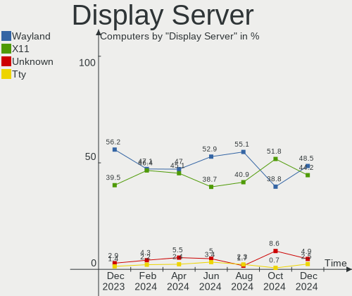

| Name    | Computers | Percent |
|---------|-----------|---------|
| X11     | 76        | 60.8%   |
| Wayland | 42        | 33.6%   |
| Tty     | 4         | 3.2%    |
| Unknown | 3         | 2.4%    |

Display Manager
---------------

SDDM, LightDM, etc.

| Name    | Computers | Percent |
|---------|-----------|---------|
| SDDM    | 36        | 28.8%   |
| Unknown | 36        | 28.8%   |
| GDM3    | 23        | 18.4%   |
| LightDM | 21        | 16.8%   |
| GDM     | 9         | 7.2%    |

OS Lang
-------

Language

| Lang       | Computers | Percent |
|------------|-----------|---------|
| pl_PL      | 65        | 52%     |
| en_US      | 51        | 40.8%   |
| C          | 3         | 2.4%    |
| ru_RU      | 2         | 1.6%    |
| ru_UA      | 1         | 0.8%    |
| pl_PL.UTF8 | 1         | 0.8%    |
| en_GB      | 1         | 0.8%    |
| en_DK      | 1         | 0.8%    |

Boot Mode
---------

EFI or BIOS

| Mode | Computers | Percent |
|------|-----------|---------|
| EFI  | 73        | 58.4%   |
| BIOS | 52        | 41.6%   |

Filesystem
----------

Type of filesystem

| Type    | Computers | Percent |
|---------|-----------|---------|
| Ext4    | 75        | 60%     |
| Btrfs   | 20        | 16%     |
| Overlay | 15        | 12%     |
| Tmpfs   | 10        | 8%      |
| F2fs    | 4         | 3.2%    |
| Xfs     | 1         | 0.8%    |

Part. scheme
------------

Scheme of partitioning

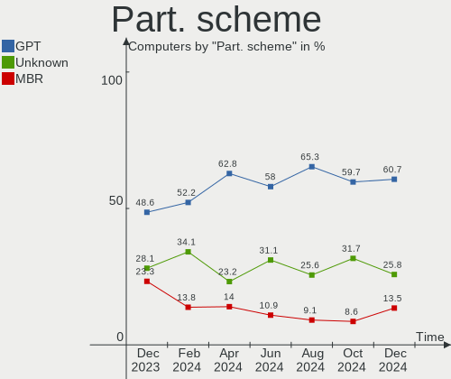

| Type    | Computers | Percent |
|---------|-----------|---------|
| GPT     | 76        | 60.8%   |
| Unknown | 32        | 25.6%   |
| MBR     | 17        | 13.6%   |

Dual Boot with Linux/BSD
------------------------

Hosting more than one Linux/BSD

| Dual boot | Computers | Percent |
|-----------|-----------|---------|
| No        | 99        | 79.2%   |
| Yes       | 26        | 20.8%   |

Dual Boot (Win)
---------------

Hosting Linux and Windows

| Dual boot | Computers | Percent |
|-----------|-----------|---------|
| No        | 86        | 68.8%   |
| Yes       | 39        | 31.2%   |

Board
-----

Vendor
------

Motherboard manufacturer

| Name                    | Computers | Percent |
|-------------------------|-----------|---------|
| Lenovo                  | 33        | 26.4%   |
| Dell                    | 19        | 15.2%   |
| Hewlett-Packard         | 17        | 13.6%   |
| ASUSTek Computer        | 16        | 12.8%   |
| Gigabyte Technology     | 10        | 8%      |
| MSI                     | 7         | 5.6%    |
| Raspberry Pi Foundation | 3         | 2.4%    |
| Fujitsu                 | 3         | 2.4%    |
| ASRock                  | 3         | 2.4%    |
| Acer                    | 3         | 2.4%    |
| Valve                   | 2         | 1.6%    |
| Samsung Electronics     | 2         | 1.6%    |
| Unknown                 | 2         | 1.6%    |
| mPTech                  | 1         | 0.8%    |
| Kiano                   | 1         | 0.8%    |
| Google                  | 1         | 0.8%    |
| Essentiel B             | 1         | 0.8%    |
| ECS                     | 1         | 0.8%    |

Model
-----

Motherboard model

| Name                                      | Computers | Percent |
|-------------------------------------------|-----------|---------|
| Valve Jupiter                             | 2         | 1.6%    |
| Lenovo IdeaPad Z570 HuronRiver Platform   | 2         | 1.6%    |
| Lenovo G50-80 80E5                        | 2         | 1.6%    |
| Gigabyte RC14UD                           | 2         | 1.6%    |
| ASUS M3A78-CM                             | 2         | 1.6%    |
| Unknown                                   | 2         | 1.6%    |
| Samsung RF511/RF411/RF711                 | 1         | 0.8%    |
| Samsung 530U4E/540U4E                     | 1         | 0.8%    |
| RPi Raspberry Pi Zero W Rev 1.1           | 1         | 0.8%    |
| RPi Raspberry Pi 4 Model B Rev 1.5        | 1         | 0.8%    |
| RPi Raspberry Pi 3 Model B Rev 1.2        | 1         | 0.8%    |
| MSI MS-7E12                               | 1         | 0.8%    |
| MSI MS-7D46                               | 1         | 0.8%    |
| MSI MS-7C37                               | 1         | 0.8%    |
| MSI MS-7B85                               | 1         | 0.8%    |
| MSI MS-7B29                               | 1         | 0.8%    |
| MSI MS-7A38                               | 1         | 0.8%    |
| MSI MS-7974                               | 1         | 0.8%    |
| mPTech ARC 11.6 128GB HD                  | 1         | 0.8%    |
| Lenovo Yoga Slim 7 Pro 14IAH7 82UT        | 1         | 0.8%    |
| Lenovo Yoga 530-14ARR 81H9                | 1         | 0.8%    |
| Lenovo V530S-07ICB 10TX0010PB             | 1         | 0.8%    |
| Lenovo ThinkPad T470p 20J60014PB          | 1         | 0.8%    |
| Lenovo ThinkPad T470 20HES07J00           | 1         | 0.8%    |
| Lenovo ThinkPad T430s 2356LPG             | 1         | 0.8%    |
| Lenovo ThinkPad L480 20LTS6S904           | 1         | 0.8%    |
| Lenovo ThinkPad L15 Gen 1 20U8S2E900      | 1         | 0.8%    |
| Lenovo ThinkPad L13 Yoga Gen 2 20VK000YPB | 1         | 0.8%    |
| Lenovo ThinkPad E560 20EV000UUK           | 1         | 0.8%    |
| Lenovo ThinkPad E520 1143CWG              | 1         | 0.8%    |
| Lenovo ThinkPad 10 2nd 20E4S0SQ00         | 1         | 0.8%    |
| Lenovo S510 10KY000NPB                    | 1         | 0.8%    |
| Lenovo Legion Y530-15ICH 81FV             | 1         | 0.8%    |
| Lenovo Legion 5 Pro 16ACH6 82JS           | 1         | 0.8%    |
| Lenovo Legion 5 15IAH7H 82RB              | 1         | 0.8%    |
| Lenovo Legion 5 15IAH7 82RC               | 1         | 0.8%    |
| Lenovo Legion 5 15ARH05H 82B1             | 1         | 0.8%    |
| Lenovo Legion 5 15ARH05 82B5              | 1         | 0.8%    |
| Lenovo IdeaPad Gaming 3 15ACH6 82K2       | 1         | 0.8%    |
| Lenovo IdeaPad 330-15IKB 81DC             | 1         | 0.8%    |

Model Family
------------

Motherboard model prefix

| Name               | Computers | Percent |
|--------------------|-----------|---------|
| Lenovo ThinkPad    | 9         | 7.2%    |
| Dell Latitude      | 8         | 6.4%    |
| Lenovo Legion      | 6         | 4.8%    |
| Lenovo IdeaPad     | 5         | 4%      |
| Dell XPS           | 4         | 3.2%    |
| RPi Raspberry      | 3         | 2.4%    |
| HP ProBook         | 3         | 2.4%    |
| HP EliteBook       | 3         | 2.4%    |
| ASUS ROG           | 3         | 2.4%    |
| ASUS ASUS          | 3         | 2.4%    |
| Valve Jupiter      | 2         | 1.6%    |
| Lenovo Yoga        | 2         | 1.6%    |
| Lenovo G580        | 2         | 1.6%    |
| Lenovo G50-80      | 2         | 1.6%    |
| HP Pavilion        | 2         | 1.6%    |
| HP EliteDesk       | 2         | 1.6%    |
| HP Compaq          | 2         | 1.6%    |
| Gigabyte RC14UD    | 2         | 1.6%    |
| Dell Vostro        | 2         | 1.6%    |
| Dell Inspiron      | 2         | 1.6%    |
| ASUS TUF           | 2         | 1.6%    |
| ASUS M3A78-CM      | 2         | 1.6%    |
| Acer Aspire        | 2         | 1.6%    |
| Unknown            | 2         | 1.6%    |
| Samsung RF511      | 1         | 0.8%    |
| Samsung 530U4E     | 1         | 0.8%    |
| MSI MS-7E12        | 1         | 0.8%    |
| MSI MS-7D46        | 1         | 0.8%    |
| MSI MS-7C37        | 1         | 0.8%    |
| MSI MS-7B85        | 1         | 0.8%    |
| MSI MS-7B29        | 1         | 0.8%    |
| MSI MS-7A38        | 1         | 0.8%    |
| MSI MS-7974        | 1         | 0.8%    |
| mPTech ARC         | 1         | 0.8%    |
| Lenovo V530S-07ICB | 1         | 0.8%    |
| Lenovo S510        | 1         | 0.8%    |
| Lenovo IdeaCentre  | 1         | 0.8%    |
| Lenovo G570        | 1         | 0.8%    |
| Lenovo G505s       | 1         | 0.8%    |
| Lenovo G50-45      | 1         | 0.8%    |

MFG Year
--------

Motherboard manufacture year

| Year    | Computers | Percent |
|---------|-----------|---------|
| 2018    | 18        | 14.4%   |
| 2022    | 13        | 10.4%   |
| 2021    | 11        | 8.8%    |
| 2020    | 11        | 8.8%    |
| 2011    | 9         | 7.2%    |
| 2019    | 8         | 6.4%    |
| 2015    | 8         | 6.4%    |
| 2014    | 7         | 5.6%    |
| 2016    | 6         | 4.8%    |
| 2012    | 6         | 4.8%    |
| 2017    | 5         | 4%      |
| 2013    | 5         | 4%      |
| 2008    | 5         | 4%      |
| 2023    | 3         | 2.4%    |
| 2009    | 3         | 2.4%    |
| Unknown | 3         | 2.4%    |
| 2007    | 2         | 1.6%    |
| 2010    | 1         | 0.8%    |
| 2006    | 1         | 0.8%    |

Form Factor
-----------

Physical design of the computer

| Name           | Computers | Percent |
|----------------|-----------|---------|
| Notebook       | 74        | 59.2%   |
| Desktop        | 39        | 31.2%   |
| Convertible    | 4         | 3.2%    |
| System on chip | 3         | 2.4%    |
| Mini pc        | 2         | 1.6%    |
| All in one     | 2         | 1.6%    |
| Tablet         | 1         | 0.8%    |

Secure Boot
-----------

Enabled or disabled

| State    | Computers | Percent |
|----------|-----------|---------|
| Disabled | 118       | 94.4%   |
| Enabled  | 7         | 5.6%    |

Coreboot
--------

Have coreboot on board

| Used | Computers | Percent |
|------|-----------|---------|
| No   | 124       | 99.2%   |
| Yes  | 1         | 0.8%    |

RAM Size
--------

Total RAM memory

| Size in GB  | Computers | Percent |
|-------------|-----------|---------|
| 16.01-24.0  | 33        | 26.4%   |
| 4.01-8.0    | 23        | 18.4%   |
| 8.01-16.0   | 23        | 18.4%   |
| 32.01-64.0  | 21        | 16.8%   |
| 3.01-4.0    | 12        | 9.6%    |
| 64.01-256.0 | 4         | 3.2%    |
| 24.01-32.0  | 3         | 2.4%    |
| 1.01-2.0    | 3         | 2.4%    |
| 2.01-3.0    | 1         | 0.8%    |
| 0.51-1.0    | 1         | 0.8%    |
| 0.01-0.5    | 1         | 0.8%    |

RAM Used
--------

Used RAM memory

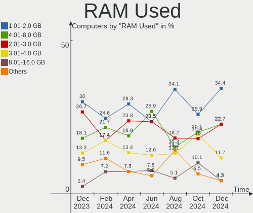

| Used GB    | Computers | Percent |
|------------|-----------|---------|
| 1.01-2.0   | 36        | 28.8%   |
| 2.01-3.0   | 31        | 24.8%   |
| 4.01-8.0   | 25        | 20%     |
| 3.01-4.0   | 16        | 12.8%   |
| 16.01-24.0 | 5         | 4%      |
| 8.01-16.0  | 5         | 4%      |
| 0.51-1.0   | 3         | 2.4%    |
| 0.01-0.5   | 3         | 2.4%    |
| 24.01-32.0 | 1         | 0.8%    |

Total Drives
------------

Number of drives on board

| Drives | Computers | Percent |
|--------|-----------|---------|
| 1      | 64        | 51.2%   |
| 2      | 39        | 31.2%   |
| 3      | 14        | 11.2%   |
| 4      | 4         | 3.2%    |
| 6      | 3         | 2.4%    |
| 0      | 1         | 0.8%    |

Has CD-ROM
----------

Has CD-ROM on board

| Presented | Computers | Percent |
|-----------|-----------|---------|
| No        | 89        | 71.2%   |
| Yes       | 36        | 28.8%   |

Has Ethernet
------------

Has Ethernet on board

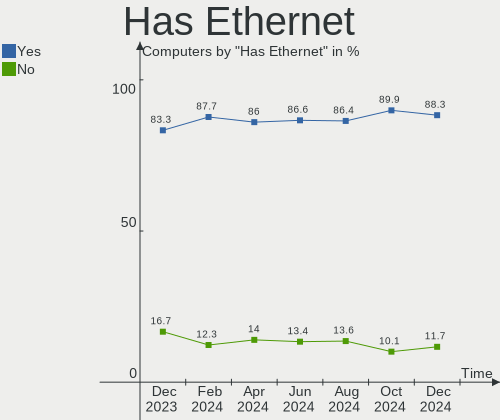

| Presented | Computers | Percent |
|-----------|-----------|---------|
| Yes       | 105       | 84%     |
| No        | 20        | 16%     |

Has WiFi
--------

Has WiFi module

| Presented | Computers | Percent |
|-----------|-----------|---------|
| Yes       | 95        | 76%     |
| No        | 30        | 24%     |

Has Bluetooth
-------------

Has Bluetooth module

| Presented | Computers | Percent |
|-----------|-----------|---------|
| Yes       | 86        | 68.8%   |
| No        | 39        | 31.2%   |

Location
--------

Country
-------

Geographic location (country)

| Country | Computers | Percent |
|---------|-----------|---------|
| Poland  | 125       | 100%    |

City
----

Geographic location (city)

| City               | Computers | Percent |
|--------------------|-----------|---------|
| Warsaw             | 28        | 22.4%   |
| Krakow             | 13        | 10.4%   |
| Poznan             | 7         | 5.6%    |
| Lodz               | 7         | 5.6%    |
| Wroclaw            | 6         | 4.8%    |
| Lublin             | 4         | 3.2%    |
| Gdansk             | 4         | 3.2%    |
| Gdynia             | 3         | 2.4%    |
| Zabrze             | 2         | 1.6%    |
| Kety               | 2         | 1.6%    |
| Gliwice            | 2         | 1.6%    |
| Zielona Góra      | 1         | 0.8%    |
| Zary               | 1         | 0.8%    |
| Tarnobrzeg         | 1         | 0.8%    |
| Słupsk            | 1         | 0.8%    |
| Szczecin           | 1         | 0.8%    |
| Swidnica           | 1         | 0.8%    |
| Starogard Gdański | 1         | 0.8%    |
| Sadlinki           | 1         | 0.8%    |
| Radzionkow         | 1         | 0.8%    |
| Radwanice          | 1         | 0.8%    |
| Radlow             | 1         | 0.8%    |
| Pila               | 1         | 0.8%    |
| Piaseczno          | 1         | 0.8%    |
| Ozimek             | 1         | 0.8%    |
| Ozarow Mazowiecki  | 1         | 0.8%    |
| Osobnica           | 1         | 0.8%    |
| Osielsko           | 1         | 0.8%    |
| Orzesze            | 1         | 0.8%    |
| Nysa               | 1         | 0.8%    |
| Nowogard           | 1         | 0.8%    |
| Nadarzyn           | 1         | 0.8%    |
| Mysłowice         | 1         | 0.8%    |
| Myslenice          | 1         | 0.8%    |
| Murowana Goslina   | 1         | 0.8%    |
| Mogielnica         | 1         | 0.8%    |
| Mikołów          | 1         | 0.8%    |
| Marki              | 1         | 0.8%    |
| Ledziny            | 1         | 0.8%    |
| Kutno              | 1         | 0.8%    |

Drives
------

Drive Vendor
------------

Hard drive vendors

| Vendor                         | Computers | Drives | Percent |
|--------------------------------|-----------|--------|---------|
| Samsung Electronics            | 32        | 37     | 15.92%  |
| Seagate                        | 21        | 22     | 10.45%  |
| GOODRAM                        | 17        | 18     | 8.46%   |
| WDC                            | 15        | 19     | 7.46%   |
| Toshiba                        | 12        | 13     | 5.97%   |
| Unknown                        | 11        | 11     | 5.47%   |
| Hitachi                        | 10        | 15     | 4.98%   |
| Crucial                        | 9         | 10     | 4.48%   |
| SanDisk                        | 8         | 9      | 3.98%   |
| SK hynix                       | 7         | 7      | 3.48%   |
| Kingston                       | 7         | 7      | 3.48%   |
| SPCC                           | 5         | 6      | 2.49%   |
| Intel                          | 4         | 5      | 1.99%   |
| Phison Electronics             | 3         | 3      | 1.49%   |
| Micron Technology              | 3         | 3      | 1.49%   |
| A-DATA Technology              | 3         | 3      | 1.49%   |
| Team                           | 2         | 2      | 1%      |
| Silicon Motion                 | 2         | 2      | 1%      |
| Phison                         | 2         | 2      | 1%      |
| Patriot                        | 2         | 2      | 1%      |
| China                          | 2         | 2      | 1%      |
| Unknown                        | 2         | 2      | 1%      |
| Verbatim                       | 1         | 1      | 0.5%    |
| USB                            | 1         | 1      | 0.5%    |
| Teclast                        | 1         | 1      | 0.5%    |
| SSSTC                          | 1         | 1      | 0.5%    |
| Solid State Storage Technology | 1         | 1      | 0.5%    |
| Shenzhen Longsys Electronics   | 1         | 1      | 0.5%    |
| Realtek                        | 1         | 1      | 0.5%    |
| PNY                            | 1         | 1      | 0.5%    |
| PHD 3.0                        | 1         | 1      | 0.5%    |
| O2 Micro                       | 1         | 1      | 0.5%    |
| LITEON                         | 1         | 1      | 0.5%    |
| Leven                          | 1         | 1      | 0.5%    |
| Kingston Technology Company    | 1         | 1      | 0.5%    |
| KingDian                       | 1         | 1      | 0.5%    |
| Kingchuxing                    | 1         | 1      | 0.5%    |
| HPE                            | 1         | 1      | 0.5%    |
| Corsair                        | 1         | 1      | 0.5%    |
| ASUSTOR                        | 1         | 1      | 0.5%    |

Drive Model
-----------

Hard drive models

| Model                                                 | Computers | Percent |
|-------------------------------------------------------|-----------|---------|
| Samsung NVMe SSD Controller SM981/PM981/PM983 500GB   | 8         | 3.79%   |
| Unknown MMC Card  16GB                                | 3         | 1.42%   |
| Seagate ST1000LM024 HN-M101MBB 1TB                    | 3         | 1.42%   |
| GOODRAM SSDPR-CX400-512-G2 512GB                      | 3         | 1.42%   |
| GOODRAM SSDPR-CX400-256-G2 256GB                      | 3         | 1.42%   |
| Toshiba DT01ACA100 1TB                                | 2         | 0.95%   |
| SPCC Solid State Disk 512GB                           | 2         | 0.95%   |
| SK hynix BC511 512GB                                  | 2         | 0.95%   |
| Samsung SSD 980 500GB                                 | 2         | 0.95%   |
| Samsung SSD 980 1TB                                   | 2         | 0.95%   |
| Samsung NVMe SSD Controller SM961/PM961/SM963 1024GB  | 2         | 0.95%   |
| Samsung NVMe SSD Controller PM9A1/PM9A3/980PRO 1024GB | 2         | 0.95%   |
| Samsung MZAL4512HBLU-00BL2 512GB                      | 2         | 0.95%   |
| Phison ESR512GTLCW-E6GBTNB4 512GB                     | 2         | 0.95%   |
| Phison E12 NVMe Controller 256GB                      | 2         | 0.95%   |
| Micron 2200V_MTFDHBA512TCK 512GB                      | 2         | 0.95%   |
| Kingston SA400S37240G 240GB SSD                       | 2         | 0.95%   |
| Hitachi HUS724030ALE641 3TB                           | 2         | 0.95%   |
| GOODRAM SSDPR-CX400-01T-G2 1TB                        | 2         | 0.95%   |
| GOODRAM SSDPR-CL100-480-G2 480GB                      | 2         | 0.95%   |
| GOODRAM SSDPR-CL100-120-G2 120GB                      | 2         | 0.95%   |
| Crucial CT250MX500SSD1 250GB                          | 2         | 0.95%   |
| Unknown                                               | 2         | 0.95%   |
| WDC WDS500G1B0C-00S6U0 500GB                          | 1         | 0.47%   |
| WDC WDS250G2X0C-00L350 250GB                          | 1         | 0.47%   |
| WDC WD7500BPKT-00PK4T0 752GB                          | 1         | 0.47%   |
| WDC WD5000LUCT-63RC2Y0 500GB                          | 1         | 0.47%   |
| WDC WD5000AVDS-63U7B1 500GB                           | 1         | 0.47%   |
| WDC WD3200BEVT-80A0RT0 320GB                          | 1         | 0.47%   |
| WDC WD2500AAKX-60U6AA0 250GB                          | 1         | 0.47%   |
| WDC WD20EZRZ-00Z5HB0 2TB                              | 1         | 0.47%   |
| WDC WD20EARX-00MMMB0 2TB                              | 1         | 0.47%   |
| WDC WD1200BEVS-60RST0 120GB                           | 1         | 0.47%   |
| WDC WD10SMZW-11Y0TS0 1TB                              | 1         | 0.47%   |
| WDC WD10JPVX-22JC3T0 1TB                              | 1         | 0.47%   |
| WDC WD10JFCX-68N6GN0 1TB                              | 1         | 0.47%   |
| WDC WD10EZRX-00L4HB0 1TB                              | 1         | 0.47%   |
| WDC WD10EZEX-00WN4A0 1TB                              | 1         | 0.47%   |
| WDC WD10EFRX-68FYTN0 1TB                              | 1         | 0.47%   |
| WDC WD Blue SA510 2.5 500GB                           | 1         | 0.47%   |

HDD Vendor
----------

Hard disk drive vendors

| Vendor              | Computers | Drives | Percent |
|---------------------|-----------|--------|---------|
| Seagate             | 20        | 21     | 37.04%  |
| WDC                 | 11        | 15     | 20.37%  |
| Hitachi             | 10        | 15     | 18.52%  |
| Toshiba             | 8         | 9      | 14.81%  |
| USB                 | 1         | 1      | 1.85%   |
| Samsung Electronics | 1         | 1      | 1.85%   |
| PHD 3.0             | 1         | 1      | 1.85%   |
| ASUSTOR             | 1         | 1      | 1.85%   |
| Apple               | 1         | 1      | 1.85%   |

SSD Vendor
----------

Solid state drive vendors

| Vendor              | Computers | Drives | Percent |
|---------------------|-----------|--------|---------|
| GOODRAM             | 17        | 18     | 22.97%  |
| Samsung Electronics | 10        | 11     | 13.51%  |
| Crucial             | 9         | 10     | 12.16%  |
| SanDisk             | 6         | 6      | 8.11%   |
| SPCC                | 5         | 6      | 6.76%   |
| Kingston            | 4         | 4      | 5.41%   |
| Team                | 2         | 2      | 2.7%    |
| Patriot             | 2         | 2      | 2.7%    |
| Intel               | 2         | 3      | 2.7%    |
| China               | 2         | 2      | 2.7%    |
| A-DATA Technology   | 2         | 2      | 2.7%    |
| WDC                 | 1         | 1      | 1.35%   |
| Verbatim            | 1         | 1      | 1.35%   |
| Toshiba             | 1         | 1      | 1.35%   |
| Teclast             | 1         | 1      | 1.35%   |
| SSSTC               | 1         | 1      | 1.35%   |
| PNY                 | 1         | 1      | 1.35%   |
| LITEON              | 1         | 1      | 1.35%   |
| Leven               | 1         | 1      | 1.35%   |
| KingDian            | 1         | 1      | 1.35%   |
| HPE                 | 1         | 1      | 1.35%   |
| Corsair             | 1         | 1      | 1.35%   |
| ASMedia             | 1         | 1      | 1.35%   |
| Apacer              | 1         | 1      | 1.35%   |

Drive Kind
----------

HDD or SSD

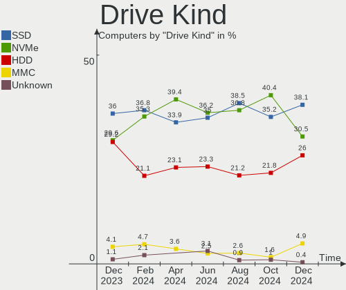

| Kind    | Computers | Drives | Percent |
|---------|-----------|--------|---------|
| SSD     | 58        | 79     | 33.33%  |
| NVMe    | 54        | 63     | 31.03%  |
| HDD     | 47        | 65     | 27.01%  |
| MMC     | 12        | 12     | 6.9%    |
| Unknown | 3         | 3      | 1.72%   |

Drive Connector
---------------

SATA, SAS, NVMe, etc.

| Type | Computers | Drives | Percent |
|------|-----------|--------|---------|
| SATA | 83        | 137    | 52.2%   |
| NVMe | 54        | 62     | 33.96%  |
| MMC  | 12        | 12     | 7.55%   |
| SAS  | 10        | 11     | 6.29%   |

Drive Size
----------

Size of hard drive

| Size in TB | Computers | Drives | Percent |
|------------|-----------|--------|---------|
| 0.01-0.5   | 63        | 80     | 54.31%  |
| 0.51-1.0   | 35        | 41     | 30.17%  |
| 1.01-2.0   | 11        | 14     | 9.48%   |
| 4.01-10.0  | 3         | 3      | 2.59%   |
| 2.01-3.0   | 2         | 4      | 1.72%   |
| 3.01-4.0   | 1         | 1      | 0.86%   |
| 10.01-20.0 | 1         | 1      | 0.86%   |

Space Total
-----------

Amount of disk space available on the file system

| Size in GB     | Computers | Percent |
|----------------|-----------|---------|
| 101-250        | 31        | 24.8%   |
| 251-500        | 17        | 13.6%   |
| 1-20           | 17        | 13.6%   |
| 51-100         | 16        | 12.8%   |
| 501-1000       | 15        | 12%     |
| 1001-2000      | 11        | 8.8%    |
| More than 3000 | 8         | 6.4%    |
| 21-50          | 5         | 4%      |
| Unknown        | 3         | 2.4%    |
| 2001-3000      | 2         | 1.6%    |

Space Used
----------

Amount of used disk space

| Used GB        | Computers | Percent |
|----------------|-----------|---------|
| 1-20           | 52        | 41.6%   |
| 101-250        | 21        | 16.8%   |
| 21-50          | 17        | 13.6%   |
| 51-100         | 10        | 8%      |
| 251-500        | 8         | 6.4%    |
| 501-1000       | 5         | 4%      |
| More than 3000 | 4         | 3.2%    |
| 1001-2000      | 3         | 2.4%    |
| Unknown        | 3         | 2.4%    |
| 2001-3000      | 2         | 1.6%    |

Malfunc. Drives
---------------

Drive models with a malfunction

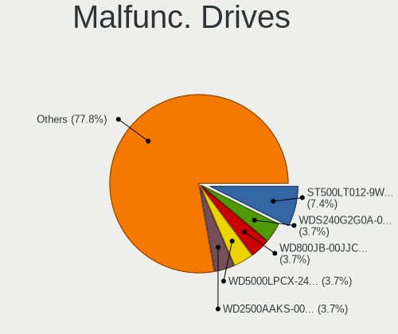

| Model                                                           | Computers | Drives | Percent |
|-----------------------------------------------------------------|-----------|--------|---------|
| WDC WD3200BEVT-80A0RT0 320GB                                    | 1         | 1      | 7.14%   |
| WDC WD1200BEVS-60RST0 120GB                                     | 1         | 1      | 7.14%   |
| WDC WD10JFCX-68N6GN0 1TB                                        | 1         | 1      | 7.14%   |
| SSSTC CVB-8D128-HP 128GB                                        | 1         | 1      | 7.14%   |
| Seagate ST9750423AS 752GB                                       | 1         | 1      | 7.14%   |
| Seagate ST3640323AS 640GB                                       | 1         | 1      | 7.14%   |
| Seagate ST3500320AS 500GB                                       | 1         | 1      | 7.14%   |
| Samsung Electronics NVMe SSD Controller SM981/PM981/PM983 500GB | 1         | 1      | 7.14%   |
| Kingston SHPM2280P2 240G SSD                                    | 1         | 1      | 7.14%   |
| HPE MK001920GWUGK 2TB SSD                                       | 1         | 1      | 7.14%   |
| Hitachi HTS727575A9E364 752GB                                   | 1         | 1      | 7.14%   |
| Hitachi HTS541680J9SA00 80GB                                    | 1         | 1      | 7.14%   |
| Hitachi HTS541060G9SA00 64GB                                    | 1         | 1      | 7.14%   |
| Apple HDD HTS541010A9E662 1TB                                   | 1         | 1      | 7.14%   |

Malfunc. Drive Vendor
---------------------

Vendors of faulty drives

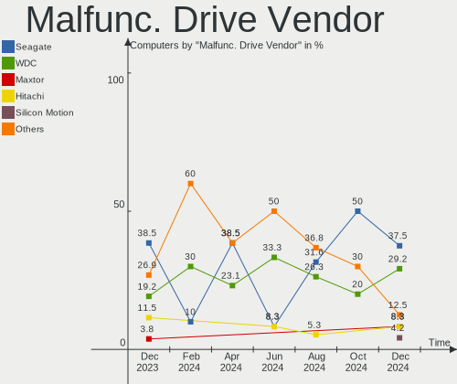

| Vendor              | Computers | Drives | Percent |
|---------------------|-----------|--------|---------|
| WDC                 | 3         | 3      | 21.43%  |
| Seagate             | 3         | 3      | 21.43%  |
| Hitachi             | 3         | 3      | 21.43%  |
| SSSTC               | 1         | 1      | 7.14%   |
| Samsung Electronics | 1         | 1      | 7.14%   |
| Kingston            | 1         | 1      | 7.14%   |
| HPE                 | 1         | 1      | 7.14%   |
| Apple               | 1         | 1      | 7.14%   |

Malfunc. HDD Vendor
-------------------

Vendors of faulty HDD drives

| Vendor  | Computers | Drives | Percent |
|---------|-----------|--------|---------|
| WDC     | 3         | 3      | 30%     |
| Seagate | 3         | 3      | 30%     |
| Hitachi | 3         | 3      | 30%     |
| Apple   | 1         | 1      | 10%     |

Malfunc. Drive Kind
-------------------

Kinds of faulty drives

| Kind | Computers | Drives | Percent |
|------|-----------|--------|---------|
| HDD  | 9         | 10     | 75%     |
| SSD  | 2         | 3      | 16.67%  |
| NVMe | 1         | 1      | 8.33%   |

Failed Drives
-------------

Failed drive models

Zero info for selected period =(

Failed Drive Vendor
-------------------

Failed drive vendors

Zero info for selected period =(

Drive Status
------------

Number of failed and malfunc. drives

| Status   | Computers | Drives | Percent |
|----------|-----------|--------|---------|
| Works    | 71        | 115    | 50.35%  |
| Detected | 58        | 93     | 41.13%  |
| Malfunc  | 12        | 14     | 8.51%   |

Storage controller
------------------

Storage Vendor
--------------

Storage controller vendors

| Vendor                         | Computers | Percent |
|--------------------------------|-----------|---------|
| Intel                          | 70        | 43.21%  |
| AMD                            | 30        | 18.52%  |
| Samsung Electronics            | 22        | 13.58%  |
| SK hynix                       | 7         | 4.32%   |
| SanDisk                        | 5         | 3.09%   |
| Phison Electronics             | 5         | 3.09%   |
| Kingston Technology Company    | 5         | 3.09%   |
| Micron Technology              | 3         | 1.85%   |
| ASMedia Technology             | 3         | 1.85%   |
| Toshiba America Info Systems   | 2         | 1.23%   |
| Silicon Motion                 | 2         | 1.23%   |
| ADATA Technology               | 2         | 1.23%   |
| Solid State Storage Technology | 1         | 0.62%   |
| Shenzhen Longsys Electronics   | 1         | 0.62%   |
| O2 Micro                       | 1         | 0.62%   |
| Marvell Technology Group       | 1         | 0.62%   |
| KIOXIA                         | 1         | 0.62%   |
| JMicron Technology             | 1         | 0.62%   |

Storage Model
-------------

Storage controller models

| Model                                                                          | Computers | Percent |
|--------------------------------------------------------------------------------|-----------|---------|
| AMD FCH SATA Controller [AHCI mode]                                            | 19        | 10.67%  |
| Samsung NVMe SSD Controller SM981/PM981/PM983                                  | 8         | 4.49%   |
| Samsung NVMe SSD Controller 980                                                | 8         | 4.49%   |
| Intel 6 Series/C200 Series Chipset Family 6 port Mobile SATA AHCI Controller   | 7         | 3.93%   |
| Intel Volume Management Device NVMe RAID Controller                            | 5         | 2.81%   |
| Intel Sunrise Point-LP SATA Controller [AHCI mode]                             | 5         | 2.81%   |
| Intel Q170/Q150/B150/H170/H110/Z170/CM236 Chipset SATA Controller [AHCI Mode]  | 5         | 2.81%   |
| AMD SB7x0/SB8x0/SB9x0 SATA Controller [AHCI mode]                              | 5         | 2.81%   |
| Intel Celeron/Pentium Silver Processor SATA Controller                         | 4         | 2.25%   |
| Intel Cannon Lake Mobile PCH SATA AHCI Controller                              | 4         | 2.25%   |
| Intel 8 Series/C220 Series Chipset Family 6-port SATA Controller 1 [AHCI mode] | 4         | 2.25%   |
| Intel 7 Series Chipset Family 6-port SATA Controller [AHCI mode]               | 4         | 2.25%   |
| AMD 400 Series Chipset SATA Controller                                         | 4         | 2.25%   |
| SK hynix BC511 NVMe SSD                                                        | 3         | 1.69%   |
| Samsung NVMe SSD Controller PM9A1/PM9A3/980PRO                                 | 3         | 1.69%   |
| Intel 82801 Mobile SATA Controller [RAID mode]                                 | 3         | 1.69%   |
| Intel 200 Series PCH SATA controller [AHCI mode]                               | 3         | 1.69%   |
| ASMedia ASM1062 Serial ATA Controller                                          | 3         | 1.69%   |
| AMD SB7x0/SB8x0/SB9x0 IDE Controller                                           | 3         | 1.69%   |
| SK hynix Gold P31/BC711/PC711 NVMe Solid State Drive                           | 2         | 1.12%   |
| SanDisk WD Blue SN570 NVMe SSD 1TB                                             | 2         | 1.12%   |
| Samsung NVMe SSD Controller PM9B1                                              | 2         | 1.12%   |
| Phison E16 PCIe4 NVMe Controller                                               | 2         | 1.12%   |
| Phison E12 NVMe Controller                                                     | 2         | 1.12%   |
| Micron 2200S NVMe SSD [Cassandra]                                              | 2         | 1.12%   |
| Kingston Company KC3000/Renegade NVMe SSD                                      | 2         | 1.12%   |
| Intel Wildcat Point-LP SATA Controller [AHCI Mode]                             | 2         | 1.12%   |
| Intel SSD 670p Series [Keystone Harbor]                                        | 2         | 1.12%   |
| Intel Cannon Lake PCH SATA AHCI Controller                                     | 2         | 1.12%   |
| Intel 9 Series Chipset Family SATA Controller [AHCI Mode]                      | 2         | 1.12%   |
| Intel 82801HM/HEM (ICH8M/ICH8M-E) IDE Controller                               | 2         | 1.12%   |
| Intel 6 Series/C200 Series Chipset Family 6 port Desktop SATA AHCI Controller  | 2         | 1.12%   |
| AMD SB7x0/SB8x0/SB9x0 SATA Controller [IDE mode]                               | 2         | 1.12%   |
| AMD FCH SATA Controller D                                                      | 2         | 1.12%   |
| AMD 500 Series Chipset SATA Controller                                         | 2         | 1.12%   |
| AMD 300 Series Chipset SATA Controller                                         | 2         | 1.12%   |
| Toshiba America Info Systems XG5 NVMe SSD Controller                           | 1         | 0.56%   |
| Toshiba America Info Systems BG3 NVMe SSD Controller                           | 1         | 0.56%   |
| Solid State Storage CL4-8D512 NVMe SSD M.2 (DRAM-less)                         | 1         | 0.56%   |
| SK hynix PC401 NVMe Solid State Drive 256GB                                    | 1         | 0.56%   |

Storage Kind
------------

Kind of storage controller (IDE, SATA, NVMe, SAS, ...)

| Kind | Computers | Percent |
|------|-----------|---------|
| SATA | 85        | 54.14%  |
| NVMe | 53        | 33.76%  |
| IDE  | 11        | 7.01%   |
| RAID | 8         | 5.1%    |

Processor
---------

CPU Vendor
----------

Processor vendors

| Vendor | Computers | Percent |
|--------|-----------|---------|
| Intel  | 84        | 67.2%   |
| AMD    | 38        | 30.4%   |
| ARM    | 3         | 2.4%    |

CPU Model
---------

Processor models

| Model                                       | Computers | Percent |
|---------------------------------------------|-----------|---------|
| Intel Pentium Silver J5005 CPU @ 1.50GHz    | 2         | 1.6%    |
| Intel Core i7-6700HQ CPU @ 2.60GHz          | 2         | 1.6%    |
| Intel Core i7-6700 CPU @ 3.40GHz            | 2         | 1.6%    |
| Intel Core i5-8300H CPU @ 2.30GHz           | 2         | 1.6%    |
| Intel Core i5-8265U CPU @ 1.60GHz           | 2         | 1.6%    |
| Intel Core i5-8250U CPU @ 1.60GHz           | 2         | 1.6%    |
| Intel Core i5-4590 CPU @ 3.30GHz            | 2         | 1.6%    |
| Intel Core i5-3210M CPU @ 2.50GHz           | 2         | 1.6%    |
| Intel 12th Gen Core i7-12700H               | 2         | 1.6%    |
| Intel 12th Gen Core i5-12500H               | 2         | 1.6%    |
| Intel 11th Gen Core i5-1155G7 @ 2.50GHz     | 2         | 1.6%    |
| ARM BCM2835 Processor                       | 2         | 1.6%    |
| AMD Ryzen 5 4600H with Radeon Graphics      | 2         | 1.6%    |
| AMD Phenom II X4 955 Processor              | 2         | 1.6%    |
| AMD FX-8350 Eight-Core Processor            | 2         | 1.6%    |
| AMD Custom APU 0405                         | 2         | 1.6%    |
| Intel Xeon D-2796TE CPU @ 2.00GHz           | 1         | 0.8%    |
| Intel Xeon CPU W3520 @ 2.67GHz              | 1         | 0.8%    |
| Intel Pentium Gold G5500 CPU @ 3.80GHz      | 1         | 0.8%    |
| Intel Pentium Dual-Core CPU T4300 @ 2.10GHz | 1         | 0.8%    |
| Intel Pentium CPU G620 @ 2.60GHz            | 1         | 0.8%    |
| Intel Pentium CPU B960 @ 2.20GHz            | 1         | 0.8%    |
| Intel Pentium CPU B950 @ 2.10GHz            | 1         | 0.8%    |
| Intel Core i9-9900K CPU @ 3.60GHz           | 1         | 0.8%    |
| Intel Core i7-8750H CPU @ 2.20GHz           | 1         | 0.8%    |
| Intel Core i7-7700HQ CPU @ 2.80GHz          | 1         | 0.8%    |
| Intel Core i7-6700K CPU @ 4.00GHz           | 1         | 0.8%    |
| Intel Core i7-6500U CPU @ 2.50GHz           | 1         | 0.8%    |
| Intel Core i7-5500U CPU @ 2.40GHz           | 1         | 0.8%    |
| Intel Core i7-4810MQ CPU @ 2.80GHz          | 1         | 0.8%    |
| Intel Core i7-4790K CPU @ 4.00GHz           | 1         | 0.8%    |
| Intel Core i7-3520M CPU @ 2.90GHz           | 1         | 0.8%    |
| Intel Core i7-2630QM CPU @ 2.00GHz          | 1         | 0.8%    |
| Intel Core i7-2600K CPU @ 3.40GHz           | 1         | 0.8%    |
| Intel Core i5-9300H CPU @ 2.40GHz           | 1         | 0.8%    |
| Intel Core i5-8400 CPU @ 2.80GHz            | 1         | 0.8%    |
| Intel Core i5-8350U CPU @ 1.70GHz           | 1         | 0.8%    |
| Intel Core i5-7600K CPU @ 3.80GHz           | 1         | 0.8%    |
| Intel Core i5-7200U CPU @ 2.50GHz           | 1         | 0.8%    |
| Intel Core i5-6600 CPU @ 3.30GHz            | 1         | 0.8%    |

CPU Model Family
----------------

Processor model prefix

| Model                   | Computers | Percent |
|-------------------------|-----------|---------|
| Intel Core i5           | 28        | 22.4%   |
| Other                   | 18        | 14.4%   |
| Intel Core i7           | 14        | 11.2%   |
| AMD Ryzen 5             | 9         | 7.2%    |
| AMD Ryzen 7             | 7         | 5.6%    |
| Intel Core i3           | 6         | 4.8%    |
| Intel Celeron           | 5         | 4%      |
| Intel Pentium           | 3         | 2.4%    |
| Intel Core 2 Duo        | 3         | 2.4%    |
| AMD Ryzen 5 PRO         | 3         | 2.4%    |
| AMD Phenom II X4        | 3         | 2.4%    |
| AMD FX                  | 3         | 2.4%    |
| AMD A8                  | 3         | 2.4%    |
| Intel Xeon              | 2         | 1.6%    |
| Intel Pentium Silver    | 2         | 1.6%    |
| ARM BCM                 | 2         | 1.6%    |
| AMD Ryzen 9             | 2         | 1.6%    |
| AMD A6                  | 2         | 1.6%    |
| Intel Pentium Gold      | 1         | 0.8%    |
| Intel Pentium Dual-Core | 1         | 0.8%    |
| Intel Core i9           | 1         | 0.8%    |
| Intel Core 2 Quad       | 1         | 0.8%    |
| Intel Core 2            | 1         | 0.8%    |
| Intel Atom              | 1         | 0.8%    |
| AMD Ryzen 7 PRO         | 1         | 0.8%    |
| AMD Ryzen 3             | 1         | 0.8%    |
| AMD Embedded            | 1         | 0.8%    |
| AMD Athlon II X2        | 1         | 0.8%    |

CPU Cores
---------

Number of processor cores

| Number  | Computers | Percent |
|---------|-----------|---------|
| 4       | 54        | 43.2%   |
| 2       | 37        | 29.6%   |
| 6       | 15        | 12%     |
| 8       | 8         | 6.4%    |
| 12      | 3         | 2.4%    |
| 16      | 2         | 1.6%    |
| 14      | 2         | 1.6%    |
| 20      | 1         | 0.8%    |
| 10      | 1         | 0.8%    |
| 1       | 1         | 0.8%    |
| Unknown | 1         | 0.8%    |

CPU Sockets
-----------

Number of sockets

| Number  | Computers | Percent |
|---------|-----------|---------|
| 1       | 124       | 99.2%   |
| Unknown | 1         | 0.8%    |

CPU Threads
-----------

Threads per core (Hyper-Threading)

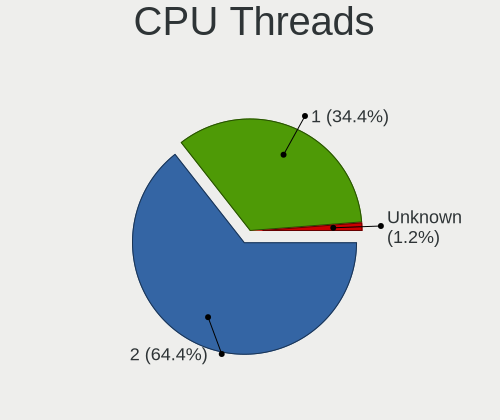

| Number  | Computers | Percent |
|---------|-----------|---------|
| 2       | 88        | 70.4%   |
| 1       | 36        | 28.8%   |
| Unknown | 1         | 0.8%    |

CPU Op-Modes
------------

CPU Operation Modes (32-bit, 64-bit)

| Op mode        | Computers | Percent |
|----------------|-----------|---------|
| 32-bit, 64-bit | 123       | 98.4%   |
| Unknown        | 2         | 1.6%    |

CPU Microcode
-------------

Microcode number

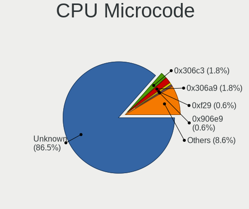

| Number     | Computers | Percent |
|------------|-----------|---------|
| Unknown    | 72        | 57.6%   |
| 0x206a7    | 4         | 3.2%    |
| 0x08701021 | 3         | 2.4%    |
| 0x806ea    | 2         | 1.6%    |
| 0x306c3    | 2         | 1.6%    |
| 0x0a50000d | 2         | 1.6%    |
| 0x0a50000c | 2         | 1.6%    |
| 0x08600106 | 2         | 1.6%    |
| 0xa0653    | 1         | 0.8%    |
| 0x906e9    | 1         | 0.8%    |
| 0x906a3    | 1         | 0.8%    |
| 0x806ec    | 1         | 0.8%    |
| 0x806eb    | 1         | 0.8%    |
| 0x806e9    | 1         | 0.8%    |
| 0x806d1    | 1         | 0.8%    |
| 0x806c2    | 1         | 0.8%    |
| 0x806c1    | 1         | 0.8%    |
| 0x706e5    | 1         | 0.8%    |
| 0x6fd      | 1         | 0.8%    |
| 0x6f2      | 1         | 0.8%    |
| 0x606c1    | 1         | 0.8%    |
| 0x506e3    | 1         | 0.8%    |
| 0x506c9    | 1         | 0.8%    |
| 0x306d4    | 1         | 0.8%    |
| 0x306a9    | 1         | 0.8%    |
| 0x1067a    | 1         | 0.8%    |
| 0x10677    | 1         | 0.8%    |
| 0x0a404102 | 1         | 0.8%    |
| 0x0a404101 | 1         | 0.8%    |
| 0x08701030 | 1         | 0.8%    |
| 0x08600104 | 1         | 0.8%    |
| 0x08600103 | 1         | 0.8%    |
| 0x0800820d | 1         | 0.8%    |
| 0x07030105 | 1         | 0.8%    |
| 0x06006704 | 1         | 0.8%    |
| 0x0600111f | 1         | 0.8%    |
| 0x06001119 | 1         | 0.8%    |
| 0x06000852 | 1         | 0.8%    |
| 0x06000822 | 1         | 0.8%    |
| 0x0600081c | 1         | 0.8%    |

CPU Microarch
-------------

Microarchitecture

| Name             | Computers | Percent |
|------------------|-----------|---------|
| KabyLake         | 17        | 13.6%   |
| Skylake          | 11        | 8.8%    |
| SandyBridge      | 11        | 8.8%    |
| Zen 2            | 10        | 8%      |
| Unknown          | 9         | 7.2%    |
| Haswell          | 7         | 5.6%    |
| Alderlake Hybrid | 7         | 5.6%    |
| TigerLake        | 6         | 4.8%    |
| Zen 3            | 5         | 4%      |
| Piledriver       | 5         | 4%      |
| Penryn           | 4         | 3.2%    |
| K10              | 4         | 3.2%    |
| IvyBridge        | 4         | 3.2%    |
| Goldmont plus    | 4         | 3.2%    |
| Zen+             | 3         | 2.4%    |
| IceLake          | 3         | 2.4%    |
| Zen              | 2         | 1.6%    |
| Silvermont       | 2         | 1.6%    |
| Excavator        | 2         | 1.6%    |
| Core             | 2         | 1.6%    |
| Broadwell        | 2         | 1.6%    |
| Puma             | 1         | 0.8%    |
| Nehalem          | 1         | 0.8%    |
| K10 Llano        | 1         | 0.8%    |
| Goldmont         | 1         | 0.8%    |
| CometLake        | 1         | 0.8%    |

Graphics
--------

GPU Vendor
----------

Vendors of graphics cards

| Vendor            | Computers | Percent |
|-------------------|-----------|---------|
| Intel             | 70        | 45.16%  |
| Nvidia            | 44        | 28.39%  |
| AMD               | 40        | 25.81%  |
| ASPEED Technology | 1         | 0.65%   |

GPU Model
---------

Graphics card models

| Model                                                                         | Computers | Percent |
|-------------------------------------------------------------------------------|-----------|---------|
| Intel 2nd Generation Core Processor Family Integrated Graphics Controller     | 9         | 5.63%   |
| Intel TigerLake-LP GT2 [Iris Xe Graphics]                                     | 6         | 3.75%   |
| Intel HD Graphics 530                                                         | 6         | 3.75%   |
| Intel Alder Lake-P Integrated Graphics Controller                             | 5         | 3.13%   |
| Intel UHD Graphics 620                                                        | 4         | 2.5%    |
| Intel CoffeeLake-H GT2 [UHD Graphics 630]                                     | 4         | 2.5%    |
| Intel 3rd Gen Core processor Graphics Controller                              | 4         | 2.5%    |
| AMD Renoir                                                                    | 4         | 2.5%    |
| Intel Skylake GT2 [HD Graphics 520]                                           | 3         | 1.88%   |
| AMD Ellesmere [Radeon RX 470/480/570/570X/580/580X/590]                       | 3         | 1.88%   |
| AMD Cezanne [Radeon Vega Series / Radeon Vega Mobile Series]                  | 3         | 1.88%   |
| Nvidia TU116M [GeForce GTX 1660 Ti Mobile]                                    | 2         | 1.25%   |
| Nvidia GT218 [GeForce 210]                                                    | 2         | 1.25%   |
| Nvidia GP107M [GeForce GTX 1050 Ti Mobile]                                    | 2         | 1.25%   |
| Nvidia GP106 [GeForce GTX 1060 3GB]                                           | 2         | 1.25%   |
| Nvidia GK107 [GeForce GTX 650]                                                | 2         | 1.25%   |
| Nvidia GK107 [GeForce GT 740]                                                 | 2         | 1.25%   |
| Nvidia GF117M [GeForce 610M/710M/810M/820M / GT 620M/625M/630M/720M]          | 2         | 1.25%   |
| Nvidia GF108M [GeForce GT 540M]                                               | 2         | 1.25%   |
| Nvidia GA107M [GeForce RTX 3050 Ti Mobile]                                    | 2         | 1.25%   |
| Nvidia GA107BM [GeForce RTX 3050 Ti Mobile]                                   | 2         | 1.25%   |
| Intel Xeon E3-1200 v3/4th Gen Core Processor Integrated Graphics Controller   | 2         | 1.25%   |
| Intel WhiskeyLake-U GT2 [UHD Graphics 620]                                    | 2         | 1.25%   |
| Intel TigerLake-H GT1 [UHD Graphics]                                          | 2         | 1.25%   |
| Intel Mobile GM965/GL960 Integrated Graphics Controller (secondary)           | 2         | 1.25%   |
| Intel Mobile GM965/GL960 Integrated Graphics Controller (primary)             | 2         | 1.25%   |
| Intel Mobile 4 Series Chipset Integrated Graphics Controller                  | 2         | 1.25%   |
| Intel HD Graphics 620                                                         | 2         | 1.25%   |
| Intel HD Graphics 5500                                                        | 2         | 1.25%   |
| Intel GeminiLake [UHD Graphics 605]                                           | 2         | 1.25%   |
| Intel GeminiLake [UHD Graphics 600]                                           | 2         | 1.25%   |
| Intel 4th Gen Core Processor Integrated Graphics Controller                   | 2         | 1.25%   |
| AMD VanGogh [AMD Custom GPU 0405]                                             | 2         | 1.25%   |
| AMD Sun XT [Radeon HD 8670A/8670M/8690M / R5 M330 / M430 / Radeon 520 Mobile] | 2         | 1.25%   |
| AMD RS780C [Radeon 3100]                                                      | 2         | 1.25%   |
| AMD Rembrandt [Radeon 680M]                                                   | 2         | 1.25%   |
| AMD Raven Ridge [Radeon Vega Series / Radeon Vega Mobile Series]              | 2         | 1.25%   |
| AMD Picasso/Raven 2 [Radeon Vega Series / Radeon Vega Mobile Series]          | 2         | 1.25%   |
| AMD Navi 10 [Radeon RX 5600 OEM/5600 XT / 5700/5700 XT]                       | 2         | 1.25%   |
| Nvidia TU117M [GeForce MX450]                                                 | 1         | 0.63%   |

GPU Combo
---------

Combinations of graphics cards

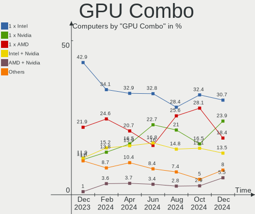

| Name           | Computers | Percent |
|----------------|-----------|---------|
| 1 x Intel      | 44        | 35.2%   |
| 1 x AMD        | 24        | 19.2%   |
| Intel + Nvidia | 18        | 14.4%   |
| 1 x Nvidia     | 16        | 12.8%   |
| AMD + Nvidia   | 7         | 5.6%    |
| Intel + AMD    | 6         | 4.8%    |
| Other          | 3         | 2.4%    |
| 2 x Nvidia     | 2         | 1.6%    |
| 2 x Intel      | 2         | 1.6%    |
| 2 x AMD        | 2         | 1.6%    |
| 1 x ASPEED     | 1         | 0.8%    |

GPU Driver
----------

Free vs proprietary

| Driver      | Computers | Percent |
|-------------|-----------|---------|
| Free        | 100       | 80%     |
| Proprietary | 21        | 16.8%   |
| Unknown     | 4         | 3.2%    |

GPU Memory
----------

Total video memory

| Size in GB | Computers | Percent |
|------------|-----------|---------|
| Unknown    | 75        | 60%     |
| 3.01-4.0   | 11        | 8.8%    |
| 0.01-0.5   | 11        | 8.8%    |
| 1.01-2.0   | 10        | 8%      |
| 0.51-1.0   | 10        | 8%      |
| 7.01-8.0   | 3         | 2.4%    |
| 2.01-3.0   | 2         | 1.6%    |
| 8.01-16.0  | 2         | 1.6%    |
| 5.01-6.0   | 1         | 0.8%    |

Monitor
-------

Monitor Vendor
--------------

Monitor vendors

| Vendor                  | Computers | Percent |
|-------------------------|-----------|---------|
| Samsung Electronics     | 28        | 19.86%  |
| BOE                     | 17        | 12.06%  |
| AU Optronics            | 16        | 11.35%  |
| LG Display              | 9         | 6.38%   |
| Chimei Innolux          | 9         | 6.38%   |
| Iiyama                  | 7         | 4.96%   |
| Hewlett-Packard         | 6         | 4.26%   |
| Dell                    | 5         | 3.55%   |
| Philips                 | 4         | 2.84%   |
| Goldstar                | 4         | 2.84%   |
| Sharp                   | 3         | 2.13%   |
| Lenovo                  | 3         | 2.13%   |
| Eizo                    | 3         | 2.13%   |
| Acer                    | 3         | 2.13%   |
| Valve                   | 2         | 1.42%   |
| Sony                    | 2         | 1.42%   |
| PANDA                   | 2         | 1.42%   |
| NEC Computers           | 2         | 1.42%   |
| CSO                     | 2         | 1.42%   |
| AOC                     | 2         | 1.42%   |
| Ancor Communications    | 2         | 1.42%   |
| Unknown                 | 1         | 0.71%   |
| LG Philips              | 1         | 0.71%   |
| InfoVision              | 1         | 0.71%   |
| HUAWEI                  | 1         | 0.71%   |
| Gigabyte Technology     | 1         | 0.71%   |
| Chi Mei Optoelectronics | 1         | 0.71%   |
| BenQ                    | 1         | 0.71%   |
| ASUSTek Computer        | 1         | 0.71%   |
| Apple                   | 1         | 0.71%   |
| Unknown                 | 1         | 0.71%   |

Monitor Model
-------------

Monitor models

| Model                                                                 | Computers | Percent |
|-----------------------------------------------------------------------|-----------|---------|
| Valve ANX7530 U VLV3001 800x1280 100x150mm 7.1-inch                   | 2         | 1.41%   |
| Samsung Electronics LCD Monitor SEC4252 1366x768 344x194mm 15.5-inch  | 2         | 1.41%   |
| Samsung Electronics LCD Monitor SDC4C48 1920x1080 344x194mm 15.5-inch | 2         | 1.41%   |
| Eizo EV2336W ENC2390 1920x1080 510x287mm 23.0-inch                    | 2         | 1.41%   |
| AU Optronics LCD Monitor AUO623D 1920x1080 309x174mm 14.0-inch        | 2         | 1.41%   |
| AU Optronics LCD Monitor AUO21ED 1920x1080 344x193mm 15.5-inch        | 2         | 1.41%   |
| Unknown LCD Monitor FFFF 2288x1287 2550x2550mm 142.0-inch             | 1         | 0.7%    |
| Sony TV SNYE903 1920x1080                                             | 1         | 0.7%    |
| Sony TV  *00 SNY2B05 3840x2160                                        | 1         | 0.7%    |
| Sharp LCD SHP1099 1280x720 890x500mm 40.2-inch                        | 1         | 0.7%    |
| Sharp LCD Monitor SHP14FA 3840x2400 288x180mm 13.4-inch               | 1         | 0.7%    |
| Sharp LCD Monitor SHP149A 1920x1080 344x194mm 15.5-inch               | 1         | 0.7%    |
| Samsung Electronics SyncMaster SAM059A 1920x1080 477x268mm 21.5-inch  | 1         | 0.7%    |
| Samsung Electronics SyncMaster SAM04E5 1920x1080 477x268mm 21.5-inch  | 1         | 0.7%    |
| Samsung Electronics SyncMaster SAM02FE 1680x1050 433x271mm 20.1-inch  | 1         | 0.7%    |
| Samsung Electronics S27D590C SAM0BEA 1920x1080 598x336mm 27.0-inch    | 1         | 0.7%    |
| Samsung Electronics S24C36x SAM7314 1920x1080 521x293mm 23.5-inch     | 1         | 0.7%    |
| Samsung Electronics S22F350 SAM0D1A 1920x1080 477x268mm 21.5-inch     | 1         | 0.7%    |
| Samsung Electronics S22C300 SAM0A1E 1920x1080 477x268mm 21.5-inch     | 1         | 0.7%    |
| Samsung Electronics S22B300 SAM08C8 1920x1080 477x268mm 21.5-inch     | 1         | 0.7%    |
| Samsung Electronics LU28R55 SAM1019 3840x2160 632x360mm 28.6-inch     | 1         | 0.7%    |
| Samsung Electronics LU28R55 SAM1016 3840x2160 632x360mm 28.6-inch     | 1         | 0.7%    |
| Samsung Electronics LCD Monitor SEC5442 1440x900 303x190mm 14.1-inch  | 1         | 0.7%    |
| Samsung Electronics LCD Monitor SEC5341 1366x768 344x193mm 15.5-inch  | 1         | 0.7%    |
| Samsung Electronics LCD Monitor SEC3945 1280x800 331x207mm 15.4-inch  | 1         | 0.7%    |
| Samsung Electronics LCD Monitor SEC364A 1366x768 344x194mm 15.5-inch  | 1         | 0.7%    |
| Samsung Electronics LCD Monitor SEC3354 1600x900 382x215mm 17.3-inch  | 1         | 0.7%    |
| Samsung Electronics LCD Monitor SEC3245 1280x800 331x207mm 15.4-inch  | 1         | 0.7%    |
| Samsung Electronics LCD Monitor SEC3157 1280x800 303x190mm 14.1-inch  | 1         | 0.7%    |
| Samsung Electronics LCD Monitor SEC3046 1366x768 344x193mm 15.5-inch  | 1         | 0.7%    |
| Samsung Electronics LCD Monitor SDC4852 1366x768 344x194mm 15.5-inch  | 1         | 0.7%    |
| Samsung Electronics LCD Monitor SDC4163 3456x2160 288x180mm 13.4-inch | 1         | 0.7%    |
| Samsung Electronics LCD Monitor SAM723F 3840x2160 700x390mm 31.5-inch | 1         | 0.7%    |
| Samsung Electronics LCD Monitor SAM0B30 1920x1080 480x270mm 21.7-inch | 1         | 0.7%    |
| Samsung Electronics LCD Monitor S34J55x                               | 1         | 0.7%    |
| Samsung Electronics C27F390 SAM0D32 1920x1080 598x336mm 27.0-inch     | 1         | 0.7%    |
| Philips PHL 243V7 PHLC155 1920x1080 527x296mm 23.8-inch               | 1         | 0.7%    |
| Philips PHL 223V5 PHLC0CF 1920x1080 477x268mm 21.5-inch               | 1         | 0.7%    |
| Philips LCD Monitor PHL 223V7 1920x1080                               | 1         | 0.7%    |
| Philips FTV PHL04C3 1920x1080 1440x810mm 65.0-inch                    | 1         | 0.7%    |

Monitor Resolution
------------------

Monitor screen resolution

| Resolution         | Computers | Percent |
|--------------------|-----------|---------|
| 1920x1080 (FHD)    | 67        | 51.15%  |
| 1366x768 (WXGA)    | 19        | 14.5%   |
| 3840x2160 (4K)     | 8         | 6.11%   |
| 2560x1440 (QHD)    | 6         | 4.58%   |
| 1920x1200 (WUXGA)  | 5         | 3.82%   |
| 1680x1050 (WSXGA+) | 4         | 3.05%   |
| 1600x900 (HD+)     | 4         | 3.05%   |
| 800x1280           | 2         | 1.53%   |
| 2880x1800          | 2         | 1.53%   |
| 1440x900 (WXGA+)   | 2         | 1.53%   |
| 1280x800 (WXGA)    | 2         | 1.53%   |
| 1280x1024 (SXGA)   | 2         | 1.53%   |
| 3840x2400          | 1         | 0.76%   |
| 3456x2160          | 1         | 0.76%   |
| 2560x1600          | 1         | 0.76%   |
| 2560x1080          | 1         | 0.76%   |
| 2288x1287          | 1         | 0.76%   |
| 1920x540           | 1         | 0.76%   |
| 14320x2640         | 1         | 0.76%   |
| Unknown            | 1         | 0.76%   |

Monitor Diagonal
----------------

Diagonal size in inches

| Inches  | Computers | Percent |
|---------|-----------|---------|
| 15      | 42        | 30.66%  |
| 13      | 14        | 10.22%  |
| 23      | 11        | 8.03%   |
| 14      | 11        | 8.03%   |
| 24      | 9         | 6.57%   |
| 21      | 9         | 6.57%   |
| 27      | 6         | 4.38%   |
| 17      | 5         | 3.65%   |
| 40      | 3         | 2.19%   |
| 19      | 3         | 2.19%   |
| Unknown | 3         | 2.19%   |
| 72      | 2         | 1.46%   |
| 28      | 2         | 1.46%   |
| 22      | 2         | 1.46%   |
| 20      | 2         | 1.46%   |
| 18      | 2         | 1.46%   |
| 7       | 2         | 1.46%   |
| 142     | 1         | 0.73%   |
| 65      | 1         | 0.73%   |
| 54      | 1         | 0.73%   |
| 43      | 1         | 0.73%   |
| 34      | 1         | 0.73%   |
| 32      | 1         | 0.73%   |
| 25      | 1         | 0.73%   |
| 16      | 1         | 0.73%   |
| 11      | 1         | 0.73%   |

Monitor Width
-------------

Physical width

| Width in mm    | Computers | Percent |
|----------------|-----------|---------|
| 301-350        | 61        | 45.52%  |
| 501-600        | 24        | 17.91%  |
| 401-500        | 15        | 11.19%  |
| 201-300        | 8         | 5.97%   |
| 351-400        | 7         | 5.22%   |
| 801-900        | 3         | 2.24%   |
| 601-700        | 3         | 2.24%   |
| Unknown        | 3         | 2.24%   |
| 701-800        | 2         | 1.49%   |
| 1501-2000      | 2         | 1.49%   |
| 1001-1500      | 2         | 1.49%   |
| 1-100          | 2         | 1.49%   |
| More than 2000 | 1         | 0.75%   |
| 901-1000       | 1         | 0.75%   |

Aspect Ratio
------------

Proportional relationship between the width and the height

| Ratio   | Computers | Percent |
|---------|-----------|---------|
| 16/9    | 98        | 77.78%  |
| 16/10   | 20        | 15.87%  |
| 5/4     | 2         | 1.59%   |
| 0.67    | 2         | 1.59%   |
| Unknown | 2         | 1.59%   |
| 21/9    | 1         | 0.79%   |
| 1.00    | 1         | 0.79%   |

Monitor Area
------------

Area in inch²

| Area in inch² | Computers | Percent |
|----------------|-----------|---------|
| 101-110        | 41        | 29.93%  |
| 201-250        | 24        | 17.52%  |
| 81-90          | 18        | 13.14%  |
| 71-80          | 7         | 5.11%   |
| 251-300        | 7         | 5.11%   |
| 301-350        | 6         | 4.38%   |
| 151-200        | 6         | 4.38%   |
| More than 1000 | 5         | 3.65%   |
| 351-500        | 4         | 2.92%   |
| 121-130        | 4         | 2.92%   |
| 501-1000       | 4         | 2.92%   |
| Unknown        | 3         | 2.19%   |
| 1-40           | 2         | 1.46%   |
| 141-150        | 2         | 1.46%   |
| 51-60          | 1         | 0.73%   |
| 131-140        | 1         | 0.73%   |
| 111-120        | 1         | 0.73%   |
| 91-100         | 1         | 0.73%   |

Pixel Density
-------------

Pixels per inch

| Density       | Computers | Percent |
|---------------|-----------|---------|
| 121-160       | 39        | 28.68%  |
| 51-100        | 38        | 27.94%  |
| 101-120       | 35        | 25.74%  |
| 161-240       | 13        | 9.56%   |
| 1-50          | 5         | 3.68%   |
| More than 240 | 3         | 2.21%   |
| Unknown       | 3         | 2.21%   |

Multiple Monitors
-----------------

Total monitors connected

| Total | Computers | Percent |
|-------|-----------|---------|
| 1     | 100       | 80%     |
| 2     | 16        | 12.8%   |
| 0     | 5         | 4%      |
| 3     | 4         | 3.2%    |

Network
-------

Net Controller Vendor
---------------------

Controller vendors

| Vendor                          | Computers | Percent |
|---------------------------------|-----------|---------|
| Realtek Semiconductor           | 70        | 38.46%  |
| Intel                           | 65        | 35.71%  |
| Qualcomm Atheros                | 15        | 8.24%   |
| Broadcom                        | 11        | 6.04%   |
| TP-Link                         | 5         | 2.75%   |
| Microsoft                       | 3         | 1.65%   |
| MediaTek                        | 3         | 1.65%   |
| Dell                            | 2         | 1.1%    |
| Texas Instruments               | 1         | 0.55%   |
| Sierra Wireless                 | 1         | 0.55%   |
| Samsung Electronics             | 1         | 0.55%   |
| Qualcomm Atheros Communications | 1         | 0.55%   |
| Microchip Technology            | 1         | 0.55%   |
| Lenovo                          | 1         | 0.55%   |
| Broadcom Limited                | 1         | 0.55%   |
| ASUSTek Computer                | 1         | 0.55%   |

Net Controller Model
--------------------

Controller models

| Model                                                             | Computers | Percent |
|-------------------------------------------------------------------|-----------|---------|
| Realtek RTL8111/8168/8411 PCI Express Gigabit Ethernet Controller | 58        | 26.85%  |
| Intel Wi-Fi 6 AX201                                               | 6         | 2.78%   |
| Intel Wi-Fi 6 AX200                                               | 6         | 2.78%   |
| Intel Alder Lake-P PCH CNVi WiFi                                  | 6         | 2.78%   |
| Realtek RTL8822CE 802.11ac PCIe Wireless Network Adapter          | 5         | 2.31%   |
| Qualcomm Atheros AR9285 Wireless Network Adapter (PCI-Express)    | 4         | 1.85%   |
| Intel Wireless 8265 / 8275                                        | 4         | 1.85%   |
| Intel Dual Band Wireless-AC 3165 Plus Bluetooth                   | 4         | 1.85%   |
| Intel Wireless 7265                                               | 3         | 1.39%   |
| Intel Ethernet Connection (2) I219-V                              | 3         | 1.39%   |
| Intel Ethernet Connection (2) I219-LM                             | 3         | 1.39%   |
| Intel Centrino Wireless-N 1000 [Condor Peak]                      | 3         | 1.39%   |
| Realtek RTL8852AE 802.11ax PCIe Wireless Network Adapter          | 2         | 0.93%   |
| Realtek RTL8822BE 802.11a/b/g/n/ac WiFi adapter                   | 2         | 0.93%   |
| Realtek RTL8723BU 802.11b/g/n WLAN Adapter                        | 2         | 0.93%   |
| Realtek RTL8723BE PCIe Wireless Network Adapter                   | 2         | 0.93%   |
| Realtek RTL8153 Gigabit Ethernet Adapter                          | 2         | 0.93%   |
| Realtek RTL810xE PCI Express Fast Ethernet controller             | 2         | 0.93%   |
| Qualcomm Atheros QCA9377 802.11ac Wireless Network Adapter        | 2         | 0.93%   |
| Qualcomm Atheros QCA6174 802.11ac Wireless Network Adapter        | 2         | 0.93%   |
| Qualcomm Atheros AR8162 Fast Ethernet                             | 2         | 0.93%   |
| Microsoft Xbox Wireless Adapter for Windows                       | 2         | 0.93%   |
| MediaTek MT7921 802.11ax PCI Express Wireless Network Adapter     | 2         | 0.93%   |
| Intel Wireless-AC 9260                                            | 2         | 0.93%   |
| Intel Wireless 8260                                               | 2         | 0.93%   |
| Intel Wireless 3165                                               | 2         | 0.93%   |
| Intel Tiger Lake PCH CNVi WiFi                                    | 2         | 0.93%   |
| Intel PRO/Wireless 3945ABG [Golan] Network Connection             | 2         | 0.93%   |
| Intel I211 Gigabit Network Connection                             | 2         | 0.93%   |
| Intel Ethernet Controller I225-V                                  | 2         | 0.93%   |
| Intel Ethernet Connection I217-LM                                 | 2         | 0.93%   |
| Intel Ethernet Connection (4) I219-V                              | 2         | 0.93%   |
| Intel Cannon Point-LP CNVi [Wireless-AC]                          | 2         | 0.93%   |
| Intel 82579LM Gigabit Network Connection (Lewisville)             | 2         | 0.93%   |
| Broadcom BCM43228 802.11a/b/g/n                                   | 2         | 0.93%   |
| Broadcom BCM4313 802.11bgn Wireless Network Adapter               | 2         | 0.93%   |
| TP-Link TL-WN823N v2/v3 [Realtek RTL8192EU]                       | 1         | 0.46%   |
| TP-Link TL-WN821N Version 5 RTL8192EU                             | 1         | 0.46%   |
| TP-Link TL-WN722N v2/v3 [Realtek RTL8188EUS]                      | 1         | 0.46%   |
| TP-Link Archer T4U ver.3                                          | 1         | 0.46%   |

Wireless Vendor
---------------

Wireless vendors

| Vendor                          | Computers | Percent |
|---------------------------------|-----------|---------|
| Intel                           | 54        | 52.94%  |
| Realtek Semiconductor           | 15        | 14.71%  |
| Qualcomm Atheros                | 12        | 11.76%  |
| TP-Link                         | 5         | 4.9%    |
| Broadcom                        | 5         | 4.9%    |
| Microsoft                       | 3         | 2.94%   |
| MediaTek                        | 3         | 2.94%   |
| Sierra Wireless                 | 1         | 0.98%   |
| Qualcomm Atheros Communications | 1         | 0.98%   |
| Dell                            | 1         | 0.98%   |
| Broadcom Limited                | 1         | 0.98%   |
| ASUSTek Computer                | 1         | 0.98%   |

Wireless Model
--------------

Wireless models

| Model                                                                   | Computers | Percent |
|-------------------------------------------------------------------------|-----------|---------|
| Intel Wi-Fi 6 AX201                                                     | 6         | 5.88%   |
| Intel Wi-Fi 6 AX200                                                     | 6         | 5.88%   |
| Intel Alder Lake-P PCH CNVi WiFi                                        | 6         | 5.88%   |
| Realtek RTL8822CE 802.11ac PCIe Wireless Network Adapter                | 5         | 4.9%    |
| Qualcomm Atheros AR9285 Wireless Network Adapter (PCI-Express)          | 4         | 3.92%   |
| Intel Wireless 8265 / 8275                                              | 4         | 3.92%   |
| Intel Dual Band Wireless-AC 3165 Plus Bluetooth                         | 4         | 3.92%   |
| Intel Wireless 7265                                                     | 3         | 2.94%   |
| Intel Centrino Wireless-N 1000 [Condor Peak]                            | 3         | 2.94%   |
| Realtek RTL8852AE 802.11ax PCIe Wireless Network Adapter                | 2         | 1.96%   |
| Realtek RTL8822BE 802.11a/b/g/n/ac WiFi adapter                         | 2         | 1.96%   |
| Realtek RTL8723BU 802.11b/g/n WLAN Adapter                              | 2         | 1.96%   |
| Realtek RTL8723BE PCIe Wireless Network Adapter                         | 2         | 1.96%   |
| Qualcomm Atheros QCA9377 802.11ac Wireless Network Adapter              | 2         | 1.96%   |
| Qualcomm Atheros QCA6174 802.11ac Wireless Network Adapter              | 2         | 1.96%   |
| Microsoft Xbox Wireless Adapter for Windows                             | 2         | 1.96%   |
| MediaTek MT7921 802.11ax PCI Express Wireless Network Adapter           | 2         | 1.96%   |
| Intel Wireless-AC 9260                                                  | 2         | 1.96%   |
| Intel Wireless 8260                                                     | 2         | 1.96%   |
| Intel Wireless 3165                                                     | 2         | 1.96%   |
| Intel Tiger Lake PCH CNVi WiFi                                          | 2         | 1.96%   |
| Intel PRO/Wireless 3945ABG [Golan] Network Connection                   | 2         | 1.96%   |
| Intel Cannon Point-LP CNVi [Wireless-AC]                                | 2         | 1.96%   |
| Broadcom BCM43228 802.11a/b/g/n                                         | 2         | 1.96%   |
| Broadcom BCM4313 802.11bgn Wireless Network Adapter                     | 2         | 1.96%   |
| TP-Link TL-WN823N v2/v3 [Realtek RTL8192EU]                             | 1         | 0.98%   |
| TP-Link TL-WN821N Version 5 RTL8192EU                                   | 1         | 0.98%   |
| TP-Link TL-WN722N v2/v3 [Realtek RTL8188EUS]                            | 1         | 0.98%   |
| TP-Link Archer T4U ver.3                                                | 1         | 0.98%   |
| TP-Link 802.11ac NIC                                                    | 1         | 0.98%   |
| Sierra Wireless EM7455                                                  | 1         | 0.98%   |
| Realtek RTL88x2bu [AC1200 Techkey]                                      | 1         | 0.98%   |
| Realtek RTL8188EE Wireless Network Adapter                              | 1         | 0.98%   |
| Qualcomm Atheros QCA9565 / AR9565 Wireless Network Adapter              | 1         | 0.98%   |
| Qualcomm Atheros AR9271 802.11n                                         | 1         | 0.98%   |
| Qualcomm Atheros AR9462 Wireless Network Adapter                        | 1         | 0.98%   |
| Qualcomm Atheros AR928X Wireless Network Adapter (PCI-Express)          | 1         | 0.98%   |
| Qualcomm Atheros AR242x / AR542x Wireless Network Adapter (PCI-Express) | 1         | 0.98%   |
| Microsoft Xbox 360 Wireless Adapter                                     | 1         | 0.98%   |
| MediaTek MT7922 802.11ax PCI Express Wireless Network Adapter           | 1         | 0.98%   |

Ethernet Vendor
---------------

Ethernet vendors

| Vendor                | Computers | Percent |
|-----------------------|-----------|---------|
| Realtek Semiconductor | 64        | 59.26%  |
| Intel                 | 28        | 25.93%  |
| Qualcomm Atheros      | 7         | 6.48%   |
| Broadcom              | 6         | 5.56%   |
| Samsung Electronics   | 1         | 0.93%   |
| Microchip Technology  | 1         | 0.93%   |
| Lenovo                | 1         | 0.93%   |

Ethernet Model
--------------

Ethernet models

| Model                                                             | Computers | Percent |
|-------------------------------------------------------------------|-----------|---------|
| Realtek RTL8111/8168/8411 PCI Express Gigabit Ethernet Controller | 58        | 51.79%  |
| Intel Ethernet Connection (2) I219-V                              | 3         | 2.68%   |
| Intel Ethernet Connection (2) I219-LM                             | 3         | 2.68%   |
| Realtek RTL8153 Gigabit Ethernet Adapter                          | 2         | 1.79%   |
| Realtek RTL810xE PCI Express Fast Ethernet controller             | 2         | 1.79%   |
| Qualcomm Atheros AR8162 Fast Ethernet                             | 2         | 1.79%   |
| Intel I211 Gigabit Network Connection                             | 2         | 1.79%   |
| Intel Ethernet Controller I225-V                                  | 2         | 1.79%   |
| Intel Ethernet Connection I217-LM                                 | 2         | 1.79%   |
| Intel Ethernet Connection (4) I219-V                              | 2         | 1.79%   |
| Intel 82579LM Gigabit Network Connection (Lewisville)             | 2         | 1.79%   |
| Samsung Galaxy series, misc. (tethering mode)                     | 1         | 0.89%   |
| Realtek RTL8152 Fast Ethernet Adapter                             | 1         | 0.89%   |
| Realtek RTL8125 2.5GbE Controller                                 | 1         | 0.89%   |
| Realtek RTL-8100/8101L/8139 PCI Fast Ethernet Adapter             | 1         | 0.89%   |
| Qualcomm Atheros QCA8172 Fast Ethernet                            | 1         | 0.89%   |
| Qualcomm Atheros Killer E2400 Gigabit Ethernet Controller         | 1         | 0.89%   |
| Qualcomm Atheros AR8152 v2.0 Fast Ethernet                        | 1         | 0.89%   |
| Qualcomm Atheros AR8132 Fast Ethernet                             | 1         | 0.89%   |
| Qualcomm Atheros AR8131 Gigabit Ethernet                          | 1         | 0.89%   |
| Microchip SMSC9512/9514 Fast Ethernet Adapter                     | 1         | 0.89%   |
| Lenovo ThinkPad TabletDock                                        | 1         | 0.89%   |
| Intel I210 Gigabit Network Connection                             | 1         | 0.89%   |
| Intel Ethernet Controller I225-IT                                 | 1         | 0.89%   |
| Intel Ethernet Connection I219-V                                  | 1         | 0.89%   |
| Intel Ethernet Connection E823-C for SFP                          | 1         | 0.89%   |
| Intel Ethernet Connection (5) I219-V                              | 1         | 0.89%   |
| Intel Ethernet Connection (5) I219-LM                             | 1         | 0.89%   |
| Intel Ethernet Connection (4) I219-LM                             | 1         | 0.89%   |
| Intel Ethernet Connection (2) I218-V                              | 1         | 0.89%   |
| Intel Ethernet Connection (17) I219-V                             | 1         | 0.89%   |
| Intel Ethernet Connection (16) I219-LM                            | 1         | 0.89%   |
| Intel Ethernet Connection (14) I219-LM                            | 1         | 0.89%   |
| Intel Ethernet Connection (13) I219-V                             | 1         | 0.89%   |
| Intel Ethernet Connection (12) I219-V                             | 1         | 0.89%   |
| Intel 82583V Gigabit Network Connection                           | 1         | 0.89%   |
| Intel 82567LM Gigabit Network Connection                          | 1         | 0.89%   |
| Broadcom NetXtreme BCM57762 Gigabit Ethernet PCIe                 | 1         | 0.89%   |
| Broadcom NetXtreme BCM5764M Gigabit Ethernet PCIe                 | 1         | 0.89%   |
| Broadcom NetXtreme BCM5761 Gigabit Ethernet PCIe                  | 1         | 0.89%   |

Net Controller Kind
-------------------

Ethernet, WiFi or modem

| Kind     | Computers | Percent |
|----------|-----------|---------|
| Ethernet | 105       | 51.72%  |
| WiFi     | 96        | 47.29%  |
| Modem    | 2         | 0.99%   |

Used Controller
---------------

Currently used network controller

| Kind     | Computers | Percent |
|----------|-----------|---------|
| WiFi     | 75        | 58.59%  |
| Ethernet | 53        | 41.41%  |

NICs
----

Total network controllers on board

| Total | Computers | Percent |
|-------|-----------|---------|
| 2     | 67        | 53.6%   |
| 1     | 50        | 40%     |
| 0     | 5         | 4%      |
| 3     | 2         | 1.6%    |
| 6     | 1         | 0.8%    |

IPv6
----

IPv6 vs IPv4

| Used | Computers | Percent |
|------|-----------|---------|
| No   | 115       | 92%     |
| Yes  | 10        | 8%      |

Bluetooth
---------

Bluetooth Vendor
----------------

Controller vendors

| Vendor                          | Computers | Percent |
|---------------------------------|-----------|---------|
| Intel                           | 46        | 53.49%  |
| Realtek Semiconductor           | 8         | 9.3%    |
| Qualcomm Atheros Communications | 8         | 9.3%    |
| IMC Networks                    | 5         | 5.81%   |
| Foxconn / Hon Hai               | 5         | 5.81%   |
| Cambridge Silicon Radio         | 5         | 5.81%   |
| Broadcom                        | 2         | 2.33%   |
| ASUSTek Computer                | 2         | 2.33%   |
| TP-Link                         | 1         | 1.16%   |
| MediaTek                        | 1         | 1.16%   |
| Dell                            | 1         | 1.16%   |
| Belkin Components               | 1         | 1.16%   |
| Unknown                         | 1         | 1.16%   |

Bluetooth Model
---------------

Controller models

| Model                                               | Computers | Percent |
|-----------------------------------------------------|-----------|---------|
| Intel Bluetooth wireless interface                  | 16        | 18.6%   |
| Intel AX201 Bluetooth                               | 8         | 9.3%    |
| Realtek Bluetooth Radio                             | 6         | 6.98%   |
| Intel Bluetooth Device                              | 6         | 6.98%   |
| Intel AX200 Bluetooth                               | 6         | 6.98%   |
| Intel Bluetooth 9460/9560 Jefferson Peak (JfP)      | 5         | 5.81%   |
| Cambridge Silicon Radio Bluetooth Dongle (HCI mode) | 5         | 5.81%   |
| IMC Networks Bluetooth Radio                        | 4         | 4.65%   |
| Qualcomm Atheros AR3011 Bluetooth                   | 3         | 3.49%   |
| Foxconn / Hon Hai Broadcom Bluetooth 2.1 Device     | 3         | 3.49%   |
| Realtek  Bluetooth 4.2 Adapter                      | 2         | 2.33%   |
| Qualcomm Atheros  Bluetooth Device                  | 2         | 2.33%   |
| Qualcomm Atheros QCA61x4 Bluetooth 4.0              | 2         | 2.33%   |
| Intel Wireless-AC 9260 Bluetooth Adapter            | 2         | 2.33%   |
| Intel Centrino Bluetooth Wireless Transceiver       | 2         | 2.33%   |
| TP-Link UB5A Adapter                                | 1         | 1.16%   |
| Qualcomm Atheros AR3012 Bluetooth 4.0               | 1         | 1.16%   |
| MediaTek Wireless_Device                            | 1         | 1.16%   |
| Intel AX210 Bluetooth                               | 1         | 1.16%   |
| IMC Networks Wireless_Device                        | 1         | 1.16%   |
| Foxconn / Hon Hai MediaTek Bluetooth Adapter        | 1         | 1.16%   |
| Foxconn / Hon Hai Broadcom BCM20702 Bluetooth       | 1         | 1.16%   |
| Dell Wireless 360 Bluetooth                         | 1         | 1.16%   |
| Broadcom HP Portable Bumble Bee                     | 1         | 1.16%   |
| Broadcom BCM2070 Bluetooth Device                   | 1         | 1.16%   |
| Belkin Components Bluetooth Mini Dongle             | 1         | 1.16%   |
| ASUS Broadcom BCM20702A0 Bluetooth                  | 1         | 1.16%   |
| ASUS ASUS USB-BT500                                 | 1         | 1.16%   |
| Unknown                                             | 1         | 1.16%   |

Sound
-----

Sound Vendor
------------

Sound card vendors

| Vendor                | Computers | Percent |
|-----------------------|-----------|---------|
| Intel                 | 82        | 46.33%  |
| AMD                   | 40        | 22.6%   |
| Nvidia                | 34        | 19.21%  |
| Lenovo                | 2         | 1.13%   |
| GN Netcom             | 2         | 1.13%   |
| Creative Technology   | 2         | 1.13%   |
| Xilinx                | 1         | 0.56%   |
| USB MICROPHONE        | 1         | 0.56%   |
| SteelSeries ApS       | 1         | 0.56%   |
| Sony                  | 1         | 0.56%   |
| SAVITECH              | 1         | 0.56%   |
| Realtek Semiconductor | 1         | 0.56%   |
| Plantronics           | 1         | 0.56%   |
| Kingston Technology   | 1         | 0.56%   |
| JVC Kenwood           | 1         | 0.56%   |
| Hewlett-Packard       | 1         | 0.56%   |
| GYROCOM C&C           | 1         | 0.56%   |
| Elgato Systems        | 1         | 0.56%   |
| Conexant Systems      | 1         | 0.56%   |
| C-Media Electronics   | 1         | 0.56%   |
| ASUSTek Computer      | 1         | 0.56%   |

Sound Model
-----------

Sound card models

| Model                                                                      | Computers | Percent |
|----------------------------------------------------------------------------|-----------|---------|
| AMD Family 17h/19h HD Audio Controller                                     | 15        | 7.32%   |
| Intel Sunrise Point-LP HD Audio                                            | 9         | 4.39%   |
| Intel 6 Series/C200 Series Chipset Family High Definition Audio Controller | 9         | 4.39%   |
| Intel 100 Series/C230 Series Chipset Family HD Audio Controller            | 7         | 3.41%   |
| AMD SBx00 Azalia (Intel HDA)                                               | 7         | 3.41%   |
| Intel Tiger Lake-LP Smart Sound Technology Audio Controller                | 6         | 2.93%   |
| Intel Cannon Lake PCH cAVS                                                 | 6         | 2.93%   |
| Intel Alder Lake PCH-P High Definition Audio Controller                    | 6         | 2.93%   |
| AMD Starship/Matisse HD Audio Controller                                   | 6         | 2.93%   |
| AMD Renoir Radeon High Definition Audio Controller                         | 6         | 2.93%   |
| Nvidia Audio device                                                        | 5         | 2.44%   |
| Intel 7 Series/C216 Chipset Family High Definition Audio Controller        | 5         | 2.44%   |
| Nvidia GK107 HDMI Audio Controller                                         | 4         | 1.95%   |
| Intel Celeron/Pentium Silver Processor High Definition Audio               | 4         | 1.95%   |
| Intel 8 Series/C220 Series Chipset High Definition Audio Controller        | 4         | 1.95%   |
| AMD Rembrandt Radeon High Definition Audio Controller                      | 4         | 1.95%   |
| AMD FCH Azalia Controller                                                  | 4         | 1.95%   |
| Nvidia TU107 GeForce GTX 1650 High Definition Audio Controller             | 3         | 1.46%   |
| Nvidia GP107GL High Definition Audio Controller                            | 3         | 1.46%   |
| Nvidia GP106 High Definition Audio Controller                              | 3         | 1.46%   |
| Intel Xeon E3-1200 v3/4th Gen Core Processor HD Audio Controller           | 3         | 1.46%   |
| Intel 200 Series PCH HD Audio                                              | 3         | 1.46%   |
| AMD Raven/Raven2/Fenghuang HDMI/DP Audio Controller                        | 3         | 1.46%   |
| AMD Ellesmere HDMI Audio [Radeon RX 470/480 / 570/580/590]                 | 3         | 1.46%   |
| Nvidia TU116 High Definition Audio Controller                              | 2         | 0.98%   |
| Nvidia High Definition Audio Controller                                    | 2         | 0.98%   |
| Nvidia GM107 High Definition Audio Controller [GeForce 940MX]              | 2         | 0.98%   |
| Nvidia GK208 HDMI/DP Audio Controller                                      | 2         | 0.98%   |
| Nvidia GK106 HDMI Audio Controller                                         | 2         | 0.98%   |
| Nvidia GF108 High Definition Audio Controller                              | 2         | 0.98%   |
| Nvidia GA106 High Definition Audio Controller                              | 2         | 0.98%   |
| Intel Wildcat Point-LP High Definition Audio Controller                    | 2         | 0.98%   |
| Intel Tiger Lake-H HD Audio Controller                                     | 2         | 0.98%   |
| Intel NM10/ICH7 Family High Definition Audio Controller                    | 2         | 0.98%   |
| Intel Cannon Point-LP High Definition Audio Controller                     | 2         | 0.98%   |
| Intel Broadwell-U Audio Controller                                         | 2         | 0.98%   |
| Intel 9 Series Chipset Family HD Audio Controller                          | 2         | 0.98%   |
| Intel 82801I (ICH9 Family) HD Audio Controller                             | 2         | 0.98%   |
| Intel 82801H (ICH8 Family) HD Audio Controller                             | 2         | 0.98%   |
| GN Netcom Jabra SPEAK 410                                                  | 2         | 0.98%   |

Memory
------

Memory Vendor
-------------

Memory module vendors

| Vendor                       | Computers | Percent |
|------------------------------|-----------|---------|
| Samsung Electronics          | 22        | 22.45%  |
| SK hynix                     | 15        | 15.31%  |
| Kingston                     | 12        | 12.24%  |
| Unknown                      | 8         | 8.16%   |
| GOODRAM                      | 8         | 8.16%   |
| Micron Technology            | 7         | 7.14%   |
| Crucial                      | 5         | 5.1%    |
| A-DATA Technology            | 4         | 4.08%   |
| Unknown (ABCD)               | 3         | 3.06%   |
| Ramaxel Technology           | 3         | 3.06%   |
| Corsair                      | 2         | 2.04%   |
| Wilk Elektronik              | 1         | 1.02%   |
| Transcend                    | 1         | 1.02%   |
| Toshiba                      | 1         | 1.02%   |
| Silicon Power                | 1         | 1.02%   |
| Patriot Memory (PDP Systems) | 1         | 1.02%   |
| Nanya Technology             | 1         | 1.02%   |
| GeIL                         | 1         | 1.02%   |
| G.Skill                      | 1         | 1.02%   |
| Unknown                      | 1         | 1.02%   |

Memory Model
------------

Memory module models

| Model                                                                     | Computers | Percent |
|---------------------------------------------------------------------------|-----------|---------|
| GOODRAM RAM GR3200S464L22/16G 16GB SODIMM DDR4 3200MT/s                   | 3         | 2.75%   |
| Unknown RAM Module 2GB DIMM DDR2 667MT/s                                  | 2         | 1.83%   |
| Unknown (ABCD) RAM 123456789012345678 4GB SODIMM LPDDR4 2400MT/s          | 2         | 1.83%   |
| SK hynix RAM HYMP125S64CP8-S6 2GB SODIMM DDR 975MT/s                      | 2         | 1.83%   |
| SK hynix RAM HMT451S6BFR8A-PB 4GB SODIMM DDR3 1600MT/s                    | 2         | 1.83%   |
| SK hynix RAM HMT351S6CFR8C-PB 4GB SODIMM DDR3 1600MT/s                    | 2         | 1.83%   |
| Samsung RAM M471B5273DH0-CH9 4GB SODIMM DDR3 1334MT/s                     | 2         | 1.83%   |
| Samsung RAM M471B5273CH0-CH9 4GB SODIMM DDR3 1334MT/s                     | 2         | 1.83%   |
| Samsung RAM M471B5173EB0-YK0 4GB SODIMM DDR3 1600MT/s                     | 2         | 1.83%   |
| Samsung RAM M471A1K43DB1-CWE 8GB SODIMM DDR4 3200MT/s                     | 2         | 1.83%   |
| Samsung RAM M471A1G44AB0-CWE 8GB SODIMM DDR4 3200MT/s                     | 2         | 1.83%   |
| Micron RAM 16KTF1G64HZ-1G6E1 8GB SODIMM DDR3 1600MT/s                     | 2         | 1.83%   |
| Kingston RAM KHX2400C14S4/8G 8GB SODIMM DDR4 2400MT/s                     | 2         | 1.83%   |
| Kingston RAM 9905700-122.A00G 16GB SODIMM DDR4 3200MT/s                   | 2         | 1.83%   |
| Wilk Elektronik RAM IRP3600D4V64L18S/8G 8GB DIMM DDR4 3600MT/s            | 1         | 0.92%   |
| Unknown RAM Module 4GB DIMM 1333MT/s                                      | 1         | 0.92%   |
| Unknown RAM Module 4096MB DIMM 1333MT/s                                   | 1         | 0.92%   |
| Unknown RAM Module 2GB Row Of Chips LPDDR4 4267MT/s                       | 1         | 0.92%   |
| Unknown RAM Module 2GB DIMM 800MT/s                                       | 1         | 0.92%   |
| Unknown RAM Module 1GB DIMM DDR3 1600MT/s                                 | 1         | 0.92%   |
| Unknown RAM Module 16GB DIMM DDR4 2667MT/s                                | 1         | 0.92%   |
| Unknown (ABCD) RAM 123456789012345678 2GB DIMM LPDDR4 2400MT/s            | 1         | 0.92%   |
| Transcend RAM JM488Q643A-6 1GB SODIMM DDR2 667MT/s                        | 1         | 0.92%   |
| Toshiba RAM KMKYF9-MID 8GB SODIMM DDR4 2400MT/s                           | 1         | 0.92%   |
| SK hynix RAM Module 8GB SODIMM DDR4 2133MT/s                              | 1         | 0.92%   |
| SK hynix RAM Module 16GB SODIMM DDR4 3200MT/s                             | 1         | 0.92%   |
| SK hynix RAM HYMP512S64BP8-Y5 1GB SODIMM DDR2 667MT/s                     | 1         | 0.92%   |
| SK hynix RAM HMT41GS6BFR8A-PB 8192MB SODIMM DDR3 1600MT/s                 | 1         | 0.92%   |
| SK hynix RAM HMT351S6CFR8C-H9 4096MB SODIMM DDR3 1333MT/s                 | 1         | 0.92%   |
| SK hynix RAM HMT351S6BFR8C-H9 4GB SODIMM DDR3 1333MT/s                    | 1         | 0.92%   |
| SK hynix RAM HMT325S6EFR8C-PB 2GB SODIMM DDR3 1600MT/s                    | 1         | 0.92%   |
| SK hynix RAM HMT112U7BFR8C-G7 1GB DIMM DDR3 1066MT/s                      | 1         | 0.92%   |
| SK hynix RAM HMAG68EXNSA051N 8GB SODIMM DDR4 3200MT/s                     | 1         | 0.92%   |
| SK hynix RAM HMABAGL7ABR4N-XN 128GB DIMM DDR4 3200MT/s                    | 1         | 0.92%   |
| SK hynix RAM HMAA2GS6CJR8N-XN 16GB SODIMM DDR4 3200MT/s                   | 1         | 0.92%   |
| SK hynix RAM 0E0E0E0E0E0E0E0E0E0E0E0E0E0E0E0E0E0E 2GB SODIMM DDR2 800MT/s | 1         | 0.92%   |
| Silicon Power RAM SP016GBLFU266F02 16GB DIMM DDR4 2667MT/s                | 1         | 0.92%   |
| Samsung RAM Module 8GB SODIMM DDR3 1600MT/s                               | 1         | 0.92%   |
| Samsung RAM Module 16GB SODIMM DDR4 3200MT/s                              | 1         | 0.92%   |
| Samsung RAM M471B5674QH0-YK0 2048MB SODIMM DDR3 1600MT/s                  | 1         | 0.92%   |

Memory Kind
-----------

Memory module kinds

| Kind    | Computers | Percent |
|---------|-----------|---------|
| DDR4    | 37        | 46.25%  |
| DDR3    | 24        | 30%     |
| DDR2    | 6         | 7.5%    |
| LPDDR4  | 4         | 5%      |
| DDR5    | 3         | 3.75%   |
| Unknown | 3         | 3.75%   |
| SDRAM   | 1         | 1.25%   |
| LPDDR5  | 1         | 1.25%   |
| LPDDR3  | 1         | 1.25%   |

Memory Form Factor
------------------

Physical design of the memory module

| Name         | Computers | Percent |
|--------------|-----------|---------|
| SODIMM       | 49        | 62.82%  |
| DIMM         | 26        | 33.33%  |
| Row Of Chips | 3         | 3.85%   |

Memory Size
-----------

Memory module size

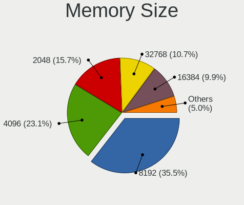

| Size   | Computers | Percent |
|--------|-----------|---------|
| 8192   | 33        | 35.87%  |
| 16384  | 19        | 20.65%  |
| 4096   | 19        | 20.65%  |
| 2048   | 12        | 13.04%  |
| 32768  | 4         | 4.35%   |
| 1024   | 4         | 4.35%   |
| 131072 | 1         | 1.09%   |

Memory Speed
------------

Memory module speed

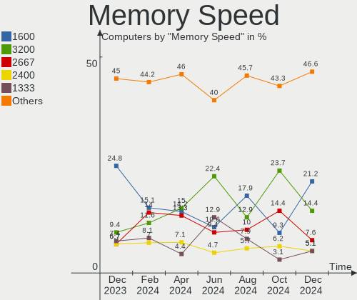

| Speed | Computers | Percent |
|-------|-----------|---------|
| 1600  | 18        | 19.57%  |
| 3200  | 16        | 17.39%  |
| 2400  | 11        | 11.96%  |
| 2667  | 6         | 6.52%   |
| 2133  | 6         | 6.52%   |
| 1333  | 6         | 6.52%   |
| 3600  | 4         | 4.35%   |
| 667   | 4         | 4.35%   |
| 4800  | 3         | 3.26%   |
| 1334  | 3         | 3.26%   |
| 3334  | 2         | 2.17%   |
| 975   | 2         | 2.17%   |
| 800   | 2         | 2.17%   |
| 6400  | 1         | 1.09%   |
| 4267  | 1         | 1.09%   |
| 3866  | 1         | 1.09%   |
| 3733  | 1         | 1.09%   |
| 3533  | 1         | 1.09%   |
| 3400  | 1         | 1.09%   |
| 2866  | 1         | 1.09%   |
| 2048  | 1         | 1.09%   |
| 1066  | 1         | 1.09%   |

Printers & scanners
-------------------

Printer Vendor
--------------

Printer device vendors

| Vendor                | Computers | Percent |
|-----------------------|-----------|---------|
| Hewlett-Packard       | 2         | 66.67%  |
| Lexmark International | 1         | 33.33%  |

Printer Model
-------------

Printer device models

| Model                         | Computers | Percent |
|-------------------------------|-----------|---------|
| Lexmark International B2236dw | 1         | 33.33%  |
| HP LaserJet M14-M17           | 1         | 33.33%  |
| HP DeskJet 4530 series        | 1         | 33.33%  |

Scanner Vendor
--------------

Scanner device vendors

| Vendor         | Computers | Percent |
|----------------|-----------|---------|
| Mustek Systems | 1         | 50%     |
| Canon          | 1         | 50%     |

Scanner Model
-------------

Scanner device models

| Model                              | Computers | Percent |
|------------------------------------|-----------|---------|
| Mustek Systems BearPaw 2448 TA Pro | 1         | 50%     |
| Canon CanoScan LiDE 110            | 1         | 50%     |

Camera
------

Camera Vendor
-------------

Camera device vendors

| Vendor                        | Computers | Percent |
|-------------------------------|-----------|---------|
| Chicony Electronics           | 15        | 19.74%  |
| Realtek Semiconductor         | 10        | 13.16%  |
| Microdia                      | 8         | 10.53%  |
| Bison Electronics             | 6         | 7.89%   |
| Sunplus Innovation Technology | 4         | 5.26%   |
| Luxvisions Innotech Limited   | 4         | 5.26%   |
| IMC Networks                  | 4         | 5.26%   |
| Syntek                        | 3         | 3.95%   |
| Quanta                        | 3         | 3.95%   |
| Acer                          | 3         | 3.95%   |
| Sonix Technology              | 2         | 2.63%   |
| Silicon Motion                | 2         | 2.63%   |
| Logitech                      | 2         | 2.63%   |
| Suyin                         | 1         | 1.32%   |
| OPPO Electronics              | 1         | 1.32%   |
| Lite-On Technology            | 1         | 1.32%   |
| icSpring                      | 1         | 1.32%   |
| Denron                        | 1         | 1.32%   |
| Creative Technology           | 1         | 1.32%   |
| ARC International             | 1         | 1.32%   |
| Apple                         | 1         | 1.32%   |
| Alpha Imaging Technology      | 1         | 1.32%   |
| Unknown                       | 1         | 1.32%   |

Camera Model
------------

Camera device models

| Model                                             | Computers | Percent |
|---------------------------------------------------|-----------|---------|
| Microdia Integrated_Webcam_HD                     | 5         | 6.41%   |
| Syntek Integrated Camera                          | 3         | 3.85%   |
| Chicony Lenovo EasyCamera                         | 3         | 3.85%   |
| Sonix USB2.0 HD UVC WebCam                        | 2         | 2.56%   |
| Realtek Integrated_Webcam_HD                      | 2         | 2.56%   |
| Realtek Integrated Webcam HD                      | 2         | 2.56%   |
| Microdia Integrated Webcam                        | 2         | 2.56%   |
| Luxvisions Innotech Limited HP HD Camera          | 2         | 2.56%   |
| Chicony USB2.0 Camera                             | 2         | 2.56%   |
| Chicony HP HD Camera                              | 2         | 2.56%   |
| Bison Lenovo Integrated Webcam                    | 2         | 2.56%   |
| Bison Integrated Camera                           | 2         | 2.56%   |
| Acer Lenovo EasyCamera                            | 2         | 2.56%   |
| Suyin HP TrueVision HD                            | 1         | 1.28%   |
| Sunplus Laptop Integrated Webcam FHD              | 1         | 1.28%   |
| Sunplus Integrated_Webcam_HD                      | 1         | 1.28%   |
| Sunplus HP HD Webcam [Fixed]                      | 1         | 1.28%   |
| Sunplus HD 720P webcam                            | 1         | 1.28%   |
| Silicon Motion WebCam SCB-1100N                   | 1         | 1.28%   |
| Silicon Motion WebCam SC-10HDP12631N              | 1         | 1.28%   |
| Realtek USB Camera                                | 1         | 1.28%   |
| Realtek Lenovo EasyCamera                         | 1         | 1.28%   |
| Realtek Integrated Webcam                         | 1         | 1.28%   |
| Realtek Integrated Camera                         | 1         | 1.28%   |
| Realtek HD WebCam                                 | 1         | 1.28%   |
| Realtek EasyCamera                                | 1         | 1.28%   |
| Quanta HP Wide Vision HD Camera                   | 1         | 1.28%   |
| Quanta HP TrueVision HD Webcam                    | 1         | 1.28%   |
| Quanta HP TrueVision HD Camera                    | 1         | 1.28%   |
| OPPO Oppo N1                                      | 1         | 1.28%   |
| Microdia Webcam Vitade AF                         | 1         | 1.28%   |
| Microdia Laptop_Integrated_Webcam_E4HD            | 1         | 1.28%   |
| Luxvisions Innotech Limited Integrated RGB Camera | 1         | 1.28%   |
| Luxvisions Innotech Limited HP 5MP Camera         | 1         | 1.28%   |
| Logitech Webcam C170                              | 1         | 1.28%   |
| Logitech C922 Pro Stream Webcam                   | 1         | 1.28%   |
| Lite-On Integrated Camera                         | 1         | 1.28%   |
| IMC Networks XHC Camera                           | 1         | 1.28%   |
| IMC Networks USB2.0 HD UVC WebCam                 | 1         | 1.28%   |
| IMC Networks USB2.0 HD IR UVC WebCam              | 1         | 1.28%   |

Security
--------

Fingerprint Vendor
------------------

Fingerprint sensor vendors

| Vendor                     | Computers | Percent |
|----------------------------|-----------|---------|
| Validity Sensors           | 5         | 45.45%  |
| Synaptics                  | 5         | 45.45%  |
| Shenzhen Goodix Technology | 1         | 9.09%   |

Fingerprint Model
-----------------

Fingerprint sensor models

| Model                                                    | Computers | Percent |
|----------------------------------------------------------|-----------|---------|
| Validity Sensors Synaptics WBDI                          | 2         | 18.18%  |
| Synaptics FS7604 Touch Fingerprint Sensor with PurePrint | 2         | 18.18%  |
| Validity Sensors VFS5011 Fingerprint Reader              | 1         | 9.09%   |
| Validity Sensors VFS495 Fingerprint Reader               | 1         | 9.09%   |
| Validity Sensors Fingerprint scanner                     | 1         | 9.09%   |
| Synaptics Prometheus MIS Touch Fingerprint Reader        | 1         | 9.09%   |
| Synaptics Metallica MIS Touch Fingerprint Reader         | 1         | 9.09%   |
| Synaptics Fingerprint reader [HP G6]                     | 1         | 9.09%   |
| Shenzhen Goodix FingerPrint                              | 1         | 9.09%   |

Chipcard Vendor
---------------

Chipcard module vendors

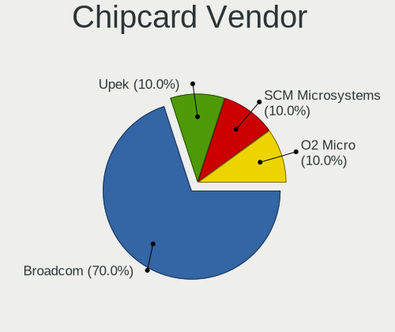

| Vendor      | Computers | Percent |
|-------------|-----------|---------|
| Broadcom    | 5         | 50%     |
| Alcor Micro | 2         | 20%     |
| Upek        | 1         | 10%     |
| O2 Micro    | 1         | 10%     |
| Cherry      | 1         | 10%     |

Chipcard Model
--------------

Chipcard module models

| Model                                                      | Computers | Percent |
|------------------------------------------------------------|-----------|---------|
| Broadcom BCM5880 Secure Applications Processor             | 2         | 20%     |
| Broadcom 58200                                             | 2         | 20%     |
| Alcor Micro AU9540 Smartcard Reader                        | 2         | 20%     |
| Upek TouchChip Fingerprint Coprocessor (WBF advanced mode) | 1         | 10%     |
| O2 Micro OZ776 CCID Smartcard Reader                       | 1         | 10%     |
| Cherry Smart Terminal XX44                                 | 1         | 10%     |
| Broadcom 5880                                              | 1         | 10%     |

Unsupported
-----------

Unsupported Devices
-------------------

Total unsupported devices on board

| Total | Computers | Percent |
|-------|-----------|---------|
| 0     | 91        | 72.8%   |
| 1     | 26        | 20.8%   |
| 2     | 8         | 6.4%    |

Unsupported Device Types
------------------------

Types of unsupported devices

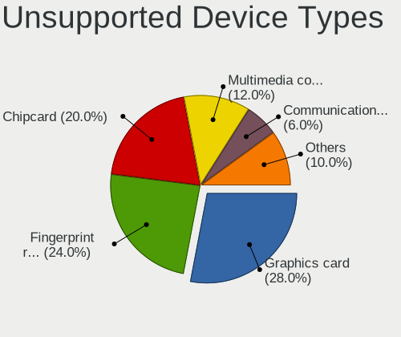

| Type                     | Computers | Percent |
|--------------------------|-----------|---------|
| Fingerprint reader       | 11        | 26.19%  |
| Graphics card            | 9         | 21.43%  |
| Chipcard                 | 7         | 16.67%  |
| Net/wireless             | 4         | 9.52%   |
| Communication controller | 2         | 4.76%   |
| Unassigned class         | 1         | 2.38%   |
| Storage/ide              | 1         | 2.38%   |
| Storage                  | 1         | 2.38%   |
| Sound                    | 1         | 2.38%   |
| Net/ethernet             | 1         | 2.38%   |
| Multimedia controller    | 1         | 2.38%   |
| Modem                    | 1         | 2.38%   |
| Camera                   | 1         | 2.38%   |
| Bluetooth                | 1         | 2.38%   |

