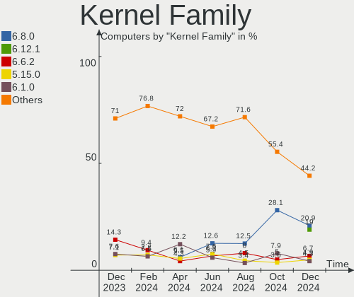
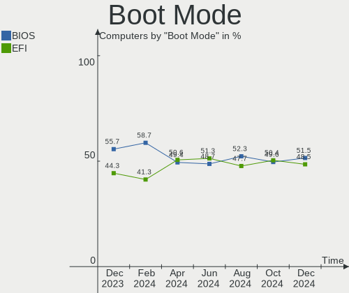
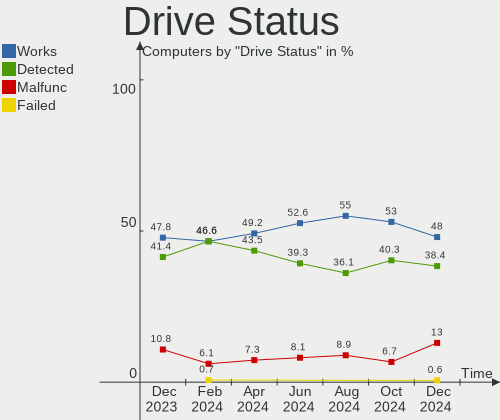
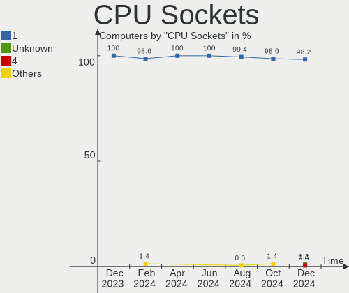
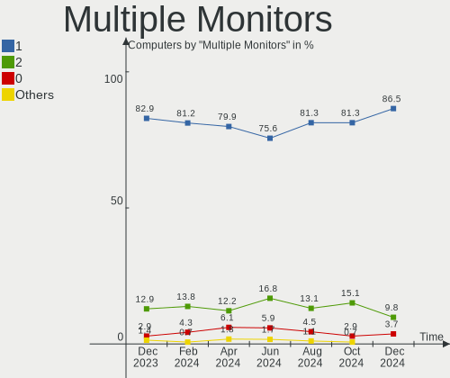
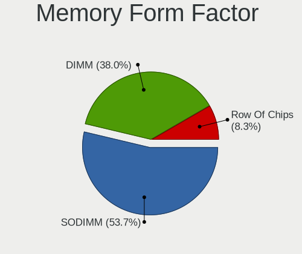
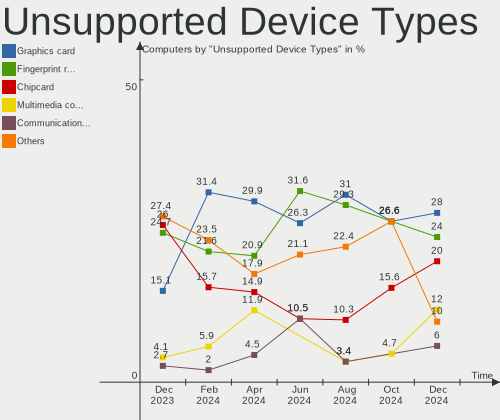

Linux in Poland - Hardware Trends
---------------------------------

A project to identify most popular hardware characteristics and track their change
over time based on data collected by Linux users at https://Linux-Hardware.org.

Anyone can contribute to this report by the [hw-probe](https://github.com/linuxhw/hw-probe) tool:

    sudo -E hw-probe -all -upload

This is a report for all computer types. See also reports for [desktops](/Location/Poland/Desktop/README.md) and [notebooks](/Location/Poland/Notebook/README.md).

Period: Jan, 2024.

Contents
--------

* [ System ](#system)
  - [ OS                       ](#os)
  - [ OS Family                ](#os-family)
  - [ Kernel                   ](#kernel)
  - [ Kernel Family            ](#kernel-family)
  - [ Kernel Major Ver.        ](#kernel-major-ver)
  - [ Arch                     ](#arch)
  - [ DE                       ](#de)
  - [ Display Server           ](#display-server)
  - [ Display Manager          ](#display-manager)
  - [ OS Lang                  ](#os-lang)
  - [ Boot Mode                ](#boot-mode)
  - [ Filesystem               ](#filesystem)
  - [ Part. scheme             ](#part-scheme)
  - [ Dual Boot with Linux/BSD ](#dual-boot-with-linuxbsd)
  - [ Dual Boot (Win)          ](#dual-boot-win)

* [ Board ](#board)
  - [ Vendor                   ](#vendor)
  - [ Model                    ](#model)
  - [ Model Family             ](#model-family)
  - [ MFG Year                 ](#mfg-year)
  - [ Form Factor              ](#form-factor)
  - [ Secure Boot              ](#secure-boot)
  - [ Coreboot                 ](#coreboot)
  - [ RAM Size                 ](#ram-size)
  - [ RAM Used                 ](#ram-used)
  - [ Total Drives             ](#total-drives)
  - [ Has CD-ROM               ](#has-cd-rom)
  - [ Has Ethernet             ](#has-ethernet)
  - [ Has WiFi                 ](#has-wifi)
  - [ Has Bluetooth            ](#has-bluetooth)

* [ Location ](#location)
  - [ Country                  ](#country)
  - [ City                     ](#city)

* [ Drives ](#drives)
  - [ Drive Vendor             ](#drive-vendor)
  - [ Drive Model              ](#drive-model)
  - [ HDD Vendor               ](#hdd-vendor)
  - [ SSD Vendor               ](#ssd-vendor)
  - [ Drive Kind               ](#drive-kind)
  - [ Drive Connector          ](#drive-connector)
  - [ Drive Size               ](#drive-size)
  - [ Space Total              ](#space-total)
  - [ Space Used               ](#space-used)
  - [ Malfunc. Drives          ](#malfunc-drives)
  - [ Malfunc. Drive Vendor    ](#malfunc-drive-vendor)
  - [ Malfunc. HDD Vendor      ](#malfunc-hdd-vendor)
  - [ Malfunc. Drive Kind      ](#malfunc-drive-kind)
  - [ Failed Drives            ](#failed-drives)
  - [ Failed Drive Vendor      ](#failed-drive-vendor)
  - [ Drive Status             ](#drive-status)

* [ Storage controller ](#storage-controller)
  - [ Storage Vendor           ](#storage-vendor)
  - [ Storage Model            ](#storage-model)
  - [ Storage Kind             ](#storage-kind)

* [ Processor ](#processor)
  - [ CPU Vendor               ](#cpu-vendor)
  - [ CPU Model                ](#cpu-model)
  - [ CPU Model Family         ](#cpu-model-family)
  - [ CPU Cores                ](#cpu-cores)
  - [ CPU Sockets              ](#cpu-sockets)
  - [ CPU Threads              ](#cpu-threads)
  - [ CPU Op-Modes             ](#cpu-op-modes)
  - [ CPU Microcode            ](#cpu-microcode)
  - [ CPU Microarch            ](#cpu-microarch)

* [ Graphics ](#graphics)
  - [ GPU Vendor               ](#gpu-vendor)
  - [ GPU Model                ](#gpu-model)
  - [ GPU Combo                ](#gpu-combo)
  - [ GPU Driver               ](#gpu-driver)
  - [ GPU Memory               ](#gpu-memory)

* [ Monitor ](#monitor)
  - [ Monitor Vendor           ](#monitor-vendor)
  - [ Monitor Model            ](#monitor-model)
  - [ Monitor Resolution       ](#monitor-resolution)
  - [ Monitor Diagonal         ](#monitor-diagonal)
  - [ Monitor Width            ](#monitor-width)
  - [ Aspect Ratio             ](#aspect-ratio)
  - [ Monitor Area             ](#monitor-area)
  - [ Pixel Density            ](#pixel-density)
  - [ Multiple Monitors        ](#multiple-monitors)

* [ Network ](#network)
  - [ Net Controller Vendor    ](#net-controller-vendor)
  - [ Net Controller Model     ](#net-controller-model)
  - [ Wireless Vendor          ](#wireless-vendor)
  - [ Wireless Model           ](#wireless-model)
  - [ Ethernet Vendor          ](#ethernet-vendor)
  - [ Ethernet Model           ](#ethernet-model)
  - [ Net Controller Kind      ](#net-controller-kind)
  - [ Used Controller          ](#used-controller)
  - [ NICs                     ](#nics)
  - [ IPv6                     ](#ipv6)

* [ Bluetooth ](#bluetooth)
  - [ Bluetooth Vendor         ](#bluetooth-vendor)
  - [ Bluetooth Model          ](#bluetooth-model)

* [ Sound ](#sound)
  - [ Sound Vendor             ](#sound-vendor)
  - [ Sound Model              ](#sound-model)

* [ Memory ](#memory)
  - [ Memory Vendor            ](#memory-vendor)
  - [ Memory Model             ](#memory-model)
  - [ Memory Kind              ](#memory-kind)
  - [ Memory Form Factor       ](#memory-form-factor)
  - [ Memory Size              ](#memory-size)
  - [ Memory Speed             ](#memory-speed)

* [ Printers & scanners ](#printers--scanners)
  - [ Printer Vendor           ](#printer-vendor)
  - [ Printer Model            ](#printer-model)
  - [ Scanner Vendor           ](#scanner-vendor)
  - [ Scanner Model            ](#scanner-model)

* [ Camera ](#camera)
  - [ Camera Vendor            ](#camera-vendor)
  - [ Camera Model             ](#camera-model)

* [ Security ](#security)
  - [ Fingerprint Vendor       ](#fingerprint-vendor)
  - [ Fingerprint Model        ](#fingerprint-model)
  - [ Chipcard Vendor          ](#chipcard-vendor)
  - [ Chipcard Model           ](#chipcard-model)

* [ Unsupported ](#unsupported)
  - [ Unsupported Devices      ](#unsupported-devices)
  - [ Unsupported Device Types ](#unsupported-device-types)

System
------

OS
--

Installed operating systems

| Name                         | Computers | Percent |
|------------------------------|-----------|---------|
| Ubuntu 22.04                 | 21        | 13.04%  |
| Fedora 39                    | 16        | 9.94%   |
| Arch Rolling                 | 14        | 8.7%    |
| OpenMandriva 23.08           | 10        | 6.21%   |
| OpenMandriva 5.0             | 8         | 4.97%   |
| Debian 12                    | 8         | 4.97%   |
| Ubuntu 23.10                 | 5         | 3.11%   |
| ROSA 12.4                    | 5         | 3.11%   |
| Pop!_OS 22.04                | 5         | 3.11%   |
| Linux Mint 21.2              | 5         | 3.11%   |
| Debian 11                    | 5         | 3.11%   |
| Gentoo 2.14                  | 4         | 2.48%   |
| Zorin 16                     | 3         | 1.86%   |
| OpenMandriva 24.01           | 3         | 1.86%   |
| Lilidog 23                   | 3         | 1.86%   |
| OpenMandriva 23.11           | 2         | 1.24%   |
| LMDE 6                       | 2         | 1.24%   |
| Linux Mint 21.3              | 2         | 1.24%   |
| Kubuntu 23.10                | 2         | 1.24%   |
| Kali 2023.3                  | 2         | 1.24%   |
| EndeavourOS Rolling          | 2         | 1.24%   |
| Debian                       | 2         | 1.24%   |
| Zorin 17                     | 1         | 0.62%   |
| Xubuntu 23.10                | 1         | 0.62%   |
| Xubuntu 20.04                | 1         | 0.62%   |
| Void Linux Rolling           | 1         | 0.62%   |
| Ubuntu 23.04                 | 1         | 0.62%   |
| Ubuntu 20.04                 | 1         | 0.62%   |
| SteamOS 3.5.7                | 1         | 0.62%   |
| SteamOS 3.5.13               | 1         | 0.62%   |
| Sparky 7.2                   | 1         | 0.62%   |
| ROSA R11.1                   | 1         | 0.62%   |
| Raspbian 12                  | 1         | 0.62%   |
| PostmarketOS Edge            | 1         | 0.62%   |
| Peppermint                   | 1         | 0.62%   |
| openSUSE Tumbleweed-XXXXXXXX | 1         | 0.62%   |
| OpenMandriva 4.3             | 1         | 0.62%   |
| OpenMandriva 4.2             | 1         | 0.62%   |
| OpenMandriva 23.03           | 1         | 0.62%   |
| MX 23                        | 1         | 0.62%   |

OS Family
---------

OS without a version

| Name         | Computers | Percent |
|--------------|-----------|---------|
| Ubuntu       | 28        | 17.39%  |
| OpenMandriva | 26        | 16.15%  |
| Fedora       | 16        | 9.94%   |
| Debian       | 15        | 9.32%   |
| Arch         | 14        | 8.7%    |
| Linux Mint   | 10        | 6.21%   |
| ROSA         | 6         | 3.73%   |
| Pop!_OS      | 5         | 3.11%   |
| Zorin        | 4         | 2.48%   |
| Gentoo       | 4         | 2.48%   |
| Manjaro      | 3         | 1.86%   |
| Lilidog      | 3         | 1.86%   |
| Kubuntu      | 3         | 1.86%   |
| Kali         | 3         | 1.86%   |
| Xubuntu      | 2         | 1.24%   |
| SteamOS      | 2         | 1.24%   |
| LMDE         | 2         | 1.24%   |
| EndeavourOS  | 2         | 1.24%   |
| Void Linux   | 1         | 0.62%   |
| Sparky       | 1         | 0.62%   |
| Raspbian     | 1         | 0.62%   |
| PostmarketOS | 1         | 0.62%   |
| Peppermint   | 1         | 0.62%   |
| openSUSE     | 1         | 0.62%   |
| MX           | 1         | 0.62%   |
| Mageia       | 1         | 0.62%   |
| Feren OS     | 1         | 0.62%   |
| EuroLinux    | 1         | 0.62%   |
| BigLinux     | 1         | 0.62%   |
| Artix        | 1         | 0.62%   |
| ArcoLinux    | 1         | 0.62%   |

Kernel
------

Version of the Linux kernel

| Version                                | Computers | Percent |
|----------------------------------------|-----------|---------|
| 6.5.0-14-generic                       | 19        | 11.8%   |
| 6.6.2-desktop-1omv2390                 | 13        | 8.07%   |
| 6.4.11-desktop-1omv2390                | 9         | 5.59%   |
| 6.2.0-39-generic                       | 8         | 4.97%   |
| 6.1.0-17-amd64                         | 8         | 4.97%   |
| 5.15.0-91-generic                      | 8         | 4.97%   |
| 6.6.9-200.fc39.x86_64                  | 6         | 3.73%   |
| 6.5.0-15-generic                       | 5         | 3.11%   |
| 6.1.67-gentoo                          | 4         | 2.48%   |
| 6.6.9-arch1-1                          | 3         | 1.86%   |
| 6.6.12-200.fc39.x86_64                 | 3         | 1.86%   |
| 6.1.58-generic-1rosa2021.1-x86_64      | 3         | 1.86%   |
| 6.7.0-zen3-1-zen                       | 2         | 1.24%   |
| 6.6.9-amd64                            | 2         | 1.24%   |
| 6.6.8-arch1-1                          | 2         | 1.24%   |
| 6.6.6-76060606-generic                 | 2         | 1.24%   |
| 6.6.13-200.fc39.x86_64                 | 2         | 1.24%   |
| 6.6.10-76060610-generic                | 2         | 1.24%   |
| 6.5.11-7-pve                           | 2         | 1.24%   |
| 6.5.0-0.deb12.4-amd64                  | 2         | 1.24%   |
| 6.3.0-kali1-amd64                      | 2         | 1.24%   |
| 6.2.0-26-generic                       | 2         | 1.24%   |
| 6.1.69-1-lts                           | 2         | 1.24%   |
| 6.1.0-0.deb11.13-amd64                 | 2         | 1.24%   |
| 6.7.1-arch1-1                          | 1         | 0.62%   |
| 6.7.0.xm1-1.k-xanmod-rosa2021.1-x86_64 | 1         | 0.62%   |
| 6.7.0-arch3-1                          | 1         | 0.62%   |
| 6.7.0-367.vanilla.fc39.x86_64          | 1         | 0.62%   |
| 6.6.9_1                                | 1         | 0.62%   |
| 6.6.9-lqx1-1-lqx                       | 1         | 0.62%   |
| 6.6.9-1-cachyos-bore                   | 1         | 0.62%   |
| 6.6.8-273-tkg-eevdf                    | 1         | 0.62%   |
| 6.6.8-200.fc39.x86_64                  | 1         | 0.62%   |
| 6.6.7-artix1-1                         | 1         | 0.62%   |
| 6.6.7-arch1-1                          | 1         | 0.62%   |
| 6.6.7-666.rog.fc39.x86_64              | 1         | 0.62%   |
| 6.6.11-200.fc39.x86_64                 | 1         | 0.62%   |
| 6.6.11-1-default                       | 1         | 0.62%   |
| 6.6.10-lqx1-1-lqx                      | 1         | 0.62%   |
| 6.6.10-arch1-1                         | 1         | 0.62%   |

Kernel Family
-------------

Linux kernel without a distro release

| Version  | Computers | Percent |
|----------|-----------|---------|
| 6.5.0    | 27        | 16.77%  |
| 6.6.9    | 14        | 8.7%    |
| 6.6.2    | 13        | 8.07%   |
| 6.1.0    | 13        | 8.07%   |
| 6.2.0    | 12        | 7.45%   |
| 5.15.0   | 12        | 7.45%   |
| 6.4.11   | 9         | 5.59%   |
| 6.7.0    | 5         | 3.11%   |
| 6.6.8    | 4         | 2.48%   |
| 6.6.10   | 4         | 2.48%   |
| 6.1.67   | 4         | 2.48%   |
| 6.6.7    | 3         | 1.86%   |
| 6.6.12   | 3         | 1.86%   |
| 6.5.11   | 3         | 1.86%   |
| 6.1.69   | 3         | 1.86%   |
| 6.1.58   | 3         | 1.86%   |
| 6.6.6    | 2         | 1.24%   |
| 6.6.13   | 2         | 1.24%   |
| 6.6.11   | 2         | 1.24%   |
| 6.3.0    | 2         | 1.24%   |
| 6.1.52   | 2         | 1.24%   |
| 5.10.0   | 2         | 1.24%   |
| 6.7.1    | 1         | 0.62%   |
| 6.6.1    | 1         | 0.62%   |
| 6.6.0    | 1         | 0.62%   |
| 6.5.6    | 1         | 0.62%   |
| 6.5.3    | 1         | 0.62%   |
| 6.5.13   | 1         | 0.62%   |
| 6.4.8    | 1         | 0.62%   |
| 6.2.6    | 1         | 0.62%   |
| 6.2.15   | 1         | 0.62%   |
| 6.1.71   | 1         | 0.62%   |
| 6.1.21   | 1         | 0.62%   |
| 5.4.83   | 1         | 0.62%   |
| 5.16.13  | 1         | 0.62%   |
| 5.15.92  | 1         | 0.62%   |
| 5.15.103 | 1         | 0.62%   |
| 5.14.0   | 1         | 0.62%   |
| 5.10.14  | 1         | 0.62%   |

Kernel Major Ver.
-----------------

Linux kernel major version

| Version | Computers | Percent |
|---------|-----------|---------|
| 6.6     | 49        | 30.43%  |
| 6.5     | 33        | 20.5%   |
| 6.1     | 27        | 16.77%  |
| 6.2     | 14        | 8.7%    |
| 5.15    | 14        | 8.7%    |
| 6.4     | 10        | 6.21%   |
| 6.7     | 6         | 3.73%   |
| 5.10    | 3         | 1.86%   |
| 6.3     | 2         | 1.24%   |
| 5.4     | 1         | 0.62%   |
| 5.16    | 1         | 0.62%   |
| 5.14    | 1         | 0.62%   |

Arch
----

OS architecture (x86_64, i586, etc.)

| Name    | Computers | Percent |
|---------|-----------|---------|
| x86_64  | 156       | 96.89%  |
| i686    | 2         | 1.24%   |
| armv7l  | 1         | 0.62%   |
| armv6l  | 1         | 0.62%   |
| aarch64 | 1         | 0.62%   |

DE
--

Desktop Environment

| Name             | Computers | Percent |
|------------------|-----------|---------|
| GNOME            | 64        | 39.75%  |
| KDE5             | 44        | 27.33%  |
| XFCE             | 19        | 11.8%   |
| X-Cinnamon       | 11        | 6.83%   |
| Unknown          | 8         | 4.97%   |
| LXQt             | 4         | 2.48%   |
| lightdm-xsession | 3         | 1.86%   |
| MATE             | 2         | 1.24%   |
| KDE              | 2         | 1.24%   |
| i3               | 2         | 1.24%   |
| openbox          | 1         | 0.62%   |
| ICEWM            | 1         | 0.62%   |

Display Server
--------------

X11 or Wayland

| Name    | Computers | Percent |
|---------|-----------|---------|
| X11     | 75        | 46.58%  |
| Wayland | 75        | 46.58%  |
| Unknown | 7         | 4.35%   |
| Tty     | 4         | 2.48%   |

Display Manager
---------------

SDDM, LightDM, etc.

| Name    | Computers | Percent |
|---------|-----------|---------|
| Unknown | 50        | 31.06%  |
| SDDM    | 41        | 25.47%  |
| LightDM | 30        | 18.63%  |
| GDM3    | 29        | 18.01%  |
| GDM     | 11        | 6.83%   |

OS Lang
-------

Language

| Lang    | Computers | Percent |
|---------|-----------|---------|
| pl_PL   | 79        | 49.07%  |
| en_US   | 66        | 40.99%  |
| C       | 5         | 3.11%   |
| en_GB   | 4         | 2.48%   |
| ru_UA   | 3         | 1.86%   |
| Unknown | 2         | 1.24%   |
| fr_FR   | 1         | 0.62%   |
| en_IE   | 1         | 0.62%   |

Boot Mode
---------

EFI or BIOS

| Mode | Computers | Percent |
|------|-----------|---------|
| BIOS | 81        | 50.31%  |
| EFI  | 80        | 49.69%  |

Filesystem
----------

Type of filesystem

| Type    | Computers | Percent |
|---------|-----------|---------|
| Ext4    | 94        | 58.39%  |
| Btrfs   | 25        | 15.53%  |
| Tmpfs   | 17        | 10.56%  |
| Overlay | 17        | 10.56%  |
| F2fs    | 5         | 3.11%   |
| Zfs     | 2         | 1.24%   |
| Xfs     | 1         | 0.62%   |

Part. scheme
------------

Scheme of partitioning

| Type    | Computers | Percent |
|---------|-----------|---------|
| GPT     | 100       | 62.11%  |
| Unknown | 39        | 24.22%  |
| MBR     | 22        | 13.66%  |

Dual Boot with Linux/BSD
------------------------

Hosting more than one Linux/BSD

| Dual boot | Computers | Percent |
|-----------|-----------|---------|
| No        | 134       | 83.23%  |
| Yes       | 27        | 16.77%  |

Dual Boot (Win)
---------------

Hosting Linux and Windows

| Dual boot | Computers | Percent |
|-----------|-----------|---------|
| No        | 113       | 70.19%  |
| Yes       | 48        | 29.81%  |

Board
-----

Vendor
------

Motherboard manufacturer

| Name                    | Computers | Percent |
|-------------------------|-----------|---------|
| Lenovo                  | 26        | 16.15%  |
| ASUSTek Computer        | 26        | 16.15%  |
| Hewlett-Packard         | 25        | 15.53%  |
| Dell                    | 22        | 13.66%  |
| MSI                     | 11        | 6.83%   |
| Gigabyte Technology     | 10        | 6.21%   |
| ASRock                  | 10        | 6.21%   |
| Toshiba                 | 7         | 4.35%   |
| Samsung Electronics     | 5         | 3.11%   |
| Acer                    | 5         | 3.11%   |
| Valve                   | 2         | 1.24%   |
| Raspberry Pi Foundation | 2         | 1.24%   |
| Google                  | 2         | 1.24%   |
| Apple                   | 2         | 1.24%   |
| mPTech                  | 1         | 0.62%   |
| Microsoft               | 1         | 0.62%   |
| Fujitsu                 | 1         | 0.62%   |
| eMachines               | 1         | 0.62%   |
| Dream Machines          | 1         | 0.62%   |
| AMI                     | 1         | 0.62%   |

Model
-----

Motherboard model

| Name                                            | Computers | Percent |
|-------------------------------------------------|-----------|---------|
| Valve Jupiter                                   | 2         | 1.24%   |
| Toshiba Satellite L40                           | 2         | 1.24%   |
| MSI MS-7816                                     | 2         | 1.24%   |
| Gigabyte B550 AORUS ELITE V2                    | 2         | 1.24%   |
| ASUS All Series                                 | 2         | 1.24%   |
| ASRock B450 Pro4                                | 2         | 1.24%   |
| Toshiba Satellite C660                          | 1         | 0.62%   |
| Toshiba Satellite C650                          | 1         | 0.62%   |
| Toshiba Satellite C55-A-1H9                     | 1         | 0.62%   |
| Toshiba Satellite A660                          | 1         | 0.62%   |
| Toshiba Satellite A200                          | 1         | 0.62%   |
| Samsung X420/X520                               | 1         | 0.62%   |
| Samsung Galaxy Tab 4 10.1 WiFi (2015) (SM-T533) | 1         | 0.62%   |
| Samsung DP700A3D/DM700A3D/DB701A3D/DP700A7D     | 1         | 0.62%   |
| Samsung 450R4E/450R5E/450R4V/450R5V             | 1         | 0.62%   |
| Samsung 350V5C/351V5C/3540VC/3440VC             | 1         | 0.62%   |
| RPi Raspberry Pi Zero W Rev 1.1                 | 1         | 0.62%   |
| RPi Raspberry Pi 3 Model B Rev 1.2              | 1         | 0.62%   |
| MSI Stealth GS66 12UGS                          | 1         | 0.62%   |
| MSI MS-B09611                                   | 1         | 0.62%   |
| MSI MS-7C91                                     | 1         | 0.62%   |
| MSI MS-7C83                                     | 1         | 0.62%   |
| MSI MS-7C56                                     | 1         | 0.62%   |
| MSI MS-7B89                                     | 1         | 0.62%   |
| MSI MS-7A70                                     | 1         | 0.62%   |
| MSI MS-7851                                     | 1         | 0.62%   |
| MSI MS-7721                                     | 1         | 0.62%   |
| mPTech Techbite ZIN 3                           | 1         | 0.62%   |
| Microsoft Surface Pro 3                         | 1         | 0.62%   |
| Lenovo V15-ADA 82C7                             | 1         | 0.62%   |
| Lenovo V15 G3 IAP CTO 83C4                      | 1         | 0.62%   |
| Lenovo ThinkPad X220 Tablet 4299W26             | 1         | 0.62%   |
| Lenovo ThinkPad X1 Carbon 6th 20KG0022US        | 1         | 0.62%   |
| Lenovo ThinkPad T570 20HAS0NU00                 | 1         | 0.62%   |
| Lenovo ThinkPad T470s W10DG 20JTS1MR08          | 1         | 0.62%   |
| Lenovo ThinkPad T430 2349FC4                    | 1         | 0.62%   |
| Lenovo ThinkPad T14 Gen 3 21AH00DFPB            | 1         | 0.62%   |
| Lenovo ThinkPad T14 Gen 1 20S1S8MX2H            | 1         | 0.62%   |
| Lenovo ThinkPad P50 20EQS3B30R                  | 1         | 0.62%   |
| Lenovo ThinkPad P16v Gen 1 21FC000LPB           | 1         | 0.62%   |

Model Family
------------

Motherboard model prefix

| Name              | Computers | Percent |
|-------------------|-----------|---------|
| Lenovo ThinkPad   | 11        | 6.83%   |
| Dell Latitude     | 10        | 6.21%   |
| Toshiba Satellite | 7         | 4.35%   |
| ASUS PRIME        | 6         | 3.73%   |
| Lenovo IdeaPad    | 5         | 3.11%   |
| Dell Inspiron     | 5         | 3.11%   |
| ASUS VivoBook     | 4         | 2.48%   |
| HP ProBook        | 3         | 1.86%   |
| HP EliteDesk      | 3         | 1.86%   |
| Dell OptiPlex     | 3         | 1.86%   |
| ASRock B450       | 3         | 1.86%   |
| Acer Aspire       | 3         | 1.86%   |
| Valve Jupiter     | 2         | 1.24%   |
| RPi Raspberry     | 2         | 1.24%   |
| MSI MS-7816       | 2         | 1.24%   |
| Lenovo ThinkBook  | 2         | 1.24%   |
| Lenovo Legion     | 2         | 1.24%   |
| HP ZBook          | 2         | 1.24%   |
| HP ProLiant       | 2         | 1.24%   |
| HP Pavilion       | 2         | 1.24%   |
| HP EliteBook      | 2         | 1.24%   |
| HP Compaq         | 2         | 1.24%   |
| Gigabyte H310M    | 2         | 1.24%   |
| Gigabyte B550     | 2         | 1.24%   |
| Dell Vostro       | 2         | 1.24%   |
| ASUS ROG          | 2         | 1.24%   |
| ASUS All          | 2         | 1.24%   |
| Samsung X420      | 1         | 0.62%   |
| Samsung Galaxy    | 1         | 0.62%   |
| Samsung DP700A3D  | 1         | 0.62%   |
| Samsung 450R4E    | 1         | 0.62%   |
| Samsung 350V5C    | 1         | 0.62%   |
| MSI Stealth       | 1         | 0.62%   |
| MSI MS-B09611     | 1         | 0.62%   |
| MSI MS-7C91       | 1         | 0.62%   |
| MSI MS-7C83       | 1         | 0.62%   |
| MSI MS-7C56       | 1         | 0.62%   |
| MSI MS-7B89       | 1         | 0.62%   |
| MSI MS-7A70       | 1         | 0.62%   |
| MSI MS-7851       | 1         | 0.62%   |

MFG Year
--------

Motherboard manufacture year

| Year    | Computers | Percent |
|---------|-----------|---------|
| 2020    | 19        | 11.8%   |
| 2018    | 17        | 10.56%  |
| 2013    | 17        | 10.56%  |
| 2022    | 14        | 8.7%    |
| 2021    | 13        | 8.07%   |
| 2023    | 10        | 6.21%   |
| 2015    | 9         | 5.59%   |
| 2012    | 8         | 4.97%   |
| 2010    | 8         | 4.97%   |
| 2017    | 7         | 4.35%   |
| 2014    | 7         | 4.35%   |
| 2008    | 6         | 3.73%   |
| 2007    | 6         | 3.73%   |
| 2019    | 5         | 3.11%   |
| 2011    | 5         | 3.11%   |
| 2016    | 4         | 2.48%   |
| Unknown | 3         | 1.86%   |
| 2009    | 2         | 1.24%   |
| 2006    | 1         | 0.62%   |

Form Factor
-----------

Physical design of the computer

| Name           | Computers | Percent |
|----------------|-----------|---------|
| Notebook       | 87        | 54.04%  |
| Desktop        | 60        | 37.27%  |
| Convertible    | 4         | 2.48%   |
| System on chip | 3         | 1.86%   |
| Server         | 3         | 1.86%   |
| All in one     | 2         | 1.24%   |
| Tablet         | 1         | 0.62%   |
| Mini pc        | 1         | 0.62%   |

Secure Boot
-----------

Enabled or disabled

| State    | Computers | Percent |
|----------|-----------|---------|
| Disabled | 150       | 93.17%  |
| Enabled  | 11        | 6.83%   |

Coreboot
--------

Have coreboot on board

| Used | Computers | Percent |
|------|-----------|---------|
| No   | 159       | 98.76%  |
| Yes  | 2         | 1.24%   |

RAM Size
--------

Total RAM memory

| Size in GB  | Computers | Percent |
|-------------|-----------|---------|
| 32.01-64.0  | 34        | 21.12%  |
| 4.01-8.0    | 33        | 20.5%   |
| 16.01-24.0  | 32        | 19.88%  |
| 8.01-16.0   | 22        | 13.66%  |
| 3.01-4.0    | 19        | 11.8%   |
| 64.01-256.0 | 8         | 4.97%   |
| 1.01-2.0    | 6         | 3.73%   |
| 24.01-32.0  | 3         | 1.86%   |
| 2.01-3.0    | 2         | 1.24%   |
| 0.51-1.0    | 1         | 0.62%   |
| 0.01-0.5    | 1         | 0.62%   |

RAM Used
--------

Used RAM memory

| Used GB    | Computers | Percent |
|------------|-----------|---------|
| 1.01-2.0   | 46        | 28.57%  |
| 4.01-8.0   | 39        | 24.22%  |
| 2.01-3.0   | 29        | 18.01%  |
| 3.01-4.0   | 22        | 13.66%  |
| 8.01-16.0  | 10        | 6.21%   |
| 0.51-1.0   | 10        | 6.21%   |
| 0.01-0.5   | 3         | 1.86%   |
| 24.01-32.0 | 2         | 1.24%   |

Total Drives
------------

Number of drives on board

| Drives | Computers | Percent |
|--------|-----------|---------|
| 1      | 92        | 57.14%  |
| 2      | 31        | 19.25%  |
| 3      | 15        | 9.32%   |
| 5      | 7         | 4.35%   |
| 4      | 6         | 3.73%   |
| 0      | 4         | 2.48%   |
| 6      | 2         | 1.24%   |
| 16     | 1         | 0.62%   |
| 9      | 1         | 0.62%   |
| 8      | 1         | 0.62%   |
| 7      | 1         | 0.62%   |

Has CD-ROM
----------

Has CD-ROM on board

| Presented | Computers | Percent |
|-----------|-----------|---------|
| No        | 112       | 69.57%  |
| Yes       | 49        | 30.43%  |

Has Ethernet
------------

Has Ethernet on board

| Presented | Computers | Percent |
|-----------|-----------|---------|
| Yes       | 133       | 82.61%  |
| No        | 28        | 17.39%  |

Has WiFi
--------

Has WiFi module

| Presented | Computers | Percent |
|-----------|-----------|---------|
| Yes       | 116       | 72.05%  |
| No        | 45        | 27.95%  |

Has Bluetooth
-------------

Has Bluetooth module

| Presented | Computers | Percent |
|-----------|-----------|---------|
| Yes       | 97        | 60.25%  |
| No        | 64        | 39.75%  |

Location
--------

Country
-------

Geographic location (country)

| Country | Computers | Percent |
|---------|-----------|---------|
| Poland  | 161       | 100%    |

City
----

Geographic location (city)

| City              | Computers | Percent |
|-------------------|-----------|---------|
| Warsaw            | 32        | 19.88%  |
| Krakow            | 16        | 9.94%   |
| Wroclaw           | 9         | 5.59%   |
| Poznan            | 9         | 5.59%   |
| Gdansk            | 8         | 4.97%   |
| Lodz              | 5         | 3.11%   |
| Katowice          | 5         | 3.11%   |
| Gliwice           | 4         | 2.48%   |
| Szczecin          | 3         | 1.86%   |
| Gdynia            | 3         | 1.86%   |
| Elblag            | 3         | 1.86%   |
| Bytom             | 3         | 1.86%   |
| Zabrze            | 2         | 1.24%   |
| Torun             | 2         | 1.24%   |
| Rumia             | 2         | 1.24%   |
| Krotoszyn         | 2         | 1.24%   |
| Koszalin          | 2         | 1.24%   |
| Kalisz            | 2         | 1.24%   |
| Częstochowa      | 2         | 1.24%   |
| Będzin           | 2         | 1.24%   |
| Łomża           | 1         | 0.62%   |
| Żywiec           | 1         | 0.62%   |
| Zielonki          | 1         | 0.62%   |
| Zielona Góra     | 1         | 0.62%   |
| Zduny             | 1         | 0.62%   |
| Wieruszow         | 1         | 0.62%   |
| Wieliczka         | 1         | 0.62%   |
| Wielbark          | 1         | 0.62%   |
| Turek             | 1         | 0.62%   |
| Tczew             | 1         | 0.62%   |
| Słupsk           | 1         | 0.62%   |
| Swidnik           | 1         | 0.62%   |
| Stoczek Łukowski | 1         | 0.62%   |
| Sosnowiec         | 1         | 0.62%   |
| Sopot             | 1         | 0.62%   |
| Rzeszów          | 1         | 0.62%   |
| Rybnik            | 1         | 0.62%   |
| Ruda Śląska     | 1         | 0.62%   |
| Radomsko          | 1         | 0.62%   |
| Raciszyn          | 1         | 0.62%   |

Drives
------

Drive Vendor
------------

Hard drive vendors

| Vendor                       | Computers | Drives | Percent |
|------------------------------|-----------|--------|---------|
| Samsung Electronics          | 32        | 39     | 12.75%  |
| Seagate                      | 29        | 41     | 11.55%  |
| WDC                          | 24        | 29     | 9.56%   |
| GOODRAM                      | 20        | 23     | 7.97%   |
| Toshiba                      | 14        | 16     | 5.58%   |
| Unknown                      | 13        | 15     | 5.18%   |
| SanDisk                      | 12        | 12     | 4.78%   |
| Micron Technology            | 10        | 11     | 3.98%   |
| SK hynix                     | 9         | 9      | 3.59%   |
| Kingston                     | 9         | 10     | 3.59%   |
| Crucial                      | 9         | 9      | 3.59%   |
| A-DATA Technology            | 8         | 9      | 3.19%   |
| Hitachi                      | 6         | 8      | 2.39%   |
| ADATA Technology             | 6         | 6      | 2.39%   |
| SPCC                         | 4         | 4      | 1.59%   |
| Lexar                        | 4         | 4      | 1.59%   |
| Intel                        | 4         | 4      | 1.59%   |
| Shenzhen Longsys Electronics | 3         | 3      | 1.2%    |
| Phison Electronics           | 3         | 3      | 1.2%    |
| HGST                         | 3         | 3      | 1.2%    |
| XSTAR                        | 2         | 2      | 0.8%    |
| Transcend                    | 2         | 2      | 0.8%    |
| PNY                          | 2         | 2      | 0.8%    |
| MAXIO Technology (Hangzhou)  | 2         | 2      | 0.8%    |
| LITEONIT                     | 2         | 2      | 0.8%    |
| JMicron Technology           | 2         | 2      | 0.8%    |
| Apple                        | 2         | 2      | 0.8%    |
| Unknown                      | 2         | 2      | 0.8%    |
| Team                         | 1         | 1      | 0.4%    |
| Silicon Motion               | 1         | 1      | 0.4%    |
| Plextor                      | 1         | 1      | 0.4%    |
| O2 Micro                     | 1         | 1      | 0.4%    |
| Micron/Crucial Technology    | 1         | 1      | 0.4%    |
| Lenovo                       | 1         | 1      | 0.4%    |
| KIOXIA                       | 1         | 1      | 0.4%    |
| Kingston Technology Company  | 1         | 1      | 0.4%    |
| Kingchuxing                  | 1         | 2      | 0.4%    |
| Innodisk                     | 1         | 1      | 0.4%    |
| Hewlett-Packard              | 1         | 4      | 0.4%    |
| Fujitsu                      | 1         | 1      | 0.4%    |

Drive Model
-----------

Hard drive models

| Model                                                           | Computers | Percent |
|-----------------------------------------------------------------|-----------|---------|
| Samsung NVMe SSD Controller PM9A1/PM9A3/980PRO 2TB              | 5         | 1.85%   |
| GOODRAM SSDPR-CX400-512-G2 512GB                                | 5         | 1.85%   |
| Samsung NVMe SSD Controller SM981/PM981/PM983 1TB               | 4         | 1.48%   |
| Crucial CT240BX500SSD1 240GB                                    | 4         | 1.48%   |
| Unknown MMC Card  32GB                                          | 3         | 1.11%   |
| WDC WD30EZRX-00MMMB0 3TB                                        | 2         | 0.74%   |
| WDC WD20EZRZ-00Z5HB0 2TB                                        | 2         | 0.74%   |
| WDC WD10EFRX-68FYTN0 1TB                                        | 2         | 0.74%   |
| Unknown MMC Card  16GB                                          | 2         | 0.74%   |
| Toshiba HDWD130 3TB                                             | 2         | 0.74%   |
| SPCC Solid State Disk 512GB                                     | 2         | 0.74%   |
| SK hynix SC311 SATA 256GB SSD                                   | 2         | 0.74%   |
| Seagate ST500DM002-1BD142 500GB                                 | 2         | 0.74%   |
| Seagate ST4000DM004-2CV104 4TB                                  | 2         | 0.74%   |
| Samsung SSD 980 500GB                                           | 2         | 0.74%   |
| Samsung SSD 970 EVO Plus 500GB                                  | 2         | 0.74%   |
| Samsung NVMe SSD Controller SM961/PM961/SM963 256GB             | 2         | 0.74%   |
| Samsung MZALQ256HBJD-00BL2 256GB                                | 2         | 0.74%   |
| Phison E12 NVMe Controller 1TB                                  | 2         | 0.74%   |
| Micron 3400_MTFDKBA1T0TFH 1TB                                   | 2         | 0.74%   |
| MAXIO (Hangzhou) NVMe SSD Controller MAP1202 512GB              | 2         | 0.74%   |
| Kingston SNVS500G 500GB                                         | 2         | 0.74%   |
| Kingston SKC3000S1024G 1024GB                                   | 2         | 0.74%   |
| Kingston SA400S37240G 240GB SSD                                 | 2         | 0.74%   |
| Hitachi HUS724030ALE641 3TB                                     | 2         | 0.74%   |
| GOODRAM SSDPR_CX300_120 120GB                                   | 2         | 0.74%   |
| GOODRAM SSDPR-CX400-256-G2 256GB                                | 2         | 0.74%   |
| GOODRAM SSDPR-CX400-256 256GB                                   | 2         | 0.74%   |
| GOODRAM SSDPR-CL100-480-G2 480GB                                | 2         | 0.74%   |
| GOODRAM IR-SSDPR-S25A-240 240GB                                 | 2         | 0.74%   |
| ADATA XPG SX8200 Pro PCIe Gen3x4 M.2 2280 Solid State Drive 2TB | 2         | 0.74%   |
| ADATA LEGEND 710 1024GB                                         | 2         | 0.74%   |
| A-DATA SU800 512GB SSD                                          | 2         | 0.74%   |
| A-DATA SU800 256GB SSD                                          | 2         | 0.74%   |
| Unknown                                                         | 2         | 0.74%   |
| XSTAR SSD 240GB                                                 | 1         | 0.37%   |
| XSTAR SSD 128GB                                                 | 1         | 0.37%   |
| WDC WUH722020ALE6L4 20TB                                        | 1         | 0.37%   |
| WDC WD7500BPVX-16JC3T3 752GB                                    | 1         | 0.37%   |
| WDC WD60EFRX-68MYMN1 6TB                                        | 1         | 0.37%   |

HDD Vendor
----------

Hard disk drive vendors

| Vendor              | Computers | Drives | Percent |
|---------------------|-----------|--------|---------|
| Seagate             | 28        | 40     | 34.57%  |
| WDC                 | 22        | 27     | 27.16%  |
| Toshiba             | 14        | 16     | 17.28%  |
| Hitachi             | 6         | 8      | 7.41%   |
| Samsung Electronics | 4         | 5      | 4.94%   |
| HGST                | 3         | 3      | 3.7%    |
| JMicron Technology  | 2         | 2      | 2.47%   |
| Hewlett-Packard     | 1         | 4      | 1.23%   |
| Fujitsu             | 1         | 1      | 1.23%   |

SSD Vendor
----------

Solid state drive vendors

| Vendor              | Computers | Drives | Percent |
|---------------------|-----------|--------|---------|
| GOODRAM             | 20        | 23     | 25%     |
| Samsung Electronics | 12        | 12     | 15%     |
| Crucial             | 9         | 9      | 11.25%  |
| A-DATA Technology   | 7         | 7      | 8.75%   |
| SPCC                | 4         | 4      | 5%      |
| SanDisk             | 4         | 4      | 5%      |
| Kingston            | 3         | 3      | 3.75%   |
| XSTAR               | 2         | 2      | 2.5%    |
| Transcend           | 2         | 2      | 2.5%    |
| SK hynix            | 2         | 2      | 2.5%    |
| PNY                 | 2         | 2      | 2.5%    |
| Micron Technology   | 2         | 3      | 2.5%    |
| LITEONIT            | 2         | 2      | 2.5%    |
| Apple               | 2         | 2      | 2.5%    |
| Team                | 1         | 1      | 1.25%   |
| Plextor             | 1         | 1      | 1.25%   |
| Lexar               | 1         | 1      | 1.25%   |
| Kingchuxing         | 1         | 2      | 1.25%   |
| Intel               | 1         | 1      | 1.25%   |
| Innodisk            | 1         | 1      | 1.25%   |
| Biostar             | 1         | 1      | 1.25%   |

Drive Kind
----------

HDD or SSD

| Kind    | Computers | Drives | Percent |
|---------|-----------|--------|---------|
| SSD     | 71        | 85     | 32.27%  |
| NVMe    | 70        | 82     | 31.82%  |
| HDD     | 64        | 106    | 29.09%  |
| MMC     | 13        | 14     | 5.91%   |
| Unknown | 2         | 4      | 0.91%   |

Drive Connector
---------------

SATA, SAS, NVMe, etc.

| Type | Computers | Drives | Percent |
|------|-----------|--------|---------|
| SATA | 104       | 185    | 53.33%  |
| NVMe | 70        | 82     | 35.9%   |
| MMC  | 13        | 14     | 6.67%   |
| SAS  | 8         | 10     | 4.1%    |

Drive Size
----------

Size of hard drive

| Size in TB | Computers | Drives | Percent |
|------------|-----------|--------|---------|
| 0.01-0.5   | 76        | 107    | 53.52%  |
| 0.51-1.0   | 36        | 43     | 25.35%  |
| 1.01-2.0   | 9         | 13     | 6.34%   |
| 3.01-4.0   | 7         | 10     | 4.93%   |
| 2.01-3.0   | 6         | 9      | 4.23%   |
| 4.01-10.0  | 5         | 6      | 3.52%   |
| 10.01-20.0 | 3         | 3      | 2.11%   |

Space Total
-----------

Amount of disk space available on the file system

| Size in GB     | Computers | Percent |
|----------------|-----------|---------|
| 101-250        | 39        | 24.22%  |
| 251-500        | 27        | 16.77%  |
| 501-1000       | 27        | 16.77%  |
| 1-20           | 17        | 10.56%  |
| 1001-2000      | 15        | 9.32%   |
| More than 3000 | 11        | 6.83%   |
| 51-100         | 8         | 4.97%   |
| 21-50          | 7         | 4.35%   |
| Unknown        | 6         | 3.73%   |
| 2001-3000      | 4         | 2.48%   |

Space Used
----------

Amount of used disk space

| Used GB        | Computers | Percent |
|----------------|-----------|---------|
| 1-20           | 61        | 37.89%  |
| 101-250        | 26        | 16.15%  |
| 21-50          | 20        | 12.42%  |
| 251-500        | 12        | 7.45%   |
| 51-100         | 12        | 7.45%   |
| 501-1000       | 11        | 6.83%   |
| More than 3000 | 6         | 3.73%   |
| Unknown        | 6         | 3.73%   |
| 1001-2000      | 5         | 3.11%   |
| 2001-3000      | 2         | 1.24%   |

Malfunc. Drives
---------------

Drive models with a malfunction

| Model                              | Computers | Drives | Percent |
|------------------------------------|-----------|--------|---------|
| WDC WD5000AVDS-63U7B1 500GB        | 1         | 2      | 4.55%   |
| WDC WD2500BEVT-22A23T0 250GB       | 1         | 1      | 4.55%   |
| WDC WD2500AAKX-75U6AA0 250GB       | 1         | 1      | 4.55%   |
| WDC WD1600BEVT-60ZCT0 160GB        | 1         | 1      | 4.55%   |
| WDC WD10EFRX-68FYTN0 1TB           | 1         | 1      | 4.55%   |
| WDC WD1001FALS-00J7B1 1TB          | 1         | 1      | 4.55%   |
| Toshiba MK1646GSX 160GB            | 1         | 1      | 4.55%   |
| Toshiba HDWD130 3TB                | 1         | 2      | 4.55%   |
| Seagate ST9500325AS 500GB          | 1         | 1      | 4.55%   |
| Seagate ST500DM002-1BD142 500GB    | 1         | 1      | 4.55%   |
| Seagate ST3250318AS 250GB          | 1         | 1      | 4.55%   |
| Seagate ST2000LM003 HN-M201RAD 2TB | 1         | 1      | 4.55%   |
| Seagate ST1000LM014-1EJ164 1TB     | 1         | 1      | 4.55%   |
| Kingston SA400S37240G 240GB SSD    | 1         | 1      | 4.55%   |
| Hitachi HUS724030ALE641 3TB        | 1         | 1      | 4.55%   |
| Hitachi HTS545016B9A300 160GB      | 1         | 1      | 4.55%   |
| Hitachi HTS542516K9SA00 160GB      | 1         | 1      | 4.55%   |
| Hitachi HTS541680J9SA00 80GB       | 1         | 1      | 4.55%   |
| HGST HTS725050A7E630 500GB         | 1         | 1      | 4.55%   |
| HGST HTS541010A9E680 1TB           | 1         | 1      | 4.55%   |
| Hewlett-Packard MM0500EANCR 500GB  | 1         | 2      | 4.55%   |
| Crucial CT1000MX500SSD4 1TB        | 1         | 1      | 4.55%   |

Malfunc. Drive Vendor
---------------------

Vendors of faulty drives

| Vendor          | Computers | Drives | Percent |
|-----------------|-----------|--------|---------|
| WDC             | 6         | 7      | 27.27%  |
| Seagate         | 5         | 5      | 22.73%  |
| Hitachi         | 4         | 4      | 18.18%  |
| Toshiba         | 2         | 3      | 9.09%   |
| HGST            | 2         | 2      | 9.09%   |
| Kingston        | 1         | 1      | 4.55%   |
| Hewlett-Packard | 1         | 2      | 4.55%   |
| Crucial         | 1         | 1      | 4.55%   |

Malfunc. HDD Vendor
-------------------

Vendors of faulty HDD drives

| Vendor          | Computers | Drives | Percent |
|-----------------|-----------|--------|---------|
| WDC             | 6         | 7      | 30%     |
| Seagate         | 5         | 5      | 25%     |
| Hitachi         | 4         | 4      | 20%     |
| Toshiba         | 2         | 3      | 10%     |
| HGST            | 2         | 2      | 10%     |
| Hewlett-Packard | 1         | 2      | 5%      |

Malfunc. Drive Kind
-------------------

Kinds of faulty drives

| Kind | Computers | Drives | Percent |
|------|-----------|--------|---------|
| HDD  | 19        | 23     | 90.48%  |
| SSD  | 2         | 2      | 9.52%   |

Failed Drives
-------------

Failed drive models

Zero info for selected period =(

Failed Drive Vendor
-------------------

Failed drive vendors

Zero info for selected period =(

Drive Status
------------

Number of failed and malfunc. drives

| Status   | Computers | Drives | Percent |
|----------|-----------|--------|---------|
| Works    | 85        | 162    | 48.3%   |
| Detected | 70        | 104    | 39.77%  |
| Malfunc  | 21        | 25     | 11.93%  |

Storage controller
------------------

Storage Vendor
--------------

Storage controller vendors

| Vendor                       | Computers | Percent |
|------------------------------|-----------|---------|
| Intel                        | 89        | 41.78%  |
| AMD                          | 35        | 16.43%  |
| Samsung Electronics          | 20        | 9.39%   |
| SanDisk                      | 10        | 4.69%   |
| Micron Technology            | 8         | 3.76%   |
| ADATA Technology             | 8         | 3.76%   |
| SK hynix                     | 7         | 3.29%   |
| Kingston Technology Company  | 7         | 3.29%   |
| ASMedia Technology           | 6         | 2.82%   |
| Shenzhen Longsys Electronics | 4         | 1.88%   |
| MAXIO Technology (Hangzhou)  | 4         | 1.88%   |
| Phison Electronics           | 3         | 1.41%   |
| JMicron Technology           | 2         | 0.94%   |
| Hewlett-Packard              | 2         | 0.94%   |
| Toshiba America Info Systems | 1         | 0.47%   |
| Silicon Motion               | 1         | 0.47%   |
| O2 Micro                     | 1         | 0.47%   |
| Nvidia                       | 1         | 0.47%   |
| Micron/Crucial Technology    | 1         | 0.47%   |
| LSI Logic / Symbios Logic    | 1         | 0.47%   |
| Lenovo                       | 1         | 0.47%   |
| KIOXIA                       | 1         | 0.47%   |

Storage Model
-------------

Storage controller models

| Model                                                                                  | Computers | Percent |
|----------------------------------------------------------------------------------------|-----------|---------|
| AMD FCH SATA Controller [AHCI mode]                                                    | 13        | 5.42%   |
| Samsung NVMe SSD Controller SM981/PM981/PM983                                          | 8         | 3.33%   |
| Intel 8 Series/C220 Series Chipset Family 6-port SATA Controller 1 [AHCI mode]         | 8         | 3.33%   |
| Intel 7 Series Chipset Family 6-port SATA Controller [AHCI mode]                       | 8         | 3.33%   |
| AMD 500 Series Chipset SATA Controller                                                 | 8         | 3.33%   |
| AMD 400 Series Chipset SATA Controller                                                 | 8         | 3.33%   |
| Samsung NVMe SSD Controller 980 (DRAM-less)                                            | 6         | 2.5%    |
| Intel 82801 Mobile SATA Controller [RAID mode]                                         | 6         | 2.5%    |
| Intel 200 Series PCH SATA controller [AHCI mode]                                       | 6         | 2.5%    |
| Samsung NVMe SSD Controller PM9A1/PM9A3/980PRO                                         | 5         | 2.08%   |
| Intel Volume Management Device NVMe RAID Controller                                    | 5         | 2.08%   |
| Intel 8 Series SATA Controller 1 [AHCI mode]                                           | 5         | 2.08%   |
| ASMedia ASM1061/ASM1062 Serial ATA Controller                                          | 5         | 2.08%   |
| Micron 3400 NVMe SSD [Hendrix]                                                         | 4         | 1.67%   |
| MAXIO (Hangzhou) NVMe SSD Controller MAP1202 (DRAM-less)                               | 4         | 1.67%   |
| Intel Q170/Q150/B150/H170/H110/Z170/CM236 Chipset SATA Controller [AHCI Mode]          | 4         | 1.67%   |
| Intel 82801IBM/IEM (ICH9M/ICH9M-E) 4 port SATA Controller [AHCI mode]                  | 4         | 1.67%   |
| Intel 82801HM/HEM (ICH8M/ICH8M-E) SATA Controller [AHCI mode]                          | 4         | 1.67%   |
| Intel 6 Series/C200 Series Chipset Family 6 port Mobile SATA AHCI Controller           | 4         | 1.67%   |
| AMD 600 Series Chipset SATA Controller                                                 | 4         | 1.67%   |
| Kingston Company KC3000/FURY Renegade NVMe SSD E18                                     | 3         | 1.25%   |
| Intel Sunrise Point-LP SATA Controller [AHCI mode]                                     | 3         | 1.25%   |
| Intel Celeron/Pentium Silver Processor SATA Controller                                 | 3         | 1.25%   |
| Intel 82801HM/HEM (ICH8M/ICH8M-E) IDE Controller                                       | 3         | 1.25%   |
| Intel 5 Series/3400 Series Chipset 4 port SATA AHCI Controller                         | 3         | 1.25%   |
| AMD SB7x0/SB8x0/SB9x0 SATA Controller [IDE mode]                                       | 3         | 1.25%   |
| AMD SB7x0/SB8x0/SB9x0 SATA Controller [AHCI mode]                                      | 3         | 1.25%   |
| AMD SB7x0/SB8x0/SB9x0 IDE Controller                                                   | 3         | 1.25%   |
| ADATA XPG GAMMIXS1 1L, XPG GAMMIX S5, LEGEND 710 / 740, SWORDFISH NVMe SSD (DRAM-less) | 3         | 1.25%   |
| SK hynix Platinum P41/PC801 NVMe Solid State Drive                                     | 2         | 0.83%   |
| SK hynix Gold P31/BC711/PC711 NVMe Solid State Drive                                   | 2         | 0.83%   |
| Shenzhen Longsys Lexar NM790 NVME SSD (DRAM-less)                                      | 2         | 0.83%   |
| Sandisk WD PC SN740 NVMe SSD 512GB (DRAM-less)                                         | 2         | 0.83%   |
| SanDisk Ultra 3D / WD Blue SN570 NVMe SSD (DRAM-less)                                  | 2         | 0.83%   |
| Samsung NVMe SSD Controller SM961/PM961/SM963                                          | 2         | 0.83%   |
| Phison E12 NVMe Controller                                                             | 2         | 0.83%   |
| JMicron JMB363 SATA/IDE Controller                                                     | 2         | 0.83%   |
| Intel Wildcat Point-LP SATA Controller [AHCI Mode]                                     | 2         | 0.83%   |
| Intel Cannon Lake Mobile PCH SATA AHCI Controller                                      | 2         | 0.83%   |
| Intel Alder Lake-S PCH SATA Controller [AHCI Mode]                                     | 2         | 0.83%   |

Storage Kind
------------

Kind of storage controller (IDE, SATA, NVMe, SAS, ...)

| Kind | Computers | Percent |
|------|-----------|---------|
| SATA | 109       | 51.42%  |
| NVMe | 70        | 33.02%  |
| IDE  | 17        | 8.02%   |
| RAID | 14        | 6.6%    |
| SAS  | 2         | 0.94%   |

Processor
---------

CPU Vendor
----------

Processor vendors

| Vendor | Computers | Percent |
|--------|-----------|---------|
| Intel  | 112       | 69.57%  |
| AMD    | 46        | 28.57%  |
| ARM    | 3         | 1.86%   |

CPU Model
---------

Processor models

| Model                                         | Computers | Percent |
|-----------------------------------------------|-----------|---------|
| AMD Ryzen 5 5500                              | 4         | 2.48%   |
| Intel Xeon CPU X5670 @ 2.93GHz                | 2         | 1.24%   |
| Intel Xeon CPU E3-1230 v3 @ 3.30GHz           | 2         | 1.24%   |
| Intel Pentium Silver N5000 CPU @ 1.10GHz      | 2         | 1.24%   |
| Intel Core i7-9750H CPU @ 2.60GHz             | 2         | 1.24%   |
| Intel Core i7-4600U CPU @ 2.10GHz             | 2         | 1.24%   |
| Intel Core i5-7400 CPU @ 3.00GHz              | 2         | 1.24%   |
| Intel Core i5-6500T CPU @ 2.50GHz             | 2         | 1.24%   |
| Intel Core i5-4300U CPU @ 1.90GHz             | 2         | 1.24%   |
| Intel Core i5-3230M CPU @ 2.60GHz             | 2         | 1.24%   |
| Intel Core i5-1035G1 CPU @ 1.00GHz            | 2         | 1.24%   |
| Intel Core i5 CPU M 460 @ 2.53GHz             | 2         | 1.24%   |
| Intel Core i3-5005U CPU @ 2.00GHz             | 2         | 1.24%   |
| Intel Core 2 Duo CPU T5450 @ 1.66GHz          | 2         | 1.24%   |
| Intel 13th Gen Core i7-13700H                 | 2         | 1.24%   |
| Intel 11th Gen Core i5-1135G7 @ 2.40GHz       | 2         | 1.24%   |
| ARM BCM2835 Processor                         | 2         | 1.24%   |
| AMD Ryzen 7 5700G with Radeon Graphics        | 2         | 1.24%   |
| AMD Ryzen 5 5600X 6-Core Processor            | 2         | 1.24%   |
| AMD Ryzen 5 3600 6-Core Processor             | 2         | 1.24%   |
| AMD Ryzen 5 3500U with Radeon Vega Mobile Gfx | 2         | 1.24%   |
| AMD Custom APU 0405                           | 2         | 1.24%   |
| Intel Xeon CPU E5440 @ 2.83GHz                | 1         | 0.62%   |
| Intel Xeon CPU E5-1680 v2 @ 3.00GHz           | 1         | 0.62%   |
| Intel Pentium Dual-Core CPU T4500 @ 2.30GHz   | 1         | 0.62%   |
| Intel Pentium Dual-Core CPU E6500 @ 2.93GHz   | 1         | 0.62%   |
| Intel Pentium Dual CPU T3400 @ 2.16GHz        | 1         | 0.62%   |
| Intel Pentium Dual CPU T2330 @ 1.60GHz        | 1         | 0.62%   |
| Intel Pentium Dual CPU T2310 @ 1.46GHz        | 1         | 0.62%   |
| Intel Pentium CPU P6100 @ 2.00GHz             | 1         | 0.62%   |
| Intel Pentium CPU B960 @ 2.20GHz              | 1         | 0.62%   |
| Intel Genuine CPU U4100 @ 1.30GHz             | 1         | 0.62%   |
| Intel Core i9-10900K CPU @ 3.70GHz            | 1         | 0.62%   |
| Intel Core i7-8850H CPU @ 2.60GHz             | 1         | 0.62%   |
| Intel Core i7-8550U CPU @ 1.80GHz             | 1         | 0.62%   |
| Intel Core i7-6820HQ CPU @ 2.70GHz            | 1         | 0.62%   |
| Intel Core i7-6700HQ CPU @ 2.60GHz            | 1         | 0.62%   |
| Intel Core i7-6600U CPU @ 2.60GHz             | 1         | 0.62%   |
| Intel Core i7-6500U CPU @ 2.50GHz             | 1         | 0.62%   |
| Intel Core i7-4770K CPU @ 3.50GHz             | 1         | 0.62%   |

CPU Model Family
----------------

Processor model prefix

| Model                   | Computers | Percent |
|-------------------------|-----------|---------|
| Intel Core i5           | 37        | 22.98%  |
| Other                   | 22        | 13.66%  |
| AMD Ryzen 5             | 16        | 9.94%   |
| Intel Core i7           | 15        | 9.32%   |
| AMD Ryzen 7             | 11        | 6.83%   |
| Intel Core i3           | 8         | 4.97%   |
| Intel Celeron           | 8         | 4.97%   |
| Intel Xeon              | 6         | 3.73%   |
| Intel Core 2 Duo        | 4         | 2.48%   |
| Intel Pentium Dual      | 3         | 1.86%   |
| Intel Pentium Silver    | 2         | 1.24%   |
| Intel Pentium Dual-Core | 2         | 1.24%   |
| Intel Pentium           | 2         | 1.24%   |
| Intel Atom              | 2         | 1.24%   |
| ARM BCM                 | 2         | 1.24%   |
| AMD Ryzen 9             | 2         | 1.24%   |
| AMD Ryzen 5 PRO         | 2         | 1.24%   |
| AMD Ryzen 3             | 2         | 1.24%   |
| AMD Phenom II X4        | 2         | 1.24%   |
| AMD GX                  | 2         | 1.24%   |
| AMD FX                  | 2         | 1.24%   |
| Intel Genuine           | 1         | 0.62%   |
| Intel Core i9           | 1         | 0.62%   |
| Intel Core 2            | 1         | 0.62%   |
| Intel Celeron M         | 1         | 0.62%   |
| AMD Turion II Dual-Core | 1         | 0.62%   |
| AMD Opteron             | 1         | 0.62%   |
| AMD Athlon X4           | 1         | 0.62%   |
| AMD Athlon II X2        | 1         | 0.62%   |
| AMD A8                  | 1         | 0.62%   |

CPU Cores
---------

Number of processor cores

| Number  | Computers | Percent |
|---------|-----------|---------|
| 4       | 57        | 35.4%   |
| 2       | 51        | 31.68%  |
| 6       | 21        | 13.04%  |
| 8       | 15        | 9.32%   |
| 14      | 5         | 3.11%   |
| 12      | 5         | 3.11%   |
| 10      | 4         | 2.48%   |
| 1       | 2         | 1.24%   |
| Unknown | 1         | 0.62%   |

CPU Sockets
-----------

Number of sockets

| Number  | Computers | Percent |
|---------|-----------|---------|
| 1       | 158       | 98.14%  |
| 2       | 2         | 1.24%   |
| Unknown | 1         | 0.62%   |

CPU Threads
-----------

Threads per core (Hyper-Threading)

| Number  | Computers | Percent |
|---------|-----------|---------|
| 2       | 107       | 66.46%  |
| 1       | 53        | 32.92%  |
| Unknown | 1         | 0.62%   |

CPU Op-Modes
------------

CPU Operation Modes (32-bit, 64-bit)

| Op mode        | Computers | Percent |
|----------------|-----------|---------|
| 32-bit, 64-bit | 157       | 97.52%  |
| Unknown        | 2         | 1.24%   |
| 64-bit         | 1         | 0.62%   |
| 32-bit         | 1         | 0.62%   |

CPU Microcode
-------------

Microcode number

| Number     | Computers | Percent |
|------------|-----------|---------|
| Unknown    | 100       | 62.11%  |
| 0x0a50000d | 6         | 3.73%   |
| 0x08701021 | 4         | 2.48%   |
| 0x08108109 | 4         | 2.48%   |
| 0x0a20120a | 3         | 1.86%   |
| 0x6fd      | 2         | 1.24%   |
| 0x40651    | 2         | 1.24%   |
| 0x306c3    | 2         | 1.24%   |
| 0x306a9    | 2         | 1.24%   |
| 0x20655    | 2         | 1.24%   |
| 0x1067a    | 2         | 1.24%   |
| 0x0a601203 | 2         | 1.24%   |
| 0x08608103 | 2         | 1.24%   |
| 0x0800820d | 2         | 1.24%   |
| 0x010000c8 | 2         | 1.24%   |
| 0xa0652    | 1         | 0.62%   |
| 0x906ea    | 1         | 0.62%   |
| 0x806ec    | 1         | 0.62%   |
| 0x806ea    | 1         | 0.62%   |
| 0x806c1    | 1         | 0.62%   |
| 0x706e5    | 1         | 0.62%   |
| 0x706a1    | 1         | 0.62%   |
| 0x6ec      | 1         | 0.62%   |
| 0x406c4    | 1         | 0.62%   |
| 0x306e4    | 1         | 0.62%   |
| 0x306d4    | 1         | 0.62%   |
| 0x30678    | 1         | 0.62%   |
| 0x206a7    | 1         | 0.62%   |
| 0x0a601206 | 1         | 0.62%   |
| 0x0a50000c | 1         | 0.62%   |
| 0x0a201025 | 1         | 0.62%   |
| 0x08600109 | 1         | 0.62%   |
| 0x08600106 | 1         | 0.62%   |
| 0x08101016 | 1         | 0.62%   |
| 0x06003106 | 1         | 0.62%   |
| 0x06000852 | 1         | 0.62%   |
| 0x06000822 | 1         | 0.62%   |
| 0x0600081c | 1         | 0.62%   |
| 0x010000db | 1         | 0.62%   |

CPU Microarch
-------------

Microarchitecture

| Name             | Computers | Percent |
|------------------|-----------|---------|
| Haswell          | 17        | 10.56%  |
| Unknown          | 17        | 10.56%  |
| KabyLake         | 15        | 9.32%   |
| Zen 3            | 13        | 8.07%   |
| IvyBridge        | 10        | 6.21%   |
| Skylake          | 8         | 4.97%   |
| Alderlake Hybrid | 8         | 4.97%   |
| Westmere         | 7         | 4.35%   |
| Zen+             | 6         | 3.73%   |
| Zen 2            | 6         | 3.73%   |
| SandyBridge      | 6         | 3.73%   |
| Penryn           | 6         | 3.73%   |
| Core             | 6         | 3.73%   |
| TigerLake        | 5         | 3.11%   |
| Silvermont       | 4         | 2.48%   |
| Piledriver       | 4         | 2.48%   |
| K10              | 4         | 2.48%   |
| Goldmont plus    | 4         | 2.48%   |
| CometLake        | 4         | 2.48%   |
| Icelake          | 3         | 1.86%   |
| Jaguar           | 2         | 1.24%   |
| Broadwell        | 2         | 1.24%   |
| Zen              | 1         | 0.62%   |
| Tremont          | 1         | 0.62%   |
| Steamroller      | 1         | 0.62%   |
| P6               | 1         | 0.62%   |

Graphics
--------

GPU Vendor
----------

Vendors of graphics cards

| Vendor                     | Computers | Percent |
|----------------------------|-----------|---------|
| Intel                      | 90        | 48.65%  |
| AMD                        | 51        | 27.57%  |
| Nvidia                     | 43        | 23.24%  |
| Matrox Electronics Systems | 1         | 0.54%   |

GPU Model
---------

Graphics card models

| Model                                                                                    | Computers | Percent |
|------------------------------------------------------------------------------------------|-----------|---------|
| Intel Haswell-ULT Integrated Graphics Controller                                         | 7         | 3.7%    |
| Intel 3rd Gen Core processor Graphics Controller                                         | 7         | 3.7%    |
| Intel 2nd Generation Core Processor Family Integrated Graphics Controller                | 6         | 3.17%   |
| Intel TigerLake-LP GT2 [Iris Xe Graphics]                                                | 5         | 2.65%   |
| Intel HD Graphics 530                                                                    | 5         | 2.65%   |
| Intel CoffeeLake-H GT2 [UHD Graphics 630]                                                | 5         | 2.65%   |
| Intel Xeon E3-1200 v3/4th Gen Core Processor Integrated Graphics Controller              | 4         | 2.12%   |
| Intel Core Processor Integrated Graphics Controller                                      | 4         | 2.12%   |
| AMD Picasso/Raven 2 [Radeon Vega Series / Radeon Vega Mobile Series]                     | 4         | 2.12%   |
| AMD Navi 23 [Radeon RX 6600/6600 XT/6600M]                                               | 4         | 2.12%   |
| AMD Navi 10 [Radeon RX 5600 OEM/5600 XT / 5700/5700 XT]                                  | 4         | 2.12%   |
| Intel Raptor Lake-P [Iris Xe Graphics]                                                   | 3         | 1.59%   |
| Nvidia TU117M [GeForce GTX 1650 Mobile / Max-Q]                                          | 2         | 1.06%   |
| Nvidia GP107M [GeForce GTX 1050 Mobile]                                                  | 2         | 1.06%   |
| Nvidia GP107 [GeForce GTX 1050]                                                          | 2         | 1.06%   |
| Nvidia GP107 [GeForce GTX 1050 Ti]                                                       | 2         | 1.06%   |
| Nvidia GM206 [GeForce GTX 960]                                                           | 2         | 1.06%   |
| Nvidia GK208B [GeForce GT 710]                                                           | 2         | 1.06%   |
| Nvidia GF117M [GeForce 610M/710M/810M/820M / GT 620M/625M/630M/720M]                     | 2         | 1.06%   |
| Nvidia GA104 [Geforce RTX 3070 Ti Laptop GPU]                                            | 2         | 1.06%   |
| Intel UHD Graphics 620                                                                   | 2         | 1.06%   |
| Intel Skylake GT2 [HD Graphics 520]                                                      | 2         | 1.06%   |
| Intel Mobile GM965/GL960 Integrated Graphics Controller (secondary)                      | 2         | 1.06%   |
| Intel Mobile GM965/GL960 Integrated Graphics Controller (primary)                        | 2         | 1.06%   |
| Intel Mobile 945GM/GMS/GME, 943/940GML Express Integrated Graphics Controller            | 2         | 1.06%   |
| Intel Mobile 945GM/GMS, 943/940GML Express Integrated Graphics Controller                | 2         | 1.06%   |
| Intel Mobile 4 Series Chipset Integrated Graphics Controller                             | 2         | 1.06%   |
| Intel Iris Plus Graphics G1 (Ice Lake)                                                   | 2         | 1.06%   |
| Intel HD Graphics 5500                                                                   | 2         | 1.06%   |
| Intel GeminiLake [UHD Graphics 605]                                                      | 2         | 1.06%   |
| Intel GeminiLake [UHD Graphics 600]                                                      | 2         | 1.06%   |
| Intel Atom/Celeron/Pentium Processor x5-E8000/J3xxx/N3xxx Integrated Graphics Controller | 2         | 1.06%   |
| Intel Atom Processor Z36xxx/Z37xxx Series Graphics & Display                             | 2         | 1.06%   |
| Intel Alder Lake-P GT2 [Iris Xe Graphics]                                                | 2         | 1.06%   |
| Intel 4th Gen Core Processor Integrated Graphics Controller                              | 2         | 1.06%   |
| AMD VanGogh [AMD Custom GPU 0405]                                                        | 2         | 1.06%   |
| AMD Thames [Radeon HD 7500M/7600M Series]                                                | 2         | 1.06%   |
| AMD Renoir [Radeon RX Vega 6 (Ryzen 4000/5000 Mobile Series)]                            | 2         | 1.06%   |
| AMD Raphael                                                                              | 2         | 1.06%   |
| AMD Navi 22 [Radeon RX 6700/6700 XT/6750 XT / 6800M/6850M XT]                            | 2         | 1.06%   |

GPU Combo
---------

Combinations of graphics cards

| Name           | Computers | Percent |
|----------------|-----------|---------|
| 1 x Intel      | 63        | 39.13%  |
| 1 x AMD        | 46        | 28.57%  |
| 1 x Nvidia     | 20        | 12.42%  |
| Intel + Nvidia | 20        | 12.42%  |
| Other          | 3         | 1.86%   |
| Intel + AMD    | 3         | 1.86%   |
| 2 x Intel      | 2         | 1.24%   |
| AMD + Nvidia   | 2         | 1.24%   |
| 2 x Nvidia     | 1         | 0.62%   |
| 1 x Matrox     | 1         | 0.62%   |

GPU Driver
----------

Free vs proprietary

| Driver      | Computers | Percent |
|-------------|-----------|---------|
| Free        | 137       | 85.09%  |
| Proprietary | 19        | 11.8%   |
| Unknown     | 5         | 3.11%   |

GPU Memory
----------

Total video memory

| Size in GB | Computers | Percent |
|------------|-----------|---------|
| Unknown    | 96        | 59.63%  |
| 1.01-2.0   | 15        | 9.32%   |
| 0.51-1.0   | 14        | 8.7%    |
| 0.01-0.5   | 13        | 8.07%   |
| 7.01-8.0   | 9         | 5.59%   |
| 3.01-4.0   | 7         | 4.35%   |
| 8.01-16.0  | 4         | 2.48%   |
| 5.01-6.0   | 2         | 1.24%   |
| 2.01-3.0   | 1         | 0.62%   |

Monitor
-------

Monitor Vendor
--------------

Monitor vendors

| Vendor                  | Computers | Percent |
|-------------------------|-----------|---------|
| AU Optronics            | 18        | 10%     |
| Samsung Electronics     | 17        | 9.44%   |
| LG Display              | 17        | 9.44%   |
| Dell                    | 13        | 7.22%   |
| Chimei Innolux          | 13        | 7.22%   |
| BOE                     | 13        | 7.22%   |
| Philips                 | 12        | 6.67%   |
| Iiyama                  | 11        | 6.11%   |
| Hewlett-Packard         | 8         | 4.44%   |
| Goldstar                | 6         | 3.33%   |
| Chi Mei Optoelectronics | 5         | 2.78%   |
| LG Philips              | 4         | 2.22%   |
| Acer                    | 4         | 2.22%   |
| Sony                    | 3         | 1.67%   |
| PANDA                   | 3         | 1.67%   |
| Lenovo                  | 3         | 1.67%   |
| InfoVision              | 3         | 1.67%   |
| BenQ                    | 3         | 1.67%   |
| Medion                  | 2         | 1.11%   |
| Eizo                    | 2         | 1.11%   |
| ASUSTek Computer        | 2         | 1.11%   |
| Apple                   | 2         | 1.11%   |
| AOC                     | 2         | 1.11%   |
| Ancor Communications    | 2         | 1.11%   |
| Vestel Elektronik       | 1         | 0.56%   |
| Valve                   | 1         | 0.56%   |
| Unknown (XXX)           | 1         | 0.56%   |
| Toshiba                 | 1         | 0.56%   |
| STA                     | 1         | 0.56%   |
| Sharp                   | 1         | 0.56%   |
| Panasonic               | 1         | 0.56%   |
| Packard Bell            | 1         | 0.56%   |
| NEC Computers           | 1         | 0.56%   |
| LG Electronics          | 1         | 0.56%   |
| KDC                     | 1         | 0.56%   |
| Gigabyte Technology     | 1         | 0.56%   |

Monitor Model
-------------

Monitor models

| Model                                                                  | Computers | Percent |
|------------------------------------------------------------------------|-----------|---------|
| Chimei Innolux LCD Monitor CMN15E7 1920x1080 344x193mm 15.5-inch       | 4         | 2.15%   |
| Philips 190SW PHL0862 1440x900 408x255mm 18.9-inch                     | 2         | 1.08%   |
| LG Philips LCD Monitor LPLDC00 1280x800 331x207mm 15.4-inch            | 2         | 1.08%   |
| LG Display LCD Monitor LGD0563 1920x1080 344x194mm 15.5-inch           | 2         | 1.08%   |
| LG Display LCD Monitor LGD038E 1366x768 344x194mm 15.5-inch            | 2         | 1.08%   |
| InfoVision LCD Monitor IVO85DC 1920x1200 286x179mm 13.3-inch           | 2         | 1.08%   |
| Iiyama PL3293UH IVM761D 3840x2160 697x392mm 31.5-inch                  | 2         | 1.08%   |
| Dell U2412M DELA07B 1920x1200 518x324mm 24.1-inch                      | 2         | 1.08%   |
| Chimei Innolux LCD Monitor CMN15F5 1920x1080 344x193mm 15.5-inch       | 2         | 1.08%   |
| Vestel Elektronik 32FHD_LCD_TV VES3700 1920x1080 700x400mm 31.7-inch   | 1         | 0.54%   |
| Valve ANX7530 U VLV3001 800x1280 100x150mm 7.1-inch                    | 1         | 0.54%   |
| Unknown (XXX) Beyond TV XXX2851 2560x1440 1209x680mm 54.6-inch         | 1         | 0.54%   |
| Toshiba  32FPDEU-DA20 TOS2237 1280x720                                 | 1         | 0.54%   |
| STA LCD Monitor STA0579 1920x1080 309x174mm 14.0-inch                  | 1         | 0.54%   |
| Sony TV SNY6604 1920x1080                                              | 1         | 0.54%   |
| Sony TV SNY0801 1360x768                                               | 1         | 0.54%   |
| Sony TV *00 SNY3F05 3840x2160 1218x685mm 55.0-inch                     | 1         | 0.54%   |
| Sharp LQ156T1JW04 SHP153C 2560x1440 344x194mm 15.5-inch                | 1         | 0.54%   |
| Samsung Electronics SyncMaster SAM059A 1920x1080 477x268mm 21.5-inch   | 1         | 0.54%   |
| Samsung Electronics S34J55x SAM0F70 3440x1440 797x333mm 34.0-inch      | 1         | 0.54%   |
| Samsung Electronics S27F350 SAM0D22 1920x1080 598x336mm 27.0-inch      | 1         | 0.54%   |
| Samsung Electronics S24D330 SAM0D92 1920x1080 531x299mm 24.0-inch      | 1         | 0.54%   |
| Samsung Electronics S24C650 SAM0B18 1920x1200 518x324mm 24.1-inch      | 1         | 0.54%   |
| Samsung Electronics S24C650 SAM0B12 1920x1200 518x324mm 24.1-inch      | 1         | 0.54%   |
| Samsung Electronics S22B300 SAM08C8 1920x1080 477x268mm 21.5-inch      | 1         | 0.54%   |
| Samsung Electronics LCD Monitor SEC5541 1366x768 344x193mm 15.5-inch   | 1         | 0.54%   |
| Samsung Electronics LCD Monitor SEC4445 1280x800 331x207mm 15.4-inch   | 1         | 0.54%   |
| Samsung Electronics LCD Monitor SEC3859 1366x768 293x165mm 13.2-inch   | 1         | 0.54%   |
| Samsung Electronics LCD Monitor SEC3641 1366x768 353x198mm 15.9-inch   | 1         | 0.54%   |
| Samsung Electronics LCD Monitor SEC3542 2160x1440 254x169mm 12.0-inch  | 1         | 0.54%   |
| Samsung Electronics LCD Monitor SEC3250 1366x768 309x174mm 14.0-inch   | 1         | 0.54%   |
| Samsung Electronics LCD Monitor SDC5441 1366x768 344x194mm 15.5-inch   | 1         | 0.54%   |
| Samsung Electronics LCD Monitor SAM0B30 1920x1080 885x498mm 40.0-inch  | 1         | 0.54%   |
| Samsung Electronics LCD Monitor SAM0902 1920x1080 1020x570mm 46.0-inch | 1         | 0.54%   |
| Samsung Electronics LCD Monitor SAM07C5 1920x1080 890x500mm 40.2-inch  | 1         | 0.54%   |
| Samsung Electronics LC27G5xT SAM7079 2560x1440 597x336mm 27.0-inch     | 1         | 0.54%   |
| Samsung Electronics DM700A-D SEM0324 1920x1080 520x290mm 23.4-inch     | 1         | 0.54%   |
| Philips PHL 439P9H PHL0939 3840x1200 1052x329mm 43.4-inch              | 1         | 0.54%   |
| Philips PHL 328E1 PHLC204 3840x2160 697x392mm 31.5-inch                | 1         | 0.54%   |
| Philips PHL 275E1 PHLC20C 2560x1440 597x336mm 27.0-inch                | 1         | 0.54%   |

Monitor Resolution
------------------

Monitor screen resolution

| Resolution         | Computers | Percent |
|--------------------|-----------|---------|
| 1920x1080 (FHD)    | 77        | 44.77%  |
| 1366x768 (WXGA)    | 29        | 16.86%  |
| 3840x2160 (4K)     | 11        | 6.4%    |
| 1920x1200 (WUXGA)  | 10        | 5.81%   |
| 2560x1440 (QHD)    | 9         | 5.23%   |
| 1280x800 (WXGA)    | 6         | 3.49%   |
| 3440x1440          | 5         | 2.91%   |
| 1280x1024 (SXGA)   | 5         | 2.91%   |
| 2560x1600          | 3         | 1.74%   |
| 1440x900 (WXGA+)   | 3         | 1.74%   |
| 1680x1050 (WSXGA+) | 2         | 1.16%   |
| 1600x900 (HD+)     | 2         | 1.16%   |
| 1360x768           | 2         | 1.16%   |
| 800x1280           | 1         | 0.58%   |
| 3840x1200          | 1         | 0.58%   |
| 2880x1800          | 1         | 0.58%   |
| 2560x1080          | 1         | 0.58%   |
| 2240x1400          | 1         | 0.58%   |
| 2160x1440          | 1         | 0.58%   |
| 1920x540           | 1         | 0.58%   |
| 1280x720 (HD)      | 1         | 0.58%   |

Monitor Diagonal
----------------

Diagonal size in inches

| Inches  | Computers | Percent |
|---------|-----------|---------|
| 15      | 56        | 30.77%  |
| 24      | 20        | 10.99%  |
| 27      | 15        | 8.24%   |
| 23      | 14        | 7.69%   |
| 14      | 11        | 6.04%   |
| 21      | 8         | 4.4%    |
| 34      | 6         | 3.3%    |
| 31      | 6         | 3.3%    |
| 13      | 6         | 3.3%    |
| 16      | 5         | 2.75%   |
| 11      | 5         | 2.75%   |
| 54      | 4         | 2.2%    |
| 19      | 4         | 2.2%    |
| 17      | 4         | 2.2%    |
| 18      | 3         | 1.65%   |
| 12      | 3         | 1.65%   |
| 72      | 2         | 1.1%    |
| Unknown | 2         | 1.1%    |
| 85      | 1         | 0.55%   |
| 84      | 1         | 0.55%   |
| 65      | 1         | 0.55%   |
| 43      | 1         | 0.55%   |
| 32      | 1         | 0.55%   |
| 25      | 1         | 0.55%   |
| 22      | 1         | 0.55%   |
| 7       | 1         | 0.55%   |

Monitor Width
-------------

Physical width

| Width in mm | Computers | Percent |
|-------------|-----------|---------|
| 301-350     | 73        | 40.78%  |
| 501-600     | 48        | 26.82%  |
| 401-500     | 13        | 7.26%   |
| 201-300     | 12        | 6.7%    |
| 351-400     | 8         | 4.47%   |
| 701-800     | 6         | 3.35%   |
| 601-700     | 6         | 3.35%   |
| 1001-1500   | 6         | 3.35%   |
| 1501-2000   | 4         | 2.23%   |
| Unknown     | 2         | 1.12%   |
| 1-100       | 1         | 0.56%   |

Aspect Ratio
------------

Proportional relationship between the width and the height

| Ratio   | Computers | Percent |
|---------|-----------|---------|
| 16/9    | 123       | 74.55%  |
| 16/10   | 27        | 16.36%  |
| 21/9    | 6         | 3.64%   |
| 5/4     | 5         | 3.03%   |
| 32/9    | 1         | 0.61%   |
| 3.20    | 1         | 0.61%   |
| 0.67    | 1         | 0.61%   |
| Unknown | 1         | 0.61%   |

Monitor Area
------------

Area in inch²

| Area in inch² | Computers | Percent |
|----------------|-----------|---------|
| 101-110        | 55        | 30.22%  |
| 201-250        | 37        | 20.33%  |
| 301-350        | 15        | 8.24%   |
| 81-90          | 13        | 7.14%   |
| 351-500        | 12        | 6.59%   |
| More than 1000 | 9         | 4.95%   |
| 251-300        | 7         | 3.85%   |
| 151-200        | 7         | 3.85%   |
| 51-60          | 5         | 2.75%   |
| 111-120        | 5         | 2.75%   |
| 71-80          | 4         | 2.2%    |
| 61-70          | 3         | 1.65%   |
| 121-130        | 3         | 1.65%   |
| 141-150        | 2         | 1.1%    |
| Unknown        | 2         | 1.1%    |
| 1-40           | 1         | 0.55%   |
| 501-1000       | 1         | 0.55%   |
| 91-100         | 1         | 0.55%   |

Pixel Density
-------------

Pixels per inch

| Density | Computers | Percent |
|---------|-----------|---------|
| 51-100  | 63        | 36.42%  |
| 121-160 | 50        | 28.9%   |
| 101-120 | 38        | 21.97%  |
| 161-240 | 13        | 7.51%   |
| 1-50    | 7         | 4.05%   |
| Unknown | 2         | 1.16%   |

Multiple Monitors
-----------------

Total monitors connected

| Total | Computers | Percent |
|-------|-----------|---------|
| 1     | 122       | 75.78%  |
| 2     | 29        | 18.01%  |
| 0     | 8         | 4.97%   |
| 6     | 1         | 0.62%   |
| 3     | 1         | 0.62%   |

Network
-------

Net Controller Vendor
---------------------

Controller vendors

| Vendor                          | Computers | Percent |
|---------------------------------|-----------|---------|
| Realtek Semiconductor           | 81        | 34.76%  |
| Intel                           | 73        | 31.33%  |
| Qualcomm Atheros                | 22        | 9.44%   |
| Broadcom                        | 12        | 5.15%   |
| MediaTek                        | 11        | 4.72%   |
| Broadcom Limited                | 7         | 3%      |
| TP-Link                         | 3         | 1.29%   |
| Qualcomm                        | 3         | 1.29%   |
| Marvell Technology Group        | 3         | 1.29%   |
| Xiaomi                          | 2         | 0.86%   |
| Ralink                          | 2         | 0.86%   |
| Qualcomm Atheros Communications | 2         | 0.86%   |
| Edimax Technology               | 2         | 0.86%   |
| Sierra Wireless                 | 1         | 0.43%   |
| Samsung Electronics             | 1         | 0.43%   |
| Nvidia                          | 1         | 0.43%   |
| NetXen Incorporated             | 1         | 0.43%   |
| Microsoft                       | 1         | 0.43%   |
| Microchip Technology            | 1         | 0.43%   |
| Mercucys                        | 1         | 0.43%   |
| Hewlett-Packard                 | 1         | 0.43%   |
| Google                          | 1         | 0.43%   |
| ASIX Electronics                | 1         | 0.43%   |

Net Controller Model
--------------------

Controller models

| Model                                                                  | Computers | Percent |
|------------------------------------------------------------------------|-----------|---------|
| Realtek RTL8111/8168/8211/8411 PCI Express Gigabit Ethernet Controller | 57        | 21.35%  |
| Realtek RTL8125 2.5GbE Controller                                      | 7         | 2.62%   |
| MediaTek MT7921 802.11ax PCI Express Wireless Network Adapter          | 6         | 2.25%   |
| Intel Wireless 7260                                                    | 6         | 2.25%   |
| Intel Alder Lake-P PCH CNVi WiFi                                       | 5         | 1.87%   |
| Intel 82579LM Gigabit Network Connection (Lewisville)                  | 5         | 1.87%   |
| Realtek RTL8153 Gigabit Ethernet Adapter                               | 4         | 1.5%    |
| Realtek RTL810xE PCI Express Fast Ethernet controller                  | 4         | 1.5%    |
| Qualcomm Atheros QCA6174 802.11ac Wireless Network Adapter             | 4         | 1.5%    |
| Qualcomm Atheros AR9485 Wireless Network Adapter                       | 4         | 1.5%    |
| MediaTek MT7922 802.11ax PCI Express Wireless Network Adapter          | 4         | 1.5%    |
| Realtek RTL8821CE 802.11ac PCIe Wireless Network Adapter               | 3         | 1.12%   |
| Qualcomm Atheros QCA9565 / AR9565 Wireless Network Adapter             | 3         | 1.12%   |
| Qualcomm Atheros AR9285 Wireless Network Adapter (PCI-Express)         | 3         | 1.12%   |
| Intel Wireless 8265 / 8275                                             | 3         | 1.12%   |
| Intel Wireless 3165                                                    | 3         | 1.12%   |
| Intel Wi-Fi 6 AX201                                                    | 3         | 1.12%   |
| Intel Wi-Fi 6 AX200                                                    | 3         | 1.12%   |
| Intel Raptor Lake PCH CNVi WiFi                                        | 3         | 1.12%   |
| Intel Ethernet Connection (2) I219-LM                                  | 3         | 1.12%   |
| Intel Centrino Advanced-N 6205 [Taylor Peak]                           | 3         | 1.12%   |
| Intel Cannon Lake PCH CNVi WiFi                                        | 3         | 1.12%   |
| Xiaomi Mi/Redmi series (RNDIS)                                         | 2         | 0.75%   |
| TP-Link 802.11ac NIC                                                   | 2         | 0.75%   |
| Realtek RTL8852BE PCIe 802.11ax Wireless Network Controller            | 2         | 0.75%   |
| Realtek RTL8822CE 802.11ac PCIe Wireless Network Adapter               | 2         | 0.75%   |
| Realtek RTL8187B Wireless Adapter                                      | 2         | 0.75%   |
| Realtek RTL-8100/8101L/8139 PCI Fast Ethernet Adapter                  | 2         | 0.75%   |
| Qualcomm Atheros QCA8171 Gigabit Ethernet                              | 2         | 0.75%   |
| Qualcomm Atheros AR9271 802.11n                                        | 2         | 0.75%   |
| Qualcomm Atheros AR9287 Wireless Network Adapter (PCI-Express)         | 2         | 0.75%   |
| Qualcomm Atheros AR8162 Fast Ethernet                                  | 2         | 0.75%   |
| Qualcomm Android                                                       | 2         | 0.75%   |
| Intel Wireless 8260                                                    | 2         | 0.75%   |
| Intel Wireless 7265                                                    | 2         | 0.75%   |
| Intel I211 Gigabit Network Connection                                  | 2         | 0.75%   |
| Intel Ethernet Controller I225-V                                       | 2         | 0.75%   |
| Intel Ethernet Connection I218-LM                                      | 2         | 0.75%   |
| Intel Ethernet Connection (7) I219-LM                                  | 2         | 0.75%   |
| Intel Ethernet Connection (2) I219-V                                   | 2         | 0.75%   |

Wireless Vendor
---------------

Wireless vendors

| Vendor                          | Computers | Percent |
|---------------------------------|-----------|---------|
| Intel                           | 51        | 41.46%  |
| Qualcomm Atheros                | 19        | 15.45%  |
| Realtek Semiconductor           | 17        | 13.82%  |
| MediaTek                        | 11        | 8.94%   |
| Broadcom                        | 9         | 7.32%   |
| TP-Link                         | 3         | 2.44%   |
| Ralink                          | 2         | 1.63%   |
| Qualcomm Atheros Communications | 2         | 1.63%   |
| Edimax Technology               | 2         | 1.63%   |
| Broadcom Limited                | 2         | 1.63%   |
| Sierra Wireless                 | 1         | 0.81%   |
| Microsoft                       | 1         | 0.81%   |
| Mercucys                        | 1         | 0.81%   |
| Marvell Technology Group        | 1         | 0.81%   |
| Hewlett-Packard                 | 1         | 0.81%   |

Wireless Model
--------------

Wireless models

| Model                                                          | Computers | Percent |
|----------------------------------------------------------------|-----------|---------|
| MediaTek MT7921 802.11ax PCI Express Wireless Network Adapter  | 6         | 4.88%   |
| Intel Wireless 7260                                            | 6         | 4.88%   |
| Intel Alder Lake-P PCH CNVi WiFi                               | 5         | 4.07%   |
| Qualcomm Atheros QCA6174 802.11ac Wireless Network Adapter     | 4         | 3.25%   |
| Qualcomm Atheros AR9485 Wireless Network Adapter               | 4         | 3.25%   |
| MediaTek MT7922 802.11ax PCI Express Wireless Network Adapter  | 4         | 3.25%   |
| Realtek RTL8821CE 802.11ac PCIe Wireless Network Adapter       | 3         | 2.44%   |
| Qualcomm Atheros QCA9565 / AR9565 Wireless Network Adapter     | 3         | 2.44%   |
| Qualcomm Atheros AR9285 Wireless Network Adapter (PCI-Express) | 3         | 2.44%   |
| Intel Wireless 8265 / 8275                                     | 3         | 2.44%   |
| Intel Wireless 3165                                            | 3         | 2.44%   |
| Intel Wi-Fi 6 AX201                                            | 3         | 2.44%   |
| Intel Wi-Fi 6 AX200                                            | 3         | 2.44%   |
| Intel Raptor Lake PCH CNVi WiFi                                | 3         | 2.44%   |
| Intel Centrino Advanced-N 6205 [Taylor Peak]                   | 3         | 2.44%   |
| Intel Cannon Lake PCH CNVi WiFi                                | 3         | 2.44%   |
| TP-Link 802.11ac NIC                                           | 2         | 1.63%   |
| Realtek RTL8852BE PCIe 802.11ax Wireless Network Controller    | 2         | 1.63%   |
| Realtek RTL8822CE 802.11ac PCIe Wireless Network Adapter       | 2         | 1.63%   |
| Realtek RTL8187B Wireless Adapter                              | 2         | 1.63%   |
| Qualcomm Atheros AR9271 802.11n                                | 2         | 1.63%   |
| Qualcomm Atheros AR9287 Wireless Network Adapter (PCI-Express) | 2         | 1.63%   |
| Intel Wireless 8260                                            | 2         | 1.63%   |
| Intel Wireless 7265                                            | 2         | 1.63%   |
| Intel Centrino Advanced-N 6200                                 | 2         | 1.63%   |
| Broadcom BCM43142 802.11b/g/n                                  | 2         | 1.63%   |
| Broadcom BCM4311 802.11b/g WLAN                                | 2         | 1.63%   |
| TP-Link TL-WN823N v2/v3 [Realtek RTL8192EU]                    | 1         | 0.81%   |
| Sierra Wireless EM7455                                         | 1         | 0.81%   |
| Realtek RTL88x2bu [AC1200 Techkey]                             | 1         | 0.81%   |
| Realtek RTL8822BE 802.11a/b/g/n/ac WiFi adapter                | 1         | 0.81%   |
| Realtek RTL8812AU 802.11a/b/g/n/ac 2T2R DB WLAN Adapter        | 1         | 0.81%   |
| Realtek RTL8812AE 802.11ac PCIe Wireless Network Adapter       | 1         | 0.81%   |
| Realtek RTL8723BU 802.11b/g/n WLAN Adapter                     | 1         | 0.81%   |
| Realtek RTL8192EE PCIe Wireless Network Adapter                | 1         | 0.81%   |
| Realtek RTL8188CE 802.11b/g/n WiFi Adapter                     | 1         | 0.81%   |
| Realtek 802.11ac NIC                                           | 1         | 0.81%   |
| Ralink Wireless PCI Adapter RT2400 / RT2460                    | 1         | 0.81%   |
| Ralink RT2561/RT61 802.11g PCI                                 | 1         | 0.81%   |
| Qualcomm Atheros QCA9377 802.11ac Wireless Network Adapter     | 1         | 0.81%   |

Ethernet Vendor
---------------

Ethernet vendors

| Vendor                   | Computers | Percent |
|--------------------------|-----------|---------|
| Realtek Semiconductor    | 74        | 52.48%  |
| Intel                    | 39        | 27.66%  |
| Qualcomm Atheros         | 6         | 4.26%   |
| Broadcom Limited         | 5         | 3.55%   |
| Broadcom                 | 4         | 2.84%   |
| Qualcomm                 | 3         | 2.13%   |
| Xiaomi                   | 2         | 1.42%   |
| Marvell Technology Group | 2         | 1.42%   |
| Samsung Electronics      | 1         | 0.71%   |
| Nvidia                   | 1         | 0.71%   |
| NetXen Incorporated      | 1         | 0.71%   |
| Microchip Technology     | 1         | 0.71%   |
| Google                   | 1         | 0.71%   |
| ASIX Electronics         | 1         | 0.71%   |

Ethernet Model
--------------

Ethernet models

| Model                                                                  | Computers | Percent |
|------------------------------------------------------------------------|-----------|---------|
| Realtek RTL8111/8168/8211/8411 PCI Express Gigabit Ethernet Controller | 57        | 39.58%  |
| Realtek RTL8125 2.5GbE Controller                                      | 7         | 4.86%   |
| Intel 82579LM Gigabit Network Connection (Lewisville)                  | 5         | 3.47%   |
| Realtek RTL8153 Gigabit Ethernet Adapter                               | 4         | 2.78%   |
| Realtek RTL810xE PCI Express Fast Ethernet controller                  | 4         | 2.78%   |
| Intel Ethernet Connection (2) I219-LM                                  | 3         | 2.08%   |
| Xiaomi Mi/Redmi series (RNDIS)                                         | 2         | 1.39%   |
| Realtek RTL-8100/8101L/8139 PCI Fast Ethernet Adapter                  | 2         | 1.39%   |
| Qualcomm Atheros QCA8171 Gigabit Ethernet                              | 2         | 1.39%   |
| Qualcomm Atheros AR8162 Fast Ethernet                                  | 2         | 1.39%   |
| Qualcomm Android                                                       | 2         | 1.39%   |
| Intel I211 Gigabit Network Connection                                  | 2         | 1.39%   |
| Intel Ethernet Controller I225-V                                       | 2         | 1.39%   |
| Intel Ethernet Connection I218-LM                                      | 2         | 1.39%   |
| Intel Ethernet Connection (7) I219-LM                                  | 2         | 1.39%   |
| Intel Ethernet Connection (2) I219-V                                   | 2         | 1.39%   |
| Intel Ethernet Connection (17) I219-V                                  | 2         | 1.39%   |
| Samsung Galaxy series, misc. (tethering mode)                          | 1         | 0.69%   |
| Realtek RTL8169 PCI Gigabit Ethernet Controller                        | 1         | 0.69%   |
| Realtek Killer E3000 2.5GbE Controller                                 | 1         | 0.69%   |
| Qualcomm Redmi 9T                                                      | 1         | 0.69%   |
| Qualcomm Atheros AR8152 v1.1 Fast Ethernet                             | 1         | 0.69%   |
| Qualcomm Atheros AR8121/AR8113/AR8114 Gigabit or Fast Ethernet         | 1         | 0.69%   |
| Nvidia MCP61 Ethernet                                                  | 1         | 0.69%   |
| NetXen Incorporated NX3031 Multifunction 1/10-Gigabit Server Adapter   | 1         | 0.69%   |
| Microchip SMSC9512/9514 Fast Ethernet Adapter                          | 1         | 0.69%   |
| Marvell Group 88E8072 PCI-E Gigabit Ethernet Controller                | 1         | 0.69%   |
| Marvell Group 88E8056 PCI-E Gigabit Ethernet Controller                | 1         | 0.69%   |
| Intel I350 Gigabit Network Connection                                  | 1         | 0.69%   |
| Intel I210 Gigabit Network Connection                                  | 1         | 0.69%   |
| Intel Ethernet Connection I219-LM                                      | 1         | 0.69%   |
| Intel Ethernet Connection I217-V                                       | 1         | 0.69%   |
| Intel Ethernet Connection I217-LM                                      | 1         | 0.69%   |
| Intel Ethernet Connection (7) I219-V                                   | 1         | 0.69%   |
| Intel Ethernet Connection (5) I219-LM                                  | 1         | 0.69%   |
| Intel Ethernet Connection (4) I219-V                                   | 1         | 0.69%   |
| Intel Ethernet Connection (23) I219-V                                  | 1         | 0.69%   |
| Intel Ethernet Connection (2) I218-V                                   | 1         | 0.69%   |
| Intel Ethernet Connection (16) I219-V                                  | 1         | 0.69%   |
| Intel Ethernet Connection (14) I219-V                                  | 1         | 0.69%   |

Net Controller Kind
-------------------

Ethernet, WiFi or modem

| Kind     | Computers | Percent |
|----------|-----------|---------|
| Ethernet | 133       | 53.41%  |
| WiFi     | 116       | 46.59%  |

Used Controller
---------------

Currently used network controller

| Kind     | Computers | Percent |
|----------|-----------|---------|
| WiFi     | 88        | 56.77%  |
| Ethernet | 67        | 43.23%  |

NICs
----

Total network controllers on board

| Total | Computers | Percent |
|-------|-----------|---------|
| 2     | 80        | 49.69%  |
| 1     | 69        | 42.86%  |
| 0     | 8         | 4.97%   |
| 8     | 1         | 0.62%   |
| 7     | 1         | 0.62%   |
| 4     | 1         | 0.62%   |
| 3     | 1         | 0.62%   |

IPv6
----

IPv6 vs IPv4

| Used | Computers | Percent |
|------|-----------|---------|
| No   | 141       | 87.58%  |
| Yes  | 20        | 12.42%  |

Bluetooth
---------

Bluetooth Vendor
----------------

Controller vendors

| Vendor                          | Computers | Percent |
|---------------------------------|-----------|---------|
| Intel                           | 41        | 42.27%  |
| IMC Networks                    | 10        | 10.31%  |
| Qualcomm Atheros Communications | 8         | 8.25%   |
| Realtek Semiconductor           | 6         | 6.19%   |
| Foxconn / Hon Hai               | 6         | 6.19%   |
| Cambridge Silicon Radio         | 6         | 6.19%   |
| Broadcom                        | 4         | 4.12%   |
| TP-Link                         | 3         | 3.09%   |
| Dell                            | 3         | 3.09%   |
| Toshiba                         | 2         | 2.06%   |
| Hewlett-Packard                 | 2         | 2.06%   |
| Apple                           | 2         | 2.06%   |
| MediaTek                        | 1         | 1.03%   |
| Lite-On Technology              | 1         | 1.03%   |
| Foxconn International           | 1         | 1.03%   |
| Edimax Technology               | 1         | 1.03%   |

Bluetooth Model
---------------

Controller models

| Model                                               | Computers | Percent |
|-----------------------------------------------------|-----------|---------|
| Intel Bluetooth wireless interface                  | 15        | 15.46%  |
| Intel Bluetooth Device                              | 8         | 8.25%   |
| Intel AX201 Bluetooth                               | 7         | 7.22%   |
| Intel Bluetooth 9460/9560 Jefferson Peak (JfP)      | 6         | 6.19%   |
| Cambridge Silicon Radio Bluetooth Dongle (HCI mode) | 6         | 6.19%   |
| Qualcomm Atheros AR3012 Bluetooth 4.0               | 5         | 5.15%   |
| IMC Networks Bluetooth Radio                        | 5         | 5.15%   |
| Realtek Bluetooth Radio                             | 4         | 4.12%   |
| IMC Networks Wireless_Device                        | 4         | 4.12%   |
| Foxconn / Hon Hai Wireless_Device                   | 4         | 4.12%   |
| TP-Link UB500 Adapter                               | 3         | 3.09%   |
| Intel AX200 Bluetooth                               | 3         | 3.09%   |
| Qualcomm Atheros QCA61x4 Bluetooth 4.0              | 2         | 2.06%   |
| Dell DW375 Bluetooth Module                         | 2         | 2.06%   |
| Toshiba Integrated Bluetooth HCI                    | 1         | 1.03%   |
| Toshiba Bluetooth Device                            | 1         | 1.03%   |
| Realtek  Bluetooth 4.2 Adapter                      | 1         | 1.03%   |
| Realtek Bluetooth 5.3 Radio                         | 1         | 1.03%   |
| Qualcomm Atheros  Bluetooth Device                  | 1         | 1.03%   |
| MediaTek Wireless_Device                            | 1         | 1.03%   |
| Lite-On Wireless_Device                             | 1         | 1.03%   |
| Intel Wireless-AC 9260 Bluetooth Adapter            | 1         | 1.03%   |
| Intel Wireless-AC 3168 Bluetooth                    | 1         | 1.03%   |
| IMC Networks Atheros AR3012 Bluetooth 4.0 Adapter   | 1         | 1.03%   |
| HP Broadcom 2070 Bluetooth Combo                    | 1         | 1.03%   |
| HP Bluetooth 2.0 Interface [Broadcom BCM2045]       | 1         | 1.03%   |
| Foxconn International BCM43142A0 Bluetooth module   | 1         | 1.03%   |
| Foxconn / Hon Hai Broadcom BCM20702 Bluetooth       | 1         | 1.03%   |
| Foxconn / Hon Hai Acer Module                       | 1         | 1.03%   |
| Edimax Bluetooth Adapter                            | 1         | 1.03%   |
| Dell Wireless 350 Bluetooth                         | 1         | 1.03%   |
| Broadcom HP Portable Bumble Bee                     | 1         | 1.03%   |
| Broadcom BCM43142A0 Bluetooth Device                | 1         | 1.03%   |
| Broadcom BCM20702 Bluetooth 4.0 [ThinkPad]          | 1         | 1.03%   |
| Broadcom BCM2045B (BDC-2.1)                         | 1         | 1.03%   |
| Apple Bluetooth USB Host Controller                 | 1         | 1.03%   |
| Apple Bluetooth Host Controller                     | 1         | 1.03%   |

Sound
-----

Sound Vendor
------------

Sound card vendors

| Vendor                      | Computers | Percent |
|-----------------------------|-----------|---------|
| Intel                       | 106       | 50.24%  |
| AMD                         | 52        | 24.64%  |
| Nvidia                      | 26        | 12.32%  |
| Creative Technology         | 4         | 1.9%    |
| Creative Labs               | 3         | 1.42%   |
| SteelSeries ApS             | 2         | 0.95%   |
| Nordic Semiconductor ASA    | 2         | 0.95%   |
| ASUSTek Computer            | 2         | 0.95%   |
| Valve Software              | 1         | 0.47%   |
| Trust                       | 1         | 0.47%   |
| Sony                        | 1         | 0.47%   |
| SM900 Microphon             | 1         | 0.47%   |
| Realtek Semiconductor       | 1         | 0.47%   |
| Plantronics                 | 1         | 0.47%   |
| MediaTek                    | 1         | 0.47%   |
| M-Audio                     | 1         | 0.47%   |
| GYROCOM C&C                 | 1         | 0.47%   |
| GN Netcom                   | 1         | 0.47%   |
| Earth Computer Technologies | 1         | 0.47%   |
| Digidesign                  | 1         | 0.47%   |
| Corsair                     | 1         | 0.47%   |
| C-Media Electronics         | 1         | 0.47%   |

Sound Model
-----------

Sound card models

| Model                                                                      | Computers | Percent |
|----------------------------------------------------------------------------|-----------|---------|
| AMD Family 17h/19h HD Audio Controller                                     | 21        | 7.89%   |
| AMD Renoir Radeon High Definition Audio Controller                         | 12        | 4.51%   |
| Intel 7 Series/C216 Chipset Family High Definition Audio Controller        | 10        | 3.76%   |
| AMD Starship/Matisse HD Audio Controller                                   | 9         | 3.38%   |
| Intel 8 Series/C220 Series Chipset High Definition Audio Controller        | 8         | 3.01%   |
| Intel Haswell-ULT HD Audio Controller                                      | 7         | 2.63%   |
| Intel 8 Series HD Audio Controller                                         | 7         | 2.63%   |
| AMD Navi 21/23 HDMI/DP Audio Controller                                    | 7         | 2.63%   |
| Nvidia GP107GL High Definition Audio Controller                            | 6         | 2.26%   |
| Intel Cannon Lake PCH cAVS                                                 | 6         | 2.26%   |
| Intel Alder Lake PCH-P High Definition Audio Controller                    | 6         | 2.26%   |
| Intel 200 Series PCH HD Audio                                              | 6         | 2.26%   |
| Nvidia GA104 High Definition Audio Controller                              | 5         | 1.88%   |
| Intel Xeon E3-1200 v3/4th Gen Core Processor HD Audio Controller           | 5         | 1.88%   |
| Intel Tiger Lake-LP Smart Sound Technology Audio Controller                | 5         | 1.88%   |
| Intel Sunrise Point-LP HD Audio                                            | 5         | 1.88%   |
| Intel 6 Series/C200 Series Chipset Family High Definition Audio Controller | 5         | 1.88%   |
| Intel 5 Series/3400 Series Chipset High Definition Audio                   | 5         | 1.88%   |
| Intel 100 Series/C230 Series Chipset Family HD Audio Controller            | 5         | 1.88%   |
| AMD SBx00 Azalia (Intel HDA)                                               | 5         | 1.88%   |
| AMD Rembrandt Radeon High Definition Audio Controller                      | 5         | 1.88%   |
| AMD Raven/Raven2/Fenghuang HDMI/DP Audio Controller                        | 5         | 1.88%   |
| Intel Raptor Lake-P/U/H cAVS                                               | 4         | 1.5%    |
| Intel Celeron/Pentium Silver Processor High Definition Audio               | 4         | 1.5%    |
| Intel 82801I (ICH9 Family) HD Audio Controller                             | 4         | 1.5%    |
| Intel 82801H (ICH8 Family) HD Audio Controller                             | 4         | 1.5%    |
| AMD Navi 10 HDMI Audio                                                     | 4         | 1.5%    |
| AMD FCH Azalia Controller                                                  | 4         | 1.5%    |
| AMD Navi 31 HDMI/DP Audio                                                  | 3         | 1.13%   |
| SteelSeries ApS SteelSeries Arctis 5                                       | 2         | 0.75%   |
| Nvidia GM206 High Definition Audio Controller                              | 2         | 0.75%   |
| Nvidia GK208 HDMI/DP Audio Controller                                      | 2         | 0.75%   |
| Nvidia GF108 High Definition Audio Controller                              | 2         | 0.75%   |
| Nvidia Audio device                                                        | 2         | 0.75%   |
| Nordic Semiconductor ASA USB Composite Device                              | 2         | 0.75%   |
| Intel Wildcat Point-LP High Definition Audio Controller                    | 2         | 0.75%   |
| Intel NM10/ICH7 Family High Definition Audio Controller                    | 2         | 0.75%   |
| Intel Ice Lake-LP Smart Sound Technology Audio Controller                  | 2         | 0.75%   |
| Intel Comet Lake PCH cAVS                                                  | 2         | 0.75%   |
| Intel Broadwell-U Audio Controller                                         | 2         | 0.75%   |

Memory
------

Memory Vendor
-------------

Memory module vendors

| Vendor              | Computers | Percent |
|---------------------|-----------|---------|
| Samsung Electronics | 24        | 17.52%  |
| SK hynix            | 22        | 16.06%  |
| Kingston            | 19        | 13.87%  |
| Unknown             | 18        | 13.14%  |
| Micron Technology   | 10        | 7.3%    |
| GOODRAM             | 7         | 5.11%   |
| G.Skill             | 7         | 5.11%   |
| Ramaxel Technology  | 6         | 4.38%   |
| Crucial             | 5         | 3.65%   |
| Corsair             | 4         | 2.92%   |
| Wilk                | 2         | 1.46%   |
| Lexar               | 2         | 1.46%   |
| Elpida              | 2         | 1.46%   |
| A-DATA Technology   | 2         | 1.46%   |
| Unknown (B98C)      | 1         | 0.73%   |
| Patriot Memory      | 1         | 0.73%   |
| Nanya Technology    | 1         | 0.73%   |
| KINGBANK            | 1         | 0.73%   |
| ff                  | 1         | 0.73%   |
| ACPI Digital        | 1         | 0.73%   |
| 4ea5                | 1         | 0.73%   |

Memory Model
------------

Memory module models

| Model                                                    | Computers | Percent |
|----------------------------------------------------------|-----------|---------|
| Unknown RAM Module 8GB DIMM DDR3 1333MT/s                | 4         | 2.65%   |
| Samsung RAM M471B5173EB0-YK0 4GB SODIMM DDR3 1600MT/s    | 3         | 1.99%   |
| Unknown RAM Module 8GB DIMM DDR3 1600MT/s                | 2         | 1.32%   |
| Unknown RAM Module 4GB DIMM DDR3 1333MT/s                | 2         | 1.32%   |
| Unknown RAM Module 2GB DIMM DDR 667MT/s                  | 2         | 1.32%   |
| SK hynix RAM HMT451S6BFR8A-PB 4GB SODIMM DDR3 1600MT/s   | 2         | 1.32%   |
| SK hynix RAM HMT351S6CFR8C-H9 4GB SODIMM DDR3 1334MT/s   | 2         | 1.32%   |
| SK hynix RAM HMAA1GS6CJR6N-XN 8GB SODIMM DDR4 3200MT/s   | 2         | 1.32%   |
| Samsung RAM M471B5773CHS-CH9 2048MB SODIMM DDR3 4199MT/s | 2         | 1.32%   |
| Samsung RAM M471A5244CB0-CTD 4096MB SODIMM DDR4 3266MT/s | 2         | 1.32%   |
| Samsung RAM M471A1G44AB0-CWE 8GB SODIMM DDR4 3200MT/s    | 2         | 1.32%   |
| Samsung RAM M425R2GA3BB0-CWMOD 16GB SODIMM DDR5 5600MT/s | 2         | 1.32%   |
| Ramaxel RAM RMT3170ME68F9F1600 4GB SODIMM DDR3 1600MT/s  | 2         | 1.32%   |
| Ramaxel RAM RMR1870ED48E8F1066 2GB DIMM DDR3 1067MT/s    | 2         | 1.32%   |
| Micron RAM 8JTF25664AZ-1G4D1 2GB DIMM DDR3 1333MT/s      | 2         | 1.32%   |
| Micron RAM 4ATF1G64HZ-3G2F1 8GB SODIMM DDR4 3200MT/s     | 2         | 1.32%   |
| Lexar RAM LD4BU016G-3200XG 16GB DIMM DDR4 3200MT/s       | 2         | 1.32%   |
| Kingston RAM KHX3200C16D4/16GX 16GB DIMM DDR4 3600MT/s   | 2         | 1.32%   |
| GOODRAM RAM GR3200S464L22/16G 16GB SODIMM DDR4 3200MT/s  | 2         | 1.32%   |
| G.Skill RAM F3-10666CL9-4GBNT 4GB DIMM DDR3 1600MT/s     | 2         | 1.32%   |
| Wilk RAM IRX3200D464L16/16G 16GB DIMM DDR4 2667MT/s      | 1         | 0.66%   |
| Wilk RAM GR3200S464L22/16G 16GB SODIMM DDR4 3200MT/s     | 1         | 0.66%   |
| Unknown RAM Module 8GB SODIMM DDR3 1600MT/s              | 1         | 0.66%   |
| Unknown RAM Module 4GB SODIMM DDR2 667MT/s               | 1         | 0.66%   |
| Unknown RAM Module 4GB DIMM DDR3 1600MT/s                | 1         | 0.66%   |
| Unknown RAM Module 2GB SODIMM DDR3 1333MT/s              | 1         | 0.66%   |
| Unknown RAM Module 2GB SODIMM DDR2 800MT/s               | 1         | 0.66%   |
| Unknown RAM Module 2GB SODIMM DDR2 667MT/s               | 1         | 0.66%   |
| Unknown RAM Module 2GB DIMM DDR2 667MT/s                 | 1         | 0.66%   |
| Unknown RAM Module 2GB DIMM 1333MT/s                     | 1         | 0.66%   |
| Unknown RAM Module 1GB SODIMM DDR2                       | 1         | 0.66%   |
| Unknown RAM Module 1GB DIMM DDR 667MT/s                  | 1         | 0.66%   |
| Unknown RAM Module 1GB DIMM 667MT/s                      | 1         | 0.66%   |
| Unknown RAM Module 16GB DIMM DDR3 1333MT/s               | 1         | 0.66%   |
| Unknown (B98C) RAM Module 8GB DIMM DDR4 2667MT/s         | 1         | 0.66%   |
| SK hynix RAM Module 4GB SODIMM DDR4 2400MT/s             | 1         | 0.66%   |
| SK hynix RAM Module 4GB Row Of Chips LPDDR5 6400MT/s     | 1         | 0.66%   |
| SK hynix RAM Module 32GB SODIMM DDR4 2667MT/s            | 1         | 0.66%   |
| SK hynix RAM HYMP512S64CP8-Y5 1GB SODIMM DDR2 1639MT/s   | 1         | 0.66%   |
| SK hynix RAM HMT451S6MFR8C-H9 4GB SODIMM DDR3 1333MT/s   | 1         | 0.66%   |

Memory Kind
-----------

Memory module kinds

| Kind    | Computers | Percent |
|---------|-----------|---------|
| DDR4    | 48        | 42.11%  |
| DDR3    | 38        | 33.33%  |
| DDR2    | 8         | 7.02%   |
| DDR5    | 7         | 6.14%   |
| SDRAM   | 4         | 3.51%   |
| LPDDR4  | 3         | 2.63%   |
| LPDDR5  | 2         | 1.75%   |
| DDR     | 2         | 1.75%   |
| Unknown | 2         | 1.75%   |

Memory Form Factor
------------------

Physical design of the memory module

| Name         | Computers | Percent |
|--------------|-----------|---------|
| SODIMM       | 57        | 51.82%  |
| DIMM         | 47        | 42.73%  |
| Row Of Chips | 5         | 4.55%   |
| Unknown      | 1         | 0.91%   |

Memory Size
-----------

Memory module size

| Size  | Computers | Percent |
|-------|-----------|---------|
| 8192  | 35        | 28.23%  |
| 4096  | 32        | 25.81%  |
| 16384 | 24        | 19.35%  |
| 2048  | 17        | 13.71%  |
| 32768 | 10        | 8.06%   |
| 1024  | 6         | 4.84%   |

Memory Speed
------------

Memory module speed

| Speed   | Computers | Percent |
|---------|-----------|---------|
| 1600    | 21        | 16.54%  |
| 3200    | 18        | 14.17%  |
| 1333    | 12        | 9.45%   |
| 2667    | 11        | 8.66%   |
| 667     | 7         | 5.51%   |
| 2400    | 6         | 4.72%   |
| 1334    | 6         | 4.72%   |
| 3600    | 4         | 3.15%   |
| 1067    | 4         | 3.15%   |
| 6000    | 3         | 2.36%   |
| 4199    | 3         | 2.36%   |
| 2133    | 3         | 2.36%   |
| 6400    | 2         | 1.57%   |
| 5600    | 2         | 1.57%   |
| 4800    | 2         | 1.57%   |
| 4000    | 2         | 1.57%   |
| 3400    | 2         | 1.57%   |
| 3266    | 2         | 1.57%   |
| 3000    | 2         | 1.57%   |
| 1866    | 2         | 1.57%   |
| 800     | 2         | 1.57%   |
| 4266    | 1         | 0.79%   |
| 3800    | 1         | 0.79%   |
| 3733    | 1         | 0.79%   |
| 3466    | 1         | 0.79%   |
| 3066    | 1         | 0.79%   |
| 2800    | 1         | 0.79%   |
| 1867    | 1         | 0.79%   |
| 1800    | 1         | 0.79%   |
| 1639    | 1         | 0.79%   |
| 975     | 1         | 0.79%   |
| Unknown | 1         | 0.79%   |

Printers & scanners
-------------------

Printer Vendor
--------------

Printer device vendors

| Vendor          | Computers | Percent |
|-----------------|-----------|---------|
| Hewlett-Packard | 1         | 100%    |

Printer Model
-------------

Printer device models

| Model                  | Computers | Percent |
|------------------------|-----------|---------|
| HP HP LaserJet M14-M17 | 1         | 100%    |

Scanner Vendor
--------------

Scanner device vendors

| Vendor | Computers | Percent |
|--------|-----------|---------|
| Canon  | 1         | 100%    |

Scanner Model
-------------

Scanner device models

| Model                   | Computers | Percent |
|-------------------------|-----------|---------|
| Canon CanoScan LiDE 110 | 1         | 100%    |

Camera
------

Camera Vendor
-------------

Camera device vendors

| Vendor                                 | Computers | Percent |
|----------------------------------------|-----------|---------|
| Chicony Electronics                    | 25        | 28.09%  |
| Microdia                               | 12        | 13.48%  |
| Realtek Semiconductor                  | 7         | 7.87%   |
| Bison Electronics                      | 5         | 5.62%   |
| Syntek                                 | 4         | 4.49%   |
| Sunplus Innovation Technology          | 4         | 4.49%   |
| Logitech                               | 4         | 4.49%   |
| Quanta                                 | 3         | 3.37%   |
| IMC Networks                           | 3         | 3.37%   |
| Sonix Technology                       | 2         | 2.25%   |
| Luxvisions Innotech Limited            | 2         | 2.25%   |
| Lite-On Technology                     | 2         | 2.25%   |
| Acer                                   | 2         | 2.25%   |
| Z-Star Microelectronics                | 1         | 1.12%   |
| Valve Software                         | 1         | 1.12%   |
| USB Camera                             | 1         | 1.12%   |
| Suyin                                  | 1         | 1.12%   |
| Silicon Motion                         | 1         | 1.12%   |
| Shine-optics                           | 1         | 1.12%   |
| Ricoh                                  | 1         | 1.12%   |
| NONIN MEDICAL                          | 1         | 1.12%   |
| Microsoft                              | 1         | 1.12%   |
| Importek                               | 1         | 1.12%   |
| Genesys Logic                          | 1         | 1.12%   |
| GEMBIRD                                | 1         | 1.12%   |
| Cheng Uei Precision Industry (Foxlink) | 1         | 1.12%   |
| 8SSC21K12273V1SR33X2817                | 1         | 1.12%   |

Camera Model
------------

Camera device models

| Model                                                       | Computers | Percent |
|-------------------------------------------------------------|-----------|---------|
| Microdia USB 2.0 Camera                                     | 5         | 5.38%   |
| Microdia Integrated_Webcam_HD                               | 5         | 5.38%   |
| Chicony Integrated Camera                                   | 5         | 5.38%   |
| Syntek Integrated Camera                                    | 4         | 4.3%    |
| Sunplus Integrated_Webcam_HD                                | 2         | 2.15%   |
| Realtek Lenovo EasyCamera                                   | 2         | 2.15%   |
| IMC Networks USB2.0 HD UVC WebCam                           | 2         | 2.15%   |
| Chicony HP HD Camera                                        | 2         | 2.15%   |
| Chicony HP 5MP Camera                                       | 2         | 2.15%   |
| Chicony HD User Facing                                      | 2         | 2.15%   |
| Acer Integrated Camera                                      | 2         | 2.15%   |
| Z-Star Webcam                                               | 1         | 1.08%   |
| Valve Software 3D Camera                                    | 1         | 1.08%   |
| USB Camera USB Camera                                       | 1         | 1.08%   |
| Suyin 1.3M WebCam (notebook emachines E730, Acer sub-brand) | 1         | 1.08%   |
| Sunplus Integrated_Webcam_FHD                               | 1         | 1.08%   |
| Sunplus FHD Camera Microphone                               | 1         | 1.08%   |
| Sonix USB2.0 HD UVC WebCam                                  | 1         | 1.08%   |
| Sonix USB2.0 FHD UVC WebCam                                 | 1         | 1.08%   |
| Silicon Motion WebCam SC-10IRQ12340N                        | 1         | 1.08%   |
| Shine-optics USB2.0 HD UVC WebCam                           | 1         | 1.08%   |
| Ricoh Laptop_Integrated_Webcam_FHD                          | 1         | 1.08%   |
| Realtek Thronmax Webcam Mic                                 | 1         | 1.08%   |
| Realtek Thronmax StreamGo Webcam                            | 1         | 1.08%   |
| Realtek Integrated_Webcam_HD                                | 1         | 1.08%   |
| Realtek Integrated Webcam HD                                | 1         | 1.08%   |
| Realtek Integrated Webcam                                   | 1         | 1.08%   |
| Realtek HP Truevision HD                                    | 1         | 1.08%   |
| Quanta USB2.0 HD UVC WebCam                                 | 1         | 1.08%   |
| Quanta HP Webcam                                            | 1         | 1.08%   |
| Quanta HP HD Camera                                         | 1         | 1.08%   |
| NONIN MEDICAL Usb Camera Audio                              | 1         | 1.08%   |
| Microsoft LifeCam Rear                                      | 1         | 1.08%   |
| Microsoft LifeCam Front                                     | 1         | 1.08%   |
| Microdia WebCam SC-13HDL12639P                              | 1         | 1.08%   |
| Microdia Webcam SC-10HDD12636P                              | 1         | 1.08%   |
| Luxvisions Innotech Limited HP Wide Vision HD Camera        | 1         | 1.08%   |
| Luxvisions Innotech Limited HP 5MP Camera                   | 1         | 1.08%   |
| Logitech Webcam C270                                        | 1         | 1.08%   |
| Logitech HD Webcam C910                                     | 1         | 1.08%   |

Security
--------

Fingerprint Vendor
------------------

Fingerprint sensor vendors

| Vendor                     | Computers | Percent |
|----------------------------|-----------|---------|
| Validity Sensors           | 8         | 50%     |
| Synaptics                  | 4         | 25%     |
| LighTuning Technology      | 2         | 12.5%   |
| Shenzhen Goodix Technology | 1         | 6.25%   |
| Elan Microelectronics      | 1         | 6.25%   |

Fingerprint Model
-----------------

Fingerprint sensor models

| Model                                                                      | Computers | Percent |
|----------------------------------------------------------------------------|-----------|---------|
| Validity Sensors VFS5011 Fingerprint Reader                                | 2         | 12.5%   |
| Validity Sensors VFS7500 Touch Fingerprint Sensor                          | 1         | 6.25%   |
| Validity Sensors VFS495 Fingerprint Reader                                 | 1         | 6.25%   |
| Validity Sensors VFS301 Fingerprint Reader                                 | 1         | 6.25%   |
| Validity Sensors Synaptics WBDI                                            | 1         | 6.25%   |
| Validity Sensors Synaptics VFS7552 Touch Fingerprint Sensor with PurePrint | 1         | 6.25%   |
| Validity Sensors Fingerprint scanner                                       | 1         | 6.25%   |
| Synaptics WBDI Fingerprint Reader USB 086                                  | 1         | 6.25%   |
| Synaptics Prometheus MIS Touch Fingerprint Reader                          | 1         | 6.25%   |
| Synaptics Metallica MIS Touch Fingerprint Reader                           | 1         | 6.25%   |
| Synaptics FS7604 Touch Fingerprint Sensor with PurePrint                   | 1         | 6.25%   |
| Shenzhen Goodix Fingerprint Reader                                         | 1         | 6.25%   |
| LighTuning Fingerprint Reader                                              | 1         | 6.25%   |
| LighTuning EgisTec Touch Fingerprint Sensor                                | 1         | 6.25%   |
| Elan ELAN:Fingerprint                                                      | 1         | 6.25%   |

Chipcard Vendor
---------------

Chipcard module vendors

| Vendor                | Computers | Percent |
|-----------------------|-----------|---------|
| Broadcom              | 7         | 53.85%  |
| Alcor Micro           | 3         | 23.08%  |
| O2 Micro              | 1         | 7.69%   |
| Lenovo                | 1         | 7.69%   |
| Gemalto (was Gemplus) | 1         | 7.69%   |

Chipcard Model
--------------

Chipcard module models

| Model                                                                        | Computers | Percent |
|------------------------------------------------------------------------------|-----------|---------|
| Broadcom 58200                                                               | 4         | 30.77%  |
| Alcor Micro AU9540 Smartcard Reader                                          | 3         | 23.08%  |
| Broadcom BCM5880 Secure Applications Processor                               | 2         | 15.38%  |
| O2 Micro Oz776 SmartCard Reader                                              | 1         | 7.69%   |
| Lenovo Integrated Smart Card Reader                                          | 1         | 7.69%   |
| Gemalto (was Gemplus) Compact Smart Card Reader Writer                       | 1         | 7.69%   |
| Broadcom BCM5880 Secure Applications Processor with fingerprint swipe sensor | 1         | 7.69%   |

Unsupported
-----------

Unsupported Devices
-------------------

Total unsupported devices on board

| Total | Computers | Percent |
|-------|-----------|---------|
| 0     | 109       | 67.7%   |
| 1     | 42        | 26.09%  |
| 2     | 8         | 4.97%   |
| 6     | 1         | 0.62%   |
| 4     | 1         | 0.62%   |

Unsupported Device Types
------------------------

Types of unsupported devices

| Type                     | Computers | Percent |
|--------------------------|-----------|---------|
| Graphics card            | 16        | 23.88%  |
| Fingerprint reader       | 16        | 23.88%  |
| Chipcard                 | 12        | 17.91%  |
| Net/wireless             | 8         | 11.94%  |
| Multimedia controller    | 4         | 5.97%   |
| Firewire controller      | 2         | 2.99%   |
| Communication controller | 2         | 2.99%   |
| Camera                   | 2         | 2.99%   |
| Bluetooth                | 2         | 2.99%   |
| Storage/ide              | 1         | 1.49%   |
| Storage                  | 1         | 1.49%   |
| Sound                    | 1         | 1.49%   |

