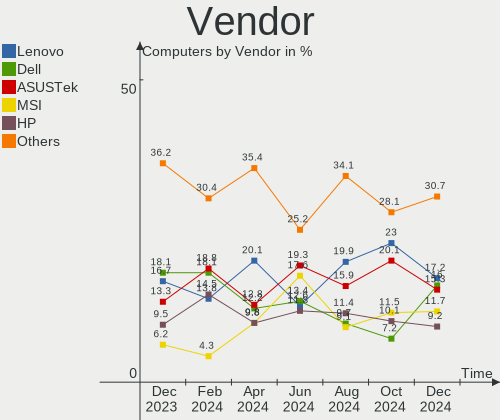
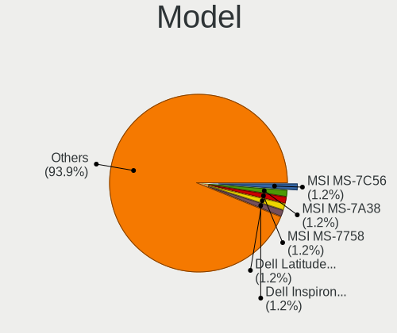
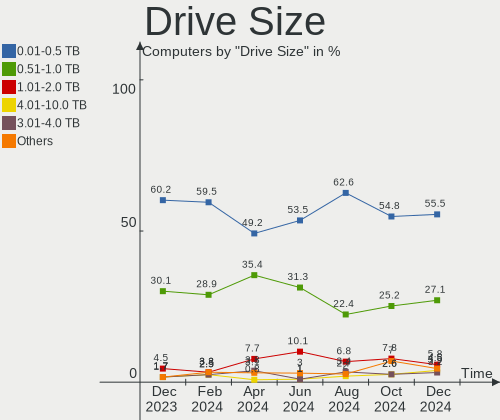
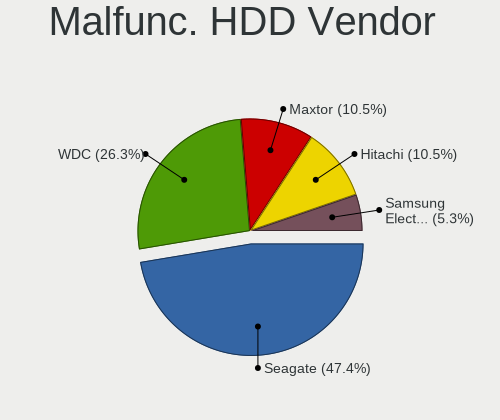
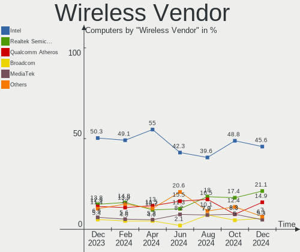
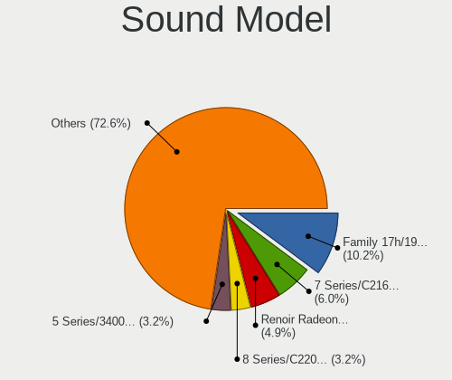

Linux in Poland - Hardware Trends
---------------------------------

A project to identify most popular hardware characteristics and track their change
over time based on data collected by Linux users at https://Linux-Hardware.org.

Anyone can contribute to this report by the [hw-probe](https://github.com/linuxhw/hw-probe) tool:

    sudo -E hw-probe -all -upload

This is a report for all computer types. See also reports for [desktops](/Location/Poland/Desktop/README.md) and [notebooks](/Location/Poland/Notebook/README.md).

Period: Jul, 2023.

Contents
--------

* [ System ](#system)
  - [ OS                       ](#os)
  - [ OS Family                ](#os-family)
  - [ Kernel                   ](#kernel)
  - [ Kernel Family            ](#kernel-family)
  - [ Kernel Major Ver.        ](#kernel-major-ver)
  - [ Arch                     ](#arch)
  - [ DE                       ](#de)
  - [ Display Server           ](#display-server)
  - [ Display Manager          ](#display-manager)
  - [ OS Lang                  ](#os-lang)
  - [ Boot Mode                ](#boot-mode)
  - [ Filesystem               ](#filesystem)
  - [ Part. scheme             ](#part-scheme)
  - [ Dual Boot with Linux/BSD ](#dual-boot-with-linuxbsd)
  - [ Dual Boot (Win)          ](#dual-boot-win)

* [ Board ](#board)
  - [ Vendor                   ](#vendor)
  - [ Model                    ](#model)
  - [ Model Family             ](#model-family)
  - [ MFG Year                 ](#mfg-year)
  - [ Form Factor              ](#form-factor)
  - [ Secure Boot              ](#secure-boot)
  - [ Coreboot                 ](#coreboot)
  - [ RAM Size                 ](#ram-size)
  - [ RAM Used                 ](#ram-used)
  - [ Total Drives             ](#total-drives)
  - [ Has CD-ROM               ](#has-cd-rom)
  - [ Has Ethernet             ](#has-ethernet)
  - [ Has WiFi                 ](#has-wifi)
  - [ Has Bluetooth            ](#has-bluetooth)

* [ Location ](#location)
  - [ Country                  ](#country)
  - [ City                     ](#city)

* [ Drives ](#drives)
  - [ Drive Vendor             ](#drive-vendor)
  - [ Drive Model              ](#drive-model)
  - [ HDD Vendor               ](#hdd-vendor)
  - [ SSD Vendor               ](#ssd-vendor)
  - [ Drive Kind               ](#drive-kind)
  - [ Drive Connector          ](#drive-connector)
  - [ Drive Size               ](#drive-size)
  - [ Space Total              ](#space-total)
  - [ Space Used               ](#space-used)
  - [ Malfunc. Drives          ](#malfunc-drives)
  - [ Malfunc. Drive Vendor    ](#malfunc-drive-vendor)
  - [ Malfunc. HDD Vendor      ](#malfunc-hdd-vendor)
  - [ Malfunc. Drive Kind      ](#malfunc-drive-kind)
  - [ Failed Drives            ](#failed-drives)
  - [ Failed Drive Vendor      ](#failed-drive-vendor)
  - [ Drive Status             ](#drive-status)

* [ Storage controller ](#storage-controller)
  - [ Storage Vendor           ](#storage-vendor)
  - [ Storage Model            ](#storage-model)
  - [ Storage Kind             ](#storage-kind)

* [ Processor ](#processor)
  - [ CPU Vendor               ](#cpu-vendor)
  - [ CPU Model                ](#cpu-model)
  - [ CPU Model Family         ](#cpu-model-family)
  - [ CPU Cores                ](#cpu-cores)
  - [ CPU Sockets              ](#cpu-sockets)
  - [ CPU Threads              ](#cpu-threads)
  - [ CPU Op-Modes             ](#cpu-op-modes)
  - [ CPU Microcode            ](#cpu-microcode)
  - [ CPU Microarch            ](#cpu-microarch)

* [ Graphics ](#graphics)
  - [ GPU Vendor               ](#gpu-vendor)
  - [ GPU Model                ](#gpu-model)
  - [ GPU Combo                ](#gpu-combo)
  - [ GPU Driver               ](#gpu-driver)
  - [ GPU Memory               ](#gpu-memory)

* [ Monitor ](#monitor)
  - [ Monitor Vendor           ](#monitor-vendor)
  - [ Monitor Model            ](#monitor-model)
  - [ Monitor Resolution       ](#monitor-resolution)
  - [ Monitor Diagonal         ](#monitor-diagonal)
  - [ Monitor Width            ](#monitor-width)
  - [ Aspect Ratio             ](#aspect-ratio)
  - [ Monitor Area             ](#monitor-area)
  - [ Pixel Density            ](#pixel-density)
  - [ Multiple Monitors        ](#multiple-monitors)

* [ Network ](#network)
  - [ Net Controller Vendor    ](#net-controller-vendor)
  - [ Net Controller Model     ](#net-controller-model)
  - [ Wireless Vendor          ](#wireless-vendor)
  - [ Wireless Model           ](#wireless-model)
  - [ Ethernet Vendor          ](#ethernet-vendor)
  - [ Ethernet Model           ](#ethernet-model)
  - [ Net Controller Kind      ](#net-controller-kind)
  - [ Used Controller          ](#used-controller)
  - [ NICs                     ](#nics)
  - [ IPv6                     ](#ipv6)

* [ Bluetooth ](#bluetooth)
  - [ Bluetooth Vendor         ](#bluetooth-vendor)
  - [ Bluetooth Model          ](#bluetooth-model)

* [ Sound ](#sound)
  - [ Sound Vendor             ](#sound-vendor)
  - [ Sound Model              ](#sound-model)

* [ Memory ](#memory)
  - [ Memory Vendor            ](#memory-vendor)
  - [ Memory Model             ](#memory-model)
  - [ Memory Kind              ](#memory-kind)
  - [ Memory Form Factor       ](#memory-form-factor)
  - [ Memory Size              ](#memory-size)
  - [ Memory Speed             ](#memory-speed)

* [ Printers & scanners ](#printers--scanners)
  - [ Printer Vendor           ](#printer-vendor)
  - [ Printer Model            ](#printer-model)
  - [ Scanner Vendor           ](#scanner-vendor)
  - [ Scanner Model            ](#scanner-model)

* [ Camera ](#camera)
  - [ Camera Vendor            ](#camera-vendor)
  - [ Camera Model             ](#camera-model)

* [ Security ](#security)
  - [ Fingerprint Vendor       ](#fingerprint-vendor)
  - [ Fingerprint Model        ](#fingerprint-model)
  - [ Chipcard Vendor          ](#chipcard-vendor)
  - [ Chipcard Model           ](#chipcard-model)

* [ Unsupported ](#unsupported)
  - [ Unsupported Devices      ](#unsupported-devices)
  - [ Unsupported Device Types ](#unsupported-device-types)

System
------

OS
--

Installed operating systems

| Name                         | Computers | Percent |
|------------------------------|-----------|---------|
| Ubuntu 22.04                 | 12        | 8.89%   |
| OpenMandriva 23.03           | 10        | 7.41%   |
| Linux Mint 21.1              | 8         | 5.93%   |
| Arch Rolling                 | 8         | 5.93%   |
| Ubuntu 23.04                 | 7         | 5.19%   |
| Fedora 38                    | 7         | 5.19%   |
| Debian 12                    | 7         | 5.19%   |
| Pop!_OS 22.04                | 6         | 4.44%   |
| OpenMandriva 23.07           | 6         | 4.44%   |
| Zorin 16                     | 4         | 2.96%   |
| Ubuntu 20.04                 | 4         | 2.96%   |
| Gentoo 2.13                  | 4         | 2.96%   |
| OpenMandriva 4.3             | 3         | 2.22%   |
| OpenMandriva 23.06           | 3         | 2.22%   |
| Nobara 38                    | 3         | 2.22%   |
| Manjaro                      | 3         | 2.22%   |
| Linux Mint 21.2              | 3         | 2.22%   |
| Xubuntu 22.04                | 2         | 1.48%   |
| Ubuntu MATE 22.04            | 2         | 1.48%   |
| OpenMandriva 23.01           | 2         | 1.48%   |
| MX 23                        | 2         | 1.48%   |
| Kubuntu 22.04                | 2         | 1.48%   |
| Garuda Linux Rolling         | 2         | 1.48%   |
| Xubuntu 20.04                | 1         | 0.74%   |
| Xero Rolling                 | 1         | 0.74%   |
| Void Linux Rolling           | 1         | 0.74%   |
| Ubuntu MATE 20.04            | 1         | 0.74%   |
| Ubuntu 18.04                 | 1         | 0.74%   |
| TUXEDO OS 22.04              | 1         | 0.74%   |
| ROSA 12.4                    | 1         | 0.74%   |
| ROSA 12.3                    | 1         | 0.74%   |
| Raspbian 12                  | 1         | 0.74%   |
| Peppermint 10                | 1         | 0.74%   |
| openSUSE Tumbleweed-XXXXXXXX | 1         | 0.74%   |
| OpenMandriva 4.90            | 1         | 0.74%   |
| Nobara 37                    | 1         | 0.74%   |
| Neptune OS 8.0               | 1         | 0.74%   |
| MX 21                        | 1         | 0.74%   |
| Manjaro 23.0.0               | 1         | 0.74%   |
| LMDE 5                       | 1         | 0.74%   |

OS Family
---------

OS without a version

| Name         | Computers | Percent |
|--------------|-----------|---------|
| OpenMandriva | 25        | 18.52%  |
| Ubuntu       | 24        | 17.78%  |
| Linux Mint   | 12        | 8.89%   |
| Debian       | 8         | 5.93%   |
| Arch         | 8         | 5.93%   |
| Fedora       | 7         | 5.19%   |
| Pop!_OS      | 6         | 4.44%   |
| Zorin        | 4         | 2.96%   |
| Nobara       | 4         | 2.96%   |
| Manjaro      | 4         | 2.96%   |
| Gentoo       | 4         | 2.96%   |
| Xubuntu      | 3         | 2.22%   |
| Ubuntu MATE  | 3         | 2.22%   |
| MX           | 3         | 2.22%   |
| ROSA         | 2         | 1.48%   |
| Kubuntu      | 2         | 1.48%   |
| Garuda Linux | 2         | 1.48%   |
| Xero         | 1         | 0.74%   |
| Void Linux   | 1         | 0.74%   |
| TUXEDO OS    | 1         | 0.74%   |
| Raspbian     | 1         | 0.74%   |
| Peppermint   | 1         | 0.74%   |
| openSUSE     | 1         | 0.74%   |
| Neptune OS   | 1         | 0.74%   |
| LMDE         | 1         | 0.74%   |
| KDE neon     | 1         | 0.74%   |
| Kali         | 1         | 0.74%   |
| EndeavourOS  | 1         | 0.74%   |
| Elementary   | 1         | 0.74%   |
| ChimeraOS    | 1         | 0.74%   |
| CentOS       | 1         | 0.74%   |

Kernel
------

Version of the Linux kernel

| Version                      | Computers | Percent |
|------------------------------|-----------|---------|
| 6.2.6-desktop-1omv2390       | 11        | 8.15%   |
| 5.15.0-76-generic            | 11        | 8.15%   |
| 5.19.0-46-generic            | 10        | 7.41%   |
| 6.3.5-desktop-3omv2390       | 8         | 5.93%   |
| 6.2.6-76060206-generic       | 6         | 4.44%   |
| 6.1.0-10-amd64               | 5         | 3.7%    |
| 6.2.0-24-generic             | 4         | 2.96%   |
| 6.3.8-200.fc38.x86_64        | 3         | 2.22%   |
| 6.3.11-200.fc38.x86_64       | 3         | 2.22%   |
| 6.1.31-gentoo                | 3         | 2.22%   |
| 5.10.0-23-amd64              | 3         | 2.22%   |
| 6.4.2-arch1-1                | 2         | 1.48%   |
| 6.4.1-arch2-1                | 2         | 1.48%   |
| 6.3.12-204.fsync.fc38.x86_64 | 2         | 1.48%   |
| 6.2.0-26-generic             | 2         | 1.48%   |
| 6.1.1-desktop-1omv2290       | 2         | 1.48%   |
| 6.1.0-9-amd64                | 2         | 1.48%   |
| 5.19.0-50-generic            | 2         | 1.48%   |
| 5.19.0-45-generic            | 2         | 1.48%   |
| 5.19.0-32-generic            | 2         | 1.48%   |
| 5.16.7-desktop-1omv4003      | 2         | 1.48%   |
| 5.15.0-78-generic            | 2         | 1.48%   |
| 6.4.6-arch1-1                | 1         | 0.74%   |
| 6.4.4-hardened1-1-hardened   | 1         | 0.74%   |
| 6.4.4-arch1-1                | 1         | 0.74%   |
| 6.4.3-zen1-2-zen             | 1         | 0.74%   |
| 6.4.3-1-default              | 1         | 0.74%   |
| 6.4.2-1-cachyos-tt-lto       | 1         | 0.74%   |
| 6.4.1-zen2-1-zen             | 1         | 0.74%   |
| 6.3.9-chimeraos-1            | 1         | 0.74%   |
| 6.3.9-arch1-1                | 1         | 0.74%   |
| 6.3.12_1                     | 1         | 0.74%   |
| 6.3.12-204.fsync.fc37.x86_64 | 1         | 0.74%   |
| 6.3.11-2-MANJARO             | 1         | 0.74%   |
| 6.3.10-200.fsync.fc38.x86_64 | 1         | 0.74%   |
| 6.3.0-kali1-amd64            | 1         | 0.74%   |
| 6.3.0-2mx-ahs-amd64          | 1         | 0.74%   |
| 6.2.9-300.fc38.x86_64        | 1         | 0.74%   |
| 6.2.0-25-generic             | 1         | 0.74%   |
| 6.2.0-23-generic             | 1         | 0.74%   |

Kernel Family
-------------

Linux kernel without a distro release

| Version  | Computers | Percent |
|----------|-----------|---------|
| 6.2.6    | 17        | 12.59%  |
| 5.19.0   | 17        | 12.59%  |
| 5.15.0   | 16        | 11.85%  |
| 6.2.0    | 9         | 6.67%   |
| 6.3.5    | 8         | 5.93%   |
| 6.1.0    | 8         | 5.93%   |
| 5.4.0    | 7         | 5.19%   |
| 6.3.12   | 4         | 2.96%   |
| 6.3.11   | 4         | 2.96%   |
| 5.10.0   | 4         | 2.96%   |
| 6.4.2    | 3         | 2.22%   |
| 6.4.1    | 3         | 2.22%   |
| 6.3.8    | 3         | 2.22%   |
| 6.1.31   | 3         | 2.22%   |
| 6.1.1    | 3         | 2.22%   |
| 6.4.4    | 2         | 1.48%   |
| 6.4.3    | 2         | 1.48%   |
| 6.3.9    | 2         | 1.48%   |
| 6.3.0    | 2         | 1.48%   |
| 6.1.38   | 2         | 1.48%   |
| 5.16.7   | 2         | 1.48%   |
| 6.4.6    | 1         | 0.74%   |
| 6.3.10   | 1         | 0.74%   |
| 6.2.9    | 1         | 0.74%   |
| 6.1.41   | 1         | 0.74%   |
| 6.1.39   | 1         | 0.74%   |
| 6.1.28   | 1         | 0.74%   |
| 6.1.21   | 1         | 0.74%   |
| 5.18.12  | 1         | 0.74%   |
| 5.16.13  | 1         | 0.74%   |
| 5.15.83  | 1         | 0.74%   |
| 5.15.75  | 1         | 0.74%   |
| 5.15.55  | 1         | 0.74%   |
| 5.10.181 | 1         | 0.74%   |
| 4.18.0   | 1         | 0.74%   |

Kernel Major Ver.
-----------------

Linux kernel major version

| Version | Computers | Percent |
|---------|-----------|---------|
| 6.2     | 27        | 20%     |
| 6.3     | 24        | 17.78%  |
| 6.1     | 20        | 14.81%  |
| 5.15    | 19        | 14.07%  |
| 5.19    | 17        | 12.59%  |
| 6.4     | 11        | 8.15%   |
| 5.4     | 7         | 5.19%   |
| 5.10    | 5         | 3.7%    |
| 5.16    | 3         | 2.22%   |
| 5.18    | 1         | 0.74%   |
| 4.18    | 1         | 0.74%   |

Arch
----

OS architecture (x86_64, i586, etc.)

| Name   | Computers | Percent |
|--------|-----------|---------|
| x86_64 | 133       | 98.52%  |
| armv7l | 1         | 0.74%   |
| armv6l | 1         | 0.74%   |

DE
--

Desktop Environment

| Name            | Computers | Percent |
|-----------------|-----------|---------|
| GNOME           | 51        | 37.78%  |
| KDE5            | 39        | 28.89%  |
| XFCE            | 12        | 8.89%   |
| X-Cinnamon      | 10        | 7.41%   |
| MATE            | 8         | 5.93%   |
| Unknown         | 6         | 4.44%   |
| LXQt            | 3         | 2.22%   |
| i3              | 2         | 1.48%   |
| Pantheon        | 1         | 0.74%   |
| LXDE            | 1         | 0.74%   |
| Hyprland        | 1         | 0.74%   |
| GNOME Flashback | 1         | 0.74%   |

Display Server
--------------

X11 or Wayland

| Name    | Computers | Percent |
|---------|-----------|---------|
| X11     | 96        | 71.11%  |
| Wayland | 32        | 23.7%   |
| Tty     | 4         | 2.96%   |
| Unknown | 3         | 2.22%   |

Display Manager
---------------

SDDM, LightDM, etc.

| Name    | Computers | Percent |
|---------|-----------|---------|
| Unknown | 40        | 29.63%  |
| SDDM    | 36        | 26.67%  |
| LightDM | 24        | 17.78%  |
| GDM3    | 24        | 17.78%  |
| GDM     | 9         | 6.67%   |
| LY-DM   | 1         | 0.74%   |
| LXDM    | 1         | 0.74%   |

OS Lang
-------

Language

| Lang    | Computers | Percent |
|---------|-----------|---------|
| pl_PL   | 84        | 62.22%  |
| en_US   | 38        | 28.15%  |
| C       | 4         | 2.96%   |
| en_GB   | 3         | 2.22%   |
| ru_RU   | 2         | 1.48%   |
| Unknown | 2         | 1.48%   |
| ru_UA   | 1         | 0.74%   |
| en_DK   | 1         | 0.74%   |

Boot Mode
---------

EFI or BIOS

| Mode | Computers | Percent |
|------|-----------|---------|
| EFI  | 70        | 51.85%  |
| BIOS | 65        | 48.15%  |

Filesystem
----------

Type of filesystem

| Type    | Computers | Percent |
|---------|-----------|---------|
| Ext4    | 80        | 59.26%  |
| Btrfs   | 21        | 15.56%  |
| Tmpfs   | 16        | 11.85%  |
| Overlay | 9         | 6.67%   |
| F2fs    | 5         | 3.7%    |
| Zfs     | 2         | 1.48%   |
| Xfs     | 2         | 1.48%   |

Part. scheme
------------

Scheme of partitioning

| Type    | Computers | Percent |
|---------|-----------|---------|
| GPT     | 86        | 63.7%   |
| Unknown | 34        | 25.19%  |
| MBR     | 15        | 11.11%  |

Dual Boot with Linux/BSD
------------------------

Hosting more than one Linux/BSD

| Dual boot | Computers | Percent |
|-----------|-----------|---------|
| No        | 101       | 74.81%  |
| Yes       | 34        | 25.19%  |

Dual Boot (Win)
---------------

Hosting Linux and Windows

| Dual boot | Computers | Percent |
|-----------|-----------|---------|
| No        | 101       | 74.81%  |
| Yes       | 34        | 25.19%  |

Board
-----

Vendor
------

Motherboard manufacturer

| Name                    | Computers | Percent |
|-------------------------|-----------|---------|
| Lenovo                  | 27        | 20%     |
| ASUSTek Computer        | 21        | 15.56%  |
| Hewlett-Packard         | 17        | 12.59%  |
| Dell                    | 17        | 12.59%  |
| Gigabyte Technology     | 12        | 8.89%   |
| ASRock                  | 8         | 5.93%   |
| MSI                     | 7         | 5.19%   |
| Google                  | 4         | 2.96%   |
| Toshiba                 | 3         | 2.22%   |
| Acer                    | 3         | 2.22%   |
| TUXEDO                  | 2         | 1.48%   |
| Raspberry Pi Foundation | 2         | 1.48%   |
| ZOTAC                   | 1         | 0.74%   |
| Timi                    | 1         | 0.74%   |
| Teclast                 | 1         | 0.74%   |
| Seeed Studio            | 1         | 0.74%   |
| Samsung Electronics     | 1         | 0.74%   |
| Razer                   | 1         | 0.74%   |
| Packard Bell            | 1         | 0.74%   |
| Intel                   | 1         | 0.74%   |
| HUAWEI                  | 1         | 0.74%   |
| Fujitsu                 | 1         | 0.74%   |
| Apple                   | 1         | 0.74%   |
| AAEON                   | 1         | 0.74%   |

Model
-----

Motherboard model

| Name                                             | Computers | Percent |
|--------------------------------------------------|-----------|---------|
| MSI MS-7C37                                      | 2         | 1.48%   |
| HP Pavilion Laptop 15-eh2xxx                     | 2         | 1.48%   |
| HP EliteDesk 800 G1 SFF                          | 2         | 1.48%   |
| Google Relm                                      | 2         | 1.48%   |
| ASUS X555LJ                                      | 2         | 1.48%   |
| ASUS M3A78-CM                                    | 2         | 1.48%   |
| ZOTAC ZBOX-BI322                                 | 1         | 0.74%   |
| TUXEDO Stellaris AMD Gen3 (CZN)                  | 1         | 0.74%   |
| TUXEDO InfinityBook Pro Gen7 (MK2)               | 1         | 0.74%   |
| Toshiba Satellite S75-B                          | 1         | 0.74%   |
| Toshiba Satellite C50D-A-11G                     | 1         | 0.74%   |
| Toshiba PORTEGE M700                             | 1         | 0.74%   |
| Timi TM1701                                      | 1         | 0.74%   |
| Teclast F6 Pro                                   | 1         | 0.74%   |
| Seeed Studio ODYSSEY-X86J4105                    | 1         | 0.74%   |
| Samsung 350V5C/351V5C/3540VC/3440VC              | 1         | 0.74%   |
| Razer Blade 15 Base Model (Mid 2021) - RZ09-0410 | 1         | 0.74%   |
| RPi Raspberry Pi Zero W Rev 1.1                  | 1         | 0.74%   |
| RPi Raspberry Pi 3 Model B Rev 1.2               | 1         | 0.74%   |
| Packard Bell EasyNote TSX66HR                    | 1         | 0.74%   |
| MSI PR601/VR603                                  | 1         | 0.74%   |
| MSI MS-7D75                                      | 1         | 0.74%   |
| MSI MS-7882                                      | 1         | 0.74%   |
| MSI H310 Gaming Infinite S (MS-B928)             | 1         | 0.74%   |
| MSI GE70 2QD                                     | 1         | 0.74%   |
| Lenovo Yoga 900-13ISK 80MK                       | 1         | 0.74%   |
| Lenovo Yoga 530-14ARR 81H9                       | 1         | 0.74%   |
| Lenovo Yoga 3 Pro-1370 80HE                      | 1         | 0.74%   |
| Lenovo V520-15IKL 10NK006CPB                     | 1         | 0.74%   |
| Lenovo ThinkPad Yoga 370 20JJS1M111              | 1         | 0.74%   |
| Lenovo ThinkPad Yoga 370 20JJS1DU05              | 1         | 0.74%   |
| Lenovo ThinkPad X380 Yoga 20LJS1T900             | 1         | 0.74%   |
| Lenovo ThinkPad X240 20AMS07T00                  | 1         | 0.74%   |
| Lenovo ThinkPad T495 20NKS0T101                  | 1         | 0.74%   |
| Lenovo ThinkPad T470s 20HGS01A00                 | 1         | 0.74%   |
| Lenovo ThinkPad T470 20HES0FA03                  | 1         | 0.74%   |
| Lenovo ThinkPad P15 Gen 1 20STS1J900             | 1         | 0.74%   |
| Lenovo ThinkPad L470 20J5S01S00                  | 1         | 0.74%   |
| Lenovo ThinkPad Edge 0578P6G                     | 1         | 0.74%   |
| Lenovo ThinkPad E15 Gen 3 20YG00A3PB             | 1         | 0.74%   |

Model Family
------------

Motherboard model prefix

| Name                          | Computers | Percent |
|-------------------------------|-----------|---------|
| Lenovo ThinkPad               | 14        | 10.37%  |
| Dell Latitude                 | 7         | 5.19%   |
| Lenovo IdeaPad                | 5         | 3.7%    |
| HP Pavilion                   | 5         | 3.7%    |
| Dell Inspiron                 | 4         | 2.96%   |
| ASUS PRIME                    | 4         | 2.96%   |
| Lenovo Yoga                   | 3         | 2.22%   |
| HP Compaq                     | 3         | 2.22%   |
| Dell OptiPlex                 | 3         | 2.22%   |
| Acer Aspire                   | 3         | 2.22%   |
| Toshiba Satellite             | 2         | 1.48%   |
| RPi Raspberry                 | 2         | 1.48%   |
| MSI MS-7C37                   | 2         | 1.48%   |
| Lenovo ThinkCentre            | 2         | 1.48%   |
| HP EliteDesk                  | 2         | 1.48%   |
| Google Relm                   | 2         | 1.48%   |
| Gigabyte B450M                | 2         | 1.48%   |
| ASUS X555LJ                   | 2         | 1.48%   |
| ASUS ROG                      | 2         | 1.48%   |
| ASUS M3A78-CM                 | 2         | 1.48%   |
| ZOTAC ZBOX-BI322              | 1         | 0.74%   |
| TUXEDO Stellaris              | 1         | 0.74%   |
| TUXEDO InfinityBook           | 1         | 0.74%   |
| Toshiba PORTEGE               | 1         | 0.74%   |
| Timi TM1701                   | 1         | 0.74%   |
| Teclast F6                    | 1         | 0.74%   |
| Seeed Studio ODYSSEY-X86J4105 | 1         | 0.74%   |
| Samsung 350V5C                | 1         | 0.74%   |
| Razer Blade                   | 1         | 0.74%   |
| Packard Bell EasyNote         | 1         | 0.74%   |
| MSI PR601                     | 1         | 0.74%   |
| MSI MS-7D75                   | 1         | 0.74%   |
| MSI MS-7882                   | 1         | 0.74%   |
| MSI H310                      | 1         | 0.74%   |
| MSI GE70                      | 1         | 0.74%   |
| Lenovo V520-15IKL             | 1         | 0.74%   |
| Lenovo Legion                 | 1         | 0.74%   |
| Lenovo G500s                  | 1         | 0.74%   |
| Intel NUC13ANHi5              | 1         | 0.74%   |
| HUAWEI HVY-WXX9               | 1         | 0.74%   |

MFG Year
--------

Motherboard manufacture year

| Year    | Computers | Percent |
|---------|-----------|---------|
| 2013    | 14        | 10.37%  |
| 2021    | 13        | 9.63%   |
| 2019    | 12        | 8.89%   |
| 2008    | 12        | 8.89%   |
| 2017    | 11        | 8.15%   |
| 2015    | 11        | 8.15%   |
| 2020    | 9         | 6.67%   |
| 2018    | 8         | 5.93%   |
| 2016    | 8         | 5.93%   |
| 2014    | 8         | 5.93%   |
| 2022    | 7         | 5.19%   |
| 2012    | 7         | 5.19%   |
| 2023    | 4         | 2.96%   |
| 2011    | 4         | 2.96%   |
| 2010    | 3         | 2.22%   |
| 2009    | 2         | 1.48%   |
| Unknown | 2         | 1.48%   |

Form Factor
-----------

Physical design of the computer

| Name           | Computers | Percent |
|----------------|-----------|---------|
| Notebook       | 72        | 53.33%  |
| Desktop        | 53        | 39.26%  |
| Convertible    | 5         | 3.7%    |
| System on chip | 2         | 1.48%   |
| Mini pc        | 2         | 1.48%   |
| All in one     | 1         | 0.74%   |

Secure Boot
-----------

Enabled or disabled

| State    | Computers | Percent |
|----------|-----------|---------|
| Disabled | 129       | 95.56%  |
| Enabled  | 6         | 4.44%   |

Coreboot
--------

Have coreboot on board

| Used | Computers | Percent |
|------|-----------|---------|
| No   | 131       | 97.04%  |
| Yes  | 4         | 2.96%   |

RAM Size
--------

Total RAM memory

| Size in GB  | Computers | Percent |
|-------------|-----------|---------|
| 4.01-8.0    | 40        | 29.63%  |
| 16.01-24.0  | 29        | 21.48%  |
| 8.01-16.0   | 21        | 15.56%  |
| 3.01-4.0    | 16        | 11.85%  |
| 32.01-64.0  | 14        | 10.37%  |
| 24.01-32.0  | 4         | 2.96%   |
| 64.01-256.0 | 4         | 2.96%   |
| 1.01-2.0    | 3         | 2.22%   |
| 0.51-1.0    | 2         | 1.48%   |
| 2.01-3.0    | 1         | 0.74%   |
| 0.01-0.5    | 1         | 0.74%   |

RAM Used
--------

Used RAM memory

| Used GB    | Computers | Percent |
|------------|-----------|---------|
| 2.01-3.0   | 39        | 28.89%  |
| 1.01-2.0   | 34        | 25.19%  |
| 4.01-8.0   | 28        | 20.74%  |
| 3.01-4.0   | 19        | 14.07%  |
| 8.01-16.0  | 5         | 3.7%    |
| 0.51-1.0   | 5         | 3.7%    |
| 16.01-24.0 | 3         | 2.22%   |
| 0.01-0.5   | 2         | 1.48%   |

Total Drives
------------

Number of drives on board

| Drives | Computers | Percent |
|--------|-----------|---------|
| 1      | 79        | 58.52%  |
| 2      | 31        | 22.96%  |
| 3      | 12        | 8.89%   |
| 4      | 8         | 5.93%   |
| 11     | 1         | 0.74%   |
| 8      | 1         | 0.74%   |
| 7      | 1         | 0.74%   |
| 6      | 1         | 0.74%   |
| 5      | 1         | 0.74%   |

Has CD-ROM
----------

Has CD-ROM on board

| Presented | Computers | Percent |
|-----------|-----------|---------|
| No        | 87        | 64.44%  |
| Yes       | 48        | 35.56%  |

Has Ethernet
------------

Has Ethernet on board

| Presented | Computers | Percent |
|-----------|-----------|---------|
| Yes       | 112       | 82.96%  |
| No        | 23        | 17.04%  |

Has WiFi
--------

Has WiFi module

| Presented | Computers | Percent |
|-----------|-----------|---------|
| Yes       | 95        | 70.37%  |
| No        | 40        | 29.63%  |

Has Bluetooth
-------------

Has Bluetooth module

| Presented | Computers | Percent |
|-----------|-----------|---------|
| Yes       | 85        | 62.96%  |
| No        | 50        | 37.04%  |

Location
--------

Country
-------

Geographic location (country)

| Country | Computers | Percent |
|---------|-----------|---------|
| Poland  | 135       | 100%    |

City
----

Geographic location (city)

| City                 | Computers | Percent |
|----------------------|-----------|---------|
| Warsaw               | 42        | 31.11%  |
| Krakow               | 8         | 5.93%   |
| Wroclaw              | 6         | 4.44%   |
| Poznan               | 5         | 3.7%    |
| Katowice             | 5         | 3.7%    |
| Gdansk               | 5         | 3.7%    |
| Bialystok            | 4         | 2.96%   |
| Lodz                 | 3         | 2.22%   |
| Gdynia               | 3         | 2.22%   |
| Zielona Góra        | 2         | 1.48%   |
| Zabrze               | 2         | 1.48%   |
| Legnica              | 2         | 1.48%   |
| Kielce               | 2         | 1.48%   |
| Grajewo              | 2         | 1.48%   |
| Cieszyn              | 2         | 1.48%   |
| Bydgoszcz            | 2         | 1.48%   |
| Łomża              | 1         | 0.74%   |
| Złotoryja           | 1         | 0.74%   |
| Żory                | 1         | 0.74%   |
| Zabrowo              | 1         | 0.74%   |
| Wołomin             | 1         | 0.74%   |
| Wieluń              | 1         | 0.74%   |
| Turek                | 1         | 0.74%   |
| Swiebodzice          | 1         | 0.74%   |
| Suwałki             | 1         | 0.74%   |
| Sucha Beskidzka      | 1         | 0.74%   |
| Stargard             | 1         | 0.74%   |
| Sitno                | 1         | 0.74%   |
| Ryczowek             | 1         | 0.74%   |
| Rybnik               | 1         | 0.74%   |
| Reda                 | 1         | 0.74%   |
| Pszczyna             | 1         | 0.74%   |
| Przeworsk            | 1         | 0.74%   |
| Ozarow Mazowiecki    | 1         | 0.74%   |
| Otwock               | 1         | 0.74%   |
| Ostrołęka          | 1         | 0.74%   |
| Ostrów Wielkopolski | 1         | 0.74%   |
| Opole                | 1         | 0.74%   |
| Nysa                 | 1         | 0.74%   |
| Mikołów            | 1         | 0.74%   |

Drives
------

Drive Vendor
------------

Hard drive vendors

| Vendor                       | Computers | Drives | Percent |
|------------------------------|-----------|--------|---------|
| Samsung Electronics          | 33        | 43     | 16.18%  |
| Seagate                      | 24        | 25     | 11.76%  |
| WDC                          | 23        | 37     | 11.27%  |
| GOODRAM                      | 17        | 19     | 8.33%   |
| Toshiba                      | 10        | 10     | 4.9%    |
| Crucial                      | 10        | 11     | 4.9%    |
| Unknown                      | 9         | 12     | 4.41%   |
| A-DATA Technology            | 9         | 9      | 4.41%   |
| SanDisk                      | 6         | 6      | 2.94%   |
| Kingston                     | 6         | 6      | 2.94%   |
| SK hynix                     | 5         | 5      | 2.45%   |
| Patriot                      | 5         | 5      | 2.45%   |
| Intel                        | 5         | 5      | 2.45%   |
| Hitachi                      | 5         | 7      | 2.45%   |
| SPCC                         | 4         | 5      | 1.96%   |
| Micron Technology            | 4         | 4      | 1.96%   |
| China                        | 4         | 6      | 1.96%   |
| PNY                          | 3         | 3      | 1.47%   |
| Transcend                    | 2         | 2      | 0.98%   |
| Silicon Motion               | 2         | 2      | 0.98%   |
| Lenovo                       | 2         | 2      | 0.98%   |
| KIOXIA                       | 2         | 2      | 0.98%   |
| ADATA Technology             | 2         | 2      | 0.98%   |
| Shenzhen Longsys Electronics | 1         | 1      | 0.49%   |
| Realtek Semiconductor        | 1         | 1      | 0.49%   |
| Realtek                      | 1         | 1      | 0.49%   |
| Plextor                      | 1         | 1      | 0.49%   |
| Lexar                        | 1         | 1      | 0.49%   |
| KIOXIA-EXCERIA               | 1         | 1      | 0.49%   |
| KingSpec                     | 1         | 1      | 0.49%   |
| JMicron Technology           | 1         | 1      | 0.49%   |
| HGST                         | 1         | 1      | 0.49%   |
| Gigabyte Technology          | 1         | 1      | 0.49%   |
| Fujitsu                      | 1         | 1      | 0.49%   |
| Biostar                      | 1         | 1      | 0.49%   |

Drive Model
-----------

Hard drive models

| Model                                                              | Computers | Percent |
|--------------------------------------------------------------------|-----------|---------|
| Samsung NVMe SSD Controller SM981/PM981/PM983 500GB                | 5         | 2.2%    |
| Samsung NVMe SSD Controller PM9A1/PM9A3/980PRO 1TB                 | 5         | 2.2%    |
| Samsung SSD 980 1TB                                                | 4         | 1.76%   |
| Toshiba HDWD110 1TB                                                | 3         | 1.32%   |
| Seagate ST1000LM024 HN-M101MBB 1TB                                 | 3         | 1.32%   |
| Seagate ST1000DM010-2EP102 1TB                                     | 3         | 1.32%   |
| Samsung NVMe SSD Controller SM961/PM961/SM963 256GB                | 3         | 1.32%   |
| GOODRAM SSD 240GB                                                  | 3         | 1.32%   |
| WDC WD40EFRX-68N32N0 4TB                                           | 2         | 0.88%   |
| WDC WD20EFRX-68EUZN0 2TB                                           | 2         | 0.88%   |
| Unknown MMC Card  16GB                                             | 2         | 0.88%   |
| Seagate ST3500418AS 500GB                                          | 2         | 0.88%   |
| Seagate ST250DM000-1BD141 250GB                                    | 2         | 0.88%   |
| Seagate ST2000DM006-2DM164 2TB                                     | 2         | 0.88%   |
| Samsung SSD 870 EVO 500GB                                          | 2         | 0.88%   |
| Samsung SSD 860 EVO 500GB                                          | 2         | 0.88%   |
| Samsung SSD 860 EVO 1TB                                            | 2         | 0.88%   |
| Samsung MZALQ256HAJD-000L2 256GB                                   | 2         | 0.88%   |
| Lenovo LENSE30256GMSP34MEAT3TA 256GB                               | 2         | 0.88%   |
| Hitachi HUS724030ALE641 3TB                                        | 2         | 0.88%   |
| GOODRAM SSDPR-CX400-512 512GB                                      | 2         | 0.88%   |
| GOODRAM SSDPR-CX400-256-G2 256GB                                   | 2         | 0.88%   |
| GOODRAM SSDPR-CX400-01T-G2 1TB                                     | 2         | 0.88%   |
| GOODRAM SSDPR-CL100-480-G2 480GB                                   | 2         | 0.88%   |
| Crucial CT240BX500SSD1 240GB                                       | 2         | 0.88%   |
| China SSD 512GB                                                    | 2         | 0.88%   |
| ADATA XPG SX8200 Pro PCIe Gen3x4 M.2 2280 Solid State Drive 1024GB | 2         | 0.88%   |
| A-DATA SU800 256GB SSD                                             | 2         | 0.88%   |
| A-DATA SU650 512GB SSD                                             | 2         | 0.88%   |
| WDC WDS500G2B0B-00YS70 500GB SSD                                   | 1         | 0.44%   |
| WDC WDS480G2G0A-00JH30 480GB SSD                                   | 1         | 0.44%   |
| WDC WDS240G2G0A-00JH30 240GB SSD                                   | 1         | 0.44%   |
| WDC WDS100T2B0C-00PXH0 1TB                                         | 1         | 0.44%   |
| WDC WDS100T2B0B-00YS70 1TB SSD                                     | 1         | 0.44%   |
| WDC WD7500AADS-00M2B0 752GB                                        | 1         | 0.44%   |
| WDC WD60EFRX-68MYMN1 6TB                                           | 1         | 0.44%   |
| WDC WD6003FFBX-68MU3N0 6TB                                         | 1         | 0.44%   |
| WDC WD5000AADS-00S9B0 500GB                                        | 1         | 0.44%   |
| WDC WD40PURZ-85TTDY0 4TB                                           | 1         | 0.44%   |
| WDC WD40EFZX-68AWUN0 4TB                                           | 1         | 0.44%   |

HDD Vendor
----------

Hard disk drive vendors

| Vendor              | Computers | Drives | Percent |
|---------------------|-----------|--------|---------|
| Seagate             | 24        | 25     | 43.64%  |
| WDC                 | 14        | 28     | 25.45%  |
| Toshiba             | 7         | 7      | 12.73%  |
| Hitachi             | 5         | 7      | 9.09%   |
| Samsung Electronics | 2         | 3      | 3.64%   |
| JMicron Technology  | 1         | 1      | 1.82%   |
| HGST                | 1         | 1      | 1.82%   |
| Fujitsu             | 1         | 1      | 1.82%   |

SSD Vendor
----------

Solid state drive vendors

| Vendor              | Computers | Drives | Percent |
|---------------------|-----------|--------|---------|
| GOODRAM             | 16        | 18     | 19.28%  |
| Samsung Electronics | 11        | 14     | 13.25%  |
| Crucial             | 9         | 10     | 10.84%  |
| A-DATA Technology   | 8         | 8      | 9.64%   |
| SanDisk             | 5         | 5      | 6.02%   |
| Patriot             | 5         | 5      | 6.02%   |
| WDC                 | 4         | 4      | 4.82%   |
| SPCC                | 4         | 5      | 4.82%   |
| China               | 4         | 6      | 4.82%   |
| PNY                 | 3         | 3      | 3.61%   |
| Micron Technology   | 3         | 3      | 3.61%   |
| Transcend           | 2         | 2      | 2.41%   |
| SK hynix            | 2         | 2      | 2.41%   |
| Intel               | 2         | 2      | 2.41%   |
| Plextor             | 1         | 1      | 1.2%    |
| Kingston            | 1         | 1      | 1.2%    |
| KingSpec            | 1         | 1      | 1.2%    |
| Gigabyte Technology | 1         | 1      | 1.2%    |
| Biostar             | 1         | 1      | 1.2%    |

Drive Kind
----------

HDD or SSD

| Kind    | Computers | Drives | Percent |
|---------|-----------|--------|---------|
| SSD     | 66        | 92     | 36.67%  |
| NVMe    | 55        | 63     | 30.56%  |
| HDD     | 50        | 73     | 27.78%  |
| MMC     | 8         | 9      | 4.44%   |
| Unknown | 1         | 3      | 0.56%   |

Drive Connector
---------------

SATA, SAS, NVMe, etc.

| Type | Computers | Drives | Percent |
|------|-----------|--------|---------|
| SATA | 94        | 162    | 58.02%  |
| NVMe | 55        | 62     | 33.95%  |
| MMC  | 8         | 9      | 4.94%   |
| SAS  | 5         | 7      | 3.09%   |

Drive Size
----------

Size of hard drive

| Size in TB | Computers | Drives | Percent |
|------------|-----------|--------|---------|
| 0.01-0.5   | 62        | 80     | 48.44%  |
| 0.51-1.0   | 45        | 52     | 35.16%  |
| 1.01-2.0   | 9         | 11     | 7.03%   |
| 3.01-4.0   | 4         | 12     | 3.13%   |
| 4.01-10.0  | 4         | 4      | 3.13%   |
| 2.01-3.0   | 3         | 5      | 2.34%   |
| 10.01-20.0 | 1         | 1      | 0.78%   |

Space Total
-----------

Amount of disk space available on the file system

| Size in GB     | Computers | Percent |
|----------------|-----------|---------|
| 101-250        | 35        | 25.93%  |
| 251-500        | 27        | 20%     |
| 501-1000       | 21        | 15.56%  |
| 1001-2000      | 13        | 9.63%   |
| 1-20           | 9         | 6.67%   |
| 21-50          | 7         | 5.19%   |
| 2001-3000      | 7         | 5.19%   |
| 51-100         | 7         | 5.19%   |
| More than 3000 | 5         | 3.7%    |
| Unknown        | 4         | 2.96%   |

Space Used
----------

Amount of used disk space

| Used GB        | Computers | Percent |
|----------------|-----------|---------|
| 1-20           | 44        | 32.59%  |
| 101-250        | 21        | 15.56%  |
| 21-50          | 20        | 14.81%  |
| 51-100         | 13        | 9.63%   |
| 251-500        | 11        | 8.15%   |
| 501-1000       | 11        | 8.15%   |
| 1001-2000      | 6         | 4.44%   |
| Unknown        | 4         | 2.96%   |
| More than 3000 | 3         | 2.22%   |
| 2001-3000      | 2         | 1.48%   |

Malfunc. Drives
---------------

Drive models with a malfunction

| Model                                               | Computers | Drives | Percent |
|-----------------------------------------------------|-----------|--------|---------|
| WDC WD30EFRX-68EUZN0 3TB                            | 1         | 1      | 5.56%   |
| Toshiba MQ01ABD100 1TB                              | 1         | 1      | 5.56%   |
| Toshiba DT01ACA050 500GB                            | 1         | 1      | 5.56%   |
| Seagate ST9250827AS 250GB                           | 1         | 1      | 5.56%   |
| Seagate ST9250410ASG 250GB                          | 1         | 1      | 5.56%   |
| Seagate ST500LT012-9WS142 500GB                     | 1         | 1      | 5.56%   |
| Seagate ST500DM002-1BD142 500GB                     | 1         | 1      | 5.56%   |
| Seagate ST3500418AS 500GB                           | 1         | 1      | 5.56%   |
| Seagate ST1000LM024 HN-M101MBB 1TB                  | 1         | 1      | 5.56%   |
| Seagate ST1000DM003-9YN162 1TB                      | 1         | 1      | 5.56%   |
| Samsung Electronics SSD 850 PRO 512GB               | 1         | 1      | 5.56%   |
| Micron Technology MTFDDAK256TBN-1AR1ZABHA 256GB SSD | 1         | 1      | 5.56%   |
| Intel SSDSC2BF180A5L 180GB                          | 1         | 1      | 5.56%   |
| Hitachi HTS543225L9SA00 250GB                       | 1         | 1      | 5.56%   |
| Fujitsu MHZ2120BH G2 120GB                          | 1         | 1      | 5.56%   |
| Crucial CT256M550SSD1 256GB                         | 1         | 1      | 5.56%   |
| Crucial CT1000MX500SSD4 1TB                         | 1         | 1      | 5.56%   |
| China SATA3 512GB SSD                               | 1         | 1      | 5.56%   |

Malfunc. Drive Vendor
---------------------

Vendors of faulty drives

| Vendor              | Computers | Drives | Percent |
|---------------------|-----------|--------|---------|
| Seagate             | 7         | 7      | 38.89%  |
| Toshiba             | 2         | 2      | 11.11%  |
| Crucial             | 2         | 2      | 11.11%  |
| WDC                 | 1         | 1      | 5.56%   |
| Samsung Electronics | 1         | 1      | 5.56%   |
| Micron Technology   | 1         | 1      | 5.56%   |
| Intel               | 1         | 1      | 5.56%   |
| Hitachi             | 1         | 1      | 5.56%   |
| Fujitsu             | 1         | 1      | 5.56%   |
| China               | 1         | 1      | 5.56%   |

Malfunc. HDD Vendor
-------------------

Vendors of faulty HDD drives

| Vendor  | Computers | Drives | Percent |
|---------|-----------|--------|---------|
| Seagate | 7         | 7      | 58.33%  |
| Toshiba | 2         | 2      | 16.67%  |
| WDC     | 1         | 1      | 8.33%   |
| Hitachi | 1         | 1      | 8.33%   |
| Fujitsu | 1         | 1      | 8.33%   |

Malfunc. Drive Kind
-------------------

Kinds of faulty drives

| Kind | Computers | Drives | Percent |
|------|-----------|--------|---------|
| HDD  | 11        | 12     | 64.71%  |
| SSD  | 6         | 6      | 35.29%  |

Failed Drives
-------------

Failed drive models

Zero info for selected period =(

Failed Drive Vendor
-------------------

Failed drive vendors

Zero info for selected period =(

Drive Status
------------

Number of failed and malfunc. drives

| Status   | Computers | Drives | Percent |
|----------|-----------|--------|---------|
| Works    | 72        | 136    | 48.98%  |
| Detected | 59        | 86     | 40.14%  |
| Malfunc  | 16        | 18     | 10.88%  |

Storage controller
------------------

Storage Vendor
--------------

Storage controller vendors

| Vendor                       | Computers | Percent |
|------------------------------|-----------|---------|
| Intel                        | 82        | 46.86%  |
| Samsung Electronics          | 24        | 13.71%  |
| AMD                          | 24        | 13.71%  |
| SanDisk                      | 6         | 3.43%   |
| Kingston Technology Company  | 5         | 2.86%   |
| KIOXIA                       | 4         | 2.29%   |
| JMicron Technology           | 4         | 2.29%   |
| ASMedia Technology           | 4         | 2.29%   |
| SK hynix                     | 3         | 1.71%   |
| ADATA Technology             | 3         | 1.71%   |
| Toshiba America Info Systems | 2         | 1.14%   |
| Silicon Motion               | 2         | 1.14%   |
| Lenovo                       | 2         | 1.14%   |
| VIA Technologies             | 1         | 0.57%   |
| Silicon Image                | 1         | 0.57%   |
| Shenzhen Longsys Electronics | 1         | 0.57%   |
| Realtek Semiconductor        | 1         | 0.57%   |
| Phison Electronics           | 1         | 0.57%   |
| Nvidia                       | 1         | 0.57%   |
| Micron/Crucial Technology    | 1         | 0.57%   |
| Micron Technology            | 1         | 0.57%   |
| MAXIO Technology (Hangzhou)  | 1         | 0.57%   |
| Marvell Technology Group     | 1         | 0.57%   |

Storage Model
-------------

Storage controller models

| Model                                                                            | Computers | Percent |
|----------------------------------------------------------------------------------|-----------|---------|
| AMD FCH SATA Controller [AHCI mode]                                              | 17        | 8.42%   |
| Samsung NVMe SSD Controller 980                                                  | 10        | 4.95%   |
| Intel 8 Series/C220 Series Chipset Family 6-port SATA Controller 1 [AHCI mode]   | 9         | 4.46%   |
| Samsung NVMe SSD Controller SM981/PM981/PM983                                    | 6         | 2.97%   |
| Intel 82801 Mobile SATA Controller [RAID mode]                                   | 6         | 2.97%   |
| Intel 7 Series Chipset Family 6-port SATA Controller [AHCI mode]                 | 6         | 2.97%   |
| Samsung NVMe SSD Controller PM9A1/PM9A3/980PRO                                   | 5         | 2.48%   |
| Intel Sunrise Point-LP SATA Controller [AHCI mode]                               | 5         | 2.48%   |
| Intel 200 Series PCH SATA controller [AHCI mode]                                 | 5         | 2.48%   |
| AMD SB7x0/SB8x0/SB9x0 IDE Controller                                             | 5         | 2.48%   |
| Intel Q170/Q150/B150/H170/H110/Z170/CM236 Chipset SATA Controller [AHCI Mode]    | 4         | 1.98%   |
| Intel 82801HM/HEM (ICH8M/ICH8M-E) SATA Controller [AHCI mode]                    | 4         | 1.98%   |
| Intel 82801HM/HEM (ICH8M/ICH8M-E) IDE Controller                                 | 4         | 1.98%   |
| Intel 8 Series SATA Controller 1 [AHCI mode]                                     | 4         | 1.98%   |
| ASMedia ASM1062 Serial ATA Controller                                            | 4         | 1.98%   |
| AMD SB7x0/SB8x0/SB9x0 SATA Controller [IDE mode]                                 | 4         | 1.98%   |
| SanDisk WD Blue SN550 NVMe SSD                                                   | 3         | 1.49%   |
| Samsung NVMe SSD Controller SM961/PM961/SM963                                    | 3         | 1.49%   |
| JMicron JMB363 SATA/IDE Controller                                               | 3         | 1.49%   |
| Intel Wildcat Point-LP SATA Controller [AHCI Mode]                               | 3         | 1.49%   |
| Intel SATA Controller [RAID mode]                                                | 3         | 1.49%   |
| Intel C610/X99 series chipset 6-Port SATA Controller [AHCI mode]                 | 3         | 1.49%   |
| AMD 400 Series Chipset SATA Controller                                           | 3         | 1.49%   |
| ADATA XPG SX8200 Pro PCIe Gen3x4 M.2 2280 Solid State Drive                      | 3         | 1.49%   |
| Lenovo LENSE30256GMSP34MEAT3TA                                                   | 2         | 0.99%   |
| KIOXIA NVMe SSD Controller BG4 (DRAM-less)                                       | 2         | 0.99%   |
| Kingston Company NVMe Controller                                                 | 2         | 0.99%   |
| Kingston Company KC3000/Renegade NVMe SSD                                        | 2         | 0.99%   |
| Intel Volume Management Device NVMe RAID Controller                              | 2         | 0.99%   |
| Intel SSD 660P Series                                                            | 2         | 0.99%   |
| Intel HM170/QM170 Chipset SATA Controller [AHCI Mode]                            | 2         | 0.99%   |
| Intel Celeron/Pentium Silver Processor SATA Controller                           | 2         | 0.99%   |
| Intel Cannon Lake Mobile PCH SATA AHCI Controller                                | 2         | 0.99%   |
| Intel C610/X99 series chipset sSATA Controller [AHCI mode]                       | 2         | 0.99%   |
| Intel Atom/Celeron/Pentium Processor x5-E8000/J3xxx/N3xxx Series SATA Controller | 2         | 0.99%   |
| Intel Alder Lake-S PCH SATA Controller [AHCI Mode]                               | 2         | 0.99%   |
| Intel 4 Series Chipset PT IDER Controller                                        | 2         | 0.99%   |
| VIA VT6421 IDE/SATA Controller                                                   | 1         | 0.5%    |
| Toshiba America Info Systems XG6 NVMe SSD Controller                             | 1         | 0.5%    |
| Toshiba America Info Systems XG3 NVMe SSD Controller                             | 1         | 0.5%    |

Storage Kind
------------

Kind of storage controller (IDE, SATA, NVMe, SAS, ...)

| Kind | Computers | Percent |
|------|-----------|---------|
| SATA | 88        | 50.29%  |
| NVMe | 55        | 31.43%  |
| IDE  | 19        | 10.86%  |
| RAID | 13        | 7.43%   |

Processor
---------

CPU Vendor
----------

Processor vendors

| Vendor | Computers | Percent |
|--------|-----------|---------|
| Intel  | 95        | 70.37%  |
| AMD    | 38        | 28.15%  |
| ARM    | 2         | 1.48%   |

CPU Model
---------

Processor models

| Model                                    | Computers | Percent |
|------------------------------------------|-----------|---------|
| Intel Core i5-6500 CPU @ 3.20GHz         | 5         | 3.7%    |
| Intel Core i5-7300U CPU @ 2.60GHz        | 4         | 2.96%   |
| Intel Core i7-4790 CPU @ 3.60GHz         | 3         | 2.22%   |
| Intel Celeron CPU N3060 @ 1.60GHz        | 3         | 2.22%   |
| AMD Ryzen 5 4500U with Radeon Graphics   | 3         | 2.22%   |
| AMD Phenom II X4 955 Processor           | 3         | 2.22%   |
| Intel Core i7-9750H CPU @ 2.60GHz        | 2         | 1.48%   |
| Intel Core i5-8250U CPU @ 1.60GHz        | 2         | 1.48%   |
| Intel Core i5-4690 CPU @ 3.50GHz         | 2         | 1.48%   |
| Intel Core i5-3470 CPU @ 3.20GHz         | 2         | 1.48%   |
| Intel Core i5-3210M CPU @ 2.50GHz        | 2         | 1.48%   |
| Intel Core i3-4030U CPU @ 1.90GHz        | 2         | 1.48%   |
| Intel 12th Gen Core i7-12700H            | 2         | 1.48%   |
| ARM BCM2835 Processor                    | 2         | 1.48%   |
| AMD Ryzen 5 4600H with Radeon Graphics   | 2         | 1.48%   |
| AMD Ryzen 5 3600 6-Core Processor        | 2         | 1.48%   |
| AMD Ryzen 5 2600 Six-Core Processor      | 2         | 1.48%   |
| Intel Xeon W-10855M CPU @ 2.80GHz        | 1         | 0.74%   |
| Intel Xeon CPU E5-2680 v3 @ 2.50GHz      | 1         | 0.74%   |
| Intel Xeon CPU E5-1603 v3 @ 2.80GHz      | 1         | 0.74%   |
| Intel Xeon CPU E3-1240 v5 @ 3.50GHz      | 1         | 0.74%   |
| Intel Pentium Silver N5000 CPU @ 1.10GHz | 1         | 0.74%   |
| Intel Pentium Dual CPU T3400 @ 2.16GHz   | 1         | 0.74%   |
| Intel Pentium CPU B980 @ 2.40GHz         | 1         | 0.74%   |
| Intel Pentium CPU 2020M @ 2.40GHz        | 1         | 0.74%   |
| Intel Core m3-7Y30 CPU @ 1.00GHz         | 1         | 0.74%   |
| Intel Core M-5Y71 CPU @ 1.20GHz          | 1         | 0.74%   |
| Intel Core i7-8700K CPU @ 3.70GHz        | 1         | 0.74%   |
| Intel Core i7-6700HQ CPU @ 2.60GHz       | 1         | 0.74%   |
| Intel Core i7-6700 CPU @ 3.40GHz         | 1         | 0.74%   |
| Intel Core i7-5960X CPU @ 3.00GHz        | 1         | 0.74%   |
| Intel Core i7-5500U CPU @ 2.40GHz        | 1         | 0.74%   |
| Intel Core i7-4710HQ CPU @ 2.50GHz       | 1         | 0.74%   |
| Intel Core i7-3610QM CPU @ 2.30GHz       | 1         | 0.74%   |
| Intel Core i7-3610QE CPU @ 2.30GHz       | 1         | 0.74%   |
| Intel Core i7 CPU 920 @ 2.67GHz          | 1         | 0.74%   |
| Intel Core i5-9300H CPU @ 2.40GHz        | 1         | 0.74%   |
| Intel Core i5-8400 CPU @ 2.80GHz         | 1         | 0.74%   |
| Intel Core i5-8350U CPU @ 1.70GHz        | 1         | 0.74%   |
| Intel Core i5-8265U CPU @ 1.60GHz        | 1         | 0.74%   |

CPU Model Family
----------------

Processor model prefix

| Model                | Computers | Percent |
|----------------------|-----------|---------|
| Intel Core i5        | 39        | 28.89%  |
| AMD Ryzen 5          | 17        | 12.59%  |
| Intel Core i7        | 14        | 10.37%  |
| Other                | 9         | 6.67%   |
| Intel Core i3        | 7         | 5.19%   |
| Intel Celeron        | 7         | 5.19%   |
| Intel Core 2 Duo     | 5         | 3.7%    |
| Intel Xeon           | 4         | 2.96%   |
| AMD Ryzen 9          | 4         | 2.96%   |
| Intel Core 2 Quad    | 3         | 2.22%   |
| AMD Ryzen 7          | 3         | 2.22%   |
| AMD Phenom II X4     | 3         | 2.22%   |
| Intel Pentium        | 2         | 1.48%   |
| Intel Atom           | 2         | 1.48%   |
| ARM BCM              | 2         | 1.48%   |
| AMD A10              | 2         | 1.48%   |
| Intel Pentium Silver | 1         | 0.74%   |
| Intel Pentium Dual   | 1         | 0.74%   |
| Intel Core m3        | 1         | 0.74%   |
| Intel Core M         | 1         | 0.74%   |
| AMD Sempron          | 1         | 0.74%   |
| AMD Ryzen 5 PRO      | 1         | 0.74%   |
| AMD Ryzen 3 PRO      | 1         | 0.74%   |
| AMD Ryzen 3          | 1         | 0.74%   |
| AMD E1               | 1         | 0.74%   |
| AMD Athlon II X3     | 1         | 0.74%   |
| AMD Athlon II X2     | 1         | 0.74%   |
| AMD Athlon           | 1         | 0.74%   |

CPU Cores
---------

Number of processor cores

| Number | Computers | Percent |
|--------|-----------|---------|
| 4      | 54        | 40%     |
| 2      | 43        | 31.85%  |
| 6      | 19        | 14.07%  |
| 8      | 7         | 5.19%   |
| 12     | 4         | 2.96%   |
| 1      | 4         | 2.96%   |
| 14     | 2         | 1.48%   |
| 10     | 1         | 0.74%   |
| 3      | 1         | 0.74%   |

CPU Sockets
-----------

Number of sockets

| Number | Computers | Percent |
|--------|-----------|---------|
| 1      | 135       | 100%    |

CPU Threads
-----------

Threads per core (Hyper-Threading)

| Number | Computers | Percent |
|--------|-----------|---------|
| 2      | 80        | 59.26%  |
| 1      | 55        | 40.74%  |

CPU Op-Modes
------------

CPU Operation Modes (32-bit, 64-bit)

| Op mode        | Computers | Percent |
|----------------|-----------|---------|
| 32-bit, 64-bit | 133       | 98.52%  |
| Unknown        | 2         | 1.48%   |

CPU Microcode
-------------

Microcode number

| Number     | Computers | Percent |
|------------|-----------|---------|
| Unknown    | 70        | 51.85%  |
| 0x306c3    | 5         | 3.7%    |
| 0x506e3    | 4         | 2.96%   |
| 0x6fd      | 3         | 2.22%   |
| 0x406c4    | 3         | 2.22%   |
| 0x306a9    | 3         | 2.22%   |
| 0x08108109 | 3         | 2.22%   |
| 0x010000c8 | 3         | 2.22%   |
| 0x906ea    | 2         | 1.48%   |
| 0x906e9    | 2         | 1.48%   |
| 0x40651    | 2         | 1.48%   |
| 0x306f2    | 2         | 1.48%   |
| 0x306d4    | 2         | 1.48%   |
| 0x1067a    | 2         | 1.48%   |
| 0x0a50000d | 2         | 1.48%   |
| 0x08701021 | 2         | 1.48%   |
| 0x08600106 | 2         | 1.48%   |
| 0xa0653    | 1         | 0.74%   |
| 0xa0652    | 1         | 0.74%   |
| 0x906a3    | 1         | 0.74%   |
| 0x806e9    | 1         | 0.74%   |
| 0x806c1    | 1         | 0.74%   |
| 0x706a1    | 1         | 0.74%   |
| 0x6f7      | 1         | 0.74%   |
| 0x106a5    | 1         | 0.74%   |
| 0x10676    | 1         | 0.74%   |
| 0x0a601203 | 1         | 0.74%   |
| 0x0a50000c | 1         | 0.74%   |
| 0x08608103 | 1         | 0.74%   |
| 0x08600104 | 1         | 0.74%   |
| 0x08108102 | 1         | 0.74%   |
| 0x0810100b | 1         | 0.74%   |
| 0x0800820d | 1         | 0.74%   |
| 0x0800820b | 1         | 0.74%   |
| 0x0700010f | 1         | 0.74%   |
| 0x06006705 | 1         | 0.74%   |
| 0x0600611a | 1         | 0.74%   |
| 0x06001119 | 1         | 0.74%   |
| 0x05000119 | 1         | 0.74%   |
| 0x010000db | 1         | 0.74%   |

CPU Microarch
-------------

Microarchitecture

| Name             | Computers | Percent |
|------------------|-----------|---------|
| Haswell          | 20        | 14.81%  |
| KabyLake         | 18        | 13.33%  |
| Skylake          | 10        | 7.41%   |
| Zen 2            | 9         | 6.67%   |
| IvyBridge        | 8         | 5.93%   |
| Unknown          | 8         | 5.93%   |
| Zen+             | 7         | 5.19%   |
| Silvermont       | 5         | 3.7%    |
| Penryn           | 5         | 3.7%    |
| K10              | 5         | 3.7%    |
| Core             | 5         | 3.7%    |
| Zen 3            | 4         | 2.96%   |
| Zen              | 3         | 2.22%   |
| SandyBridge      | 3         | 2.22%   |
| CometLake        | 3         | 2.22%   |
| Broadwell        | 3         | 2.22%   |
| Alderlake Hybrid | 3         | 2.22%   |
| TigerLake        | 2         | 1.48%   |
| Nehalem          | 2         | 1.48%   |
| Goldmont plus    | 2         | 1.48%   |
| Excavator        | 2         | 1.48%   |
| Westmere         | 1         | 0.74%   |
| Piledriver       | 1         | 0.74%   |
| K8 & K10 hybrid  | 1         | 0.74%   |
| Jaguar           | 1         | 0.74%   |
| Icelake          | 1         | 0.74%   |
| Goldmont         | 1         | 0.74%   |
| Bonnell          | 1         | 0.74%   |
| Bobcat           | 1         | 0.74%   |

Graphics
--------

GPU Vendor
----------

Vendors of graphics cards

| Vendor | Computers | Percent |
|--------|-----------|---------|
| Intel  | 79        | 49.69%  |
| Nvidia | 43        | 27.04%  |
| AMD    | 37        | 23.27%  |

GPU Model
---------

Graphics card models

| Model                                                                                    | Computers | Percent |
|------------------------------------------------------------------------------------------|-----------|---------|
| Intel HD Graphics 530                                                                    | 8         | 4.85%   |
| Intel Xeon E3-1200 v3/4th Gen Core Processor Integrated Graphics Controller              | 6         | 3.64%   |
| Intel 3rd Gen Core processor Graphics Controller                                         | 6         | 3.64%   |
| AMD Renoir                                                                               | 6         | 3.64%   |
| Intel HD Graphics 620                                                                    | 5         | 3.03%   |
| Intel Haswell-ULT Integrated Graphics Controller                                         | 5         | 3.03%   |
| Intel Atom/Celeron/Pentium Processor x5-E8000/J3xxx/N3xxx Integrated Graphics Controller | 5         | 3.03%   |
| AMD Picasso/Raven 2 [Radeon Vega Series / Radeon Vega Mobile Series]                     | 4         | 2.42%   |
| AMD Ellesmere [Radeon RX 470/480/570/570X/580/580X/590]                                  | 4         | 2.42%   |
| Nvidia TU117M [GeForce GTX 1650 Mobile / Max-Q]                                          | 3         | 1.82%   |
| Nvidia GP108M [GeForce MX150]                                                            | 3         | 1.82%   |
| Intel UHD Graphics 620                                                                   | 3         | 1.82%   |
| Intel CoffeeLake-H GT2 [UHD Graphics 630]                                                | 3         | 1.82%   |
| Intel 4th Gen Core Processor Integrated Graphics Controller                              | 3         | 1.82%   |
| Intel 4 Series Chipset Integrated Graphics Controller                                    | 3         | 1.82%   |
| AMD Raven Ridge [Radeon Vega Series / Radeon Vega Mobile Series]                         | 3         | 1.82%   |
| Nvidia TU117M [GeForce GTX 1650 Ti Mobile]                                               | 2         | 1.21%   |
| Nvidia GP107 [GeForce GTX 1050 Ti]                                                       | 2         | 1.21%   |
| Nvidia GM107M [GeForce GTX 960M]                                                         | 2         | 1.21%   |
| Nvidia GM107 [GeForce GTX 750]                                                           | 2         | 1.21%   |
| Nvidia GK208BM [GeForce 920M]                                                            | 2         | 1.21%   |
| Nvidia GF117M [GeForce 610M/710M/810M/820M / GT 620M/625M/630M/720M]                     | 2         | 1.21%   |
| Nvidia GA104 [GeForce RTX 3070]                                                          | 2         | 1.21%   |
| Intel WhiskeyLake-U GT2 [UHD Graphics 620]                                               | 2         | 1.21%   |
| Intel TigerLake-LP GT2 [Iris Xe Graphics]                                                | 2         | 1.21%   |
| Intel Mobile GM965/GL960 Integrated Graphics Controller (secondary)                      | 2         | 1.21%   |
| Intel Mobile GM965/GL960 Integrated Graphics Controller (primary)                        | 2         | 1.21%   |
| Intel Mobile 4 Series Chipset Integrated Graphics Controller                             | 2         | 1.21%   |
| Intel HD Graphics 5500                                                                   | 2         | 1.21%   |
| Intel Alder Lake-P Integrated Graphics Controller                                        | 2         | 1.21%   |
| Intel 2nd Generation Core Processor Family Integrated Graphics Controller                | 2         | 1.21%   |
| AMD RS780C [Radeon 3100]                                                                 | 2         | 1.21%   |
| AMD Lucienne                                                                             | 2         | 1.21%   |
| AMD Cedar [Radeon HD 5000/6000/7350/8350 Series]                                         | 2         | 1.21%   |
| AMD Barcelo                                                                              | 2         | 1.21%   |
| Nvidia TU117GLM [Quadro T2000 Mobile / Max-Q]                                            | 1         | 0.61%   |
| Nvidia TU104 [GeForce RTX 2070 SUPER]                                                    | 1         | 0.61%   |
| Nvidia TU102 [GeForce RTX 2080 Ti Rev. A]                                                | 1         | 0.61%   |
| Nvidia GT218 [GeForce 210]                                                               | 1         | 0.61%   |
| Nvidia GT215 [GeForce GT 320]                                                            | 1         | 0.61%   |

GPU Combo
---------

Combinations of graphics cards

| Name           | Computers | Percent |
|----------------|-----------|---------|
| 1 x Intel      | 50        | 37.04%  |
| 1 x AMD        | 29        | 21.48%  |
| Intel + Nvidia | 21        | 15.56%  |
| 1 x Nvidia     | 18        | 13.33%  |
| 2 x Intel      | 5         | 3.7%    |
| Other          | 3         | 2.22%   |
| 2 x AMD        | 3         | 2.22%   |
| AMD + Nvidia   | 3         | 2.22%   |
| Intel + AMD    | 2         | 1.48%   |
| 2 x Nvidia     | 1         | 0.74%   |

GPU Driver
----------

Free vs proprietary

| Driver      | Computers | Percent |
|-------------|-----------|---------|
| Free        | 108       | 80%     |
| Proprietary | 21        | 15.56%  |
| Unknown     | 6         | 4.44%   |

GPU Memory
----------

Total video memory

| Size in GB | Computers | Percent |
|------------|-----------|---------|
| Unknown    | 87        | 64.44%  |
| 1.01-2.0   | 12        | 8.89%   |
| 0.01-0.5   | 11        | 8.15%   |
| 0.51-1.0   | 9         | 6.67%   |
| 3.01-4.0   | 7         | 5.19%   |
| 7.01-8.0   | 5         | 3.7%    |
| 8.01-16.0  | 2         | 1.48%   |
| 2.01-3.0   | 1         | 0.74%   |
| 16.01-24.0 | 1         | 0.74%   |

Monitor
-------

Monitor Vendor
--------------

Monitor vendors

| Vendor               | Computers | Percent |
|----------------------|-----------|---------|
| AU Optronics         | 17        | 11.81%  |
| Samsung Electronics  | 16        | 11.11%  |
| Chimei Innolux       | 16        | 11.11%  |
| LG Display           | 13        | 9.03%   |
| BOE                  | 12        | 8.33%   |
| Iiyama               | 9         | 6.25%   |
| Philips              | 7         | 4.86%   |
| Goldstar             | 6         | 4.17%   |
| BenQ                 | 6         | 4.17%   |
| Acer                 | 6         | 4.17%   |
| Dell                 | 5         | 3.47%   |
| PANDA                | 4         | 2.78%   |
| Lenovo               | 4         | 2.78%   |
| AOC                  | 4         | 2.78%   |
| Sony                 | 3         | 2.08%   |
| InfoVision           | 3         | 2.08%   |
| LG Philips           | 2         | 1.39%   |
| Gigabyte Technology  | 2         | 1.39%   |
| Ancor Communications | 2         | 1.39%   |
| Unknown              | 1         | 0.69%   |
| Sunplus              | 1         | 0.69%   |
| Sharp                | 1         | 0.69%   |
| NEC Computers        | 1         | 0.69%   |
| Idek Iiyama          | 1         | 0.69%   |
| Eizo                 | 1         | 0.69%   |
| Apple                | 1         | 0.69%   |

Monitor Model
-------------

Monitor models

| Model                                                                 | Computers | Percent |
|-----------------------------------------------------------------------|-----------|---------|
| Philips PHL 223V5 PHLC0CF 1920x1080 477x268mm 21.5-inch               | 2         | 1.38%   |
| PANDA LCD Monitor NCP002D 1920x1080 344x194mm 15.5-inch               | 2         | 1.38%   |
| InfoVision LCD Monitor IVO04E3 1366x768 277x156mm 12.5-inch           | 2         | 1.38%   |
| Iiyama PL2409HD IVM560C 1920x1080 521x293mm 23.5-inch                 | 2         | 1.38%   |
| Dell U2412M DELA07A 1920x1200 518x324mm 24.1-inch                     | 2         | 1.38%   |
| Chimei Innolux LCD Monitor CMN14D4 1920x1080 309x173mm 13.9-inch      | 2         | 1.38%   |
| BenQ EW2420 BNQ7923 1920x1080 531x299mm 24.0-inch                     | 2         | 1.38%   |
| AU Optronics LCD Monitor AUO5799 1920x1080 344x194mm 15.5-inch        | 2         | 1.38%   |
| Unknown LCD Monitor FFFF 2288x1287 2550x2550mm 142.0-inch             | 1         | 0.69%   |
| Sunplus TV SPV9107 1920x1440 408x255mm 18.9-inch                      | 1         | 0.69%   |
| Sony TV SNYB800 1280x768 690x390mm 31.2-inch                          | 1         | 0.69%   |
| Sony TV SNYAB03 1920x1080                                             | 1         | 0.69%   |
| Sony TV SNY4B03 1920x1080 708x398mm 32.0-inch                         | 1         | 0.69%   |
| Sharp LCD Monitor SHP147B 1920x1080 290x170mm 13.2-inch               | 1         | 0.69%   |
| Samsung Electronics T24D391 SAM0B72 1920x1080 521x293mm 23.5-inch     | 1         | 0.69%   |
| Samsung Electronics SyncMaster SAM059A 1920x1080 477x268mm 21.5-inch  | 1         | 0.69%   |
| Samsung Electronics SyncMaster SAM0570 1920x1080 510x287mm 23.0-inch  | 1         | 0.69%   |
| Samsung Electronics SyncMaster SAM043F 1920x1200 518x324mm 24.1-inch  | 1         | 0.69%   |
| Samsung Electronics SMB2230H SAM0648 1920x1080                        | 1         | 0.69%   |
| Samsung Electronics S24R35xFZ SAM71A8 1920x1080 527x296mm 23.8-inch   | 1         | 0.69%   |
| Samsung Electronics S24D300 SAM0B43 1920x1080 531x299mm 24.0-inch     | 1         | 0.69%   |
| Samsung Electronics S22B300 SAM08C8 1920x1080 477x268mm 21.5-inch     | 1         | 0.69%   |
| Samsung Electronics LCD Monitor SEC3945 1280x800 331x207mm 15.4-inch  | 1         | 0.69%   |
| Samsung Electronics LCD Monitor SEC3451 1366x768 344x194mm 15.5-inch  | 1         | 0.69%   |
| Samsung Electronics LCD Monitor SEC3130 1024x600 220x130mm 10.1-inch  | 1         | 0.69%   |
| Samsung Electronics LCD Monitor SDC4652 1366x768 344x194mm 15.5-inch  | 1         | 0.69%   |
| Samsung Electronics LCD Monitor SDC434A 3200x1800 293x165mm 13.2-inch | 1         | 0.69%   |
| Samsung Electronics LCD Monitor SAM0C39 1920x1080 885x498mm 40.0-inch | 1         | 0.69%   |
| Samsung Electronics C27F390 SAM0D32 1920x1080 598x336mm 27.0-inch     | 1         | 0.69%   |
| Samsung Electronics C24F390 SAM0D2C 1920x1080 521x293mm 23.5-inch     | 1         | 0.69%   |
| Philips PHL 275E1 PHLC20C 2560x1440 597x336mm 27.0-inch               | 1         | 0.69%   |
| Philips PHL 273V5 PHLC0D2 1920x1080 598x336mm 27.0-inch               | 1         | 0.69%   |
| Philips PHL 258B6QJEB PHL08E9 2560x1440 553x311mm 25.0-inch           | 1         | 0.69%   |
| Philips FTV PHL04C3 3840x2160 1440x810mm 65.0-inch                    | 1         | 0.69%   |
| Philips 247E4 PHLC0C0 1920x1080 521x293mm 23.5-inch                   | 1         | 0.69%   |
| PANDA LM156LF1L03 NCP001C 1920x1080 344x194mm 15.5-inch               | 1         | 0.69%   |
| PANDA LC133LF1L02 NCP0019 1920x1080 294x165mm 13.3-inch               | 1         | 0.69%   |
| NEC Computers LCD Monitor EA275UHD 3840x2160                          | 1         | 0.69%   |
| LG Philips LP154WX4-TLCB LPL3101 1280x800 331x207mm 15.4-inch         | 1         | 0.69%   |
| LG Philips LCD Monitor LPL0050 1680x1050 433x271mm 20.1-inch          | 1         | 0.69%   |

Monitor Resolution
------------------

Monitor screen resolution

| Resolution         | Computers | Percent |
|--------------------|-----------|---------|
| 1920x1080 (FHD)    | 69        | 50.74%  |
| 1366x768 (WXGA)    | 21        | 15.44%  |
| 2560x1440 (QHD)    | 11        | 8.09%   |
| 3840x2160 (4K)     | 6         | 4.41%   |
| 1920x1200 (WUXGA)  | 6         | 4.41%   |
| 1280x800 (WXGA)    | 4         | 2.94%   |
| 1600x900 (HD+)     | 3         | 2.21%   |
| 1440x900 (WXGA+)   | 3         | 2.21%   |
| 3200x1800 (QHD+)   | 2         | 1.47%   |
| 2560x1600          | 2         | 1.47%   |
| 1680x1050 (WSXGA+) | 2         | 1.47%   |
| 5120x1440          | 1         | 0.74%   |
| 3440x1440          | 1         | 0.74%   |
| 2288x1287          | 1         | 0.74%   |
| 1600x1200          | 1         | 0.74%   |
| 1280x768           | 1         | 0.74%   |
| 1024x600           | 1         | 0.74%   |
| Unknown            | 1         | 0.74%   |

Monitor Diagonal
----------------

Diagonal size in inches

| Inches  | Computers | Percent |
|---------|-----------|---------|
| 15      | 32        | 22.38%  |
| 24      | 15        | 10.49%  |
| 27      | 14        | 9.79%   |
| 13      | 13        | 9.09%   |
| 23      | 11        | 7.69%   |
| 14      | 10        | 6.99%   |
| 21      | 9         | 6.29%   |
| 17      | 7         | 4.9%    |
| 11      | 5         | 3.5%    |
| 16      | 3         | 2.1%    |
| 12      | 3         | 2.1%    |
| Unknown | 3         | 2.1%    |
| 19      | 2         | 1.4%    |
| 18      | 2         | 1.4%    |
| 142     | 1         | 0.7%    |
| 72      | 1         | 0.7%    |
| 65      | 1         | 0.7%    |
| 50      | 1         | 0.7%    |
| 47      | 1         | 0.7%    |
| 40      | 1         | 0.7%    |
| 34      | 1         | 0.7%    |
| 33      | 1         | 0.7%    |
| 31      | 1         | 0.7%    |
| 26      | 1         | 0.7%    |
| 25      | 1         | 0.7%    |
| 22      | 1         | 0.7%    |
| 20      | 1         | 0.7%    |
| 10      | 1         | 0.7%    |

Monitor Width
-------------

Physical width

| Width in mm    | Computers | Percent |
|----------------|-----------|---------|
| 301-350        | 49        | 34.27%  |
| 501-600        | 40        | 27.97%  |
| 201-300        | 17        | 11.89%  |
| 401-500        | 14        | 9.79%   |
| 351-400        | 9         | 6.29%   |
| 601-700        | 3         | 2.1%    |
| 1001-1500      | 3         | 2.1%    |
| Unknown        | 3         | 2.1%    |
| 701-800        | 2         | 1.4%    |
| More than 2000 | 1         | 0.7%    |
| 801-900        | 1         | 0.7%    |
| 1501-2000      | 1         | 0.7%    |

Aspect Ratio
------------

Proportional relationship between the width and the height

| Ratio   | Computers | Percent |
|---------|-----------|---------|
| 16/9    | 110       | 83.97%  |
| 16/10   | 16        | 12.21%  |
| Unknown | 2         | 1.53%   |
| 5/4     | 1         | 0.76%   |
| 21/9    | 1         | 0.76%   |
| 1.00    | 1         | 0.76%   |

Monitor Area
------------

Area in inch²

| Area in inch² | Computers | Percent |
|----------------|-----------|---------|
| 101-110        | 33        | 23.24%  |
| 201-250        | 31        | 21.83%  |
| 81-90          | 16        | 11.27%  |
| 301-350        | 15        | 10.56%  |
| 71-80          | 7         | 4.93%   |
| 121-130        | 6         | 4.23%   |
| 51-60          | 5         | 3.52%   |
| 251-300        | 5         | 3.52%   |
| More than 1000 | 4         | 2.82%   |
| 151-200        | 4         | 2.82%   |
| 61-70          | 3         | 2.11%   |
| 351-500        | 3         | 2.11%   |
| Unknown        | 3         | 2.11%   |
| 111-120        | 2         | 1.41%   |
| 501-1000       | 2         | 1.41%   |
| 41-50          | 1         | 0.7%    |
| 141-150        | 1         | 0.7%    |
| 131-140        | 1         | 0.7%    |

Pixel Density
-------------

Pixels per inch

| Density       | Computers | Percent |
|---------------|-----------|---------|
| 121-160       | 42        | 29.79%  |
| 51-100        | 40        | 28.37%  |
| 101-120       | 36        | 25.53%  |
| 161-240       | 11        | 7.8%    |
| 1-50          | 6         | 4.26%   |
| More than 240 | 3         | 2.13%   |
| Unknown       | 3         | 2.13%   |

Multiple Monitors
-----------------

Total monitors connected

| Total | Computers | Percent |
|-------|-----------|---------|
| 1     | 110       | 81.48%  |
| 2     | 19        | 14.07%  |
| 0     | 6         | 4.44%   |

Network
-------

Net Controller Vendor
---------------------

Controller vendors

| Vendor                            | Computers | Percent |
|-----------------------------------|-----------|---------|
| Intel                             | 74        | 36.45%  |
| Realtek Semiconductor             | 73        | 35.96%  |
| Qualcomm Atheros                  | 17        | 8.37%   |
| MediaTek                          | 4         | 1.97%   |
| Broadcom                          | 4         | 1.97%   |
| ZTE WCDMA Technologies MSM        | 2         | 0.99%   |
| Texas Instruments                 | 2         | 0.99%   |
| Sigma Designs                     | 2         | 0.99%   |
| Ralink Technology                 | 2         | 0.99%   |
| Qualcomm Atheros Communications   | 2         | 0.99%   |
| Fibocom                           | 2         | 0.99%   |
| Dell                              | 2         | 0.99%   |
| Broadcom Limited                  | 2         | 0.99%   |
| Xiaomi                            | 1         | 0.49%   |
| TP-Link                           | 1         | 0.49%   |
| STMicroelectronics                | 1         | 0.49%   |
| Seeed Technology                  | 1         | 0.49%   |
| Ralink                            | 1         | 0.49%   |
| OPPO Electronics                  | 1         | 0.49%   |
| Nvidia                            | 1         | 0.49%   |
| NetXen Incorporated               | 1         | 0.49%   |
| Microchip Technology              | 1         | 0.49%   |
| Marvell Technology Group          | 1         | 0.49%   |
| Ericsson Business Mobile Networks | 1         | 0.49%   |
| Edimax Technology                 | 1         | 0.49%   |
| Attansic Technology               | 1         | 0.49%   |
| ASUSTek Computer                  | 1         | 0.49%   |
| ASIX Electronics                  | 1         | 0.49%   |

Net Controller Model
--------------------

Controller models

| Model                                                             | Computers | Percent |
|-------------------------------------------------------------------|-----------|---------|
| Realtek RTL8111/8168/8411 PCI Express Gigabit Ethernet Controller | 52        | 22.41%  |
| Intel Wireless 8265 / 8275                                        | 8         | 3.45%   |
| Intel Ethernet Connection (2) I219-V                              | 7         | 3.02%   |
| Intel Wi-Fi 6 AX200                                               | 6         | 2.59%   |
| Intel Ethernet Connection I217-LM                                 | 5         | 2.16%   |
| Intel Ethernet Connection (4) I219-LM                             | 5         | 2.16%   |
| Realtek RTL8125 2.5GbE Controller                                 | 4         | 1.72%   |
| Realtek RTL810xE PCI Express Fast Ethernet controller             | 4         | 1.72%   |
| Intel Wireless 7265                                               | 4         | 1.72%   |
| Realtek RTL8822CE 802.11ac PCIe Wireless Network Adapter          | 3         | 1.29%   |
| Realtek RTL8821CE 802.11ac PCIe Wireless Network Adapter          | 3         | 1.29%   |
| Realtek RTL8153 Gigabit Ethernet Adapter                          | 3         | 1.29%   |
| Qualcomm Atheros QCA9565 / AR9565 Wireless Network Adapter        | 3         | 1.29%   |
| Intel Wireless 7260                                               | 3         | 1.29%   |
| Intel Wireless 3165                                               | 3         | 1.29%   |
| Intel I211 Gigabit Network Connection                             | 3         | 1.29%   |
| Intel 82579LM Gigabit Network Connection (Lewisville)             | 3         | 1.29%   |
| Texas Instruments CC2531 ZigBee                                   | 2         | 0.86%   |
| Sigma Designs Aeotec Z-Stick Gen5 (ZW090) - UZB                   | 2         | 0.86%   |
| Realtek RTL8852BE PCIe 802.11ax Wireless Network Controller       | 2         | 0.86%   |
| Realtek RTL8188EUS 802.11n Wireless Network Adapter               | 2         | 0.86%   |
| Realtek 802.11ac NIC                                              | 2         | 0.86%   |
| Qualcomm Atheros QCA9377 802.11ac Wireless Network Adapter        | 2         | 0.86%   |
| Qualcomm Atheros QCA8171 Gigabit Ethernet                         | 2         | 0.86%   |
| Qualcomm Atheros Killer E220x Gigabit Ethernet Controller         | 2         | 0.86%   |
| Qualcomm Atheros AR9271 802.11n                                   | 2         | 0.86%   |
| MediaTek MT7922 802.11ax PCI Express Wireless Network Adapter     | 2         | 0.86%   |
| MediaTek MT7921 802.11ax PCI Express Wireless Network Adapter     | 2         | 0.86%   |
| Intel Wireless 8260                                               | 2         | 0.86%   |
| Intel Wireless 3160                                               | 2         | 0.86%   |
| Intel PRO/Wireless 4965 AG or AGN [Kedron] Network Connection     | 2         | 0.86%   |
| Intel Ethernet Connection I218-LM                                 | 2         | 0.86%   |
| Intel Ethernet Connection (2) I219-LM                             | 2         | 0.86%   |
| Intel Dual Band Wireless-AC 3168NGW [Stone Peak]                  | 2         | 0.86%   |
| Intel Comet Lake PCH CNVi WiFi                                    | 2         | 0.86%   |
| Intel Alder Lake-P PCH CNVi WiFi                                  | 2         | 0.86%   |
| Intel 82567LM-3 Gigabit Network Connection                        | 2         | 0.86%   |
| ZTE WCDMA MSM USB SCSI CD-ROM                                     | 1         | 0.43%   |
| ZTE WCDMA MSM DEMO Mobile Boardband                               | 1         | 0.43%   |
| Xiaomi Mi/Redmi series (RNDIS)                                    | 1         | 0.43%   |

Wireless Vendor
---------------

Wireless vendors

| Vendor                            | Computers | Percent |
|-----------------------------------|-----------|---------|
| Intel                             | 52        | 52%     |
| Realtek Semiconductor             | 16        | 16%     |
| Qualcomm Atheros                  | 11        | 11%     |
| MediaTek                          | 4         | 4%      |
| Broadcom                          | 3         | 3%      |
| Ralink Technology                 | 2         | 2%      |
| Qualcomm Atheros Communications   | 2         | 2%      |
| Fibocom                           | 2         | 2%      |
| Broadcom Limited                  | 2         | 2%      |
| TP-Link                           | 1         | 1%      |
| Ralink                            | 1         | 1%      |
| Ericsson Business Mobile Networks | 1         | 1%      |
| Edimax Technology                 | 1         | 1%      |
| Dell                              | 1         | 1%      |
| ASUSTek Computer                  | 1         | 1%      |

Wireless Model
--------------

Wireless models

| Model                                                                         | Computers | Percent |
|-------------------------------------------------------------------------------|-----------|---------|
| Intel Wireless 8265 / 8275                                                    | 8         | 8%      |
| Intel Wi-Fi 6 AX200                                                           | 6         | 6%      |
| Intel Wireless 7265                                                           | 4         | 4%      |
| Realtek RTL8822CE 802.11ac PCIe Wireless Network Adapter                      | 3         | 3%      |
| Realtek RTL8821CE 802.11ac PCIe Wireless Network Adapter                      | 3         | 3%      |
| Qualcomm Atheros QCA9565 / AR9565 Wireless Network Adapter                    | 3         | 3%      |
| Intel Wireless 7260                                                           | 3         | 3%      |
| Intel Wireless 3165                                                           | 3         | 3%      |
| Realtek RTL8852BE PCIe 802.11ax Wireless Network Controller                   | 2         | 2%      |
| Realtek RTL8188EUS 802.11n Wireless Network Adapter                           | 2         | 2%      |
| Realtek 802.11ac NIC                                                          | 2         | 2%      |
| Qualcomm Atheros QCA9377 802.11ac Wireless Network Adapter                    | 2         | 2%      |
| Qualcomm Atheros AR9271 802.11n                                               | 2         | 2%      |
| MediaTek MT7922 802.11ax PCI Express Wireless Network Adapter                 | 2         | 2%      |
| MediaTek MT7921 802.11ax PCI Express Wireless Network Adapter                 | 2         | 2%      |
| Intel Wireless 8260                                                           | 2         | 2%      |
| Intel Wireless 3160                                                           | 2         | 2%      |
| Intel PRO/Wireless 4965 AG or AGN [Kedron] Network Connection                 | 2         | 2%      |
| Intel Dual Band Wireless-AC 3168NGW [Stone Peak]                              | 2         | 2%      |
| Intel Comet Lake PCH CNVi WiFi                                                | 2         | 2%      |
| Intel Alder Lake-P PCH CNVi WiFi                                              | 2         | 2%      |
| TP-Link TL-WN722N v2/v3 [Realtek RTL8188EUS]                                  | 1         | 1%      |
| Realtek RTL8852AE 802.11ax PCIe Wireless Network Adapter                      | 1         | 1%      |
| Realtek RTL8822BE 802.11a/b/g/n/ac WiFi adapter                               | 1         | 1%      |
| Realtek RTL8821AE 802.11ac PCIe Wireless Network Adapter                      | 1         | 1%      |
| Realtek RTL8188CE 802.11b/g/n WiFi Adapter                                    | 1         | 1%      |
| Ralink RT5370 Wireless Adapter                                                | 1         | 1%      |
| Ralink RT2070 Wireless Adapter                                                | 1         | 1%      |
| Ralink RT3290 Wireless 802.11n 1T/1R PCIe                                     | 1         | 1%      |
| Qualcomm Atheros QCA6174 802.11ac Wireless Network Adapter                    | 1         | 1%      |
| Qualcomm Atheros AR9485 Wireless Network Adapter                              | 1         | 1%      |
| Qualcomm Atheros AR9287 Wireless Network Adapter (PCI-Express)                | 1         | 1%      |
| Qualcomm Atheros AR9285 Wireless Network Adapter (PCI-Express)                | 1         | 1%      |
| Qualcomm Atheros AR242x / AR542x Wireless Network Adapter (PCI-Express)       | 1         | 1%      |
| Qualcomm Atheros AR2413/AR2414 Wireless Network Adapter [AR5005G(S) 802.11bg] | 1         | 1%      |
| Intel Wireless-AC 9260                                                        | 1         | 1%      |
| Intel WiFi Link 5100                                                          | 1         | 1%      |
| Intel Wi-Fi 6 AX210/AX211/AX411 160MHz                                        | 1         | 1%      |
| Intel Wi-Fi 6 AX201                                                           | 1         | 1%      |
| Intel Tiger Lake PCH CNVi WiFi                                                | 1         | 1%      |

Ethernet Vendor
---------------

Ethernet vendors

| Vendor                     | Computers | Percent |
|----------------------------|-----------|---------|
| Realtek Semiconductor      | 65        | 52.85%  |
| Intel                      | 39        | 31.71%  |
| Qualcomm Atheros           | 7         | 5.69%   |
| ZTE WCDMA Technologies MSM | 2         | 1.63%   |
| Broadcom                   | 2         | 1.63%   |
| Xiaomi                     | 1         | 0.81%   |
| OPPO Electronics           | 1         | 0.81%   |
| Nvidia                     | 1         | 0.81%   |
| NetXen Incorporated        | 1         | 0.81%   |
| Microchip Technology       | 1         | 0.81%   |
| Marvell Technology Group   | 1         | 0.81%   |
| Attansic Technology        | 1         | 0.81%   |
| ASIX Electronics           | 1         | 0.81%   |

Ethernet Model
--------------

Ethernet models

| Model                                                                | Computers | Percent |
|----------------------------------------------------------------------|-----------|---------|
| Realtek RTL8111/8168/8411 PCI Express Gigabit Ethernet Controller    | 52        | 41.6%   |
| Intel Ethernet Connection (2) I219-V                                 | 7         | 5.6%    |
| Intel Ethernet Connection I217-LM                                    | 5         | 4%      |
| Intel Ethernet Connection (4) I219-LM                                | 5         | 4%      |
| Realtek RTL8125 2.5GbE Controller                                    | 4         | 3.2%    |
| Realtek RTL810xE PCI Express Fast Ethernet controller                | 4         | 3.2%    |
| Realtek RTL8153 Gigabit Ethernet Adapter                             | 3         | 2.4%    |
| Intel I211 Gigabit Network Connection                                | 3         | 2.4%    |
| Intel 82579LM Gigabit Network Connection (Lewisville)                | 3         | 2.4%    |
| Qualcomm Atheros QCA8171 Gigabit Ethernet                            | 2         | 1.6%    |
| Qualcomm Atheros Killer E220x Gigabit Ethernet Controller            | 2         | 1.6%    |
| Intel Ethernet Connection I218-LM                                    | 2         | 1.6%    |
| Intel Ethernet Connection (2) I219-LM                                | 2         | 1.6%    |
| Intel 82567LM-3 Gigabit Network Connection                           | 2         | 1.6%    |
| ZTE WCDMA MSM USB SCSI CD-ROM                                        | 1         | 0.8%    |
| ZTE WCDMA MSM DEMO Mobile Boardband                                  | 1         | 0.8%    |
| Xiaomi Mi/Redmi series (RNDIS)                                       | 1         | 0.8%    |
| Realtek USB 10/100/1G/2.5G LAN                                       | 1         | 0.8%    |
| Realtek RTL-8100/8101L/8139 PCI Fast Ethernet Adapter                | 1         | 0.8%    |
| Qualcomm Atheros QCA8172 Fast Ethernet                               | 1         | 0.8%    |
| Qualcomm Atheros AR8161 Gigabit Ethernet                             | 1         | 0.8%    |
| Qualcomm Atheros AR8131 Gigabit Ethernet                             | 1         | 0.8%    |
| OPPO SM6375-QRD _SN:F4A23F05                                         | 1         | 0.8%    |
| Nvidia MCP77 Ethernet                                                | 1         | 0.8%    |
| NetXen Incorporated NX3031 Multifunction 1/10-Gigabit Server Adapter | 1         | 0.8%    |
| Microchip SMSC9512/9514 Fast Ethernet Adapter                        | 1         | 0.8%    |
| Marvell Group 88E8055 PCI-E Gigabit Ethernet Controller              | 1         | 0.8%    |
| Intel I210 Gigabit Network Connection                                | 1         | 0.8%    |
| Intel Ethernet Controller X550                                       | 1         | 0.8%    |
| Intel Ethernet Controller I226-V                                     | 1         | 0.8%    |
| Intel Ethernet Connection (5) I219-LM                                | 1         | 0.8%    |
| Intel Ethernet Connection (4) I219-V                                 | 1         | 0.8%    |
| Intel Ethernet Connection (2) I218-V                                 | 1         | 0.8%    |
| Intel Ethernet Connection (2) I218-LM                                | 1         | 0.8%    |
| Intel Ethernet Connection (11) I219-LM                               | 1         | 0.8%    |
| Intel 82567LM Gigabit Network Connection                             | 1         | 0.8%    |
| Intel 82567LF-2 Gigabit Network Connection                           | 1         | 0.8%    |
| Intel 82566MM Gigabit Network Connection                             | 1         | 0.8%    |
| Intel 82562GT 10/100 Network Connection                              | 1         | 0.8%    |
| Broadcom NetXtreme BCM57765 Gigabit Ethernet PCIe                    | 1         | 0.8%    |

Net Controller Kind
-------------------

Ethernet, WiFi or modem

| Kind     | Computers | Percent |
|----------|-----------|---------|
| Ethernet | 112       | 52.83%  |
| WiFi     | 95        | 44.81%  |
| Modem    | 5         | 2.36%   |

Used Controller
---------------

Currently used network controller

| Kind     | Computers | Percent |
|----------|-----------|---------|
| WiFi     | 73        | 53.28%  |
| Ethernet | 64        | 46.72%  |

NICs
----

Total network controllers on board

| Total | Computers | Percent |
|-------|-----------|---------|
| 2     | 65        | 48.15%  |
| 1     | 64        | 47.41%  |
| 3     | 3         | 2.22%   |
| 0     | 2         | 1.48%   |
| 5     | 1         | 0.74%   |

IPv6
----

IPv6 vs IPv4

| Used | Computers | Percent |
|------|-----------|---------|
| No   | 113       | 83.7%   |
| Yes  | 22        | 16.3%   |

Bluetooth
---------

Bluetooth Vendor
----------------

Controller vendors

| Vendor                          | Computers | Percent |
|---------------------------------|-----------|---------|
| Intel                           | 45        | 52.94%  |
| Realtek Semiconductor           | 11        | 12.94%  |
| Cambridge Silicon Radio         | 7         | 8.24%   |
| Foxconn / Hon Hai               | 4         | 4.71%   |
| Qualcomm Atheros Communications | 3         | 3.53%   |
| Lite-On Technology              | 3         | 3.53%   |
| IMC Networks                    | 3         | 3.53%   |
| Broadcom                        | 2         | 2.35%   |
| Toshiba                         | 1         | 1.18%   |
| Ralink                          | 1         | 1.18%   |
| MediaTek                        | 1         | 1.18%   |
| Hewlett-Packard                 | 1         | 1.18%   |
| Dell                            | 1         | 1.18%   |
| ASUSTek Computer                | 1         | 1.18%   |
| Apple                           | 1         | 1.18%   |

Bluetooth Model
---------------

Controller models

| Model                                               | Computers | Percent |
|-----------------------------------------------------|-----------|---------|
| Intel Bluetooth wireless interface                  | 22        | 25.88%  |
| Realtek Bluetooth Radio                             | 8         | 9.41%   |
| Cambridge Silicon Radio Bluetooth Dongle (HCI mode) | 7         | 8.24%   |
| Intel AX200 Bluetooth                               | 6         | 7.06%   |
| Intel AX201 Bluetooth                               | 5         | 5.88%   |
| Intel Centrino Bluetooth Wireless Transceiver       | 3         | 3.53%   |
| Intel Bluetooth 9460/9560 Jefferson Peak (JfP)      | 3         | 3.53%   |
| Qualcomm Atheros AR3012 Bluetooth 4.0               | 2         | 2.35%   |
| Intel Wireless-AC 3168 Bluetooth                    | 2         | 2.35%   |
| Intel Bluetooth Device                              | 2         | 2.35%   |
| IMC Networks Bluetooth Device                       | 2         | 2.35%   |
| Foxconn / Hon Hai MediaTek Bluetooth Adapter        | 2         | 2.35%   |
| Toshiba Bluetooth Device                            | 1         | 1.18%   |
| Realtek RTL8822BE Bluetooth 4.2 Adapter             | 1         | 1.18%   |
| Realtek RTL8821A Bluetooth                          | 1         | 1.18%   |
| Realtek  Bluetooth 4.2 Adapter                      | 1         | 1.18%   |
| Ralink RT3290 Bluetooth                             | 1         | 1.18%   |
| Qualcomm Atheros  Bluetooth Device                  | 1         | 1.18%   |
| MediaTek Wireless_Device                            | 1         | 1.18%   |
| Lite-On Broadcom BCM43142A0 Bluetooth Device        | 1         | 1.18%   |
| Lite-On Bluetooth Radio                             | 1         | 1.18%   |
| Lite-On Bluetooth Device                            | 1         | 1.18%   |
| Intel Wireless-AC 9260 Bluetooth Adapter            | 1         | 1.18%   |
| Intel AX210 Bluetooth                               | 1         | 1.18%   |
| IMC Networks Bluetooth Radio                        | 1         | 1.18%   |
| HP Bluetooth 2.0 Interface [Broadcom BCM2045]       | 1         | 1.18%   |
| Foxconn / Hon Hai Wireless_Device                   | 1         | 1.18%   |
| Foxconn / Hon Hai Broadcom BCM20702A1 Bluetooth     | 1         | 1.18%   |
| Dell BCM20702A0 Bluetooth Module                    | 1         | 1.18%   |
| Broadcom BCM43142 Bluetooth 4.0                     | 1         | 1.18%   |
| Broadcom BCM2045B (BDC-2.1)                         | 1         | 1.18%   |
| ASUS ASUS USB-BT500                                 | 1         | 1.18%   |
| Apple Bluetooth USB Host Controller                 | 1         | 1.18%   |

Sound
-----

Sound Vendor
------------

Sound card vendors

| Vendor                   | Computers | Percent |
|--------------------------|-----------|---------|
| Intel                    | 91        | 50.56%  |
| AMD                      | 41        | 22.78%  |
| Nvidia                   | 32        | 17.78%  |
| C-Media Electronics      | 4         | 2.22%   |
| JMTek                    | 3         | 1.67%   |
| Creative Technology      | 2         | 1.11%   |
| SteelSeries ApS          | 1         | 0.56%   |
| Micro Star International | 1         | 0.56%   |
| Logitech                 | 1         | 0.56%   |
| KORG                     | 1         | 0.56%   |
| GN Netcom                | 1         | 0.56%   |
| Creative Labs            | 1         | 0.56%   |
| Unknown                  | 1         | 0.56%   |

Sound Model
-----------

Sound card models

| Model                                                                                             | Computers | Percent |
|---------------------------------------------------------------------------------------------------|-----------|---------|
| AMD Family 17h/19h HD Audio Controller                                                            | 20        | 8.97%   |
| Intel 8 Series/C220 Series Chipset High Definition Audio Controller                               | 11        | 4.93%   |
| Intel Sunrise Point-LP HD Audio                                                                   | 10        | 4.48%   |
| Intel Xeon E3-1200 v3/4th Gen Core Processor HD Audio Controller                                  | 9         | 4.04%   |
| Intel 7 Series/C216 Chipset Family High Definition Audio Controller                               | 9         | 4.04%   |
| AMD Renoir Radeon High Definition Audio Controller                                                | 9         | 4.04%   |
| Nvidia TU107 GeForce GTX 1650 High Definition Audio Controller                                    | 6         | 2.69%   |
| Intel 100 Series/C230 Series Chipset Family HD Audio Controller                                   | 6         | 2.69%   |
| AMD Raven/Raven2/Fenghuang HDMI/DP Audio Controller                                               | 6         | 2.69%   |
| Nvidia GA104 High Definition Audio Controller                                                     | 5         | 2.24%   |
| Intel Haswell-ULT HD Audio Controller                                                             | 5         | 2.24%   |
| Intel 8 Series HD Audio Controller                                                                | 5         | 2.24%   |
| Intel 200 Series PCH HD Audio                                                                     | 5         | 2.24%   |
| AMD SBx00 Azalia (Intel HDA)                                                                      | 5         | 2.24%   |
| Intel Atom/Celeron/Pentium Processor x5-E8000/J3xxx/N3xxx Series High Definition Audio Controller | 4         | 1.79%   |
| Intel 82801H (ICH8 Family) HD Audio Controller                                                    | 4         | 1.79%   |
| AMD Ellesmere HDMI Audio [Radeon RX 470/480 / 570/580/590]                                        | 4         | 1.79%   |
| Nvidia GP107GL High Definition Audio Controller                                                   | 3         | 1.35%   |
| Nvidia GK208 HDMI/DP Audio Controller                                                             | 3         | 1.35%   |
| Intel Wildcat Point-LP High Definition Audio Controller                                           | 3         | 1.35%   |
| Intel Cannon Lake PCH cAVS                                                                        | 3         | 1.35%   |
| Intel Broadwell-U Audio Controller                                                                | 3         | 1.35%   |
| AMD Starship/Matisse HD Audio Controller                                                          | 3         | 1.35%   |
| AMD FCH Azalia Controller                                                                         | 3         | 1.35%   |
| AMD Family 17h (Models 00h-0fh) HD Audio Controller                                               | 3         | 1.35%   |
| Nvidia High Definition Audio Controller                                                           | 2         | 0.9%    |
| Nvidia GP104 High Definition Audio Controller                                                     | 2         | 0.9%    |
| Nvidia GM107 High Definition Audio Controller [GeForce 940MX]                                     | 2         | 0.9%    |
| JMTek USB PnP Audio Device                                                                        | 2         | 0.9%    |
| Intel Tiger Lake-LP Smart Sound Technology Audio Controller                                       | 2         | 0.9%    |
| Intel NM10/ICH7 Family High Definition Audio Controller                                           | 2         | 0.9%    |
| Intel Comet Lake PCH cAVS                                                                         | 2         | 0.9%    |
| Intel Celeron/Pentium Silver Processor High Definition Audio                                      | 2         | 0.9%    |
| Intel Cannon Point-LP High Definition Audio Controller                                            | 2         | 0.9%    |
| Intel C610/X99 series chipset HD Audio Controller                                                 | 2         | 0.9%    |
| Intel Alder Lake-S HD Audio Controller                                                            | 2         | 0.9%    |
| Intel Alder Lake PCH-P High Definition Audio Controller                                           | 2         | 0.9%    |
| Intel 82801JI (ICH10 Family) HD Audio Controller                                                  | 2         | 0.9%    |
| Intel 82801JD/DO (ICH10 Family) HD Audio Controller                                               | 2         | 0.9%    |
| Intel 82801I (ICH9 Family) HD Audio Controller                                                    | 2         | 0.9%    |

Memory
------

Memory Vendor
-------------

Memory module vendors

| Vendor              | Computers | Percent |
|---------------------|-----------|---------|
| Samsung Electronics | 22        | 22.92%  |
| SK hynix            | 12        | 12.5%   |
| Micron Technology   | 12        | 12.5%   |
| Unknown             | 11        | 11.46%  |
| Kingston            | 9         | 9.38%   |
| GOODRAM             | 8         | 8.33%   |
| Corsair             | 8         | 8.33%   |
| Crucial             | 4         | 4.17%   |
| G.Skill             | 3         | 3.13%   |
| Nanya Technology    | 2         | 2.08%   |
| Unknown (ABCD)      | 1         | 1.04%   |
| Team                | 1         | 1.04%   |
| Ramaxel Technology  | 1         | 1.04%   |
| Advantech           | 1         | 1.04%   |
| A-DATA Technology   | 1         | 1.04%   |

Memory Model
------------

Memory module models

| Model                                                             | Computers | Percent |
|-------------------------------------------------------------------|-----------|---------|
| Samsung RAM M471B5173DB0-YK0 4GB SODIMM DDR3 1600MT/s             | 4         | 3.81%   |
| Corsair RAM CMK16GX4M2B3000C15 8GB DIMM DDR4 3533MT/s             | 3         | 2.86%   |
| Unknown RAM Module 4GB DIMM 1333MT/s                              | 2         | 1.9%    |
| Unknown RAM Module 2GB DIMM DDR2 667MT/s                          | 2         | 1.9%    |
| Micron RAM 4ATF1G64HZ-3G2E1 8GB SODIMM DDR4 3200MT/s              | 2         | 1.9%    |
| Kingston RAM KHX1600C10D3/8G 8GB DIMM DDR3 1600MT/s               | 2         | 1.9%    |
| GOODRAM RAM GR3200S464L22/16G 16GB SODIMM DDR4 3200MT/s           | 2         | 1.9%    |
| GOODRAM RAM GR1600S3V64L11/8G 8192MB SODIMM DDR3 1600MT/s         | 2         | 1.9%    |
| Corsair RAM CMK16GX4M2A2400C16 8GB DIMM DDR4 2933MT/s             | 2         | 1.9%    |
| Unknown RAM Module 8GB SODIMM DDR3 1600MT/s                       | 1         | 0.95%   |
| Unknown RAM Module 4GB SODIMM DDR3 1600MT/s                       | 1         | 0.95%   |
| Unknown RAM Module 4GB DIMM 400MT/s                               | 1         | 0.95%   |
| Unknown RAM Module 4GB DIMM 1066MT/s                              | 1         | 0.95%   |
| Unknown RAM Module 2GB SODIMM DDR2 667MT/s                        | 1         | 0.95%   |
| Unknown RAM Module 2GB DIMM DDR2 1067MT/s                         | 1         | 0.95%   |
| Unknown RAM Module 2GB DIMM 400MT/s                               | 1         | 0.95%   |
| Unknown RAM Module 1GB SODIMM 667MT/s                             | 1         | 0.95%   |
| Unknown (ABCD) RAM 123456789012345678 1536MB DIMM LPDDR4 2400MT/s | 1         | 0.95%   |
| Team RAM TEAMGROUP-UD3-1333 8GB DIMM DDR3 1333MT/s                | 1         | 0.95%   |
| SK hynix RAM Module 8GB SODIMM DDR4 2133MT/s                      | 1         | 0.95%   |
| SK hynix RAM Module 2GB SODIMM DDR3 1600MT/s                      | 1         | 0.95%   |
| SK hynix RAM HYMP112S64CP6-Y5 1GB SODIMM DDR2 667MT/s             | 1         | 0.95%   |
| SK hynix RAM HMT41GS6BFR8A-PB 8GB SODIMM DDR3 1600MT/s            | 1         | 0.95%   |
| SK hynix RAM HMCG66MEBSA092N 8GB SODIMM DDR5 4800MT/s             | 1         | 0.95%   |
| SK hynix RAM HMAA51S6AMR6N-UH 8GB SODIMM DDR4 2400MT/s            | 1         | 0.95%   |
| SK hynix RAM HMA82GS6AFR8N-UH 16GB SODIMM DDR4 2667MT/s           | 1         | 0.95%   |
| SK hynix RAM HMA81GS6JJR8N-VK 8GB SODIMM DDR4 2667MT/s            | 1         | 0.95%   |
| SK hynix RAM HMA81GS6DJR8N-XN 8GB SODIMM DDR4 3200MT/s            | 1         | 0.95%   |
| SK hynix RAM HMA81GS6CJR8N-VK 8GB SODIMM DDR4 2667MT/s            | 1         | 0.95%   |
| SK hynix RAM HMA41GU6AFR8N-TF 8GB DIMM DDR4 2465MT/s              | 1         | 0.95%   |
| SK hynix RAM HCNNNCPMMLXR-NEE 2GB Row Of Chips LPDDR4 4267MT/s    | 1         | 0.95%   |
| SK hynix RAM 0000000000-00000 8GB SODIMM DDR4 2400MT/s            | 1         | 0.95%   |
| Samsung RAM Module 4GB SODIMM LPDDR3 1600MT/s                     | 1         | 0.95%   |
| Samsung RAM M471B5773EB0-CK0 2048MB SODIMM DDR3 1600MT/s          | 1         | 0.95%   |
| Samsung RAM M471B5273EB0-CK0 4GB SODIMM DDR3 4199MT/s             | 1         | 0.95%   |
| Samsung RAM M471B1G73QH0-YK0 8GB SODIMM DDR3 1867MT/s             | 1         | 0.95%   |
| Samsung RAM M471B1G73DB0-YK0 8GB SODIMM DDR3 1600MT/s             | 1         | 0.95%   |
| Samsung RAM M471A5244CB0-CWE 4GB SODIMM DDR4 3200MT/s             | 1         | 0.95%   |
| Samsung RAM M471A5244CB0-CTD 4GB SODIMM DDR4 3266MT/s             | 1         | 0.95%   |
| Samsung RAM M471A5244CB0-CRC 4GB SODIMM DDR4 2667MT/s             | 1         | 0.95%   |

Memory Kind
-----------

Memory module kinds

| Kind    | Computers | Percent |
|---------|-----------|---------|
| DDR4    | 39        | 44.83%  |
| DDR3    | 26        | 29.89%  |
| DDR2    | 8         | 9.2%    |
| Unknown | 5         | 5.75%   |
| LPDDR4  | 3         | 3.45%   |
| LPDDR3  | 3         | 3.45%   |
| DDR5    | 2         | 2.3%    |
| SDRAM   | 1         | 1.15%   |

Memory Form Factor
------------------

Physical design of the memory module

| Name         | Computers | Percent |
|--------------|-----------|---------|
| SODIMM       | 48        | 55.17%  |
| DIMM         | 35        | 40.23%  |
| Row Of Chips | 3         | 3.45%   |
| Unknown      | 1         | 1.15%   |

Memory Size
-----------

Memory module size

| Size  | Computers | Percent |
|-------|-----------|---------|
| 8192  | 35        | 37.63%  |
| 4096  | 28        | 30.11%  |
| 16384 | 12        | 12.9%   |
| 2048  | 11        | 11.83%  |
| 32768 | 4         | 4.3%    |
| 1024  | 3         | 3.23%   |

Memory Speed
------------

Memory module speed

| Speed | Computers | Percent |
|-------|-----------|---------|
| 1600  | 24        | 25.26%  |
| 3200  | 12        | 12.63%  |
| 2667  | 10        | 10.53%  |
| 2400  | 10        | 10.53%  |
| 667   | 7         | 7.37%   |
| 2933  | 4         | 4.21%   |
| 3533  | 3         | 3.16%   |
| 1333  | 3         | 3.16%   |
| 4267  | 2         | 2.11%   |
| 2133  | 2         | 2.11%   |
| 1867  | 2         | 2.11%   |
| 6000  | 1         | 1.05%   |
| 4800  | 1         | 1.05%   |
| 4199  | 1         | 1.05%   |
| 3600  | 1         | 1.05%   |
| 3333  | 1         | 1.05%   |
| 3266  | 1         | 1.05%   |
| 3000  | 1         | 1.05%   |
| 2747  | 1         | 1.05%   |
| 2465  | 1         | 1.05%   |
| 1866  | 1         | 1.05%   |
| 1334  | 1         | 1.05%   |
| 1067  | 1         | 1.05%   |
| 1066  | 1         | 1.05%   |
| 975   | 1         | 1.05%   |
| 800   | 1         | 1.05%   |
| 400   | 1         | 1.05%   |

Printers & scanners
-------------------

Printer Vendor
--------------

Printer device vendors

| Vendor          | Computers | Percent |
|-----------------|-----------|---------|
| Hewlett-Packard | 1         | 100%    |

Printer Model
-------------

Printer device models

| Model               | Computers | Percent |
|---------------------|-----------|---------|
| HP LaserJet M14-M17 | 1         | 100%    |

Scanner Vendor
--------------

Scanner device vendors

| Vendor | Computers | Percent |
|--------|-----------|---------|
| Canon  | 1         | 100%    |

Scanner Model
-------------

Scanner device models

| Model                   | Computers | Percent |
|-------------------------|-----------|---------|
| Canon CanoScan LiDE 110 | 1         | 100%    |

Camera
------

Camera Vendor
-------------

Camera device vendors

| Vendor                                 | Computers | Percent |
|----------------------------------------|-----------|---------|
| Chicony Electronics                    | 21        | 27.63%  |
| Microdia                               | 10        | 13.16%  |
| IMC Networks                           | 10        | 13.16%  |
| Realtek Semiconductor                  | 4         | 5.26%   |
| Quanta                                 | 4         | 5.26%   |
| Bison Electronics                      | 4         | 5.26%   |
| Syntek                                 | 3         | 3.95%   |
| Sunplus Innovation Technology          | 3         | 3.95%   |
| Samsung Electronics                    | 2         | 2.63%   |
| Luxvisions Innotech Limited            | 2         | 2.63%   |
| Acer                                   | 2         | 2.63%   |
| Xiaomi                                 | 1         | 1.32%   |
| Suyin                                  | 1         | 1.32%   |
| Sunplus Technology                     | 1         | 1.32%   |
| Logitech                               | 1         | 1.32%   |
| Lenovo                                 | 1         | 1.32%   |
| Intel                                  | 1         | 1.32%   |
| Hewlett-Packard                        | 1         | 1.32%   |
| Creative Technology                    | 1         | 1.32%   |
| Cheng Uei Precision Industry (Foxlink) | 1         | 1.32%   |
| Apple                                  | 1         | 1.32%   |
| Alcor Micro                            | 1         | 1.32%   |

Camera Model
------------

Camera device models

| Model                                               | Computers | Percent |
|-----------------------------------------------------|-----------|---------|
| Chicony Integrated Camera                           | 7         | 9.21%   |
| Microdia Integrated Webcam                          | 3         | 3.95%   |
| Chicony HP Wide Vision HD Camera                    | 3         | 3.95%   |
| Syntek Integrated Camera                            | 2         | 2.63%   |
| Samsung Galaxy series, misc. (MTP mode)             | 2         | 2.63%   |
| Quanta Chromebook HD Camera                         | 2         | 2.63%   |
| Microdia Laptop_Integrated_Webcam_HD                | 2         | 2.63%   |
| Microdia Integrated_Webcam_HD                       | 2         | 2.63%   |
| IMC Networks USB2.0 HD UVC WebCam                   | 2         | 2.63%   |
| IMC Networks Integrated Camera                      | 2         | 2.63%   |
| Bison Integrated Camera                             | 2         | 2.63%   |
| Acer Lenovo EasyCamera                              | 2         | 2.63%   |
| Xiaomi Mi 9T Pro                                    | 1         | 1.32%   |
| Syntek EasyCamera                                   | 1         | 1.32%   |
| Suyin Acer CrystalEye Webcam                        | 1         | 1.32%   |
| Sunplus 1.3M WebCam                                 | 1         | 1.32%   |
| Sunplus Integrated_Webcam_HD                        | 1         | 1.32%   |
| Sunplus Integrated_Webcam_FHD                       | 1         | 1.32%   |
| Sunplus HD 720P webcam                              | 1         | 1.32%   |
| Realtek USB2.0 VGA UVC WebCam                       | 1         | 1.32%   |
| Realtek USB Camera                                  | 1         | 1.32%   |
| Realtek Lenovo EasyCamera                           | 1         | 1.32%   |
| Realtek Integrated Webcam                           | 1         | 1.32%   |
| Quanta USB2.0 HD UVC WebCam                         | 1         | 1.32%   |
| Quanta HP TrueVision HD Camera                      | 1         | 1.32%   |
| Microdia WebCam SC-13HDL12639P                      | 1         | 1.32%   |
| Microdia Integrated Camera                          | 1         | 1.32%   |
| Microdia Front camera                               | 1         | 1.32%   |
| Luxvisions Innotech Limited Integrated Camera       | 1         | 1.32%   |
| Luxvisions Innotech Limited HP TrueVision HD Camera | 1         | 1.32%   |
| Logitech QuickCam Communicate MP/S5500              | 1         | 1.32%   |
| Lenovo Integrated Webcam [R5U877]                   | 1         | 1.32%   |
| Intel RealSense 3D Camera (Front F200)              | 1         | 1.32%   |
| IMC Networks USB2.0 HD IR UVC WebCam                | 1         | 1.32%   |
| IMC Networks USB Camera                             | 1         | 1.32%   |
| IMC Networks USB 2.0 UVC VGA WebCam                 | 1         | 1.32%   |
| IMC Networks TOSHIBA Web Camera - HD                | 1         | 1.32%   |
| IMC Networks SunplusIT Integrated Camera            | 1         | 1.32%   |
| IMC Networks HD Camera                              | 1         | 1.32%   |
| HP Webcam HD 2300                                   | 1         | 1.32%   |

Security
--------

Fingerprint Vendor
------------------

Fingerprint sensor vendors

| Vendor                     | Computers | Percent |
|----------------------------|-----------|---------|
| Validity Sensors           | 5         | 29.41%  |
| Shenzhen Goodix Technology | 3         | 17.65%  |
| Elan Microelectronics      | 3         | 17.65%  |
| Synaptics                  | 2         | 11.76%  |
| AuthenTec                  | 2         | 11.76%  |
| Upek                       | 1         | 5.88%   |
| LighTuning Technology      | 1         | 5.88%   |

Fingerprint Model
-----------------

Fingerprint sensor models

| Model                                             | Computers | Percent |
|---------------------------------------------------|-----------|---------|
| Validity Sensors Synaptics WBDI                   | 4         | 23.53%  |
| Shenzhen Goodix  Fingerprint Device               | 3         | 17.65%  |
| Synaptics Prometheus MIS Touch Fingerprint Reader | 2         | 11.76%  |
| Elan ELAN:Fingerprint                             | 2         | 11.76%  |
| Validity Sensors VFS5011 Fingerprint Reader       | 1         | 5.88%   |
| Upek TCS5B Fingerprint sensor                     | 1         | 5.88%   |
| LighTuning EgisTec Touch Fingerprint Sensor       | 1         | 5.88%   |
| Elan ELAN:ARM-M4                                  | 1         | 5.88%   |
| AuthenTec AES2501 Fingerprint Sensor              | 1         | 5.88%   |
| AuthenTec AES1600                                 | 1         | 5.88%   |

Chipcard Vendor
---------------

Chipcard module vendors

| Vendor      | Computers | Percent |
|-------------|-----------|---------|
| Broadcom    | 4         | 57.14%  |
| Alcor Micro | 3         | 42.86%  |

Chipcard Model
--------------

Chipcard module models

| Model                                          | Computers | Percent |
|------------------------------------------------|-----------|---------|
| Alcor Micro AU9540 Smartcard Reader            | 3         | 42.86%  |
| Broadcom BCM5880 Secure Applications Processor | 2         | 28.57%  |
| Broadcom 58200                                 | 2         | 28.57%  |

Unsupported
-----------

Unsupported Devices
-------------------

Total unsupported devices on board

| Total | Computers | Percent |
|-------|-----------|---------|
| 0     | 97        | 71.85%  |
| 1     | 30        | 22.22%  |
| 2     | 7         | 5.19%   |
| 3     | 1         | 0.74%   |

Unsupported Device Types
------------------------

Types of unsupported devices

| Type                     | Computers | Percent |
|--------------------------|-----------|---------|
| Fingerprint reader       | 16        | 34.78%  |
| Graphics card            | 12        | 26.09%  |
| Chipcard                 | 7         | 15.22%  |
| Unassigned class         | 3         | 6.52%   |
| Multimedia controller    | 3         | 6.52%   |
| Net/wireless             | 2         | 4.35%   |
| Communication controller | 2         | 4.35%   |
| Bluetooth                | 1         | 2.17%   |

