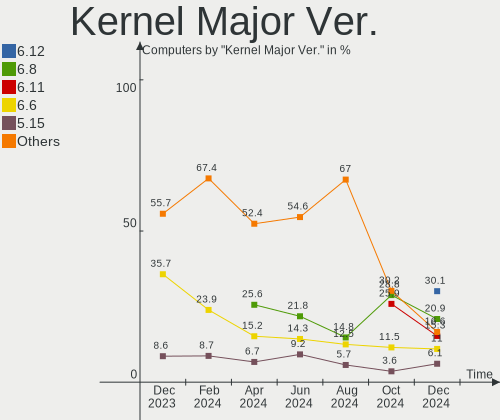
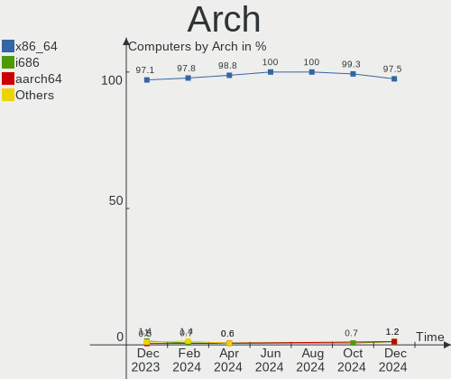
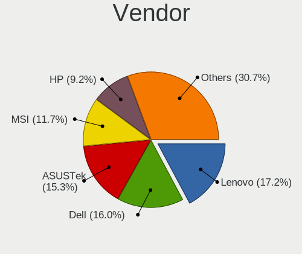
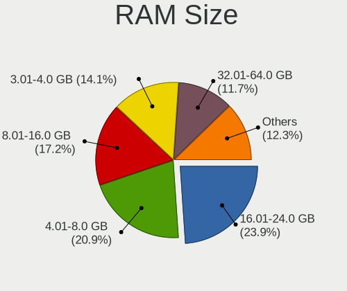

Linux in Poland - Hardware Trends
---------------------------------

A project to identify most popular hardware characteristics and track their change
over time based on data collected by Linux users at https://Linux-Hardware.org.

Anyone can contribute to this report by the [hw-probe](https://github.com/linuxhw/hw-probe) tool:

    sudo -E hw-probe -all -upload

This is a report for all computer types. See also reports for [desktops](/Location/Poland/Desktop/README.md) and [notebooks](/Location/Poland/Notebook/README.md).

Period: Sep, 2022.

Contents
--------

* [ System ](#system)
  - [ OS                       ](#os)
  - [ OS Family                ](#os-family)
  - [ Kernel                   ](#kernel)
  - [ Kernel Family            ](#kernel-family)
  - [ Kernel Major Ver.        ](#kernel-major-ver)
  - [ Arch                     ](#arch)
  - [ DE                       ](#de)
  - [ Display Server           ](#display-server)
  - [ Display Manager          ](#display-manager)
  - [ OS Lang                  ](#os-lang)
  - [ Boot Mode                ](#boot-mode)
  - [ Filesystem               ](#filesystem)
  - [ Part. scheme             ](#part-scheme)
  - [ Dual Boot with Linux/BSD ](#dual-boot-with-linuxbsd)
  - [ Dual Boot (Win)          ](#dual-boot-win)

* [ Board ](#board)
  - [ Vendor                   ](#vendor)
  - [ Model                    ](#model)
  - [ Model Family             ](#model-family)
  - [ MFG Year                 ](#mfg-year)
  - [ Form Factor              ](#form-factor)
  - [ Secure Boot              ](#secure-boot)
  - [ Coreboot                 ](#coreboot)
  - [ RAM Size                 ](#ram-size)
  - [ RAM Used                 ](#ram-used)
  - [ Total Drives             ](#total-drives)
  - [ Has CD-ROM               ](#has-cd-rom)
  - [ Has Ethernet             ](#has-ethernet)
  - [ Has WiFi                 ](#has-wifi)
  - [ Has Bluetooth            ](#has-bluetooth)

* [ Location ](#location)
  - [ Country                  ](#country)
  - [ City                     ](#city)

* [ Drives ](#drives)
  - [ Drive Vendor             ](#drive-vendor)
  - [ Drive Model              ](#drive-model)
  - [ HDD Vendor               ](#hdd-vendor)
  - [ SSD Vendor               ](#ssd-vendor)
  - [ Drive Kind               ](#drive-kind)
  - [ Drive Connector          ](#drive-connector)
  - [ Drive Size               ](#drive-size)
  - [ Space Total              ](#space-total)
  - [ Space Used               ](#space-used)
  - [ Malfunc. Drives          ](#malfunc-drives)
  - [ Malfunc. Drive Vendor    ](#malfunc-drive-vendor)
  - [ Malfunc. HDD Vendor      ](#malfunc-hdd-vendor)
  - [ Malfunc. Drive Kind      ](#malfunc-drive-kind)
  - [ Failed Drives            ](#failed-drives)
  - [ Failed Drive Vendor      ](#failed-drive-vendor)
  - [ Drive Status             ](#drive-status)

* [ Storage controller ](#storage-controller)
  - [ Storage Vendor           ](#storage-vendor)
  - [ Storage Model            ](#storage-model)
  - [ Storage Kind             ](#storage-kind)

* [ Processor ](#processor)
  - [ CPU Vendor               ](#cpu-vendor)
  - [ CPU Model                ](#cpu-model)
  - [ CPU Model Family         ](#cpu-model-family)
  - [ CPU Cores                ](#cpu-cores)
  - [ CPU Sockets              ](#cpu-sockets)
  - [ CPU Threads              ](#cpu-threads)
  - [ CPU Op-Modes             ](#cpu-op-modes)
  - [ CPU Microcode            ](#cpu-microcode)
  - [ CPU Microarch            ](#cpu-microarch)

* [ Graphics ](#graphics)
  - [ GPU Vendor               ](#gpu-vendor)
  - [ GPU Model                ](#gpu-model)
  - [ GPU Combo                ](#gpu-combo)
  - [ GPU Driver               ](#gpu-driver)
  - [ GPU Memory               ](#gpu-memory)

* [ Monitor ](#monitor)
  - [ Monitor Vendor           ](#monitor-vendor)
  - [ Monitor Model            ](#monitor-model)
  - [ Monitor Resolution       ](#monitor-resolution)
  - [ Monitor Diagonal         ](#monitor-diagonal)
  - [ Monitor Width            ](#monitor-width)
  - [ Aspect Ratio             ](#aspect-ratio)
  - [ Monitor Area             ](#monitor-area)
  - [ Pixel Density            ](#pixel-density)
  - [ Multiple Monitors        ](#multiple-monitors)

* [ Network ](#network)
  - [ Net Controller Vendor    ](#net-controller-vendor)
  - [ Net Controller Model     ](#net-controller-model)
  - [ Wireless Vendor          ](#wireless-vendor)
  - [ Wireless Model           ](#wireless-model)
  - [ Ethernet Vendor          ](#ethernet-vendor)
  - [ Ethernet Model           ](#ethernet-model)
  - [ Net Controller Kind      ](#net-controller-kind)
  - [ Used Controller          ](#used-controller)
  - [ NICs                     ](#nics)
  - [ IPv6                     ](#ipv6)

* [ Bluetooth ](#bluetooth)
  - [ Bluetooth Vendor         ](#bluetooth-vendor)
  - [ Bluetooth Model          ](#bluetooth-model)

* [ Sound ](#sound)
  - [ Sound Vendor             ](#sound-vendor)
  - [ Sound Model              ](#sound-model)

* [ Memory ](#memory)
  - [ Memory Vendor            ](#memory-vendor)
  - [ Memory Model             ](#memory-model)
  - [ Memory Kind              ](#memory-kind)
  - [ Memory Form Factor       ](#memory-form-factor)
  - [ Memory Size              ](#memory-size)
  - [ Memory Speed             ](#memory-speed)

* [ Printers & scanners ](#printers--scanners)
  - [ Printer Vendor           ](#printer-vendor)
  - [ Printer Model            ](#printer-model)
  - [ Scanner Vendor           ](#scanner-vendor)
  - [ Scanner Model            ](#scanner-model)

* [ Camera ](#camera)
  - [ Camera Vendor            ](#camera-vendor)
  - [ Camera Model             ](#camera-model)

* [ Security ](#security)
  - [ Fingerprint Vendor       ](#fingerprint-vendor)
  - [ Fingerprint Model        ](#fingerprint-model)
  - [ Chipcard Vendor          ](#chipcard-vendor)
  - [ Chipcard Model           ](#chipcard-model)

* [ Unsupported ](#unsupported)
  - [ Unsupported Devices      ](#unsupported-devices)
  - [ Unsupported Device Types ](#unsupported-device-types)

System
------

OS
--

Installed operating systems

| Name                 | Computers | Percent |
|----------------------|-----------|---------|
| Ubuntu 22.04         | 25        | 22.32%  |
| OpenMandriva 4.3     | 11        | 9.82%   |
| Linux Mint 20.3      | 7         | 6.25%   |
| Ubuntu 20.04         | 6         | 5.36%   |
| Gentoo 2.8           | 5         | 4.46%   |
| Fedora 36            | 5         | 4.46%   |
| Pop!_OS 22.04        | 4         | 3.57%   |
| Debian 11            | 4         | 3.57%   |
| SteamOS 3.3.1        | 3         | 2.68%   |
| OpenMandriva 4.50    | 3         | 2.68%   |
| OpenMandriva 4.2     | 3         | 2.68%   |
| Arch Rolling         | 3         | 2.68%   |
| Zorin 16             | 2         | 1.79%   |
| MX 21                | 2         | 1.79%   |
| Manjaro 22.0.0       | 2         | 1.79%   |
| Linux Mint 21        | 2         | 1.79%   |
| Kubuntu 22.04        | 2         | 1.79%   |
| Fedora 37            | 2         | 1.79%   |
| EuroLinux 9.0        | 2         | 1.79%   |
| Xubuntu 22.04        | 1         | 0.89%   |
| Ultramarine Linux 36 | 1         | 0.89%   |
| ROSA R11.1           | 1         | 0.89%   |
| Raspbian 11          | 1         | 0.89%   |
| Raspbian 10          | 1         | 0.89%   |
| PureOS 10            | 1         | 0.89%   |
| Oracle Linux 9.0     | 1         | 0.89%   |
| OpenMandriva 4.90    | 1         | 0.89%   |
| Manjaro              | 1         | 0.89%   |
| Lubuntu 22.04        | 1         | 0.89%   |
| LMDE 5               | 1         | 0.89%   |
| LinuxFX 11           | 1         | 0.89%   |
| KDE neon 22.04       | 1         | 0.89%   |
| KDE neon 20.04       | 1         | 0.89%   |
| Garuda Linux Soaring | 1         | 0.89%   |
| Garuda Linux         | 1         | 0.89%   |
| EndeavourOS Rolling  | 1         | 0.89%   |
| Elementary 6.1       | 1         | 0.89%   |
| Arch                 | 1         | 0.89%   |

OS Family
---------

OS without a version

| Name              | Computers | Percent |
|-------------------|-----------|---------|
| Ubuntu            | 31        | 27.68%  |
| OpenMandriva      | 18        | 16.07%  |
| Linux Mint        | 9         | 8.04%   |
| Fedora            | 7         | 6.25%   |
| Gentoo            | 5         | 4.46%   |
| Pop!_OS           | 4         | 3.57%   |
| Debian            | 4         | 3.57%   |
| Arch              | 4         | 3.57%   |
| SteamOS           | 3         | 2.68%   |
| Manjaro           | 3         | 2.68%   |
| Zorin             | 2         | 1.79%   |
| Raspbian          | 2         | 1.79%   |
| MX                | 2         | 1.79%   |
| Kubuntu           | 2         | 1.79%   |
| KDE neon          | 2         | 1.79%   |
| Garuda Linux      | 2         | 1.79%   |
| EuroLinux         | 2         | 1.79%   |
| Xubuntu           | 1         | 0.89%   |
| Ultramarine Linux | 1         | 0.89%   |
| ROSA              | 1         | 0.89%   |
| PureOS            | 1         | 0.89%   |
| Oracle Linux      | 1         | 0.89%   |
| Lubuntu           | 1         | 0.89%   |
| LMDE              | 1         | 0.89%   |
| LinuxFX           | 1         | 0.89%   |
| EndeavourOS       | 1         | 0.89%   |
| Elementary        | 1         | 0.89%   |

Kernel
------

Version of the Linux kernel

| Version                                        | Computers | Percent |
|------------------------------------------------|-----------|---------|
| 5.15.0-47-generic                              | 17        | 15.18%  |
| 5.16.7-desktop-1omv4003                        | 11        | 9.82%   |
| 5.15.0-48-generic                              | 10        | 8.93%   |
| 5.15.0-46-generic                              | 5         | 4.46%   |
| 5.15.0-43-generic                              | 5         | 4.46%   |
| 5.10.0-17-amd64                                | 4         | 3.57%   |
| 5.4.0-126-generic                              | 3         | 2.68%   |
| 5.19.5-desktop-1omv4090                        | 3         | 2.68%   |
| 5.19.0-76051900-generic                        | 3         | 2.68%   |
| 5.13.0-valve21.1-1-neptune-02211-gc54cda5a36f3 | 3         | 2.68%   |
| 5.10.14-desktop-1omv4002                       | 3         | 2.68%   |
| 5.4.0-125-generic                              | 2         | 1.79%   |
| 5.19.8-300.fc37.x86_64                         | 2         | 1.79%   |
| 5.19.8-200.fc36.x86_64                         | 2         | 1.79%   |
| 5.19.6-200.fc36.x86_64                         | 2         | 1.79%   |
| 5.19.10-arch1-1                                | 2         | 1.79%   |
| 5.15.59-gentoo                                 | 2         | 1.79%   |
| 5.14.0-70.26.1.el9_0.x86_64                    | 2         | 1.79%   |
| 6.0.0-1-MANJARO                                | 1         | 0.89%   |
| 5.4.83-generic-2rosa-x86_64                    | 1         | 0.89%   |
| 5.4.0-109-generic                              | 1         | 0.89%   |
| 5.19.6-xanmod1-1                               | 1         | 0.89%   |
| 5.19.6-lqx1-1-lqx                              | 1         | 0.89%   |
| 5.19.6-arch1-1                                 | 1         | 0.89%   |
| 5.19.6-269-tkg-pds                             | 1         | 0.89%   |
| 5.19.5-051905-generic                          | 1         | 0.89%   |
| 5.19.4-zen1-1-zen                              | 1         | 0.89%   |
| 5.19.4-arch1-g14-1                             | 1         | 0.89%   |
| 5.19.4-200.fc36.x86_64                         | 1         | 0.89%   |
| 5.19.10-gentoo                                 | 1         | 0.89%   |
| 5.18.19-gentoo-r1                              | 1         | 0.89%   |
| 5.18.19-200.fc36.x86_64                        | 1         | 0.89%   |
| 5.18.12-desktop-3omv4090                       | 1         | 0.89%   |
| 5.17.5-76051705-generic                        | 1         | 0.89%   |
| 5.17.0-3mx-amd64                               | 1         | 0.89%   |
| 5.15.68-rockchip64                             | 1         | 0.89%   |
| 5.15.68-gentoo-x86_64                          | 1         | 0.89%   |
| 5.15.60-1-MANJARO                              | 1         | 0.89%   |
| 5.15.56+                                       | 1         | 0.89%   |
| 5.15.48-sunxi                                  | 1         | 0.89%   |

Kernel Family
-------------

Linux kernel without a distro release

| Version  | Computers | Percent |
|----------|-----------|---------|
| 5.15.0   | 39        | 34.82%  |
| 5.16.7   | 11        | 9.82%   |
| 5.4.0    | 6         | 5.36%   |
| 5.19.6   | 6         | 5.36%   |
| 5.10.0   | 6         | 5.36%   |
| 5.19.8   | 4         | 3.57%   |
| 5.19.5   | 4         | 3.57%   |
| 5.14.0   | 4         | 3.57%   |
| 5.13.0   | 4         | 3.57%   |
| 5.19.4   | 3         | 2.68%   |
| 5.19.10  | 3         | 2.68%   |
| 5.19.0   | 3         | 2.68%   |
| 5.10.14  | 3         | 2.68%   |
| 5.18.19  | 2         | 1.79%   |
| 5.15.68  | 2         | 1.79%   |
| 5.15.59  | 2         | 1.79%   |
| 6.0.0    | 1         | 0.89%   |
| 5.4.83   | 1         | 0.89%   |
| 5.18.12  | 1         | 0.89%   |
| 5.17.5   | 1         | 0.89%   |
| 5.17.0   | 1         | 0.89%   |
| 5.15.60  | 1         | 0.89%   |
| 5.15.56  | 1         | 0.89%   |
| 5.15.48  | 1         | 0.89%   |
| 5.11.0   | 1         | 0.89%   |
| 5.10.103 | 1         | 0.89%   |

Kernel Major Ver.
-----------------

Linux kernel major version

| Version | Computers | Percent |
|---------|-----------|---------|
| 5.15    | 46        | 41.07%  |
| 5.19    | 23        | 20.54%  |
| 5.16    | 11        | 9.82%   |
| 5.10    | 10        | 8.93%   |
| 5.4     | 7         | 6.25%   |
| 5.14    | 4         | 3.57%   |
| 5.13    | 4         | 3.57%   |
| 5.18    | 3         | 2.68%   |
| 5.17    | 2         | 1.79%   |
| 6.0     | 1         | 0.89%   |
| 5.11    | 1         | 0.89%   |

Arch
----

OS architecture (x86_64, i586, etc.)

| Name    | Computers | Percent |
|---------|-----------|---------|
| x86_64  | 108       | 96.43%  |
| armv7l  | 2         | 1.79%   |
| armv6l  | 1         | 0.89%   |
| aarch64 | 1         | 0.89%   |

DE
--

Desktop Environment

| Name       | Computers | Percent |
|------------|-----------|---------|
| GNOME      | 47        | 41.96%  |
| KDE5       | 34        | 30.36%  |
| X-Cinnamon | 8         | 7.14%   |
| XFCE       | 5         | 4.46%   |
| Unknown    | 5         | 4.46%   |
| MATE       | 4         | 3.57%   |
| LXQt       | 3         | 2.68%   |
| Pantheon   | 2         | 1.79%   |
| trinity    | 1         | 0.89%   |
| i3         | 1         | 0.89%   |
| Deepin     | 1         | 0.89%   |
| awesome    | 1         | 0.89%   |

Display Server
--------------

X11 or Wayland

| Name    | Computers | Percent |
|---------|-----------|---------|
| X11     | 80        | 71.43%  |
| Wayland | 25        | 22.32%  |
| Unknown | 4         | 3.57%   |
| Tty     | 3         | 2.68%   |

Display Manager
---------------

SDDM, LightDM, etc.

| Name    | Computers | Percent |
|---------|-----------|---------|
| Unknown | 40        | 35.71%  |
| SDDM    | 29        | 25.89%  |
| GDM3    | 27        | 24.11%  |
| LightDM | 9         | 8.04%   |
| GDM     | 5         | 4.46%   |
| LXDM    | 1         | 0.89%   |
| KDM     | 1         | 0.89%   |

OS Lang
-------

Language

| Lang  | Computers | Percent |
|-------|-----------|---------|
| pl_PL | 62        | 55.36%  |
| en_US | 39        | 34.82%  |
| en_GB | 6         | 5.36%   |
| uk_UA | 1         | 0.89%   |
| it_IT | 1         | 0.89%   |
| en_IN | 1         | 0.89%   |
| en_AG | 1         | 0.89%   |
| de_DE | 1         | 0.89%   |

Boot Mode
---------

EFI or BIOS

| Mode | Computers | Percent |
|------|-----------|---------|
| EFI  | 57        | 50.89%  |
| BIOS | 55        | 49.11%  |

Filesystem
----------

Type of filesystem

| Type    | Computers | Percent |
|---------|-----------|---------|
| Ext4    | 71        | 63.39%  |
| Overlay | 15        | 13.39%  |
| Btrfs   | 13        | 11.61%  |
| Xfs     | 5         | 4.46%   |
| F2fs    | 4         | 3.57%   |
| Zfs     | 3         | 2.68%   |
| XXXXX   | 1         | 0.89%   |

Part. scheme
------------

Scheme of partitioning

| Type    | Computers | Percent |
|---------|-----------|---------|
| Unknown | 54        | 48.21%  |
| GPT     | 44        | 39.29%  |
| MBR     | 14        | 12.5%   |

Dual Boot with Linux/BSD
------------------------

Hosting more than one Linux/BSD

| Dual boot | Computers | Percent |
|-----------|-----------|---------|
| No        | 95        | 84.82%  |
| Yes       | 17        | 15.18%  |

Dual Boot (Win)
---------------

Hosting Linux and Windows

| Dual boot | Computers | Percent |
|-----------|-----------|---------|
| No        | 74        | 66.07%  |
| Yes       | 38        | 33.93%  |

Board
-----

Vendor
------

Motherboard manufacturer

| Name                    | Computers | Percent |
|-------------------------|-----------|---------|
| Lenovo                  | 25        | 22.32%  |
| Dell                    | 22        | 19.64%  |
| ASUSTek Computer        | 15        | 13.39%  |
| Hewlett-Packard         | 12        | 10.71%  |
| MSI                     | 8         | 7.14%   |
| Gigabyte Technology     | 7         | 6.25%   |
| Toshiba                 | 4         | 3.57%   |
| Valve                   | 3         | 2.68%   |
| Samsung Electronics     | 2         | 1.79%   |
| Raspberry Pi Foundation | 2         | 1.79%   |
| HUAWEI                  | 2         | 1.79%   |
| Acer                    | 2         | 1.79%   |
| Xunlong                 | 1         | 0.89%   |
| Sun Microsystems        | 1         | 0.89%   |
| Pine Microsystems       | 1         | 0.89%   |
| Intel                   | 1         | 0.89%   |
| Fujitsu                 | 1         | 0.89%   |
| Framework               | 1         | 0.89%   |
| Apple                   | 1         | 0.89%   |
| AMI                     | 1         | 0.89%   |

Model
-----

Motherboard model

| Name                                      | Computers | Percent |
|-------------------------------------------|-----------|---------|
| Valve Jupiter                             | 3         | 2.68%   |
| Dell Latitude E6330                       | 3         | 2.68%   |
| Lenovo ThinkPad E15 Gen 2 20T8000MPB      | 2         | 1.79%   |
| Dell Inspiron 3451                        | 2         | 1.79%   |
| ASUS PRIME X470-PRO                       | 2         | 1.79%   |
| Xunlong Orange Pi Zero                    | 1         | 0.89%   |
| Toshiba Satellite P205                    | 1         | 0.89%   |
| Toshiba Satellite L40                     | 1         | 0.89%   |
| Toshiba Satellite C850-1LK                | 1         | 0.89%   |
| Toshiba PORTEGE Z30-A                     | 1         | 0.89%   |
| Sun Microsystems Sun Fire X4170 M2 SERVER | 1         | 0.89%   |
| Samsung RC420/RC520/RC720                 | 1         | 0.89%   |
| Samsung 350V5C/351V5C/3540VC/3440VC       | 1         | 0.89%   |
| RPi Raspberry Pi Zero W Rev 1.1           | 1         | 0.89%   |
| RPi Raspberry Pi 4 Model B Rev 1.5        | 1         | 0.89%   |
| Pine Microsystems Pine64 Rock64           | 1         | 0.89%   |
| MSI MS-7C84                               | 1         | 0.89%   |
| MSI MS-7C35                               | 1         | 0.89%   |
| MSI MS-7B86                               | 1         | 0.89%   |
| MSI MS-7B45                               | 1         | 0.89%   |
| MSI MS-7830                               | 1         | 0.89%   |
| MSI MS-7817                               | 1         | 0.89%   |
| MSI MS-7641                               | 1         | 0.89%   |
| MSI Creator Z17 A12UHST                   | 1         | 0.89%   |
| Lenovo ThinkPad Z16 Gen 1 21D40016PB      | 1         | 0.89%   |
| Lenovo ThinkPad X270 W10DG 20K5S2VL00     | 1         | 0.89%   |
| Lenovo ThinkPad X1 Extreme 20MFCTO1WW     | 1         | 0.89%   |
| Lenovo ThinkPad X1 Carbon 6th 20KGS7XP1C  | 1         | 0.89%   |
| Lenovo ThinkPad T420 4180MY7              | 1         | 0.89%   |
| Lenovo ThinkPad T420 4180A32              | 1         | 0.89%   |
| Lenovo ThinkPad T14 Gen 2i 20W1S30V0S     | 1         | 0.89%   |
| Lenovo ThinkPad T14 Gen 1 20UES08Q15      | 1         | 0.89%   |
| Lenovo ThinkPad SL500 27463ZG             | 1         | 0.89%   |
| Lenovo ThinkPad L420 7829H86              | 1         | 0.89%   |
| Lenovo ThinkPad Edge E430 3254A8G         | 1         | 0.89%   |
| Lenovo ThinkPad E15 Gen 3 20YG003VRT      | 1         | 0.89%   |
| Lenovo ThinkCentre M93p 10A90012MS        | 1         | 0.89%   |
| Lenovo ThinkBook 14-IIL 20SL              | 1         | 0.89%   |
| Lenovo MIIX 320-10ICR 80XF                | 1         | 0.89%   |
| Lenovo Legion Y520T-25IKL 90H700C9PB      | 1         | 0.89%   |

Model Family
------------

Motherboard model prefix

| Name                     | Computers | Percent |
|--------------------------|-----------|---------|
| Lenovo ThinkPad          | 14        | 12.5%   |
| Dell Latitude            | 10        | 8.93%   |
| Dell Inspiron            | 5         | 4.46%   |
| ASUS ROG                 | 5         | 4.46%   |
| Dell OptiPlex            | 4         | 3.57%   |
| ASUS PRIME               | 4         | 3.57%   |
| Valve Jupiter            | 3         | 2.68%   |
| Toshiba Satellite        | 3         | 2.68%   |
| Dell Precision           | 3         | 2.68%   |
| RPi Raspberry            | 2         | 1.79%   |
| Lenovo Legion            | 2         | 1.79%   |
| Lenovo IdeaPad           | 2         | 1.79%   |
| HP ZBook                 | 2         | 1.79%   |
| HP EliteBook             | 2         | 1.79%   |
| HP Compaq                | 2         | 1.79%   |
| Xunlong Orange           | 1         | 0.89%   |
| Toshiba PORTEGE          | 1         | 0.89%   |
| Sun Microsystems Sun     | 1         | 0.89%   |
| Samsung RC420            | 1         | 0.89%   |
| Samsung 350V5C           | 1         | 0.89%   |
| Pine Microsystems Pine64 | 1         | 0.89%   |
| MSI MS-7C84              | 1         | 0.89%   |
| MSI MS-7C35              | 1         | 0.89%   |
| MSI MS-7B86              | 1         | 0.89%   |
| MSI MS-7B45              | 1         | 0.89%   |
| MSI MS-7830              | 1         | 0.89%   |
| MSI MS-7817              | 1         | 0.89%   |
| MSI MS-7641              | 1         | 0.89%   |
| MSI Creator              | 1         | 0.89%   |
| Lenovo ThinkCentre       | 1         | 0.89%   |
| Lenovo ThinkBook         | 1         | 0.89%   |
| Lenovo MIIX              | 1         | 0.89%   |
| Lenovo G580              | 1         | 0.89%   |
| Lenovo G505s             | 1         | 0.89%   |
| Lenovo G500s             | 1         | 0.89%   |
| Lenovo G50-80            | 1         | 0.89%   |
| Intel DH61WW             | 1         | 0.89%   |
| HUAWEI KPL-W0X           | 1         | 0.89%   |
| HUAWEI KLVL-WXX9         | 1         | 0.89%   |
| HP ProDesk               | 1         | 0.89%   |

MFG Year
--------

Motherboard manufacture year

| Year    | Computers | Percent |
|---------|-----------|---------|
| 2020    | 11        | 9.82%   |
| 2018    | 11        | 9.82%   |
| 2021    | 10        | 8.93%   |
| 2022    | 9         | 8.04%   |
| 2019    | 9         | 8.04%   |
| 2017    | 8         | 7.14%   |
| 2013    | 8         | 7.14%   |
| 2012    | 8         | 7.14%   |
| 2014    | 7         | 6.25%   |
| 2011    | 7         | 6.25%   |
| 2010    | 7         | 6.25%   |
| 2015    | 4         | 3.57%   |
| Unknown | 4         | 3.57%   |
| 2008    | 3         | 2.68%   |
| 2007    | 3         | 2.68%   |
| 2016    | 2         | 1.79%   |
| 2009    | 1         | 0.89%   |

Form Factor
-----------

Physical design of the computer

| Name           | Computers | Percent |
|----------------|-----------|---------|
| Notebook       | 73        | 65.18%  |
| Desktop        | 33        | 29.46%  |
| System on chip | 4         | 3.57%   |
| Tablet         | 1         | 0.89%   |
| Server         | 1         | 0.89%   |

Secure Boot
-----------

Enabled or disabled

| State    | Computers | Percent |
|----------|-----------|---------|
| Disabled | 108       | 96.43%  |
| Enabled  | 4         | 3.57%   |

Coreboot
--------

Have coreboot on board

| Used | Computers | Percent |
|------|-----------|---------|
| No   | 112       | 100%    |

RAM Size
--------

Total RAM memory

| Size in GB  | Computers | Percent |
|-------------|-----------|---------|
| 4.01-8.0    | 27        | 24.11%  |
| 8.01-16.0   | 27        | 24.11%  |
| 32.01-64.0  | 22        | 19.64%  |
| 16.01-24.0  | 13        | 11.61%  |
| 3.01-4.0    | 12        | 10.71%  |
| 1.01-2.0    | 5         | 4.46%   |
| 64.01-256.0 | 3         | 2.68%   |
| 0.01-0.5    | 2         | 1.79%   |
| 2.01-3.0    | 1         | 0.89%   |

RAM Used
--------

Used RAM memory

| Used GB    | Computers | Percent |
|------------|-----------|---------|
| 1.01-2.0   | 31        | 27.68%  |
| 4.01-8.0   | 23        | 20.54%  |
| 2.01-3.0   | 22        | 19.64%  |
| 3.01-4.0   | 17        | 15.18%  |
| 8.01-16.0  | 8         | 7.14%   |
| 0.51-1.0   | 6         | 5.36%   |
| 0.01-0.5   | 3         | 2.68%   |
| 16.01-24.0 | 2         | 1.79%   |

Total Drives
------------

Number of drives on board

| Drives | Computers | Percent |
|--------|-----------|---------|
| 1      | 64        | 57.14%  |
| 2      | 31        | 27.68%  |
| 3      | 10        | 8.93%   |
| 4      | 5         | 4.46%   |
| 6      | 1         | 0.89%   |
| 0      | 1         | 0.89%   |

Has CD-ROM
----------

Has CD-ROM on board

| Presented | Computers | Percent |
|-----------|-----------|---------|
| No        | 70        | 62.5%   |
| Yes       | 42        | 37.5%   |

Has Ethernet
------------

Has Ethernet on board

| Presented | Computers | Percent |
|-----------|-----------|---------|
| Yes       | 95        | 84.82%  |
| No        | 17        | 15.18%  |

Has WiFi
--------

Has WiFi module

| Presented | Computers | Percent |
|-----------|-----------|---------|
| Yes       | 86        | 76.79%  |
| No        | 26        | 23.21%  |

Has Bluetooth
-------------

Has Bluetooth module

| Presented | Computers | Percent |
|-----------|-----------|---------|
| Yes       | 64        | 57.14%  |
| No        | 48        | 42.86%  |

Location
--------

Country
-------

Geographic location (country)

| Country | Computers | Percent |
|---------|-----------|---------|
| Poland  | 112       | 100%    |

City
----

Geographic location (city)

| City                 | Computers | Percent |
|----------------------|-----------|---------|
| Warsaw               | 26        | 23.21%  |
| Krakow               | 10        | 8.93%   |
| Wroclaw              | 6         | 5.36%   |
| Gdansk               | 5         | 4.46%   |
| Poznan               | 3         | 2.68%   |
| Rzeszów             | 2         | 1.79%   |
| Ruda Śląska        | 2         | 1.79%   |
| Ostrów Wielkopolski | 2         | 1.79%   |
| Mława               | 2         | 1.79%   |
| Lublin               | 2         | 1.79%   |
| Katowice             | 2         | 1.79%   |
| Częstochowa         | 2         | 1.79%   |
| Cieszyn              | 2         | 1.79%   |
| Zielona Góra        | 1         | 0.89%   |
| Włocławek          | 1         | 0.89%   |
| Wołomin             | 1         | 0.89%   |
| Wola Rzedzinska      | 1         | 0.89%   |
| Wodzisław Śląski  | 1         | 0.89%   |
| Wałbrzych           | 1         | 0.89%   |
| Ustrzyki Dolne       | 1         | 0.89%   |
| Szczecinek           | 1         | 0.89%   |
| Szczecin             | 1         | 0.89%   |
| Swaty                | 1         | 0.89%   |
| Skawina              | 1         | 0.89%   |
| Skarzysko-Kamienna   | 1         | 0.89%   |
| Radomsko             | 1         | 0.89%   |
| Radom                | 1         | 0.89%   |
| Racibórz            | 1         | 0.89%   |
| Pruszków            | 1         | 0.89%   |
| Pionki               | 1         | 0.89%   |
| Pilica               | 1         | 0.89%   |
| Piaseczno            | 1         | 0.89%   |
| Orzysz               | 1         | 0.89%   |
| Opole                | 1         | 0.89%   |
| Myszkow              | 1         | 0.89%   |
| Malbork              | 1         | 0.89%   |
| Lubin                | 1         | 0.89%   |
| Lomnica              | 1         | 0.89%   |
| Lomianki             | 1         | 0.89%   |
| Lodz                 | 1         | 0.89%   |

Drives
------

Drive Vendor
------------

Hard drive vendors

| Vendor                    | Computers | Drives | Percent |
|---------------------------|-----------|--------|---------|
| Samsung Electronics       | 22        | 28     | 13.75%  |
| Seagate                   | 20        | 21     | 12.5%   |
| WDC                       | 16        | 19     | 10%     |
| Unknown                   | 12        | 13     | 7.5%    |
| Toshiba                   | 12        | 13     | 7.5%    |
| GOODRAM                   | 11        | 11     | 6.88%   |
| Crucial                   | 9         | 9      | 5.63%   |
| Phison Electronics        | 6         | 8      | 3.75%   |
| Kingston                  | 5         | 5      | 3.13%   |
| PNY                       | 4         | 4      | 2.5%    |
| SPCC                      | 3         | 4      | 1.88%   |
| SK hynix                  | 3         | 4      | 1.88%   |
| Micron Technology         | 3         | 3      | 1.88%   |
| KIOXIA                    | 3         | 3      | 1.88%   |
| Intel                     | 3         | 4      | 1.88%   |
| Hitachi                   | 3         | 5      | 1.88%   |
| Apacer                    | 3         | 3      | 1.88%   |
| Plextor                   | 2         | 2      | 1.25%   |
| Patriot                   | 2         | 2      | 1.25%   |
| Micron/Crucial Technology | 2         | 2      | 1.25%   |
| A-DATA Technology         | 2         | 2      | 1.25%   |
| XPG                       | 1         | 1      | 0.63%   |
| Valuetech                 | 1         | 1      | 0.63%   |
| UMIS                      | 1         | 1      | 0.63%   |
| Transcend                 | 1         | 1      | 0.63%   |
| Team                      | 1         | 1      | 0.63%   |
| SanDisk                   | 1         | 1      | 0.63%   |
| Realtek Semiconductor     | 1         | 1      | 0.63%   |
| Ramaxel Technology        | 1         | 1      | 0.63%   |
| Lexar                     | 1         | 1      | 0.63%   |
| KingFast                  | 1         | 1      | 0.63%   |
| China                     | 1         | 1      | 0.63%   |
| Biostar                   | 1         | 1      | 0.63%   |
| Apple                     | 1         | 2      | 0.63%   |
| Unknown                   | 1         | 1      | 0.63%   |

Drive Model
-----------

Hard drive models

| Model                                               | Computers | Percent |
|-----------------------------------------------------|-----------|---------|
| Phison PS5013 E13 NVMe Controller 512GB             | 4         | 2.34%   |
| GOODRAM SSDPR-CX400-256-G2 256GB                    | 4         | 2.34%   |
| Unknown MMC Card  128GB                             | 3         | 1.75%   |
| Seagate ST500DM002-1BD142 500GB                     | 3         | 1.75%   |
| Crucial CT1000MX500SSD1 1TB                         | 3         | 1.75%   |
| Toshiba HDWD110 1TB                                 | 2         | 1.17%   |
| Toshiba DT01ACA100 1TB                              | 2         | 1.17%   |
| Seagate ST500LT012-9WS142 500GB                     | 2         | 1.17%   |
| Seagate ST500LT012-1DG142 500GB                     | 2         | 1.17%   |
| Samsung NVMe SSD Controller SM981/PM981/PM983 256GB | 2         | 1.17%   |
| PNY CS900 120GB SSD                                 | 2         | 1.17%   |
| Phison E12 NVMe Controller 1024GB                   | 2         | 1.17%   |
| Patriot Burst 120GB SSD                             | 2         | 1.17%   |
| GOODRAM SSDPR-CL100-480-G2 480GB                    | 2         | 1.17%   |
| XPG SX8200PNP-512GT-S 512GB                         | 1         | 0.58%   |
| WDC WDS500G2B0A-00SM50 500GB SSD                    | 1         | 0.58%   |
| WDC WDS250G2B0A-00SM50 250GB SSD                    | 1         | 0.58%   |
| WDC WDS240G2G0B-00EPW0 240GB SSD                    | 1         | 0.58%   |
| WDC WDS240G2G0A-00JH30 240GB SSD                    | 1         | 0.58%   |
| WDC WDS100T1X0E-00AFY0 1TB                          | 1         | 0.58%   |
| WDC WD5000AZRX-00L4HB0 500GB                        | 1         | 0.58%   |
| WDC WD5000AAKX-60U6AA0 500GB                        | 1         | 0.58%   |
| WDC WD5000AAKS-75V0A0 500GB                         | 1         | 0.58%   |
| WDC WD3200AAJS-00V4A0 320GB                         | 1         | 0.58%   |
| WDC WD2500AAJS-60M0A0 250GB                         | 1         | 0.58%   |
| WDC WD10PURZ-85U8XY0 1TB                            | 1         | 0.58%   |
| WDC WD10JPCX-24UE4T0 1TB                            | 1         | 0.58%   |
| WDC WD10EZEX-08WN4A0 1TB                            | 1         | 0.58%   |
| WDC WD1002FBYS-05A6B0 1TB                           | 1         | 0.58%   |
| WDC WD My Passport 264F 500GB                       | 1         | 0.58%   |
| WDC PC SN730 NVMe 512GB                             | 1         | 0.58%   |
| WDC PC SN530 SDBPNPZ-512G-1114 512GB                | 1         | 0.58%   |
| WDC PC SN530 SDBPNPZ-512G-1002 512GB                | 1         | 0.58%   |
| Valuetech SSD 128GB                                 | 1         | 0.58%   |
| Unknown xD/SD/M.S.                                  | 1         | 0.58%   |
| Unknown USB DISK 3.2 250GB                          | 1         | 0.58%   |
| Unknown SL16G  16GB                                 | 1         | 0.58%   |
| Unknown SB128  128GB                                | 1         | 0.58%   |
| Unknown MMC Card  64GB                              | 1         | 0.58%   |
| Unknown MMC Card  32GB                              | 1         | 0.58%   |

HDD Vendor
----------

Hard disk drive vendors

| Vendor              | Computers | Drives | Percent |
|---------------------|-----------|--------|---------|
| Seagate             | 20        | 21     | 47.62%  |
| Toshiba             | 10        | 11     | 23.81%  |
| WDC                 | 7         | 10     | 16.67%  |
| Hitachi             | 3         | 5      | 7.14%   |
| Samsung Electronics | 2         | 2      | 4.76%   |

SSD Vendor
----------

Solid state drive vendors

| Vendor              | Computers | Drives | Percent |
|---------------------|-----------|--------|---------|
| GOODRAM             | 11        | 11     | 18.64%  |
| Samsung Electronics | 8         | 10     | 13.56%  |
| Crucial             | 8         | 8      | 13.56%  |
| WDC                 | 4         | 4      | 6.78%   |
| PNY                 | 4         | 4      | 6.78%   |
| SPCC                | 3         | 4      | 5.08%   |
| Kingston            | 3         | 3      | 5.08%   |
| Patriot             | 2         | 2      | 3.39%   |
| Apacer              | 2         | 2      | 3.39%   |
| A-DATA Technology   | 2         | 2      | 3.39%   |
| Valuetech           | 1         | 1      | 1.69%   |
| Transcend           | 1         | 1      | 1.69%   |
| Toshiba             | 1         | 1      | 1.69%   |
| Team                | 1         | 1      | 1.69%   |
| SK hynix            | 1         | 1      | 1.69%   |
| SanDisk             | 1         | 1      | 1.69%   |
| Ramaxel Technology  | 1         | 1      | 1.69%   |
| Plextor             | 1         | 1      | 1.69%   |
| Micron Technology   | 1         | 1      | 1.69%   |
| Lexar               | 1         | 1      | 1.69%   |
| China               | 1         | 1      | 1.69%   |
| Biostar             | 1         | 1      | 1.69%   |

Drive Kind
----------

HDD or SSD

| Kind    | Computers | Drives | Percent |
|---------|-----------|--------|---------|
| SSD     | 51        | 62     | 35.42%  |
| NVMe    | 41        | 53     | 28.47%  |
| HDD     | 37        | 49     | 25.69%  |
| MMC     | 11        | 12     | 7.64%   |
| Unknown | 4         | 4      | 2.78%   |

Drive Connector
---------------

SATA, SAS, NVMe, etc.

| Type | Computers | Drives | Percent |
|------|-----------|--------|---------|
| SATA | 69        | 108    | 54.76%  |
| NVMe | 41        | 53     | 32.54%  |
| MMC  | 11        | 12     | 8.73%   |
| SAS  | 5         | 7      | 3.97%   |

Drive Size
----------

Size of hard drive

| Size in TB | Computers | Drives | Percent |
|------------|-----------|--------|---------|
| 0.01-0.5   | 53        | 69     | 61.63%  |
| 0.51-1.0   | 25        | 31     | 29.07%  |
| 3.01-4.0   | 2         | 2      | 2.33%   |
| 2.01-3.0   | 2         | 5      | 2.33%   |
| 1.01-2.0   | 2         | 2      | 2.33%   |
| 10.01-20.0 | 1         | 1      | 1.16%   |
| 4.01-10.0  | 1         | 1      | 1.16%   |

Space Total
-----------

Amount of disk space available on the file system

| Size in GB     | Computers | Percent |
|----------------|-----------|---------|
| 101-250        | 27        | 24.11%  |
| 251-500        | 23        | 20.54%  |
| 1-20           | 16        | 14.29%  |
| 501-1000       | 13        | 11.61%  |
| 1001-2000      | 8         | 7.14%   |
| More than 3000 | 6         | 5.36%   |
| 51-100         | 6         | 5.36%   |
| Unknown        | 6         | 5.36%   |
| 21-50          | 5         | 4.46%   |
| 2001-3000      | 2         | 1.79%   |

Space Used
----------

Amount of used disk space

| Used GB        | Computers | Percent |
|----------------|-----------|---------|
| 1-20           | 43        | 38.39%  |
| 101-250        | 19        | 16.96%  |
| 21-50          | 12        | 10.71%  |
| 51-100         | 11        | 9.82%   |
| 251-500        | 7         | 6.25%   |
| Unknown        | 6         | 5.36%   |
| 501-1000       | 5         | 4.46%   |
| More than 3000 | 4         | 3.57%   |
| 1001-2000      | 4         | 3.57%   |
| 2001-3000      | 1         | 0.89%   |

Malfunc. Drives
---------------

Drive models with a malfunction

| Model                           | Computers | Drives | Percent |
|---------------------------------|-----------|--------|---------|
| Seagate ST500LT012-9WS142 500GB | 2         | 2      | 22.22%  |
| Toshiba MK6037GSX 64GB          | 1         | 1      | 11.11%  |
| Seagate ST500DM002-1BD142 500GB | 1         | 1      | 11.11%  |
| Seagate ST1000LM035-1RK172 1TB  | 1         | 1      | 11.11%  |
| Seagate ST1000LM014-1EJ164 1TB  | 1         | 1      | 11.11%  |
| Seagate ST1000DM010-2EP102 1TB  | 1         | 1      | 11.11%  |
| Hitachi HTS543225L9SA00 250GB   | 1         | 1      | 11.11%  |
| Apacer AS350 120GB SSD          | 1         | 1      | 11.11%  |

Malfunc. Drive Vendor
---------------------

Vendors of faulty drives

| Vendor  | Computers | Drives | Percent |
|---------|-----------|--------|---------|
| Seagate | 6         | 6      | 66.67%  |
| Toshiba | 1         | 1      | 11.11%  |
| Hitachi | 1         | 1      | 11.11%  |
| Apacer  | 1         | 1      | 11.11%  |

Malfunc. HDD Vendor
-------------------

Vendors of faulty HDD drives

| Vendor  | Computers | Drives | Percent |
|---------|-----------|--------|---------|
| Seagate | 6         | 6      | 75%     |
| Toshiba | 1         | 1      | 12.5%   |
| Hitachi | 1         | 1      | 12.5%   |

Malfunc. Drive Kind
-------------------

Kinds of faulty drives

| Kind | Computers | Drives | Percent |
|------|-----------|--------|---------|
| HDD  | 8         | 8      | 88.89%  |
| SSD  | 1         | 1      | 11.11%  |

Failed Drives
-------------

Failed drive models

Zero info for selected period =(

Failed Drive Vendor
-------------------

Failed drive vendors

Zero info for selected period =(

Drive Status
------------

Number of failed and malfunc. drives

| Status   | Computers | Drives | Percent |
|----------|-----------|--------|---------|
| Detected | 62        | 97     | 51.24%  |
| Works    | 50        | 74     | 41.32%  |
| Malfunc  | 9         | 9      | 7.44%   |

Storage controller
------------------

Storage Vendor
--------------

Storage controller vendors

| Vendor                       | Computers | Percent |
|------------------------------|-----------|---------|
| Intel                        | 68        | 51.13%  |
| AMD                          | 18        | 13.53%  |
| Samsung Electronics          | 15        | 11.28%  |
| Phison Electronics           | 7         | 5.26%   |
| SanDisk                      | 4         | 3.01%   |
| Toshiba America Info Systems | 3         | 2.26%   |
| Micron/Crucial Technology    | 3         | 2.26%   |
| SK hynix                     | 2         | 1.5%    |
| Micron Technology            | 2         | 1.5%    |
| Kingston Technology Company  | 2         | 1.5%    |
| Union Memory (Shenzhen)      | 1         | 0.75%   |
| Silicon Image                | 1         | 0.75%   |
| Realtek Semiconductor        | 1         | 0.75%   |
| Lite-On Technology           | 1         | 0.75%   |
| KIOXIA                       | 1         | 0.75%   |
| Broadcom / LSI               | 1         | 0.75%   |
| ASMedia Technology           | 1         | 0.75%   |
| Apple                        | 1         | 0.75%   |
| ADATA Technology             | 1         | 0.75%   |

Storage Model
-------------

Storage controller models

| Model                                                                          | Computers | Percent |
|--------------------------------------------------------------------------------|-----------|---------|
| AMD FCH SATA Controller [AHCI mode]                                            | 16        | 10.67%  |
| Intel 82801 Mobile SATA Controller [RAID mode]                                 | 8         | 5.33%   |
| Samsung NVMe SSD Controller SM981/PM981/PM983                                  | 6         | 4%      |
| Intel 7 Series Chipset Family 6-port SATA Controller [AHCI mode]               | 6         | 4%      |
| Samsung NVMe SSD Controller 980                                                | 5         | 3.33%   |
| AMD 400 Series Chipset SATA Controller                                         | 5         | 3.33%   |
| Samsung NVMe SSD Controller PM9A1/PM9A3/980PRO                                 | 4         | 2.67%   |
| Phison PS5013 E13 NVMe Controller                                              | 4         | 2.67%   |
| Intel 8 Series/C220 Series Chipset Family 6-port SATA Controller 1 [AHCI mode] | 4         | 2.67%   |
| Intel 6 Series/C200 Series Chipset Family 6 port Mobile SATA AHCI Controller   | 4         | 2.67%   |
| Toshiba America Info Systems XG6 NVMe SSD Controller                           | 3         | 2%      |
| Intel Wildcat Point-LP SATA Controller [AHCI Mode]                             | 3         | 2%      |
| Intel Sunrise Point-LP SATA Controller [AHCI mode]                             | 3         | 2%      |
| Intel 6 Series/C200 Series Chipset Family 6 port Desktop SATA AHCI Controller  | 3         | 2%      |
| Intel 500 Series Chipset Family SATA AHCI Controller                           | 3         | 2%      |
| SanDisk WD Blue SN550 NVMe SSD                                                 | 2         | 1.33%   |
| Phison E12 NVMe Controller                                                     | 2         | 1.33%   |
| Micron/Crucial Non-Volatile memory controller                                  | 2         | 1.33%   |
| Micron Non-Volatile memory controller                                          | 2         | 1.33%   |
| Intel Volume Management Device NVMe RAID Controller                            | 2         | 1.33%   |
| Intel SATA Controller [RAID mode]                                              | 2         | 1.33%   |
| Intel Non-Volatile memory controller                                           | 2         | 1.33%   |
| Intel NM10/ICH7 Family SATA Controller [IDE mode]                              | 2         | 1.33%   |
| Intel Celeron/Pentium Silver Processor SATA Controller                         | 2         | 1.33%   |
| Intel Atom Processor E3800 Series SATA AHCI Controller                         | 2         | 1.33%   |
| Intel 9 Series Chipset Family SATA Controller [AHCI Mode]                      | 2         | 1.33%   |
| Intel 82801IBM/IEM (ICH9M/ICH9M-E) 4 port SATA Controller [AHCI mode]          | 2         | 1.33%   |
| Intel 82801HM/HEM (ICH8M/ICH8M-E) SATA Controller [AHCI mode]                  | 2         | 1.33%   |
| Intel 82801HM/HEM (ICH8M/ICH8M-E) IDE Controller                               | 2         | 1.33%   |
| Intel 5 Series/3400 Series Chipset 6 port SATA AHCI Controller                 | 2         | 1.33%   |
| AMD SB7x0/SB8x0/SB9x0 SATA Controller [IDE mode]                               | 2         | 1.33%   |
| AMD SB7x0/SB8x0/SB9x0 IDE Controller                                           | 2         | 1.33%   |
| Union Memory (Shenzhen) Non-Volatile memory controller                         | 1         | 0.67%   |
| SK hynix Non-Volatile memory controller                                        | 1         | 0.67%   |
| SK hynix Gold P31 SSD                                                          | 1         | 0.67%   |
| Silicon Image SiI 3132 Serial ATA Raid II Controller                           | 1         | 0.67%   |
| SanDisk WD PC SN810 / Black SN850 NVMe SSD                                     | 1         | 0.67%   |
| SanDisk WD Black SN750 / PC SN730 NVMe SSD                                     | 1         | 0.67%   |
| Realtek RTS5763DL NVMe SSD Controller                                          | 1         | 0.67%   |
| Phison E7 NVMe Controller                                                      | 1         | 0.67%   |

Storage Kind
------------

Kind of storage controller (IDE, SATA, NVMe, SAS, ...)

| Kind | Computers | Percent |
|------|-----------|---------|
| SATA | 69        | 51.49%  |
| NVMe | 41        | 30.6%   |
| RAID | 13        | 9.7%    |
| IDE  | 10        | 7.46%   |
| SCSI | 1         | 0.75%   |

Processor
---------

CPU Vendor
----------

Processor vendors

| Vendor | Computers | Percent |
|--------|-----------|---------|
| Intel  | 76        | 67.86%  |
| AMD    | 32        | 28.57%  |
| ARM    | 4         | 3.57%   |

CPU Model
---------

Processor models

| Model                                    | Computers | Percent |
|------------------------------------------|-----------|---------|
| Intel Core i5-3340M CPU @ 2.70GHz        | 4         | 3.57%   |
| AMD Ryzen 7 4800H with Radeon Graphics   | 3         | 2.68%   |
| AMD Custom APU 0405                      | 3         | 2.68%   |
| Intel Core i7-9750H CPU @ 2.60GHz        | 2         | 1.79%   |
| Intel Core i7-8550U CPU @ 1.80GHz        | 2         | 1.79%   |
| Intel Core i5-8265U CPU @ 1.60GHz        | 2         | 1.79%   |
| Intel Celeron CPU N2840 @ 2.16GHz        | 2         | 1.79%   |
| Intel 12th Gen Core i9-12900H            | 2         | 1.79%   |
| Intel 11th Gen Core i7-1185G7 @ 3.00GHz  | 2         | 1.79%   |
| Intel 11th Gen Core i7-11800H @ 2.30GHz  | 2         | 1.79%   |
| AMD Ryzen 7 5700U with Radeon Graphics   | 2         | 1.79%   |
| AMD Ryzen 7 3700X 8-Core Processor       | 2         | 1.79%   |
| AMD Ryzen 5 4500U with Radeon Graphics   | 2         | 1.79%   |
| AMD Ryzen 5 3600 6-Core Processor        | 2         | 1.79%   |
| Intel Xeon CPU X5650 @ 2.67GHz           | 1         | 0.89%   |
| Intel Xeon CPU E55400 @ 2.53GHz          | 1         | 0.89%   |
| Intel Xeon CPU E5-2660 v3 @ 2.60GHz      | 1         | 0.89%   |
| Intel Pentium Silver N5000 CPU @ 1.10GHz | 1         | 0.89%   |
| Intel Pentium Dual CPU T2310 @ 1.46GHz   | 1         | 0.89%   |
| Intel Pentium Dual CPU E2200 @ 2.20GHz   | 1         | 0.89%   |
| Intel Pentium CPU G630 @ 2.70GHz         | 1         | 0.89%   |
| Intel Pentium CPU B940 @ 2.00GHz         | 1         | 0.89%   |
| Intel Pentium CPU 2020M @ 2.40GHz        | 1         | 0.89%   |
| Intel Core m5-6Y54 CPU @ 1.10GHz         | 1         | 0.89%   |
| Intel Core i7-8750H CPU @ 2.20GHz        | 1         | 0.89%   |
| Intel Core i7-8650U CPU @ 1.90GHz        | 1         | 0.89%   |
| Intel Core i7-7700HQ CPU @ 2.80GHz       | 1         | 0.89%   |
| Intel Core i7-6500U CPU @ 2.50GHz        | 1         | 0.89%   |
| Intel Core i7-4800MQ CPU @ 2.70GHz       | 1         | 0.89%   |
| Intel Core i7-4790K CPU @ 4.00GHz        | 1         | 0.89%   |
| Intel Core i7-4510U CPU @ 2.00GHz        | 1         | 0.89%   |
| Intel Core i7-3632QM CPU @ 2.20GHz       | 1         | 0.89%   |
| Intel Core i7-2640M CPU @ 2.80GHz        | 1         | 0.89%   |
| Intel Core i7-10870H CPU @ 2.20GHz       | 1         | 0.89%   |
| Intel Core i7-10850H CPU @ 2.70GHz       | 1         | 0.89%   |
| Intel Core i5-8600K CPU @ 3.60GHz        | 1         | 0.89%   |
| Intel Core i5-7400 CPU @ 3.00GHz         | 1         | 0.89%   |
| Intel Core i5-6500 CPU @ 3.20GHz         | 1         | 0.89%   |
| Intel Core i5-5300U CPU @ 2.30GHz        | 1         | 0.89%   |
| Intel Core i5-5200U CPU @ 2.20GHz        | 1         | 0.89%   |

CPU Model Family
----------------

Processor model prefix

| Model                | Computers | Percent |
|----------------------|-----------|---------|
| Intel Core i5        | 24        | 21.43%  |
| Intel Core i7        | 15        | 13.39%  |
| Other                | 14        | 12.5%   |
| AMD Ryzen 7          | 13        | 11.61%  |
| AMD Ryzen 5          | 7         | 6.25%   |
| Intel Core i3        | 6         | 5.36%   |
| Intel Core 2 Duo     | 5         | 4.46%   |
| Intel Xeon           | 3         | 2.68%   |
| Intel Pentium        | 3         | 2.68%   |
| Intel Celeron        | 3         | 2.68%   |
| Intel Pentium Dual   | 2         | 1.79%   |
| Intel Atom           | 2         | 1.79%   |
| ARM BCM              | 2         | 1.79%   |
| AMD Phenom II X4     | 2         | 1.79%   |
| AMD A6               | 2         | 1.79%   |
| Intel Pentium Silver | 1         | 0.89%   |
| Intel Core m5        | 1         | 0.89%   |
| Intel Core 2 Quad    | 1         | 0.89%   |
| ARM Allwinner        | 1         | 0.89%   |
| AMD Ryzen 9          | 1         | 0.89%   |
| AMD Ryzen 7 PRO      | 1         | 0.89%   |
| AMD Ryzen 5 PRO      | 1         | 0.89%   |
| AMD A8               | 1         | 0.89%   |
| AMD A10              | 1         | 0.89%   |

CPU Cores
---------

Number of processor cores

| Number  | Computers | Percent |
|---------|-----------|---------|
| 2       | 38        | 33.93%  |
| 4       | 35        | 31.25%  |
| 8       | 18        | 16.07%  |
| 6       | 13        | 11.61%  |
| 12      | 3         | 2.68%   |
| 14      | 2         | 1.79%   |
| 20      | 1         | 0.89%   |
| 1       | 1         | 0.89%   |
| Unknown | 1         | 0.89%   |

CPU Sockets
-----------

Number of sockets

| Number  | Computers | Percent |
|---------|-----------|---------|
| 1       | 109       | 97.32%  |
| 2       | 2         | 1.79%   |
| Unknown | 1         | 0.89%   |

CPU Threads
-----------

Threads per core (Hyper-Threading)

| Number  | Computers | Percent |
|---------|-----------|---------|
| 2       | 75        | 66.96%  |
| 1       | 36        | 32.14%  |
| Unknown | 1         | 0.89%   |

CPU Op-Modes
------------

CPU Operation Modes (32-bit, 64-bit)

| Op mode        | Computers | Percent |
|----------------|-----------|---------|
| 32-bit, 64-bit | 109       | 97.32%  |
| Unknown        | 3         | 2.68%   |

CPU Microcode
-------------

Microcode number

| Number     | Computers | Percent |
|------------|-----------|---------|
| Unknown    | 30        | 26.79%  |
| 0x206a7    | 9         | 8.04%   |
| 0x306a9    | 7         | 6.25%   |
| 0x306c3    | 4         | 3.57%   |
| 0x906ea    | 3         | 2.68%   |
| 0x806d1    | 3         | 2.68%   |
| 0x806c1    | 3         | 2.68%   |
| 0xa0652    | 2         | 1.79%   |
| 0x906a3    | 2         | 1.79%   |
| 0x806ea    | 2         | 1.79%   |
| 0x706a1    | 2         | 1.79%   |
| 0x406e3    | 2         | 1.79%   |
| 0x306d4    | 2         | 1.79%   |
| 0x30678    | 2         | 1.79%   |
| 0x20655    | 2         | 1.79%   |
| 0x1067a    | 2         | 1.79%   |
| 0x0a404102 | 2         | 1.79%   |
| 0x08701021 | 2         | 1.79%   |
| 0x08608103 | 2         | 1.79%   |
| 0x08600106 | 2         | 1.79%   |
| 0x08600104 | 2         | 1.79%   |
| 0x08600103 | 2         | 1.79%   |
| 0x0800820d | 2         | 1.79%   |
| 0x906e9    | 1         | 0.89%   |
| 0x806ec    | 1         | 0.89%   |
| 0x806eb    | 1         | 0.89%   |
| 0x706e5    | 1         | 0.89%   |
| 0x6fd      | 1         | 0.89%   |
| 0x6fb      | 1         | 0.89%   |
| 0x506e3    | 1         | 0.89%   |
| 0x40651    | 1         | 0.89%   |
| 0x306f2    | 1         | 0.89%   |
| 0x206c2    | 1         | 0.89%   |
| 0x20652    | 1         | 0.89%   |
| 0x106a5    | 1         | 0.89%   |
| 0x0a50000c | 1         | 0.89%   |
| 0x0a201009 | 1         | 0.89%   |
| 0x08701013 | 1         | 0.89%   |
| 0x08101007 | 1         | 0.89%   |
| 0x08001138 | 1         | 0.89%   |

CPU Microarch
-------------

Microarchitecture

| Name             | Computers | Percent |
|------------------|-----------|---------|
| Unknown          | 13        | 11.61%  |
| Zen 2            | 11        | 9.82%   |
| KabyLake         | 11        | 9.82%   |
| SandyBridge      | 9         | 8.04%   |
| IvyBridge        | 9         | 8.04%   |
| Haswell          | 9         | 8.04%   |
| Core             | 5         | 4.46%   |
| Westmere         | 4         | 3.57%   |
| Silvermont       | 4         | 3.57%   |
| IceLake          | 4         | 3.57%   |
| Zen+             | 3         | 2.68%   |
| Zen 3            | 3         | 2.68%   |
| TigerLake        | 3         | 2.68%   |
| Skylake          | 3         | 2.68%   |
| Penryn           | 3         | 2.68%   |
| Broadwell        | 3         | 2.68%   |
| Zen              | 2         | 1.79%   |
| Puma             | 2         | 1.79%   |
| K10              | 2         | 1.79%   |
| Goldmont plus    | 2         | 1.79%   |
| CometLake        | 2         | 1.79%   |
| Alderlake Hybrid | 2         | 1.79%   |
| Piledriver       | 1         | 0.89%   |
| Nehalem          | 1         | 0.89%   |
| Excavator        | 1         | 0.89%   |

Graphics
--------

GPU Vendor
----------

Vendors of graphics cards

| Vendor            | Computers | Percent |
|-------------------|-----------|---------|
| Intel             | 64        | 48.48%  |
| Nvidia            | 35        | 26.52%  |
| AMD               | 32        | 24.24%  |
| ASPEED Technology | 1         | 0.76%   |

GPU Model
---------

Graphics card models

| Model                                                                                    | Computers | Percent |
|------------------------------------------------------------------------------------------|-----------|---------|
| Intel 3rd Gen Core processor Graphics Controller                                         | 8         | 5.88%   |
| Intel 2nd Generation Core Processor Family Integrated Graphics Controller                | 7         | 5.15%   |
| AMD Renoir                                                                               | 6         | 4.41%   |
| Intel Xeon E3-1200 v3/4th Gen Core Processor Integrated Graphics Controller              | 3         | 2.21%   |
| Intel UHD Graphics 620                                                                   | 3         | 2.21%   |
| Intel TigerLake-LP GT2 [Iris Xe Graphics]                                                | 3         | 2.21%   |
| Intel TigerLake-H GT1 [UHD Graphics]                                                     | 3         | 2.21%   |
| Intel HD Graphics 5500                                                                   | 3         | 2.21%   |
| Intel Core Processor Integrated Graphics Controller                                      | 3         | 2.21%   |
| Intel 4 Series Chipset Integrated Graphics Controller                                    | 3         | 2.21%   |
| AMD VanGogh [AMD Custom GPU 0405]                                                        | 3         | 2.21%   |
| Nvidia TU117M [GeForce GTX 1650 Mobile / Max-Q]                                          | 2         | 1.47%   |
| Nvidia TU106M [GeForce RTX 2060 Mobile]                                                  | 2         | 1.47%   |
| Nvidia TU106 [GeForce RTX 2060 Rev. A]                                                   | 2         | 1.47%   |
| Nvidia GP108 [GeForce GT 1030]                                                           | 2         | 1.47%   |
| Nvidia GP106 [GeForce GTX 1060 6GB]                                                      | 2         | 1.47%   |
| Nvidia GA104M [GeForce RTX 3070 Mobile / Max-Q]                                          | 2         | 1.47%   |
| Nvidia GA103M [GeForce RTX 3080 Ti Mobile]                                               | 2         | 1.47%   |
| Intel WhiskeyLake-U GT2 [UHD Graphics 620]                                               | 2         | 1.47%   |
| Intel Mobile GM965/GL960 Integrated Graphics Controller (secondary)                      | 2         | 1.47%   |
| Intel Mobile GM965/GL960 Integrated Graphics Controller (primary)                        | 2         | 1.47%   |
| Intel Mobile 4 Series Chipset Integrated Graphics Controller                             | 2         | 1.47%   |
| Intel CometLake-H GT2 [UHD Graphics]                                                     | 2         | 1.47%   |
| Intel CoffeeLake-H GT2 [UHD Graphics 630]                                                | 2         | 1.47%   |
| Intel Atom/Celeron/Pentium Processor x5-E8000/J3xxx/N3xxx Integrated Graphics Controller | 2         | 1.47%   |
| Intel Atom Processor Z36xxx/Z37xxx Series Graphics & Display                             | 2         | 1.47%   |
| Intel Alder Lake-P Integrated Graphics Controller                                        | 2         | 1.47%   |
| AMD Rembrandt [Radeon 680M]                                                              | 2         | 1.47%   |
| AMD Mullins [Radeon R4/R5 Graphics]                                                      | 2         | 1.47%   |
| AMD Lucienne                                                                             | 2         | 1.47%   |
| AMD Cezanne                                                                              | 2         | 1.47%   |
| Nvidia TU117M [GeForce MX450]                                                            | 1         | 0.74%   |
| Nvidia TU117GLM [T600 Mobile]                                                            | 1         | 0.74%   |
| Nvidia TU117GLM [Quadro T500 Mobile]                                                     | 1         | 0.74%   |
| Nvidia TU104 [GeForce RTX 2070 SUPER]                                                    | 1         | 0.74%   |
| Nvidia GP108M [GeForce MX150]                                                            | 1         | 0.74%   |
| Nvidia GP107M [GeForce MX150]                                                            | 1         | 0.74%   |
| Nvidia GP107M [GeForce GTX 1050 Ti Mobile]                                               | 1         | 0.74%   |
| Nvidia GP107 [GeForce GTX 1050]                                                          | 1         | 0.74%   |
| Nvidia GP107 [GeForce GTX 1050 Ti]                                                       | 1         | 0.74%   |

GPU Combo
---------

Combinations of graphics cards

| Name           | Computers | Percent |
|----------------|-----------|---------|
| 1 x Intel      | 43        | 38.39%  |
| 1 x AMD        | 22        | 19.64%  |
| 1 x Nvidia     | 18        | 16.07%  |
| Intel + Nvidia | 14        | 12.5%   |
| Intel + AMD    | 5         | 4.46%   |
| Other          | 4         | 3.57%   |
| AMD + Nvidia   | 3         | 2.68%   |
| 2 x AMD        | 2         | 1.79%   |
| 1 x ASPEED     | 1         | 0.89%   |

GPU Driver
----------

Free vs proprietary

| Driver      | Computers | Percent |
|-------------|-----------|---------|
| Free        | 81        | 72.32%  |
| Proprietary | 26        | 23.21%  |
| Unknown     | 5         | 4.46%   |

GPU Memory
----------

Total video memory

| Size in GB | Computers | Percent |
|------------|-----------|---------|
| Unknown    | 69        | 61.61%  |
| 0.01-0.5   | 11        | 9.82%   |
| 0.51-1.0   | 10        | 8.93%   |
| 1.01-2.0   | 8         | 7.14%   |
| 7.01-8.0   | 5         | 4.46%   |
| 3.01-4.0   | 5         | 4.46%   |
| 5.01-6.0   | 4         | 3.57%   |

Monitor
-------

Monitor Vendor
--------------

Monitor vendors

| Vendor                  | Computers | Percent |
|-------------------------|-----------|---------|
| Samsung Electronics     | 18        | 14.17%  |
| AU Optronics            | 18        | 14.17%  |
| BOE                     | 13        | 10.24%  |
| LG Display              | 10        | 7.87%   |
| Chimei Innolux          | 10        | 7.87%   |
| Goldstar                | 8         | 6.3%    |
| Dell                    | 6         | 4.72%   |
| Lenovo                  | 4         | 3.15%   |
| AOC                     | 4         | 3.15%   |
| Acer                    | 4         | 3.15%   |
| NEC Computers           | 3         | 2.36%   |
| Iiyama                  | 3         | 2.36%   |
| Sharp                   | 2         | 1.57%   |
| Philips                 | 2         | 1.57%   |
| PANDA                   | 2         | 1.57%   |
| LG Electronics          | 2         | 1.57%   |
| BenQ                    | 2         | 1.57%   |
| ANX                     | 2         | 1.57%   |
| Vestel Elektronik       | 1         | 0.79%   |
| TMX                     | 1         | 0.79%   |
| MStar                   | 1         | 0.79%   |
| Mi                      | 1         | 0.79%   |
| LG Philips              | 1         | 0.79%   |
| Hewlett-Packard         | 1         | 0.79%   |
| Gateway                 | 1         | 0.79%   |
| Fujitsu Siemens         | 1         | 0.79%   |
| Eizo                    | 1         | 0.79%   |
| DENON                   | 1         | 0.79%   |
| Chi Mei Optoelectronics | 1         | 0.79%   |
| ASUSTek Computer        | 1         | 0.79%   |
| Apple                   | 1         | 0.79%   |
| Analogix                | 1         | 0.79%   |

Monitor Model
-------------

Monitor models

| Model                                                                   | Computers | Percent |
|-------------------------------------------------------------------------|-----------|---------|
| Samsung Electronics LCD Monitor SEC5441 1366x768 353x198mm 15.9-inch    | 2         | 1.54%   |
| Samsung Electronics LCD Monitor SDC4652 1366x768 344x194mm 15.5-inch    | 2         | 1.54%   |
| LG Display LCD Monitor LGD034C 1366x768 293x165mm 13.2-inch             | 2         | 1.54%   |
| Lenovo LCD Monitor LEN40BA 1920x1080 344x194mm 15.5-inch                | 2         | 1.54%   |
| Goldstar ULTRAWIDE GSM59F1 2560x1080 673x284mm 28.8-inch                | 2         | 1.54%   |
| Goldstar M2394D GSM56C4 1920x1080 510x280mm 22.9-inch                   | 2         | 1.54%   |
| BOE LCD Monitor BOE0629 1366x768 309x173mm 13.9-inch                    | 2         | 1.54%   |
| ANX ANX7530 U ANX7539 800x1280                                          | 2         | 1.54%   |
| Vestel Elektronik 24W_LCD_TV VES3700 1920x1080 706x398mm 31.9-inch      | 1         | 0.77%   |
| TMX TL140VDXP10 TMX1485 1920x1200 301x188mm 14.0-inch                   | 1         | 0.77%   |
| Sharp LQ156M1JW25 SHP152C 1920x1080 344x194mm 15.5-inch                 | 1         | 0.77%   |
| Sharp LQ156M1JW03 SHP14C5 1920x1080 344x194mm 15.5-inch                 | 1         | 0.77%   |
| Samsung Electronics SyncMaster SAM0352 1680x1050 459x296mm 21.5-inch    | 1         | 0.77%   |
| Samsung Electronics SMXL2370HD SAM0729 1920x1080 510x290mm 23.1-inch    | 1         | 0.77%   |
| Samsung Electronics S22B300 SAM08C8 1920x1080 477x268mm 21.5-inch       | 1         | 0.77%   |
| Samsung Electronics S/T 77E/76E STN0005 1280x1024 312x234mm 15.4-inch   | 1         | 0.77%   |
| Samsung Electronics LCD Monitor SME1920W 1440x900                       | 1         | 0.77%   |
| Samsung Electronics LCD Monitor SEC3847 1440x900 367x230mm 17.1-inch    | 1         | 0.77%   |
| Samsung Electronics LCD Monitor SEC3150 1366x768 344x193mm 15.5-inch    | 1         | 0.77%   |
| Samsung Electronics LCD Monitor SDC5441 1366x768 344x193mm 15.5-inch    | 1         | 0.77%   |
| Samsung Electronics LCD Monitor SDC4154 2880x1800 302x189mm 14.0-inch   | 1         | 0.77%   |
| Samsung Electronics LCD Monitor SAM7103 3840x2160 700x390mm 31.5-inch   | 1         | 0.77%   |
| Samsung Electronics LCD Monitor SAM7016 3840x2160 1872x1053mm 84.6-inch | 1         | 0.77%   |
| Samsung Electronics LCD Monitor SAM0E88 3840x2160 1872x1053mm 84.6-inch | 1         | 0.77%   |
| Samsung Electronics C27F591 SAM0D36 1920x1080 598x336mm 27.0-inch       | 1         | 0.77%   |
| Samsung Electronics C24F390 SAM0D2C 1920x1080 521x293mm 23.5-inch       | 1         | 0.77%   |
| Philips PHL 349X7 PHLC149 3440x1440 800x330mm 34.1-inch                 | 1         | 0.77%   |
| Philips PHL 346P1C PHL093F 3440x1440 797x334mm 34.0-inch                | 1         | 0.77%   |
| PANDA LCD Monitor NCP0057 1920x1080 344x194mm 15.5-inch                 | 1         | 0.77%   |
| PANDA LCD Monitor NCP004D 1920x1080 344x194mm 15.5-inch                 | 1         | 0.77%   |
| NEC Computers LCD1990SX NEC66DA 1280x1024 376x301mm 19.0-inch           | 1         | 0.77%   |
| NEC Computers EA244WMi NEC68D7 1920x1200 519x324mm 24.1-inch            | 1         | 0.77%   |
| NEC Computers EA244WMi NEC68D4 1920x1200 519x324mm 24.1-inch            | 1         | 0.77%   |
| MStar Demo MST0030 1920x1080 708x398mm 32.0-inch                        | 1         | 0.77%   |
| Mi Monitor XMI3446 3440x1440 797x334mm 34.0-inch                        | 1         | 0.77%   |
| LG Philips LCD Monitor LPLDD00 1280x800 331x207mm 15.4-inch             | 1         | 0.77%   |
| LG Electronics LCD Monitor W1943 3280x1080                              | 1         | 0.77%   |
| LG Electronics LCD Monitor LG HDR 4K                                    | 1         | 0.77%   |
| LG Display LP156WH2-TLRA LGD026B 1366x768 344x194mm 15.5-inch           | 1         | 0.77%   |
| LG Display LCD Monitor LGD6616 1366x768 277x156mm 12.5-inch             | 1         | 0.77%   |

Monitor Resolution
------------------

Monitor screen resolution

| Resolution         | Computers | Percent |
|--------------------|-----------|---------|
| 1920x1080 (FHD)    | 43        | 35.54%  |
| 1366x768 (WXGA)    | 26        | 21.49%  |
| 3840x2160 (4K)     | 8         | 6.61%   |
| 1280x1024 (SXGA)   | 6         | 4.96%   |
| 1920x1200 (WUXGA)  | 5         | 4.13%   |
| 1600x900 (HD+)     | 4         | 3.31%   |
| 800x1280           | 3         | 2.48%   |
| 3440x1440          | 3         | 2.48%   |
| 2560x1600          | 3         | 2.48%   |
| 2560x1440 (QHD)    | 3         | 2.48%   |
| 1440x900 (WXGA+)   | 3         | 2.48%   |
| 2560x1080          | 2         | 1.65%   |
| 1280x800 (WXGA)    | 2         | 1.65%   |
| Unknown            | 2         | 1.65%   |
| 3840x1080          | 1         | 0.83%   |
| 3280x1080          | 1         | 0.83%   |
| 2880x1800          | 1         | 0.83%   |
| 2304x1440          | 1         | 0.83%   |
| 2256x1504          | 1         | 0.83%   |
| 2160x1440          | 1         | 0.83%   |
| 1680x1050 (WSXGA+) | 1         | 0.83%   |
| 1360x768           | 1         | 0.83%   |

Monitor Diagonal
----------------

Diagonal size in inches

| Inches  | Computers | Percent |
|---------|-----------|---------|
| 15      | 35        | 27.56%  |
| 13      | 13        | 10.24%  |
| 23      | 11        | 8.66%   |
| 14      | 11        | 8.66%   |
| 24      | 9         | 7.09%   |
| 17      | 7         | 5.51%   |
| Unknown | 7         | 5.51%   |
| 34      | 5         | 3.94%   |
| 27      | 5         | 3.94%   |
| 19      | 4         | 3.15%   |
| 84      | 3         | 2.36%   |
| 21      | 3         | 2.36%   |
| 16      | 3         | 2.36%   |
| 12      | 3         | 2.36%   |
| 54      | 1         | 0.79%   |
| 52      | 1         | 0.79%   |
| 43      | 1         | 0.79%   |
| 42      | 1         | 0.79%   |
| 33      | 1         | 0.79%   |
| 26      | 1         | 0.79%   |
| 18      | 1         | 0.79%   |
| 11      | 1         | 0.79%   |

Monitor Width
-------------

Physical width

| Width in mm | Computers | Percent |
|-------------|-----------|---------|
| 301-350     | 55        | 43.31%  |
| 501-600     | 25        | 19.69%  |
| 201-300     | 11        | 8.66%   |
| 351-400     | 10        | 7.87%   |
| Unknown     | 7         | 5.51%   |
| 701-800     | 6         | 4.72%   |
| 401-500     | 5         | 3.94%   |
| 1501-2000   | 3         | 2.36%   |
| 1001-1500   | 2         | 1.57%   |
| 901-1000    | 2         | 1.57%   |
| 601-700     | 1         | 0.79%   |

Aspect Ratio
------------

Proportional relationship between the width and the height

| Ratio   | Computers | Percent |
|---------|-----------|---------|
| 16/9    | 76        | 68.47%  |
| 16/10   | 15        | 13.51%  |
| 5/4     | 5         | 4.5%    |
| 21/9    | 5         | 4.5%    |
| Unknown | 4         | 3.6%    |
| 0.62    | 3         | 2.7%    |
| 3/2     | 2         | 1.8%    |
| 4/3     | 1         | 0.9%    |

Monitor Area
------------

Area in inch²

| Area in inch² | Computers | Percent |
|----------------|-----------|---------|
| 101-110        | 34        | 26.77%  |
| 81-90          | 19        | 14.96%  |
| 201-250        | 18        | 14.17%  |
| Unknown        | 7         | 5.51%   |
| 351-500        | 6         | 4.72%   |
| 301-350        | 6         | 4.72%   |
| More than 1000 | 5         | 3.94%   |
| 71-80          | 5         | 3.94%   |
| 151-200        | 5         | 3.94%   |
| 251-300        | 4         | 3.15%   |
| 121-130        | 4         | 3.15%   |
| 111-120        | 4         | 3.15%   |
| 61-70          | 3         | 2.36%   |
| 141-150        | 3         | 2.36%   |
| 501-1000       | 2         | 1.57%   |
| 51-60          | 1         | 0.79%   |
| 131-140        | 1         | 0.79%   |

Pixel Density
-------------

Pixels per inch

| Density       | Computers | Percent |
|---------------|-----------|---------|
| 51-100        | 40        | 32.52%  |
| 121-160       | 35        | 28.46%  |
| 101-120       | 29        | 23.58%  |
| 161-240       | 8         | 6.5%    |
| Unknown       | 7         | 5.69%   |
| More than 240 | 2         | 1.63%   |
| 1-50          | 2         | 1.63%   |

Multiple Monitors
-----------------

Total monitors connected

| Total | Computers | Percent |
|-------|-----------|---------|
| 1     | 83        | 74.11%  |
| 2     | 23        | 20.54%  |
| 0     | 5         | 4.46%   |
| 3     | 1         | 0.89%   |

Network
-------

Net Controller Vendor
---------------------

Controller vendors

| Vendor                                 | Computers | Percent |
|----------------------------------------|-----------|---------|
| Intel                                  | 64        | 37.65%  |
| Realtek Semiconductor                  | 57        | 33.53%  |
| Qualcomm Atheros                       | 11        | 6.47%   |
| Broadcom                               | 7         | 4.12%   |
| TP-Link                                | 4         | 2.35%   |
| Samsung Electronics                    | 4         | 2.35%   |
| Huawei Technologies                    | 4         | 2.35%   |
| Dell                                   | 4         | 2.35%   |
| Sierra Wireless                        | 2         | 1.18%   |
| MediaTek                               | 2         | 1.18%   |
| DisplayLink                            | 2         | 1.18%   |
| Xiaomi                                 | 1         | 0.59%   |
| Sony Ericsson Mobile Communications AB | 1         | 0.59%   |
| Ralink Technology                      | 1         | 0.59%   |
| Qualcomm                               | 1         | 0.59%   |
| NetGear                                | 1         | 0.59%   |
| Mellanox Technologies                  | 1         | 0.59%   |
| Lenovo                                 | 1         | 0.59%   |
| Hewlett-Packard                        | 1         | 0.59%   |
| Ericsson Business Mobile Networks      | 1         | 0.59%   |

Net Controller Model
--------------------

Controller models

| Model                                                             | Computers | Percent |
|-------------------------------------------------------------------|-----------|---------|
| Realtek RTL8111/8168/8411 PCI Express Gigabit Ethernet Controller | 33        | 16.26%  |
| Intel Wi-Fi 6 AX200                                               | 13        | 6.4%    |
| Realtek RTL810xE PCI Express Fast Ethernet controller             | 7         | 3.45%   |
| Intel 82579LM Gigabit Network Connection (Lewisville)             | 6         | 2.96%   |
| Realtek RTL8822CE 802.11ac PCIe Wireless Network Adapter          | 5         | 2.46%   |
| Intel Centrino Ultimate-N 6300                                    | 5         | 2.46%   |
| Realtek RTL8153 Gigabit Ethernet Adapter                          | 4         | 1.97%   |
| Realtek RTL8125 2.5GbE Controller                                 | 4         | 1.97%   |
| Qualcomm Atheros QCA9565 / AR9565 Wireless Network Adapter        | 4         | 1.97%   |
| Intel Wireless 8265 / 8275                                        | 4         | 1.97%   |
| Intel I211 Gigabit Network Connection                             | 4         | 1.97%   |
| Qualcomm Atheros AR9485 Wireless Network Adapter                  | 3         | 1.48%   |
| Intel Wireless 8260                                               | 3         | 1.48%   |
| Intel Wireless 3160                                               | 3         | 1.48%   |
| Intel Ethernet Connection I217-LM                                 | 3         | 1.48%   |
| Intel 82577LM Gigabit Network Connection                          | 3         | 1.48%   |
| Dell DW5560 miniPCIe HSPA+ Mobile Broadband Modem                 | 3         | 1.48%   |
| Samsung Galaxy series, misc. (tethering mode)                     | 2         | 0.99%   |
| Samsung Android USB Device                                        | 2         | 0.99%   |
| Realtek RTL8821CE 802.11ac PCIe Wireless Network Adapter          | 2         | 0.99%   |
| Realtek RTL8188CE 802.11b/g/n WiFi Adapter                        | 2         | 0.99%   |
| Qualcomm Atheros AR8162 Fast Ethernet                             | 2         | 0.99%   |
| Intel Wireless 3165                                               | 2         | 0.99%   |
| Intel Wi-Fi 6 AX201                                               | 2         | 0.99%   |
| Intel Tiger Lake PCH CNVi WiFi                                    | 2         | 0.99%   |
| Intel Ethernet Connection (14) I219-V                             | 2         | 0.99%   |
| Intel Centrino Advanced-N 6205 [Taylor Peak]                      | 2         | 0.99%   |
| Intel Centrino Advanced-N 6200                                    | 2         | 0.99%   |
| Intel Alder Lake-P PCH CNVi WiFi                                  | 2         | 0.99%   |
| Huawei Modem/Networkcard                                          | 2         | 0.99%   |
| Huawei E353/E3131                                                 | 2         | 0.99%   |
| Broadcom NetXtreme BCM5761 Gigabit Ethernet PCIe                  | 2         | 0.99%   |
| Xiaomi Mi/Redmi series (RNDIS)                                    | 1         | 0.49%   |
| TP-Link UE300 10/100/1000 LAN (ethernet mode) [Realtek RTL8153]   | 1         | 0.49%   |
| TP-Link TL-WN823N v2/v3 [Realtek RTL8192EU]                       | 1         | 0.49%   |
| TP-Link TL-WN822N Version 4 RTL8192EU                             | 1         | 0.49%   |
| TP-Link Archer T3U [Realtek RTL8812BU]                            | 1         | 0.49%   |
| Sony Ericsson Mobile AB F5321                                     | 1         | 0.49%   |
| Sierra Wireless EM7455                                            | 1         | 0.49%   |
| Sierra Wireless EM7305                                            | 1         | 0.49%   |

Wireless Vendor
---------------

Wireless vendors

| Vendor                | Computers | Percent |
|-----------------------|-----------|---------|
| Intel                 | 49        | 54.44%  |
| Realtek Semiconductor | 17        | 18.89%  |
| Qualcomm Atheros      | 9         | 10%     |
| Broadcom              | 4         | 4.44%   |
| TP-Link               | 3         | 3.33%   |
| Sierra Wireless       | 2         | 2.22%   |
| MediaTek              | 2         | 2.22%   |
| Ralink Technology     | 1         | 1.11%   |
| Qualcomm              | 1         | 1.11%   |
| NetGear               | 1         | 1.11%   |
| Hewlett-Packard       | 1         | 1.11%   |

Wireless Model
--------------

Wireless models

| Model                                                         | Computers | Percent |
|---------------------------------------------------------------|-----------|---------|
| Intel Wi-Fi 6 AX200                                           | 13        | 14.44%  |
| Realtek RTL8822CE 802.11ac PCIe Wireless Network Adapter      | 5         | 5.56%   |
| Intel Centrino Ultimate-N 6300                                | 5         | 5.56%   |
| Qualcomm Atheros QCA9565 / AR9565 Wireless Network Adapter    | 4         | 4.44%   |
| Intel Wireless 8265 / 8275                                    | 4         | 4.44%   |
| Qualcomm Atheros AR9485 Wireless Network Adapter              | 3         | 3.33%   |
| Intel Wireless 8260                                           | 3         | 3.33%   |
| Intel Wireless 3160                                           | 3         | 3.33%   |
| Realtek RTL8821CE 802.11ac PCIe Wireless Network Adapter      | 2         | 2.22%   |
| Realtek RTL8188CE 802.11b/g/n WiFi Adapter                    | 2         | 2.22%   |
| Intel Wireless 3165                                           | 2         | 2.22%   |
| Intel Wi-Fi 6 AX201                                           | 2         | 2.22%   |
| Intel Tiger Lake PCH CNVi WiFi                                | 2         | 2.22%   |
| Intel Centrino Advanced-N 6205 [Taylor Peak]                  | 2         | 2.22%   |
| Intel Centrino Advanced-N 6200                                | 2         | 2.22%   |
| Intel Alder Lake-P PCH CNVi WiFi                              | 2         | 2.22%   |
| TP-Link TL-WN823N v2/v3 [Realtek RTL8192EU]                   | 1         | 1.11%   |
| TP-Link TL-WN822N Version 4 RTL8192EU                         | 1         | 1.11%   |
| TP-Link Archer T3U [Realtek RTL8812BU]                        | 1         | 1.11%   |
| Sierra Wireless EM7455                                        | 1         | 1.11%   |
| Sierra Wireless EM7305                                        | 1         | 1.11%   |
| Realtek RTL8852AE 802.11ax PCIe Wireless Network Adapter      | 1         | 1.11%   |
| Realtek RTL8821AE 802.11ac PCIe Wireless Network Adapter      | 1         | 1.11%   |
| Realtek RTL8812AU 802.11a/b/g/n/ac 2T2R DB WLAN Adapter       | 1         | 1.11%   |
| Realtek RTL8191SEvA Wireless LAN Controller                   | 1         | 1.11%   |
| Realtek RTL8188FTV 802.11b/g/n 1T1R 2.4G WLAN Adapter         | 1         | 1.11%   |
| Realtek RTL8188EUS 802.11n Wireless Network Adapter           | 1         | 1.11%   |
| Realtek RTL8187B Wireless Adapter                             | 1         | 1.11%   |
| Realtek 802.11ac NIC                                          | 1         | 1.11%   |
| Ralink MT7601U Wireless Adapter                               | 1         | 1.11%   |
| Qualcomm QCNFA765 Wireless Network Adapter                    | 1         | 1.11%   |
| Qualcomm Atheros QCA9377 802.11ac Wireless Network Adapter    | 1         | 1.11%   |
| Qualcomm Atheros AR9462 Wireless Network Adapter              | 1         | 1.11%   |
| NetGear WNA1000M 802.11bgn [Realtek RTL8188CUS]               | 1         | 1.11%   |
| MediaTek WLAN controller                                      | 1         | 1.11%   |
| MediaTek MT7921 802.11ax PCI Express Wireless Network Adapter | 1         | 1.11%   |
| Intel Wi-Fi 6 AX210/AX211/AX411 160MHz                        | 1         | 1.11%   |
| Intel PRO/Wireless 5100 AGN [Shiloh] Network Connection       | 1         | 1.11%   |
| Intel PRO/Wireless 3945ABG [Golan] Network Connection         | 1         | 1.11%   |
| Intel Ice Lake-LP PCH CNVi WiFi                               | 1         | 1.11%   |

Ethernet Vendor
---------------

Ethernet vendors

| Vendor                | Computers | Percent |
|-----------------------|-----------|---------|
| Realtek Semiconductor | 48        | 47.06%  |
| Intel                 | 35        | 34.31%  |
| Broadcom              | 5         | 4.9%    |
| Samsung Electronics   | 4         | 3.92%   |
| Qualcomm Atheros      | 3         | 2.94%   |
| Huawei Technologies   | 2         | 1.96%   |
| DisplayLink           | 2         | 1.96%   |
| Xiaomi                | 1         | 0.98%   |
| TP-Link               | 1         | 0.98%   |
| Lenovo                | 1         | 0.98%   |

Ethernet Model
--------------

Ethernet models

| Model                                                             | Computers | Percent |
|-------------------------------------------------------------------|-----------|---------|
| Realtek RTL8111/8168/8411 PCI Express Gigabit Ethernet Controller | 33        | 31.73%  |
| Realtek RTL810xE PCI Express Fast Ethernet controller             | 7         | 6.73%   |
| Intel 82579LM Gigabit Network Connection (Lewisville)             | 6         | 5.77%   |
| Realtek RTL8153 Gigabit Ethernet Adapter                          | 4         | 3.85%   |
| Realtek RTL8125 2.5GbE Controller                                 | 4         | 3.85%   |
| Intel I211 Gigabit Network Connection                             | 4         | 3.85%   |
| Intel Ethernet Connection I217-LM                                 | 3         | 2.88%   |
| Intel 82577LM Gigabit Network Connection                          | 3         | 2.88%   |
| Samsung Galaxy series, misc. (tethering mode)                     | 2         | 1.92%   |
| Samsung Android USB Device                                        | 2         | 1.92%   |
| Qualcomm Atheros AR8162 Fast Ethernet                             | 2         | 1.92%   |
| Intel Ethernet Connection (14) I219-V                             | 2         | 1.92%   |
| Huawei E353/E3131                                                 | 2         | 1.92%   |
| Broadcom NetXtreme BCM5761 Gigabit Ethernet PCIe                  | 2         | 1.92%   |
| Xiaomi Mi/Redmi series (RNDIS)                                    | 1         | 0.96%   |
| TP-Link UE300 10/100/1000 LAN (ethernet mode) [Realtek RTL8153]   | 1         | 0.96%   |
| Realtek RTL-8100/8101L/8139 PCI Fast Ethernet Adapter             | 1         | 0.96%   |
| Qualcomm Atheros QCA8172 Fast Ethernet                            | 1         | 0.96%   |
| Lenovo ThinkPad TBT 3 Dock                                        | 1         | 0.96%   |
| Intel I210 Gigabit Network Connection                             | 1         | 0.96%   |
| Intel Ethernet Connection I219-V                                  | 1         | 0.96%   |
| Intel Ethernet Connection I218-V                                  | 1         | 0.96%   |
| Intel Ethernet Connection (7) I219-V                              | 1         | 0.96%   |
| Intel Ethernet Connection (7) I219-LM                             | 1         | 0.96%   |
| Intel Ethernet Connection (4) I219-LM                             | 1         | 0.96%   |
| Intel Ethernet Connection (3) I218-LM                             | 1         | 0.96%   |
| Intel Ethernet Connection (2) I219-V                              | 1         | 0.96%   |
| Intel Ethernet Connection (2) I219-LM                             | 1         | 0.96%   |
| Intel Ethernet Connection (2) I218-V                              | 1         | 0.96%   |
| Intel Ethernet Connection (17) I219-LM                            | 1         | 0.96%   |
| Intel Ethernet Connection (14) I219-LM                            | 1         | 0.96%   |
| Intel Ethernet Connection (13) I219-LM                            | 1         | 0.96%   |
| Intel Ethernet Connection (11) I219-LM                            | 1         | 0.96%   |
| Intel 82579V Gigabit Network Connection                           | 1         | 0.96%   |
| Intel 82576 Gigabit Network Connection                            | 1         | 0.96%   |
| Intel 82567LM-3 Gigabit Network Connection                        | 1         | 0.96%   |
| Intel 82566DM-2 Gigabit Network Connection                        | 1         | 0.96%   |
| DisplayLink ThinkPad USB 3.0 Dock                                 | 1         | 0.96%   |
| DisplayLink Dell Universal Dock D6000                             | 1         | 0.96%   |
| Broadcom NetXtreme BCM5752 Gigabit Ethernet PCI Express           | 1         | 0.96%   |

Net Controller Kind
-------------------

Ethernet, WiFi or modem

| Kind     | Computers | Percent |
|----------|-----------|---------|
| Ethernet | 93        | 49.47%  |
| WiFi     | 86        | 45.74%  |
| Modem    | 7         | 3.72%   |
| Unknown  | 2         | 1.06%   |

Used Controller
---------------

Currently used network controller

| Kind     | Computers | Percent |
|----------|-----------|---------|
| WiFi     | 62        | 57.94%  |
| Ethernet | 44        | 41.12%  |
| Unknown  | 1         | 0.93%   |

NICs
----

Total network controllers on board

| Total | Computers | Percent |
|-------|-----------|---------|
| 2     | 56        | 50%     |
| 1     | 48        | 42.86%  |
| 0     | 5         | 4.46%   |
| 3     | 2         | 1.79%   |
| 5     | 1         | 0.89%   |

IPv6
----

IPv6 vs IPv4

| Used | Computers | Percent |
|------|-----------|---------|
| No   | 92        | 82.14%  |
| Yes  | 20        | 17.86%  |

Bluetooth
---------

Bluetooth Vendor
----------------

Controller vendors

| Vendor                          | Computers | Percent |
|---------------------------------|-----------|---------|
| Intel                           | 35        | 54.69%  |
| IMC Networks                    | 5         | 7.81%   |
| Qualcomm Atheros Communications | 4         | 6.25%   |
| Dell                            | 4         | 6.25%   |
| Realtek Semiconductor           | 3         | 4.69%   |
| Broadcom                        | 3         | 4.69%   |
| Lite-On Technology              | 2         | 3.13%   |
| Cambridge Silicon Radio         | 2         | 3.13%   |
| USI                             | 1         | 1.56%   |
| Toshiba                         | 1         | 1.56%   |
| Realtek                         | 1         | 1.56%   |
| Foxconn International           | 1         | 1.56%   |
| Askey Computer                  | 1         | 1.56%   |
| AboCom Systems                  | 1         | 1.56%   |

Bluetooth Model
---------------

Controller models

| Model                                               | Computers | Percent |
|-----------------------------------------------------|-----------|---------|
| Intel Bluetooth wireless interface                  | 13        | 20.31%  |
| Intel AX200 Bluetooth                               | 11        | 17.19%  |
| Intel AX201 Bluetooth                               | 5         | 7.81%   |
| Realtek Bluetooth Radio                             | 3         | 4.69%   |
| IMC Networks 802.11ac WLAN Adapter                  | 3         | 4.69%   |
| Qualcomm Atheros AR3012 Bluetooth 4.0               | 2         | 3.13%   |
| Intel Bluetooth Device                              | 2         | 3.13%   |
| Intel Bluetooth 9460/9560 Jefferson Peak (JfP)      | 2         | 3.13%   |
| IMC Networks Wireless_Device                        | 2         | 3.13%   |
| Dell DW375 Bluetooth Module                         | 2         | 3.13%   |
| Dell BCM20702A0 Bluetooth Module                    | 2         | 3.13%   |
| Cambridge Silicon Radio Bluetooth Dongle (HCI mode) | 2         | 3.13%   |
| Broadcom BCM2045B (BDC-2.1)                         | 2         | 3.13%   |
| USI Bluetooth Device                                | 1         | 1.56%   |
| Toshiba Atheros AR3012 Bluetooth                    | 1         | 1.56%   |
| Realtek Bluetooth Radio                             | 1         | 1.56%   |
| Qualcomm Atheros  Bluetooth Device                  | 1         | 1.56%   |
| Qualcomm Atheros AR9462 Bluetooth                   | 1         | 1.56%   |
| Lite-On Bluetooth Radio                             | 1         | 1.56%   |
| Lite-On Bluetooth Device                            | 1         | 1.56%   |
| Intel Wireless-AC 3168 Bluetooth                    | 1         | 1.56%   |
| Intel AX210 Bluetooth                               | 1         | 1.56%   |
| Foxconn International BCM43142A0 Bluetooth module   | 1         | 1.56%   |
| Broadcom BCM2045B (BDC-2.1) [Bluetooth Controller]  | 1         | 1.56%   |
| Askey Bluetooth Device                              | 1         | 1.56%   |
| AboCom Systems Bluetooth dongle                     | 1         | 1.56%   |

Sound
-----

Sound Vendor
------------

Sound card vendors

| Vendor              | Computers | Percent |
|---------------------|-----------|---------|
| Intel               | 73        | 47.71%  |
| AMD                 | 36        | 23.53%  |
| Nvidia              | 27        | 17.65%  |
| Lenovo              | 2         | 1.31%   |
| Kingston Technology | 2         | 1.31%   |
| JMTek               | 2         | 1.31%   |
| GN Netcom           | 2         | 1.31%   |
| C-Media Electronics | 2         | 1.31%   |
| Plantronics         | 1         | 0.65%   |
| Logitech            | 1         | 0.65%   |
| Huawei Technologies | 1         | 0.65%   |
| Hewlett-Packard     | 1         | 0.65%   |
| DCMT Technology     | 1         | 0.65%   |
| Creative Technology | 1         | 0.65%   |
| Creative Labs       | 1         | 0.65%   |

Sound Model
-----------

Sound card models

| Model                                                                      | Computers | Percent |
|----------------------------------------------------------------------------|-----------|---------|
| AMD Family 17h/19h HD Audio Controller                                     | 12        | 6.7%    |
| Intel 7 Series/C216 Chipset Family High Definition Audio Controller        | 9         | 5.03%   |
| Intel 6 Series/C200 Series Chipset Family High Definition Audio Controller | 9         | 5.03%   |
| AMD Renoir Radeon High Definition Audio Controller                         | 9         | 5.03%   |
| AMD Starship/Matisse HD Audio Controller                                   | 6         | 3.35%   |
| Intel Sunrise Point-LP HD Audio                                            | 5         | 2.79%   |
| AMD Rembrandt Radeon High Definition Audio Controller                      | 5         | 2.79%   |
| Nvidia TU106 High Definition Audio Controller                              | 4         | 2.23%   |
| Nvidia GA104 High Definition Audio Controller                              | 4         | 2.23%   |
| Intel Tiger Lake-H HD Audio Controller                                     | 4         | 2.23%   |
| Intel 8 Series/C220 Series Chipset High Definition Audio Controller        | 4         | 2.23%   |
| AMD Family 17h (Models 00h-0fh) HD Audio Controller                        | 4         | 2.23%   |
| Nvidia GP107GL High Definition Audio Controller                            | 3         | 1.68%   |
| Intel Xeon E3-1200 v3/4th Gen Core Processor HD Audio Controller           | 3         | 1.68%   |
| Intel Wildcat Point-LP High Definition Audio Controller                    | 3         | 1.68%   |
| Intel Tiger Lake-LP Smart Sound Technology Audio Controller                | 3         | 1.68%   |
| Intel Cannon Lake PCH cAVS                                                 | 3         | 1.68%   |
| Intel Broadwell-U Audio Controller                                         | 3         | 1.68%   |
| Intel 82801I (ICH9 Family) HD Audio Controller                             | 3         | 1.68%   |
| Intel 5 Series/3400 Series Chipset High Definition Audio                   | 3         | 1.68%   |
| AMD Kabini HDMI/DP Audio                                                   | 3         | 1.68%   |
| AMD FCH Azalia Controller                                                  | 3         | 1.68%   |
| Nvidia TU107 GeForce GTX 1650 High Definition Audio Controller             | 2         | 1.12%   |
| Nvidia GP108 High Definition Audio Controller                              | 2         | 1.12%   |
| Nvidia GP106 High Definition Audio Controller                              | 2         | 1.12%   |
| Nvidia GP104 High Definition Audio Controller                              | 2         | 1.12%   |
| Nvidia Audio device                                                        | 2         | 1.12%   |
| Intel NM10/ICH7 Family High Definition Audio Controller                    | 2         | 1.12%   |
| Intel Comet Lake PCH cAVS                                                  | 2         | 1.12%   |
| Intel Celeron/Pentium Silver Processor High Definition Audio               | 2         | 1.12%   |
| Intel Cannon Point-LP High Definition Audio Controller                     | 2         | 1.12%   |
| Intel Atom Processor Z36xxx/Z37xxx Series High Definition Audio Controller | 2         | 1.12%   |
| Intel Alder Lake PCH-P High Definition Audio Controller                    | 2         | 1.12%   |
| Intel 9 Series Chipset Family HD Audio Controller                          | 2         | 1.12%   |
| Intel 82801H (ICH8 Family) HD Audio Controller                             | 2         | 1.12%   |
| Intel 200 Series PCH HD Audio                                              | 2         | 1.12%   |
| AMD SBx00 Azalia (Intel HDA)                                               | 2         | 1.12%   |
| AMD Oland/Hainan/Cape Verde/Pitcairn HDMI Audio [Radeon HD 7000 Series]    | 2         | 1.12%   |
| AMD Navi 21/23 HDMI/DP Audio Controller                                    | 2         | 1.12%   |
| Plantronics Poly Blackwire 3325 Series                                     | 1         | 0.56%   |

Memory
------

Memory Vendor
-------------

Memory module vendors

| Vendor              | Computers | Percent |
|---------------------|-----------|---------|
| Samsung Electronics | 25        | 30.49%  |
| SK hynix            | 15        | 18.29%  |
| Micron Technology   | 11        | 13.41%  |
| Kingston            | 11        | 13.41%  |
| Crucial             | 4         | 4.88%   |
| Ramaxel Technology  | 3         | 3.66%   |
| A-DATA Technology   | 3         | 3.66%   |
| Unknown             | 2         | 2.44%   |
| G.Skill             | 2         | 2.44%   |
| Corsair             | 2         | 2.44%   |
| Unknown (8A02)      | 1         | 1.22%   |
| Patriot             | 1         | 1.22%   |
| GOODRAM             | 1         | 1.22%   |
| Elpida              | 1         | 1.22%   |

Memory Model
------------

Memory module models

| Model                                                       | Computers | Percent |
|-------------------------------------------------------------|-----------|---------|
| Samsung RAM M471A1G44AB0-CWE 8GB SODIMM DDR4 3200MT/s       | 4         | 4.65%   |
| Samsung RAM M471B5773DH0-CH9 2GB SODIMM DDR3 1600MT/s       | 3         | 3.49%   |
| SK hynix RAM HMT451S6AFR8A-PB 4GB SODIMM DDR3 1600MT/s      | 2         | 2.33%   |
| Samsung RAM M471B5173BH0-YK0 4GB SODIMM DDR3 1600MT/s       | 2         | 2.33%   |
| Samsung RAM M471A2G43AB2-CWE 16GB SODIMM DDR4 3200MT/s      | 2         | 2.33%   |
| Unknown RAM Module 8GB SODIMM DDR3 800MT/s                  | 1         | 1.16%   |
| Unknown RAM Module 2GB DIMM DDR2 667MT/s                    | 1         | 1.16%   |
| Unknown (8A02) RAM DDR3 1600 8G 8GB SODIMM DDR3 1333MT/s    | 1         | 1.16%   |
| SK hynix RAM Module 32GB SODIMM DDR4 2667MT/s               | 1         | 1.16%   |
| SK hynix RAM HMT451S6MFR8C-H9 4GB SODIMM DDR3 1333MT/s      | 1         | 1.16%   |
| SK hynix RAM HMT451S6AFR8C-PB 4GB SODIMM DDR3 1600MT/s      | 1         | 1.16%   |
| SK hynix RAM HMT351S6CFR8C-PB 4GB SODIMM DDR3 1600MT/s      | 1         | 1.16%   |
| SK hynix RAM HMT351S6CFR8C-H9 4096MB SODIMM DDR3 1333MT/s   | 1         | 1.16%   |
| SK hynix RAM HMT351S6CFR8A-PB 4GB SODIMM DDR3 1600MT/s      | 1         | 1.16%   |
| SK hynix RAM HMT325S6CFR8C-H9 2GB SODIMM 1334MT/s           | 1         | 1.16%   |
| SK hynix RAM HMAB2GS6AMR6N-XN 16GB SODIMM DDR4 3200MT/s     | 1         | 1.16%   |
| SK hynix RAM HMAA1GS6CJR6N-XN 8GB SODIMM DDR4 3200MT/s      | 1         | 1.16%   |
| SK hynix RAM HMA81GS6CJR8N-XN 8GB SODIMM DDR4 3200MT/s      | 1         | 1.16%   |
| SK hynix RAM HMA81GR7AFR8N-UH 8192MB RIMM DDR4 2400MT/s     | 1         | 1.16%   |
| SK hynix RAM H9HCNNNCPMMLXR-NEE 8GB SODIMM LPDDR4 4266MT/s  | 1         | 1.16%   |
| SK hynix RAM 0000000000-00000 4GB SODIMM DDR4 2400MT/s      | 1         | 1.16%   |
| Samsung RAM Module 4GB SODIMM LPDDR3 1867MT/s               | 1         | 1.16%   |
| Samsung RAM Module 2048MB DIMM DDR3 1067MT/s                | 1         | 1.16%   |
| Samsung RAM M471B5773EB0-CK0 2048MB SODIMM DDR3 1600MT/s    | 1         | 1.16%   |
| Samsung RAM M471B5773DH0-CK0 2GB SODIMM DDR3 1600MT/s       | 1         | 1.16%   |
| Samsung RAM M471B5273EB0-CK0 4096MB SODIMM DDR3 4199MT/s    | 1         | 1.16%   |
| Samsung RAM M471B5173QH0-YK0 4GB SODIMM DDR3 1600MT/s       | 1         | 1.16%   |
| Samsung RAM M471B2873EH1-CF8 1GB SODIMM DDR3 1067MT/s       | 1         | 1.16%   |
| Samsung RAM M471A5244CB0-CTD 4GB SODIMM DDR4 3266MT/s       | 1         | 1.16%   |
| Samsung RAM M471A5244BB0-CRC 4GB Row Of Chips DDR4 2400MT/s | 1         | 1.16%   |
| Samsung RAM M471A2G43BB2-CWE 16GB SODIMM DDR4 3200MT/s      | 1         | 1.16%   |
| Samsung RAM M471A1K43EB1-CWE 8GB SODIMM DDR4 3200MT/s       | 1         | 1.16%   |
| Samsung RAM M471A1G44AB0-CWE 8GB Row Of Chips DDR4 3200MT/s | 1         | 1.16%   |
| Samsung RAM M425R4GA3BB0-CQKOD 32GB SODIMM DDR5 4800MT/s    | 1         | 1.16%   |
| Samsung RAM M425R2GA3BB0-CQKOL 16GB SODIMM DDR5 4800MT/s    | 1         | 1.16%   |
| Samsung RAM M425R1GB4BB0-CQKOL 8GB SODIMM DDR5 4800MT/s     | 1         | 1.16%   |
| Samsung RAM M378B5673FH0-CH9 2GB DIMM DDR3 1600MT/s         | 1         | 1.16%   |
| Samsung RAM K4F8E304HB-MGCj 4GB SODIMM DDR4 2400MT/s        | 1         | 1.16%   |
| Ramaxel RAM RMT3170MN68F9F1600 4GB SODIMM DDR3 1600MT/s     | 1         | 1.16%   |
| Ramaxel RAM RMSA3300ME78HBF-2666 16GB SODIMM DDR4 2667MT/s  | 1         | 1.16%   |

Memory Kind
-----------

Memory module kinds

| Kind   | Computers | Percent |
|--------|-----------|---------|
| DDR4   | 31        | 47.69%  |
| DDR3   | 23        | 35.38%  |
| DDR5   | 3         | 4.62%   |
| SDRAM  | 2         | 3.08%   |
| LPDDR4 | 2         | 3.08%   |
| LPDDR3 | 2         | 3.08%   |
| LPDDR5 | 1         | 1.54%   |
| DDR2   | 1         | 1.54%   |

Memory Form Factor
------------------

Physical design of the memory module

| Name         | Computers | Percent |
|--------------|-----------|---------|
| SODIMM       | 47        | 73.44%  |
| DIMM         | 13        | 20.31%  |
| Row Of Chips | 3         | 4.69%   |
| RIMM         | 1         | 1.56%   |

Memory Size
-----------

Memory module size

| Size  | Computers | Percent |
|-------|-----------|---------|
| 4096  | 23        | 31.51%  |
| 8192  | 22        | 30.14%  |
| 16384 | 13        | 17.81%  |
| 2048  | 8         | 10.96%  |
| 32768 | 5         | 6.85%   |
| 1024  | 2         | 2.74%   |

Memory Speed
------------

Memory module speed

| Speed | Computers | Percent |
|-------|-----------|---------|
| 1600  | 19        | 25.33%  |
| 3200  | 17        | 22.67%  |
| 1333  | 7         | 9.33%   |
| 2400  | 6         | 8%      |
| 2667  | 4         | 5.33%   |
| 4800  | 3         | 4%      |
| 1334  | 3         | 4%      |
| 1067  | 3         | 4%      |
| 3600  | 2         | 2.67%   |
| 6400  | 1         | 1.33%   |
| 4266  | 1         | 1.33%   |
| 4199  | 1         | 1.33%   |
| 3466  | 1         | 1.33%   |
| 3400  | 1         | 1.33%   |
| 3266  | 1         | 1.33%   |
| 2666  | 1         | 1.33%   |
| 2133  | 1         | 1.33%   |
| 1867  | 1         | 1.33%   |
| 800   | 1         | 1.33%   |
| 667   | 1         | 1.33%   |

Printers & scanners
-------------------

Printer Vendor
--------------

Printer device vendors

| Vendor          | Computers | Percent |
|-----------------|-----------|---------|
| Hewlett-Packard | 3         | 75%     |
| Canon           | 1         | 25%     |

Printer Model
-------------

Printer device models

| Model                    | Computers | Percent |
|--------------------------|-----------|---------|
| HP LaserJet P2015 series | 1         | 25%     |
| HP LaserJet M14-M17      | 1         | 25%     |
| HP LaserJet 1010         | 1         | 25%     |
| Canon MG2400 series      | 1         | 25%     |

Scanner Vendor
--------------

Scanner device vendors

| Vendor | Computers | Percent |
|--------|-----------|---------|
| Canon  | 1         | 100%    |

Scanner Model
-------------

Scanner device models

| Model                   | Computers | Percent |
|-------------------------|-----------|---------|
| Canon CanoScan LiDE 110 | 1         | 100%    |

Camera
------

Camera Vendor
-------------

Camera device vendors

| Vendor                                 | Computers | Percent |
|----------------------------------------|-----------|---------|
| Chicony Electronics                    | 14        | 19.44%  |
| IMC Networks                           | 10        | 13.89%  |
| Microdia                               | 8         | 11.11%  |
| Logitech                               | 7         | 9.72%   |
| Acer                                   | 5         | 6.94%   |
| Realtek Semiconductor                  | 4         | 5.56%   |
| Cheng Uei Precision Industry (Foxlink) | 4         | 5.56%   |
| Suyin                                  | 2         | 2.78%   |
| Sunplus Innovation Technology          | 2         | 2.78%   |
| Samsung Electronics                    | 2         | 2.78%   |
| Quanta                                 | 2         | 2.78%   |
| Primax Electronics                     | 2         | 2.78%   |
| Luxvisions Innotech Limited            | 2         | 2.78%   |
| Lite-On Technology                     | 2         | 2.78%   |
| Syntek                                 | 1         | 1.39%   |
| Sunplus Technology                     | 1         | 1.39%   |
| Lenovo                                 | 1         | 1.39%   |
| DigiTech                               | 1         | 1.39%   |
| Creative Technology                    | 1         | 1.39%   |
| Apple                                  | 1         | 1.39%   |

Camera Model
------------

Camera device models

| Model                                                           | Computers | Percent |
|-----------------------------------------------------------------|-----------|---------|
| Chicony Integrated Camera                                       | 6         | 8.33%   |
| IMC Networks USB2.0 HD UVC WebCam                               | 5         | 6.94%   |
| Microdia Integrated Webcam                                      | 4         | 5.56%   |
| IMC Networks Integrated Camera                                  | 4         | 5.56%   |
| Suyin Integrated_Webcam_HD                                      | 2         | 2.78%   |
| Samsung Galaxy A5 (MTP)                                         | 2         | 2.78%   |
| Realtek Integrated_Webcam_HD                                    | 2         | 2.78%   |
| Microdia Integrated_Webcam_HD                                   | 2         | 2.78%   |
| Logitech HD Pro Webcam C920                                     | 2         | 2.78%   |
| Logitech C920 PRO HD Webcam                                     | 2         | 2.78%   |
| Lite-On HP HD Camera                                            | 2         | 2.78%   |
| Chicony Lenovo EasyCamera                                       | 2         | 2.78%   |
| Syntek Lenovo EasyCamera                                        | 1         | 1.39%   |
| Sunplus 1.3M WebCam                                             | 1         | 1.39%   |
| Sunplus Integrated_Webcam_HD                                    | 1         | 1.39%   |
| Sunplus HK 1080P K20Pro                                         | 1         | 1.39%   |
| Realtek USB2.0 HD UVC WebCam                                    | 1         | 1.39%   |
| Realtek Integrated Webcam                                       | 1         | 1.39%   |
| Quanta USB2.0 HD UVC WebCam                                     | 1         | 1.39%   |
| Quanta hm1091_techfront                                         | 1         | 1.39%   |
| Primax Villem                                                   | 1         | 1.39%   |
| Primax Dell Laptop Integrated Webcam 2Mpix                      | 1         | 1.39%   |
| Microdia Webcam Vitade AF                                       | 1         | 1.39%   |
| Microdia WebCam SC-13HDL12639P                                  | 1         | 1.39%   |
| Luxvisions Innotech Limited Integrated Camera                   | 1         | 1.39%   |
| Luxvisions Innotech Limited HP HD Camera                        | 1         | 1.39%   |
| Logitech Webcam C930e                                           | 1         | 1.39%   |
| Logitech Webcam C920-C                                          | 1         | 1.39%   |
| Logitech Webcam C270                                            | 1         | 1.39%   |
| Lenovo CNF7237&CNF7238                                          | 1         | 1.39%   |
| IMC Networks USB2.0 VGA UVC WebCam                              | 1         | 1.39%   |
| DigiTech WebCam SCB-1110M                                       | 1         | 1.39%   |
| Creative Live! Cam Sync 1080p                                   | 1         | 1.39%   |
| Chicony USB 2.0 Camera                                          | 1         | 1.39%   |
| Chicony TOSHIBA Web Camera - FHD                                | 1         | 1.39%   |
| Chicony HP Webcam [2 MP Macro]                                  | 1         | 1.39%   |
| Chicony HP Webcam                                               | 1         | 1.39%   |
| Chicony HD User Facing                                          | 1         | 1.39%   |
| Chicony FJ Camera                                               | 1         | 1.39%   |
| Cheng Uei Precision Industry (Foxlink) HP Wide Vision HD Camera | 1         | 1.39%   |

Security
--------

Fingerprint Vendor
------------------

Fingerprint sensor vendors

| Vendor                     | Computers | Percent |
|----------------------------|-----------|---------|
| Synaptics                  | 6         | 42.86%  |
| Validity Sensors           | 3         | 21.43%  |
| Upek                       | 2         | 14.29%  |
| Shenzhen Goodix Technology | 1         | 7.14%   |
| LighTuning Technology      | 1         | 7.14%   |
| AuthenTec                  | 1         | 7.14%   |

Fingerprint Model
-----------------

Fingerprint sensor models

| Model                                                      | Computers | Percent |
|------------------------------------------------------------|-----------|---------|
| Upek Biometric Touchchip/Touchstrip Fingerprint Sensor     | 2         | 14.29%  |
| Synaptics Prometheus MIS Touch Fingerprint Reader          | 2         | 14.29%  |
| Synaptics Metallica MIS Touch Fingerprint Reader           | 2         | 14.29%  |
| Validity Sensors VFS495 Fingerprint Reader                 | 1         | 7.14%   |
| Validity Sensors VFS451 Fingerprint Reader                 | 1         | 7.14%   |
| Validity Sensors VFS Fingerprint sensor                    | 1         | 7.14%   |
| Synaptics  VFS7552 Touch Fingerprint Sensor with PurePrint | 1         | 7.14%   |
| Shenzhen Goodix Fingerprint Reader                         | 1         | 7.14%   |
| LighTuning EgisTec Touch Fingerprint Sensor                | 1         | 7.14%   |
| AuthenTec AES2550 Fingerprint Sensor                       | 1         | 7.14%   |
| Unknown                                                    | 1         | 7.14%   |

Chipcard Vendor
---------------

Chipcard module vendors

| Vendor                | Computers | Percent |
|-----------------------|-----------|---------|
| Broadcom              | 6         | 54.55%  |
| O2 Micro              | 2         | 18.18%  |
| Gemalto (was Gemplus) | 1         | 9.09%   |
| Clay Logic            | 1         | 9.09%   |
| Alcor Micro           | 1         | 9.09%   |

Chipcard Model
--------------

Chipcard module models

| Model                                                                        | Computers | Percent |
|------------------------------------------------------------------------------|-----------|---------|
| Broadcom 58200                                                               | 3         | 27.27%  |
| O2 Micro OZ776 CCID Smartcard Reader                                         | 2         | 18.18%  |
| Broadcom BCM5880 Secure Applications Processor with fingerprint swipe sensor | 2         | 18.18%  |
| Gemalto (was Gemplus) Compact Smart Card Reader Writer                       | 1         | 9.09%   |
| Clay Logic Nitrokey Pro                                                      | 1         | 9.09%   |
| Broadcom BCM5880 Secure Applications Processor                               | 1         | 9.09%   |
| Alcor Micro AU9540 Smartcard Reader                                          | 1         | 9.09%   |

Unsupported
-----------

Unsupported Devices
-------------------

Total unsupported devices on board

| Total | Computers | Percent |
|-------|-----------|---------|
| 0     | 76        | 67.86%  |
| 1     | 29        | 25.89%  |
| 2     | 6         | 5.36%   |
| 4     | 1         | 0.89%   |

Unsupported Device Types
------------------------

Types of unsupported devices

| Type                     | Computers | Percent |
|--------------------------|-----------|---------|
| Fingerprint reader       | 13        | 28.89%  |
| Chipcard                 | 8         | 17.78%  |
| Multimedia controller    | 6         | 13.33%  |
| Graphics card            | 4         | 8.89%   |
| Net/wireless             | 3         | 6.67%   |
| Camera                   | 2         | 4.44%   |
| Unassigned class         | 1         | 2.22%   |
| Storage                  | 1         | 2.22%   |
| Sound                    | 1         | 2.22%   |
| Net/ethernet             | 1         | 2.22%   |
| Firewire controller      | 1         | 2.22%   |
| Dvb card                 | 1         | 2.22%   |
| Communication controller | 1         | 2.22%   |
| Card reader              | 1         | 2.22%   |
| Bluetooth                | 1         | 2.22%   |

