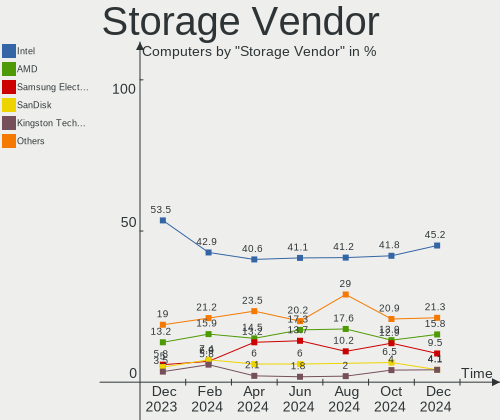
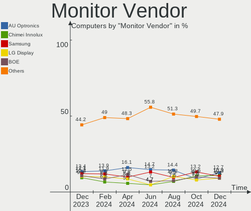
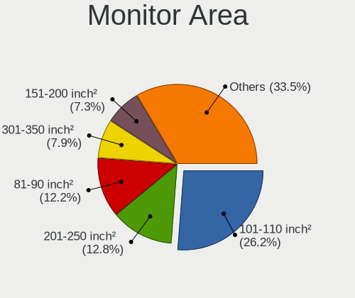
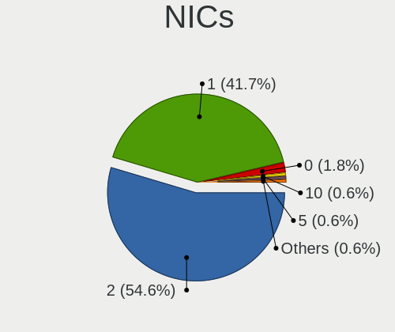

Linux in Poland - Hardware Trends
---------------------------------

A project to identify most popular hardware characteristics and track their change
over time based on data collected by Linux users at https://Linux-Hardware.org.

Anyone can contribute to this report by the [hw-probe](https://github.com/linuxhw/hw-probe) tool:

    sudo -E hw-probe -all -upload

This is a report for all computer types. See also reports for [desktops](/Location/Poland/Desktop/README.md) and [notebooks](/Location/Poland/Notebook/README.md).

Contents
--------

* [ System ](#system)
  - [ OS                       ](#os)
  - [ OS Family                ](#os-family)
  - [ Kernel                   ](#kernel)
  - [ Kernel Family            ](#kernel-family)
  - [ Kernel Major Ver.        ](#kernel-major-ver)
  - [ Arch                     ](#arch)
  - [ DE                       ](#de)
  - [ Display Server           ](#display-server)
  - [ Display Manager          ](#display-manager)
  - [ OS Lang                  ](#os-lang)
  - [ Boot Mode                ](#boot-mode)
  - [ Filesystem               ](#filesystem)
  - [ Part. scheme             ](#part-scheme)
  - [ Dual Boot with Linux/BSD ](#dual-boot-with-linuxbsd)
  - [ Dual Boot (Win)          ](#dual-boot-win)

* [ Board ](#board)
  - [ Vendor                   ](#vendor)
  - [ Model                    ](#model)
  - [ Model Family             ](#model-family)
  - [ MFG Year                 ](#mfg-year)
  - [ Form Factor              ](#form-factor)
  - [ Secure Boot              ](#secure-boot)
  - [ Coreboot                 ](#coreboot)
  - [ RAM Size                 ](#ram-size)
  - [ RAM Used                 ](#ram-used)
  - [ Total Drives             ](#total-drives)
  - [ Has CD-ROM               ](#has-cd-rom)
  - [ Has Ethernet             ](#has-ethernet)
  - [ Has WiFi                 ](#has-wifi)
  - [ Has Bluetooth            ](#has-bluetooth)

* [ Location ](#location)
  - [ Country                  ](#country)
  - [ City                     ](#city)

* [ Drives ](#drives)
  - [ Drive Vendor             ](#drive-vendor)
  - [ Drive Model              ](#drive-model)
  - [ HDD Vendor               ](#hdd-vendor)
  - [ SSD Vendor               ](#ssd-vendor)
  - [ Drive Kind               ](#drive-kind)
  - [ Drive Connector          ](#drive-connector)
  - [ Drive Size               ](#drive-size)
  - [ Space Total              ](#space-total)
  - [ Space Used               ](#space-used)
  - [ Malfunc. Drives          ](#malfunc-drives)
  - [ Malfunc. Drive Vendor    ](#malfunc-drive-vendor)
  - [ Malfunc. HDD Vendor      ](#malfunc-hdd-vendor)
  - [ Malfunc. Drive Kind      ](#malfunc-drive-kind)
  - [ Failed Drives            ](#failed-drives)
  - [ Failed Drive Vendor      ](#failed-drive-vendor)
  - [ Drive Status             ](#drive-status)

* [ Storage controller ](#storage-controller)
  - [ Storage Vendor           ](#storage-vendor)
  - [ Storage Model            ](#storage-model)
  - [ Storage Kind             ](#storage-kind)

* [ Processor ](#processor)
  - [ CPU Vendor               ](#cpu-vendor)
  - [ CPU Model                ](#cpu-model)
  - [ CPU Model Family         ](#cpu-model-family)
  - [ CPU Cores                ](#cpu-cores)
  - [ CPU Sockets              ](#cpu-sockets)
  - [ CPU Threads              ](#cpu-threads)
  - [ CPU Op-Modes             ](#cpu-op-modes)
  - [ CPU Microcode            ](#cpu-microcode)
  - [ CPU Microarch            ](#cpu-microarch)

* [ Graphics ](#graphics)
  - [ GPU Vendor               ](#gpu-vendor)
  - [ GPU Model                ](#gpu-model)
  - [ GPU Combo                ](#gpu-combo)
  - [ GPU Driver               ](#gpu-driver)
  - [ GPU Memory               ](#gpu-memory)

* [ Monitor ](#monitor)
  - [ Monitor Vendor           ](#monitor-vendor)
  - [ Monitor Model            ](#monitor-model)
  - [ Monitor Resolution       ](#monitor-resolution)
  - [ Monitor Diagonal         ](#monitor-diagonal)
  - [ Monitor Width            ](#monitor-width)
  - [ Aspect Ratio             ](#aspect-ratio)
  - [ Monitor Area             ](#monitor-area)
  - [ Pixel Density            ](#pixel-density)
  - [ Multiple Monitors        ](#multiple-monitors)

* [ Network ](#network)
  - [ Net Controller Vendor    ](#net-controller-vendor)
  - [ Net Controller Model     ](#net-controller-model)
  - [ Wireless Vendor          ](#wireless-vendor)
  - [ Wireless Model           ](#wireless-model)
  - [ Ethernet Vendor          ](#ethernet-vendor)
  - [ Ethernet Model           ](#ethernet-model)
  - [ Net Controller Kind      ](#net-controller-kind)
  - [ Used Controller          ](#used-controller)
  - [ NICs                     ](#nics)
  - [ IPv6                     ](#ipv6)

* [ Bluetooth ](#bluetooth)
  - [ Bluetooth Vendor         ](#bluetooth-vendor)
  - [ Bluetooth Model          ](#bluetooth-model)

* [ Sound ](#sound)
  - [ Sound Vendor             ](#sound-vendor)
  - [ Sound Model              ](#sound-model)

* [ Memory ](#memory)
  - [ Memory Vendor            ](#memory-vendor)
  - [ Memory Model             ](#memory-model)
  - [ Memory Kind              ](#memory-kind)
  - [ Memory Form Factor       ](#memory-form-factor)
  - [ Memory Size              ](#memory-size)
  - [ Memory Speed             ](#memory-speed)

* [ Printers & scanners ](#printers--scanners)
  - [ Printer Vendor           ](#printer-vendor)
  - [ Printer Model            ](#printer-model)
  - [ Scanner Vendor           ](#scanner-vendor)
  - [ Scanner Model            ](#scanner-model)

* [ Camera ](#camera)
  - [ Camera Vendor            ](#camera-vendor)
  - [ Camera Model             ](#camera-model)

* [ Security ](#security)
  - [ Fingerprint Vendor       ](#fingerprint-vendor)
  - [ Fingerprint Model        ](#fingerprint-model)
  - [ Chipcard Vendor          ](#chipcard-vendor)
  - [ Chipcard Model           ](#chipcard-model)

* [ Unsupported ](#unsupported)
  - [ Unsupported Devices      ](#unsupported-devices)
  - [ Unsupported Device Types ](#unsupported-device-types)

System
------

OS
--

Installed operating systems

| Name                        | Computers | Percent |
|-----------------------------|-----------|---------|
| Linux Mint 20.3             | 17        | 11.33%  |
| Ubuntu 20.04                | 16        | 10.67%  |
| OpenMandriva 4.3            | 16        | 10.67%  |
| Fedora 35                   | 9         | 6%      |
| Ubuntu 21.10                | 8         | 5.33%   |
| Ubuntu 22.04                | 6         | 4%      |
| Manjaro 21.2.5              | 5         | 3.33%   |
| KDE neon 20.04              | 5         | 3.33%   |
| Fedora 36                   | 5         | 3.33%   |
| Debian 11                   | 5         | 3.33%   |
| Arch Rolling                | 5         | 3.33%   |
| Zorin 16                    | 4         | 2.67%   |
| Manjaro                     | 4         | 2.67%   |
| Elementary 6.1              | 4         | 2.67%   |
| Gentoo 2.7                  | 3         | 2%      |
| ROSA 12.2                   | 2         | 1.33%   |
| Raspbian 11                 | 2         | 1.33%   |
| Pop!_OS 21.10               | 2         | 1.33%   |
| OpenMandriva 4.2            | 2         | 1.33%   |
| Gentoo 2.6                  | 2         | 1.33%   |
| EndeavourOS Rolling         | 2         | 1.33%   |
| Xubuntu 20.04               | 1         | 0.67%   |
| Xubuntu 16.04               | 1         | 0.67%   |
| Void Linux Rolling          | 1         | 0.67%   |
| Ubuntu Budgie 21.10         | 1         | 0.67%   |
| Ubuntu 21.04                | 1         | 0.67%   |
| Ubuntu 18.04                | 1         | 0.67%   |
| Sparky 7                    | 1         | 0.67%   |
| ROSA R11.1                  | 1         | 0.67%   |
| Peppermint 11.2             | 1         | 0.67%   |
| org.kde.Platform 5.15-21.08 | 1         | 0.67%   |
| NixOS 22.05                 | 1         | 0.67%   |
| MX 21                       | 1         | 0.67%   |
| Manjaro-ARM                 | 1         | 0.67%   |
| LMDE 5                      | 1         | 0.67%   |
| Linux Mint 19.3             | 1         | 0.67%   |
| Kubuntu 21.10               | 1         | 0.67%   |
| Kubuntu 20.04               | 1         | 0.67%   |
| KDE neon 18.04              | 1         | 0.67%   |
| Kali 2022.1                 | 1         | 0.67%   |
| Gentoo 2.8                  | 1         | 0.67%   |
| Funtoo 2021-03-10           | 1         | 0.67%   |
| Fedora 37                   | 1         | 0.67%   |
| Fedora 34                   | 1         | 0.67%   |
| Debian Unstable             | 1         | 0.67%   |
| ArcoLinux Rolling           | 1         | 0.67%   |
| Arch                        | 1         | 0.67%   |

OS Family
---------

OS without a version

| Name             | Computers | Percent |
|------------------|-----------|---------|
| Ubuntu           | 32        | 21.33%  |
| OpenMandriva     | 18        | 12%     |
| Linux Mint       | 18        | 12%     |
| Fedora           | 16        | 10.67%  |
| Manjaro          | 9         | 6%      |
| KDE neon         | 6         | 4%      |
| Gentoo           | 6         | 4%      |
| Debian           | 6         | 4%      |
| Arch             | 6         | 4%      |
| Zorin            | 4         | 2.67%   |
| Elementary       | 4         | 2.67%   |
| ROSA             | 3         | 2%      |
| Xubuntu          | 2         | 1.33%   |
| Raspbian         | 2         | 1.33%   |
| Pop!_OS          | 2         | 1.33%   |
| Kubuntu          | 2         | 1.33%   |
| EndeavourOS      | 2         | 1.33%   |
| Void Linux       | 1         | 0.67%   |
| Ubuntu Budgie    | 1         | 0.67%   |
| Sparky           | 1         | 0.67%   |
| Peppermint       | 1         | 0.67%   |
| org.kde.Platform | 1         | 0.67%   |
| NixOS            | 1         | 0.67%   |
| MX               | 1         | 0.67%   |
| Manjaro-ARM      | 1         | 0.67%   |
| LMDE             | 1         | 0.67%   |
| Kali             | 1         | 0.67%   |
| Funtoo           | 1         | 0.67%   |
| ArcoLinux        | 1         | 0.67%   |

Kernel
------

Version of the Linux kernel

| Version                            | Computers | Percent |
|------------------------------------|-----------|---------|
| 5.13.0-39-generic                  | 25        | 16.67%  |
| 5.16.7-desktop-1omv4003            | 15        | 10%     |
| 5.13.0-40-generic                  | 11        | 7.33%   |
| 5.4.0-107-generic                  | 7         | 4.67%   |
| 5.10.0-13-amd64                    | 6         | 4%      |
| 5.4.0-109-generic                  | 5         | 3.33%   |
| 5.15.0-25-generic                  | 5         | 3.33%   |
| 5.16.20-200.fc35.x86_64            | 4         | 2.67%   |
| 5.16.18-200.fc35.x86_64            | 4         | 2.67%   |
| 5.17.3-302.fc36.x86_64             | 3         | 2%      |
| 5.16.14-1-MANJARO                  | 3         | 2%      |
| 5.15.28-1-MANJARO                  | 3         | 2%      |
| 5.15.26-gentoo                     | 3         | 2%      |
| 5.4.0-104-generic                  | 2         | 1.33%   |
| 5.17.2-300.fc36.x86_64             | 2         | 1.33%   |
| 5.17.1-arch1-1                     | 2         | 1.33%   |
| 5.16.19-76051619-generic           | 2         | 1.33%   |
| 5.13.0-27-generic                  | 2         | 1.33%   |
| 5.10.74-generic-2rosa2021.1-x86_64 | 2         | 1.33%   |
| 5.10.14-desktop-1omv4002           | 2         | 1.33%   |
| 5.4.0-91-generic                   | 1         | 0.67%   |
| 5.4.0-60-generic                   | 1         | 0.67%   |
| 5.4.0-108-generic                  | 1         | 0.67%   |
| 5.18.0-0.rc2.23.fc37.x86_64        | 1         | 0.67%   |
| 5.17.5.ll48-1-lin-git+             | 1         | 0.67%   |
| 5.17.5-arch1-1                     | 1         | 0.67%   |
| 5.17.4-arch1-1                     | 1         | 0.67%   |
| 5.17.4-100.fc34.x86_64             | 1         | 0.67%   |
| 5.17.3-gentoo-11-02-22             | 1         | 0.67%   |
| 5.17.1-zen1-1-zen                  | 1         | 0.67%   |
| 5.17.1-arch1-1.1                   | 1         | 0.67%   |
| 5.17.0-247-tkg-pds                 | 1         | 0.67%   |
| 5.17.0-1-MANJARO                   | 1         | 0.67%   |
| 5.17.0-1-amd64                     | 1         | 0.67%   |
| 5.16.20_1                          | 1         | 0.67%   |
| 5.16.2-2-rt19-MANJARO              | 1         | 0.67%   |
| 5.16.18_p1-debian-sources          | 1         | 0.67%   |
| 5.16.16-200.fc35.x86_64            | 1         | 0.67%   |
| 5.16.15-051615-generic             | 1         | 0.67%   |
| 5.16.13-desktop-1omv4003           | 1         | 0.67%   |
| 5.16.10-051610-generic             | 1         | 0.67%   |
| 5.16.0-kali7-amd64                 | 1         | 0.67%   |
| 5.15.6-2-MANJARO                   | 1         | 0.67%   |
| 5.15.35-1-lts                      | 1         | 0.67%   |
| 5.15.32-gentoo-r1                  | 1         | 0.67%   |
| 5.15.32                            | 1         | 0.67%   |
| 5.15.30-v8                         | 1         | 0.67%   |
| 5.15.28-1-MANJARO-ARM-RPI          | 1         | 0.67%   |
| 5.15.27-xanmod1-tt                 | 1         | 0.67%   |
| 5.15.0-27-generic                  | 1         | 0.67%   |
| 5.14.0-trunk-amd64                 | 1         | 0.67%   |
| 5.14.0-1034-oem                    | 1         | 0.67%   |
| 5.13.19-6-pve                      | 1         | 0.67%   |
| 5.13.0-37-generic                  | 1         | 0.67%   |
| 5.13.0-30-generic                  | 1         | 0.67%   |
| 5.11.0-49-generic                  | 1         | 0.67%   |
| 5.10.92-v7+                        | 1         | 0.67%   |
| 5.10.103+                          | 1         | 0.67%   |
| 5.10.0-11-amd64                    | 1         | 0.67%   |
| 5.10.0-1023-oem                    | 1         | 0.67%   |

Kernel Family
-------------

Linux kernel without a distro release

| Version  | Computers | Percent |
|----------|-----------|---------|
| 5.13.0   | 40        | 26.67%  |
| 5.4.0    | 17        | 11.33%  |
| 5.16.7   | 15        | 10%     |
| 5.10.0   | 8         | 5.33%   |
| 5.15.0   | 6         | 4%      |
| 5.16.20  | 5         | 3.33%   |
| 5.16.18  | 5         | 3.33%   |
| 5.17.3   | 4         | 2.67%   |
| 5.17.1   | 4         | 2.67%   |
| 5.15.28  | 4         | 2.67%   |
| 5.17.0   | 3         | 2%      |
| 5.16.14  | 3         | 2%      |
| 5.15.26  | 3         | 2%      |
| 5.17.5   | 2         | 1.33%   |
| 5.17.4   | 2         | 1.33%   |
| 5.17.2   | 2         | 1.33%   |
| 5.16.19  | 2         | 1.33%   |
| 5.15.32  | 2         | 1.33%   |
| 5.14.0   | 2         | 1.33%   |
| 5.10.74  | 2         | 1.33%   |
| 5.10.14  | 2         | 1.33%   |
| 5.18.0   | 1         | 0.67%   |
| 5.16.2   | 1         | 0.67%   |
| 5.16.16  | 1         | 0.67%   |
| 5.16.15  | 1         | 0.67%   |
| 5.16.13  | 1         | 0.67%   |
| 5.16.10  | 1         | 0.67%   |
| 5.16.0   | 1         | 0.67%   |
| 5.15.6   | 1         | 0.67%   |
| 5.15.35  | 1         | 0.67%   |
| 5.15.30  | 1         | 0.67%   |
| 5.15.27  | 1         | 0.67%   |
| 5.13.19  | 1         | 0.67%   |
| 5.11.0   | 1         | 0.67%   |
| 5.10.92  | 1         | 0.67%   |
| 5.10.103 | 1         | 0.67%   |
| 4.4.0    | 1         | 0.67%   |
| 4.15.0   | 1         | 0.67%   |

Kernel Major Ver.
-----------------

Linux kernel major version

| Version | Computers | Percent |
|---------|-----------|---------|
| 5.13    | 41        | 27.33%  |
| 5.16    | 36        | 24%     |
| 5.15    | 19        | 12.67%  |
| 5.4     | 17        | 11.33%  |
| 5.17    | 17        | 11.33%  |
| 5.10    | 14        | 9.33%   |
| 5.14    | 2         | 1.33%   |
| 5.18    | 1         | 0.67%   |
| 5.11    | 1         | 0.67%   |
| 4.4     | 1         | 0.67%   |
| 4.15    | 1         | 0.67%   |

Arch
----

OS architecture (x86_64, i586, etc.)

| Name    | Computers | Percent |
|---------|-----------|---------|
| x86_64  | 146       | 97.33%  |
| aarch64 | 2         | 1.33%   |
| armv7l  | 1         | 0.67%   |
| armv6l  | 1         | 0.67%   |

DE
--

Desktop Environment

| Name       | Computers | Percent |
|------------|-----------|---------|
| GNOME      | 57        | 38%     |
| KDE5       | 38        | 25.33%  |
| XFCE       | 13        | 8.67%   |
| X-Cinnamon | 13        | 8.67%   |
| Unknown    | 12        | 8%      |
| Pantheon   | 4         | 2.67%   |
| MATE       | 3         | 2%      |
| Trinity    | 1         | 0.67%   |
| LXQt       | 1         | 0.67%   |
| LXDE       | 1         | 0.67%   |
| KDE4       | 1         | 0.67%   |
| i3         | 1         | 0.67%   |
| DWM        | 1         | 0.67%   |
| Deepin     | 1         | 0.67%   |
| Cinnamon   | 1         | 0.67%   |
| Budgie     | 1         | 0.67%   |
| awesome    | 1         | 0.67%   |

Display Server
--------------

X11 or Wayland

| Name    | Computers | Percent |
|---------|-----------|---------|
| X11     | 113       | 75.33%  |
| Wayland | 29        | 19.33%  |
| Unknown | 5         | 3.33%   |
| Tty     | 3         | 2%      |

Display Manager
---------------

SDDM, LightDM, etc.

| Name    | Computers | Percent |
|---------|-----------|---------|
| Unknown | 54        | 36%     |
| SDDM    | 28        | 18.67%  |
| LightDM | 26        | 17.33%  |
| GDM     | 21        | 14%     |
| GDM3    | 19        | 12.67%  |
| Ly      | 1         | 0.67%   |
| KDM     | 1         | 0.67%   |

OS Lang
-------

Language

| Lang    | Computers | Percent |
|---------|-----------|---------|
| pl_PL   | 95        | 63.33%  |
| en_US   | 41        | 27.33%  |
| en_GB   | 5         | 3.33%   |
| Unknown | 4         | 2.67%   |
| szl_PL  | 2         | 1.33%   |
| uk_UA   | 1         | 0.67%   |
| ru_RU   | 1         | 0.67%   |
| it_IT   | 1         | 0.67%   |

Boot Mode
---------

EFI or BIOS

| Mode | Computers | Percent |
|------|-----------|---------|
| EFI  | 83        | 55.33%  |
| BIOS | 67        | 44.67%  |

Filesystem
----------

Type of filesystem

| Type    | Computers | Percent |
|---------|-----------|---------|
| Ext4    | 105       | 70%     |
| Btrfs   | 17        | 11.33%  |
| Overlay | 15        | 10%     |
| F2fs    | 5         | 3.33%   |
| Zfs     | 4         | 2.67%   |
| Xfs     | 4         | 2.67%   |

Part. scheme
------------

Scheme of partitioning

| Type    | Computers | Percent |
|---------|-----------|---------|
| Unknown | 69        | 46%     |
| GPT     | 62        | 41.33%  |
| MBR     | 19        | 12.67%  |

Dual Boot with Linux/BSD
------------------------

Hosting more than one Linux/BSD

| Dual boot | Computers | Percent |
|-----------|-----------|---------|
| No        | 128       | 85.33%  |
| Yes       | 22        | 14.67%  |

Dual Boot (Win)
---------------

Hosting Linux and Windows

| Dual boot | Computers | Percent |
|-----------|-----------|---------|
| No        | 107       | 71.33%  |
| Yes       | 43        | 28.67%  |

Board
-----

Vendor
------

Motherboard manufacturer

| Name                    | Computers | Percent |
|-------------------------|-----------|---------|
| Lenovo                  | 29        | 19.33%  |
| ASUSTek Computer        | 22        | 14.67%  |
| Gigabyte Technology     | 21        | 14%     |
| Dell                    | 21        | 14%     |
| Hewlett-Packard         | 12        | 8%      |
| MSI                     | 10        | 6.67%   |
| Acer                    | 7         | 4.67%   |
| ASRock                  | 6         | 4%      |
| Apple                   | 5         | 3.33%   |
| Raspberry Pi Foundation | 4         | 2.67%   |
| HUAWEI                  | 3         | 2%      |
| Samsung Electronics     | 2         | 1.33%   |
| Intel                   | 2         | 1.33%   |
| Fujitsu                 | 2         | 1.33%   |
| Toshiba                 | 1         | 0.67%   |
| Sony                    | 1         | 0.67%   |
| Huanan                  | 1         | 0.67%   |
| Unknown                 | 1         | 0.67%   |

Model
-----

Motherboard model

| Name                                       | Computers | Percent |
|--------------------------------------------|-----------|---------|
| Gigabyte B450M DS3H                        | 3         | 2%      |
| RPi Raspberry Pi                           | 2         | 1.33%   |
| MSI MS-7A38                                | 2         | 1.33%   |
| Lenovo Legion Y540-15IRH 81SX              | 2         | 1.33%   |
| HUAWEI HVY-WXX9                            | 2         | 1.33%   |
| HP Pavilion g6                             | 2         | 1.33%   |
| Dell OptiPlex 790                          | 2         | 1.33%   |
| Dell Latitude 5480                         | 2         | 1.33%   |
| ASUS PRIME X470-PRO                        | 2         | 1.33%   |
| ASUS P8Z77-V LX                            | 2         | 1.33%   |
| ASUS All Series                            | 2         | 1.33%   |
| Apple Macmini7,1                           | 2         | 1.33%   |
| Unknown                                    | 2         | 1.33%   |
| Toshiba Satellite A300                     | 1         | 0.67%   |
| Sony VGN-FZ11M                             | 1         | 0.67%   |
| Samsung RC410/RC510/RC710                  | 1         | 0.67%   |
| Samsung 350V5C/351V5C/3540VC/3440VC        | 1         | 0.67%   |
| RPi Raspberry Pi Zero W Rev 1.1            | 1         | 0.67%   |
| RPi Raspberry Pi 4 Model B Rev 1.1         | 1         | 0.67%   |
| MSI PE60 2QE                               | 1         | 0.67%   |
| MSI MS-7B98                                | 1         | 0.67%   |
| MSI MS-7B93                                | 1         | 0.67%   |
| MSI MS-7B86                                | 1         | 0.67%   |
| MSI MS-7B17                                | 1         | 0.67%   |
| MSI MS-7978                                | 1         | 0.67%   |
| MSI GF75 Thin 10UEK                        | 1         | 0.67%   |
| MSI GE60 2PC                               | 1         | 0.67%   |
| Lenovo Z51-70 80K6                         | 1         | 0.67%   |
| Lenovo Yoga S740-14IIL 81RS                | 1         | 0.67%   |
| Lenovo ThinkStation C20 4263BA7            | 1         | 0.67%   |
| Lenovo ThinkPad X270 W10DG 20K5S2VL00      | 1         | 0.67%   |
| Lenovo ThinkPad X260 20F5S4BY00            | 1         | 0.67%   |
| Lenovo ThinkPad X1 Extreme 20MFCTO1WW      | 1         | 0.67%   |
| Lenovo ThinkPad T570 W10DG 20JXS01Y04      | 1         | 0.67%   |
| Lenovo ThinkPad T15 Gen 1 20S6002ERT       | 1         | 0.67%   |
| Lenovo ThinkPad T14 Gen 2a 20XK002UCK      | 1         | 0.67%   |
| Lenovo ThinkPad L13 Yoga Gen 2a 21AD001TGE | 1         | 0.67%   |
| Lenovo ThinkPad Edge E430 3254CFG          | 1         | 0.67%   |
| Lenovo ThinkPad Edge E430 3254A8G          | 1         | 0.67%   |
| Lenovo ThinkPad E15 Gen 2 20T8004RPB       | 1         | 0.67%   |
| Lenovo ThinkPad 10 2nd 20E30013PB          | 1         | 0.67%   |
| Lenovo ThinkCentre M58 7627AD5             | 1         | 0.67%   |
| Lenovo ThinkCentre M57 6072A5G             | 1         | 0.67%   |
| Lenovo Legion 7 16ACHg6 82N6               | 1         | 0.67%   |
| Lenovo Legion 5 15ACH6H 82JU               | 1         | 0.67%   |
| Lenovo IdeaPad Y700-17ISK 80Q0             | 1         | 0.67%   |
| Lenovo IdeaPad S540-15IWL GTX 81SW         | 1         | 0.67%   |
| Lenovo IdeaPad S540-14API 81NH             | 1         | 0.67%   |
| Lenovo IdeaPad 530S-14ARR 81H1             | 1         | 0.67%   |
| Lenovo IdeaCentre AIO 300-23ISU F0BY00DMPB | 1         | 0.67%   |
| Lenovo G580 20150                          | 1         | 0.67%   |
| Lenovo G510 20238                          | 1         | 0.67%   |
| Lenovo G500 20236                          | 1         | 0.67%   |
| Lenovo 3000 V200 076472G                   | 1         | 0.67%   |
| Intel DH55TC AAE70932-204                  | 1         | 0.67%   |
| Intel DCP847SKE G80890-105                 | 1         | 0.67%   |
| HUAWEI KLVL-WXX9                           | 1         | 0.67%   |
| Huanan X79 249PC V2.2                      | 1         | 0.67%   |
| HP ProBook 650 G1                          | 1         | 0.67%   |
| HP ProBook 6440b                           | 1         | 0.67%   |

Model Family
------------

Motherboard model prefix

| Name                  | Computers | Percent |
|-----------------------|-----------|---------|
| Lenovo ThinkPad       | 11        | 7.33%   |
| Dell Latitude         | 9         | 6%      |
| Dell Inspiron         | 6         | 4%      |
| Gigabyte B450M        | 5         | 3.33%   |
| RPi Raspberry         | 4         | 2.67%   |
| Lenovo Legion         | 4         | 2.67%   |
| Lenovo IdeaPad        | 4         | 2.67%   |
| HP Pavilion           | 4         | 2.67%   |
| Acer Aspire           | 4         | 2.67%   |
| HP EliteBook          | 3         | 2%      |
| Dell Precision        | 3         | 2%      |
| ASUS ROG              | 3         | 2%      |
| ASUS PRIME            | 3         | 2%      |
| Acer Nitro            | 3         | 2%      |
| MSI MS-7A38           | 2         | 1.33%   |
| Lenovo ThinkCentre    | 2         | 1.33%   |
| HUAWEI HVY-WXX9       | 2         | 1.33%   |
| HP ProBook            | 2         | 1.33%   |
| Dell OptiPlex         | 2         | 1.33%   |
| ASUS P8Z77-V          | 2         | 1.33%   |
| ASUS All              | 2         | 1.33%   |
| Apple Macmini7        | 2         | 1.33%   |
| Unknown               | 2         | 1.33%   |
| Toshiba Satellite     | 1         | 0.67%   |
| Sony VGN-FZ11M        | 1         | 0.67%   |
| Samsung RC410         | 1         | 0.67%   |
| Samsung 350V5C        | 1         | 0.67%   |
| MSI PE60              | 1         | 0.67%   |
| MSI MS-7B98           | 1         | 0.67%   |
| MSI MS-7B93           | 1         | 0.67%   |
| MSI MS-7B86           | 1         | 0.67%   |
| MSI MS-7B17           | 1         | 0.67%   |
| MSI MS-7978           | 1         | 0.67%   |
| MSI GF75              | 1         | 0.67%   |
| MSI GE60              | 1         | 0.67%   |
| Lenovo Z51-70         | 1         | 0.67%   |
| Lenovo Yoga           | 1         | 0.67%   |
| Lenovo ThinkStation   | 1         | 0.67%   |
| Lenovo IdeaCentre     | 1         | 0.67%   |
| Lenovo G580           | 1         | 0.67%   |
| Lenovo G510           | 1         | 0.67%   |
| Lenovo G500           | 1         | 0.67%   |
| Lenovo 3000           | 1         | 0.67%   |
| Intel DH55TC          | 1         | 0.67%   |
| Intel DCP847SKE       | 1         | 0.67%   |
| HUAWEI KLVL-WXX9      | 1         | 0.67%   |
| Huanan X79            | 1         | 0.67%   |
| HP Desktop            | 1         | 0.67%   |
| HP 255                | 1         | 0.67%   |
| Gigabyte Z690         | 1         | 0.67%   |
| Gigabyte Z590         | 1         | 0.67%   |
| Gigabyte Z170-Gaming  | 1         | 0.67%   |
| Gigabyte TRX40        | 1         | 0.67%   |
| Gigabyte H97M-HD3     | 1         | 0.67%   |
| Gigabyte H410M        | 1         | 0.67%   |
| Gigabyte H370M-DS3H   | 1         | 0.67%   |
| Gigabyte H310M        | 1         | 0.67%   |
| Gigabyte GB-BPCE-3455 | 1         | 0.67%   |
| Gigabyte G41MT-D3     | 1         | 0.67%   |
| Gigabyte G31M-S2L     | 1         | 0.67%   |

MFG Year
--------

Motherboard manufacture year

| Year    | Computers | Percent |
|---------|-----------|---------|
| 2018    | 20        | 13.33%  |
| 2021    | 15        | 10%     |
| 2019    | 14        | 9.33%   |
| 2020    | 11        | 7.33%   |
| 2015    | 11        | 7.33%   |
| 2013    | 11        | 7.33%   |
| 2014    | 10        | 6.67%   |
| 2012    | 10        | 6.67%   |
| 2017    | 8         | 5.33%   |
| 2011    | 8         | 5.33%   |
| 2008    | 7         | 4.67%   |
| 2016    | 5         | 3.33%   |
| 2010    | 5         | 3.33%   |
| Unknown | 5         | 3.33%   |
| 2007    | 3         | 2%      |
| 2006    | 3         | 2%      |
| 2022    | 2         | 1.33%   |
| 2009    | 2         | 1.33%   |

Form Factor
-----------

Physical design of the computer

| Name           | Computers | Percent |
|----------------|-----------|---------|
| Notebook       | 80        | 53.33%  |
| Desktop        | 60        | 40%     |
| System on chip | 4         | 2.67%   |
| Mini pc        | 2         | 1.33%   |
| Tablet         | 1         | 0.67%   |
| Convertible    | 1         | 0.67%   |
| All in one     | 1         | 0.67%   |
| Server         | 1         | 0.67%   |

Secure Boot
-----------

Enabled or disabled

| State    | Computers | Percent |
|----------|-----------|---------|
| Disabled | 136       | 90.67%  |
| Enabled  | 14        | 9.33%   |

Coreboot
--------

Have coreboot on board

| Used | Computers | Percent |
|------|-----------|---------|
| No   | 150       | 100%    |

RAM Size
--------

Total RAM memory

| Size in GB  | Computers | Percent |
|-------------|-----------|---------|
| 8.01-16.0   | 35        | 23.33%  |
| 4.01-8.0    | 29        | 19.33%  |
| 3.01-4.0    | 26        | 17.33%  |
| 16.01-24.0  | 23        | 15.33%  |
| 32.01-64.0  | 22        | 14.67%  |
| 64.01-256.0 | 7         | 4.67%   |
| 1.01-2.0    | 4         | 2.67%   |
| 24.01-32.0  | 2         | 1.33%   |
| 0.51-1.0    | 1         | 0.67%   |
| 0.01-0.5    | 1         | 0.67%   |

RAM Used
--------

Used RAM memory

| Used GB    | Computers | Percent |
|------------|-----------|---------|
| 1.01-2.0   | 48        | 32%     |
| 2.01-3.0   | 27        | 18%     |
| 4.01-8.0   | 25        | 16.67%  |
| 3.01-4.0   | 16        | 10.67%  |
| 8.01-16.0  | 13        | 8.67%   |
| 0.51-1.0   | 10        | 6.67%   |
| 16.01-24.0 | 6         | 4%      |
| 0.01-0.5   | 4         | 2.67%   |
| 24.01-32.0 | 1         | 0.67%   |

Total Drives
------------

Number of drives on board

| Drives | Computers | Percent |
|--------|-----------|---------|
| 1      | 86        | 57.33%  |
| 2      | 34        | 22.67%  |
| 3      | 10        | 6.67%   |
| 4      | 9         | 6%      |
| 5      | 4         | 2.67%   |
| 7      | 3         | 2%      |
| 6      | 2         | 1.33%   |
| 0      | 2         | 1.33%   |

Has CD-ROM
----------

Has CD-ROM on board

| Presented | Computers | Percent |
|-----------|-----------|---------|
| No        | 93        | 62%     |
| Yes       | 57        | 38%     |

Has Ethernet
------------

Has Ethernet on board

| Presented | Computers | Percent |
|-----------|-----------|---------|
| Yes       | 134       | 89.33%  |
| No        | 16        | 10.67%  |

Has WiFi
--------

Has WiFi module

| Presented | Computers | Percent |
|-----------|-----------|---------|
| Yes       | 110       | 73.33%  |
| No        | 40        | 26.67%  |

Has Bluetooth
-------------

Has Bluetooth module

| Presented | Computers | Percent |
|-----------|-----------|---------|
| Yes       | 95        | 63.33%  |
| No        | 55        | 36.67%  |

Location
--------

Country
-------

Geographic location (country)

| Country | Computers | Percent |
|---------|-----------|---------|
| Poland  | 150       | 100%    |

City
----

Geographic location (city)

| City                 | Computers | Percent |
|----------------------|-----------|---------|
| Warsaw               | 42        | 28%     |
| Wroclaw              | 12        | 8%      |
| Poznan               | 9         | 6%      |
| Krakow               | 5         | 3.33%   |
| Gdynia               | 5         | 3.33%   |
| Szczecin             | 3         | 2%      |
| Pabianice            | 3         | 2%      |
| Opole                | 3         | 2%      |
| Lublin               | 3         | 2%      |
| Lodz                 | 3         | 2%      |
| Gliwice              | 3         | 2%      |
| Olesnica             | 2         | 1.33%   |
| Gdansk               | 2         | 1.33%   |
| Częstochowa         | 2         | 1.33%   |
| Bydgoszcz            | 2         | 1.33%   |
| Bukowiec             | 2         | 1.33%   |
| Bielsko-Biala        | 2         | 1.33%   |
| Zadzim               | 1         | 0.67%   |
| Zabrze               | 1         | 0.67%   |
| Wołomin             | 1         | 0.67%   |
| Wieluń              | 1         | 0.67%   |
| Tarnowskie Gory      | 1         | 0.67%   |
| Słupsk              | 1         | 0.67%   |
| Strzyzow             | 1         | 0.67%   |
| Stare Kozle          | 1         | 0.67%   |
| Sosnowiec            | 1         | 0.67%   |
| Sopot                | 1         | 0.67%   |
| Skawina              | 1         | 0.67%   |
| Rzeszów             | 1         | 0.67%   |
| Ruda Śląska        | 1         | 0.67%   |
| Pruszków            | 1         | 0.67%   |
| Polkowice            | 1         | 0.67%   |
| Police               | 1         | 0.67%   |
| Pielgrzymka          | 1         | 0.67%   |
| Piekary Slaskie      | 1         | 0.67%   |
| Ozimek               | 1         | 0.67%   |
| Orzysz               | 1         | 0.67%   |
| Nowy Sącz           | 1         | 0.67%   |
| Nowa Slupia          | 1         | 0.67%   |
| Male Rudy            | 1         | 0.67%   |
| Lowicz               | 1         | 0.67%   |
| Laziska Gorne        | 1         | 0.67%   |
| Lagiewniki Wielkie   | 1         | 0.67%   |
| Krosno               | 1         | 0.67%   |
| Krasnystaw           | 1         | 0.67%   |
| Knurow               | 1         | 0.67%   |
| Klobuck              | 1         | 0.67%   |
| Kietrz               | 1         | 0.67%   |
| Kielce               | 1         | 0.67%   |
| Kedzierzyn-Kozle     | 1         | 0.67%   |
| Katowice             | 1         | 0.67%   |
| Kalisz               | 1         | 0.67%   |
| Jarocin              | 1         | 0.67%   |
| Hel                  | 1         | 0.67%   |
| Gorzów Wielkopolski | 1         | 0.67%   |
| Gniezno              | 1         | 0.67%   |
| Glucholazy           | 1         | 0.67%   |
| Dobrzen Wielki       | 1         | 0.67%   |
| Czepielin            | 1         | 0.67%   |
| Czeladz              | 1         | 0.67%   |

Drives
------

Drive Vendor
------------

Hard drive vendors

| Vendor                         | Computers | Drives | Percent |
|--------------------------------|-----------|--------|---------|
| Samsung Electronics            | 33        | 44     | 13.92%  |
| Seagate                        | 27        | 32     | 11.39%  |
| WDC                            | 25        | 34     | 10.55%  |
| GOODRAM                        | 16        | 18     | 6.75%   |
| Crucial                        | 13        | 13     | 5.49%   |
| A-DATA Technology              | 12        | 15     | 5.06%   |
| Toshiba                        | 10        | 12     | 4.22%   |
| Unknown                        | 9         | 9      | 3.8%    |
| SK Hynix                       | 9         | 9      | 3.8%    |
| SanDisk                        | 9         | 9      | 3.8%    |
| Kingston                       | 9         | 13     | 3.8%    |
| Hitachi                        | 9         | 11     | 3.8%    |
| HGST                           | 5         | 5      | 2.11%   |
| PNY                            | 4         | 5      | 1.69%   |
| KIOXIA                         | 4         | 5      | 1.69%   |
| Patriot                        | 3         | 3      | 1.27%   |
| XPG                            | 2         | 2      | 0.84%   |
| Micron Technology              | 2         | 2      | 0.84%   |
| KIOXIA-EXCERIA                 | 2         | 2      | 0.84%   |
| JMicron                        | 2         | 3      | 0.84%   |
| Corsair                        | 2         | 3      | 0.84%   |
| China                          | 2         | 3      | 0.84%   |
| Apple                          | 2         | 2      | 0.84%   |
| Apacer                         | 2         | 2      | 0.84%   |
| YMTC                           | 1         | 1      | 0.42%   |
| Yangtze Memory Technologies    | 1         | 1      | 0.42%   |
| WDC WDS2                       | 1         | 1      | 0.42%   |
| Solid State Storage Technology | 1         | 1      | 0.42%   |
| Silicon Motion                 | 1         | 1      | 0.42%   |
| Realtek Semiconductor          | 1         | 1      | 0.42%   |
| PLEXTOR                        | 1         | 1      | 0.42%   |
| Phison                         | 1         | 1      | 0.42%   |
| OCZ                            | 1         | 1      | 0.42%   |
| MAXTOR                         | 1         | 1      | 0.42%   |
| LITEON                         | 1         | 1      | 0.42%   |
| KINGBANK                       | 1         | 1      | 0.42%   |
| Intel                          | 1         | 1      | 0.42%   |
| HUAWEI                         | 1         | 1      | 0.42%   |
| HS-SSD-E100                    | 1         | 1      | 0.42%   |
| HS-SSD-C100                    | 1         | 1      | 0.42%   |
| Fujitsu                        | 1         | 1      | 0.42%   |
| FORESEE                        | 1         | 1      | 0.42%   |
| ExcelStor                      | 1         | 1      | 0.42%   |
| BHT                            | 1         | 1      | 0.42%   |
| asmedia                        | 1         | 1      | 0.42%   |
| Argon                          | 1         | 1      | 0.42%   |
| ADATA SX                       | 1         | 1      | 0.42%   |
| Unknown                        | 1         | 1      | 0.42%   |

Drive Model
-----------

Hard drive models

| Model                                | Computers | Percent |
|--------------------------------------|-----------|---------|
| A-DATA SU800 256GB SSD               | 5         | 1.85%   |
| Toshiba HDWD110 1TB                  | 3         | 1.11%   |
| Seagate ST2000DM008-2FR102 2TB       | 3         | 1.11%   |
| Samsung SSD 860 EVO 500GB            | 3         | 1.11%   |
| Samsung NVMe SSD Drive 500GB         | 3         | 1.11%   |
| GOODRAM SSDPR-CX400-512-G2 512GB     | 3         | 1.11%   |
| WDC WD30EFRX-68EUZN0 3TB             | 2         | 0.74%   |
| WDC PC SN520 SDAPMUW-256G-1101 256GB | 2         | 0.74%   |
| Unknown MMC Card  64GB               | 2         | 0.74%   |
| Toshiba DT01ACA100 1TB               | 2         | 0.74%   |
| SK Hynix NVMe SSD Drive 512GB        | 2         | 0.74%   |
| Seagate ST4000DM004-2CV104 4TB       | 2         | 0.74%   |
| Seagate ST1000LM024 HN-M101MBB 1TB   | 2         | 0.74%   |
| Seagate ST1000DM010-2EP102 1TB       | 2         | 0.74%   |
| Sandisk NVMe SSD Drive 256GB         | 2         | 0.74%   |
| Samsung SSD 970 EVO Plus 500GB       | 2         | 0.74%   |
| Samsung SSD 970 EVO 500GB            | 2         | 0.74%   |
| Samsung SSD 870 QVO 1TB              | 2         | 0.74%   |
| Samsung SSD 850 EVO 120GB            | 2         | 0.74%   |
| Samsung NVMe SSD Drive 256GB         | 2         | 0.74%   |
| Kingston SA2000M8250G 250GB          | 2         | 0.74%   |
| HGST HTS721010A9E630 1TB             | 2         | 0.74%   |
| GOODRAM SSDPR-CX400-512 512GB        | 2         | 0.74%   |
| GOODRAM SSDPR-CX400-128-G2 128GB     | 2         | 0.74%   |
| GOODRAM SSDPR-CL100-480-G2 480GB     | 2         | 0.74%   |
| GOODRAM IR-SSDPR-S25A-240 240GB      | 2         | 0.74%   |
| Crucial CT250MX500SSD1 250GB         | 2         | 0.74%   |
| A-DATA SU800 128GB SSD               | 2         | 0.74%   |
| YMTC PC005 512GB                     | 1         | 0.37%   |
| Yangtze Memory NVMe SSD Drive 512GB  | 1         | 0.37%   |
| XPG NVMe SSD Drive 256GB             | 1         | 0.37%   |
| XPG NVMe SSD Drive 1024GB            | 1         | 0.37%   |
| WDC WDS250G1B0B-00AS40 250GB SSD     | 1         | 0.37%   |
| WDC WDS2 40G2G0B-00EP 240GB SSD      | 1         | 0.37%   |
| WDC WDS100T2B0B-00YS70 1TB SSD       | 1         | 0.37%   |
| WDC WD800JD-08MSA1 80GB              | 1         | 0.37%   |
| WDC WD800BB-00JHC0 80GB              | 1         | 0.37%   |
| WDC WD800AAJS-75M0A0 80GB            | 1         | 0.37%   |
| WDC WD5002ABYS-01B1B0 500GB          | 1         | 0.37%   |
| WDC WD5000LPVX-75V0TT0 500GB         | 1         | 0.37%   |
| WDC WD5000LPLX-60ZNTT1 500GB         | 1         | 0.37%   |
| WDC WD5000BEVT-22A0RT0 500GB         | 1         | 0.37%   |
| WDC WD5000AVVS-63M8B0 500GB          | 1         | 0.37%   |
| WDC WD5000AAKX-001CA0 500GB          | 1         | 0.37%   |
| WDC WD5000AAKS-22V1A0 500GB          | 1         | 0.37%   |
| WDC WD5000AAKS-07YGA0 500GB          | 1         | 0.37%   |
| WDC WD40EZRZ-22GXCB0 4TB             | 1         | 0.37%   |
| WDC WD3200AAKS-00L9A0 320GB          | 1         | 0.37%   |
| WDC WD3200AAJS-07M0A0 320GB          | 1         | 0.37%   |
| WDC WD30EFRX-68N32N0 3TB             | 1         | 0.37%   |
| WDC WD30EFRX-68AX9N0 3TB             | 1         | 0.37%   |
| WDC WD30 EFRX-68EUZN0 3TB            | 1         | 0.37%   |
| WDC WD20EFRX-68EUZN0 2TB             | 1         | 0.37%   |
| WDC WD20EARS-00MVWB0 2TB             | 1         | 0.37%   |
| WDC WD2003FZEX-00Z4SA0 2TB           | 1         | 0.37%   |
| WDC WD2003FZEX-00SRLA0 2TB           | 1         | 0.37%   |
| WDC WD10JUCT-63CYNY0 1TB             | 1         | 0.37%   |
| WDC WD10JPCX-24UE4T0 1TB             | 1         | 0.37%   |
| WDC WD10EZEX-60WN4A0 1TB             | 1         | 0.37%   |
| WDC WD10EZEX-00WN4A0 1TB             | 1         | 0.37%   |

HDD Vendor
----------

Hard disk drive vendors

| Vendor              | Computers | Drives | Percent |
|---------------------|-----------|--------|---------|
| Seagate             | 27        | 32     | 32.93%  |
| WDC                 | 23        | 30     | 28.05%  |
| Toshiba             | 9         | 11     | 10.98%  |
| Hitachi             | 9         | 11     | 10.98%  |
| HGST                | 5         | 5      | 6.1%    |
| Samsung Electronics | 4         | 4      | 4.88%   |
| MAXTOR              | 1         | 1      | 1.22%   |
| Fujitsu             | 1         | 1      | 1.22%   |
| ExcelStor           | 1         | 1      | 1.22%   |
| asmedia             | 1         | 1      | 1.22%   |
| Unknown             | 1         | 1      | 1.22%   |

SSD Vendor
----------

Solid state drive vendors

| Vendor              | Computers | Drives | Percent |
|---------------------|-----------|--------|---------|
| GOODRAM             | 16        | 17     | 17.02%  |
| Samsung Electronics | 14        | 16     | 14.89%  |
| Crucial             | 13        | 13     | 13.83%  |
| A-DATA Technology   | 10        | 12     | 10.64%  |
| Kingston            | 7         | 7      | 7.45%   |
| SanDisk             | 5         | 5      | 5.32%   |
| Patriot             | 3         | 3      | 3.19%   |
| WDC                 | 2         | 2      | 2.13%   |
| PNY                 | 2         | 3      | 2.13%   |
| KIOXIA-EXCERIA      | 2         | 2      | 2.13%   |
| China               | 2         | 3      | 2.13%   |
| Apple               | 2         | 2      | 2.13%   |
| Apacer              | 2         | 2      | 2.13%   |
| WDC WDS2            | 1         | 1      | 1.06%   |
| Toshiba             | 1         | 1      | 1.06%   |
| SK Hynix            | 1         | 1      | 1.06%   |
| PLEXTOR             | 1         | 1      | 1.06%   |
| OCZ                 | 1         | 1      | 1.06%   |
| Micron Technology   | 1         | 1      | 1.06%   |
| LITEON              | 1         | 1      | 1.06%   |
| KINGBANK            | 1         | 1      | 1.06%   |
| JMicron             | 1         | 1      | 1.06%   |
| FORESEE             | 1         | 1      | 1.06%   |
| Corsair             | 1         | 1      | 1.06%   |
| BHT                 | 1         | 1      | 1.06%   |
| Argon               | 1         | 1      | 1.06%   |
| ADATA SX            | 1         | 1      | 1.06%   |

Drive Kind
----------

HDD or SSD

| Kind    | Computers | Drives | Percent |
|---------|-----------|--------|---------|
| SSD     | 83        | 101    | 38.6%   |
| HDD     | 65        | 98     | 30.23%  |
| NVMe    | 54        | 67     | 25.12%  |
| MMC     | 9         | 9      | 4.19%   |
| Unknown | 4         | 5      | 1.86%   |

Drive Connector
---------------

SATA, SAS, NVMe, etc.

| Type | Computers | Drives | Percent |
|------|-----------|--------|---------|
| SATA | 111       | 191    | 60%     |
| NVMe | 54        | 67     | 29.19%  |
| SAS  | 11        | 13     | 5.95%   |
| MMC  | 9         | 9      | 4.86%   |

Drive Size
----------

Size of hard drive

| Size in TB | Computers | Drives | Percent |
|------------|-----------|--------|---------|
| 0.01-0.5   | 88        | 118    | 57.14%  |
| 0.51-1.0   | 43        | 51     | 27.92%  |
| 1.01-2.0   | 11        | 14     | 7.14%   |
| 2.01-3.0   | 6         | 10     | 3.9%    |
| 3.01-4.0   | 4         | 4      | 2.6%    |
| 10.01-20.0 | 1         | 1      | 0.65%   |
| 4.01-10.0  | 1         | 1      | 0.65%   |

Space Total
-----------

Amount of disk space available on the file system

| Size in GB     | Computers | Percent |
|----------------|-----------|---------|
| 101-250        | 46        | 30.67%  |
| 251-500        | 24        | 16%     |
| 501-1000       | 20        | 13.33%  |
| 1-20           | 13        | 8.67%   |
| 1001-2000      | 12        | 8%      |
| More than 3000 | 11        | 7.33%   |
| 51-100         | 10        | 6.67%   |
| Unknown        | 10        | 6.67%   |
| 21-50          | 3         | 2%      |
| 2001-3000      | 1         | 0.67%   |

Space Used
----------

Amount of used disk space

| Used GB        | Computers | Percent |
|----------------|-----------|---------|
| 1-20           | 42        | 28%     |
| 51-100         | 25        | 16.67%  |
| 101-250        | 20        | 13.33%  |
| 21-50          | 19        | 12.67%  |
| 251-500        | 13        | 8.67%   |
| Unknown        | 10        | 6.67%   |
| 501-1000       | 8         | 5.33%   |
| More than 3000 | 5         | 3.33%   |
| 1001-2000      | 5         | 3.33%   |
| 2001-3000      | 3         | 2%      |

Malfunc. Drives
---------------

Drive models with a malfunction

| Model                                   | Computers | Drives | Percent |
|-----------------------------------------|-----------|--------|---------|
| WDC WD5002ABYS-01B1B0 500GB             | 1         | 1      | 4.76%   |
| WDC WD5000LPVX-75V0TT0 500GB            | 1         | 1      | 4.76%   |
| WDC WD5000LPLX-60ZNTT1 500GB            | 1         | 1      | 4.76%   |
| WDC WD5000AAKS-22V1A0 500GB             | 1         | 1      | 4.76%   |
| WDC WD2003FZEX-00Z4SA0 2TB              | 1         | 1      | 4.76%   |
| Toshiba MQ01ABD100 1TB                  | 1         | 1      | 4.76%   |
| Toshiba MK1246GSX 120GB                 | 1         | 1      | 4.76%   |
| Toshiba KSG60ZMV256G M.2 2280 256GB SSD | 1         | 1      | 4.76%   |
| Seagate ST9320423AS 320GB               | 1         | 1      | 4.76%   |
| Seagate ST92505610AS 250GB              | 1         | 1      | 4.76%   |
| Seagate ST9160310AS 160GB               | 1         | 1      | 4.76%   |
| Seagate ST3500320NS 500GB               | 1         | 1      | 4.76%   |
| Seagate ST1000LM024 HN-M101MBB 1TB      | 1         | 1      | 4.76%   |
| Seagate ST1000LM014-SSHD-8GB            | 1         | 1      | 4.76%   |
| Seagate ST1000DX001-1NS162 1TB          | 1         | 1      | 4.76%   |
| Seagate ST1000DM003-1SB10C 1TB          | 1         | 1      | 4.76%   |
| Hitachi HTS541612J9SA00 120GB           | 1         | 1      | 4.76%   |
| Fujitsu MHZ2160BH G2 160GB              | 1         | 1      | 4.76%   |
| asmedia ASMT1153e 1TB                   | 1         | 1      | 4.76%   |
| Apacer AS350 240GB SSD                  | 1         | 1      | 4.76%   |
| Unknown                                 | 1         | 1      | 4.76%   |

Malfunc. Drive Vendor
---------------------

Vendors of faulty drives

| Vendor  | Computers | Drives | Percent |
|---------|-----------|--------|---------|
| Seagate | 7         | 8      | 35%     |
| WDC     | 5         | 5      | 25%     |
| Toshiba | 3         | 3      | 15%     |
| Hitachi | 1         | 1      | 5%      |
| Fujitsu | 1         | 1      | 5%      |
| asmedia | 1         | 1      | 5%      |
| Apacer  | 1         | 1      | 5%      |
| Unknown | 1         | 1      | 5%      |

Malfunc. HDD Vendor
-------------------

Vendors of faulty HDD drives

| Vendor  | Computers | Drives | Percent |
|---------|-----------|--------|---------|
| Seagate | 7         | 8      | 38.89%  |
| WDC     | 5         | 5      | 27.78%  |
| Toshiba | 2         | 2      | 11.11%  |
| Hitachi | 1         | 1      | 5.56%   |
| Fujitsu | 1         | 1      | 5.56%   |
| asmedia | 1         | 1      | 5.56%   |
| Unknown | 1         | 1      | 5.56%   |

Malfunc. Drive Kind
-------------------

Kinds of faulty drives

| Kind | Computers | Drives | Percent |
|------|-----------|--------|---------|
| HDD  | 17        | 19     | 89.47%  |
| SSD  | 2         | 2      | 10.53%  |

Failed Drives
-------------

Failed drive models

Zero info for selected period =(

Failed Drive Vendor
-------------------

Failed drive vendors

Zero info for selected period =(

Drive Status
------------

Number of failed and malfunc. drives

| Status   | Computers | Drives | Percent |
|----------|-----------|--------|---------|
| Detected | 78        | 155    | 47.85%  |
| Works    | 66        | 104    | 40.49%  |
| Malfunc  | 19        | 21     | 11.66%  |

Storage controller
------------------

Storage Vendor
--------------

Storage controller vendors

| Vendor                         | Computers | Percent |
|--------------------------------|-----------|---------|
| Intel                          | 100       | 51.81%  |
| AMD                            | 30        | 15.54%  |
| Samsung Electronics            | 22        | 11.4%   |
| SK Hynix                       | 9         | 4.66%   |
| Sandisk                        | 5         | 2.59%   |
| Phison Electronics             | 4         | 2.07%   |
| ADATA Technology               | 4         | 2.07%   |
| Kingston Technology Company    | 3         | 1.55%   |
| ASMedia Technology             | 3         | 1.55%   |
| Yangtze Memory Technologies    | 2         | 1.04%   |
| Toshiba America Info Systems   | 2         | 1.04%   |
| Silicon Motion                 | 2         | 1.04%   |
| KIOXIA                         | 2         | 1.04%   |
| JMicron Technology             | 2         | 1.04%   |
| Solid State Storage Technology | 1         | 0.52%   |
| Realtek Semiconductor          | 1         | 0.52%   |
| Micron Technology              | 1         | 0.52%   |

Storage Model
-------------

Storage controller models

| Model                                                                          | Computers | Percent |
|--------------------------------------------------------------------------------|-----------|---------|
| AMD FCH SATA Controller [AHCI mode]                                            | 24        | 11.01%  |
| Samsung NVMe SSD Controller SM981/PM981/PM983                                  | 14        | 6.42%   |
| AMD 400 Series Chipset SATA Controller                                         | 11        | 5.05%   |
| Intel 7 Series Chipset Family 6-port SATA Controller [AHCI mode]               | 10        | 4.59%   |
| Intel Sunrise Point-LP SATA Controller [AHCI mode]                             | 7         | 3.21%   |
| SK Hynix Gold P31 SSD                                                          | 6         | 2.75%   |
| Intel 8 Series/C220 Series Chipset Family 6-port SATA Controller 1 [AHCI mode] | 6         | 2.75%   |
| Intel 8 Series SATA Controller 1 [AHCI mode]                                   | 6         | 2.75%   |
| Intel Q170/Q150/B150/H170/H110/Z170/CM236 Chipset SATA Controller [AHCI Mode]  | 5         | 2.29%   |
| Intel 6 Series/C200 Series Chipset Family 6 port Desktop SATA AHCI Controller  | 5         | 2.29%   |
| Intel 500 Series Chipset Family SATA AHCI Controller                           | 5         | 2.29%   |
| Samsung NVMe SSD Controller 980                                                | 4         | 1.83%   |
| Intel Wildcat Point-LP SATA Controller [AHCI Mode]                             | 4         | 1.83%   |
| Intel NM10/ICH7 Family SATA Controller [IDE mode]                              | 4         | 1.83%   |
| Intel Cannon Lake PCH SATA AHCI Controller                                     | 4         | 1.83%   |
| Intel 82801HM/HEM (ICH8M/ICH8M-E) SATA Controller [AHCI mode]                  | 4         | 1.83%   |
| Intel 82801HM/HEM (ICH8M/ICH8M-E) IDE Controller                               | 4         | 1.83%   |
| Intel 7 Series/C210 Series Chipset Family 6-port SATA Controller [AHCI mode]   | 4         | 1.83%   |
| ADATA XPG SX8200 Pro PCIe Gen3x4 M.2 2280 Solid State Drive                    | 4         | 1.83%   |
| SK Hynix BC501 NVMe Solid State Drive                                          | 3         | 1.38%   |
| Sandisk PC SN520 NVMe SSD                                                      | 3         | 1.38%   |
| Phison E12 NVMe Controller                                                     | 3         | 1.38%   |
| Kingston Company A2000 NVMe SSD                                                | 3         | 1.38%   |
| Intel Volume Management Device NVMe RAID Controller                            | 3         | 1.38%   |
| ASMedia ASM1062 Serial ATA Controller                                          | 3         | 1.38%   |
| Yangtze Memory Non-Volatile memory controller                                  | 2         | 0.92%   |
| Toshiba America Info Systems XG6 NVMe SSD Controller                           | 2         | 0.92%   |
| Silicon Motion SM2263EN/SM2263XT SSD Controller                                | 2         | 0.92%   |
| Samsung NVMe SSD Controller SM961/PM961/SM963                                  | 2         | 0.92%   |
| Samsung NVMe SSD Controller PM9A1/PM9A3/980PRO                                 | 2         | 0.92%   |
| KIOXIA Non-Volatile memory controller                                          | 2         | 0.92%   |
| Intel Cannon Lake Mobile PCH SATA AHCI Controller                              | 2         | 0.92%   |
| Intel 9 Series Chipset Family SATA Controller [AHCI Mode]                      | 2         | 0.92%   |
| Intel 82801GBM/GHM (ICH7-M Family) SATA Controller [IDE mode]                  | 2         | 0.92%   |
| Intel 82801G (ICH7 Family) IDE Controller                                      | 2         | 0.92%   |
| Intel 82801 Mobile SATA Controller [RAID mode]                                 | 2         | 0.92%   |
| Intel 6 Series/C200 Series Chipset Family 6 port Mobile SATA AHCI Controller   | 2         | 0.92%   |
| Intel 5 Series/3400 Series Chipset 6 port SATA AHCI Controller                 | 2         | 0.92%   |
| Intel 5 Series/3400 Series Chipset 4 port SATA IDE Controller                  | 2         | 0.92%   |
| Intel 5 Series/3400 Series Chipset 4 port SATA AHCI Controller                 | 2         | 0.92%   |
| Intel 5 Series/3400 Series Chipset 2 port SATA IDE Controller                  | 2         | 0.92%   |
| Solid State Storage Non-Volatile memory controller                             | 1         | 0.46%   |
| Sandisk WD Blue SN570 NVMe SSD                                                 | 1         | 0.46%   |
| Sandisk WD Black SN750 / PC SN730 NVMe SSD                                     | 1         | 0.46%   |
| Samsung Apple PCIe SSD                                                         | 1         | 0.46%   |
| Realtek Realtek Non-Volatile memory controller                                 | 1         | 0.46%   |
| Phison PS5013 E13 NVMe Controller                                              | 1         | 0.46%   |
| Micron Non-Volatile memory controller                                          | 1         | 0.46%   |
| JMicron JMB363 SATA/IDE Controller                                             | 1         | 0.46%   |
| JMicron JMB360 AHCI Controller                                                 | 1         | 0.46%   |
| Intel Tiger Lake-LP SATA Controller [AHCI mode]                                | 1         | 0.46%   |
| Intel SATA Controller [RAID mode]                                              | 1         | 0.46%   |
| Intel Non-Volatile memory controller                                           | 1         | 0.46%   |
| Intel HM170/QM170 Chipset SATA Controller [AHCI Mode]                          | 1         | 0.46%   |
| Intel Celeron/Pentium Silver Processor SATA Controller                         | 1         | 0.46%   |
| Intel Celeron N3350/Pentium N4200/Atom E3900 Series SATA AHCI Controller       | 1         | 0.46%   |
| Intel Cannon Point-LP SATA Controller [AHCI Mode]                              | 1         | 0.46%   |
| Intel C620 Series Chipset Family IDE Redirection                               | 1         | 0.46%   |
| Intel C600/X79 series chipset SATA RAID Controller                             | 1         | 0.46%   |
| Intel C600/X79 series chipset 6-Port SATA AHCI Controller                      | 1         | 0.46%   |

Storage Kind
------------

Kind of storage controller (IDE, SATA, NVMe, SAS, ...)

| Kind | Computers | Percent |
|------|-----------|---------|
| SATA | 112       | 58.33%  |
| NVMe | 55        | 28.65%  |
| IDE  | 19        | 9.9%    |
| RAID | 6         | 3.13%   |

Processor
---------

CPU Vendor
----------

Processor vendors

| Vendor | Computers | Percent |
|--------|-----------|---------|
| Intel  | 106       | 70.67%  |
| AMD    | 40        | 26.67%  |
| ARM    | 4         | 2.67%   |

CPU Model
---------

Processor models

| Model                                       | Computers | Percent |
|---------------------------------------------|-----------|---------|
| Intel Core i7-5500U CPU @ 2.40GHz           | 2         | 1.33%   |
| Intel Core i7-4790 CPU @ 3.60GHz            | 2         | 1.33%   |
| Intel Core i5-6300U CPU @ 2.40GHz           | 2         | 1.33%   |
| Intel Core i5-3230M CPU @ 2.60GHz           | 2         | 1.33%   |
| Intel Core i5-3210M CPU @ 2.50GHz           | 2         | 1.33%   |
| Intel Core i5-2500K CPU @ 3.30GHz           | 2         | 1.33%   |
| Intel Core i5-2400 CPU @ 3.10GHz            | 2         | 1.33%   |
| Intel Core i5 CPU M 520 @ 2.40GHz           | 2         | 1.33%   |
| Intel Core i3-4005U CPU @ 1.70GHz           | 2         | 1.33%   |
| Intel 11th Gen Core i7-1185G7 @ 3.00GHz     | 2         | 1.33%   |
| Intel 11th Gen Core i7-11850H @ 2.50GHz     | 2         | 1.33%   |
| ARM Processor                               | 2         | 1.33%   |
| ARM BCM2835 Processor                       | 2         | 1.33%   |
| AMD Ryzen 9 5900X 12-Core Processor         | 2         | 1.33%   |
| AMD Ryzen 7 PRO 5850U with Radeon Graphics  | 2         | 1.33%   |
| AMD Ryzen 7 5800H with Radeon Graphics      | 2         | 1.33%   |
| AMD Ryzen 5 4600H with Radeon Graphics      | 2         | 1.33%   |
| AMD Ryzen 5 2600 Six-Core Processor         | 2         | 1.33%   |
| AMD Ryzen 5 1600 Six-Core Processor         | 2         | 1.33%   |
| Intel Xeon Gold 6248R CPU @ 3.00GHz         | 1         | 0.67%   |
| Intel Xeon CPU L5430 @ 2.66GHz              | 1         | 0.67%   |
| Intel Xeon CPU E5620 @ 2.40GHz              | 1         | 0.67%   |
| Intel Xeon CPU E5-2680 v2 @ 2.80GHz         | 1         | 0.67%   |
| Intel Xeon CPU E3-1535M v5 @ 2.90GHz        | 1         | 0.67%   |
| Intel Pentium Silver N5000 CPU @ 1.10GHz    | 1         | 0.67%   |
| Intel Pentium Dual-Core CPU E6600 @ 3.06GHz | 1         | 0.67%   |
| Intel Pentium Dual-Core CPU E6300 @ 2.80GHz | 1         | 0.67%   |
| Intel Pentium Dual CPU E2180 @ 2.00GHz      | 1         | 0.67%   |
| Intel Core i7-9750H CPU @ 2.60GHz           | 1         | 0.67%   |
| Intel Core i7-9700K CPU @ 3.60GHz           | 1         | 0.67%   |
| Intel Core i7-8850H CPU @ 2.60GHz           | 1         | 0.67%   |
| Intel Core i7-8750H CPU @ 2.20GHz           | 1         | 0.67%   |
| Intel Core i7-8700 CPU @ 3.20GHz            | 1         | 0.67%   |
| Intel Core i7-8550U CPU @ 1.80GHz           | 1         | 0.67%   |
| Intel Core i7-7820HQ CPU @ 2.90GHz          | 1         | 0.67%   |
| Intel Core i7-6700K CPU @ 4.00GHz           | 1         | 0.67%   |
| Intel Core i7-6500U CPU @ 2.50GHz           | 1         | 0.67%   |
| Intel Core i7-5700HQ CPU @ 2.70GHz          | 1         | 0.67%   |
| Intel Core i7-4790K CPU @ 4.00GHz           | 1         | 0.67%   |
| Intel Core i7-4710HQ CPU @ 2.50GHz          | 1         | 0.67%   |
| Intel Core i7-4500U CPU @ 1.80GHz           | 1         | 0.67%   |
| Intel Core i7-3632QM CPU @ 2.20GHz          | 1         | 0.67%   |
| Intel Core i7-3630QM CPU @ 2.40GHz          | 1         | 0.67%   |
| Intel Core i7-10750H CPU @ 2.60GHz          | 1         | 0.67%   |
| Intel Core i7-1065G7 CPU @ 1.30GHz          | 1         | 0.67%   |
| Intel Core i7-10510U CPU @ 1.80GHz          | 1         | 0.67%   |
| Intel Core i5-9500T CPU @ 2.20GHz           | 1         | 0.67%   |
| Intel Core i5-9400F CPU @ 2.90GHz           | 1         | 0.67%   |
| Intel Core i5-9300HF CPU @ 2.40GHz          | 1         | 0.67%   |
| Intel Core i5-8400 CPU @ 2.80GHz            | 1         | 0.67%   |
| Intel Core i5-8265U CPU @ 1.60GHz           | 1         | 0.67%   |
| Intel Core i5-7440HQ CPU @ 2.80GHz          | 1         | 0.67%   |
| Intel Core i5-7200U CPU @ 2.50GHz           | 1         | 0.67%   |
| Intel Core i5-6600K CPU @ 3.50GHz           | 1         | 0.67%   |
| Intel Core i5-6300HQ CPU @ 2.30GHz          | 1         | 0.67%   |
| Intel Core i5-6200U CPU @ 2.30GHz           | 1         | 0.67%   |
| Intel Core i5-5300U CPU @ 2.30GHz           | 1         | 0.67%   |
| Intel Core i5-5257U CPU @ 2.70GHz           | 1         | 0.67%   |
| Intel Core i5-5200U CPU @ 2.20GHz           | 1         | 0.67%   |
| Intel Core i5-4460 CPU @ 3.20GHz            | 1         | 0.67%   |

CPU Model Family
----------------

Processor model prefix

| Model                   | Computers | Percent |
|-------------------------|-----------|---------|
| Intel Core i5           | 39        | 26%     |
| Intel Core i7           | 22        | 14.67%  |
| AMD Ryzen 5             | 15        | 10%     |
| Intel Core i3           | 11        | 7.33%   |
| Other                   | 10        | 6.67%   |
| AMD Ryzen 7             | 8         | 5.33%   |
| Intel Core 2 Duo        | 7         | 4.67%   |
| Intel Celeron           | 7         | 4.67%   |
| Intel Xeon              | 4         | 2.67%   |
| AMD Ryzen 9             | 4         | 2.67%   |
| Intel Pentium Dual-Core | 2         | 1.33%   |
| Intel Core 2            | 2         | 1.33%   |
| ARM BCM                 | 2         | 1.33%   |
| AMD Ryzen 7 PRO         | 2         | 1.33%   |
| AMD A6                  | 2         | 1.33%   |
| Intel Xeon Gold         | 1         | 0.67%   |
| Intel Pentium Silver    | 1         | 0.67%   |
| Intel Pentium Dual      | 1         | 0.67%   |
| Intel Atom              | 1         | 0.67%   |
| AMD Ryzen Threadripper  | 1         | 0.67%   |
| AMD Ryzen 3 PRO         | 1         | 0.67%   |
| AMD Ryzen 3             | 1         | 0.67%   |
| AMD Phenom II X4        | 1         | 0.67%   |
| AMD GX                  | 1         | 0.67%   |
| AMD E2                  | 1         | 0.67%   |
| AMD Athlon 64           | 1         | 0.67%   |
| AMD A4                  | 1         | 0.67%   |
| AMD A10                 | 1         | 0.67%   |

CPU Cores
---------

Number of processor cores

| Number  | Computers | Percent |
|---------|-----------|---------|
| 2       | 58        | 38.67%  |
| 4       | 48        | 32%     |
| 6       | 19        | 12.67%  |
| 8       | 15        | 10%     |
| 16      | 2         | 1.33%   |
| 12      | 2         | 1.33%   |
| 1       | 2         | 1.33%   |
| 48      | 1         | 0.67%   |
| 24      | 1         | 0.67%   |
| 10      | 1         | 0.67%   |
| Unknown | 1         | 0.67%   |

CPU Sockets
-----------

Number of sockets

| Number  | Computers | Percent |
|---------|-----------|---------|
| 1       | 147       | 98%     |
| 2       | 2         | 1.33%   |
| Unknown | 1         | 0.67%   |

CPU Threads
-----------

Threads per core (Hyper-Threading)

| Number  | Computers | Percent |
|---------|-----------|---------|
| 2       | 97        | 64.67%  |
| 1       | 52        | 34.67%  |
| Unknown | 1         | 0.67%   |

CPU Op-Modes
------------

CPU Operation Modes (32-bit, 64-bit)

| Op mode        | Computers | Percent |
|----------------|-----------|---------|
| 32-bit, 64-bit | 147       | 98%     |
| Unknown        | 2         | 1.33%   |
| 64-bit         | 1         | 0.67%   |

CPU Microcode
-------------

Microcode number

| Number     | Computers | Percent |
|------------|-----------|---------|
| Unknown    | 24        | 16%     |
| 0x306a9    | 11        | 7.33%   |
| 0x906ea    | 7         | 4.67%   |
| 0x206a7    | 7         | 4.67%   |
| 0x306c3    | 6         | 4%      |
| 0x506e3    | 5         | 3.33%   |
| 0x40651    | 5         | 3.33%   |
| 0x6fd      | 4         | 2.67%   |
| 0x406e3    | 4         | 2.67%   |
| 0x1067a    | 4         | 2.67%   |
| 0x0a50000c | 4         | 2.67%   |
| 0x08108109 | 4         | 2.67%   |
| 0x20655    | 3         | 2%      |
| 0x20652    | 3         | 2%      |
| 0x08600106 | 3         | 2%      |
| 0x0810100b | 3         | 2%      |
| 0x0800820d | 3         | 2%      |
| 0x08001138 | 3         | 2%      |
| 0xa0653    | 2         | 1.33%   |
| 0x906e9    | 2         | 1.33%   |
| 0x806ec    | 2         | 1.33%   |
| 0x806d1    | 2         | 1.33%   |
| 0x806c1    | 2         | 1.33%   |
| 0x6f6      | 2         | 1.33%   |
| 0x306d4    | 2         | 1.33%   |
| 0x0a50000b | 2         | 1.33%   |
| 0x0a201009 | 2         | 1.33%   |
| 0x03000027 | 2         | 1.33%   |
| 0xa0671    | 1         | 0.67%   |
| 0x906ed    | 1         | 0.67%   |
| 0x90672    | 1         | 0.67%   |
| 0x806ea    | 1         | 0.67%   |
| 0x806e9    | 1         | 0.67%   |
| 0x706e5    | 1         | 0.67%   |
| 0x706a1    | 1         | 0.67%   |
| 0x6fb      | 1         | 0.67%   |
| 0x506c9    | 1         | 0.67%   |
| 0x50657    | 1         | 0.67%   |
| 0x406c4    | 1         | 0.67%   |
| 0x406c3    | 1         | 0.67%   |
| 0x40671    | 1         | 0.67%   |
| 0x306e4    | 1         | 0.67%   |
| 0x30678    | 1         | 0.67%   |
| 0x206c2    | 1         | 0.67%   |
| 0x10676    | 1         | 0.67%   |
| 0x0a201016 | 1         | 0.67%   |
| 0x08701021 | 1         | 0.67%   |
| 0x08608103 | 1         | 0.67%   |
| 0x08600103 | 1         | 0.67%   |
| 0x08301039 | 1         | 0.67%   |
| 0x07030106 | 1         | 0.67%   |
| 0x0700010b | 1         | 0.67%   |
| 0x06006705 | 1         | 0.67%   |
| 0x06003106 | 1         | 0.67%   |
| 0x010000db | 1         | 0.67%   |

CPU Microarch
-------------

Microarchitecture

| Name             | Computers | Percent |
|------------------|-----------|---------|
| KabyLake         | 16        | 10.67%  |
| Haswell          | 14        | 9.33%   |
| IvyBridge        | 12        | 8%      |
| Skylake          | 11        | 7.33%   |
| SandyBridge      | 10        | 6.67%   |
| Zen 3            | 9         | 6%      |
| Zen+             | 8         | 5.33%   |
| Core             | 8         | 5.33%   |
| Zen 2            | 7         | 4.67%   |
| Zen              | 7         | 4.67%   |
| Westmere         | 7         | 4.67%   |
| Broadwell        | 6         | 4%      |
| Unknown          | 6         | 4%      |
| Penryn           | 5         | 3.33%   |
| Icelake          | 4         | 2.67%   |
| TigerLake        | 3         | 2%      |
| Silvermont       | 3         | 2%      |
| CometLake        | 3         | 2%      |
| K10 Llano        | 2         | 1.33%   |
| Steamroller      | 1         | 0.67%   |
| Puma             | 1         | 0.67%   |
| K8 Hammer        | 1         | 0.67%   |
| K10              | 1         | 0.67%   |
| Jaguar           | 1         | 0.67%   |
| Goldmont plus    | 1         | 0.67%   |
| Goldmont         | 1         | 0.67%   |
| Excavator        | 1         | 0.67%   |
| Alderlake Hybrid | 1         | 0.67%   |

Graphics
--------

GPU Vendor
----------

Vendors of graphics cards

| Vendor | Computers | Percent |
|--------|-----------|---------|
| Intel  | 74        | 42.05%  |
| Nvidia | 56        | 31.82%  |
| AMD    | 46        | 26.14%  |

GPU Model
---------

Graphics card models

| Model                                                                                    | Computers | Percent |
|------------------------------------------------------------------------------------------|-----------|---------|
| Intel 3rd Gen Core processor Graphics Controller                                         | 7         | 3.89%   |
| Intel Haswell-ULT Integrated Graphics Controller                                         | 6         | 3.33%   |
| Intel 2nd Generation Core Processor Family Integrated Graphics Controller                | 6         | 3.33%   |
| Intel Skylake GT2 [HD Graphics 520]                                                      | 5         | 2.78%   |
| Intel Core Processor Integrated Graphics Controller                                      | 5         | 2.78%   |
| AMD Picasso/Raven 2 [Radeon Vega Series / Radeon Vega Mobile Series]                     | 5         | 2.78%   |
| AMD Cezanne                                                                              | 5         | 2.78%   |
| Nvidia GP106 [GeForce GTX 1060 6GB]                                                      | 4         | 2.22%   |
| Intel HD Graphics 5500                                                                   | 4         | 2.22%   |
| AMD Renoir                                                                               | 4         | 2.22%   |
| AMD Raven Ridge [Radeon Vega Series / Radeon Vega Mobile Series]                         | 4         | 2.22%   |
| Nvidia GA106M [GeForce RTX 3060 Mobile / Max-Q]                                          | 3         | 1.67%   |
| Intel Xeon E3-1200 v3/4th Gen Core Processor Integrated Graphics Controller              | 3         | 1.67%   |
| Intel TigerLake-LP GT2 [Iris Xe Graphics]                                                | 3         | 1.67%   |
| Intel 4th Gen Core Processor Integrated Graphics Controller                              | 3         | 1.67%   |
| Nvidia TU117M [GeForce GTX 1650 Mobile / Max-Q]                                          | 2         | 1.11%   |
| Nvidia GM204 [GeForce GTX 970]                                                           | 2         | 1.11%   |
| Nvidia GM108M [GeForce 930MX]                                                            | 2         | 1.11%   |
| Nvidia GM107M [GeForce GTX 960M]                                                         | 2         | 1.11%   |
| Nvidia GK208B [GeForce GT 710]                                                           | 2         | 1.11%   |
| Nvidia GF108 [GeForce GT 730]                                                            | 2         | 1.11%   |
| Intel TigerLake-H GT1 [UHD Graphics]                                                     | 2         | 1.11%   |
| Intel Mobile GM965/GL960 Integrated Graphics Controller (secondary)                      | 2         | 1.11%   |
| Intel Mobile GM965/GL960 Integrated Graphics Controller (primary)                        | 2         | 1.11%   |
| Intel HD Graphics 630                                                                    | 2         | 1.11%   |
| Intel CoffeeLake-S GT2 [UHD Graphics 630]                                                | 2         | 1.11%   |
| Intel CoffeeLake-H GT2 [UHD Graphics 630]                                                | 2         | 1.11%   |
| Intel Atom/Celeron/Pentium Processor x5-E8000/J3xxx/N3xxx Integrated Graphics Controller | 2         | 1.11%   |
| AMD Venus XTX [Radeon HD 8890M / R9 M275X/M375X]                                         | 2         | 1.11%   |
| AMD Ellesmere [Radeon RX 470/480/570/570X/580/580X/590]                                  | 2         | 1.11%   |
| AMD Cedar [Radeon HD 5000/6000/7350/8350 Series]                                         | 2         | 1.11%   |
| Nvidia TU116M [GeForce GTX 1660 Ti Mobile]                                               | 1         | 0.56%   |
| Nvidia TU106M [GeForce RTX 2060 Mobile]                                                  | 1         | 0.56%   |
| Nvidia TU104 [GeForce RTX 2080 Rev. A]                                                   | 1         | 0.56%   |
| Nvidia TU102GL [Quadro RTX 6000/8000]                                                    | 1         | 0.56%   |
| Nvidia NV41 [GeForce 6800 GS]                                                            | 1         | 0.56%   |
| Nvidia GT218M [GeForce 315M]                                                             | 1         | 0.56%   |
| Nvidia GT218 [GeForce 210]                                                               | 1         | 0.56%   |
| Nvidia GT216M [GeForce GT 325M]                                                          | 1         | 0.56%   |
| Nvidia GP108M [GeForce MX250]                                                            | 1         | 0.56%   |
| Nvidia GP108 [GeForce GT 1030]                                                           | 1         | 0.56%   |
| Nvidia GP107M [GeForce GTX 1050 Ti Mobile]                                               | 1         | 0.56%   |
| Nvidia GP107M [GeForce GTX 1050 Mobile]                                                  | 1         | 0.56%   |
| Nvidia GP107 [GeForce GTX 1050]                                                          | 1         | 0.56%   |
| Nvidia GP106 [GeForce GTX 1060 3GB]                                                      | 1         | 0.56%   |
| Nvidia GP104 [GeForce GTX 1070]                                                          | 1         | 0.56%   |
| Nvidia GM206 [GeForce GTX 950]                                                           | 1         | 0.56%   |
| Nvidia GM108M [GeForce 845M]                                                             | 1         | 0.56%   |
| Nvidia GM108M [GeForce 840M]                                                             | 1         | 0.56%   |
| Nvidia GM107M [GeForce GTX 850M]                                                         | 1         | 0.56%   |
| Nvidia GM107 [GeForce 940MX]                                                             | 1         | 0.56%   |
| Nvidia GK208M [GeForce GT 740M]                                                          | 1         | 0.56%   |
| Nvidia GK208BM [GeForce 920M]                                                            | 1         | 0.56%   |
| Nvidia GK208B [GeForce GT 730]                                                           | 1         | 0.56%   |
| Nvidia GK104GLM [Quadro K3000M]                                                          | 1         | 0.56%   |
| Nvidia GF117M [GeForce 610M/710M/810M/820M / GT 620M/625M/630M/720M]                     | 1         | 0.56%   |
| Nvidia GF116 [GeForce GTX 550 Ti]                                                        | 1         | 0.56%   |
| Nvidia GF108M [GeForce GT 620M/630M/635M/640M LE]                                        | 1         | 0.56%   |
| Nvidia GF108 [GeForce GT 630]                                                            | 1         | 0.56%   |
| Nvidia GF104 [GeForce GTX 460]                                                           | 1         | 0.56%   |

GPU Combo
---------

Combinations of graphics cards

| Name           | Computers | Percent |
|----------------|-----------|---------|
| 1 x Intel      | 48        | 32%     |
| 1 x AMD        | 35        | 23.33%  |
| 1 x Nvidia     | 33        | 22%     |
| Intel + Nvidia | 20        | 13.33%  |
| Intel + AMD    | 5         | 3.33%   |
| Other          | 4         | 2.67%   |
| AMD + Nvidia   | 3         | 2%      |
| 2 x AMD        | 2         | 1.33%   |

GPU Driver
----------

Free vs proprietary

| Driver      | Computers | Percent |
|-------------|-----------|---------|
| Free        | 111       | 74%     |
| Proprietary | 32        | 21.33%  |
| Unknown     | 7         | 4.67%   |

GPU Memory
----------

Total video memory

| Size in GB | Computers | Percent |
|------------|-----------|---------|
| Unknown    | 70        | 46.67%  |
| 1.01-2.0   | 22        | 14.67%  |
| 0.01-0.5   | 20        | 13.33%  |
| 0.51-1.0   | 11        | 7.33%   |
| 3.01-4.0   | 9         | 6%      |
| 7.01-8.0   | 6         | 4%      |
| 5.01-6.0   | 6         | 4%      |
| 8.01-16.0  | 4         | 2.67%   |
| 16.01-24.0 | 2         | 1.33%   |

Monitor
-------

Monitor Vendor
--------------

Monitor vendors

| Vendor                  | Computers | Percent |
|-------------------------|-----------|---------|
| Samsung Electronics     | 23        | 12.99%  |
| BOE                     | 17        | 9.6%    |
| AU Optronics            | 16        | 9.04%   |
| Goldstar                | 14        | 7.91%   |
| LG Display              | 13        | 7.34%   |
| Dell                    | 13        | 7.34%   |
| Chimei Innolux          | 10        | 5.65%   |
| Philips                 | 9         | 5.08%   |
| Lenovo                  | 7         | 3.95%   |
| BenQ                    | 6         | 3.39%   |
| AOC                     | 6         | 3.39%   |
| Iiyama                  | 4         | 2.26%   |
| Hewlett-Packard         | 4         | 2.26%   |
| Acer                    | 4         | 2.26%   |
| Chi Mei Optoelectronics | 3         | 1.69%   |
| Ancor Communications    | 3         | 1.69%   |
| Unknown                 | 3         | 1.69%   |
| LG Electronics          | 2         | 1.13%   |
| Eizo                    | 2         | 1.13%   |
| Belinea                 | 2         | 1.13%   |
| Apple                   | 2         | 1.13%   |
| TCL                     | 1         | 0.56%   |
| Seiko/Epson             | 1         | 0.56%   |
| RTK                     | 1         | 0.56%   |
| PANDA                   | 1         | 0.56%   |
| Onkyo                   | 1         | 0.56%   |
| NEC Computers           | 1         | 0.56%   |
| LP133WP1-TJAA           | 1         | 0.56%   |
| LG Philips              | 1         | 0.56%   |
| InfoVision              | 1         | 0.56%   |
| Idek Iiyama             | 1         | 0.56%   |
| HannStar                | 1         | 0.56%   |
| Fujitsu Siemens         | 1         | 0.56%   |
| CSO                     | 1         | 0.56%   |
| ASUSTek Computer        | 1         | 0.56%   |

Monitor Model
-------------

Monitor models

| Model                                                                    | Computers | Percent |
|--------------------------------------------------------------------------|-----------|---------|
| BOE LCD Monitor BOE06FB 1920x1080 344x194mm 15.5-inch                    | 3         | 1.62%   |
| Unknown                                                                  | 3         | 1.62%   |
| Samsung Electronics LCD Monitor SEC5441 1366x768 309x174mm 14.0-inch     | 2         | 1.08%   |
| Philips PHL 273V7 PHLC156 1920x1080 598x336mm 27.0-inch                  | 2         | 1.08%   |
| Philips PHL 223V5 PHLC0CF 1920x1080 477x268mm 21.5-inch                  | 2         | 1.08%   |
| LG Display LCD Monitor LGD05EC 1920x1080 309x174mm 14.0-inch             | 2         | 1.08%   |
| LG Display LCD Monitor LGD0558 1920x1080 309x174mm 14.0-inch             | 2         | 1.08%   |
| Eizo EV2450 ENC2531 1920x1080 528x297mm 23.9-inch                        | 2         | 1.08%   |
| Chimei Innolux LCD Monitor CMN15C4 1920x1080 344x193mm 15.5-inch         | 2         | 1.08%   |
| Chi Mei Optoelectronics LCD Monitor CMO15A7 1366x768 344x193mm 15.5-inch | 2         | 1.08%   |
| BOE LCD Monitor BOE091D 1920x1080 309x174mm 14.0-inch                    | 2         | 1.08%   |
| BOE LCD Monitor BOE0878 1920x1080 355x200mm 16.0-inch                    | 2         | 1.08%   |
| AU Optronics LCD Monitor AUO38ED 1920x1080 344x193mm 15.5-inch           | 2         | 1.08%   |
| TCL LCD TV TCL0030 1920x1080 708x398mm 32.0-inch                         | 1         | 0.54%   |
| Seiko/Epson LCD Monitor                                                  | 1         | 0.54%   |
| Samsung Electronics U32J59x SAM0F52 3840x2160 697x392mm 31.5-inch        | 1         | 0.54%   |
| Samsung Electronics SyncMaster SAM0653 1920x1080                         | 1         | 0.54%   |
| Samsung Electronics SyncMaster SAM0587 1920x1200 518x324mm 24.1-inch     | 1         | 0.54%   |
| Samsung Electronics SyncMaster SAM0421 1920x1200 518x324mm 24.1-inch     | 1         | 0.54%   |
| Samsung Electronics SyncMaster SAM02FD 1680x1050 430x270mm 20.0-inch     | 1         | 0.54%   |
| Samsung Electronics SMXL2370HD SAM0729 1920x1080 510x287mm 23.0-inch     | 1         | 0.54%   |
| Samsung Electronics SMT22A350 SAM07A7 1920x1080 477x268mm 21.5-inch      | 1         | 0.54%   |
| Samsung Electronics SMC23A550U SAM07F4 1920x1080 510x287mm 23.0-inch     | 1         | 0.54%   |
| Samsung Electronics S34J55x SAM0F70 3440x1440 797x333mm 34.0-inch        | 1         | 0.54%   |
| Samsung Electronics S22B300 SAM08C8 1920x1080 477x268mm 21.5-inch        | 1         | 0.54%   |
| Samsung Electronics LS28AG700N SAM7177 3840x2160 632x360mm 28.6-inch     | 1         | 0.54%   |
| Samsung Electronics LCD Monitor V32F390 3200x1080                        | 1         | 0.54%   |
| Samsung Electronics LCD Monitor SyncMaster 1680x1050                     | 1         | 0.54%   |
| Samsung Electronics LCD Monitor SyncMaster                               | 1         | 0.54%   |
| Samsung Electronics LCD Monitor SEC544B 1600x900 382x215mm 17.3-inch     | 1         | 0.54%   |
| Samsung Electronics LCD Monitor SEC454C 1366x768 309x174mm 14.0-inch     | 1         | 0.54%   |
| Samsung Electronics LCD Monitor SEC4251 1366x768 344x194mm 15.5-inch     | 1         | 0.54%   |
| Samsung Electronics LCD Monitor SDC324C 1920x1080 344x194mm 15.5-inch    | 1         | 0.54%   |
| Samsung Electronics LCD Monitor SAM7103 3840x2160 700x390mm 31.5-inch    | 1         | 0.54%   |
| Samsung Electronics LCD Monitor SAM7016 3840x2160 950x540mm 43.0-inch    | 1         | 0.54%   |
| Samsung Electronics LCD Monitor SAM04FD 1280x720                         | 1         | 0.54%   |
| Samsung Electronics LC27G5xT SAM7079 2560x1440 597x336mm 27.0-inch       | 1         | 0.54%   |
| Samsung Electronics C27JG5x SAM0F58 2560x1440 600x340mm 27.2-inch        | 1         | 0.54%   |
| RTK FHD HDR RTK3B3A 1920x1080 344x195mm 15.6-inch                        | 1         | 0.54%   |
| Philips PHL BDM3470UP PHL08DA 3440x1440 800x335mm 34.1-inch              | 1         | 0.54%   |
| Philips PHL 328P6V PHL090B 3840x2160 700x400mm 31.7-inch                 | 1         | 0.54%   |
| Philips PHL 276E8V PHLC18F 3840x2160 597x336mm 27.0-inch                 | 1         | 0.54%   |
| Philips FTV PHL04C3 1920x1080 1440x810mm 65.0-inch                       | 1         | 0.54%   |
| Philips 160E PHLC02D 1366x768 344x194mm 15.5-inch                        | 1         | 0.54%   |
| PANDA LCD Monitor NCP0046 1920x1080 344x194mm 15.5-inch                  | 1         | 0.54%   |
| Onkyo TX-NR535 ONK0E51 2560x1440 597x336mm 27.0-inch                     | 1         | 0.54%   |
| NEC Computers LCD Monitor LCD72VM                                        | 1         | 0.54%   |
| LP133WP1-TJAA Color LCD 9CDF 1440x900 286x179mm 13.3-inch                | 1         | 0.54%   |
| LG Philips LP154WX4-TLC8 LPL0120 1280x800 331x207mm 15.4-inch            | 1         | 0.54%   |
| LG Electronics LCD Monitor LG ULTRAWIDE 4480x1200                        | 1         | 0.54%   |
| LG Electronics LCD Monitor LG ULTRAWIDE 2560x1080                        | 1         | 0.54%   |
| LG Display LCD Monitor LGD05D8 1920x1080 344x194mm 15.5-inch             | 1         | 0.54%   |
| LG Display LCD Monitor LGD0590 1920x1080 344x194mm 15.5-inch             | 1         | 0.54%   |
| LG Display LCD Monitor LGD0541 1920x1080 344x194mm 15.5-inch             | 1         | 0.54%   |
| LG Display LCD Monitor LGD04B9 1920x1080 344x194mm 15.5-inch             | 1         | 0.54%   |
| LG Display LCD Monitor LGD03DE 1600x900 382x215mm 17.3-inch              | 1         | 0.54%   |
| LG Display LCD Monitor LGD033E 1366x768 309x174mm 14.0-inch              | 1         | 0.54%   |
| LG Display LCD Monitor LGD033A 1366x768 344x194mm 15.5-inch              | 1         | 0.54%   |
| LG Display LCD Monitor LGD02F2 1366x768 344x194mm 15.5-inch              | 1         | 0.54%   |
| LG Display LCD Monitor LGD0258 1600x900 345x194mm 15.6-inch              | 1         | 0.54%   |

Monitor Resolution
------------------

Monitor screen resolution

| Resolution         | Computers | Percent |
|--------------------|-----------|---------|
| 1920x1080 (FHD)    | 73        | 42.94%  |
| 1366x768 (WXGA)    | 24        | 14.12%  |
| 3840x2160 (4K)     | 17        | 10%     |
| 2560x1440 (QHD)    | 10        | 5.88%   |
| 1920x1200 (WUXGA)  | 7         | 4.12%   |
| Unknown            | 6         | 3.53%   |
| 1600x900 (HD+)     | 5         | 2.94%   |
| 1440x900 (WXGA+)   | 5         | 2.94%   |
| 1680x1050 (WSXGA+) | 4         | 2.35%   |
| 1280x1024 (SXGA)   | 4         | 2.35%   |
| 1280x800 (WXGA)    | 3         | 1.76%   |
| 3440x1440          | 2         | 1.18%   |
| 2560x1080          | 2         | 1.18%   |
| 6400x1600          | 1         | 0.59%   |
| 4480x1200          | 1         | 0.59%   |
| 3200x1200          | 1         | 0.59%   |
| 3200x1080          | 1         | 0.59%   |
| 3040x1050          | 1         | 0.59%   |
| 2560x1600          | 1         | 0.59%   |
| 2160x1440          | 1         | 0.59%   |
| 1360x768           | 1         | 0.59%   |

Monitor Diagonal
----------------

Diagonal size in inches

| Inches  | Computers | Percent |
|---------|-----------|---------|
| 15      | 41        | 23.56%  |
| 24      | 18        | 10.34%  |
| Unknown | 15        | 8.62%   |
| 27      | 14        | 8.05%   |
| 14      | 13        | 7.47%   |
| 21      | 12        | 6.9%    |
| 17      | 8         | 4.6%    |
| 13      | 8         | 4.6%    |
| 23      | 7         | 4.02%   |
| 31      | 5         | 2.87%   |
| 19      | 5         | 2.87%   |
| 25      | 4         | 2.3%    |
| 34      | 3         | 1.72%   |
| 22      | 3         | 1.72%   |
| 18      | 3         | 1.72%   |
| 16      | 3         | 1.72%   |
| 12      | 3         | 1.72%   |
| 84      | 1         | 0.57%   |
| 72      | 1         | 0.57%   |
| 65      | 1         | 0.57%   |
| 49      | 1         | 0.57%   |
| 43      | 1         | 0.57%   |
| 32      | 1         | 0.57%   |
| 28      | 1         | 0.57%   |
| 20      | 1         | 0.57%   |
| 11      | 1         | 0.57%   |

Monitor Width
-------------

Physical width

| Width in mm | Computers | Percent |
|-------------|-----------|---------|
| 301-350     | 53        | 31.55%  |
| 501-600     | 40        | 23.81%  |
| 401-500     | 20        | 11.9%   |
| Unknown     | 15        | 8.93%   |
| 351-400     | 14        | 8.33%   |
| 201-300     | 10        | 5.95%   |
| 601-700     | 7         | 4.17%   |
| 701-800     | 4         | 2.38%   |
| 1501-2000   | 2         | 1.19%   |
| 1001-1500   | 2         | 1.19%   |
| 901-1000    | 1         | 0.6%    |

Aspect Ratio
------------

Proportional relationship between the width and the height

| Ratio   | Computers | Percent |
|---------|-----------|---------|
| 16/9    | 110       | 71.43%  |
| 16/10   | 21        | 13.64%  |
| Unknown | 14        | 9.09%   |
| 5/4     | 5         | 3.25%   |
| 21/9    | 3         | 1.95%   |
| 3/2     | 1         | 0.65%   |

Monitor Area
------------

Area in inch²

| Area in inch² | Computers | Percent |
|----------------|-----------|---------|
| 101-110        | 44        | 25.43%  |
| 201-250        | 34        | 19.65%  |
| 81-90          | 18        | 10.4%   |
| Unknown        | 15        | 8.67%   |
| 301-350        | 14        | 8.09%   |
| 251-300        | 10        | 5.78%   |
| 351-500        | 9         | 5.2%    |
| 151-200        | 8         | 4.62%   |
| 121-130        | 6         | 3.47%   |
| More than 1000 | 4         | 2.31%   |
| 71-80          | 3         | 1.73%   |
| 61-70          | 3         | 1.73%   |
| 141-150        | 2         | 1.16%   |
| 51-60          | 1         | 0.58%   |
| 131-140        | 1         | 0.58%   |
| 501-1000       | 1         | 0.58%   |

Pixel Density
-------------

Pixels per inch

| Density       | Computers | Percent |
|---------------|-----------|---------|
| 51-100        | 57        | 33.93%  |
| 121-160       | 44        | 26.19%  |
| 101-120       | 38        | 22.62%  |
| Unknown       | 15        | 8.93%   |
| 161-240       | 8         | 4.76%   |
| More than 240 | 5         | 2.98%   |
| 1-50          | 1         | 0.6%    |

Multiple Monitors
-----------------

Total monitors connected

| Total | Computers | Percent |
|-------|-----------|---------|
| 1     | 113       | 75.33%  |
| 2     | 25        | 16.67%  |
| 3     | 6         | 4%      |
| 0     | 4         | 2.67%   |
| 4     | 2         | 1.33%   |

Network
-------

Net Controller Vendor
---------------------

Controller vendors

| Vendor                   | Computers | Percent |
|--------------------------|-----------|---------|
| Realtek Semiconductor    | 78        | 33.77%  |
| Intel                    | 72        | 31.17%  |
| Qualcomm Atheros         | 26        | 11.26%  |
| Broadcom                 | 19        | 8.23%   |
| MEDIATEK                 | 5         | 2.16%   |
| Broadcom Limited         | 5         | 2.16%   |
| Marvell Technology Group | 4         | 1.73%   |
| TP-Link                  | 3         | 1.3%    |
| Huawei Technologies      | 3         | 1.3%    |
| ASUSTek Computer         | 3         | 1.3%    |
| Aquantia                 | 3         | 1.3%    |
| Sierra Wireless          | 2         | 0.87%   |
| Dell                     | 2         | 0.87%   |
| Xiaomi                   | 1         | 0.43%   |
| Ralink Technology        | 1         | 0.43%   |
| Ralink                   | 1         | 0.43%   |
| Microsoft                | 1         | 0.43%   |
| Microchip Technology     | 1         | 0.43%   |
| AMD                      | 1         | 0.43%   |

Net Controller Model
--------------------

Controller models

| Model                                                                                         | Computers | Percent |
|-----------------------------------------------------------------------------------------------|-----------|---------|
| Realtek RTL8111/8168/8411 PCI Express Gigabit Ethernet Controller                             | 60        | 22.47%  |
| Intel Wi-Fi 6 AX200                                                                           | 10        | 3.75%   |
| Realtek RTL810xE PCI Express Fast Ethernet controller                                         | 9         | 3.37%   |
| Intel I211 Gigabit Network Connection                                                         | 8         | 3%      |
| Intel 82579LM Gigabit Network Connection (Lewisville)                                         | 6         | 2.25%   |
| Qualcomm Atheros QCA9377 802.11ac Wireless Network Adapter                                    | 5         | 1.87%   |
| Intel Wireless 8260                                                                           | 5         | 1.87%   |
| Intel Cannon Lake PCH CNVi WiFi                                                               | 5         | 1.87%   |
| Realtek RTL8153 Gigabit Ethernet Adapter                                                      | 4         | 1.5%    |
| MEDIATEK MT7921 802.11ax PCI Express Wireless Network Adapter                                 | 4         | 1.5%    |
| Qualcomm Atheros QCA9565 / AR9565 Wireless Network Adapter                                    | 3         | 1.12%   |
| Qualcomm Atheros QCA6174 802.11ac Wireless Network Adapter                                    | 3         | 1.12%   |
| Qualcomm Atheros AR9485 Wireless Network Adapter                                              | 3         | 1.12%   |
| Intel Wireless 8265 / 8275                                                                    | 3         | 1.12%   |
| Intel Wireless 7265                                                                           | 3         | 1.12%   |
| Intel Wireless 3160                                                                           | 3         | 1.12%   |
| Intel Wi-Fi 6 AX201                                                                           | 3         | 1.12%   |
| Intel PRO/Wireless 3945ABG [Golan] Network Connection                                         | 3         | 1.12%   |
| Intel Ethernet Connection (7) I219-V                                                          | 3         | 1.12%   |
| Intel Ethernet Connection (14) I219-LM                                                        | 3         | 1.12%   |
| Broadcom BCM43142 802.11b/g/n                                                                 | 3         | 1.12%   |
| Realtek RTL8821CE 802.11ac PCIe Wireless Network Adapter                                      | 2         | 0.75%   |
| Realtek RTL8192EE PCIe Wireless Network Adapter                                               | 2         | 0.75%   |
| Realtek RTL8188CE 802.11b/g/n WiFi Adapter                                                    | 2         | 0.75%   |
| Realtek RTL-8100/8101L/8139 PCI Fast Ethernet Adapter                                         | 2         | 0.75%   |
| Qualcomm Atheros QCA8172 Fast Ethernet                                                        | 2         | 0.75%   |
| Qualcomm Atheros Killer E2400 Gigabit Ethernet Controller                                     | 2         | 0.75%   |
| Qualcomm Atheros Killer E220x Gigabit Ethernet Controller                                     | 2         | 0.75%   |
| Qualcomm Atheros AR9285 Wireless Network Adapter (PCI-Express)                                | 2         | 0.75%   |
| Intel Tiger Lake PCH CNVi WiFi                                                                | 2         | 0.75%   |
| Intel Ethernet Connection I219-LM                                                             | 2         | 0.75%   |
| Intel Ethernet Connection (5) I219-LM                                                         | 2         | 0.75%   |
| Intel Centrino Advanced-N 6205 [Taylor Peak]                                                  | 2         | 0.75%   |
| Intel 82579V Gigabit Network Connection                                                       | 2         | 0.75%   |
| Broadcom NetXtreme BCM57766 Gigabit Ethernet PCIe                                             | 2         | 0.75%   |
| Broadcom Limited BCM4360 802.11ac Wireless Network Adapter                                    | 2         | 0.75%   |
| Broadcom BCM43228 802.11a/b/g/n                                                               | 2         | 0.75%   |
| Broadcom BCM4313 802.11bgn Wireless Network Adapter                                           | 2         | 0.75%   |
| Xiaomi Mi/Redmi series (RNDIS)                                                                | 1         | 0.37%   |
| TP-Link TL-WN821N Version 5 RTL8192EU                                                         | 1         | 0.37%   |
| TP-Link TL-WN722N v2/v3 [Realtek RTL8188EUS]                                                  | 1         | 0.37%   |
| TP-Link Archer T9UH v1 [Realtek RTL8814AU]                                                    | 1         | 0.37%   |
| Sierra Wireless EM7455                                                                        | 1         | 0.37%   |
| Sierra Wireless EM7345 4G LTE                                                                 | 1         | 0.37%   |
| Realtek RTL88x2bu [AC1200 Techkey]                                                            | 1         | 0.37%   |
| Realtek RTL8822CE 802.11ac PCIe Wireless Network Adapter                                      | 1         | 0.37%   |
| Realtek RTL8192EU 802.11b/g/n WLAN Adapter                                                    | 1         | 0.37%   |
| Realtek RTL8191SEvA Wireless LAN Controller                                                   | 1         | 0.37%   |
| Realtek RTL8188EUS 802.11n Wireless Network Adapter                                           | 1         | 0.37%   |
| Realtek RTL8188CUS 802.11n WLAN Adapter                                                       | 1         | 0.37%   |
| Realtek RTL8169 PCI Gigabit Ethernet Controller                                               | 1         | 0.37%   |
| Realtek RTL8125 2.5GbE Controller                                                             | 1         | 0.37%   |
| Realtek Realtek 8812AU/8821AU 802.11ac WLAN Adapter [USB Wireless Dual-Band Adapter 2.4/5Ghz] | 1         | 0.37%   |
| Ralink MT7601U Wireless Adapter                                                               | 1         | 0.37%   |
| Ralink RT3290 Wireless 802.11n 1T/1R PCIe                                                     | 1         | 0.37%   |
| Qualcomm Atheros AR93xx Wireless Network Adapter                                              | 1         | 0.37%   |
| Qualcomm Atheros AR928X Wireless Network Adapter (PCI-Express)                                | 1         | 0.37%   |
| Qualcomm Atheros AR8162 Fast Ethernet                                                         | 1         | 0.37%   |
| Qualcomm Atheros AR8131 Gigabit Ethernet                                                      | 1         | 0.37%   |
| Qualcomm Atheros AR242x / AR542x Wireless Network Adapter (PCI-Express)                       | 1         | 0.37%   |

Wireless Vendor
---------------

Wireless vendors

| Vendor                | Computers | Percent |
|-----------------------|-----------|---------|
| Intel                 | 52        | 44.83%  |
| Qualcomm Atheros      | 19        | 16.38%  |
| Broadcom              | 14        | 12.07%  |
| Realtek Semiconductor | 13        | 11.21%  |
| MEDIATEK              | 4         | 3.45%   |
| TP-Link               | 3         | 2.59%   |
| Broadcom Limited      | 3         | 2.59%   |
| ASUSTek Computer      | 3         | 2.59%   |
| Sierra Wireless       | 1         | 0.86%   |
| Ralink Technology     | 1         | 0.86%   |
| Ralink                | 1         | 0.86%   |
| Microsoft             | 1         | 0.86%   |
| Dell                  | 1         | 0.86%   |

Wireless Model
--------------

Wireless models

| Model                                                                                         | Computers | Percent |
|-----------------------------------------------------------------------------------------------|-----------|---------|
| Intel Wi-Fi 6 AX200                                                                           | 10        | 8.62%   |
| Qualcomm Atheros QCA9377 802.11ac Wireless Network Adapter                                    | 5         | 4.31%   |
| Intel Wireless 8260                                                                           | 5         | 4.31%   |
| Intel Cannon Lake PCH CNVi WiFi                                                               | 5         | 4.31%   |
| MEDIATEK MT7921 802.11ax PCI Express Wireless Network Adapter                                 | 4         | 3.45%   |
| Qualcomm Atheros QCA9565 / AR9565 Wireless Network Adapter                                    | 3         | 2.59%   |
| Qualcomm Atheros QCA6174 802.11ac Wireless Network Adapter                                    | 3         | 2.59%   |
| Qualcomm Atheros AR9485 Wireless Network Adapter                                              | 3         | 2.59%   |
| Intel Wireless 8265 / 8275                                                                    | 3         | 2.59%   |
| Intel Wireless 7265                                                                           | 3         | 2.59%   |
| Intel Wireless 3160                                                                           | 3         | 2.59%   |
| Intel Wi-Fi 6 AX201                                                                           | 3         | 2.59%   |
| Intel PRO/Wireless 3945ABG [Golan] Network Connection                                         | 3         | 2.59%   |
| Broadcom BCM43142 802.11b/g/n                                                                 | 3         | 2.59%   |
| Realtek RTL8821CE 802.11ac PCIe Wireless Network Adapter                                      | 2         | 1.72%   |
| Realtek RTL8192EE PCIe Wireless Network Adapter                                               | 2         | 1.72%   |
| Realtek RTL8188CE 802.11b/g/n WiFi Adapter                                                    | 2         | 1.72%   |
| Qualcomm Atheros AR9285 Wireless Network Adapter (PCI-Express)                                | 2         | 1.72%   |
| Intel Tiger Lake PCH CNVi WiFi                                                                | 2         | 1.72%   |
| Intel Centrino Advanced-N 6205 [Taylor Peak]                                                  | 2         | 1.72%   |
| Broadcom Limited BCM4360 802.11ac Wireless Network Adapter                                    | 2         | 1.72%   |
| Broadcom BCM43228 802.11a/b/g/n                                                               | 2         | 1.72%   |
| Broadcom BCM4313 802.11bgn Wireless Network Adapter                                           | 2         | 1.72%   |
| TP-Link TL-WN821N Version 5 RTL8192EU                                                         | 1         | 0.86%   |
| TP-Link TL-WN722N v2/v3 [Realtek RTL8188EUS]                                                  | 1         | 0.86%   |
| TP-Link Archer T9UH v1 [Realtek RTL8814AU]                                                    | 1         | 0.86%   |
| Sierra Wireless EM7455                                                                        | 1         | 0.86%   |
| Realtek RTL88x2bu [AC1200 Techkey]                                                            | 1         | 0.86%   |
| Realtek RTL8822CE 802.11ac PCIe Wireless Network Adapter                                      | 1         | 0.86%   |
| Realtek RTL8192EU 802.11b/g/n WLAN Adapter                                                    | 1         | 0.86%   |
| Realtek RTL8191SEvA Wireless LAN Controller                                                   | 1         | 0.86%   |
| Realtek RTL8188EUS 802.11n Wireless Network Adapter                                           | 1         | 0.86%   |
| Realtek RTL8188CUS 802.11n WLAN Adapter                                                       | 1         | 0.86%   |
| Realtek Realtek 8812AU/8821AU 802.11ac WLAN Adapter [USB Wireless Dual-Band Adapter 2.4/5Ghz] | 1         | 0.86%   |
| Ralink MT7601U Wireless Adapter                                                               | 1         | 0.86%   |
| Ralink RT3290 Wireless 802.11n 1T/1R PCIe                                                     | 1         | 0.86%   |
| Qualcomm Atheros AR93xx Wireless Network Adapter                                              | 1         | 0.86%   |
| Qualcomm Atheros AR928X Wireless Network Adapter (PCI-Express)                                | 1         | 0.86%   |
| Qualcomm Atheros AR242x / AR542x Wireless Network Adapter (PCI-Express)                       | 1         | 0.86%   |
| Microsoft Wireless XBox Controller Dongle                                                     | 1         | 0.86%   |
| Intel Wireless 7260                                                                           | 1         | 0.86%   |
| Intel Wi-Fi 6 AX210/AX211/AX411 160MHz                                                        | 1         | 0.86%   |
| Intel PRO/Wireless 4965 AG or AGN [Kedron] Network Connection                                 | 1         | 0.86%   |
| Intel Ice Lake-LP PCH CNVi WiFi                                                               | 1         | 0.86%   |
| Intel Dual Band Wireless-AC 3168NGW [Stone Peak]                                              | 1         | 0.86%   |
| Intel Dual Band Wireless-AC 3165 Plus Bluetooth                                               | 1         | 0.86%   |
| Intel Comet Lake PCH-LP CNVi WiFi                                                             | 1         | 0.86%   |
| Intel Comet Lake PCH CNVi WiFi                                                                | 1         | 0.86%   |
| Intel Centrino Wireless-N 2230                                                                | 1         | 0.86%   |
| Intel Centrino Wireless-N 135                                                                 | 1         | 0.86%   |
| Intel Centrino Ultimate-N 6300                                                                | 1         | 0.86%   |
| Intel Centrino Advanced-N 6200                                                                | 1         | 0.86%   |
| Intel Cannon Point-LP CNVi [Wireless-AC]                                                      | 1         | 0.86%   |
| Dell DW5820e L850-GL                                                                          | 1         | 0.86%   |
| Broadcom Limited BCM43142 802.11b/g/n                                                         | 1         | 0.86%   |
| Broadcom BCM43602 802.11ac Wireless LAN SoC                                                   | 1         | 0.86%   |
| Broadcom BCM4360 802.11ac Wireless Network Adapter                                            | 1         | 0.86%   |
| Broadcom BCM4356 802.11ac Wireless Network Adapter                                            | 1         | 0.86%   |
| Broadcom BCM43224 802.11a/b/g/n                                                               | 1         | 0.86%   |
| Broadcom BCM4321 802.11a/b/g/n                                                                | 1         | 0.86%   |

Ethernet Vendor
---------------

Ethernet vendors

| Vendor                   | Computers | Percent |
|--------------------------|-----------|---------|
| Realtek Semiconductor    | 74        | 52.11%  |
| Intel                    | 41        | 28.87%  |
| Qualcomm Atheros         | 8         | 5.63%   |
| Broadcom                 | 6         | 4.23%   |
| Marvell Technology Group | 4         | 2.82%   |
| Aquantia                 | 3         | 2.11%   |
| Broadcom Limited         | 2         | 1.41%   |
| Xiaomi                   | 1         | 0.7%    |
| Sierra Wireless          | 1         | 0.7%    |
| Microchip Technology     | 1         | 0.7%    |
| Huawei Technologies      | 1         | 0.7%    |

Ethernet Model
--------------

Ethernet models

| Model                                                             | Computers | Percent |
|-------------------------------------------------------------------|-----------|---------|
| Realtek RTL8111/8168/8411 PCI Express Gigabit Ethernet Controller | 60        | 41.1%   |
| Realtek RTL810xE PCI Express Fast Ethernet controller             | 9         | 6.16%   |
| Intel I211 Gigabit Network Connection                             | 8         | 5.48%   |
| Intel 82579LM Gigabit Network Connection (Lewisville)             | 6         | 4.11%   |
| Realtek RTL8153 Gigabit Ethernet Adapter                          | 4         | 2.74%   |
| Intel Ethernet Connection (7) I219-V                              | 3         | 2.05%   |
| Intel Ethernet Connection (14) I219-LM                            | 3         | 2.05%   |
| Realtek RTL-8100/8101L/8139 PCI Fast Ethernet Adapter             | 2         | 1.37%   |
| Qualcomm Atheros QCA8172 Fast Ethernet                            | 2         | 1.37%   |
| Qualcomm Atheros Killer E2400 Gigabit Ethernet Controller         | 2         | 1.37%   |
| Qualcomm Atheros Killer E220x Gigabit Ethernet Controller         | 2         | 1.37%   |
| Intel Ethernet Connection I219-LM                                 | 2         | 1.37%   |
| Intel Ethernet Connection (5) I219-LM                             | 2         | 1.37%   |
| Intel 82579V Gigabit Network Connection                           | 2         | 1.37%   |
| Broadcom NetXtreme BCM57766 Gigabit Ethernet PCIe                 | 2         | 1.37%   |
| Xiaomi Mi/Redmi series (RNDIS)                                    | 1         | 0.68%   |
| Sierra Wireless EM7345 4G LTE                                     | 1         | 0.68%   |
| Realtek RTL8169 PCI Gigabit Ethernet Controller                   | 1         | 0.68%   |
| Realtek RTL8125 2.5GbE Controller                                 | 1         | 0.68%   |
| Qualcomm Atheros AR8162 Fast Ethernet                             | 1         | 0.68%   |
| Qualcomm Atheros AR8131 Gigabit Ethernet                          | 1         | 0.68%   |
| Microchip SMSC9512/9514 Fast Ethernet Adapter                     | 1         | 0.68%   |
| Marvell Group 88E8072 PCI-E Gigabit Ethernet Controller           | 1         | 0.68%   |
| Marvell Group 88E8058 PCI-E Gigabit Ethernet Controller           | 1         | 0.68%   |
| Marvell Group 88E8040T PCI-E Fast Ethernet Controller             | 1         | 0.68%   |
| Marvell Group 88E8036 PCI-E Fast Ethernet Controller              | 1         | 0.68%   |
| Intel Ethernet Controller I225-V                                  | 1         | 0.68%   |
| Intel Ethernet Connection I219-V                                  | 1         | 0.68%   |
| Intel Ethernet Connection I217-V                                  | 1         | 0.68%   |
| Intel Ethernet Connection (7) I219-LM                             | 1         | 0.68%   |
| Intel Ethernet Connection (3) I219-LM                             | 1         | 0.68%   |
| Intel Ethernet Connection (3) I218-LM                             | 1         | 0.68%   |
| Intel Ethernet Connection (2) I219-LM                             | 1         | 0.68%   |
| Intel Ethernet Connection (14) I219-V                             | 1         | 0.68%   |
| Intel Ethernet Connection (13) I219-V                             | 1         | 0.68%   |
| Intel Ethernet Connection (13) I219-LM                            | 1         | 0.68%   |
| Intel Ethernet Connection (10) I219-V                             | 1         | 0.68%   |
| Intel 82578DC Gigabit Network Connection                          | 1         | 0.68%   |
| Intel 82577LM Gigabit Network Connection                          | 1         | 0.68%   |
| Intel 82574L Gigabit Network Connection                           | 1         | 0.68%   |
| Intel 82567LM-3 Gigabit Network Connection                        | 1         | 0.68%   |
| Intel 82566DM-2 Gigabit Network Connection                        | 1         | 0.68%   |
| Huawei E353/E3131                                                 | 1         | 0.68%   |
| Broadcom NetXtreme BCM5752 Gigabit Ethernet PCI Express           | 1         | 0.68%   |
| Broadcom NetLink BCM5906M Fast Ethernet PCI Express               | 1         | 0.68%   |
| Broadcom NetLink BCM57785 Gigabit Ethernet PCIe                   | 1         | 0.68%   |
| Broadcom Limited NetXtreme BCM5755 Gigabit Ethernet PCI Express   | 1         | 0.68%   |
| Broadcom Limited NetXtreme BCM5722 Gigabit Ethernet PCI Express   | 1         | 0.68%   |
| Broadcom BCM4401-B0 100Base-TX                                    | 1         | 0.68%   |
| Aquantia Ethernet controller                                      | 1         | 0.68%   |
| Aquantia AQC111 NBase-T/IEEE 802.3bz Ethernet Controller [AQtion] | 1         | 0.68%   |
| Aquantia AQC107 NBase-T/IEEE 802.3bz Ethernet Controller [AQtion] | 1         | 0.68%   |

Net Controller Kind
-------------------

Ethernet, WiFi or modem

| Kind     | Computers | Percent |
|----------|-----------|---------|
| Ethernet | 135       | 54%     |
| WiFi     | 110       | 44%     |
| Modem    | 5         | 2%      |

Used Controller
---------------

Currently used network controller

| Kind     | Computers | Percent |
|----------|-----------|---------|
| WiFi     | 84        | 56%     |
| Ethernet | 66        | 44%     |

NICs
----

Total network controllers on board

| Total | Computers | Percent |
|-------|-----------|---------|
| 2     | 85        | 56.67%  |
| 1     | 56        | 37.33%  |
| 3     | 4         | 2.67%   |
| 0     | 4         | 2.67%   |
| 4     | 1         | 0.67%   |

IPv6
----

IPv6 vs IPv4

| Used | Computers | Percent |
|------|-----------|---------|
| No   | 139       | 92.67%  |
| Yes  | 11        | 7.33%   |

Bluetooth
---------

Bluetooth Vendor
----------------

Controller vendors

| Vendor                          | Computers | Percent |
|---------------------------------|-----------|---------|
| Intel                           | 41        | 41.84%  |
| Qualcomm Atheros Communications | 7         | 7.14%   |
| Cambridge Silicon Radio         | 7         | 7.14%   |
| Lite-On Technology              | 6         | 6.12%   |
| Broadcom                        | 6         | 6.12%   |
| ASUSTek Computer                | 6         | 6.12%   |
| Realtek Semiconductor           | 5         | 5.1%    |
| Apple                           | 5         | 5.1%    |
| IMC Networks                    | 3         | 3.06%   |
| Foxconn / Hon Hai               | 3         | 3.06%   |
| Dell                            | 3         | 3.06%   |
| Toshiba                         | 1         | 1.02%   |
| Realtek                         | 1         | 1.02%   |
| Ralink                          | 1         | 1.02%   |
| Hewlett-Packard                 | 1         | 1.02%   |
| Foxconn International           | 1         | 1.02%   |
| Alps Electric                   | 1         | 1.02%   |

Bluetooth Model
---------------

Controller models

| Model                                               | Computers | Percent |
|-----------------------------------------------------|-----------|---------|
| Intel Bluetooth wireless interface                  | 14        | 14.29%  |
| Intel AX200 Bluetooth                               | 9         | 9.18%   |
| Intel AX201 Bluetooth                               | 8         | 8.16%   |
| Cambridge Silicon Radio Bluetooth Dongle (HCI mode) | 7         | 7.14%   |
| Intel Bluetooth 9460/9560 Jefferson Peak (JfP)      | 6         | 6.12%   |
| Realtek Bluetooth Radio                             | 4         | 4.08%   |
| Qualcomm Atheros  Bluetooth Device                  | 4         | 4.08%   |
| ASUS Broadcom BCM20702A0 Bluetooth                  | 4         | 4.08%   |
| Lite-On Bluetooth Device                            | 3         | 3.06%   |
| Foxconn / Hon Hai Wireless_Device                   | 3         | 3.06%   |
| Apple Bluetooth Host Controller                     | 3         | 3.06%   |
| Lite-On Atheros AR3012 Bluetooth                    | 2         | 2.04%   |
| Intel Centrino Bluetooth Wireless Transceiver       | 2         | 2.04%   |
| Dell DW375 Bluetooth Module                         | 2         | 2.04%   |
| Broadcom HP Portable SoftSailing                    | 2         | 2.04%   |
| Toshiba Integrated Bluetooth HCI                    | 1         | 1.02%   |
| Realtek  Bluetooth 4.2 Adapter                      | 1         | 1.02%   |
| Realtek Bluetooth Radio                             | 1         | 1.02%   |
| Ralink RT3290 Bluetooth                             | 1         | 1.02%   |
| Qualcomm Atheros Bluetooth USB Host Controller      | 1         | 1.02%   |
| Qualcomm Atheros AR3012 Bluetooth 4.0               | 1         | 1.02%   |
| Qualcomm Atheros AR3011 Bluetooth                   | 1         | 1.02%   |
| Lite-On Broadcom BCM43142A0 Bluetooth Device        | 1         | 1.02%   |
| Intel Wireless-AC 3168 Bluetooth                    | 1         | 1.02%   |
| Intel AX210 Bluetooth                               | 1         | 1.02%   |
| IMC Networks Wireless_Device                        | 1         | 1.02%   |
| IMC Networks Bluetooth USB Host Controller          | 1         | 1.02%   |
| IMC Networks Bluetooth Device                       | 1         | 1.02%   |
| HP Broadcom 2070 Bluetooth Combo                    | 1         | 1.02%   |
| Foxconn International BCM43142A0 Bluetooth module   | 1         | 1.02%   |
| Dell Wireless 355 Bluetooth                         | 1         | 1.02%   |
| Broadcom HP Portable Bumble Bee                     | 1         | 1.02%   |
| Broadcom BCM43142 Bluetooth 4.0                     | 1         | 1.02%   |
| Broadcom BCM2070 Bluetooth Device                   | 1         | 1.02%   |
| Broadcom BCM2045 Bluetooth                          | 1         | 1.02%   |
| ASUS BT-253 Bluetooth Adapter                       | 1         | 1.02%   |
| ASUS ASUS USB-BT500                                 | 1         | 1.02%   |
| Apple Built-in Bluetooth 2.0+EDR HCI                | 1         | 1.02%   |
| Apple Bluetooth HCI                                 | 1         | 1.02%   |
| Alps Electric Bluetooth Controller (ALPS/UGPZ6)     | 1         | 1.02%   |

Sound
-----

Sound Vendor
------------

Sound card vendors

| Vendor                      | Computers | Percent |
|-----------------------------|-----------|---------|
| Intel                       | 102       | 46.58%  |
| AMD                         | 47        | 21.46%  |
| Nvidia                      | 41        | 18.72%  |
| C-Media Electronics         | 5         | 2.28%   |
| Creative Technology         | 4         | 1.83%   |
| SteelSeries ApS             | 2         | 0.91%   |
| Realtek Semiconductor       | 2         | 0.91%   |
| Logitech                    | 2         | 0.91%   |
| Samson Technologies         | 1         | 0.46%   |
| Razer USA                   | 1         | 0.46%   |
| Plantronics                 | 1         | 0.46%   |
| Native Instruments          | 1         | 0.46%   |
| JMTek                       | 1         | 0.46%   |
| Hewlett-Packard             | 1         | 0.46%   |
| Giga-Byte Technology        | 1         | 0.46%   |
| Generalplus Technology      | 1         | 0.46%   |
| Focusrite-Novation          | 1         | 0.46%   |
| FiiO Electronics Technology | 1         | 0.46%   |
| fifinemicrophone.com        | 1         | 0.46%   |
| Creative Labs               | 1         | 0.46%   |
| Corsair                     | 1         | 0.46%   |
| AOKEO                       | 1         | 0.46%   |

Sound Model
-----------

Sound card models

| Model                                                                      | Computers | Percent |
|----------------------------------------------------------------------------|-----------|---------|
| AMD Family 17h/19h HD Audio Controller                                     | 18        | 6.74%   |
| Intel 7 Series/C216 Chipset Family High Definition Audio Controller        | 14        | 5.24%   |
| AMD Renoir Radeon High Definition Audio Controller                         | 10        | 3.75%   |
| AMD Raven/Raven2/Fenghuang HDMI/DP Audio Controller                        | 9         | 3.37%   |
| Intel Sunrise Point-LP HD Audio                                            | 8         | 3%      |
| Intel Cannon Lake PCH cAVS                                                 | 8         | 3%      |
| Intel 8 Series/C220 Series Chipset High Definition Audio Controller        | 7         | 2.62%   |
| Intel Xeon E3-1200 v3/4th Gen Core Processor HD Audio Controller           | 6         | 2.25%   |
| Intel Haswell-ULT HD Audio Controller                                      | 6         | 2.25%   |
| Intel Broadwell-U Audio Controller                                         | 6         | 2.25%   |
| Intel 8 Series HD Audio Controller                                         | 6         | 2.25%   |
| Intel 6 Series/C200 Series Chipset Family High Definition Audio Controller | 6         | 2.25%   |
| Intel 5 Series/3400 Series Chipset High Definition Audio                   | 6         | 2.25%   |
| AMD Starship/Matisse HD Audio Controller                                   | 6         | 2.25%   |
| AMD Family 17h (Models 00h-0fh) HD Audio Controller                        | 6         | 2.25%   |
| Nvidia GP106 High Definition Audio Controller                              | 5         | 1.87%   |
| Intel Wildcat Point-LP High Definition Audio Controller                    | 5         | 1.87%   |
| Intel NM10/ICH7 Family High Definition Audio Controller                    | 5         | 1.87%   |
| Intel 100 Series/C230 Series Chipset Family HD Audio Controller            | 5         | 1.87%   |
| AMD FCH Azalia Controller                                                  | 5         | 1.87%   |
| Nvidia GK208 HDMI/DP Audio Controller                                      | 4         | 1.5%    |
| Nvidia GF108 High Definition Audio Controller                              | 4         | 1.5%    |
| Nvidia Audio device                                                        | 4         | 1.5%    |
| Intel 82801H (ICH8 Family) HD Audio Controller                             | 4         | 1.5%    |
| Nvidia GP107GL High Definition Audio Controller                            | 3         | 1.12%   |
| Nvidia GA102 High Definition Audio Controller                              | 3         | 1.12%   |
| Intel Tiger Lake-LP Smart Sound Technology Audio Controller                | 3         | 1.12%   |
| Intel Tiger Lake-H HD Audio Controller                                     | 3         | 1.12%   |
| AMD Oland/Hainan/Cape Verde/Pitcairn HDMI Audio [Radeon HD 7000 Series]    | 3         | 1.12%   |
| AMD Navi 21/23 HDMI/DP Audio Controller                                    | 3         | 1.12%   |
| SteelSeries ApS SteelSeries Arctis 7                                       | 2         | 0.75%   |
| Nvidia High Definition Audio Controller                                    | 2         | 0.75%   |
| Nvidia GM204 High Definition Audio Controller                              | 2         | 0.75%   |
| Intel CM238 HD Audio Controller                                            | 2         | 0.75%   |
| Intel Audio device                                                         | 2         | 0.75%   |
| Intel 9 Series Chipset Family HD Audio Controller                          | 2         | 0.75%   |
| Intel 82801I (ICH9 Family) HD Audio Controller                             | 2         | 0.75%   |
| C-Media Electronics CMI8788 [Oxygen HD Audio]                              | 2         | 0.75%   |
| AMD Kabini HDMI/DP Audio                                                   | 2         | 0.75%   |
| AMD Ellesmere HDMI Audio [Radeon RX 470/480 / 570/580/590]                 | 2         | 0.75%   |
| AMD Cedar HDMI Audio [Radeon HD 5400/6300/7300 Series]                     | 2         | 0.75%   |
| AMD BeaverCreek HDMI Audio [Radeon HD 6500D and 6400G-6600G series]        | 2         | 0.75%   |
| AMD Baffin HDMI/DP Audio [Radeon RX 550 640SP / RX 560/560X]               | 2         | 0.75%   |
| Samson Technologies Q2U handheld mic with XLR                              | 1         | 0.37%   |
| Realtek Semiconductor USB2.0 Microphone                                    | 1         | 0.37%   |
| Realtek Semiconductor USB Audio                                            | 1         | 0.37%   |
| Razer USA Razer Kraken USB                                                 | 1         | 0.37%   |
| Plantronics BT600                                                          | 1         | 0.37%   |
| Nvidia TU116 High Definition Audio Controller                              | 1         | 0.37%   |
| Nvidia TU107 GeForce GTX 1650 High Definition Audio Controller             | 1         | 0.37%   |
| Nvidia TU106 High Definition Audio Controller                              | 1         | 0.37%   |
| Nvidia TU104 HD Audio Controller                                           | 1         | 0.37%   |
| Nvidia TU102 High Definition Audio Controller                              | 1         | 0.37%   |
| Nvidia GT216 HDMI Audio Controller                                         | 1         | 0.37%   |
| Nvidia GP108 High Definition Audio Controller                              | 1         | 0.37%   |
| Nvidia GP104 High Definition Audio Controller                              | 1         | 0.37%   |
| Nvidia GM206 High Definition Audio Controller                              | 1         | 0.37%   |
| Nvidia GM107 High Definition Audio Controller [GeForce 940MX]              | 1         | 0.37%   |
| Nvidia GK104 HDMI Audio Controller                                         | 1         | 0.37%   |
| Nvidia GF116 High Definition Audio Controller                              | 1         | 0.37%   |

Memory
------

Memory Vendor
-------------

Memory module vendors

| Vendor                       | Computers | Percent |
|------------------------------|-----------|---------|
| Samsung Electronics          | 27        | 27.27%  |
| Unknown                      | 11        | 11.11%  |
| SK Hynix                     | 10        | 10.1%   |
| Micron Technology            | 9         | 9.09%   |
| Kingston                     | 9         | 9.09%   |
| GOODRAM                      | 7         | 7.07%   |
| Crucial                      | 7         | 7.07%   |
| Ramaxel Technology           | 5         | 5.05%   |
| G.Skill                      | 4         | 4.04%   |
| A-DATA Technology            | 3         | 3.03%   |
| ELPIDA                       | 2         | 2.02%   |
| PNY                          | 1         | 1.01%   |
| Patriot Memory (PDP Systems) | 1         | 1.01%   |
| Nanya Technology             | 1         | 1.01%   |
| Corsair                      | 1         | 1.01%   |
| Unknown                      | 1         | 1.01%   |

Memory Model
------------

Memory module models

| Model                                                                | Computers | Percent |
|----------------------------------------------------------------------|-----------|---------|
| Unknown RAM Module 2GB SODIMM DDR2 667MT/s                           | 3         | 2.8%    |
| Samsung RAM M471A1G44AB0-CWE 8GB SODIMM DDR4 3200MT/s                | 3         | 2.8%    |
| Unknown RAM Module 1GB DIMM 800MT/s                                  | 2         | 1.87%   |
| SK Hynix RAM HMAA1GS6CJR6N-XN 8GB SODIMM DDR4 3200MT/s               | 2         | 1.87%   |
| SK Hynix RAM HMA81GS6AFR8N-UH 8GB SODIMM DDR4 2667MT/s               | 2         | 1.87%   |
| Samsung RAM M471A5244CB0-CTD 4GB SODIMM DDR4 3266MT/s                | 2         | 1.87%   |
| Micron RAM 4ATF51264HZ-2G6E1 4096MB SODIMM DDR4 2667MT/s             | 2         | 1.87%   |
| Unknown RAM Module 2GB SODIMM DDR2                                   | 1         | 0.93%   |
| Unknown RAM Module 2GB DIMM DDR2 667MT/s                             | 1         | 0.93%   |
| Unknown RAM Module 2GB DIMM DDR2 1067MT/s                            | 1         | 0.93%   |
| Unknown RAM Module 2GB DIMM 400MT/s                                  | 1         | 0.93%   |
| Unknown RAM Module 256MB SODIMM DRAM                                 | 1         | 0.93%   |
| Unknown RAM Module 2048MB DIMM SDRAM                                 | 1         | 0.93%   |
| Unknown RAM Module 1GB SODIMM DRAM                                   | 1         | 0.93%   |
| Unknown RAM Module 1GB SODIMM DDR2 667MT/s                           | 1         | 0.93%   |
| SK Hynix RAM Module 4GB SODIMM DDR3 1600MT/s                         | 1         | 0.93%   |
| SK Hynix RAM Module 2GB SODIMM DDR3 1333MT/s                         | 1         | 0.93%   |
| SK Hynix RAM HMT351S6CFR8C-PB 4GB SODIMM DDR3 1600MT/s               | 1         | 0.93%   |
| SK Hynix RAM HMT351S6BFR8C-H9 4096MB SODIMM DDR3 1333MT/s            | 1         | 0.93%   |
| SK Hynix RAM HMT325S6CFR8C-H9 2GB SODIMM DDR3 1334MT/s               | 1         | 0.93%   |
| SK Hynix RAM HMA81GS6MFR8N-UH 8192MB SODIMM DDR4 2400MT/s            | 1         | 0.93%   |
| SK Hynix RAM 0000000000-00000 8GB SODIMM DDR4 2400MT/s               | 1         | 0.93%   |
| Samsung RAM Module 8192MB SODIMM DDR3 1867MT/s                       | 1         | 0.93%   |
| Samsung RAM M471B5773EB0-CK0 2048MB SODIMM DDR3 1600MT/s             | 1         | 0.93%   |
| Samsung RAM M471B5773DH0-YK0 2GB SODIMM DDR3 1600MT/s                | 1         | 0.93%   |
| Samsung RAM M471B5773CHS-CF8 2GB SODIMM DDR3 1067MT/s                | 1         | 0.93%   |
| Samsung RAM M471B5273EB0-CK0 4GB SODIMM DDR3 4199MT/s                | 1         | 0.93%   |
| Samsung RAM M471B5273DH0-YK0 4096MB SODIMM DDR3 1600MT/s             | 1         | 0.93%   |
| Samsung RAM M471B5173QH0-YK0 4GB SODIMM DDR3 1600MT/s                | 1         | 0.93%   |
| Samsung RAM M471B5173EB0-YK0 4GB SODIMM DDR3 1600MT/s                | 1         | 0.93%   |
| Samsung RAM M471B5173DB0-YK0 4096MB SODIMM DDR3 1600MT/s             | 1         | 0.93%   |
| Samsung RAM M471A5244CB0-CRC 4096MB SODIMM DDR4 2667MT/s             | 1         | 0.93%   |
| Samsung RAM M471A5143EB0-CPB 4096MB SODIMM DDR4 2133MT/s             | 1         | 0.93%   |
| Samsung RAM M471A5143DB0-CPB 4GB SODIMM DDR4 2133MT/s                | 1         | 0.93%   |
| Samsung RAM M471A4G43MB1-CTD 32GB SODIMM DDR4 2667MT/s               | 1         | 0.93%   |
| Samsung RAM M471A2K43EB1-CWE 16384MB SODIMM DDR4 3200MT/s            | 1         | 0.93%   |
| Samsung RAM M471A2K43CB1-CRC 16GB SODIMM DDR4 2667MT/s               | 1         | 0.93%   |
| Samsung RAM M471A2G44AM0-CWE 16GB SODIMM DDR4 3200MT/s               | 1         | 0.93%   |
| Samsung RAM M471A2G43BB2-CWE 16GB SODIMM DDR4 3200MT/s               | 1         | 0.93%   |
| Samsung RAM M471A1K43EB1-CWE 8192MB SODIMM DDR4 3200MT/s             | 1         | 0.93%   |
| Samsung RAM M471A1K43CB1-CRC 8GB SODIMM DDR4 2667MT/s                | 1         | 0.93%   |
| Samsung RAM M471A1K43BB0-CPB 8GB SODIMM DDR4 2133MT/s                | 1         | 0.93%   |
| Samsung RAM M471A1G44BB0-CWE 8GB SODIMM DDR4 3200MT/s                | 1         | 0.93%   |
| Samsung RAM M471A1G44AB0-CWE 8GB Row Of Chips DDR4 3200MT/s          | 1         | 0.93%   |
| Samsung RAM M4 70T5663EH3-CF7 2GB SODIMM DDR 975MT/s                 | 1         | 0.93%   |
| Samsung RAM M391A2K43BB1-CTD 16GB DIMM DDR4 3600MT/s                 | 1         | 0.93%   |
| Samsung RAM M378B5173QH0-CK0 4GB DIMM DDR3 1866MT/s                  | 1         | 0.93%   |
| Ramaxel RAM RMT3170ME68F9F1600 4GB SODIMM DDR3 1600MT/s              | 1         | 0.93%   |
| Ramaxel RAM RMT3160ED58E9W1600 4GB SODIMM DDR3 1600MT/s              | 1         | 0.93%   |
| Ramaxel RAM RMSA3320ME88HBF-3200 16GB SODIMM DDR4 3200MT/s           | 1         | 0.93%   |
| Ramaxel RAM RMSA3270ME86H9F-2666 4GB SODIMM DDR4 2667MT/s            | 1         | 0.93%   |
| Ramaxel RAM RMSA3260MB78HAF2400 8192MB SODIMM DDR4 2400MT/s          | 1         | 0.93%   |
| PNY RAM 8GBU1X08QJLL42-12-K 8GB SODIMM DDR4 3200MT/s                 | 1         | 0.93%   |
| Patriot Memory (PDP Systems) RAM PSD48G320081 8GB DIMM DDR4 3200MT/s | 1         | 0.93%   |
| Nanya RAM NT4GC64B8HG0NS-CG 4096MB SODIMM DDR3 1334MT/s              | 1         | 0.93%   |
| Micron RAM Module 8GB Row Of Chips LPDDR4 3733MT/s                   | 1         | 0.93%   |
| Micron RAM 8KTF51264HZ-1G6N1 4096MB SODIMM DDR3 1600MT/s             | 1         | 0.93%   |
| Micron RAM 8ATF1G64HZ-2G6E1 8192MB SODIMM DDR4 2667MT/s              | 1         | 0.93%   |
| Micron RAM 53E2G32D4NQ-046 4096MB Row Of Chips LPDDR4 4267MT/s       | 1         | 0.93%   |
| Micron RAM 4ATS2G64HZ-3G2B1 16GB SODIMM DDR4 3200MT/s                | 1         | 0.93%   |

Memory Kind
-----------

Memory module kinds

| Kind    | Computers | Percent |
|---------|-----------|---------|
| DDR4    | 43        | 50.59%  |
| DDR3    | 26        | 30.59%  |
| DDR2    | 6         | 7.06%   |
| Unknown | 4         | 4.71%   |
| SDRAM   | 3         | 3.53%   |
| LPDDR4  | 2         | 2.35%   |
| DRAM    | 1         | 1.18%   |

Memory Form Factor
------------------

Physical design of the memory module

| Name         | Computers | Percent |
|--------------|-----------|---------|
| SODIMM       | 55        | 65.48%  |
| DIMM         | 25        | 29.76%  |
| Row Of Chips | 4         | 4.76%   |

Memory Size
-----------

Memory module size

| Size  | Computers | Percent |
|-------|-----------|---------|
| 8192  | 35        | 36.84%  |
| 4096  | 24        | 25.26%  |
| 2048  | 15        | 15.79%  |
| 16384 | 11        | 11.58%  |
| 32768 | 5         | 5.26%   |
| 1024  | 4         | 4.21%   |
| 256   | 1         | 1.05%   |

Memory Speed
------------

Memory module speed

| Speed   | Computers | Percent |
|---------|-----------|---------|
| 3200    | 20        | 21.51%  |
| 1600    | 19        | 20.43%  |
| 2667    | 12        | 12.9%   |
| 2133    | 5         | 5.38%   |
| 2400    | 4         | 4.3%    |
| 1334    | 4         | 4.3%    |
| 667     | 4         | 4.3%    |
| 3600    | 3         | 3.23%   |
| Unknown | 3         | 3.23%   |
| 3266    | 2         | 2.15%   |
| 1333    | 2         | 2.15%   |
| 1067    | 2         | 2.15%   |
| 800     | 2         | 2.15%   |
| 4800    | 1         | 1.08%   |
| 4267    | 1         | 1.08%   |
| 4199    | 1         | 1.08%   |
| 3866    | 1         | 1.08%   |
| 3733    | 1         | 1.08%   |
| 3466    | 1         | 1.08%   |
| 3000    | 1         | 1.08%   |
| 2048    | 1         | 1.08%   |
| 1867    | 1         | 1.08%   |
| 1866    | 1         | 1.08%   |
| 400     | 1         | 1.08%   |

Printers & scanners
-------------------

Printer Vendor
--------------

Printer device vendors

| Vendor              | Computers | Percent |
|---------------------|-----------|---------|
| Hewlett-Packard     | 3         | 60%     |
| Seiko Epson         | 1         | 20%     |
| Samsung Electronics | 1         | 20%     |

Printer Model
-------------

Printer device models

| Model                    | Computers | Percent |
|--------------------------|-----------|---------|
| Seiko Epson AL-M310DN    | 1         | 20%     |
| Samsung SCX-4300 Series  | 1         | 20%     |
| HP Smart Tank 510 series | 1         | 20%     |
| HP LaserJet M14-M17      | 1         | 20%     |
| HP LaserJet 1018         | 1         | 20%     |

Scanner Vendor
--------------

Scanner device vendors

| Vendor | Computers | Percent |
|--------|-----------|---------|
| Canon  | 4         | 100%    |

Scanner Model
-------------

Scanner device models

| Model                              | Computers | Percent |
|------------------------------------|-----------|---------|
| Canon CanoScan LiDE 110            | 2         | 50%     |
| Canon CanoScan N670U/N676U/LiDE 20 | 1         | 25%     |
| Canon CanoScan LiDE 210            | 1         | 25%     |

Camera
------

Camera Vendor
-------------

Camera device vendors

| Vendor                                 | Computers | Percent |
|----------------------------------------|-----------|---------|
| Chicony Electronics                    | 28        | 34.15%  |
| Microdia                               | 8         | 9.76%   |
| IMC Networks                           | 8         | 9.76%   |
| Sunplus Innovation Technology          | 7         | 8.54%   |
| Logitech                               | 6         | 7.32%   |
| Realtek Semiconductor                  | 5         | 6.1%    |
| Cheng Uei Precision Industry (Foxlink) | 4         | 4.88%   |
| Quanta                                 | 3         | 3.66%   |
| Syntek                                 | 2         | 2.44%   |
| Ricoh                                  | 2         | 2.44%   |
| Z-Star Microelectronics                | 1         | 1.22%   |
| Suyin                                  | 1         | 1.22%   |
| Hewlett-Packard                        | 1         | 1.22%   |
| Google                                 | 1         | 1.22%   |
| GEMBIRD                                | 1         | 1.22%   |
| DigiTech                               | 1         | 1.22%   |
| Asuscom Network                        | 1         | 1.22%   |
| Apple                                  | 1         | 1.22%   |
| Acer                                   | 1         | 1.22%   |

Camera Model
------------

Camera device models

| Model                                                                    | Computers | Percent |
|--------------------------------------------------------------------------|-----------|---------|
| Chicony Integrated Camera                                                | 13        | 15.66%  |
| Sunplus Integrated_Webcam_HD                                             | 6         | 7.23%   |
| Microdia Integrated_Webcam_HD                                            | 4         | 4.82%   |
| Chicony HD WebCam                                                        | 3         | 3.61%   |
| Quanta HD User Facing                                                    | 2         | 2.41%   |
| IMC Networks USB2.0 VGA UVC WebCam                                       | 2         | 2.41%   |
| IMC Networks HD Camera                                                   | 2         | 2.41%   |
| Chicony Lenovo EasyCamera                                                | 2         | 2.41%   |
| Chicony HP Webcam [2 MP Macro]                                           | 2         | 2.41%   |
| Cheng Uei Precision Industry (Foxlink) HP Webcam-101                     | 2         | 2.41%   |
| Z-Star Laptop_Integrated_Webcam_2M                                       | 1         | 1.2%    |
| Syntek Lenovo EasyCamera                                                 | 1         | 1.2%    |
| Syntek Integrated Camera                                                 | 1         | 1.2%    |
| Suyin Asus Integrated Webcam                                             | 1         | 1.2%    |
| Sunplus HP HD Webcam [Fixed]                                             | 1         | 1.2%    |
| Ricoh Visual Communication Camera VGP-VCC4 [R5U870]                      | 1         | 1.2%    |
| Ricoh Integrated Camera                                                  | 1         | 1.2%    |
| Realtek Thronmax Stream Go Pro Webcam                                    | 1         | 1.2%    |
| Realtek Lenovo EasyCamera                                                | 1         | 1.2%    |
| Realtek Integrated_Webcam_HD                                             | 1         | 1.2%    |
| Realtek Integrated Webcam                                                | 1         | 1.2%    |
| Realtek HP Truevision HD                                                 | 1         | 1.2%    |
| Quanta HD Webcam                                                         | 1         | 1.2%    |
| Microdia Webcam Vitade AF                                                | 1         | 1.2%    |
| Microdia WebCam SC-13HDL12639P                                           | 1         | 1.2%    |
| Microdia USB 2.0 Camera                                                  | 1         | 1.2%    |
| Microdia Integrated HD Webcam                                            | 1         | 1.2%    |
| Logitech Webcam C930e                                                    | 1         | 1.2%    |
| Logitech Webcam C310                                                     | 1         | 1.2%    |
| Logitech Webcam C270                                                     | 1         | 1.2%    |
| Logitech StreamCam                                                       | 1         | 1.2%    |
| Logitech HD Pro Webcam C920                                              | 1         | 1.2%    |
| Logitech C920 PRO HD Webcam                                              | 1         | 1.2%    |
| IMC Networks USB2.0 HD UVC WebCam                                        | 1         | 1.2%    |
| IMC Networks Integrated Camera                                           | 1         | 1.2%    |
| IMC Networks HP TrueVision HD Camera                                     | 1         | 1.2%    |
| IMC Networks 2M Integrated Webcam                                        | 1         | 1.2%    |
| HP Webcam HD 2300                                                        | 1         | 1.2%    |
| Google Nexus/Pixel Device (MTP + debug)                                  | 1         | 1.2%    |
| GEMBIRD Generic UVC 1.00 camera [AppoTech AX2311]                        | 1         | 1.2%    |
| DigiTech WebCam SCB-1110M                                                | 1         | 1.2%    |
| Chicony USB2.0 VGA UVC WebCam                                            | 1         | 1.2%    |
| Chicony USB2.0 HD UVC WebCam                                             | 1         | 1.2%    |
| Chicony USB 2.0 Webcam Device                                            | 1         | 1.2%    |
| Chicony USB 2.0 Camera                                                   | 1         | 1.2%    |
| Chicony ThinkPad T490 Webcam                                             | 1         | 1.2%    |
| Chicony Integrated IR Camera                                             | 1         | 1.2%    |
| Chicony HP HD Webcam [Fixed]                                             | 1         | 1.2%    |
| Chicony HP HD Webcam                                                     | 1         | 1.2%    |
| Chicony 1.3 MPixel UVC Webcam                                            | 1         | 1.2%    |
| Cheng Uei Precision Industry (Foxlink) HP EliteBook integrated HD Webcam | 1         | 1.2%    |
| Cheng Uei Precision Industry (Foxlink) HD Camera                         | 1         | 1.2%    |
| Asuscom Network REDRAGON Live Camera                                     | 1         | 1.2%    |
| Apple FaceTime Camera                                                    | 1         | 1.2%    |
| Acer BisonCam, NB Pro                                                    | 1         | 1.2%    |

Security
--------

Fingerprint Vendor
------------------

Fingerprint sensor vendors

| Vendor                     | Computers | Percent |
|----------------------------|-----------|---------|
| Validity Sensors           | 5         | 29.41%  |
| Shenzhen Goodix Technology | 5         | 29.41%  |
| Synaptics                  | 4         | 23.53%  |
| Upek                       | 2         | 11.76%  |
| AuthenTec                  | 1         | 5.88%   |

Fingerprint Model
-----------------

Fingerprint sensor models

| Model                                                  | Computers | Percent |
|--------------------------------------------------------|-----------|---------|
| Synaptics Prometheus MIS Touch Fingerprint Reader      | 3         | 17.65%  |
| Shenzhen Goodix  Fingerprint Device                    | 3         | 17.65%  |
| Validity Sensors VFS495 Fingerprint Reader             | 2         | 11.76%  |
| Upek Biometric Touchchip/Touchstrip Fingerprint Sensor | 2         | 11.76%  |
| Shenzhen Goodix Fingerprint Reader                     | 2         | 11.76%  |
| Validity Sensors VFS451 Fingerprint Reader             | 1         | 5.88%   |
| Validity Sensors VFS 5011 fingerprint sensor           | 1         | 5.88%   |
| Validity Sensors Synaptics WBDI                        | 1         | 5.88%   |
| Synaptics Metallica MIS Touch Fingerprint Reader       | 1         | 5.88%   |
| AuthenTec AES1600                                      | 1         | 5.88%   |

Chipcard Vendor
---------------

Chipcard module vendors

| Vendor                | Computers | Percent |
|-----------------------|-----------|---------|
| Broadcom              | 8         | 44.44%  |
| Alcor Micro           | 8         | 44.44%  |
| O2 Micro              | 1         | 5.56%   |
| Gemalto (was Gemplus) | 1         | 5.56%   |

Chipcard Model
--------------

Chipcard module models

| Model                                            | Computers | Percent |
|--------------------------------------------------|-----------|---------|
| Alcor Micro AU9540 Smartcard Reader              | 7         | 38.89%  |
| Broadcom 58200                                   | 4         | 22.22%  |
| Broadcom BCM5880 Secure Applications Processor   | 2         | 11.11%  |
| Broadcom 5880                                    | 2         | 11.11%  |
| O2 Micro Oz776 SmartCard Reader                  | 1         | 5.56%   |
| Gemalto (was Gemplus) GemPC Key SmartCard Reader | 1         | 5.56%   |
| Alcor Micro Watchdata W 1981                     | 1         | 5.56%   |

Unsupported
-----------

Unsupported Devices
-------------------

Total unsupported devices on board

| Total | Computers | Percent |
|-------|-----------|---------|
| 0     | 108       | 72%     |
| 1     | 28        | 18.67%  |
| 2     | 13        | 8.67%   |
| 4     | 1         | 0.67%   |

Unsupported Device Types
------------------------

Types of unsupported devices

| Type                     | Computers | Percent |
|--------------------------|-----------|---------|
| Fingerprint reader       | 17        | 29.82%  |
| Chipcard                 | 14        | 24.56%  |
| Net/wireless             | 5         | 8.77%   |
| Graphics card            | 5         | 8.77%   |
| Communication controller | 4         | 7.02%   |
| Camera                   | 3         | 5.26%   |
| Bluetooth                | 3         | 5.26%   |
| Storage                  | 2         | 3.51%   |
| Unassigned class         | 1         | 1.75%   |
| Multimedia controller    | 1         | 1.75%   |
| Modem                    | 1         | 1.75%   |
| Card reader              | 1         | 1.75%   |

