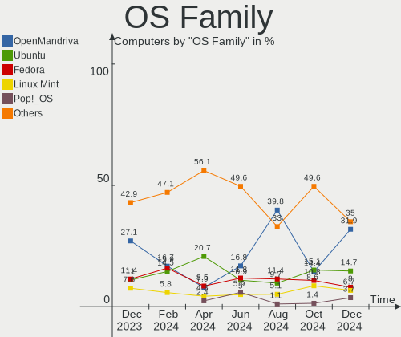
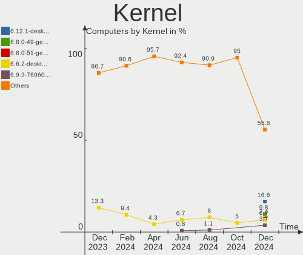
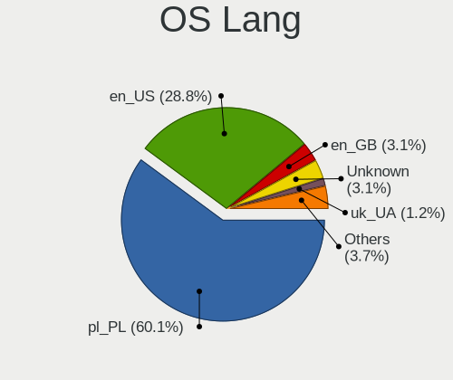
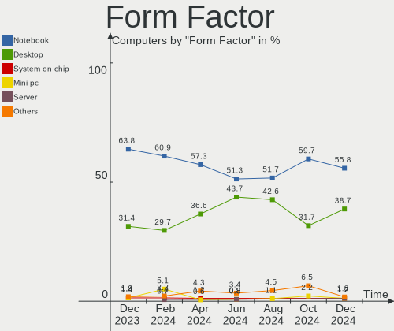
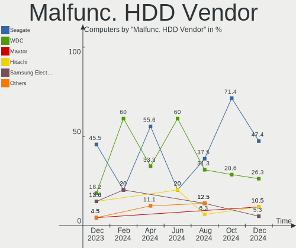
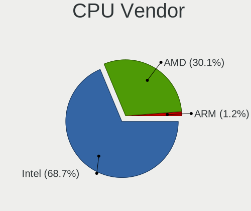
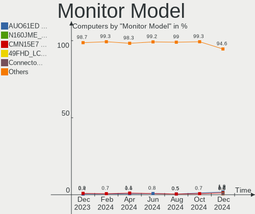
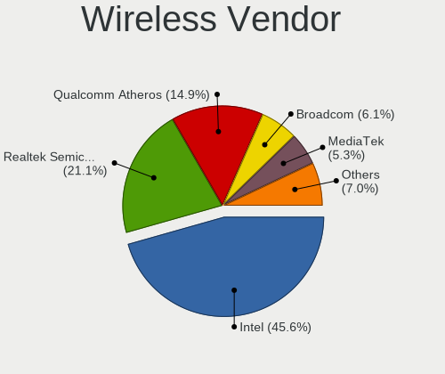
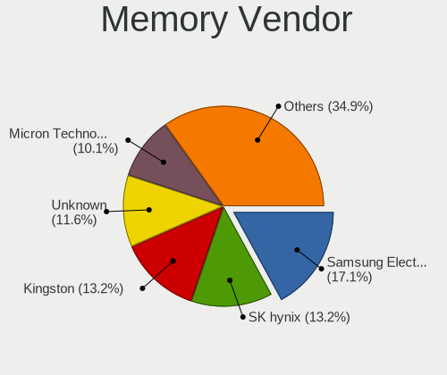

Linux in Poland - Hardware Trends
---------------------------------

A project to identify most popular hardware characteristics and track their change
over time based on data collected by Linux users at https://Linux-Hardware.org.

Anyone can contribute to this report by the [hw-probe](https://github.com/linuxhw/hw-probe) tool:

    sudo -E hw-probe -all -upload

This is a report for all computer types. See also reports for [desktops](/Location/Poland/Desktop/README.md) and [notebooks](/Location/Poland/Notebook/README.md).

Period: Nov, 2023.

Contents
--------

* [ System ](#system)
  - [ OS                       ](#os)
  - [ OS Family                ](#os-family)
  - [ Kernel                   ](#kernel)
  - [ Kernel Family            ](#kernel-family)
  - [ Kernel Major Ver.        ](#kernel-major-ver)
  - [ Arch                     ](#arch)
  - [ DE                       ](#de)
  - [ Display Server           ](#display-server)
  - [ Display Manager          ](#display-manager)
  - [ OS Lang                  ](#os-lang)
  - [ Boot Mode                ](#boot-mode)
  - [ Filesystem               ](#filesystem)
  - [ Part. scheme             ](#part-scheme)
  - [ Dual Boot with Linux/BSD ](#dual-boot-with-linuxbsd)
  - [ Dual Boot (Win)          ](#dual-boot-win)

* [ Board ](#board)
  - [ Vendor                   ](#vendor)
  - [ Model                    ](#model)
  - [ Model Family             ](#model-family)
  - [ MFG Year                 ](#mfg-year)
  - [ Form Factor              ](#form-factor)
  - [ Secure Boot              ](#secure-boot)
  - [ Coreboot                 ](#coreboot)
  - [ RAM Size                 ](#ram-size)
  - [ RAM Used                 ](#ram-used)
  - [ Total Drives             ](#total-drives)
  - [ Has CD-ROM               ](#has-cd-rom)
  - [ Has Ethernet             ](#has-ethernet)
  - [ Has WiFi                 ](#has-wifi)
  - [ Has Bluetooth            ](#has-bluetooth)

* [ Location ](#location)
  - [ Country                  ](#country)
  - [ City                     ](#city)

* [ Drives ](#drives)
  - [ Drive Vendor             ](#drive-vendor)
  - [ Drive Model              ](#drive-model)
  - [ HDD Vendor               ](#hdd-vendor)
  - [ SSD Vendor               ](#ssd-vendor)
  - [ Drive Kind               ](#drive-kind)
  - [ Drive Connector          ](#drive-connector)
  - [ Drive Size               ](#drive-size)
  - [ Space Total              ](#space-total)
  - [ Space Used               ](#space-used)
  - [ Malfunc. Drives          ](#malfunc-drives)
  - [ Malfunc. Drive Vendor    ](#malfunc-drive-vendor)
  - [ Malfunc. HDD Vendor      ](#malfunc-hdd-vendor)
  - [ Malfunc. Drive Kind      ](#malfunc-drive-kind)
  - [ Failed Drives            ](#failed-drives)
  - [ Failed Drive Vendor      ](#failed-drive-vendor)
  - [ Drive Status             ](#drive-status)

* [ Storage controller ](#storage-controller)
  - [ Storage Vendor           ](#storage-vendor)
  - [ Storage Model            ](#storage-model)
  - [ Storage Kind             ](#storage-kind)

* [ Processor ](#processor)
  - [ CPU Vendor               ](#cpu-vendor)
  - [ CPU Model                ](#cpu-model)
  - [ CPU Model Family         ](#cpu-model-family)
  - [ CPU Cores                ](#cpu-cores)
  - [ CPU Sockets              ](#cpu-sockets)
  - [ CPU Threads              ](#cpu-threads)
  - [ CPU Op-Modes             ](#cpu-op-modes)
  - [ CPU Microcode            ](#cpu-microcode)
  - [ CPU Microarch            ](#cpu-microarch)

* [ Graphics ](#graphics)
  - [ GPU Vendor               ](#gpu-vendor)
  - [ GPU Model                ](#gpu-model)
  - [ GPU Combo                ](#gpu-combo)
  - [ GPU Driver               ](#gpu-driver)
  - [ GPU Memory               ](#gpu-memory)

* [ Monitor ](#monitor)
  - [ Monitor Vendor           ](#monitor-vendor)
  - [ Monitor Model            ](#monitor-model)
  - [ Monitor Resolution       ](#monitor-resolution)
  - [ Monitor Diagonal         ](#monitor-diagonal)
  - [ Monitor Width            ](#monitor-width)
  - [ Aspect Ratio             ](#aspect-ratio)
  - [ Monitor Area             ](#monitor-area)
  - [ Pixel Density            ](#pixel-density)
  - [ Multiple Monitors        ](#multiple-monitors)

* [ Network ](#network)
  - [ Net Controller Vendor    ](#net-controller-vendor)
  - [ Net Controller Model     ](#net-controller-model)
  - [ Wireless Vendor          ](#wireless-vendor)
  - [ Wireless Model           ](#wireless-model)
  - [ Ethernet Vendor          ](#ethernet-vendor)
  - [ Ethernet Model           ](#ethernet-model)
  - [ Net Controller Kind      ](#net-controller-kind)
  - [ Used Controller          ](#used-controller)
  - [ NICs                     ](#nics)
  - [ IPv6                     ](#ipv6)

* [ Bluetooth ](#bluetooth)
  - [ Bluetooth Vendor         ](#bluetooth-vendor)
  - [ Bluetooth Model          ](#bluetooth-model)

* [ Sound ](#sound)
  - [ Sound Vendor             ](#sound-vendor)
  - [ Sound Model              ](#sound-model)

* [ Memory ](#memory)
  - [ Memory Vendor            ](#memory-vendor)
  - [ Memory Model             ](#memory-model)
  - [ Memory Kind              ](#memory-kind)
  - [ Memory Form Factor       ](#memory-form-factor)
  - [ Memory Size              ](#memory-size)
  - [ Memory Speed             ](#memory-speed)

* [ Printers & scanners ](#printers--scanners)
  - [ Printer Vendor           ](#printer-vendor)
  - [ Printer Model            ](#printer-model)
  - [ Scanner Vendor           ](#scanner-vendor)
  - [ Scanner Model            ](#scanner-model)

* [ Camera ](#camera)
  - [ Camera Vendor            ](#camera-vendor)
  - [ Camera Model             ](#camera-model)

* [ Security ](#security)
  - [ Fingerprint Vendor       ](#fingerprint-vendor)
  - [ Fingerprint Model        ](#fingerprint-model)
  - [ Chipcard Vendor          ](#chipcard-vendor)
  - [ Chipcard Model           ](#chipcard-model)

* [ Unsupported ](#unsupported)
  - [ Unsupported Devices      ](#unsupported-devices)
  - [ Unsupported Device Types ](#unsupported-device-types)

System
------

OS
--

Installed operating systems

| Name                         | Computers | Percent |
|------------------------------|-----------|---------|
| Ubuntu 22.04                 | 18        | 10.71%  |
| Linux Mint 21.2              | 15        | 8.93%   |
| Fedora 39                    | 12        | 7.14%   |
| OpenMandriva 5.0             | 11        | 6.55%   |
| Debian 12                    | 11        | 6.55%   |
| OpenMandriva 23.08           | 10        | 5.95%   |
| Arch Rolling                 | 10        | 5.95%   |
| Gentoo 2.14                  | 5         | 2.98%   |
| Fedora 38                    | 5         | 2.98%   |
| Ubuntu 23.10                 | 4         | 2.38%   |
| Pop!_OS 22.04                | 4         | 2.38%   |
| OpenMandriva 23.03           | 4         | 2.38%   |
| Zorin 16                     | 3         | 1.79%   |
| Xero Rolling                 | 3         | 1.79%   |
| Ubuntu 20.04                 | 3         | 1.79%   |
| Manjaro 23.1.0               | 3         | 1.79%   |
| LMDE 6                       | 3         | 1.79%   |
| SteamOS 3.5.5                | 2         | 1.19%   |
| openSUSE Tumbleweed-XXXXXXXX | 2         | 1.19%   |
| OpenMandriva 23.11           | 2         | 1.19%   |
| OpenMandriva 23.01           | 2         | 1.19%   |
| KDE neon 22.04               | 2         | 1.19%   |
| EndeavourOS Rolling          | 2         | 1.19%   |
| Elementary 7.1               | 2         | 1.19%   |
| Debian 11                    | 2         | 1.19%   |
| ArcoLinux Rolling            | 2         | 1.19%   |
| Zorin 12                     | 1         | 0.6%    |
| Xubuntu 23.04                | 1         | 0.6%    |
| Ubuntu 18.04                 | 1         | 0.6%    |
| SteamOS Rolling              | 1         | 0.6%    |
| SteamOS 3.5.7                | 1         | 0.6%    |
| Raspbian 12                  | 1         | 0.6%    |
| Pear OS                      | 1         | 0.6%    |
| Parrot 5.3                   | 1         | 0.6%    |
| Oracle Linux 9.2             | 1         | 0.6%    |
| OpenMandriva 4.3             | 1         | 0.6%    |
| MX 23                        | 1         | 0.6%    |
| Manjaro 23.0.4               | 1         | 0.6%    |
| Manjaro                      | 1         | 0.6%    |
| Linux Mint 21                | 1         | 0.6%    |

OS Family
---------

OS without a version

| Name         | Computers | Percent |
|--------------|-----------|---------|
| OpenMandriva | 30        | 17.86%  |
| Ubuntu       | 26        | 15.48%  |
| Fedora       | 19        | 11.31%  |
| Linux Mint   | 18        | 10.71%  |
| Debian       | 14        | 8.33%   |
| Arch         | 10        | 5.95%   |
| Manjaro      | 5         | 2.98%   |
| Gentoo       | 5         | 2.98%   |
| Zorin        | 4         | 2.38%   |
| SteamOS      | 4         | 2.38%   |
| Pop!_OS      | 4         | 2.38%   |
| Xero         | 3         | 1.79%   |
| LMDE         | 3         | 1.79%   |
| Elementary   | 3         | 1.79%   |
| openSUSE     | 2         | 1.19%   |
| Kubuntu      | 2         | 1.19%   |
| KDE neon     | 2         | 1.19%   |
| EndeavourOS  | 2         | 1.19%   |
| ArcoLinux    | 2         | 1.19%   |
| Xubuntu      | 1         | 0.6%    |
| Raspbian     | 1         | 0.6%    |
| Pear OS      | 1         | 0.6%    |
| Parrot       | 1         | 0.6%    |
| Oracle Linux | 1         | 0.6%    |
| MX           | 1         | 0.6%    |
| Kali         | 1         | 0.6%    |
| Garuda Linux | 1         | 0.6%    |
| CachyOS      | 1         | 0.6%    |
| BigLinux     | 1         | 0.6%    |

Kernel
------

Version of the Linux kernel

| Version                    | Computers | Percent |
|----------------------------|-----------|---------|
| 6.2.0-36-generic           | 17        | 10.12%  |
| 6.6.2-desktop-1omv2390     | 12        | 7.14%   |
| 6.1.0-13-amd64             | 11        | 6.55%   |
| 6.4.11-desktop-1omv2390    | 10        | 5.95%   |
| 5.15.0-88-generic          | 8         | 4.76%   |
| 6.5.9-arch2-1              | 7         | 4.17%   |
| 6.5.11-300.fc39.x86_64     | 6         | 3.57%   |
| 6.5.0-10-generic           | 5         | 2.98%   |
| 6.2.0-37-generic           | 5         | 2.98%   |
| 6.2.6-desktop-1omv2390     | 4         | 2.38%   |
| 6.1.57-gentoo              | 4         | 2.38%   |
| 5.15.0-89-generic          | 4         | 2.38%   |
| 6.6.1-arch1-1              | 3         | 1.79%   |
| 6.5.6-76060506-generic     | 3         | 1.79%   |
| 6.6.2-arch1-1              | 2         | 1.19%   |
| 6.5.9-zen2-1-zen           | 2         | 1.19%   |
| 6.5.9-1-default            | 2         | 1.19%   |
| 6.5.6-300.fc39.x86_64      | 2         | 1.19%   |
| 6.5.12-300.fc39.x86_64     | 2         | 1.19%   |
| 6.5.10-200.fc38.x86_64     | 2         | 1.19%   |
| 6.2.0-33-generic           | 2         | 1.19%   |
| 6.1.61-1-lts               | 2         | 1.19%   |
| 6.1.52-valve7-1-neptune-61 | 2         | 1.19%   |
| 6.1.1-desktop-1omv2290     | 2         | 1.19%   |
| 6.7.0-rc1                  | 1         | 0.6%    |
| 6.6.3-arch1-1              | 1         | 0.6%    |
| 6.6.2-lqx1-1-lqx           | 1         | 0.6%    |
| 6.6.2-201.fc39.x86_64      | 1         | 0.6%    |
| 6.6.2-101.fc38.x86_64      | 1         | 0.6%    |
| 6.6.1-zen1-1-zen           | 1         | 0.6%    |
| 6.6.1-1-MANJARO            | 1         | 0.6%    |
| 6.6.0-x64v4-xanmod1        | 1         | 0.6%    |
| 6.6.0-desktop-1omv2390     | 1         | 0.6%    |
| 6.6.0-2-cachyos            | 1         | 0.6%    |
| 6.5.9-200.fc38.x86_64      | 1         | 0.6%    |
| 6.5.8-200.fc38.x86_64      | 1         | 0.6%    |
| 6.5.7-060507-generic       | 1         | 0.6%    |
| 6.5.4-76060504-generic     | 1         | 0.6%    |
| 6.5.11-x64v3-xanmod1       | 1         | 0.6%    |
| 6.5.11-1-MANJARO           | 1         | 0.6%    |

Kernel Family
-------------

Linux kernel without a distro release

| Version | Computers | Percent |
|---------|-----------|---------|
| 6.2.0   | 27        | 16.07%  |
| 5.15.0  | 18        | 10.71%  |
| 6.6.2   | 17        | 10.12%  |
| 6.1.0   | 13        | 7.74%   |
| 6.5.9   | 12        | 7.14%   |
| 6.4.11  | 10        | 5.95%   |
| 6.5.0   | 9         | 5.36%   |
| 6.5.11  | 8         | 4.76%   |
| 6.6.1   | 5         | 2.98%   |
| 6.5.6   | 5         | 2.98%   |
| 6.2.6   | 4         | 2.38%   |
| 6.1.57  | 4         | 2.38%   |
| 6.6.0   | 3         | 1.79%   |
| 6.5.10  | 3         | 1.79%   |
| 6.1.52  | 3         | 1.79%   |
| 6.5.12  | 2         | 1.19%   |
| 6.1.61  | 2         | 1.19%   |
| 6.1.1   | 2         | 1.19%   |
| 5.4.0   | 2         | 1.19%   |
| 6.7.0   | 1         | 0.6%    |
| 6.6.3   | 1         | 0.6%    |
| 6.5.8   | 1         | 0.6%    |
| 6.5.7   | 1         | 0.6%    |
| 6.5.4   | 1         | 0.6%    |
| 6.3.7   | 1         | 0.6%    |
| 6.3.0   | 1         | 0.6%    |
| 6.2.15  | 1         | 0.6%    |
| 6.1.63  | 1         | 0.6%    |
| 6.1.62  | 1         | 0.6%    |
| 6.1.60  | 1         | 0.6%    |
| 6.1.55  | 1         | 0.6%    |
| 6.1.21  | 1         | 0.6%    |
| 5.17.12 | 1         | 0.6%    |
| 5.16.7  | 1         | 0.6%    |
| 5.15.92 | 1         | 0.6%    |
| 5.11.0  | 1         | 0.6%    |
| 5.10.0  | 1         | 0.6%    |
| 4.15.0  | 1         | 0.6%    |

Kernel Major Ver.
-----------------

Linux kernel major version

| Version | Computers | Percent |
|---------|-----------|---------|
| 6.5     | 42        | 25%     |
| 6.2     | 32        | 19.05%  |
| 6.1     | 29        | 17.26%  |
| 6.6     | 26        | 15.48%  |
| 5.15    | 19        | 11.31%  |
| 6.4     | 10        | 5.95%   |
| 6.3     | 2         | 1.19%   |
| 5.4     | 2         | 1.19%   |
| 6.7     | 1         | 0.6%    |
| 5.17    | 1         | 0.6%    |
| 5.16    | 1         | 0.6%    |
| 5.11    | 1         | 0.6%    |
| 5.10    | 1         | 0.6%    |
| 4.15    | 1         | 0.6%    |

Arch
----

OS architecture (x86_64, i586, etc.)

| Name   | Computers | Percent |
|--------|-----------|---------|
| x86_64 | 164       | 97.62%  |
| i686   | 2         | 1.19%   |
| armv7l | 1         | 0.6%    |
| armv6l | 1         | 0.6%    |

DE
--

Desktop Environment

| Name          | Computers | Percent |
|---------------|-----------|---------|
| KDE5          | 60        | 35.71%  |
| GNOME         | 55        | 32.74%  |
| X-Cinnamon    | 15        | 8.93%   |
| XFCE          | 11        | 6.55%   |
| MATE          | 8         | 4.76%   |
| Unknown       | 7         | 4.17%   |
| Pantheon      | 3         | 1.79%   |
| LXQt          | 3         | 1.79%   |
| i3            | 3         | 1.79%   |
| sway          | 2         | 1.19%   |
| GNOME Classic | 1         | 0.6%    |

Display Server
--------------

X11 or Wayland

| Name    | Computers | Percent |
|---------|-----------|---------|
| X11     | 96        | 57.14%  |
| Wayland | 65        | 38.69%  |
| Unknown | 6         | 3.57%   |
| Tty     | 1         | 0.6%    |

Display Manager
---------------

SDDM, LightDM, etc.

| Name    | Computers | Percent |
|---------|-----------|---------|
| Unknown | 56        | 33.33%  |
| SDDM    | 47        | 27.98%  |
| LightDM | 29        | 17.26%  |
| GDM3    | 24        | 14.29%  |
| GDM     | 10        | 5.95%   |
| LY-DM   | 1         | 0.6%    |
| LXDM    | 1         | 0.6%    |

OS Lang
-------

Language

| Lang    | Computers | Percent |
|---------|-----------|---------|
| pl_PL   | 102       | 60.71%  |
| en_US   | 51        | 30.36%  |
| en_GB   | 6         | 3.57%   |
| C       | 6         | 3.57%   |
| Unknown | 2         | 1.19%   |
| ru_RU   | 1         | 0.6%    |

Boot Mode
---------

EFI or BIOS

| Mode | Computers | Percent |
|------|-----------|---------|
| EFI  | 93        | 55.36%  |
| BIOS | 75        | 44.64%  |

Filesystem
----------

Type of filesystem

| Type     | Computers | Percent |
|----------|-----------|---------|
| Ext4     | 95        | 56.55%  |
| Btrfs    | 29        | 17.26%  |
| Overlay  | 20        | 11.9%   |
| Tmpfs    | 17        | 10.12%  |
| F2fs     | 4         | 2.38%   |
| Xfs      | 2         | 1.19%   |
| Bcachefs | 1         | 0.6%    |

Part. scheme
------------

Scheme of partitioning

| Type    | Computers | Percent |
|---------|-----------|---------|
| GPT     | 101       | 60.12%  |
| Unknown | 52        | 30.95%  |
| MBR     | 15        | 8.93%   |

Dual Boot with Linux/BSD
------------------------

Hosting more than one Linux/BSD

| Dual boot | Computers | Percent |
|-----------|-----------|---------|
| No        | 134       | 79.76%  |
| Yes       | 34        | 20.24%  |

Dual Boot (Win)
---------------

Hosting Linux and Windows

| Dual boot | Computers | Percent |
|-----------|-----------|---------|
| No        | 120       | 71.43%  |
| Yes       | 48        | 28.57%  |

Board
-----

Vendor
------

Motherboard manufacturer

| Name                    | Computers | Percent |
|-------------------------|-----------|---------|
| Lenovo                  | 25        | 14.88%  |
| Hewlett-Packard         | 25        | 14.88%  |
| Dell                    | 25        | 14.88%  |
| MSI                     | 18        | 10.71%  |
| Gigabyte Technology     | 18        | 10.71%  |
| ASUSTek Computer        | 16        | 9.52%   |
| ASRock                  | 8         | 4.76%   |
| Acer                    | 7         | 4.17%   |
| Valve                   | 3         | 1.79%   |
| Toshiba                 | 3         | 1.79%   |
| Samsung Electronics     | 3         | 1.79%   |
| HUAWEI                  | 3         | 1.79%   |
| Raspberry Pi Foundation | 2         | 1.19%   |
| Medion                  | 2         | 1.19%   |
| Fujitsu                 | 2         | 1.19%   |
| Timi                    | 1         | 0.6%    |
| Packard Bell            | 1         | 0.6%    |
| mPTech                  | 1         | 0.6%    |
| Intel                   | 1         | 0.6%    |
| eMachines               | 1         | 0.6%    |
| Clevo                   | 1         | 0.6%    |
| Chuwi                   | 1         | 0.6%    |
| Apple                   | 1         | 0.6%    |

Model
-----

Motherboard model

| Name                                | Computers | Percent |
|-------------------------------------|-----------|---------|
| Valve Jupiter                       | 3         | 1.79%   |
| HP t630 Thin Client                 | 2         | 1.19%   |
| HP Compaq Pro 6305 SFF              | 2         | 1.19%   |
| Gigabyte H61M-S1                    | 2         | 1.19%   |
| Dell Latitude E6330                 | 2         | 1.19%   |
| Dell Latitude E5430 non-vPro        | 2         | 1.19%   |
| Acer Nitro AN515-54                 | 2         | 1.19%   |
| Toshiba Satellite L40               | 1         | 0.6%    |
| Toshiba Satellite L300D             | 1         | 0.6%    |
| Toshiba Satellite C660              | 1         | 0.6%    |
| Timi A35S                           | 1         | 0.6%    |
| Samsung RF510/RF410/RF710           | 1         | 0.6%    |
| Samsung 350V5C/351V5C/3540VC/3440VC | 1         | 0.6%    |
| Samsung 300V3A/300V4A/300V5A        | 1         | 0.6%    |
| RPi Raspberry Pi Zero W Rev 1.1     | 1         | 0.6%    |
| RPi Raspberry Pi 3 Model B Rev 1.2  | 1         | 0.6%    |
| Packard Bell EasyNote LJ65          | 1         | 0.6%    |
| MSI Stealth GS66 12UGS              | 1         | 0.6%    |
| MSI PRO B300 DP20ZA (MS-B0A2)       | 1         | 0.6%    |
| MSI MS-7E02                         | 1         | 0.6%    |
| MSI MS-7D67                         | 1         | 0.6%    |
| MSI MS-7D46                         | 1         | 0.6%    |
| MSI MS-7D22                         | 1         | 0.6%    |
| MSI MS-7C52                         | 1         | 0.6%    |
| MSI MS-7C37                         | 1         | 0.6%    |
| MSI MS-7C35                         | 1         | 0.6%    |
| MSI MS-7C02                         | 1         | 0.6%    |
| MSI MS-7817                         | 1         | 0.6%    |
| MSI MS-7816                         | 1         | 0.6%    |
| MSI MS-7788                         | 1         | 0.6%    |
| MSI MS-7721                         | 1         | 0.6%    |
| MSI MS-7583                         | 1         | 0.6%    |
| MSI Modern 14 B11MO                 | 1         | 0.6%    |
| MSI GV62 7RE                        | 1         | 0.6%    |
| MSI Alpha 17 C7VG                   | 1         | 0.6%    |
| mPTech ARC 11.6 128GB HD            | 1         | 0.6%    |
| Medion DN2820FYB-IS                 | 1         | 0.6%    |
| Medion Akoya E1318T                 | 1         | 0.6%    |
| Lenovo Yoga Slim 7 Pro 14IAH7 82UT  | 1         | 0.6%    |
| Lenovo V14-IIL 82C4                 | 1         | 0.6%    |

Model Family
------------

Motherboard model prefix

| Name                  | Computers | Percent |
|-----------------------|-----------|---------|
| Dell Latitude         | 10        | 5.95%   |
| Lenovo ThinkPad       | 7         | 4.17%   |
| Lenovo IdeaPad        | 7         | 4.17%   |
| HP EliteBook          | 5         | 2.98%   |
| Dell OptiPlex         | 5         | 2.98%   |
| Dell Inspiron         | 4         | 2.38%   |
| Acer Aspire           | 4         | 2.38%   |
| Valve Jupiter         | 3         | 1.79%   |
| Toshiba Satellite     | 3         | 1.79%   |
| Lenovo Legion         | 3         | 1.79%   |
| HP ProBook            | 3         | 1.79%   |
| HP Pavilion           | 3         | 1.79%   |
| HP Compaq             | 3         | 1.79%   |
| Acer Nitro            | 3         | 1.79%   |
| RPi Raspberry         | 2         | 1.19%   |
| HP ZBook              | 2         | 1.19%   |
| HP t630               | 2         | 1.19%   |
| HP Laptop             | 2         | 1.19%   |
| Gigabyte X570         | 2         | 1.19%   |
| Gigabyte H61M-S1      | 2         | 1.19%   |
| Fujitsu LIFEBOOK      | 2         | 1.19%   |
| ASUS Zenbook          | 2         | 1.19%   |
| ASUS VivoBook         | 2         | 1.19%   |
| ASUS ROG              | 2         | 1.19%   |
| ASUS PRIME            | 2         | 1.19%   |
| Timi A35S             | 1         | 0.6%    |
| Samsung RF510         | 1         | 0.6%    |
| Samsung 350V5C        | 1         | 0.6%    |
| Samsung 300V3A        | 1         | 0.6%    |
| Packard Bell EasyNote | 1         | 0.6%    |
| MSI Stealth           | 1         | 0.6%    |
| MSI PRO               | 1         | 0.6%    |
| MSI MS-7E02           | 1         | 0.6%    |
| MSI MS-7D67           | 1         | 0.6%    |
| MSI MS-7D46           | 1         | 0.6%    |
| MSI MS-7D22           | 1         | 0.6%    |
| MSI MS-7C52           | 1         | 0.6%    |
| MSI MS-7C37           | 1         | 0.6%    |
| MSI MS-7C35           | 1         | 0.6%    |
| MSI MS-7C02           | 1         | 0.6%    |

MFG Year
--------

Motherboard manufacture year

| Year    | Computers | Percent |
|---------|-----------|---------|
| 2019    | 19        | 11.31%  |
| 2012    | 19        | 11.31%  |
| 2021    | 15        | 8.93%   |
| 2020    | 15        | 8.93%   |
| 2022    | 13        | 7.74%   |
| 2018    | 13        | 7.74%   |
| 2015    | 9         | 5.36%   |
| 2014    | 9         | 5.36%   |
| 2013    | 9         | 5.36%   |
| 2011    | 9         | 5.36%   |
| 2023    | 8         | 4.76%   |
| 2016    | 7         | 4.17%   |
| 2008    | 6         | 3.57%   |
| 2017    | 5         | 2.98%   |
| 2007    | 4         | 2.38%   |
| 2010    | 3         | 1.79%   |
| 2009    | 2         | 1.19%   |
| Unknown | 2         | 1.19%   |
| 2006    | 1         | 0.6%    |

Form Factor
-----------

Physical design of the computer

| Name           | Computers | Percent |
|----------------|-----------|---------|
| Notebook       | 95        | 56.55%  |
| Desktop        | 66        | 39.29%  |
| Mini pc        | 3         | 1.79%   |
| System on chip | 2         | 1.19%   |
| All in one     | 1         | 0.6%    |
| Server         | 1         | 0.6%    |

Secure Boot
-----------

Enabled or disabled

| State    | Computers | Percent |
|----------|-----------|---------|
| Disabled | 160       | 95.24%  |
| Enabled  | 8         | 4.76%   |

Coreboot
--------

Have coreboot on board

| Used | Computers | Percent |
|------|-----------|---------|
| No   | 168       | 100%    |

RAM Size
--------

Total RAM memory

| Size in GB      | Computers | Percent |
|-----------------|-----------|---------|
| 4.01-8.0        | 35        | 20.83%  |
| 8.01-16.0       | 33        | 19.64%  |
| 16.01-24.0      | 32        | 19.05%  |
| 32.01-64.0      | 28        | 16.67%  |
| 3.01-4.0        | 23        | 13.69%  |
| 64.01-256.0     | 5         | 2.98%   |
| 24.01-32.0      | 4         | 2.38%   |
| 2.01-3.0        | 4         | 2.38%   |
| More than 256.0 | 1         | 0.6%    |
| 1.01-2.0        | 1         | 0.6%    |
| 0.51-1.0        | 1         | 0.6%    |
| 0.01-0.5        | 1         | 0.6%    |

RAM Used
--------

Used RAM memory

| Used GB         | Computers | Percent |
|-----------------|-----------|---------|
| 1.01-2.0        | 46        | 27.38%  |
| 2.01-3.0        | 35        | 20.83%  |
| 4.01-8.0        | 32        | 19.05%  |
| 3.01-4.0        | 29        | 17.26%  |
| 8.01-16.0       | 13        | 7.74%   |
| 0.51-1.0        | 5         | 2.98%   |
| 16.01-24.0      | 3         | 1.79%   |
| 0.01-0.5        | 3         | 1.79%   |
| More than 256.0 | 1         | 0.6%    |
| 24.01-32.0      | 1         | 0.6%    |

Total Drives
------------

Number of drives on board

| Drives | Computers | Percent |
|--------|-----------|---------|
| 1      | 91        | 54.17%  |
| 2      | 46        | 27.38%  |
| 3      | 12        | 7.14%   |
| 5      | 8         | 4.76%   |
| 4      | 7         | 4.17%   |
| 6      | 2         | 1.19%   |
| 7      | 1         | 0.6%    |
| 0      | 1         | 0.6%    |

Has CD-ROM
----------

Has CD-ROM on board

| Presented | Computers | Percent |
|-----------|-----------|---------|
| No        | 111       | 66.07%  |
| Yes       | 57        | 33.93%  |

Has Ethernet
------------

Has Ethernet on board

| Presented | Computers | Percent |
|-----------|-----------|---------|
| Yes       | 146       | 86.9%   |
| No        | 22        | 13.1%   |

Has WiFi
--------

Has WiFi module

| Presented | Computers | Percent |
|-----------|-----------|---------|
| Yes       | 130       | 77.38%  |
| No        | 38        | 22.62%  |

Has Bluetooth
-------------

Has Bluetooth module

| Presented | Computers | Percent |
|-----------|-----------|---------|
| Yes       | 107       | 63.69%  |
| No        | 61        | 36.31%  |

Location
--------

Country
-------

Geographic location (country)

| Country | Computers | Percent |
|---------|-----------|---------|
| Poland  | 168       | 100%    |

City
----

Geographic location (city)

| City                   | Computers | Percent |
|------------------------|-----------|---------|
| Warsaw                 | 41        | 24.4%   |
| Krakow                 | 18        | 10.71%  |
| Wroclaw                | 9         | 5.36%   |
| Poznan                 | 8         | 4.76%   |
| Szczecin               | 5         | 2.98%   |
| Lodz                   | 5         | 2.98%   |
| Gdansk                 | 5         | 2.98%   |
| Pila                   | 3         | 1.79%   |
| Gliwice                | 3         | 1.79%   |
| Gdynia                 | 3         | 1.79%   |
| Elblag                 | 3         | 1.79%   |
| Tarnowskie Gory        | 2         | 1.19%   |
| Słupsk                | 2         | 1.19%   |
| Pszczyna               | 2         | 1.19%   |
| Mielec                 | 2         | 1.19%   |
| Lublin                 | 2         | 1.19%   |
| Kielce                 | 2         | 1.19%   |
| Katowice               | 2         | 1.19%   |
| Częstochowa           | 2         | 1.19%   |
| Bytom                  | 2         | 1.19%   |
| Bydgoszcz              | 2         | 1.19%   |
| Zlotow                 | 1         | 0.6%    |
| Zambrów               | 1         | 0.6%    |
| Wola                   | 1         | 0.6%    |
| Wieliczka              | 1         | 0.6%    |
| Swidnik                | 1         | 0.6%    |
| Swidnica               | 1         | 0.6%    |
| Strzelno               | 1         | 0.6%    |
| Starogard Gdański     | 1         | 0.6%    |
| Stargard               | 1         | 0.6%    |
| Sopot                  | 1         | 0.6%    |
| Smogorzow              | 1         | 0.6%    |
| Siennica               | 1         | 0.6%    |
| Siemianowice Śląskie | 1         | 0.6%    |
| Sejny                  | 1         | 0.6%    |
| Ostrów Wielkopolski   | 1         | 0.6%    |
| Orzysz                 | 1         | 0.6%    |
| Nowy Sącz             | 1         | 0.6%    |
| Nadarzyn               | 1         | 0.6%    |
| Mysłowice             | 1         | 0.6%    |

Drives
------

Drive Vendor
------------

Hard drive vendors

| Vendor                       | Computers | Drives | Percent |
|------------------------------|-----------|--------|---------|
| Samsung Electronics          | 38        | 47     | 13.87%  |
| Seagate                      | 32        | 39     | 11.68%  |
| GOODRAM                      | 23        | 26     | 8.39%   |
| WDC                          | 20        | 25     | 7.3%    |
| Crucial                      | 17        | 19     | 6.2%    |
| Sandisk                      | 14        | 14     | 5.11%   |
| Toshiba                      | 13        | 13     | 4.74%   |
| Kingston                     | 10        | 11     | 3.65%   |
| Unknown                      | 9         | 10     | 3.28%   |
| A-DATA Technology            | 9         | 9      | 3.28%   |
| Micron Technology            | 8         | 8      | 2.92%   |
| Intel                        | 8         | 8      | 2.92%   |
| Hitachi                      | 6         | 8      | 2.19%   |
| ADATA Technology             | 6         | 6      | 2.19%   |
| SK hynix                     | 5         | 5      | 1.82%   |
| SPCC                         | 4         | 5      | 1.46%   |
| KIOXIA                       | 4         | 4      | 1.46%   |
| Plextor                      | 3         | 3      | 1.09%   |
| Phison Electronics           | 3         | 3      | 1.09%   |
| Patriot                      | 3         | 3      | 1.09%   |
| Lexar                        | 3         | 3      | 1.09%   |
| Kingston Technology Company  | 3         | 3      | 1.09%   |
| WD MediaMax                  | 2         | 2      | 0.73%   |
| Team                         | 2         | 2      | 0.73%   |
| PNY                          | 2         | 2      | 0.73%   |
| HGST                         | 2         | 2      | 0.73%   |
| Fujitsu                      | 2         | 2      | 0.73%   |
| China                        | 2         | 2      | 0.73%   |
| Apacer                       | 2         | 2      | 0.73%   |
| Union Memory (Shenzhen)      | 1         | 1      | 0.36%   |
| Union Memory                 | 1         | 1      | 0.36%   |
| SSDPR-CX                     | 1         | 1      | 0.36%   |
| SPCC M.2                     | 1         | 1      | 0.36%   |
| Silicon Motion               | 1         | 1      | 0.36%   |
| Shenzhen Longsys Electronics | 1         | 1      | 0.36%   |
| Realtek Semiconductor        | 1         | 1      | 0.36%   |
| PHISON 1                     | 1         | 1      | 0.36%   |
| O2 Micro                     | 1         | 1      | 0.36%   |
| Micron/Crucial Technology    | 1         | 1      | 0.36%   |
| Maxtor                       | 1         | 1      | 0.36%   |

Drive Model
-----------

Hard drive models

| Model                                                           | Computers | Percent |
|-----------------------------------------------------------------|-----------|---------|
| Samsung NVMe SSD Controller SM981/PM981/PM983 250GB             | 6         | 2.02%   |
| Crucial CT500MX500SSD1 500GB                                    | 5         | 1.68%   |
| ADATA XPG SX8200 Pro PCIe Gen3x4 M.2 2280 Solid State Drive 1TB | 5         | 1.68%   |
| GOODRAM SSDPR-CX400-256-G2 256GB                                | 4         | 1.35%   |
| GOODRAM SSDPR-CX400-01T-G2 1TB                                  | 4         | 1.35%   |
| Toshiba HDWD130 3TB                                             | 3         | 1.01%   |
| Samsung SSD 850 EVO 250GB                                       | 3         | 1.01%   |
| Crucial CT240BX500SSD1 240GB                                    | 3         | 1.01%   |
| Crucial CT1000MX500SSD1 1TB                                     | 3         | 1.01%   |
| Unknown MMC Card  512GB                                         | 2         | 0.67%   |
| SPCC Solid State Disk 240GB                                     | 2         | 0.67%   |
| Seagate ST9500423AS 500GB                                       | 2         | 0.67%   |
| Seagate ST500LT012-1DG142 500GB                                 | 2         | 0.67%   |
| Seagate ST500LM000-1EJ162 500GB                                 | 2         | 0.67%   |
| Seagate ST3160318AS 160GB                                       | 2         | 0.67%   |
| Seagate ST250DM000-1BD141 250GB                                 | 2         | 0.67%   |
| Seagate ST2000DM001-1ER164 2TB                                  | 2         | 0.67%   |
| Seagate ST1000DX001-1NS162 1TB                                  | 2         | 0.67%   |
| Seagate ST1000DM010-2EP102 1TB                                  | 2         | 0.67%   |
| Sandisk WD Blue SN570 1TB                                       | 2         | 0.67%   |
| Sandisk WD Black 2018/SN750 / PC SN720 NVMe SSD 1024GB          | 2         | 0.67%   |
| Samsung SSD 980 1TB                                             | 2         | 0.67%   |
| Samsung SSD 870 EVO 500GB                                       | 2         | 0.67%   |
| Samsung SSD 860 EVO 1TB                                         | 2         | 0.67%   |
| Samsung NVMe SSD Controller PM9A1/PM9A3/980PRO 2TB              | 2         | 0.67%   |
| Samsung MZVLQ512HBLU-00B07 512GB                                | 2         | 0.67%   |
| Samsung HD321KJ 320GB                                           | 2         | 0.67%   |
| Patriot Burst 120GB SSD                                         | 2         | 0.67%   |
| Micron 3400_MTFDKBA1T0TFH 1TB                                   | 2         | 0.67%   |
| Micron 2200_MTFDHBA512TCK 512GB                                 | 2         | 0.67%   |
| Kingston Company OM3PDP3 NVMe SSD 256GB                         | 2         | 0.67%   |
| Intel SSD Pro 7600p/760p/E 6100p Series 1TB                     | 2         | 0.67%   |
| GOODRAM SSDPR-CX400-512-G2 512GB                                | 2         | 0.67%   |
| GOODRAM SSDPR-CX300-120 120GB                                   | 2         | 0.67%   |
| GOODRAM SSDPR-CL100-480-G2 480GB                                | 2         | 0.67%   |
| GOODRAM SSDPR-CL100-240-G3 240GB                                | 2         | 0.67%   |
| Crucial CT250MX500SSD1 250GB                                    | 2         | 0.67%   |
| Crucial CT250BX100SSD1 250GB                                    | 2         | 0.67%   |
| WDC WDS480G2G0B-00EPW0 480GB SSD                                | 1         | 0.34%   |
| WDC WDS240G2G0C-00AJM0 240GB                                    | 1         | 0.34%   |

HDD Vendor
----------

Hard disk drive vendors

| Vendor              | Computers | Drives | Percent |
|---------------------|-----------|--------|---------|
| Seagate             | 31        | 37     | 41.89%  |
| WDC                 | 16        | 21     | 21.62%  |
| Toshiba             | 10        | 10     | 13.51%  |
| Hitachi             | 6         | 8      | 8.11%   |
| Samsung Electronics | 3         | 3      | 4.05%   |
| WD MediaMax         | 2         | 2      | 2.7%    |
| HGST                | 2         | 2      | 2.7%    |
| Fujitsu             | 2         | 2      | 2.7%    |
| Maxtor              | 1         | 1      | 1.35%   |
| ASMT                | 1         | 1      | 1.35%   |

SSD Vendor
----------

Solid state drive vendors

| Vendor              | Computers | Drives | Percent |
|---------------------|-----------|--------|---------|
| GOODRAM             | 22        | 25     | 21.15%  |
| Samsung Electronics | 17        | 18     | 16.35%  |
| Crucial             | 17        | 19     | 16.35%  |
| A-DATA Technology   | 9         | 9      | 8.65%   |
| SanDisk             | 5         | 5      | 4.81%   |
| Kingston            | 5         | 5      | 4.81%   |
| SPCC                | 4         | 5      | 3.85%   |
| Plextor             | 3         | 3      | 2.88%   |
| Patriot             | 3         | 3      | 2.88%   |
| WDC                 | 2         | 2      | 1.92%   |
| Team                | 2         | 2      | 1.92%   |
| PNY                 | 2         | 2      | 1.92%   |
| China               | 2         | 2      | 1.92%   |
| Toshiba             | 1         | 1      | 0.96%   |
| SPCC M.2            | 1         | 1      | 0.96%   |
| SK hynix            | 1         | 1      | 0.96%   |
| PHISON 1            | 1         | 1      | 0.96%   |
| Micron Technology   | 1         | 1      | 0.96%   |
| Lexar               | 1         | 1      | 0.96%   |
| KIOXIA-EXCERIA      | 1         | 1      | 0.96%   |
| Intel               | 1         | 1      | 0.96%   |
| Hewlett-Packard     | 1         | 1      | 0.96%   |
| G.Skill             | 1         | 1      | 0.96%   |
| Apacer              | 1         | 1      | 0.96%   |

Drive Kind
----------

HDD or SSD

| Kind    | Computers | Drives | Percent |
|---------|-----------|--------|---------|
| SSD     | 85        | 111    | 36.96%  |
| NVMe    | 75        | 94     | 32.61%  |
| HDD     | 58        | 87     | 25.22%  |
| MMC     | 7         | 7      | 3.04%   |
| Unknown | 5         | 6      | 2.17%   |

Drive Connector
---------------

SATA, SAS, NVMe, etc.

| Type | Computers | Drives | Percent |
|------|-----------|--------|---------|
| SATA | 116       | 193    | 56.04%  |
| NVMe | 75        | 94     | 36.23%  |
| SAS  | 9         | 11     | 4.35%   |
| MMC  | 7         | 7      | 3.38%   |

Drive Size
----------

Size of hard drive

| Size in TB | Computers | Drives | Percent |
|------------|-----------|--------|---------|
| 0.01-0.5   | 82        | 112    | 54.67%  |
| 0.51-1.0   | 43        | 53     | 28.67%  |
| 1.01-2.0   | 12        | 16     | 8%      |
| 3.01-4.0   | 5         | 6      | 3.33%   |
| 2.01-3.0   | 4         | 6      | 2.67%   |
| 10.01-20.0 | 2         | 2      | 1.33%   |
| 4.01-10.0  | 2         | 3      | 1.33%   |

Space Total
-----------

Amount of disk space available on the file system

| Size in GB     | Computers | Percent |
|----------------|-----------|---------|
| 101-250        | 41        | 24.4%   |
| 251-500        | 35        | 20.83%  |
| 501-1000       | 22        | 13.1%   |
| 1-20           | 20        | 11.9%   |
| 1001-2000      | 14        | 8.33%   |
| More than 3000 | 12        | 7.14%   |
| Unknown        | 7         | 4.17%   |
| 2001-3000      | 6         | 3.57%   |
| 51-100         | 6         | 3.57%   |
| 21-50          | 5         | 2.98%   |

Space Used
----------

Amount of used disk space

| Used GB        | Computers | Percent |
|----------------|-----------|---------|
| 1-20           | 63        | 37.5%   |
| 51-100         | 21        | 12.5%   |
| 21-50          | 20        | 11.9%   |
| 101-250        | 19        | 11.31%  |
| 501-1000       | 11        | 6.55%   |
| 251-500        | 10        | 5.95%   |
| More than 3000 | 8         | 4.76%   |
| Unknown        | 7         | 4.17%   |
| 1001-2000      | 5         | 2.98%   |
| 2001-3000      | 4         | 2.38%   |

Malfunc. Drives
---------------

Drive models with a malfunction

| Model                           | Computers | Drives | Percent |
|---------------------------------|-----------|--------|---------|
| WDC WD5000AAKX-60U6AA0 500GB    | 1         | 1      | 4.55%   |
| WDC WD5000AAKS-22V1A0 500GB     | 1         | 1      | 4.55%   |
| WDC WD20EARS-00MVWB0 2TB        | 1         | 1      | 4.55%   |
| WDC WD10SPCX-22HWST0 1TB        | 1         | 1      | 4.55%   |
| WDC WD1001FALS-40Y6A0 1TB       | 1         | 1      | 4.55%   |
| WD MediaMax WL4000GSA6472B 4TB  | 1         | 1      | 4.55%   |
| WD MediaMax WL1000GSA6472B 1TB  | 1         | 1      | 4.55%   |
| Seagate ST9500423AS 500GB       | 1         | 1      | 4.55%   |
| Seagate ST500LT012-1DG142 500GB | 1         | 1      | 4.55%   |
| Seagate ST3500413AS 500GB       | 1         | 1      | 4.55%   |
| Seagate ST3250410AS 250GB       | 1         | 1      | 4.55%   |
| Seagate ST3160318AS 160GB       | 1         | 1      | 4.55%   |
| Seagate ST250DM000-1BD141 250GB | 1         | 1      | 4.55%   |
| Seagate ST1000DX001-1NS162 1TB  | 1         | 1      | 4.55%   |
| Samsung Electronics HD154UI 1TB | 1         | 1      | 4.55%   |
| Maxtor 6Y080M0 82GB             | 1         | 1      | 4.55%   |
| Intel SSDSA2M080G2GC 80GB       | 1         | 1      | 4.55%   |
| Hitachi HUA721010KLA330 1TB     | 1         | 1      | 4.55%   |
| Hitachi HTS547550A9E384 500GB   | 1         | 1      | 4.55%   |
| Hitachi HTS542525K9SA00 250GB   | 1         | 1      | 4.55%   |
| Hitachi HDS721010CLA330 1TB     | 1         | 1      | 4.55%   |
| Fujitsu MHY2160BH 160GB         | 1         | 1      | 4.55%   |

Malfunc. Drive Vendor
---------------------

Vendors of faulty drives

| Vendor              | Computers | Drives | Percent |
|---------------------|-----------|--------|---------|
| Seagate             | 6         | 7      | 30%     |
| WDC                 | 4         | 5      | 20%     |
| Hitachi             | 4         | 4      | 20%     |
| WD MediaMax         | 2         | 2      | 10%     |
| Samsung Electronics | 1         | 1      | 5%      |
| Maxtor              | 1         | 1      | 5%      |
| Intel               | 1         | 1      | 5%      |
| Fujitsu             | 1         | 1      | 5%      |

Malfunc. HDD Vendor
-------------------

Vendors of faulty HDD drives

| Vendor              | Computers | Drives | Percent |
|---------------------|-----------|--------|---------|
| Seagate             | 6         | 7      | 31.58%  |
| WDC                 | 4         | 5      | 21.05%  |
| Hitachi             | 4         | 4      | 21.05%  |
| WD MediaMax         | 2         | 2      | 10.53%  |
| Samsung Electronics | 1         | 1      | 5.26%   |
| Maxtor              | 1         | 1      | 5.26%   |
| Fujitsu             | 1         | 1      | 5.26%   |

Malfunc. Drive Kind
-------------------

Kinds of faulty drives

| Kind | Computers | Drives | Percent |
|------|-----------|--------|---------|
| HDD  | 16        | 21     | 94.12%  |
| SSD  | 1         | 1      | 5.88%   |

Failed Drives
-------------

Failed drive models

Zero info for selected period =(

Failed Drive Vendor
-------------------

Failed drive vendors

Zero info for selected period =(

Drive Status
------------

Number of failed and malfunc. drives

| Status   | Computers | Drives | Percent |
|----------|-----------|--------|---------|
| Works    | 92        | 150    | 49.46%  |
| Detected | 77        | 133    | 41.4%   |
| Malfunc  | 17        | 22     | 9.14%   |

Storage controller
------------------

Storage Vendor
--------------

Storage controller vendors

| Vendor                       | Computers | Percent |
|------------------------------|-----------|---------|
| Intel                        | 102       | 43.78%  |
| AMD                          | 43        | 18.45%  |
| Samsung Electronics          | 23        | 9.87%   |
| SanDisk                      | 10        | 4.29%   |
| Kingston Technology Company  | 8         | 3.43%   |
| Micron Technology            | 7         | 3%      |
| ADATA Technology             | 6         | 2.58%   |
| SK hynix                     | 4         | 1.72%   |
| Phison Electronics           | 4         | 1.72%   |
| ASMedia Technology           | 4         | 1.72%   |
| Toshiba America Info Systems | 3         | 1.29%   |
| Silicon Motion               | 3         | 1.29%   |
| Shenzhen Longsys Electronics | 3         | 1.29%   |
| KIOXIA                       | 3         | 1.29%   |
| Union Memory (Shenzhen)      | 2         | 0.86%   |
| Seagate Technology           | 1         | 0.43%   |
| Realtek Semiconductor        | 1         | 0.43%   |
| O2 Micro                     | 1         | 0.43%   |
| Micron/Crucial Technology    | 1         | 0.43%   |
| MAXIO Technology (Hangzhou)  | 1         | 0.43%   |
| LSI Logic / Symbios Logic    | 1         | 0.43%   |
| JMicron Technology           | 1         | 0.43%   |
| INNOGRIT                     | 1         | 0.43%   |

Storage Model
-------------

Storage controller models

| Model                                                                                   | Computers | Percent |
|-----------------------------------------------------------------------------------------|-----------|---------|
| AMD FCH SATA Controller [AHCI mode]                                                     | 30        | 11.41%  |
| Samsung NVMe SSD Controller 980 (DRAM-less)                                             | 10        | 3.8%    |
| Intel Volume Management Device NVMe RAID Controller                                     | 8         | 3.04%   |
| Intel Sunrise Point-LP SATA Controller [AHCI mode]                                      | 8         | 3.04%   |
| Samsung NVMe SSD Controller SM981/PM981/PM983                                           | 7         | 2.66%   |
| Samsung NVMe SSD Controller PM9A1/PM9A3/980PRO                                          | 7         | 2.66%   |
| Intel 7 Series Chipset Family 6-port SATA Controller [AHCI mode]                        | 7         | 2.66%   |
| Intel 82801 Mobile SATA Controller [RAID mode]                                          | 6         | 2.28%   |
| Intel Cannon Lake Mobile PCH SATA AHCI Controller                                       | 5         | 1.9%    |
| AMD 400 Series Chipset SATA Controller                                                  | 5         | 1.9%    |
| ADATA XPG SX8200 Pro PCIe Gen3x4 M.2 2280 Solid State Drive                             | 5         | 1.9%    |
| Kingston Company KC3000/FURY Renegade NVMe SSD E18                                      | 4         | 1.52%   |
| Intel SSD 660P Series                                                                   | 4         | 1.52%   |
| Intel Q170/Q150/B150/H170/H110/Z170/CM236 Chipset SATA Controller [AHCI Mode]           | 4         | 1.52%   |
| Intel Alder Lake-S PCH SATA Controller [AHCI Mode]                                      | 4         | 1.52%   |
| Intel 8 Series/C220 Series Chipset Family 6-port SATA Controller 1 [AHCI mode]          | 4         | 1.52%   |
| Intel 7 Series/C210 Series Chipset Family 6-port SATA Controller [AHCI mode]            | 4         | 1.52%   |
| Intel 6 Series/C200 Series Chipset Family 6 port Mobile SATA AHCI Controller            | 4         | 1.52%   |
| ASMedia ASM1062 Serial ATA Controller                                                   | 4         | 1.52%   |
| Toshiba America Info Systems XG6 NVMe SSD Controller                                    | 3         | 1.14%   |
| Silicon Motion SM2263EN/SM2263XT (DRAM-less) NVMe SSD Controllers                       | 3         | 1.14%   |
| SanDisk Ultra 3D / WD Blue SN570 NVMe SSD (DRAM-less)                                   | 3         | 1.14%   |
| Micron 3400 NVMe SSD [Hendrix]                                                          | 3         | 1.14%   |
| Intel 9 Series Chipset Family SATA Controller [AHCI Mode]                               | 3         | 1.14%   |
| Intel 82801HM/HEM (ICH8M/ICH8M-E) SATA Controller [IDE mode]                            | 3         | 1.14%   |
| Intel 82801HM/HEM (ICH8M/ICH8M-E) IDE Controller                                        | 3         | 1.14%   |
| Intel 6 Series/C200 Series Chipset Family Desktop SATA Controller (IDE mode, ports 4-5) | 3         | 1.14%   |
| Intel 6 Series/C200 Series Chipset Family Desktop SATA Controller (IDE mode, ports 0-3) | 3         | 1.14%   |
| Intel 6 Series/C200 Series Chipset Family 6 port Desktop SATA AHCI Controller           | 3         | 1.14%   |
| Intel 500 Series Chipset Family SATA AHCI Controller                                    | 3         | 1.14%   |
| AMD SB7x0/SB8x0/SB9x0 SATA Controller [AHCI mode]                                       | 3         | 1.14%   |
| AMD 500 Series Chipset SATA Controller                                                  | 3         | 1.14%   |
| SK hynix Gold P31/BC711/PC711 NVMe Solid State Drive                                    | 2         | 0.76%   |
| Shenzhen Longsys Lexar NM800 PRO NVME SSD                                               | 2         | 0.76%   |
| SanDisk WD Green SN350 240GB (DRAM-less) / SN560E NVMe SSD                              | 2         | 0.76%   |
| SanDisk Ultra 3D / WD Blue SN550 NVMe SSD                                               | 2         | 0.76%   |
| SanDisk Extreme Pro / WD Black 2018/SN750/PC SN720 NVMe SSD                             | 2         | 0.76%   |
| Micron 2200S NVMe SSD [Cassandra]                                                       | 2         | 0.76%   |
| KIOXIA NVMe SSD Controller BG5 (DRAM-less)                                              | 2         | 0.76%   |
| Kingston Company OM3PDP3 NVMe SSD                                                       | 2         | 0.76%   |

Storage Kind
------------

Kind of storage controller (IDE, SATA, NVMe, SAS, ...)

| Kind | Computers | Percent |
|------|-----------|---------|
| SATA | 119       | 51.97%  |
| NVMe | 76        | 33.19%  |
| IDE  | 18        | 7.86%   |
| RAID | 16        | 6.99%   |

Processor
---------

CPU Vendor
----------

Processor vendors

| Vendor | Computers | Percent |
|--------|-----------|---------|
| Intel  | 112       | 66.67%  |
| AMD    | 54        | 32.14%  |
| ARM    | 2         | 1.19%   |

CPU Model
---------

Processor models

| Model                                       | Computers | Percent |
|---------------------------------------------|-----------|---------|
| Intel Core i5-3320M CPU @ 2.60GHz           | 3         | 1.79%   |
| Intel Core i5-2400 CPU @ 3.10GHz            | 3         | 1.79%   |
| Intel 12th Gen Core i5-1235U                | 3         | 1.79%   |
| Intel 11th Gen Core i7-1165G7 @ 2.80GHz     | 3         | 1.79%   |
| AMD Ryzen 9 5900X 12-Core Processor         | 3         | 1.79%   |
| AMD Ryzen 7 5800H with Radeon Graphics      | 3         | 1.79%   |
| AMD Ryzen 5 3600 6-Core Processor           | 3         | 1.79%   |
| AMD Custom APU 0405                         | 3         | 1.79%   |
| Intel Core i7-6700 CPU @ 3.40GHz            | 2         | 1.19%   |
| Intel Core i7-6500U CPU @ 2.50GHz           | 2         | 1.19%   |
| Intel Core i7-4790 CPU @ 3.60GHz            | 2         | 1.19%   |
| Intel Core i5-8300H CPU @ 2.30GHz           | 2         | 1.19%   |
| Intel Core i5-3470 CPU @ 3.20GHz            | 2         | 1.19%   |
| Intel Core i5-3230M CPU @ 2.60GHz           | 2         | 1.19%   |
| Intel Core i5-1035G1 CPU @ 1.00GHz          | 2         | 1.19%   |
| Intel Core i3-2350M CPU @ 2.30GHz           | 2         | 1.19%   |
| Intel Core i3-2310M CPU @ 2.10GHz           | 2         | 1.19%   |
| Intel 12th Gen Core i7-12700H               | 2         | 1.19%   |
| Intel 12th Gen Core i5-12400F               | 2         | 1.19%   |
| Intel 11th Gen Core i5-1135G7 @ 2.40GHz     | 2         | 1.19%   |
| ARM BCM2835 Processor                       | 2         | 1.19%   |
| AMD Ryzen 7 5700G with Radeon Graphics      | 2         | 1.19%   |
| AMD Ryzen 5 5600H with Radeon Graphics      | 2         | 1.19%   |
| AMD Ryzen 5 2600 Six-Core Processor         | 2         | 1.19%   |
| AMD Embedded G-Series GX-420GI Radeon R7E   | 2         | 1.19%   |
| Intel Xeon CPU E5-2698 v4 @ 2.20GHz         | 1         | 0.6%    |
| Intel Xeon CPU E3-1240L v5 @ 2.10GHz        | 1         | 0.6%    |
| Intel Pentium Gold G6400 CPU @ 4.00GHz      | 1         | 0.6%    |
| Intel Pentium Dual-Core CPU T4500 @ 2.30GHz | 1         | 0.6%    |
| Intel Pentium Dual-Core CPU E5700 @ 3.00GHz | 1         | 0.6%    |
| Intel Pentium Dual CPU T2370 @ 1.73GHz      | 1         | 0.6%    |
| Intel Pentium Dual CPU T2310 @ 1.46GHz      | 1         | 0.6%    |
| Intel Pentium CPU P6200 @ 2.13GHz           | 1         | 0.6%    |
| Intel Pentium CPU P6100 @ 2.00GHz           | 1         | 0.6%    |
| Intel Pentium CPU N4200 @ 1.10GHz           | 1         | 0.6%    |
| Intel Pentium CPU G2030 @ 3.00GHz           | 1         | 0.6%    |
| Intel N100                                  | 1         | 0.6%    |
| Intel Genuine CPU T2300 @ 1.66GHz           | 1         | 0.6%    |
| Intel Core i7-9750H CPU @ 2.60GHz           | 1         | 0.6%    |
| Intel Core i7-9700K CPU @ 3.60GHz           | 1         | 0.6%    |

CPU Model Family
----------------

Processor model prefix

| Model                   | Computers | Percent |
|-------------------------|-----------|---------|
| Intel Core i5           | 43        | 25.6%   |
| Other                   | 28        | 16.67%  |
| AMD Ryzen 5             | 15        | 8.93%   |
| Intel Core i7           | 14        | 8.33%   |
| AMD Ryzen 7             | 12        | 7.14%   |
| Intel Core i3           | 11        | 6.55%   |
| AMD Ryzen 9             | 5         | 2.98%   |
| Intel Pentium           | 4         | 2.38%   |
| Intel Core 2 Duo        | 4         | 2.38%   |
| Intel Celeron           | 4         | 2.38%   |
| AMD A8                  | 3         | 1.79%   |
| Intel Xeon              | 2         | 1.19%   |
| Intel Pentium Dual-Core | 2         | 1.19%   |
| Intel Pentium Dual      | 2         | 1.19%   |
| ARM BCM                 | 2         | 1.19%   |
| AMD FX                  | 2         | 1.19%   |
| AMD Embedded            | 2         | 1.19%   |
| AMD A6                  | 2         | 1.19%   |
| Intel Pentium Gold      | 1         | 0.6%    |
| Intel Genuine           | 1         | 0.6%    |
| AMD Turion II Dual-Core | 1         | 0.6%    |
| AMD Ryzen 5 PRO         | 1         | 0.6%    |
| AMD Ryzen 3 PRO         | 1         | 0.6%    |
| AMD Phenom II X4        | 1         | 0.6%    |
| AMD Athlon X4           | 1         | 0.6%    |
| AMD Athlon X2           | 1         | 0.6%    |
| AMD Athlon 64 X2        | 1         | 0.6%    |
| AMD A4                  | 1         | 0.6%    |
| AMD A10                 | 1         | 0.6%    |

CPU Cores
---------

Number of processor cores

| Number | Computers | Percent |
|--------|-----------|---------|
| 2      | 59        | 35.12%  |
| 4      | 56        | 33.33%  |
| 6      | 20        | 11.9%   |
| 8      | 13        | 7.74%   |
| 10     | 5         | 2.98%   |
| 14     | 4         | 2.38%   |
| 12     | 4         | 2.38%   |
| 16     | 3         | 1.79%   |
| 1      | 2         | 1.19%   |
| 40     | 1         | 0.6%    |
| 24     | 1         | 0.6%    |

CPU Sockets
-----------

Number of sockets

| Number | Computers | Percent |
|--------|-----------|---------|
| 1      | 167       | 99.4%   |
| 2      | 1         | 0.6%    |

CPU Threads
-----------

Threads per core (Hyper-Threading)

| Number | Computers | Percent |
|--------|-----------|---------|
| 2      | 121       | 72.02%  |
| 1      | 47        | 27.98%  |

CPU Op-Modes
------------

CPU Operation Modes (32-bit, 64-bit)

| Op mode        | Computers | Percent |
|----------------|-----------|---------|
| 32-bit, 64-bit | 165       | 98.21%  |
| Unknown        | 2         | 1.19%   |
| 32-bit         | 1         | 0.6%    |

CPU Microcode
-------------

Microcode number

| Number     | Computers | Percent |
|------------|-----------|---------|
| Unknown    | 99        | 58.93%  |
| 0x506e3    | 4         | 2.38%   |
| 0x0a50000d | 4         | 2.38%   |
| 0x0a50000c | 4         | 2.38%   |
| 0x06001119 | 4         | 2.38%   |
| 0x306a9    | 3         | 1.79%   |
| 0x08600106 | 3         | 1.79%   |
| 0x08108109 | 3         | 1.79%   |
| 0x6fb      | 2         | 1.19%   |
| 0x206a7    | 2         | 1.19%   |
| 0x1067a    | 2         | 1.19%   |
| 0x0a601203 | 2         | 1.19%   |
| 0x08701030 | 2         | 1.19%   |
| 0x0800820d | 2         | 1.19%   |
| 0x0600611a | 2         | 1.19%   |
| 0xa0671    | 1         | 0.6%    |
| 0xa0653    | 1         | 0.6%    |
| 0x906ed    | 1         | 0.6%    |
| 0x906ea    | 1         | 0.6%    |
| 0x906e9    | 1         | 0.6%    |
| 0x906a4    | 1         | 0.6%    |
| 0x90675    | 1         | 0.6%    |
| 0x806ea    | 1         | 0.6%    |
| 0x806e9    | 1         | 0.6%    |
| 0x706e5    | 1         | 0.6%    |
| 0x6e8      | 1         | 0.6%    |
| 0x406f1    | 1         | 0.6%    |
| 0x406e3    | 1         | 0.6%    |
| 0x30678    | 1         | 0.6%    |
| 0x0a601206 | 1         | 0.6%    |
| 0x0a404102 | 1         | 0.6%    |
| 0x0a20120a | 1         | 0.6%    |
| 0x0a201016 | 1         | 0.6%    |
| 0x08701021 | 1         | 0.6%    |
| 0x08101007 | 1         | 0.6%    |
| 0x08001138 | 1         | 0.6%    |
| 0x0700010f | 1         | 0.6%    |
| 0x06006705 | 1         | 0.6%    |
| 0x06003104 | 1         | 0.6%    |
| 0x0600111f | 1         | 0.6%    |

CPU Microarch
-------------

Microarchitecture

| Name             | Computers | Percent |
|------------------|-----------|---------|
| KabyLake         | 16        | 9.52%   |
| IvyBridge        | 15        | 8.93%   |
| Zen 3            | 14        | 8.33%   |
| Unknown          | 13        | 7.74%   |
| Skylake          | 12        | 7.14%   |
| Alderlake Hybrid | 11        | 6.55%   |
| SandyBridge      | 10        | 5.95%   |
| Haswell          | 9         | 5.36%   |
| Zen 2            | 8         | 4.76%   |
| TigerLake        | 7         | 4.17%   |
| Piledriver       | 7         | 4.17%   |
| Zen+             | 6         | 3.57%   |
| Core             | 5         | 2.98%   |
| CometLake        | 4         | 2.38%   |
| Westmere         | 3         | 1.79%   |
| Penryn           | 3         | 1.79%   |
| Icelake          | 3         | 1.79%   |
| Excavator        | 3         | 1.79%   |
| Zen              | 2         | 1.19%   |
| Silvermont       | 2         | 1.19%   |
| K10              | 2         | 1.19%   |
| Goldmont         | 2         | 1.19%   |
| Broadwell        | 2         | 1.19%   |
| Steamroller      | 1         | 0.6%    |
| P6               | 1         | 0.6%    |
| Nehalem          | 1         | 0.6%    |
| K8 Hammer        | 1         | 0.6%    |
| K8 & K10 hybrid  | 1         | 0.6%    |
| K10 Llano        | 1         | 0.6%    |
| Jaguar           | 1         | 0.6%    |
| Gracemont        | 1         | 0.6%    |
| Goldmont plus    | 1         | 0.6%    |

Graphics
--------

GPU Vendor
----------

Vendors of graphics cards

| Vendor                     | Computers | Percent |
|----------------------------|-----------|---------|
| Intel                      | 87        | 45.31%  |
| Nvidia                     | 52        | 27.08%  |
| AMD                        | 51        | 26.56%  |
| Matrox Electronics Systems | 1         | 0.52%   |
| ASPEED Technology          | 1         | 0.52%   |

GPU Model
---------

Graphics card models

| Model                                                                       | Computers | Percent |
|-----------------------------------------------------------------------------|-----------|---------|
| Intel 3rd Gen Core processor Graphics Controller                            | 8         | 4%      |
| Intel 2nd Generation Core Processor Family Integrated Graphics Controller   | 8         | 4%      |
| Intel TigerLake-LP GT2 [Iris Xe Graphics]                                   | 6         | 3%      |
| AMD Cezanne [Radeon Vega Series / Radeon Vega Mobile Series]                | 6         | 3%      |
| Intel Skylake GT2 [HD Graphics 520]                                         | 5         | 2.5%    |
| Intel HD Graphics 530                                                       | 5         | 2.5%    |
| Intel Alder Lake-UP3 GT2 [Iris Xe Graphics]                                 | 5         | 2.5%    |
| Nvidia GA107M [GeForce RTX 3050 Mobile]                                     | 4         | 2%      |
| Intel Mobile GM965/GL960 Integrated Graphics Controller (secondary)         | 4         | 2%      |
| Intel Mobile GM965/GL960 Integrated Graphics Controller (primary)           | 4         | 2%      |
| Intel CoffeeLake-H GT2 [UHD Graphics 630]                                   | 4         | 2%      |
| Intel Alder Lake-P GT2 [Iris Xe Graphics]                                   | 4         | 2%      |
| AMD Renoir [Radeon RX Vega 6 (Ryzen 4000/5000 Mobile Series)]               | 4         | 2%      |
| Nvidia GA106 [GeForce RTX 3060 Lite Hash Rate]                              | 3         | 1.5%    |
| Intel Xeon E3-1200 v2/3rd Gen Core processor Graphics Controller            | 3         | 1.5%    |
| AMD VanGogh [AMD Custom GPU 0405]                                           | 3         | 1.5%    |
| AMD Raphael                                                                 | 3         | 1.5%    |
| AMD Picasso/Raven 2 [Radeon Vega Series / Radeon Vega Mobile Series]        | 3         | 1.5%    |
| AMD Navi 22 [Radeon RX 6700/6700 XT/6750 XT / 6800M/6850M XT]               | 3         | 1.5%    |
| AMD Ellesmere [Radeon RX 470/480/570/570X/580/580X/590]                     | 3         | 1.5%    |
| AMD Cedar [Radeon HD 5000/6000/7350/8350 Series]                            | 3         | 1.5%    |
| Nvidia TU117M [GeForce GTX 1650 Mobile / Max-Q]                             | 2         | 1%      |
| Nvidia TU116 [GeForce GTX 1660 Ti]                                          | 2         | 1%      |
| Nvidia TU116 [GeForce GTX 1660 SUPER]                                       | 2         | 1%      |
| Nvidia GM107M [GeForce GTX 960M]                                            | 2         | 1%      |
| Intel Xeon E3-1200 v3/4th Gen Core Processor Integrated Graphics Controller | 2         | 1%      |
| Intel WhiskeyLake-U GT2 [UHD Graphics 620]                                  | 2         | 1%      |
| Intel UHD Graphics 620                                                      | 2         | 1%      |
| Intel Iris Plus Graphics G1 (Ice Lake)                                      | 2         | 1%      |
| Intel HD Graphics 630                                                       | 2         | 1%      |
| Intel HD Graphics 620                                                       | 2         | 1%      |
| Intel Core Processor Integrated Graphics Controller                         | 2         | 1%      |
| Intel Atom Processor Z36xxx/Z37xxx Series Graphics & Display                | 2         | 1%      |
| Intel 4th Gen Core Processor Integrated Graphics Controller                 | 2         | 1%      |
| AMD Wani [Radeon R5/R6/R7 Graphics]                                         | 2         | 1%      |
| Nvidia TU117M [GeForce GTX 1650 Ti Mobile]                                  | 1         | 0.5%    |
| Nvidia TU116M [GeForce GTX 1660 Ti Mobile]                                  | 1         | 0.5%    |
| Nvidia TU106M [GeForce RTX 2060 Mobile]                                     | 1         | 0.5%    |
| Nvidia TU104 [GeForce RTX 2070 SUPER]                                       | 1         | 0.5%    |
| Nvidia TU102 [GeForce RTX 2080 Ti Rev. A]                                   | 1         | 0.5%    |

GPU Combo
---------

Combinations of graphics cards

| Name           | Computers | Percent |
|----------------|-----------|---------|
| 1 x Intel      | 64        | 38.1%   |
| 1 x AMD        | 39        | 23.21%  |
| 1 x Nvidia     | 30        | 17.86%  |
| Intel + Nvidia | 16        | 9.52%   |
| AMD + Nvidia   | 6         | 3.57%   |
| 2 x Intel      | 3         | 1.79%   |
| 2 x AMD        | 3         | 1.79%   |
| Intel + AMD    | 3         | 1.79%   |
| Other          | 2         | 1.19%   |
| 1 x Matrox     | 1         | 0.6%    |
| 1 x ASPEED     | 1         | 0.6%    |

GPU Driver
----------

Free vs proprietary

| Driver      | Computers | Percent |
|-------------|-----------|---------|
| Free        | 133       | 79.17%  |
| Proprietary | 30        | 17.86%  |
| Unknown     | 5         | 2.98%   |

GPU Memory
----------

Total video memory

| Size in GB | Computers | Percent |
|------------|-----------|---------|
| Unknown    | 102       | 60.71%  |
| 1.01-2.0   | 16        | 9.52%   |
| 0.01-0.5   | 16        | 9.52%   |
| 0.51-1.0   | 11        | 6.55%   |
| 3.01-4.0   | 10        | 5.95%   |
| 8.01-16.0  | 6         | 3.57%   |
| 5.01-6.0   | 4         | 2.38%   |
| 7.01-8.0   | 2         | 1.19%   |
| 16.01-24.0 | 1         | 0.6%    |

Monitor
-------

Monitor Vendor
--------------

Monitor vendors

| Vendor                  | Computers | Percent |
|-------------------------|-----------|---------|
| Samsung Electronics     | 24        | 13.11%  |
| BOE                     | 18        | 9.84%   |
| AU Optronics            | 16        | 8.74%   |
| LG Display              | 15        | 8.2%    |
| Goldstar                | 14        | 7.65%   |
| Chimei Innolux          | 14        | 7.65%   |
| Dell                    | 13        | 7.1%    |
| Philips                 | 10        | 5.46%   |
| Iiyama                  | 8         | 4.37%   |
| Acer                    | 6         | 3.28%   |
| Sharp                   | 4         | 2.19%   |
| Lenovo                  | 4         | 2.19%   |
| Hewlett-Packard         | 4         | 2.19%   |
| BenQ                    | 4         | 2.19%   |
| Valve                   | 3         | 1.64%   |
| CSO                     | 3         | 1.64%   |
| ASUSTek Computer        | 3         | 1.64%   |
| AOC                     | 3         | 1.64%   |
| NEC Computers           | 2         | 1.09%   |
| Gigabyte Technology     | 2         | 1.09%   |
| Sony                    | 1         | 0.55%   |
| Quanta Display          | 1         | 0.55%   |
| OEM                     | 1         | 0.55%   |
| Mi                      | 1         | 0.55%   |
| LG Philips              | 1         | 0.55%   |
| Lenovo Group Limited    | 1         | 0.55%   |
| KDB                     | 1         | 0.55%   |
| InfoVision              | 1         | 0.55%   |
| Idek Iiyama             | 1         | 0.55%   |
| Eizo                    | 1         | 0.55%   |
| Chi Mei Optoelectronics | 1         | 0.55%   |
| Apple                   | 1         | 0.55%   |
| Ancor Communications    | 1         | 0.55%   |

Monitor Model
-------------

Monitor models

| Model                                                                 | Computers | Percent |
|-----------------------------------------------------------------------|-----------|---------|
| Valve ANX7530 U VLV3001 800x1280 100x150mm 7.1-inch                   | 3         | 1.59%   |
| Samsung Electronics LCD Monitor SEC5441 1366x768 309x174mm 14.0-inch  | 2         | 1.06%   |
| Samsung Electronics LCD Monitor SDC3652 1366x768 344x194mm 15.5-inch  | 2         | 1.06%   |
| Philips PHL 273V7 PHLC156 1920x1080 598x336mm 27.0-inch               | 2         | 1.06%   |
| Philips FTV PHL04C3 1920x1080 1440x810mm 65.0-inch                    | 2         | 1.06%   |
| Goldstar HDR 4K GSM7707 3840x2160 600x340mm 27.2-inch                 | 2         | 1.06%   |
| Chimei Innolux LCD Monitor CMN15C4 1920x1080 344x193mm 15.5-inch      | 2         | 1.06%   |
| BOE LCD Monitor BOE08D7 1920x1080 309x174mm 14.0-inch                 | 2         | 1.06%   |
| BOE LCD Monitor BOE0687 1920x1080 344x193mm 15.5-inch                 | 2         | 1.06%   |
| AU Optronics LCD Monitor AUO403D 1920x1080 309x174mm 14.0-inch        | 2         | 1.06%   |
| Sony TV *00 SNY8604 3840x2160 952x535mm 43.0-inch                     | 1         | 0.53%   |
| Sharp LQ156T1JW04 SHP153C 2560x1440 344x194mm 15.5-inch               | 1         | 0.53%   |
| Sharp LQ156M1JW01 SHP14C3 1920x1080 344x194mm 15.5-inch               | 1         | 0.53%   |
| Sharp LCD SHP1099 1280x720 890x500mm 40.2-inch                        | 1         | 0.53%   |
| Sharp LCD Monitor SHP1518 1920x1200 366x229mm 17.0-inch               | 1         | 0.53%   |
| Samsung Electronics U28E590 SAM0C4C 3840x2160 608x345mm 27.5-inch     | 1         | 0.53%   |
| Samsung Electronics SyncMaster SAM059A 1920x1080 477x268mm 21.5-inch  | 1         | 0.53%   |
| Samsung Electronics SyncMaster SAM0423 1920x1080                      | 1         | 0.53%   |
| Samsung Electronics SyncMaster SAM00D2 1280x1024 338x270mm 17.0-inch  | 1         | 0.53%   |
| Samsung Electronics SMB1930N SAM0632 1366x768 410x230mm 18.5-inch     | 1         | 0.53%   |
| Samsung Electronics S24R35A SAM729F 1920x1080 527x296mm 23.8-inch     | 1         | 0.53%   |
| Samsung Electronics S22B300 SAM08C8 1920x1080 477x268mm 21.5-inch     | 1         | 0.53%   |
| Samsung Electronics LCD Monitor SEC3741 1280x800 331x207mm 15.4-inch  | 1         | 0.53%   |
| Samsung Electronics LCD Monitor SEC324A 1366x768 344x194mm 15.5-inch  | 1         | 0.53%   |
| Samsung Electronics LCD Monitor SEC3157 1280x800 303x190mm 14.1-inch  | 1         | 0.53%   |
| Samsung Electronics LCD Monitor SEC3152 1366x768 344x194mm 15.5-inch  | 1         | 0.53%   |
| Samsung Electronics LCD Monitor SDC5441 1366x768 344x194mm 15.5-inch  | 1         | 0.53%   |
| Samsung Electronics LCD Monitor SDC4C48 1920x1080 309x174mm 14.0-inch | 1         | 0.53%   |
| Samsung Electronics LCD Monitor SDC4180 2880x1620 344x194mm 15.5-inch | 1         | 0.53%   |
| Samsung Electronics LCD Monitor SDC4161 1920x1080 344x194mm 15.5-inch | 1         | 0.53%   |
| Samsung Electronics LCD Monitor SDC4158 1920x1080 294x165mm 13.3-inch | 1         | 0.53%   |
| Samsung Electronics LCD Monitor SDC4150 3456x2160 336x210mm 15.6-inch | 1         | 0.53%   |
| Samsung Electronics LCD Monitor LC27G5xT 4480x1440                    | 1         | 0.53%   |
| Samsung Electronics LC27G5xT SAM707A 2560x1440 698x393mm 31.5-inch    | 1         | 0.53%   |
| Samsung Electronics LC27G5xT SAM7079 2560x1440 597x336mm 27.0-inch    | 1         | 0.53%   |
| Samsung Electronics C27F390 SAM0D32 1920x1080 598x336mm 27.0-inch     | 1         | 0.53%   |
| Quanta Display LCD Monitor QDS002E 1280x800 261x163mm 12.1-inch       | 1         | 0.53%   |
| Philips PHL 346P1C PHL093F 3440x1440 797x334mm 34.0-inch              | 1         | 0.53%   |
| Philips PHL 328E9F PHLC181 2560x1440 697x392mm 31.5-inch              | 1         | 0.53%   |
| Philips PHL 223V5 PHLC0CF 1920x1080 477x268mm 21.5-inch               | 1         | 0.53%   |

Monitor Resolution
------------------

Monitor screen resolution

| Resolution         | Computers | Percent |
|--------------------|-----------|---------|
| 1920x1080 (FHD)    | 83        | 46.89%  |
| 1366x768 (WXGA)    | 25        | 14.12%  |
| 3840x2160 (4K)     | 13        | 7.34%   |
| 2560x1440 (QHD)    | 10        | 5.65%   |
| 1680x1050 (WSXGA+) | 7         | 3.95%   |
| 1600x900 (HD+)     | 6         | 3.39%   |
| 3440x1440          | 4         | 2.26%   |
| 1920x1200 (WUXGA)  | 4         | 2.26%   |
| 1280x800 (WXGA)    | 4         | 2.26%   |
| 800x1280           | 3         | 1.69%   |
| 2560x1080          | 3         | 1.69%   |
| 1440x900 (WXGA+)   | 2         | 1.13%   |
| 1280x1024 (SXGA)   | 2         | 1.13%   |
| Unknown            | 2         | 1.13%   |
| 4480x1440          | 1         | 0.56%   |
| 3840x1600          | 1         | 0.56%   |
| 3840x1080          | 1         | 0.56%   |
| 3456x2160          | 1         | 0.56%   |
| 2880x1800          | 1         | 0.56%   |
| 2880x1620          | 1         | 0.56%   |
| 2560x1600          | 1         | 0.56%   |
| 1920x540           | 1         | 0.56%   |
| 1600x1200          | 1         | 0.56%   |

Monitor Diagonal
----------------

Diagonal size in inches

| Inches  | Computers | Percent |
|---------|-----------|---------|
| 15      | 47        | 25.68%  |
| 27      | 16        | 8.74%   |
| 24      | 14        | 7.65%   |
| 14      | 13        | 7.1%    |
| 13      | 13        | 7.1%    |
| 23      | 10        | 5.46%   |
| 21      | 10        | 5.46%   |
| 17      | 10        | 5.46%   |
| 34      | 8         | 4.37%   |
| 22      | 7         | 3.83%   |
| 31      | 6         | 3.28%   |
| Unknown | 6         | 3.28%   |
| 65      | 3         | 1.64%   |
| 18      | 3         | 1.64%   |
| 16      | 3         | 1.64%   |
| 7       | 3         | 1.64%   |
| 40      | 2         | 1.09%   |
| 19      | 2         | 1.09%   |
| 12      | 2         | 1.09%   |
| 42      | 1         | 0.55%   |
| 37      | 1         | 0.55%   |
| 26      | 1         | 0.55%   |
| 11      | 1         | 0.55%   |
| 10      | 1         | 0.55%   |

Monitor Width
-------------

Physical width

| Width in mm | Computers | Percent |
|-------------|-----------|---------|
| 301-350     | 69        | 37.91%  |
| 501-600     | 38        | 20.88%  |
| 401-500     | 21        | 11.54%  |
| 351-400     | 12        | 6.59%   |
| 201-300     | 10        | 5.49%   |
| 701-800     | 8         | 4.4%    |
| 601-700     | 8         | 4.4%    |
| Unknown     | 6         | 3.3%    |
| 801-900     | 3         | 1.65%   |
| 1001-1500   | 3         | 1.65%   |
| 1-100       | 3         | 1.65%   |
| 901-1000    | 1         | 0.55%   |

Aspect Ratio
------------

Proportional relationship between the width and the height

| Ratio   | Computers | Percent |
|---------|-----------|---------|
| 16/9    | 124       | 75.15%  |
| 16/10   | 21        | 12.73%  |
| 21/9    | 9         | 5.45%   |
| Unknown | 5         | 3.03%   |
| 0.67    | 3         | 1.82%   |
| 5/4     | 2         | 1.21%   |
| 4/3     | 1         | 0.61%   |

Monitor Area
------------

Area in inch²

| Area in inch² | Computers | Percent |
|----------------|-----------|---------|
| 101-110        | 47        | 25.68%  |
| 201-250        | 34        | 18.58%  |
| 81-90          | 21        | 11.48%  |
| 301-350        | 17        | 9.29%   |
| 351-500        | 14        | 7.65%   |
| 121-130        | 9         | 4.92%   |
| Unknown        | 6         | 3.28%   |
| 71-80          | 5         | 2.73%   |
| 151-200        | 5         | 2.73%   |
| 251-300        | 4         | 2.19%   |
| 141-150        | 4         | 2.19%   |
| 501-1000       | 4         | 2.19%   |
| More than 1000 | 3         | 1.64%   |
| 1-40           | 3         | 1.64%   |
| 111-120        | 3         | 1.64%   |
| 61-70          | 2         | 1.09%   |
| 51-60          | 1         | 0.55%   |
| 41-50          | 1         | 0.55%   |

Pixel Density
-------------

Pixels per inch

| Density       | Computers | Percent |
|---------------|-----------|---------|
| 51-100        | 57        | 31.67%  |
| 121-160       | 54        | 30%     |
| 101-120       | 43        | 23.89%  |
| 161-240       | 15        | 8.33%   |
| Unknown       | 6         | 3.33%   |
| 1-50          | 3         | 1.67%   |
| More than 240 | 2         | 1.11%   |

Multiple Monitors
-----------------

Total monitors connected

| Total | Computers | Percent |
|-------|-----------|---------|
| 1     | 134       | 79.76%  |
| 2     | 23        | 13.69%  |
| 0     | 6         | 3.57%   |
| 3     | 5         | 2.98%   |

Network
-------

Net Controller Vendor
---------------------

Controller vendors

| Vendor                          | Computers | Percent |
|---------------------------------|-----------|---------|
| Realtek Semiconductor           | 97        | 38.8%   |
| Intel                           | 90        | 36%     |
| Qualcomm Atheros                | 15        | 6%      |
| Broadcom                        | 11        | 4.4%    |
| Qualcomm Atheros Communications | 4         | 1.6%    |
| MediaTek                        | 4         | 1.6%    |
| TP-Link                         | 3         | 1.2%    |
| Xiaomi                          | 2         | 0.8%    |
| Microsoft                       | 2         | 0.8%    |
| Marvell Technology Group        | 2         | 0.8%    |
| Lenovo                          | 2         | 0.8%    |
| Dell                            | 2         | 0.8%    |
| Broadcom Limited                | 2         | 0.8%    |
| ASIX Electronics                | 2         | 0.8%    |
| ZyXEL Communications            | 1         | 0.4%    |
| ZTE WCDMA Technologies MSM      | 1         | 0.4%    |
| Ralink Technology               | 1         | 0.4%    |
| Ralink                          | 1         | 0.4%    |
| Qualcomm Technologies           | 1         | 0.4%    |
| QinHeng Electronics             | 1         | 0.4%    |
| OPPO Electronics                | 1         | 0.4%    |
| Motorola PCS                    | 1         | 0.4%    |
| Microchip Technology            | 1         | 0.4%    |
| Huawei Technologies             | 1         | 0.4%    |
| Hewlett-Packard                 | 1         | 0.4%    |
| ASUSTek Computer                | 1         | 0.4%    |

Net Controller Model
--------------------

Controller models

| Model                                                             | Computers | Percent |
|-------------------------------------------------------------------|-----------|---------|
| Realtek RTL8111/8168/8411 PCI Express Gigabit Ethernet Controller | 69        | 23.08%  |
| Intel Wi-Fi 6 AX200                                               | 12        | 4.01%   |
| Intel 82579LM Gigabit Network Connection (Lewisville)             | 11        | 3.68%   |
| Intel Alder Lake-P PCH CNVi WiFi                                  | 8         | 2.68%   |
| Realtek RTL8125 2.5GbE Controller                                 | 7         | 2.34%   |
| Realtek RTL810xE PCI Express Fast Ethernet controller             | 7         | 2.34%   |
| Intel Wi-Fi 6 AX201                                               | 7         | 2.34%   |
| Realtek RTL8822CE 802.11ac PCIe Wireless Network Adapter          | 6         | 2.01%   |
| Intel Centrino Advanced-N 6205 [Taylor Peak]                      | 5         | 1.67%   |
| Qualcomm Atheros QCA9377 802.11ac Wireless Network Adapter        | 4         | 1.34%   |
| Qualcomm Atheros AR9271 802.11n                                   | 4         | 1.34%   |
| Intel Wi-Fi 6 AX210/AX211/AX411 160MHz                            | 4         | 1.34%   |
| Realtek RTL8821CE 802.11ac PCIe Wireless Network Adapter          | 3         | 1%      |
| Realtek RTL8723BE PCIe Wireless Network Adapter                   | 3         | 1%      |
| Qualcomm Atheros AR9485 Wireless Network Adapter                  | 3         | 1%      |
| Qualcomm Atheros AR9285 Wireless Network Adapter (PCI-Express)    | 3         | 1%      |
| Intel Wireless 8260                                               | 3         | 1%      |
| Intel Wireless 3165                                               | 3         | 1%      |
| Intel I211 Gigabit Network Connection                             | 3         | 1%      |
| Intel Ethernet Controller I225-V                                  | 3         | 1%      |
| Intel Cannon Lake PCH CNVi WiFi                                   | 3         | 1%      |
| Broadcom BCM4313 802.11bgn Wireless Network Adapter               | 3         | 1%      |
| Xiaomi Mi/Redmi series (RNDIS)                                    | 2         | 0.67%   |
| Realtek RTL8852AE 802.11ax PCIe Wireless Network Adapter          | 2         | 0.67%   |
| Realtek RTL8188CE 802.11b/g/n WiFi Adapter                        | 2         | 0.67%   |
| Realtek RTL8153 Gigabit Ethernet Adapter                          | 2         | 0.67%   |
| Realtek 802.11ac NIC                                              | 2         | 0.67%   |
| Qualcomm Atheros QCA6174 802.11ac Wireless Network Adapter        | 2         | 0.67%   |
| MediaTek MT7922 802.11ax PCI Express Wireless Network Adapter     | 2         | 0.67%   |
| Intel Wireless-AC 9260                                            | 2         | 0.67%   |
| Intel Wireless 8265 / 8275                                        | 2         | 0.67%   |
| Intel Wireless 7265                                               | 2         | 0.67%   |
| Intel Wireless 7260                                               | 2         | 0.67%   |
| Intel Wireless 3160                                               | 2         | 0.67%   |
| Intel PRO/Wireless 3945ABG [Golan] Network Connection             | 2         | 0.67%   |
| Intel Ethernet Connection I219-LM                                 | 2         | 0.67%   |
| Intel Ethernet Connection I217-LM                                 | 2         | 0.67%   |
| Intel Ethernet Connection (7) I219-V                              | 2         | 0.67%   |
| Intel Ethernet Connection (2) I219-LM                             | 2         | 0.67%   |
| Intel Ethernet Connection (17) I219-V                             | 2         | 0.67%   |

Wireless Vendor
---------------

Wireless vendors

| Vendor                          | Computers | Percent |
|---------------------------------|-----------|---------|
| Intel                           | 73        | 53.28%  |
| Realtek Semiconductor           | 25        | 18.25%  |
| Qualcomm Atheros                | 14        | 10.22%  |
| Broadcom                        | 7         | 5.11%   |
| Qualcomm Atheros Communications | 4         | 2.92%   |
| MediaTek                        | 4         | 2.92%   |
| TP-Link                         | 3         | 2.19%   |
| Microsoft                       | 2         | 1.46%   |
| ZyXEL Communications            | 1         | 0.73%   |
| Ralink Technology               | 1         | 0.73%   |
| Ralink                          | 1         | 0.73%   |
| Dell                            | 1         | 0.73%   |
| ASUSTek Computer                | 1         | 0.73%   |

Wireless Model
--------------

Wireless models

| Model                                                                                         | Computers | Percent |
|-----------------------------------------------------------------------------------------------|-----------|---------|
| Intel Wi-Fi 6 AX200                                                                           | 12        | 8.7%    |
| Intel Alder Lake-P PCH CNVi WiFi                                                              | 8         | 5.8%    |
| Intel Wi-Fi 6 AX201                                                                           | 7         | 5.07%   |
| Realtek RTL8822CE 802.11ac PCIe Wireless Network Adapter                                      | 6         | 4.35%   |
| Intel Centrino Advanced-N 6205 [Taylor Peak]                                                  | 5         | 3.62%   |
| Qualcomm Atheros QCA9377 802.11ac Wireless Network Adapter                                    | 4         | 2.9%    |
| Qualcomm Atheros AR9271 802.11n                                                               | 4         | 2.9%    |
| Intel Wi-Fi 6 AX210/AX211/AX411 160MHz                                                        | 4         | 2.9%    |
| Realtek RTL8821CE 802.11ac PCIe Wireless Network Adapter                                      | 3         | 2.17%   |
| Realtek RTL8723BE PCIe Wireless Network Adapter                                               | 3         | 2.17%   |
| Qualcomm Atheros AR9485 Wireless Network Adapter                                              | 3         | 2.17%   |
| Qualcomm Atheros AR9285 Wireless Network Adapter (PCI-Express)                                | 3         | 2.17%   |
| Intel Wireless 8260                                                                           | 3         | 2.17%   |
| Intel Wireless 3165                                                                           | 3         | 2.17%   |
| Intel Cannon Lake PCH CNVi WiFi                                                               | 3         | 2.17%   |
| Broadcom BCM4313 802.11bgn Wireless Network Adapter                                           | 3         | 2.17%   |
| Realtek RTL8852AE 802.11ax PCIe Wireless Network Adapter                                      | 2         | 1.45%   |
| Realtek RTL8188CE 802.11b/g/n WiFi Adapter                                                    | 2         | 1.45%   |
| Realtek 802.11ac NIC                                                                          | 2         | 1.45%   |
| Qualcomm Atheros QCA6174 802.11ac Wireless Network Adapter                                    | 2         | 1.45%   |
| MediaTek MT7922 802.11ax PCI Express Wireless Network Adapter                                 | 2         | 1.45%   |
| Intel Wireless-AC 9260                                                                        | 2         | 1.45%   |
| Intel Wireless 8265 / 8275                                                                    | 2         | 1.45%   |
| Intel Wireless 7265                                                                           | 2         | 1.45%   |
| Intel Wireless 7260                                                                           | 2         | 1.45%   |
| Intel Wireless 3160                                                                           | 2         | 1.45%   |
| Intel PRO/Wireless 3945ABG [Golan] Network Connection                                         | 2         | 1.45%   |
| Intel Dual Band Wireless-AC 3168NGW [Stone Peak]                                              | 2         | 1.45%   |
| Intel Comet Lake PCH CNVi WiFi                                                                | 2         | 1.45%   |
| Intel Centrino Ultimate-N 6300                                                                | 2         | 1.45%   |
| ZyXEL 802.11ax WLAN Adapter                                                                   | 1         | 0.72%   |
| TP-Link TL-WN823N v2/v3 [Realtek RTL8192EU]                                                   | 1         | 0.72%   |
| TP-Link TL-WN821N v5/v6 [RTL8192EU]                                                           | 1         | 0.72%   |
| TP-Link 802.11ac WLAN Adapter                                                                 | 1         | 0.72%   |
| Realtek RTL8852BE PCIe 802.11ax Wireless Network Controller                                   | 1         | 0.72%   |
| Realtek RTL8192EU 802.11b/g/n WLAN Adapter                                                    | 1         | 0.72%   |
| Realtek RTL8188EUS 802.11n Wireless Network Adapter                                           | 1         | 0.72%   |
| Realtek RTL8188ETV Wireless LAN 802.11n Network Adapter                                       | 1         | 0.72%   |
| Realtek RTL8187B Wireless Adapter                                                             | 1         | 0.72%   |
| Realtek Realtek 8812AU/8821AU 802.11ac WLAN Adapter [USB Wireless Dual-Band Adapter 2.4/5Ghz] | 1         | 0.72%   |

Ethernet Vendor
---------------

Ethernet vendors

| Vendor                     | Computers | Percent |
|----------------------------|-----------|---------|
| Realtek Semiconductor      | 88        | 57.14%  |
| Intel                      | 43        | 27.92%  |
| Broadcom                   | 6         | 3.9%    |
| Xiaomi                     | 2         | 1.3%    |
| Qualcomm Atheros           | 2         | 1.3%    |
| Marvell Technology Group   | 2         | 1.3%    |
| Lenovo                     | 2         | 1.3%    |
| Broadcom Limited           | 2         | 1.3%    |
| ASIX Electronics           | 2         | 1.3%    |
| ZTE WCDMA Technologies MSM | 1         | 0.65%   |
| OPPO Electronics           | 1         | 0.65%   |
| Motorola PCS               | 1         | 0.65%   |
| Microchip Technology       | 1         | 0.65%   |
| Huawei Technologies        | 1         | 0.65%   |

Ethernet Model
--------------

Ethernet models

| Model                                                                          | Computers | Percent |
|--------------------------------------------------------------------------------|-----------|---------|
| Realtek RTL8111/8168/8411 PCI Express Gigabit Ethernet Controller              | 69        | 43.95%  |
| Intel 82579LM Gigabit Network Connection (Lewisville)                          | 11        | 7.01%   |
| Realtek RTL8125 2.5GbE Controller                                              | 7         | 4.46%   |
| Realtek RTL810xE PCI Express Fast Ethernet controller                          | 7         | 4.46%   |
| Intel I211 Gigabit Network Connection                                          | 3         | 1.91%   |
| Intel Ethernet Controller I225-V                                               | 3         | 1.91%   |
| Xiaomi Mi/Redmi series (RNDIS)                                                 | 2         | 1.27%   |
| Realtek RTL8153 Gigabit Ethernet Adapter                                       | 2         | 1.27%   |
| Intel Ethernet Connection I219-LM                                              | 2         | 1.27%   |
| Intel Ethernet Connection I217-LM                                              | 2         | 1.27%   |
| Intel Ethernet Connection (7) I219-V                                           | 2         | 1.27%   |
| Intel Ethernet Connection (2) I219-LM                                          | 2         | 1.27%   |
| Intel Ethernet Connection (17) I219-V                                          | 2         | 1.27%   |
| Intel Ethernet Connection (16) I219-V                                          | 2         | 1.27%   |
| Broadcom NetXtreme BCM5761 Gigabit Ethernet PCIe                               | 2         | 1.27%   |
| Broadcom Limited NetXtreme BCM5761 Gigabit Ethernet PCIe                       | 2         | 1.27%   |
| ZTE WCDMA MSM DEMO Mobile Boardband                                            | 1         | 0.64%   |
| Realtek RTL8169 PCI Gigabit Ethernet Controller                                | 1         | 0.64%   |
| Realtek RTL8152 Fast Ethernet Adapter                                          | 1         | 0.64%   |
| Realtek RTL-8110SC/8169SC Gigabit Ethernet                                     | 1         | 0.64%   |
| Realtek RTL-8100/8101L/8139 PCI Fast Ethernet Adapter                          | 1         | 0.64%   |
| Realtek Killer E3000 2.5GbE Controller                                         | 1         | 0.64%   |
| Qualcomm Atheros QCA8171 Gigabit Ethernet                                      | 1         | 0.64%   |
| Qualcomm Atheros AR8151 v2.0 Gigabit Ethernet                                  | 1         | 0.64%   |
| OPPO RMX3623                                                                   | 1         | 0.64%   |
| Motorola PCS moto g62 5G                                                       | 1         | 0.64%   |
| Microchip SMSC9512/9514 Fast Ethernet Adapter                                  | 1         | 0.64%   |
| Marvell Group Yukon Optima 88E8059 [PCIe Gigabit Ethernet Controller with AVB] | 1         | 0.64%   |
| Marvell Group 88E8058 PCI-E Gigabit Ethernet Controller                        | 1         | 0.64%   |
| Lenovo ThinkPad TBT 3 Dock                                                     | 1         | 0.64%   |
| Lenovo ThinkPad Dock Ethernet [Realtek RTL8153B]                               | 1         | 0.64%   |
| Intel I210 Gigabit Network Connection                                          | 1         | 0.64%   |
| Intel Ethernet Connection I218-LM                                              | 1         | 0.64%   |
| Intel Ethernet Connection (7) I219-LM                                          | 1         | 0.64%   |
| Intel Ethernet Connection (6) I219-V                                           | 1         | 0.64%   |
| Intel Ethernet Connection (5) I219-LM                                          | 1         | 0.64%   |
| Intel Ethernet Connection (4) I219-LM                                          | 1         | 0.64%   |
| Intel Ethernet Connection (2) I218-V                                           | 1         | 0.64%   |
| Intel Ethernet Connection (16) I219-LM                                         | 1         | 0.64%   |
| Intel Ethernet Connection (14) I219-V                                          | 1         | 0.64%   |

Net Controller Kind
-------------------

Ethernet, WiFi or modem

| Kind     | Computers | Percent |
|----------|-----------|---------|
| Ethernet | 146       | 52.14%  |
| WiFi     | 130       | 46.43%  |
| Modem    | 3         | 1.07%   |
| Unknown  | 1         | 0.36%   |

Used Controller
---------------

Currently used network controller

| Kind     | Computers | Percent |
|----------|-----------|---------|
| WiFi     | 88        | 53.66%  |
| Ethernet | 76        | 46.34%  |

NICs
----

Total network controllers on board

| Total | Computers | Percent |
|-------|-----------|---------|
| 2     | 93        | 55.36%  |
| 1     | 69        | 41.07%  |
| 0     | 3         | 1.79%   |
| 5     | 1         | 0.6%    |
| 4     | 1         | 0.6%    |
| 3     | 1         | 0.6%    |

IPv6
----

IPv6 vs IPv4

| Used | Computers | Percent |
|------|-----------|---------|
| No   | 151       | 89.88%  |
| Yes  | 17        | 10.12%  |

Bluetooth
---------

Bluetooth Vendor
----------------

Controller vendors

| Vendor                          | Computers | Percent |
|---------------------------------|-----------|---------|
| Intel                           | 59        | 53.15%  |
| Realtek Semiconductor           | 10        | 9.01%   |
| Cambridge Silicon Radio         | 9         | 8.11%   |
| Qualcomm Atheros Communications | 5         | 4.5%    |
| Lite-On Technology              | 5         | 4.5%    |
| IMC Networks                    | 5         | 4.5%    |
| Dell                            | 3         | 2.7%    |
| Broadcom                        | 3         | 2.7%    |
| ASUSTek Computer                | 3         | 2.7%    |
| Foxconn / Hon Hai               | 2         | 1.8%    |
| Edimax Technology               | 2         | 1.8%    |
| TP-Link                         | 1         | 0.9%    |
| MediaTek                        | 1         | 0.9%    |
| Hewlett-Packard                 | 1         | 0.9%    |
| Chicony Electronics             | 1         | 0.9%    |
| Apple                           | 1         | 0.9%    |

Bluetooth Model
---------------

Controller models

| Model                                                   | Computers | Percent |
|---------------------------------------------------------|-----------|---------|
| Intel Bluetooth wireless interface                      | 14        | 12.61%  |
| Intel AX201 Bluetooth                                   | 13        | 11.71%  |
| Intel AX200 Bluetooth                                   | 12        | 10.81%  |
| Cambridge Silicon Radio Bluetooth Dongle (HCI mode)     | 9         | 8.11%   |
| Intel Bluetooth Device                                  | 6         | 5.41%   |
| Realtek Bluetooth Radio                                 | 5         | 4.5%    |
| Intel AX210 Bluetooth                                   | 5         | 4.5%    |
| Intel Bluetooth 9460/9560 Jefferson Peak (JfP)          | 4         | 3.6%    |
| IMC Networks Bluetooth Radio                            | 4         | 3.6%    |
| Realtek  Bluetooth 4.2 Adapter                          | 3         | 2.7%    |
| Qualcomm Atheros  Bluetooth Device                      | 2         | 1.8%    |
| Qualcomm Atheros QCA61x4 Bluetooth 4.0                  | 2         | 1.8%    |
| Lite-On Qualcomm Atheros QCA9377 Bluetooth              | 2         | 1.8%    |
| Intel Wireless-AC 9260 Bluetooth Adapter                | 2         | 1.8%    |
| Intel Wireless-AC 3168 Bluetooth                        | 2         | 1.8%    |
| Dell BCM20702A0 Bluetooth Module                        | 2         | 1.8%    |
| ASUS Broadcom BCM20702A0 Bluetooth                      | 2         | 1.8%    |
| TP-Link TP-Cdj+ UB5A Adapter                            | 1         | 0.9%    |
| Realtek Bluetooth 5.1 Radio                             | 1         | 0.9%    |
| Realtek 802.11ac WLAN Adapter                           | 1         | 0.9%    |
| Qualcomm Atheros AR3012 Bluetooth 4.0                   | 1         | 0.9%    |
| MediaTek Wireless_Device                                | 1         | 0.9%    |
| Lite-On Broadcom BCM43142A0 Bluetooth Device            | 1         | 0.9%    |
| Lite-On Bluetooth Radio                                 | 1         | 0.9%    |
| Lite-On Bluetooth Device                                | 1         | 0.9%    |
| Intel Centrino Advanced-N 6230 Bluetooth adapter        | 1         | 0.9%    |
| IMC Networks Wireless_Device                            | 1         | 0.9%    |
| HP Broadcom 2070 Bluetooth Combo                        | 1         | 0.9%    |
| Foxconn / Hon Hai Wireless_Device                       | 1         | 0.9%    |
| Foxconn / Hon Hai Bluetooth Device                      | 1         | 0.9%    |
| Edimax EW-7611ULB 802.11b/g/n and Bluetooth 4.0 Adapter | 1         | 0.9%    |
| Edimax Bluetooth Adapter                                | 1         | 0.9%    |
| Dell DW375 Bluetooth Module                             | 1         | 0.9%    |
| Chicony Bluetooth (RTL8723BE)                           | 1         | 0.9%    |
| Broadcom HP Portable SoftSailing                        | 1         | 0.9%    |
| Broadcom BCM2070 Bluetooth Device                       | 1         | 0.9%    |
| Broadcom BCM2045B (BDC-2.1)                             | 1         | 0.9%    |
| ASUS ASUS USB-BT500                                     | 1         | 0.9%    |
| Apple Bluetooth HCI                                     | 1         | 0.9%    |

Sound
-----

Sound Vendor
------------

Sound card vendors

| Vendor                   | Computers | Percent |
|--------------------------|-----------|---------|
| Intel                    | 110       | 46.03%  |
| AMD                      | 57        | 23.85%  |
| Nvidia                   | 43        | 17.99%  |
| C-Media Electronics      | 5         | 2.09%   |
| Creative Labs            | 3         | 1.26%   |
| SteelSeries ApS          | 2         | 0.84%   |
| M-Audio                  | 2         | 0.84%   |
| Logitech                 | 2         | 0.84%   |
| Lenovo                   | 2         | 0.84%   |
| GN Netcom                | 2         | 0.84%   |
| Texas Instruments        | 1         | 0.42%   |
| SAVITECH                 | 1         | 0.42%   |
| Realtek Semiconductor    | 1         | 0.42%   |
| Micro Star International | 1         | 0.42%   |
| MediaTek                 | 1         | 0.42%   |
| Lotoo                    | 1         | 0.42%   |
| JMTek                    | 1         | 0.42%   |
| Hewlett-Packard          | 1         | 0.42%   |
| Dell                     | 1         | 0.42%   |
| Creative Technology      | 1         | 0.42%   |
| ASUSTek Computer         | 1         | 0.42%   |

Sound Model
-----------

Sound card models

| Model                                                                      | Computers | Percent |
|----------------------------------------------------------------------------|-----------|---------|
| AMD Family 17h/19h HD Audio Controller                                     | 19        | 6.71%   |
| Intel 7 Series/C216 Chipset Family High Definition Audio Controller        | 14        | 4.95%   |
| Intel 6 Series/C200 Series Chipset Family High Definition Audio Controller | 11        | 3.89%   |
| AMD Renoir Radeon High Definition Audio Controller                         | 10        | 3.53%   |
| Intel Sunrise Point-LP HD Audio                                            | 9         | 3.18%   |
| Intel Alder Lake PCH-P High Definition Audio Controller                    | 9         | 3.18%   |
| AMD FCH Azalia Controller                                                  | 8         | 2.83%   |
| Intel Tiger Lake-LP Smart Sound Technology Audio Controller                | 7         | 2.47%   |
| Intel Cannon Lake PCH cAVS                                                 | 7         | 2.47%   |
| AMD Starship/Matisse HD Audio Controller                                   | 7         | 2.47%   |
| AMD Rembrandt Radeon High Definition Audio Controller                      | 7         | 2.47%   |
| Intel 100 Series/C230 Series Chipset Family HD Audio Controller            | 6         | 2.12%   |
| AMD SBx00 Azalia (Intel HDA)                                               | 6         | 2.12%   |
| Nvidia TU116 High Definition Audio Controller                              | 5         | 1.77%   |
| Nvidia Audio device                                                        | 5         | 1.77%   |
| AMD Navi 21/23 HDMI/DP Audio Controller                                    | 5         | 1.77%   |
| Nvidia GP107GL High Definition Audio Controller                            | 4         | 1.41%   |
| Nvidia GM107 High Definition Audio Controller [GeForce 940MX]              | 4         | 1.41%   |
| Intel Alder Lake-S HD Audio Controller                                     | 4         | 1.41%   |
| Intel 82801H (ICH8 Family) HD Audio Controller                             | 4         | 1.41%   |
| Intel 8 Series/C220 Series Chipset High Definition Audio Controller        | 4         | 1.41%   |
| Intel 5 Series/3400 Series Chipset High Definition Audio                   | 4         | 1.41%   |
| Nvidia TU107 GeForce GTX 1650 High Definition Audio Controller             | 3         | 1.06%   |
| Nvidia GA106 High Definition Audio Controller                              | 3         | 1.06%   |
| Intel Xeon E3-1200 v3/4th Gen Core Processor HD Audio Controller           | 3         | 1.06%   |
| Intel 9 Series Chipset Family HD Audio Controller                          | 3         | 1.06%   |
| Intel 82801I (ICH9 Family) HD Audio Controller                             | 3         | 1.06%   |
| AMD Raven/Raven2/Fenghuang HDMI/DP Audio Controller                        | 3         | 1.06%   |
| AMD Kabini HDMI/DP Audio                                                   | 3         | 1.06%   |
| AMD Family 17h (Models 00h-0fh) HD Audio Controller                        | 3         | 1.06%   |
| AMD Family 15h (Models 60h-6fh) Audio Controller                           | 3         | 1.06%   |
| AMD Ellesmere HDMI Audio [Radeon RX 470/480 / 570/580/590]                 | 3         | 1.06%   |
| AMD Cedar HDMI Audio [Radeon HD 5400/6300/7300 Series]                     | 3         | 1.06%   |
| Nvidia GM206 High Definition Audio Controller                              | 2         | 0.71%   |
| Nvidia GK208 HDMI/DP Audio Controller                                      | 2         | 0.71%   |
| Nvidia GF108 High Definition Audio Controller                              | 2         | 0.71%   |
| M-Audio M-Audio Fast Track MKII                                            | 2         | 0.71%   |
| Intel Smart Sound Technology (SST) Audio Controller                        | 2         | 0.71%   |
| Intel NM10/ICH7 Family High Definition Audio Controller                    | 2         | 0.71%   |
| Intel Ice Lake-LP Smart Sound Technology Audio Controller                  | 2         | 0.71%   |

Memory
------

Memory Vendor
-------------

Memory module vendors

| Vendor                       | Computers | Percent |
|------------------------------|-----------|---------|
| Samsung Electronics          | 29        | 22.66%  |
| SK hynix                     | 24        | 18.75%  |
| Kingston                     | 19        | 14.84%  |
| Micron Technology            | 11        | 8.59%   |
| Unknown                      | 7         | 5.47%   |
| GOODRAM                      | 7         | 5.47%   |
| G.Skill                      | 6         | 4.69%   |
| Crucial                      | 5         | 3.91%   |
| Corsair                      | 4         | 3.13%   |
| Nanya Technology             | 2         | 1.56%   |
| Elpida                       | 2         | 1.56%   |
| A-DATA Technology            | 2         | 1.56%   |
| Unknown                      | 2         | 1.56%   |
| Unknown (ABCD)               | 1         | 0.78%   |
| Unknown (A)                  | 1         | 0.78%   |
| PUSKILL                      | 1         | 0.78%   |
| Patriot Memory (PDP Systems) | 1         | 0.78%   |
| Patriot                      | 1         | 0.78%   |
| Netlist                      | 1         | 0.78%   |
| H                            | 1         | 0.78%   |
| GeIL                         | 1         | 0.78%   |

Memory Model
------------

Memory module models

| Model                                                            | Computers | Percent |
|------------------------------------------------------------------|-----------|---------|
| Samsung RAM M471A5244CB0-CTD 4GB SODIMM DDR4 3266MT/s            | 3         | 2.17%   |
| SK hynix RAM Module 8GB SODIMM DDR4 2667MT/s                     | 2         | 1.45%   |
| SK hynix RAM HMA81GS6AFR8N-UH 8GB SODIMM DDR4 2667MT/s           | 2         | 1.45%   |
| Samsung RAM M471A1K43DB1-CTD 8GB SODIMM DDR4 2667MT/s            | 2         | 1.45%   |
| Samsung RAM M471A1G44AB0-CWE 8GB SODIMM DDR4 3200MT/s            | 2         | 1.45%   |
| Kingston RAM KHX3200C16D4/16GX 16GB DIMM DDR4 3600MT/s           | 2         | 1.45%   |
| Unknown                                                          | 2         | 1.45%   |
| Unknown RAM Module 8GB SODIMM DDR3 1600MT/s                      | 1         | 0.72%   |
| Unknown RAM Module 4GB SODIMM DDR3 1600MT/s                      | 1         | 0.72%   |
| Unknown RAM Module 4GB DIMM DDR3 1333MT/s                        | 1         | 0.72%   |
| Unknown RAM Module 2GB SODIMM DDR2 533MT/s                       | 1         | 0.72%   |
| Unknown RAM Module 2GB DIMM DDR3 1333MT/s                        | 1         | 0.72%   |
| Unknown RAM Module 2GB DIMM DDR2 667MT/s                         | 1         | 0.72%   |
| Unknown RAM Module 2GB DIMM 667MT/s                              | 1         | 0.72%   |
| Unknown RAM Module 1GB DIMM 667MT/s                              | 1         | 0.72%   |
| Unknown (ABCD) RAM 123456789012345678 2GB SODIMM LPDDR4 2400MT/s | 1         | 0.72%   |
| Unknown (A) RAM Module 4GB DIMM DDR3 1600MT/s                    | 1         | 0.72%   |
| SK hynix RAM Module 8GB SODIMM DDR4 2133MT/s                     | 1         | 0.72%   |
| SK hynix RAM Module 8GB DIMM DDR4 3200MT/s                       | 1         | 0.72%   |
| SK hynix RAM Module 32GB SODIMM DDR4 2667MT/s                    | 1         | 0.72%   |
| SK hynix RAM HMT451U6BFR8C-PB 4GB DIMM DDR3 1600MT/s             | 1         | 0.72%   |
| SK hynix RAM HMT451S6BFR8A-PB 4GB SODIMM DDR3 1600MT/s           | 1         | 0.72%   |
| SK hynix RAM HMT451S6AFR8A-PB 4GB SODIMM DDR3 1600MT/s           | 1         | 0.72%   |
| SK hynix RAM HMT351U6CFR8C-PB 4GB DIMM DDR3 1800MT/s             | 1         | 0.72%   |
| SK hynix RAM HMT351S6CFR8C-PB 4GB SODIMM DDR3 1600MT/s           | 1         | 0.72%   |
| SK hynix RAM HMT351S6CFR8C-H9 4GB SODIMM DDR3 1333MT/s           | 1         | 0.72%   |
| SK hynix RAM HMT351S6BFR8C-H9 4GB SODIMM DDR3 1333MT/s           | 1         | 0.72%   |
| SK hynix RAM HMT325S6CFR8C-PB 2GB SODIMM DDR3 1600MT/s           | 1         | 0.72%   |
| SK hynix RAM HMCG78MEBSA092N 16GB SODIMM DDR5 4800MT/s           | 1         | 0.72%   |
| SK hynix RAM HMCG66MEBSA095N 8GB SODIMM DDR5 4800MT/s            | 1         | 0.72%   |
| SK hynix RAM HMCG66AGBSA092N 8GB SODIMM DDR5 5600MT/s            | 1         | 0.72%   |
| SK hynix RAM HMAA2GS6CJR8N-XN 16GB SODIMM DDR4 3200MT/s          | 1         | 0.72%   |
| SK hynix RAM HMA851S6CJR6N-VK 4GB SODIMM DDR4 2667MT/s           | 1         | 0.72%   |
| SK hynix RAM HMA81GS6CJR8N-XN 8GB SODIMM DDR4 2400MT/s           | 1         | 0.72%   |
| SK hynix RAM HMA81GS6CJR8N-XN 8192MB SODIMM DDR4 3200MT/s        | 1         | 0.72%   |
| SK hynix RAM HMA81GS6AFR8N-UH 8GB SODIMM DDR4 2400MT/s           | 1         | 0.72%   |
| SK hynix RAM HMA42GR7MFR4N-TF 16GB DIMM DDR4 2133MT/s            | 1         | 0.72%   |
| SK hynix RAM HMA42GR7AFR4N-TF 16GB DIMM DDR4 2133MT/s            | 1         | 0.72%   |
| SK hynix RAM HMA41GS6AFR8N-TF 8192MB SODIMM DDR4 2133MT/s        | 1         | 0.72%   |
| SK hynix RAM H9JCNNNFA5MLYR-N6E 8GB SODIMM LPDDR5 6400MT/s       | 1         | 0.72%   |

Memory Kind
-----------

Memory module kinds

| Kind    | Computers | Percent |
|---------|-----------|---------|
| DDR4    | 52        | 46.85%  |
| DDR3    | 36        | 32.43%  |
| SDRAM   | 5         | 4.5%    |
| LPDDR5  | 5         | 4.5%    |
| DDR5    | 5         | 4.5%    |
| DDR2    | 5         | 4.5%    |
| LPDDR4  | 2         | 1.8%    |
| Unknown | 1         | 0.9%    |

Memory Form Factor
------------------

Physical design of the memory module

| Name         | Computers | Percent |
|--------------|-----------|---------|
| SODIMM       | 54        | 50%     |
| DIMM         | 47        | 43.52%  |
| Row Of Chips | 7         | 6.48%   |

Memory Size
-----------

Memory module size

| Size  | Computers | Percent |
|-------|-----------|---------|
| 8192  | 52        | 42.98%  |
| 4096  | 27        | 22.31%  |
| 16384 | 17        | 14.05%  |
| 2048  | 17        | 14.05%  |
| 32768 | 6         | 4.96%   |
| 1024  | 2         | 1.65%   |

Memory Speed
------------

Memory module speed

| Speed | Computers | Percent |
|-------|-----------|---------|
| 1600  | 25        | 20.66%  |
| 3200  | 18        | 14.88%  |
| 2667  | 13        | 10.74%  |
| 2400  | 11        | 9.09%   |
| 2133  | 6         | 4.96%   |
| 1333  | 6         | 4.96%   |
| 6400  | 5         | 4.13%   |
| 3600  | 5         | 4.13%   |
| 667   | 5         | 4.13%   |
| 3733  | 3         | 2.48%   |
| 3266  | 3         | 2.48%   |
| 1867  | 3         | 2.48%   |
| 1334  | 3         | 2.48%   |
| 4800  | 2         | 1.65%   |
| 4199  | 2         | 1.65%   |
| 800   | 2         | 1.65%   |
| 6000  | 1         | 0.83%   |
| 5808  | 1         | 0.83%   |
| 5600  | 1         | 0.83%   |
| 4333  | 1         | 0.83%   |
| 4267  | 1         | 0.83%   |
| 4000  | 1         | 0.83%   |
| 2048  | 1         | 0.83%   |
| 1800  | 1         | 0.83%   |
| 533   | 1         | 0.83%   |

Printers & scanners
-------------------

Printer Vendor
--------------

Printer device vendors

| Vendor             | Computers | Percent |
|--------------------|-----------|---------|
| Hewlett-Packard    | 2         | 50%     |
| Seiko Epson        | 1         | 25%     |
| Brother Industries | 1         | 25%     |

Printer Model
-------------

Printer device models

| Model                    | Computers | Percent |
|--------------------------|-----------|---------|
| Seiko Epson L6270 Series | 1         | 25%     |
| HP LaserJet P2055 series | 1         | 25%     |
| HP LaserJet M14-M17      | 1         | 25%     |
| Brother DCP-1510         | 1         | 25%     |

Scanner Vendor
--------------

Scanner device vendors

| Vendor | Computers | Percent |
|--------|-----------|---------|
| Canon  | 1         | 100%    |

Scanner Model
-------------

Scanner device models

| Model                   | Computers | Percent |
|-------------------------|-----------|---------|
| Canon CanoScan LiDE 110 | 1         | 100%    |

Camera
------

Camera Vendor
-------------

Camera device vendors

| Vendor                                 | Computers | Percent |
|----------------------------------------|-----------|---------|
| Chicony Electronics                    | 18        | 18%     |
| Microdia                               | 14        | 14%     |
| Realtek Semiconductor                  | 9         | 9%      |
| Quanta                                 | 7         | 7%      |
| IMC Networks                           | 7         | 7%      |
| Logitech                               | 5         | 5%      |
| Bison Electronics                      | 5         | 5%      |
| Sunplus Innovation Technology          | 4         | 4%      |
| Creative Technology                    | 4         | 4%      |
| Syntek                                 | 3         | 3%      |
| Cheng Uei Precision Industry (Foxlink) | 3         | 3%      |
| Sonix Technology                       | 2         | 2%      |
| Silicon Motion                         | 2         | 2%      |
| Luxvisions Innotech Limited            | 2         | 2%      |
| Lite-On Technology                     | 2         | 2%      |
| Z-Star Microelectronics                | 1         | 1%      |
| Trust                                  | 1         | 1%      |
| Suyin                                  | 1         | 1%      |
| Samsung Electronics                    | 1         | 1%      |
| Ricoh                                  | 1         | 1%      |
| Primax Electronics                     | 1         | 1%      |
| Microsoft                              | 1         | 1%      |
| Intel                                  | 1         | 1%      |
| Generalplus Technology                 | 1         | 1%      |
| Apple                                  | 1         | 1%      |
| Alpha Imaging Technology               | 1         | 1%      |
| ALi                                    | 1         | 1%      |
| Acer                                   | 1         | 1%      |

Camera Model
------------

Camera device models

| Model                                    | Computers | Percent |
|------------------------------------------|-----------|---------|
| Chicony Integrated Camera                | 6         | 5.94%   |
| Realtek Integrated Webcam                | 3         | 2.97%   |
| Microdia Integrated Webcam               | 3         | 2.97%   |
| Chicony HP HD Camera                     | 3         | 2.97%   |
| Syntek Integrated Camera                 | 2         | 1.98%   |
| Sunplus HD WebCam                        | 2         | 1.98%   |
| Realtek USB Camera                       | 2         | 1.98%   |
| Microdia USB 2.0 Camera                  | 2         | 1.98%   |
| Microdia Integrated_Webcam_HD            | 2         | 1.98%   |
| IMC Networks USB2.0 HD UVC WebCam        | 2         | 1.98%   |
| IMC Networks Integrated Camera           | 2         | 1.98%   |
| Chicony FJ Camera                        | 2         | 1.98%   |
| Bison HD Webcam                          | 2         | 1.98%   |
| Z-Star Lenovo USB2.0 UVC Camera          | 1         | 0.99%   |
| Trust Full HD Webcam                     | 1         | 0.99%   |
| Syntek Lenovo EasyCamera                 | 1         | 0.99%   |
| Suyin Acer/HP Integrated Webcam [CN0314] | 1         | 0.99%   |
| Sunplus Laptop_Integrated_Webcam_FHD     | 1         | 0.99%   |
| Sunplus FHD Camera Microphone            | 1         | 0.99%   |
| Sonix USB2.0 HD UVC WebCam               | 1         | 0.99%   |
| Sonix USB2.0 FHD UVC WebCam              | 1         | 0.99%   |
| Silicon Motion WebCam SCB-1100N          | 1         | 0.99%   |
| Silicon Motion WebCam SCB-0370N          | 1         | 0.99%   |
| Samsung Galaxy series, misc. (MTP mode)  | 1         | 0.99%   |
| Ricoh Laptop_Integrated_Webcam_FHD       | 1         | 0.99%   |
| Realtek Thronmax Webcam Mic              | 1         | 0.99%   |
| Realtek Thronmax StreamGo Webcam         | 1         | 0.99%   |
| Realtek Laptop_Integrated_Webcam_HD      | 1         | 0.99%   |
| Realtek Integrated Webcam HD             | 1         | 0.99%   |
| Realtek HD WebCam                        | 1         | 0.99%   |
| Quanta VGA WebCam                        | 1         | 0.99%   |
| Quanta HP Wide Vision HD Camera          | 1         | 0.99%   |
| Quanta HP Webcam                         | 1         | 0.99%   |
| Quanta HP TrueVision HD Camera           | 1         | 0.99%   |
| Quanta HP HD Camera                      | 1         | 0.99%   |
| Quanta hm1091_techfront                  | 1         | 0.99%   |
| Quanta HD User Facing                    | 1         | 0.99%   |
| Primax webcam                            | 1         | 0.99%   |
| Microsoft LifeCam NX-6000                | 1         | 0.99%   |
| Microdia WebCam SC-13HDL12639P           | 1         | 0.99%   |

Security
--------

Fingerprint Vendor
------------------

Fingerprint sensor vendors

| Vendor                             | Computers | Percent |
|------------------------------------|-----------|---------|
| Synaptics                          | 7         | 41.18%  |
| Validity Sensors                   | 6         | 35.29%  |
| Shenzhen Goodix Technology         | 1         | 5.88%   |
| Realtek USB2.0 Finger Print Bridge | 1         | 5.88%   |
| LighTuning Technology              | 1         | 5.88%   |
| Elan Microelectronics              | 1         | 5.88%   |

Fingerprint Model
-----------------

Fingerprint sensor models

| Model                                                           | Computers | Percent |
|-----------------------------------------------------------------|-----------|---------|
| Synaptics Fingerprint reader [HP G6]                            | 3         | 17.65%  |
| Validity Sensors VFS5011 Fingerprint Reader                     | 2         | 11.76%  |
| Validity Sensors VFS495 Fingerprint Reader                      | 1         | 5.88%   |
| Validity Sensors VFS491                                         | 1         | 5.88%   |
| Validity Sensors VFS471 Fingerprint Reader                      | 1         | 5.88%   |
| Validity Sensors VFS301 Fingerprint Reader                      | 1         | 5.88%   |
| Synaptics WBDI Fingerprint Reader USB 086                       | 1         | 5.88%   |
| Synaptics UWP WBDI Device                                       | 1         | 5.88%   |
| Synaptics Metallica MIS Touch Fingerprint Reader                | 1         | 5.88%   |
| Synaptics FS7604 Touch Fingerprint Sensor with PurePrint        | 1         | 5.88%   |
| Shenzhen Goodix  FingerPrint Device                             | 1         | 5.88%   |
| Realtek USB2.0 Finger Print Bridge FocalTech Fingerprint Device | 1         | 5.88%   |
| LighTuning ES603 Swipe Fingerprint Sensor                       | 1         | 5.88%   |
| Elan ELAN:Fingerprint                                           | 1         | 5.88%   |

Chipcard Vendor
---------------

Chipcard module vendors

| Vendor                | Computers | Percent |
|-----------------------|-----------|---------|
| Broadcom              | 4         | 40%     |
| Alcor Micro           | 3         | 30%     |
| OmniKey               | 1         | 10%     |
| O2 Micro              | 1         | 10%     |
| Gemalto (was Gemplus) | 1         | 10%     |

Chipcard Model
--------------

Chipcard module models

| Model                                                  | Computers | Percent |
|--------------------------------------------------------|-----------|---------|
| Broadcom BCM5880 Secure Applications Processor         | 3         | 30%     |
| Alcor Micro AU9540 Smartcard Reader                    | 3         | 30%     |
| OmniKey CardMan 3121 (HID Technologies)                | 1         | 10%     |
| O2 Micro OZ776 CCID Smartcard Reader                   | 1         | 10%     |
| Gemalto (was Gemplus) Compact Smart Card Reader Writer | 1         | 10%     |
| Broadcom 5880                                          | 1         | 10%     |

Unsupported
-----------

Unsupported Devices
-------------------

Total unsupported devices on board

| Total | Computers | Percent |
|-------|-----------|---------|
| 0     | 120       | 71.43%  |
| 1     | 39        | 23.21%  |
| 2     | 5         | 2.98%   |
| 3     | 2         | 1.19%   |
| 6     | 1         | 0.6%    |
| 4     | 1         | 0.6%    |

Unsupported Device Types
------------------------

Types of unsupported devices

| Type                     | Computers | Percent |
|--------------------------|-----------|---------|
| Fingerprint reader       | 17        | 27.87%  |
| Graphics card            | 16        | 26.23%  |
| Chipcard                 | 9         | 14.75%  |
| Net/wireless             | 7         | 11.48%  |
| Communication controller | 2         | 3.28%   |
| Camera                   | 2         | 3.28%   |
| Unassigned class         | 1         | 1.64%   |
| Storage                  | 1         | 1.64%   |
| Sound                    | 1         | 1.64%   |
| Net/ethernet             | 1         | 1.64%   |
| Multimedia controller    | 1         | 1.64%   |
| Flash memory             | 1         | 1.64%   |
| Firewire controller      | 1         | 1.64%   |
| Bluetooth                | 1         | 1.64%   |

