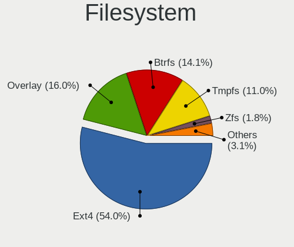
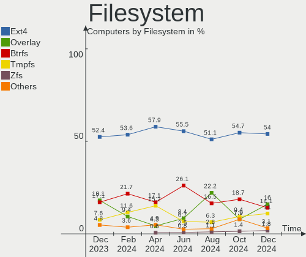
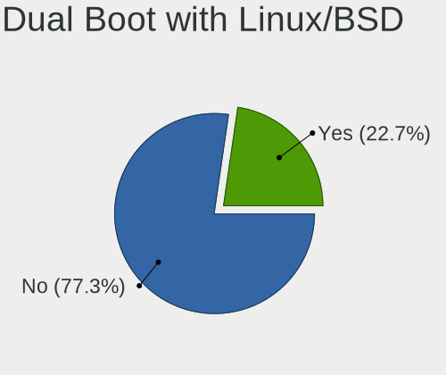
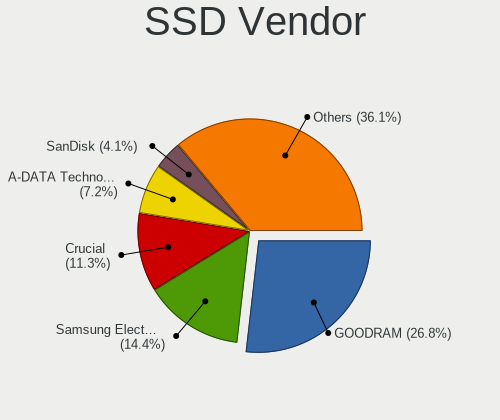
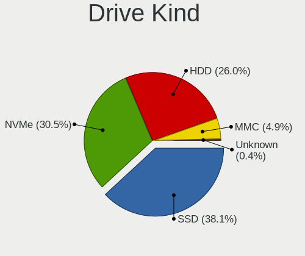
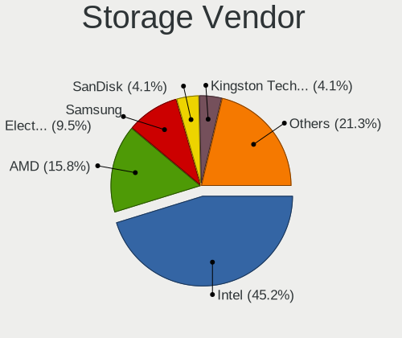
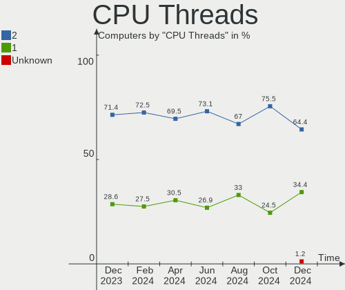
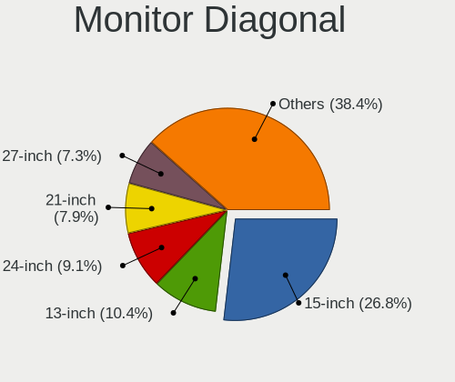
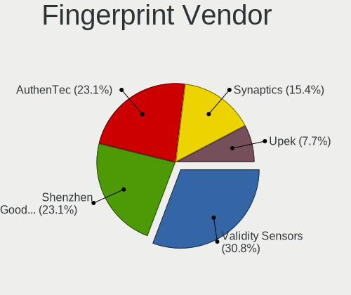

Linux in Poland - Hardware Trends
---------------------------------

A project to identify most popular hardware characteristics and track their change
over time based on data collected by Linux users at https://Linux-Hardware.org.

Anyone can contribute to this report by the [hw-probe](https://github.com/linuxhw/hw-probe) tool:

    sudo -E hw-probe -all -upload

This is a report for all computer types. See also reports for [desktops](/Location/Poland/Desktop/README.md) and [notebooks](/Location/Poland/Notebook/README.md).

Period: Apr, 2024.

Contents
--------

* [ System ](#system)
  - [ OS                       ](#os)
  - [ OS Family                ](#os-family)
  - [ Kernel                   ](#kernel)
  - [ Kernel Family            ](#kernel-family)
  - [ Kernel Major Ver.        ](#kernel-major-ver)
  - [ Arch                     ](#arch)
  - [ DE                       ](#de)
  - [ Display Server           ](#display-server)
  - [ Display Manager          ](#display-manager)
  - [ OS Lang                  ](#os-lang)
  - [ Boot Mode                ](#boot-mode)
  - [ Filesystem               ](#filesystem)
  - [ Part. scheme             ](#part-scheme)
  - [ Dual Boot with Linux/BSD ](#dual-boot-with-linuxbsd)
  - [ Dual Boot (Win)          ](#dual-boot-win)

* [ Board ](#board)
  - [ Vendor                   ](#vendor)
  - [ Model                    ](#model)
  - [ Model Family             ](#model-family)
  - [ MFG Year                 ](#mfg-year)
  - [ Form Factor              ](#form-factor)
  - [ Secure Boot              ](#secure-boot)
  - [ Coreboot                 ](#coreboot)
  - [ RAM Size                 ](#ram-size)
  - [ RAM Used                 ](#ram-used)
  - [ Total Drives             ](#total-drives)
  - [ Has CD-ROM               ](#has-cd-rom)
  - [ Has Ethernet             ](#has-ethernet)
  - [ Has WiFi                 ](#has-wifi)
  - [ Has Bluetooth            ](#has-bluetooth)

* [ Location ](#location)
  - [ Country                  ](#country)
  - [ City                     ](#city)

* [ Drives ](#drives)
  - [ Drive Vendor             ](#drive-vendor)
  - [ Drive Model              ](#drive-model)
  - [ HDD Vendor               ](#hdd-vendor)
  - [ SSD Vendor               ](#ssd-vendor)
  - [ Drive Kind               ](#drive-kind)
  - [ Drive Connector          ](#drive-connector)
  - [ Drive Size               ](#drive-size)
  - [ Space Total              ](#space-total)
  - [ Space Used               ](#space-used)
  - [ Malfunc. Drives          ](#malfunc-drives)
  - [ Malfunc. Drive Vendor    ](#malfunc-drive-vendor)
  - [ Malfunc. HDD Vendor      ](#malfunc-hdd-vendor)
  - [ Malfunc. Drive Kind      ](#malfunc-drive-kind)
  - [ Failed Drives            ](#failed-drives)
  - [ Failed Drive Vendor      ](#failed-drive-vendor)
  - [ Drive Status             ](#drive-status)

* [ Storage controller ](#storage-controller)
  - [ Storage Vendor           ](#storage-vendor)
  - [ Storage Model            ](#storage-model)
  - [ Storage Kind             ](#storage-kind)

* [ Processor ](#processor)
  - [ CPU Vendor               ](#cpu-vendor)
  - [ CPU Model                ](#cpu-model)
  - [ CPU Model Family         ](#cpu-model-family)
  - [ CPU Cores                ](#cpu-cores)
  - [ CPU Sockets              ](#cpu-sockets)
  - [ CPU Threads              ](#cpu-threads)
  - [ CPU Op-Modes             ](#cpu-op-modes)
  - [ CPU Microcode            ](#cpu-microcode)
  - [ CPU Microarch            ](#cpu-microarch)

* [ Graphics ](#graphics)
  - [ GPU Vendor               ](#gpu-vendor)
  - [ GPU Model                ](#gpu-model)
  - [ GPU Combo                ](#gpu-combo)
  - [ GPU Driver               ](#gpu-driver)
  - [ GPU Memory               ](#gpu-memory)

* [ Monitor ](#monitor)
  - [ Monitor Vendor           ](#monitor-vendor)
  - [ Monitor Model            ](#monitor-model)
  - [ Monitor Resolution       ](#monitor-resolution)
  - [ Monitor Diagonal         ](#monitor-diagonal)
  - [ Monitor Width            ](#monitor-width)
  - [ Aspect Ratio             ](#aspect-ratio)
  - [ Monitor Area             ](#monitor-area)
  - [ Pixel Density            ](#pixel-density)
  - [ Multiple Monitors        ](#multiple-monitors)

* [ Network ](#network)
  - [ Net Controller Vendor    ](#net-controller-vendor)
  - [ Net Controller Model     ](#net-controller-model)
  - [ Wireless Vendor          ](#wireless-vendor)
  - [ Wireless Model           ](#wireless-model)
  - [ Ethernet Vendor          ](#ethernet-vendor)
  - [ Ethernet Model           ](#ethernet-model)
  - [ Net Controller Kind      ](#net-controller-kind)
  - [ Used Controller          ](#used-controller)
  - [ NICs                     ](#nics)
  - [ IPv6                     ](#ipv6)

* [ Bluetooth ](#bluetooth)
  - [ Bluetooth Vendor         ](#bluetooth-vendor)
  - [ Bluetooth Model          ](#bluetooth-model)

* [ Sound ](#sound)
  - [ Sound Vendor             ](#sound-vendor)
  - [ Sound Model              ](#sound-model)

* [ Memory ](#memory)
  - [ Memory Vendor            ](#memory-vendor)
  - [ Memory Model             ](#memory-model)
  - [ Memory Kind              ](#memory-kind)
  - [ Memory Form Factor       ](#memory-form-factor)
  - [ Memory Size              ](#memory-size)
  - [ Memory Speed             ](#memory-speed)

* [ Printers & scanners ](#printers--scanners)
  - [ Printer Vendor           ](#printer-vendor)
  - [ Printer Model            ](#printer-model)
  - [ Scanner Vendor           ](#scanner-vendor)
  - [ Scanner Model            ](#scanner-model)

* [ Camera ](#camera)
  - [ Camera Vendor            ](#camera-vendor)
  - [ Camera Model             ](#camera-model)

* [ Security ](#security)
  - [ Fingerprint Vendor       ](#fingerprint-vendor)
  - [ Fingerprint Model        ](#fingerprint-model)
  - [ Chipcard Vendor          ](#chipcard-vendor)
  - [ Chipcard Model           ](#chipcard-model)

* [ Unsupported ](#unsupported)
  - [ Unsupported Devices      ](#unsupported-devices)
  - [ Unsupported Device Types ](#unsupported-device-types)

System
------

OS
--

Installed operating systems

| Name                         | Computers | Percent |
|------------------------------|-----------|---------|
| Debian 12                    | 19        | 11.59%  |
| Ubuntu 22.04                 | 18        | 10.98%  |
| Arch Rolling                 | 10        | 6.1%    |
| Ubuntu 23.10                 | 8         | 4.88%   |
| Fedora 39                    | 7         | 4.27%   |
| Ubuntu 24.04                 | 6         | 3.66%   |
| OpenMandriva 5.0             | 6         | 3.66%   |
| Gentoo 2.14                  | 6         | 3.66%   |
| Fedora 40                    | 6         | 3.66%   |
| Pop!_OS 22.04                | 4         | 2.44%   |
| OpenMandriva 23.08           | 4         | 2.44%   |
| ROSA 12.5                    | 3         | 1.83%   |
| openSUSE Tumbleweed-XXXXXXXX | 3         | 1.83%   |
| openSUSE Leap-15.5           | 3         | 1.83%   |
| Linux Mint 21.3              | 3         | 1.83%   |
| EndeavourOS Rolling          | 3         | 1.83%   |
| Debian 11                    | 3         | 1.83%   |
| Debian                       | 3         | 1.83%   |
| ArcoLinux Rolling            | 3         | 1.83%   |
| Zorin 17                     | 2         | 1.22%   |
| Nobara 39                    | 2         | 1.22%   |
| NixOS 24.05                  | 2         | 1.22%   |
| Manjaro                      | 2         | 1.22%   |
| Lubuntu 23.10                | 2         | 1.22%   |
| Linux Mint 21.2              | 2         | 1.22%   |
| Lilidog 23                   | 2         | 1.22%   |
| KDE neon 22.04               | 2         | 1.22%   |
| Ubuntu MATE 22.04            | 1         | 0.61%   |
| Ubuntu 20.04                 | 1         | 0.61%   |
| Ubuntu 18.04                 | 1         | 0.61%   |
| SteamOS 3.5.19               | 1         | 0.61%   |
| Sparky 7.3                   | 1         | 0.61%   |
| Pikaos 3                     | 1         | 0.61%   |
| Parrot 6.0                   | 1         | 0.61%   |
| org.kde.Platform 5.15-21.08  | 1         | 0.61%   |
| OpenMandriva 4.3             | 1         | 0.61%   |
| OpenMandriva 24.01           | 1         | 0.61%   |
| OpenMandriva 23.03           | 1         | 0.61%   |
| NixOS 23.11                  | 1         | 0.61%   |
| MX 23                        | 1         | 0.61%   |

OS Family
---------

OS without a version

| Name             | Computers | Percent |
|------------------|-----------|---------|
| Ubuntu           | 34        | 20.73%  |
| Debian           | 25        | 15.24%  |
| Fedora           | 14        | 8.54%   |
| OpenMandriva     | 13        | 7.93%   |
| Arch             | 10        | 6.1%    |
| Linux Mint       | 7         | 4.27%   |
| Gentoo           | 7         | 4.27%   |
| openSUSE         | 6         | 3.66%   |
| Pop!_OS          | 4         | 2.44%   |
| Manjaro          | 4         | 2.44%   |
| ROSA             | 3         | 1.83%   |
| NixOS            | 3         | 1.83%   |
| EndeavourOS      | 3         | 1.83%   |
| ArcoLinux        | 3         | 1.83%   |
| Zorin            | 2         | 1.22%   |
| Nobara           | 2         | 1.22%   |
| Lubuntu          | 2         | 1.22%   |
| Lilidog          | 2         | 1.22%   |
| Kubuntu          | 2         | 1.22%   |
| KDE neon         | 2         | 1.22%   |
| Kali             | 2         | 1.22%   |
| Ubuntu MATE      | 1         | 0.61%   |
| SteamOS          | 1         | 0.61%   |
| Sparky           | 1         | 0.61%   |
| Pikaos           | 1         | 0.61%   |
| Parrot           | 1         | 0.61%   |
| org.kde.Platform | 1         | 0.61%   |
| MX               | 1         | 0.61%   |
| LMDE             | 1         | 0.61%   |
| Garuda Linux     | 1         | 0.61%   |
| Elementary       | 1         | 0.61%   |
| Devuan           | 1         | 0.61%   |
| Clear Linux      | 1         | 0.61%   |
| BigLinux         | 1         | 0.61%   |
| antiX            | 1         | 0.61%   |

Kernel
------

Version of the Linux kernel

| Version                             | Computers | Percent |
|-------------------------------------|-----------|---------|
| 6.1.0-18-amd64                      | 13        | 7.93%   |
| 6.5.0-27-generic                    | 11        | 6.71%   |
| 6.5.0-26-generic                    | 11        | 6.71%   |
| 6.6.2-desktop-1omv2390              | 7         | 4.27%   |
| 6.1.0-20-amd64                      | 6         | 3.66%   |
| 6.8.7-300.fc40.x86_64               | 5         | 3.05%   |
| 6.5.0-28-generic                    | 5         | 3.05%   |
| 6.8.0-76060800daily20240311-generic | 4         | 2.44%   |
| 6.8.0-31-generic                    | 4         | 2.44%   |
| 6.4.11-desktop-1omv2390             | 4         | 2.44%   |
| 6.8.4-arch1-1                       | 3         | 1.83%   |
| 6.6.15-amd64                        | 3         | 1.83%   |
| 6.5.13-5-pve                        | 3         | 1.83%   |
| 5.14.21-150500.55.52-default        | 3         | 1.83%   |
| 6.8.6-arch1-1                       | 2         | 1.22%   |
| 6.8.6-200.fc39.x86_64               | 2         | 1.22%   |
| 6.8.5-zen1-1-zen                    | 2         | 1.22%   |
| 6.8.2-arch2-1                       | 2         | 1.22%   |
| 6.6.28-1-lts                        | 2         | 1.22%   |
| 6.6.21-gentoo                       | 2         | 1.22%   |
| 6.6.13-gentoo                       | 2         | 1.22%   |
| 6.5.0-9-generic                     | 2         | 1.22%   |
| 6.5.0-18-generic                    | 2         | 1.22%   |
| 5.15.0-101-generic                  | 2         | 1.22%   |
| 5.15.0-100-generic                  | 2         | 1.22%   |
| 6.8.7-zen1-1-zen                    | 1         | 0.61%   |
| 6.8.7-gentoo                        | 1         | 0.61%   |
| 6.8.7-200.fsync.fc39.x86_64         | 1         | 0.61%   |
| 6.8.7-200.fc39.x86_64               | 1         | 0.61%   |
| 6.8.7-1-MANJARO                     | 1         | 0.61%   |
| 6.8.7-1-default                     | 1         | 0.61%   |
| 6.8.6-xanmod1                       | 1         | 0.61%   |
| 6.8.5-gentoo-r1-x86_64              | 1         | 0.61%   |
| 6.8.5-301.fc40.x86_64               | 1         | 0.61%   |
| 6.8.4-zen1-1-zen                    | 1         | 0.61%   |
| 6.8.4-rc1-1-default                 | 1         | 0.61%   |
| 6.8.4-lqx1-2-lqx                    | 1         | 0.61%   |
| 6.8.4-100.fc38.x86_64               | 1         | 0.61%   |
| 6.8.4-1-MANJARO                     | 1         | 0.61%   |
| 6.8.3-pikaos                        | 1         | 0.61%   |

Kernel Family
-------------

Linux kernel without a distro release

| Version  | Computers | Percent |
|----------|-----------|---------|
| 6.5.0    | 34        | 20.73%  |
| 6.1.0    | 20        | 12.2%   |
| 6.8.7    | 11        | 6.71%   |
| 6.8.0    | 10        | 6.1%    |
| 5.15.0   | 9         | 5.49%   |
| 6.8.4    | 8         | 4.88%   |
| 6.6.2    | 7         | 4.27%   |
| 6.8.6    | 5         | 3.05%   |
| 6.7.9    | 5         | 3.05%   |
| 6.8.5    | 4         | 2.44%   |
| 6.4.11   | 4         | 2.44%   |
| 6.8.2    | 3         | 1.83%   |
| 6.6.28   | 3         | 1.83%   |
| 6.6.21   | 3         | 1.83%   |
| 6.6.15   | 3         | 1.83%   |
| 6.6.13   | 3         | 1.83%   |
| 6.5.13   | 3         | 1.83%   |
| 5.14.21  | 3         | 1.83%   |
| 6.7.12   | 2         | 1.22%   |
| 5.4.0    | 2         | 1.22%   |
| 5.10.0   | 2         | 1.22%   |
| 6.8.3    | 1         | 0.61%   |
| 6.7.6    | 1         | 0.61%   |
| 6.7.10   | 1         | 0.61%   |
| 6.6.9    | 1         | 0.61%   |
| 6.6.6    | 1         | 0.61%   |
| 6.6.29   | 1         | 0.61%   |
| 6.6.26   | 1         | 0.61%   |
| 6.6.19   | 1         | 0.61%   |
| 6.6.12   | 1         | 0.61%   |
| 6.5.6    | 1         | 0.61%   |
| 6.3.0    | 1         | 0.61%   |
| 6.2.6    | 1         | 0.61%   |
| 6.1.84   | 1         | 0.61%   |
| 6.1.81   | 1         | 0.61%   |
| 6.1.60   | 1         | 0.61%   |
| 6.1.52   | 1         | 0.61%   |
| 5.16.7   | 1         | 0.61%   |
| 5.15.92  | 1         | 0.61%   |
| 5.15.127 | 1         | 0.61%   |

Kernel Major Ver.
-----------------

Linux kernel major version

| Version | Computers | Percent |
|---------|-----------|---------|
| 6.8     | 42        | 25.61%  |
| 6.5     | 38        | 23.17%  |
| 6.6     | 25        | 15.24%  |
| 6.1     | 24        | 14.63%  |
| 5.15    | 11        | 6.71%   |
| 6.7     | 9         | 5.49%   |
| 6.4     | 4         | 2.44%   |
| 5.14    | 3         | 1.83%   |
| 5.4     | 2         | 1.22%   |
| 5.10    | 2         | 1.22%   |
| 6.3     | 1         | 0.61%   |
| 6.2     | 1         | 0.61%   |
| 5.16    | 1         | 0.61%   |
| 4.19    | 1         | 0.61%   |

Arch
----

OS architecture (x86_64, i586, etc.)

| Name    | Computers | Percent |
|---------|-----------|---------|
| x86_64  | 162       | 98.78%  |
| armv7l  | 1         | 0.61%   |
| aarch64 | 1         | 0.61%   |

DE
--

Desktop Environment

| Name        | Computers | Percent |
|-------------|-----------|---------|
| GNOME       | 64        | 39.02%  |
| KDE5        | 35        | 21.34%  |
| XFCE        | 13        | 7.93%   |
| Unknown     | 11        | 6.71%   |
| KDE6        | 10        | 6.1%    |
| X-Cinnamon  | 7         | 4.27%   |
| MATE        | 5         | 3.05%   |
| LXQt        | 3         | 1.83%   |
| Hyprland    | 3         | 1.83%   |
| Trinity     | 2         | 1.22%   |
| openbox     | 2         | 1.22%   |
| KDE         | 2         | 1.22%   |
| i3          | 2         | 1.22%   |
| Phosh:GNOME | 1         | 0.61%   |
| Pantheon    | 1         | 0.61%   |
| icewm       | 1         | 0.61%   |
| DWM         | 1         | 0.61%   |
| Cinnamon    | 1         | 0.61%   |

Display Server
--------------

X11 or Wayland

| Name    | Computers | Percent |
|---------|-----------|---------|
| Wayland | 77        | 46.95%  |
| X11     | 74        | 45.12%  |
| Unknown | 9         | 5.49%   |
| Tty     | 4         | 2.44%   |

Display Manager
---------------

SDDM, LightDM, etc.

| Name    | Computers | Percent |
|---------|-----------|---------|
| Unknown | 48        | 29.27%  |
| SDDM    | 40        | 24.39%  |
| GDM3    | 36        | 21.95%  |
| LightDM | 26        | 15.85%  |
| GDM     | 10        | 6.1%    |
| GREETD  | 2         | 1.22%   |
| SLIMSKI | 1         | 0.61%   |
| SLiM    | 1         | 0.61%   |

OS Lang
-------

Language

| Lang    | Computers | Percent |
|---------|-----------|---------|
| pl_PL   | 97        | 59.15%  |
| en_US   | 48        | 29.27%  |
| C       | 5         | 3.05%   |
| uk_UA   | 3         | 1.83%   |
| en_GB   | 3         | 1.83%   |
| Unknown | 3         | 1.83%   |
| ru_RU   | 2         | 1.22%   |
| POSIX   | 1         | 0.61%   |
| en_IE   | 1         | 0.61%   |
| en_DK   | 1         | 0.61%   |

Boot Mode
---------

EFI or BIOS

| Mode | Computers | Percent |
|------|-----------|---------|
| EFI  | 83        | 50.61%  |
| BIOS | 81        | 49.39%  |

Filesystem
----------

Type of filesystem

| Type    | Computers | Percent |
|---------|-----------|---------|
| Ext4    | 95        | 57.93%  |
| Btrfs   | 28        | 17.07%  |
| Tmpfs   | 25        | 15.24%  |
| Overlay | 7         | 4.27%   |
| F2fs    | 5         | 3.05%   |
| Zfs     | 1         | 0.61%   |
| XXX     | 1         | 0.61%   |
| Ext3    | 1         | 0.61%   |
| Unknown | 1         | 0.61%   |

Part. scheme
------------

Scheme of partitioning

| Type    | Computers | Percent |
|---------|-----------|---------|
| GPT     | 103       | 62.8%   |
| Unknown | 38        | 23.17%  |
| MBR     | 23        | 14.02%  |

Dual Boot with Linux/BSD
------------------------

Hosting more than one Linux/BSD

| Dual boot | Computers | Percent |
|-----------|-----------|---------|
| No        | 139       | 84.76%  |
| Yes       | 25        | 15.24%  |

Dual Boot (Win)
---------------

Hosting Linux and Windows

| Dual boot | Computers | Percent |
|-----------|-----------|---------|
| No        | 108       | 65.85%  |
| Yes       | 56        | 34.15%  |

Board
-----

Vendor
------

Motherboard manufacturer

| Name                    | Computers | Percent |
|-------------------------|-----------|---------|
| Lenovo                  | 33        | 20.12%  |
| ASUSTek Computer        | 21        | 12.8%   |
| Dell                    | 20        | 12.2%   |
| MSI                     | 16        | 9.76%   |
| Hewlett-Packard         | 16        | 9.76%   |
| Gigabyte Technology     | 16        | 9.76%   |
| ASRock                  | 9         | 5.49%   |
| Acer                    | 6         | 3.66%   |
| HUAWEI                  | 3         | 1.83%   |
| Unknown                 | 3         | 1.83%   |
| Samsung Electronics     | 2         | 1.22%   |
| Intel                   | 2         | 1.22%   |
| Fujitsu                 | 2         | 1.22%   |
| Apple                   | 2         | 1.22%   |
| WeiBu                   | 1         | 0.61%   |
| Valve                   | 1         | 0.61%   |
| Toshiba                 | 1         | 0.61%   |
| System76                | 1         | 0.61%   |
| Sony                    | 1         | 0.61%   |
| Raspberry Pi Foundation | 1         | 0.61%   |
| Prestigio               | 1         | 0.61%   |
| Panasonic Connect       | 1         | 0.61%   |
| Notebook                | 1         | 0.61%   |
| Maxcom                  | 1         | 0.61%   |
| Inventec                | 1         | 0.61%   |
| Google                  | 1         | 0.61%   |
| AMI                     | 1         | 0.61%   |

Model
-----

Motherboard model

| Name                                       | Computers | Percent |
|--------------------------------------------|-----------|---------|
| Unknown                                    | 3         | 1.83%   |
| MSI MS-7C56                                | 2         | 1.22%   |
| Lenovo Legion Slim 5 16APH8 82Y9           | 2         | 1.22%   |
| Lenovo Legion 5 15ARH05H 82B1              | 2         | 1.22%   |
| HP EliteDesk 705 G2 MINI                   | 2         | 1.22%   |
| Gigabyte X570 GAMING X                     | 2         | 1.22%   |
| ASRock B650M-HDV/M.2                       | 2         | 1.22%   |
| WeiBu ADL-N                                | 1         | 0.61%   |
| Valve Jupiter                              | 1         | 0.61%   |
| Toshiba Satellite C850D-11C                | 1         | 0.61%   |
| System76 Galago Pro                        | 1         | 0.61%   |
| Sony VPCEH3K1E                             | 1         | 0.61%   |
| Samsung 350V5C/351V5C/3540VC/3440VC        | 1         | 0.61%   |
| Samsung 300E4A/300E5A/300E7A/3430EA/3530EA | 1         | 0.61%   |
| RPi Raspberry Pi 3 Model B Rev 1.2         | 1         | 0.61%   |
| Prestigio Smartbook PSB116A                | 1         | 0.61%   |
| Panasonic Connect CFSR4-1                  | 1         | 0.61%   |
| Notebook P7xxDM2(-G)                       | 1         | 0.61%   |
| MSI OPTIMUS                                | 1         | 0.61%   |
| MSI MS-7D09                                | 1         | 0.61%   |
| MSI MS-7C81                                | 1         | 0.61%   |
| MSI MS-7B51                                | 1         | 0.61%   |
| MSI MS-7A67                                | 1         | 0.61%   |
| MSI MS-7A38                                | 1         | 0.61%   |
| MSI MS-7996                                | 1         | 0.61%   |
| MSI MS-7977                                | 1         | 0.61%   |
| MSI MS-7823                                | 1         | 0.61%   |
| MSI MS-7235                                | 1         | 0.61%   |
| MSI Katana GF66 11UE                       | 1         | 0.61%   |
| MSI GT62VR 6RE                             | 1         | 0.61%   |
| MSI GL65 9SC                               | 1         | 0.61%   |
| MSI GF63 8RD                               | 1         | 0.61%   |
| Maxcom mBook14                             | 1         | 0.61%   |
| Lenovo Yoga 6 13ALC7 82UD                  | 1         | 0.61%   |
| Lenovo Y520-15IKBN 80WK                    | 1         | 0.61%   |
| Lenovo ThinkPad X270 20K5S1A524            | 1         | 0.61%   |
| Lenovo ThinkPad T580 20LAS8HJ20            | 1         | 0.61%   |
| Lenovo ThinkPad T570 20HAS03W00            | 1         | 0.61%   |
| Lenovo ThinkPad T480 20L6SAYX00            | 1         | 0.61%   |
| Lenovo ThinkPad T430 2349FC4               | 1         | 0.61%   |

Model Family
------------

Motherboard model prefix

| Name                      | Computers | Percent |
|---------------------------|-----------|---------|
| Lenovo ThinkPad           | 13        | 7.93%   |
| Lenovo Legion             | 6         | 3.66%   |
| Lenovo IdeaPad            | 6         | 3.66%   |
| Dell Latitude             | 6         | 3.66%   |
| HP EliteBook              | 5         | 3.05%   |
| Dell Inspiron             | 4         | 2.44%   |
| HP Pavilion               | 3         | 1.83%   |
| HP EliteDesk              | 3         | 1.83%   |
| ASUS ASUS                 | 3         | 1.83%   |
| Acer Aspire               | 3         | 1.83%   |
| Unknown                   | 3         | 1.83%   |
| MSI MS-7C56               | 2         | 1.22%   |
| HP ProBook                | 2         | 1.22%   |
| Gigabyte X570             | 2         | 1.22%   |
| Gigabyte B450M            | 2         | 1.22%   |
| Dell Vostro               | 2         | 1.22%   |
| Dell Precision            | 2         | 1.22%   |
| Dell G15                  | 2         | 1.22%   |
| ASUS ROG                  | 2         | 1.22%   |
| ASRock B650M-HDV          | 2         | 1.22%   |
| Acer Nitro                | 2         | 1.22%   |
| WeiBu ADL-N               | 1         | 0.61%   |
| Valve Jupiter             | 1         | 0.61%   |
| Toshiba Satellite         | 1         | 0.61%   |
| System76 Galago           | 1         | 0.61%   |
| Sony VPCEH3K1E            | 1         | 0.61%   |
| Samsung 350V5C            | 1         | 0.61%   |
| Samsung 300E4A            | 1         | 0.61%   |
| RPi Raspberry             | 1         | 0.61%   |
| Prestigio Smartbook       | 1         | 0.61%   |
| Panasonic Connect CFSR4-1 | 1         | 0.61%   |
| Notebook P7xxDM2(-G)      | 1         | 0.61%   |
| MSI OPTIMUS               | 1         | 0.61%   |
| MSI MS-7D09               | 1         | 0.61%   |
| MSI MS-7C81               | 1         | 0.61%   |
| MSI MS-7B51               | 1         | 0.61%   |
| MSI MS-7A67               | 1         | 0.61%   |
| MSI MS-7A38               | 1         | 0.61%   |
| MSI MS-7996               | 1         | 0.61%   |
| MSI MS-7977               | 1         | 0.61%   |

MFG Year
--------

Motherboard manufacture year

| Year    | Computers | Percent |
|---------|-----------|---------|
| 2023    | 20        | 12.2%   |
| 2018    | 18        | 10.98%  |
| 2020    | 16        | 9.76%   |
| 2016    | 13        | 7.93%   |
| 2021    | 12        | 7.32%   |
| 2014    | 12        | 7.32%   |
| 2013    | 12        | 7.32%   |
| 2022    | 11        | 6.71%   |
| 2011    | 11        | 6.71%   |
| 2017    | 9         | 5.49%   |
| 2012    | 8         | 4.88%   |
| 2019    | 7         | 4.27%   |
| 2015    | 6         | 3.66%   |
| 2008    | 3         | 1.83%   |
| Unknown | 2         | 1.22%   |
| 2024    | 1         | 0.61%   |
| 2010    | 1         | 0.61%   |
| 2009    | 1         | 0.61%   |
| 2006    | 1         | 0.61%   |

Form Factor
-----------

Physical design of the computer

| Name           | Computers | Percent |
|----------------|-----------|---------|
| Notebook       | 94        | 57.32%  |
| Desktop        | 60        | 36.59%  |
| Convertible    | 5         | 3.05%   |
| System on chip | 2         | 1.22%   |
| Tablet         | 1         | 0.61%   |
| Mini pc        | 1         | 0.61%   |
| All in one     | 1         | 0.61%   |

Secure Boot
-----------

Enabled or disabled

| State    | Computers | Percent |
|----------|-----------|---------|
| Disabled | 158       | 96.34%  |
| Enabled  | 6         | 3.66%   |

Coreboot
--------

Have coreboot on board

| Used | Computers | Percent |
|------|-----------|---------|
| No   | 163       | 99.39%  |
| Yes  | 1         | 0.61%   |

RAM Size
--------

Total RAM memory

| Size in GB  | Computers | Percent |
|-------------|-----------|---------|
| 4.01-8.0    | 41        | 25%     |
| 16.01-24.0  | 39        | 23.78%  |
| 32.01-64.0  | 28        | 17.07%  |
| 8.01-16.0   | 24        | 14.63%  |
| 3.01-4.0    | 14        | 8.54%   |
| 64.01-256.0 | 10        | 6.1%    |
| 24.01-32.0  | 5         | 3.05%   |
| 1.01-2.0    | 2         | 1.22%   |
| 0.51-1.0    | 1         | 0.61%   |

RAM Used
--------

Used RAM memory

| Used GB    | Computers | Percent |
|------------|-----------|---------|
| 1.01-2.0   | 48        | 29.27%  |
| 2.01-3.0   | 39        | 23.78%  |
| 4.01-8.0   | 31        | 18.9%   |
| 3.01-4.0   | 22        | 13.41%  |
| 8.01-16.0  | 12        | 7.32%   |
| 0.51-1.0   | 6         | 3.66%   |
| 16.01-24.0 | 3         | 1.83%   |
| 32.01-64.0 | 1         | 0.61%   |
| 24.01-32.0 | 1         | 0.61%   |
| 0.01-0.5   | 1         | 0.61%   |

Total Drives
------------

Number of drives on board

| Drives | Computers | Percent |
|--------|-----------|---------|
| 1      | 90        | 54.88%  |
| 2      | 48        | 29.27%  |
| 3      | 15        | 9.15%   |
| 4      | 6         | 3.66%   |
| 5      | 3         | 1.83%   |
| 6      | 1         | 0.61%   |
| 0      | 1         | 0.61%   |

Has CD-ROM
----------

Has CD-ROM on board

| Presented | Computers | Percent |
|-----------|-----------|---------|
| No        | 120       | 73.17%  |
| Yes       | 44        | 26.83%  |

Has Ethernet
------------

Has Ethernet on board

| Presented | Computers | Percent |
|-----------|-----------|---------|
| Yes       | 141       | 85.98%  |
| No        | 23        | 14.02%  |

Has WiFi
--------

Has WiFi module

| Presented | Computers | Percent |
|-----------|-----------|---------|
| Yes       | 126       | 76.83%  |
| No        | 38        | 23.17%  |

Has Bluetooth
-------------

Has Bluetooth module

| Presented | Computers | Percent |
|-----------|-----------|---------|
| Yes       | 112       | 68.29%  |
| No        | 52        | 31.71%  |

Location
--------

Country
-------

Geographic location (country)

| Country | Computers | Percent |
|---------|-----------|---------|
| Poland  | 164       | 100%    |

City
----

Geographic location (city)

| City                 | Computers | Percent |
|----------------------|-----------|---------|
| Warsaw               | 41        | 25%     |
| Poznan               | 14        | 8.54%   |
| Krakow               | 8         | 4.88%   |
| Wroclaw              | 7         | 4.27%   |
| Gdansk               | 7         | 4.27%   |
| Lodz                 | 6         | 3.66%   |
| Katowice             | 5         | 3.05%   |
| Sosnowiec            | 4         | 2.44%   |
| Jaworzno             | 4         | 2.44%   |
| Szczecin             | 3         | 1.83%   |
| Ruda Śląska        | 3         | 1.83%   |
| Gliwice              | 3         | 1.83%   |
| Bialystok            | 3         | 1.83%   |
| Zabrze               | 2         | 1.22%   |
| Reda                 | 2         | 1.22%   |
| Oleszyce             | 2         | 1.22%   |
| Lublin               | 2         | 1.22%   |
| Gdynia               | 2         | 1.22%   |
| Elblag               | 2         | 1.22%   |
| Zukowo               | 1         | 0.61%   |
| Zaczernie            | 1         | 0.61%   |
| Wroblew              | 1         | 0.61%   |
| Wałbrzych           | 1         | 0.61%   |
| Wachock              | 1         | 0.61%   |
| Trzcianka            | 1         | 0.61%   |
| Tenczynek            | 1         | 0.61%   |
| Swilcza              | 1         | 0.61%   |
| Swidnica             | 1         | 0.61%   |
| Środa Śląska      | 1         | 0.61%   |
| Sierpc               | 1         | 0.61%   |
| Sandomierz           | 1         | 0.61%   |
| Radom                | 1         | 0.61%   |
| Płock               | 1         | 0.61%   |
| Przemysl             | 1         | 0.61%   |
| Prejlowo             | 1         | 0.61%   |
| Pogwizdow            | 1         | 0.61%   |
| Piotrkow Trybunalski | 1         | 0.61%   |
| Ostrów Wielkopolski | 1         | 0.61%   |
| Olkusz               | 1         | 0.61%   |
| Olesno               | 1         | 0.61%   |

Drives
------

Drive Vendor
------------

Hard drive vendors

| Vendor                         | Computers | Drives | Percent |
|--------------------------------|-----------|--------|---------|
| Samsung Electronics            | 40        | 46     | 16.33%  |
| Seagate                        | 26        | 28     | 10.61%  |
| GOODRAM                        | 23        | 32     | 9.39%   |
| WDC                            | 20        | 25     | 8.16%   |
| Sandisk                        | 19        | 22     | 7.76%   |
| Toshiba                        | 15        | 16     | 6.12%   |
| Crucial                        | 9         | 9      | 3.67%   |
| Kingston                       | 8         | 8      | 3.27%   |
| Unknown                        | 7         | 8      | 2.86%   |
| SK hynix                       | 7         | 7      | 2.86%   |
| Micron Technology              | 7         | 7      | 2.86%   |
| Shenzhen Longsys Electronics   | 6         | 7      | 2.45%   |
| Phison Electronics             | 6         | 6      | 2.45%   |
| A-DATA Technology              | 5         | 5      | 2.04%   |
| SPCC                           | 4         | 4      | 1.63%   |
| Silicon Motion                 | 3         | 3      | 1.22%   |
| MAXIO Technology (Hangzhou)    | 3         | 3      | 1.22%   |
| Kingston Technology Company    | 3         | 3      | 1.22%   |
| Intel                          | 3         | 3      | 1.22%   |
| Hitachi                        | 3         | 5      | 1.22%   |
| HGST                           | 3         | 3      | 1.22%   |
| Union Memory                   | 2         | 2      | 0.82%   |
| Patriot                        | 2         | 2      | 0.82%   |
| KIOXIA                         | 2         | 2      | 0.82%   |
| Transcend                      | 1         | 1      | 0.41%   |
| SPCC Sol                       | 1         | 1      | 0.41%   |
| Solid State Storage Technology | 1         | 1      | 0.41%   |
| Realtek Semiconductor          | 1         | 1      | 0.41%   |
| Realtek                        | 1         | 1      | 0.41%   |
| PNY                            | 1         | 1      | 0.41%   |
| Phison                         | 1         | 1      | 0.41%   |
| Netac                          | 1         | 1      | 0.41%   |
| Lexar                          | 1         | 2      | 0.41%   |
| Lenovo                         | 1         | 2      | 0.41%   |
| KingSpec                       | 1         | 1      | 0.41%   |
| Innodisk                       | 1         | 1      | 0.41%   |
| Hikvision                      | 1         | 1      | 0.41%   |
| Fujitsu                        | 1         | 1      | 0.41%   |
| China                          | 1         | 1      | 0.41%   |
| Apple                          | 1         | 1      | 0.41%   |

Drive Model
-----------

Hard drive models

| Model                                              | Computers | Percent |
|----------------------------------------------------|-----------|---------|
| Samsung NVMe SSD Controller SM981/PM981/PM983 1TB  | 6         | 2.25%   |
| Samsung SSD 980 500GB                              | 5         | 1.87%   |
| GOODRAM SSDPR-CX400-256-G2 256GB                   | 5         | 1.87%   |
| Samsung NVMe SSD Controller PM9A1/PM9A3/980PRO 1TB | 4         | 1.5%    |
| Unknown MMC Card  16GB                             | 3         | 1.12%   |
| Toshiba HDWD110 1TB                                | 3         | 1.12%   |
| Shenzhen Longsys Lexar SSD NM710 2TB               | 3         | 1.12%   |
| Samsung SSD 850 EVO 500GB                          | 3         | 1.12%   |
| Phison E12 NVMe Controller 2TB                     | 3         | 1.12%   |
| Crucial CT240BX500SSD1 240GB                       | 3         | 1.12%   |
| WDC WD5000LPVX-22V0TT0 500GB                       | 2         | 0.75%   |
| WDC WD20EZRZ-00Z5HB0 2TB                           | 2         | 0.75%   |
| Toshiba HDWD120 2TB                                | 2         | 0.75%   |
| SPCC Solid State Disk 512GB                        | 2         | 0.75%   |
| SK hynix SKHynix_HFS512GEJ9X115N 512GB             | 2         | 0.75%   |
| Silicon Motion SM2262/SM2262EN SSD Controller 2TB  | 2         | 0.75%   |
| Shenzhen Longsys Lexar SSD NM800PRO 1TB            | 2         | 0.75%   |
| Seagate ST9500325AS 500GB                          | 2         | 0.75%   |
| Seagate ST4000DM004-2CV104 4TB                     | 2         | 0.75%   |
| Seagate ST1000LM024 HN-M101MBB 1TB                 | 2         | 0.75%   |
| Seagate ST1000DM010-2EP102 1TB                     | 2         | 0.75%   |
| Seagate Expansion 2TB                              | 2         | 0.75%   |
| Sandisk WD Blue SN570 1TB                          | 2         | 0.75%   |
| Sandisk WD Blue SN550 NVMe SSD 2TB                 | 2         | 0.75%   |
| Samsung PM991 NVMe 256GB                           | 2         | 0.75%   |
| Samsung NVMe SSD Controller SM951/PM951 256GB      | 2         | 0.75%   |
| MAXIO (Hangzhou) NVMe SSD Controller MAP1202 256GB | 2         | 0.75%   |
| Kingston Company A2000 NVMe SSD 500GB              | 2         | 0.75%   |
| Kingston SA400S37480G 480GB SSD                    | 2         | 0.75%   |
| Intel SSDPEKNU512GZ 512GB                          | 2         | 0.75%   |
| Hitachi HUS724030ALE641 3TB                        | 2         | 0.75%   |
| HGST HTS721010A9E630 1TB                           | 2         | 0.75%   |
| GOODRAM SSDPR-CX400-256 256GB                      | 2         | 0.75%   |
| GOODRAM SSDPR-CX400-128-G2 128GB                   | 2         | 0.75%   |
| GOODRAM SSDPR-CX400-128 128GB                      | 2         | 0.75%   |
| GOODRAM SSDPR-CL100-480-G2 480GB                   | 2         | 0.75%   |
| GOODRAM IRP-SSDPR-S25C-256 256GB                   | 2         | 0.75%   |
| GOODRAM IRP-SSDPR-P44A-4K0-80 4TB                  | 2         | 0.75%   |
| Crucial CT1000MX500SSD1 1TB                        | 2         | 0.75%   |
| WDC WDS480G2G0B-00EPW0 480GB SSD                   | 1         | 0.37%   |

HDD Vendor
----------

Hard disk drive vendors

| Vendor              | Computers | Drives | Percent |
|---------------------|-----------|--------|---------|
| Seagate             | 26        | 28     | 42.62%  |
| WDC                 | 15        | 20     | 24.59%  |
| Toshiba             | 11        | 12     | 18.03%  |
| Hitachi             | 3         | 5      | 4.92%   |
| HGST                | 3         | 3      | 4.92%   |
| Samsung Electronics | 1         | 1      | 1.64%   |
| Lenovo              | 1         | 2      | 1.64%   |
| Fujitsu             | 1         | 1      | 1.64%   |

SSD Vendor
----------

Solid state drive vendors

| Vendor              | Computers | Drives | Percent |
|---------------------|-----------|--------|---------|
| GOODRAM             | 21        | 23     | 26.25%  |
| Samsung Electronics | 10        | 12     | 12.5%   |
| Crucial             | 9         | 9      | 11.25%  |
| Kingston            | 6         | 6      | 7.5%    |
| SanDisk             | 5         | 5      | 6.25%   |
| WDC                 | 4         | 4      | 5%      |
| SPCC                | 4         | 4      | 5%      |
| A-DATA Technology   | 3         | 3      | 3.75%   |
| Toshiba             | 2         | 2      | 2.5%    |
| Patriot             | 2         | 2      | 2.5%    |
| Micron Technology   | 2         | 2      | 2.5%    |
| Transcend           | 1         | 1      | 1.25%   |
| SPCC Sol            | 1         | 1      | 1.25%   |
| SK hynix            | 1         | 1      | 1.25%   |
| PNY                 | 1         | 1      | 1.25%   |
| Netac               | 1         | 1      | 1.25%   |
| KingSpec            | 1         | 1      | 1.25%   |
| Intel               | 1         | 1      | 1.25%   |
| Innodisk            | 1         | 1      | 1.25%   |
| Hikvision           | 1         | 1      | 1.25%   |
| China               | 1         | 1      | 1.25%   |
| Apple               | 1         | 1      | 1.25%   |
| AOSENKE             | 1         | 1      | 1.25%   |

Drive Kind
----------

HDD or SSD

| Kind | Computers | Drives | Percent |
|------|-----------|--------|---------|
| NVMe | 87        | 111    | 39.19%  |
| SSD  | 76        | 84     | 34.23%  |
| HDD  | 51        | 72     | 22.97%  |
| MMC  | 8         | 10     | 3.6%    |

Drive Connector
---------------

SATA, SAS, NVMe, etc.

| Type | Computers | Drives | Percent |
|------|-----------|--------|---------|
| SATA | 99        | 148    | 48.77%  |
| NVMe | 87        | 110    | 42.86%  |
| SAS  | 9         | 9      | 4.43%   |
| MMC  | 8         | 10     | 3.94%   |

Drive Size
----------

Size of hard drive

| Size in TB | Computers | Drives | Percent |
|------------|-----------|--------|---------|
| 0.01-0.5   | 65        | 83     | 50.39%  |
| 0.51-1.0   | 44        | 50     | 34.11%  |
| 1.01-2.0   | 10        | 10     | 7.75%   |
| 3.01-4.0   | 5         | 6      | 3.88%   |
| 2.01-3.0   | 3         | 5      | 2.33%   |
| 10.01-20.0 | 1         | 1      | 0.78%   |
| 4.01-10.0  | 1         | 1      | 0.78%   |

Space Total
-----------

Amount of disk space available on the file system

| Size in GB     | Computers | Percent |
|----------------|-----------|---------|
| 251-500        | 38        | 23.17%  |
| 101-250        | 35        | 21.34%  |
| 501-1000       | 25        | 15.24%  |
| 1001-2000      | 20        | 12.2%   |
| More than 3000 | 10        | 6.1%    |
| 21-50          | 8         | 4.88%   |
| 2001-3000      | 8         | 4.88%   |
| 1-20           | 8         | 4.88%   |
| Unknown        | 7         | 4.27%   |
| 51-100         | 5         | 3.05%   |

Space Used
----------

Amount of used disk space

| Used GB        | Computers | Percent |
|----------------|-----------|---------|
| 1-20           | 51        | 31.1%   |
| 21-50          | 25        | 15.24%  |
| 101-250        | 21        | 12.8%   |
| 51-100         | 19        | 11.59%  |
| 251-500        | 16        | 9.76%   |
| 501-1000       | 10        | 6.1%    |
| 1001-2000      | 7         | 4.27%   |
| Unknown        | 7         | 4.27%   |
| More than 3000 | 4         | 2.44%   |
| 2001-3000      | 4         | 2.44%   |

Malfunc. Drives
---------------

Drive models with a malfunction

| Model                                                         | Computers | Drives | Percent |
|---------------------------------------------------------------|-----------|--------|---------|
| WDC WD2500AAJS-60Z0A0 250GB                                   | 1         | 1      | 7.69%   |
| WDC WD20EZRZ-00Z5HB0 2TB                                      | 1         | 1      | 7.69%   |
| WDC WD10PURX-64E5EY0 1TB                                      | 1         | 1      | 7.69%   |
| Toshiba HDWD110 1TB                                           | 1         | 1      | 7.69%   |
| Solid State Storage Technology CL4-3D512-Q11 NVMe SSSTC 512GB | 1         | 1      | 7.69%   |
| Seagate ST500LT012-9WS142 500GB                               | 1         | 1      | 7.69%   |
| Seagate ST3500418AS 500GB                                     | 1         | 1      | 7.69%   |
| Seagate ST3120813AS 120GB                                     | 1         | 1      | 7.69%   |
| Seagate ST31000528AS 1TB                                      | 1         | 1      | 7.69%   |
| Seagate ST1000LM035-1RK172 1TB                                | 1         | 1      | 7.69%   |
| SanDisk SSD PLUS 480GB                                        | 1         | 1      | 7.69%   |
| Samsung Electronics SSD 870 EVO 500GB                         | 1         | 1      | 7.69%   |
| Crucial CT1000MX500SSD4 1TB                                   | 1         | 1      | 7.69%   |

Malfunc. Drive Vendor
---------------------

Vendors of faulty drives

| Vendor                         | Computers | Drives | Percent |
|--------------------------------|-----------|--------|---------|
| Seagate                        | 5         | 5      | 38.46%  |
| WDC                            | 3         | 3      | 23.08%  |
| Toshiba                        | 1         | 1      | 7.69%   |
| Solid State Storage Technology | 1         | 1      | 7.69%   |
| SanDisk                        | 1         | 1      | 7.69%   |
| Samsung Electronics            | 1         | 1      | 7.69%   |
| Crucial                        | 1         | 1      | 7.69%   |

Malfunc. HDD Vendor
-------------------

Vendors of faulty HDD drives

| Vendor  | Computers | Drives | Percent |
|---------|-----------|--------|---------|
| Seagate | 5         | 5      | 55.56%  |
| WDC     | 3         | 3      | 33.33%  |
| Toshiba | 1         | 1      | 11.11%  |

Malfunc. Drive Kind
-------------------

Kinds of faulty drives

| Kind | Computers | Drives | Percent |
|------|-----------|--------|---------|
| HDD  | 9         | 9      | 69.23%  |
| SSD  | 3         | 3      | 23.08%  |
| NVMe | 1         | 1      | 7.69%   |

Failed Drives
-------------

Failed drive models

Zero info for selected period =(

Failed Drive Vendor
-------------------

Failed drive vendors

Zero info for selected period =(

Drive Status
------------

Number of failed and malfunc. drives

| Status   | Computers | Drives | Percent |
|----------|-----------|--------|---------|
| Works    | 87        | 134    | 49.15%  |
| Detected | 77        | 130    | 43.5%   |
| Malfunc  | 13        | 13     | 7.34%   |

Storage controller
------------------

Storage Vendor
--------------

Storage controller vendors

| Vendor                         | Computers | Percent |
|--------------------------------|-----------|---------|
| Intel                          | 95        | 40.6%   |
| AMD                            | 34        | 14.53%  |
| Samsung Electronics            | 31        | 13.25%  |
| SanDisk                        | 14        | 5.98%   |
| Phison Electronics             | 11        | 4.7%    |
| Shenzhen Longsys Electronics   | 7         | 2.99%   |
| SK hynix                       | 6         | 2.56%   |
| Micron Technology              | 5         | 2.14%   |
| Kingston Technology Company    | 5         | 2.14%   |
| Silicon Motion                 | 4         | 1.71%   |
| MAXIO Technology (Hangzhou)    | 4         | 1.71%   |
| JMicron Technology             | 3         | 1.28%   |
| ADATA Technology               | 3         | 1.28%   |
| Union Memory (Shenzhen)        | 2         | 0.85%   |
| Toshiba America Info Systems   | 2         | 0.85%   |
| Marvell Technology Group       | 2         | 0.85%   |
| KIOXIA                         | 2         | 0.85%   |
| ASMedia Technology             | 2         | 0.85%   |
| Solid State Storage Technology | 1         | 0.43%   |
| Realtek Semiconductor          | 1         | 0.43%   |

Storage Model
-------------

Storage controller models

| Model                                                                          | Computers | Percent |
|--------------------------------------------------------------------------------|-----------|---------|
| AMD FCH SATA Controller [AHCI mode]                                            | 20        | 7.87%   |
| Samsung NVMe SSD Controller 980 (DRAM-less)                                    | 11        | 4.33%   |
| Samsung NVMe SSD Controller PM9A1/PM9A3/980PRO                                 | 9         | 3.54%   |
| Intel 6 Series/C200 Series Chipset Family 6 port Mobile SATA AHCI Controller   | 8         | 3.15%   |
| Samsung NVMe SSD Controller SM981/PM981/PM983                                  | 7         | 2.76%   |
| Intel Volume Management Device NVMe RAID Controller                            | 7         | 2.76%   |
| Intel Sunrise Point-LP SATA Controller [AHCI mode]                             | 7         | 2.76%   |
| Intel Q170/Q150/B150/H170/H110/Z170/CM236 Chipset SATA Controller [AHCI Mode]  | 7         | 2.76%   |
| Intel 8 Series/C220 Series Chipset Family 6-port SATA Controller 1 [AHCI mode] | 6         | 2.36%   |
| AMD 500 Series Chipset SATA Controller                                         | 6         | 2.36%   |
| Intel SATA Controller [RAID Mode]                                              | 5         | 1.97%   |
| Shenzhen Longsys Lexar NM790 NVME SSD (DRAM-less)                              | 4         | 1.57%   |
| Phison E12 NVMe Controller                                                     | 4         | 1.57%   |
| Intel Cannon Lake Mobile PCH SATA AHCI Controller                              | 4         | 1.57%   |
| Intel 8 Series SATA Controller 1 [AHCI mode]                                   | 4         | 1.57%   |
| Intel 7 Series Chipset Family 6-port SATA Controller [AHCI mode]               | 4         | 1.57%   |
| AMD 400 Series Chipset SATA Controller                                         | 4         | 1.57%   |
| SanDisk WD Black SN770 / PC SN740 256GB / PC SN560 (DRAM-less) NVMe SSD        | 3         | 1.18%   |
| Phison E18 PCIe4 NVMe Controller                                               | 3         | 1.18%   |
| MAXIO (Hangzhou) NVMe SSD Controller MAP1202 (DRAM-less)                       | 3         | 1.18%   |
| Intel Raptor Lake SATA AHCI Controller                                         | 3         | 1.18%   |
| Intel Celeron/Pentium Silver Processor SATA Controller                         | 3         | 1.18%   |
| Intel Cannon Lake PCH SATA AHCI Controller                                     | 3         | 1.18%   |
| Intel 82801 Mobile SATA Controller [RAID mode]                                 | 3         | 1.18%   |
| AMD 600 Series Chipset SATA Controller                                         | 3         | 1.18%   |
| SK hynix Platinum P41/PC801 NVMe Solid State Drive                             | 2         | 0.79%   |
| SK hynix Gold P31/BC711/PC711 NVMe Solid State Drive                           | 2         | 0.79%   |
| Silicon Motion SM2262/SM2262EN SSD Controller                                  | 2         | 0.79%   |
| Shenzhen Longsys Lexar NM800 PRO NVME SSD                                      | 2         | 0.79%   |
| SanDisk WD Green SN350 240GB (DRAM-less) / SN560E NVMe SSD                     | 2         | 0.79%   |
| SanDisk Ultra 3D / WD Blue SN570 NVMe SSD (DRAM-less)                          | 2         | 0.79%   |
| SanDisk Ultra 3D / WD Blue SN550 NVMe SSD                                      | 2         | 0.79%   |
| Samsung NVMe SSD Controller SM951/PM951                                        | 2         | 0.79%   |
| Phison PS5013-E13 PCIe3 NVMe Controller (DRAM-less)                            | 2         | 0.79%   |
| Micron 2400 NVMe SSD (DRAM-less)                                               | 2         | 0.79%   |
| Kingston Company KC3000/FURY Renegade NVMe SSD E18                             | 2         | 0.79%   |
| Kingston Company A2000 NVMe SSD SM2263EN                                       | 2         | 0.79%   |
| JMicron JMB363 SATA/IDE Controller                                             | 2         | 0.79%   |
| Intel Volume Management Device NVMe RAID Controller Intel Corporation          | 2         | 0.79%   |
| Intel Tiger Lake-LP SATA Controller                                            | 2         | 0.79%   |

Storage Kind
------------

Kind of storage controller (IDE, SATA, NVMe, SAS, ...)

| Kind | Computers | Percent |
|------|-----------|---------|
| SATA | 110       | 49.33%  |
| NVMe | 87        | 39.01%  |
| RAID | 17        | 7.62%   |
| IDE  | 9         | 4.04%   |

Processor
---------

CPU Vendor
----------

Processor vendors

| Vendor   | Computers | Percent |
|----------|-----------|---------|
| Intel    | 116       | 70.73%  |
| AMD      | 46        | 28.05%  |
| Qualcomm | 1         | 0.61%   |
| ARM      | 1         | 0.61%   |

CPU Model
---------

Processor models

| Model                                        | Computers | Percent |
|----------------------------------------------|-----------|---------|
| Intel 11th Gen Core i5-1135G7 @ 2.40GHz      | 4         | 2.44%   |
| Intel Core i5-7200U CPU @ 2.50GHz            | 3         | 1.83%   |
| Intel Celeron CPU N2840 @ 2.16GHz            | 3         | 1.83%   |
| Intel 12th Gen Core i5-12500H                | 3         | 1.83%   |
| Intel Core i7-8550U CPU @ 1.80GHz            | 2         | 1.22%   |
| Intel Core i7-6700K CPU @ 4.00GHz            | 2         | 1.22%   |
| Intel Core i7-2670QM CPU @ 2.20GHz           | 2         | 1.22%   |
| Intel Core i5-7400 CPU @ 3.00GHz             | 2         | 1.22%   |
| Intel Core i5-6200U CPU @ 2.30GHz            | 2         | 1.22%   |
| Intel Core i5-3210M CPU @ 2.50GHz            | 2         | 1.22%   |
| Intel Core i5-10210U CPU @ 1.60GHz           | 2         | 1.22%   |
| Intel 12th Gen Core i7-1255U                 | 2         | 1.22%   |
| AMD Ryzen 7 6800H with Radeon Graphics       | 2         | 1.22%   |
| AMD Ryzen 7 5800X 8-Core Processor           | 2         | 1.22%   |
| AMD Ryzen 7 4800H with Radeon Graphics       | 2         | 1.22%   |
| AMD Ryzen 5 5600G with Radeon Graphics       | 2         | 1.22%   |
| AMD Ryzen 5 5500                             | 2         | 1.22%   |
| AMD Ryzen 5 4500U with Radeon Graphics       | 2         | 1.22%   |
| AMD Ryzen 5 3600 6-Core Processor            | 2         | 1.22%   |
| AMD PRO A12-8800B R7, 12 Compute Cores 4C+8G | 2         | 1.22%   |
| Qualcomm AArch64 Processor rev 0 (aarch64)   | 1         | 0.61%   |
| Intel Xeon E-2224G CPU @ 3.50GHz             | 1         | 0.61%   |
| Intel Xeon CPU X5675 @ 3.07GHz               | 1         | 0.61%   |
| Intel Xeon CPU E5-2637 v3 @ 3.50GHz          | 1         | 0.61%   |
| Intel Xeon CPU E3-1225 v6 @ 3.30GHz          | 1         | 0.61%   |
| Intel Pentium Silver N5000 CPU @ 1.10GHz     | 1         | 0.61%   |
| Intel Pentium Silver J5040 CPU @ 2.00GHz     | 1         | 0.61%   |
| Intel Pentium Dual-Core CPU T4200 @ 2.00GHz  | 1         | 0.61%   |
| Intel Pentium CPU N3700 @ 1.60GHz            | 1         | 0.61%   |
| Intel Pentium CPU N3530 @ 2.16GHz            | 1         | 0.61%   |
| Intel Pentium CPU G4400 @ 3.30GHz            | 1         | 0.61%   |
| Intel Pentium CPU G3220 @ 3.00GHz            | 1         | 0.61%   |
| Intel Pentium CPU B950 @ 2.10GHz             | 1         | 0.61%   |
| Intel N100                                   | 1         | 0.61%   |
| Intel Core i9-14900KF                        | 1         | 0.61%   |
| Intel Core i7-9700K CPU @ 3.60GHz            | 1         | 0.61%   |
| Intel Core i7-8750H CPU @ 2.20GHz            | 1         | 0.61%   |
| Intel Core i7-8650U CPU @ 1.90GHz            | 1         | 0.61%   |
| Intel Core i7-8086K CPU @ 4.00GHz            | 1         | 0.61%   |
| Intel Core i7-6820HQ CPU @ 2.70GHz           | 1         | 0.61%   |

CPU Model Family
----------------

Processor model prefix

| Model                   | Computers | Percent |
|-------------------------|-----------|---------|
| Intel Core i5           | 37        | 22.56%  |
| Other                   | 30        | 18.29%  |
| Intel Core i7           | 24        | 14.63%  |
| AMD Ryzen 5             | 18        | 10.98%  |
| AMD Ryzen 7             | 10        | 6.1%    |
| Intel Core i3           | 6         | 3.66%   |
| Intel Celeron           | 6         | 3.66%   |
| Intel Pentium           | 5         | 3.05%   |
| Intel Xeon              | 4         | 2.44%   |
| AMD Ryzen 9             | 3         | 1.83%   |
| Intel Pentium Silver    | 2         | 1.22%   |
| Intel Atom              | 2         | 1.22%   |
| AMD Ryzen 3             | 2         | 1.22%   |
| AMD GX                  | 2         | 1.22%   |
| AMD A6                  | 2         | 1.22%   |
| Intel Pentium Dual-Core | 1         | 0.61%   |
| Intel Core i9           | 1         | 0.61%   |
| Intel Core 2 Quad       | 1         | 0.61%   |
| Intel Core 2            | 1         | 0.61%   |
| ARM BCM                 | 1         | 0.61%   |
| AMD PRO A10             | 1         | 0.61%   |
| AMD Phenom II X4        | 1         | 0.61%   |
| AMD E1                  | 1         | 0.61%   |
| AMD A8                  | 1         | 0.61%   |
| AMD A4                  | 1         | 0.61%   |
| AMD A10                 | 1         | 0.61%   |

CPU Cores
---------

Number of processor cores

| Number | Computers | Percent |
|--------|-----------|---------|
| 4      | 62        | 37.8%   |
| 2      | 43        | 26.22%  |
| 6      | 23        | 14.02%  |
| 8      | 16        | 9.76%   |
| 12     | 7         | 4.27%   |
| 10     | 5         | 3.05%   |
| 20     | 2         | 1.22%   |
| 14     | 2         | 1.22%   |
| 1      | 2         | 1.22%   |
| 24     | 1         | 0.61%   |
| 16     | 1         | 0.61%   |

CPU Sockets
-----------

Number of sockets

| Number | Computers | Percent |
|--------|-----------|---------|
| 1      | 164       | 100%    |

CPU Threads
-----------

Threads per core (Hyper-Threading)

| Number | Computers | Percent |
|--------|-----------|---------|
| 2      | 114       | 69.51%  |
| 1      | 50        | 30.49%  |

CPU Op-Modes
------------

CPU Operation Modes (32-bit, 64-bit)

| Op mode        | Computers | Percent |
|----------------|-----------|---------|
| 32-bit, 64-bit | 162       | 98.78%  |
| 64-bit         | 1         | 0.61%   |
| Unknown        | 1         | 0.61%   |

CPU Microcode
-------------

Microcode number

| Number     | Computers | Percent |
|------------|-----------|---------|
| Unknown    | 116       | 70.73%  |
| 0x906e9    | 3         | 1.83%   |
| 0x206a7    | 3         | 1.83%   |
| 0x906ea    | 2         | 1.22%   |
| 0x806c1    | 2         | 1.22%   |
| 0x506e3    | 2         | 1.22%   |
| 0x30678    | 2         | 1.22%   |
| 0x0a601206 | 2         | 1.22%   |
| 0x06003106 | 2         | 1.22%   |
| 0xb06a3    | 1         | 0.61%   |
| 0x806ec    | 1         | 0.61%   |
| 0x706a1    | 1         | 0.61%   |
| 0x406e3    | 1         | 0.61%   |
| 0x406c4    | 1         | 0.61%   |
| 0x406c3    | 1         | 0.61%   |
| 0x40661    | 1         | 0.61%   |
| 0x306f2    | 1         | 0.61%   |
| 0x306d4    | 1         | 0.61%   |
| 0x306c3    | 1         | 0.61%   |
| 0x306a9    | 1         | 0.61%   |
| 0x0a704104 | 1         | 0.61%   |
| 0x0a50000f | 1         | 0.61%   |
| 0x0a50000d | 1         | 0.61%   |
| 0x0a404102 | 1         | 0.61%   |
| 0x0a20120e | 1         | 0.61%   |
| 0x0a20102b | 1         | 0.61%   |
| 0x08701021 | 1         | 0.61%   |
| 0x08608103 | 1         | 0.61%   |
| 0x08600106 | 1         | 0.61%   |
| 0x08600104 | 1         | 0.61%   |
| 0x08600103 | 1         | 0.61%   |
| 0x08101016 | 1         | 0.61%   |
| 0x0800820d | 1         | 0.61%   |
| 0x07030105 | 1         | 0.61%   |
| 0x0700010f | 1         | 0.61%   |
| 0x0700010b | 1         | 0.61%   |
| 0x06001119 | 1         | 0.61%   |
| 0x0500010d | 1         | 0.61%   |
| 0x010000db | 1         | 0.61%   |

CPU Microarch
-------------

Microarchitecture

| Name             | Computers | Percent |
|------------------|-----------|---------|
| KabyLake         | 25        | 15.24%  |
| Unknown          | 18        | 10.98%  |
| Haswell          | 13        | 7.93%   |
| Skylake          | 12        | 7.32%   |
| Alderlake Hybrid | 12        | 7.32%   |
| Zen 3            | 11        | 6.71%   |
| SandyBridge      | 9         | 5.49%   |
| Silvermont       | 8         | 4.88%   |
| TigerLake        | 7         | 4.27%   |
| Zen 2            | 6         | 3.66%   |
| IvyBridge        | 5         | 3.05%   |
| Nehalem          | 4         | 2.44%   |
| Zen+             | 3         | 1.83%   |
| Zen              | 3         | 1.83%   |
| Icelake          | 3         | 1.83%   |
| Goldmont plus    | 3         | 1.83%   |
| Excavator        | 3         | 1.83%   |
| CometLake        | 3         | 1.83%   |
| Steamroller      | 2         | 1.22%   |
| Penryn           | 2         | 1.22%   |
| Jaguar           | 2         | 1.22%   |
| Broadwell        | 2         | 1.22%   |
| Westmere         | 1         | 0.61%   |
| Puma             | 1         | 0.61%   |
| Piledriver       | 1         | 0.61%   |
| K10 Llano        | 1         | 0.61%   |
| K10              | 1         | 0.61%   |
| Gracemont        | 1         | 0.61%   |
| Core             | 1         | 0.61%   |
| Bobcat           | 1         | 0.61%   |

Graphics
--------

GPU Vendor
----------

Vendors of graphics cards

| Vendor | Computers | Percent |
|--------|-----------|---------|
| Intel  | 91        | 44.83%  |
| Nvidia | 60        | 29.56%  |
| AMD    | 52        | 25.62%  |

GPU Model
---------

Graphics card models

| Model                                                                                    | Computers | Percent |
|------------------------------------------------------------------------------------------|-----------|---------|
| Intel 2nd Generation Core Processor Family Integrated Graphics Controller                | 8         | 3.81%   |
| Intel Alder Lake-P GT2 [Iris Xe Graphics]                                                | 6         | 2.86%   |
| Intel TigerLake-LP GT2 [Iris Xe Graphics]                                                | 5         | 2.38%   |
| Intel Skylake GT2 [HD Graphics 520]                                                      | 5         | 2.38%   |
| Intel Atom Processor Z36xxx/Z37xxx Series Graphics & Display                             | 5         | 2.38%   |
| Nvidia TU116M [GeForce GTX 1660 Ti Mobile]                                               | 4         | 1.9%    |
| Intel UHD Graphics 620                                                                   | 4         | 1.9%    |
| Intel Raptor Lake-P [Iris Xe Graphics]                                                   | 4         | 1.9%    |
| Intel Haswell-ULT Integrated Graphics Controller                                         | 4         | 1.9%    |
| Intel 3rd Gen Core processor Graphics Controller                                         | 4         | 1.9%    |
| AMD Rembrandt [Radeon 680M]                                                              | 4         | 1.9%    |
| AMD Navi 22 [Radeon RX 6700/6700 XT/6750 XT / 6800M/6850M XT]                            | 4         | 1.9%    |
| AMD Cezanne [Radeon Vega Series / Radeon Vega Mobile Series]                             | 4         | 1.9%    |
| Nvidia GP108 [GeForce GT 1030]                                                           | 3         | 1.43%   |
| Nvidia GF117M [GeForce 610M/710M/810M/820M / GT 620M/625M/630M/720M]                     | 3         | 1.43%   |
| Nvidia GF108M [GeForce GT 540M]                                                          | 3         | 1.43%   |
| Nvidia GA107M [GeForce RTX 3050 Mobile]                                                  | 3         | 1.43%   |
| Intel HD Graphics 620                                                                    | 3         | 1.43%   |
| Intel HD Graphics 530                                                                    | 3         | 1.43%   |
| Intel CoffeeLake-H GT2 [UHD Graphics 630]                                                | 3         | 1.43%   |
| Intel Atom/Celeron/Pentium Processor x5-E8000/J3xxx/N3xxx Integrated Graphics Controller | 3         | 1.43%   |
| Intel Alder Lake-UP3 GT2 [Iris Xe Graphics]                                              | 3         | 1.43%   |
| AMD Wani [Radeon R5/R6/R7 Graphics]                                                      | 3         | 1.43%   |
| AMD Renoir [Radeon RX Vega 6 (Ryzen 4000/5000 Mobile Series)]                            | 3         | 1.43%   |
| AMD Raphael                                                                              | 3         | 1.43%   |
| AMD Navi 23 [Radeon RX 6600/6600 XT/6600M]                                               | 3         | 1.43%   |
| Nvidia GP107M [GeForce GTX 1050 Mobile]                                                  | 2         | 0.95%   |
| Nvidia GP106 [GeForce GTX 1060 3GB]                                                      | 2         | 0.95%   |
| Nvidia GM204 [GeForce GTX 970]                                                           | 2         | 0.95%   |
| Nvidia AD107M [GeForce RTX 4060 Max-Q / Mobile]                                          | 2         | 0.95%   |
| Nvidia AD107M [GeForce RTX 4050 Max-Q / Mobile]                                          | 2         | 0.95%   |
| Nvidia AD107 [GeForce RTX 4060]                                                          | 2         | 0.95%   |
| Nvidia AD102 [GeForce RTX 4090]                                                          | 2         | 0.95%   |
| Intel Xeon E3-1200 v3/4th Gen Core Processor Integrated Graphics Controller              | 2         | 0.95%   |
| Intel TigerLake-H GT1 [UHD Graphics]                                                     | 2         | 0.95%   |
| Intel HD Graphics 630                                                                    | 2         | 0.95%   |
| Intel HD Graphics 5500                                                                   | 2         | 0.95%   |
| Intel GeminiLake [UHD Graphics 605]                                                      | 2         | 0.95%   |
| Intel CometLake-U GT2 [UHD Graphics]                                                     | 2         | 0.95%   |
| Intel 4th Generation Core Processor Family Integrated Graphics Controller                | 2         | 0.95%   |

GPU Combo
---------

Combinations of graphics cards

| Name           | Computers | Percent |
|----------------|-----------|---------|
| 1 x Intel      | 54        | 32.93%  |
| 1 x AMD        | 34        | 20.73%  |
| 1 x Nvidia     | 27        | 16.46%  |
| Intel + Nvidia | 26        | 15.85%  |
| 2 x AMD        | 6         | 3.66%   |
| Intel + AMD    | 6         | 3.66%   |
| AMD + Nvidia   | 6         | 3.66%   |
| 2 x Intel      | 3         | 1.83%   |
| Other          | 2         | 1.22%   |

GPU Driver
----------

Free vs proprietary

| Driver      | Computers | Percent |
|-------------|-----------|---------|
| Free        | 123       | 75%     |
| Proprietary | 28        | 17.07%  |
| Unknown     | 13        | 7.93%   |

GPU Memory
----------

Total video memory

| Size in GB | Computers | Percent |
|------------|-----------|---------|
| Unknown    | 105       | 64.02%  |
| 0.01-0.5   | 14        | 8.54%   |
| 0.51-1.0   | 12        | 7.32%   |
| 1.01-2.0   | 11        | 6.71%   |
| 3.01-4.0   | 8         | 4.88%   |
| 8.01-16.0  | 5         | 3.05%   |
| 7.01-8.0   | 4         | 2.44%   |
| 5.01-6.0   | 2         | 1.22%   |
| 2.01-3.0   | 2         | 1.22%   |
| 16.01-24.0 | 1         | 0.61%   |

Monitor
-------

Monitor Vendor
--------------

Monitor vendors

| Vendor                  | Computers | Percent |
|-------------------------|-----------|---------|
| AU Optronics            | 28        | 16.09%  |
| BOE                     | 20        | 11.49%  |
| Dell                    | 19        | 10.92%  |
| Samsung Electronics     | 17        | 9.77%   |
| LG Display              | 15        | 8.62%   |
| Chimei Innolux          | 10        | 5.75%   |
| Iiyama                  | 8         | 4.6%    |
| AOC                     | 7         | 4.02%   |
| Goldstar                | 6         | 3.45%   |
| Philips                 | 5         | 2.87%   |
| Hewlett-Packard         | 5         | 2.87%   |
| Lenovo                  | 4         | 2.3%    |
| Chi Mei Optoelectronics | 4         | 2.3%    |
| Acer                    | 4         | 2.3%    |
| ASUSTek Computer        | 3         | 1.72%   |
| Unknown                 | 2         | 1.15%   |
| PANDA                   | 2         | 1.15%   |
| InfoVision              | 2         | 1.15%   |
| Apple                   | 2         | 1.15%   |
| Ancor Communications    | 2         | 1.15%   |
| ___                     | 1         | 0.57%   |
| Valve                   | 1         | 0.57%   |
| Unknown (BBC)           | 1         | 0.57%   |
| QCM                     | 1         | 0.57%   |
| NEC Computers           | 1         | 0.57%   |
| LG Electronics          | 1         | 0.57%   |
| HannStar                | 1         | 0.57%   |
| Gigabyte Technology     | 1         | 0.57%   |
| BenQ                    | 1         | 0.57%   |

Monitor Model
-------------

Monitor models

| Model                                                                    | Computers | Percent |
|--------------------------------------------------------------------------|-----------|---------|
| Samsung Electronics LCD Monitor SEC5441 1366x768 344x194mm 15.5-inch     | 2         | 1.12%   |
| PANDA LCD Monitor NCP004D 1920x1080 344x194mm 15.5-inch                  | 2         | 1.12%   |
| Lenovo LCD Monitor LEN40BA 1920x1080 344x194mm 15.5-inch                 | 2         | 1.12%   |
| Chimei Innolux LCD Monitor CMN15E7 1920x1080 344x193mm 15.5-inch         | 2         | 1.12%   |
| Chimei Innolux LCD Monitor CMN1132 1366x768 256x144mm 11.6-inch          | 2         | 1.12%   |
| Chi Mei Optoelectronics LCD Monitor CMO15A7 1366x768 344x193mm 15.5-inch | 2         | 1.12%   |
| AU Optronics LCD Monitor AUO4599 1920x1080 344x194mm 15.5-inch           | 2         | 1.12%   |
| AU Optronics LCD Monitor AUO119E 1600x900 382x214mm 17.2-inch            | 2         | 1.12%   |
| Acer XF240Q S ACR0752 1920x1080 521x293mm 23.5-inch                      | 2         | 1.12%   |
| ___ LCDTV16 ___9000 1360x768                                             | 1         | 0.56%   |
| Valve ANX7530 U VLV3001 800x1280 100x150mm 7.1-inch                      | 1         | 0.56%   |
| Unknown LCDTV16 9000 1360x768 1600x900mm 72.3-inch                       | 1         | 0.56%   |
| Unknown LCD Monitor FFFF 2288x1287 2550x2550mm 142.0-inch                | 1         | 0.56%   |
| Unknown (BBC) HDP-V104 BBC0104 3840x2160 344x195mm 15.6-inch             | 1         | 0.56%   |
| Samsung Electronics SyncMaster SAM059A 1920x1080 477x268mm 21.5-inch     | 1         | 0.56%   |
| Samsung Electronics SyncMaster SAM036A 1920x1080                         | 1         | 0.56%   |
| Samsung Electronics SyncMaster SAM018F 1280x1024 338x270mm 17.0-inch     | 1         | 0.56%   |
| Samsung Electronics S27D590 SAM0BE9 1920x1080 600x340mm 27.2-inch        | 1         | 0.56%   |
| Samsung Electronics S22B300 SAM08C8 1920x1080 477x268mm 21.5-inch        | 1         | 0.56%   |
| Samsung Electronics LCD Monitor SEC544B 1600x900 310x174mm 14.0-inch     | 1         | 0.56%   |
| Samsung Electronics LCD Monitor SEC364D 1600x900 382x214mm 17.2-inch     | 1         | 0.56%   |
| Samsung Electronics LCD Monitor SEC324A 1366x768 344x194mm 15.5-inch     | 1         | 0.56%   |
| Samsung Electronics LCD Monitor SDC4852 1366x768 344x194mm 15.5-inch     | 1         | 0.56%   |
| Samsung Electronics LCD Monitor SDC4652 1366x768 344x194mm 15.5-inch     | 1         | 0.56%   |
| Samsung Electronics LCD Monitor SDC417C 2880x1800 344x215mm 16.0-inch    | 1         | 0.56%   |
| Samsung Electronics LCD Monitor SDC4174 3840x2400 344x215mm 16.0-inch    | 1         | 0.56%   |
| Samsung Electronics LCD Monitor SAM0D4F 1920x1080 1210x680mm 54.6-inch   | 1         | 0.56%   |
| Samsung Electronics LCD Monitor SAM07C5 1920x1080 890x500mm 40.2-inch    | 1         | 0.56%   |
| Samsung Electronics C27HG7x SAM0E15 2560x1440 598x336mm 27.0-inch        | 1         | 0.56%   |
| QCM LCD Monitor QCM0001 1080x2400 60x140mm 6.0-inch                      | 1         | 0.56%   |
| Philips PHL 223V7 PHLC154 1920x1080 476x268mm 21.5-inch                  | 1         | 0.56%   |
| Philips PHL 223V5 PHLC0CF 1920x1080 477x268mm 21.5-inch                  | 1         | 0.56%   |
| Philips PHL 220V8 PHLC218 1920x1080 477x268mm 21.5-inch                  | 1         | 0.56%   |
| Philips 247E4 PHLC0C0 1920x1080 521x293mm 23.5-inch                      | 1         | 0.56%   |
| Philips 221V PHL0888 1920x1080 477x268mm 21.5-inch                       | 1         | 0.56%   |
| NEC Computers E224Wi NEC6950 1920x1080 476x267mm 21.5-inch               | 1         | 0.56%   |
| LG Electronics LCD Monitor LG HDR 4K 3840x2160                           | 1         | 0.56%   |
| LG Display LCD Monitor LGD7001 1366x768 344x194mm 15.5-inch              | 1         | 0.56%   |
| LG Display LCD Monitor LGD0738 1920x1080 344x194mm 15.5-inch             | 1         | 0.56%   |
| LG Display LCD Monitor LGD069A 1920x1080 344x194mm 15.5-inch             | 1         | 0.56%   |

Monitor Resolution
------------------

Monitor screen resolution

| Resolution        | Computers | Percent |
|-------------------|-----------|---------|
| 1920x1080 (FHD)   | 93        | 55.69%  |
| 1366x768 (WXGA)   | 20        | 11.98%  |
| 2560x1440 (QHD)   | 9         | 5.39%   |
| 1600x900 (HD+)    | 8         | 4.79%   |
| 3840x2160 (4K)    | 7         | 4.19%   |
| 2560x1600         | 6         | 3.59%   |
| 1920x1200 (WUXGA) | 5         | 2.99%   |
| 1280x1024 (SXGA)  | 3         | 1.8%    |
| 2880x1800         | 2         | 1.2%    |
| 1920x1280         | 2         | 1.2%    |
| 1440x900 (WXGA+)  | 2         | 1.2%    |
| 800x1280          | 1         | 0.6%    |
| 3840x2400         | 1         | 0.6%    |
| 3840x1600         | 1         | 0.6%    |
| 3440x1440         | 1         | 0.6%    |
| 2800x1752         | 1         | 0.6%    |
| 2288x1287         | 1         | 0.6%    |
| 2160x1440         | 1         | 0.6%    |
| 1360x768          | 1         | 0.6%    |
| 1280x960          | 1         | 0.6%    |
| 1280x800 (WXGA)   | 1         | 0.6%    |

Monitor Diagonal
----------------

Diagonal size in inches

| Inches  | Computers | Percent |
|---------|-----------|---------|
| 15      | 51        | 29.48%  |
| 27      | 15        | 8.67%   |
| 24      | 15        | 8.67%   |
| 21      | 14        | 8.09%   |
| 13      | 13        | 7.51%   |
| 23      | 10        | 5.78%   |
| 17      | 9         | 5.2%    |
| 16      | 8         | 4.62%   |
| 14      | 8         | 4.62%   |
| 19      | 6         | 3.47%   |
| 12      | 4         | 2.31%   |
| 31      | 3         | 1.73%   |
| 11      | 3         | 1.73%   |
| Unknown | 3         | 1.73%   |
| 54      | 2         | 1.16%   |
| 142     | 1         | 0.58%   |
| 72      | 1         | 0.58%   |
| 67      | 1         | 0.58%   |
| 37      | 1         | 0.58%   |
| 34      | 1         | 0.58%   |
| 33      | 1         | 0.58%   |
| 22      | 1         | 0.58%   |
| 18      | 1         | 0.58%   |
| 7       | 1         | 0.58%   |

Monitor Width
-------------

Physical width

| Width in mm    | Computers | Percent |
|----------------|-----------|---------|
| 301-350        | 70        | 41.18%  |
| 501-600        | 38        | 22.35%  |
| 401-500        | 18        | 10.59%  |
| 201-300        | 16        | 9.41%   |
| 351-400        | 13        | 7.65%   |
| 701-800        | 3         | 1.76%   |
| 601-700        | 3         | 1.76%   |
| Unknown        | 3         | 1.76%   |
| 1001-1500      | 2         | 1.18%   |
| More than 2000 | 1         | 0.59%   |
| 801-900        | 1         | 0.59%   |
| 1501-2000      | 1         | 0.59%   |
| 1-100          | 1         | 0.59%   |

Aspect Ratio
------------

Proportional relationship between the width and the height

| Ratio   | Computers | Percent |
|---------|-----------|---------|
| 16/9    | 127       | 78.4%   |
| 16/10   | 22        | 13.58%  |
| 5/4     | 4         | 2.47%   |
| 3/2     | 3         | 1.85%   |
| 21/9    | 2         | 1.23%   |
| 1.00    | 1         | 0.62%   |
| 0.67    | 1         | 0.62%   |
| 0.45    | 1         | 0.62%   |
| Unknown | 1         | 0.62%   |

Monitor Area
------------

Area in inch²

| Area in inch² | Computers | Percent |
|----------------|-----------|---------|
| 101-110        | 51        | 29.48%  |
| 201-250        | 28        | 16.18%  |
| 301-350        | 15        | 8.67%   |
| 81-90          | 14        | 8.09%   |
| 251-300        | 9         | 5.2%    |
| 151-200        | 9         | 5.2%    |
| 111-120        | 8         | 4.62%   |
| 71-80          | 7         | 4.05%   |
| 121-130        | 7         | 4.05%   |
| More than 1000 | 5         | 2.89%   |
| 351-500        | 5         | 2.89%   |
| 61-70          | 4         | 2.31%   |
| 51-60          | 3         | 1.73%   |
| Unknown        | 3         | 1.73%   |
| 141-150        | 2         | 1.16%   |
| 1-40           | 1         | 0.58%   |
| 131-140        | 1         | 0.58%   |
| 501-1000       | 1         | 0.58%   |

Pixel Density
-------------

Pixels per inch

| Density       | Computers | Percent |
|---------------|-----------|---------|
| 51-100        | 48        | 28.4%   |
| 121-160       | 46        | 27.22%  |
| 101-120       | 41        | 24.26%  |
| 161-240       | 24        | 14.2%   |
| 1-50          | 4         | 2.37%   |
| More than 240 | 3         | 1.78%   |
| Unknown       | 3         | 1.78%   |

Multiple Monitors
-----------------

Total monitors connected

| Total | Computers | Percent |
|-------|-----------|---------|
| 1     | 131       | 79.88%  |
| 2     | 20        | 12.2%   |
| 0     | 10        | 6.1%    |
| 3     | 3         | 1.83%   |

Network
-------

Net Controller Vendor
---------------------

Controller vendors

| Vendor                          | Computers | Percent |
|---------------------------------|-----------|---------|
| Realtek Semiconductor           | 101       | 39.15%  |
| Intel                           | 86        | 33.33%  |
| Qualcomm Atheros                | 23        | 8.91%   |
| Broadcom                        | 10        | 3.88%   |
| MediaTek                        | 9         | 3.49%   |
| Broadcom Limited                | 4         | 1.55%   |
| Ralink Technology               | 3         | 1.16%   |
| Aquantia                        | 3         | 1.16%   |
| Xiaomi                          | 2         | 0.78%   |
| TP-Link                         | 2         | 0.78%   |
| Sierra Wireless                 | 2         | 0.78%   |
| Hewlett-Packard                 | 2         | 0.78%   |
| ZTE WCDMA Technologies MSM      | 1         | 0.39%   |
| Samsung Electronics             | 1         | 0.39%   |
| Qualcomm Atheros Communications | 1         | 0.39%   |
| Microsoft                       | 1         | 0.39%   |
| Microchip Technology            | 1         | 0.39%   |
| Mercucys                        | 1         | 0.39%   |
| Mellanox Technologies           | 1         | 0.39%   |
| ICS Advent                      | 1         | 0.39%   |
| HMD Global                      | 1         | 0.39%   |
| FIBOCOM                         | 1         | 0.39%   |
| ASUSTek Computer                | 1         | 0.39%   |

Net Controller Model
--------------------

Controller models

| Model                                                                  | Computers | Percent |
|------------------------------------------------------------------------|-----------|---------|
| Realtek RTL8111/8168/8211/8411 PCI Express Gigabit Ethernet Controller | 75        | 25.42%  |
| Intel Wireless 8265 / 8275                                             | 10        | 3.39%   |
| Intel Alder Lake-P PCH CNVi WiFi                                       | 8         | 2.71%   |
| Realtek RTL8125 2.5GbE Controller                                      | 7         | 2.37%   |
| Realtek RTL810xE PCI Express Fast Ethernet controller                  | 6         | 2.03%   |
| Qualcomm Atheros AR9285 Wireless Network Adapter (PCI-Express)         | 6         | 2.03%   |
| Intel Wi-Fi 6E(802.11ax) AX210/AX1675* 2x2 [Typhoon Peak]              | 6         | 2.03%   |
| Intel Wi-Fi 6 AX201                                                    | 6         | 2.03%   |
| Intel Wi-Fi 6 AX200                                                    | 6         | 2.03%   |
| Realtek RTL8153 Gigabit Ethernet Adapter                               | 5         | 1.69%   |
| Qualcomm Atheros QCA9565 / AR9565 Wireless Network Adapter             | 5         | 1.69%   |
| Intel Wireless 8260                                                    | 5         | 1.69%   |
| Intel Raptor Lake PCH CNVi WiFi                                        | 5         | 1.69%   |
| MediaTek MT7921 802.11ax PCI Express Wireless Network Adapter          | 4         | 1.36%   |
| Intel Ethernet Connection (4) I219-V                                   | 4         | 1.36%   |
| Realtek 802.11ac NIC                                                   | 3         | 1.02%   |
| Qualcomm Atheros QCA9377 802.11ac Wireless Network Adapter             | 3         | 1.02%   |
| Qualcomm Atheros Killer E2400 Gigabit Ethernet Controller              | 3         | 1.02%   |
| MediaTek MT7922 802.11ax PCI Express Wireless Network Adapter          | 3         | 1.02%   |
| Intel Wireless 7260                                                    | 3         | 1.02%   |
| Intel Ethernet Connection I217-LM                                      | 3         | 1.02%   |
| Intel Ethernet Connection (4) I219-LM                                  | 3         | 1.02%   |
| Intel Cannon Lake PCH CNVi WiFi                                        | 3         | 1.02%   |
| Broadcom NetXtreme BCM5762 Gigabit Ethernet PCIe                       | 3         | 1.02%   |
| Xiaomi Mi/Redmi series (RNDIS)                                         | 2         | 0.68%   |
| TP-Link TL-WN722N v2/v3 [Realtek RTL8188EUS]                           | 2         | 0.68%   |
| Realtek RTL8188CE 802.11b/g/n WiFi Adapter                             | 2         | 0.68%   |
| Qualcomm Atheros QCA8171 Gigabit Ethernet                              | 2         | 0.68%   |
| Qualcomm Atheros AR9485 Wireless Network Adapter                       | 2         | 0.68%   |
| Qualcomm Atheros AR8151 v2.0 Gigabit Ethernet                          | 2         | 0.68%   |
| Intel Wireless 3165                                                    | 2         | 0.68%   |
| Intel Tiger Lake PCH CNVi WiFi                                         | 2         | 0.68%   |
| Intel Gemini Lake PCH CNVi WiFi                                        | 2         | 0.68%   |
| Intel Ethernet Connection (7) I219-V                                   | 2         | 0.68%   |
| Intel Ethernet Connection (2) I219-V                                   | 2         | 0.68%   |
| Intel Ethernet Connection (2) I219-LM                                  | 2         | 0.68%   |
| Intel Comet Lake PCH-LP CNVi WiFi                                      | 2         | 0.68%   |
| Intel Comet Lake PCH CNVi WiFi                                         | 2         | 0.68%   |
| Intel 82579LM Gigabit Network Connection (Lewisville)                  | 2         | 0.68%   |
| Broadcom Limited NetXtreme BCM5751 Gigabit Ethernet PCI Express        | 2         | 0.68%   |

Wireless Vendor
---------------

Wireless vendors

| Vendor                          | Computers | Percent |
|---------------------------------|-----------|---------|
| Intel                           | 74        | 54.81%  |
| Qualcomm Atheros                | 17        | 12.59%  |
| Realtek Semiconductor           | 14        | 10.37%  |
| MediaTek                        | 9         | 6.67%   |
| Broadcom                        | 6         | 4.44%   |
| Ralink Technology               | 3         | 2.22%   |
| TP-Link                         | 2         | 1.48%   |
| Sierra Wireless                 | 2         | 1.48%   |
| Broadcom Limited                | 2         | 1.48%   |
| Qualcomm Atheros Communications | 1         | 0.74%   |
| Microsoft                       | 1         | 0.74%   |
| Mercucys                        | 1         | 0.74%   |
| Hewlett-Packard                 | 1         | 0.74%   |
| FIBOCOM                         | 1         | 0.74%   |
| ASUSTek Computer                | 1         | 0.74%   |

Wireless Model
--------------

Wireless models

| Model                                                                        | Computers | Percent |
|------------------------------------------------------------------------------|-----------|---------|
| Intel Wireless 8265 / 8275                                                   | 10        | 7.41%   |
| Intel Alder Lake-P PCH CNVi WiFi                                             | 8         | 5.93%   |
| Qualcomm Atheros AR9285 Wireless Network Adapter (PCI-Express)               | 6         | 4.44%   |
| Intel Wi-Fi 6E(802.11ax) AX210/AX1675* 2x2 [Typhoon Peak]                    | 6         | 4.44%   |
| Intel Wi-Fi 6 AX201                                                          | 6         | 4.44%   |
| Intel Wi-Fi 6 AX200                                                          | 6         | 4.44%   |
| Qualcomm Atheros QCA9565 / AR9565 Wireless Network Adapter                   | 5         | 3.7%    |
| Intel Wireless 8260                                                          | 5         | 3.7%    |
| Intel Raptor Lake PCH CNVi WiFi                                              | 5         | 3.7%    |
| MediaTek MT7921 802.11ax PCI Express Wireless Network Adapter                | 4         | 2.96%   |
| Realtek 802.11ac NIC                                                         | 3         | 2.22%   |
| Qualcomm Atheros QCA9377 802.11ac Wireless Network Adapter                   | 3         | 2.22%   |
| MediaTek MT7922 802.11ax PCI Express Wireless Network Adapter                | 3         | 2.22%   |
| Intel Wireless 7260                                                          | 3         | 2.22%   |
| Intel Cannon Lake PCH CNVi WiFi                                              | 3         | 2.22%   |
| TP-Link TL-WN722N v2/v3 [Realtek RTL8188EUS]                                 | 2         | 1.48%   |
| Realtek RTL8188CE 802.11b/g/n WiFi Adapter                                   | 2         | 1.48%   |
| Qualcomm Atheros AR9485 Wireless Network Adapter                             | 2         | 1.48%   |
| Intel Wireless 3165                                                          | 2         | 1.48%   |
| Intel Tiger Lake PCH CNVi WiFi                                               | 2         | 1.48%   |
| Intel Gemini Lake PCH CNVi WiFi                                              | 2         | 1.48%   |
| Intel Comet Lake PCH-LP CNVi WiFi                                            | 2         | 1.48%   |
| Intel Comet Lake PCH CNVi WiFi                                               | 2         | 1.48%   |
| Broadcom BCM43142 802.11b/g/n                                                | 2         | 1.48%   |
| Sierra Wireless Sierra Wireless EM7431 Qualcomm Snapdragon™ X16 LTE-A | 1         | 0.74%   |
| Sierra Wireless EM7455                                                       | 1         | 0.74%   |
| Realtek RTL8852CE PCIe 802.11ax Wireless Network Controller                  | 1         | 0.74%   |
| Realtek RTL8852BE PCIe 802.11ax Wireless Network Controller                  | 1         | 0.74%   |
| Realtek RTL8822CE 802.11ac PCIe Wireless Network Adapter                     | 1         | 0.74%   |
| Realtek RTL8822BE 802.11a/b/g/n/ac WiFi adapter                              | 1         | 0.74%   |
| Realtek RTL8821CE 802.11ac PCIe Wireless Network Adapter                     | 1         | 0.74%   |
| Realtek RTL8192CU 802.11n WLAN Adapter                                       | 1         | 0.74%   |
| Realtek RTL8188FTV 802.11b/g/n 1T1R 2.4G WLAN Adapter                        | 1         | 0.74%   |
| Realtek RTL8188EUS 802.11n Wireless Network Adapter                          | 1         | 0.74%   |
| Realtek RTL8188EE Wireless Network Adapter                                   | 1         | 0.74%   |
| Ralink RT5370 Wireless Adapter                                               | 1         | 0.74%   |
| Ralink RT2870/RT3070 Wireless Adapter                                        | 1         | 0.74%   |
| Ralink MT7610U ("Archer T2U" 2.4G+5G WLAN Adapter                            | 1         | 0.74%   |
| Qualcomm Atheros QCA6174 802.11ac Wireless Network Adapter                   | 1         | 0.74%   |
| Qualcomm Atheros AR9271 802.11n                                              | 1         | 0.74%   |

Ethernet Vendor
---------------

Ethernet vendors

| Vendor                     | Computers | Percent |
|----------------------------|-----------|---------|
| Realtek Semiconductor      | 96        | 61.15%  |
| Intel                      | 32        | 20.38%  |
| Qualcomm Atheros           | 10        | 6.37%   |
| Broadcom                   | 5         | 3.18%   |
| Aquantia                   | 3         | 1.91%   |
| Xiaomi                     | 2         | 1.27%   |
| Broadcom Limited           | 2         | 1.27%   |
| ZTE WCDMA Technologies MSM | 1         | 0.64%   |
| Samsung Electronics        | 1         | 0.64%   |
| Microchip Technology       | 1         | 0.64%   |
| Mellanox Technologies      | 1         | 0.64%   |
| ICS Advent                 | 1         | 0.64%   |
| HMD Global                 | 1         | 0.64%   |
| Hewlett-Packard            | 1         | 0.64%   |

Ethernet Model
--------------

Ethernet models

| Model                                                                             | Computers | Percent |
|-----------------------------------------------------------------------------------|-----------|---------|
| Realtek RTL8111/8168/8211/8411 PCI Express Gigabit Ethernet Controller            | 75        | 46.88%  |
| Realtek RTL8125 2.5GbE Controller                                                 | 7         | 4.38%   |
| Realtek RTL810xE PCI Express Fast Ethernet controller                             | 6         | 3.75%   |
| Realtek RTL8153 Gigabit Ethernet Adapter                                          | 5         | 3.13%   |
| Intel Ethernet Connection (4) I219-V                                              | 4         | 2.5%    |
| Qualcomm Atheros Killer E2400 Gigabit Ethernet Controller                         | 3         | 1.88%   |
| Intel Ethernet Connection I217-LM                                                 | 3         | 1.88%   |
| Intel Ethernet Connection (4) I219-LM                                             | 3         | 1.88%   |
| Broadcom NetXtreme BCM5762 Gigabit Ethernet PCIe                                  | 3         | 1.88%   |
| Xiaomi Mi/Redmi series (RNDIS)                                                    | 2         | 1.25%   |
| Qualcomm Atheros QCA8171 Gigabit Ethernet                                         | 2         | 1.25%   |
| Qualcomm Atheros AR8151 v2.0 Gigabit Ethernet                                     | 2         | 1.25%   |
| Intel Ethernet Connection (7) I219-V                                              | 2         | 1.25%   |
| Intel Ethernet Connection (2) I219-V                                              | 2         | 1.25%   |
| Intel Ethernet Connection (2) I219-LM                                             | 2         | 1.25%   |
| Intel 82579LM Gigabit Network Connection (Lewisville)                             | 2         | 1.25%   |
| Broadcom Limited NetXtreme BCM5751 Gigabit Ethernet PCI Express                   | 2         | 1.25%   |
| Aquantia AQC113C NBase-T/IEEE 802.3an Ethernet Controller [Marvell Scalable mGig] | 2         | 1.25%   |
| ZTE WCDMA MSM DEMO Mobile Boardband                                               | 1         | 0.63%   |
| Samsung Galaxy series, misc. (tethering mode)                                     | 1         | 0.63%   |
| Realtek USB 10/100/1G/2.5G LAN                                                    | 1         | 0.63%   |
| Realtek RTL8152 Fast Ethernet Adapter                                             | 1         | 0.63%   |
| Realtek RTL-8110SC/8169SC Gigabit Ethernet                                        | 1         | 0.63%   |
| Realtek Killer E3000 2.5GbE Controller                                            | 1         | 0.63%   |
| Realtek Killer E2600 GbE Controller                                               | 1         | 0.63%   |
| Qualcomm Atheros QCA8172 Fast Ethernet                                            | 1         | 0.63%   |
| Qualcomm Atheros Killer E220x Gigabit Ethernet Controller                         | 1         | 0.63%   |
| Qualcomm Atheros AR8121/AR8113/AR8114 Gigabit or Fast Ethernet                    | 1         | 0.63%   |
| Microchip SMSC9512/9514 Fast Ethernet Adapter                                     | 1         | 0.63%   |
| Mellanox MT27500 Family [ConnectX-3]                                              | 1         | 0.63%   |
| Intel Ethernet Controller X710 for 10GBASE-T                                      | 1         | 0.63%   |
| Intel Ethernet Controller I226-V                                                  | 1         | 0.63%   |
| Intel Ethernet Controller I225-V                                                  | 1         | 0.63%   |
| Intel Ethernet Connection I219-V                                                  | 1         | 0.63%   |
| Intel Ethernet Connection I219-LM                                                 | 1         | 0.63%   |
| Intel Ethernet Connection I218-LM                                                 | 1         | 0.63%   |
| Intel Ethernet Connection (7) I219-LM                                             | 1         | 0.63%   |
| Intel Ethernet Connection (23) I219-V                                             | 1         | 0.63%   |
| Intel Ethernet Connection (23) I219-LM                                            | 1         | 0.63%   |
| Intel Ethernet Connection (2) I218-V                                              | 1         | 0.63%   |

Net Controller Kind
-------------------

Ethernet, WiFi or modem

| Kind     | Computers | Percent |
|----------|-----------|---------|
| Ethernet | 142       | 52.79%  |
| WiFi     | 127       | 47.21%  |

Used Controller
---------------

Currently used network controller

| Kind     | Computers | Percent |
|----------|-----------|---------|
| WiFi     | 101       | 60.48%  |
| Ethernet | 66        | 39.52%  |

NICs
----

Total network controllers on board

| Total | Computers | Percent |
|-------|-----------|---------|
| 2     | 89        | 54.27%  |
| 1     | 67        | 40.85%  |
| 5     | 3         | 1.83%   |
| 0     | 3         | 1.83%   |
| 3     | 2         | 1.22%   |

IPv6
----

IPv6 vs IPv4

| Used | Computers | Percent |
|------|-----------|---------|
| No   | 142       | 86.59%  |
| Yes  | 22        | 13.41%  |

Bluetooth
---------

Bluetooth Vendor
----------------

Controller vendors

| Vendor                          | Computers | Percent |
|---------------------------------|-----------|---------|
| Intel                           | 72        | 63.72%  |
| Qualcomm Atheros Communications | 12        | 10.62%  |
| IMC Networks                    | 5         | 4.42%   |
| Foxconn / Hon Hai               | 5         | 4.42%   |
| Realtek Semiconductor           | 4         | 3.54%   |
| Cambridge Silicon Radio         | 4         | 3.54%   |
| Lite-On Technology              | 2         | 1.77%   |
| Broadcom                        | 2         | 1.77%   |
| Apple                           | 2         | 1.77%   |
| National Semiconductor          | 1         | 0.88%   |
| Foxconn International           | 1         | 0.88%   |
| Edimax Technology               | 1         | 0.88%   |
| Dell                            | 1         | 0.88%   |
| ASUSTek Computer                | 1         | 0.88%   |

Bluetooth Model
---------------

Controller models

| Model                                               | Computers | Percent |
|-----------------------------------------------------|-----------|---------|
| Intel Bluetooth Device                              | 16        | 14.16%  |
| Intel AX201 Bluetooth                               | 15        | 13.27%  |
| Intel AX211 Bluetooth                               | 10        | 8.85%   |
| Intel Bluetooth wireless interface                  | 7         | 6.19%   |
| Intel Bluetooth 9460/9560 Jefferson Peak (JfP)      | 6         | 5.31%   |
| Intel AX210 Bluetooth                               | 6         | 5.31%   |
| Qualcomm Atheros AR3011 Bluetooth                   | 5         | 4.42%   |
| Intel AX200 Bluetooth                               | 5         | 4.42%   |
| Realtek Bluetooth Radio                             | 4         | 3.54%   |
| Qualcomm Atheros  Bluetooth Device                  | 4         | 3.54%   |
| IMC Networks Wireless_Device                        | 4         | 3.54%   |
| Cambridge Silicon Radio Bluetooth Dongle (HCI mode) | 4         | 3.54%   |
| Intel Centrino Advanced-N 6230 Bluetooth adapter    | 3         | 2.65%   |
| Foxconn / Hon Hai Wireless_Device                   | 3         | 2.65%   |
| Qualcomm Atheros AR3012 Bluetooth 4.0               | 2         | 1.77%   |
| Intel Centrino Bluetooth Wireless Transceiver       | 2         | 1.77%   |
| Qualcomm Atheros QCA61x4 Bluetooth 4.0              | 1         | 0.88%   |
| National Bluetooth Dongle                           | 1         | 0.88%   |
| Lite-On Broadcom BCM43142A0 Bluetooth Device        | 1         | 0.88%   |
| Lite-On Atheros AR3012 Bluetooth                    | 1         | 0.88%   |
| Intel Wireless-AC 9260 Bluetooth Adapter            | 1         | 0.88%   |
| Intel Wireless-AC 3168 Bluetooth                    | 1         | 0.88%   |
| IMC Networks Bluetooth Radio                        | 1         | 0.88%   |
| Foxconn International BCM43142A0 Bluetooth module   | 1         | 0.88%   |
| Foxconn / Hon Hai MediaTek Bluetooth Adapter        | 1         | 0.88%   |
| Foxconn / Hon Hai Bluetooth Device                  | 1         | 0.88%   |
| Edimax Edimax Bluetooth Adapter                     | 1         | 0.88%   |
| Dell Broadcom BCM20702A0 Bluetooth                  | 1         | 0.88%   |
| Broadcom BCM43142 Bluetooth 4.0                     | 1         | 0.88%   |
| Broadcom BCM20702 Bluetooth 4.0 [ThinkPad]          | 1         | 0.88%   |
| ASUS Broadcom BCM20702A0 Bluetooth                  | 1         | 0.88%   |
| Apple Bluetooth USB Host Controller                 | 1         | 0.88%   |
| Apple Bluetooth Host Controller                     | 1         | 0.88%   |

Sound
-----

Sound Vendor
------------

Sound card vendors

| Vendor                   | Computers | Percent |
|--------------------------|-----------|---------|
| Intel                    | 113       | 47.68%  |
| AMD                      | 53        | 22.36%  |
| Nvidia                   | 48        | 20.25%  |
| Creative Labs            | 3         | 1.27%   |
| SAVITECH                 | 2         | 0.84%   |
| Razer USA                | 2         | 0.84%   |
| M-Audio                  | 2         | 0.84%   |
| C-Media Electronics      | 2         | 0.84%   |
| Texas Instruments        | 1         | 0.42%   |
| SM950T Microphone        | 1         | 0.42%   |
| Philips (or NXP)         | 1         | 0.42%   |
| Nordic Semiconductor ASA | 1         | 0.42%   |
| Logitech                 | 1         | 0.42%   |
| Lenovo                   | 1         | 0.42%   |
| Hewlett-Packard          | 1         | 0.42%   |
| Focusrite-Novation       | 1         | 0.42%   |
| Creative Technology      | 1         | 0.42%   |
| BR25                     | 1         | 0.42%   |
| ASRock                   | 1         | 0.42%   |
| Unknown                  | 1         | 0.42%   |

Sound Model
-----------

Sound card models

| Model                                                                      | Computers | Percent |
|----------------------------------------------------------------------------|-----------|---------|
| AMD Family 17h/19h HD Audio Controller                                     | 25        | 8.59%   |
| Nvidia Audio device                                                        | 14        | 4.81%   |
| Intel Sunrise Point-LP HD Audio                                            | 12        | 4.12%   |
| AMD Rembrandt Radeon High Definition Audio Controller                      | 10        | 3.44%   |
| Intel Alder Lake PCH-P High Definition Audio Controller                    | 9         | 3.09%   |
| Intel 6 Series/C200 Series Chipset Family High Definition Audio Controller | 9         | 3.09%   |
| Intel 100 Series/C230 Series Chipset Family HD Audio Controller            | 9         | 3.09%   |
| AMD Renoir Radeon High Definition Audio Controller                         | 9         | 3.09%   |
| Intel Cannon Lake PCH cAVS                                                 | 8         | 2.75%   |
| Intel 8 Series/C220 Series Chipset High Definition Audio Controller        | 8         | 2.75%   |
| Intel Tiger Lake-LP Smart Sound Technology Audio Controller                | 7         | 2.41%   |
| AMD Navi 21/23 HDMI/DP Audio Controller                                    | 7         | 2.41%   |
| AMD FCH Azalia Controller                                                  | 7         | 2.41%   |
| Intel Xeon E3-1200 v3/4th Gen Core Processor HD Audio Controller           | 6         | 2.06%   |
| AMD Starship/Matisse HD Audio Controller                                   | 6         | 2.06%   |
| AMD Kabini HDMI/DP Audio                                                   | 6         | 2.06%   |
| Nvidia TU116 High Definition Audio Controller                              | 5         | 1.72%   |
| Nvidia GF108 High Definition Audio Controller                              | 5         | 1.72%   |
| Intel Raptor Lake-P/U/H cAVS                                               | 5         | 1.72%   |
| Intel 7 Series/C216 Chipset Family High Definition Audio Controller        | 5         | 1.72%   |
| Intel Raptor Lake High Definition Audio Controller                         | 4         | 1.37%   |
| Intel Haswell-ULT HD Audio Controller                                      | 4         | 1.37%   |
| Intel Atom Processor Z36xxx/Z37xxx Series High Definition Audio Controller | 4         | 1.37%   |
| Intel 8 Series HD Audio Controller                                         | 4         | 1.37%   |
| Intel 200 Series PCH HD Audio                                              | 4         | 1.37%   |
| AMD Raven/Raven2/Fenghuang HDMI/DP Audio Controller                        | 4         | 1.37%   |
| Nvidia GP108 High Definition Audio Controller                              | 3         | 1.03%   |
| Nvidia GP106 High Definition Audio Controller                              | 3         | 1.03%   |
| Nvidia GF119 HDMI Audio Controller                                         | 3         | 1.03%   |
| Intel Celeron/Pentium Silver Processor High Definition Audio               | 3         | 1.03%   |
| AMD Oland/Hainan/Cape Verde/Pitcairn HDMI Audio [Radeon HD 7000 Series]    | 3         | 1.03%   |
| AMD Family 15h (Models 60h-6fh) Audio Controller                           | 3         | 1.03%   |
| SAVITECH SA9023 audio controller                                           | 2         | 0.69%   |
| Nvidia GP107GL High Definition Audio Controller                            | 2         | 0.69%   |
| Nvidia GP104 High Definition Audio Controller                              | 2         | 0.69%   |
| Nvidia GM204 High Definition Audio Controller                              | 2         | 0.69%   |
| Nvidia GA106 High Definition Audio Controller                              | 2         | 0.69%   |
| Nvidia AD102 High Definition Audio Controller                              | 2         | 0.69%   |
| Intel Wildcat Point-LP High Definition Audio Controller                    | 2         | 0.69%   |
| Intel Tiger Lake-H HD Audio Controller                                     | 2         | 0.69%   |

Memory
------

Memory Vendor
-------------

Memory module vendors

| Vendor              | Computers | Percent |
|---------------------|-----------|---------|
| Samsung Electronics | 23        | 20%     |
| SK hynix            | 18        | 15.65%  |
| Kingston            | 16        | 13.91%  |
| Unknown             | 8         | 6.96%   |
| Micron Technology   | 8         | 6.96%   |
| G.Skill             | 8         | 6.96%   |
| GOODRAM             | 7         | 6.09%   |
| Crucial             | 6         | 5.22%   |
| Unknown             | 5         | 4.35%   |
| Corsair             | 4         | 3.48%   |
| Ramaxel Technology  | 3         | 2.61%   |
| Wilk Elektronik     | 2         | 1.74%   |
| Unknown (ABCD)      | 1         | 0.87%   |
| Unknown (0x0E9D)    | 1         | 0.87%   |
| PNY                 | 1         | 0.87%   |
| Kllisre             | 1         | 0.87%   |
| Elpida              | 1         | 0.87%   |
| ChangXin Memory     | 1         | 0.87%   |
| A-DATA Technology   | 1         | 0.87%   |

Memory Model
------------

Memory module models

| Model                                                              | Computers | Percent |
|--------------------------------------------------------------------|-----------|---------|
| Unknown                                                            | 5         | 3.94%   |
| SK hynix RAM HMT451S6BFR8A-PB 4GB SODIMM DDR3 1600MT/s             | 3         | 2.36%   |
| Wilk Elektronik RAM IRP3600D4V64L18S/8G 8GB DIMM DDR4 3600MT/s     | 2         | 1.57%   |
| SK hynix RAM HMA81GS6AFR8N-UH 8GB SODIMM DDR4 2667MT/s             | 2         | 1.57%   |
| Samsung RAM M471A5244CB0-CWE 4GB Row Of Chips DDR4 3200MT/s        | 2         | 1.57%   |
| Samsung RAM M471A1G44AB0-CWE 8192MB SODIMM DDR4 3200MT/s           | 2         | 1.57%   |
| G.Skill RAM F4-3600C18-32GVK 32GB DIMM DDR4 3600MT/s               | 2         | 1.57%   |
| Unknown RAM Module 8GB SODIMM DDR3 1333MT/s                        | 1         | 0.79%   |
| Unknown RAM Module 8GB DIMM DDR3 1600MT/s                          | 1         | 0.79%   |
| Unknown RAM Module 8GB DIMM DDR3 1333MT/s                          | 1         | 0.79%   |
| Unknown RAM Module 4GB SODIMM DDR3                                 | 1         | 0.79%   |
| Unknown RAM Module 2GB SODIMM DDR3                                 | 1         | 0.79%   |
| Unknown RAM Module 2GB SODIMM DDR2 667MT/s                         | 1         | 0.79%   |
| Unknown RAM Module 2GB DIMM DDR3 1333MT/s                          | 1         | 0.79%   |
| Unknown RAM Module 2GB DIMM DDR2 667MT/s                           | 1         | 0.79%   |
| Unknown RAM Module 2GB DIMM 400MT/s                                | 1         | 0.79%   |
| Unknown RAM Module 1GB DIMM DDR                                    | 1         | 0.79%   |
| Unknown (ABCD) RAM 123456789012345678 2GB SODIMM LPDDR4 2400MT/s   | 1         | 0.79%   |
| Unknown (0x0E9D) RAM KINSOTIN16GB2666MHZ 16GB SODIMM DDR4 2667MT/s | 1         | 0.79%   |
| SK hynix RAM Module 8GB SODIMM DDR4 2133MT/s                       | 1         | 0.79%   |
| SK hynix RAM Module 8GB SODIMM DDR3 1600MT/s                       | 1         | 0.79%   |
| SK hynix RAM Module 2GB DIMM DDR3 1600MT/s                         | 1         | 0.79%   |
| SK hynix RAM HMT451S6AFR8C-PB 4GB SODIMM DDR3 1600MT/s             | 1         | 0.79%   |
| SK hynix RAM HMT41GS6BFR8A-PB 8GB SODIMM DDR3 1600MT/s             | 1         | 0.79%   |
| SK hynix RAM HMT351S6CFR8C-PB 4GB SODIMM DDR3 1600MT/s             | 1         | 0.79%   |
| SK hynix RAM HMT351S6BFR8C-H9 4GB SODIMM DDR3 1333MT/s             | 1         | 0.79%   |
| SK hynix RAM HMCG88AEBSA095N 32GB SODIMM DDR5 4800MT/s             | 1         | 0.79%   |
| SK hynix RAM HMAG68EXNSA051N 8GB SODIMM DDR4 3200MT/s              | 1         | 0.79%   |
| SK hynix RAM HMAA1GS6CJR6N-XN 8GB SODIMM DDR4 3200MT/s             | 1         | 0.79%   |
| SK hynix RAM HMA82GU6JJR8N-VK 16GB SODIMM DDR4 2667MT/s            | 1         | 0.79%   |
| SK hynix RAM HMA82GS6JJR8N-VK 16GB SODIMM DDR4 2667MT/s            | 1         | 0.79%   |
| SK hynix RAM HMA81GS6CJR8N-VK 8GB SODIMM DDR4 2667MT/s             | 1         | 0.79%   |
| SK hynix RAM H5ANBG6NAMR-XNC 16GB SODIMM DDR4 3200MT/s             | 1         | 0.79%   |
| SK hynix RAM 0000000000-00000 8GB SODIMM DDR4 2400MT/s             | 1         | 0.79%   |
| Samsung RAM Module 8GB SODIMM DDR4 2133MT/s                        | 1         | 0.79%   |
| Samsung RAM Module 2GB Row Of Chips LPDDR4 4267MT/s                | 1         | 0.79%   |
| Samsung RAM Module 16GB SODIMM DDR5 5600MT/s                       | 1         | 0.79%   |
| Samsung RAM M471B5773EB0-CK0 2048MB SODIMM DDR3 1600MT/s           | 1         | 0.79%   |
| Samsung RAM M471B5273EB0-CK0 4096MB SODIMM DDR3 4199MT/s           | 1         | 0.79%   |
| Samsung RAM M471B5273DH0-CH9 4GB SODIMM DDR3 1334MT/s              | 1         | 0.79%   |

Memory Kind
-----------

Memory module kinds

| Kind    | Computers | Percent |
|---------|-----------|---------|
| DDR4    | 57        | 53.77%  |
| DDR3    | 24        | 22.64%  |
| DDR5    | 12        | 11.32%  |
| LPDDR4  | 5         | 4.72%   |
| DDR2    | 3         | 2.83%   |
| LPDDR5  | 2         | 1.89%   |
| SDRAM   | 1         | 0.94%   |
| DDR     | 1         | 0.94%   |
| Unknown | 1         | 0.94%   |

Memory Form Factor
------------------

Physical design of the memory module

| Name         | Computers | Percent |
|--------------|-----------|---------|
| SODIMM       | 65        | 60.75%  |
| DIMM         | 32        | 29.91%  |
| Row Of Chips | 9         | 8.41%   |
| RIMM         | 1         | 0.93%   |

Memory Size
-----------

Memory module size

| Size  | Computers | Percent |
|-------|-----------|---------|
| 8192  | 38        | 33.63%  |
| 16384 | 28        | 24.78%  |
| 4096  | 25        | 22.12%  |
| 32768 | 10        | 8.85%   |
| 2048  | 10        | 8.85%   |
| 1024  | 2         | 1.77%   |

Memory Speed
------------

Memory module speed

| Speed   | Computers | Percent |
|---------|-----------|---------|
| 3200    | 18        | 15.93%  |
| 1600    | 16        | 14.16%  |
| 2667    | 15        | 13.27%  |
| 2400    | 8         | 7.08%   |
| 3600    | 7         | 6.19%   |
| 5600    | 5         | 4.42%   |
| 4800    | 5         | 4.42%   |
| 2133    | 5         | 4.42%   |
| 1333    | 5         | 4.42%   |
| 6400    | 3         | 2.65%   |
| 4267    | 3         | 2.65%   |
| 1334    | 3         | 2.65%   |
| 4000    | 2         | 1.77%   |
| 667     | 2         | 1.77%   |
| Unknown | 2         | 1.77%   |
| 8400    | 1         | 0.88%   |
| 6000    | 1         | 0.88%   |
| 4199    | 1         | 0.88%   |
| 3933    | 1         | 0.88%   |
| 3800    | 1         | 0.88%   |
| 3733    | 1         | 0.88%   |
| 3534    | 1         | 0.88%   |
| 3400    | 1         | 0.88%   |
| 3007    | 1         | 0.88%   |
| 3000    | 1         | 0.88%   |
| 2666    | 1         | 0.88%   |
| 2132    | 1         | 0.88%   |
| 800     | 1         | 0.88%   |
| 400     | 1         | 0.88%   |

Printers & scanners
-------------------

Printer Vendor
--------------

Printer device vendors

| Vendor          | Computers | Percent |
|-----------------|-----------|---------|
| Hewlett-Packard | 1         | 100%    |

Printer Model
-------------

Printer device models

| Model                  | Computers | Percent |
|------------------------|-----------|---------|
| HP HP LaserJet M14-M17 | 1         | 100%    |

Scanner Vendor
--------------

Scanner device vendors

Zero info for selected period =(

Scanner Model
-------------

Scanner device models

Zero info for selected period =(

Camera
------

Camera Vendor
-------------

Camera device vendors

| Vendor                                 | Computers | Percent |
|----------------------------------------|-----------|---------|
| Chicony Electronics                    | 22        | 23.4%   |
| Microdia                               | 10        | 10.64%  |
| Realtek Semiconductor                  | 8         | 8.51%   |
| Quanta                                 | 8         | 8.51%   |
| Sunplus Innovation Technology          | 6         | 6.38%   |
| Luxvisions Innotech Limited            | 5         | 5.32%   |
| Lite-On Technology                     | 5         | 5.32%   |
| IMC Networks                           | 5         | 5.32%   |
| Bison Electronics                      | 5         | 5.32%   |
| Syntek                                 | 3         | 3.19%   |
| Alcor Micro                            | 3         | 3.19%   |
| Acer                                   | 3         | 3.19%   |
| Suyin                                  | 2         | 2.13%   |
| Sonix Technology                       | 2         | 2.13%   |
| TXD                                    | 1         | 1.06%   |
| Silicon Motion                         | 1         | 1.06%   |
| Microsoft                              | 1         | 1.06%   |
| MacroSilicon                           | 1         | 1.06%   |
| Logitech                               | 1         | 1.06%   |
| Cheng Uei Precision Industry (Foxlink) | 1         | 1.06%   |
| Apple                                  | 1         | 1.06%   |

Camera Model
------------

Camera device models

| Model                                             | Computers | Percent |
|---------------------------------------------------|-----------|---------|
| Microdia Integrated_Webcam_HD                     | 6         | 6.32%   |
| Chicony Integrated Camera                         | 6         | 6.32%   |
| Syntek Integrated Camera                          | 3         | 3.16%   |
| Sonix USB2.0 HD UVC WebCam                        | 2         | 2.11%   |
| Realtek Integrated Webcam                         | 2         | 2.11%   |
| Realtek EasyCamera                                | 2         | 2.11%   |
| Quanta HP Wide Vision HD Camera                   | 2         | 2.11%   |
| Luxvisions Innotech Limited Integrated RGB Camera | 2         | 2.11%   |
| Luxvisions Innotech Limited Integrated Camera     | 2         | 2.11%   |
| Lite-On HP HD Webcam                              | 2         | 2.11%   |
| Lite-On HP HD Camera                              | 2         | 2.11%   |
| IMC Networks Integrated Camera                    | 2         | 2.11%   |
| Chicony Integrated Camera (1280x720@30)           | 2         | 2.11%   |
| Chicony ACER HD User Facing                       | 2         | 2.11%   |
| Bison SunplusIT Integrated Camera                 | 2         | 2.11%   |
| Acer Lenovo EasyCamera                            | 2         | 2.11%   |
| TXD HD Camera                                     | 1         | 1.05%   |
| Suyin Sony Visual Communication Camera            | 1         | 1.05%   |
| Suyin HD WebCam                                   | 1         | 1.05%   |
| Sunplus Laptop_Integrated_Webcam_HD               | 1         | 1.05%   |
| Sunplus Laptop Integrated Webcam HD               | 1         | 1.05%   |
| Sunplus Integrated_Webcam_HD                      | 1         | 1.05%   |
| Sunplus Integrated_Webcam_FHD                     | 1         | 1.05%   |
| Sunplus HesTongCamera                             | 1         | 1.05%   |
| Sunplus ASUS Webcam                               | 1         | 1.05%   |
| Silicon Motion WebCam SC-0311139N                 | 1         | 1.05%   |
| Realtek Lenovo EasyCamera                         | 1         | 1.05%   |
| Realtek Integrated_Webcam_HD                      | 1         | 1.05%   |
| Realtek Integrated Webcam HD                      | 1         | 1.05%   |
| Realtek Acer 640 x 480 laptop camera              | 1         | 1.05%   |
| Quanta USB2.0 HD UVC WebCam                       | 1         | 1.05%   |
| Quanta ov9734_techfront_camera                    | 1         | 1.05%   |
| Quanta Laptop_Integrated_Webcam_2HDM              | 1         | 1.05%   |
| Quanta HP HD Camera                               | 1         | 1.05%   |
| Quanta hm1091_techfront                           | 1         | 1.05%   |
| Quanta HD Webcam                                  | 1         | 1.05%   |
| Microsoft Microsoft LifeCam Cinema              | 1         | 1.05%   |
| Microdia WebCam SC-13HDL12639P                    | 1         | 1.05%   |
| Microdia USB 2.0 Camera                           | 1         | 1.05%   |
| Microdia Integrated Webcam                        | 1         | 1.05%   |

Security
--------

Fingerprint Vendor
------------------

Fingerprint sensor vendors

| Vendor                             | Computers | Percent |
|------------------------------------|-----------|---------|
| Validity Sensors                   | 7         | 43.75%  |
| Synaptics                          | 6         | 37.5%   |
| Shenzhen Goodix Technology         | 2         | 12.5%   |
| Realtek USB2.0 Finger Print Bridge | 1         | 6.25%   |

Fingerprint Model
-----------------

Fingerprint sensor models

| Model                                                           | Computers | Percent |
|-----------------------------------------------------------------|-----------|---------|
| Validity Sensors Synaptics WBDI                                 | 3         | 18.75%  |
| Validity Sensors VFS495 Fingerprint Reader                      | 2         | 12.5%   |
| Synaptics Metallica MIS Touch Fingerprint Reader                | 2         | 12.5%   |
| Validity Sensors VFS7500 Touch Fingerprint Sensor               | 1         | 6.25%   |
| Validity Sensors Fingerprint scanner                            | 1         | 6.25%   |
| Synaptics WBDI Device                                           | 1         | 6.25%   |
| Synaptics UWP WBDI                                              | 1         | 6.25%   |
| Synaptics Prometheus MIS Touch Fingerprint Reader               | 1         | 6.25%   |
| Synaptics FS7604 Touch Fingerprint Sensor with PurePrint        | 1         | 6.25%   |
| Shenzhen Goodix  Fingerprint Device                             | 1         | 6.25%   |
| Shenzhen Goodix Fingerprint Reader                              | 1         | 6.25%   |
| Realtek USB2.0 Finger Print Bridge FocalTech Fingerprint Device | 1         | 6.25%   |

Chipcard Vendor
---------------

Chipcard module vendors

| Vendor      | Computers | Percent |
|-------------|-----------|---------|
| Broadcom    | 6         | 54.55%  |
| Alcor Micro | 4         | 36.36%  |
| Lenovo      | 1         | 9.09%   |

Chipcard Model
--------------

Chipcard module models

| Model                                                                        | Computers | Percent |
|------------------------------------------------------------------------------|-----------|---------|
| Broadcom 58200                                                               | 4         | 36.36%  |
| Alcor Micro AU9540 Smartcard Reader                                          | 4         | 36.36%  |
| Lenovo Integrated Smart Card Reader                                          | 1         | 9.09%   |
| Broadcom BCM5880 Secure Applications Processor with fingerprint swipe sensor | 1         | 9.09%   |
| Broadcom BCM5880 Secure Applications Processor                               | 1         | 9.09%   |

Unsupported
-----------

Unsupported Devices
-------------------

Total unsupported devices on board

| Total | Computers | Percent |
|-------|-----------|---------|
| 0     | 109       | 66.46%  |
| 1     | 42        | 25.61%  |
| 2     | 12        | 7.32%   |
| 3     | 1         | 0.61%   |

Unsupported Device Types
------------------------

Types of unsupported devices

| Type                     | Computers | Percent |
|--------------------------|-----------|---------|
| Graphics card            | 22        | 31.88%  |
| Fingerprint reader       | 14        | 20.29%  |
| Chipcard                 | 10        | 14.49%  |
| Multimedia controller    | 8         | 11.59%  |
| Net/wireless             | 5         | 7.25%   |
| Communication controller | 3         | 4.35%   |
| Sound                    | 2         | 2.9%    |
| Camera                   | 2         | 2.9%    |
| Bluetooth                | 2         | 2.9%    |
| Unassigned class         | 1         | 1.45%   |

