Linux in Poland - Hardware Trends (Desktops)
--------------------------------------------

A project to identify most popular hardware characteristics and track their change
over time based on data collected by Linux users at https://Linux-Hardware.org.

Anyone can contribute to this report by the [hw-probe](https://github.com/linuxhw/hw-probe) tool:

    sudo -E hw-probe -all -upload

Period: Dec, 2025.

Contents
--------

* [ System ](#system)
  - [ OS                       ](#os)
  - [ OS Family                ](#os-family)
  - [ Kernel                   ](#kernel)
  - [ Kernel Family            ](#kernel-family)
  - [ Kernel Major Ver.        ](#kernel-major-ver)
  - [ Arch                     ](#arch)
  - [ DE                       ](#de)
  - [ Display Server           ](#display-server)
  - [ Display Manager          ](#display-manager)
  - [ OS Lang                  ](#os-lang)
  - [ Boot Mode                ](#boot-mode)
  - [ Filesystem               ](#filesystem)
  - [ Part. scheme             ](#part-scheme)
  - [ Dual Boot with Linux/BSD ](#dual-boot-with-linuxbsd)
  - [ Dual Boot (Win)          ](#dual-boot-win)

* [ Board ](#board)
  - [ Vendor                   ](#vendor)
  - [ Model                    ](#model)
  - [ Model Family             ](#model-family)
  - [ MFG Year                 ](#mfg-year)
  - [ Form Factor              ](#form-factor)
  - [ Secure Boot              ](#secure-boot)
  - [ Coreboot                 ](#coreboot)
  - [ RAM Size                 ](#ram-size)
  - [ RAM Used                 ](#ram-used)
  - [ Total Drives             ](#total-drives)
  - [ Has CD-ROM               ](#has-cd-rom)
  - [ Has Ethernet             ](#has-ethernet)
  - [ Has WiFi                 ](#has-wifi)
  - [ Has Bluetooth            ](#has-bluetooth)

* [ Location ](#location)
  - [ Country                  ](#country)
  - [ City                     ](#city)

* [ Drives ](#drives)
  - [ Drive Vendor             ](#drive-vendor)
  - [ Drive Model              ](#drive-model)
  - [ HDD Vendor               ](#hdd-vendor)
  - [ SSD Vendor               ](#ssd-vendor)
  - [ Drive Kind               ](#drive-kind)
  - [ Drive Connector          ](#drive-connector)
  - [ Drive Size               ](#drive-size)
  - [ Space Total              ](#space-total)
  - [ Space Used               ](#space-used)
  - [ Malfunc. Drives          ](#malfunc-drives)
  - [ Malfunc. Drive Vendor    ](#malfunc-drive-vendor)
  - [ Malfunc. HDD Vendor      ](#malfunc-hdd-vendor)
  - [ Malfunc. Drive Kind      ](#malfunc-drive-kind)
  - [ Failed Drives            ](#failed-drives)
  - [ Failed Drive Vendor      ](#failed-drive-vendor)
  - [ Drive Status             ](#drive-status)

* [ Storage controller ](#storage-controller)
  - [ Storage Vendor           ](#storage-vendor)
  - [ Storage Model            ](#storage-model)
  - [ Storage Kind             ](#storage-kind)

* [ Processor ](#processor)
  - [ CPU Vendor               ](#cpu-vendor)
  - [ CPU Model                ](#cpu-model)
  - [ CPU Model Family         ](#cpu-model-family)
  - [ CPU Cores                ](#cpu-cores)
  - [ CPU Sockets              ](#cpu-sockets)
  - [ CPU Threads              ](#cpu-threads)
  - [ CPU Op-Modes             ](#cpu-op-modes)
  - [ CPU Microcode            ](#cpu-microcode)
  - [ CPU Microarch            ](#cpu-microarch)

* [ Graphics ](#graphics)
  - [ GPU Vendor               ](#gpu-vendor)
  - [ GPU Model                ](#gpu-model)
  - [ GPU Combo                ](#gpu-combo)
  - [ GPU Driver               ](#gpu-driver)
  - [ GPU Memory               ](#gpu-memory)

* [ Monitor ](#monitor)
  - [ Monitor Vendor           ](#monitor-vendor)
  - [ Monitor Model            ](#monitor-model)
  - [ Monitor Resolution       ](#monitor-resolution)
  - [ Monitor Diagonal         ](#monitor-diagonal)
  - [ Monitor Width            ](#monitor-width)
  - [ Aspect Ratio             ](#aspect-ratio)
  - [ Monitor Area             ](#monitor-area)
  - [ Pixel Density            ](#pixel-density)
  - [ Multiple Monitors        ](#multiple-monitors)

* [ Network ](#network)
  - [ Net Controller Vendor    ](#net-controller-vendor)
  - [ Net Controller Model     ](#net-controller-model)
  - [ Wireless Vendor          ](#wireless-vendor)
  - [ Wireless Model           ](#wireless-model)
  - [ Ethernet Vendor          ](#ethernet-vendor)
  - [ Ethernet Model           ](#ethernet-model)
  - [ Net Controller Kind      ](#net-controller-kind)
  - [ Used Controller          ](#used-controller)
  - [ NICs                     ](#nics)
  - [ IPv6                     ](#ipv6)

* [ Bluetooth ](#bluetooth)
  - [ Bluetooth Vendor         ](#bluetooth-vendor)
  - [ Bluetooth Model          ](#bluetooth-model)

* [ Sound ](#sound)
  - [ Sound Vendor             ](#sound-vendor)
  - [ Sound Model              ](#sound-model)

* [ Memory ](#memory)
  - [ Memory Vendor            ](#memory-vendor)
  - [ Memory Model             ](#memory-model)
  - [ Memory Kind              ](#memory-kind)
  - [ Memory Form Factor       ](#memory-form-factor)
  - [ Memory Size              ](#memory-size)
  - [ Memory Speed             ](#memory-speed)

* [ Printers & scanners ](#printers--scanners)
  - [ Printer Vendor           ](#printer-vendor)
  - [ Printer Model            ](#printer-model)
  - [ Scanner Vendor           ](#scanner-vendor)
  - [ Scanner Model            ](#scanner-model)

* [ Camera ](#camera)
  - [ Camera Vendor            ](#camera-vendor)
  - [ Camera Model             ](#camera-model)

* [ Security ](#security)
  - [ Fingerprint Vendor       ](#fingerprint-vendor)
  - [ Fingerprint Model        ](#fingerprint-model)
  - [ Chipcard Vendor          ](#chipcard-vendor)
  - [ Chipcard Model           ](#chipcard-model)

* [ Unsupported ](#unsupported)
  - [ Unsupported Devices      ](#unsupported-devices)
  - [ Unsupported Device Types ](#unsupported-device-types)

System
------

OS
--

Installed operating systems

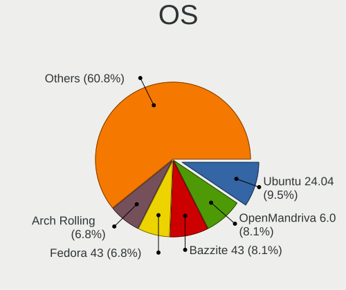

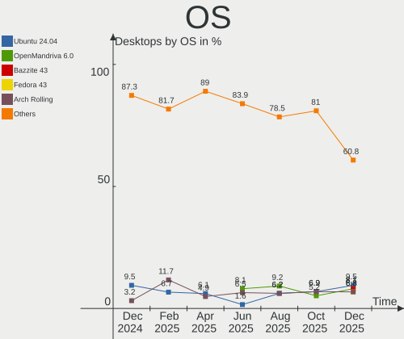

| Name                         | Desktops | Percent |
|------------------------------|----------|---------|
| Ubuntu 24.04                 | 7        | 9.46%   |
| OpenMandriva 6.0             | 6        | 8.11%   |
| Bazzite 43                   | 6        | 8.11%   |
| Fedora 43                    | 5        | 6.76%   |
| Arch Rolling                 | 5        | 6.76%   |
| OpenMandriva 25.90           | 4        | 5.41%   |
| CachyOS Rolling              | 4        | 5.41%   |
| Linux Mint 22.2              | 3        | 4.05%   |
| Gentoo 2.18                  | 3        | 4.05%   |
| Debian 13                    | 3        | 4.05%   |
| Salix 15.0                   | 2        | 2.7%    |
| Pop!_OS 24.04                | 2        | 2.7%    |
| openSUSE Tumbleweed-XXXXXXXX | 2        | 2.7%    |
| NixOS 26.05                  | 2        | 2.7%    |
| NixOS 25.11                  | 2        | 2.7%    |
| Zorin 18                     | 1        | 1.35%   |
| Zorin 17                     | 1        | 1.35%   |
| Ubuntu MATE 24.04            | 1        | 1.35%   |
| Pop!_OS 22.04                | 1        | 1.35%   |
| OpenMandriva 25.11           | 1        | 1.35%   |
| OpenMandriva 25.06           | 1        | 1.35%   |
| Nobara 43                    | 1        | 1.35%   |
| NixOS 25.05                  | 1        | 1.35%   |
| Manjaro 25.0.3               | 1        | 1.35%   |
| Lubuntu 22.04                | 1        | 1.35%   |
| Linux Mint 22.1              | 1        | 1.35%   |
| Kubuntu 25.10                | 1        | 1.35%   |
| Garuda Linux Soaring         | 1        | 1.35%   |
| Garuda Linux Rolling         | 1        | 1.35%   |
| Fedora 42                    | 1        | 1.35%   |
| Debian 12                    | 1        | 1.35%   |
| CachyOS                      | 1        | 1.35%   |
| Bluefin 43                   | 1        | 1.35%   |

OS Family
---------

OS without a version

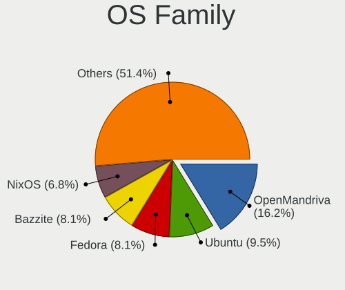

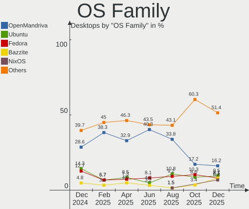

| Name         | Desktops | Percent |
|--------------|----------|---------|
| OpenMandriva | 12       | 16.22%  |
| Ubuntu       | 7        | 9.46%   |
| Fedora       | 6        | 8.11%   |
| Bazzite      | 6        | 8.11%   |
| NixOS        | 5        | 6.76%   |
| CachyOS      | 5        | 6.76%   |
| Arch         | 5        | 6.76%   |
| Linux Mint   | 4        | 5.41%   |
| Debian       | 4        | 5.41%   |
| Pop!_OS      | 3        | 4.05%   |
| Gentoo       | 3        | 4.05%   |
| Zorin        | 2        | 2.7%    |
| Salix        | 2        | 2.7%    |
| openSUSE     | 2        | 2.7%    |
| Garuda Linux | 2        | 2.7%    |
| Ubuntu MATE  | 1        | 1.35%   |
| Nobara       | 1        | 1.35%   |
| Manjaro      | 1        | 1.35%   |
| Lubuntu      | 1        | 1.35%   |
| Kubuntu      | 1        | 1.35%   |
| Bluefin      | 1        | 1.35%   |

Kernel
------

Version of the Linux kernel

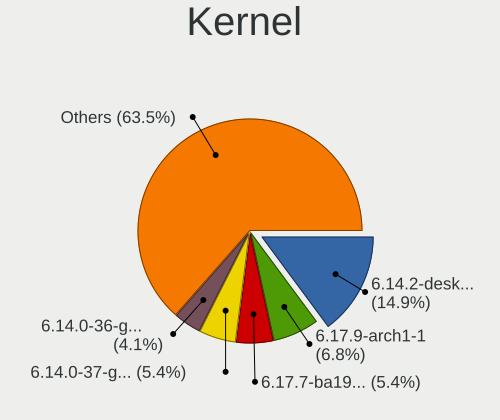

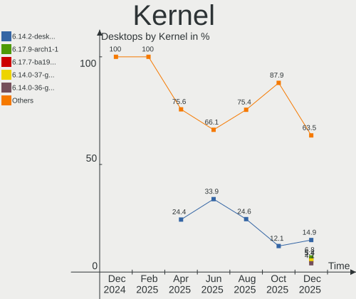

| Version                        | Desktops | Percent |
|--------------------------------|----------|---------|
| 6.14.2-desktop-3omv2590        | 11       | 14.86%  |
| 6.17.9-arch1-1                 | 5        | 6.76%   |
| 6.17.7-ba19.fc43.x86_64        | 4        | 5.41%   |
| 6.14.0-37-generic              | 4        | 5.41%   |
| 6.14.0-36-generic              | 3        | 4.05%   |
| 6.18.0-3-cachyos               | 2        | 2.7%    |
| 6.18.0-2-cachyos               | 2        | 2.7%    |
| 6.17.9-76061709-generic        | 2        | 2.7%    |
| 6.17.9-300.fc43.x86_64         | 2        | 2.7%    |
| 6.17.7-ba20.fc43.x86_64        | 2        | 2.7%    |
| 6.17.12-300.fc43.x86_64        | 2        | 2.7%    |
| 6.12.58-gentoo                 | 2        | 2.7%    |
| 6.12.48+deb13-amd64            | 2        | 2.7%    |
| 5.15.63                        | 2        | 2.7%    |
| 6.8.0-90-generic               | 1        | 1.35%   |
| 6.8.0-88-generic               | 1        | 1.35%   |
| 6.8.0-86-generic               | 1        | 1.35%   |
| 6.8.0-60-generic               | 1        | 1.35%   |
| 6.8.0-52-generic               | 1        | 1.35%   |
| 6.5.0-17-generic               | 1        | 1.35%   |
| 6.18.2-zen2-1-zen              | 1        | 1.35%   |
| 6.18.0-desktop-1omv2590        | 1        | 1.35%   |
| 6.18.0-2-default               | 1        | 1.35%   |
| 6.18.0                         | 1        | 1.35%   |
| 6.17.9-2-cachyos               | 1        | 1.35%   |
| 6.17.9-1-default               | 1        | 1.35%   |
| 6.17.9                         | 1        | 1.35%   |
| 6.17.4-76061704-generic        | 1        | 1.35%   |
| 6.17.13-200.fc42.x86_64        | 1        | 1.35%   |
| 6.17.12-200.nobara.fc43.x86_64 | 1        | 1.35%   |
| 6.17.11-300.fc43.x86_64        | 1        | 1.35%   |
| 6.17.10-300.fc43.x86_64        | 1        | 1.35%   |
| 6.17.0-8-generic               | 1        | 1.35%   |
| 6.14.0-27-generic              | 1        | 1.35%   |
| 6.12.61-1-lts                  | 1        | 1.35%   |
| 6.12.59-xanmod1                | 1        | 1.35%   |
| 6.12.59                        | 1        | 1.35%   |
| 6.12.57-xanmod1                | 1        | 1.35%   |
| 6.12.57+deb13-amd64            | 1        | 1.35%   |
| 6.12.41-gentoo                 | 1        | 1.35%   |

Kernel Family
-------------

Linux kernel without a distro release

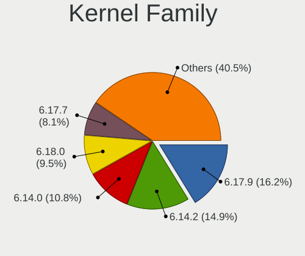

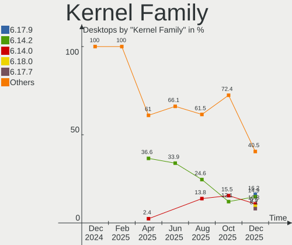

| Version | Desktops | Percent |
|---------|----------|---------|
| 6.17.9  | 12       | 16.22%  |
| 6.14.2  | 11       | 14.86%  |
| 6.14.0  | 8        | 10.81%  |
| 6.18.0  | 7        | 9.46%   |
| 6.17.7  | 6        | 8.11%   |
| 6.8.0   | 5        | 6.76%   |
| 6.17.12 | 3        | 4.05%   |
| 6.12.59 | 2        | 2.7%    |
| 6.12.58 | 2        | 2.7%    |
| 6.12.57 | 2        | 2.7%    |
| 6.12.48 | 2        | 2.7%    |
| 5.15.63 | 2        | 2.7%    |
| 6.5.0   | 1        | 1.35%   |
| 6.18.2  | 1        | 1.35%   |
| 6.17.4  | 1        | 1.35%   |
| 6.17.13 | 1        | 1.35%   |
| 6.17.11 | 1        | 1.35%   |
| 6.17.10 | 1        | 1.35%   |
| 6.17.0  | 1        | 1.35%   |
| 6.12.61 | 1        | 1.35%   |
| 6.12.41 | 1        | 1.35%   |
| 6.12.28 | 1        | 1.35%   |
| 6.11.0  | 1        | 1.35%   |
| 6.1.0   | 1        | 1.35%   |

Kernel Major Ver.
-----------------

Linux kernel major version

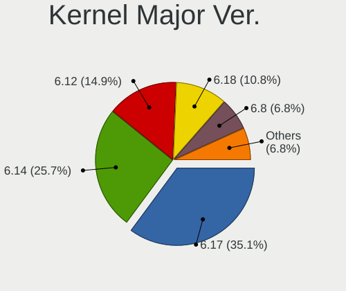

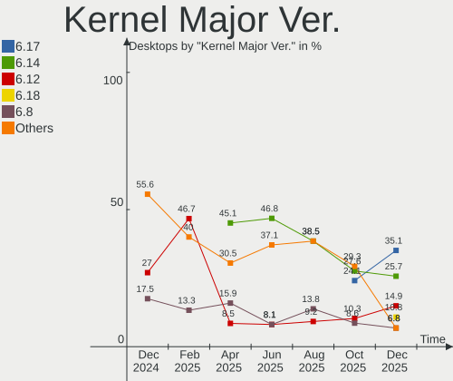

| Version | Desktops | Percent |
|---------|----------|---------|
| 6.17    | 26       | 35.14%  |
| 6.14    | 19       | 25.68%  |
| 6.12    | 11       | 14.86%  |
| 6.18    | 8        | 10.81%  |
| 6.8     | 5        | 6.76%   |
| 5.15    | 2        | 2.7%    |
| 6.5     | 1        | 1.35%   |
| 6.11    | 1        | 1.35%   |
| 6.1     | 1        | 1.35%   |

Arch
----

OS architecture (x86_64, i586, etc.)

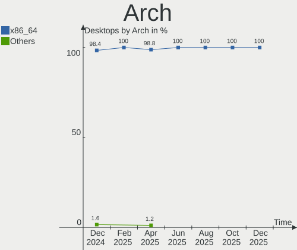

| Name   | Desktops | Percent |
|--------|----------|---------|
| x86_64 | 74       | 100%    |

DE
--

Desktop Environment

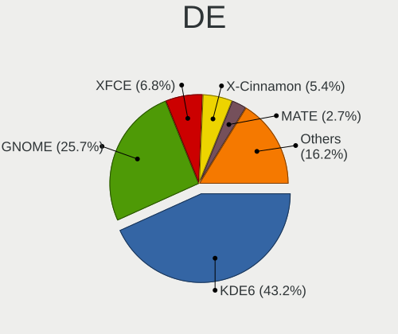

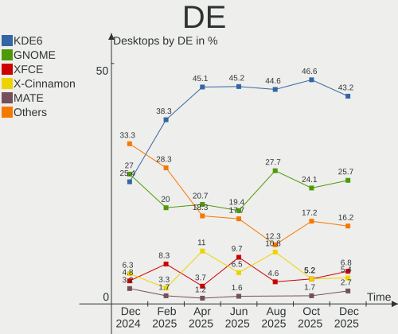

| Name       | Desktops | Percent |
|------------|----------|---------|
| KDE6       | 32       | 43.24%  |
| GNOME      | 19       | 25.68%  |
| XFCE       | 5        | 6.76%   |
| X-Cinnamon | 4        | 5.41%   |
| MATE       | 2        | 2.7%    |
| Hyprland   | 2        | 2.7%    |
| COSMIC     | 2        | 2.7%    |
| Unknown    | 2        | 2.7%    |
| TDE        | 1        | 1.35%   |
| niri       | 1        | 1.35%   |
| LXQt       | 1        | 1.35%   |
| LXDE       | 1        | 1.35%   |
| KDE5       | 1        | 1.35%   |
| KDE        | 1        | 1.35%   |

Display Server
--------------

X11 or Wayland

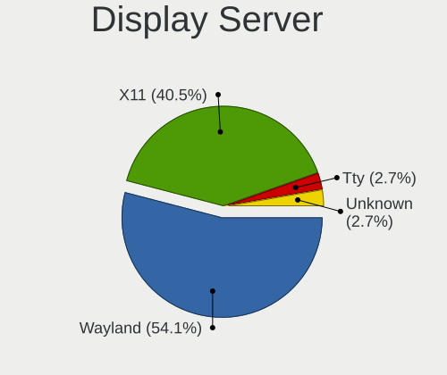

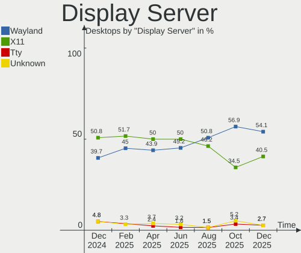

| Name    | Desktops | Percent |
|---------|----------|---------|
| Wayland | 40       | 54.05%  |
| X11     | 30       | 40.54%  |
| Tty     | 2        | 2.7%    |
| Unknown | 2        | 2.7%    |

Display Manager
---------------

SDDM, LightDM, etc.

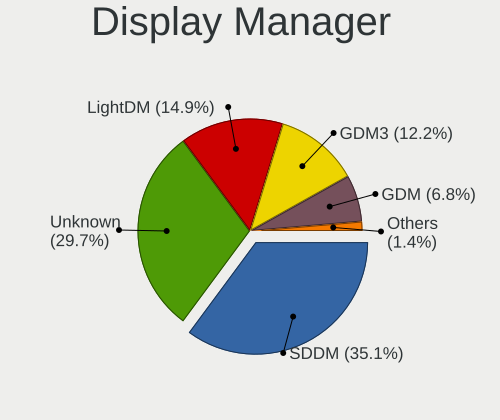

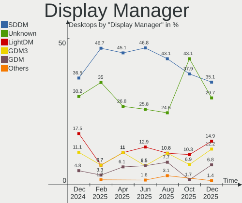

| Name    | Desktops | Percent |
|---------|----------|---------|
| SDDM    | 26       | 35.14%  |
| Unknown | 22       | 29.73%  |
| LightDM | 11       | 14.86%  |
| GDM3    | 9        | 12.16%  |
| GDM     | 5        | 6.76%   |
| GREETD  | 1        | 1.35%   |

OS Lang
-------

Language

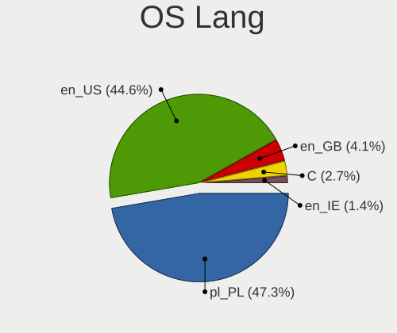

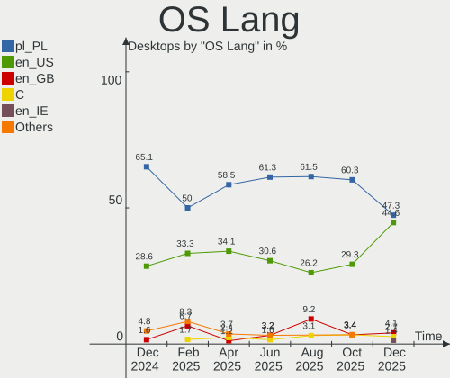

| Lang  | Desktops | Percent |
|-------|----------|---------|
| pl_PL | 35       | 47.3%   |
| en_US | 33       | 44.59%  |
| en_GB | 3        | 4.05%   |
| C     | 2        | 2.7%    |
| en_IE | 1        | 1.35%   |

Boot Mode
---------

EFI or BIOS

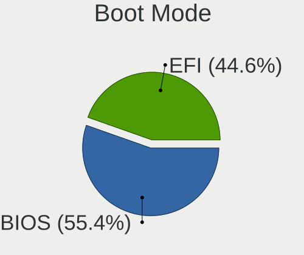

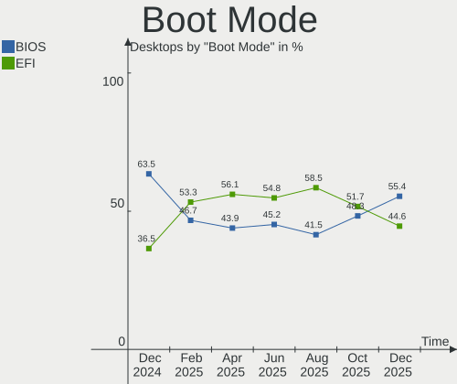

| Mode | Desktops | Percent |
|------|----------|---------|
| BIOS | 41       | 55.41%  |
| EFI  | 33       | 44.59%  |

Filesystem
----------

Type of filesystem

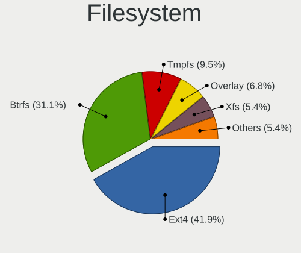

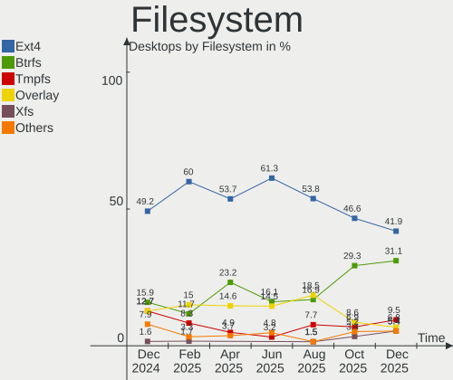

| Type    | Desktops | Percent |
|---------|----------|---------|
| Ext4    | 31       | 41.89%  |
| Btrfs   | 23       | 31.08%  |
| Tmpfs   | 7        | 9.46%   |
| Overlay | 5        | 6.76%   |
| Xfs     | 4        | 5.41%   |
| Zfs     | 2        | 2.7%    |
| F2fs    | 2        | 2.7%    |

Part. scheme
------------

Scheme of partitioning

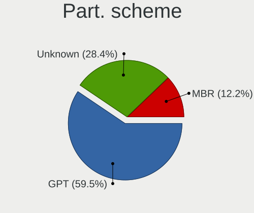

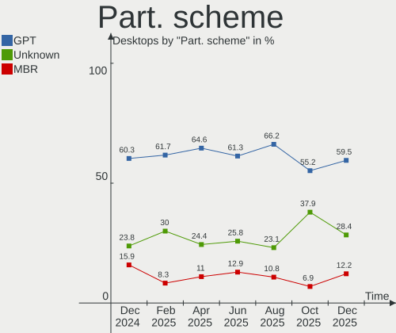

| Type    | Desktops | Percent |
|---------|----------|---------|
| GPT     | 44       | 59.46%  |
| Unknown | 21       | 28.38%  |
| MBR     | 9        | 12.16%  |

Dual Boot with Linux/BSD
------------------------

Hosting more than one Linux/BSD

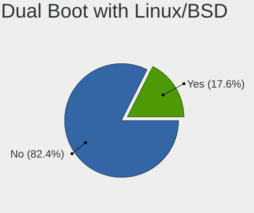

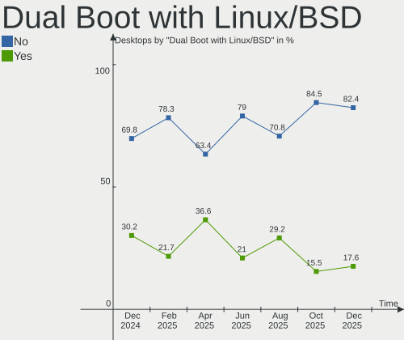

| Dual boot | Desktops | Percent |
|-----------|----------|---------|
| No        | 61       | 82.43%  |
| Yes       | 13       | 17.57%  |

Dual Boot (Win)
---------------

Hosting Linux and Windows

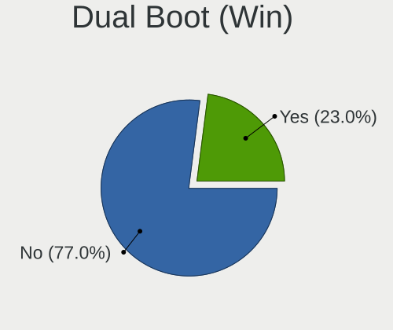

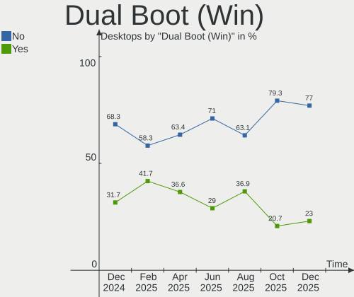

| Dual boot | Desktops | Percent |
|-----------|----------|---------|
| No        | 57       | 77.03%  |
| Yes       | 17       | 22.97%  |

Board
-----

Vendor
------

Motherboard manufacturer

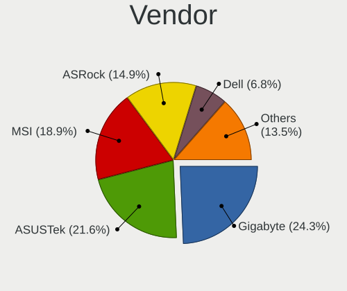

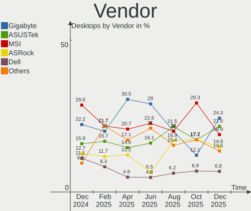

| Name                | Desktops | Percent |
|---------------------|----------|---------|
| Gigabyte Technology | 18       | 24.32%  |
| ASUSTek Computer    | 16       | 21.62%  |
| MSI                 | 14       | 18.92%  |
| ASRock              | 11       | 14.86%  |
| Dell                | 5        | 6.76%   |
| Hewlett-Packard     | 4        | 5.41%   |
| Fujitsu Siemens     | 2        | 2.7%    |
| Lenovo              | 1        | 1.35%   |
| Intel               | 1        | 1.35%   |
| GMKtec              | 1        | 1.35%   |
| Unknown             | 1        | 1.35%   |

Model
-----

Motherboard model

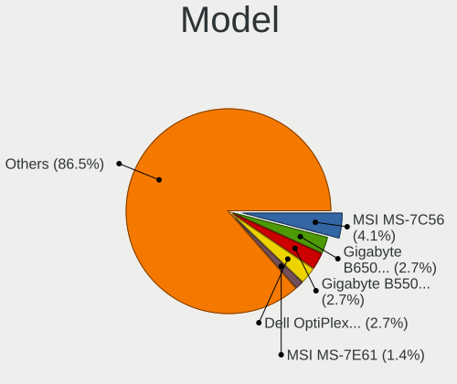

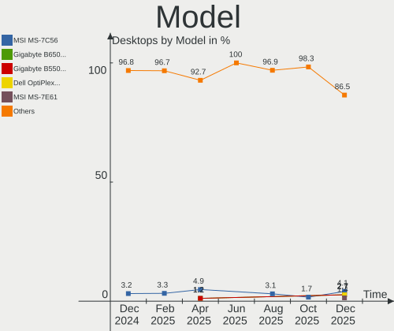

| Name                                      | Desktops | Percent |
|-------------------------------------------|----------|---------|
| MSI MS-7C56                               | 3        | 4.05%   |
| Gigabyte B650 EAGLE AX                    | 2        | 2.7%    |
| Gigabyte B550 GAMING X V2                 | 2        | 2.7%    |
| Dell OptiPlex 780                         | 2        | 2.7%    |
| MSI MS-7E61                               | 1        | 1.35%   |
| MSI MS-7E47                               | 1        | 1.35%   |
| MSI MS-7E27                               | 1        | 1.35%   |
| MSI MS-7E10                               | 1        | 1.35%   |
| MSI MS-7D52                               | 1        | 1.35%   |
| MSI MS-7C91                               | 1        | 1.35%   |
| MSI MS-7C71                               | 1        | 1.35%   |
| MSI MS-7C35                               | 1        | 1.35%   |
| MSI MS-7B89                               | 1        | 1.35%   |
| MSI MS-7B10                               | 1        | 1.35%   |
| MSI MS-7887                               | 1        | 1.35%   |
| Lenovo ThinkCentre M71e 3167C67           | 1        | 1.35%   |
| Intel DH67CL AAG10212-210                 | 1        | 1.35%   |
| HP Victus by 15L Gaming Desktop TG02-0xxx | 1        | 1.35%   |
| HP Compaq Pro 6300 SFF                    | 1        | 1.35%   |
| HP Compaq 8200 Elite CMT PC               | 1        | 1.35%   |
| HP Compaq 6005 Pro SFF PC                 | 1        | 1.35%   |
| GMKtec NucBox K8 Plus                     | 1        | 1.35%   |
| Gigabyte Z68AP-D3                         | 1        | 1.35%   |
| Gigabyte X870E AORUS PRO X3D ICE          | 1        | 1.35%   |
| Gigabyte X570 AORUS ULTRA                 | 1        | 1.35%   |
| Gigabyte OPTIMUS                          | 1        | 1.35%   |
| Gigabyte M56S-S3                          | 1        | 1.35%   |
| Gigabyte H81M-S2H                         | 1        | 1.35%   |
| Gigabyte H61M-S2-B3                       | 1        | 1.35%   |
| Gigabyte F2A88XM-DS2                      | 1        | 1.35%   |
| Gigabyte B650 GAMING X AX V2              | 1        | 1.35%   |
| Gigabyte B550M DS3H                       | 1        | 1.35%   |
| Gigabyte B450 AORUS ELITE V2              | 1        | 1.35%   |
| Gigabyte AB350-Gaming                     | 1        | 1.35%   |
| Gigabyte A520 AORUS ELITE                 | 1        | 1.35%   |
| Gigabyte 1009707_2120234                  | 1        | 1.35%   |
| Fujitsu Siemens ESPRIMO E5925             | 1        | 1.35%   |
| Fujitsu Siemens ESPRIMO E                 | 1        | 1.35%   |
| Dell Precision WorkStation T7500          | 1        | 1.35%   |
| Dell Precision Tower 5810                 | 1        | 1.35%   |

Model Family
------------

Motherboard model prefix

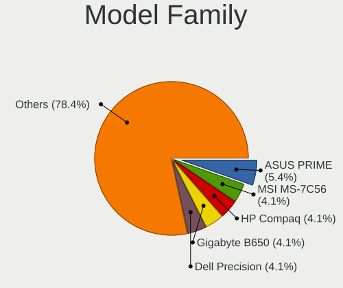

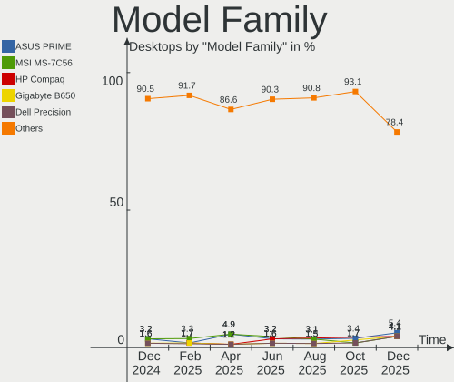

| Name                    | Desktops | Percent |
|-------------------------|----------|---------|
| ASUS PRIME              | 4        | 5.41%   |
| MSI MS-7C56             | 3        | 4.05%   |
| HP Compaq               | 3        | 4.05%   |
| Gigabyte B650           | 3        | 4.05%   |
| Dell Precision          | 3        | 4.05%   |
| Gigabyte B550           | 2        | 2.7%    |
| Fujitsu Siemens ESPRIMO | 2        | 2.7%    |
| Dell OptiPlex           | 2        | 2.7%    |
| ASUS TUF                | 2        | 2.7%    |
| ASUS ProArt             | 2        | 2.7%    |
| ASRock B850M            | 2        | 2.7%    |
| ASRock B650M            | 2        | 2.7%    |
| ASRock B550M            | 2        | 2.7%    |
| MSI MS-7E61             | 1        | 1.35%   |
| MSI MS-7E47             | 1        | 1.35%   |
| MSI MS-7E27             | 1        | 1.35%   |
| MSI MS-7E10             | 1        | 1.35%   |
| MSI MS-7D52             | 1        | 1.35%   |
| MSI MS-7C91             | 1        | 1.35%   |
| MSI MS-7C71             | 1        | 1.35%   |
| MSI MS-7C35             | 1        | 1.35%   |
| MSI MS-7B89             | 1        | 1.35%   |
| MSI MS-7B10             | 1        | 1.35%   |
| MSI MS-7887             | 1        | 1.35%   |
| Lenovo ThinkCentre      | 1        | 1.35%   |
| Intel DH67CL            | 1        | 1.35%   |
| HP Victus               | 1        | 1.35%   |
| GMKtec NucBox           | 1        | 1.35%   |
| Gigabyte Z68AP-D3       | 1        | 1.35%   |
| Gigabyte X870E          | 1        | 1.35%   |
| Gigabyte X570           | 1        | 1.35%   |
| Gigabyte OPTIMUS        | 1        | 1.35%   |
| Gigabyte M56S-S3        | 1        | 1.35%   |
| Gigabyte H81M-S2H       | 1        | 1.35%   |
| Gigabyte H61M-S2-B3     | 1        | 1.35%   |
| Gigabyte F2A88XM-DS2    | 1        | 1.35%   |
| Gigabyte B550M          | 1        | 1.35%   |
| Gigabyte B450           | 1        | 1.35%   |
| Gigabyte AB350-Gaming   | 1        | 1.35%   |
| Gigabyte A520           | 1        | 1.35%   |

MFG Year
--------

Motherboard manufacture year

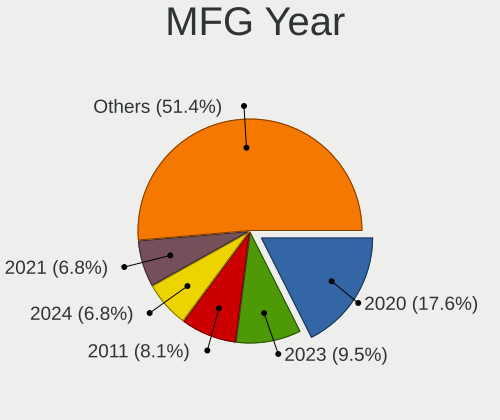

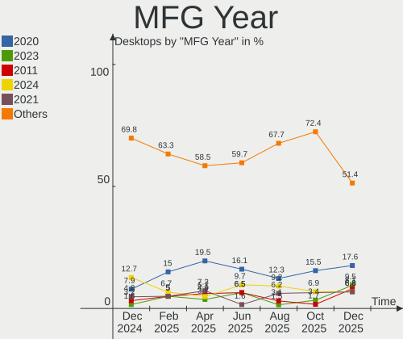

| Year | Desktops | Percent |
|------|----------|---------|
| 2020 | 13       | 17.57%  |
| 2023 | 7        | 9.46%   |
| 2011 | 6        | 8.11%   |
| 2024 | 5        | 6.76%   |
| 2021 | 5        | 6.76%   |
| 2018 | 5        | 6.76%   |
| 2025 | 4        | 5.41%   |
| 2019 | 4        | 5.41%   |
| 2017 | 4        | 5.41%   |
| 2015 | 4        | 5.41%   |
| 2009 | 3        | 4.05%   |
| 2022 | 2        | 2.7%    |
| 2013 | 2        | 2.7%    |
| 2012 | 2        | 2.7%    |
| 2010 | 2        | 2.7%    |
| 2008 | 2        | 2.7%    |
| 2007 | 2        | 2.7%    |
| 2016 | 1        | 1.35%   |
| 2014 | 1        | 1.35%   |

Form Factor
-----------

Physical design of the computer

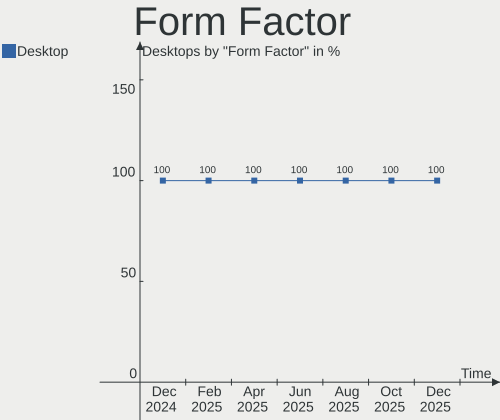

| Name    | Desktops | Percent |
|---------|----------|---------|
| Desktop | 74       | 100%    |

Secure Boot
-----------

Enabled or disabled

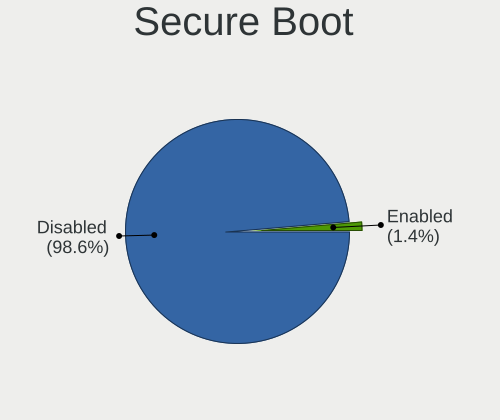

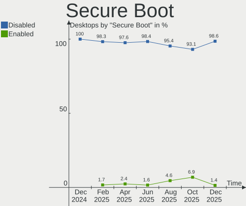

| State    | Desktops | Percent |
|----------|----------|---------|
| Disabled | 73       | 98.65%  |
| Enabled  | 1        | 1.35%   |

Coreboot
--------

Have coreboot on board

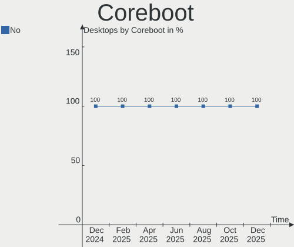

| Used | Desktops | Percent |
|------|----------|---------|
| No   | 74       | 100%    |

RAM Size
--------

Total RAM memory

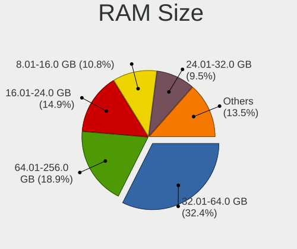

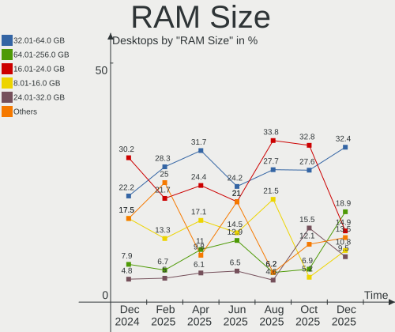

| Size in GB  | Desktops | Percent |
|-------------|----------|---------|
| 32.01-64.0  | 24       | 32.43%  |
| 64.01-256.0 | 14       | 18.92%  |
| 16.01-24.0  | 11       | 14.86%  |
| 8.01-16.0   | 8        | 10.81%  |
| 24.01-32.0  | 7        | 9.46%   |
| 4.01-8.0    | 5        | 6.76%   |
| 3.01-4.0    | 5        | 6.76%   |

RAM Used
--------

Used RAM memory

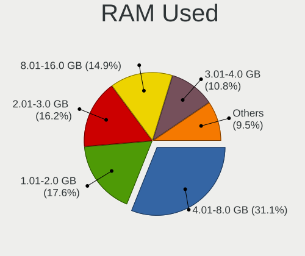

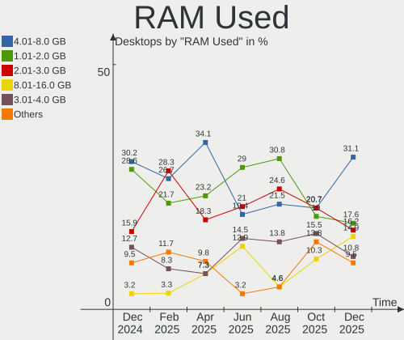

| Used GB     | Desktops | Percent |
|-------------|----------|---------|
| 4.01-8.0    | 23       | 31.08%  |
| 1.01-2.0    | 13       | 17.57%  |
| 2.01-3.0    | 12       | 16.22%  |
| 8.01-16.0   | 11       | 14.86%  |
| 3.01-4.0    | 8        | 10.81%  |
| 24.01-32.0  | 3        | 4.05%   |
| 64.01-256.0 | 2        | 2.7%    |
| 32.01-64.0  | 1        | 1.35%   |
| 16.01-24.0  | 1        | 1.35%   |

Total Drives
------------

Number of drives on board

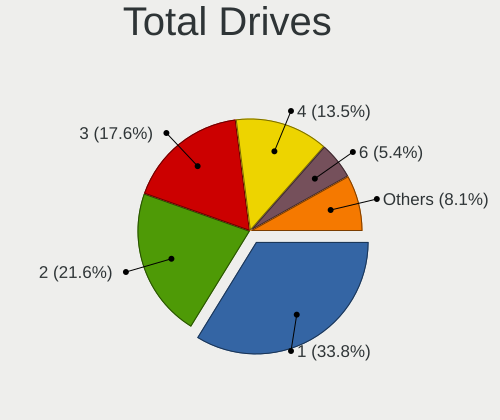

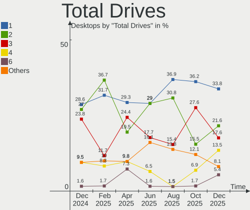

| Drives | Desktops | Percent |
|--------|----------|---------|
| 1      | 25       | 33.78%  |
| 2      | 16       | 21.62%  |
| 3      | 13       | 17.57%  |
| 4      | 10       | 13.51%  |
| 6      | 4        | 5.41%   |
| 5      | 4        | 5.41%   |
| 7      | 1        | 1.35%   |
| 0      | 1        | 1.35%   |

Has CD-ROM
----------

Has CD-ROM on board

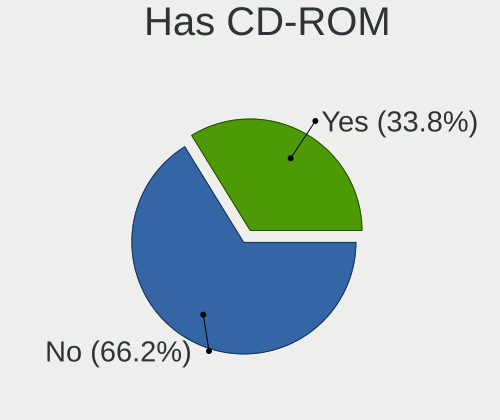

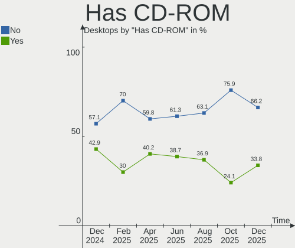

| Presented | Desktops | Percent |
|-----------|----------|---------|
| No        | 49       | 66.22%  |
| Yes       | 25       | 33.78%  |

Has Ethernet
------------

Has Ethernet on board

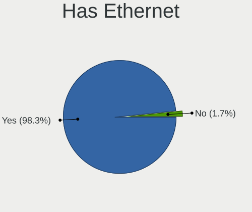

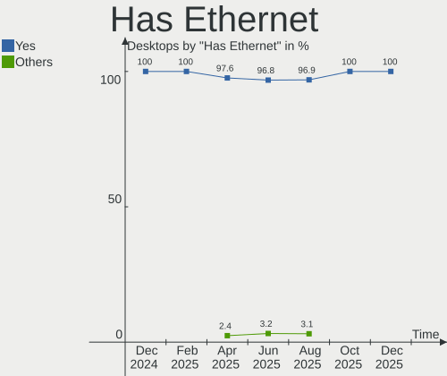

| Presented | Desktops | Percent |
|-----------|----------|---------|
| Yes       | 74       | 100%    |

Has WiFi
--------

Has WiFi module

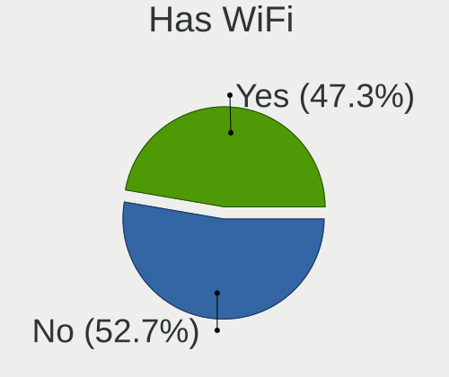

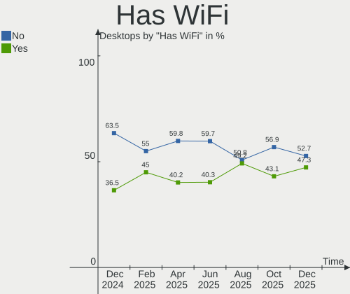

| Presented | Desktops | Percent |
|-----------|----------|---------|
| No        | 39       | 52.7%   |
| Yes       | 35       | 47.3%   |

Has Bluetooth
-------------

Has Bluetooth module

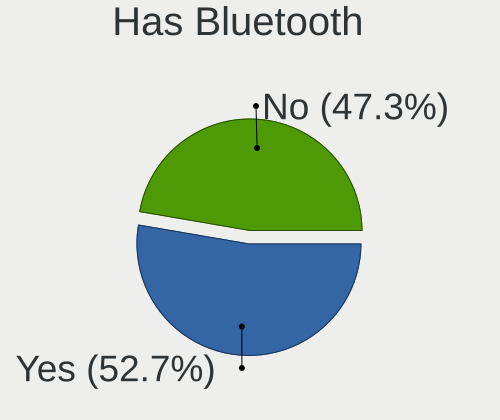

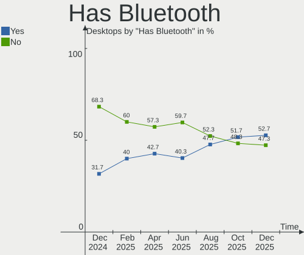

| Presented | Desktops | Percent |
|-----------|----------|---------|
| Yes       | 39       | 52.7%   |
| No        | 35       | 47.3%   |

Location
--------

Country
-------

Geographic location (country)

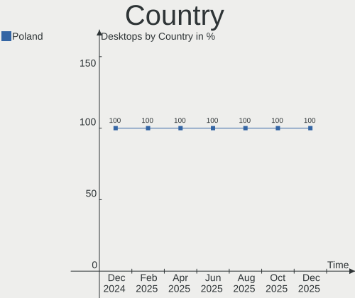

| Country | Desktops | Percent |
|---------|----------|---------|
| Poland  | 74       | 100%    |

City
----

Geographic location (city)

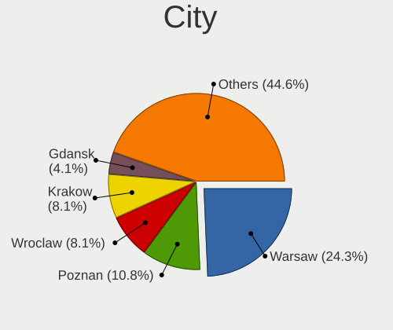

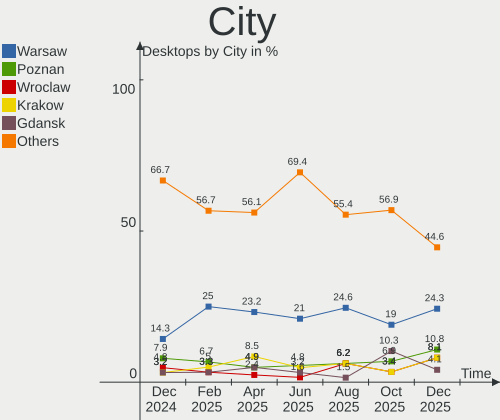

| City              | Desktops | Percent |
|-------------------|----------|---------|
| Warsaw            | 18       | 24.32%  |
| Poznan            | 8        | 10.81%  |
| Wroclaw           | 6        | 8.11%   |
| Krakow            | 6        | 8.11%   |
| Gdansk            | 3        | 4.05%   |
| Tychy             | 2        | 2.7%    |
| Lodz              | 2        | 2.7%    |
| Kielce            | 2        | 2.7%    |
| Bydgoszcz         | 2        | 2.7%    |
| Żyrardów        | 1        | 1.35%   |
| Wołomin          | 1        | 1.35%   |
| Trzebusz          | 1        | 1.35%   |
| Sierpc            | 1        | 1.35%   |
| Pstragowa         | 1        | 1.35%   |
| Przasnysz         | 1        | 1.35%   |
| Pruszków         | 1        | 1.35%   |
| Osiedle-Nowiny    | 1        | 1.35%   |
| Odolanów         | 1        | 1.35%   |
| Mozdzanow         | 1        | 1.35%   |
| Lubaczow          | 1        | 1.35%   |
| Krotoszyn         | 1        | 1.35%   |
| Kościan          | 1        | 1.35%   |
| Konin             | 1        | 1.35%   |
| Kętrzyn          | 1        | 1.35%   |
| Katowice          | 1        | 1.35%   |
| Gmina Sierakowice | 1        | 1.35%   |
| Gmina Połaniec   | 1        | 1.35%   |
| Darłowo          | 1        | 1.35%   |
| Czluchow          | 1        | 1.35%   |
| Częstochowa      | 1        | 1.35%   |
| Błonie           | 1        | 1.35%   |
| Bytom             | 1        | 1.35%   |
| Bielsko-Biala     | 1        | 1.35%   |
| Bełchatów       | 1        | 1.35%   |

Drives
------

Drive Vendor
------------

Hard drive vendors

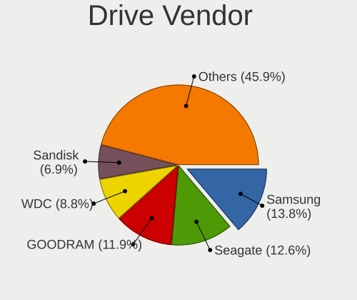

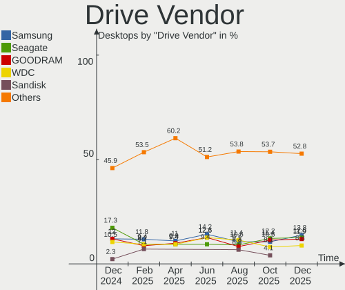

| Vendor                       | Desktops | Drives | Percent |
|------------------------------|----------|--------|---------|
| Samsung Electronics          | 22       | 28     | 13.84%  |
| Seagate                      | 20       | 21     | 12.58%  |
| GOODRAM                      | 19       | 22     | 11.95%  |
| WDC                          | 14       | 18     | 8.81%   |
| Sandisk                      | 11       | 12     | 6.92%   |
| Toshiba                      | 6        | 7      | 3.77%   |
| Kingston                     | 6        | 6      | 3.77%   |
| Crucial                      | 6        | 8      | 3.77%   |
| ADATA Technology             | 6        | 7      | 3.77%   |
| Shenzhen Longsys Electronics | 5        | 5      | 3.14%   |
| MAXIO Technology (Hangzhou)  | 5        | 7      | 3.14%   |
| Phison Electronics           | 4        | 5      | 2.52%   |
| Hitachi                      | 4        | 6      | 2.52%   |
| A-DATA Technology            | 4        | 6      | 2.52%   |
| Micron/Crucial Technology    | 3        | 4      | 1.89%   |
| Micron Technology            | 3        | 4      | 1.89%   |
| Realtek Semiconductor        | 2        | 2      | 1.26%   |
| PNY                          | 2        | 2      | 1.26%   |
| Lexar                        | 2        | 2      | 1.26%   |
| Kingston Technology Company  | 2        | 2      | 1.26%   |
| Viper                        | 1        | 1      | 0.63%   |
| Transcend                    | 1        | 1      | 0.63%   |
| T-FORCE                      | 1        | 1      | 0.63%   |
| Synology                     | 1        | 1      | 0.63%   |
| SPCC                         | 1        | 1      | 0.63%   |
| Silicon Motion               | 1        | 1      | 0.63%   |
| Plextor                      | 1        | 1      | 0.63%   |
| Phison                       | 1        | 1      | 0.63%   |
| Patriot                      | 1        | 1      | 0.63%   |
| KIOXIA                       | 1        | 3      | 0.63%   |
| Intel                        | 1        | 1      | 0.63%   |
| Gigabyte Technology          | 1        | 1      | 0.63%   |
| Unknown                      | 1        | 2      | 0.63%   |

Drive Model
-----------

Hard drive models

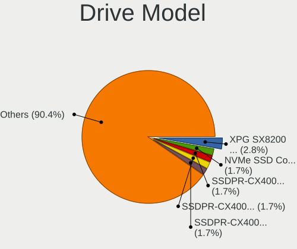

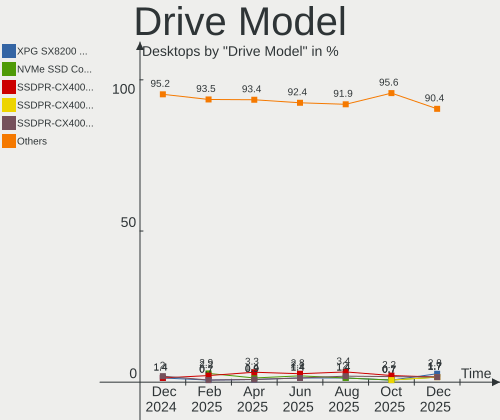

| Model                                                              | Desktops | Percent |
|--------------------------------------------------------------------|----------|---------|
| ADATA XPG SX8200 Pro PCIe Gen3x4 M.2 2280 Solid State Drive 1024GB | 5        | 2.82%   |
| MAXIO (Hangzhou) NVMe SSD Controller MAP1202 2TB                   | 3        | 1.69%   |
| GOODRAM SSDPR-CX400-512-G2 512GB                                   | 3        | 1.69%   |
| GOODRAM SSDPR-CX400-02T-G2 2TB                                     | 3        | 1.69%   |
| GOODRAM SSDPR-CX400-01T-G2 1TB                                     | 3        | 1.69%   |
| Toshiba HDWD120 2TB                                                | 2        | 1.13%   |
| Seagate ST2000DM008-2FR102 2TB                                     | 2        | 1.13%   |
| Sandisk WD_BLACK SN770 2TB                                         | 2        | 1.13%   |
| Sandisk WD_BLACK SN7100 2TB                                        | 2        | 1.13%   |
| Samsung SSD 990 PRO 1TB                                            | 2        | 1.13%   |
| Samsung SSD 9100 PRO 2TB                                           | 2        | 1.13%   |
| Samsung HD502HJ 500GB                                              | 2        | 1.13%   |
| Phison E12 NVMe Controller 1TB                                     | 2        | 1.13%   |
| Kingston SFYRS1000G 1TB                                            | 2        | 1.13%   |
| GOODRAM SSDPR-CX400-256-G2 256GB                                   | 2        | 1.13%   |
| GOODRAM SSDPR-CX300-120 120GB                                      | 2        | 1.13%   |
| GOODRAM SSDPR-CL100-960-G3 960GB                                   | 2        | 1.13%   |
| WDC WUH721816ALE6L0 16TB                                           | 1        | 0.56%   |
| WDC WDS500G2B0A-00SM50 500GB                                       | 1        | 0.56%   |
| WDC WD5000LPLX-75ZNTT0 500GB                                       | 1        | 0.56%   |
| WDC WD5000AAKS-07V0A0 500GB                                        | 1        | 0.56%   |
| WDC WD5000AADS-00S9B0 500GB                                        | 1        | 0.56%   |
| WDC WD5000AADS-00M2B0 500GB                                        | 1        | 0.56%   |
| WDC WD40EFPX-68C6CN0 4TB                                           | 1        | 0.56%   |
| WDC WD2500AAJS-75M0A0 249GB                                        | 1        | 0.56%   |
| WDC WD20EARX-00PASB0 2TB                                           | 1        | 0.56%   |
| WDC WD10EZEX-75WN4A0 1TB                                           | 1        | 0.56%   |
| WDC WD10EZEX-35WN4A0 1TB                                           | 1        | 0.56%   |
| WDC WD10EZEX-08WN4A0 1TB                                           | 1        | 0.56%   |
| WDC WD10EZEX-00WN4A0 1TB                                           | 1        | 0.56%   |
| WDC WD10EARX-00N0YB0 1TB                                           | 1        | 0.56%   |
| WDC WD10EARS-00Y5B1 1TB                                            | 1        | 0.56%   |
| WDC WD1003FZEX-00MK2A0 1TB                                         | 1        | 0.56%   |
| WDC WD1003FZEX-00K3CA0 1TB                                         | 1        | 0.56%   |
| Viper NVMe SSD Drive 1024GB                                        | 1        | 0.56%   |
| Transcend TS128GSSD370 128GB                                       | 1        | 0.56%   |
| Toshiba MK5059GSXP 500GB                                           | 1        | 0.56%   |
| Toshiba HDWE150 5TB                                                | 1        | 0.56%   |
| Toshiba HDWD130 3TB                                                | 1        | 0.56%   |
| Toshiba DT01ACA050 500GB                                           | 1        | 0.56%   |

HDD Vendor
----------

Hard disk drive vendors

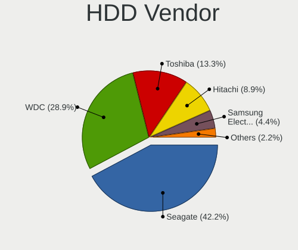

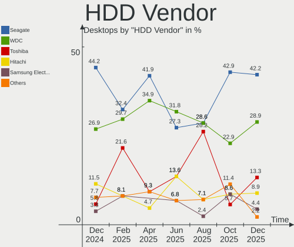

| Vendor              | Desktops | Drives | Percent |
|---------------------|----------|--------|---------|
| Seagate             | 19       | 20     | 42.22%  |
| WDC                 | 13       | 17     | 28.89%  |
| Toshiba             | 6        | 7      | 13.33%  |
| Hitachi             | 4        | 6      | 8.89%   |
| Samsung Electronics | 2        | 2      | 4.44%   |
| Synology            | 1        | 1      | 2.22%   |

SSD Vendor
----------

Solid state drive vendors

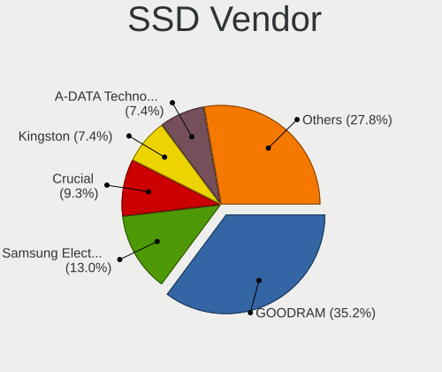

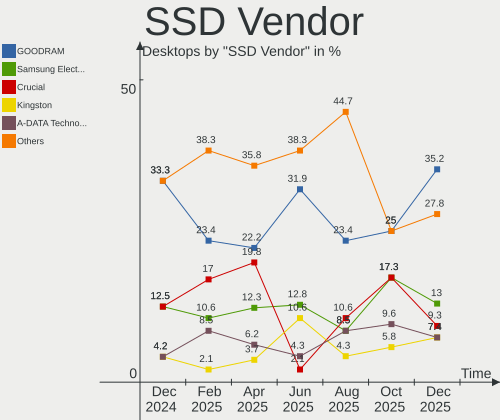

| Vendor              | Desktops | Drives | Percent |
|---------------------|----------|--------|---------|
| GOODRAM             | 19       | 22     | 35.19%  |
| Samsung Electronics | 7        | 7      | 12.96%  |
| Crucial             | 5        | 7      | 9.26%   |
| Kingston            | 4        | 4      | 7.41%   |
| A-DATA Technology   | 4        | 5      | 7.41%   |
| SanDisk             | 2        | 2      | 3.7%    |
| PNY                 | 2        | 2      | 3.7%    |
| Micron Technology   | 2        | 3      | 3.7%    |
| Lexar               | 2        | 2      | 3.7%    |
| WDC                 | 1        | 1      | 1.85%   |
| Transcend           | 1        | 1      | 1.85%   |
| T-FORCE             | 1        | 1      | 1.85%   |
| SPCC                | 1        | 1      | 1.85%   |
| Plextor             | 1        | 1      | 1.85%   |
| Patriot             | 1        | 1      | 1.85%   |
| Gigabyte Technology | 1        | 1      | 1.85%   |

Drive Kind
----------

HDD or SSD

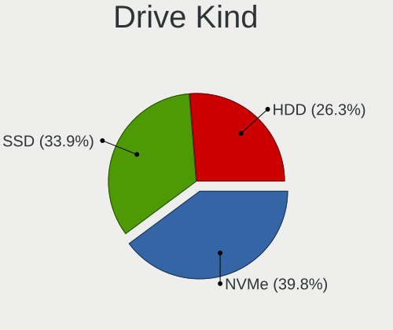

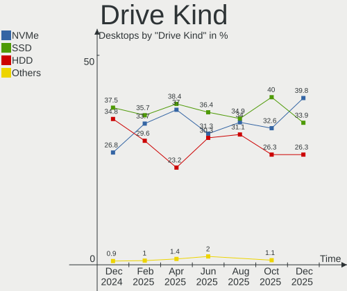

| Kind | Desktops | Drives | Percent |
|------|----------|--------|---------|
| NVMe | 47       | 76     | 39.83%  |
| SSD  | 40       | 61     | 33.9%   |
| HDD  | 31       | 53     | 26.27%  |

Drive Connector
---------------

SATA, SAS, NVMe, etc.

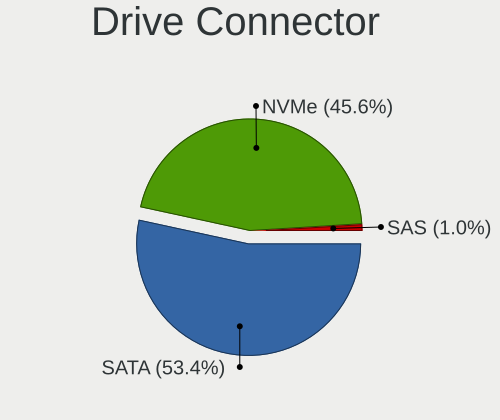

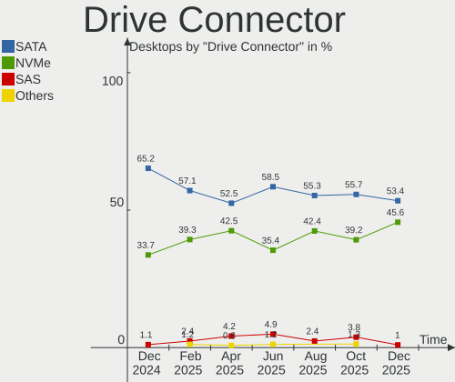

| Type | Desktops | Drives | Percent |
|------|----------|--------|---------|
| SATA | 55       | 113    | 53.4%   |
| NVMe | 47       | 76     | 45.63%  |
| SAS  | 1        | 1      | 0.97%   |

Drive Size
----------

Size of hard drive

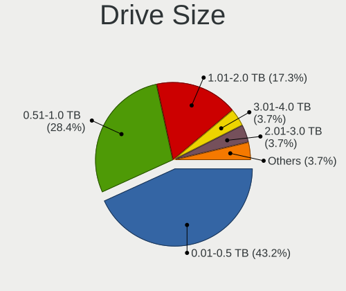

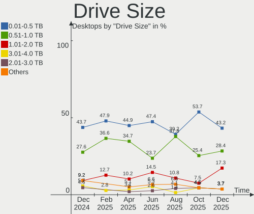

| Size in TB | Desktops | Drives | Percent |
|------------|----------|--------|---------|
| 0.01-0.5   | 35       | 49     | 43.21%  |
| 0.51-1.0   | 23       | 33     | 28.4%   |
| 1.01-2.0   | 14       | 14     | 17.28%  |
| 3.01-4.0   | 3        | 8      | 3.7%    |
| 2.01-3.0   | 3        | 6      | 3.7%    |
| 4.01-10.0  | 2        | 2      | 2.47%   |
| 10.01-20.0 | 1        | 2      | 1.23%   |

Space Total
-----------

Amount of disk space available on the file system

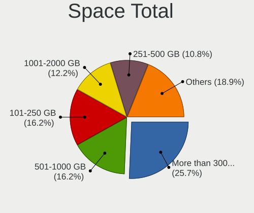

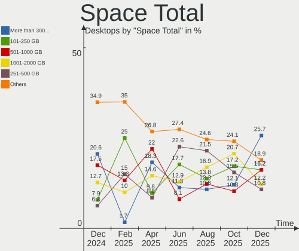

| Size in GB     | Desktops | Percent |
|----------------|----------|---------|
| More than 3000 | 19       | 25.68%  |
| 101-250        | 12       | 16.22%  |
| 501-1000       | 12       | 16.22%  |
| 1001-2000      | 9        | 12.16%  |
| 251-500        | 8        | 10.81%  |
| 2001-3000      | 5        | 6.76%   |
| 1-20           | 5        | 6.76%   |
| Unknown        | 3        | 4.05%   |
| 51-100         | 1        | 1.35%   |

Space Used
----------

Amount of used disk space

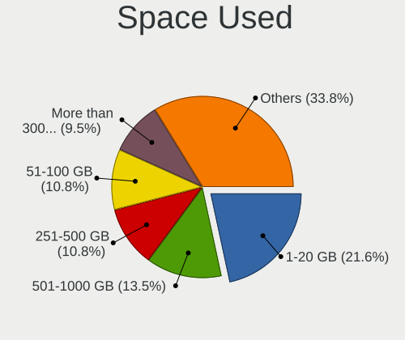

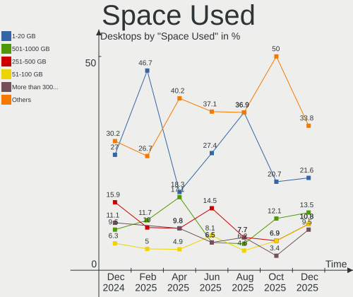

| Used GB        | Desktops | Percent |
|----------------|----------|---------|
| 1-20           | 16       | 21.62%  |
| 501-1000       | 10       | 13.51%  |
| 251-500        | 8        | 10.81%  |
| 51-100         | 8        | 10.81%  |
| More than 3000 | 7        | 9.46%   |
| 101-250        | 7        | 9.46%   |
| 1001-2000      | 7        | 9.46%   |
| 2001-3000      | 5        | 6.76%   |
| 21-50          | 3        | 4.05%   |
| Unknown        | 3        | 4.05%   |

Malfunc. Drives
---------------

Drive models with a malfunction

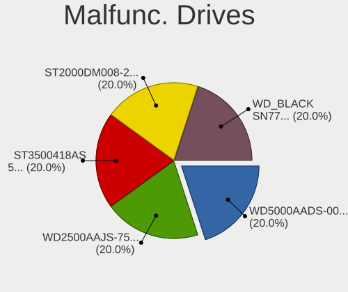

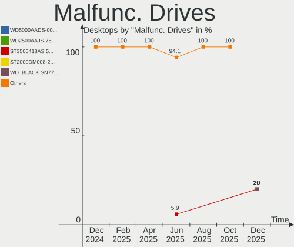

| Model                          | Desktops | Drives | Percent |
|--------------------------------|----------|--------|---------|
| WDC WD5000AADS-00S9B0 500GB    | 1        | 1      | 20%     |
| WDC WD2500AAJS-75M0A0 249GB    | 1        | 1      | 20%     |
| Seagate ST3500418AS 500GB      | 1        | 1      | 20%     |
| Seagate ST2000DM008-2FR102 2TB | 1        | 1      | 20%     |
| Sandisk WD_BLACK SN770 2TB     | 1        | 1      | 20%     |

Malfunc. Drive Vendor
---------------------

Vendors of faulty drives

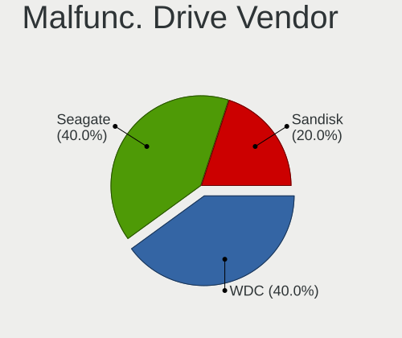

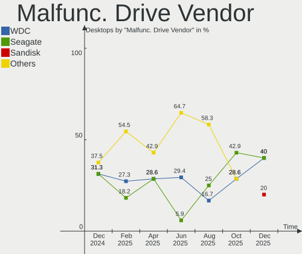

| Vendor  | Desktops | Drives | Percent |
|---------|----------|--------|---------|
| WDC     | 2        | 2      | 40%     |
| Seagate | 2        | 2      | 40%     |
| Sandisk | 1        | 1      | 20%     |

Malfunc. HDD Vendor
-------------------

Vendors of faulty HDD drives

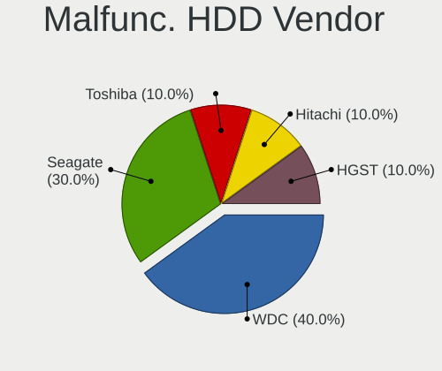

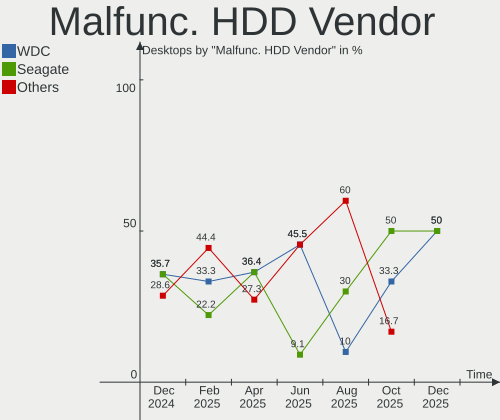

| Vendor  | Desktops | Drives | Percent |
|---------|----------|--------|---------|
| WDC     | 2        | 2      | 50%     |
| Seagate | 2        | 2      | 50%     |

Malfunc. Drive Kind
-------------------

Kinds of faulty drives

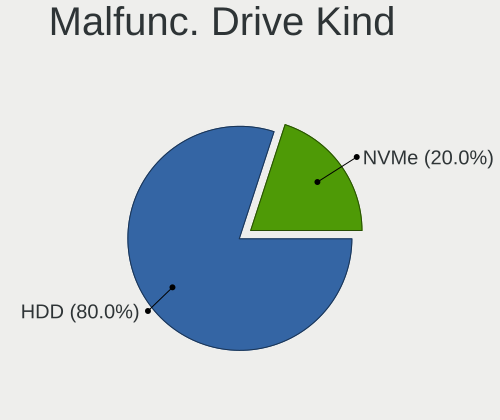

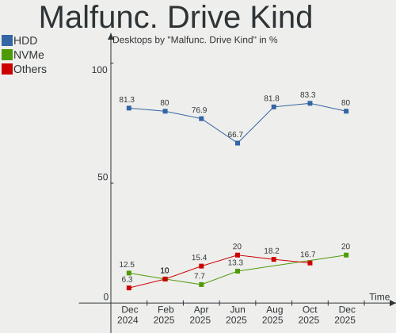

| Kind | Desktops | Drives | Percent |
|------|----------|--------|---------|
| HDD  | 4        | 4      | 80%     |
| NVMe | 1        | 1      | 20%     |

Failed Drives
-------------

Failed drive models

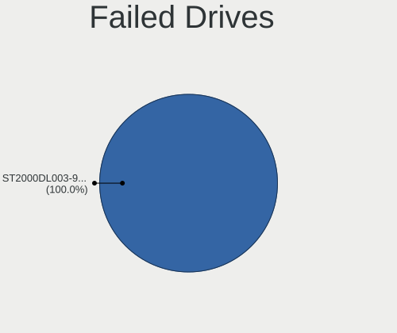

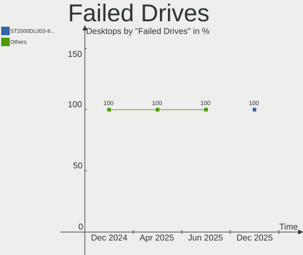

| Model                          | Desktops | Drives | Percent |
|--------------------------------|----------|--------|---------|
| Seagate ST2000DL003-9VT166 2TB | 1        | 1      | 100%    |

Failed Drive Vendor
-------------------

Failed drive vendors

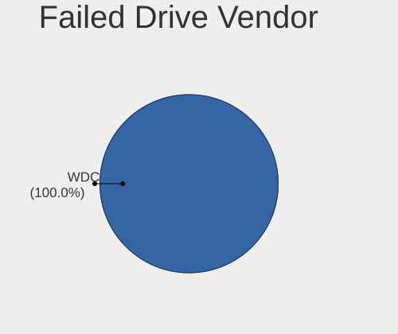

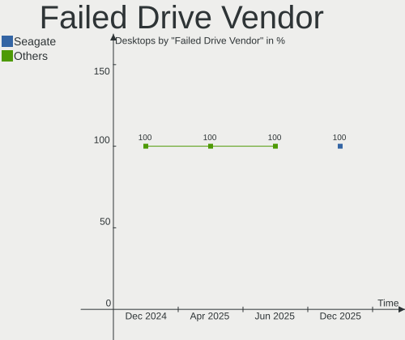

| Vendor  | Desktops | Drives | Percent |
|---------|----------|--------|---------|
| Seagate | 1        | 1      | 100%    |

Drive Status
------------

Number of failed and malfunc. drives

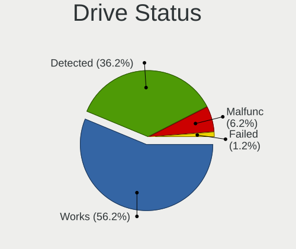

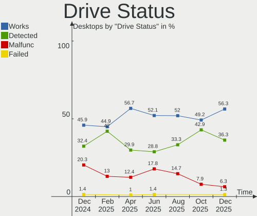

| Status   | Desktops | Drives | Percent |
|----------|----------|--------|---------|
| Works    | 45       | 100    | 56.25%  |
| Detected | 29       | 84     | 36.25%  |
| Malfunc  | 5        | 5      | 6.25%   |
| Failed   | 1        | 1      | 1.25%   |

Storage controller
------------------

Storage Vendor
--------------

Storage controller vendors

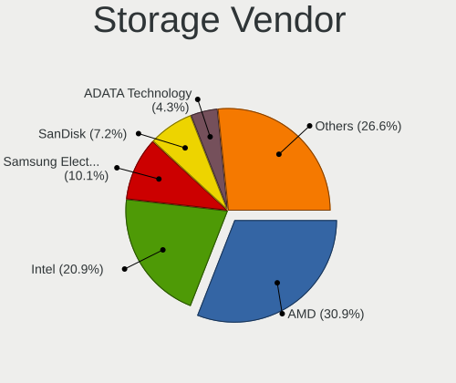

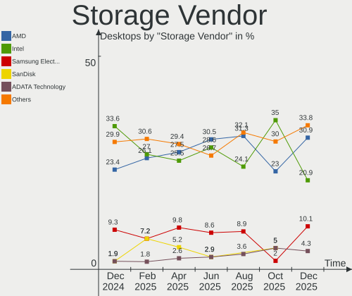

| Vendor                       | Desktops | Percent |
|------------------------------|----------|---------|
| AMD                          | 43       | 30.94%  |
| Intel                        | 29       | 20.86%  |
| Samsung Electronics          | 14       | 10.07%  |
| SanDisk                      | 10       | 7.19%   |
| ADATA Technology             | 6        | 4.32%   |
| Shenzhen Longsys Electronics | 5        | 3.6%    |
| Phison Electronics           | 5        | 3.6%    |
| MAXIO Technology (Hangzhou)  | 5        | 3.6%    |
| Kingston Technology Company  | 4        | 2.88%   |
| ASMedia Technology           | 4        | 2.88%   |
| Micron/Crucial Technology    | 3        | 2.16%   |
| Realtek Semiconductor        | 2        | 1.44%   |
| Silicon Motion               | 1        | 0.72%   |
| Seagate Technology           | 1        | 0.72%   |
| Nvidia                       | 1        | 0.72%   |
| Micron Technology            | 1        | 0.72%   |
| Marvell Technology Group     | 1        | 0.72%   |
| LSI Logic / Symbios Logic    | 1        | 0.72%   |
| KIOXIA                       | 1        | 0.72%   |
| JMicron Technology           | 1        | 0.72%   |
| INNOGRIT                     | 1        | 0.72%   |

Storage Model
-------------

Storage controller models

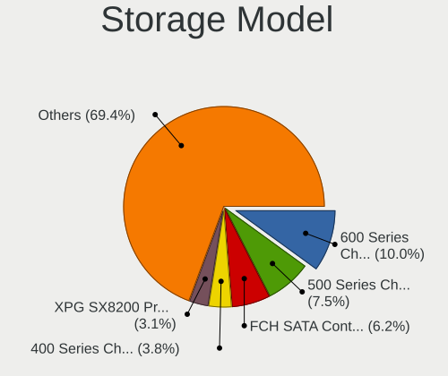

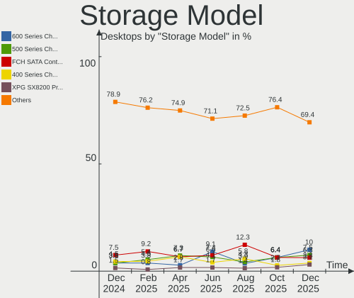

| Model                                                                                                              | Desktops | Percent |
|--------------------------------------------------------------------------------------------------------------------|----------|---------|
| AMD 600 Series Chipset SATA Controller                                                                             | 16       | 10%     |
| AMD 500 Series Chipset SATA Controller                                                                             | 12       | 7.5%    |
| AMD FCH SATA Controller [AHCI mode]                                                                                | 10       | 6.25%   |
| AMD 400 Series Chipset SATA Controller                                                                             | 6        | 3.75%   |
| ADATA XPG SX8200 Pro PCIe Gen3x4 M.2 2280 Solid State Drive                                                        | 5        | 3.13%   |
| Shenzhen Longsys Lexar NM790 / Patriot Viper VP4300 Lite NVMe SSD (DRAM-less)                                      | 3        | 1.88%   |
| SanDisk WD SN560/SN740/SN770/SN5000 NVMe SSD                                                                       | 3        | 1.88%   |
| Samsung NVMe SSD Controller SM981/PM981/PM983                                                                      | 3        | 1.88%   |
| Samsung NVMe SSD Controller S4LV008[Pascal]                                                                        | 3        | 1.88%   |
| MAXIO (Hangzhou) NVMe SSD Controller MAP1202 (DRAM-less)                                                           | 3        | 1.88%   |
| Kingston Company KC3000/FURY Renegade NVMe SSD [E18]                                                               | 3        | 1.88%   |
| Intel 8 Series/C220 Series Chipset Family 6-port SATA Controller 1 [AHCI mode]                                     | 3        | 1.88%   |
| Intel 6 Series/C200 Series Chipset Family 6 port Desktop SATA AHCI Controller                                      | 3        | 1.88%   |
| Intel 200 Series PCH SATA controller [AHCI mode]                                                                   | 3        | 1.88%   |
| ASMedia ASM1061/ASM1062 Serial ATA Controller                                                                      | 3        | 1.88%   |
| Sandisk WD_BLACK SN7100/WD PC SN7100S M.2 2280 NVMe SSD (DRAM-less)                                                | 2        | 1.25%   |
| Sandisk WD Black SN850X NVMe SSD                                                                                   | 2        | 1.25%   |
| Samsung NVMe SSD Controller PM9C1a (DRAM-less)                                                                     | 2        | 1.25%   |
| Samsung NVMe SSD Controller PM9A1/PM9A3/980PRO                                                                     | 2        | 1.25%   |
| Samsung NVMe SSD Controller 980 (DRAM-less)                                                                        | 2        | 1.25%   |
| Samsung NVMe SSD 9100 PRO [PM9E1]                                                                                  | 2        | 1.25%   |
| Realtek RTS5765DL NVMe SSD Controller (DRAM-less)                                                                  | 2        | 1.25%   |
| Phison PS5027-E27T PCIe4 NVMe Controller (DRAM-less)                                                               | 2        | 1.25%   |
| Phison PS5021-E21 PCIe4 NVMe Controller (DRAM-less)                                                                | 2        | 1.25%   |
| Phison E12 NVMe Controller                                                                                         | 2        | 1.25%   |
| MAXIO (Hangzhou) NVMe SSD Controller MAP1602 (DRAM-less)                                                           | 2        | 1.25%   |
| Intel SATA Controller [RAID Mode]                                                                                  | 2        | 1.25%   |
| Intel Q170/Q150/B150/H170/H110/Z170/CM236 Chipset SATA Controller [AHCI Mode]                                      | 2        | 1.25%   |
| Intel Comet Lake SATA AHCI Controller                                                                              | 2        | 1.25%   |
| Intel Cannon Lake PCH SATA AHCI Controller                                                                         | 2        | 1.25%   |
| Intel 82801JI (ICH10 Family) SATA AHCI Controller                                                                  | 2        | 1.25%   |
| Intel 7 Series/C210 Series Chipset Family 6-port SATA Controller [AHCI mode]                                       | 2        | 1.25%   |
| Intel 6 Series/C200 Series Chipset Family Desktop SATA Controller (IDE mode, ports 4-5)                            | 2        | 1.25%   |
| Intel 6 Series/C200 Series Chipset Family Desktop SATA Controller (IDE mode, ports 0-3)                            | 2        | 1.25%   |
| AMD SB7x0/SB8x0/SB9x0 SATA Controller [IDE mode]                                                                   | 2        | 1.25%   |
| AMD SB7x0/SB8x0/SB9x0 IDE Controller                                                                               | 2        | 1.25%   |
| Silicon Motion SM2263EN/SM2263XT (DRAM-less) NVMe SSD Controllers                                                  | 1        | 0.63%   |
| Shenzhen Longsys Lexar NM610 PRO NVME SSD (DRAM-less)                                                              | 1        | 0.63%   |
| Shenzhen Longsys FORESEE XP1000 / Lexar Professional CFexpress Type B Gold series, NM620 PCIe NVME SSD (DRAM-less) | 1        | 0.63%   |
| Seagate BarraCuda Q5 NVMe SSD (DRAM-less)                                                                          | 1        | 0.63%   |

Storage Kind
------------

Kind of storage controller (IDE, SATA, NVMe, SAS, ...)

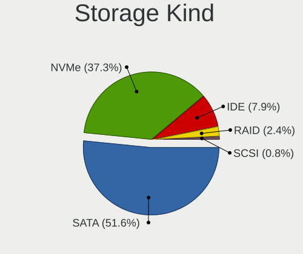

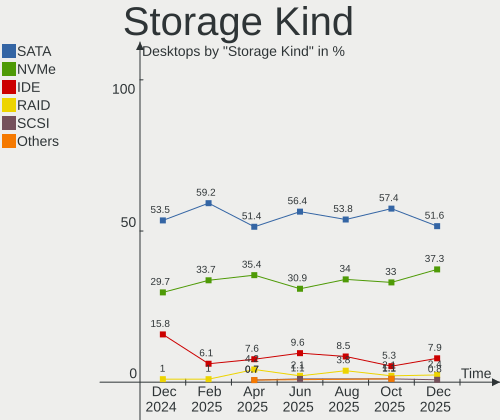

| Kind | Desktops | Percent |
|------|----------|---------|
| SATA | 65       | 51.59%  |
| NVMe | 47       | 37.3%   |
| IDE  | 10       | 7.94%   |
| RAID | 3        | 2.38%   |
| SCSI | 1        | 0.79%   |

Processor
---------

CPU Vendor
----------

Processor vendors

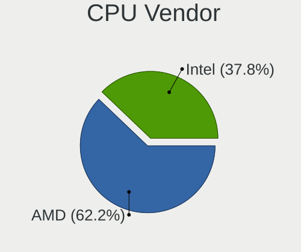

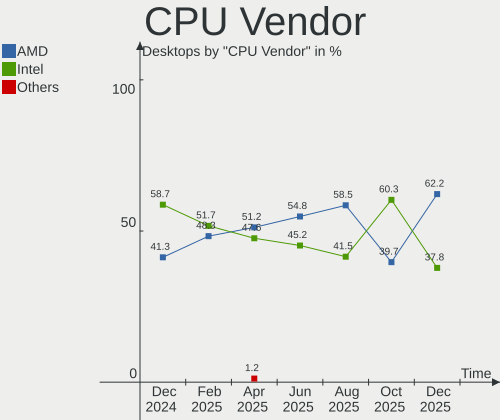

| Vendor | Desktops | Percent |
|--------|----------|---------|
| AMD    | 46       | 62.16%  |
| Intel  | 28       | 37.84%  |

CPU Model
---------

Processor models

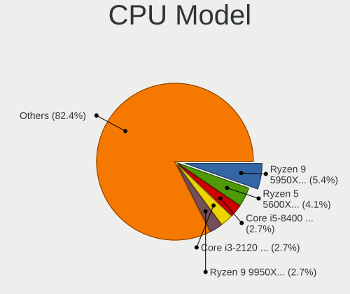

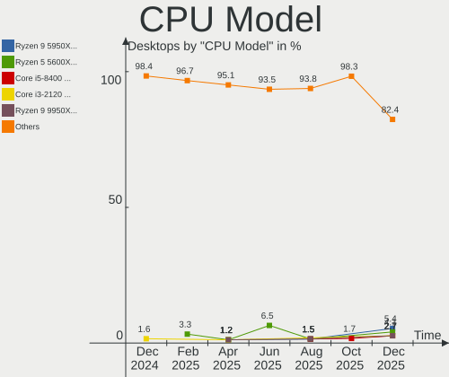

| Model                                  | Desktops | Percent |
|----------------------------------------|----------|---------|
| AMD Ryzen 9 5950X 16-Core Processor    | 4        | 5.41%   |
| AMD Ryzen 5 5600X 6-Core Processor     | 3        | 4.05%   |
| Intel Core i5-8400 CPU @ 2.80GHz       | 2        | 2.7%    |
| Intel Core i3-2120 CPU @ 3.30GHz       | 2        | 2.7%    |
| AMD Ryzen 9 9950X3D 16-Core Processor  | 2        | 2.7%    |
| AMD Ryzen 9 5900X 12-Core Processor    | 2        | 2.7%    |
| AMD Ryzen 7 9700X 8-Core Processor     | 2        | 2.7%    |
| AMD Ryzen 7 7700 8-Core Processor      | 2        | 2.7%    |
| AMD Ryzen 7 5700X 8-Core Processor     | 2        | 2.7%    |
| AMD Ryzen 7 5700G with Radeon Graphics | 2        | 2.7%    |
| AMD Ryzen 7 3800X 8-Core Processor     | 2        | 2.7%    |
| AMD Ryzen 5 5500                       | 2        | 2.7%    |
| Intel Xeon W-2125 CPU @ 4.00GHz        | 1        | 1.35%   |
| Intel Xeon CPU X5675 @ 3.07GHz         | 1        | 1.35%   |
| Intel Xeon CPU E5-2695 v3 @ 2.30GHz    | 1        | 1.35%   |
| Intel Core i9-9900KF CPU @ 3.60GHz     | 1        | 1.35%   |
| Intel Core i9-14900K                   | 1        | 1.35%   |
| Intel Core i7-8700K CPU @ 3.70GHz      | 1        | 1.35%   |
| Intel Core i7-7700 CPU @ 3.60GHz       | 1        | 1.35%   |
| Intel Core i7-4790K CPU @ 4.00GHz      | 1        | 1.35%   |
| Intel Core i7-2600K CPU @ 3.40GHz      | 1        | 1.35%   |
| Intel Core i7-2600 CPU @ 3.40GHz       | 1        | 1.35%   |
| Intel Core i7-10700KF CPU @ 3.80GHz    | 1        | 1.35%   |
| Intel Core i7-10700 CPU @ 2.90GHz      | 1        | 1.35%   |
| Intel Core i7 CPU 930 @ 2.80GHz        | 1        | 1.35%   |
| Intel Core i5-6600K CPU @ 3.50GHz      | 1        | 1.35%   |
| Intel Core i5-4460 CPU @ 3.20GHz       | 1        | 1.35%   |
| Intel Core i5-4440 CPU @ 3.10GHz       | 1        | 1.35%   |
| Intel Core i5-2400 CPU @ 3.10GHz       | 1        | 1.35%   |
| Intel Core i5-2300 CPU @ 2.80GHz       | 1        | 1.35%   |
| Intel Core i3-7100 CPU @ 3.90GHz       | 1        | 1.35%   |
| Intel Core i3-2100 CPU @ 3.10GHz       | 1        | 1.35%   |
| Intel Core 2 Quad CPU Q6600 @ 2.40GHz  | 1        | 1.35%   |
| Intel Core 2 Duo CPU E8400 @ 3.00GHz   | 1        | 1.35%   |
| Intel Core 2 Duo CPU E8300 @ 2.83GHz   | 1        | 1.35%   |
| Intel Core 2 CPU 6300 @ 1.86GHz        | 1        | 1.35%   |
| AMD Ryzen 9 9950X 16-Core Processor    | 1        | 1.35%   |
| AMD Ryzen 9 7900X 12-Core Processor    | 1        | 1.35%   |
| AMD Ryzen 9 7900 12-Core Processor     | 1        | 1.35%   |
| AMD Ryzen 7 9800X3D 8-Core Processor   | 1        | 1.35%   |

CPU Model Family
----------------

Processor model prefix

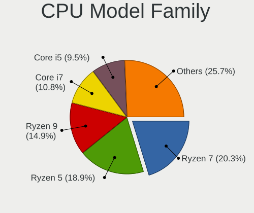

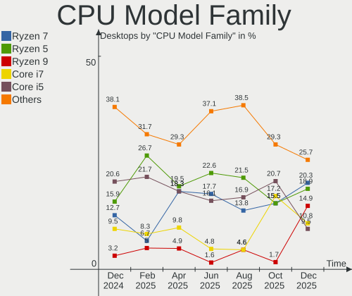

| Model             | Desktops | Percent |
|-------------------|----------|---------|
| AMD Ryzen 7       | 15       | 20.27%  |
| AMD Ryzen 5       | 14       | 18.92%  |
| AMD Ryzen 9       | 11       | 14.86%  |
| Intel Core i7     | 8        | 10.81%  |
| Intel Core i5     | 7        | 9.46%   |
| Intel Core i3     | 4        | 5.41%   |
| Intel Xeon        | 3        | 4.05%   |
| Intel Core i9     | 2        | 2.7%    |
| Intel Core 2 Duo  | 2        | 2.7%    |
| Intel Core 2 Quad | 1        | 1.35%   |
| Intel Core 2      | 1        | 1.35%   |
| AMD Ryzen 3       | 1        | 1.35%   |
| AMD Phenom II X4  | 1        | 1.35%   |
| AMD Phenom II X2  | 1        | 1.35%   |
| AMD Phenom        | 1        | 1.35%   |
| AMD Athlon II X4  | 1        | 1.35%   |
| AMD A4            | 1        | 1.35%   |

CPU Cores
---------

Number of processor cores

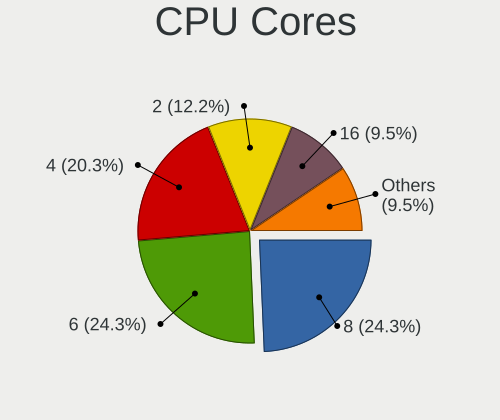

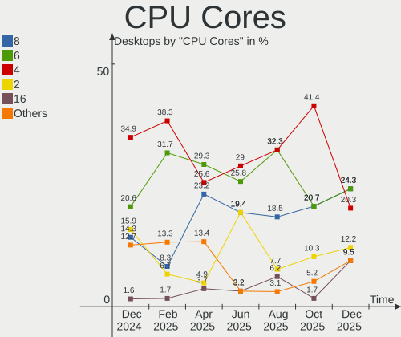

| Number | Desktops | Percent |
|--------|----------|---------|
| 8      | 18       | 24.32%  |
| 6      | 18       | 24.32%  |
| 4      | 15       | 20.27%  |
| 2      | 9        | 12.16%  |
| 16     | 7        | 9.46%   |
| 12     | 4        | 5.41%   |
| 24     | 1        | 1.35%   |
| 14     | 1        | 1.35%   |
| 3      | 1        | 1.35%   |

CPU Sockets
-----------

Number of sockets

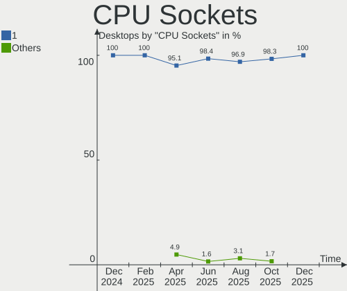

| Number | Desktops | Percent |
|--------|----------|---------|
| 1      | 74       | 100%    |

CPU Threads
-----------

Threads per core (Hyper-Threading)

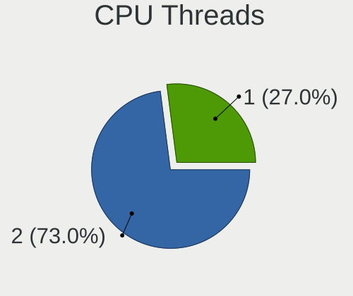

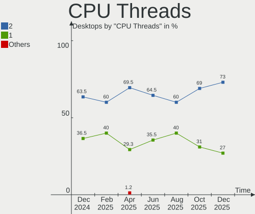

| Number | Desktops | Percent |
|--------|----------|---------|
| 2      | 54       | 72.97%  |
| 1      | 20       | 27.03%  |

CPU Op-Modes
------------

CPU Operation Modes (32-bit, 64-bit)

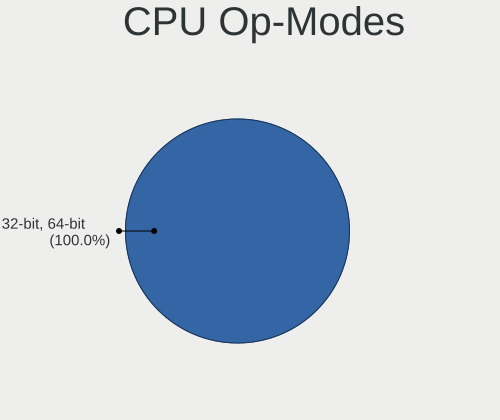

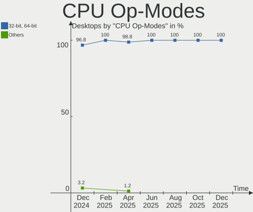

| Op mode        | Desktops | Percent |
|----------------|----------|---------|
| 32-bit, 64-bit | 74       | 100%    |

CPU Microcode
-------------

Microcode number

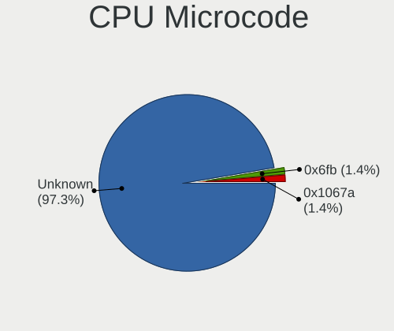

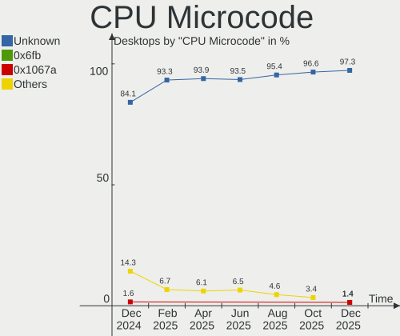

| Number  | Desktops | Percent |
|---------|----------|---------|
| Unknown | 72       | 97.3%   |
| 0x6fb   | 1        | 1.35%   |
| 0x1067a | 1        | 1.35%   |

CPU Microarch
-------------

Microarchitecture

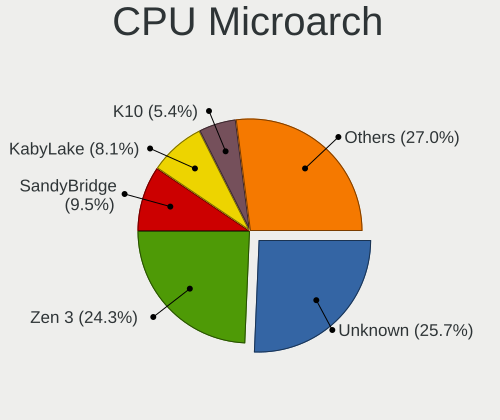

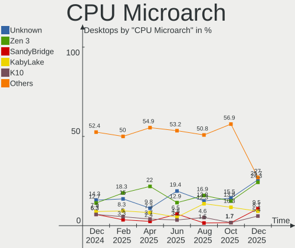

| Name        | Desktops | Percent |
|-------------|----------|---------|
| Unknown     | 19       | 25.68%  |
| Zen 3       | 18       | 24.32%  |
| SandyBridge | 7        | 9.46%   |
| KabyLake    | 6        | 8.11%   |
| K10         | 4        | 5.41%   |
| Haswell     | 4        | 5.41%   |
| Zen 2       | 3        | 4.05%   |
| Zen+        | 2        | 2.7%    |
| Skylake     | 2        | 2.7%    |
| Penryn      | 2        | 2.7%    |
| Core        | 2        | 2.7%    |
| CometLake   | 2        | 2.7%    |
| Westmere    | 1        | 1.35%   |
| Piledriver  | 1        | 1.35%   |
| Nehalem     | 1        | 1.35%   |

Graphics
--------

GPU Vendor
----------

Vendors of graphics cards

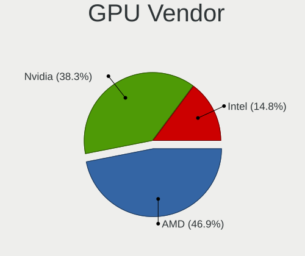

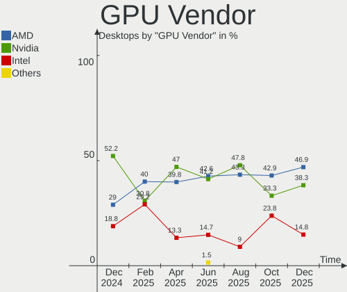

| Vendor | Desktops | Percent |
|--------|----------|---------|
| AMD    | 38       | 46.91%  |
| Nvidia | 31       | 38.27%  |
| Intel  | 12       | 14.81%  |

GPU Model
---------

Graphics card models

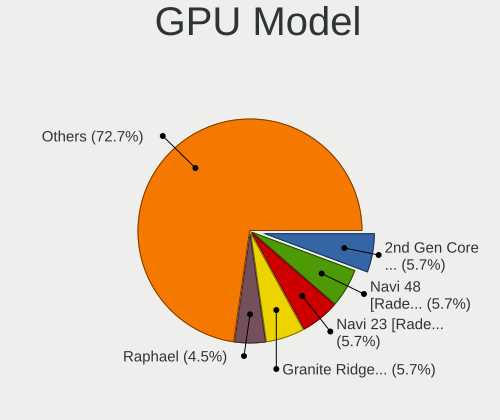

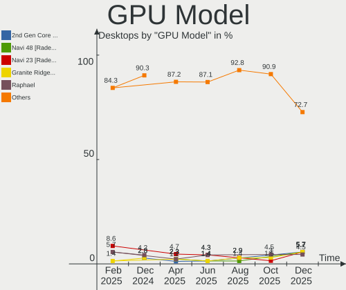

| Model                                                                     | Desktops | Percent |
|---------------------------------------------------------------------------|----------|---------|
| Intel 2nd Generation Core Processor Family Integrated Graphics Controller | 5        | 5.68%   |
| AMD Navi 48 [Radeon RX 9070/9070 XT/9070 GRE]                             | 5        | 5.68%   |
| AMD Navi 23 [Radeon RX 6600/6600 XT/6600M]                                | 5        | 5.68%   |
| AMD Granite Ridge [Radeon Graphics]                                       | 5        | 5.68%   |
| AMD Raphael                                                               | 4        | 4.55%   |
| AMD Cezanne [Radeon Vega Series / Radeon Vega Mobile Series]              | 3        | 3.41%   |
| Nvidia GP108 [GeForce GT 1030]                                            | 2        | 2.27%   |
| Nvidia GA106 [GeForce RTX 3060 Lite Hash Rate]                            | 2        | 2.27%   |
| Nvidia GA102 [GeForce RTX 3090]                                           | 2        | 2.27%   |
| Nvidia AD106 [GeForce RTX 4060 Ti 16GB]                                   | 2        | 2.27%   |
| Intel Battlemage G21 [Arc B580]                                           | 2        | 2.27%   |
| Intel 4 Series Chipset Integrated Graphics Controller                     | 2        | 2.27%   |
| AMD Navi 44 [Radeon RX 9060 XT]                                           | 2        | 2.27%   |
| AMD Navi 32 [Radeon RX 7700 XT / 7800 XT]                                 | 2        | 2.27%   |
| AMD Navi 31 [Radeon RX 7900 XT/7900 XTX/7900 GRE/7900M]                   | 2        | 2.27%   |
| AMD Navi 22 [Radeon RX 6700/6700 XT/6750 XT / 6800M/6850M XT]             | 2        | 2.27%   |
| AMD Navi 21 [Radeon RX 6800/6800 XT / 6900 XT]                            | 2        | 2.27%   |
| Nvidia TU117 [GeForce GTX 1650]                                           | 1        | 1.14%   |
| Nvidia TU104 [GeForce RTX 2080 SUPER]                                     | 1        | 1.14%   |
| Nvidia TU104 [GeForce RTX 2070 SUPER]                                     | 1        | 1.14%   |
| Nvidia TU102 [GeForce RTX 2080 Ti Rev. A]                                 | 1        | 1.14%   |
| Nvidia GT218 [GeForce 210]                                                | 1        | 1.14%   |
| Nvidia GP107 [GeForce GTX 1050]                                           | 1        | 1.14%   |
| Nvidia GP107 [GeForce GTX 1050 Ti]                                        | 1        | 1.14%   |
| Nvidia GP104 [GeForce GTX 1070]                                           | 1        | 1.14%   |
| Nvidia GM204 [GeForce GTX 970]                                            | 1        | 1.14%   |
| Nvidia GK107 [NVS 510]                                                    | 1        | 1.14%   |
| Nvidia GK106 [GeForce GTX 650 Ti Boost]                                   | 1        | 1.14%   |
| Nvidia GF119 [GeForce GT 520]                                             | 1        | 1.14%   |
| Nvidia GF119 [GeForce 605]                                                | 1        | 1.14%   |
| Nvidia GF116 [GeForce GTX 550 Ti]                                         | 1        | 1.14%   |
| Nvidia GF114 [GeForce GTX 560]                                            | 1        | 1.14%   |
| Nvidia GB203 [GeForce RTX 5080]                                           | 1        | 1.14%   |
| Nvidia GB203 [GeForce RTX 5070 Ti]                                        | 1        | 1.14%   |
| Nvidia GA104GL [RTX A4000]                                                | 1        | 1.14%   |
| Nvidia GA104 [GeForce RTX 3070]                                           | 1        | 1.14%   |
| Nvidia GA102 [GeForce RTX 3080]                                           | 1        | 1.14%   |
| Nvidia AD104 [GeForce RTX 4070 Ti]                                        | 1        | 1.14%   |
| Nvidia AD104 [GeForce RTX 4070 SUPER]                                     | 1        | 1.14%   |
| Nvidia AD103 [GeForce RTX 4080]                                           | 1        | 1.14%   |

GPU Combo
---------

Combinations of graphics cards

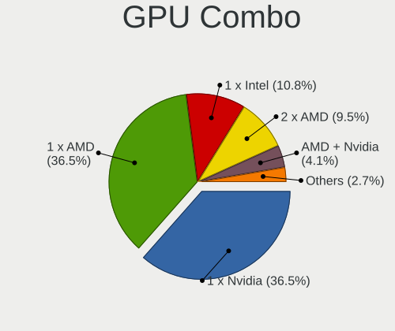

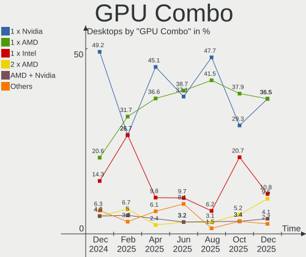

| Name           | Desktops | Percent |
|----------------|----------|---------|
| 1 x Nvidia     | 27       | 36.49%  |
| 1 x AMD        | 27       | 36.49%  |
| 1 x Intel      | 8        | 10.81%  |
| 2 x AMD        | 7        | 9.46%   |
| AMD + Nvidia   | 3        | 4.05%   |
| Intel + Nvidia | 1        | 1.35%   |
| Intel + AMD    | 1        | 1.35%   |

GPU Driver
----------

Free vs proprietary

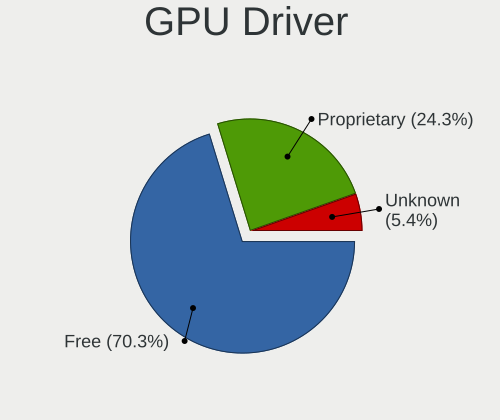

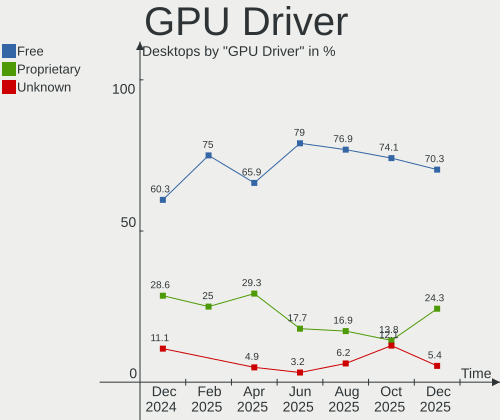

| Driver      | Desktops | Percent |
|-------------|----------|---------|
| Free        | 52       | 70.27%  |
| Proprietary | 18       | 24.32%  |
| Unknown     | 4        | 5.41%   |

GPU Memory
----------

Total video memory

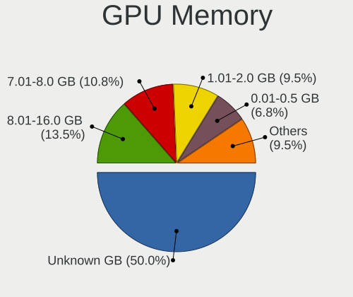

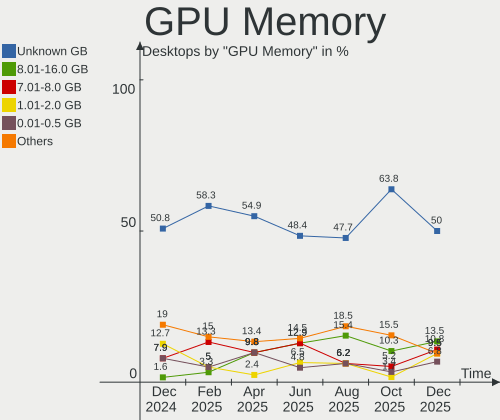

| Size in GB | Desktops | Percent |
|------------|----------|---------|
| Unknown    | 37       | 50%     |
| 8.01-16.0  | 10       | 13.51%  |
| 7.01-8.0   | 8        | 10.81%  |
| 1.01-2.0   | 7        | 9.46%   |
| 0.01-0.5   | 5        | 6.76%   |
| 3.01-4.0   | 4        | 5.41%   |
| 16.01-24.0 | 2        | 2.7%    |
| 2.01-3.0   | 1        | 1.35%   |

Monitor
-------

Monitor Vendor
--------------

Monitor vendors

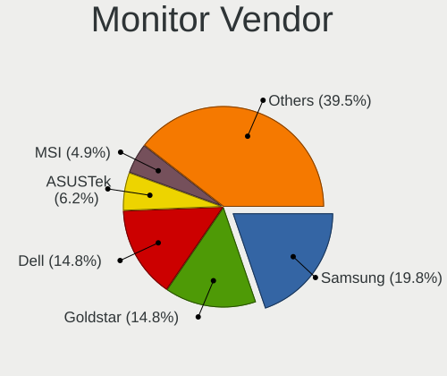

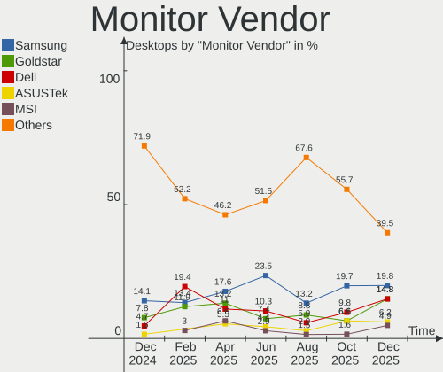

| Vendor               | Desktops | Percent |
|----------------------|----------|---------|
| Samsung Electronics  | 16       | 19.75%  |
| Goldstar             | 12       | 14.81%  |
| Dell                 | 12       | 14.81%  |
| ASUSTek Computer     | 5        | 6.17%   |
| MSI                  | 4        | 4.94%   |
| NEC Computers        | 3        | 3.7%    |
| Iiyama               | 3        | 3.7%    |
| Hewlett-Packard      | 3        | 3.7%    |
| Gigabyte Technology  | 3        | 3.7%    |
| AOC                  | 3        | 3.7%    |
| Philips              | 2        | 2.47%   |
| Ancor Communications | 2        | 2.47%   |
| Vestel Elektronik    | 1        | 1.23%   |
| Vestel               | 1        | 1.23%   |
| Unknown (XXX)        | 1        | 1.23%   |
| Sony                 | 1        | 1.23%   |
| RTK                  | 1        | 1.23%   |
| Onkyo                | 1        | 1.23%   |
| Idek Iiyama          | 1        | 1.23%   |
| Eizo                 | 1        | 1.23%   |
| Compaq Computer      | 1        | 1.23%   |
| BUBALUS              | 1        | 1.23%   |
| BenQ                 | 1        | 1.23%   |
| Arnos Instruments    | 1        | 1.23%   |
| Acer                 | 1        | 1.23%   |

Monitor Model
-------------

Monitor models

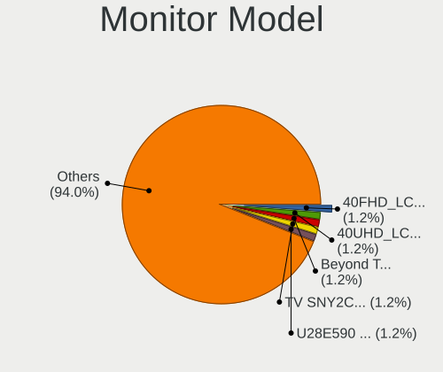

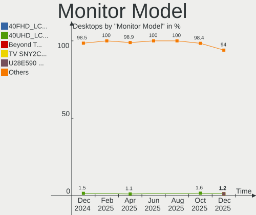

| Model                                                                   | Desktops | Percent |
|-------------------------------------------------------------------------|----------|---------|
| Vestel LCD Monitor 40FHD_LCD_TV 1920x1080                               | 1        | 1.2%    |
| Vestel Elektronik 40UHD_LCD_TV VES3700 3840x2160 880x500mm 39.8-inch    | 1        | 1.2%    |
| Unknown (XXX) Beyond TV XXX2851 3840x2160 1209x680mm 54.6-inch          | 1        | 1.2%    |
| Sony TV SNY2C02 1920x1080 886x498mm 40.0-inch                           | 1        | 1.2%    |
| Samsung Electronics U28E590 SAM0C4D 3840x2160 607x345mm 27.5-inch       | 1        | 1.2%    |
| Samsung Electronics SyncMaster SAM059A 1920x1080 477x268mm 21.5-inch    | 1        | 1.2%    |
| Samsung Electronics SyncMaster SAM0598 1360x768 410x230mm 18.5-inch     | 1        | 1.2%    |
| Samsung Electronics SyncMaster SAM0587 1920x1200 518x324mm 24.1-inch    | 1        | 1.2%    |
| Samsung Electronics SyncMaster SAM016A 1280x1024 376x301mm 19.0-inch    | 1        | 1.2%    |
| Samsung Electronics SyncMaster SAM011E 1280x1024 338x270mm 17.0-inch    | 1        | 1.2%    |
| Samsung Electronics SA300/SA350 SAM0849 1920x1080 477x268mm 21.5-inch   | 1        | 1.2%    |
| Samsung Electronics S27C31x SAM7312 1920x1080 597x336mm 27.0-inch       | 1        | 1.2%    |
| Samsung Electronics S24D330 SAM0D92 1920x1080 531x299mm 24.0-inch       | 1        | 1.2%    |
| Samsung Electronics S22B300 SAM08C8 1920x1080 477x268mm 21.5-inch       | 1        | 1.2%    |
| Samsung Electronics S22B300 SAM08AC 1920x1080 477x268mm 21.5-inch       | 1        | 1.2%    |
| Samsung Electronics LCD Monitor SAM0FA6 3840x2160 1872x1053mm 84.6-inch | 1        | 1.2%    |
| Samsung Electronics LCD Monitor SAM0F0B 3840x2160 1872x1053mm 84.6-inch | 1        | 1.2%    |
| Samsung Electronics LCD Monitor SAM0E33 1920x1080 1210x680mm 54.6-inch  | 1        | 1.2%    |
| Samsung Electronics LCD Monitor SAM0C26 1920x1080 1209x680mm 54.6-inch  | 1        | 1.2%    |
| Samsung Electronics LC34G55T SAM711A 3440x1440 798x334mm 34.1-inch      | 1        | 1.2%    |
| Samsung Electronics C27F390 SAM0D33 1920x1080 598x336mm 27.0-inch       | 1        | 1.2%    |
| RTK '' RTK2555 1920x1080 698x393mm 31.5-inch                            | 1        | 1.2%    |
| Philips PHL 27M1F5800 PHLC267 3840x2160 597x336mm 27.0-inch             | 1        | 1.2%    |
| Philips PHL 273V7 PHLC156 1920x1080 598x336mm 27.0-inch                 | 1        | 1.2%    |
| Onkyo TX-NR646 ONK0F61 1920x1080 1440x810mm 65.0-inch                   | 1        | 1.2%    |
| NEC Computers EA245WMi NEC2C5F 1920x1200 519x324mm 24.1-inch            | 1        | 1.2%    |
| NEC Computers EA244WMi NEC68D7 1920x1200 519x324mm 24.1-inch            | 1        | 1.2%    |
| NEC Computers E223W NEC68EF 1680x1050 474x296mm 22.0-inch               | 1        | 1.2%    |
| NEC Computers E223W NEC68EE 1680x1050 474x296mm 22.0-inch               | 1        | 1.2%    |
| MSI MPG491CX OLED MSI4FA8 3840x1080 1197x339mm 49.0-inch                | 1        | 1.2%    |
| MSI MPG 274URF QD MSIBCC2 3840x2160 597x336mm 27.0-inch                 | 1        | 1.2%    |
| MSI MP2412 MSI4BA9 1920x1080 527x296mm 23.8-inch                        | 1        | 1.2%    |
| MSI G273CQ MSI3DC0 2560x1440 597x336mm 27.0-inch                        | 1        | 1.2%    |
| Iiyama PL2893UH IVM7114 3840x2160 621x341mm 27.9-inch                   | 1        | 1.2%    |
| Iiyama PL2797Q IVM66AC 2560x1440 597x336mm 27.0-inch                    | 1        | 1.2%    |
| Iiyama PL2770H IVM66B3 1920x1080 597x336mm 27.0-inch                    | 1        | 1.2%    |
| Idek Iiyama LCD Monitor PL2473HD 1920x1080                              | 1        | 1.2%    |
| Hewlett-Packard LP2475w HWP26F8 1920x1200 546x352mm 25.6-inch           | 1        | 1.2%    |
| Hewlett-Packard LA2306 HWP294B 1920x1080 509x286mm 23.0-inch            | 1        | 1.2%    |
| Hewlett-Packard 25mx HPN359A 1920x1080 544x303mm 24.5-inch              | 1        | 1.2%    |

Monitor Resolution
------------------

Monitor screen resolution

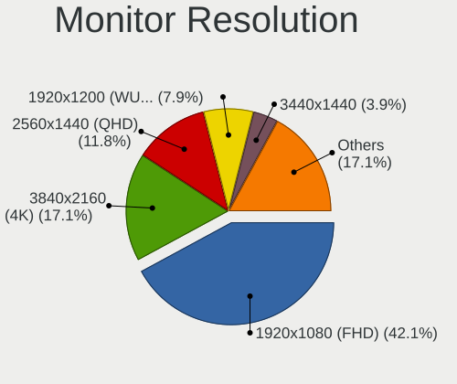

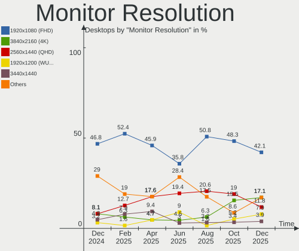

| Resolution         | Desktops | Percent |
|--------------------|----------|---------|
| 1920x1080 (FHD)    | 32       | 42.11%  |
| 3840x2160 (4K)     | 13       | 17.11%  |
| 2560x1440 (QHD)    | 9        | 11.84%  |
| 1920x1200 (WUXGA)  | 6        | 7.89%   |
| 3440x1440          | 3        | 3.95%   |
| 3840x1080          | 2        | 2.63%   |
| 2560x1080          | 2        | 2.63%   |
| 1280x1024 (SXGA)   | 2        | 2.63%   |
| 3840x1600          | 1        | 1.32%   |
| 3840x1200          | 1        | 1.32%   |
| 2288x1287          | 1        | 1.32%   |
| 1680x1050 (WSXGA+) | 1        | 1.32%   |
| 1600x1200          | 1        | 1.32%   |
| 1360x768           | 1        | 1.32%   |
| 1024x768 (XGA)     | 1        | 1.32%   |

Monitor Diagonal
----------------

Diagonal size in inches

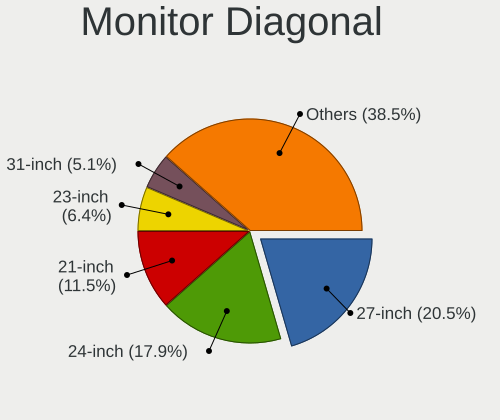

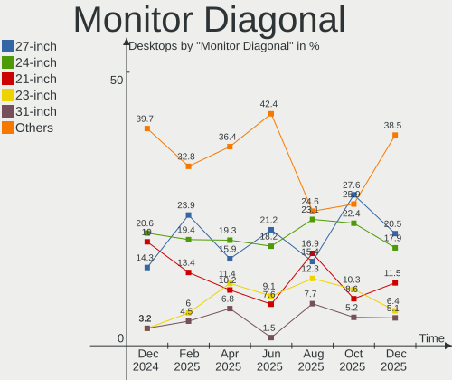

| Inches  | Desktops | Percent |
|---------|----------|---------|
| 27      | 16       | 20.51%  |
| 24      | 14       | 17.95%  |
| 21      | 9        | 11.54%  |
| 23      | 5        | 6.41%   |
| 31      | 4        | 5.13%   |
| 84      | 3        | 3.85%   |
| 34      | 3        | 3.85%   |
| 19      | 3        | 3.85%   |
| 49      | 2        | 2.56%   |
| Unknown | 2        | 2.56%   |
| 65      | 1        | 1.28%   |
| 63      | 1        | 1.28%   |
| 60      | 1        | 1.28%   |
| 55      | 1        | 1.28%   |
| 54      | 1        | 1.28%   |
| 43      | 1        | 1.28%   |
| 40      | 1        | 1.28%   |
| 37      | 1        | 1.28%   |
| 32      | 1        | 1.28%   |
| 28      | 1        | 1.28%   |
| 26      | 1        | 1.28%   |
| 25      | 1        | 1.28%   |
| 22      | 1        | 1.28%   |
| 20      | 1        | 1.28%   |
| 18      | 1        | 1.28%   |
| 17      | 1        | 1.28%   |
| 15      | 1        | 1.28%   |

Monitor Width
-------------

Physical width

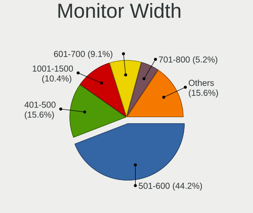

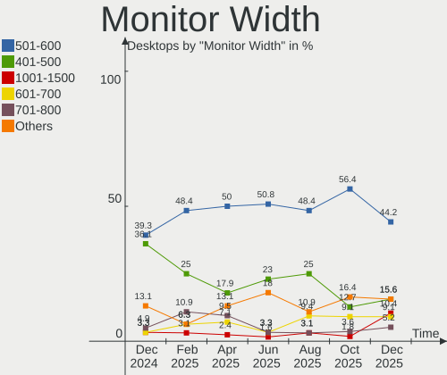

| Width in mm | Desktops | Percent |
|-------------|----------|---------|
| 501-600     | 34       | 44.16%  |
| 401-500     | 12       | 15.58%  |
| 1001-1500   | 8        | 10.39%  |
| 601-700     | 7        | 9.09%   |
| 701-800     | 4        | 5.19%   |
| 351-400     | 3        | 3.9%    |
| 1501-2000   | 3        | 3.9%    |
| 801-900     | 2        | 2.6%    |
| 301-350     | 2        | 2.6%    |
| Unknown     | 2        | 2.6%    |

Aspect Ratio
------------

Proportional relationship between the width and the height

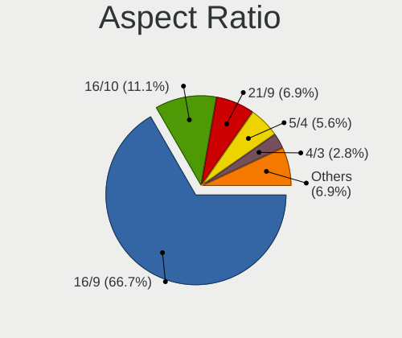

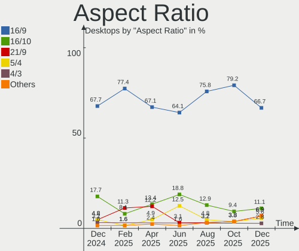

| Ratio   | Desktops | Percent |
|---------|----------|---------|
| 16/9    | 48       | 66.67%  |
| 16/10   | 8        | 11.11%  |
| 21/9    | 5        | 6.94%   |
| 5/4     | 4        | 5.56%   |
| 4/3     | 2        | 2.78%   |
| 32/9    | 2        | 2.78%   |
| Unknown | 2        | 2.78%   |
| 3.20    | 1        | 1.39%   |

Monitor Area
------------

Area in inch²

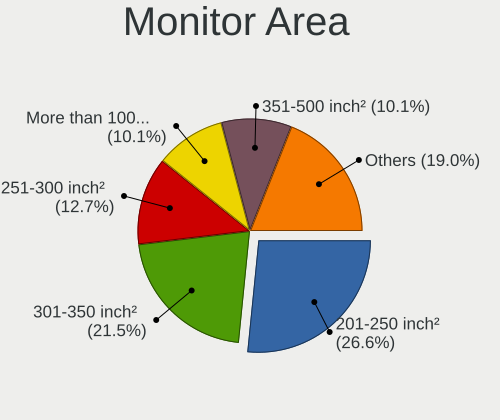

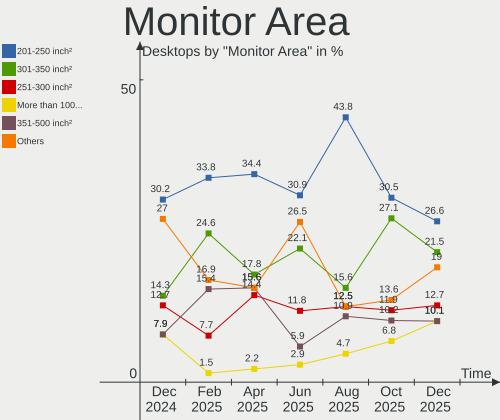

| Area in inch² | Desktops | Percent |
|----------------|----------|---------|
| 201-250        | 21       | 26.58%  |
| 301-350        | 17       | 21.52%  |
| 251-300        | 10       | 12.66%  |
| More than 1000 | 8        | 10.13%  |
| 351-500        | 8        | 10.13%  |
| 151-200        | 5        | 6.33%   |
| 501-1000       | 5        | 6.33%   |
| 141-150        | 2        | 2.53%   |
| Unknown        | 2        | 2.53%   |
| 101-110        | 1        | 1.27%   |

Pixel Density
-------------

Pixels per inch

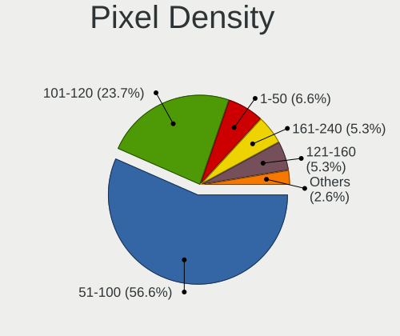

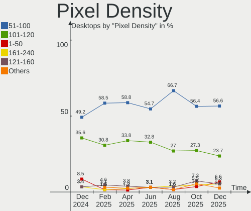

| Density | Desktops | Percent |
|---------|----------|---------|
| 51-100  | 43       | 56.58%  |
| 101-120 | 18       | 23.68%  |
| 1-50    | 5        | 6.58%   |
| 161-240 | 4        | 5.26%   |
| 121-160 | 4        | 5.26%   |
| Unknown | 2        | 2.63%   |

Multiple Monitors
-----------------

Total monitors connected

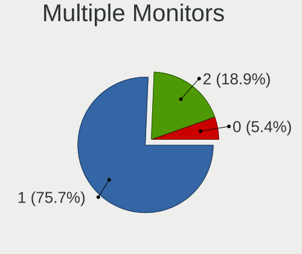

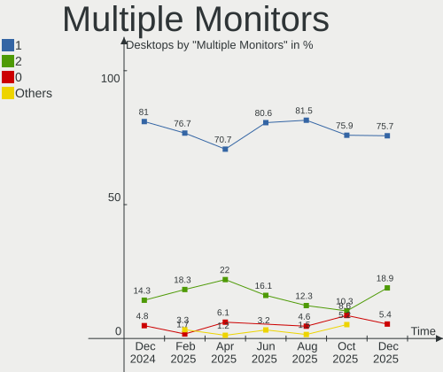

| Total | Desktops | Percent |
|-------|----------|---------|
| 1     | 56       | 75.68%  |
| 2     | 14       | 18.92%  |
| 0     | 4        | 5.41%   |

Network
-------

Net Controller Vendor
---------------------

Controller vendors

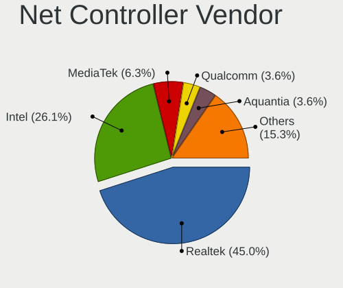

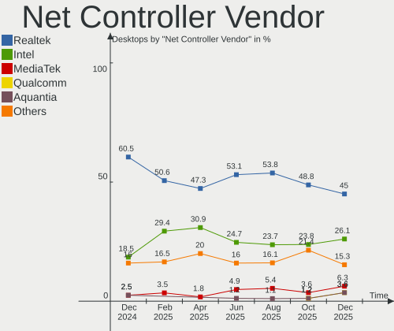

| Vendor                   | Desktops | Percent |
|--------------------------|----------|---------|
| Realtek Semiconductor    | 50       | 45.05%  |
| Intel                    | 29       | 26.13%  |
| MediaTek                 | 7        | 6.31%   |
| Qualcomm Technologies    | 4        | 3.6%    |
| Aquantia                 | 4        | 3.6%    |
| Qualcomm Atheros         | 3        | 2.7%    |
| Broadcom                 | 3        | 2.7%    |
| TP-Link                  | 2        | 1.8%    |
| Samsung Electronics      | 1        | 0.9%    |
| Ralink Technology        | 1        | 0.9%    |
| Nvidia                   | 1        | 0.9%    |
| NetXen Incorporated      | 1        | 0.9%    |
| Microsoft                | 1        | 0.9%    |
| Mellanox Technologies    | 1        | 0.9%    |
| Marvell Technology Group | 1        | 0.9%    |
| DisplayLink              | 1        | 0.9%    |
| Broadcom Limited         | 1        | 0.9%    |

Net Controller Model
--------------------

Controller models

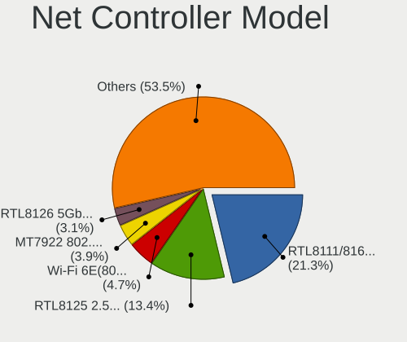

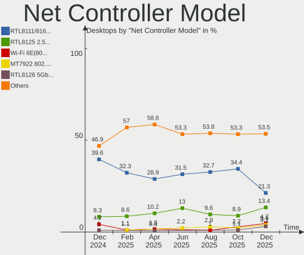

| Model                                                                           | Desktops | Percent |
|---------------------------------------------------------------------------------|----------|---------|
| Realtek RTL8111/8168/8211/8411 PCI Express Gigabit Ethernet Controller          | 27       | 21.26%  |
| Realtek RTL8125 2.5GbE Controller                                               | 17       | 13.39%  |
| Intel Wi-Fi 6E(802.11ax) AX210/AX1675* 2x2 [Typhoon Peak]                       | 6        | 4.72%   |
| MediaTek MT7922 802.11ax PCI Express Wireless Network Adapter                   | 5        | 3.94%   |
| Realtek RTL8126 5GbE Controller                                                 | 4        | 3.15%   |
| Qualcomm WCN785x Wi-Fi 7(802.11be) 320MHz 2x2 [FastConnect 7800]                | 4        | 3.15%   |
| Intel Wi-Fi 6 AX200                                                             | 3        | 2.36%   |
| Intel Ethernet Controller I226-V                                                | 3        | 2.36%   |
| Intel Ethernet Connection (2) I219-V                                            | 3        | 2.36%   |
| Realtek RTL8852BE PCIe 802.11ax Wireless Network Controller                     | 2        | 1.57%   |
| Realtek RTL8153 Gigabit Ethernet Adapter                                        | 2        | 1.57%   |
| Intel Wi-Fi 5(802.11ac) Wireless-AC 9x6x [Thunder Peak]                         | 2        | 1.57%   |
| Intel I211 Gigabit Network Connection                                           | 2        | 1.57%   |
| Intel Comet Lake PCH CNVi WiFi                                                  | 2        | 1.57%   |
| Intel 82579LM Gigabit Network Connection (Lewisville)                           | 2        | 1.57%   |
| Intel 82567LM-3 Gigabit Network Connection                                      | 2        | 1.57%   |
| Broadcom NetXtreme BCM5761 Gigabit Ethernet PCIe                                | 2        | 1.57%   |
| Aquantia AQtion AQC113CS NBase-T/IEEE 802.3an Ethernet Controller [Antigua 10G] | 2        | 1.57%   |
| TP-Link TL-WN722N v2/v3 [Realtek RTL8188EUS]                                    | 1        | 0.79%   |
| TP-Link AC600 wireless Realtek RTL8811AU [Archer T2U Nano]                      | 1        | 0.79%   |
| Samsung Galaxy series, misc. (tethering mode)                                   | 1        | 0.79%   |
| Realtek RTL8852CE PCIe 802.11ax Wireless Network Controller                     | 1        | 0.79%   |
| Realtek RTL8852AE 802.11ax PCIe Wireless Network Adapter                        | 1        | 0.79%   |
| Realtek RTL8191SEvB Wireless LAN Controller                                     | 1        | 0.79%   |
| Realtek RTL8188EUS 802.11n Wireless Network Adapter                             | 1        | 0.79%   |
| Realtek RTL8188ETV Wireless LAN 802.11n Network Adapter                         | 1        | 0.79%   |
| Realtek RTL8188CUS 802.11n WLAN Adapter                                         | 1        | 0.79%   |
| Realtek 802.11ac NIC                                                            | 1        | 0.79%   |
| Ralink MT7601U Wireless Adapter                                                 | 1        | 0.79%   |
| Qualcomm Atheros Killer E2500 Gigabit Ethernet Controller                       | 1        | 0.79%   |
| Qualcomm Atheros Killer E220x Gigabit Ethernet Controller                       | 1        | 0.79%   |
| Qualcomm Atheros AR8151 v2.0 Gigabit Ethernet                                   | 1        | 0.79%   |
| Nvidia MCP65 Ethernet                                                           | 1        | 0.79%   |
| NetXen Incorporated NX3031 Multifunction 1/10-Gigabit Server Adapter            | 1        | 0.79%   |
| Microsoft Wireless XBox Controller Dongle                                       | 1        | 0.79%   |
| Mellanox MT27500 Family [ConnectX-3]                                            | 1        | 0.79%   |
| MediaTek Network controller                                                     | 1        | 0.79%   |
| MediaTek MT7927 802.11be 320MHz 2x2 PCIe Wireless Network Adapter [Filogic 380] | 1        | 0.79%   |
| Marvell Group 88E8056 PCI-E Gigabit Ethernet Controller                         | 1        | 0.79%   |
| Intel Wireless 7265                                                             | 1        | 0.79%   |

Wireless Vendor
---------------

Wireless vendors

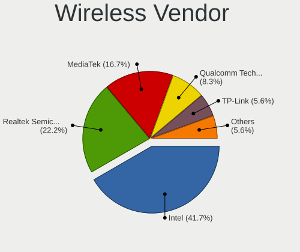

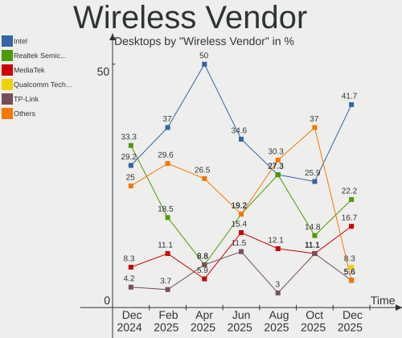

| Vendor                | Desktops | Percent |
|-----------------------|----------|---------|
| Intel                 | 15       | 41.67%  |
| Realtek Semiconductor | 8        | 22.22%  |
| MediaTek              | 6        | 16.67%  |
| Qualcomm Technologies | 3        | 8.33%   |
| TP-Link               | 2        | 5.56%   |
| Ralink Technology     | 1        | 2.78%   |
| Microsoft             | 1        | 2.78%   |

Wireless Model
--------------

Wireless models

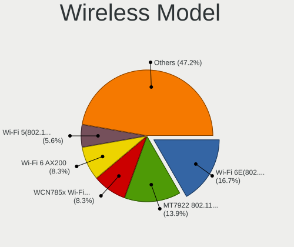

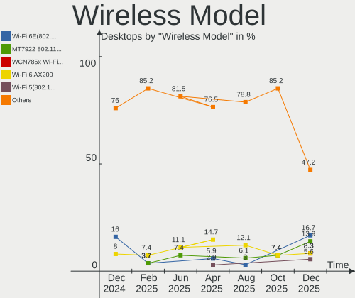

| Model                                                                           | Desktops | Percent |
|---------------------------------------------------------------------------------|----------|---------|
| Intel Wi-Fi 6E(802.11ax) AX210/AX1675* 2x2 [Typhoon Peak]                       | 6        | 16.67%  |
| MediaTek MT7922 802.11ax PCI Express Wireless Network Adapter                   | 5        | 13.89%  |
| Qualcomm WCN785x Wi-Fi 7(802.11be) 320MHz 2x2 [FastConnect 7800]                | 3        | 8.33%   |
| Intel Wi-Fi 6 AX200                                                             | 3        | 8.33%   |
| Intel Wi-Fi 5(802.11ac) Wireless-AC 9x6x [Thunder Peak]                         | 2        | 5.56%   |
| Intel Comet Lake PCH CNVi WiFi                                                  | 2        | 5.56%   |
| TP-Link TL-WN722N v2/v3 [Realtek RTL8188EUS]                                    | 1        | 2.78%   |
| TP-Link AC600 wireless Realtek RTL8811AU [Archer T2U Nano]                      | 1        | 2.78%   |
| Realtek RTL8852CE PCIe 802.11ax Wireless Network Controller                     | 1        | 2.78%   |
| Realtek RTL8852BE PCIe 802.11ax Wireless Network Controller                     | 1        | 2.78%   |
| Realtek RTL8852AE 802.11ax PCIe Wireless Network Adapter                        | 1        | 2.78%   |
| Realtek RTL8191SEvB Wireless LAN Controller                                     | 1        | 2.78%   |
| Realtek RTL8188EUS 802.11n Wireless Network Adapter                             | 1        | 2.78%   |
| Realtek RTL8188ETV Wireless LAN 802.11n Network Adapter                         | 1        | 2.78%   |
| Realtek RTL8188CUS 802.11n WLAN Adapter                                         | 1        | 2.78%   |
| Realtek 802.11ac NIC                                                            | 1        | 2.78%   |
| Ralink MT7601U Wireless Adapter                                                 | 1        | 2.78%   |
| Microsoft Wireless XBox Controller Dongle                                       | 1        | 2.78%   |
| MediaTek MT7927 802.11be 320MHz 2x2 PCIe Wireless Network Adapter [Filogic 380] | 1        | 2.78%   |
| Intel Wireless 7265                                                             | 1        | 2.78%   |
| Intel Centrino Wireless-N 1030 [Rainbow Peak]                                   | 1        | 2.78%   |

Ethernet Vendor
---------------

Ethernet vendors

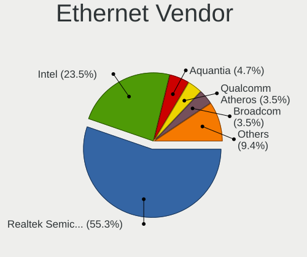

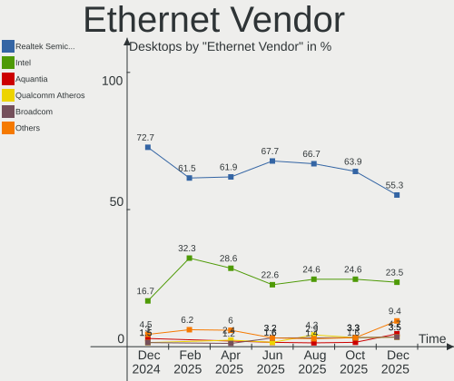

| Vendor                   | Desktops | Percent |
|--------------------------|----------|---------|
| Realtek Semiconductor    | 47       | 55.29%  |
| Intel                    | 20       | 23.53%  |
| Aquantia                 | 4        | 4.71%   |
| Qualcomm Atheros         | 3        | 3.53%   |
| Broadcom                 | 3        | 3.53%   |
| Samsung Electronics      | 1        | 1.18%   |
| Qualcomm Technologies    | 1        | 1.18%   |
| Nvidia                   | 1        | 1.18%   |
| NetXen Incorporated      | 1        | 1.18%   |
| Mellanox Technologies    | 1        | 1.18%   |
| Marvell Technology Group | 1        | 1.18%   |
| DisplayLink              | 1        | 1.18%   |
| Broadcom Limited         | 1        | 1.18%   |

Ethernet Model
--------------

Ethernet models

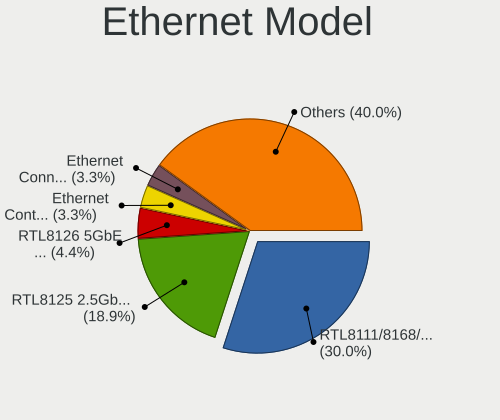

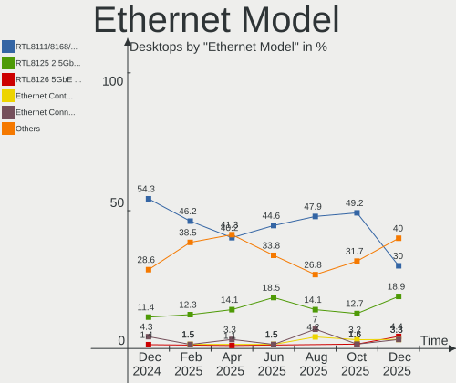

| Model                                                                           | Desktops | Percent |
|---------------------------------------------------------------------------------|----------|---------|
| Realtek RTL8111/8168/8211/8411 PCI Express Gigabit Ethernet Controller          | 27       | 30%     |
| Realtek RTL8125 2.5GbE Controller                                               | 17       | 18.89%  |
| Realtek RTL8126 5GbE Controller                                                 | 4        | 4.44%   |
| Intel Ethernet Controller I226-V                                                | 3        | 3.33%   |
| Intel Ethernet Connection (2) I219-V                                            | 3        | 3.33%   |
| Realtek RTL8153 Gigabit Ethernet Adapter                                        | 2        | 2.22%   |
| Intel I211 Gigabit Network Connection                                           | 2        | 2.22%   |
| Intel 82579LM Gigabit Network Connection (Lewisville)                           | 2        | 2.22%   |
| Intel 82567LM-3 Gigabit Network Connection                                      | 2        | 2.22%   |
| Broadcom NetXtreme BCM5761 Gigabit Ethernet PCIe                                | 2        | 2.22%   |
| Aquantia AQtion AQC113CS NBase-T/IEEE 802.3an Ethernet Controller [Antigua 10G] | 2        | 2.22%   |
| Samsung Galaxy series, misc. (tethering mode)                                   | 1        | 1.11%   |
| Realtek RTL8852BE PCIe 802.11ax Wireless Network Controller                     | 1        | 1.11%   |
| Qualcomm WCN785x Wi-Fi 7(802.11be) 320MHz 2x2 [FastConnect 7800]                | 1        | 1.11%   |
| Qualcomm Atheros Killer E2500 Gigabit Ethernet Controller                       | 1        | 1.11%   |
| Qualcomm Atheros Killer E220x Gigabit Ethernet Controller                       | 1        | 1.11%   |
| Qualcomm Atheros AR8151 v2.0 Gigabit Ethernet                                   | 1        | 1.11%   |
| Nvidia MCP65 Ethernet                                                           | 1        | 1.11%   |
| NetXen Incorporated NX3031 Multifunction 1/10-Gigabit Server Adapter            | 1        | 1.11%   |
| Mellanox MT27500 Family [ConnectX-3]                                            | 1        | 1.11%   |
| Marvell Group 88E8056 PCI-E Gigabit Ethernet Controller                         | 1        | 1.11%   |
| Intel Ethernet Controller I225-V                                                | 1        | 1.11%   |
| Intel Ethernet Controller 10-Gigabit X540-AT2                                   | 1        | 1.11%   |
| Intel Ethernet Connection I217-V                                                | 1        | 1.11%   |
| Intel Ethernet Connection I217-LM                                               | 1        | 1.11%   |
| Intel Ethernet Connection (5) I219-LM                                           | 1        | 1.11%   |
| Intel 82599ES 10-Gigabit SFI/SFP+ Network Connection                            | 1        | 1.11%   |
| Intel 82579V Gigabit Network Connection                                         | 1        | 1.11%   |
| Intel 82566DM-2 Gigabit Network Connection                                      | 1        | 1.11%   |
| Intel 82566DM Gigabit Network Connection                                        | 1        | 1.11%   |
| DisplayLink USB-C Triple-4K Dock                                                | 1        | 1.11%   |
| Broadcom NetLink BCM57781 Gigabit Ethernet PCIe                                 | 1        | 1.11%   |
| Broadcom Limited NetXtreme BCM5751 Gigabit Ethernet PCI Express                 | 1        | 1.11%   |
| Aquantia AQtion AQC113 NBase-T/IEEE 802.3an Ethernet Controller [Antigua 10G]   | 1        | 1.11%   |
| Aquantia AQtion AQC100S NBase-T/IEEE 802.3an Ethernet Controller [Atlantic 10G] | 1        | 1.11%   |

Net Controller Kind
-------------------

Ethernet, WiFi or modem

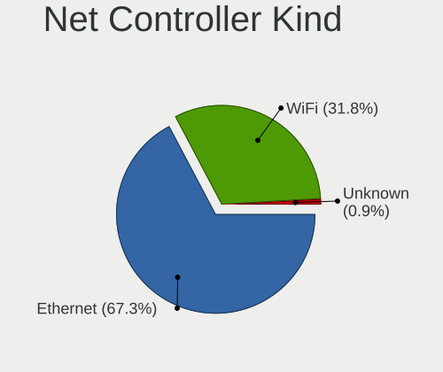

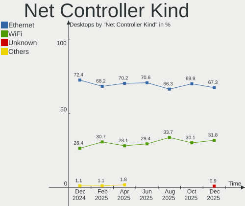

| Kind     | Desktops | Percent |
|----------|----------|---------|
| Ethernet | 74       | 67.27%  |
| WiFi     | 35       | 31.82%  |
| Unknown  | 1        | 0.91%   |

Used Controller
---------------

Currently used network controller

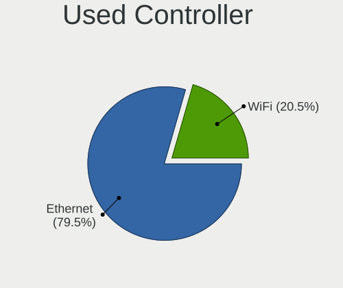

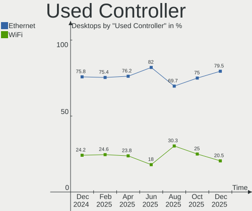

| Kind     | Desktops | Percent |
|----------|----------|---------|
| Ethernet | 58       | 79.45%  |
| WiFi     | 15       | 20.55%  |

NICs
----

Total network controllers on board

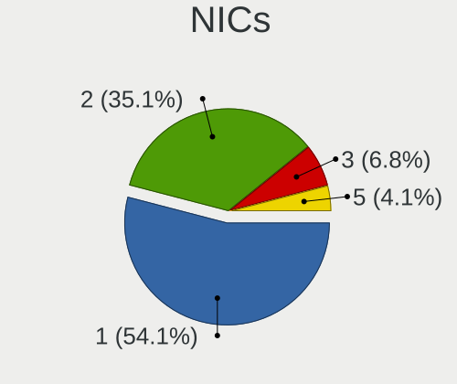

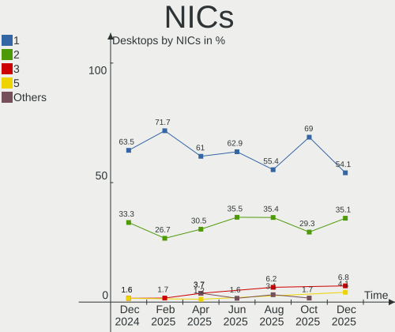

| Total | Desktops | Percent |
|-------|----------|---------|
| 1     | 40       | 54.05%  |
| 2     | 26       | 35.14%  |
| 3     | 5        | 6.76%   |
| 5     | 3        | 4.05%   |

IPv6
----

IPv6 vs IPv4

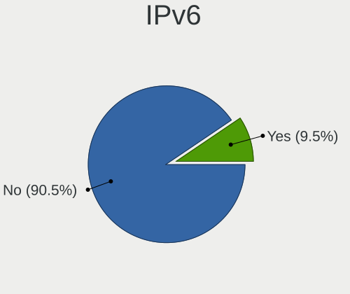

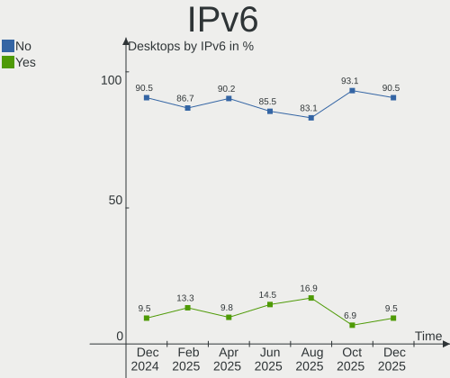

| Used | Desktops | Percent |
|------|----------|---------|
| No   | 67       | 90.54%  |
| Yes  | 7        | 9.46%   |

Bluetooth
---------

Bluetooth Vendor
----------------

Controller vendors

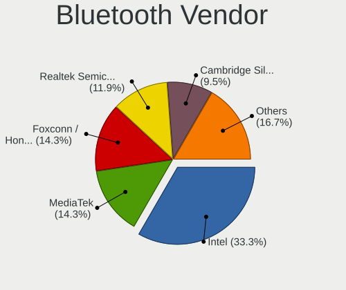

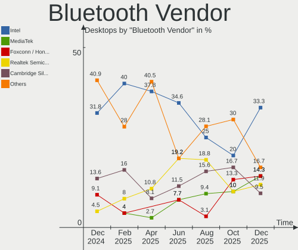

| Vendor                  | Desktops | Percent |
|-------------------------|----------|---------|
| Intel                   | 14       | 33.33%  |
| MediaTek                | 6        | 14.29%  |
| Foxconn / Hon Hai       | 6        | 14.29%  |
| Realtek Semiconductor   | 5        | 11.9%   |
| Cambridge Silicon Radio | 4        | 9.52%   |
| TP-Link                 | 2        | 4.76%   |
| IMC Networks            | 2        | 4.76%   |
| Broadcom                | 1        | 2.38%   |
| ASUSTek Computer        | 1        | 2.38%   |
| Unknown                 | 1        | 2.38%   |

Bluetooth Model
---------------

Controller models

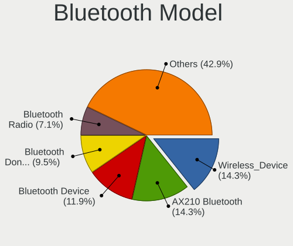

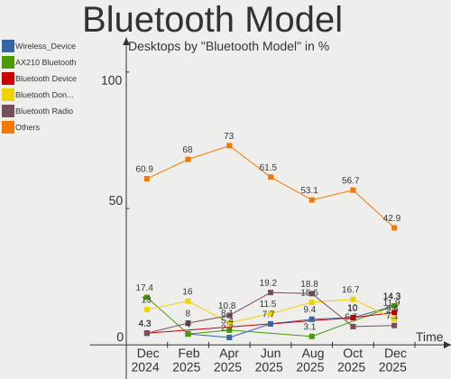

| Model                                               | Desktops | Percent |
|-----------------------------------------------------|----------|---------|
| MediaTek Wireless_Device                            | 6        | 14.29%  |
| Intel AX210 Bluetooth                               | 6        | 14.29%  |
| Foxconn / Hon Hai Bluetooth Device                  | 5        | 11.9%   |
| Cambridge Silicon Radio Bluetooth Dongle (HCI mode) | 4        | 9.52%   |
| Realtek Bluetooth Radio                             | 3        | 7.14%   |
| Intel AX200 Bluetooth                               | 3        | 7.14%   |
| TP-Link TP-T@- UB500 Adapter                        | 2        | 4.76%   |
| Realtek Bluetooth 5.3 Radio                         | 2        | 4.76%   |
| Intel Wireless-AC 9260 Bluetooth Adapter            | 2        | 4.76%   |
| Intel Bluetooth wireless interface                  | 1        | 2.38%   |
| Intel Bluetooth 9460/9560 Jefferson Peak (JfP)      | 1        | 2.38%   |
| Intel AX201 Bluetooth                               | 1        | 2.38%   |
| IMC Networks Wireless_Device                        | 1        | 2.38%   |
| IMC Networks Bluetooth Radio                        | 1        | 2.38%   |
| Foxconn / Hon Hai Wireless_Device                   | 1        | 2.38%   |
| Broadcom BCM20702A0 Bluetooth 4.0                   | 1        | 2.38%   |
| ASUS ASUS USB-BT500                                 | 1        | 2.38%   |
| Unknown                                             | 1        | 2.38%   |

Sound
-----

Sound Vendor
------------

Sound card vendors

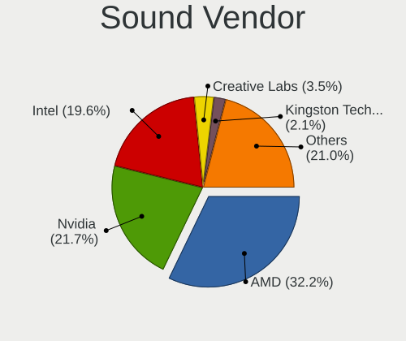

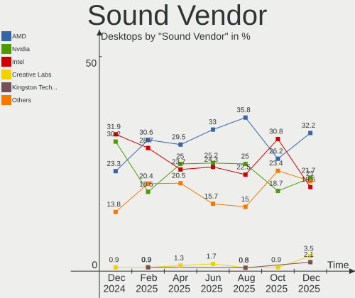

| Vendor                                       | Desktops | Percent |
|----------------------------------------------|----------|---------|
| AMD                                          | 46       | 32.17%  |
| Nvidia                                       | 31       | 21.68%  |
| Intel                                        | 28       | 19.58%  |
| Creative Labs                                | 5        | 3.5%    |
| Kingston Technology                          | 3        | 2.1%    |
| Sony                                         | 2        | 1.4%    |
| Micro Star International                     | 2        | 1.4%    |
| Logitech                                     | 2        | 1.4%    |
| FiiO Electronics Technology                  | 2        | 1.4%    |
| Creative Technology                          | 2        | 1.4%    |
| C-Media Electronics                          | 2        | 1.4%    |
| Zoran Co. Personal Media Division (Nogatech) | 1        | 0.7%    |
| Trust                                        | 1        | 0.7%    |
| SteelSeries ApS                              | 1        | 0.7%    |
| Solum Voice S Onyx White                     | 1        | 0.7%    |
| SM950T Microphone                            | 1        | 0.7%    |
| SM900T Microphone                            | 1        | 0.7%    |
| RME                                          | 1        | 0.7%    |
| Realtek Semiconductor                        | 1        | 0.7%    |
| Razer USA                                    | 1        | 0.7%    |
| MV-SILICON                                   | 1        | 0.7%    |
| Medeli Electronics                           | 1        | 0.7%    |
| JMTek                                        | 1        | 0.7%    |
| GYROCOM C&C                                  | 1        | 0.7%    |
| Endorfy Solum Mic                            | 1        | 0.7%    |
| Elgato Systems                               | 1        | 0.7%    |
| bestechnic                                   | 1        | 0.7%    |
| Audio-Technica                               | 1        | 0.7%    |
| ASUSTek Computer                             | 1        | 0.7%    |

Sound Model
-----------

Sound card models

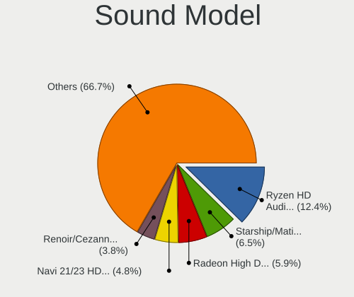

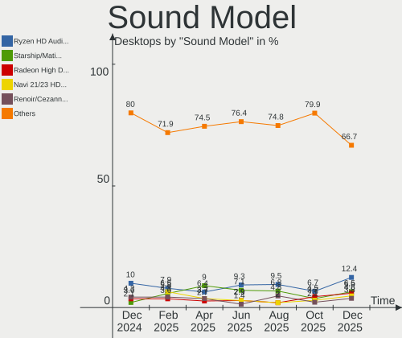

| Model                                                                                           | Desktops | Percent |
|-------------------------------------------------------------------------------------------------|----------|---------|
| AMD Ryzen HD Audio Controller                                                                   | 23       | 12.37%  |
| AMD Starship/Matisse HD Audio Controller                                                        | 12       | 6.45%   |
| AMD Radeon High Definition Audio Controller                                                     | 11       | 5.91%   |
| AMD Navi 21/23 HDMI/DP Audio Controller                                                         | 9        | 4.84%   |
| AMD Renoir/Cezanne HDMI/DP Audio Controller                                                     | 7        | 3.76%   |
| AMD Navi 48 HDMI/DP Audio Controller                                                            | 7        | 3.76%   |
| Intel 6 Series/C200 Series Chipset Family High Definition Audio Controller                      | 5        | 2.69%   |
| Intel 200 Series PCH HD Audio                                                                   | 4        | 2.15%   |
| AMD Navi 31 HDMI/DP Audio                                                                       | 4        | 2.15%   |
| Nvidia GA102 High Definition Audio Controller                                                   | 3        | 1.61%   |
| Creative Labs CA0132 Sound Core3D [Sound Blaster Recon3D / Z-Series / Sound BlasterX AE-5 Plus] | 3        | 1.61%   |
| AMD SBx00 Azalia (Intel HDA)                                                                    | 3        | 1.61%   |
| Nvidia TU104 HD Audio Controller                                                                | 2        | 1.08%   |
| Nvidia GP108 High Definition Audio Controller                                                   | 2        | 1.08%   |
| Nvidia GP107GL High Definition Audio Controller                                                 | 2        | 1.08%   |
| Nvidia GF119 HDMI Audio Controller                                                              | 2        | 1.08%   |
| Nvidia GB203 High Definition Audio Controller                                                   | 2        | 1.08%   |
| Nvidia GA106 High Definition Audio Controller                                                   | 2        | 1.08%   |
| Nvidia GA104 High Definition Audio Controller                                                   | 2        | 1.08%   |
| Nvidia AD106M High Definition Audio Controller                                                  | 2        | 1.08%   |
| Nvidia AD104 High Definition Audio Controller                                                   | 2        | 1.08%   |
| Micro Star International USB Audio                                                              | 2        | 1.08%   |
| Kingston Technology HyperX 7.1 Audio                                                            | 2        | 1.08%   |
| Intel Comet Lake PCH cAVS                                                                       | 2        | 1.08%   |
| Intel Audio device                                                                              | 2        | 1.08%   |
| Intel 82801JI (ICH10 Family) HD Audio Controller                                                | 2        | 1.08%   |
| Intel 82801JD/DO (ICH10 Family) HD Audio Controller                                             | 2        | 1.08%   |
| Intel 8 Series/C220 Series Chipset High Definition Audio Controller                             | 2        | 1.08%   |
| Intel 7 Series/C216 Chipset Family High Definition Audio Controller                             | 2        | 1.08%   |
| Intel 100 Series/C230 Series Chipset Family HD Audio Controller                                 | 2        | 1.08%   |
| FiiO Electronics Technology BTR5                                                                | 2        | 1.08%   |
| Creative Labs EMU20k2 [Sound Blaster X-Fi Titanium Series]                                      | 2        | 1.08%   |
| Zoran Co. Personal Media Division (Nogatech) USB Audio and HID                                  | 1        | 0.54%   |
| Trust Trust GXT 242 Microphone                                                                  | 1        | 0.54%   |
| SteelSeries ApS SteelSeries Arctis 7                                                            | 1        | 0.54%   |
| Sony DualShock 4 [CUH-ZCT2x]                                                                    | 1        | 0.54%   |
| Sony DualSense wireless controller (PS5)                                                        | 1        | 0.54%   |
| Solum Voice S Onyx White                                                                        | 1        | 0.54%   |
| SM950T Microphone SM950T Microphone                                                             | 1        | 0.54%   |
| SM900T Microphone SM900T Microphone                                                             | 1        | 0.54%   |

Memory
------

Memory Vendor
-------------

Memory module vendors

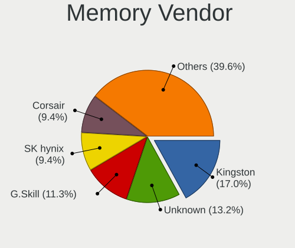

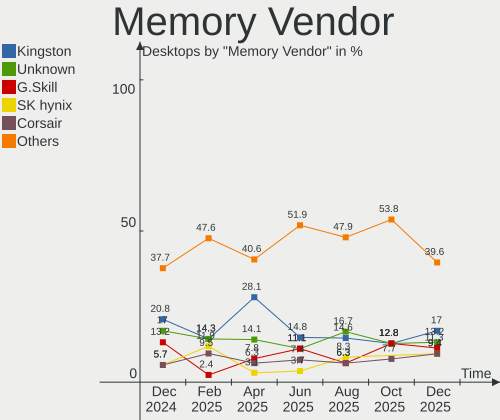

| Vendor              | Desktops | Percent |
|---------------------|----------|---------|
| Kingston            | 9        | 16.98%  |
| Unknown             | 7        | 13.21%  |
| G.Skill             | 6        | 11.32%  |
| SK hynix            | 5        | 9.43%   |
| Corsair             | 5        | 9.43%   |
| A-DATA Technology   | 4        | 7.55%   |
| Unknown             | 4        | 7.55%   |
| Wilk Elektronik     | 3        | 5.66%   |
| Samsung Electronics | 3        | 5.66%   |
| Crucial             | 2        | 3.77%   |
| Ramaxel Technology  | 1        | 1.89%   |
| Nanya Technology    | 1        | 1.89%   |
| Micron Technology   | 1        | 1.89%   |
| Lexar               | 1        | 1.89%   |
| GOODRAM             | 1        | 1.89%   |

Memory Model
------------

Memory module models

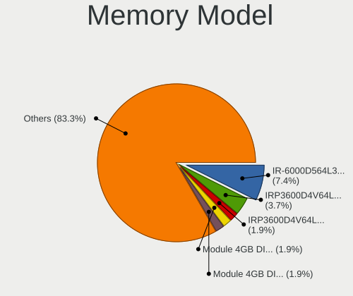

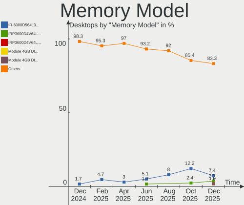

| Model                                                            | Desktops | Percent |
|------------------------------------------------------------------|----------|---------|
| Unknown                                                          | 4        | 7.41%   |
| Wilk Elektronik RAM IRP3600D4V64L18/16G 16GiB DIMM DDR4 3600MT/s | 2        | 3.7%    |
| Wilk Elektronik RAM IRP3600D4V64L18S/8G 8GB DIMM DDR4 3666MT/s   | 1        | 1.85%   |
| Unknown RAM Module 4GB DIMM 1600MT/s                             | 1        | 1.85%   |
| Unknown RAM Module 4GB DIMM 1066MT/s                             | 1        | 1.85%   |
| Unknown RAM Module 2GB DIMM DDR3 1067MT/s                        | 1        | 1.85%   |
| Unknown RAM Module 2GB DIMM DDR2 800MT/s                         | 1        | 1.85%   |
| Unknown RAM Module 2GB DIMM DDR2 667MT/s                         | 1        | 1.85%   |
| Unknown RAM Module 2GB DIMM 667MT/s                              | 1        | 1.85%   |
| Unknown RAM Module 2GB DIMM 1066MT/s                             | 1        | 1.85%   |
| Unknown RAM 3733 C17 Series 8192MB DIMM DDR4 2133MT/s            | 1        | 1.85%   |
| SK hynix RAM HMT325U6CFR8C-H9 2GB DIMM DDR3 1600MT/s             | 1        | 1.85%   |
| SK hynix RAM HMT325U6CFR8C-H9 2GB DIMM DDR3 1333MT/s             | 1        | 1.85%   |
| SK hynix RAM HMT31GR7BFR4A-H9 8GB DIMM DDR3 1333MT/s             | 1        | 1.85%   |
| SK hynix RAM HMAA8GL7CPR4N-VK 64GB DIMM DDR4 2666MT/s            | 1        | 1.85%   |
| SK hynix RAM HMA81GU6CJR8N-VK 8GB DIMM DDR4 2667MT/s             | 1        | 1.85%   |
| Samsung RAM M378B5773DH0-CH9 2GB DIMM DDR3 1333MT/s              | 1        | 1.85%   |
| Samsung RAM M378B5673EH1-CF8 2GB DIMM DDR3 1067MT/s              | 1        | 1.85%   |
| Samsung RAM M378A2K43EB1-CWE 16GB DIMM DDR4 3933MT/s             | 1        | 1.85%   |
| Ramaxel RAM RMR1810EC58E8F1333 2GB DIMM DDR3 1333MT/s            | 1        | 1.85%   |
| Nanya RAM NT2GC64B8HC0NF-CG 2GB DIMM DDR3 1333MT/s               | 1        | 1.85%   |
| Micron RAM 8ATF1G64HZ-3G2J1 8GB SODIMM DDR4 3200MT/s             | 1        | 1.85%   |
| Lexar RAM LD4BU008G-3200XG 8GB DIMM DDR4 3200MT/s                | 1        | 1.85%   |
| Kingston RAM KHX3200C16D4/16GX 16GB DIMM DDR4 3600MT/s           | 1        | 1.85%   |
| Kingston RAM KF560C36-16 16GB DIMM DDR5 6000MT/s                 | 1        | 1.85%   |
| Kingston RAM KF560C32-16 16GB DIMM DDR5 6000MT/s                 | 1        | 1.85%   |
| Kingston RAM KF560C30-32 32GB DIMM DDR5 6000MT/s                 | 1        | 1.85%   |
| Kingston RAM KF560C30-16 16GB DIMM DDR5 6000MT/s                 | 1        | 1.85%   |
| Kingston RAM KF556C36-64 64GB DIMM DDR5 4800MT/s                 | 1        | 1.85%   |
| Kingston RAM KF548C38-16 16GB DIMM DDR5 5900MT/s                 | 1        | 1.85%   |
| Kingston RAM ACR512X64D3S1333C 4GB DIMM DDR3 1333MT/s            | 1        | 1.85%   |
| Kingston RAM ACR256X64D3U1333C9 2GB DIMM DDR3 1333MT/s           | 1        | 1.85%   |
| GOODRAM RAM GY1600D364L10/8G 8GB DIMM DDR3 1600MT/s              | 1        | 1.85%   |
| G.Skill RAM F5-6000J3040G32G 32GB DIMM DDR5 6200MT/s             | 1        | 1.85%   |
| G.Skill RAM F4-4400C19-16GVK 16GB DIMM DDR4 4400MT/s             | 1        | 1.85%   |
| G.Skill RAM F4-4000C18-8GVK 8GB DIMM DDR4 4000MT/s               | 1        | 1.85%   |
| G.Skill RAM F4-3600C18-32GTZN 32GB DIMM DDR4 3800MT/s            | 1        | 1.85%   |
| G.Skill RAM F4-3200C16-8GIS 8GB DIMM DDR4 3600MT/s               | 1        | 1.85%   |
| G.Skill RAM F3-2400C10-8GTX 8GB DIMM DDR3 2400MT/s               | 1        | 1.85%   |
| Crucial RAM BLS8G4D30AESBK.M8FE 8GB DIMM DDR4 3600MT/s           | 1        | 1.85%   |

Memory Kind
-----------

Memory module kinds

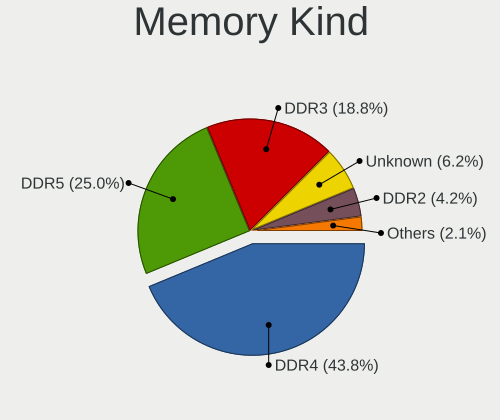

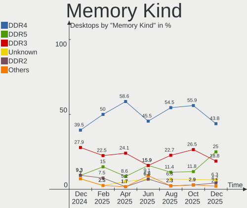

| Kind    | Desktops | Percent |
|---------|----------|---------|
| DDR4    | 21       | 43.75%  |
| DDR5    | 12       | 25%     |
| DDR3    | 9        | 18.75%  |
| Unknown | 3        | 6.25%   |
| DDR2    | 2        | 4.17%   |
| SDRAM   | 1        | 2.08%   |

Memory Form Factor
------------------

Physical design of the memory module

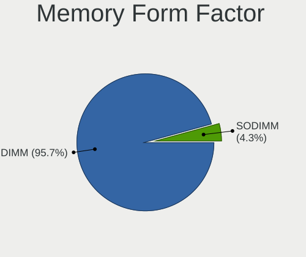

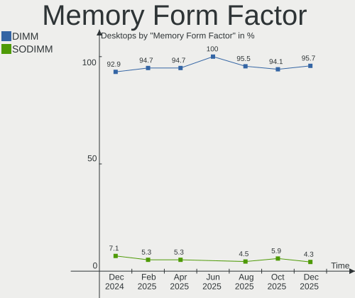

| Name   | Desktops | Percent |
|--------|----------|---------|
| DIMM   | 45       | 95.74%  |
| SODIMM | 2        | 4.26%   |

Memory Size
-----------

Memory module size

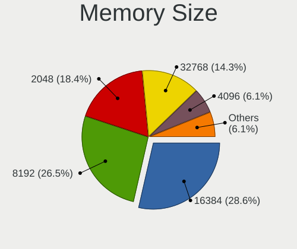

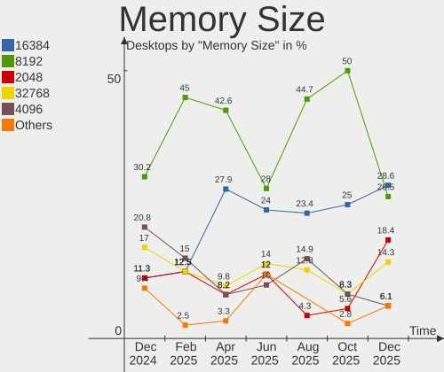

| Size  | Desktops | Percent |
|-------|----------|---------|
| 16384 | 14       | 28.57%  |
| 8192  | 13       | 26.53%  |
| 2048  | 9        | 18.37%  |
| 32768 | 7        | 14.29%  |
| 4096  | 3        | 6.12%   |
| 65536 | 2        | 4.08%   |
| 49152 | 1        | 2.04%   |

Memory Speed
------------

Memory module speed

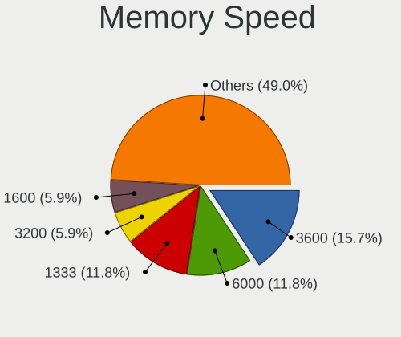

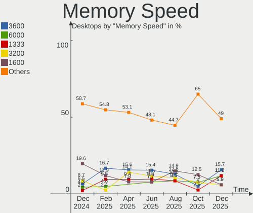

| Speed | Desktops | Percent |
|-------|----------|---------|
| 3600  | 8        | 15.69%  |
| 6000  | 6        | 11.76%  |
| 1333  | 6        | 11.76%  |
| 3200  | 3        | 5.88%   |
| 1600  | 3        | 5.88%   |
| 4800  | 2        | 3.92%   |
| 3733  | 2        | 3.92%   |
| 2667  | 2        | 3.92%   |
| 1067  | 2        | 3.92%   |
| 667   | 2        | 3.92%   |
| 7200  | 1        | 1.96%   |
| 6200  | 1        | 1.96%   |
| 5900  | 1        | 1.96%   |
| 5600  | 1        | 1.96%   |
| 5200  | 1        | 1.96%   |
| 4400  | 1        | 1.96%   |
| 4000  | 1        | 1.96%   |
| 3933  | 1        | 1.96%   |
| 3800  | 1        | 1.96%   |
| 3666  | 1        | 1.96%   |
| 3467  | 1        | 1.96%   |
| 2666  | 1        | 1.96%   |
| 2400  | 1        | 1.96%   |
| 1066  | 1        | 1.96%   |
| 800   | 1        | 1.96%   |

Printers & scanners
-------------------

Printer Vendor
--------------

Printer device vendors

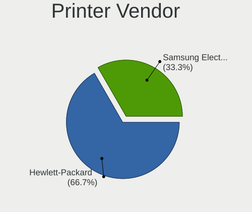

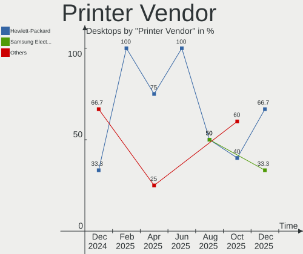

| Vendor              | Desktops | Percent |
|---------------------|----------|---------|
| Hewlett-Packard     | 2        | 66.67%  |
| Samsung Electronics | 1        | 33.33%  |

Printer Model
-------------

Printer device models

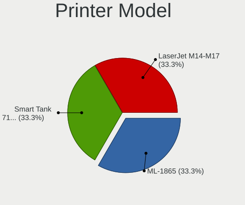

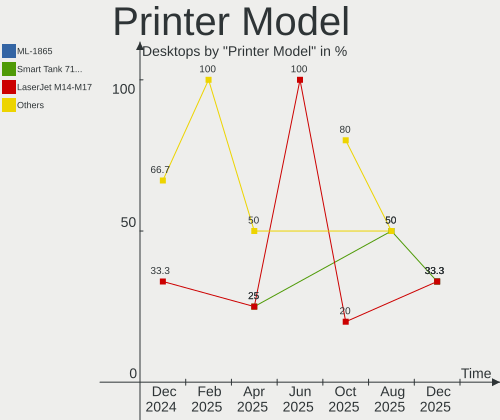

| Model                        | Desktops | Percent |
|------------------------------|----------|---------|
| Samsung ML-1865              | 1        | 33.33%  |
| HP Smart Tank 710-720 series | 1        | 33.33%  |
| HP LaserJet M14-M17          | 1        | 33.33%  |

Scanner Vendor
--------------

Scanner device vendors

Zero info for selected period =(

Scanner Model
-------------

Scanner device models

Zero info for selected period =(

Camera
------

Camera Vendor
-------------

Camera device vendors

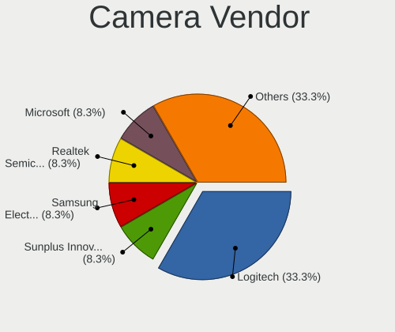

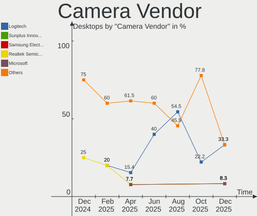

| Vendor                        | Desktops | Percent |
|-------------------------------|----------|---------|
| Logitech                      | 4        | 33.33%  |
| Sunplus Innovation Technology | 1        | 8.33%   |
| Samsung Electronics           | 1        | 8.33%   |
| Realtek Semiconductor         | 1        | 8.33%   |
| Microsoft                     | 1        | 8.33%   |
| Microdia                      | 1        | 8.33%   |
| Lenovo                        | 1        | 8.33%   |
| Jieli Technology              | 1        | 8.33%   |
| Creative Technology           | 1        | 8.33%   |

Camera Model
------------

Camera device models

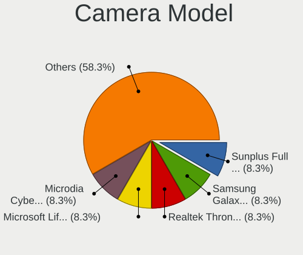

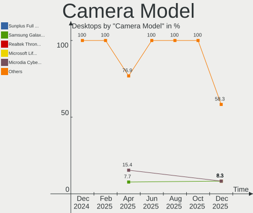

| Model                                   | Desktops | Percent |
|-----------------------------------------|----------|---------|
| Sunplus Full HD webcam                  | 1        | 8.33%   |
| Samsung Galaxy series, misc. (MTP mode) | 1        | 8.33%   |
| Realtek Thronmax StreamGo Webcam        | 1        | 8.33%   |
| Microsoft LifeCam HD-3000               | 1        | 8.33%   |
| Microdia CyberTrack H7                  | 1        | 8.33%   |
| Logitech Webcam C270                    | 1        | 8.33%   |
| Logitech StreamCam                      | 1        | 8.33%   |
| Logitech Logi Webcam C920e              | 1        | 8.33%   |
| Logitech C922 Pro Stream Webcam         | 1        | 8.33%   |
| Lenovo Lenovo FHD Webcam Audio          | 1        | 8.33%   |
| Jieli USB PHY 2.0                       | 1        | 8.33%   |
| Creative Live! Cam Sync 1080p           | 1        | 8.33%   |

Security
--------

Fingerprint Vendor
------------------

Fingerprint sensor vendors

Zero info for selected period =(

Fingerprint Model
-----------------

Fingerprint sensor models

Zero info for selected period =(

Chipcard Vendor
---------------

Chipcard module vendors

Zero info for selected period =(

Chipcard Model
--------------

Chipcard module models

Zero info for selected period =(

Unsupported
-----------

Unsupported Devices
-------------------

Total unsupported devices on board

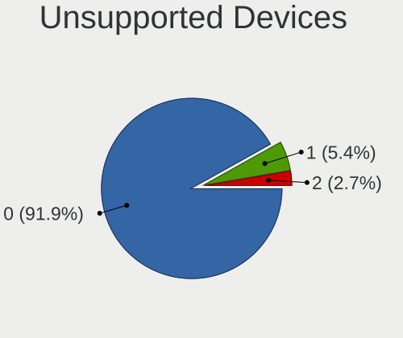

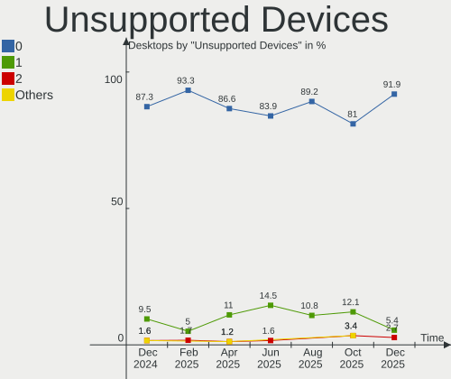

| Total | Desktops | Percent |
|-------|----------|---------|
| 0     | 68       | 91.89%  |
| 1     | 4        | 5.41%   |
| 2     | 2        | 2.7%    |

Unsupported Device Types
------------------------

Types of unsupported devices

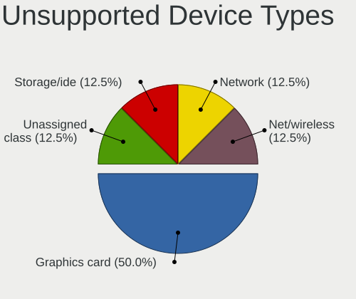

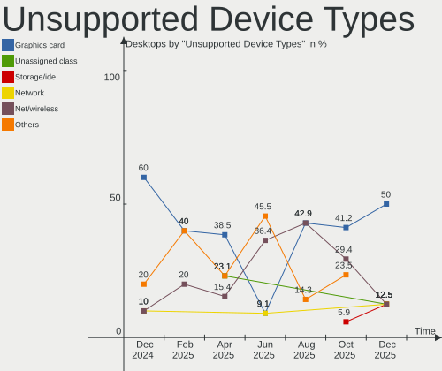

| Type             | Desktops | Percent |
|------------------|----------|---------|
| Graphics card    | 4        | 50%     |
| Unassigned class | 1        | 12.5%   |
| Storage/ide      | 1        | 12.5%   |
| Network          | 1        | 12.5%   |
| Net/wireless     | 1        | 12.5%   |

